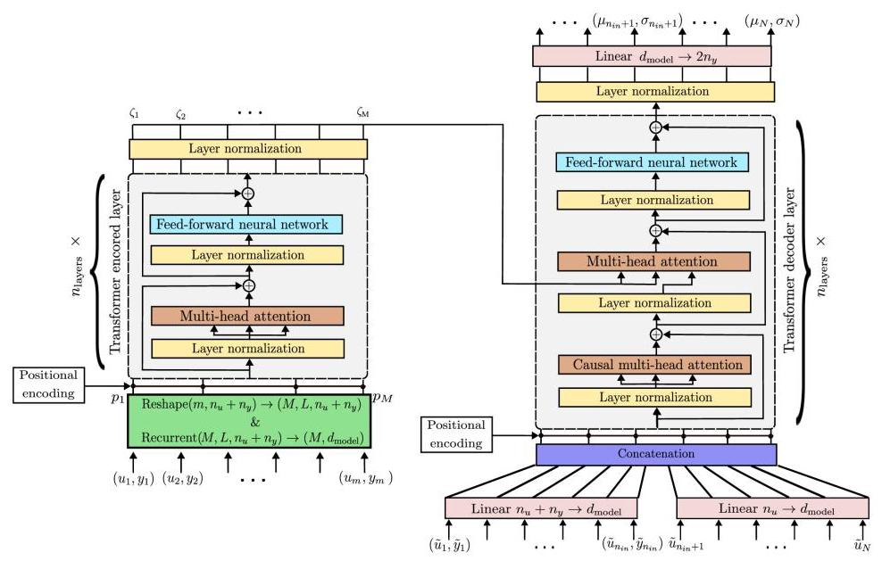
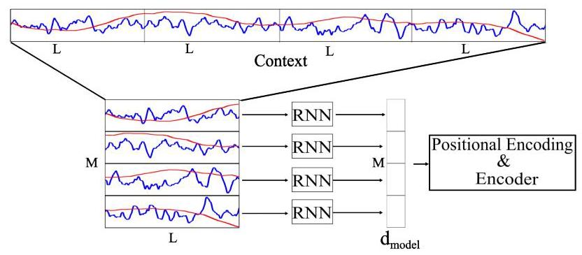
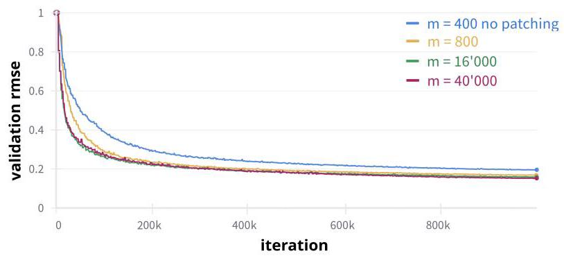
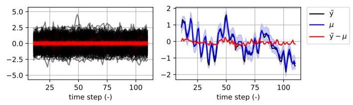
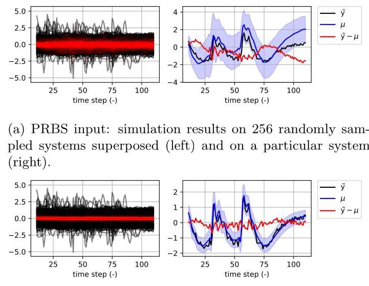

# Enhanced Transformer architecture for in-context learning of dynamical systems

# 用于动态系统上下文学习的增强型Transformer架构

Matteo Rufolo, Dario Piga, Gabriele Maroni, Marco Forgione *

马泰奥·鲁福洛、达里奥·皮加、加布里埃莱·马罗尼、马尔科·福尔焦内 *

October 2024

2024年10月

## Abstract

## 摘要

Recently introduced by some of the authors, the in-context identification paradigm aims at estimating, offline and based on synthetic data, a meta-model that describes the behavior of a whole class of systems. Once trained, this meta-model is fed with an observed input/output sequence (context) generated by a real system to predict its behavior in a zero-shot learning fashion. In this paper, we enhance the original meta-modeling framework through three key innovations: by formulating the learning task within a probabilistic framework; by managing noncontiguous context and query windows; and by adopting recurrent patching to effectively handle long context sequences. The efficacy of these modifications is demonstrated through a numerical example focusing on the Wiener-Hammerstein system class, highlighting the model's enhanced performance and scalability.

一些作者最近提出的上下文识别范式旨在基于合成数据离线估计一个描述一整类系统行为的元模型。一旦训练完成，这个元模型会被输入由真实系统生成的观察到的输入/输出序列(上下文)，以零样本学习的方式预测其行为。在本文中，我们通过三项关键创新增强了原始的元建模框架:在概率框架内制定学习任务；管理不连续的上下文和查询窗口；采用循环修补来有效处理长上下文序列。通过一个聚焦于维纳 - 哈默斯坦系统类的数值示例证明了这些修改的有效性，突出了模型增强的性能和可扩展性。

## 1 Introduction

## 1 引言

In system identification (SYSID), the primary objective is to model dynamical systems, leveraging both measured input-output trajectories and prior knowledge of the system's dynamics. The SYSID setting is thus closely related to supervised machine learning (ML), with a specific focus on dynamical systems. Due to this similarity, machine-learning techniques have become increasingly popular over the years for estimating dynamical systems through, e.g., neural network architectures [1, 2, 3] and kernel-based methods [4, 5].

在系统识别(SYSID)中，主要目标是对动态系统进行建模，利用测量的输入 - 输出轨迹以及系统动力学的先验知识。因此，SYSID设置与监督机器学习(ML)密切相关，特别关注动态系统。由于这种相似性，多年来机器学习技术在通过例如神经网络架构[1, 2, 3]和基于核的方法[4, 5]估计动态系统方面越来越受欢迎。

Despite their success, standard supervised learning approaches do not exploit the insight that could be gained by repeatedly identifying similar systems. While humans improve at solving related tasks, traditional ML (and SYSID) algorithms rely on fixed, predefined procedures that are applied uniformly across different datasets.

尽管取得了成功，但标准的监督学习方法没有利用通过反复识别相似系统可能获得的见解。虽然人类在解决相关任务时会有所进步，但传统的ML(和SYSID)算法依赖于固定的、预定义的程序，这些程序在不同数据集上统一应用。

The concept of learning to learn, or meta-learning, was introduced in the late eighties by the pioneering work [6] to overcome this limitation and is gaining increasing attention, see [7] for a recent survey. In the meta-learning settings, a series of related tasks are presented to an agent which adapts its behavior to act optimally with respect to that class of tasks. In the context of SYSID, the algorithmic agent receives streams of input/output datasets from a class of dynamical systems, and self-tune its behavior to make optimal predictions for those systems [8, 9, 10].

学习学习的概念，即元学习，在八十年代后期由开创性工作[6]引入以克服这一限制，并越来越受到关注，有关最近的综述见[7]。在元学习设置中，一系列相关任务被呈现给一个智能体，该智能体调整其行为以针对该类任务最优地行动。在SYSID的背景下，算法智能体从一类动态系统接收输入/输出数据集流，并自我调整其行为以对这些系统做出最优预测[8, 9, 10]。

---

*The authors are with SUPSI, IDSIA, Lugano, 6962, Switzerland. e-mails: name.surname@supsi.ch

*作者隶属于瑞士卢加诺的SUPSI、IDSIA，邮编6962。电子邮件:name.surname@supsi.ch

---

The meta-model presented by some of the authors in 11 generates multistep-ahead predictions over a class of dynamical systems. It receives as input a context of past input/output samples from a system, together with the future query input trajectory, and directly generates an estimate of the corresponding future outputs. Training is carried out in a supervised learning manner over a (potentially infinite) stream of synthetic datasets obtained by processing randomly-generated input signals through systems randomly sampled from the class of interest.

一些作者在[11]中提出的元模型对一类动态系统生成多步预测。它接收来自一个系统的过去输入/输出样本的上下文以及未来查询输入轨迹作为输入，并直接生成相应未来输出的估计。训练是以监督学习的方式在通过从感兴趣的类中随机采样的系统处理随机生成的输入信号而获得的(可能无限的)合成数据集流上进行的。

To address the meta-modeling task across a broad range of systems, the meta-model must be able to extract relevant knowledge from the context data. Essentially, the meta-model should function as a SYSID algorithm, learning system-specific models from the context data and leveraging this information to solve the multi-step-ahead simulation task for the given query input. The peculiar capability of meta-models to behave like learning algorithms is often referred to as in-context learning [12].

为了在广泛的系统中解决元建模任务，元模型必须能够从上下文数据中提取相关知识。本质上，元模型应该起到SYSID算法的作用，从上下文数据中学习特定于系统的模型，并利用此信息为给定的查询输入解决多步模拟任务。元模型像学习算法一样行动的特殊能力通常被称为上下文学习[12]。

In 11, the meta-model was parameterized as an encoder-decoder Transformer, leveraging the strong in-context learning capabilities previously demonstrated by this architecture in the field of natural language processing [13]. However, although the Transformers achieved promising results for meta-modeling of dynamical systems, it also has inherent limitations that hinder its potential across common SYSID scenarios. In this paper, we modify the architecture in 11 to address some of the limitations discussed below.

在[11]中，元模型被参数化为编码器 - 解码器Transformer，利用了该架构先前在自然语言处理领域展示的强大的上下文学习能力[13]。然而，尽管Transformer在动态系统的元建模方面取得了有希望的结果，但它也有固有的局限性，阻碍了其在常见SYSID场景中的潜力。在本文中，我们修改了[11]中的架构以解决下面讨论的一些局限性。

A well-known critical aspect of Transformers is the computational complexity of their key attention mechanism, which grows quadratically with the sequence length. In [11], this constrained the context sequence to a few hundred time steps, which is arguably shorter than a typical SYSID dataset. This computational issue has been extensively analyzed in recent literature, with several attempts proposed to mitigate it. Certain approaches aim at approximating attention with simplified mechanisms that achieve comparable results, but with reduced computational complexity [14, 15, 16]. Other contributions adopt a hierarchical processing pattern where sequences are first divided into sub-sequences denoted as patches, that are processed individually by a patching network which reduces their time dimensionality. The Transformer eventually processes the resulting (shorter) sequence of patch embeddings, instead of the raw samples [17, 18]. In this paper, we address the context length limitation with a patch-based approach inspired by [18], but utilizing a Recurrent Neural Network (RNN) [19] as patching network instead of a linear layer.

Transformer一个众所周知的关键方面是其关键注意力机制的计算复杂性，它随序列长度呈二次增长。在[11]中，这将上下文序列限制为几百个时间步，这可以说比典型的SYSID数据集短。这个计算问题在最近的文献中得到了广泛分析，提出了几种减轻它的尝试。某些方法旨在用简化机制近似注意力，以获得可比的结果，但计算复杂性降低[14, 15, 16]。其他贡献采用分层处理模式，其中序列首先被分成表示为补丁的子序列，由补丁网络单独处理，该网络降低其时间维度。Transformer最终处理得到的(较短的)补丁嵌入序列，而不是原始样本[17, 18]。在本文中，我们受[18]启发采用基于补丁的方法解决上下文长度限制，但使用循环神经网络(RNN)[19]作为补丁网络而不是线性层。

Another limitations of [11] is that the meta-model's output consists of point estimates, which do not convey information about predictive uncertainty. We address this issue by formulating the learning problem in a probabilistic setting and by estimating the conditional distribution of the query output given the observed context and the query input.

文献[11]的另一个局限性在于，元模型的输出由点估计组成，无法传达预测不确定性的信息。我们通过在概率框架下构建学习问题，并在给定观测上下文和查询输入的条件下估计查询输出的条件分布，来解决这个问题。

Finally, 11 assumed contiguous context and query windows. The task was formalized as a time series forecasting problem, where the objective is to guess the future values of the time series, given the past observations and future inputs. However, SYSID generally aims at estimating simulation models, that can describe systems starting from arbitrary initial conditions. To align with the SYSID setting, we modify the task and also provide the first input/output samples of the query segment to the meta-model. These samples convey the initial condition information for the query sequence, thus allowing it to be detached from the context.

最后，文献[11]假设上下文和查询窗口是连续的。该任务被形式化为一个时间序列预测问题，目标是在给定过去观测值和未来输入的情况下，猜测时间序列的未来值。然而，系统辨识(SYSID)通常旨在估计能够描述从任意初始条件开始的系统的仿真模型。为了与系统辨识设置保持一致，我们修改了任务，并将查询段的第一个输入/输出样本也提供给了元模型。这些样本传达了查询序列的初始条件信息，从而使其能够与上下文分离。

The rest of the paper is organized as follows. Section 2 describes the problem setting, analyzing in detail the meta-modeling framework in [11] and the limitations of the architecture introduced in that work. The salient architectural changes introduced in this paper to overcome these limitations are described in 3 A numerical example is illustrated in Section 4 to demonstrate the effectiveness of the proposed methodology. Conclusions and the direction for future studies are discussed in the Section 5

本文的其余部分组织如下。第2节描述了问题设置，详细分析了文献[11]中的元建模框架以及该文献中引入的架构的局限性。第3节描述了本文为克服这些局限性而引入的显著架构变化。第4节给出了一个数值示例，以证明所提出方法的有效性。第5节讨论了结论和未来研究的方向。

## 2 Problem description

## 2问题描述

In 11, an in-context parametric learner ${\mathcal{M}}_{\phi }$ , referred to as meta-model, has been introduced to describe a class of dynamical systems. The meta-model ${\mathcal{M}}_{\phi }$ , with tunable parameters $\phi$ , is trained on a "meta-dataset". To define the "meta-dataset", two probability distributions, one over dynamical systems and one over input signals, are introduced. By sampling from these two distributions, it is possible to generate a sequence of systems and inputs that, together with the corresponding outputs, result in "usual" input/output datasets. This leads to a potentially infinite stream of datasets $\left\{  {{\mathcal{D}}^{\left( i\right) } = \left( {{u}_{1 : N}^{\left( i\right) },{y}_{1 : N}^{\left( i\right) }}\right) , i = 1,2,\ldots ,\infty }\right\}$ with ${u}_{k}^{\left( i\right) } \in  {\mathbb{R}}^{{n}_{u}}$ and ${y}_{k}^{\left( i\right) } \in  {\mathbb{R}}^{{n}_{y}}$ , each sampled from the dataset distribution $p\left( \mathcal{D}\right)$ induced by randomly sampling systems and inputs. The datasets ${\mathcal{D}}^{\left( i\right) }$ are all different, but they are drawn from the same probability distribution, so it is possible to transfer the learned knowledge from one realization to another.

在文献[11]中，引入了一个上下文参数学习者${\mathcal{M}}_{\phi }$，称为元模型，用于描述一类动态系统。具有可调参数$\phi$的元模型${\mathcal{M}}_{\phi }$在一个“元数据集”上进行训练。为了定义“元数据集”，引入了两个概率分布，一个是关于动态系统的，另一个是关于输入信号的。通过从这两个分布中采样，可以生成一系列系统和输入，它们与相应的输出一起，形成“常规”的输入/输出数据集。这导致了一个潜在的无限数据集流$\left\{  {{\mathcal{D}}^{\left( i\right) } = \left( {{u}_{1 : N}^{\left( i\right) },{y}_{1 : N}^{\left( i\right) }}\right) , i = 1,2,\ldots ,\infty }\right\}$，其中${u}_{k}^{\left( i\right) } \in  {\mathbb{R}}^{{n}_{u}}$和${y}_{k}^{\left( i\right) } \in  {\mathbb{R}}^{{n}_{y}}$，每个都是从通过随机采样系统和输入诱导的数据集分布$p\left( \mathcal{D}\right)$中采样得到的。数据集${\mathcal{D}}^{\left( i\right) }$都是不同的，但它们是从相同的概率分布中抽取的，因此可以将学到的知识从一个实例转移到另一个实例。

Each dataset realization ${\mathcal{D}}^{\left( i\right) }$ is split into an initial context segment of length $m$ and a contiguous query segment of length $N - m$ . The meta-model ${\mathcal{M}}_{\phi }$ is trained to reconstruct the query output ${y}_{m + 1 : N}^{\left( i\right) }$ from the query input ${u}_{m + 1 : N}^{\left( i\right) }$ and the input/output context $\left( {{u}_{1 : m}^{\left( i\right) },{y}_{1 : m}^{\left( i\right) }}\right)$ , namely:

每个数据集实例${\mathcal{D}}^{\left( i\right) }$被分割成长度为$m$的初始上下文段和长度为$N - m$的连续查询段。元模型${\mathcal{M}}_{\phi }$被训练用于从查询输入${u}_{m + 1 : N}^{\left( i\right) }$和输入/输出上下文$\left( {{u}_{1 : m}^{\left( i\right) },{y}_{1 : m}^{\left( i\right) }}\right)$中重建查询输出${y}_{m + 1 : N}^{\left( i\right) }$，即:

$$
{\widehat{y}}_{m + 1 : N}^{\left( i\right) } = {\mathcal{M}}_{\phi }\left( {{u}_{m + 1 : N}^{\left( i\right) },{u}_{1 : m}^{\left( i\right) },{y}_{1 : m}^{\left( i\right) }}\right) , \tag{1}
$$

where ${\widehat{y}}_{m + 1 : N}^{\left( i\right) }$ represents the estimate of the output ${y}_{m + 1 : N}^{\left( i\right) }$ .

其中${\widehat{y}}_{m + 1 : N}^{\left( i\right) }$表示输出${y}_{m + 1 : N}^{\left( i\right) }$的估计值。

Training is performed in a supervised manner, by minimizing the regression loss

训练以监督方式进行，通过最小化回归损失

$$
J = \frac{1}{b}\mathop{\sum }\limits_{{i = 1}}^{b}{\begin{Vmatrix}{y}_{m + 1 : N}^{\left( i\right) } - {\mathcal{M}}_{\phi }\left( {u}_{m + 1 : N}^{\left( i\right) },{u}_{1 : m}^{\left( i\right) },{y}_{1 : m}^{\left( i\right) }\right) \end{Vmatrix}}^{2}, \tag{2}
$$

where $b$ denotes the minibatch size, namely the number of datasets randomly extracted at each iteration of gradient-based optimization. Note that each dataset ${\mathcal{D}}^{\left( i\right) }$ is associated to a different dynamical system ${S}^{\left( i\right) }$ , with $i = 1,\ldots , b$ .

其中$b$表示小批量大小，即在基于梯度的优化的每次迭代中随机抽取的数据集数量。请注意，每个数据集${\mathcal{D}}^{\left( i\right) }$与一个不同的动态系统${S}^{\left( i\right) }$相关联，其中$i = 1,\ldots , b$。

Intuitively, the meta-model ${\mathcal{M}}_{\phi }$ is expected to "understand" the dynamics of system ${S}^{\left( i\right) }$ from the context data $\left( {{u}_{1 : m}^{\left( i\right) },{y}_{1 : m}^{\left( i\right) }}\right)$ and to use this knowledge to generate output predictions ${\widehat{y}}_{m + 1 : N}^{\left( i\right) }$ in the query segment. Eventually, the trained meta-model ${\mathcal{M}}_{\phi }$ , will be able to generate multi-step-ahead predictions for a new system $S$ given an input/output sequence $\left( {{u}_{1 : m},{y}_{1 : m}}\right)$ and the query input ${u}_{m + 1 : N}$ , without the need of estimating a model for that system. It is worth remarking that, although training is done offline based on potentially synthetic data generated in simulation, the trained meta-model is supposed to be applied online to measured data from a real system.

直观地说，元模型${\mathcal{M}}_{\phi }$有望从上下文数据$\left( {{u}_{1 : m}^{\left( i\right) },{y}_{1 : m}^{\left( i\right) }}\right)$中“理解”系统${S}^{\left( i\right) }$的动态，并利用这些知识在查询段中生成输出预测${\widehat{y}}_{m + 1 : N}^{\left( i\right) }$。最终，经过训练的元模型${\mathcal{M}}_{\phi }$将能够在给定输入/输出序列$\left( {{u}_{1 : m},{y}_{1 : m}}\right)$和查询输入${u}_{m + 1 : N}$的情况下，为新系统$S$生成多步预测，而无需为该系统估计模型。值得注意的是，尽管训练是基于模拟中可能生成的合成数据离线完成的，但经过训练的元模型应该在线应用于来自真实系统的测量数据。

In [11], an encoder-decoder Transformer architecture [20] is used as meta-model. The input/output context data $\left( {{u}_{1 : m},{y}_{1 : m}}\right)$ are processed by the encoder, which produces a real-valued sequence ${\zeta }_{1 : m},{\zeta }_{i} \in  {\mathbb{R}}^{{d}_{\text{ model }}}$ . Then, the decoder generates output predictions ${\widehat{y}}_{m + 1 : N}$ by processing the query input ${u}_{m + 1 : N}$ causally in time through masked self-attention, and integrating the encoder’s output ${\zeta }_{1 : m}$ through cross-attention. Basically, the encoder output ${\zeta }_{1 : m}$ provides the decoder with the required information about the underlying dynamics, and it could be interpreted as an implicit representation (thus, a model) of the system. For a visual representation of this architecture, see Fig. 2 in 11.

在[11]中，一种编码器-解码器Transformer架构[20]被用作元模型。输入/输出上下文数据$\left( {{u}_{1 : m},{y}_{1 : m}}\right)$由编码器处理，编码器产生一个实值序列${\zeta }_{1 : m},{\zeta }_{i} \in  {\mathbb{R}}^{{d}_{\text{ model }}}$。然后，解码器通过掩码自注意力在时间上因果地处理查询输入${u}_{m + 1 : N}$，并通过交叉注意力整合编码器的输出${\zeta }_{1 : m}$，从而生成输出预测${\widehat{y}}_{m + 1 : N}$。基本上，编码器输出${\zeta }_{1 : m}$为解码器提供了关于潜在动态的所需信息，并且它可以被解释为系统的隐式表示(因此，是一个模型)。关于该架构的可视化表示，请参见[11]中的图2。

The contribution in 11 has some limitations, strictly related with the chosen architecture:

11中的贡献存在一些限制，与所选架构密切相关:

L1: The meta-model only provides point estimates of the future outputs, instead of a probabilistic distribution that could inform on predictive uncertainty.

L1: 元模型仅提供未来输出的点估计，而不是可以告知预测不确定性的概率分布。

L2: The context and query segments are required to be contiguous, according to a time series forecasting framework. However, in SYSID, one usually seeks simulation model that can provide future predictions for arbitrary initial conditions.

根据时间序列预测框架，上下文和查询段必须是连续的。然而，在系统识别中，人们通常寻求能够为任意初始条件提供未来预测的仿真模型。

L3: The multi-head attention layers in the Transformer's encoder has a computational complexity that scales quadratically with respect to the length of the context. This limits the length of the context sequence (roughly, order of magnitude of 1000 samples when training on a single GPU).

L3:Transformer编码器中的多头注意力层具有与上下文长度成二次方比例增长的计算复杂度。这限制了上下文序列的长度(大致来说，在单个GPU上训练时为1000个样本的数量级)。

In this paper, we aim to overcome these limitations. Specifically: L1 is tackled by formulating the learning problem in a probabilistic setting; L2 through a modification of the architecture that allows the decoder to process input and output samples previous to the query as initial conditions; and L3 by dividing the context sequence into patches.

在本文中，我们旨在克服这些限制。具体而言:通过在概率设置中制定学习问题来解决L1；通过修改架构来解决L2，该架构允许解码器将查询之前的输入和输出样本作为初始条件进行处理；通过将上下文序列划分为补丁来解决L3。

Figure 1: Final Transformer architecture to handle probabilistic prediction (top right: decoder's output is a sequence of mean and standard deviation values); non-contiguous context and query (bottom right: initial input/output values of the query fed to the decoder); long context sequences (bottom left: context sequence split into patches and processed by an RNN).

图1:用于处理概率预测的最终Transformer架构(右上角:解码器的输出是均值和标准差的序列)；非连续上下文和查询(右下角:输入解码器的查询的初始输入/输出值)；长上下文序列(左下角:上下文序列被分割成块并由RNN处理)。

## 3 Advancing the Transformer Architecture

## 3推进Transformer架构

The Transformer architecture in [11] has been extended to address the three limitations previously mentioned. In the next paragraphs, we will systematically address each limitation, detailing the specific modifications made to the original architecture. We anticipate the final extended architecture in Fig. 1, with the following main changes:

[11]中提到的Transformer架构已得到扩展，以解决前面提到的三个局限性。在接下来的段落中，我们将系统地解决每个局限性，详细说明对原始架构所做的具体修改。我们预期图1中的最终扩展架构会有以下主要变化:

- to address L1, we modify the final output layer to provide both the mean and the standard deviation of the predicted output samples;

- 为了处理L1，我们修改最终输出层以提供预测输出样本的均值和标准差；

- to address L2, we introduce an additional layer before the decoder to handle arbitrary initial conditions of the query sequence;

- 为了处理L2，我们在解码器之前引入一个额外的层来处理查询序列的任意初始条件；

- to address L3, we split the context sequence into patches, which are individually processed by a RNN before being fed into the multi-attention blocks of the Transformer's encode.

- 为了处理L3，我们将上下文序列分割成多个补丁，这些补丁在被输入到Transformer编码器的多头注意力模块之前，会由一个循环神经网络(RNN)单独进行处理。

### 3.1 Learning Probability Distributions

### 3.1学习概率分布

To formulate the learning problem within a probabilistic setting, we introduce the conditional probability distribution $p\left( {{y}_{m + 1 : N} \mid  {u}_{m + 1 : N},{u}_{1 : m},{y}_{1 : m}}\right)$ of the future output sequence ${y}_{m + 1 : N}$ , given the query input ${u}_{m + 1 : N}$ and the context data ${u}_{1 : m},{y}_{1 : m}$ . For compactness, we denote by $X$ the conditioning variables ${u}_{m + 1 : N},{u}_{1 : m},{y}_{1 : m}$ hereafter.

为了在概率框架内构建学习问题，我们引入未来输出序列${y}_{m + 1 : N}$的条件概率分布$p\left( {{y}_{m + 1 : N} \mid  {u}_{m + 1 : N},{u}_{1 : m},{y}_{1 : m}}\right)$，它以查询输入${u}_{m + 1 : N}$和上下文数据${u}_{1 : m},{y}_{1 : m}$为条件。为了简洁起见，我们此后用$X$表示条件变量${u}_{m + 1 : N},{u}_{1 : m},{y}_{1 : m}$。

Our goal is to approximate $p\left( {{y}_{m + 1 : N} \mid  X}\right)$ with a parametric distribution ${q}_{\phi }\left( {{y}_{m + 1 : N} \mid  X}\right)$ having free parameters $\phi$ . To this end, we introduce the Kullback-Leibler divergence $\operatorname{KL}\left( {p\parallel {q}_{\phi }}\right)$ between $p$ and ${q}_{\phi }$ :

我们的目标是用具有自由参数$\phi$的参数分布${q}_{\phi }\left( {{y}_{m + 1 : N} \mid  X}\right)$来逼近$p\left( {{y}_{m + 1 : N} \mid  X}\right)$。为此，我们引入$p$和${q}_{\phi }$之间的库尔贝克-莱布勒散度$\operatorname{KL}\left( {p\parallel {q}_{\phi }}\right)$:

$$
\operatorname{KL}\left( {p\parallel {q}_{\phi }}\right)  = {\mathbb{E}}_{p\left( {{y}_{m + 1 : N} \mid  X}\right) }\left\lbrack  {\log \frac{p\left( {{y}_{m + 1 : N} \mid  X}\right) }{{q}_{\phi }\left( {{y}_{m + 1 : N} \mid  X}\right) }}\right\rbrack  . \tag{3}
$$

According to the maximum likelihood estimation principle, the parameters $\phi$ are chosen so as to minimize ${E}_{p\left( X\right) }\left\lbrack  {\mathrm{{KL}}\left( {p\parallel {q}_{\phi }}\right) }\right\rbrack$ , namely the expected value (over the conditioning variables $X$ ) of the Kullback-Leibler divergence [21]. We have:

根据最大似然估计原理，选择参数$\phi$以最小化${E}_{p\left( X\right) }\left\lbrack  {\mathrm{{KL}}\left( {p\parallel {q}_{\phi }}\right) }\right\rbrack$，即库尔贝克-莱布勒散度[21]关于条件变量$X$的期望值。我们有:

$$
{E}_{p\left( X\right) }\left\lbrack  {\operatorname{KL}\left( {p\parallel {q}_{\phi }}\right) }\right\rbrack   = {E}_{p\left( \mathcal{D}\right) }\left\lbrack  {\log \frac{p\left( {{y}_{m + 1 : N} \mid  X}\right) }{{q}_{\phi }\left( {{y}_{m + 1 : N} \mid  X}\right) }}\right\rbrack
$$

$$
= \overset{J\left( \phi \right) }{\overbrace{{E}_{p\left( \mathcal{D}\right) }\left\lbrack  {-\log {q}_{\phi }\left( {{y}_{m + 1 : N} \mid  X}\right) }\right\rbrack  }} + K, \tag{4}
$$

where $J\left( \phi \right)$ is the loss function to be minimized w.r.t. $\phi$ , and $K$ is a term does not depend on $\phi$ . To evaluate $J\left( \phi \right)$ , the expectation over $p\left( \mathcal{D}\right)$ , which is in general analytically intractable, is replaced by a Monte Carlo estimate over $b$ sampled datasets:

其中$J\left( \phi \right)$是关于$\phi$要最小化的损失函数，$K$是一个不依赖于$\phi$的项。为了评估$J\left( \phi \right)$，关于$p\left( \mathcal{D}\right)$的期望值(通常在解析上难以处理)被替换为对从$b$采样的数据集中进行的蒙特卡罗估计:

$$
J\left( \phi \right)  \approx  \frac{1}{b}\mathop{\sum }\limits_{{i = 1}}^{b} - \log {q}_{\phi }\left( {{y}_{m + 1 : N}^{\left( i\right) } \mid  {X}^{\left( i\right) }}\right) , \tag{5}
$$

where ${y}_{m + 1 : N}^{\left( i\right) }$ and ${X}^{\left( i\right) }, i = 1,\ldots , b$ are samples from $p\left( \mathcal{D}\right)$ .

其中${y}_{m + 1 : N}^{\left( i\right) }$和${X}^{\left( i\right) }, i = 1,\ldots , b$是从$p\left( \mathcal{D}\right)$中采样得到的。

In practice, an iterative gradient-based algorithm is applied to minimize $J\left( \phi \right)$ . Each optimization iteration involves evaluating (5) over $b$ newly sampled datasets, computing its gradient with respect to $\phi$ , and updating the parameters accordingly. In other words, training is performed in a (minibatch) stochastic gradient descent fashion, where $b$ plays the role of the minibatch size.

在实践中，应用基于梯度的迭代算法来最小化$J\left( \phi \right)$。每次优化迭代都涉及对新采样的数据集$b$评估(5)，计算其关于$\phi$的梯度，并相应地更新参数。换句话说，训练是以(小批量)随机梯度下降的方式进行的，其中$b$起到小批量大小的作用。

In this work, we model the parametric distribution ${q}_{\phi }$ as a multivariate Gaussian with diagonal covariance. For the sake of exposition, we consider the single-output case (i.e., ${n}_{y} = 1$ ) in the rest of this paragraph. Thus, ${q}_{\phi }$ takes form:

在这项工作中，我们将参数分布${q}_{\phi }$建模为具有对角协方差的多元高斯分布。为了便于说明，在本段的其余部分我们考虑单输出情况(即${n}_{y} = 1$)。因此，${q}_{\phi }$具有以下形式:

$$
{q}_{\phi }\left( {{y}_{m + 1 : N} \mid  X}\right)  = \mathop{\prod }\limits_{{j = m + 1}}^{N}{q}_{\phi }\left( {{y}_{j} \mid  X}\right) \tag{6a}
$$

$$
{q}_{\phi }\left( {{y}_{j} \mid  X}\right)  = \frac{1}{\sqrt{{2\pi }{\sigma }_{j}^{2}\left( {X,\phi }\right) }}{e}^{\left( -\frac{{\left( {y}_{j} - {\mu }_{j}\left( X,\phi \right) \right) }^{2}}{2{\sigma }_{j}^{2}\left( {X,\phi }\right) }\right) }, \tag{6b}
$$

where the mean and standard deviation vectors ${\mu }_{m + 1 : N},{\sigma }_{m + 1 : N} \in  {\mathbb{R}}^{N - m}$ are functions of $X$ and $\phi$ .

其中均值和标准差向量${\mu }_{m + 1 : N},{\sigma }_{m + 1 : N} \in  {\mathbb{R}}^{N - m}$是$X$和$\phi$的函数。

These two vectors are the output of the Transformer, when fed with the query input ${u}_{m + 1 : N}$ and the input/output context ${u}_{1 : m},{y}_{1 : m}$ from a system $S$ :

当用来自系统$S$的查询输入${u}_{m + 1 : N}$和输入/输出上下文${u}_{1 : m},{y}_{1 : m}$馈送时，这两个向量是Transformer的输出:

$$
{\mu }_{m + 1 : N},{\sigma }_{m + 1 : N} = {\mathcal{M}}_{\phi }\left( {{u}_{m + 1 : N},{u}_{1 : m},{y}_{1 : m}}\right) . \tag{7}
$$

Thus, with respect to [11], we modify the final layer of the decoder to output the two vectors: ${\mu }_{m + 1 : N}$ and ${\sigma }_{m + 1} \in  {\mathbb{R}}^{N - m}$ rather than providing a single point estimate vector ${\widehat{y}}_{m + 1 : N} \in  {\mathbb{R}}^{N - m}$ , see the upper right block in Fig. 1. It is worth remarking that the vector of means ${\mu }_{m + 1 : N}$ corresponds to the point estimate ${\widehat{y}}_{m + 1 : N}$ already provided by the previous architecture, while ${\sigma }_{m + 1 : N}$ gives new insight about the meta-model's predictive uncertainty.

因此，关于[11]，我们修改了解码器的最后一层，以输出两个向量:${\mu }_{m + 1 : N}$和${\sigma }_{m + 1} \in  {\mathbb{R}}^{N - m}$，而不是提供单个点估计向量${\widehat{y}}_{m + 1 : N} \in  {\mathbb{R}}^{N - m}$，见图1右上角的模块。值得注意的是，均值向量${\mu }_{m + 1 : N}$对应于先前架构已经提供的点估计${\widehat{y}}_{m + 1 : N}$，而${\sigma }_{m + 1 : N}$则给出了关于元模型预测不确定性的新见解。

### 3.2 Handling arbitrary initial conditions

### 3.2 处理任意初始条件

In order to consider distinct context and query sequences, it is necessary to provide initial conditions along with a query input sequence. In this work, we feed the meta-model with ${n}_{in}$ input-output samples preceding the query input as the initial conditions. Thus, for supervised learning of this meta-model ${\mathcal{M}}_{\phi }$ , two input/output sequences are generated from each system $S$ : a context sequence $\left( {{u}_{1 : m},{y}_{1 : m}}\right)$ and a disjoint query sequence $\left( {{\widetilde{u}}_{1 : N},{\widetilde{y}}_{1 : N}}\right)$ , whose initial samples $\left( {{\widetilde{u}}_{1 : {n}_{in}},{\widetilde{y}}_{1 : {n}_{in}}}\right)$ are taken as initial conditions.

为了考虑不同的上下文和查询序列，有必要在提供查询输入序列的同时提供初始条件。在这项工作中，我们将查询输入之前的${n}_{in}$个输入 - 输出样本作为初始条件输入到元模型中。因此，对于这个元模型${\mathcal{M}}_{\phi }$的监督学习，从每个系统$S$生成两个输入/输出序列:一个上下文序列$\left( {{u}_{1 : m},{y}_{1 : m}}\right)$和一个不相交的查询序列$\left( {{\widetilde{u}}_{1 : N},{\widetilde{y}}_{1 : N}}\right)$，其初始样本$\left( {{\widetilde{u}}_{1 : {n}_{in}},{\widetilde{y}}_{1 : {n}_{in}}}\right)$被用作初始条件。

Then, given a query input ${\widetilde{u}}_{{n}_{in} + 1 : N}$ , initial conditions $\left( {{\widetilde{u}}_{1 : {n}_{in}},{\widetilde{y}}_{1 : {n}_{in}}}\right)$ , and context $\left( {{u}_{1 : m},{y}_{1 : m}}\right)$ , the meta-model returns the mean and standard deviation vectors ${\mu }_{{n}_{in} + 1 : N},{\sigma }_{{n}_{in} + 1 : N}$ of the probability distribution of the future output sequence ${\widetilde{y}}_{{n}_{in} + 1 : N}$ :

然后，给定一个查询输入${\widetilde{u}}_{{n}_{in} + 1 : N}$、初始条件$\left( {{\widetilde{u}}_{1 : {n}_{in}},{\widetilde{y}}_{1 : {n}_{in}}}\right)$和上下文$\left( {{u}_{1 : m},{y}_{1 : m}}\right)$，元模型返回未来输出序列${\widetilde{y}}_{{n}_{in} + 1 : N}$的概率分布的均值和标准差向量${\mu }_{{n}_{in} + 1 : N},{\sigma }_{{n}_{in} + 1 : N}$:

$$
{\mu }_{{n}_{in} + 1 : N},{\sigma }_{{n}_{in} + 1 : N} = {\mathcal{M}}_{\phi }\left( {{\widetilde{u}}_{{n}_{in} + 1 : N},{\widetilde{u}}_{1 : {n}_{in}},{\widetilde{y}}_{1 : {n}_{in}},{u}_{1 : m},{y}_{1 : m}}\right) . \tag{8}
$$

To this end, we modify the Transformer architecture by introducing a linear layer that processes the initial conditions, mapping each time step from ${\mathbb{R}}^{{n}_{u} + {n}_{y}}$ to ${\mathbb{R}}^{{d}_{\text{ model }}}$ . Similarly, the query input is mapped from ${\mathbb{R}}^{{n}_{u}}$ to ${\mathbb{R}}^{{d}_{\text{ model }}}$ through a separate linear layer. The corresponding output sequences are then concatenated to form a single sequence of length $N$ , where all elements have dimension ${d}_{\text{ model }}$ . This sequence is combined with positional encoding before being passed into the decoder backbone of the Transformer, as shown in the layers before the decoder in Fig. 1.

为此，我们通过引入一个线性层来修改Transformer架构，该线性层处理初始条件，将每个时间步从${\mathbb{R}}^{{n}_{u} + {n}_{y}}$映射到${\mathbb{R}}^{{d}_{\text{ model }}}$。类似地，查询输入通过一个单独的线性层从${\mathbb{R}}^{{n}_{u}}$映射到${\mathbb{R}}^{{d}_{\text{ model }}}$。然后将相应的输出序列连接起来形成一个长度为$N$的单个序列，其中所有元素的维度为${d}_{\text{ model }}$。在传递到Transformer的解码器主干之前，该序列与位置编码相结合，如图1中解码器之前的层所示。

Remark 1 The length $m$ of the input/output context sequence should be sufficiently large to characterize the dynamics of the system. On the other hand, the number ${n}_{in}$ of input/output samples used as initial conditions is typically small, of the order of magnitude of the number of dynamical states of the system.

注1 输入/输出上下文序列的长度$m$应该足够大以表征系统的动态特性。另一方面，用作初始条件的输入/输出样本数量${n}_{in}$通常很小，其数量级与系统动态状态的数量相同。

### 3.3 Patching for long context sequences

### 3.3 长上下文序列的修补

In order to handle Limitation L3, and thus considering long context sequences, we adopt a patching approach tailored to the meta-learning problem introduced in Section 2 and described in the following paragraphs.

为了处理局限性L3，从而考虑长上下文序列，我们采用一种针对第2节中引入并在以下段落中描述的元学习问题量身定制的修补方法。

Figure 2: Visual representation of the implemented patching approach. For the sake of visualization, a single-input $\left( {{n}_{u} = 1}\right)$ single-output $\left( {{n}_{y} = 1}\right)$ system is considered. Therefore, the context consists of an input (blu) and output (red) sequence.

图2:所实现的修补方法的可视化表示。为了便于可视化，考虑一个单输入$\left( {{n}_{u} = 1}\right)$单输出$\left( {{n}_{y} = 1}\right)$系统。因此，上下文由一个输入(蓝色)和输出(红色)序列组成。

The input-output context sequence $\left( {{u}_{1 : m},{y}_{1 : m}}\right)$ is divided into $M$ non-overlapping patches ${}^{1}$ , each of length $L = \frac{m}{M}$ and dimension ${n}_{u} + {n}_{y}$ . The patches are then processed by an RNN which maps each of them into a single vector of dimension ${d}_{\text{ model }}$ . The resulting patch embedding sequence ${p}_{1 : M}$ is then combined with position encoding to account for the temporal order and then fed as input to the encoder's backbone (see Fig. 2). The modifications of the architecture with respect to 11 corresponds to the bottom-left blocks in Fig. 1. Thus, the length of the sequence processed by the multi-head attention mechanism processes is reduced by a factor $L$ , significantly decreasing the computational burden by a factor of $O\left( {L}^{2}\right)$ .

输入-输出上下文序列$\left( {{u}_{1 : m},{y}_{1 : m}}\right)$被划分为$M$个不重叠的补丁${}^{1}$，每个补丁的长度为$L = \frac{m}{M}$，维度为${n}_{u} + {n}_{y}$。然后，这些补丁由一个循环神经网络(RNN)处理，该网络将每个补丁映射为一个维度为${d}_{\text{ model }}$的单个向量。得到的补丁嵌入序列${p}_{1 : M}$然后与位置编码相结合，以考虑时间顺序，然后作为输入馈送到编码器的主干(见图2)。相对于11的架构修改对应于图1中的左下角块。因此，多头注意力机制处理的序列长度减少了$L$倍，计算负担显著降低了$O\left( {L}^{2}\right)$倍。

## 4 Numerical Example

## 4数值示例

The presented meta-model architecture is assessed for in-context learning of dynamical systems belonging to the Wiener-Hammerstein (WH) [22] class. For meta-model learning, the negative log-likelihood (5) is minimized over 1 million iterations of the AdamW algorithm [23], with minibatch size $b = {32}$ . Training is repeated for different values of the context length $m \in  \{ {400},{800},{16000},{40000}\}$ . All computations are performed on a server equipped with an Nvidia RTX 3090 GPU. For reproducibility of the results, all codes made are available in the GitHub repository [24].

所提出的元模型架构针对属于维纳-哈默斯坦(WH)[22]类的动态系统的上下文学习进行评估。对于元模型学习，在AdamW算法[23]的100万次迭代中最小化负对数似然(5)，小批量大小为$b = {32}$。针对不同的上下文长度$m \in  \{ {400},{800},{16000},{40000}\}$值重复训练。所有计算都在配备英伟达RTX 3090 GPU的服务器上进行。为了使结果具有可重复性，所有代码都可在GitHub存储库[24]中获取。

### 4.1 System Class and Dataset Distribution

### 4.1系统类别和数据集分布

We generate synthetic datasets from random stable WH systems having structure ${G}_{1} - F - {G}_{2}$ , where $F$ is a static non-linearity sandwiched between two Linear Time-Invariant (LTI) dynamical blocks ${G}_{1}$ and ${G}_{2}$ . Systems are drawn from the same distribution considered in [11]. The discrete-time LTI blocks ${G}_{1},{G}_{2}$ are randomly chosen with order between 1 and 10. The magnitude and phase of their poles are randomly chosen from uniform distributions in the ranges $\left( {{0.5},{0.97}}\right)$ and $\left( {0,\pi /2}\right)$ , respectively. The non-linear block $F$ is a feed-forward neural network with one hidden layer; 32 hidden units; and weights randomly generated from a Gaussian distribution with Kaiming scaling [25]. The input signals fed to the WH systems are drawn from a standard Normal distribution. The WH system output is standardized to have zero mean and unit variance and corrupted by additive white Gaussian noise with standard deviation ${\sigma }_{\text{ noise }} = {0.1}$ .

我们从具有结构${G}_{1} - F - {G}_{2}$的随机稳定WH系统生成合成数据集，其中$F$是夹在两个线性时不变(LTI)动态块${G}_{1}$和${G}_{2}$之间的静态非线性。系统是从[11]中考虑的相同分布中抽取的。离散时间LTI块${G}_{1},{G}_{2}$的阶数在1到10之间随机选择。它们极点的幅度和相位分别从范围$\left( {{0.5},{0.97}}\right)$和$\left( {0,\pi /2}\right)$内的均匀分布中随机选择。非线性块$F$是一个具有一个隐藏层、32个隐藏单元的前馈神经网络；权重从具有Kaiming缩放[25]的高斯分布中随机生成。馈送到WH系统的输入信号从标准正态分布中抽取。WH系统的输出被标准化为均值为零、方差为单位方差，并被标准差为${\sigma }_{\text{ noise }} = {0.1}$的加性白高斯噪声污染。

---

${}^{1}$ For simplicity of exposition, we assume that $m$ is multiple of $M$ .

${}^{1}$为了便于说明，我们假设$m$是$M$的倍数。

---

### 4.2 Transformer architecture

### 4.2 Transformer架构

The chosen Transformer architecture is characterized by: ${n}_{\text{ layers }} = {12}$ layers; ${d}_{\text{ model }} = {128}$ hidden units; and ${n}_{\text{ heads }} = 4$ attention heads, both in the encoder and the decoder. The number of the initial conditions is set to ${n}_{\text{ in }} = {10}$ and the query length to $N - {n}_{\text{ in }} = {100}$ .

所选的Transformer架构的特点是:编码器和解码器中都有${n}_{\text{ layers }} = {12}$层、${d}_{\text{ model }} = {128}$个隐藏单元和${n}_{\text{ heads }} = 4$个注意力头。初始条件的数量设置为${n}_{\text{ in }} = {10}$，查询长度设置为$N - {n}_{\text{ in }} = {100}$。

As previously mentioned, training is performed for context length $m \in \; \{ {400},{800},{16000},{40000}\}$ . For the sake of comparison between the proposed patching-based approach and the non-patching method, for the shortest context length $m = {400}$ the recurrent patching approach is not implemented and the sequence of embeddings ${p}_{1 : M}$ (with $M = m$ ) is obtained simply by processing the samples ${u}_{1 : m},{y}_{1 : m}$ through a linear layer with ${n}_{u} + {n}_{y}$ inputs and ${d}_{\text{ model }}$ outputs, as in the original work [11].

如前所述，针对上下文长度$m \in \; \{ {400},{800},{16000},{40000}\}$进行训练。为了比较所提出的基于补丁的方法和非补丁方法，对于最短的上下文长度$m = {400}$，不实现循环补丁方法，并且简单地通过一个具有${n}_{u} + {n}_{y}$个输入和${d}_{\text{ model }}$个输出的线性层处理样本${u}_{1 : m},{y}_{1 : m}$来获得嵌入序列${p}_{1 : M}$(其中$M = m$)，如原始工作[11]中那样。

For all other context lengths, the recurrent patching approach described in Section 3.3 has been followed with fixed embedding sequence length $M =$ 400, and patch length $L = m/M$ . A vanilla RNN with one hidden layer and ${d}_{\text{ model }} = {128}$ hidden units is used to process the $M$ patches, each of length $L$ . The last hidden unit of each patch is extracted and further processed by a square linear layer of dimension ${d}_{\text{ model }}$ , and finally combined in the patch embedding sequence ${p}_{1 : M}$ fed to the encoder backbone 2 The total number of parameters characterizing the Transformer is independent of the context length, and it is equal to 5.54 millions in all the cases with patching. When patching is not adopted $\left( {m = {400}}\right)$ , the number of parameters is 5.5 millions, slightly smaller since the RNN layer is not present.

对于所有其他上下文长度，遵循3.3节中描述的循环修补方法，固定嵌入序列长度为$M =$ 400，补丁长度为$L = m/M$。使用具有一个隐藏层和${d}_{\text{ model }} = {128}$个隐藏单元的普通循环神经网络来处理长度为$L$的$M$个补丁。提取每个补丁的最后一个隐藏单元，并由维度为${d}_{\text{ model }}$的平方线性层进一步处理，最后在馈送到编码器主干2的补丁嵌入序列${p}_{1 : M}$中进行组合。表征Transformer的参数总数与上下文长度无关，在所有采用修补的情况下均等于554万个。当不采用修补时$\left( {m = {400}}\right)$，参数数量为550万个，由于不存在循环神经网络层，略小一些。

### 4.3 Results

### 4.3结果

The test root mean square error (RMSE), train time, and number of parameters of the different meta-models are reported in Table 1 . Furthermore, the validation RMSE over the iterations of the AdamW optimization algorithm is visualized in Fig. 3.

表1报告了不同元模型的测试均方根误差(RMSE)、训练时间和参数数量。此外，图3可视化了AdamW优化算法迭代过程中的验证RMSE。

The difference between the achieved RMSE and the noise floor ${\sigma }_{\text{ noise }} = {0.1}$ consistently decreases with the context length up to $m = {16000}$ . We remark that, although it does not result in additional improvements for the benchmark under consideration, the recurrent patching approach allows processing of even longer context sequences. Indeed, we managed to train until convergence a meta-model with context length $m = {40000}$ , thus 100 times larger than the baseline $m = {400}$ already demonstrated in [11]. We also note that the RMSE of 0.128 achieved with $m \geq  {16000}$ is rather close to the noise floor ${\sigma }_{\text{ noise }} = {0.1}$ induced by the (unpredictable) white Gaussian noise that corrupts the system output.

达到的RMSE与噪声基底${\sigma }_{\text{ noise }} = {0.1}$之间的差异随着上下文长度增加到$m = {16000}$而持续减小。我们注意到，尽管对于所考虑的基准测试没有带来额外的改进，但循环修补方法允许处理更长的上下文序列。实际上，我们成功地训练了一个上下文长度为$m = {40000}$的元模型直至收敛，因此比[11]中已经展示的基线$m = {400}$大100倍。我们还注意到，使用$m \geq  {16000}$实现的0.128的RMSE相当接近由(不可预测的)白色高斯噪声破坏系统输出所引起的噪声基底${\sigma }_{\text{ noise }} = {0.1}$。

---

${}^{2}$ More in general, the number of hidden units of the RNN could be different from ${d}_{\text{ model }}$ . In that the case, the final linear layer would not be square.

${}^{2}$一般来说，循环神经网络的隐藏单元数量可能与${d}_{\text{ model }}$不同。在这种情况下,最终的线性层将不是方阵。

---

Figure 3: Root mean square error in validation vs. training iteration number for different context lengths $m$ .

图3:不同上下文长度$m$下验证中的均方根误差与训练迭代次数的关系。

In Fig. 4, the performance of the trained meta-model is visualized. In the left panel, the true WH outputs ${\widetilde{y}}_{{n}_{in} + 1 : N}$ and the simulation errors ${\widetilde{y}}_{{n}_{in} + 1 : N} - \; {\mu }_{{n}_{in} + 1 : N}$ obtained by the Transformer trained with $m = {16000}$ over 256 randomly extracted WH systems are shown. In the right panel, for a particular WH realization, the output ${y}_{{n}_{in} + 1 : N}$ , the output mean ${\mu }_{{n}_{in} + 1 : N}$ predicted by the Transformer, and the prediction error ${\widetilde{y}}_{{n}_{in} + 1 : N} - {\mu }_{{n}_{in} + 1 : N}$ are shown. Moreover, the ${95}\%$ credible interval of the prediction computed as ${\mu }_{{n}_{in} + 1 : N} \pm  3{\sigma }_{{n}_{in} + 1 : N}$ is shown as a shaded area around the nominal Transformer prediction ${\mu }_{{n}_{in} + 1 : N}$ . We observe that the credible intervals effectively capture the actual predictive uncertainty.

在图4中，展示了训练后的元模型的性能。在左图中，显示了通过使用$m = {16000}$训练的Transformer在256个随机提取的WH系统上获得的真实WH输出${\widetilde{y}}_{{n}_{in} + 1 : N}$和模拟误差${\widetilde{y}}_{{n}_{in} + 1 : N} - \; {\mu }_{{n}_{in} + 1 : N}$。在右图中，对于一个特定的WH实现，显示了输出${y}_{{n}_{in} + 1 : N}$、Transformer预测的输出均值${\mu }_{{n}_{in} + 1 : N}$和预测误差${\widetilde{y}}_{{n}_{in} + 1 : N} - {\mu }_{{n}_{in} + 1 : N}$。此外，通过${\mu }_{{n}_{in} + 1 : N} \pm  3{\sigma }_{{n}_{in} + 1 : N}$计算的预测的${95}\%$可信区间显示为围绕标称Transformer预测${\mu }_{{n}_{in} + 1 : N}$的阴影区域。我们观察到可信区间有效地捕捉了实际的预测不确定性。

Table 1: Root mean square error in test, train time, and number of parameters of the meta-models for different context lengths $m$ .

表1:不同上下文长度$m$下元模型的测试均方根误差、训练时间和参数数量。

<table><tr><td>$m$</td><td>test RMSE</td><td>train time [days]</td><td>parameter count [M]</td></tr><tr><td>400</td><td>0.166</td><td>1.00</td><td>5.50</td></tr><tr><td>800</td><td>0.143</td><td>1.04</td><td>5.54</td></tr><tr><td>16000</td><td>0.128</td><td>1.67</td><td>5.54</td></tr><tr><td>40000</td><td>0.128</td><td>3.75</td><td>5.54</td></tr></table>

Figure 4: Multi-step-ahead simulation with white noise input of the Transformer trained with $m = {16k}$ . Results on 256 randomly sampled systems superposed (left) and on a particular system (right). Actual output $y$ (black), simulated output mean $\mu$ (blue), and simulation error $y - \mu$ (red). The shaded area (light blue) is made by $\pm  3$ standard deviations provided by the meta-model.

图4:使用$m = {16k}$训练的Transformer的白噪声输入的多步超前模拟。256个随机采样系统上的结果叠加图(左)和一个特定系统上的结果(右)。实际输出$y$(黑色)、模拟输出均值$\mu$(蓝色)和模拟误差$y - \mu$(红色)。阴影区域(浅蓝色)由元模型提供的$\pm  3$个标准差构成。

### 4.4 Out-of-distribution

### 4.4分布外

To assess robustness of the trained meta-model against a shift in the input distribution, we have generated test datasets from 256 different systems by applying as input a pseudo random binary signal (PRBS), thus with different characteristics with respect to the input used for meta-model training. The case of context length $m = {16000}$ is reported. Output trajectories are visualized in Fig 5a, for all systems (left panel) and for one particular realization (right panel). The average RMSE is 0.3094, about 2.4x larger than the in-distribution case (see Table 1). It is interesting to observe that, as the performance decrease, the estimated uncertainty bands get wider.

为评估训练好的元模型在输入分布发生变化时的鲁棒性，我们通过应用伪随机二进制信号(PRBS)作为输入，从256个不同系统生成了测试数据集，因此这些数据集相对于用于元模型训练的输入具有不同的特征。报告了上下文长度为$m = {16000}$的情况。图5a展示了所有系统(左图)和一个特定实例(右图)的输出轨迹。平均均方根误差(RMSE)为0.3094，比分布内情况大约大2.4倍(见表1)。有趣的是，观察到随着性能下降，估计的不确定性区间会变宽。

Following the approach in [26], we performed a short fine-tuning of the meta-model for PRBS input over 40k iterations, corresponding to approximately 2 hours of training. Results are visualized in Fig. 5b for the same test datasets considered in the previous paragraph. We remark that fine-tuning leads to a significant improvement in the RMSE from 0.3094 to 0.1058 (thus very close to the noise floor ${\sigma }_{\text{ noise }} = {0.1}$ ), along with a shrinkage of the uncertainty bands.

按照[26]中的方法，我们对用于PRBS输入的元模型进行了40k次迭代的短期微调，大约对应2小时的训练。对于上一段中考虑的相同测试数据集，结果如图5b所示。我们注意到，微调使RMSE从0.3094显著提高到0.1058(因此非常接近噪声基底${\sigma }_{\text{ noise }} = {0.1}$)，同时不确定性区间也缩小了。

## 5 Conclusions

## 5结论

Major modifications to the Transformer-based meta-model architecture introduced in 11 for in-context system identification have been presented. Numerical experiments show that using longer context windows results in a substantial accuracy improvement, with the trained meta-model approaching the noise floor. Furthermore, the meta-model maintains reasonable performance in the case of out-of-distribution inputs, with prediction capabilities that can be significantly improved through fast fine-tuning.

本文提出了对[11]中基于Transformer的元模型架构进行的重大修改，用于上下文内系统识别。数值实验表明，使用更长的上下文窗口会显著提高准确性，训练好的元模型接近噪声基底。此外，元模型在分布外输入的情况下保持合理性能，通过快速微调可以显著提高预测能力。

The statistical formulation, besides providing uncertainty quantification for the output predictions, opens up applications in other areas, such as meta-state estimation [27], or in classical system identification tasks where the meta-model can be used to generate synthetic data as in 28, and the uncertainty can be used to properly weight synthetic samples. This is the subject of ongoing research,

这种统计公式除了为输出预测提供不确定性量化外，还在其他领域开辟了应用，如元状态估计[27]，或在经典系统识别任务中，元模型可用于像[28]那样生成合成数据，并且不确定性可用于适当地加权合成样本。这是正在进行的研究课题。

(b) Fine-tuned meta-model for PRBS input: simulation results on 256 randomly sampled systems superposed (left) and on a particular system (right).

(b) 针对PRBS输入的微调元模型:256个随机采样系统的叠加模拟结果(左图)和一个特定系统的模拟结果(右图)。

Figure 5: Multi-step-ahead simulation. Meta-model trained with white noise input and tested with PRBS input (top row). Meta-model fine-tuned on PRBS input signals (bottom row). Actual output $\widetilde{y}$ (black), simulated output mean $\mu$ (blue), and simulation error $\widetilde{y} - \mu$ (red). The shaded area (light blue) is made by $\pm  3$ standard deviation provided by the meta-model. along with activities to further enhance the scalability and computational efficiency of the approach.

图5:多步预测模拟。用白噪声输入训练并以PRBS输入测试的元模型(上图)。在PRBS输入信号上微调的元模型(下图)。实际输出$\widetilde{y}$(黑色)、模拟输出均值$\mu$(蓝色)和模拟误差$\widetilde{y} - \mu$(红色)。阴影区域(浅蓝色)由元模型提供的$\pm  3$标准偏差构成。同时还有进一步提高该方法的可扩展性和计算效率的相关活动。

## References

## 参考文献

[1] M. Forgione and D. Piga, "dynoNet: A neural network architecture forlearning dynamical systems," International Journal of Adaptive Control

学习动态系统，”《国际自适应控制杂志》and Signal Processing, vol. 35, no. 4, pp. 612-626, 2021.

[2] A. Bemporad, "Training recurrent neural networks by sequential leastsquares and the alternating direction method of multipliers," Automatica,

平方和与乘子交替方向法，”《自动化学报》vol. 156, p. 111183, 2023.

[3] G. I. Beintema, M. Schoukens, and R. Tóth, "Deep subspace encoders for nonlinear system identification," Automatica, vol. 156, p. 111210, 2023.

[4] G. Pillonetto, F. Dinuzzo, T. Chen, G. De Nicolao, and L. Ljung, "Kernelmethods in system identification, machine learning and function estimation:

系统识别、机器学习和函数估计中的方法:A survey," Automatica, vol. 50, no. 3, pp. 657-682, 2014.

[5] T. Rogers, K. Worden, and E. Cross, "On the application of gaussian pro-cess latent force models for joint input-state-parameter estimation: With a view to bayesian operational identification," Mechanical Systems and Sig-

用于联合输入 - 状态 - 参数估计的过程潜动力模型:着眼于贝叶斯操作识别，”《机械系统与信号处理》nal Processing, vol. 140, p. 106580, 2020.

[6] J. Schmidhuber, "Evolutionary principles in self-referential learning, or onlearning how to learn: the meta-meta-... hook," Ph.D. dissertation, Tech-nische Universität München, 1987.

学习如何学习:元 - 元……钩子，”博士论文，慕尼黑工业大学，1987年。

[7] T. Hospedales, A. Antoniou, P. Micaelli, and A. Storkey, "Meta-learningin neural networks: A survey," IEEE transactions on pattern analysis and

神经网络中的综述，”《IEEE模式分析与》machine intelligence, vol. 44, no. 9, pp. 5149-5169, 2021.

[8] A. Chakrabarty, G. Wichern, and C. R. Laughman, "Meta-learning of neu-ral state-space models using data from similar systems," in World Congress of the International Federation of Automatic Control (IFAC), Jul. 2023.

使用来自相似系统的数据的随机状态空间模型，”于2023年7月在国际自动控制联合会(IFAC)世界大会上发表。

[9] Z. Du, H. Balim, S. Oymak, and N. Ozay, "Can transformers learn optimalfiltering for unknown systems?" IEEE Control Systems Letters, vol. 7, pp. 3525-3530, 2023.

未知系统的滤波？”《IEEE控制系统快报》，第7卷，第3525 - 3530页，2023年。

[10] J. Achiam, S. Adler, S. Agarwal, L. Ahmad, I. Akkaya, F. L. Aleman,D. Almeida, J. Altenschmidt, S. Altman, S. Anadkat et al., "GPT-4 tech-

D.阿尔梅达、J.阿尔滕施密特、S.阿尔特曼、S.阿纳德卡特等人，“GPT-4技术-nical report," arXiv preprint arXiv:2303.08774, 2023.

[11] M. Forgione, F. Pura, and D. Piga, "From system models to class models:An in-context learning paradigm," IEEE Control Systems Letters, vol. 7, pp. 3513-3518, 2023.

一种上下文学习范式”，《IEEE控制系统快报》，第7卷，第3513 - 3518页，2023年。

[12] T. B. Brown, "Language models are few-shot learners," arXiv preprint arXiv:2005.14165, 2020.

[13] A. Radford, J. Wu, R. Child, D. Luan, D. Amodei, I. Sutskever et al., "Lan-guage models are unsupervised multitask learners," OpenAI blog, vol. 1,

语言模型是无监督多任务学习者”，OpenAI博客，第1卷，no. 8, p. 9, 2019.

[14] I. Beltagy, M. E. Peters, and A. Cohan, "Longformer: The long-document transformer," arXiv preprint arXiv:2004.05150, 2020.

[15] H. Wu, J. Xu, J. Wang, and M. Long, "Autoformer: Decomposition trans-formers with auto-correlation for long-term series forecasting," in Advances

具有自相关的用于长期序列预测的变换器”，载于《进展》in Neural Information Processing Systems, vol. 34, 2021.

[16] H. Zhou, S. Zhang, J. Peng, S. Zhang, J. Li, H. Xiong, and W. Zhang,"Informer: Beyond efficient transformer for long sequence time-series forecasting," in Proceedings of the AAAI Conference on Artificial Intelligence, 2021.

“Informer:超越高效变换器用于长序列时间序列预测”，载于《AAAI人工智能会议论文集》，2021年。

[17] A. Dosovitskiy, L. Beyer, A. Kolesnikov, D. Weissenborn, X. Zhai, T. Un-terthiner, M. Dehghani, M. Minderer, G. Heigold, S. Gelly, J. Uszkoreit, and N. Houlsby, "An image is worth 16x16 words: Transformers for image recognition at scale," in The Eighth International Conference on Learning Representations, 2020.

特尔蒂纳、M.德哈格哈尼、M.明德雷尔、G.海戈尔德、S.盖利、J.乌兹科雷特和N.霍尔斯比，“一幅图像相当于16x16个单词:用于大规模图像识别的变换器”，载于《第八届国际学习表征会议》，2020年。

[18] Y. Nie, N. H. Nguyen, P. Sinthong, and J. Kalagnanam, "A time series isworth 64 words: Long-term forecasting with transformers," in The Eleventh

价值64个单词:《使用Transformer进行长期预测》，载于第十一届International Conference on Learning Representations, 2023.

[19] G. Pillonetto, F. Dinuzzo, T. Chen, G. De Nicolao, and L. Ljung, "Kernelmethods in system identification, machine learning and function estimation:

系统辨识、机器学习和函数估计中的方法:A survey," Automatica, vol. 50, no. 3, pp. 657-682, 2014.

[20] A. Vaswani, N. Shazeer, N. Parmar, J. Uszkoreit, L. Jones, A. N. Gomez,L. Kaiser, and I. Polosukhin, "Attention is all you need," Advances in

L. 凯泽和I. 波洛苏欣，《你只需要注意力》，载于《进展》neural information processing systems, vol. 30, 2017.

[21] K. P. Murphy, Probabilistic machine learning: an introduction, 2022.

[22] F. Giri and E.-W. Bai, Block-oriented nonlinear system identification, 2010,vol. 1.

第1卷。

[23] I. Loshchilov and F. Hutter, "Decoupled weight decay regularization," in International Conference on Learning Representations, 2019.

[24] M. Rufolo and M. Forgione, "Sysid-meta-dist with patching,"https://github.com/mattrufolo/sysid-prob-transformer, 2024.

https://github.com/mattrufolo/sysid-prob-transformer，2024年。

[25] K. He, X. Zhang, S. Ren, and J. Sun, "Delving deep into rectifiers: Sur-passing human-level performance on imagenet classification," in Proceed-

在ImageNet分类上超越人类水平的性能》，载于《会议录》ings of the IEEE international conference on computer vision, 2015, pp.1026-1034.

[26] D. Piga, F. Pura, and M. Forgione, "On the adaptation of in-context learn-ers for system identification," in Proceedings of the IFAC Symposium on System Identification, 2024.

系统辨识的推进方法》，载于《IFAC系统辨识研讨会会议录》，2024年。

[27] R. Busetto, V. Breschi, M. Forgione, D. Piga, and S. Formentin, "In-contextlearning of state estimators," in Proceedings of the IFAC Symposium on System Identification, 2024.

状态估计器的学习》，载于《IFAC系统辨识研讨会会议录》，2024年。

[28] D. Piga, M. Rufolo, G. Maroni, M. Mejari, and M. Forgione, "Syntheticdata generation for system identification: leveraging knowledge transfer

用于系统辨识的数据生成:利用知识转移from similar systems," arXiv preprint arXiv:2403.05164, 2024.