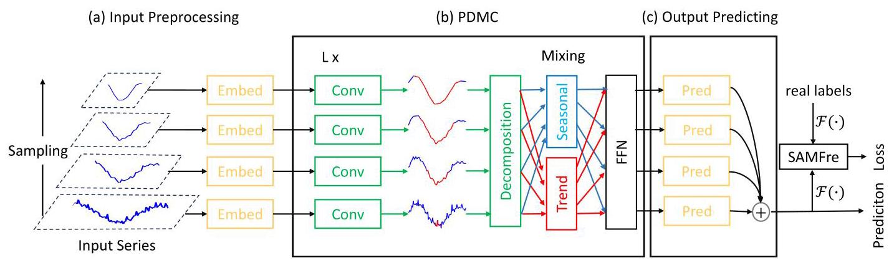

# TimeCF: A TimeMixer-Based Model with adaptive Convolution and Sharpness-Aware Minimization Frequency Domain Loss for long-term time seris forecasting

# TimeCF:一种基于时间混合器的模型，具有自适应卷积和用于长期时间序列预测的锐度感知最小化频域损失

Bin Wang ${}^{a}$ , Heming Yang ${}^{a}$ and Jinfang Sheng ${}^{a, * }$

王斌${}^{a}$，杨赫明${}^{a}$和盛锦芳${}^{a, * }$

${}^{a}$ School of Computer Science and Engineering, Central South University, ChangSha,410000, HuNan, China

${}^{a}$ 中南大学计算机科学与工程学院，中国湖南长沙410000

## ARTICLE INFO

## 文章信息

Keywords:

关键词:

Time series forecast

时间序列预测

Fourier Transform

傅里叶变换

Convolution

卷积

Sharpness-aware minimization

锐度感知最小化

## ABSTRACT

## 摘要

Recent studies have shown that by introducing prior knowledge, multi-scale analysis of complex and non-stationary time series in real environments can achieve good results in the field of long-term forecasting. However, affected by channel-independent methods, models based on multi-scale analysis may produce suboptimal prediction results due to the autocorrelation between time series labels, which in turn affects the generalization ability of the model. To address this challenge, we are inspired by the idea of sharpness-aware minimization and the recently proposed FreDF method and design a deep learning model TimeCF for long-term time series forecasting based on the TimeMixer, combined with our designed adaptive convolution information aggregation module and Sharpness-Aware Minimization Frequency Domain Loss (SAMFre). Specifically, TimeCF first decomposes the original time series into sequences of different scales. Next, the same-sized convolution modules are used to adaptively aggregate information of different scales on sequences of different scales. Then, decomposing each sequence into season and trend parts and the two parts are mixed at different scales through bottom-up and top-down methods respectively. Finally, different scales are aggregated through a Feed-Forward Network. What's more, extensive experimental results on different real-world datasets show that our proposed TimeCF has excellent performance in the field of long-term forecasting.

最近的研究表明，通过引入先验知识，对实际环境中复杂且非平稳的时间序列进行多尺度分析，在长期预测领域可以取得良好的效果。然而，受通道无关方法的影响，基于多尺度分析的模型可能由于时间序列标签之间的自相关性而产生次优的预测结果，进而影响模型的泛化能力。为应对这一挑战，我们受到锐度感知最小化的思想和最近提出的FreDF方法的启发，设计了一种基于TimeMixer的用于长期时间序列预测的深度学习模型TimeCF，结合我们设计的自适应卷积信息聚合模块和锐度感知最小化频域损失(SAMFre)。具体而言，TimeCF首先将原始时间序列分解为不同尺度的序列。接下来，使用相同大小的卷积模块在不同尺度的序列上自适应地聚合不同尺度的信息。然后，将每个序列分解为季节和趋势部分，并分别通过自下而上和自上而下的方法在不同尺度上对这两部分进行混合。最后，通过前馈网络聚合不同尺度的信息。此外，在不同真实世界数据集上的大量实验结果表明，我们提出的TimeCF在长期预测领域具有优异的性能。

## 1. Introduction

## 1. 引言

With the development of information technology in the past decade, time series forecasting, a field of great significance to human life, has been supported by information technology resources such as computing power and algorithms and has played an indispensable role in key areas related to human living standards, such as financial level prediction(Sonkavde, Dharrao, Bongale, Deokate, Doreswamy and Bhat (2023)), traffic flow planning(Huo, Zhang, Wang, Gao, Hu and Yin (2023); Huang, Zhang, Feng, Ye and Li (2023)), weather forecast(Bi, Xie, Zhang, Chen, Gu and Tian (2023)), water treatment(Farhi, Kohen, Mamane and Shavitt (2021); Afan, Mohtar, Khaleel, Kamel, Mansoor, Alsultani, Ahmed, Sherif and El-Shafie (2024)), energy and power resource allocation(Alkhayat and Mehmood (2021); Yin, Cao and Liu (2023)). Since the begin of time series forecasting, there are mainly the following model architectures: Models based on CNN(Li, Jian, Wan, Geng, Fang, Chen, Gao, Jiang and Zhu (2024)), Models based on RNN(Salinas, Flunkert, Gasthaus and Januschowski (2020)), Models based on Transformer(Liang, Yang, Deng and Yang (2024)) and Models based on MLP(Challu, Olivares, Oreshkin, RamÃŋrez, Canseco and Dubrawski (2023)).

在过去十年中，随着信息技术的发展，时间序列预测这一对人类生活具有重要意义的领域，得到了计算能力和算法等信息技术资源的支持，并在与人类生活水平相关的关键领域发挥了不可或缺的作用，如金融水平预测(Sonkavde、Dharrao、Bongale、Deokate、Doreswamy和Bhat(2023))、交通流规划(Huo、Zhang、Wang、Gao, Hu和Yin(2023)；Huang、Zhang、Feng、Ye和Li(2023))、天气预报(Bi、Xie、Zhang、Chen、Gu和Tian(2023))、水处理(Farhi、Kohen、Mamane和Shavitt(2021)；Afan、Mohtar、Khaleel、Kamel、Mansoor、Alsultani、Ahmed、Sherif和El-Shafie(2024))、能源和电力资源分配(Alkhayat和Mehmood(2021)；Yin、Cao和Liu(2023))。自时间序列预测开始以来，主要有以下模型架构:基于卷积神经网络(CNN)的模型(Li、Jian、Wan、Geng、Fang、Chen、Gao、Jiang和Zhu(2024))、基于循环神经网络(RNN)的模型(Salinas、Flunkert、Gasthaus和Januschowski(2020))、基于Transformer的模型(Liang、Yang、Deng和Yang(2024))以及基于多层感知器(MLP)的模型(Challu、Olivares、Oreshkin、Ramírez、Canseco和Dubrawski(2023))。

Although researchers have proposed a variety of methods to solve the problem of time series forecasting, the process of capturing and building a model of time series from the past to the future is challenging because the natural sequence of time series has complex and non-stationary properties and the noise from the data acquisition equipment can affect the prediction results. In order to solve this problem, the current mainstream research can be divided into two categories: one is based on the Transformer(Vaswani, Shazeer, Parmar, Uszkoreit, Jones, Gomez, Kaiser and Polosukhin (2017)), which achieves the fitting of time series through a large number of parameters. However, although the large number of parameters of the Transformer can solve the problem of complex and non-stationary time series to some extent, its easy overfitting and slow training speed have not been reliably solved. Therefore, after fully studying the components of time series, researchers use the prior knowledge of physics and mathematics to decompose time series into simpler components to reduce the difficulty of the prediction process. On this basis, TimeMixer(Wang, Wu, Shi, Hu, Luo, Ma, Zhang and Zhou (2024)) further introduced the idea of multi-scale decomposition, and TimeKAN(Huang, Zhao, Li and Bai (2025)) proposed modeling based on frequencies of different scales based on TimeMixer. In summary, current researchers hope to simplify the original time series to provide additional prior information for the time series model, thereby imporving the prediction accuracy of the time series forecasting model.

尽管研究人员提出了多种方法来解决时间序列预测问题，但从过去到未来捕捉和构建时间序列模型的过程具有挑战性，因为时间序列的自然顺序具有复杂和非平稳的特性，并且数据采集设备产生的噪声会影响预测结果。为了解决这个问题，当前的主流研究可以分为两类:一类是基于Transformer(Vaswani, Shazeer, Parmar, Uszkoreit, Jones, Gomez, Kaiser和Polosukhin (2017))，它通过大量参数实现时间序列的拟合。然而，尽管Transformer的大量参数在一定程度上可以解决复杂和非平稳时间序列的问题，但其容易过拟合和训练速度慢的问题尚未得到可靠解决。因此，在充分研究时间序列的组成部分后，研究人员利用物理和数学的先验知识将时间序列分解为更简单的组件，以降低预测过程的难度。在此基础上，TimeMixer(Wang, Wu, Shi, Hu, Luo, Ma, Zhang和Zhou (2024))进一步引入了多尺度分解的思想，TimeKAN(Huang, Zhao, Li和Bai (2025))基于TimeMixer提出了基于不同尺度频率的建模方法。综上所述，当前研究人员希望简化原始时间序列，为时间序列模型提供额外的先验信息，从而提高时间序列预测模型的预测精度。

---

*Corresponding author

*通讯作者

& wb_csut@csu.edu.cn (B. Wang); 244712142@csu.edu.cn (H. Yang); jfsheng@csu.edu.cn (J. Sheng)

& wb_csut@csu.edu.cn (王博); 244712142@csu.edu.cn (杨浩); jfsheng@csu.edu.cn (盛杰)

ORCID(s): 0009-0002-0536-2898 (B. Wang); 0009-0009-1683-6068 (H. Yang); 0000-0002-6533-7822 (J. Sheng)

ORCID编号: 0009-0002-0536-2898 (王博); 0009-0009-1683-6068 (杨浩); 0000-0002-6533-7822 (盛杰)

---

It is undeniable that the model based on the idea of channel independence does obtain more accurate results under certain conditions, but the actual time series is a series with high autocorrelation. This autocorrelation is manifested in that it is not only correlated in the order of time, but also has a certain degree of correlation between the labels of the sequence. Therefore, under the premise of channel independence, the autocorrelation between labels has not been fully processed, which may cause a certain degree of distortion in the results of the model. Fortunately, a method called FreDF(Wang, Pan, Chen, Yang, Zhang, Yang, Liu, Li and Tao (2024)) has recently been applied to the field of time series forecasting. It uses Fourier or fast Fourier transform to transform the sequence labels from the time domain to the frequency domain without changing the model structure to deal with the autocorrelation in the time series. In addition, we note that an idea called sharpness-aware minimization(SAM)(Foret, Kleiner, Mobahi and Neyshabur (2021)) can be combined with FreDF to reduce the sharpness of the loss so that the model has better generalization ability. At the same time, inspired by the idea of attention mechanism in Transformer and the idea of receptive field in CNN field, we found that neighboring and global information can also be used in time series to supplement information in the prediction process. Therefore, we propose to use convolution kernels of the same size at different scales to obtain global information at low-frequency scales and neighboring information at high-frequency scales to achieve the aggregation of global and local information with a small number of parameters.

不可否认，基于通道独立性思想的模型在某些条件下确实能获得更准确的结果，但实际的时间序列是具有高自相关性的序列。这种自相关性表现为不仅在时间顺序上相关，而且序列的标签之间也有一定程度的相关性。因此，在通道独立性的前提下，标签之间的自相关性没有得到充分处理，这可能会导致模型结果出现一定程度的失真。幸运的是，一种名为FreDF(Wang, Pan, Chen, Yang, Zhang, Yang, Liu, Li和Tao (2024))的方法最近被应用于时间序列预测领域。它使用傅里叶变换或快速傅里叶变换将序列标签从时域转换到频域，而不改变模型结构来处理时间序列中的自相关性。此外，我们注意到一种名为锐度感知最小化(SAM)(Foret, Kleiner, Mobahi和Neyshabur (2021))的思想可以与FreDF相结合，以降低损失的锐度，使模型具有更好的泛化能力。同时，受Transformer中注意力机制思想和CNN领域感受野思想的启发，我们发现时间序列中也可以使用相邻和全局信息来在预测过程中补充信息。因此，我们建议使用不同尺度的相同大小的卷积核来在低频尺度获得全局信息，在高频尺度获得相邻信息，以用少量参数实现全局和局部信息的聚合。

Combining the advantages of the above technologies, we propose a frequency-independent multi-scale hybrid architecture (TimeCF) based on the TimeMixer model to solve the problems of global and local information loss, autocorrelation between sequence labels in time series forecasting and generalization ability. In terms of model structure, TimeCF is based on the TimeMixer model architecture. First, it uses the downsampling method to generate time series at multiple scales. Secondly, through the PDMC (Past Decomposable Mixing with adaptive Conv) module designed by us, we first use the convolution operation of the same convolution kernel on the sequences of different scales to achieve adaptive information aggregation between different scales. Then, according to prior knowledge, the season and trend of the input sequence are decomposed separately. Through our design, PDMC obtains information of different receptive fields according to different input scales and decomposes the sequences of different scales into seasonal and trend parts to achieve more detailed modeling. In the prediction stage, the output prediction layer aggregates the prediction components of different scales to utilize the complementary prediction capabilities between multi-scale sequences to achieve accurate prediction.

结合上述技术的优点，我们提出了一种基于TimeMixer模型的频率无关多尺度混合架构(TimeCF)，以解决时间序列预测中的全局和局部信息丢失、序列标签之间的自相关性以及泛化能力问题。在模型结构方面，TimeCF基于TimeMixer模型架构。首先，它使用下采样方法生成多个尺度的时间序列。其次，通过我们设计的PDMC(具有自适应卷积的过去可分解混合)模块，我们首先对不同尺度的序列使用相同卷积核的卷积操作，以实现不同尺度之间的自适应信息聚合。然后，根据先验知识，分别分解输入序列的季节和趋势。通过我们的设计，PDMC根据不同的输入尺度获得不同感受野的信息，并将不同尺度的序列分解为季节和趋势部分，以实现更详细的建模。在预测阶段，输出预测层聚合不同尺度的预测组件，以利用多尺度序列之间的互补预测能力实现准确预测。

In general, our contributions are as follows:

总的来说，我们的贡献如下:

1. Different from previous methods, we propose to use adaptive convolution modules to achieve information aggregation of receptive fields of different scales based on sampling results of different scales. What's more, we use the transformation from time domain to frequency domain to solve the challenges brought by complex information coupling in time series.

1. 与以往方法不同，我们建议使用自适应卷积模块，基于不同尺度的采样结果实现不同尺度感受野的信息聚合。此外，我们使用从时域到频域的变换来解决时间序列中复杂信息耦合带来的挑战。

2. We proposed a relatively lightweight time series prediction model TimeCF and introduced the receptive field idea in the CNN field to maximize the use of information aggregation at different scales to supplement global and local information. And based on the ideas of FreDF and SAM, we achieved the decoupling of the autocorrelation between the labels of the time series and the improvement of the model's generalization ability.

2. 我们提出了一个相对轻量级的时间序列预测模型TimeCF，并引入了CNN领域的感受野概念，以最大限度地利用不同尺度的信息聚合来补充全局和局部信息。并且基于FreDF和SAM的思想，我们实现了时间序列标签之间自相关的解耦以及模型泛化能力的提升。

3. TimeCF shows excellent performance in multiple time series forecasting tasks and datasets, while achieving a relatively balanced state between model parameters and prediction accuracy.

3. TimeCF在多个时间序列预测任务和数据集中表现出优异的性能，同时在模型参数和预测准确性之间达到了相对平衡的状态。

## 2. Related Work

## 2. 相关工作

### 2.1. Mainstream Model Architecture

### 2.1. 主流模型架构

The core of the time series forecasting model is to have efficient and stable pattern extraction and modeling capabilities in different time series, so as to model and predict complex time series. Traditional models such as ARIMA(Zhang (2003)) and LSTM(Hochreiter and Schmidhuber (1997)) can accurately predict time series with simple cycles and trends, but these models are limited by parameters and model structures so the prediction effect for nonlinear and dynamic time series is often unsatisfactory. In recent years, deep learning methods have begun to make great strides in the direction of time series forecasting. For the Transformer, researchers have proposed many methods to apply it to the field of time series prediction: Autoformer(Wu, Xu, Wang and Long (2021)) proposed an autocorrelation mechanism to reduce the time complexity of the model to $O\left( {n \cdot  \lg \left( n\right) }\right)$ . SAMformer(Ilbert, Odonnat, Feofanov, Virmaux, Paolo, Palpanas and Redko (2024)) solved the instability problem during large model training by using Sharpness-Aware Minimization. Informer(Zhou, Zhang, Peng, Zhang, Li, Xiong and Zhang (2021)) used ProbSpare self-attention and Self-attention Distilling to enable it to effectively handle overly long input sequences. iTransformer(Liu, Hu, Zhang, Wu, Wang, Ma and Long (2024)) inverted the time series and then used the Encoder for prediction. Mamba(Gu and Dao (2023)) combined the parallelization capability of Transformer and the historical information control capability of RNN, and based on the idea of SSM, it was able to handle the correlation problem between variables at a lower cost. PatchTST(Nie, Nguyen, Sinthong and Kalagnanam (2023)) regarded the time series as multiple independent time periods of channels, and combined it with Transformer for prediction, achieving good results. And some researchers have found that the use of CNN ideas can better construct the relationship between labels and time steps in time series: MICN(Wang, Peng, Huang, Wang, Chen and Xiao (2023)) introduces the idea of image processing and captures information of different receptive fields through convolution kernels of different sizes. TimesNet(Wu, Hu, Liu, Zhou, Wang and Long (2023)) performs Fourier transform on the time series and selects its Top-k cycles, then expands each cycle into a two-dimensional image and uses a 2D-kernel convolution kernel for feature extraction. ModernTCN(donghao and xue (2024)) proposes to use large convolution kernels on the time dimension of the time series so that the model can capture dependencies across time and variables at the same time. In addition, researchers have also proposed some models that are not limited to Transformer and CNN: GRU(Chung, Gulcehre, Cho and Bengio (2014)) introduces a gating mechanism that allows the model to dynamically adjust the ratio of memory and forgetting according to the current input and previous state, making it more flexible and expressive than traditional RNN. DLinear(Zeng, Chen, Zhang and Xu (2023)) decomposes time series into seasonal and trend components for separate predictions. FITS(Xu, Zeng and Xu (2024)) roposes the use of basic MLP for prediction in the frequency domain based on Dlinear. And SparseTSF(Lin, Lin, Wu, Chen and Yang (2024)) obtain information about adjacent time steps through convolution, and then predict future results separately through sparse technology.

时间序列预测模型的核心是在不同时间序列中具有高效且稳定的模式提取和建模能力，以便对复杂时间序列进行建模和预测。传统模型如ARIMA(Zhang (2003))和LSTM(Hochreiter和Schmidhuber (1997))可以准确预测具有简单周期和趋势的时间序列，但这些模型受到参数和模型结构的限制，因此对非线性和动态时间序列的预测效果往往不尽人意。近年来，深度学习方法在时间序列预测方向开始取得长足进展。对于Transformer，研究人员提出了许多将其应用于时间序列预测领域的方法:Autoformer(Wu, Xu, Wang和Long (2021))提出了一种自相关机制，将模型的时间复杂度降低到$O\left( {n \cdot  \lg \left( n\right) }\right)$ 。SAMformer(Ilbert, Odonnat, Feofanov, Virmaux, Paolo, Palpanas和Redko (2024))通过使用锐度感知最小化解决了大型模型训练期间的不稳定性问题。Informer(Zhou, Zhang, Peng, Zhang, Li, Xiong和Zhang (2021))使用概率稀疏自注意力和自注意力蒸馏，使其能够有效处理过长的输入序列。iTransformer(Liu, Hu, Zhang, Wu, Wang, Ma和Long (2024))对时间序列进行反转，然后使用编码器进行预测。Mamba(Gu和Dao (2023))结合了Transformer的并行化能力和RNN的历史信息控制能力，并基于SSM的思想，能够以较低成本处理变量之间的相关性问题。PatchTST(Nie, Nguyen, Sinthong和Kalagnanam (2023))将时间序列视为多个独立的通道时间段，并将其与Transformer结合进行预测，取得了良好的效果。并且一些研究人员发现，使用CNN思想可以更好地构建时间序列中标签与时间步之间的关系:MICN(Wang, Peng, Huang, Wang, Chen和Xiao (2023))引入了图像处理思想，并通过不同大小的卷积核捕获不同感受野的信息。TimesNet(Wu, Hu, Liu, Zhou, Wang和Long (2023))对时间序列进行傅里叶变换并选择其Top-k周期，然后将每个周期扩展为二维图像并使用二维内核卷积核进行特征提取。ModernTCN(donghao和xue (2024))提议在时间序列的时间维度上使用大卷积核，以便模型能够同时捕获跨时间和变量的依赖性。此外，研究人员还提出了一些不限于Transformer和CNN的模型:GRU(Chung, Gulcehre, Cho和Bengio (2014))引入了一种门控机制，允许模型根据当前输入和先前状态动态调整记忆和遗忘的比例，使其比传统RNN更灵活且更具表现力。DLinear(Zeng, Chen, Zhang和Xu (2023))将时间序列分解为季节性和趋势成分进行单独预测。FITS(Xu, Zeng和Xu (2024))提议基于Dlinear在频域中使用基本MLP进行预测。而SparseTSF(Lin, Lin, Wu, Chen和Yang (2024))通过卷积获取相邻时间步的信息，然后通过稀疏技术分别预测未来结果。

Considering the advantages and limitations of the above models, people need a time series forecasting model that can extract different features and have accurate prediction results. Therefore, we proposed TimeCF, based on the original idea of scale decomposition, to obtain features of different scales through convolution to achieve multi-scale adaptive information aggregation.

考虑到上述模型的优点和局限性，人们需要一个能够提取不同特征并具有准确预测结果的时间序列预测模型。因此，我们基于尺度分解的原始思想提出了TimeCF，通过卷积获得不同尺度的特征，以实现多尺度自适应信息聚合。

### 2.2. Parameters Update

### 2.2. 参数更新

Nowadays researchers have begun to find that the effects that the models can achieve on the training set are often not achieved on the test set. This is because when the model uses an optimizer to optimize the non-convex loss function on the training set, it may enter a suboptimal or sharp minimum, resulting in insufficient generalization of the model. In response to this situation, researchers have proposed a method called sharpness-aware minimization to update model parameters to improve the generalization ability of deep neural networks: SAM(Foret et al. (2021)) proposed the sharpness-aware minimization method, which first finds the point with the maximum loss in the neighborhood of the current parameter and then uses gradient descent to update the parameters based on this maximum point, so that the parameters can be moved to a flat area to reduce the sharpness of the loss function. WSAM(Yue, Jiang, Ye, Gao, Liu and Zhang (2023)) introduces the concept of weights based on SAM, and adjusts the contribution of different parameters to sharpness according to the importance of the parameters or other indicators, thereby more effectively regularizing. FSAM(Li, Zhou, He, Cheng and Huang (2024)) effectively improves the generalization performance and robustness of the model by improving adversarial perturbations and optimizing the full gradient estimation method.

如今，研究人员开始发现，模型在训练集上能够实现的效果，在测试集上往往无法达成。这是因为当模型在训练集上使用优化器来优化非凸损失函数时，它可能会陷入次优或尖锐的最小值，导致模型的泛化能力不足。针对这种情况，研究人员提出了一种名为锐度感知最小化的方法来更新模型参数，以提高深度神经网络的泛化能力:SAM(Foret等人，(2021))提出了锐度感知最小化方法，该方法首先在当前参数的邻域内找到损失最大的点，然后基于这个最大点使用梯度下降来更新参数，以便将参数移动到一个平坦区域，以降低损失函数的锐度。WSAM(Yue、Jiang、Ye、Gao、Liu和Zhang，(2023))基于SAM引入了权重的概念，并根据参数的重要性或其他指标调整不同参数对锐度的贡献，从而更有效地进行正则化。FSAM(Li、Zhou、He、Cheng和Huang，(2024))通过改进对抗性扰动和优化全梯度估计方法，有效地提高了模型的泛化性能和鲁棒性。

Considering the generalization degree of the model, we propose a model parameter update module called SAMFre based on the SAM idea to improve the overall generalization ability of the model.

考虑到模型的泛化程度，我们基于SAM思想提出了一个名为SAMFre的模型参数更新模块，以提高模型的整体泛化能力。

## 3. TimeCF

## 3. TimeCF

### 3.1. OverView

### 3.1. 概述

The basic definition of time series forecasting is to input the historical data of a multivariate time series ${X}_{\text{ input }} \in  {R}^{T \times  N}$ and after the model calculation, output the future multivariate output sequence ${X}_{\text{ output }} \in  {R}^{F \times  N}$ , where T represents the lookback length of the historical data defined by the model, F represents the future time length to be predicted and $\mathrm{N}$ represents the number of labels in the time series.

时间序列预测的基本定义是输入一个多变量时间序列${X}_{\text{ input }} \in  {R}^{T \times  N}$的历史数据，经过模型计算后，输出未来的多变量输出序列${X}_{\text{ output }} \in  {R}^{F \times  N}$，其中T表示模型定义的历史数据的回溯长度，F表示要预测的未来时间长度，$\mathrm{N}$表示时间序列中的标签数量。

In TimeCF, we use the idea of channel independence to make independent predictions for each label in the time series. Therefore, the original input can be regarded as $\left\{  {{X}_{{inpu}{t}^{1}},{X}_{{inpu}{t}^{2}},\ldots ,{X}_{{inpu}{t}^{N}}}\right\}$ , where ${X}_{{inpu}{t}^{i}} \in  {R}^{T}$ can be regarded as the input instance of TimeCF. The overall structure of TimeCF is shown in Figure 1, which consists of three components: Input Preprocessing layer, PDMC layer, and Output Predicting layer. At the same time, SAMFre as a module to solve the autocorrelation between variables and improve the generalization ability of the model indirectly participates in model training in the stages of calculating model loss and updating model parameters. In summary, the overall process of TimeCF consists of three explicit modules and one implicit module.

在TimeCF中，我们使用通道独立的思想对时间序列中的每个标签进行独立预测。因此，原始输入可以视为$\left\{  {{X}_{{inpu}{t}^{1}},{X}_{{inpu}{t}^{2}},\ldots ,{X}_{{inpu}{t}^{N}}}\right\}$，其中${X}_{{inpu}{t}^{i}} \in  {R}^{T}$可以视为TimeCF的输入实例。TimeCF的整体结构如图1所示，它由三个组件组成:输入预处理层、PDMC层和输出预测层。同时，SAMFre作为一个解决变量之间自相关并间接提高模型泛化能力的模块，在计算模型损失和更新模型参数的阶段参与模型训练。综上所述，TimeCF的整体过程由三个显式模块和一个隐式模块组成。

Figure 1: TimeCF Architecture

图1:TimeCF架构

### 3.2. Input Preprocessing layer

### 3.2. 输入预处理层

Since we treat the time series ${X}_{{inpu}{t}^{i}} \in  {R}^{T}$ in each label as a separate input instance, for each instance ${X}_{{inpu}{t}^{i}}$ , we first use the pooling layer to generate multi-level sequences of different scales $\left\{  {{X}_{1},{X}_{2},\ldots ,{X}_{k}}\right\}$ , where ${X}_{i} \in  {R}^{\frac{T}{{di} - 1}}\left( {i \in  \{ 1,\ldots k\} }\right)$ . The output ${X}_{i}$ is the result of $i - 1$ times of downsampling of the original input ${X}_{{inpu}{t}^{i}}$ . ${X}_{1}$ is equal to the original input sequence ${X}_{{inpu}{t}^{i}}$ and $d$ represents the length of the moving window in the pooling layer. The specific multi-scale sequence generation formula is as follows:

由于我们将每个标签中的时间序列${X}_{{inpu}{t}^{i}} \in  {R}^{T}$视为一个单独的输入实例，对于每个实例${X}_{{inpu}{t}^{i}}$，我们首先使用池化层生成不同尺度的多级序列$\left\{  {{X}_{1},{X}_{2},\ldots ,{X}_{k}}\right\}$，其中${X}_{i} \in  {R}^{\frac{T}{{di} - 1}}\left( {i \in  \{ 1,\ldots k\} }\right)$。输出${X}_{i}$是原始输入${X}_{{inpu}{t}^{i}}$经过$i - 1$次下采样的结果。${X}_{1}$等于原始输入序列${X}_{{inpu}{t}^{i}}$，$d$表示池化层中移动窗口的长度。具体的多尺度序列生成公式如下:

$$
{X}_{i} = \operatorname{Pool}\left( {\operatorname{Padding}\left( {X}_{\left( i - 1\right) }\right) }\right) \tag{1}
$$

After generating the multi-scale sequences, each sequence will have a time-related mask ${X}_{{\text{ mask }}^{i}}$ . Each sequence is first normalized by the RevIn normalization layer, and then the mask and sequence are embedded by the Embedding layer. The specific process is as follows:

生成多尺度序列后，每个序列将有一个与时间相关的掩码${X}_{{\text{ mask }}^{i}}$。每个序列首先通过RevIn归一化层进行归一化，然后通过Embedding层对掩码和序列进行嵌入。具体过程如下:

$$
{X}_{i} = \text{ Temporal Embedding }\left( {X}_{{\text{ mask }}^{i}}\right)  + \text{ Token Embedding }\left( {\operatorname{RevIN}\left( {X}_{i}\right) }\right) \tag{2}
$$

In formula (2), the sequence of each scale is ${X}_{i} \in  {R}^{\frac{T}{{d}^{i} - 1} \times  D}, D$ is the output dimension of embedding. At this point, the preprocessing part of the input data is completed, and this stage is only performed once during the model training process.

在公式(2)中，每个尺度的序列${X}_{i} \in  {R}^{\frac{T}{{d}^{i} - 1} \times  D}, D$是嵌入的输出维度。至此，输入数据的预处理部分完成，并且此阶段在模型训练过程中仅执行一次。

### 3.3. Past Decomposable Mixing with adaptive Conv layer

### 3.3. 带有自适应卷积层的过去可分解混合

Recent studies have found that most time series are the fusion of different components of different periods at most scales. Therefore, we propose the PDMC module, which uses long-term and short-term changes to analyze various periodic and non-periodic properties of the entire time series, while obtaining information of different receptive fields at different scales through convolution. Specifically, in the PDMC, we first add global or local information to the sequence through the idea of convolution and adaptation:

最近的研究发现，大多数时间序列在大多数尺度上都是不同时期不同成分的融合。因此，我们提出了PDMC模块，它利用长期和短期变化来分析整个时间序列的各种周期性和非周期性特性，同时通过卷积在不同尺度上获取不同感受野的信息。具体来说，在PDMC中，我们首先通过卷积和适配的思想将全局或局部信息添加到序列中:

$$
{X}_{i} = \alpha  \times  {\operatorname{ConvBlocks}}_{\left\lbrack  i\right\rbrack  }{\left( {X}_{i}^{T}\right) }^{T} + {X}_{i} \tag{3}
$$

The ${X}_{i}$ is the output of the input preprocessing layer and the formula for ${\operatorname{ConvBlocks}}_{\left\lbrack  i\right\rbrack  }\left( X\right)$ is as follow:

${X}_{i}$是输入预处理层的输出，${\operatorname{ConvBlocks}}_{\left\lbrack  i\right\rbrack  }\left( X\right)$的公式如下:

## ${\operatorname{ConvBlocks}}_{\left\lbrack  i\right\rbrack  }\left( X\right)  = \operatorname{Conv}\left( {\operatorname{GELU}\left( {\operatorname{Conv}\left( {\operatorname{GELU}\left( {\operatorname{Conv}\left( {\operatorname{Norm}\left( X\right) }\right) }\right) }\right) }\right) }\right)$

(4)

Next, we will explain why using the same size of convolution can obtain information of different receptive fields. First, the lookback window length selected by this model is 96 , which is consistent with the mainstream model, and the number of downsampling is set to 3 . So the input of PDMC is $\left\{  {{X}_{1} \in  {R}^{{96} \times  D},{X}_{2} \in  {R}^{{48} \times  D},{X}_{3} \in  {R}^{{24} \times  D},{X}_{4} \in  {R}^{{12} \times  D}}\right\}$ , where 96,48,24,12 are the time windows after downsampling. And in ConvBlocks ${}_{\left\lbrack  i\right\rbrack  }\left( X\right)$ , we use three layers of convolution and the convolution kernel size of each layer is 3 , and the padding is 1 . This means that after three convolutions, each time point in $\left\{  {{X}_{1},{X}_{2},{X}_{3},{X}_{4}}\right\}$ contains information from at least $2 + 2 + 2$ , or 6 neighboring time points. From the perspective of PDMC stacking, the number of PDMC stackings is $L\left( {L \geq  2}\right)$ . So for ${X}_{4}$ , the window of length $6 \times  L$ will eventually cover the entire sequence length, which can be considered as obtaining global information. But for ${X}_{1},{X}_{2}$ and ${X}_{3}$ , the window of length $6 \times  L$ only occupies a part of the sequence length, which can be considered as obtaining local information of different proportions. In summary, by using convolution blocks and PDMC stacking, TimeCF can obtain information of different receptive fields at different scales.

接下来，我们将解释为什么使用相同大小的卷积可以获得不同感受野的信息。首先，该模型选择的回溯窗口长度为96，这与主流模型一致，下采样次数设置为3。因此，PDMC的输入是$\left\{  {{X}_{1} \in  {R}^{{96} \times  D},{X}_{2} \in  {R}^{{48} \times  D},{X}_{3} \in  {R}^{{24} \times  D},{X}_{4} \in  {R}^{{12} \times  D}}\right\}$，其中96、48、24、12是下采样后的时间窗口。在ConvBlocks${}_{\left\lbrack  i\right\rbrack  }\left( X\right)$中，我们使用三层卷积，每层的卷积核大小为3，填充为1。这意味着经过三次卷积后，$\left\{  {{X}_{1},{X}_{2},{X}_{3},{X}_{4}}\right\}$中的每个时间点至少包含来自$2 + 2 + 2$，即6个相邻时间点的信息。从PDMC堆叠的角度来看，PDMC的堆叠次数是$L\left( {L \geq  2}\right)$。所以对于${X}_{4}$，长度为$6 \times  L$的窗口最终将覆盖整个序列长度，可以认为是获得了全局信息。但对于${X}_{1},{X}_{2}$和${X}_{3}$，长度为$6 \times  L$的窗口只占据序列长度的一部分，可以认为是获得了不同比例的局部信息。综上所述，通过使用卷积块和PDMC堆叠，TimeCF可以在不同尺度上获得不同感受野的信息。

Then, we decompose the sequence of each scale into season and trend parts:

然后，我们将每个尺度的序列分解为季节和趋势部分:

$$
{\text{ Season }}_{i},{\text{ Trend }}_{i} = \text{ Decomp }\left( {X}_{i}\right) \tag{5}
$$

Season ${}_{i},{\text{ Trend }}_{i}$ refer to the season and trend parts decomposed from the i-th scale respectively. We put all the season and trend components into the lists Season and Trend respectively, and based on the idea of TimeMixer, we perform scale fusion on the season and trend respectively:

第${}_{i},{\text{ Trend }}_{i}$季分别指从第i个尺度分解出来的季节和趋势部分。我们将所有的季节和趋势成分分别放入Season和Trend列表中，并基于TimeMixer的思想，分别对季节和趋势进行尺度融合:

## $\text{ Season, Trend = SeasonMix (Season), TrendMix (Trend) }$

(6)

The fusion of the season term is a bottom-up sequence fusion and the trend term is a top-down sequence fusion which make full use of the information inherent in both parts. Finally, PDMC passes the season part, trend part and original sequence through the feed forward network to achieve the fusion between different components:

季节项的融合是自下而上的序列融合，趋势项是自上而下的序列融合，这充分利用了两部分中固有的信息。最后，PDMC将季节部分、趋势部分和原始序列通过前馈网络，以实现不同组件之间的融合:

$$
{X}_{i} = {X}_{i} + {FFN}\left( {{\text{ Season }}_{i} + {\text{ Trend }}_{i}}\right) \tag{7}
$$

So far, the PDMC block has finally realized the core tasks of feature extraction and multi-scale mixing process through the adaptive information aggregation by convolution, the decomposition and mixing of the season term and trend term.

到目前为止，PDMC模块最终通过卷积的自适应信息聚合、季节项和趋势项的分解与混合，实现了特征提取和多尺度混合过程的核心任务。

### 3.4. Output Predicting layer

### 3.4. 输出预测层

In the prediction output stage, the output of PDMC we obtain is $\left\{  {{X}_{1},{X}_{2},\ldots ,{X}_{k}}\right\}$ , where ${X}_{i} \in  {R}^{\frac{T}{{d}^{i} - 1} \times  D}\left( {i \in  \{ 1,\ldots k\} }\right)$ . So if we need to make a prediction for ${X}_{i}$ in the time dimension, we need to change the dimension of ${X}_{i}$ at least twice. Specifically, first align the time dimension of ${X}_{i}$ with the predicted future length according to different scales. Then adjust the dimension of the sequence so that the model vector dimension $\mathrm{D}$ can be reduced back to the initial value:

在预测输出阶段，我们得到的PDMC输出为$\left\{  {{X}_{1},{X}_{2},\ldots ,{X}_{k}}\right\}$，其中${X}_{i} \in  {R}^{\frac{T}{{d}^{i} - 1} \times  D}\left( {i \in  \{ 1,\ldots k\} }\right)$。因此，如果我们要在时间维度上对${X}_{i}$进行预测，我们至少需要将${X}_{i}$的维度改变两次。具体来说，首先根据不同尺度将${X}_{i}$的时间维度与预测的未来长度对齐。然后调整序列的维度，使模型向量维度$\mathrm{D}$能够还原到初始值:

$$
{X}_{i} = {\operatorname{Linear}}_{2}\left( {{\operatorname{Linear}}_{1}{\left( {X}_{i}^{T}\right) }^{T}}\right) \tag{8}
$$

The input dimension of the Linear ${}_{1}$ is $\frac{T}{{d}^{i} - 1}$ , and the output dimension is the prediction length $F$ . As a result, time series of different scales generate predictions of corresponding time lengths. Then, the input dimension of the Linear ${}_{2}$ is $D$ and the output dimension 1 . This is to make the sequence dimension match the target output dimension, or let ${X}_{i} \in  {R}^{F}$

线性${}_{1}$的输入维度为$\frac{T}{{d}^{i} - 1}$，输出维度为预测长度$F$。因此，不同尺度的时间序列会生成相应时间长度的预测。然后，线性${}_{2}$的输入维度为$D$，输出维度为1。这是为了使序列维度与目标输出维度匹配，或者使${X}_{i} \in  {R}^{F}$

It is not difficult to see that each scale sequence eventually generates a prediction sequence. Then we sum all the prediction sequences and use the RevIN layer of the preprocessing layer to perform inverse normalization:

不难看出，每个尺度序列最终都会生成一个预测序列。然后我们将所有预测序列相加，并使用预处理层的RevIN层进行逆归一化:

$$
{X}_{O} = i\operatorname{Rev}{IN}\left( {\sum {X}_{i}}\right) \tag{9}
$$

At this point, the prediction of a single label is completed, and the sequences of different scales are finally fused together through the stack() function to forecast the result.

至此，单个标签的预测完成，不同尺度的序列最终通过stack()函数融合在一起以预测结果。

### 3.5. Sharpness-Aware Minimization Frequency Domain Loss

### 3.5. 锐度感知最小化频域损失

The loss function of traditional time series forecasting model is usually MSE loss, which has shown its superiority in the training process of a large number of time series forecasting models. However, with the introduction of the idea of channel independence, FreDF's researchers have noticed that the MSE loss hardly takes into account the autocorrelation between different labels of the time series in the model using the channel independence method. Therefore, it is not the best choice to calculate the loss by MSE in the training process of the time series forecasting model using the channel independence method. However, according to the idea of Fourier transform, if different labels are projected into the frequency domain, unrelated feature can be obtained in the frequency domain so that the model based on the idea can obtain better results than the traditional MSE loss when calculating the loss. At the same time, we noticed that the overall generalization performance of the model can be improved by adjusting the sharpness of the loss through the SAM method. Based on these two ideas, the TimeCF we proposed introduces the SAMFre module to decouple the autocorrelation between different labels in the time series and improve the generalization ability. Specifically, SAMFre projects the model's prediction results and the actual label values into the frequency domain through Fourier transform, then calculates the loss using the L1 norm, and finally adds it to the original MSE loss to get the complete loss:

传统时间序列预测模型的损失函数通常是MSE损失，它在大量时间序列预测模型的训练过程中已显示出其优越性。然而，随着通道独立性思想的引入，FreDF的研究人员注意到，在使用通道独立性方法的模型中，MSE损失几乎没有考虑时间序列不同标签之间的自相关性。因此，在使用通道独立性方法的时间序列预测模型的训练过程中，用MSE计算损失不是最佳选择。然而，根据傅里叶变换的思想，如果将不同标签投影到频域，可以在频域中获得不相关的特征，这样基于该思想的模型在计算损失时可以比传统的MSE损失获得更好的结果。同时，我们注意到通过SAM方法调整损失的锐度可以提高模型的整体泛化性能。基于这两个思想，我们提出的TimeCF引入了SAMFre模块来解耦时间序列中不同标签之间的自相关性并提高泛化能力。具体来说，SAMFre通过傅里叶变换将模型的预测结果和实际标签值投影到频域中，然后使用L1范数计算损失，最后将其加到原始的MSE损失上以得到完整的损失:

$$
\text{ loss } = \alpha  \times  {\left| FFT\left( \text{ pred }\right)  - FFT\left( \text{ real }\right) \right| }_{1} + \left( {1 - \alpha }\right)  \times  {MSE}
$$

(10)

After calculating the loss, the model uses basic optimization methods to optimize the model parameters before the number of updates reaches the set threshold. When the number of updates reaches the threshold, the model uses the SAM method to calculate the point with the largest loss in the neighborhood of the current parameter, and then performs gradient backpropagation based on this point to achieve parameter update:

计算损失后，在更新次数达到设定阈值之前，模型使用基本优化方法来优化模型参数。当更新次数达到阈值时，模型使用SAM方法计算当前参数邻域内损失最大的点，然后基于该点进行梯度反向传播以实现参数更新:

$$
\widehat{\epsilon }\left( w\right)  = \rho \frac{{\nabla }_{w}\operatorname{Loss}}{{\begin{Vmatrix}{\nabla }_{w}\operatorname{Loss}\end{Vmatrix}}_{2}} \tag{11}
$$

$$
g = {\left. {\nabla }_{w}\operatorname{Loss}\right| }_{w + \widehat{\epsilon }\left( w\right) } \tag{12}
$$

$$
w = w - \eta  \cdot  g \tag{13}
$$

So far, we have optimized the model parameter update part through SAMFre, so that the model can better deal with the autocorrelation problem between labels in different sequences and improve the generalization ability of the model.

到目前为止，我们通过SAMFre优化了模型参数更新部分，使模型能够更好地处理不同序列中标签之间的自相关问题并提高模型的泛化能力。

## 4. Results

## 4. 结果

### 4.1. Experiment setting

### 4.1. 实验设置

Experimental datasets: In order to verify the prediction accuracy of our model on time series generated in real environments, we selected six commonly used real-world datasets: Weather, ETTh1, ETTh2, ETTm1, ETTm2 and Electricity(Zhou et al. (2021); Wu et al. (2021)) and conducted sufficient experiments on these six datasets to verify the ability of our model in long-term forecasting.

实验数据集:为了验证我们的模型在真实环境中生成的时间序列上的预测准确性，我们选择了六个常用的真实世界数据集:天气、ETTh1、ETTh2、ETTm1、ETTm2和电力(Zhou等人，(2021)；Wu等人，(2021))，并在这六个数据集上进行了充分的实验，以验证我们的模型在长期预测方面的能力。

Benchmark models: Based on timeliness, innovation and prediction effect, we selected 8 time series forecasting models which are widely acclaimed in the field of time series forecasting as our baselines, including: (1) TimeKAN(Huang et al. (2025)) (2) TimeMixer (Wang et al. (2024)) (3) iTransformer(Liu et al. (2024)) (4) SparseTSF(Lin et al. (2024)) (5) FreTS(Yi, Zhang, Fan, Wang, Wang, He, An, Lian, Cao and Niu (2023)) (6) PatchTST(Nie et al. (2023)) (7) TimesNet(Wu et al. (2023)) (8) DLinear(Zeng et al. (2023))

基准模型:基于及时性、创新性和预测效果，我们选择了8个在时间序列预测领域广受赞誉的时间序列预测模型作为我们的基线，包括:(1) TimeKAN(Huang等人(2025年))(2) TimeMixer(Wang等人(2024年))(3) iTransformer(Liu等人(2024年))(4) SparseTSF(Lin等人(2024年))(5) FreTS(Yi、Zhang、Fan、Wang、Wang、He、An、Lian、Cao和Niu(2023年))(6) PatchTST(Nie等人(2023年))(7) TimesNet(Wu等人(2023年))(8) DLinear(Zeng等人(2023年))

Experimental environment and related indicators: All experiments were implemented based on PyTorch and conducted on a single NVIDIA 3090 24GB GPU. At the same time, in order to ensure fair competition among the models, we set the lookback window, prediction length, and evaluation index to 96, 96, 192, 336, 720, mean square error (MSE), and mean absolute error (MAE) respectively. WhatâÄ´ξs more, the benchmark model is tested using the scripts provided in the original code, while the test of the TimeCF model we proposed sets different training rounds and early stopping thresholds according to the size of different data sets to improve test efficiency.

实验环境及相关指标:所有实验均基于PyTorch实现，并在单块NVIDIA 3090 24GB GPU上进行。同时，为确保模型间的公平竞争，我们将回溯窗口、预测长度和评估指标分别设置为96、96、192、336、720、均方误差(MSE)和平均绝对误差(MAE)。此外，基准模型使用原始代码中提供的脚本进行测试，而我们提出的TimeCF模型的测试则根据不同数据集的大小设置不同训练轮次和提前停止阈值，以提高测试效率。

Table 1

表1

Performance comparison of different time series forecasting models on benchmark datasets.

不同时间序列预测模型在基准数据集上的性能比较。

<table><tr><td colspan="2" rowspan="2">Models Metric</td><td colspan="2">TimeCF   Ours</td><td colspan="2">TimeKAN   2025</td><td colspan="2">TimeMixer   2024</td><td colspan="2">iTransformer   2024</td><td colspan="2">SparseTSF   2024</td><td colspan="2">FreTS   2024</td><td colspan="2">PatchTST   2023</td><td colspan="2">TimesNet   2023</td><td colspan="2">Dlinear   2023</td></tr><tr><td>MSE</td><td>MAE</td><td>MSE</td><td>MAE</td><td>MSE</td><td>MAE</td><td>MSE</td><td>MAE</td><td>MSE</td><td>MAE</td><td>MSE</td><td>MAE</td><td>MSE</td><td>MAE</td><td>MSE</td><td>MAE</td><td>MSE</td><td>MAE</td></tr><tr><td rowspan="5">ETT h1</td><td>96</td><td>0.359</td><td>0.391</td><td>0.367</td><td>0.394</td><td>0.381</td><td>0.398</td><td>0.394</td><td>0.409</td><td>0.385</td><td>0.391</td><td>0.395</td><td>0.407</td><td>0.376</td><td>0.397</td><td>0.389</td><td>0.411</td><td>0.396</td><td>0.410</td></tr><tr><td>192</td><td>0.401</td><td>0.419</td><td>0.414</td><td>0.419</td><td>0.441</td><td>0.430</td><td>0.448</td><td>0.441</td><td>0.434</td><td>0.420</td><td>0.490</td><td>0.477</td><td>0.426</td><td>0.432</td><td>0.439</td><td>0.441</td><td>0.445</td><td>0.440</td></tr><tr><td>336</td><td>0.440</td><td>0.436</td><td>0.445</td><td>0.434</td><td>0.500</td><td>0.459</td><td>0.492</td><td>0.465</td><td>0.476</td><td>0.439</td><td>0.510</td><td>0.480</td><td>0.469</td><td>0.457</td><td>0.493</td><td>0.470</td><td>0.487</td><td>0.465</td></tr><tr><td>720</td><td>0.466</td><td>0.462</td><td>0.451</td><td>0.463</td><td>0.552</td><td>0.507</td><td>0.521</td><td>0.504</td><td>0.461</td><td>0.454</td><td>0.568</td><td>0.538</td><td>0.518</td><td>0.504</td><td>0.516</td><td>0.494</td><td>0.512</td><td>0.510</td></tr><tr><td>avg</td><td>0.417</td><td>0.427</td><td>0.419</td><td>0.428</td><td>0.468</td><td>0.449</td><td>0.464</td><td>0.455</td><td>0.439</td><td>0.426</td><td>0.490</td><td>0.475</td><td>0.447</td><td>0.447</td><td>0.459</td><td>0.454</td><td>0.460</td><td>0.456</td></tr><tr><td rowspan="5">ETT h2</td><td>96</td><td>0.282</td><td>0.333</td><td>0.291</td><td>0.340</td><td>0.286</td><td>0.339</td><td>0.300</td><td>0.349</td><td>0.302</td><td>0.346</td><td>0.332</td><td>0.387</td><td>0.308</td><td>0.359</td><td>0.337</td><td>0.370</td><td>0.341</td><td>0.395</td></tr><tr><td>192</td><td>0.372</td><td>0.389</td><td>0.374</td><td>0.391</td><td>0.391</td><td>0.404</td><td>0.381</td><td>0.399</td><td>0.384</td><td>0.395</td><td>0.451</td><td>0.457</td><td>0.380</td><td>0.406</td><td>0.404</td><td>0.414</td><td>0.481</td><td>0.479</td></tr><tr><td>336</td><td>0.410</td><td>0.422</td><td>0.423</td><td>0.434</td><td>0.421</td><td>0.432</td><td>0.423</td><td>0.432</td><td>0.421</td><td>0.427</td><td>0.466</td><td>0.473</td><td>0.412</td><td>0.429</td><td>0.455</td><td>0.452</td><td>0.592</td><td>0.542</td></tr><tr><td>720</td><td>0.416</td><td>0.436</td><td>0.462</td><td>0.461</td><td>0.468</td><td>0.468</td><td>0.426</td><td>0.445</td><td>0.420</td><td>0.437</td><td>0.485</td><td>0.471</td><td>0.435</td><td>0.456</td><td>0.434</td><td>0.448</td><td>0.840</td><td>0.661</td></tr><tr><td>avg</td><td>0.370</td><td>0.395</td><td>0.387</td><td>0.406</td><td>0.391</td><td>0.411</td><td>0.383</td><td>0.406</td><td>0.382</td><td>0.401</td><td>0.433</td><td>0.447</td><td>0.384</td><td>0.412</td><td>0.407</td><td>0.421</td><td>0.564</td><td>0.519</td></tr><tr><td rowspan="5">ETT</td><td>96</td><td>0.307</td><td>0.345</td><td>0.321</td><td>0.361</td><td>0.327</td><td>0.364</td><td>0.341</td><td>0.376</td><td>0.356</td><td>0.375</td><td>0.337</td><td>0.374</td><td>0.323</td><td>0.364</td><td>0.333</td><td>0.375</td><td>0.345</td><td>0.373</td></tr><tr><td>192</td><td>0.353</td><td>0.372</td><td>0.356</td><td>0.382</td><td>0.367</td><td>0.386</td><td>0.380</td><td>0.394</td><td>0.394</td><td>0.392</td><td>0.382</td><td>0.398</td><td>0.371</td><td>0.391</td><td>0.407</td><td>0.413</td><td>0.381</td><td>0.391</td></tr><tr><td>336</td><td>0.377</td><td>0.395</td><td>0.381</td><td>0.400</td><td>0.393</td><td>0.403</td><td>0.419</td><td>0.418</td><td>0.425</td><td>0.413</td><td>0.420</td><td>0.423</td><td>0.398</td><td>0.408</td><td>0.413</td><td>0.421</td><td>0.415</td><td>0.415</td></tr><tr><td>720</td><td>0.441</td><td>0.430</td><td>0.451</td><td>0.437</td><td>0.451</td><td>0.442</td><td>0.486</td><td>0.455</td><td>0.487</td><td>0.448</td><td>0.490</td><td>0.471</td><td>0.457</td><td>0.444</td><td>0.503</td><td>0.467</td><td>0.472</td><td>0.450</td></tr><tr><td>avg</td><td>0.370</td><td>0.386</td><td>0.377</td><td>0.395</td><td>0.384</td><td>0.399</td><td>0.406</td><td>0.411</td><td>0.415</td><td>0.407</td><td>0.407</td><td>0.416</td><td>0.387</td><td>0.402</td><td>0.414</td><td>0.419</td><td>0.403</td><td>0.407</td></tr><tr><td rowspan="5">ETT</td><td>96</td><td>0.169</td><td>0.252</td><td>0.175</td><td>0.257</td><td>0.174</td><td>0.257</td><td>0.183</td><td>0.266</td><td>0.184</td><td>0.267</td><td>0.186</td><td>0.275</td><td>0.184</td><td>0.267</td><td>0.189</td><td>0.266</td><td>0.193</td><td>0.292</td></tr><tr><td>192</td><td>0.238</td><td>0.299</td><td>0.239</td><td>0.299</td><td>0.236</td><td>0.299</td><td>0.252</td><td>0.312</td><td>0.248</td><td>0.305</td><td>0.259</td><td>0.323</td><td>0.246</td><td>0.304</td><td>0.252</td><td>0.307</td><td>0.284</td><td>0.361</td></tr><tr><td>336</td><td>0.296</td><td>0.335</td><td>0.301</td><td>0.340</td><td>0.301</td><td>0.339</td><td>0.314</td><td>0.351</td><td>0.307</td><td>0.342</td><td>0.349</td><td>0.386</td><td>0.311</td><td>0.348</td><td>0.321</td><td>0.349</td><td>0.384</td><td>0.429</td></tr><tr><td>720</td><td>0.400</td><td>0.393</td><td>0.398</td><td>0.398</td><td>0.400</td><td>0.400</td><td>0.411</td><td>0.406</td><td>0.407</td><td>0.398</td><td>0.559</td><td>0.511</td><td>0.418</td><td>0.414</td><td>0.418</td><td>0.404</td><td>0.556</td><td>0.523</td></tr><tr><td>avg</td><td>0.276</td><td>0.320</td><td>0.278</td><td>0.323</td><td>0.278</td><td>0.324</td><td>0.290</td><td>0.334</td><td>0.287</td><td>0.328</td><td>0.338</td><td>0.373</td><td>0.290</td><td>0.333</td><td>0.295</td><td>0.331</td><td>0.354</td><td>0.401</td></tr><tr><td rowspan="5">Weather</td><td>96</td><td>0.162</td><td>0.204</td><td>0.162</td><td>0.208</td><td>0.161</td><td>0.208</td><td>0.175</td><td>0.215</td><td>0.197</td><td>0.236</td><td>0.171</td><td>0.227</td><td>0.175</td><td>0.217</td><td>0.168</td><td>0.219</td><td>0.196</td><td>0.256</td></tr><tr><td>192</td><td>0.209</td><td>0.249</td><td>0.207</td><td>0.249</td><td>0.207</td><td>0.251</td><td>0.225</td><td>0.257</td><td>0.243</td><td>0.273</td><td>0.218</td><td>0.280</td><td>0.220</td><td>0.255</td><td>0.225</td><td>0.265</td><td>0.238</td><td>0.299</td></tr><tr><td>336</td><td>0.266</td><td>0.293</td><td>0.263</td><td>0.290</td><td>0.264</td><td>0.293</td><td>0.279</td><td>0.298</td><td>0.292</td><td>0.308</td><td>0.265</td><td>0.317</td><td>0.279</td><td>0.297</td><td>0.281</td><td>0.303</td><td>0.281</td><td>0.330</td></tr><tr><td>720</td><td>0.345</td><td>0.343</td><td>0.338</td><td>0.340</td><td>0.345</td><td>0.345</td><td>0.361</td><td>0.350</td><td>0.368</td><td>0.357</td><td>0.326</td><td>0.351</td><td>0.356</td><td>0.348</td><td>0.359</td><td>0.354</td><td>0.345</td><td>0.381</td></tr><tr><td>avg</td><td>0.246</td><td>0.272</td><td>0.242</td><td>0.271</td><td>0.244</td><td>0.274</td><td>0.260</td><td>0.280</td><td>0.275</td><td>0.293</td><td>0.245</td><td>0.293</td><td>0.257</td><td>0.279</td><td>0.258</td><td>0.285</td><td>0.265</td><td>0.316</td></tr><tr><td rowspan="5">ECL</td><td>96</td><td>0.153</td><td>0.245</td><td>0.174</td><td>0.266</td><td>0.156</td><td>0.247</td><td>0.148</td><td>0.240</td><td>0.209</td><td>0.280</td><td>0.171</td><td>0.260</td><td>0.180</td><td>0.272</td><td>0.168</td><td>0.271</td><td>0.210</td><td>0.301</td></tr><tr><td>192</td><td>0.166</td><td>0.256</td><td>0.182</td><td>0.272</td><td>0.170</td><td>0.260</td><td>0.164</td><td>0.256</td><td>0.205</td><td>0.281</td><td>0.177</td><td>0.268</td><td>0.187</td><td>0.279</td><td>0.187</td><td>0.289</td><td>0.210</td><td>0.304</td></tr><tr><td>336</td><td>0.183</td><td>0.274</td><td>0.196</td><td>0.286</td><td>0.187</td><td>0.278</td><td>0.177</td><td>0.270</td><td>0.218</td><td>0.295</td><td>0.190</td><td>0.284</td><td>0.204</td><td>0.295</td><td>0.201</td><td>0.302</td><td>0.223</td><td>0.319</td></tr><tr><td>720</td><td>0.221</td><td>0.305</td><td>0.236</td><td>0.320</td><td>0.227</td><td>0.312</td><td>0.228</td><td>0.313</td><td>0.260</td><td>0.327</td><td>0.228</td><td>0.316</td><td>0.245</td><td>0.328</td><td>0.229</td><td>0.324</td><td>0.257</td><td>0.349</td></tr><tr><td>avg</td><td>0.181</td><td>0.270</td><td>0.197</td><td>0.286</td><td>0.185</td><td>0.274</td><td>0.179</td><td>0.269</td><td>0.223</td><td>0.296</td><td>0.191</td><td>0.282</td><td>0.204</td><td>0.294</td><td>0.196</td><td>0.297</td><td>0.225</td><td>0.318</td></tr><tr><td colspan="2" rowspan="2">Total AVG   1st Times</td><td>0.310</td><td>0.345</td><td>0.317</td><td>0.352</td><td>0.325</td><td>0.355</td><td>0.330</td><td>0.359</td><td>0.337</td><td>0.359</td><td>0.351</td><td>0.381</td><td>0.328</td><td>0.361</td><td>0.338</td><td>0.368</td><td>0.379</td><td>0.403</td></tr><tr><td>19</td><td>21</td><td>5</td><td>4</td><td>2</td><td>0</td><td>4</td><td>4</td><td>0</td><td>2</td><td>1</td><td>0</td><td>0</td><td>0</td><td>0</td><td>0</td><td>0</td><td>0</td></tr></table>

### 4.2. Experiment results

### 4.2. 实验结果

All results in this experiment are obtained after local experiments(except for FreTS whose results are obtained from the original paper) and all results are shown in Table 1. We define that the lower the values of MSE and MAE, the better the model prediction effect. At the same time, the best results are shown in bold red and the second best results are shown in bold black. It is not difficult to see from Table 1 that the TimeCF we proposed has shown good performance on most datasets, except for weather and ECL, where KAN and Transformer model can better handle the autocorrelation dependencies for high-dimensional datasets. Even if it does not achieve the optimal prediction effect in some datasets, the prediction accuracy of TimeCF is not much different from the results achieved by the optimal model. The average values of MSE and MAE increased by 2.2% and 1.9% compared with the suboptimal model. And if we look at the number of times the optimal prediction is obtained, TimeCF is far ahead of all models that appeared in the experiments. This proves that TimeCF has accurate and general prediction capabilities on most natural time series.

本实验中的所有结果均经过本地实验获得(FreTS的结果除外，其结果来自原文)，所有结果如表1所示。我们定义MSE和MAE的值越低，模型预测效果越好。同时，最佳结果以粗体红色显示，次佳结果以粗体黑色显示。从表1不难看出，我们提出的TimeCF在大多数数据集上都表现出了良好的性能，除了天气和ECL数据集，在这些数据集中KAN和Transformer模型能够更好地处理高维数据集的自相关依赖关系。即使在某些数据集中未达到最优预测效果，TimeCF的预测准确率与最优模型的结果相差也不大。与次优模型相比，MSE和MAE的平均值分别提高了2.2%和1.9%。而且，如果我们看获得最优预测的次数，TimeCF远远领先于实验中出现的所有模型。这证明了TimeCF在大多数自然时间序列上具有准确且通用的预测能力。

### 4.3. Ablation experiment

### 4.3. 消融实验

To demonstrate the accuracy of our design and addition of modules, we used three forms of TimeCF models in the ablation implementation to compare with our selected baseline model TimeMixer: (1) TimeCF with the SAMFre module omitted (2) TimeCF with the convolution part omitted and (3) the complete TimeCF. As shown in Table 2, TimeCF without complete modules has a certain improvement over the baseline model in the experiment, but the improvement is not significant. This shows that both the decoupling of label autocorrelation in time series and the enhancement of generalization ability based on SAMFre and the adaptive information aggregation between different scales based on convolution can only enhance the partial information extraction and prediction capabilities of the baseline model TimeMixer to a certain extent. However, the good performance of the complete TimeCF shows that the information of different scales and receptive fields obtained by convolution may contain some information with autocorrelation. And by using SAMFre, the autocorrelation within this part of information can be properly decoupled, which is reflected in the results that it exceeds the baseline model in terms of evaluation indicators. Finally, it is proved that the adaptive information aggregation module based on convolution and the SAMFre module proposed by us are both indispensable parts of the TimeCF model.

为了证明我们设计和添加模块的准确性，我们在消融实验中使用了三种形式的TimeCF模型与我们选择的基线模型TimeMixer进行比较:(1) 省略SAMFre模块的TimeCF (2) 省略卷积部分的TimeCF (3) 完整的TimeCF。如表2所示，不完整模块的TimeCF在实验中相对于基线模型有一定的提升，但提升并不显著。这表明时间序列中标签自相关的解耦以及基于SAMFre的泛化能力增强和基于卷积的不同尺度间自适应信息聚合，都只能在一定程度上增强基线模型TimeMixer的部分信息提取和预测能力。然而，完整的TimeCF的良好性能表明，卷积获得的不同尺度和感受野的信息可能包含一些具有自相关性的信息。并且通过使用SAMFre，可以对这部分信息内的自相关性进行适当解耦，这在结果中表现为其在评估指标上超过了基线模型。最后，证明了我们提出的基于卷积的自适应信息聚合模块和SAMFre模块都是TimeCF模型不可或缺的部分。

Table 2

表2

Ablation study of TimeCF.

TimeCF的消融研究。

<table><tr><td rowspan="2">Model</td><td colspan="2">ETT h1</td><td colspan="2">ETT h2</td><td colspan="2">ECL</td></tr><tr><td>MSE</td><td>MAE</td><td>MSE</td><td>MAE</td><td>MSE</td><td>MAE</td></tr><tr><td>TimeMixer</td><td>0.469</td><td>0.449</td><td>0.392</td><td>0.411</td><td>0.185</td><td>0.274</td></tr><tr><td>TimeCF w/o SAMFre</td><td>0.466</td><td>0.452</td><td>0.392</td><td>0.417</td><td>0.182</td><td>0.273</td></tr><tr><td>TimeCF w/o CONV</td><td>0.430</td><td>0.425</td><td>0.372</td><td>0.396</td><td>0.185</td><td>0.272</td></tr><tr><td>TimeCF (ours)</td><td>0.417</td><td>0.427</td><td>0.371</td><td>0.396</td><td>0.181</td><td>0.270</td></tr></table>

Table 3

表3

Parameter comparison of different time series forecasting models on various datasets.

不同时间序列预测模型在各种数据集上的参数比较。

<table><tr><td rowspan="2">Model</td><td colspan="6">Parameters (Number)</td></tr><tr><td>ETT h1</td><td>ETT h2</td><td>ETT m1</td><td>ETT m2</td><td>Weather</td><td>ECL</td></tr><tr><td>TimeMixer</td><td>75.3K</td><td>75.3K</td><td>75.3K</td><td>77.5K</td><td>104K</td><td>104K</td></tr><tr><td>iTransformer</td><td>224K</td><td>224K</td><td>224K</td><td>224K</td><td>4.83M</td><td>4.83M</td></tr><tr><td>TimesNet</td><td>605K</td><td>1.19M</td><td>4.70M</td><td>1.19M</td><td>1.19M</td><td>150M</td></tr><tr><td>SparseTSF</td><td>0.041K</td><td>0.041K</td><td>0.581K</td><td>0.581K</td><td>0.581K</td><td>0.041K</td></tr><tr><td>TimeCF (ours)</td><td>125K</td><td>125K</td><td>125K</td><td>275K</td><td>179K</td><td>179K</td></tr></table>

### 4.4. Model efficiency

### 4.4. 模型效率

In order to verify the efficiency of the TimeCF model we proposed, we set the lookback window and the prediction length to 96 and 96 to test the parameter size of the model. We selected three benchmark models based on the Transformer architecture, the CNN architecture and the MLP model, and a model with the smallest number of parameters as the baseline model for model efficiency. It is not difficult to see from Table 3 that the Transformer and CNN-based models are limited by the model structure, and their parameter volume is maintained at a very high level on all datasets. The model parameters of the MLP-based model TimeMixer and the TimeCF we proposed are basically maintained at a relatively low level on each dataset, and the fluctuation range is not large. Although the number of parameters of SparseTSF is much smaller than that of the TimeCF we proposed and TimeMixer, considering the balance between prediction effect and parameter volume, we believe that the TimeCF we proposed has stable and efficient model operation efficiency while ensuring the accuracy of the prediction results under different datasets. Therefore, it can be considered that the TimeCF we proposed can achieve excellent prediction performance with only a relatively small amount of computing resources.

为了验证我们提出的TimeCF模型的效率，我们将回溯窗口和预测长度设置为96和96，以测试模型的参数规模。我们基于Transformer架构、CNN架构和MLP模型选择了三个基准模型，并选择参数数量最少的模型作为模型效率的基线模型。从表3中不难看出，基于Transformer和CNN的模型受到模型结构的限制，它们在所有数据集上的参数量都维持在非常高的水平。基于MLP的模型TimeMixer和我们提出的TimeCF的模型参数在每个数据集上基本维持在相对较低的水平，且波动范围不大。虽然SparseTSF的参数数量比我们提出的TimeCF和TimeMixer少得多，但考虑到预测效果和参数量之间的平衡，我们认为我们提出的TimeCF在确保不同数据集下预测结果准确性的同时，具有稳定高效的模型运行效率。因此，可以认为我们提出的TimeCF仅需相对较少的计算资源就能实现出色的预测性能。

## 5. Conclusion

## 5. 结论

In our paper, we proposed a time series prediction model TimeCF based on the TimeMixer decomposition-learning-mixing architecture to achieve high-precision time series forecasting. With the support of PDMC, TimeCF can utilize the information of different receptive fields of sequences of different scales, learn and mix the seasonal and trend sequences separately and finally combine SAMFre to decouple the autocorrelation between labels and reduce the sharpness of the loss function. The performance of our model on real datasets also proves that TimeCF can cope with time series prediction tasks in the real world with good prediction performance.

在我们的论文中，我们提出了一种基于TimeMixer分解-学习-混合架构的时间序列预测模型TimeCF，以实现高精度的时间序列预测。在PDMC的支持下，TimeCF可以利用不同尺度序列的不同感受野信息，分别学习和混合季节性和趋势序列，最后结合SAMFre来解耦标签之间的自相关并降低损失函数的锐度。我们的模型在真实数据集上的性能也证明了TimeCF能够以良好的预测性能应对现实世界中的时间序列预测任务。

## References

## 参考文献

Afan, H.A., Mohtar, W.H.M.W., Khaleel, F., Kamel, A.H., Mansoor, S.S., Alsultani, R., Ahmed, A.N., Sherif, M., El-Shafie, A., 2024. Data-drivenwater quality prediction for wastewater treatment plants. Heliyon 10. Publisher: Elsevier.

污水处理厂的水质预测。《Heliyon》10。出版商:爱思唯尔。

Alkhayat, G., Mehmood, R., 2021. A review and taxonomy of wind and solar energy forecasting methods based on deep learning. Energy and AI 4, 100060. Publisher: Elsevier.

Bi, K., Xie, L., Zhang, H., Chen, X., Gu, X., Tian, Q., 2023. Accurate medium-range global weather forecasting with 3D neural networks. Nature619, 533-538. Publisher: Nature Publishing Group.

619,第533 - 538页。出版商:自然出版集团。

Challu, C., Olivares, K.G., Oreshkin, B.N., RamĂŋrez, F.G., Canseco, M.M., Dubrawski, A., 2023. NHITS: Neural Hierarchical Interpolation forTime Series Forecasting, in: AAAI, pp. 6989-6997. URL: https://doi.org/10.1609/aaai.v37i6.25854.

时间序列预测，载于《AAAI》，第6989 - 6997页。网址:https://doi.org/10.1609/aaai.v37i6.25854。

Chung, J., Gulcehre, C., Cho, K., Bengio, Y., 2014. Empirical evaluation of gated recurrent neural networks on sequence modeling, in: NIPS 2014Workshop on Deep Learning, December 2014.

深度学习研讨会，2014年12月。

donghao, L., xue, w., 2024. ModernTCN: A Modern Pure Convolution Structure for General Time Series Analysis, in: The Twelfth InternationalConference on Learning Representations. URL: https://openreview.net/forum?id=vpJMJerXHU.

学习表示会议。网址:https://openreview.net/forum?id=vpJMJerXHU。

Farhi, N., Kohen, E., Mamane, H., Shavitt, Y., 2021. Prediction of wastewater treatment quality using LSTM neural network. EnvironmentalTechnology & Innovation 23, 101632. Publisher: Elsevier.

《技术与创新》23，101632。出版商:爱思唯尔。

Foret, P., Kleiner, A., Mobahi, H., Neyshabur, B., 2021. Sharpness-aware Minimization for Efficiently Improving Generalization, in: InternationalConference on Learning Representations. URL: https://openreview.net/forum?id=6Tm1mposlrM.

学习表示会议。网址:https://openreview.net/forum?id=6Tm1mposlrM。

Gu, A., Dao, T., 2023. Mamba: Linear-time sequence modeling with selective state spaces. arXiv preprint arXiv:2312.00752 .

Hochreiter, S., Schmidhuber, J., 1997. Long short-term memory. Neural computation 9, 1735-1780. Publisher: MIT press.

Huang, S., Zhao, Z., Li, C., Bai, L., 2025. TimeKAN: KAN-based Frequency Decomposition Learning Architecture for Long-term Time Series Forecasting. arXiv preprint arXiv:2502.06910 .

Huang, X., Zhang, B., Feng, S., Ye, Y., Li, X., 2023. Interpretable local flow attention for multi-step traffic flow prediction. Neural networks 161,25-38. Publisher: Elsevier.

第25 - 38页。出版商:爱思唯尔。

Huo, G., Zhang, Y., Wang, B., Gao, J., Hu, Y., Yin, B., 2023. Hierarchical spatioâÃŞtemporal graph convolutional networks and transformer networkfor traffic flow forecasting. IEEE Transactions on Intelligent Transportation Systems 24, 3855-3867. Publisher: IEEE.

用于交通流预测。《IEEE智能交通系统汇刊》24，第3855 - 3867页。出版商:IEEE。

Ilbert, R., Odonnat, A., Feofanov, V., Virmaux, A., Paolo, G., Palpanas, T., Redko, I., 2024. SAMformer: Unlocking the Potential of Transformersin Time Series Forecasting with Sharpness-Aware Minimization and Channel-Wise Attention, in: ICML. URL: https://openreview.net/ forum?id=8kLzL5QBh2.

在《具有锐度感知最小化和通道注意力的时间序列预测》中，载于《ICML》。网址:https://openreview.net/ forum?id=8kLzL5QBh2。

Li, L., Jian, C., Wan, F., Geng, D., Fang, Z., Chen, L., Gao, Y., Jiang, W., Zhu, J., 2024. LagCNN: A Fast yet Effective Model for MultivariatLong-term Time Series Forecasting, in: CIKM, pp. 1235-1244. URL: https://doi.org/10.1145/3627673.3679672.

长期时间序列预测，载于《CIKM》，第1235 - 1244页。网址:https://doi.org/10.1145/3627673.3679672。

Li, T., Zhou, P., He, Z., Cheng, X., Huang, X., 2024. Friendly Sharpness-Aware Minimization, in: Proceedings of the IEEE/CVF Conference onComputer Vision and Pattern Recognition (CVPR), pp. 5631-5640.

计算机视觉与模式识别(CVPR),第5631 - 5640页。

Liang, X., Yang, E., Deng, C., Yang, Y., 2024. CrossFormer: Cross-Modal Representation Learning via Heterogeneous Graph Transformer. ACMTrans. Multim. Comput. Commun. Appl. 20, 380:1-380:21. URL: https://doi.org/10.1145/3688801.

《Trans. Multim. Comput. Commun. Appl.》20, 380:1 - 380:21。网址:https://doi.org/10.1145/3688801。

Lin, S., Lin, W., Wu, W., Chen, H., Yang, J., 2024. SparseTSF: Modeling Long-term Time Series Forecasting with *1k* Parameters, in: Forty-firstInternational Conference on Machine Learning. URL: https://openereview.net/forum?id=54NSH001Fe.

国际机器学习会议。网址:https://openereview.net/forum?id=54NSH001Fe。

Liu, Y., Hu, T., Zhang, H., Wu, H., Wang, S., Ma, L., Long, M., 2024. iTransformer: Inverted Transformers Are Effective for Time Series Forecasting,in: The Twelfth International Conference on Learning Representations. URL: https://openreview.net/forum?id=JePfAI8fah.

收录于:第十二届国际学习表征会议。网址:https://openreview.net/forum?id=JePfAI8fah。

Nie, Y., Nguyen, N.H., Sinthong, P., Kalagnanam, J., 2023. A Time Series is Worth 64 Words: Long-term Forecasting with Transformers, in: TEleventh International Conference on Learning Representations. URL: https://openerview.net/forum?id=Jbdc0vTOco1.

第十一届国际学习表征会议。网址:https://openerview.net/forum?id=Jbdc0vTOco1。

Salinas, D., Flunkert, V., Gasthaus, J., Januschowski, T., 2020. DeepAR: Probabilistic forecasting with autoregressive recurrent networks. Internationaljournal of forecasting 36, 1181-1191. Publisher: Elsevier.

《forecasting》杂志36卷，1181 - 1191页。出版商:爱思唯尔。

Sonkavde, G., Dharrao, D.S., Bongale, A.M., Deokate, S.T., Doreswamy, D., Bhat, S.K., 2023. Forecasting stock market prices using machinelearning and deep learning models: A systematic review, performance analysis and discussion of implications. International Journal of Financial Studies 11, 94. Publisher: MDPI.

学习与深度学习模型:系统综述、性能分析及影响讨论。《国际金融研究杂志》11卷，94页。出版商:MDPI。

Vaswani, A., Shazeer, N., Parmar, N., Uszkoreit, J., Jones, L., Gomez, A.N., Kaiser, Å., Polosukhin, I., 2017. Attention is all you need. Advances inneural information processing systems 30.

神经信息处理系统30。

Wang, H., Pan, L., Chen, Z., Yang, D., Zhang, S., Yang, Y., Liu, X., Li, H., Tao, D., 2024. Fredf: Learning to forecast in frequency domain. arXiv preprint arXiv:2402.02399 .

Wang, H., Peng, J., Huang, F., Wang, J., Chen, J., Xiao, Y., 2023. MICN: Multi-scale Local and Global Context Modeling for Long-termSeries Forecasting, in: The Eleventh International Conference on Learning Representations. URL: https://openreview.net/forum?id= zt53IDUR1U.

序列预测，收录于:第十一届国际学习表征会议。网址:https://openreview.net/forum?id= zt53IDUR1U。

Wang, S., Wu, H., Shi, X., Hu, T., Luo, H., Ma, L., Zhang, J.Y., Zhou, J., 2024. TimeMixer: Decomposable Multiscale Mixing for Time SeriesForecasting, in: ICLR. URL: https://openreview.net/forum?id=7oLshfEIC2.

预测，发表于:ICLR。网址:https://openreview.net/forum?id=7oLshfEIC2。

Wu, H., Hu, T., Liu, Y., Zhou, H., Wang, J., Long, M., 2023. TimesNet: Temporal 2D-Variation Modeling for General Time Series Analysis, in: TheEleventh International Conference on Learning Representations. URL: https://openreview.net/forum?id=ju_Uqw3404q.

第十一届学习表示国际会议。网址:https://openreview.net/forum?id=ju_Uqw3404q。

Wu, H., Xu, J., Wang, J., Long, M., 2021. Autoformer: Decomposition Transformers with Auto-Correlation for Long-Term Series Forecasiin: Beygelzimer, A., Dauphin, Y., Liang, P., Vaughan, J.W. (Eds.), Advances in Neural Information Processing Systems. URL: https: //openreview.net/forum?id=I55UqU-M11y.

发表于:贝格尔齐默尔，A.，多芬，Y.，梁，P.，沃恩，J.W.(编)，《神经信息处理系统进展》。网址:https://openreview.net/forum?id=I55UqU-M11y。

Xu, Z., Zeng, A., Xu, Q., 2024. FITS: Modeling Time Series with \\10k\\ Parameters, in: The Twelfth International Conference on LearningRepresentations. URL: https://openreview.net/forum?id=bWcnvZ3qMb.

表示。网址:https://openreview.net/forum?id=bWcnvZ3qMb。

Yi, K., Zhang, Q., Fan, W., Wang, S., Wang, P., He, H., An, N., Lian, D., Cao, L., Niu, Z., 2023. Frequency-domain mlps are more effective learnersin time series forecasting. Advances in Neural Information Processing Systems 36, 76656-76679.

用于时间序列预测。《神经信息处理系统进展》36，76656 - 76679。

Yin, L., Cao, X., Liu, D., 2023. Weighted fully-connected regression networks for one-day-ahead hourly photovoltaic power forecasting. AppliedEnergy 332, 120527. Publisher: Elsevier.

《能源》332，120527。出版商:爱思唯尔。

Yue, Y., Jiang, J., Ye, Z., Gao, N., Liu, Y., Zhang, K., 2023. Sharpness-Aware Minimization Revisited: Weighted Sharpness as a RegularizationTerm, in: KDD, pp. 3185-3194. URL: https://doi.org/10.1145/3580305.3599501.

术语，发表于:KDD，第3185 - 3194页。网址:https://doi.org/10.1145/3580305.3599501。

Zeng, A., Chen, M., Zhang, L., Xu, Q., 2023. Are transformers effective for time series forecasting?, in: Proceedings of the AAAI conference onartificial intelligence, pp. 11121-11128. Issue: 9.

人工智能，第11121 - 11128页。期号:9。

Zhang, G.P., 2003. Time series forecasting using a hybrid ARIMA and neural network model. Neurocomputing 50, 159-175. Publisher: Elsevier.

Zhou, H., Zhang, S., Peng, J., Zhang, S., Li, J., Xiong, H., Zhang, W., 2021. Informer: Beyond efficient transformer for long sequence time-seriesforecasting, in: Proceedings of the AAAI conference on artificial intelligence, pp. 11106-11115. Issue: 12.

预测，发表于:美国人工智能协会人工智能会议论文集，第11106 - 11115页。期号:12。