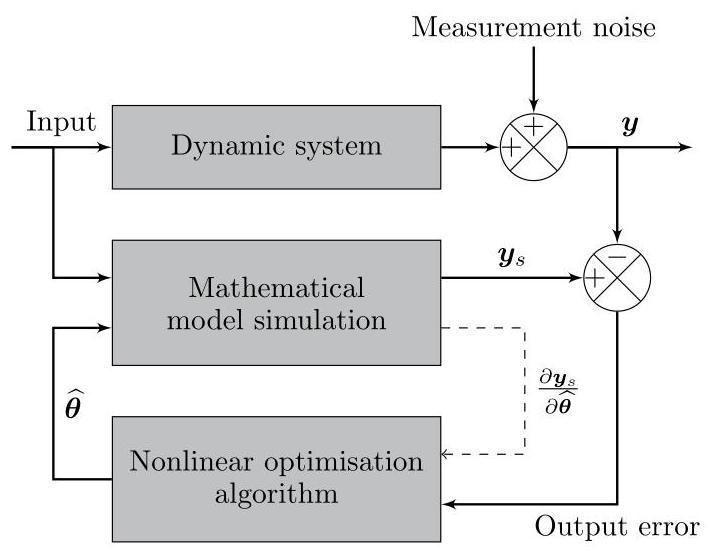
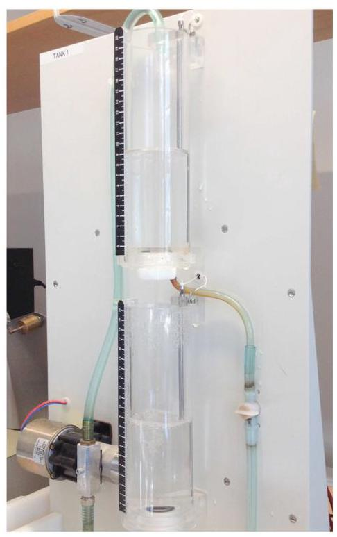
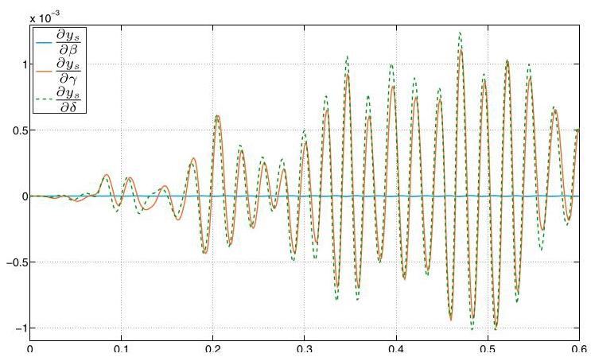

IFAC PapersOnLine 50-1 (2017) 464-469

《国际自动控制联合会在线论文集》第50 - 1卷(2017年)464 - 469页

# Continuous-Time Nonlinear Systems Identification with Output Error Method Based on Derivative-Free Optimisation

# 基于无导数优化的输出误差法用于连续时间非线性系统辨识

M. Brunot ${}^{*, *  * }$ A. Janot ${}^{ * }$ F. Carrillo ${}^{* * }$

M. 布鲁诺${}^{*, *  * }$ A. 雅诺${}^{ * }$ F. 卡里略${}^{* * }$

* ONERA, 2 Avenue Edouard Belin, 31055 Toulouse, France (e-mail: Mathieu.Brunot@onera.fr and Alexandre.Janot@onera.fr). ** LGP ENI Tarbes, 47 avenue d'Azereix, BP 1629, 65016 Tarbes, France(e-mail: Francisco.Carrillo@enit.fr)

* 法国图卢兹市爱德华·贝林大道2号法国国家航空航天研究院(电子邮箱:Mathieu.Brunot@onera.fr和Alexandre.Janot@onera.fr)。** 法国塔布市阿泽雷克斯大道47号LGP ENI塔布分校，邮编BP 1629，65016(电子邮箱:Francisco.Carrillo@enit.fr)

Abstract: The purpose of this study is to tackle the nonlinear system identification benchmarks proposed by (Schoukens and Noël, 2016). Two of the three benchmarks are considered, namely the cascaded tanks setup and the Bouc-Wen hysteretic system. Our approach is an output error method based on continuous time models. Due to the nonlinearities, the derivatives of the output with respect to the parameters are not defined everywhere. We compare the performance of two derivative-free optimisation solvers: the Nelder-Mead simplex and the NOMAD algorithm. Both are available in the OPTI Toolbox. The results suggest that the method is appropriate for those systems. However, it is not possible to discriminate between both optimisation solvers.

摘要:本研究旨在解决(舒肯斯和诺埃尔，2016年)提出的非线性系统辨识基准问题。考虑了三个基准中的两个，即级联水箱装置和布–文滞回系统。我们的方法是基于连续时间模型的输出误差法。由于存在非线性，输出关于参数的导数并非处处有定义。我们比较了两种无导数优化求解器的性能:单纯形法和NOMAD算法。这两种算法都可在OPTI工具箱中获取。结果表明该方法适用于这些系统。然而，无法区分这两种优化求解器。

© 2017, IFAC (International Federation of Automatic Control) Hosting by Elsevier Ltd. All rights reserved.

© 2017，国际自动控制联合会(IFAC)，由爱思唯尔有限公司托管。保留所有权利。

Keywords: Identification and modelling; Continuous time system estimation; Nonlinear system identification; Output error method

关键词:辨识与建模；连续时间系统估计；非线性系统辨识；输出误差法

## 1. INTRODUCTION

## 1. 引言

In robotics and mechanical engineering the dynamic models are based on differential equations which often result from Newton's law or Lagrange equations. Recently, the identification of continuous-time models has grown in popularity in the field of Automatic Control (Garnier and Wang, 2008) and see the recent special issue in the International Journal of Control (Garnier and Young, 2014). The output error method is an option to deal with such problems. It consists in minimizing the difference between the simulated model output and the measured output. This approach has proven its suitability in Automatic Control (Carrillo et al., 2009), in robotics (Gautier et al., 2013) and in aeronautics (Klein and Morelli, 2006) for instance.

在机器人技术和机械工程中，动态模型基于常由牛顿定律或拉格朗日方程导出的微分方程。近年来，连续时间模型的辨识在自动控制领域越来越受欢迎(加尼尔和王，2008年)，并可见于《国际控制杂志》最近的特刊(加尼尔和杨，2014年)。输出误差法是处理此类问题的一种选择。它在于使模拟模型输出与测量输出之间的差异最小化。例如，这种方法已在自动控制(卡里略等人，2009年)、机器人技术(高蒂尔等人，2013年)和航空航天领域(克莱因和莫雷利，2006年)证明了其适用性。

The aim of this paper is to evaluate if the continuous-time output error method is suitable for identifying two of the non-linear systems proposed by (Schoukens and Noël, 2016) as benchmarks for the community. We will deal with the parametric identification of the Bouc-Wen hysteretic system and the cascaded tanks setup. As it will be seen, the models are continuous but not differentiable everywhere. Thus, optimisation algorithms based on the differentiability of the cost functions cannot be employed. Two derivative-free algorithms are used and compared: the well-known Nelder-Mead simplex and the recent NOMAD optimizer, which are both available in the free OPTI Toolbox for MATLAB ${}^{@}$ .

本文的目的是评估连续时间输出误差法是否适用于辨识(舒肯斯和诺埃尔，2016年)提出的作为该领域基准的两个非线性系统。我们将处理布–文滞回系统和级联水箱装置的参数辨识问题。如将看到的，模型是连续的但并非处处可微。因此，不能采用基于代价函数可微性的优化算法。使用并比较了两种无导数算法:著名的单纯形法和最近的NOMAD优化器，它们都可在用于MATLAB的免费OPTI工具箱${}^{@}$中获取。

This paper is organised as follows. Section 2 deals with the general methodology for output error identification in continuous time framework and presents the optimisation algorithms considered. In section 3, the model of the cascaded tanks setup is developed and the results are detailed. Section 4 follows the same structure for the Bouc-Wen hysteretic system. Finally, section 5 provides concluding remarks.

本文结构如下。第2节讨论连续时间框架下输出误差辨识的一般方法，并介绍所考虑的优化算法。第3节建立级联水箱装置的模型并详细给出结果。第4节对布–文滞回系统采用相同结构。最后，第5节给出结论。

## 2. GENERAL METHODOLOGY

## 2. 一般方法

### 2.1 Continuous Time Output Error Method

### 2.1 连续时间输出误差法

With the Output Error Method (OEM), the unknown system parameters are tuned so that the simulated model output fits the measured system output. To evaluate the difference between the two outputs many criteria may be used, as explained in (Walter and Pronzato, 1997). The criterion minimisation is usually solved thanks to non-linear optimisation algorithms based on a first- or second-order Taylor series expansion. That requires the computation of the criterion derivatives with respect to the parameters. In some cases those derivatives can be exactly known, but in most cases the derivatives are approximated by finite differences.

使用输出误差法(OEM)时，未知系统参数会被调整，以使模拟模型输出拟合测量系统输出。如(沃尔特和普龙扎托，1997年)所解释的，为评估两个输出之间的差异，可以使用许多准则。准则最小化通常借助基于一阶或二阶泰勒级数展开的非线性优化算法来求解。这需要计算准则关于参数的导数。在某些情况下，这些导数可以精确得知，但在大多数情况下，导数通过有限差分来近似。

To simulate the continuous-time system and obtain a simulated output, the differential equations must be solved. Many numerical solvers exist in the literature like the well-known Runge-Kutta method, for further examples see (Hairer et al., 1993). In this article, they will be referred as "integration solvers" to avoid confusion with the "op-timisation solvers" introduced in the previous paragraph. In practice, the integration solver needs the same input as the real system and a set of values for the parameters to identify. The choice of the integration solver is decisive. For each model, the practitioner must find the integration solver which suits to the system properties. For instance, if the system presents two dynamics whose the characteristic times greatly differ, a stiff solver should be employed. If the integration solver is not appropriate, it may lead to a biased identification.

为了模拟连续时间系统并获得模拟输出，必须求解微分方程。文献中存在许多数值求解器，如著名的龙格 - 库塔方法，更多示例见(Hairer等人，1993)。在本文中，为避免与上一段中引入的“优化求解器”混淆，它们将被称为“积分求解器”。实际上，积分求解器需要与实际系统相同的输入以及一组待识别的参数值。积分求解器的选择至关重要。对于每个模型，从业者必须找到适合系统特性的积分求解器。例如，如果系统呈现出两个特征时间差异很大的动态特性，则应采用刚性求解器。如果积分求解器不合适，可能会导致有偏差的识别。

Fig. 1. Output Error Method schematic diagram

图1. 输出误差法示意图

The initial values is a crucial point for OEM. With a bad initialisation the optimisation solver may lead to local minimum (if it is a local optimizer) or even diverge. The integration solver may also diverge if the parameters are not suitable. Depending on the application, different techniques may be used to initialize correctly the method. If the problem is linear with respect to the parameters and if all the states are available, a Least-Squares (LS) estimation can be employed. As shown in (Gautier et al., 2013), in the field of robotics the Computer-Aided Design (CAD) values of the inertia are enough accurate to initialize. In aircraft identification, initial values can be available from wind tunnel test or computational fluid dynamics.

初始值对于输出误差法至关重要。初始化不佳时，优化求解器可能会导致局部最小值(如果它是局部优化器)甚至发散。如果参数不合适，积分求解器也可能发散。根据应用的不同，可以使用不同的技术来正确初始化该方法。如果问题在参数方面是线性的且所有状态都可用，则可以采用最小二乘法(LS)估计。如(Gautier等人，2013)所示，在机器人领域，惯性的计算机辅助设计(CAD)值足以准确初始化。在飞机识别中，初始值可以从风洞试验或计算流体动力学中获得。

Inspired from (Jategaonkar, 2006), Figure 1 illustrates the OEM principle where $\mathbf{y}$ is the $\left( {{N}_{s} \times  1}\right)$ vector of the measured output, ${\mathbf{y}}_{s}$ is the $\left( {{N}_{s} \times  1}\right)$ vector of the simulated output, $\widehat{\mathbf{\theta }}$ the $\left( {{N}_{\theta } \times  1}\right)$ vector of estimated parameters, and $\frac{\partial {\mathbf{y}}_{s}}{\partial \widehat{\mathbf{\theta }}}$ is the output sensitivity, which is a $\left( {{N}_{s} \times  {N}_{\theta }}\right)$ jacobian matrix. ${N}_{s}$ is the number of sampling points considered and the ${N}_{\theta }$ is the number of unknown parameters. As it can be seen, the only stochastic signal is the measurement noise. The input signal is indeed assumed to be noise free. In addition, the integration solver is deterministic. It is consequently impossible to take into account process noise in the simulation. This is why the third proposed benchmark is not considered in this article.

受(Jategaonkar，2006)启发，图1说明了输出误差法原理，其中$\mathbf{y}$是测量输出的$\left( {{N}_{s} \times  1}\right)$向量，${\mathbf{y}}_{s}$是模拟输出的$\left( {{N}_{s} \times  1}\right)$向量，$\widehat{\mathbf{\theta }}$是估计参数的$\left( {{N}_{\theta } \times  1}\right)$向量，$\frac{\partial {\mathbf{y}}_{s}}{\partial \widehat{\mathbf{\theta }}}$是输出灵敏度，它是一个$\left( {{N}_{s} \times  {N}_{\theta }}\right)$雅可比矩阵。${N}_{s}$是考虑的采样点数，${N}_{\theta }$是未知参数的数量。可以看出，唯一的随机信号是测量噪声。输入信号确实被假定为无噪声。此外，积分求解器是确定性的。因此在模拟中不可能考虑过程噪声。这就是本文不考虑第三个提出的基准的原因。

### 2.2 Optimisation Solvers

### 2.2优化求解器

OPTI Toolbox This benchmarks challenge was the opportunity to test different optimisation solvers. Our choice was to employ the OPTimization Interface (OPTI) Toolbox developed by (Currie and Wilson, 2012). This toolbox is a free interface between MATLAB ${}^{@}$ and many open source and academic solvers. From this toolbox, two derivative free algorithms have been selected to solve unconstrained nonlinear least-squares with a quadratic criterion. One noteworthy point is that, after convergence, the toolbox

OPTI工具箱 这个基准测试的挑战为测试不同的优化求解器提供了机会。我们的选择是使用由(Currie和Wilson，2012)开发的优化接口(OPTI)工具箱。这个工具箱是MATLAB${}^{@}$与许多开源和学术求解器之间的免费接口。从这个工具箱中，选择了两种无导数算法来解决具有二次准则的无约束非线性最小二乘问题。一个值得注意的点是，收敛后，工具箱

Fig. 2. Cascaded tanks setup computes the jacobian matrix with finite differences for the statistical analysis.

图2. 级联水箱设置 为了进行统计分析，使用有限差分计算雅可比矩阵。

Nelder-Mead Simplex The first considered algorithm is the well-known Nelder-Mead (NM) simplex from (Nelder and Mead, 1965). This heuristic method is based on a polytope of ${N}_{\text{ theta }} + 1$ vertices. At each iteration, the vertice, where the cost function is the largest, is modified according to specific rules. It exists many variants of this algorithm depending on the updating rules. We decided to use the algorithm available in the open-source library NLopt developed by (Johnson, 2016) and provided in OPTI.

Nelder - Mead单纯形法 第一个考虑的算法是来自(Nelder和Mead，1965)的著名的Nelder - Mead(NM)单纯形法。这种启发式方法基于一个具有${N}_{\text{ theta }} + 1$个顶点的多面体。在每次迭代中，根据特定规则修改成本函数最大的顶点。根据更新规则，该算法存在许多变体。我们决定使用由(Johnson，2016)开发并在OPTI中提供的开源库NLopt中的算法。

NOMAD Optimizer The second optimizer is the algorithm called Nonlinear Optimization by Mesh Adaptive Direct (NOMAD) search, from (Abramson et al., 2016). NOMAD is a direct search method, i.e. derivative free. At each iteration, a mesh is designed around the current optimum and the function is evaluated at any mesh points. The mesh is based on a given pattern. Thus, the choice of directions is fixed and finite. If the search step does not manage to find a new optimum, it is followed by the poll step. This second step consists of a local exploration around the optimum. For this step, the set of points to be evaluated is defined by orthogonal directions which are dense in the unit sphere. At each poll step, a new set is constructed. The search step is a common element to all Generalized Pattern Search (GPS) algorithms. The specificity of NOMAD lies on the poll step which gives more flexibility in the directions.

游牧优化器 第二种优化器是一种名为“通过网格自适应直接搜索进行非线性优化(NOMAD)”的算法，源自(Abramson等人，2016年)。NOMAD是一种直接搜索方法，即无需导数。在每次迭代中，围绕当前最优值设计一个网格，并在任何网格点处评估函数。该网格基于给定模式。因此，方向的选择是固定且有限的。如果搜索步骤未能找到新的最优值，则接着执行探测步骤。第二步包括在最优值附近进行局部探索。对于此步骤，要评估的点集由单位球体内密集的正交方向定义。在每次探测步骤中，构建一个新的集合。搜索步骤是所有广义模式搜索(GPS)算法的共同元素。NOMAD的特殊性在于探测步骤，它在方向上提供了更大的灵活性。

## 3. CASCADED TANKS

## 3. 级联水箱

### 3.1 Model Description

### 3.1 模型描述

According to (Schoukens and Noël, 2016), the model of the plant (Fig. 2) comes from Bernoulli's principle and is given by:

根据(Schoukens和Noël，2016年)，工厂模型(图2)源自伯努利原理，如下所示:

$$
{\dot{x}}_{1}\left( t\right)  =  - {k}_{1}\sqrt{{x}_{1}\left( t\right) } + {k}_{4}u\left( t\right)  + {\omega }_{1}\left( t\right)
$$

$$
{\dot{x}}_{2}\left( t\right)  = {k}_{2}\sqrt{{x}_{1}\left( t\right) } - {k}_{3}\sqrt{{x}_{2}\left( t\right) } + {\omega }_{2}\left( t\right)
$$

$$
y\left( t\right)  = {x}_{2}\left( t\right)  + e\left( t\right) ,
$$

where $u$ is the input signal, $y$ is the measured output signal, ${x}_{1}$ and ${x}_{2}$ are the system states, ${\omega }_{1}$ and ${\omega }_{2}$ are the process noises, $e$ is the measurement noise, and ${k}_{1},{k}_{2},{k}_{3}$ and ${k}_{4}$ are the system parameters. As it has been said, the OEM technique relies on a deterministic numerical integration of the dynamic model. Hence, the process noises cannot be taken into account. With respect to (Wigren, 2006) the model can be written:

其中$u$是输入信号，$y$是测量输出信号，${x}_{1}$和${x}_{2}$是系统状态，${\omega }_{1}$和${\omega }_{2}$是过程噪声，$e$是测量噪声，${k}_{1},{k}_{2},{k}_{3}$和${k}_{4}$是系统参数。如前所述，OEM技术依赖于动态模型的确定性数值积分。因此，无法考虑过程噪声。关于(Wigren，2006年)，模型可写为:

$$
{\dot{h}}_{1}\left( t\right)  =  - \frac{{a}_{1}\sqrt{2g}}{{A}_{1}}\sqrt{{h}_{1}\left( t\right) } + \frac{{k}_{u}}{{A}_{1}}u\left( t\right)
$$

$$
{\dot{h}}_{2}\left( t\right)  = \frac{{a}_{1}\sqrt{2g}}{{A}_{2}}\sqrt{{h}_{1}\left( t\right) } - \frac{{a}_{2}\sqrt{2g}}{{A}_{2}}\sqrt{{h}_{2}\left( t\right) }
$$

$$
y\left( t\right)  = {h}_{2}\left( t\right)  + e\left( t\right) ,
$$

where ${h}_{i}$ is the water level; ${A}_{i}$ and ${a}_{i}$ are respectively the cross-sectional areas of the tank and of the outflow orifice; $i$ is the index of the tank, with $i = 1$ for the upper tank and $i = 2$ for the lower tank. $g$ is the standard gravity taken equal to ${9.81}\mathrm{\;m}.{\mathrm{s}}^{-2}$ . This notation has the advantage of giving physical meaning to the parameters. By looking closely at Fig. 2, the two tanks are really similar. Thus, it is assumed $A = {A}_{1} = {A}_{2}, a = {a}_{1} = {a}_{2}$ and ${h}^{\max } = {h}_{1}^{\max } = {h}_{2}^{\max }$ . Those relations noticeably reduce the number of parameters. Furthermore, the data provided with the benchmark are recorded in volts $\left( V\right)$ . That is not a problem for the input because the actuator gain ${k}_{u}$ has then $\frac{{m}^{3}}{s.V}$ for physical dimension. For the output, we introduce a sensor gain ${k}_{s}$ for the output such as ${v}_{2} = {k}_{s}{h}_{2}$ . The voltage ${v}_{i}$ is then the image of the water level in tank $i$ . Our new model can be written:

其中${h}_{i}$是水位；${A}_{i}$和${a}_{i}$分别是水箱和流出孔的横截面积；$i$是水箱索引，$i = 1$表示上水箱，$i = 2$表示下水箱。$g$是标准重力，等于${9.81}\mathrm{\;m}.{\mathrm{s}}^{-2}$。这种表示法的优点是赋予了参数物理意义。仔细观察图2可以发现，两个水箱非常相似。因此，假设$A = {A}_{1} = {A}_{2}, a = {a}_{1} = {a}_{2}$和${h}^{\max } = {h}_{1}^{\max } = {h}_{2}^{\max }$。这些关系显著减少了参数数量。此外，基准测试提供的数据以伏特$\left( V\right)$记录。这对输入来说不是问题，因为执行器增益${k}_{u}$的物理尺寸为$\frac{{m}^{3}}{s.V}$。对于输出，我们为输出引入一个传感器增益${k}_{s}$，例如${v}_{2} = {k}_{s}{h}_{2}$。电压${v}_{i}$则是水箱$i$中水位的映像。我们的新模型可写为:

$$
{\dot{v}}_{1}\left( t\right)  =  - \frac{a\sqrt{{2g}{k}_{s}}}{A}\sqrt{{v}_{1}\left( t\right) } + \frac{{k}_{u}{k}_{s}}{A}u\left( t\right)
$$

$$
{\dot{v}}_{2}\left( t\right)  = \frac{a\sqrt{{2g}{k}_{s}}}{A}\sqrt{{v}_{1}\left( t\right) } - \frac{a\sqrt{{2g}{k}_{s}}}{A}\sqrt{{v}_{2}\left( t\right) }
$$

$$
y\left( t\right)  = {v}_{2}\left( t\right)  + e\left( t\right) .
$$

However, this model does not include the overflow from the upper to the lower tank, either the one from the lower tank to the reservoir. To model the overflow, we propose the following model:

然而，该模型未包括从上水箱到下水箱的溢流，也未包括从下水箱到蓄水池的溢流。为了对溢流进行建模，我们提出以下模型:

$$
{\dot{x}}_{1}\left( t\right)  =  - \frac{a\sqrt{{2g}{k}_{s}}}{A}\sqrt{{v}_{1}\left( t\right) } + \frac{{k}_{u}{k}_{s}}{A}\left( {u\left( t\right)  - {b}_{u}}\right)  - {k}_{\text{ over }}{ov}\left( t\right)
$$

$$
{\dot{v}}_{2}\left( t\right)  = \frac{a\sqrt{{2g}{k}_{s}}}{A}\sqrt{{v}_{1}\left( t\right) } - \frac{a\sqrt{{2g}{k}_{s}}}{A}\sqrt{{v}_{2}\left( t\right) } + {k}_{\text{ over }}{ov}\left( t\right)
$$

$$
y\left( t\right)  = {v}_{2}\left( t\right)  + e\left( t\right) ,
$$

with,

其中，

$$
{v}_{2}\left( t\right)  \leq  {v}_{2}^{\max }
$$

$$
{v}_{1}\left( t\right)  = \left\{  \begin{array}{l} {x}_{1}\left( t\right) ,\text{ if }{x}_{1}\left( t\right)  < {v}_{1}^{\max } \\  {v}_{1}^{\max },\text{ otherwise } \end{array}\right.
$$

$$
{ov}\left( t\right)  = \left\{  {\begin{array}{l} 0 \\  {x}_{1}\left( t\right)  - {v}_{1}^{\max }, \end{array}\begin{array}{l} \text{ if }{x}_{1}\left( t\right)  < {v}_{1}^{\max } \\  \text{ otherwise } \end{array}}\right.
$$

With this model, the integration of $\dot{{v}_{2}}\left( t\right)$ is saturated at ${v}_{2}^{\max }$ and ${v}_{1}^{\max } = {v}_{2}^{\max } = {v}^{\max }$ . In other words, the overflow from the lower tank to the reservoir is not modelled. A bias ${b}_{u}$ is added to the input because a better figure of merit (see Appendix A) was observed. In addition, by looking at the measured data, it is assumed ${v}^{\max } = {10V}$ , considering that the output has neither bias nor scale factor. The set of parameters is ${\theta }_{\text{ tanks }}^{1} = \; {\left\lbrack  \begin{array}{llllllll} a & A & {k}_{u} & {k}_{s} & {k}_{\text{ over }} & {v}_{{1}_{0}} & {v}_{{2}_{0}} & {b}_{u} \end{array}\right\rbrack  }^{T}$ with ${v}_{{1}_{0}}$ and ${v}_{{2}_{0}}$ the voltages of the initial levels in the tanks.

使用该模型时，$\dot{{v}_{2}}\left( t\right)$ 的积分在 ${v}_{2}^{\max }$ 和 ${v}_{1}^{\max } = {v}_{2}^{\max } = {v}^{\max }$ 处达到饱和。换句话说，未对从下部水箱到蓄水池的溢流进行建模。由于观察到更好的品质因数(见附录 A)，在输入中添加了偏差 ${b}_{u}$。此外，通过查看测量数据，考虑到输出既无偏差也无比例因子，假设 ${v}^{\max } = {10V}$。参数集为 ${\theta }_{\text{ tanks }}^{1} = \; {\left\lbrack  \begin{array}{llllllll} a & A & {k}_{u} & {k}_{s} & {k}_{\text{ over }} & {v}_{{1}_{0}} & {v}_{{2}_{0}} & {b}_{u} \end{array}\right\rbrack  }^{T}$，其中 ${v}_{{1}_{0}}$ 和 ${v}_{{2}_{0}}$ 为水箱初始水位的电压。

After few trials, it was found that the model contains too many parameters even tough they all have a physical meaning. According to the cross correlation factors (see Appendix B), some of them are indeed linearly linked. The parameters are regrouped according to the following relations: ${p}_{1} = \frac{a\sqrt{{k}_{s}}}{A}$ and ${p}_{2} = \frac{{k}_{u}\sqrt{{k}_{s}}}{a}$ . Finally, the model considered for the identification is

经过几次试验发现，即使所有参数都具有物理意义，该模型的参数仍过多。根据互相关因子(见附录 B)，其中一些参数确实存在线性关联。参数根据以下关系重新组合:${p}_{1} = \frac{a\sqrt{{k}_{s}}}{A}$ 和 ${p}_{2} = \frac{{k}_{u}\sqrt{{k}_{s}}}{a}$。最后，用于识别的模型为

$$
{\dot{x}}_{1}\left( t\right)  =  - {p}_{1}\sqrt{2g}\sqrt{{v}_{1}\left( t\right) } + {p}_{1}{p}_{2}\left( {u\left( t\right)  - {b}_{u}}\right)  - {k}_{\text{ over }}{ov}\left( t\right)
$$

$$
{\dot{v}}_{2}\left( t\right)  = {p}_{1}\sqrt{{v}_{1}\left( t\right) } - {p}_{1}\sqrt{{v}_{2}\left( t\right) } + {k}_{\text{ over }}{ov}\left( t\right)
$$

$$
y\left( t\right)  = {v}_{2}\left( t\right)  + e\left( t\right) .
$$

The OEM is appropriate because this model is nonlinear with respect to the parameters and the states. Furthermore, with the square root function for instance, the derivatives are not defined everywhere. That explains the choice of derivative-free optimisation solvers. Finally, the set of parameters to identify is ${\theta }_{\text{ tanks }}^{2} = \; {\left\lbrack  \begin{array}{llllll} {p}_{1} & {p}_{2} & {v}_{{1}_{0}} & {v}_{{2}_{0}} & {b}_{u} & {k}_{\text{ over }} \end{array}\right\rbrack  }^{T}.$

选择 OEM 是合适的，因为该模型相对于参数和状态是非线性的。此外，例如对于平方根函数，导数并非处处都有定义。这就解释了为何选择无导数优化求解器。最后，要识别的参数集为 ${\theta }_{\text{ tanks }}^{2} = \; {\left\lbrack  \begin{array}{llllll} {p}_{1} & {p}_{2} & {v}_{{1}_{0}} & {v}_{{2}_{0}} & {b}_{u} & {k}_{\text{ over }} \end{array}\right\rbrack  }^{T}.$

### 3.2 Identification Results

### 3.2 识别结果

The cascaded tanks are modelled with Simulink ${}^{\circledR }$ . The dynamic equations are solved thanks to ode45 integration solver. Table 1 summarizes the estimated parameters, their relative standard deviations, the figure of merit (see Appendix A) and the computing time for each optimisation solver. The estimation data set contains 1024 points with a sampling time ${T}_{s} = {4s}$ , which is relatively short.

级联水箱使用 Simulink ${}^{\circledR }$ 进行建模。借助 ode45 积分求解器求解动态方程。表 1 总结了每个优化求解器的估计参数、它们的相对标准偏差、品质因数(见附录 A)以及计算时间。估计数据集包含 1024 个点，采样时间为 ${T}_{s} = {4s}$，相对较短。

Concerning the initial values of the optimisation solver, ${v}_{{2}_{0}}$ is taken equal to the first recorded output. ${v}_{{1}_{0}} = 5\mathrm{\;V}$ is equivalent to a tank being half full and close to ${v}_{{2}_{0}}$ . The initial bias is neglected. It is assumed that the radius of the tank has an order of magnitude of $1\mathrm{\;{cm}}$ whereas the one of the outflow orifice is closer to $1\mathrm{\;{mm}}$ . That gives the initial areas. By a real close look at Figure 2, the maximal water level is ${h}^{\max } = {20}\mathrm{\;{cm}}$ . Therefore, the initial sensor gain is ${k}_{s}^{0} = {10}/{0.2} = {50}\mathrm{\;V}/\mathrm{m}$ . The tank volume can then be estimated close to ${60}{\mathrm{{cm}}}^{3}$ . A pump providing a flow of few $c{m}^{3}/s$ seems appropriate. Consequently, we take ${k}_{u}^{0} = 1\frac{c{m}^{3}}{Vs}$ . Finally, the initial overflow gain arbitrarily set to ${k}_{\text{ over }}^{0} = {p}_{1}^{0}{p}_{2}^{0}$ due to the physical dimension. The overflow model is indeed a transfer between a voltage to a voltage per second, like the pump. This initialisation may seem coarse, but a LS initialisation does not suit because the states are not linear with respect to the parameters and ${h}_{1}$ (or ${v}_{1}$ ) is not available.

关于优化求解器的初始值，${v}_{{2}_{0}}$ 被设定为等于首次记录的输出。${v}_{{1}_{0}} = 5\mathrm{\;V}$ 相当于一个半满且接近 ${v}_{{2}_{0}}$ 的水箱。初始偏差被忽略。假设水箱半径的量级为 $1\mathrm{\;{cm}}$，而流出孔的半径更接近 $1\mathrm{\;{mm}}$。由此得出初始面积。通过仔细观察图2，最大水位为 ${h}^{\max } = {20}\mathrm{\;{cm}}$。因此，初始传感器增益为 ${k}_{s}^{0} = {10}/{0.2} = {50}\mathrm{\;V}/\mathrm{m}$。然后水箱体积可估计接近 ${60}{\mathrm{{cm}}}^{3}$。一台提供少量 $c{m}^{3}/s$ 流量的泵似乎是合适的。因此，我们采用 ${k}_{u}^{0} = 1\frac{c{m}^{3}}{Vs}$。最后，由于物理尺寸的原因，初始溢流增益被任意设定为 ${k}_{\text{ over }}^{0} = {p}_{1}^{0}{p}_{2}^{0}$。溢流模型实际上是一个从电压到每秒电压的转换，类似于泵。这种初始化可能看起来很粗略，但最小二乘法初始化并不适用，因为状态相对于参数不是线性的，并且 ${h}_{1}$(或 ${v}_{1}$)不可用。

Both optimisation solvers almost found equivalent estimated parameters with comparable computing times and figures of merit. The two noteworthy differences are the overflow gain and the relative standard deviations. The large difference for the estimated ${k}_{\text{ over }}$ suggests that our overflow model is perfectible. Few trials were undertaken to improve it without success. The low relative standard deviations found by NOMAD are explained by the fact that this algorithm converged to local optimum where the output sensitivity to the parameters is high. From an algebra point of view, the conditioning number of the jacobian matrix is lower for the NOMAD algorithm than for the Nelder-Mead one. The factor is ${10}^{3}$ . The bad conditioning explains the cross-correlations between some parameters: ${\rho }_{{\widehat{p}}_{2}{\widehat{b}}_{u}}^{NM} = {0.99},{\rho }_{{\widehat{p}}_{2}{\widehat{k}}_{\text{ over }}}^{NM} = {0.96}$ and ${\rho }_{{\widehat{b}}_{u}{\widehat{k}}_{\text{ over }}}^{NM} = {0.98}$ . Finally, the parameters estimated with the NOMAD algorithm are more accurate and reliable.

两个优化求解器几乎找到了等效的估计参数，计算时间和品质因数相当。两个值得注意的差异是溢流增益和相对标准偏差。估计的 ${k}_{\text{ over }}$ 存在较大差异，这表明我们的溢流模型有待完善。进行了几次尝试来改进它，但未成功。NOMAD 找到的低相对标准偏差是由于该算法收敛到了局部最优，在该局部最优处输出对参数的敏感度较高。从代数角度来看，NOMAD 算法的雅可比矩阵的条件数比 Nelder - Mead 算法的低。这个因子是 ${10}^{3}$。条件数不佳解释了一些参数之间的交叉相关性:${\rho }_{{\widehat{p}}_{2}{\widehat{b}}_{u}}^{NM} = {0.99},{\rho }_{{\widehat{p}}_{2}{\widehat{k}}_{\text{ over }}}^{NM} = {0.96}$ 和 ${\rho }_{{\widehat{b}}_{u}{\widehat{k}}_{\text{ over }}}^{NM} = {0.98}$。最后，用 NOMAD 算法估计的参数更准确、更可靠。

Table 1. Two tanks identification results

表1. 两个水箱的识别结果

<table><tr><td>Parameter</td><td>Init. Val.</td><td>Nelder-Mead</td><td>NOMAD</td></tr><tr><td>${p}_{1}\left( \frac{\sqrt{V}}{\sqrt{m}}\right)$</td><td>0.07</td><td>0.0094 (0.52%)</td><td>0.0094 (0.0012%)</td></tr><tr><td>${p}_{2}\left( \frac{\sqrt{m}}{s\sqrt{V}}\right)$</td><td>2.25</td><td>4.87 (0.55%)</td><td>4.85 (0.0015%)</td></tr><tr><td>${v}_{{1}_{0}}\left( V\right)$</td><td>5.00</td><td>4.89 (3.1%)</td><td>4.96 (0.0021%)</td></tr><tr><td>${v}_{{2}_{0}}\left( V\right)$</td><td>5.21</td><td>5.16 (2.0%)</td><td>5.16 (0.0010%)</td></tr><tr><td>${b}_{u}\left( V\right)$</td><td>0.0</td><td>0.675 (1.8%)</td><td>0.663 (0.0012%)</td></tr><tr><td>${k}_{\text{ over }}\left( {1/s}\right)$</td><td>0.16</td><td>0.909 (1.7%)</td><td>14.1 (0.0010%)</td></tr><tr><td></td><td>${e}_{RMS}$</td><td>37.9%</td><td>37.6%</td></tr><tr><td></td><td>Comp. Time</td><td>2min 51s</td><td>3min 10s</td></tr></table>

This example shows that, even if the OEM is able to deal with models non-linear with respect to the parameters, the practitioner must be careful with the results. Furthermore, it illustrates the usefulness of keeping the physical meaning of the model, at least at the beginning. That makes the initialisation easier and helps to interpret the results.

这个例子表明，即使原始设备制造商能够处理相对于参数非线性的模型，从业者也必须谨慎对待结果。此外，它说明了至少在开始时保持模型物理意义的有用性。这使得初始化更容易，并有助于解释结果。

## 4. BOUC-WEN HYSTERESIS

## 4. 布克 - 温滞回

### 4.1 Model Description

### 4.1 模型描述

The Bouc-Wen system is a one degree-of-freedom oscillator used in mechanical engineering to represent hysteretic effects. For a complete definition of the hysteresis, please refer to (Schoukens and Noël, 2016) and the references given therein. From the Newton's second law, the Bouc-Wen dynamics is modelled by:

布克 - 温系统是机械工程中用于表示滞回效应的单自由度振荡器。关于滞回的完整定义，请参考(舒肯斯和诺埃尔，2016)及其引用的参考文献。根据牛顿第二定律，布克 - 温动力学由以下模型表示:

$$
{m}_{L}\ddot{y}\left( t\right)  + r\left( t\right)  + z\left( t\right)  = u\left( t\right) , \tag{1}
$$

where ${m}_{L}$ is the mass, $y$ the output position, $u$ the input force, $r$ the linear restoring force and $z$ the nonlinear force which models the hysteretic memory of the system. The restoring force is modelled by Eq. (2) with the stiffness parameter, ${k}_{L}$ , and the viscous damping coefficient, ${c}_{L}$ . The hysteretic force, $z$ , is modelled by the dynamic relation (3), where $\alpha ,\beta ,\gamma ,\delta$ and $\nu$ are the parameters defining the shape of the hysteresis. It is worth noting that $\nu$ must greater than or equal to 1 in order the system to be stable. From a practical point of view, if the optimisation solver tests the model with non feasible parameters, the simulation solver will diverge. In this case, the optimisation criterion is set to infinity.

其中${m}_{L}$为质量，$y$为输出位置，$u$为输入力，$r$为线性恢复力，$z$为对系统滞后记忆进行建模的非线性力。恢复力由式(2)建模，其中包含刚度参数${k}_{L}$和粘性阻尼系数${c}_{L}$。滞后力$z$由动态关系式(3)建模，其中$\alpha ,\beta ,\gamma ,\delta$和$\nu$是定义滞后形状的参数。值得注意的是，为使系统稳定，$\nu$必须大于或等于1。从实际角度来看，如果优化求解器使用不可行参数测试模型，模拟求解器将会发散。在这种情况下，优化准则设为无穷大。

$$
r\left( t\right)  = {k}_{L}y\left( t\right)  + {c}_{L}\dot{y}\left( t\right) \tag{2}
$$

$$
\dot{z}\left( t\right)  = \alpha \dot{y}\left( t\right)
$$

$$
- \beta \left( {\gamma \left| {\dot{y}\left( t\right) }\right| {\left| z\left( t\right) \right| }^{\nu  - 1}z\left( t\right)  + \delta \dot{y}\left( t\right) {\left| z\left( t\right) \right| }^{\nu }}\right)
$$

(3)

According to (Schoukens and Noël, 2016) the Bouc-Wen dynamics is well integrated in time by the Newmark method. This method, developed to a great extent in

根据(Schoukens和Noël, 2016)，Bouc-Wen动力学通过Newmark方法在时间上得到了很好的积分。该方法在很大程度上是在

Table 2. Bouc-Wen benchmarks parameters

表2. Bouc-Wen基准参数

<table><tr><td>${m}_{L}\left( {kg}\right)$</td><td>$\frac{{c}_{L}\left( {N \cdot  s/m}\right) }{10}$</td><td>$\frac{{k}_{L}\left( {N/m}\right) }{{5.10}^{4}}$</td><td>$\frac{\alpha \left( {N.s/m}\right) }{{510}^{4}}$</td></tr><tr><td>$- \beta \left( {{N}^{\nu  - 1}/m}\right)$</td><td></td><td>$\delta \left( -\right)$</td><td>$\frac{\nu \left( -\right) }{1}$</td></tr><tr><td></td><td>0.8</td><td>-1.1</td><td></td></tr></table>

(Gérardin and Rixen, 2015), is a single-step time integration relevant for second-order differential equations in the field of structural dynamics. It must be noticed that the input force $u$ must be upsampled by a factor 20 to have an accurate integration of the dynamics. Thus, following the integration, the simulated output position ${y}_{s}$ must be decimated to the nominal frequency.

(Gérardin和Rixen, 2015)中开发的，是一种与结构动力学领域中的二阶微分方程相关的单步时间积分方法。必须注意的是，输入力$u$必须以20倍的因子进行上采样，以便对动力学进行精确积分。因此，在积分之后，模拟输出位置${y}_{s}$必须抽取到标称频率。

For this benchmark, the parameters are exactly known; see Table 2. According to (Schoukens and Noël, 2016), the parameters are in S.I. units. For the parameters ${m}_{L}$ , ${c}_{L},{k}_{L}$ and $\alpha$ , there is no doubt about the units. For the remaining parameters, the authors made the choice to gather the physical dimension on $\beta$ , in order to keep the other parameter dimensionless. The data are generated with a simulator. This simulator adds, to the output, a band-limited Gaussian (between 0 and ${375}\mathrm{\;{Hz}}$ ) with a root-mean-squared amplitude of $8{10}^{-3}\mathrm{\;{mm}}$ . The noise free input signal is multisine containing one steady state period of 8912 samples with an RMS value of ${50}\mathrm{\;N}$ and a sampling frequency ${f}_{s} = {750}\mathrm{\;{Hz}}$ . The multisine frequencies are located in the range ${50} - {150}\mathrm{\;{Hz}}$ .

对于此基准测试，参数是确切已知的；见表2。根据(Schoukens和Noël, 2016)，参数采用国际单位制。对于参数${m}_{L}$、${c}_{L},{k}_{L}$和$\alpha$，其单位毫无疑问。对于其余参数，作者选择将物理维度集中在$\beta$上，以便使其他参数无量纲。数据由模拟器生成。该模拟器在输出中添加一个带宽受限高斯噪声(介于0和${375}\mathrm{\;{Hz}}$之间)和平方根幅值为$8{10}^{-3}\mathrm{\;{mm}}$的噪声。无噪声输入信号是包含8912个样本的一个稳态周期的多正弦信号，其均方根值为${50}\mathrm{\;N}$，采样频率为${f}_{s} = {750}\mathrm{\;{Hz}}$。多正弦频率位于${50} - {150}\mathrm{\;{Hz}}$范围内。

### 4.2 First Results

### 4.2 初步结果

To perform the OEM, a simulator allowing to change the physical parameters has been developed. This implementation of the Newmark integration method is based on the information provided in (Schoukens and Noël, 2016). The initial parameters are arbitrary chosen to be enough far from the true values while keeping a reasonable computing time; except $\beta$ which is initialized at its true value for a reason which will be explained below.

为了执行OEM，开发了一个允许更改物理参数的模拟器。Newmark积分方法的此实现基于(Schoukens和Noël, 2016)中提供的信息。初始参数被任意选择为与真实值足够远，同时保持合理的计算时间；除了$\beta$，出于下文将解释的原因，它被初始化为其真实值。

The estimated parameters are summarized in Table 3 as well as the relative standard deviations and the relative errors. The results for the NOMAD identification are not presented since there is an issue with this model. All the estimated values are indeed close to the real ones except those for $\beta ,\gamma$ and $\delta$ . Thanks to the knowledge of the true values, it is easy to detect the problematic parameters. If the true values were not available, the larger relative standard deviation could alert the user. In addition, the conditioning number of the jacobian is equal to ${1.55}{10}^{6}$ , which is quite large for 8 parameters. Figure 3 illustrates the signals of the jacobian for those three parameters. The sensitivity with respect to $\beta$ is not observable because of its low order of magnitude. However, it is visible that the sensitivities with respect to $\delta$ and $\gamma$ are similar. From this observation, the linear relation between $\delta$ and $\gamma$ is clear. Finally, the correlation coefficients (see Appendix B) are ${\rho }_{\widehat{\beta }\widehat{\gamma }} = {0.998},{\rho }_{\widehat{\beta }\widehat{\delta }} = {0.998}$ and ${\rho }_{\widehat{\gamma }\widehat{\delta }} = {1.00}$ . Such coefficients (greater than 0.95) indicate probable linear relations between those three parameters.

估计参数以及相对标准偏差和相对误差总结在表3中。由于该模型存在问题，因此未给出NOMAD识别的结果。除了$\beta ,\gamma$和$\delta$的估计值外，所有估计值确实都接近真实值。由于知道真实值，很容易检测出有问题的参数。如果没有真实值，较大的相对标准偏差可能会提醒用户。此外，雅可比矩阵的条件数等于${1.55}{10}^{6}$，对于8个参数来说相当大。图3显示了这三个参数的雅可比信号。由于$\beta$的量级较低，因此无法观察到对它的灵敏度。然而，可以看出对$\delta$和$\gamma$的灵敏度相似。由此观察可知，$\delta$和$\gamma$之间的线性关系很明显。最后，相关系数(见附录B)为${\rho }_{\widehat{\beta }\widehat{\gamma }} = {0.998},{\rho }_{\widehat{\beta }\widehat{\delta }} = {0.998}$和${\rho }_{\widehat{\gamma }\widehat{\delta }} = {1.00}$。这样的系数(大于0.95)表明这三个参数之间可能存在线性关系。

The collinearity between $\beta ,\gamma$ and $\delta$ is now established in practice. We will look for the responsible element of the model. Equation (3) can be written at any sampling time

$\beta ,\gamma$和$\delta$之间的共线性现在在实践中得到了证实。我们将寻找模型的责任元素。方程(3)可以在任何采样时间写出

$$
\dot{z} = \alpha {f}_{1}\left( \dot{y}\right)  - \beta \left( {\gamma {f}_{2}\left( {\dot{y}, z}\right)  + \delta {f}_{3}\left( {\dot{y}, z}\right) }\right) . \tag{4}
$$

Table 3. Bouc-Wen identification - First results

表3. Bouc-Wen识别 - 初步结果

<table><tr><td>Parameter</td><td>Init. Val.</td><td>Nelder-Mead</td><td>Rel. Err.</td></tr><tr><td>${m}_{L}\left( {kg}\right)$</td><td>1</td><td>1.98 (0.02%)</td><td>0.99%</td></tr><tr><td>${c}_{L}$   $\left( {N.s/m}\right)$</td><td>2</td><td>10.3 (0.63%)</td><td>3.16%</td></tr><tr><td>${k}_{L}\left( {N/m}\right)$</td><td>${110}^{4}$</td><td>4.95104 (0.10%)</td><td>1.03%</td></tr><tr><td>$\alpha \left( {N/m}\right)$</td><td>${110}^{4}$</td><td>4.95104 (0.10%)</td><td>0.97%</td></tr><tr><td>$\beta$   $\left( {{N}^{\nu  - 1}/m}\right)$</td><td>${110}^{3}$</td><td>3.7610 ${}^{2}\left( {{8.96}\% }\right)$</td><td>62.40%</td></tr><tr><td>$\gamma \left( -\right)$</td><td>1.0</td><td>2.12 (8.98%)</td><td>165.17%</td></tr><tr><td>$\delta \left( -\right)$</td><td>-0.9</td><td>-2.93 (8.98%)</td><td>165.70%</td></tr><tr><td>$\nu \left( -\right)$</td><td>1.2</td><td>1.00 (0.14%)</td><td>2.21 10-5%</td></tr><tr><td colspan="2">${e}_{RMS}$ multisine</td><td>4.68 ${10}^{-3}\%$</td><td></td></tr><tr><td colspan="2">${e}_{RMS}$ sinesweep</td><td>2.5310 ${}^{-4}\%$</td><td></td></tr><tr><td colspan="2">Computing Time</td><td>32min 20s</td><td></td></tr></table>

Fig. 3. Time history (zoom) of the sensitivities with respect to: $\beta$ (light blue), $\gamma$ (orange) and $\delta$ (dashed green)

图3. 关于$\beta$(浅蓝色)、$\gamma$(橙色)和$\delta$(虚线绿色)的灵敏度的时间历程(放大)

By assuming that the sensitivities with respect to the parameters exist, from that equation, it can be written

假设存在关于参数的灵敏度，从该方程可以写出

$$
\frac{\partial \dot{z}}{\partial \beta } = \alpha \frac{\partial {f}_{1}}{\partial \beta } - \gamma {f}_{2} - \delta {f}_{3} - \beta \left( {\gamma \frac{\partial {f}_{2}}{\partial \beta } + \delta \frac{\partial {f}_{3}}{\partial \beta }}\right) ,
$$

$$
\frac{\partial \dot{z}}{\partial \gamma } = \alpha \frac{\partial {f}_{1}}{\partial \gamma } - \beta {f}_{2} - \beta \left( {\gamma \frac{\partial {f}_{2}}{\partial \gamma } + \delta \frac{\partial {f}_{3}}{\partial \gamma }}\right) ,
$$

$$
\frac{\partial \dot{z}}{\partial \delta } = \alpha \frac{\partial {f}_{1}}{\partial \delta } - \beta {f}_{3} - \beta \left( {\gamma \frac{\partial {f}_{2}}{\partial \delta } + \delta \frac{\partial {f}_{3}}{\partial \delta }}\right) .
$$

If the functions ${f}_{1},{f}_{2}$ and ${f}_{3}$ are not sensitive enough with respect to the parameters (i.e. derivatives negligible), it comes out

如果函数${f}_{1},{f}_{2}$和${f}_{3}$对参数不够敏感(即导数可忽略不计)，则得出

$$
\beta \frac{\partial \dot{z}}{\partial \beta } = \gamma \frac{\partial \dot{z}}{\partial \gamma } + \delta \frac{\partial \dot{z}}{\partial \delta }. \tag{5}
$$

Equation (5) makes clear the linear relation between the sensitivities. The assumption that the derivatives of ${f}_{1},{f}_{2}$ and ${f}_{3}$ are negligible is equivalent to say that $\dot{z}$ is linear with respect to $\alpha ,{\beta \gamma }$ and ${\beta \delta }$ . That kind of assumption is called Pseudo Linear Regression (PLR) in system identification, see Eq. (7.112) in (Ljung, 1999). To identify the model, coefficients ${\gamma }^{\prime } = {\beta \gamma }$ and ${\delta }^{\prime } = {\beta \delta }$ could be introduced. However, to make easier the interpretation of the parameters, $\beta$ will be kept constant to its true value without being estimated. This is why we did not try to initialised $\beta$ to another value at the beginning.

方程(5)明确了灵敏度之间的线性关系。${f}_{1},{f}_{2}$和${f}_{3}$的导数可忽略不计的假设等同于说$\dot{z}$相对于$\alpha ,{\beta \gamma }$和${\beta \delta }$是线性的。在系统识别中，这种假设称为伪线性回归(PLR)，见(Ljung，1999)中的方程(7.112)。为了识别模型，可以引入系数${\gamma }^{\prime } = {\beta \gamma }$和${\delta }^{\prime } = {\beta \delta }$。然而，为了更容易解释参数，$\beta$将保持其真实值不变，不进行估计。这就是为什么我们一开始没有尝试将$\beta$初始化为另一个值的原因。

### 4.3 Final Results

### 4.3最终结果

A second identification process is performed with $\beta$ fixed to its true value to avoid any modelling error. The results are summarized in Table 4. Both optimisation solvers provided close estimates with similar relative standard deviations. The figures of merit are comparable and small. The identified models can be considered as satisfactory. The main difference lays in the computing time. Surprisingly, the Nelder-Mead simplex significantly took less time than the NOMAD algorithm. Therefore, for this example, the Nelder-Mead optimizer appears to be more appropriate.

进行第二次识别过程，将$\beta$固定为其真实值以避免任何建模误差。结果总结在表4中。两个优化求解器提供了接近的估计值，相对标准偏差相似。品质因数相当且较小。识别出的模型可以认为是令人满意的。主要区别在于计算时间。令人惊讶的是，Nelder-Mead单纯形法花费的时间明显比NOMAD算法少。因此，对于这个例子，Nelder-Mead优化器似乎更合适。

This second example confirmed that the OEM is able to deal with models non-linear with respect to the parameters. However, it also confirmed that the practitioner must be careful between the model and the potential links between the parameters. Finally, it proved that the opti-misation can be performed with derivative-free solvers, but the jacobian matrix is unavoidable to analyse the results.

第二个例子证实了OEM能够处理关于参数的非线性模型。然而，它也证实了从业者在模型和参数之间的潜在联系方面必须小心。最后，它证明了可以使用无导数求解器进行优化，但分析结果时雅可比矩阵是不可避免的。

## 5. CONCLUSION

## 5. 结论

In this article, two non-linear systems were identified thanks to the output error method. This method relies on the simulation of continuous-time systems and derivative-free optimisation solvers. From a general point of view, the method gives satisfactory results. In addition, we have learnt that:

在本文中，借助输出误差方法识别了两个非线性系统。该方法依赖于连续时间系统的仿真和无导数优化求解器。从总体来看，该方法给出了令人满意的结果。此外，我们了解到:

- even though the method is able to deal with nonlinear models, the user must be careful with the parametrization;

- 尽管该方法能够处理非线性模型，但用户必须小心参数化；

- it is useful to keep a physical meaning in order to analyse the model;

- 为了分析模型，保持物理意义是有用的；

- even though the identification problem can be solved thanks to derivative-free optimizer, the sensitivities are the key element of the results analysis.

- 尽管由于无导数优化器可以解决识别问题，但灵敏度是结果分析的关键要素。

## REFERENCES

## 参考文献

Abramson, M., Audet, C., Couture, G., Dennis,

阿布拉姆森，M.，奥代，C.，库蒂尔，G.，丹尼斯，Jr., J., Le Digabel, S., and Tribes, C. (2016).The NOMAD project. Software available at https://www.gerad.ca/nomad/.

NOMAD项目。软件可在https://www.gerad.ca/nomad/获取。

Carrillo, F., Baysse, A., and Habbadi, A. (2009). Out-put error identification algorithms for continuous-time systems operating in closed-loop. IFAC Proceedings Volumes, 42(10), 408-413.

提出用于闭环运行的连续时间系统的错误识别算法。《IFAC论文集》，42(10)，408 - 413。

Currie, J. and Wilson, D.I. (2012). OPTI: Lowering theBarrier Between Open Source Optimizers and the Industrial MATLAB User. In N. Sahinidis and J. Pinto (eds.), Foundations of Computer-Aided Process Operations. Savannah, Georgia, USA.

开源优化器与工业MATLAB用户之间的障碍。载于N. 萨希尼迪斯和J. 平托(编)，《计算机辅助过程操作基础》。美国佐治亚州萨凡纳。

Garnier, H. and Wang, L. (2008). Identification ofcontinuous-time models from sampled data. Springer.

从采样数据中获取连续时间模型。施普林格出版社。

Garnier, H. and Young, P.C. (2014). Special issue onapplications of continuous-time model identification and estimation. International Journal of Control.

连续时间模型识别与估计的应用。《国际控制杂志》。

Gautier, M., Janot, A., and Vandanjon, P.O. (2013). Anew closed-loop output error method for parameter identification of robot dynamics. IEEE Transactions on Control Systems Technology, 21(2), 428-444.

一种用于机器人动力学参数识别的新型闭环输出误差方法。《IEEE控制系统技术汇刊》，21(2)，428 - 444。

Gérardin, M. and Rixen, D.J. (2015). Mechanical vibra-tions: theory and application to structural dynamics. John Wiley & Sons, Chichester, United Kingdom, 3rd edition.

振动:理论与结构动力学应用。约翰威立父子公司，英国奇切斯特，第3版。

Table 4. Bouc-Wen identification - Final results

表4. 布克 - 温识别 - 最终结果

<table><tr><td>Parameter</td><td>Init. Val.</td><td>Nelder-Mead</td><td>Rel. Err.</td><td>NOMAD</td><td>Rel. Err.</td></tr><tr><td>${m}_{L}\left( {kg}\right)$</td><td>1</td><td>1.98 (0.02%)</td><td>0.78%</td><td>1.98 (0.02%)</td><td>0.81%</td></tr><tr><td>${c}_{L}\left( {N.s/m}\right)$</td><td>2</td><td>8.98 (0.75%)</td><td>10%</td><td>9.12 (0.73%)</td><td>8.8%</td></tr><tr><td>${k}_{L}\left( {N/m}\right)$</td><td>${110}^{4}$</td><td>4.94104 (0.10%)</td><td>1.2%</td><td>4.95104 (0.10%)</td><td>1.0%</td></tr><tr><td>$\alpha \left( {N/m}\right)$</td><td>${110}^{4}$</td><td>4.97104 (0.10%)</td><td>0.62%</td><td>4.96104 (0.10%)</td><td>0.84%</td></tr><tr><td>$\gamma \left( -\right)$</td><td>1.0</td><td>8.13 ${10}^{-1}\left( {{0.60}\% }\right)$</td><td>1.6%</td><td>8.13 10</td><td>1.6%</td></tr><tr><td>$\delta \left( -\right)$</td><td>-0.9</td><td>-1.12 (0.63%)</td><td>1.1%</td><td>-1.13 (0.62%)</td><td>1.2%</td></tr><tr><td>$\nu \left( -\right)$</td><td>1.2</td><td>1.00 (0.15%)</td><td>4.8 ${10}^{-5}\%$</td><td>1.00 (0.15%)</td><td>${7.8}{10}^{-7}\%$</td></tr><tr><td colspan="2">${e}_{RMS}$ multisine</td><td>4.68 ${10}^{-3}\%$</td><td></td><td>4.68 10 ${}^{-3}\%$</td><td></td></tr><tr><td colspan="2">${e}_{RMS}$ sinesweep</td><td>1.86 ${10}^{-4}\%$</td><td></td><td>1.90 10 ${}^{-4}\%$</td><td></td></tr><tr><td colspan="2">Computing Time</td><td>44min</td><td></td><td>4h 23min</td><td></td></tr></table>

Hairer, E., Nørsett, S.P., and Wanner, G. (1993). SolvingOrdinary Differential Equations I, volume 8. Springer-Verlag, Berlin, 2 edition.

《常微分方程I》，第8卷。施普林格出版社，柏林，第2版。

Jategaonkar, R. (2006). Flight vehicle system identifica-tion: a time domain methodology, volume 216. AIAA, Reston, VA, USA.

振动:一种时域方法，第216卷。美国航空航天学会，弗吉尼亚州雷斯顿。

Johnson, S.G. (2016). The NLopt nonlinear-optimization package. Software available at http://ab-initio.mit.edu/nlopt.

优化软件包。软件可在http://ab-initio.mit.edu/nlopt获取。

Klein, V. and Morelli, E.A. (2006). Aircraft systemidentification: theory and practice. American Institute of Aeronautics and Astronautics Reston, Va, USA.

识别:理论与实践。美国航空航天学会，弗吉尼亚州雷斯顿。

Ljung, L. (1999). System identification: Theory for theUser. Prentice Hall, 2 edition.

用户。普伦蒂斯霍尔出版社，第2版。

Nelder, J.A. and Mead, R. (1965). A simplex method forfunction minimization. The computer journal, 7(4), 308- 313.

函数最小化。《计算机学报》，7(4)，308 - 313。

Schoukens, M. and Noël, J.P. (2016). IFAC world congress2017 special track proposal on nonlinear system identification benchmarks. .

2017年非线性系统识别基准测试特别专题提案。

Walter, E. and Pronzato, L. (1997). Identification ofparametric models from experimental data. Springer Verlag.

基于实验数据的参数模型。施普林格出版社。

Wigren, T. (2006). Recursive prediction error identifica-tion and scaling of non-linear state space models using a restricted black box parameterization. Automatica, 42(1), 159-168.

使用受限黑箱参数化对非线性状态空间模型进行参数化和缩放。《自动化学报》，42(1)，159 - 168。

## Appendix A. FIGURE OF MERIT

## 附录A. 品质因数

(Schoukens and Noël, 2016) provide a set of estimation data to identify the model and a set of test (or validation) data to assess the identified model. To compare the different methods, the following figure of merit is given:

(舒肯斯和诺埃尔，2016年)提供了一组用于识别模型的估计数据和一组用于评估识别模型的测试(或验证)数据。为了比较不同的方法，给出以下品质因数:

$$
{e}_{RMS} = \sqrt{\frac{1}{N}\mathop{\sum }\limits_{{k = 1}}^{N}{\left( {y}_{s}\left( {t}_{k}\right)  - {y}_{val}\left( {t}_{k}\right) \right) }^{2}} \tag{A.1}
$$

with $N$ the number of sampling points, ${y}_{v}{al}$ the validation output and ${y}_{s}$ the simulated output from the identified model.

其中$N$是采样点数，${y}_{v}{al}$是验证输出，${y}_{s}$是识别模型的模拟输出。

## Appendix B. STATISTICAL ACCURACY

## 附录B. 统计精度

It is assumed that there are no modelling errors and that the estimator is efficient. Considering a system with a single output, the covariance matrix of the estimated parameters is then given by

假设不存在建模误差且估计器是有效的。考虑一个具有单个输出的系统，估计参数的协方差矩阵由下式给出

$$
P = {\sigma }^{2}{\left\lbrack  {\frac{\partial {\mathbf{y}}_{s}}{\partial \widehat{\mathbf{\theta }}}}^{T}\frac{\partial {\mathbf{y}}_{s}}{\partial \widehat{\mathbf{\theta }}}\right\rbrack  }^{-1}, \tag{B.1}
$$

where ${\sigma }^{2}$ is the covariance of the output noise and $\frac{\partial {\mathbf{y}}_{s}}{\partial \widehat{\mathbf{\theta }}}$ is the output sensitivity matrix at the convergence point. In fact, $P$ is the Cramer-Rao lower bound, which is reached if the estimator is efficient. For further details see e.g. (Walter and Pronzato, 1997). The standard deviation of the ${i}^{th}$ estimated parameter is

其中${\sigma }^{2}$是输出噪声的协方差，$\frac{\partial {\mathbf{y}}_{s}}{\partial \widehat{\mathbf{\theta }}}$是收敛点处的输出灵敏度矩阵。实际上，$P$是克拉美 - 罗下界，如果估计器是有效的，则可达到该下界。更多详细信息见例如(沃尔特和普龙扎托，1997年)。${i}^{th}$估计参数的标准差为

$$
{\sigma }_{\widehat{{\theta }_{i}}} = \sqrt{{P}_{ii}}. \tag{B.2}
$$

The relative standard deviation is then ${100} * {\sigma }_{{\widehat{\theta }}_{i}}/\left| {\widehat{\theta }}_{i}\right|$ for non zero estimated parameters. Finally, the correlation coefficients, which express the statistical dependence between the estimated parameters, are calculated as follows:

对于非零估计参数，相对标准差为${100} * {\sigma }_{{\widehat{\theta }}_{i}}/\left| {\widehat{\theta }}_{i}\right|$。最后，表示估计参数之间统计相关性的相关系数计算如下:

$$
{\rho }_{\widehat{{\theta }_{i}}\widehat{{\theta }_{j}}} = \frac{{P}_{ij}}{\sqrt{{P}_{ii}}\sqrt{{P}_{jj}}} \tag{B.3}
$$

According to (Jategaonkar, 2006), a correlation coefficient greater than 0.95 requires some attention from the practitioner since it may be the result of a linear dependence between the two considered parameters.

根据(贾特加翁卡尔，2006年)，相关系数大于0.95需要从业者予以关注，因为这可能是所考虑的两个参数之间线性相关的结果。