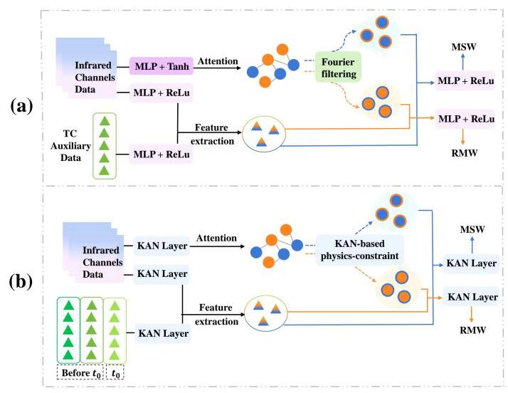
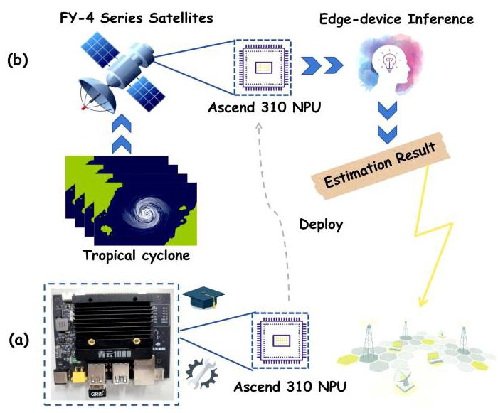
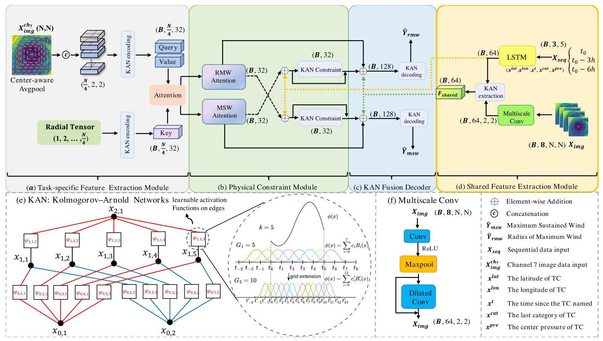
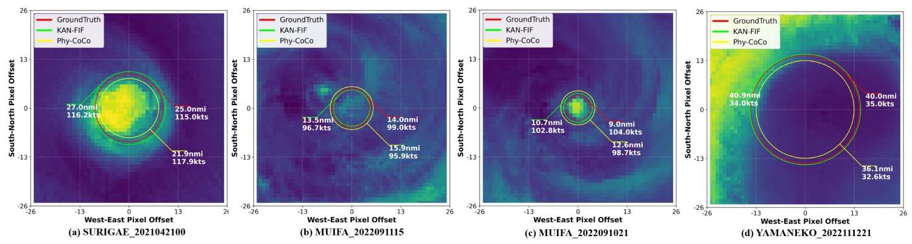

# KAN-FIF: Spline-Parameterized Lightweight Physics-based Tropical Cyclone Estimation on Meteorological Satellite

# KAN-FIF:基于气象卫星的样条参数化轻量级物理热带气旋估计

Jiakang Shen

沈佳康

Shandong University

山东大学

School of Control Science and

控制科学与

Engineering

工程学院

Jinan, Shandong, China

中国山东济南

202300171054@mail.sdu.edu.cn

Qinghui Chen

陈清辉

Shandong University

山东大学

School of Control Science and

控制科学与

Engineering

工程学院

Jinan, Shandong, China

中国山东济南

202420785@mail.sdu.edu.cn

Runtong Wang

王润通

Shandong University

山东大学

School of Control Science and

控制科学与

Engineering

工程学院

Jinan, Shandong, China

中国山东济南

202300171170@mail.sdu.edu.cn

Chenrui Xu

徐晨睿

Shandong University

山东大学

School of Control Science and

控制科学与

Engineering

工程学院

Jinan, Shandong, China

中国山东济南

202300171055@mail.sdu.edu.cn

Jinglin Zhang*

张静琳*

Shandong University

山东大学

School of Control Science and

控制科学与

Engineering

工程学院

Jinan, Shandong, China

中国山东济南

jinglin.zhang@sdu.edu.cn

Cong Bai

白聪

Zhejiang University of Technology

浙江工业大学

College of Computer Science

计算机科学学院

Hangzhou, Zhejiang, China

中国浙江杭州

congbai@zjut.edu.cn

Feng Zhang

张峰

Fudan University

复旦大学

Department of Atmospheric and

大气与……系

Oceanic Sciences and Institutes of

海洋科学与研究所

Atmospheric Sciences

大气科学

Shanghai, China

中国上海

fengzhang@fudan.edu.cn

## Abstract

## 摘要

Tropical cyclones (TC) are among the most destructive natural disasters, causing catastrophic damage to coastal regions through extreme winds, heavy rainfall, and storm surges. Timely monitoring of tropical cyclones is crucial for reducing loss of life and property, yet it is hindered by the computational inefficiency and high parameter counts of existing methods on resource-constrained edge devices. Current physics-guided models suffer from linear feature interactions that fail to capture high-order polynomial relationships between TC attributes, leading to inflated model sizes and hardware incompatibility. To overcome these challenges, this study introduces the Kolmogorov-Arnold Network-based Feature Interaction Framework (KAN-FIF), a lightweight multimodal architecture that integrates MLP and CNN layers with spline-parameterized KAN layers. For Maximum Sustained Wind (MSW) prediction, experiments demonstrate that the KAN-FIF framework achieves a 94.8% reduction in parameters (0.99MB vs 19MB) and 68.7% faster inference per sample (2.3ms vs 7.35ms) compared to baseline model Phy-CoCo, while maintaining superior accuracy with 32.5% lower MAE. The offline deployment experiment of the FY-4 series meteorological satellite processor on the Qingyun-1000 development

热带气旋(TC)是最具破坏性的自然灾害之一，通过极端风力、强降雨和风暴潮对沿海地区造成灾难性破坏。及时监测热带气旋对于减少生命和财产损失至关重要，但在资源受限的边缘设备上，现有方法的计算效率低下且参数众多，这阻碍了监测工作。当前的物理引导模型存在线性特征交互问题，无法捕捉热带气旋属性之间的高阶多项式关系，导致模型规模膨胀且与硬件不兼容。为了克服这些挑战，本研究引入了基于柯尔莫哥洛夫 - 阿诺德网络的特征交互框架(KAN - FIF)，这是一种轻量级多模态架构，它将MLP和CNN层与样条参数化的KAN层集成在一起。对于最大持续风速(MSW)预测，实验表明，与基线模型Phy - CoCo相比，KAN - FIF框架的参数减少了94.8%(从19MB降至0.99MB)，每个样本的推理速度快68.7%(从7.35ms降至2.3ms)，同时保持了更高的准确性，平均绝对误差降低了32.5%。风云四号系列气象卫星处理器在青云 - 1000开发平台上的离线部署实验

## ㊷ 田田田

## ㊷ 田田田

board achieved a 14.41ms per-sample inference latency with the KAN-FIF framework, demonstrating promising feasibility for operational TC monitoring and extending deployability to edge-device AI applications. The code is released at https://github.com/Jinglin-Zhang/KAN-FIF.

使用KAN-FIF框架，该板卡实现了每样本14.41毫秒的推理延迟，展示了用于运行时TC监控以及将可部署性扩展到边缘设备AI应用的良好可行性。代码发布于https://github.com/Jinglin-Zhang/KAN-FIF。

## CCS Concepts

## CCS 概念

- Applied computing $\rightarrow$ Environmental sciences; - Computer systems organization $\rightarrow$ Embedded software; $\bullet$ Computing methodologies $\rightarrow$ Neural networks; Image manipulation.

- 应用计算$\rightarrow$环境科学； - 计算机系统组织$\rightarrow$嵌入式软件； $\bullet$计算方法$\rightarrow$神经网络；图像处理。

## Keywords

## 关键词

Tropical Cyclone Estimation; FY-4 series meteorological satellite; Kolmogorov-Arnold Network; Edge-device AI applications; Multimodal Feature

热带气旋估计；风云四号系列气象卫星；柯尔莫哥洛夫-阿诺德网络；边缘设备人工智能应用；多模态特征

## ACM Reference Format:

## ACM 引用格式:

Jiakang Shen, Qinghui Chen, Runtong Wang, Chenrui Xu, Jinglin Zhang, Cong Bai, and Feng Zhang. 2026. KAN-FIF: Spline-Parameterized Lightweight Physics-based Tropical Cyclone Estimation on Meteorological Satellite. In Proceedings of the 32nd ACM SIGKDD Conference on Knowledge Discovery and Data Mining V.1 (KDD '26), August 09-13, 2026, Jeju Island, Republic of Korea. ACM, New York, NY, USA, 10 pages. https://doi.org/10.1145/3770854.3783929

沈佳康、陈清辉、王润通、徐晨睿、张静琳、白聪、张峰。2026年。KAN-FIF:基于样条参数化的气象卫星轻量级物理热带气旋估计。于2026年8月9日至13日在韩国济州岛举行的第32届ACM SIGKDD知识发现与数据挖掘会议论文集V.1(KDD '26)。美国纽约州纽约市ACM，10页。https://doi.org/10.1145/3770854.3783929

## 1 Introduction

## 1 引言

Tropical cyclones (TC), recognized as highly destructive meteorological phenomena, inflict severe damage upon coastal regions globally. Characterized by extreme wind velocities, intense precipitation, and elevated sea levels, these recurrent events primarily devastate infrastructure and communities through destructive sustained winds, extreme rainfall inducing catastrophic flooding, and devastating storm surges that overwhelm coastal defenses and cause widespread inundation. Consequently, accurate and timely monitoring of Tropical Cyclone (TC) intensity and the radius of peak winds is essential for effective disaster risk management, reliable warnings, urgent protective actions, and the guidance of evacuations.

热带气旋(TC)被认为是极具破坏力的气象现象，对全球沿海地区造成严重破坏。这些反复出现的事件以极端风速、强降水和海平面上升为特征，主要通过持续的破坏性大风、引发灾难性洪水的极端降雨以及冲垮海岸防御并导致大面积淹没的毁灭性风暴潮，对基础设施和社区造成破坏。因此，准确及时地监测热带气旋(TC)的强度和最大风速半径对于有效的灾害风险管理、可靠的预警、紧急保护行动以及疏散指导至关重要。

---

*Corresponding author

*通讯作者

---

Ground-centralized inference and edge-device inference are the two most popular TC prediction methods. The ground-centralized method involves multiple data transmission steps among satellite-to-ground and ground networks, resulting in high latency and computational costs. Edge-device inference faces stringent constraints in processing capability, memory, and operator compatibility. [35, 37, 38] These limitations hinder the adoption of state-of-the-art MLP-based neural networks with a large number of CNN layers included, which are computationally intensive and require specialized hardware support.

地面集中式推理和边缘设备推理是两种最流行的热带气旋预测方法。地面集中式方法涉及卫星到地面和地面网络之间的多个数据传输步骤，导致高延迟和计算成本。边缘设备推理在处理能力、内存和算子兼容性方面面临严格限制。[35, 37, 38] 这些限制阻碍了采用包含大量卷积神经网络层的基于多层感知器的神经网络，这些网络计算量大，需要专门的硬件支持。

Early TC estimation methods relied on satellite imagery combined with empirical algorithms such as the Dvorak technique[29]. These approaches suffered from subjectivity and limited accuracy due to insufficient feature representation. With advances in deep learning, CNN-based models [30, 33] have dominated the estimation of TC attributes using spatial patterns in satellite data. However, most related works focus on the prediction of a single task, neglecting the inherent physical relationships between the TC attributes. Recent multitask learning (MTL) methods[15] attempt to share parameters among tasks, but they risk negative transfer and oversimplified feature interactions. Some works introduced physics-based constraints to model task correlations[39], yet their linear feature concatenation fails to capture high-order polynomial relationships between variables while inflating parameter counts, further straining edge-device inference. Meanwhile, multiscale Xception networks with dual attention[19] and YOLO-NAS architectures[22] achieve breakthroughs in fast satellite data processing by infrared-water vapor fusion. However, these deep learning approaches have advanced TC estimation accuracy at the cost of substantial computational demand.

早期的热带气旋估计方法依赖于卫星图像与经验算法(如德沃夏克技术[29])相结合。由于特征表示不足，这些方法存在主观性且准确性有限。随着深度学习的发展，基于卷积神经网络的模型[30, 33]在利用卫星数据中的空间模式估计热带气旋属性方面占据主导地位。然而，大多数相关工作专注于单一任务的预测，忽略了热带气旋属性之间的内在物理关系。最近的多任务学习(MTL)方法[15]试图在任务之间共享参数，但它们存在负迁移和特征交互过于简化的风险。一些工作引入基于物理的约束来对任务相关性进行建模[39]，但其线性特征拼接在增加参数数量的同时无法捕捉变量之间的高阶多项式关系，进一步给边缘设备推理带来压力。与此同时，具有双重注意力的多尺度Xception网络[19]和YOLO-NAS架构[22]通过红外-水汽融合在快速卫星数据处理方面取得了突破。然而，这些深度学习方法以大量的计算需求为代价提高了热带气旋估计的准确性。

Integrating multimodal auxiliary data with satellite imagery has emerged as a promising trend [10, 17, 20, 34]. However, related studies usually treat temporal features as static inputs rather than modeling sequential dependencies. Recurrent neural networks (RNN) and long-short-term memory networks (LSTM)[5, 14] have been applied to track prediction. The FuXi-based perturbation generator demonstrates improved TC track prediction by optimizing initial uncertainties [26]. It operates independently of satellite data processing and requires extensive historical data for testing, creating notable constraints for field-deployed edge devices with limited memory capacity and demanding temporal requirements for timely tropical cyclone disaster monitoring.

将多模态辅助数据与卫星图像集成已成为一个有前景趋势[10, 17, 20, 34]。然而，相关研究通常将时间特征视为静态输入，而不是对序列依赖性进行建模。循环神经网络(RNN)和长短期记忆网络(LSTM)[5, 14]已应用于路径预测。基于伏羲的扰动生成器通过优化初始不确定性展示了改进的热带气旋路径预测。它独立于卫星数据处理运行，需要大量历史数据进行测试，这对内存容量有限且对及时热带气旋灾害监测有严格时间要求的现场部署边缘设备造成了显著限制。

These accumulated limitations pose three critical challenges for timely tropical cyclone prediction[6, 8, 16, 40]: Firstly, current prediction methodologies predominantly rely on computationally intensive MLP/CNN architectures augmented with specialized detection heads and preprocessing filters, which substantially inflate parameter counts and necessitate high-bandwidth data transmission. Secondly, satellite data downlinking faces intrinsic constraints, such as asynchronous data accessibility due to confinement to orbital passes over specific regions, coupled with severe bandwidth limitations that restrict transmission rates. Thirdly, although edge-device inference offers potential solutions to downlink delays by enabling inter-satellite data transfer, processing, and inference entirely in-orbit with only minimal results relayed to ground stations, fundamental hardware barriers persist. These barriers encompass restricted computational capacity, insufficient memory resources, and framework-device compatibility issues, which collectively demand ultra-lightweight model architectures and preclude sophisticated multimodal preprocessing algorithms.

这些累积的限制对及时的热带气旋预测提出了三个关键挑战[6, 8, 16, 40]:首先，当前的预测方法主要依赖于计算量大的多层感知器/卷积神经网络架构，并辅以专门的检测头和预处理滤波器，这大幅增加了参数数量，需要高带宽数据传输。其次，卫星数据下行链路面临内在约束，如由于限于特定区域的轨道过境导致的异步数据可访问性，以及严重的带宽限制，这限制了传输速率。第三，尽管边缘设备推理通过实现卫星间数据传输、处理和推理完全在轨，仅将最小结果中继到地面站，为下行链路延迟提供了潜在解决方案，但基本硬件障碍仍然存在。这些障碍包括受限的计算能力、不足的内存资源和框架-设备兼容性问题，这共同需要超轻量级模型架构，并排除了复杂的多模态预处理算法。

Figure 1: The comparison of frameworks between the MLP-based and KAN-based models. (a) Conventional MLP-based model (Phycoco) (b) our KAN-based lightweight model

图1:基于多层感知器的模型和基于KAN的模型之间的框架比较。(a) 传统的基于多层感知器的模型(Phycoco)(b) 我们基于KAN的轻量级模型

To address these challenges, the proposed KAN-FIF framework targets efficient and accurate tropical cyclone (TC) estimation on resource-constrained edge devices, with three core contributions:

为应对这些挑战，所提出的KAN-FIF框架旨在在资源受限的边缘设备上实现高效准确的热带气旋(TC)估计，有三个核心贡献:

- Lightweight deployment via Kolmogorov-Arnold network (KAN) layer substitution. Traditional multilayer perceptrons (MLPs), convolutional neural networks (CNNs), and filtering operations in feature extraction, physical constraints, and decoding stages are replaced by computationally efficient KAN layers, significantly compressing model complexity while retaining superior accuracy, as shown in Figure 1.

- 通过Kolmogorov-Arnold网络(KAN)层替换实现轻量级部署。在特征提取、物理约束和解码阶段，传统的多层感知器(MLP)、卷积神经网络(CNN)和滤波操作被计算高效的KAN层取代，显著压缩模型复杂度，同时保持卓越的准确性，如图1所示。

- Physics-based fusion for cross-modal dependencies. Sequential features and infrared imagery are fused through a hybrid encoder to capture nonlinear cross-modal couplings. Simultaneously, a differentiable physics-constraint module fits high-dimensional polynomial relationships between intensity and size by embedding domain-specific equations.

- 基于物理的跨模态依赖融合。序列特征和红外图像通过混合编码器融合，以捕获非线性跨模态耦合。同时，一个可微的物理约束模块通过嵌入特定领域方程来拟合强度和大小之间的高维多项式关系。

- On-Orbit Edge-device Inference Capability Validation. Experimental offline deployment of the FY-4 meteorological satellite processor on the Qingyun-1000 development board yielded a ${14.41}\mathrm{\;{ms}}$ latency per inference sample, with the verification process depicted in Figure 2. Through architectural refinements, edge-computing constraints were mitigated, enabling high-performance, timely tropical cyclone monitoring and demonstrating promising potential for operational deployment onboard satellites.

- 在轨边缘设备推理能力验证。在青云-1000开发板上对风云四号气象卫星处理器进行实验性离线部署，每个推理样本产生${14.41}\mathrm{\;{ms}}$延迟，验证过程如图2所示。通过架构优化，减轻了边缘计算约束，实现了高性能、及时的热带气旋监测，并展示了在卫星上进行业务部署的广阔潜力。

Figure 2: The offline deployment verification process of the FY-4 series satellite processor on the Qingyun-1000 development board. (a) Deployment verification on Ascend 310 NPU (b) Edge-device inference process of tropical cyclone estimation on FY-4 series satellite

图2:风云四号系列卫星处理器在青云-1000开发板上的离线部署验证过程。(a) 在Ascend 310 NPU上的部署验证(b) 风云四号系列卫星上热带气旋估计的边缘设备推理过程

## 2 Related Work

## 2相关工作

Despite advances in developing hardware-aware computational methods, persistent constraints continue to challenge multimodal data processing in tropical cyclone estimation. Consequently, advancing lightweight architectures must become a research priority to meet edge-device inference demands.

<text>尽管在开发硬件感知计算方法方面取得了进展，但持续存在的限制继续对热带气旋估计中的多模态数据处理构成挑战。因此，推进轻量级架构必须成为满足边缘设备推理需求的研究重点。</text>

### 2.1 Tropical Cyclone Estimation

<text>### 2.1热带气旋估计</text>

Tropical cyclone estimation has long been a focal point of extensive research, encompassing key attributes such as Maximum Sustained Wind (MSW), the radius of maximum winds (RMW), the spatial extent of impact, and associated precipitation volumes. Related models primarily utilize two data sources: infrared (IR) channel data from satellites, and auxiliary information comprising geographical metadata, seasonal context, and temporal characteristics. Although track prediction relies heavily on spatiotemporal sequences, the estimation of other attributes of TC usually depends on high-dimensional IR satellite imagery, like DeepMicroNet, TCIEnet, and TCICEnet[30, 33, 36]. Recently, multi-task prediction frameworks have emerged that incorporate physical priors to constrain the output from multiple tasks[11, 28]. Some studies employ encoder-decoder fusion architectures or integrate frequency domain features through filtering operations[4, 31, 32]. However, these approaches usually rely on substantial computational resources and extensive parameters to capture non-linear relationships.

<text>长期以来，热带气旋估计一直是广泛研究的焦点，包括最大持续风速(MSW)、最大风半径(RMW)、影响的空间范围和相关降水量等关键属性。相关模型主要利用两个数据源:卫星的红外(IR)通道数据，以及包括地理元数据、季节背景和时间特征的辅助信息。虽然轨迹预测严重依赖时空序列，但热带气旋其他属性的估计通常依赖于高维红外卫星图像，如DeepMicroNet、TCIEnet和TCICEnet[30, 33, 36]。最近，出现了结合物理先验来约束多个任务输出的多任务预测框架[11, 28]。一些研究采用编码器 - 解码器融合架构或通过滤波操作整合频域特征[4, 31, 32]。然而，这些方法通常依赖大量计算资源和广泛的参数来捕捉非线性关系。</text>

### 2.2 Edge-device inference

<text>### 2.2边缘设备推理</text>

Edge-device inference offers a promising alternative to ground-centralized processing by mitigating limitations such as intermittent connectivity and restricted data transmission capacity. Early research targeted basic inference tasks, exemplified by CubeSat cloud segmentation studies [21]. Subsequent missions, exemplified by NASA's IPEX mission, achieving real-time classification [1], revealed persistent computational constraints onboard. The rise of deep learning substantially advanced onboard capabilities, with recent missions validating high-accuracy cloud detection using optimized deep learning models [9]. Researchers subsequently explored efficient architectures through three pathways: First, lightweight models deployed on microcontrollers [23, 24]; Second, quantized networks achieving real-time performance on FPGAs [25]; and Third, specialized designs such as row-wise stream processors [2].

<text>边缘设备推理通过减轻诸如间歇性连接和受限的数据传输容量等限制，为地面集中式处理提供了一个有前景的替代方案。早期研究针对基本推理任务，以CubeSat云分割研究[21]为例。随后的任务，以NASA的IPEX任务实现实时分类[1]为例，揭示了机载持续存在的计算限制。深度学习的兴起大幅提升了机载能力，最近的任务使用优化的深度学习模型验证了高精度云检测[9]。研究人员随后通过三条途径探索高效架构:第一，部署在微控制器上的轻量级模型[23, 24]；第二，在FPGA上实现实时性能的量化网络[25]；第三，诸如逐行流处理器等专门设计[2]。</text>

Separately in meteorological forecasting, lightweight models have optimized efficiency-accuracy tradeoffs. Tian et al. developed a multitask network termed TC-MTLNet with adaptive loss balancing for joint tropical cyclone intensity and size estimation, reducing errors while minimizing computational overhead [28]. Similarly, Shang et al. proposed CDC-Net, which leverages channel dilation combined with feature copying to enable rapid satellite image classification under strict computational constraints [27]. Building on these advances, our method integrates Kolmogorov-Arnold Network layers as substitutes for conventional CNN and MLP components. This design eliminates preprocessing filtration requirements while achieving dramatic parameter reduction, substantially enhancing feasibility for edge deployment.

<text>在气象预报方面，轻量级模型分别优化了效率 - 精度权衡。田等人开发了一种名为TC - MTLNet的多任务网络，用于联合热带气旋强度和大小估计，具有自适应损失平衡，在最小化计算开销的同时减少了误差[28]。同样，尚等人提出了CDC - Net，它利用通道扩张结合特征复制，在严格的计算限制下实现快速卫星图像分类[27]。基于这些进展，我们的方法集成了柯尔莫哥洛夫 - 阿诺德网络层，以替代传统的CNN和MLP组件。这种设计消除了预处理过滤要求，并在大幅减少参数的同时显著提高了边缘部署的可行性。</text>

## 3 Problem Definition

<text>## 3问题定义</text>

Our model targets predictions of two critical tropical cyclone attributes: Maximum Sustained Wind (MSW) and Radius of Maximum Wind (RMW), learning parametric mappings that:

<text>我们的模型旨在预测两个关键的热带气旋属性:最大持续风速(MSW)和最大风半径(RMW)，学习参数映射，该映射:</text>

(1)

$$
{f}_{\text{ msw }} : \left( {{X}_{\text{ seq }},{X}_{\text{ img }}}\right)  \rightarrow  {\widehat{Y}}_{\text{ msw }}
$$

$$
{f}_{\mathrm{{rmw}}} : \left( {{X}_{\mathrm{{seq}}},{X}_{\mathrm{{img}}}}\right)  \rightarrow  {\widehat{Y}}_{\mathrm{{rmw}}}
$$

The TC estimation problem is formulated as:

<text>热带气旋估计问题被表述为:</text>

(2)

$$
{\theta }^{ * } = \underset{\theta }{\arg \max }\left\lbrack  {\alpha  \cdot  L\left( {{f}_{msw}\left( {{X}_{seq},{X}_{img};\theta }\right) ,{Y}_{msw}}\right) }\right.
$$

$$
\left. {+\beta  \cdot  L\left( {{f}_{rmw}\left( {{X}_{seq},{X}_{img};\theta }\right) ,{Y}_{rmw}}\right) }\right\rbrack
$$

where $\theta$ represents all the learnable parameters. $\alpha$ and $\beta$ represent the adjustable weights of the tasks. $L\left( \cdot \right)$ denotes the MAE loss function. ${Y}_{msw}$ and ${Y}_{rmw}$ represent ground truth values. ${\widehat{Y}}_{msw} \in \; \left\lbrack  {{19},{170}}\right\rbrack$ knots and ${\widehat{Y}}_{rmw} \in  \left\lbrack  {5,{200}}\right\rbrack  \mathrm{{nmi}}$ are denormalized through min-max scaling. The input data consists of two modalities: 1) Temporal sequence data ${X}_{\text{ seq }} \in  {\mathbb{R}}^{T \times  5}$ containing the evolution features of the TC (latitude ${x}^{\text{ lat }}$ , longitude ${x}^{\text{ lon }}$ , the time since the TC was named ${x}^{t}$ , previous category ${x}^{\text{ cat }}$ and central pressure ${x}^{\text{ pre }}$ ) over $T = 3$ consecutive time steps, with a temporal resolution of 3 hours between steps. 2) Satellite image data ${X}_{img} \in  {\mathbb{R}}^{8 \times  H \times  W}$ representing multichannel infrared observations with spatial dimensions $H = {156}, W = {156}$ . The first four channels ${X}_{img}^{c{h}_{1 - 4}}$ correspond to observations from 3 hours before the target prediction time, while the last four channels ${X}_{img}^{c{h}_{5 - 8}}$ represent current-time imagery.

其中$\theta$表示所有可学习参数。$\alpha$和$\beta$表示任务的可调权重。$L\left( \cdot \right)$表示平均绝对误差损失函数。${Y}_{msw}$和${Y}_{rmw}$表示真实值。${\widehat{Y}}_{msw} \in \; \left\lbrack  {{19},{170}}\right\rbrack$个节点和${\widehat{Y}}_{rmw} \in  \left\lbrack  {5,{200}}\right\rbrack  \mathrm{{nmi}}$通过最小-最大缩放进行反归一化。输入数据由两种模态组成:1) 时间序列数据${X}_{\text{ seq }} \in  {\mathbb{R}}^{T \times  5}$，包含热带气旋(TC)在$T = 3$个连续时间步长上的演变特征(纬度${x}^{\text{ lat }}$、经度${x}^{\text{ lon }}$、TC命名后的时间${x}^{t}$、先前类别${x}^{\text{ cat }}$和中心气压${x}^{\text{ pre }}$)，步长之间的时间分辨率为3小时。2) 卫星图像数据${X}_{img} \in  {\mathbb{R}}^{8 \times  H \times  W}$，表示具有空间维度$H = {156}, W = {156}$的多通道红外观测。前四个通道${X}_{img}^{c{h}_{1 - 4}}$对应于目标预测时间前3小时的观测，而后四个通道${X}_{img}^{c{h}_{5 - 8}}$表示当前时刻的图像。

## 4 Methods

## 4方法

In this study, we integrate KAN layers in four critical aspects of our architecture, as shown in Figure 3, in order to design a framework that takes into account both lightweight deployability and prediction accuracy: a) Shared Feature Extraction: We employ KAN-LSTM for temporal feature extraction and KAN-CNN for spatial feature extraction from multi-spectral satellite imagery. b) Attention Encoding: When computing center-aware spatial attention, we utilize KAN layers to encode both distance features and spatial patterns, replacing traditional linear+tanh encoding. c) Physical Constraints: We directly implement inter-task physical constraints through KAN layers to fit polynomial relationships among task features, eliminating conventional convolution, MLP, Fourier transform, and Kalman filtering operations. d) Feature Fusion and Decoding: We utilize the KAN layers to fuse and decode shared features, task-specific features, and physical constraint features to obtain the final prediction outputs. Note that the full KAN-FIF architecture employs an LSTM layer followed by KAN projection for temporal features, while the deployment variant (Section 5) removes the LSTM due to NPU incompatibility.

在本研究中，我们在架构的四个关键方面集成了KAN层，如图3所示，以便设计一个兼顾轻量级可部署性和预测准确性的框架:a) 共享特征提取:我们采用KAN-LSTM进行时间特征提取，采用KAN-CNN从多光谱卫星图像中进行空间特征提取。b) 注意力编码:在计算中心感知空间注意力时，我们利用KAN层对距离特征和空间模式进行编码，取代传统的线性+tanh编码。c) 物理约束:我们通过KAN层直接实现任务间的物理约束，以拟合任务特征之间的多项式关系，省去传统的卷积、多层感知器、傅里叶变换和卡尔曼滤波操作。d) 特征融合与解码:我们利用KAN层融合和解码共享特征、特定任务特征和物理约束特征，以获得最终预测输出。请注意，完整的KAN-FIF架构采用一个LSTM层，随后对时间特征进行KAN投影，而部署变体(第5节)由于NPU不兼容而去掉了LSTM。

### 4.1 Kolmogorov-Arnold Networks

### 4.1 柯尔莫哥洛夫-阿诺德网络

Kolmogorov-Arnold networks (KANs) introduce a novel neural network framework inspired by the Kolmogorov-Arnold representation theorem [18]. Unlike traditional Multi-Layer Perceptrons (MLPs) that employ fixed node activation functions, KANs utilize spline-approximated learnable activations parameterized on edges. This architectural innovation enables KANs to model complex nonlinear relationships with exceptional parameter efficiency, offering distinct advantages for high-dimensional data modeling. The foundation of KANs lies in the Kolmogorov-Arnold theorem, which asserts that any continuous multivariate function can be decomposed into a finite composition of univariate functions and additive operations. Mathematically, for a function $f : {\left\lbrack  0,1\right\rbrack  }^{n} \rightarrow  \mathbb{R}$ , this is expressed as:

柯尔莫哥洛夫-阿诺德网络(KANs)引入了一种受柯尔莫哥洛夫-阿诺德表示定理[18]启发的新型神经网络框架。与采用固定节点激活函数的传统多层感知器(MLP)不同，KANs利用在边上参数化的样条近似可学习激活函数。这种架构创新使KANs能够以卓越的参数效率对复杂的非线性关系进行建模，为高维数据建模提供了独特优势。KANs的基础在于柯尔莫哥洛夫-阿诺德定理，该定理断言任何连续多元函数都可以分解为单变量函数和加法运算的有限组合。在数学上，对于一个函数$f : {\left\lbrack  0,1\right\rbrack  }^{n} \rightarrow  \mathbb{R}$，这表示为:

$$
f\left( {{x}_{1},\ldots ,{x}_{n}}\right)  = \mathop{\sum }\limits_{{q = 1}}^{{{2n} + 1}}{\varphi }_{q}\left( {\mathop{\sum }\limits_{{p = 1}}^{n}{\varphi }_{q, p}\left( {x}_{p}\right) }\right) \tag{3}
$$

where ${\varphi }_{q, p}$ and ${\varphi }_{q}$ are univariate functions.

其中${\varphi }_{q, p}$和${\varphi }_{q}$是单变量函数。

KAN layers fundamentally replace linear weight matrices with spline-parameterized edges. This architectural shift enables adaptive modeling of high-order polynomial relationships, where MLP and CNN architectures struggle due to fixed activation functions constraining expressiveness. By leveraging locally adaptive polynomial segments through edge-based parameterization, KAN layers efficiently capture intricate nonlinearities without requiring excessive network depth. Crucially, as KAN layers directly optimize inter-layer function parameters, their outputs form strictly expressible composite polynomials, facilitating significantly higher interpretability than MLPs through explicit exploration of variable relationships. Each edge in a KAN layer, as shown in Figure 3(e), represents a univariate function ${\varphi }_{q, p}$ parameterized as:

KAN层从根本上用样条参数化边取代了线性权重矩阵。这种架构转变能够对高阶多项式关系进行自适应建模，而多层感知器(MLP)和卷积神经网络(CNN)架构由于固定激活函数限制了表现力，在这方面存在困难。通过基于边的参数化利用局部自适应多项式段，KAN层无需过多网络深度就能有效捕捉复杂的非线性。至关重要的是，由于KAN层直接优化层间函数参数，其输出形成严格可表达的复合多项式，通过明确探索变量关系，比MLP具有更高的可解释性。如图3(e)所示，KAN层中的每条边代表一个单变量函数${\varphi }_{q, p}$，参数化为:

$$
{\varphi }_{q, p}\left( x\right)  = w \cdot  \left( {\operatorname{silu}\left( x\right)  + \operatorname{spline}\left( x\right) }\right) \tag{4}
$$

where $\operatorname{silu}\left( x\right)  = \frac{x}{1 + {e}^{-x}}$ is a self-gating activation function and spline $\left( x\right)$ is a piecewise polynomial curve optimized via gradient descent.

其中$\operatorname{silu}\left( x\right)  = \frac{x}{1 + {e}^{-x}}$是一个自门控激活函数，样条$\left( x\right)$是通过梯度下降优化的分段多项式曲线。

In subsequent implementations, the KAN layer can be treated as a linear layer, employing fixed polynomial basis functions with grid_size=5 and spline_order=3. Here, grid_size specifies the number of intervals used to partition the input domain for the spline approximation, where each interval corresponds to a locally defined polynomial segment. The spline_order parameter controls the degree of the polynomial used in each interval, with spline_order=3 corresponding to cubic splines.

在后续实现中，KAN层可视为线性层，采用固定多项式基函数，网格大小grid_size = 5，样条阶数spline_order = 3。这里，grid_size指定用于划分样条近似输入域的区间数量，每个区间对应一个局部定义的多项式段。样条阶数参数控制每个区间中使用的多项式次数，spline_order = 3对应三次样条。

### 4.2 KAN-based Shared Feature Extraction

### 4.2基于KAN的共享特征提取

The Shared Feature Extraction Module implements parallel temporal-spatial feature extraction through dual pathways. KAN-LSTM processes sequential TC evolution data and KAN-CNN extracts multi-scale spatial patterns from infrared imagery.

共享特征提取模块通过双路径实现并行时空特征提取。KAN - LSTM处理顺序的TC演变数据，KAN - CNN从红外图像中提取多尺度空间模式。

4.2.1 Temporal Feature Extraction with KAN-LSTM. For temporal input ${X}_{\text{ seq }} \in  {\mathbb{R}}^{B \times  T \times  5}$ containing $B$ samples of 3-step TC evolution features, we first employ an LSTM layer to capture temporal dependencies, and then a KAN projection extracts the features:

4.2.1使用KAN - LSTM进行时间特征提取。对于包含$B$个3步TC演变特征样本的时间输入${X}_{\text{ seq }} \in  {\mathbb{R}}^{B \times  T \times  5}$，我们首先使用LSTM层捕捉时间依赖性，然后通过KAN投影提取特征:

$$
{F}_{\text{ seq }} = {\mathrm{{KAN}}}_{\text{ Linear }}^{{64} \rightarrow  {32}}\left( {F}_{\text{ LSTM }}\right)  \in  {\mathbb{R}}^{B \times  {32}} \tag{5}
$$

4.2.2 Spatial Feature Extraction with KAN-CNN. For satellite imagery ${X}_{\text{ img }} \in  {\mathbb{R}}^{B \times  8 \times  H \times  W}$ , we design a Multi-Scale ConvBlock with residual enhancement:

4.2.2使用KAN - CNN进行空间特征提取。对于卫星图像${X}_{\text{ img }} \in  {\mathbb{R}}^{B \times  8 \times  H \times  W}$，我们设计了一个具有残差增强的多尺度卷积块:

$$
{F}_{\text{ conv }}^{\left( 1\right) } = \operatorname{ReLU}\left( {\operatorname{Conv}2{\mathrm{\;D}}_{8 \rightarrow  {16}}^{5 \times  5}\left( {X}_{img}\right) }\right)
$$

$$
{F}_{\text{ conv }}^{\left( 2\right) } = \operatorname{MaxPool}\left( {\operatorname{ReLU}\left( {{\operatorname{Conv2D}}_{{16} \rightarrow  {32}}^{3 \times  3}\left( {F}_{\text{ conv }}^{\left( 1\right) }\right) }\right) }\right)
$$

$$
{F}_{\text{ res }} = {\text{ Conv2D }}_{{32} \rightarrow  {64}}^{1 \times  1}\left( {F}_{\text{ conv }}^{\left( 2\right) }\right) \;\text{ (Residual path) } \tag{6}
$$

$$
{F}_{\text{ multiscale }} = \operatorname{concat}\left\lbrack  {{F}_{\text{ res }},\mathop{\sum }\limits_{{d = 1}}^{3}\operatorname{DilatedConv}{}_{{32} \rightarrow  {32}}^{3 \times  3}\left( {F}_{\text{ conv }}^{\left( 2\right) }\right) }\right\rbrack
$$

The compressed spatial features are obtained as follows:

压缩后的空间特征如下获得:

$$
{F}_{\text{ img }} = {\mathrm{{KAN}}}_{\text{ Linear }}^{{256} \rightarrow  {32}}\left( {\text{ Flatten }\left( {F}_{\text{ multiscale }}\right) }\right)  \in  {\mathbb{R}}^{B \times  {32}} \tag{7}
$$

4.2.3 Final Shared Representation. The final shared representation combines temporal and spatial features:

4.2.3最终共享表示。最终共享表示结合了时间和空间特征:

$$
{F}_{\text{ shared }} = \operatorname{concat}\left\lbrack  {{F}_{\text{ seq }},{F}_{img}}\right\rbrack   \in  {\mathbb{R}}^{B \times  {64}} \tag{8}
$$

### 4.3 KAN-based Task-Specific Feature Extraction

### 4.3基于KAN的特定任务特征提取

Traditional attention mechanisms for TC estimation often employ linear layers with static activation functions (ReLU or tanh) to encode spatial distances and cloud patterns. However, these methods struggle to model high-order polynomial relationships between annular cloud features and TC attributes. In our KAN-Attention, we replace linear layers with KAN layers in spatial distance encoding and content-aware feature projection(Algorithm 1).

传统的用于TC估计的注意力机制通常使用具有静态激活函数(ReLU或tanh)的线性层来编码空间距离和云模式。然而，这些方法难以对环形云特征和TC属性之间的高阶多项式关系进行建模。在我们的KAN - 注意力中，我们在空间距离编码和内容感知特征投影(算法1)中用KAN层取代了线性层。

We selected channel 7 (10.4 $\mu \mathrm{m}$ infrared band from Himawari-8) as spatial input because it optimally captures cold cloud tops in TC eye-wall regions, where lower brightness temperatures correlate strongly with convective intensity and MSW/RMW values[32].

我们选择通道7(来自Himawari - 8的10.4$\mu \mathrm{m}$红外波段)作为空间输入，因为它能最佳地捕捉TC眼壁区域的冷云顶，其中较低的亮度温度与对流强度和最大风速半径/最大风速半径(MSW/RMW)值密切相关[32]。

Figure 3: The architecture of the KAN-FIF learning framework: (a) The Task-specific Feature Extraction Module uses KAN layer and center-aware attention to extract the task features of MSW and RMW respectively (b) The Physical Constraint Module is designed to conduct constraints among task-specific features; (c) The KAN Fusion Decoder fuse the features from(a)(b)(d) and obtain the final output; (d) The Shared Feature Extraction Module take the multi-channel image and the temporal sequence data as input and obtain the shared feature between TC tasks; (e) the architecture of KAN layers; (f) the architecture of Multiscale Conv

图3:KAN - FIF学习框架的架构:(a)特定任务特征提取模块使用KAN层和中心感知注意力分别提取MSW和RMW的任务特征；(b)物理约束模块旨在对特定任务特征之间进行约束；(c)KAN融合解码器融合来自(a)(b)(d)的特征并获得最终输出；(d)共享特征提取模块将多通道图像和时间序列数据作为输入并获得TC任务之间的共享特征；(e)KAN层的架构；(f)多尺度卷积的架构

Our preprocessing employs adaptive annular pooling across 39 concentric rings to extract hierarchical cloud features, generating content-aware queries (Q) and values (V). Radial distances are encoded through a KAN layer to produce position-sensitive keys (K).

我们的预处理采用跨39个同心环的自适应环形池化来提取分层云特征，生成内容感知查询(Q)和值(V)。径向距离通过KAN层编码以产生位置敏感键(K)。

### 4.4 Physics-Guided Constraint Modeling

### 4.4物理引导的约束建模

To establish meteorologically consistent relationships between MSW and RMW predictions, we design bidirectional residual connections governed by KAN layers. Let ${A}_{msw} \in  {\mathbb{R}}^{B \times  {32}}$ and ${A}_{rmw} \in \; {\mathbb{R}}^{B \times  {32}}$ be the task-specific features. The physics-guided interaction is formulated as follows.

为了在MSW和RMW预测之间建立气象上一致的关系，我们设计了由KAN层控制的双向残差连接。设${A}_{msw} \in  {\mathbb{R}}^{B \times  {32}}$和${A}_{rmw} \in \; {\mathbb{R}}^{B \times  {32}}$为特定任务特征。物理引导的交互如下制定。

(9)

$$
{\Gamma }_{{msw} \rightarrow  {rnw}}\left( {A}_{msw}\right)  = {A}_{rmw} + {K}_{msw2rmw}\left( {A}_{msw}\right)
$$

$$
{\Gamma }_{{rmw} \rightarrow  {msw}}\left( {A}_{rmw}\right)  = {A}_{msw} + {K}_{rmw2msw}\left( {A}_{rmw}\right)
$$

where $K\left( \cdot \right)$ represents a KAN layer that implements a dimensional mapping. ${K}_{msw2rmw}$ and ${K}_{rmw2msw}$ employ independent spline bases to model distinct physical mechanisms: ${K}_{msw2rmw}$ learns wind-driven radius expansion or contraction patterns and ${K}_{rmw2msw}$ captures radius-modulated wind intensification. This formulation preserves the primary task features through residual connections while injecting physically plausible interactions between TC attributes.

其中$K\left( \cdot \right)$表示实现维度映射的KAN层。${K}_{msw2rmw}$和${K}_{rmw2msw}$采用独立的样条基来对不同的物理机制进行建模:${K}_{msw2rmw}$学习风驱动的半径扩张或收缩模式，${K}_{rmw2msw}$捕捉半径调制的风增强。这种公式通过残差连接保留了主要任务特征，同时在TC属性之间注入了物理上合理的相互作用。

### 4.5 Multimodal Feature Fusion

### 4.5多模态特征融合

Final predictions fuse three categories of features:

最终预测融合了三类特征:

(1) Task-specific features $\left( {{A}_{msw},{A}_{rmw}}\right)$

(1) 特定任务特征$\left( {{A}_{msw},{A}_{rmw}}\right)$

(2) Physics-constrained features $\left( {{\Gamma }_{{msw} \rightarrow  {rmw}},{\Gamma }_{{rmw} \rightarrow  {msw}}}\right)$

(2) 物理约束特征$\left( {{\Gamma }_{{msw} \rightarrow  {rmw}},{\Gamma }_{{rmw} \rightarrow  {msw}}}\right)$

(3) Shared spatiotemporal embeddings ${F}_{\text{ shared }}$

(3) 共享时空嵌入 ${F}_{\text{ shared }}$

The fusion and decoding process is defined as follows:

融合和解码过程定义如下:

(10)

$$
{\bar{Y}}_{msw} = {D}_{msw}\left( {\operatorname{cat}\left\lbrack  {{A}_{msw},{\Gamma }_{{rmw} \rightarrow  {msw}},{F}_{\text{ shared }}}\right\rbrack  }\right)
$$

$$
{\bar{Y}}_{rmw} = {D}_{rmw}\left( {\operatorname{cat}\left\lbrack  {{A}_{rmw},{\Gamma }_{{msw} \rightarrow  {rmw}},{F}_{\text{ shared }}}\right\rbrack  }\right)
$$

where $D\left( \cdot \right)$ denotes a KAN decoder which can be configured as follows.

其中$D\left( \cdot \right)$表示一个KAN解码器，其配置如下。

$$
{D}_{\text{ task }}\left( x\right)  = {\mathrm{{KAN}}}_{\text{ Linear }}^{{128} \rightarrow  1}\left( x\right) \tag{11}
$$

## 5 Deployment Preparation for TC Estimation 5.1 Hardware and Software Environment

## 5 流量控制估计的部署准备 5.1 硬件和软件环境

The proposed KAN-FIF framework was experimentally deployed on the Qingyun-1000 development board for the FY-4 meteorological satellite processor, and three edge-deployment constraints were overcome: limited operator compatibility for neural network layers, hardware acceleration dependencies requiring static computation graphs, and memory limitations necessitating model compression to prevent runtime failures. The edge-device deployment leverages Huawei's AscendCL framework to replace standard PyTorch inference with a static execution paradigm. Key adaptations involve initializing inference sessions via InferSession for loading precompiled OM models, enforcing FP16 tensor precision to ensure NPU compatibility, and implementing asynchronous I/O queues to minimize latency. Unlike GPU-based inference relying on dynamic computation graphs, this deployment pre-allocates fixed-size input buffers for satellite imagery while eliminating runtime branching operations.

所提出的KAN-FIF框架在风云四号气象卫星处理器的青云-1000开发板上进行了实验性部署，并克服了三个边缘部署限制:神经网络层的操作员兼容性有限、需要静态计算图的硬件加速依赖性以及为防止运行时故障而需要进行模型压缩的内存限制。边缘设备部署利用华为的AscendCL框架，以静态执行范式取代标准的PyTorch推理。关键的适配措施包括通过InferSession初始化推理会话以加载预编译的OM模型、强制使用FP16张量精度以确保与NPU兼容，以及实现异步I/O队列以最小化延迟。与基于GPU的依赖动态计算图的推理不同，这种部署为卫星图像预先分配固定大小的输入缓冲区，同时消除运行时分支操作。

Algorithm 1 KAN-Attention

算法1 KAN注意力机制

---

Require: ${F}_{\text{ seq }} \in  {\mathbb{R}}^{B \times  {32}}$ : Temporal features

Require: ${X}_{\text{ img }}^{c{h}_{7}} \in  {\mathbb{R}}^{B \times  1 \times  H \times  W}$ : Channel 7 image

	Output ${A}_{\text{ task }} \in  {\mathbb{R}}^{B \times  {32}}$

	// Center-aware Avgpool

	Initialize $r$ _center $\leftarrow  {77}$

	for $i \in  \{ 0,\ldots ,{38}\}$ do

		$L \leftarrow  r$ _____center $- {2i}, R \leftarrow  r$ _____center $+ {2i}$

		${R}_{i} \leftarrow  {X}_{\text{ img }}\left\lbrack  { : , : , L : R, L : R}\right\rbrack$

		${P}_{i} \leftarrow  \operatorname{AdaptiveAvgPool}\left( {{R}_{i},\left( {2,2}\right) }\right)$

		$P \leftarrow  \operatorname{Concat}\left( {P,\operatorname{Flatten}\left( {P}_{i}\right) }\right)$

	end for

	Initialize $G \leftarrow$ linspace $\left( {0,1,{39}}\right)$

	// KAN-based encoding

	$K \leftarrow$ KAN_Linear $\left( G\right)$ \{Spatial distance encoding\}

	$Q, V \leftarrow  \operatorname{Split}\left( {\operatorname{KAN\_ Linear}\left( P\right) ,2}\right)$ \{Content encoding\}

	// Multi-head attention

	${Q}_{h},{K}_{h},{V}_{h} \leftarrow$ SplitHeads $\left( {Q, K, V,\text{ num\_heads } = 4}\right)$

	Attn $\leftarrow  \operatorname{Softmax}\left( {{Q}_{h}@{K}_{h}^{T}/\sqrt{d}}\right)$

	${C}_{h} \leftarrow$ Attn@ ${V}_{h},\dot{C} \leftarrow$ MergeHeads $\left( {C}_{h}\right)$

	// Temporal fusion

	${A}_{\text{ task }} \leftarrow$ KAN_Linear $\left( {\operatorname{Concat}\left( {{C}_{\text{ avg }},{F}_{\text{ seq }}}\right) }\right)$

---

Table 1: Hardware and Software Deployment Specifications

表1:硬件和软件部署规范

<table><tr><td>Category</td><td>Specification</td></tr><tr><td>Hardware Platform</td><td>Qingyun-1000 board</td></tr><tr><td>Acceleration Module</td><td>Atlas 200I A2</td></tr><tr><td>Processor</td><td>Huawei Ascend 310 NPU</td></tr><tr><td>Memory</td><td>8GB LPDDR4</td></tr><tr><td>Compute Capacity</td><td>22 TOPS @ INT8/</td></tr><tr><td></td><td>11 TOPS @ FP16</td></tr><tr><td>Power Budget</td><td><10W</td></tr><tr><td>Acceleration Stack</td><td>CANN 6.0.1</td></tr><tr><td>Environment</td><td>Python 3.7</td></tr></table>

### 5.2 Model Conversion Workflow

### 5.2 模型转换工作流程

The original KAN-LSTM hybrid architecture underwent redesign to eliminate NPU-incompatible LSTM operators. In its deployment version, flattened temporal sequences are processed directly through an expanded KAN network, bypassing recurrent computations entirely.

最初的KAN-LSTM混合架构进行了重新设计，以消除与NPU不兼容的LSTM算子。在其部署版本中，扁平的时间序列直接通过扩展的KAN网络进行处理，完全绕过了循环计算。

To ensure compliance with the NPU's static computation graph requirements, all conditional branching operations were removed to establish a fixed execution path. Key hyperparameters-including the spline grid_size (fixed at 5) and spline_order (fixed at 3)-were hardcoded, while B-spline basis functions underwent precomputa-tion during model initialization. Adaptive pooling layers were replaced by fixed-stride average pooling, preventing dynamic output shapes. Collectively, these modifications guarantee deterministic memory allocation and operator sequencing during inference.

为确保符合NPU的静态计算图要求，所有条件分支操作均被移除，以建立固定的执行路径。包括样条网格大小(固定为5)和样条阶数(固定为3)在内的关键超参数被硬编码，而B样条基函数在模型初始化期间进行了预计算。自适应池化层被固定步长平均池化所取代，以防止动态输出形状。总体而言，这些修改保证了推理期间确定性的内存分配和算子排序。

For addressing the ATC compiler's 63-kernel-size limit on pooling operations, the deployment version employs a two-stage pooling strategy.

为解决ATC编译器在池化操作上63内核大小的限制，部署版本采用了两阶段池化策略。

While our offline validation demonstrates promising performance on hardware identical to the FY-4 satellite processor, actual on-orbit deployment may face additional challenges including data pipeline integration, radiation hardening, power management, and command-control systems that require further engineering validation.

虽然我们的离线验证在与风云四号卫星处理器相同的硬件上展示了良好的性能，但实际在轨部署可能会面临其他挑战，包括数据管道集成、抗辐射加固、电源管理以及需要进一步工程验证的指挥控制系统。

## 6 Experiments

## 6实验

### 6.1 Experimental Setup

### 6.1实验设置

6.1.1 Dataset and Preprocessing. The model is evaluated using the Tropical Cyclone Multi-Modal Dataset (TCMM), which shares data sources with the baseline study [12, 32] but incorporates temporal sequencing. This dataset integrates infrared brightness temperature from Himawari-8 satellite channels 7, 8, 13, 15 [3] and tropical cyclone track records from the IBTrACS repository [7, 13], covering the period 2015-2022. Each sample comprises an 8-channel ${156} \times  {156}$ infrared image normalized to $\left\lbrack  {0,1}\right\rbrack$ , paired with five temporal features: (a) center position (latitude/longitude), (b) hours since cyclone naming, (c) prior storm category (0-5 scale with -1 for unnamed systems), and (d) central pressure (hPa). Samples are structured as 3-hour interval sequences $\left( {{t}_{0} - 6,{t}_{0} - 3,{t}_{0}}\right)$ to capture short-term evolution, with this 6-hour lookback window enabling operational forecasts 6 hours post-naming-critical for timely disaster prevention. To enhance dataset robustness, we applied ${90}^{ \circ  }$ clockwise, ${90}^{ \circ  }$ counterclockwise, and ${180}^{ \circ  }$ rotational augmentation to the original images. Augmented data are stratified by cyclone name and rotation type to preserve spatiotemporal consistency during training and evaluation.

6.1.1 数据集与预处理。该模型使用热带气旋多模态数据集(TCMM)进行评估，该数据集与基线研究[12, 32]共享数据源，但纳入了时间序列。此数据集整合了来自Himawari - 8卫星7、8、13、15通道的红外亮度温度[3]以及来自IBTrACS存储库的热带气旋轨迹记录[7, 13]，涵盖2015 - 2022年期间。每个样本包括一个归一化为$\left\lbrack  {0,1}\right\rbrack$的8通道${156} \times  {156}$红外图像，与五个时间特征配对:(a) 中心位置(纬度/经度)，(b) 自气旋命名后的小时数，(c) 先前风暴类别(0 - 5级，未命名系统为 - 1)，以及(d) 中心气压(hPa)。样本被构建为3小时间隔序列$\left( {{t}_{0} - 6,{t}_{0} - 3,{t}_{0}}\right)$以捕捉短期演变，这个6小时回顾窗口能够在命名后6小时进行业务预报——这对于及时预防灾害至关重要。为了增强数据集的鲁棒性，我们对原始图像应用了${90}^{ \circ  }$顺时针、${90}^{ \circ  }$逆时针和${180}^{ \circ  }$旋转增强。增强后的数据按气旋名称和旋转类型分层，以在训练和评估期间保持时空一致性。

6.1.2 Implementation Details. Model training is conducted on an NVIDIA RTX 4090 GPU using PyTorch, employing Stochastic Gradient Descent (SGD) with an initial learning rate of 0.001 and batch size of 128. Training proceeds for a maximum of 200 epochs, with early stopping typically triggered at approximately epoch 20 upon validation loss plateauing. To mitigate overfitting and accelerate convergence, we implement learning rate scheduling (reducing by a factor of 0.5 after 5 epochs of validation loss stagnation) and early stopping (activated after 10 epochs without improvement). Adhering to a strict temporal holdout strategy to prevent information leakage, the data partition comprises: training set (2015-2020, 46,285 samples), validation and test set (2021-2022, 1,140 and 1,158 samples respectively).

6.1.2实现细节。模型训练在配备NVIDIA RTX 4090 GPU的环境下使用PyTorch进行，采用随机梯度下降(SGD)，初始学习率为0.001，批量大小为128。训练最多进行200个轮次，在验证损失趋于平稳时，通常在大约第20个轮次触发提前停止。为了减轻过拟合并加速收敛，我们实施学习率调度(在验证损失停滞5个轮次后将学习率降低0.5倍)和提前停止(在10个轮次没有改进后激活)。为防止信息泄露，我们遵循严格的时间划分策略，数据分区包括:训练集(2015 - 2020年，46,285个样本)，验证集和测试集(2021 - 2022年，分别为1,140个和1,158个样本)。

6.1.3 Evaluation Metrics. In alignment with standard tropical cyclone estimation protocols, we evaluate two key metrics for both Maximum Sustained Wind (MSW) and Radius of Maximum Winds (RMW): the mean absolute error ${L}_{\mathrm{{MAE}}}\left( {\widehat{Y}, Y}\right)  = \frac{1}{N}\mathop{\sum }\limits_{{i = 1}}^{N}\left| {{\widehat{Y}}_{i} - {Y}_{i}}\right|$ and root mean square error ${L}_{\mathrm{{RMSE}}}\left( {\widehat{Y}, Y}\right)  = \sqrt{\frac{1}{N}\mathop{\sum }\limits_{{i = 1}}^{N}{\left( {\widehat{Y}}_{i} - {Y}_{i}\right) }^{2}}$ . All metrics are computed on denormalized predictions using operational units-MSW in knots (range: $\left\lbrack  {{19},{170}\mathrm{{kt}}}\right\rbrack$ ) and RMW in nautical miles (range: $\left\lbrack  {5,{200}\mathrm{\;{nmi}}}\right\rbrack$ )-ensuring direct comparability with established literature and operational forecasting systems.

6.1.3评估指标。根据标准热带气旋估计协议，我们针对最大持续风速(MSW)和最大风速半径(RMW)评估两个关键指标:平均绝对误差${L}_{\mathrm{{MAE}}}\left( {\widehat{Y}, Y}\right)  = \frac{1}{N}\mathop{\sum }\limits_{{i = 1}}^{N}\left| {{\widehat{Y}}_{i} - {Y}_{i}}\right|$和均方根误差${L}_{\mathrm{{RMSE}}}\left( {\widehat{Y}, Y}\right)  = \sqrt{\frac{1}{N}\mathop{\sum }\limits_{{i = 1}}^{N}{\left( {\widehat{Y}}_{i} - {Y}_{i}\right) }^{2}}$。所有指标均使用操作单位(MSW以节为单位，范围:$\left\lbrack  {{19},{170}\mathrm{{kt}}}\right\rbrack$；RMW以海里为单位，范围:$\left\lbrack  {5,{200}\mathrm{\;{nmi}}}\right\rbrack$)对去归一化预测值进行计算，以确保与现有文献和业务预报系统直接可比。

### 6.2 Comparison with State-of-the-Art Methods

### 6.2与现有方法的比较

We compare KAN-FIF with seven established tropical cyclone estimation methods across four accuracy metrics, as shown in Table 2. The complete KAN-FIF model achieves a 32.5% reduction in MSW MAE (3.21 kt vs. 4.76 kt) and a 31.9% RMSE reduction (4.31 kt vs. 6.33 kt) compared to the state-of-the-art multi-task model Phy-CoCo. RMW prediction shows consistent improvement (MAE: 8.83 nmi vs. 8.89 nmi), validating KAN-FIF's ability to model cross-task physical relationships without negative transfer. Furthermore, while DeepMicroNet, TCIEnet, TCICEnet, and the Xception model also demonstrate competitive accuracy, these are single-task models focused solely on intensity prediction. It is evident that even when compared to these specialized models, KAN-FIF achieves superior predictive performance. Further Results demonstrate significant improvements in computational efficiency and estimation accuracy (Table 3), where KAN-FIF reduces parameter count by 94.8% versus Phy-CoCo (from 19MB to 0.99MB) and decreases per-sample inference time by ${68.7}\%$ (7.35ms to ${2.3}\mathrm{\;{ms}}$ ), enabling lightweight edge-device deployment. To comprehensively evaluate model performance, we selected four representative tropical cyclone structures from the test set for quantitative assessment. Figure 4 provides visual comparisons between KAN-FIF predictions and the baseline Phy-CoCo model, where circle sizes scale proportionally with RMW values and MSW magnitudes are annotated along corresponding guidelines.

我们将KAN - FIF与七种既定的热带气旋估计方法在四个精度指标上进行了比较，如表2所示。与最先进的多任务模型Phy - CoCo相比，完整的KAN - FIF模型在MSW平均绝对误差方面降低了32.5%(从4.76节降至3.21节)，均方根误差降低了31.9%(从6.33节降至4.31节)。RMW预测显示出持续的改进(平均绝对误差:8.83海里对8.89海里)，验证了KAN - FIF在不产生负迁移的情况下对跨任务物理关系进行建模的能力。此外，虽然DeepMicroNet、TCIEnet、TCICEnet和Xception模型也展示了具有竞争力的精度，但这些都是仅专注于强度预测的单任务模型。很明显，即使与这些专门模型相比，KAN - FIF也实现了卓越的预测性能。进一步的结果表明在计算效率和估计精度方面有显著提高(表3)，其中KAN - FIF与Phy - CoCo相比参数数量减少了94.8%(从19MB降至0.99MB)，每个样本的推理时间减少了${68.7}\%$(从7.35毫秒降至${2.3}\mathrm{\;{ms}}$)，从而能够进行轻量级的边缘设备部署。为了全面评估模型性能，我们从测试集中选择了四个具有代表性的热带气旋结构进行定量评估。图4提供了KAN - FIF预测与基线Phy - CoCo模型之间的可视化比较，其中圆圈大小与RMW值成比例缩放，MSW量级沿相应指南标注。

Table 2: Performance comparison of state-of-the-art TC estimation methods

表2:现有热带气旋估计方法的性能比较

<table><tr><td rowspan="2">Model</td><td colspan="2">MSW</td><td colspan="2">RMW</td></tr><tr><td>MAE</td><td>RMSE</td><td>MAE</td><td>RMSE</td></tr><tr><td>TC-MTLNet[28]</td><td>9.99</td><td>13.77</td><td>11.03</td><td>14.53</td></tr><tr><td>DeepCNet[41]</td><td>6.84</td><td>9.25</td><td>11.21</td><td>15.10</td></tr><tr><td>DeepMicroNet[30]</td><td>3.94</td><td>5.47</td><td colspan="2">(single-task)</td></tr><tr><td>TCIEnet[36]</td><td>3.61</td><td>4.93</td><td colspan="2">(single-task)</td></tr><tr><td>TCICEnet[33]</td><td>3.47</td><td>4.75</td><td colspan="2">(single-task)</td></tr><tr><td>Xception[19]</td><td>3.88</td><td>4.50</td><td colspan="2">(single-task)</td></tr><tr><td>Phy-CoCo[32]</td><td>4.76</td><td>6.33</td><td>8.89</td><td>12.24</td></tr><tr><td>KAN-FIF</td><td>3.21</td><td>4.31</td><td>8.83</td><td>11.66</td></tr></table>

Table 3: Comparison of model size and inference time with multi-task model

表3:与多任务模型的模型大小和推理时间比较

<table><tr><td>Model</td><td>TC-MTLNet[28]</td><td>DeepCNet[41]</td><td>Phy-CoCo[32]</td><td>KAN-FIF</td></tr><tr><td>Size(M)</td><td>170</td><td>86</td><td>19</td><td>0.99</td></tr><tr><td>Infer Time(ms)</td><td>10.17</td><td>8.91</td><td>7.35</td><td>2.3</td></tr></table>

### 6.3 Deployment metrics

### 6.3部署指标

Prior to deployment experiments, we executed operator compatibility refactoring, constructed static computation graphs, and performed offline model conversion (as detailed in Section 5) to produce the deployable KAN-FIF variant. Following these architectural simplifications, predictive accuracy exhibited marginal degradation within expected tolerances (Table 4, deploy(GPU)). Although static computation graph enforcement and LSTM removal contribute to this marginal accuracy loss, the model largely preserved baseline precision, demonstrating the robustness of KAN layers under operator compatibility constraints.

在进行部署实验之前，我们执行了算子兼容性重构，构建了静态计算图，并进行了离线模型转换(如第5节所述)以生成可部署的KAN - FIF变体。经过这些架构简化后，预测精度在预期容差范围内略有下降(表4，deploy(GPU))。虽然静态计算图强制和长短期记忆网络(LSTM)的去除导致了这种轻微精度损失，但模型在很大程度上保留了基线精度，证明了KAN层在算子兼容性约束下的鲁棒性。

Leveraging the Ascend 310 NPU processor onboard FY-4 series meteorological satellites, we conducted offline deployment experiments on the Qingyun-1000 development board using multispectral remote sensing data and temporal auxiliary inputs. The edge-device deployment achieved a per-sample inference latency of 14.41ms, validating the promising potential for operational tropical cyclone monitoring.

利用风云四号系列气象卫星上搭载的升腾310 NPU处理器，我们在青云 - 1000开发板上使用多光谱遥感数据和时间辅助输入进行了离线部署实验。边缘设备部署实现了每个样本14.41毫秒的推理延迟，验证了其在热带气旋业务监测方面的巨大潜力。

Table 4: Metrics of deployment

表4:部署指标

<table><tr><td rowspan="2">Model</td><td rowspan="2">Size   (M)</td><td rowspan="2">Infer Time   (ms)</td><td colspan="2">MSW</td><td colspan="2">RMW</td></tr><tr><td>MAE</td><td>RMSE</td><td>MAE</td><td>RMSE</td></tr><tr><td>deploy(GPU)</td><td>0.92</td><td>2.28</td><td>3.63</td><td>4.93</td><td>8.95</td><td>11.77</td></tr><tr><td>deploy(AscendNPU)</td><td>0.92</td><td>14.41</td><td>6.66</td><td>9.78</td><td>9.37</td><td>12.22</td></tr><tr><td>KAN-FIF</td><td>0.99</td><td>2.30</td><td>3.21</td><td>4.31</td><td>8.83</td><td>11.66</td></tr></table>

### 6.4 Expanded Results Analysis on Compressed Model

### 6.4压缩模型的扩展结果分析

Further demonstrating the scalability and deployment potential of KAN-FIF, experiments with substantially reduced hidden units achieved a 77.8% parameter reduction (from 0.99M to 0.22M) while maintaining competitive performance (Table 5 KAN-FIF-s). The resulting model exhibits minimal accuracy degradation, evidenced by marginal increases in MSW MAE (3.21 to 3.39 kt), RMW MAE (8.83 to 8.98 nmi), MSW RMSE (4.31 to 4.49 kt), and RMW RMSE (11.66 to 11.79 nmi). Crucially, this parameter efficiency reduces memory footprint while reducing on-board inference energy consumption.

进一步证明了KAN - FIF的可扩展性和部署潜力，对隐藏单元大幅减少的实验实现了77.8%的参数减少(从0.99M降至0.22M)，同时保持了有竞争力的性能(表5 KAN - FIF - s)。结果模型的精度下降最小，表现为MSW MAE(从3.21 kt增至3.39 kt)、RMW MAE(从8.83 nmi增至8.98 nmi)、MSW RMSE(从4.31 kt增至4.49 kt)和RMW RMSE(从11.66 nmi增至11.79 nmi)的边际增加。至关重要的是，这种参数效率在减少内存占用的同时降低了机载推理能耗。

Table 5: Performance comparison with compressed model

表5:与压缩模型的性能比较

<table><tr><td rowspan="2">Model</td><td rowspan="2">Size   (M)</td><td rowspan="2">Infer Time   (ms)</td><td colspan="2">MSW</td><td colspan="2">RMW</td></tr><tr><td>MAE</td><td>RMSE</td><td>MAE</td><td>RMSE</td></tr><tr><td>KAN-FIF</td><td>0.99</td><td>2.30</td><td>3.21</td><td>4.31</td><td>8.83</td><td>11.66</td></tr><tr><td>KAN-FIF-s</td><td>0.22</td><td>2.30</td><td>3.39</td><td>4.49</td><td>8.98</td><td>11.79</td></tr></table>

### 6.5 Ablation study

### 6.5 消融研究

6.5.1 Ablation Analysis of Temporal Feature Integration. To underscore the critical role of temporal feature organization in KAN-FIF, we first analyze the performance gap between KAN-FIF and the deployment variant, wherein the LSTM layer is substituted with KAN layers, resulting in marginal accuracy degradation (MSW MAE: +13.1%, RMW MAE: +1.4%). Conversely, when temporal features are removed and single-time-step inputs encoded via linear layers with tanh activation, severe performance deterioration occurs: MSW MAE increases by 32.08% and RMSE by 32.01%, while RMW MAE rises 7.70% with RMSE increasing 8.58%. As shown in Table 6, the stark contrast demonstrates that while edge deployment necessitates LSTM removal, preserving temporal sequencing through KAN projections largely maintains accuracy, whereas abandoning temporal context catastrophically compromises prediction accuracy.

6.5.1 时间特征整合的消融分析。为了强调时间特征组织在KAN - FIF中的关键作用，我们首先分析KAN - FIF与部署变体之间的性能差距，其中LSTM层被KAN层替代，导致精度略有下降(MSW MAE:+13.1%，RMW MAE:+1.4%)。相反，当去除时间特征并通过具有tanh激活的线性层对单时间步输入进行编码时，会出现严重的性能恶化:MSW MAE增加32.08%，RMSE增加32.01%，而RMW MAE上升7.70%，RMSE增加8.58%。如表6所示，鲜明的对比表明，虽然边缘部署需要去除LSTM，但通过KAN投影保留时间序列在很大程度上保持了精度，而放弃时间上下文则会灾难性地损害预测精度。

Figure 4: Visual comparison between KAN-FIF and Phy-CoCo models under different tropical cyclone structures

图4:不同热带气旋结构下KAN - FIF与Phy - CoCo模型的视觉比较

Table 6: Ablation study on temporal feature integration

表6:时间特征整合的消融研究

<table><tr><td colspan="2">Methods</td><td colspan="2">MSW</td><td colspan="2">RMW</td></tr><tr><td>LSTM</td><td>Seq feature</td><td>MAE</td><td>RMSE</td><td>MAE</td><td>RMSE</td></tr><tr><td></td><td></td><td>4.24</td><td>5.69</td><td>9.51</td><td>12.66</td></tr><tr><td></td><td>✓</td><td>3.63</td><td>4.93</td><td>8.95</td><td>11.77</td></tr><tr><td></td><td>KAN-FIF</td><td>3.21</td><td>4.31</td><td>8.83</td><td>11.66</td></tr></table>

6.5.2 Hyperparameter Sensitivity Analysis. Ablation studies on KAN hyperparameters revealed moderate sensitivity to spline_order but limited sensitivity to grid_size. The fixed configuration (grid_size= spline_order=3) was selected based on this analysis to balance accuracy and deployment constraints.

6.5.2 超参数敏感性分析。对KAN超参数的消融研究表明，对样条阶数有中等敏感性，对网格大小敏感性有限。基于此分析选择了固定配置(网格大小 = 样条阶数 = 3)以平衡精度和部署约束。

6.5.3 Ablation Study on Multi-Stage KAN Integration. This ablation study establishes the indispensable role of systematically integrating KAN layers across four architectural stages: shared feature extraction, attention-based encoding, physics-constrained modeling, and prediction decoding. By implementing KAN layers at each stage and benchmarking against the full KAN-FIF model (Table 7), we quantify their contribution to accuracy gains through KAN layers.

6.5.3 多阶段KAN整合的消融研究。此消融研究确立了在四个架构阶段系统整合KAN层的不可或缺的作用:共享特征提取、基于注意力的编码、物理约束建模和预测解码。通过在每个阶段实现KAN层并与完整的KAN - FIF模型进行基准测试(表7)，我们量化了它们通过KAN层对精度提升的贡献。

Five ablated variants were evaluated: (a) Full substitution of KAN layers with MLPs (bilinear layers + ReLU/tanh activations) or Fourier transform modules (b) Replacement of KAN layers in the Shared Feature Extraction Module (KAN-LSTM/KAN-CNN) with linear-ReLU blocks (c) Substitution of KAN-Attention encoding with linear-tanh blocks (d) Exchange of the KAN-based Physics-Constraint Module for the Fourier Transform Module from Phy-CoCo [32] (e) Application of linear layers instead of KAN layers for final prediction decoding

评估了五个消融变体:(a) 用MLP(双线性层 + ReLU/tanh激活)或傅里叶变换模块完全替代KAN层 (b) 用线性 - ReLU块替换共享特征提取模块(KAN - LSTM/KAN - CNN)中的KAN层 (c) 用线性 - tanh块替换KAN - 注意力编码 (d) 将基于KAN的物理约束模块替换为来自Phy - CoCo [32]的傅里叶变换模块 (e) 应用线性层而不是KAN层进行最终预测解码

Table 7: Ablation Study on Multi-Stage KAN Integration

表7:多阶段KAN整合的消融研究

<table><tr><td colspan="2">KAN Ablation Stage</td><td colspan="2">MSW</td><td colspan="2">RMW</td></tr><tr><td>Extract Attention Constraint</td><td>Decoder</td><td>MAE</td><td>RMSE</td><td>MAE</td><td>RMSE</td></tr><tr><td></td><td></td><td>3.63</td><td>4.85</td><td>9.96</td><td>13.24</td></tr><tr><td>✓ ✓</td><td>✓</td><td>3.46</td><td>4.62</td><td>9.15</td><td>11.94</td></tr><tr><td>✓ ✓</td><td>✓</td><td>3.41</td><td>4.54</td><td>8.84</td><td>11.87</td></tr><tr><td>✓ ✓</td><td>✓</td><td>3.76</td><td>4.94</td><td>8.93</td><td>11.99</td></tr><tr><td>✓ ✓ ✓</td><td></td><td>3.53</td><td>4.66</td><td>9.12</td><td>11.69</td></tr><tr><td>KAN-FIF</td><td></td><td>3.21</td><td>4.31</td><td>8.83</td><td>11.66</td></tr></table>

The full KAN-FIF model achieves optimal performance in all metrics. The greatest degradation occurs when removing KAN layers from the physics-guided constraint stage(MSW MAE: +17.1%), validating KANs' superiority in modeling high-order polynomial wind-radius relationships. While removing KAN layers from the attention-based encoding stage exhibits minimal degradation of RMW (+0.11%), its MSW MAE increases by 6.2%. The marginal impact on RMW estimation may suggest that the radius prediction relies more on shared spatial features than on task-specific ones. Removing KAN layers from the shared feature extraction stage degrades both tasks (MSW MAE: +7.8%, RMW MAE: +3.6%).

完整的KAN - FIF模型在所有指标上都实现了最优性能。当从物理引导约束阶段去除KAN层时，性能下降最大(MSW MAE:+17.1%)，验证了KAN在建模高阶多项式风半径关系方面的优越性。虽然从基于注意力的编码阶段去除KAN层对RMW的影响最小(+0.11%)，但其MSW MAE增加了6.2%。对RMW估计的边际影响可能表明半径预测更多地依赖于共享空间特征而非特定任务特征。从共享特征提取阶段去除KAN层会使两个任务的性能都下降(MSW MAE:+7.8%，RMW MAE:+3.6%)。

The cumulative degradation when removing KAN layers from all four stages (+13.1% MSW MAE) reflects nonlinear interactions between ablation stages rather than simple additive effects. In particular, full-stage removal induces less severe degradation than isolated removal in the physics-guided constraint stage (which degrades MSW MAE by 17.1%). This counterintuitive result suggests that MLP-based substitutions in non-critical modules partially compensate for errors introduced by removing physics-constrained KAN layers, masking the full impact of individual substitutions. However, such compensation is task-specific and unstable: RMW MAE degradation (+12.8%) disproportionately exceeds isolated ablation impacts, highlighting the role of KAN layers in harmonizing multitask predictions.

从所有四个阶段去除KAN层时的累积性能下降(MSW MAE +13.1%)反映了消融阶段之间的非线性相互作用，而不是简单的累加效应。特别是，全阶段去除比在物理引导约束阶段单独去除导致的性能下降更轻(该阶段使MSW MAE下降17.1%)。这个违反直觉的结果表明，在非关键模块中基于MLP的替换部分补偿了去除物理约束KAN层引入的误差，掩盖了单个替换的全部影响。然而，这种补偿是特定于任务的且不稳定:RMW MAE的下降(+12.8%)不成比例地超过了单独消融的影响，突出了KAN层在协调多任务预测中的作用。

## 7 Conclusion

## 7 结论

In this study, we propose a resource-efficient framework KAN-FIF for tropical cyclone estimation of intensity and size, which integrates MLP, CNN, and filtering operations with spline-parameterized KAN layers to resolve computational and deployment constraints. The framework achieves state-of-the-art accuracy with a 94.8% parameter reduction compared to physics-guided baselines, leveraging the mathematical foundation of KAN layers in multivariate function decomposition for adaptive high-order nonlinear modeling. Offline deployment on the Qingyun-1000 development board equipped with the Ascend 310 NPU, identical to the FY-4 satellite processor, achieved a 14.41ms per-sample inference latency, validating hardware readiness for orbital deployment through static computation graph optimization and memory-aware compression, establishing a scalable edge-device inference paradigm for high-precision geophysical modeling, offering significant societal value for disaster monitoring in infrastructure-limited regions. Future work will expand multimodal spatiotemporal datasets and optimize dynamic KAN configurations for meteorological satellite deployment scenarios.

在本研究中，我们提出了一种资源高效的框架KAN-FIF，用于热带气旋强度和大小的估计，该框架将多层感知器(MLP)、卷积神经网络(CNN)和滤波操作与样条参数化的KAN层集成在一起，以解决计算和部署方面的限制。该框架与基于物理引导的基线相比，参数减少了94.8%，达到了当前的先进精度，利用KAN层在多元函数分解中的数学基础进行自适应高阶非线性建模。在配备Ascend 310 NPU的青云-1000开发板上进行离线部署，该开发板与风云四号卫星处理器相同，实现了每样本14.41毫秒的推理延迟，通过静态计算图优化和内存感知压缩验证了轨道部署的硬件就绪性，建立了用于高精度地球物理建模的可扩展边缘设备推理范式，为基础设施有限地区的灾害监测提供了重要的社会价值。未来的工作将扩展多模态时空数据集，并针对气象卫星部署场景优化动态KAN配置。

## Acknowledgments

## 致谢

This work was supported in part by the National Key R&D Program of China under Grant 2022YFB3206900, Key R&D Program of Shandong Province of China under Grant 2023CXGC010112, the joint funds of the National Natural Science Foundation of China under Grant U24A20221, Distinguished Young Scholar of Shandong Province under Grant ZR2023JQ025, Taishan Scholars Program under Grant tstp20250708, Major Basic Research Projects of Shandong Province under Grant ZR2022ZD32.

本工作得到了中国国家重点研发计划(项目编号:2022YFB3206900)、中国山东省重点研发计划(项目编号:2023CXGC010112)、中国国家自然科学基金联合基金(项目编号:U24A20221)、山东省杰出青年学者(项目编号:ZR2023JQ025)、泰山学者计划(项目编号:tstp20250708)、山东省重大基础研究项目(项目编号:ZR2022ZD32)的部分支持。

## References

## 参考文献

[1] Alphan Altinok, David R Thompson, Benjamin Bornstein, Steve A Chien, JoshuaDoubleday, and John Bellardo. 2016. Real-Time Orbital Image Analysis Using Decision Forests, with a Deployment Onboard the IPEX Spacecraft. Journal of

Doubleday和John Bellardo。2016年。使用决策森林进行实时轨道图像分析，并在IPEX航天器上进行部署。《Journal of》Field Robotics 33, 2 (2016), 187-204.

[2] Gaétan Bahl and Florent Lafarge. 2022. Scanner neural network for on-board seg-mentation of satellite images. In IGARSS 2022-2022 IEEE International Geoscience and Remote Sensing Symposium. IEEE, 3504-3507.

卫星图像的实现。见《IGARSS 2022 - 2022年IEEE国际地球科学与遥感研讨会》。IEEE，3504 - 3507。

[3] Kotaro Bessho, Kenji Date, Masahiro Hayashi, Akio Ikeda, Takahito Imai,Hidekazu Inoue, Yukihiro Kumagai, Takuya Miyakawa, Hidehiko Murata, Tomoo

Hidekazu Inoue、Yukihiro Kumagai、Takuya Miyakawa、Hidehiko Murata、TomooOhno, et al. 2016. An introduction to Himawari-8/9-Japan's new-generationgeostationary meteorological satellites. Journal of the Meteorological Society of

地球静止气象卫星。《日本气象学会杂志》Japan. Ser. II 94, 2 (2016), 151-183.

[4] Daniel R Chavas, Kevin A Reed, and John A Knaff. 2017. Physical understandingof the tropical cyclone wind-pressure relationship. Nature communications 8, 1

热带气旋风压关系。《自然通讯》8，1(2017), 1360.

[5] Boyo Chen, Buo-Fu Chen, and Yun-Nung Chen. 2021. Real-time tropical cycloneintensity estimation by handling temporally heterogeneous satellite data. In Proceedings of the AAAI conference on artificial intelligence, Vol. 35. 14721-14728.

通过处理时间上异质的卫星数据进行强度估计。见《AAAI人工智能会议论文集》，第35卷。14721 - 14728。

[6] Y Feng, J Zheng, M Qin, et al. 2021. 3d octave and 2d vanilla mixed convolu-tional neural network for hyperspectral image classification with limited samples. Remote Sens 13 (21).

用于有限样本高光谱图像分类的国际神经网络。《遥感》13(21)。

[7] J. Gahtan, K. R. Knapp, C. J. Schreck, H. J. Diamond, J. P. Kossin, and M. C.Kruk. 2024. International Best Track Archive for Climate Stewardship (IBTrACS) Project, Version 4r01. NOAA National Centers for Environmental Information.

Kruk。2024年。国际气候管理最佳轨道档案(IBTrACS)项目，第4r01版。美国国家海洋和大气管理局国家环境信息中心。doi:10.25921/82ty-9e16 [indicate subset used].

[8] Ming Gao, Xiangnan He, Leihui Chen, Tingting Liu, Jinglin Zhang, and Aoy-ing Zhou. 2020. Learning vertex representations for bipartite networks. IEEE

周英。2020年。学习二分网络的顶点表示。IEEEtransactions on knowledge and data engineering 34, 1 (2020), 379-393.

[9] Gianluca Giuffrida, Luca Fanucci, Gabriele Meoni, Matej Batič, Léonie Buckley,Aubrey Dunne, Chris Van Dijk, Marco Esposito, John Hefele, Nathan Vercruyssen,

Aubrey Dunne、Chris Van Dijk、Marco Esposito、John Hefele、Nathan Vercruyssen，et al. 2021. The $\Phi$ -Sat-1 mission: The first on-board deep neural network demon-strator for satellite earth observation. IEEE Transactions on Geoscience and Remote Sensing 60 (2021), 1-14.

卫星对地观测演示器。《IEEE地球科学与遥感学报》60(2021)，1 - 14。

[10] Cheng Huang, Cong Bai, Sixian Chan, and Jinglin Zhang. 2022. MMSTN: A Multi-Modal Spatial-Temporal Network for Tropical Cyclone Short-Term Prediction.

用于热带气旋短期预测的模态时空网络。Geophysical Research Letters 49, 4 (2022), e2021GL096898.

[11] Cheng Huang, Cong Bai, Sixian Chan, Jinglin Zhang, and YuQuan Wu. 2023.MGTCF: multi-generator tropical cyclone forecasting with heterogeneous meteorological data. In Proceedings of the AAAI Conference on Artificial Intelligence, Vol. 37. 5096-5104.

MGTCF:利用异构气象数据进行多生成器热带气旋预报。发表于《AAAI人工智能会议论文集》，第37卷，5096 - 5104页。

[12] Cheng Huang, Pan Mu, Jinglin Zhang, Sixian Chan, Shiqi Zhang, Hanting Yan,Shengyong Chen, and Cong Bai. 2025. Benchmark dataset and deep learning method for global tropical cyclone forecasting. Nature Communications 16, 1

陈圣勇，白聪。2025年。全球热带气旋预报的基准数据集和深度学习方法。《自然通讯》16卷，第1期(2025), 5923.

[13] Kenneth R Knapp, Michael C Kruk, David H Levinson, Howard J Diamond,and Charles J Neumann. 2010. The international best track archive for climate stewardship (IBTrACS) unifying tropical cyclone data. Bulletin of the American

以及查尔斯·J·诺伊曼。2010年。用于气候 stewardship 的国际最佳路径档案(IBTrACS)统一热带气旋数据。《美国气象学会公报》Meteorological Society 91, 3 (2010), 363-376.

[14] J Senthil Kumar, V Venkataraman, S Meganathan, and Kannan Krithivasan. 2023.Tropical cyclone intensity and track prediction in the bay of Bengal using LSTM-CSO method. IEEE Access 11 (2023), 81613-81622.

使用LSTM - CSO方法进行孟加拉湾热带气旋强度和路径预测。《IEEE接入》11卷(2023年)，81613 - 81622页。

[15] Juhyun Lee, Cheolhee Yoo, Jungho Im, Yeji Shin, and Dongjin Cho. 2020. Multi-task learning based tropical cyclone intensity monitoring and forecasting through fusion of geostationary satellite data and numerical forecasting model output.

基于任务学习，通过融合地球静止卫星数据和数值预报模型输出进行热带气旋强度监测和预报。Korean journal of remote sensing 36, 5_3 (2020), 1037-1051.

[16] Yuanjiang Li, Ruiqi Wang, Runze Mao, Yi Zhang, Kai Zhu, Yuanjun Li, and JinglinZhang. 2023. A fault diagnosis method based on an improved deep Q-network for the interturn short circuits of a permanent magnet synchronous motor. IEEE

张。2023年。一种基于改进深度Q网络的永磁同步电动机匝间短路故障诊断方法。《IEEE》Transactions on Transportation Electrification 10, 2 (2023), 3870-3887.

[17] Yuanjiang Li, Yi Yang, Kai Zhu, and Jinglin Zhang. 2021. Clothing sale forecast-ing by a composite GRU-Prophet model with an attention mechanism. IEEE

采用具有注意力机制的复合GRU - Prophet模型进行[此处原文缺失具体内容]。《IEEE》Transactions on Industrial Informatics 17, 12 (2021), 8335-8344.

[18] Ziming Liu, Yixuan Wang, Sachin Vaidya, Fabian Ruehle, James Halverson, Marin Soljačić, Thomas Y Hou, and Max Tegmark. 2024. Kan: Kolmogorov-arnold networks. arXiv preprint arXiv:2404.19756 (2024).

[19] Zhaoyang Ma, Yunfeng Yan, Jianmin Lin, and Dongfang Ma. 2024. A multiscaleand multilayer feature extraction network with dual attention for tropical cyclone intensity estimation. IEEE Transactions on Geoscience and Remote Sensing 62

以及具有双重注意力的多层特征提取网络用于热带气旋强度估计。《IEEE地球科学与遥感汇刊》62卷(2024), 1-15.

[20] Minmin Miao, Wenjun Hu, Baoguo Xu, Jinglin Zhang, Joel JPC Rodrigues, andVictor Hugo C De Albuquerque. 2021. Automated CCA-MWF algorithm for unsupervised identification and removal of EOG artifacts from EEG. IEEE Journal

维克多·雨果·C·德·阿尔布开克。2021年。用于从脑电图中无监督识别和去除眼电伪迹的自动CCA - MWF算法。《IEEE期刊》of Biomedical and Health Informatics 26, 8 (2021), 3607-3617.

[21] Chandrasekhar Nagarajan, Rodney Gracian D'souza, Sukumar Karumuri, andKrishna Kinger. 2014. Design of a cubesat computer architecture using COTS

克里希纳·金格。2014年。使用商用现货组件设计立方星计算机架构hardware for terrestrial thermal imaging. In 2014 IEEE International Conferenceon Aerospace Electronics and Remote Sensing Technology. IEEE, 67-76.

关于航天电子与遥感技术。《IEEE》，67 - 76页。

[22] Priyanka Nandal, Prerna Mann, Navdeep Bohra, Ghadah Aldehim, Asma Ab-bas Hassan Elnour, and Randa Allafi. 2025. Tropical cyclone intensity estimation based on YOLO-NAS using satellite images in real time. Alexandria Engineering

巴斯·哈桑·埃尔努尔，以及兰达·阿拉菲。2025年。基于YOLO - NAS利用卫星图像实时进行热带气旋强度估计。《亚历山大工程》Journal 113 (2025), 227-241.

[23] Shindi Marlina Oktaviani, Aipujana T Santoso, Yasir MO Abbas, Mark Angelo C Purio, Galuh Mardiansyah, et al. 2023. The development of experimental re-mote sensing cubesat payload integrated with on-board classification feature: the progress and educational aspect. In IGARSS 2023-2023 IEEE International Geoscience and Remote Sensing Symposium. IEEE, 253-256.

集成机载分类特征的遥感立方星有效载荷:进展与教育方面。发表于《2023年IEEE国际地球科学与遥感研讨会论文集》。《IEEE》，253 - 256页。

[24] Ji Hyun Park, Takaya Inamori, Ryuhei Hamaguchi, Kensuke Otsuki, Jung EunKim, and Kazutaka Yamaoka. 2020. Rgb image prioritization using convolutional neural network on a microprocessor for nanosatellites. Remote Sensing 12, 23

金，以及山冈和孝。2020年。在用于纳米卫星的微处理器上使用卷积神经网络进行RGB图像优先级排序。《遥感》12卷，第23期(2020), 3941.

[25] Radoslav Pitonak, Jan Mucha, Lukas Dobis, Martin Javorka, and Marek Marusin. 2022. Cloudsatnet-1: Fpga-based hardware-accelerated quantized cnn for satellite on-board cloud coverage classification. Remote Sensing 14, 13 (2022), 3180.

[26] Jingchen Pu, Mu Mu, Jie Feng, Xiaohui Zhong, and Hao Li. 2025. A fast physics-based perturbation generator of machine learning weather model for efficient ensemble forecasts of tropical cyclone track. npj Climate and Atmospheric Science

基于机器学习天气模型的扰动生成器用于热带气旋路径的高效集合预报。《npj气候与大气科学》8, 1 (2025), 128.

[27] Shuyao Shang, Jinglin Zhang, Xing Wang, Xinghua Wang, Yuanjun Li, andYuanjiang Li. 2023. Faster and lighter meteorological satellite image classification by a lightweight channel-dilation-concatenation net. IEEE Journal of Selected Topics in Applied Earth Observations and Remote Sensing 16 (2023), 2301-2317.

李沅江。2023年。通过轻量级通道扩张连接网络实现更快更轻量级的气象卫星图像分类。《IEEE应用地球观测与遥感精选主题期刊》16卷(2023年)，2301 - 2317页。

[28] Wei Tian, Xinxin Zhou, Xianhua Niu, Linhong Lai, Yonghong Zhang, and KennyThiam Choy Lim Kam Sian. 2022. A lightweight multitask learning model with adaptive loss balance for tropical cyclone intensity and size estimation. IEEE Journal of Selected Topics in Applied Earth Observations and Remote Sensing 16

蔡添林·林锦贤。2022年。一种用于热带气旋强度和大小估计的具有自适应损失平衡的轻量级多任务学习模型。《IEEE应用地球观测与遥感选刊》16(2022), 1057-1071.

[29] Christopher Velden, Bruce Harper, Frank Wells, John L Beven, Ray Zehr, TimothyOlander, Max Mayfield, Charles "CHIP" Guard, Mark Lander, Roger Edson, et al.

奥兰德、马克斯·梅菲尔德、查尔斯·“奇普”·瓜德、马克·兰德、罗杰·埃德森等人。2006. The Dvorak tropical cyclone intensity estimation technique: A satellite-based method that has endured for over 30 years. Bulletin of the American

基于……的方法已经持续了30多年。《美国气象学会公报》Meteorological Society 87, 9 (2006), 1195-1210.

[30] Anthony Wimmers, Christopher Velden, and Joshua H Cossuth. 2019. Using deeplearning to estimate tropical cyclone intensity from satellite passive microwave

从卫星被动微波学习估计热带气旋强度imagery. Monthly Weather Review 147, 6 (2019), 2261-2282.

[31] Dazhi Xi, Ning Lin, and James Smith. 2020. Evaluation of a physics-based tropicalcyclone rainfall model for risk assessment. Journal of Hydrometeorology 21, 9

用于风险评估的热带气旋降雨模型。《水文气象学杂志》21卷，9期(2020), 2197-2218.

[32] Hanting Yan, Pan Mu, Cheng Huang, Jinglin Zhang, and Cong Bai. 2024. Phy-CoCo: Physical Constraint-Based Correlation Learning for Tropical Cyclone

CoCo:用于热带气旋的基于物理约束的相关性学习Intensity and Size Estimation. In ECAI 2024. IOS Press, 2226-2233.

[33] Chang-Jiang Zhang, Xiao-Jie Wang, Lei-Ming Ma, and Xiao-Qin Lu. 2021. Tropicalcyclone intensity classification and estimation using infrared satellite images with deep learning. IEEE Journal of Selected Topics in Applied Earth Observations and Remote Sensing 14 (2021), 2070-2086.

使用深度学习从红外卫星图像进行热带气旋强度分类和估计。《IEEE应用地球观测与遥感选刊》14(2021年)，2070 - 2086。

[34] Jinglin Zhang, Pu Liu, Feng Zhang, Hironobu Iwabuchi, Antonio Artur de H e Ayres, Victor Hugo C De Albuquerque, et al. 2020. Ensemble meteorologicalcloud classification meets internet of dependable and controllable things. IEEE

云分类与可靠可控物联网相遇。IEEEInternet of Things Journal 8, 5 (2020), 3323-3330.

[35] Jinglin Zhang, Jean-Francois Nezan, and Jean-Gabriel Cousin. 2012. Implementa-tion of motion estimation based on heterogeneous parallel computing system

基于异构并行计算系统的运动估计……with OpenCL. In 2012 IEEE 14th International Conference on High Performance Computing and Communication & 2012 IEEE 9th International Conference onEmbedded Software and Systems. IEEE, 41-45.

嵌入式软件与系统。IEEE，41 - 45。

[36] Rui Zhang, Qingshan Liu, and Renlong Hang. 2019. Tropical cyclone intensityestimation using two-branch convolutional neural network from infrared and water vapor images. IEEE Transactions on Geoscience and Remote Sensing 58, 1

使用来自红外和水汽图像的双分支卷积神经网络进行估计。《IEEE地球科学与遥感汇刊》58卷，1期(2019), 586-597.

[37] Yiheng Zhang, Ziqiang Wang, Meng Huang, Ming Li, Jian Zhang, Shandong Wang,Jinglin Zhang, and Heng Zhang. 2025. S2DBFT: Spectral-spatial dual-branch fusion transformer for hyperspectral image classification. IEEE Transactions on Geoscience and Remote Sensing (2025).

张静林和张恒。2025年。S2DBFT:用于高光谱图像分类的光谱 - 空间双分支融合变压器。《IEEE地球科学与遥感汇刊》(2025年)。

[38] Zecheng Zhou, Feng Zhang, Haixia Xiao, Fuchang Wang, Xin Hong, Kun Wu, andJinglin Zhang. 2021. A novel ground-based cloud image segmentation method by using deep transfer learning. IEEE Geoscience and Remote Sensing Letters 19

张静林。2021年。一种使用深度迁移学习的新型地基云图像分割方法。《IEEE地球科学与遥感快报》19(2021), 1-5.

[39] Ziheng Zhou, Ying Zhao, Yiyu Qing, Wenming Jiang, Yihan Wu, and WenguangChen. 2023. A physics-guided nn-based approach for tropical cyclone intensity

陈。2023年。一种基于物理引导的神经网络方法用于热带气旋强度estimation. In Proceedings of the 2023 SIAM International Conference on DataMining (SDM). SIAM, 388-396.

数据挖掘(SDM)。SIAM，388 - 396。

[40] Pengfei Zhu, Zhilin Zhu, Yu Wang, Jinglin Zhang, and Shuai Zhao. 2022. Multi-granularity episodic contrastive learning for few-shot learning. Pattern Recognition 131 (2022), 108820.

用于少样本学习的粒度情节对比学习。《模式识别》131(2022年)，108820。

[41] Jing-Yi Zhuo and Zhe-Min Tan. 2021. Physics-augmented deep learning toimprove tropical cyclone intensity and size estimation from satellite imagery.

改进从卫星图像中对热带气旋强度和大小的估计。Monthly Weather Review 149, 7 (2021), 2097-2113.