# Physics-Informed Kolmogorov-Arnold Networks for Power System Dynamics

# 用于电力系统动力学的物理信息Kolmogorov-Arnold网络

Hang Shuai, Member, IEEE, and Fangxing Li, Fellow, IEEE

IEEE会员 帅杭，IEEE会士 李方兴

Abstract-This paper presents, for the first time, a framework for Kolmogorov-Arnold Networks (KANs) in power system applications. Inspired by the recently proposed KAN architecture, this paper proposes physics-informed Kolmogorov-Arnold Networks (PIKANs), a novel KAN-based physics-informed neural network (PINN) tailored to efficiently and accurately learn dynamics within power systems. The PIKANs present a promising alternative to conventional Multi-Layer Perceptrons (MLPs) based PINNs, achieving superior accuracy in predicting power system dynamics while employing a smaller network size. Simulation results on a single-machine infinite bus system and a 4-bus 2- generator system underscore the accuracy of the PIKANs in predicting rotor angle and frequency with fewer learnable parameters than conventional PINNs. Furthermore, the simulation results demonstrate PIKANs' capability to accurately identify uncertain inertia and damping coefficients. This work opens up a range of opportunities for the application of KANs in power systems, enabling efficient determination of grid dynamics and precise parameter identification.

摘要 - 本文首次提出了一种用于电力系统应用的Kolmogorov-Arnold网络(KAN)框架。受最近提出的KAN架构启发，本文提出了物理信息Kolmogorov-Arnold网络(PIKAN)，这是一种基于KAN的新型物理信息神经网络(PINN)，旨在高效准确地学习电力系统中的动态特性。PIKAN为基于传统多层感知器(MLP)的PINN提供了一种有前景的替代方案，在预测电力系统动态特性时以较小的网络规模实现了更高的精度。在单机无穷大系统和四节点两发电机系统上的仿真结果表明，PIKAN在预测转子角度和频率方面比传统PINN具有更高的精度，且所需的可学习参数更少。此外，仿真结果还展示了PIKAN准确识别不确定惯性和阻尼系数的能力。这项工作为KAN在电力系统中的应用开辟了一系列机会，能够高效确定电网动态特性并精确识别参数。

Index Terms-Kolmogorov-Arnold Networks (KANs), power system dynamics, deep learning, swing equation, physics-informed neural network (PINN).

关键词 - Kolmogorov-Arnold网络(KAN)，电力系统动力学，深度学习，摇摆方程，物理信息神经网络(PINN)

## I. INTRODUCTION

## I. 引言

DEEP learning (DL) has demonstrated remarkable success in addressing complex tasks, particularly in fields where precise mathematical models are difficult to establish, such as computer vision, natural language processing , protein structure prediction , and medical image analysis [1]. In the power sector, DL has also increasingly been investigated for applications such as renewable energy forecasting [2], fault detection [3], power system stability assessment [4], reflecting its growing influence and great application potential in future power grids.

深度学习(DL)在解决复杂任务方面取得了显著成功，特别是在难以建立精确数学模型的领域，如计算机视觉、自然语言处理、蛋白质结构预测和医学图像分析[1]。在电力领域，DL也越来越多地被研究用于可再生能源预测[2]、故障检测[3]、电力系统稳定性评估[4]等应用，这反映了其在未来电网中日益增长的影响力和巨大的应用潜力。

Regarding power system dynamics, significant efforts have been made to develop various data-driven algorithms for the online identification of power system dynamics [5]-[7]. Among these, DL techniques have been increasingly utilized [8]. However, these DL-based approaches often lacked integration with the underlying power system model. As a result, they relied heavily on the quality and quantity of training data, necessitating large datasets and complex neural network architectures. Considering this, researchers futher proposed physics-informed neural network (PINN) based algorithms for power system dynamic identification. For example, in [9], a PINN approach was developed to learn the rotor angle and frequency dynamics of a single-machine infinite bus (SMIB) power system. The PINN based method leverages the underlying physical model, resulting in significantly reduced computation times and a lesser need for training data. Researchers further proposed a practical framework for identifying essential features of nonlinear voltage dynamics. This approach converts PINNs into a mixed-integer linear program [10]. It enables adjustment of the neural network's output conservativeness concerning stability boundaries, eliminating the necessity for exhaustive time-domain simulations.

关于电力系统动力学，人们已经做出了大量努力来开发各种数据驱动算法，用于电力系统动力学的在线识别[5]-[7]。其中，DL技术得到了越来越多的应用[8]。然而，这些基于DL的方法往往缺乏与底层电力系统模型的集成。因此，它们严重依赖训练数据的质量和数量，需要大量数据集和复杂的神经网络架构。考虑到这一点，研究人员进一步提出了基于物理信息神经网络(PINN)的电力系统动态识别算法。例如，在[9]中，开发了一种PINN方法来学习单机无穷大(SMIB)电力系统的转子角度和频率动态特性。基于PINN的方法利用了底层物理模型，显著减少了计算时间，对训练数据的需求也更少。研究人员进一步提出了一个用于识别非线性电压动态特性基本特征的实用框架。这种方法将PINN转换为混合整数线性规划[10]。它能够调整神经网络关于稳定性边界的输出保守性，无需进行详尽的时域仿真。

Despite promising results in designing PINNs for power system dynamics, there remains significant room for improvement in the accuracy of the learned dynamic models. For instance, the PINNs agent developed in [9], exhibits relative ${L}_{2}$ errors of 2.37% between the exact and predicted solutions for the rotor angle of a SMIB power system. When used to identify the generator inertia constant and the damping coefficient of a power system, the mean error of parameter identification of PINNs would reach around ${50}\%$ when only limited measurements (such as rotor angle) are available [11]. Furthermore, the aforementioned PINNs agent struggles to effectively learn both the stable and unstable dynamics of the same power system. This limitation necessitates the use of distinct, trained PINNs to achieve high accuracy in stable and unstable regimes [9]. In this work, inspired by recently proposed Kolmogorov-Arnold Networks (KANs) in [12], we propose physics-informed KANs (PIKANs) algorithm for accurately predicting power system angular and frequency dynamics that reduces dependency on training data and enables a more smaller number of learnable parameter in neural networks.

尽管在为电力系统动力学设计PINN方面取得了有前景的结果，但在学习到的动态模型的准确性方面仍有很大的改进空间。例如，[9]中开发的PINN代理在SMIB电力系统转子角度的精确解和预测解之间表现出2.37%的相对${L}_{2}$误差。当用于识别电力系统的发电机惯性常数和阻尼系数时，在仅有有限测量(如转子角度)可用的情况下，PINN的参数识别平均误差将达到${50}\%$左右[11]。此外，上述PINN代理难以有效学习同一电力系统的稳定和不稳定动态特性。这一限制使得需要使用不同的、经过训练的PINN来在稳定和不稳定状态下实现高精度[9]。在这项工作中，受[12]中最近提出的Kolmogorov-Arnold网络(KAN)启发，我们提出了物理信息KAN(PIKAN)算法，用于准确预测电力系统角度和频率动态特性，减少对训练数据的依赖，并使神经网络中可学习参数的数量更少。

Current DL architectures such as deep neural networks (DNNs), recurrent neural networks (RNNs), convolutional neural networks (CNNs) and PINNs, largely rely on MultiLayer Perceptrons (MLPs) [13]. MLPs are fully connected neural networks featuring fixed activation functions in neurons, while weights associated with network connections are adjusted using backpropagation techniques during training. Further, universal approximation theorems [14], [15] imply that MLPs are universal approximators, which can represent a wide variety of interesting functions with appropriate weights and activation functions. However, MLPs based DL techniques face challenges such as the requirement for large training datasets, catastrophic forgetting [16], and a lack of interpretability [17] (often referred to as the "black box" problem). KANs [12], promising alternatives to MLPs, also feature fully-connected network structures. Unlike MLPs, KANs place learnable activation functions on the edges, which usually allow much smaller computation graphs than MLPs and could reach more accurate learning results at the same time. While MLPs have the potential to learn generalized additive structures, they often struggle with efficiently approximating exponential and sine functions using traditional activation functions, such as ReLU. In contrast, KANs excel in learning both compositional structures and univariate functions effectively, thereby significantly outperforming MLPs [12]. Considering sine and cosine functions are fundametal funcations in power system dynamics models, so KANs would have great potential to be more effective at representing dynamics in power systems than MLPs. In summary, KANs are mathematically sound, accurate and interpretable, which offer a range of opportunities in power systems by precisely and adaptively determining grid dynamics as described by differential-algebraic equations (DAEs).

当前的深度学习架构，如深度神经网络(DNN)、循环神经网络(RNN)、卷积神经网络(CNN)和物理信息神经网络(PINN)，在很大程度上依赖于多层感知器(MLP)[13]。MLP是全连接神经网络，其神经元具有固定的激活函数，而与网络连接相关的权重在训练期间使用反向传播技术进行调整。此外，通用逼近定理[14,15]表明MLP是通用逼近器，通过适当的权重和激活函数可以表示各种有趣的函数。然而，基于MLP的深度学习技术面临着诸如需要大量训练数据集、灾难性遗忘[16]以及缺乏可解释性[17](通常称为“黑箱”问题)等挑战。KANs[12]作为MLP的有前景的替代方案，也具有全连接网络结构。与MLP不同，KANs在边上放置可学习的激活函数，这通常允许比MLP小得多的计算图，并且可以同时获得更准确的学习结果。虽然MLP有潜力学习广义加法结构，但它们在使用传统激活函数(如ReLU)有效逼近指数函数和正弦函数时往往很困难。相比之下，KANs在有效学习组合结构和单变量函数方面表现出色，从而显著优于MLP[12]。考虑到正弦和余弦函数是电力系统动态模型中的基本函数，因此KANs在表示电力系统动态方面比MLP更有潜力更有效。总之，KANs在数学上是合理的、准确的且可解释的，通过精确且自适应地确定由微分代数方程(DAE)描述的电网动态，在电力系统中提供了一系列机会。

---

H. Shuai and F. Li are with the Department of Electrical Engineering and Computer Science, University of Tennessee, Knoxville, TN, 37996, USA. (email: hshuai1@utk.edu; fli6@utk.edu)

H. Shuai和F. Li隶属于美国田纳西大学诺克斯维尔分校电气工程与计算机科学系，邮编37996。(电子邮件:hshuai1@utk.edu；fli6@utk.edu)

This work was supported in part by the CURENT research center.

这项工作部分得到了CURENT研究中心的支持。

---

This is the first work to propose the use of KANs for power system applications. Specifically, we utilize the swing equation in power systems as an example to demonstrate their potential. We also demonstrate the proposed method can be used to estimate uncertain inertia and damping coefficients. The main contributions of this work can be summarized as follows:

这是首次提出将KANs用于电力系统应用的工作。具体而言，我们以电力系统中的摇摆方程为例来展示它们的潜力。我们还证明了所提出的方法可用于估计不确定的惯性和阻尼系数。这项工作的主要贡献可总结如下:

- For the first time, we present a framework that integrates KANs with the PINNs architecture for power system applications, and PIKAN algorithms for power system dynamics are developed. We propose a PIKAN training procedure that leverages the power system swing equation model to reduce data dependency and achieve high accuracy.

- 我们首次提出了一个将KANs与PINNs架构集成用于电力系统应用的框架，并开发了用于电力系统动态的PIKAN算法。我们提出了一种PIKAN训练过程，该过程利用电力系统摇摆方程模型来减少数据依赖性并实现高精度。

- The performance of the proposed method is demonstrated on a SMIB system and a 4-bus 2-generator system. The simulation results show that PIKANs achieve higher accuracy in solving the DAEs of power systems with smaller neural network size compared to traditional MLP-based PINNs.

- 在单机无穷大母线(SMIB)系统和四节点两发电机系统上展示了所提出方法的性能。仿真结果表明，与传统的基于MLP的PINNs相比，PIKANs在求解电力系统的DAE时，以更小的神经网络规模实现了更高的精度。

This paper is organized as follows: Section II introduces the power system dynamic model investigated in this work. Section III presents KANs and the framework designation that integrates KANs with the PINNs architecture for the power system dynamic application. Section IV shows numerical simulation results on the two testing systems demonstrating the performance of the proposed algorithm. Section V discusses the findings and limitations of this work. Section VI concludes the paper.

本文的组织结构如下:第二节介绍了本工作中研究的电力系统动态模型。第三节介绍了KANs以及将KANs与PINNs架构集成用于电力系统动态应用的框架设计。第四节展示了在两个测试系统上的数值仿真结果，证明了所提出算法的性能。第五节讨论了这项工作的发现和局限性。第六节总结了本文。

## II. POWER SYSTEM DYNAMIC MODEL

## 二、电力系统动态模型

Power system dynamics are described by swing equations. By assuming the bus voltage magnitudes to be 1 per unit (p.u.), and neglecting the reactive power flows, the frequency dynamics of each generator $i$ can be described by the following equation [18]:

电力系统动态由摇摆方程描述。通过假设母线电压幅值为每单位1(p.u.)，并忽略无功功率流，每个发电机$i$的频率动态可以由以下方程描述[18]:

(1)

$$
\frac{d{\theta }_{i}}{dt} = {\omega }_{i}
$$

$$
{M}_{i} \cdot  \frac{d{\omega }_{i}}{dt} = {P}_{{m}_{i}} - {P}_{{e}_{i}} - {D}_{i} \cdot  {\omega }_{i}
$$

where ${\theta }_{i}$ and ${\omega }_{i}$ are the voltage angle and angular frequency of the generator $i$ (also connected to bus $i$ ), respectively. $t$ is the time index. ${M}_{i}$ and ${D}_{i}$ are the inertia and damping constant of the generator $i$ , respectively. ${P}_{{m}_{i}}$ is the net power injection. ${P}_{{e}_{i}}$ is the electrical power output (p.u.) of the $i$ th generator, which can be calculated by the following equation [19]:

其中${\theta }_{i}$和${\omega }_{i}$分别是发电机$i$(也连接到母线$i$)的电压角度和角频率。$t$是时间索引。${M}_{i}$和${D}_{i}$分别是发电机$i$的惯性和阻尼常数。${P}_{{m}_{i}}$是净功率注入。${P}_{{e}_{i}}$是第$i$个发电机的电功率输出(p.u.)，可以由以下方程计算[19]:

$$
{P}_{{e}_{i}} = \mathop{\sum }\limits_{{j = 1}}^{n}{V}_{i}{V}_{j}\left\lbrack  {{B}_{ij} \cdot  \sin \left( {{\theta }_{i} - {\theta }_{j}}\right)  + {G}_{ij} \cdot  \cos \left( {{\theta }_{i} - {\theta }_{j}}\right) }\right\rbrack \tag{2}
$$

where ${B}_{ij}$ and ${G}_{ij}$ are the susceptance and conductance of the transmission line between bus $i$ and $j$ , respectively. ${V}_{i}$ and ${V}_{j}$ represent the voltage magnitudes at bus $i$ and bus $j$ , respectively.

其中${B}_{ij}$和${G}_{ij}$分别是母线$i$和母线$j$之间传输线的电纳和电导。${V}_{i}$和${V}_{j}$分别表示母线$i$和母线$j$处的电压幅值。

For transmission systems, when the line reactance $X$ greatly exceeds the resistance $R$ , and assuming the bus voltage is 1 p.u., equation (2) can be simplified to:

对于输电系统，当线路电抗$X$远大于电阻$R$时，假设母线电压为1标幺值，式(2)可简化为:

$$
{P}_{{e}_{i}} = \mathop{\sum }\limits_{{j = 1}}^{n}{B}_{ij} \cdot  \sin \left( {{\theta }_{i} - {\theta }_{j}}\right) \tag{3}
$$

For the frequency dependent load $i$ , the frequency dynamics in equation 1 can be simplified to:

对于频率相关负载$i$，式(1)中的频率动态可简化为:

$$
{P}_{{m}_{i}} - {P}_{{e}_{i}} - {D}_{i} \cdot  {\omega }_{i} = 0 \tag{4}
$$

where ${\omega }_{i} = \frac{d{\theta }_{i}}{dt}$ .

其中${\omega }_{i} = \frac{d{\theta }_{i}}{dt}$。

Therefore, the system dynamics can be described by equations 1) and 4), which can be expressed in the form of a DAE system:

因此，系统动态可由式(1)和式(4)描述，它们可以表示为一个DAE系统的形式:

$$
{\dot{\mathbf{x}}}_{sys} = \mathbf{h}\left( {{\mathbf{x}}_{sys},\mathbf{y},\mathbf{p};\mathbf{\lambda }}\right)
$$

$$
\mathbf{0} = \mathbf{g}\left( {{\mathbf{x}}_{sys},\mathbf{y},\mathbf{p};\mathbf{\lambda }}\right) \tag{5}
$$

$$
{\mathbf{P}}_{\mathbf{m}} \in  \left\lbrack  {{\mathbf{P}}_{\mathbf{m}}^{\min },{\mathbf{P}}_{\mathbf{m}}^{\max }}\right\rbrack  , t \in  \left\lbrack  {0, T}\right\rbrack
$$

where ${\mathbf{x}}_{sys} = \left\lbrack  {\mathbf{\theta };\mathbf{\omega }}\right\rbrack$ is the power system state variables vector. $\mathbf{y} = \left\lbrack  {\mathbf{P}}_{e}\right\rbrack$ is the algebraic variables vector. $\mathbf{p} = \left\lbrack  {\mathbf{P}}_{m}\right\rbrack$ represents the power system input variables. $\lambda  = \left\lbrack  {\mathbf{M};\mathbf{D};\mathbf{B}}\right\rbrack$ is the parameter of the power system.

其中${\mathbf{x}}_{sys} = \left\lbrack  {\mathbf{\theta };\mathbf{\omega }}\right\rbrack$是电力系统状态变量向量。$\mathbf{y} = \left\lbrack  {\mathbf{P}}_{e}\right\rbrack$是代数变量向量。$\mathbf{p} = \left\lbrack  {\mathbf{P}}_{m}\right\rbrack$表示电力系统输入变量。$\lambda  = \left\lbrack  {\mathbf{M};\mathbf{D};\mathbf{B}}\right\rbrack$是电力系统的参数。

In this work, we focus on using PIKANs to learn dynamics described by equation 5 , and identify uncertain inertia and damping parameters in $\overline{\mathbf{\lambda }}$ .

在这项工作中，我们专注于使用PIKANs来学习式(5)描述的动态，并识别$\overline{\mathbf{\lambda }}$中的不确定惯性和阻尼参数。

## III. Physics-INFORMED KOLMOGOROV-ARNOLD NETWORKS FOR POWER SYSTEM DYNAMICS

## III. 用于电力系统动态的物理信息Kolmogorov - Arnold网络

## A. Kolmogorov-Arnold Networks

## A. Kolmogorov - Arnold网络

Based on Kolmogorov-Arnold Representation theorem [20], for a multivariate continuous function $f$ on a bounded domain, it can be represented by a finite composition of continuous functions of a single variable and the binary operation of addition, as given by the following equation:

基于Kolmogorov - Arnold表示定理[20]，对于有界域上的多元连续函数$f$，它可以由单变量连续函数的有限组合以及加法二元运算表示，如下式所示:

$$
f\left( \mathbf{x}\right)  = f\left( {{x}_{1},{x}_{2},\cdots ,{x}_{k}}\right)  = \mathop{\sum }\limits_{{q = 1}}^{{{2k} + 1}}{\Phi }_{q}\left( {\mathop{\sum }\limits_{{p = 1}}^{k}{\phi }_{q, p}\left( {x}_{p}\right) }\right) \tag{6}
$$

where ${\phi }_{q, p} : \left\lbrack  {0,1}\right\rbrack   \rightarrow  \mathbb{R}$ and ${\Phi }_{q} : \mathbb{R} \rightarrow  \mathbb{R}$ . $\mathbf{x}$ is the input vector. The theorem shows that learning a high-dimensional function $f$ can be boiled down to learning a polynomial number of 1D univariate functions ${\phi }_{q, p}$ and ${\Phi }_{q}$ . Actually, equation (6) can be treated as a two layer network having a shape of $\lbrack n,{2n} +$ 1,1], which has two-layer nonlinearities. However, these 1D functions can be non-smooth and even fractal, so they may not be learnable in practice [21]. Thus, the theorem was thought to be practically useless in machine learning.

其中${\phi }_{q, p} : \left\lbrack  {0,1}\right\rbrack   \rightarrow  \mathbb{R}$和${\Phi }_{q} : \mathbb{R} \rightarrow  \mathbb{R}$。$\mathbf{x}$是输入向量。该定理表明学习高维函数$f$可以归结为学习多项式数量的一维单变量函数${\phi }_{q, p}$和${\Phi }_{q}$。实际上，式(6)可以看作是一个形状为$\lbrack n,{2n} +$ 1,1]的两层网络，它有两层非线性。然而，这些一维函数可能是非光滑的甚至是分形的，所以在实践中可能不可学习[21]。因此，该定理在机器学习中被认为实际上无用。

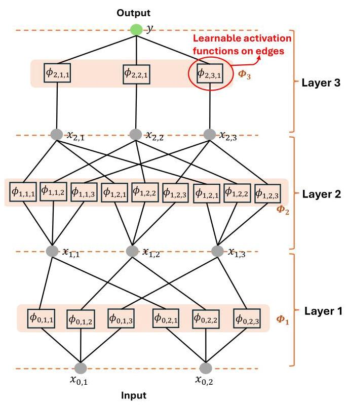

Fig. 1. Illustration of a 3-layer KAN having a shape of $\left\lbrack  {2,3,3,1}\right\rbrack$ .

图1. 形状为$\left\lbrack  {2,3,3,1}\right\rbrack$的三层KAN示意图。

To enable the Kolmogorov-Arnold theorem for machine learning, [12] innovativaly proposed the KANs architecture, as illustrated in Fig. 1 In KANs, each 1D function of equation 6) are parametrized as a B-spline curve. Each B-spline curve is with learnable coefficients of local B-spline basis functions. It is worth noting that the activation functions are placed on edges instead of nodes in Fig. 1 To generalize the network described by equation 6 to arbitrary widths and depths, [12] further defined a KAN layer and stacking more KAN layers as needed. A KAN layer with ${n}_{l}$ -dimensional inputs and ${n}_{l + 1}$ - dimensional outputs is defined as a matrix of 1D functions:

为了使Kolmogorov - Arnold定理适用于机器学习，[12]创新性地提出了KANs架构，如图1所示。在KANs中，式(6)中的每个一维函数都被参数化为一条B样条曲线。每条B样条曲线都有局部B样条基函数的可学习系数。值得注意的是，激活函数放在图1的边上而不是节点上。为了将式(6)描述的网络推广到任意宽度和深度，[12]进一步定义了一个KAN层，并根据需要堆叠更多的KAN层。一个具有${n}_{l}$维输入和${n}_{l + 1}$维输出的KAN层被定义为一个一维函数矩阵:

$$
{\mathbf{\Phi }}_{l} = \left\{  {\phi }_{l, j, i}\right\}  , i = 1,2,\cdots ,{n}_{l}, j = 1,2,\cdots ,{n}_{l + 1} \tag{7}
$$

where function ${\phi }_{l, j, i}$ has trainable parameters, which is the activation function that connects the ${i}^{th}$ neuron in the ${l}^{th}$ layer and the ${j}^{th}$ neuron in the $l + {1}^{th}$ layer. $l$ is the index of the layer. Therefore, the output of the ${l}^{th}$ layer of the KAN is

其中函数${\phi }_{l, j, i}$有可训练参数，它是连接${l}^{th}$层中的${i}^{th}$神经元和$l + {1}^{th}$层中的${j}^{th}$神经元的激活函数。$l$是层的索引。因此，KAN的${l}^{th}$层的输出是

$$
{\mathbf{x}}_{l + 1} = {\Phi }_{l}{\mathbf{x}}_{l}
$$

$$
= \left( \begin{matrix} {\phi }_{l,1,1}\left( \cdot \right) & {\phi }_{l,1,2}\left( \cdot \right) & \cdots & {\phi }_{l,1,{n}_{l}}\left( \cdot \right) \\  {\phi }_{l,2,1}\left( \cdot \right) & {\phi }_{l,2,2}\left( \cdot \right) & \cdots & {\phi }_{l,2,{n}_{l}}\left( \cdot \right) \\  \vdots & \vdots & & \vdots \\  {\phi }_{l,{n}_{l + 1},1}\left( \cdot \right) & {\phi }_{l,{n}_{l + 1},2}\left( \cdot \right) & \cdots & {\phi }_{l,{n}_{l + 1},{n}_{l}}\left( \cdot \right)  \end{matrix}\right) {\mathbf{x}}_{l},
$$

(8)

In this way, the output of a KAN network composed of $L$ layers can be written as

这样，由$L$层组成的KAN网络的输出可以写成

$$
\operatorname{KAN}\left( \mathbf{x}\right)  = \left( {{\mathbf{\Phi }}_{L - 1} \circ  {\mathbf{\Phi }}_{L - 2} \circ  \cdots  \circ  {\mathbf{\Phi }}_{1} \circ  {\mathbf{\Phi }}_{0}}\right) \mathbf{x} \tag{9}
$$

where $\mathbf{x} \in  {\mathbb{R}}^{{n}_{0}}$ is the input vector of the network. Considering all the above operations are differentiable, KANs can be trained with back propagation techniques.

其中$\mathbf{x} \in  {\mathbb{R}}^{{n}_{0}}$是网络的输入向量。考虑到上述所有操作都是可微的，KAN可以使用反向传播技术进行训练。

To make the KAN easy to train, we can design activation functions as given below:

为了使KAN易于训练，我们可以设计如下激活函数:

$$
\phi \left( {x}_{l, i}\right)  = w \cdot  \left( {b\left( {x}_{l, i}\right)  + \operatorname{spline}\left( {x}_{l, i}\right) }\right) \tag{10}
$$

where $w$ is a factor to control the overall magnitude of the activation function. $b\left( x\right)$ is a basis function which can be set to

其中$w$是控制激活函数整体幅度的一个因子。$b\left( x\right)$是一个基函数，可以设置为

$$
b\left( {x}_{l, i}\right)  = \operatorname{silu}\left( {x}_{l, i}\right)  = \frac{{x}_{l, i}}{1 + {e}^{-{x}_{l, i}}} \tag{11}
$$

spline $\left( {x}_{l, i}\right)$ is the spline function which can be parametrized as a linear combination of B-splines:

样条$\left( {x}_{l, i}\right)$是样条函数，可以参数化为B样条的线性组合:

$$
\operatorname{spline}\left( {x}_{l, i}\right)  = \mathop{\sum }\limits_{s}{c}_{s} \cdot  {B}_{s}\left( {x}_{l, i}\right) \tag{12}
$$

where ${B}_{s}\left( {x}_{l, i}\right)$ is the B-spline function. During the training process, spline $\left( \cdot \right)$ and $w$ are trainable, and we can initialize spline $\left( \cdot \right)$ by drawing B-spline coefficients ${c}_{s} \sim  \mathcal{N}\left( {0,{0.1}^{2}}\right)$ and $w$ initialized according to the Xavier initialization. It worth noting that other activation functions other than B-spline can be also utilized. For instance, to address computational cost problem caused by training learnable B-Splines, [22] developed a wavelet KAN architecture based on the work in [12].

其中${B}_{s}\left( {x}_{l, i}\right)$是B样条函数。在训练过程中，样条$\left( \cdot \right)$和$w$是可训练的，我们可以通过绘制B样条系数${c}_{s} \sim  \mathcal{N}\left( {0,{0.1}^{2}}\right)$来初始化样条$\left( \cdot \right)$，而$w$根据Xavier初始化进行初始化。值得注意的是，也可以使用除B样条之外的其他激活函数。例如，为了解决训练可学习B样条所导致的计算成本问题，[22]基于[12]中的工作开发了一种小波KAN架构。

For a L-layer KAN with layers of equal width $N$ (which means each layer has $N$ neurons), there are in total $O\left( {{N}^{2}L\left( {G + {k}_{b}}\right) }\right)  \sim  O\left( {{N}^{2}{LG}}\right)$ parameters, where ${k}_{b}$ and $G$ are the order and intervals of the spline. Contrarily, an MLP with depth $L$ and width $N$ typically requires $O\left( {{N}^{2}L}\right)$ parameters, suggesting it might be more parameter-efficient than a KAN. However, KANs often operate effectively with much smaller $N$ than MLPs. This not only reduces parameter count but also enhances generalization and facilitates interpretability.

对于一个具有等宽$N$层(即每层有$N$个神经元)的L层KAN，总共有$O\left( {{N}^{2}L\left( {G + {k}_{b}}\right) }\right)  \sim  O\left( {{N}^{2}{LG}}\right)$个参数，其中${k}_{b}$和$G$是样条的阶数和区间。相反，一个深度为$L$且宽度为$N$的MLP通常需要$O\left( {{N}^{2}L}\right)$个参数，这表明它可能比KAN更具参数效率。然而，KAN通常在比MLP小得多的$N$下就能有效运行。这不仅减少了参数数量，还增强了泛化能力并便于解释。

## B. Physics-informed KANs for Power System Dynamics

## B. 用于电力系统动态的物理信息KAN

PINNs are universal function approximators that incorporate the knowledge of physical laws governing a given dataset into the neural network training process [23]. This approach mitigates the need for large amounts of training data and the large network sizes typically required by traditional DNNs. In PINNs, the architecture consists of a MLP with an input layer, several fully connected hidden layers featuring fixed nonlinear activation functions at each neuron, and an output layer. Each layer transition involves the application of a weight matrix ${\mathbf{W}}_{l}$ and an activation function ${\mathbf{\sigma }}_{l}$ :

物理信息神经网络(PINN)是通用函数逼近器，它将支配给定数据集的物理定律知识纳入神经网络训练过程[23]。这种方法减少了对大量训练数据的需求以及传统深度神经网络通常所需的大网络规模。在PINN中，架构由一个具有输入层、几个在每个神经元具有固定非线性激活函数的全连接隐藏层以及一个输出层的MLP组成。每层转换涉及应用权重矩阵${\mathbf{W}}_{l}$和激活函数${\mathbf{\sigma }}_{l}$:

$$
\operatorname{MLP}\left( \mathbf{x}\right)  = \left( {{\mathbf{W}}_{L - 1} \circ  {\mathbf{\sigma }}_{L - 1} \circ  {\mathbf{W}}_{L - 2} \circ  {\mathbf{\sigma }}_{L - 2} \circ  \cdots  \circ  {\mathbf{W}}_{1} \circ  {\mathbf{\sigma }}_{1} \circ  {\mathbf{W}}_{0}}\right) \mathbf{x}
$$

(13)

During the training process, these weights are adjusted to minimize an objective function, which typically penalizes the difference between the neural network's predictions and the actual labels of the training data.

在训练过程中，调整这些权重以最小化一个目标函数，该目标函数通常惩罚神经网络预测与训练数据实际标签之间的差异。

Based on [23], the dynamics of a physical system governed by parametrized and nonlinear partial differential equations (PDEs), as shown in equation 14, can be effectively learned using PINNs.

基于[23]，由参数化非线性偏微分方程(PDE)支配的物理系统的动态，如方程14所示，可以使用PINN有效地学习。

$$
\frac{\partial \mathbf{u}}{\partial t} + \mathcal{N}\left\lbrack  {\mathbf{u};\mathbf{\lambda }}\right\rbrack   = \mathbf{0},\mathbf{x} \in  \Omega , t \in  \left\lbrack  {0, T}\right\rbrack \tag{14}
$$

where $\mathbf{u}\left( {t,\mathbf{x}}\right)$ is the solution of the PDE, depending on time $t$ and system input $\mathbf{x}.\mathcal{N}\left\lbrack  {\cdot ;\mathbf{\lambda }}\right\rbrack$ is a nonlinear operator parametrized by $\mathbf{\lambda }.\Omega$ is a subset of ${\mathbb{R}}^{D}.\left\lbrack  {0, T}\right\rbrack$ is the time interval within which the system evolves.

其中$\mathbf{u}\left( {t,\mathbf{x}}\right)$是偏微分方程的解，取决于时间$t$和系统输入$\mathbf{x}.\mathcal{N}\left\lbrack  {\cdot ;\mathbf{\lambda }}\right\rbrack$，是由$\mathbf{\lambda }.\Omega$参数化的非线性算子，${\mathbb{R}}^{D}.\left\lbrack  {0, T}\right\rbrack$的一个子集，是系统演化的时间间隔。

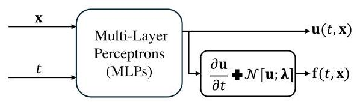

Fig. 2. General structure of a PINN [9],[23]: it predicts the output $\mathbf{u}\left( {t,\mathbf{x}}\right)$ given inputs $\mathbf{x}$ and $t$ .

图2. PINN的一般结构[9],[23]:它根据输入$\mathbf{x}$和$t$预测输出$\mathbf{u}\left( {t,\mathbf{x}}\right)$。

For the traditional PINNs, we can define a physics informed neural network $\mathbf{f}\left( {t,\mathbf{x}}\right)$ as equation 15 and proceed by approximating $\mathbf{u}\left( {t,\mathbf{x}}\right)$ by a MLP, as illustrated in Fig. 2

对于传统的PINN，我们可以将物理信息神经网络$\mathbf{f}\left( {t,\mathbf{x}}\right)$定义为方程15，并如图2所示通过用MLP逼近$\mathbf{u}\left( {t,\mathbf{x}}\right)$来进行。

$$
\mathbf{f}\left( {t,\mathbf{x}}\right)  = \frac{\partial \mathbf{u}}{\partial t} + \mathcal{N}\left\lbrack  {\mathbf{u};\mathbf{\lambda }}\right\rbrack \tag{15}
$$

As shown in Fig. 2, the MLPs used for predicting $\mathbf{f}\left( {t,\mathbf{x}}\right)$ shares the same parameters as the MLPs used for predicting $\mathbf{u}\left( {t,\mathbf{x}}\right)$ , with the distinction lying in their activation functions. The parameters common to both neural networks are optimized by minimizing the following loss function:

如图2所示，用于预测$\mathbf{f}\left( {t,\mathbf{x}}\right)$的多层感知器(MLP)与用于预测$\mathbf{u}\left( {t,\mathbf{x}}\right)$的MLP共享相同的参数，区别在于它们的激活函数。通过最小化以下损失函数来优化两个神经网络共有的参数:

$$
{\operatorname{loss}}_{I} = {MS}{E}_{u} + {MS}{E}_{f}
$$

$$
= \frac{1}{{N}_{u}}\mathop{\sum }\limits_{{n = 1}}^{{N}_{u}}{\left| \mathbf{u}\left( {t}_{u}^{n},{\mathbf{x}}_{u}^{n}\right)  - {\mathbf{u}}^{n}\right| }^{2} + \frac{1}{{N}_{f}}\mathop{\sum }\limits_{{n = 1}}^{{N}_{f}}{\left| \mathbf{f}\left( {t}_{f}^{n},{\mathbf{x}}_{f}^{n}\right) \right| }^{2}
$$

(16)

where loss ${MS}{E}_{u}$ corresponds to the initial and boundary data, while ${MS}{E}_{f}$ enforces the structure imposed by equation 14) at a finite set of collocation data points. The loss ${MS}{E}_{u}$ is calculated over ${N}_{u}$ initial and boundary training data points, and ${MS}{E}_{f}$ is calculated over ${N}_{f}$ collocation points. $\mathbf{u}\left( {{t}_{u}^{n},{\mathbf{x}}_{u}^{n}}\right)$ and $\mathbf{f}\left( {{t}_{f}^{n},{\mathbf{x}}_{f}^{n}}\right)$ are outputs of the PINN, while ${\mathbf{u}}^{n}$ is the lable value of the $n$ th data point.

其中损失${MS}{E}_{u}$对应于初始数据和边界数据，而${MS}{E}_{f}$在有限的一组配置数据点处强制实施方程(14)所施加的结构。损失${MS}{E}_{u}$是在${N}_{u}$个初始和边界训练数据点上计算的，而${MS}{E}_{f}$是在${N}_{f}$个配置点上计算的。$\mathbf{u}\left( {{t}_{u}^{n},{\mathbf{x}}_{u}^{n}}\right)$和$\mathbf{f}\left( {{t}_{f}^{n},{\mathbf{x}}_{f}^{n}}\right)$是物理信息神经网络(PINN)的输出，而${\mathbf{u}}^{n}$是第$n$个数据点的标签值。

Considering we can usually obtain the measurement of derivatives of $\mathbf{u}\left( {t,\mathbf{x}}\right)$ with respect to the input $t$ , we can also use the following loss function to train the PINN network [11]:

考虑到我们通常可以获得$\mathbf{u}\left( {t,\mathbf{x}}\right)$相对于输入$t$的导数测量值，我们也可以使用以下损失函数来训练PINN网络[11]:

$$
{\text{ loss }}_{II} = {MS}{E}_{u} + {MS}{E}_{f}
$$

$$
= \frac{1}{{N}_{u}}\mathop{\sum }\limits_{{n = 1}}^{{N}_{u}}{\left| \mathbf{u}\left( {t}_{u}^{n},{\mathbf{x}}_{u}^{n}\right)  - {\mathbf{u}}^{n}\right| }^{2} + {\left| \dot{\mathbf{u}}\left( {t}_{u}^{n},{\mathbf{x}}_{u}^{n}\right)  - {\dot{\mathbf{u}}}^{n}\right| }^{2}
$$

$$
+ \frac{1}{{N}_{f}}\mathop{\sum }\limits_{{n = 1}}^{{N}_{f}}{\left| \mathbf{f}\left( {t}_{f}^{n},{\mathbf{x}}_{f}^{n}\right) \right| }^{2}
$$

(17)

By using automatic differentiation in PyTorch, we can easily obtain the derivatives of $\mathbf{u}\left( {{t}_{u}^{n},{\mathbf{x}}_{u}^{n}}\right)$ with respect to the input $t$ .

通过在PyTorch中使用自动求导，我们可以轻松获得$\mathbf{u}\left( {{t}_{u}^{n},{\mathbf{x}}_{u}^{n}}\right)$相对于输入$t$的导数。

To reduce the dependency on training data and enhance the accuracy of the learned model in the PINNs-based power system dynamic model, we designed the PIKAN, as shown in Fig. 3 The primary difference from the traditional PINN is that we utilize KAN to predict $\mathbf{u}\left( {t,\mathbf{x}}\right)$ based on the input state $\mathbf{x}$ and time $t$ . This PIKAN offers two advantages: 1) increased model learning accuracy, and 2) reduced network size without sacrificing accuracy, which will be demonstrated in Section IV.

为了减少对训练数据的依赖并提高基于PINN的电力系统动态模型中学习模型的准确性，我们设计了PIKAN，如图3所示。与传统PINN的主要区别在于，我们利用KAN基于输入状态$\mathbf{x}$和时间$t$来预测$\mathbf{u}\left( {t,\mathbf{x}}\right)$。这种PIKAN有两个优点:1)提高模型学习准确性，2)在不牺牲准确性的情况下减小网络规模，这将在第四节中得到证明。

1) PIKAN for capturing power system dynamics: When the PIKAN is used for capturing power system dynamics, we assume system parameters $\mathbf{\lambda } = \left\lbrack  {\mathbf{M};\mathbf{D};\mathbf{B}}\right\rbrack$ in equation 5) are known. Therefore, the input of KAN is defined as $\mathbf{x} \mathrel{\text{ := }} {\mathbf{P}}_{\mathbf{m}}$ . By inputting ${\mathbf{P}}_{\mathbf{m}}$ and time period of interest to the PIKAN in Fig. 3 it can predict the voltage angle of each bus, i.e., $\mathbf{u} = \mathbf{\theta }\left( {t,{\mathbf{P}}_{\mathbf{m}}}\right)$ . The output of KAN is fed into the DAE module of the PIKAN to incorporate the power system dynamics model, as described by equation (5), into the neural network architecture. The training objective is to optimize the activation function $\mathbf{\Phi }$ to minimize loss function in equation (16) or (17). Thus, by minimising the total loss function over the KAN parameters, we can obtain the optimal KAN:

1)用于捕捉电力系统动态的PIKAN:当使用PIKAN捕捉电力系统动态时，我们假设方程(5)中的系统参数$\mathbf{\lambda } = \left\lbrack  {\mathbf{M};\mathbf{D};\mathbf{B}}\right\rbrack$是已知的。因此，KAN的输入定义为$\mathbf{x} \mathrel{\text{ := }} {\mathbf{P}}_{\mathbf{m}}$。通过将${\mathbf{P}}_{\mathbf{m}}$和感兴趣的时间段输入到图3中的PIKAN中，它可以预测每条母线的电压角度，即$\mathbf{u} = \mathbf{\theta }\left( {t,{\mathbf{P}}_{\mathbf{m}}}\right)$。KAN的输出被馈送到PIKAN的微分代数方程(DAE)模块，以将方程(5)描述的电力系统动态模型纳入神经网络架构。训练目标是优化激活函数$\mathbf{\Phi }$，以最小化方程(16)或(17)中的损失函数。因此，通过在KAN参数上最小化总损失函数，我们可以获得最优的KAN:

$$
{\mathbf{\Phi }}^{ * } = \arg \mathop{\min }\limits_{\mathbf{\Phi }}\left( {{MS}{E}_{u} + {MS}{E}_{f}}\right) \tag{18}
$$

Solving the above highly non-convex and multi-parameter optimization problem is challenge. We can use the LBFGS or Adam optimiser to get a solution. We refer to the PIKAN using the loss function in equation 16 as PIKAN-I, and the PIKAN using the loss function in equation (17) as PIKAN-II. In other words, PIKAN-I uses only the measurements of the voltage angle $\mathbf{\theta }$ to train the KAN, while PIKAN-II uses both the voltage angle $\mathbf{\theta }$ and the angular frequency $\omega$ measurements to train the KAN. The proposed PIKAN for power system dynamics can be summarized in Algorithm 1.

解决上述高度非凸和多参数优化问题具有挑战性。我们可以使用有限内存布罗伊登-弗莱彻-戈德法布-香农(LBFGS)或亚当(Adam)优化器来获得解决方案。我们将使用方程(16)中的损失函数的PIKAN称为PIKAN-I，将使用方程(17)中的损失函数的PIKAN称为PIKAN-II。换句话说，PIKAN-I仅使用电压角度$\mathbf{\theta }$的测量值来训练KAN，而PIKAN-II使用电压角度$\mathbf{\theta }$和角频率$\omega$的测量值来训练KAN。所提出的用于电力系统动态的PIKAN可以总结在算法1中。

2) PIKAN for power system parameter identification: Estimating power system inertia and damping coefficients is crucial for maintaining frequency stability. With the increased installation of inverter-based resources (IBRs) in modern power systems, the inertia and damping constants can vary with the control strategies employed, potentially affecting system stability and dynamic performance. Therefore, it is necessary to frequently estimate these parameters. When the PIKAN is used for parameter identification, $\mathbf{M}$ and $\mathbf{D}$ in $\mathbf{\lambda }$ will be unknown in equation (5). The structure of the KAN remains unchanged, except that the $\mathbf{M}$ and $\mathbf{D}$ parameters are now considered as additional variables during the minimization of the loss function in the network training process. So, by minimising the total loss function over the KAN parameters and power system uncertain parameters, we can obtain the optimal KAN:

2) 用于电力系统参数识别的PIKAN:估计电力系统惯性和阻尼系数对于维持频率稳定性至关重要。随着现代电力系统中基于逆变器的资源(IBR)安装量的增加，惯性和阻尼常数可能会因所采用的控制策略而变化，这可能会影响系统稳定性和动态性能。因此，有必要经常估计这些参数。当使用PIKAN进行参数识别时，式(5)中$\mathbf{\lambda }$里的$\mathbf{M}$和$\mathbf{D}$将是未知的。KAN的结构保持不变，只是在网络训练过程中最小化损失函数时，$\mathbf{M}$和$\mathbf{D}$参数现在被视为额外变量。所以，通过在KAN参数和电力系统不确定参数上最小化总损失函数，我们可以得到最优的KAN:

$$
{\mathbf{\Phi }}^{ * },{\mathbf{M}}^{ * },{\mathbf{D}}^{ * } = \arg \mathop{\min }\limits_{{\mathbf{\Phi },\mathbf{M},\mathbf{D}}}\left( {{MS}{E}_{u} + {MS}{E}_{f}}\right) \tag{19}
$$

The proposed PIKAN for power system parameter identification can be summarized in Algorithm 2 (see Appendix).

所提出的用于电力系统参数识别的PIKAN可总结在算法2中(见附录)。

To measure the performance during the training, we defined the mean squared error (MSE) of the predictions on the test dataset as

为了测量训练期间的性能，我们将测试数据集上预测的均方误差(MSE)定义为

$$
{MS}{E}_{t} = \frac{1}{{N}_{\text{ test }}}\mathop{\sum }\limits_{{n = 1}}^{{N}_{\text{ test }}}{\left| {\mathbf{\theta }}_{\text{ pred }, n} - {\mathbf{\theta }}_{n}\right| }^{2} \tag{20}
$$

where $n$ is the index of the sampled test data point. ${\mathbf{\theta }}_{\text{ pred }, n}$ and ${\mathbf{\theta }}_{\mathbf{n}}$ are the predicted and real voltage angle vector of all the buses in the system, respectively. ${N}_{\text{ test }}$ is the total points of the test dataset.

其中$n$是采样测试数据点的索引。${\mathbf{\theta }}_{\text{ pred }, n}$和${\mathbf{\theta }}_{\mathbf{n}}$分别是系统中所有母线的预测电压角向量和实际电压角向量。${N}_{\text{ test }}$是测试数据集的总点数。

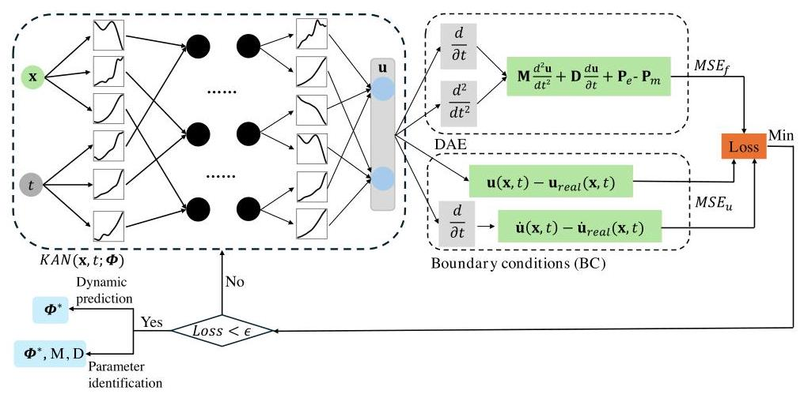

Fig. 3. Physics-Informed Kolmogorov-Arnold Network (PIKAN) for power system dynamics.

图3. 用于电力系统动态的物理信息Kolmogorov - Arnold网络(PIKAN)。

Algorithm 1: PIKAN for capturing power system dynamics

算法1:用于捕捉电力系统动态的PIKAN

---

Data: Power system training and test dataset generated

				by time domain simulation; Power system

				parameters (e.g., M, D, and B)

Result: KAN parameters

Initialize KAN parameters: ${\left\{  {\mathbf{\Phi }}_{l}\right\}  }_{l = 1}^{L}, G$ , and ${k}_{b}$ ;

Specify the loss function as equation (16) or (17);

Specify the initial & boundary training data points:

	${\left\{  \left( {t}_{u}^{n},{\mathbf{x}}_{u}^{n}\right) ,{\mathbf{u}}^{n}\right\}  }_{n = 1}^{{N}_{u}}$ , and specify collocation training

	points: ${\left\{  \left( {t}_{f}^{n},{\mathbf{x}}_{f}^{n}\right) \right\}  }_{n = 1}^{{N}_{f}}$ ;

Specify the test points: ${\left\{  \left( {t}_{\text{ test }}^{n},{\mathbf{x}}_{\text{ test }}^{n}\right) ,{\mathbf{u}}_{\text{ test }}^{n}\right\}  }_{n = 1}^{{N}_{\text{ test }}}$ ;

Set the maximum number of training steps $N$ , and

	learning rate;

while ${n}_{\text{ iter }} < N$ do

		Forward pass of KAN to calculate all $\mathbf{u}\left( {{t}_{u}^{n},{\mathbf{x}}_{u}^{n}}\right)$ . If

			loss function (17) is adopted, further calculate

			$\dot{\mathbf{u}}\left( {{t}_{u}^{n},{\mathbf{x}}_{u}^{n}}\right)$ using automatic differentiation;

		Calculate ${MS}{E}_{u}$ based on the output of KAN and

			the measurements;

		Calculate ${MS}{E}_{f}$ based on the output of KAN and

			the power system dynamics given in equation (5);

		Find the best KAN parameters to minimize the

			loss function using the LBFGS optimizer;

		if ${n}_{\text{ iter }}\% {10} = 0$ then

					Evaluate the performance of the PIKAN agent

					over the test points based on equation (20);

		end

end

---

To evaluate the predictive performance of the well-trained PIKANs, we defined the relative prediction error of the voltage angle as:

为了评估训练良好的PIKAN的预测性能，我们将电压角的相对预测误差定义为:

$$
{\mathrm{e}}_{\theta } = \frac{{\begin{Vmatrix}{\mathbf{\theta }}^{0 : T} - {\mathbf{\theta }}_{\text{ pred }}^{0 : T}\end{Vmatrix}}_{2}}{{\begin{Vmatrix}{\mathbf{\theta }}^{0 : T}\end{Vmatrix}}_{2}} = \frac{\sqrt{\mathop{\sum }\limits_{{i = 1}}^{{n}_{b}}\mathop{\sum }\limits_{{t = 0}}^{T}{\left( {\theta }_{i}^{t} - {\theta }_{\text{ pred }, i}^{t}\right) }^{2}}}{\sqrt{\mathop{\sum }\limits_{{i = 1}}^{{n}_{b}}\mathop{\sum }\limits_{{t = 0}}^{T}{\left( {\theta }_{i}^{t}\right) }^{2}}} \tag{21}
$$

where ${\mathbf{\theta }}^{0 : T}$ and ${\mathbf{\theta }}_{\text{ pred }}^{0 : T}$ represent the actual and predicted voltage angles of all buses from time 0 to $T$ , respectively. ${\theta }_{i}^{t}$ and ${\theta }_{\text{ pred }, i}^{t}$ are the actual and predicted voltage angle of bus $i$ at time $t$ , respectively. $\parallel  \cdot  \parallel$ is the ${l}^{2}$ norm for finite-dimensional vectors. For the inertia and damping coefficients identification performance, we defined the relative estimation error as:

其中${\mathbf{\theta }}^{0 : T}$和${\mathbf{\theta }}_{\text{ pred }}^{0 : T}$分别表示从时间0到$T$所有母线的实际电压角和预测电压角。${\theta }_{i}^{t}$和${\theta }_{\text{ pred }, i}^{t}$分别是在时间$t$时母线$i$的实际电压角和预测电压角。$\parallel  \cdot  \parallel$是有限维向量的${l}^{2}$范数。对于惯性和阻尼系数识别性能，我们将相对估计误差定义为:

$$
{\mathrm{e}}_{{M}_{i}} = \frac{\left| {M}_{i} - {M}_{\text{ pred }, i}\right| }{{M}_{i}},{\mathrm{e}}_{{D}_{i}} = \frac{\left| {D}_{i} - {D}_{\text{ pred }, i}\right| }{{D}_{i}} \tag{22}
$$

where ${M}_{i}$ and ${M}_{\text{ pred }, i}$ represent the actual and predicted inertia coefficients of the generator connected to bus $i$ , respectively. ${D}_{i}$ and ${D}_{\text{ pred }, i}$ represent the actual and predicted damping coefficients of bus $i$ , respectively.

其中${M}_{i}$和${M}_{\text{ pred }, i}$分别表示连接到母线$i$的发电机的实际惯性系数和预测惯性系数。${D}_{i}$和${D}_{\text{ pred }, i}$分别表示母线$i$的实际阻尼系数和预测阻尼系数。

## IV. SIMULATION AND RESULTS

## 四、仿真与结果

The performance of the proposed PIKANs for frequency dynamics was demonstrated on a SMIB power system and a 4-bus 2-generator system, as shown in Fig. 4 To generate the training and test datasets, we utilized time domain simulations implemented with SciPy in Python. The generated frequency dynamic data is with a time step of ${0.1}\mathrm{\;s}$ over time window [0, $T\rbrack$ for each trajectory. The testing power system parameters are presented in Table 1 and Fig. 4 In the SMIB system, we assume initial values for ${\theta }_{1}$ and ${\omega }_{1}$ to be 0.1 rad and 0.1 rad/s, respectively. The value of ${P}_{{m}_{1}}$ ranges between 0.08 p.u. and 0.18 p.u., within which the SMIB system remains stable. In this case setting, we generated 100 trajectories. For each trajectory, the training and test datasets consist of time intervals from 0 to 20 seconds with a 0.1-second step, including the corresponding $\theta$ values at each time step and the corresponding power injection value ${P}_{{m}_{1}}$ . For the 4-bus 2-generator system, similar to the setup in reference [11], we assume the system is in equilibrium at $t = 0$ . We then perturb the system with a constant input signal ${\mathbf{P}}_{\mathbf{m}} = a \times  \left\lbrack  {{0.1},{0.2}, - {0.1}, - {0.2}}\right\rbrack$ p.u. for $t > 0$ in each trajectory. We generated 19 trajectories, with $a$ ranging from 0.5 to 9.5 in increments of 0.5 . For each trajectory, the training and test datasets consist of time intervals from 0 to 5 seconds with a 0.1-second step, including the corresponding $\left\lbrack  {{\theta }_{1},{\theta }_{2},{\theta }_{3}}\right.$ , ${\theta }_{4}$ ] values at each time step and the corresponding input signal ${\mathbf{P}}_{\mathbf{m}}$ . We conducted PIKANs training and performance testing in PyTorch on an Intel Xeon(R) Gold 6248R CPU @3.00 GHz ×48 Windows based server with 64 GB RAM.

所提出的用于频率动态分析的PIKANs在单机无穷大母线(SMIB)电力系统和一个4节点2发电机系统上的性能得到了验证，如图4所示。为了生成训练和测试数据集，我们利用了在Python中用SciPy实现的时域仿真。生成的频率动态数据在每个轨迹的时间窗口[0, $T\rbrack$]内，时间步长为${0.1}\mathrm{\;s}$。测试电力系统参数见表1和图4。在SMIB系统中，我们假设${\theta }_{1}$和${\omega }_{1}$的初始值分别为0.1弧度和0.1弧度/秒。${P}_{{m}_{1}}$的值在0.08标幺值和0.18标幺值之间，在此范围内SMIB系统保持稳定。在这种情况下，我们生成了100个轨迹。对于每个轨迹，训练和测试数据集由从0到20秒、步长为0.1秒的时间间隔组成，包括每个时间步的相应$\theta$值和相应的功率注入值${P}_{{m}_{1}}$。对于4节点2发电机系统，类似于参考文献[11]中的设置，我们假设系统在$t = 0$时处于平衡状态。然后在每个轨迹中，我们用恒定输入信号${\mathbf{P}}_{\mathbf{m}} = a \times  \left\lbrack  {{0.1},{0.2}, - {0.1}, - {0.2}}\right\rbrack$标幺值对系统进行$t > 0$时间的扰动。我们生成了19个轨迹，$a$的范围从0.5到9.5，步长为0.5。对于每个轨迹，训练和测试数据集由从0到5秒、步长为0.1秒的时间间隔组成，包括每个时间步的相应$\left\lbrack  {{\theta }_{1},{\theta }_{2},{\theta }_{3}}\right.$、${\theta }_{4}$值和相应的输入信号${\mathbf{P}}_{\mathbf{m}}$。我们在一台基于Windows的服务器上，使用英特尔至强(R)金牌6248R CPU @3.00 GHz ×48、64GB内存的环境下，在PyTorch中进行了PIKANs训练和性能测试。

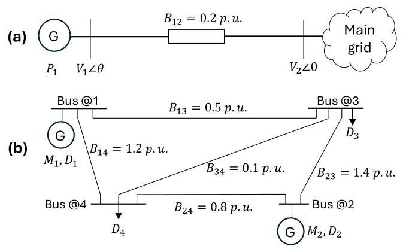

Fig. 4. Testing systems: (a) SMIB power system, (b) 4-bus system with two generator.

图4. 测试系统:(a)单机无穷大母线(SMIB)电力系统，(b)具有两个发电机的4节点系统。

TABLE I PARAMETERS OF THE CASE STUDIES

表I 案例研究的参数

<table><tr><td rowspan="2">Parameters</td><td colspan="2">SMIB system</td><td colspan="2">4-bus 2-generator system</td></tr><tr><td>$M$ (p.u.)</td><td>$D$ (p.u.)</td><td>$M$ (p.u.)</td><td>$D$ (p.u.)</td></tr><tr><td>Bus @ 1</td><td>0.4</td><td>0.15</td><td>0.3</td><td>0.15</td></tr><tr><td>Bus @2</td><td>-</td><td>-</td><td>0.2</td><td>0.3</td></tr><tr><td>Bus @3</td><td>-</td><td>-</td><td>0</td><td>0.25</td></tr><tr><td>Bus @4</td><td>-</td><td>-</td><td>0</td><td>0.2</td></tr></table>

Note: The line parameters of the testing systems can be found in Fig. 4

注意:测试系统的线路参数可在图4中找到

## A. Data-driven solution of frequency dynamics

## A. 频率动态的数据驱动解决方案

In the study of capturing frequency dynamics, the inertia and damping coefficients of the testing systems are known parameters. We evaulated the capability of the PIKANs to accurately predict trajectories of $\mathbf{\theta }$ and $\mathbf{\omega }$ for uncertain power injections.

在捕获频率动态的研究中，测试系统的惯性和阻尼系数是已知参数。我们评估了PIKANs对于不确定功率注入准确预测$\mathbf{\theta }$和$\mathbf{\omega }$轨迹的能力。

1) SMIB system: For the SMIB system, we used a 2-layer KAN with a shape of $\left\lbrack  {2,5,1}\right\rbrack$ . In each training step, the randomly sampled time $t$ and power injection ${P}_{{m}_{1}}$ were fed into the KAN, and trained to minimize the loss function in equation 16 for the PIKAN-I algorithm (or equation 17) for the PIKAN-II algorithm). For both PIKAN-I and PIKAN-II algorithms, the intervals of the B-spline were set to $G =$ 10, and the order of the B-spline was set to ${k}_{b} = 3$ . We set ${N}_{u} = {40},{N}_{f} = {800}$ , and ${N}_{\text{ test }} = {20},{100}$ . The training convergence process of the PIKAN-I algorithm is depicted in Fig. 5 It shows that the PIKAN-I converges quickly and achieves lower losses within hundreds of training steps. Fig. 6 depicts the comparison between the PIKAN-I predicted and the actual trajectory of the angle $\theta$ and the angular frequency $\omega$ of bus 1 in the SMIB system. The angular frequency $\omega$ in the figure was calculated by differentiating the signal associated with the voltage angle $\theta$ . In the left figures of Fig. 6, we present the least accurate estimation of the voltage angle and frequency trajectory, yielding a relative prediction error $\left( {\mathrm{e}}_{\theta }\right)$ of 1.06%. Conversely, in the right figures, we demonstrate the most accurate estimation of the voltage angle and frequency trajectory, achieving a relative prediction error $\left( {\mathrm{e}}_{\theta }\right)$ of ${0.014}\%$ . The median value of the prediction error on voltage angle over the 100 trajectories is 0.688%, which indicate that the PIKAN-I is able to predict the trajectory of the angle with high accuracy.

1) 单机无穷大母线(SMIB)系统:对于SMIB系统，我们使用了一个形状为$\left\lbrack  {2,5,1}\right\rbrack$的两层知识增强神经网络(KAN)。在每个训练步骤中，将随机采样的时间$t$和功率注入${P}_{{m}_{1}}$输入到KAN中，并进行训练以最小化PIKAN - I算法的方程16(或PIKAN - II算法的方程17)中的损失函数。对于PIKAN - I和PIKAN - II算法，B样条的间隔设置为$G =$ 10，B样条的阶数设置为${k}_{b} = 3$。我们设置了${N}_{u} = {40},{N}_{f} = {800}$和${N}_{\text{ test }} = {20},{100}$。PIKAN - I算法的训练收敛过程如图5所示。它表明PIKAN - I收敛迅速，并在数百个训练步骤内实现了更低的损失。图6描绘了PIKAN - I预测的单机无穷大母线(SMIB)系统中母线1的角度$\theta$和角频率$\omega$与实际轨迹之间的比较。图中的角频率$\omega$是通过对与电压角度$\theta$相关的信号求导计算得到的。在图6的左图中，我们展示了电压角度和频率轨迹的最不准确估计，相对预测误差$\left( {\mathrm{e}}_{\theta }\right)$为1.06%。相反，在右图中，我们展示了电压角度和频率轨迹的最准确估计，相对预测误差$\left( {\mathrm{e}}_{\theta }\right)$为${0.014}\%$。在100条轨迹上电压角度预测误差的中值为0.688%，这表明PIKAN - I能够高精度地预测角度轨迹。

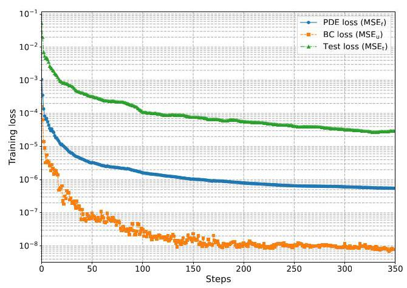

Fig. 5. Training convergence process of the PIKAN-I algorithm for capturing SMIB system frequency dynamics. The LBFGS optimizer was employed, with parameter maximum iteration set to 20. Thus, each optimization step in the figure contains 20 iterations.

图5. 用于捕获单机无穷大母线(SMIB)系统频率动态的PIKAN - I算法的训练收敛过程。采用了LBFGS优化器，参数最大迭代次数设置为20。因此，图中的每个优化步骤包含20次迭代。

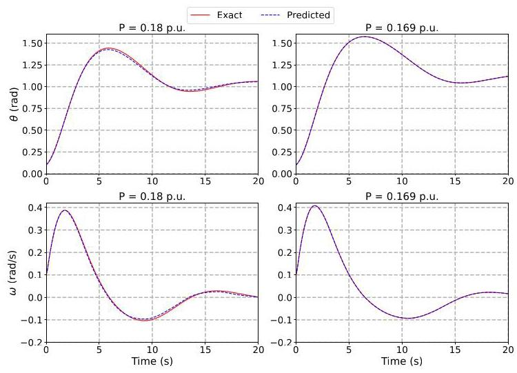

Fig. 6. Comparison of the predicted and exact solution for the voltage angle and frequency with the PIKAN-I for SMIB power system dynamics.

图6. 单机无穷大母线(SMIB)电力系统动态中PIKAN - I对电压角度和频率的预测与精确解的比较。

If we use measurements of both $\theta$ and $\omega$ to train the KAN, denoted as the PIKAN-II algorithm, the accuracy of the agent can be further improved, with the median value of the prediction error on the voltage angle decreasing to 0.633% (see Table II). We also compared the performance of the proposed method with the MLP-based PINNs for power systems proposed in [9] and [11]. The prediction errors for the 100 tested trajectories are presented in Fig. 7 and Table II. The proposed method outperforms the traditional PINNs, demonstrating the effectiveness of the PIKANs in learning the dynamics of SMIB systems. From the results in Fig. 7, we can observe that incorporating measurements of $\omega$ (i.e., using the loss function defined in equation (17)) during training improves the performance of the agent for both the PIKAN and traditional PINN methods.

如果我们使用$\theta$和$\omega$的测量值来训练KAN，即PIKAN - II算法，智能体的准确性可以进一步提高，电压角度预测误差的中值降至0.633%(见表II)。我们还将所提出的方法与文献[9]和[11]中提出的基于多层感知器(MLP)的电力系统物理信息神经网络(PINN)的性能进行了比较。100条测试轨迹的预测误差如图7和表II所示。所提出的方法优于传统的PINN，证明了PIKAN在学习单机无穷大母线(SMIB)系统动态方面的有效性。从图7的结果中，我们可以观察到在训练期间纳入$\omega$的测量值(即使用方程(17)中定义的损失函数)提高了PIKAN和传统PINN方法中智能体的性能。

TABLE II

表II

DYNAMIC CAPTURING STUDY RESULTS: ESTIMATION ERROR OF THE TRAJECTORY OF $\theta \left( t\right)$

动态捕获研究结果:$\theta \left( t\right)$轨迹的估计误差

<table><tr><td rowspan="2">Estimation error</td><td colspan="3">SMIB system</td><td colspan="3">4-bus 2-generator system</td></tr><tr><td>Max (%)</td><td>Min (%)</td><td>Median (%)</td><td>Max (%)</td><td>Min (%)</td><td>Median (%)</td></tr><tr><td>PIKAN-I</td><td>1.06</td><td>0.014</td><td>0.688</td><td>4.85</td><td>0.043</td><td>4.64</td></tr><tr><td>PIKAN-II</td><td>1.53</td><td>0.184</td><td>0.633</td><td>1.94</td><td>0.040</td><td>0.538</td></tr><tr><td>PINN-I ( |91)</td><td>2.30</td><td>0.057</td><td>1.96</td><td>6.35</td><td>0.151</td><td>5.03</td></tr><tr><td>PINN-II ( |II )</td><td>1.48</td><td>0.206</td><td>0.800</td><td>5.98</td><td>0.076</td><td>2.59</td></tr></table>

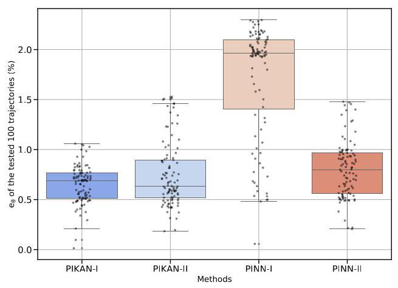

Fig. 7. Performance of the proposed method and the MLPs based PINNs for the SMIB system. The parameters and hyperparameters setting is same with reference [9]. For the PINN-I and PINN-II, we set ${N}_{u} = {40}$ and ${N}_{f} =$ 8,000.

图7. 所提出的方法和基于多层感知器(MLP)的单机无穷大母线(SMIB)系统物理信息神经网络(PINN)的性能。参数和超参数设置与文献[9]相同。对于PINN - I和PINN - II，我们设置${N}_{u} = {40}$和${N}_{f} =$为8,000。

2) 4-bus 2-generator system: To further test the performance of the proposed method in capturing the dynamics of multimachine power systems, we evaluated it on a 4-bus 2-generator system as shown in Fig. 4 (b). For this case study, we employed a 2-layer KAN with a structure of [5, 10, 4]. In each training step, the randomly sampled time $t$ and power injection $\left\lbrack  {{P}_{{m}_{1}},{P}_{{m}_{2}},{P}_{{m}_{3}},{P}_{{m}_{4}}}\right\rbrack$ are fed into the KAN, which is then trained to minimize the loss function in equation (16) or (17), ultimately outputting the voltage angles of the four buses at time $t$ . For both PIKAN-I and PIKAN-II, the intervals of the B-spline were set to $G = 5$ , and the order of the B-spline was set to ${k}_{b} = 3$ . We set ${N}_{u} = {80},{N}_{f} = {4000}$ , and ${N}_{\text{ test }} = {969}$ .

2) 四节点双发电机系统:为进一步测试所提方法在捕捉多机电力系统动态特性方面的性能，我们在如图4 (b)所示的四节点双发电机系统上对其进行了评估。对于此案例研究，我们采用了结构为[5, 10, 4]的两层KAN。在每个训练步骤中，将随机采样的时间$t$和功率注入$\left\lbrack  {{P}_{{m}_{1}},{P}_{{m}_{2}},{P}_{{m}_{3}},{P}_{{m}_{4}}}\right\rbrack$输入到KAN中，然后对其进行训练以最小化方程(16)或(17)中的损失函数，最终输出时间$t$时四个节点的电压角度。对于PIKAN-I和PIKAN-II，B样条的区间设置为$G = 5$，B样条的阶数设置为${k}_{b} = 3$。我们设置${N}_{u} = {80},{N}_{f} = {4000}$，以及${N}_{\text{ test }} = {969}$。

Fig. 8 depicts the comparison between the predicted and the actual trajectory of the angle $\left\lbrack  {{\theta }_{1},{\theta }_{2},{\theta }_{3},{\theta }_{4}}\right\rbrack$ and the frequency $\left\lbrack  {{\omega }_{1},{\omega }_{2},{\omega }_{3},{\omega }_{4}}\right\rbrack$ of 4 buses in the system. In the left figures of Fig. 8, we present the least accurate estimation of the voltage angle and frequency trajectory, yielding a relative prediction error $\left( {\mathrm{e}}_{\theta }\right)$ of 1.94%. Conversely, in the right figures, we demonstrate the most accurate estimation of the voltage angle and frequency trajectory, achieving a relative prediction error $\left( {\mathrm{e}}_{\theta }\right)$ of 0.04%. The median value of the estimation error on voltage angle over the 19 trajectories is 0.538%, indicating that PIKAN-II can predict the trajectory of the angle with high accuracy. In contrast, the traditional PINN-I and PINN-II algorithms performed much worse, with median estimation errors on the voltage angle of 5.03% and 2.59%, respectively. The performance comparisons between PIKANs and PINNs are summarized in Table II. The results on the 4-bus 2- generator system also demonstrate that the proposed method outperforms traditional PINN-based approaches.

图8展示了系统中四个节点的角度$\left\lbrack  {{\theta }_{1},{\theta }_{2},{\theta }_{3},{\theta }_{4}}\right\rbrack$和频率$\left\lbrack  {{\omega }_{1},{\omega }_{2},{\omega }_{3},{\omega }_{4}}\right\rbrack$的预测轨迹与实际轨迹之间的比较。在图8的左图中，我们给出了电压角度和频率轨迹最不准确的估计，相对预测误差$\left( {\mathrm{e}}_{\theta }\right)$为1.94%。相反，在右图中，我们展示了电压角度和频率轨迹最准确的估计，相对预测误差$\left( {\mathrm{e}}_{\theta }\right)$为0.04%。在19条轨迹上电压角度估计误差的中位数为0.538%，表明PIKAN-II能够高精度地预测角度轨迹。相比之下，传统的PINN-I和PINN-II算法表现要差得多，电压角度的中位数估计误差分别为5.03%和2.59%。PIKANs和PINNs之间的性能比较总结在表II中。四节点双发电机系统的结果也表明所提方法优于传统的基于PINN的方法。

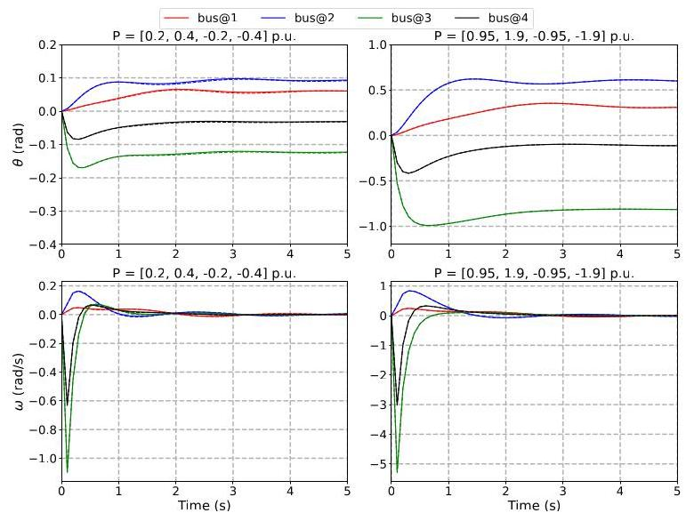

Fig. 8. Comparison of the predicted and exact solutions for the voltage angle and frequency using PIKAN-II for the 4-bus 2-generator power system dynamics. Solid lines represent the exact trajectory, while dashed lines represent the predicted trajectory by PIKAN-II.

图8. 使用PIKAN-II对四节点双发电机电力系统动态特性的电压角度和频率的预测解与精确解的比较。实线表示精确轨迹，虚线表示PIKAN-II的预测轨迹。

## B. Data-driven inertia and damping coefficients identification

## B. 数据驱动的惯性和阻尼系数识别

In the parameter identification study, the inertia and damping coefficients of the testing systems are unknown parameters. We assessed the capability of PIKANs to accurately estimate these unknown parameters from observed trajectories.

在参数识别研究中，测试系统的惯性和阻尼系数是未知参数。我们评估了PIKANs从观测轨迹中准确估计这些未知参数的能力。

The parameters and hyperparameters of the PIKANs for assessing inertia and damping coefficients are the same as those of the PIKANs agents in Section IV-A. Since the neural network's weights are initialized randomly, we run each estimation of the four algorithms 20 times. Figs. 9 and 10 show the distribution of parameter estimation errors on the 4-bus 2- generator system for the proposed method and the comparison methods. PIKAN-I achieves a median relative error below 10% for evaluating the inertia and damping coefficients of the system. In contrast, PIKAN-II demonstrates significantly better performance, achieving a median relative error of around $1\%$ for inertia coefficients and ${0.1}\%$ for several damping coefficients. The traditional PINNs, however, perform much worse than the proposed methods. Additionally, we observed that incorporating measurements of $\omega$ during training can significantly improve the parameter estimation accuracy of the agent for both the PIKAN and traditional PINN methods.

用于评估惯性和阻尼系数的PIKANs的参数和超参数与第四节A部分中PIKANs智能体的参数和超参数相同。由于神经网络的权重是随机初始化的，我们对四种算法的每次估计都运行20次。图9和图10展示了所提方法和比较方法在四节点双发电机系统上参数估计误差的分布。PIKAN-I在评估系统的惯性和阻尼系数时实现了低于10%的中位数相对误差。相比之下，PIKAN-II表现出明显更好的性能，惯性系数的中位数相对误差约为$1\%$，几个阻尼系数的中位数相对误差为${0.1}\%$。然而，传统的PINNs比所提方法表现差得多。此外，我们观察到在训练期间纳入$\omega$的测量可以显著提高PIKAN和传统PINN方法中智能体的参数估计精度。

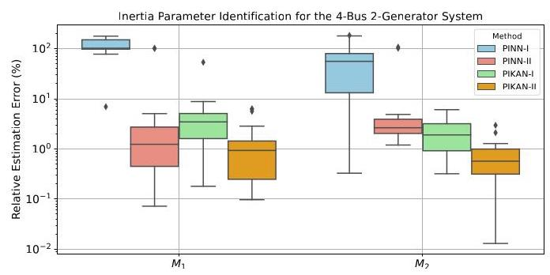

Fig. 9. Inertia coefficients estimation errors of PIKANs and PINNs.

图9. PIKANs和PINNs的惯性系数估计误差。

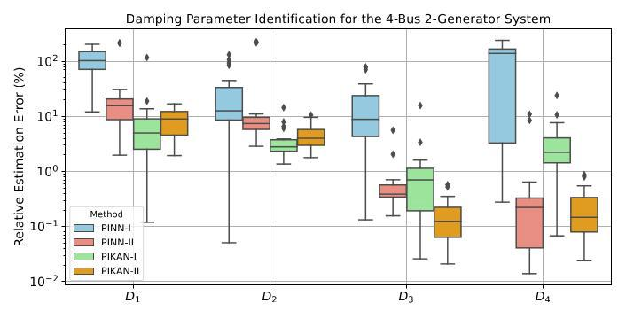

Fig. 10. Damping coefficients estimation errors of PIKANs and PINNs.

图10. PIKANs和PINNs的阻尼系数估计误差。

## C. Number of network parameters vs. PIKAN performance

## C. 网络参数数量与PIKAN性能

Results in Tables 1 and 1 1 indicate that, for the SMIB case, PIKANs achieved greater accuracy in grid dynamic learning while using only 41% of the network size of the PINNs. Similarly, for the 4-bus 2-generator case, PIKANs achieved higher accuracy while utilizing only 58% of the network size of the PINNs.

表1和表11中的结果表明，对于单机无穷大母线(SMIB)情况，PIKANs在电网动态学习中实现了更高的精度，同时仅使用了PINNs网络规模的41%。同样，对于四节点双发电机情况，PIKANs在仅使用PINNs网络规模58%的情况下实现了更高的精度。

For a $L$ -layer KAN with layers of equal width $N$ , there are in total $O\left( {{N}^{2}{LG}}\right)$ parameters, and an MLP only needs $O\left( {{N}^{2}L}\right)$ parameters for the same number of layers and width. However, KANs typically achieve similar performance with a much smaller $N$ compared to MLPs. Fig. 11 illustrates the scaling laws of losses as a function of the number of parameters in both PIKANs and PINNs. The results demonstrate that KANs exhibit steeper scaling laws than MLPs. This implies that PIKANs can achieve comparable or even superior accuracy in power system dynamic learning with fewer parameters than PINNs. The implications of these findings are significant. They suggest that while KANs may initially seem to require more parameters due to the $O\left( {{N}^{2}{LG}}\right)$ scaling, their ability to use a smaller $N$ effectively reduces the overall parameter count needed for high performance. Consequently, PIKANs offer a more efficient and scalable solution for complex learning tasks in power systems, surpassing traditional MLP-based PINNs in terms of both accuracy and parameter efficiency.

对于一个具有等宽$N$层的$L$层KAN，总共有$O\left( {{N}^{2}{LG}}\right)$个参数，而对于相同层数和宽度的多层感知器(MLP)只需要$O\left( {{N}^{2}L}\right)$个参数。然而，与MLP相比，KAN通常在$N$小得多的情况下就能实现类似的性能。图11说明了PIKANs和PINNs中损失随参数数量的缩放规律。结果表明，KANs的缩放规律比MLP更陡峭。这意味着PIKANs在电力系统动态学习中可以用比PINNs更少的参数实现相当甚至更高的精度。这些发现的意义重大。它们表明，虽然由于$O\left( {{N}^{2}{LG}}\right)$缩放，KANs最初可能看起来需要更多参数，但它们有效使用更小$N$的能力实际上减少了高性能所需的总体参数数量。因此，PIKANs为电力系统中的复杂学习任务提供了一种更高效、可扩展的解决方案，在精度和参数效率方面都超过了传统的基于MLP的PINNs。

## D. Reduced data dependency

## D. 降低数据依赖性

PIKANs introduce a KAN training framework designed to leverage the inherent dynamics of power systems. Consequently, compared to traditional DNNs without a physics-informed architecture, PIKANs can significantly reduce the required size of the training dataset. For the two testing systems in Table II, the performance of traditional DNNs, employing identical architecture and parameters as the PINNs, varies with the number of training data points, as illustrated in Fig. 12 From the results, it is observed that PIKANs can achieve similar or even better performance while requiring only ${10}\%$ of the training data points compared to traditional DNNs.

PIKANs引入了一个旨在利用电力系统固有动态特性的KAN训练框架。因此，与没有物理信息架构的传统深度神经网络(DNN)相比，PIKANs可以显著减少训练数据集所需的规模。对于表II中的两个测试系统，采用与PINNs相同架构和参数的传统DNN的性能随训练数据点数量而变化，如图12所示。从结果可以看出，与传统DNN相比，PIKANs在仅需要${10}\%$数量的训练数据点时就能实现类似甚至更好的性能。

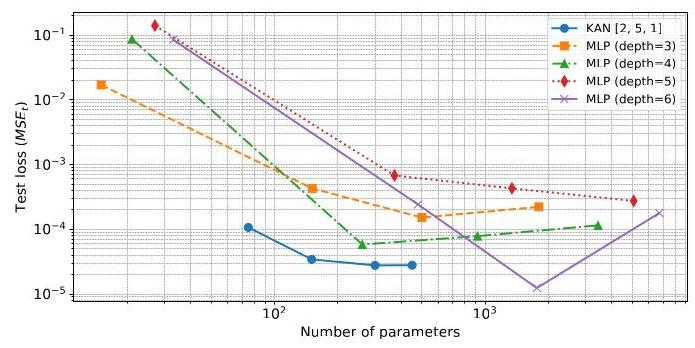

Fig. 11. Scaling laws of losses against the number of parameters for different physics-informed neural networks applied to the SMIB system.

图11. 应用于单机无穷大母线(SMIB)系统的不同物理信息神经网络的损失随参数数量的缩放规律。

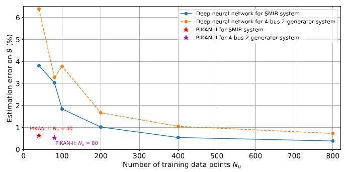

Fig. 12. Performance comparison of traditional DNNs and PIKANs with varying numbers of training data points. For the SMIB case, a [2, 10, 10, 10, 10, 10, 1] DNN architecture is employed. For the 4-bus system, a [5, 30, 30, 4] DNN architecture is utilized, and the Adam optimizer was employed.

图12. 传统DNN和PIKANs在不同训练数据点数量下的性能比较。对于SMIB情况，采用[2, 10, 10, 10, 10, 10, 1] DNN架构。对于四节点系统，采用[5, 30, 30, 4] DNN架构，并使用了Adam优化器。

## V. DISCUSSION

## V. 讨论

This paper introduces, for the first time in power systems, a KAN-based PINN (i.e., PIKAN) approach that explicitly considers the swing equations describing the frequency behavior of grids. As a promising alternative to traditional MLPs, the proposed PIKANs for power system dynamics can achieve comparable or even higher accuracy with fewer neural network parameters compared to MLP-based PINNs. The advantage of PIKANs is particularly significant given the challenges of training large neural networks, such as large language models (LLMs), which are resource-intensive and consume substantial amounts of energy. This opens up numerous opportunities in power systems, as PIKANs can potentially be used to accurately and efficiently solve DAEs in power grids. In addition, PIKANs require only a very limited amount of training data. For instance, for the SMIB system, PIKANs need only ${N}_{u} = {40}$ points $\left\{  {\left( {t}_{u}^{n},{\mathbf{x}}_{u}^{n}),{\mathbf{u}}^{n}\right) }_{n = 1}^{{N}_{u}}\right\}$ to train the agent. Even for a larger power system, such as the 4-bus 2-generator system, PIKANs still need only ${N}_{u} = {80}$ training data points. Although we require significantly more collocation points (for example, ${N}_{f} = {800}$ for the SMIB case) to evaluate the ${MS}{E}_{f}$ term in the loss function given in equation 16 , it is important to note that this evaluation is not dependent on measured voltage angle and angular frequency data. This means we can generate any number of collocation points without needing to produce labels for those data points.

本文首次在电力系统中引入了一种基于KAN的PINN(即PIKAN)方法，该方法明确考虑了描述电网频率行为的摇摆方程。作为传统MLP的一种有前途的替代方法，所提出的用于电力系统动态的PIKANs与基于MLP的PINNs相比，可以用更少神经网络参数实现相当甚至更高的精度。鉴于训练大型神经网络(如大型语言模型(LLM))的挑战，PIKANs的优势尤为显著，这些大型神经网络资源密集且消耗大量能源。这在电力系统中开辟了众多机会，因为PIKANs有可能用于准确高效地求解电网中的微分代数方程(DAE)。此外，PIKANs只需要非常有限的训练数据。例如，对于SMIB系统，PIKANs只需要${N}_{u} = {40}$个$\left\{  {\left( {t}_{u}^{n},{\mathbf{x}}_{u}^{n}),{\mathbf{u}}^{n}\right) }_{n = 1}^{{N}_{u}}\right\}$点来训练智能体。即使对于更大的电力系统，如四节点双发电机系统，PIKANs仍然只需要${N}_{u} = {80}$个训练数据点。尽管在评估方程16中给出的损失函数中的${MS}{E}_{f}$项时我们需要显著更多的配置点(例如，对于SMIB情况需要${N}_{f} = {800}$个)，但重要的是要注意，这种评估不依赖于测量的电压角度和角频率数据。这意味着我们可以生成任意数量的配置点，而无需为这些数据点生成标签。

Similar with traditional PINNs, PIKANs have the capability to directly compute the voltage angle at any given time step ${t}_{1}$ . In contrast, numerical methods must integrate starting from the initial conditions at $t = {t}_{0}$ and proceed sequentially to reach $t = {t}_{1}$ . This provides significant advantages over traditional numerical integration methods.

与传统的物理信息神经网络(PINNs)类似，PIKANs能够在任何给定的时间步${t}_{1}$直接计算电压角度。相比之下，数值方法必须从$t = {t}_{0}$的初始条件开始积分，并依次进行到$t = {t}_{1}$。这比传统的数值积分方法具有显著优势。

In this study, our primary focus was on exploring how PIKANs could achieve higher accuracy in learning power system dynamics while maintaining a smaller network size. Theoretically, KANs outperform MLPs in terms of accuracy, interpretability, and reduction of catastrophic forgetting. Nevertheless, to fully harness the potential of PIKANs, several challenges must be addressed.

在本研究中，我们主要关注的是探索PIKANs如何在保持较小网络规模的同时，在学习电力系统动态方面实现更高的精度。从理论上讲，知识辅助神经网络(KANs)在准确性、可解释性和减少灾难性遗忘方面优于多层感知器(MLPs)。然而，要充分发挥PIKANs的潜力，必须解决几个挑战。

1) Training and computing time: From the results presented in Table III it is evident that the training of PIKANs requires considerably more time compared to PINNs. Liu et al. [12] attribute this slower training to the inefficiency of current activation functions in batch computations. Despite the extended training duration, the superior performance and accuracy of PIKANs may justify the additional time investment, especially in scenarios requiring high precision. After offline training, we evaluate the PIKAN's performance based on its online computational speed required to solve the DAE defined by equation (5). For 19 different initial conditions of the 4-bus 2-generator system, the ode45 solver averages 0.017 seconds to solve the swing equations across the time interval from 0 seconds to 5 seconds, whereas PIKAN averages 0.024 seconds. In future research, we aim to explore techniques utilizing more efficient activation functions, such as Jacobi polynomials proposed by [24], to substantially enhance training speeds. And primary investigation in [25] demonstrates that Jacobi polynomials can reduce training times by two orders of magnitude compared to KANs using B-spline activation functions in the context of solving specific PDEs.

1)训练和计算时间:从表III中的结果可以明显看出，与PINNs相比，PIKANs的训练需要更多的时间。Liu等人[1]将这种较慢的训练归因于当前激活函数在批量计算中的低效率。尽管训练时间延长，但PIKANs的卓越性能和准确性可能证明额外的时间投入是合理的，特别是在需要高精度的场景中。离线训练后，我们根据求解由方程(5)定义的微分代数方程(DAE)所需的在线计算速度来评估PIKAN的性能。对于4节点2发电机系统的19种不同初始条件，ode45求解器在从0秒到5秒的时间间隔内平均需要0.017秒来求解摇摆方程，而PIKAN平均需要0.024秒。在未来的研究中，我们旨在探索利用更高效激活函数的技术，例如[24]提出的雅可比多项式，以大幅提高训练速度。[25]中的初步研究表明，在求解特定偏微分方程(PDEs)的背景下，与使用B样条激活函数的KANs相比，雅可比多项式可以将训练时间减少两个数量级。

2) Accuracy: Our simulation results demonstrated that KAN-based PINNs exhibit higher accuracy compared to MLP-based PINNs in modeling power system dynamics. Researchers have also found that KANs generally achieve greater accuracy than MLPs in most PDE problems [26]. However, whether KANs consistently outperform MLPs in various power dynamic problems requires further investigation. Additionally, understanding why PIKANs have higher accuracy than conventional PINNs warrants further exploration. One possible reason could be that KANs employ learnable activation functions, allowing for more complex learned activations compared to the fixed activation functions (such as ReLU) used in MLPs.

2) 准确性:我们的仿真结果表明，在对电力系统动态进行建模时，基于KAN的PINN相比基于MLP的PINN具有更高的准确性。研究人员还发现，在大多数偏微分方程问题中，KAN通常比MLP具有更高的准确性[26]。然而，KAN在各种电力动态问题中是否始终优于MLP仍需进一步研究。此外，理解为什么PIKAN比传统PINN具有更高的准确性值得进一步探索。一个可能的原因是，KAN使用可学习的激活函数，与MLP中使用的固定激活函数(如ReLU)相比，能够实现更复杂的学习激活。

3) Interpretability: KANs have the potential to serve as foundational models for AI + Science due to their accuracy and interpretability [12]. With KANs, humans can interactively obtain the symbolic formula of the model's output, which significantly facilitates the analysis of complex physical systems, such as the dynamics of bulk power systems. However, in the case of the swing equations examined in this study, we observed that the symbolic formula provided by the well-trained PIKAN does not accurately capture the frequency dynamics of the two testing systems, despite the PIKAN model itself precisely predicting the grid dynamics. This discrepancy may stem from the limited library of symbolic formulas available in the current version of KAN package in [27], or perhaps the formula for the grid dynamics is not inherently symbolic.

3) 可解释性:由于KAN的准确性和可解释性，它们有潜力作为人工智能+科学的基础模型[12]。借助KAN，人类可以交互式地获得模型输出的符号公式，这极大地促进了对复杂物理系统的分析，例如大容量电力系统的动态。然而，在本研究中所研究的摇摆方程的情况下，我们观察到，尽管PIKAN模型本身准确地预测了电网动态，但经过良好训练的PIKAN提供的符号公式并不能准确地捕捉两个测试系统的频率动态。这种差异可能源于[27]中当前版本的KAN包中可用的符号公式库有限，或者电网动态的公式本身不是符号性的。

4) Continual learning: One drawback of MLPs is their tendency to forget previously learned tasks when transition-ing from one task to another. Liu et al. [12] demonstrate that for a 1D regression task, KANs exhibit local plasticity and can prevent catastrophic forgetting by leveraging the locality of splines. However, the extent to which KANs can avoid catastrophic forgetting in more complex learning tasks, such as power system dynamics as explored in this study, remains unclear. In our investigation, we observed that a well-trained PIKAN, initially trained on data from stable scenarios (e.g., ${P}_{{m}_{1}} \in  \left\lbrack  {{0.08},{0.18}}\right\rbrack$ p.u. for the SMIB case), tends to forget previously learned dynamics when further trained on dynamics from unstable scenarios (e.g., ${P}_{{m}_{1}} \in  \left\lbrack  {{0.20},{0.25}}\right\rbrack$ p.u. for the SMIB case). Therefore, further investigation into the continual learning capabilities of the proposed PIKANs is warranted in future research.

4) 持续学习:MLP的一个缺点是，当从一个任务过渡到另一个任务时，它们倾向于忘记先前学习的任务。Liu等人[12]证明，对于一维回归任务，KAN表现出局部可塑性，并且可以通过利用样条的局部性来防止灾难性遗忘。然而，KAN在更复杂的学习任务(如本研究中探索的电力系统动态)中能够避免灾难性遗忘的程度仍不清楚。在我们的研究中，我们观察到，一个经过良好训练的PIKAN，最初在稳定场景(例如，对于SMIB情况为${P}_{{m}_{1}} \in  \left\lbrack  {{0.08},{0.18}}\right\rbrack$标幺值)的数据上进行训练，当在不稳定场景(例如，对于SMIB情况为${P}_{{m}_{1}} \in  \left\lbrack  {{0.20},{0.25}}\right\rbrack$标幺值)的动态上进一步训练时，往往会忘记先前学习的动态。因此，在未来的研究中，有必要进一步研究所提出的PIKAN的持续学习能力。

## VI. CONCLUSIONS

## VI. 结论

This is the first paper to propose physics-informed KANs for power system applications. By integrating KAN with PINN, we achieve higher accuracy in solving the differential-algebraic equations of power systems with smaller neural network size compared to traditional MLP-based PINNs. In our case studies, we showcased the effectiveness of the proposed PIKANs in accurately capturing the dynamics of power systems. Furthermore, we demonstrated their capability to identify uncertain system inertia and damping parameters, with high accuracy using a limited set of training data points. These results underscore the promising potential of the PIKANs for practical applications in power systems, opening up new avenues for their use.

这是第一篇提出用于电力系统应用的物理信息KAN的论文。通过将KAN与PINN集成，与传统的基于MLP的PINN相比，我们在使用更小的神经网络规模求解电力系统的微分代数方程时实现了更高的准确性。在我们的案例研究中，我们展示了所提出的PIKAN在准确捕捉电力系统动态方面的有效性。此外，我们展示了它们使用有限的一组训练数据点高精度识别不确定系统惯性和阻尼参数的能力。这些结果强调了PIKAN在电力系统实际应用中的广阔前景，并为其应用开辟了新的途径。

## APPENDIX A

## 附录A

See Algorithm 2.

见算法2。

## REFERENCES

## 参考文献

[1] M. I. Razzak, S. Naz, and A. Zaib, "Deep learning for medical imageprocessing: Overview, challenges and the future," Classification in

处理:概述、挑战与未来，”分类在BioApps: Automation of decision making, pp. 323-350, 2018.

[2] T. Hong, P. Pinson, Y. Wang, R. Weron, D. Yang, and H. Zareipour,"Energy forecasting: A review and outlook," IEEE Open Access Journal

”能源预测:综述与展望，“IEEE开放获取期刊of Power and Energy, vol. 7, pp. 376-388, 2020.

[3] H. Jiang, J. J. Zhang, W. Gao, and Z. Wu, "Fault detection, identification,and location in smart grid based on data-driven computational methods,"

以及基于数据驱动计算方法的智能电网中的位置，”IEEE Transactions on Smart Grid, vol. 5, no. 6, pp. 2947-2956, 2014.

[4] C. Ren, Y. Xu, and R. Zhang, "An interpretable deep learning methodfor power system transient stability assessment via tree regularization," IEEE Transactions on Power Systems, vol. 37, no. 5, pp. 3359-3369, 2022.

通过树正则化进行电力系统暂态稳定性评估，“《IEEE电力系统学报》，第37卷，第5期，第3359 - 3369页，2022年。

TABLE III

表III

TRAINING TIME FOR RESULTS GIVEN IN TABLE II

表II结果的训练时间

<table><tr><td>System</td><td>Methods</td><td>Network layers</td><td>Order of B-spline $\left( {k}_{b}\right)$</td><td>Intervals of B-spline $\left( G\right)$</td><td>No. of parameters</td><td>Training iterations</td><td>Training time (ms/iter.)</td></tr><tr><td rowspan="4">SMIB system</td><td>PIKAN-I</td><td>$\left\lbrack  {2,5,1}\right\rbrack$</td><td>3</td><td>10</td><td>195</td><td>7000</td><td>87.5</td></tr><tr><td>PIKAN-II</td><td>$\left\lbrack  {2,5,1}\right\rbrack$</td><td>3</td><td>10</td><td>195</td><td>7000</td><td>130</td></tr><tr><td>PINN-I ( 9 )</td><td>$\lbrack 2,{10},{10},{10}$ ,   10, 10, 1]</td><td>-</td><td>-</td><td>481</td><td>50000</td><td>0.54</td></tr><tr><td>PINN-II ( 111 )</td><td>[2, 10, 10, 10,   10, 10, 1]</td><td>-</td><td>-</td><td>481</td><td>10000</td><td>3.41</td></tr><tr><td rowspan="4">4-Bus   2-Generator System</td><td>PIKAN-I</td><td>[5, 10, 4]</td><td>3</td><td>5</td><td>720</td><td>3000</td><td>1225</td></tr><tr><td>PIKAN-II</td><td>[5, 10, 4]</td><td>3</td><td>5</td><td>720</td><td>3000</td><td>1390</td></tr><tr><td>PINN-I ( 9 )</td><td>[5, 30, 30, 4]</td><td>-</td><td>-</td><td>1234</td><td>50000</td><td>2.89</td></tr><tr><td>PINN-II ( [T1])</td><td>[5, 30, 30, 4]</td><td>-</td><td>-</td><td>1234</td><td>50000</td><td>3.78</td></tr></table>

Algorithm 2: PIKAN for grid parameter identification

算法2:用于电网参数识别的PIKAN

---

Data: Power system training and test dataset generated

				by time domain simulation

Result: KAN parameters and estimated inertia $\mathbf{M}$ and

					damping $\mathbf{D}$ parameters

Initialize KAN parameters: ${\left\{  {\mathbf{\Phi }}_{l}\right\}  }_{l = 1}^{L}, G$ , and ${k}_{b}$ ;

Initialize inertia $\mathbf{M}$ and damping $\mathbf{D}$ parameters;

Specify the loss function as equation (16) or (17);

Specify the initial & boundary training data points:

	${\left\{  \left( {t}_{u}^{n},{\mathbf{x}}_{u}^{n}\right) ,{\mathbf{u}}^{n}\right\}  }_{n = 1}^{{N}_{u}}$ , and specify collocation training

	points: ${\left\{  \left( {t}_{f}^{n},{\mathbf{x}}_{f}^{n}\right) \right\}  }_{n = 1}^{{N}_{f}}$ ;

Specify the test points: ${\left\{  \left( {t}_{\text{ test }}^{n},{\mathbf{x}}_{\text{ test }}^{n}\right) ,{\mathbf{u}}_{\text{ test }}^{n}\right\}  }_{n = 1}^{{N}_{\text{ test }}}$ ;

Set the maximum number of training steps $N$ , and

	learning rate;

while ${n}_{\text{ iter }} < N$ do

		Forward pass of KAN to calculate all $\mathbf{u}\left( {{t}_{u}^{n},{\mathbf{x}}_{u}^{n}}\right)$ . If

			loss function (17) is adopted, further calculate

			$\dot{\mathbf{u}}\left( {{t}_{u}^{n},{\mathbf{x}}_{u}^{n}}\right)$ using automatic differentiation;

		Calculate ${MS}{E}_{u}$ based on the output of KAN and

			the measurements;

		Calculate ${MS}{E}_{f}$ based on the output of KAN and

			the power system dynamics given in equation (5);

		Find the best KAN parameters and inertia $\mathbf{M}$ and

			damping $\mathbf{D}$ parameters to minimize the loss

			function using the LBFGS optimizer;

		if ${n}_{\text{ iter }}\% {10} =  = 0$ then

					Evaluate the performance of the PIKAN agent

					over the test points based on equation (20);

		end

end

---

[5] S. Sinha, S. P. Nandanoori, and E. Yeung, "Data driven online learningof power system dynamics," in 2020 IEEE Power & Energy Society

电力系统动态，“于2020年IEEE电力与能源协会General Meeting (PESGM), 2020, pp. 1-5.

[6] R. Satheesh, N. Chakkungal, S. Rajan, M. Madhavan, and H. H. Alhelou,"Identification of oscillatory modes in power system using deep learning

"使用深度学习识别电力系统中的振荡模式"approach," IEEE Access, vol. 10, pp. 16556-16565, 2022.

[7] N. Bhusal, R. M. Shukla, M. Gautam, M. Benidris, and S. Sengupta,"Deep ensemble learning-based approach to real-time power system state estimation," International Journal of Electrical Power & Energy

"基于深度集成学习的实时电力系统状态估计方法"，《国际电力与能源杂志》Systems, vol. 129, p. 106806, 2021.

[8] Y. Zhang, X. Shi, H. Zhang, Y. Cao, and V. Terzija, "Review on deeplearning applications in frequency analysis and control of modern power system," International Journal of Electrical Power & Energy Systems,

学习在现代电力系统频率分析与控制中的应用"，《国际电力与能源系统杂志》vol. 136, p. 107744, 2022.

[9] G. S. Misyris, A. Venzke, and S. Chatzivasileiadis, "Physics-informedneural networks for power systems," in 2020 IEEE power & energy

电力系统的神经网络"，于2020年IEEE电力与能源会议society general meeting (PESGM). IEEE, 2020, pp. 1-5.

[10] G. S. Misyris, J. Stiasny, and S. Chatzivasileiadis, "Capturing power sys-tem dynamics by physics-informed neural networks and optimization,"

通过物理信息神经网络和优化的系统动力学"in 2021 60th IEEE Conference on Decision and Control (CDC), 2021,pp. 4418-4423.

[11] J. Stiasny, G. S. Misyris, and S. Chatzivasileiadis, "Physics-informedneural networks for non-linear system identification for power system

用于电力系统非线性系统识别的神经网络dynamics," in 2021 IEEE Madrid PowerTech. IEEE, 2021, pp. 1-6.

[12] Z. Liu, Y. Wang, S. Vaidya, F. Ruehle, J. Halverson, M. Soljačić,T. Y. Hou, and M. Tegmark, "Kan: Kolmogorov-arnold networks," arXiv

T. Y. 侯和M. 泰格马克，"Kan:柯尔莫哥洛夫 - 阿诺德网络"，arXivpreprint arXiv:2404.19756, 2024.

[13] Y. LeCun, Y. Bengio, and G. Hinton, "Deep learning," nature, vol. 521, no. 7553, pp. 436-444, 2015.

[14] T. Chen and H. Chen, "Universal approximation to nonlinear operatorsby neural networks with arbitrary activation functions and its application to dynamical systems," IEEE transactions on neural networks, vol. 6,

具有任意激活函数的神经网络及其在动力系统中的应用"，《IEEE神经网络汇刊》，第6卷no. 4, pp. 911-917, 1995.

[15] Y. Lu and J. Lu, "A universal approximation theorem of deep neuralnetworks for expressing probability distributions," Advances in neural

用于表达概率分布的网络"，《神经网络进展》information processing systems, vol. 33, pp. 3094-3105, 2020.

[16] R. Kemker, M. McClure, A. Abitino, T. Hayes, and C. Kanan, "Mea-suring catastrophic forgetting in neural networks," in Proceedings of the

测量神经网络中的灾难性遗忘"，收录于...AAAI conference on artificial intelligence, vol. 32, no. 1, 2018.

[17] F.-L. Fan, J. Xiong, M. Li, and G. Wang, "On interpretability of artificialneural networks: A survey," IEEE Transactions on Radiation and Plasma

神经网络:综述"，《IEEE辐射与等离子体汇刊》Medical Sciences, vol. 5, no. 6, pp. 741-760, 2021.

[18] H. Shuai, B. She, J. Wang, and F. Li, "Safe reinforcement learning forgrid-forming inverter based frequency regulation with stability guarantee," Journal of Modern Power Systems and Clean Energy, pp. 1-8, 2024.

具有稳定性保证的基于电网形成逆变器的频率调节"，《现代电力系统与清洁能源杂志》，第1 - 8页，2024年。

[19] V. Vittal, J. D. McCalley, P. M. Anderson, and A. Fouad, Power System Control and Stability, 3rd Edition. John Wiley & Sons, 2019.

[20] A. N. Kolmogorov, On the representation of continuous functions ofseveral variables by superpositions of continuous functions of a smaller number of variables. American Mathematical Society, 1961.

通过较少数量变量的连续函数叠加表示多个变量。美国数学学会，1961年。

[21] T. Poggio, A. Banburski, and Q. Liao, "Theoretical issues in deepnetworks," Proceedings of the National Academy of Sciences, vol. 117,

网络"，《美国国家科学院院刊》，第117卷no. 48, pp. 30039-30045, 2020.

[22] Z. Bozorgasl and H. Chen, "Wav-kan: Wavelet kolmogorov-arnold networks," arXiv preprint arXiv:2405.12832, 2024.

[23] M. Raissi, P. Perdikaris, and G. E. Karniadakis, "Physics informed deeplearning (part i): Data-driven solutions of nonlinear partial differential

学习(第一部分):非线性偏微分方程的数据驱动解决方案equations," arXiv preprint arXiv:1711.10561, 2017.

[24] SynodicMonth, "Chebykan," https://github.com/SynodicMonth/ChebyKAN 2024.

ChebyKAN 2024。

[25] K. Shukla, J. D. Toscano, Z. Wang, Z. Zou, and G. E. Karniadakis, "Acomprehensive and fair comparison between mlp and kan representations for differential equations and operator networks," arXiv preprint

关于微分方程和算子网络的多层感知器(MLP)与知识图谱(Kan)表示之间的全面且公平的比较，”arXiv预印本arXiv:2406.02917, 2024.

[26] Y. Wang, J. Sun, J. Bai, C. Anitescu, M. S. Eshaghi, X. Zhuang,T. Rabczuk, and Y. Liu, "Kolmogorov arnold informed neural network: A physics-informed deep learning framework for solving pdes based on

T. 拉布祖克和Y. 刘，“基于柯尔莫哥洛夫 - 阿诺德的知识神经网络:一种基于物理知识的深度学习框架，用于求解偏微分方程”kolmogorov arnold networks," arXiv preprint arXiv:2406.11045, 2024.

[27] KindXiaoming, "pykan," https://github.com/KindXiaoming/pykan 2024,accessed: Jun. 2024.

访问时间:2024年6月。