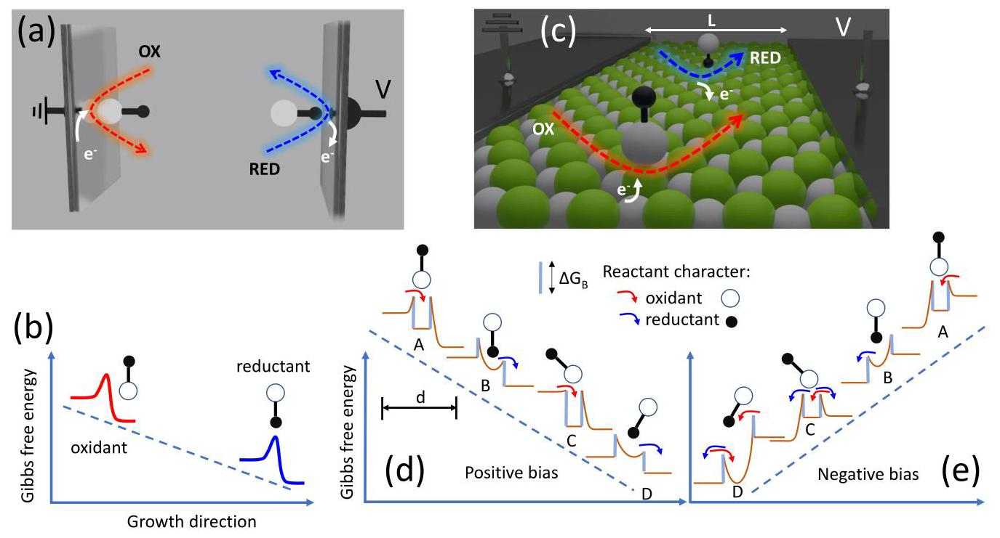
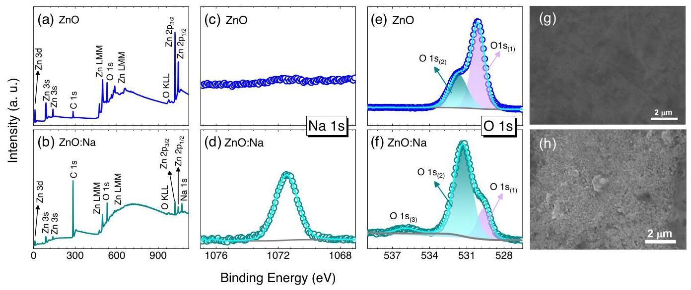
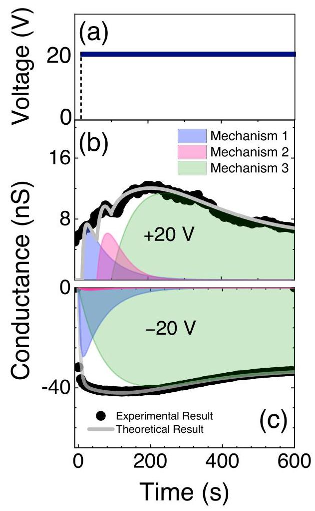
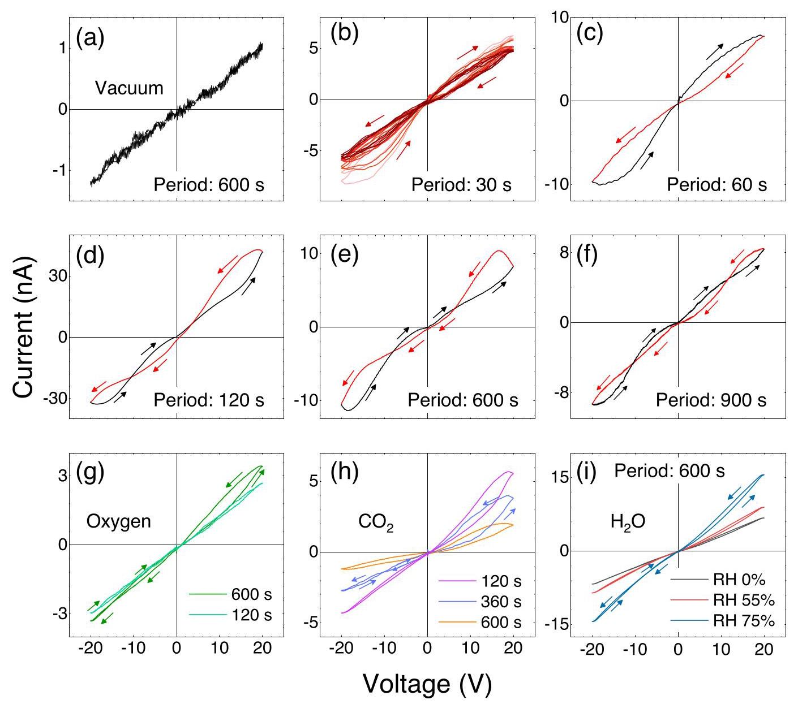
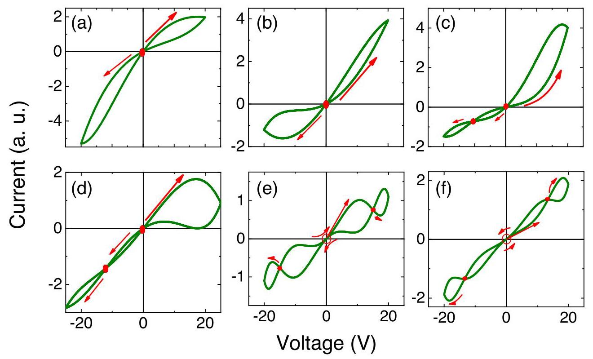
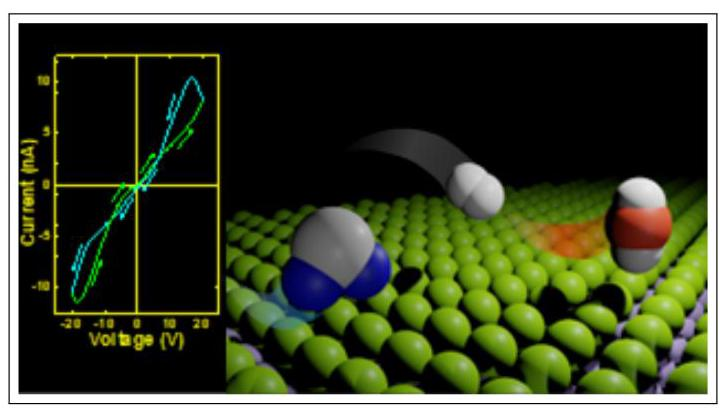

# From Memory Traces to Surface Chemistry: Decoding REDOX Reactions

从记忆痕迹到表面化学:解读氧化还原反应

Ana Luiza Costa Silva, ${}^{*, \dagger  }$ Rafael Schio Wengenroth Silva, ${}^{ \dagger  }$ Lucas Augusto Moisés, ${}^{ \dagger  }$ Adenilson José Chiquito, ${}^{ \dagger  }$ Marcio Peron Franco de Godoy, ${}^{ \dagger  }$ Fabian Hartmann, ${}^{ \ddagger  }$ and Victor Lopez-Richard ${}^{ \dagger  }$

安娜·路易莎·科斯塔·席尔瓦，${}^{*, \dagger  }$拉斐尔·席奥·温根罗思·席尔瓦，${}^{ \dagger  }$卢卡斯·奥古斯托·莫伊塞斯，${}^{ \dagger  }$阿代尼尔森·若泽·奇基托，${}^{ \dagger  }$马尔西奥·佩龙·佛朗哥·德戈多伊，${}^{ \dagger  }$法比安·哈特曼，${}^{ \ddagger  }$以及维克托·洛佩斯 - 理查德${}^{ \dagger  }$

†Departamento de Física, Universidade Federal de São Carlos, 13565-905, São Carlos, SP, Brazil

†巴西圣保罗州圣卡洛斯市，圣卡洛斯联邦大学物理系，邮编13565 - 905

‡Julius-Maximilians-Universität Würzburg, Physikalisches Institut and Würzburg-Dresden Cluster of Excellence ct.qmat, Lehrstuhl für Technische Physik, Am Hubland, 97074 Würzburg, Deutschland

‡德国维尔茨堡市，朱利叶斯 - 马克西米利安斯 - 维尔茨堡大学，物理研究所及维尔茨堡 - 德累斯顿卓越集群ct.qmat，技术物理教研室，胡布兰德校区，邮编97074

E-mail: analuiza@df.ufscar.br

电子邮箱:analuiza@df.ufscar.br

## Abstract

## 摘要

Gas and moisture sensing devices leveraging the resistive switching effect in transition metal oxide memristors promise to revolutionize next-generation, nano-scaled, cost-effective, and environmentally sustainable sensor solutions. These sensors encode readouts in resistance state changes based on gas concentration, yet their nonlinear current-voltage characteristics offer richer dynamics, capturing detailed information about REDOX reactions and surface kinetics. Traditional vertical devices fail to fully exploit this complexity. This study demonstrates planar resistive switching devices, moving beyond the Butler-Volmer model. A systematic investigation of the electrochemical processes in Na-doped $\mathrm{{ZnO}}$ with lateral planar contacts reveals intricate patterns resulting from REDOX reactions on the device surface. When combined with

利用过渡金属氧化物忆阻器中的电阻开关效应的气体和湿度传感设备有望彻底改变下一代纳米级、经济高效且环境可持续的传感器解决方案。这些传感器基于气体浓度在电阻状态变化中编码读数，但其非线性电流 - 电压特性提供了更丰富的动态变化，捕捉有关氧化还原反应和表面动力学的详细信息。传统的垂直设备无法充分利用这种复杂性。本研究展示了平面电阻开关设备，超越了巴特勒 - 沃尔默模型。对具有横向平面接触的钠掺杂$\mathrm{{ZnO}}$中的电化学过程进行系统研究，揭示了由器件表面的氧化还原反应产生的复杂模式。当与

advanced algorithms for pattern recognition, allow the analysis of complex switching patterns, including crossings, loop directions, and resistance values, providing unprecedented insights for next-generation complex sensors.

先进的模式识别算法相结合时，能够分析复杂的开关模式，包括交叉点、环路方向和电阻值，为下一代复杂传感器提供前所未有的见解。

## Introduction

## 引言

The demand for advanced, miniaturized, and efficient information processing and sensing technologies is driving the development of innovative semiconductor materials beyond silicon ${}^{1 - 3}$ . While some materials offer advantages in processing complexity, cost-effectiveness, flexibility, and environmentally sustainable, other materials enable applications that cannot be realized within silicon technology, e.g. spintronics, Mottronics, and in-memory computing ${}^{4 - 6}$ to name a few. One specific notable phenomenon in electronic devices, absent in silicon, is the resistive memory effect, which can be observed in materials fabricated with a metal-insulator-metal (MIM) structure, whose insulating layer is often composed of a transition metal oxide or a semiconductor oxide ${}^{7 - {10}}$ . Such structures can be utilized in traditional computing architectures and in novel beyond von Neumann computational architectures, such as in-memory computing, artificial neural networks or reservoir computing ${}^{{11} - {13}}$ . Exploring the electronic conduction mechanisms of materials exhibiting memory traces also enable novel smart solutions for sensing applications of gases, gas mixtures and atmospheres.

对先进、小型化且高效信息处理和传感技术的需求推动了超越硅${}^{1 - 3}$的创新半导体材料的发展。虽然一些材料在处理复杂性、成本效益、灵活性和环境可持续性方面具有优势，但其他材料则实现了硅技术无法实现的应用，例如自旋电子学、磁子学和内存计算${}^{4 - 6}$等等。电子设备中一种在硅中不存在的特定显著现象是电阻记忆效应，这种效应可以在具有金属 - 绝缘体 - 金属(MIM)结构制造的材料中观察到，其绝缘层通常由过渡金属氧化物或半导体氧化物${}^{7 - {10}}$组成。这种结构可用于传统计算架构以及新型的超越冯·诺依曼计算架构，如内存计算、人工神经网络或水库计算${}^{{11} - {13}}$。探索具有记忆痕迹的材料的电子传导机制还能为气体、气体混合物和大气的传感应用带来新颖的智能解决方案。

Additional research indicates that certain semiconductor oxides exhibit resistive memory effects alongside with sensing functionalities, commonly referred to as "gasistors" ${}^{{10},{14}}$ . Among various approaches, elucidating the role of the surface in these processes presents a significant challenge. Studies on gas sensing underscore the critical importance of understanding the interactions between gas-sensitive materials and the ambient atmosphere ${}^{15}$ . However, the conventional MIM electrical contact configuration limits the detection capabilities of memristor-based gas sensors, as the gas primarily interacts with the upper electrode rather than directly with the oxide surface. Nontraditional setups such as lateral planar electrical contacts, provide deeper insights into the factors influencing the resistive memory effect. It also allows to expand the active detection area exposing the material surface either partially or completely to the target element ${}^{16}$ . Thus, employing a lateral planar electrical contact geometry enables the investigation of the active role of the film surface for memory effects of semiconductor oxides when exposed to various atmospheric conditions that electrochemically react with it.

进一步的研究表明，某些半导体氧化物除了具有传感功能外还表现出电阻记忆效应，通常被称为“气敏电阻”${}^{{10},{14}}$。在各种方法中，阐明表面在这些过程中的作用是一项重大挑战。气体传感研究强调了理解气敏材料与周围大气之间相互作用的至关重要性${}^{15}$。然而，传统的MIM电接触配置限制了基于忆阻器的气体传感器的检测能力，因为气体主要与上电极相互作用，而不是直接与氧化物表面相互作用。诸如横向平面电接触等非传统设置能更深入地了解影响电阻记忆效应的因素。它还允许扩大有源检测区域，使材料表面部分或完全暴露于目标元素${}^{16}$。因此，采用横向平面电接触几何结构能够研究半导体氧化物薄膜表面在暴露于与它发生电化学反应的各种大气条件时对记忆效应的积极作用。

We present both theoretical and experimental evidence of complex patterns emerging in the current-voltage loops of planar memristive devices. These phenomena result from REDOX reactions at various sites and under different environments, revealing a complexity that extends beyond the traditional Butler-Volmer model. Based on Na-doped ZnO planar memristive devices synthesized by spray-pyrolysis, we show experimentally how the current-voltage characteristics alter in the presence of different gas environments and how intricate behaviors beyond the resistance change emerge. These behaviors differ in the number of crossings, the symmetry of the response, and the polarity-dependent memory content. We derive an analytical solution by adapting the Butler-Volmer model, which correlates changes in the current-voltage response with the reaction type, the surrounding environment, and the specific location of the reaction site.

我们展示了平面忆阻器件电流 - 电压回路中出现的复杂模式的理论和实验证据。这些现象源于不同位点和不同环境下的氧化还原反应，揭示了一种超越传统巴特勒 - 沃尔默模型的复杂性。基于通过喷雾热解合成的钠掺杂氧化锌平面忆阻器件，我们通过实验展示了在不同气体环境下电流 - 电压特性如何变化，以及如何出现超出电阻变化的复杂行为。这些行为在交叉次数、响应对称性和极性相关的记忆内容方面存在差异。我们通过调整巴特勒 - 沃尔默模型得出了一个解析解，该解将电流 - 电压响应的变化与反应类型、周围环境以及反应位点的特定位置相关联。

## Methods

## 方法

Sample Preparation. The investigated system consists of (002) oriented polycrystalline Na-doped ZnO thin films synthesized by the spray pyrolysis technique. This process is based on spraying a precursor solution, carried by dry air, onto a preheated substrate where the chemical-physical growth occurs. In this study, zinc acetate dihydrate $\left( {\mathrm{{Zn}}{\left( {\mathrm{C}}_{2}{\mathrm{H}}_{3}{\mathrm{O}}_{2}\right) }_{2} \cdot  2{\mathrm{H}}_{2}\mathrm{O}}\right.$ by Synth) and sodium hydroxide (NaOH by NEON) were used as the precursors. The zinc and sodium precursor solutions were prepared in distilled water with a molarity of $5 \cdot  {10}^{-3}\mathrm{M}$ and thermally stirred at ${100}{}^{ \circ  }\mathrm{C}$ . A nominal content of ${10}\% \mathrm{\;N}$ a was used for $\mathrm{{Zn}}$ doping, referred to as $\mathrm{{ZnO}} : \mathrm{{Na}}{10}\%$ . The deposition and growth of the films were carried out at 300 ${}^{ \circ  }\mathrm{C}$ with a flow rate of ${0.3}\mathrm{\;{mL}}/\mathrm{{min}}$ . For further details on the sample preparation via spray pyrolysis, refer to ${}^{17}$ .

样品制备。所研究的系统由通过喷雾热解技术合成的(002)取向多晶钠掺杂氧化锌薄膜组成。该过程基于将由干燥空气携带的前驱体溶液喷涂到预热的基板上，在基板上发生化学 - 物理生长。在本研究中，使用二水合醋酸锌$\left( {\mathrm{{Zn}}{\left( {\mathrm{C}}_{2}{\mathrm{H}}_{3}{\mathrm{O}}_{2}\right) }_{2} \cdot  2{\mathrm{H}}_{2}\mathrm{O}}\right.$(由Synth提供)和氢氧化钠(由NEON提供的NaOH)作为前驱体。锌和钠前驱体溶液在蒸馏水中以$5 \cdot  {10}^{-3}\mathrm{M}$的摩尔浓度制备，并在${100}{}^{ \circ  }\mathrm{C}$下进行热搅拌。用于$\mathrm{{Zn}}$掺杂的名义含量为${10}\% \mathrm{\;N}$a，称为$\mathrm{{ZnO}} : \mathrm{{Na}}{10}\%$。薄膜的沉积和生长在300${}^{ \circ  }\mathrm{C}$下以${0.3}\mathrm{\;{mL}}/\mathrm{{min}}$的流速进行。有关通过喷雾热解制备样品的更多详细信息，请参考${}^{17}$。

Material Characterization. The Thermo Scientific K-Alpha spectrometer provided the X-ray photoelectron spectroscopy (XPS) for surface chemical analysis using the Al-K $\alpha$ monochromatic radiation (1486.6 eV). The spectra were fitted by a combination of Gaussian (70%) and Lorentzian (30%) functions employing the Shirley method as the baseline and aligning spectra on the adventitious carbon peak (C $1\mathrm{\;s} - {284.8}\mathrm{{eV}}$ ) to correct charging effects. Film morphology was analyzed using a scanning electron microscope (SEM) model JEOL JSM 6510, equipped with a ${20}\mathrm{{kV}}$ electron beam and secondary electron (SE) mode. With a high conductive silver paint 503, two planar electrical contacts separated by $1\mathrm{\;{mm}}$ were prepared, allowing a large area for atmosphere contact. For electrical characterization, a Keysight B2901A source measure unit provided the Current-voltage (I-V) curves and hysteresis loops with the sample mounted in a Linkam Scientific HFS600E cryostat equipped with two tungsten positional probes. All measurements were performed at room temperature under various atmospheric conditions, including ambient air, vacuum, controlled relative humidity (RH), and atmospheres of oxygen $\left( {\mathrm{O}}_{2}\right)$ and carbon dioxide $\left( {\mathrm{{CO}}}_{2}\right)$ .

材料表征。赛默飞世尔科技的K - Alpha光谱仪使用Al - K$\alpha$单色辐射(1486.6 eV)提供用于表面化学分析的X射线光电子能谱(XPS)。光谱通过高斯(70%)和洛伦兹(30%)函数的组合进行拟合，采用雪莉方法作为基线，并将光谱对准不定碳峰(C$1\mathrm{\;s} - {284.8}\mathrm{{eV}}$)以校正充电效应。使用配备${20}\mathrm{{kV}}$电子束和二次电子(SE)模式的JEOL JSM 6510型扫描电子显微镜(SEM)分析薄膜形态。使用高导电银漆503制备了两个由$1\mathrm{\;{mm}}$隔开的平面电触点，允许大面积与大气接触。为了进行电学表征，Keysight B2901A源测量单元在安装在配备两个钨位置探针的Linkam Scientific HFS600E低温恒温器中的样品上提供电流 - 电压(I - V)曲线和滞后回线。所有测量均在室温下在各种大气条件下进行，包括环境空气、真空、受控相对湿度(RH)以及氧气$\left( {\mathrm{O}}_{2}\right)$和二氧化碳$\left( {\mathrm{{CO}}}_{2}\right)$气氛。

Theoretical Methods. For the theoretical simulation of the electrochemical reactions occurring at the surface under lateral bias, we propose an alternative to the conventional Butler-Volmer model. Our approach accounts for the complex interplay between different electrochemical processes at various surface sites, including their respective REDOX characteristics and environments. The electron transfer for each process is emulated by solving a set of differential equations grounded in the relaxation time approximation. These equations describe the time evolution of surface electron density fluctuations due to local reactions. Numerical solutions were obtained using standard Runge-Kutta methods, which allowed us to model the dynamic conductance response under varying voltage sweeps and simulate the resulting current-voltage hysteresis loops. This approach provides a nuanced view of concomitant electrochemical processes in laterally biased device configurations.

理论方法。对于横向偏压下表面发生的电化学反应的理论模拟，我们提出了一种替代传统巴特勒 - 沃尔默模型的方法。我们的方法考虑了不同表面位点处不同电化学过程之间的复杂相互作用，包括它们各自的氧化还原特性和环境。通过求解基于弛豫时间近似的一组微分方程来模拟每个过程的电子转移。这些方程描述了由于局部反应导致的表面电子密度波动的时间演化。使用标准的龙格 - 库塔方法获得数值解，这使我们能够对不同电压扫描下的动态电导响应进行建模，并模拟由此产生的电流 - 电压滞后回线。这种方法提供了对横向偏压器件配置中伴随的电化学过程的细致观察。

## Results and discussion

## 结果与讨论

The direction and rate of electrochemical reactions depend on the combined influence of thermodynamics and kinetics. Thermodynamics, captured by the Gibbs free energy change $\left( {\Delta {G}_{B}}\right)$ , dictates the spontaneity and equilibrium of the reaction ${}^{18}$ . A negative $\Delta {G}_{B}$ indicates a thermodynamically favorable reaction, while the magnitude of $\Delta {G}_{B}$ reflects the driving force. However, $\Delta {G}_{B}$ alone doesn’t provide information about the reaction time and a kinetic approach is thus needed. In general, the activation energy over an energy barrier governs the reaction rates. In electrochemical reactions, electron transfer processes involve overcoming energy barriers at the electrode surface, as illustrated in Figure 1. Figure 1(a) depicts the schematic representation of REDOX reactions at perpendicularly polarized electrodes. The Butler-Volmer equation serves as a bridge between thermodynamic and kinetic reactions, specifically those occurring at the electrode-electrolyte interface ${}^{19}$ . It relates the carrier flux or electron transfer rate, ${f}_{BW}$ , to the difference between the actual electrode applied potential and the equilibrium potential predicted by thermodynamics, ${\Delta \phi }$ , and can be expressed as ${}^{20}$

电化学反应的方向和速率取决于热力学和动力学的综合影响。由吉布斯自由能变化$\left( {\Delta {G}_{B}}\right)$所体现的热力学，决定了反应${}^{18}$的自发性和平衡。负的$\Delta {G}_{B}$表明反应在热力学上是有利的，而$\Delta {G}_{B}$的大小反映了驱动力。然而，仅$\Delta {G}_{B}$并不能提供关于反应时间的信息，因此需要采用动力学方法。一般来说，越过能垒的活化能决定了反应速率。在电化学反应中，电子转移过程涉及克服电极表面的能垒，如图1所示。图1(a)描绘了垂直极化电极上氧化还原反应的示意图。巴特勒 - 沃尔默方程是热力学和动力学反应之间的桥梁，特别是那些发生在电极 - 电解质界面${}^{19}$的反应。它将载流子通量或电子转移速率${f}_{BW}$与实际施加在电极上的电位与热力学预测的平衡电位${\Delta \phi }$之间的差值联系起来，并可表示为${}^{20}$

$$
{f}_{BW} = {f}_{0}\left\{  {\exp \left\lbrack  {\alpha \frac{e\Delta \phi }{{k}_{B}T}}\right\rbrack   - \exp \left\lbrack  {-\left( {1 - \alpha }\right) \frac{e\Delta \phi }{{k}_{B}T}}\right\rbrack  }\right\}  . \tag{1}
$$

Here, ${\Delta \phi }$ is the potential difference at the electrode-insulator interface and ${f}_{0}$ relates to exchange current density which is proportional to the equilibrium activation rate, $k{e}^{-\Delta {G}_{B}/{k}_{B}T}$ . $k$ is a proportional constant, and ${k}_{B}T$ the thermal energy. Figure 1(b) schematically depicts the Gibbs energy profile near the surfaces for perpendicularly polarized electrodes. The probability of an electron overcoming the activation barrier determines the reaction rate and is influenced by the asymmetry of the barriers for the forward and reverse reactions. It is characterized by the transfer coefficient $\alpha  \in  \left\lbrack  {0,1}\right\rbrack$ in Equation 1. A transfer coefficient of $\alpha  = {0.5}$ represents a symmetrical reaction mechanism, where both forward and reverse reactions have the same activation barriers and proceed at equal rates.

这里，${\Delta \phi }$是电极 - 绝缘体界面处的电位差，${f}_{0}$与交换电流密度有关，交换电流密度与平衡活化速率$k{e}^{-\Delta {G}_{B}/{k}_{B}T}$成正比。$k$是一个比例常数，${k}_{B}T$是热能。图1(b)示意性地描绘了垂直极化电极表面附近的吉布斯能量分布。电子克服活化能垒的概率决定了反应速率，并受到正向和反向反应能垒不对称性的影响。它由方程1中的传递系数$\alpha  \in  \left\lbrack  {0,1}\right\rbrack$表征。传递系数$\alpha  = {0.5}$代表对称反应机制，即正向和反向反应具有相同的活化能垒且以相同速率进行。

The Butler-Volmer equation has limitations in accurately describing electrochemical reactions at laterally biased surfaces due to several factors. It does not explicitly consider the potential concomitance of oxidation and reduction reactions occurring simultaneously at surface defects, such as vacancies or dangling bonds. The equation also assumes a uniform and homogeneous electrode surface, whereas laterally biased surfaces may exhibit gradients in properties such as work function or electron density. For instance, surface defects and dangling bonds can act as active sites, displaying lower activation energies for oxidation and reduction reactions compared to defect-free regions. Consequently, at these defect sites, both oxidation and reduction reactions associated with a specific reactant compete, influencing the overall electrical conductivity.

由于几个因素，巴特勒 - 沃尔默方程在准确描述横向偏置表面的电化学反应方面存在局限性。它没有明确考虑在表面缺陷(如空位或悬空键)处同时发生的氧化和还原反应的电位伴随情况。该方程还假设电极表面是均匀且同质的，而横向偏置表面可能在诸如功函数或电子密度等性质上表现出梯度。例如，表面缺陷和悬空键可以作为活性位点，与无缺陷区域相比，氧化和还原反应的活化能更低。因此，在这些缺陷位点，与特定反应物相关的氧化和还原反应相互竞争，影响整体电导率。

Let's consider the case of contacts placed laterally on an electrode as shown in Figure 1(c), a configuration relevant to many technologies like finger-contact sensors and our device. These contacts experience a potential difference, leading to a linear gradient of the electrochemical potential across the electrode surface, as sketched in Figure 1(d) and (e) for positive and negative bias, respectively. Let's also assume, as represented in that panel, that the surface contains active sites of size $d$ , resulting in a local potential drop of $\left| \eta \right| V$ , where $\left| \eta \right|  = d/L$ . We can then consider various configurations of potential profiles to characterize the electrochemical process triggered at these sites, describing how different chemical species, with either oxidant or reductant character, interact with the surface. The electron transfer rate for all these configurations can be expressed by the following equation as described in Ref. 21

让我们考虑如图1(c)所示在电极上横向放置的接触情况，这种配置与许多技术(如指触传感器和我们的器件)相关。这些接触会经历电位差，导致电极表面电化学电位呈线性梯度，分别如图1(d)和(e)所示为正偏置和负偏置情况。同样假设，如图中所示，表面包含尺寸为$d$的活性位点，导致局部电位降为$\left| \eta \right| V$，其中$\left| \eta \right|  = d/L$。然后我们可以考虑各种电位分布配置来表征在这些位点触发的电化学过程，描述具有氧化或还原特性的不同化学物质如何与表面相互作用。所有这些配置的电子转移速率可以用参考文献21中描述的以下方程表示

$$
{f}_{L}\left( V\right)  = \frac{{f}_{0}}{\eta }\left\{  {\exp \left\lbrack  {{\alpha \eta }\frac{eV}{{k}_{B}T}}\right\rbrack   + \exp \left\lbrack  {-\left( {1 - \alpha }\right) \eta \frac{eV}{{k}_{B}T}}\right\rbrack   - 2}\right\}  . \tag{2}
$$

In this equation, ${f}_{0} \propto  \exp \left( {-\Delta {G}_{B}/{k}_{B}T}\right)$ , where $\Delta {G}_{B}$ is the Gibbs activation energy barrier represented by the gray lines in Figure 1(d) and (e). More information on the details of this equation and deviations from the Butler-Volmer model can be found in the Suppl. material. The transfer coefficient $\alpha$ in Eq. 2 continues to weight the configuration symmetry, and $\eta$ corresponds to the reaction character: for $\eta  < 0$ the reaction is reductant and otherwise oxidant.

在这个方程中，${f}_{0} \propto  \exp \left( {-\Delta {G}_{B}/{k}_{B}T}\right)$，其中$\Delta {G}_{B}$是图1(d)和(e)中灰色线条表示的吉布斯活化能垒。关于这个方程的详细信息以及与巴特勒 - 沃尔默模型的偏差可在补充材料中找到。方程2中的传递系数$\alpha$继续衡量配置对称性，$\eta$对应反应特性:对于$\eta  < 0$反应是还原型的，否则是氧化型的。

In Figure 1, the red and blue arrows represent the main electron fluxes at the interfaces of the active sites, corresponding to electron capture and release due to the REDOX character, respectively. In symmetric cases $\left( {\alpha  = {0.5}}\right)$ , two primary configurations emerge: one characterized by a purely oxidant contribution independent of polarity, denoted as case A and another (case B) featuring a purely reductant character, also independent of polarity. Additionally, two asymmetric configurations, labeled as C and D, are depicted to underscore the polarity dependence of the REDOX reactions in those cases.

在图1中，红色和蓝色箭头分别代表活性位点界面处的主要电子通量，它们分别对应于由于氧化还原特性而导致的电子捕获和释放。在对称情况下$\left( {\alpha  = {0.5}}\right)$，会出现两种主要构型:一种以与极性无关的纯氧化剂贡献为特征，记为情况A；另一种(情况B)具有纯还原剂特性，同样与极性无关。此外，还描绘了两种不对称构型，标记为C和D，以强调在这些情况下氧化还原反应对极性的依赖性。

Figure 1: (a) Schematic representation of REDOX reactions at perpendicularly biased electrodes and (b) the corresponding Gibbs energy profile close to the surfaces. (c) Representation of the REDOX reactions under lateral biasing, (d) and (e) potential Gibbs energy profiles for lateral electron activation and trapping under positive and negative biases, respectively: A, predominant surface oxidation for a symmetric molecular adsorption; B, predominant surface reduction for a symmetric molecular adsorption; C, predominant surface oxidation (reduction) under positive (negative) bias; D, predominant surface reduction (oxidation) under positive (negative) bias.

图1:(a) 垂直偏置电极处氧化还原反应的示意图，(b) 靠近表面的相应吉布斯自由能分布图。(c) 横向偏置下氧化还原反应的示意图，(d) 和 (e) 分别为正偏置和负偏置下横向电子激活和俘获的潜在吉布斯自由能分布图:A，对称分子吸附时主要的表面氧化；B，对称分子吸附时主要的表面还原；C，正(负)偏置下主要的表面氧化(还原)；D，正(负)偏置下主要的表面还原(氧化)。

Surface REDOX reactions can be significantly enhanced by introducing reactive elements into oxide hosts. For example, the spray-pyrolysis technique offers an efficient and versatile method for doping ZnO with strategic elements. This approach is cost-effective, operates without the need for vacuum conditions, and supports large-scale material production. Furthermore, the residual gases released during film growth are environmentally benign, making this technique both practical and eco-friendly. The experiments were conducted with resistive memory devices based on Na-doped ZnO, prepared as described in Ref. 22 with 10% nominal Na-content. Insights about the surface feature, like surface defects and adsorption sites, were obtained by X-ray photoelectron spectroscopy (XPS) as shown in Figure 2. Figures 2(a) and (b) display the survey scans for the undoped ZnO (reference sample) and Na-doped ZnO, respectively. The data show that the surfaces primarily consist of Zn, O, and C, with Na detected only in the Na-doped sample - indicating the absence of contamination in the growth process as depicted in the undoped ZnO film, Figure 2(c), while the ZnO:Na sample exhibits a binding energy at ${1071.4}\mathrm{{eV}}$ - attributed to the $\mathrm{{Na}} - \mathrm{O}$ bond ${}^{23}$ , Figure 2(d).

通过将活性元素引入氧化物主体中，可以显著增强表面氧化还原反应。例如，喷雾热解技术为用关键元素掺杂ZnO提供了一种高效且通用的方法。这种方法具有成本效益，无需真空条件即可操作，并且支持大规模材料生产。此外，薄膜生长过程中释放的残余气体对环境无害，使得该技术既实用又环保。实验是使用基于Na掺杂ZnO的电阻式存储器件进行的，按照参考文献22中所述制备，标称Na含量为10%。通过X射线光电子能谱(XPS)获得了有关表面特征的见解，如表面缺陷和吸附位点，如图2所示。图2(a)和(b)分别显示了未掺杂ZnO(参考样品)和Na掺杂ZnO的全扫描图谱。数据表明，表面主要由Zn、O和C组成，仅在Na掺杂样品中检测到Na - 这表明在未掺杂ZnO薄膜生长过程中不存在污染，如图像2(c)所示，而ZnO:Na样品在${1071.4}\mathrm{{eV}}$处表现出结合能 - 归因于$\mathrm{{Na}} - \mathrm{O}$键${}^{23}$，如图2(d)所示。

The high-resolution spectra in the $\mathrm{O}1\mathrm{\;s}$ are shown in Figures $2\left( \mathrm{e}\right) \mathrm{e}\left( \mathrm{f}\right)$ for $\mathrm{{ZnO}}$ and $\mathrm{{ZnO}} : \mathrm{{Na}}$ , respectively. Two distinct peaks are observed: the lower energy peak, $\mathrm{O}1{\mathrm{\;s}}_{\left( 1\right) }$ , corresponds to oxygen bonded to $\mathrm{{Zn}}$ or substitutional $\mathrm{{Na}}$ in the $\mathrm{{ZnO}}$ wurtzite structure ${}^{{24},{25}}$ , while the higher energy peak, $\mathrm{O}1{\mathrm{\;s}}_{\left( 2\right) }$ , can be attributed to two possible surface species - oxygen vacancies $\left( {\mathrm{V}}_{O}\right)$ in the $\mathrm{{ZnO}}{\text{ lattice }}^{{23},{26}}$ or hydroxyl groups $\left( \mathrm{{OH}}\right)$ from chemisorbed water ${}^{{27},{28}}$ . Furthermore, the Na-doped $\mathrm{{ZnO}}$ sample exhibits a higher energy shoulder at ${535.9}\mathrm{{eV}}\left( {\mathrm{O}1{\mathrm{\;s}}_{\left( 3\right) }}\right)$ assigned to water molecules in the gas phase interacting with the atmosphere ${}^{29}$ . Notably, the higher intensity of $\mathrm{O}1{\mathrm{\;s}}_{\left( 2\right) }$ indicates a Na-inducing mechanism that increases the density of oxygen vacancies ${}^{30}$ , which are then partially occupied by OH groups detected by XPS. Figure 2 also presents SEM images illustrating the surface morphology of both undoped and Na-doped $\mathrm{{ZnO}}$ films at a ${2\mu }\mathrm{m}$ scale. In Figure 2(g), the undoped ZnO shows a smooth, homogeneous surface, typical of nanostructured polycrystalline films. The addition of sodium, however, introduces distinct morphological features, such as micro-and nanostructures. Figure 2(h) reveals the nanoporous surface morphology of Na-doped $\mathrm{{ZnO}}$ , whose hydrophilic nature can trap water molecules, evidenced by the $\mathrm{O}1{\mathrm{\;s}}_{\left( 3\right) }$ band in the XPS spectrum. These microscopic observations underscore the significant impact of the synthesis method on defining structural characteristics, particularly in relation to dopant effects on surface morphology and potential applications. Dopant incorporation influences electrochemical properties by modifying the active surface area available for reactions, which may lead to non-uniform charge distribution and fluctuations in electric fields and reaction rates ${}^{{31},{32}}$ . Such effects can result in unregulated or slower REDOX processes and the formation of charge traps that impede electron transfer. Furthermore, dopant agglomerations impair ionic mobility, which compromises the efficiency and reliability of devices such as sensors and resistive memory systems, ultimately reducing their sensitivity, stability, and overall performance ${}^{{33} - {35}}$ .

在$\mathrm{O}1\mathrm{\;s}$中的高分辨率光谱分别在图$2\left( \mathrm{e}\right) \mathrm{e}\left( \mathrm{f}\right)$中展示了$\mathrm{{ZnO}}$和$\mathrm{{ZnO}} : \mathrm{{Na}}$的情况。观察到两个不同的峰:能量较低的峰，$\mathrm{O}1{\mathrm{\;s}}_{\left( 1\right) }$，对应于与$\mathrm{{Zn}}$键合的氧或$\mathrm{{ZnO}}$纤锌矿结构${}^{{24},{25}}$中的替代$\mathrm{{Na}}$，而能量较高的峰，$\mathrm{O}1{\mathrm{\;s}}_{\left( 2\right) }$，可归因于两种可能的表面物种——$\mathrm{{ZnO}}{\text{ lattice }}^{{23},{26}}$中的氧空位$\left( {\mathrm{V}}_{O}\right)$或来自化学吸附水${}^{{27},{28}}$的羟基$\left( \mathrm{{OH}}\right)$。此外，钠掺杂的$\mathrm{{ZnO}}$样品在${535.9}\mathrm{{eV}}\left( {\mathrm{O}1{\mathrm{\;s}}_{\left( 3\right) }}\right)$处表现出一个更高能量的肩峰，归因于气相中的水分子与大气${}^{29}$相互作用。值得注意的是，$\mathrm{O}1{\mathrm{\;s}}_{\left( 2\right) }$的较高强度表明钠诱导机制增加了氧空位${}^{30}$的密度，然后这些氧空位部分被XPS检测到的OH基团占据。图2还展示了SEM图像，说明了未掺杂和钠掺杂的$\mathrm{{ZnO}}$薄膜在${2\mu }\mathrm{m}$尺度下的表面形态。在图2(g)中，未掺杂的ZnO显示出光滑、均匀的表面，这是纳米结构多晶薄膜的典型特征。然而，钠的加入引入了明显的形态特征，如微观和纳米结构。图2(h)揭示了钠掺杂的$\mathrm{{ZnO}}$的纳米多孔表面形态，其亲水性可以捕获水分子，这在XPS光谱的$\mathrm{O}1{\mathrm{\;s}}_{\left( 3\right) }$带中得到了证明。这些微观观察强调了合成方法对定义结构特征的重大影响，特别是与掺杂剂对表面形态和潜在应用的影响有关。掺杂剂的掺入通过改变可用于反应的活性表面积来影响电化学性质，这可能导致电荷分布不均匀以及电场和反应速率的波动${}^{{31},{32}}$。这种影响可能导致不受控制或较慢的氧化还原过程以及电荷陷阱的形成，从而阻碍电子转移。此外，掺杂剂团聚损害离子迁移率，这会损害传感器和电阻式存储系统等器件的效率和可靠性，最终降低它们的灵敏度、稳定性和整体性能${}^{{33} - {35}}$。

Figure 2: XPS spectra of $\mathrm{{ZnO}}$ and $\mathrm{{ZnO}} : \mathrm{{Na}}$ films - (a) and (b) survey scans,(c) and (d) high-resolution XPS of the Na 1s level, (e) and (f) high-resolution XPS of the O 1s level. The SEM images at ${2\mu }\mathrm{m}$ scale with ${750}\mathrm{x}$ magnification are shown in (g) and (h) for the ZnO and ZnO:Na, respectively.

图2:$\mathrm{{ZnO}}$和$\mathrm{{ZnO}} : \mathrm{{Na}}$薄膜的XPS光谱 - (a)和(b)全扫描，(c)和(d)Na 1s能级的高分辨率XPS，(e)和(f)O 1s能级的高分辨率XPS。分别在(g)和(h)中展示了ZnO和ZnO:Na在${2\mu }\mathrm{m}$尺度下、${750}\mathrm{x}$放大倍数的SEM图像。

Experiments using normal pulse voltammetry with rectangular voltage pulses, as depicted in Figure 3(a), were conducted in an ambient atmosphere. Figures 3(b) and (c) depict the observed evolution of the conductance during the application of positive and negative bias voltage pulses, respectively, with a pulse duration of 600 seconds. Our analysis reveals at least six distinct contributions with contrasting timescales. To facilitate the fitting process, we combine these contributions into pairs, designated as mechanisms 1, 2, and 3, as illustrated in Figures 3(b) and (c). For mechanism 1, two characteristic timescales can be extracted: ${\tau }_{1} \; = 5\mathrm{\;s}$ and ${\tau }_{2} = {63}\mathrm{\;s}$ . Mechanism 2 exhibits timescales of ${\tau }_{1} = {25.8}\mathrm{\;s}$ s and ${\tau }_{2} = {33.2}\mathrm{\;s}$ . Finally, the mechanism 3 displays the longest duration with ${\tau }_{1} = {90}\mathrm{\;s}$ and ${\tau }_{2} = {155}\mathrm{\;s}$ . Nonmonotonic temporal transients in the conductance can indicate the concurrence of processes occurring at different timescales.

使用如图3(a)所示的矩形电压脉冲的正常脉冲伏安法实验是在环境大气中进行的。图3(b)和(c)分别描绘了在施加正偏压和负偏压脉冲期间观察到的电导随时间的变化，脉冲持续时间为600秒。我们的分析揭示了至少六种具有不同时间尺度的不同贡献。为了便于拟合过程，我们将这些贡献成对组合，指定为机制1、2和3，如图3(b)和(c)所示。对于机制1，可以提取两个特征时间尺度:${\tau }_{1} \; = 5\mathrm{\;s}$和${\tau }_{2} = {63}\mathrm{\;s}$。机制2表现出${\tau }_{1} = {25.8}\mathrm{\;s}$秒和${\tau }_{2} = {33.2}\mathrm{\;s}$的时间尺度。最后，机制3显示出最长的持续时间，为${\tau }_{1} = {90}\mathrm{\;s}$和${\tau }_{2} = {155}\mathrm{\;s}$。电导中的非单调时间瞬变可以表明在不同时间尺度上发生的过程的同时性。

Figure 3: (a) Rectangular voltage pulses for which the conductance evolution with time was obtained: (b) for positive bias and (c) for negative bias.

图3:(a) 用于获取电导随时间变化的矩形电压脉冲:(b) 正偏压；(c) 负偏压。

The experimental cyclic voltammetry analysis was conducted using voltage sweeps with a ${20}\mathrm{\;V}$ amplitude. The results, displayed in Figure 4, show current-voltage loops under different scanning periods. In vacuum, as shown in Figure 4(a), the measurement exhibits ohmic behavior, with no observable hysteresis. In contrast, under ambient atmosphere (Figures 4(b)-(f)) memory traces appear which are sensitive to the sweep periods. First, Figure 4(b) shows the evolution of the hysteresis loops towards stabilization for a scanning period of 30 seconds. All other figures correspond to stabilized responses. A complex pattern with different maximal and minimal currents, memory content, and number of crossings emerges under different periods of the voltage driving. While for 60s only a single crossing at zero bias emerges, the number of crossing increases to 2 for larger periods with an avoided crossing at zero bias. Also, the maximal and minimal current values exhibit a non-monotonic behavior with maximal currents observed at a period of 120s.

使用幅度为${20}\mathrm{\;V}$的电压扫描进行了实验循环伏安法分析。结果如图4所示，显示了不同扫描周期下的电流 - 电压环路。在真空中，如图4(a)所示，测量表现出欧姆行为，没有可观察到的滞后现象。相比之下，在环境大气中(图4(b)-(f))出现了对扫描周期敏感的记忆痕迹。首先，图4(b)显示了扫描周期为30秒时滞后环路向稳定的演变。所有其他图对应于稳定响应。在不同的电压驱动周期下出现了具有不同最大和最小电流、记忆内容和交叉次数的复杂模式。对于60秒，仅在零偏压处出现一个交叉，对于更长的周期，交叉次数增加到2，在零偏压处有一个避免交叉。此外，最大和最小电流值表现出非单调行为，在120秒的周期处观察到最大电流。

To examine how complex patterns emerge depending on the REDOX character, Figures 4(g)-(i) present the current-voltage hysteresis loops generated under controlled atmospheres of ${\mathrm{O}}_{2},{\mathrm{{CO}}}_{2}$ , and ${\mathrm{H}}_{2}\mathrm{O}$ (measured at varying relative humidity (RH) levels). The conductance in all three environments is significantly higher than in vacuum, with distinct differences observed between the atmospheres. One notable difference is the time scale, with ${\mathrm{{CO}}}_{2}$ reactions responding more rapidly than those in ${\mathrm{O}}_{2}$ or ${\mathrm{H}}_{2}\mathrm{O}$ . It is clear that the complex effects observed under ambient conditions cannot be attributed solely to the sum of these three components. The intricate dynamics revealed in Figures 4(b)-(f) likely result from the combined electrochemical effects of various species, potentially including interactions with CO molecules present in the atmosphere ${}^{15}$ , which were not examined in this study. Additionally, moisture is expected to have complex effects ${}^{36}$ , potentially involving ionic transport channels through surface vacancies and protonic diffusion over hydroxyl groups ${}^{37}$ . The formation of adsorbed carbonates on the ZnO surface hydroxyls cannot be ruled out either ${}^{{38},{39}}$ .

为了研究根据氧化还原特性如何出现复杂模式，图4(g)-(i)展示了在${\mathrm{O}}_{2},{\mathrm{{CO}}}_{2}$、${\mathrm{H}}_{2}\mathrm{O}$的受控气氛下(在不同相对湿度 (RH) 水平下测量)产生的电流 - 电压滞后环路。在所有三种环境中的电导都明显高于真空中的电导，并且在不同气氛之间观察到明显差异。一个显著差异是时间尺度，${\mathrm{{CO}}}_{2}$反应比${\mathrm{O}}_{2}$或${\mathrm{H}}_{2}\mathrm{O}$中的反应响应更快。很明显，在环境条件下观察到的复杂效应不能仅仅归因于这三个成分的总和。图4(b)-(f)中揭示的复杂动力学可能是由各种物种的综合电化学效应导致的，可能包括与大气${}^{15}$中存在的CO分子的相互作用，本研究未对此进行研究。此外，预计水分会产生复杂影响${}^{36}$，可能涉及通过表面空位的离子传输通道和羟基上的质子扩散${}^{37}$。也不能排除在ZnO表面羟基上形成吸附碳酸盐的可能性${}^{{38},{39}}$。

Pattern recognition is an area where artificial intelligence significantly surpasses traditional computing architectures, including quantum computing ${}^{40}$ . As shown in Figure 4, the hysteresis loops differ in several key aspects: the number of crossings, the minimum and maximum current values, the memory content within the loops, and the symmetry of the current-voltage response under voltage polarity reversal. Traditionally, assessments of device sensitivity have focused on variations between the Low Resistance State (LRS) and

模式识别是人工智能显著超越传统计算架构(包括量子计算${}^{40}$)的一个领域。如图4所示，滞后环路在几个关键方面有所不同:交叉次数、最小和最大电流值、环路内的记忆内容以及电压极性反转时电流 - 电压响应的对称性。传统上，对器件灵敏度的评估主要集中在低电阻状态 (LRS) 之间的变化和

Figure 4: (a) Experimental current-voltage sweep performed in vacuum, (b) current-voltage loops performed over a 30-second period, illustrating the stability trend of the system through the cycles. (c)-(f) Stable current-voltage loops performed in ambient atmosphere for increasing voltage sweeping periods. Stable loops obtained under controlled atmospheres of (g) oxygen $\left( {\mathrm{O}}_{2}\right)$ and (h) carbon dioxide $\left( {\mathrm{{CO}}}_{2}\right)$ . Relative humidity of: $0\%$ (dry air), ${55}\%  \pm  5\%$ and ${75}\%  \pm  5\%$ were also analyzed at scan periods of (i) 600 seconds.

图4:(a) 在真空中进行的实验电流-电压扫描，(b) 在30秒内进行的电流-电压循环，展示了系统在各个循环中的稳定性趋势。(c)-(f) 在环境大气中，随着电压扫描周期增加而得到的稳定电流-电压循环。在(g) 氧气$\left( {\mathrm{O}}_{2}\right)$和(h) 二氧化碳$\left( {\mathrm{{CO}}}_{2}\right)$的受控气氛下获得的稳定循环。还在(i) 600秒的扫描周期下分析了相对湿度:$0\%$(干燥空气)、${55}\%  \pm  5\%$和${75}\%  \pm  5\%$。

High Resistance State (HRS) in response to different gases and concentrations While this approach facilitates straightforward integration with readout circuits, it overlooks the much richer and more selective information encoded in the full loop dynamics. For example, under ambient conditions, multiple crossings are evident, whereas a pure ${\mathrm{O}}_{2}$ atmosphere shows no such crossings, and a ${\mathrm{{CO}}}_{2}$ atmosphere exhibits multiple crossings during specific scanning intervals. Additionally, the symmetry of the response allows for clear differentiation between ${\mathrm{O}}_{2}$ and ${\mathrm{{CO}}}_{2}$ atmospheres. In contrast, high humidity levels result in a weaker mem-ristive response but larger minimum and maximum currents. This analysis reveals distinct and identifiable patterns corresponding to different atmospheric conditions, enabling precise differentiation between them.

对不同气体和浓度的高电阻状态(HRS)响应 虽然这种方法便于与读出电路直接集成，但它忽略了全循环动态中编码的更丰富、更具选择性的信息。在环境条件下，明显有多个交叉点，而纯${\mathrm{O}}_{2}$气氛中没有这种交叉点，${\mathrm{{CO}}}_{2}$气氛在特定扫描间隔内有多个交叉点。此外，响应的对称性使得能够清晰区分${\mathrm{O}}_{2}$和${\mathrm{{CO}}}_{2}$气氛。相比之下，高湿度水平导致忆阻响应较弱，但最小和最大电流较大。该分析揭示了与不同大气条件相对应的独特且可识别的模式，从而能够对它们进行精确区分。

The origin of the complex behavior can be attributed to the simultaneous occurrence of different electrochemical reactions at surface sites with varying environments. These reactions induce fluctuations in surface electron density, ${\delta n}$ , leading to deviations of the surface conductance from its equilibrium value, ${G}_{0}$ , by ${G}_{n} \propto  {\delta n}$ . To fully account for the contributions of each electrochemical reaction, the electron transfer rate for each reaction type $\left( j\right)$ must be considered. This requires introducing the index $\left( j\right)$ in Eq. 2, which identifies each process and its corresponding transfer rate, ${f}_{L}^{\left( j\right) }$ , reflecting different environments $\left( {\Delta {G}_{B}^{\left( j\right) }}\right.$ and ${\alpha }^{\left( j\right) }$ ) and REDOX characteristics $\left( {\eta }^{\left( j\right) }\right)$ . Each process, governed by its relaxation time $\left( {\tau }_{j}\right)$ , evolves over according to

这种复杂行为的起源可归因于在具有不同环境的表面位点同时发生不同的电化学反应。这些反应引起表面电子密度${\delta n}$的波动，导致表面电导偏离其平衡值${G}_{0}$，偏差为${G}_{n} \propto  {\delta n}$。为了全面考虑每个电化学反应的贡献，必须考虑每种反应类型$\left( j\right)$的电子转移速率。这需要在式2中引入索引$\left( j\right)$，它识别每个过程及其相应的转移速率${f}_{L}^{\left( j\right) }$，反映不同的环境$\left( {\Delta {G}_{B}^{\left( j\right) }}\right.$和${\alpha }^{\left( j\right) }$)以及氧化还原特性$\left( {\eta }^{\left( j\right) }\right)$。每个过程由其弛豫时间$\left( {\tau }_{j}\right)$控制，根据以下方式演化

$$
\frac{{d\delta }{n}^{\left( j\right) }}{dt} =  - \frac{\delta {n}^{\left( j\right) }}{{\tau }_{j}} + {f}_{L}^{\left( j\right) }\left( V\right) , \tag{3}
$$

resulting in a total fluctuation ${\delta n}\left( V\right)  = \mathop{\sum }\limits_{j}\delta {n}^{\left( j\right) }$ which influences the conductance as

导致总波动${\delta n}\left( V\right)  = \mathop{\sum }\limits_{j}\delta {n}^{\left( j\right) }$，其对电导的影响为

$$
G\left( V\right)  = {G}_{0} + \frac{e\mu }{{L}^{2}}{\delta n}\left( V\right) , \tag{4}
$$

where the current is defined by $I = G \cdot  V$ , with $\mu$ representing electron mobility and $e$ the elementary charge. Solving Equation 3 under this condition yields the electron fluctuation, $\delta {n}^{\left( j\right) }\left( t\right)  = {\tau }_{j}{f}_{L}^{\left( j\right) }\left( {V}_{0}\right)  + \left\lbrack  {\delta {n}^{\left( j\right) }\left( 0\right)  - {\tau }_{j}{f}_{L}^{\left( j\right) }\left( {V}_{0}\right) }\right\rbrack  \exp \left( {-t/{\tau }_{j}}\right)$ and the corresponding conductance response to the voltage step (assumed to start at $t = 0$ )

其中电流由$I = G \cdot  V$定义，$\mu$表示电子迁移率，$e$表示基本电荷。在此条件下求解方程3可得到电子波动$\delta {n}^{\left( j\right) }\left( t\right)  = {\tau }_{j}{f}_{L}^{\left( j\right) }\left( {V}_{0}\right)  + \left\lbrack  {\delta {n}^{\left( j\right) }\left( 0\right)  - {\tau }_{j}{f}_{L}^{\left( j\right) }\left( {V}_{0}\right) }\right\rbrack  \exp \left( {-t/{\tau }_{j}}\right)$以及对电压阶跃(假设从$t = 0$开始)的相应电导响应

$$
G = {\widetilde{G}}_{0} + \mathop{\sum }\limits_{j}{\widetilde{G}}_{\left( j\right) }\exp \left( {-\frac{t}{{\tau }_{j}}}\right) , \tag{5}
$$

where ${\widetilde{G}}_{0} = {G}_{0} + \frac{e\mu }{{L}^{2}}\mathop{\sum }\limits_{j}{\tau }_{j}{f}_{L}^{\left( j\right) }\left( {V}_{0}\right)$ represents the background conductance contribution and ${\widetilde{G}}_{\left( j\right) } = \frac{e\mu }{{L}^{2}}\left\lbrack  {\delta {n}^{\left( j\right) }\left( 0\right)  - {\tau }_{j}{f}_{L}^{\left( j\right) }\left( {V}_{0}\right) }\right\rbrack$ . Note that the sign of ${\widetilde{G}}_{\left( j\right) }$ depends on the initial fluctuation condition and can be positive or negative. Beyond this ambiguity, Equation 5 captures the interplay between the influence of various types of active sites and their characteristic time constants, ${\tau }_{j}$ . The experiments using normal pulse voltammetry with rectangular voltage pulses (see Figures 3(b) and (c)) have been fitted using Equation 5. While the model captures the core reaction kinetics, it doesn't account for mass transport and interdiffusion, which can introduce delays in the transient response of conductance. To address this and fit the experimental results in Figures 3(b) and (c), a time delay $\left( {t \rightarrow  t - \Delta {t}_{\left( j\right) }^{\text{ delay }}}\right)$ was incorporated into Equation 5.

其中${\widetilde{G}}_{0} = {G}_{0} + \frac{e\mu }{{L}^{2}}\mathop{\sum }\limits_{j}{\tau }_{j}{f}_{L}^{\left( j\right) }\left( {V}_{0}\right)$表示背景电导贡献，${\widetilde{G}}_{\left( j\right) } = \frac{e\mu }{{L}^{2}}\left\lbrack  {\delta {n}^{\left( j\right) }\left( 0\right)  - {\tau }_{j}{f}_{L}^{\left( j\right) }\left( {V}_{0}\right) }\right\rbrack$。请注意，${\widetilde{G}}_{\left( j\right) }$的符号取决于初始波动条件，可能为正或负。除了这种不确定性之外，方程5捕捉了各种类型活性位点的影响与其特征时间常数${\tau }_{j}$之间的相互作用。使用矩形电压脉冲的常规脉冲伏安法进行的实验(见图3(b)和(c))已使用方程5进行拟合。虽然该模型捕捉了核心反应动力学，但它没有考虑质量传输和相互扩散，这可能会在电导的瞬态响应中引入延迟。为了解决这个问题并拟合图3(b)和(c)中的实验结果，在方程5中引入了时间延迟$\left( {t \rightarrow  t - \Delta {t}_{\left( j\right) }^{\text{ delay }}}\right)$。

To replicate the intricate patterns observed in the experimental cyclic voltammetry data shown in Figure 4, current-voltage curves can be calculated using Equations 3 and 4. This involves applying various transfer rates, ${f}_{L}^{\left( j\right) }$ , which account for different environments $\left( {\Delta {G}_{B}^{\left( j\right) }}\right.$ and ${\alpha }^{\left( j\right) }$ ) and REDOX character $\left( {\eta }^{\left( j\right) }\right)$ . Our primary focus is on emulating the number of crossings, the symmetry of the memory content, maximal current values, and the loop direction, all of which are influenced by these variations.

为了复制图4所示实验循环伏安法数据中观察到的复杂模式，可以使用方程3和4计算电流-电压曲线。这涉及应用各种转移速率${f}_{L}^{\left( j\right) }$，其考虑了不同的环境$\left( {\Delta {G}_{B}^{\left( j\right) }}\right.$和${\alpha }^{\left( j\right) }$)以及氧化还原特性$\left( {\eta }^{\left( j\right) }\right)$。我们的主要重点是模拟交叉的数量、记忆内容的对称性、最大电流值和循环方向，所有这些都受这些变化的影响。

First, we consider a simple single process that breaks inversion symmetry $\left( {\alpha  \rightarrow  1}\right)$ , as illustrated in diagrams C or D of Figure 1(d), and further depicted in Figure 5(a) and (b). The resulting memory loops are asymmetric with a zero-voltage crossing. For an oxidizing reaction (Figure 5(a)), the maximum current observed for positive polarity is lower than that for negative polarity, and the current-voltage loop exhibits a clockwise rotation. Conversely, for a reducing reaction (Figure 5(b)), the maximum current for positive polarity exceeds that for negative polarity, and the loop rotates counterclockwise.

首先，我们考虑一个打破反演对称性$\left( {\alpha  \rightarrow  1}\right)$的简单单过程，如图1(d)的图C或D所示，并在图5(a)和(b)中进一步描绘。由此产生的记忆循环是不对称的，有一个零电压交叉点。对于氧化反应(图5(a))，正极性观察到的最大电流低于负极性，电流-电压循环呈顺时针旋转。相反，对于还原反应(图5(b))，正极性的最大电流超过负极性，循环逆时针旋转。

For a more symmetrical case (while keeping $\alpha  \neq  {0.5}$ ), the loop shape, even with a single transfer mechanism, may exhibit multiple crossings within the first or third quadrant of the current-voltage plane. Two possible scenarios are depicted in Figures 5(c) and (d). It is important to note that the presence of an additional crossing in either the upper or lower loop is influenced by the transition in reaction character (from oxidant to reductant and vice versa) at positive or negative polarity, as well as by the voltage sweep rate. Further details can be found in the Supplementary Material and in Ref. 21.

对于更对称的情况(同时保持$\alpha  \neq  {0.5}$)，即使只有单一转移机制，循环形状在电流-电压平面的第一或第三象限内可能会出现多个交叉点。图5(c)和(d)描绘了两种可能的情况。需要注意的是，上循环或下循环中额外交叉点的出现受正极性或负极性下反应特性的转变(从氧化剂到还原剂，反之亦然)以及电压扫描速率的影响。更多细节可在补充材料和参考文献21中找到。

When two concurrent transfer mechanisms with similar relaxation times, such as those characterized by ${\tau }_{2}$ and ${\tau }_{3}$ , are present, the resulting memory traces become even more intricate. In this situation, varying the voltage period can cause the total area of the upper loop to change sign, leading to a complete reversal of the loop direction and producing multiple crossings in the first quadrant ${}^{21}$ .

当存在两个具有相似弛豫时间的并发转移机制时，例如由${\tau }_{2}$和${\tau }_{3}$表征的那些机制，由此产生的记忆轨迹会变得更加复杂。在这种情况下，改变电压周期会导致上循环的总面积改变符号，从而导致循环方向完全反转，并在第一象限${}^{21}$产生多个交叉点。

A specific case involving two concurrent symmetric oxidation and reduction processes, each with identical relaxation times but differing activation energy barriers as described in Equation 2, is illustrated in Figure 5(e). This scenario produces a pinched, non-crossing hysteresis at $V = 0$ , due to the combined influence of the two opposing transfer functions. The transition between oxidant and reductant behavior with varying bias introduces additional crossings in the first and third quadrants. By adjusting the relative strengths of these two processes, the loop direction can be reversed, as depicted in Figure 5(f). Breaking the inversion symmetry leads to polarity dependence, which results in a crossing at $V = 0$ and the possibility of an extra crossing in one of the quadrants.

图5(e)展示了一个具体案例，该案例涉及两个同时发生的对称氧化和还原过程，每个过程具有相同的弛豫时间，但如式2所述，活化能垒不同。由于两个相反传递函数的综合影响，这种情况在$V = 0$处产生了一个收缩的、不交叉的滞后现象。随着偏置的变化，氧化剂和还原剂行为之间的转变在第一和第三象限引入了额外的交叉点。通过调整这两个过程的相对强度，可以反转环路方向，如图5(f)所示。打破反演对称性会导致极性依赖性，这会在$V = 0$处产生一个交叉点，并有可能在其中一个象限出现额外的交叉点。

Our analysis reveals that at shorter periods (Figures 4(b) and (c)), the dynamics correspond to asymmetric adsorption, characterized by oxidation at positive polarity and reduction at negative polarity. This behavior is accurately captured by the theoretical model shown in Figure 5(a). As the period lengthens, an inverted dynamic emerges, characterized by multiple crossings, as depicted in Figure4(d) and aligned with the theoretical patterns in Figure5(c) or (e). At the longest periods, these asymmetric dynamics appear to subside, revealing the influence of two concurrent symmetric contributions-oxidation and reduction-which can be observed in Figure 4(e). Here, surface reduction dominates at higher voltages, leading to curve intersections in both quadrants without crossing at the origin. The experimental curves in Figures 4(e) and (f) show strong similarities with the theoretical predictions in Figure 5(e), while those in controlled atmospheres align with the processes illustrated in Figures 4(b) and (c). Table 1 summarizes the parameters extracted from these experiments, with the final three columns corresponding to the results of the computational simulations. Additional I-V loops for different sweep periods are presented in Figure S4 in the Supplementary Information.

我们的分析表明，在较短周期(图4(b)和(c))时，动力学对应于不对称吸附，其特征是正极性时氧化，负极性时还原。图5(a)所示的理论模型准确地捕捉到了这种行为。随着周期延长，出现了反转动力学，其特征是多次交叉，如图4(d)所示，并与图5(c)或(e)中的理论模式一致。在最长周期时，这些不对称动力学似乎减弱，揭示了两个同时发生的对称贡献——氧化和还原——的影响，这可以在图4(e)中观察到。在这里，表面还原在较高电压下占主导地位，导致两个象限中的曲线交叉，但在原点处不交叉。图4(e)和(f)中的实验曲线与图5(e)中的理论预测有很强的相似性，而在受控气氛中的曲线与图4(b)和(c)所示的过程一致。表1总结了从这些实验中提取的参数，最后三列对应于计算模拟的结果。补充信息中的图S4展示了不同扫描周期的额外I-V环路。

Figure 5: Theoretical current-voltage loops: (a), (b), (c), and (d) for a single asymmetric electron transfer process, while (e) and (f) illustrate current-voltage loops for a combination of two symmetric electron transfer processes.

图5:理论电流-电压环路:(a)、(b)、(c)和(d)表示单个不对称电子转移过程，而(e)和(f)展示了两个对称电子转移过程组合的电流-电压环路。

Table 1: Parameters extracted from the I-V hysteresis curves. CW and CCW, denoting the direction of the loop under positive polarity-clockwise and counterclockwise, respectively. Y (Yes) and N (No) indicate the presence of zero-bias crossings, multiple crossings, symmetry of the current in the positive and negative quadrants, and symmetry of the hysteresis loop contents.The parameter $\eta$ characterizes the oxidizing or reducing nature of the process, while the mechanism denotes whether the process is a single asymmetric (1 AS) process or a combination of two symmetric processes (2 S). The final column shows which theoretical curve corresponds to the experimental data.

表1:从I-V滞后曲线中提取的参数。CW和CCW分别表示正极性下环路的方向——顺时针和逆时针。Y(是)和N(否)表示零偏置交叉、多次交叉、正负象限中电流的对称性以及滞后回线内容的对称性是否存在。参数$\eta$表征了该过程的氧化或还原性质，而机制表示该过程是单个不对称(1 AS)过程还是两个对称过程的组合(2 S)。最后一列显示了与实验数据对应的理论曲线。

<table><tr><td>Period</td><td>Loop direction</td><td>Zero crossing</td><td>Additional crossing</td><td>Symmetry (current)</td><td>Symmetry (content)</td><td>$\eta$</td><td>Mechanism</td><td>Figure 3</td></tr><tr><td colspan="9">ambient atmosphere</td></tr><tr><td>30 s</td><td>CW</td><td>Y</td><td>N</td><td>Y</td><td>Y</td><td>positive</td><td>1 AS</td><td>a</td></tr><tr><td>60 s</td><td>CW</td><td>Y</td><td>N</td><td>Y</td><td>Y</td><td>positive</td><td>1 AS</td><td>a</td></tr><tr><td>120 s</td><td>CCW</td><td>Y</td><td>Y</td><td>Y</td><td>N</td><td>positive</td><td>1 AS</td><td>C</td></tr><tr><td>600 s</td><td>CW/CCW</td><td>N</td><td>Y</td><td>Y</td><td>Y</td><td>negative positive</td><td>$2\mathrm{\;S}$</td><td>e</td></tr><tr><td>900 s</td><td>CW/CCW</td><td>N</td><td>Y</td><td>Y</td><td>Y</td><td>negative positive</td><td>$2\mathrm{\;S}$</td><td>e</td></tr><tr><td colspan="9">in ${\mathrm{O}}_{2}$ atmosphere</td></tr><tr><td>120 s</td><td>CCW</td><td>Y</td><td>N</td><td>Y</td><td>N</td><td>negative</td><td>1 AS</td><td>b</td></tr><tr><td>600 s</td><td>CCW</td><td>Y</td><td>N</td><td>Y</td><td>N</td><td>negative</td><td>1 AS</td><td>b</td></tr><tr><td colspan="9">${\mathrm{{CO}}}_{2}$ atmosphere</td></tr><tr><td>120 s</td><td>CCW</td><td>Y</td><td>N</td><td>Y</td><td>N</td><td>negative</td><td>1 AS</td><td>b</td></tr><tr><td>360 s</td><td>CCW</td><td>Y</td><td>Y</td><td>N</td><td>N</td><td>positive</td><td>1 AS</td><td>C</td></tr><tr><td>600 s</td><td>CCW</td><td>Y</td><td>N</td><td>N</td><td>N</td><td>negative</td><td>1 AS</td><td>b</td></tr><tr><td colspan="9">${\mathrm{H}}_{2}\mathrm{O}$ atmosphere</td></tr><tr><td>600 s - RH 0%</td><td>CCW</td><td>Y</td><td>N</td><td>Y</td><td>N</td><td>negative</td><td>1 AS</td><td>b</td></tr><tr><td>600 s - RH 55%</td><td>CCW</td><td>Y</td><td>N</td><td>Y</td><td>N</td><td>negative</td><td>1 AS</td><td>b</td></tr><tr><td>600 s - RH 75%</td><td>CCW</td><td>Y</td><td>Y</td><td>Y</td><td>N</td><td>positive</td><td>1 AS</td><td>C</td></tr></table>

## Conclusions

## 结论

In conclusion, our study uncovers the intricate dynamics of resistive memory in Na-doped ZnO thin films under diverse atmospheric conditions. The complex current-voltage hysteresis loops observed emphasize the influence of asymmetric adsorption configurations, the significance of voltage sweep rates, and the local environment in shaping memory traces. These rich dynamics arise from the combined electrochemical interactions of multiple species. Our proposed transfer rate formula, specifically designed for lateral biasing, offers a powerful tool for analyzing electrochemical reactions at surface states. By integrating this refined model, we can achieve a more precise characterization of the dynamic processes governing resistive memory effects, leading to a deeper understanding of surface interactions and transfer mechanisms. This approach opens new avenues for optimizing electrochemical systems across various applications.

总之，我们的研究揭示了在不同大气条件下，钠掺杂氧化锌薄膜中电阻记忆的复杂动力学。观察到的复杂电流-电压滞后回线强调了不对称吸附构型的影响、电压扫描速率的重要性以及局部环境对记忆痕迹形成的作用。这些丰富的动力学源于多种物种的综合电化学相互作用。我们提出的专门用于横向偏置的转移速率公式，为分析表面态的电化学反应提供了一个强大的工具。通过整合这个精确的模型，我们可以更精确地表征控制电阻记忆效应的动态过程，从而更深入地理解表面相互作用和转移机制。这种方法为优化各种应用中的电化学系统开辟了新途径。

## Acknowledgement

## 致谢

This study was financed in part by the Coordenação de Aperfeiçoamento de Pessoal de Nível Superior - Brazil (CAPES); the Conselho Nacional de Desenvolvimento Científico e Tecnológico - Brazil (CNPq) Proj. 311536/2022-0 and 312254/2023-7; and FAPESP: Procs. 2023/17490-2 and 2023/05436-3. This research used resources provided by the National Nanotechnology Laboratory (LNNano), which operates within the Brazilian Center for Research in Energy and Materials (CNPEM), a private non-profit organization supervised by the Ministry of Science, Technology, and Innovations (MCTI) of Brazil. We are grateful to the XPS team for their help during the experimental work (proposals XPS-28104 and XPS-28108).

本研究部分由巴西高等教育人员素质提升协调办公室(CAPES)；巴西国家科学技术发展委员会(CNPq)项目311536/2022 - 0和312254/2023 - 7；以及圣保罗研究基金会(FAPESP):项目2023/17490 - 2和2023/05436 - 3资助。本研究使用了由巴西能源和材料研究中心(CNPEM)下属的国家纳米技术实验室(LNNano)提供的资源，CNPEM是一个由巴西科学、技术和创新部(MCTI)监管的私立非营利组织。我们感谢XPS团队在实验工作期间的帮助(提案XPS - 28104和XPS - 28108)。

## References

## 参考文献

(1) Wang, T.-Y.; Meng, J.-L.; Li, Q.-X.; He, Z.-Y.; Zhu, H.; Ji, L.; Sun, Q.-Q.; Chen, L.;Zhang, D. W. Reconfigurable optoelectronic memristor for in-sensor computing appli-

张，D. W. 用于传感器内计算应用的可重构光电器件cations. Nano Energy 2021, 89, 106291.

(2) Wei, S.; Li, Z.; John, A.; Karawdeniya, B. I.; Li, Z.; Zhang, F.; Vora, K.; Tan, H. H.;Jagadish, C.; Murugappan, K.; others Semiconductor nanowire arrays for high-

贾加迪什，C.；穆鲁加潘，K.；等人 用于室温下基于忆阻器的气体传感器器件高灵敏度特性的半导体纳米线阵列performance miniaturized chemical sensing. Advanced Functional Materials 2022, 32,2107596.

(3) Lee, D.; Yun, M. J.; Kim, K. H.; Kim, S.; Kim, H.-D. Advanced recovery and high-sensitive properties of memristor-based gas sensor devices operated at room tempera-

基于忆阻器的气体传感器器件在室温下运行的高灵敏度特性ture. ACS sensors 2021, 6, 4217-4224.

(4) Joksas, D.; AlMutairi, A.; Lee, O.; Cubukcu, M.; Lombardo, A.; Kurebayashi, H.;Kenyon, A. J.; Mehonic, A. Memristive, Spintronic, and 2D-Materials-Based Devices to Improve and Complement Computing Hardware. Advanced Intelligent Systems 2022, 4, 2200068.

凯尼恩，A. J.；梅霍尼克，A. 基于忆阻器、自旋电子学和二维材料的器件，用于改进和补充计算硬件。《先进智能系统》2022年，第4卷，2200068。

(5) Scheiderer, P.; Schmitt, M.; Gabel, J.; Zapf, M.; Stübinger, M.; Schütz, P.; Dudy, L.;Schlueter, C.; Lee, T.-L.; Sing, M.; others Tailoring materials for mottronics: excess

施吕特，C.；李，T.-L.；辛，M.；等人 为电机电子学定制材料:过量oxygen doping of a prototypical mott insulator. Advanced Materials 2018, 30, 1706708.

(6) Chiu, Y.-C.; Khwa, W.-S.; Yang, C.-S.; Teng, S.-H.; Huang, H.-Y.; Chang, F.-C.;Wu, Y.; Chien, Y.-A.; Hsieh, F.-L.; Li, C.-Y.; others A CMOS-integrated spintronic

吴，Y.；钱，Y.-A.；谢，F.-L.；李，C.-Y.；等人 一种CMOS集成自旋电子学compute-in-memory macro for secure AI edge devices. Nature Electronics 2023, 6,534-543.

(7) Datye, I. M.; Rojo, M. M.; Yalon, E.; Deshmukh, S.; Mleczko, M. J.; Pop, E. Localizedheating and switching in MoTe2-based resistive memory devices. Nano letters 2020, 20, 1461-1467.

基于MoTe2的电阻式存储器件中的加热和开关。《纳米快报》2020年，第20卷，1461 - 1467页。

(8) Zhang, F.; Zhang, H.; Krylyuk, S.; Milligan, C. A.; Zhu, Y.; Zemlyanov, D. Y.; Ben-dersky, L. A.; Burton, B. P.; Davydov, A. V.; Appenzeller, J. Electric-field induced structural transition in vertical MoTe2-and Mo1-x W x Te2-based resistive memories.

德尔斯基，L. A.；伯顿，B. P.；达维多夫，A. V.；阿彭泽勒，J. 垂直MoTe2和Mo1 - xWxTe2基电阻式存储器中的电场诱导结构转变。Nature materials 2019, 18, 55-61.

(9) Isyaku, U. B.; Khir, M. H. B. M.; Nawi, I. M.; Zakariya, M.; Zahoor, F. ZnO basedresistive random access memory device: a prospective multifunctional next-generation

电阻式随机存取存储器器件:一种有前景的多功能下一代memory. IEEE Access 2021, 9, 105012-105047.

(10) Lee, D.; Jung, J.; Kim, S.; Kim, H.-D. Gas detection and recovery characteristics atroom temperature observed in a Zr3N4-based memristor sensor array. Sensors and

在基于Zr3N4的忆阻器传感器阵列中观察到的室温。传感器与Actuators B: Chemical 2023, 376, 132993.

(11) Zhang, B.; Guo, T.; Zhou, Y.; Lu, S.; Chen, Z.; Zhou, N.; Wu, Y. A. Asymmetric-Resistive-Switching Device with Reconfigurable Synaptic Functions for Logic-In-Memory. ACS Applied Engineering Materials 2024,

具有可重构突触功能的用于内存逻辑的电阻式开关器件。《美国化学会应用工程材料》2024年，

(12) Abunahla, H.; Halawani, Y.; Alazzam, A.; Mohammad, B. NeuroMem: Analoggraphene-based resistive memory for artificial neural networks. Scientific reports 2020, 10, 9473.

用于人工神经网络的基于石墨烯的电阻式存储器。《科学报告》2020年，第10卷，9473。

(13) Zhong, Y.; Tang, J.; Li, X.; Gao, B.; Qian, H.; Wu, H. Dynamic memristor-based reser-voir computing for high-efficiency temporal signal processing. Nature communications

用于高效时间信号处理的视觉计算。《自然通讯》2021, 12, 408.

(14) Chae, M.; Lee, D.; Jung, J.; Kim, H.-D. Enhanced memristor-based gas sensor for fastdetection using a porous carbon nanotube top electrode with membrane. Cell Reports Physical Science 2023, 4.

使用带有膜的多孔碳纳米管顶部电极进行检测。《细胞报告物理科学》2023年，第4卷。

(15) Blackman, C. Do we need "ionosorbed" oxygen species?(or, "a surface conductivitymodel of gas sensitivity in metal oxides based on variable surface oxygen vacancy con-

基于可变表面氧空位浓度的金属氧化物中气体敏感性的模型centration"). ACS sensors 2021, 6, 3509-3516.

(16) Devi, M.; Khandelwal, S.; Vidis, M.; Plecenik, T.; Jabir, A. A Gas-sensitive Current-driven Memristor: Characterisation and Modelling. 2024 IEEE International Conference on Interdisciplinary Approaches in Technology and Management for Social Innovation (IATMSI). 2024; pp 1-6.

驱动忆阻器:表征与建模。2024年IEEE技术与管理跨学科方法促进社会创新国际会议(IATMSI)。2024年；第1 - 6页。

(17) De Godoy, M.; de Herval, L.; Cotta, A.; Onofre, Y.; Macedo, W. ZnO thin films de-sign: the role of precursor molarity in the spray pyrolysis process. Journal of Materials

信号:前驱体摩尔浓度在喷雾热解过程中的作用。《材料杂志》Science: Materials in Electronics 2020, 31, 17269-17280.

(18) Landau, L. D.; Lifshitz, E. M. Statistical Physics; Pergamon Press: New York, 1980.

(19) Bard, A. J.; Faulkner, L. R.; others Fundamentals and applications. Electrochemical methods 2001, 2, 580-632.

(20) Atkins, P.; De Paula, J. Physical chemistry; Macmillan, 2006; Vol. 1.

(21) Lopez-Richard, V.; Silva, R. S. W.; Lipan, O.; Hartmann, F. Tuning the conductance topology in solids. Journal of Applied Physics 2023, 133, 134901.

(22) Silva, A. L. C.; Vargas, L. M.; Peres, M. L.; Teodoro, M. D.; de Godoy, M. P. Exploring Na Doping in ZnO Thin Films: Electrical and Optical Insights. Coatings 2024, 14,510.

(23) Erdogan, N.; Kutlu, T.; Sedefoglu, N.; Kavak, H. Effect of Na doping on microstruc-tures, optical and electrical properties of ZnO thin films grown by sol-gel method.

溶胶 - 凝胶法生长的ZnO薄膜的结构、光学和电学性质。Journal of Alloys and Compounds 2021, 881, 160554.

(24) Ye, Z.; Wang, T.; Wu, S.; Ji, X.; Zhang, Q. Na-doped ZnO nanorods fabricated bychemical vapor deposition and their optoelectrical properties. Journal of Alloys and

化学气相沉积及其光电性质。《合金与化合物杂志》Compounds 2017, 690, 189-194.

(25) Mueen, R.; Lerch, M.; Cheng, Z.; Konstantinov, K. Na-doped ZnO UV filters withreduced photocatalytic activity for sunscreen applications. Journal of Materials Science

用于防晒应用的光催化活性降低。《材料科学杂志》2020, 55, 2772-2786.

(26) Guo, H.-L.; Zhu, Q.; Wu, X.-L.; Jiang, Y.-F.; Xie, X.; Xu, A.-W. Oxygen deficientZnO 1- x nanosheets with high visible light photocatalytic activity. Nanoscale 2015, 7, 7216-7223.

具有高可见光光催化活性的ZnO 1 - x纳米片。《纳米尺度》2015年，第7卷，7216 - 7223页。

(27) Frankcombe, T. J.; Liu, Y. Interpretation of oxygen 1s X-ray photoelectron spectroscopy of ZnO. Chemistry of Materials 2023, 35, 5468-5474.

(28) Idriss, H. On the wrong assignment of the XPS O1s signal at 531-532 eV attributed tooxygen vacancies in photo-and electro-catalysts for water splitting and other materials

用于水分解的光催化剂和电催化剂以及其他材料中的氧空位applications. Surface science 2021, 712, 121894.

(29) Yamamoto, S.; Bluhm, H.; Andersson, K.; Ketteler, G.; Ogasawara, H.; Salmeron, M.;Nilsson, A. In situ x-ray photoelectron spectroscopy studies of water on metals and

尼尔森，A. 金属表面水的原位X射线光电子能谱研究及oxides at ambient conditions. Journal of Physics: Condensed Matter 2008, 20, 184025.

(30) Silva, A. L. C.; Vargas, L. M. B.; Peres, M. L.; Rodrigues, A. D. G.; Chiquito, A. J.;Teodoro, M. D.; de Godoy, M. P. Giant photoresponse in p-type sodium-doped ZnO

特奥多罗，医学博士；德戈多伊，理学硕士。p型钠掺杂氧化锌中的巨大光响应films. Journal of Alloys and Compounds 2024, 175761.

(31) Wu, R.; Hao, J.; Zheng, S.; Sun, Q.; Wang, T.; Zhang, D.; Zhang, H.; Wang, Y.;Zhou, X. N dopants triggered new active sites and fast charge transfer in MoS2 nanosheets for full Response-Recovery NO2 detection at room temperature. Applied

周，X. N 掺杂剂在 MoS2 纳米片中触发了新的活性位点和快速电荷转移，用于室温下全响应-恢复 NO2 检测。应用Surface Science 2022, 571, 151162.

(32) Joshi, S.; Smieszek, N.; Chakrapani, V. Effects of charge fluctuation and charge regulation on the phase transitions in stoichiometric VO2. Scientific Reports 2020, 10,17121.

(33) Rehman, S.; Kim, H.; Farooq Khan, M.; Hur, J.-H.; Lee, A. D.; Kim, D.-k. Tuning ofionic mobility to improve the resistive switching behavior of Zn-doped CeO2. Scientific

离子迁移率以改善锌掺杂二氧化铈的电阻开关行为。科学Reports 2019, 9, 19387.

(34) Li, G.-J.; Zhang, X.-H.; Kawi, S. Relationships between sensitivity, catalytic activity, and surface areas of SnO2 gas sensors. Sensors and Actuators B: Chemical 1999, 60,64-70.

(35) Wang, C.; Yin, L.; Zhang, L.; Xiang, D.; Gao, R. Metal oxide gas sensors: sensitivity and influencing factors. sensors 2010, 10, 2088-2106.

(36) Milano, G.; Luebben, M.; Laurenti, M.; Boarino, L.; Ricciardi, C.; Valov, I. Structure-Dependent Influence of Moisture on Resistive Switching Behavior of ZnO Thin Films.

水分对ZnO薄膜电阻开关行为的依赖性影响。Advanced Materials Interfaces 2021, 8, 2100915.

(37) Messerschmitt, F.; Kubicek, M.; Rupp, J. L. How does moisture affect the physicalproperty of memristance for anionic-electronic resistive switching memories? Advanced

阴离子电子电阻开关存储器的忆阻特性？高级Functional Materials 2015, 25, 5117-5125.

(38) Gankanda, A.; Cwiertny, D. M.; Grassian, V. H. Role of atmospheric CO2 and H2Oadsorption on ZnO and CuO nanoparticle aging: formation of new surface phases and

氧化锌和氧化铜纳米颗粒老化过程中的吸附:新表面相的形成以及the impact on nanoparticle dissolution. The Journal of Physical Chemistry C 2016,120, 19195-19203.

(39) Kahyarian, A.; Achour, M.; Nesic, S. Mathematical modeling of uniform CO2 corrosion.Trends in Oil and Gas Corrosion Research and Technologies 2017, 805-849.

《2017年石油和天然气腐蚀研究与技术趋势》，第805 - 849页。

(40) Sheridan, P.; Ma, W.; Lu, W. Pattern recognition with memristor networks. 2014 IEEEInternational Symposium on circuits and systems (ISCAS). 2014; pp 1078-1081.

国际电路与系统研讨会(ISCAS)。2014年；第1078 - 1081页。

TOC Graphic

目录图表

