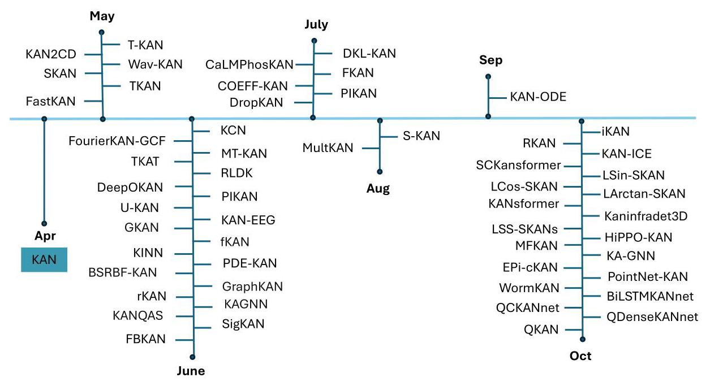
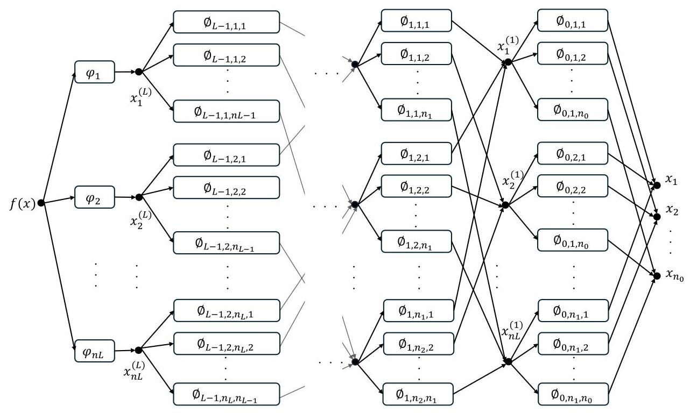
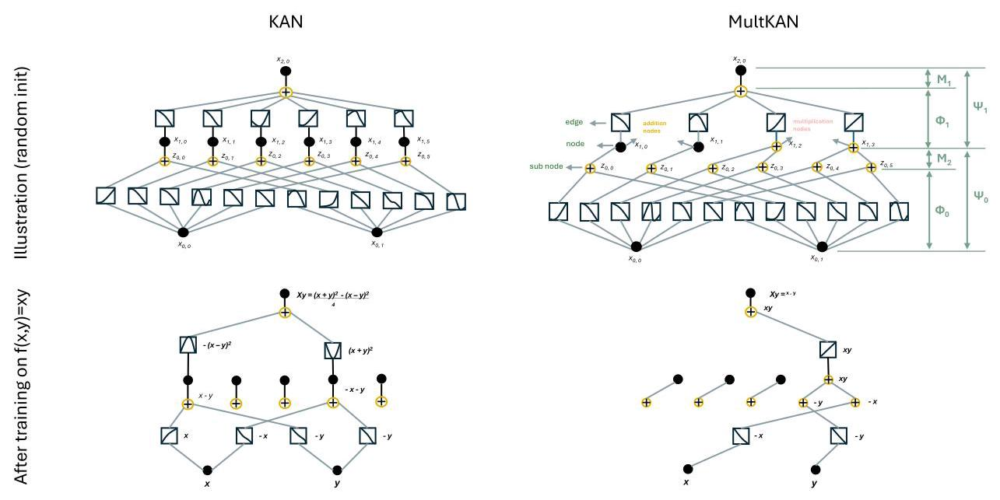
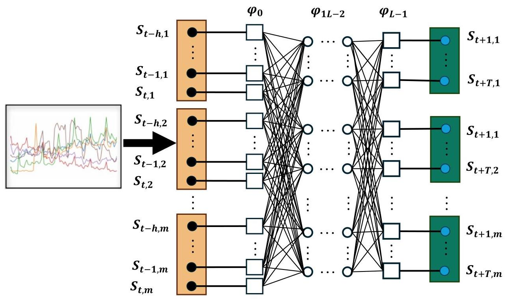
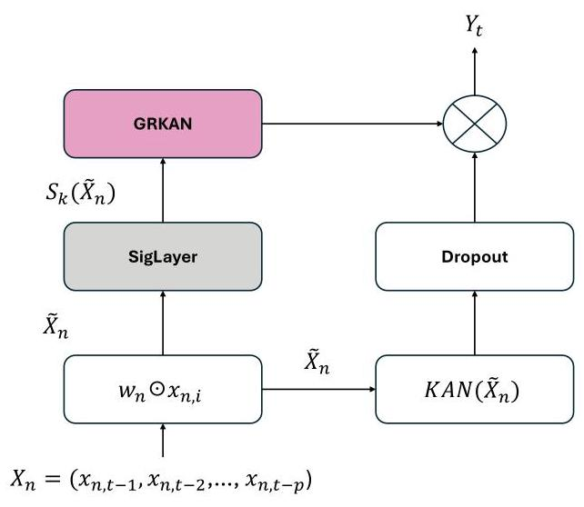
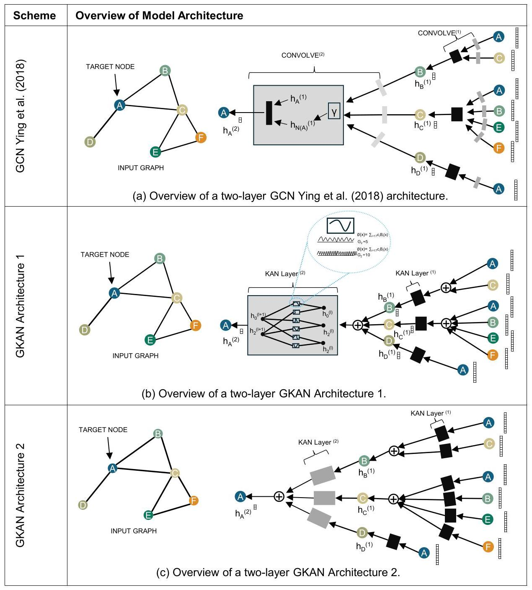
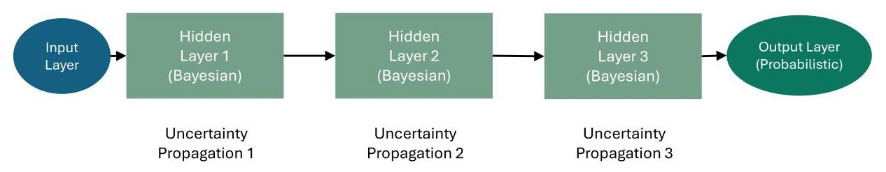
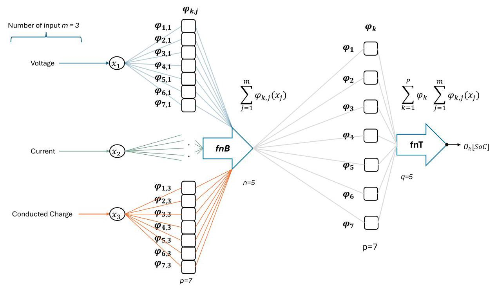

# A Survey on Kolmogorov-Arnold Network

# 关于柯尔莫哥洛夫 - 阿诺德网络的综述

SHRIYANK SOMVANSHI, Texas State University, TX

什里扬克·索姆万希，德克萨斯州立大学，德克萨斯州

SYED AAQIB JAVED, Texas State University, TX

赛义德·阿齐布·贾韦德，德克萨斯州立大学，德克萨斯州

MD MONZURUL ISLAM, Texas State University, TX

MD·蒙祖鲁尔·伊斯兰，德克萨斯州立大学，德克萨斯州

DIWAS PANDIT, Texas State University, TX

迪瓦斯·潘迪特，德克萨斯州立大学，德克萨斯州

SUBASISH DAS, PH.D., Texas State University, TX

苏巴希什·达斯，博士，德克萨斯州立大学，德克萨斯州

This systematic review explores the theoretical foundations, evolution, applications, and future potential of Kolmogorov-Arnold Networks (KAN), a neural network model inspired by the Kolmogorov-Arnold representation theorem. KANs set themselves apart from traditional neural networks by employing learnable, spline-parameterized functions rather than fixed activation functions, allowing for flexible and interpretable representations of high-dimensional functions. The review delves into KAN's architectural strengths, including adaptive edge-based activation functions that enhance parameter efficiency and scalability across varied applications such as time series forecasting, computational biomedicine, and graph learning. Key advancements-including Temporal-KAN (T-KAN), FastKAN, and Partial Differential Equation (PDE) KAN illustrate KAN's growing applicability in dynamic environments, significantly improving interpretability, computational efficiency, and adaptability for complex function approximation tasks. Moreover, the paper discusses KAN's integration with other architectures, such as convolutional, recurrent, and transformer-based models, showcasing its versatility in complementing established neural networks for tasks that require hybrid approaches. Despite its strengths, KAN faces computational challenges in high-dimensional and noisy data settings, sparking continued research into optimization strategies, regularization techniques, and hybrid models. This paper highlights KAN's expanding role in modern neural architectures and outlines future directions to enhance its computational efficiency, interpretability, and scalability in data-intensive applications.

本系统综述探讨了柯尔莫哥洛夫 - 阿诺德网络(KAN)的理论基础、发展演变、应用以及未来潜力。KAN是一种受柯尔莫哥洛夫 - 阿诺德表示定理启发的神经网络模型。KAN通过采用可学习的样条参数化函数而非固定的激活函数，与传统神经网络区分开来，从而能够灵活且可解释地表示高维函数。该综述深入研究了KAN的架构优势，包括基于自适应边缘的激活函数，这些函数在诸如时间序列预测、计算生物医学和图学习等各种应用中提高了参数效率和可扩展性。关键进展包括时间KAN(T - KAN)、快速KAN和偏微分方程(PDE)KAN，这些进展说明了KAN在动态环境中不断增长的适用性，显著提高了复杂函数逼近任务的可解释性、计算效率和适应性。此外，本文讨论了KAN与其他架构(如卷积、循环和基于Transformer的模型)的集成，展示了其在补充传统神经网络以完成需要混合方法的任务方面的通用性。尽管KAN具有优势，但在高维和噪声数据设置中面临计算挑战，这引发了对优化策略、正则化技术和混合模型的持续研究。本文强调了KAN在现代神经架构中不断扩大的作用，并概述了未来方向，以提高其在数据密集型应用中的计算效率、可解释性和可扩展性。

CCS Concepts: - Computing methodologies $\rightarrow$ Machine learning; Deep learning theory; Kolmogorov Arnold Networks (KAN); Model interpretability: - Applied computing $\rightarrow$ Predictive analytics.

CCS概念: - 计算方法$\rightarrow$机器学习；深度学习理论；柯尔莫哥洛夫 - 阿诺德网络(KAN)；模型可解释性: - 应用计算$\rightarrow$预测分析。

Additional Key Words and Phrases: Kolmogorov-Arnold Network

附加关键词和短语:柯尔莫哥洛夫 - 阿诺德网络

## ACM Reference Format:

## ACM参考格式:

Shriyank Somvanshi, Syed Aaqib Javed, Md Monzurul Islam, Diwas Pandit, and Subasish Das, Ph.D.. 2024. A Survey on Kolmogorov-Arnold Network. 1, 1 (November 2024), 35 pages. https://doi.org/XXXXXX.XXXXXXX

什里扬克·索姆万希，赛义德·阿齐布·贾韦德，MD·蒙祖鲁尔·伊斯兰，迪瓦斯·潘迪特和苏巴希什·达斯，博士。2024年。关于柯尔莫哥洛夫 - 阿诺德网络的综述。1，1(2024年11月)，35页。https://doi.org/XXXXXX.XXXXXXX

## 1 Introduction

## 1引言

Kolmogorov-Arnold Networks (KAN) are a class of neural networks inspired by the Kolmogorov-Arnold representation theorem, which posits that any multivariate continuous function can be expressed as a sum of continuous functions of one variable. Developed by Andrey Kolmogorov and Vladimir Arnold [1], this theorem provides a foundational understanding of how high-dimensional

柯尔莫哥洛夫 - 阿诺德网络(KAN)是一类受柯尔莫哥洛夫 - 阿诺德表示定理启发的神经网络，该定理指出任何多元连续函数都可以表示为单变量连续函数的和。由安德烈·柯尔莫哥洛夫和弗拉基米尔·阿诺德[1]提出，该定理为理解高维

---

Permission to make digital or hard copies of all or part of this work for personal or classroom use is granted without fee provided that copies are not made or distributed for profit or commercial advantage and that copies bear this notice and the full citation on the first page. Copyrights for components of this work owned by others than the author(s) must be honored. Abstracting with credit is permitted. To copy otherwise, or republish, to post on servers or to redistribute to lists, requires prior specific permission and/or a fee. Request permissions from permissions@acm.org.

允许出于个人或课堂使用目的免费制作本作品的全部或部分数字或硬拷贝，前提是拷贝不得用于盈利或商业优势，且拷贝上需带有此通知以及首页的完整引用。对于本作品中由作者以外的其他人拥有版权的组件，必须尊重其版权。允许进行带致谢的摘要。否则，如需复制、重新发布、张贴在服务器上或分发给列表，则需要事先获得特定许可和/或支付费用。请向permissions@acm.org请求许可。

© 2024 Copyright held by the owner/author(s). Publication rights licensed to ACM.

© 2024版权归所有者/作者所有。出版权许可给ACM。

ACM XXXX-XXXX/2024/11-ART

ACM XXXX - XXXX/2024/11 - ART

https://doi.org/XXXXXX.XXXXXXX

---

Authors' Contact Information: Shriyank Somvanshi, Texas State University, San Marcos, TX, jum6@txstate.edu; Syed Aaqib Javed, Texas State University, San Marcos, TX, aaqib.ce@txstate.edu; Md Monzurul Islam, Texas State University, San Marcos, TX, monzurul@txstate.edu; Diwas Pandit, Texas State University, San Marcos, TX, zxh15@txstate.edu; Subasish Das, Ph.D., Texas State University, San Marcos, TX, subasish@txstate.edu.functions can be decomposed into simpler, univariate components, which has inspired the creation of KANs as a novel neural architecture. Rather than employing traditional fixed activation functions, KANs utilize learnable, spline-parametrized univariate functions on edges, allowing for a more adaptive function representation [2]. While KANs are less widely adopted than more conventional models such as Convolutional Neural Networks (CNN) or Recurrent Neural Networks (RNNs), their mathematical underpinnings offer a strong theoretical framework for tasks involving high-dimensional function approximation.

作者联系信息:Shriyank Somvanshi，德克萨斯州立大学，圣马科斯，德克萨斯州，jum6@txstate.edu；Syed Aaqib Javed，德克萨斯州立大学，圣马科斯，德克萨斯州，aaqib.ce@txstate.edu；Md Monzurul Islam，德克萨斯州立大学，圣马科斯，德克萨斯州，monzurul@txstate.edu；Diwas Pandit，德克萨斯州立大学，圣马科斯，德克萨斯州，zxh15@txstate.edu；Subasish Das，博士，德克萨斯州立大学，圣马科斯，德克萨斯州，subasish@txstate.edu。函数可以分解为更简单的单变量组件，这激发了KAN作为一种新型神经架构的创建。KAN不是采用传统的固定激活函数，而是在边上使用可学习的、样条参数化的单变量函数，从而实现更自适应的函数表示[2]。虽然KAN的应用不如卷积神经网络(CNN)或循环神经网络(RNN)等传统模型广泛，但其数学基础为涉及高维函数逼近的任务提供了强大的理论框架。

KANs leverage this insight by replacing traditional neural network weights with learnable univariate functions, enabling a more flexible and interpretable framework for function approximation. This structural shift differentiates KANs from Multi-Layer Perceptrons (MLPs), which use fixed activation functions at the nodes, offering KANs the advantage of adaptability and greater alignment with the decomposition of multivariate functions [3]. This architecture has gained attention in machine learning as a potentially more parameter-efficient and theoretically grounded alternative to traditional deep learning models. KANs have demonstrated superior performance in applications such as predicting flexible electrohydrodynamic pump parameters, where they provide both accuracy and interpretability through symbolic formula extraction [4]. As KANs continue to evolve, variations such as the Chebyshev KAN, which enhances nonlinear function approximation through Chebyshev polynomials, are emerging as promising developments in the field [5].

KAN通过用可学习的单变量函数取代传统神经网络权重来利用这一见解，为函数逼近提供了一个更灵活且可解释的框架。这种结构转变使KAN与多层感知器(MLP)区分开来，MLP在节点处使用固定激活函数，这赋予了KAN适应性优势，并使其与多元函数的分解更契合[3]。作为传统深度学习模型潜在的更具参数效率且理论基础更扎实的替代方案，这种架构在机器学习中受到了关注。KAN在预测柔性电流体动力泵参数等应用中表现出卓越性能，通过符号公式提取，它们兼具准确性和可解释性[4]。随着KAN不断发展，诸如切比雪夫KAN等变体不断涌现，切比雪夫KAN通过切比雪夫多项式增强非线性函数逼近，成为该领域有前景的发展方向[5]。

Recent research on Kolmogorov-Arnold Networks (KANs) has demonstrated their potential as efficient and interpretable alternatives to traditional MLPs [6]. KANs differ from MLPs by replacing linear weights with learnable activation functions, enabling dynamic pattern learning and improved performance with fewer parameters [7]. The growing interest in KANs stems from their ability to achieve comparable or even superior accuracy to larger MLPs, faster neural scaling laws, and enhanced interpretability.

最近关于柯尔莫哥洛夫 - 阿诺德网络(KAN)的研究表明，它们有潜力成为传统MLP的高效且可解释的替代方案[6]。KAN与MLP的不同之处在于，它用可学习的激活函数取代线性权重，实现动态模式学习并以更少参数提升性能[7]。对KAN的兴趣日益浓厚，源于其能够达到与更大的MLP相当甚至更高的准确率、更快的神经缩放定律以及更强的可解释性。

However, notable gaps in the current literature persist. One major gap involves KANs' limitations in efficiently representing smooth, high-dimensional functions. Finite KAN structures often struggle with exact function approximation, resulting in challenges with training convergence and their applicability to complex, real-world data [6]. Further, questions arise about the robustness of KANs when applied to diverse datasets, especially in comparison to more established deep learning architectures such as Long Short-Term Memory Networks (LSTMs) and CNNs [7]. While recent advancements like Wavelet KAN (Wav-KAN) have sought to improve both interpretability and computational efficiency, additional research is necessary to optimize the interaction between wavelets and KANs for large-scale data applications [8]. The continued interest in KANs is largely driven by their potential to reduce the number of learnable parameters while enhancing both accuracy and interpretability, particularly in fields that require data-efficient models and high-level explanations.

然而，当前文献中仍存在显著差距。一个主要差距涉及KAN在有效表示平滑高维函数方面的局限性。有限的KAN结构在精确函数逼近方面常常面临困难，导致训练收敛以及应用于复杂现实世界数据时存在挑战[6]。此外，当应用于不同数据集时，尤其是与诸如长短期记忆网络(LSTM)和CNN等更成熟的深度学习架构相比，KAN的鲁棒性也受到质疑[7]。虽然像小波KAN(Wav - KAN)这样的最新进展试图提高可解释性和计算效率，但对于大规模数据应用，仍需要进一步研究以优化小波与KAN之间的相互作用[8]。对KAN持续的兴趣很大程度上源于其在减少可学习参数数量的同时提高准确性和可解释性的潜力，特别是在需要数据高效模型和高级解释的领域。

Since their inception, KANs have undergone significant evolution, advancing both in theoretical foundations and practical applications. Initially proposed as an alternative to MLPs, KANs leverage the Kolmogorov-Arnold representation theorem to approximate multivariate functions using univariate functions, providing enhanced interpretability and parameter efficiency [6]. Over time, several modifications, such as the introduction of smooth KANs [7] and spline-based activation functions [4], have improved KANs' ability to capture complex nonlinearities. KANs have further evolved with architectures like Temporal Kolmogorov-Arnold Networks (TKAN), which incorporate memory management for sequential data, demonstrating superior performance over RNNs in time series forecasting [9]. Additionally, KANs have demonstrated notable computational efficiency compared to traditional architectures like MLPs, often requiring fewer parameters while maintaining accuracy [4, 5]. These advancements underscore KANs' strengths in interpretability and efficiency, although their scalability and performance relative to more advanced architectures like CNNs and Transformers require further exploration.

自诞生以来，KAN经历了重大演变，在理论基础和实际应用方面都取得了进展。最初作为MLP的替代方案被提出，KAN利用柯尔莫哥洛夫 - 阿诺德表示定理，使用单变量函数逼近多元函数，提供了更强的可解释性和参数效率[6]。随着时间推移，诸如引入平滑KAN[7]和基于样条的激活函数[4]等多项改进，提升了KAN捕捉复杂非线性的能力。KAN通过诸如时间柯尔莫哥洛夫 - 阿诺德网络(TKAN)等架构进一步发展，TKAN为序列数据纳入了内存管理，在时间序列预测中表现优于RNN[9]。此外，与MLP等传统架构相比，KAN展现出显著的计算效率，通常在保持准确性的同时需要更少参数[4, 5]。这些进展凸显了KAN在可解释性和效率方面的优势，尽管其相对于CNN和Transformer等更先进架构的可扩展性和性能仍需进一步探索。

In more recent developments, KANs have continued to expand across both theoretical and practical domains. Building upon the Kolmogorov-Arnold theorem, KANs have been integrated into neural cognitive diagnosis models to enhance interpretability without sacrificing performance [10]. The introduction of FastKAN by Li [11], which approximates B-splines using Gaussian radial basis functions (RBF), significantly improved KANs' computational efficiency, making them more viable for real-world applications. Comparative studies highlight KANs' ability to reduce the number of parameters while achieving performance on par with CNNs and RNNs, as evidenced in tasks like image classification [12]. Moreover, KANs have been shown to outperform transformers in tasks involving smaller datasets, delivering competitive accuracy with lower computational costs [13]. These advancements position KANs as a scalable and efficient alternative to more complex architectures, particularly in environments constrained by data or computational resources.

在最近的发展中，KANs在理论和实践领域都持续扩展。基于柯尔莫哥洛夫 - 阿诺德定理，KANs已被集成到神经认知诊断模型中，以在不牺牲性能的情况下增强可解释性[10]。Li[11]引入的FastKAN，使用高斯径向基函数(RBF)近似B样条，显著提高了KANs的计算效率，使其在实际应用中更具可行性。比较研究突出了KANs在减少参数数量的同时，能达到与CNN和RNN相当性能的能力，如在图像分类等任务中所示[12]。此外，在涉及较小数据集的任务中，KANs已被证明优于Transformer，以更低的计算成本提供有竞争力的准确率[13]。这些进展使KANs成为更复杂架构的可扩展且高效的替代方案，特别是在受数据或计算资源限制的环境中。

The practical application of KANs has also advanced significantly, particularly with the adoption of edge-based activations, which differ from traditional networks that position activation functions at the nodes. This edge-based structure enhances KANs' modularity and interpretability [14]. KANs have been successfully integrated into a range of neural architectures, such as autoencoders and time series models, and have demonstrated competitive performance against CNNs, RNNs, and transformers in tasks like image reconstruction and multivariate time series forecasting, effectively capturing complex dependencies [15]. Although KANs generally require fewer parameters than MLPs and CNNs and offer superior computational efficiency [16], they may still fall short in tasks involving highly complex geometries, where traditional architectures retain certain advantages.

KANs的实际应用也有了显著进展，特别是采用基于边缘的激活方式，这与将激活函数置于节点的传统网络不同。这种基于边缘的结构增强了KANs的模块化和可解释性[14]。KANs已成功集成到一系列神经架构中，如自动编码器和时间序列模型，并在图像重建和多变量时间序列预测等任务中，展示了与CNN、RNN和Transformer相比的竞争力，有效捕捉复杂的依赖关系[15]。尽管KANs通常比MLP和CNN需要更少的参数，并提供更高的计算效率[16]，但在涉及高度复杂几何形状的任务中，它们可能仍有不足，传统架构在这些任务中保留了某些优势。

### 1.1 Research Questions

### 1.1研究问题

This review seeks to address several key research questions regarding KANs:

本综述旨在解决关于KANs的几个关键研究问题:

(1) What are the primary theoretical developments in KANs, and how do they contribute to the broader landscape of neural network architectures?

(1) KANs的主要理论发展是什么，它们如何为更广泛的神经网络架构领域做出贡献？

This question aims to explore how the Kolmogorov-Arnold representation theorem has influenced the design of KANs and what theoretical innovations have emerged over time.

这个问题旨在探索柯尔莫哥洛夫 - 阿诺德表示定理如何影响KANs的设计，以及随着时间推移出现了哪些理论创新。

(2) How have KANs been applied across various fields?

(2) KANs如何在各个领域得到应用？

By addressing this, the review examines the practical applications of KANs and compares their performance with traditional architectures such as CNNs, RNNs, and transformers.

通过解决这个问题，综述考察了KANs的实际应用，并将它们的性能与CNN、RNN和Transformer等传统架构进行比较。

(3) What are the key challenges and opportunities for KAN research, particularly in terms of scalability, computational efficiency, and robustness?

(3) KAN研究的关键挑战和机遇是什么，特别是在可扩展性、计算效率和鲁棒性方面？

This question focuses on the limitations KANs face in large-scale applications and complex datasets, identifying potential areas for future research and optimization.

这个问题关注KANs在大规模应用和复杂数据集方面面临的局限性，确定未来研究和优化的潜在领域。

## 2 Historical Evolution of KAN

## 2 KAN的历史演变

### 2.1 Early Research

### 2.1早期研究

The Kolmogorov-Arnold theorem has significantly influenced the development of KANs by providing the theoretical foundation for representing continuous multivariate functions as compositions of simpler univariate functions. Kolmogorov's foundational work demonstrated that any continuous multi-variable function can be broken down into a sum of single-variable functions, making it possible to simplify the representation of complex, high-dimensional functions [1]. This principle directly supports the structure of KAN, which uses this approach to handle complex data more efficiently. Arnold then contributed a practical refinement, showing that functions with three variables could be represented with even fewer components, enhancing the efficiency and applicability of the theorem [1]. Together, their contributions laid the groundwork for KAN's ability to approximate complex functions with greater interpretability and accuracy. This principle is reflected in KANs, which use finite network topologies to approximate complex functions. One notable advantage of KANs over traditional MLPs is their ability to place learnable activation functions on the edges of the network rather than at the nodes, which enhances flexibility and parameter efficiency. Some Studies emphasize the advantages of KANs in tasks requiring smooth function approximations, such as computational biomedicine [2, 6]. These networks, which utilize splines as univariate functions, demonstrate higher accuracy and interpretability compared to traditional networks, making them valuable for scientific applications. Additionally, the integration of Chebyshev polynomials into KANs improves approximation accuracy and convergence, especially for nonlinear functions, further enhancing their relevance in modern tasks that require precise nonlinear approximations [5]. Figure 1 provides a timeline of these advancements in KAN architectures, showcasing key developments like T-KAN, Wav-KAN, and FastKAN. These milestones illustrate the steady evolution of KAN models, each contributing to greater computational efficiency, scalability, and applicability across diverse fields.

柯尔莫哥洛夫 - 阿诺德定理为将连续多变量函数表示为更简单单变量函数的组合提供了理论基础，对KANs的发展产生了重大影响。柯尔莫哥洛夫的基础工作表明，任何连续多变量函数都可以分解为单变量函数的和，从而有可能简化复杂高维函数的表示[1]。这一原理直接支持了KAN的结构，KAN利用这种方法更有效地处理复杂数据。阿诺德随后做出了实际改进，表明具有三个变量的函数可以用更少的组件表示，提高了定理的效率和适用性[1]。他们的共同贡献为KAN以更高的可解释性和准确性逼近复杂函数奠定了基础。这一原理在KANs中得到体现，KANs使用有限的网络拓扑来逼近复杂函数。KANs相对于传统MLP的一个显著优势是，它们能够将可学习的激活函数置于网络的边缘而不是节点，这增强了灵活性和参数效率。一些研究强调了KANs在需要平滑函数逼近的任务中的优势，如计算生物医学[2, 6]。这些利用样条作为单变量函数的网络，与传统网络相比，展示了更高的准确性和可解释性，使其在科学应用中具有价值。此外，将切比雪夫多项式集成到KANs中提高了逼近精度和收敛性，特别是对于非线性函数，进一步增强了它们在需要精确非线性逼近的现代任务中的相关性[5]。图1提供了KAN架构这些进展的时间线，展示了T - KAN、Wav - KAN和FastKAN等关键发展。这些里程碑说明了KAN模型的稳步发展，每个都为提高计算效率、可扩展性和在不同领域的适用性做出了贡献。

Fig. 1. Progression of KAN's (2024)

图1. KAN的发展历程(2024年)

Despite challenges such as maintaining smoothness and ensuring efficient convergence, KANs remain highly relevant due to their ability to leverage structural system knowledge, improving both data efficiency and model interpretability. The continuing importance of the Kolmogorov-Arnold theorem in neural network architectures is underscored by its influence on the design of modern deep learning models, such as ReLU networks. Modifications to the original theorem have allowed KANs to align more closely with contemporary deep learning practices, making them more effective for complex function approximation [3]. The adaptability of KANs is further highlighted by their performance in time series forecasting tasks, where KANs, with their dynamic spline-based univariate functions, require fewer parameters than MLPs to model complex patterns, demonstrating their continued efficiency and interpretability [7].

尽管存在如保持平滑性和确保高效收敛等挑战，但由于能够利用结构系统知识，KAN在提高数据效率和模型可解释性方面仍具有高度相关性。科尔莫戈罗夫 - 阿诺德定理在神经网络架构中持续的重要性体现在其对现代深度学习模型(如ReLU网络)设计的影响上。对原始定理的修改使KAN能够更紧密地与当代深度学习实践相结合，使其在复杂函数逼近方面更有效[3]。KAN可以基于动态样条的单变量函数，在时间序列预测任务中，KAN比多层感知器(MLP)需要更少的参数来对复杂模式进行建模，这进一步凸显了其适应性，展示了其持续的效率和可解释性[7]。

Further developments have expanded the foundational capabilities of KANs, with hybrid models like TKANs combining the strengths of KANs with memory mechanisms from RNNs and LSTM networks. TKANs' effectiveness in handling long-term dependencies in sequential data, outperforming traditional models in multi-step forecasting tasks, demonstrates the continued relevance of the Kolmogorov-Arnold theorem in cutting-edge neural network design [9]. KANs' flexibility is further demonstrated by the integration of gated mechanisms similar to LSTM and GRU cells, which enable efficient learning without extensive regularization [17]. This dynamic architecture allows KANs to adjust activation functions according to task complexity, emphasizing the theorem's role in optimizing neural network efficiency. In practical applications, KANs continue to excel, as demonstrated by their ability to outperform Random Forest and MLP models in predicting pressure and flow rates in electrohydrodynamic pumps, achieving lower mean squared error (MSE) while providing interpretable symbolic formulas [4]. However, the practical application of the Kolmogorov-Arnold theorem can be limited by the non-smoothness of inner functions, complicating network construction [18]. Despite this critique, the theorem remains essential for understanding the properties of modern neural networks.

进一步的发展扩展了KAN的基础能力，像TKAN这样的混合模型将KAN的优势与循环神经网络(RNN)和长短期记忆网络(LSTM)的记忆机制相结合。TKAN在处理序列数据中的长期依赖性方面的有效性，在多步预测任务中优于传统模型，这证明了科尔莫戈罗夫 - 阿诺德定理在前沿神经网络设计中的持续相关性[9]。类似于长短期记忆(LSTM)和门控循环单元(GRU)单元的门控机制的集成进一步证明了KAN的灵活性，这使得在没有广泛正则化的情况下也能进行高效学习[17]。这种动态架构允许KAN根据任务复杂性调整激活函数，强调了该定理在优化神经网络效率方面的作用。在实际应用中，KAN继续表现出色，例如在预测电流体动力学泵中的压力和流速时，它能够优于随机森林和MLP模型，在实现更低均方误差(MSE)的同时提供可解释的符号公式[4]。然而，科尔莫戈罗夫 - 阿诺德定理的实际应用可能会受到内部函数不光滑性的限制，使网络构建变得复杂[18]。尽管有这种批评，该定理对于理解现代神经网络的特性仍然至关重要。

Advancements in KANs, such as the Wav-KAN described by Bozorgasl and Chen [8], leverage wavelet transforms to improve both performance and interpretability, particularly for tasks requiring multi-resolution analysis, showcasing KANs' broad applicability in modern fields like signal processing. Similarly, the influence of the Kolmogorov-Arnold theorem on the design of deep ReLU networks is highlighted, as these networks approximate continuous functions through superposition, mitigating the curse of dimensionality while maintaining computational efficiency [19]. Efforts to enhance the speed and efficiency of KAN implementations, such as FastKAN, introduce Gaussian RBFs to approximate B-splines, boosting computational speed without sacrificing accuracy [11]. These innovations underscore the ongoing practical significance of the Kolmogorov-Arnold theorem in neural networks, particularly for tasks demanding efficient and accurate modeling. Funahashi's work [20] further reinforces the theorem's impact on understanding multilayer networks' ability to approximate continuous functions, influencing the development of neural network architectures and solidifying the theorem's foundational role in modern neural network design and applications.

KAN的进展，如Bozorgasl和Chen [8]描述的Wav - KAN，利用小波变换来提高性能和可解释性，特别是对于需要多分辨率分析的任务，展示了KAN在信号处理等现代领域的广泛适用性。同样，科尔莫戈罗夫 - 阿诺德定理对深度ReLU网络设计的影响也得到了强调，因为这些网络通过叠加来逼近连续函数，在保持计算效率的同时减轻了维度诅咒[19]。为提高KAN实现的速度和效率所做的努力，如FastKAN，引入高斯径向基函数(RBF)来逼近B样条，在不牺牲准确性的情况下提高了计算速度[11]。这些创新强调了科尔莫戈罗夫 - 阿诺德定理在神经网络中持续的实际意义，特别是对于需要高效准确建模的任务。船桥的工作[20]进一步加强了该定理对理解多层网络逼近连续函数能力的影响，影响了神经网络架构的发展，并巩固了该定理在现代神经网络设计和应用中的基础作用。

### 2.2 Kolmogorov-Arnold Theorem

### 2.2科尔莫戈罗夫 - 阿诺德定理

The Kolmogorov-Arnold Network (KAN) is a foundational structure in neural network theory, demonstrating that any continuous multivariate function can be represented as a sum of univariate functions [2, 21]. Since the 1980s and 1990s, KAN has been recognized for its potential to simplify high-dimensional mappings through interpretable, layered architectures [2, 22]. Early studies focused on translating the univariate decomposition theorem into practical neural architectures, emphasizing mathematical rigor and functional versatility for machine learning applications.

科尔莫戈罗夫 - 阿诺德网络(KAN)是神经网络理论中的一种基础结构，表明任何连续多元函数都可以表示为单变量函数的和[2, 21]。自20世纪80年代和90年代以来，KAN因其通过可解释的分层架构简化高维映射的潜力而受到认可[2, 22]。早期研究专注于将单变量分解定理转化为实际的神经架构，强调机器学习应用中的数学严谨性和功能通用性。

Initial implementations of KAN-based networks were limited to elementary function approximation tasks within low-dimensional spaces due to computational constraints of the time [23]. Researchers explored neural architectures that adopted KAN's decomposition concept to validate its feasibility in neural networks, providing a foundation for later, more advanced designs [24, 24].

由于当时的计算限制，基于KAN的网络的初始实现仅限于低维空间内的基本函数逼近任务[23]。研究人员探索了采用KAN分解概念的神经架构，以验证其在神经网络中的可行性，为后来更先进的设计奠定了基础[24, 24]。

A significant challenge in adapting this network model for broader applications has been balancing computational efficiency with the univariate decomposition structure [25]. While KAN offered a systematic approach to function representation, its architectural demands on high-dimensional data introduced substantial computational overhead [26]. Issues related to memory use and processing speed became increasingly apparent, prompting innovative solutions to enhance scalability without compromising interpretability [27, 28].

将这种网络模型应用于更广泛的应用面临的一个重大挑战是在计算效率和单变量分解结构之间取得平衡[25]。虽然KAN提供了一种系统的函数表示方法，但其对高维数据的架构要求带来了大量的计算开销[26]。与内存使用和处理速度相关的问题变得越来越明显，促使人们提出创新解决方案，以在不影响可解释性的情况下提高可扩展性[27, 28]。

Recent advancements have extended KAN from its theoretical foundation, introducing models like Function Combinations in KAN, which incorporate splines and radial basis functions to achieve greater representational flexibility [7, 13]. These extensions broaden KAN's applicability across areas such as molecular dynamics, graph neural networks (GNNs), and physics-informed simulations, though the trade-off between interpretability and computational demand persists [29, 30]. Techniques such as kernel filtering and oversampling have helped reduce some computational constraints, though they underscore the resource intensity involved in complex tasks [31].

最近的进展将KAN从其理论基础上进行了扩展，引入了如KAN中的函数组合等模型，这些模型结合了样条和径向基函数，以实现更大的表示灵活性[7, 13]。这些扩展拓宽了KAN在分子动力学、图神经网络(GNN)和物理信息模拟等领域的适用性，尽管在可解释性和计算需求之间的权衡仍然存在[29, 30]。诸如核滤波和过采样等技术有助于减少一些计算限制，尽管它们强调了复杂任务中涉及的资源强度[31]。

The influence of KAN is now evident in a range of applications, including image classification with Kolmogorov-Arnold Convolutions and PDE solving in Kolmogorov-Arnold-Informed Neural Networks (KINNs). Such applications expand the network's utility to multi-scale scientific and engineering phenomena [16, 24], illustrating its foundational role in neural network design. However, they also highlight the computational challenges of maintaining interpretability and performance in high-dimensional spaces $\left\lbrack  {2,{28},{32}}\right\rbrack$ .

KAN的影响如今在一系列应用中显而易见，包括使用柯尔莫哥洛夫 - 阿诺德卷积进行图像分类以及在柯尔莫哥洛夫 - 阿诺德启发的神经网络(KINNs)中求解偏微分方程。此类应用将网络的效用扩展到多尺度科学和工程现象[16, 24]，说明了其在神经网络设计中的基础作用。然而，它们也凸显了在高维空间中保持可解释性和性能的计算挑战$\left\lbrack  {2,{28},{32}}\right\rbrack$。

KAN-based models have demonstrated potential in specialized domains such as molecular and fluid dynamics. For example, KAN-inspired interatomic potential models have improved simulation accuracy in molecular applications; however, effectively managing spline activations across large-scale systems presents a significant challenge [27]. Similarly, in fluid dynamics, a physics-informed KAN variant, the Chebyshev Physics-Informed Kolmogorov-Arnold Network (cPIKAN or cKAN) has been applied to infer temperature fields from sparse velocity data, exhibiting effective function decomposition while facing challenges in balancing governing equations with empirical data boundaries [24]. The performance of KAN models declines in noisy environments as noise disrupts function approximation, requiring additional methods like kernel filtering and oversampling-though these come at the cost of increased computational demands [29].

基于KAN的模型在分子和流体动力学等特定领域已展现出潜力。例如，受KAN启发的原子间势模型提高了分子应用中的模拟精度；然而，在大规模系统中有效管理样条激活带来了重大挑战[27]。同样，在流体动力学中，一种基于物理的KAN变体，即切比雪夫物理启发的柯尔莫哥洛夫 - 阿诺德网络(cPIKAN或cKAN)已被应用于从稀疏速度数据推断温度场，在平衡控制方程与经验数据边界时面临挑战的情况下仍展现出有效的函数分解[24]。在有噪声的环境中，KAN模型的性能会下降，因为噪声会干扰函数逼近，这需要诸如内核滤波和过采样等额外方法——尽管这些方法会增加计算需求[29]。

For high-dimensional data processing, adaptations such as TKAN and DEEPOKAN are promising by replacing traditional neural descriptors with functions derived from KAN principles. This approach enhances interpretability, but introduces challenges with memory efficiency and computational requirements, especially with complex data types like satellite imagery and hyperspectral data [7, 13]. Despite its theoretical robustness, KAN-based models continue to encounter scaling challenges, particularly in noisy environments. Additional computational techniques, though effective, often complicate resource management, emphasizing the difficulties inherent in applying KAN to high-dimensional tasks [29]. Collectively, these studies suggest that while KAN provides a reliable mathematical foundation for function approximation, achieving scalability and efficiency across diverse applications remains an ongoing challenge [32]. Consequently, research continues to focus on reconciling interpretability with computational efficiency to enable practical neural network applications based on this influential framework.

对于高维数据处理，诸如TKAN和DEEPOKAN之类的改编方法很有前景，它们用从KAN原理派生的函数取代了传统的神经描述符。这种方法增强了可解释性，但在内存效率和计算需求方面带来了挑战，特别是对于像卫星图像和高光谱数据这样的复杂数据类型[7, 13]。尽管基于KAN的模型在理论上具有鲁棒性，但它们在扩展方面仍面临挑战，特别是在有噪声的环境中。额外的计算技术虽然有效，但往往会使资源管理变得复杂，这凸显了将KAN应用于高维任务的内在困难[29]。总体而言，这些研究表明，虽然KAN为函数逼近提供了可靠的数学基础，但在各种应用中实现可扩展性和效率仍然是一个持续的挑战[32]。因此，研究继续专注于协调可解释性与计算效率，以实现基于这一有影响力框架的实际神经网络应用。

Rapid advancements and a steady expansion across various fields have marked the progression of KAN models. Table 1 and Table 2 offer a timeline of these developments, detailing each model's unique architecture, training methods, and defining features from April to October 2024. This chronological overview highlights the key milestones achieved in KAN research, such as improved spline-based activations, enhanced memory management for sequential data, and increased adaptability to graph structures.

KAN模型的发展标志着其在各个领域的快速进步和稳步扩展。表1和表2提供了这些发展的时间表，详细列出了从2024年4月到10月每个模型的独特架构、训练方法和定义特征。这种按时间顺序的概述突出了KAN研究中取得的关键里程碑，例如改进的基于样条的激活、增强的顺序数据内存管理以及对图结构的更高适应性。

Table 1. Timeline of KAN-based Models (April- June 2024)

表1. 基于KAN的模型时间表(2024年4月 - 6月)

<table><tr><td>Model (Year) Source</td><td>Architecture</td><td>Training Process</td><td>Main Features</td></tr><tr><td>KAN</td><td></td><td></td><td></td></tr><tr><td>Apr. 2024   [2]</td><td>Learnable spline-based edge activations</td><td>Gradient descent with LBFGS, adaptive grid</td><td>High interpretability, efficient scaling laws</td></tr></table>

<table><tr><td>Model (Year) Source</td><td>Architecture</td><td>Training Process</td><td>Main Features</td></tr><tr><td colspan="4">T-KAN</td></tr><tr><td>May 2024   [33]</td><td>Spline-based, learnable edge activations</td><td>Sliding window, gradient descent, pruning</td><td>High interpretability, concept drift detection</td></tr><tr><td colspan="4">SKAN</td></tr><tr><td>May 2024   [6]</td><td>Structured, sn nested functions</td><td>RMSE minimization. data-efficient, extrapolation in sparse data regions</td><td>High interpretability, scalable, effective in sparse data, smooth function representation</td></tr><tr><td colspan="4">Wav-KAN</td></tr><tr><td>May 2024   [8]</td><td>Wavelet-based, learnable edge functions</td><td>Batch norm, AdamW optimizer, grid search for wavelets</td><td>High interpretability, multi-resolution analysis, noise robustness, efficient for high-dimensional data</td></tr><tr><td colspan="4">TKANs</td></tr><tr><td>May 2024   [9]</td><td>RKAN layers with LSTM gating, B-spline activations</td><td>optimizer, RMSE loss, early stopping</td><td>High accuracy in long-term forecasting, stable training, effective memory management for sequential data</td></tr><tr><td colspan="4">KAN2CD</td></tr><tr><td>May 2024   [10]</td><td>Two-level KANs with learnable embeddings</td><td>Adam optimizer, B-spline KANs for efficiency</td><td>High interpretability, efficient training, competitive accuracy, suitable for cognitive diagnosis</td></tr><tr><td>FastKAN May 2024 [11]</td><td>Gaussian RBFs with layer normalization</td><td>Benchmarked MNIST, 20 epochs</td><td>3.3x faster than KAN, simplified implementation, retains accuracy for high-dimensional functions</td></tr><tr><td colspan="4">C-KAN</td></tr><tr><td>June 2024   [12]</td><td>Spline-based, learnable convolutions</td><td>Gradient descent with regularization, grid updates</td><td>High efficiency, adaptable activations, competitive accuracy</td></tr><tr><td colspan="4">MT-KAN</td></tr><tr><td>June 2024   [33]</td><td>Spline-based, learnable edge activations with cross-variable interactions</td><td>Gradient descent. pruning for efficiency</td><td>High interpretability, improved multivariate forecasting</td></tr><tr><td colspan="4">SigKAN</td></tr><tr><td>June 2024   [15]</td><td>Gated Residual KAN. path signature layer</td><td>Adam optimizer, early stopping</td><td>Accurate short-term forecasting, stable, captures temporal dependencies in complex time series</td></tr><tr><td colspan="4">GraphKAN</td></tr><tr><td>June 2024   [34]</td><td>Spline-based, learnable edge activations</td><td>Cosine Annealing. LayerNorm, epochs</td><td>High accuracy, effective for few-shot classification</td></tr><tr><td colspan="4">GKAN</td></tr><tr><td>June 2024   [35]</td><td>Learnable spline functions on edges</td><td>Semi-supervised with backpropagation</td><td>Efficient, accurate, adjustable parameters for large-scale graph data</td></tr><tr><td colspan="4">KINN</td></tr><tr><td>June 2024   [16]</td><td>Spline-based, B-spline activations</td><td>Gradient descent. meshless sampling, triangular integration</td><td>High interpretability, efficient for PDEs, handles multi-frequency components, low spectral bias</td></tr><tr><td colspan="4">Rational KAN</td></tr><tr><td>June 2024   [36]</td><td>Rational basis functions (Padé, Jacobi)</td><td>Gradient descent (L-BFGS, Adam)</td><td>High accuracy, effective for physics-informed tasks and complex approximations</td></tr><tr><td colspan="4">PDE-KAN</td></tr><tr><td>June 2024   [16]</td><td>Spline-based, B-spline activations with tanh normalization</td><td>Meshless sampling, triangular integration</td><td>Low spectral bias, efficient for multi-frequency, adaptable to complex PDÉs</td></tr></table>

<table><tr><td>Model (Year) Source</td><td>Architecture</td><td>Training Process</td><td>Main Features</td></tr><tr><td colspan="4">KAGNNs</td></tr><tr><td>June 2024   [30]</td><td>KAN-based, driven updates spline-</td><td>Gradient descent with early stopping</td><td>High interpretability, strong expressiveness, suited for graph regression and classification</td></tr><tr><td colspan="4">PIKANs</td></tr><tr><td>June 2024   [37]</td><td>Single-layer KAN, polynomial activations (e.g., Chebyshev)</td><td>Adam optimizer, RBA for loss adjustment</td><td>High accuracy with fewer parameters, adjustable polynomial order, enhanced stability with double precision</td></tr><tr><td colspan="4">DeepOKANs</td></tr><tr><td>June 2024   [37]</td><td>Branch [128, 100, 100, 100], Trunk [4, 100, 100, 100], Chebyshev polynomials</td><td>Adam optimizer, 200k iterations, L2 regularization</td><td>Robust to noise, strong in complex tasks, higher computational cost</td></tr><tr><td colspan="4">RLDK</td></tr><tr><td>June 2024   [38]</td><td>Spline-based, compact architecture with learnable edge activations</td><td>LBFGS optimizer with custom loss (reconstruction and prediction)</td><td>High parameter efficiency, fast training, suitable for real-time control, data-efficient</td></tr><tr><td colspan="4">TKAT</td></tr><tr><td>June 2024   [39]</td><td>Encoder-decoder with TKAN layers, attention</td><td>Adam optimizer, MSE loss, early stopping</td><td>High interpretability, captures temporal dependencies, suited for multivariate time series</td></tr><tr><td colspan="4">KAN-EEG</td></tr><tr><td>June 2024   [40]</td><td>Spline-based, learnable edge activations</td><td>100 epochs on EEG data, with gradient descent and epoch-based convergence</td><td>High interpretability, efficient, adaptable across datasets, suitable for on-device deployment</td></tr><tr><td colspan="4">KANQAS</td></tr><tr><td>June 2024   [41]</td><td>Spline-based, learnable activations in Double Deep Q-Network (DDQN)</td><td>Gradient descent with RL in DDQN</td><td>High interpretability, parameter-efficient, effective for quantum state prep and quantum chemistry</td></tr><tr><td colspan="4">KCN</td></tr><tr><td>June 2024   [42]</td><td>Spline-based edge activations</td><td>Gradient descent with backpropagation; layer freezing</td><td>High accuracy, parameter-efficient, adaptable to complex data</td></tr><tr><td colspan="4">U-KAN</td></tr><tr><td>June 2024   [43]</td><td>Encoder-decoder with tokenized KAN layers</td><td>Cross-entropy & Dice loss for segmentation; MSE for generation</td><td>High interpretability, efficient, adaptable for segmentation and generative tasks, improved accuracy</td></tr><tr><td colspan="4">FourierKAN-GCF</td></tr><tr><td>June 2024   [44]</td><td>Fourier-based GCN with Fourier KAN replacing MLP</td><td>BPR loss, grid search, message & node dropout</td><td>Efficient, strong interaction representation, robust, adaptable, easier training than spline-KAN</td></tr><tr><td colspan="4">FBKANs</td></tr><tr><td>June 2024   [45]</td><td>Domain decomposition. spline-based local KANs per subdomain</td><td>Combined data-driven and physics-informed loss, adaptive grids, parallel training</td><td>Scalable, noise-robust, compatible with enhancements</td></tr><tr><td colspan="4">BSRBF-KAN</td></tr><tr><td>June 2024   [46]</td><td>Combines B-splines and Gaussian RBFs</td><td>15 epochs (MNIST). 25 (Fashion-MNIST), AdamW optimizer</td><td>High accuracy, fast convergence, adaptable activations</td></tr></table>

<table><tr><td>Model (Year) Source</td><td>Architecture</td><td>Training Process</td><td>Main Features</td></tr><tr><td>fKAN June 2024 [47]</td><td>Fractional Jacobi Neural Block (fJNB) with trainable $\alpha ,\beta ,\gamma$</td><td>Adam and L-BFGS optimizers</td><td>High adaptability, improved accuracy, suitable for deep learning and physics-informed tasks</td></tr></table>

### 2.3 Key Milestones

### 2.3关键里程碑

The KAN framework has seen substantial theoretical and applied advancements, cementing its versatility in various machine learning fields due to its unique spline-based activation functions. Early innovations, such as Selectable KANs (S-KAN), introduced a dynamic choice of activation functions that optimized adaptability for complex tasks, including image classification and function fitting [48]. Expanding this adaptability, Graph-based Kolmogorov-Arnold Networks (GKANs) were developed to improve semi-supervised node classification through flexible information flow across nodes, outperforming traditional Graph Convolutional Networks (GCNs) in tests on the Cora dataset [35]. The accuracy and interpretability of GKANs in biomedical and financial graph analysis, where model transparency is crucial, were further demonstrated in 2024 by Carlo et al [31]. Graph Isomorphism Network (KAGIN) and Kolmogorov-Arnold Graph Convolution Network (KAGCN), two KAN-based architectures that replaced MLPs in graph learning tasks, were introduced to enhance model interpretability and performance in regression [30]. KANs have also excelled in real-world tabular data, where they demonstrated competitive accuracy on complex datasets, making them viable alternatives to conventional neural networks like MLPs, despite their higher computational cost [49]. The practical limitations of KANs, noting their increased resource demands and latency issues, which affect efficiency in hardware-based implementations [22]. Yet, KANs continue to be valuable in scenarios requiring high adaptability and interpretability. In computer vision, KAN-Mixer was presented as utilizing adaptive spline-based transformations to achieve competitive accuracy on datasets like MNIST and CIFAR-10, often matching the performance of more complex models like ResNet-18 [50]. Similarly, the KANICE model combined KANs with CNNs, demonstrating enhanced robustness against adversarial attacks and improved spatial pattern recognition [51].

KAN框架在理论和应用方面都取得了重大进展，由于其独特的基于样条的激活函数，巩固了其在各种机器学习领域的通用性。早期的创新，如可选KAN(S - KAN)，引入了激活函数的动态选择，优化了对复杂任务(包括图像分类和函数拟合)的适应性[48]。为了扩展这种适应性，基于图的柯尔莫哥洛夫 - 阿诺德网络(GKANs)被开发出来，通过跨节点的灵活信息流来改进半监督节点分类，在Cora数据集的测试中优于传统的图卷积网络(GCNs)[35]。2024年，卡洛等人进一步证明了GKANs在生物医学和金融图分析中的准确性和可解释性，在这些领域模型透明度至关重要[31]。图同构网络(KAGIN)和柯尔莫哥洛夫 - 阿诺德图卷积网络(KAGCN)，这两种基于KAN的架构在图学习任务中取代了多层感知器(MLP)，被引入以增强回归模型的可解释性和性能[30]。KANs在实际的表格数据中也表现出色，在复杂数据集上展示了有竞争力的准确性，尽管计算成本较高，但使其成为像MLP这样的传统神经网络的可行替代方案[49]。KANs存在实际局限性，注意到它们增加的资源需求和延迟问题，这会影响基于硬件的实现效率[22]。然而，在需要高适应性和可解释性的场景中，KANs仍然很有价值。在计算机视觉中，KAN - Mixer被提出，它利用基于样条的自适应变换在MNIST和CIFAR - １０等数据集上实现了有竞争力的准确性，常常与像ResNet - 18这样更复杂的模型性能相当[50]。同样，KANICE模型将KANs与卷积神经网络(CNN)相结合，展示了对对抗攻击更强的鲁棒性和改进的空间模式识别能力[51]。

In digital forensics, KANs were combined with MLPs to accurately distinguish AI-generated images from real ones, making them valuable tools for digital verification [52]. The framework's time-series forecasting capabilities were also expanded by C-KAN, which utilized convolutional layers to capture temporal patterns in volatile datasets, such as cryptocurrency, achieving notable success in finance [53]. KANs were applied to meteorology with the Global Forecast System to improve real-time, localized wind predictions, proving particularly beneficial in complex terrains like airports [54]. In healthcare, KANs have shown resilience in time-series classification, with models demonstrating robustness against adversarial attacks [55]. In transportation safety, KANs proved useful in driver monitoring systems, achieving high accuracy in identifying drivers' mobile phone usage [56]. Furthermore, KAN 2.0 incorporated symbolic tools like kanpiler and MultKAN, bridging AI with traditional physics by modeling physical laws, thus enhancing KANs' interpretability in scientific applications [2].

在数字取证中，KAN 与多层感知器相结合，以准确区分人工智能生成的图像和真实图像，使其成为数字验证的宝贵工具[52]。C-KAN 还扩展了该框架的时间序列预测能力，它利用卷积层来捕捉诸如加密货币等易变数据集中的时间模式，在金融领域取得了显著成功[53]。KAN 与全球预报系统一起应用于气象学，以改善实时、局部的风力预测，在机场等复杂地形中证明特别有益[54]。在医疗保健领域，KAN 在时间序列分类中表现出了弹性，模型对对抗性攻击具有鲁棒性[55]。在交通安全领域，KAN 在驾驶员监控系统中被证明是有用的，在识别驾驶员使用手机方面具有很高的准确性[56]。此外，KAN 2.0 纳入了 kanpiler 和 MultKAN 等符号工具，通过对物理定律进行建模，将人工智能与传统物理学联系起来，从而增强了 KAN 在科学应用中的可解释性[2]。

Studies continued to refine KAN-based models for graph and networked data. S-ConvKAN improved KANs' performance by enabling efficient operation within convolutional layers, thereby expanding their applicability in image processing and function fitting [48]. Additionally, KAGIN and KAGCN were observed to enhance model transparency and expressiveness in challenging graph regression tasks [30]. In driver safety monitoring, custom KAN networks were able to identify

研究继续改进基于 KAN 的图形和网络数据模型。S-ConvKAN 通过在卷积层内实现高效运算来提高 KAN 的性能，从而扩大了它们在图像处理和函数拟合中的适用性[48]。此外，观察到 KAGIN 和 KAGCN 在具有挑战性的图形回归任务中增强了模型的透明度和表现力[30]。在驾驶员安全监控中，定制的 KAN 网络能够识别

specific driver actions, such as mobile phone use, proving KANs' adaptability to AI-based safety systems [56].

特定的驾驶员行为，如使用手机，证明了 KAN 对基于人工智能的安全系统的适应性[56]。

Table 2. Timeline of KAN-based Models (July-Oct. 2024)

表 2. 基于 KAN 的模型时间表(2024 年 7 月 - 10 月)

<table><tr><td>Model (Year) Source</td><td>Architecture</td><td>Training Process</td><td>Main Features</td></tr><tr><td colspan="4">COEFF-KANs</td></tr><tr><td>July 2024   [57]</td><td>MoLFormer for chemical embeddings, followed by KAN layers</td><td>Fine-tuning with AdamW optimizer</td><td>High interpretability, data-efficient learning, complex relationship modeling, enhanced by CIDO method</td></tr><tr><td colspan="4">DKL-KAN</td></tr><tr><td>July 2024   [58]</td><td>Three-layer KAN with spline activation; KISS-GP and SKIP for scalabil-ity</td><td>Normalization, Adam optimizer. 2500 epochs on GPU</td><td>Captures discontinuities, excels on small datasets, reliable uncertainty estimates in sparse data</td></tr><tr><td colspan="4">CaLMPhosKAN</td></tr><tr><td>July 2024   [59]</td><td>Fused codon & amino acid embeddings; Con-vBiGRU; Wavelet-based KAN (DoG wavelet)</td><td>Binary cross-entropy loss, Adam timizer, 10-fold cross-validation</td><td>High accuracy for phosphorylation site prediction, effective for disordered regions, rich feature representation</td></tr><tr><td colspan="4">DropKAN</td></tr><tr><td>July 2024   [60]</td><td>Spline-based, post-activation masking</td><td>Adam optimizer, 2000 steps</td><td>Improved generalization, prevents coadaptation, flexible scaling</td></tr><tr><td colspan="4">PIKANs</td></tr><tr><td>July 2024   [61]</td><td>Adaptive KAN with spline-based activations</td><td>Adaptive gradient descent with grid updates</td><td>High accuracy, efficient PDE solver, customizable basis functions</td></tr><tr><td colspan="4">FKANs</td></tr><tr><td>July 2024   [62]</td><td>Spline-based, learnable activations</td><td>Federated averaging local training</td><td>High interpretability, privacy-preserving, fast convergence, stable performance</td></tr><tr><td>S-KAN Aug. 2024 [48]</td><td>Adaptive multi-activation nodes</td><td>Full training, selective, pruning</td><td>Flexible activation, robust fitting, improved generalization</td></tr><tr><td>MultKAN Aug. 2024 [63]</td><td>KAN layers with addition & multiplication nodes</td><td>Gradient descent. sparse regularization</td><td>High interpretability, modularity, handles multiplicative structures</td></tr><tr><td>KAN-ODE Sep 2024 [64]</td><td>RBF-based, learnable Swish activations</td><td>Gradient descent, adjoint method, pruning</td><td>High interpretability, efficient on sparse data, symbolic learning</td></tr><tr><td colspan="4">KANICE</td></tr><tr><td>Oct 2024   [51]</td><td>ICBs with 3x3 & 5x5 convolutions, KANLin-ear spline layers</td><td>25 epochs on image datasets, batch normalization</td><td>Adaptive feature extraction, universal approximation, efficient in KANICE-mini</td></tr><tr><td colspan="4">RKAN</td></tr><tr><td>Oct 2024   [65]</td><td>Chebyshev polynomial-based KAN convolutions</td><td>SGD for small datasets, AdamW for large datasets</td><td>Improved feature representation, robust gradient flow, adaptable to CNNs, computationally efficient</td></tr><tr><td colspan="4">iKAN</td></tr><tr><td>Oct 2024   [66]</td><td>Multi-encoder, KAN-based classifier, feature redistribution layer</td><td>Two-step: encoder and frozen KAN-based classifier training</td><td>High incremental learning performance, reduces catastrophic forgetting, supports heterogeneous data, uses local plasticity</td></tr></table>

<table><tr><td>Model (Year) Source</td><td>Architecture</td><td>Training Process</td><td>Main Features</td></tr><tr><td colspan="4">SCKansformer</td></tr><tr><td>Oct 2024   [67]</td><td>KAN-based Kansformer. SCConv Encoder, GLAE</td><td>Adam optimizer, data augmentation, 10( epochs</td><td>High interpretability, reduced redundancy, effective global-local feature capture, fine-grained classification</td></tr><tr><td colspan="4">LSin-SKAN</td></tr><tr><td>Oct 2024   [68]</td><td>Sine-based, single parameter</td><td>Gradient descent, stable, fast convergence</td><td>Efficient, high performance among SKAN variants</td></tr><tr><td colspan="4">LCos-SKAN</td></tr><tr><td>Oct 2024   [68]</td><td>Cosine-based, single parameter</td><td>Gradient descent, moderate gence, oscillates</td><td>Efficient, slightly lower accuracy than LArctan-SKAN</td></tr><tr><td colspan="4">LArctan-SKAN</td></tr><tr><td>Oct 2024   [68]</td><td>Arctangent-based, internal scaling</td><td>Gradient descent, stable, fast convergence, high accuracy</td><td>Best accuracy, highly efficient, stable training</td></tr><tr><td colspan="4">KANsformer</td></tr><tr><td>Oct 2024   [69]</td><td>Transformer encoder, KAN decoder with splines</td><td>Unsupervised, Adam</td><td>Scalable, real-time inference, interpretable, supports transfer learning</td></tr><tr><td colspan="4">Kaninfradet3D</td></tr><tr><td>Oct 2024   [70]</td><td>KAN layers, cross-attention, KANvtrans-form, ConKANfuser</td><td>AdamW optimizer, staged training, Cosine Annealing</td><td>Enhanced feature fusion, high-dimensional data handling, improved 3D detection accuracy</td></tr><tr><td colspan="4">LSS-SKANs</td></tr><tr><td>Oct 2024   [71]</td><td>Single-parameterized shifted Softplus</td><td>Adam optimizer, fine-tuned learning rate</td><td>High efficiency, superior accuracy, strong interpretability, suitable for MNIST and similar tasks</td></tr><tr><td colspan="4">HiPPO-KAN</td></tr><tr><td>Oct 2024   [72]</td><td>HiPPO-encoded, spline-based KAN</td><td>Gradient descent, MSE loss</td><td>Parameter-efficient, captures long dependencies, reduced lagging</td></tr><tr><td colspan="4">MFKAN</td></tr><tr><td>Oct 2024   [73]</td><td>Low-fidelity, linear, and nonlinear KAN blocks</td><td>Pretrained low-fidelity; multifidelity training</td><td>Efficient with sparse high-fidelity data, adaptive linear and nonlinear modeling, data efficiency</td></tr><tr><td colspan="4">KA-GNN</td></tr><tr><td>Oct 2024   [74]</td><td>Fourier-based, learnable edge activations, 5Å cutoff for bonds</td><td>Cross-entropy loss Fourier message passing</td><td>High interpretability, parameter-efficient, robust molecular modeling</td></tr><tr><td colspan="4">EPi-cKAN</td></tr><tr><td>Oct 2024   [75]</td><td>Chebyshev polynomial-based, interconnected sub-networks</td><td>Physics-informed MSE loss; step-decay learning rate</td><td>Accurate stress-strain predictions; combines physics and data-driven insights; efficient parameter use</td></tr><tr><td colspan="4">PointNet-KAN</td></tr><tr><td>Oct 2024   [76]</td><td>Shared KAN layers, Jacobi polynomials, permutation invariance</td><td>Adam optimizer, batch norm, max pooling</td><td>Competitive, efficient for 3D point cloud classification and segmentation</td></tr><tr><td>WormKAN Oct 2024 [77]</td><td>KAN-based encoder-decoder</td><td>Reconstruction loss, regularization, smoothness</td><td>High interpretability, concept drift detection</td></tr><tr><td colspan="4">BiLSTMKANnet</td></tr><tr><td>Oct 2024   [78]</td><td>BiLSTM + DenseKAN layers</td><td>10-fold CV. SearchCV</td><td>Temporal dependency capture, interpretability, adaptable to sequence data</td></tr></table>

<table><tr><td>Model (Year) Source</td><td>Architecture</td><td>Training Process</td><td>Main Features</td></tr><tr><td>QCKANnet Oct 2024 [78]</td><td>Conv1DKAN + Quantum layers</td><td>Keras tuner, cross-validation</td><td>Efficient pattern recognition, quantum-classical hybrid, scalable</td></tr><tr><td>ODenseKANnet Oct 2024 [78]</td><td>DenseKAN layers Quantum circuits</td><td>Hyperband tuning, 10- fold CV</td><td>Nonlinear modeling, high accuracy, robust for complex data</td></tr><tr><td>QKAN Oct 2024 [79]</td><td>Block-encoded layers with Chebyshev activations</td><td>Quantum circuits, parameterized learning</td><td>Handles high-dimensional data, efficient for complex approximations</td></tr></table>

## 3 Core Theoretical Concepts

## 3 核心理论概念

### 3.1 KAN Architecture

### 3.1 KAN 架构

KANs represent a novel approach in neural network design, inspired by the Kolmogorov-Arnold Representation Theorem [80]. The key feature of KAN is its ability to replace traditional fixed linear weights with learnable univariate functions. This innovation allows KANs to efficiently model complex nonlinear functions, leading to improvements in both accuracy and interpretability. KANs are grounded in the Kolmogorov-Arnold Representation Theorem proposed by the Russian mathematician Andrey Kolmogorov in 1957, which asserts that any continuous multivariable function can be expressed as a finite superposition of continuous univariate functions $f\left( {{x}_{1},{x}_{2},{x}_{3},\ldots ,{x}_{n}}\right)$ . The mathematical formulation for KANs is as follows:

KAN 代表了神经网络设计中的一种新方法，灵感来自柯尔莫哥洛夫 - 阿诺德表示定理[80]。KAN 的关键特性是能够用可学习的单变量函数取代传统的固定线性权重。这一创新使 KAN 能够有效地对复杂的非线性函数进行建模，从而提高准确性和可解释性。KAN 基于俄罗斯数学家安德烈·柯尔莫哥洛夫在 1957 年提出的柯尔莫哥洛夫 - 阿诺德表示定理，该定理断言任何连续多变量函数都可以表示为连续单变量函数的有限叠加$f\left( {{x}_{1},{x}_{2},{x}_{3},\ldots ,{x}_{n}}\right)$。KAN 的数学公式如下:

$$
f\left( {{x}_{1},{x}_{2},{x}_{3},\ldots ,{x}_{n}}\right)  = \mathop{\sum }\limits_{{q = 1}}^{{{2n} + 1}}{\phi }_{q}\left( {\mathop{\sum }\limits_{{p = 1}}^{n}{\varphi }_{q, p}\left( {x}_{p}\right) }\right) \tag{1}
$$

Fig. 2. The Schematic of Kolmogorov-Arnold Network [27]

图 2. 柯尔莫哥洛夫 - 阿诺德网络示意图[27]

Here, each ${\phi }_{q} : \mathbb{R} \rightarrow  \mathbb{R}$ and ${\varphi }_{q, p} : \left\lbrack  {0,1}\right\rbrack   \rightarrow  \mathbb{R}$ are continuous univariate functions that map input variables into a result through a sum of simpler functions. The term $\mathop{\sum }\limits_{{p = 1}}^{n}{\varphi }_{q, p}\left( {x}_{p}\right)$ represents how the univariate functions are combined $\left\lbrack  {2,9}\right\rbrack$ .

这里，每个${\phi }_{q} : \mathbb{R} \rightarrow  \mathbb{R}$和${\varphi }_{q, p} : \left\lbrack  {0,1}\right\rbrack   \rightarrow  \mathbb{R}$都是连续单变量函数，它们通过更简单函数的和将输入变量映射为一个结果。术语$\mathop{\sum }\limits_{{p = 1}}^{n}{\varphi }_{q, p}\left( {x}_{p}\right)$表示单变量函数是如何组合的$\left\lbrack  {2,9}\right\rbrack$。

All multivariate dependencies in the original function can be captured through additive combinations of univariate functions. However, to extend this to complex systems in practice, KANs use B-splines to parameterize these univariate functions, making them learnable. B-splines, which are piecewise polynomial functions, offer smooth transitions between intervals and provide local adaptability, allowing the model to fine-tune different regions of the input space independently. Unlike traditional fixed activation functions like ReLU, which apply uniform non-linearity across all nodes, KAN leverages learnable splines on edges (weights), enabling dynamic adjustments during training. This allows the model to capture intricate, non-linear relationships while maintaining overall smoothness. The learnable nature of these splines gives KAN the ability to approximate even complex, non-smooth functions that are difficult to capture with fixed activation networks. By optimizing the shape and control points of the splines during training, KAN effectively balances the representation of both global and local patterns in the data, making it more flexible, interpretable, and efficient for high-dimensional function approximation tasks $\left\lbrack  {2,3,{81}}\right\rbrack$ .

原始函数中的所有多变量依赖关系都可以通过单变量函数的加法组合来捕获。然而，为了在实际中将其扩展到复杂系统，KAN 使用 B 样条对这些单变量函数进行参数化，使其可学习。B 样条是分段多项式函数，在区间之间提供平滑过渡并提供局部适应性，允许模型独立地微调输入空间的不同区域。与传统的固定激活函数如 ReLU 不同，后者在所有节点上应用统一的非线性，KAN 在边(权重)上利用可学习的样条，在训练期间实现动态调整。这使模型能够捕获复杂的非线性关系，同时保持整体平滑性。这些样条的可学习性质使 KAN 能够逼近甚至是固定激活网络难以捕获的复杂、非平滑函数。通过在训练期间优化样条的形状和控制点，KAN 有效地平衡了数据中全局和局部模式的表示，使其在高维函数逼近任务中更灵活、可解释且高效$\left\lbrack  {2,3,{81}}\right\rbrack$。

Liu et al. [2] extended the Kolmogorov-Arnold Network (KAN) to networks of arbitrary depth, building on the Kolmogorov-Arnold representation theorem by unifying the outer functions ${\phi }_{q}$ and inner functions ${\varphi }_{q, p}$ into a series of KAN layers. In this extended form, the network architecture is defined by an integer array $\left\lbrack  {{n}_{0},{n}_{1},\ldots ,{n}_{L}}\right\rbrack$ , where ${n}_{L}$ represents the number of neurons in the $L$ -th layer. Each layer in the KAN is structured to transform an input vector ${x}_{l}$ of ${n}_{l}$ dimensions into an output vector ${x}_{l + 1}$ of ${n}_{l + 1}$ dimensions.

刘等人[2]基于柯尔莫哥洛夫 - 阿诺德表示定理，通过将外部函数${\phi }_{q}$和内部函数${\varphi }_{q, p}$统一为一系列KAN层，将柯尔莫哥洛夫 - 阿诺德网络(KAN)扩展到任意深度的网络。在这种扩展形式中，网络架构由整数数组$\left\lbrack  {{n}_{0},{n}_{1},\ldots ,{n}_{L}}\right\rbrack$定义，其中${n}_{L}$表示第$L$层中的神经元数量。KAN中的每一层都被构建为将一个${n}_{l}$维的输入向量${x}_{l}$转换为一个${n}_{l + 1}$维的输出向量${x}_{l + 1}$。

$$
{x}_{l + 1} = \left( \begin{matrix} {\varphi }_{1,1, l} & \cdots & {\varphi }_{1,{n}_{l}, l} \\  \vdots &  \ddots  & \vdots \\  {\varphi }_{{n}_{l + 1},1, l} & \cdots & {\varphi }_{{n}_{l + 1},{n}_{l}, l} \end{matrix}\right) {x}_{l} \tag{2}
$$

Here, the function matrix for each layer $l$ is denoted by ${\Phi }_{l}$ , where

这里，每层$l$的函数矩阵由${\Phi }_{l}$表示，其中

$$
{\Phi }_{l} = \left( \begin{matrix} {\varphi }_{l,1,1}\left( \cdot \right) & \cdots & {\varphi }_{l,1,{n}_{l}}\left( \cdot \right) \\  \vdots &  \ddots  & \vdots \\  {\varphi }_{l,{n}_{l + 1},1}\left( \cdot \right) & \cdots & {\varphi }_{l,{n}_{l + 1},{n}_{l}\left( \cdot \right) } \end{matrix}\right) . \tag{3}
$$

Within each $l$ -th layer, the activation value of a neuron in the next layer is computed as the sum of all post-activation values from the previous layer. This hierarchical composition enables KAN to approximate complex multivariate functions through a series of recursive transformations. Mathematically, this process can be described as:

在每个第$l$层内，下一层中神经元的激活值被计算为前一层所有激活后值的总和。这种分层组合使KAN能够通过一系列递归变换来逼近复杂的多元函数。从数学上讲，这个过程可以描述为:

$$
f\left( x\right)  = \mathop{\sum }\limits_{{{i}_{L} = 1}}^{{n}_{L}}{\phi }_{{i}_{L}}\left( {x}_{{i}_{L}}^{\left( L\right) }\right) , \tag{4}
$$

where each intermediate representation ${x}_{{i}_{L}}^{\left( L\right) }$ is recursively defined by summing over non-linear transformations applied to outputs from the preceding layer:

其中每个中间表示${x}_{{i}_{L}}^{\left( L\right) }$通过对应用于前一层输出的非线性变换求和来递归定义:

$$
{x}_{{i}_{L}}^{\left( L\right) } = \mathop{\sum }\limits_{{{i}_{L - 1} = 1}}^{{n}_{L - 1}}{\varphi }_{L - 1,{i}_{L},{i}_{L - 1}}\left( {x}_{{i}_{L - 1}}^{\left( L - 1\right) }\right) . \tag{5}
$$

In Liu et al.'s implementation, each KAN layer consists of a combination of spline functions and SiLU activations, which enhances flexibility in function approximation. By leveraging a variety of basis functions, including Legendre and Chebyshev polynomials, as well as Gaussian radial distribution functions, KAN can efficiently capture complex relationships within the data while maintaining interpretability and computational efficiency.

在刘等人的实现中，每个KAN层由样条函数和SiLU激活的组合组成，这增强了函数逼近的灵活性。通过利用包括勒让德和切比雪夫多项式以及高斯径向分布函数在内的各种基函数，KAN能够在保持可解释性和计算效率的同时，有效地捕捉数据中的复杂关系。

A general KAN network comprised of $L$ layers can be written as:

一个由$L$层组成的通用KAN网络可以写成:

$$
\operatorname{KAN}\left( x\right)  = \left( {{\Phi }_{L - 1} \circ  {\Phi }_{L - 2} \circ  {\Phi }_{L - 3} \circ  \cdots  \circ  {\Phi }_{1} \circ  {\Phi }_{0}}\right) x, \tag{6}
$$

where each layer represents a transformation from one dimensionality to another, reducing the complexity of functions by stacking KAN layers. The transformation at each layer uses a matrix of univariate functions, rather than traditional weight matrices. This is formally given as:

其中每层表示从一个维度到另一个维度的变换，通过堆叠KAN层来降低函数的复杂性。每层的变换使用单变量函数矩阵，而不是传统的权重矩阵。这正式表示为:

$$
{x}_{l + 1, j} = \mathop{\sum }\limits_{{i = 1}}^{{n}_{l}}{\phi }_{l, j, i}\left( {x}_{l, i}\right) , \tag{7}
$$

where ${\phi }_{l, j, i}$ are spline-based univariate activation functions. The final output is generated through these successive transformations across layers [2].

其中${\phi }_{l, j, i}$是基于样条的单变量激活函数。最终输出通过跨层的这些连续变换生成[2]。

Figure 2 provides a schematic representation of the Kolmogorov-Arnold Network (KAN) architecture, encapsulating the layered transformation process discussed above. Each layer in the KAN framework applies learnable, spline-based functions to inputs, replacing traditional fixed weights with adaptable non-linear mappings; enabling KANs to approximate complex, non-linear functions by capturing intricate dependencies across multiple layers. As a result, the KAN structure enhances symbolic function discovery capabilities while simultaneously improving computational efficiency, making it suitable for high-dimensional and complex data modeling tasks.

图2提供了柯尔莫哥洛夫 - 阿诺德网络(KAN)架构的示意图，封装了上述分层变换过程。KAN框架中的每层将可学习的、基于样条的函数应用于输入，用可适应的非线性映射取代传统的固定权重；使KAN能够通过捕捉多层之间的复杂依赖关系来逼近复杂的非线性函数。因此，KAN结构增强了符号函数发现能力，同时提高了计算效率，使其适用于高维和复杂数据建模任务。

Approximation of Complex Functions in High-Dimensional Spaces:

高维空间中复杂函数的逼近:

KAN leverages this theorem by approximating the univariate functions ${\varphi }_{q, p}\left( {x}_{p}\right)$ and outer functions ${\phi }_{q}$ using learnable splines. This allows KAN to dynamically adapt to the data patterns, as opposed to traditional neural networks like MLPs, which have fixed activation functions. The learnable nature of the splines allows KAN to approximate even complex, non-smooth functions that are otherwise challenging to capture with fixed activation networks [2, 3, 81].

KAN利用该定理，通过使用可学习的样条逼近单变量函数${\varphi }_{q, p}\left( {x}_{p}\right)$和外部函数${\phi }_{q}$。这使KAN能够动态适应数据模式，与具有固定激活函数的传统神经网络(如MLP)不同。样条的可学习性质使KAN能够逼近甚至是复杂的、非光滑的函数，而这些函数用固定激活网络很难捕捉[2, 3, 81]。

KAN operates by replacing the weight matrices typically found in MLPs with these learnable univariate functions, transforming the output in a flexible manner. The univariate functions are parameterized as splines, which are piecewise polynomial functions that can adapt locally without losing global smoothness [32].

KAN通过用这些可学习的单变量函数替换MLP中常见的权重矩阵来运行，以灵活的方式变换输出。单变量函数被参数化为样条，样条是分段多项式函数，可以在不损失全局平滑性的情况下进行局部适应[32]。

Interpretability and Scaling:

可解释性和扩展性:

KANs offer improved interpretability over traditional MLPs by making the functional mappings more transparent. Each univariate function is represented as a B-spline, allowing for fine control and clear visualization of how individual variables contribute to the final function. This interpretability makes KANs well-suited for scientific discovery tasks, where the goal is not only to approximate a function but also to gain insights into its structure.

与传统MLP相比，KAN通过使功能映射更透明而提供了更好的可解释性。每个单变量函数都表示为B样条，允许对单个变量如何对最终函数做出贡献进行精细控制和清晰可视化。这种可解释性使KAN非常适合科学发现任务，在这些任务中，目标不仅是逼近一个函数，还包括深入了解其结构。

Additionally, KANs leverage neural scaling laws that allow them to generalize well with fewer parameters compared to traditional deep learning models. The spline-based structure of KANs enables them to capture complex, high-dimensional relationships while avoiding the curse of dimensionality, which typically plagues models relying solely on fixed activation functions [2].

此外，KAN利用神经缩放定律，使其与传统深度学习模型相比，能够用更少的参数进行良好的泛化。KAN的基于样条的结构使其能够捕捉复杂的高维关系，同时避免维度诅咒，而维度诅咒通常困扰着仅依赖固定激活函数的模型[来2]。

## KAN Extension:

## KAN扩展:

KAN's flexibility and interpretability have led to a range of adaptations suited to specialized applications, from functional basis extensions to temporal and graph-based analyses. These KAN variants enhance the model's accuracy, computational efficiency, and capacity for capturing complex relationships. Extensions include versions that leverage orthogonal polynomials, rational function bases, and wavelet transformations for improved mathematical representation; time series adaptations that dynamically respond to temporal patterns; and graph-based structures tailored for graph-structured data processing. Together, these KAN adaptations expand the model's versatility, providing targeted improvements across diverse domains.

菅直人的灵活性和可解释性带来了一系列适用于特殊应用的改编版本，从功能基础扩展到基于时间和图形的分析。这些菅直人变体提高了模型的准确性、计算效率以及捕捉复杂关系的能力。扩展包括利用正交多项式、有理函数基和小波变换来改进数学表示的版本；动态响应时间模式的时间序列改编；以及为图形结构数据处理量身定制的基于图形的结构。总之，这些菅直人改编版本扩展了模型的通用性，在不同领域提供了有针对性的改进。

Figure 3 illustrates a structural comparison between the KAN and the enhanced MultKAN architecture. The top section displays the layout of each network, highlighting how MultKAN introduces additional multiplication layers, which allow it to capture multiplicative relationships more efficiently. The bottom section demonstrates the training outcomes on the function $f\left( {x, y}\right)  = \; {xy}$ , where KAN utilizes two addition nodes to approximate multiplication, while MultKAN achieves the same task with a single multiplication node. This adaptation enables MultKAN to directly represent multiplicative structures, thereby enhancing computational efficiency and interpretability in symbolic function discovery.

图3展示了菅直人和增强型MultKAN架构之间的结构比较。顶部部分展示了每个网络的布局，突出了MultKAN如何引入额外的乘法层，使其能够更有效地捕捉乘法关系。底部部分展示了在函数$f\left( {x, y}\right)  = \; {xy}$上的训练结果，其中菅直人利用两个加法节点来近似乘法，而MultKAN用单个乘法节点完成相同任务。这种改编使MultKAN能够直接表示乘法结构，从而提高了符号函数发现中的计算效率和可解释性。

Fig. 3. Comparing KAN and MultKAN diagrams [2]

图3. 比较菅直人和MultKAN图 [2]

The Partial Differential Equation Kolmogorov-Arnold Network (PDE-KAN) enhances the original KAN by incorporating physics-informed elements suited for solving differential equations. Unlike traditional KANs, which are limited to general function approximation, PDE-KANs employ physics-based constraints and loss functions, enhancing interpretability and accuracy in modeling physical phenomena described by PDEs. This adaptation enables PDE-KANs to tackle both forward and inverse problems in computational physics, making them more effective for high-complexity tasks involving boundary and initial conditions. By leveraging PDE forms such as the energy, strong, and inverse forms, PDE-KANs achieve improved convergence rates and solution accuracy, demonstrating significant advantages over conventional neural network approaches like MLPs [16, 37].

偏微分方程柯尔莫哥洛夫 - 阿诺德网络(PDE - KAN)通过纳入适合求解微分方程的物理信息元素来增强原始的菅直人。与仅限于一般函数逼近的传统菅直人不同，PDE - KAN采用基于物理的约束和损失函数，提高了在对由偏微分方程描述的物理现象建模时的可解释性和准确性。这种改编使PDE - KAN能够处理计算物理中的正向和反向问题，使其在涉及边界和初始条件的高复杂性任务中更有效。通过利用能量、强形式和逆形式等偏微分方程形式，PDE - KAN实现了更高的收敛速度和求解精度，显示出比像多层感知器这样的传统神经网络方法[16, 37]的显著优势。

While PDE-KAN is tailored for solving differential equations by incorporating physics-informed loss functions that enforce boundary and domain constraints [16], Rational KAN (rKAN), proposed by Aghaei [36], extends KAN by using rational function bases-specifically employing Padé approximations and rational Jacobi functions-to significantly improve performance in regression and classification tasks. This method enhances model accuracy and computational efficiency through optimized activation functions and more efficient parameter update mechanisms. In rKAN, the use of rational functions-via polynomial divisions and mapped Jacobi functions-enables it to capture sharp peaks and rapid changes in data more effectively than traditional KAN. The rational Jacobi approach also extends function approximation over semi-infinite or infinite domains, improving rKAN's versatility for tasks requiring high precision across broad input spaces, such as physics-informed problems with complex boundary conditions. The overall rKAN formulation is expressed as:

虽然PDE - KAN通过纳入强制边界和域约束的物理信息损失函数来专门求解微分方程[16]，但阿加伊[36]提出的有理菅直人(rKAN)通过使用有理函数基——特别是采用帕德逼近和有理雅可比函数——来扩展菅直人，以显著提高回归和分类任务中的性能。这种方法通过优化激活函数和更有效的参数更新机制提高了模型的准确性和计算效率。在rKAN中，通过多项式除法和映射雅可比函数使用有理函数，使其比传统菅直人更有效地捕捉数据中的尖锐峰值和快速变化。有理雅可比方法还将函数逼近扩展到半无限或无限域，提高了rKAN在需要跨广泛输入空间高精度的任务中的通用性，例如具有复杂边界条件的物理信息问题。rKAN的整体公式表示为:

$$
F\left( \xi \right)  = \mathop{\sum }\limits_{{q = 1}}^{{{2n} + 1}}{\Phi }_{q}\left( {\mathop{\sum }\limits_{{p = 1}}^{n}{\varphi }_{q, p}\left( {\xi }_{p}\right) }\right) \tag{8}
$$

where ${\varphi }_{q, p}\left( \cdot \right)$ are rational functions based on Padé or Jacobi mappings. Here, ${\Phi }_{q}\left( \cdot \right)$ serves as an outer activation or aggregation function, providing flexibility in capturing complex interactions across input dimensions. This layered structure allows rKAN to generalize effectively across various types of data and tasks, offering significant improvements in precision and interpretability.

其中${\varphi }_{q, p}\left( \cdot \right)$是基于帕德或雅可比映射的有理函数。这里，${\Phi }_{q}\left( \cdot \right)$用作外部激活或聚合函数，在捕捉跨输入维度的复杂交互方面提供了灵活性。这种分层结构使rKAN能够有效地泛化各种类型的数据和任务，在精度和可解释性方面有显著提高。

The Wav-KAN adapts the KAN architecture by incorporating wavelet functions as learnable activation functions, enabling nonlinear mapping of input spectral features and effectively capturing multi-scale spatial-spectral patterns through dilation and translation. This approach allows Wav-KAN to isolate significant patterns at various scales, enhancing its ability to filter out noise while retaining critical features, which is particularly useful in hyperspectral image classification. Using the Continuous Wavelet Transform and Discrete Wavelet Transform, Wav-KAN captures both high-frequency and low-frequency components, improving interpretability and robustness compared to traditional models. As demonstrated by Seydi et al. [82], Wav-KAN significantly outperformed traditional MLP and Spline-KAN models, achieving notable improvements in classification accuracy on benchmark datasets such as Salinas, Pavia, and Indian Pines. This model also enhances computational efficiency by reducing the number of necessary parameters without sacrificing precision, making Wav-KAN an efficient and powerful solution for handling the high-dimensional, correlated nature of hyperspectral data.

小波菅直人(Wav - KAN)通过将小波函数纳入可学习的激活函数来改编菅直人架构，实现输入光谱特征的非线性映射，并通过伸缩和平移有效地捕捉多尺度空间光谱模式。这种方法使Wav - KAN能够在不同尺度上分离重要模式，增强其在保留关键特征的同时过滤噪声的能力，这在高光谱图像分类中特别有用。使用连续小波变换和离散小波变换，Wav - KAN捕捉高频和低频分量，与传统模型相比提高了可解释性和鲁棒性。如塞迪等人[82]所示，Wav - KAN显著优于传统的多层感知器和样条菅直人模型，在诸如萨利纳斯、帕维亚和印第安松等基准数据集上的分类准确率有显著提高。该模型还通过减少必要参数的数量而不牺牲精度来提高计算效率，使Wav - KAN成为处理高维、相关的高光谱数据的高效且强大的解决方案。

Temporal KAN (T-KAN) and Multi-Task KAN (MT-KAN) are specialized KAN variants developed for time series applications [33]. T-KAN, designed for univariate time series data, utilizes learnable univariate activation functions that dynamically adapt to nonlinear relationships and capture complex temporal patterns, allowing it to effectively handle variations across time. The architecture models relationships between consecutive time steps, predicting future values while tracking concept drift, a capability particularly valuable in financial forecasting and energy demand prediction. The T-KAN output at time $t + T$ , denoted ${S}_{t + T}$ , is given by:

时态KAN(T-KAN)和多任务KAN(MT-KAN)是为时间序列应用开发的专门KAN变体[33]。T-KAN专为单变量时间序列数据设计，利用可学习的单变量激活函数，动态适应非线性关系并捕捉复杂的时间模式，使其能够有效处理随时间的变化。该架构对连续时间步之间的关系进行建模，在跟踪概念漂移的同时预测未来值，这一能力在金融预测和能源需求预测中尤为重要。在时间$t + T$的T-KAN输出，表示为${S}_{t + T}$，由下式给出:

$$
{S}_{t + T} = \mathop{\sum }\limits_{{q = 1}}^{{{2n} + 1}}{\Phi }_{q}\left( {\mathop{\sum }\limits_{{p = 1}}^{n}{\varphi }_{q, p}\left( {S}_{t - h + p}\right) }\right) \tag{9}
$$

where ${S}_{t - h + p}$ represents past observations, and ${\varphi }_{q, p}$ are spline-parametrized functions learned during training to model nonlinear temporal dependencies. Additionally, symbolic regression enhances T-KAN's interpretability by generating human-readable expressions that reveal the underlying dependencies between time steps.

其中${S}_{t - h + p}$表示过去的观测值，${\varphi }_{q, p}$是在训练期间学习的样条参数化函数，用于对非线性时间依赖性进行建模。此外，符号回归通过生成揭示时间步之间潜在依赖性的人类可读表达式，增强了T-KAN的可解释性。

Building on T-KAN's capabilities, MT-KAN extends this approach to handle multivariate time series by introducing a shared network structure that enables multi-task learning across related tasks. This model effectively captures inter-variable relationships, enhancing predictive accuracy in applications like electricity load forecasting and air quality monitoring, where multivariate dependencies are essential. MT-KAN improves performance by leveraging inter-task relationships, optimizing feature representations across tasks to boost prediction accuracy with reduced training data requirements. This makes MT-KAN an efficient choice for complex, interdependent time series data.

基于T-KAN的能力，MT-KAN通过引入共享网络结构扩展了这种方法，以处理多变量时间序列，该结构能够跨相关任务进行多任务学习。该模型有效地捕捉变量间关系，提高了电力负荷预测和空气质量监测等应用中的预测准确性，在这些应用中多变量依赖性至关重要。MT-KAN通过利用任务间关系提高性能，跨任务优化特征表示，以在减少训练数据需求的情况下提高预测准确性。这使得MT-KAN成为处理复杂、相互依赖的时间序列数据的有效选择。

Fig. 4. MT-KAN architecture for multivariate time series [33]

图4. 多变量时间序列的MT-KAN架构[33]

Figure 4 shows the MT-KAN architecture for multivariate time series, where past values of multiple variables are processed through shared network layers ${\Phi }_{0},{\Phi }_{1 : L - 2},{\Phi }_{L - 1}$ to capture temporal and cross-variable dependencies. This setup allows MT-KAN to model complex interactions between variables and improve forecasting accuracy for interdependent tasks. The final layer outputs future values for each variable over the predicted horizon.

图4展示了多变量时间序列的MT-KAN架构，其中多个变量的过去值通过共享网络层${\Phi }_{0},{\Phi }_{1 : L - 2},{\Phi }_{L - 1}$进行处理，以捕捉时间和跨变量依赖性。这种设置使MT-KAN能够对变量之间的复杂交互进行建模，并提高相互依赖任务的预测准确性。最后一层输出预测范围内每个变量的未来值。

SigKAN enhances KAN's capabilities in time series prediction by incorporating path signatures, which capture essential geometric features of time series paths [15]. By integrating these signatures with KAN's output, SigKAN provides a more comprehensive representation of temporal data, effectively capturing complex time series patterns through iterated integrals. The core architecture of SigKAN includes a Learnable Path Signature Layer that computes path signatures for each input sequence, allowing the network to capture sequential dependencies and intricate path structures. These signatures are combined with the KAN output through a Gated Residual KAN Layer (GRKAN), which modulates information flow by applying weighting mechanisms to enhance relevant features and suppress noise. The output of SigKAN can be described by the following equation:

SigKAN通过合并路径签名增强了KAN在时间序列预测中的能力，路径签名捕获时间序列路径的基本几何特征[15]。通过将这些签名与KAN的输出相结合，SigKAN提供了时间数据的更全面表示，通过迭代积分有效地捕捉复杂的时间序列模式。SigKAN的核心架构包括一个可学习路径签名层，为每个输入序列计算路径签名，使网络能够捕捉顺序依赖性和复杂的路径结构。这些签名通过门控残差KAN层(GRKAN)与KAN输出相结合，该层通过应用加权机制来调制信息流，以增强相关特征并抑制噪声。SigKAN的输出可以由以下等式描述:

$$
y = \psi  \odot  \operatorname{KAN}\left( X\right) , \tag{10}
$$

where $\psi  = \operatorname{SoftMax}\left( {\operatorname{GRKAN}\left( {S\left( X\right) }\right) }\right)$ is the weighted output from the Gated Residual KAN layer, and $S\left( X\right)$ represents the path signature of the input sequence $X$ . The path signature $S\left( X\right)$ includes iterated integrals of the input sequence, capturing complex temporal patterns across different scales.

其中$\psi  = \operatorname{SoftMax}\left( {\operatorname{GRKAN}\left( {S\left( X\right) }\right) }\right)$是门控残差KAN层的加权输出，$S\left( X\right)$表示输入序列$X$的路径签名。路径签名$S\left( X\right)$包括输入序列的迭代积分，捕获不同尺度上的复杂时间模式。

Fig. 5. SigKAN architecture [15]

图5. SigKAN架构[15]

Figure 5 illustrates the SigKAN architecture, where input data ${X}_{n} = \left( {{x}_{n, t - 1},{x}_{n, t - 2},\ldots ,{x}_{n, t - p}}\right)$ is first processed by learnable weight coefficients ${w}_{n}$ to create ${\widehat{X}}_{n}$ . This representation passes through the SigLayer to compute path signatures ${S}_{k}\left( {\widehat{X}}_{n}\right)$ , capturing essential path features. The signatures are then fed into the GRKAN module, which weights and modulates this information. Simultaneously, ${\widehat{X}}_{n}$ is passed to the KAN layer, and a Dropout layer is applied for regularization. The final output ${Y}_{t}$ is obtained by combining the GRKAN-weighted signatures with the KAN output, offering a robust prediction that leverages both path signature geometry and KAN's functional approximation capabilities.

图5说明了SigKAN架构，其中输入数据${X}_{n} = \left( {{x}_{n, t - 1},{x}_{n, t - 2},\ldots ,{x}_{n, t - p}}\right)$首先由可学习权重系数${w}_{n}$进行处理以创建${\widehat{X}}_{n}$。该表示通过Sig层计算路径签名${S}_{k}\left( {\widehat{X}}_{n}\right)$，捕获基本路径特征。然后将签名输入到GRKAN模块，该模块对该信息进行加权和调制。同时，${\widehat{X}}_{n}$被传递到KAN层，并应用一个Dropout层进行正则化。最终输出${Y}_{t}$通过将GRKAN加权签名与KAN输出相结合而获得，提供了一个利用路径签名几何和KAN函数逼近能力的强大预测。

This integration of path signatures with KAN's functional approximation allows SigKAN to adapt dynamically to nonlinear relationships in time series, making it effective in tasks like financial modeling and multivariate forecasting. As demonstrated by Inzirillo and Genet [15], SigKAN significantly outperforms traditional KAN models, achieving both improved accuracy and a deeper understanding of temporal dependencies.

路径签名与KAN函数逼近的这种集成使SigKAN能够动态适应时间序列中的非线性关系，使其在金融建模和多变量预测等任务中有效。如Inzirillo和Genet[15]所示，SigKAN显著优于传统KAN模型，在提高准确性和更深入理解时间依赖性方面均取得成效。

Graph KAN (GKAN) extends the KAN framework to graph-structured data by introducing learnable univariate functions on graph edges, replacing the fixed convolutional structure of traditional Graph Convolutional Networks (GCNs) [35]. GCNs operate by iteratively aggregating and transforming feature information from local neighborhoods within a graph, effectively capturing both node features and graph topology. This approach, pioneered by [83], has proven effective for various applications, including node classification and recommendation systems. However, GCNs rely on fixed convolutional filters, which limits their flexibility in handling complex, heterogeneous graphs.

图KAN(GKAN)通过在图边缘引入可学习的单变量函数，将KAN框架扩展到图结构数据，取代了传统图卷积网络(GCN)[35]中固定的卷积结构。GCN通过迭代聚合和转换图中局部邻域的特征信息来运行，有效地捕捉节点特征和图拓扑结构。这种由[83]开创的方法已被证明在包括节点分类和推荐系统在内的各种应用中是有效的。然而，GCN依赖于固定的卷积滤波器，这限制了它们处理复杂异构图的灵活性。

To address this limitation, GKAN introduces two primary architectures: Architecture 1, which aggregates node features before applying KAN layers, allowing learnable activation functions to capture complex local relationships, and Architecture 2, which places KAN layers between node embeddings at each layer before aggregation, allowing for dynamic adaptation to changes in graph structure. Formally, in Architecture 1, the embedding of nodes at layer $\ell  + 1$ is represented as:

为了解决这一限制，GKAN引入了两种主要架构:架构1，在应用KAN层之前聚合节点特征，允许可学习的激活函数捕捉复杂的局部关系；架构2，在每层的节点嵌入之间放置KAN层，然后进行聚合，允许动态适应图结构的变化。形式上，在架构1中，第$\ell  + 1$层节点的嵌入表示为:

$$
{H}_{\text{ Archit. }1}^{\left( \ell  + 1\right) } = \operatorname{KANLayer}\left( {\widehat{A}{H}_{\text{ Archit. }1}^{\left( \ell \right) }}\right) \tag{11}
$$

Fig. 6. Comparison of different GKAN model architectures [35]

图6.不同GKAN模型架构的比较[35]

where $\widehat{A}$ is the normalized adjacency matrix, and ${H}_{\text{ Archit. 1 }}^{\left( 0\right) } = X$ (input features). In Architecture 2, the process is reversed:

其中$\widehat{A}$是归一化邻接矩阵，${H}_{\text{ Archit. 1 }}^{\left( 0\right) } = X$(输入特征)。在架构2中，过程相反:

$$
{H}_{\text{ Archit. }2}^{\left( \ell  + 1\right) } = \widehat{A}\operatorname{KANLayer}\left( {H}_{\text{ Archit. }2}^{\left( \ell \right) }\right) . \tag{12}
$$

This flexible setup enables GKAN to adapt effectively to large-scale and heterogeneous graph data by optimizing feature representation across evolving graph structures.

这种灵活的设置使GKAN能够通过优化跨演化图结构的特征表示，有效地适应大规模和异构图数据。

Figure 6 provides a visual comparison between the traditional GCN and the two proposed GKAN architectures. Part (a) illustrates the GCN setup, where convolutional layers are applied directly on node embeddings. Part (b) demonstrates GKAN Architecture 1, which aggregates node features before passing them through KAN layers, while Part (c) depicts Architecture 2, where KAN layers are applied to individual node embeddings prior to aggregation. This figure highlights how each GKAN architecture processes graph data differently, enabling greater adaptability and flexibility compared to standard GCNs.

图6对传统GCN和两种提出的GKAN架构进行了可视化比较。(a)部分说明了GCN设置，其中卷积层直接应用于节点嵌入。(b)部分展示了GKAN架构1，它在将节点特征传递到KAN层之前进行聚合，而(c)部分描绘了架构2，其中KAN层在聚合之前应用于单个节点嵌入。该图突出了每个GKAN架构处理图数据的不同方式，与标准GCN相比具有更大的适应性和灵活性。

### 3.2 Optimization Strategies

### 3.2优化策略

Optimization in KAN is essential due to the complexity of the high-dimensional function approximations they perform. KAN's power lies in its ability to decompose multivariate functions into univariate spline functions, but the effectiveness of this process depends on the optimization of these splines. Optimization adjusts the control points and knots of the splines to minimize errors between predicted and actual outputs, allowing the model to capture intricate data patterns. However, the high-dimensionality and complexity of these approximations introduce several challenges:

由于KAN执行的高维函数逼近的复杂性，KAN中的优化至关重要。KAN的强大之处在于它能够将多元函数分解为单变量样条函数，但这个过程的有效性取决于这些样条的优化。优化调整样条的控制点和节点，以最小化预测输出和实际输出之间的误差，使模型能够捕捉复杂的数据模式。然而，这些逼近的高维性和复杂性带来了几个挑战:

- Non-linear Parameter Space: Unlike traditional neural networks, KAN involves adjusting spline parameters, which makes the optimization landscape non-linear and harder to navigate.

- 非线性参数空间:与传统神经网络不同，KAN涉及调整样条参数，这使得优化空间是非线性的，更难导航。

- Curse of Dimensionality: As the number of dimensions grows, the number of parameters increases, leading to potential overfitting and slower convergence.

- 维度诅咒:随着维度数量的增加，参数数量也会增加，导致潜在的过拟合和收敛速度变慢。

- Computational Overhead: The flexibility of learnable splines increases the computational burden during training, making optimization slower and more resource-intensive [81].

- 计算开销:可学习样条的灵活性增加了训练期间的计算负担，使优化更慢且资源消耗更大[81]。

Given the challenges of optimizing KAN, several techniques have been employed to improve convergence and performance:

鉴于优化KAN的挑战，已经采用了几种技术来提高收敛性和性能:

- Gradient Descent and its Variants: Since KAN parameters (spline control points) are optimized using gradient-based techniques, variants of gradient descent like Stochastic Gradient Descent (SGD) with momentum are often used to help smooth the optimization path and avoid local minima. These techniques mitigate the difficulties of non-linear optimization by using momentum to escape saddle points [81].

- 梯度下降及其变体:由于KAN参数(样条控制点)使用基于梯度的技术进行优化，像带有动量的随机梯度下降(SGD)这样的梯度下降变体经常被用来帮助平滑优化路径并避免局部最小值。这些技术通过使用动量逃离鞍点来减轻非线性优化的困难[81]。

- Adam Optimizer: Adam is another popular optimization technique that combines momentum and adaptive learning rates, making it highly effective for training KAN models. Adam's ability to adjust the learning rate for each parameter individually is beneficial for optimizing KAN's complex spline functions [81].

- Adam优化器:Adam是另一种流行的优化技术，它结合了动量和自适应学习率，使其对训练KAN模型非常有效。Adam能够为每个参数单独调整学习率，这有利于优化KAN的复杂样条函数[81]。

- Regularization Techniques: To prevent overfitting in high-dimensional spaces, L2 regularization and dropout are commonly used. These techniques help constrain the flexibility of the splines and prevent them from fitting the noise in the training data [81].

- 正则化技术:为了防止在高维空间中过拟合，通常使用L2正则化和随机失活。这些技术有助于限制样条的灵活性，防止它们拟合训练数据中的噪声[81]。

- Batch Normalization: To stabilize training and speed up convergence, batch normalization is often applied in KAN layers. This technique helps address the vanishing or exploding gradient problem, which is common in deep and complex networks [81].

- 批量归一化:为了稳定训练并加快收敛，批量归一化通常应用于KAN层。这种技术有助于解决深度和复杂网络中常见的梯度消失或爆炸问题[81]。

Convergence during KAN training is a known challenge due to the high dimensionality and nonlinear optimization landscape. Several papers have highlighted specific issues related to sensitivity to initialization and slow convergence in high-dimensional spaces:

由于高维度和非线性优化空间，KAN训练期间的收敛是一个已知的挑战。几篇论文强调了与初始化敏感性和高维空间中缓慢收敛相关的特定问题:

- Sensitivity to Initialization: Poor initialization of spline parameters can lead to suboptimal convergence or cause the optimization to get stuck in local minima. Research has shown that careful initialization strategies, such as He initialization or Xavier initialization, can mitigate these issues by providing a better starting point for optimization [2, 81].

- 初始化敏感性:样条参数的初始化不佳可能导致次优收敛或使优化陷入局部最小值。研究表明，像He初始化或Xavier初始化这样的仔细初始化策略可以通过为优化提供更好的起点来减轻这些问题[2, 81]。

- Slow Convergence: Due to the large number of learnable parameters in KAN (especially when dealing with high-dimensional data), optimization can converge very slowly. This is compounded by the need to optimize both the shape and position of the splines, making the process more complex than standard neural networks. Advanced techniques such as second-order optimizers (e.g., L-BFGS) have been proposed to speed up convergence by leveraging curvature information of the loss landscape [2, 81].

- 收敛缓慢:由于KAN中有大量可学习参数(特别是在处理高维数据时)，优化可能收敛得非常缓慢。样条的形状和位置都需要优化，这使得这个过程比标准神经网络更复杂，这进一步加剧了收敛缓慢的问题。已经提出了诸如二阶优化器(例如L - BFGS)等先进技术，通过利用损失曲面的曲率信息来加快收敛[2, 81]。

- Regularization and Dropout: Overfitting is a common issue due to the flexible nature of splines. To address this, researchers have proposed dropout during training, which helps improve generalization by randomly removing units and their connections, reducing overfitting risks [81].

- 正则化与随机失活:由于样条的灵活性，过拟合是一个常见问题。为了解决这个问题，研究人员提出在训练期间使用随机失活，这通过随机移除单元及其连接来帮助提高泛化能力，降低过拟合风险[81]。

- Optimization Instabilities: Researchers have also discussed optimization instabilities in KAN, especially in high-dimensional spaces. One common issue is the tendency of optimization algorithms to converge to local minima rather than global ones, particularly when dealing with spline-based architectures. Early stopping and learning rate schedules have been recommended to help address these convergence difficulties by preventing overfitting and ensuring smoother optimization [2, 81].

- 优化不稳定性:研究人员还讨论了KAN中的优化不稳定性，特别是在高维空间中。一个常见问题是优化算法倾向于收敛到局部最小值而不是全局最小值，尤其是在处理基于样条的架构时。建议使用早停法和学习率调度来帮助解决这些收敛困难，通过防止过拟合并确保更平滑的优化[2, 81]。

KANs incorporate unique optimization strategies due to their spline-based architecture and dynamic activation functions. The key optimization approaches are listed below:

由于其基于样条的架构和动态激活函数，KAN采用了独特的优化策略。关键的优化方法如下:

(1) Spline-based Learnable Weights: The weights in KANs are not fixed linear transformations as in traditional models but are instead learnable spline functions. These weights are optimized using gradient-based methods like backpropagation, similar to other neural networks. However, specific adjustments are required to handle the B-spline functions used in KANs. To address this:

(1) 基于样条的可学习权重:KAN中的权重不像传统模型那样是固定的线性变换，而是可学习的样条函数。这些权重使用类似于其他神经网络的基于梯度的方法(如反向传播)进行优化。然而，需要进行特定调整以处理KAN中使用的B样条函数。为了解决这个问题:

- Spline grid updates are implemented during training to adjust the locations of knots in B-splines, allowing the splines to adapt dynamically as the network learns.

- 在训练期间实现样条网格更新，以调整B样条中节点的位置，使样条能够随着网络学习而动态适应。

- Gradient descent is employed to optimize the coefficients of the spline functions, with methods such as SGD or Adam being commonly used.

- 采用梯度下降来优化样条函数的系数，常用的方法如随机梯度下降(SGD)或自适应矩估计(Adam)。

(2) Variance-Preserving Initialization: KAN models require careful initialization of the spline coefficients to ensure stable training. A variance-preserving initialization is often used to maintain the variance of activations across layers. This ensures that the model does not suffer from vanishing or exploding gradients during optimization, which is crucial given the non-linear nature of KANs.

(2) 保持方差的初始化:KAN模型需要仔细初始化样条系数以确保稳定训练。通常使用保持方差的初始化来维持各层激活的方差。这确保模型在优化过程中不会出现梯度消失或梯度爆炸的问题，鉴于KAN的非线性性质，这一点至关重要。

(3) Residual Activation Functions: To improve convergence during training, KANs often employ residual activations. These are combinations of basic activation functions, $b\left( x\right)$ (e.g., SiLU) and learned spline functions. This structure is inspired by the residual connections used in CNNs, which have proven effective in accelerating convergence and mitigating vanishing gradient issues:

(3) 残差激活函数:为了在训练期间提高收敛速度，KAN通常采用残差激活。这些是基本激活函数$b\left( x\right)$(例如，SiLU)和学习到的样条函数的组合。这种结构受到卷积神经网络(CNN)中使用的残差连接的启发，事实证明，残差连接在加速收敛和缓解梯度消失问题方面是有效的:

$$
\phi \left( x\right)  = {w}_{b} \cdot  b\left( x\right)  + {w}_{s} \cdot  \operatorname{spline}\left( x\right) \tag{13}
$$

The weights ${w}_{b}$ and ${w}_{s}$ control the contributions of the basic activation and the spline, respectively. This structure introduces non-linearity via the basic activation, while the spline models more complex, fine-grained relationships in the data. Together, they improve convergence, allowing KANs to learn smoothly and effectively balance both components during training.

权重${w}_{b}$和${w}_{s}$分别控制基本激活和样条的贡献。这种结构通过基本激活引入非线性，而样条则对数据中更复杂、更细粒度的关系进行建模。它们共同提高了收敛速度，使KAN能够在训练期间顺利学习并有效平衡两个组件。

(4) Efficient Splines for Faster Computation: Given that traditional B-splines can be computationally expensive, some variants of KAN, like FastKAN, replace B-splines with more efficient Gaussian RBFs. This reduces the computational complexity and speeds up both forward and backward passes during optimization.

(4) 用于更快计算的高效样条:鉴于传统B样条在计算上可能成本高昂，KAN的一些变体，如FastKAN，用更高效的高斯径向基函数(RBF)取代B样条。这降低了计算复杂度，并在优化过程中加快了前向和反向传播的速度。

Table 3 compares the key optimization features of CNNs, RNNs, and KANs. CNNs, introduced by Yann LeCun in 1989 [84], employ fixed linear weights and non-linear activation functions (such as ReLU), making them highly effective for image recognition tasks like classification and object detection. RNNs, conceptualized by John Hopfield in 1982 [85] and later refined by Ronald J. Williams and David E. Rumelhart [86], are designed for sequential data processing, using fixed linear weights and non-linear gated mechanisms to model temporal dependencies in tasks such as language modeling and time series forecasting. In contrast, KANs extend neural network capabilities by incorporating learnable spline-based weights and activations, providing greater flexibility and interpretability compared to CNNs and RNNs.

表3比较了CNN、RNN和KAN的关键优化特征。1989年由Yann LeCun引入的CNN[84]，采用固定的线性权重和非线性激活函数(如ReLU)，使其在图像识别任务(如分类和目标检测)中非常有效。1982年由John Hopfield概念化并后来由Ronald J. Williams和David E. Rumelhart改进的RNN[85, 86]，设计用于顺序数据处理，使用固定的线性权重和非线性门控机制来对语言建模和时间序列预测等任务中的时间依赖性进行建模。相比之下，KAN通过纳入基于样条的可学习权重和激活来扩展神经网络的能力，与CNN和RNN相比提供了更大的灵活性和可解释性。

KANs also utilize variance-preserving initialization and offer computational efficiency, especially when optimized with methods like FastKAN. Meanwhile, CNNs use random initialization, and RNNs often rely on orthogonal or identity initialization to maintain stability, with the latter being more computationally intensive due to backpropagation through time. Additionally, KANs leverage residual activations through spline bases, while residual connections are common in CNNs (e.g., ResNets) and less typical in RNNs, though they appear more frequently in models like LSTMs.

KAN还利用保持方差的初始化并提供计算效率，特别是在使用FastKAN等方法进行优化时。同时，CNN使用随机初始化，RNN通常依赖正交或恒等初始化来保持稳定性，由于通过时间反向传播，后者的计算强度更大。此外，KAN通过样条基利用残差激活，而残差连接在CNN(如ResNet)中很常见，在RNN中不太典型，尽管它们在LSTM等模型中出现得更频繁。

Table 3. Optimization Strategies in KAN vs Other Models

表3. KAN与其他模型的优化策略

<table><tr><td>Optimization Feature</td><td>KAN</td><td>CNN</td><td>RNN</td></tr><tr><td>Weight Representation</td><td>Learnable spline-based weights</td><td>Fixed linear weights</td><td>Fixed linear weights</td></tr><tr><td>Activation Functions</td><td>Spline-based activation on edges</td><td>Non-linear activations on nodes (e.g., ReLU)</td><td>Non-linear activations with gated mechanisms</td></tr><tr><td>Initialization</td><td>Variance-preserving initialization of spline grids</td><td>Random initialization</td><td>Orthogonal or identity initialization for stability</td></tr><tr><td>Residual Connections</td><td>Residual activation with spline-basis</td><td>Common (e.g., ResNets)</td><td>Less common; more typical in LSTMs</td></tr><tr><td>Computational Complexity</td><td>Efficient with spline optimizations (e.g., FastKAN)</td><td>Moderate (requires large networks for performance)</td><td>High (requires backpropa-gation through time)</td></tr></table>

### 3.3 Regularization Techniques

### 3.3正则化技术

Kolmogorov-Arnold Networks (KANs) utilize several regularization techniques to mitigate overfit-ting, a critical challenge in machine learning models. The most common techniques include the following:

柯尔莫哥洛夫 - 阿诺德网络(KAN)使用几种正则化技术来减轻过拟合，这是机器学习模型中的一个关键挑战。最常见的技术包括以下几种:

(1) Dropout: Dropout is a popular regularization method where randomly selected neurons are ignored during training. This prevents the network from becoming too reliant on specific neurons, which can lead to overfitting. By dropping out a random fraction of neurons, the network is forced to learn more general features that are robust to different inputs. Although dropout is common in traditional neural networks, its implementation in KANs depends on their architecture and how the inner and outer functions are modeled.

(1) 随机失活:随机失活是一种流行的正则化方法，在训练过程中随机选择的神经元会被忽略。这可防止网络过度依赖特定神经元，从而导致过拟合。通过随机丢弃一部分神经元，网络被迫学习对不同输入具有鲁棒性的更通用特征。尽管随机失活在传统神经网络中很常见，但其在KAN中的实现取决于它们的架构以及内部和外部函数的建模方式。

$$
{h}_{i} = \operatorname{Dropout}\left( {{f}_{i}\left( x\right) , p}\right) \tag{14}
$$

where ${h}_{i}$ is the hidden layer output after dropout, ${f}_{i}\left( x\right)$ is the function applied by the hidden layer, and $p$ is the dropout probability.

其中${h}_{i}$是随机失活后的隐藏层输出，${f}_{i}\left( x\right)$是隐藏层应用的函数，$p$是随机失活概率。

(2) Weight Regularization (L2 Norm or Ridge Regularization): In KANs, weight regularization is applied to penalize large weights, which could indicate overfitting. The L2 norm, also known as Ridge regularization, adds a penalty to the loss function proportional to the square of the magnitude of the weights. This technique encourages the network to maintain smaller weights, resulting in a smoother model that is less likely to overfit the training data.

(2) 权重正则化(L2范数或岭回归正则化):在KAN中，应用权重正则化来惩罚大权重，这可能表明存在过拟合。L2范数，也称为岭回归正则化，会在损失函数中添加一个与权重大小平方成正比的惩罚项。此技术鼓励网络保持较小的权重，从而得到一个更平滑的模型，该模型不太可能过拟合训练数据。

$$
\operatorname{Loss} = \operatorname{MSE} + \lambda \sum {w}_{i}^{2} \tag{15}
$$

where $\lambda$ is the regularization strength, and ${w}_{i}$ are the network weights.

其中$\lambda$是正则化强度，${w}_{i}$是网络权重。

(3) Early Stopping: Early stopping is a regularization technique that monitors the model's performance on the validation dataset during training. If the model's performance on the validation set starts to degrade while continuing to improve on the training set, training is stopped. This prevents the model from becoming overly fitted to the training data. KAN models can implement this technique, as shown in various deep learning tasks [36].

(3) 提前停止:提前停止是一种正则化技术，在训练期间监控模型在验证数据集上的性能。如果模型在验证集上的性能开始下降，而在训练集上继续提高，则停止训练。这可防止模型过度拟合训练数据。KAN模型可以实现此技术，如在各种深度学习任务中所示[36]。

(4) Constraints on Inner and Outer Functions: In KANs, constraints are often applied to the inner and outer functions to ensure they maintain certain properties that improve generalization. For example, the smoothness or continuity of the functions is often controlled through constraints on their derivatives. These constraints help the model avoid fitting noise and ensure that the functions remain interpretable and generalizable [87].

(4) 对内部和外部函数的约束:在KAN中，通常对内部和外部函数施加约束，以确保它们保持某些有助于提高泛化能力的属性。例如，函数的平滑性或连续性通常通过对其导数的约束来控制。这些约束有助于模型避免拟合噪声，并确保函数保持可解释性和可泛化性[87]。

(5) Gradient Clipping: Gradient clipping prevents the problem of exploding gradients during backpropagation by limiting the size of gradients during training. This ensures that the training process remains stable and prevents the model from converging to sharp, overfitting-prone solutions. Though not unique to KANs, gradient clipping is another useful regularization technique in complex architectures like these [87].

(5) 梯度裁剪:梯度裁剪通过在训练期间限制梯度的大小来防止反向传播过程中梯度爆炸的问题。这确保训练过程保持稳定，并防止模型收敛到尖锐的、容易过拟合的解。虽然梯度裁剪并非KAN所独有，但在这样的复杂架构中它是另一种有用的正则化技术[87]。

(6) Sparsity Constraints: KANs can also incorporate sparsity regularization, where additional terms are added to the loss function to encourage sparse activations. This means that only a few neurons are active at a time, reducing the model's complexity and helping prevent overfitting by making the model more interpretable and efficient [26].

(6) 稀疏性约束:KAN还可以纳入稀疏正则化，即在损失函数中添加额外的项以鼓励稀疏激活。这意味着一次只有少数神经元活跃，通过使模型更具可解释性和效率来降低模型的复杂性并有助于防止过拟合[26]。

## 4 Applications of KAN

## 4 KAN的应用

### 4.1 Field-Specific Applications

### 4.1特定领域应用

KANs have emerged as a transformative neural network architecture with versatile applications across various domains, including time series forecasting, computational biomedicine, graph learning, survival analysis, power systems, and physics-informed neural networks for scientific computing. Inspired by the Kolmogorov-Arnold representation theorem, KANs replace traditional linear weights with adaptive activation functions, typically spline-parametrized univariate functions, that allow them to dynamically learn and approximate complex, high-dimensional relationships more efficiently than conventional models. This unique approach has demonstrated significant performance advantages in fields that require high-dimensional function approximation, enhancing both predictive accuracy and model interpretability.

KAN已成为一种变革性的神经网络架构，在各个领域都有广泛应用，包括时间序列预测、计算生物医学、图学习、生存分析、电力系统以及用于科学计算的物理信息神经网络。受柯尔莫哥洛夫 - 阿诺德表示定理的启发，KAN用自适应激活函数取代传统线性权重，通常是样条参数化的单变量函数，这使它们能够比传统模型更有效地动态学习和近似复杂的高维关系。这种独特方法在需要高维函数近似的领域已展现出显著的性能优势，提高了预测准确性和模型可解释性。

In time series analysis, KANs have proven particularly effective in satellite traffic forecasting, where their adaptive activation functions capture intricate temporal patterns and outperform traditional models with fewer parameters [7]. Similarly, in computational biomedicine, the integration of structural knowledge into KANs enhances model reliability, reduces training data requirements, and mitigates the risk of generating spurious predictions [6]. TKAN extend this capacity by combining KAN's architecture with memory mechanisms, making them ideal for complex sequential data management in domains such as finance and healthcare, where long-term dependencies are critical [9].

在时间序列分析中，KAN在卫星流量预测中已证明特别有效，其自适应激活函数能够捕捉复杂的时间模式，并且以更少的参数优于传统模型[7]。同样，在计算生物医学中，将结构知识集成到KAN中可提高模型可靠性，减少训练数据需求，并降低产生虚假预测的风险[6]。TKAN通过将KAN的架构与记忆机制相结合扩展了这种能力，使其非常适合金融和医疗保健等领域的复杂序列数据管理，在这些领域中长程依赖关系至关重要[9]。

Expanding KAN's reach into healthcare, Bayesian KANs (BKANs) offer interpretable, uncertainty-aware predictions essential for medical diagnostics. BKANs enhance decision support by representing both aleatoric and epistemic uncertainty in predictions, which is critical in fields handling imbalanced or limited data such as medical diagnosis [88]. Figure 7 shows the Bayesian hierarchical structure of BKANs, where uncertainty is propagated through each Bayesian layer to yield probabilistic outputs, supporting robust decision-making in medical diagnostics. In survival analysis, CoxKAN, a KAN-based framework specifically tailored for Cox proportional hazards modeling, facilitates high-performance survival analysis with automatic feature selection and symbolic formula extraction, enabling effective biomarker identification and complex variable interaction discovery in healthcare datasets [89].

将KAN扩展到医疗保健领域，贝叶斯KAN(BKAN)提供了对医学诊断至关重要的可解释的、考虑不确定性的预测。BKAN通过在预测中表示偶然和认知不确定性来增强决策支持，这在处理不平衡或有限数据的领域如医学诊断中至关重要[88]。图7展示了BKAN的贝叶斯层次结构，其中不确定性通过每个贝叶斯层传播以产生概率输出，支持医学诊断中的稳健决策。在生存分析中，CoxKAN是一个专门为Cox比例风险建模量身定制且基于KAN的框架，通过自动特征选择和符号公式提取促进高性能生存分析，能够在医疗保健数据集中有效识别生物标志物并发现复杂变量相互作用[89]。

Fig. 7. Hierarchical Bayesian structure in BKANs, illustrating uncertainty propagation through each layer to produce probabilistic outputs for robust decision-making [88]

图7. BKAN中的层次贝叶斯结构，说明了不确定性通过每层传播以产生概率输出用于稳健决策[88]

KAN's flexibility also enables its reformulation as RBF networks, a modification known as FastKAN, which accelerates approximation processes in fields like pattern recognition by leveraging Gaussian kernels [11]. The architecture's modular nature further allows it to scale efficiently, as demonstrated in tasks involving graph and tabular data where it outperforms MLPs in interpretability and parameter efficiency [90]. In multivariate time series forecasting, variants like T-KAN and MT-KAN enable adaptive concept drift detection and improved forecasting in dynamic environments, showcasing KAN's capacity to reveal complex, nonlinear relationships in evolving data [33].

菅直人的灵活性还使其能够重新表述为径向基函数(RBF)网络，这种修改被称为快速菅直人(FastKAN)，它通过利用高斯核在模式识别等领域加速逼近过程[11]。该架构的模块化性质进一步使其能够高效扩展，如在涉及图形和表格数据的任务中所示，在可解释性和参数效率方面优于多层感知器(MLP)[90]。在多变量时间序列预测中，T-KAN和MT-KAN等变体能够在动态环境中进行自适应概念漂移检测并改善预测，展示了菅直人揭示不断演变的数据中复杂非线性关系的能力[33]。

Applications in graph learning also benefit from KAN's innovative design; for instance, in GNNs, KANs enhance node representation learning and improve regression accuracy in domains such as social networks and molecular chemistry [30]. Despite their strengths, KANs are sensitive to noise, as shown in signal processing studies where noise-reduction techniques, like kernel filtering, have been used to retain model accuracy under noisy conditions, further extending KAN's applications in fields where data irregularities are prevalent [29].

图形学习中的应用也受益于菅直人的创新设计；例如，在图神经网络(GNN)中，菅直人增强了节点表示学习，并提高了社交网络和分子化学等领域的回归精度[30]。尽管有这些优势，但菅直人对噪声敏感，如信号处理研究所示，在噪声条件下，像核滤波这样的降噪技术已被用于保持模型精度，进一步扩展了菅直人在数据不规则普遍存在的领域的应用[29]。

In scientific computing, physics-informed KANs (PIKANs) have been adapted to solve PDEs, offering an interpretable and efficient alternative to MLP-based PINNs. PIKANs' adaptive grid-dependent structure excels in applications requiring precision, such as fluid dynamics and quantum mechanics, where dynamic basis functions enable these models to capture complex physical processes with superior accuracy and computational efficiency [61, 91]. This diverse array of applications underscores KAN's capacity to bridge computational demands and interpretability needs across fields, advancing the development of efficient, accurate, and transparent neural networks suited to domain-specific challenges.

在科学计算中，物理信息菅直人(PIKAN)已被用于求解偏微分方程(PDE)，为基于MLP的物理信息神经网络(PINN)提供了一种可解释且高效的替代方案。PIKAN的自适应网格相关结构在需要精度的应用中表现出色，如流体动力学和量子力学，其中动态基函数使这些模型能够以更高的精度和计算效率捕捉复杂的物理过程[61, 91]。这种多样的应用凸显了菅直人跨越不同领域弥合计算需求和可解释性需求的能力，推动了适用于特定领域挑战的高效、准确和透明神经网络的发展。

### 4.2 Performance Comparison

### 4.2性能比较

KANs have emerged as a promising alternative to traditional neural network architectures like MLPs, CNNs, and RNNs, driven by their unique spline-based, learnable activation functions and the Kolmogorov-Arnold representation theorem. KANs replace conventional weight structures with univariate spline functions that enhance interpretability and accuracy, especially in applications requiring complex function approximation and adaptive prediction. Studies indicate that KANs often outperform MLPs in predictive accuracy and computational efficiency across various tasks, including electrohydrodynamic pump modeling, time series forecasting, and graph learning [4, 6].

菅直人已成为一种有前途的替代传统神经网络架构(如MLP、CNN和RNN)的选择，这得益于其独特的基于样条的可学习激活函数和柯尔莫哥洛夫 - 阿诺德表示定理。菅直人用单变量样条函数取代传统的权重结构，增强了可解释性和准确性，特别是在需要复杂函数逼近和自适应预测的应用中。研究表明，在包括电流体动力学泵建模、时间序列预测和图形学习等各种任务中，菅直人在预测准确性和计算效率方面通常优于MLP[4, 6]。

In the predictive modeling of electrohydrodynamic (EHD) pumps, KANs demonstrated superior accuracy and interpretability over MLPs and Random Forests by more effectively capturing nonlinear relationships between parameters [4]. Likewise, in time series forecasting, KAN-based models consistently outperformed traditional architectures with fewer parameters, making them highly efficient and suitable for real-time predictive tasks such as satellite traffic analysis [7]. Further advancements in time series forecasting have been achieved by Temporal KANs (TKAN), which enhance long-term dependency handling by integrating LSTM layers, thereby addressing complex temporal patterns with greater accuracy than RNNs and MLPs, particularly in multi-step predictions [9]. This architecture's efficiency is further supported by theoretical analyses showing lower generalization bounds and more favorable scaling laws compared to MLPs, particularly in low-dimensional tasks with compositional structures, reinforcing KANs' role in computationally constrained settings [81].

在电流体动力学(EHD)泵的预测建模中，菅直人通过更有效地捕捉参数之间的非线性关系，在准确性和可解释性方面优于MLP和随机森林[4]。同样，在时间序列预测中，基于菅直人的模型在参数较少的情况下始终优于传统架构，使其非常高效，适合卫星流量分析等实时预测任务[7]。时间序列预测的进一步进展是通过时间菅直人(TKAN)实现的，它通过集成长短期记忆(LSTM)层增强了长期依赖性处理，从而比RNN和MLP更准确地处理复杂的时间模式，特别是在多步预测中[9]。理论分析表明，与MLP相比，该架构在低维任务中具有更低的泛化界和更有利的缩放定律，进一步支持了其效率，特别是在具有组合结构的低维任务中，强化了菅直人在计算受限环境中的作用[81]。

However, KANs are not without limitations. While they excel in interpretability and accuracy, particularly for low-dimensional and structured data, their performance is notably sensitive to noise. In noisy environments, KANs may experience substantial performance degradation, necessitating complex noise-mitigation strategies like oversampling and kernel filtering, which can increase computational demands [29]. In scientific applications, the KINN, a KAN variant, has proven particularly effective in solving multi-scale and heterogeneous problems in physics-informed deep learning. Here, KINN significantly outperforms MLPs in accuracy and convergence speed when solving PDEs, though it may struggle with complex boundary conditions where simpler MLPs show advantages [16].

然而，菅直人并非没有局限性。虽然它们在可解释性和准确性方面表现出色，特别是对于低维和结构化数据，但它们的性能对噪声非常敏感。在嘈杂环境中，菅直人可能会经历显著的性能下降，需要像过采样和核滤波这样的复杂噪声缓解策略，这可能会增加计算需求[29]。在科学应用中，KINN(一种菅直人变体)已被证明在解决物理信息深度学习中的多尺度和异构问题方面特别有效。在这里，KINN在求解PDE时在准确性和收敛速度方面明显优于MLP，尽管在处理复杂边界条件时可能会遇到困难，而简单的MLP在这些条件下具有优势[16]。

Despite these challenges, KANs have shown advantages in tasks such as graph regression and structured time-series forecasting, where interpretability and computational efficiency are prioritized [30]. For image-related tasks, Convolutional KANs demonstrate similar levels of accuracy as CNNs but with far fewer parameters, making them highly resource-efficient without compromising performance on datasets like MNIST and Fashion-MNIST [12]. Furthermore, the GKAN introduces KAN-based spline activations within GNNs, allowing for improved accuracy and inherent interpretability in graph tasks such as node classification and link prediction, outperforming traditional GNN models in interpretability-focused applications [31].

尽管有这些挑战，菅直人在诸如图形回归和结构化时间序列预测等任务中表现出优势，在这些任务中可解释性和计算效率是优先考虑的[30]。对于与图像相关的任务，卷积菅直人在准确性方面与CNN相当，但参数要少得多，使其在MNIST和Fashion-MNIST等数据集上在不影响性能的情况下具有很高的资源效率[12]。此外，GKAN在GNN中引入了基于菅直人的样条激活，在节点分类和链接预测等图形任务中提高了准确性和固有可解释性，在以可解释性为重点的应用中优于传统GNN模型[31]。

## 5 Challenges and Limitations

## 5挑战与局限性

### 5.1 Computational Complexity

### 5.1计算复杂性

KANs have garnered increasing attention as a promising alternative to traditional neural network architectures, such as MLPs, due to their unique ability to decompose multivariate functions into simpler, univariate components. Despite these advantages, the implementation of KANs in high-dimensional spaces presents significant computational challenges, particularly in terms of optimization, training time, and resource usage. One of the primary issues is the non-convex nature of the optimization problem, which leads to slower convergence and longer training times compared to conventional neural networks. For instance, Bresson et al.[30] noted that KANs struggle with high computational complexity in graph learning tasks, which increases training time when compared to MLPs. Additionally, KANs are particularly sensitive to noise in the training data, which further exacerbates computational inefficiencies. Shen et al. [29] highlighted how the presence of noise significantly degrades KAN performance, necessitating costly noise-reduction techniques such as kernel filtering and oversampling, which further inflate the computational overhead. Similarly, Nagai and Okumura [27] explored the use of KANs in molecular dynamics simulations and found that while KANs can reduce computational costs for low-dimensional tasks, their scalability is limited in high-dimensional settings due to the complexity of spline interpolation used for function approximation.

作为传统神经网络架构(如多层感知器)的一种有前途的替代方案，KAN因其独特的将多元函数分解为更简单的单变量组件的能力而受到越来越多的关注。尽管有这些优点，但在高维空间中实现KAN存在重大的计算挑战，特别是在优化、训练时间和资源使用方面。主要问题之一是优化问题的非凸性质，这导致与传统神经网络相比收敛速度较慢且训练时间更长。例如，Bresson等人[30]指出，KAN在图学习任务中存在高计算复杂度的问题，与多层感知器相比，这增加了训练时间。此外，KAN对训练数据中的噪声特别敏感，这进一步加剧了计算效率低下的问题。Shen等人[29]强调了噪声的存在如何显著降低KAN的性能，这需要诸如核滤波和过采样等昂贵的降噪技术，这进一步增加了计算开销。同样，Nagai和Okumura[27]探索了KAN在分子动力学模拟中的应用，发现虽然KAN可以降低低维任务的计算成本，但由于用于函数逼近的样条插值的复杂性，它们在高维设置中的可扩展性有限。

Moreover, KANs tend to demand more computational resources than black-box models like MLPs. As Sun [21] pointed out, KANs often require additional computational power and training time to handle complex, high-dimensional tasks, even though they offer advantages in interpretability and symbolic function generation. In addition, hardware implementation of KANs poses another significant challenge. A study by Tran et al. [22] revealed that KANs consume substantially higher hardware resources than MLPs when implemented on FPGA-based systems, particularly in high-dimensional classification tasks. While KANs may offer comparable accuracy for simpler datasets, their resource consumption renders them inefficient for complex, large-scale applications.

此外，与多层感知器等黑箱模型相比，KAN往往需要更多的计算资源。正如Sun[21]所指出的，KAN通常需要额外的计算能力和训练时间来处理复杂的高维任务，尽管它们在可解释性和符号函数生成方面具有优势。此外，KAN的硬件实现带来了另一个重大挑战。Tran等人[22]的一项研究表明，在基于FPGA的系统上实现时，KAN比多层感知器消耗的硬件资源要多得多，特别是在高维分类任务中。虽然KAN在较简单的数据集上可能提供相当的准确性，但它们的资源消耗使其在复杂的大规模应用中效率低下。

To address some of these challenges, Liu et al. [63] proposed KAN 2.0, which introduced the MultKAN model with multiplication nodes to reduce computational complexity and improve interpretability. However, while these enhancements help mitigate some of the training time issues, KANs still exhibit longer training times and higher resource usage compared to other architectures due to their reliance on symbolic regression and specialized activation functions. In the context of dynamical systems, Koenig et al. [64] demonstrated the application of KAN-ODEs (Kolmogorov-Arnold Network Ordinary Differential Equations), which outperform traditional Neural ODEs in terms of accuracy and interpretability. Yet, the study acknowledges that KANs require specialized optimization techniques to balance these benefits, which introduces additional computational overhead.

为了解决其中一些挑战，Liu等人[63]提出了KAN 2.0，它引入了带有乘法节点的MultKAN模型，以降低计算复杂度并提高可解释性。然而，虽然这些改进有助于缓解一些训练时间问题，但由于KAN依赖于符号回归和专门的激活函数，与其他架构相比，它们仍然表现出更长的训练时间和更高的资源使用。在动力系统的背景下，Koenig等人[64]展示了KAN - ODEs(柯尔莫哥洛夫 - 阿诺德网络常微分方程)的应用，它在准确性和可解释性方面优于传统的神经常微分方程。然而，该研究承认KAN需要专门的优化技术来平衡这些优点，这引入了额外的计算开销。

Furthermore, recent advancements in rKAN by Aghaei [36] show promise in improving computational efficiency through rational functions for smoother function approximation. However, these improvements come at the cost of increased complexity during the design and training phases, especially in high-dimensional spaces. Schmidt-Hieber [3] revisited the Kolmogorov-Arnold representation theorem, noting that while KANs theoretically excel in decomposing high-dimensional functions, they face significant challenges related to scalability. In particular, the increased number of parameters and complex activation functions required for high-dimensional tasks result in greater computational resource consumption compared to deep ReLU networks.

此外，Aghaei[36]在rKAN方面的最新进展显示出通过有理函数进行更平滑的函数逼近以提高计算效率的前景。然而，这些改进是以设计和训练阶段复杂度增加为代价的，特别是在高维空间中。Schmidt - Hieber[3]重新审视了柯尔莫哥洛夫 - 阿诺德表示定理，指出虽然KAN在理论上在分解高维函数方面表现出色，但它们在可扩展性方面面临重大挑战。特别是，与深度ReLU网络相比，高维任务所需的参数数量增加和复杂的激活函数导致更大的计算资源消耗。

### 5.2 Generalization

### 5.2泛化

KANs have emerged as a promising alternative to traditional neural network architectures like MLPs and CNNs, particularly in scientific tasks and structured data applications. Recent studies have demonstrated that KANs offer competitive performance in terms of generalization across different datasets and problem domains. Zhang and Zhou [90] provide a comprehensive analysis of KANs' generalization abilities, establishing theoretical generalization bounds for networks equipped with activation functions based on basis functions or low-rank Reproducing Kernel Hilbert Space (RKHS). These bounds scale with operator norms, ensuring adaptability to varying complexities while offering empirical support for their effectiveness across both simulated and real-world datasets.

KAN已成为多层感知器和卷积神经网络等传统神经网络架构的一种有前途的替代方案，特别是在科学任务和结构化数据应用中。最近的研究表明，KAN在跨不同数据集和问题领域的泛化方面具有有竞争力的性能。Zhang和Zhou[90]对KAN的泛化能力进行了全面分析，为配备基于基函数或低秩再生核希尔伯特空间(RKHS)的激活函数的网络建立了理论泛化界限。这些界限与算子范数成比例，确保了对不同复杂度的适应性，同时为它们在模拟和真实世界数据集上的有效性提供了实证支持。

Recent empirical studies have further explored how KANs perform in various contexts. Alter et al. [26] analyzed the robustness of KANs under adversarial attacks, showing that KANs' decomposition into univariate components provides advantages in resisting adversarial perturbations, although they may still face overfitting challenges on smaller models. Techniques such as adversarial training, regularization methods like dropout and weight decay, and defensive distillation have been shown to improve KANs' robustness against overfitting and underfitting, particularly when compared to MLPs and CNNs.

最近的实证研究进一步探索了KAN在各种情况下的表现。Alter等人[26]分析了KAN在对抗攻击下的鲁棒性，表明KAN分解为单变量组件在抵抗对抗性扰动方面具有优势，尽管它们在较小模型上可能仍面临过拟合挑战。诸如对抗训练、诸如随机失活和权重衰减等正则化方法以及防御蒸馏等技术已被证明可以提高KAN对过拟合和欠拟合的鲁棒性，特别是与多层感知器和卷积神经网络相比。

In dynamical systems, Koenig et al. [64] demonstrated that KANs can generalize effectively across diverse datasets, including time-series and scientific applications, by leveraging sparse regularization and symbolic constraints. These techniques not only enhance robustness but also reduce parameter count, outperforming Neural ODEs and other architectures in tasks requiring interpretability and computational efficiency. Similarly, Carlo et al. [31] extended the Kolmogorov-Arnold Network concept to GNNs, showing that GKANs excel in node classification and link prediction tasks while providing superior interpretability. By incorporating spline-based activation functions and applying sparsification and pruning, GKANs address overfitting more effectively than traditional GNN models, allowing them to generalize across graph-structured data with minimal risk of underfitting.

在动力系统中，Koenig等人[64]证明，通过利用稀疏正则化和符号约束，KAN可以有效地在包括时间序列和科学应用在内的各种数据集中进行泛化。这些技术不仅增强了鲁棒性，还减少了参数数量，在需要可解释性和计算效率的任务中优于神经常微分方程和其他架构。同样，Carlo等人[31]将Kolmogorov-Arnold网络概念扩展到GNN，表明GKAN在节点分类和链接预测任务中表现出色，同时提供了卓越的可解释性。通过结合基于样条的激活函数并应用稀疏化和剪枝，GKAN比传统GNN模型更有效地解决了过拟合问题，使其能够在图结构数据上进行泛化，且欠拟合风险最小。

Moreover, Samadi et al. [6] focused on the smoothness and structural knowledge in KANs, revealing that smooth KANs embedded with domain-specific knowledge can reduce the amount of data needed for training, thereby minimizing the risk of both overfitting and underfitting. This structural embedding allows KANs to generalize well across sparse datasets and improves convergence compared to standard MLPs.

此外，Samadi等人[6]关注KAN中的平滑性和结构知识，发现嵌入特定领域知识的平滑KAN可以减少训练所需的数据量，从而将过拟合和欠拟合的风险降至最低。这种结构嵌入使KAN能够在稀疏数据集上很好地泛化，并且与标准多层感知器相比提高了收敛性。

To address issues of overfitting and underfitting, several techniques have been applied to enhance KANs' robustness. Sparse regularization, entropy regularization, and grid extension techniques are commonly employed to prevent overfitting while improving interpretability and performance on smaller datasets [2, 63]. Liu et al. [63] introduced MultKAN, an augmented version of KANs incorporating multiplicative layers, which not only enhances model capacity but also improves interpretability by uncovering modular structures in the data. Compared to MLPs and CNNs, KANs excel in small-scale tasks due to their spline-based architecture, allowing for precise function fitting without excessive model complexity. Empirical studies demonstrate that KANs often outperform traditional architectures, particularly in low-dimensional settings, graph learning, and scientific discovery, where their ability to model compositional and univariate structures proves advantageous [31].

为了解决过拟合和欠拟合问题，已经应用了几种技术来增强KAN的鲁棒性。稀疏正则化、熵正则化和网格扩展技术通常用于防止过拟合，同时提高在较小数据集上的可解释性和性能[2, 63]。Liu等人[63]引入了MultKAN，这是一种结合乘法层的KAN增强版本，它不仅增强了模型能力，还通过揭示数据中的模块化结构提高了可解释性。与多层感知器和卷积神经网络相比，KAN由于其基于样条的架构在小规模任务中表现出色，能够在不过度增加模型复杂度的情况下进行精确的函数拟合。实证研究表明，KAN通常优于传统架构，特别是在低维设置、图学习和科学发现中，其对组合和单变量结构进行建模的能力证明是有利的[31]。

### 5.3 Lack of Interpretability

### 5.3缺乏可解释性

KANs have recently emerged as a promising alternative to traditional neural networks, offering enhanced interpretability by employing spline-parameterized functions instead of fixed weights on network edges. This architecture, grounded in the Kolmogorov-Arnold representation theorem, enables KANs to approximate complex, multivariate functions while maintaining a degree of transparency often absent in standard models like MLPs [21, 33, 92]. However, despite their interpretability advantages, KANs still encounter substantial challenges when compared to inherently interpretable models, such as decision trees and linear regression, which provide straightforward, rule-based insights directly aligned with feature inputs.

KAN最近已成为传统神经网络的一种有前途的替代方案，通过在网络边缘使用样条参数化函数而不是固定权重来提供增强的可解释性。这种基于Kolmogorov-Arnold表示定理的架构使KAN能够逼近复杂的多元函数，同时保持标准模型(如多层感知器)中通常缺乏的一定程度的透明度[21, 33, 92]。然而，尽管KAN具有可解释性优势，但与本质上可解释的模型(如决策树和线性回归)相比，KAN仍然面临重大挑战，决策树和线性回归能直接提供与特征输入直接对齐的基于规则的直观见解。

The interpretability challenges for KANs primarily stem from the complexity of their function compositions, which can obscure the underlying relationships in high-dimensional or nonlinear data. This is particularly problematic in sensitive applications like healthcare or finance, where model transparency is crucial for decision-making. To mitigate these challenges, explainability techniques like SHapley Additive exPlanations (SHAP) and Local Interpretable Model-Agnostic Explanations (LIME) offer promising support. While KANs possess intrinsic interpretability features such as symbolic regression in time series forecasting and scientific discovery SHAP and LIME can augment these by pinpointing feature contributions at a more granular level, potentially bridging the gap between KANs and simpler, interpretable models [30, 31].

KAN的可解释性挑战主要源于其函数组合的复杂性，这可能会掩盖高维或非线性数据中的潜在关系。在医疗保健或金融等敏感应用中，这一问题尤为突出，因为模型透明度对于决策至关重要。为了缓解这些挑战，诸如SHapley值加法解释(SHAP)和局部可解释模型无关解释(LIME)等可解释性技术提供了有前景的支持。虽然KAN具有内在的可解释性特征，如时间序列预测和科学发现中的符号回归，但SHAP和LIME可以通过在更细粒度水平上确定特征贡献来增强这些特征，有可能弥合KAN与更简单、可解释模型之间的差距[30, 31]。

Several recent studies propose specific advancements for improving KAN interpretability. Xu et al. [33] suggest that symbolic regression within KANs, applied in models like T-KAN and MT-KAN, can decode nonlinear relationships over time series, enhancing transparency yet still falling short of simpler models in user-friendliness. Similarly, Galitsky [92] applies KAN to word-level explanations in NLP, integrating inductive logic programming to make language representations more understandable. Despite these efforts, additional techniques such as SHAP could offer improved clarity, especially where feature importance needs direct, interpretable weighting. Other works, including Carlo et al. [31] and Sun [21], examine KAN's applications in GNNs and scientific discovery, respectively, where transparency remains an issue due to the complex, multi-layered compositions of KANs. Finally, studies on KAN variants like Wav-KAN by Bozorgasl and Chen [8] highlight the potential of wavelet-based KAN configurations for interpretability, although even these enhancements would benefit from complementary explainability techniques for application-specific insights.

最近的几项研究提出了改进KAN可解释性的具体进展。Xu等人[33]建议，在T-KAN和MT-KAN等模型中应用的KAN中的符号回归可以解码时间序列中的非线性关系，增强透明度，但在用户友好性方面仍不及更简单的模型。同样，Galitsky[92]将KAN应用于自然语言处理中的单词级解释，整合归纳逻辑编程以使语言表示更易于理解。尽管做出了这些努力，但诸如SHAP等其他技术可能会提供更高的清晰度，特别是在需要直接、可解释加权的特征重要性方面。其他工作，包括Carlo等人[31]和Sun[21]，分别研究了KAN在GNN和科学发现中的应用，由于KAN的复杂多层组合，透明度在这些应用中仍然是一个问题。最后，对Bozorgasl和Chen[8]提出的Wav-KAN等KAN变体的研究强调了基于小波的KAN配置在可解释性方面的潜力，尽管即使是这些增强也将受益于用于特定应用见解的补充可解释性技术。

The mathematical foundation of KANs adds interpretability challenges due to their complex transformations. Schmidt-Hieber [3] notes that while KANs are expressive, their non-intuitive functions can reduce interpretability compared to simpler models. Constraining these transformations for smoother outputs may help, but tools like SHAP offer immediate insight by decomposing complex outputs into understandable parts. In dynamical systems, Koenig et al. [64] demonstrate that embedding KANs in neural ODEs enhances interpretability for modeling complex dynamics, though understanding outputs in non-linear systems remains difficult. Here, SHAP could clarify component contributions in high-stakes applications like physics-based models.

KAN的数学基础由于其复杂的变换而带来了可解释性挑战。施密特-希伯尔[3]指出，虽然KAN具有表现力，但与更简单的模型相比，其非直观的函数可能会降低可解释性。对这些变换进行约束以获得更平滑的输出可能会有所帮助，但像SHAP这样的工具通过将复杂输出分解为可理解的部分，能立即提供见解。在动态系统中，柯尼希等人[64]证明，将KAN嵌入神经常微分方程可增强对复杂动力学建模的可解释性，不过理解非线性系统中的输出仍然困难。在此，SHAP可以阐明基于物理的模型等高风险应用中各组件的贡献。

## 6 Current Trends and Advancements

## 6当前趋势与进展

### 6.1 Recent Developments

### 6.1近期发展

Recent advancements in KAN have significantly expanded their performance, scalability, and applicability across diverse domains, fueled by innovations in architecture, training, and hybrid methods. Originally designed to leverage the Kolmogorov-Arnold representation theorem, KANs offer a unique structure that places activation functions on edges rather than nodes, allowing more flexible, modular, and efficient function approximations. In graph learning, KAN variants such as the KAGCN and KAGIN have demonstrated that KANs can outperform MLPs in specific graph tasks, notably in graph regression, by providing improved node feature updates [30]. Meanwhile, in transfer learning, Shen and Younes [93] replaced the traditional linear probing layer in ResNet- 50 with a KAN layer, achieving higher adaptability to complex data patterns and significantly enhancing model generalization. Additionally, the Residual KAN (RKAN), which incorporates KAN modules within deep CNNs using Chebyshev polynomial-based convolutions, has demonstrated that this hybrid approach can enhance feature extraction in ResNet and DenseNet architectures while retaining computational efficiency [65].

KAN的近期进展显著扩展了其在不同领域的性能、可扩展性和适用性，这得益于架构、训练和混合方法方面的创新。KAN最初设计用于利用柯尔莫哥洛夫-阿诺德表示定理，它提供了一种独特的结构，将激活函数置于边而非节点上，从而允许更灵活、模块化和高效的函数逼近。在图学习中，诸如KAGCN和KAGIN等KAN变体已证明，通过提供改进的节点特征更新，KAN在特定图任务(尤其是图回归)中可优于多层感知器[30]。同时，在迁移学习中，沈和尤尼斯[93]用KAN层取代了ResNet - 50中的传统线性探测层，实现了对复杂数据模式的更高适应性，并显著增强了模型泛化能力。此外，残余KAN(RKAN)使用基于切比雪夫多项式的卷积将KAN模块纳入深度卷积神经网络，已证明这种混合方法可增强ResNet和DenseNet架构中的特征提取，同时保持计算效率[65]。

KAN autoencoders also show promise, as they achieve competitive reconstruction accuracy in comparison to CNN autoencoders on benchmark datasets like MNIST, thanks to the edge-based activation functions that allow KANs to capture nuanced data dependencies, promoting their use in data representation tasks [14]. Despite these strengths, KANs are sensitive to noise, which can degrade performance. To address this, Shen et al. [29] proposed kernel filtering and oversampling techniques, improving KAN robustness against noisy datasets, which is crucial for their applicability in real-world data environments. In time series forecasting, KANs have demonstrated notable efficiency and predictive accuracy, particularly with satellite traffic data, showing potential for broader applications in sequential data analysis by dynamically learning activation patterns [7].

KAN自动编码器也显示出前景，因为与MNIST等基准数据集上的卷积神经网络自动编码器相比，它们实现了具有竞争力的重建精度，这得益于基于边的激活函数使KAN能够捕捉细微的数据依赖关系，从而促进了它们在数据表示任务中的应用[14]。尽管有这些优势，但KAN对噪声敏感，这可能会降低性能。为解决此问题，沈等人[29]提出了核滤波和过采样技术，提高了KAN对噪声数据集的鲁棒性，这对于它们在实际数据环境中的适用性至关重要。在时间序列预测中，KAN已证明具有显著的效率和预测准确性，特别是对于卫星交通数据，通过动态学习激活模式显示出在顺序数据分析中更广泛应用的潜力[7]。

Moreover, recent applications of KAN in electric vehicle battery charge estimation have highlighted their scalability and precision in handling high-dimensional data, surpassing ANN and a hybrid Barnacles Mating Optimizer-deep learning model through KAN's high-dimensional adaptability [94]. As illustrated in Figure 8, the network architecture for SoC estimation leverages KAN's edge-based activation functions to process complex inputs like voltage, current, and conducted charge, enhancing the model's accuracy in nonlinear scenarios. Another notable application in chiller energy consumption prediction for commercial buildings showcases KAN's ability to model complex, nonlinear dynamics effectively. Compared against both ANN and hybrid deep learning models, KAN demonstrates superior accuracy and computational efficiency, confirming its role as a viable option for optimizing energy management [95].

此外，KAN最近在电动汽车电池充电估计中的应用突出了它们在处理高维数据方面的可扩展性和精度，通过KAN的高维适应性超越了人工神经网络和混合藤壶交配优化器-深度学习模型[94]。如图8所示，用于荷电状态估计的网络架构利用KAN基于边的激活函数来处理电压、电流和传导电荷等复杂输入，提高了模型在非线性场景中的准确性。在商业建筑冷水机组能耗预测中的另一个显著应用展示了KAN有效建模复杂非线性动力学的能力。与人工神经网络和混合深度学习模型相比，KAN展示了卓越的准确性和计算效率，证实了其作为优化能源管理的可行选择的作用[95]。

Fig. 8. Kolmogorov-Arnold Network Architecture for Estimating Battery State of Charge (SoC) [94]

图8.用于估计电池荷电状态(SoC)的柯尔莫哥洛夫-阿诺德网络架构[94]

The smooth KAN (SKAN) architecture developed by Samadi et al. integrates structural knowledge to improve interpretability and reduce data requirements. This variant, focusing on computational biomedicine, addresses KAN's convergence limitations and provides a reliable approach for tasks that benefit from prior structural insights [6]. In hyperspectral image classification, a hybrid KAN architecture with 1D, 2D, and 3D modules is shown to outperform CNNs and vision transformer models by enhancing feature discrimination in low-dimensional data, an advancement that proves valuable in remote sensing and Earth observation tasks [13].

萨马迪等人开发的平滑KAN(SKAN)架构整合了结构知识，以提高可解释性并减少数据需求。这种变体专注于计算生物医学，解决了KAN的收敛限制，并为受益于先前结构见解的任务提供了一种可靠方法[6]。在高光谱图像分类中，具有1D、2D和3D模块的混合KAN架构通过增强低维数据中的特征辨别能力，显示出优于卷积神经网络和视觉Transformer模型的性能，这一进展在遥感和地球观测任务中被证明是有价值的[13]。

In adversarial robustness research, Alter et al. [26] illustrate that KANs have lower Lipschitz constants compared to MLPs, providing greater resistance to perturbations in adversarial conditions. This robustness marks KAN as a promising model for security-sensitive applications. Finally, Poeta et al. [49] benchmarking study on real-world tabular datasets indicates that KAN excels in accuracy and interpretability but comes with a higher computational cost. This finding suggests KAN's suitability as an MLP alternative for complex, large-scale tabular data, further expanding its scope in practical machine learning applications.

在对抗鲁棒性研究中，阿尔特等人[26]表明，与多层感知器相比，KAN具有更低的利普希茨常数，在对抗条件下对扰动具有更大的抵抗力。这种鲁棒性标志着KAN是安全敏感应用的一个有前途的模型。最后，波埃塔等人[49]对真实世界表格数据集的基准研究表明，KAN在准确性和可解释性方面表现出色，但计算成本较高。这一发现表明KAN适合作为处理复杂、大规模表格数据的多层感知器替代方案，进一步扩大了其在实际机器学习应用中的范围。

### 6.2 Integration with Other Models

### 6.2与其他模型的集成

To explore the benefits of integrating KAN with models like GNNs, CNNs, Recurrent Neural Networks (RNNs), and Reinforcement Learning, recent studies have extended KAN's structure across these architectures. KANs, grounded in the Kolmogorov-Arnold representation theorem, compose models from simpler, interpretable functions rather than dense weight matrices, promoting transparency. This structure is especially valuable in fields requiring interpretability, including graph data analysis, molecular property prediction, and network classification [31, 74].

为了探索将KAN与诸如GNN、CNN、递归神经网络(RNN)和强化学习等模型集成的好处，最近的研究在这些架构上扩展了KAN的结构。基于柯尔莫哥洛夫 - 阿诺德表示定理的KAN，由更简单、可解释的函数而不是密集权重矩阵组成模型，从而提高了透明度。这种结构在需要可解释性的领域尤其有价值，包括图数据分析、分子性质预测和网络分类[31, 74]。

Recent studies have explored the combination of KAN with convolutional layers, primarily for applications in image classification and time-series forecasting. For instance, Convolutional KANs (C-KAN) introduce convolutional layers that enhance KAN's feature extraction capability for complex, high-dimensional data such as images and time series, showing improved prediction accuracy and resilience to non-stationarity in data but without extending to GNNs, RNNs, or Reinforcement Learning applications [12, 53]. KAN with Interactive Convolutional Elements (KANICE), a KAN architecture incorporating Interactive Convolutional Blocks (ICBs), also aims to improve CNN adaptability by dynamically adjusting feature extraction across varying input distributions. While highly effective for image classification, this approach has not yet extended to domain-specific tasks like graph analysis or sequential processing [51]. Additionally, Activation Space Selectable KAN (S-KAN) introduces selectable activation modes to increase model adaptability across general data-fitting tasks and standard image classification datasets, showing promising results yet without addressing integrations with GNNs or sequential models such as RNNs [48].

最近的研究探索了KAN与卷积层的结合，主要用于图像分类和时间序列预测应用。例如，卷积KAN(C - KAN)引入了卷积层，增强了KAN对图像和时间序列等复杂高维数据的特征提取能力，在数据预测准确性和对数据非平稳性的适应性方面有所提升，但未扩展到GNN、RNN或强化学习应用[12, 53]。带有交互式卷积元素的KAN(KANICE)，一种包含交互式卷积块(ICB)的KAN架构，也旨在通过在不同输入分布上动态调整特征提取来提高CNN的适应性。虽然对图像分类非常有效，但这种方法尚未扩展到图分析或序列处理等特定领域任务[51]。此外，激活空间可选择的KAN(S - KAN)引入了可选择的激活模式，以提高模型在一般数据拟合任务和标准图像分类数据集上的适应性，显示出有前景的结果，但未涉及与GNN或RNN等序列模型的集成[48]。

In physics-informed contexts, KANs have been adapted to Physics-Informed Neural Networks (PINNs), creating Kolmogorov-Arnold-Informed Networks (KINNs) for solving PDEs with greater accuracy than traditional neural networks. This application leverages KAN's spline-based architecture to improve convergence speed and parameter efficiency, beneficial in computational physics tasks, though it remains limited to PDE-focused applications and does not integrate GNN or sequential processing capabilities [16, 96]. Further extending KAN's framework, Wang et al. [16] explore its integration within the energy form of PDEs, enabling KANs to enhance traditional PINN architectures without exploring graph data or real-time applications like reinforcement learning.

在物理信息背景下，KAN已被应用于物理信息神经网络(PINN)，创建了柯尔莫哥洛夫 - 阿诺德信息网络(KINN)，用于比传统神经网络更准确地求解偏微分方程。此应用利用KAN基于样条的架构来提高收敛速度和参数效率，这在计算物理任务中很有益，尽管它仍限于专注于偏微分方程的应用，且未集成GNN或序列处理能力[16, 96]。进一步扩展KAN的框架，Wang等人[16]探索了其在偏微分方程能量形式中的集成，使KAN能够增强传统PINN架构，而未探索图数据或强化学习等实时应用。

Studies, such as by Kilani [32], have underscored the versatility of KANs, highlighting successful applications in temporal data analysis and multi-step time series forecasting through hybrid KAN-RNN architectures, albeit on a foundational level. Integrations with advanced reinforcement learning or specialized GNN architectures have not been explored, suggesting the potential for KAN frameworks to enhance model interpretability and parameter efficiency across these domains in future work. In summary, current research indicates that the integration of KAN with other neural network architectures like CNNs has led to parameter-efficient, adaptable models suited to high-dimensional applications in image processing and time-series analysis. However, significant gaps remain in exploring KAN's potential with GNNs, Reinforcement Learning, and RNNs for domain-specific tasks such as graph data analysis and sequential decision-making.

诸如Kilani[32]的研究强调了KAN的多功能性，突出了通过混合KAN - RNN架构在时间数据分析和多步时间序列预测中的成功应用，尽管只是在基础层面。尚未探索与先进强化学习或专门GNN架构的集成，这表明KAN框架在未来工作中有潜力在这些领域提高模型可解释性和参数效率。总之，当前研究表明，KAN与CNN等其他神经网络架构的集成已产生适用于图像处理和时间序列分析中高维应用的参数高效、适应性强的模型。然而，在探索KAN在图数据分析和序列决策等特定领域任务中与GNN、强化学习和RNN的潜力方面仍存在重大差距。

## 7 Future Directions

## 7未来方向

KANs present substantial opportunities and challenges across diverse fields, yet key limitations impact their scalability, benchmarking, and interdisciplinary applications. One significant limitation is scalability, particularly due to KAN's complex, spline-based architecture, which, while advantageous for interpretability, increases computational demands and training time in high-dimensional environments. Addressing scalability issues could enhance KAN's application across fields such as environmental science, healthcare, and finance, where real-time and large-scale data processing is essential. Another critical area is benchmarking. KAN's unique structure lacks standardized benchmarking, limiting comparisons across fields like finance or healthcare where accuracy, speed, and interpretability are vital. Developing robust benchmarks for KANs in complex and noisy environments could facilitate interdisciplinary adoption, leading to breakthroughs in applications like ecological modeling, medical diagnostics, and risk management in finance.

KAN在各个领域都带来了重大机遇和挑战，但关键限制影响了它们的可扩展性、基准测试和跨学科应用。一个显著限制是可扩展性，特别是由于KAN基于样条的复杂架构，虽然这有利于可解释性，但在高维环境中增加了计算需求和训练时间。解决可扩展性问题可以增强KAN在环境科学、医疗保健和金融等领域的应用，在这些领域实时和大规模数据处理至关重要。另一个关键领域是基准测试。KAN独特的结构缺乏标准化基准测试，限制了在金融或医疗保健等领域的比较，在这些领域准确性、速度和可解释性至关重要。为复杂和嘈杂环境中的KAN开发强大的基准测试可以促进跨学科采用，从而在生态建模、医学诊断和金融风险管理等应用中取得突破。

Enhancing KAN's efficiency, adaptability, and generalization can be achieved through architectural innovations, optimization techniques, and training strategies. Architecturally, integrating KAN with models such as CNNs and RNNs, or exploring hybrid KAN variants for handling real-time data, could enable better feature extraction and adaptability in high-dimensional contexts. Innovations such as modular layers and residual connections could improve model efficiency, while advanced optimizations like adaptive gradient clipping and entropy-based regularization could mitigate overfitting, especially in noisy data environments. Further, training strategies incorporating multi-task learning and batch normalization may improve KAN's generalization in dynamic environments, which is crucial for real-time applications in fields like satellite monitoring and healthcare forecasting.

通过架构创新、优化技术和训练策略可以提高KAN的效率、适应性和泛化能力。在架构上，将KAN与CNN和RNN等模型集成，或探索用于处理实时数据的混合KAN变体，可以在高维环境中实现更好的特征提取和适应性。诸如模块化层和残差连接等创新可以提高模型效率，而诸如自适应梯度裁剪和基于熵的正则化等先进优化可以减轻过拟合，特别是在嘈杂数据环境中。此外，结合多任务学习和批量归一化的训练策略可能会提高KAN在动态环境中的泛化能力，这对于卫星监测和医疗保健预测等领域的实时应用至关重要。

## 8 Conclusion

## 8结论

Kolmogorov-Arnold Networks (KANs) stand out as a promising and theoretically grounded alternative to conventional neural networks, leveraging the Kolmogorov-Arnold representation theorem to decompose high-dimensional, multivariate functions into simpler, univariate components. This review highlighted KANs' unique strengths, including learnable spline-based activation functions, which allow precise function approximation with fewer parameters, enhancing interpretability and efficiency in applications such as time-series forecasting, graph learning, and physics-informed modeling. Recent advancements, including models like T-KAN and Wav-KAN, have showcased KAN's adaptability to dynamic and spectral data, demonstrating competitive or superior performance in efficiency and predictive power over traditional models.

柯尔莫哥洛夫 - 阿诺德网络(KANs)作为传统神经网络的一种有前途且理论基础扎实的替代方案脱颖而出，它利用柯尔莫哥洛夫 - 阿诺德表示定理将高维多元函数分解为更简单的单变量分量。本综述强调了KANs的独特优势，包括基于可学习样条的激活函数，该函数允许用更少的参数进行精确的函数逼近，从而在时间序列预测、图学习和物理信息建模等应用中提高了可解释性和效率。最近的进展，包括T - KAN和Wav - KAN等模型，展示了KAN对动态和频谱数据的适应性，在效率和预测能力方面表现出优于传统模型的竞争力。

Despite these strengths, KANs face challenges in scalability, computational complexity, and noise sensitivity in high-dimensional environments. Integrating KAN with other architectures, such as CNNs, RNNs, and GNNs, is explored as a potential avenue to enhance flexibility and address scalability limitations. Such hybrid architectures could allow KANs to inherit the interpretability benefits of their design while leveraging the flexibility and efficiency of other models, making them viable for applications across domains with high data demands.

尽管有这些优势，但KANs在高维环境中的可扩展性、计算复杂性和噪声敏感性方面仍面临挑战。探索将KAN与其他架构(如CNN、RNN和GNN)集成是增强灵活性和解决可扩展性限制的潜在途径。这种混合架构可以使KANs继承其设计的可解释性优势，同时利用其他模型的灵活性和效率，使其适用于对数据要求高的跨领域应用。

This systematic review underscores KAN's growing relevance in scientific and applied research, proposing future directions that focus on optimizing scalability, improving noise robustness, and developing efficient training strategies. These advancements could strengthen KAN's role in data-driven applications, contributing to the ongoing development of transparent, efficient neural networks well-suited for complex function approximation in various fields.

本系统综述强调了KAN在科学和应用研究中日益增长的相关性，提出了未来的方向，重点是优化可扩展性、提高噪声鲁棒性和开发高效的训练策略。这些进展可以加强KAN在数据驱动应用中的作用，有助于持续开发适用于各个领域复杂函数逼近的透明、高效神经网络。

Future research could focus on optimizing KAN's computational efficiency, exploring hybrid architectures with other models (e.g., CNNs, RNNs, GNNs), and developing robust benchmarks to facilitate interdisciplinary applications. Addressing these challenges could position KANs as a powerful tool for transparent and scalable neural networks in complex, data-driven domains.

未来的研究可以集中在优化KAN的计算效率、探索与其他模型(如CNN、RNN、GNN)的混合架构以及开发强大的基准以促进跨学科应用。应对这些挑战可以使KANs成为复杂数据驱动领域中透明且可扩展神经网络的强大工具。

## Acknowledgments

## 致谢

We extend our sincere gratitude to Khaled Aly Abousabaa for his assistance in preparing the images for this paper. We also thank our colleagues at Texas State University for their valuable guidance throughout this work.

我们衷心感谢Khaled Aly Abousabaa协助为本论文准备图像。我们也感谢德克萨斯州立大学的同事在这项工作中给予的宝贵指导。

## References

## 参考文献

[1] A Kolmogorov. On the representation of continuous functions of several variables by superpositions of continuous functions of lesser variable count. In Dokl. Akad. Nauk SSSR, volume 108, 1956.

[2] Ziming Liu, Yixuan Wang, Sachin Vaidya, Fabian Ruehle, James Halverson, Marin Soljačić, Thomas Y Hou, and Max Tegmark. Kan: Kolmogorov-arnold networks. arXiv preprint arXiv:2404.19756, 2024.

[3] Johannes Schmidt-Hieber. The kolmogorov-arnold representation theorem revisited. Neural networks, 137:119-126,2021.

[4] Yanhong Peng, Miao He, Fangchao Hu, Zebing Mao, Xia Huang, and Jun Ding. Predictive modeling of flexible ehd pumps using kolmogorov-arnold networks. arXiv preprint arXiv:2405.07488, 2024.

[5] Sidharth SS. Chebyshev polynomial-based kolmogorov-arnold networks: An efficient architecture for nonlinear function approximation. arXiv preprint arXiv:2405.07200, 2024.

[6] Moein E Samadi, Younes Müller, and Andreas Schuppert. Smooth kolmogorov arnold networks enabling structural knowledge representation. arXiv preprint arXiv:2405.11318, 2024.

[7] Cristian J Vaca-Rubio, Luis Blanco, Roberto Pereira, and Mårius Caus. Kolmogorov-arnold networks (kans) for time series analysis. arXiv preprint arXiv:2405.08790, 2024.

[8] Zavareh Bozorgasl and Hao Chen. Wav-kan: Wavelet kolmogorov-arnold networks. arXiv preprint arXiv:2405.12832,2024.

[9] Remi Genet and Hugo Inzirillo. Tkan: Temporal kolmogorov-arnold networks. arXiv preprint arXiv:2405.07344, 2024.

[10] Shangshang Yang, Linrui Qin, and Xiaoshan Yu. Endowing interpretability for neural cognitive diagnosis by efficient kolmogorov-arnold networks. arXiv preprint arXiv:2405.14399, 2024.

[11] Ziyao Li. Kolmogorov-arnold networks are radial basis function networks. arXiv preprint arXiv:2405.06721, 2024.

[12] Alexander Dylan Bodner, Antonio Santiago Tepsich, Jack Natan Spolski, and Santiago Pourteau. Convolutional kolmogorov-arnold networks. arXiv preprint arXiv:2406.13155, 2024.

[13] Ali Jamali, Swalpa Kumar Roy, Danfeng Hong, Bing Lu, and Pedram Ghamisi. How to learn more? exploring kolmogorov-arnold networks for hyperspectral image classification. arXiv preprint arXiv:2406.15719, 2024.

[14] Mohammadamin Moradi, Shirin Panahi, Erik Bollt, and Ying-Cheng Lai. Kolmogorov-arnold network autoencoders. arXiv preprint arXiv:2410.02077, 2024.

[15] Hugo Inzirillo and Remi Genet. Sigkan: Signature-weighted kolmogorov-arnold networks for time series. arXiv preprint arXiv:2406.17890, 2024.

[16] Yizheng Wang, Jia Sun, Jinshuai Bai, Cosmin Anitescu, Mohammad Sadegh Eshaghi, Xiaoying Zhuang, Timon Rabczuk,and Yinghua Liu. Kolmogorov arnold informed neural network: A physics-informed deep learning framework for

以及刘英华。柯尔莫哥洛夫·阿诺德启发的神经网络:一种用于solving pdes based on kolmogorov arnold networks. arXiv preprint arXiv:2406.11045, 2024.

[17] Stanislav Selitskiy. Kolmogorov's gate non-linearity as a step toward much smaller artificial neural networks. In ICEIS (1), pages 492-499, 2022.

[18] Federico Girosi and Tomaso Poggio. Representation properties of networks: Kolmogorov's theorem is irrelevant. Neural Computation, 1(4):465-469, 1989.

[19] Hadrien Montanelli and Haizhao Yang. Error bounds for deep relu networks using the kolmogorov-arnold superposition theorem. Neural Networks, 129:1-6, 2020.

[20] Ken-Ichi Funahashi. On the approximate realization of continuous mappings by neural networks. Neural networks,2(3):183-192, 1989.

[21] Josh Sun. Evaluating kolmogorov-arnold networks for scientific discovery: A simple yet effective approach. 2024.

[22] Tran Xuan Hieu Le, Thi Diem Tran, Hoai Luan Pham, Vu Trung Duong Le, Tuan Hai Vu, Van Tinh Nguyen, YasuhikoNakashima, et al. Exploring the limitations of kolmogorov-arnold networks in classification: Insights to software

中岛等人。探索柯尔莫哥洛夫 - 阿诺德网络在分类中的局限性:对软件的见解training and hardware implementation. arXiv preprint arXiv:2407.17790, 2024.

[23] Ivan Drokin. Kolmogorov-arnold convolutions: Design principles and empirical studies. arXiv preprint arXiv:2407.01092,2024.

[24] Juan Diego Toscano, Theo Käufer, Martin Maxey, Christian Cierpka, and George Em Karniadakis. Inferring turbulentvelocity and temperature fields and their statistics from lagrangian velocity measurements using physics-informed

基于物理信息的拉格朗日速度测量得到的速度和温度场及其统计量kolmogorov-arnold networks. arXiv preprint arXiv:2407.15727, 2024.

[25] Hoang-Thang Ta, Duy-Quy Thai, Abu Bakar Siddiqur Rahman, Grigori Sidorov, and Alexander Gelbukh. Fc-kan: Function combinations in kolmogorov-arnold networks. arXiv preprint arXiv:2409.01763, 2024.

[26] Tal Alter, Raz Lapid, and Moshe Sipper. On the robustness of kolmogorov-arnold networks: An adversarial perspective. arXiv preprint arXiv:2408.13809, 2024.

[27] Yuki Nagai and Masahiko Okumura. Kolmogorov-arnold networks in molecular dynamics. arXiv preprint arXiv:2407.17774, 2024.

[28] Jiawen Wang, Pei Cai, Ziyan Wang, Huabin Zhang, and Jianpan Huang. Cest-kan: Kolmogorov-arnold networks for cest mri data analysis. arXiv preprint arXiv:2406.16026, 2024.

[29] Haoran Shen, Chen Zeng, Jiahui Wang, and Qiao Wang. Reduced effectiveness of kolmogorov-arnold networks on functions with noise. arXiv preprint arXiv:2407.14882, 2024.

[30] Roman Bresson, Giannis Nikolentzos, George Panagopoulos, Michail Chatzianastasis, Jun Pang, and Michalis Vazir-giannis. Kagnns: Kolmogorov-arnold networks meet graph learning. arXiv preprint arXiv:2406.18380, 2024.

[31] Gianluca De Carlo, Andrea Mastropietro, and Aris Anagnostopoulos. Kolmogorov-arnold graph neural networks. arXiv preprint arXiv:2406.18354, 2024.

[32] Bochra Hadj Kilani. Kolmogorov-arnold networks: Key developments and uses. Qeios, 2024.

[33] Kunpeng Xu, Lifei Chen, and Shengrui Wang. Kolmogorov-arnold networks for time series: Bridging predictive power and interpretability. arXiv preprint arXiv:2406.02496, 2024.

[34] Fan Zhang and Xin Zhang. Graphkan: Enhancing feature extraction with graph kolmogorov arnold networks. arXiv preprint arXiv:2406.13597, 2024.

[35] Mehrdad Kiamari, Mohammad Kiamari, and Bhaskar Krishnamachari. Gkan: Graph kolmogorov-arnold networks. arXiv preprint arXiv:2406.06470, 2024. [36] Alireza Afzal Aghaei. rkan: Rational kolmogorov-arnold networks. arXiv preprint arXiv:2406.14495, 2024.

[37] Khemraj Shukla, Juan Diego Toscano, Zhicheng Wang, Zongren Zou, and George Em Karniadakis. A comprehensiveand fair comparison between mlp and kan representations for differential equations and operator networks. arXiv

关于微分方程和算子网络的多层感知器(MLP)与知识图谱表示(Kan)之间的公平比较。arXivpreprint arXiv:2406.02917, 2024.

[38] George Nehma and Madhur Tiwari. Leveraging kans for enhanced deep koopman operator discovery. arXiv preprint arXiv:2406.02875, 2024.

[39] Remi Genet and Hugo Inzirillo. A temporal kolmogorov-arnold transformer for time series forecasting. arXiv preprint arXiv:2406.02486, 2024.

[40] Luis Fernando Herbozo Contreras, Jiashuo Cui, Leping Yu, Zhaojing Huang, Armin Nikpour, and Omid Kavehei. Kan-eeg: Towards replacing backbone-mlp for an effective seizure detection system. medRxiv, pages 2024-06, 2024.

[41] Akash Kundu, Aritra Sarkar, and Abhishek Sadhu. Kanqas: Kolmogorov arnold network for quantum architecture search. arXiv preprint arXiv:2406.17630, 2024.

[42] Minjong Cheon. Kolmogorov-arnold network for satellite image classification in remote sensing. arXiv preprint arXiv:2406.00600, 2024.

[43] Chenxin Li, Xinyu Liu, Wuyang Li, Cheng Wang, Hengyu Liu, and Yixuan Yuan. U-kan makes strong backbone for medical image segmentation and generation. arXiv preprint arXiv:2406.02918, 2024.

[44] Jinfeng Xu, Zheyu Chen, Jinze Li, Shuo Yang, Wei Wang, Xiping Hu, and Edith C-H Ngai. Fourierkan-gcf: Fourierkolmogorov-arnodi network-an effective and efficient feature transformation for graph collaborative filtering, 2024.

柯尔莫哥洛夫-阿诺迪网络——一种用于图协同过滤的有效且高效的特征变换，2024年。

[45] Amanda A Howard, Bruno Jacob, Sarah H Murphy, Alexander Heinlein, and Panos Stinis. Finite basiskolmogorov-arnold networks: domain decomposition for data-driven and physics-informed problems. arXiv preprint

柯尔莫哥洛夫-阿诺德网络:数据驱动和物理信息问题的域分解。arXiv预印本arXiv:2406.19662, 2024.

[46] Hoang-Thang Ta. Bsrbf-kan: A combination of b-splines and radial basic functions in kolmogorov-arnold networks. arXiv preprint arXiv:2406.11173, 2024.

[47] Alireza Afzal Aghaei. fkan: Fractional kolmogorov-arnold networks with trainable jacobi basis functions. arXiv preprint arXiv:2406.07456, 2024.

[48] Zhuoqin Yang, Jiansong Zhang, Xiaoling Luo, Zheng Lu, and Linlin Shen. Activation space selectable kolmogorov-arnold networks. arXiv preprint arXiv:2408.08338, 2024.

[49] Eleonora Poeta, Flavio Giobergia, Eliana Pastor, Tania Cerquitelli, and Elena Baralis. A benchmarking study of kolmogorov-arnold networks on tabular data. arXiv preprint arXiv:2406.14529, 2024.

[50] Minjong Cheon. Demonstrating the efficacy of kolmogorov-arnold networks in vision tasks. arXiv preprint arXiv:2406.14916, 2024.

[51] Md Meftahul Ferdaus, Mahdi Abdelguerfi, Elias Ioup, David Dobson, Kendall N Niles, Ken Pathak, and Steven Sloan. Kanice: Kolmogorov-arnold networks with interactive convolutional elements. arXiv preprint arXiv:2410.17172, 2024.

[52] Taharim Rahman Anon and Jakaria Islam Emon. Detecting the undetectable: Combining kolmogorov-arnold networks and mlp for ai-generated image detection. arXiv preprint arXiv:2408.09371, 2024.

[53] Ioannis E Livieris. C-kan: A new approach for integrating convolutional layers with kolmogorov-arnold networks for time-series forecasting. Mathematics, 12(19):3022, 2024.

[54] Décio Alves, Fábio Mendonça, Sheikh Shanawaz Mostafa, and Fernando Morgado-Dias. On the use of kolmogorov-arnold networks for adapting wind numerical weather forecasts with explainability and interpretability: application to

用于使风数值天气预报具有可解释性和可理解性的阿诺德网络:应用于madeira international airport. Environmental Research Communications, 6(10):105008, 2024.

[55] Chang Dong, Liangwei Zheng, and Weitong Chen. Kolmogorov-arnold networks (kan) for time series classification and robust analysis. arXiv preprint arXiv:2408.07314, 2024.

[56] János Hollósi, Áron Ballagi, Gábor Kovács, Szabolcs Fischer, and Viktor Nagy. Detection of bus driver mobile phone usage using kolmogorov-arnold networks. Computers, 13(9):218, 2024.

[57] Xinhe Li, Zhuoying Feng, Yezeng Chen, Weichen Dai, Zixu He, Yi Zhou, and Shuhong Jiao. Coeff-kans: A paradigm to address the electrolyte field with kans. arXiv preprint arXiv:2407.20265, 2024.

[58] Shrenik Zinage, Sudeepta Mondal, and Soumalya Sarkar. Dkl-kan: Scalable deep kernel learning using kolmogorov-arnold networks. arXiv preprint arXiv:2407.21176, 2024.

[59] Pawel Pratyush, Callen Carrier, Suresh Pokharel, Hamid D Ismail, Meenal Chaudhari, and Dukka B KC. Calmphoskan:Prediction of general phosphorylation sites in proteins via fusion of codon aware embeddings with amino acid aware

通过将密码子感知嵌入与氨基酸感知融合来预测蛋白质中的一般磷酸化位点embeddings and wavelet-based kolmogorov arnold network. bioRxiv, pages 2024-07, 2024.

[60] Mohammed Ghaith Altarabichi. Dropkan: Regularizing kans by masking post-activations. arXiv preprint arXiv:2407.13044, 2024.

[61] Spyros Rigas, Michalis Papachristou, Theofilos Papadopoulos, Fotios Anagnostopoulos, and Georgios Alexandridis. Adaptive training of grid-dependent physics-informed kolmogorov-arnold networks. arXiv preprint arXiv:2407.17611,2024.

[62] Engin Zeydan, Cristian J Vaca-Rubio, Luis Blanco, Roberto Pereira, Marius Caus, and Abdullah Aydeger. F-kans: Federated kolmogorov-arnold networks. arXiv preprint arXiv:2407.20100, 2024.

[63] Ziming Liu, Pingchuan Ma, Yixuan Wang, Wojciech Matusik, and Max Tegmark. Kan 2.0: Kolmogorov-arnold networksmeet science, 2024.

迎接科学，2024年。

[64] Benjamin C Koenig, Suyong Kim, and Sili Deng. Kan-odes: Kolmogorov-arnold network ordinary differential equationsfor learning dynamical systems and hidden physics. Computer Methods in Applied Mechanics and Engineering, 432:117397, 2024.

用于学习动力系统和隐藏物理。《应用力学与工程中的计算机方法》，432:117397，2024年。

[65] Ray Congrui Yu, Sherry Wu, and Jiang Gui. Residual kolmogorov-arnold network for enhanced deep learning. arXiv preprint arXiv:2410.05500, 2024.

[66] Mengxi Liu, Sizhen Bian, Bo Zhou, and Paul Lukowicz. ikan: Global incremental learning with kan for human activity recognition across heterogeneous datasets. In Proceedings of the 2024 ACM International Symposium on Wearable Computers, pages 89-95, 2024.

[67] Yifei Chen, Zhu Zhu, Shenghao Zhu, Linwei Qiu, Binfeng Zou, Fan Jia, Yunpeng Zhu, Chenyan Zhang, ZhaojieFang, Feiwei Qin, et al. Sckansformer: Fine-grained classification of bone marrow cells via kansformer backbone and

方，费维秦等人。Sckansformer:通过kansformer主干进行骨髓细胞的细粒度分类及hierarchical attention mechanisms. IEEE Journal of Biomedical and Health Informatics, 2024.

[68] Zhijie Chen and Xinglin Zhang. Larctan-skan: Simple and efficient single-parameterized kolmogorov-arnold networks using learnable trigonometric function. arXiv preprint arXiv:2410.19360, 2024.

[69] Xinke Xie, Yang Lu, Chong-Yung Chi, Wei Chen, Bo Ai, and Dusit Niyato. Kansformer for scalable beamforming. arXiv preprint arXiv:2410.20690, 2024.

[70] Pei Liu, Nanfang Zheng, Yiqun Li, Junlan Chen, and Ziyuan Pu. Kaninfradet3d: A road-side camera-lidar fusion 3d perception model based on nonlinear feature extraction and intrinsic correlation. arXiv preprint arXiv:2410.15814, 2024.

[71] Zhijie Chen and Xinglin Zhang. Lss-skan: Efficient kolmogorov-arnold networks based on single-parameterized function. arXiv preprint arXiv:2410.14951, 2024.

[72] SangJong Lee, Jin-Kwang Kim, JunHo Kim, TaeHan Kim, and James Lee. Hippo-kan: Efficient kan model for time series analysis. arXiv preprint arXiv:2410.14939, 2024.

[73] Amanda A Howard, Bruno Jacob, and Panos Stinis. Multifidelity kolmogorov-arnold networks. arXiv preprint arXiv:2410.14764, 2024.

[74] Longlong Li, Yipeng Zhang, Guanghui Wang, and Kelin Xia. Ka-gnn: Kolmogorov-arnold graph neural networks for molecular property prediction. arXiv preprint arXiv:2410.11323, 2024.

[75] Farinaz Mostajeran and Salah A Faroughi. Epi-ckans: Elasto-plasticity informed kolmogorov-arnold networks using chebyshev polynomials. arXiv preprint arXiv:2410.10897, 2024.

[76] Ali Kashefi. Pointnet with kan versus pointnet with mlp for 3d classification and segmentation of point sets. arXiv preprint arXiv:2410.10084, 2024.

[77] Kunpeng Xu, Lifei Chen, and Shengrui Wang. Are kan effective for identifying and tracking concept drift in time series? arXiv preprint arXiv:2410.10041, 2024.

[78] Md Abrar Jahin, Md Akmol Masud, MF Mridha, Zeyar Aung, and Nilanjan Dey. Kacq-dcnn: Uncertainty-awareinterpretable kolmogorov-arnold classical-quantum dual-channel neural network for heart disease detection. arXiv

用于心脏病检测的可解释的柯尔莫哥洛夫-阿诺德经典-量子双通道神经网络。arXivpreprint arXiv:2410.07446, 2024.

[79] Petr Ivashkov, Po-Wei Huang, Kelvin Koor, Lirandë Pira, and Patrick Rebentrost. Qkan: Quantum kolmogorov-arnold networks. arXiv preprint arXiv:2410.04435, 2024.

[80] Andrei Nikolaevich Kolmogorov. On the representation of continuous functions of several variables by superpositions ofcontinuous functions of a smaller number of variables. American Mathematical Society, 1961.

变量数量较少的连续函数。美国数学学会，1961年。

[81] Yuntian Hou, Jinheng Wu, Xiaohang Feng, et al. A comprehensive survey on kolmogorov arnold networks (kan). arXiv preprint arXiv:2407.11075, 2024.

[82] Seyd Teymoor Seydi. Unvelling the power of wavelets: A wavelet-based kolmogorov-arnold network for hyperspectral image classification. arXiv preprint arXiv:2406.07869, 2024.

[83] Thomas N Kipf and Max Welling. Semi-supervised classification with graph convolutional networks. arXiv preprint arXiv:1609.02907, 2016.

[84] Yann LeCun, Bernhard Boser, John S Denker, Donnie Henderson, Richard E Howard, Wayne Hubbard, and Lawrence D Jackel. Backpropagation applied to handwritten zip code recognition. Neural computation, 1(4):541-551, 1989.

[85] John J Hopfield. Neural networks and physical systems with emergent collective computational abilities. Proceedings of the national academy of sciences, 79(8):2554-2558, 1982.

[86] David E Rumelhart, Geoffrey E Hinton, and Ronald J Williams. Learning representations by back-propagating errors. nature, 323(6088):533-536, 1986.

[87] Leonardo Ferreira Guilhoto and Paris Perdikaris. Deep learning alternatives of the kolmogorov superposition theorem. arXiv preprint arXiv:2410.01990, 2024.

[88] Masoud Muhammed Hassan. Bayesian kolmogorov arnold networks (bayesian_kans): A probabilistic approach to enhance accuracy and interpretability. arXiv preprint arXiv:2408.02706, 2024.

[89] William Knottenbelt, Zeyu Gao, Rebecca Wray, Woody Zhidong Zhang, Jiashuai Liu, and Mireia Crispin-Ortuzar.Coxkan: Kolmogorov-arnold networks for interpretable, high-performance survival analysis. arXiv preprint

考克斯坎:用于可解释的高性能生存分析的柯尔莫哥洛夫-阿诺德网络。arXiv预印本arXiv:2409.04290, 2024.

[90] Xianyang Zhang and Huijuan Zhou. Generalization bounds and model complexity for kolmogorov-arnold networks. arXiv preprint arXiv:2410.08026, 2024.

[91] Hang Shuai and Fangxing Li. Physics-informed kolmogorov-arnold networks for power system dynamics. arXiv preprint arXiv:2408.06650, 2024.

[92] Boris A Galitsky. Kolmogorov-arnold network for word-level explainable meaning representation. 2024.

[93] Sheng Shen and Rabih Younes. Reimagining linear probing: Kolmogorov-arnold networks in transfer learning. arX preprint arXiv:2409.07763, 2024.

[94] Mohd Herwan Sulaiman, Zuriani Mustaffa, Amir Izzani Mohamed, Ahmad Salihin Samsudin, and MuhammadIkram Mohd Rashid. Battery state of charge estimation for electric vehicle using kolmogorov-arnold networks.

伊克拉姆·穆罕默德·拉希德。使用柯尔莫哥洛夫 - 阿诺德网络的电动汽车电池荷电状态估计。Energy, page 133417, 2024.

[95] Mohd Herwan Sulaiman, Zuriani Mustaffa, Muhammad Salihin Saealal, Mohd Mawardi Saari, and Abu Zaharin Ahmad.Utilizing the kolmogorov-arnold networks for chiller energy consumption prediction in commercial building. Journal

利用柯尔莫哥洛夫-阿诺德网络进行商业建筑冷水机组能耗预测。期刊of Building Engineering, 96:110475, 2024.

[96] Tianchi Yu, Jingwei Qiu, Jiang Yang, and Ivan Oseledets. Sinc kolmogorov-arnold network and its applications on physics-informed neural networks. arXiv preprint arXiv:2410.04096, 2024.