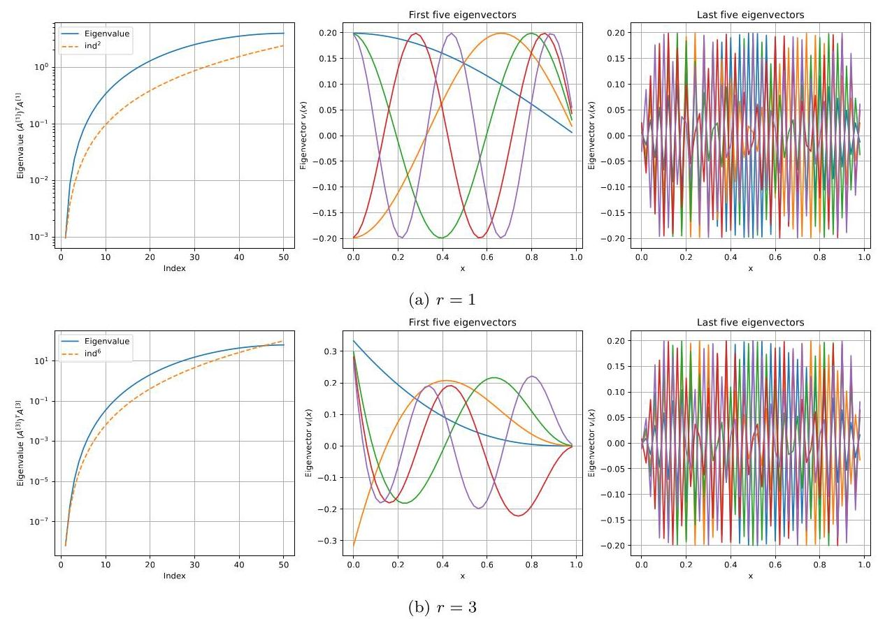
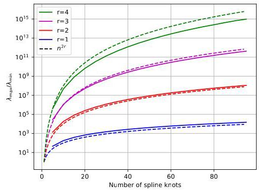
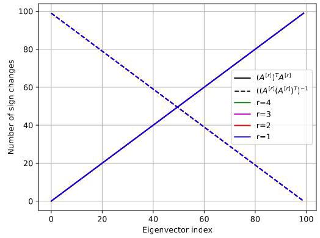
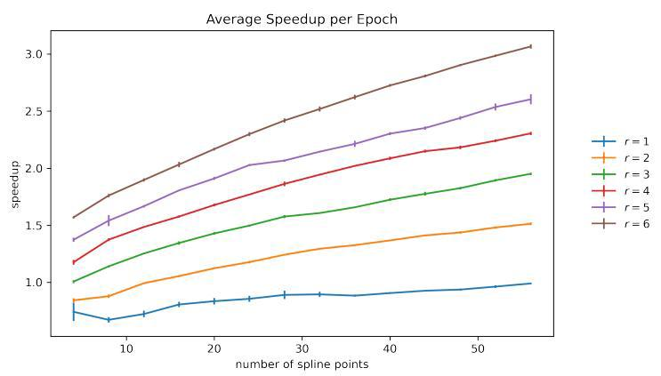
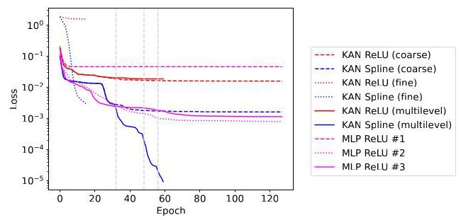
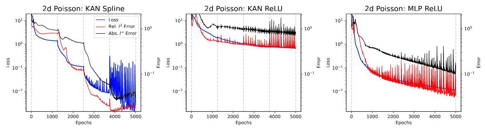
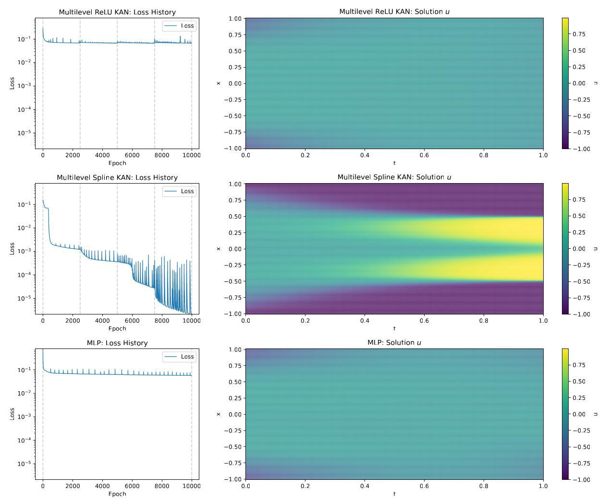
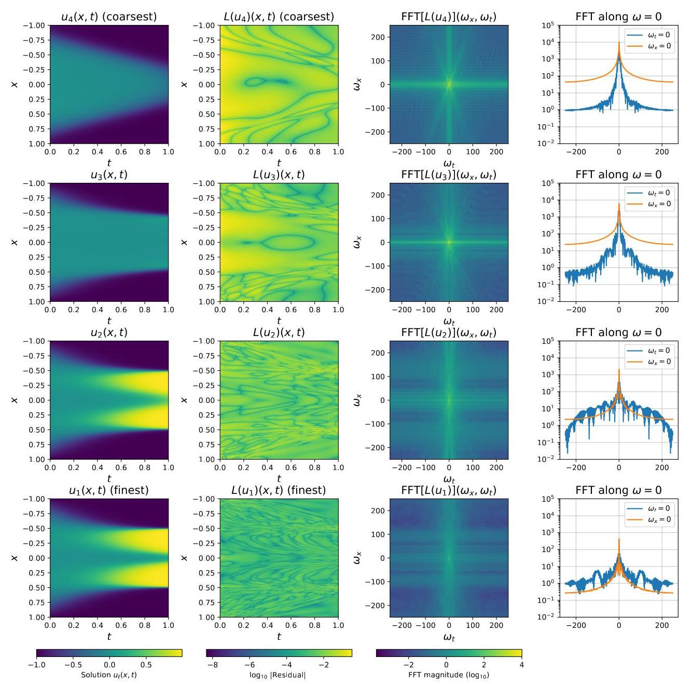
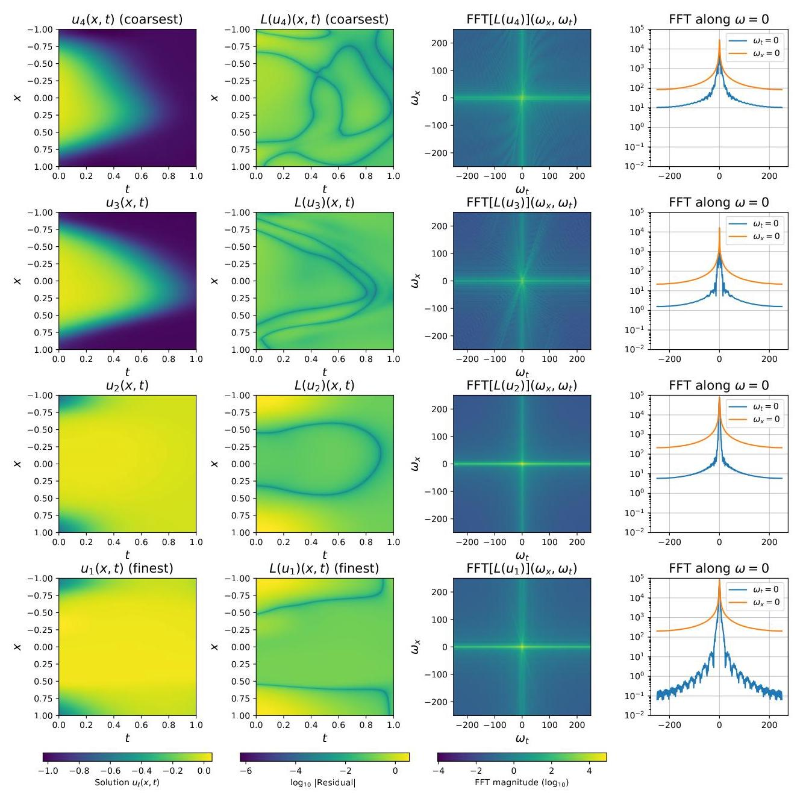

# Multilevel Training for Kolmogorov Arnold Networks

# 用于柯尔莫哥洛夫 - 阿诺德网络的多级训练

Ben S. Southworth* Jonas A. Actor ${}^{ \dagger  }\;$ Graham Harper ${}^{ \ddagger  }\;$ Eric C. Cyr ${}^{ \ddagger  }$

本·S·索思沃思* 乔纳斯·A·阿克托 ${}^{ \dagger  }\;$ 格雷厄姆·哈珀 ${}^{ \ddagger  }\;$ 埃里克·C· Cyr ${}^{ \ddagger  }$

March 6, 2026

2026年3月6日

## Abstract

## 摘要

Algorithmic speedup of training common neural architectures is made difficult by the lack of structure guaranteed by the function compositions inherent to such networks. In contrast to multilayer perceptrons (MLPs), Kolmogorov-Arnold networks (KANs) provide more structure by expanding learned activations in a specified basis. This paper exploits this structure to develop practical algorithms and theoretical nisights, yielding training speedup via multilevel training for KANs. To do so, we first establish an equivalence between KANs with spline basis functions and multichannel MLPs with power ReLU activations through a linear change of basis. We then analyze how this change of basis affects the geometry of gradient-based optimization with respect to spline knots. The KANs change-of-basis motivates a multilevel training approach, where we train a sequence of KANs naturally defined through a uniform refinement of spline knots with analytic geometric interpolation operators between models. The interpolation scheme enables a "properly nested hierarchy" of architectures, ensuring that interpolation to a fine model preserves the progress made on coarse models, while the compact support of spline basis functions ensures complementary optimization on subsequent levels. Numerical experiments demonstrate that our multilevel training approach can achieve orders of magnitude improvement in accuracy over conventional methods to train comparable KANs or MLPs, particularly for physics informed neural networks. Finally, this work demonstrates how principled design of neural networks can lead to exploitable structure, and in this case, multilevel algorithms that can dramatically improve training performance.

由于常见神经架构训练中缺乏由网络固有函数组合所保证的结构，算法加速变得困难。与多层感知器(MLP)不同，柯尔莫哥洛夫 - 阿诺德网络(KAN)通过在指定基中扩展学习到的激活提供了更多结构。本文利用这种结构开发实用算法和理论见解，通过对KAN进行多级训练实现训练加速。为此，我们首先通过基的线性变换在具有样条基函数的KAN和具有幂ReLU激活的多通道MLP之间建立等价关系。然后，我们分析这种基变换如何影响基于梯度的关于样条节点的优化几何。KAN的基变换激发了一种多级训练方法，其中我们训练通过用解析几何插值算子对样条节点进行均匀细化自然定义的一系列KAN。插值方案实现了架构的“适当嵌套层次结构”，确保对精细模型的插值保留在粗模型上取得的进展，而样条基函数的紧支撑确保在后续层次上进行互补优化。数值实验表明，我们的多级训练方法相对于训练可比KAN或MLP的传统方法在精度上可实现数量级的提升，特别是对于物理信息神经网络。最后，这项工作展示了神经网络的原则性设计如何导致可利用的结构，在这种情况下，多级算法可以显著提高训练性能。

## 1 Introduction

## 1 引言

Multilayer perceptrons (MLPs) [42, 49, 45] are a classical deep learning architecture that exploit the composition of affine maps with a nonlinear scalar activation function. MLP architectures appear as blocks in many state-of-the-art applications, including (but not limited to) variational autoencoders [34] and transformers [62]. Training MLPs, especially modern multichannel and multihead variants of state-of-the-art architectures, is a nontrivial numerical task. Typically these methods rely on iterative variants of stochastic gradient descent resulting in relatively slow convergence. In contrast, in classical numerical methods, multilevel and multigrid methods for solving numerical partial differential equations (PDEs), are some of the most powerful solvers of linear and nonlinear equations, capable of solving a sparse $n \times  n$ linear system in $\mathcal{O}\left( n\right)$ operations.

多层感知器(MLP)[42, 49, 45]是一种经典深度学习架构，它利用仿射映射与非线性标量激活函数的组合。MLP架构在许多前沿应用中作为模块出现，包括(但不限于)变分自编码器[34]和变压器[62]。训练MLP，特别是前沿架构的现代多通道和多头变体，是一项重要的数值任务。通常这些方法依赖于随机梯度下降的迭代变体，导致收敛相对较慢。相比之下，在经典数值方法中，用于求解数值偏微分方程(PDE)的多级和多重网格方法是线性和非线性方程最强大的求解器之一，能够在$\mathcal{O}\left( n\right)$操作中求解稀疏$n \times  n$线性系统。

Motivated by this success, there have been a number of attempts to extend multigrid ideas to machine learning, e.g. [9, 20, 13, 32, 23, 16, 38, 18, 17]. The connection between deep neural networks and discretized dynamical systems [21, 50, 10] provides theoretical motivation for applying multilevel methods from numerical PDEs to neural network training, as ResNet depth can be interpreted as a time discretization. Building on this interpretation, nested iteration via multilevel-in-layer is considered in [9] observing modest speedups, and multigrid-in-time concepts are applied to develop a layer-parallel training strategy in [20, 13], but the obtained speedups are due to parallelization and are not algorithmic. Several works have also designed architectures that explicitly incorporate multigrid structure, e.g. [32, 23, 16]. While these approaches demonstrate that multigrid principles can inform architecture design, they focus on model structure rather than training algorithms and do not report training speedups. Rigorous multilevel training in the context of nonlinear multigrid and cycling is considered in [38, 18], demonstrating modest convergence improvements. Most recently, Feischl et al. [17] develops a theoretical framework for refinement of feed-forward neural networks that is incorporated into the optimization procedure.

受此成功启发，有许多尝试将多重网格思想扩展到机器学习，例如[9, 20, 13, 32, 23, 16, 38, 18, 17]。深度神经网络与离散动力系统之间的联系[21, 50, 10]为将数值PDE中的多级方法应用于神经网络训练提供了理论动机，因为ResNet深度可以解释为时间离散化。基于这种解释，[9]中考虑了通过层内多级进行嵌套迭代，观察到适度的加速，并且在[20, 13]中将时间多重网格概念应用于开发层并行训练策略，但获得的加速是由于并行化而不是算法。一些工作还设计了明确纳入多重网格结构的架构，例如[32, 23, 16]。虽然这些方法表明多重网格原则可以为架构设计提供信息，但它们专注于模型结构而不是训练算法，并且没有报告训练加速。在非线性多重网格和循环的背景下考虑了严格的多级训练，如[38, 18]所示，展示了适度的收敛改进。最近，Feischl等人[17]为前馈神经网络的细化开发了一个理论框架，并将其纳入优化过程。

---

*Theoretical Division, Los Alamos National Laboratory, USA.

*美国洛斯阿拉莫斯国家实验室理论部。

${}^{ \dagger  }$ Center for Computing Research, Sandia National Laboratories, USA.

${}^{ \dagger  }$ 美国桑迪亚国家实验室计算研究中心。

---

Nevertheless, to the best of our knowledge no multilevel machine learning works have provided algorithmic speedups like seen in other fields such as numerical PDEs. Broadly, this is due to the lack of multilevel machine learning hierarchies with good approximation properties between levels, and grid-specific optimization or "relaxation" routines that complement the chosen coarsening and interpolation. Implicit in this context is the substantial difficulty in defining coarse representations of a machine learning model. Because in machine learning the coarse and fine models typically operate on the same dimensional space, there is no clear extension of approximation properties from multigrid literature to motivate the choice of coarse model and transfer operators. On a high level, coarse models must be (i) cheaper to (approximately) solve than the fine model, (ii) not conflict with the fine model objective, and moreover (iii) provide correction or descent direction that is difficult to capture/identify with the fine model, i.e. be complementary to "relaxation," or grid-specific optimization methods.

然而，据我们所知，没有任何多级机器学习工作能像数值偏微分方程等其他领域那样提供算法加速。总体而言，这是由于缺乏各级之间具有良好逼近性质的多级机器学习层次结构，以及与所选粗化和插值互补的特定网格优化或“松弛”例程。在这种情况下，隐含的是定义机器学习模型粗粒度表示的巨大困难。因为在机器学习中，粗粒度模型和精细模型通常在相同的维度空间上运行，所以从多重网格文献中没有明确的逼近性质扩展来推动粗粒度模型和传递算子的选择。从高层次来看，粗粒度模型必须(i)比精细模型(近似)求解成本更低，(ii)不与精细模型目标冲突，而且(iii)提供精细模型难以捕捉/识别的校正或下降方向，即与“松弛”或特定网格优化方法互补。

An alternative architecture to MLPs, Kolmogorov-Arnold Networks (KANs) [40], has gained popularity in recent literature, having been used for a range of tasks including computer vision [8, 7, 11], time series analysis [61, 15], scientific machine learning [1, 59, 65, 35, 30, 44, 28, 48], graph analysis [33, 6], and beyond; see [54, 27] and references therein for a list of versions, extensions, and applications of KANs, and [43] for a comprehensive review. The structural similarity between MLPs and KANs has been noted multiple times in the literature, e.g. [45, 29, 39, 24, 47]. Due to their similarities, KANs tend to be comparable to MLPs for learning tasks, with the same asymptotic complexity and convergence rates [19] and performance in variety of head-to-head comparisons [67, 51, 66]. Compared to MLPs, KANs in particular are known for (i) being more interpretable, as the model output consists of analytical functional composition, and (ii) being able to better capture low-regularity solutions and mappings than traditional MLPs. However, theoretical insights and practical algorithms for KANs that exhibit these properties while maintaining (or outperforming) MLPs are generally inconsistent or lacking, and it is this gap that this paper aims to address, with the particular aim of advancing training strategies to exploit multilevel optimization algorithms.

多层感知器(MLP)的一种替代架构，即柯尔莫哥洛夫 - 阿诺德网络(KANs)[40]，在最近的文献中受到了广泛关注，已被用于一系列任务，包括计算机视觉[8, 7, 11]、时间序列分析[61, 15]、科学机器学习[1, 59, 65, 35, 30, 44, 28, 48]、图分析[33, 6]等等；有关KANs的版本、扩展和应用列表，请参见[54, 27]及其参考文献，有关全面综述请参见[43]。文献中多次提到MLP和KANs之间的结构相似性，例如[45, 29, 39, 24, 47]。由于它们的相似性，KANs在学习任务中往往与MLP具有可比性，具有相同的渐近复杂度和收敛速度[19]，并且在各种直接比较中表现相当[67, 51, 66]。与MLP相比，KANs尤其以(i)更具可解释性而闻名，因为模型输出由解析函数组合组成，以及(ii)比传统MLP能够更好地捕捉低正则性解和映射而著称。然而，在保持(或超越)MLP性能的同时展现这些特性的KANs的理论见解和实用算法通常并不一致或有所欠缺，本文旨在填补这一空白，特别致力于推进利用多级优化算法的训练策略。

### 1.1 Contributions

### 1.1 贡献

In this paper, we advance theoretical and practical insights pertaining to KANs, improving upon our conceptual understanding of how architectures and optimizers pair together to achieve better training and model performance. We translate these insights into a demonstration that shows how multilevel methods can dramatically improve training of a properly designed neural network. To do so, we:

在本文中，我们推进了与KANs相关的理论和实践见解，深化了我们对架构和优化器如何协同工作以实现更好的训练和模型性能的概念理解。我们将这些见解转化为一个演示，展示了多级方法如何显著改进精心设计的神经网络的训练。为此，我们:

1. exploit the relationship between KANs and multichannel MLPs to introduce a change-of-basis map between the two architectures;

1. 利用KANs与多通道MLP之间的关系，在两种架构之间引入基变换映射；

2. analyze how this change of basis alters the dynamics of gradient descent; and

2. 分析这种基变换如何改变梯度下降的动态；

3. introduce the concept of properly nested hierarchy for multilevel optimization, show that KANs with appropriate interpolation operators satisfy this ansatz, and design and demonstrate a corresponding multilevel training approach inspired by multigrid methods.

3. 引入多级优化的适当嵌套层次结构的概念，表明具有适当插值算子的KANs满足这一假设，并设计并演示一种受多重网格方法启发的相应多级训练方法。

The outline of the paper and the technical steps and reasons that necessitate the accompanying analysis are described next.

接下来描述本文的大纲以及进行相关分析所需的技术步骤和原因。

### 1.2 The rest of the paper

### 1.2 本文的其余部分

We begin in Section 2.1 by exploiting the relationship between B-Splines and ReLU activations to reformulate KANs in the language of multichannel MLPs. We show that KAN architectures with spline activations are equivalent to a certain form of multichannel MLPs under an appropriate linear change of basis, where the biases are fixed to match the spline knots. In Section 2.2, we show that the linear change of basis between KANs and multichannel MLPs exactly matches a finite-difference discretization of the $r$ th derivative operator on spline knots. This change of basis immediately yields a direct, non-recursive implementation of spline basis KANs that is faster than the typical Cox-de Boor recursive form (see Section 2.3).

我们在2.1节中首先利用B样条和ReLU激活函数之间的关系，用多通道MLP的语言重新表述KANs。我们表明，在适当的线性基变换下，具有样条激活函数的KAN架构等同于某种形式的多通道MLP，其中偏差被固定以匹配样条节点。在2.2节中，我们表明KANs和多通道MLP之间的线性基变换恰好与样条节点上$r$阶导数算子的有限差分离散化相匹配。这种基变换立即产生了样条基KANs的直接、非递归实现，其速度比典型的考克斯 - 德布尔递归形式更快(见2.3节)。

Despite the equivalence (as forward operators) under the change of basis, gradient-based training of KANs and multichannel MLPs yield fundamentally distinct weight evolution. This is discussed abstractly in terms of the geometry of the primal and dual space in Section 3 , where a function of the change of basis matrix between KANs and multichannel MLPs acts as a preconditioner of descent methods depending on your choice of spaces. Combining these results with the analysis from Section 2.2 shows substantial benefit to the training dynamics due to the eigenstructure of differential operators: the multichannel MLP formulation will strongly prioritize training smooth functions across spline knots. This makes an expressive model of complex functions easier for the KAN to realize, as compared to a multichannel MLP.

尽管在基变换下(作为前向算子)是等价的，但基于梯度的KAN和多通道MLP训练会产生根本不同的权重演化。在第3节中，我们从原始空间和对偶空间的几何角度进行了抽象讨论，其中KAN和多通道MLP之间的基变换矩阵的函数根据你对空间的选择充当下降方法的预处理器。将这些结果与第2.2节的分析相结合，表明由于微分算子的特征结构，对训练动态有很大好处:多通道MLP公式将强烈优先考虑在样条节点上训练平滑函数。与多通道MLP相比，这使得KAN更容易实现复杂函数的表达模型。

In Section 4, we exploit the mathematical formulations from Section 2 and Section 3 to develop an efficient multilevel training framework for spline-based KANs, built on the structure that comes with the spline parameterization, and structure that MLPs lack. To do this, we introduce a new concept of properly nested hierarchies for multilevel optimization, which ensures that interpolation to a fine model does not undo progress made on the coarse model. Our transfer operators are built geometrically, naturally yielding a properly nested hierarchy, and accelerating the grid transfer methods posed in [40] to be fast enough to be constructed/applied during training. The theory developed in Section 3 then indicates that gradient-based optimization applied to the properly nested coarse and fine models are complementary, a fundamental requirement for any successful multigrid method. Altogether, we believe that a properly nested hierarchy with level-complementary gradient-based optimization routines provide the necessary components for a successful multigrid method.

在第4节中，我们利用第2节和第3节的数学公式，为基于样条的KAN开发了一个高效的多级训练框架，该框架基于样条参数化所具有的结构以及MLP所缺乏的结构。为此，我们引入了一个用于多级优化的适当嵌套层次结构的新概念，这确保了向精细模型的插值不会消除在粗模型上取得的进展。我们的转移算子是通过几何方式构建的，自然地产生了一个适当嵌套的层次结构，并加速了[40]中提出的网格转移方法，使其速度足够快，可以在训练期间构建/应用。第3节中发展的理论表明，应用于适当嵌套的粗模型和精细模型的基于梯度的优化是互补的，这是任何成功的多重网格方法的基本要求。总之，我们认为具有层次互补的基于梯度的优化例程的适当嵌套层次结构为成功的多重网格方法提供了必要的组件。

In Section 5, we then numerically demonstrate the multilevel training to provide significant improvements in both accuracy and efficiency applied to functional regression and physics informed neural networks (PINNs). We similarly show for the same problems that multilevel training applied to the equivalent multichannel MLP basis, which lacks the level-complementary gradient-based optimization, yields effectively zero improvement over just the coarse model. This is because training of the fine-grid multichannel MLP prioritizes modes already captured by the coarse model.

在第5节中，我们通过数值演示了多级训练在应用于函数回归和物理信息神经网络(PINN)时在准确性和效率方面都有显著提高。我们同样表明，对于相同的问题，应用于等效多通道MLP基的多级训练(缺乏层次互补的基于梯度的优化)与仅使用粗模型相比，有效改进为零。这是因为精细网格多通道MLP的训练优先考虑粗模型已经捕获的模式。

## 2 KANs and multichannel MLPs

## 2 KANs和多通道MLPs

We begin our analysis with an introduction of KANs in the spline basis, and then demonstrate how a linear transformation relates each layer in the spline basis to an equivalent multichannel MLP. From a historical and approximation theory standpoint [41, 56, 45, 57], both KANs and MLPs stem from arguments that expand upon the Kolmogorov Superposition Theorem (KST) [37], also called the Kolmogorov-Arnold Superposition Theorem. This theorem states there exist functions ${\phi }_{pq} \in  C\left( \left\lbrack  {0,1}\right\rbrack  \right)$ , for $p = 1,\ldots , n$ and $q = 1,\ldots ,{2n} + 1$ , such that for any function $f \in  C\left( {\left\lbrack  0,1\right\rbrack  }^{n}\right)$ , there are functions ${\varphi }_{q} \in  C\left( \mathbb{R}\right)$ such that $f\left( {{x}_{1},\ldots ,{x}_{n}}\right)  = \mathop{\sum }\limits_{{q = 1}}^{{{2n} + 1}}{\varphi }_{q}\left( {\mathop{\sum }\limits_{{p = 1}}^{n}{\phi }_{pq}\left( {x}_{p}\right) }\right)$ . Classically ${\varphi }_{q}$ and ${\phi }_{pq}$ are not differentiable at a dense set of points and only Hölder or at best Lipschitz continuous [5, 56, 2]. Inspired by the KST, KANs replace the functions ${\varphi }_{q}$ and ${\phi }_{pq}$ with learned functions expressed in a fixed basis, often a spline basis [40]. While the original KST invokes a single layer of function composition creating a shallow network, KANs use more layers of function composition to increase the depth of the resulting representation. For a layer $\ell$ with $P$ inputs and $Q$ outputs define the output of a KAN layer as ${x}_{q}^{\left( \ell  + 1\right) } = \mathop{\sum }\limits_{{p = 1}}^{P}{\phi }_{pq}^{\left( \ell \right) }\left( {x}_{p}^{\left( \ell \right) }\right)$ for $q = 1,\ldots , Q$ , with ${\phi }_{pq}^{\left( \ell \right) }$ trained from data. In practice, each ${\phi }_{pq}^{\left( \ell \right) }$ must be represented in a computationally tractable form. Following [40], we expand each ${\phi }_{pq}^{\left( \ell \right) }$ in a basis of B-splines of order $r$ , yielding a finite-dimensional parameterization where the spline coefficients become the trainable weights of the network. This choice of basis is motivated by the approximation properties of splines and their compact support, which we will exploit throughout this work. Specifically, given a set of knots, each ${\phi }_{pq}^{\left( \ell \right) }$ is represented as ${\phi }_{pq}^{\left( \ell \right) }\left( x\right)  = \mathop{\sum }\limits_{{i = 1 - r}}^{{n - 1}}{\widetilde{W}}_{qpi}^{\left( \ell \right) }{b}_{i}^{\left\lbrack  r\right\rbrack  }\left( x\right)$ , where ${\widetilde{W}}_{qpi}^{\left( \ell \right) }$ are learnable weights and ${\left\{  {b}_{i}^{\left\lbrack  r - 1\right\rbrack  }\right\}  }_{i = 1 - r}^{n - 1}$ forms a B-spline basis.

我们从介绍样条基中的KAN开始分析，然后展示线性变换如何将样条基中的每一层与等效的多通道MLP相关联。从历史和逼近理论的角度来看[41, 56, 45, 57]，KAN和MLP都源于对柯尔莫哥洛夫叠加定理(KST)[37](也称为柯尔莫哥洛夫 - 阿诺德叠加定理)的扩展论证。该定理指出，存在函数${\phi }_{pq} \in  C\left( \left\lbrack  {0,1}\right\rbrack  \right)$，对于$p = 1,\ldots , n$和$q = 1,\ldots ,{2n} + 1$，使得对于任何函数$f \in  C\left( {\left\lbrack  0,1\right\rbrack  }^{n}\right)$，存在函数${\varphi }_{q} \in  C\left( \mathbb{R}\right)$，使得$f\left( {{x}_{1},\ldots ,{x}_{n}}\right)  = \mathop{\sum }\limits_{{q = 1}}^{{{2n} + 1}}{\varphi }_{q}\left( {\mathop{\sum }\limits_{{p = 1}}^{n}{\phi }_{pq}\left( {x}_{p}\right) }\right)$。经典地，${\varphi }_{q}$和${\phi }_{pq}$在一组密集点处不可微，并且仅是赫尔德连续或至多是利普希茨连续[5, 56, 2]。受KST的启发，KAN用固定基(通常是样条基)[40]中表示的学习函数替换函数${\varphi }_{q}$和${\phi }_{pq}$。虽然原始的KST调用单层函数组合来创建浅层网络，但KAN使用更多层的函数组合来增加所得表示的深度。对于具有$P$个输入和$Q$个输出的层$\ell$，将KAN层的输出定义为${x}_{q}^{\left( \ell  + 1\right) } = \mathop{\sum }\limits_{{p = 1}}^{P}{\phi }_{pq}^{\left( \ell \right) }\left( {x}_{p}^{\left( \ell \right) }\right)$，对于$q = 1,\ldots , Q$，其中${\phi }_{pq}^{\left( \ell \right) }$从数据中训练。在实践中，每个${\phi }_{pq}^{\left( \ell \right) }$必须以计算上易于处理的形式表示。遵循[40]，我们在阶数为$r$的B样条基中展开每个${\phi }_{pq}^{\left( \ell \right) }$，得到一个有限维参数化，其中样条系数成为网络的可训练权重。这种基的选择是由样条的逼近性质及其紧支集驱动的，我们将在整个工作中利用这一点。具体来说，给定一组节点，每个${\phi }_{pq}^{\left( \ell \right) }$表示为${\phi }_{pq}^{\left( \ell \right) }\left( x\right)  = \mathop{\sum }\limits_{{i = 1 - r}}^{{n - 1}}{\widetilde{W}}_{qpi}^{\left( \ell \right) }{b}_{i}^{\left\lbrack  r\right\rbrack  }\left( x\right)$，其中${\widetilde{W}}_{qpi}^{\left( \ell \right) }$是可学习的权重，${\left\{  {b}_{i}^{\left\lbrack  r - 1\right\rbrack  }\right\}  }_{i = 1 - r}^{n - 1}$形成一个B样条基。

### 2.1 Change of basis

### 2.1 基变换

We formalize the structure of the spline basis to establish an equivalence to an alternative representation using ReLU activations via a linear change of basis. Let $T = {\left\{  {t}_{i}\right\}  }_{i = 1 - r}^{n + r - 1}$ be a strictly ordered spline knots, where ${t}_{i} < {t}_{i + 1}$ , with ${t}_{0} = a$ and ${t}_{n} = b$ . Let ${\mathbb{P}}^{k}$ denote the space of polynomials of degree $k$ . The spline space of order $r$ with knots $T$ , denoted by ${S}_{r}\left( T\right)$ , is the set of functions

我们将样条基的结构形式化，以通过基的线性变换建立与使用ReLU激活函数的另一种表示形式的等价关系。设$T = {\left\{  {t}_{i}\right\}  }_{i = 1 - r}^{n + r - 1}$为严格有序的样条节点，其中${t}_{i} < {t}_{i + 1}$，且${t}_{0} = a$和${t}_{n} = b$。设${\mathbb{P}}^{k}$表示次数为$k$的多项式空间。节点为$T$的$r$阶样条空间，记为${S}_{r}\left( T\right)$，是函数的集合

$$
{S}_{r}\left( T\right)  = \left\{  {f \in  {C}^{r - 2}\left( \left\lbrack  {a, b}\right\rbrack  \right)  : {\left. f\right| }_{\left\lbrack  {t}_{i},{t}_{i + 1}\right\rbrack  } \in  {\mathbb{P}}^{r - 1},{t}_{i} \in  T}\right\}  . \tag{1}
$$

The spline space of order $r$ consists of piecewise polynomials of degree $r - 1$ (subject to additional smoothness constraints). For $r = 1$ , define ${b}_{i}^{\left\lbrack  1\right\rbrack  }\left( x\right)  = \left\{  \begin{array}{ll} 1 & x \in  \left\lbrack  {{t}_{i},{t}_{i + 1}}\right\rbrack  \\  0 & \text{ else } \end{array}\right.$ and for $r > 1$ , we use the Cox-de Boor [14] recursion formula:

$r$阶样条空间由次数为$r - 1$的分段多项式组成(需满足额外的光滑性约束)。对于$r = 1$，定义${b}_{i}^{\left\lbrack  1\right\rbrack  }\left( x\right)  = \left\{  \begin{array}{ll} 1 & x \in  \left\lbrack  {{t}_{i},{t}_{i + 1}}\right\rbrack  \\  0 & \text{ else } \end{array}\right.$，对于$r > 1$，我们使用考克斯 - 德布尔[14]递归公式:

$$
{b}_{i}^{\left\lbrack  r\right\rbrack  }\left( x\right)  = \frac{x - {t}_{i}}{{t}_{i + r - 1} - {t}_{i}}{b}_{i}^{\left\lbrack  r - 1\right\rbrack  }\left( x\right)  + \frac{{t}_{i + r} - x}{{t}_{i + r} - {t}_{i + 1}}{b}_{i + 1}^{\left\lbrack  r - 1\right\rbrack  }\left( x\right) . \tag{2}
$$

Each function ${b}_{i}^{\left\lbrack  r\right\rbrack  }$ is supported on the interval $\left\lbrack  {{t}_{i},{t}_{i + r}}\right\rbrack$ . We additionally define a ${\operatorname{ReLU}}^{r - 1}$ basis, spanned by functions

每个函数${b}_{i}^{\left\lbrack  r\right\rbrack  }$在区间$\left\lbrack  {{t}_{i},{t}_{i + r}}\right\rbrack$上有支撑。我们还定义了一个由函数张成的${\operatorname{ReLU}}^{r - 1}$基

$$
{\psi }_{i}^{\left\lbrack  r\right\rbrack  }\left( x\right)  = \operatorname{ReLU}{\left( x - {t}_{i}\right) }^{r - 1}. \tag{3}
$$

We can now restate a classical spline approximation result, cf. [12].

我们现在可以重述一个经典的样条逼近结果，参见[12]。

Lemma 1. Both ${B}_{S}^{\left\lbrack  r\right\rbrack  } = {\left\{  {b}_{i}^{\left\lbrack  r\right\rbrack  }\right\}  }_{i = 1 - r}^{n - 1}$ and ${B}_{R}^{\left\lbrack  r\right\rbrack  } = {\left\{  {\psi }_{i}^{\left\lbrack  r\right\rbrack  }\right\}  }_{i = 1 - r}^{n - 1}$ are bases for ${S}_{r}\left( T\right)$ .

引理1。${B}_{S}^{\left\lbrack  r\right\rbrack  } = {\left\{  {b}_{i}^{\left\lbrack  r\right\rbrack  }\right\}  }_{i = 1 - r}^{n - 1}$和${B}_{R}^{\left\lbrack  r\right\rbrack  } = {\left\{  {\psi }_{i}^{\left\lbrack  r\right\rbrack  }\right\}  }_{i = 1 - r}^{n - 1}$都是${S}_{r}\left( T\right)$的基。

Thus there exists a linear change of basis between them; denote this change-of-basis matrix as ${A}^{\left\lbrack  r\right\rbrack  } \in \; {\mathbb{R}}^{\left( {n + r - 1}\right)  \times  \left( {n + r - 1}\right) }$ , so that

因此它们之间存在基的线性变换；将此基变换矩阵记为${A}^{\left\lbrack  r\right\rbrack  } \in \; {\mathbb{R}}^{\left( {n + r - 1}\right)  \times  \left( {n + r - 1}\right) }$，使得

$$
{B}_{S}^{\left\lbrack  r\right\rbrack  } = {A}^{\left\lbrack  r\right\rbrack  }{B}_{R}^{\left\lbrack  r\right\rbrack  } \tag{4}
$$

with ${B}_{S}^{\left\lbrack  r\right\rbrack  }$ and ${B}_{R}^{\left\lbrack  r\right\rbrack  }$ understood to be square matrices with columns given by basis vectors. The matrix ${A}^{\left\lbrack  r\right\rbrack  }$ is structured and banded, with a particularly elegant expression for the case of uniform knot spacing:

其中${B}_{S}^{\left\lbrack  r\right\rbrack  }$和${B}_{R}^{\left\lbrack  r\right\rbrack  }$理解为列由基向量给出的方阵。矩阵${A}^{\left\lbrack  r\right\rbrack  }$是结构化且带状的，对于均匀节点间距的情况有特别简洁的表达式:

Lemma 2. For $r > 1$ , let ${A}^{\left\lbrack  r - 1\right\rbrack  }$ denote splines of order $r - 1$ constructed on knots for splines of order $r$ . Then the matrix ${A}^{\left\lbrack  r\right\rbrack  }$ is defined entry-wise as:

引理2。对于$r > 1$，设${A}^{\left\lbrack  r - 1\right\rbrack  }$表示在$r$阶样条的节点上构造的$r - 1$阶样条。那么矩阵${A}^{\left\lbrack  r\right\rbrack  }$按元素定义为:

$$
{A}_{ij}^{\left\lbrack  r\right\rbrack  } = \frac{1}{{t}_{i + r - 1} - {t}_{i}}{A}_{ij}^{\left\lbrack  r - 1\right\rbrack  } - \frac{1}{{t}_{i + r} - {t}_{i + 1}}{A}_{i + 1, j}^{\left\lbrack  r - 1\right\rbrack  }, \tag{5}
$$

where we define ${A}_{n + r, : }^{\left\lbrack  r - 1\right\rbrack  } = 0$ to account for the special case of the final row $i = n + r - 1$ .

其中我们定义${A}_{n + r, : }^{\left\lbrack  r - 1\right\rbrack  } = 0$以考虑最后一行$i = n + r - 1$的特殊情况。

Proof. See Section B.

证明。见B节。

Corollary 1 (Uniform knots). In the case of uniform knots, with spacing $h = {t}_{i} - {t}_{i - 1},{A}^{\left\lbrack  r\right\rbrack  }$ is upper triangular Toeplitz, with entries

推论1(均匀节点)。在均匀节点的情况下，间距为$h = {t}_{i} - {t}_{i - 1},{A}^{\left\lbrack  r\right\rbrack  }$时是上三角托普利兹矩阵，其元素为

$$
{A}_{ij}^{\left\lbrack  r\right\rbrack  } = \left\{  {\begin{array}{ll} \frac{{\left( -1\right) }^{j - i}}{\left( {j - i}\right) !\left( {r - j + i}\right) !}\frac{r}{{h}^{r - 1}} & i \leq  j \leq  i + r \\  0 & \text{ else } \end{array}.}\right.
$$

Proof. See Section B.

证明。见B节。

We now show that the change of basis ${A}^{\left\lbrack  r\right\rbrack  }$ (4) yields an equivalence between KANs and a certain form of multichannel MLP. Each layer of a KAN architecture in the spline basis ${B}_{S}^{\left\lbrack  r\right\rbrack  }$ has spline coefficients stored as parameters/weights in a 3-tensor ${\widetilde{W}}^{\left( \ell \right) }$ such that

我们现在证明基变换${A}^{\left\lbrack  r\right\rbrack  }$ (4)在KAN和某种形式的多通道MLP之间产生了一种等价关系。在样条基${B}_{S}^{\left\lbrack  r\right\rbrack  }$下，KAN架构的每一层都将样条系数作为参数/权重存储在一个三维张量${\widetilde{W}}^{\left( \ell \right) }$中，使得

$$
{\mathbf{x}}_{q}^{\left( \ell  + 1\right) } = \mathop{\sum }\limits_{{p = 1}}^{P}\mathop{\sum }\limits_{{i = 1 - r}}^{{n - 1}}{\widetilde{W}}_{qpi}^{\left( \ell \right) }{b}_{i}^{\left\lbrack  r\right\rbrack  }\left( {\mathbf{x}}_{p}^{\left( \ell \right) }\right) . \tag{6}
$$

---

${}^{1}$ We assume a strictly ordered, i.e. nondegenerate, set of spline knots, which simplifies the required assumptions and definitions. While the authors know of no theoretical reasons why degenerate splines should not be considered under this framework, there is substantial technical rigor necessary to treat these properly, so we omit them from this discourse.

${}^{1}$我们假设样条节点的集合是严格有序的，即非退化的，这简化了所需的假设和定义。虽然作者不知道在这个框架下为什么不应该考虑退化样条，但要正确处理它们需要相当的技术严谨性，所以我们在本文中省略它们。

---

Define ${W}^{\left( \ell \right) } = {\widetilde{W}}^{\left( \ell \right) }{ \times  }_{3}{\left( {A}^{\left\lbrack  r\right\rbrack  }\right) }^{T}$ , where ${ \times  }_{3}$ denotes the 3-mode tensor product ${}^{2}$ , at the index level, ${W}_{qpj}^{\left( \ell \right) } \mathrel{\text{ := }} \; \mathop{\sum }\limits_{{i = 1 - r}}^{{n - 1}}{\widetilde{W}}_{qpi}^{\left( \ell \right) }{A}_{ij}^{\left\lbrack  r\right\rbrack  }$ . Substituting the change of basis from [4] and definition of ${\widetilde{W}}^{\left( \ell \right) }$ into [6] yields

定义${W}^{\left( \ell \right) } = {\widetilde{W}}^{\left( \ell \right) }{ \times  }_{3}{\left( {A}^{\left\lbrack  r\right\rbrack  }\right) }^{T}$，其中${ \times  }_{3}$表示三模张量积${}^{2}$，在索引层面上，${W}_{qpj}^{\left( \ell \right) } \mathrel{\text{ := }} \; \mathop{\sum }\limits_{{i = 1 - r}}^{{n - 1}}{\widetilde{W}}_{qpi}^{\left( \ell \right) }{A}_{ij}^{\left\lbrack  r\right\rbrack  }$。将来自[4]的基变换和${\widetilde{W}}^{\left( \ell \right) }$的定义代入[6]得到

$$
{\mathbf{x}}_{q}^{\left( \ell  + 1\right) } = \mathop{\sum }\limits_{{p = 1}}^{P}\mathop{\sum }\limits_{{i = 1 - r}}^{{n - 1}}{\widetilde{W}}_{qpi}^{\left( \ell \right) }\left( {\mathop{\sum }\limits_{{j = 1 - r}}^{{n - 1}}{A}_{ij}^{\left\lbrack  r\right\rbrack  }\operatorname{ReLU}{\left( {\mathbf{x}}_{p}^{\left( \ell \right) } - {t}_{j}\right) }^{r - 1}}\right) \tag{7a}
$$

$$
= \mathop{\sum }\limits_{{p = 1}}^{P}\mathop{\sum }\limits_{{j = 1 - r}}^{{n - 1}}{W}_{qpj}^{\left( \ell \right) }\operatorname{ReLU}{\left( {\mathbf{x}}_{p}^{\left( \ell \right) } - {t}_{j}\right) }^{r - 1}. \tag{7b}
$$

With a notational shift outlined in Section A, we observe that (7) is an equivalent dense mulitchannel MLP layer with ${\mathrm{{ReLU}}}^{r - 1}$ activations. Altogether, we arrive at the following result.

通过A节中概述的符号变换，我们观察到(7)是一个具有${\mathrm{{ReLU}}}^{r - 1}$激活的等效密集多通道MLP层。总之，我们得到以下结果。

Lemma 3 (Equivalence of KANs and multichannel MLPs). A single layer of a KAN in the form of (6), with weight three-tensor ${\widetilde{W}}^{\left( \ell \right) }$ , is equivalent to a single layer of a multichannel MLP in the form of (7) with weight three-tensor ${W}^{\left( \ell \right) } = {\widetilde{W}}^{\left( \ell \right) }{ \times  }_{3}{\left( {A}^{\left\lbrack  r\right\rbrack  }\right) }^{T}$ .

引理3(KAN和多通道MLP的等价性)。形式为(6)且权重三维张量为${\widetilde{W}}^{\left( \ell \right) }$的单层KAN，等同于形式为(7)且权重三维张量为${W}^{\left( \ell \right) } = {\widetilde{W}}^{\left( \ell \right) }{ \times  }_{3}{\left( {A}^{\left\lbrack  r\right\rbrack  }\right) }^{T}$的单层多通道MLP。

Now consider a full network consisting of multiple layers. For ease of notation, and with Section 3 in mind, let us vectorize weights across all layers, and denote $\mathbf{u}$ as the full vector of weights in the spline basis and $\mathbf{w}$ as the vector of weights in the ReLU basis; both $\mathbf{u},\mathbf{w} \in  {\mathbb{R}}^{{N}_{w}}$ . Following the above discussion, with appropriate concatenation and reordering/flattening of ${A}^{\left\lbrack  r\right\rbrack  }$ we can define the change of basis matrix $A$ such that

现在考虑一个由多层组成的完整网络。为了便于表示，并考虑到第3节，让我们对所有层的权重进行向量化，并将$\mathbf{u}$表示为样条基下的权重全向量，将$\mathbf{w}$表示为ReLU基下的权重向量；两者都是$\mathbf{u},\mathbf{w} \in  {\mathbb{R}}^{{N}_{w}}$。按照上述讨论，通过对${A}^{\left\lbrack  r\right\rbrack  }$进行适当的拼接和重新排序/展平，我们可以定义基变换矩阵$A$，使得

$$
{A}^{T}\mathbf{u} = \mathbf{w}.
$$

Note, here the change of basis maps from weights in the spline basis to weights in the ReLU basis, opposite of the direction of the functional change of basis [4]. Assume the vectorization operation on the weights $\mathbf{u}$ and $\mathbf{w}$ is ordered with respect to layer, output neuron, input neuron, and then spline knot. With this ordering the resulting $A$ is block diagonal over the first three dimensions (layer, output neuron, and input neuron) with diagonal blocks given by $\left( {A}^{\left\lbrack  r\right\rbrack  }\right)$ of the appropriate dimension over spline knots.

注意，这里的基变换是从样条基下的权重映射到ReLU基下的权重，与函数基变换[4]的方向相反。假设对权重$\mathbf{u}$和$\mathbf{w}$的向量化操作是按层、输出神经元、输入神经元，然后是样条节点的顺序进行的。按照这个顺序，得到的$A$在前三个维度(层、输出神经元和输入神经元)上是块对角的，对角块由样条节点上适当维度的$\left( {A}^{\left\lbrack  r\right\rbrack  }\right)$给出。

### 2.2 Eigenstructure of ${A}^{\left\lbrack  r\right\rbrack  }$

### 2.2 ${A}^{\left\lbrack  r\right\rbrack  }$的特征结构

We now prove the following lemma regarding the structure of ${A}^{\left\lbrack  r\right\rbrack  }$ as a discrete approximation of certain differential operators.

我们现在证明以下关于${A}^{\left\lbrack  r\right\rbrack  }$作为某些微分算子的离散近似的结构的引理。

Lemma 4. Up to constant scaling by $\pm  \left( {r - 1}\right) !/h$ (with sign depending on $r$ being odd or even), ${A}^{\left\lbrack  r\right\rbrack  }$ is a forward finite difference approximation of the $r$ th derivative on a 1d uniform grid of mesh spacing $h$ , with strongly enforced zero Dirichlet boundary conditions. Up to boundary nodes and constant scaling, ${\left( {A}^{\left\lbrack  r\right\rbrack  }\right) }^{T}{A}^{\left\lbrack  r\right\rbrack  }$ is also Toeplitz and a finite difference approximation of the $\left( {2r}\right)$ th derivative on a 1d uniform grid of mesh spacing $h$ .

引理4。在乘以$\pm  \left( {r - 1}\right) !/h$进行常数缩放(符号取决于$r$是奇数还是偶数)的情况下，${A}^{\left\lbrack  r\right\rbrack  }$是在网格间距为$h$的一维均匀网格上对$r$阶导数的前向有限差分近似，具有严格强制的零狄利克雷边界条件。除边界节点和常数缩放外，${\left( {A}^{\left\lbrack  r\right\rbrack  }\right) }^{T}{A}^{\left\lbrack  r\right\rbrack  }$也是托普利兹矩阵，并且是在网格间距为$h$的一维均匀网格上对$\left( {2r}\right)$阶导数的有限差分近似。

Proof. Let us consider the stencil ${\mathbf{v}}^{\left( r\right) }$ for spline power $r$ starting from the diagonal and extending to upper triangular indices. Let the diagonal index correspond to zero and ${\mathbf{v}}_{i}^{\left( r\right) }$ denote the $i$ th stencil index. Then

证明。让我们考虑从对角线开始并扩展到上三角索引的样条幂$r$的模板${\mathbf{v}}^{\left( r\right) }$。令对角线索引对应于零，${\mathbf{v}}_{i}^{\left( r\right) }$表示第$i$个模板索引。那么

$$
{\mathbf{v}}_{i}^{\left( r\right) } \mathrel{\text{ := }} \frac{{\left( -1\right) }^{i}}{i!\left( {r - i}\right) !}\frac{r}{{h}^{r - 1}} = \frac{1}{\left( {r - 1}\right) !{h}^{r - 1}}\left\lbrack  {{\left( -1\right) }^{i}\left( \begin{matrix} r \\  i \end{matrix}\right) }\right\rbrack  ,\;i \leq  r. \tag{8}
$$

Now we recall the general forward finite difference for ${f}^{\left( r\right) }\left( x\right)$ centered at $x$ is given by [52]

现在我们回顾一下以$x$为中心的${f}^{\left( r\right) }\left( x\right)$的一般前向有限差分由[52]给出

$$
{f}^{\left( r\right) }\left( x\right)  \approx  \frac{1}{{h}^{r}}\mathop{\sum }\limits_{{i = 0}}^{r}{\left( -1\right) }^{r - i}\left( \begin{array}{l} r \\  i \end{array}\right) f\left( {x + {ih}}\right) . \tag{9}
$$

This completes the proof for ${A}^{\left\lbrack  r\right\rbrack  }$ , where zero Dirichlet boundary conditions correspond to truncated Toeplitz structure in the final matrix rows. For Toeplitz properties of ${\left( {A}^{\left\lbrack  r\right\rbrack  }\right) }^{T}{A}^{\left\lbrack  r\right\rbrack  }$ and corresponding stencil values see

这就完成了对${A}^{\left\lbrack  r\right\rbrack  }$的证明，其中零狄利克雷边界条件对应于最终矩阵行中的截断托普利兹结构。关于${\left( {A}^{\left\lbrack  r\right\rbrack  }\right) }^{T}{A}^{\left\lbrack  r\right\rbrack  }$的托普利兹性质和相应的模板值见

---

${}^{2}$ See [36] for more details on this operation.

${}^{2}$ 有关此操作的更多详细信息，请参阅[36]。

---

55. Lemma 23]. Consistent with above discussion, the stencil of the inner Toeplitz operator up to constant global scaling takes the form of the general central finite difference approximation to the $\left( {2r}\right)$ th derivative,

55. 引理23]。与上述讨论一致，内部托普利兹算子的模板在进行常数全局缩放后，采用对$\left( {2r}\right)$阶导数的一般中心有限差分近似的形式，

$$
{f}^{\left( 2r\right) }\left( x\right)  \approx  \frac{1}{{h}^{2r}}\mathop{\sum }\limits_{{i = 0}}^{{2r}}{\left( -1\right) }^{i}\left( \begin{matrix} {2r} \\  i \end{matrix}\right) f\left( {x + \left( {r - i}\right) h}\right) . \tag{10}
$$

Lemma 4 proves a discrete differential relationship between the ReLU and spline bases in a KANs architecture. For example, up to boundary nodes, for $r = 1$ we have that ${\left( {A}^{\left\lbrack  r\right\rbrack  }\right) }^{T}{A}^{\left\lbrack  r\right\rbrack  }$ corresponds to the $\left\lbrack  {1, - 2,1}\right\rbrack$ stencil for isotropic diffusion in $1\mathrm{\;d}$ . This immediately gives us strong intuition on the effects of ${\left( {A}^{\left\lbrack  r\right\rbrack  }\right) }^{T}{A}^{\left\lbrack  r\right\rbrack  }$ as an operator. Let us consider eigenvalues of the $\left( {2r}\right)$ th derivative operator ${D}^{2r} \mathrel{\text{ := }} \frac{{d}^{2r}}{dx}$ and consider the simplified setting of domain $x \in  \left\lbrack  {0,1}\right\rbrack$ with periodic boundary conditions ${f}^{\left( k\right) }\left( 0\right)  = {f}^{\left( k\right) }\left( 1\right)$ for $k \in  \{ 0,\ldots ,{2r} - 1\}$ . Consider the Fourier basis for eigenvectors

引理4证明了KANs架构中ReLU和样条基之间的离散微分关系。例如，除边界节点外，对于$r = 1$，我们有${\left( {A}^{\left\lbrack  r\right\rbrack  }\right) }^{T}{A}^{\left\lbrack  r\right\rbrack  }$对应于$1\mathrm{\;d}$中各向同性扩散的$\left\lbrack  {1, - 2,1}\right\rbrack$模板。这立即让我们对${\left( {A}^{\left\lbrack  r\right\rbrack  }\right) }^{T}{A}^{\left\lbrack  r\right\rbrack  }$作为一个算子的效果有了强烈的直观认识。让我们考虑$\left( {2r}\right)$阶导数算子${D}^{2r} \mathrel{\text{ := }} \frac{{d}^{2r}}{dx}$的特征值，并考虑具有周期性边界条件${f}^{\left( k\right) }\left( 0\right)  = {f}^{\left( k\right) }\left( 1\right)$的域$x \in  \left\lbrack  {0,1}\right\rbrack$对于$k \in  \{ 0,\ldots ,{2r} - 1\}$的简化设置。考虑特征向量的傅里叶基

$$
{f}_{i}\left( x\right)  \mathrel{\text{ := }} {e}^{-{2\pi i}\mathrm{i}x}\;i \in  \mathbb{Z}. \tag{11}
$$

Differentiating ${2r}$ times yields

对${2r}$求导${2r}$次得到

$$
{f}_{i}^{\left( 2r\right) }\left( x\right)  = {D}^{2r}{e}^{-{2\pi i}\mathrm{i}x} = {\left( -2\pi i\mathrm{i}\right) }^{2r}{e}^{-{2\pi i}\mathrm{i}x} = {\left( -1\right) }^{r}{\left( 2\pi i\right) }^{2r}{e}^{-{2\pi i}\mathrm{i}x}, \tag{12}
$$

for $i \in  \mathbb{Z}$ . Thus we have eigenvalues of ${D}^{2r}$ given by $\lambda  \in  \left\{  {{\left( -1\right) }^{r}{\left( 2\pi i\right) }^{2r}}\right\}$ for $i \in  \mathbb{Z}$ , with magnitude of eigenvalue $\lambda$ directly related to Fourier frequency of corresponding eigenvector ${f}_{i}\left( x\right)  = {e}^{-{2\pi i}\mathrm{i}x}$ .

对于$i \in  \mathbb{Z}$。因此，对于$i \in  \mathbb{Z}$，我们有${D}^{2r}$的特征值由$\lambda  \in  \left\{  {{\left( -1\right) }^{r}{\left( 2\pi i\right) }^{2r}}\right\}$给出，特征值的大小$\lambda$与相应特征向量${f}_{i}\left( x\right)  = {e}^{-{2\pi i}\mathrm{i}x}$的傅里叶频率直接相关。

Moving to the discrete setting and spline change of basis, ${\left( {A}^{\left\lbrack  r\right\rbrack  }\right) }^{T}{A}^{\left\lbrack  r\right\rbrack  }$ does not impose periodic boundary conditions and, by nature of the normal-equation form, eigenvalues will be strictly positive rather than alternating sign with $r$ as in the continuous analysis. This is because ${\left( {A}^{\left\lbrack  r\right\rbrack  }\right) }^{T}{A}^{\left\lbrack  r\right\rbrack  }$ is approximating alternating signs of the $\left( {2r}\right)$ th derivative compared with the FD stencil in 100 . However, we expect the broad properties to still hold. First, the eigenvalues will span a large range, and (up to constant scaling) roughly take the form ${\ell }^{2r}$ for eigenvalue index $\ell  \in  \left\lbrack  {1, n}\right\rbrack$ for $n$ spline knots. Second, the eigenmodels will be correspondingly ordered with respect to smoothness, with the smallest eigenvalues corresponding to the smoothest eigenmodes and the largest eigenvalues corresponding to the most oscillatory eigenmodes on the spline grid, although this eigenbasis will not be a strict Fourier basis due to non-periodic boundary conditions. Each of these properties is demonstrated for $r = 1$ and $r = 3$ in Figure 1 Figure 2 then shows the difference in scaling of smooth vs oscillatory modes on a spline grid by ${\left( {A}^{\left\lbrack  r\right\rbrack  }\right) }^{T}{\bar{A}}^{\left\lbrack  r\right\rbrack  }$ by considering the ratio of smallest to largest eigenvalues. Continuing with the observation that eigenvalues approximately follow ${\ell }^{2r}$ , we expect the ratio to scale like ${n}^{2r}$ , which is confirmed in Figure 2a. Thus for even a small number of $n = {10}$ spline knots, the most oscillatory modes are scaled more than ${100} \times$ stronger than the smoothest modes for $r = 1$ and ${10}^{6} \times$ stronger for $r = 3$ . To demonstrate the geometry in a simpler manner, we also plot the number of sign changes in the discrete eigenvectors in Figure 2b. Here we see the expected simple structure, independent of $r$ - the eigenvector associated with the smallest eigenvalue of ${\left( {A}^{\left\lbrack  r\right\rbrack  }\right) }^{T}{A}^{\left\lbrack  r\right\rbrack  }$ has no sign changes and the eigenvector associated with the largest eigenvalue has $n - 1$ . Naturally ${\left( {A}^{\left\lbrack  r\right\rbrack  }{\left( {A}^{\left\lbrack  r\right\rbrack  }\right) }^{T}\right) }^{-1}$ follows the exact opposite ordering.

转移到离散设置和样条基变换，${\left( {A}^{\left\lbrack  r\right\rbrack  }\right) }^{T}{A}^{\left\lbrack  r\right\rbrack  }$ 不施加周期性边界条件，并且由于正规方程形式的性质，特征值将严格为正，而不像连续分析中那样与 $r$ 交替出现正负号。这是因为与 100 中的有限差分模板相比，${\left( {A}^{\left\lbrack  r\right\rbrack  }\right) }^{T}{A}^{\left\lbrack  r\right\rbrack  }$ 正在逼近 $\left( {2r}\right)$ 阶导数的交替符号。然而，我们期望广泛的性质仍然成立。首先，特征值将跨越很大的范围，并且(在常数缩放范围内)对于 $n$ 样条节点的特征值索引 $\ell  \in  \left\lbrack  {1, n}\right\rbrack$，大致采用 ${\ell }^{2r}$ 的形式。其次，本征模型将根据光滑度相应地排序，最小的特征值对应于最光滑的本征模式，最大的特征值对应于样条网格上振荡最多的本征模式，尽管由于非周期性边界条件，这个本征基不会是严格的傅里叶基。图 1 针对 $r = 1$ 和 $r = 3$ 展示了这些性质中的每一个。图 2 通过考虑最小特征值与最大特征值的比率，展示了 ${\left( {A}^{\left\lbrack  r\right\rbrack  }\right) }^{T}{\bar{A}}^{\left\lbrack  r\right\rbrack  }$ 在样条网格上光滑模式与振荡模式的缩放差异。继续观察到特征值大致遵循 ${\ell }^{2r}$，我们期望该比率的缩放方式类似于 ${n}^{2r}$，这在图 2a 中得到了证实。因此，即使对于少量的 $n = {10}$ 样条节点，对于 $r = 1$，振荡最多的模式的缩放比最光滑的模式强 ${100} \times$ 倍以上，对于 $r = 3$ 则强 ${10}^{6} \times$ 倍。为了以更简单的方式展示几何结构，我们还在图 2b 中绘制了离散本征向量中的符号变化数量。在这里我们看到了预期的简单结构，与 $r$ 无关——与 ${\left( {A}^{\left\lbrack  r\right\rbrack  }\right) }^{T}{A}^{\left\lbrack  r\right\rbrack  }$ 的最小特征值相关联的本征向量没有符号变化，与最大特征值相关联的本征向量有 $n - 1$ 个。自然地，${\left( {A}^{\left\lbrack  r\right\rbrack  }{\left( {A}^{\left\lbrack  r\right\rbrack  }\right) }^{T}\right) }^{-1}$ 遵循完全相反的顺序。

We will show in Section 3 that the eigen-structure of these transfer operators has important impacts on the training dynamics.

我们将在第 3 节中表明，这些转移算子的本征结构对训练动态有重要影响。

### 2.3 Computational cost

### 2.3 计算成本

While both bases, ${B}_{R}^{\left\lbrack  r\right\rbrack  }$ and ${B}_{S}^{\left\lbrack  r\right\rbrack  }$ , are equivalent in terms of their outputs, they differ in their computational cost for evaluating the output of each layer. The Cox-de Boor formula has been observed to be computationally expensive [46], and this reformulation using ${B}_{R}^{\left\lbrack  r\right\rbrack  }$ provides an impressive speedup to the underlying computational graph. Consider that for a single layer a forward-pass through the standard B-spline basis takes $O\left( {{PQ}\left( {{nr} + {r}^{2}}\right) }\right)$ floating-point operations per layer, the ReLU-based formulation requires only order $O\left( {{PQ}\left( {n + r}\right) }\right)$ operations, resulting in a speedup (in FLOPs) by a factor equal to the spline degree. This removes the need to implement different versions of the spline activations as in [46, 53]. The change-of-basis operation, i.e., multiplication by $A$ , requires only $O\left( {nr}\right)$ operations per layer, since $A$ is a banded matrix with

虽然两个基函数${B}_{R}^{\left\lbrack  r\right\rbrack  }$和${B}_{S}^{\left\lbrack  r\right\rbrack  }$在输出方面是等效的，但它们在评估每一层输出的计算成本上有所不同。据观察，考克斯 - 德布尔公式的计算成本很高[46]，而使用${B}_{R}^{\left\lbrack  r\right\rbrack  }$的这种重新表述为底层计算图提供了显著的加速。考虑到对于单个层，通过标准B样条基函数进行一次前向传播每层需要$O\left( {{PQ}\left( {{nr} + {r}^{2}}\right) }\right)$次浮点运算，基于ReLU的表述仅需要大约$O\left( {{PQ}\left( {n + r}\right) }\right)$次运算，从而在浮点运算量(FLOPs)上实现了与样条次数相等的加速因子。这消除了像[46, 53]中那样实现样条激活的不同版本的必要性。基变换操作，即与$A$相乘，每层仅需要$O\left( {nr}\right)$次运算，因为$A$是一个带状矩阵，其

Figure 1: Eigenvalues of ${\left( {A}^{\left\lbrack  r\right\rbrack  }\right) }^{T}{A}^{\left\lbrack  r\right\rbrack  }$ ordered smallest to largest (left) and the first (center) and last (right) five corresponding eigenvectors for $n = {50}$ splines knots and example orders $r \in  \{ 1,3\}$ .

图1:${\left( {A}^{\left\lbrack  r\right\rbrack  }\right) }^{T}{A}^{\left\lbrack  r\right\rbrack  }$的特征值按从小到大排序(左)以及$n = {50}$样条节点和示例次数$r \in  \{ 1,3\}$对应的第一个(中)和最后五个(右)特征向量。

(a) Ratio of largest to smallest eigenvalue of ${\left( {A}^{\left\lbrack  r\right\rbrack  }\right) }^{T}{A}^{\left\lbrack  r\right\rbrack  }$ as a function of number of spline knots, shown for $r \in  \left\lbrack  {1,4}\right\rbrack$ . This ratio provides the weighting of corresponding modes in gradient descent based optimization.

(a) ${\left( {A}^{\left\lbrack  r\right\rbrack  }\right) }^{T}{A}^{\left\lbrack  r\right\rbrack  }$的最大特征值与最小特征值之比作为样条节点数量的函数，针对$r \in  \left\lbrack  {1,4}\right\rbrack$展示。该比率在基于梯度下降的优化中提供了相应模式的权重。

(b) Number of sign changes in discrete eigenvectors as a function of eigenvector index, for $n = {100}$ knots, $r \in  \left\lbrack  {1,4}\right\rbrack$ , and eigenvalues ordered in ascending order. Shown for ${\left( {A}^{\left\lbrack  r\right\rbrack  }\right) }^{T}{A}^{\left\lbrack  r\right\rbrack  }$ and ${\left( {A}^{\left\lbrack  r\right\rbrack  }{\left( {A}^{\left\lbrack  r\right\rbrack  }\right) }^{T}\right) }^{-1}$ .

(b) 离散特征向量中的符号变化数量作为特征向量索引的函数，针对$n = {100}$节点、$r \in  \left\lbrack  {1,4}\right\rbrack$以及按升序排列的特征值。针对${\left( {A}^{\left\lbrack  r\right\rbrack  }\right) }^{T}{A}^{\left\lbrack  r\right\rbrack  }$和${\left( {A}^{\left\lbrack  r\right\rbrack  }{\left( {A}^{\left\lbrack  r\right\rbrack  }\right) }^{T}\right) }^{-1}$展示。

Figure 2: Comparison of eigenvalue and eigenvector properties across spline orders.

图2:不同样条次数下特征值和特征向量属性的比较。

$r + 1$ nonzero diagonals (see Appendix B for explicit construction). Thus for small spline order $r$ , and even moderate values of $P$ and $Q$ the cost is negligible compared to the contraction against the learnable weights. On a set of predetermined spline knots, the matrix $A$ can additionally be implemented via a convolution stencil, which is particularly efficient for uniform knots.

$r + 1$具有非零对角线(显式构造见附录B)。因此，对于小样条次数$r$，甚至对于$P$和$Q$的中等值，与可学习权重的收缩相比，成本可以忽略不计。在一组预定的样条节点上，矩阵$A$还可以通过卷积模板来实现，这对于均匀节点特别有效。

To illustrate these results, we train a simple architecture with three hidden layers of width 64 using direct implementations of (6) and (7), where the spline basis functions are implemented via the standard Cox-de Boor recursive form. We measure the wallclock time per epoch for a range of spline orders $r$ and number of knots $n$ , repeating each experiment 10 times to smooth out any noise in wallclock measurements; our wallclock measurements include only the forward and backward passes through the network, and exclude time for data loading and evaluation of a validation dataset. Linear algebra operations on modern GPUs take advantage of the hardware architectures which complicates wallclock measurements, but in Figure 3 we still see significant improvement in wallclock time that grows with $r$ .

为了说明这些结果，我们使用(6)和(7)的直接实现方式训练一个具有三个宽度为64的隐藏层的简单架构，其中样条基函数通过标准的考克斯 - 德布尔递归形式实现。我们测量了一系列样条次数$r$和节点数量$n$下每个epoch的挂钟时间，每个实验重复10次以消除挂钟测量中的任何噪声；我们的挂钟测量仅包括网络的前向和反向传播，不包括数据加载和验证数据集评估的时间。现代GPU上的线性代数运算利用了硬件架构，这使得挂钟测量变得复杂，但在图3中我们仍然看到挂钟时间有显著改善，并且随着$r$的增加而增加。

Figure 3: Speedup of evaluating a layer, by applying the ${\mathrm{{ReLU}}}^{r}$ activation and then the change-of-basis matrix, compared to computing the Cox-de Boor recursive formula for spline functions. Error bars show 1 standard deviation, computed over 10 instances.

图3:与计算样条函数的考克斯 - 德布尔递归公式相比，应用${\mathrm{{ReLU}}}^{r}$激活然后基变换矩阵来评估一层的加速情况。误差条显示在10个实例上计算的1个标准差。

## 3 Gradient descent and choice of basis

## 3 梯度下降与基的选择

Despite an equivalence (as forward operators) under the change-of-basis, gradient-based training of KANs and multichannel MLPs yield fundamentally distinct dynamics during training, which we show by connecting the change-of-basis operations to standard results from preconditioning.

尽管在基变换下(作为前向算子)是等价的，但基于梯度的KAN和多通道MLP训练在训练过程中产生了根本不同的动态，我们通过将基变换操作与预处理的标准结果联系起来展示了这一点。

To complement the architectures in Section 2 we formalize the notation for our training problem. We consider training of a neural network with input data of dimension ${d}_{\text{ in }} \in  \mathbb{N}$ and output data of dimension ${d}_{\text{ out }} \in  \mathbb{N}$ , where we train on a flattened batch of $k$ input-output data pairs $\{ \mathbf{x},\mathbf{y}\}$ for $\mathbf{x} \in  {\mathbb{R}}^{k{d}_{\text{ in }}},\mathbf{y} \in  {\mathbb{R}}^{k{d}_{\text{ out }}}$ . Let $f\left( {\mathbf{x};\mathbf{w}}\right)  : {\mathbb{R}}^{k{d}_{\text{ in }}} \times  {\mathbb{R}}^{{N}_{w}} \mapsto  {\mathbb{R}}^{k{d}_{\text{ out }}}$ denote the action of the ReLU-based network on batch input data $\mathbf{x}$ given weights $\mathbf{w}$ , and let $\mathcal{L} : {\mathbb{R}}^{k{d}_{\text{ in }}} \times  {\mathbb{R}}^{k{d}_{\text{ out }}} \times  {\mathbb{R}}^{{N}_{w}} \mapsto  \mathbb{R}$ be a scalar valued loss on the data for the given weights. The resulting corresponding unconstrained optimization over weights is then given by $\mathop{\min }\limits_{{\mathbf{w} \in  {\mathbb{R}}^{n}}}\mathcal{L}\left( {f\left( {\mathbf{x};\mathbf{w}}\right) ,\mathbf{y}}\right)$ .

为了补充第2节中的架构，我们形式化了训练问题的符号表示。我们考虑训练一个神经网络，其输入数据维度为${d}_{\text{ in }} \in  \mathbb{N}$，输出数据维度为${d}_{\text{ out }} \in  \mathbb{N}$，其中我们在一批扁平化的$k$个输入 - 输出数据对$\{ \mathbf{x},\mathbf{y}\}$上进行$\mathbf{x} \in  {\mathbb{R}}^{k{d}_{\text{ in }}},\mathbf{y} \in  {\mathbb{R}}^{k{d}_{\text{ out }}}$次训练。设$f\left( {\mathbf{x};\mathbf{w}}\right)  : {\mathbb{R}}^{k{d}_{\text{ in }}} \times  {\mathbb{R}}^{{N}_{w}} \mapsto  {\mathbb{R}}^{k{d}_{\text{ out }}}$表示基于ReLU的网络对给定权重$\mathbf{w}$的批量输入数据$\mathbf{x}$的作用，并且设$\mathcal{L} : {\mathbb{R}}^{k{d}_{\text{ in }}} \times  {\mathbb{R}}^{k{d}_{\text{ out }}} \times  {\mathbb{R}}^{{N}_{w}} \mapsto  \mathbb{R}$是给定权重下数据的标量值损失。那么关于权重的相应无约束优化结果由$\mathop{\min }\limits_{{\mathbf{w} \in  {\mathbb{R}}^{n}}}\mathcal{L}\left( {f\left( {\mathbf{x};\mathbf{w}}\right) ,\mathbf{y}}\right)$给出。

We introduce the change of basis into this optimization problem, and define a nonlinear function $g\left( {\mathbf{x};\mathbf{u}}\right)  : {\mathbb{R}}^{k{d}_{\text{ in }}} \times  {\mathbb{R}}^{{N}_{w}} \mapsto  {\mathbb{R}}^{k{d}_{\text{ out }}}$ such that $g\left( {\mathbf{x};\mathbf{u}}\right)  = f\left( {\mathbf{x};{A}^{T}\mathbf{u}}\right)  = f\left( {\mathbf{x};\mathbf{w}}\right)$ , corresponding to a spline-based KAN. Then we can equivalently minimize

我们将基变换引入这个优化问题，并定义一个非线性函数$g\left( {\mathbf{x};\mathbf{u}}\right)  : {\mathbb{R}}^{k{d}_{\text{ in }}} \times  {\mathbb{R}}^{{N}_{w}} \mapsto  {\mathbb{R}}^{k{d}_{\text{ out }}}$使得$g\left( {\mathbf{x};\mathbf{u}}\right)  = f\left( {\mathbf{x};{A}^{T}\mathbf{u}}\right)  = f\left( {\mathbf{x};\mathbf{w}}\right)$，对应于基于样条的KAN。然后我们可以等效地最小化

$$
\mathop{\min }\limits_{{\mathbf{w} \in  {\mathbb{R}}^{n}}}\mathcal{L}\left( {f\left( {\mathbf{x};\mathbf{w}}\right) ,\mathbf{y}}\right)  = \mathop{\min }\limits_{{\mathbf{u} \in  {\mathbb{R}}^{n}}}\mathcal{L}\left( {g\left( {\mathbf{x};\mathbf{u}}\right) ,\mathbf{y}}\right) . \tag{13}
$$

Let ${\nabla }_{\mathbf{w}}\mathcal{L} \in  {\mathbb{R}}^{{N}_{w}}$ and ${\nabla }_{\mathbf{u}}\mathcal{L} \in  {\mathbb{R}}^{{N}_{w}}$ denote the standard ${\ell }^{2}$ -gradient (easily computed with back propagation) with respect to pairs $\{ \mathbf{w}, f\}$ or $\{ \mathbf{u}, g\}$ respectively. For gradient descent, we are interested in the basis representing our primal and dual spaces. If we work exclusively in the $\mathbf{w}$ or $\mathbf{u}$ bases for the primal and dual space, we arrive at standard potentially preconditioned gradient descent iterations:

设${\nabla }_{\mathbf{w}}\mathcal{L} \in  {\mathbb{R}}^{{N}_{w}}$和${\nabla }_{\mathbf{u}}\mathcal{L} \in  {\mathbb{R}}^{{N}_{w}}$分别表示关于对$\{ \mathbf{w}, f\}$或$\{ \mathbf{u}, g\}$的标准${\ell }^{2}$梯度(通过反向传播很容易计算)。对于梯度下降，我们感兴趣的是表示我们原空间和对偶空间的基。如果我们仅在原空间和对偶空间的$\mathbf{w}$或$\mathbf{u}$基中工作，我们得到标准的可能经过预处理的梯度下降迭代:

$$
{\mathbf{w}}_{k + 1} = {\mathbf{w}}_{k} - \eta {D}_{\mathbf{w}}{\nabla }_{\mathbf{w}}\mathcal{L}, \tag{14a}
$$

$$
{\mathbf{u}}_{k + 1} = {\mathbf{u}}_{k} - \eta {D}_{\mathbf{u}}{\nabla }_{\mathbf{u}}\mathcal{L}, \tag{14b}
$$

for linear preconditioner ${D}_{\mathbf{w}},{D}_{\mathbf{u}}$ , e.g. from ADAM or LBFGS (or $D = I$ for gradient descent). Now consider a change of basis $\mathbf{w} \mapsto  {A}^{T}\mathbf{u}$ or $\mathbf{u} \mapsto  {A}^{-T}\mathbf{w}$ . Let ${J}_{f} \mathrel{\text{ := }} \partial f/\partial \mathbf{w} \in  {\mathbb{R}}^{k \times  {N}_{w}}$ and ${J}_{g} \mathrel{\text{ := }} \partial g/\partial \mathbf{u} \in  {\mathbb{R}}^{k \times  {N}_{w}}$ denote the Jacobians of $f$ and $g$ with respect to their natural variables. Since $g\left( {\mathbf{x};\mathbf{u}}\right)  = f\left( {\mathbf{x};{A}^{T}\mathbf{u}}\right)$ we have ${J}_{g} = \frac{\partial f}{\partial \mathbf{w}}\frac{\partial \mathbf{w}}{\partial \mathbf{u}} = {J}_{f}{A}^{T}$ . Let ${\nabla }_{m}\mathcal{L} \in  {\mathbb{R}}^{k}$ denote the derivative of $\mathcal{L}$ with respect to model output over $k$ data samples. From (13) we can compute a gradient in $\mathbf{w}$ -space via

对于线性预处理器${D}_{\mathbf{w}},{D}_{\mathbf{u}}$，例如来自ADAM或LBFGS的(或梯度下降的$D = I$)。现在考虑基变换$\mathbf{w} \mapsto  {A}^{T}\mathbf{u}$或$\mathbf{u} \mapsto  {A}^{-T}\mathbf{w}$。设${J}_{f} \mathrel{\text{ := }} \partial f/\partial \mathbf{w} \in  {\mathbb{R}}^{k \times  {N}_{w}}$和${J}_{g} \mathrel{\text{ := }} \partial g/\partial \mathbf{u} \in  {\mathbb{R}}^{k \times  {N}_{w}}$表示$f$和$g$关于其自然变量的雅可比矩阵。由于$g\left( {\mathbf{x};\mathbf{u}}\right)  = f\left( {\mathbf{x};{A}^{T}\mathbf{u}}\right)$，我们有${J}_{g} = \frac{\partial f}{\partial \mathbf{w}}\frac{\partial \mathbf{w}}{\partial \mathbf{u}} = {J}_{f}{A}^{T}$。设${\nabla }_{m}\mathcal{L} \in  {\mathbb{R}}^{k}$表示$\mathcal{L}$关于模型输出在$k$个数据样本上的导数。从(13)我们可以通过以下方式在$\mathbf{w}$空间中计算梯度

$$
{\nabla }_{\mathbf{w}}\mathcal{L} \mathrel{\text{ := }} {\left( \frac{\partial f}{\partial \mathbf{w}}\right) }^{T}\frac{\partial \mathcal{L}}{\partial f} = {J}_{f}^{T}{\nabla }_{m}\mathcal{L}. \tag{15}
$$

Similarly, we can compute a gradient in the $\mathbf{u}$ -space and arrive at the change of basis in the dual (gradient) space:

类似地，我们可以在$\mathbf{u}$空间中计算梯度，并在对偶(梯度)空间中得到基变换:

$$
{\nabla }_{\mathbf{u}}\mathcal{L} \mathrel{\text{ := }} {\left( \frac{\partial g}{\partial \mathbf{u}}\right) }^{T}\frac{\partial \mathcal{L}}{\partial g} = {J}_{g}^{T}{\nabla }_{m}\mathcal{L} = A{J}_{f}^{T}{\nabla }_{m}\mathcal{L} = A{\nabla }_{\mathbf{w}}\mathcal{L}. \tag{16}
$$

Substituting $\mathbf{w} \mapsto  {A}^{T}\mathbf{u}$ and ${\nabla }_{\mathbf{w}}\mathcal{L} \mapsto  {A}^{-1}{\nabla }_{\mathbf{u}}\mathcal{L}$ into 14a), and $\mathbf{u} \mapsto  {A}^{-T}\mathbf{w}$ and ${\nabla }_{\mathbf{u}}\mathcal{L} \mapsto  A{\nabla }_{\mathbf{w}}\mathcal{L}$ into 14b) we arrive at the preconditioned gradient descent iterations, respectively,

将$\mathbf{w} \mapsto  {A}^{T}\mathbf{u}$和${\nabla }_{\mathbf{w}}\mathcal{L} \mapsto  {A}^{-1}{\nabla }_{\mathbf{u}}\mathcal{L}$代入14a)，以及将$\mathbf{u} \mapsto  {A}^{-T}\mathbf{w}$和${\nabla }_{\mathbf{u}}\mathcal{L} \mapsto  A{\nabla }_{\mathbf{w}}\mathcal{L}$代入14b)，我们分别得到预处理梯度下降迭代，

$$
{\mathbf{u}}_{k + 1} = {\mathbf{u}}_{k} - \eta {A}^{-T}{D}_{\mathbf{w}}{A}^{-1}{\nabla }_{\mathbf{u}}\mathcal{L}, \tag{17a}
$$

$$
{\mathbf{w}}_{k + 1} = {\mathbf{w}}_{k} - \eta {A}^{T}{D}_{\mathbf{u}}A{\nabla }_{\mathbf{w}}\mathcal{L}, \tag{17b}
$$

where we have maintained the original preconditioners through the change of basis. This change-of-basis can also be seen as imposing the geometry of the $\mathbf{w}$ space on the $\mathbf{u}$ space. A change of basis by ${A}^{T},\mathbf{u} \mapsto  {A}^{-T}\mathbf{u}$ , induces the pullback metric in $U$ -space, $\langle \mathbf{x},\mathbf{y}{\rangle }_{U} \mathrel{\text{ := }} {\mathbf{y}}^{T}A{A}^{T}\mathbf{x}$ , where letting ${D}_{\mathbf{u}} = I$ , the gradient is now taken with respect to the $\left( {A{A}^{T}}\right)$ -inner product. Recall the following result [4]:

其中我们通过基变换保持了原始预处理器。这种基变换也可以看作是将$\mathbf{w}$空间的几何结构强加于$\mathbf{u}$空间。通过${A}^{T},\mathbf{u} \mapsto  {A}^{-T}\mathbf{u}$进行的基变换在$U$空间中诱导出回拉度量$\langle \mathbf{x},\mathbf{y}{\rangle }_{U} \mathrel{\text{ := }} {\mathbf{y}}^{T}A{A}^{T}\mathbf{x}$，其中令${D}_{\mathbf{u}} = I$，现在梯度是相对于$\left( {A{A}^{T}}\right)$内积取的。回顾以下结果[4]:

Lemma 5. Consider $\mathcal{L} : {\mathbb{R}}^{n} \mapsto  \mathbb{R}$ and let $\nabla \mathcal{L}\left( \mathbf{x}\right)$ denote the gradient of $L$ in the ${\ell }^{2}$ -inner product at $\mathbf{x} \in  {\mathbb{R}}^{n}$ . Let $M \in  {\mathbb{R}}^{n \times  n}$ be an SPD matrix. Then the gradient of $\mathcal{L}$ with respect to the $M$ -induced inner product is given by

引理5。考虑$\mathcal{L} : {\mathbb{R}}^{n} \mapsto  \mathbb{R}$，并设$\nabla \mathcal{L}\left( \mathbf{x}\right)$表示$L$在${\ell }^{2}$内积中在$\mathbf{x} \in  {\mathbb{R}}^{n}$处的梯度。设$M \in  {\mathbb{R}}^{n \times  n}$是一个对称正定矩阵。那么$\mathcal{L}$关于$M$诱导内积的梯度由下式给出

$$
{\nabla }_{M}\mathcal{L}\left( \mathbf{x}\right)  = {M}^{-1}\nabla \mathcal{L}\left( \mathbf{x}\right) . \tag{18}
$$

We see that 17a) for ${D}_{\mathbf{u}} = I$ is gradient descent with respect to $\{ \mathbf{u}, g\}$ in the $\left( {A{A}^{T}}\right)$ -inner product, arising from imposing the geometry of $W$ -space on $U$ -space. Similarly, for ${D}_{\mathbf{w}} = I$ (17b) is equivalent to gradient descent in $\{ \mathbf{w}, f\}$ with respect to the ${\left( {A}^{T}A\right) }^{-1}$ inner product, arising from the metric pullback imposing the geometry of $U$ -space on $W$ -space.

我们看到，对于${D}_{\mathbf{u}} = I$的17a)是在$\left( {A{A}^{T}}\right)$内积中关于$\{ \mathbf{u}, g\}$的梯度下降，它源于将$W$空间的几何结构强加于$U$空间。类似地，对于${D}_{\mathbf{w}} = I$，17b)等同于在$\{ \mathbf{w}, f\}$中关于${\left( {A}^{T}A\right) }^{-1}$内积的梯度下降，它源于度量回拉将$U$空间的几何结构强加于$W$空间。

For completeness, one can also mix spaces. Suppose we iterate in $\mathbf{w}$ but consider a gradient with respect to $\mathbf{u}$ . Such iterations would take the form ${\mathbf{w}}_{k + 1} = {\mathbf{w}}_{k} - \eta {D}_{\mathbf{u}}{\nabla }_{\mathbf{u}}\mathcal{L}$ . Substituting either ${\nabla }_{\mathbf{u}}\mathcal{L} \mapsto  A{\nabla }_{\mathbf{w}}\mathcal{L}$ or $\mathbf{w} \mapsto  {A}^{T}\mathbf{u}$ we arrive at iterations ${\mathbf{w}}_{k + 1} = {\mathbf{w}}_{k} - \eta {D}_{\mathbf{u}}A{\nabla }_{\mathbf{w}}\mathcal{L}$ or ${\mathbf{u}}_{k + 1} = {\mathbf{u}}_{k} - \eta {A}^{-T}{D}_{\mathbf{u}}{\nabla }_{\mathbf{u}}\mathcal{L}$ . Similarly we can iterate in $\mathbf{u}$ but consider a gradient with respect to $\mathbf{w}$ . Such iterations would take the form ${\mathbf{u}}_{k + 1} = {\mathbf{u}}_{k} - \eta {D}_{\mathbf{w}}{\nabla }_{\mathbf{w}}\mathcal{L}$ . Substituting either ${\nabla }_{\mathbf{w}}\mathcal{L} \mapsto  {A}^{-1}{\nabla }_{\mathbf{u}}\mathcal{L}$ or $\mathbf{u} \mapsto  {A}^{-T}\mathbf{w}$ we arrive at iterations ${\mathbf{u}}_{k + 1} = {\mathbf{u}}_{k} - \eta {D}_{\mathbf{w}}{A}^{-1}{\nabla }_{\mathbf{u}}\mathcal{L}$ or ${\mathbf{w}}_{k + 1} = {\mathbf{w}}_{k} - \eta {A}^{T}{D}_{\mathbf{w}}{\nabla }_{\mathbf{w}}\mathcal{L}$ . Note that computing gradients in the same basis you are iterating in yields preconditioned gradient descent with SPD preconditioners related to the induced inner product. In contrast, computing a gradient with respect to a different basis then you are iterating in yields potentially nonsymmetric preconditioned descent. These methods correspond to a modified choice of duality pairing, specifying the unique mapping between every dual vector (gradient) and primal vector. The duality pairing is an invertible but not necessarily SPD matrix, in this case specifically given by the leading preconditioning operator in each equation (assuming we don't also consider a modified inner product).

为了完整性，人们也可以混合使用空间。假设我们在$\mathbf{w}$中进行迭代，但考虑关于$\mathbf{u}$的梯度。这样的迭代将采用${\mathbf{w}}_{k + 1} = {\mathbf{w}}_{k} - \eta {D}_{\mathbf{u}}{\nabla }_{\mathbf{u}}\mathcal{L}$的形式。代入${\nabla }_{\mathbf{u}}\mathcal{L} \mapsto  A{\nabla }_{\mathbf{w}}\mathcal{L}$或$\mathbf{w} \mapsto  {A}^{T}\mathbf{u}$，我们得到迭代${\mathbf{w}}_{k + 1} = {\mathbf{w}}_{k} - \eta {D}_{\mathbf{u}}A{\nabla }_{\mathbf{w}}\mathcal{L}$或${\mathbf{u}}_{k + 1} = {\mathbf{u}}_{k} - \eta {A}^{-T}{D}_{\mathbf{u}}{\nabla }_{\mathbf{u}}\mathcal{L}$。类似地，我们可以在$\mathbf{u}$中进行迭代，但考虑关于$\mathbf{w}$的梯度。这样的迭代将采用${\mathbf{u}}_{k + 1} = {\mathbf{u}}_{k} - \eta {D}_{\mathbf{w}}{\nabla }_{\mathbf{w}}\mathcal{L}$的形式。代入${\nabla }_{\mathbf{w}}\mathcal{L} \mapsto  {A}^{-1}{\nabla }_{\mathbf{u}}\mathcal{L}$或$\mathbf{u} \mapsto  {A}^{-T}\mathbf{w}$，我们得到迭代${\mathbf{u}}_{k + 1} = {\mathbf{u}}_{k} - \eta {D}_{\mathbf{w}}{A}^{-1}{\nabla }_{\mathbf{u}}\mathcal{L}$或${\mathbf{w}}_{k + 1} = {\mathbf{w}}_{k} - \eta {A}^{T}{D}_{\mathbf{w}}{\nabla }_{\mathbf{w}}\mathcal{L}$。请注意，在你正在迭代的相同基中计算梯度会产生与诱导内积相关的对称正定(SPD)预条件器的预条件梯度下降。相比之下，在与你正在迭代的不同基中计算梯度会产生潜在的非对称预条件下降。这些方法对应于对偶配对的修改选择，指定每个对偶向量(梯度)和原始向量之间的唯一映射。对偶配对是一个可逆但不一定是SPD矩阵，在这种情况下具体由每个方程中的主导预条件算子给出(假设我们也不考虑修改后的内积)。

Altogether we have four distinct iterations, with equivalent realizations in $\mathbf{u}$ or $\mathbf{w}$ show in Table 1 Note that in the remainder of this paper we will consider iterating in the spline space $\mathbf{u}$ due to its interpretability, and consider the iterations that arise from considering the $\mathbf{u}$ geometry and gradient (14b) or the $\mathbf{w}$ geometry and gradient (17a), with the former being the gradient descent that arises naturally in KANs.

我们总共得到四种不同的迭代，在$\mathbf{u}$或$\mathbf{w}$中的等效实现如表1所示。请注意，在本文的其余部分，由于其可解释性，我们将考虑在样条空间$\mathbf{u}$中迭代，并考虑由考虑$\mathbf{u}$几何结构和梯度(14b)或$\mathbf{w}$几何结构和梯度(17a)产生的迭代，前者是在KANs中自然出现的梯度下降。

<table><tr><td>Geometry</td><td>Gradient</td><td>Space</td><td>Prec. update</td></tr><tr><td rowspan="2">W</td><td rowspan="2">${\nabla }_{\mathbf{w}}\mathcal{L}$</td><td>W</td><td>${\mathbf{w}}_{k + 1} = {\mathbf{w}}_{k} - \eta {D}_{\mathbf{w}}{\nabla }_{\mathbf{w}}\mathcal{L}$</td></tr><tr><td>u</td><td>${\mathbf{u}}_{k + 1} = {\mathbf{u}}_{k} - \eta {A}^{-T}{D}_{\mathbf{w}}{A}^{-1}{\nabla }_{\mathbf{u}}\mathcal{L}$</td></tr><tr><td rowspan="2">W</td><td rowspan="2">${\nabla }_{\mathbf{u}}\mathcal{L}$</td><td>W</td><td>${\mathbf{w}}_{k + 1} = {\mathbf{w}}_{k} - \eta {D}_{\mathbf{u}}A{\nabla }_{\mathbf{w}}\mathcal{L}$</td></tr><tr><td>u</td><td>${\mathbf{u}}_{k + 1} = {\mathbf{u}}_{k} - \eta {A}^{-T}{D}_{\mathbf{u}}{\nabla }_{\mathbf{u}}\mathcal{L}$</td></tr><tr><td rowspan="2">u</td><td rowspan="2">${\nabla }_{\mathbf{u}}\mathcal{L}$</td><td>W</td><td>${\mathbf{w}}_{k + 1} = {\mathbf{w}}_{k} - \eta {A}^{T}{D}_{\mathbf{u}}A{\nabla }_{\mathbf{w}}\mathcal{L}$</td></tr><tr><td>u</td><td>${\mathbf{u}}_{k + 1} = {\mathbf{u}}_{k} - \eta {D}_{\mathbf{u}}{\nabla }_{\mathbf{u}}\mathcal{L}$</td></tr><tr><td rowspan="2">$\mathbf{u}$</td><td rowspan="2">${\nabla }_{\mathbf{w}}\mathcal{L}$</td><td>W</td><td>${\mathbf{w}}_{k + 1} = {\mathbf{w}}_{k} - \eta {A}^{T}{D}_{\mathbf{w}}{\nabla }_{\mathbf{w}}\mathcal{L}$</td></tr><tr><td>$\mathbf{u}$</td><td>${\mathbf{u}}_{k + 1} = {\mathbf{u}}_{k} - \eta {D}_{\mathbf{w}}{A}^{-1}{\nabla }_{\mathbf{u}}\mathcal{L}$</td></tr></table>

Table 1: Preconditioned gradient descent update rules under different parameterizations and gradient representations. We associate the initial preconditioner tab be consistent, with the gradient, e.g., ${\nabla }_{\mathbf{u}}$ has preconditioner ${D}_{\mathbf{u}}$ . The preconditioning induced by the change of basis coupled with the spectral theory from Section 2.2 provides a framework for understanding and ensuring complementary optimization or "relaxation" on each level in the multilevel hierarchy proposed in the next section (see Section 4.2).

表1:不同参数化和梯度表示下的预处理梯度下降更新规则。我们将初始预处理器与梯度关联起来，使其保持一致，例如，${\nabla }_{\mathbf{u}}$具有预处理器${D}_{\mathbf{u}}$。由基变换引起的预处理与第2.2节中的谱理论相结合，为理解和确保在下一节提出的多级层次结构的每个级别上进行互补优化或“松弛”提供了一个框架(见第4.2节)。

Remark 1. Given the structure of $A$ and each block ${A}^{\left\lbrack  r\right\rbrack  }$ derived in Section 3, we can bound the spectral radius of the neural tangent kernel (NTK) to show that gradient based optimization routines for a ReLU and spline basis as derived above can be used with comparable learning rates, despite the preconditioning induced by the change of basis. However, the resulting training dynamics will differ significantly; for more on the NTK of these matrices, see the Supplementary Material.

注1. 给定第3节中推导的$A$的结构和每个块${A}^{\left\lbrack  r\right\rbrack  }$，我们可以对神经切线核(NTK)的谱半径进行界定，以表明上述针对ReLU和样条基的基于梯度的优化例程可以使用相当的学习率，尽管存在由基变换引起的预处理。然而，由此产生的训练动态将有显著差异；有关这些矩阵的NTK的更多信息，请参见补充材料。

## 4 Multilevel training of KANs

## 4 KANs的多级训练

We build upon the change-of-basis and preconditioning results for KANs to develop an efficient multilevel training framework for spline-based KANs, exploiting the additional structure that comes with the spline parameterization. With the preconditioning results above, we can view multichannel MLPs in a natural spline basis that provides a functional framework for building models with straightforward hierarchy of scales and transfer operators. KANs with spline basis functions and geometric transfer operators provide properly nested hierarchies of different refinement and complementary level-specific optimization.

我们基于KANs的基变换和预处理结果，为基于样条的KANs开发一个高效的多级训练框架，利用样条参数化带来的额外结构。根据上述预处理结果，我们可以在自然样条基中看待多通道多层感知器，这为构建具有直接尺度层次和传递算子的模型提供了一个功能框架。具有样条基函数和几何传递算子的KANs提供了不同细化和互补的特定级别优化的适当嵌套层次结构。

### 4.1 General multilevel formulation

### 4.1一般多级公式

Let $\mathcal{P} : {\mathbb{R}}^{{N}_{c}} \mapsto  {\mathbb{R}}^{{N}_{f}}$ be a linear interpolation and change of basis from coarse weight space of dimension ${N}_{c}$ to fine weight space of dimension ${N}_{f}$ . Optimizing over coarse space ${\mathbf{u}}^{\left( c\right) }$ , we have gradient updates

设$\mathcal{P} : {\mathbb{R}}^{{N}_{c}} \mapsto  {\mathbb{R}}^{{N}_{f}}$是从维度为${N}_{c}$的粗权重空间到维度为${N}_{f}$的细权重空间的线性插值和基变换。在粗空间${\mathbf{u}}^{\left( c\right) }$上进行优化，我们有梯度更新

$$
{\mathbf{u}}_{k + 1}^{\left( c\right) } = {\mathbf{u}}_{k}^{\left( c\right) } + \eta {\mathcal{P}}^{T}\nabla \mathcal{L}\left( {\mathcal{P}{\mathbf{u}}_{k}^{\left( c\right) }}\right) . \tag{19}
$$

Suppose $\nabla \mathcal{L}\left( \mathbf{u}\right)  = L\mathbf{u}$ for linear operator $L$ . Then this reduces to

假设$\nabla \mathcal{L}\left( \mathbf{u}\right)  = L\mathbf{u}$用于线性算子$L$。那么这就简化为

$$
{\mathbf{u}}_{k + 1}^{\left( c\right) } = {\mathbf{u}}_{k}^{\left( c\right) } + \eta {\mathcal{P}}^{T}L\mathcal{P}{\mathbf{u}}_{k}^{\left( c\right) }, \tag{20}
$$

which is exactly a Richardson iteration on a Galerkin coarse grid operator ${L}_{c} \mathrel{\text{ := }} {\mathcal{P}}^{T}L\mathcal{P}$ . If we further include a diagonal scaling in $\mathcal{P}{\mathbf{u}}^{\left( c\right) }$ such that ${L}_{c}$ has unit diagonal, this results in a Jacobi relaxation iteration applied to the Galerkin coarse grid operator, which is exactly the computational kernel in algebraic multigrid coarse grid correction 3

这正是在伽辽金粗网格算子${L}_{c} \mathrel{\text{ := }} {\mathcal{P}}^{T}L\mathcal{P}$上的理查森迭代。如果我们在$\mathcal{P}{\mathbf{u}}^{\left( c\right) }$中进一步包含对角缩放，使得${L}_{c}$具有单位对角，这就导致了应用于伽辽金粗网格算子的雅可比松弛迭代，这正是代数多重网格粗网格校正中的计算核心3

Returning to optimization, consider model $g\left( {\mathbf{x};\mathbf{u}}\right)  : {\mathbb{R}}^{k{d}_{\text{ in }}} \times  {\mathbb{R}}^{{N}_{w}} \mapsto  {\mathbb{R}}^{k{d}_{\text{ out }}}$ and loss $\mathcal{L} : {\mathbb{R}}^{k{d}_{\text{ in }}} \times  {\mathbb{R}}^{k{d}_{\text{ out }}} \times \; {\mathbb{R}}^{{N}_{w}} \mapsto  \mathbb{R}$ . To ensure good approximation of the fine-level objective by coarse-level updates, a natural approach would be defining a coarse subspace optimization problem via

回到优化问题，考虑模型$g\left( {\mathbf{x};\mathbf{u}}\right)  : {\mathbb{R}}^{k{d}_{\text{ in }}} \times  {\mathbb{R}}^{{N}_{w}} \mapsto  {\mathbb{R}}^{k{d}_{\text{ out }}}$和损失$\mathcal{L} : {\mathbb{R}}^{k{d}_{\text{ in }}} \times  {\mathbb{R}}^{k{d}_{\text{ out }}} \times \; {\mathbb{R}}^{{N}_{w}} \mapsto  \mathbb{R}$。为了确保粗级别更新能很好地逼近细级别目标，一种自然的方法是通过

$$
\mathop{\min }\limits_{{{\mathbf{u}}^{\left( c\right) } \in  {\mathbb{R}}^{{N}_{c}}}}\mathcal{L}\left( {g\left( {\mathbf{x};\mathcal{P}{\mathbf{u}}^{\left( c\right) }}\right) ,\mathbf{y}}\right) . \tag{21}
$$

This interpretation provides a framework to coarsen in weight space while ensuring good coarse approximation (a key component of multigrid almost all multilevel machine learning methods currently lack). In practice we do not want every level to be as expensive to evaluate as the finest level, as is naively the case in (21) due to the size of the inner model $g$ through which gradients are back-propagated. This does provide a natural target for designing multilevel hierarchies and considering approximation properties though. Consider a two-level hierarchy. Following the definition in (21), we define a natural relation between coarse and fine architectures and corresponding transfer operators for a hierarchy that is properly nested in terms of functional approximation.

这种解释提供了一个在权重空间中进行粗化的框架，同时确保良好的粗逼近(这是目前几乎所有多级机器学习方法都缺乏的多重网格的一个关键组成部分)。在实践中，我们不希望每个级别评估起来都像最细级别那样昂贵，就像(21)中天真的情况那样，因为通过其进行梯度反向传播的内部模型$g$的大小。不过，这确实为设计多级层次结构和考虑逼近性质提供了一个自然的目标。考虑一个两级层次结构。根据(21)中的定义，我们为在功能逼近方面适当嵌套的层次结构定义粗架构和细架构之间的自然关系以及相应的传递算子。

Definition 1 (Properly nested hierarchy). Let ${g}_{f}\left( {\mathbf{x};{\mathbf{u}}^{\left( f\right) }}\right)  : {\mathbb{R}}^{k{d}_{\text{ in }}} \times  {\mathbb{R}}^{{N}_{f}} \mapsto  {\mathbb{R}}^{{d}_{\text{ out }}}$ denote the action of the fine operator on flattened input vector $\mathbf{x} \in  {\mathbb{R}}^{k{d}_{\text{ in }}}$ with fine-grid weights ${\mathbf{u}}^{\left( f\right) } \in  {\mathbb{R}}^{{N}_{f}}$ and ${g}_{c}\left( {\mathbf{x};{\mathbf{u}}^{\left( c\right) }}\right)  : {\mathbb{R}}^{k{d}_{\text{ in }}} \times  {\mathbb{R}}^{{N}_{c}} \mapsto \; {\mathbb{R}}^{{d}_{\text{ out }}}$ denote the action of the coarse operator on flattened input vector $\mathbf{x} \in  {\mathbb{R}}^{k{d}_{\text{ in }}}$ with coarse-grid weights ${\mathbf{u}}^{\left( c\right) } \in  {\mathbb{R}}^{{N}_{c}}$ . Let $\mathcal{P} : {\mathbb{R}}^{{N}_{c}} \mapsto  {\mathbb{R}}^{{N}_{f}}$ be a linear interpolation operator from coarse to fine weight space. We define $\left\{  {{g}_{f},{g}_{c},\mathcal{P}}\right\}$ as a properly nested hierarchy if

定义 1(适当嵌套的层次结构)。设 ${g}_{f}\left( {\mathbf{x};{\mathbf{u}}^{\left( f\right) }}\right)  : {\mathbb{R}}^{k{d}_{\text{ in }}} \times  {\mathbb{R}}^{{N}_{f}} \mapsto  {\mathbb{R}}^{{d}_{\text{ out }}}$ 表示精细算子使用精细网格权重 ${\mathbf{u}}^{\left( f\right) } \in  {\mathbb{R}}^{{N}_{f}}$ 对扁平化输入向量 $\mathbf{x} \in  {\mathbb{R}}^{k{d}_{\text{ in }}}$ 进行的操作，${g}_{c}\left( {\mathbf{x};{\mathbf{u}}^{\left( c\right) }}\right)  : {\mathbb{R}}^{k{d}_{\text{ in }}} \times  {\mathbb{R}}^{{N}_{c}} \mapsto \; {\mathbb{R}}^{{d}_{\text{ out }}}$ 表示粗化算子使用粗化网格权重 ${\mathbf{u}}^{\left( c\right) } \in  {\mathbb{R}}^{{N}_{c}}$ 对扁平化输入向量 $\mathbf{x} \in  {\mathbb{R}}^{k{d}_{\text{ in }}}$ 进行的操作。设 $\mathcal{P} : {\mathbb{R}}^{{N}_{c}} \mapsto  {\mathbb{R}}^{{N}_{f}}$ 是从粗化权重空间到精细权重空间的线性插值算子。若满足以下条件，我们将 $\left\{  {{g}_{f},{g}_{c},\mathcal{P}}\right\}$ 定义为适当嵌套的层次结构:

$$
{g}_{c}\left( {\mathbf{x};{\mathbf{u}}^{\left( c\right) }}\right)  = {g}_{f}\left( {\mathbf{x};\mathcal{P}{\mathbf{u}}^{\left( c\right) }}\right) , \tag{22}
$$

that is, a properly nested hierarchy imposes that the fine operator exactly preserves the action of the coarse operator under interpolation of weights.

也就是说，一个恰当嵌套层次结构要求在权重插值下，精细算子能精确地保持粗算子的作用。

This definition guarantees that interpolation of weights does not undo progress made via coarse level optimization, as the fine model and corresponding loss will match that of the coarse model exactly. If we satisfy the above definition, we can construct a change-of-basis hierarchy without having to evaluate a network with fine level cost on every level. In particular, we satisfy the following proposition.

这个定义保证了权重插值不会消除通过粗级别优化所取得的进展，因为精细模型和相应的损失将与粗模型的完全匹配。如果我们满足上述定义，就可以构建一个基变换层次结构，而不必在每个级别上都以精细级别成本评估网络。特别地，我们满足以下命题。

---

${}^{3}$ Petrov-Galerkin transfer operators with restriction $\mathcal{R} \neq  {\mathcal{P}}^{T}$ can be achieved by considering a gradient in a non-standard inner product or duality pairing. We will not consider such cases here.

具有限制$\mathcal{R} \neq  {\mathcal{P}}^{T}$的${}^{3}$彼得罗夫 - 伽辽金转移算子可以通过考虑非标准内积或对偶配对中的梯度来实现。我们在此不考虑此类情况。

---

Proposition 1 (Subspace optimization). Let ${g}_{f},{g}_{c} : {\mathbb{R}}^{{d}_{\text{ in }}} \mapsto  {\mathbb{R}}^{{d}_{\text{ out }}}$ and $\mathcal{P} : {\mathbb{R}}^{{N}_{c}} \mapsto  {\mathbb{R}}^{{N}_{f}}$ be as in Definition 7, and define fine and coarse loss functions $\mathcal{L} : {\mathbb{R}}^{k{d}_{\text{ in }}} \times  {\mathbb{R}}^{k{d}_{\text{ out }}} \times  {\mathbb{R}}^{{N}_{f}} \mapsto  \mathbb{R},{\mathcal{L}}_{c} : {\mathbb{R}}^{k{d}_{\text{ in }}} \times  {\mathbb{R}}^{k{d}_{\text{ out }}} \times  {\mathbb{R}}^{{N}_{c}} \mapsto  \overrightarrow{\mathbb{R}}$ that are identical with respect to model output, that is, if ${g}_{c}\left( {\mathbf{x};{\mathbf{u}}^{\left( c\right) }}\right)  = {g}_{f}\left( {\mathbf{x};{\mathbf{u}}^{\left( f\right) }}\right)$ then ${\mathcal{L}}_{c}\left( {{g}_{c}\left( {\mathbf{x};{\mathbf{u}}^{\left( c\right) }}\right) ,\mathbf{y}}\right)  = \; \mathcal{L}\left( {{g}_{f}\left( {\mathbf{x};{\mathbf{u}}^{\left( f\right) }}\right) ,\mathbf{y}}\right)$ . Then

命题1(子空间优化)。设${g}_{f},{g}_{c} : {\mathbb{R}}^{{d}_{\text{ in }}} \mapsto  {\mathbb{R}}^{{d}_{\text{ out }}}$和$\mathcal{P} : {\mathbb{R}}^{{N}_{c}} \mapsto  {\mathbb{R}}^{{N}_{f}}$如定义7中所示，并定义在模型输出方面相同的精细和粗损失函数$\mathcal{L} : {\mathbb{R}}^{k{d}_{\text{ in }}} \times  {\mathbb{R}}^{k{d}_{\text{ out }}} \times  {\mathbb{R}}^{{N}_{f}} \mapsto  \mathbb{R},{\mathcal{L}}_{c} : {\mathbb{R}}^{k{d}_{\text{ in }}} \times  {\mathbb{R}}^{k{d}_{\text{ out }}} \times  {\mathbb{R}}^{{N}_{c}} \mapsto  \overrightarrow{\mathbb{R}}$，也就是说，如果${g}_{c}\left( {\mathbf{x};{\mathbf{u}}^{\left( c\right) }}\right)  = {g}_{f}\left( {\mathbf{x};{\mathbf{u}}^{\left( f\right) }}\right)$，那么${\mathcal{L}}_{c}\left( {{g}_{c}\left( {\mathbf{x};{\mathbf{u}}^{\left( c\right) }}\right) ,\mathbf{y}}\right)  = \; \mathcal{L}\left( {{g}_{f}\left( {\mathbf{x};{\mathbf{u}}^{\left( f\right) }}\right) ,\mathbf{y}}\right)$。那么

$$
\mathop{\min }\limits_{{\mathbf{u}}^{\left( c\right) }}{\mathcal{L}}_{c}\left( {{g}_{c}\left( {\mathbf{x};{\mathbf{u}}^{\left( c\right) }}\right) ,\mathbf{y}}\right)  = \mathop{\min }\limits_{{\mathbf{u}}^{\left( c\right) }}\mathcal{L}\left( {{g}_{f}\left( {\mathbf{x};\mathcal{P}{\mathbf{u}}^{\left( c\right) }}\right) ,\mathbf{y}}\right) . \tag{23}
$$

This is a simple result that formalizes the purpose of the properly nested hierarchy - optimizing in the coarse space with coarse loss ${\mathcal{L}}_{c}$ is equivalent to optimizing the fine loss with weights restricted to a subspace. However, we must be careful with our coarsening to ensure (22) is feasible. If we take something like coarsening-in-layer, as considered a number of times in the literature, e.g. [20, 13, 38], such a constraint may not be possible to satisfy. For an arbitrary number of levels, we define our nested multilevel optimization in Algorithm 1. Note, in this paper we do not consider proper multilevel cycling. Nonlinear multigrid and multigrid optimization are notoriously sensitive, and will be a topic for future work.

这是一个简单的结果，它形式化了恰当嵌套层次结构的目的——在粗空间中使用粗损失${\mathcal{L}}_{c}$进行优化等同于使用限制在子空间的权重来优化细损失。然而，我们在进行粗化时必须小心，以确保(22)是可行的。如果我们采用文献中多次考虑的层内粗化，例如[20 , 13 , 38]，这样的约束可能无法满足。对于任意数量的级别，我们在算法1中定义了我们嵌套式多级优化方法。注意，在本文中我们不考虑恰当的多级循环。非线性多重网格和多重网格优化非常敏感，这将是未来工作中的一个主题

Algorithm 1 Nested Multilevel Optimization

算法1 嵌套多级优化

---

Input: Hierarchy ${\left\{  {g}_{k}\right\}  }_{k = 1}^{K}$ , transfer operators ${\left\{  {\mathcal{P}}_{k}^{k - 1}\right\}  }_{k = 2}^{K}$ , training data $\mathbf{x}$

Output: Solution ${\mathbf{u}}_{1}$ to finest level problem, $\mathop{\min }\limits_{{\mathbf{u}}_{1}}\mathcal{L}\left( {{g}_{1}\left( {\mathbf{x};{\mathbf{u}}_{1}}\right) }\right)$ .

																																		Initialize ${\mathbf{u}}_{K}$ 																																 \{Initialize weights on coarsest level\}

		for $k = K$ to 2: do

																													Solve $\mathop{\min }\limits_{{\mathbf{u}}_{k}}\mathcal{L}\left( {{g}_{k}\left( {\mathbf{x};{\mathbf{u}}_{k}}\right) }\right)$ 																										 \{Solve level $k$ optimization with initial guess ${\mathbf{u}}_{k}$ \}

																												${\mathbf{u}}_{k - 1} \leftarrow  {\mathcal{P}}_{k}^{k - 1}{\mathbf{u}}_{\ell }$ 																									 \{Interpolate solution to finer level as initial guess\}

		end for

																									Solve $\mathop{\min }\limits_{{\mathbf{u}}_{1}}\mathcal{L}\left( {{g}_{1}\left( {\mathbf{x};{\mathbf{u}}_{1}}\right) }\right)$ 																							 \{Solve optimization on finest level with initial guess ${\mathbf{u}}_{1}$ \}

		return ${\mathbf{u}}_{1}$

---

### 4.2 Transfer operators in KANs

### 4.2 KAN中的转移算子

Using multiresolution features of splines to build KANs at differing resolutions was introduced in [40]. However, the refinement done in [40] does not perform geometric refinement; instead, they interpolate between grids of arbitrary sizes. To do so, they solve for each hidden node a least-squares problem of size ${N}_{\text{ data }} \times  \left( {n + r - 1}\right)$ , which is (unsurprisingly) prohibitively costly. This idea was dismissed by the authors as being too slow for practical applications. In contrast, it is substantially more efficient to refine geometrically and then use restriction and prolongation operators from multigrid literature [25, 22] to perform the grid transfer, thus enabling multilevel training to become much more feasible and cost-effective.

文献[40]中介绍了利用样条的多分辨率特征在不同分辨率下构建KAN。然而，[40]中所做的细化并不执行几何细化；相反，他们在任意大小的网格之间进行插值。为此，他们为每个隐藏节点求解一个大小为${N}_{\text{ data }} \times  \left( {n + r - 1}\right)$的最小二乘问题，这(不出所料)成本高得令人望而却步。作者认为这个想法对于实际应用来说太慢而放弃了。相比之下，先进行几何细化，然后使用多重网格文献[25, 22]中的限制和延拓算子来执行网格转移，效率要高得多，从而使多级训练变得更加可行且具有成本效益。

We first make the observation that for two sets of knots $T,{T}^{\prime }$ where $T \subset  {T}^{\prime }$ , we have ${S}_{r}\left( {T}^{\prime }\right)  \subset  {S}_{r}\left( T\right)$ . Thus there exists an interpolation operator $\mathcal{P}$ from one grid to another in the case of nested grids. The splines defined by an arbitrary set of knots $T$ on arbitrary coarse grid with basis ${\left\{  {b}_{i, T}^{\left\lbrack  r\right\rbrack  }\right\}  }_{i = 1 - r}^{n - 1}$ has a corresponding basis with knots ${T}^{\prime }$ on a finer grid given by ${\left\{  {b}_{i,{T}^{\prime }}^{\left\lbrack  r\right\rbrack  }\right\}  }_{i = 1 - r}^{m - 1}$ with $m > n$ . For a KAN layer with knots $T$ , we can therefore define a fine KAN layer with knots ${T}^{\prime }$ whose values are identical, since for an interpolation matrix $\mathcal{P}$ , we have

我们首先观察到，对于两组节点$T,{T}^{\prime }$，其中$T \subset  {T}^{\prime }$，我们有${S}_{r}\left( {T}^{\prime }\right)  \subset  {S}_{r}\left( T\right)$。因此，在嵌套网格的情况下，存在一个从一个网格到另一个网格的插值算子$\mathcal{P}$。由任意一组节点$T$在具有基${\left\{  {b}_{i, T}^{\left\lbrack  r\right\rbrack  }\right\}  }_{i = 1 - r}^{n - 1}$的任意粗网格上定义的样条，在由${\left\{  {b}_{i,{T}^{\prime }}^{\left\lbrack  r\right\rbrack  }\right\}  }_{i = 1 - r}^{m - 1}$给出的更细网格上有一个对应的具有节点${T}^{\prime }$的基，其中$m > n$。因此，对于一个具有节点$T$的KAN层，我们可以定义一个具有节点${T}^{\prime }$的精细KAN层，其值相同，因为对于一个插值矩阵$\mathcal{P}$，我们有

$$
{x}_{q}^{\left( \ell  + 1\right) } = \mathop{\sum }\limits_{{p = 1}}^{P}\mathop{\sum }\limits_{{i = 1 - r}}^{{n - 1}}{\widetilde{W}}_{{qpi}, T}^{\left( \ell \right) }{b}_{i, T}^{\left\lbrack  r\right\rbrack  }\left( {x}_{p}^{\left( \ell \right) }\right)  = \mathop{\sum }\limits_{{p = 1}}^{P}\mathop{\sum }\limits_{{i = 1 - r}}^{{n - 1}}\mathop{\sum }\limits_{{j = 1 - r}}^{{m - 1}}{\widetilde{W}}_{{qpi}, T}^{\left( \ell \right) }{\mathcal{P}}_{ij}{b}_{j,{T}^{\prime }}^{\left\lbrack  r\right\rbrack  }\left( {x}_{p}^{\left( \ell \right) }\right) \tag{24}
$$

$$
\mathrel{\text{ := }} \mathop{\sum }\limits_{{p = 1}}^{P}\mathop{\sum }\limits_{{j = 1 - r}}^{{m - 1}}{\widetilde{W}}_{{qpj},{T}^{\prime }}^{\left( \ell \right) }{b}_{j,{T}^{\prime }}^{\left\lbrack  r\right\rbrack  }\left( {x}_{p}^{\left( \ell \right) }\right) .
$$

In the general case of arbitrary $T \subset  {T}^{\prime }$ , using the respective change-of-basis matrices ${A}_{T}^{\left\lbrack  r\right\rbrack  },{A}_{{T}^{\prime }}^{\left\lbrack  r\right\rbrack  }$ defined via Equation (5), we can write

在任意$T \subset  {T}^{\prime }$的一般情况下，使用通过方程(5)定义的各自的基变换矩阵${A}_{T}^{\left\lbrack  r\right\rbrack  },{A}_{{T}^{\prime }}^{\left\lbrack  r\right\rbrack  }$，我们可以写成

$$
\mathcal{P} = {A}_{T}^{\left\lbrack  r\right\rbrack  }\mathcal{I}{A}_{{T}^{\prime }}^{{\left\lbrack  r\right\rbrack  }^{-1}},\;\text{ where }\;{\mathcal{I}}_{ij} = \left\{  {\begin{array}{ll} 1 & {t}_{i} = {t}_{j}^{\prime }\text{ for }{t}_{i} \in  T,{t}_{j}^{\prime } \in  {T}^{\prime } \\  0 & \text{ else } \end{array}.}\right.
$$

In the case of dyadic refinement on a uniform spline grid, $\mathcal{P}$ is explicitly given [25] as

在均匀样条网格上进行二进细化的情况下，$\mathcal{P}$明确地由[25]给出为

$$
{\mathcal{P}}_{ij} = \left\{  {\begin{array}{ll} {2}^{-r}\left( \begin{array}{l} r \\  s \end{array}\right) & j = {2i} + s \\  0 & \text{ else } \end{array}.}\right. \tag{25}
$$

The refinement process described in Equation (24) produces a new KAN layer that is functionally equal to the previous, but with more trainable parameters. Under this definition, we satisfy Definition 1, and can thus define a properly nested hierarchy (21) without having to evaluate a network with fine level cost on every level. This is one of the fundamental features of multilevel KANs, as it means the refinement process does not modify the training progress made on coarse models.

方程(24)中描述的细化过程产生一个新的KAN层，其功能上等同于前一层，但具有更多可训练参数。在此定义下，我们满足定义1，因此可以定义一个适当嵌套的层次结构(21)，而不必在每个级别上以精细级别成本评估网络。这是多级KAN的基本特征之一，因为这意味着细化过程不会修改在粗模型上取得的训练进展。

Thus far, the multilevel method for KANs is not unique to our B-spline approach. The transfer operators and properly nested hierarchy are valid for broad classes of KANs where activation functions are discretized. Any discretization of activation functions with a similar nesting of spaces upon grid (or polynomial) refinement satisfies this same result, which we will state below.

到目前为止，KAN的多级方法并非我们的B样条方法所独有。转移算子和适当嵌套的层次结构对于激活函数被离散化的广泛类别的KAN是有效的。在网格(或多项式)细化时，任何具有类似空间嵌套的激活函数离散化都满足相同的结果，我们将在下面说明。

Lemma 6. Any KAN with activations defined over a basis which is nested under a refinement procedure can be supplied with interpolation operators that yield a properly nested hierarchy (Definition 1).

引理6. 任何其激活在细化过程下嵌套的基上定义的KAN都可以配备产生适当嵌套层次结构(定义1)的插值算子。

Proof. Let $\mathcal{B} = {\left\{  {\phi }_{i} : \left\lbrack  a, b\right\rbrack   \rightarrow  \mathbb{R}\right\}  }_{i = 1}^{{n}_{B}}$ be a basis of size ${n}_{B}$ for the activation function space (e.g. B-splines, Chebyshev, wavelets) on a domain $\left\lbrack  {a, b}\right\rbrack$ with $a, b \in  \mathbb{R}, a < b$ , and let ${\mathcal{B}}^{\prime } = {\left\{  {\phi }_{i}^{\prime } : \left\lbrack  a, b\right\rbrack   \rightarrow  \mathbb{R}\right\}  }_{i = 1}^{{n}_{{B}^{\prime }}}$ be a basis of size ${n}_{{B}^{\prime }} > {n}_{B}$ such that ${\mathcal{B}}^{\prime } \supset  \mathcal{B}$ . Then there is an operator ${\mathcal{P}}_{\mathcal{B}}^{{\mathcal{B}}^{\prime }} : \mathcal{B} \rightarrow  {\mathcal{B}}^{\prime }$ which interpolates basis $\mathcal{B}$ to ${\mathcal{B}}^{\prime }$ such that for $\sigma  \in  \mathcal{B}$ we have ${\mathcal{P}}_{\mathcal{B}}^{{\mathcal{B}}^{\prime }}\sigma  \in  {\mathcal{B}}^{\prime }$ and $\sigma \left( x\right)  \equiv  {\mathcal{P}}_{\mathcal{B}}^{{\mathcal{B}}^{\prime }}\sigma \left( x\right)$ .

证明。设$\mathcal{B} = {\left\{  {\phi }_{i} : \left\lbrack  a, b\right\rbrack   \rightarrow  \mathbb{R}\right\}  }_{i = 1}^{{n}_{B}}$是定义在区域$\left\lbrack  {a, b}\right\rbrack$上、具有$a, b \in  \mathbb{R}, a < b$的激活函数空间(例如B样条、切比雪夫、小波)的一个大小为${n}_{B}$的基，并且设${\mathcal{B}}^{\prime } = {\left\{  {\phi }_{i}^{\prime } : \left\lbrack  a, b\right\rbrack   \rightarrow  \mathbb{R}\right\}  }_{i = 1}^{{n}_{{B}^{\prime }}}$是一个大小为${n}_{{B}^{\prime }} > {n}_{B}$的基，使得${\mathcal{B}}^{\prime } \supset  \mathcal{B}$。那么存在一个算子${\mathcal{P}}_{\mathcal{B}}^{{\mathcal{B}}^{\prime }} : \mathcal{B} \rightarrow  {\mathcal{B}}^{\prime }$，它将基$\mathcal{B}$插值到${\mathcal{B}}^{\prime }$，使得对于$\sigma  \in  \mathcal{B}$我们有${\mathcal{P}}_{\mathcal{B}}^{{\mathcal{B}}^{\prime }}\sigma  \in  {\mathcal{B}}^{\prime }$和$\sigma \left( x\right)  \equiv  {\mathcal{P}}_{\mathcal{B}}^{{\mathcal{B}}^{\prime }}\sigma \left( x\right)$。

Note that this form of network refinement is tied to the discretization of the activation functions; essentially this performs refinement with respect to the channel dimension of the weight tensors, instead of refining the number of hidden nodes at each layer. While there are efforts to refine networks by increasing the number of layers or hidden nodes, the method in Lemma 6 does not change the number of nodes in the network.

请注意，这种形式的网络细化与激活函数的离散化相关；本质上，这是针对权重张量的通道维度进行细化，而不是细化每一层的隐藏节点数量。虽然有人努力通过增加层数或隐藏节点数量来细化网络，但引理6中的方法不会改变网络中的节点数量。

### 4.3 Complementary relaxation

### 4.3互补松弛

Complementary processes to attenuate different error modes is arguably the most fundamental component of a successful multigrid method, and also the most challenging for multilevel ML. Previously we discussed how KANs enable a well-defined nested hierarchy of ML models. In addition, it is critical that the "relaxation" or local training on different levels is complementary, in that when you interpolate your model to a finer level, your optimization takes advantage of this new expressivity.

衰减不同误差模式的互补过程可以说是成功的多重网格方法的最基本组成部分，也是多级机器学习中最具挑战性的部分。之前我们讨论了KAN如何实现定义良好的机器学习模型嵌套层次结构。此外，至关重要的是，不同层次上的“松弛”或局部训练是互补的，即当你将模型插值到更精细的层次时，你的优化利用了这种新的表达能力。

From the results in Lemma 4 and Table 1 we can impose a strong preference in descent-based optimization of multichannel MLPs/KANs toward learning higher or lower frequency functions with respect to the spline knots based on the geometry of the gradient and objective space. For simplicity consider gradient descent, ${D}_{\mathbf{u}},{D}_{\mathbf{w}} = I$ . Recall from (17a), optimizing in the ReLU geometry and basis imposes a preconditioning in the spline basis. For stability, the learning rate must be chosen to normalize that the largest eigenmode of the preconditioned operator. When the preconditioner ${\left( A{A}^{T}\right) }^{-1}$ has a large spectral range, gradients associated with small eigenvalues of ${\left( A{A}^{T}\right) }^{-1}$ provide almost no correction to the weights. As discussed in Section 2.2, the eigenfunctions of even-order differential operators are ordered from smoothest to most oscillatory in terms of magnitude from smallest to largest, and ${\left( A{A}^{T}\right) }^{-1} \sim  {\left( {\partial }_{x}\right) }^{-r}$ will be opposite. Moreover, the eigenvalues span a range of magnitudes. For $r = 1$ , we have ${\left( A{A}^{T}\right) }^{-1} \sim  {\Delta }^{-1}$ , where the smoothest modes are order $\mathcal{O}\left( 1\right)$ and oscillatory modes on the spline grid are are order $\mathcal{O}{\left( h\right) }^{2}$ for knot spacing $h$ . Thus gradient based optimization with a basis induced preconditioning ${\left( A{A}^{T}\right) }^{-1}$ will weight gradient corrections that are smooth in knot space by orders of magnitude more than oscillatory ones. This is especially true for $r > 1$ . Thus multichannel MLPs do not satisfy a complementary relaxation, as all levels will strongly favor optimizing smooth functions in the knot space. This is the opposite of what we want, as after refining our spline knots we have added new expressivity via more complex/less smooth functions. If the optimizer cannot quickly optimize over this new space, the refinement will be a waste. This phenomenon will be demonstrated numerically in Section 5

从引理4和表1的结果中，基于梯度和目标空间的几何形状，我们可以在多通道MLP/KAN的基于下降的优化中，对学习相对于样条节点的高频或低频函数施加强烈偏好。为简单起见，考虑梯度下降，${D}_{\mathbf{u}},{D}_{\mathbf{w}} = I$ 。从(17a)中回忆起，在ReLU几何和基中进行优化会在样条基中施加预处理。为了稳定性，必须选择学习率以归一化预处理算子的最大本征模。当预处理器${\left( A{A}^{T}\right) }^{-1}$具有较大的谱范围时，与${\left( A{A}^{T}\right) }^{-1}$的小特征值相关的梯度对权重几乎没有校正作用。如2.2节所讨论的，偶数阶微分算子的本征函数按幅度从小到大从最平滑到最振荡排序，而${\left( A{A}^{T}\right) }^{-1} \sim  {\left( {\partial }_{x}\right) }^{-r}$将相反。此外，特征值跨越一系列幅度。对于$r = 1$ ，我们有${\left( A{A}^{T}\right) }^{-1} \sim  {\Delta }^{-1}$ ，其中最平滑的模式是$\mathcal{O}\left( 1\right)$阶，样条网格上的振荡模式对于节点间距$h$是$\mathcal{O}{\left( h\right) }^{2}$阶。因此，基于基诱导预处理${\left( A{A}^{T}\right) }^{-1}$的基于梯度的优化将对在节点空间中平滑的梯度校正赋予比振荡校正大几个数量级的权重。对于$r > 1$尤其如此。因此，多通道MLP不满足互补松弛，因为所有级别都将强烈倾向于在节点空间中优化平滑函数。这与我们想要的相反，因为在细化样条节点之后，我们通过更复杂/不太平滑的函数增加了新的表现力。如果优化器不能在这个新空间上快速优化，那么细化将是浪费。这种现象将在第5节中通过数值演示。

In contrast, in the natural KANs spline basis the free weights being optimized correspond to local basis functions with compact support. As a result, a nonzero gradient at a specific weight results in an update that largely effects a local region centered at the corresponding spline knot within the larger KANs functional composition. To that end, we expect the gradient to transfer directly to these coefficients and naturally support oscillatory functions on the resolution of spline knots, specifically due to the compact support and localization. This is exactly the behavior needed in a multilevel training setting, so that when we perform a uniform refinement of our spline knots, gradient-based optimizers on the refined model immediately start utilizing the new expressivity in reducing the loss. Indeed, this behavior is exactly what we will demonstrate numerically in the following section.

相比之下，在自然KAN样条基中，被优化的自由权重对应于具有紧支集的局部基函数。因此，特定权重处的非零梯度会导致更新，该更新在很大程度上影响更大KAN函数组合中以相应样条节点为中心的局部区域。为此，我们期望梯度直接转移到这些系数，并自然地在样条节点的分辨率上支持振荡函数，特别是由于紧支集和局部性。这正是多级训练设置中所需的行为，因此当我们对样条节点进行均匀细化时，细化模型上基于梯度的优化器会立即开始利用新的表现力来减少损失。实际上，这种行为正是我们将在以下部分通过数值演示的。

## 5 Numerical results

## 数值结果

### 5.1 Regression

### 5.1回归

First we consider function regression of a 0.175 radian counterclockwise $\left( { \approx  {10.03}^{ \circ  }}\right)$ coordinate rotation of the nonsmooth function

首先，我们考虑非光滑函数逆时针旋转0.175弧度$\left( { \approx  {10.03}^{ \circ  }}\right)$坐标的函数回归

$$
f\left( {x, y}\right)  = \cos \left( {4\pi x}\right)  + \sin \left( {\pi y}\right)  + \sin \left( {2\pi y}\right)  + \left| {\sin \left( {{3\pi }{y}^{2}}\right) }\right| , \tag{26}
$$

with a $\left\lbrack  {2,5,1}\right\rbrack$ architecture. Optimization is performed with geometry and gradient defined by the spline basis ( $\mathbf{u}$ in the context of Section 3) with descent (14b), and the ReLU basis ( $\mathbf{w}$ in the context of Section 3) with descent (17a). In both cases, we consider training a coarse model, a fine model, and a multilevel training schedule, as well as a comparable vanilla MLP architecture. We train using L-BFGS, each with equivalent amounts of work (FLOPs) during training. Epochs counts are denoted in a list such as $\{ {32},{16},8,4\}$ , meaning 32 epochs are performed on the initial model, and then 16 epochs are performed after transferring to a refined model where the original grid was evenly subdivided once, and so on. The coarse model corresponds to $\{ {128},0,0,0\}$ , the fine model to $\{ 0,0,0,{16}\}$ , and the multilevel model as $\{ {32},{16},8,4\}$ . Results are shown in Table 2 averaged across five random initializations.

采用$\left\lbrack  {2,5,1}\right\rbrack$架构。使用样条基(第3节中的$\mathbf{u}$)定义的几何形状和梯度以及下降法(14b)进行优化，同时使用ReLU基(第3节中的$\mathbf{w}$)和下降法(17a)进行优化。在这两种情况下，我们考虑训练一个粗模型、一个精细模型和一个多级训练计划，以及一个可比的普通MLP架构。我们使用L-BFGS进行训练，在训练期间每个模型的计算量(FLOPs)相等。轮次计数在诸如$\{ {32},{16},8,4\}$的列表中表示，这意味着在初始模型上执行32轮，然后在转移到细化模型后执行16轮，其中原始网格被均匀细分一次，依此类推。粗模型对应于$\{ {128},0,0,0\}$，精细模型对应于$\{ 0,0,0,{16}\}$，多级模型如$\{ {32},{16},8,4\}$所示。结果显示在表2中，是在五次随机初始化上的平均值。

Table 2: Accuracy for regression trained under different bases, architectures, and training regimes. Standard deviations are computed over random initializations $\left( {N = 5}\right)$ .

表2:在不同基、架构和训练方式下训练的回归模型的准确率。标准差是在随机初始化$\left( {N = 5}\right)$上计算得出的。

<table><tr><td>Type</td><td>LAYERS</td><td>BASIS</td><td>Fidelity</td><td>#Param.</td><td>MSE: MEAN (STDEV)</td></tr><tr><td>KAN</td><td>$\left\lbrack  {2,5,1}\right\rbrack$</td><td>RELU</td><td>COARSE</td><td>55</td><td>${1.10} \times  {10}^{-2}\left( {{8.32} \times  {10}^{-3}}\right)$</td></tr><tr><td>KAN</td><td>$\left\lbrack  {2,5,1}\right\rbrack$</td><td>ReLU</td><td>FINE</td><td>230</td><td>${1.35} \times  {10}^{-0}\left( {{1.50} \times  {10}^{-1}}\right)$</td></tr><tr><td>KAN</td><td>$\left\lbrack  {2,5,1}\right\rbrack$</td><td>ReLU</td><td>MULTILEVEL</td><td>230</td><td>${1.06} \times  {10}^{-2}\left( {{8.03} \times  {10}^{-3}}\right)$</td></tr><tr><td>KAN</td><td>$\left\lbrack  {2,5,1}\right\rbrack$</td><td>SPLINE</td><td>COARSE</td><td>55</td><td>${1.65} \times  {10}^{-3}\left( {{4.18} \times  {10}^{-5}}\right)$</td></tr><tr><td>KAN</td><td>$\left\lbrack  {2,5,1}\right\rbrack$</td><td>SPLINE</td><td>FINE</td><td>230</td><td>${2.54} \times  {10}^{-3}\left( {{5.64} \times  {10}^{-3}}\right)$</td></tr><tr><td>KAN</td><td>$\left\lbrack  {2,5,1}\right\rbrack$</td><td>SPLINE</td><td>MULTILEVEL</td><td>230</td><td>$\mathbf{3.{67} \times  {10}^{-5}}\left( {{7.19} \times  {10}^{-5}}\right)$</td></tr><tr><td>MLP</td><td>$\left\lbrack  {2,5,1}\right\rbrack$</td><td>RELU</td><td></td><td>20</td><td>${2.94} \times  {10}^{-2}\left( {{1.60} \times  {10}^{-2}}\right)$</td></tr><tr><td>MLP</td><td>$\left\lbrack  {2,{30},1}\right\rbrack$</td><td>ReLU</td><td></td><td>120</td><td>${1.02} \times  {10}^{-3}\left( {{9.42} \times  {10}^{-4}}\right)$</td></tr><tr><td>MLP</td><td>$\left\lbrack  {2,{20},{20},1}\right\rbrack$</td><td>ReLU</td><td></td><td>500</td><td>${3.33} \times  {10}^{-4}\left( {{2.92} \times  {10}^{-4}}\right)$</td></tr></table>

First and foremost, we see that training in the spline basis $\mathbf{u}$ leads to 1-3 orders of magnitude improvement in accuracy compared with the ReLU basis $\mathbf{w}$ . It is also clear that for fixed number of training epochs, the fine model, which is in principle more expressive, reaches at best a comparable accuracy to the coarse model for spline basis, and two orders of magnitude worse for the ReLU basis. Multilevel training in the spline basis significantly accelerates training, obtains orders of magnitude better accuracy than just training on a coarse or fine model, and an order of magnitude better than a larger vanilla MLP. In contrast, multilevel training in the ReLU basis provides effectively no improvement over just the coarse model. Building on theory from Section 3, this makes perfect sense. When we refine our spline knots and begin gradient-based training of the finer model in a ReLU basis, the associated preconditioning strongly favors geometrically smooth modes by orders of magnitude. However, geometrically smooth modes are largely able to be represented by the coarse model in the first place, which leads to the zero improvement in accuracy when training the refined model in the ReLU basis. This is an important observation in the context of multilevel machine learning, and effectively an extension of multigrid approximation properties to the context of stochastic optimization - it is critical that training on the fine model is complementary to training on the coarse model.

首先，我们发现，与ReLU基$\mathbf{w}$相比，使用样条基$\mathbf{u}$进行训练可使精度提高1至3个数量级。同样明显的是，对于固定的训练轮数，原则上更具表现力的精细模型，在样条基下，其精度至多与粗糙模型相当，而在ReLU基下则要差两个数量级。在样条基下进行多级训练可显著加速训练，其精度比仅在粗糙或精细模型上训练要高几个数量级，且比更大的普通多层感知器(vanilla MLP)高一个数量级。相比之下，在ReLU基下进行多级训练与仅在粗糙模型上训练相比实际上没有改进。基于第3节的理论，这是完全合理的。当我们细化样条节点并开始在ReLU基下对精细模型进行基于梯度的训练时，相关的预处理在数量级上强烈偏向几何平滑模式。然而，几何平滑模式在很大程度上首先可以由粗糙模型表示，这导致在ReLU基下训练精细模型时精度没有提高。这在多级机器学习的背景下是一个重要的观察结果，实际上是将多重网格近似特性扩展到随机优化的背景下——在精细模型上的训练与在粗糙模型上的训练互补至关重要。

Convergence histories under the same amount of training work are shown in Figure 4 to illustrate the impact of refinement on training history. The points where the multilevel model loss stagnates before abruptly dropping correspond to the epochs where the model is refined. Note that training on the fine models (KAN or MLP) have effectively stalled, with loss decreasing extremely slowly. This emphasizes the value of the multilevel training, where the loss evolution plot demonstrates that standalone fine KAN or MLP models would take significantly more epochs to reach the accuracy obtained by the multilevel training, if at all.

图4展示了相同训练量下的收敛历史，以说明细化对训练历史的影响。多级模型损失在突然下降之前停滞的点对应于模型细化的轮次。请注意，在精细模型(KAN或MLP)上的训练实际上已经停滞，损失下降极其缓慢。这强调了多级训练的价值，损失演变图表明，独立的精细KAN或MLP模型即使能达到多级训练所获得的准确率，也需要显著更多的轮次。

Figure 4: Select convergence history for regression under approximately same amount of work for all different models. Vertical lines indicate refinements for multilevel models.

图4:所有不同模型在大致相同工作量下的回归收敛历史选择。垂直线表示多层模型的细化。

### 5.2 Physics-informed neural networks

### 5.2 物理信息神经网络

This section explores the impact of multilevel training physics-informed neural networks (PINNs). PINNs is by now established as a leading neural network approach for approximating the solution of PDEs. Training these models can be difficult with a number of tricks required to achieve reasonable solutions efficiently [64, 63]. Our goal is to use PINNs to study the performance characteristics of our KANs methodologies compared to traditional architectures. To that end, we limit the use of specialized data modifications and training techniques that yield state-of-the-art PINNs solutions. One included enhancement is residual-based attention (RBA), proposed in [3], applied to the volumetric loss term. RBA improved convergence without obscuring the interpretation of the results.

本节探讨了多级训练物理信息神经网络(PINNs)的影响。目前，PINNs已成为逼近偏微分方程(PDEs)解的领先神经网络方法。训练这些模型可能很困难，需要一些技巧才能有效地获得合理的解[64, 63]。我们的目标是使用PINNs来研究我们的KANs方法与传统架构相比的性能特征。为此，我们限制使用产生最先进PINNs解的专门数据修改和训练技术。其中一个改进是基于残差的注意力(RBA)，在[3]中提出，应用于体积损失项。RBA提高了收敛性，同时不影响结果的解释。

#### 5.2.1 2d Poisson

#### 5.2.1 二维泊松

The first PINN considered solves the $2\mathrm{\;d}$ Poisson equation:

第一个被考虑的PINN求解$2\mathrm{\;d}$泊松方程:

(27)

$$
\nabla  \cdot  \left( {\epsilon \left( \overrightarrow{x}\right) \nabla u\left( \overrightarrow{x}\right) }\right)  = f\left( \overrightarrow{x}\right) \;\overrightarrow{x} \in  {\left\lbrack  -1,1\right\rbrack  }^{2},
$$

$$
u\left( \overrightarrow{x}\right)  = 0\;x \in  \partial \Omega .
$$

Letting $\overrightarrow{x} = \left\lbrack  {x, y}\right\rbrack$ , the coefficient and the manufactured solution are

令$\overrightarrow{x} = \left\lbrack  {x, y}\right\rbrack$ ，系数和构造解为

$$
\epsilon \left( \overrightarrow{x}\right)  = \left\{  {\begin{matrix} {\epsilon }_{l} = 1 & x < 0 \\  {\epsilon }_{r} = \frac{1}{2} & x \geq  0 \end{matrix},{u}^{ * }\left( \overrightarrow{x}\right)  = \left\{  \begin{matrix} \sin \left( {\pi x}\right) \sin \left( {3\pi y}\right) & x < 0 \\  \sin \left( {2\pi x}\right) \sin \left( {3\pi y}\right) & x \geq  0 \end{matrix}\right. }\right. \tag{28}
$$

with the appropriate forcing $f\left( \overrightarrow{x}\right)$ . The PINN loss shown in Figure 5 (left) is defined over three sets of equally spaced points; the volume $V$ (2401 interior points on the interior), the boundary $B$ (200 points on the exterior) and the interface $I$ (49 points where $x = 0$ ). The ${\mathcal{L}}_{I}$ terms enforces the correct jump in the gradient at $x = 0$ . To permit the use of a single neural network approximation (as opposed to separate networks in each subdomain) we augment the network with an additional level set field as proposed in [60].

采用适当的强迫项$f\left( \overrightarrow{x}\right)$。图5(左)所示的PINN损失是在三组等距点上定义的；体积$V$(内部有2401个内部点)、边界$B$(外部有200个点)和界面$I$(49个点，其中$x = 0$)。${\mathcal{L}}_{I}$项强制在$x = 0$处梯度有正确的跃变。为了允许使用单个神经网络近似(而不是在每个子域中使用单独的网络)，我们按照[60]中的建议，用一个额外的水平集场来扩充网络。

Figure 5 (right) shows three different networks studied. Both KAN architectures use a multilevel training, with the coarsest level containing 4 splines. The number of splines doubles at each subsequent finer level. The networks are trained using Adam. Additional hyperparameters including loss term weightings can be found in the Supplemental Material. The loss and error as a function of epoch are shown in Figure 6 for

图5(右)展示了研究的三种不同网络。两种KAN架构都使用多级训练，最粗级别包含4个样条。在每个后续更精细的级别，样条数量翻倍。网络使用Adam进行训练。包括损失项加权在内的其他超参数可在补充材料中找到。图6展示了损失和误差随训练轮次的变化情况，适用于

<table><tr><td>Type</td><td>LAYERS</td><td>BASIS</td><td>#Param.</td></tr><tr><td>KAN</td><td>[2,5,1]</td><td>SPLINE</td><td>140,220,380,700</td></tr><tr><td>KAN</td><td>$\left\lbrack  {2,5,1}\right\rbrack$</td><td>ReLU</td><td>140,220,380,700</td></tr><tr><td>MLP</td><td>$\left\lbrack  {2,{16},{16},1}\right\rbrack$</td><td>ReLU</td><td>352</td></tr></table>

---

$$
{\mathcal{L}}_{V}\left( \theta \right)  = \mathop{\sum }\limits_{{\overrightarrow{x} \in  V}}{\left| \nabla  \cdot  \left( \epsilon \left( \overrightarrow{x}\right) \nabla {u}_{N}\left( \overrightarrow{x}\right) \right)  - f\left( \overrightarrow{x}\right) \right| }^{2}
$$

$$
{\mathcal{L}}_{B}\left( \theta \right)  = \mathop{\sum }\limits_{{\overrightarrow{x} \in  B}}{\left| {u}_{N}\left( \overrightarrow{x}\right) \right| }^{2}
$$

$$
{\mathcal{L}}_{I}\left( \theta \right)  = \mathop{\sum }\limits_{{\overrightarrow{x} \in  I}}{\left| \left( {\epsilon }_{l}\nabla {u}_{N}\left( {\overrightarrow{x}}_{l}\right)  - {\epsilon }_{r}\nabla {u}_{N}\left( {\overrightarrow{x}}_{r}\right) \right)  \cdot  \left\lbrack  1,0\right\rbrack  \right| }^{2}
$$

$$
\mathcal{L}\left( \theta \right)  = {\gamma }_{V}{\mathcal{L}}_{V}\left( \theta \right)  + {\gamma }_{B}{\mathcal{L}}_{B}\left( \theta \right)  + {\gamma }_{I}{\mathcal{L}}_{I}\left( \theta \right)
$$

---

Figure 5: For the 2d Possion problem in Sec. 5.2.1 (left) the volume, boundary and interface components of the PINN loss, and (right) multilevel KAN and MLP architectures and parameter counts. The neural network ${u}_{N}$ has an assumed dependence on parameters $\theta$ .

图5:对于5.2.1节中的二维泊松问题(左)，PINN损失的体积、边界和界面分量，以及(右)多级KAN和MLP架构及参数数量。神经网络${u}_{N}$假定依赖于参数$\theta$。

KAN with a spline basis (left), KAN with a ReLU basis (middle), and vanilla MLPs (right). The vertical light gray dashed lines indicate an increase in the number of splines as the multilevel algorithm changes levels. Both the multilevel KAN with spline basis and the vanilla MLP achieve small loss and small error. Multilevel training with the ReLU basis fails to make progress however, and stagnates slightly below $\mathcal{O}\left( 1\right)$ relative ${\ell }^{2}$ -error. Note that as the spline case, and the ReLU case form the same approximation space, the training dynamics alone account for this difference. We hypothesize that the good performance of the spline basis is a result of learning progressively higher frequency modes, as suggested by the theory developed in Section 3

具有样条基的KAN(左)、具有ReLU基的KAN(中)和普通MLP(右)。垂直的浅灰色虚线表示随着多级算法改变级别，样条数量增加。具有样条基的多级KAN和普通MLP都实现了小损失和小误差。然而，使用ReLU基的多级训练没有进展，并且在相对于${\ell }^{2}$ -误差略低于$\mathcal{O}\left( 1\right)$时停滞不前。请注意，由于样条情况和ReLU情况形成相同的近似空间，仅训练动态就导致了这种差异。我们假设样条基的良好性能是如第3节中发展的理论所表明的，学习逐渐更高频率模式的结果。

We also see the substantial advantages provided by multilevel training. The multilevel KAN with a spline basis achieves smaller relative error faster than a comparable MLP, with significantly less noise in the actual error with respect to epoch. This latter point is particularly important for robustness and generalization when the target solution is not known. Returning to the multilevel KAN training, we also emphasize the clear stair-casing effect in the multilevel training. For each refinement, particularly the refinements at 1250 and 2500 epochs, the loss and error have largely plateaued before refinement, and immediately after refinement we see rapid decrease in loss and error, demonstrating how the model immediately takes advantages of its increased expressivity. This behavior is indicative of a successful multilevel hierarchy and training methodology, and also something we have not seen anywhere in the literature studying multilevel methods for machine learning.

我们还看到了多级训练带来的显著优势。具有样条基的多级KAN比可比的MLP更快地实现了更小的相对误差，并且在实际误差相对于训练轮次方面具有明显更少的噪声。对于目标解未知时的鲁棒性和泛化而言，后一点尤为重要。回到多级KAN训练，我们还强调了多级训练中明显的阶梯效应。对于每次细化，特别是在1250和2500个训练轮次的细化，损失和误差在细化之前基本趋于平稳，并且在细化之后我们立即看到损失和误差迅速下降，这表明模型如何立即利用其增加的表达能力。这种行为表明了一个成功的多级层次结构和训练方法，也是我们在研究机器学习多级方法的文献中任何地方都未见过的。

Figure 6: 2d Poisson: Plots of loss and error vs. epoch for multilevel training of KANs under a spline basis (left), multilevel training of KANs under a ReLU basis (center), and training of comparable MLP (right). The KAN Spline and KAN ReLU are identical in terms of approximation power, yet differences in multilevel training performance suggest that the relaxation for KAN Spline complements the refinement strategy.

图6:二维泊松问题:具有样条基的KAN多级训练(左)、具有ReLU基的KAN多级训练(中)和可比MLP训练(右)的损失和误差与训练轮次的关系图。KAN样条和KAN ReLU在近似能力方面相同，但多级训练性能的差异表明KAN样条的松弛补充了细化策略。

#### 5.2.2 1d Burger's

#### 5.2.2 一维伯格斯方程

Next we consider a short example training a PINN for 1d Burger’s equation ${u}_{t} + u{u}_{x} - \nu {u}_{xx} = 0$ with $\nu  = {10}^{-2}$ as a physical problem with inherently lower regularity. The solution is represented on space-time collocation points on a ${64} \times  {64}$ grid, and the entire batch is used each optimization step. We use weight-regularized Adam and additionally employ a exponentially-cyclic learning rate scheduler as done in other places, e.g. 64]. We run for 10000 steps for the basis results; for refinement, we use $\left\lbrack  {{3200},0,0}\right\rbrack$ epochs for our coarse model, $\left\lbrack  {0,0,{800}}\right\rbrack$ for the fine model (one level coarser than the regression problems), and $\left\lbrack  {{800},{400},{200}}\right\rbrack$ for the multilevel model. Given the poor performance of the ReLU basis demonstrated previously, we only show results using the spline basis for this problem. Results are shown in Table 3. The KAN architectures - even the coarsest ones - outperform comparable MLP architectures in terms of training loss. Multilevel training is where we see significant improvement, obtaining 2-3 orders of magnitude better accuracy than stand alone KANs or MLPs on fine or coarse architectures, for comparable amounts of work.

接下来，我们考虑一个简短的示例，即针对一维伯格斯方程${u}_{t} + u{u}_{x} - \nu {u}_{xx} = 0$训练一个PINN，其中$\nu  = {10}^{-2}$作为一个本质上正则性较低的物理问题。解在${64} \times  {64}$网格上的时空配置点上表示，并且在每个优化步骤中使用整个批次的数据。我们使用权重正则化的Adam，并像在其他地方(例如[64])那样额外采用指数循环学习率调度器。对于基础结果，我们运行10000步；为了进行细化，我们对粗模型使用$\left\lbrack  {{3200},0,0}\right\rbrack$个epoch，对精细模型(比回归问题粗一级)使用$\left\lbrack  {0,0,{800}}\right\rbrack$个epoch，对多级模型使用$\left\lbrack  {{800},{400},{200}}\right\rbrack$个epoch。鉴于之前证明的ReLU基的性能较差，对于这个问题我们仅展示使用样条基的结果。结果如表3所示。KAN架构——即使是最粗的架构——在训练损失方面优于可比的MLP架构。多级训练是我们看到显著改进的地方，对于可比的工作量，在精细或粗架构上，多级训练获得的精度比单独的KAN或MLP高2 - 3个数量级。

Table 3: Accuracy for PINN problem, comparing the effects of geometric refinement of the spline knots for the KAN basis. Comparable MLPs are included. Standard deviations computed across random initializations $\left( {N = 5}\right)$ .

表3:PINN问题的精度，比较KAN基样条节点几何细化的效果。包括可比的MLP。在随机初始化$\left( {N = 5}\right)$上计算标准差。

<table><tr><td>Type</td><td>LAYERS</td><td>Fidelity</td><td>#Param.</td><td>LOSS: MEAN (STDEV)</td></tr><tr><td>KAN</td><td>$\left\lbrack  {2,{20},{20},1}\right\rbrack$</td><td>COARSE</td><td>3400</td><td>${6.635} \times  {10}^{-3}\left( {{4.060} \times  {10}^{-3}}\right)$</td></tr><tr><td>KAN</td><td>$\left\lbrack  {2,{20},{20},1}\right\rbrack$</td><td>FINE</td><td>9700</td><td>${4.072} \times  {10}^{-3}\left( {{2.514} \times  {10}^{-3}}\right)$</td></tr><tr><td>KAN</td><td>$\left\lbrack  {2,{20},{20},1}\right\rbrack$</td><td>MULTILEVEL</td><td>9700</td><td>$\mathbf{2.{402}} \times  {\mathbf{{10}}}^{-\mathbf{5}}\left( {{1.897} \times  {10}^{-5}}\right)$</td></tr><tr><td>MLP</td><td>$\left\lbrack  {2,{20},{20},1}\right\rbrack$</td><td></td><td>500</td><td>${2.334} \times  {10}^{-2}\left( {{1.740} \times  {10}^{-3}}\right)$</td></tr><tr><td>MLP</td><td>$\left\lbrack  {2,{56},{56},1}\right\rbrack$</td><td></td><td>3416</td><td>${1.734} \times  {10}^{-2}\left( {{7.989} \times  {10}^{-3}}\right)$</td></tr></table>

#### 5.2.3 Allen-Cahn Equation

#### 5.2.3 艾伦 - 卡恩方程

Last, we consider a PINN problem of learning the solution to the Allen-Cahn equation,

最后，我们考虑一个学习艾伦 - 卡恩方程解的PINN问题，

$$
{\partial }_{t}u\left( {x, t}\right)  =  - \epsilon {\partial }_{xx}u\left( {x, t}\right)  + {5u}{\left( x, t\right) }^{3} - {5u}\left( {x, t}\right) \;\text{ for }\left( {x, t}\right)  \in  \left\lbrack  {-1,1}\right\rbrack   \times  \left\lbrack  {0,1}\right\rbrack
$$

$$
u\left( {x,0}\right)  = {x}^{2}\cos \left( {\pi x}\right)
$$

We use this to again demonstrate the power of multilevel training, as well as the spectral shaping in model output that results from the multilevel training.

我们用这个再次展示多级训练的强大之处，以及多级训练在模型输出中产生的频谱整形效果。

This equation has stable attractors as time increases at $u =  \pm  1$ and an unstable fixed point at $u = 0$ that, while minimizing the residual of the PDE, yields a solution that is incompatible with the initial condition. As in the previous examples, we use residual-based attention during training, but otherwise do not use any of the specialized modification and training techniques that are prevalent in state-of-the-art solutions, including (but not limited to) time-causality, more advanced optimizers, and adaptive sampling of collocation points. The point here is to emphasize that the multilevel training of KANs for PINNs is fast and robust out of the box, without any modifications. We train each model with Adam optimizer with a learning rate of 0.001 for 2500 steps at each resolution, using a sigmoid normalization layer for a $\left\lbrack  {2,5,5,1}\right\rbrack$ architecture using cubic b-splines starting at a resolution of three interior spline knots equispaced on the interval $\left\lbrack  {-1,1}\right\rbrack$ . The residual during training is evaluated for the loss at20,000collocation points randomly chosen in the domain.

随着时间在$u =  \pm  1$增加，这个方程有稳定吸引子，在$u = 0$有一个不稳定不动点，虽然使PDE的残差最小化，但得到的解与初始条件不兼容。与之前的例子一样，我们在训练期间使用基于残差的注意力，但除此之外不使用任何在最先进的解决方案中普遍存在的专门修改和训练技术，包括(但不限于)时间因果性、更先进的优化器以及配置点的自适应采样。这里的重点是强调用于PINN的KAN的多级训练开箱即用就快速且稳健，无需任何修改。我们在每个分辨率下使用Adam优化器，学习率为0.001，对每个模型训练2500步，对于$\left\lbrack  {2,5,5,1}\right\rbrack$架构使用sigmoid归一化层，使用三次b样条，从在区间$\left\lbrack  {-1,1}\right\rbrack$上等间距的三个内部样条节点的分辨率开始。在训练期间，在域中随机选择的20000个配置点处评估损失的残差。

The training loss histories for both bases, and a similarly-sized MLP, are shown in Figure 7, along with the obtained physical solution. As previously, we see substantial benefits from multilevel training in the spline basis, including immediate acceleration in training and reduction in loss at each refinement level. In contrast, the ReLU basis is unable to exploit the increased network capacity from refinement, resulting in a very poor solution. Moreover, a conventional MLP of similar size performs similarly to the ReLU KAN, failing to capture any meaningful structure in the solution.

两种基以及一个大小类似的MLP的训练损失历史如图7所示，还有得到的物理解。如前所述，我们看到在样条基的多级训练中有很多好处，包括训练的立即加速以及在每个细化级别上损失的减少。相比之下，ReLU基无法利用细化带来的网络容量增加，导致解非常差。此外，一个大小类似的传统MLP的表现与ReLU KAN类似，未能捕捉到解中的任何有意义的结构。

We further examine the residuals and spectra that arise in multilevel training of the spline-based KANs in Figure 8 (similar plots for ReLU-based KANs can be found in Supplementary Material). Of note, we clearly see that when using the spline basis, refinement provides not only better accuracy, but also substantial differences in the spectrum of the Fourier modes in the residual: the energy in the Fourier modes decrease with refinement, and the support of the Fourier modes active in the residual widen as we refine the spline representations. These results reinforce the conclusions of our theory from the previous sections, that training hierarchically in the spline basis enables targeted improvements of higher Fourier modes with refinement. In contrast, the ReLU networks exhibit some improvement with increasing spline resolution, but the spectra remains narrow - as spectral bias implies that multilevel training does not happen in a geometric space in which we can exploit multigrid-style refinement - and as a result, the accuracy of the model suffers, even though both architectures have the same approximation capabilities and belong to the same class.

我们进一步研究了图8中基于样条的KANs多级训练中出现的残差和频谱(基于ReLU的KANs的类似图可在补充材料中找到)。值得注意的是，我们清楚地看到，当使用样条基时，细化不仅提供了更高的精度，而且在残差的傅里叶模式频谱中也有显著差异:随着细化，傅里叶模式中的能量减少，并且残差中活跃的傅里叶模式的支持范围随着我们细化样条表示而扩大。这些结果强化了我们在前几节中的理论结论，即在样条基中进行分层训练能够通过细化有针对性地改进更高的傅里叶模式。相比之下，ReLU网络随着样条分辨率的提高表现出一些改进，但频谱仍然很窄——因为频谱偏差意味着多级训练不是在我们可以利用多重网格式细化的几何空间中进行的——结果，即使两种架构具有相同的逼近能力并且属于同一类，模型的精度也会受到影响。

Figure 7: Training histories for multilevel refinement of equivalent KAN architectures in both ReLU and B-spline bases, with a similarly-sized MLP for comparison.

图7:ReLU和B样条基中等效KAN架构的多级细化训练历史，以及一个大小相似的MLP用于比较。

## 6 Conclusion

## 6结论

We have presented a theoretical and algorithmic framework for understanding and efficiently training spline-based Kolmogorov-Arnold Networks using multilevel principles. Our main contributions address both fundamental properties of KANs and practical training challenges. From a theoretical perspective, we established that KANs with spline basis functions of order $r$ are equivalent to multichannel MLPs with power ReLU activations through a specific linear change of basis, where the transformation matrix ${A}^{\left\lbrack  r\right\rbrack  }$ corresponds to a finite-difference discretization of the $r$ th derivative. This equivalence yields immediate algorithmic benefits in a non-recursive implementation of spline-based KANs that is faster than the standard Cox-de Boor implementation. More importantly, our analysis reveals fundamental differences in how gradient-based optimization behaves under different basis representations, despite their equivalence as forward operators. The change of basis matrix ${A}^{\left\lbrack  r\right\rbrack  }$ acts as a preconditioner that dramatically affects training dynamics. Specifically, gradient descent in the multichannel MLP (ReLU) basis heavily prioritizes smooth functions over oscillatory ones by orders-of-magnitude scaling. In contrast, the natural spline basis enables strong feature localization through compact support, allowing the network to efficiently learn functions with sharp gradients and low regularity. This theoretical understanding provides rigorous justification for KANs' observed advantages in capturing complex, nonsmooth functions.

我们提出了一个理论和算法框架，用于理解和有效地使用多级原理训练基于样条的Kolmogorov-Arnold网络。我们的主要贡献既涉及KANs的基本属性，也涉及实际训练挑战。从理论角度来看，我们证明了具有$r$阶样条基函数的KANs通过特定的基线性变换等同于具有幂ReLU激活的多通道MLP，其中变换矩阵${A}^{\left\lbrack  r\right\rbrack  }$对应于$r$阶导数的有限差分离散化。这种等效性在基于样条的KANs的非递归实现中带来了直接的算法优势，其速度比标准的Cox-de Boor实现更快。更重要的是，我们的分析揭示了尽管基于梯度的优化在不同基表示下作为前向算子是等效的，但它们的行为存在根本差异。基变换矩阵${A}^{\left\lbrack  r\right\rbrack  }$起到了预处理器的作用，极大地影响了训练动态。具体来说，多通道MLP(ReLU)基中的梯度下降通过数量级缩放，将平滑函数的优先级大大高于振荡函数。相比之下，自然样条基通过紧凑支持实现了强大的特征定位，使网络能够有效地学习具有陡峭梯度和低正则性的函数。这种理论理解为KANs在捕获复杂、非平滑函数方面观察到的优势提供了严格的证明。

Building on these insights, we developed an efficient multilevel training framework based on uniform knot refinement. We introduced the concept of properly nested hierarchies for multilevel optimization, ensuring that a coarse model preserves the functional approximation achieved at finer levels—a critical property that prevents interpolated models from undoing progress. When combined with gradient-based descent methods in the natural spline basis, which automatically provides complementary relaxation across hierarchy levels, this framework achieves remarkable improvements: our numerical experiments consistently demonstrate 2-3 orders of magnitude better accuracy achieved compared to standard training methods or comparable MLPs, while maintaining computational efficiency. In contrast, we also showed that attempting multilevel training with the ReLU basis formulation provides effectively zero improvement over just using the coarse model, confirming that successful multilevel methods require both proper nesting and complementary optimization dynamics across levels. This principle has been elusive in multilevel machine learning but is naturally satisfied by KANs in their native spline representation.

基于这些见解，我们开发了一个基于均匀节点细化的高效多级训练框架。我们引入了用于多级优化的适当嵌套层次结构的概念，确保粗模型保留在更精细级别上实现的函数逼近——这是一个关键属性，可防止插值模型破坏进展。当与自然样条基中的基于梯度的下降方法相结合时，该方法会自动在层次级别之间提供互补松弛，这个框架取得了显著的改进:我们的数值实验一致表明，与标准训练方法或可比的MLP相比，精度提高了2 - 3个数量级，同时保持了计算效率。相比之下，我们还表明，尝试使用ReLU基公式进行多级训练与仅使用粗模型相比几乎没有改进，这证实了成功的多级方法需要适当的嵌套和各级之间的互补优化动态。这一原则在多级机器学习中一直难以捉摸，但KANs在其原生样条表示中自然满足这一原则。

Figure 8: Plots of the trained B-spline-basis solution (leftmost) for the Allen-Cahn Equation in Section 5.2.3 residual in log scale (left center), the Fourier transform of residual (right center), and cross-sections of the Fourier transform along the axes ${\omega }_{t} = 0$ and ${\omega }_{x} = 0$ (rightmost). Each row displays the output after training at each level of refinement, from coarsest (top) to finest (bottom). The first three columns share the same colorbar shown at the bottom of the column.

图8:第5.2.3节中Allen-Cahn方程的训练后的B样条基解(最左边)的对数尺度残差图(左中)、残差的傅里叶变换(右中)以及沿轴${\omega }_{t} = 0$和${\omega }_{x} = 0$的傅里叶变换横截面(最右边)。每一行显示了从最粗(顶部)到最精细(底部)每个细化级别训练后的输出。前三列共享列底部显示的相同颜色条。

More broadly, our multilevel framework offers a principled demonstration that, with appropriate structure and complementary dynamics across levels, multigrid ideas can indeed provide the efficiency gains in neural network training that they have long delivered in scientific computing. Future work will consider multilevel cycling, and extensions to other architectures and types of coarsening and refinement.

更广泛地说，我们的多级框架提供了一个有原则的证明，即通过各级之间适当的结构和互补动态，多重网格思想确实可以在神经网络训练中提供长期以来在科学计算中所带来的效率提升。未来的工作将考虑多级循环，以及对其他架构和其他类型的粗化和细化的扩展。

## A Notational Shift for MLP Architectures

## A MLP架构的符号转换

Conventionally, an MLP with $L$ hidden layers, starting with an input $x = {x}^{\left( 0\right) }$ , has each layer $\ell  = 0,\ldots , L -$ 1 expressed as ${x}^{\left( \ell  + 1\right) } = \sigma \left( {{W}^{\left( \ell \right) }{x}^{\left( \ell \right) } + {b}^{\left( \ell \right) }}\right)$ , with the final output ${NN}\left( x\right)  = {x}^{\left( L + 1\right) } = {W}^{\left( L\right) }{x}^{\left( \ell \right) }$ . This compositional structure can be broken down more granularly, as

按照惯例，一个具有$L$个隐藏层的多层感知器(MLP)，从输入$x = {x}^{\left( 0\right) }$开始，其每一层$\ell  = 0,\ldots , L -$1表示为${x}^{\left( \ell  + 1\right) } = \sigma \left( {{W}^{\left( \ell \right) }{x}^{\left( \ell \right) } + {b}^{\left( \ell \right) }}\right)$，最终输出为${NN}\left( x\right)  = {x}^{\left( L + 1\right) } = {W}^{\left( L\right) }{x}^{\left( \ell \right) }$。这种组合结构可以更细粒度地分解，如下所示

$$
{x}^{\left( \ell  + \frac{1}{2}\right) } = {W}^{\left( \ell \right) }{x}^{\left( \ell \right) },\;{x}^{\left( \ell  + 1\right) } = \sigma \left( {{x}^{\left( \ell  + \frac{1}{2}\right) } + {b}^{\left( \ell \right) }}\right) , \tag{29}
$$

where then the final layer omits the nonlinear activation step so that ${NN}\left( x\right)  = {x}^{\left( L + \frac{1}{2}\right) }$ instead of ${NN}\left( x\right)  = \; {x}^{\left( L + 1\right) }$ .

其中最后一层省略了非线性激活步骤，因此是${NN}\left( x\right)  = {x}^{\left( L + \frac{1}{2}\right) }$而不是${NN}\left( x\right)  = \; {x}^{\left( L + 1\right) }$。

The rearranged layers used in our analysis, which post-multiply layers by learnable weights instead of pre-multiplying by learnable weights, simply combine the expressions in 199 for $\ell  = 1,\ldots , L - 1$ into a single step, ${x}^{\left( \ell  + \frac{1}{2}\right) } = {W}^{\left( \ell \right) }\sigma \left( {{x}^{\left( \ell  - \frac{1}{2}\right) } + {b}^{\left( \ell  - 1\right) }}\right)$ , yielding the same computation. Notationally, we substitute ${t}^{\left( \ell \right) } =  - {b}^{\left( \ell \right) }$ , to match the conventions from spline literature. This yields our ultimate expression for each layer,

我们分析中使用的重新排列的层，是通过可学习权重对层进行后乘而不是前乘，它只是将199中$\ell  = 1,\ldots , L - 1$的表达式简单地合并为一个步骤${x}^{\left( \ell  + \frac{1}{2}\right) } = {W}^{\left( \ell \right) }\sigma \left( {{x}^{\left( \ell  - \frac{1}{2}\right) } + {b}^{\left( \ell  - 1\right) }}\right)$，产生相同的计算结果。在符号表示上，我们用${t}^{\left( \ell \right) } =  - {b}^{\left( \ell \right) }$进行替换，以符合样条文献中的约定。这就得到了我们每一层的最终表达式，

$$
{x}^{\left( \ell  + \frac{1}{2}\right) } = {W}^{\left( \ell \right) }\sigma \left( {{x}^{\left( \ell  - \frac{1}{2}\right) } - {t}^{\left( \ell  - 1\right) }}\right) . \tag{30}
$$

## B Proofs regarding change of basis matrix ${A}^{\left\lbrack  r\right\rbrack  }$

## B关于基变换矩阵${A}^{\left\lbrack  r\right\rbrack  }$的证明

First, we prove the following result regarding ReLU functions.

首先，我们证明关于ReLU函数的以下结果。

Proposition 2. For any scalars $a, b$ , and for $r > 1$ ,

命题2。对于任意标量$a, b$，以及对于$r > 1$，

$$
\left( {x - a}\right) \operatorname{ReLU}{\left( x - b\right) }^{r} = \operatorname{ReLU}{\left( x - b\right) }^{r + 1} + \left( {b - a}\right) \operatorname{ReLU}{\left( x - b\right) }^{r}. \tag{31}
$$

Proof. If $x \leq  b$ , then both sides equal zero. Thus, it suffices to consider $x > b$ , where then $\operatorname{ReLU}\left( {x - b}\right)  = x - b$ . Thus, it suffices to show that $\left( {x - a}\right) {\left( x - b\right) }^{r} = {\left( x - b\right) }^{r + 1} + \left( {b - a}\right) {\left( x - b\right) }^{r}$ . Indeed, factoring the righthand side, we see

证明。如果$x \leq  b$，那么两边都等于零。因此，只需考虑$x > b$，此时$\operatorname{ReLU}\left( {x - b}\right)  = x - b$。因此，只需证明$\left( {x - a}\right) {\left( x - b\right) }^{r} = {\left( x - b\right) }^{r + 1} + \left( {b - a}\right) {\left( x - b\right) }^{r}$。实际上，对右边进行因式分解，我们看到

$$
{\left( x - b\right) }^{r + 1} + \left( {b - a}\right) {\left( x - b\right) }^{r} = {\left( x - b\right) }^{r}\left( {\left( {x - b}\right)  + \left( {b - a}\right) }\right)  = {\left( x - b\right) }^{r}\left( {x - a}\right) , \tag{32}
$$

which is the desired result.

这就是所需的结果。

We now derive a recursive definition for ${A}^{\left\lbrack  r\right\rbrack  }$ , as stated in 5 .

我们现在推导如5中所述的${A}^{\left\lbrack  r\right\rbrack  }$的递归定义。

Lemma 7 (Lemma 2). For $r > 1$ , let ${A}^{\left\lbrack  r - 1\right\rbrack  }$ denote splines of order $r - 1$ constructed on knots for splines of order $r$ . Then the matrix ${A}^{\left\lbrack  r\right\rbrack  }$ is defined entry-wise as:

引理7(引理2)。对于$r > 1$，设${A}^{\left\lbrack  r - 1\right\rbrack  }$表示在$r - 1$阶样条的节点上构造的$r$阶样条。那么矩阵${A}^{\left\lbrack  r\right\rbrack  }$按元素定义为:

$$
{A}_{ij}^{\left\lbrack  r\right\rbrack  } = \frac{1}{{t}_{i + r - 1} - {t}_{i}}{A}_{ij}^{\left\lbrack  r - 1\right\rbrack  } - \frac{1}{{t}_{i + r} - {t}_{i + 1}}{A}_{i + 1, j}^{\left\lbrack  r - 1\right\rbrack  }, \tag{33}
$$

where we define ${A}_{n + r, : }^{\left\lbrack  r - 1\right\rbrack  } = 0$ to account for the special case of the final row $i = n + r - 1$ .

其中我们定义${A}_{n + r, : }^{\left\lbrack  r - 1\right\rbrack  } = 0$以考虑最后一行$i = n + r - 1$的特殊情况。

Proof. It is easily verified that

证明。很容易验证

$$
{A}_{ij}^{\left\lbrack  1\right\rbrack  } = \left\{  {\begin{array}{ll} 1 & j = i \\   - 1 & j = i + 1 \end{array}.}\right. \tag{34}
$$

We now prove the main statement by induction. For the base case of $r = 2$ , we have the known (e.g. [26]) result that

我们现在通过归纳法证明主要陈述。对于$r = 2$的基础情况，我们有已知的(例如[26])结果，即

$$
{A}_{ij}^{\left\lbrack  2\right\rbrack  } = \left\{  {\begin{array}{ll} \frac{1}{{t}_{i + 1} - {t}_{i}} & j = i \\   - \left( {\frac{1}{{t}_{i + 1} - {t}_{i}} + \frac{1}{{t}_{i + 2} - {t}_{i + 1}}}\right) & j = i + 1 \\  \frac{1}{{t}_{i + 2} - {t}_{i + 1}} & j = i + 2 \\  0 & \text{ else } \end{array}.}\right. \tag{35}
$$

Directly from (34) and (35), we see that ${A}^{\left\lbrack  2\right\rbrack  }$ satisfies Equation (33) for $r = 2$ . We proceed now to the inductive step for $r \geq  2$ . Suppose the result holds through $s = 1,\ldots , r - 1$ . By the recurrence relation used to define ${b}_{i}^{\left\lbrack  r\right\rbrack  }$ , we have

直接由(34)和(35)可知，对于$r = 2$，${A}^{\left\lbrack  2\right\rbrack  }$满足方程(33)。我们现在进行关于$r \geq  2$的归纳步骤。假设该结果对于$s = 1,\ldots , r - 1$成立。根据用于定义${b}_{i}^{\left\lbrack  r\right\rbrack  }$的递推关系，我们有

$$
{b}_{i}^{\left\lbrack  r\right\rbrack  }\left( x\right)  = \frac{x - {t}_{i}}{{t}_{i + r - 1} - {t}_{i}}{b}_{i}^{\left\lbrack  r - 1\right\rbrack  }\left( x\right)  + \frac{{t}_{i + r} - x}{{t}_{i + r} - {t}_{i + 1}}{b}_{i + 1}^{\left\lbrack  r - 1\right\rbrack  }\left( x\right)
$$

$$
= \left( \frac{1}{{t}_{i + r - 1} - {t}_{i}}\right) \mathop{\sum }\limits_{j}{A}_{ij}^{\left\lbrack  r - 1\right\rbrack  }\left( {x - {t}_{i}}\right) \operatorname{ReLU}{\left( x - {t}_{j}\right) }^{r - 2} -
$$

$$
\left( \frac{1}{{t}_{i + r} - {t}_{i + 1}}\right) \mathop{\sum }\limits_{j}{A}_{i + 1, j}^{\left\lbrack  r - 1\right\rbrack  }\left( {x - {t}_{i + r}}\right) \operatorname{ReLU}{\left( x - {t}_{j}\right) }^{r - 2}.
$$

By Lemma 2,

由引理2，

$$
{b}_{i}^{\left\lbrack  r\right\rbrack  }\left( x\right)  = \left( \frac{1}{{t}_{i + r - 1} - {t}_{i}}\right) \mathop{\sum }\limits_{j}{A}_{ij}^{\left\lbrack  r - 1\right\rbrack  }\left( {x - {t}_{i}}\right) \operatorname{ReLU}{\left( x - {t}_{j}\right) }^{r - 2} -
$$

$$
\left( \frac{1}{{t}_{i + r} - {t}_{i + 1}}\right) \mathop{\sum }\limits_{j}{A}_{i + 1, j}^{\left\lbrack  r - 1\right\rbrack  }\left( {x - {t}_{i + r}}\right) \operatorname{ReLU}{\left( x - {t}_{j}\right) }^{r - 2}
$$

$$
= \left( \frac{1}{{t}_{i + r - 1} - {t}_{i}}\right) \mathop{\sum }\limits_{j}{A}_{ij}^{\left\lbrack  r - 1\right\rbrack  }\left( {\operatorname{ReLU}{\left( x - {t}_{j}\right) }^{r - 1} + \left( {{t}_{j} - {t}_{i}}\right) \operatorname{ReLU}{\left( x - {t}_{j}\right) }^{r - 2}}\right)  -
$$

$$
\left( \frac{1}{{t}_{i + r} - {t}_{i + 1}}\right) \mathop{\sum }\limits_{j}{A}_{i + 1, j}^{\left\lbrack  r - 1\right\rbrack  }\left( {\operatorname{ReLU}{\left( x - {t}_{j}\right) }^{r - 1} + \left( {{t}_{j} - {t}_{i + r}}\right) \operatorname{ReLU}{\left( x - {t}_{j}\right) }^{r - 2}}\right) .
$$

Since ${b}_{i}^{\left\lbrack  r\right\rbrack  } \in  {C}^{r - 2}\left( \left\lbrack  {a, b}\right\rbrack  \right)$ and $\operatorname{ReLU}{\left( \cdot  - {t}_{j}\right) }^{r - 1} \in  {C}^{r - 2}\left( \left\lbrack  {a, b}\right\rbrack  \right)$ but $\operatorname{ReLU}{\left( \cdot  - {t}_{j}\right) }^{r - 2} \notin  {C}^{r - 2}\left( \left\lbrack  {a, b}\right\rbrack  \right)$ , the coefficients of the $\operatorname{ReLU}{\left( \cdot  - {t}_{j}\right) }^{r - 2}$ terms must cancel. This is specifically because expanding the $\operatorname{ReLU}{\left( \cdot  - {t}_{j}\right) }^{r - 2}$ terms as piecewise polynomials, none of the expanded terms are sufficiently differentiable at the knot, and thus all terms must cancel for the full summation to be in ${C}^{r - 2}\left( \left\lbrack  {a, b}\right\rbrack  \right)$ . This can also be shown directly through laborious arithmetic calculation. Therefore,

由于${b}_{i}^{\left\lbrack  r\right\rbrack  } \in  {C}^{r - 2}\left( \left\lbrack  {a, b}\right\rbrack  \right)$和$\operatorname{ReLU}{\left( \cdot  - {t}_{j}\right) }^{r - 1} \in  {C}^{r - 2}\left( \left\lbrack  {a, b}\right\rbrack  \right)$但$\operatorname{ReLU}{\left( \cdot  - {t}_{j}\right) }^{r - 2} \notin  {C}^{r - 2}\left( \left\lbrack  {a, b}\right\rbrack  \right)$，$\operatorname{ReLU}{\left( \cdot  - {t}_{j}\right) }^{r - 2}$项的系数必定相互抵消。具体原因是，将$\operatorname{ReLU}{\left( \cdot  - {t}_{j}\right) }^{r - 2}$项展开为分段多项式时，展开后的项在节点处都没有足够的可微性，因此为了使整个求和结果在${C}^{r - 2}\left( \left\lbrack  {a, b}\right\rbrack  \right)$中，所有项都必须抵消。这也可以通过繁琐的算术计算直接证明。所以，

$$
{b}_{i}^{\left\lbrack  r\right\rbrack  }\left( x\right)  = \left( \frac{1}{{t}_{i + r - 1} - {t}_{i}}\right) \mathop{\sum }\limits_{j}{A}_{ij}^{\left\lbrack  r - 1\right\rbrack  }\operatorname{ReLU}{\left( x - {t}_{j}\right) }^{r - 1} -
$$

$$
\left( \frac{1}{{t}_{i + r} - {t}_{i + 1}}\right) \mathop{\sum }\limits_{j}{A}_{i + 1, j}^{\left\lbrack  r - 1\right\rbrack  }\operatorname{ReLU}{\left( x - {t}_{j}\right) }^{r - 1}
$$

$$
= \mathop{\sum }\limits_{j}\left( {\frac{1}{{t}_{i + r - 1} - {t}_{i}}{A}_{ij}^{\left\lbrack  r - 1\right\rbrack  } - \frac{1}{{t}_{i + r} - {t}_{i + 1}}{A}_{i + 1, j}^{\left\lbrack  r - 1\right\rbrack  }}\right) \operatorname{ReLU}{\left( x - {t}_{j}\right) }^{r - 1},
$$

which completes the proof.

这就完成了证明。

We now derive a closed-form for ${A}^{\left\lbrack  r\right\rbrack  }$ for uniform knots. For $r = 2$ , this is the matrix in [26], $A = I - {2S} + {S}^{2}$ , for shift operator $S{\mathbf{e}}_{j} = {\mathbf{e}}_{j + 1}$ .

我们现在推导均匀节点情况下${A}^{\left\lbrack  r\right\rbrack  }$的闭式。对于$r = 2$，这是[26]中的矩阵，$A = I - {2S} + {S}^{2}$，对于移位算子$S{\mathbf{e}}_{j} = {\mathbf{e}}_{j + 1}$。

Corollary 1 (Corollary 1). In the case of uniform knots, with spacing $h = {t}_{i} - {t}_{i - 1} = \frac{1}{n},{A}^{\left\lbrack  r\right\rbrack  }$ takes the direct form

推论1(推论1)。在均匀节点的情况下，间距为$h = {t}_{i} - {t}_{i - 1} = \frac{1}{n},{A}^{\left\lbrack  r\right\rbrack  }$时取直接形式

$$
{A}^{\left\lbrack  r\right\rbrack  } = \frac{{h}^{1 - r}}{\left( {r - 1}\right) !}{\left( {A}^{\left\lbrack  1\right\rbrack  }\right) }^{r}. \tag{36}
$$

Moreover, ${A}^{\left\lbrack  r\right\rbrack  }$ is upper triangular Toeplitz, with entries

此外，${A}^{\left\lbrack  r\right\rbrack  }$是上三角托普利兹矩阵，其元素为

$$
{A}_{ij}^{\left\lbrack  r\right\rbrack  } = \left\{  {\begin{array}{ll} \frac{{\left( -1\right) }^{j - i}}{\left( {j - i}\right) !\left( {r - j + i}\right) !}\frac{r}{{h}^{r - 1}} & i \leq  j \leq  i + r \\  0 & \text{ else } \end{array}.}\right. \tag{37}
$$

Proof. This follows by noting that if ${t}_{i + r - 1} - {t}_{i} = {t}_{i + r} - {t}_{i + 1} = h\left( {r - 1}\right) ,\left( 5\right)$ corresponds to a left scaling of ${A}^{\left\lbrack  r - 1\right\rbrack  }$ by $\frac{1}{h\left( {r - 1}\right) }{A}^{\left\lbrack  1\right\rbrack  }$ [34]. Repeating this for $r = 2,3,\ldots$ yields 36 . For the Toeplitz property, from [36] we see that ${A}^{\left\lbrack  r\right\rbrack  }$ is a power of ${A}^{\left\lbrack  1\right\rbrack  }$ . Since ${A}^{\left\lbrack  1\right\rbrack  }$ is an upper bidiagonal Toeplitz matrix, it follows that ${A}^{\left\lbrack  r\right\rbrack  }$ is also upper triangular Toeplitz (see, e.g. [55], Lemma 22]), with coefficients given in (37).

证明。注意到如果${t}_{i + r - 1} - {t}_{i} = {t}_{i + r} - {t}_{i + 1} = h\left( {r - 1}\right) ,\left( 5\right)$对应于${A}^{\left\lbrack  r - 1\right\rbrack  }$通过$\frac{1}{h\left( {r - 1}\right) }{A}^{\left\lbrack  1\right\rbrack  }$进行的左缩放[34]，由此可得。对$r = 2,3,\ldots$重复此过程可得36。对于托普利兹性质，从[36]中我们看到${A}^{\left\lbrack  r\right\rbrack  }$是${A}^{\left\lbrack  1\right\rbrack  }$的幂次。由于${A}^{\left\lbrack  1\right\rbrack  }$是上双对角托普利兹矩阵，所以${A}^{\left\lbrack  r\right\rbrack  }$也是上三角托普利兹矩阵(例如见[55]，引理22)，其系数由(37)给出。

## Acknowledgements

## 致谢

This work was funded in part by the National Nuclear Security Administration Interlab Laboratory Directed Research and Development program under project number 20250861ER. Los Alamos National Laboratory report number LA-UR-26-21552. This article has been authored by employees of National Technology & Engineering Solutions of Sandia, LLC under Contract No. DE-NA0003525 with the U.S. Department of Energy (DOE). The employees own all right, title and interest in and to the article and are solely responsible for its contents. The United States Government retains and the publisher, by accepting the article for publication, acknowledges that the United States Government retains a non-exclusive, paid-up, irrevocable, world-wide license to publish or reproduce the published form of this article or allow others to do so, for United States Government purposes. The DOE will provide public access to these results of federally sponsored research in accordance with the DOE Public Access Plan https://www.energy.gov/downloads/ doe-public-access-plan BSS would like to thank Achi Brandt and Oren Livne for many early and engaging discussions on multilevel methods for machine learning.

本工作部分由美国国家核安全管理局实验室间定向研究与开发计划资助，项目编号为20250861ER。洛斯阿拉莫斯国家实验室报告编号为LA - UR - 26 - 21552。本文由桑迪亚国家技术与工程解决方案公司的员工撰写，该公司与美国能源部(DOE)签订了合同编号为DE - NA0003525的合同。员工对本文拥有所有权利、所有权和利益，并对其内容负全部责任。美国政府保留权利，出版商通过接受本文发表，承认美国政府保留一项非排他性、已付费、不可撤销、全球范围内的许可，以出于美国政府目的出版或复制本文的已发表形式或允许他人这样做。能源部将根据能源部公共访问计划https://www.energy.gov/downloads/ doe - public - access - plan向公众提供这些联邦资助研究的结果。BSS要感谢Achi Brandt和Oren Livne就机器学习的多层方法进行的许多早期且有启发性的讨论。

## References

## 参考文献

[1] D. W. Abueldon, P. PantiDis, AND M. E. MoBASHER, Deepokan: Deep operator network based on kolmogorov arnold networks for mechanics problems, arXiv preprint arXiv:2405.19143, (2024).

[2] J. ACTOR, Computation for the kolmogorov superposition theorem, master's thesis, Rice University, 2018.

[3] S. J. Anagnostopoulos, J. D. Toscano, N. Strerigopulos, and G. E. Karniadakis, Residual-based attention in physics-informed neural networks, Computer Methods in Applied Mechanics and En-

物理信息神经网络中的基于注意力机制，《应用力学与工程中的计算机方法》gineering, 421 (2024), p. 116805, https://doi.org/https://doi.org/10.1016/j.cma.2024.116805,https://www.sciencedirect.com/science/article/pii/S0045782524000616

[4] C. BOTSARIS, Differential gradient methods, Journal of Mathematical Analysis and Applications, 63 (1978), pp. 177-198, https://doi.org/10.1016/0022-247x(78)90114-2.

[5] J. BRAUN AND M. GRIEBEL, On a constructive proof of kolmogorov's superposition theorem, Constructive approximation, 30 (2009), pp. 653-675.

[6] R. Bresson, G. Nikolentzos, G. Panagopoulos, M. Chatziansatsais, J. Pang, and M. Vazir-GIANNIS, Kagnns: Kolmogorov-arnold networks meet graph learning, arXiv preprint arXiv:2406.18380, (2024).

[7] A. CACCIATORE, V. Morelli, F. Paganica, E. Frontoni, L. Migliorelli, and D. Berardini, Apreliminary study on continual learning in computer vision using kolmogorov-arnold networks, arXiv

使用柯尔莫哥洛夫 - 阿诺德网络对计算机视觉中的持续学习的初步研究，arXivpreprint arXiv:2409.13550, (2024).

[8] Y. CANG, L. SHI, ET AL., Can kan work? exploring the potential of kolmogorov-arnold networks in computer vision, arXiv preprint arXiv:2411.06727, (2024).

[9] B. CHANG, L. MenG, E. HABER, F. TunG, AND D. BEGERT, Multi-level residual networks from dynamical systems view, in International Conference on Learning Representations, 2018.

[10] R. T. Chen, Y. Rubanova, J. Bettencourt, and D. K. Duvenaud, Neural ordinary differential equations, Advances in neural information processing systems, 31 (2018).

[11] M. CHEON, Demonstrating the efficacy of kolmogorov-arnol networks in vision tasks, arXiv preprint arXiv:2406.14916, (2024).

[12] C. K. CHUI, Multivariate splines, SIAM, 1988.

[13] E. C. Cyr, J. Hanne, N. S. Moore, J. B. Schroder, B. S. Southworth, and D. A. Var-GAS, Torchbraid: High-performance layer-parallel training of deep neural networks with mpi and gpu

GAS，Torchbraid:使用MPI和GPU对深度神经网络进行高性能层并行训练acceleration, ACM Transactions on Mathematical Software, 51 (2025), pp. 1-30.

[14] C. De Boor, A practical guide to splines, vol. 27, springer New York, 1978.

[15] C. Donç, L. ZHENG, AND W. CHEN, Kolmogorov-arnold networks (kan) for time series classification and robust analysis, arXiv preprint arXiv:2408.07314, (2024).

[16] M. EliASOF, J. EPHRATH, L. RUTHOTTO, AND E. TREISTER, MGIC: Multigrid-in-channels neural network architectures, SIAM Journal on Scientific Computing, 45 (2023), pp. S307-S328, https://doiorg/10.1137/21m1430194

https://doi.org/10.1137/21m1430194

[17] M. FEISCHL, A. RIEDER, AND F. ZEHETGRUBER, Towards optimal hierarchical training of neural networks, arXiv, (2024), https://doi.org/10.48550/arxiv.2407.02242, https://arxiv.org/abs/2407.02242

[18] L. GAEDKE-MERZHÄUSER, A. KOPANIĆÁKOVÍ, AND R. KRAUSE, Multilevel minimization for deep residual networks, ESAIM: Proceedings and Surveys, 71 (2021), pp. 131-144, https://doi.org/10.1051/proc/202171131

1051/proc/202171131

[19] Y. GAO AND V. Y. TAN, On the convergence of (stochastic) gradient descent for kolmogorov-arnold networks, arXiv preprint arXiv:2410.08041, (2024).

[20] S. GÜNTHER, L. RUTHOTTO, J. B. SCHRODER, E. C. CYR, AND N. R. GAUGER, Layer-parallel training of deep residual neural networks, SIAM Journal on Mathematics of Data Science, 2 (2020),pp. 1-23, https://doi.org/10.1137/19m1247620.

第1 - 23页，https://doi.org/10.1137/19m1247620。

[21] E. HABER AND L. RUTHOTTO, Stable architectures for deep neural networks, Inverse problems, 34 (2017), p. 014004.

[22] W. HACKBUSCH, Multi-grid methods and applications, vol. 4, Springer Science & Business Media, 2013.

[23] J. He AND J. Xu, MgNet: A unified framework of multigrid and convolutional neural network, Science China Mathematics, 62 (2019), pp. 1331-1354, https://doi.org/10.1007/s11425-019-9547-2, https://arxiv.org/abs/1901.10415

//arxiv.org/abs/1901.10415

[24] Y. HE, Y. XIE, Z. YUAN, AND L. Sun, Mlp-kan: Unifying deep representation and function learning, arXiv preprint arXiv:2410.03027, (2024).

[25] K. HÖLLIG, Finite element methods with B-splines, SIAM, 2003.

[26] Q. Honç, J. W. Siegel, Q. TAN, AND J. Xu, On the activation function dependence of the spectral bias of neural networks, arXiv preprint arXiv:2208.04924, (2022).

[27] Y. Hou AND D. ZhaNG, A comprehensive survey on kolmogorov arnold networks (kan), arXiv preprint arXiv:2407.11075, (2024).

[28] A. A. Howard, B. Jacob, S. H. Murphy, A. Heinlein, and P. Stinis, Finite basis kolmogorov-arnold networks: domain decomposition for data-driven and physics-informed problems, arXiv preprint

阿诺德网络:数据驱动和物理信息问题的区域分解，arXiv预印本arXiv:2406.19662, (2024).

[29] B. IGELNIK AND N. PARIKH, Kolmogorov's spline network, IEEE transactions on neural networks, 14 (2003), pp. 725-733.

[30] B. JACOB, A. A. HOWARD, AND P. STINIS, Spikans: Separable physics-informed kolmogorov-arnold networks, arXiv preprint arXiv:2411.06286, (2024).

[31] A. JACOT, F. GABRIEL, AND C. HONGLER, Neural tangent kernel: Convergence and generalization in neural networks, Advances in neural information processing systems, 31 (2018).

[32] T.-W. KE, M. Maire, AND S. X. Yu, Multigrid neural architectures, in Proceedings of the IEEE Conference on Computer Vision and Pattern Recognition (CVPR), 2017, pp. 6665-6673.

[33] M. KIAMARI, M. KIAMARI, AND B. KRISHNAMACHARI, Gkan: Graph kolmogorov-arnold networks, arXiv preprint arXiv:2406.06470, (2024).

[34] D. P. KinGMA, M. WELLING, ET AL., Auto-encoding variational bayes, 2013.

[35] B. C. KoeniG, S. Kim, AND S. Deng, Kan-odes: Kolmogorov-arnold network ordinary differentialequations for learning dynamical systems and hidden physics, Computer Methods in Applied Mechanics

学习动力系统和隐藏物理的方程，《应用力学中的计算机方法》and Engineering, 432 (2024), p. 117397.

[36] T. G. Kolda AND B. W. BADER, Tensor decompositions and applications, SIAM review, 51 (2009),pp. 455-500.

[37] A. N. KOLMOGOROV, On the representation of continuous functions of many variables by superpositionof continuous functions of one variable and addition, in Doklady Akademii Nauk, vol. 114:5, Russian

关于一元连续函数与加法，发表于《苏联科学院报告》，第114卷，第5期，俄语Academy of Sciences, 1957, pp. 953-956.

[38] A. KOPANIĆÁKOVÁ AND R. KRAUSE, Globally convergent multilevel training of deep residual networks, SIAM Journal on Scientific Computing, 0 (2022), pp. S254-S280, https://doi.org/10.1137/21m1434076

[39] P.-E. LENI, Y. D. FouGEROLLE, AND F. TRUCHETET, The kolmogorov spline network for image processing, in Image Processing: Concepts, Methodologies, Tools, and Applications, IGI Global, 2013,pp. 54-78.

[40] Z. Liu, Y. Wang, S. VaiDYA, F. Rueнle, J. Halverson, M. Soljačić, T. Y. Hou, and M. TEGMARK, Kan: Kolmogorov-arnold networks, arXiv preprint arXiv:2404.19756, (2024).

[41] G. LORENTZ, Metric entropy, widths, and superpositions of functions, The American Mathematical Monthly, 69 (1962), pp. 469-485.

[42] W. S. McCulloch AND W. PITTS, A logical calculus of the ideas immanent in nervous activity, The bulletin of mathematical biophysics, 5 (1943), pp. 115-133.

[43] A. Noorizadegan, S. Wang, and L. Ling, A practitioner's guide to kolmogorov-arnold networks, arXiv preprint arXiv:2510.25781, (2025).

[44] S. Patra, S. Panda, B. K. Parida, M. Arya, K. Jacobs, D. I. Bondar, and A. Sen, Physicsinformed kolmogorov-arnold neural networks for dynamical analysis via efficent-kan and wav-kan, arXiv

通过高效 - kan和wav - kan进行动力学分析的物理信息柯尔莫哥洛夫 - 阿诺德神经网络，arXivpreprint arXiv:2407.18373, (2024).

[45] A. Pinkus, Approximation theory of the mlp model in neural networks, Acta numerica, 8 (1999),pp. 143-195.

[46] Q. Qiu, T. Zhu, H. Gonç, L. Chen, and H. NinG, Relu-kan: New kolmogorov-arnold networks that only need matrix addition, dot multiplication, and relu, arXiv preprint arXiv:2406.02075, (2024).

[47] R. Qiu, Y. Miao, S. WANG, Y. Zhu, L. Yu, AND X.-S. GAo, Powermlp: An efficient version of kan, in Proceedings of the AAAI Conference on Artificial Intelligence, vol. 39:19, 2025, pp. 20069-20076.

[48] S. Rigas, M. PAPACHRISTOU, T. PAPADOPOULOS, F. ANAGNOSTOPOULOS, AND G. ALEXANDRIDIS, Adaptive training of grid-dependent physics-informed kolmogorov-arnold networks, IEEE Access, (2024).

[49] F. RosENBLATT, The perceptron: a probabilistic model for information storage and organization in the brain., Psychological review, 65 (1958), p. 386.

[50] L. Ruthotto AND E. HABER, Deep neural networks motivated by partial differential equations, Journal of Mathematical Imaging and Vision, 62 (2020), pp. 352-364.

[51] K. Shukla, J. D. Toscano, Z. Wang, Z. Zou, and G. E. Karniadbakis, A comprehensive and faircomparison between mlp and kan representations for differential equations and operator networks, arXiv

多层感知器(MLP)与柯尔莫哥洛夫 - 阿诺德(KAN)表示在微分方程和算子网络中的比较，arXivpreprint arXiv:2406.02917, (2024).

[52] N. J. A. Sloane AND S. PLOUFFE, The encyclopedia of integer sequences, (No Title), (1995).

[53] C. C. So AND S. P. YunG, Higher-order-relu-kans (hrkans) for solving physics-informed neural networks (pinns) more accurately, robustly and faster, arXiv preprint arXiv:2409.14248, (2024).

[54] S. SOMVANSHI, S. A. JAVED, M. M. Islank, D. PANDIT, AND S. DAS, A survey on kolmogorov-arnold network, arXiv preprint arXiv:2411.06078, (2024).

[55] B. S. SouthWORTH, Necessary conditions and tight two-level convergence bounds for parareal and multigrid reduction in time, SIAM Journal on Matrix Analysis and Applications, 40 (2019), pp. 564-608.

[56] D. A. SPRECHER, A universal mapping for kolmogorov's superposition theorem, Neural networks, 6 (1993), pp. 1089-1094.

[57] D. A. SPRECHER, From Algebra to Computational Algorithms: Kolmogorov and Hilbert's Problem 13, Docent Press, 2017.

[58] P. TILLI, Singular values and eigenvalues of non-hermitian block toeplitz matrices, Linear algebra and its applications, 272 (1998), pp. 59-89.

[59] J. D. Toscano, V. Oommen, A. J. Vargense, Z. Zou, N. A. Daryakenari, C. Wu, and G. E.KARNIADAKIS, From pinns to pikans: Recent advances in physics-informed machine learning, arXiv

卡尔尼亚达基斯，从物理信息神经网络到物理信息核近似网络:物理信息机器学习的最新进展，arXivpreprint arXiv:2410.13228, (2024).

[60] Y.-H. TSENG, T.-S. LIN, W.-F. Hu, AND M.-C. LAI, A cusp-capturing pinn for elliptic interface problems, Journal of Computational Physics, 491 (2023), p. 112359.

[61] C. J. VacA-Rubio, L. BLANCO, R. PEREIRA, AND M. CAUS, Kolmogorov-arnold networks (kans) for time series analysis, arXiv preprint arXiv:2405.08790, (2024).

[62] A. VASWANI, Attention is all you need, Advances in Neural Information Processing Systems, (2017).

[63] S. WANG, S. SANKARAN, X. FAN, P. STINIS, AND P. PERDIKARIS, Simulating three-dimensional turbulence with physics-informed neural networks, arXiv preprint arXiv:2507.08972, (2025).

[64] S. WANG, S. SANKARAN, H. WANG, AND P. PERDIKARIS, An expert's guide to training physics-informed neural networks, arXiv preprint arXiv:2308.08468, (2023).

[65] Y. Wu, T. Su, B. Du, S. Hu, J. Xiong, AND D. PAN, Kolmogorov-arnold network made learning physics laws simple, The Journal of Physical Chemistry Letters, 15 (2024), pp. 12393-12400.

[66] R. Yu, W. Yu, AND X. WANG, Kan or mlp: A fairer comparison, arXiv preprint arXiv:2407.16674, (2024).

[67] C. ZENG, J. WANG, H. SHEN, AND Q. WANG, Kan versus mlp on irregular or noisy functions, arXiv preprint arXiv:2408.07906, (2024).

## Supplementary Material

## 补充材料

## C Neural tangent kernel and change of basis

## C 神经切线核与基变换

The Neural Tangent Kernel (NTK) is a powerful tool for understanding the training dynamics of neural networks in the infinite-width limit [31]. The NTK describes how the network's output changes with respect to its parameters during training. For a neural network $f\left( {\mathbf{x};\mathbf{w}}\right)$ with parameters $\mathbf{w}$ , the NTK is defined as $\mathbf{W}\left( {\mathbf{x},{\mathbf{x}}^{\prime }}\right)  \mathrel{\text{ := }} \left\langle  {\frac{\partial f\left( {\mathbf{x};\mathbf{w}}\right) }{\partial \mathbf{w}},\frac{\partial f\left( {{\mathbf{x}}^{\prime };\mathbf{w}}\right) }{\partial \mathbf{w}}}\right\rangle$ . For a batch of $k$ data points, we can organize these gradients into a Jacobian matrix $J \in  {\mathbb{R}}^{k \times  {N}_{w}}$ , where each row contains $\frac{\partial f\left( {{\mathbf{x}}^{\left( i\right) };\mathbf{w}}\right) }{\partial \mathbf{w}}$ for the $i$ -th data point. The NTK matrix for this batch is then given by the Gram matrix NTK $= J{J}^{T} \in  {\mathbb{R}}^{k \times  k}$ , whose $\left( {i, j}\right)$ -th entry is precisely $\mathbf{W}\left( {{\mathbf{x}}^{\left( i\right) },{\mathbf{x}}^{\left( j\right) }}\right)$ . Under our change of basis from spline weights $\mathbf{u}$ to ReLU weights $\mathbf{w} = {A}^{T}\mathbf{u}$ , the Jacobian transforms as ${J}_{g} = {J}_{f}{A}^{T}$ , yielding ${\operatorname{NTK}}_{S}^{\left\lbrack  r\right\rbrack  } = {J}_{f}{A}^{\left\lbrack  r\right\rbrack  }{\left( {A}^{\left\lbrack  r\right\rbrack  }\right) }^{T}{J}_{f}^{T}$ for the spline basis.

神经切线核(NTK)是理解无限宽度极限下神经网络训练动态的强大工具[31]。NTK描述了网络输出在训练期间相对于其参数的变化情况。对于具有参数$\mathbf{w}$的神经网络$f\left( {\mathbf{x};\mathbf{w}}\right)$，NTK定义为$\mathbf{W}\left( {\mathbf{x},{\mathbf{x}}^{\prime }}\right)  \mathrel{\text{ := }} \left\langle  {\frac{\partial f\left( {\mathbf{x};\mathbf{w}}\right) }{\partial \mathbf{w}},\frac{\partial f\left( {{\mathbf{x}}^{\prime };\mathbf{w}}\right) }{\partial \mathbf{w}}}\right\rangle$。对于一批$k$数据点，我们可以将这些梯度组织成一个雅可比矩阵$J \in  {\mathbb{R}}^{k \times  {N}_{w}}$，其中每行包含第$i$个数据点的$\frac{\partial f\left( {{\mathbf{x}}^{\left( i\right) };\mathbf{w}}\right) }{\partial \mathbf{w}}$。然后，这批数据的NTK矩阵由Gram矩阵NTK$= J{J}^{T} \in  {\mathbb{R}}^{k \times  k}$给出，其第$\left( {i, j}\right)$个元素恰好是$\mathbf{W}\left( {{\mathbf{x}}^{\left( i\right) },{\mathbf{x}}^{\left( j\right) }}\right)$。在从样条权重$\mathbf{u}$到ReLU权重$\mathbf{w} = {A}^{T}\mathbf{u}$的基变换下，雅可比矩阵变换为${J}_{g} = {J}_{f}{A}^{T}$，从而得到样条基的${\operatorname{NTK}}_{S}^{\left\lbrack  r\right\rbrack  } = {J}_{f}{A}^{\left\lbrack  r\right\rbrack  }{\left( {A}^{\left\lbrack  r\right\rbrack  }\right) }^{T}{J}_{f}^{T}$。

The following theorem introduces a specific result from the field of block-Toeplitz operator theory, which is used in proving the theorem that follows.

以下定理介绍了块Toeplitz算子理论领域的一个特定结果，该结果用于证明后续定理。

Theorem 1 (Maximum singular value of block-Toeplitz operators [58]). Let ${T}_{N}\left( F\right)$ be an $N \times  N$ block-Toeplitz matrix, with continuous generating function $F\left( x\right)  : \left\lbrack  {0,{2\pi }}\right\rbrack   \rightarrow  {\mathbb{C}}^{m \times  m}$ . Then, the maximum singular value is bounded above by

定理1(块Toeplitz算子的最大奇异值[58])。设${T}_{N}\left( F\right)$是一个$N \times  N$块Toeplitz矩阵，其生成函数为连续函数$F\left( x\right)  : \left\lbrack  {0,{2\pi }}\right\rbrack   \rightarrow  {\mathbb{C}}^{m \times  m}$。那么，最大奇异值有上界

$$
{\sigma }_{\max }\left( {{T}_{N}\left( F\right) }\right)  \leq  \mathop{\max }\limits_{{x \in  \left\lbrack  {0,{2\pi }}\right\rbrack  }}{\sigma }_{\max }\left( {F\left( x\right) }\right) ,
$$

for all $N \in  \mathbb{N}$ .

对于所有$N \in  \mathbb{N}$。

We now relate the spectral radius of the NTK matrix under a ReLU and spline basis.

我们现在关联ReLU基和样条基下NTK矩阵的谱半径。

Theorem 2. For symmetric positive semidefinite $M$ let $\rho \left( M\right)  \geq  0$ denote the spectral radius. Then for uniform knot spacing,

定理2。对于对称半正定$M$，设$\rho \left( M\right)  \geq  0$表示谱半径。那么对于均匀节点间距，

$$
\rho \left( {{NT}{K}_{S}^{\left\lbrack  r\right\rbrack  }}\right)  \leq  {4\rho }\left( {{NT}{K}_{R}}\right) . \tag{38}
$$

Proof. Define an auxiliary equivalent ${\operatorname{ReLU}}^{r - 1}$ basis ${\varphi }_{i}^{\left\lbrack  r\right\rbrack  }\left( x\right)  = \operatorname{ReLU}{\left( \frac{x - {t}_{i}}{h}\right) }^{r - 1}$ . As ReLU is a homogeneous function with respect to positive scalars, this basis is equivalent again to the ReLU basis.

证明。定义一个辅助等价${\operatorname{ReLU}}^{r - 1}$基${\varphi }_{i}^{\left\lbrack  r\right\rbrack  }\left( x\right)  = \operatorname{ReLU}{\left( \frac{x - {t}_{i}}{h}\right) }^{r - 1}$。由于ReLU关于正标量是齐次函数，这个基再次等价于ReLU基。

We therefore repeat the process of the above construction, yielding an equivalent change-of-basis matrix ${\widetilde{A}}^{\left\lbrack  r\right\rbrack  }$ , where ${\widetilde{A}}^{\left\lbrack  r\right\rbrack  } = \frac{1}{{h}^{1 - r}}{A}^{\left\lbrack  r\right\rbrack  }$ . Let $J$ denote the Jacobian of $f$ with respect to the weights $W$ , so that

因此，我们重复上述构造过程，得到一个等价的基变换矩阵${\widetilde{A}}^{\left\lbrack  r\right\rbrack  }$，其中${\widetilde{A}}^{\left\lbrack  r\right\rbrack  } = \frac{1}{{h}^{1 - r}}{A}^{\left\lbrack  r\right\rbrack  }$。令$J$表示$f$关于权重$W$的雅可比矩阵，使得

$$
{\mathrm{{NTK}}}_{R} = J{J}^{T},\;{\mathrm{{NTK}}}_{S}^{\left\lbrack  r\right\rbrack  } = J\mathbb{A}{\mathbb{A}}^{T}{J}^{T}, \tag{39}
$$

where $\mathbb{A}$ is the reordered block diagonal operator of layer-specific ${A}^{\left\lbrack  r\right\rbrack  }$ .

其中$\mathbb{A}$是特定层${A}^{\left\lbrack  r\right\rbrack  }$的重新排序的块对角算子。

Note that $J{J}^{T}$ and $J\mathbb{A}{\mathbb{A}}^{T}{J}^{T}$ are symmetric with nonnegative eigenvalues, and largest eigenvalue given by the square of the largest singular value of $J$ and $J\mathbb{A}$ , respectively. Noting that the largest singular value of an operator is given by the ${\ell }^{2}$ -norm, by sub-multiplicativity $\parallel J\mathbb{A}\parallel  \leq  \parallel J\parallel \parallel \mathbb{A}\parallel$ . Thus we will bound the spectrum of ${JA}$ by considering the maximum singular value of the change of basis matrix $\mathbb{A}$ . Recall in the correct ordering $\mathbb{A}$ is a block-diagonal matrix, with diagonal blocks given by ${\widetilde{A}}^{\left\lbrack  r\right\rbrack  }$ for each layer. The maximum singular value of a block-diagonal matrix is given by the maximum over maximum singular values of each block. Thus, we will proceed by considering $\begin{Vmatrix}{\widetilde{A}}^{\left\lbrack  r\right\rbrack  }\end{Vmatrix}$ for arbitrary $P, Q$ and fixed $r$ .

注意，$J{J}^{T}$和$J\mathbb{A}{\mathbb{A}}^{T}{J}^{T}$是具有非负特征值的对称矩阵，其最大特征值分别由$J$和$J\mathbb{A}$的最大奇异值的平方给出。注意到算子的最大奇异值由${\ell }^{2}$-范数给出，根据次乘法性$\parallel J\mathbb{A}\parallel  \leq  \parallel J\parallel \parallel \mathbb{A}\parallel$。因此，我们将通过考虑基变换矩阵$\mathbb{A}$的最大奇异值来界定${JA}$的谱。回想在正确的排序中，$\mathbb{A}$是一个块对角矩阵，其对角块由每层的${\widetilde{A}}^{\left\lbrack  r\right\rbrack  }$给出。块对角矩阵的最大奇异值由每个块的最大奇异值中的最大值给出。因此，我们将通过考虑任意$P, Q$和固定$r$的$\begin{Vmatrix}{\widetilde{A}}^{\left\lbrack  r\right\rbrack  }\end{Vmatrix}$来进行。

From Corollary 1, for uniform knots ${\widetilde{A}}^{\left\lbrack  r\right\rbrack  }$ is upper triangular Toeplitz. Appealing to Toeplitz matrix theory, asymptotically (in $n$ ) tight bounds can be placed on the maximum singular value of ${\widetilde{A}}^{\left\lbrack  r\right\rbrack  }$ (and thus equivalently the maximum eigenvalue of ${\widetilde{A}}^{\left\lbrack  r\right\rbrack  }{\left( {\widetilde{A}}^{\left\lbrack  r\right\rbrack  }\right) }^{T}$ ) by way of considering the operator’s generator function. Let ${\alpha }_{\ell }$ denote the Toeplitz coefficient for the $i$ th diagonal of a Toeplitz matrix, where ${\alpha }_{0}$ is the diagonal, ${\alpha }_{-1}$ the first subdiagonal, and so on. Then the Toeplitz matrix corresponds with a Fourier generator function, $F\left( x\right)  = \mathop{\sum }\limits_{{\ell  =  - \infty }}^{\infty }{\alpha }_{\ell }{e}^{-\mathrm{i}\ell x}$ . In our case we have scalar (i.e. blocksize $N = 1$ ) generating function of ${A}^{\left\lbrack  r\right\rbrack  }$ given by

根据推论1，对于均匀节点，${\widetilde{A}}^{\left\lbrack  r\right\rbrack  }$是上三角托普利兹矩阵。根据托普利兹矩阵理论，通过考虑算子的生成函数，可以渐近地(在$n$中)对${\widetilde{A}}^{\left\lbrack  r\right\rbrack  }$的最大奇异值(从而等效地对${\widetilde{A}}^{\left\lbrack  r\right\rbrack  }{\left( {\widetilde{A}}^{\left\lbrack  r\right\rbrack  }\right) }^{T}$的最大特征值)给出紧界。令${\alpha }_{\ell }$表示托普利兹矩阵第$i$条对角线的托普利兹系数，其中${\alpha }_{0}$是对角线，${\alpha }_{-1}$是第一条次对角线，等等。那么托普利兹矩阵对应于一个傅里叶生成函数$F\left( x\right)  = \mathop{\sum }\limits_{{\ell  =  - \infty }}^{\infty }{\alpha }_{\ell }{e}^{-\mathrm{i}\ell x}$。在我们的情况下，我们有由${A}^{\left\lbrack  r\right\rbrack  }$给出的标量(即块大小为$N = 1$)生成函数

$$
{F}_{r}\left( x\right)  = r\mathop{\sum }\limits_{{\ell  = 0}}^{r}\frac{{\left( -1\right) }^{\ell }}{\left( \ell \right) !\left( {r - \ell }\right) !}{e}^{-\mathrm{i}\ell x} = r \cdot  \frac{{\left( 1 - {e}^{\mathrm{i}x}\right) }^{r}}{r!} = {n}^{r - 1}\frac{{\left( 1 - {e}^{\mathrm{i}x}\right) }^{r}}{\left( {r - 1}\right) !}. \tag{40}
$$

Thus from Theorem 1, we have for $r \in  {\mathbb{Z}}^{ + }$

因此，根据定理1，对于$r \in  {\mathbb{Z}}^{ + }$我们有

$$
\begin{Vmatrix}{\widetilde{A}}^{\left\lbrack  r\right\rbrack  }\end{Vmatrix} \leq  \mathop{\max }\limits_{x}\left| {{F}_{r}\left( x\right) }\right|  = \frac{{2}^{r}}{\left( {r - 1}\right) !} \leq  4\;\text{ for }r \geq  1, \tag{41}
$$

which completes the proof.

这就完成了证明。

## D Hyper-parameters and Specializations

## D超参数和特殊化

The examples from this paper were run on Nvidia A100 GPUs with a variety of different problem configurations and seeds.

本文中的示例在具有各种不同问题配置和种子的英伟达A100 GPU上运行。

### D.1 Function Regression

### D.1函数回归

The function regression example in Section 5.1 utilizes a dataset with 20000 random uniform points on the grid ${\left\lbrack  {0.0001},{0.9999}\right\rbrack  }^{2}$ . The network output is normalized by an affine transformation to $\left\lbrack  {0,1}\right\rbrack$ . The random number generator seeds are fixed at 1234, and any ensemble of five runs utilizes seeds 1234 through 1238. The optimizer is L-BFGS with a learning rate of 1.0.

第5.1节中的函数回归示例使用了一个在网格${\left\lbrack  {0.0001},{0.9999}\right\rbrack  }^{2}$上有20000个随机均匀点的数据集。网络输出通过仿射变换归一化为$\left\lbrack  {0,1}\right\rbrack$。随机数生成器种子固定为1234，任何五次运行的集合使用种子1234到1238。优化器是L - BFGS，学习率为1.0。

### D.2 Physics Informed Neural Networks (PINNs)

### D.2 物理信息神经网络(PINNs)

The 2d Poisson problem uses residual based attention (RBA) [3] applied to the volumetric term. Assume their are ${N}_{V} = \left| V\right|$ points in set $V$ , and initialize a weighting vector $\overrightarrow{\lambda }$ such that ${\lambda }_{i} = 1$ where $i = 1\ldots N$ . The RBA scheme provides the update rule

二维泊松问题使用基于残差的注意力(RBA)[3]应用于体积项。假设集合$V$中有${N}_{V} = \left| V\right|$个点，并初始化一个权重向量$\overrightarrow{\lambda }$，使得${\lambda }_{i} = 1$，其中$i = 1\ldots N$。RBA方案提供更新规则

$$
{\lambda }_{i} = \left( {1 - \mu }\right) {\lambda }_{i} + \mu \frac{{e}_{i}}{\mathop{\max }\limits_{j}{e}_{j}}\text{ where }{e}_{i} = \left| {\nabla  \cdot  \left( {\epsilon \left( \overrightarrow{x}\right) \nabla {u}_{N}\left( \overrightarrow{x}\right) }\right)  - f\left( \overrightarrow{x}\right) }\right| . \tag{42}
$$

The weighting vector scales each point in the volumetric loss term and is consequently incorporated into the gradient. If ${e}_{i}$ is relatively large the contribution of that error to the loss is more heavily weighted.

权重向量对体积损失项中的每个点进行缩放，因此被纳入梯度。如果${e}_{i}$相对较大，则该误差对损失的贡献权重更大。

The multilevel KANs training algorithm employs a linear ramp of the learning rate at the start of training, and at the transition between levels. In the tables we denote ${\eta }_{0}$ as the starting learning rate, and $\eta$ as the final target learning rate. The number of steps (or epochs for single batch PINNs training) that is required to transition between them is denoted ${S}_{LR}$ .

多级KANs训练算法在训练开始时以及在级别之间的过渡阶段采用学习率的线性斜坡。在表格中，我们将${\eta }_{0}$表示为起始学习率，将$\eta$表示为最终目标学习率。在它们之间过渡所需的步数(或单批PINNs训练的轮数)表示为${S}_{LR}$。

Section 5.2.1: 2d Poisson Hyper-Parameters

第5.2.1节:二维泊松超参数

<table><tr><td>Parameter</td><td>Symbol</td><td>Value</td></tr><tr><td rowspan="3">Loss Scaling</td><td>${\Gamma }_{V}$</td><td>${10}^{-2}$</td></tr><tr><td>${\Gamma }_{I}$</td><td>${10}^{-1}$</td></tr><tr><td>${\Gamma }_{B}$</td><td>${10}^{0}$</td></tr><tr><td>Volume Points</td><td>$\left| V\right|$</td><td>2401</td></tr><tr><td>Boundary Points</td><td>B</td><td>200</td></tr><tr><td>Interface Points</td><td>|I|</td><td>49</td></tr><tr><td>MLP Layers</td><td></td><td>$\left\lbrack  {2,{16},{16},1}\right\rbrack$</td></tr><tr><td>KAN Layers</td><td></td><td>$\left\lbrack  {2,5,1}\right\rbrack$</td></tr><tr><td>KAN Spline Order</td><td></td><td>3</td></tr><tr><td>KAN Coarse Grid Size</td><td></td><td>4</td></tr><tr><td>Optimizer</td><td></td><td>Adam</td></tr><tr><td>Learning Rate</td><td>$\eta$</td><td>${10}^{-2}$</td></tr><tr><td>Initial Learning Rate</td><td>${\eta }_{0}$</td><td>${10}^{-4}$</td></tr><tr><td>Ramping Steps</td><td>${S}_{LR}$</td><td>10</td></tr><tr><td>RBA Damping</td><td>$\mu$</td><td>${10}^{-4}$</td></tr></table>

The 1d Burger's example uses random number generator seeds that start at 1234 and increase by 10 for each new run.

一维伯格斯方程示例使用从1234开始的随机数生成器种子，每次新运行增加10。

Section 5.2.2: 1d Burger's Hyper-Parameters

第5.2.2节:一维伯格斯方程超参数

<table><tr><td>Parameter</td><td>Symbol</td><td>Value</td></tr><tr><td rowspan="2">Loss Scaling</td><td>${\Gamma }_{V}$</td><td>${10}^{0}$</td></tr><tr><td>${\Gamma }_{B}$</td><td>${10}^{0}$</td></tr><tr><td>Volume Points</td><td>V</td><td>4096</td></tr><tr><td>Initial Condition Points</td><td>$\left| B\right|$</td><td>64</td></tr><tr><td>Optimizer</td><td></td><td>Adam</td></tr><tr><td>Learning Rate</td><td>$\eta$</td><td>${10}^{-3}$</td></tr><tr><td>Cycle</td><td>${S}_{LR}$</td><td>100</td></tr><tr><td>Exponential Decay Parameter</td><td></td><td>0.9995</td></tr></table>

The Allen-Cahn example uses the random number generator seed 1234. It uses the Adam optimizer with a linear learning rate scheduler over the first 10 epochs to increase the learning rate from ${10}^{-4}$ to ${10}^{-2}$ .

艾伦 - 卡恩方程示例使用随机数生成器种子1234。它使用Adam优化器，在前10个轮次使用线性学习率调度器将学习率从${10}^{-4}$增加到${10}^{-2}$。

Section 5.2.3: Allen-Cahn Hyper-Parameters

第5.2.3节:艾伦 - 卡恩方程超参数

<table><tr><td>Parameter</td><td>Symbol</td><td>Value</td></tr><tr><td rowspan="2">Loss Scaling</td><td>${\Gamma }_{V}$</td><td>${10}^{-1}$</td></tr><tr><td>${\Gamma }_{B}$</td><td>${10}^{0}$</td></tr><tr><td>Volume Points</td><td>$\left| V\right|$</td><td>251001</td></tr><tr><td>Initial Condition Points $|B$</td><td></td><td>501</td></tr><tr><td>Optimizer</td><td></td><td>Adam</td></tr><tr><td>Learning Rate</td><td>$\eta$</td><td>${10}^{-2}$</td></tr></table>

## E Allen-Cahn ReLU training

## E 艾伦 - 卡恩ReLU训练

See Figure 9

见图9

Figure 9: Plots of the trained ReLU-basis solution (leftmost) for the Allen-Cahn Equation, residual in log scale (left center), the Fourier transform of residual (right center), and cross-sections of the Fourier transform along the axes ${\omega }_{t} = 0$ and ${\omega }_{x} = 0$ (rightmost). Each row displays the output after training at each level of refinement, from coarsest (top) to finest (bottom). The first three columns share the same colorbar shown at the bottom of the column.

图9:艾伦 - 卡恩方程训练后的ReLU基解(最左边)、对数尺度下的残差(左中)、残差的傅里叶变换(右中)以及傅里叶变换沿轴${\omega }_{t} = 0$和${\omega }_{x} = 0$的横截面(最右边)的图。每行显示在每个细化级别训练后的输出，从最粗(顶部)到最细(底部)。前三列共享列底部显示的相同颜色条。