# Fixing the Double Penalty in Data-Driven Weather Forecasting Through a Modified Spherical Harmonic Loss Function

通过改进的球谐损失函数修复数据驱动天气预报中的双重惩罚

Christopher Subich ${}^{1}$ Syed Zahid Husain ${}^{1}$ Leo Separovic ${}^{1}$ Jing Yang ${}^{1}$

克里斯托弗·苏比奇${}^{1}$赛义德·扎希德·侯赛因${}^{1}$利奥·塞帕罗维奇${}^{1}$杨静${}^{1}$

## Abstract

## 摘要

Recent advancements in data-driven weather forecasting models have delivered deterministic models that outperform the leading operational forecast systems based on traditional, physics-based models. However, these data-driven models are typically trained with a mean squared error loss function, which causes smoothing of fine scales through a "double penalty" effect. We develop a simple, parameter-free modification to this loss function that avoids this problem by separating the loss attributable to decorrelation from the loss attributable to spectral amplitude errors. Fine-tuning the GraphCast model with this new loss function results in sharp deterministic weather forecasts, an increase of the model's effective resolution from 1,250 km to ${160}\mathrm{\;{km}}$ , improvements to ensemble spread, and improvements to predictions of tropical cyclone strength and surface wind extremes.

数据驱动的天气预报模型的最新进展带来了确定性模型，其性能优于基于传统物理模型的领先业务预报系统。然而，这些数据驱动的模型通常使用均方误差损失函数进行训练，这会通过“双重惩罚”效应导致细尺度的平滑。我们对该损失函数进行了简单的、无参数的修改，通过将与去相关相关的损失与与谱幅度误差相关的损失分开，避免了这个问题。使用这种新的损失函数对GraphCast模型进行微调，可得到清晰的确定性天气预报，将模型的有效分辨率从1250公里提高到${160}\mathrm{\;{km}}$，改善集合分散度，并改善对热带气旋强度和极端地面风的预测。

## 1. Introduction

## 1. 引言

The models developed in Weyn et al. (2020) and Keisler (2022) suggested that deep neural networks might "solve" the problem of medium-range weather forecasting with data-driven machine learning models. In 2023, the release of GraphCast (Lam et al., 2023), FourCastNet (Kurth et al., 2023), and Pangu-Weather (Bi et al., 2023) demonstrated forecast skill that met or surpassed that of the high-resolution forecast system (IFS) of the European Centre for Medium Range Weather Forecasts (ECMWF) at lead times (forecast lengths) up to 10 days, and some com-menters (Bauer, 2024) anticipated that data-driven forecasting would soon supplant traditional numerical weather prediction (NWP) in all operational contexts. Since the publication of these models, the field has been joined by many others, including the Artificial Intelligence Forecasting System (AIFS) developed by ECMWF itself (Lang et al., 2024a).

韦恩等人(2020年)和凯斯勒(2022年)开发的模型表明，深度神经网络可能通过数据驱动的机器学习模型“解决”中期天气预报问题。2023年，GraphCast(林等人，2023年)、FourCastNet(库尔思等人，2023年)和盘古气象(毕等人，2023年)的发布展示了在长达10天的提前期(预报长度)内达到或超过欧洲中期天气预报中心(ECMWF)高分辨率预报系统(IFS)的预报技能，一些评论者(鲍尔，2024年)预计数据驱动的预报将很快在所有业务环境中取代传统数值天气预报(NWP)。自这些模型发布以来，该领域又有许多其他模型加入，包括ECMWF自己开发的人工智能预报系统(AIFS)(朗等人，2024a)。

From the standpoint of machine learning, atmospheric forecasting is a large-scale generative problem comparable to predicting the next frame of a video. As a typical example, the version of the GraphCast model deployed experimentally by the National Oceanic and Atmospheric Administration (NOAA) (Sadeghi Tabas et al., 2025; NOAA, 2024) predicts the 6-hour forecast for six atmospheric variables at each of 13 vertical levels plus five surface variables, on a ${}^{1}{4}^{ \circ  }$ latitude/longitude grid, for about 86 million output degrees of freedom in aggregate. GraphCast takes two time-levels as input, so the input for this model has about 170 million degrees of freedom.

从机器学习的角度来看，大气预报是一个大规模生成问题，类似于预测视频的下一帧。作为一个典型例子，美国国家海洋和大气管理局(NOAA)实验性部署的GraphCast模型版本(萨德吉·塔巴斯等人，2025年；NOAA，2024年)在一个${}^{1}{4}^{ \circ  }$纬度/经度网格上预测13个垂直层中每个层的六个大气变量以及五个地面变量的6小时预报，总计约8600万个输出自由度。GraphCast将两个时间层作为输入，因此该模型的输入约有1.7亿个自由度。

These first-generation data-driven weather models generally act as deterministic forecast systems, where each unique initial condition is mapped to a single forecast and verified against a "ground truth" from a data analysis system. The ERA5 atmospheric reanalysis (Hersbach et al., 2020) of ECMWF is most often used as the source of initial and verifying data for these forecast systems owing to its high quality and consistent behaviour from 1979 to present.

这些第一代数据驱动的天气模型通常作为确定性预报系统运行，其中每个独特的初始条件都映射到一个单一预报，并根据来自数据分析系统的“地面实况”进行验证。ECMWF的ERA5大气再分析(赫斯巴赫等人，2020年)由于其高质量和自1979年至今的一致行为，最常被用作这些预报系统的初始和验证数据来源。

#### 1.1.The Problem of Forecast Smoothing

#### 1.1. 预报平滑问题

Despite their overall forecast skill, deterministic data-driven forecast systems are universally understood to produce overly-smooth forecasts. A typical example of this behaviour is shown in figure 1 where a 3.5-day prediction of winter storm Eunice by the 13-level, ${}^{1}{4}^{ \circ  }$ GraphCast model is too weak and overly smooth. This smoothing results in an under-prediction of localized extreme events, and it makes the model less suitable for downstream tasks such as spectral nudging (Husain et al., 2024) and data assimilation (Slivinski et al., 2025).

尽管具有整体预报技能，但确定性数据驱动的预报系统普遍被认为会产生过度平滑的预报。这种行为的一个典型例子如图1所示，13层、${}^{1}{4}^{ \circ  }$的GraphCast模型对冬季风暴尤尼斯的3.5天预报太弱且过度平滑。这种平滑导致对局部极端事件的预测不足，并且使模型不太适合诸如谱微扰(侯赛因等人，2024年)和数据同化(斯利文斯基等人，2025年)等下游任务。

This smoothing is most-discussed in relation to the prediction of gridded, global weather fields, but it is still present in models that have radically different architectures. Allen et al. (2025) develops a model that operates directly in observation space without an underlying grid that still produces smooth forecasts of the future, and Han et al. (2024) shows diminished forecast activity (a bulk measure related to blurring) at longer lead times for a local-area model despite a nominal kilometer-scale resolution.

这种平滑在与网格化全球天气场的预测相关的讨论中最为常见，但在具有截然不同架构的模型中仍然存在。艾伦等人(2025年)开发了一个直接在观测空间中运行而没有底层网格的模型，该模型仍然会产生对未来的平滑预报，并且韩等人(2024年)表明，尽管局部区域模型名义上具有公里级分辨率，但在较长提前期时预报活动(与模糊相关的总体度量)会减少。

---

${}^{1}$ Meteorological Research Division, Environment and Climate Change Canada, Dorval, Quebec, Canada. Correspondence to: Christopher Subich <christopher.subich@ec.gc.ca>.

${}^{1}$加拿大环境与气候变化部气象研究司，魁北克省多瓦尔。通信地址:克里斯托弗·苏比奇 <christopher.subich@ec.gc.ca>。

Proceedings of the ${42}^{nd}$ International Conference on Machine Learning, Vancouver, Canada. PMLR 267, 2025. Copyright 2025 by the author(s).

${42}^{nd}$加拿大温哥华国际机器学习会议论文集。PMLR 267，2025年。版权所有2025年作者。

---

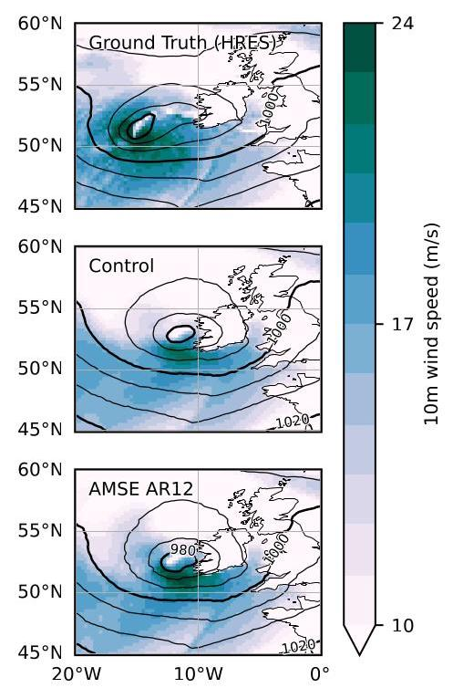

Figure 1. 10 m wind speed and mean sea level pressure for winter storm Eunice,18 Feb 2022 at $0\mathrm{\;h}$ UTC. Top: HRES data at ${14}^{ \circ  }$ (ground truth), middle: 3.5d forecast produced by GraphCast, bottom: this work. This work produces an overall sharper forecast, with a better prediction of the winter storm's strength.

图1. 2022年2月18日冬季风暴尤尼斯在$0\mathrm{\;h}$协调世界时的10米风速和平均海平面气压。顶部:${14}^{ \circ  }$处的高分辨率地球系统预报数据(地面实况)，中间:GraphCast生成的3.5天预报，底部:本研究结果。本研究生成的预报总体上更清晰，对冬季风暴强度的预测更好。

The conventional wisdom is that this smoothing is something that can be fixed in the context of an ensemble forecasting system, which produces realizations from the space of potential future forecasts. GenCast (Price et al., 2025) and AIFS-CRPS (Lang et al., 2024b) directly produce a stochastic $1/4{}^{ \circ  }$ forecast given initial values and a source of random noise. SEEDS (Li et al., 2024) and ArchesWeatherGen (Couairon et al., 2024) are examples of models that predict variations around an ensemble mean, using the generative step to "fill in the blanks" around a smooth baseline. Lippe et al. (2023) approaches this problem from a more general partial differential equation framework, and it develops a diffusion method that iteratively refines finer scales.

传统观点认为，这种平滑问题可以在集合预报系统的框架内解决，该系统从潜在未来预报空间生成各种实现情况。GenCast(Price等人，2025年)和AIFS-CRPS(Lang等人，2024b)在给定初始值和随机噪声源的情况下直接生成随机$1/4{}^{ \circ  }$预报。SEEDS(Li等人，2024年)和ArchesWeatherGen(Couairon等人，2024年)是预测围绕集合均值变化的模型示例，它们使用生成步骤在平滑基线周围“填补空白”。Lippe等人(2023年)从更一般的偏微分方程框架处理这个问题，并开发了一种迭代细化更精细尺度的扩散方法。

Of these examples, all but AIFS-CRPS use a diffusion technique with mean squared error (MSE) used as the de-noising loss function, while AIFS-CRPS instead uses the continuous ranked probability score (CRPS, Gneiting & Raftery (2007)) as its loss function to directly optimize the spread/error relationship of its produced ensemble.

在这些示例中，除了AIFS-CRPS之外，所有都使用扩散技术，以均方误差(MSE)作为去噪损失函数，而AIFS-CRPS则使用连续排序概率得分(CRPS，Gneiting和Raftery(2007年))作为其损失函数，以直接优化其生成的集合的离散度/误差关系。

However, we think that the problem of generating a good ensemble is distinct from the problem of forecast sharpness and effective resolution. Traditional NWP systems try to directly model the physics of the atmosphere, such that the system's forecasts are always plausible atmospheric states without excessive smoothing. Turning such a system into an ensemble prediction system involves supplying it with perturbed initial conditions and possibly stochastically perturbing the model's sub-grid parameterizations (Palmer, 2001; Berner et al., 2015).

然而，我们认为生成良好集合的问题与预报清晰度和有效分辨率问题不同。传统数值天气预报系统试图直接对大气物理进行建模，使得系统的预报始终是合理的大气状态，而不会过度平滑。将这样的系统转变为集合预报系统需要为其提供扰动初始条件，并可能对模型的次网格参数化进行随机扰动(Palmer，2001年；Berner等人，2015年)。

In the machine learning space, Mahesh et al. (2024) develops a well-calibrated large ensemble using 29 independently-trained instantiations of the Bonev et al. (2023) architecture. When combined with initial-condition perturbations, the result was a well-calibrated large ensemble, despite each individual ensemble member suffering from the smoothness typical of deterministic data-driven forecast systems.

在机器学习领域，Mahesh等人(2024年)使用Bonev等人(2023年)架构的29个独立训练实例开发了一个校准良好的大集合。当与初始条件扰动相结合时，结果是一个校准良好的大集合，尽管每个单独的集合成员都存在确定性数据驱动预报系统典型的平滑问题。

Lagerquist & Ebert-Uphoff (2022) also develops a variety of loss functions based on the same spatial methods (such as filtering and max-pooling) to verify forecasts of convective events like thunderstorms in evaluation of high-resolution, limited-area models.

Lagerquist和Ebert-Uphoff(2022年)还基于相同的空间方法(如滤波和最大池化)开发了各种损失函数，以在高分辨率有限区域模型评估中验证对流事件(如雷暴)的预报。

## NEURALGCM

## 神经全球气候模型

NeuralGCM (Kochkov et al., 2024) is one of the few global data-driven models that has addressed the problem of smoothing even in deterministic (non-ensemble) configurations. However, this model is difficult to compare with its peers. It has a hybrid architecture, combining a classical dynamical core with a learned network for sub-grid parameterizations that acts independently at each vertical column, and the classical dynamical core should cause fine-scale features to develop naturally. In addition, the model was trained using a weighted sum of several loss functions, one of which uses MSE only on a coarsened (smoothed) version of the forecast and verifying analysis while another matches the spherical harmonic power spectrum (but not phase) only at high wavenumbers (short scales). It is not clear which of these properties are necessary or sufficient to reduce the smoothing of deterministic NeuralGCM forecasts, and the use of several loss functions adds many degrees of freedom in their weighting and internal filtering.

神经全球气候模型(NeuralGCM，Kochkov等人，2024年)是少数几个即使在确定性(非集合)配置下也解决了平滑问题的全球数据驱动模型之一。然而，该模型很难与其同行进行比较。它具有混合架构，将经典动力核心与用于次网格参数化的学习网络相结合，该网络在每个垂直列独立作用，并且经典动力核心应使精细尺度特征自然发展。此外，该模型使用几个损失函数的加权和进行训练，其中一个仅在预报的粗化(平滑)版本上使用MSE并验证分析，而另一个仅在高波数(短尺度)处匹配球谐功率谱(但不匹配相位)。尚不清楚这些属性中的哪些对于减少确定性神经全球气候模型预报的平滑是必要或充分的，并且使用几个损失函数在其加权和内部滤波中增加了许多自由度。

### 1.2. This Work

### 1.2. 本研究

The purpose of this work is to tackle the problem of smoothing in a purely deterministic, data-driven setting: can we produce a sharp forecast of the atmosphere without directly modelling ensemble uncertainty? Our answer is "yes." By modifying the MSE loss function to smoothly interpolate between amplitude-preservation and classical MSE, we can efficiently fine-tune a version of the GraphCast model to fix its smoothing problem and reproduce sharp forecasts. This greatly increases the model's effective resolution, producing better predictions of tropical cyclone intensity and surface wind speed.

本研究的目的是在纯确定性、数据驱动的环境中解决平滑问题:我们能否在不直接对集合不确定性进行建模的情况下生成大气的清晰预报？我们的答案是“可以”。通过修改均方误差损失函数以在幅度保持和经典均方误差之间进行平滑插值，我们可以有效地微调GraphCast模型版本以解决其平滑问题并重现清晰预报。这大大提高了模型的有效分辨率，对热带气旋强度和地面风速产生了更好的预测。

Section 2 describes the modified loss function, its theory of operation, and the fine-tuning procedure used for this work. Section 3 presents verification results of the fine-tuned GraphCast model, and section 4 concludes with discussion of the method's limitations and potential extensions. Appendix A discusses the loss function in the context of maximum likelihood estimation, and appendix B presents more detailed verification statistics.

第2节描述了修改后的损失函数、其操作理论以及本研究使用的微调过程。第3节展示了微调后的GraphCast模型的验证结果，第4节以对该方法局限性和潜在扩展的讨论作为结论。附录A在最大似然估计的背景下讨论了损失函数，附录B展示了更详细的验证统计数据。

## 2. Method

## 2. 方法

### 2.1. Smoothing Is Optimal Under Mean Squared Error

### 2.1. 在均方误差下平滑是最优的

In the NWP community, model evaluation using the mean squared error is widely understood to suffer from a so-called "double penalty" (Hoffman et al., 1995; Ebert et al., 2013). Under MSE, a good forecast that correctly predicts a feature such as a storm but misses its location is penalized twice compared to a perfect forecast, once for missing the storm at its correct location and again for predicting a storm at an incorrect location. In traditional NWP, this double penalty makes model verification more difficult, particularly when studying the impact of improvements to forecast resolution that create more opportunities for misplaced predictions.

在数值天气预报(NWP)领域，使用均方误差进行模型评估被广泛认为存在所谓的“双重惩罚”问题(霍夫曼等人，1995年；埃伯特等人，2013年)。在均方误差(MSE)标准下，一个能正确预测诸如风暴等特征但位置有误的良好预报，与完美预报相比会受到双重惩罚，一次是因为在正确位置未预测到风暴，另一次是因为在错误位置预测到了风暴。在传统的数值天气预报中，这种双重惩罚使得模型验证变得更加困难，尤其是在研究提高预报分辨率所产生的影响时，因为更高的分辨率会带来更多误判的机会。

When MSE is used as the loss function to train a data-driven model, the double penalty problem is more than annoyance: it encourages the model to generate unrealistically smooth predictions by reducing the amplitude of unpredictable scales. To show this quantitatively, consider the case of predicting a single variable. Let $Y = \mathcal{N}\left( {0,1}\right)$ be the target, and let $X$ be the imperfect prediction of that target, modelled as a normal random variable with a standard deviation of ${\sigma }_{X} = \sqrt{\mathbb{E}\left( {X}^{2}\right) }$ and correlation coefficient of $\rho  = \mathbb{E}\left( {XY}\right) /{\sigma }_{X}$ , where $\mathbb{E}\left( \cdot \right)$ is the expectation operator. Writing $X$ in terms of a correlated and an uncorrelated component gives:

当使用均方误差作为损失函数来训练数据驱动模型时，双重惩罚问题就不仅仅是个麻烦了:它会促使模型通过减小不可预测尺度的幅度来生成不切实际的平滑预测。为了定量地说明这一点，考虑预测单个变量的情况。设$Y = \mathcal{N}\left( {0,1}\right)$为目标值，$X$为该目标的不完美预测值，将其建模为标准差为${\sigma }_{X} = \sqrt{\mathbb{E}\left( {X}^{2}\right) }$、相关系数为$\rho  = \mathbb{E}\left( {XY}\right) /{\sigma }_{X}$的正态随机变量，其中$\mathbb{E}\left( \cdot \right)$为期望算子。将$X$表示为相关分量和不相关分量可得:

$$
X = {\sigma }_{X}\left( {{\rho Y} + \sqrt{1 - {\rho }^{2}}\mathcal{N}\left( {0,1}\right) }\right) , \tag{1}
$$

and the corresponding expected MSE is:

相应的期望均方误差为:

$$
\mathbb{E}\left( {\operatorname{MSE}\left( {X, Y}\right) }\right)  = \mathbb{E}\left( {\left( X - Y\right) }^{2}\right)
$$

$$
= \mathbb{E}\left( {X}^{2}\right)  + \mathbb{E}\left( {Y}^{2}\right)  - 2\mathbb{E}\left( {XY}\right)
$$

$$
= {\sigma }_{X}^{2} + 1 - 2{\sigma }_{X}\rho . \tag{2}
$$

For fixed $Y$ , this MSE is optimized with a perfect prediction, when ${\sigma }_{X} = 1$ and $\rho  = 1$ . However, if $0 < \rho  < 1$ because the process is only partially predictable, the MSE is optimized with respect to ${\sigma }_{X}$ when ${\sigma }_{X} = \rho  < 1$ , leading to an underprediction of the process's natural variability.

对于固定的$Y$，当${\sigma }_{X} = 1$和$\rho  = 1$时，此均方误差在完美预测时达到最优。然而，如果$0 < \rho  < 1$，由于该过程只是部分可预测的，当${\sigma }_{X} = \rho  < 1$时，均方误差相对于${\sigma }_{X}$达到最优，这会导致对该过程自然变异性的预测不足。

### 2.2. Spectral Separation of the Mean Squared Error

### 第2.2节 均方误差的谱分离

Predictions of global weather are high-dimensional, but equations (1) and (2) can be extended to any decomposition (partition of unity) of the prediction and target fields that obeys Parseval's theorem. Taking this decomposition point-by-point, extending the analysis to include a nonzero mean, and taking the expectation over an ensemble of predictions gives rise to skill/spread evaluations. However, this decomposition is not possible at training time for a deterministic data-driven weather forecast, and instead we turn to a spherical harmonic decomposition.

全球天气预测是高维的，但方程(1)和(2)可以扩展到任何符合帕塞瓦尔定理的预测场和目标场的分解(单位分解)。逐点进行这种分解，将分析扩展到包括非零均值，并对一组预测值求期望，就得到了技巧/离散度评估。然而，对于确定性数据驱动的天气预报，在训练时无法进行这种分解，因此我们转向球谐分解。

Let ${\mathrm{Y}}_{k}^{l}\left( {i, j}\right)$ be the complex-valued spherical harmonic mode with total wavenumber $k$ and zonal wavenumber $l$ at the $\left( {i, j}\right)$ grid point on a latitude/longitude grid, normalized such that $\int {\mathrm{Y}}_{k}^{l}{\left( {\mathrm{Y}}_{m}^{n}\right) }^{ * } = {\delta }_{km}{\delta }_{ln}$ , where ${\left( \cdot \right) }^{ * }$ is the complex conjugate ${}^{1}$ . A scalar field $x\left( {i, j}\right)$ defined on the latitude/longitude grid can be written in terms of spherical harmonics as:

设${\mathrm{Y}}_{k}^{l}\left( {i, j}\right)$是在经纬度网格上第$\left( {i, j}\right)$个网格点处总波数为$k$、纬向波数为$l$的复值球谐模式，归一化使得$\int {\mathrm{Y}}_{k}^{l}{\left( {\mathrm{Y}}_{m}^{n}\right) }^{ * } = {\delta }_{km}{\delta }_{ln}$，其中${\left( \cdot \right) }^{ * }$是${}^{1}$的复共轭。在经纬度网格上定义的标量场$x\left( {i, j}\right)$可以用球谐函数表示为:

$$
x\left( {i, j}\right)  = \mathop{\sum }\limits_{k}\mathop{\sum }\limits_{{l =  - k}}^{k}{\alpha }_{x}\left( {k, l}\right) {\mathrm{Y}}_{k}^{l}\left( {i, j}\right) ,
$$

with ${\alpha }_{x}\left( {k, l}\right)$ the corresponding spectral coefficient. For two fields $x$ and $y$ the latitude-weighted MSE is:

其中${\alpha }_{x}\left( {k, l}\right)$是相应的谱系数。对于两个场$x$和$y$，纬度加权均方误差为:

$$
\operatorname{MSE}\left( {x, y}\right)  = \mathop{\sum }\limits_{i}\mathop{\sum }\limits_{j}\mathrm{{dA}}\left( {i, j}\right) {\left( x\left( i, j\right)  - y\left( i, j\right) \right) }^{2}
$$

$$
= \mathop{\sum }\limits_{k}\mathop{\sum }\limits_{{l =  - k}}^{k}{\left| {\alpha }_{x}\left( k, l\right)  - {\alpha }_{y}\left( k, l\right) \right| }^{2}, \tag{3}
$$

where the dA term is incorporated into the normalization of ${\mathrm{Y}}_{k}^{l}$ . Importantly, ${\alpha }_{x}$ and ${\alpha }_{y}$ are independent with respect to zonal and total wavenumber, but the double summation here now allows us to group these terms in a physically meaningful way. Grouping terms in the inner (zonal) sum together gives rise to the power spectral density ${\operatorname{PSD}}_{k}\left( x\right)  = \mathop{\sum }\limits_{l}{\left| {\alpha }_{x}\left( k, l\right) \right| }^{2}$ and coherence ${\operatorname{Coh}}_{k}\left( {x, y}\right)  = \; \mathop{\sum }\limits_{l}\Re \left( {{\alpha }_{x}\left( {k, l}\right) {\alpha }_{y}^{ * }\left( {k, l}\right) }\right) /\sqrt{{\operatorname{PSD}}_{k}\left( x\right) {\operatorname{PSD}}_{k}\left( y\right) }\;$ (where $\Re \left( \cdot \right)$ takes the real part) as scale-dependent analogs to variance and correlation respectively. Performing the appropriate substitutions:

其中dA项被纳入到${\mathrm{Y}}_{k}^{l}$的归一化中。重要的是，${\alpha }_{x}$和${\alpha }_{y}$在纬向波数和总波数方面是独立的，但这里的双重求和现在使我们能够以物理上有意义的方式对这些项进行分组。将内部(纬向)求和中的项分组在一起，分别产生了功率谱密度${\operatorname{PSD}}_{k}\left( x\right)  = \mathop{\sum }\limits_{l}{\left| {\alpha }_{x}\left( k, l\right) \right| }^{2}$和相干性${\operatorname{Coh}}_{k}\left( {x, y}\right)  = \; \mathop{\sum }\limits_{l}\Re \left( {{\alpha }_{x}\left( {k, l}\right) {\alpha }_{y}^{ * }\left( {k, l}\right) }\right) /\sqrt{{\operatorname{PSD}}_{k}\left( x\right) {\operatorname{PSD}}_{k}\left( y\right) }\;$(其中$\Re \left( \cdot \right)$取实部)，它们分别是与方差和相关性类似的、依赖于尺度的量。进行适当的代换:

$$
\operatorname{MSE}\left( {x, y}\right)  = \mathop{\sum }\limits_{k}{PS}{D}_{k}\left( x\right)  + {PS}{D}_{k}\left( y\right)  -
$$

$$
2\sqrt{{PS}{D}_{k}\left( x\right) {PS}{D}_{k}\left( y\right) }{\operatorname{Coh}}_{k}\left( {x, y}\right) . \tag{4}
$$

If $x$ is taken to be a forecast field and $y$ is the ground-truth analysis, as in (2) this is minimized when $\sqrt{{PS}{D}_{k}\left( x\right) {PS}{D}_{k}{\left( y\right) }^{-1}} = {\operatorname{Coh}}_{k}\left( {x, y}\right)$

如果像(2)中那样将$x$视为预报场且$y$为地面实况分析，则当$\sqrt{{PS}{D}_{k}\left( x\right) {PS}{D}_{k}{\left( y\right) }^{-1}} = {\operatorname{Coh}}_{k}\left( {x, y}\right)$时，这将被最小化

This optimum leads to the observed smoothing in data-driven models through two factors:

这种最优情况通过两个因素导致了数据驱动模型中观测到的平滑:

- Fine scales (large $k$ , short wavelengths) are generally less predictable than coarse scales (small $k$ , large wavelengths), particularly at longer lead times, and

- 精细尺度(大$k$，短波长)通常比粗尺度(小$k$，长波长)更难预测，特别是在较长的提前期，并且

---

${}^{1}$ In practice, this work takes advantage of the property that ${\Upsilon }_{k}^{-l} = {\left( {\Upsilon }_{k}^{l}\right) }^{ * }$ to work with only non-negative wavenumbers.

${}^{1}$在实践中，这项工作利用了${\Upsilon }_{k}^{-l} = {\left( {\Upsilon }_{k}^{l}\right) }^{ * }$仅处理非负波数的特性。

---

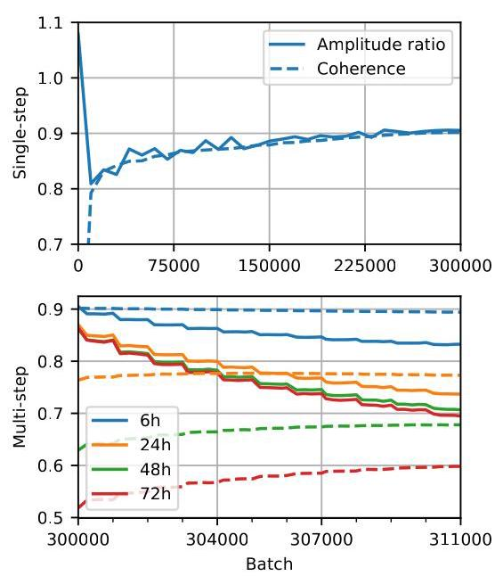

Figure 2. Amplitude ratio (solid) and coherence (dashed) for the spherical harmonic mode with total wavenumber 100 for temperature at ${850}\mathrm{{hPa}}$ during the training of a ${1}^{ \circ  }$ version of the GraphCast model with an MSE loss function. At top, values for 6h lead time during the single-step pre-training phase and at bottom, values for $6\mathrm{\;h} - {72}\mathrm{\;h}$ during the forecast rollout (batches 300,000-311,000, incrementing one step every 1,000 batches).

图2. 在具有均方误差损失函数的GraphCast模型的${1}^{ \circ  }$版本训练期间，总波数为100的温度的球谐模式的振幅比(实线)和相干性(虚线)，${850}\mathrm{{hPa}}$处。顶部是单步预训练阶段6小时提前期的值，底部是预报展开期间(批次300,000 - 311,000，每1000个批次增加一步)$6\mathrm{\;h} - {72}\mathrm{\;h}$的值。

- Data-driven models with conventional architectures learn to smooth fine scales (reducing the power spectral density) more quickly than they learn to predict them (increasing coherence).

- 具有传统架构的数据驱动模型学会比预测精细尺度(增加相干性)更快地平滑精细尺度(降低功率谱密度)。

This is illustrated in figure 2, which shows the amplitude ratio (square root of power spectral density ratio) and coherence for total wavenumber 100 (wavelength about 400 km) between predictions of the temperature field at the ${850}\mathrm{{hPa}}$ level and the ground truth, for a ${1}^{ \circ  }$ version of GraphCast during training with the curriculum of Lam et al. (2023). After a rapid adjustment from initially random outputs, the amplitude ratio and coherence closely track each other, with an initial smoothing followed by a gradual but partial sharpening as the model learns to predict this scale (with increasing coherence). When training is extended autoregressively to 12 steps (72h forecasts), smoothing increases at longer lead times as the forecast length increases.

图2对此进行了说明，该图显示了在使用Lam等人(2023年)的课程进行训练期间，${850}\mathrm{{hPa}}$水平处温度场预测与地面实况之间总波数为100(波长约400公里)的振幅比(功率谱密度比的平方根)和相干性，对于GraphCast的${1}^{ \circ  }$版本。从最初的随机输出快速调整后，振幅比和相干性紧密跟踪彼此，最初是平滑，随后随着模型学会预测该尺度(随着相干性增加)而逐渐但部分地锐化。当训练自回归扩展到12步(72小时预报)时，随着预报长度增加，更长提前期的平滑会增加。

### 2.3. Spectrally Adjusted Mean Squared Error

### 2.3. 频谱调整后的均方误差

This smoothing is undesirable. It makes the produced forecasts less realistic, and it complicates model comparisons. Lam et al. (2023) performs extensive verification under an "optimal blurring" model to show that the purported forecast power of GraphCast is not just an artifact of its smoothing, and more straightforward verification methodologies such as that of Rasp et al. (2024) may conflate the effects of more-optimal smoothing with forecast skill even when evaluating at reduced resolution. It would instead be far more desirable if the loss function reflected our true goal, encouraging forecasts to correlate well to the ground-truth and retain realistic variation at finer scales.

这种平滑是不理想的。它使生成的预报不太现实，并且使模型比较变得复杂。Lam等人(2023年)在“最优模糊”模型下进行了广泛验证，以表明GraphCast所谓的预报能力不仅仅是其平滑的产物，并且即使在降低分辨率下评估时，像Rasp等人(2024年)那样更直接的验证方法可能会将更优平滑的效果与预报技能混淆。相反，如果损失函数反映我们的真正目标，鼓励预报与地面实况良好相关并在更精细尺度上保留现实变化，那将是更可取的。

Fortunately, beginning with MSE written in terms of its spectral decomposition, this is a simple modification. First, we write (4) in terms of a perfectly-correlated loss (with ${\operatorname{Coh}}_{k}\left( {x, y}\right)  = 1$ ) and a residual:

幸运的是，从用其谱分解表示的均方误差(MSE)开始，这是一个简单的修改。首先，我们将(4)写成一个完全相关损失(与${\operatorname{Coh}}_{k}\left( {x, y}\right)  = 1$相关)和一个残差的形式:

$$
\operatorname{MSE}\left( {x, y}\right)  = \mathop{\sum }\limits_{k}{\left( \sqrt{{\operatorname{PSD}}_{k}\left( x\right) } - \sqrt{{\operatorname{PSD}}_{k}\left( y\right) }\right) }^{2} +
$$

$$
2\sqrt{{\operatorname{PSD}}_{k}\left( x\right) {\operatorname{PSD}}_{k}\left( y\right) }\left( {1 - {\operatorname{Coh}}_{k}\left( {x, y}\right) }\right) . \tag{5}
$$

Then, we seek to break the interaction between the spectral amplitudes and coherence contained in the second term of (5). One option would be to fix the role of $x$ as a trial prediction and $y$ as the verifying analysis and replace $\sqrt{{\operatorname{PSD}}_{k}\left( x\right) {\operatorname{PSD}}_{k}\left( y\right) }$ by ${\operatorname{PSD}}_{k}\left( y\right)$ , but the symmetry of the loss function can be retained by writing:

然后，我们试图打破(5)式第二项中包含的谱幅度与相干性之间的相互作用。一种选择是将$x$的作用固定为试验预测，将$y$的作用固定为验证分析，并用${\operatorname{PSD}}_{k}\left( y\right)$替换$\sqrt{{\operatorname{PSD}}_{k}\left( x\right) {\operatorname{PSD}}_{k}\left( y\right) }$，但通过写成以下形式可以保留损失函数的对称性:

$$
\operatorname{AMSE}\left( {x, y}\right)  = \mathop{\sum }\limits_{k}{\left( \sqrt{{\operatorname{PSD}}_{k}\left( x\right) } - \sqrt{{\operatorname{PSD}}_{k}\left( y\right) }\right) }^{2} +
$$

$$
2\max \left( {{\operatorname{PSD}}_{k}\left( x\right) ,{\operatorname{PSD}}_{k}\left( y\right) }\right) \left( {1 - {\operatorname{Coh}}_{k}\left( {x, y}\right) }\right) . \tag{6}
$$

AMSE is now an adjusted mean squared error, which can act as a drop-in replacement during model training. Like its unmodified counterpart, AMSE is zero if and only if $x = y$ , and it has the same Taylor expansion (in $x$ ) about $x = y$ . The gradients of $- \operatorname{AMSE}\left( {x, y}\right)$ with respect to $x$ (that is, minimizing AMSE) will always point in the direction of increased coherence $\left( {{\operatorname{Coh}}_{k}\left( {x, y}\right)  \rightarrow  1}\right)$ and a correct spectral magnitude $\left( {{\operatorname{PSD}}_{k}\left( x\right)  \rightarrow  {\operatorname{PSD}}_{k}\left( y\right) }\right)$ , even if physical limits to predictability impose a practical limit to coherence. AMSE retains the units of MSE and has a similar magnitude, but it is no longer a proper metric because it does not satisfy the triangle inequality.

调整后的均方误差(AMSE)现在是一种调整后的均方误差，它可以在模型训练期间作为直接替代品。与未修改的对应项一样，当且仅当$x = y$时，AMSE为零，并且它在$x = y$附近(关于$x$)具有相同的泰勒展开式。$- \operatorname{AMSE}\left( {x, y}\right)$关于$x$的梯度(即最小化AMSE)将始终指向相干性$\left( {{\operatorname{Coh}}_{k}\left( {x, y}\right)  \rightarrow  1}\right)$增加和谱幅度$\left( {{\operatorname{PSD}}_{k}\left( x\right)  \rightarrow  {\operatorname{PSD}}_{k}\left( y\right) }\right)$正确的方向，即使可预测性的物理限制对相干性施加了实际限制。AMSE保留了MSE的单位并且具有相似的量级，但它不再是一个合适的度量标准，因为它不满足三角不等式。

Unlike the mix of filtered and spectral loss functions used by NeuralGCM, (6) is parameter-free, requiring no selection of cutoff scales or scaled addition of qualitatively different terms. A parameter could be added to (6) to change the relative weights of its two terms, but that was not necessary in this work. Appendix A contemplates extending this framework to maximum likelihood estimation.

与NeuralGCM使用的滤波损失函数和谱损失函数的组合不同，(6)式是无参数的，不需要选择截止尺度或对性质不同的项进行缩放相加。可以向(6)式中添加一个参数来改变其两项的相对权重，但在本工作中这不是必需的。附录A考虑将此框架扩展到最大似然估计。

Equation 6 is defined for a single two-dimensional variable, but GraphCast produces several outputs per gridpoint. In the ${}^{1}{4}^{ \circ  },{13}$ -level version of the model considered here, there are six variables (geopotential, temperature, specific humidity, two components of horizontal wind, and vertical wind) produced at each of 13 atmospheric levels plus five variables (2-meter temperature, two components of 10-m horizontal wind, mean sea level pressure, and 6h-accumulated precipitation) at the surface. This work follows equation (A.19) of Lam et al. (2023) by aggregating each variable's error (MSE there, AMSE here) with a per-variable weight, level weighting proportional to the pressure level, and normalization of the disparate units by a per-variable, per-level standard deviation.

方程6是为单个二维变量定义的，但GraphCast在每个网格点产生多个输出。在此处考虑的${}^{1}{4}^{ \circ  },{13}$层级版本的模型中，在13个大气层级中的每个层级产生六个变量(位势、温度、比湿、水平风的两个分量和垂直风)，在地表产生五个变量(2米温度、10米水平风的两个分量、平均海平面气压和6小时累计降水量)。这项工作遵循Lam等人(2023)的方程(A.19)，通过用每个变量的权重聚合每个变量的误差(那里是MSE，这里是AMSE)，权重与气压层级成比例的层级加权，以及通过每个变量、每个层级的标准差对不同单位进行归一化。

Table 1. Fine-tuning curriculum for the ${}^{1/4}$ 0/13-level version of GraphCast trained for this study, including the peak and terminal learning rates (LR) of the cosine annealing schedule used at each stage. The batch size was 8 throughout, and each stage had a warm-up period of 64 batches.

表1. 为本研究训练的${}^{1/4}$ 0/13层级版本的GraphCast的微调课程，包括每个阶段使用的余弦退火调度的峰值和终端学习率(LR)。整个过程的批量大小为8，每个阶段有64个批次的热身期。

<table><tr><td>Length</td><td>Batches</td><td>Peak/End LR</td><td>GPU Time</td></tr><tr><td>1 step (6h)</td><td>25,000</td><td>${2.5} \cdot  {10}^{-5}/{1.25} \cdot  {10}^{-7}$</td><td>7.7d</td></tr><tr><td>2 steps (12h)</td><td>2,500</td><td>${2.5} \cdot  {10}^{-6}/{7.5} \cdot  {10}^{-8}$</td><td>2.2d</td></tr><tr><td>4 steps (24h)</td><td>2,500</td><td>${2.5} \cdot  {10}^{-6}/{7.5} \cdot  {10}^{-8}$</td><td>4.3d</td></tr><tr><td>8 steps (48h)</td><td>1,250</td><td>${2.5} \cdot  {10}^{-6}/{7.5} \cdot  {10}^{-8}$</td><td>4.6d</td></tr><tr><td>12 steps (72h)</td><td>1,250</td><td>${2.5} \cdot  {10}^{-6}/{7.5} \cdot  {10}^{-8}$</td><td>7.4d</td></tr></table>

### 2.4. Fine-Tuning Methodology

### 2.4. 微调方法

We demonstrate the efficacy of this loss function using a $1/{4}^{ \circ  }$ , 13-level version of GraphCast. Based on the observation above that the model tends to rapidly adjust its per-scale smoothing to match its coherence, we treat this as a fine-tuning process and begin with the "operational" checkpoint provided by Lam et al. (2024), which is publicly available under a Creative Commons license.

我们使用$1/{4}^{ \circ  }$、13层级版本的GraphCast展示了这个损失函数的有效性。基于上述观察结果，即模型倾向于快速调整其每个尺度的平滑以匹配其相干性，我们将此视为一个微调过程，并从Lam等人(2024)提供的“运行”检查点开始，该检查点在知识共享许可下公开可用。

Our fine-tuning methodology is summarized in table 1, and the overall approach is inspired by Subich (2024). While the baseline model checkpoint was trained over 72h (12 autoregressive steps of 6h each), in earlier testing at ${1}^{ \circ  }$ we found it better to begin the fine-tuning with single-step forecasts and increase the forecast length in stages. Training over single steps is both faster per step and supports higher learning rates.

我们的微调方法总结在表1中，总体方法受到Subich(2024)的启发。虽然基线模型检查点是在72小时(12个自回归步骤，每个步骤6小时)内训练的，但在${1}^{ \circ  }$的早期测试中，我们发现从单步预测开始并分阶段增加预测长度进行微调更好。单步训练每步更快并且支持更高的学习率。

The other training hyperparameters, including AdamW (Loshchilov & Hutter, 2019) hyperparameter settings and per-variable, per-level loss weightings were identical to those described by Lam et al. (2023).

其他训练超参数，包括AdamW(Loshchilov & Hutter，(2019))超参数设置以及每个变量、每个层级的损失加权与Lam等人(2023)描述的相同。

The 13-level GraphCast checkpoint that forms the base of our fine-tuned model was originally trained on the ERA5 reanalysis from 1979-2017, then itself fine-tuned on the initial conditions used for the contemporaneous HRES (IFS) model from ECMWF over 2016-2021. We used this latter dataset and training period in our work, and it is available from Rasp et al. (2024) as the "HRES-fc0" dataset. As described in Lam et al. (2023), we supplemented the HRES data with the accumulated precipitation field from the ERA5 reanalysis over the training period, since an initial conditions dataset has no accumulated precipitation by definition. The equivalent data for calendar year 2022 is also available, and we used this period for model evaluation.

构成我们微调模型基础的13层GraphCast检查点最初是在1979 - 2017年的ERA5再分析数据上进行训练的，然后在2016 - 2021年期间针对欧洲中期天气预报中心(ECMWF)同期HRES(IFS)模型所使用的初始条件进行了自身的微调。我们在工作中使用了后一个数据集及其训练周期，它可从Rasp等人(2024年)获取，名为“HRES - fc0”数据集。如Lam等人(2023年)所述，由于初始条件数据集根据定义不包含累积降水量，我们在训练期间用ERA5再分析的累积降水量场对HRES数据进行了补充。2022年日历年的等效数据也可获取，我们使用这个时间段进行模型评估。

We fine-tuned our model on 1-2 nodes of a cluster containing 4 NVidia A100 40GiB GPUs per node, using data parallelism with the batch split across GPUs and the gradients accumulated via MPI. Overall, the fine-tuning process took about 26.2 GPU-days. Lam et al. (2023) does not disclose the total training time required to produce the model checkpoint from scratch, but other models of similar size (Bonev et al., 2023; Lang et al., 2024a; Bi et al., 2023) report training times of about 1 GPU-year using similar hardware.

我们在一个集群的1 - 2个节点上对模型进行微调，每个节点包含4个NVIDIA A100 40GiB GPU，使用数据并行，批次在GPU之间分割，梯度通过MPI进行累积。总体而言，微调过程大约花费了26.2个GPU日。Lam等人(2023年)未披露从零开始生成模型检查点所需的总训练时间，但其他类似规模的模型(Bonev等人，2023年；Lang等人，2024a；Bi等人，2023年)报告使用类似硬件的训练时间约为1个GPU年。

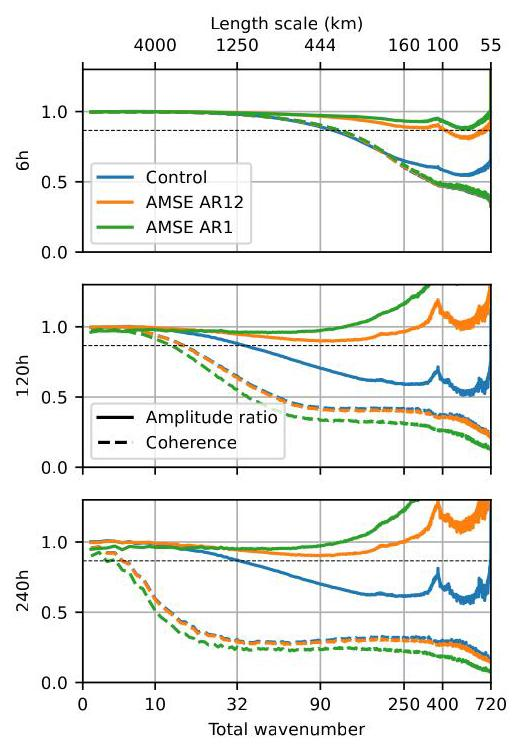

Figure 3. Amplitude ratio (solid) and coherence (dashed) for all output variables and levels, weighted using the variable/level weights in the loss function, for the control model and this work after the 1-step training and after complete fine-tuning. Top: 6h lead time, middle: 120h (5d) lead time, bottom: 240h (10d) lead time. The dashed line is placed where a model would underrepresent the power spectral density by ${25}\%$ .

图3. 控制模型以及本研究在1步训练后和完全微调后的所有输出变量和层次的振幅比(实线)和相干性(虚线)，使用损失函数中的变量/层次权重进行加权。顶部:提前6小时，中间:提前120小时(5天)，底部:提前240小时(10天)。虚线位于模型将功率谱密度表示不足${25}\%$的位置。

## 3. Results

## 3. 结果

The fine-tuned model is evaluated against the control (unmodified) model over calendar year 2022 using the HRES dataset for initialization and as ground truth unless otherwise specified. As reported in Lam et al. (2023) and is typical in other deterministic data-driven models, forecast performance at longer lead times improves when the model is autoregressively trained over multiple steps, and the fully-tuned model (trained over 12 forecast steps and labelled "AMSE AR12" in the figures and discussion below) is considered the primary model for evaluation.

除非另有说明，在2022年日历年期间，使用HRES数据集进行初始化并作为地面真值，将微调后的模型与控制(未修改)模型进行评估。如Lam等人(2023年)所报告的，并且在其他确定性数据驱动模型中也很典型，当模型通过多步自回归训练时，较长提前期的预测性能会提高，完全微调后的模型(在12个预测步长上进行训练，在下面的图和讨论中标记为“AMSE AR12”)被视为评估的主要模型。

Since multi-step training also tends to cause both fine-scale smoothing and a loss of variability in ensemble settings, these respective evaluations (sections 3.1 and 3.2) will also include the model checkpoint created after just single-step fine-tuning, denoted "AMSE AR1."

由于多步训练在集合设置中也往往会导致精细尺度的平滑和变率损失，这些各自的评估(3.1节和3.2节)还将包括仅在单步微调后创建的模型检查点，记为“AMSE AR1”。

### 3.1. Effective Resolution

### 3.1. 有效分辨率

Conventional, physics-based NWP models are widely understood to have an effective resolution that is coarser than the model's native grid resolution. Limits to effective resolution come from the limited fidelity of spatial or temporal discretization, from artificial diffusion or damping used to stabilize a model, and from sub-grid processes (such as turbulence) that must be imperfectly estimated rather than directly modelled. A model behaves unrealistically at scales finer than its effective resolution, typically providing insufficient variability and too-smooth solutions.

传统基于物理的数值天气预报模型普遍被认为具有比模型原生网格分辨率更粗的有效分辨率。有效分辨率的限制来自空间或时间离散化的有限保真度、用于稳定模型的人工扩散或阻尼，以及必须进行不完美估计而不是直接建模的次网格过程(如湍流)。模型在比其有效分辨率更精细的尺度上表现不现实，通常提供的变率不足且解过于平滑。

Deterministic data-driven NWP models do not have the same underlying numerical issues that result in reductions to effective resolution, but the smoothing produced by training with an MSE-based loss function acts in a very similar way. Figure 3 shows the amplitude ratio $\left( \sqrt{{\operatorname{PSD}}_{k}\left( x\right) {\operatorname{PSD}}_{k}^{-1}\left( y\right) }\right)$ and coherence $\left( {{\operatorname{Coh}}_{k}\left( {x, y}\right) }\right)$ between each of the GraphCast models and the verifying analysis over calendar year 2022. To compute a combined curve despite the many per-gridpoint values predicted by the model, the statistics for each separate variable are combined using the same variable and level weighting used in the model's loss function ${}^{2}$ .

确定性数据驱动的数值天气预报模型不存在导致有效分辨率降低的相同潜在数值问题，但基于均方误差损失函数训练产生的平滑作用方式非常相似。图3显示了2022年日历年期间每个GraphCast模型与验证分析之间的振幅比$\left( \sqrt{{\operatorname{PSD}}_{k}\left( x\right) {\operatorname{PSD}}_{k}^{-1}\left( y\right) }\right)$和相干性$\left( {{\operatorname{Coh}}_{k}\left( {x, y}\right) }\right)$。为了在模型预测的许多每个网格点值的情况下计算组合曲线，使用模型损失函数${}^{2}$中相同的变量和层次加权来组合每个单独变量的统计数据。

The control model significantly smooths fine scales even after a single 6-hour forecast step, and that smoothing increases with the forecast lead time. If we somewhat arbitrarily draw the line of effective resolution at the point where the model has lost 25% of the per-wavenumber energy (corresponding to a ratio of power spectral densities of 0.75 or an amplitude ratio of $\sqrt{0.75}$ ), the 5-day predictions of the control model reach that cutoff at wavenumber 32, corresponding to oscillations with a wavelength of about 1250 km. Small changes in the target amplitude ratio will result in small changes to the derived effective resolution.

即使在单个6小时的预测步骤之后，控制模型也能显著平滑精细尺度，并且这种平滑会随着预测提前期的增加而增强。如果我们有点随意地将有效分辨率的界限划定在模型每波数能量损失25%的点上(对应功率谱密度比为0.75或幅度比为$\sqrt{0.75}$)，那么控制模型的5天预测在波数32处达到该截止点，对应波长约为1250 km的振荡。目标幅度比的微小变化将导致导出的有效分辨率发生微小变化。

The models fine-tuned in this work do not show this type of fine-scale dissipation. The AMSE AR12 model has a small amount of smoothing at moderate scales, but the variability recovers again at finer scales, and a dissipation-based definition of effective resolution would be extremely sensitive to the cutoff value. Instead, we observe that for longer forecasts the model has more energy at small scales than in the ground-truth dataset, suggesting a "noise-based" definition of effective resolution. For long forecasts, the amplitude ratio rises above 1 around wavenumber 250, giving an effective resolution of about ${160}\mathrm{\;{km}}$ .

在这项工作中进行微调的模型并未表现出这种精细尺度消散的类型。AMSE AR12模型在中等尺度上有少量平滑，但在更精细尺度上变率又恢复了，并且基于消散的有效分辨率定义对截止值极其敏感。相反，我们观察到对于更长的预测，模型在小尺度上比地面真值数据集中具有更多能量，这表明了一种基于“噪声”的有效分辨率定义。对于长期预测，幅度比在波数250左右上升到1以上，给出约${160}\mathrm{\;{km}}$的有效分辨率。

The AMSE AR1 model shows the same qualitative behaviour but generates this "noise" more strongly, leading to a reduced effective resolution of about ${450}\mathrm{\;{km}}$ (wavenumber 90). The forecasts produced by this version of the model are less coherent with the analysis, showing a reduced forecast skill at all scales for longer forecasts.

AMSE AR1模型表现出相同的定性行为，但产生这种“噪声”的程度更强，导致有效分辨率降低至约${450}\mathrm{\;{km}}$(波数90)。该模型版本产生的预测与分析的一致性较差，在所有尺度上对于更长预测显示出预测技能的下降。

For illustration, appendix B. 2 shows amplitude spectra for select variables at various lead times, without normalizing by the spectral magnitude of the ground truth. Appendix B. 5 discusses the effective resolution of the model when trained with either mean squared error or mean absolute (L1) error.

为了说明，附录B.2展示了在不同提前期下选定变量的幅度谱，未按地面真值的谱幅度进行归一化。附录B.5讨论了使用均方误差或平均绝对(L1)误差进行训练时模型的有效分辨率。

### 3.2. Lagged Ensemble Verification

### 3.2. 滞后集合验证

The observation that AMSE-based fine-tuning provides sharp forecasts is encouraging, but that alone is not enough to demonstrate utility. The model might have learned to match its expected variance by generating quasi-static noise that does not sufficiently depend on the surrounding flow, for example. The ideal way to measure this sort of forecast skill is in an ensemble setting, where the chaotic nature of the atmosphere is accounted for by evaluating the full distribution of plausible outputs given an initial condition.

基于AMSE的微调能提供准确预测这一观察结果令人鼓舞，但仅凭这一点不足以证明其效用。例如，模型可能通过生成与周围流场依赖性不足的准静态噪声来学会匹配其预期方差。衡量这种预测技能的理想方法是在集合设置中，通过评估给定初始条件下合理输出的完整分布来考虑大气的混沌性质。

Development of a full ensemble system is well beyond the scope of this work, but Brenowitz et al. (2025) provides a procedure to evaluate a deterministic model using an ensemble generated from time-separated initial conditions. The central idea of this method is that predictions initialized at different times should diverge, so several consecutively-initialized forecasts that are all valid at a shared time form an ad-hoc ensemble, without the need for an auxiliary method of defining an ensemble of initial conditions.

开发一个完整的集合系统远远超出了本工作的范围，但Brenowitz等人(2025年)提供了一种使用从时间分离的初始条件生成的集合来评估确定性模型的程序。该方法的核心思想是在不同时间初始化的预测应该发散，因此在共享时间都有效的几个连续初始化的预测形成一个临时集合，而无需定义初始条件集合的辅助方法。

This approach is implemented here, using forecasts initialized at 12-hourly intervals in 2022 and evaluated from 10 January 2022 0:00 UTC to 31 December 2022 12:00 UTC. Each set of nine consecutively initialized forecasts (spanning four days from beginning to end) forms an ensemble, and the ensemble's notional lead time is that of its central member.

在此采用这种方法，使用2022年以12小时间隔初始化的预测，并从2022年1月10日0:00 UTC到2022年12月31日12:00 UTC进行评估。每组九个连续初始化的预测(从开始到结束跨越四天)形成一个集合，并且集合的名义提前期是其中心成员的提前期。

The primary evaluation metrics are the CRPS, ensemble root mean squared error (eRMSE), and spread/error ratio, with definitions given in appendix B.4. For an operational ensemble, a spread/error ratio close to 1 is considered ideal, but that is confounded here because the members of a lagged ensemble are not statistically interchangeable. Since deterministic data-driven NWP models are underdispersive, however, a larger spread/error ratio is generally better.

主要评估指标是连续秩概率得分(CRPS)、集合均方根误差(eRMSE)和离散度/误差比，其定义在附录B.4中给出。对于一个业务集合，离散度/误差比接近1被认为是理想的，但在此处这被混淆了，因为滞后集合的成员在统计上不可互换。然而，由于确定性数据驱动的数值天气预报模型的离散度不足，通常较大的离散度/误差比更好。

Figure 4 shows the evolution of these statistics versus lead time for a selection of variables and levels, and more detailed evaluation of CRPS and eRMSE are shown in figures 11 and 12. The AMSE AR12 model shows consistent improvements to the CRPS while the eRMSE sees little change, indicating that the fine tuning process produces a better-calibrated (more dispersive) ensemble without degrading overall predictive performance.

图4显示了这些统计量随提前期对于选定变量和层次的演变，并且在图11和12中展示了对CRPS和eRMSE更详细的评估。AMSE AR12模型在CRPS上显示出持续改进，而eRMSE几乎没有变化，这表明微调过程产生了一个校准更好(更具离散性)的集合，而不会降低整体预测性能。

---

${}^{2}$ Normalization of the disparate variables by standard deviation was not required here, since the amplitude ratio and coherence are already dimensionless.

${}^{2}$ 这里不需要通过标准差对不同变量进行归一化，因为幅度比和相干性已经是无量纲的。

---

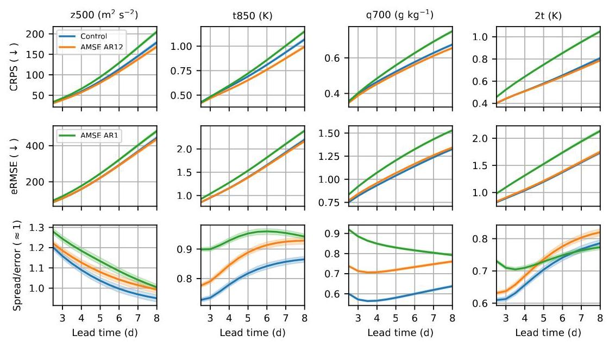

Figure 4. Lagged ensemble statistics for geopotential (z) at ${500}\mathrm{{hPa}}$ , temperature (t) at ${850}\mathrm{{hPa}}$ , specific humidity (q) at ${700}\mathrm{{hPa}}$ , and 2-meter temperature (2t) from left to right. The statistics are the CRPS, root mean squared error of the ensemble mean, and spread-error ratio, from top to bottom.

图4. 从左到右分别为位势(z)在${500}\mathrm{{hPa}}$、温度(t)在${850}\mathrm{{hPa}}$、比湿(q)在${700}\mathrm{{hPa}}$以及2米温度(2t)的滞后集合统计量。统计量从上到下分别是CRPS、集合均值的均方根误差以及离散度 - 误差比。

While the AMSE AR1 model shows greater ensemble spread, the less skillful forecast results in a significantly reduced CRPS. However, unlike the results of Brenowitz et al. (2025), the spread/error ratio of the AR1 and AR12 models converge for most variables at longer lead times, suggesting that multi-step training in this framework does not cause a collapse of variability in an ensemble setting.

虽然AMSE AR1模型显示出更大的集合离散度，但预测技能较低导致CRPS显著降低。然而，与Brenowitz等人(2025年)的结果不同，AR1和AR12模型的离散度/误差比在较长的提前期内对于大多数变量趋于一致，这表明在此框架中的多步训练不会导致集合设置中的变率崩溃.

### 3.3. Hurricane Prediction and Extreme Weather

### 3.3. 飓风预测与极端天气

The effect of improved effective resolution is most strongly apparent in the prediction of local extremes, and few weather events are more extreme than tropical cyclones.

有效分辨率提高的影响在局部极端事件的预测中最为明显，很少有天气事件比热带气旋更极端.

Data-driven NWP models like GraphCast improve predictions of hurricane tracks relative to conventional NWP models (see for example figure 3A of Lam et al. (2023)). Since storms are guided by large-scale "steering flows" that have natural scales of thousands of kilometers, these predictions of storm position are relatively unaffected by the models' limited effective resolutions but benefit from improvements in large-scale forecast skill. However, cyclones themselves are comparatively small, and predictions of the storm intensity are significantly affected by MSE-induced smoothing.

像GraphCast这样的数据驱动数值天气预报模型相对于传统数值天气预报模型改进了飓风路径的预测(例如参见Lam等人(2023年)的图3A)。由于风暴受自然尺度为数千公里的大尺度“引导气流”引导，这些风暴位置的预测相对不受模型有限有效分辨率的影响，但受益于大尺度预报技能的改进。然而，气旋本身相对较小，风暴强度的预测受到MSE引起的平滑的显著影响.

Figure 5 depicts this situation for Hurricane Ian, the most intense Atlantic tropical cyclone of the 2022 season. Both the control version of GraphCast and the AMSE AR12 version produce a reasonable 5-day prediction of the storm's location (within about ${125}\mathrm{\;{km}}$ ), but the control version of GraphCast predicts an unrealistically weak storm.

图5描绘了2022年季节最强烈的大西洋热带气旋伊恩飓风的这种情况。GraphCast的控制版本和AMSE AR12版本都对风暴位置做出了合理的5天预测(在约${125}\mathrm{\;{km}}$范围内)，但GraphCast的控制版本预测的风暴强度不切实际地弱.

More quantitatively, figure 6 shows the mean intensity and mean absolute position errors for tropical cyclones over 20 June-19 September 2022 initializations, using the algorithm of Zadra et al. (2014) to compare against the International Best Track Archive for Climate Stewardship database (Knapp et al., 2010). Compared to these observations, even the HRES data is imperfect and shows a weak-intensity bias. The control model has a larger weak-intensity bias that increases with lead time, but the AMSE AR12 model retains the quality of the HRES dataset. The storm location predictions between the control and AMSE AR12 models are equivalent.

更定量地说，图6显示了2022年6月20日至9月19日初始化的热带气旋的平均强度和平均绝对位置误差，使用Zadra等人(2014年)的算法与国际气候管理最佳路径档案数据库(Knapp等人，2010年)进行比较。与这些观测结果相比，即使是HRES数据也不完美，显示出弱强度偏差。控制模型有更大的弱强度偏差，且随提前期增加，但AMSE AR12模型保留了HRES数据集的质量。控制模型和AMSE AR12模型之间的风暴位置预测相当.

Extreme weather includes more than tropical cyclones, and appendix B. 3 discusses quantile-quantile predictions of surface wind speed and temperature, validated against station observations. Both the control model and AMSE AR12 produce realistic temperature extremes, but the AMSE AR12 model provides more realistic predictions of wind-speed extremes.

极端天气不仅仅包括热带气旋，附录B.3讨论了针对地面风速和温度的分位数-分位数预测，并根据站点观测进行了验证。控制模型和AMSE AR12都产生了现实的温度极端值，但AMSE AR12模型对风速极端值提供了更现实的预测.

## 4. Discussion & Limitations

## 4. 讨论与局限性

Using the mean squared error as a model loss function asks the model to average away unpredictable scales. In weather forecasting, the unpredictable scales are generally the smaller scales that carry information about local variance, and this averaging process leads to data-driven weather forecasts that are far smoother than the grid resolution would

使用均方误差作为模型损失函数要求模型平均掉不可预测的尺度。在天气预报中，不可预测的尺度通常是携带局部方差信息的较小尺度，这种平均过程导致数据驱动的天气预报比网格分辨率所暗示的要平滑得多.

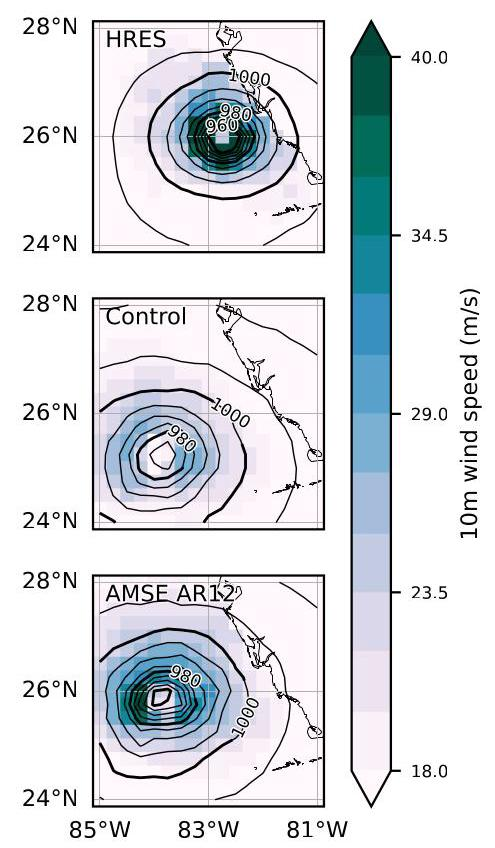

Figure 5. 10 m wind speed and mean sea level pressure for Hurricane Ian,28 Sept 2022 at 12h UTC. Top: HRES data at ${}^{1}{/}^{0}$ , middle: 5d forecast produced by the control GraphCast model, bottom: the model after 12-step fine-tuning with AMSE.

图5. 2022年9月28日12时协调世界时伊恩飓风的10米风速和平均海平面气压。顶部:${}^{1}{/}^{0}$处的HRES数据，中间:控制GraphCast模型产生的5天预测，底部:经过AMSE 12步微调后的模型.

## suggest.

## 表明。

This is not a property inherent to data-driven NWP. The alternate loss function based on (6) uses a spectral transform to separate the loss attributable to amplitude error from that attributable to decorrelation, encouraging the model to reproduce a realistic spectrum even if it can't make an accurate prediction. When applied to the ${}^{1}{4}^{ \circ  },{13}$ -level version of GraphCast with an abbreviated fine-tuning process, we recover a model that has a much finer effective resolution, has improved CRPS-based verification in a lagged ensemble setting, and fixes the weak intensity bias in the prediction of tropical cyclones.

这不是数据驱动数值天气预报所固有的属性。基于(6)的替代损失函数使用谱变换将归因于幅度误差的损失与归因于去相关的损失分开，鼓励模型即使不能做出准确预测也能再现现实的谱。当应用于具有简化微调过程的GraphCast的${}^{1}{4}^{ \circ  },{13}$级版本时，我们得到了一个具有更精细有效分辨率的模型，在滞后集合设置中基于CRPS的验证得到了改进，并修正了热带气旋预测中的弱强度偏差.

When fine-tuned autoregressively over multiple forecast steps, the model suffers from a small amount of smoothing at mesoscales (intermediate scales). We speculate that this is because such autoregressive training has two objectives: forecasts are asked both to be accurate (and thus sharp, per (6)) and to be good initial conditions for the next forecast step. This latter goal is implicit, and it is not directly affected by the loss function used in training. Future work will consider the use of a replay buffer in training (like that of Chen et al. (2023)) to see if long-range forecast skill might be retained with even better prediction of amplitudes.

当在多个预测步骤上进行自回归微调时，模型在中尺度(中间尺度)会出现少量平滑。我们推测这是因为这种自回归训练有两个目标:预测既要准确(因此根据(6)要尖锐)，又要成为下一个预测步骤的良好初始条件。后一个目标是隐含的，并且它不受训练中使用的损失函数的直接影响。未来的工作将考虑在训练中使用重放缓冲区(如Chen等人(2023年)的那样)，以查看是否可以通过更好地预测幅度来保留长期预测技能.

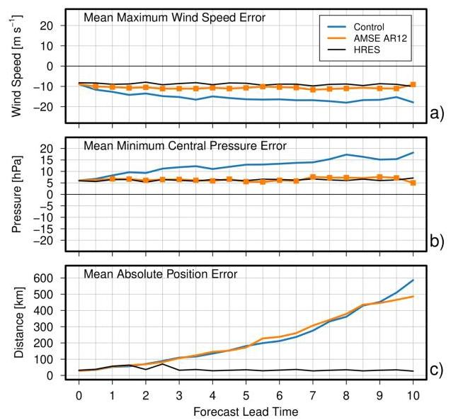

Figure 6. Predictions of tropical cyclone intensity ((a), mean maximum surface wind speed; (b) mean minimum central pressure) and mean absolute position error (c) for forecasts initialized 20 June- 19 September 2022. Orange squares show statistically significant differences between the AMSE AR12 and control predictions.

图6. 2022年6月20日至9月19日初始化的热带气旋强度预测((a)，平均最大地面风速；(b)，平均最小中心气压)和平均绝对位置误差(c)。橙色方块显示了AMSE AR12和控制预测之间的统计显著差异.

Since the AMSE loss function (6) is zero if and only if the predicted field matches the ground truth, it may be useful throughout model training rather than just during a fine-tuning pass. However, a thorough test of this proposition would require a considerable computational budget, so it is left for future work. Use of the AMSE loss function throughout the training process might improve the coherence of fine-scale prediction by allowing the model to spend more of its training time "seeing" these modes, but on the other hand the coherence-dependent smoothing encouraged by the MSE loss function (figure 2) might act as an implicit regularization that smooths the model's gradients and speeds up training overall.

由于当且仅当预测场与地面实况匹配时，AMSE损失函数(6)才为零，因此它可能在整个模型训练过程中都有用，而不仅仅是在微调过程中。然而，对这一命题进行全面测试需要相当大的计算预算，因此留待未来的工作。在整个训练过程中使用AMSE损失函数可能会提高细尺度预测的连贯性，因为这样可以让模型在更多的训练时间里“观察”这些模式，但另一方面，MSE损失函数(图2)所鼓励的与连贯性相关的平滑可能会起到一种隐式正则化的作用，使模型的梯度平滑并总体上加快训练速度。

### 4.1. Effective Resolution

### 4.1. 有效分辨率

The ultimate conclusion of this work is that the AMSE-based error measure improves the effective resolution of NWP weather models, but the phrase "effective resolution" must always be accompanied by the question, "effective at what?"

这项工作的最终结论是，基于AMSE的误差度量提高了数值天气预报模型的有效分辨率，但“有效分辨率”这个词必须始终伴随着“对什么有效？”这个问题。

We chose to define an effective resolution based on smoothing of fine scales, since a model that simply doesn't represent a scale cannot effectively model it. However, other definitions exist in the literature, and users of these models should keep their ultimate goals in mind. For example, Kent et al. (2014) studies various discretization schemes for numerical partial differential equations under both diffusion (smoothing) and dispersion (wave propagation) definitions of effective resolution.

我们选择基于细尺度的平滑来定义有效分辨率，因为一个根本不表示某个尺度的模型无法有效地对其进行建模。然而，文献中存在其他定义，这些模型的使用者应该牢记他们的最终目标。例如，Kent等人(2014年)在有效分辨率的扩散(平滑)和色散(波传播)定义下研究了数值偏微分方程的各种离散化方案。

### 4.2. Alternative Grids

### 4.2. 替代网格

Passing from equation (2) to (4) makes use of Parseval's theorem to give an exact relationship between the spatially-defined mean squared error and the equivalent in the spectral representation. Implementing this in a training cycle requires fast computation of spherical harmonic transforms. This is simple enough for global latitude/longitude grids, but it might be difficult for local-area models without a regular global grid structure.

从方程(2)到(4)的推导利用了Parseval定理，给出了空间定义的均方误差与频谱表示中的等效误差之间的精确关系。在训练循环中实现这一点需要快速计算球谐变换。对于全球经纬度网格来说这足够简单，但对于没有规则全球网格结构的局部区域模型来说可能会很困难。

In these cases, we think that the basic intuition behind (6) might still apply through other multiscale decompositions such as wavelet lifting (Sweldens & Schröder, 2000), provided suitable equivalents to scale-dependent variance and correlation could be found. The multiscale decomposition is critical in some form, however, since the method takes advantage of the approximate independence of scale-separated modes. Without such a decomposition (e.g. applying the adjustment of (6) globally, without the harmonic transform), the model might be able to "cover up" a lack of fine-scale variability by over-emphasizing coarser scales.

在这些情况下，我们认为(6)背后的基本直觉可能仍然适用于其他多尺度分解，如小波提升(Sweldens & Schröder，2000)，前提是能找到与尺度相关的方差和相关性的合适等效物。然而，某种形式的多尺度分解是至关重要的，因为该方法利用了尺度分离模式的近似独立性。没有这样的分解(例如全局应用(6)的调整，不进行谐波变换)，模型可能会通过过度强调较粗尺度来“掩盖”细尺度变异性的缺乏。

### 4.3. Applications to Other Domains

### 4.3. 应用于其他领域

AMSE is a natural error function for weather prediction because the spectral decomposition is physically meaningful and relatively stable over time. A partially incorrect but realistic prediction of weather at ${2000}\mathrm{\;{km}}$ scales would not significantly change the amount of energy present at 100 km scales, just its relative location. The goal of a deterministic forecast is to be physically plausible, and a correct prediction of spectral amplitudes is a necessary condition for physical plausibility.

AMSE是一种用于天气预报的自然误差函数，因为频谱分解在物理上是有意义的，并且随时间相对稳定。在${2000}\mathrm{\;{km}}$尺度上对天气进行部分不正确但现实的预测不会显著改变100公里尺度上的能量总量，只会改变其相对位置。确定性预报的目标是在物理上合理，而对频谱幅度的正确预测是物理合理性的必要条件。

The method can be mechanically applied whenever a spectral decomposition is possible, but additional value is only likely when a sub-aggregation of that spectrum is meaningful. This is most obviously possible in other areas of fluid dynamics, particularly the modelling of turbulent flows. In that domain, Chakraborty et al. (2025) developed a binned spectral loss function (on a planar domain) that is reminiscent of the amplitude-only component of (6), but it discards the phase information. We are optimistic that integrating the spectral correlation along the lines of AMSE will make such models more robust.

只要有可能进行频谱分解，就可以机械地应用该方法，但只有当该频谱的子聚合有意义时，才可能产生额外的价值。这在流体动力学的其他领域最为明显，特别是湍流流动的建模。在该领域，Chakraborty等人(2025年)开发了一种分箱频谱损失函数(在平面域上)，它让人想起(6)中的仅幅度分量，但它丢弃了相位信息。我们乐观地认为，沿着AMSE的思路整合频谱相关性将使此类模型更加强健。

### 4.4. Applications to Ensemble Modelling

### 4.4. 集成建模中的应用

We are particularly encouraged by the beneficial impact that AMSE-based training has on the spread of forecasts in an ensemble setting. Without any dedicated ensemble-based training we end up with a model that nonetheless produces a more realistic spread of forecasts. In future work, we hope to use this loss function as a basis for an ensemble forecast where each individual ensemble member produces a realistic trajectory, in addition to the whole-ensemble optimization encouraged by CRPS-like ensemble training.

基于AMSE的训练对集合设置中预测的传播产生的有益影响尤其令我们感到鼓舞。如果没有任何专门的基于集合的训练，我们最终得到的模型仍然会产生更现实的预测分布。在未来的工作中，我们希望将此损失函数用作集合预测的基础，其中除了类似CRPS的集合训练所鼓励的全集合优化之外，每个单独的集合成员都能产生现实的轨迹。

## Code and Data Availability

## 代码和数据可用性

An implementation of the AMSE error function and the code used to train GraphCast for this work are available at https://github.com/csubich/graphcast/ tree/amse under the Apache 2.0 license. The fine-tuned checkpoints produced for this study are available at https://huggingface.co/csubich/ graphcast_amse under the CC-BY-ND-SA 4.0 license, as derivative works of the DeepMind "graphcast-operational" checkpoint.

AMSE误差函数的实现以及用于训练本研究中GraphCast的代码可在https://github.com/csubich/graphcast/tree/amse上获取，遵循Apache 2.0许可。本研究产生的微调检查点可在https://huggingface.co/csubich/graphcast_amse上获取，遵循CC-BY-ND-SA 4.0许可，作为DeepMind“graphcast-operational”检查点的衍生作品。

## Acknowledgements

## 致谢

The authors would like to thank Charlie Hébert-Pinard, Vikram Khade, and Hugo Vandenbroucke-Menu of the Canadian Centre for Meteorological and Environmental Prediction for access to the ${1}^{ \circ  }$ -trained version of GraphCast used to produce the results of figure 2.

作者感谢加拿大气象与环境预测中心的Charlie Hébert-Pinard、Vikram Khade和Hugo Vandenbroucke-Menu，感谢他们提供用于生成图2结果的${1}^{ \circ  }$训练版GraphCast。

## Impact Statement

## 影响声明

Accurate weather forecasts are a vital public service, and its benefits are disproportionately concentrated in the extremes. Accurate forecasts of extreme weather such as tropical cyclones save lives. On one hand, this means that we should be eager to develop improvements to weather forecasting systems, but on the other hand it means that we should be very careful not to just "chase scores," confusing what's easy to calculate with what's truly important.

准确的天气预报是一项至关重要的公共服务，其益处极不均衡地集中在极端天气方面。对热带气旋等极端天气的准确预报能拯救生命。一方面，这意味着我们应积极致力于改进天气预报系统，但另一方面，这也意味着我们必须格外小心，切勿仅仅“追逐分数”，将易于计算的内容与真正重要的内容混为一谈。

This work contributes to this field by introducing a way to make data-driven weather forecasting more realistic, with variability at moderate and fine scales that is much closer to reality. This improves various probabilistic scores and predictions of tropical cyclone intensity, but this is not a guarantee of complete physical plausibility. In particular, we have not yet shown that these forecasts are better-behaved "out of distribution," such as when simulating possible future climate paths.

这项工作通过引入一种方法，使数据驱动的天气预报更贴近现实，具有更接近实际的中尺度和精细尺度的变率，从而为该领域做出了贡献。这提高了各种概率评分和热带气旋强度的预测，但这并不能保证完全符合物理合理性。特别是，我们尚未表明这些预测在“分布外”的情况下表现更好，例如在模拟可能的未来气候路径时。

Operational weather centres are very diligent about performing rigorous evaluation of models before making them operational, and we hope that this work can help ease the path towards the adoption of better-performing, data-driven forecasting systems in the near future.

业务气象中心在将模型投入业务使用之前，会非常认真地对模型进行严格评估，我们希望这项工作能够有助于在不久的将来推动采用性能更好的数据驱动预测系统。

## References

## 参考文献

Allen, A., Markou, S., Tebbutt, W., Requeima, J., Bruinsma, W. P., Andersson, T. R., Herzog, M., Lane, N. D., Chantry, M., Hosking, J. S., and Turner, R. E. End-to-end data-

艾伦，A.，马尔库，S.，特比特，W.，雷克马，J.，布鲁因斯马，W. P.，安德森，T. R.，赫尔佐格，M.，莱恩，N. D.，钱特里，M.，霍斯金，J. S.，以及特纳，R. E. 端到端数据-driven weather prediction. Nature, pp. 1-8, March 2025.ISSN 1476-4687. doi: 10.1038/s41586-025-08897-0.

国际标准连续出版物编号1476 - 4687。doi: 10.1038/s41586-025-08897-0。

Bauer, P. What if? Numerical weather prediction at the crossroads. Journal of the European Meteorological So-

鲍尔，P。如果呢？处于十字路口的数值天气预报。《欧洲气象学杂志》ciety, 1:100002, December 2024. ISSN 2950-6301. doi:10.1016/j.jemets.2024.100002.

10.1016/j.jemets.2024.100002。

Berner, J., Fossell, K. R., Ha, S.-Y., Hacker, J. P., and Snyder, C. Increasing the Skill of Probabilistic Forecasts: Understanding Performance Improvements from Model-Error Representations. Monthly Weather Review, 143(4):

伯纳，J.，福塞尔，K. R.，哈，S.-Y.，哈克，J. P.，和斯奈德，C.提高概率预报的技能:理解模型误差表示带来的性能提升。《每月天气评论》，143(4):1295-1320, April 2015. ISSN 1520-0493, 0027-0644.

Bi, K., Xie, L., Zhang, H., Chen, X., Gu, X., and Tian, Q. Accurate medium-range global weather forecasting with 3D neural networks. Nature, 619(7970):533- 538, July 2023. ISSN 1476-4687. doi: 10.1038/ s41586-023-06185-3.

毕，K.，谢，L.，张，H.，陈，X.，顾，X.，和田，Q.用3D神经网络进行准确的中期全球天气预报。《自然》，619(7970):533 - 538，2023年7月。国际标准连续出版物编号1476 - 4687。doi: 10.1038/ s41586 - 023 - 06185 - 3。

Bonev, B., Kurth, T., Hundt, C., Pathak, J., Baust, M., Kashinath, K., and Anandkumar, A. Spherical Fourier Neural Operators: Learning Stable Dynamics on the Sphere. In Proceedings of the 40th International Conference on Machine Learning, volume 202, pp. 2806-2823.

博内夫，B.，库尔特，T.，洪特，C.，帕塔克，J.，鲍斯特，M.，卡希纳特，K.，和阿南德库马尔，A.球面傅里叶神经算子:在球面上学习稳定动力学。《第40届国际机器学习会议论文集》，第202卷，第2806 - 2823页。PMLR, July 2023. ISSN: 2640-3498.

Brenowitz, N. D., Cohen, Y., Pathak, J., Mahesh, A., Bonev, B., Kurth, T., Durran, D. R., Harrington, P., and Pritchard, M. S. A Practical Probabilistic Benchmark for AI Weather Models. Geophysical Research Letters, 52(7):e2024GL113656, 2025. ISSN 1944-8007. doi: 10.1029/2024GL113656.

布伦诺维茨，N. D.，科恩，Y.，帕塔克，J.，马赫什，A.，博内夫，B.，库尔特，T.，杜兰，D. R.，哈灵顿，P.，和普里查德，M. S.人工智能天气模型的实用概率基准。《地球物理研究快报》，52(7):e2024GL113656 , 2025年。国际标准连续出版物编号1944 - 8007。doi: 10.1029/2024GL113656。

Chakraborty, D., Mohan, A. T., and Maulik, R. Binned Spectral Power Loss for Improved Prediction of Chaotic

恰克拉波蒂，D.，莫汉，A. T.，和毛里克，R.用于改进混沌预测的分箱谱功率损失Systems, February 2025. URL http://arxiv.org/ abs/2502.00472. arXiv:2502.00472 [cs].

Chen, K., Han, T., Gong, J., Bai, L., Ling, F., Luo, J.-J., Chen, X., Ma, L., Zhang, T., Su, R., Ci, Y., Li, B., Yang, X., and Ouyang, W. FengWu: Pushing the Skillful Global Medium-range Weather Forecast beyond 10 Days Lead, April 2023. URL http://arxiv.org/abs/2304.

陈，K.，韩，T.，龚，J.，白，L.，凌，F.，罗，J.-J.，陈，X.，马，L.，张，T.，苏，R.，慈，Y.，李，B.，杨，X.，和欧阳，W.锋乌:将全球中期天气预报的技能提升至超过10天的提前期，2023年4月。网址http://arxiv.org/abs/2304。02948. arXiv:2304.02948 [physics].

Couairon, G., Singh, R., Charantonis, A., Lessig, C., and Monteleoni, C. ArchesWeather & ArchesWeatherGen: a deterministic and generative model for efficient ML weather forecasting, December 2024. URL http://

库艾龙，G.，辛格，R.，查兰托尼斯，A.，莱西格，C.，和蒙特莱奥尼，C. ArchesWeather & ArchesWeatherGen:用于高效机器学习天气预报的确定性和生成性模型，2024年12月。网址http://arxiv.org/abs/2412.12971. arXiv:2412.12971[cs].

Ebert, E., Wilson, L., Weigel, A., Mittermaier, M., Nurmi, P., Gill, P., Göber, M., Joslyn, S., Brown, B., Fowler, T., and Watkins, A. Progress and challenges in forecast verification. Meteorological Applications, 20(2):130-139,

埃伯特，E.，威尔逊，L.，韦格尔，A.，米特迈尔，M.，努尔米，P.，吉尔，P.，戈贝尔，M.，乔斯林，S.，布朗，B.，福勒，T.，和沃特金斯，A.预报验证的进展与挑战。《气象应用》，20(2):130 - 139，2013. ISSN 1469-8080. doi: 10.1002/met.1392.

Gneiting, T. and Raftery, A. E. Strictly Proper Scoring Rules, Prediction, and Estimation. Journal of the American

格内廷，T.和拉弗蒂，A. E.严格适当评分规则、预测与估计。《美国统计协会杂志》Statistical Association, 102(477):359-378, March 2007.ISSN 0162-1459. doi: 10.1198/016214506000001437.

国际标准连续出版物编号0162 - 1459。doi: 10.1198/016214506000001437。

Han, T., Guo, S., Ling, F., Chen, K., Gong, J., Luo, J., Gu, J., Dai, K., Ouyang, W., and Bai, L. FengWu-GHR: Learning the Kilometer-scale Medium-range Global Weather

韩，T.，郭，S.，凌，F.，陈，K.，龚，J.，罗，J.，顾，J.，戴，K.，欧阳，W.，和白，L.锋乌 - GHR:学习千米尺度的中期全球天气Forecasting, January 2024. URL http://arxiv.org/abs/2402.00059.arXiv:2402.00059 [physics].

Hersbach, H., Bell, B., Berrisford, P., Hirahara, S., Horányi, A., Muñoz-Sabater, J., Nicolas, J., Peubey, C., Radu, R., Schepers, D., Simmons, A., Soci, C., Abdalla, S., Abel-lan, X., Balsamo, G., Bechtold, P., Biavati, G., Bidlot, J., Bonavita, M., De Chiara, G., Dahlgren, P., Dee, D., Diamantakis, M., Dragani, R., Flemming, J., Forbes, R., Fuentes, M., Geer, A., Haimberger, L., Healy, S., Hogan, R. J., Hólm, E., Janisková, M., Keeley, S., Laloyaux, P., Lopez, P., Lupu, C., Radnoti, G., de Rosnay, P., Rozum, I., Vamborg, F., Villaume, S., and Thépaut, J.-N. The ERA5 global reanalysis. Quarterly Journal of the Royal Me-

赫斯巴赫，H.，贝尔，B.，贝里斯福德，P.，平原，S.，霍拉尼，A.，穆尼奥斯 - 萨巴特，J.，尼古拉斯，J.，佩贝，C.，拉杜，R.，谢佩斯，D.，西蒙斯，A.，索西，C.，阿卜杜拉，S.，阿贝兰，X.，巴尔萨莫，G.，贝托尔德，P.，比亚瓦蒂，G.，比德洛特，J.，博纳维塔，M.，德基亚拉，G.，达尔格伦，P.，迪，D.，迪亚曼塔基斯，M.，德拉加尼，R.，弗莱明，J.，福布斯，R.，富恩特斯，M.，盖尔，A.，海姆伯格，L.，希利，S.，霍根，R. J.，霍尔姆，E.，亚尼斯科娃，M.，基利，S.，拉洛约克斯，P.，洛佩斯，P.，卢普图，C.，拉德诺蒂，G.，德罗桑，P.，罗祖姆，I.，万伯格，F.，维勒姆，S.，和泰帕，J.-N. ERA5全球再分析。《皇家气象学会季刊》teorological Society, 146(730):1999-2049, 2020. ISSN1477-870X. doi: 10.1002/qj.3803.

1477 - 870X。doi: 10.1002/qj.3803。

Hoffman, R. N., Liu, Z., Louis, J.-F., and Grassoti, C. Distortion Representation of Forecast Errors. Monthly Weather

霍夫曼，R. N.，刘，Z.，路易斯，J.-F.，和格拉斯托蒂，C. 预测误差的失真表示。《每月天气》Review, 123(9):2758-2770, September 1995. ISSN1520-0493, 0027-0644. doi: 10.1175/1520-0493(1995) 123⟨2758:DROFE⟩2.0.CO;2.

1520 - 0493，0027 - 0644。doi: 10.1175/1520 - 0493(1995)123⟨2758:DROFE⟩2.0.CO;2.

Husain, S. Z., Separovic, L., Caron, J.-F., Aider, R., Buehner, M., Chamberland, S., Lapalme, E., McTaggart-Cowan, R., Subich, C., Vaillancourt, P., Yang, J., and Zadra, A. Leveraging data-driven weather models for improving numerical weather prediction skill through large-scale spectral nudging, July 2024. URL http://arxiv.

侯赛因，S. Z.，塞帕罗维奇，L.，卡龙，J.-F.，艾德尔，R.，比埃纳，M.，钱伯兰，S.，拉帕尔梅，E.，麦克塔格特 - 考恩，R.，苏比奇，C.，瓦兰库尔，P.，杨，J.，和扎德拉，A. 利用数据驱动的天气模型通过大规模谱微扰提高数值天气预报技能，2024年7月。网址http://arxiv.org/abs/2407.06100. arXiv:2407.06100 [physics].

Keisler, R. Forecasting Global Weather with Graph Neural Networks, February 2022. URL http://arxiv.

凯斯勒，R. 用图神经网络预测全球天气，2022年2月。网址http://arxiv.org/abs/2202.07575. arXiv:2202.07575 [physics].

Kent, J., Whitehead, J. P., Jablonowski, C., and Rood, R. B. Determining the effective resolution of advection schemes. Part I: Dispersion analysis. Journal of Compu-

肯特，J.，怀特黑德，J. P.，雅布隆诺夫斯基，C.，和鲁德，R. B. 确定平流方案的有效分辨率。第一部分:色散分析。《计算杂志》tational Physics, 278:485-496, December 2014. ISSN0021-9991. doi: 10.1016/j.jcp.2014.01.043.

0021 - 9991。doi: 10.1016/j.jcp.2014.01.043.

Knapp, K. R., Kruk, M. C., Levinson, D. H., Diamond, H. J., and Neumann, C. J. The International Best Track Archive for Climate Stewardship (IBTrACS). Bulletin of the American Meteorological Society, 91(3):363-376, March 2010. doi: 10.1175/2009BAMS2755.1.

克纳普，K. R.，克鲁克，M. C.，莱文森，D. H.，戴蒙德，H. J.，和诺伊曼，C. J. 国际气候管理最佳轨道档案(IBTrACS)。《美国气象学会公报》，91(3):363 - 376，2010年3月。doi: 10.1175/2009BAMS2755.1.

Kochkov, D., Yuval, J., Langmore, I., Norgaard, P., Smith, J., Mooers, G., Klöwer, M., Lottes, J., Rasp, S., Düben, P., Hatfield, S., Battaglia, P., Sanchez-Gonzalez, A., Will-son, M., Brenner, M. P., and Hoyer, S. Neural general circulation models for weather and climate. Nature, 632

科奇科夫，D.，尤瓦尔，J.，朗莫尔，I.，诺尔加德，P.，史密斯，J.，穆尔斯，G.，克洛弗，M.，洛特斯，J.，拉斯普，S.，迪本，P.，哈特菲尔德，S.，巴塔利亚，P.，桑切斯 - 冈萨雷斯，A.，威尔逊，M.，布伦纳，M. P.，和霍耶，S. 用于天气和气候的神经通用环流模型。《自然》，632(8027):1060-1066, August 2024. ISSN 1476-4687. doi:10.1038/s41586-024-07744-y.

Kurth, T., Subramanian, S., Harrington, P., Pathak, J., Mar-dani, M., Hall, D., Miele, A., Kashinath, K., and Anand-kumar, A. FourCastNet: Accelerating Global High-Resolution Weather Forecasting Using Adaptive Fourier Neural Operators. In Proceedings of the Platform for Advanced Scientific Computing Conference, PASC '23,

库尔思，T.，苏布拉马尼亚姆，S.，哈灵顿，P.，帕塔克，J.，马尔达尼，M.，霍尔，D.，米莱，A.，卡希纳特，K.，和阿南德 - 库马尔，A. 四castNet:使用自适应傅里叶神经算子加速全球高分辨率天气预报。在高级科学计算平台会议论文集，PASC '23，pp. 1-11, New York, NY, USA, June 2023. Association for Computing Machinery. ISBN 9798400701900. doi:10.1145/3592979.3593412.

Lagerquist, R. and Ebert-Uphoff, I. Can We Integrate Spatial Verification Methods into Neural Network Loss Functions for Atmospheric Science? Artificial Intelligence for the

拉格奎斯特，R. 和埃伯特 - 乌普霍夫，I. 我们能将空间验证方法集成到大气科学的神经网络损失函数中吗？人工智能用于Earth Systems, 1(4), November 2022. ISSN 2769-7525.doi: 10.1175/AIES-D-22-0021.1.

doi: 10.1175/AIES - D - 22 - 0021.1.

Lam, R., Sanchez-Gonzalez, A., Willson, M., Wirnsberger, P., Fortunato, M., Alet, F., Ravuri, S., Ewalds, T., Eaton-Rosen, Z., Hu, W., Merose, A., Hoyer, S., Holland, G., Vinyals, O., Stott, J., Pritzel, A., Mohamed, S., and Battaglia, P. Learning skillful medium-range global weather forecasting. Science, 382(6677):1416-1421, December 2023. doi: 10.1126/science.adi2336.

林，R.，桑切斯 - 冈萨雷斯，A.，威尔逊，M.，维尔恩斯伯格，P.，福尔图纳托，M.，阿莱特，F.，拉武里，S.，埃瓦尔德斯，T.，伊顿 - 罗森，Z.，胡，W.，梅罗斯，A.，霍耶，S.，霍兰德，G.，维尼亚尔斯，O.，斯托特，J.，普里茨尔，A.，穆罕默德，S.，和巴塔利亚，P. 学习有技巧的中期全球天气预报。《科学》，382(6677):1416 - 1421，2023年12月。doi: 10.1126/science.adi2336.

Lam, R., Sanchez-Gonzalez, A., Willson, M., Wirns-berger, P., Fortunato, M., Alet, F., Ravuri, S., Ewalds, T., Eaton-Rosen, Z., Hu, W., Merose, A., Hoyer, S., Holland, G., Vinyals, O., Stott, J., Pritzel, A., Mohamed, S., and Battaglia, P. GraphCast GitHub repository, July 2024. URL https://github.com/google-deepmind/graphcast.original-date: 2023-07-14T11:07:57Z.

林，R.，桑切斯 - 冈萨雷斯，A.，威尔逊，M.，维尔恩斯伯格，P.，福尔图纳托，M.，阿莱特，F.，拉武里，S.，埃瓦尔德斯，T.，伊顿 - 罗森，Z.，胡，W.，梅罗斯，A.，霍耶，S.，霍兰德،G.，维尼亚尔斯，O.，斯托特，J.，普里茨尔，A.，穆罕默德，S.，和巴塔利亚，P. GraphCast GitHub仓库，2024年7月。网址https://github.com/google - deepmind/graphcast.原始日期:2023 - 07 - 14T11:07:57Z.

Lang, S., Alexe, M., Chantry, M., Dramsch, J., Pinault, F., Raoult, B., Clare, M. C. A., Lessig, C., Maier-Gerber, M., Magnusson, L., Bouallègue, Z. B., Nemesio, A. P., Dueben, P. D., Brown, A., Pappenberger, F., and Rabier, F. AIFS - ECMWF's data-driven forecasting system, June 2024a. URL http://arxiv.org/abs/2406.

朗，S.，阿列克谢，M.，钱特里，M.，德拉姆施，J.，皮诺，F.，拉乌尔，B.，克莱尔，M. C. A.，莱西格，C.，迈尔 - 格伯，M.，马格努松，L.，布阿勒盖，Z. B.，内梅西奥，A. P.，迪本，P. D.，布朗，A.，帕彭贝格，F.，和拉比尔，F. AIFS - 欧洲中期天气预报中心的数据驱动预测系统，2024年6月a。网址http://arxiv.org/abs/2406.01465. arXiv:2406.01465 [physics].

Lang, S., Alexe, M., Clare, M. C. A., Roberts, C., Ade-woyin, R., Bouallègue, Z. B., Chantry, M., Dramsch, J., Dueben, P. D., Hahner, S., Maciel, P., Prieto-Nemesio, A., O'Brien, C., Pinault, F., Polster, J., Raoult, B., Tietsche, S., and Leutbecher, M. AIFS-CRPS: Ensemble forecasting using a model trained with a loss function based on the Continuous Ranked Probability Score, December 2024b. URL http://arxiv.org/abs/2412.

朗，S.，阿列克谢，M.，克莱尔，M. C. A.，罗伯茨，C.，阿德 - 沃因，R.，布阿勒盖格，Z. B.，钱特里，M.，德拉姆施，J.，杜本，P. D.，哈纳，S.，马西尔，P.，普列托 - 内梅西奥，A.，奥布赖恩，C.，皮诺，F.，波尔斯特，J.，拉乌尔，B.，蒂切，S.，以及勒特贝歇尔，M. AIFS - CRPS:使用基于连续排序概率得分的损失函数训练的模型进行集合预报，2024年12月b。网址http://arxiv.org/abs/2412。15832. arXiv:2412.15832 [physics] version: 1.

Leutbecher, M. and Palmer, T. N. Ensemble forecasting. Journal of Computational Physics, 227(7):3515-3539, March 2008. ISSN 0021-9991. doi: 10.1016/j.jcp.2007. 02.014.

勒特贝歇尔，M.和帕尔默，T. N.集合预报。《计算物理杂志》，227(7):3515 - 3539，2008年3月。国际标准连续出版物编号0021 - 9991。doi: 10.1016/j.jcp.2007.02.014。

Li, L., Carver, R., Lopez-Gomez, I., Sha, F., and Anderson, J. Generative emulation of weather forecast ensembles with diffusion models. Science Advances, 10(13):eadk4489, March 2024. doi: 10.1126/sciadv.adk4489.

李，L.，卡弗，R.，洛佩斯 - 戈麦斯，I.，沙，F.，以及安德森，J.用扩散模型对天气预报集合进行生成式模拟。《科学进展》，10(13):eadk4489，2024年3月。doi: 10.1126/sciadv.adk4489。

Lippe, P., Veeling, B., Perdikaris, P., Turner, R., and Brand-stetter, J. PDE-Refiner: Achieving Accurate Long Rollouts with Neural PDE Solvers. Advances in Neural Information Processing Systems, 36:67398-67433, December 2023.

利佩，P.，维林，B.，佩迪卡里西斯，P.，特纳，R.，以及布兰德 - 施泰特，J. PDE - Refiner:使用神经偏微分方程求解器实现准确的长时间展开。《神经信息处理系统进展》，36:67398 - 67433，2023年12月。

Loshchilov, I. and Hutter, F. Decoupled Weight Decay Regularization, January 2019. URL http://arxiv.org/

洛施奇洛夫，I.和胡特，F.解耦权重衰减正则化，2019年1月。网址http://arxiv.org/abs/1711.05101. arXiv:1711.05101 [cs, math].

Mahesh, A., Collins, W., Bonev, B., Brenowitz, N., Cohen, Y., Elms, J., Harrington, P., Kashinath, K., Kurth, T., North, J., OBrien, T., Pritchard, M., Pruitt, D., Risser, M., Subramanian, S., and Willard, J. Huge Ensembles Part I: Design of Ensemble Weather Forecasts using Spherical Fourier Neural Operators, August 2024.

马赫什，A.，柯林斯，W.，博内夫，B.，布雷诺维茨，N.，科恩，Y.，埃尔姆斯，J.，哈灵顿，P.，卡希纳特，K.，库尔思，T.，诺思，J.，奥布赖恩，T.，普里查德，M.，普鲁伊特，D.，里瑟，M.，苏布拉马尼亚姆，S.，以及威拉德，J.巨大集合第一部分:使用球面傅里叶神经算子设计集合天气预报，2024年8月。arXiv:2408.03100 [physics] version: 1.

NOAA. GraphCast with GFS input, 2024. URL https://registry.opendata.aws/ noaa-nws-graphcastgfs-pds/.

美国国家海洋和大气管理局。使用全球预报系统(GFS)输入的GraphCast，2024年。网址https://registry.opendata.aws/noaa - nws - graphcastgfs - pds/。

Palmer, T. N. A nonlinear dynamical perspective on model error: A proposal for non-local stochastic-dynamic parametrization in weather and climate prediction models. Quarterly Journal of the Royal Meteorological So-

帕尔默，T. N.关于模型误差的非线性动力学观点:天气和气候预测模型中非局部随机动力参数化的提议。《皇家气象学会季刊》ciety, 127(572):279-304, 2001. ISSN 1477-870X. doi:10.1002/qj.49712757202.

Price, I., Sanchez-Gonzalez, A., Alet, F., Andersson, T. R., El-Kadi, A., Masters, D., Ewalds, T., Stott, J., Mohamed, S., Battaglia, P., Lam, R., and Willson, M. Probabilistic weather forecasting with machine learning. Nature, 637

普赖斯，I.，桑切斯 - 冈萨雷斯，A.，阿莱特，F.，安德森，T. R.，埃尔 - 卡迪，A.，马斯特斯，D.，埃瓦尔德斯，T.，斯托特，J.，穆罕默德，S.，巴塔利亚，P.，林，R.，以及威尔森，M.用机器学习进行概率天气预报。《自然》，637(8044):84-90, January 2025. ISSN 1476-4687. doi:10.1038/s41586-024-08252-9.

Rasp, S., Hoyer, S., Merose, A., Langmore, I., Battaglia, P., Russell, T., Sanchez-Gonzalez, A., Yang, V., Carver, R., Agrawal, S., Chantry, M., Ben Bouallegue, Z., Dueben, P., Bromberg, C., Sisk, J., Barrington, L., Bell, A., and Sha, F. WeatherBench 2: A Benchmark for the Next Generation of Data-Driven Global Weather Models. Journal of Advances in Modeling Earth Systems, 16(6):e2023MS004019, 2024. ISSN 1942-2466. doi: 10.1029/2023MS004019.

拉斯普，S.，霍耶，S.，梅罗斯，A.，朗莫尔，I.，巴塔利亚，P.，拉塞尔，T.，桑切斯 - 冈萨雷斯，A.，杨，V.，卡弗，R.，阿格拉瓦尔，S.，钱特里，M.，本·布阿勒盖格，Z.，杜本，P.，布罗姆伯格，C.，西斯克，J.，巴林顿，L.，贝尔特，A.，以及沙，F. WeatherBench 2:下一代数据驱动全球天气模型的基准。《地球系统建模进展杂志》，16(6):e2023MS004019，2024年。国际标准连续出版物编号1942 - 2466。doi: 10.1029/2023MS004019。

Sadeghi Tabas, S., Wang, J., Lei, W., Row, M., Zhang, Z., Zhu, L., Peng, J., and Carley, J. R. GFS-Powered Machine Learning Weather Prediction: A Comparative Study on Training GraphCast with NOAA's GDAS Data for Global Weather Forecasts,

萨德吉·塔巴斯，S.，王，J.，雷，W.，罗，M.，张，Z.，朱，L.，彭，J.，以及卡利，J. R.由全球预报系统驱动的机器学习天气预报:关于使用美国国家海洋和大气管理局的GDAS数据训练GraphCast进行全球天气预报的比较研究，2025. URL https://repository.library.noaa.gov/view/noaa/67485.

noaa.gov/view/noaa/67485。

Slivinski, L. C., Whitaker, J. S., Frolov, S., Smith, T. A., and Agarwal, N. Assimilating Observed Surface Pressure Into ML Weather Prediction Models. Geophysical Research

斯利文斯基，L. C.，惠特克，J. S.，弗罗洛夫，S.，史密斯，T. A.，以及阿加瓦尔，N.将观测到的地面气压同化到机器学习天气预报模型中。地球物理研究Letters, 52(6):e2024GL114396, 2025. ISSN 1944-8007.doi: 10.1029/2024GL114396.

doi: 10.1029/2024GL114396。

Subich, C. Efficient fine-tuning of 37-level GraphCast with the Canadian global deterministic analysis, August 2024. URL http: //arxiv.org/abs/2408.

苏比希，C.使用加拿大全球确定性分析对37层GraphCast进行高效微调，2024年8月。网址http: //arxiv.org/abs/2408。14587. arXiv:2408.14587 [cs].

Sweldens, W. and Schröder, P. Building your own wavelets at home. In Klees, R. and Haagmans, R. (eds.), Wavelets in the Geosciences, Lecture Notes in Earth Sciences, pp. 72-107. Springer Berlin Heidelberg, Berlin, Heidel-

斯韦尔登斯，W. 和施罗德，P. 在家构建自己的小波。载于克莱斯，R. 和哈格曼斯，R.(编)，《地球科学中的小波》，《地球科学讲义》，第72 - 107页。施普林格柏林海德堡出版社，柏林，海德 -berg, 2000. ISBN 978-3-540-46590-4. doi: 10.1007/BFb0011093.

BFb0011093。

Tödter, J. and Ahrens, B. Generalization of the Ignorance Score: Continuous Ranked Version and Its Decomposition. Monthly Weather Review, 140(6):2005-

特德特，J. 和阿伦斯，B. 无知得分的推广:连续排序版本及其分解。《每月气象评论》，140(6):2005 -2017, June 2012. ISSN 1520-0493, 0027-0644. doi:10.1175/MWR-D-11-00266.1.

10.1175/MWR - D - 11 - 00266.1。

Weyn, J. A., Durran, D. R., and Caruana, R. Improving Data-Driven Global Weather Prediction Using Deep Convolutional Neural Networks on a Cubed Sphere. Journal of Advances in Modeling Earth Systems, 12

韦恩，J. A.、杜兰，D. R. 和卡鲁阿纳，R. 在立方球上使用深度卷积神经网络改进数据驱动的全球天气预报。《地球系统建模进展杂志》，12(9):e2020MS002109, 2020. ISSN 1942-2466. doi:10.1029/2020MS002109.

Zadra, A., McTaggart-Cowan, R., Vaillancourt, P. A., Roch, M., Bélair, S., and Leduc, A.-M. Evaluation of Tropical Cyclones in the Canadian Global Modeling System: Sensitivity to Moist Process Parameterization. Monthly

扎德拉，A.、麦塔格特 - 考恩，R.、瓦兰库尔，P. A.、罗奇，M.、贝拉尔，S. 和勒迪克，A. - M. 加拿大全球模式系统中热带气旋的评估:对水汽过程参数化的敏感性。每月Weather Review, 142(3):1197-1220, March 2014.

## A. Relationship to Maximum Likelihood Estimation

## A. 与最大似然估计的关系

In developing the AMSE loss function, the transformation from ordinary, gridpoint-based MSE (2) to its spectral definition with power spectral densities and coherence (5) is algebraic in nature. The beneficial effect of the AMSE loss function's separation of spectral-ampltiude and decoherence terms arises because the underlying spectral decomposition is physically meaningful. At fine enough scales, atmospheric dynamics are increasingly rotationally symmetric and position-invariant, with individual spectral amplitudes that look like draws from a Gaussian distribution.

在开发AMSE损失函数时，从基于普通网格点的均方误差(2)到其具有功率谱密度和相干性的谱定义(5)的转换本质上是代数的。AMSE损失函数将谱幅度和去相干项分离的有益效果源于潜在的谱分解在物理上是有意义的。在足够精细的尺度上，大气动力学越来越具有旋转对称性和位置不变性，各个谱幅度看起来像是从高斯分布中抽取的样本。

If we elevate this property from a fortunate coincidence to a simplifying assumption, we can treat the set of modes corresponding to a particular total wavenumber as random variables and apply the machinery of ensemble verification to individual, deterministic forecasts. The goal of producing realistic forecasts despite limited predictability is conceptually similar to the goal of maximum-likelihood estimation, so we consider here the effect of Kullback-Leibler (KL) divergence minimization. In the meteorology literature, the KL divergence is named the continuous ignorance score (Tödter & Ahrens, 2012), and it is sometimes used for ensemble verification.

如果我们将这个特性从一个幸运的巧合提升为一个简化假设，我们可以将与特定总波数对应的模式集视为随机变量，并将集合验证机制应用于单个确定性预报。尽管可预测性有限，但生成现实预报的目标在概念上与最大似然估计的目标相似，所以我们在此考虑库尔贝克 - 莱布勒(KL)散度最小化的效果。在气象学文献中，KL散度被称为连续无知得分(特德特和阿伦斯，2012)，并且它有时用于集合验证。

Treat the modes corresponding to a single total wavenumber $k$ as a draw from a ${2k} - 1$ -dimensional normal random variable ${}^{3}$ with mean zero and some finite standard deviation. In this interpretation, the ground-truth analysis is:

将与单个总波数$k$对应的模式视为从均值为零且具有某个有限标准差的${2k} - 1$维正态随机变量${}^{3}$中抽取的样本。在这种解释下，真实分析是:

$$
{Y}_{k} = {\sigma }_{Y}{\mathcal{N}}^{{2k} - 1}\left( {0,1}\right) . \tag{7}
$$

The forecast is itself taken to be a normal random variable, but following the pattern of (5) it is partially correlated to $Y$ and has its own standard deviation. Take the correlation to be $\rho$ and the forecast standard deviation to be ${\sigma }_{X}$ , and:

预报本身被视为一个正态随机变量，但遵循(5)的模式，它与$Y$部分相关且有其自己的标准差。设相关性为$\rho$，预报标准差为${\sigma }_{X}$，并且:

$$
{X}_{k} = {\sigma }_{X}\left( {\frac{\rho }{{\sigma }_{Y}}Y + \sqrt{1 - {\rho }^{2}}{\mathcal{N}}^{{2k} - 1}\left( {0,1}\right) }\right) , \tag{8}
$$

noting for emphasis that this definition of $X$ depends upon $Y$ . With the assumption that each of the per-wavenumber modes are independently drawn from this distribution, we can also treat $X$ and $Y$ as a product of ${2k} - 1$ independent, scalar random variables, which will simplify the following algebra.

需强调的是，$X$的这个定义取决于$Y$。假设每个波数模式都独立地从这个分布中抽取，我们也可以将$X$和$Y$视为${2k} - 1$个独立标量随机变量的乘积，这将简化以下代数运算。

The KL divergence of the data given the forecast is then given by:

给定预报的数据的KL散度然后由下式给出:

$$
{\mathrm{D}}_{\mathrm{{KL}}}\left( {Y\parallel X}\right)  = \int {P}_{Y}\left( {y}^{\prime }\right) \log \left( \frac{{P}_{Y}\left( {y}^{\prime }\right) }{{P}_{X}\left( {y}^{\prime }\right) }\right) \mathrm{d}{y}^{\prime }, \tag{9}
$$

for the respective probability density functions (PDFs) ${P}_{Y}$ and ${P}_{X}$ and integrating over the space of possible observations parameterized by ${y}^{\prime }$ . With these formulations, the PDF of $Y$ is simple:

对于各自的概率密度函数(PDF)${P}_{Y}$和${P}_{X}$，并在由${y}^{\prime }$参数化 的可能观测空间上进行积分。有了这些公式，$Y$的PDF很简单:

$$
{P}_{Y}\left( {y}^{\prime }\right)  = {\left( 2\pi {\sigma }_{Y}^{2}\right) }^{-1/2}\exp \left( {-\frac{{y}^{\prime 2}}{2{\sigma }_{Y}^{2}}}\right) . \tag{10}
$$

The PDF of $X$ is more complicated because of its dependence on $Y$ , but for any individual observation $y\left( 8\right)$ becomes a shifted Gaussian, giving:

$X$的PDF由于其对$Y$的依赖而更复杂，但对于任何单个观测值$y\left( 8\right)$变成一个平移后的高斯分布，得到:

$$
{P}_{X}\left( {x \mid  y}\right)  = {\left( 2\pi {\sigma }_{X}^{2}\left( 1 - {\rho }^{2}\right) \right) }^{-1/2}\exp \left( {-\frac{{\left( x - \rho \frac{{\sigma }_{X}}{{\sigma }_{Y}}y\right) }^{2}}{2{\sigma }_{X}^{2}\left( {1 - {\rho }^{2}}\right) }}\right) ,\text{ or }
$$

$$
{P}_{X}\left( {y \mid  y}\right)  = {\left( 2\pi {\sigma }_{X}^{2}\left( 1 - {\rho }^{2}\right) \right) }^{-1/2}\exp \left( {-\frac{{\left( 1 - \rho \frac{{\sigma }_{X}}{{\sigma }_{Y}}\right) }^{2}{y}^{2}}{2{\sigma }_{X}^{2}\left( {1 - {\rho }^{2}}\right) }}\right) . \tag{11}
$$

(9) then becomes:

(9) 然后变为:

$$
{\mathrm{D}}_{\mathrm{{KL}}}\left( {Y\parallel X}\right)  = \operatorname{const}\left( Y\right)  - \int {P}_{Y}\left( y\right) \log \left( {{P}_{X}\left( y\right) }\right) \mathrm{d}y
$$

$$
= \operatorname{const}\left( Y\right)  + \int {\left( 2\pi {\sigma }_{Y}^{2}\right) }^{-1/2}\exp \left( {-\frac{{y}^{2}}{2{\sigma }_{Y}^{2}}}\right) \left( {\log \left( {{2\pi }{\sigma }_{X}^{2}\left( {1 - {\rho }^{2}}\right) }\right)  + \frac{{\left( 1 - \rho \frac{{\sigma }_{X}}{{\sigma }_{Y}}\right) }^{2}{y}^{2}}{2{\sigma }_{X}^{2}\left( {1 - {\rho }^{2}}\right) }}\right) \mathrm{d}y
$$

$$
= \operatorname{const}\left( Y\right)  + \log \left( {{\sigma }_{X}^{2}\left( {1 - {\rho }^{2}}\right) }\right)  + \frac{{\left( {\sigma }_{Y} - \rho {\sigma }_{X}\right) }^{2}}{2{\sigma }_{X}^{2}\left( {1 - {\rho }^{2}}\right) }. \tag{12}
$$

---

${}^{3}$ That is, $k$ independent complex-valued modes from $1\ldots k$ with independent real and imaginary parts and a single, real zero-wavenumber mode.

${}^{3}$ 也就是说，$k$ 个独立的复值模式，这些模式来自具有独立实部和虚部的 $1\ldots k$，以及一个单一的实零波数模式。

---

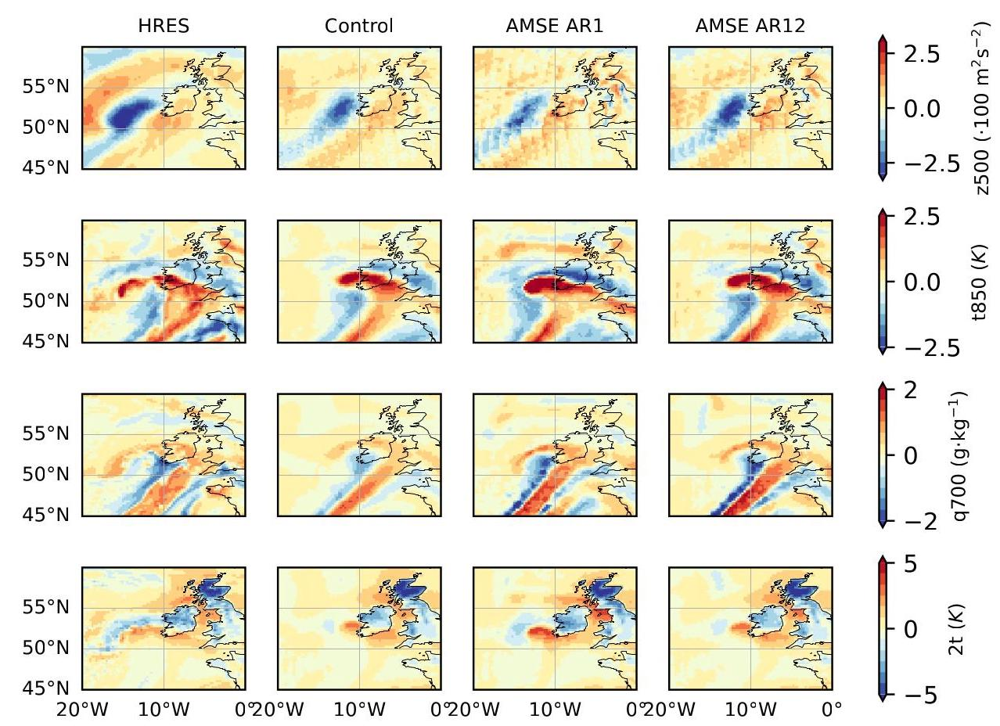

Figure 7. Visualization of high-pass filtered forecast and analysis fields for the forecast shown in 1.

图7. 图1所示预报的高通滤波预报场和分析场的可视化。

Minimizing (12) for ${\sigma }_{X}$ while holding ${\sigma }_{Y}$ and $\rho$ fixed is complicated, but solved numerically the optimal standard deviation ratio ${\sigma }_{X}{\sigma }_{Y}^{-1}$ is less than unity, reaching a minimum of about 0.66 near $\rho  = {0.4}$ and increasing for both lower and higher values of correlation. This is less intuitive than the ${\sigma }_{X} = {\sigma }_{Y}$ optimum of (6), but it still would smooth fine scales much less than the ${\sigma }_{X} = {\sigma }_{Y}\rho$ optimum of (2).

在保持 ${\sigma }_{Y}$ 和 $\rho$ 不变的情况下，对 ${\sigma }_{X}$ 使 (12) 最小化很复杂，但通过数值求解，最优标准差比 ${\sigma }_{X}{\sigma }_{Y}^{-1}$ 小于1，在 $\rho  = {0.4}$ 附近达到最小值约0.66，并且在相关性较低和较高时均增大。这比 (6) 的 ${\sigma }_{X} = {\sigma }_{Y}$ 最优值不太直观，但它对精细尺度的平滑程度仍远小于 (2) 的 ${\sigma }_{X} = {\sigma }_{Y}\rho$ 最优值。

Implementing (12) as a loss function would be conceptually interesting, but this seems impractical because the expression has singular behaviour near $\rho  = 1$ , where the implied random part of the prediction collapses to zero variance.

将 (12) 作为损失函数来实现从概念上讲会很有趣，但这似乎不切实际，因为该表达式在 $\rho  = 1$ 附近具有奇异行为，在该点预测的隐含随机部分的方差会降至零。

## B. Supplemental Verification

## B. 补充验证

### B.1. Visualization

### B.1. 可视化

Figure 7 visualizes the high-wavenumber components of a sample forecast matching the winter storm Eunice prediction shown in figure 1. The applied filter fourth-order in spherical harmonic space, with the functional form:

图7可视化了与图1所示冬季风暴尤尼斯预报相匹配的一个样本预报的高波数分量。在球谐空间中应用的滤波器为四阶，其函数形式为:

$$
\operatorname{HPF}\left( k\right)  = 1 - \frac{{k}_{0}^{4}}{{k}_{0}^{4} + {k}^{4}}, \tag{13}
$$

where $k$ is the total wavenumber and ${k}_{0} = {50}$ is the cutoff number, chosen to emphasize modes with length scales of 800 $\mathrm{{km}}$ and shorter. Overall, the predictions of the control and AMSE-trained models show very similar structures, but training with (6) as the loss function enhances the high-mode variability of the forecasts.

其中 $k$ 是总波数，${k}_{0} = {50}$ 是截止数，选择它是为了强调长度尺度为800 $\mathrm{{km}}$ 及更短的模式。总体而言，控制模型和经AMSE训练的模型的预报显示出非常相似的结构，但以 (6) 作为损失函数进行训练会增强预报的高模式变率。

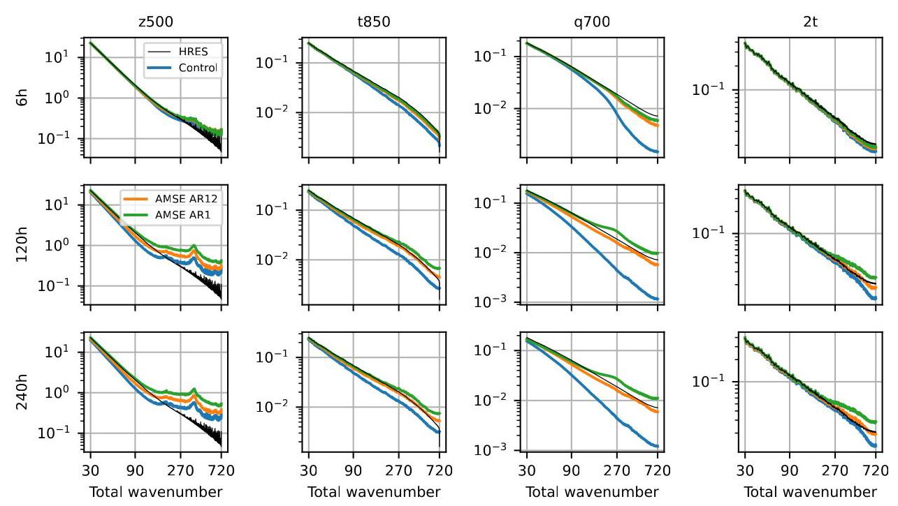

Figure 8. Amplitude spectral density for the variables of figure 4 at $6\mathrm{\;h},{120}\mathrm{\;h}$ , and ${240}\mathrm{\;h}$ lead times.

图8. 图4中变量在 $6\mathrm{\;h},{120}\mathrm{\;h}$ 和 ${240}\mathrm{\;h}$ 提前时间下的振幅谱密度。

### B.2. Spectra

### B.2. 谱

Figure 8 shows the amplitude spectral density (square root of power spectral density, with units proportional to $1/\sqrt{cycle}$ ) at moderate to fine scales for several variables and lead times. Because of the energy cascade in the atmosphere, the spectra of most variables follow power-law distributions. Energy in the atmosphere is ultimately removed by turbulent, frictional dissipation, but no practical global atmospheric model can effectively resolve these scales.

图8显示了几个变量在中等至精细尺度下以及不同提前时间的振幅谱密度(功率谱密度的平方根，单位与 $1/\sqrt{cycle}$ 成比例)。由于大气中的能量级联，大多数变量的谱遵循幂律分布。大气中的能量最终通过湍流、摩擦耗散去除，但没有实际的全球大气模型能够有效地解析这些尺度。

Nonetheless, the available energy per total wavenumber varies over several orders of magnitude, and even large amplitude density differences between models can appear small on the typical log-log scales of these graphs. The $2\mathrm{\;m}$ temperature field shows very little smoothing compared to the analysis regardless of model because it is strongly affected by the local elevation, which is always supplied as a constant field.

尽管如此，每个总波数的可用能量在几个数量级上变化，并且即使模型之间的大振幅密度差异在这些图的典型对数-对数尺度上看起来也很小。无论模型如何，$2\mathrm{\;m}$ 温度场与分析相比几乎没有平滑，因为它受到局部海拔的强烈影响，而局部海拔始终作为常数场提供。

### B.3. Quantile/Quantile Plots

### B.3. 分位数/分位数图

Quantile-quantile plots show a joint cumulative density function, and we use them here to evaluate the overall realism of the forecasts produced by the control and AMSE AR12 models independently of the forecast skill. In figures 9 and 10, the x-location of each point is the labelled percentile of North American weather station observations for Northern Hemisphere winter and summer periods. The y-location of each point is the corresponding percentile for the HRES analysis or the 5-day forecasts produced by the control and AMSE AR12 models, interpolated to the station locations. For example, in the left panel of figure 9, the 98th percentile corresponds to an observed wind speed of about 11.5m/s, but the 98th percentile of the HRES analysis was about ${10}\mathrm{\;m}/\mathrm{s}$ .

分位数-分位数图显示联合累积密度函数，我们在此使用它们来评估控制模型和AMSE AR12模型产生的预报的整体真实性，而不考虑预报技能。在图9和图10中，每个点的x位置是北半球冬季和夏季北美气象站观测值的标记百分位数。每个点的y位置是HRES分析或控制模型和AMSE AR12模型产生的5天预报在站位置处插值得到的相应百分位数。例如，在图9的左图中，第98百分位数对应于观测到的风速约11.5米/秒，但HRES分析的第98百分位数约为 ${10}\mathrm{\;m}/\mathrm{s}$。

The $y = x$ line on the quantile-quantile plot, shown as a dashed line in each panel, suggests that the forecast and observations have the same unconditional distributions when aggregated, and departures from the diagonal line indicate systematic underprediction or overprediction of extreme values. In our case, figure 9 shows that the AMSE AR12 model has a more realistic representation of surface winds, matching the trends seen in the HRES data. The control model produces noticeably weaker winds at all percentiles, showing a systematic shift in the distribution towards weaker surface winds, particularly in summer.

分位数-分位数图上的 $y = x$ 线(在每个图中以虚线显示)表明，汇总后预报和观测值具有相同的无条件分布，偏离对角线表示对极值的系统性低估或高估。在我们的案例中，图9表明AMSE AR12模型对地面风的表示更现实，与HRES数据中的趋势相符。控制模型在所有百分位数处产生的风明显较弱，表明分布朝着较弱的地面风系统性偏移，特别是在夏季。

In contrast, figure 10 shows that the models are essentially equivalent in the distribution of $2\mathrm{\;m}$ temperatures. As discussed in section B.2, the 2m temperature field shows little smoothing in the control model, likely due to the strong influence of elevation on the surface temperature. Improvements to the forecast of $2\mathrm{\;m}$ temperature in the AMSE AR12 model are found

相比之下，图10显示，这些模型在$2\mathrm{\;m}$温度分布上基本等效。如B.2节所述，在控制模型中，2米温度场几乎没有平滑现象，这可能是由于海拔对地表温度的强烈影响。在AMSE AR12模型中，发现$2\mathrm{\;m}$温度预报有更多改进

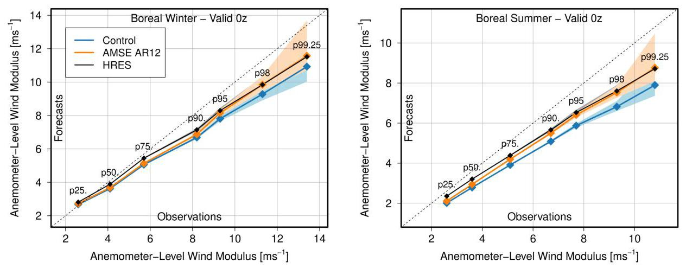

Figure 9. Quantile-quantile plots of ${10}\mathrm{\;m}$ wind speed at surface station locations for the North American domain. At left,1 Jan-30 March 2022 (boreal winter), and at right 20 June-19 September 2022 (boreal summer). The control and AMSE AR12 points show model evaluations for 5-day forecasts. The shaded region denotes confidence interval based on the Kolmogorov-Smirnov test.

图9.北美区域地面站位置处${10}\mathrm{\;m}$风速的分位数-分位数图。左侧为2022年1月1日至3月30日(北半球冬季)，右侧为2022年6月20日至9月19日(北半球夏季)。控制模型和AMSE AR12模型的点表示5天预报的模型评估。阴影区域表示基于柯尔莫哥洛夫-斯米尔诺夫检验的置信区间。

more in the forecast skill (see figure 11) than in the unconditional distribution of temperatures.

更多体现在预报技巧上(见图11)，而非温度的无条件分布上。

### B.4. Details of the Lagged Ensemble Verification

### B.4. 滞后集合验证的细节

Brenowitz et al. (2025) uses several metrics to evaluate the quality of the lagged ensembles. In this work, we use the fair CRPS score, the ensemble root mean squared error (eRMSE), and the spread-error ratio (SER). The eRMSE statistic is derived from its squared version (ensemble mean squared error), evaluated pointwise and integrated over the grid. The SER statistic is the simple ratio of the integrated MSE and ensemble spread (unbiased estimate of variance), noting for emphasis that the ratio is taken after the grid-averaging. For an ensemble of ${N}_{e}$ members $\left( {x}_{1\ldots {N}_{e}}\right)$ evaluated over ${N}_{\text{ date }}$ forecasts with verifying analysis $y$ , the corresponding formulas are:

Brenowitz等人(2025年)使用了多个指标来评估滞后集合的质量。在本研究中，我们使用了公平连续秩次概率评分(fair CRPS score)、集合均方根误差(eRMSE)和散度-误差比(SER)。eRMSE统计量源自其平方形式(集合均方误差)，逐点评估并在网格上积分。SER统计量是积分均方误差与集合散度(方差的无偏估计)的简单比值，需要强调的是，该比值是在网格平均之后计算的。对于在${N}_{\text{ date }}$次预报上评估的${N}_{e}$个成员$\left( {x}_{1\ldots {N}_{e}}\right)$的集合，以及验证分析$y$，相应公式如下:

$$
\operatorname{CRPS}\left( {x, y}\right)  = \frac{1}{{N}_{\text{ date }}}\mathop{\sum }\limits_{{d = 1}}^{{N}_{\text{ date }}}\mathop{\sum }\limits_{{i, j}}\mathrm{\;d}A\left( {i, j}\right) \left( {\frac{1}{{N}_{e}}\mathop{\sum }\limits_{{k = 1}}^{{N}_{e}}\left| {{x}_{k}\left( {i, j}\right)  - y\left( {i, j}\right) }\right|  + }\right.
$$

$$
\left. {\frac{1}{2{N}_{e}\left( {{N}_{e} - 1}\right) }\mathop{\sum }\limits_{{k = 1}}^{{N}_{e}}\mathop{\sum }\limits_{{l = 1}}^{{N}_{e}}\left| {{x}_{k}\left( {i, j}\right)  - {x}_{l}\left( {i, j}\right) }\right| }\right) , \tag{14}
$$

$$
\operatorname{eRMSE}\left( {x, y}\right)  = {\left( \frac{1}{{N}_{\text{ date }}}\mathop{\sum }\limits_{{d = 1}}^{{N}_{\text{ date }}}\mathop{\sum }\limits_{{i, j}}\mathrm{\;d}A\left( i, j\right) {\left( \bar{x}\left( i, j\right)  - y\left( i, j\right) \right) }^{2}\right) }^{1/2}\text{ , and } \tag{15}
$$

$$
\operatorname{SER}\left( {x, y}\right)  = {\left( \frac{1}{{N}_{\text{ date }}}\mathop{\sum }\limits_{{d = 1}}^{{N}_{\text{ date }}}\frac{1}{{N}_{e} - 1}\frac{\mathop{\sum }\limits_{{i, j}}\mathrm{\;d}A\left( {i, j}\right) \mathop{\sum }\limits_{{k = 1}}^{{N}_{e}}{\left( {x}_{k}\left( i, j\right)  - \bar{x}\left( i, j\right) \right) }^{2}}{\mathop{\sum }\limits_{{i, j}}\mathrm{\;d}A\left( {i, j}\right) {\left( \bar{x}\left( i, j\right)  - y\left( i, j\right) \right) }^{2}}\right) }^{1/2}, \tag{16}
$$

where $\bar{x}\left( {i, j}\right)  = {N}_{e}^{-1}\mathop{\sum }\limits_{k}{x}_{k}\left( {i, j}\right)$ is the ensemble mean at the $\left( {i, j}\right)$ gridpoint.

其中$\bar{x}\left( {i, j}\right)  = {N}_{e}^{-1}\mathop{\sum }\limits_{k}{x}_{k}\left( {i, j}\right)$是$\left( {i, j}\right)$网格点处的总体平均值。

Figures 11 and 12 show the CRPS and eRMSE skill scores respectively of the lagged ensemble generated with AMSE AR12 compared to the lagged ensemble of the control model for the geopotential (z), temperature (t), specific humidity (q), and u-component of wind (u) at several elevations and for the mean sea level pressure (msl), 2-meter temperature (2t), u-component of ${10}\mathrm{\;m}$ wind (10u), and 6h-accumulated precipitation (tp) at the surface.

图11和图12分别展示了使用AMSE AR12生成的滞后集合相对于控制模型的滞后集合在几个高度处的位势(z)、温度(t)、比湿(q)和风的u分量(u)以及海平面平均气压(msl)、2米温度(2t)、${10}\mathrm{\;m}$风的u分量(10u)和地面6小时累计降水量(tp)的CRPS和eRMSE技能分数。

For these figures, statistical significance was determined by bootstrapping, sampling 1/3 of the total dates in each sample to give an average gap between dates of ${36}\mathrm{\;h}$ . The forecast skill of persistence (that is, the gain over a climatological forecast by predicting that everything will remain constant) decays very quickly over 36h, so samples so-spaced apart are reasonably independent of each other.

对于这些图，统计显著性通过自举法确定，在每个样本中抽取总日期的1/3，以给出${36}\mathrm{\;h}$日期之间的平均间隔。持续性预报技能(即通过预测一切都将保持不变而相对于气候学预报的增益)在36小时内衰减非常快，因此如此间隔的样本彼此之间相当独立。

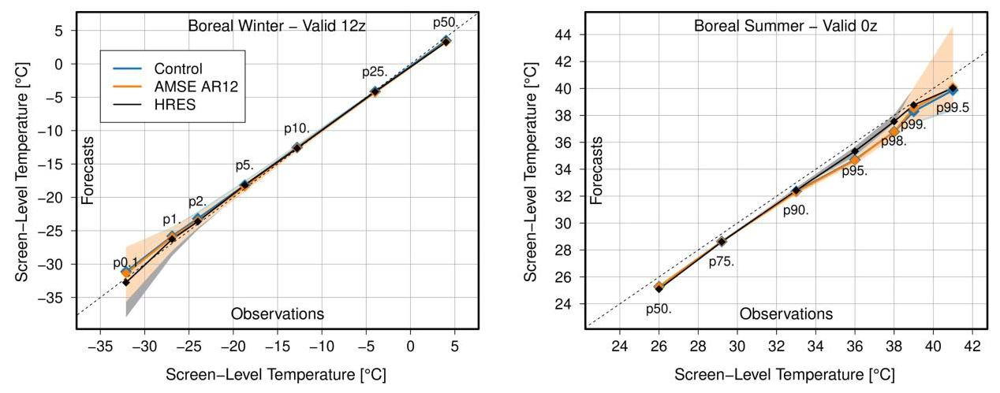

Figure 10. As in figure 9, for 2m temperature. Low percentiles (extreme cold) are shown for the Northern Hemisphere winter, and high percentiles (extreme heat) are shown for the Northern Hemisphere summer.

图10。与图9一样，是2米温度的情况。北半球冬季显示低百分位数(极端寒冷)，北半球夏季显示高百分位数(极端炎热)。

Overall, AMSE AR12 shows CRPS skill improvements for most variables and most lead times, but total precipitation shows only small improvements at long lead times and degradation at short lead times. This is explained by the separation of modes in (5) not being a natural one for precipitation. Precipitation is often localized but always non-negative, and consequently its spectral decomposition does not really resemble the normally-distributed random values that give meaning to (5) and (6).

总体而言，AMSE AR12在大多数变量和大多数提前期上显示出CRPS技能的改进，但总降水量在长提前期仅显示出小的改进，在短提前期则出现退化。这是因为(5)中的模式分离对于降水来说不是自然的。降水通常是局部的但总是非负的，因此其谱分解并不真正类似于赋予(5)和(6)意义的正态分布随机值。

The eRMSE skill chart should be interpreted with caution. The scores of (14)-(16) were developed for the case of an ideal ensemble, where members are statistically indistinguishable from each other and equally accurate in expectation. This is not really the case for a lagged ensemble, where the shorter-duration members should be noticeably more accurate than longer-duration members and an ideal aggregation would separately weight each term. This is not done by Brenowitz et al. (2025) for simplicity and to avoid free parameters, but we believe that the early lead-time smoothing in the control model makes equal-weighting more optimal for its lagged ensemble than for the lagged ensemble of AMSE AR12.

eRMSE技能图应谨慎解释。(14) - (16)的分数是针对理想集合的情况开发的，其中成员在统计上彼此无法区分且预期精度相同。对于滞后集合来说并非如此，在滞后集合中，持续时间较短的成员应该明显比持续时间较长的成员更准确，并且理想的聚合会分别对每个项进行加权。为了简单起见并避免自由参数，Brenowitz等人(2025)没有这样做，但我们认为控制模型中的早期提前期平滑使得对其滞后集合进行等加权比对AMSE AR12的滞后集合更优。

For long lead times this advantage diminishes, where the relative degradation of forecast quality is much stronger between 0.5 days and 4.5 days than it is between 6 days and 10 days. In this regime, AMSE AR12 begins to show eRMSE skill over the control ensemble.

对于长提前期，这种优势会减弱，在0.5天到4.5天之间预报质量的相对退化比在6天到10天之间要强得多。在这种情况下，AMSE AR12开始显示出相对于控制集合的eRMSE技能。

#### B.4.1. UNBIASED ENSEMBLE ROOT MEAN SQUARED ERROR

#### B.4.1. 无偏集合均方根误差

The eRMSE formula of (15) is a biased estimator of the true ensemble mean error, overestimating the error in proportion to the ensemble (sample) spread when the ensemble size is finite.

(15)中的eRMSE公式是真实集合平均误差的有偏估计器，当集合大小有限时，它会按集合(样本)离散程度的比例高估误差。

Consider ${N}_{e}$ different realizations $\left( {x}_{i}\right)$ of a single variable drawn from $\mathcal{N}\left( {\mu ,{\sigma }^{2}}\right)$ when the ground-truth value is 0 . Applying (15) to this gives:

考虑从$\mathcal{N}\left( {\mu ,{\sigma }^{2}}\right)$中抽取的单个变量的${N}_{e}$个不同实现$\left( {x}_{i}\right)$，当真实值为0时。将(15)应用于此得到:

$$
\mathbb{E}\left( {\operatorname{eMSE}\left( {x,0}\right) }\right)  = \mathbb{E}\left( {\left( \frac{1}{{N}_{e}}\mathop{\sum }\limits_{i}{x}_{i}\right) }^{2}\right)  = {\mu }^{2} + \frac{{\sigma }^{2}}{{N}_{e}}, \tag{17}
$$

which overestimates the true ensemble mean squared error. This overestimate is more severe for small ensembles such as the lagged ensemble configuration of section 3.2, where the ensemble size cannot be easily increased.

这高估了真实的集合均方误差。对于像3.2节中的滞后集合配置这样的小集合，这种高估更为严重，在这种情况下集合大小不容易增加。

Leutbecher & Palmer (2008) proposes correcting this overestimate by subtracting the standard error term to give an unbiased estimator of the ensemble mean squared error with a finite sample size. In the notation of (15), the corresponding root mean squared formula becomes:

Leutbecher & Palmer(2008)提出通过减去标准误差项来校正这种高估，以得到具有有限样本大小的集合均方误差的无偏估计器。在(15)的符号表示中，相应的均方根公式变为:

$$
\text{ ub\_eRMSE }\left( {x, y}\right)  = \left( {\frac{1}{{N}_{\text{ date }}}\mathop{\sum }\limits_{{d = 1}}^{{N}_{\text{ date }}}\mathop{\sum }\limits_{{i, j}}\mathrm{\;d}A\left( {i, j}\right) \left( {{\left( \frac{1}{{N}_{e}}\mathop{\sum }\limits_{{k = 1}}^{{N}_{e}}{x}_{k}\left( i, j\right)  - y\left( i, j\right) \right) }^{2} - }\right. }\right.
$$

$$
{\left. \left. \frac{1}{{N}_{e}\left( {{N}_{e} - 1}\right) }\mathop{\sum }\limits_{{k = 1}}^{{N}_{e}}{\left( {x}_{k}\left( i, j\right)  - \bar{x}\left( i, j\right) \right) }^{2}\right) \right) }^{1/2}\text{ , } \tag{18}
$$

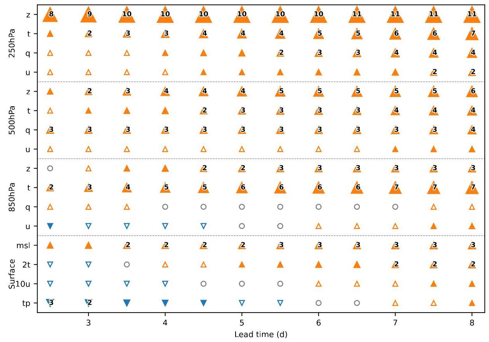

Figure 11. CRPS skill score (% improvement), measured as the relative difference between the CRPS (14) of the 12-step fine-tuned model and the CRPS of the control model, for a selection of variables and lead times. Orange up-arrows show where the fine-tuned model performs better, blue down-arrows show where the control model performs better. Hollow arrows represent a difference of less than $1\%$ , and differences of 2% or larger are marked. Hollow circles mark values that are not statistically significant at the 90% level.

图11。CRPS技能分数(%改进)，以12步微调模型的CRPS(14)与控制模型的CRPS之间的相对差异来衡量，针对选定的变量和提前期。橙色向上箭头表示微调模型表现更好的地方，蓝色向下箭头表示控制模型表现更好的地方。空心箭头表示差异小于$1\%$，差异为2%或更大的则进行标记。空心圆标记在90%水平上不具有统计显著性的值。

which performs this correction pointwise on the grid before computing the spatial average and taking the square root.

它在计算空间平均值并取平方根之前在网格上逐点进行此校正。

Implementing this adjustment slightly improves the scores of the AMSE-tuned model compared to the control model, and the corresponding "scorecard" is shown in figure 13.

与控制模型相比，实施此调整会略微提高AMSE调优模型的分数，相应的“计分卡”如图13所示。

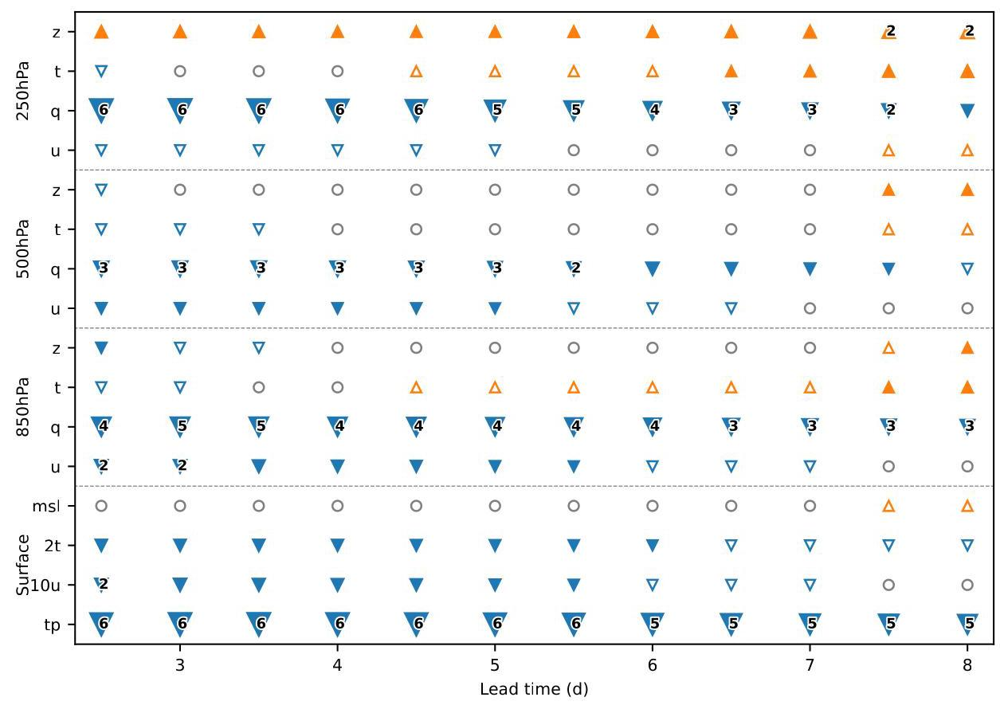

Figure 12. As figure 11, for ensemble root mean squared error (15).

图12。与图11相同，用于整体均方根误差(15)。

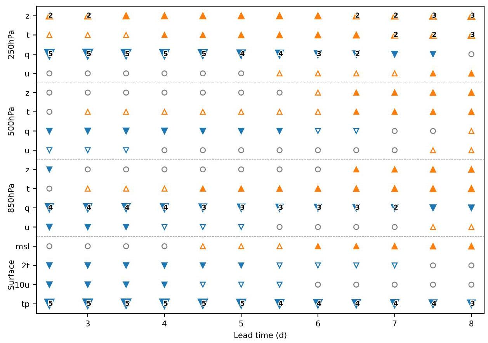

Figure 13. As figures 11 and 12, for the unbiased ensemble root mean squared error (18).

图13。与图11和图12相同，用于无偏整体均方根误差(18)。

Table 2. Cumulative ranked probability scores for the models fine-tuned in this study in the lagged ensemble configuration described in section 3.2, for the "headline" variables and levels in figure 1 of Rasp et al. (2024). Lower is better; the best score is bolded and the second-place score is italicized.

表2。本研究中在第3.2节所述的滞后整体配置中针对Rasp等人(2024年)图1中的“标题”变量和水平进行微调的模型的累积排序概率分数。越低越好；最佳分数加粗显示，第二名分数用斜体显示。

<table><tr><td rowspan="2">Model</td><td colspan="3">z 500hPa $\left( {{\mathrm{m}}^{2}{\mathrm{\;s}}^{-2}}\right)$</td><td colspan="3">t 850hPa (K)</td><td colspan="3">q 700hPa $\left( {\mathrm{g} \cdot  {\mathrm{{kg}}}^{-1}}\right)$</td><td colspan="3">u 850hPa $\left( {\mathrm{m} \cdot  {\mathrm{s}}^{-1}}\right)$</td></tr><tr><td>2.5d</td><td>5.0d</td><td>7.5d</td><td>2.5d</td><td>5.0d</td><td>7.5d</td><td>2.5d</td><td>5.0d</td><td>7.5d</td><td>2.5d</td><td>5.0d</td><td>7.5d</td></tr><tr><td>Control</td><td>31.038</td><td>84.315</td><td>162.481</td><td>0.428</td><td>0.691</td><td>1.003</td><td>0.357</td><td>0.523</td><td>0.652</td><td>0.823</td><td>1.340</td><td>1.904</td></tr><tr><td>MSE AR12</td><td>31.285</td><td>82.100</td><td>155.703</td><td>0.419</td><td>0.664</td><td>0.949</td><td>0.356</td><td>0.526</td><td>0.652</td><td>0.819</td><td>1.335</td><td>1.886</td></tr><tr><td>MAE AR12</td><td>29.969</td><td>80.621</td><td>155.361</td><td>0.410</td><td>0.654</td><td>0.947</td><td>0.340</td><td>0.499</td><td>0.624</td><td>0.811</td><td>1.313</td><td>1.859</td></tr><tr><td>AMSE AR1</td><td>33.720</td><td>94.703</td><td>186.202</td><td>0.422</td><td>0.721</td><td>1.078</td><td>0.354</td><td>0.558</td><td>0.721</td><td>0.863</td><td>1.485</td><td>2.115</td></tr><tr><td>AMSE AR12</td><td>30.565</td><td>80.469</td><td>153.267</td><td>0.418</td><td>0.653</td><td>0.935</td><td>0.347</td><td>0.510</td><td>0.634</td><td>0.832</td><td>1.341</td><td>1.882</td></tr></table>

### B.5. Ablation Studies

### B.5. 消融研究

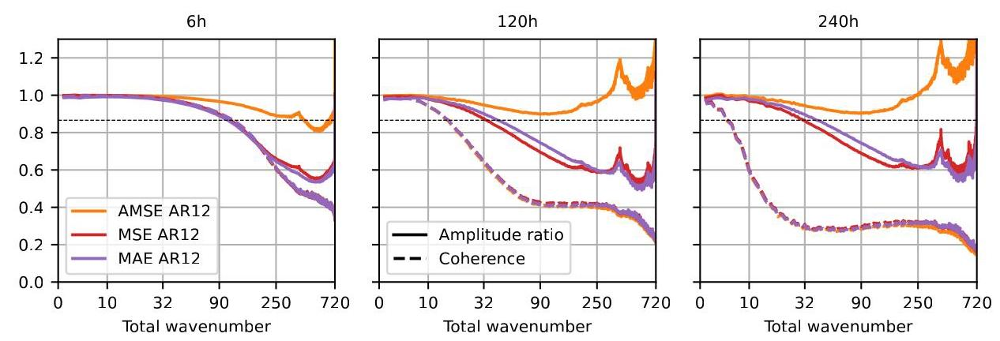

Figure 14. As figure 3, for the comparison models of section B.5. Only the model trained with the AMSE error function retains sharpness to fine scales.

图14。与图3相同，用于B.5节的比较模型。只有使用AMSE误差函数训练的模型在精细尺度上保持清晰度。

To ensure that the results of this study are not simply an artifact of increasing the model's overall training time, we compare against two additional fine-tunings:

为确保本研究的结果不仅仅是增加模型整体训练时间的产物，我们与另外两种微调进行比较:

1. MSE AR12 implements the fine-tuning schedule of table 1 with the unmodified mean squared error loss function, as with GraphCast's principal training.

1. MSE AR12使用未修改的均方误差损失函数实施表1的微调计划，与GraphCast的主要训练相同。

2. MAE AR12 implements the fine-tuning schedule with a mean absolute error loss function, preserving the per-variable and per-level weightings of error.

2. MAE AR12使用平均绝对误差损失函数实施微调计划，保留每个变量和每个水平的误差权重。

Figure 14 shows the aggregated per-wavenumber performance of these models, and table 2 evaluates their CRPS for a selection of variables, levels, and lead times in the lagged ensemble configuration.

图14显示了这些模型的每波数综合性能，表2评估了它们在滞后整体配置中针对选定变量、水平和提前期的CRPS。

Both models still show excessive smoothing of fine scales, but training with mean absolute error moderately improves sharpness at the medium scales (wavenumbers 32-200 for longer lead times, corresponding to length scales of 1250-250 kilometers).

两个模型在精细尺度上仍然显示出过度平滑，但使用平均绝对误差进行训练在中等尺度上适度提高了清晰度(对于较长提前期，波数为32 - 200，对应长度尺度为1250 - 250公里)。

The excessive smoothing of the MSE-trained model is expected from section 2.1, but that argument does not directly apply to the mean absolute error loss function. However, we can still understand this behaviour intuitively. A model that is optimal under the mean absolute error predicts the mean of a distribution, and at longer lead times fine scales are less predictable than coarser scales. Therefore, the prediction of the median future should be smoother than its realization.

从2.1节可以预期MSE训练的模型会有过度平滑的情况，但该论点并不直接适用于平均绝对误差损失函数。然而，我们仍然可以直观地理解这种行为。在平均绝对误差下最优的模型预测分布的均值，并且在较长提前期，精细尺度比粗尺度更难预测。因此，对未来中位数的预测应该比其实际情况更平滑。

Even the moderate improvement to sharpness for the MAE-trained model results in improvements to the CRPS of the lagged ensemble, as shown in table 2.

如表2所示，即使MAE训练的模型在清晰度上有适度提高，也会导致滞后整体的CRPS有所改善。