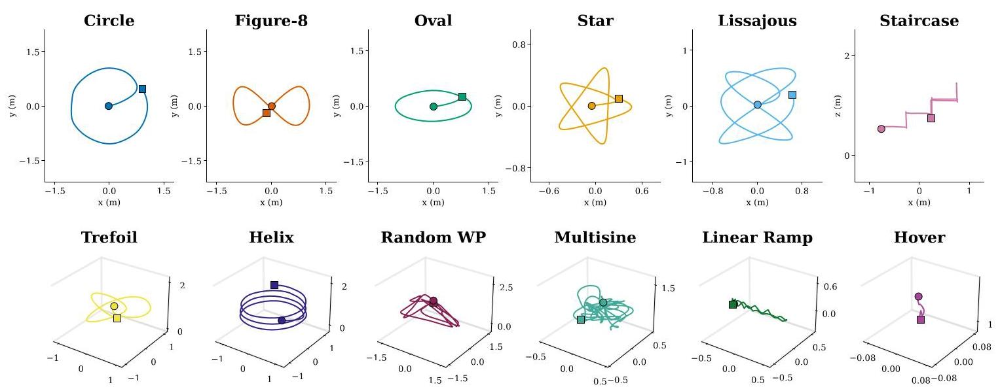
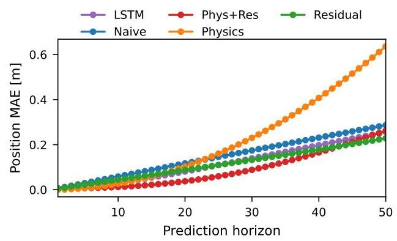
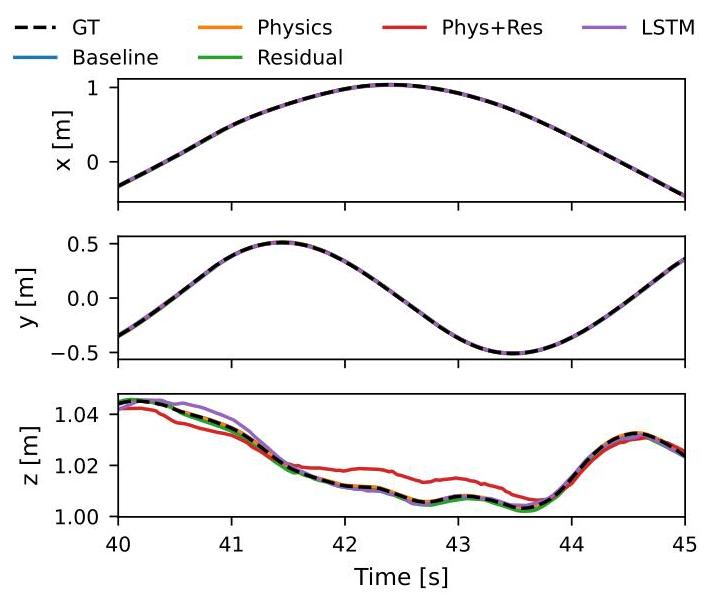
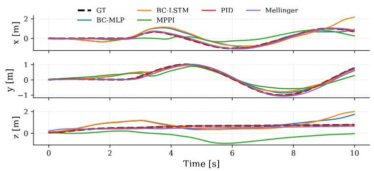
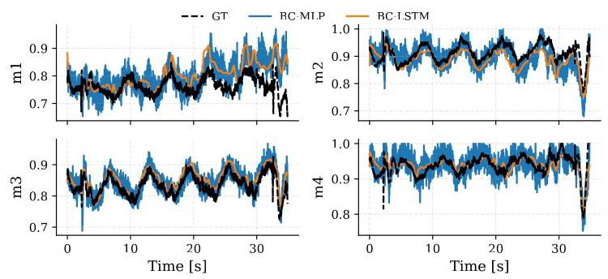
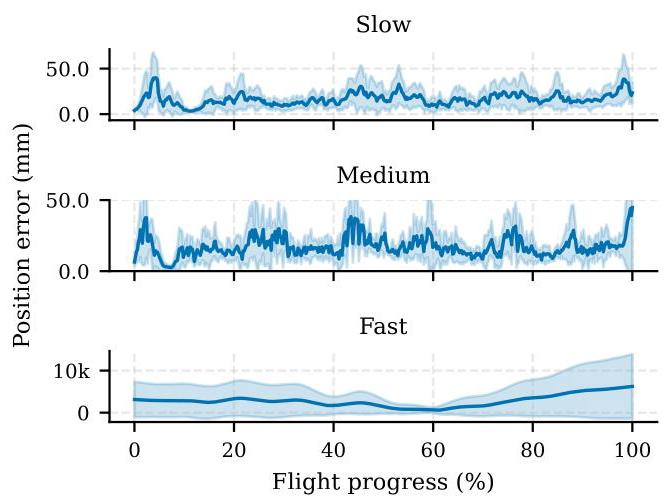

# NanoBench: A Multi-Task Benchmark Dataset for Nano-Quadrotor System Identification, Control, and State Estimation

# 纳米基准:用于纳米四旋翼系统识别、控制和状态估计的多任务基准数据集

Syed Izzat Ullah, José Baca

赛义德·伊扎特·乌拉、何塞·巴卡

Department of Computer Science

计算机科学系

Texas A&M University-Corpus Christi, Corpus Christi, TX, USA

美国得克萨斯州科珀斯克里斯蒂市得克萨斯农工大学 - 科珀斯克里斯蒂分校

sizzatullah@islander.tamucc.edu, jose.baca@tamucc.edu

sizzatullah@islander.tamucc.edu，jose.baca@tamucc.edu

Abstract-Existing aerial-robotics benchmarks target vehicles from hundreds of grams to several kilograms and typically expose only high-level state data. They omit the actuator-level signals required to study nano-scale quadrotors, where low-Reynolds-number aerodynamics, coreless DC motor nonlinearities, and severe computational constraints invalidate models and controllers developed for larger vehicles. We introduce NanoBench, an open-source multi-task benchmark collected on the commercially available Crazyflie 2.1 nano-quadrotor (takeoff weight ${27}\mathrm{\;g}$ ) in a Vicon motion capture arena. The dataset contains over 170 flight trajectories spanning hover, multi-frequency excitation, standard tracking, and aggressive maneuvers across multiple speed regimes. Each trajectory provides synchronized Vicon ground truth, raw IMU data, onboard extended Kalman filter estimates, PID controller internals, and motor PWM commands at ${100}\mathrm{\;{Hz}}$ , alongside battery telemetry at ${10}\mathrm{\;{Hz}}$ , aligned with sub-0.5 ms consistency. NanoBench defines standardized evaluation protocols, train/test splits, and open-source baselines for three tasks: nonlinear system identification, closed-loop controller benchmarking, and onboard state estimation assessment. To our knowledge, it is the first public dataset to jointly provide actuator commands, controller internals, and estimator outputs with millimeter-accurate ground truth on a commercially available nano-scale aerial platform.

摘要 - 现有的航空机器人基准测试针对的是从几百克到几千克的飞行器，并且通常仅公开高层状态数据。它们忽略了研究纳米级四旋翼所需的执行器级信号，在纳米级四旋翼中，低雷诺数空气动力学、无刷直流电机非线性以及严重的计算限制使得为大型飞行器开发的模型和控制器无效。我们引入了NanoBench，这是一个在Vicon运动捕捉场地中，在商用Crazyflie 2.1纳米四旋翼(起飞重量${27}\mathrm{\;g}$)上收集的开源多任务基准数据集。该数据集包含超过170条飞行轨迹，涵盖悬停、多频激励、标准跟踪以及跨多个速度范围的激进机动。每个轨迹在${100}\mathrm{\;{Hz}}$提供同步的Vicon地面真值、原始惯性测量单元(IMU)数据、机载扩展卡尔曼滤波器估计值、PID控制器内部数据以及电机脉宽调制(PWM)命令，同时在${10}\mathrm{\;{Hz}}$提供电池遥测数据，一致性达到亚0.5毫秒。NanoBench为三个任务定义了标准化的评估协议、训练/测试划分以及开源基线:非线性系统识别、闭环控制器基准测试以及机载状态估计评估。据我们所知，它是第一个在商用纳米级航空平台上联合提供执行器命令、控制器内部数据以及估计器输出，并带有毫米级精确地面真值的公共数据集。

Dataset: https://github.com/syediu/nanobench-iros2026.git

数据集:https://github.com/syediu/nanobench-iros2026.git

## I. INTRODUCTION

## 一、引言

Learning-based methods have substantially advanced quadrotor autonomy. Deep reinforcement learning policies match professional pilots in drone racing [1], adaptive controllers trained on minutes of flight data enable agile flight in strong wind [2], and data-driven model predictive controllers that incorporate learned residual dynamics outperform rigid-body baselines [3]. These techniques require instrumented datasets for training and reproducible evaluation. Most publicly available datasets that support such evaluation were collected on platforms weighing hundreds of grams to several kilograms. For nano-scale quadrotors, platforms below ${50}\mathrm{\;g}$ , which are widely used in embedded autonomy, safe learning, swarm robotics, autonomous navigation and mapping, and collision-aware trajectory planning [4]-[9], there is currently no open benchmark that exposes the full closed-loop stack.

基于学习的方法极大地推动了四旋翼自主性的发展。深度强化学习策略在无人机竞赛中可与专业飞行员相媲美[1]，基于几分钟飞行数据训练的自适应控制器能够在强风中实现敏捷飞行[2]，而结合学习到的残余动力学的数据驱动模型预测控制器优于刚体基线[3]。这些技术需要有仪器测量的数据集用于训练和可重复评估。大多数支持此类评估的公开可用数据集是在重量从几百克到几千克的平台上收集的。对于纳米级四旋翼，即重量低于${50}\mathrm{\;g}$的平台，它们广泛应用于嵌入式自主性、安全学习、群体机器人技术、自主导航与测绘以及碰撞感知轨迹规划[4]-[9]，目前尚无公开基准测试来展示完整的闭环堆栈。

Nano-scale quadrotors such as the Crazyflie 2.1 (27 g takeoff mass) operate in aerodynamic regimes that differ qualitatively from those of larger vehicles. Propellers with diameters below ${50}\mathrm{\;{mm}}$ generate airflows at Reynolds numbers on the order of ${10}^{4}$ , where laminar separation bubbles and viscous losses significantly affect thrust and torque characteristics [10]. Coreless DC motors introduce deadbands and response lags absent in brushless propulsion [11]. Proximity to surfaces induces severe ground effect disturbances at low altitudes [12]. Computationally, a 168 MHz Cortex-M4 mi-crocontroller strictly limits algorithms to lightweight extended Kalman filters [13], and therefore demands highly optimized software architectures.

诸如Crazyflie 2.1(起飞质量27克)这样的纳米级四旋翼在与大型飞行器性质不同的空气动力学环境中运行。直径低于${50}\mathrm{\;{mm}}$的螺旋桨产生的气流雷诺数约为${10}^{4}$，此时层流分离泡和粘性损失会显著影响推力和扭矩特性[10]。无刷直流电机引入了无刷推进中不存在的死区和响应滞后[11]。靠近表面会在低空引发严重的地面效应干扰[12]。在计算方面，一个168 MHz的Cortex - M4微控制器严格限制算法只能使用轻量级扩展卡尔曼滤波器[13]，因此需要高度优化的软件架构。

These physical and computational constraints invalidate assumptions derived from larger vehicles, yet no standardized benchmark exists to study nano-scale dynamics under these constraints. Thrust models transfer poorly across Reynolds number regimes [14]. Policies trained in simulation degrade on physical hardware due to inaccurate thrust modeling [15], [16]. Lightweight estimators require precisely synchronized multi-modal recordings for proper validation [17]. Despite this demand, no existing dataset provides actuator commands, controller internals, and estimator outputs with external ground truth on a commercially available nano-scale platform. Researchers currently evaluate system identification, control, and state estimation algorithms on private or synthetic data, precluding systematic comparison [18].

这些物理和计算限制使得从大型飞行器得出的假设无效，但目前尚无标准化基准测试来研究在这些限制下的纳米级动力学。推力模型在不同雷诺数范围之间的迁移性很差[14]。在模拟中训练的策略由于推力建模不准确，在物理硬件上性能会下降[15]，[16]。轻量级估计器需要精确同步的多模态记录来进行正确验证[1\7]。尽管有此需求，但现有的数据集均未在商用纳米级平台上提供执行器命令、控制器内部数据以及带有外部地面真值的估计器输出。研究人员目前在私有或合成数据上评估系统识别、控制和状态估计算法，这排除了系统的比较[18]。

This paper presents NanoBench, an open-source multi-task benchmark that addresses this gap. The dataset is collected on the standard Crazyflie 2.1 quadrotor inside a Vicon motion capture arena using a data collection framework based on direct radio communication via the cflib Python library. Our contributions are as follows:

本文介绍了NanoBench，这是一个开源多任务基准测试，填补了这一空白。该数据集是在Vicon运动捕捉场地内，使用基于通过cflib Python库进行直接无线电通信的数据收集框架，在标准的Crazyflie 2.1四旋翼上收集的。我们的贡献如下:

1) Nano-quadrotor flight dataset. We release over 170 trajectories on the Crazyflie 2.1 covering hover, multi-frequency excitation, standard tracking, and aggressive flight across multiple speed regimes. Every trajectory includes time-synchronized Vicon ground truth, raw IMU measurements, onboard EKF state estimates, PID controller internals, and motor PWM commands at ${100}\mathrm{\;{Hz}}$ , with battery telemetry at ${10}\mathrm{\;{Hz}}$ .

1) 纳米四旋翼飞行数据集。我们在Crazyflie 2.1上发布了超过170条轨迹，涵盖悬停、多频激励、标准跟踪以及跨多个速度范围的激进飞行。每个轨迹包括时间同步的Vicon地面真值、原始IMU测量值、机载扩展卡尔曼滤波器(EKF)状态估计值、PID控制器内部数据以及在${100}\mathrm{\;{Hz}}$的电机PWM命令，同时在${10}\mathrm{\;{Hz}}$提供电池遥测数据。

2) Cross-correlation time alignment. We develop and validate a synchronization procedure that cross-correlates onboard gyroscope angular rates with Vicon-derived angular velocity to estimate and correct the firmware-to-host clock offset. Across all flights, the residual misalignment is below ${0.5}\mathrm{\;{ms}}$ .

2) 互相关时间对齐。我们开发并验证了一种同步程序，该程序将机载陀螺仪角速率与Vicon导出的角速度进行互相关，以估计并校正固件到主机的时钟偏移。在所有飞行中，残余未对准低于${0.5}\mathrm{\;{ms}}$ 。

3) Multi-task evaluation suite. We define train/test splits, metrics, and reporting conventions for three tasks - system identification, controller benchmarking, and state estimation - and release open-source baseline implementations that establish reference performance levels on each.

3) 多任务评估套件。我们为系统识别、控制器基准测试和状态估计这三项任务定义了训练/测试划分、指标和报告惯例，并发布了开源基准实现，为每项任务建立了参考性能水平。

4) A standardized multi-task evaluation protocol. Defined train/test splits, metrics, and reporting conventions for system identification, controller benchmarking, and state estimation, with open-source baseline implementations establishing reference performance levels for each task.

4) 标准化多任务评估协议。为系统识别、控制器基准测试和状态估计定义了训练/测试划分、指标和报告惯例，开源基准实现为每项任务建立了参考性能水平。

The remainder of this paper is organized as follows. Section [1] positions NanoBench against prior literature. Section [11] describes the hardware platform, acquisition pipeline, synchronization procedure, trajectory design, and benchmark task formulations. Section IV details the experimental setup, dataset composition, and benchmark evaluations. Section V discusses limitations and conclusions.

本文的其余部分组织如下。第[1]节将NanoBench与先前的文献进行了对比。第[11]节描述了硬件平台、采集管道、同步程序、轨迹设计和基准任务公式。第四节详细介绍了实验设置、数据集组成和基准评估。第五节讨论了局限性和结论。

## II. RELATED WORK

## 二、相关工作

## A. Aerial Robot Datasets and Benchmarks

## A. 空中机器人数据集和基准

Aerial robotics datasets can be partitioned by the downstream tasks they support and the platform scales they cover. The EuRoC MAV dataset [19], UZH-FPV [20], NTU VIRAL [21], and INSANE [22] provide high-fidelity exteroceptive sensor data for visual-inertial odometry and multi-sensor fusion. However, these benchmarks treat the vehicle as a passive sensor carrier and omit actuator and control signals. As a result, they cannot support closed-loop dynamics modeling, controller evaluation, or estimator benchmarking.

空中机器人数据集可以根据它们支持的下游任务和覆盖的平台规模进行划分。EuRoC MAV数据集[19]、UZH-FPV[20]、NTU VIRAL[21]和INSANE[22]为视觉惯性里程计和多传感器融合提供了高保真外部感知传感器数据。然而，这些基准将飞行器视为被动传感器载体，忽略了执行器和控制信号。因此，它们无法支持闭环动力学建模、控制器评估或估计器基准测试。

Actuation-aware datasets capture the inputs necessary for system identification. The Blackbird dataset [23] and Agili-cious framework [24] log motor commands for agile flight research. However, they feature quadrotors weighing near 1 kg equipped with brushless motors. These heavy platforms exhibit rigid-body dynamics that differ fundamentally from the coreless DC actuation and severe aerodynamic nonlinearities of nano-quadrotors, precluding direct transfer of models or control policies.

有驱动感知的数据集捕获了系统识别所需的输入。Blackbird数据集[23]和Agili-cious框架[24]记录了用于敏捷飞行研究的电机命令。然而，它们的特点是配备无刷电机的近1千克重的四旋翼飞行器。这些重型平台表现出的刚体动力学与纳米四旋翼飞行器的无铁芯直流驱动和严重的空气动力学非线性有根本不同，排除了模型或控制策略的直接转移。

At the nano scale, Busetto et al. [25] recently released a system identification dataset for a brushless Crazyflie variant that logs motor RPM. The dataset covers only four trajectories, omits onboard EKF and PID logs entirely, and records no battery voltage. Table 1 details these gaps. These omissions restrict the benchmark to single-task system identification on non-standard hardware that leave multi-task evaluation on the commercially standard Crazyflie 2.1 unaddressed.

在纳米尺度上，Busetto等人[25]最近发布了一个用于无刷Crazyflie变体的系统识别数据集，该数据集记录了电机转速。该数据集仅涵盖四条轨迹，完全省略了机载扩展卡尔曼滤波器(EKF)和比例积分微分(PID)日志，并且没有记录电池电压。表1详细列出了这些差距。这些遗漏将基准限制在非标准硬件上的单任务系统识别，而未涉及商业标准Crazyflie 2.1上的多任务评估。

## B. System Identification for Aerial Vehicles

## B. 飞行器的系统识别

Quadrotor dynamics modeling ranges from calibrated physics to fully learned representations. Forster [11] established baseline quadratic thrust parameters via least-squares fitting. Torrente et al. [3] and NeuroBEM [14] augmented nominal rigid-body equations with data-driven residuals to capture unmodeled aerodynamic effects. Neural ordinary differential equations offer purely data-driven alternatives. Zhou et al. [26] trained Neural ODEs for multi-step state prediction, while KNODE-MPC [27] and O'Connell et al. [2] embedded adapted models within predictive controllers to improve tracking accuracy.

四旋翼动力学建模范围从校准物理模型到完全基于学习的表示。Forster[11]通过最小二乘法拟合建立了基准二次推力参数。Torrente等人[3]和NeuroBEM[14]用数据驱动的残差增强名义刚体方程，以捕获未建模的空气动力学效应。神经常微分方程提供了纯数据驱动的替代方案。Zhou等人[26]训练神经常微分方程用于多步状态预测，而KNODE-MPC[27]和O'Connell等人[2]在预测控制器中嵌入适配模型以提高跟踪精度。

Crucially, existing simulation ecosystems configure these learned and analytical models with static coefficients [28]. This constant-parameter assumption ignores the severe thrust degradation caused by single-cell LiPo battery discharge. No existing benchmark provides the synchronized voltage and kinematics data required to model this non-stationary battery effect.

至关重要的是，现有的仿真生态系统用静态系数配置这些基于学习和分析的模型[28]。这种恒定参数假设忽略了单节锂聚合物电池放电导致的严重推力下降。没有现有基准提供对这种非平稳电池效应进行建模所需的同步电压和运动学数据。

## C. Control of Nano-Quadrotors

## C. 纳米四旋翼飞行器的控制

The Crazyflie serves as a primary testbed for validating control architectures. Researchers routinely implement cascaded PID loops, geometric controllers on ${SE}\left( 3\right)$ , and minimum-snap trajectory trackers [29]. Safe reinforcement learning frameworks mostly utilize the Crazyflie platform [5], with recent studies achieving zero-shot sim-to-real transfer [16]. Song et al. [15] demonstrated that thrust calibration errors represent the dominant source of tracking degradation during this transfer process. Open-source software ecosystems simplify swarm coordination and simulated execution [6], [7], [28], [30], and lower the barriers to entry for multi-agent research.

Crazyflie是验证控制架构的主要测试平台。研究人员经常在${SE}\left( 3\right)$ 上实现级联PID回路、几何控制器和最小急动轨迹跟踪器[29]。安全强化学习框架大多利用Crazyflie平台[5]，最近的研究实现了零样本模拟到真实的转移[16]。Song等人[15]表明，推力校准误差是此转移过程中跟踪性能下降的主要来源。开源软件生态系统简化了群体协调和模拟执行[6]、[7]、[28]、[30]，并降低了多智能体研究的入门门槛。

Despite this active development, each research group runs its own private flight experiments and reports numbers against its own reference trajectories. Without a shared dataset, differences in results between papers reflect hardware setup as much as algorithm design.

尽管有这种积极的发展，但每个研究小组都进行自己的私人飞行实验，并根据自己的参考轨迹报告数据。没有共享数据集，论文之间结果的差异反映硬件设置和算法设计的程度一样大。

## D. State Estimation for Micro Aerial Vehicles

## D. 微型飞行器的状态估计

State estimation on sub-50 g platforms faces extreme hardware limitations. Visual-inertial odometry pipelines are simply too expensive for a 168 MHz Cortex-M4 [4], so nano-quadrotors run lightweight EKFs with carefully characterized IMU noise models [13], [17].

重量低于50克的平台进行状态估计面临着极端的硬件限制。视觉惯性里程计管道对于168 MHz的Cortex-M4来说成本太高[4]，因此纳米四旋翼飞行器运行具有精心表征的惯性测量单元噪声模型的轻量级扩展卡尔曼滤波器[13]，[17]。

Evaluating these filters properly requires the estimator's internal state to be recorded alongside an external position reference at matched timestamps. Without that pairing, it is not possible to separate sensor noise from filter divergence or to compare estimators across different hardware runs.

要正确评估这些滤波器，需要在匹配的时间戳将估计器的内部状态与外部位置参考一起记录下来。没有这种配对，就无法将传感器噪声与滤波器发散区分开来，也无法在不同硬件运行之间比较估计器。

## III. METHODOLOGY

## 三、方法

## A. Hardware Platform

## A. 硬件平台

We used the Crazyflie 2.1 nano-drone (Bitcraze AB), as the data collection platform. The vehicle measures ${92} \times  {92} \times \; {29}\mathrm{\;{mm}}$ and weighs ${27}\mathrm{\;g}$ with a ${250}\mathrm{{mAh}}$ single-cell LiPo installed. Four $7 \times  {16}\mathrm{\;{mm}}$ coreless DC motors drive ${46}\mathrm{\;{mm}}$ four-blade propellers; at full charge (4.2 V), combined peak thrust is approximately ${0.6}\mathrm{\;N}$ , giving a thrust-to-weight ratio of roughly 2.2. The onboard STM32F405 (168 MHz, Cortex-M4F, 192kB SRAM) runs a cascaded PID controller and extended Kalman filter; a secondary nRF51822 handles radio communication. Inertial data is provided by a Bosch BMI088 six-axis IMU. Motor commands are 16-bit PWM values in $\left\lbrack  {0,{65535}}\right\rbrack$ , and the unregulated single-cell battery directly couples state of charge to actuator performance.

我们使用Crazyflie 2.1纳米无人机(Bitcraze AB)作为数据收集平台。该飞行器测量${92} \times  {92} \times \; {29}\mathrm{\;{mm}}$，安装${250}\mathrm{{mAh}}$单节锂聚合物电池后重量为${27}\mathrm{\;g}$。四个$7 \times  {16}\mathrm{\;{mm}}$无刷直流电机驱动${46}\mathrm{\;{mm}}$四叶螺旋桨；在充满电(4.2 V)时，总峰值推力约为${0.6}\mathrm{\;N}$，推重比约为2.2。板载STM32F405(168 MHz，Cortex-M4F，192kB SRAM)运行级联PID控制器和扩展卡尔曼滤波器；二级nRF51822处理无线电通信。惯性数据由博世BMI088六轴惯性测量单元提供。电机命令是$\left\lbrack  {0,{65535}}\right\rbrack$中的16位脉宽调制值，未调节的单节电池直接将充电状态与执行器性能耦合。

TABLE I: Comparison of aerial robotics datasets. NanoBench is the first to combine actuator-level data, onboard estimator outputs, and controller internals on a commercially available nano-scale platform within a multi-task evaluation framework.

表一:航空机器人数据集比较。NanoBench是第一个在多任务评估框架内的商用纳米级平台上结合执行器级数据、机载估计器输出和控制器内部信息的。

<table><tr><td>Feature</td><td>EuRoC 19</td><td>Blackbird 23</td><td>UZH-FPV 20</td><td>Busetto et al. 25</td><td>NanoBench (Ours)</td></tr><tr><td>Platform mass</td><td>$\sim  2\mathrm{\;{kg}}$</td><td>$\sim  1\mathrm{\;{kg}}$</td><td>$\sim  {0.8}\mathrm{\;{kg}}$</td><td><50g</td><td>$\sim  {27}\mathrm{\;g}$</td></tr><tr><td>Platform availability</td><td>Discontinued</td><td>Custom</td><td>Custom</td><td>Commercial</td><td>Commercial</td></tr><tr><td>Number of trajectories</td><td>11</td><td>176</td><td>27</td><td>4</td><td>170+</td></tr><tr><td>Ground truth system</td><td>Vicon/Leica</td><td>OptiTrack</td><td>Leica</td><td>MoCap</td><td>Vicon</td></tr><tr><td>Ground truth rate</td><td>200 Hz</td><td>360 Hz</td><td>200 Hz</td><td>Not specified</td><td>100 Hz</td></tr><tr><td>Raw IMU data</td><td>✓</td><td>✓</td><td>✓</td><td>-</td><td>✓</td></tr><tr><td>Motor commands</td><td>-</td><td>✓ (RPM)</td><td>-</td><td>✓ (RPM)</td><td>✓ (PWM)</td></tr><tr><td>Onboard estimator output</td><td>-</td><td>-</td><td>-</td><td>-</td><td>✓</td></tr><tr><td>Controller internals</td><td>-</td><td>-</td><td>-</td><td>-</td><td>✓</td></tr><tr><td>Battery telemetry</td><td>-</td><td>-</td><td>-</td><td>-</td><td>✓</td></tr><tr><td>Camera data</td><td>Stereo</td><td>Synthetic</td><td>Stereo + event</td><td>-</td><td>-</td></tr><tr><td>Multi-task evaluation</td><td>-</td><td>-</td><td>-</td><td>SysID only</td><td>SysID + Control + Estimation</td></tr><tr><td>Calibration tools</td><td>-</td><td>-</td><td>-</td><td>-</td><td>✓</td></tr><tr><td>Open-source</td><td>✓</td><td>✓</td><td>Partial</td><td>✓</td><td>✓</td></tr></table>

TABLE II: Recorded signals and nominal sampling rates.

表二:记录的信号和标称采样率。

<table><tr><td>Signal</td><td>Source</td><td>Rate $\left( {\mathbf{{Hz}}\text{ ) }}\right)$</td></tr><tr><td>Position $\left( {\mathbf{p} \in  {\mathbb{R}}^{3}}\right)$ , orientation $\left( {\mathbf{q} \in  {S}^{3}}\right)$</td><td>Vicon</td><td>100</td></tr><tr><td>Linear velocity $\left( {\dot{\mathbf{p}} \in  {\mathbb{R}}^{3}}\right)$</td><td>Vicon (derived)</td><td>100</td></tr><tr><td>Accelerometer $\left( {{\mathbf{a}}_{\mathrm{{IMU}}} \in  {\mathbb{R}}^{3}}\right) \left\lbrack  \mathrm{G}\right\rbrack$</td><td>BMI088</td><td>100</td></tr><tr><td>Gyroscope $\left( {{\mathbf{\omega }}_{\mathrm{{IMU}}} \in  {\mathbb{R}}^{3}}\right) \left\lbrack  {\mathrm{{rad}}/\mathrm{s}}\right\rbrack$</td><td>BM1088</td><td>100</td></tr><tr><td>EKF state $\left( {\widehat{\mathbf{p}},\check{\mathbf{p}},\widehat{\mathbf{\eta }}}\right)$</td><td>Firmware</td><td>100</td></tr><tr><td>Controller setpoints $\left( {{\mathbf{p}}_{\text{ ref }},{\psi }_{\text{ ref }}}\right)$</td><td>Firmware</td><td>100</td></tr><tr><td>PID outputs (roll, pitch, yaw, thrust)</td><td>Firmware</td><td>100</td></tr><tr><td>Motor PWM $\left( {{u}_{1},{u}_{2},{u}_{3},{u}_{4} \in  \left\lbrack  {0,{65535}}\right\rbrack  }\right)$</td><td>Firmware</td><td>100</td></tr><tr><td>Battery voltage ${V}_{\text{ bat }}\left\lbrack  \mathrm{V}\right\rbrack$</td><td>Firmware</td><td>10</td></tr></table>

Ground truth 6-DoF pose is provided by a 12-camera Vicon system covering a $6 \times  4 \times  2\mathrm{\;m}$ volume. Retroreflective markers ( ${6.4}\mathrm{\;{mm}}$ diameter) in an asymmetric configuration enable unique rigid-body identification at ${100}\mathrm{\;{Hz}}$ with sub-millimeter accuracy.

地面真值6自由度姿态由覆盖$6 \times  4 \times  2\mathrm{\;m}$体积的12相机Vicon系统提供。非对称配置中的反光标记(${6.4}\mathrm{\;{mm}}$直径)能够在${100}\mathrm{\;{Hz}}$以亚毫米精度实现唯一刚体识别。

## B. Data Acquisition Pipeline

## B. 数据采集管道

Data collection uses a custom ROS 1 framework that communicates with the Crazyflie via cflib over a Crazyradio PA USB dongle. Three concurrent data paths operate during each flight:

数据收集使用自定义的ROS 1框架，该框架通过Crazyradio PA USB加密狗上的cflib与Crazyflie通信。每次飞行期间有三个并发数据路径运行:

Vicon path. A vrpn_client_ros node publishes geometry_msgs/PoseStamped messages on a per-rigid-body topic at ${100}\mathrm{\;{Hz}}$ . The ViconRecorder module subscribes to this topic, computes linear velocity via first-order backward difference, converts quaternion orientation to Euler angles, and writes each sample to a CSV file. On every callback, the pose is also forwarded to the Crazyflie EKF via cflib's send_extpose () to provide the onboard estimator with an external position reference.

Vicon路径。一个vrpn_client_ros节点在${100}\mathrm{\;{Hz}}$的每个刚体主题上发布geometry_msgs/PoseStamped消息。ViconRecorder模块订阅此主题，通过一阶向后差分计算线速度，将四元数方向转换为欧拉角，并将每个样本写入CSV文件。每次回调时，姿态也会通过cflib的send_extpose()转发到Crazyflie扩展卡尔曼滤波器，为机载估计器提供外部位置参考。

Firmware telemetry path. The CflibLogger module configures firmware log blocks as specified in a YAML configuration file. Each block declares a set of firmware variables, their data types, and a polling frequency. The cflib library fetches these variables over the CRTP radio protocol. Upon reception, each sample is timestamped with both the host wall-clock time and the Crazyflie firmware tick (milliseconds since boot) and written to a per-block CSV file. Table II enumerates the recorded signals.

固件遥测路径。CflibLogger模块按照YAML配置文件中指定的配置固件日志块。每个块声明一组固件变量、它们的数据类型和轮询频率。cflib库通过CRTP无线电协议获取这些变量。接收到数据后，每个样本都会用主机墙上时钟时间和Crazyflie固件滴答(自启动以来的毫秒数)进行时间戳标记，并写入每个块的CSV文件。表二列举了记录的信号。

Command path. The ExperimentRunner orchestrates the flight sequence. High-level commands (takeoff, land) use the firmware's onboard trajectory planner, which generates smooth polynomial setpoints internally. During trajectory execution, position setpoints are streamed at ${100}\mathrm{\;{Hz}}$ via send_position_setpoint (), which bypasses the high-level planner and feeds the PID controller directly.

命令路径。ExperimentRunner编排飞行序列。高级命令(起飞、降落)使用固件的机载轨迹规划器，该规划器在内部生成平滑的多项式设定点。在轨迹执行期间，位置设定点通过send_position_setpoint()以${100}\mathrm{\;{Hz}}$的频率流式传输，该函数绕过高级规划器并直接为PID控制器提供输入。

## C. Time Synchronization

## C. 时间同步

Three clocks run independently during each flight: the Vicon Tracker, the Crazyflie firmware tick counter, and the ROS host. The host timestamps Vicon poses and firmware packets on arrival, which places both streams in a shared reference frame. Residual alignment offset arise from radio transmission latency (typically $2\mathrm{\;{ms}}$ to $5\mathrm{\;{ms}}$ ) and operating system scheduling jitter.

每次飞行期间有三个时钟独立运行:Vicon Tracker、Crazyflie固件滴答计数器和ROS主机。主机在接收到Vicon姿态和固件数据包时进行时间戳标记，这将两个数据流置于共享参考框架中。残余对齐偏移源于无线电传输延迟(通常为$2\mathrm{\;{ms}}$到$5\mathrm{\;{ms}}$)和操作系统调度抖动。

We estimate this offset by cross-correlating the onboard gyroscope ${\mathbf{\omega }}_{\text{ gyro }}\left( t\right)$ with the angular velocity ${\mathbf{\omega }}_{\text{ vicon }}\left( t\right)$ obtained by differentiating Vicon quaternions through a Savitzky-Golay filter. The time offset $\Delta {t}^{ * }$ is estimated as

我们通过将机载陀螺仪${\mathbf{\omega }}_{\text{ gyro }}\left( t\right)$与通过Savitzky-Golay滤波器对Vicon四元数求导得到的角速度${\mathbf{\omega }}_{\text{ vicon }}\left( t\right)$进行互相关来估计此偏移量。时间偏移量$\Delta {t}^{ * }$估计为

$$
\Delta {t}^{ * } = \arg \mathop{\max }\limits_{{\Delta t}}\mathop{\sum }\limits_{k}{\mathbf{\omega }}_{\text{ gyro }}\left( {t}_{k}\right)  \cdot  {\mathbf{\omega }}_{\text{ vicon }}\left( {{t}_{k} + {\Delta t}}\right) \tag{1}
$$

where the search range is ${\Delta t} \in  \left\lbrack  {-2,2}\right\rbrack  \mathrm{s}$ at $1\mathrm{\;{ms}}$ resolution. This formulation exploits the sharp rotational features present during flight maneuvers to localize the offset with sub-millisecond precision.

其中搜索范围为${\Delta t} \in  \left\lbrack  {-2,2}\right\rbrack  \mathrm{s}$，分辨率为$1\mathrm{\;{ms}}$。这种公式利用了飞行机动期间出现的尖锐旋转特征，以亚毫秒级精度定位偏移量。

Once $\Delta {t}^{ * }$ is found, firmware signals are shifted to the Vicon time base and resampled onto a uniform grid by linear interpolation. Each trajectory is then written to a single CSV file with all modalities on one time axis.

一旦找到$\Delta {t}^{ * }$，固件信号就会被转换到Vicon时基，并通过线性插值重新采样到均匀网格上。然后将每个轨迹写入一个单一的CSV文件，所有模态都在一个时间轴上。

## D. Trajectory Design

## D. 轨迹设计

The trajectory taxonomy is organized into three active categories designed to collectively excite all dynamic modes of the platform. The dataset encompasses 12 distinct trajectory types spanning system identification excitation, geometric tracking at multiple speeds, and long-duration battery-drain hovers. Fig. 1 visualizes all 12 types from recorded flight data.

轨迹分类法分为三个活动类别，旨在共同激发平台的所有动态模式。数据集包含12种不同的轨迹类型，涵盖系统识别激励、多种速度下的几何跟踪以及长时间的电池耗尽悬停。图1展示了记录的飞行数据中的所有12种类型。

Fig. 1: All 12 NanoBench trajectory types visualized from recorded Vicon ground-truth data. Categories A (excitation), B (geometric tracking), and C (battery-drain hover).

图1:从记录的Vicon地面真值数据可视化的所有12种NanoBench轨迹类型。类别A(激励)、B(几何跟踪)和C(电池耗尽悬停)。

TABLE III: Category B: Tracking Trajectory Parameters.

表III:类别B:跟踪轨迹参数。

<table><tr><td>Trajectory Type</td><td>Complexity Mode</td><td>Scale (m)</td><td>Speed (m/s)</td></tr><tr><td>Circle</td><td>Continuous yaw</td><td>$r = {1.0}$</td><td>0.5,0.75,1.0</td></tr><tr><td>Figure-8</td><td>Direction reversal</td><td>$A \in  \{ {1.0},{1.3}\}$</td><td>0.5,0.75,1.0</td></tr><tr><td>Oval</td><td>Asymmetric axes</td><td>${1.0} \times  {0.4}$</td><td>0.5,0.75,1.0</td></tr><tr><td>Star</td><td>Sharp transients</td><td>$r \in  \{ {0.6},{1.0}\}$</td><td>0.5,0.75,1.0</td></tr><tr><td>Lissajous (3:2)</td><td>Dense planar</td><td>$A = {0.6}$</td><td>0.5,0.75,1.0</td></tr><tr><td>Trefoil Knot</td><td>3D oscillation</td><td>${\Delta z} = {0.15}$</td><td>0.5,0.75,1.0</td></tr><tr><td>Helix</td><td>Sweeping altitude</td><td>${\Delta z} = {1.0}$</td><td>0.5,0.75,1.0</td></tr><tr><td>Linear Ramp</td><td>1D acceleration</td><td>$L = {2.0}$</td><td>0.5,0.75,1.0</td></tr><tr><td>Random Waypoint</td><td>Unstructured 3D</td><td>Volume bound</td><td>0.75</td></tr><tr><td>Staircase</td><td>Vertical steps</td><td>${\Delta z} = {0.5}$</td><td>0.5</td></tr></table>

Category A: System identification excitation. Multi-sine trajectories superimpose sinusoidal position commands at logarithmically spaced frequencies from ${0.1}\mathrm{\;{Hz}}$ to $5\mathrm{\;{Hz}}$ :

类别A:系统识别激励。多正弦轨迹在从${0.1}\mathrm{\;{Hz}}$到$5\mathrm{\;{Hz}}$的对数间隔频率上叠加正弦位置命令:

$$
x\left( t\right)  = \mathop{\sum }\limits_{{n = 1}}^{{N}_{f}}\frac{A}{n}\sin \left( {{2\pi }{f}_{n}t}\right) ,\;y\left( t\right)  = \mathop{\sum }\limits_{{n = 1}}^{{N}_{f}}\frac{A}{n}\cos \left( {{2\pi }{f}_{n}t + \frac{\pi }{4}}\right)
$$

(2)

where $A$ is the amplitude, ${f}_{n}$ are logarithmically spaced, and the phase offset between axes ensures simultaneous two-axis excitation. Category A consists of a single trajectory(A1b_multisine_sysid), which executes a 60 s 3D multi-sine at altitude $\approx  {1.1}\mathrm{\;m}$ with ${N}_{f} = {15}$ components spanning $\left\lbrack  {{0.1},5}\right\rbrack  \mathrm{{Hz}}$ , amplitudes of ${0.8}\mathrm{\;m}$ (horizontal) and ${0.35}\mathrm{\;m}$ (vertical), and smooth $2\mathrm{\;s}$ fade-in/out windows.

其中$A$是幅度，${f}_{n}$是对数间隔的，轴之间的相位偏移确保同时进行两轴激励。类别A由单个轨迹(A1b_multisine_sysid)组成，它在海拔$\approx  {1.1}\mathrm{\;m}$处执行60秒的3D多正弦，具有${N}_{f} = {15}$个分量，跨度为$\left\lbrack  {{0.1},5}\right\rbrack  \mathrm{{Hz}}$，水平幅度为${0.8}\mathrm{\;m}$，垂直幅度为${0.35}\mathrm{\;m}$，以及平滑的$2\mathrm{\;s}$淡入/淡出窗口。

Category B: Standard trajectory tracking. Ten geometric trajectories exercise complementary dynamic modes at multiple speeds. Table III defines the parameterization for this suite. Most shapes are parameterized symmetrically, such as the circular paths defined by $x\left( t\right)  = r\cos \left( {\omega t}\right)$ and $y\left( t\right)  = r\sin \left( {\omega t}\right)$ where $\omega  = v/r$ . Execution speeds range from ${0.5}\mathrm{\;m}{\mathrm{\;s}}^{-1}$ to ${1.0}\mathrm{\;m}{\mathrm{\;s}}^{-1}$ , representing the practical operating envelope for nano-quadrotors in confined environments.

类别B:标准轨迹跟踪。十条几何轨迹在多种速度下锻炼互补的动态模式。表III定义了此套件的参数化。大多数形状是对称参数化的，例如由$x\left( t\right)  = r\cos \left( {\omega t}\right)$和$y\left( t\right)  = r\sin \left( {\omega t}\right)$定义的圆形路径，其中$\omega  = v/r$。执行速度范围从${0.5}\mathrm{\;m}{\mathrm{\;s}}^{-1}$到${1.0}\mathrm{\;m}{\mathrm{\;s}}^{-1}$，代表了纳米四旋翼在受限环境中的实际操作范围。

Category C: Battery-drain. Two long-duration hover flights (C4_battery_drain) provide continuous recordings from $\approx  {4.2}\mathrm{\;V}$ down to $\approx  {3.1}\mathrm{\;V}$ while the vehicle holds position at $\approx  {1.0}\mathrm{\;m}$ , explicitly capturing voltage-related degradation across the full discharge curve. These flights last 101-134s and serve both the voltage-conditioned thrust model and as battery-state benchmarks for all three tasks.

类别C:电池耗尽。两次长时间悬停飞行(C4_battery_drain)在车辆保持在$\approx  {1.0}\mathrm{\;m}$位置时，提供从$\approx  {4.2}\mathrm{\;V}$到$\approx  {3.1}\mathrm{\;V}$的连续记录，明确捕获整个放电曲线上与电压相关的退化。这些飞行持续101 - 134秒，同时用于电压调节推力模型以及作为所有三个任务的电池状态基准。

## E. Benchmark Task Formulation

## E. 基准任务公式化

NanoBench establishes standardized protocols for three distinct evaluation tasks.

NanoBench为三个不同的评估任务建立了标准化协议。

Task 1: System Identification. This task requires algorithms to predict the 6-DoF state trajectory $\widehat{\mathbf{x}}\left( t\right)$ over horizons $h \in  \{ {0.1},{0.5},{1.0}\}$ s given initial conditions and motor commands $\left\{  {u}_{i}^{\left( k\right) }\right\}$ . Formulations must model rigid-body dynamics in the world frame $\mathcal{W}$ :

任务1:系统识别。此任务要求算法在给定初始条件和电机命令$\left\{  {u}_{i}^{\left( k\right) }\right\}$的情况下，预测超过$h \in  \{ {0.1},{0.5},{1.0}\}$秒的6自由度状态轨迹$\widehat{\mathbf{x}}\left( t\right)$。公式必须在世界坐标系$\mathcal{W}$中对刚体动力学进行建模:

$$
m\ddot{\mathbf{p}} = \mathbf{R}\left( \mathbf{q}\right) \left\lbrack  \begin{matrix} 0 \\  0 \\  \mathop{\sum }\limits_{i}{T}_{i} \end{matrix}\right\rbrack   - {mg}{\mathbf{e}}_{3} - {\mathbf{D}}_{t}\dot{\mathbf{p}} \tag{3}
$$

$$
\mathbf{J}\dot{\mathbf{\omega }} = \mathbf{\tau } - \mathbf{\omega } \times  \mathbf{J}\mathbf{\omega } - {\mathbf{D}}_{r}\mathbf{\omega } \tag{4}
$$

where $\mathbf{R}\left( \mathbf{q}\right)  \in  {SO}\left( 3\right)$ is the rotation from body to world frame, ${\mathbf{D}}_{t}$ and ${\mathbf{D}}_{r}$ are diagonal drag matrices, and $\tau$ is the torque vector. Training utilizes Category A data at nominal voltage $\left( {V > {3.8}\mathrm{\;V}}\right)$ ; testing utilizes Categories B and C across the full discharge curve.

其中$\mathbf{R}\left( \mathbf{q}\right)  \in  {SO}\left( 3\right)$是从机体坐标系到世界坐标系的旋转矩阵，${\mathbf{D}}_{t}$和${\mathbf{D}}_{r}$是对角阻力矩阵，$\tau$是扭矩向量。训练使用标称电压$\left( {V > {3.8}\mathrm{\;V}}\right)$下的A类数据；测试使用整个放电曲线上的B类和C类数据。

For each rollout initialized at $t \in  \mathcal{T}$ , the model generates open-loop predictions ${\widehat{y}}_{t + h \mid  t}$ for $h = 1,\ldots , H$ . The component-wise prediction error at horizon $h$ is

对于在$t \in  \mathcal{T}$初始化的每次展开，模型为$h = 1,\ldots , H$生成开环预测${\widehat{y}}_{t + h \mid  t}$。在时刻$h$的逐分量预测误差为

$$
{e}_{t, h}^{\left( c\right) } = \left\{  \begin{array}{ll} {\begin{Vmatrix}{x}_{t + h}^{\left( c\right) } - {\widehat{x}}_{t + h \mid  t}^{\left( c\right) }\end{Vmatrix}}_{2}, & c \in  \{ p, v,\omega \} , \\  2\operatorname{atan}2\left( {{\begin{Vmatrix}{q}_{v}\end{Vmatrix}}_{2},{q}_{w}}\right) , & c = R, \end{array}\right. \tag{5}
$$

where ${x}^{\left( c\right) }$ denotes the corresponding Euclidean state component and ${\left\lbrack  \begin{array}{ll} {q}_{v} & {q}_{w} \end{array}\right\rbrack  }^{\top } = {q}_{t + h}^{-1} \otimes  {\widehat{q}}_{t + h \mid  t}$ is the relative quaternion.

其中${x}^{\left( c\right) }$表示相应的欧几里得状态分量，${\left\lbrack  \begin{array}{ll} {q}_{v} & {q}_{w} \end{array}\right\rbrack  }^{\top } = {q}_{t + h}^{-1} \otimes  {\widehat{q}}_{t + h \mid  t}$是相对四元数。

The mean absolute error at horizon $h$ and its cumulative $H$ - step variant are

在时刻$h$的平均绝对误差及其累积$H$步变体为

$$
{\operatorname{MAE}}^{\left( c\right) }\left( h\right)  = \frac{1}{\left| \mathcal{T}\right| }\mathop{\sum }\limits_{{t \in  \mathcal{T}}}{e}_{t, h}^{\left( c\right) },\;{\operatorname{MAE}}_{1 : H}^{\left( c\right) } = \mathop{\sum }\limits_{{h = 1}}^{H}{\operatorname{MAE}}^{\left( c\right) }\left( h\right) .
$$

(6)

Task 2: Controller Benchmarking. This task evaluates closed-loop geometric tracking performance. Controllers execute paired Category B reference trajectories ${\mathbf{p}}_{\text{ ref }}\left( t\right)$ , and all evaluation pairs are subsetted to matched initial battery voltages $\left( {{\Delta V} \leq  {0.05}\mathrm{\;V}}\right)$ to isolate controller performance from voltage-induced thrust variation. The position tracking error at time step $k$ is

任务2:控制器基准测试。此任务评估闭环几何跟踪性能。控制器执行配对的B类参考轨迹${\mathbf{p}}_{\text{ ref }}\left( t\right)$，并且所有评估对都被子集化为匹配的初始电池电压$\left( {{\Delta V} \leq  {0.05}\mathrm{\;V}}\right)$，以将控制器性能与电压引起的推力变化隔离开来。在时间步$k$的位置跟踪误差为

$$
{e}_{p}\left( k\right)  = {\begin{Vmatrix}\mathbf{p}\left( {t}_{k}\right)  - {\mathbf{p}}_{\text{ ref }}\left( {t}_{k}\right) \end{Vmatrix}}_{2} \tag{7}
$$

Aggregate performance is reported as tracking RMSE and 95th-percentile deviation across all $k$ . Control effort is reported as

总体性能报告为所有$k$上的跟踪均方根误差(RMSE)和第95百分位数偏差。控制努力报告为

$$
{E}_{u} = \frac{1}{N}\mathop{\sum }\limits_{{k = 1}}^{N}\mathop{\sum }\limits_{{i = 1}}^{4}{u}_{i}{\left( k\right) }^{2} \tag{8}
$$

For real-flight controllers, each condition is repeated five times, offline controllers use deterministic rollouts and are reported without repetition.

对于实际飞行控制器，每个条件重复五次，离线控制器使用确定性展开且不重复报告。

Task 3: State Estimation. This task isolates the accuracy of lightweight onboard estimators against Vicon ground truth. The estimator is configured at takeoff and runs exclusively for the duration of that flight. Estimator output $\widehat{\mathbf{p}}\left( {t}_{k}\right)$ is evaluated against ground truth ${\mathbf{p}}_{\mathrm{{gt}}}\left( {t}_{k}\right)$ using Absolute Trajectory Error (ATE), computed after aligning the estimated trajectory to ground truth via Horn's ${SE}\left( 3\right)$ method:

任务3:状态估计。此任务隔离轻量级机载估计器相对于Vicon地面真值(ground truth)的准确性。估计器在起飞时配置，并仅在该次飞行期间运行。使用绝对轨迹误差(ATE)将估计轨迹与地面真值${\mathbf{p}}_{\mathrm{{gt}}}\left( {t}_{k}\right)$对齐后评估估计器输出$\widehat{\mathbf{p}}\left( {t}_{k}\right)$，通过Horn的${SE}\left( 3\right)$方法计算:

$$
\mathrm{{ATE}} = {\left( \frac{1}{N}\mathop{\sum }\limits_{{k = 1}}^{N}{\begin{Vmatrix}{\mathbf{p}}_{\mathrm{{gt}}}\left( {t}_{k}\right)  - \mathbf{T}\widehat{\mathbf{p}}\left( {t}_{k}\right) \end{Vmatrix}}_{2}^{2}\right) }^{1/2} \tag{9}
$$

where $\mathbf{T}$ is the rigid transformation returned by the alignment. Additional metrics include Relative Trajectory Error (RTE) over localized sliding windows, per-axis velocity residuals, and attitude RMSE in Euler angles. Each condition is repeated five times per estimator per trajectory type; results are reported as mean $\pm$ standard deviation across runs.

其中$\mathbf{T}$是对齐返回的刚体变换。其他指标包括局部滑动窗口上的相对轨迹误差(RTE)、每轴速度残差以及欧拉角中的姿态均方根误差。每个估计器针对每种轨迹类型每个条件重复五次；结果报告为各次运行的均值$\pm$标准差。

## IV. EXPERIMENTAL VALIDATION AND RESULTS

## 四、实验验证与结果

## A. Dataset Statistics

## A. 数据集统计

NanoBench contains 12 fully post-processed trajectories spanning Categories A through C, with a total aligned flight time of approximately 97.5 min and 603,942 synchronized samples at ${100}\mathrm{\;{Hz}}$ . Table IV reports per-category statistics.

NanoBench包含12条经过完全后处理的轨迹，涵盖A到C类，总对齐飞行时间约为97.5分钟，在${100}\mathrm{\;{Hz}}$处有603,942个同步样本。表IV报告了每类的统计信息。

Battery voltage across the dataset spans ${3.08}\mathrm{\;V}$ to ${4.2}\mathrm{\;V}$ , which covers the full operational discharge curve of a single-cell LiPo. The Category B tracking trajectories operate in the mid-to-nominal voltage regime (3.8 V to ${4.2}\mathrm{\;V}$ ). Category C battery-drain hovers capture the complete discharge from $\approx \; {4.2}\mathrm{\;V}$ to $\approx  {3.1}\mathrm{\;V}$ .

数据集中的电池电压范围为${3.08}\mathrm{\;V}$到${4.2}\mathrm{\;V}$，涵盖了单节锂聚合物电池的整个工作放电曲线。B类跟踪轨迹在中等到标称电压范围(3.8 V到${4.2}\mathrm{\;V}$)内运行。C类电池耗尽悬停捕获了从$\approx \; {4.2}\mathrm{\;V}$到$\approx  {3.1}\mathrm{\;V}$的完全放电过程。

TABLE IV: Trajectory categories in the NanoBench dataset.

表IV:NanoBench数据集中的轨迹类别。

<table><tr><td>Category</td><td>Trajectory types</td><td>Flight time</td><td>Samples</td></tr><tr><td>A: Excitation</td><td>Multi-sine (3D)</td><td>8.5 min</td><td>61,404</td></tr><tr><td>B: Tracking</td><td>Circle, figure-8, oval, star,   trefoil, lissajous, helix, ramp,</td><td>82.0 min</td><td>491,970</td></tr><tr><td>C: Battery-drain</td><td>random waypoints, staircase   Battery-drain hover</td><td>7.0 min</td><td>50,568</td></tr><tr><td colspan="2">Total</td><td>97.5 min</td><td>603,942</td></tr></table>

Fig. 2: Task 1: Position MAE grows monotonically with prediction horizon for all models. The physics model dominates at $h = 1$ but diverges beyond $h = {15}$ steps. The hybrid model achieves the lowest cumulative error.

图2:任务1:所有模型的位置平均绝对误差(MAE)随预测时域单调增长。物理模型在$h = 1$时占主导，但在超过$h = {15}$步后发散。混合模型实现了最低的累积误差。

The synchronization pipeline (Section III-C) was validated across all 170 post-processed trajectories. The estimated clock offset between the firmware and Vicon time bases has a median of ${282}\mathrm{\;{ms}}$ with a standard deviation of ${17.3}\mathrm{{ms}}$ across flights, which is within the latency of the radio link. After correction, residual alignment precision is limited by the cross-correlation resolution ( $1\mathrm{\;{ms}}$ search grid at ${100}\mathrm{\;{Hz}}$ ) and the peak correlation coefficient, which ranges from 0.51 (staircase climb, low angular excitation) to 0.94 (multisine, high angular excitation).

同步管道(第三节-C)在所有170条后处理轨迹上进行了验证。固件与Vicon时基之间估计的时钟偏移中位数为${282}\mathrm{\;{ms}}$，飞行过程中的标准差为${17.3}\mathrm{{ms}}$，这在无线电链路的延迟范围内。校正后，残余对准精度受互相关分辨率($1\mathrm{\;{ms}}$搜索网格，${100}\mathrm{\;{Hz}}$时)和峰值相关系数的限制，峰值相关系数范围从0.51(阶梯爬升，低角度激励)到0.94(多正弦，高角度激励)。

## B. Task 1: System Identification Baselines

## B. 任务1:系统识别基线

1) Baselines: We evaluated five baseline models of increasing complexity, to benchmark Task 1. All models are trained on the multisine excitation flight (80/20 train/validation split) and tested on held-out Category B tracking trajectories, listed in Table III Below, we briefly explain the baselines for Task 1, which are adapted from Busetto et al. [25].

1)基线:我们评估了五个复杂度递增的基线模型，以对任务1进行基准测试。所有模型都在多正弦激励飞行(80/20训练/验证分割)上进行训练，并在留出的B类跟踪轨迹上进行测试，在下面的表III中列出，我们简要解释任务1的基线，这些基线改编自Busetto等人[25]。

Naive baseline. A constant extrapolation model that predicts $\widehat{\mathbf{x}}\left( {{t}_{k} + h}\right)  = \mathbf{x}\left( {t}_{k}\right)$ for all horizons $h$ . This serves as a simple lower bound.

朴素基线。一个常数外推模型，对所有时间范围$h$预测$\widehat{\mathbf{x}}\left( {{t}_{k} + h}\right)  = \mathbf{x}\left( {t}_{k}\right)$。这作为一个简单的下限。

Physics model. A rigid-body dynamics model implementing 3-4 with a quadratic motor-thrust map and fourth-order integration at ${100}\mathrm{\;{Hz}}$ . The baseline airframe weighs ${27}\mathrm{\;g}$ , with three retroreflective markers and the wireless charging deck attached, the total flying mass is ${40.85}\mathrm{\;g}$ . All dynamics models use the measured flying mass, and inertia and drag parameters are taken from [25]. This model is not learned; it uses calibrated but fixed parameters.

物理模型。一个刚体动力学模型，在${100}\mathrm{\;{Hz}}$处实现3 - 4次的二次电机推力映射和四阶积分。基线机身重量为${27}\mathrm{\;g}$，带有三个后向反射标记和连接的无线充电平台，总飞行质量为${40.85}\mathrm{\;g}$。所有动力学模型使用测量的飞行质量，惯性和阻力参数取自[25]。此模型不是学习得到的；它使用校准但固定的参数。

Residual MLP. A feedforward network operating in the 12D state space (position, velocity, ${SO}\left( 3\right)$ rotation vector, angular velocity) predicts a residual $\Delta \mathbf{x}$ on top of the current state. The network consists of five fully connected layers with 64 hidden units and ReLU activations. It is trained to minimize a horizon-weighted mean-squared error over 50-step prediction windows using Adam and cosine-annealed learning rate.

残余多层感知器。一个在前向12维状态空间(位置、速度、${SO}\left( 3\right)$旋转向量、角速度)中运行的前馈网络，在当前状态之上预测一个残余$\Delta \mathbf{x}$。该网络由五个具有64个隐藏单元和ReLU激活函数的全连接层组成。它被训练以使用Adam和余弦退火学习率在50步预测窗口上最小化时间范围加权均方误差。

Physics + residual. A hybrid model that composes the physics baseline with the residual MLP. The physics model is run in closed loop to obtain a normalized prediction ${\widehat{\mathbf{x}}}_{\text{ phys }}$ , and the residual network predicts a correction in the same normalized space.

物理 + 残余。一个将物理基线与残余多层感知器组合的混合模型。物理模型在闭环中运行以获得归一化预测${\widehat{\mathbf{x}}}_{\text{ phys }}$，残余网络在相同的归一化空间中预测校正。

LSTM. A recurrent model that conditions on the initial state ${\mathbf{x}}_{0}$ and the sequence of motor commands. A single-layer LSTM with 64 hidden units processes the control sequence and outputs per-step state increments, which are accumulated to obtain the predicted trajectory. As in the MLP case, training minimizes a horizon-weighted MSE over 50-step windows.

长短期记忆网络。一个基于初始状态${\mathbf{x}}_{0}$和电机命令序列的循环模型。一个具有64个隐藏单元的单层长短期记忆网络处理控制序列并输出每步状态增量，这些增量被累加起来以获得预测轨迹。与多层感知器情况一样，训练在50步窗口上最小化时间范围加权均方误差。

For all learned models we use batch size 256, an exponential temporal weighting factor $\lambda  = {0.1}$ in the loss, and train for 500 epochs.

对于所有学习到的模型，我们使用批量大小256，损失中的指数时间加权因子$\lambda  = {0.1}$，并训练500个轮次。

2) Results and Analysis: Table V reports MAE per state component at horizons $h \in  \{ 1,{10},{50}\}$ steps and the cumulative score over $h = 1\ldots {50}$ . Based on Table V and Fig. 2 we find the following three observations:

2)结果与分析:表V报告了在$h \in  \{ 1,{10},{50}\}$步时间范围时每个状态分量的平均绝对误差以及在$h = 1\ldots {50}$上的累积得分。基于表V和图2，我们发现以下三个观察结果:

First-principles accuracy degrades rapidly beyond short horizons. At $h = 1\left( {{10}\mathrm{\;{ms}}}\right)$ , the physics model achieves sub-millimeter position MAE (0.3 mm), significantly lower than naive extrapolation (5.7 mm), which shows that rigid-body dynamics accurately describe the immediate state evolution of the platform. However, the advantage reverses sharply at longer horizons, by $h = {50}$ , physics-model position MAE reaches ${636}\mathrm{\;{mm}},{2.2}$ times worse than naive. The velocity channel reveals the mechanism. Physics-model velocity MAE grows from ${51}\mathrm{\;{mm}}{\mathrm{\;s}}^{-1}$ at $h = 1$ to ${2.57}\mathrm{\;m}{\mathrm{\;s}}^{-1}$ at $h = {50}$ , which indicates that small thrust-modeling errors compound through numerical integration and corrupt the translational state.

第一性原理精度在超出短时间范围后迅速下降。在$h = 1\left( {{10}\mathrm{\;{ms}}}\right)$时，物理模型实现了亚毫米级的位置平均绝对误差(0.3毫米)，明显低于朴素外推(5.7毫米)，这表明刚体动力学准确地描述了平台的即时状态演变。然而，在更长时间范围时优势急剧反转，到$h = {50}$时，物理模型的位置平均绝对误差比朴素模型差${636}\mathrm{\;{mm}},{2.2}$倍。速度通道揭示了其机制。物理模型的速度平均绝对误差从$h = 1$时的${51}\mathrm{\;{mm}}{\mathrm{\;s}}^{-1}$增长到$h = {50}$时的${2.57}\mathrm{\;m}{\mathrm{\;s}}^{-1}$，这表明小的推力建模误差通过数值积分累积并破坏了平移状态。

The hybrid architecture achieves the best cumulative accuracy. The physics + residual model achieves the lowest cumulative position simulation error and outperforms the pure residual MLP (5.68 m) and the LSTM (5.92 m). The advantage is most distinct at $h = {10}$ , where it achieves ${12.1}\mathrm{\;{mm}}$ position MAE, 3.7 times lower than the residual MLP and 2.7 times lower than the LSTM. At $h = {50}$ , however, the pure residual MLP achieves the lowest position MAE (228 mm), which suggests that the physics component eventually introduces compounding errors that the residual correction only partially absorbs. The crossover between these two models near $h = {30}$ defines a practical horizon boundary for each architecture.

混合架构实现了最佳的累积准确率。物理+残差模型实现了最低的累积位置模拟误差，并且优于纯残差多层感知器(5.68米)和长短期记忆网络(5.92米)。在$h = {10}$时优势最为明显，此时它实现了${12.1}\mathrm{\;{mm}}$位置平均绝对误差，比残差多层感知器低3.7倍，比长短期记忆网络低2.7倍。然而，在$h = {50}$时，纯残差多层感知器实现了最低的位置平均绝对误差(228毫米)，这表明物理组件最终引入了复合误差，而残差校正只能部分吸收这些误差。这两种模型在$h = {30}$附近的交叉点为每种架构定义了一个实际的视野边界。

Translational and rotational objectives trade off under a joint loss. The LSTM achieves competitive velocity MAE ( ${0.48}\mathrm{\;m}{\mathrm{\;s}}^{-1}$ at $h = {50}$ , second only to naive), but its angular velocity MAE reaches ${5.15}\mathrm{{rad}}{\mathrm{s}}^{-1}$ , an order of magnitude above the naive baseline $\left( {{0.45}\mathrm{{rad}}{\mathrm{s}}^{-1}}\right)$ . The physics model produces identical angular velocity predictions to naive at all horizons because the implementation holds $\dot{\mathbf{\omega }} \equiv  0$ , which reflects the difficulty of modeling torque transients from coreless DC motors without dedicated angular acceleration data.

平移和旋转目标在联合损失下进行权衡。长短期记忆网络实现了具有竞争力的速度平均绝对误差(在$h = {50}$时为${0.48}\mathrm{\;m}{\mathrm{\;s}}^{-1}$，仅次于朴素模型)，但其角速度平均绝对误差达到${5.15}\mathrm{{rad}}{\mathrm{s}}^{-1}$，比朴素基线$\left( {{0.45}\mathrm{{rad}}{\mathrm{s}}^{-1}}\right)$高一个数量级。物理模型在所有视野下产生的角速度预测与朴素模型相同，因为实现过程保持了$\dot{\mathbf{\omega }} \equiv  0$，这反映了在没有专用角加速度数据的情况下，对无刷直流电机扭矩瞬变进行建模的困难。

Fig. 3: Task 1: Predicted (colored) vs. Vicon ground-truth (black) trajectories for each baseline on a held-out Category B (Helix trajectory) sequence, along each axis.

图3:任务1:在一个留出的B类(螺旋轨迹)序列上，每个基线沿每个轴的预测(彩色)与Vicon地面真值(黑色)轨迹。

Figure 3 visualizes the baselines predicted versus ground-truth trajectories on Helix trajectory as a test sequence.

图3将螺旋轨迹上的基线预测轨迹与地面真值轨迹可视化，作为一个测试序列。

## C. Task 2: Controller Benchmarking

## C. 任务2:控制器基准测试

1) Baselines: We benchmark five controllers across two distinct evaluation paradigms to separate physical hardware performance from idealized, data-driven rollout. Real-flight controllers execute directly onboard the platform, utilizing Vicon ground truth for state estimation: (1) PID, the default firmware's cascaded PID formulation; and (2) Mellinger, a geometric tracking controller operating on ${SE}\left( 3\right)$ [29]. Conversely, Offline-learned controllers are trained from logged flight data and evaluated via closed-loop rollouts against a learned dynamics model: (3) BC-MLP and (4) BC-LSTM, which are behavior cloning policies trained via supervised imitation of the onboard PID utilizing the imitation framework [31]; and (5) MPPI [32], a Model Predictive Path Integral controller using a neural network forward model trained on the same dataset. Given the fundamental disparity between the physical environment and the learned simulator, hardware and offline metrics are reported independently in Table VI to prevent invalid direct comparisons.

1)基线:我们在两种不同的评估范式下对五个控制器进行基准测试，以区分物理硬件性能与理想化的数据驱动展开。实际飞行控制器直接在平台上执行，利用Vicon地面真值进行状态估计:(1)PID，默认固件的级联PID公式；以及(2)Mellinger，一种在${SE}\left( 3\right)$上运行的几何跟踪控制器[29]。相反，离线学习的控制器从记录的飞行数据中进行训练，并通过针对学习到的动力学模型的闭环展开进行评估:(3)BC-MLP和(4)BC-LSTM，它们是通过使用模仿框架[31]对机载PID进行监督模仿训练的行为克隆策略；以及(5)MPPI[32]，一种使用在同一数据集上训练的神经网络前向模型的模型预测路径积分控制器。鉴于物理环境与学习到的模拟器之间的根本差异，表六中独立报告了硬件和离线指标，以防止无效的直接比较。

2) Results and Analysis: Table VI details the position and velocity Root Mean Square Error (RMSE), position Average Displacement Error (ADE), heading error, and trajectory divergence rate for all baselines.

2)结果与分析:表六详细列出了所有基线的位置和速度均方根误差(RMSE)、位置平均位移误差(ADE)、航向误差和轨迹发散率。

On hardware, the geometric controller reduces divergence at the cost of higher velocity transients. In physical flight, PID and Mellinger demonstrate nearly identical position tracking, yet they diverge significantly in robustness and velocity regulation. The cascaded PID exhibits a ${4.20}\% \; \left( {\pm {2.46}\% }\right)$ trajectory divergence rate, whereas the Mellinger controller reduces this to ${0.01}\%$ , representing a significant improvement. This enhanced reliability stems from the Mellinger controller's ${SE}\left( 3\right)$ formulation, which provides broader stability guarantees that prevent the aggressive attitude divergence occasionally observed with the PID. However, the Mellinger controller yields a velocity RMSE $\left( {{0.89}\mathrm{\;m}{\mathrm{\;s}}^{-1}}\right)$ that is ${1.24} \times$ higher than that of the PID $\left( {{0.72}\mathrm{\;m}{\mathrm{\;s}}^{-1}}\right)$ . This trade-off is consistent with the geometric controller executing sharper attitude corrections, which inherently induce velocity transients on a nano-scale platform strictly bottlenecked by its ${0.6}\mathrm{\;N}$ peak thrust authority. Heading errors remain comparable across both PID and Mellinger. Qualitative tracking performance and corresponding motor commands are visualized in Fig. 4 and Fig. 5 respectively.

在硬件方面，几何控制器以更高的速度瞬变为代价降低了发散。在实际飞行中，PID和Mellinger表现出几乎相同的位置跟踪，但它们在鲁棒性和速度调节方面有显著差异。级联PID表现出${4.20}\% \; \left( {\pm {2.46}\% }\right)$的轨迹发散率，而Mellinger控制器将其降低到${0.01}\%$，这是一个显著的改进。这种增强的可靠性源于Mellinger控制器的${SE}\left( 3\right)$公式，它提供了更广泛的稳定性保证，防止了偶尔在PID中观察到的激进姿态发散。然而，Mellinger控制器产生的速度均方根误差$\left( {{0.89}\mathrm{\;m}{\mathrm{\;s}}^{-1}}\right)$比PID$\left( {{0.72}\mathrm{\;m}{\mathrm{\;s}}^{-1}}\right)$高${1.24} \times$。这种权衡与几何控制器执行更尖锐的姿态校正一致，这在严格受其${0.6}\mathrm{\;N}$峰值推力限制的纳米级平台上固有地会引起速度瞬变。PID和Mellinger的航向误差仍然相当。定性跟踪性能和相应的电机命令分别在图4和图5中可视化。

TABLE V: Numerical performance at $h = 1,{10},{50}$ . The italic column reports the cumulative simulation error (sum of MAEs over $h = 1.{.50})$ .

表五:$h = 1,{10},{50}$ 时的数值性能。斜体列报告了累积模拟误差($h = 1.{.50})$ 上平均绝对误差之和)。

<table><tr><td rowspan="2">Model</td><td colspan="4">${\operatorname{MAE}}_{p, h}\left\lbrack  \mathrm{\;m}\right\rbrack$</td><td colspan="4">${\mathrm{{MAE}}}_{v, h}\left\lbrack  {\mathrm{\;m}/\mathrm{s}}\right\rbrack$</td><td colspan="4">${\mathrm{{MAE}}}_{R, h}$ [rad]</td><td colspan="4">${\mathrm{{MAE}}}_{\omega , h}\left\lbrack  {\mathrm{{rad}}/\mathrm{s}}\right\rbrack$</td></tr><tr><td>$h = 1$</td><td>$h = {10}$</td><td>$h = {50}$</td><td>$h = 1 : {50}$</td><td>$h = 1$</td><td>$h = {10}$</td><td>$h = {50}$</td><td>$h = 1 : {50}$</td><td>$h = 1$</td><td>$h = {10}$</td><td>$h = {50}$</td><td>$h = 1 : {50}$</td><td>$h = 1$</td><td>$h = {10}$</td><td>$h = {50}$</td><td>$h = 1 : {50}$</td></tr><tr><td>Naive</td><td>0.0057</td><td>0.0585</td><td>0.2866</td><td>7.3866</td><td>0.0085</td><td>0.0786</td><td>0.3542</td><td>9.4178</td><td>0.0033</td><td>0.0285</td><td>0.0915</td><td>2.7563</td><td>0.0402</td><td>0.2602</td><td>0.4524</td><td>17.1131</td></tr><tr><td>Physics</td><td>0.0003</td><td>0.0265</td><td>0.6364</td><td>10.9641</td><td>0.0511</td><td>0.5085</td><td>2.5673</td><td>65.0322</td><td>0.0019</td><td>0.0198</td><td>0.1425</td><td>3.2693</td><td>0.0402</td><td>0.2602</td><td>0.4524</td><td>17.1131</td></tr><tr><td>Residual</td><td>0.0045</td><td>0.0445</td><td>0.2282</td><td>5.6810</td><td>0.0121</td><td>0.1096</td><td>0.6708</td><td>16.9002</td><td>0.0084</td><td>0.1051</td><td>0.1971</td><td>8.8737</td><td>0.2043</td><td>1.1173</td><td>1.3046</td><td>54.1783</td></tr><tr><td>Phys+Res</td><td>0.0036</td><td>0.0121</td><td>0.2621</td><td>4.4071</td><td>0.0201</td><td>0.1370</td><td>1.0771</td><td>26.7469</td><td>0.0065</td><td>0.1359</td><td>0.1825</td><td>9.8645</td><td>0.8784</td><td>1.5799</td><td>1.1781</td><td>55.3050</td></tr><tr><td>LSTM</td><td>0.0058</td><td>0.0332</td><td>0.2562</td><td>5.9194</td><td>0.0199</td><td>0.1077</td><td>0.4782</td><td>11.9639</td><td>0.0162</td><td>0.1339</td><td>0.3059</td><td>9.8302</td><td>0.1256</td><td>0.8159</td><td>5.1525</td><td>118.0662</td></tr></table>

TABLE VI: Task 2: Controller Benchmarking Results

表六:任务2:控制器基准测试结果

<table><tr><td>Type</td><td>Method</td><td>${\mathrm{{RMSE}}}_{p} \downarrow$ (m)</td><td>${\mathrm{{ADE}}}_{p} \downarrow$ (m)</td><td>${\mathrm{{ADE}}}_{p} \downarrow$ (m/s)</td><td>${\bar{e}}_{\psi } \downarrow$ (deg)</td><td>Div. $\left( \% \right)  \downarrow$</td></tr><tr><td rowspan="2">Real flight</td><td>PID</td><td>0.29±0.03</td><td>0.27±0.02</td><td>0.72±0.14</td><td>5.82±0.58</td><td>4.20±2.46</td></tr><tr><td>Mellinger</td><td>0.28±0.00</td><td>0.27±0.00</td><td>0.89±0.18</td><td>5.27±1.61</td><td>0.01±0.01</td></tr><tr><td rowspan="3">Offline learned</td><td>BC-MLP</td><td>0.15±0.00</td><td>0.13±0.00</td><td>0.19±0.00</td><td>1.07±0.00</td><td>0.00±0.00</td></tr><tr><td>BC-LSTM</td><td>0.18±0.00</td><td>0.16±0.00</td><td>0.22±0.00</td><td>0.97±0.00</td><td>0.00±0.00</td></tr><tr><td>MPPI</td><td>1.32±0.00</td><td>1.13±0.00</td><td>0.72±0.00</td><td>4.50±0.00</td><td>${75.22} \pm  {0.00}$</td></tr></table>

Fig. 4: Task 2: Closed-loop position (xyz, m) for each baseline vs. Ground Truth. Real-flight (PID, Mellinger) and offline (BC-MLP, BC-LSTM, MPPI) trajectories.

图4:任务2:各基线与地面真值的闭环位置(xyz，米)。实际飞行(PID，梅林格)和离线(BC-MLP，BC-LSTM，MPPI)轨迹。

Fig. 5: Task 2: Motor PWM outputs over time for each controller baseline (normalized).

图5:任务2:各控制器基线随时间的电机PWM输出(归一化)。

TABLE VII: Task 3: EKF state estimation accuracy on trefoil trajectories. Mean $\pm$ std across all runs (pooled).

表七:任务3:三叶结轨迹上的扩展卡尔曼滤波器(EKF)状态估计精度。所有运行(汇总)的均值$\pm$标准差。

<table><tr><td>Speed</td><td>N</td><td>ATE RMSE (mm)</td><td>ATE Mean (mm)</td><td>RTE 1m (mm)</td><td>Vel RMSE (m/s)</td><td>Att RMSE (deg)</td></tr><tr><td>Slow</td><td>11</td><td>21.1 $\pm  {3.3}$</td><td>16.5 ± 3.2</td><td>${28.2} \pm  {6.8}$</td><td>0.069 ± 0.015</td><td>${2.12} \pm  {0.05}$</td></tr><tr><td>Medium</td><td>10</td><td>21.8 ± 3.0</td><td>17.2 ± 1.7</td><td>30.3 ± 2.9</td><td>0.067 ± 0.013</td><td>${2.71} \pm  {1.43}$</td></tr><tr><td>Fast</td><td>7</td><td>3142.7 ± 3936.6</td><td>2774.4 ± 3487.9</td><td>384.2 ± 400.8</td><td>7.629 ± 8.992</td><td>${29.67} \pm  {28.52}$</td></tr></table>

Offline-learned controllers are evaluated in simulation and cannot be directly compared with real-flight results. BC-MLP and BC-LSTM achieve position RMSEs of ${0.15}\mathrm{\;m}$ and ${0.18}\mathrm{\;m}$ respectively, with zero divergence, but these metrics reflect the idealized learned rollout plant rather than physical flight readiness—the zero-variance confidence intervals across all offline metrics confirm purely deterministic evaluation. MPPI diverges on 75.22% of trajectories (position RMSE 1.32 m), indicating that its sampling-based optimization is poorly matched to the narrow actuation limits of sub- ${50}\mathrm{\;g}$ platforms without domain-specific tuning.

离线学习的控制器在模拟中进行评估，无法直接与实际飞行结果进行比较。BC-MLP和BC-LSTM分别实现了${0.15}\mathrm{\;m}$和${0.18}\mathrm{\;m}$的位置均方根误差(RMSE)，且无发散情况，但这些指标反映的是理想化的学习展开模型，而非实际飞行准备情况——所有离线指标的零方差置信区间证实了评估是完全确定性的。MPPI在75.22%的轨迹上发散(位置RMSE为1.32米)，这表明在没有特定领域调优的情况下，其基于采样的优化与亚${50}\mathrm{\;g}$平台狭窄的驱动限制匹配不佳。

MPPI exhibits severe performance degradation within the nano-scale operational envelope. MPPI yields a position RMSE of ${1.32}\mathrm{\;m}$ alongside a severe 75.22% divergence rate. This breakdown suggests that the receding-horizon optimizer is either exploiting inaccuracies in the learned forward dynamics model or that standard sampling parameters are ill-suited for the exceptionally narrow actuation limits of sub-50 g vehicles. The MPPI result confirms that NanoBench discriminates between controllers suited to highly constrained platforms and those requiring domain-specific tuning, an open challenge for model-based predictive control on sub-50 g vehicles.

MPPI在纳米级操作范围内表现出严重的性能下降。MPPI产生了${1.32}\mathrm{\;m}$的位置RMSE以及高达75.22%的严重发散率。这种故障表明，滚动时域优化器要么利用了学习到的正向动力学模型中的不准确之处，要么标准采样参数不适用于50克以下车辆异常狭窄的驱动限制。MPPI的结果证实了NanoBench能够区分适合高度受限平台的控制器和需要特定领域调优的控制器，这是50克以下车辆基于模型的预测控制的一个开放性挑战。

## D. Task 3: State Estimation

## D. 任务3:状态估计

1) Baselines: The onboard EKF runs at ${100}\mathrm{\;{Hz}}$ on the STM32F405 and fuses IMU data with the Vicon pose relayed via send_extpose () to produce the full 9-DoF state estimate used during flight. It is configured at takeoff and runs for the duration of that flight. Metrics are ATE after Horn’s ${SE}\left( 3\right)$ alignment as in [9], RTE over $1\mathrm{\;m}$ path-length windows, per-axis velocity residuals, and attitude RMSE in Euler angles.

1) 基线:板载EKF在STM32F405上以${100}\mathrm{\;{Hz}}$运行，并将惯性测量单元(IMU)数据与通过send_extpose()中继的Vicon姿态进行融合，以生成飞行期间使用的完整9自由度状态估计。它在起飞时进行配置，并在该次飞行期间持续运行。指标包括如[9]中所述的霍恩${SE}\left( 3\right)$对齐后的绝对轨迹误差(ATE)、$1\mathrm{\;m}$路径长度窗口上的相对轨迹误差(RTE)、各轴速度残差以及欧拉角姿态RMSE。

2) Results and Analysis: Table VII reports EKF estimation accuracy on trefoil knot trajectories over three speed regimes, with all runs pooled (mean $\pm$ std across 28 trajectories). At slow and medium speeds, the onboard EKF maintains position tracking within ${22}\mathrm{\;{mm}}$ ATE RMSE (11 and 10 runs respectively), with attitude RMSE below ${3}^{ \circ  }$ and velocity RMSE below ${0.07}\mathrm{\;m}{\mathrm{\;s}}^{-1}$ . At the fast regime $\left( {{1.0}\mathrm{\;m}{\mathrm{\;s}}^{-1}}\right)$ , the EKF exhibits divergence (ATE $> 3\mathrm{\;m}$ across 7 runs), indicating that the lightweight EKF on the STM32F405 cannot maintain state consistency at the platform's dynamic limits.

2) 结果与分析:表七报告了在三种速度 regime 下三叶结轨迹上的EKF估计精度，所有运行汇总(28条轨迹的均值$\pm$标准差)。在低速和中速时，板载EKF在${22}\mathrm{\;{mm}}$ ATE RMSE内保持位置跟踪(分别为11次和10次运行)，姿态RMSE低于${3}^{ \circ  }$，速度RMSE低于${0.07}\mathrm{\;m}{\mathrm{\;s}}^{-1}$。在快速 regime $\left( {{1.0}\mathrm{\;m}{\mathrm{\;s}}^{-1}}\right)$时，EKF出现发散(7次运行的ATE为$> 3\mathrm{\;m}$)，这表明STM32F405上的轻量级EKF在平台的动态极限下无法保持状态一致性。

Fig. 6: Task 3: EKF position error (mean $\pm$ std, all runs pooled by speed) on trefoil trajectories. Error remains bounded at slow and medium speeds but diverges at the fast regime.

图6:任务3:三叶结轨迹上的EKF位置误差(均值$\pm$标准差，所有运行按速度汇总)。误差在低速和中速时保持有界，但在快速 regime 时发散。

The RTE over $1\mathrm{\;m}$ path-length windows remains below ${31}\mathrm{\;{mm}}$ at slow and medium speeds, confirming local consistency. Figure 6 visualizes the position error with standard deviation bands (all runs pooled by speed).

在低速和中速时，$1\mathrm{\;m}$路径长度窗口上的RTE保持低于${31}\mathrm{\;{mm}}$，证实了局部一致性。图6用标准差带可视化了位置误差(所有运行按速度汇总)。

The three tasks are linked by the same platform and synchronized data: Task 1 open-loop dynamics error, Task 2 closed-loop tracking, and Task 3 estimator accuracy all reflect the same underlying hardware and trajectory set. NanoBench enables systematic comparison of baselines across the autonomy stack on a platform where no prior public benchmark existed.

这三个任务通过相同的平台和同步数据相关联:任务1的开环动力学误差、任务2的闭环跟踪以及任务3的估计器精度都反映了相同的底层硬件和轨迹集。NanoBench能够在一个之前没有公开基准的平台上，对自主堆栈中的基线进行系统比较。

## V. CONCLUSION

## V. 结论

NanoBench introduces the first open-source, multi-task benchmark for nano-scale quadrotors, collecting over 170 flight trajectories on the commercially standard Crazyflie 2.1 in a Vicon motion capture arena. It is distinguished from prior aerial datasets by jointly providing synchronized motor PWM commands, onboard EKF and PID controller internals, and millimeter-accurate ground truth, signals that no existing benchmark exposes at the nano scale.

NanoBench推出了首个用于纳米级四旋翼的开源多任务基准，在Vicon运动捕捉场地中，在商业标准的Crazyflie 2.1上收集了超过170条飞行轨迹。它与之前的航空数据集不同，联合提供了同步的电机脉宽调制(PWM)命令、板载EKF和PID控制器内部信息，以及毫米级精确的地面真值，这些信号是现有基准在纳米尺度上未公开的。

Baseline evaluations across three tasks explained platform-specific behaviors that larger-vehicle benchmarks cannot replicate. In Task 1, rigid-body dynamics achieve sub-millimeter one-step accuracy but diverge beyond a ${100}\mathrm{\;{ms}}$ horizon due to compounding thrust-model error. In Task 2, the Mellinger controller reduces trajectory divergence by two orders of magnitude relative to the cascaded PID, while MPPI's 75% divergence rate confirms that model-based predictive methods require careful platform-specific tuning within the ${0.6}\mathrm{\;N}$ thrust envelope. In Task 3, the onboard EKF maintains sub-22 mm ATE at slow and medium speeds but loses consistency at fast speed, marking the estimation boundary of the ${168}\mathrm{{MHz}}$ Cortex-M4.

在三项任务上进行的基线评估解释了特定平台的行为，而大型车辆基准测试无法复制这些行为。在任务1中，刚体动力学实现了亚毫米级的单步精度，但由于推力模型误差的累积，在超过${100}\mathrm{\;{ms}}$范围后会出现偏差。在任务2中，与级联PID相比，梅林格控制器将轨迹偏差降低了两个数量级，而MPPI的75%偏差率证实，基于模型的预测方法需要在${0.6}\mathrm{\;N}$推力范围内针对特定平台进行仔细调整。在任务3中，机载扩展卡尔曼滤波器在低速和中速时保持低于22毫米的平均跟踪误差，但在高速时失去一致性，这标志着${168}\mathrm{{MHz}}$Cortex-M4的估计边界。

All data, code, and evaluation scripts are publicly available

所有数据、代码和评估脚本均公开可用

## REFERENCES

## 参考文献

[1] E. Kaufmann, L. Bauersfeld, A. Loquercio, M. Mueller, V. Koltun, andD. Scaramuzza, "Champion-level drone racing using deep reinforcement

D. 斯卡拉穆扎，“使用深度强化学习进行冠军级无人机竞赛”learning," Nature, vol. 620, pp. 982-987, 08 2023.

[2] M. O'Connell, G. Shi, X. Shi, K. Azizzadenesheli, A. Anandkumar,Y. Yue, and S.-J. Chung, "Neural-fly enables rapid learning for agile

Y. 岳，和S.-J. 钟，“神经飞行使敏捷飞行能够快速学习”flight in strong winds," Science Robotics, 2022.

[3] G. Torrente, E. Kaufmann, P. Föhn, and D. Scaramuzza, "Data-driven mpc for quadrotors," IEEE Robotics and Automation Letters, 2021.

[4] D. Palossi, N. Zimmerman, A. Burrello, F. Conti, H. Muller, L. M.Gambardella, L. Benini, A. Giusti, and J. Guzzi, "Fully onboard ai-powered human-drone pose estimation on ultralow-power autonomous

甘巴德拉、L. 贝尼尼、A. 朱斯蒂和J. 古兹，“超低功耗自主系统上的全机载人工智能驱动的人机无人机姿态估计”flying nano-uavs," IEEE Internet of Things Journal, 2022.

[5] L. Brunke, M. Greeff, A. W. Hall, Z. Yuan, S. Zhou, J. Panerati, andA. P. Schoellig, "Safe learning in robotics: From learning-based control to safe reinforcement learning," Annual Review of Control, Robotics, and Autonomous Systems, 2022.

A. P. 朔利格，“机器人技术中的安全学习:从基于学习的控制到安全强化学习”，《控制、机器人与自主系统年度评论》，2022年。

[6] L. Pichierri, A. Testa, and G. Notarstefano, "Crazychoir: Flying swarmsof crazyflie quadrotors in ros," IEEE Robotics and Automation Letters, 2023.

“基于ROS的疯狂小精灵四旋翼无人机”，《IEEE机器人与自动化快报》，2023年。

[7] J. A. Preiss*, W. Hönig*, G. S. Sukhatme, and N. Ayanian,"Crazyswarm: A large nano-quadcopter swarm," in IEEE International

“疯狂蜂群:大型纳米四旋翼无人机群”，发表于IEEE国际Conference on Robotics and Automation (ICRA). IEEE, 2017.

[8] S. I. Ullah and A. Muhammad, "Autonomous navigation and mappingof water channels in a simulated environment using micro-aerial vehi-

“在模拟环境中使用微型飞行器对水道进行……”cles," in 2023 International Conference on Robotics and Automation inIndustry (ICRAI), 2023.

工业(ICRAI)，2023年。

[9] S. Izzat Ullah, J. Baca, P. Rangel, T. Chu, and C. Rubio-Medrano,"Pof+mader: Trajectory planner in dynamic environments with improved

“Pof+mader:动态环境中的轨迹规划器，具有改进的……”collision avoidance," IEEE Access, 2025.

[10] R. W. Deters, G. K. Ananda Krishnan, and M. S. Selig, "Reynoldsnumber effects on the performance of small-scale propellers," in 32nd

“……数量对小型螺旋桨性能的影响”，发表于第32届AIAA applied aerodynamics conference, 2014, p. 2151.

[11] J. Förster, "System identification of the Crazyflie 2.0 nano quadrocopter," Master's thesis, ETH Zurich, 2015, bachelor's thesis.

[12] G. Shi, X. Shi, M. O'Connell, R. Yu, K. Azizzadenesheli, A. Anand-kumar, Y. Yue, and S.-J. Chung, "Neural lander: Stable drone landing control using learned dynamics," in international conference on robotics and automation (ICRA). IEEE, 2019.

库马尔、Y. 岳和S.-J. 钟，“神经着陆器:使用学习到的动力学实现稳定的无人机着陆控制”，发表于机器人与自动化国际会议(ICRA)。IEEE，2019年。

[13] D. Palossi, "On the autonomous navigation of nano-uavs," Ph.D. dissertation, ETH Zurich, 2019.

[14] L. Bauersfeld, E. Kaufmann, P. Foehn, S. Sun, and D. Scaramuzza,"Neurobem: Hybrid aerodynamic quadrotor model," arXiv preprint

“Neurobem:混合空气动力学四旋翼模型”，arXiv预印本arXiv:2106.08015, 2021.

[15] Y. Song, A. Romero, M. Muller, V. Koltun, and D. Scaramuzza, "Reach-ing the limit in autonomous racing: Optimal control versus reinforcement

“突破自主竞赛的极限:最优控制与强化……”learning," Science Robotics, 2023.

[16] J. Eschmann, D. Albani, and G. Loianno, "Learning to fly in seconds,"IEEE Robotics and Automation Letters, 2024.

《IEEE机器人与自动化快报》，2024年。

[17] N. El-Sheimy and A. Youssef, "Inertial sensors technologies for naviga-tion applications: State of the art and future trends," Satellite navigation,

tion应用:现状与未来趋势，”卫星导航，vol. 1, no. 1, p. 2, 2020.

[18] S. I. Ullah and J. Baca, "SynTraG: A synthetic trajectory generator fornon-cooperative dynamic obstacles in UAV navigation," in Advances in Automation and Robotics Research. Springer, 2026.

无人机导航中的非合作动态障碍物，”收录于《自动化与机器人研究进展》。施普林格出版社，2026年。

[19] M. Burri, J. Nikolic, P. Gohl, T. Schneider, J. Rehder, S. Omari, M. W.Achtelik, and R. Siegwart, "The euroc micro aerial vehicle datasets,"

阿赫特利克和R. 西格瓦特，“欧洲微型飞行器数据集，”The International Journal of Robotics Research, 2016.

[20] J. Delmerico, T. Cieslewski, H. Rebecq, M. Faessler, and D. Scaramuzza,"Are we ready for autonomous drone racing? the uzh-fpv drone racing

“我们准备好迎接自主无人机竞赛了吗？乌兹 - 第一人称视角无人机竞赛dataset," in 2019 International Conference on Robotics and Automation (ICRA). IEEE, 2019, pp. 6713-6719.

---

https://github.com/syediu/nanobench-iros2026.git

---

[21] T.-M. Nguyen, S. Yuan, M. Cao, Y. Lyu, T. H. Nguyen, and L. Xie,"Ntu viral: A visual-inertial-ranging-lidar dataset, from an aerial vehicle

“Ntu病毒:一个来自飞行器的视觉 - 惯性 - 测距 - 激光雷达数据集viewpoint," The International Journal of Robotics Research, 2022.

[22] C. Brommer, A. Fornasier, M. Scheiber, J. Delaune, R. Brockers,J. Steinbrener, and S. Weiss, "Insane: Cross-domain uav data sets with increased number of sensors for developing advanced and novel

J. 施泰纳布伦纳和S. 魏斯，“疯狂:用于开发先进和新颖的、传感器数量增加的跨域无人机数据集estimators," arXiv preprint arXiv:2210.09114, 2022.

[23] A. Antonini, W. Guerra, V. Murali, T. Sayre-McCord, and S. Karaman,"The blackbird dataset: A large-scale dataset for uav perception in aggressive flight," in 2018 International Symposium on Experimental Robotics (ISER), 2018. [Online]. Available: https://doi.org/10.1007/ 978-3-030-33950-0_12

“黑鸟数据集:用于激进飞行中无人机感知的大规模数据集，”发表于2018年国际实验机器人学研讨会(ISER)，2018年。[在线]。可获取:https://doi.org/10.1007/ 978 - 3 - 030 - 33950 - 0_12

[24] P. Foehn, E. Kaufmann, A. Romero, R. Penicka, S. Sun, L. Bauersfeld,T. Laengle, G. Cioffi, Y. Song, A. Loquercio, and D. Scaramuzza, "Agilicious: Open-source and open-hardware agile quadrotor for vision-

T. 朗格尔、G. 乔菲、Y. 宋、A. 洛奎尔西奥和D. 斯卡拉穆扎，“敏捷精灵:用于视觉的开源和开放硬件敏捷四旋翼based flight," Science Robotics, 2022.

[25] R. Busetto, E. Cereda, M. Forgione, G. Maroni, D. Piga, andD. Palossi, "Nonlinear system identification nano-drone benchmark,"

D. 帕洛西，“非线性系统识别纳米无人机基准，”2025. [Online]. Available: https://arxiv.org/abs/2512.14450

[26] M. Wang, J. Zhou, X. Duan, D. Zhao, P. Cai, J. Zhai, X. Liu, andC. Ren, "Nonlinear system identification for quadrotors with neural

C. 任，“基于神经网络的四旋翼非线性系统识别ordinary differential equations," in 2023 IEEE International Conference on Unmanned Systems (ICUS), 2023, pp. 317-322.

[27] K. Y. Chee, T. Z. Jiahao, and M. A. Hsieh, "Knode-mpc: A knowledge-based data-driven predictive control framework for aerial robots," IEEE Robotics and Automation Letters, 2022.

用于空中机器人的基于数据驱动预测控制框架，”《IEEE机器人与自动化快报》，2022年。

[28] C. Llanes, Z. Kakish, K. Williams, and S. Coogan, "Crazysim: Asoftware-in-the-loop simulator for the crazyflie nano quadrotor," in IEEE

用于疯狂小精灵纳米四旋翼的软件在环模拟器，”发表于IEEEInternational Conference on Robotics and Automation (ICRA), 2024.

[29] D. Mellinger and V. Kumar, "Minimum snap trajectory generation and control for quadrotors," in 2011 IEEE international conference on robotics and automation. Ieee, 2011, pp. 2520-2525.

[30] J. Baca, S. I. Ullah, and P. Rangel, "Coaxial modular aerial system andthe reconfiguration applications," in IEEE International Conference on Robotics and Automation (ICRA), 2023.

重新配置应用，”发表于IEEE国际机器人与自动化会议(ICRA)，2023年。

[31] A. Gleave, M. Taufeeque, J. Rocamonde, E. Jenner, S. H. Wang,S. Toyer, M. Ernestus, N. Belrose, S. Emmons, and S. Russell, "im-

S. 托耶、M. 欧内斯特斯、N. 贝尔罗斯、S. 埃蒙斯和S. 拉塞尔，“im -itation: Clean imitation learning implementations," arXiv:2211.11972v1[cs.LG], 2022.

[计算机科学 - 学习与计算]，2022年。

[32] G. Williams, N. Wagener, B. Goldfain, P. Drews, J. M. Rehg, B. Boots,and E. A. Theodorou, "Information theoretic mpc for model-based

以及E. A. 西奥多罗，“基于模型的信息论mpc”reinforcement learning," in 2017 IEEE International Conference onRobotics and Automation (ICRA), 2017.

《机器人与自动化国际会议》(ICRA)，2017年。