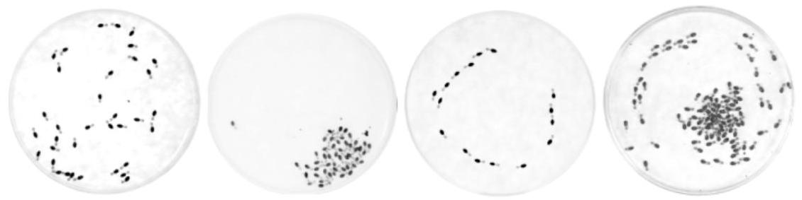
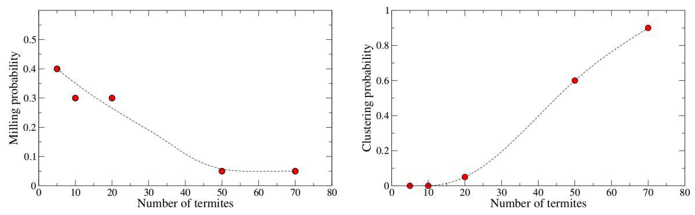
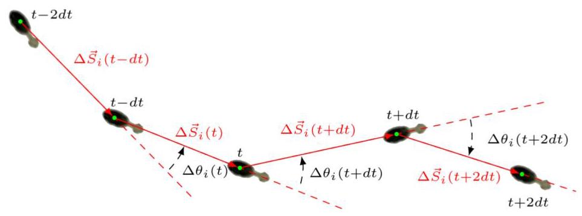
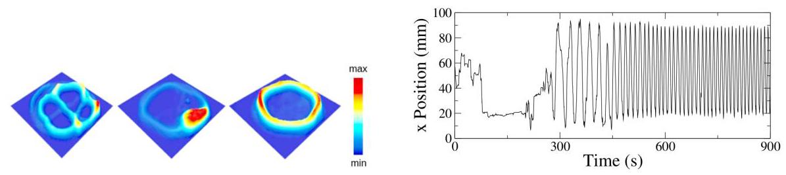
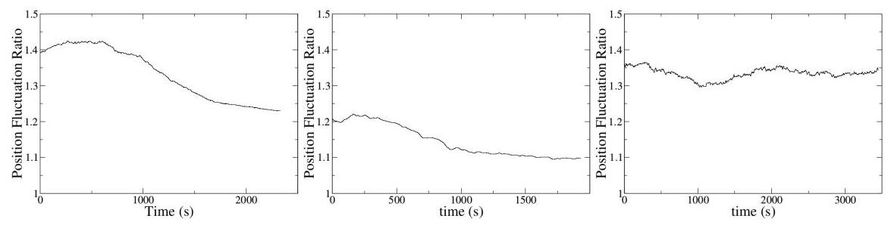
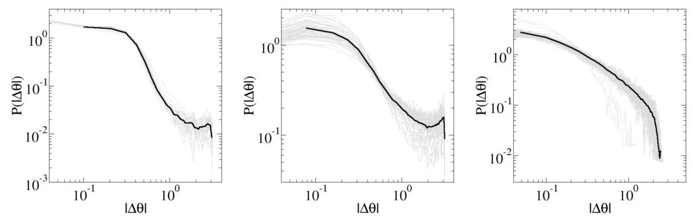
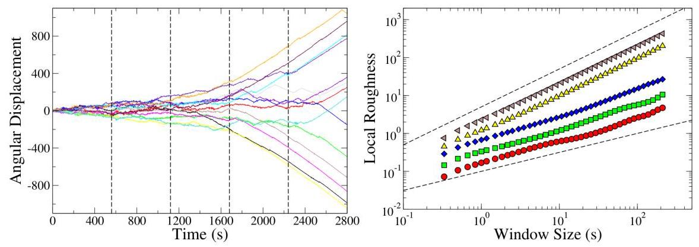
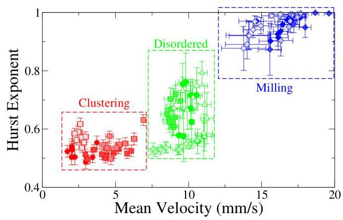
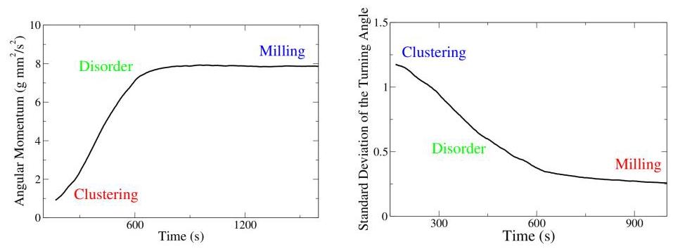
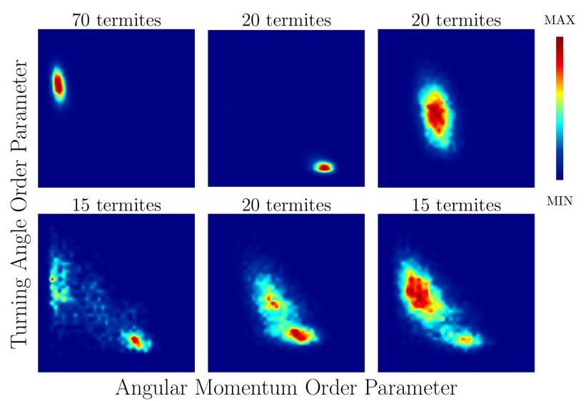

# Emergent dynamical phases and collective motion in termites

# 白蚁群体中的涌现动力学相和集体运动

Leticia R. Paiva ${}^{1}$ , Sidiney G. Alves ${}^{1}$ , Og DeSouza ${}^{2}$ , Octavio Miramontes ${}^{3, * }$

莱蒂西亚·R·派瓦${}^{1}$，西迪内伊·G·阿尔维斯${}^{1}$，奥格·德索萨${}^{2}$，奥克塔维奥·米拉蒙特斯${}^{3, * }$

${}^{1}$ Departamento de Física e Matemática,

${}^{1}$ 物理与数学系，

Universidade Federal de São João Del-Rei 36420-000, Ouro Branco, MG, Brazil

圣若昂-德尔雷联邦大学，巴西米纳斯吉拉斯州欧鲁布兰科市，邮编36420-000

${}^{2}$ Laboratorio de Termitologia, Universidade Federal de Viçosa, 36570-900 Viçosa, Minas Gerais, Brazil

${}^{2}$ 巴西米纳斯吉拉斯州维索萨市联邦大学白蚁学实验室，邮编36570 - 900

${}^{3}$ Departamento de Sistemas Complejos, Instituto de Física, Universidad Nacional Autónoma de México,

${}^{3}$ 复杂系统系，物理研究所，墨西哥国立自治大学，

Ciudad de México, C.P. 04510, Mexico

墨西哥城，邮编04510，墨西哥

*octavio@fisica.unam.mx

May 15, 2025

2025年5月15日

## Abstract

## 摘要

Termites which are able to forage in the open can be often seen, in the field or in the lab: (i) wandering around, forming no observable pattern, or (ii) clustering themselves in a dense and almost immobile pack, or (iii) milling about in a circular movement. Despite been well reported patterns, they are normally regarded as independent phenomena whose specific traits have never been properly quantified. Evidence, however, favours the hypothesis that these are interdependent patterns, arisen from self-organised interactions and movement among workers. After all, termites are a form of active matter where blind cooperative individuals are self-propelled and lack the possibility of visual cues to spatially orientate and align. It follows that their non-trivial close-contact patterns could generate motion-collision induced phase separations. This would then trigger the emergence of these three patterns (disorder, clustering, milling) as parts of the same continuum. By inspecting termite groups confined in arenas, we could quantitatively describe each one of these patterns in detail. We identified disorder, clustering and milling spatial patterns. These phases and their transitions are characterised aiming to offer refinements in the understanding of these aspects of self-propelled particles in active matter where close-range contacts and collisions are important.

在野外或实验室中，经常可以看到能够在开阔地带觅食的白蚁:(i) 四处游荡，没有明显的模式，或者 (ii) 聚集在一起形成密集且几乎不动的群体，或者 (iii) 做圆周运动。尽管这些模式已有充分报道，但它们通常被视为独立的现象，其具体特征从未得到过恰当的量化。然而，有证据支持这样的假设，即这些是相互依存的模式，源于工蚁之间的自组织相互作用和运动。毕竟，白蚁是一种活性物质，其中盲目合作的个体自行推进，缺乏通过视觉线索进行空间定向和排列的可能性。因此，它们非同寻常的紧密接触模式可能会产生运动碰撞诱导的相分离。这进而会触发这三种模式(无序、聚集、圆周运动)作为同一连续体的一部分出现。通过观察限制在实验区域内的白蚁群体，我们可以详细地定量描述这些模式中的每一种。我们识别出了无序、聚集和圆周运动的空间模式。对这些相及其转变进行了表征，旨在更深入地理解活性物质中自推进粒子的这些方面，在活性物质中近距离接触和碰撞很重要。

## 1 Introduction

## 1 引言

Active matter are systems made of a large number of interacting constituents (alive or not) able to convert some source of energy into directed motion [1-3]. In addition to being self-propelled, these constituents interact among themselves in such a way that their movement is both synchronized and correlated [4,5]. In doing so, collective behaviour and pattern formation spontaneously emerges. Pattern formation is a form of spatio-temporal self-organisation that is ubiquitous in nature, spanning physical, chemical, biological and even social phenomena [6]. In living matter, it is regarded as a fundamental out-of-equilibrium process underlying morphogenesis at the cellular level [7-10], to quote an example. However it is also present as a product of the complex collective interactions of individuals in social groups. Swarms, fish schools and insect foraging trails are examples par excellence [11-13]. The distinct ordered and disordered phases exhibited by various artificial systems composed of active particles have been investigated [3,14]. For example, patterns found by evolving the original Vicsek model [15] present either a disordered phase or an ordered flocking state. For $N \rightarrow  \infty$ , in particular, a coexistence of two different phases is observed close to criticality [16].

活性物质是由大量相互作用的组分(无论有无生命)组成的系统，这些组分能够将某种能量源转化为定向运动[1-3]。除了能够自我推进外，这些组分之间还会相互作用，使得它们的运动既同步又相关[4,5]。这样一来，集体行为和模式形成就会自发出现。模式形成是一种时空自组织形式，在自然界中无处不在，涵盖物理、化学、生物甚至社会现象[6]。以生物为例，它被视为细胞水平上形态发生的一个基本的非平衡过程[7-10]。然而，它也作为社会群体中个体复杂集体相互作用的产物而存在。蜂群、鱼群和昆虫觅食路径就是典型的例子[11-13]。人们已经研究了由活性粒子组成的各种人工系统所呈现的不同有序和无序相[3,14]。例如，通过演化原始的维塞克模型[15]发现的模式呈现出无序相或有序的聚集状态。特别是对于$N \rightarrow  \infty$，在临界附近观察到两种不同相的共存[16]。

Termites are, rightfully, biological active matter. They form groups of interacting individuals, and such interactions result in collective behaviours which translate into spatio-temporal emergent patterns [17-19]. Here we explore the various emergent spatial patterns in individuals confined in arenas. These collective arrangements of termite individuals are commonly found in the field [20,21] as well as in the lab (as observed here)(Figure 1). Individuals in termite groups can be seen in the field and in the lab (i) wandering around, forming no observable pattern, or (ii) they cluster themselves in a dense and almost immobile pack, or (iii) mill about in a circular movement. Given the similarities between termite spatial organization and non-living active matter, we hipothesize that these collective arrangements of termites (i.e. disorder, clustering, milling) are parts of the same continuum, rather than behaviours originated from an independent selective pressure. In order to inspect this hypothesis, we parameterized phase changes in termite workers movement patterns in order to explore how interactions at a local smaller scale may control these changes, that is, the scale of the individual. Such a parameterization allowed us to inspect whether these changes lead to a change of one of these collective behaviours into another.

白蚁理所当然地属于生物活性物质。它们形成相互作用的个体群体，这种相互作用导致集体行为，进而转化为时空涌现模式[17-19]。在这里，我们探索了被限制在实验区域内的个体中出现的各种涌现空间模式。白蚁个体的这些集体排列在野外[20,21]以及实验室中(如在此观察到的)(图1)都很常见。在野外和实验室中都可以看到白蚁群体中的个体(i)四处游荡，没有形成可观察到的模式，或者(ii)它们聚集在一起形成一个密集且几乎不动的群体，或者(iii)以圆周运动的方式来回走动。鉴于白蚁空间组织与非生物活性物质之间的相似性，我们假设这些白蚁的集体排列(即无序、聚集、打转)是同一连续体的一部分，而不是源于独立选择压力的行为。为了检验这一假设，我们对白蚁工蚁运动模式的相变进行了参数化，以探索在局部较小尺度上的相互作用如何控制这些变化(即个体尺度)。这种参数化使我们能够检验这些变化是否会导致这些集体行为中的一种转变为另一种。

Figure 1: Examples of the typical dynamical phases observed in confined termites. Top view of the arenas and showing, from left to right, disorder, clustering, milling, and an interesting coexistence of milling and clustering.

图1:在受限白蚁中观察到的典型动态阶段示例。竞技场的俯视图，从左到右依次展示无序、聚集、转圈以及转圈与聚集有趣的共存状态。

Besides a disordered phase, where termites are basically moving uncorrelated, collective-directed motion and stable spatial clusters in groups of workers can be clearly identified. The disorder is observed at the beginning of an experiment when termites are just deposited in the arenas and they are exploring the new surroundings. In this sense, the disordered phase is like the transient period of a dynamical system when the basis of attraction is being explored before arriving into the phase space attractor.

除了无序阶段(白蚁基本无关联地移动)，还能清晰识别出工蚁群体中的集体定向运动和稳定的空间集群。在实验开始时，当白蚁刚被放置在竞技场中并探索新环境时，会观察到无序状态。从这个意义上说，无序阶段就像动态系统的过渡时期，此时在进入相空间吸引子之前正在探索吸引的基础。

Collective-directed motion is known as milling or collective vortex where self-propelled particles rotate spontaneously in circular motion around a common centre. In termites, the formation of milling was first reported, and named "carrousel", by Grassé and others in B. natalensis and B. beli-cosus workers. Grassé noted that following a big perturbation, workers self-organize into a convoy, rotating in a circle for a very long time. He mentioned further that it was possible to often observe the spontaneous emergence of a second concentric circle of rotating termites but with the rotation direction inverted. (see [20-22] and references therein).

集体定向运动被称为转圈或集体涡旋，即自推进粒子围绕共同中心自发地做圆周运动。在白蚁中，转圈的形成最早由格拉塞等人在纳塔尔大白蚁和贝利大白蚁工蚁中报道并命名为“旋转木马”。格拉塞指出，在受到大的扰动后，工蚁会自组织成一个队列，长时间做圆周运动。他还进一步提到，经常可以观察到第二个同心旋转白蚁圈的自发出现，但旋转方向相反。(见[20 - 22]及其中的参考文献)。

Figure 2: Role of the termite density in the emergence of two collective behaviours. Left is the probability of observing milling when density is varied in the containers. As the number of workers increases, the probability of milling decays because of overcrowding. At right, the probability of observing clustering increases along with the density. Each point in the plots corresponds to an average of 20 independent samples, always in ${95}\mathrm{\;{mm}}$ diameter arenas and about 1-hour experiments. Dashed lines are a guide for the eyes only.

图2:白蚁密度在两种集体行为出现中的作用。左边是当容器中密度变化时观察到转圈的概率。随着工蚁数量增加，由于过度拥挤，转圈的概率下降。右边，观察到聚集的概率随密度增加。图中的每个点对应20个独立样本的平均值，总是在${95}\mathrm{\;{mm}}$直径的竞技场中进行约1小时的实验。虚线仅为示意。

Circling behaviours highly similar to termite milling are also observed in a variety of organisms: ants [23], caterpillar circles, bat doughnuts, amphibian vortex, duck swirl, and fish torus are just a few examples [24]. Milling is a kind of universal spatial phenomenon of abstract self-propelled particles, not necessarily alive, and is also present in simple computer models with or without spatial confinement, borders or walls [25-31]. In nature, when a scouting termite finds a profitable source of food, it returns to its nest laying an odour trail to be subsequently followed by its foraging nest-mates. As these foragers follow these marks and find the resource, they reinforce this trail so that to keep track of the resource location. At a first glance, this could explain the milling observed by us in the lab and by Grassé [22] in the field. However, unprofitable sources of food do not stimulate scout termites to lay trails. Thence, providing that these field or lab circular paths do not lead to any food, it seems unwarranted to claim a role for trail pheromones in forming milling. Moreover, even if pheromones would play a role in maintaining the milling for some time, they would not explain the inception of milling. It seems thence reasonable to suspect that termite milling has some roots on the causes of milling spatial phenomena observed in abstract self-propelled particles which are not alive.

在多种生物体中也观察到了与白蚁转圈高度相似的圆周行为:蚂蚁[23]、毛虫圈、蝙蝠圈、两栖动物涡旋、鸭漩涡和鱼环面只是其中几个例子[24]。转圈是抽象自推进粒子的一种普遍空间现象，不一定是有生命的，在有或没有空间限制、边界或墙壁的简单计算机模型中也存在[25 - 31]。在自然界中，当一只侦察白蚁找到一个有利可图的食物源时，它会回到巢穴留下气味痕迹，随后其觅食的巢伴会跟随。当这些觅食者沿着这些标记找到资源时，它们会加强这条痕迹以便跟踪资源位置。乍一看，这可以解释我们在实验室和格拉塞[22]在野外观察到的转圈现象。然而，无利可图的食物源不会刺激侦察白蚁留下痕迹。因此，如果这些野外或实验室的圆形路径没有通向任何食物，声称踪迹信息素在形成转圈中起作用似乎没有依据。此外，即使信息素在维持转圈一段时间中起作用，它们也无法解释转圈的起始。因此，合理的怀疑是白蚁转圈在某种程度上源于在无生命的抽象自推进粒子中观察到的转圈空间现象的原因。

Clusters in termites are groups of individuals in close proximity, often engaged in body-to-body interactions through antennations but with the body barely moving. Clustering formation resembles a gas-liquid transition [32] where initial free and uncorrelated moving termites condense (get trapped) into clusters by means of social interactions that act as the attractive and condensation force. Termites are polar-like particles, as they have distinct heads and tails, so disorder-order changes are expected. In fact, they interact through a combination of steric repulsion and alignment interactions. It is reasonable to expect that the clustering phase is more likely to be observed at higher densities. In these conditions, most of the workers stay in the cluster, but a few may escape executing long walks in the arena. These roles (trapped and escaped) are interchanged in a way that most of the termites will get trapped again giving up the free walks at some point [19]. It is remarkable that the step-size statistics of this process which includes mostly short movements but also few long walks is self-similar (Lévy-like) [18,19].

白蚁中的集群是彼此靠近的个体群体，通常通过触角接触进行身体间相互作用，但身体几乎不动。集群的形成类似于气 - 液转变[32]，最初自由且无关联移动的白蚁通过作为吸引力和凝聚力量的社会相互作用凝聚(被困)成集群。白蚁是类似极性的粒子，因为它们有明显的头部和尾部，所以预期会有无序 - 有序的变化。实际上，它们通过空间排斥和排列相互作用的组合进行相互作用。合理预期在更高密度下更有可能观察到聚集阶段。在这些条件下，大多数工蚁留在集群中，但少数可能逃脱并在竞技场中进行长距离行走。这些角色(被困和逃脱)会以某种方式互换，以至于大多数白蚁在某个时候会再次被困并放弃自由行走[19]。值得注意的是，这个过程的步长统计主要包括短距离移动但也有少数长距离行走，是自相似的(类 Lévy)[18,19]。

In this contribution we explore several dynamical phases in the behaviour of confined termites. We identify disorder, clustering and milling. We aim to characterize these phases and their changes in order to achive a deep understanding of self-propelled particles in active matter both in living and artificial systems where close-range contacts and collisions are important.

在本论文中，我们探索了受限白蚁行为中的几个动态阶段。我们识别出无序、聚集和转圈。我们旨在表征这些阶段及其变化，以便深入理解活性物质中自推进粒子在生物和人工系统中的行为，在这些系统中近距离接触和碰撞很重要。

## 2 Methods

## 2方法

Termite workers (Cornitermes cumulans) were collected in the grounds of the UFSJ (Universidade Federal de São João Del-Rei ) at its "Alto Paraopeba" campus, in the municipality of Ouro Branco, Minas Gerais, Brazil. Termites were then taken to an acclimatised laboratory as described in detail in [18]. Experimental arenas consisted of a glass Petri dish upside down over a filter paper. Within the arena, a variable number of termite workers was inserted and their movements were recorded continuously from above, with a video camera for 55 minutes (Sony FDR AX-53 4K). Termite trajectories were captured and digitised at a sample rate of one point every 0.333 s with an automatic video-tracking software (for more details see Supplementary Information of the reference [19]. No obstacles or food were present in the arenas. The resulting time series contained $x, y$ spatial coordinates used for numerical analysis.

白蚁工蚁(Cornitermes cumulans)采自位于巴西米纳斯吉拉斯州欧鲁布兰科市的圣若昂德尔雷伊联邦大学(Universidade Federal de São João Del-Rei)“阿尔托帕拉奥佩巴”校区的校园内。随后，按照[18]中详细描述的方法，将白蚁转移至一个适应环境的实验室。实验场地由一个倒置在滤纸上的玻璃培养皿组成。在实验场地内，放入数量可变的白蚁工蚁，并使用摄像机(索尼FDR AX - 53 4K)从上方连续记录它们55分钟的活动。白蚁的轨迹通过自动视频跟踪软件以每0.333秒一个点的采样率进行捕捉和数字化处理(更多细节见参考文献[19]的补充信息)。实验场地内没有障碍物或食物。得到的时间序列包含用于数值分析的$x, y$个空间坐标。

## 3 Results and Discussion

## 3结果与讨论

Figure 1 displays images of the arena, illustrating experiments that represent the typical phases observed during the temporal evolution of the experiments. Each panel of Figure 1 pertains to a different experiment. The panels qualitatively illustrate the existence of three phases, with images of the disordered, clustering, and milling phases from left to right. We witnessed time series containing a single phase along all the observation time, as well as experiments exhibiting a change between phases, and occasionally the coexistence of multiple phases. The rightmost panel of Figure 1 presents an image exemplifying a scenario of phase coexistence (clustering and milling). One should emphasize that these phases can last from a few minutes to more than an hour.

图1展示了实验场地的图像，说明了代表实验时间演变过程中观察到的典型阶段的实验。图1的每个面板对应一个不同的实验。这些面板定性地说明了三个阶段的存在，从左到右分别是无序、聚集和 milling 阶段的图像。我们观察到在所有观察时间内包含单一阶段的时间序列，以及表现出阶段之间变化的实验，偶尔还有多个阶段共存的情况。图1最右边的面板展示了一个阶段共存(聚集和 milling)场景的图像。需要强调的是，这些阶段可以持续几分钟到一个多小时。

### 3.1 Role of density

### 3.1密度的作用

An individual may be recruited to a particular dynamical behaviour (Figure 2) as a function of the number of individuals already committed to that behaviour [33], a phenomenon commonly known as social facilitation [34]. However, this may be a non-linear response since the autocatalytic recruitment of individuals can be slowed down or halted when saturation happens beyond a given number or density of individuals. In ants, it was shown that a transition from a chaotic to a periodic state is a function of the density of individuals in a nest [35]. In termites, it was shown that density can regulate individual survival [36] or may enhance mating encounters by changing speed according to the density [37] and in robots, it may induce the formation of aggregation clusters [38]. Even vehicle traffic exhibits a phase transition as a function of density [12]. All this is because these are collective behaviours that depend on the number of participating individuals.

个体可能会根据已经参与某种特定动态行为的个体数量，被招募到该特定动态行为中(图2)，这一现象通常被称为社会促进作用[34]。然而，这可能是非线性响应，因为当个体数量或密度超过给定值发生饱和时，个体的自催化招募可能会减慢或停止。在蚂蚁中，已表明从混沌状态到周期性状态的转变是巢穴中个体密度的函数[35]。在白蚁中，已表明密度可以调节个体生存[36]，或者根据密度改变速度来增加交配相遇的机会[37]，在机器人中，密度可能会诱导聚集簇的形成[38]。甚至车辆交通也表现出作为密度函数的相变[12]。所有这些都是因为这些是依赖于参与个体数量的集体行为。

In our experiments (Figure 2), we noticed that milling in these termites requires a low number of individuals to emerge. As a matter of fact, when the number is high and so is the density, we notice a low probability of milling formation. This seems counter-intuitive at first because high-density states would mean more social interactions to strengthen collective action; however high density disrupts the formation of coherent spatial structures simply because of the lack of space due to the finite boundaries of the containers. On the opposite, the emergence of clustering needs a large number of participating individuals since it is an aggregative process. (Figure 2).

在我们的实验中(图2)，我们注意到这些白蚁的 milling 行为需要较少数量的个体出现。事实上，当个体数量多且密度高时，我们注意到形成 milling 的概率较低。乍一看这似乎违反直觉，因为高密度状态意味着更多的社会互动来加强集体行动；然而，由于容器的有限边界导致空间不足，高密度会破坏连贯空间结构的形成。相反，聚集的出现需要大量参与个体，因为它是一个聚集过程(图2)。

### 3.2 Time series

### 3.2时间序列

Termite walking and their movement patterns have been the subject of recent studies ranging from their anomalous diffusion properties [18,19] to the dynamics of turning angles [39,40]. It is precisely the analysis of turning angles that allows us to explore additional aspects of the emergence of behavioural phases. From the time series recordings, simple parameter measurements such as angular position were made and then used further to estimate a number of quantities as follows.

白蚁的行走及其运动模式一直是近期研究的主题，范围从它们的反常扩散特性[18,19]到转弯角度的动力学[39,40]。正是转弯角度的分析使我们能够探索行为阶段出现的其他方面。从时间序列记录中，进行了诸如角位置等简单参数测量，然后进一步用于估计以下一些量。

At each time step $t$ , the $i$ -termite position ${\overrightarrow{S}}_{i}\left( t\right)  = \left( {{x}_{i}\left( t\right) ,{y}_{i}\left( t\right) }\right)$ was recorded and the displacement was defined as

在每个时间步$t$，记录$i$ - 白蚁的位置${\overrightarrow{S}}_{i}\left( t\right)  = \left( {{x}_{i}\left( t\right) ,{y}_{i}\left( t\right) }\right)$，位移定义为

$$
\Delta {\overrightarrow{S}}_{i}\left( t\right)  = {\overrightarrow{S}}_{i}\left( t\right)  - {\overrightarrow{S}}_{i}\left( {t - {dt}}\right) , \tag{1}
$$

as shown in Figure 3. The velocity was obtained using ${\overrightarrow{v}}_{i}\left( t\right)  = \Delta {\overrightarrow{S}}_{i}\left( t\right) /{dt}$ where ${dt}$ is the interval between the two consecutive positions. The turning angle $\Delta {\theta }_{i}\left( t\right)  \in  \left( {-\pi ,\pi }\right)$ was defined as the angle variation between two consecutive displacements, as shown in Figure 3 and using the following formula:

如图3所示。速度通过${\overrightarrow{v}}_{i}\left( t\right)  = \Delta {\overrightarrow{S}}_{i}\left( t\right) /{dt}$获得，其中${dt}$是两个连续位置之间的时间间隔。转弯角度$\Delta {\theta }_{i}\left( t\right)  \in  \left( {-\pi ,\pi }\right)$定义为两个连续位移之间的角度变化，如图3所示，并使用以下公式:

$$
{\theta }_{i}\left( t\right)  = {\theta }_{i}\left( {t - {dt}}\right)  + \Delta {\theta }_{i}\left( t\right) , \tag{2}
$$

we have defined the angular position ${\theta }_{i}\left( t\right)$ , a temporal measure of the displacement’s direction, of the termite $i$ .

我们定义了角位置${\theta }_{i}\left( t\right)$，它是白蚁$i$位移方向的时间度量。

Figure 3: Schematic illustration of a sequence of steps of a termite between times $t - {2dt}, t - {dt},\ldots \; t + {2dt}$ . The red segments indicate the displacements between two consecutive positions. The red dashed lines indicate the turning angle or angular displacement, between the direction of a step and the next one. The dashed black arrows show the rotation direction.

图3:白蚁在$t - {2dt}, t - {dt},\ldots \; t + {2dt}$时刻之间一系列步骤的示意图。红色线段表示两个连续位置之间的位移。红色虚线表示一步与下一步之间的转角或角位移。黑色虚线箭头表示旋转方向。

Considering the observed phases, it is clear that the integrated trajectories of the termites exhibiting them are quite different. Therefore, it is important to examine quantitatively the spatial distribution of termites throughout the arena. To address this aspect, we defined a square that encloses the arena, splitting the area into a grid to determine the spatial distribution frequency. There are ${40} \times  {40}$ bins in a grid that divides this square. Throughout the experiment, we kept track of how often termites visited each grid cell. Note that only the cells inside the circular arena were visited. The resulting plots, for each behavioural phase, are presented as examples in Figure 4 left. In the disordered phase, several trajectories are visited. Meanwhile, in the clustering phase, the termites stay confined to a given region and, in the milling phase, a closed loop is more visited than other regions in the arena.

考虑到观察到的阶段，很明显，表现出这些阶段的白蚁的综合轨迹有很大不同。因此，定量研究白蚁在整个实验区域内的空间分布很重要。为了解决这个问题，我们定义了一个包围实验区域的正方形，将该区域划分为网格以确定空间分布频率。这个正方形被划分为一个有${40} \times  {40}$个箱格的网格。在整个实验过程中，我们记录了白蚁访问每个网格单元的频率。请注意，只有圆形实验区域内的单元被访问。图4左展示了每个行为阶段的结果图示例。在无序阶段，有几条轨迹被访问。同时，在聚集阶段，白蚁集中在给定区域，而在 milling 阶段，一个闭环区域比实验区域的其他区域被访问得更多。

Figure 4: Typical temporal and spatial emergent patterns observed in confined termites. (Left) Accumulated activity in the arena as seen in a heat map; from left to right, disorder (45 termites, 105mm-diameter arena)., clustering (50 termites, 95mm-diameter arena)., and milling phases (20 termites, 100mm-diameter arena). To build these plots, the arena area was divided into a square grid of size ${40} \times  {40}$ units and the number of termites that entered and left each grid box during the experiment was recorded. (Right) Temporal evolution of the displacement $x$ spatial coordinate exhibiting three phases, for one termite in an 100mm-diameter arena together with other 19 termites. At around $t = {150}$ seconds, there is an episode of clustering where the curve shows a plateau. At around 200 seconds there is a disordered phase when the stable plateau is broken and from $t \approx  {450}$ , there is a milling phase exhibiting typical periodicity.

图4:在受限白蚁中观察到的典型时空涌现模式。(左)热图中显示的实验区域内的累积活动；从左到右，无序阶段(45只白蚁，直径105毫米的实验区域)、聚集阶段(50只白蚁，直径95毫米的实验区域)和 milling 阶段(20只白蚁，直径100毫米的实验区域)。为了绘制这些图，实验区域被划分为大小为${40} \times  {40}$单位的正方形网格，并记录了实验过程中进入和离开每个网格框的白蚁数量。(右)一只在直径100毫米实验区域内的白蚁与其他19只白蚁一起的位移$x$空间坐标的时间演化，呈现三个阶段。在大约$t = {150}$秒时，有一个聚集阶段，曲线显示为平稳段。在大约200秒时有一个无序阶段，此时稳定的平稳段被打破，从$t \approx  {450}$开始，有一个呈现典型周期性的 milling 阶段。

### 3.3 Displacement and turning angle fluctuations

### 3.3位移和转角波动

To quantitatively characterise the termite behaviour and the emerging phase, we consider the individual displacement time evolution obtained from the recorded videos. Initially, we aim to illustrate the behaviour for each phase by examining the temporal displacement in the $x$ spatial coordinate (displacement fluctuation). Each phase can be identified subjectively in a first approximation (see Figure 4(right)). In the disordered phase, the displacement fluctuates quite significantly; in the clustering case, we observe very small or no fluctuations; and finally, in the milling phase, the displacement exhibits periodic behaviour. For convenience and without loss of generality, the $x$ position was analysed here using a fluctuation ratio $r$ given by:

为了定量表征白蚁行为和涌现阶段，我们考虑从录制视频中获得的个体位移时间演化。最初，我们旨在通过检查$x$空间坐标中的时间位移(位移波动)来说明每个阶段的行为。在初步近似中，每个阶段都可以主观识别(见图4(右))。在无序阶段，位移波动非常显著；在聚集阶段，我们观察到波动非常小或没有波动；最后，在 milling 阶段，位移呈现周期性行为。为方便起见且不失一般性，这里使用由下式给出的波动比$r$来分析$x$位置:

$$
r =  < {x}^{2} > / < x{ > }^{2}\text{ . } \tag{3}
$$

Results show that time series where a change from disorder to milling is present can be spotted easily because they exhibit the typical S-shaped curve of a phase change (Figure 5). On the other hand, series without milling exhibit a rather flat fluctuation ratio along time. When a change from disorder to milling or to clustering is present, the value of $r$ has the tendency to decay towards a lower value, suggesting a more coherent dynamical behaviour.

结果表明，存在从无序到 milling 变化的时间序列很容易被发现，因为它们呈现出相变的典型S形曲线(图5)。另一方面，没有 milling 的序列在时间上呈现出相当平坦的波动比。当存在从无序到 milling 或到聚集的变化时，$r$的值倾向于朝着较低值衰减，这表明动力学行为更加连贯。

Figure 5: Typical examples of a position fluctuation ratio analysis $\left( r\right)$ . (Left and centre) Nine-time series containing 50006 points each were analysed and their $r$ was calculated using a moving average window of size ${1.5} \times  {10}^{4}$ . The average of all these points is shown as the black S-shaped curve that resembles a characteristic curve of a phase change. Left panel is a change from disorder to milling and the centre panel depicts a change from disorder to clustering. (Right) Seven-time series containing 48772 points each were analysed and their $r$ was calculated using a moving average window of size ${1.5} \times  {10}^{4}$ . The average is shown as the black curve exhibiting a nearly flat response. This is the case of disorder with no transition.

图5:位置波动比分析$\left( r\right)$的典型示例。(左和中)分析了九个每个包含50006个点的时间序列，并使用大小为${1.5} \times  {10}^{4}$的移动平均窗口计算它们的$r$。所有这些点的平均值显示为类似相变特征曲线的黑色S形曲线。左图是从无序到 milling 的变化，中图描绘了从无序到聚集的变化。(右)分析了七个每个包含48772个点的时间序列，并使用大小为${1.5} \times  {10}^{4}$的移动平均窗口计算它们的$r$。平均值显示为呈现几乎平坦响应的黑色曲线。这是没有转变的无序情况。

Another quantitative measure used to distinguish each phase and the changes from one phase to another is the turning angle. In particular, fluctuations of turning angles can be explored by means of a probability distribution of angle variations $\left( \left| {\Delta \Theta }\right| \right)$ as shown in the log-log plots in Figure 6 containing typical examples of time series with different behavioural phases on them. While this is a very simple analyses, it captures well the differences in the temporal behaviour when there are regime changes and when not.

另一种用于区分每个阶段以及从一个阶段到另一个阶段变化的定量测量方法是转角。具体而言，转角的波动可以通过角度变化$\left( \left| {\Delta \Theta }\right| \right)$的概率分布来探索，如图6中的对数-对数图所示，其中包含具有不同行为阶段的典型时间序列示例。虽然这是一个非常简单的分析，但它很好地捕捉了存在状态变化和不存在状态变化时时间行为的差异。

### 3.4 Mean velocity and Hurst exponent

### 3.4 平均速度与赫斯特指数

The mean velocity of the termites increases when a change from clustering to disorder or from disorder to milling is observed. This could be expected, as the termites undergoing milling follow a path while in the disordered scenario, they are meandering through the arena. When they are in the clustering configuration, although a few termites break away from the cluster and walk around the arena, most of the termites are doing only small displacements around their position, so the mean velocity should be small.

当观察到从聚集到无序或从无序到 milling 的变化时，白蚁的平均速度会增加。这是可以预期的，因为处于 milling 状态的白蚁会沿着一条路径移动，而在无序状态下，它们在场地中蜿蜒曲折。当它们处于聚集状态时，虽然有一些白蚁会脱离群体在场地周围走动，但大多数白蚁只是在其位置附近做小位移，所以平均速度应该较小。

The left panel of Figure 7 shows the time evolution of the angular position obtained for all termites in one experiment. We analyse the curves obtained for the angular position considering the local roughness defined as the standard deviation of $\delta {\theta }_{i}\left( t\right)$ in relation to the mean inside a box of size $\varepsilon$ :

图7的左图显示了在一次实验中所有白蚁的角位置随时间的演变。我们分析通过将局部粗糙度定义为$\delta {\theta }_{i}\left( t\right)$相对于大小为$\varepsilon$的盒子内均值的标准差而获得的角位置曲线:

$$
{w}^{2}\left( \varepsilon \right)  = {\left\langle  \frac{1}{{N}_{\varepsilon }}\mathop{\sum }\limits_{t}{\left( {\theta }_{i}\left( t\right) -\langle \theta \rangle \right) }^{2}\right\rangle  }_{\varepsilon } \tag{4}
$$

where $\langle \theta \rangle$ is the mean value of ${\theta }_{i}\left( t\right)$ and ${N}_{\varepsilon }$ the number of points inside the window of size $\varepsilon .\langle X{\rangle }_{\varepsilon }$ denotes a mean over the various windows of size $\varepsilon$ . We consider ten sectors to measure the local roughness (the sectors are indicated by the vertical lines in the left panel of the Figure 7).

其中$\langle \theta \rangle$是${\theta }_{i}\left( t\right)$的均值，${N}_{\varepsilon }$是大小为$\varepsilon .\langle X{\rangle }_{\varepsilon }$的窗口内的点数，$\varepsilon$表示在各种大小为$\varepsilon$的窗口上的均值。我们考虑十个扇区来测量局部粗糙度(这些扇区由图7左图中的垂直线表示)。

Figure 6: Typical plot examples of termite time series containing the probability distribution of angle fluctuations $\left( \left| {\Delta \Theta }\right| \right)$ for different behavioural phases. Grey curves on each of them are individual termites in the arena and the black curve is the average of them. From left to right side: change from disorder to milling (20 time series containing 10866 points each), change from milling to clustering (50 time series containing 10374 points each) and disordered behaviour (78 time series with 2505 points each). Black S-shaped curve is obtained when there is a behavioural change. However in its absence, when there is just disordered behaviour, the average curve exhibits a simple decay response.

图6:包含不同行为阶段角度波动$\left( \left| {\Delta \Theta }\right| \right)$概率分布的白蚁时间序列的典型绘图示例。每个图中的灰色曲线是场地中的单个白蚁，黑色曲线是它们的平均值。从左到右:从无序到 milling 的变化(20个时间序列，每个包含10866个点)，从 milling 到聚集的变化(50个时间序列，每个包含10374个点)以及无序行为(78个时间序列，每个包含2505个点)。当存在行为变化时会得到黑色S形曲线。然而，在没有行为变化，即只有无序行为时，平均曲线呈现出简单的衰减响应。

Through the scaling analysis of the local roughness $\left( w\right)$ as the window size $\varepsilon$ increases, we observed that

通过随着窗口大小$\varepsilon$增加对局部粗糙度$\left( w\right)$进行标度分析，我们观察到

$$
w\left( \epsilon \right)  \sim  {\varepsilon }^{H}, \tag{5}
$$

where $H$ is the Hurst exponent, which provides information related to autocorrelation in time series [41].

其中$H$是赫斯特指数，它提供了与时间序列中的自相关相关的信息[41]。

$H$ values fall in the range $\left\lbrack  {0,1}\right\rbrack$ , interpreted as follows. A value ${0.5} < H \leq  1$ indicates what is commonly termed 'statistically persistent behaviour'; that is, whatever the past trend in the series, it is likely to continue in the future, implying a strong degree of predictability and correlation. A value $0 < H \leq  {0.5}$ represents ’anti-persistent behaviour’ with low predictability.

$H$值落在$\left\lbrack  {0,1}\right\rbrack$范围内，其解释如下。值${0.5} < H \leq  1$表示通常所说的“统计上的持续行为”；也就是说，无论序列过去的趋势如何，它在未来都可能持续，这意味着具有很强的可预测性和相关性。值$0 < H \leq  {0.5}$代表“反持续行为”，可预测性较低。

Since termites in milling are performing a persistent behaviour over a closed trajectory, it is expected that the Hurst exponent of their steps be close to 1 while termites in the disordered state will be smaller. For each experiment, we split in ten equal parts all the time series (each one corresponding to one of the termites in the arena). Then, we averaged $H$ and the velocity $v$ over all termites in each time interval. In doing so, we obtain ten consecutive pairs of values $\left( { < v > , < H > }\right)$ for each experiment. In Figure 8 these pairs are plotted and it becomes evident that the region occupied by them can be associated with each of the emergent behavioural phases. There is a clear pattern where milling is characterised by high values of $< H >$ and high-velocity values and clustering is characterised by low $< H >$ values and low-velocity values. Disordered behaviour is associated with intermediary values of both $< H >$ and $< v >$ . It is interesting to note that, since our measurements were taken in a range of time windows, it allows us to identify the behavioural transitions across time.

由于处于 milling 状态的白蚁在封闭轨迹上表现出持续行为，预计它们步长的赫斯特指数接近1，而处于无序状态的白蚁的赫斯特指数会较小。对于每个实验，我们将所有时间序列(每个对应场地中的一只白蚁)等分为十份。然后，我们在每个时间间隔内对所有白蚁的$H$和速度$v$进行平均。这样，我们为每个实验获得了十对连续的值$\left( { < v > , < H > }\right)$。在图8中绘制了这些对，很明显它们所占据的区域可以与每个涌现的行为阶段相关联。有一个明显的模式，即 milling 以$< H >$的高值和高速度值为特征，聚集以$< H >$的低值和低速度值为特征。无序行为与$< H >$和$< v >$的中间值相关联。有趣的是，由于我们的测量是在一系列时间窗口内进行的，这使我们能够识别随时间的行为转变。

Figure 7: Angular displacement (left panel) and local roughness (right panel) for an experiment in which the termites change their behaviour from disordered to milling after 30 minutes (there were 14 termites in a ${100}\mathrm{\;{mm}}$ diameter arena). In left panel, each colour represents a different individual in the same arena. The vertical dashed lines in the left panel indicate five regions used to evaluate the local roughness (only five regions are shown for clarity). In right panel, each colour corresponds to the local roughness in one of the those regions (the first region in red circles, the second one in green squares, the third one in blue, the yellow triangles corresponds to the fourth region and the grey ones to the last region). The dashed lines in the right panel, which represent power laws with exponents of 0.5 (bottom) and 1.0 (top), should serve as a visual guide.

图7:在一项实验中，白蚁在30分钟后行为从无序转变为碾磨时的角位移(左图)和局部粗糙度(右图)(在直径为${100}\mathrm{\;{mm}}$的实验区域中有14只白蚁)。在左图中，每种颜色代表同一实验区域内的不同个体。左图中的垂直虚线表示用于评估局部粗糙度的五个区域(为清晰起见，仅显示了五个区域)。在右图中，每种颜色对应于其中一个区域的局部粗糙度(第一个区域用红色圆圈表示，第二个区域用绿色方块表示，第三个区域用蓝色表示，黄色三角形对应第四个区域，灰色对应最后一个区域)。右图中的虚线表示指数为0.5(底部)和1.0(顶部)的幂律，应作为视觉指南。

### 3.5 Momentum and standard deviation of turning angle

### 3.5 转角的动量和标准差

To further characterise the collective behaviour of the termite groups and their behavioural phases we use two order parameters based on previous measures discussed elsewhere in simulation models and studies of schooling fish [42-44]. First, the rotation order parameter describes the rotation around the center of the arena for each time, it is defined as

为了进一步表征白蚁群体的集体行为及其行为阶段，我们基于模拟模型和对集群鱼类的研究[42 - 44]中其他地方讨论的先前测量方法，使用两个序参量。首先，旋转序参量描述了每次围绕实验区域中心的旋转，它被定义为

$$
{O}_{L} = \frac{\left( {1/N}\right) \mathop{\sum }\limits_{{i = 1}}^{N}\left| {{\overrightarrow{u}}_{i} \times  {\overrightarrow{r}}_{i}}\right| }{\max \left\{  {\mathop{\sum }\limits_{{i = 1}}^{N}\left( {1/N}\right) \left| {{\overrightarrow{u}}_{i} \times  {\overrightarrow{r}}_{i}}\right| }\right\}  }, \tag{6}
$$

here, ${\overrightarrow{u}}_{i}$ and ${\overrightarrow{r}}_{i}$ are velocity and position vectors in relation to the center of the arena of the i-th termite, respectively. As in previous works, ${O}_{L} \in  \{ 0,1\}$ by construction, where 0 corresponds to no-rotation and 1 to strong rotation about the center of the arena. The absolute values are important here because, in contrast to most of the organisms that perform milling, termites do not necessarily move all of them in the same direction: some of them can move in the clockwise direction while others are anticlockwise, changing directions eventually. As one can see in Figure 9, when the termites are in the milling phase, one observes strong rotation. In the clustering phase there is a weak rotation and in the disordered phase, one observes intermediate values of the mean value of the absolute angular momenta. In the second-order parameter, we consider the standard deviation of the turning angle of the termites. In contrast to angular momenta, this parameter decreases as we go from clustering to disorder to milling, as can be seen in Figure 9. The construction of this order parameter considers a normalisation by the maximum value in order to get ${O}_{\Delta \theta } \in  \{ 0,1\}$ .

这里，${\overrightarrow{u}}_{i}$和${\overrightarrow{r}}_{i}$分别是第i只白蚁相对于实验区域中心的速度和位置向量。与先前的工作一样，${O}_{L} \in  \{ 0,1\}$通过构造得出，其中0对应于无旋转，1对应于围绕实验区域中心的强烈旋转。这里绝对值很重要，因为与大多数进行碾磨的生物不同，白蚁不一定都朝着同一方向移动:它们中的一些可以顺时针移动，而其他的则逆时针移动，最终改变方向。如图9所示，当白蚁处于碾磨阶段时，可以观察到强烈的旋转。在聚集阶段有微弱的旋转，而在无序阶段，可以观察到绝对角动量平均值的中间值。在二阶参量中，我们考虑白蚁转角的标准差。与角动量不同，这个参量随着我们从聚集到无序再到碾磨而减小，如图9所示。这个序参量的构建考虑了通过最大值进行归一化以得到${O}_{\Delta \theta } \in  \{ 0,1\}$。

To demonstrate more clearly these dynamically stable states, we show in Figure 10 a two-dimensional phase space spanned by the order parameter related to the variance of the turning angle ${O}_{\Delta \theta }$ and the one related to the angular momentum ${O}_{L}$ . The mean turning angle of all termites analyzed is zero (data not shown), and values of ${O}_{\Delta \theta }$ close to 1 are associated with a meandering behavior. Higher values of ${O}_{L}$ are associated with stronger rotation about the center of the arena. In this figure, we consider the proportion of time spent in different regions of this phase space, with red representing more time spent in a given region and blue the least time.

为了更清楚地展示这些动态稳定状态，我们在图10中展示了一个二维相空间，它由与转角方差${O}_{\Delta \theta }$相关的序参量和与角动量${O}_{L}$相关的序参量所跨越。分析的所有白蚁的平均转角为零(数据未显示)，${O}_{\Delta \theta }$接近1的值与蜿蜒行为相关。${O}_{L}$的值越高，与围绕实验区域中心的更强旋转相关。在这个图中，我们考虑在这个相空间的不同区域所花费的时间比例，红色表示在给定区域花费的时间更多，蓝色表示花费的时间最少。

Figure 8: A graph depicting the mean Hurst exponent against mean velocity. Each point is an average from the measures of all termites in the arena in a time window. Same symbols correspond to the different time windows in the same experiment, and their colours were choose based on the emergent behaviour observed. One can see single phases well separated into defined regions as indicated by the dashed rectangles. Each experiment was divided into 10 time windows, within which we evaluated the Hurst exponent and the mean velocity. So, for a 55-minute video, this resulted in the analysis of ten short series, each lasting 5.5 minutes. This allows us to detect changes in emergent behaviour over time. Data are from 12 independent experiments that range from 3 to 70 termites, in arenas with diameters between 90 and ${105}\mathrm{\;{mm}}$ .

图8:描绘平均赫斯特指数与平均速度关系的图表。每个点是在一个时间窗口内实验区域中所有白蚁测量值的平均值。相同的符号对应于同一实验中的不同时间窗口，并且它们的颜色是根据观察到的涌现行为选择的。可以看到单个阶段被很好地分隔到由虚线矩形指示的定义区域中。每个实验被分成10个时间窗口，在其中我们评估赫斯特指数和平均速度。所以，对于一个55分钟的视频，这导致分析了10个短序列，每个持续5.5分钟。这使我们能够检测随时间涌现行为的变化。数据来自12个独立实验，白蚁数量从3到70只不等，实验区域直径在90到${105}\mathrm{\;{mm}}$之间。

Figure 9: Typical behaviours of the absolute value of the angular momenta (left) and of the standard deviation of the turning angle (right), averaged in all termites in the arena, in an experiment where the three phases were observed (in this particular experiment, there were 20 termites in a 100mm-diameter arena).

图9:在一个观察到三个阶段的实验中，实验区域内所有白蚁的角动量绝对值(左)和转角标准差(右)的典型行为(在这个特定实验中，在直径为100毫米的实验区域中有20只白蚁)。

Figure 10: Density plots of the variance of the turning angle vs. angular momentum order parameters from six independent experiments, both variables in the interval $\left\lbrack  {0,1}\right\rbrack$ by construction in each plot. The data show typical cases of each phase (top panels, from left to right: clustering, milling, and disordered) and also cases where behavioural transitions are observed (bottom panel, from left to right side: from milling to clustering, from disordered to milling, and from clustering to disordered to milling. Each plot was built using time series with between ${10}^{4}$ and ${10}^{5}$ data points . The experiments correspond to (right to left side, top to bottom): 70 termites in a 95-mm arena, 20 termites in a 100-mm arena, 20 termites in a 95-mm arena, 15 termites in a 100-mm arena, 20 termites in a 100-mm arena and 15 termites in a 90-mm arena.

图10:来自六个独立实验的转弯角度方差与角动量序参量的密度图，在每个图中，两个变量在区间$\left\lbrack  {0,1}\right\rbrack$内通过构建得到。数据展示了每个相的典型情况(上图，从左到右:聚集、 milling和无序)，以及观察到行为转变的情况(下图，从左到右:从milling到聚集、从无序到milling、从聚集到无序再到milling)。每个图使用具有${10}^{4}$到${10}^{5}$个数据点的时间序列构建。实验对应于(从右到左，从上到下):95毫米场地中的70只白蚁、100毫米场地中的20只白蚁、95毫米场地中的20只白蚁、100毫米场地中的15只白蚁、100毫米场地中的20只白蚁和90毫米场地中的15只白蚁。

The top panels of the Figure 10, from left to right, display typical cases where we observe clustering, milling, and disordered, during the entire trial. Some examples of the transition between different phases are shown in the bottom panels. Specifically, the changes from milling to clustering, disordered to clustering, and clustering to disordered to milling are displayed (from left to right, respectively).

图10的上图，从左到右，展示了我们在整个试验期间观察到聚集、milling和无序的典型情况。不同相之间转变的一些例子在下图中展示。具体来说，展示了从milling到聚集、无序到聚集以及聚集到无序再到milling的变化(分别从左到右)。

Understanding the emergence of collective behaviour in active matter and the transitions from one state or phase to another from the interactions of many individual self-propelled constituents is challenging, especially in biological systems. In termites, under laboratory confinement, there are at least three detectable dynamical phases: disorder, clustering, and milling with transitions from disorder to clustering and disorder to milling. The explanations of what triggers these transitions remain elusive and largely unknown [24]. Density, velocity, alignment, and collisions (termites are blind [45]) are factors worth exploring and we have produced in the present study a number of experiments aimed at identifying parameters that can characterise the phases and their changes). However, it is important to remember that milling (vortex behaviour) is ubiquitous to many organisms and artificial systems under very different spatial situations [24] and so the importance to provide new insights on termites is relevant. The same applies to the other phases we describe here. Grassé [20] could not point the causes of milling but he did point out that it was a natural event that occurred in the field. Our experimental setup was able to replicate, in the lab, these three field behaviours and that gave us confidence in drawing biological meaning from our assays.

理解活性物质中集体行为的出现以及从许多单个自推进成分的相互作用中从一种状态或相到另一种状态或相的转变具有挑战性，特别是在生物系统中。在白蚁中，在实验室限制条件下，至少有三个可检测的动态相:无序、聚集和milling，伴随着从无序到聚集以及从无序到milling的转变。引发这些转变的原因的解释仍然难以捉摸且很大程度上未知[24]。密度、速度、排列和碰撞(白蚁是盲的[45])是值得探索的因素，并且我们在本研究中进行了许多实验，旨在识别可以表征这些相及其变化的参数。然而，重要的是要记住，milling(涡旋行为)在非常不同的空间情况下对于许多生物体和人工系统来说是普遍存在的[24]，因此提供关于白蚁的新见解是有意义的。这同样适用于我们在此描述的其他相。Grassé[20]无法指出milling的原因，但他确实指出这是在野外发生的自然事件。我们的实验装置能够在实验室中复制这三种野外行为，这使我们有信心从我们的分析中得出生物学意义。

We hope that this study could be helpful for improving our understanding of diverse behavioural aspects of self-organised patterns and phase transitions in active matter including other social living species and artificial systems such as swarm models [46], programmable robots [47] and engineering and interdisciplinary applications such traffic flows [48], smart aggregates [49] and shape-memory materials [50].

我们希望这项研究有助于增进我们对活性物质中自组织模式和相变的各种行为方面的理解，包括其他群居生物和人工系统，如群体模型[46]、可编程机器人[47]以及工程和跨学科应用，如交通流[48]、智能聚集体[49]和形状记忆材料[50]。

## Ethics

## 伦理

This study did not require ethical approval from any committee.

本研究无需任何委员会的伦理批准。

## Dataccess

## 数据访问

Time series containing examples of termite walking trajectories are available at the FAIR-aligned Harvard Metaverse repository: https://doi.org/10.7910/DVN/YJNXNQ

包含白蚁行走轨迹示例的时间序列可在符合FAIR原则的哈佛元宇宙存储库中获取:https://doi.org/10.791/DVN/YJNXNQ

## Aucontribute

## 作者贡献

LRP and SGA: conceptualisation, laboratory experiments, formal analysis, software development. ODS and OM: formal analysis. All authors participated in writing the original draft and edited drafts.

LRP和SGA:概念化、实验室实验、形式分析、软件开发。ODS和OM:形式分析。所有作者都参与了原始草稿的撰写和编辑草稿。

## Competing

## 竞争利益

No competing interests.

无竞争利益。

## Funding

## 资金

This study was financed by the Coordenação de Aperfeiçoamento de Pessoal de Nível Superior - Brasil (CAPES) - Finance Code 001, as well as the Minas Gerais State Foundation for the Support of Scientific Research (Fapemig), and the Brazilian National Council for Scientific Development (CNPq). OM was supported by UNAM PASPA - DGAPA. ODS holds a CNPq Fellowship # 307328/2023-6 and SGA holds a CNPq Fellowship # 311019/2021-8.

本研究由巴西高等教育人员素质提升协调办公室(CAPES) - 财务代码0C01资助，以及米纳斯吉拉斯州科学研究支持基金会(Fapemig)和巴西国家科学发展委员会(CNPq)资助。OM得到了墨西哥国立自治大学PASPA - DGAPA的支持。ODS持有CNPq奖学金#307328/2023 - 6，SGA持有CNPq奖学金#311019/2021 - 8。

## Ack

## 致谢

OM thanks the Biological Physics Lab at UFSJR-Brazil and the Termitology Lab at UFV-Brazil for their hospitality during a research visit to them. Thanks to Silvio Ferreira, Ricardo Falcão, Gustavo Daudt, Dalson Oliveira and Daniel Ferreira for helping with the experiments. We also thank the free software community for the computational applications needed for data storage and manipulation, data analyses, image processing, typesetting, etc., through GNU-Linux/Debian, Ubuntu, Xubuntu, LATEX, BibTeX, Python, Grace, openCV, Overleaf, among others. This is contribution # 88 from the Lab of Termitology at UFV (http://www.isoptera.ufv.br) and #01 from the Biological Physics Lab at UFSJ.

OM感谢巴西UFSJR的生物物理实验室和巴西UFV的白蚁学实验室在研究访问期间的热情款待。感谢Silvio Ferreira、Ricardo Falcão、Gustavo Daudt、Dalson Oliveira和Daniel Ferreira在实验方面的帮助。我们还感谢自由软件社区提供的数据存储和处理、数据分析、图像处理、排版等所需的计算应用程序，包括GNU - Linux/Debian、Ubuntu、Xubuntu、LATEX、BibTeX、Python、Grace、openCV、Overleaf等。这是UFV白蚁学实验室的贡献#88(http://www.isoptera.ufv.br)和UFSJ生物物理实验室的贡献#01。

## References

## 参考文献

[1] S. Ramaswamy, "The mechanics and statistics of active matter," The Annual Review of Condensed Matter Physics, vol. 1, pp. 323-45, 2010.

[2] G. De Magistris and D. Marenduzzo, "An introduction to the physics of active matter," Physica A: Statistical mechanics and its applications, vol. 418, pp. 65-77, 2015.

[3] É. Fodor and M. C. Marchetti, "The statistical physics of active matter: From self-catalytic colloids to living cells," Physica A: Statistical mechanics and its applications,

催化胶体与活细胞，《物理A:统计力学及其应用》vol. 504, pp. 106-120, 2018.

[4] A. Czirók, H. E. Stanley, and T. Vicsek, "Spontaneously ordered motion of self-propelled particles," Journal of Physics A: Mathematical and General, vol. 30, no. 5, p. 1375, 1997.

推进粒子，《物理学报A:数学与一般物理》，第30卷，第5期，第1375页，1997年。

[5] A. Czirók and T. Vicsek, "Collective behavior of interacting self-propelled parti-cles," Physica A: statistical mechanics and its applications, vol. 281, no. 1-4, pp. 17-29, 2000.

粒子，《物理A:统计力学及其应用》，第281卷，第1 - 4期，第17 - 29页，2000年。

[6] M. C. Cross and P. C. Hohenberg, "Pattern formation outside of equilibrium," Reviews of Modern Physics, vol. 65, no. 3, p. 851, 1993.

[7] A. Gierer and H. Meinhardt, "A theory of biological pattern formation," Kybernetik, vol. 12, pp. 30-39, 1972.

[8] L. Wolpert, "Pattern formation in biological development," Scientific American, vol. 239, no. 4, pp. 154-165, 1978.

[9] A.-J. Koch and H. Meinhardt, "Biological pattern formation: from basic mechanisms to complex structures," Reviews of Modern Physics, vol. 66, no. 4, p. 1481, 1994.

[10] V. Isaeva, "Self-organization in biological systems," Biology Bulletin, vol. 39, pp. 110-118, 2012.

[11] A. Attanasi, A. Cavagna, L. Del Castello, I. Giardina, S. Melillo, L. Parisi, O. Pohl,B. Rossaro, E. Shen, E. Silvestri, et al., "Finite-size scaling as a way to probe near-criticality in natural swarms," Physical Review Letters, vol. 113, no. 23, p. 238102, 2014.

B. 罗萨罗、E. 沈、E. 西尔维斯特里等人，“有限尺寸标度作为探测自然群体近临界性的一种方法”，《物理评论快报》，第113卷，第23期，第238102页，2014年。

[12] D. Chowdhury, K. Nishinari, and A. Schadschneider, "Self-organized patterns andtraffic flow in colonies of organisms: from bacteria and social insects to vertebrates,"

生物群体中的交通流:从细菌、群居昆虫到脊椎动物，Phase Transitions, vol. 77, no. 5-7, pp. 601-624, 2004.

[13] S. Camazine, J.-L. Deneubourg, N. R. Franks, J. Sneyd, G. Theraula, andE. Bonabeau, "Self-organization in biological systems," in Self-Organization in Bio-

E. 博纳博，“生物系统中的自组织”，载于《生物自组织》logical Systems, Princeton university press, 2020.

[14] G. De Magistris and D. Marenduzzo, "An introduction to the physics of active matter," Physica A, vol. 418, p. 65-77, 2015.

[15] T. Vicsek, A. Czirók, E. Ben-Jacob, I. Cohen, and O. Shochet, "Novel type of phasetransition in a system of self-driven particles," Phys. Rev. Lett., vol. 75, pp. 1226- 1229, 1995.

自驱动粒子系统中的转变，《物理评论快报》，第75卷，第1226 - 1229页，1995年。

[16] H. Chaté, F. Ginelli, G. Grégoire, and F. Raynaud, "Collective motion of self-propelled particles interacting without cohesion," Phys. Rev. E, vol. 77, p. 046113, 2008.

无凝聚相互作用的推进粒子，《物理评论E》，第77卷，第046113页，2008年。

[17] O. Miramontes and O. DeSouza, "The nonlinear dynamics of survival and socialfacilitation in termites," Journal of Theoretical Biology, vol. 181, no. 4, pp. 373-380, 1996.

白蚁中的促进作用，《理论生物学杂志》，第181卷，第4期，第373 - 380页, 1996年。

[18] O. Miramontes, O. DeSouza, L. R. Paiva, A. Marins, and S. Orozco, "Lévy Flightsand Self-Similar Exploratory Behaviour of Termite Workers: Beyond Model Fitting,"

以及白蚁工蚁的自相似探索行为:超越模型拟合，PLoS ONE, vol. 9, p. e111183, 10 2014.

[19] L. R. Paiva, A. Marins, P. F. Cristaldo, D. M. Ribeiro, S. G. Alves, A. M. Reynolds,O. DeSouza, and O. Miramontes, "Scale-free movement patterns in termites emerge from social interactions and preferential attachments," Proceedings of the National

O. 德索萨和O. 米拉蒙特斯，“白蚁中无标度运动模式源于社会互动和优先连接”，《美国国家科学院院刊》Academy of Sciences USA, vol. 118, no. 20, p. e2004369118, 2021.

[20] P.-P. Grassé, "Recherches sur la systématique et la biologie des termites de l'afriqueoccidentale française première partie protermitidæ, mesotermitidæ, metatermitidæ (termitinæ)," Annales de la Société Entomologique de France, vol. 106, no. 1, pp. 1-100, 1937.

法国西部第一部分原白蚁科、中白蚁科、后白蚁科(白蚁亚科)，《法国昆虫学会年报》，第106卷，第1期，第1 - 100页，1937年。

[21] P.-P. Grassé and C. Noirot, "La sociotomie: migration et fragmentation de la termi-tière chez les anoplotermes et les trinervitermes," Behaviour, pp. 146-166, 1951.

[22] P.-P. Grassé, Termitologia, vol. III. Masson, Paris, 1986.

[23] T. C. Schneirla et al., "A unique case of circular milling in ants, considered in rela-tion to trail following and the general problem of orientation," American Museum

对追踪路线及定向一般问题的研究，美国自然历史博物馆novitates, 1253, 1944.

[24] J. Delcourt, N. W. Bode, and M. Denoël, "Collective vortex behaviors: Diversity,proximate, and ultimate causes of circular animal group movements," The Quarterly

圆形动物群体运动的近因和终极原因，《季刊》Review of Biology, vol. 91, no. 1, pp. 1-24, 2016.

[25] H. Levine, W.-J. Rappel, and I. Cohen, "Self-organization in systems of self-propelled particles," Physical Review E, vol. 63, no. 1, p. 017101, 2000.

[26] M. R. D'Orsogna, Y.-L. Chuang, A. L. Bertozzi, and L. S. Chayes, "Self-propelledparticles with soft-core interactions: patterns, stability, and collapse," Physical Re-

具有软核相互作用的粒子:模式、稳定性和崩溃，《物理评论》view Letters, vol. 96, no. 10, p. 104302, 2006.

[27] R. Lukeman, Y.-X. Li, and L. Edelstein-Keshet, "A conceptual model for milling for-mations in biological aggregates," Bulletin of Mathematical Biology, vol. 71, pp. 352- 382, 2009.

生物聚集体中的运动，《数学生物学公报》，第71卷，第352 - 382页，2009年。

[28] A. Costanzo, E. van Haeringen, and C. Hemelrijk, "Effect of time-delayed interac-tions on milling: A minimal model," Europhysics Letters, vol. 138, no. 2, p. 22002, 2022.

关于研磨的研究:一个最小模型，《欧洲物理快报》，第138卷，第2期，第22002页，2022年。

[29] A. Costanzo and C. Hemelrijk, "Spontaneous emergence of milling (vortex state) ina vicsek-like model," Journal of Physics D: Applied Physics, vol. 51, no. 13, p. 134004, 2018.

一个类似维塞克的模型，《物理学杂志D:应用物理学》，第51卷，第13期，第134004页，2018年。

[30] D. S. Cambui, E. Gusken, M. Roehrs, and T. Iliass, "The milling pattern in animalgroups and its dependence on the density and on the number of particles," Physica

群体及其对密度和粒子数量的依赖性，《物理学报》A: Statistical Mechanics and its Applications, vol. 507, pp. 289-293, 2018.

[31] A. Costanzo, "Milling-induction and milling-destruction in a vicsek-like binary-mixture model," Europhysics Letters, vol. 125, no. 2, p. 20008, 2019.

[32] Z. Cheng, Z. Chen, T. Vicsek, D. Chen, and H.-T. Zhang, "Pattern phase transitionsof self-propelled particles: gases, crystals, liquids, and mills," New Journal of Physics,

自驱动粒子:气体、晶体、液体和研磨机，《新物理学杂志》vol. 18, p. 103005, 10 2016.

[33] J.-L. Deneubourg and S. Goss, "Collective patterns and decision-making," Ethology Ecology & Evolution, vol. 1, no. 4, pp. 295-311, 1989.

[34] R. B. Zajonc, "Social facilitation: A solution is suggested for an old unresolved social psychological problem.," Science, vol. 149, no. 3681, pp. 269-274, 1965.

[35] O. Miramontes, "Order-disorder transitions in the behavior of ant societies," Complexity, vol. 1, no. 3, pp. 56-60, 1995.

[36] O. Miramontes and O. DeSouza, "The nonlinear dynamics of survival and socialfacilitation in termites," Journal of Theoretical Biology, vol. 181, no. 4, pp. 373-380, 1996.

白蚁中的促进作用，《理论生物学杂志》，第181卷，第4期，第373 - 380页，1996年。

[37] N. Mizumoto, A. Rizo, S. C. Pratt, and T. Chouvenc, "Termite males enhance mat-ing encounters by changing speed according to density," Journal of Animal Ecology,

根据密度改变速度以影响相遇，《动物生态学杂志》vol. 89, no. 11, pp. 2542-2552, 2020.

[38] A. Deblais, T. Barois, T. Guerin, P.-H. Delville, R. Vaudaine, J. S. Lintuvuori, J.-F.Boudet, J.-C. Baret, and H. Kellay, "Boundaries control collective dynamics of iner-

布代、J.-C. 巴雷和H. 凯莱，“边界控制惰性物质的集体动力学”tial self-propelled robots," Physical Review Letters, vol. 120, no. 18, p. 188002, 2018.

[39] W.-J. Jeon and S.-H. Lee, "A simulation model for the study of the territorial behav-ior of subterranean termites," Journal of the Korea Society for Simulation, vol. 21, no. 2, pp. 1-9, 2012.

地下白蚁的信息素，《韩国模拟学会杂志》，第21卷，第2期，第1 - 9页，2012年。

[40] N. Mizumoto and S. Dobata, "Adaptive switch to sexually dimorphic movements by partner-seeking termites," Science Advances, vol. 5, no. 6, p. eaau6108, 2019.

[41] J. Schmittbuhl, J.-P. Vilotte, and S. Roux, "Reliability of self-affine measurements," Phys. Rev. E, vol. 51, pp. 131-147, 1995.

[42] K. Tunstrom, Y. Katz, C. C. Ioannou, C. Huepe, M. J. Lutz, and I. D. Couzin, "Collec-tive States, Multistability and Transitional Behavior in Schooling Fish," PLoS Com-

群居鱼类中的状态、多稳定性和过渡行为，《公共科学图书馆·综合》putational Biology, vol. 9, p. e1002915, 2 2013.

[43] I. D. Couzin, J. Krause, R. James, G. D. Ruxton, and N. R. Franks, "Collective mem-ory and spatial sorting in animal groups," Journal of Theoretical Biology, vol. 218,

动物群体中的记忆与空间排序，《理论生物学杂志》，第218卷no. 1, pp. 1-11, 2002.

[44] A. Kolpas, J. Moehlis, and I. G. Kevrekidis, "Coarse-grained analysis ofstochasticity-induced switching between collective motion states," Proc Natl Acad

随机诱导的集体运动状态之间的转换，《美国国家科学院院刊》Sci U S A, vol. 104, no. 14, pp. 5931-5935, 2007.

[45] P. Eggleton, "An introduction to termites: biology, taxonomy and functional morphology," Biology of termites: a modern synthesis, pp. 1-26, 2011.

[46] E. M. Rauch, M. M. Millonas, and D. R. Chialvo, "Pattern formation and functionality in swarm models," Physics Letters A, vol. 207, no. 3-4, pp. 185-193, 1995.

[47] P. Thalamy, B. Piranda, and J. Bourgeois, "A survey of autonomous self-reconfiguration methods for robot-based programmable matter," Robotics and Au-

基于机器人的可编程物质的重构方法，《机器人与自动化》tonomous Systems, vol. 120, p. 103242, 2019.

[48] K. Fourrate and M. Loulidi, "Disordered cellular automaton traffic flow model:phase separated state, density waves and self organized criticality," The European

相分离状态、密度波和自组织临界性，《欧洲》Physical Journal B-Condensed Matter and Complex Systems, vol. 49, pp. 239-246, 2006.

[49] T. J. Saravanan, K. Balamonica, C. B. Priya, A. L. Reddy, and N. Gopalakrishnan,"Comparative performance of various smart aggregates during strength gain and damage states of concrete," Smart Materials and Structures, vol. 24, no. 8, p. 085016, 2015.

各种智能聚集体在混凝土强度增长和损伤状态下的比较性能，《智能材料与结构》，第24卷，第8期，第085016页，2015年。

[50] A. Lendlein, M. Balk, N. A. Tarazona, and O. E. Gould, "Bioperspectives for shape-memory polymers as shape programmable, active materials," Biomacromolecules,

作为形状可编程活性材料的记忆聚合物，《生物大分子》vol. 20, no. 10, pp. 3627-3640, 2019.