# Multiplant Nonlinear System Identification by Block-Structured Multikernel Neural Networks in Applications of Interference Cancellation

# 基于块结构多核神经网络的多工厂非线性系统辨识在干扰消除应用中的研究

Svantje Voit, Student Member, IEEE, and Gerald Enzner, Senior Member, IEEE

斯万特·沃伊特，IEEE 学生会员，以及杰拉尔德·恩兹纳，IEEE 高级会员

Abstract-Problems of linear system identification have closed-form solutions, e.g., using least-squares or maximum-likelihood methods on input-output data. However, already the seemingly simplest problems of nonlinear system identification present more difficulties related to the optimisation of the furrowed error surface. Those cases include the Hammerstein plant with typically a bilinear model representation based on polynomial or Fourier expansion of its nonlinear element. Wiener plants induce actual nonlinearity in the parameters, which further complicates the optimisation. Neural network models and related optimisers are, however, well-prepared to represent and solve nonlinear problems. Unfortunately, the available data for nonlinear system identification might be too diverse to support accurate and consistent model representation. This diversity may refer to different impulse responses and nonlinear functions that arise in different measurements of (different) plants. We therefore propose multikernel neural network models to represent nonlinear plants with a subset of trainable weights shared between different measurements and another subset of plant-specific (i.e., multikernel) weights to adhere to the characteristics of specific measurements. We demonstrate that in this way we can fit neural network models to the diverse data which cannot be done with some standard methods of nonlinear system identification. For model testing, the subset of shared weights of the entire trained model is reused to support the identification and representation of unseen plant measurements, while the plant-specific model weights are readjusted to specifically meet the test data.

摘要——线性系统辨识问题有闭式解，例如，对输入输出数据使用最小二乘法或最大似然法。然而，即使是看似最简单的非线性系统辨识问题，在优化崎岖的误差曲面时也会遇到更多困难。这些情况包括具有典型双线性模型表示的哈默斯坦工厂，其基于非线性元件的多项式或傅里叶展开。维纳工厂会在参数中引入实际的非线性，这进一步使优化变得复杂。然而，神经网络模型和相关优化器非常适合表示和解决非线性问题。不幸的是，用于非线性系统辨识的可用数据可能过于多样，无法支持准确且一致的模型表示。这种多样性可能指不同(不同)工厂的不同测量中出现的不同脉冲响应和非线性函数。因此，我们提出多核神经网络模型，用在不同测量之间共享的可训练权重子集以及特定于工厂的(即多核)权重子集来表示非线性工厂，以适应特定测量的特征。我们证明，通过这种方式，我们可以将神经网络模型拟合到多样的数据上，而这是一些标准的非线性系统辨识方法无法做到的。对于模型测试，整个训练模型的共享权重子集被重新用于支持对未见过的工厂测量的辨识和表示，同时特定于工厂的模型权重会重新调整以专门适应测试数据。

Index Terms-Nonlinear system identification, neural networks, adaptive filters

关键词——非线性系统辨识、神经网络、自适应滤波器

## I. INTRODUCTION

## 一、引言

INTERFERENCE cancellation typically relies on plant identification in order to duplicate and compensate undesired interference from a primary observation signal that also contains an information-bearing desired signal. The goal is to enhance the accessibility of the information in the desired signal by subtracting an estimated interference from the primary signal. To do so, the primary signal serves as a target response for an interference plant model. An auxiliary signal, which is ideally independent from the information-bearing signal, serves as the model input. The model parameters (in some cases termed filter coefficients) are then adjusted in a system identification fashion to match the model output to the actual interference linked to the same auxiliary signal by the initially unknown plant. The model structure must be architected for its capability of representing the plant, while the actual plant structure is assumed to be available as domain-knowledge.

干扰消除通常依赖于工厂辨识，以便复制并补偿来自主要观测信号的不期望干扰，该主要观测信号还包含携带信息的期望信号。目标是通过从主要信号中减去估计的干扰来增强期望信号中信息的可获取性。为此，主要信号用作干扰工厂模型的目标响应。一个辅助信号，理想情况下与携带信息的信号无关，用作模型输入。然后以系统辨识的方式调整模型参数(在某些情况下称为滤波器系数)，以使模型输出与由最初未知的工厂与相同辅助信号相关联的实际干扰相匹配。模型结构必须设计成具有表示工厂的能力，而实际工厂结构假定可作为领域知识获取。

The process of interference cancellation is crucial in applications like acoustic echo cancellation (AEC) in hands-free systems for speech communication [1]-[4] or self-interference cancellation (SIC) in full-duplex radios for wireless communication [5]-[9]. In hands-free speech communication, a microphone not only receives the desired speech from the near end, but also an acoustic echo of the far-end voice. The cancellation of this echo signal by estimating the echo path model is required as an important subtask in acoustic echo control systems. Similarly, inband full-duplex radios simultaneously transmit and receive through the same time and frequency resource. The desired signal from a remote side thus cannot be reliably restored at the receiver since the signal emitted by the transmitter strongly penetrates the receiver chain as self-interference. Very accurate cancellation of the self-interference is required here.

干扰消除过程在诸如语音通信免提系统中的声学回声消除(AEC)[1]-[4]或无线通信全双工无线电中的自干扰消除(SIC)[5]-[9]等应用中至关重要。在免提语音通信中，麦克风不仅接收近端的期望语音，还接收远端语音的声学回声。通过估计回声路径模型来消除此回声信号是声学回声控制系统中的一项重要子任务。同样，带内全双工无线电通过相同的时间和频率资源同时进行发送和接收。因此，由于发射机发出的信号作为自干扰强烈穿透接收机链路，来自远端的期望信号在接收机处无法可靠恢复。这里需要非常精确地消除自干扰。

In both cases, the nonlinear (NL) plant, i.e., the echo or self-interference path, impedes the modelling of the interference process that needs to be compensated. In the acoustic system, high playback volumes on small transducer geometries cause the loudspeaker to introduce nonlinear behaviour [10]. In wireless systems, nonlinearities can be found in terms of power amplifiers [11] or analogue-to-digital converters [12] with saturation or clipping behaviours. As these applications exhibit nonlinear aspects that need to be modelled as accurately as possible to achieve the desired cancellation, the use of classical linear system identification models would be limited to insufficient results [13], [14].

在这两种情况下，非线性(NL)工厂，即回声或自干扰路径，阻碍了需要补偿的干扰过程的建模。在声学系统中，小型换能器几何形状上的高播放音量会使扬声器引入非线性行为[10]。在无线系统中，功率放大器[11]或具有饱和或削波行为的模数转换器[12]会出现非线性。由于这些应用呈现出需要尽可能精确建模以实现期望消除的非线性方面，使用经典线性系统辨识模型将限于不充分的结果[13]，[14]。

The task of nonlinear system identification has been approached by different model classes. Nonlinear stochastic state-space models are a very general framework applied to the AEC problem, where the nonlinearity is captured by sampled distributions [15] or functional expansions [16], [17] around an acoustic system state. Another very general class is given by nonlinear autoregressive moving average models with exogenous inputs (NARMAX) [18], [19]. Here, the model is a general function on a sequence of past inputs, outputs and noise terms. It is initially formulated in a very abstract way before being further specified as a more concrete model the parameters of which can be estimated. If domain-knowledge allows, the model architecture can be reduced to a subsystem of the general NARMAX framework, whereby, e.g., the Volterra model [20], the block-structured models, such as Wiener [21] or Hammerstein [22], memory polynomials [11], [23], and many neural network architectures [24], [25] can be regarded as special cases.

非线性系统识别任务已通过不同的模型类别来解决。非线性随机状态空间模型是应用于自动回声控制(AEC)问题的一个非常通用的框架，其中非线性通过围绕声学系统状态的采样分布[15]或函数展开[16],[17]来捕捉。另一个非常通用的类别由具有外部输入的非线性自回归滑动平均模型(NARMAX)[18],[19]给出。在这里，模型是过去输入、输出和噪声项序列的一般函数。它最初以非常抽象的方式制定，然后进一步指定为可以估计其参数的更具体模型。如果领域知识允许，模型架构可以简化为一般NARMAX框架的子系统，例如，沃尔泰拉模型[20]、块结构模型，如维纳模型[21]或哈默斯坦模型[22]、记忆多项式[11],[23]以及许多神经网络架构[24],[25]都可以被视为特殊情况。

---

This work was supported by grant DFG EN 869/4-1, project no. 449601577.

这项工作得到了德国研究基金会(DFG)EN 869/4-1资助，项目编号449601577。

---

When dealing with applications, such as AEC and SIC, domain-knowledge is always provided to justify more specific model architectures, paving the way for a physically motivated design to localise both linear and nonlinear system components and allowing for systematic evaluation of the components. However, there is always a trade-off between algorithmic complexity and modelling capability [15]-[17], [26]-[32]. Volterra series, for instance, can represent a variety of nonlinear behaviours, but are associated with large computational effort hampering practical relevance. An implementation of Volterra series higher than second order may be unrealistic, although it might be physically necessary. Models are therefore often restricted to a memory element before or after a memoryless nonlinearity, i.e., models consisting of a static nonlinear block surrounded by one or two dynamic linear blocks. These block structures are called Wiener, Hammerstein or Wiener-Hammerstein, depending on the respective block order.

在处理诸如自动回声控制(AEC)和符号间干扰消除(SIC)等应用时，总是会提供领域知识来证明更具体的模型架构是合理的，为基于物理动机的设计铺平道路，以定位线性和非线性系统组件，并允许对组件进行系统评估。然而，在算法复杂度和建模能力之间总是存在权衡[15]-[17],[26]-[32]。例如，沃尔泰拉级数可以表示各种非线性行为，但与大量的计算工作量相关联，这阻碍了其实际应用。高于二阶的沃尔泰拉级数的实现可能不现实，尽管从物理角度可能是必要的。因此，模型通常被限制为在无记忆非线性之前或之后的一个记忆元件，即由一个无记忆非线性块被一个或两个动态线性块包围组成的模型。这些块结构根据各自的块顺序被称为维纳模型、哈默斯坦模型或维纳-哈默斯坦模型。

Neural networks can be a powerful tool for redesigning the trade-off, as the simple Wiener or Hammerstein nonlinearity can be easily represented and extended by creating more complex models bottom-up when further modelling capability is required according to more specific domain-knowledge. Neural networks were used in applications where system identification is desirable, but the networks were not configured so as to meet the system identification purpose. In some cases, not only the auxiliary reference signal is fed into the model, which is necessary to enforce nonlinear plant representation, but also the primary observation signal appears as an input [33]- [37]. These "look-alikes" of plant modelling do not enforce a decorrelation of the network output from the desired signal, since the desired signal is part of the network input via the primary signal. Subtraction of the model output signal from the primary signal can therefore distort the desired signal during the interference cancellation.

神经网络可以成为重新平衡这种权衡的有力工具，因为当根据更具体的领域知识需要进一步的建模能力时，可以通过自下而上创建更复杂的模型来轻松表示和扩展简单的维纳或哈默斯坦非线性。神经网络被用于需要系统识别的应用中，但网络的配置并非为满足系统识别目的而设计。在某些情况下，不仅辅助参考信号被馈入模型(这对于强制表示非线性设备是必要的)，而且主观测信号也作为输入出现[33]-[37]。这些设备建模的“类似物”并没有强制网络输出与期望信号去相关，因为期望信号通过主信号是网络输入的一部分。因此，从主信号中减去模型输出信号可能会在干扰消除期间使期望信号失真。

The public availability of realistic datasets further supports the development of neural networks for nonlinear modelling. For realistic experiments in AEC applications, data is provided within the popular AEC challenge database [38]. For the wireless application, the WLAN toolbox [39] allows the simulation of realistic data [14] for the development of SIC models. In both domains, the underlying plants can be considered as a block-structured transmission path consisting of different linear and nonlinear components. The data shows that plant diversity remains a problem in the use of neural networks and, to our knowledge, has not yet been fully addressed. The desired variability w.r.t. different plants is achieved in [40] by replacing parts of the network with an adaptive filter in the test mode. For network training, however, the data must be constrained to consistent room impulse responses therein. The system in [41], supposedly, determines a variable network model individually for each given input signal, i.e., instead of identifying a general nonlinearity across all plants, a fully plant-specific identification is performed.

现实数据集的公开可用性进一步支持了用于非线性建模的神经网络的开发。对于自动回声控制(AEC)应用中的实际实验，数据在流行的AEC挑战数据库[38]中提供。对于无线应用，WLAN工具箱[39]允许模拟用于符号间干扰消除(SIC)模型开发的现实数据[14]。在这两个领域中，基础设备可以被视为由不同线性和非线性组件组成的块结构传输路径。数据表明，在神经网络的使用中设备多样性仍然是一个问题，据我们所知，尚未得到充分解决。在[40]中，通过在测试模式下用自适应滤波器替换网络的部分来实现针对不同设备所需的可变性。然而，对于网络训练，数据必须被约束为其中一致的房间脉冲响应。据推测，[41]中的系统为每个给定的输入信号单独确定一个可变网络模型，即，不是识别所有设备的一般非线性，而是进行完全针对特定设备的识别。

In this paper, we introduce a framework to represent shared and variable plant behaviour in the training and evaluation of system identification neural networks. By leveraging domain knowledge of the plant, we propose multikernel neural network models with a subset of its trainable weights shared across the data, while another set of multikernel weights is adjusted for plant-specific representation. We initially validate the framework with white-noise data and further apply it to more realistic problems, such as AEC with Hammerstein nonlinearity and SIC with Wiener nonlinearity.

在本文中，我们引入一个框架来在系统识别神经网络的训练和评估中表示共享和可变的设备行为。通过利用设备的领域知识，我们提出多内核神经网络模型，其一部分可训练权重在数据之间共享，而另一组多内核权重针对特定设备表示进行调整。我们首先用白噪声数据验证该框架，并进一步将其应用于更现实的问题，如具有哈默斯坦非线性的自动回声控制(AEC)和具有维纳非线性的符号间干扰消除(SIC)。

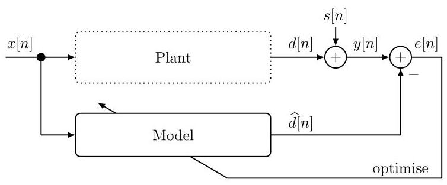

Fig. 1. Interference cancellation using a model based on system identification.

图1. 使用基于系统识别的模型进行干扰消除。

The paper is organised as follows: Section II describes the general cancellation problem. Section III outlines the plant-specific diversity of block-structured nonlinear systems. Section IV reviews classical methods for nonlinear modelling as well as the neural-network approximation. Plant-specific modelling via the multikernel approach is introduced in Section V which is then combined in Section VI with shared nonlinear modelling to form multikernel neural networks, the functionality of which is also demonstrated in this section. Sections VII and VIII examine the approach in specific areas of application, i.e., the acoustic echo cancellation and the self-interference cancellation, respectively. Section IX concludes.

本文结构如下:第二节描述了一般的抵消问题。第三节概述了块结构非线性系统的特定工厂多样性。第四节回顾了非线性建模的经典方法以及神经网络逼近。第五节介绍了通过多核方法进行的特定工厂建模，然后在第六节中将其与共享非线性建模相结合，形成多核神经网络，本节还展示了其功能。第七节和第八节分别研究了该方法在特定应用领域的情况，即声学回声抵消和自干扰抵消。第九节给出结论。

## II. CANCELLATION PROBLEM FORMULATION

## 二、抵消问题的公式化

In interference cancellation, a model is employed to identify and cancel an undesired interference $d\left\lbrack  n\right\rbrack$ present in a primary signal $y\left\lbrack  n\right\rbrack$ , which also contains an information-bearing signal component $s\left\lbrack  n\right\rbrack$ . Fig. 1 depicts such a setup. Here, the primary signal $y\left\lbrack  n\right\rbrack   = d\left\lbrack  n\right\rbrack   + s\left\lbrack  n\right\rbrack$ is used as the desired response of the model. An auxiliary signal $x\left\lbrack  n\right\rbrack$ serves as the model input, whilst this auxiliary signal is obtained from a reference sensor which is designed such that the information-bearing signal in the primary signal is not detectable via the reference signal and is therefore physically independent.

在干扰抵消中，采用一个模型来识别和抵消存在于主信号$y\left\lbrack  n\right\rbrack$中的不期望干扰$d\left\lbrack  n\right\rbrack$，主信号中还包含一个携带信息的信号分量$s\left\lbrack  n\right\rbrack$。图1描绘了这样一种设置。这里，主信号$y\left\lbrack  n\right\rbrack   = d\left\lbrack  n\right\rbrack   + s\left\lbrack  n\right\rbrack$用作模型的期望响应。一个辅助信号$x\left\lbrack  n\right\rbrack$用作模型输入，而这个辅助信号是从一个参考传感器获得的，该参考传感器的设计使得主信号中携带信息的信号不能通过参考信号被检测到，因此在物理上是独立的。

The method of interference cancellation structures and adjusts weights of the model so that its output $\widehat{d}\left\lbrack  n\right\rbrack$ at discrete time $n$ matches the interference $d\left\lbrack  n\right\rbrack$ , which is linked to the auxiliary reference signal $x\left\lbrack  n\right\rbrack$ through an unknown plant. This method can be understood as system identification in which the plant is identified using a most appropriate model. Here, potential nonlinearities in the system must be included in the model structure, such that the interference cancellation is able to subtract the estimated interference $\widehat{d}\left\lbrack  n\right\rbrack$ from the primary signal $y\left\lbrack  n\right\rbrack$ with best fidelity to $\widehat{d}\left\lbrack  n\right\rbrack$ . The optimal result is an error signal $e\left\lbrack  n\right\rbrack   = y\left\lbrack  n\right\rbrack   - \widehat{d}\left\lbrack  n\right\rbrack$ that conveys only the desired signal $s\left\lbrack  n\right\rbrack$ , effectively removing any component related to $x\left\lbrack  n\right\rbrack$ . This process of interference cancellation is crucial in applications where isolating the interference signal is vital for further processing or analysis.

干扰抵消方法构建并调整模型的权重，使得其在离散时间$n$的输出$\widehat{d}\left\lbrack  n\right\rbrack$与干扰$d\left\lbrack  n\right\rbrack$匹配，干扰$d\left\lbrack  n\right\rbrack$通过一个未知工厂与辅助参考信号$x\left\lbrack  n\right\rbrack$相关联。该方法可以理解为系统识别，其中使用最合适的模型来识别工厂。这里，系统中的潜在非线性必须包含在模型结构中，以便干扰抵消能够以对$\widehat{d}\left\lbrack  n\right\rbrack$的最佳保真度从主信号$y\left\lbrack  n\right\rbrack$中减去估计的干扰$\widehat{d}\left\lbrack  n\right\rbrack$。最优结果是一个误差信号$e\left\lbrack  n\right\rbrack   = y\left\lbrack  n\right\rbrack   - \widehat{d}\left\lbrack  n\right\rbrack$，它只传达期望信号$s\left\lbrack  n\right\rbrack$，有效地去除了与$x\left\lbrack  n\right\rbrack$相关的任何分量。干扰抵消过程在将干扰信号分离对于进一步处理或分析至关重要的应用中至关重要。

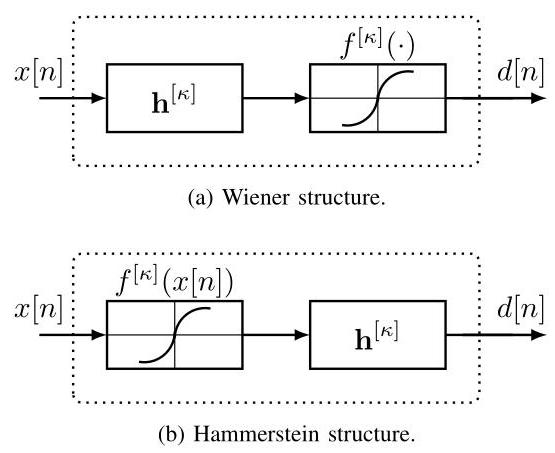

Fig. 2. Plants with different nonlinear block-structures.

图2. 具有不同非线性块结构的工厂。

## III. BLOCK-STRUCTURED NONLINEAR MULTIPLANTS

## 三、块结构非线性多工厂

Domain-knowledge is the basis for designing model-based prototypes of plant structures that consist of dynamic linear and static nonlinear blocks, which may appear in different constellations for certain application areas. A dynamic block represents linear-time-invariant (LTI) behaviour, i.e., typically with memory, which can be characterised by an impulse response model of the block. Considering different realisations or measurements of plants to be formally represented in this paper as multiplants, we introduce a plant-specific impulse response ${h}^{\left\lbrack  \kappa \right\rbrack  }\left\lbrack  n\right\rbrack$ for a dynamical block of plant $\kappa$ . Here, the plant index $\kappa$ depicts an additional dimension of system representation beyond classical LTI theory. Our intention hereby is to describe significant system variability across different observations (i.e., sample data in the neural network context) while assuming LTI behaviour per observation. Static blocks then refer to memoryless nonlinear functions ${f}^{\left\lbrack  \kappa \right\rbrack  }\left( {x\left\lbrack  n\right\rbrack  }\right)$ for which it is not possible to describe a convolutive input-output relationship or commutativity with its input $x\left\lbrack  n\right\rbrack$ . As before, the dimension $\kappa$ shall here represent potential variability of the respective block across sample data of a plant structure, while the nonlinear function is still assumed to be fixed within a single observation sequence of plant $\kappa$ .

领域知识是设计基于模型的工厂结构原型的基础，这些原型由动态线性和静态非线性模块组成，在某些应用领域中可能以不同的组合出现。动态模块表示线性时不变(LTI)行为，即通常具有记忆功能，其特征可以用该模块的脉冲响应模型来描述。考虑到本文中要正式表示的不同工厂实现或测量结果为多工厂，我们为工厂$\kappa$的动态模块引入特定于工厂的脉冲响应${h}^{\left\lbrack  \kappa \right\rbrack  }\left\lbrack  n\right\rbrack$。在此，工厂索引$\kappa$描绘了超越经典LTI理论的系统表示的一个额外维度。我们的意图是描述不同观测(即神经网络上下文中的样本数据)之间显著的系统变异性，同时假设每次观测具有LTI行为。静态模块则指无记忆非线性函数${f}^{\left\lbrack  \kappa \right\rbrack  }\left( {x\left\lbrack  n\right\rbrack  }\right)$，对于这些函数，无法描述卷积输入 - 输出关系或其与输入$x\left\lbrack  n\right\rbrack$的可交换性。如前所述，维度$\kappa$在此应表示各个模块在工厂结构样本数据中的潜在变异性，而在工厂$\kappa$的单个观测序列内，非线性函数仍假定为固定的。

For both block-types, we will distinguish between variant and invariant blocks. While those variant blocks or variant plants made from such blocks were indexed with the $\kappa$ , their invariant counterparts will be denoted as dynamical blocks with impulse responses ${h}^{\left\lbrack  \kappa \right\rbrack  }\left\lbrack  n\right\rbrack   = h\left\lbrack  n\right\rbrack$ or static blocks with nonlinear function ${f}^{\left\lbrack  \kappa \right\rbrack  }\left( {x\left\lbrack  n\right\rbrack  }\right)  = f\left( {x\left\lbrack  n\right\rbrack  }\right)$ across all samples $\kappa  = 1,\ldots , K$ of a multiplant. Consequently, invariant blocks can be understood as a special case of variant ones.

对于这两种模块类型，我们将区分变体模块和不变体模块。由这些模块构成的那些变体模块或变体工厂用$\kappa$索引，而它们的不变体对应物在多工厂的所有样本$\kappa  = 1,\ldots , K$中，将被表示为具有脉冲响应${h}^{\left\lbrack  \kappa \right\rbrack  }\left\lbrack  n\right\rbrack   = h\left\lbrack  n\right\rbrack$的动态模块或具有非线性函数${f}^{\left\lbrack  \kappa \right\rbrack  }\left( {x\left\lbrack  n\right\rbrack  }\right)  = f\left( {x\left\lbrack  n\right\rbrack  }\right)$的静态模块。因此，不变体模块可被理解为变体模块的一种特殊情况。

In order to contrast with block structures, we recall the Volterra series expansions as a very abstract and contained structure to model a plant. It can form a variety of nonlinear functions, but potentially requires a huge number of parameters, which is increasing superlinearly with increasing memory and polynomial order, and is therefore limited to applications with low system orders [42], [43]. The following provides an overview of common block-structured nonlinear models with a deliberately small number of parameters and restricted application based on dedicated domain knowledge.

为了与模块结构形成对比，我们回顾沃尔泰拉级数展开，它是一种非常抽象且简洁的结构，用于对工厂进行建模。它可以形成各种非线性函数，但可能需要大量参数，这些参数随着记忆和多项式阶数的增加呈超线性增长，因此仅限于低系统阶数的应用[42]，[43]。以下基于专门的领域知识，对具有故意少量参数和受限应用的常见模块结构非线性模型进行概述。

The Wiener structure [42], [43] is defined as a dynamic block followed by a static nonlinear block to create an overall model of nonlinearity with memory. In addition, a distinction is made between cascaded and parallel [11], [41] Wiener structures, whereby the cascaded structure is a special case of the parallel structure. The parallel structure results as a sum of multiple Wiener structures [32], therefore, if the entire structure is composed of only one Wiener subsystem, it results in the cascaded version. It is shown in Fig. 2a, where the input $x\left\lbrack  n\right\rbrack$ is first processed by convolution related to the dynamic block with impulse response ${h}^{\left\lbrack  \kappa \right\rbrack  }\left\lbrack  n\right\rbrack$ and then by the static nonlinear function ${f}^{\left\lbrack  \kappa \right\rbrack  }\left( \cdot \right)$ such that the output signal reads

维纳结构[42]，[43]被定义为一个动态模块后跟一个静态非线性模块，以创建一个具有记忆的非线性整体模型。此外，还区分了级联和平行[11]，[41]维纳结构，其中级联结构是平行结构的一种特殊情况。平行结构是多个维纳结构的总和[32]，因此，如果整个结构仅由一个维纳子系统组成，就会得到级联版本。如图2a所示，输入$x\left\lbrack  n\right\rbrack$首先通过与具有脉冲响应${h}^{\left\lbrack  \kappa \right\rbrack  }\left\lbrack  n\right\rbrack$的动态模块相关的卷积进行处理，然后通过静态非线性函数${f}^{\left\lbrack  \kappa \right\rbrack  }\left( \cdot \right)$进行处理，使得输出信号为

$$
d\left\lbrack  n\right\rbrack   = {f}^{\left\lbrack  \kappa \right\rbrack  }\left( {\mathop{\sum }\limits_{{m = 0}}^{L}{h}^{\left\lbrack  \kappa \right\rbrack  }\left\lbrack  m\right\rbrack  x\left\lbrack  {n - m}\right\rbrack  }\right) . \tag{1}
$$

Wiener modelling is a seemingly simple method of combining memory and nonlinearity, however, its nonlinearity in the parameters challenges the system identification [44], [45].

维纳建模看似是一种简单的将记忆和非线性相结合的方法，然而，其参数中的非线性对系统辨识提出了挑战[44]，[45]。

The Hammerstein structure consists of a static nonlinearity followed by a dynamical block [46]-[48] and thus can be linear in the parameters (if the nonlinear function is predetermined). Parallel [16] and cascaded [17] Hammerstein structures exist in the applications, whereby parallel structures are formed as a summation of multiple Hammerstein subsystems, enabling the representation of nonlinearity with memory. A cascaded Hammerstein structure employs the same linear dynamical block for each subsystem and thus collapses to the modelling of nonlinearities without memory. It is shown in Fig. 2b and, according to the commutation of convolution and nonlinear mapping compared to the Wiener structure, the output signal of Hammerstein structures differently reads

哈默斯坦结构由一个静态非线性环节和一个动态模块组成[46]-[48]，因此在参数上可以是线性的(如果非线性函数是预先确定的)。在应用中存在并行[16]和级联[17]的哈默斯坦结构，其中并行结构是由多个哈默斯坦子系统的求和形成的，能够表示具有记忆的非线性。级联哈默斯坦结构对每个子系统采用相同的线性动态模块，因此简化为无记忆非线性的建模。图2b展示了这一点，并且与维纳结构相比，根据卷积和非线性映射的交换性，哈默斯坦结构的输出信号的表示方式不同

$$
d\left\lbrack  n\right\rbrack   = \mathop{\sum }\limits_{{m = 0}}^{L}{h}^{\left\lbrack  \kappa \right\rbrack  }\left\lbrack  m\right\rbrack  {f}^{\left\lbrack  \kappa \right\rbrack  }\left( {x\left\lbrack  {n - m}\right\rbrack  }\right) . \tag{2}
$$

With its linearity in the parameters, it can more easily be employed with linear estimation algorithms [26], [49].

由于其在参数上的线性特性，它可以更轻松地与线性估计算法[26],[49]一起使用。

There are as well mixed forms of Wiener and Hammerstein structures, i.e., Wiener-Hammerstein structures, that for example consist of a static block sandwiched between two dynamic blocks. This paper, however, will not cover all possibilities of domain-specific plant representation.

还有维纳和哈默斯坦结构的混合形式，即维纳 - 哈默斯坦结构，例如由夹在两个动态模块之间的静态模块组成。然而，本文不会涵盖特定领域的对象表示的所有可能性。

## IV. NONLINEAR FUNCTION REPRESENTATION

## 四、非线性函数表示

In none of the structures, the actual nonlinear function is typically known a-priori in closed form. Therefore, a parametric representation $f\left( {x\left\lbrack  n\right\rbrack  ;{a}_{p},{b}_{p}}\right)$ is needed to set up and fit the function. Before, the terminology of functions being linear or nonlinear in the parameters is briefly clarified. To this end, a functional form

在任何一种结构中，实际的非线性函数通常都不是先验地以封闭形式已知的。因此，需要一种参数表示$f\left( {x\left\lbrack  n\right\rbrack  ;{a}_{p},{b}_{p}}\right)$来建立和拟合该函数。在此之前，简要说明一下函数在参数上是线性还是非线性的术语。为此，考虑一种函数形式

$$
f\left( {x\left\lbrack  n\right\rbrack  ;{a}_{p},{b}_{p}}\right)  = \mathop{\sum }\limits_{{p = 1}}^{P}{a}_{p}{\Phi }_{p}\left( {x\left\lbrack  n\right\rbrack  ;{b}_{p}}\right) \tag{3}
$$

is considered, where the function output is determined via the input $x\left\lbrack  n\right\rbrack$ , the parameters ${a}_{p}$ and ${b}_{p}$ , and the nonlinear basis functions ${\Phi }_{p}\left( \cdot \right)$ . The function $f\left( {x\left\lbrack  n\right\rbrack  ;{a}_{p},{b}_{p}}\right)$ is then linear in its parameters ${a}_{p}$ that directly relate to the function output, while nonlinear in the parameters ${b}_{p}$ of the basis functions.

其中函数输出通过输入$x\left\lbrack  n\right\rbrack$、参数${a}_{p}$和${b}_{p}$以及非线性基函数${\Phi }_{p}\left( \cdot \right)$来确定。那么函数$f\left( {x\left\lbrack  n\right\rbrack  ;{a}_{p},{b}_{p}}\right)$在直接与函数输出相关的参数${a}_{p}$上是线性的，而在基函数的参数${b}_{p}$上是非线性的。

## A. Representations with Linearity in the Parameters

## A. 参数线性的表示

Parametric expansions can be specified by fixed basis functions ${\Phi }_{p}\left( \cdot \right)$ weighted by linear coefficients ${a}_{p}$ , while any nonlinear coefficients ${b}_{p}$ are discarded.

参数展开可以由固定基函数${\Phi }_{p}\left( \cdot \right)$乘以线性系数${a}_{p}$来指定，而任何非线性系数${b}_{p}$都被舍弃。

One important representation is the power series with primitive polynomials of $x\left\lbrack  n\right\rbrack$ as the basis functions,

一种重要的表示是幂级数，以$x\left\lbrack  n\right\rbrack$的本原多项式作为基函数，

$$
{f}_{\text{ power }}\left( {x\left\lbrack  n\right\rbrack  ;{a}_{p}}\right)  = \mathop{\sum }\limits_{{p = 1}}^{P}{a}_{p}{x}^{p}\left\lbrack  n\right\rbrack  , \tag{4}
$$

typically assuming the range $- 1 < x\left\lbrack  n\right\rbrack   < 1$ for stability, and the parameters to be estimated are the $p$ -th coefficients ${a}_{p}$ of the $P$ -th order polynomial. Optimality of the coefficients may be designated in terms of the least-squares error between the parametric representation and the actual nonlinear function:

通常假设范围$- 1 < x\left\lbrack  n\right\rbrack   < 1$以保证稳定性，要估计的参数是$P$阶多项式的$p$次系数${a}_{p}$。系数的最优性可以根据参数表示与实际非线性函数之间的最小二乘误差来指定:

$$
{\widehat{a}}_{p} = \underset{{a}_{p}}{\arg \min }{\int }_{-1}^{+1}{\left( f\left( x\left\lbrack  n\right\rbrack  \right)  - \mathop{\sum }\limits_{{p = 1}}^{P}{a}_{p}{x}^{p}\left\lbrack  n\right\rbrack  \right) }^{2}{dx}\left\lbrack  n\right\rbrack  . \tag{5}
$$

Another representation relies, for instance, on the odd Fourier series with orthogonal sinusoidal basis functions,

另一种表示例如依赖于具有正交正弦基函数的奇傅里叶级数，

$$
{f}_{\text{ fourier }}\left( {x\left\lbrack  n\right\rbrack  ;{a}_{p}}\right)  = \mathop{\sum }\limits_{{p = 1}}^{P}{a}_{p}\sin \left( {{2\pi } \cdot  p \cdot  \frac{x\left\lbrack  n\right\rbrack  }{{T}_{x}}}\right) , \tag{6}
$$

with a hyperparameter ${T}_{x}$ defining the fundamental period (i.e., effectively the $x\left\lbrack  n\right\rbrack$ range) of a periodical function. The linear parameters for least-squares functional approximation are known as the odd Fourier coefficients

有一个超参数${T}_{x}$定义周期函数的基本周期(即有效$x\left\lbrack  n\right\rbrack$范围)。用于最小二乘函数逼近的线性参数称为奇傅里叶系数

$$
{\widehat{a}}_{p} = \frac{2}{{T}_{x}}{\int }_{-{T}_{x}/2}^{{T}_{x}/2}f\left( {x\left\lbrack  n\right\rbrack  }\right)  \cdot  \sin \left( {{2\pi } \cdot  p \cdot  \frac{x\left\lbrack  n\right\rbrack  }{{T}_{x}}}\right) {dx}\left\lbrack  n\right\rbrack  . \tag{7}
$$

Whether the basis functions qualify for good representation depends on the target function $f\left( {x\left\lbrack  n\right\rbrack  }\right)$ , on the input $x\left\lbrack  n\right\rbrack$ , specifically the adequate range and the distribution of the input, and on the manageable nonlinear order $P$ .

基函数是否适合良好的表示取决于目标函数$f\left( {x\left\lbrack  n\right\rbrack  }\right)$、输入$x\left\lbrack  n\right\rbrack$，特别是输入的适当范围和分布，以及可管理的非线性阶数$P$。

## B. Representation with Nonlinearity in the Parameters

## B. 参数非线性的表示

In our applications we would require arbitrary placement of a nonlinear function in a block structure and we would have to cope with potentially uncertain input signal range. We thus like to have control over the range of the input signal before the nonlinearity takes place and therefore introduce a nonlinear function representation by neural networks, specifically the multi-layer perceptron (MLP) [50], [51]. It consists of $\ell  = 1,\ldots , D - 1$ hidden layers each with ${p}_{\ell } = 1,\ldots ,{P}_{\ell }$ output channels and nonlinear input-output relation in the parameters,

在我们的应用中，我们需要在块结构中任意放置非线性函数，并且必须应对潜在不确定的输入信号范围。因此，我们希望在非线性发生之前控制输入信号的范围，所以引入了神经网络的非线性函数表示，特别是多层感知器(MLP)[50],[51]。它由$\ell  = 1,\ldots , D - 1$个隐藏层组成，每个隐藏层有${p}_{\ell } = 1,\ldots ,{P}_{\ell }$个输出通道，并且在参数上具有非线性输入 - 输出关系，

$$
{f}_{{p}_{\ell  + 1}}\left\lbrack  n\right\rbrack   = \tanh \left( {\mathop{\sum }\limits_{{{p}_{\ell } = 1}}^{{P}_{\ell }}{b}_{{p}_{\ell  + 1},{p}_{\ell }}{f}_{{p}_{\ell }}\left\lbrack  n\right\rbrack  }\right) , \tag{8}
$$

with the first layer input ${f}_{{p}_{0}}\left\lbrack  n\right\rbrack   = {x}_{{p}_{0}}\left\lbrack  n\right\rbrack  ,{p}_{0} = 1,\ldots ,{P}_{0}$ , and ${P}_{0} = I$ denotes available input channels. The typical tanh-activations conclude the arithmetic logic of each hidden layer. For regression a linear output layer may finally aggregate the available nonlinear representations of the last hidden layer as

第一层输入为${f}_{{p}_{0}}\left\lbrack  n\right\rbrack   = {x}_{{p}_{0}}\left\lbrack  n\right\rbrack  ,{p}_{0} = 1,\ldots ,{P}_{0}$，${P}_{0} = I$表示可用输入通道数。典型的双曲正切激活函数构成了每个隐藏层的算术逻辑。对于回归问题，线性输出层最终可能会将最后一个隐藏层的可用非线性表示进行汇总，如下所示

$$
{f}_{p}\left( {x\left\lbrack  n\right\rbrack  ;{a}_{p,{p}_{D}},{b}_{{p}_{\ell  + 1},{p}_{\ell }}}\right)  = \mathop{\sum }\limits_{{{p}_{D} = 1}}^{{P}_{D}}{a}_{p,{p}_{D}}{f}_{{p}_{D}}\left\lbrack  n\right\rbrack  . \tag{9}
$$

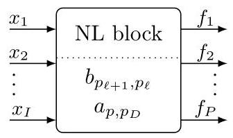

Fig. 3. Nonlinear memoryless block which maps an $I$ -dimensional input to a nonlinear $P$ -dimensional output using internal tanh-activations.

图3. 无记忆非线性块，它使用内部双曲正切激活函数将$I$维输入映射为非线性$P$维输出。

The MLP-based nonlinear block is thus denoted as these stacked $D + 1$ layers with its trainable parameters $a$ and $b$ , the input dimensionality $I$ , and output dimensionality $P$ as shown in Fig. 3 This nonlinear (NL) block can be well placed in arbitrary positions of a model structure as the nonlinear parameters $b$ are capable of controlling the block’s input and the linear parameters $a$ its output, respectively.

基于多层感知器(MLP)的非线性块因此被表示为这些堆叠的$D + 1$层，其可训练参数为$a$和$b$，输入维度为$I$，输出维度为$P$，如图3所示。这个非线性(NL)块可以很好地放置在模型结构的任意位置，因为非线性参数$b$能够分别控制该块的输入，而线性参数$a$控制其输出。

Our implementation of this NL block (using PyTorch functions) employs $D + 1$ layers of 1D-Conv specification with kernelsize of one for memoryless nonlinearity. In this case, the padding does not matter. The input-tensor $\mathcal{X}$ then consists of three dimensions $\left( {K, I, M}\right)$ , where $K$ denotes different realisations of a plant structure, $I$ the input-channel dimensionality, and $M$ the number of time samples of an input sequence $x\left\lbrack  n\right\rbrack$ . For a single-channel time-domain input signal it holds $I = 1$ . According to (8) and 9), the NL block then maps the input to an output tensor $\mathcal{F}$ with dimension $\left( {K, P, M}\right)$ . Here, the second tensor dimension forms a $P$ -th order nonlinear expansion. The first tensor dimension remains untouched for parallel processing and overall loss minimisation. The block’s trainable weights $a$ and $b$ are thus shared for system identification across the different plant observation.

我们对这个NL块的实现(使用PyTorch函数)采用了$D + 1$层1D卷积规范，内核大小为1，用于无记忆非线性。在这种情况下，填充并不重要。输入张量$\mathcal{X}$然后由三个维度$\left( {K, I, M}\right)$组成，其中$K$表示工厂结构的不同实现，$I$表示输入通道维度，$M$表示输入序列$x\left\lbrack  n\right\rbrack$的时间样本数量。对于单通道时域输入信号，有$I = 1$。根据(8)和(9)，NL块然后将输入映射到维度为$\left( {K, P, M}\right)$的输出张量$\mathcal{F}$。这里，第二个张量维度形成了$P$阶非线性扩展。第一个张量维度在并行处理和整体损失最小化时保持不变。因此，该块的可训练权重$a$和$b$在不同工厂观测的系统识别中共享。

## V. LINEAR MULTIKERNEL REPRESENTATION

## V. 线性多核表示

We briefly recap that Section III has introduced the dimension of plant variability in problems of nonlinear system identification. Section IV has described the possibility of neural network modelling to represent the nonlinear dimension in those problems of nonlinear system identification. Given the trend of large datasets for the optimisation of neural networks, the purpose of this upcoming section is to address the issue of plant variability within a dataset by describing a corresponding neural network representation. Specifically, the idea is to oppose to the dimension of plant variability the dimension of multikernel representation in the networks. The multikernel approach thus invokes multiple specific kernels to represent the specific plants of specific data samples. However, this multikernel representation is not necessarily devoted to an entire model architecture under consideration for the system identification problem. Here in this section we thus introduce the multikernel approach only for the linear (yet important for system modelling) layers of an entire model.

我们简要回顾一下，第三节介绍了非线性系统识别问题中工厂变异性的维度。第四节描述了神经网络建模在那些非线性系统识别问题中表示非线性维度的可能性。鉴于用于神经网络优化的大数据集趋势，本节的目的是通过描述相应的神经网络表示来解决数据集中的工厂变异性问题。具体来说，想法是在网络中用多核表示的维度来对抗工厂变异性的维度。多核方法因此调用多个特定内核来表示特定数据样本的特定工厂。然而，这种多核表示不一定适用于正在考虑的系统识别问题的整个模型架构。因此，在本节中，我们仅针对整个模型的线性(但对系统建模很重要)层引入多核方法。

## A. Time-Domain FIR Block

## A. 时域FIR块

LTI behaviour of a plant component with input $x\left\lbrack  n\right\rbrack$ can be modelled by FIR filtering with impulse response $w\left\lbrack  l\right\rbrack$ at lag indices $l = 0,\ldots , L - 1$ . The corresponding input-output relationship of the plain FIR model at discrete time step $n$ is then written by convolution as simple as

具有输入$x\left\lbrack  n\right\rbrack$的工厂组件的线性时不变(LTI)行为可以通过在滞后索引$l = 0,\ldots , L - 1$处具有脉冲响应$w\left\lbrack  l\right\rbrack$的FIR滤波来建模。那么在离散时间步$n$处普通FIR模型的相应输入 - 输出关系通过卷积可以简单地写为

$$
d\left\lbrack  n\right\rbrack   = \mathop{\sum }\limits_{{l = 0}}^{{L - 1}}x\left\lbrack  {n - l}\right\rbrack  w\left\lbrack  l\right\rbrack \tag{10}
$$

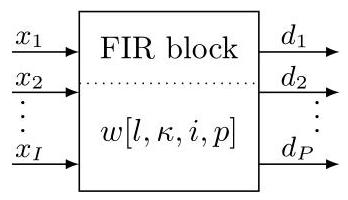

Fig. 4. Multikernel FIR-Block which maps a $I$ -dimensional input on a $P$ - dimensional output to model LTI behaviour with memory $L$ .

图4. 多核FIR块，它将$I$维输入映射到$P$维输出，以对具有记忆$L$的LTI行为进行建模。

with one-dimensional signal $x\left\lbrack  n\right\rbrack$ and one-dimensional convolutional kernel $w\left\lbrack  l\right\rbrack$ . For versatile representation in the neural network context, several additional dimensions are required. In order to support system identification with $K$ different plants or different observations of a plant, a two-dimensional input sequence $x\left\lbrack  {n,\kappa }\right\rbrack$ and a two-dimensional kernel $w\left\lbrack  {l,\kappa }\right\rbrack$ of shape $\left( {L, K}\right)$ are required for representation. The input-output relationship is then given by

对于一维信号$x\left\lbrack  n\right\rbrack$和一维卷积内核$w\left\lbrack  l\right\rbrack$。为了在神经网络上下文中进行通用表示，需要几个额外的维度。为了支持对$K$个不同工厂或工厂的不同观测进行系统识别，需要一个二维输入序列$x\left\lbrack  {n,\kappa }\right\rbrack$和一个形状为$\left( {L, K}\right)$的二维内核$w\left\lbrack  {l,\kappa }\right\rbrack$来进行表示。然后输入 - 输出关系由下式给出

$$
d\left\lbrack  {n,\kappa }\right\rbrack   = \mathop{\sum }\limits_{{l = 0}}^{{L - 1}}x\left\lbrack  {n - l,\kappa }\right\rbrack  w\left\lbrack  {l,\kappa }\right\rbrack  , \tag{11}
$$

where the plant index $\kappa$ reproduces from the input to the output. For multiple-input multiple-output (MIMO) representation of different plants, we require a three-dimensional input signal $x\left\lbrack  {n,\kappa , i}\right\rbrack$ and a four-dimensional kernel $w\left\lbrack  {l,\kappa , i, p}\right\rbrack$ of shape $\left( {L, K, I, P}\right)$ to deliver a three-dimensional output as

其中，植物索引$\kappa$从输入到输出进行再现。对于不同植物的多输入多输出(MIMO)表示，我们需要一个三维输入信号$x\left\lbrack  {n,\kappa , i}\right\rbrack$和一个形状为$\left( {L, K, I, P}\right)$的四维内核$w\left\lbrack  {l,\kappa , i, p}\right\rbrack$，以产生如下三维输出

$$
d\left\lbrack  {n,\kappa , p}\right\rbrack   = \mathop{\sum }\limits_{{i = 1}}^{I}\mathop{\sum }\limits_{{l = 0}}^{{L - 1}}x\left\lbrack  {n - l,\kappa , i}\right\rbrack  w\left\lbrack  {l,\kappa , i, p}\right\rbrack  , \tag{12}
$$

where $I$ and $P$ here denote the multiple-input and multiple-output dimensionality, respectively. Further considering a segmentation of the input sequences according to

其中，这里的$I$和$P$分别表示多输入和多输出维度。进一步考虑根据

$$
x\left\lbrack  {t, m,\kappa , i}\right\rbrack   = x\left\lbrack  {{tR} + m,\kappa , i}\right\rbrack  , \tag{13}
$$

with $m = 0,\ldots , M - 1$ , the new time step index of the subsequences or "frames", $M$ the frame length, $t$ the frame index, $R$ the frame shift, and thus $M - R$ the frame overlap, we got a four-dimensional input signal $x\left\lbrack  {t, m,\kappa , i}\right\rbrack$ . It still uses the four-dimensional kernel to produce the output signal

对于$m = 0,\ldots , M - 1$，子序列或“帧”的新时间步索引，$M$为帧长度，$t$为帧索引，$R$为帧移，因此$M - R$为帧重叠，我们得到一个四维输入信号$x\left\lbrack  {t, m,\kappa , i}\right\rbrack$。它仍然使用四维内核来产生输出信号

$$
d\left\lbrack  {t, m,\kappa , p}\right\rbrack   = \mathop{\sum }\limits_{{i = 1}}^{I}\mathop{\sum }\limits_{{l = 0}}^{{L - 1}}x\left\lbrack  {t, m - l,\kappa , i}\right\rbrack  w\left\lbrack  {l,\kappa , i, p}\right\rbrack  , \tag{14}
$$

where the frames $t$ are reproduced from input to output with shared kernels according to the idea of the same plant being responsible for one input sequence and the frames therein. In order to obtain $m = 0,\ldots , R$ valid and seamless output time steps of the convolution for the given frame-shift $R$ , the kernelsize must be constrained to $L = M - R + 1$ .

其中，根据同一植物负责一个输入序列及其内部帧的思想，使用共享内核将帧$t$从输入再现到输出。为了在给定的帧移$R$下获得$m = 0,\ldots , R$个有效的无缝卷积输出时间步，内核大小必须限制为$L = M - R + 1$。

As a baseline for the proposed multikernel model, for the sake of clarity, we write out a single-kernel model, i.e.,

作为所提出的多核模型的基线，为了清晰起见，我们写出一个单核模型，即

$$
d\left\lbrack  {t, m,\kappa , p}\right\rbrack   = \mathop{\sum }\limits_{{i = 1}}^{I}\mathop{\sum }\limits_{{l = 0}}^{{L - 1}}x\left\lbrack  {t, m - l,\kappa , i}\right\rbrack  w\left\lbrack  {l, i, p}\right\rbrack  , \tag{15}
$$

where the plant index is dropped from the multikernel in 14), while it persists with input and output sequences. This essentially means that the kernel $w\left\lbrack  {l, i, p}\right\rbrack$ is conventionally shared across the data samples corresponding to different plants, which, supposedly, hampers minimum mean-square error representation of data samples by the model.

其中，植物索引在14)中的多核中被去掉，而在输入和输出序列中仍然存在。这本质上意味着内核$w\left\lbrack  {l, i, p}\right\rbrack$通常在对应于不同植物的数据样本之间共享，据推测，这会妨碍模型对数据样本的最小均方误差表示。

## B. Frequency-Domain FIR-Block Representation

## B. 频域FIR块表示

Based on the success story of frequency-domain representations for adaptive online learning of FIR filters [26], specifically in the field of speech processing [1], [52], this method is here adopted with the hypothesis of potentially advanced learning in the context of neural-network representation. We therefore provide a kernel definition with zero padding in the convolutive dimension of the original temporal time steps,

基于FIR滤波器自适应在线学习的频域表示的成功案例[26]，特别是在语音处理领域[1,52]，在此采用这种方法，并假设在神经网络表示的背景下可能有更先进的学习。因此，我们在原始时间步的卷积维度中提供一个零填充的内核定义，

$$
{w}_{z}\left\lbrack  {m,\kappa , i, p}\right\rbrack   = \left\{  \begin{array}{ll} w\left\lbrack  {m,\kappa , i, p}\right\rbrack  & m = 0,\ldots L - 1 \\  0 & m = L,\ldots M - 1 \end{array}\right. \tag{16}
$$

of kernel shape $\left( {L + R - 1, K, I, P}\right)$ with the previous constraining to $M = L + R - 1$ . Its $M$ -dimensional representation in the discrete Fourier transform (DFT) domain is

内核形状为$\left( {L + R - 1, K, I, P}\right)$，之前限制为$M = L + R - 1$。其在离散傅里叶变换(DFT)域中的$M$维表示为

$$
W\left\lbrack  {k,\kappa , i, p}\right\rbrack   = \mathop{\sum }\limits_{{m = 0}}^{{M - 1}}{w}_{z}\left\lbrack  {m,\kappa , i, p}\right\rbrack  {\mathrm{e}}^{-\jmath {2\pi mk}/M} \tag{17}
$$

$$
= \mathop{\sum }\limits_{{l = 0}}^{{L - 1}}w\left\lbrack  {l,\kappa , i, p}\right\rbrack  {\mathrm{e}}^{-\jmath {2\pi lk}/M} \tag{18}
$$

with discrete frequency index $k = 0,\ldots , M - 1$ . Further using the input signal in the DFT domain along the $m$ -dimension,

具有离散频率索引$k = 0,\ldots , M - 1$。进一步在DFT域中沿$m$维使用输入信号，

$$
X\left\lbrack  {t, k,\kappa , i}\right\rbrack   = \mathop{\sum }\limits_{{m = 0}}^{{M - 1}}x\left\lbrack  {t, m,\kappa , i}\right\rbrack  {\mathrm{e}}^{-\jmath {2\pi mk}/M}, \tag{19}
$$

where merely the time step index $m$ is converted into the discrete frequencies $k$ , we can obtain the predicted output signal in the time domain by elementwise spectral multiplication of matching dimensions in the DFT domain and inverse DFT,

其中仅将时间步索引$m$转换为离散频率$k$，我们可以通过在DFT域中匹配维度的逐元素频谱乘法和逆DFT在时域中获得预测的输出信号，

$$
D\left\lbrack  {t, k,\kappa , p}\right\rbrack   = \mathop{\sum }\limits_{{i = 1}}^{I}X\left\lbrack  {t, k,\kappa , i}\right\rbrack  W\left\lbrack  {k,\kappa , i, p}\right\rbrack \tag{20}
$$

$$
d\left\lbrack  {t, m,\kappa , p}\right\rbrack   = \frac{1}{M}\mathop{\sum }\limits_{{k = 0}}^{{M - 1}}D\left\lbrack  {t, k,\kappa , p}\right\rbrack  {\mathrm{e}}^{+\jmath {2\pi mk}/M}, \tag{21}
$$

with valid output samples only for $m = M - R,\ldots , M - 1$ according to the principles of overlap-save processing.

根据重叠保留处理的原则，仅对$m = M - R,\ldots , M - 1$有有效的输出样本。

### C.FIR Block Implementation

### C. FIR块实现

In our PyTorch implementation, the data passed through an FIR block is arranged as a four-dimensional input tensor. The first dimension is the batchsize and it hosts the frames $t = 0,\ldots , T$ for parallel processing with same kernels for one and the same plant index $\kappa$ . The second dimension keeps the individual plants $\kappa  = 0,\ldots , K$ . Then follows the dimension of inputs $i = 1,\ldots , I$ , before the last dimension is used to represent the sequence of time steps $m = 0,\ldots , M$ per frame. The FIR block thus converts a $\left( {T, K, I, M}\right)$ -dimensional input-tensor $\mathcal{X}$ to a $\left( {T, K, P, R}\right)$ -dimensional output tensor $\mathcal{D}$ . The implementation of the FIR block, however, depends on the previous time- or frequency-domain logic.

在我们的PyTorch实现中，通过FIR块传递的数据被安排为一个四维输入张量。第一维是批量大小，它承载帧$t = 0,\ldots , T$，以便对具有相同植物索引$\kappa$的帧使用相同内核进行并行处理。第二维保留各个植物$\kappa  = 0,\ldots , K$。然后是输入维度$i = 1,\ldots , I$，最后一维用于表示每个帧的时间步序列$m = 0,\ldots , M$。因此，FIR块将一个$\left( {T, K, I, M}\right)$维输入张量$\mathcal{X}$转换为一个$\left( {T, K, P, R}\right)$维输出张量$\mathcal{D}$。然而，FIR块的实现取决于先前的时域或频域逻辑。

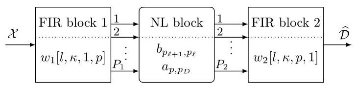

Fig. 5. Block-structure of the ${\mathrm{{FIR}}}_{{P}_{1}}{\mathrm{{NL}}}_{{P}_{2}}$ FIR model.

图5. ${\mathrm{{FIR}}}_{{P}_{1}}{\mathrm{{NL}}}_{{P}_{2}}$ FIR模型的块结构。

1) Time-Domain FIR-Block: To form the system output with $P$ output channels, a number of $P$ 2D-Conv-Layers is set up in parallel. This extra effort is rooted in the fact that the output-channel dimension is employed for group processing in order to enable the representation of individual kernels for the $K$ individual plants (PyTorch: ’groups $= K$ ’) which equals the number of input and output channels. We thus have specific kernels of size $\left( {I, L}\right)$ for each plant in the data. The padding regarding the dimension of time steps is set to 'valid'. Accordingly, the kernel slides along the dimension of time steps $m$ while aggregating the input dimension $i$ .

1) 时域FIR模块:为了通过$P$个输出通道形成系统输出，并行设置了多个$P$个二维卷积层。这种额外的操作源于这样一个事实，即输出通道维度用于分组处理，以便为$K$个单独的工厂表示各个内核(PyTorch:‘groups $= K$ ’)，这等于输入和输出通道的数量。因此，数据中每个工厂都有大小为$\left( {I, L}\right)$的特定内核。关于时间步长维度的填充设置为‘valid’。相应地，内核在聚合输入维度$i$时沿着时间步长维度$m$滑动。

2) Frequency-Domain FIR-Block: Complex-valued weights $W$ according to 20 are set up with two real-valued weight tensors of size $\left( {M, K, I, P}\right)$ . In order to constrain the weights according to (17), the available weights can be converted to time domain via IFFT, the last $M - L$ time steps are forced to zero, before the result is converted back to frequency domain by FFT. The input signal is then converted into the FFT domain as shown by 19 and elementwise spectral multiplication (20) takes place in the FFT domain, before the output tensor is obtained with IFFT and the valid samples are saved and returned as the block output according to (21).

2) 频域FIR模块:根据公式20设置大小为$\left( {M, K, I, P}\right)$的两个实值权重张量构成复值权重$W$。为了根据公式(17)约束权重，可以通过逆快速傅里叶变换(IFFT)将可用权重转换到时域，在通过快速傅里叶变换(FFT)将结果转换回频域之前，将最后$M - L$个时间步强制设为零。然后，如公式19所示，将输入信号转换到FFT域，并在FFT域中进行逐元素频谱乘法(公式20)，之后通过IFFT获得输出张量，并根据公式(21)保存有效样本并作为模块输出返回。

## VI. MULTIKERNEL NEURAL NETWORK MODEL

## VI. 多核神经网络模型

Different application domains require different model structures, for instance, according to basic plant structures shown in Section III Model representations of linear and nonlinear blocks therein were then provided by Sections IV and V We now form some basic model architectures with competence for multiplant representation and demonstrate their operation with respect to possibly different plant structures.

不同的应用领域需要不同的模型结构，例如，根据第三节中所示的基本工厂结构，第四节和第五节随后提供了其中线性和非线性模块的模型表示。我们现在构建一些具有多工厂表示能力的基本模型架构，并展示它们针对可能不同的工厂结构的运行情况。

## A. Model Architectures

## A. 模型架构

In order to introduce a compact notation of block-structured models, let us firstly consider the configuration shown in Fig. 5 comprising of two FIR blocks and one NL block. This model architecture is here denoted by ${\mathrm{{FIR}}}_{{P}_{1}}{\mathrm{{NL}}}_{{P}_{2}}$ FIR, indicating the order of applied FIR/NL blocks, while the subscript describes the number of connecting output channels. In our context, the number of inputs to the first block and the number of outputs of the last block is always one for single-input single-output (SISO) system identification problems.

为了引入块结构模型的紧凑表示法，让我们首先考虑图5所示的配置，它由两个FIR模块和一个NL模块组成。此模型架构在此表示为${\mathrm{{FIR}}}_{{P}_{1}}{\mathrm{{NL}}}_{{P}_{2}}$ FIR，指示应用的FIR/NL模块的顺序，而下标描述连接的输出通道数量。在我们的上下文中，对于单输入单输出(SISO)系统识别问题，第一个模块的输入数量和最后一个模块的输出数量始终为1。

At this point, we shall return to the fact that FIR blocks were introduced to primarily accomplish the desired multiplant representation. Now considering architectures with connected NL and FIR blocks, however, it should be noted that the multichannel interplay of NL and FIR blocks additionally implies the possibility of plant-specific nonlinear representation. This effect is due to the mathematical nature of nonlinear expansion, i.e., a NL block with multichannel output effectively spans a basis for nonlinear modelling, while actual nonlinear functions are achieved by the plant-specific aggregation with a subsequent FIR block.

此时，我们应回顾一下，引入FIR模块主要是为了实现所需的多工厂表示。然而，现在考虑连接了NL和FIR模块的架构时，应注意NL和FIR模块的多通道相互作用还意味着特定于工厂的非线性表示的可能性。这种效果是由于非线性扩展的数学性质，即具有多通道输出的NL模块有效地跨越了非线性建模的基础，而实际的非线性函数是通过与后续FIR模块进行特定于工厂的聚合来实现的。

Given the above short notation of block-structured model architectures, we can also refer to some important special cases of it. By discarding the first FIR block in Fig. 5 and considering simply ${P}_{1} = 1$ input channels, an ${\mathrm{{NL}}}_{{P}_{2}}$ FIR model architecture is obtained. With ${P}_{2} = P > 1$ we then arrive at the parallel Hammerstein model ${\mathrm{{NL}}}_{P}$ FIR, whereas ${P}_{2} = 1$ yields the cascaded Hammerstein model ${\mathrm{{NL}}}_{1}$ FIR, both of which renowned for instance in applications of acoustic system identification [16], [17], [28], [30]. The cascaded model exhibits greatly less parameters, but appears more delicate in terms of the optimisation problem. Parallel models better learn the optimum parameters and achieve richer interplay of nonlinearity and memory by aggregating basis function with possibly different phase. By discarding the second FIR block in Fig. 5 we obtain an ${\mathrm{{FIR}}}_{{P}_{1}}\mathrm{{NL}}$ Wiener architecture, where ${P}_{1} = \bar{P} > 1$ once more refers to a parallel ${\mathrm{{FIR}}}_{P}\mathrm{{NL}}$ and ${P}_{1} = 1$ a cascaded ${\mathrm{{FIR}}}_{1}\mathrm{{NL}}$ representation.

鉴于上述块结构模型架构的简短表示法，我们还可以提及它的一些重要特殊情况。通过丢弃图5中的第一个FIR模块并仅考虑${P}_{1} = 1$个输入通道，可获得${\mathrm{{NL}}}_{{P}_{2}}$ FIR模型架构。对于${P}_{2} = P > 1$，我们得到并行哈默斯坦模型${\mathrm{{NL}}}_{P}$ FIR，而${P}_{2} = 1$则产生级联哈默斯坦模型${\mathrm{{NL}}}_{1}$ FIR，这两种模型在例如声学系统识别应用[16]、[17]、[28]、[30]中都很有名。级联模型的参数要少得多，但在优化问题方面似乎更复杂。并行模型通过聚合可能具有不同相位的基函数，能更好地学习最优参数并实现更丰富的非线性和记忆相互作用。通过丢弃图5中的第二个FIR模块，我们得到${\mathrm{{FIR}}}_{{P}_{1}}\mathrm{{NL}}$维纳架构，其中${P}_{1} = \bar{P} > 1$再次表示并行${\mathrm{{FIR}}}_{P}\mathrm{{NL}}$，而${P}_{1} = 1$表示级联${\mathrm{{FIR}}}_{1}\mathrm{{NL}}$表示。

## B. Model Parameter Identification

## B. 模型参数识别

Once the block structure of a model is defined based on available domain-knowledge, the optimal model parameter set ${\mathbf{\Theta }}^{\left\lbrack  \kappa \right\rbrack  } = \left\{  {{w}_{1}\left\lbrack  {l,\kappa ,1, p}\right\rbrack  ,{w}_{2}\left\lbrack  {l,\kappa , p,1}\right\rbrack  ,{a}_{p,{p}_{D}},{b}_{{p}_{\ell  + 1},{p}_{\ell }}}\right\}$ needs to be determined for given a data set. To do so, the aim is to minimise the misalignment between the model output tensor $\mathcal{D}\left( {\mathbf{\Theta }}^{\left\lbrack  \kappa \right\rbrack  }\right)$ and the primary signal tensor $\mathcal{Y}$ as target, which can be stated as the optimisation problem

一旦基于可用的领域知识定义了模型的块结构，对于给定的数据集，就需要确定最优的模型参数集${\mathbf{\Theta }}^{\left\lbrack  \kappa \right\rbrack  } = \left\{  {{w}_{1}\left\lbrack  {l,\kappa ,1, p}\right\rbrack  ,{w}_{2}\left\lbrack  {l,\kappa , p,1}\right\rbrack  ,{a}_{p,{p}_{D}},{b}_{{p}_{\ell  + 1},{p}_{\ell }}}\right\}$。为此，目标是最小化模型输出张量$\mathcal{D}\left( {\mathbf{\Theta }}^{\left\lbrack  \kappa \right\rbrack  }\right)$与作为目标的主信号张量$\mathcal{Y}$之间的偏差，这可以表述为优化问题

$$
{\widehat{\mathbf{\Theta }}}^{\left\lbrack  \kappa \right\rbrack  } = \underset{\mathbf{\Theta }}{\arg \min }{\begin{Vmatrix}\mathcal{Y} - \mathcal{D}\left( {\mathbf{\Theta }}^{\left\lbrack  \kappa \right\rbrack  }\right) \end{Vmatrix}}^{2}, \tag{22}
$$

i.e., the optimisation of the mean-square error (MSE) loss between model prediction and target. We here rely on the Adam optimiser [53] with learning rate ${\mu }_{0} = {0.01},{\beta }_{1} = {0.9}$ and ${\beta }_{2} = {0.999}$ . In every iteration all available data frames from all plants are employed for optimisation.

即，优化模型预测与目标之间的均方误差(MSE)损失。我们在此依赖于具有学习率${\mu }_{0} = {0.01},{\beta }_{1} = {0.9}$和${\beta }_{2} = {0.999}$的Adam优化器[53]。在每次迭代中，来自所有工厂的所有可用数据帧都用于优化。

## C. Synthetic Multiplant Data

## C. 合成多工厂数据

Preparing for various applications, we employ computer-generated white Gaussian noise and recorded speech as input $x\left\lbrack  n\right\rbrack$ for plant simulation. The speech signals are taken from the AEC Challenge data set [38] each with a duration of 10 seconds at a sampling frequency of ${16}\mathrm{{kHz}}$ , while the Gaussian noise signals consist of $N = {32},{000}$ samples per sequence.

为各种应用做准备，我们使用计算机生成的白高斯噪声和录制的语音作为工厂模拟的输入$x\left\lbrack  n\right\rbrack$。语音信号取自AEC挑战数据集[38]，每个信号的持续时间为10秒，采样频率为${16}\mathrm{{kHz}}$，而高斯噪声信号每个序列由$N = {32},{000}$个样本组成。

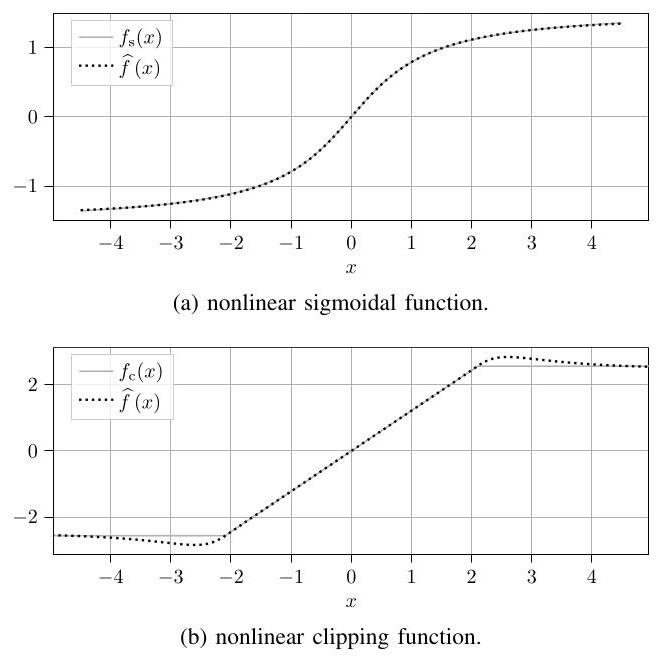

Fig. 6. Memoryless plant nonlinearities and its identification by NL block.

图6. 无记忆工厂非线性及其由NL块进行的识别。

Plants with Wiener and Hammerstein system structure according to Fig. 2 are simulated. The plant-specific LTI behaviour therein is implemented by convolution

模拟了具有图2所示维纳和哈默斯坦系统结构的工厂。其中特定于工厂的线性时不变行为通过卷积实现

$$
d\left\lbrack  n\right\rbrack   = \mathop{\sum }\limits_{{l = 0}}^{{511}}{h}^{\left\lbrack  \kappa \right\rbrack  }\left\lbrack  l\right\rbrack  x\left\lbrack  {n - l}\right\rbrack \tag{23}
$$

using plant-specific synthetic impulse responses ${h}^{\left\lbrack  \kappa \right\rbrack  }\left\lbrack  l\right\rbrack$ drawn according to [54], [55]. For the nonlinear system part, two types of multiplant nonlinearity are employed:

使用根据[54]、[55]绘制的特定于工厂的合成脉冲响应${h}^{\left\lbrack  \kappa \right\rbrack  }\left\lbrack  l\right\rbrack$。对于非线性系统部分，采用了两种类型的多工厂非线性:

- a sigmoidal input-output characteristic

- 一种Sigmoid输入 - 输出特性

$$
{f}_{\mathrm{s}}^{\left\lbrack  \kappa \right\rbrack  }\left( {x\left\lbrack  n\right\rbrack  }\right)  = {\gamma }^{\left\lbrack  \kappa \right\rbrack  }\arctan \left( {{\delta }^{\left\lbrack  \kappa \right\rbrack  }x\left\lbrack  n\right\rbrack  }\right) \tag{24}
$$

with plant-specific scaling by ${\gamma }^{\left\lbrack  \kappa \right\rbrack  }$ and ${\delta }^{\left\lbrack  \kappa \right\rbrack  }$

通过${\gamma }^{\left\lbrack  \kappa \right\rbrack  }$和${\delta }^{\left\lbrack  \kappa \right\rbrack  }$进行特定于工厂的缩放

- a hard-limiting input-output characteristic

- 一种硬限幅输入 - 输出特性

$$
{f}_{\mathrm{c}}^{\left\lbrack  \kappa \right\rbrack  }\left( {x\left\lbrack  n\right\rbrack  }\right)  = \left\{  {\begin{array}{ll} x\left\lbrack  n\right\rbrack  & \text{ for }\left| {x\left\lbrack  n\right\rbrack  }\right|  \leq  {x}_{\max }\left\lbrack  \kappa \right\rbrack  \\  {x}_{\max }\left\lbrack  \kappa \right\rbrack  & \text{ otherwise } \end{array},}\right. \tag{25}
$$

where the clipping can be customised by ${x}_{\max }\left\lbrack  \kappa \right\rbrack$ .

其中限幅可通过${x}_{\max }\left\lbrack  \kappa \right\rbrack$进行定制。

To quantify the respective nonlinearity, the

为了量化各自的非线性，使用

$$
\operatorname{SDR}\left( {x, f}\right)  = {10}{\log }_{10}\left\lbrack  \frac{E\left\{  {\left( \alpha x\right) }^{2}\right\}  }{E\left\{  {\left( f\left( x\right)  - \alpha x\right) }^{2}\right\}  }\right\rbrack \tag{26}
$$

of the linear part ${\alpha x}$ relative to the nonlinear residual of $f\left( x\right)$ is used, where $\alpha  = E\left\{  {{x}^{ * }f\left( x\right) }\right\}  /E\left\{  {{x}^{ * }x}\right\}$ .

${\alpha x}$的线性部分相对于$f\left( x\right)$的非线性残差的，其中$\alpha  = E\left\{  {{x}^{ * }f\left( x\right) }\right\}  /E\left\{  {{x}^{ * }x}\right\}$。

A total of $N = {10}$ different plant realisations are generated for the Wiener and the Hammerstein scenario each, where the plant-specific nonlinearity ranges from SDR of $4\mathrm{\;{dB}}$ to ${32}\mathrm{\;{dB}}$ with mean SDR of ${14}\mathrm{\;{dB}}$ . For the latter, as an example, the nonlinear functions are shown in Fig. 6 The verification in the following subsection takes place with $y\left\lbrack  n\right\rbrack   = d\left\lbrack  n\right\rbrack$ , i.e., the desired signal of $s\left\lbrack  n\right\rbrack$ of Fig. 1 being zero. From the simulated plant input and output sequences we segment frames according to (13) with framesize $M = 2\left( {{L}_{1} + {L}_{2}}\right)$ and frameshift $R = \left( {M - \left( {{L}_{1} + {L}_{2}}\right)  + 1}\right) /2$ , where ${L}_{1}$ and ${L}_{2}$ refer to the kernelsizes of the two FIR blocks, if they exist in the general model architecture of Fig 5 For the sake of completeness, the hyperparameters of the NL block therein are set to $D = 5$ hidden layers with ${P}_{\ell } = 6$ internal and $P = 6$ output units.

针对维纳(Wiener)和哈默斯坦(Hammerstein)场景，分别生成了总共$N = {10}$种不同的对象实现，其中对象特定的非线性从$4\mathrm{\;{dB}}$的SDR到${32}\mathrm{\;{dB}}$，平均SDR为${14}\mathrm{\;{dB}}$。例如，对于后者，非线性函数如图6所示。在以下子节中的验证使用$y\left\lbrack  n\right\rbrack   = d\left\lbrack  n\right\rbrack$进行，即图1中$s\left\lbrack  n\right\rbrack$的期望信号为零。根据(13)，从模拟的对象输入和输出序列中，我们以帧大小$M = 2\left( {{L}_{1} + {L}_{2}}\right)$和帧移$R = \left( {M - \left( {{L}_{1} + {L}_{2}}\right)  + 1}\right) /2$分割帧，其中${L}_{1}$和${L}_{2}$指的是两个FIR块的内核大小(如果它们存在于图5的通用模型架构中)。为了完整起见，其中NL块的超参数设置为具有$D = 5$个隐藏层，${P}_{\ell } = 6$个内部单元和$P = 6$个输出单元。

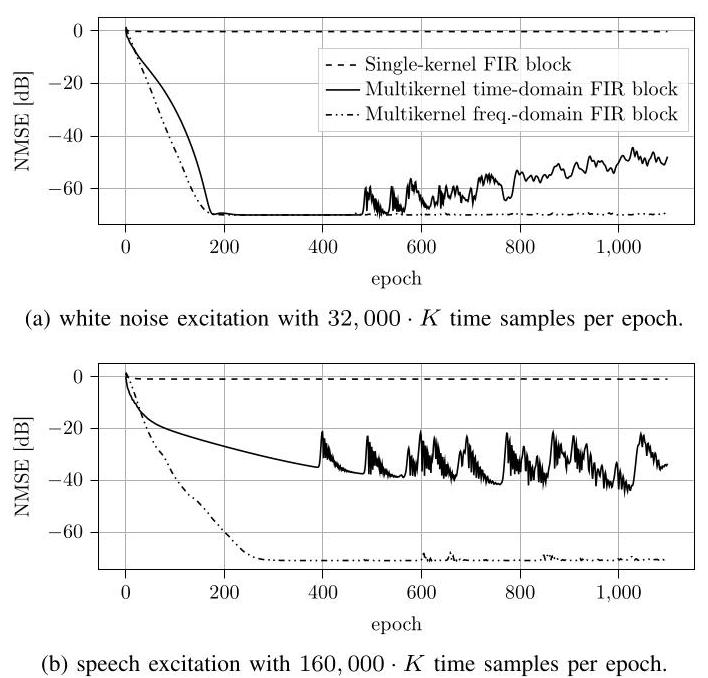

Fig. 7. FIR-block modelling of linear multiplants with different input signals.

图7. 具有不同输入信号的线性对象的FIR块建模。

## D. Verification of Multikernel Neural Network Models

## D. 多核神经网络模型的验证

Firstly, the FIR block and the NL block is considered for verification alone. The FIR block in its variants of Section V is employed for representation of the linear multiplant in 23). Fig. 7 shows the learning curves of the FIR model in terms of normalised MSE for white Gaussian noise and speech-based data. In both cases a conventional single-kernel FIR block model clearly fails to match the model output to plant-specific observations provided as training data. The MSE remains high around $0\mathrm{\;{dB}}$ , demonstrating the need for multiple kernels in the model. For the white noise case in Fig. 7a, the multikernel FIR block then delivers MSE in the order of -70 dB which is successful and plausible for the synthetic data at hand. After 500 training epochs, the NMSE of the time-domain FIR block scrapes off, but could be stabilised to $- {70}\mathrm{\;{dB}}$ with a smaller learning rate. With speech input into the plants, as shown by Fig. 7b, the optimisation of the time-domain FIR block gets stuck around mediocre -30dB and merely the frequency-domain FIR block successfully attains the former $- {70}\mathrm{\;{dB}}$ NMSE. The self-correlation property of speech signals supposedly hinders efficient modelling in the time domain, but the frequency-domain ultimately rescues the training by analogy with adaptive filter theory [26]. The NL block alone of Section IV is then applied to nonlinear functions according to 24) and 25). Fig. 6 shows the successful nonlinear function approximation $f\left( x\right)$ of the respective nonlinearities, where the better approximation of the sigmoidal function is plausible with tanh-activations inside the NL block.

首先，单独考虑FIR块和NL块进行验证。在第V节中其变体形式的FIR块用于表示(23)中的线性多对象。图7显示了FIR模型在归一化均方误差(MSE)方面针对白高斯噪声和基于语音的数据的学习曲线。在这两种情况下，传统的单核FIR块模型显然无法使模型输出与作为训练数据提供的对象特定观测值相匹配。MSE在$0\mathrm{\;{dB}}$左右仍然很高，这表明模型中需要多个内核。对于图7a中的白噪声情况，多核FIR块随后给出的MSE约为 -70 dB，这对于手头的合成数据来说是成功且合理的。在500个训练轮次之后，时域FIR块的归一化均方误差(NMSE)有所下降，但可以通过较小的学习率稳定到$- {70}\mathrm{\;{dB}}$。当语音输入到对象中时，如图7b所示，时域FIR块的优化在中等的 -30dB左右停滞不前，只有频域FIR块成功达到了之前的$- {70}\mathrm{\;{dB}}$ NMSE。语音信号的自相关特性可能阻碍了时域中的有效建模，但频域最终通过类似于自适应滤波器理论[26]挽救了训练。然后将第IV节中的单独NL块应用于根据(24)和(25)的非线性函数。图6显示了各个非线性的成功非线性函数逼近$f\left( x\right)$，其中在NL块内部使用双曲正切激活时，对Sigmoid函数的更好逼近是合理的。

Next we conduct a comprehensive matrix study with the range of nonlinear model architectures described in Section VI-A and a variation of data sets, i.e., based on single-plant (labelled "inv") and multi-plant (labelled "var") simulation of LTI and NL parts of Wiener and Hammerstein plant structures. The matrix is depicted in Table 1 including the final MSEs of the respective model parameter learnings. Just note that the FIR block here uses its time-domain version, since the study is restricted to the white Gaussian noise input. The simulation of Wiener data here uses clipping nonlinearity, while Hammerstein data is created sigmoidal.

接下来，我们对第VI - A节中描述的非线性模型架构范围和数据集的变化进行全面的矩阵研究，即基于维纳和哈默斯坦对象结构的线性时不变(LTI)和非线性(NL)部分的单对象(标记为“inv”)和多对象(标记为“var”)模拟。该矩阵如表1所示，包括各个模型参数学习的最终MSE。请注意，这里的FIR块使用其时域版本，因为该研究限于白高斯噪声输入。这里对维纳数据的模拟使用限幅非线性，而哈默斯坦数据是用Sigmoid函数创建的。

TABLE I

表I

MINIMUM NMSE [dB] ACHIEVED BY USING DIFFERENT MODEL ARCHITECTURE ON DATA FROM PLANTS WITH DIFFERENT CHARACTERISTICS.

使用不同模型架构对具有不同特性的对象数据实现的最小归一化均方误差[dB]。

<table><tr><td colspan="2" rowspan="2"></td><td colspan="9">Model</td></tr><tr><td>FIR</td><td>NL1FIR</td><td>NL6FIR</td><td>FIR1NL</td><td>FIR6NL</td><td>FIR1NL1FIR</td><td>${\mathrm{{FIR}}}_{1}{\mathrm{{NL}}}_{6}\mathrm{{FIR}}$</td><td>${\mathrm{{FIR}}}_{6}{\mathrm{{NL}}}_{1}\mathrm{{FIR}}$</td><td>${\mathrm{{FIR}}}_{6}{\mathrm{{NL}}}_{6}\mathrm{{FIR}}$</td></tr><tr><td>h</td><td>Wiener Data   ${f}_{\mathrm{c}}$</td><td colspan="5">$L = {512}$</td><td colspan="4">${L}_{1} = {512},{L}_{2} = 1$</td></tr><tr><td>inv</td><td>inv</td><td>-11</td><td>-11</td><td>-11</td><td>-59</td><td>-52</td><td>-67</td><td>-60</td><td>-55</td><td>-57</td></tr><tr><td>var</td><td>inv</td><td>-10</td><td>-10</td><td>-10</td><td>-59</td><td>-54</td><td>-61</td><td>-63</td><td>-44</td><td>-57</td></tr><tr><td>inv</td><td>var</td><td>-13</td><td>-13</td><td>-13</td><td>-16</td><td>-16</td><td>-46</td><td>-59</td><td>-47</td><td>-44</td></tr><tr><td>var</td><td>var</td><td>-12</td><td>-12</td><td>-12</td><td>-14</td><td>-14</td><td>-44</td><td>-60</td><td>-44</td><td>-42</td></tr><tr><td>${f}_{\mathrm{s}}$</td><td>Hammerstein Data   h</td><td colspan="5">$L = {512}$</td><td colspan="4">${L}_{1} = 1,{L}_{2} = {512}$</td></tr><tr><td>inv</td><td>inv</td><td>-14</td><td>-65</td><td>-68</td><td>-14</td><td>-17</td><td>-68</td><td>-65</td><td>-67</td><td>-64</td></tr><tr><td>var</td><td>inv</td><td>-7</td><td>-22</td><td>-54</td><td>-14</td><td>-19</td><td>-65</td><td>-70</td><td>-64</td><td>-62</td></tr><tr><td>inv</td><td>var</td><td>-14</td><td>-68</td><td>-67</td><td>-7</td><td>-10</td><td>-65</td><td>-63</td><td>-62</td><td>-60</td></tr><tr><td>var</td><td>var</td><td>-7</td><td>-23</td><td>-49</td><td>-7</td><td>-12</td><td>-49</td><td>-48</td><td>-49</td><td>-49</td></tr></table>

A pure FIR model (left column) naturally fails the good MSE representation of the nonlinear data. For good nonlinear representation, however, it is still important where an additional NL block is placed in the architecture. The two-block ${\mathrm{{NL}}}_{P}$ FIR model, for instance, cannot represent the Wiener data and, conversely, the ${\mathrm{{FIR}}}_{P}\mathrm{{NL}}$ model cannot represent Hammerstein data well (indicated by minimum NMSE in the order of $- {12}\mathrm{\;{dB}}$ ). The ${\mathrm{{FIR}}}_{P}\mathrm{{NL}}$ model is also not sufficient to match the Wiener data with multiplant nonlinearity. This requires an additional FIR block to follow the NL block as in the ${\mathrm{{FIR}}}_{P}{\mathrm{{NL}}}_{P}$ FIR model (right column). Here, the plant-specific aggregation of basis functions into a plant-specific nonlinear representation takes place. Those models according to Fig. 5 are sufficiently powerful to represent all constellations of the Wiener data such that the minimum NMSE attains $- {40}\mathrm{\;{dB}}$ and below. For Hammerstein data, already the two-block "parallel" ${\mathrm{{NL}}}_{P}$ FIR model with $P = 6\mathrm{{NL}}$ channels is very successful and can model all constellations with single-or multiplants. The larger three-block models (right) continue to be successful on the Hammerstein data as well.

一个纯FIR模型(左列)自然无法很好地表示非线性数据的MSE。然而，对于良好的非线性表示，在架构中放置额外的NL块的位置仍然很重要。例如，双块${\mathrm{{NL}}}_{P}$ FIR模型无法表示维纳数据，相反，${\mathrm{{FIR}}}_{P}\mathrm{{NL}}$模型也无法很好地表示哈默斯坦数据(以$- {12}\mathrm{\;{dB}}$量级的最小NMSE表示)。${\mathrm{{FIR}}}_{P}\mathrm{{NL}}$模型也不足以匹配具有多工厂非线性的维纳数据。这需要在NL块之后添加一个额外的FIR块，如${\mathrm{{FIR}}}_{P}{\mathrm{{NL}}}_{P}$ FIR模型(右列)所示。在这里，基函数会根据工厂进行特定的聚合，形成特定于工厂的非线性表示。图5中的那些模型足够强大，能够表示维纳数据的所有组合，使得最小NMSE达到$- {40}\mathrm{\;{dB}}$及以下。对于哈默斯坦数据，具有$P = 6\mathrm{{NL}}$通道的双块“并行”${\mathrm{{NL}}}_{P}$ FIR模型已经非常成功，并且可以对单工厂或多工厂的所有组合进行建模。更大的三块模型(右)在哈默斯坦数据上也继续取得成功。

We then consider established nonlinear system models, i.e.,

然后我们考虑已有的非线性系统模型，即

- a "memory polynomial" [11] based on Eq. 4 but with FIR filters in place of the memoryless ${a}_{p}$ coefficients,

- 一个基于式4的“记忆多项式”[11]，但用FIR滤波器代替了无记忆的${a}_{p}$系数，

- a "single-kernel" neural Wiener-Hammerstein model [40] for comparison with our strongest ${\mathrm{{FIR}}}_{6}{\mathrm{{NL}}}_{6}\mathrm{{FIR}}$ "multikernel" representation in Table II The memory polynomial uses a nonlinear model order $\bar{P} = 6$ and FIR filters of length $L = {512}$ . It is practically linear in the parameters and solved in the least-squares (LS) sense per plant. The single-kernel neural baseline relies on the ${\mathrm{{FIR}}}_{6}{\mathrm{{NL}}}_{6}$ FIR representation and is trained in the same framework with the multikernel version. Apparently, the single-kernel model merely represents the data with a single plant in it (labelled "inv") well. The memory polynomial with its efficient individual LS solution per plant observation can naturally better represent multiplant nonlinearity (labelled "var") in Hammerstein data, but turns out to be limited to an average of $- {27}\mathrm{\;{dB}}$ MSE, which can be traced to the cases of stronger nonlinearity in the data. The proposed multikernel neural network model can very good represent the Hammerstein data in all constellations as shown before. For the case of the Wiener data, the three-block multikernel model of this experiment is the only architecture to successfully match the data with low MSE. The memory polynomial with its structure of nonlinear basis functions followed by FIR filters does not fit the Wiener data.

- 一个“单核”神经维纳 - 哈默斯坦模型[40]，用于与我们在表II中最强的${\mathrm{{FIR}}}_{6}{\mathrm{{NL}}}_{6}\mathrm{{FIR}}$“多核”表示进行比较。记忆多项式使用非线性模型阶数$\bar{P} = 6$和长度为$L = {512}$的FIR滤波器。它在参数上实际上是线性的，并且针对每个工厂以最小二乘(LS)意义求解。单核神经基线依赖于${\mathrm{{FIR}}}_{6}{\mathrm{{NL}}}_{6}$FIR表示，并在与多核版本相同的框架中进行训练。显然，单核模型仅能很好地用单个工厂(标记为“inv”)表示其中的数据。每个工厂观测值具有高效的个体LS解的记忆多项式自然能更好地表示哈默斯坦数据中的多工厂非线性(标记为“var”)，但结果证明其限于平均$- {27}\mathrm{\;{dB}}$MSE，这可追溯到数据中更强非线性的情况。如前所示，所提出的多核神经网络模型在所有情况下都能很好地表示哈默斯坦数据。对于维纳数据的情况，本实验的三块多核模型是唯一能以低MSE成功匹配数据的架构。具有非线性基函数结构后跟FIR滤波器的记忆多项式不适合维纳数据。

TABLE II

表II

MINIMUM NMSE [dB] OF THE PROPOSED MULTIKERNEL NEURAL NETWORK AND BASELINE MODELS.

所提出的多核神经网络和基线模型的最小归一化均方误差[dB]

<table><tr><td colspan="2">Wiener Data</td><td colspan="3">Model</td></tr><tr><td>h</td><td>${f}_{\mathrm{c}}$</td><td>Multikernel</td><td>Memory Polynomial</td><td>Single-Kernel</td></tr><tr><td>inv</td><td>inv</td><td>-57</td><td>-12</td><td>-48</td></tr><tr><td>var</td><td>inv</td><td>-57</td><td>-11</td><td>-0</td></tr><tr><td>inv</td><td>var</td><td>-44</td><td>-10</td><td>-8</td></tr><tr><td>var</td><td>var</td><td>-42</td><td>-10</td><td>-1</td></tr><tr><td colspan="2">Hammerstein Data</td><td colspan="3" rowspan="2"></td></tr><tr><td>${f}_{\mathrm{s}}$</td><td>h</td></tr><tr><td>inv</td><td>inv</td><td>-64</td><td>-55</td><td>-53</td></tr><tr><td>var</td><td>inv</td><td>-62</td><td>-27</td><td>-8</td></tr><tr><td>inv</td><td>var</td><td>-60</td><td>-55</td><td>-0</td></tr><tr><td>var</td><td>var</td><td>-49</td><td>-27</td><td>-0</td></tr></table>

## VII. APPLICATION TO ACOUSTIC ECHO CANCELLATION

## VII. 应用于声学回声消除

The proposed framework is now applied in the domain of acoustic echo control. Acoustic echo appears as distraction in hands-free voice terminals. Due to acoustic coupling between loudspeaker and microphone, i.e., the echo path, the far-end receives a delayed version of the own voice. It inhibits fluent conversation during important double-talk speech periods.

所提出的框架现在应用于声学回声控制领域。声学回声在免提语音终端中表现为干扰。由于扬声器和麦克风之间的声学耦合，即回声路径，远端接收到自身语音的延迟版本。它在重要的双讲语音时段抑制流畅的对话。

## A. Hands-Free System

## A. 免提系统

The near-end microphone of a hands-free speech system in Fig. 8 captures the desired speech signal $s\left\lbrack  n\right\rbrack$ at discrete time $n$ plus, unfortunately, a potentially nonlinear echo signal

图8中免提语音系统的近端麦克风在离散时间$n$捕获期望的语音信号$s\left\lbrack  n\right\rbrack$，另外，不幸的是，还有一个潜在的非线性回声信号

$$
d\left\lbrack  n\right\rbrack   = \mathop{\sum }\limits_{{m = 1}}^{\infty }{h}^{\left\lbrack  \kappa \right\rbrack  }\left\lbrack  m\right\rbrack  {f}^{\left\lbrack  \kappa \right\rbrack  }\left( {x\left\lbrack  {n - m}\right\rbrack  }\right) \tag{27}
$$

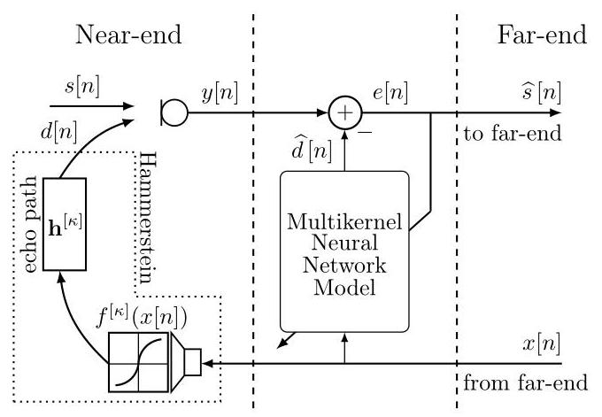

Fig. 8. Setup for acoustic echo cancellation. The model output $\widehat{d}\left\lbrack  n\right\rbrack$ approximates the echo signal $d\left\lbrack  n\right\rbrack$ , such that $e\left\lbrack  n\right\rbrack   \approx  s\left\lbrack  n\right\rbrack$ at the system output.

图8. 声学回声消除的设置。模型输出$\widehat{d}\left\lbrack  n\right\rbrack$近似回声信号$d\left\lbrack  n\right\rbrack$，使得在系统输出处为$e\left\lbrack  n\right\rbrack   \approx  s\left\lbrack  n\right\rbrack$。

of the far-end (reference) speech $x\left\lbrack  n\right\rbrack$ . In this domain model, it is thus assumed that the echo path exhibits Hammerstein block structure. An acoustic echo canceller (i.e., generally in place of the multikernel network of Fig. 8 ans to eliminate the interfering echo $d\left\lbrack  n\right\rbrack$ from the microphone signal $y\left\lbrack  n\right\rbrack   = \; s\left\lbrack  n\right\rbrack   + d\left\lbrack  n\right\rbrack$ without distorting the desired signal $s\left\lbrack  n\right\rbrack$ .

远端(参考)语音$x\left\lbrack  n\right\rbrack$的回声信号。在这个领域模型中，因此假设回声路径呈现哈默斯坦块结构。一个声学回声消除器(即，通常代替图8中的多核网络)从麦克风信号$y\left\lbrack  n\right\rbrack   = \; s\left\lbrack  n\right\rbrack   + d\left\lbrack  n\right\rbrack$中消除干扰回声$d\left\lbrack  n\right\rbrack$，而不使期望信号$s\left\lbrack  n\right\rbrack$失真。

More generally, systems for acoustic echo control traditionally consist of two stages. The acoustic echo canceller (AEC) is a first component and frequently models the echo path for echo estimation and subtraction by a linear FIR filter model. Echo path tracking in this system identification scenario is accomplished by adaptive filter algorithms, such as normalised least-mean squares (NLMS), recursive least-squares (RLS), or frequency-domain adaptive filters (FDAF) [26]. These algorithms are sensitive to local interference, such as double-talk, or echo path nonlinearities. The double-talk problem has been tackled successfully with adaptive learning rates based on double-talk detectors [1], filter mismatch estimation [56], or noisy state-space modelling and Kalman filtering [52]. The problem of nonlinearities, which appear due to the loudspeaker in the echo path, has been addressed, for instance, by means of block-structured nonlinear Hammerstein models with fixed nonlinear basis functions as described in Section IV-A A different approach of dealing with nonlinearities is to apply additional spectral masking to the error signal $e\left\lbrack  n\right\rbrack$ in Fig. 8 in order to sufficiently suppress residual echo and potentially ambient noise. This second stage is performed via statistical model-based postfilters [3], [4] or neural networks [57]- [60]. In this article, we are focusing on the isolated task of acoustic echo cancellation (AEC) based on the domain-specific Hammerstein echo path structure. It guides the corresponding model structure to include nonlinearities and in this way reduce residual echo below what a linear filter can do, without harm to the desired speech. The approach may still be extended with more complex block structures, additional postfilter or masking networks in future work.

更一般地说，传统的声学回声控制系统由两个阶段组成。声学回声消除器(AEC)是第一个组件，通常通过线性FIR滤波器模型对回声路径进行建模，以进行回声估计和减法。在这种系统识别场景中，回声路径跟踪是通过自适应滤波器算法完成的，例如归一化最小均方(NLMS)、递归最小二乘(RLS)或频域自适应滤波器(FDAF)[26]。这些算法对局部干扰敏感，例如双讲或回声路径非线性。双讲问题已经通过基于双讲检测器的自适应学习率[1]、滤波器失配估计[56]或噪声状态空间建模和卡尔曼滤波[52]成功解决。由于回声路径中的扬声器而出现的非线性问题，例如，已经通过具有固定非线性基函数的块结构非线性哈默斯坦模型来解决，如第四节A中所述。处理非线性的另一种方法是对图8中的误差信号$e\left\lbrack  n\right\rbrack$应用额外的频谱掩蔽，以便充分抑制残余回声和潜在的环境噪声。第二阶段通过基于统计模型的后置滤波器[3]、[4]或神经网络[57]-[60]来执行。在本文中，我们专注于基于特定领域哈默斯坦回声路径结构的声学回声消除(AEC)的孤立任务。它指导相应的模型结构包含非线性，从而将残余回声降低到线性滤波器所能达到的水平以下，同时不损害所需语音。在未来的工作中，该方法仍可通过更复杂的块结构、额外的后置滤波器或掩蔽网络进行扩展。

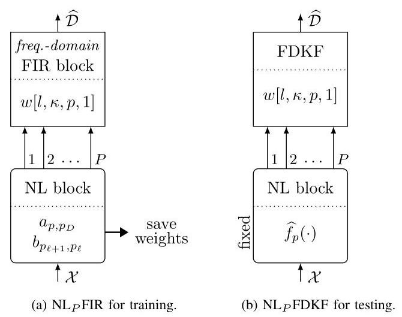

Fig. 9. Multikernel neural network models for training to extract nonlinear function across different plants, and testing used on unseen data with fixed nonlinear function approximation and FDKF as FIR block.

图9. 用于训练以提取不同工厂的非线性函数的多核神经网络模型，以及用于在具有固定非线性函数逼近和作为FIR块的FDKF的未见数据上进行测试的模型。

## B. Domain-Specific Neural-Network for AEC

## B. 用于AEC的特定领域神经网络

For the AEC approach, certain requirements have to be met. While our frequency-domain FIR block is currently applicable for training conditions, the actual network application must further provide agility for double-talk robustness, nonstationary speech characteristic, as well as long and possibly time-varying room impulse responses (RIRs) easily in the order of 4000 or more filter taps.

对于AEC方法，必须满足某些要求。虽然我们的频域FIR块目前适用于训练条件，但实际的网络应用必须进一步为双讲鲁棒性、非平稳语音特性以及容易达到4000个或更多滤波器抽头数量的长且可能时变的房间脉冲响应(RIR)提供灵活性。

To cope with the requirements we outline our training and testing strategy. We rely on the ${\mathrm{{NL}}}_{6}$ FIR model with frequency-domain FIR block as proposed in Section VI, The NL block is specified with $D = 3$ hidden layers with $\overline{{P}_{\ell } = 9}$ internal units and $P = 6$ output units. While the training phase takes place in a far-end single-talk scenario, the test phase additionally involves double-talk scenes and uses completely unseen data, which was not included in the training. To manage, the testing hence employs the domain-specific frequency-domain adaptive Kalman filter (FDKF) [52] and its multichannel version [16] in place of the FIR block. The corresponding model architectures for training and test phases are shown in Fig. 9 The training architecture in Fig. 9a basically aims at the identification of a common nonlinear basis across plants, while the multikernel FIR block of the model here represents the typically variable acoustic impulse responses of a training data set. The weights of the NL block are saved when a minimal normalised MSE (NMSE) is reached. In the test phase, these weights are loaded into the corresponding NL block of the test architecture in Fig. 9b. With the FDKF in place of the FIR block, which is in the following termed the ${\mathrm{{NL}}}_{6}\mathrm{{FDKF}}$ model, our intention is to cancel out nonlinear echo through double-talk with time-varying echo path impulse responses.

为了满足这些要求，我们概述了我们的训练和测试策略。我们依赖于第六章中提出的具有频域FIR块的${\mathrm{{NL}}}_{6}$ FIR模型，NL块由具有$D = 3$个隐藏层、$\overline{{P}_{\ell } = 9}$个内部单元和$P = 6$个输出单元指定。虽然训练阶段在远端单讲场景中进行，但测试阶段还涉及双讲场景，并使用训练中未包含的完全未见数据。为了进行管理，测试因此采用特定领域的频域自适应卡尔曼滤波器(FDKF)[52]及其多通道版本[16]来代替FIR块。训练和测试阶段的相应模型架构如图9所示。图9a中的训练架构基本上旨在识别不同工厂之间的通用非线性基，而此处模型的多核FIR块代表训练数据集通常可变的声学脉冲响应。当达到最小归一化均方误差(NMSE)时，保存NL块的权重。在测试阶段，将这些权重加载到图9b中测试架构的相应NL块中。用FDKF代替FIR块，在以下称为${\mathrm{{NL}}}_{6}\mathrm{{FDKF}}$模型，我们的目的是通过具有时变回声路径脉冲响应的双讲来消除非线性回声。

## C. Experimental Results

## C. 实验结果

Our experimentation uses the ${16}\mathrm{{kHz}}$ synthetic database provided by the ICASSP-2021 AEC Challenge [38]. The structure of training and test data sets as well as far-end and near-end signals is retained in our experiments.

我们的实验使用了ICASSP - 2021 AEC挑战赛[38]提供的${16}\mathrm{{kHz}}$合成数据库。我们的实验保留了训练和测试数据集以及远端和近端信号的结构。

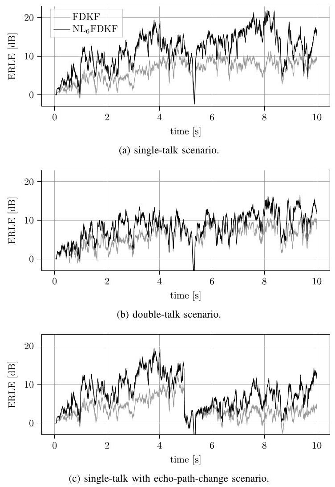

Fig. 10. Test model from Fig. 9b applied to 'self-made' test scenarios across $K = 5$ echo plants with NL block trained on ’self-made’ training data.

图10. 将图9b中的测试模型应用于跨$K = 5$回声工厂的“自制”测试场景，其中NL块在“自制”训练数据上进行训练。

For first experiments we rely on own nonlinearities and echo path impulse responses. For training we generate $K = {20}$ ’self-made’ echo path plants and feed with far-end signals $x\left\lbrack  n\right\rbrack$ of 10 seconds duration from the AEC Challenge training data set. The far-end signals are processed by nonlinear functions ${f}^{\left\lbrack  \kappa \right\rbrack  }\left( x\right)$ to mimic loudspeaker distortion, i.e., before the echo path. Specifically, the arctan defined in (24) is used for plants $\kappa  = 1,\ldots ,5$ , while the clipping-nonlinearity given in 25 is used for $\kappa  = 6,\ldots ,{10}$ . By adjusting ${\delta }^{\left\lbrack  \kappa \right\rbrack  }$ or ${x}_{\max }\left\lbrack  \kappa \right\rbrack$ , the nonlinearity is configured such that the $\operatorname{SDR}\left( {x, f}\right)$ ranges between $4\mathrm{\;{dB}}$ and ${33}\mathrm{\;{dB}}$ , whereby an average of $7\mathrm{\;{dB}}$ is achieved. Another ten linear samples $\left( {{f}^{\left\lbrack  \kappa \right\rbrack  }\left( x\right)  = x,\kappa  = {11},\ldots {20}}\right)$ are included in the training set. To create the echo signals $d\left\lbrack  n\right\rbrack$ , the nonlinearly mapped far-end signals are convolved with room impulse response ${h}^{\left\lbrack  \kappa \right\rbrack  }\left\lbrack  n\right\rbrack$ of length $L = {4096}$ generated by the image method [54], [55] at different room positions. The near-end signal $s\left\lbrack  n\right\rbrack$ is zero in all training samples.

对于首次实验，我们依赖于自身的非线性特性和回声路径脉冲响应。在训练过程中，我们生成$K = {20}$个“自制”的回声路径模型，并使用来自AEC挑战赛训练数据集的时长为10秒的远端信号$x\left\lbrack  n\right\rbrack$进行馈送。远端信号通过非线性函数${f}^{\left\lbrack  \kappa \right\rbrack  }\left( x\right)$进行处理，以模拟扬声器失真，即在回声路径之前。具体而言，式(24)中定义的反正切函数用于模型$\kappa  = 1,\ldots ,5$，而式(25)中给出的限幅非线性函数用于$\kappa  = 6,\ldots ,{10}$。通过调整${\delta }^{\left\lbrack  \kappa \right\rbrack  }$或${x}_{\max }\left\lbrack  \kappa \right\rbrack$，对非线性特性进行配置，使得$\operatorname{SDR}\left( {x, f}\right)$在$4\mathrm{\;{dB}}$和${33}\mathrm{\;{dB}}$之间取值，从而实现平均值为$7\mathrm{\;{dB}}$。训练集中还包括另外十个线性样本$\left( {{f}^{\left\lbrack  \kappa \right\rbrack  }\left( x\right)  = x,\kappa  = {11},\ldots {20}}\right)$。为了生成回声信号$d\left\lbrack  n\right\rbrack$，将经过非线性映射的远端信号与通过镜像法[54],[55]在不同房间位置生成的长度为$L = {4096}$的房间脉冲响应${h}^{\left\lbrack  \kappa \right\rbrack  }\left\lbrack  n\right\rbrack$进行卷积。在所有训练样本中，近端信号$s\left\lbrack  n\right\rbrack$均为零。

For first testing, $K = 5$ other echo plants are generated and fed with AEC Challenge far-end test samples. The procedure of creating the echo signals is similar to the training set, but here uses three other arctan and two other clipping nonlinearities with average $\operatorname{SDR}\left( {x, f}\right)  = 7\mathrm{\;{dB}}$ . The echo signals are further superimposed with the corresponding AEC Challenge near-end speech of $3 - 7$ seconds duration and zero-padding to 10 seconds and scaling according to [38]. Three different scenarios are considered: a) far-end single-talk similar to the training set; b) double-talk with near-end speech; c) far-end single-talk with echo-path change in the middle.

在首次测试中，生成$K = 5$个其他回声模型，并使用AEC挑战赛远端测试样本进行馈送。生成回声信号的过程与训练集类似，但这里使用另外三种反正切函数和另外两种平均为$\operatorname{SDR}\left( {x, f}\right)  = 7\mathrm{\;{dB}}$的限幅非线性函数。回声信号进一步与时长为$3 - 7$秒的相应AEC挑战赛近端语音叠加，并进行零填充至10秒，并根据[38]进行缩放。考虑了三种不同的场景:a) 与训练集类似的远端单讲；b) 近端语音的双讲；c) 中间回声路径发生变化的远端单讲。

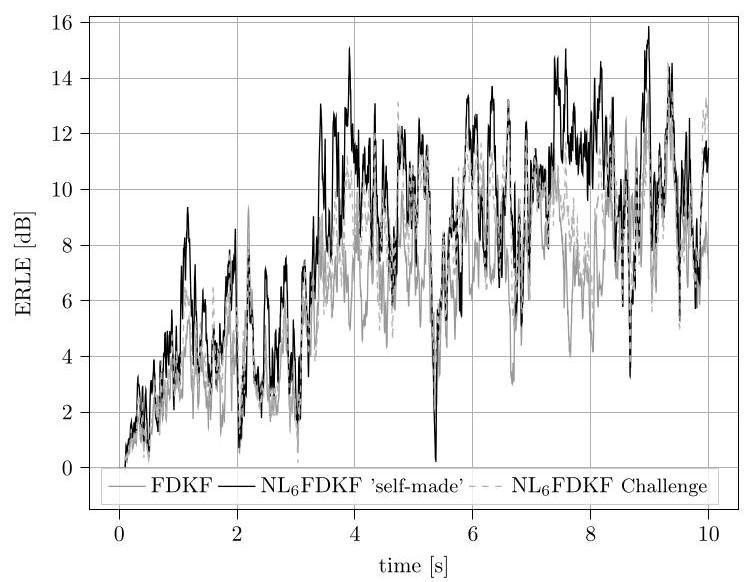

Fig. 11. AEC Challenge single-talk scenario. Averaged over $K = {15}$ randomly selected files from the AEC Challenge test set. NL block trained on 'self-made' training data and NL block trained on AEC Challenge data.

图11. AEC挑战赛单讲场景。对从AEC挑战赛测试集中随机选择的$K = {15}$个文件进行平均。在“自制”训练数据上训练的NL模块和在AEC挑战赛数据上训练的NL模块。

For AEC assessment, we then evaluate the ERLE $\left\lbrack  n\right\rbrack   = \; {10}{\log }_{10}\left( {E\left\{  {{d}^{2}\left\lbrack  n\right\rbrack  }\right\}  /E\left\{  {\left( d\left\lbrack  n\right\rbrack   - \widehat{d}\left\lbrack  n\right\rbrack  \right) }^{2}\right\}  }\right)$ averaged over the test data for the three different test scenarios. Fig. 10 depicts our ${\mathrm{{NL}}}_{6}$ FDKF results with respect to a baseline linear single-channel FDKF algorithm. The superiority of the ${\mathrm{{NL}}}_{6}$ FDKF in comparison to the linear version is firstly visible in single-talk shown in Fig. 10a, where the linear FDKF is limited according the $\operatorname{SDR}\left( {x, f}\right)  = 7\mathrm{\;{dB}}$ , which ${\mathrm{{NL}}}_{6}$ FDKF can clearly overcome. The performance of ${\mathrm{{NL}}}_{6}\mathrm{{FDKF}}$ is also seen in the double-talk scenario in Fig. 10b, although the advantage here is smaller due to the near-end speech presence, mainly between second 3 and 8 . If reconvergence is required after a change in the echo path, the ${\mathrm{{NL}}}_{6}\mathrm{{FDKF}}$ is still above the linear FDKF, as can be seen in Fig. 10c

对于AEC评估，我们随后评估了在三种不同测试场景下测试数据上平均的ERLE $\left\lbrack  n\right\rbrack   = \; {10}{\log }_{10}\left( {E\left\{  {{d}^{2}\left\lbrack  n\right\rbrack  }\right\}  /E\left\{  {\left( d\left\lbrack  n\right\rbrack   - \widehat{d}\left\lbrack  n\right\rbrack  \right) }^{2}\right\}  }\right)$。图10展示了我们的${\mathrm{{NL}}}_{6}$ FDKF相对于基线线性单通道FDKF算法的结果。与线性版本相比，${\mathrm{{NL}}}_{6}$ FDKF的优越性首先在图10a所示的单讲中可见，其中线性FDKF根据$\operatorname{SDR}\left( {x, f}\right)  = 7\mathrm{\;{dB}}$受到限制，而${\mathrm{{NL}}}_{6}$ FDKF可以明显克服这一点。在图10b的双讲场景中也可以看到${\mathrm{{NL}}}_{6}\mathrm{{FDKF}}$的性能，尽管由于近端语音的存在，这里的优势较小，主要在第3秒到第8秒之间。如果在回声路径改变后需要重新收敛，${\mathrm{{NL}}}_{6}\mathrm{{FDKF}}$仍然高于线性FDKF，如图10c所示。

In order to investigate if the learned ${\mathrm{{NL}}}_{6}\mathrm{{FIR}}$ nonlinearity also generalises to echo paths and nonlinearities originally used in the AEC Challenge, we further evaluate a subset of the original synthetic test set. It consists of $K = {15}$ randomly selected files from the test data set [38], comprising the respective far-end speech $x\left\lbrack  n\right\rbrack$ , the echo signal $d\left\lbrack  n\right\rbrack$ including nonlinearity, and the near-end speech $s\left\lbrack  n\right\rbrack$ . Exact details of the echo signal generator are not known. Results of the previous linear FDKF and ${\mathrm{{NL}}}_{6}$ FDKF multikernel neural network model are shown in Fig. 11 It can be seen that the 'self-made' ${\mathrm{{NL}}}_{6}$ FDKF partly addresses the nonlinearity of the original test data by some improvement over the just linear FDKF model. Additionally, an ${\mathrm{{NL}}}_{6}$ FDKF model is trained with original data from the AEC Challenge using a total of $K = {40}$ linear and nonlinear files. Surprisingly, this model trained on the supposedly more appropriate AEC Challenge data performs below the model trained on our 'self-made' data.

为了研究学习到的${\mathrm{{NL}}}_{6}\mathrm{{FIR}}$非线性是否也能推广到AEC挑战赛中最初使用的回声路径和非线性，我们进一步评估了原始合成测试集的一个子集。它由从测试数据集[38]中随机选择的$K = {15}$个文件组成，包括各自的远端语音$x\left\lbrack  n\right\rbrack$、包括非线性的回声信号$d\left\lbrack  n\right\rbrack$和近端语音$s\left\lbrack  n\right\rbrack$。回声信号发生器的确切细节未知。先前的线性FDKF和${\mathrm{{NL}}}_{6}$ FDKF多核神经网络模型的结果如图11所示。可以看出，“自制”的${\mathrm{{NL}}}_{6}$ FDKF通过比仅线性FDKF模型有一些改进，部分解决了原始测试数据的非线性问题。此外，使用总共$K = {40}$个线性和非线性文件，用来自AEC挑战赛的原始数据训练了一个${\mathrm{{NL}}}_{6}$ FDKF模型。令人惊讶的是，这个在据说是更合适的AEC挑战赛数据上训练的模型的性能低于在我们的“自制”数据上训练的模型。

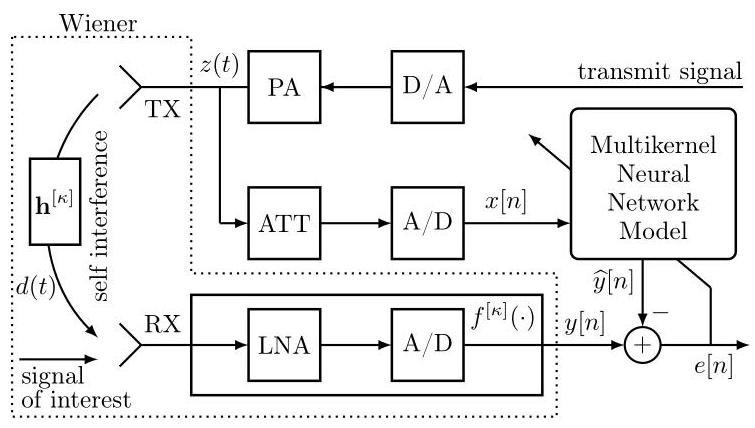

Fig. 12. Wireless system with self-interference as a nonlinear Wiener model.

图12. 具有自干扰的无线系统作为非线性维纳模型。

## VIII. APPLICATION TO WIRELESS SELF-INTERFERENCE CANCELLATION

## 八、在无线自干扰消除中的应用

Full-duplex communication, where transmission and reception occur simultaneously on the same frequency resource, promises greater efficiency and flexibility in wireless systems. The primary challenge, however, is the self-interference (SI) of the transmitted signal leaking into the receiver and impeding the desired communication. In Wi-Fi, for instance, the transmitted signal power is around ${20}\mathrm{\;{dB}}$ , while the information-bearing signal can be near the noise floor at about $- {90}\mathrm{\;{dB}}$ . To avoid the obstructing interference, it must be cancelled by in the order of ${110}\mathrm{\;{dB}}$ from the receiver. Generally, the self-interference cancellation (SIC) hence involves techniques like passive or active shielding, analogue cancellation, and digital baseband adaptive cancellation to achieve the necessary reduction [5]-[7]. In doing so, the strong self-interference is also subject to system nonlinearities in the SI path, which additionally challenges system modelling. In what follows, we briefly describe the wireless architecture, the related data for our study, the placement of a multikernel neural network for modelling, and the experimental results obtained with it.

全双工通信，即在相同频率资源上同时进行发送和接收，有望在无线系统中实现更高的效率和灵活性。然而，主要挑战是发射信号的自干扰(SI)泄漏到接收器中并阻碍期望的通信。例如，在Wi-Fi中，发射信号功率约为${20}\mathrm{\;{dB}}$，而承载信息的信号可能接近约$- {90}\mathrm{\;{dB}}$的噪声基底。为了避免阻碍性干扰，必须在接收器中以${110}\mathrm{\;{dB}}$的量级将其消除。一般来说，自干扰消除(SIC)因此涉及诸如无源或有源屏蔽、模拟消除和数字基带自适应消除等技术，以实现必要的降低[5]-[7]。在此过程中，强自干扰在SI路径中也会受到系统非线性的影响，这给系统建模带来了额外的挑战。接下来，我们简要描述无线架构、我们研究的相关数据、用于建模的多核神经网络的放置以及由此获得的实验结果。

## A. Wireless System

## A. 无线系统

A configuration for cross-domain self-interference cancellation can be defined according to Fig. 12 The impact of power-amplifier (PA) nonlinearity is here effectively avoided by the utilisation of the analogue reference signal $z\left( t\right)$ in the continuous time domain $t$ to support the SIC according to previously proposed systems [12], [61]. This reference of the antenna output is attenuated (ATT) by auxiliary analogue components to the range of an A/D converter, before it can be supplied to a digital model of the SI path, here a multikernel neural network model. In this configuration, the SI path subject to modelling extends from the PA output $z\left( t\right)$ to the received signal $y\left\lbrack  n\right\rbrack$ and thus refers to a Wiener plant model. The PA output firstly propagates through a presumably linear TX to RX multiplant ${h}^{\left\lbrack  \kappa \right\rbrack  }\left( t\right)$ followed by nonlinear saturation in the LNA and A/D components due to its high power, i.e.,

可以根据图12定义一种用于跨域自干扰消除的配置。通过在连续时域$t$中利用模拟参考信号$z\left( t\right)$，有效地避免了功率放大器(PA)非线性的影响，以根据先前提出的系统[12]、[61]支持自干扰消除(SIC)。天线输出的该参考信号在被提供给SI路径的数字模型(这里是多核神经网络模型)之前，由辅助模拟组件衰减(ATT)到A/D转换器的范围。在这种配置中，进行建模的SI路径从PA输出$z\left( t\right)$延伸到接收信号$y\left\lbrack  n\right\rbrack$，因此指的是一个维纳工厂模型。PA输出首先通过一个假定为线性的发射机到接收机的多工厂${h}^{\left\lbrack  \kappa \right\rbrack  }\left( t\right)$传播，然后由于其高功率在LNA和A/D组件中出现非线性饱和，即

$$
y\left\lbrack  n\right\rbrack   = {f}^{\left\lbrack  \kappa \right\rbrack  }\left( {{h}^{\left\lbrack  \kappa \right\rbrack  }\left( t\right)  * z\left( t\right) }\right) , \tag{28}
$$

with the information-bearing signal being neglected in the scope of this paper. To achieve full-duplex operation, a wireless system must accurately model and cancel the overwhelming self-interference $y\left\lbrack  n\right\rbrack$ from the transmitter into the receiver. Both the SI and the SIC are represented in the complex-valued baseband domain. Note that the reference $z\left( t\right)$ is in the SIC path represented by the digital version $x\left\lbrack  n\right\rbrack$ .

在本文范围内忽略携带信息的信号。为了实现全双工操作，无线系统必须准确地建模并消除从发射机到接收机的压倒性自干扰$y\left\lbrack  n\right\rbrack$。自干扰(SI)和自干扰消除(SIC)均在复基带域中表示。请注意，参考信号$z\left( t\right)$在由数字版本$x\left\lbrack  n\right\rbrack$表示的SIC路径中。

Experiments below will be performed for simulated high-throughput (HT) transmission in a wireless local area network (WLAN) with data available in [14]. It uses orthogonal frequency-division multiplexing (OFDM) baseband signals according to IEEE-802.11n with ${20}\mathrm{{MHz}}$ channel bandwidth. It will be relevant for our multikernel model that the nonlinearity of LNA and A/D is in the data realised with polar coordinates in the complex baseband domain as

下面的实验将针对无线局域网(WLAN)中的模拟高吞吐量(HT)传输进行，数据可参考[14]。它使用根据IEEE - 802.11n的具有${20}\mathrm{{MHz}}$信道带宽的正交频分复用(OFDM)基带信号。对于我们的多核模型而言，LNA和A/D的非线性在复基带域中用极坐标实现的数据中是相关的，如下所示

$$
{f}^{\left\lbrack  \kappa \right\rbrack  }\left( \cdot \right)  = {f}_{\text{ mag }}^{\left\lbrack  \kappa \right\rbrack  }\left( \left| \cdot \right| \right)  \cdot  {\mathrm{e}}^{\jmath \angle \left( \cdot \right) } \tag{29}
$$

where ${f}_{\text{ mag }}\left( \cdot \right)$ is a real-valued saturation and such that the average SDR of different plants ${f}^{\left\lbrack  \kappa \right\rbrack  }\left( \cdot \right)$ amounts to ${10}\mathrm{\;{dB}}$ .

其中${f}_{\text{ mag }}\left( \cdot \right)$是一个实值饱和度，使得不同工厂${f}^{\left\lbrack  \kappa \right\rbrack  }\left( \cdot \right)$的平均信干比达到${10}\mathrm{\;{dB}}$。

## B. Complex-valued Multikernel Neural Network

## B. 复值多核神经网络

A multikernel ${\mathrm{{FIR}}}_{1}{\mathrm{{NL}}}_{1}\mathrm{{FIR}}$ model of Section VI is employed to represent the Wiener SI plant with its potential variability of linear and nonlinear components. Extension is required for applying this model in the complex-valued baseband domain. Fig. 13 shows the model architecture, where the bold links represent complex-valued signals, which are converted into Cartesian and polar forms as necessary.

采用第六章的多核${\mathrm{{FIR}}}_{1}{\mathrm{{NL}}}_{1}\mathrm{{FIR}}$模型来表示具有线性和非线性组件潜在变化性的维纳SI工厂。需要进行扩展以便在复基带域中应用此模型。图13展示了模型架构，其中加粗的链路表示复值信号，必要时会将其转换为笛卡尔形式和极坐标形式。

The complex-valued FIR blocks operate in Cartesian form, where the real and imaginary parts of the input signal, $\Re \{ \mathcal{X}\}$ and $\Im \{ \mathcal{X}\}$ , are processed with two convolutional kernels such that valid components, $\Re \{  \cdot  \}$ and $\Im \{  \cdot  \}$ , of a complex-valued output signal are delivered. In light of the plant information in [14], our hyperparameters include the FIR filter lengths ${L}_{1} =$ 20, and ${L}_{2} = 1$ samples in the time domain.

复值FIR块以笛卡尔形式运行，其中输入信号$\Re \{ \mathcal{X}\}$和$\Im \{ \mathcal{X}\}$的实部和虚部分别用两个卷积核进行处理，从而输出复值信号的有效分量$\Re \{  \cdot  \}$和$\Im \{  \cdot  \}$。根据[14]中的工厂信息。我们的超参数包括FIR滤波器长度${L}_{1} =$为20，以及时域中的${L}_{2} = 1$个样本。

Taking into account the former expression 29 for complex-valued nonlinearity in the data, we realise our complex-valued nonlinear modelling by means of the former NL block on the magnitude of a complex-valued signal and then recombine with the original phase, such that our model function $\widehat{f}\left( \cdot \right)  = {\widehat{f}}_{\text{ mag }}\left( \left| \cdot \right| \right)  \cdot  {\mathrm{e}}^{\jmath \angle \left( \cdot \right) }$ complies with 29 . The NL block is configured with $D = 3$ hidden layers with ${P}_{\ell } = {15}$ internal nonlinear tanh-activations each.

考虑到数据中复值非线性的前一个表达式29，我们通过对复值信号的幅度使用前一个NL块来实现复值非线性建模，然后与原始相位重新组合，使得我们的模型函数$\widehat{f}\left( \cdot \right)  = {\widehat{f}}_{\text{ mag }}\left( \left| \cdot \right| \right)  \cdot  {\mathrm{e}}^{\jmath \angle \left( \cdot \right) }$符合29。NL块配置有$D = 3$个隐藏层，每个隐藏层有${P}_{\ell } = {15}$个内部非线性双曲正切激活。

For the optimisation of the trainable parameters, the average mean-square error (MSE) of real and imaginary model output components w.r.t. the SI target $y\left\lbrack  n\right\rbrack$ is used as the loss function. In the training phase all trainable parameters of FIR and NL blocks are adjusted for minimisation. In the test phase of the model, we retain the trained NL block parameters, while reoptimising the FIR block parameters in order to cope with new multiplants of the test data [14].

为了优化可训练参数，将实部和虚部模型输出分量相对于SI目标$y\left\lbrack  n\right\rbrack$的平均均方误差(MSE)用作损失函数。在训练阶段，对FIR和NL模块的所有可训练参数进行调整以使其最小化。在模型的测试阶段，我们保留训练好的NL模块参数，同时重新优化FIR模块参数，以应对测试数据中的新多径衰落信道[14]。

## C. Experimental Results

## C. 实验结果

With the proposed multikernel model, a number of baseline models further take part in the evaluation, i.e.,

使用所提出的多核模型，一些基线模型进一步参与评估，即

- a multiplant 'linear FIR' model consisting of only one FIR block with kernelsize $L = {20}$ ,

- 一个多径衰落信道的“线性FIR”模型，仅由一个核大小为$L = {20}$的FIR模块组成，

- a plant-specific 'memory polynomial' model [11] with nonlinear order $P = {15}$ and filter length $L = {20}$ ,

- 一个特定信道的“记忆多项式”模型[11]，其非线性阶数为$P = {15}$，滤波器长度为$L = {20}$，

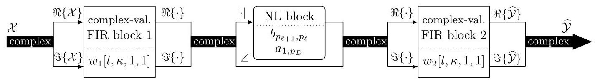

Fig. 13. Block-structured ${\mathrm{{FIR}}}_{1}{\mathrm{{NL}}}_{1}$ FIR model for complex-valued signals.

图13. 用于复值信号的块结构${\mathrm{{FIR}}}_{1}{\mathrm{{NL}}}_{1}$ FIR模型。

TABLE III

表III

MINIMUM NMSE [dB] ACHIEVED WITH COMPLEX-VALUED MODELS ON COMPLEX-VALUED WIENER MULTIPLANT (LABELLED "VAR") DATA.

在复值维纳多径衰落信道(标记为“VAR”)数据上使用复值模型实现的最小归一化均方误差[dB]。

<table><tr><td colspan="2">Model</td><td>FIR1NL1FIR (Fig 13)</td><td>${\mathrm{{FIR}}}_{1}{\mathrm{{NL}}}_{1}$ FIR (single kernel)</td><td>Memory Polynomial</td><td>linear FIR</td></tr><tr><td>h</td><td>$f$</td><td></td><td></td><td></td><td></td></tr><tr><td>inv</td><td>inv</td><td>-69</td><td>-44</td><td>-14</td><td>-11</td></tr><tr><td>var</td><td>inv</td><td>-70</td><td>-5</td><td>-13</td><td>-12</td></tr><tr><td>inv</td><td>var</td><td>-68</td><td>-25</td><td>-14</td><td>-12</td></tr><tr><td>var</td><td>var</td><td>-69</td><td>-5</td><td>-12</td><td>-11</td></tr></table>

- the proposed complex-valued multikernel ${\mathrm{{FIR}}}_{1}{\mathrm{{NL}}}_{1}\mathrm{{FIR}}$ neural network as shown by Fig. 13

- 如图13所示的所提出的复值多核${\mathrm{{FIR}}}_{1}{\mathrm{{NL}}}_{1}\mathrm{{FIR}}$神经网络

- and a complex-valued ${\mathrm{{FIR}}}_{1}{\mathrm{{NL}}}_{1}\mathrm{{FIR}}$ version with single kernel and otherwise the same configuration.

- 以及一个具有单核且其他配置相同的复值${\mathrm{{FIR}}}_{1}{\mathrm{{NL}}}_{1}\mathrm{{FIR}}$版本。

Table III shows the minimum NMSE achieved for the different models. The linear FIR model does not possess sufficient nonlinear modelling ability to represent the nonlinear Wiener data. The single-kernel ${\mathrm{{FIR}}}_{1}{\mathrm{{NL}}}_{1}\mathrm{{FIR}}$ model does not possess the capacity to represent multiplant data with either variable linear or nonlinear components (labelled "var"). The memory polynomial rooted in Hammerstein modelling is neither able to represent the Wiener data with relevant accuracy. As a result, merely the multikernel model (left column) is able to model the SI data [14] well with a minimum MSE around $- {70}\mathrm{\;{dB}}$ .

表III显示了不同模型实现的最小归一化均方误差。线性FIR模型没有足够的非线性建模能力来表示非线性维纳数据。单核${\mathrm{{FIR}}}_{1}{\mathrm{{NL}}}_{1}\mathrm{{FIR}}$模型没有能力表示具有可变线性或非线性分量(标记为“var ”)的多径衰落信道数据。基于哈默斯坦建模的记忆多项式也不能以相关精度表示维纳数据。因此，只有多核模型(左列)能够以约$- {70}\mathrm{\;{dB}}$的最小均方误差很好地对SI数据进行建模[14]。

Fig. 14 finally provides an illustration of power spectral densities (PSDs) of the involved SI signals before and after cancellation. The unprocessed received signal $y\left\lbrack  n\right\rbrack$ appears at the top and depicts an average attenuation level of $- {40}\mathrm{\;{dB}}$ according to passive SI shielding provided in the data. From there, a linear FIR model can just insignificantly reduce the SI to about $- {50}\mathrm{\;{dB}}$ . The proposed multikernel FIR ${}_{1}{\mathrm{{NL}}}_{1}$ FIR model, however, creates an SIC residual below $- {100}\mathrm{\;{dB}}$ , consisting of the incoming $- {40}\mathrm{\;{dB}}$ of the unprocessed data and the additional -70 dB according to Table III, and therefore attains the noise floor of the available data.

图14最后给出了抵消前后相关SI信号的功率谱密度(PSD)的图示。未处理的接收信号$y\left\lbrack  n\right\rbrack$出现在顶部，根据数据中提供的无源SI屏蔽，其描绘了$- {40}\mathrm{\;{dB}}$的平均衰减水平。从那里开始，线性FIR模型只能将SI略微降低到约$- {50}\mathrm{\;{dB}}$。然而，所提出的多核FIR ${}_{1}{\mathrm{{NL}}}_{1}$ FIR模型产生了低于$- {100}\mathrm{\;{dB}}$的SIC残余，它由未处理数据的输入$- {40}\mathrm{\;{dB}}$和根据表III的额外 -70 dB组成，因此达到了可用数据的本底噪声。

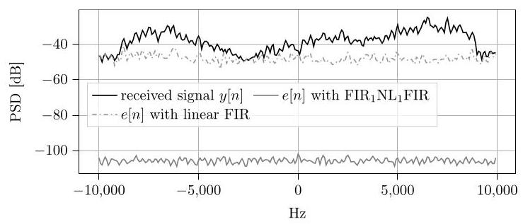

Fig. 14. PSDs of received signal $y\left\lbrack  n\right\rbrack$ without SIC and error signal $e\left\lbrack  n\right\rbrack   = \; y\left\lbrack  n\right\rbrack   - \widehat{y}\left\lbrack  n\right\rbrack$ after SIC. Average of 10 signals from the "inv/var" test case.

图14. 无SIC时接收信号$y\left\lbrack  n\right\rbrack$的PSD和SIC后误差信号$e\left\lbrack  n\right\rbrack   = \; y\left\lbrack  n\right\rbrack   - \widehat{y}\left\lbrack  n\right\rbrack$的PSD。来自“inv/var”测试案例的10个信号的平均值。

## IX. CONCLUSION

## IX. 结论

While deep learning is progressing relentlessly with powerful networks for classification and regression problems, it is not quite so commonly used for problems of nonlinear system identification. This paper has demonstrated conceptually and by considering typical applications of system identification that this might be rooted in the specific type of data and in the desire of custom-fit architectures. The data, if it comprises elements such as linear and nonlinear system responses, can be extremely inconsistent between different training samples and therefore complete hamper the identification of a good model representation. Regarding the model architectures, the system identification would typically rely on specific structures based on dedicated domain-knowledge. Yet, this paper demonstrates that the popular concept of architectures with trainable weights is applicable to nonlinear system identification as well, since there can be appropriate such model subsections with cross-data utility. Specifically, we have presented a block-structured approach for nonlinear modelling with a subset of trainable weights across the training data and another subset of plant-specific weights represented by multikernels. In this way the otherwise inconsistent data of different plant observations can be well represented both in training and testing, opening a deep learning perspective for nonlinear system identification.

虽然深度学习凭借强大的网络在分类和回归问题上不断取得进展，但在非线性系统识别问题中却不太常用。本文从概念上并通过考虑系统识别的典型应用表明，这可能源于数据的特定类型以及对定制化架构的需求。如果数据包含线性和非线性系统响应等元素，那么不同训练样本之间的数据可能会极其不一致，从而完全阻碍对良好模型表示的识别。关于模型架构，系统识别通常会依赖基于特定领域知识的特定结构。然而，本文表明具有可训练权重的流行架构概念也适用于非线性系统识别，因为可以存在具有跨数据效用的合适模型子部分。具体而言，我们提出了一种块结构方法用于非线性建模，在训练数据上有一组可训练权重，另一组由多核表示的特定于设备的权重。通过这种方式，不同设备观测中原本不一致的数据在训练和测试中都能得到很好的表示，为非线性系统识别开启了深度学习视角。

## REFERENCES

## 参考文献

[1] J. Benesty, T. Gänsler, D. Morgan, M. Sondhi, and S. Gay, Advances inNetwork and Acoustic Echo Cancellation. Springer, 2001.

《网络与声学回声消除》。施普林格出版社，2001年。

[2] E. Hänsler and G. Schmidt, Topics in Acoustic Echo and Noise Control.Springer, 2006.

施普林格出版社，2006年。

[3] P. Vary and R. Martin, Digital Speech Transmission - Enhancement, Coding, and Error Concealment. Wiley, 2006.

[4] G. Enzner, H. Buchner, A. Favrot, and F. Kuech, "Acoustic echo control," in Academic Press Library in Signal Process. Elsevier, 2014, vol. 4,pp. 807-877.

[5] M. Heino et al., "Recent advances in antenna design and interferencecancellation algorithms for in-band full duplex relays," IEEE Comm.

“带内全双工中继的抵消算法”，《IEEE通信》Mag., vol. 53, no. 5, pp. 91-101, 2015.

[6] K. E. Kolodziej, B. T. Perry, and J. S. Herd, "In-band full-duplextechnology: Techniques and systems survey," IEEE Trans. Microwave

“技术:技术与系统综述”，《IEEE微波学报》Theory Techn., vol. 67, no. 7, pp. 3025-3041, 2019.

[7] B. Smida, A. Sabharwal, G. Fodor, G. C. Alexandropoulos, H. A.Suraweera, and C. Chae, "Full-duplex wireless for 6G: Progress brings new opportunities and challenges," IEEE J. Sel. Areas Commun., vol. 41,

苏雷韦拉和C. 蔡，“6G的全双工无线通信:进展带来新机遇与挑战”，《IEEE通信选刊》，第41卷no. 9, pp. 2729-2750, 2023.

[8] C. Sexton, N. J. Kaminski, J. M. Marquez-Barja, N. Marchetti, and L. A.DaSilva, "5G: Adaptable networks enabled by versatile radio access technologies," IEEE Commun. Surveys Tuts., vol. 19, no. 2, pp. 688- 720, 2017.

达席尔瓦，“5G:由通用无线接入技术实现的自适应网络”，《IEEE通信综述与教程》，第19卷，第2期，第688 - 720页，2017年。

[9] Y. He, H. Zhao, W. Guo, S. Shao, and Y. Tang, "Frequency-domainsuccessive cancellation of nonlinear self-interference with reduced complexity for full-duplex radios," IEEE Trans. Commun., vol. 70, no. 4, pp. 2678-2690, 2022.

“用于全双工无线电的具有降低复杂度的非线性自干扰连续抵消”，《IEEE通信学报》，第70卷，第4期，第2678 - 2690页，2022年。

[10] W. Klippel, "Nonlinear large-signal behavior of electrodynamic loud-speakers at low frequencies," Jrnl. Audio Eng. Soc., vol. 40, pp. 483- 496, 1992.

“低频扬声器”，《音频工程协会杂志》，第40卷，第483 - 496页，1992年。

[11] D. R. Morgan, Z. Ma, J. Kim, M. G. Zierdt, and J. Pastalan, "Ageneralized memory polynomial model for digital predistortion of RF power amplifiers," IEEE Trans. Signal Process., vol. 54, no. 10, pp. 3852-3860, 2006.

“用于射频功率放大器数字预失真的广义记忆多项式模型”，《IEEE信号处理学报》，第54卷，第10期，第3852 - 3860页，2006年。

[12] E. Ahmed and A. M. Eltawil, "All-digital self-interference cancellationtechnique for full-duplex systems," IEEE Trans. Wireless Commun.,

“全双工系统的技术”，《IEEE无线通信学报》vol. 14, no. 7, pp. 3519-3532, 2015.

[13] M. I. Mossi, N. Evans, and C. Beaugeant, "An assessment of linearadaptive filter performance with nonlinear distortions," in Proc. IEEE

“具有非线性失真的自适应滤波器性能”，发表于《IEEE会议论文集》Intl. Conf. Acoustics, Speech and Signal Process., 2010, pp. 313-316.

[14] G. Enzner, A. Chinaev, S. Voit, and A. Sezgin, "On neural-networkrepresentation of wireless self-interference for inband full-duplex communications," 2024. [Online]. Available: https://arxiv.org/abs/2410.00894

“带内全双工通信中无线自干扰的表示”，2024年。[在线]。可获取:https://arxiv.org/abs/2410.00894

[15] C. Huemmer, C. Hofmann, R. Maas, and W. Kellermann, "Estimatingparameters of nonlinear systems using the elitist particle filter based on evolutionary strategies," IEEE/ACM Trans. Audio, Speech, Language

“基于进化策略的精英粒子滤波器用于非线性系统参数估计”，《IEEE/ACM音频、语音、语言学报》Process., vol. 26, no. 3, pp. 595-608, 2018.

[16] S. Malik and G. Enzner, "State-space frequency-domain adaptive fil-tering for nonlinear acoustic echo cancellation," IEEE Trans. Audio,

“用于非线性声学回声消除中的滤波”，《IEEE音频学报》Speech, Language Process., vol. 20, no. 7, pp. 2065-2079, 2012.

[17] —, "A variational Bayesian learning approach for nonlinear acousticecho control," IEEE Trans. Signal Process., vol. 61, no. 23, pp. 5853- 5867, 2013.

回声控制，《IEEE信号处理汇刊》，第61卷，第23期，第5853 - 5867页，2013年。

[18] S. A. Billings, Nonlinear System Identification: NARMAX Methods in the Time, Frequency, and Spatio-Temporal Domains. Wiley, 2013.

[19] S. Chen, S. A. Billings, C. F. N. Cowan, and P. M. Grant, "Practicalidentification of NARMAX models using radial basis functions," Intl.

使用径向基函数识别NARMAX模型，《国际……》Jrnl. Control, vol. 52, no. 6, pp. 1327-1350, 1990.

[20] M. Zeller and W. Kellermann, "Fast and robust adaptation of DFT-domain Volterra filters in diagonal coordinates using iterated coefficient updates," IEEE Trans. Signal Process., vol. 58, no. 3, pp. 1589-1604, 2009.

在对角坐标中使用迭代系数更新的域Volterra滤波器，《IEEE信号处理汇刊》，第58卷，第3期，第1589 - 1604页，2009年。

[21] T. Wigren, "Convergence analysis of recursive identification algorithmsbased on the nonlinear Wiener model," IEEE Trans. Autom. Control,

基于非线性维纳模型，《IEEE自动控制汇刊》vol. 39, no. 11, pp. 2191-2206, 1994.

[22] W. Greblicki and M. Pawlak, "Nonparametric identification of Hammer-stein systems," IEEE Trans. Inf. Theory, vol. 35, no. 2, pp. 409-418, 1989.

斯坦系统，《IEEE信息论汇刊》，第35卷，第2期，第409 - 418页，1989年。

[23] T. Mäkelä and R. Niemistö, "Effects of harmonic components gener-ated by polynomial preprocessor in acoustic echo control," Proc. Intl.

由多项式预处理器在声学回声控制中实现，《国际会议论文集》Workshop, Acoust. Echo, Noise Control, pp. 139-142, 2003.

[24] S. Chen, S. A. Billings, and P. M. Grant, "Non-linear system identi-fication using neural networks," Intl. Jrnl. Control, vol. 51, no. 6, pp. 1191-1214, 1990.

使用神经网络进行验证，《国际控制杂志》，第51卷，第6期，第1191 - 1214页，1990年。

[25] J. Kelley and M. T. Hagan, "Comparison of neural network NARXand NARMAX models for multi-step prediction using simulated and experimental data," Expert Systems with Applications, vol. 237, p. 121437, 2024.

以及用于多步预测的NARMAX模型，使用模拟和实验数据，《专家系统应用》，第237卷，第121437页，2024年。

[26] S. Haykin, Adaptive Filter Theory. Pearson Education, 2014.

[27] A. Stenger and R. Rabenstein, "Adaptive Volterra filters for nonlinearacoustic echo cancellation," in Proc. IEEE-EURASIP Workshop Nonlin-

声学回声消除，《IEEE - EURASIP非线性……研讨会论文集》ear Signal Image Process., 1999, pp. 679-683.

[28] A. Stenger and W. Kellermann, "Adaptation of a memoryless preproces-sor for nonlinear acoustic echo cancelling," Signal Process., Elsevier,

用于非线性声学回声消除的……，《信号处理》，爱思唯尔出版社vol. 80, no. 9, pp. 1747-1760, 2000.

[29] A. Guérin, G. Faucon, and R. Le Bouquin-Jeannès, "Nonlinear acousticecho cancellation based on Volterra filters," IEEE Speech Audio Process.,

基于Volterra滤波器的回声消除，《IEEE语音音频处理》vol. 11, no. 6, pp. 672-683, 2003.

[30] F. Kuech and W. Kellermann, "Orthogonalized power filters for nonlin-ear acoustic echo cancellation," Signal Process., Elsevier, vol. 86, no. 6, pp. 1168-1181, 2006.

线性声学回声消除，《信号处理》，爱思唯尔出版社，第86卷，第6期，第1168 - 1181页，2006年。

[31] S. Malik and G. Enzner, "Fourier expansion of Hammerstein modelsfor nonlinear acoustic system identification," in Proc. IEEE Intl. Conf.

用于非线性声学系统识别，《IEEE国际会议论文集》Acoustics, Speech and Signal Process. IEEE, 2011, pp. 85-88.

[32] L. Ding, G. T. Zhou, D. R. Morgan, Z. Ma, J. S. Kenney, J. Kim,and C. R. Giardina, "A robust digital baseband predistorter constructed using memory polynomials," IEEE Trans. Commun., vol. 52, no. 1, pp. 159-165, 2004.

以及C. R. 贾尔迪纳，“使用记忆多项式构建的鲁棒数字基带预失真器”，《IEEE通信汇刊》，第52卷，第1期，第159 - 165页，2004年。

[33] A. Ivry, I. Cohen, and B. Berdugo, "Nonlinear acoustic echo cancellation with deep learning," in Proc. ISCA Interspeech, 2021, pp. 4773-4777.

[34] S. Braun and M. Valero, "Task splitting for DNN-based acoustic echoand noise removal," in Proc. Intl. Workshop Acoustic Signal Enhance-

以及噪声去除，《国际声学信号增强研讨会论文集》ment, 2022, pp. 1-5.

[35] E. Seidel, J. Franzen, M. Strake, and T. Fingscheidt, "Y2-net FCRN for acoustic echo and noise suppression," in Proc. ISCA Interspeech, 2021,pp. 4763-4767.

[36] H. Zhang, S. Kandadai, H. Rao, M. Kim, T. Pruthi, and T. Kristjansson,"Deep adaptive AEC: Hybrid of deep learning and adaptive acoustic echo cancellation," in Proc. IEEE Intl. Conf. Acoustics, Speech and

“深度自适应AEC:深度学习与自适应声学回声消除的混合”，《IEEE国际声学、语音和……会议论文集》Signal Process., 2022, pp. 756-760.

[37] N. L. Westhausen and B. T. Meyer, "Acoustic echo cancellation with thedual-signal transformation LSTM network," in Proc. IEEE Intl. Conf.

双信号变换长短期记忆网络，发表于《IEEE国际会议论文集》Acoustics, Speech and Signal Process., 2021, pp. 7138-7142.

[38] K. Sridhar, R. Cutler, A. Saabas, T. Parnamaa, M. Loide, H. Gamper, S. Braun, R. Aichner, and S. Srinivasan, "ICASSP 2021 Acoustic EchoCancellation Challenge: datasets, testing framework, and results," in

消除挑战:数据集、测试框架及结果，发表于Proc. IEEE Intl. Conf. Acoustics, Speech and Signal Process., 2021,pp. 151-155.

[39] M. S. Gast, 802.11n: A Survival Guide. O'Reilly Media, Inc., 2012.

[40] M. Halimeh, C. Huemmer, and W. Kellermann, "A neural network-basednonlinear acoustic echo canceller," IEEE Signal Process. Lett., vol. 26,

非线性声学回声消除器，《IEEE信号处理快报》，第26卷，no. 12, pp. 1827-1831, 2019.

[41] A. N. Birkett and R. A. Goubran, "Acoustic echo cancellation usingNLMS-neural network structures," in Proc. IEEE Intl. Conf. Acoustics,

NLMS神经网络结构，发表于《IEEE国际声学会议论文集》，Speech and Signal Process., vol. 5. IEEE, 1995, pp. 3035-3038.

[42] M. Schetzen, The Volterra and Wiener Theories of Nonlinear Systems.Krieger Pub., 2006.

克里格出版社，2006年。

[43] V. J. Mathews and G. Sicuranza, Polynomial Signal Processing. John Wiley & Sons, Inc., 2000.

[44] T. Wigren and A. E. Nordsjo, "Compensation of the RLS algorithm foroutput nonlinearities," IEEE Trans. Autom. Control, vol. 44, no. 10, pp. 1913-1918, 1999.

输出非线性，《IEEE自动控制汇刊》，第44卷，第10期，第1913 - 1918页，1999年。

[45] A. E. Nordsjo and L. H. Zetterberg, "Identification of certain time-varying nonlinear Wiener and Hammerstein systems," IEEE Trans.

时变非线性维纳和哈默斯坦系统，《IEEE汇刊》Signal Process., vol. 49, no. 3, pp. 577-592, 2001.

[46] O. Nelles, Nonlinear System Identification. Springer, 2020.

[47] K. Narendra and P. Gallman, "An iterative method for the identificationof nonlinear systems using a Hammerstein model," IEEE Trans. Autom.

使用哈默斯坦模型的非线性系统，《IEEE自动控制汇刊》Control, vol. 11, no. 3, pp. 546-550, 1966.

[48] A. E. Nordsjo and L. Zetterberg, "Identification of certain time-varyingnonlinear Wiener and Hammerstein systems," IEEE Trans. Signal Pro-

非线性维纳和哈默斯坦系统，《IEEE信号处理汇刊》cess., vol. 49, no. 3, pp. 577-592, 2001.

[49] J. Kim and K. Konstantinou, "Digital predistortion of wideband signalsbased on power amplifier model with memory," Electron. Lett., vol. 37,

基于带记忆功率放大器模型，《电子学快报》，第37卷，no. 23, p. 1, 2001.

[50] C. M. Bishop and N. M. Nasrabadi, Pattern Recognition and Machine Learning. Springer, 2006, vol. 4, no. 4.

[51] I. Goodfellow, Y. Bengio, and A. Courville, Deep Learning. MIT Press,2016, http://www.deeplearningbook.org

2016年，http://www.deeplearningbook.org

[52] G. Enzner and P. Vary, "Frequency-domain adaptive Kalman filterfor acoustic echo control in hands-free telephones," Signal Process.,

用于免提电话中的声学回声控制，《信号处理》，Elsevier, vol. 86, no. 6, pp. 1140-1156, June 2006.

[53] D. P. Kingma and J. Ba, "Adam: A method for stochastic optimization,"in Proc. Intl. Conf. Learning Representations, 2015.

发表于《国际学习表征会议论文集》，2015年。

[54] (2024) RIR Generator. [Online]. Available: https://www.audiolabs-erlangen.de/fau/professor/habets/software/rir-generator

audiolabs-erlangen.de/fau/professor/habets/software/rir-generator

[55] J. B. Allen and D. A. Berkley, "Image method for efficiently simulatingsmall-room acoustics," Jrnl. Acoustical Soc. America, vol. 65, no. 4, pp. 943-950, 1979.

“小房间声学”，《美国声学学会杂志》，第65卷，第4期，第943 - 950页，1979年。

[56] J. M. Valin, "On adjusting the learning rate in frequency domain echocancellation with double-talk," IEEE Trans. Audio, Speech, Language

“存在双讲时的抵消”，《IEEE音频、语音、语言汇刊》Process., vol. 15, no. 3, pp. 1030-1034, 2007.

[57] M. Halimeh, T. Haubner, A. Briegleb, A. Schmidt, and W. Kellermann,"Combining adaptive filtering and complex-valued deep postfiltering for acoustic echo cancellation," in Proc. IEEE Intl. Conf. Acoustics, Speech

“将自适应滤波与复值深度后置滤波相结合用于声学回声抵消”，发表于《IEEE国际声学、语音会议论文集》and Signal Process., 2021, pp. 121-125.

[58] J. M. Valin, S. Tenneti, K. Helwani, U. Isik, and A. Krishnaswamy,"Low-complexity, real-time joint neural echo control and speech enhancement based on PercepNet," in Proc. IEEE Intl. Conf. Acoustics,

“基于PercepNet的低复杂度实时联合神经回声控制与语音增强”，发表于《IEEE国际声学会议论文集》Speech and Signal Process., 2021, pp. 7133-7137.

[59] A. Ivry, I. Cohen, and B. Berdugo, "Deep residual echo suppressionwith a tunable tradeoff between signal distortion and echo suppression,"

“在信号失真与回声抑制之间具有可调权衡”in Proc. IEEE Intl. Conf. Acoustics, Speech and Signal Process., 2021.

[60] S. Voit and G. Enzner, "Generalized Wiener filter for nonlinear acoustic echo control," in Proc. ITG Conf. Speech Communication. VDE, 2023,pp. 146-150.

[61] D. Korpi, L. Anttila, and M. Valkama, "Reference receiver based digitalself-interference cancellation in MIMO full-duplex transceivers," in

“MIMO全双工收发器中的自干扰抵消”，发表于IEEE Globecom Workshops, 2014, pp. 1001-1007.