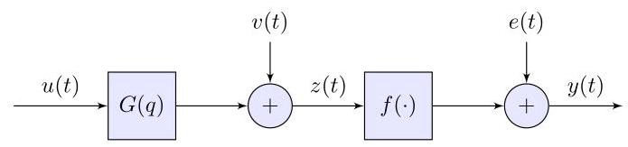

# Identification of Stochastic Wiener Systems using Indirect Inference*

《使用间接推理识别随机维纳系统*》

Bo Wahlberg* James Welsh** Lennart Ljung ***

博·瓦尔贝里* 詹姆斯·威尔士** 伦纳特·吕永 ***

* Department of Automatic Control and ACCESS, School of Electrical Engineering, KTH Royal Institute of Technology, SE-100 44 Stockholm, Sweden. (e-mail: bo.wahlberg@ee.kth.se).

* 瑞典皇家理工学院电气工程学院自动控制与ACCESS系，邮编:SE-100 44，斯德哥尔摩，瑞典。(电子邮件:bo.wahlberg@ee.kth.se)。

** School of Elect Engineering and Computer Science, The University of Newcastle, Callaghan NSW 2308, Australia.

** 澳大利亚新南威尔士州卡拉汉市纽卡斯尔大学电子工程与计算机科学学院。

*** Division of Automatic Control, Linköping University, SE-581 83 Linköping, Sweden.

*** 瑞典林雪平大学自动控制系，邮编:SE-581 83，林雪平，瑞典。

Abstract: We study identification of stochastic Wiener dynamic systems using so-called indirect inference. The main idea is to first fit an auxiliary model to the observed data and then in a second step, often by simulation, fit a more structured model to the estimated auxiliary model. This two-step procedure can be used when the direct maximum-likelihood estimate is difficult or intractable to compute. One such example is the identification of stochastic Wiener systems, i.e., linear dynamic systems with process noise where the output is measured using a nonlinear sensor with additive measurement noise. It is in principle possible to evaluate the log-likelihood cost function using numerical integration, but the corresponding optimization problem can be quite intricate. This motivates studying consistent, but sub-optimal, identification methods for stochastic Wiener systems. We will consider indirect inference using the best linear approximation as an auxiliary model. We show that the key to obtain a reliable estimate is to use uncertainty weighting when fitting the stochastic Wiener model to the auxiliary model estimate. The main technical contribution of this paper is the corresponding asymptotic variance analysis. A numerical evaluation is presented based on a first-order finite impulse response system with a cubic non-linearity, for which certain illustrative analytic properties are derived.

摘要:我们研究使用所谓的间接推理来识别随机维纳动态系统。主要思想是首先对观测数据拟合一个辅助模型，然后在第二步中，通常通过仿真，对估计的辅助模型拟合一个结构更复杂的模型。当直接的最大似然估计难以计算或无法处理时，可以使用这个两步过程。一个这样的例子是随机维纳系统的识别，即具有过程噪声的线性动态系统，其输出使用带有加性测量噪声的非线性传感器进行测量。原则上可以使用数值积分来评估对数似然代价函数，但相应的优化问题可能相当复杂。这促使我们研究随机维纳系统的一致但次优的识别方法。我们将考虑使用最佳线性近似作为辅助模型的间接推理。我们表明，获得可靠估计的关键是在将随机维纳模型拟合到辅助模型估计时使用不确定性加权。本文的主要技术贡献是相应的渐近方差分析。基于具有三次非线性的一阶有限脉冲响应系统进行了数值评估，并推导了某些说明性的解析性质。

Keywords: system identification, indirect inference, identification of non-linear systems, Wiener systems, stochastic non-linear system.

关键词:系统识别；间接推理；非线性系统识别；维纳系统；随机非线性系统。

## 1. INTRODUCTION

## 1. 引言

The idea of using two-stage identification methods, e.g., indirect inference, is by no means new in system identification. Typically, a flexible auxiliary model is fitted to data, and then in a second step this estimated model is used to find a more structured model. A well-known example of such an approach is the indirect Prediction Error Minimization (PEM) method, Söderström et al. (1991), where it is assumed that the model structure of interest can be embedded in a larger model structure for which the identification problem is more tractable. In a second step, the structured model is estimated from the larger model using a weighted non-linear least squares method. The indirect PEM method will, under certain assumptions, have the same asymptotic statistical properties as the Maximum-Likelihood (ML) method, but it can be more efficiently calculated. Indirect PEM is a special case of indirect inference, which was introduced in econometrics in Gourieroux et al. (1993). Their main motivation was identification problems for which the ML method is intractable. They also proposed the use of Monte Carlo simulations to generate the cost to be minimized in the second step.

使用两阶段识别方法(例如间接推理)的想法在系统识别中绝非新鲜事物。通常，先对数据拟合一个灵活的辅助模型，然后在第二步中使用这个估计模型来找到一个结构更复杂的模型。这种方法的一个著名例子是间接预测误差最小化(PEM)方法，Söderström等人(1991年)提出，其中假设感兴趣的模型结构可以嵌入到一个更大的模型结构中，对于这个更大的模型结构，识别问题更易于处理。在第二步中，使用加权非线性最小二乘法从更大的模型中估计结构模型。在某些假设下，间接PEM方法将具有与最大似然(ML)方法相同的渐近统计性质，但它可以更有效地计算。间接PEM是间接推理的一个特殊情况，间接推理是在计量经济学中由Gourieroux等人(1993年)引入的。他们的主要动机是解决ML方法难以处理的识别问题。他们还提出使用蒙特卡罗仿真来生成第二步中要最小化的代价。

### Fig.1. Stochastic Wiener System

### 图1. 随机维纳系统

The concept of indirect inference was introduced to the system identification community by Welsh et al. (2009) and Larsson et al. (2010). The aim of the current paper is to provide further insights into the potential use of indirect inference for the identification of scalar discrete time stochastic Wiener systems, illustrated in Figure 1, of the form

间接推理的概念由威尔士等人(2009年)和拉尔森等人(2010年)引入系统识别领域。本文的目的是进一步深入探讨间接推理在识别图1所示的标量离散时间随机维纳系统中的潜在应用，该系统具有以下形式

$$
z\left( t\right)  = G\left( q\right) u\left( t\right)  + v\left( t\right) ,
$$

$$
y\left( t\right)  = f\left( {z\left( t\right) }\right)  + e\left( t\right) , \tag{1}
$$

with a stable transfer function $G\left( q\right)$ (where $q$ denotes the shift operator), an input signal sequence $\{ u\left( t\right) \}$ , white stationary process noise $\{ v\left( t\right) \}$ with zero mean and variance ${\sigma }_{v}^{2}$ , an output signal sequence $\{ y\left( t\right) \}$ , and additive white stationary measurement noise $\{ e\left( t\right) \}$ with zero mean and variance ${\sigma }_{e}^{2}$ . The input signal $u\left( t\right)$ is assumed to be independent of the noises (the open-loop case), and may be a realization of a stochastic process with known probability distribution. To simplify the presentation, we will assume that the noise processes are independent and normal (gaussian) distributed. The more general case with coloured process noise can be handled using a predictor model.

具有稳定传递函数$G\left( q\right)$(其中$q$表示移位算子)，输入信号序列$\{ u\left( t\right) \}$，均值为零且方差为${\sigma }_{v}^{2}$的白色平稳过程噪声$\{ v\left( t\right) \}$，输出信号序列$\{ y\left( t\right) \}$，以及均值为零且方差为${\sigma }_{e}^{2}$的加性白色平稳测量噪声$\{ e\left( t\right) \}$。假设输入信号$u\left( t\right)$与噪声无关(开环情况)，并且可能是具有已知概率分布的随机过程的一个实现。为了简化表述，我们将假设噪声过程是独立且正态(高斯)分布的。具有有色过程噪声的更一般情况可以使用预测器模型来处理。

---

* This work was partially supported by the Swedish Research Council and the Linnaeus Center ACCESS at KTH. The research leading to these results has received funding from The European Research Council under the European Community's Seventh Framework program (FP7 2007-2013) / ERC Grant Agrement N. 267381

* 这项工作部分得到了瑞典研究理事会和皇家理工学院的林奈中心ACCESS的支持。导致这些结果的研究获得了欧洲研究理事会在欧盟第七框架计划(FP7 2007 - 2013)下的资助/ERC资助协议编号267381

---

The main challenge is the non-linear function $f\left( \cdot \right)$ , which means that we have a non-linear stochastic system where the process noise $\{ v\left( t\right) \}$ propagates through a non-linear device. This typically corresponds to a non-linear sensor.

主要挑战在于非线性函数$f\left( \cdot \right)$，这意味着我们有一个非线性随机系统，其中过程噪声$\{ v\left( t\right) \}$通过非线性设备传播。这通常对应于一个非线性传感器。

### 1.1 Contribution

### 1.1 贡献

The main objective of this paper is to study the indirect inference method using the best linear approximation as an auxiliary model and compare this to maximum-likelihood and prediction error minimization methods for identification of a stochastic Wiener system. The main challenge is to handle the non-linear process noise contribution. It is in principle possible to calculate the likelihood cost, or some approximation of it, using for example particle filters and/or Markov Chain Monte Carlo methods, but even for simple examples the maximum-likelihood approach leads to rather involved computations. A problem for prediction error minimization methods is that the probability density function of the conditional mean prediction error is quite complicated and involves convolution integrals. This is the reason for using more ad hoc identification techniques. A common approach is to use linear and gaussian approximations. The main technical contributions are:

本文的主要目标是研究使用最佳线性近似作为辅助模型的间接推理方法，并将其与用于识别随机维纳系统的最大似然法和预测误差最小化方法进行比较。主要挑战在于处理非线性过程噪声的影响。原则上，可以使用例如粒子滤波器和/或马尔可夫链蒙特卡罗方法来计算似然成本或其某种近似值，但即使对于简单示例，最大似然方法也会导致相当复杂的计算。预测误差最小化方法的一个问题是，条件均值预测误差的概率密度函数相当复杂，涉及卷积积分。这就是使用更多临时识别技术的原因。一种常见方法是使用线性和高斯近似。主要技术贡献如下:

- To connect the use of best linear approximation of stochastic Wiener systems with the method of indirect inference. We present the corresponding variance uncertainty weighting, which for this case includes the input signal. We also derive the asymptotic variance expression for the estimated model parameters.

- 将随机维纳系统的最佳线性近似的使用与间接推理方法联系起来。我们给出了相应的方差不确定性加权，在这种情况下它包括输入信号。我们还推导了估计模型参数的渐近方差表达式。

- Illustration of the results on a first-order finite impulse response model, for which it is possible to find analytic expressions. The statistical performance on this example of indirect inference based on best linear approximation is comparable to that that of maximum-likelihood estimation and prediction error minimization. The computations for the indirect inference method are just a fraction of the ones for calculating the maximum-likelihood estimate. The example also shows that the cost of using a nonlinear sensor is increased uncertainty in the estimated model.

- 在一阶有限脉冲响应模型上展示结果，对于该模型可以找到解析表达式。基于最佳线性近似的间接推理在此示例上的统计性能与最大似然估计和预测误差最小化的性能相当。间接推理方法的计算量只是计算最大似然估计量的一小部分。该示例还表明，使用非线性传感器的代价是估计模型中的不确定性增加。

The statistical theory for identification of stochastic Wiener systems is by no means complete, and the aim of this paper is to provide insights in some open important problems.

随机维纳系统识别的统计理论远未完善，本文的目的是对一些重要的未解决问题提供见解。

### 1.2 System Identification

### 1.2 系统识别

Given measurements of the input and output signals $\{ u\left( t\right) , y\left( t\right) \} , t = 1,\ldots , N$ , the task is to identify a model of the stochastic Wiener system of the form,

给定输入和输出信号$\{ u\left( t\right) , y\left( t\right) \} , t = 1,\ldots , N$的测量值，任务是识别形式如下的随机维纳系统模型，

$$
z\left( t\right)  = G\left( {q,\theta }\right) u\left( t\right)  + v\left( t\right) ,
$$

$$
y\left( t\right)  = f\left( {z\left( t\right) }\right)  + e\left( t\right) \tag{2}
$$

where the model is parameterized by the parameter vector $\theta  \in  {\mathbf{R}}^{n}$ . We assume that the true system can be described by ${\theta }_{o}$ . The noise processes $\{ v\left( t\right) \}$ and $\{ e\left( t\right) \}$ are assumed to be independent normal distributed (gaussian) zero mean white noise. The corresponding noise variances ${\sigma }_{v}^{2}$ and ${\sigma }_{e}^{2}$ are assumed to be known, but could be added to the parameters to be estimated. This can, however, cause identifiability problems. We will study the case when the non-linear function $f\left( \cdot \right)$ is known. It is possible to extend our results to the case when the function $f\left( \cdot \right)$ also is estimated, which can result in an identifiability problem. The reason for these simplifications is to focus on the stochastic part due to the process noise $v\left( t\right)$ .

其中模型由参数向量$\theta  \in  {\mathbf{R}}^{n}$参数化。我们假设真实系统可以用${\theta }_{o}$描述。噪声过程$\{ v\left( t\right) \}$和$\{ e\left( t\right) \}$假定为独立的正态分布(高斯)零均值白噪声。相应的噪声方差${\sigma }_{v}^{2}$和${\sigma }_{e}^{2}$假定已知，但也可以添加到待估计参数中。然而，这可能会导致可识别性问题。我们将研究非线性函数$f\left( \cdot \right)$已知的情况。可以将我们的结果扩展到函数$f\left( \cdot \right)$也被估计的情况，这可能会导致可识别性问题。进行这些简化的原因是专注于由过程噪声$v\left( t\right)$引起的随机部分。

Identification of Wiener systems is a well studied topic, see for example Greblicki (1992); Wigren (1993); Bai (2003); Zhu (2002); Enqvist and Ljung (2005); Pillonetto (2013); Giri and Bai (2010) and the references therein. It forms the basis for the identification of more general non-linear block diagram based models. However, many algorithms assume no process noise, which leads to a non-linear least squares problem minimizing the output error, i.e., the difference between the measured and the simulated outputs. The maximum-likelihood method for stochastic Wiener systems was introduced in Hagenblad and Ljung (2000) and analysed in more detail in Hagenblad et al. (2008). The expectation-maximization algorithm for maximum-likelihood identification and the use of the particle filter have been studied in Wills et al. (2013); Wills and Ljung (2010). As recently pointed out in Wahlberg et al. (2014), the stochastic Wiener system identification problem can be viewed as a non-linear errors-in-variables problem, with the well-known bias problem due to input noise. This paper also proposes a prediction error minimization framework for identification of stochastic Wiener systems. The idea is to use the conditional mean predictor and notice that the variance of the prediction errors may be highly dependent on the input signal $u\left( t\right)$ . Hence, variance uncertainty weighting is most important in order to obtain reliable estimates.

维纳系统的辨识是一个经过充分研究的课题，例如可参见Greblicki (1992); Wigren (1993); Bai (2003); Zhu (2002); Enqvist和Ljung (2005); Pillonetto (2013); Giri和Bai (2010) 以及其中的参考文献。它构成了辨识更一般的基于非线性框图模型的基础。然而，许多算法假定没有过程噪声，这导致一个非线性最小二乘问题，即最小化输出误差，也就是测量输出与模拟输出之间的差异。随机维纳系统的最大似然方法由Hagenblad和Ljung (2000) 引入，并在Hagenblad等人 (2008) 中进行了更详细的分析。Wills等人 (2013); Wills和Ljung (2010) 研究了用于最大似然辨识的期望最大化算法以及粒子滤波器的使用。正如Wahlberg等人 (2014) 最近指出的，随机维纳系统辨识问题可被视为一个具有输入噪声导致的众所周知的偏差问题的非线性变量误差问题。本文还提出了一个用于随机维纳系统辨识的预测误差最小化框架。其思路是使用条件均值预测器，并注意到预测误差的方差可能高度依赖于输入信号$u\left( t\right)$。因此，为了获得可靠的估计，方差不确定性加权是最重要的。

### 1.3 Outline

### 1.3 概述

ML and PEM methods for stochastic Wiener system identification are reviewed in Sec. 2. In Sec. 3, we study how to use the indirect inference approach for the identification of stochastic Wiener models by using the BLA as the auxiliary model. A first order FIR model example is outlined in Sec. 4, and the corresponding numerical study is presented in Sec. 5. The paper is concluded in Sec. 6.

第2节回顾了用于随机维纳系统辨识的ML和PEM方法。在第3节中，我们研究如何使用间接推断方法，通过将BLA用作辅助模型来辨识随机维纳模型。第4节概述了一个一阶FIR模型示例，并在第5节中给出了相应的数值研究。本文在第6节中得出结论。

### 2.ML AND PEM

### 2.ML和PEM

As shown in Hagenblad and Ljung (2000), the negative log-likelihood function, given data and the normal distributed noise model (2), equals

如Hagenblad和Ljung (2000) 所示，给定数据和正态分布噪声模型(2)时，负对数似然函数等于

$$
l\left( \theta \right)  =  - \mathop{\sum }\limits_{{t = 1}}^{N}\log {\int }_{-\infty }^{\infty }{e}^{-\mathcal{E}\left( {t,\theta , z}\right) }{dz},
$$

where

其中

$$
\mathcal{E}\left( {t,\theta , z}\right)  = \frac{{\left\lbrack  y\left( t\right)  - f\left( z\right) \right\rbrack  }^{2}}{2{\sigma }_{e}^{2}} + \frac{{\left\lbrack  z - G\left( q,\theta \right) u\left( t\right) \right\rbrack  }^{2}}{2{\sigma }_{v}^{2}}.
$$

The ML estimate of $\theta$ is obtained by minimizing $l\left( \theta \right)$ . There are at least two challenges with the ML method for stochastic Wiener systems. First, to evaluate the negative log-likelihood cost at a certain parameter value $\theta$ we have to calculate $N$ integrals. This can be done rather efficiently using numerical integration and parallel computations. A difficulty is the integrand, where typically

$\theta$的ML估计是通过最小化$l\left( \theta \right)$得到的。随机维纳系统的ML方法至少有两个挑战。首先，为了在某个参数值$\theta$处评估负对数似然代价，我们必须计算$N$积分。这可以使用数值积分和并行计算相当有效地完成。一个困难在于被积函数，通常

$$
{e}^{-\mathcal{E}\left( {t,\theta , x}\right) } \approx  \left\{  \begin{array}{l} 1, x\text{ small, } \\  0, x\text{ otherwise. } \end{array}\right.
$$

The example to be considered in Sec. 4 corresponds to $\mathcal{E}\left( x\right)  \sim  {x}^{6}$ , which means that the integrand decreases very rapidly to zero.

第4节中要考虑的示例对应于$\mathcal{E}\left( x\right)  \sim  {x}^{6}$，这意味着被积函数迅速衰减至零。

The PEM approach avoids the exponential function integration issue by using a weighted least squares cost function, see Wahlberg et al. (2014). The conditional mean predictor of $y\left( t\right)$ for given $u\left( t\right)$ and $\theta$ is

PEM方法通过使用加权最小二乘代价函数避免了指数函数积分问题，参见Wahlberg等人 (2014)。给定$u\left( t\right)$和$\theta$时$y\left( t\right)$的条件均值预测器为

$$
\widehat{y}\left( {t,\theta }\right)  = {\mathrm{E}}_{v}\{ f\left( {G\left( {q,\theta }\right) u\left( t\right)  + v\left( t\right) }\right) \} . \tag{3}
$$

Notice that the prediction error variance depends on the input signal $u\left( t\right)$ . The optimally weighted quadratic PEM cost-function, see Wahlberg et al. (2014), is

注意，预测误差方差取决于输入信号$u\left( t\right)$。最优加权二次PEM代价函数，参见Wahlberg等人 (2014)，为

$$
{V}_{N}\left( \theta \right)  = \frac{1}{N}\mathop{\sum }\limits_{{t = 1}}^{N}\frac{{\epsilon }^{2}\left( {t,\theta }\right) }{\mathrm{E}\left\{  {{\epsilon }^{2}\left( {t,{\widehat{\theta }}_{I}}\right) }\right\}  }, \tag{4}
$$

with prediction error $\epsilon \left( {t,\theta }\right)  = y\left( t\right)  - \widehat{y}\left( {t,\theta }\right)$ . The variance weighting is calculated at a consistent initial estimate ${\widehat{\theta }}_{I}$ , e.g., the PEM estimate without weighting. The use of weighting is important to obtain reliable estimates and depends here on the input signal $u\left( t\right)$ . The PEM estimate based on (4) is not asymptotically efficient for non-linear functions, since we use a weighted quadratic cost-function. However, by using a cost-function based on the probability density function of $\epsilon \left( {t,\theta }\right)$ , we obtain an asymptotically efficient PEM estimate, see Ljung (1999). The computations will then be similar to the ML case, involving multiple integral calculations with exponential functions.

预测误差为$\epsilon \left( {t,\theta }\right)  = y\left( t\right)  - \widehat{y}\left( {t,\theta }\right)$。方差加权是在一个一致的初始估计${\widehat{\theta }}_{I}$处计算的，例如，无加权的PEM估计。加权的使用对于获得可靠的估计很重要，并且在此取决于输入信号$u\left( t\right)$。基于(4)的PEM估计对于非线性函数不是渐近有效的，因为我们使用了加权二次代价函数。然而，通过使用基于$\epsilon \left( {t,\theta }\right)$概率密度函数的代价函数，我们得到一个渐近有效的PEM估计，参见Ljung (1999)。然后计算将与ML情况类似，涉及带有指数函数的多重积分计算。

## 3. INDIRECT INFERENCE USING BEST LINEAR APPROXIMATION

## 3. 使用最佳线性近似的间接推断

### 3.1 Best Linear Approximation of Stochastic Wiener Systems

### 3.1 随机维纳系统的最佳线性近似

Let us illustrate the concept of indirect inference applied to a stochastic Wiener system with a known non-linear function. A common first approach is to fit a linear model to the observed data. It is well known that if the input signal is normal (gaussian) distributed, then the Best Linear Approximation (BLA), see Ljung (2001) or (Giri and Bai, 2010, Chapter 13), is a scaled version of the linear dynamics transfer function $G\left( q\right)$ of the Wiener system. It is perhaps less well known that the same result holds for stochastic Wiener systems with gaussian process noise $v\left( t\right)$ . This extension follows more or less from Bussgang's theorem, Bussgang (1952): If $z\left( t\right)$ is a normal distributed stationary stochastic process with zero mean and if the non-linear transformed process $y\left( t\right)  = f\left( {z\left( t\right) }\right)$ has zero mean, then

让我们说明应用于具有已知非线性函数的随机维纳系统的间接推断概念。一种常见的首要方法是对观测数据拟合线性模型。众所周知，如果输入信号是正态(高斯)分布的，那么最佳线性逼近(BLA)，见Ljung(2001年)或(Giri和Bai，2010年，第13章)，是维纳系统线性动力学传递函数$G\left( q\right)$的一个缩放版本。或许不太为人所知的是，对于具有高斯过程噪声$v\left( t\right)$的随机维纳系统，同样的结果也成立。这个扩展或多或少源于Bussgang定理，Bussgang(1952年):如果$z\left( t\right)$是一个均值为零的正态分布平稳随机过程，并且如果非线性变换后的过程$y\left( t\right)  = f\left( {z\left( t\right) }\right)$均值为零，那么

$$
\mathrm{E}\{ y\left( t\right) z\left( {t - \tau }\right) \}  = {b}_{0}\mathrm{E}\{ z\left( t\right) z\left( {t - \tau }\right) \} ,\;{b}_{0} = \mathrm{E}\left\{  {{f}^{\prime }\left( {z\left( t\right) }\right) }\right\}  .
$$

Adding independent gaussian process noise to the input signal contribution, $z\left( t\right)  = G\left( q\right) u\left( t\right)  + v\left( t\right)$ , makes $z\left( t\right)$ still normal distributed and Bussgang's theorem holds. Now we are only interested in computing the partial correlations using the relations

向输入信号贡献$z\left( t\right)  = G\left( q\right) u\left( t\right)  + v\left( t\right)$添加独立的高斯过程噪声，会使$z\left( t\right)$仍为正态分布，并且Bussgang定理成立。现在我们只对使用以下关系计算偏相关感兴趣

$$
\mathrm{E}\{ y\left( t\right) u\left( {t - \tau }\right) \}  = {b}_{0}\mathrm{E}\{ z\left( t\right) u\left( {t - \tau }\right) \}
$$

$$
= {b}_{0}\mathrm{E}\{ \left\lbrack  {G\left( q\right) u\left( t\right) }\right\rbrack  u\left( {t - \tau }\right) \} . \tag{5}
$$

A recent proof of (5) can be found in Banelli (2012), but it already follows from Nutall (1958). This result proves that the BLA of a stochastic Wiener system with a normal distributed input signal again equals

(5)的一个近期证明可在Banelli(2012年)中找到，但它已经可从Nutall(1958年)推出。这个结果证明，具有正态分布输入信号的随机维纳系统的BLA再次等于

$$
{G}_{BLA}\left( q\right)  = {b}_{0}G\left( q\right)
$$

i.e., a scaled version of the linear transfer function. Notice that ${b}_{0}$ now also depends on the statistics of the process noise $v$ as well as of the input $u$ . This result can be generalized to separable stochastic processes, Nutall (1958); Enqvist and Ljung (2005).

即，线性传递函数的一个缩放版本。注意，${b}_{0}$现在也依赖于过程噪声$v$以及输入$u$的统计量。这个结果可推广到可分离随机过程，Nutall(1958年)；Enqvist和Ljung(2005年)。

The BLA of a stochastic Wiener system for more general input signal sequences can be obtained by simulations or by analytic calculations (if the distribution of the input signal is known).

对于更一般的输入信号序列，随机维纳系统的BLA可通过模拟或解析计算得到(如果输入信号的分布已知)。

### 3.2 An Optimally Weighted Indirect Inference Algorithm

### 3.2一种最优加权间接推断算法

We will now describe how to apply indirect inference to the stochastic Wiener system identification problem using a two-step procedure based on BLA. From the given data $\{ u\left( t\right) , y\left( t\right) \} , t = 1,\ldots , N$ , form the BLA cost-function

现在我们将描述如何使用基于BLA的两步程序将间接推断应用于随机维纳系统识别问题。从给定数据$\{ u\left( t\right) , y\left( t\right) \} , t = 1,\ldots , N$，形成BLA代价函数

$$
{Q}_{N}\left( \beta \right)  = \frac{1}{N}\mathop{\sum }\limits_{{t = 1}}^{N}{\left\lbrack  y\left( t\right)  - {G}_{\text{ lin }}\left( q,\beta \right) u\left( t\right) \right\rbrack  }^{2}. \tag{6}
$$

Here we have used the notation ${G}_{\text{ lin }}\left( {q,\beta }\right)$ to stress that this is a linear transfer function parameterized by $\beta  \in  {\mathbf{R}}^{m}$ . It is in general of higher order compared to $G\left( {q,\theta }\right)$ in (2), that is $m$ is typically larger than $n$ , the dimension of $\theta$ . We have used an Output Error PEM cost-function (6), but it is also possible to use a more general PEM model structure, as described in Ljung (2001).

这里我们使用了符号${G}_{\text{ lin }}\left( {q,\beta }\right)$来强调这是一个由$\beta  \in  {\mathbf{R}}^{m}$参数化的线性传递函数。一般来说，与(2)中的$G\left( {q,\theta }\right)$相比，它的阶数更高，也就是说$m$通常大于$n$，即$\theta$的维度。我们使用了输出误差PEM代价函数(6)，但也可以使用更一般的PEM模型结构，如Ljung(2001年)中所述。

Step 1: Identify the BLA within the model structure ${G}_{\text{ lin }}\left( {q,\beta }\right) ,\beta  \in  {\mathbf{R}}^{m}$ , of the system from given data using the cost-function (6)

步骤1:使用代价函数(6)从给定数据中识别系统在模型结构${G}_{\text{ lin }}\left( {q,\beta }\right) ,\beta  \in  {\mathbf{R}}^{m}$内的BLA

$$
{\widehat{\beta }}_{N} = \arg \mathop{\min }\limits_{\beta }\left\{  {{Q}_{N}\left( \beta \right) }\right\}
$$

i.e., the BLA estimate equals ${\widehat{G}}_{BLA}\left( q\right)  = {G}_{lin}\left( {q,{\widehat{\beta }}_{N}}\right)$ .

即，BLA估计等于${\widehat{G}}_{BLA}\left( q\right)  = {G}_{lin}\left( {q,{\widehat{\beta }}_{N}}\right)$。

The next question is to figure out the functional relation $\beta \left( \theta \right) ,{\mathbf{R}}^{m} \mapsto  {\mathbf{R}}^{n}$ that describes how the auxiliary estimate ${\widehat{\beta }}_{N}$ asymptotically depends on the underlying structured model of interest, as a function of the model parameter vector $\theta$ . Now assume that ${Q}_{N}\left( \beta \right)$ converges (almost surely) as the number of data $N \rightarrow  \infty$ to $Q\left( {\beta ,{\theta }_{o}}\right)$ , which depends on the true system parameter vector ${\theta }_{o}$ . Here

接下来的问题是找出函数关系$\beta \left( \theta \right) ,{\mathbf{R}}^{m} \mapsto  {\mathbf{R}}^{n}$，它描述了辅助估计${\widehat{\beta }}_{N}$如何作为模型参数向量$\theta$的函数渐近地依赖于感兴趣的基础结构化模型。现在假设当数据数量$N \rightarrow  \infty$趋于$Q\left( {\beta ,{\theta }_{o}}\right)$时，${Q}_{N}\left( \beta \right)$(几乎必然)收敛到$Q\left( {\beta ,{\theta }_{o}}\right)$，$Q\left( {\beta ,{\theta }_{o}}\right)$依赖于真实系统参数向量${\theta }_{o}$。这里

$$
Q\left( {\beta ,\theta }\right)  = \mathrm{E}\left\{  {\left\lbrack  y\left( t\right)  - {G}_{\text{ lin }}\left( q,\beta \right) u\left( t\right) \right\rbrack  }^{2}\right\}
$$

$$
= {\mathrm{E}}_{v, u}\left\{  {\left\lbrack  f\left( G\left( q,\theta \right) u\left( t\right)  + v\left( t\right) \right)  - {G}_{lin}\left( q,\beta \right) u\left( t\right) \right\rbrack  }^{2}\right\}  .
$$

The expectation is with respect to both the input signal and the process noise. It is also be possible to only use expectation with respect to the process noise for a given input sequence. Let

该期望是关于输入信号和过程噪声的。对于给定的输入序列，也可以仅使用关于过程噪声的期望。设

$$
\beta \left( \theta \right)  = \arg \mathop{\min }\limits_{\beta }\{ Q\left( {\beta ,\theta }\right) \}
$$

and use the notation

并使用符号

$$
{\beta }_{o} = \beta \left( {\theta }_{o}\right) ,
$$

for the corresponding true parameter vector. This leads to:

表示相应的真实参数向量。这导致:

Step 2: (Analytic) Estimate the structured model parameter vector $\theta$ by solving

步骤2:(解析)通过求解来估计结构化模型参数向量$\theta$

$$
{\widehat{\theta }}_{N} = \arg \mathop{\min }\limits_{\theta }{\left\lbrack  \beta \left( \theta \right)  - {\widehat{\beta }}_{N}\right\rbrack  }^{T}W\left\lbrack  {\beta \left( \theta \right)  - {\widehat{\beta }}_{N}}\right\rbrack  , \tag{7}
$$

where $W$ is a positive definite weighting matrix to be specified.

其中$W$是一个待指定的正定加权矩阵。

For certain examples of non-linear functions and distributions it may not possible to analytically find the function $\beta \left( \theta \right)$ . One can then resort to Monte Carlo simulations. Let

对于某些非线性函数和分布的示例，可能无法通过解析方法找到函数$\beta \left( \theta \right)$。此时可以采用蒙特卡罗模拟。设

$$
{Q}_{N, S}\left( {\beta ,\theta }\right)  =
$$

$$
\left. {\frac{1}{S}\mathop{\sum }\limits_{{s = 1}}^{S}\frac{1}{N}\mathop{\sum }\limits_{{t = 1}}^{N}{\left\lbrack  f\left( G\left( q,\theta \right) u\left( t\right)  + {v}_{s}\left( t\right) \right)  - {G}_{lin}\left( q,\beta \right) u\left( t\right) \right\rbrack  }^{2}}\right\}  .
$$

Here $\left\{  {{v}_{s}\left( t\right) }\right\}  , t = 1,\ldots , N, s = 1\ldots ., S$ , is a generated noise realization of the process noise $v\left( t\right)$ and $S$ is the total number of realizations used in the Monte Carlo Simulation. Let

这里$\left\{  {{v}_{s}\left( t\right) }\right\}  , t = 1,\ldots , N, s = 1\ldots ., S$是过程噪声$v\left( t\right)$的一个生成噪声实现，$S$是蒙特卡罗模拟中使用的实现总数。设

$$
{\widehat{\beta }}_{N, S}\left( \theta \right)  = \arg \mathop{\min }\limits_{\beta }\left\{  {{Q}_{N, S}\left( {\beta ,\theta }\right) }\right\}  .
$$

Step 2: (Simulated) Estimate the structured model parameter vector $\theta$ by solving

步骤2:(模拟)通过求解来估计结构化模型参数向量$\theta$

$$
{\widehat{\theta }}_{N, S} = \arg \mathop{\min }\limits_{\theta }{\left\lbrack  {\widehat{\beta }}_{N, S}\left( \theta \right)  - {\widehat{\beta }}_{N}\right\rbrack  }^{T}W\left\lbrack  {{\widehat{\beta }}_{N, S}\left( \theta \right)  - {\widehat{\beta }}_{N}}\right\rbrack  , \tag{8}
$$

where $W$ is a positive definite weighting matrix to be specified.

其中$W$是一个待指定的正定加权矩阵。

The optimal weighting matrix, $W$ , equals the inverse of the covariance matrix of the auxiliary estimate ${\widehat{\beta }}_{N}$ , compare Expression (9.11) for the asymptotic covariance matrix in Ljung (1999). In our setting this translates to

最优加权矩阵$W$等于辅助估计${\widehat{\beta }}_{N}$的协方差矩阵的逆，比较Ljung(1999)中渐近协方差矩阵的表达式(9.11)。在我们的设定中，这转化为

$$
W = {\left\lbrack  {J}_{o}^{-1}{I}_{o}{J}_{o}^{-1}\right\rbrack  }^{-1}, \tag{9}
$$

$$
{I}_{o} = \mathop{\lim }\limits_{{N \rightarrow  \infty }}\operatorname{Cov}\left\{  {\sqrt{N}\frac{\partial {Q}_{N}}{\partial \beta }\left( {{\beta }_{o},{\theta }_{o}}\right) }\right\}  ,{J}_{o} = \frac{{\partial }^{2}Q}{\partial {\beta }^{2}}\left( {{\beta }_{o},{\theta }_{o}}\right) .
$$

In practise, one has to use a consistent estimate of $W$ .

在实际中，必须使用$W$的一致估计。

### 3.3 Performance Analysis

### 3.3性能分析

Next, we determine the asymptotic properties of the final estimate ${\widehat{\theta }}_{N}$ . This can also be done using Taylor series expansion arguments as described in Complement C4.4 in Söderström and Stoica (1989). The properties of the function $\beta \left( \theta \right) ,{\mathbf{R}}^{m} \mapsto  {\mathbf{R}}^{n}$ , are very important in order to obtain a consistent estimate. It should be possible to invert this function, $\theta  = \alpha \left( {\beta \left( \theta \right) }\right)$ , i.e., $\alpha \left( \cdot \right)$ is a left inverse of $\beta \left( \cdot \right)$ . Define the Jacobian matrix

接下来，我们确定最终估计${\widehat{\theta }}_{N}$的渐近性质。这也可以使用Söderström和Stoica(1989)中补编C4.4所述的泰勒级数展开论证来完成。为了获得一致估计，函数$\beta \left( \theta \right) ,{\mathbf{R}}^{m} \mapsto  {\mathbf{R}}^{n}$的性质非常重要。应该能够求该函数$\theta  = \alpha \left( {\beta \left( \theta \right) }\right)$的逆，即$\alpha \left( \cdot \right)$是$\beta \left( \cdot \right)$的左逆。定义雅可比矩阵

$$
G = \frac{\partial \beta }{\partial \theta }\left( {\theta }_{o}\right)  \in  {\mathbf{R}}^{m \times  n}, \tag{10}
$$

and recall that we use the weighting matrix

并回忆我们使用加权矩阵

$$
W = {\left\lbrack  \mathop{\lim }\limits_{{N \rightarrow  \infty }}\operatorname{Cov}\left\{  \sqrt{N}\left\lbrack  {\widehat{\beta }}_{N} - {\beta }_{o}\right\rbrack  \right\}  \right\rbrack  }^{-1}. \tag{11}
$$

Variance Expression: The asymptotic covariance matrix of ${\widehat{\theta }}_{N}$ defined by (7) equals

方差表达式:由(7)定义的${\widehat{\theta }}_{N}$的渐近协方差矩阵等于

$$
\mathop{\lim }\limits_{{N \rightarrow  \infty }}\operatorname{Cov}\left\{  {\sqrt{N}\left\lbrack  {{\widehat{\theta }}_{N} - {\theta }_{o}}\right\rbrack  }\right\}   = {\left\lbrack  {G}^{T}WG\right\rbrack  }^{-1}, \tag{12}
$$

where $G$ is defined by (10) and $W$ by (11).

其中$G$由(10)定义，$W$由(11)定义。

To prove this result, we will make a Taylor series expansion of the cost-function at the minimizing $\theta$ :

为证明此结果，我们将在使成本函数最小化的$\theta$处进行泰勒级数展开:

$$
{V}_{w}\left( \theta \right)  = {\left\lbrack  \beta \left( \theta \right)  - {\widehat{\beta }}_{N}\right\rbrack  }^{T}W\left\lbrack  {\beta \left( \theta \right)  - {\widehat{\beta }}_{N}}\right\rbrack   \Rightarrow  {V}_{w}^{\prime }\left( {\widehat{\theta }}_{N}\right)  = 0,
$$

which gives $\left\lbrack  {{\widehat{\theta }}_{N} - {\theta }_{o}}\right\rbrack   \approx   - {\left\lbrack  {V}_{w}^{\prime \prime }\left( {\theta }_{o}\right) \right\rbrack  }^{-1}{V}_{w}^{\prime }\left( {\theta }_{o}\right)$ . The Hessian ${V}_{w}^{\prime \prime }\left( {\theta }_{o}\right)$ has to be invertible (positive definite for unique local minimum) for this to hold. As shown in Complement 4.4 in Söderström and Stoica (1989)

这得出$\left\lbrack  {{\widehat{\theta }}_{N} - {\theta }_{o}}\right\rbrack   \approx   - {\left\lbrack  {V}_{w}^{\prime \prime }\left( {\theta }_{o}\right) \right\rbrack  }^{-1}{V}_{w}^{\prime }\left( {\theta }_{o}\right)$。为使此式成立，海森矩阵${V}_{w}^{\prime \prime }\left( {\theta }_{o}\right)$必须可逆(对于唯一局部最小值为正定)。如Söderström和Stoica(1989年)的补编4.4中所示

$$
{V}_{w}^{\prime }\left( {\theta }_{o}\right)  = 2{G}^{T}W\left\lbrack  {{\widehat{\beta }}_{N} - {\beta }_{o}}\right\rbrack   + \mathcal{O}\left( {1/N}\right)
$$

$$
{V}_{w}^{\prime \prime }\left( {\theta }_{o}\right)  = 2{G}^{T}{WG} + \mathcal{O}\left( {1/\sqrt{N}}\right) .
$$

Hence

因此

$$
\left\lbrack  {{\widehat{\theta }}_{N} - {\theta }_{o}}\right\rbrack   \approx   - {\left\lbrack  {G}^{T}WG\right\rbrack  }^{-1}{G}^{T}W\left\lbrack  {{\widehat{\beta }}_{N} - {\beta }_{o}}\right\rbrack  .
$$

Since $\mathop{\lim }\limits_{{N \rightarrow  \infty }}\operatorname{Cov}\left\{  {\sqrt{N}\left\lbrack  {{\widehat{\beta }}_{N} - {\beta }_{o}}\right\rbrack  }\right\}   = {W}^{-1}$ , this proves (12).

由于$\mathop{\lim }\limits_{{N \rightarrow  \infty }}\operatorname{Cov}\left\{  {\sqrt{N}\left\lbrack  {{\widehat{\beta }}_{N} - {\beta }_{o}}\right\rbrack  }\right\}   = {W}^{-1}$，这证明了(12)。

When using the Monte Carlo simulation approach in Step 2,(8), the asymptotic covariance matrix of ${\widehat{\theta }}_{N, S}$ should be amplified by the factor $\left( {1 + 1/S}\right)$ , due to the extra uncertainty from the simulations, see Heggland and Frigessi (2004).

在第2步(步骤(8))中使用蒙特卡罗模拟方法时，由于模拟带来的额外不确定性，${\widehat{\theta }}_{N, S}$的渐近协方差矩阵应乘以因子$\left( {1 + 1/S}\right)$，见Heggland和Frigessi(2004年)。

### 3.4 Comments

### 3.4 评论

The suggestion to use the BLA as an auxiliary model is rather ad hoc, but a very common choice in recent methods for identification of non-linear systems, Schoukens et al. (2005); Pintelon and Schoukens (2012); Schoukens et al. (2014); Schoukens and Rolain (2012); Sjoberg and Schoukens (2012). Ljung (2001) contains an overview of the role of BLA in system identification. Another option would be to use the biased estimate from minimizing

使用BLA作为辅助模型的建议相当随意，但在近期用于识别非线性系统的方法中是非常常见的选择，Schoukens等人(2005年)；Pintelon和Schoukens(2012年)；Schoukens等人(2014年)；Schoukens和Rolain(2012年)；Sjoberg和Schoukens(2012年)。Ljung(2001年)包含了BLA在系统识别中作用的概述。另一种选择是使用通过最小化得到的有偏估计

$$
l\left( \beta \right)  = \mathop{\sum }\limits_{{t = 1}}^{N}{\left\lbrack  y\left( t\right)  - f(G\left( q,\beta \right) u\left( t\right) \right\rbrack  }^{2}
$$

and then use Step 2 to remove the bias of this estimate. A challenge is to find even more efficient auxiliary models. The key property is that $\beta \left( \theta \right)$ should have a left inverse (identifiability) and

然后使用第2步消除此估计的偏差。一个挑战是找到更有效的辅助模型。关键特性是$\beta \left( \theta \right)$应具有左逆(可识别性)并且

$$
G = \frac{\partial \beta }{\partial \theta }\left( {\theta }_{o}\right)  \in  {\mathbf{R}}^{m \times  n} \tag{13}
$$

should be "large" (sensitive) and at the same time $\beta$ should be easy to estimate from the given data.

应该“大”(敏感)，同时$\beta$应该易于从给定数据中估计。

### 3.5 Indirect Inference

### 3.5 间接推断

As mentioned in the introduction the indirect inference approach was developed in Gourieroux et al. (1993) as a way to find consistent model estimates even when the ML method is intractable. Our description of the indirect inference approach applied to BLA in the previous section is mainly based on Heggland and Frigessi (2004). The theory of indirect inference is more general, and the key step is to choose the auxiliary model parameterized by $\beta$ and the data-driven cost-function ${Q}_{N}\left( \beta \right)$ . A convergence analysis of the general indirect inference method presented in Heggland and Frigessi (2004) is based on using the concept of finite dimension auxiliary statistics.

如引言中所述，间接推断方法由Gourieroux等人(1993年)提出，作为即使在最大似然方法难以处理时找到一致模型估计的一种方法。我们在上一节中对应用于BLA的间接推断方法的描述主要基于Heggland和Frigessi(2004年)。间接推断理论更具一般性，关键步骤是选择由$\beta$参数化的辅助模型和数据驱动的成本函数${Q}_{N}\left( \beta \right)$。Heggland和Frigessi(2004年)中提出的一般间接推断方法的收敛分析基于使用有限维辅助统计量概念。

If ${Q}_{N}\left( \beta \right)$ is based on a sufficient statistics the indirect inference method is efficient (except for the factor $(1 + \; 1/S))$ . This is not the case for stochastic Wiener systems, for which no finite dimensional sufficient statistics exists. For the BLA approach we are only using a second order statistics.

如果${Q}_{N}\left( \beta \right)$基于充分统计量，则间接推断方法是有效的(除了因子$(1 + \; 1/S))$)。对于随机维纳系统并非如此，因为不存在有限维充分统计量。对于BLA方法，我们仅使用二阶统计量。

## 4. ILLUSTRATING EXAMPLE

## 4. 示例说明

We will use the following simple example to try to further understand the properties of the stochastic Wiener system identification methods described in the previous sections,

我们将使用以下简单示例来进一步理解上一节中描述的随机维纳系统识别方法的特性，

$$
z\left( t\right)  = {\theta u}\left( t\right)  + u\left( {t - 1}\right)  + v\left( t\right)
$$

$$
y\left( t\right)  = {\left\lbrack  z\left( t\right) \right\rbrack  }^{3} + e\left( t\right) . \tag{14}
$$

The same example was used in Larsson et al. (2010); Wahlberg et al. (2014). We will study two different input white noise distributions, a normal (gaussian) and an uniform distribution, both with variance ${\sigma }_{u}^{2}$ . The noises are assumed to be white zero mean normal distributed with variances ${\sigma }_{e}^{2}$ and ${\sigma }_{v}^{2}$ , respectively.

Larsson等人(2010年)；Wahlberg等人(2014年)使用了相同的示例。我们将研究两种不同的输入白噪声分布，正态(高斯)分布和均匀分布，两者的方差均为${\sigma }_{u}^{2}$。假设噪声是均值为零的白色正态分布，方差分别为${\sigma }_{e}^{2}$和${\sigma }_{v}^{2}$。

The maximum-likelihood cost-function

最大似然成本函数

$$
l\left( \theta \right)  =  - \mathop{\sum }\limits_{{t = 1}}^{N}\log {\mathrm{E}}_{\bar{v}}\left\{  {\frac{{\sigma }_{v}}{\sqrt{2\pi }}{e}^{-\frac{1}{2{\sigma }_{e}^{2}}{\left\lbrack  y\left( t\right)  - \left( \theta u\left( t\right)  + u\left( t - 1\right)  + {\sigma }_{v}\bar{v}\right) \right\rbrack  }^{3}}}\right\}
$$

is calculated using a Gauss Hermite approximation of order 1000. The reason for this high order is the ${e}^{-{x}^{6}}$ tends to zero very quickly and the integral is rather difficult to approximate. We have noticed that increased process noise variance ${\sigma }_{v}^{2}$ makes it even more challenging.

使用1000阶的高斯-埃尔米特近似进行计算。采用高阶近似的原因是${e}^{-{x}^{6}}$很快趋于零，且该积分相当难以近似。我们注意到，过程噪声方差${\sigma }_{v}^{2}$的增加使其更具挑战性。

The conditional mean predictor equals

条件均值预测器等于

$$
\widehat{y}\left( {t,\theta }\right)  = {\theta }^{3}{u}^{3}\left( t\right)  + {u}^{3}\left( {t - 1}\right)  + 3\left( {\theta {u}^{2}\left( t\right) u\left( {t - 1}\right) }\right.
$$

$$
+ {\theta u}\left( t\right) {u}^{2}\left( {t - 1}\right)  + {\theta u}\left( t\right) {\sigma }_{v}^{2} + u\left( {t - 1}\right) {\sigma }_{v}^{2}), \tag{15}
$$

and is used in the PEM method (4).

并用于PEM方法(4)。

In order to evaluate the indirect inference method we will study the BLA. Assume first that the input signal is normal distributed with zero mean and variance ${\sigma }_{u}^{2}$ . The BLA of model order one, i.e., based on minimizing

为了评估间接推断方法，我们将研究BLA。首先假设输入信号服从均值为零、方差为${\sigma }_{u}^{2}$的正态分布。一阶BLA，即基于最小化

$$
\mathrm{E}\left\{  {\left( y\left( t\right)  - {\beta }_{1}u\left( t\right)  + {\beta }_{2}u\left( t - 1\right) \right) }^{2}\right\}
$$

is

$$
\left( \begin{array}{l} {\beta }_{1}\left( \theta \right) \\  {\beta }_{2}\left( \theta \right)  \end{array}\right)  = \left\lbrack  {3{\sigma }_{u}^{2}{\theta }^{2} + 3\left( {{\sigma }_{u}^{2} + {\sigma }_{v}^{2}}\right) }\right\rbrack  \left( \begin{array}{l} \theta \\  1 \end{array}\right) , \tag{16}
$$

for which

对于此

$$
\frac{{\beta }_{1}}{{\beta }_{2}} = \theta
$$

since the BLA for gaussian input signal is just a scaled version of $G\left( {q,\theta }\right)$ . This also gives that $\beta \left( \alpha \right)$ has a left inverse and we have identifiability of $\theta$ from $\beta$ .

因为高斯输入信号的BLA只是$G\left( {q,\theta }\right)$的缩放版本。这也表明$\beta \left( \alpha \right)$有左逆，并且我们可以从$\beta$中识别出$\theta$。

The corresponding BLA when the input signal is uniformly distributed with zero mean variance ${\sigma }_{u}^{2}$ is

当输入信号服从均值为零、方差为${\sigma }_{u}^{2}$的均匀分布时，相应的BLA为

$$
\left( \begin{array}{l} {\beta }_{1}\left( \theta \right) \\  {\beta }_{2}\left( \theta \right)  \end{array}\right)  = \left( \begin{array}{l} \frac{9}{5}{\sigma }_{u}^{2}{\theta }^{3} + 3\left( {{\sigma }_{u}^{2} + {\sigma }_{v}^{2}}\right) \theta \\  3{\sigma }_{u}^{2}{\theta }^{2} + 3\left( {\frac{3}{5}{\sigma }_{u}^{2} + {\sigma }_{v}^{2}}\right)  \end{array}\right) . \tag{17}
$$

For the indirect inference method we will use

对于间接推断方法，我们将使用

$$
{Q}_{N}\left( \beta \right)  = \frac{1}{N}\mathop{\sum }\limits_{{t = 1}}^{N}{\left( y\left( t\right)  - {\beta }_{1}u\left( t\right)  + {\beta }_{2}u\left( t - 1\right) \right) }^{2}
$$

and hence

因此

$$
\frac{\partial {Q}_{N}}{\partial \beta } = \frac{2}{N}\mathop{\sum }\limits_{{t = 1}}^{N}\left( \begin{matrix} \left( {y\left( t\right)  - {\beta }_{1}u\left( t\right)  + {\beta }_{2}u\left( {t - 1}\right) }\right) u\left( t\right) \\  \left( {y\left( t\right)  - {\beta }_{1}u\left( t\right)  + {\beta }_{2}u\left( {t - 1}\right) }\right) u\left( {t - 1}\right)  \end{matrix}\right)
$$

and we need to calculate the weighting matrix $W$ from (9). Here ${J}_{o} = {\sigma }_{u}^{2}I$ and the tedious work is to calculate ${I}_{o}$ . It can, however, be estimated as

并且我们需要根据(9)计算加权矩阵$W$。这里${J}_{o} = {\sigma }_{u}^{2}I$，繁琐的工作是计算${I}_{o}$。然而，它可以估计为

$$
{\widehat{I}}_{o} = \frac{1}{N}\mathop{\sum }\limits_{{t = 1}}^{N}\left\lbrack  {{\left\lbrack  y\left( t\right)  - {\widehat{\beta }}_{1}u\left( t\right)  - {\widehat{\beta }}_{2}u\left( t - 1\right) \right\rbrack  }^{2} \times  }\right.
$$

$$
\left. \left( \begin{matrix} {u}^{2}\left( t\right) & u\left( t\right) u\left( {t - 1}\right) \\  u\left( t\right) )u\left( {t - 1}\right) & {u}^{2}\left( {t - 1}\right)  \end{matrix}\right) \right\rbrack
$$

Comment: The key to get the order one indirect inference method to work is to use the weighting $W = {\widehat{I}}_{o}^{-1}$ . The paper Larsson et al. (2010) does not use weighting, which explains their non-intuitive simulation result that it is better to use a zero order BLA model than a first order one (which should contain more information).

评论:使一阶间接推断方法起作用的关键是使用加权$W = {\widehat{I}}_{o}^{-1}$。Larsson等人(2010)的论文没有使用加权，这解释了他们非直观的模拟结果，即使用零阶BLA模型比一阶模型更好(一阶模型应该包含更多信息)。

We will finally study the zero order model case, for which no weighting is needed. Here

我们最后将研究零阶模型的情况，此时不需要加权。这里

$$
{Q}_{N}\left( \beta \right)  = \frac{1}{N}\mathop{\sum }\limits_{{t = 1}}^{N}{\left( y\left( t\right)  - {\beta }_{1}u\left( t\right) \right) }^{2}
$$

with the BLA given by ${\beta }_{1}\left( \theta \right)$ in (16) and (17). An alternative cost-function is

其BLA由(16)和(17)中的${\beta }_{1}\left( \theta \right)$给出。另一个代价函数是

$$
{Q}_{N}\left( \beta \right)  = \frac{1}{N}\mathop{\sum }\limits_{{t = 1}}^{N}{\left( y\left( t\right)  - {\beta }_{2}u\left( t - 2\right) \right) }^{2},
$$

with the BLA given by ${\beta }_{2}\left( \theta \right)$ from (16) or (17). A problem here is that ${\beta }_{2}\left( \theta \right)$ is quadratic in $\theta$ and we do not have an unique solution with respect to $\theta$ .

其BLA由(16)或(17)中的${\beta }_{2}\left( \theta \right)$给出。这里的一个问题是${\beta }_{2}\left( \theta \right)$关于$\theta$是二次的，并且我们对于$\theta$没有唯一解。

## 5. SIMULATION RESULT

## 5. 模拟结果

We will use the following numerical values for the system parameters in (14):

我们将对(14)中的系统参数使用以下数值:

$$
{\theta }_{o} = {0.5},\;{\sigma }_{v}^{2} = {0.2},\;{\sigma }_{e}^{2} = {0.1}.
$$

We will use the analytic Step 2, (7), for the indirect inference based on BLA, and will evaluate the following methods for $N = {1000}$ observations:

我们将使用分析步骤2，即(7)，基于BLA进行间接推断，并将针对$N = {1000}$观测值评估以下方法:

Method 1: ML

方法1:最大似然法

Method 2: PEM with optimal weighting

方法2:具有最优加权的PEM

Method 3: Zero order indirect inference

方法3:零阶间接推理

Method 4: First order indirect inference, no weighting

方法4:一阶间接推理，无加权

Method 5: First order indirect inference, with weighting

方法5:一阶间接推理，有加权

The following table summarizes the simulation results for the normal distributed input sequence with zero mean and variance ${\sigma }_{u}^{2} = 1/3$ over 1000 noise and input realizations:

下表总结了均值为零、方差为${\sigma }_{u}^{2} = 1/3$的正态分布输入序列在1000次噪声和输入实现情况下的模拟结果:

Method 1: mean: 0.5025 std: 0.0303

方法1:均值:0.5025 标准差:0.0303

Method 2: mean: 0.5014 std: 0.0349

方法2:均值:0.5014 标准差:0.0349

Method 3: mean: 0.4983 std: 0.0446

方法3:均值:0.4983 标准差:0.0446

Method 4: mean: 0.4977 std: 0.0554

方法4:均值:0.4977 标准差:0.0554

Method 5: mean: 0.4982 std: 0.0418

方法5:均值:0.4982 标准差:0.0418

The next table summarizes the simulation results for the uniform distributed input sequence with zero mean and variance ${\sigma }_{u}^{2} = 1/3$ over 1000 noise and input realizations

下表总结了均值为零、方差为${\sigma }_{u}^{2} = 1/3$的均匀分布输入序列在1000次噪声和输入实现情况下的模拟结果

Method 1: mean: 0.4994 std: 0.0325

方法1:均值:0.4994 标准差:0.0325

Method 2: mean: 0.4984 std: 0.0346

方法2:均值:0.4984 标准差:0.0346

Method 3: mean: 0.4988 std: 0.0454

方法3:均值:0.4988 标准差:0.0454

Method 4: mean: 0.4984 std: 0.0458

方法4:均值:0.4984 标准差:0.0458

Method 5: mean: 0.4987 std: 0.0377

方法5:均值:0.4987 标准差:0.0377

The conclusion from the numerical study is that the ML, as expected, gives the best performance. However, PEM and indirect inference with optimal weighting give also good results. The computational times for these methods are only a fraction of that of ML. The simulation study also shows that a zero order model can give better results than using a first order model and no weighting, c.f., Larsson et al. (2010).

数值研究的结论是，正如预期的那样，最大似然法(ML)具有最佳性能。然而，伪边缘法(PEM)和带最优加权的间接推断也给出了不错的结果。这些方法的计算时间仅为最大似然法的一小部分。模拟研究还表明，零阶模型可能比使用一阶模型且无加权的情况给出更好的结果，参见Larsson等人(2010年)。

It should be noted that the asymptotic variance when $f\left( x\right)  = x$ equals $\left( {{\sigma }_{v}^{2} + {\sigma }_{e}^{2}}\right) /\left( {{\sigma }_{u}^{2}N}\right)$ , with a standard deviation equal to 0.0173 for the example above. Hence, the non-linear function $f\left( x\right)  = {x}^{3}$ gives a more difficult estimation problem than the standard case $f\left( x\right)  = x$ .

需要注意的是，当$f\left( x\right)  = x$等于$\left( {{\sigma }_{v}^{2} + {\sigma }_{e}^{2}}\right) /\left( {{\sigma }_{u}^{2}N}\right)$时的渐近方差，对于上述示例，其标准差等于0.0173。因此，非线性函数$f\left( x\right)  = {x}^{3}$比标准情况$f\left( x\right)  = x$给出了一个更难的估计问题。

## 6. CONCLUSION

## 6. 结论

In this paper, we have utilised the indirect inference method based on the best linear approximation to identify stochastic Wiener systems. The results show that to obtain a reliable estimate, it is important to use an optimal weighting when estimating the structured model from the auxiliary model. The weighting here is the inverse of the covariance matrix of the BLA parameter estimate. We have analyzed the statistical properties of the corresponding indirect inference estimate using results from system identification. The methods have been evaluated using a first order FIR system with a cubic non-linearity. The simulation results demonstrate that the proposed indirect inference BLA approach performs quite well compared to the ML and weighted PEM methods. A major advantage is that the indirect inference algorithms are very computationally fast and direct to implement.

在本文中，我们利用了基于最佳线性逼近的间接推理方法来识别随机维纳系统。结果表明，为了获得可靠的估计，在从辅助模型估计结构化模型时使用最优权重很重要。这里的权重是BLA参数估计协方差矩阵的逆。我们利用系统辨识的结果分析了相应间接推理估计的统计特性。这些方法已通过具有三次非线性的一阶FIR系统进行了评估。仿真结果表明，与ML和加权PEM方法相比，所提出的间接推理BLA方法表现相当出色。一个主要优点是间接推理算法计算速度非常快且易于实现。

There are many open questions when it comes to identification of stochastic non-linear dynamic systems. For example, performance results to guide the choice of sensors.

在识别随机非线性动态系统方面存在许多未解决的问题。例如，用于指导选择传感器的性能结果。

## REFERENCES

## 参考文献

Bai, E.W. (2003). Frequency domain identification ofWiener models. Automatica, 39(9), 1521-1530.

维纳模型。《自动化学报》，39(9)，1521 - 1530。

Banelli, P. (2012). Non-linear transformations of gaussiansand gaussian-mixtures with implications on estimation and information theory. IEEE Trans. on Inf. Theory.

以及对估计和信息理论有影响的高斯混合模型。《IEEE信息论汇刊》。submitted, available on arXiv:1111.5950v3 [cs.IT].

Bussgang, J. (1952). Cross-correlation function ofamplitude-distorted gaussians signals. Technical Report 216, MIT Laboratory of Electronics.

幅度失真的高斯信号。技术报告216，麻省理工学院电子实验室。

Enqvist, M. and Ljung, L. (2005). Linear approximationsof nonlinear FIR systems for separable input processes. Automatica, 41(3), 459-473.

关于可分离输入过程的非线性FIR系统。《自动化学报》，41(3)，459 - 473。

Giri, F. and E-W. Bai, (Eds.) (2010). Block-oriented Non-linear System Identification. Lecture Notes in Control

线性系统辨识。控制领域讲义and Information Sciences. Volume 404, ISBN: 978-1-84996-512-5.

Gourieroux, C., Monfort, A., and Renault, E. (1993).Indirect inference. Journal of applied econometrics, 8(S1), S85-S118.

间接推断。《应用计量经济学杂志》，8(S1)，S85 - S118。

Greblicki, W. (1992). Nonparametric identification ofWiener systems. IEEE Transactions on Information Theory, 38(5), 1487-1493.

维纳系统。《IEEE信息论汇刊》，第38卷第5期，第1487 - 1493页。

Hagenblad, A. and Ljung, L. (2000). Maximum likelihoodestimation of Wiener models. In Proceedings of the

维纳模型的估计。见《……会议论文集》39th IEEE Conference on Decision and Control, 2000,volume 3, 2417-2418 vol.3.

第3卷，2417 - 2418页，第3卷。

Hagenblad, A., Ljung, L., and Wills, A. (2008). Maximumlikelihood identification of Wiener models. Automatica, 44(11), 2697-2705.

维纳模型的似然性识别。《自动化学报》，44(11)，2697 - 2705。

Heggland, K. and Frigessi, A. (2004). Estimating functionsin indirect inference. Journal of the Royal Statistical Society: Series B (Statistical Methodology), 66(2), 447- 462.

在间接推理中。《皇家统计学会会刊:B辑(统计方法)》，66(2)，447 - 462。

Larsson, C., Hjalmarsson, H., and Rojas, C. (2010). Iden-tification of nonlinear systems using misspecified predictors. In 49th IEEE Conference on Decision and Control

使用错误指定预测器的非线性系统识别。在第49届IEEE决策与控制会议上(CDC), 2010, 7214-7219.

Ljung, L. (2001). Estimating linear time invariant modelsof non-linear time-varying systems. European Journal of Control, 7(2-3), 203-219. Semi-plenary presentation

非线性时变系统。《欧洲控制杂志》，7(2 - 3)，203 - 219。全会报告at the European Control Conference, Sept 2001.

Ljung, L. (1999). System Identification: Theory for theUser. Pearson Education.

用户。培生教育出版集团。

Nutall, A. (1958). Theory and application of the separableclass of random processes. Technical report, MIT.

一类随机过程。技术报告，麻省理工学院。

Pillonetto, G. (2013). Consistent identification of Wienersystems: A machine learning viewpoint. Automatica, 49(9), 2704 - 2712.

系统:机器学习视角。《自动化学报》，49(9)，2704 - 2712。

Pintelon, R. and Schoukens, J. (2012). System identifica-tion: a frequency domain approach. John Wiley & Sons.

识别:频域方法。约翰·威利父子出版公司。

Schoukens, J., Pintelon, R., Dobrowiecki, T., and Rolain, Y. (2005). Identification of linear systems with nonlinear distortions. Automatica, 41(3), 491-504.

舒肯斯，J.，平泰隆，R.，多布罗维茨基，T.，和罗兰，Y.(2005年)。具有非线性失真的线性系统识别。《自动化学报》，41(3)，491 - 504。

Schoukens, M., Pintelon, R., and Rolain, Y. (2014). Iden-tification of Wiener - Hammerstein systems by a nonparametric separation of the best linear approximation. Automatica, 50(2), 628-634.

通过最佳线性逼近的非参数分离识别维纳 - 哈默斯坦系统。《自动化学报》，50(2)，628 - 634。

Schoukens, M. and Rolain, Y. (2012). Parametric identi-fication of parallel Wiener systems. IEEE Transactions on Instrumentation and Measurement, 61(10), 2825- 2832.

并行维纳系统识别。《IEEE仪器与测量学报》，61(10)，2825 - 2832。

Sjoberg, J. and Schoukens, J. (2012). Initializing WienerHammerstein models based on partitioning of the best linear approximation. Automatica, 48(2), 353 - 359.

基于最佳线性逼近划分的哈默斯坦模型。《自动化学报》，48(2)，353 - 359。

Söderström, T. and Stoica, P. (1989). System Identifica-tion. Prentice-Hall International.

识别。普伦蒂斯 - 霍尔国际出版公司。

Söderström, T., Stoica, P., and Friedlander, B. (1991). Anindirect prediction error method for system indentifica-tion. Automatica, 27(1), 183-188.

系统识别的间接预测误差方法。《自动化学报》，27(1)，183 - 188。

Wahlberg, B., Welsh, J.S., and Ljung, L. (2014). Identifica-tion of Wiener systems with process noise is a nonlinear errors-in-variables problem. In 53th IEEE Conference on Decision and Control (CDC).

含过程噪声的维纳系统识别是一个非线性变量误差问题。在第53届IEEE决策与控制会议(CDC)上

Welsh, J., Aguero, J.C., and Alamir, M. (2009).Continuous-time system identification using indirect in-

使用间接方法进行连续时间系统识别ference. In SYSID 2009, volume 15, 1169-1174.

Wigren, T. (1993). Recursive prediction error identifica-tion using the nonlinear Wiener model. Automatica, 29(4), 1011-1025.

使用非线性维纳模型进行识别。《自动化学报》，29(4)，1011 - 1025。

Wills, A. and Ljung, L. (2010). Wiener system iden-tification using the maximum likelihood method. In Block-oriented nonlinear system identification, 89-110. Springer.

使用最大似然法进行辨识。在面向块的非线性系统辨识中，第89 - 110页。施普林格出版社。

Wills, A., Schön, T.B., Ljung, L., and Ninness, B. (2013).Identification of Hammerstein - Wiener models. Auto-matica, 49(1), 70-81.

哈默斯坦 - 维纳模型的辨识。《自动化学报》，49(1)，第70 - 81页。

Zhu, Y. (2002). Estimation of an N-L-N Hammerstein -Wiener model. Automatica, 38(9), 1607-1614.

维纳模型。《自动化学报》，38(9)，第1607 - 1614页。