# SpectralKAN: Weighted Activation Distribution Kolmogorov-Arnold Network for Hyperspectral Image Change Detection

# 光谱KAN:用于高光谱图像变化检测的加权激活分布柯尔莫哥洛夫 - 阿诺德网络

Yanheng Wang ${}^{a}$ , Xiaohan ${\mathrm{{Yu}}}^{b}$ , Yongsheng Gao ${}^{c, * }$ , Jianjun Sha ${}^{d}$ , Jian Wang ${}^{e}$ , Shiyong ${\mathrm{{Yan}}}^{a}$ , Kai Qin ${}^{a}$ , Yonggang Zhang ${}^{d}$ and Lianru Gao ${}^{f}$

王彦衡${}^{a}$，肖涵${\mathrm{{Yu}}}^{b}$，高永胜${}^{c, * }$，沙建军${}^{d}$，王建${}^{e}$，石勇${\mathrm{{Yan}}}^{a}$，秦凯${}^{a}$，张永刚${}^{d}$和高连如${}^{f}$

${}^{a}$ School of Environment and Spatial Informatics, China University of Mining and Technology, Xuzhou 221116, China

${}^{a}$ 中国矿业大学环境与空间信息学院，徐州 221116，中国

${}^{b}$ School of Computing, Macquarie University, Sydney, NSW 2109, Australia

${}^{b}$ 澳大利亚新南威尔士州悉尼市麦考瑞大学计算学院，邮编2109

${}^{c}$ School of Engineering and Built Environment, Griffith University, Nathan, QLD 4111, Australia

${}^{c}$ 澳大利亚昆士兰州内森市格里菲斯大学工程与建筑环境学院，邮编4111

${}^{d}$ College of Intelligent Systems Science and Engineering, Harbin Engineering University, Harbin 150001, China

${}^{d}$ 中国哈尔滨工程大学智能系统科学与工程学院，哈尔滨 150001

${}^{e}$ School of Intelligence Policing, China People’s Police University, Langfang,065000, China

${}^{e}$ 中国人民警察大学智能警务学院，廊坊，065000，中国

${}^{f}$ Key Laboratory of Computational Optical Imaging Technology, Aerospace Information Research Institute, Chinese Academy of Sciences, Beijing 100094, China

${}^{f}$ 中国科学院空天信息创新研究院计算光学成像技术重点实验室，北京 100094，中国

## Abstract

## 摘要

Kolmogorov-Arnold networks (KANs) represent data features by learning the activation functions and demonstrate superior accuracy with fewer parameters, FLOPs, GPU memory usage (Memory), shorter training time (TraT), and testing time (TesT) when handling low-dimensional data. However, when applied to high-dimensional data, which contains significant redundant information, the current activation mechanism of KANs leads to unnecessary computations, thereby reducing computational efficiency. KANs require reshaping high-dimensional data into a one-dimensional tensor as input, which inevitably results in the loss of dimensional information. To address these limitations, we propose weighted activation distribution KANs (WKANs), which reduce the frequency of activations per node and distribute node information into different output nodes through weights to avoid extracting redundant information. Furthermore, we introduce a multilevel tensor splitting framework (MTSF), which decomposes high-dimensional data to extract features from each dimension independently and leverages tensor-parallel computation to significantly improve the computational efficiency of WKANs on high-dimensional data. In this paper, we design SpectralKAN for hyper-

柯尔莫哥洛夫-阿诺德网络(KANs)通过学习激活函数来表示数据特征，并且在处理低维数据时，以较少的参数、浮点运算次数、GPU内存使用量(内存)、更短的训练时间(TraT)和测试时间(TesT)展现出卓越的准确性。然而，当应用于包含大量冗余信息的高维数据时，KANs当前的激活机制会导致不必要的计算，从而降低计算效率。KANs需要将高维数据重塑为一维张量作为输入，这不可避免地会导致维度信息的丢失。为了解决这些限制，我们提出了加权激活分布KANs(WKANs)，它降低了每个节点的激活频率，并通过权重将节点信息分配到不同的输出节点，以避免提取冗余信息。此外，我们引入了一个多级张量拆分框架(MTSF)，它分解高维数据以独立地从每个维度提取特征，并利用张量并行计算来显著提高WKANs在高维数据上的计算效率。在本文中，我们为超设计了SpectralKAN

---

*Corresponding author. Y. Gao. (e-mail: yongsheng.gao@griffith.edu.au)

*通讯作者。高勇。(电子邮件: yongsheng.gao@griffith.edu.au)

---

spectral image change detection using the proposed MTSF. SpectralKAN demonstrates outstanding performance across five datasets, achieving an overall accuracy (OA) of 0.9801 and a Kappa coefficient $\left( \mathcal{K}\right)$ of 0.9514 on the Farmland dataset, with only ${8k}$ parameters, ${0.07}\mathrm{M}$ FLOPs, ${911}\mathrm{{MB}}$ Memory, ${13.26}\mathrm{\;s}$ TraT, and ${2.52}\mathrm{\;s}$ TesT, underscoring its superior accuracyefficiency trade-off. The source code is publicly available at https://github.com/yanhengwang-heu/SpectralKAN.

使用所提出的MTSF进行光谱图像变化检测。SpectralKAN在五个数据集上均表现出色，在农田数据集上实现了0.9801的总体准确率(OA)和0.9514的卡帕系数$\left( \mathcal{K}\right)$，仅使用${8k}$个参数、${0.07}\mathrm{M}$次浮点运算、${911}\mathrm{{MB}}$内存、${13.26}\mathrm{\;s}$训练时间和${2.52}\mathrm{\;s}$测试时间，突出了其卓越的准确性和效率权衡。源代码可在https://github.com/yanhengwang-heu/SpectralKAN上公开获取。

Keywords: Activation functions, change detection, high-dimensional data, hyperspectral images, Kolmogorov-Arnold networks.

关键词:激活函数、变化检测、高维数据、高光谱图像、柯尔莫哥洛夫 - 阿诺德网络。

## 1. Introduction

## 1. 引言

KolmogorovArnold Networks (KANs), neural architectures based on the KolmogorovArnold representation theorem, have been proposed as alternatives to Multi-Layer Perceptrons (MLPs) [1, 2]. Structurally, KANs are similar to MLPs, but they differ in their use of activation functions. While MLPs rely on a single activation function across all edges, KANs employ different, learnable activation functions on various edges, endowing them with stronger nonlinear representation capabilities. Although a single KAN layer with the same number of nodes contains significantly more parameters than an MLP layer, KANs require fewer layers to achieve superior feature extraction for low-dimensional data. This leads to a lower overall number of parameters (NP), fewer floating-point operations (FLOPs), reduced GPU memory usage (Memory), shorter training time (TraT) and testing time (TesT). However, KANs fail to perform well in handling high-dimensional data, such as hyperspectral image change detection.

基于柯尔莫哥洛夫-阿诺德表示定理的神经网络架构——柯尔莫哥洛夫-阿诺德网络(KANs)，已被提出作为多层感知器(MLPs)的替代方案[1, 2]。在结构上，KANs与MLPs相似，但它们在激活函数的使用上有所不同。虽然MLPs在所有边上依赖单一激活函数，但KANs在不同边上采用不同的、可学习的激活函数，赋予它们更强的非线性表示能力。尽管具有相同节点数的单个KAN层比MLP层包含的参数要多得多，但对于低维数据，KANs需要更少的层来实现卓越的特征提取。这导致总体参数数量(NP)更低、浮点运算次数(FLOPs)更少、GPU内存使用量(Memory)减少、训练时间(TraT)和测试时间(TesT)更短。然而，KANs在处理高维数据(如高光谱图像变化检测)时表现不佳。

Hyperspectral images are three-dimensional data that capture tens to hundreds of spectral bands from microwave to mid-infrared wavelengths [3, 4]. Hyperspectral image change detection involves analyzing multi-temporal images to obtain information about land changes [5, 6]. Convolutional neural networks (CNNs), graph neural networks (GNNs), and transformers built on MLPs perform well on high-dimensional data [7, 8, 9]. However, their high accuracy comes with the cost of a large NP, high FLOPs, extensive Memory, and long TraT and TesT. These factors make computational efficiency crucial for high-dimensional data research, as they can significantly impact the feasibility and scalability of analysis. Given these challenges, advancing KANs technology to handle high-dimensional data is a promising approach.

高光谱图像是三维数据，可捕获从微波到中红外波长的数十到数百个光谱带[3,4]。高光谱图像变化检测涉及分析多时间图像以获取土地变化信息[5,6]。基于多层感知器构建的卷积神经网络(CNN)、图神经网络(GNN)和变换器在高维数据上表现良好[7,8,9]。然而，它们的高精度是以大的NP、高的FLOP、大量内存以及长的训练时间(TraT)和测试时间(TesT)为代价的。这些因素使得计算效率对于高维数据研究至关重要，因为它们会显著影响分析的可行性和可扩展性。鉴于这些挑战，推进KANs技术以处理高维数据是一种很有前途的方法。

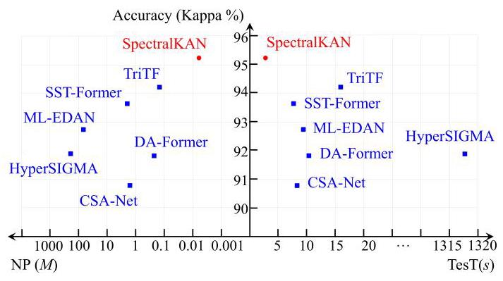

Fig. 1: Performance comparison of state-of-the-art methods and the proposed SpectralKAN on the commonly used Farmland dataset.

图1:在常用农田数据集上，现有最先进方法与所提出的SpectralKAN的性能比较。

The main challenges of advancing KANs for analyzing high-dimensional data are summarized as follows.

推进KANs用于分析高维数据的主要挑战总结如下。

- A common approach to improving KANs is to replace MLPs in existing networks, such as U-Net, with KANs. However, KANs typically have more parameters than MLPs for the same number of nodes, thus negating their advantages in terms of computational efficiency and providing only limited accuracy improvements.

- 改进KANs的一种常见方法是用KANs替换现有网络(如U-Net)中的多层感知器。然而，对于相同数量的节点，KANs通常比多层感知器具有更多参数，从而抵消了它们在计算效率方面的优势，并且仅提供有限的精度提升。

- KANs utilize a mechanism that involves multiple activations of one input node, leading to a substantial increase in NP and FLOPs for high-dimensional data. Additionally, high-dimensional data often contains significant information redundancy, resulting in many parameters being devoted to managing this redundant information.

- KANs利用一种机制，该机制涉及对一个输入节点进行多次激活，导致高维数据的NP和FLOP大幅增加。此外高维数据通常包含大量信息冗余，导致许多参数用于管理这些冗余信息。

- KANs are designed to accept one-dimensional inputs, necessitating the reshaping of high-dimensional data into a one-dimensional format. This reshaping process often leads to the loss of critical structural information inherent in the original data.

- KANs被设计为接受一维输入，因此需要将高维数据重塑为一维格式。这种重塑过程通常会导致原始数据中固有的关键结构信息丢失。

In this paper, we take a significant step forward in advancing KANs for processing high-dimensional data. The weighted activation distribution Kolmogorov-Arnold networks (WKANs) are proposed, reducing the NP and FLOPs by reducing the number of activations per node. By employing a weighted activation distribution, we effectively capture the dependencies between input and output nodes, which in turn reduces the extraction of redundant information. We introduce a multilevel tensor splitting framework (MTSF) to extract features from each dimension of high-dimensional data and perform classification in the final layer. At each level, MTSF separates tensors and allocates them to different computation nodes, where WKANs are used to calculate relationships between local tensors, ultimately obtaining global features for that dimensional level. This tensor-parallel computation method not only improves computational efficiency but also accelerates processing times.

在本文中，我们在推进KANs用于处理高维数据方面向前迈出了重要一步。提出了加权激活分布柯尔莫哥洛夫 - 阿诺德网络(WKANs)，通过减少每个节点的激活次数来减少NP和FLOP。通过采用加权激活分布，我们有效地捕获了输入和输出节点之间的依赖关系，进而减少了冗余信息的提取。我们引入了一个多级张量分割框架(MTSF)，从高维数据的每个维度提取特征，并在最后一层进行分类。在每个级别，MTSF分离张量并将它们分配到不同的计算节点，在这些节点上使用WKANs计算局部张量之间的关系，最终获得该维度级别的全局特征。这种张量并行计算方法不仅提高了计算效率，还加快了处理时间。

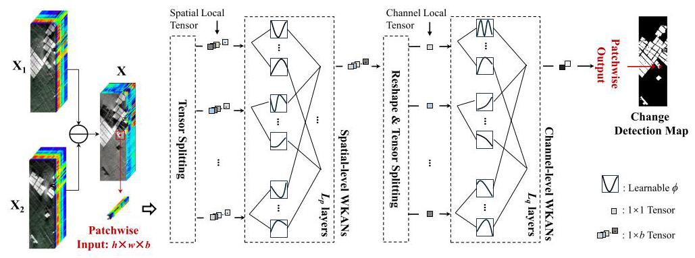

Fig. 2: Flowchart of the SpectralKAN. SpectralKAN first splits each patch into multiple spatial local tensors ${\left\{  {v}_{i}\right\}  }_{i = 1}^{h \times  w}$ . Global spatial features $f$ are then extracted using spatial-level WKANs within the MTSF. We further split $f$ into channel local tensors ${\left\{  {f}_{e}\right\}  }_{e = 1}^{b}$ . Channel-level WKANs in MTSF subsequently extract spectral features and classify them as either changed or unchanged.

图2:SpectralKAN的流程图。SpectralKAN首先将每个补丁分割成多个空间局部张量${\left\{  {v}_{i}\right\}  }_{i = 1}^{h \times  w}$。然后使用MTSF中的空间级WKANs提取全局空间特征$f$。我们进一步将$f$分割成通道局部张量${\left\{  {f}_{e}\right\}  }_{e = 1}^{b}$。随后，MTSF中的通道级WKANs提取光谱特征并将它们分类为已变化或未变化。

We demonstrate the effectiveness of our approach using hyperspectral image change detection as a case study. The proposed SpectralKAN, based on WKANs and MTSF, is validated on five datasets. As shown in Fig. 1, SpectralKAN outperformed state-of-the-art algorithms on the widely used Farmland dataset in terms of accuracy (Kappa), NP and TesT. SpectralKAN achieved the highest performance with the least NP and shortest TesT, highlighting its effectiveness and efficiency in high-dimensional data processing. There are three main contributions in this paper as summarized follows.

我们以高光谱图像变化检测为例，证明了我们方法的有效性。所提出的基于WKANs和MTSF的SpectralKAN在五个数据集上得到了验证。如图1所示，在广泛使用的农田数据集上，SpectralKAN在准确性(卡帕)、NP和TesT方面优于现有最先进算法。SpectralKAN以最少的NP和最短的TesT实现了最高性能，突出了其在高维数据处理中的有效性和效率。本文主要有以下三个贡献。

- We introduce WKANs, an optimization of KANs for high-dimensional data, which reduce the number of activation functions per node, use weights to control their size, and distribute activation values to different output nodes. They compensate for information loss from fewer basic activations by extracting redundant information, significantly lowering the NP and FLOPs.

- 我们引入了WKANs，这是一种针对高维数据对KANs的优化，它减少了每个节点的激活函数数量，使用权重来控制其大小，并将激活值分配到不同的输出节点。它们通过提取冗余信息来补偿较少基本激活导致的信息损失，显著降低了NP和FLOP。

- We develop an MTSF, which addresses the structural information loss inherent in KANs by separating tensors along different dimensions and extracting features from each dimension. Additionally, the parallel tensor computation of MTSF enhances overall computational efficiency.

- 我们开发了一个MTSF，它通过沿不同维度分离张量并从每个维度提取特征来解决KANs中固有的结构信息丢失问题。此外，MTSF的并行张量计算提高了整体计算效率。

- We propose a novel SpectralKAN, advancing the pure KANs for high-dimensional data processing. This method eliminates the need to replace MLPs in classical networks, achieving higher accuracy while reducing NP, FLOPs, Memory, TraT, and TesT.

- 我们提出了一种新颖的SpectralKAN，推进了用于高维数据处理的纯KANs。该方法无需替换经典网络中的多层感知器，在降低NP、FLOP、内存、训练时间(TraT)和测试时间(TesT)的同时实现了更高的准确性。

## 2. Related Work

## 2. 相关工作

### 2.1. Kolmogorov-Arnold Networks

### 2.1. 柯尔莫哥洛夫 - 阿诺德网络

Kolmogorov-Arnold representation theorem states that a multivariate function can be represented as the superposition of continuous functions of a single variable with two parameters. Kolmogorov-Arnold representation theorem has been used to view the neural network as a multivariate continuous function [10, 11]. The depth and width of these networks have always been 2 and ${2n} + 1$ , respectively. They did not consider using back propagation to update the network. Based on Kolmogorov-Arnold representation theorem, Liu et al. [2] designed deeper and more flexible KANs, which have been proven to possess a stronger function fitting capability than MLPs.

柯尔莫哥洛夫 - 阿诺德表示定理指出，一个多元函数可以表示为具有两个参数的单变量连续函数的叠加。柯尔莫哥洛夫 - 阿诺德表示定理已被用于将神经网络视为多元连续函数[10, 11]。这些网络的深度和宽度一直分别为2和${2n} + 1$。他们没有考虑使用反向传播来更新网络。基于柯尔莫哥洛夫 - 阿诺德表示定理，Liu等人[2]设计了更深且更灵活的KANs，已证明其比多层感知器具有更强的函数拟合能力。

KANs have quickly gained attention, leading to numerous applications. KANs were utilized to extract time-series information and proved their effectiveness in sequence feature extraction [12, 13, 14]. Cross-dataset human activity recognition has been achieved based on KANs [15]. Wav-KAN [16] is a model that uses continuous or discrete wavelet transforms to fit continuous multivariate functions to get a better training speed, performance and computational efficiency than MLPs. Jamali et al. [17] introduced HybridKAN for hyperspectral image classification. HybridKAN replaces the MLPs in 3D CNN, 2D CNN, and 1D CNN with KANs, thereby increasing the NP and FLOPs compared with CNNs, while also relying on principal component analysis (PCA) for dimensionality reduction, which leads to considerable spectral information loss. DeepOKAN [18] not only replaces the B-splines in KANs with Gaussian radial basis functions but also substitutes the traditional MLPs in DeepONet with KAN-based architectures for modeling continuous operator mappings in complex engineering and mechanics problems. These design choices result in a substantially larger number of parameters than standard KANs. A U-KAN that combines U-Net and KANs is proposed to segment medical images [15]. Xu et al. [19] combined GCNs and KANs for recommendation tasks and used dropout to enhance the representational capability. A KCN [20] that combines CNNs and KANs has been used for satellite remote sensing image classification. It validates the effectiveness of KANs for remote sensing image processing by replacing the MLPs in different CNN-based backbones with KANs, and demonstrates that KANs show better convergence.

KANs迅速受到关注，引发了众多应用。KANs被用于提取时间序列信息，并在序列特征提取中证明了其有效性[12, 13, 14]。基于KANs实现了跨数据集的人类活动识别[15]。Wav - KAN[16]是一种使用连续或离散小波变换来拟合连续多元函数的模型，以获得比多层感知器更好的训练速度、性能和计算效率。Jamali等人[17]引入了用于高光谱图像分类的HybridKAN。HybridKAN用KANs取代了3D CNN、2D CNN和1D CNN中的多层感知器，从而与CNNs相比增加了NP和FLOPs，同时还依赖主成分分析(PCA)进行降维，这导致了相当大的光谱信息损失。DeepOKAN[18]不仅用高斯径向基函数取代了KANs中的B - 样条，还用基于KAN的架构取代了DeepONet中的传统多层感知器，用于对复杂工程和力学问题中的连续算子映射进行建模。这些设计选择导致参数数量比标准KANs多得多。提出了一种结合U - Net和KANs的U - KAN用于医学图像分割[15]。Xu等人[19]将图卷积网络(GCNs)和KANs结合用于推荐任务，并使用随机失活来增强表示能力。一种结合CNN和KAN的KCN[20]已用于卫星遥感图像分类。通过用KANs取代不同基于CNN的骨干网络中的多层感知器，验证了KANs在遥感图像处理中的有效性，并表明KANs显示出更好的收敛性。

The pure KAN-based methods have demonstrated good efficiency on low-dimensional data. However, studies on their application to high-dimensional data remain limited. Moreover, replacing MLPs with KANs in existing networks such as U-Net tends to increase the total NP due to the higher complexity of a single KAN layer, while yielding only marginal accuracy improvements. These studies have not extended the advantages of KANs to high-dimensional data, where computational efficiency is of paramount importance.

基于纯KAN的方法在低维数据上已证明具有良好的效率。然而，关于它们在高维数据上的应用研究仍然有限。此外，在诸如U - Net等现有网络中用KANs取代多层感知器往往会因单个KAN层的更高复杂性而增加总NP，同时仅带来边际精度提升。这些研究尚未将KANs的优势扩展到计算效率至关重要的高维数据。

### 2.2. Deep Learning for Hyperspectral Image Change Detection

### 2.2. 用于高光谱图像变化检测的深度学习

Deep learning demonstrates strong representational capabilities for high-dimensional data, achieving significant success in hyperspectral image processing. It is widely used to extract spectral-spatial features from hyperspectral images. Spectral and spatial attention networks employ learnable attention mechanisms, enabling the effective suppression of irrelevant spectral bands and spatial information [21, 22, 23]. Transformers have been specifically employed to learn and process spectral sequence information, thereby enhancing the capability to capture intricate spectral patterns and dependencies [24, 25]. Temporal information is crucial and various methods have been developed to detect changes between different temporal hyperspectral images. The commonly used method is subtracting [26, 27] or concatenating [28] multi-temporal images before feature extraction. Features were fused at different layers to obtain the multi-scale change features [29, 30, 31]. Long short-term memory network (LSTM) was utilized to learn temporal change information [32, 33, 34]. Foundation models have been introduced into change detection, leveraging large-scale pretraining to enhance generalization across diverse datasets and scenarios [35, 36]. For urgent tasks and real-time processing, computational efficiency is equally critical. However, most existing methods primarily focus on improving accuracy, while their performance with respect to NP, FLOPs, memory usage, TraT, and TesT remains unsatisfactory.

深度学习在高维数据上展示出强大的表示能力，在高光谱图像处理中取得了显著成功。它被广泛用于从高光谱图像中提取光谱 - 空间特征。光谱和空间注意力网络采用可学习的注意力机制，能够有效抑制不相关的光谱带和空间信息[21, 22, 23]。Transformer已被专门用于学习和处理光谱序列信息，从而增强捕获复杂光谱模式和依赖性的能力[24, 基于纯KAN的方法在低维数据上已证明具有良好的效率。然而，关于它们在高维数据上的应用研究仍然有限。此外，在诸如U - Net等现有网络中用KANs取代多层感知器往往会因单个KAN层的更高复杂性而增加总NP，同时仅带来边际精度提升。这些研究尚未将KANs的优势扩展到计算效率至关重要的高维数据。

## 3. Proposed Method

## 3. 提出的方法

### 3.1. SpectralKAN Overview

### 3.1. SpectralKAN概述

The overall flowchart of SpectralKAN is illustrated in Fig. 2. Let ${\mathbf{X}}_{\mathbf{1}} \in  {\mathbb{R}}^{H \times  W \times  b}$ and ${\mathbf{X}}_{2} \in  {\mathbb{R}}^{H \times  W \times  b}$ denote a pair of co-registered bi-temporal hyperspectral images. $\mathbf{X} = {\mathbf{X}}_{\mathbf{1}} - {\mathbf{X}}_{\mathbf{2}}$ is divided into multiple patches ${\left\{  {x}_{i}\right\}  }_{i = 1}^{H \times  W}$ with a stride of 1, where $x \in \; {\mathbb{R}}^{h \times  w \times  b}.h \times  w$ denotes the patch size, $b$ represents the number of spectral bands in each patch. $x$ undergoes tensor splitting, resulting in spatial local tensors ${\left\{  {v}_{i}\right\}  }_{i = 1}^{h \times  w},{v}_{i} \in  {\mathbb{R}}^{1 \times  b}$ . These local tensors are processed in parallel by the first level of the MTSF, where they interact to extract global spatial features $f \in  {\mathbb{R}}^{1 \times  b}$ . Next, the spatial dimension is removed by reshaping $f$ into ${\mathbb{R}}^{b \times  1}.f$ is decomposed into $b$ channel-local tensors ${\left\{  {f}_{e}\right\}  }_{e = 1}^{b}$ . These tensors are then processed by the second level of the MTSF, producing a $1 \times  2$ output that captures global spatial-spectral features. Each level of the MTSF is built from WKANs. The $1 \times  2$ tensor indicates the probabilities of change and no-change, with the higher probability determining the change detection result. During testing, the results from all patches are combined to generate the final change detection map.

SpectralKAN的整体流程图如图2所示。设${\mathbf{X}}_{\mathbf{1}} \in  {\mathbb{R}}^{H \times  W \times  b}$和${\mathbf{X}}_{2} \in  {\mathbb{R}}^{H \times  W \times  b}$表示一对配准的双时相高光谱图像。$\mathbf{X} = {\mathbf{X}}_{\mathbf{1}} - {\mathbf{X}}_{\mathbf{2}}$被划分为步长为1的多个补丁${\left\{  {x}_{i}\right\}  }_{i = 1}^{H \times  W}$，其中$x \in \; {\mathbb{R}}^{h \times  w \times  b}.h \times  w$表示补丁大小，$b$表示每个补丁中的光谱带数量。$x$进行张量分裂，得到空间局部张量${\left\{  {v}_{i}\right\}  }_{i = 1}^{h \times  w},{v}_{i} \in  {\mathbb{R}}^{1 \times  b}$。这些局部张量由MTSF的第一级并行处理，在那里它们相互作用以提取全局空间特征$f \in  {\mathbb{R}}^{1 \times  b}$。接下来，通过重塑$f$去除空间维度，将其转换为${\mathbb{R}}^{b \times  1}.f$，再将其分解为$b$个通道局部张量${\left\{  {f}_{e}\right\}  }_{e = 1}^{b}$。然后这些张量由MTSF的第二级处理，产生一个$1 \times  2$输出，该输出捕获全局空间光谱特征。MTSF的每一级都由WKAN构建。$1 \times  2$张量表示变化和不变的概率，概率较高的决定变化检测结果。在测试期间，所有补丁的结果被组合以生成最终的变化检测图。

### 3.2. Weighted Activation Distribution KANs

### 3.2. 加权激活分布KAN

WKANs are a special variant of KANs tailored for high-dimensional data, designed to extract features by learning activation functions. WKANs consist of $L$ layers ${\mathbf{\Phi }}_{l} = \; \left\{  {{\Phi }_{l,1},{\Phi }_{l,2},\ldots ,{\Phi }_{l, m}}\right\}$ , and the network as a whole can be represented as:

WKAN是为高维数据量身定制的KAN的一种特殊变体，旨在通过学习激活函数来提取特征。WKAN由$L$层${\mathbf{\Phi }}_{l} = \; \left\{  {{\Phi }_{l,1},{\Phi }_{l,2},\ldots ,{\Phi }_{l, m}}\right\}$组成，整个网络可以表示为:

$$
f\left( \mathbf{x}\right)  = \mathbf{x} \cdot  \mathop{\prod }\limits_{{l = 0}}^{{L - 1}}{\mathbf{\Phi }}_{l} \tag{1}
$$

If the input to the $l$ -th layer of WKANs is ${\mathbf{x}}_{l} \in  {\mathbb{R}}^{m}$ and the output is ${\mathbf{x}}_{l + 1} \in  {\mathbb{R}}^{n}$ , the computation within this layer is defined as:

如果WKAN的第$l$层的输入是${\mathbf{x}}_{l} \in  {\mathbb{R}}^{m}$，输出是${\mathbf{x}}_{l + 1} \in  {\mathbb{R}}^{n}$，则该层内的计算定义为:

$$
{\mathbf{x}}_{l + 1} = \left( \begin{array}{llll} {\Phi }_{l,1} & {\Phi }_{l,2} & \ldots & {\Phi }_{l, m} \end{array}\right) \left( \begin{matrix} {x}_{l,1} \\  {x}_{l,2} \\  \vdots \\  {x}_{l, m} \end{matrix}\right) \tag{2}
$$

In this equation, ${\Phi }_{l, i} = \left\{  {{\phi }_{1}\left( \cdot \right) ,{\phi }_{2}\left( \cdot \right) ,\ldots ,{\phi }_{n}\left( \cdot \right) }\right\}$ is the set of activation functions for ${x}_{l, i}$ , where $i \in  \left\lbrack  {0, m}\right\rbrack$ . Each ${\Phi }_{l, i}$ consists of two activation functions with weights such that

在这个等式中，${\Phi }_{l, i} = \left\{  {{\phi }_{1}\left( \cdot \right) ,{\phi }_{2}\left( \cdot \right) ,\ldots ,{\phi }_{n}\left( \cdot \right) }\right\}$是${x}_{l, i}$的激活函数集，其中$i \in  \left\lbrack  {0, m}\right\rbrack$。每个${\Phi }_{l, i}$由两个带权重的激活函数组成，使得

$$
\left( \begin{matrix} {\phi }_{1}\left( \cdot \right) \\  {\phi }_{2}\left( \cdot \right) \\  \vdots \\  {\phi }_{n}\left( \cdot \right)  \end{matrix}\right)  = \left( \begin{matrix} {w}_{a,1} \\  {w}_{a,2} \\  \vdots \\  {w}_{a, n} \end{matrix}\right) \alpha \left( \cdot \right)  + \left( \begin{matrix} {w}_{b,1} \\  {w}_{b,2} \\  \vdots \\  {w}_{b, n} \end{matrix}\right) {spline}\left( \cdot \right) \tag{3}
$$

where $\alpha \left( \cdot \right)$ and spline $\left( \cdot \right)$ are basic activation functions. $\alpha \left( \cdot \right)$ refers to sigmoid linear unit (SiLU) function. spline $\left( \cdot \right)$ is composed of multiple B-spline basis functions:

其中$\alpha \left( \cdot \right)$和样条$\left( \cdot \right)$是基本激活函数。$\alpha \left( \cdot \right)$指的是sigmoid线性单元(SiLU)函数。样条$\left( \cdot \right)$由多个B样条基函数组成:

$$
\operatorname{spline}\left( x\right)  = \mathop{\sum }\limits_{{i = 1}}^{{z + g}}{r}_{i}{B}_{i}\left( x\right) \tag{4}
$$

where ${B}_{i}\left( \cdot \right)$ is the $i$ -th B-spline basis function, ${r}_{i}$ is the corresponding weight, $z$ and $g$ are the degree and grid of the spline $\left( \cdot \right)$ , respectively. The weights ${w}_{a}$ and ${w}_{b}$ scale the activation functions and distribute the activated input node information to different output nodes. For each input ${x}_{l, i}$ processed by ${\Phi }_{l, i}$ , and $n$ outputs ${\left\{  {x}_{l + 1, i, j}\right\}  }_{j = 1}^{n}$ are produced. The detailed calculation process is illustrated in Fig. 3. Finally, the $j$ -th node of the output ${x}_{l + 1, j}$ is computed by summing the contributions from all inputs:

其中${B}_{i}\left( \cdot \right)$是第$i$个B样条基函数，${r}_{i}$是相应的权重，$z$和$g$分别是样条$\left( \cdot \right)$的次数和网格。权重${w}_{a}$和${w}_{b}$对激活函数进行缩放，并将激活的输入节点信息分配到不同的输出节点。对于由${\Phi }_{l, i}$处理的每个输入${x}_{l, i}$，会产生$n$个输出${\left\{  {x}_{l + 1, i, j}\right\}  }_{j = 1}^{n}$。详细的计算过程如图3所示。最后，通过对所有输入的贡献求和来计算输出${x}_{l + 1, j}$的第$j$个节点:

$$
{x}_{l + 1, j} = \mathop{\sum }\limits_{{i = 1}}^{m}{x}_{l + 1, i, j} \tag{5}
$$

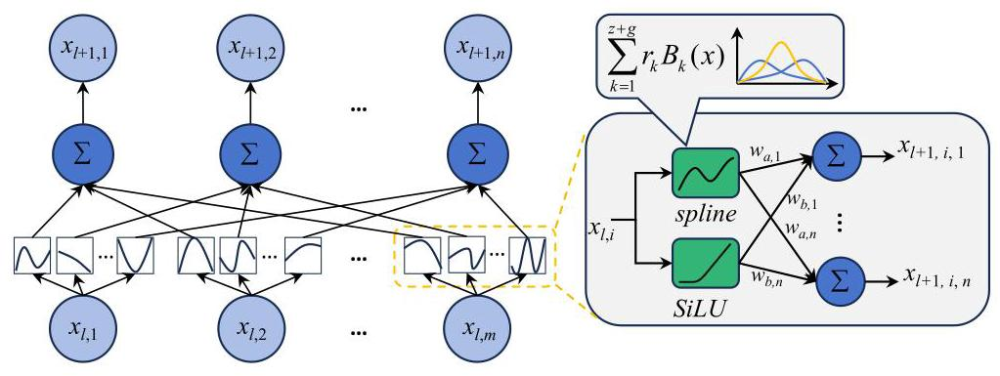

Fig. 3: Structure of the $l$ -th WKAN layer with $m$ input nodes and $n$ output nodes.

图3:具有$m$个输入节点和$n$个输出节点 的第$l$个WKAN层的结构。

### 3.3. Multilevel Tensor Splitting Framework

### 3.3.多级张量分解框架

Inspired by [24, 37, 38], we design the MTSF, which decomposes high-dimensional tensors into multiple lower-dimensional tensors and assigns each dimension-specific tensor to dedicated WKANs for feature extraction. Consider a $s$ -dimensional input $x \in  {\mathbb{R}}^{{d}_{1} \times  {d}_{2} \times  \cdots  \times  {d}_{s}}$ and an MTSF composed of $s$ WKANs layers. Initially, $x$ undergoes tensor splitting to obtain ${d}_{1}$ dimensional local tensors ${\left\{  {v}_{i}\right\}  }_{i = 1}^{{d}_{1}}$ , where ${v}_{i} \in  {\mathbb{R}}^{{d}_{2} \times  \cdots  \times  {d}_{s}}$ . We define the first WKANs in the MTSF with ${d}_{1}$ input nodes and a single output node, processing all ${d}_{1}$ tensors in parallel, and aggregating their features into a unified representation:

受[24, 37, 38]启发，我们设计MTSF，它将高维张量分解为多个低维张量，并将每个特定维度的张量分配给专用的WKAN进行特征提取。考虑一个$s$维输入$x \in  {\mathbb{R}}^{{d}_{1} \times  {d}_{2} \times  \cdots  \times  {d}_{s}}$和一个由$s$个WKAN层组成的MTSF。最初，$x$进行张量分解以获得${d}_{1}$维局部张量${\left\{  {v}_{i}\right\}  }_{i = 1}^{{d}_{1}}$，其中${v}_{i} \in  {\mathbb{R}}^{{d}_{2} \times  \cdots  \times  {d}_{s}}$。我们将MTSF中的第一个WKAN定义为具有${d}_{1}$个输入节点和单个输出节点，并行处理所有${d}_{1}$个张量，并将它们的特征聚合为一个统一的表示:

$$
f = \mathop{\prod }\limits_{{l = 0}}^{{{L}_{1} - 1}}{\mathbf{\Phi }}_{1, l}\left( \begin{matrix} {v}_{1} \\  {v}_{2} \\  \vdots \\  {v}_{d} \end{matrix}\right) , f \in  {\mathbb{R}}^{1 \times  {d}_{2} \times  \cdots  \times  {d}_{s}} \tag{6}
$$

where ${\mathbf{\Phi }}_{1, l}$ represents the activation functions of the $l$ -th layer in the first WKANs, ${L}_{1}$ is the number of layers in the first WKANs within the MTSF. This structure ensures that ${\left\{  {v}_{i}\right\}  }_{i = 1}^{{d}_{1}}$ are compressed into a single aggregated representation $f \in  {\mathbb{R}}^{1 \times  {d}_{2} \times  \cdots  \times  {d}_{s}}$ , capturing the global information along the first dimension. The first dimension is then removed by reshaping $f$ into ${\mathbb{R}}^{{d}_{2} \times  \cdots  \times  {d}_{s}}$ , facilitating the extraction of features along the second dimension. Tensor splitting is subsequently applied along the second dimension to obtain ${d}_{2}$ local tensors, which are then processed in parallel to extract features at this level. The second WKANs then process these tensors to capture global information along the second dimension, analogous to the first dimension. This process repeats for each subsequent dimension until global features for all dimensions are obtained. Finally, the last WKANs produces an output ${y}^{\prime } \in  {\mathbb{R}}^{1 \times  c}$ , where $c$ is the number of classes. The cross-entropy loss function is then used to calculate the difference between the predicted output ${y}^{\prime }$ and the true label $y$ , guiding the networks optimization.

其中${\mathbf{\Phi }}_{1, l}$表示第一个WKAN中第$l$层的激活函数，${L}_{1}$是MTSF中第一个WKAN的层数。这种结构确保${\left\{  {v}_{i}\right\}  }_{i = 1}^{{d}_{1}}$被压缩为单个聚合表示$f \in  {\mathbb{R}}^{1 \times  {d}_{2} \times  \cdots  \times  {d}_{s}}$，捕获沿第一维度的全局信息。然后通过将$f$重塑为${\mathbb{R}}^{{d}_{2} \times  \cdots  \times  {d}_{s}}$来移除第一维度，便于沿第二维度提取特征。随后沿第二维度应用张量分解以获得${d}_{2}$个局部张量，然后并行处理这些张量以在该级别提取特征。然后第二个WKAN处理这些张量以捕获沿第二维度的全局信息，类似于第一维度。对每个后续维度重复此过程，直到获得所有维度的全局特征。最后，最后一个WKAN产生输出${y}^{\prime } \in  {\mathbb{R}}^{1 \times  c}$，其中$c$是类别数。然后使用交叉熵损失函数来计算预测输出${y}^{\prime }$与真实标签$y$之间的差异，指导网络的优化。

SpectralKAN is formulated as an MTSF with two WKANs for hyperspectral change detection, in which a hyperspectral image patch is decomposed into two sets of tensors corresponding to the spatial and spectral dimensions. The two WKANs, consisting of ${L}_{p}$ and ${L}_{q}$ layers, are employed to separately extract spatial and spectral representations. In the final layer, the output node count $c$ is set to two, representing the change and no-change classes. The pseudocode of SpectralKAN is shown in Algorithm 1.

SpectralKAN被公式化为一个具有两个WKAN的MTSF，用于高光谱变化检测，其中高光谱图像块被分解为对应于空间和光谱维度的两组张量。由${L}_{p}$层和${L}_{q}$层组成的两个WKAN分别用于提取空间和光谱表示。在最后一层，输出节点数$c$设置为两个，表示变化和无变化类别。SpectralKAN的伪代码如算法1所示。

Algorithm 1 SpectralKAN for Hyperspectral Image Change Detection

算法1用于高光谱图像变化检测的光谱KAN

---

Input: Bi-temporal hyperspectral images ${\mathbf{X}}_{\mathbf{1}},{\mathbf{X}}_{\mathbf{2}} \in  {\mathbb{R}}^{H \times  W \times  b}$

Output: Change detection map $\mathbf{Y}$

		$\mathbf{X} \leftarrow  {\mathbf{X}}_{\mathbf{1}} - {\mathbf{X}}_{\mathbf{2}}$ ; initialize $\mathbf{Y} \leftarrow  \varnothing$

		for $i \leftarrow  1$ to $H \times  W$ do

			${x}_{i} \leftarrow$ Extract_Patches $\left( {\mathbf{X},\text{ patch\_size } = h \times  w}\right)$

			Split ${x}_{i} \rightarrow  {\left\{  {v}_{j}\right\}  }_{j = 1}^{h \times  w},{v}_{j} \in  {\mathbb{R}}^{1 \times  b}$

				$f \leftarrow$ Spatial-level WKANs $\left( \left\{  {v}_{j}\right\}  \right)$

				Reshape $f : {\mathbb{R}}^{1 \times  b} \rightarrow  {\mathbb{R}}^{b \times  1}$

				Split $f \rightarrow  {\left\{  {f}_{e}\right\}  }_{e = 1}^{b}$

				${p}_{1},{p}_{2} \leftarrow$ Channel-level WKANs $\left( \left\{  {f}_{e}\right\}  \right)$

				$y \leftarrow  \arg \max \left( {{p}_{1},{p}_{2}}\right)$

				${\mathbf{Y}}_{i} \leftarrow  y$

		end for

		return $\mathbf{Y}$

---

### 3.4. Method Analysis

### 3.4. 方法分析

WKANs vs KANs: In KAN, each activation function $\phi \left( \cdot \right)$ is composed of a unique $\alpha \left( \cdot \right)$ and spline $\left( \cdot \right)$ :

加权KAN与KAN对比:在KAN中，每个激活函数$\phi \left( \cdot \right)$由唯一的$\alpha \left( \cdot \right)$和样条$\left( \cdot \right)$组成:

$$
{\phi }_{ij}\left( \cdot \right)  = {w}_{a} \cdot  {\alpha }_{ij}\left( \cdot \right)  + {w}_{b} \cdot  {\operatorname{spline}}_{ij}\left( \cdot \right) \tag{7}
$$

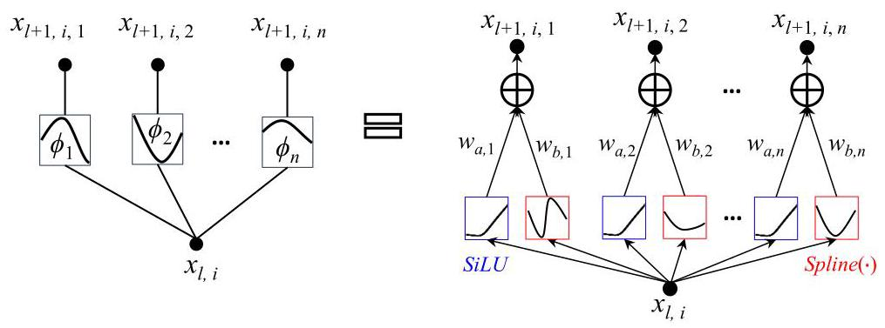

Fig. 4: Structure of a single KAN layer with one input node and $n$ output nodes.

图4:具有一个输入节点和$n$个输出节点的单个KAN层的结构。

where $i$ represents the $i$ -th input node, and $j$ denotes the $j$ -th output node. The detailed calculation process is illustrated in Fig. 4. In comparison, WKAN uses a single $\alpha \left( \cdot \right)$ and a spline $\left( \cdot \right)$ for each input node across all output nodes, as indicated in Eq. 3. In both WKANs and KANs, the primary FLOPs in the activation function $\phi \left( \cdot \right)$ stem from computations within $\alpha \left( \cdot \right)$ and spline $\left( \cdot \right)$ and their multiplication with weights ${w}_{a}$ and ${w}_{b}$ . Specifically, $\alpha \left( \cdot \right)$ incurs $O\left( 4\right)$ FLOPs, while ${B}_{i}{\left( \cdot \right) }_{i = 1}^{z + g}$ requires $O\left( {{4z}\left( {z + g}\right) }\right)$ FLOPs. Each weight multiplication further requires $O\left( 1\right)$ FLOPs. The main weights for $\phi \left( \cdot \right)$ include ${w}_{a} \in  {\mathbb{R}}^{1},{w}_{b} \in  {\mathbb{R}}^{1}$ , and ${r}_{i = 1}^{z + g} \in  {\mathbb{R}}^{z + g}$ . For a layer with $m$ input nodes and $n$ output nodes, the FLOPs and NP are summarized as follows:

其中$i$表示第$i$个输入节点，$j$表示第$j$个输出节点。详细计算过程如图4所示。相比之下，加权KAN对所有输出节点的每个输入节点使用单个$\alpha \left( \cdot \right)$和样条$\left( \cdot \right)$，如公式3所示。在加权KAN和KAN中，激活函数$\phi \left( \cdot \right)$中的主要浮点运算量源于$\alpha \left( \cdot \right)$和样条$\left( \cdot \right)$内的计算以及它们与权重${w}_{a}$和${w}_{b}$的乘法。具体而言，$\alpha \left( \cdot \right)$产生$O\left( 4\right)$次浮点运算，而${B}_{i}{\left( \cdot \right) }_{i = 1}^{z + g}$需要$O\left( {{4z}\left( {z + g}\right) }\right)$次浮点运算。每次权重乘法还需要$O\left( 1\right)$次浮点运算。$\phi \left( \cdot \right)$的主要权重包括${w}_{a} \in  {\mathbb{R}}^{1},{w}_{b} \in  {\mathbb{R}}^{1}$和${r}_{i = 1}^{z + g} \in  {\mathbb{R}}^{z + g}$。对于具有$m$个输入节点和$n$个输出节点的层，浮点运算量和参数数量总结如下:

$$
\text{ - WKANs: }
$$

$$
\text{ - Flops: }O\left( {{2mn} + {4m}\left( {1 + z{\left( z + g\right) }^{2}}\right) }\right)
$$

$$
\text{ - NP: }O\left( {{2mn} + m\left( {z + g}\right) }\right)
$$

$$
\text{ - KANs: }
$$

$$
\text{ - Flops: }O\left( {{2mn} + {4mn}\left( {1 + z{\left( z + g\right) }^{2}}\right) }\right)
$$

$$
\text{ - NP: }O\left( {{2mn} + {mn}\left( {z + g}\right) }\right)
$$

We can observe that a single WKAN layer has approximately $n$ times fewer NP and FLOPs compared to a single KAN layer. The activation mechanism in WKANs allows them to reduce the NP without compromising accuracy while still extracting additional features from redundant nodes.

我们可以观察到，与单个KAN层相比，单个加权KAN层的参数数量和浮点运算量大约少$n$倍。加权KAN中的激活机制使它们能够在不影响准确性的情况下减少参数数量，同时仍从冗余节点中提取额外特征。

MTSF vs WKANs: MTSF processes each dimension hierarchically and in parallel, reducing the number of nodes compared to WKANs. This leads to fewer activation functions at the edges and consequently reduces both FLOPs and NP. For example, SpectralKAN is an MTSF designed for hyperspectral data, processes input $x \in  {\mathbb{R}}^{h \times  w \times  b}$ by spatial-level WKANs and channel-level WKANs with input node counts of $h \times  w$ and $b$ , respectively. In contrast, a single WKANs without tensor splitting would have $h \times  w \times  b$ input nodes. Assuming ${L}_{p}$ and ${L}_{q}$ are both set to 1, with output nodes being 1 in both SpectralKAN and a single WKAN layer, the computational aspects can be summarized as follows:

多尺度张量融合(MTSF)与加权KAN对比:MTSF对每个维度进行分层并行处理，与加权KAN相比减少了节点数量。这导致边缘处的激活函数数量减少，从而减少了浮点运算量和参数数量。例如，光谱KAN是一种为高光谱数据设计的MTSF，分别通过具有$h \times  w$和$b$个输入节点的空间级加权KAN和通道级加权KAN处理输入$x \in  {\mathbb{R}}^{h \times  w \times  b}$。相比之下，没有张量分解的单个加权KAN将有$h \times  w \times  b$个输入节点。假设${L}_{p}$和${L}_{q}$都设置为1，光谱KAN和单个加权KAN层的输出节点均为1，则计算方面总结如下:

- MTSF:

- Flops: $O\left( {\left( {{hw} + b}\right) \left( {2 + 4\left( {1 + z{\left( z + g\right) }^{2}}\right) }\right) }\right.$

- 浮点运算量:$O\left( {\left( {{hw} + b}\right) \left( {2 + 4\left( {1 + z{\left( z + g\right) }^{2}}\right) }\right) }\right.$

- NP: $O\left( {\left( {{hw} + b}\right) \left( {2 + \left( {z + g}\right) }\right) }\right)$

- 参数数量:$O\left( {\left( {{hw} + b}\right) \left( {2 + \left( {z + g}\right) }\right) }\right)$

- WKANs:

- 加权KAN:

- Flops: $O\left( {{hwb}\left( {2 + 4\left( {1 + z{\left( z + g\right) }^{2}}\right) }\right) }\right.$

- 浮点运算量:$O\left( {{hwb}\left( {2 + 4\left( {1 + z{\left( z + g\right) }^{2}}\right) }\right) }\right.$

- NP: $O\left( {{hwb}\left( {2 + \left( {z + g}\right) }\right) }\right)$

- 参数数量:$O\left( {{hwb}\left( {2 + \left( {z + g}\right) }\right) }\right)$

The MTSF reduces the NP and FLOPs to approximately $\left( {1/b + 1/{hw}}\right)$ of those in WKANs. Moreover, MTSF enhances feature extraction by processing each dimension separately, leading to a better representation of high-dimensional data.

MTSF将NP和FLOP减少到WKANs中相应值的约$\left( {1/b + 1/{hw}}\right)$。此外，MTSF通过分别处理每个维度来增强特征提取，从而更好地表示高维数据。

## 4. Experiments

## 4. 实验

### 4.1. Datasets

### 4.1. 数据集

We conducted experiments using five publicly available datasets: Farmland ${}^{1}$ , USA [39], River [40], Bay Area ${}^{2}$ , and Santa Barbara ${}^{2}$ . These datasets were captured by the Earth Observation-1 Hyperion hyperspectral sensor (EO-1) or the Airborne Visible/Infrared Imaging Spectrometer (AVIRIS). The changes in these datasets mainly involve land cover types and River variations. The satellite source (SS), imaging times (IT), cover land (CL), size $\left( {h \times  w \times  b}\right)$ and spatial resolution (SR) for five datasets are provided in Table 1. For each dataset, we used 1% of the pixels for training and the remaining pixels for testing, as detailed in Table 2.

我们使用了五个公开可用的数据集进行实验:美国农田${}^{1}$、河流[40]、湾区${}^{2}$和圣巴巴拉${}^{2}$。这些数据集由地球观测1号Hyperion高光谱传感器(EO - 1)或机载可见/红外成像光谱仪(AVIRIS)捕获。这些数据集中的变化主要涉及土地覆盖类型和河流变化。五个数据集的卫星来源(SS)、成像时间(IT)、覆盖土地(CL)、大小$\left( {h \times  w \times  b}\right)$和空间分辨率(SR)如表1所示。对于每个数据集，我们使用1%的像素进行训练，其余像素进行测试，详情见表2。

---

${}^{1}$ https://rslab.ut.ac.ir/data

${}^{1}$ https://rslab.ut.ac.ir/data

${}^{2}$ https://citius.usc.es/investigacion/datasets/hyperspectral-change-detectiondataset

${}^{2}$ https://citius.usc.es/investigacion/datasets/hyperspectral-change-detectiondataset

---

Table 1: Details of Five Hyperspectral Image Change Detection Datasets

表1:五个高光谱图像变化检测数据集的详细信息

<table><tr><td>Dataset</td><td>SS</td><td>IT</td><td>CL</td><td>Size</td><td>SR</td></tr><tr><td>Farmland</td><td>EO-1</td><td>05. 2006 and 04. 2007</td><td>Yancheng, China</td><td>${450} \times  {140} \times  {155}$</td><td>30m</td></tr><tr><td>River</td><td>EO-1</td><td>05. 2013 and 12. 2013</td><td>Jiangsu, China</td><td>${431} \times  {241} \times  {198}$</td><td>30m</td></tr><tr><td>USA</td><td>EO-1</td><td>05. 2004 and 05. 2007</td><td>Hermiston, USA</td><td>${307} \times  {241} \times  {154}$</td><td>30m</td></tr><tr><td>Bay Area</td><td>AVIRIS</td><td>2013 and 2015</td><td>Bay Area, USA</td><td>${600} \times  {500} \times  {224}$</td><td>20m</td></tr><tr><td>Santa Barbara</td><td>AVIRIS</td><td>2013 and 2014</td><td>Santa Barbara, USA</td><td>${984} \times  {740} \times  {224}$</td><td>20m</td></tr></table>

Table 2: The Number of Training and Test Sets in the Five Datasets.

表2:五个数据集中训练集和测试集的数量

<table><tr><td rowspan="2">Dataset</td><td rowspan="2">Unchanged</td><td rowspan="2">Changed</td><td rowspan="2">Unknown</td><td colspan="2">Training Set</td><td colspan="2">Testing Set</td></tr><tr><td>Unchanged</td><td>Changed</td><td>Unchanged</td><td>Changed</td></tr><tr><td>Farmland</td><td>44723</td><td>18277</td><td>0</td><td>447</td><td>182</td><td>44276</td><td>18095</td></tr><tr><td>River</td><td>101885</td><td>9698</td><td>0</td><td>1018</td><td>96</td><td>100867</td><td>9602</td></tr><tr><td>USA</td><td>57311</td><td>16676</td><td>0</td><td>573</td><td>166</td><td>56738</td><td>16510</td></tr><tr><td>Bay Area</td><td>34211</td><td>39270</td><td>226519</td><td>342</td><td>392</td><td>33869</td><td>38878</td></tr><tr><td>Santa Barbara</td><td>80418</td><td>52134</td><td>595608</td><td>804</td><td>521</td><td>79614</td><td>51613</td></tr></table>

Table 3: Comparison of OA, K, NP, FLOPs, Memory, TraT and TesT with State-of-the-art Methods on Farmland. The Best Results are Highlighted In Bold.

表3:在农田数据集上与现有最先进方法的OA、K、NP、FLOP、内存、训练时间和测试时间的比较。最佳结果用粗体突出显示。

<table><tr><td></td><td>OA</td><td>K</td><td>$\mathrm{{NP}}\left( k\right)$</td><td>FLOPs $\left( M\right)$</td><td>Memory $\left( {MB}\right)$</td><td>TraT(s)</td><td>TesT(s)</td></tr><tr><td>ML-EDAN</td><td>0.97</td><td>0.9270</td><td>88130</td><td>275</td><td>3617</td><td>93.42</td><td>9.02</td></tr><tr><td>SST-Former</td><td>0.9743</td><td>0.9379</td><td>2498</td><td>145</td><td>1370</td><td>56.87</td><td>7.52</td></tr><tr><td>CSANet</td><td>0.9619</td><td>0.9075</td><td>2428</td><td>140</td><td>1561</td><td>63.9</td><td>7.85</td></tr><tr><td>TriTF</td><td>0.9754</td><td>0.9403</td><td>172</td><td>21</td><td>2406</td><td>49.02</td><td>16.06</td></tr><tr><td>DA-Former</td><td>0.9657</td><td>0.9174</td><td>398</td><td>30</td><td>1586</td><td>1444.43</td><td>10.46</td></tr><tr><td>HyperSIGMA</td><td>0.9661</td><td>0.9182</td><td>174596</td><td>29284</td><td>13585</td><td>868.32</td><td>1317.75</td></tr><tr><td>SpectralKAN</td><td>0.9801</td><td>0.9514</td><td>8</td><td>0.07</td><td>911</td><td>13.26</td><td>2.52</td></tr></table>

Table 4: Comparison of OA, K, NP, FLOPs, Memory, TraT and TesT with State-of-the-art Methods on River. The Best Results are Highlighted In Bold.

表4:在河流数据集上与现有最先进方法的OA、K、NP、FLOP、内存、训练时间和测试时间的比较。最佳结果用粗体突出显示。

<table><tr><td></td><td>OA</td><td>K</td><td>$\mathrm{{NP}}\left( k\right)$</td><td>FLOPs $\left( M\right)$</td><td>Memory $\left( {MB}\right)$</td><td>$\operatorname{TraT}\left( s\right)$</td><td>TesT(s)</td></tr><tr><td>ML-EDAN</td><td>0.9484</td><td>0.6783</td><td>88526</td><td>285</td><td>3629</td><td>163.05</td><td>17.34</td></tr><tr><td>SST-Former</td><td>0.9644</td><td>0.7671</td><td>2520</td><td>148</td><td>1483</td><td>124.15</td><td>15.7</td></tr><tr><td>CSANet</td><td>0.9501</td><td>0.6762</td><td>2452</td><td>144</td><td>1586</td><td>29.9</td><td>10.84</td></tr><tr><td>TriTF</td><td>0.9699</td><td>0.8099</td><td>181</td><td>22</td><td>2486</td><td>95.45</td><td>31.42</td></tr><tr><td>DA-Former</td><td>0.9509</td><td>0.7041</td><td>409</td><td>32</td><td>1455</td><td>1477.47</td><td>20.11</td></tr><tr><td>HyperSIGMA</td><td>0.9622</td><td>0.7532</td><td>174629</td><td>29285</td><td>13471</td><td>1711.32</td><td>2374.74</td></tr><tr><td>SpectralKAN</td><td>0.9745</td><td>0.8366</td><td>9</td><td>0.09</td><td>961</td><td>25.55</td><td>5.1</td></tr></table>

Table 5: Comparison of OA, K, NP, FLOPs, Memory, TraT and TesT with State-of-the-art Methods on USA. The Best Results are Highlighted In Bold.

表5:在美国数据集上与现有最先进方法的OA、K、NP、FLOP、内存、训练时间和测试时间的比较。最佳结果用粗体突出显示。

<table><tr><td></td><td>OA</td><td>K</td><td>$\mathrm{{NP}}\left( k\right)$</td><td>FLOPs $\left( M\right)$</td><td>Memory $\left( {MB}\right)$</td><td>$\operatorname{TraT}\left( s\right)$</td><td>$\operatorname{TesT}\left( s\right)$</td></tr><tr><td>ML-EDAN</td><td>0.9400</td><td>0.8245</td><td>88121</td><td>275</td><td>3621</td><td>112.76</td><td>11.70</td></tr><tr><td>SST-Former</td><td>0.9431</td><td>0.8286</td><td>2498</td><td>145</td><td>1373</td><td>65.67</td><td>8.82</td></tr><tr><td>CSANet</td><td>0.9374</td><td>0.8167</td><td>2427</td><td>140</td><td>1561</td><td>77.5</td><td>9.73</td></tr><tr><td>TriTF</td><td>0.9563</td><td>0.8701</td><td>171</td><td>21</td><td>2418</td><td>59.69</td><td>19.89</td></tr><tr><td>DA-Former</td><td>0.9348</td><td>0.8169</td><td>398</td><td>30</td><td>1970</td><td>1269.04</td><td>12.41</td></tr><tr><td>HyperSIGMA</td><td>0.9454</td><td>0.8403</td><td>174595</td><td>29284</td><td>13583</td><td>989.03</td><td>1496.31</td></tr><tr><td>SpectralKAN</td><td>0.9591</td><td>0.8804</td><td>8</td><td>0.07</td><td>911</td><td>15.8</td><td>2.89</td></tr></table>

### 4.2. Experimental Setup

### 4.2. 实验设置

The SpectralKAN was implemented using PyTorch 2.3.0 with CUDA 11.8, and was trained on an Inteló Core i9-10900K CPU paired with 128 GB of RAM and NVIDIA TITAN RTX GPU. The operating system used was Ubuntu 20.04.1 LTS. In spline(·), $z$ and $g$ were set to 3 and 5, respectively, following commonly used values in existing KANs models. The layers ${L}_{p}$ and ${L}_{q}$ were set to 3 and 2. Each image patch was sized $5 \times  5$ . The spatial-level WKANs in SpectralKAN comprised three layers with 25,16, and 1 node(s) respectively, while the channel-level WKANs consisted of two layers with $b$ and 2 nodes. The training process involved 200 epochs with a batch size of 64 . The Adam optimizer was used with a learning rate of 0.001 , decayed by a factor of 0.9 every 10 epochs. The parameters $\left( {{w}_{a},{w}_{b},\text{ and }\mathbf{r}}\right)$ were initialized using the Kaiming initialization method.

SpectralKAN使用PyTorch 2.3.0和CUDA 11.8实现，并在配备128 GB内存的英特尔酷睿i9 - 10900K CPU和NVIDIA TITAN RTX GPU上进行训练。使用的操作系统是Ubuntu 20.04.1 LTS。在spline(·)中，按照现有KANs模型中的常用值，$z$和$g$分别设置为3和5。层${L}_{p}$和${L}_{q}$设置为3和2。每个图像块的大小为$5 \times  5$。SpectralKAN中的空间级WKANs由三层组成，分别有25、16和1个节点，而通道级WKANs由两层组成，分别有$b$和2个节点。训练过程包括200个epoch，批量大小为64。使用Adam优化器，学习率为0.001，每10个epoch衰减0.9倍。参数$\left( {{w}_{a},{w}_{b},\text{ and }\mathbf{r}}\right)$使用Kaiming初始化方法进行初始化。

Six commonly used state-of-the-art methods, ML-EDAN [41], SST-Former [24], CSANet [42], TriTF[43], DA-Former [44], and HyperSIGMA [35] were used as comparison methods. Performance was assessed using overall accuracy (OA) and Kappa $\left( \mathcal{K}\right)$ . The confusion matrix was employed to determine true positive (TP), true negative (TN), false positive (FP), and false negative (FN). OA represents the proportion of all pixels that are correctly classified:

六种常用的最先进方法，ML - EDAN [41]、SST - Former [24]、CSANet [42]、TriTF[43]、DA - Former [44]和HyperSIGMA [35]用作比较方法。使用总体准确率(OA)和Kappa$\left( \mathcal{K}\right)$评估性能。使用混淆矩阵确定真阳性(TP)、真阴性(TN)、假阳性(FP)和假阴性(FN)。OA表示正确分类的所有像素的比例:

$$
\mathrm{{OA}} = \frac{\mathrm{{TP}} + \mathrm{{TN}}}{\mathrm{{TP}} + \mathrm{{FP}} + \mathrm{{TN}} + \mathrm{{FN}}} \tag{8}
$$

$\mathcal{K}$ measures performance considering class imbalance and is given by:

$\mathcal{K}$考虑类不平衡来衡量性能，其计算公式为:

$$
\mathcal{K} = \frac{\mathrm{{OA}} - {p}_{e}}{1 - {p}_{e}} \tag{9}
$$

$$
{p}_{e} = \frac{\left( {\mathrm{{TP}} + \mathrm{{FP}}}\right) \left( {\mathrm{{TP}} + \mathrm{{FN}}}\right) \left( {\mathrm{{TN}} + \mathrm{{FN}}}\right) \left( {\mathrm{{TN}} + \mathrm{{FP}}}\right) }{{\left( \mathrm{{TP}} + \mathrm{{FP}} + \mathrm{{TN}} + \mathrm{{FN}}\right) }^{2}} \tag{10}
$$

Additionally, we compared the NP, FLOPs, Memory, TraT and TesT of different methods, as these metrics are crucial for practical applications in hyperspectral image change detection.

此外，我们比较了不同方法的NP、FLOP、内存、训练时间和测试时间，因为这些指标对于高光谱图像变化检测的实际应用至关重要。

Table 6: Comparison of OA, K, NP, FLOPs, Memory, TraT and TesT with State-of-the-art Methods on Bay Area. The Best Results are Highlighted In Bold.

表6:在湾区将OA、K、NP、FLOPs、内存、TraT和TesT与现有技术方法进行比较。最佳结果以粗体突出显示。

<table><tr><td></td><td>OA</td><td>K</td><td>$\mathrm{{NP}}\left( k\right)$</td><td>FLOPs $\left( M\right)$</td><td>Memory $\left( {MB}\right)$</td><td>$\operatorname{TraT}\left( s\right)$</td><td>TesT(s)</td></tr><tr><td>ML-EDAN</td><td>0.9634</td><td>0.9264</td><td>88766</td><td>291</td><td>3635</td><td>113.41</td><td>53.82</td></tr><tr><td>SST-Former</td><td>0.9661</td><td>0.932</td><td>2534</td><td>150</td><td>1581</td><td>78.89</td><td>52.71</td></tr><tr><td>CSANet</td><td>0.9826</td><td>0.9652</td><td>2468</td><td>147</td><td>1564</td><td>48.1</td><td>31.01</td></tr><tr><td>TriTF</td><td>0.9814</td><td>0.9626</td><td>186</td><td>22</td><td>2496</td><td>64.88</td><td>102.64</td></tr><tr><td>DA-Former</td><td>0.9807</td><td>0.9612</td><td>416</td><td>33</td><td>1991</td><td>1309.59</td><td>56.65</td></tr><tr><td>HyperSIGMA</td><td>0.9779</td><td>0.9555</td><td>174649</td><td>29286</td><td>13435</td><td>1033.53</td><td>1575.78</td></tr><tr><td>SpectralKAN</td><td>0.9641</td><td>0.9329</td><td>10</td><td>0.1</td><td>981</td><td>17.33</td><td>14.18</td></tr></table>

### 4.3. Comparison with State-of-the-art Methods

### 4.3. 与现有技术方法的比较

Each experiment was repeated five times, and the average results are presented. Fig. 5, 7, 6, 8, 9 display the visual results for the Farmland, River, USA, Bay Area, and Santa Barbara datasets using state-of-the-art methods. The OA, $\mathcal{K}$ , NP, FLOPs, Memory, TraT and TesT for these datasets are listed in Table 3, 4, 5, 6, and 7, respectively.

每个实验重复了五次，并给出了平均结果。图5、7、6、8、9展示了使用现有技术方法对农田、河流、美国、湾区和圣巴巴拉数据集的视觉结果。这些数据集的OA、$\mathcal{K}$、NP、FLOPs、内存、TraT和TesT分别列于表3、4、5、6和7中。

Table 7: Comparison of OA, K, NP, FLOPs, Memory, TraT and TesT with State-of-the-art Methods on Santa Barbara. The Best Results are Highlighted In Bold.

表7:在圣巴巴拉将OA、K、NP、FLOPs、内存、TraT和TesT与现有技术方法进行比较。最佳结果以粗体突出显示。

<table><tr><td></td><td>OA</td><td>K</td><td>$\mathrm{{NP}}\left( k\right)$</td><td>FLOPs $\left( M\right)$</td><td>Memory $\left( {MB}\right)$</td><td>$\operatorname{TraT}\left( s\right)$</td><td>TesT(s)</td></tr><tr><td>ML-EDAN</td><td>0.9828</td><td>0.9636</td><td>88766</td><td>290</td><td>3631</td><td>210.73</td><td>128.59</td></tr><tr><td>SST-Former</td><td>0.9752</td><td>0.9478</td><td>2534</td><td>150</td><td>1544</td><td>149.85</td><td>134.62</td></tr><tr><td>CSANet</td><td>0.9916</td><td>0.9823</td><td>2468</td><td>147</td><td>1368</td><td>144.2</td><td>75.25</td></tr><tr><td>TriTF</td><td>0.9854</td><td>0.9693</td><td>186</td><td>22</td><td>2464</td><td>134.07</td><td>250.28</td></tr><tr><td>DA-Former</td><td>0.9920</td><td>0.9832</td><td>416</td><td>33</td><td>1984</td><td>1590.66</td><td>140.03</td></tr><tr><td>HyperSIGMA</td><td>0.9837</td><td>0.9658</td><td>174649</td><td>29286</td><td>13435</td><td>2068.93</td><td>2919.26</td></tr><tr><td>SpectralKAN</td><td>0.9776</td><td>0.9531</td><td>10</td><td>0.1</td><td>981</td><td>30.10</td><td>34.72</td></tr></table>

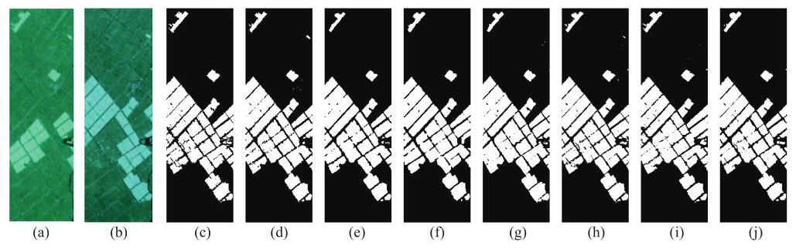

Fig. 5: The results on Farmland datasets. (a) Before temporal hyperspectral images, (b) After temporal hyperspectral images, (c) Groundtruth, (d) ML-EDAN, (e) SST-Former, (f) CSANet, (g) DA-Former, (h) TriTF, (i) HyperSIGMA, (j) Ours. The white pixels are changed, and the black pixels are unchanged.

图5:农田数据集的结果。(a) 时间高光谱图像之前，(b) 时间高光谱图像之后，(c) 地面真值，(d) ML - EDAN，(e) SST - Former，(f) CSANANNetNet，(g) DA - Former，(h) TriTF，(i) HyperSIGMA，(j) 我们的方法。白色像素表示已更改，黑色像素表示未更改。

Results Analysis for the Farmland Dataset: As illustrated in Fig. 5, the ML-EDAN map shows considerable salt-and-pepper noise. SST-Former and DA-Former struggle with edge detection, while SST-Former and CSANet miss some alarm areas. TriTF and HyperSIGMA also exhibit minor salt-and-pepper noise. In contrast, SpectralKAN provides superior visual quality. Table 3 shows that SpectralKAN achieves the highest OA and $\mathcal{K}$ , exceeding the second-best TriTF by 0.47% and 1.11%, respectively. Moreover, SpectralKAN demonstrates the lowest NP $\left( {8k}\right)$ , FLOPs $\left( {0.07M}\right)$ , memory usage (911 ${MB})$ , TraT (13.26 $s$ ), and TesT (2.52 $s$ ) among all methods, demonstrating its superior computational efficiency.

农田数据集的结果分析:如图5所示，ML - EDAN地图显示出相当多的椒盐噪声。SST - Former和DA - Former在边缘检测方面存在困难，而SST - Former和CSANet遗漏了一些警报区域。TriTF和HyperSIGMA也表现出轻微的椒盐噪声。相比之下，SpectralKAN提供了更高的视觉质量。表3显示，SpectralKAN实现了最高的OA和$\mathcal{K}$，分别比第二好的TriTF高出0.47%和1.11%。此外，SpectralKAN在所有方法中展示出最低的NP $\left( {8k}\right)$、FLOPs $\left( {0.07M}\right)$、内存使用量(911 ${MB})$)、TraT(13.26 $s$)和TesT(2.52 $s$)，证明了其卓越的计算效率。

Results Analysis for the River Dataset: Fig. 7 shows the visual results for the River dataset. ML-EDAN exhibited numerous false positives and false negatives. SST-Former, CSANet, and TriTF struggled with edge detection for small objects. DA-Former and HyperSIGMA missed several changes in small areas. In contrast, Spec-tralKAN showed improved visual results with fewer false negatives in small objects. In Table 4, although ML-EDAN, SST-Former, CSANet, and DA-Former have shorter TesT, they show lower $\mathcal{K}$ and longer TraT. HyperSIGMA performs the worst across the last five evaluation metrics. SpectralKAN achieves the highest OA and $\mathcal{K}$ , surpassing TriTF by 0.46% in OA and 2.67% in $\mathcal{K}$ . SpectralKAN also demonstrates clear advantages, exhibiting the lowest NP (9 k), FLOPs (0.09 M), memory usage (961 MB), TraT (25.55 s), and TesT (5.1 s) among all methods.

河流数据集的结果分析:图7展示了河流数据集的视觉结果。ML - EDAN表现出大量的误报和漏报。SST - Former、CSANet和TriTF在小物体的边缘检测方面存在困难。DA - Former和HyperSIGMA遗漏了小区域中的一些变化。相比之下，SpectralKAN在小物体中显示出更少的漏报，视觉结果有所改善。在表4中，尽管ML - EDAN、SST - Former、CSANet和DA - Former的TesT较短，但它们的$\mathcal{K}$较低且TraT较长。HyperSIGMA在最后五个评估指标中表现最差。SpectralKAN实现了最高的OA和$\mathcal{K}$，在OA方面比TriTF高出0.46%，在$\mathcal{K}$方面高出2.67%。SpectralKAN还展示出明显优势，在所有方法中表现出最低的NP(9 k)、FLOPs(0.09 M)、内存使用量(961 MB)、TraT(25.55 s)和TesT(5.1 s)。

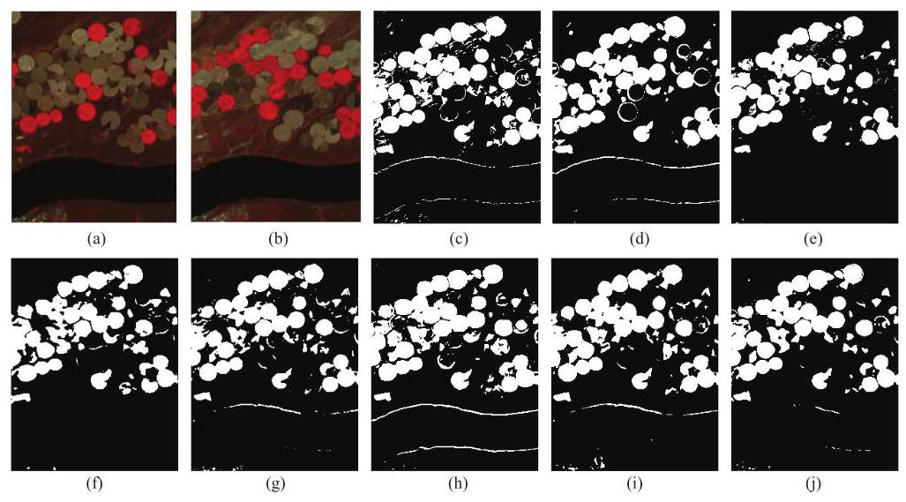

Fig. 6: The results on USA datasets. (a) Before temporal hyperspectral images, (b) After temporal hyper-spectral images, (c) Groundtruth, (d) ML-EDAN, (e) SST-Former, (f) CSANet, (g) DA-Former, (h) TriTF, (i) HyperSIGMA, (j) Ours. The white pixels are changed, and the black pixels are unchanged.

图6:美国数据集的结果。(a) 时间高光谱图像之前，(b) 时间高光谱图像之后，(c) 地面真值，(d) ML - EDAN，(e) SST - Former，(f) CSANet，(g) DA - Former，(h) TriTF，(i) HyperSIGMA，(j) 我们的方法。白色像素表示已更改，黑色像素表示未更改。

Results Analysis for the USA Dataset: Fig. 6 shows varying degrees of missed alarm areas across all methods. SST-Former and CSANet provide subpar visual results, while TriTF, DA-Former, and SpectralKAN perform well on large objects but struggle with narrow and small objects. Table 5 confirms that SpectralKAN and TriTF are the top performers in OA and $\mathcal{K}$ , while methods such as DA-Former exhibit the lowest accuracy on this dataset. SpectralKAN not only achieves the highest accuracy but also substantially reduces NP, FLOPs, Memory, TraT, and TesT compared to other state-of-the-art methods. In particular, SpectralKAN outperforms TriTF, with NP decreasing from ${171k}$ to ${8k}$ , FLOPs from ${21M}$ to ${0.07M}$ , Memory from ${2418MB}$ to ${911MB}$ , TraT from 59.69 s to ${15.8}\mathrm{\;s}$ , and TesT from ${19.89}\mathrm{\;s}$ to 2.89 s, demonstrating superior efficiency while maintaining the best performance.

美国数据集的结果分析:图6显示了所有方法中不同程度的漏警区域。SST-Former和CSANet的视觉效果较差，而TriTF、DA-Former和SpectralKAN在大型物体上表现良好，但在狭窄和小型物体上存在困难。表5证实，SpectralKAN和TriTF在OA和$\mathcal{K}$方面表现最佳，而DA-Former等方法在该数据集上的准确率最低。SpectralKAN不仅实现了最高的准确率，而且与其他现有方法相比，还大幅降低了NP、FLOPs、内存、TraT和TesT。特别是，SpectralKAN优于TriTF，NP从${171k}$降至${8k}$，FLOPs从${21M}$降至${0.07M}$，内存从${2418MB}$降至${911MB}$，TraT从59.69秒降至${15.8}\mathrm{\;s}$，TesT从${19.89}\mathrm{\;s}$降至2.89秒，在保持最佳性能的同时展示了卓越的效率。

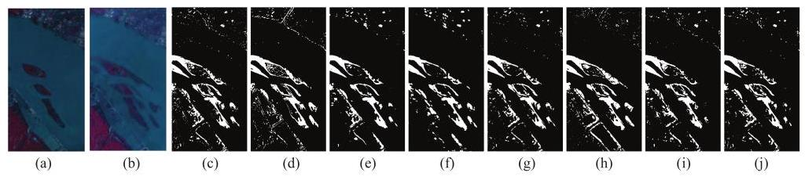

Fig. 7: The results on River datasets. (a) Before temporal hyperspectral images, (b) After temporal hyper-spectral images, (c) Groundtruth, (d) ML-EDAN, (e) SST-Former, (f) CSANet, (g) DA-Former, (h) TriTF, (i) HyperSIGMA, (j) Ours. The white pixels are changed, and the black pixels are unchanged.

图7:河流数据集的结果。(a) 时间高光谱图像之前；(b) 时间高光谱图像之后；(c) 地面真值；(d) ML-EDAN；(e) SST-Former；(f) CSANet；(g) DA-Former；(h) TriTF；(i) HyperSIGMA；(j) 我们的方法。白色像素表示已更改，黑色像素表示未更改。

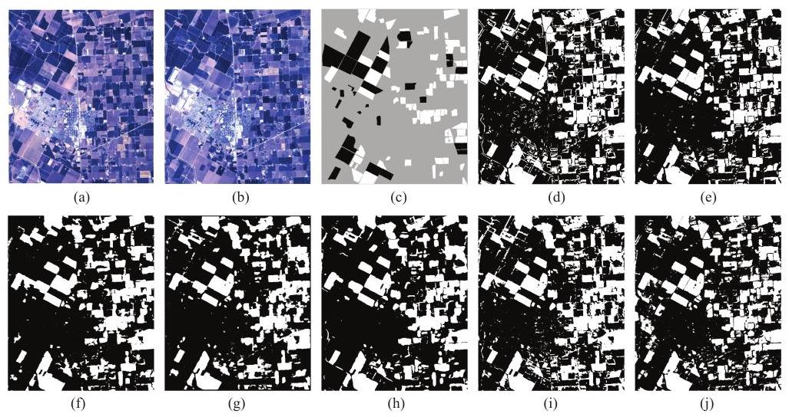

Fig. 8: The results on Bay Area datasets. (a) Before temporal hyperspectral images, (b) After temporal hyperspectral images, (c) Groundtruth, (d) ML-EDAN, (e) SST-Former, (f) CSANet, (g) DA-Former, (h) TriTF, (i) HyperSIGMA, (j) Ours. The white pixels are changed, and the black pixels are unchanged. The gray pixels are unknown on ground truth.

图8:湾区数据集的结果。(a) 时间高光谱图像之前；(b) 时间高光谱图像之后；(c) 地面真值；(d) ML-EDAN；(e) SST-Former；(f) CSANet；(g) DA-Former；(h) TriTF；(i) HyperSIGMA；(j) 我们的方法。白色像素表示已更改，黑色像素表示未更改。地面真值上的灰色像素未知。

Results Analysis for the Bay Area Dataset: Fig. 8 displays the visual results for the Bay Area dataset. While all methods effectively detected changes in labeled areas, only SST-Former and SpectralKAN provided detailed edge detection. Given that the annotated regions primarily consist of larger objects, the performance of SpectralKAN remains competitive, even though its accuracy is slightly lower compared to CSANet and other methods. Table 6 indicates that CSANet, TriTF, and DA-Former achieve the top three OA and $\mathcal{K}$ scores. Although SpectralKAN lags behind by 3.23%, 2.97%, and ${2.83}\%$ in $\mathcal{K}$ , respectively, it excels in detecting object edges and small objects, which are challenging for the other methods. Closer inspection reveals that most of SpectralKANs errors occur along change boundaries. This issue arises because spline functions are inherently smooth and continuous, making them better suited for modeling low-frequency and smoothly varying regions such as backgrounds or the interiors of large homogeneous objects. In contrast, boundaries in the Bay Area dataset contain substantial mixed pixels and high-frequency transitions. Consequently, spline-based activations may under-respond to these abrupt variations, leading to occasional missed detections along object edges. Even with this limitation, SpectralKAN produces clean boundary maps and delivers strong accuracy while keeping NP, FLOPs, memory, TraT, and TesT substantially lower than competing models.

湾区数据集的结果分析:图8展示了湾区数据集的视觉结果。虽然所有方法都有效地检测到了标记区域的变化，但只有SST-Former和SpectralKAN提供了详细的边缘检测。鉴于注释区域主要由较大的物体组成，SpectralKAN的性能仍然具有竞争力，尽管其准确率与CSANet和其他方法相比略低。表6表明，CSANet、TriTF和DA-Former在OA和$\mathcal{K}$得分中位列前三。尽管SpectralKAN在$\mathcal{K}$方面分别落后3.23%、2.97%和${2.83}\%$，但它在检测物体边缘和小物体方面表现出色，而这些对其他方法来说具有挑战性。仔细检查发现，SpectralKAN的大多数错误发生在变化边界处。出现这个问题是因为样条函数本质上是平滑和连续的，使其更适合对低频和平滑变化的区域进行建模，例如背景或大型均匀物体的内部。相比之下，湾区数据集中的边界包含大量混合像素和高频过渡。因此，基于样条的激活可能对这些突然变化反应不足，导致沿物体边缘偶尔出现漏检。即使有这个限制，SpectralKAN仍能生成清晰的边界图，并在保持NP、FLOPs、内存、TraT和TesT远低于竞争模型的同时提供强大的准确率。

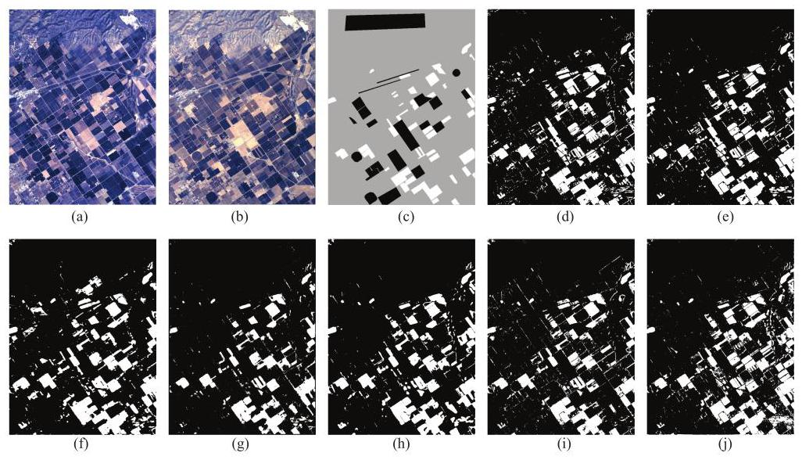

Fig. 9: The results on Santa Barbara datasets. (a) Before temporal hyperspectral images, (b) After temporal hyperspectral images, (c) Groundtruth, (d) ML-EDAN, (e) SST-Former, (f) CSANet, (g) DA-Former, (h) TriTF, (i) HyperSIGMA, (j) Ours. The white pixels are changed, and the black pixels are unchanged. The gray pixels are unknown on ground truth.

图9:圣巴巴拉数据集的结果。(a) 时间高光谱图像之前；(b) 时间高光谱图像之后；(c) 地面真值；(d) ML-EDAN；(e) SST-Former；(f) CSANet；(g) DA-Former；(h) TriTF；(i) HyperSIGMA；(j) 我们的方法。白色像素表示已更改，黑色像素表示未更改。地面真值上的灰色像素未知。

Results Analysis for the Santa Barbara Dataset: As shown in Fig. 9, all methods perform well in the annotated regions. SpectralKAN demonstrates clear advantages in detecting small objects and delineating the boundaries of changed areas, underscoring its strong feature extraction capability. Table 7 further indicates that although SST-Former achieves slightly lower accuracy than some methods, its OA and $\mathcal{K}$ still reach 97.52% and 94.78%, respectively. By contrast, DA-Former, CSANet, and Hyper-SIGMA deliver higher change detection accuracy, but at the cost of substantially larger NP, Memory, and FLOPs, as well as longer TraT and TesT. SpectralKAN attains an OA of 97.76% and a $\mathcal{K}$ of 95.31%, which is about 3% lower than the best-performing DA-Former in terms of $\mathcal{K}$ , yet still represents competitive accuracy. Similar to the Bay Area dataset, the main source of error lies near object boundaries, where high-frequency mixed pixels cause the spline activation to undershoot sharp transitions, resulting in a small number of missed edge pixels. Despite this, SpectralKAN remains the most lightweight method, requiring only ${10}\mathrm{k}$ parameters, ${0.1}\mathrm{M}\mathrm{{FLOPs}},{981}\mathrm{{MB}}$ memory, and achieving the shortest TraT and TesT $\left( {{30.10}\mathrm{\;s}\text{ and }{34.72}\mathrm{\;s}}\right)$ among all compared approaches.

圣巴巴拉数据集的结果分析:如图9所示，所有方法在标注区域表现良好。SpectralKAN在检测小物体和勾勒变化区域边界方面具有明显优势，凸显了其强大的特征提取能力。表7进一步表明，虽然SST-Former的准确率略低于某些方法，但其OA和$\mathcal{K}$仍分别达到97.52%和94.78%。相比之下，DA-Former、CSANet和Hyper-SIGMA提供了更高的变化检测准确率，但代价是NP、内存和FLOP大幅增加，以及TraT和TesT更长。SpectralKAN的OA为97.76%，$\mathcal{K}$为95.31%，就$\mathcal{K}$而言，比表现最佳的DA-Former低约3%，但仍具有竞争力的准确率。与湾区数据集类似，误差的主要来源位于物体边界附近，高频混合像素导致样条激活未达到尖锐过渡，导致少量边缘像素遗漏。尽管如此，SpectralKAN仍然是最轻量级的方法，在所有比较方法中仅需要${10}\mathrm{k}$参数、${0.1}\mathrm{M}\mathrm{{FLOPs}},{981}\mathrm{{MB}}$内存，并实现最短的TraT和TesT $\left( {{30.10}\mathrm{\;s}\text{ and }{34.72}\mathrm{\;s}}\right)$。

In conclusion, ML-EDAN demonstrated relatively low OA and $\mathcal{K}$ . SST-Former, DA-Former, and HyperSIGMA outperformed ML-EDAN, showing better results. CSANet excelled on the Bay Area and Santa Barbara datasets but underperformed on the other three. TriTF achieved second-highest accuracy across all datasets. All these methods exhibit higher NP, FLOPs, Memory, TraT and TesT. SpectralKAN achieved the best OA and $\mathcal{K}$ on the Farmland, River, and USA datasets, and also performed well on the Bay Area and Santa Barbara datasets. SpectralKAN is composed of only a few WKAN layers, resulting in a substantially reduced NP compared with the state-of-the-art methods. SpectralKAN integrates multiple activation functions, providing stronger nonlinear feature extraction capability. Consequently, the considerable reduction in NP does not compromise accuracy, and the lower NP directly translates into reduced FLOPs, Memory, TraT, and TesT, making SpectralKAN particularly suitable for deployment on devices with limited computational resources.

总之，ML-EDAN的OA和$\mathcal{K}$相对较低。SST-Former、DA-Former和HyperSIGMA的表现优于ML-EDAN，结果更好。CSANet在湾区和圣巴巴拉数据集上表现出色，但在其他三个数据集上表现不佳。TriTF在所有数据集中的准确率排名第二。所有这些方法都表现出更高的NP、FLOP、内存、TraT和TesT。SpectralKAN在农田、河流和美国数据集上实现了最佳的OA和$\mathcal{K}$，在湾区和圣巴巴拉数据集上也表现良好。SpectralKAN仅由几个WKAN层组成，与最先进的方法相比，NP大幅减少。SpectralKAN集成了多个激活函数，提供了更强的非线性特征提取能力。因此，NP的大幅减少并没有影响准确性，较低的NP直接转化为FLOP、内存、TraT和TesT的减少，使得SpectralKAN特别适合在计算资源有限的设备上部署。

### 4.4. Ablation Studies

### 4.4. 消融研究

We conducted ablation studies to evaluate the effectiveness of the proposed WKANs and MTSF. Four model configurations were considered: the original KANs [2], the proposed WKANs, MTSF constructed with KANs (MTSF-KANs), and MTSF constructed with WKANs (SpectralKAN). The results across five datasets are summarized in Table 8, using NP and $\mathcal{K}$ as evaluation metrics.

我们进行了消融研究，以评估所提出的WKANs和MTSF的有效性。考虑了四种模型配置:原始的KANs [2]、所提出的WKANs、用KANs构建的MTSF(MTSF-KANs)和用WKANs构建的MTSF(SpectralKAN)。使用NP和$\mathcal{K}$作为评估指标，五个数据集的结果总结在表8中。

Table 8: Ablation Experiment Results for WKANs and MTSF, Showing $\mathcal{K}$ and NP. The Best Results are Highlighted in Bold.

表8:WKANs和MTSF的消融实验结果，显示$\mathcal{K}$和NP。最佳结果用粗体突出显示。

<table><tr><td rowspan="2"></td><td rowspan="2">WKAN</td><td rowspan="2">MTSF</td><td colspan="2">Farmland</td><td colspan="2">River</td><td colspan="2">USA</td><td colspan="2">Bay Area</td><td colspan="2">Barbara</td></tr><tr><td>K</td><td>$\mathrm{{NP}}\left( k\right)$</td><td>K</td><td>$\operatorname{NP}\left( k\right)$</td><td>K</td><td>$\mathrm{{NP}}\left( k\right)$</td><td>K</td><td>$\mathrm{{NP}}\left( k\right)$</td><td>K</td><td>NP $\left( k\right)$</td></tr><tr><td>KANs</td><td>✘</td><td>✘</td><td>0.9435</td><td>620</td><td>0.7638</td><td>792</td><td>0.8437</td><td>616</td><td>0.9109</td><td>896</td><td>0.9479</td><td>896</td></tr><tr><td>WKANs</td><td>✓</td><td>✘</td><td>0.9426</td><td>155</td><td>0.7648</td><td>198</td><td>0.8423</td><td>154</td><td>0.9185</td><td>224</td><td>0.9529</td><td>224</td></tr><tr><td>MTSF-KANs</td><td>✘</td><td>✓</td><td>0.9497</td><td>29</td><td>0.8219</td><td>36</td><td>0.878</td><td>29</td><td>0.9347</td><td>40</td><td>0.9565</td><td>40</td></tr><tr><td>SpectralKAN</td><td>✓</td><td>✓</td><td>0.9514</td><td>8</td><td>0.8366</td><td>9</td><td>0.8804</td><td>8</td><td>0.9329</td><td>10</td><td>0.9531</td><td>10</td></tr></table>

We observed that WKANs and SpectralKAN achieved approximately a fourfold reduction in NP compared with KANs and MTSF-KANs, respectively. Despite this substantial reduction, $\mathcal{K}$ remained largely stable across datasets, indicating that WKANs effectively suppress redundant representations in high-dimensional data without compromising information integrity. Furthermore, comparisons between KANs and MTSF-KANs, as well as between WKANs and SpectralKAN, showed that MTSF achieved more than a twentyfold reduction in NP while simultaneously improving $\mathcal{K}$ . These results demonstrate that MTSF not only enhances high-dimensional feature extraction but also substantially reduces computational cost.

我们观察到，与KANs和MTSF-KANs相比，WKANs和SpectralKAN的NP分别减少了约四倍。尽管有如此大幅的减少，$\mathcal{K}$在各个数据集上基本保持稳定，表明WKANs有效地抑制了高维数据中的冗余表示，而不影响信息完整性。此外，KANs与MTSF-KANs之间以及WKANs与SpectralKAN之间的比较表明，MTSF在NP减少了二十多倍的同时提高了$\mathcal{K}$。这些结果表明，MTSF不仅增强了高维特征提取，还大幅降低了计算成本。

### 4.5. Effect of Hyperparameters

### 4.5. 超参数的影响

To study the effect of hyperparameters on SpectralKAN, we focused on the number of nodes and hidden layers, as well as the number of training samples. Other hyperpa-rameters were set based on prior work and empirical experience.

为了研究超参数对SpectralKAN的影响，我们重点关注了节点数量、隐藏层数以及训练样本数量。其他超参数则根据先前的工作和经验设定。

Different numbers of nodes and hidden layers in SpectralKAN result in different NP and accuracy. We selected six different combinations of nodes and layers to identify the optimal structure: a: $\left\lbrack  {{25},1}\right\rbrack  ,\left\lbrack  {b,2}\right\rbrack  , b : \left\lbrack  {{25},{16},1}\right\rbrack  ,\left\lbrack  {b,2}\right\rbrack  , c : \left\lbrack  {{25},1}\right\rbrack  ,\left\lbrack  {b,{16},2}\right\rbrack  , d$ : [25, ${16},1\rbrack ,\left\lbrack  {b,{16},2}\right\rbrack$ , e: $\left\lbrack  {{25},{64},1}\right\rbrack  ,\left\lbrack  {b,{16},2}\right\rbrack$ , and f: $\left\lbrack  {{25},{16},1}\right\rbrack  ,\left\lbrack  {b,{64},2}\right\rbrack$ . In af, the first set specifies the number of nodes in each layer of the spatial-level WKANs (e.g., [25,1] indicates 25 nodes in the first layer and 1 node in the second layer), while the second set provides the corresponding layer-wise node configuration of the channel-level WKANs. From a to f, the number of nodes or layers gradually increases, accompanied by an increase in NP. The $\mathcal{K}$ of experiments can be seen in Fig. 10. In the Farmland dataset, as the number of nodes or layers increases, the $\mathcal{K}$ also gradually increases. In the other datasets, however, no consistent pattern is observed. Considering both NP and $\mathcal{K}$ , we determine that $\mathrm{b}$ is the best configuration.

SpectralKAN中不同数量的节点和隐藏层会导致不同的NP和准确率。我们选择了六种不同的节点和层组合来确定最优结构:a: $\left\lbrack  {{25},1}\right\rbrack  ,\left\lbrack  {b,2}\right\rbrack  , b : \left\lbrack  {{25},{16},1}\right\rbrack  ,\left\lbrack  {b,2}\right\rbrack  , c : \left\lbrack  {{25},1}\right\rbrack  ,\left\lbrack  {b,{16},2}\right\rbrack  , d$ : [25, ${16},1\rbrack ,\left\lbrack  {b,{16},2}\right\rbrack$ , e: $\left\lbrack  {{25},{64},1}\right\rbrack  ,\left\lbrack  {b,{16},2}\right\rbrack$ ,以及f: $\left\lbrack  {{25},{16},1}\right\rbrack  ,\left\lbrack  {b,{64},2}\right\rbrack$ 。在af中，第一组指定了空间级WKANs每层的节点数量(例如，[25,1]表示第一层有25个节点，第二层有1个节点)，而第二组提供了通道级WKANs相应的逐层节点配置。从a到f，节点或层数逐渐增加，同时NP也随之增加。实验的$\mathcal{K}$如图10所示。在农田数据集中，随着节点或层数的增加，$\mathcal{K}$也逐渐增加。然而，在其他数据集中，未观察到一致的模式。综合考虑NP和$\mathcal{K}$，我们确定$\mathrm{b}$是最佳配置。

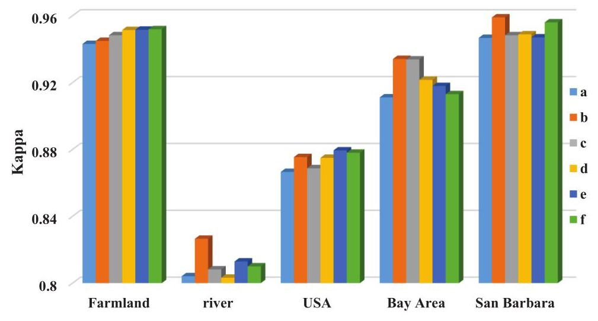

Fig. 10: The $\mathcal{K}$ of different nodes and layers on five datasets.

图10:五个数据集上不同节点和层的$\mathcal{K}$。

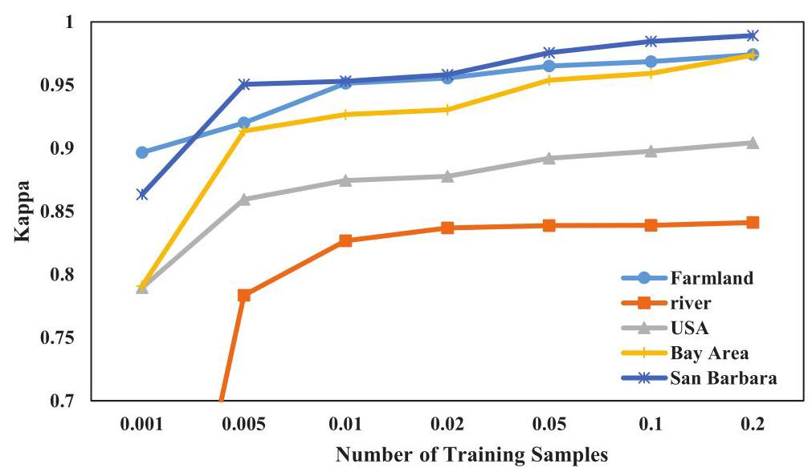

Fig. 11: The $\mathcal{K}$ of different training set number on five datasets.

图11:五个数据集上不同训练集数量的$\mathcal{K}$。

Different tasks have varying requirements for number of training samples. 0.1%, ${0.5}\% ,1\% ,2\% ,5\% ,{10}\% ,{20}\%$ of the pixels as training sets to analyze their impact on SpectralKAN. The results are shown in Fig. 11. We observe that with a larger number of training samples, the accuracy of change detection increases.

不同任务对训练样本数量有不同要求。以0.1%、${0.5}\% ,1\% ,2\% ,5\% ,{10}\% ,{20}\%$的像素作为训练集来分析它们对SpectralKAN的影响。结果如图11所示。我们观察到，随着训练样本数量的增加，变化检测的准确率提高。

## 5. Conclusion

## 5. 结论

In this paper, we propose WKANs and MTSF to advance KANs for processing high-dimensional data. We apply these innovations to hyperspectral image change detection by developing the SpectralKAN. Extensive experiments on five datasets demonstrate that SpectralKAN achieves an average OA of 97.11% and a $\mathcal{K}$ of 91.09%. Meanwhile, it substantially reduces NP, FLOPs, and Memory, achieving TesT up to two times faster than the best baseline method. Overall, SpectralKAN combines competitive accuracy with high efficiency, making it suitable for scenarios with limited computational resources. But spline-based activations tend to produce overly smooth responses in the high-frequency regions typically found along hyperspectral object boundaries, which may lead to missed detections at change edges. In future work, we plan to address this limitation by incorporating frequency-domain transformations, such as the Discrete Cosine Transform, to enhance the models ability to capture high-frequency boundary information. Additionally, we will extend the MTSF to other high-dimensional tasks, such as 3D point clouds and video data, to further validate its effectiveness and broaden its applications.

在本文中，我们提出了WKANs和MTSF来改进KANs以处理高维数据。我们通过开发SpectralKAN将这些创新应用于高光谱图像变化检测。在五个数据集上进行的大量实验表明，SpectralKAN的平均OA达到97.11%，$\mathcal{K}$为91.09%。同时，它大幅降低了NP、FLOPs和内存，实现的TesT速度比最佳基线方法快两倍。总体而言，SpectralKAN将具有竞争力的准确率与高效率相结合，使其适用于计算资源有限的场景。但是基于样条的激活函数往往会在高光谱物体边界通常出现的高频区域产生过度平滑的响应，这可能导致在变化边缘处漏检。在未来的工作中，我们计划通过纳入频域变换，如离散余弦变换，来解决这一限制，以增强模型捕捉高频边界信息的能力。此外，我们将把MTSF扩展到其他高维任务，如三维点云和视频数据，以进一步验证其有效性并拓宽其应用范围。

## 6. Declaration of Interest Statement

## 6. 利益声明

The authors declare that they have no known competing financial interests or personal relationships that could have appeared to influence the work reported in this paper.

作者声明他们没有已知的竞争性财务利益或可能影响本文所报告工作的个人关系。

## 7. Acknowledgement

## 7. 致谢

This work was supported in part by the National Key Laboratory on Electromagnetic Environmental Effects and Electro-optical Engineering under Grant KY3240020001 and the Aerospace Science and Technology Innovation Development Fund under Grant ZY0110020009.

本工作部分得到了电磁环境效应与光电工程国家重点实验室(项目编号:KY3240020001)和航天科技创新发展基金(项目编号:ZY0110020009)的支持。

## References

## 参考文献

[1] K. Hornik, M. Stinchcombe, H. White, Multilayer feedforward networks are uni-versal approximators, Neural networks 2 (5) (1989) 359-366.

通用逼近器，神经网络2(5)(1989)359 - 366。

[2] Z. Liu, Y. Wang, S. Vaidya, F. Ruehle, J. Halverson, M. Soljačić, T. Y.Hou, M. Tegmark, Kan: Kolmogorov-arnold networks, arXiv preprint

侯，M. 泰格马克，坎:柯尔莫哥洛夫 - 阿诺德网络，arXiv预印本arXiv:2404.19756 (2024).

[3] R. Wu, H. Liu, Z. Yue, C.-W. Sham, J.-B. Li, Feature space expansion andcompression with spatial-spectral augmentation for hyperspectral image class-incremental learning, Pattern Recognition (2025) 111830.

用于高光谱图像类增量学习的空间 - 光谱增强压缩，《模式识别》(2025年)111830

[4] Z. Jiang, J. Li, S. Xu, Z. Liu, D. Ma, Q. Wang, Y. Yuan, Cross-domain hyperspec-tral image classification, Pattern Recognition (2025) 111836.

用于传统图像分类，《模式识别》(2025年)111836

[5] J. Qu, J. He, W. Dong, J. Zhao, S2cyclediff: Spatial-spectral-bilateral cycle-diffusion framework for hyperspectral image super-resolution, in: Proceedings

用于高光谱图像超分辨率的扩散框架，载于:会议论文集of the AAAI Conference on Artificial Intelligence, Vol. 38, 2024, pp. 4623-4631.

[6] Y. Wang, L. Gao, D. Hong, J. Sha, L. Liu, B. Zhang, X. Rong, Y. Zhang, Maskdeeplab: End-to-end image segmentation for change detection in high-resolution remote sensing images, International Journal of Applied Earth Observation and Geoinformation 104 (2021) 102582.

深度Lab:用于高分辨率遥感图像变化检测的端到端图像分割，《国际应用地球观测与地理信息学报》104(2021年)102582

[7] Y. Li, W. Xie, H. Li, Hyperspectral image reconstruction by deep convolutionalneural network for classification, Pattern Recognition 63 (2017) 371-383.

用于分类的神经网络，《模式识别》63(2017年)371 - 383

[8] K.-K. Huang, C.-X. Ren, H. Liu, Z.-R. Lai, Y.-F. Yu, D.-Q. Dai, Hyperspectralimage classification via discriminative convolutional neural network with an improved triplet loss, Pattern Recognition 112 (2021) 107744.

通过具有改进三元组损失的判别卷积神经网络进行图像分类，《模式识别》112(2021年)107744

[9] A. Sellami, S. Tabbone, Deep neural networks-based relevant latent represen-tation learning for hyperspectral image classification, Pattern Recognition 121

用于高光谱图像分类的旋转学习，《模式识别》121(2022) 108224.

[10] D. A. Sprecher, S. Draghici, Space-filling curves and kolmogorov superposition-based neural networks, Neural Networks 15 (1) (2002) 57-67.

基于神经网络，《神经网络》15(1)(2002年)57 - 67

[11] P.-E. Leni, Y. D. Fougerolle, F. Truchetet, The kolmogorov spline network forimage processing, in: Image Processing: Concepts, Methodologies, Tools, and

图像处理，载于:《图像处理:概念、方法、工具和》Applications, IGI Global, 2013, pp. 54-78.

[12] C. J. Vaca-Rubio, L. Blanco, R. Pereira, M. Caus, Kolmogorov-arnold networks (kans) for time series analysis, arXiv preprint arXiv:2405.08790 (2024).

[13] R. Genet, H. Inzirillo, Tkan: Temporal kolmogorov-arnold networks, arXiv preprint arXiv:2405.07344 (2024).

[14] Z. Huang, J. Cui, L. Yu, L. F. Herbozo Contreras, O. Kavehei, Abnormality de-tection in time-series bio-signals using kolmogorov-arnold networks for resource-constrained devices, medRxiv (2024) 2024-06.

使用柯尔莫哥洛夫 - 阿诺德网络对资源受限设备的时间序列生物信号进行检测，medRxiv(2024年)2024 - 06

[15] M. Liu, S. Bian, B. Zhou, P. Lukowicz, ikan: Global incremental learning withkan for human activity recognition across heterogeneous datasets, arXiv preprint

用于跨异构数据集的人类活动识别的坎，arXiv预印本arXiv:2406.01646 (2024).

[16] Z. Bozorgasl, H. Chen, Wav-kan: Wavelet kolmogorov-arnold networks, arXiv preprint arXiv:2405.12832 (2024).

[17] A. Jamali, S. K. Roy, D. Hong, B. Lu, P. Ghamisi, How to learn more? explor-ing kolmogorovarnold networks for hyperspectral image classification, Remote

使用柯尔莫哥洛夫 - 阿诺德网络进行高光谱图像分类，《遥感》Sensing 16 (21) (2024). doi:10.3390/rs16214015.

[18] D. W. Abueidda, P. Pantidis, M. E. Mobasher, Deepokan: Deep operator networkbased on kolmogorov arnold networks for mechanics problems, arXiv preprint

基于柯尔莫哥洛夫 - 阿诺德网络解决力学问题，arXiv预印本arXiv:2405.19143 (2024).

[19] J. Xu, Z. Chen, J. Li, S. Yang, W. Wang, X. Hu, E. C.-H. Ngai, Fourierkan-gcf:Fourier kolmogorov-arnold network-an effective and efficient feature transforma-

傅里叶柯尔莫哥洛夫 - 阿诺德网络 - 一种有效且高效的特征变换tion for graph collaborative filtering, arXiv preprint arXiv:2406.01034 (2024).

[20] M. Cheon, Kolmogorov-arnold network for satellite image classification in remote sensing, arXiv preprint arXiv:2406.00600 (2024).

[21] L. Wang, L. Wang, Q. Wang, P. M. Atkinson, Ssa-siamnet: Spectral-spatial-wiseattention-based siamese network for hyperspectral image change detection, IEEE Transactions on Geoscience and Remote Sensing 60 (2021) 1-18.

用于高光谱图像变化检测的基于注意力的连体网络，《IEEE地球科学与遥感汇刊》60(2021年)1 - 18

[22] M. Hu, C. Wu, L. Zhang, Globalmind: Global multi-head interactive self-attention network for hyperspectral change detection, ISPRS Journal of Photogrammetry and Remote Sensing 211 (2024) 465-483.

用于高光谱变化检测的注意力网络，《国际摄影测量与遥感学会摄影测量与遥感杂志》211 (2024) 465 - 483。

[23] H. Yu, H. Yang, L. Gao, J. Hu, A. Plaza, B. Zhang, Hyperspectral image changedetection based on gated spectral-spatial-temporal attention network with spectral similarity filtering, IEEE Transactions on Geoscience and Remote Sensing 62

基于带光谱相似性滤波的门控光谱 - 空间 - 时间注意力网络的检测，《IEEE地球科学与遥感汇刊》62(2024) 1-13.

[24] Y. Wang, D. Hong, J. Sha, L. Gao, L. Liu, Y. Zhang, X. Rong, Spectral-spatial-temporal transformers for hyperspectral image change detection, IEEE Transactions on Geoscience and Remote Sensing 60 (2022) 1-14.

用于高光谱图像变化检测的时间变压器，《IEEE地球科学与遥感汇刊》60 (2022) 1 - 14。

[25] M. Han, J. Sha, Y. Wang, X. Wang, Pbformer: Point and bi-spatiotemporal trans-former for pointwise change detection of $3\mathrm{\;d}$ urban point clouds, Remote Sensing 15 (9) (2023) 2314.

用于$3\mathrm{\;d}$城市点云逐点变化检测的变压器，《遥感》15 (9) (2023) 2314。

[26] Q. Guo, J. Zhang, C. Zhong, Y. Zhang, Change detection for hyperspectral imagesvia convolutional sparse analysis and temporal spectral unmixing, IEEE Journal of Selected Topics in Applied Earth Observations and Remote Sensing 14 (2021) 4417-4426.

通过卷积稀疏分析和时间光谱解混，《IEEE应用地球观测与遥感精选专题杂志》14 (2021) 4417 - 4426。

[27] X. Ou, L. Liu, B. Tu, G. Zhang, Z. Xu, A cnn framework with slow-fast bandselection and feature fusion grouping for hyperspectral image change detection, IEEE Transactions on Geoscience and Remote Sensing 60 (2022) 1-16.

用于高光谱图像变化检测的选择与特征融合分组，《IEEE地球科学与遥感汇刊》60 (2022) 1 - 16。

[28] X. Zhang, S. Tian, G. Wang, X. Tang, J. Feng, L. Jiao, Cast: A cascade spectralaware transformer for hyperspectral image change detection, IEEE Transactions on Geoscience and Remote Sensing 61 (2023) 1-14.

用于高光谱图像变化检测的感知变压器，《IEEE地球科学与遥感汇刊》61 (2023) 1 - 14。

[29] F. Luo, T. Zhou, J. Liu, T. Guo, X. Gong, J. Ren, Multiscale diff-changed featurefusion network for hyperspectral image change detection, IEEE Transactions on Geoscience and Remote Sensing 61 (2023) 1-13.

用于高光谱图像变化检测的融合网络，《IEEE地球科学与遥感汇刊》61 (2023) 1 - 13。

[30] J. Qu, W. Dong, Y. Yang, T. Zhang, Y. Li, Q. Du, Cycle-refined multidecision jointalignment network for unsupervised domain adaptive hyperspectral change detection, IEEE Transactions on Neural Networks and Learning Systems 36 (2024) 2634 - 2647.

用于无监督域自适应高光谱变化检测的对齐网络，《IEEE神经网络与学习系统汇刊》36 (2024) 2634 - 2647。

[31] L. Ning, Q. Zhou, Q. Wang, J. Gao, X. Li, Cross-resolution change detectionin remote sensing via unequal relationships from a frequency perspective, IEEE Transactions on Geoscience and Remote Sensing 63 (2025) 1-14.

从频率角度通过不等关系进行遥感，《IEEE地球科学与遥感汇刊》63 (2025) 1 - 14。

[32] A. Song, J. Choi, Y. Han, Y. Kim, Change detection in hyperspectral images usingrecurrent 3d fully convolutional networks, Remote Sensing 10 (11) (2018) 1827.

循环3D全卷积网络，《遥感》10 (11) (2018) 1827。

[33] B. Bai, W. Fu, T. Lu, S. Li, Edge-guided recurrent convolutional neural networkfor multitemporal remote sensing image building change detection, IEEE Transactions on Geoscience and Remote Sensing 60 (2021) 1-13.

用于多时相遥感图像建筑物变化检测，《IEEE地球科学与遥感汇刊》60 (2021) 1 - 13。

[34] C. Shi, Z. Zhang, W. Zhang, C. Zhang, Q. Xu, Learning multiscale temporal-spatial-spectral features via a multipath convolutional lstm neural network for change detection with hyperspectral images, IEEE Transactions on Geoscience and Remote Sensing 60 (2022) 1-16.

通过多路径卷积长短期记忆神经网络提取空间 - 光谱特征用于高光谱图像变化检测，《IEEE地球科学与遥感汇刊》60 (2022) 1 - 16。

[35] D. Wang, M. Hu, Y. Jin, Y. Miao, J. Yang, Y. Xu, X. Qin, J. Ma, L. Sun, C. Li,et al., Hypersigma: Hyperspectral intelligence comprehension foundation model, IEEE Transactions on Pattern Analysis and Machine Intelligence 47 (2025) 6427 - 6444.

等人，Hypersigma:高光谱智能理解基础模型，《IEEE模式分析与机器智能汇刊》47 (2025) 6427 - 6444。

[36] J. Gao, D. Zhang, F. Wang, L. Ning, Z. Zhao, X. Li, Combining sam with limiteddata for change detection in remote sensing, IEEE Transactions on Geoscience and Remote Sensing 63 (2025) 1-11.

用于遥感变化检测的数据，《IEEE地球科学与遥感汇刊》63 (2025) 1 - 11。

[37] X. Wang, F. Zhang, K. Zhang, W. Wang, X. Dun, J. Sun, Learning spatial-spectraldual adaptive graph embedding for multispectral and hyperspectral image fusion, Pattern Recognition 151 (2024) 110365.

用于多光谱和高光谱图像融合的双自适应图嵌入，《模式识别》151 (2024) 110365。

[38] Z. Chen, C. Liu, J. Zhou, Ssit: A spatial-spectral interactive transformer for hy-perspectral image denoising, Science of Remote Sensing (2025) 100276.

高光谱图像去噪，《遥感科学》(2025年)100276。

[39] M. Hasanlou, S. T. Seydi, Hyperspectral change detection: An experimental comparative study, International journal of remote sensing 39 (20) (2018) 7029-7083.

[40] Q. Wang, Z. Yuan, Q. Du, X. Li, Getnet: A general end-to-end 2-d cnn frameworkfor hyperspectral image change detection, IEEE Transactions on Geoscience and Remote Sensing 57 (1) (2018) 3-13.

用于高光谱图像变化检测，《IEEE地球科学与遥感汇刊》57(1)(2018年)3 - 13。

[41] J. Qu, S. Hou, W. Dong, Y. Li, W. Xie, A multilevel encoder-decoder atten-tion network for change detection in hyperspectral images, IEEE Transactions on Geoscience and Remote Sensing 60 (2021) 1-13.

用于高光谱图像变化检测的网络，《IEEE地球科学与遥感汇刊》60(2021年)1 - 13。

[42] R. Song, W. Ni, W. Cheng, X. Wang, Csanet: Cross-temporal interaction symmet-ric attention network for hyperspectral image change detection, IEEE Geoscience and Remote Sensing Letters 19 (2022) 1-5.

用于高光谱图像变化检测的循环注意力网络；《IEEE地球科学与遥感快报》19(2022年)1 - 5。

[43] X. Wang, K. Zhao, X. Zhao, S. Li, Tritf: A triplet transformer framework basedon parents and brother attention for hyperspectral image change detection, IEEE Transactions on Geoscience and Remote Sensing 61 (2023) 1-13.

关于高光谱图像变化检测的父级和兄弟注意力，《IEEE地球科学与遥感汇刊》61(2023年)1 - 13。

[44] Y. Wang, J. Sha, L. Gao, Y. Zhang, X. Rong, C. Zhang, A semi-supervised domainalignment transformer for hyperspectral images change detection, IEEE Transactions on Geoscience and Remote Sensing 61 (2023) 1-11.

用于高光谱图像变化检测的对齐变换器，《IEEE地球科学与遥感汇刊》61(2023年)1 - 11。