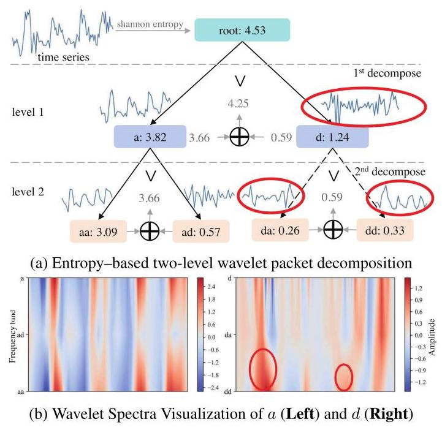
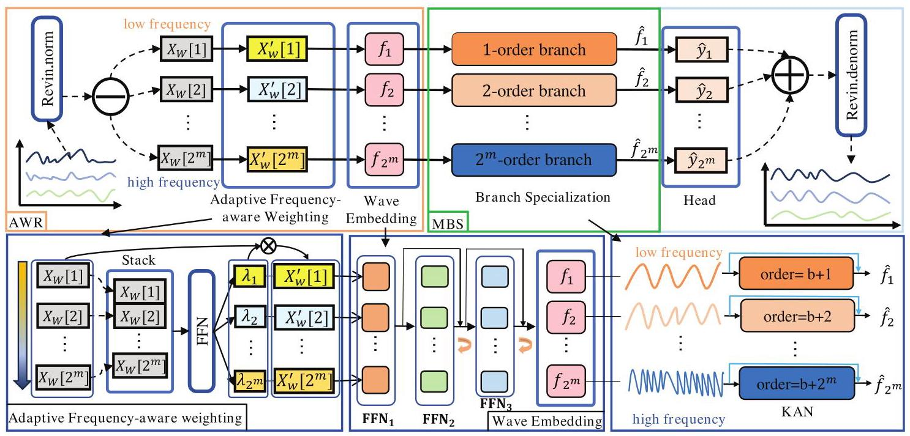
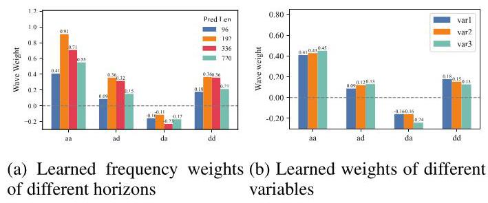
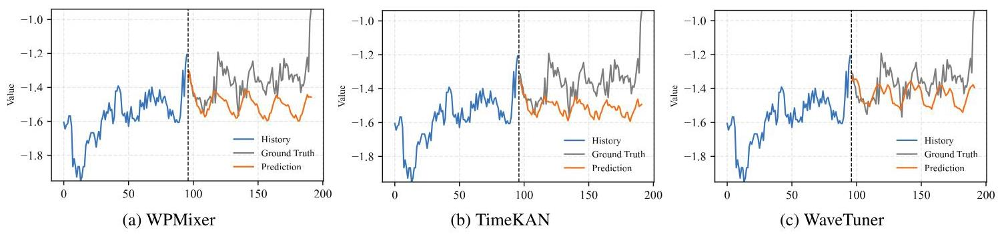
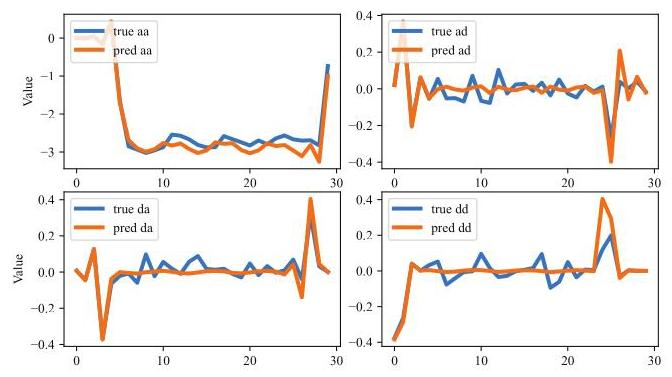
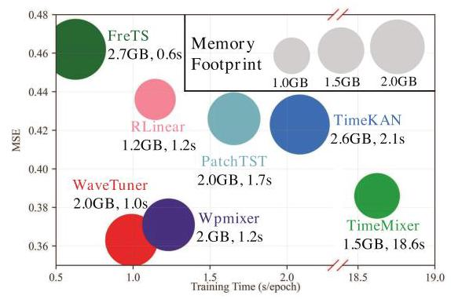

# WaveTuner: Comprehensive Wavelet Subband Tuning for Time Series Forecasting

# WaveTuner:用于时间序列预测的综合小波子带调谐

Yubo Wang ${}^{1}$ , Hui He ${}^{1}$ , Chaoxi Niu ${}^{2}$ Zhendong Niu ${}^{1}$

王宇博${}^{1}$ ，何辉${}^{1}$ ，牛朝曦${}^{2}$ 牛振东${}^{1}$

${}^{1}$ Beijing Institute of Technology

${}^{1}$ 北京理工大学

2 University of Technology Sydney

2 悉尼科技大学

## Abstract

## 摘要

Due to the inherent complexity, temporal patterns in real-world time series often evolve across multiple intertwined scales, including long-term periodicity, short-term fluctuations, and abrupt regime shifts. While existing literature has designed many sophisticated decomposition approaches based on the time or frequency domain to partition trend-seasonality components and high-low frequency components, an alternative line of approaches based on the wavelet domain has been proposed to provide a unified multi-resolution representation with precise time-frequency localization. However, most wavelet-based methods suffer from a persistent bias toward recursively decomposing only low-frequency components, severely underutilizing subtle yet informative high-frequency components that are pivotal for precise time series forecasting. To address this problem, we propose WaveTuner, a Wavelet decomposition framework empowered by full-spectrum subband Tuning for time series forecasting. Concretely, WaveTuner comprises two key modules: (i) Adaptive Wavelet Refinement module, that transforms time series into time-frequency coefficients, utilizes an adaptive router to dynamically assign subband weights, and generates subband-specific embeddings to support refinement; and (ii) Multi-Branch Specialization module, that employs multiple functional branches, each instantiated as a flexible Kolmogorov-Arnold Network (KAN) with a distinct functional order to model a specific spectral subband. Equipped with these modules, WaveTuner comprehensively tunes global trends and local variations within a unified time-frequency framework. Extensive experiments on eight real-world datasets demonstrate WaveTuner achieves state-of-the-art forecasting performance in time series forecasting.

由于现实世界时间序列中固有的复杂性，其时间模式通常在多个相互交织的尺度上演变，包括长期周期性、短期波动和突然的状态转变。虽然现有文献设计了许多基于时域或频域的复杂分解方法来划分趋势 - 季节性成分和高低频成分，但也有人提出了基于小波域的另一类方法，以提供具有精确时频定位的统一多分辨率表示。然而，大多数基于小波的方法一直存在仅递归分解低频成分的偏差，严重未充分利用对精确时间序列预测至关重要的细微但信息丰富的高频成分。为了解决这个问题，我们提出了WaveTuner，这是一个用于时间序列预测的由全谱子带调谐赋能的小波分解框架。具体而言，WaveTuner包含两个关键模块:(i)自适应小波细化模块，它将时间序列转换为时频系数，利用自适应路由器动态分配子带权重，并生成特定子带的嵌入以支持细化；以及(ii)多分支专业化模块，它采用多个功能分支，每个分支实例化为具有不同功能阶数的灵活柯尔莫哥洛夫 - 阿诺德网络(KAN)，以对特定频谱子带进行建模。配备这些模块后，WaveTuner在统一的时频框架内全面调谐全局趋势和局部变化。在八个真实世界数据集上进行的广泛实验表明，WaveTuner在时间序列预测中实现了领先的预测性能。

## Introduction

## 引言

Time series forecasting, which aims to infer future values from temporal patterns of historical observations, plays a pivotal role in a wide range of real-world applications, such as transportation management (Cirstea et al. 2022), inventory optimization (Seyedan, Mafakheri, and Wang 2023), and climate modeling (Haq 2022). In recent years, various deep learning models based on diverse architectures—such as RNNs (Amalou, Mouhni, and Abdali 2022), CNNs (Mehtab and Sen 2022), Transformers (Woo et al. 2024), and MLPs (Zeng et al. 2023)—have gained significant attention and driven notable progress for time series forecasting (Lim and Zohren 2021).

时间序列预测旨在从历史观测的时间模式中推断未来值，在广泛的现实世界应用中发挥着关键作用，如交通管理(Cirstea等人，2022年)、库存优化(Seyedan、Mafakheri和Wang，2023年)以及气候建模(Haq，2022年)。近年来，各种基于不同架构的深度学习模型，如循环神经网络(RNNs)(Amalou、Mouhni和Abdali，2022年)、卷积神经网络(CNNs)(Mehtab和Sen，2022年)、Transformer(Woo等人，2024年)和多层感知器(MLPs)(Zeng等人，2023年)，在时间序列预测方面受到了广泛关注并取得了显著进展(Lim和Zohren，2021年)。

Figure 1: The critical role of analyzing high-frequency components in wavelet decomposition.

图1:小波分解中分析高频成分的关键作用。

Despite these impressive advances, modeling time series remains fundamentally challenging due to the intrinsic complex nature of the real world, where temporal patterns unfold across multiple entangled scales, including long-term periodicity, short-term fluctuations, abrupt regime shifts, etc (Zhang et al. 2025a; Piao et al. 2024a). To tackle such complex temporal patterns, a compelling strategy is to leverage prior knowledge to decompose time series into trend and seasonal components (Wu et al. 2021; Zhou et al. 2022; Zeng et al. 2023), further enriched with multi-scale refinements that capture cross-scale interactions (Wang et al. 2024a), or into chunks with different period lengths (Wu et al. 2022). Concurrently, the frequency domain has emerged as a powerful alternative to conventional time-domain approaches by providing global view and energy compaction, two advantaged properties inaccessible in the time domain (Yi et al. 2023a), prompting a surge of interest in decomposing time series into high- and low-frequency components (Piao et al. 2024b; Huang et al. 2025; Wu et al. 2025). Nevertheless, frequency-based decomposition remains fundamentally constrained in capturing time-sensitive patterns that evolve dynamically over time. Surpassing the inherent limitations of pure time- or frequency-domain approaches, the wavelet domain is rapidly gaining momentum for its unique ability to unify time and frequency analysis, yielding multi-resolution and time-sensitive representations with strong localization across both domains(Guo et al. 2022).

尽管取得了这些令人瞩目的进展，但由于现实世界固有的复杂性质，对时间序列进行建模仍然具有根本性的挑战性，其中时间模式在多个相互纠缠的尺度上展开，包括长期周期性、短期波动、突然的状态转变等(Zhang等人，2025a；Piao等人，2024a)。为了应对这种复杂的时间模式，一种引人注目的策略是利用先验知识将时间序列分解为趋势和季节性成分(Wu等人，2021年；Zhou等人，2022年；Zeng等人，2023年)，并通过捕获跨尺度相互作用的多尺度细化进一步丰富(Wang等人，2024a)，或者分解为具有不同周期长度的块(Wu等人，2022年)。同时，频域作为传统时域方法的有力替代方案出现，它提供了全局视图和能量压缩这两个时域无法获得的优势属性(Yi等人，2023a)，引发了将时间序列分解为高频和低频成分的兴趣激增(Piao等人，2024b；Huang等人，2025年；Wu等人，2025年)。然而，基于频率的分解在捕获随时间动态演变的时间敏感模式方面仍然存在根本限制。超越纯时域或频域方法的固有局限性，小波域因其独特的统一时间和频率分析的能力迅速获得发展势头，产生了跨两个域具有强定位的多分辨率和时间敏感表示(Guo等人，2022年)。

---

Copyright © 2026, Association for the Advancement of Artificial Intelligence (www.aaai.org). All rights reserved.

版权所有© 2026，人工智能促进协会(www.aaai.org)。保留所有权利。

---

However, wavelet-empowered forecasters are still suffering from a persistent bias toward recursively decomposing only low-frequency signals (i.e., approximation coefficients), rendering them particularly vulnerable to high-frequency signals (i.e., detail coefficients)-subtle yet informative components for accurately forecasting time series. Such bias severely undermines the full potential of the wavelet domain. To highlight the importance of high-frequency signals, Figure 1 (a) illustrates a two-level optimal subband tree guided by Shannon entropy. Although the high-frequency band $d$ is typically underexplored by existing methods (Yi et al. 2024), it exhibits a high entropy of 1.24, suggesting the presence of rich structural information. Upon further decomposition of $d$ , the component of ${dd}$ still exhibits pronounced periodic patterns (see red circles), indicating that $d$ retains entangled yet structured temporal patterns that merit deeper decomposition for more effective modeling. Additionally, the wavelet spectra of da and dd exhibit strong time-localized information (see Figure 1 (b)), on par with those observed in the ${aa} \leftarrow  a \rightarrow  {ad}$ branch. This observation further reinforces the necessity of deeper decomposition to isolate more informative time-frequency characteristics.

然而，基于小波的预测器仍然存在一个持续的偏差，即倾向于仅对低频信号(即近似系数)进行递归分解，这使得它们特别容易受到高频信号(即细节系数)的影响——高频信号是准确预测时间序列的微妙但信息丰富的成分。这种偏差严重削弱了小波域的全部潜力。为了突出高频信号的重要性，图1 (a)展示了一个由香农熵引导的两级最优子带树。尽管现有方法(Yi等人，2024年)通常对高频带$d$研究不足，但它表现出1.24的高熵，表明存在丰富的结构信息。对$d$进一步分解后，${dd}$的成分仍然呈现出明显的周期性模式(见图中的红色圆圈)，这表明$d$保留了纠缠但结构化的时间模式，值得进行更深入的分解以实现更有效的建模。此外，da和dd的小波谱表现出很强的时间局部化信息(见图1 (b))，与在${aa} \leftarrow  a \rightarrow  {ad}$分支中观察到的信息相当。这一观察结果进一步强化了进行更深入分解以分离更多信息丰富的时频特征的必要性。

To address the aforementioned issues, we propose Wave-Tuner, a Wavelet decomposition framework empowered by full-spectrum subband Tuning for effective time series forecasting. The core idea of WaveTuner is to adaptively focus on high-frequency detail coefficients across multi-resolution wavelet subbands, facilitating the discovery of optimal subband routing patterns tailored to each time series input. Specifically, we introduce the Adaptive Wavelet Refinement (AWR) module, which transforms time series into time-frequency coefficients and utilizes an adaptive router to dynamically assign subband weights, enabling subband-specific refinement that enhances the model's ability to capture localized frequency dynamics. These coefficients are further refined to model inter-variable dependencies via hardware-friendly linear layers with residual connections, yielding finer time-frequency representations that empower WaveTuner to capture more informative and discriminative patterns across diverse spectral bands. Inspired by the exceptional data-fitting capacity of Kolmogorov-Arnold Networks (KAN), we design the Multi-branch Specialization (MBS) module, where each branch—instantiated as a KAN of different functional order—is specialized for a specific spectral band. This design aligns model complexity with frequency characteristics: low-frequency subbands benefit from smoother, low-order functions to capture global trends, while high-frequency subbands require higher-order expressiveness to model rapidly changing local patterns.

为了解决上述问题，我们提出了Wave-Tuner，这是一个由全谱子带调谐赋能的小波分解框架，用于有效的时间序列预测。WaveTuner的核心思想是自适应地关注多分辨率小波子带中的高频细节系数，促进发现针对每个时间序列输入量身定制的最优子带路由模式。具体来说，我们引入了自适应小波细化(AWR)模块，该模块将时间序列转换为时频系数，并利用自适应路由器动态分配子带权重，实现特定子带的细化，从而增强模型捕捉局部频率动态的能力。这些系数通过带有残差连接的硬件友好型线性层进一步细化，以对变量间的依赖关系进行建模，产生更精细的时频表示，使WaveTuner能够在不同频谱带中捕捉更多信息丰富且有区分性的模式。受柯尔莫哥洛夫-阿诺德网络(KAN)卓越的数据拟合能力启发，我们设计了多分支专业化(MBS)模块，其中每个分支——实例化为不同功能阶数的KAN——专门用于特定的频谱带。这种设计使模型复杂度与频率特征相匹配:低频子带受益于更平滑、低阶的函数来捕捉全局趋势，而高频子带需要更高阶的表现力来对快速变化的局部模式进行建模。

Our contributions can be summarized as follows:

我们的贡献可以总结如下:

- We reveal a strong bias toward high-frequency components of current wavelet-based solutions, and propose WaveTuner, a novel wavelet decomposition framework that enables full-spectrum subband tuning for effective time series forecasting.

- 我们揭示了当前基于小波的解决方案对高频成分存在强烈偏差，并提出了WaveTuner，这是一种新颖的小波分解框架，能够实现全谱子带调谐以进行有效的时间序列预测。

- We introduce the AWR module to transform time series into time-frequency coefficients and dynamically assign importance weights to each subband, enabling adaptive emphasis across the frequency spectrum.

- 我们引入了AWR模块，将时间序列转换为时频系数，并动态为每个子带分配重要性权重，从而在整个频谱上实现自适应强调。

- We then introduce the MBS module to leverage frequency-specific KAN-based subnetworks with varying functional orders to align model expressiveness with spectral characteristics.

- 然后，我们引入了MBS模块，以利用基于KAN的具有不同功能阶数的特定频率子网，使模型表现力与频谱特征相匹配。

- Extensive experiments on eight forecasting benchmarks demonstrate the superiority of our model over state-of-the-art methods.

- 在八个预测基准上进行的广泛实验证明了我们的模型优于现有最先进的方法。

## Related Works

## 相关工作

Deep Time Series Forecasting. Recent advances in TSF span various architectural paradigms, including CNN-, RNN-, Transformer-, and MLP-based methods. Early models such as DeepAR (Salinas et al. 2020) and SCINet (Liu et al. 2022) utilized RNN and CNN structures to capture temporal dependencies, but struggled with long-range forecasting. Transformer-based models, such as Informer (Zhou et al. 2021), Autoformer (Wu et al. 2021), Crossformer (Zhang and Yan 2023), and iTransformer (Liu et al. 2023), have significantly improved long-horizon prediction through sparse attention, series decomposition, and patch-based representations (Nie et al. 2022). More recently, MLP-based approaches (Tang and Zhang 2025) have gained attention due to their architectural simplicity and competitive performance. DLinear (Zeng et al. 2023), RLin-ear (Li et al. 2023), and TimeMixer (Wang et al. 2024b) employ trend-remainder decomposition, MLP or multi-scale mixing strategies. PatchMLP (Tang and Zhang 2025) and TVNet (Li, Li, and Diao 2025) further show that patching enhances local temporal pattern modeling. Beyond time-domain modeling, frequency-aware methods have emerged as an effective alternative. FredFormer (Piao et al. 2024b), FilterNet (Yi et al. 2024), and ReFocus (Yu et al. 2025) leverage Fourier transforms to highlight mid- or high-frequency information. TimeKAN (Huang et al. 2025) combines frequency decomposition with Multi-order KANs (Liu et al. 2024b), capturing nonlinear dynamics across different frequency bands. In contrast to conventional time- or frequency-domain approaches, WaveTuner extracts continuous wavelet subband features to construct multi-resolution representations that are both temporally sensitive and well-localized.

深度时间序列预测。时间序列预测(TSF)的最新进展涵盖了各种架构范式，包括基于卷积神经网络(CNN)、循环神经网络(RNN)、Transformer和多层感知器(MLP)的方法。早期的模型，如深度自回归模型(DeepAR，Salinas等人，2020年)和科学网络(SCINet，Liu等人，2022年)，利用RNN和CNN结构来捕捉时间依赖性，但在长期预测方面存在困难。基于Transformer的模型，如Informer(Zhou等人，2021年)、自动Transformer(Autoformer，Wu等人，2021年)、交叉Transformer(Crossformer，Zhang和Yan，2023年)以及iTransformer(Liu等人，2023年)，通过稀疏注意力、序列分解和基于补丁的表示(Nie等人，2022年)显著提高了长期预测能力。最近，基于MLP的方法(Tang和Zhang，2025年)因其架构简单和具有竞争力的性能而受到关注。DLinear(Zeng等人，2023年)、RLin-ear(Li等人，2023年)和时间混合器(TimeMixer，Wang等人，2024b)采用趋势余项分解、MLP或多尺度混合策略。PatchMLP(Tang和Zhang，2025年)和TVNet(Li、Li和Diao，2025年)进一步表明，补丁增强了局部时间模式建模。除了时域建模，频率感知方法已成为一种有效的替代方法。FredFormer(Piao等人，2024b)、FilterNet(Yi等人，2024年)和ReFocus(Yu等人，2025年)利用傅里叶变换来突出中高频信息。TimeKAN(Huang等人，2025年)将频率分解与多阶KANs(Liu等人，2024b)相结合，捕捉不同频段的非线性动态。与传统的时域或频域方法不同，WaveTuner提取连续小波子带特征以构建在时间上敏感且定位良好的多分辨率表示。

Wavelet Analysis in Time Series Modeling Unlike the Fourier transform, the wavelet transform offers time-frequency localization, enabling signal modeling at multiple resolutions. WPMixer (Murad, Aktukmak, and Yil-maz 2025) leverages wavelet-based multilevel decomposition and integrates patch mechanisms to model wavelet coefficients. AdaWaveNet (Yu, Guo, and Sano 2024) decomposes time series into seasonal and trend components and applies a lifting scheme to model the seasonal part. Wavelet-Mixer (Zhang et al. 2025b) utilizes multi-resolution wavelet decomposition combined with a lightweight MLP-mixer architecture to enhance long-term multivariate time series forecasting. WFTNET (Liu et al. 2024a) combines Fourier transform and wavelet transform to explore global and local periods. WTFTP (Zhang et al. 2023) combine the Wavelet Transformer with the encoder and decoder structures to predict aircraft trajectories. WaveRoRA (Liang, Sun, and Guizani 2024) improves prediction performance by learning the relationship between frequency bands through the route attention mechanism. Wavelet transforms, when integrated with deep architectures such as CNNs and RNNs, have demonstrated substantial performance gains in various tasks (Stefenon et al. 2023, 2024). Moreover, wavelet packet transforms offer strong potential for time-series de-noising, further enhancing robustness in downstream modeling (Frusque and Fink 2024). In this paper, we explore a frequency-aware modeling approach that combines multi-resolution decomposition with an adaptive router to better capture the diverse dynamics in multivariate time series.

时间序列建模中的小波分析与傅里叶变换不同，小波变换提供了时频定位，能够在多个分辨率下对信号进行建模。WPMixer(Murad、Aktukmak和Yil-maz，2025年)利用基于小波的多级分解并集成补丁机制来对小波系数进行建模。AdaWaveNet(Yu、Guo和Sano，2024年)将时间序列分解为季节性和趋势成分，并应用提升方案对季节性部分进行建模。小波混合器(Wavelet-Mixer，Zhang等人，2025b)利用多分辨率小波分解与轻量级MLP混合器架构相结合，以增强长期多变量时间序列预测。WFTNET(Liu等人，2024a)将傅里叶变换和小波变换相结合，以探索全局和局部周期。WTFTP(Zhang等人，2023年)将小波Transformer与编码器和解码器结构相结合，以预测飞机轨迹。WaveRoRA(Liang、Sun和Guizani，2024年)通过路径注意力机制学习频段之间的关系来提高预测性能。当小波变换与诸如CNNs和RNNs等深度架构集成时，已在各种任务中展示了显著的性能提升(Stefenon等人，2023年、2024年)。此外，小波包变换在时间序列去噪方面具有强大潜力，进一步增强了下游建模的鲁棒性(Frusque和Fink，2024年)。在本文中，我们探索一种频率感知建模方法，该方法将多分辨率分解与自适应路由器相结合，以更好地捕捉多变量时间序列中的各种动态。

## Methodology

## 方法

## Problem Formulation

## 问题表述

For time series forecasting, given an input multivariate time series ${X}_{L} = \left\{  {{x}_{t - L + 1},{x}_{t - L + 2},\ldots ,{x}_{t - 1},{x}_{t}}\right\}   \in \; {\mathbb{R}}^{C \times  L}$ , the goal is to predict the future time series ${X}_{T} = \; \left\{  {{x}_{t + 1},{x}_{t + 2},\ldots ,{x}_{t + T}}\right\}   \in  {\mathbb{R}}^{C \times  T}$ , where ${x}_{t} \in  {\mathbb{R}}^{1 \times  C}$ denotes a multivariate data point at time $t, C$ is the number of the variables, $L$ and $T$ are the length of look-back window and horizon window.

对于时间序列预测，给定输入多变量时间序列${X}_{L} = \left\{  {{x}_{t - L + 1},{x}_{t - L + 2},\ldots ,{x}_{t - 1},{x}_{t}}\right\}   \in \; {\mathbb{R}}^{C \times  L}$，目标是预测未来时间序列${X}_{T} = \; \left\{  {{x}_{t + 1},{x}_{t + 2},\ldots ,{x}_{t + T}}\right\}   \in  {\mathbb{R}}^{C \times  T}$，其中${x}_{t} \in  {\mathbb{R}}^{1 \times  C}$表示时间$t, C$处的多变量数据点，$t, C$是变量数量，$L$和$T$分别是回溯窗口和预测窗口的长度。

## Overview of WaveTuner

## WaveTuner概述

The overall framework of WaveTuner is illustrated in Figure 2. WaveTuner consists of two core components: the Adaptive Wavelet Refinement (AWR) module and the Multi-Branch Specialization (MBS) module. The AWR module first applies wavelet packet decomposition to the normalized time series, generating multi-resolution wavelet coefficients. An adaptive routing mechanism is then employed to dynamically assign importance weights to different frequency subbands, enabling the model to selectively emphasize informative components across the spectrum. These weighted coefficients are further projected into a latent space to capture inter-variable dependencies at multiple frequency resolutions. Considering that low-frequency coefficients primarily encode long-term trends and high-frequency components reflect fine-grained fluctuations, the MBS module adopts a frequency-aware modeling strategy. It learns specialized representations for each subband to effectively capture the diverse and multi-scale temporal patterns inherent in multivariate time series.

图2展示了WaveTuner的整体框架。WaveTuner由两个核心组件组成:自适应小波细化(AWR)模块和多分支专业化(MBS)模块。AWR模块首先对归一化后的时间序列应用小波包分解，生成多分辨率小波系数。然后采用自适应路由机制为不同频率子带动态分配重要性权重，使模型能够在整个频谱中选择性地强调信息丰富的成分。这些加权系数进一步投影到潜在空间，以捕捉多个频率分辨率下的变量间依赖关系。考虑到低频系数主要编码长期趋势，高频成分反映细粒度波动，MBS模块采用频率感知建模策略。它为每个子带学习专门的表示，以有效捕捉多变量时间序列中固有的多样且多尺度的时间模式。

## Adaptive Wavelet Refinement

## 自适应小波细化

As shown in the upper-left part of Figure 2, AWR moduel consists Wavelet Packet Decomposition, Adaptive Frequency-aware Weighting and Wave Embedding.

如图2左上角所示，AWR模块由小波包分解、自适应频率感知加权和小波嵌入组成。

Wavelet Packet Decomposition. Since time series data often exhibit non-stationary behavior, RevIN (Kim et al. 2021) is employed for both normalization prior to wavelet packet decomposition (WPD) and denormalization after the reconstruction. WPD extends traditional wavelet decomposition by recursively applying both low-pass and high-pass filters at each level, enabling a full binary tree decomposition of the input. This approach preserves potentially valuable information contained in both low- and high-frequency components. Specifically, the normalized time series is transformed into a set of multi-level wavelet packet coefficients with enriched representational capacity, and the wavelet coefficients can be expressed as:

小波包分解。由于时间序列数据通常表现出非平稳行为，在小波包分解(WPD)之前使用RevIN(Kim等人，2021)进行归一化，并在重构后进行反归一化。WPD通过在每个级别递归应用低通和高通滤波器来扩展传统小波分解，实现对输入的完全二叉树分解。这种方法保留了低频和高频成分中潜在的有价值信息。具体来说，归一化后的时间序列被转换为一组具有丰富表示能力的多级小波包系数，小波系数可以表示为:

$$
\operatorname{WPD}\left( {{X}_{L},\psi , m}\right)  = \left\{  {{X}_{w}\left\lbrack  i\right\rbrack   \mid  i \in  \left\{  {1,\ldots ,{2}^{m}}\right\}  }\right\}
$$

$$
= \left\{  {{\operatorname{band}}_{j}^{\left( m\right) } \mid  {\operatorname{band}}_{j} \in  \{ a, d{\} }^{m}, j = 1,\ldots ,{2}^{m}}\right\}  , \tag{1}
$$

where $m$ denotes the number of decomposition levels, $\psi$ represents the wavelet function, and $n$ indicates the number of wavelet coefficients of ${X}_{w}\left\lbrack  i\right\rbrack   \in  {\mathbb{R}}^{C \times  {L}_{i}}$ obtained after decomposition with ${L}_{i}$ being the length of wavelet coefficent. Each subband is labeled as ${\operatorname{band}}_{j}^{\left( m\right) } \in  \{ a, d{\} }^{m}$ , which represents a unique path from the root to a leaf node in the full binary tree. For instance, with $m = 2$ , the resulting subbands are ${aa},{ad},{da}$ , and ${dd}$ , corresponding to different combinations of approximation $a$ and detail $d$ operations applied across levels.

其中$m$表示分解级别数，$\psi$表示小波函数，$n$表示用${L}_{i}$作为小波系数长度进行分解后得到的${X}_{w}\left\lbrack  i\right\rbrack   \in  {\mathbb{R}}^{C \times  {L}_{i}}$的小波系数数量。每个子带被标记为${\operatorname{band}}_{j}^{\left( m\right) } \in  \{ a, d{\} }^{m}$，它表示完全二叉树中从根节点到叶节点的唯一路径。例如，对于$m = 2$，得到的子带是${aa},{ad},{da}$和${dd}$，分别对应跨级别应用的近似$a$和细节$d$操作的不同组合。

Adaptive Frequency-aware Weighting. To effectively leverage the multi-band wavelet packet coefficients obtained through decomposition, we propose an adaptive frequency-aware weighting module, which functions as a soft routing mechanism. Instead of processing all frequency components equally, this module dynamically assigns importance scores to each subband based on the input characteristics and forecasting objective. In this way, it serves as an adaptive router that selectively emphasizes informative frequency components while suppressing irrelevant or noisy ones, guiding downstream modules to focus on task-relevant signals.

自适应频率感知加权。为了有效利用通过分解获得的多波段小波包系数，我们提出了一个自适应频率感知加权模块，它作为一种软路由机制。该模块不是平等地处理所有频率成分，而是根据输入特征和预测目标为每个子带动态分配重要性分数。这样，它就像一个自适应路由器，选择性地强调信息丰富的频率成分，同时抑制无关或嘈杂的成分，引导下游模块关注与任务相关的信号。

Specifically, for each frequency subband ${X}_{w}\left\lbrack  i\right\rbrack$ obtained from the wavelet packet decomposition, it is first processed through an average pooling operation to summarize its signal strength. This summary is then passed through a Feed-Forward Network (FFN) to output a weight ${\lambda }_{i}$ for each band:

具体来说，对于从小波包分解中获得的每个频率子带${X}_{w}\left\lbrack  i\right\rbrack$，首先通过平均池化操作对其进行处理，以总结其信号强度。然后将这个总结结果通过一个前馈网络(FFN)，为每个频段输出一个权重${\lambda }_{i}$:

$$
{\lambda }_{i} = \operatorname{FFN}\left( {\operatorname{AvgPool}\left( {{X}_{w}\left\lbrack  i\right\rbrack  }\right) }\right) . \tag{2}
$$

The learned weight is then used to adjust the importance of each band as follows:

然后使用学习到的权重来调整每个频段的重要性，如下所示:

$$
{X}_{w}^{\prime }\left\lbrack  i\right\rbrack   = {\lambda }_{i} \cdot  {X}_{w}\left\lbrack  i\right\rbrack \tag{3}
$$

By learning these weights in an end-to-end manner, the model effectively performs adaptive subband selection, where more relevant bands are emphasized while others are attenuated. This mechanism implicitly searches for an optimal subband tree structure without the need for hand-crafted frequency selection rules, improving both the flexibility and expressiveness of the model in the frequency domain.

通过以端到端的方式学习这些权重，模型有效地执行自适应子带选择，强调更相关的频段，同时衰减其他频段。这种机制在无需手工制定频率选择规则的情况下，隐式地搜索最优子带树结构，提高了模型在频域中的灵活性和表现力。

Figure 2: Framework of WaveTuner, composed of Adaptive Wavelet Refinement (AWR) and Multi-Branch Specialization (MBS). AWR applies wavelet packet decomposition, adaptive frequency-aware weighting, and wave embedding to highlight informative subbands. MBS assigns specialized branches to each band for frequency-specific modeling. Finally, the head module maps the results to the prediction horizon before reconstruction via inverse wavelet packet transform.

图２:WaveTuner框架，由自适应小波细化(AWR)和多分支专业化(MBS)组成。AWR应用小波包分解、自适应频率感知加权和小波嵌入来突出信息丰富的子带。MBS为每个频段分配专门的分支进行特定频率建模。最后,头部模块通过逆小波包变换将结果映射到预测范围，然后进行重构。

Wave Embedding. To better model inter-variable relationships, the Wave Embedding module maps wavelet coefficients of the same frequency band across variables into high-dimensional space, where dependencies among variables can be effectively learned. Specifically, the combined use of ${\mathrm{{FFN}}}_{1}^{i}$ and ${\mathrm{{FFN}}}_{2}^{i}$ with residual connections projects the coefficients to a rich feature representation:

小波嵌入。为了更好地建模变量间关系,小波嵌入模块将跨变量的相同频段的小波系数映射到高维空间,在其中可以有效地学习变量间的依赖关系。具体来说,结合使用${\mathrm{{FFN}}}_{1}^{i}$和${\mathrm{{FFN}}}_{2}^{i}$并带有残差连接,将系数投影到丰富的特征表示:

$$
{X}_{we}^{\prime }\left\lbrack  i\right\rbrack   = {\mathrm{{FFN}}}_{1}^{i}\left( {{X}_{w}^{\prime }\left\lbrack  i\right\rbrack  }\right) , \tag{4}
$$

$$
{X}_{we}^{\prime }\left\lbrack  i\right\rbrack   = \operatorname{Norm}\left( {{\mathrm{{FFN}}}_{2}^{i}\left( {{X}_{we}^{\prime }\left\lbrack  i\right\rbrack  }\right)  + {X}_{we}^{\prime }\left\lbrack  i\right\rbrack  }\right) . \tag{5}
$$

To capture the interactions across different frequency bands, ${\mathrm{{FFN}}}_{3}$ is applied on the transformed features:

为了捕捉不同频段之间的相互作用，${\mathrm{{FFN}}}_{3}$ 被应用于变换后的特征:

$$
{f}_{i} = \operatorname{Re}\left( {\operatorname{Norm}\left( {\operatorname{Re}\left( {{\mathrm{{FFN}}}_{3}^{i}\left( {{X}_{we}^{\prime }\left\lbrack  i\right\rbrack  }\right)  + {X}_{we}^{\prime }\left\lbrack  i\right\rbrack  }\right) }\right) }\right) , \tag{6}
$$

where ${\mathrm{{FFN}}}_{i}$ denotes different feed-forward networks, and Norm $\left( \cdot \right)$ represents layer normalization. The $\operatorname{Re}\left( \cdot \right)$ operation permutes the variable dimension to facilitate inter-variable modeling. The resulting ${f}_{i}$ denotes the refined representation of the $i$ -th frequency component, incorporating inter-variable dependencies.

其中 ${\mathrm{{FFN}}}_{i}$ 表示不同的前馈网络，而归一化 $\left( \cdot \right)$ 代表层归一化。$\operatorname{Re}\left( \cdot \right)$ 操作对变量维度进行置换，以促进变量间建模。得到的 ${f}_{i}$ 表示第 $i$ 个频率分量的精细表示，纳入了变量间的依赖关系。

## Multi-Branch Specialization

## 多分支专业化

To model frequency-specific temporal dynamics, we further introduce the MBS module that assigns each wavelet subband a dedicated functional learner. Each branch employs a Chebyshev polynomial-based KAN with a chosen order. The polynomial order increases progressively with frequency, enabling low-frequency branches to capture smooth global trends, while high-frequency branches model fine-grained temporal variations. We adopt KAN as the functional learner for each subband due to its strong approximation and interpretability, achieved via learnable polynomial expansions. Compared with prior time-domain approaches (Zeng et al. 2023), our frequency-domain specialization enhances both interpretability and modeling flexibility.

为了对特定频率的时间动态进行建模，我们进一步引入了MBS模块，该模块为每个小波子带分配一个专用的功能学习器。每个分支采用具有选定阶数的基于切比雪夫多项式的KAN。多项式阶数随频率逐渐增加，使低频分支能够捕捉平滑的全局趋势，而高频分支对细粒度时间变化进行建模。由于其通过可学习的多项式展开实现的强大逼近能力和可解释性，我们采用KAN作为每个子带的功能学习器。与先前的时域方法(Zeng等人，2023年)相比，我们的频域专业化增强了可解释性和建模灵活性。

Specifically, we adopt Chebyshev polynomials ${T}_{n}\left( x\right)  = \; \cos \left( {n \cdot  \arccos \left( x\right) }\right)$ as the functional basis to construct expressive univariate functions. The learnable univariate function ${\phi }_{o}\left( x\right)$ , corresponding to the $o$ -th output neuron, is defined as a linear combination of Chebyshev polynomials:

具体来说，我们采用切比雪夫多项式 ${T}_{n}\left( x\right)  = \; \cos \left( {n \cdot  \arccos \left( x\right) }\right)$ 作为功能基来构建有表现力的单变量函数。与第 $o$ 个输出神经元对应的可学习单变量函数 ${\phi }_{o}\left( x\right)$ 被定义为切比雪夫多项式的线性组合:

$$
{\phi }_{o}\left( x\right)  = \mathop{\sum }\limits_{{j = 1}}^{D}\mathop{\sum }\limits_{{i = 0}}^{n}{\Theta }_{o, j, i}{T}_{i}\left( {\operatorname{Tanh}\left( {x}_{j}\right) }\right) , \tag{7}
$$

$$
\operatorname{KAN}\left( x\right)  = \left\{  \begin{matrix} {\phi }_{i}\left( x\right) \\  \cdots \\  {\phi }_{D}\left( x\right)  \end{matrix}\right\}  , \tag{8}
$$

where $n$ denotes the highest order of the Chebyshev polynomial, and $\Theta  \in  {\mathbb{R}}^{D \times  D \times  \left( {n + 1}\right) }$ represents the learnable parameters. To better model the increased complexity and variability of high-frequency components, we assign higher-order Chebyshev expansions to higher-frequency bands. Specifically, for the input feature ${f}_{i}$ from the $i$ -th frequency band, we apply a KAN transformation with order $b + i$ , where $b$ is the beginning polynomial order. The output is defined as:

其中 $n$ 表示切比雪夫多项式的最高阶数，$\Theta  \in  {\mathbb{R}}^{D \times  D \times  \left( {n + 1}\right) }$ 表示可学习参数。为了更好地对高频分量增加的复杂性和变异性进行建模，我们为更高频段分配更高阶的切比雪夫展开。具体而言，对于来自第 $i$ 个频段的输入特征 ${f}_{i}$，我们应用阶数为 $b + i$ 的KAN变换，其中 $b$ 是起始多项式阶数。输出定义为:

$$
{\widehat{f}}_{i} = \operatorname{KAN}\left( {{f}_{i},\text{ order } = b + i}\right)  + {f}_{i}, \tag{9}
$$

<table><tr><td colspan="2">Models</td><td colspan="2">WaveTuner</td><td colspan="2">WPMixer</td><td colspan="2">TimeKAN</td><td colspan="2">TimeMixer</td><td colspan="2">FreTS</td><td colspan="2">PatchTST</td><td colspan="2">TimesNet</td><td colspan="2">RLinear</td></tr><tr><td></td><td>Metrics</td><td>MSE</td><td>MAE</td><td>MSE</td><td>MAE</td><td>MSE</td><td>MAE</td><td>MSE</td><td>MAE</td><td>MSE</td><td>MAE</td><td>MSE</td><td>MAE</td><td>MSE</td><td>MAE</td><td>MSE</td><td>MAE</td></tr><tr><td rowspan="4">ETTm1</td><td>96</td><td>0.321</td><td>0.357</td><td>0.332</td><td>0.362</td><td>0.322</td><td>0.361</td><td>0.320</td><td>0.357</td><td>0.335</td><td>0.372</td><td>0.329</td><td>0.367</td><td>0.338</td><td>0.375</td><td>0.355</td><td>0.376</td></tr><tr><td>192</td><td>0.362</td><td>0.379</td><td>0.364</td><td>0.379</td><td>0.357</td><td>0.383</td><td>0.367</td><td>0.381</td><td>0.388</td><td>0.401</td><td>0.367</td><td>0.385</td><td>0.374</td><td>0.387</td><td>0.387</td><td>0.392</td></tr><tr><td>336</td><td>0.393</td><td>0.400</td><td>0.394</td><td>0.401</td><td>0.382</td><td>0.401</td><td>0.390</td><td>0.404</td><td>0.421</td><td>0.426</td><td>0.399</td><td>0.410</td><td>0.410</td><td>0.411</td><td>0.424</td><td>0.415</td></tr><tr><td>720</td><td>0.456</td><td>0.435</td><td>0.457</td><td>0.435</td><td>0.445</td><td>0.435</td><td>0.498</td><td>0.482</td><td>0.486</td><td>0.465</td><td>0.454</td><td>0.439</td><td>0.478</td><td>0.450</td><td>0.487</td><td>0.450</td></tr><tr><td rowspan="4">ETTm2</td><td>96</td><td>0.173</td><td>0.254</td><td>0.173</td><td>0.253</td><td>0.174</td><td>0.255</td><td>0.175</td><td>0.258</td><td>0.189</td><td>0.277</td><td>0.175</td><td>0.259</td><td>0.187</td><td>0.267</td><td>0.182</td><td>0.265</td></tr><tr><td>192</td><td>0.237</td><td>0.295</td><td>0.237</td><td>0.295</td><td>0.239</td><td>0.299</td><td>0.237</td><td>0.299</td><td>0.258</td><td>0.326</td><td>0.241</td><td>0.302</td><td>0.249</td><td>0.309</td><td>0.246</td><td>0.304</td></tr><tr><td>336</td><td>0.297</td><td>0.336</td><td>0.299</td><td>0.336</td><td>0.301</td><td>0.340</td><td>0.298</td><td>0.340</td><td>0.343</td><td>0.390</td><td>0.305</td><td>0.343</td><td>0.321</td><td>0.351</td><td>0.307</td><td>0.342</td></tr><tr><td>720</td><td>0.394</td><td>0.393</td><td>0.391</td><td>0.392</td><td>0.395</td><td>0.396</td><td>0.391</td><td>0.396</td><td>0.495</td><td>0.480</td><td>0.402</td><td>0.400</td><td>0.408</td><td>0.403</td><td>0.407</td><td>0.398</td></tr><tr><td rowspan="4">ETTh1</td><td>96</td><td>0.368</td><td>0.395</td><td>0.374</td><td>0.387</td><td>0.368</td><td>0.398</td><td>0.375</td><td>0.400</td><td>0.395</td><td>0.425</td><td>0.414</td><td>0.419</td><td>0.384</td><td>0.402</td><td>0.386</td><td>0.395</td></tr><tr><td>192</td><td>0.416</td><td>0.416</td><td>0.429</td><td>0.416</td><td>0.414</td><td>0.420</td><td>0.429</td><td>0.421</td><td>0.448</td><td>0.440</td><td>0.460</td><td>0.445</td><td>0.436</td><td>0.429</td><td>0.437</td><td>0.424</td></tr><tr><td>336</td><td>0.431</td><td>0.426</td><td>0.455</td><td>0.430</td><td>0.445</td><td>0.434</td><td>0.484</td><td>0.458</td><td>0.343</td><td>0.390</td><td>0.501</td><td>0.466</td><td>0.491</td><td>0.469</td><td>0.479</td><td>0.446</td></tr><tr><td>720</td><td>0.464</td><td>0.459</td><td>0.481</td><td>0.473</td><td>0.444</td><td>0.459</td><td>0.498</td><td>0.482</td><td>0.558</td><td>0.532</td><td>0.500</td><td>0.488</td><td>0.521</td><td>0.500</td><td>0.481</td><td>0.470</td></tr><tr><td rowspan="4">ETTh2</td><td>96</td><td>0.277</td><td>0.331</td><td>0.278</td><td>0.332</td><td>0.290</td><td>0.340</td><td>0.289</td><td>0.341</td><td>0.309</td><td>0.364</td><td>0.302</td><td>0.348</td><td>0.340</td><td>0.374</td><td>0.318</td><td>0.363</td></tr><tr><td>192</td><td>0.350</td><td>0.379</td><td>0.350</td><td>0.379</td><td>0.375</td><td>0.392</td><td>0.372</td><td>0.392</td><td>0.395</td><td>0.425</td><td>0.388</td><td>0.400</td><td>0.402</td><td>0.414</td><td>0.401</td><td>0.412</td></tr><tr><td>336</td><td>0.363</td><td>0.398</td><td>0.371</td><td>0.402</td><td>0.423</td><td>0.435</td><td>0.386</td><td>0.414</td><td>0.462</td><td>0.467</td><td>0.426</td><td>0.433</td><td>0.452</td><td>0.452</td><td>0.436</td><td>0.442</td></tr><tr><td>720</td><td>0.412</td><td>0.433</td><td>0.421</td><td>0.439</td><td>0.443</td><td>0.449</td><td>0.412</td><td>0.434</td><td>0.721</td><td>0.604</td><td>0.431</td><td>0.446</td><td>0.462</td><td>0.468</td><td>0.442</td><td>0.454</td></tr><tr><td rowspan="4"></td><td>96</td><td>0.146</td><td>0.248</td><td>0.150</td><td>0.242</td><td>0.174</td><td>0.266</td><td>0.153</td><td>0.247</td><td>0.309</td><td>0.364</td><td>0.181</td><td>0.270</td><td>0.168</td><td>0.272</td><td>0.201</td><td>0.281</td></tr><tr><td>192</td><td>0.158</td><td>0.256</td><td>0.163</td><td>0.253</td><td>0.182</td><td>0.273</td><td>0.166</td><td>0.256</td><td>0.175</td><td>0.262</td><td>0.188</td><td>0.274</td><td>0.184</td><td>0.289</td><td>0.201</td><td>0.283</td></tr><tr><td>336</td><td>0.178</td><td>0.273</td><td>0.179</td><td>0.271</td><td>0.197</td><td>0.286</td><td>0.185</td><td>0.277</td><td>0.185</td><td>0.278</td><td>0.204</td><td>0.293</td><td>0.198</td><td>0.300</td><td>0.215</td><td>0.298</td></tr><tr><td>720</td><td>0.214</td><td>0.306</td><td>0.222</td><td>0.307</td><td>0.236</td><td>0.320</td><td>0.225</td><td>0.310</td><td>0.220</td><td>0.315</td><td>0.246</td><td>0.324</td><td>0.220</td><td>0.320</td><td>0.257</td><td>0.331</td></tr><tr><td rowspan="4">Traffic</td><td>96</td><td>0.438</td><td>0.293</td><td>0.466</td><td>0.286</td><td>0.612</td><td>0.391</td><td>0.462</td><td>0.285</td><td>0.593</td><td>0.378</td><td>0.475</td><td>0.290</td><td>0.593</td><td>0.321</td><td>0.649</td><td>0.389</td></tr><tr><td>192</td><td>0.452</td><td>0.299</td><td>0.492</td><td>0.297</td><td>0.580</td><td>0.368</td><td>0.473</td><td>0.296</td><td>0.595</td><td>0.377</td><td>0.466</td><td>0.296</td><td>0.617</td><td>0.336</td><td>0.601</td><td>0.366</td></tr><tr><td>336</td><td>0.464</td><td>0.310</td><td>0.493</td><td>0.298</td><td>0.593</td><td>0.368</td><td>0.498</td><td>0.296</td><td>0.609</td><td>0.385</td><td>0.482</td><td>0.304</td><td>0.629</td><td>0.336</td><td>0.609</td><td>0.369</td></tr><tr><td>720</td><td>0.519</td><td>0.347</td><td>0.527</td><td>0.318</td><td>0.630</td><td>0.388</td><td>0.506</td><td>0.312</td><td>0.673</td><td>0.418</td><td>0.514</td><td>0.322</td><td>0.640</td><td>0.350</td><td>0.647</td><td>0.387</td></tr><tr><td rowspan="4">Weather</td><td>96</td><td>0.154</td><td>0.199</td><td>0.164</td><td>0.205</td><td>0.162</td><td>0.208</td><td>0.163</td><td>0.209</td><td>0.174</td><td>0.208</td><td>0.177</td><td>0.218</td><td>0.172</td><td>0.220</td><td>0.192</td><td>0.232</td></tr><tr><td>192</td><td>0.206</td><td>0.248</td><td>0.208</td><td>0.247</td><td>0.207</td><td>0.249</td><td>0.208</td><td>0.250</td><td>0.219</td><td>0.250</td><td>0.225</td><td>0.259</td><td>0.219</td><td>0.261</td><td>0.240</td><td>0.271</td></tr><tr><td>336</td><td>0.265</td><td>0.289</td><td>0.267</td><td>0.291</td><td>0.263</td><td>0.290</td><td>0.263</td><td>0.293</td><td>0.273</td><td>0.290</td><td>0.278</td><td>0.297</td><td>0.280</td><td>0.306</td><td>0.292</td><td>0.307</td></tr><tr><td>720</td><td>0.340</td><td>0.340</td><td>0.341</td><td>0.339</td><td>0.338</td><td>0.341</td><td>0.344</td><td>0.348</td><td>0.334</td><td>0.332</td><td>0.354</td><td>0.348</td><td>0.365</td><td>0.359</td><td>0.364</td><td>0.353</td></tr><tr><td rowspan="4">Exchange</td><td>96</td><td>0.081</td><td>0.201</td><td>0.088</td><td>0.206</td><td>0.087</td><td>0.206</td><td>0.085</td><td>0.204</td><td>0.091</td><td>0.217</td><td>0.088</td><td>0.205</td><td>0.107</td><td>0.234</td><td>0.093</td><td>0.217</td></tr><tr><td>192</td><td>0.176</td><td>0.299</td><td>0.185</td><td>0.304</td><td>0.181</td><td>0.299</td><td>0.180</td><td>0.302</td><td>0.175</td><td>0.310</td><td>0.176</td><td>0.299</td><td>0.226</td><td>0.344</td><td>0.184</td><td>0.307</td></tr><tr><td>336</td><td>0.335</td><td>0.417</td><td>0.336</td><td>0.418</td><td>0.347</td><td>0.426</td><td>0.361</td><td>0.438</td><td>0.334</td><td>0.434</td><td>0.301</td><td>0.397</td><td>0.367</td><td>0.448</td><td>0.351</td><td>0.432</td></tr><tr><td>720</td><td>0.861</td><td>0.698</td><td>0.876</td><td>0.705</td><td>0.995</td><td>0.748</td><td>1.011</td><td>0.744</td><td>0.716</td><td>0.674</td><td>0.901</td><td>0.714</td><td>0.964</td><td>0.746</td><td>0.886</td><td>0.714</td></tr></table>

Table 1: Results of multivariate long-term forecasting with various prediction lengths (96, 192, 336, 720). The best and second performances are bolded and underlined, respectively.

表1:不同预测长度(96、192、336、720)的多变量长期预测结果。最佳和第二优性能分别加粗和加下划线。

where the residual connection helps preserve original information and stabilize training.

其中残差连接有助于保留原始信息并稳定训练。

## Training Objective

## 训练目标

Following the MBS module, a head module is employed to map the feature representations of each frequency component to the target prediction length. Specifically, the head module takes the fused feature vectors as input and applies a FFN to produce the predicted wavelet coefficients with the prediction dimensionality ${d}_{\text{ pred }}$ :

在MBS模块之后，采用一个头部模块将每个频率分量的特征表示映射到目标预测长度。具体而言，头部模块将融合后的特征向量作为输入，并应用一个FFN以生成预测维度为 ${d}_{\text{ pred }}$ 的预测小波系数:

$$
{\widehat{x}}_{i} = {\operatorname{FFN}}_{\text{ head }}\left( {\widehat{f}}_{i}\right)  \in  {\mathbb{R}}^{C \times  {d}_{\text{ pred }}}. \tag{10}
$$

Then, the reconstruction of the wavelet coefficient sequence back to the time domain is performed via the inverse wavelet packet transform (IWPT) as follows:

然后，通过逆小波包变换(IWPT)将小波系数序列重建回时域，如下所示:

$$
{\widehat{X}}_{T} = {\operatorname{IWPT}}_{\psi }\left( {{\widehat{x}}_{1},{\widehat{x}}_{2},\ldots ,{\widehat{x}}_{t + T}}\right)  \in  {\mathbb{R}}^{C \times  T}. \tag{11}
$$

To optimize the model parameters and ensure robustness to outliers, we adopt the SmoothL1Loss as the training objective, i.e.,

为了优化模型参数并确保对异常值的鲁棒性，我们采用SmoothL1Loss作为训练目标，即

$$
L = \left\{  \begin{array}{ll} \left( {{0.5}{\left( {X}_{T} - {\widehat{X}}_{T}\right) }^{2}}\right) /T, & \text{ if }\left| {{X}_{T} - {\widehat{X}}_{T}}\right|  < 1 \\  \left( {\left| {{X}_{T} - {\widehat{X}}_{T}}\right|  - {0.5}}\right) /T, & \text{ otherwise } \end{array}\right.
$$

<table><tr><td>Datasets</td><td colspan="2">ETTm2</td><td colspan="2">ECL</td><td colspan="2">Traffic</td></tr><tr><td>Metrics</td><td>MSE</td><td>MAE</td><td>MSE</td><td>MAE</td><td>MSE</td><td>MAE</td></tr><tr><td>DWT</td><td>0.277</td><td>0.320</td><td>0.183</td><td>0.277</td><td>0.477</td><td>0.314</td></tr><tr><td>w/o Ada</td><td>0.282</td><td>0.323</td><td>0.180</td><td>0.275</td><td>0.506</td><td>0.321</td></tr><tr><td>w/o WE</td><td>0.277</td><td>0.320</td><td>0.195</td><td>0.280</td><td>0.514</td><td>0.328</td></tr><tr><td>MLPs</td><td>0.278</td><td>0.321</td><td>0.182</td><td>0.277</td><td>0.495</td><td>0.321</td></tr><tr><td>FLOK</td><td>0.279</td><td>0.323</td><td>0.180</td><td>0.274</td><td>0.485</td><td>0.317</td></tr><tr><td>FHOK</td><td>0.280</td><td>0.324</td><td>0.177</td><td>0.272</td><td>0.487</td><td>0.315</td></tr><tr><td>WaveTuner</td><td>0.275</td><td>0.319</td><td>0.174</td><td>0.271</td><td>0.469</td><td>0.311</td></tr></table>

Table 2: Ablation of WaveTuner, averaged over $T \in \; \{ {96},{192},{336},{720}\}$ .

表2:WaveTuner的消融实验，在 $T \in \; \{ {96},{192},{336},{720}\}$ 上平均。

Figure 3: Visualization of learned weight.

图3:学习权重的可视化。

## Experiments

## 实验

## Experimental Setup

## 实验设置

Datasets & Evaluation Metrics. We evaluated the performance of our WaveTuner on 8 commonly used LSTF benchmark datasets: ETT (Zhou et al. 2021), Exchange (Lai et al. 2018), Weather (Wu et al. 2021), Electricity (Wu et al. 2021), and the Traffic (Wu et al. 2021) dataset. Two commonly used metrics are used for evaluation, i.e., Mean Squared Error (MSE) and Mean Absolute Error (MAE). More details on datasets and evaluation metrics are presented in the supplementary.

数据集与评估指标。我们在8个常用的长序列时间预测(LSTF)基准数据集上评估了WaveTuner的性能:ETT(Zhou等人，2021年)、Exchange(Lai等人，2018年)、Weather(Wu等人，2021年)、Electricity(Wu等人，2021年)以及Traffic(Wu等人，2021年)数据集。评估使用了两个常用指标，即均方误差(MSE)和平均绝对误差(MAE)。关于数据集和评估指标的更多详细信息见补充材料。

Baselines. We selected eight widely acknowledged SOTA models as benchmarks for comparison. These include wavelet-based model:WPMixer (Murad, Aktukmak, and Yilmaz 2025), frequency-based models: TimeKAN (Huang et al. 2025), FreTS (Yi et al. 2023b), time-domain models: TimesNet (Wu et al. 2022), TimeMixer (Wang et al. 2024b), RLinear (Li et al. 2023), PatchTST (Nie et al. 2022).

基线模型。我们选择了八个被广泛认可的最优模型(SOTA)作为比较基准。这些模型包括基于小波的模型:WPMixer(Murad、Aktukmak和Yilmaz，2025年)，基于频率的模型:TimeKAN(Huang等人，2025年)、FreTS(Yi等人，2023b)，时域模型:TimesNet(Wu等人，2022年)、TimeMixer(Wang等人，2024b)、RLinear(Li等人，2023年)、PatchTST(Nie等人，2022年)。

Implemention Details. Following TimeKAN (Huang et al. 2025) settings, the lookback window and prediction lengths are set to $L = {96}$ and $T = \{ {96},{192},{336},{720}\}$ for all experiments. All models are implemented in PyTorch 2.1.2. Except that the traffic dataset is evaluated on an H20- NVLink GPU, others are on a NVIDIA RTX 4090. More details are provided in the supplementary.

实现细节。按照TimeKAN(Huang等人，2025年)的设置，所有实验的回溯窗口和预测长度分别设置为$L = {96}$和$T = \{ {96},{192},{336},{720}\}$。所有模型均在PyTorch 2.1.2中实现。除了在H20 - NVLink GPU上评估Traffic数据集外，其他数据集均在NVIDIA RTX 4090上进行评估。更多详细信息见补充材料。

## Main Results

## 主要结果

Table 1 presents the forecasting results on all datasets. Wave-Tuner consistently outperforms existing baselines, validating the effectiveness of integrating fine-grained frequency decomposition and frequency-aware specialization for long-term time series forecasting. In particular, it achieves notable improvements over channel-independent models such as WPMixer, TimeKAN and PatchTST, suggesting that explicitly modeling inter-variable dependencies in multi-resolution contributes significantly to performance gains. WaveTuner consistently outperforms existing baselines, validating the effectiveness of integrating fine-grained frequency decomposition and frequency-aware specialization for long-term time series forecasting. Although both Wave-Tuner and TimeKAN adopt KAN-based modeling, the superior performance of WaveTuner highlights the benefit of coupling KAN with wavelet-based subband decomposition and specialization. Compared to frequency-domain models like FreTS, WaveTuner's multi-resolution formulation offers richer frequency representations, enabling better capture of complex periodic structures. Moreover, methods like RLinear that rely on static linear mappings without decomposition fall short in modeling hierarchical temporal dependencies, further demonstrating the advantages of frequency-aware architectures.

表1展示了在所有数据集上的预测结果。Wave - Tuner始终优于现有的基线模型，验证了将细粒度频率分解和频率感知专业化集成用于长期时间序列预测的有效性。特别是，它相对于诸如WPMixer、TimeKAN和PatchTST等与通道无关的模型有显著改进，表明在多分辨率中显式建模变量间依赖关系对性能提升有显著贡献。WaveTuner始终优于现有的基线模型，验证了将细粒度频率分解和频率感知专业化集成用于长期时间序列预测的有效性。尽管Wave - Tuner和TimeKAN都采用基于KAN的建模，但WaveTuner的卓越性能凸显了将KAN与基于小波的子带分解和专业化相结合的优势。与像FreTS这样的频域模型相比，WaveTuner的多分辨率公式提供了更丰富的频率表示，能够更好地捕捉复杂的周期性结构。此外，像RLinear这样依赖静态线性映射而不进行分解的方法在建模分层时间依赖关系方面存在不足，进一步证明了频率感知架构的优势。

## Model Analysis

## 模型分析

Tuning Capability of Adaptive Wavelet Refinement. We perform ablation studies to validate the components within the Adaptive Wavelet Refinement module, including Wavelet Packet Decomposition (WPD), adaptive weighting, and the Wave Embedding (WE) mechanism. The results are presented in Table 2. Replacing WPD with standard Discrete Wavelet Transform (DWT) leads to degraded performance, highlighting the benefit of fine-grained frequency decomposition. Removing the adaptive weighting module (w/o Ada) also downgrades accuracy, confirming its role in dynamically emphasizing relevant frequency bands. Furthermore, substituting the WE module with a simple MLP (w/o WE) results in performance drops, demonstrating the effectiveness of modeling inter-variable dependencies across multiple resolutions.

自适应小波细化的调优能力。我们进行了消融研究以验证自适应小波细化模块中的组件，包括小波包分解(WPD)、自适应加权和小波嵌入(WE)机制。结果见表2。用标准离散小波变换(DWT)替换WPD会导致性能下降，突出了细粒度频率分解的好处。移除自适应加权模块(无自适应)也会降低准确性，证实了其在动态强调相关频带方面的作用。此外，用简单的多层感知器(无WE)替换WE模块会导致性能下降，证明了跨多个分辨率建模变量间依赖关系的有效性。

Single- vs. Multi-Branch Specialization. Three variants are designed to demonstrate the effective of this module: (1) MLPs: replace each KAN with an MLP; (2) FLOK: use Fixed Low-Order (order 2) KANs for all subbands; (3) FHOK: use Fixed High-Order (order 5) KANs. As shown in Table 2, our specialization module achieves the best performance. It outperforms MLPs by leveraging order adaptivity, and exceeds both FLOK and FHOK, demonstrating the benefit of assigning appropriate functional complexity to different frequency bands.

单分支与多分支专业化。设计了三个变体来证明该模块的有效性:(1)多层感知器(MLP):用MLP替换每个KAN；(2)FLOK:对所有子带使用固定低阶(2阶)KAN；(3)FHOK:使用固定高阶(5阶)KAN。如表2所示，我们的专业化模块实现了最佳性能。它通过利用阶数适应性优于MLP，并且超过了FLOK和FHOK，证明了为不同频带分配适当功能复杂度的好处。

Frequency Band Weight Distributions. Figure 3 (a) illustrates the learned frequency weights for a single variable under prediction lengths of 96, 192, 336, and 720 on ETTm1. With a decomposition depth of 2, the input is divided into four subbands (aa, ad, da, dd). Despite identical inputs, the model assigns different importance to each subband across forecasting horizons, indicating step-dependent frequency selection. Figure 3 (b) shows the frequency weights for three representative variables under a prediction length of 96. The distinct weighting patterns across variables indicate variable-specific frequency preferences. These results demonstrate that WaveTuner's adaptive wavelet refinement effectively captures task-relevant frequency features, improving model flexibility and forecasting accuracy.

频带权重分布。图3(a)展示了在ETTm1上预测长度为96、192、336和720时单个变量的学习频率权重。分解深度为2时，输入被分为四个子带(aa、ad、da、dd)。尽管输入相同，但模型在不同预测范围内为每个子带分配了不同的重要性，表明频率选择依赖于步长。图3(b)展示了预测长度为96时三个代表性变量的频率权重。不同变量的权重模式不同，表明变量特定的频率偏好。这些结果表明，WaveTuner的自适应小波细化有效地捕捉了与任务相关的频率特征，提高了模型的灵活性和预测准确性。

Figure 4: Visualization of predictions on the ETTh1 dataset with lookback and horizon length as 96.

图4:以96为回溯期和预测期长度的ETTh1数据集预测可视化。

Figure 5: Decomposition visualization of the prediction.

图5:预测的分解可视化。

Visualization of Prediction. Figure 4 presents predictions for a sample from the ETTh1 dataset. WaveTuner is compared with two representative baselines: WPMixer (wavelet-based) and TimeKAN (frequency-based). As shown in the figure, WaveTuner generates more accurate and smoother forecasts. Specifically, it better preserves informative frequency components while mitigating overfitting to noise, outperforming both baselines. To further interpret the prediction behavior, we visualize in Figure 5 the wavelet coefficients corresponding to WaveTuner's output in Figure 4. The four plots present the predicted versus ground truth coefficients across four subbands (aa, ad, dd, dd) from a level- 2 wavelet decomposition. We observe that low-frequency bands (e.g., aa) capture major trends and are accurately estimated, while high-frequency bands (e.g., dd) exhibit flatter structures, and the model avoids fitting spurious fluctuations. Despite using high-order KANs for high-frequency modeling, the network adaptively suppresses unnecessary complexity when signal variance is low. This selective expressiveness demonstrates WaveTuner's frequency-aware design-preserving detail where informative, and promoting generalization where appropriate-aligning well with our core motivation.

预测可视化。图4展示了ETTh1数据集中一个样本的预测。将WaveTuner与两个具有代表性的基线进行比较:WPMixer(基于小波)和TimeKAN(基于频率)。如图所示，WaveTuner生成的预测更准确、更平滑。具体而言，它在减轻对噪声的过拟合的同时，能更好地保留信息频率成分，优于两个基线。为了进一步解释预测行为，我们在图5中可视化了与图4中WaveTuner输出对应的小波系数。这四个图展示了来自二级小波分解的四个子带(aa、ad、dd、dd)上预测系数与真实系数的对比。我们观察到低频带(例如aa)捕捉了主要趋势并被准确估计，而高频带(例如dd)呈现出更平坦的结构，并且模型避免拟合虚假波动。尽管使用高阶KAN进行高频建模，但当信号方差较低时，网络会自适应地抑制不必要的复杂性。这种选择性表达展示了WaveTuner的频率感知设计——在信息丰富的地方保留细节，并在适当的地方促进泛化——与我们的核心动机高度契合。

Efficiency Analysis. The overall computational complexity of WaveTuner is determined by its two core components:

效率分析。WaveTuner的整体计算复杂度由其两个核心组件决定:

Figure 6: Effectiveness and efficiency comparison.

图6:有效性和效率比较。

Adaptive Wavelet Refinement and Multi-Branch Specialization. Specifically, Wavelet Packet Transform incurs a cost of $\mathcal{O}\left( {C \cdot  L \cdot  m}\right)$ , Adaptive Weighting $\mathcal{O}\left( {C \cdot  {2}^{m}}\right)$ , Wave Embedding $\mathcal{O}\left( {L \cdot  C \cdot  d}\right)$ , where $C, L, m$ , and $d$ denote the number of variables, sequence length, decomposition levels, and embedding dimension, respectively. Multi-Branch Specialization introduces a cost of $\mathcal{O}\left( {L \cdot  {d}^{2} \cdot  K}\right)$ , with $K$ are constants in practice, the total complexity scales linearly with respect to both the number of variables and the sequence length: $\mathcal{O}\left( {C \cdot  L}\right)$ . Figure 6 shows the empirical comparison on ETTh2 with a history window of 96 and a prediction length of 336. WaveTuner not only delivers the best forecasting accuracy but also surpasses WPMixer in terms of computational efficiency.

自适应小波细化和多分支专业化。具体来说，小波包变换的成本为$\mathcal{O}\left( {C \cdot  L \cdot  m}\right)$，自适应加权$\mathcal{O}\left( {C \cdot  {2}^{m}}\right)$，小波嵌入$\mathcal{O}\left( {L \cdot  C \cdot  d}\right)$，其中$C, L, m$和$d$分别表示变量数量、序列长度、分解层数和嵌入维度。多分支专业化引入了成本$\mathcal{O}\left( {L \cdot  {d}^{2} \cdot  K}\right)$，其中$K$在实际中是常数，总复杂度相对于变量数量和序列长度呈线性增长:$\mathcal{O}\left( {C \cdot  L}\right)$。图6展示了在ETTh2数据集上以96为历史窗口长度和336为预测长度的实证比较。WaveTuner不仅提供了最佳的预测精度，而且在计算效率方面也超过了WPMixer。

## Conclusion

## 结论

In this paper, we propose WaveTuner, a novel frequency-aware forecasting framework that integrates adaptive wavelet refinement with multi-branch specialization to capture temporal dynamics across multiple frequency bands. The refinement module conducts fine-grained wavelet packet decomposition and adaptively weights subbands based on task- and variable-specific properties. The specialization module assigns tailored learners to each subband, enabling frequency-aware and disentangled representations. This design allows the model to flexibly capture both global trends and local variations across diverse temporal patterns. Extensive experiments show that WaveTuner outperforms strong baselines, validating the effectiveness of combining adaptive frequency modeling with specialization.

在本文中，我们提出了WaveTuner，一种新颖的频率感知预测框架，它将自适应小波细化与多分支专业化相结合，以捕捉多个频带上的时间动态。细化模块进行细粒度的小波包分解，并根据任务和变量特定属性对各子带进行自适应加权。专业化模块为每个子带分配定制的学习器，实现频率感知和解缠表示。这种设计使模型能够灵活捕捉不同时间模式下的全局趋势和局部变化。大量实验表明，WaveTuner优于强大的基线，验证了将自适应频率建模与专业化相结合的有效性。

## References

## 参考文献

Amalou, I.; Mouhni, N.; and Abdali, A. 2022. Multivari-ate time series prediction by RNN architectures for energy consumption forecasting. Energy Reports, 8: 1084-1091.

用于能源消耗预测的基于RNN架构的时间序列预测。《能源报告》，8:1084 - 1091。

Cirstea, R.-G.; Yang, B.; Guo, C.; Kieu, T.; and Pan, S. 2022.Towards spatio-temporal aware traffic time series forecast-

迈向时空感知的交通时间序列预测 -ing. In 2022 IEEE 38th International Conference on DataEngineering (ICDE), 2900-2913. IEEE.

工程(ICDE)，2900 - 2913。IEEE。

Frusque, G.; and Fink, O. 2024. Robust time series denois-ing with learnable wavelet packet transform. Advanced Engineering Informatics, 62: 102669.

基于可学习小波包变换的预测。《先进工程信息学》，62:102669。

Guo, T.; Zhang, T.; Lim, E.; Lopez-Benitez, M.; Ma, F.; and Yu, L. 2022. A review of wavelet analysis and its applications: Challenges and opportunities. IEEe Access, 10: 58869-58903.

郭，T.；张T.；林，E.；洛佩兹 - 贝尼特斯，M.；马，F.；和于，L. 2022。小波分析及其应用综述:挑战与机遇。《IEEE接入》，10:58869 - 58903。

Haq, M. A. 2022. CDLSTM: A novel model for climatechange forecasting. Computers, Materials & Continua, 71(2).

变化预测。《计算机、材料与连续体》，71(2)。

Huang, S.; Zhao, Z.; Li, C.; and Bai, L. 2025. TimeKAN:KAN-based Frequency Decomposition Learning Architecture for Long-term Time Series Forecasting. arXiv preprint

用于长期时间序列预测的基于KAN的频率分解学习架构。arXiv预印本arXiv:2502.06910.

Kim, T.; Kim, J.; Tae, Y.; Park, C.; Choi, J.-H.; and Choo, J.

金，T；金，J；泰，Y；朴，C；崔，J.-H；以及朱，J。2021. Reversible instance normalization for accurate time-series forecasting against distribution shift. In International conference on learning representations.

针对分布偏移的序列预测。在国际学习表征会议上。

Lai, G.; Chang, W.-C.; Yang, Y.; and Liu, H. 2018. Modelinglong-and short-term temporal patterns with deep neural networks. In The 41st international ACM SIGIR conference on research & development in information retrieval, 95-104.

利用深度神经网络的长期和短期时间模式。在第41届国际ACM SIGIR信息检索研究与发展会议上，第95 - 104页。

Li, C.; Li, M.; and Diao, R. 2025. TVNet: A Novel TimeSeries Analysis Method Based on Dynamic Convolution and

基于动态卷积的序列分析方法及3D-Variation. arXiv preprint arXiv:2503.07674.

Li, Z.; Qi, S.; Li, Y.; and Xu, Z. 2023. Revisiting long-termtime series forecasting: An investigation on linear mapping.

时间序列预测:关于线性映射的研究。arXiv preprint arXiv:2305.10721.

Liang, A.; Sun, Y.; and Guizani, N. 2024. WaveRoRA:Wavelet Rotary Route Attention for Multivariate Time Se-

用于多变量时间序列的小波旋转路径注意力ries Forecasting. arXiv preprint arXiv:2410.22649.

Lim, B.; and Zohren, S. 2021. Time-series forecasting withdeep learning: a survey. Philosophical Transactions of the Royal Society A, 379(2194): 20200209.

深度学习:一项综述。《皇家学会哲学学报A》，379(2194): 20200209。

Liu, M.; Zeng, A.; Chen, M.; Xu, Z.; Lai, Q.; Ma, L.; and

刘，M；曾，A；陈，M；徐，Z；赖，Q；马，L；以及Xu, Q. 2022. Scinet: Time series modeling and forecastingwith sample convolution and interaction. Advances in Neural Information Processing Systems, 35: 5816-5828.

通过样本卷积和交互。《神经信息处理系统进展》，35: 5816 - 5828。

Liu, P.; Wu, B.; Li, N.; Dai, T.; Lei, F.; Bao, J.; Jiang, Y.; and Xia, S.-T. 2024a. Wftnet: Exploiting global and local periodicity in long-term time series forecasting. In ICASSP 2024-

刘，P；吴，B；李，N；戴，T；雷，F；鲍，J；江，Y；以及夏，S.-T。2024a。Wftnet:在长期时间序列预测中利用全局和局部周期性。在2024年国际声学、语音和信号处理会议(ICASSP)上，第5960 - 5964页。IEEE。2024 IEEE International Conference on Acoustics, Speechand Signal Processing (ICASSP), 5960-5964. IEEE.

以及信号处理(ICASSP)，第5960 - 5964页。IEEE。

Liu, Y.; Hu, T.; Zhang, H.; Wu, H.; Wang, S.; Ma, L.; and Long, M. 2023. itransformer: Inverted transformers are effective for time series forecasting. arXiv preprint

刘，Y；胡，T；张，H；吴，H；王，S；马，L；以及龙，M。2023。itransformer:倒置变压器对时间序列预测有效。arXiv预印本arXiv:2310.06625.

Liu, Z.; Wang, Y.; Vaidya, S.; Ruehle, F.; Halverson, J.; Soljačić, M.; Hou, T. Y.; and Tegmark, M. 2024b. Kan: Kolmogorov-arnold networks. arXiv preprint

刘，Z；王，Y；瓦伊迪亚，S；吕勒，F；哈尔弗森，J；索尔贾契奇，M；侯，T.Y；以及泰格马克，M。2024b。Kan:柯尔莫哥洛夫 - 阿诺德网络。arXiv预印本arXiv:2404.19756.

Mehtab, S.; and Sen, J. 2022. Analysis and forecasting of fi-nancial time series using CNN and LSTM-based deep learning models. In Advances in Distributed Computing and Ma-

使用基于卷积神经网络(CNN)和长短期记忆网络(LSTM)的深度学习模型进行金融时间序列分析。在分布式计算与……进展中chine Learning: Proceedings of ICADCML 2021, 405-423.Springer.

施普林格。

Murad, M. M. N.; Aktukmak, M.; and Yilmaz, Y. 2025. WP-Mixer: Efficient multi-resolution mixing for long-term time series forecasting. In Proceedings of the AAAI Conference on Artificial Intelligence, volume 39, 19581-19588.

混合器:用于长期时间序列预测的高效多分辨率混合。在AAAI人工智能会议论文集，第39卷，第19581 - 19588页。

Nie, Y.; Nguyen, N. H.; Sinthong, P.; and Kalagnanam, J.

聂，Y；阮，N.H.；辛通，P；以及卡拉格纳南姆，J.2022. A time series is worth 64 words: Long-term forecasting with transformers. arXiv preprint arXiv:2211.14730.

Piao, X.; Chen, Z.; Murayama, T.; Matsubara, Y.; and Saku-rai, Y. 2024a. Fredformer: Frequency Debiased Transformer for Time Series Forecasting. In KDD, 2400-2410. ACM.

朴，X；陈，Z；村山，T；松原，Y；以及酒井，Y. 2024a. Fredformer:用于时间序列预测的频率去偏变压器。发表于KDD，2400 - 2410页。美国计算机协会。

Piao, X.; Chen, Z.; Murayama, T.; Matsubara, Y.; and Saku-rai, Y. 2024b. Fredformer: Frequency debiased transformer for time series forecasting. In Proceedings of the 30th ACM SIGKDD Conference on Knowledge Discovery and Data Mining, 2400-2410.

朴，X；陈，Z；村山，T；松原，Y；以及酒井，Y. 2024b. Fredformer:用于时间序列预测的频率去偏变压器。发表于第30届美国计算机协会知识发现与数据挖掘会议论文集，2400 - 2410页。

Salinas, D.; Flunkert, V.; Gasthaus, J.; and Januschowski, T.

萨利纳斯，D；弗伦克特，V；加斯豪斯，J；扬努肖夫斯基，T。2020. DeepAR: Probabilistic forecasting with autoregres-sive recurrent networks. International journal of forecasting, 36(3): 1181-1191.

即循环网络。《国际预测杂志》，36(3):1181 - 1191。

Seyedan, M.; Mafakheri, F.; and Wang, C. 2023. Order-up-to-level inventory optimization model using time-series demand forecasting with ensemble deep learning. Supply Chain Analytics, 3: 100024.

使用集成深度学习进行时间序列需求预测的达到水平库存优化模型。《供应链分析》，3:100024。

Stefenon, S. F.; Seman, L. O.; Aquino, L. S.; and dos Santos Coelho, L. 2023. Wavelet-Seq2Seq-LSTM with attention for time series forecasting of level of dams in hydroelectric power plants. Energy, 274: 127350.

斯特费农，S.F；塞曼，L.O；阿基诺，L.S；多斯桑托斯·科埃略，L。2023年。用于水电站大坝水位时间序列预测的带注意力的小波 - Seq2Seq - LSTM。《能源》，274:127350。

Stefenon, S. F.; Seman, L. O.; da Silva, E. C.; Finardi, E. C.;

斯特费农，S.F；塞曼，L.O；达席尔瓦，E.C；菲纳迪，E.C；dos Santos Coelho, L.; and Mariani, V. C. 2024. Hypertunedwavelet convolutional neural network with long short-term memory for time series forecasting in hydroelectric power plants. Energy, 313: 133918.

用于水电站时间序列预测的带长短期记忆的小波卷积神经网络。《能源》，313:133918。

Tang, P.; and Zhang, W. 2025. Unlocking the Power ofPatch: Patch-Based MLP for Long-Term Time Series Forecasting. In Proceedings of the AAAI Conference on Artificial Intelligence, volume 39, 12640-12648.

补丁:用于长期时间序列预测的基于补丁的多层感知器。在《AAAI人工智能会议论文集》第39卷，12640 - 12648页。

Wang, S.; Wu, H.; Shi, X.; Hu, T.; Luo, H.; Ma, L.; Zhang, J. Y.; and Zhou, J. 2024a. TimeMixer: Decomposable Mul-tiscale Mixing for Time Series Forecasting. In ICLR. Open-Review.net.

王，S；吴，H；石，X；胡，T；罗，H；马，L；张，J.Y；周，J。2024a。TimeMixer:用于时间序列预测的可分解多尺度混合。在ICLR。Open - Review.net。

Wang, S.; Wu, H.; Shi, X.; Hu, T.; Luo, H.; Ma, L.; Zhang, J. Y.; and Zhou, J. 2024b. Timemixer: Decomposable mul-tiscale mixing for time series forecasting. arXiv preprint

王，S；吴，H；石，X；胡，T；罗，H；马，L；张，J.Y；周，J。2024b。Timemixer:用于时间序列预测的可分解多尺度混合。arXiv预印本arXiv:2405.14616.

Woo, G.; Liu, C.; Kumar, A.; Xiong, C.; Savarese, S.; and

吴，G；刘，C；库马尔，A；熊，C；萨瓦雷塞，S；和Sahoo, D. 2024. Unified training of universal time seriesforecasting transformers.

预测变压器。

Wu, H.; Hu, T.; Liu, Y.; Zhou, H.; Wang, J.; and Long, M.

吴，H；胡，T；刘，Y；周，H；王，J；龙，M。2022. Timesnet: Temporal 2d-variation modeling for general time series analysis. arXiv preprint arXiv:2210.02186.

Wu, H.; Xu, J.; Wang, J.; and Long, M. 2021. Autoformer:Decomposition transformers with auto-correlation for long-term series forecasting. Advances in neural information processing systems, 34: 22419-22430.

具有自相关的分解变压器用于长期序列预测。《神经信息处理系统进展》，34:22419 - 22430。

Wu, X.; Qiu, X.; Li, Z.; Wang, Y.; Hu, J.; Guo, C.; Xiong, H.; and Yang, B. 2025. CATCH: Channel-Aware Multivariate Time Series Anomaly Detection via Frequency Patching. In ICLR. OpenReview.net.

吴，X；邱，X；李，Z；王，Y；胡，J；郭，C；熊，H；杨，B。2025年。CATCH:通过频率补丁进行通道感知多变量时间序列异常检测。在ICLR。OpenReview.net。

Yi, K.; Fei, J.; Zhang, Q.; He, H.; Hao, S.; Lian, D.; and Fan, W. 2024. Filternet: Harnessing frequency filters for time series forecasting. Advances in Neural Information Processing Systems, 37: 55115-55140.

易，K；费i，J；张，Q；何，H；郝，S；连，D；范，W。2024年。Filternet:利用频率滤波器进行时间序列预测。《神经信息处理系统进展》，37:55115 - 55140。

Yi, K.; Zhang, Q.; Fan, W.; Wang, S.; Wang, P.; He, H.; An, N.; Lian, D.; Cao, L.; and Niu, Z. 2023a. Frequency-domain MLPs are More Effective Learners in Time Series Forecasting. In NeurIPS.

易，K；张，Q；范，W；王，S；王，P；何，H；安，N；连，D；曹，L；牛.Z。2023a。频域多层感知器在时间序列预测中是更有效的学习者。在NeurIPS。

Yi, K.; Zhang, Q.; Fan, W.; Wang, S.; Wang, P.; He, H.; An, N.; Lian, D.; Cao, L.; and Niu, Z. 2023b. Frequency-domain MLPs are more effective learners in time series forecasting. Advances in Neural Information Processing Systems, 36: 76656-76679.

易，K.；张，Q.；范，W.；王，S.；王，P.；何，H.；安，N.；连，D.；曹，L.；牛，Z. 2023b。频域多层感知器在时间序列预测中是更有效的学习者。《神经信息处理系统进展》，36: 76656 - 76679。

Yu, G.; Li, Y.; Wang, J.; Guo, X.; Aviles-Rivero, A. I.;

于，G.；李，Y.；王，J.；郭，X.；阿维莱斯 - 里韦罗，A. I.Yang, T.; and Wang, S. 2025. ReFocus: Reinforcing Mid-Frequency and Key-Frequency Modeling for Multivariate

多变量的频率和关键频率建模Time Series Forecasting. arXiv preprint arXiv:2502.16890.

Yu, H.; Guo, P.; and Sano, A. 2024. AdaWaveNet: Adap-tive wavelet network for time series analysis. arXiv preprint

用于时间序列分析的主动小波网络。arXiv预印本arXiv:2405.11124.

Zeng, A.; Chen, M.; Zhang, L.; and Xu, Q. 2023. Are trans-formers effective for time series forecasting? In Proceedings of the AAAI conference on artificial intelligence, volume 37, 11121-11128.

变换器对时间序列预测有效吗？在人工智能AAAI会议论文集，第37卷，11121 - 11128页。

Zhang, Y.; and Yan, J. 2023. Crossformer: Transformer uti-lizing cross-dimension dependency for multivariate time series forecasting. In The eleventh international conference on learning representations.

利用跨维度依赖进行多变量时间序列预测。在第十一届学习表示国际会议上。

Zhang, Z.; Guo, D.; Zhou, S.; Zhang, J.; and Lin, Y.

张，Z.；郭，D.；周，S.；张，J.；林，Y.2023. Flight trajectory prediction enabled by time-frequencywavelet transform. Nature Communications, 14(1): 5258.

小波变换。《自然通讯》，14(1): 5258。

Zhang, Z.; Pham, T. D.; An, Y.; Doan, N. P.; Alsharari, M.; Tran, V.; Hoang, A.; Vandierendonck, H.; and Mai, S. T. 2025a. WaveletMixer: A Multi-Resolution Wavelets Based MLP-Mixer for Multivariate Long-Term Time Series Forecasting. In AAAI, 22741-22749. AAAI Press.

张，Z.；范，T. D.；安，Y.；多安，N. P.；阿尔沙拉里，M.；陈，V.；黄，A.；万迪伦登克，H.；麦，S. T. 2025a。小波混合器:一种基于多分辨率小波的多层感知器混合器用于多变量长期时间序列预测。在AAAI会议上，22741 - 22749。AAAI出版社。

Zhang, Z.; Pham, T. D.; An, Y.; Doan, N. P.; Alsharari, M.; Tran, V.-H.; Hoang, A.-T.; Vandierendonck, H.; and Mai, S. T. 2025b. WaveletMixer: a multi-resolution wavelets based MLP-mixer for multivariate long-term time series forecasting. In Proceedings of the AAAI Conference on Artificial Intelligence, volume 39, 22741-22749.

张，Z.；范，T. D.；安，Y.；多安，N. P.；阿尔沙拉里，M.；陈，V.-H.；黄，A.-T.；万迪伦登克，H.；麦，S. T. 2025b。小波混合器:一种基于多分辨率小波的多层感知器混合器用于多变量长期时间序列预测。在人工智能AAAI会议论文集，第39卷，22741 - 22749页。

Zhou, H.; Zhang, S.; Peng, J.; Zhang, S.; Li, J.; Xiong, H.; and Zhang, W. 2021. Informer: Beyond efficient transformer for long sequence time-series forecasting. In Proceedings of the AAAI conference on artificial intelligence, volume 35, 11106-11115.

周，H.；张，S.；彭，J.；张，S.；李，J.；熊，H.；张，W. 2021。Informer:超越高效变换器用于长序列时间序列预测。在人工智能AAAI会议论文集，第35卷，11106 - 11115页。

Zhou, T.; Ma, Z.; Wen, Q.; Wang, X.; Sun, L.; and Jin, R. 2022. FEDformer: Frequency Enhanced Decomposed Transformer for Long-term Series Forecasting. In ICML, volume 162 of Proceedings of Machine Learning Research, 27268-27286. PMLR.

周，T.；马，Z.；温，Q.；王，X.；孙，L.；金，R. 2022。FEDformer:用于长期序列预测的频率增强分解变换器。在ICML会议上，《机器学习研究会议录》第162卷，27268 - 27286页。PMLR。