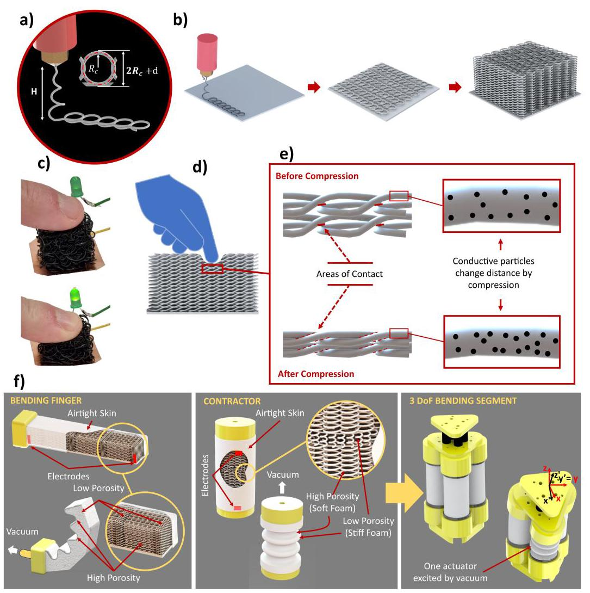
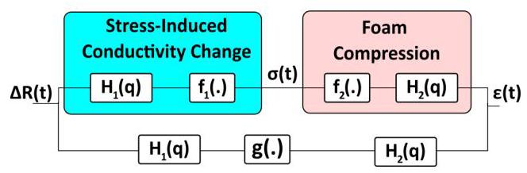
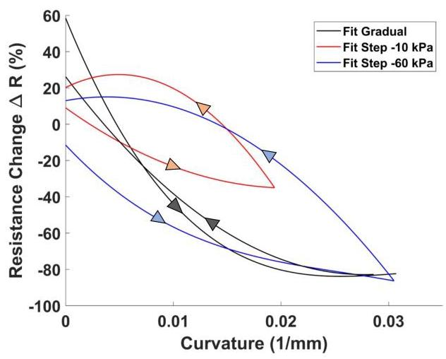
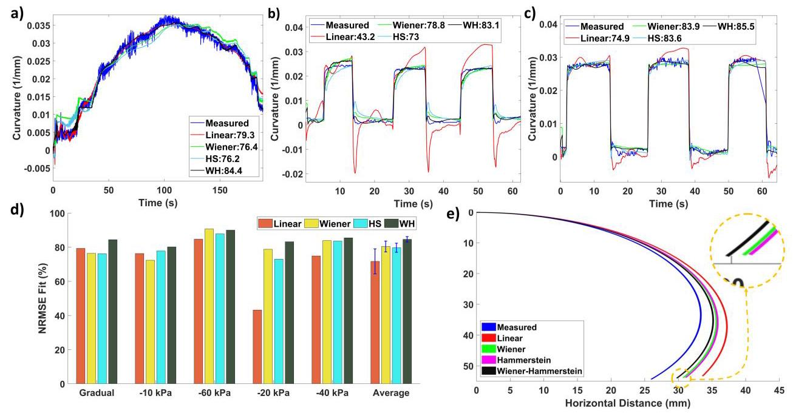
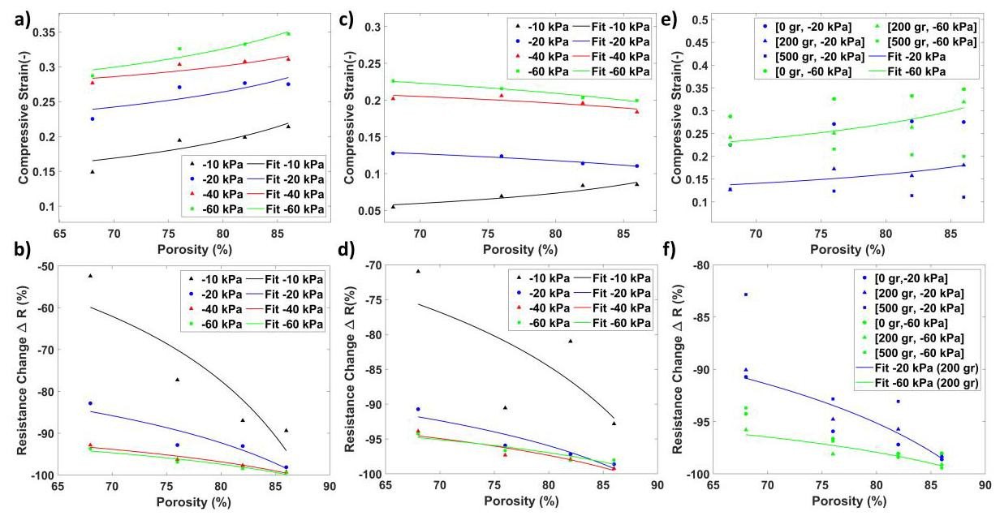
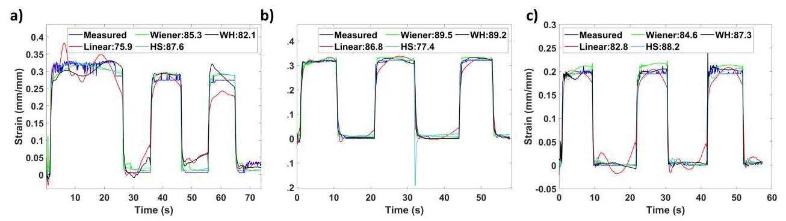
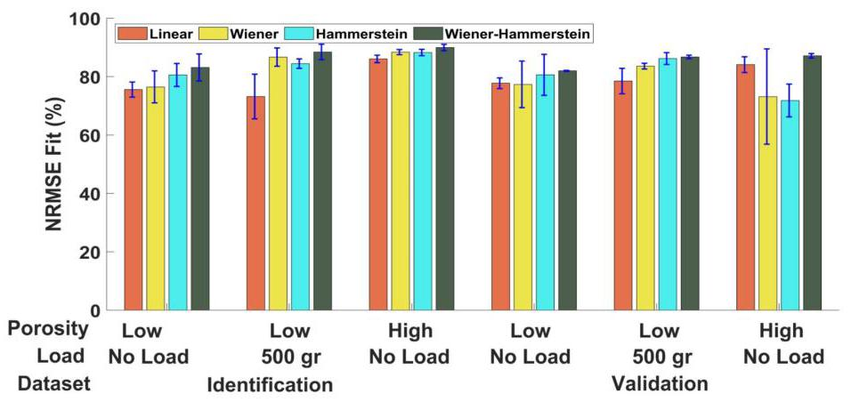
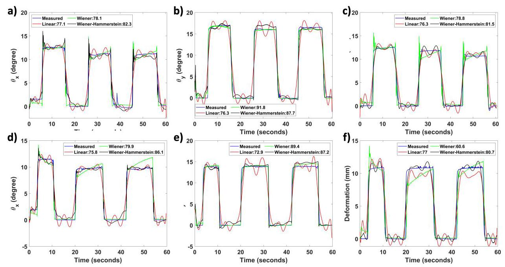

# 3D PRINTED PROPRIOCEPTIVE SOFT FLUIDIC ACTUATORS WITH GRADED POROSITY

# 具有梯度孔隙率的3D打印本体感受性软流体致动器

Nick Willemstein

尼克·威廉斯坦

Department of Biomechanical Engineering

生物力学工程系

University of Twente

特温特大学

Enschede, The Netherlands

荷兰恩斯赫德

n.willemstein@utwente.nl

Herman van der Kooij

赫尔曼·范德·库伊

Department of Biomechanical Engineering

生物力学工程系

University of Twente

特温特大学

Enschede, The Netherlands

荷兰恩斯赫德

h.vanderkooij@utwente.nl

Ali Sadeghi

阿里·萨德吉

Department of Biomechanical Engineering

生物力学工程系

University of Twente

特温特大学

Enschede, The Netherlands

荷兰恩斯赫德

a.sadeghi@utwente.nl

December 22, 2023

2023年12月22日

## ABSTRACT

## 摘要

Integration of both actuation and proprioception into the robot body would provide actuation and sensing in a single integrated system. Within this work, a manufacturing approach for such actuators is investigated that relies on 3D printing for fabricating soft-graded porous actuators with piezoresistive sensing and identified models for strain estimation. By 3D printing, a graded porous structure consisting of a conductive thermoplastic elastomer both mechanical programming for actuation and piezoresistive sensing were realized. Whereas identified Wiener-Hammerstein (WH) models estimate the strain by compensating the nonlinear hysteresis of the sensorized actuator. Three actuator types were investigated, namely: a bending actuator, a contractor, and a three DoF bending segment (3DoF). The porosity of the contractors was shown to enable the tailoring of both the stroke and resistance change. Furthermore, the WH models could provide strain estimation with on average high fits (83%) and low RMS errors (6%) for all three actuators, which outperformed linear models significantly (76.2/9.4% fit/RMS error). These results indicate that an integrated manufacturing approach with both 3D printed graded porous structures and system identification can realize sensorized actuators that can be tailored through porosity for both actuation and sensing behavior but also compensate for the nonlinear hysteresis.

将驱动和本体感受集成到机器人身体中，可以在一个集成系统中实现驱动和传感功能。在这项工作中，研究了一种用于此类致动器的制造方法，该方法依赖于3D打印来制造具有压阻传感功能的软梯度多孔致动器，并确定了应变估计模型。通过3D打印，实现了一种由导电热塑性弹性体组成的梯度多孔结构，该结构同时具备用于驱动的机械编程和压阻传感功能。而所确定的维纳-哈默斯坦(WH)模型通过补偿传感致动器的非线性滞后现象来估计应变。研究了三种致动器类型，即:弯曲致动器、收缩器和三自由度弯曲段(3DoF)。结果表明，收缩器的孔隙率能够实现行程和阻力变化的定制。此外，WH模型能够为所有三种致动器提供平均拟合度较高(83%)且均方根误差较低(6%)的应变估计，这明显优于线性模型(拟合度/均方根误差为76.2/9.4%)。这些结果表明，一种结合3D打印梯度多孔结构和系统识别的集成制造方法能够实现可通过孔隙率定制驱动和传感行为且能补偿非线性滞后现象的传感致动器。

## 1 Introduction

## 1 引言

Soft robotics inherently enable safe cooperation between robots, their environment, and users. This capability is partly realized by their adaptability through their reliance on (mechanically) soft structures. Relying on soft structures instead of rigid mechanical joints is partially inspired by nature, to profit from the versatility seen in biological models such as the elephant trunk and the octopus

软体机器人本质上能够实现机器人、其环境和用户之间的安全协作。这种能力部分通过它们对(机械)软结构的依赖所带来的适应性来实现。依赖软结构而非刚性机械关节部分是受自然启发，以便从生物模型(如象鼻和章鱼)中所见的多功能性中获益。

This inspiration has led to soft actuators and sensors such as those that mimic an octopus' arm2 or skin-inspired sensors (pressure and temperature) ${}^{3}$ . Furthermore, The flexibility of biological muscles has been the inspiration for many soft robotic actuators such as fluidic soft actuators 456 . These actuators have showcased that a broad range of deformations can be realized such as contraction, twisting, and bending 456 However, nature also provides design ideas to solve problems such as locomotion strategies based on a caterpillar ${}^{7}$ or snake ${}^{8}$ , locomotion and grasping based on an octopus ${}^{9}$ , and growing to penetrate soil like a plant ${}^{10}$ . Another interesting example of this approach is the integration of multiple functions in a single structure, such as the biological muscle. Biological muscles integrate actuation and multiple sensors into a single structure ${}^{111}$ . This integration includes proprioceptive sensors that are the lengthening of and force exerted by a muscle [11]. Applying a similar approach to soft actuators would enable the realization of soft systems that can actuate and sense.

这种灵感催生了诸如模仿章鱼手臂的软致动器和传感器，以及皮肤启发型传感器(压力和温度)${}^{3}$。此外，生物肌肉的灵活性启发了许多软机器人致动器，如流体软致动器456。这些致动器已展示出可以实现多种变形，如收缩、扭转和弯曲456。然而，自然也提供了解决问题的设计思路，如基于毛虫${}^{7}$或蛇${}^{8}$的运动策略、基于章鱼${}^{9}$的运动和抓取，以及像植物一样生长以穿透土壤${}^{10}$。这种方法的另一个有趣例子是在单一结构中集成多种功能，如生物肌肉。生物肌肉将致动和多个传感器集成到一个单一结构${}^{111}$中。这种集成包括本体感受传感器，即肌肉的伸长和所施加的力[11]。将类似方法应用于软致动器将能够实现可致动和传感的软系统。

Following this strategy of integrating multiple functions, researchers are investigating the embedding of sensors into the body of the robot/actuator. Examples include the usage of conductive fibers and the change in inductance ${}^{12}$ . Other researchers directly use the change in capacitance/resistance of the actuator itself ${}^{13}{}^{14}$ . Another approach is to embed smart materials, such as piezo-resistive material, into the body of the actuator ${}^{1516}$ .

遵循这种集成多种功能的策略，研究人员正在研究将传感器嵌入机器人/致动器主体中。例子包括使用导电纤维和电感变化${}^{12}$。其他研究人员直接利用致动器本身的电容/电阻变化${}^{13}{}^{14}$。另一种方法是将智能材料，如压阻材料，嵌入致动器主体中${}^{1516}$。

A popular class of actuators for sensor integration are soft fluidic actuators based on porous structures (such as foam). These foam-like structures are inherently flexible, allow for fluid transport, and can be mechanically programmed ${}^{12}$ Researchers have exploited this property, to realize a broad range of foam actuators, such as contractors, continuum arms, bending actuators, twisting actuators, and pumps ${}^{{17},{18},{19},{20}}$ .

一类用于传感器集成的流行致动器是基于多孔结构(如泡沫)的软流体致动器。这些类似泡沫的结构本质上是灵活的，允许流体传输，并且可以进行机械编程${}^{12}$。研究人员利用了这一特性，实现了多种泡沫致动器类型，如收缩器、连续臂、弯曲致动器、扭转致动器和泵${}^{{17},{18},{19},{20}}$。

In addition, foam-based sensors have been investigated using principles such as optical ${}^{21}$ , piezocapacitive ${}^{{222},{23}}$ , and piezoresistive ${}^{1924}$ sensing. Piezocapacitive and -resistive sensing transform the stress/strain to a change in electrical properties by exploiting geometry and/or electrode placement. Such sensors can measure a wide range of deformations such as bending, compression, and shear 192224. In addition, foam-based sensors can be scaled up by patterning multiple electrodes in a matrix format ${}^{25}$ . Lastly, researchers have already demonstrated that sensorized foam can provide proprioceptive data using both piezoresistivity ${}^{19}$ , optical fibers ${}^{21}$ , and copper wires (for inductance) ${}^{26}$ .

此外，基于泡沫的传感器已通过光学${}^{21}$、压电容${}^{{222},{23}}$和压阻${}^{1924}$传感等原理进行了研究。压电容和压阻传感通过利用几何形状和/或电极放置将应力/应变转换为电性能的变化。这种传感器可以测量多种变形，如弯曲、压缩和剪切192224。此外，基于泡沫的传感器可以通过以矩阵形式图案化多个电极来进行放大${}^{25}$。最后，研究人员已经证明，传感泡沫可以使用压阻${}^{19}$、光纤${}^{21}$和铜线(用于电感)${}^{26}$提供本体感受数据。

Manufacturing of porous/foam-based actuators is often done using commercial foams as a base material. These foams are manually modified using different methods such as laser/manual/wire cutting and assembled using, for instance, gluing 18192427. Another popular method is to use lost sugar/salt casting methods ${}^{202112228829}$ , wherein sugar or salt is added during molding/casting, which afterward is removed by washing leading to a porous structure where the salt/sugar was.

基于多孔/泡沫的致动器的制造通常使用商业泡沫作为基础材料。这些泡沫通过激光/手动/线切割等不同方法进行手动修改，并使用例如胶合进行组装18192427。另一种流行的方法是使用失糖/失盐铸造方法${}^{202112228829}$，即在成型/铸造过程中添加糖或盐，之后通过洗涤将其去除，从而在糖/盐所在位置形成多孔结构。

Multiple approaches exist to sensorize these foams, which include placing electrodes on top of either conductive foam for piezoresistive sensors ${}^{25}$ or dielectric foam for piezocapactive ${}^{22}$ sensors. Another approach is to directly mold a conductive material with lost sugar/salt for piezoresistive sensors ${}^{2829}$ . Similarly, embedding optical fibers combined with lost sugar/salt has been explored to realize a proprioceptive actuator ${}^{21}$ . Another common approach is coating/adding a conductive liquid to commercial foam ${}^{{1924} \mid  {27}}$ , which resulted in proprioceptive actuators ${}^{{1927}\rbrack }$ However, to fully exploit the potential of foam-like structures, which includes enabling fluid transport, and lightweight, and mechanical programmability, new integrated fabrication processes need to be developed that can incorporate: a stiffness gradient for deformation programming, smart materials for sensing, and complex geometries. Such capabilities can be attained with 3D printing, which has been shown to enable complex geometries, fabricate multi-material structures, and use soft materials.

存在多种方法可对这些泡沫进行传感，其中包括在用于压阻式传感器${}^{25}$的导电泡沫或用于压电容式${}^{22}$传感器的介电泡沫顶部放置电极。另一种方法是用失糖/盐直接模制用于压阻式传感器${}^{2829}$的导电材料。类似地，人们已经探索了将光纤与失糖/盐结合嵌入来实现本体感受致动器${}^{21}$。另一种常见方法是在商用泡沫${}^{{1924} \mid  {27}}$上涂覆/添加导电液体，这产生了本体感受致动器${}^{{1927}\rbrack }$。然而，为了充分发挥类泡沫结构的潜力，包括实现流体传输、轻量化和机械可编程性，需要开发新的集成制造工艺，该工艺可以纳入:用于变形编程的刚度梯度、用于传感的智能材料和复杂的几何形状。通过3D打印可以实现这些功能，3D打印已被证明能够实现复杂的几何形状、制造多材料结构并使用软材料。

There are multiple approaches to 3D printing porous structures. An approach to 3D print foam-like structures is to add a porogen such as ammonium bicarbonate that degrades to a gas creating pores in the structure ${}^{30}$ . Alternatively, the behavior of the material during deposition itself could be exploited, such as liquid rope coiling. The liquid rope coiling effect is the coiling seen when dropping, for instance, honey from a height above a surface ${}^{31}$ , which is also observed in 3D printing 32. The coiling pattern can be exploited systematically through our previously developed InFoam method ${}^{12}$ to 3D print porous structures. Combining this control over the coiling pattern with normal printing allows for 3D-printed structures with a user-defined porosity gradient. Control over the porosity gradient enables mechanical programming, as changes in porosity can lead to stiffness change of more than one order of magnitude ${}^{{17},{32}}$ ). Such a large change in stiffness can be exploited as a stiffness gradient to program the deformation for realizing bending, twisting, and contracting actuators ${}^{17}$ . Furthermore, we showed that the performance of bending actuators could be tailored through control over the porosity ${}^{17}$ . Therefore, controlling the porosity can be used for mechanical programming. However, these actuators lacked sensing capabilities. Integration of sensors in these actuators would widen the scope of the InFoam method to enable both mechanical programming and sensorization in a simple manufacturing approach.

有多种3D打印多孔结构的方法。一种3D打印类泡沫结构的方法是添加诸如碳酸氢铵之类的致孔剂，其会降解为气体从而在结构中形成孔隙${}^{30}$。或者，可以利用材料在沉积过程中的行为，例如液体绳卷绕。液体绳卷绕效应是指当从表面上方一定高度滴下，例如蜂蜜时所看到的卷绕现象${}^{31}$，在3D打印中也能观察到这种现象32。可以通过我们之前开发的InFoam方法${}^{12}$系统地利用这种卷绕模式来3D打印多孔结构。将对卷绕模式的这种控制与普通打印相结合，可以实现具有用户定义孔隙率梯度的3D打印结构。对孔隙率梯度的控制能够实现机械编程，因为孔隙率的变化会导致刚度变化超过一个数量级${}^{{17},{32}}$。如此大的刚度变化可以用作刚度梯度来对变形进行编程，以实现弯曲、扭转和收缩致动器${}^{17}$。此外，我们表明可以通过控制孔隙率来调整弯曲致动器的性能${}^{17}$。因此，控制孔隙率可用于机械编程。然而，这些致动器缺乏传感能力。在这些致动器中集成传感器将拓宽InFoam方法的范围，以通过简单的制造方法实现机械编程和传感功能。

Within this work, we explore the printing of sensorized soft actuators using the InFoam method by using a conductive thermoplastic elastomer (cTPE). The usage of a cTPE filled with carbon black particles allows the InFoam method to incorporate piezoresistive sensing in the printed structure. The combination of piezoresistive sensing and a porosity gradient allows for the 3D printing of sensorized soft actuators, which both deform and change their resistance due to collapsing pores. Furthermore, the InFoam method's control over the porosity gradient will be shown to enable both the programming of the actuator's mechanical behavior and the strain-resistance change of a contracting actuator. In addition, we show that combining our 3D-printed sensorized actuators with system identification allows us to compensate for the viscoelastic behavior of the piezoresistive sensors to enable strain estimation. Thereby providing a single package that comprises a manufacturing process and a data-driven approach that can estimate the deformation of the printed sensorized actuator by feeding raw data to identified Wiener-Hammerstein models. Within this work, we show this combination of 3D printing and system identification for three actuators, namely: a bending actuator, a contracting actuator, and three degrees of freedom (3DoF) bending segment.

在这项工作中，我们探索使用导电热塑性弹性体(cTPE)通过InFoam方法打印传感软致动器。使用填充有炭黑颗粒的cTPE可使InFoam方法在打印结构中纳入压阻传感。压阻传感与孔隙率梯度的结合使得能够3D打印传感软致动器，其会由于孔隙塌陷而变形并改变电阻。此外，将展示InFoam方法对孔隙率梯度的控制能够实现致动器机械行为的编程以及收缩致动器的应变 - 电阻变化。此外，我们表明将我们的3D打印传感致动器与系统识别相结合，可以补偿压阻式传感器的粘弹性行为以实现应变估计。从而提供一个单一的方案，该方案包括一个制造过程和一种数据驱动的方法，通过将原始数据输入到已识别的维纳 - 哈默斯坦模型中，可以估计打印的传感致动器的变形。在这项工作中，我们展示了3D打印和系统识别的这种结合在三种致动器上的应用，即:一个弯曲致动器、一个收缩致动器和一个三自由度(3DoF)弯曲段。

## 2 Results

## 2结果

### 2.1 Manufacturing of Soft Sensorized Vacuum Actuators with Deformation Estimation

### 2.1具有变形估计的软传感真空致动器的制造

Soft fluidic actuators based on graded porosity exploit both the ability of porosity to allow for fluid transport but also the significant changes in stiffness due to porosity gradients for programming the deformation. To realize these soft actuators based on graded porosity a fabrication method that can translate a user-defined porosity gradient to a 3D-printed structure is required. Within this work, we use our previously developed InFoam method ${}^{\left\lbrack  7\right\rbrack  }$ for this purpose. The InFoam method can fabricate porous structures with a porosity gradient by depositing coils of different sizes by exploiting the liquid rope coiling effect (Figure 1(a)) The inherent design freedom of 3D printing allows the InFoam method to fabricate structures with user-defined porosity gradients. The coiling radius ${R}_{c}$ and coiling density $N$ define the coiling pattern, which is dependent on the material, machine, and process parameters. During extrusion, the coils are stacked on top of each other, which leads to different angles based on the distance between individual coils. This geometrical property is normalized by the coiling density ${N}^{1/2}$ , which is defined by the number of coils within the outer coil diameter of a single coil. At a fixed temperature ${R}_{c}$ and $N$ are primarily determined by the height $H$ and the ratio of extruded amount and distance traveled. The relation between these parameters and the machine was determined through the method described in ${}^{17}$ (See Figure S1 in Supporting Information). Based on these results the InFoam method generates the GCode through a custom MATLAB (The Mathworks, Inc., USA) script, which leads to the process visualized in Figure 1(b). This script computes the required extrusion and movement speed and heights based on the coiling pattern geometry to print the 3D graded porous structure ${}^{17}$ .

基于梯度孔隙率的软流体致动器利用了孔隙率允许流体传输的能力，同时也利用了由于孔隙率梯度导致的刚度显著变化来对变形进行编程。为了实现这些基于梯度孔隙率的软致动器，需要一种能够将用户定义的孔隙率梯度转换为三维打印结构的制造方法。在这项工作中，我们为此使用了我们之前开发的InFoam方法${}^{\left\lbrack  7\right\rbrack  }$。InFoam方法可以通过利用液体绳索缠绕效应沉积不同尺寸的线圈来制造具有孔隙率梯度的多孔结构(图1(a))。三维打印固有的设计自由度使InFoam方法能够制造具有用户定义孔隙率梯度的结构。缠绕半径${R}_{c}$和缠绕密度$N$定义了缠绕模式，这取决于材料、机器和工艺参数。在挤出过程中，线圈相互堆叠，这会根据单个线圈之间的距离导致不同的角度。这种几何特性通过缠绕密度${N}^{1/2}$进行归一化，缠绕密度由单个线圈外径内的线圈数量定义。在固定温度下${R}_{c}$和$N$主要由高度$H$以及挤出量与行进距离的比率决定。这些参数与机器之间的关系是通过${}^{17}$中描述的方法确定的(见支持信息中的图S1)。基于这些结果，InFoam方法通过自定义的MATLAB(美国Mathworks公司)脚本生成G代码，这导致了图1(b)中所示的过程。该脚本根据缠绕模式几何形状计算所需的挤出速度、移动速度和高度，以打印三维梯度多孔结构${}^{17}$。

The graded porosity achieved by the InFoam method can be combined with a (carbon black-filled) conductive thermoplastic elastomer (cTPE) to integrate sensing capabilities into the structure. The cTPE enables sensing due to the change in resistance between points in the structure due to the deformation history ${}^{{19},{24},{33}}$ . The resistance changes can be very significant $\left( { > {80}\% }\right.$ , as will be shown in the next sections and Supporting Movie 1) as seen by the brightness change in Figure 1(c). An advantage of these sensors is that resistance measurements can be done using simple electronics. Specifically, the change of resistance is often measured, which is defined as

通过InFoam方法实现的梯度孔隙率可以与(炭黑填充的)导电热塑性弹性体(cTPE)相结合，将传感能力集成到结构中。由于结构中各点之间的电阻因变形历史${}^{{19},{24},{33}}$而发生变化，cTPE能够实现传感。电阻变化可能非常显著$\left( { > {80}\% }\right.$，如接下来的章节和支持视频1所示，如图1(c)中的亮度变化所示。这些传感器的一个优点是可以使用简单的电子设备进行电阻测量。具体来说，通常测量电阻的变化，其定义为

$$
{\Delta R}\left( t\right)  = \frac{R\left( t\right)  - {R}_{0}}{{R}_{0}} \cdot  {100}\% \tag{1}
$$

Wherein the variables ${\Delta R}, R,{R}_{0}$ are the relative change of resistance (%), and the instantaneous and initial (at no strain/stress) resistance $\left( \Omega \right)$ . The manufacturing of these soft sensorized actuators is done in two steps. Firstly, print using both conventional 3D printing and our InFoam Method. Afterwards, the porous structure is assembled to finalize the sensorized actuator with a skin. The fabricated sensorized actuators, however, require model-based compensation to estimate the strain based on the resistance change. Because the 3D-printed piezoresistive foam-like structure does not have a simple linear relationship with the deformation, as they exhibit hysteresis.

其中变量${\Delta R}, R,{R}_{0}$是电阻的相对变化(%)，以及瞬时电阻和初始(无应变/应力时)电阻$\left( \Omega \right)$。这些软传感致动器的制造分两步进行。首先，使用传统三维打印和我们的InFoam方法进行打印。之后，将多孔结构组装起来，用外皮完成传感致动器的制作。然而，制造出的传感致动器需要基于模型的补偿来根据电阻变化估计应变。因为三维打印的压阻泡沫状结构与变形没有简单的线性关系，它们表现出滞后现象。

This hysteresis is expected to be due to both macroscopic and microscopic effects. On the macro-level resistance changes in the porous cTPE structure are due to a change in surface contact of the coils (Figure 1(d) and (e)), which is affected by both the amount of deformation and the viscoelastic properties of the cTPE itself. However, on the micro-level, the coils deform leading to a change in conductive particle distance and density which also results in a resistance change of the overall structure/actuator. On the micro level, the carbon-black particles have a degree of randomness, as the exact configuration will change between each actuation cycle. By applying stress these particles can be forced closer together leading to a change in resistance. Due to the change in inter-particle distance and density a change of resistance will happen ${}^{{33},{34}}$ .

预计这种滞后现象是由宏观和微观效应共同导致的。在宏观层面，多孔cTPE结构中的电阻变化是由于线圈表面接触的变化(图1(d)和(e))，这受到变形量和cTPE本身的粘弹性特性的影响。然而，在微观层面，线圈变形会导致导电颗粒距离和密度的变化，这也会导致整个结构/致动器的电阻变化。在微观层面，炭黑颗粒具有一定程度的随机性，因为每次致动循环之间的确切配置会发生变化。通过施加应力，这些颗粒可以被迫靠得更近，从而导致电阻变化。由于颗粒间距离和密度的变化，电阻将会发生变化${}^{{33},{34}}$。

However, the particles are in the end moved by the elastomeric matrix that surrounds them. As the actuator's pores collapse, macro-level effects will play a major role. Especially, as unlike the compression of a bulk elastomer 3334 the coils of the porous structure collapse and are pressed on top of each, which will decrease the contact resistance between coils (see Figure 1[d]). On this macro-level the cTPE foam-like structure itself exhibits both viscoelastic and nonlinear collapse properties ${}^{{33},{35}}$ . The former will lead to hysteresis as the behavior during loading and unloading will be different and strain-rate dependent. Whereas the latter will decrease the sensitivity for higher compressive strains. This change can be explained as during initial buckling the increase in contact area will decrease the resistance significantly as all the coils will come into contact with each other. In contrast, the coils are pressed more firmly after the initial buckling, but this change is significantly less, as the contact area increases much slower.

然而，最终粒子是由围绕它们的弹性体基质移动的。随着致动器的孔隙坍塌，宏观层面的效应将起主要作用。特别是，与块状弹性体的压缩不同，多孔结构的线圈会坍塌并相互挤压，这将降低线圈之间的接触电阻(见图1[d])。在这个宏观层面上，cTPE泡沫状结构本身表现出粘弹性和非线性坍塌特性${}^{{33},{35}}$。前者会导致滞后现象，因为加载和卸载过程中的行为会不同且与应变率有关。而后者会降低对更高压缩应变的敏感度。这种变化可以解释为在初始屈曲期间，接触面积的增加会显著降低电阻，因为所有线圈都会相互接触。相比之下，在初始屈曲之后，线圈被压得更紧，但这种变化要小得多，因为接触面积增加得慢得多。

Thus, the cTPE porous structure provides piezoresistive sensing capabilities. The InFoam method can fabricate this porous structure but also mechanically program it by the porosity gradient ${}^{17}$ . This mechanical programming is possible due to the porosity gradient's significant effect on the modulus (over two orders of magnitude). This large difference in stiffness can be exploited to use the porosity gradient to realize a bending actuator and contracting actuators (Figure [1](f)). Moreover, by combining multiple contractors in parallel, a three-degree of freedom bending segment can be created as well (Figure 1(f)). Combining this mechanical programming capability with a soft conductive material would enable actuators with programmable deformation and integrated sensing. These three actuators (bending actuator, contractor, and 3DoF bending segment) were investigated in this work for strain estimation. These three actuator types were selected as these are widely used modules in many soft robotic systems such as grippers, artificial muscles, and continuum arms. In addition, they include both single input and output systems (bending actuator and contractor) and a multiple inputs and outputs system (the 3DoF bending segment).

因此，cTPE多孔结构具有压阻传感能力。InFoam方法可以制造这种多孔结构，还可以通过孔隙率梯度对其进行机械编程${}^{17}$。由于孔隙率梯度对模量有显著影响(超过两个数量级)，所以这种机械编程是可行的。这种刚度上的巨大差异可以被利用来通过孔隙率梯度实现弯曲致动器和收缩致动器(图[1](f))。此外，通过并联多个收缩器，还可以创建一个三自由度弯曲段(图1(f))。将这种机械编程能力与软导电材料相结合，将使致动器具有可编程变形和集成传感功能。在这项工作中，对这三种致动器(弯曲致动器、收缩器和三自由度弯曲段)进行了应变估计研究。选择这三种致动器类型是因为它们是许多软机器人系统(如夹具、人造肌肉和连续臂)中广泛使用的模块。此外，它们包括单输入和输出系统(弯曲致动器和收缩器)以及多输入和输出系统(三自由度弯曲段)。

Figure 1: a, b) The InFoam methods parameters based on liquid rope coiling (a) and deposition strategy to construct a 3D porous structure (b), c) Resistance change due to the piezoresistive effect by manual compression of a 3D printed porous sensor, d, e) Macroscale compression (d) and the piezoresistive effect due to macroscopic (area of contact) and microscale (particle distance) changes (e) f) Exploiting the porosity gradient through the InFoam method to realize three types of actuators (bending, contraction, and three degrees of freedom (3DoF) bending segment).

图1:a、b)基于液绳缠绕的InFoam方法参数(a)和构建三维多孔结构的沉积策略(b)，c)通过手动压缩三维打印多孔传感器由于压阻效应引起的电阻变化，d、e)宏观压缩(d)以及由于宏观(接触面积)和微观(颗粒距离)变化引起的压阻效应(e)，f)通过InFoam方法利用孔隙率梯度实现三种类型的致动器(弯曲、收缩和三自由度(3DoF)弯曲段)。

Although these actuators can be fabricated from a cTPE material to sensorize them, the step from resistance change to strain is not straightforward. A key challenge herein is that the piezoresistive behavior of our cTPE structure exhibits nonlinearities and (viscoelastic) hysteresis. To overcome this challenge, a system identification approach is used to identify a model that can estimate the strain of the actuator based on the resistance change over time. Specifically, the usage of a Wiener-Hammerstein model (WH model) was investigated (Figure 2). The WH model consists of two linear systems and a static nonlinearity in the middle. The combination of linear and nonlinear functions allows the WH model to capture the inherent nonlinear couplings between resistance change and strain but also take the deformation history into account (to compensate for hysteresis). A similar model (Wiener) has shown good results for force sensing resistors ${}^{36}$ but has, to our knowledge, not been applied to strain sensing of soft actuators. Furthermore, we investigated the use of the Wiener-Hammerstein form, which was not (to our knowledge) investigated before for strain estimation.

尽管这些致动器可以由cTPE材料制造以实现传感功能，但从电阻变化到应变的转换并不简单。这里的一个关键挑战是我们的cTPE结构的压阻行为表现出非线性和(粘弹性)滞后现象。为了克服这个挑战，使用了一种系统识别方法来识别一个可以根据电阻随时间的变化估计致动器应变的模型。具体来说，研究了维纳 - 哈默斯坦模型(WH模型)的使用(图2)。WH模型由两个线性系统和中间的一个静态非线性组成。线性和非线性函数的组合使WH模型能够捕捉电阻变化和应变之间固有的非线性耦合，同时也考虑变形历史(以补偿滞后现象)。一个类似的模型(维纳模型)在力传感电阻器方面已显示出良好的结果${}^{36}$，但据我们所知，尚未应用于软致动器的应变传感。此外，我们研究了维纳 - 哈默斯坦形式的使用，据我们所知，之前尚未对其进行应变估计方面的研究。

Figure 2: The Wiener-Hammerstein model used for strain estimation.

图2:用于应变估计的维纳 - 哈默斯坦模型。

The WH model structure should mimic the structure of the underlying physics. Firstly, the left part models the stress-driven resistance change ${}^{33}$ . Furthermore, it has been shown that the stress $\sigma \left( t\right)$ is captured well by a Wiener model 36

WH模型结构应模仿潜在物理结构。首先，左边部分对应力驱动的电阻变化进行建模${}^{33}$。此外，已经表明应力$\sigma \left( t\right)$可以由维纳模型36很好地捕捉

$$
\sigma \left( t\right)  = {f}_{1}\left( \left( {{H}_{1}\left( q\right) {\Delta R}\left( t\right) }\right) \right. \tag{2}
$$

The functions ${f}_{1}$ and ${H}_{1}\left( q\right)$ represent a nonlinear mapping and linear transfer function, respectively.

函数${f}_{1}$和${H}_{1}\left( q\right)$分别表示非线性映射和线性传递函数。

Whereas $q$ represents the time-shift operator such that $x\left( t\right) {q}^{-n} = x\left( {t - n}\right)$ (for discrete-time systems). The first stage of the model relates the resistance change and stress. The stress and strain are also nonlinearly related for porous structures ${}^{{17},{35},{37}}$ . One possible approximation is through a nonlinear viscoelastic model to relate the strain to stress ${}^{{35},{37}}$ Within this work, a Hammerstein (HS) model is used as an approximation of the strain $\epsilon \left( t\right)$

其中$q$表示时移算子，使得$x\left( t\right) {q}^{-n} = x\left( {t - n}\right)$(对于离散时间系统)。该模型的第一阶段涉及电阻变化和应力。对于多孔结构${}^{{17},{35},{37}}$，应力和应变也呈非线性关系。一种可能的近似方法是通过非线性粘弹性模型将应变与应力联系起来${}^{{35},{37}}$。在这项工作中，使用哈默斯坦(HS)模型作为应变的近似$\epsilon \left( t\right)$。

$$
\epsilon \left( t\right)  = {H}_{2}\left( q\right) {f}_{2}\left( {\sigma \left( t\right) }\right) ) \tag{3}
$$

Within this equation, the functions ${f}_{2}$ and ${H}_{2}\left( q\right)$ represent a nonlinear mapping and a viscoelastic model (transfer function), respectively. Combining these two equations in series leads to the following equation

在这个方程中，函数${f}_{2}$和${H}_{2}\left( q\right)$分别表示非线性映射和粘弹性模型(传递函数)。将这两个方程串联起来得到以下方程。

$$
\epsilon \left( t\right)  = {H}_{2}\left( q\right) \left( {g\left( {{H}_{1}\left( q\right) {\Delta R}\left( t\right) }\right) }\right) ) \tag{4}
$$

Within this equation, the two-stage static nonlinearity (i.e. ${f}_{1}\left( {{f}_{2}\left( \right) \text{ . }}\right)$ ) is reduced to a single one $g\left( \right)$ .). This function $g\left( \text{ . }\right)$ approximates the combined nonlinear functions. Within this work, $g\left( \text{ . }\right) {wasmplementedasasapiecuseinsumetaininminalsousingtailmentaryto}$ This function type was selected and has been used before in ${}^{36}$ for stress estimation and promising results (NRMSE fits) during (initial) manual estimation of the models. Lastly, it should be noted that the model in Equation 4 can be reduced to an HS or Wiener model by either removing ${H}_{2}\left( q\right)$ or ${H}_{1}\left( q\right)$ , respectively.

在这个方程中，两阶段静态非线性(即${f}_{1}\left( {{f}_{2}\left( \right) \text{ . }}\right)$)简化为单个的$g\left( \right)$。这个函数$g\left( \text{ . }\right)$近似组合的非线性函数。在这项工作中，$g\left( \text{ . }\right) {wasmplementedasasapiecuseinsumetaininminalsousingtailmentaryto}$选择了这种函数类型，并且之前在${}^{36}$中用于应力估计，在模型的(初始)手动估计期间取得了有希望的结果(NRMSE拟合)。最后，应该注意的是，方程4中的模型可以通过分别去除${H}_{2}\left( q\right)$或${H}_{1}\left( q\right)$简化为HS或维纳模型。

### 2.2 Curvature Sensing & Reconstruction

### 2.2曲率传感与重建

To investigate the capability of curvature sensing, a sensorized vacuum-based bending actuator was 3D printed and characterized. The actuator was fabricated using different percentages of porosity as seen in Figure 1(f)). First, a layer of bulk material (zero porosity) with a thickness of $1\mathrm{\;{mm}}$ was printed at the bottom. On top of this bulky layer, four sections with high porosity of ${84}\% \left( {{75} \times  {15} \times  {10}{\mathrm{\;{mm}}}^{3}}\right.$ length $\mathrm{x}$ width $\mathrm{x}$ height) together with four spacers of low porosity (below 5%) were printed. The printed structures were then packed in a ${0.4}\mathrm{\;{mm}}$ thick heat-sealed styrene-ethylene-butylene-styrene (SEBS) sleeve to finalize the actuator. The SEBS sleeve could deform and collapse the high porosity sections when negative pressure was applied. Whereas the bulk layer acted as a (relatively) inextensible layer, which provided an asymmetry to the structure, which led to bending. The low porosity spacers increase the achievable bending angles while still allowing the passage of air through the actuator. Electrodes (copper wires) were then connected to the top left and bottom right of the actuator to measure the resistance. The bending actuator was tested by putting the bending actuator in a holder printed from polylactic acid (PLA). The actuator was excited by multiple levels of vacuum (gauge pressures of -20,-40,-60 kPa) with three on/off (step) cycles and a "gradual increase" signal ( 0 to -60 and back to 0 kPa with intermediate stops). During these experiments, the resistance change was measured using an Arduino Uno (Arduino AG, Italy). Lastly, to track the curvature a webcam was used to capture images of the actuator, which was subsequently processed to acquire the deformation. The setup is shown in Figure S2 in the Supporting Information, which includes the definition of the curvature.

为了研究曲率传感的能力，3D打印并表征了一个基于真空的传感弯曲致动器。如图1(f)所示，使用不同孔隙率百分比制造了该致动器。首先，在底部打印一层厚度为$1\mathrm{\;{mm}}$的块状材料(零孔隙率)。在这个厚层之上，打印了四个高孔隙率(${84}\% \left( {{75} \times  {15} \times  {10}{\mathrm{\;{mm}}}^{3}}\right.$长度$\mathrm{x}$宽度$\mathrm{x}$高度)的部分以及四个低孔隙率(低于5%)的间隔物。然后将打印的结构包装在一个${0.4}\mathrm{\;{mm}}$厚的热封苯乙烯 - 乙烯 - 丁烯 - 苯乙烯(SEBS)套筒中以完成致动器。当施加负压时，SEBS套筒会使高孔隙率部分变形并塌陷。而块状层作为一个(相对)不可伸长的层，为结构提供了不对称性，从而导致弯曲。低孔隙率间隔物增加了可实现的弯曲角度，同时仍允许空气通过致动器。然后将电极(铜线)连接到致动器的左上角和右下角以测量电阻。通过将弯曲致动器放入由聚乳酸(PLA)打印的支架中来测试该弯曲致动器。该致动器通过多个真空水平(-20、-40、-60 kPa的表压)激发，有三个开/关(阶跃)循环和一个“逐渐增加”信号(从0到 -60然后回到0 kPa，中间有停顿)。在这些实验期间，使用Arduino Uno(意大利Arduino AG)测量电阻变化。最后，为了跟踪曲率，使用网络摄像头捕获致动器的图像，随后对其进行处理以获取变形。设置如图S2所示在支持信息中，其中包括曲率的定义。

The curvature versus change in resistance is shown in Figure 3 for three different pressure series. It can be observed that the resistance decreases with increasing pressure and curvature in all datasets. This behavior is to be expected as when the pores collapse the contact area increases. It can be observed that both the gradual increase and $- {60}\mathrm{{kPa}}$ step end at similar resistance changes and curvature. This behavior implies that steady-state behavior is not dependent on history. However, for all three a clear hysteretic behavior can be observed in the transient response (i.e. before steady-state.

图3显示了三种不同压力序列下曲率与电阻变化的关系。可以观察到，在所有数据集中，电阻随着压力和曲率的增加而减小。这种行为是可以预期的，因为当孔隙塌陷时接触面积会增加。可以观察到逐渐增加和$- {60}\mathrm{{kPa}}$阶跃在相似的电阻变化和曲率处结束。这种行为意味着稳态行为不依赖于历史。然而，对于所有三个情况，在瞬态响应(即稳态之前)中都可以观察到明显的滞后行为。

Figure 3: The hysteresis curve of resistance change versus curvature for two steps in pressure (-20 and -60 kPa) and the "gradual increase" dataset. These are fitted curves in both directions, for the hysteresis plot including the raw data points the reader is referred to the Figure S2 in the Supporting Information

图3:压力两步变化(-20和-60 kPa)下电阻变化与曲率的滞后曲线以及“逐渐增加”数据集。这些是双向拟合曲线，对于包含原始数据点的滞后图，读者可参考补充信息中的图S2

Furthermore, there is an overshoot when relaxing leading to a higher resistance than initial. This discrepancy decays before the next cycle similar in behavior to viscoelastic relaxation.

此外，在松弛过程中存在超调现象，导致电阻高于初始值。这种差异在下一个循环之前衰减，其行为类似于粘弹性松弛。

When we fit polynomial functions (third or second order) to approximate the hysteresis curve, a clear hysteresis can be observed in all three scenarios. This behavior means the relationship between resistance change and curvature is not a simple curve and depends on the rate of change. The latter can be observed from the area of hysteresis that seems independent of the magnitude of the vacuum pressure as the $- {10}\mathrm{{kPa}}$ -step seems to have more hysteresis than the "gradual increase"-dataset even though the latter reaches -60 kPa. The difference in pressure increase (i.e. gradual versus step) implies that the rate plays a significant factor. Such behavior is expected, as existing models of carbon black-based piezo-resistive sensors include a damping component ${}^{33}$ , which would lead to rate-dependent behavior. This rate dependence implies that the change in resistance behaves viscoelastically (in line with our hypothesis). Furthermore, the rate dependence means that a proper model of these sensors will need to take the history into account. Lastly, there also seems to be a nonlinear relationship between resistance change and curvature, which will need to be considered as well by such a model.

当我们拟合多项式函数(三阶或二阶)以近似滞后曲线时，在所有三种情况下都可以观察到明显的滞后现象。这种行为意味着电阻变化与曲率之间的关系不是简单曲线，并且取决于变化率。从滞后面积可以观察到后者，滞后面积似乎与真空压力大小无关，因为$- {10}\mathrm{{kPa}}$步的滞后现象似乎比“逐渐增加”数据集更多，尽管后者达到了-60 kPa。压力增加方式的差异(即逐渐增加与阶跃增加)意味着变化率起着重要作用。这种行为是预期的，因为现有的基于炭黑的压阻式传感器模型包括一个阻尼分量${}^{33}$，这将导致与速率相关的行为。这种速率依赖性意味着电阻变化表现出粘弹性(符合我们的假设)。此外，速率依赖性意味着这些传感器的合适模型需要考虑历史因素。最后，电阻变化与曲率之间似乎也存在非线性关系，这样的模型也需要考虑这一点。

To compensate for the observed hysteresis and nonlinearity a data-driven approach is used by identifying a set of models and evaluating their performance. Four types of models were identified, namely: linear, HS, Wiener, and Wiener-Hammerstein (WH). The latter was acquired by first identifying a Wiener/ linear model and then using that as a filter to refine the output by adding a linear/HS model in series. The data was separated into an identification ("gradual increase" and the -60/-10 kPa) and validation set (-20 and -40 kPa).

为了补偿观察到的滞后和非线性，采用了数据驱动的方法，即识别一组模型并评估它们的性能。识别出了四种类型的模型，即:线性、HS、维纳和维纳 - 哈默斯坦(WH)模型。后者是通过首先识别维纳/线性模型，然后将其用作滤波器，通过串联添加线性/HS模型来细化输出而获得的。数据被分为识别集(“逐渐增加”和-60 / -10 kPa)和验证集(-20和-40 kPa)。

The models were evaluated using several metrics to evaluate their estimation capability. Firstly, the normalized root mean square (NRMSE) fits of the model were evaluated through MATLAB's compare-function as:

使用几个指标对模型进行评估，以评估它们的估计能力。首先，通过MATLAB的compare函数评估模型的归一化均方根(NRMSE)拟合，如下所示:

$$
\text{ NRMSE fit } = {100}\left( {1 - \frac{\parallel y - \widehat{y}\parallel }{\parallel y - \bar{y}\parallel }}\right) \tag{5}
$$

In this equation, the NRMSE fit is computed using the two norms of the measured $y$ and predicted $\widehat{y}$ output divided by the difference between the estimated value and average output $\bar{y}$ . The NRMSE fit was used to select the best model, as the model that performed best on average on the identification and validation datasets was taken as the best model, Similarly, the RMS error was computed and scaled by the maximum output (and the number of data points $N$ ) in the dataset, as

在这个方程中，NRMSE拟合是使用测量的$y$和预测的$\widehat{y}$输出的两个范数除以估计值与平均输出$\bar{y}$之间的差值来计算的。NRMSE拟合用于选择最佳模型，因为在识别和验证数据集上平均表现最佳的模型被视为最佳模型。同样，计算均方根误差并通过数据集中的最大输出(以及数据点数量$N$)进行缩放，如下所示

$$
\text{ RMS } = \frac{100}{\max \left( y\right) }\sqrt{\frac{\mathop{\sum }\limits_{{i = 1}}^{N}{\left( y\left( i\right)  - \widehat{y}\left( i\right) \right) }^{2}}{N}} \tag{6}
$$

By scaling the RMS error by the maximum deformation in the dataset a comparison between datasets can be made. This evaluation approach also means that the RMS error (in percentage) can be scaled by the maximum deformation to estimate the RMS error in deformation, as these have the same unit. The objective for identification was set to estimate the curvature, which was defined as the inverse of radius $r$ of the circle that the bending actuator made (see Figure S2 in the Supporting Information as well). A set of models were estimated based on the identification datasets (one for each model type). These models were evaluated based on their average NRMSE fit and the best one was kept. The predictions of these identified models are shown in Figure 4(a-c), which includes a set from identification and two validation sets. All models seem capable of capturing the dynamics of the "gradual increase" dataset quite well. In line with our hypothesis, the WH model outperforms the other three. Whereas the Wiener and HS have a lower fit than the linear model only for the "gradual increase" dataset. However, looking at how well they approximate the curve the linear model just averages whereas the nonlinear models try to capture the faster dynamics and nonlinearities. This discrepancy is especially apparent in the other two datasets (i.e. the validation). The fits for ${20}\mathrm{{kPa}}$ clearly show that the linear model has significant problems with capturing the dynamics properly leading to overshooting. However, this difference is significantly less apparent for the $- {40}\mathrm{{kPa}}$ dataset whereas the HS and Wiener model is similar to the WH models' performance, which indicates that the nonlinear models generalize better (see also Supporting movie 2). It is expected that this error discrepancy is much less for the ${40}\mathrm{{kPa}}$ dataset as foam-like structures collapse and have distinct regimes of change ${}^{23}$ . These distinct regimes coincide with a rapid and large change of resistance (and strain) when the pores collapse ${}^{23}$ followed by a slower decrease in resistance after the air is pushed out. It is expected that the linear approximation between the datasets of $- {10}\mathrm{{kPa}}$ and $- {60}\mathrm{{kPa}}$ does approximate the $- {40}\mathrm{{kPa}}$ dataset well but not the $- {20}\mathrm{{kPa}}$ . This result implies that the collapse/buckling of the structure happens between-10and $- {40}\mathrm{{kPa}}$ , which is expected to not be captured well by the linear model.

通过将均方根误差除以数据集中的最大变形量，可以对不同数据集进行比较。这种评估方法还意味着均方根误差(以百分比表示)可以除以最大变形量，以估计变形中的均方根误差，因为它们具有相同的单位。识别的目标是估计曲率，曲率被定义为弯曲致动器所形成圆的半径$r$的倒数(另见补充信息中的图S2)。基于识别数据集估计了一组模型(每种模型类型一个)。根据它们的平均归一化均方根误差拟合对这些模型进行评估，并保留最佳模型。这些识别模型的预测结果如图4(a - c)所示，其中包括一组识别集和两组验证集。所有模型似乎都能够很好地捕捉“逐渐增加”数据集的动态。与我们的假设一致，WH模型优于其他三个模型。而维纳模型和HS模型仅在“逐渐增加”数据集上的拟合度低于线性模型。然而，从它们对曲线的近似程度来看，线性模型只是求平均值，而非线性模型则试图捕捉更快的动态和非线性特征。这种差异在其他两个数据集(即验证集)中尤为明显。${20}\mathrm{{kPa}}$的拟合结果清楚地表明，线性模型在正确捕捉动态方面存在重大问题，导致出现超调。然而，对于$- {40}\mathrm{{kPa}}$数据集，这种差异明显较小，而HS模型和维纳模型的性能与WH模型相似，这表明非线性模型具有更好的泛化能力(另见补充视频2)。预计对于${40}\mathrm{{kPa}}$数据集，这种误差差异会小得多，因为泡沫状结构会坍塌并具有明显的变化阶段${}^{23}$。这些明显的阶段与孔隙坍塌时电阻(和应变)的快速大幅变化${}^{23}$相吻合，随后在空气排出后电阻会缓慢下降。预计$- {10}\mathrm{{kPa}}$和$- {60}\mathrm{{kPa}}$数据集之间的线性近似能够很好地近似$- {40}\mathrm{{kPa}}$数据集，但不能很好地近似$- {20}\mathrm{{kPa}}$数据集。这一结果意味着结构的坍塌/屈曲发生在 - 10和$- {40}\mathrm{{kPa}}$之间，预计线性模型无法很好地捕捉这一过程。

Figure 4: a-c) The bending actuator's measured and predicted curvature by the identified models (incl. NRMSE fit in legend) for (a) the "gradual increase"-dataset (identification) and both the validation datasets (b) -20 and (c) -40 kPa. d) A bar graph with the NRMSE fits of all identified models, and e) the RMS error visualized at the maximum curvature. Abbreviations: WH and HS mean Wiener-Hammerstein and Hammerstein models, respectively.

图4:a - c)通过识别模型(包括图例中的NRMSE拟合)测量和预测的弯曲致动器曲率，用于(a)“逐渐增加”数据集(识别)以及两个验证数据集(b)-20和(c)-40 kPa。d)所有识别模型的NRMSE拟合的条形图，以及e)在最大曲率处可视化的RMS误差。缩写:WH和HS分别表示维纳 - 哈默斯坦模型和哈默斯坦模型。

The overall identification results are summed up in Figure 4(d). On average all the models capture the dynamics quite well. It can be observed that refining the WH model reduces the fitting error by 21.4% (i.e. the NRMSE error decreased from 19.6 to 15.4%). In addition, the WH model seems better in general than the Wiener and HS models, as seen in the average NRMSE fit. The Wiener and HS models also have a larger standard error (3.2 and 2.7%) than the WH model (1.6%), which implies a more consistent estimation result for the WH albeit both are better than the linear and HS model. The RMS error (normalized by the maximum curvature) of the models was computed to be: ${5.2} \pm  {1.4},{6.5} \pm  {1.9},{7.0} \pm  {2.7}$ , and ${10.42} \pm  {7.98}\%$ for the WH, Wiener, HS, and linear models, respectively. These values again indicate that the nonlinear models are better estimators. The effect of these RMS errors scaled to the maximum curvature is shown in Figure 4(e), which shows that the error reduction of the nonlinear model improves the curvature estimate significantly.

整体识别结果总结在图4(d)中。平均而言，所有模型都能很好地捕捉动态。可以观察到，改进后的WH模型将拟合误差降低了21.4%(即NRMSE误差从19.6降至15.4%)。此外，从平均NRMSE拟合情况来看，WH模型总体上似乎比维纳模型和HS模型更好。维纳模型和HS模型的标准误差(分别为3.2%和2.7%)也比WH模型(1.6%)更大，这意味着WH模型的估计结果更一致，尽管两者都比线性模型和HS模型要好。各模型的均方根误差(通过最大曲率归一化)计算结果分别为:${5.2} \pm  {1.4},{6.5} \pm  {1.9},{7.0} \pm  {2.7}$ ，以及WH、维纳、HS和线性模型对应的${10.42} \pm  {7.98}\%$ 。这些值再次表明非线性模型是更好的估计器。这些均方根误差相对于最大曲率的影响如图4(e)所示，该图表明非线性模型的误差降低显著改善了曲率估计。

The good NRMSE fits and low RMS errors imply that WH and its variation can provide a reasonable estimation of the curvature. Whereas nonlinearities are necessary to compensate for the nonlinear relation between resistance change and curvature in general. The piezoresistive sensorized actuator's ability to measure its strain indicates that it (at least) matches works primarily focused on empirical behavior of foam-like porous sensors and sensorized actuators 1922232427

良好的归一化均方根误差拟合和低均方根误差表明，WH及其变化可以对曲率提供合理的估计。而一般来说，非线性是补偿电阻变化与曲率之间非线性关系所必需的。压阻式传感致动器测量其应变的能力表明，它(至少)与主要关注泡沫状多孔传感器和传感致动器经验行为的研究工作相当。1922232427

Whereas the sensorized piezoresistive bellow (not porous) in ${}^{16}$ showed comparable performance in terms of estimation errors (albeit for the force) with around $4\%$ (they did not report a value for position estimation) versus our 5.2%. Similarly, in ${}^{36}$ a 90% fit was acquired for stress estimation but using a commercial force sensing resistor, which makes absolute comparisons difficult. However, similar to their result the Wiener/HS models provide much better results than those seen with linear models. In addition, our results indicate that the WH is a better model structure for strain estimation. However, they did not investigate such a model structure for strain estimation.

鉴于${}^{16}$中的传感压阻波纹管(非多孔)在估计误差方面(尽管是针对力)表现出与约$4\%$相当的性能(他们未报告位置估计值)，而我们的误差为5.2%。同样，在${}^{36}$中，使用商用力敏电阻获得了90%的应力估计拟合度，但这使得绝对比较变得困难。然而，与他们的结果类似，维纳/HS模型比线性模型提供了更好的结果。此外，我们的结果表明，WH是用于应变估计的更好模型结构。然而，他们没有研究这种用于应变估计的模型结构。

### 2.3 Contractor - Mechanical & Sensitivity Programming

### 2.3承包商 - 机械与灵敏度编程

Contracting actuators are among the most popular actuators as linear motion can be used for many applications. Contractors can benefit from porosity gradients as the location and number of spacers can have a significant impact on aspects such as their peak force and contraction ratio ${}^{38}$ . Within this work, the contractor shown in Figure 1(f) was printed. These contractors were printed by stacking multiple levels of porosity which was printed in a cylindrical form with a ${25}\mathrm{\;{mm}}$ diameter and a total height of ${50}\mathrm{\;{mm}}$ . Firstly, a low-porosity base layer of $5\mathrm{\;{mm}}$ was printed. Subsequently, a high porosity section of ${40}\mathrm{\;{mm}}$ height was printed. However, at heights of 14 and ${28}\mathrm{\;{mm}}$ a low porosity ring was also printed with a width of ${5.6}\mathrm{\;{mm}}$ . Lastly, after printing up to a height of ${40}\mathrm{\;{mm}}$ a low porosity top was printed of $5\mathrm{\;{mm}}$ height. The porous structure acted here as both a scaffold and a sensing structure. It allowed for printing a tall collapsible structure that allows air passage throughout its structure. Furthermore, the low porosity rings were printed to make a contraction the preferred deformation of the structure. By using low porosity rings and bottom/top caps, a path for air to travel through the entire structure was provided.

收缩式致动器是最受欢迎的致动器之一，因为直线运动可用于许多应用。收缩器可受益于孔隙率梯度，因为间隔物的位置和数量会对诸如其峰值力和收缩率${}^{38}$等方面产生重大影响。在这项工作中，打印出了图1(f)所示的收缩器。这些收缩器通过堆叠多个孔隙率层进行打印，这些孔隙率层以圆柱形形式打印，直径为${25}\mathrm{\;{mm}}$，总高度为${50}\mathrm{\;{mm}}$。首先，打印一层孔隙率为$5\mathrm{\;{mm}}$的低孔隙率基层。随后，打印一段高度为${40}\mathrm{\;{mm}}$的高孔隙率部分。然而，在高度为14和${28}\mathrm{\;{mm}}$处，还打印了宽度为${5.6}\mathrm{\;{mm}}$的低孔隙率环。最后，在打印到高度${40}\mathrm{\;{mm}}$后，打印了一段高度为$5\mathrm{\;{mm}}$的低孔隙率顶部。这里的多孔结构既充当支架又充当传感结构。它允许打印一个高大的可折叠结构，使空气能够在其整个结构中流通。此外，打印低孔隙率环是为了使收缩成为结构的首选变形方式。通过使用低孔隙率环和底部/顶部帽盖，为空气提供了一条贯穿整个结构的通道。

A set of contractors was investigated to see how the porosity magnitude in the high-porosity sections affected their mechanical properties and sensitivity. Specifically, contractors based on the coiling pattern at heights of 4, 6, 8, and 10 $\mathrm{{mm}}$ and a coil density $N$ of 3 (equivalent to porosities of 68,76,82, and 86%) were printed. Whereas the top and end cap were made stiffer by using a low porosity (less than 5%) and the rings were near-zero porosity. The experimental protocol was identical to that of the curvature sensing with the contractor hung in line with gravity and a single marker was added. The experiments were performed for three load cases: no-load, a 200-gram weight, and a dumbbell (500 grams).

研究了一组承包商，以了解高孔隙率部分的孔隙率大小如何影响其机械性能和灵敏度。具体而言，打印了基于高度为4、6、8和10 $\mathrm{{mm}}$ 处的卷曲模式以及线圈密度 $N$ 为3(相当于孔隙率为68%、76%、82%和86%)的承包商。而顶部和端盖通过使用低孔隙率(小于5%)使其更硬，并且环的孔隙率接近零。实验方案与曲率传感相同，将承包商垂直悬挂并添加了一个标记。对三种载荷情况进行了实验:无载荷、200克重物和哑铃(500克)。

The averaged strain and resistance change for all contractors is shown in Figure 5 for different load cases. Within the experiments the maximum strain varied (on average) less than ${10}\%$ and was, therefore, not added to the graphs. In general, a similar trend can be seen for all data points for the no-load case with both the compressive strain and resistance change nonlinearly increasing with both the porosity and pressure. In contrast, the increase of a load negatively impacts the strain but the resistance change seems less affected. It can be seen that an increased load means that the resistance changes increased less with increasing porosity compared to the no-load. However, the strain becomes negatively impacted by increasing porosity for a 500 gr load whereas this decrease is less for a 200 gr load. This discrepancy implies that the relation of both the strain and resistance change is load-dependent.

图5展示了不同荷载工况下所有承包商的平均应变和电阻变化。在实验中，最大应变(平均)变化小于${10}\%$，因此未添加到图表中。总体而言，对于空载工况的所有数据点，可以看到类似的趋势，即压缩应变和电阻变化均随孔隙率和压力呈非线性增加。相比之下，荷载增加会对应变产生负面影响，但电阻变化似乎受影响较小。可以看出，与空载相比，荷载增加意味着电阻变化随孔隙率增加的幅度较小。然而，对于500克荷载，应变会受到孔隙率增加的负面影响，而对于200克荷载，这种下降幅度较小。这种差异意味着应变和电阻变化的关系与荷载有关。

Higher porosity coincides, in general, with a higher change in resistance, which is to be expected as the final shape is smaller and the contact area increases more significantly. However, this increase does not correlate with a higher strain sensitivity for the 500 gr load. This contradiction is expected to be due to the load's effect on the contractor's stiffness. The addition of a load will increase the longitudinal stiffness as a constant force spring but not the radial stiffness. At a certain load, the radial stiffness will be lower than the longitudinal. At that point, the collapse will be more radially. Thereby still reducing the resistance significantly but reducing the strain. Such change is more apparent for the higher porosity (softer) actuators as these have a lower radial stiffness overall.

一般来说，较高的孔隙率与较大的电阻变化相吻合，这是可以预料的，因为最终形状较小且接触面积增加更为显著。然而，对于500克的负载，这种增加与较高的应变灵敏度并不相关。这种矛盾预计是由于负载对收缩器刚度的影响。施加负载会增加纵向刚度，如同恒力弹簧，但不会增加径向刚度。在一定负载下，径向刚度将低于纵向刚度。此时，坍塌将更多地沿径向发生。从而仍然会显著降低电阻，但会减小应变。这种变化对于孔隙率较高(较软)的致动器更为明显，因为这些致动器总体上具有较低的径向刚度。

Interestingly, the trends of both the change in resistance and strain can be approximated by a power-law ${p}_{f} = \; C{\left( 1 - \phi /{100}\right) }^{n}$ for all load and pressure cases. Within this equation, variables ${p}_{f},\phi , C, n$ represent the property of interest of the porous structure, the porosity (%), and two fitting parameters. It has been shown that this power law can estimate changes in mechanical properties (yield stress, density, elastic modulus) of cellular solids (such as foams) ${}^{39}$ and mechanical programming of soft actuators ${}^{17}$ . Similarly, the results of Figure 5(a-f) show that this empirical law approximates the curve quite well (the fitted parameters and ${R}^{2}$ -values are shown in the Supporting Information (Table S1). The strain change for different loads is approximated quite well by a power-law fit with ${R}^{2}$ -values on an average of 0.78 (all loads). Similarly, the change in resistance also fitted this empirical law quite well with ${R}^{2}$ -values of on average 0.85 (all loads). However there is one exception and that is the $- {10}\mathrm{{kPa}}$ pressure, which had only ${51}\%$ for the 500 gr load. One possible explanation could be that the initial contact resistance dominates as the collapse at this point was not sufficient for the lower porosity contractors. Or the outlier at ${76}\%$ porosity could have negatively impacted the fit due to contact resistance. In general, the relationship between porosity and resistance change is similar to the result of ${}^{22}$ , which also showed increased sensitivity to pressure with increasing porosity (for a piezocapacitive sensor). These results provide evidence that the porosity can be used as a tool to program both the strain but also its sensitivity (i.e. resistance change). This power-law behavior with porosity was also seen for the behavior of a bending actuator in our earlier work 17. Although for low vacuum pressures (i.e. $\leq   - {20}\mathrm{{kPa}}$ ) this approximation seems less correct.

有趣的是，对于所有负载和压力情况，电阻变化和应变的趋势都可以用幂律${p}_{f} = \; C{\left( 1 - \phi /{100}\right) }^{n}$来近似。在这个方程中，变量${p}_{f},\phi , C, n$代表多孔结构的感兴趣属性、孔隙率(%)以及两个拟合参数。已经表明，这个幂律可以估计多孔固体(如泡沫)${}^{39}$的力学性能(屈服应力、密度、弹性模量)变化以及软致动器${}^{17}$的力学编程。同样，图5(a - f)的结果表明，这个经验定律能很好地近似曲线(拟合参数和${R}^{2}$值显示在支持信息(表S1)中)。不同负载下的应变变化通过幂律拟合能很好地近似，${R}^{2}$值平均为0.78(所有负载)。同样，电阻变化也很好地拟合了这个经验定律，${R}^{2}$值平均为0.85(所有负载)。然而有一个例外，即$- {10}\mathrm{{kPa}}$压力，对于500克的负载，它只有${51}\%$。一个可能的解释是，由于此时对于孔隙率较低的收缩器坍塌不足，初始接触电阻起主导作用。或者${76}\%$孔隙率处的异常值可能由于接触电阻对拟合产生了负面影响。一般来说，孔隙率与电阻变化之间的关系与${}^{22}$的结果相似，${}^{22}$也表明随着孔隙率增加(对于压阻式传感器)对压力的灵敏度增加。这些结果提供了证据，表明孔隙率可以用作一种工具来编程应变及其灵敏度(即电阻变化)。在我们早期的工作17中，弯曲致动器的行为也呈现出这种与孔隙率相关的幂律行为。尽管对于低真空压力(即$\leq   - {20}\mathrm{{kPa}}$)，这种近似似乎不太正确。

Figure 5: a-f) The contracting actuator's strain/resistance change versus porosity with power-law fits. a-d) The (a, c) strain and (b, d) resistance change versus porosity for the (a, b) no-load and (c, d) 500 gr load case for multiple levels of pressure, e, f) The (e) strain and (f) resistance change for multiple loads.

图5:a - f)收缩致动器的应变/电阻变化与孔隙率的幂律拟合。a - d)(a，c)应变和(b，d)电阻变化与孔隙率的关系，分别对应(a，b)无负载和(c，d)500克负载情况下的多个压力水平，e，f)多个负载下的(e)应变和(f)电阻变化。

In terms of sensitivity, this result indicates that the piezoresistive sensing approach can achieve very high sensitivity. Comparing it to the twisted-coiled polymer actuator of ${}^{14}$ their resistance change was around ${28}\%$ for a strain of 12.5% whereas the contractors have resistance changes of ${90} + \%$ with strains of around ${20} - {30}\%$ . Thereby indicating that if the hysteresis can be compensated a high sensitivity can be attained with these sensorized actuators. This comparison is also favorable when comparing with the inductive sensing for proprioceptive foam proposed in ${}^{26}$ , which had inductance changes of 1 (% normalized inductance)/ (strain %) for strain sensing (i.e. for ${30}\%$ strain it would have ${30}\%$ change of inductance).

在灵敏度方面，这个结果表明压阻传感方法可以实现非常高的灵敏度。将其与${}^{14}$的扭曲螺旋聚合物致动器相比，对于12.5%的应变，它们的电阻变化约为${28}\%$，而收缩器在约${20} - {30}\%$的应变下电阻变化为${90} + \%$。从而表明，如果能够补偿滞后现象，这些传感致动器可以实现高灵敏度。与${}^{26}$中提出的用于本体感受泡沫的电感传感相比，这种比较也是有利的，对于应变传感，其电感变化为1(%归一化电感)/(应变%)(即对于${30}\%$应变，它将有${30}\%$电感变化)。

### 2.4 Reconstructing Contractor Deformation

### 2.4 重建收缩器变形

To further validate the WH model's ability to provide good estimation over a wide range of porosity and load cases, the contractors were also investigated for their strain estimation performance. Both the highest and lowest porosity contractors with no load were also subjected to identification. In addition, the low porosity contractor was also identified for the 500-gram load to investigate the effect of the load on estimation performance.

为了进一步验证WH模型在广泛的孔隙率和载荷情况下提供良好估计的能力，还对承包商的应变估计性能进行了调查。还对无载荷时孔隙率最高和最低的承包商进行了识别。此外，还识别了承受500克载荷的低孔隙率承包商，以研究载荷对估计性能的影响。

All models were identified separately for the no load and 500 grams. This change was done based on the results of Figure 5 which indicate that the relation between strain and resistance change is affected by the load. To investigate the effect of load changes, the no-load WH model was used as a filter to identify an additional linear transfer function that represents the additional load to evaluate whether that would improve estimation results. This identification approach gave the results of Figure 6(a-c) for the -40 kPa validation dataset, which indicates overall good NRSME fits for all models. The lines in Figure 6(a-c) seem to approximate the real trajectory reasonably well they do not track them perfectly, which is especially notable in Figure 6 a) where qualitatively the most discrepancy is present. In general, the WH model performs the most consistently but the Wiener and HS models seem to be able to achieve similar performance for this dataset. Moreover, in Figure 6(a) the improvement for the Wiener model is very clear for the third pulse. This improvement could imply it is a better model type, but based on the other two an overfitting of the model on the identification dataset seems more likely. The additional fitting parameters of the linear transfer function after the Wiener model could lead to overfitting.

所有模型分别针对无载荷和500克载荷进行了识别。此更改是基于图5的结果进行的，该结果表明应变与电阻变化之间的关系受载荷影响。为了研究载荷变化的影响，使用无载荷WH模型作为滤波器来识别一个额外的线性传递函数，该函数表示额外的载荷，以评估这是否会改善估计结果。这种识别方法给出了-40 kPa验证数据集的图6(a - c)的结果，这表明所有模型的NRSME拟合总体良好。图6(a - c)中的线似乎合理地近似真实轨迹，但它们并没有完美地跟踪，这在图6 a)中尤为明显，其中定性地存在最大差异。一般来说，WH模型表现最一致，但维纳模型和HS模型似乎能够在该数据集上实现类似的性能。此外，在图6(a)中，维纳模型在第三个脉冲时的改进非常明显。这种改进可能意味着它是一种更好的模型类型，但基于其他两个模型，模型在识别数据集上的过拟合似乎更有可能。维纳模型之后的线性传递函数的额外拟合参数可能导致过拟合。

The results of the average NRMSE fit are shown in Figure 7 In general, the NRMSE fits of the WH model outperformed the others on average. It can be noted that the others were still good (in most cases) but the Hammerstein and Wiener models performed better than the linear model except for one dataset. In general, the WH model is the superior option for all situations albeit with more improvement for certain datasets than others (as also seen in Figure 6). Especially, its low standard error over all datasets indicates good generalizations whereas other model types have some outliers. These results support our hypothesis that the WH model is a good representation of the structure of the underlying dynamics as it consistently achieves the highest accuracy.

平均NRMSE拟合结果如图7所示。一般来说，WH模型的NRMSE拟合平均优于其他模型。可以注意到，其他模型仍然很好(在大多数情况下)，但除了一个数据集外，哈默斯坦模型和维纳模型的表现优于线性模型。一般来说，WH模型在所有情况下都是 superior 选项，尽管某些数据集比其他数据集有更多改进(如图6所示)。特别是，它在所有数据集中的低标准误差表明了良好的泛化能力，而其他模型类型有一些异常值。这些结果支持了我们的假设，即WH模型很好地代表了潜在动力学的结构，因为它始终实现了最高的精度。

Figure 6: The measured and estimated contraction by the identified models for the contractor system with the NRMSE fit in the legend. a-c) The results for the -40 kPa validation datasets for (a) the low porosity contractor (68%) with no load, (b) the high porosity (82%) contractor with no load, and (c) the low porosity contractor (68%) with 500 gr load. Abbreviations: WH and HS mean Wiener-Hammerstein and Hammerstein models, respectively.

图6:识别模型对承包商系统的测量和估计收缩，图例中显示了NRMSE拟合。a - c)-40 kPa验证数据集的结果，用于(a)无载荷的低孔隙率承包商(68%)，(b)无载荷的高孔隙率(82%)承包商，以及(c)承受500克载荷的低孔隙率承包商(68%)。缩写:WH和HS分别表示维纳 - 哈默斯坦模型和哈默斯坦模型。

Figure 7: Bar graph with NRMSE fits for different datasets and with standard errors indicated.

图7:不同数据集的NRMSE拟合柱状图，并显示了标准误差。

Similarly, the RMS error (normalized by the maximum strain) was evaluated. Averaged over all three datasets this gave [8.7, 7.1, 7.3, 5.8]% for the linear, HS, Wiener, and WH models, respectively. These values indicate an overall good estimation of the models with the nonlinear models performing better and WH being the best overall. The effect on estimation is visualized in Supporting Video 2.

同样，评估了均方根误差(通过最大应变归一化)。在所有三个数据集上平均，线性、HS、维纳和WH模型分别得到[8.7, 7.1, 7.3, 5.8]%。这些值表明模型的总体估计良好，非线性模型表现更好，而WH总体上是最好的。对估计的影响在支持视频2中可视化。

To evaluate the consistency when the load changes the best WH model was also evaluated for the 500 gr load case. This model saw a decrease in the NRMSE fit to 61.73% on average, which is a significant decrease from 82.6% for the no-load case (averaged over all datasets). Similarly, the RMS error increased to 14.39%, which is tripled compared to the no-load case. However, adding a transfer function in series (to represent the added mass) increased the NRMSE fit to 74.07% and reduced the RMS error to 11.3%. But these are worse than a linear model estimated to just the dataset itself making the model inferior. These results imply that although the model can capture the behavior for the same load, changes in the mechanical properties can severely impact the estimation performance. Such behavior could be mitigated by designing sensors only sensitive to one direction, or multiple smaller sensors with data fusion to improve estimation.

为了评估载荷变化时的一致性，还对承受500克载荷情况的最佳WH模型进行了评估。该模型的NRMSE拟合平均降至61.73%，与无载荷情况(在所有数据集上平均)的82.6%相比有显著下降。同样，均方根误差增加到14.39%，与无载荷情况相比增加了两倍。然而，串联添加一个传递函数(以表示增加的质量)将NRMSE拟合提高到74.07%，并将均方根误差降低到11.3%。但这些都比仅针对数据集本身估计的线性模型差，使得该模型 inferior。这些结果意味着，尽管该模型可以捕捉相同载荷下的行为，但机械性能的变化会严重影响估计性能。这种行为可以通过设计仅对一个方向敏感的传感器，或具有数据融合的多个较小传感器来改善估计来缓解。

Lastly, it can be observed that this data supports the discussion of the previous section, by further providing evidence that the WH model is an appropriate structure for strain estimation with piezoresistive sensors. Furthermore, it shows that the WH model approach generalizes over multiple levels of porosity leading to models with similar magnitude of accuracy.

最后，可以观察到这些数据支持上一节的讨论，通过进一步提供证据表明WH模型是使用压阻式传感器进行应变估计的合适结构。此外，它表明WH模型方法在多个孔隙率水平上具有泛化能力，导致具有相似精度量级的模型。

### 2.5 Three Degrees of Freedom Bending Segment

### 2.5 三自由度弯曲段

A three-degree of freedom (3DoF) bending segment provides motion in three directions (two rotating and compression), which can be used as a segment of a continuum arm. This 3DoF bending segment was investigated to validate our combination of the InFoam method and data-driven approach for a system with multiple inputs and outputs. The 3DoF bending segment was realized by placing three contractors in parallel (Figure 1(f)). Three contractors were printed with the same dimensions as indicated in the previous section with a porosity of ${76}\%$ . The contractors were fixed using two rigid (PLA) 3D printed frames, which were designed as an equilateral triangle with lengths of ${52}\mathrm{\;{mm}}$ . Whereas the spacers (behind the black marker) have a height of ${15}\mathrm{\;{mm}}$ and the stage on top is an equilateral triangle (length of 20 mm) with rounded edges.

一个三自由度(3DoF)弯曲段可在三个方向上提供运动(两个旋转方向和压缩方向)，可作为连续体手臂的一个段。对这个3DoF弯曲段进行了研究，以验证我们将InFoam方法和数据驱动方法相结合用于多输入多输出系统的有效性。3DoF弯曲段通过并行放置三个致动器来实现(图1(f))。三个致动器的打印尺寸与上一节所述相同，孔隙率为${76}\%$ 。致动器使用两个刚性(PLA)3D打印框架固定，框架设计为边长为${52}\mathrm{\;{mm}}$ 的等边三角形。而间隔物(黑色标记后面)的高度为${15}\mathrm{\;{mm}}$ ，顶部平台是一个边缘呈圆形的等边三角形(边长20毫米)。

This system differs from the previous two as it needs to combine the three outputs of the individual sensors to reconstruct the 3D deformation. Within this work, the models for this actuator were realized using three multi-input, single-output (MISO) systems in parallel. Every MISO model used the three changes of resistance as an input and one of the three deformations as an output.

该系统与前两个系统不同，因为它需要组合各个传感器的三个输出以重建3D变形。在这项工作中，该致动器的模型通过并行使用三个多输入单输出(MISO)系统来实现。每个MISO模型将三个电阻变化作为输入，将三个变形之一作为输出。

For the experiments, a setup with three vacuum inputs and three resistance measurements was used. This setup was similar to both the bending and contracting actuator with a marker added for tracking the compression. In addition, an inertial measurement unit (IMU) was mounted on top to measure the angle in $x$ and $y$ . The axis definition of this IMU is shown in Figure 1 f).

对于实验，使用了一个具有三个真空输入和三个电阻测量的装置。该装置与弯曲和收缩致动器类似，增加了一个标记用于跟踪压缩。此外，在顶部安装了一个惯性测量单元(IMU)以测量$x$ 和$y$ 方向上的角度。该IMU的轴定义如图1(f)所示。

As the pressure input, both sequential and parallel activation patterns of the contractors were used. Either one, two, or three contractors were activated using the same on/off cycling as for the other one. In addition, the activation of two contractors at different levels of vacuum pressure was included as well.

作为压力输入，使用了致动器的顺序和并行激活模式。使用与另一个相同的开/关循环来激活一个、两个或三个致动器。此外，还包括在不同真空压力水平下激活两个致动器的情况。

The realized 3DoF bending segment could bend $\left( {{\theta }_{x},{\theta }_{y}}\right)$ for 26.3/22.6 degrees. Whereas it had a maximum ${\Delta z}$ of 16 mm (axis definition in Figure 1 (f). Three individual identifications (one for each deformation) were performed with all three resistance changes as an input and one of the deformations as the output $\left( {{\theta }_{x},{\theta }_{y}\text{ , or }{\Delta z}}\right)$ . The predictions of the identified models are seen in Figure 8(a-f). The HS models had very poor NRMSE fits of below 70% and were omitted. In general, the linear and WH models seem robust, as they stay around similar levels for all cases. In contrast, the Wiener model dips below ${60}\%$ and for some datasets (not shown) below ${40}\%$ . However, for steady-state situations, the WH model and Wiener models perform better than the linear model. This discrepancy is especially visible in the oscillations that the linear models predict during steady state. In general, the overall behavior seems better captured by the WH model.

所实现的3DoF弯曲段在$\left( {{\theta }_{x},{\theta }_{y}}\right)$ 方向上可弯曲26.3/22.6度。而其最大${\Delta z}$ 为16毫米(轴定义如图1(f))。以所有三个电阻变化作为输入，以其中一个变形作为输出$\left( {{\theta }_{x},{\theta }_{y}\text{ , or }{\Delta z}}\right)$ ，进行了三次单独的识别(每个变形一次)。识别模型的预测结果见图8(a - f)。HS模型的NRMSE拟合非常差，低于70%，因此被省略。总体而言，线性模型和WH模型似乎很稳健,因为它们在所有情况下都保持在相似水平。相比之下，维纳模型低于${60}\%$ ，对于某些数据集(未显示)低于${40}\%$ 。然而，对于稳态情况，WH模型和维纳模型的性能优于线性模型。这种差异在稳态期间线性模型预测的振荡中尤为明显。总体而言，WH模型似乎能更好地捕捉整体行为。

Figure 8: a-f) The 3DoF bending segment's measured and estimated deformation for the angle in the (a, b) $x$ and (c, d) $y$ -direction and (e, f) deformation in $z$ for the a, c, e) identification and b, d, f) validation dataset with their NRMSE fits included in the legend. Abbreviation: WH means Wiener-Hammerstein.

图8:a - f)3DoF弯曲段在(a，b)$x$ 方向和(c，d)$y$ 方向上角度的测量和估计变形，以及在(e，f)$z$ 方向上的变形，其中a、c、e为识别数据集，b、d、f为验证数据集，图例中包含它们的NRMSE拟合。缩写:WH表示维纳 - 哈默斯坦。

The NRMSE fit was computed by averaging the identification and validation datasets NRSME fits, which are shown in Table 1 It can be noted that the NRMSE fit is better for the WH model but not the Wiener model. A possible reason for this discrepancy is that the actuator is nonlinearly related to the contraction of an individual contractor ${}^{40}$ , which might not be captured well by a Wiener model. In contrast, the absence of nonlinearities could make the linear model more robust leading to better overall performance than the Wiener model. Similarly, the RMSE (normalized by maximum bending/deformation within each experiment) is ${7.4} \pm  {0.9}/{6.1} \pm  {1.9}$ and ${8.4} \pm  {1.7}\%$ for the WH whereas the linear model was ${10.1} \pm  {0.8}/{9.5} \pm  {1.1}$ and ${9.9} \pm  {1.0}\%$ . Implying again that the WH model is a good option for these systems. The estimation behavior is visualized in Supporting Movie 2.

NRMSE拟合值是通过对识别数据集和验证数据集的NRSME拟合值求平均得到的，结果见表1。可以注意到，WH模型的NRMSE拟合效果更好，而维纳模型则不然。造成这种差异的一个可能原因是，执行器与单个承包商${}^{40}$的收缩呈非线性关系，维纳模型可能无法很好地捕捉这种关系。相比之下，由于不存在非线性，线性模型可能更稳健，从而导致整体性能优于维纳模型。同样，(通过每个实验中的最大弯曲/变形进行归一化后的)RMSE对于WH模型分别为${7.4} \pm  {0.9}/{6.1} \pm  {1.9}$和${8.4} \pm  {1.7}\%$，而线性模型为${10.1} \pm  {0.8}/{9.5} \pm  {1.1}$和${9.9} \pm  {1.0}\%$。这再次表明WH模型是这些系统的一个不错选择。估计行为在辅助影片2中可视化展示。

Table 1: NRMSE fits (%) for the 3DoF bending segment actuator for both angles (in $x$ and $y$ ) and translation in $z$ .

表1:3自由度弯曲段执行器在两个角度($x$和$y$)以及$z$方向平移时的NRMSE拟合值(%)。

<table><tr><td>Type</td><td>${\theta }_{x}$</td><td>${\theta }_{y}$</td><td>${\Delta z}$</td></tr><tr><td>Linear</td><td>76.0±1.5</td><td>77.44±2.6</td><td>76.38±1.95</td></tr><tr><td>Wiener</td><td>76.7±6.8</td><td>80.4±14.9</td><td>51.53±21.4</td></tr><tr><td>WH</td><td>82±2.3</td><td>79.4±9.8</td><td>80.6±2.8</td></tr></table>

In general, these results support the hypothesis that the strain of the 3D-printed sensorized actuators can be estimated with identified models. Furthermore, the multi-input and output nature of this system indicates that the results of the bending actuator and contractor also hold for actuators with more degrees of freedom. Thereby supporting our hypothesis that the WH model is an appropriate model structure for piezoresistive sensing. In addition, it goes beyond the works discussed previously, which focused on single input-output systems, and shows that our approach generalizes to more complex strain estimation problems. Interestingly, the estimation performance stays similar in terms of magnitude for all three examined actuators but only for the WH and the linear models. Whereas both the Wiener and HS models underperform for this final system. Overall, the consistency of these results implies that the WH model is a reasonable approximation and could be a useful tool for strain estimation with good accuracy.

总体而言，这些结果支持了这样一个假设，即可以用识别出的模型来估计3D打印的传感执行器的应变。此外，该系统的多输入多输出特性表明，弯曲执行器和承包商的结果也适用于具有更多自由度的执行器。从而支持了我们的假设，即WH模型是压阻传感的合适模型结构。此外，它超越了之前讨论的专注于单输入输出系统的工作，并表明我们的方法可以推广到更复杂的应变估计问题。有趣的是，对于所有三个测试的执行器，估计性能在量级上保持相似，但仅适用于WH模型和线性模型。而维纳模型和HS模型在这个最终系统中表现不佳。总体而言，这些结果的一致性意味着WH模型是一个合理的近似，并且可能是一个用于高精度应变估计的有用工具。

### 2.6 Identified Model Properties

### 2.6识别出的模型属性

The models that were identified were only discussed from their NRMSE fits in the previous sections. Other properties are interesting to discuss as well such as the number of poles and zeros (listed in the Supporting Information (Table S2)). For the linear models, these tend to be near the upper limit that was considered. However, their generalization was (comparatively) poor. Such that it seems likely that increasing the number of poles/zeros would not lead to improved model performance. In contrast, both the Wiener and WH are significantly below the upper limit but there does not seem to be a clear relationship/optimum. Thus, it also seems unlikely that increasing the number of poles/zeros would improve their fit as well. It can also be noted that the WH models are in general more computationally expensive. This property could be unfavorable for real-time problems such that the lower fits of the Wiener model could still make them a better candidate for closed-loop control.

在前几节中，我们仅从NRMSE拟合的角度讨论了识别出的模型。其他属性也值得讨论，例如极点和零点的数量(列于支持信息(表S2)中)。对于线性模型，这些值往往接近所考虑的上限。然而，它们的泛化能力(相对)较差。因此，增加极点/零点的数量似乎不太可能提高模型性能。相比之下，维纳模型和WH模型都明显低于上限，但似乎没有明显的关系/最优值。因此，增加极点/零点的数量似乎也不太可能改善它们的拟合效果。还可以注意到，一般来说，WH模型的计算成本更高。这个属性对于实时问题可能不利，因此维纳模型较低的拟合度仍然可能使它们成为闭环控制的更好候选者。

It was hypothesized that the nonlinear function $g\left( \text{ . }\right) {shouldrelatetothestressresultaritimethatassumeasineways}$ are shown in the Supporting Information for all the considered systems (Figures S3 and S4). The piecewise linear function’s estimated breakpoints (i.e. where the slope changes) were found to all fit an exponential function $\left( {a{e}^{bx}}\right)$ with high ${R}^{2}$ -values. This correlation between different actuators and the simple shape of the curve gives some support to the hypothesis that a simple nonlinear function relates the piezoresistivity and strain to a high accuracy. Interestingly, the shape described by our breakpoint $\left( {a{e}^{bx}}\right)$ is similar to that of ${}^{36}$ . However, they estimated Wiener models for stress estimation with a Force Sensing Resistor with their $b$ -values having an inverted sign in comparison. Such a change is equivalent to inverting the function that our models have. The similarity in shape between the curves could be interesting to further explore as it could lead to a useful yet simple relationship to relate both the stress and strain to the piezoresistivity.

据推测，非线性函数$g\left( \text{ . }\right) {shouldrelatetothestressresultaritimethatassumeasineways}$在所有考虑的系统的支持信息中显示(图S3和S4)。发现分段线性函数的估计断点(即斜率变化的点)都非常符合指数函数$\left( {a{e}^{bx}}\right)$，${R}^{2}$值很高。不同执行器之间的这种相关性以及曲线的简单形状为这样一个假设提供了一些支持，即一个简单的非线性函数可以高精度地将压阻率和应变联系起来。有趣的是，我们的断点$\left( {a{e}^{bx}}\right)$所描述的形状与${}^{36}$的形状相似。然而，他们使用力敏电阻估计应力的维纳模型，其$b$值的符号相反。这种变化等同于反转我们模型所具有的函数。曲线形状之间的相似性可能值得进一步探索，因为它可能导致一个有用且简单的关系，将应力和应变都与压阻率联系起来。

## 3 Conclusion

## 3结论

Sensor-integrated soft actuators have the potential to be used in a broad range of applications as they inherently provide proprioceptive data. By providing proprioceptive data these actuators can sense their deformation, which can be useful for applications such as strain estimation and feedback control. By realizing this proprioceptive ability through 3D printing, the fabrication of (geometrically) complex actuators that can close the loop themselves becomes possible.

集成传感器的软致动器具有在广泛应用中使用的潜力，因为它们本身就能提供本体感受数据。通过提供本体感受数据，这些致动器可以感知自身的变形，这对于诸如应变估计和反馈控制等应用可能是有用的。通过3D打印实现这种本体感受能力，使得制造能够自我闭环的(几何形状上)复杂致动器成为可能。

Within this work, we have demonstrated that the InFoam method provides a simple approach to fabricating porous structures that are lightweight, provide air passage, and can be mechanically programmed while also integrating sensing capabilities. Thereby providing a versatile manufacturing approach for soft sensorized vacuum actuators. Furthermore, combining these printed actuators with a data-driven approach enables these actuators to estimate their deformation through an identified nonlinear model. These two aspects combined lead to a manufacturing process that provides tools for both fabrication (InFoam) and calibration for actuator usage (strain estimation through system identification).

在这项工作中，我们已经证明，InFoam方法提供了一种制造多孔结构的简单方法，这些结构重量轻、提供空气通道并且可以进行机械编程，同时还集成了传感能力。从而为软传感真空致动器提供了一种通用的制造方法。此外，将这些打印的致动器与数据驱动方法相结合，使这些致动器能够通过识别出的非线性模型来估计其变形。这两个方面相结合，产生了一个制造过程，该过程为制造(InFoam)和致动器使用校准(通过系统识别进行应变估计)都提供了工具。

The contractor results show that the InFoam method can set the porosity to tailor both the actuation and sensing behavior. Furthermore, both the strain and resistance change seem to behave in a (nearly) power-law relationship with the porosity (at the same pressure). Thereby providing evidence that porosity can be a versatile programming tool for programming both mechanical behavior and sensing, which is an extension of our previous results that showed it for mechanical properties only. However, our results indicate that both the strain and resistance change are affected by the load. Thus, further investigations are needed on how to mitigate/solve this issue to reduce the effect of the load on sensing behavior to make the strain estimation load independent. Although identifying an additional linear transfer function in series with the old Wiener-Hammerstein (WH) model reduced the error it was still inferior to an identified model for that specific load.

承包商的结果表明，InFoam方法可以设置孔隙率来调整致动和传感行为。此外，应变和电阻变化似乎都与孔隙率(在相同压力下)呈现(近乎)幂律关系。从而提供了证据，表明孔隙率可以是一种用于编程机械行为和传感的通用编程工具，这是我们之前仅针对机械性能的结果的扩展。然而，我们的结果表明，应变和电阻变化都受到负载的影响。因此，需要进一步研究如何减轻/解决这个问题，以减少负载对传感行为的影响，使应变估计与负载无关。尽管在旧的维纳 - 哈默斯坦(WH)模型串联中识别出一个额外的线性传递函数减少了误差，但它仍然不如针对该特定负载识别出的模型。

In general, the identified WH model could accurately estimate their strain over time (on average NRMSE fits $\approx  {83}\%$ and relative RMS errors $\approx  {6.6}\%$ ), which was significantly better than linear models in most cases. The results in this paper indicate that the WH model seems to be a versatile model structure over a broad range of porosities, types of deformation (curvature and translation), and multiple degrees of freedom (3DoF bending segment). Our data shows that the WH model could compensate for the nonlinearities and hysteresis of the sensorized actuator. It is expected that other piezoresistive sensors could also use this model structure, as it correlates with the underlying physics. These results indicate that combining system identification with piezoresistive sensing can be useful in estimating the porous actuator's deformation, which is still a challenging problem due to the hysteresis. Therefore, the approach explored in this work can be useful for designers to realize soft robotics systems with integrated soft sensors that can compensate for the hysteresis inherent to piezoresistive sensors. Further research includes usage for closed-loop position control and methods to compensate for changes in dynamics. The latter was exemplified by the contracting actuator that the models were affected by changing loads.

一般来说，识别出的WH模型可以随时间准确估计它们的应变(平均NRMSE拟合$\approx  {83}\%$和相对RMS误差$\approx  {6.6}\%$)，在大多数情况下这明显优于线性模型。本文的结果表明，WH模型似乎是一种适用于广泛孔隙率、变形类型(曲率和平移)以及多个自由度(3自由度弯曲段)的通用模型结构。我们的数据表明，WH模型可以补偿传感致动器的非线性和滞后现象。预计其他压阻式传感器也可以使用这种模型结构，因为它与潜在的物理原理相关。这些结果表明，将系统识别与压阻式传感相结合可用于估计多孔致动器的变形，由于滞后现象，这仍然是一个具有挑战性的问题。因此，本文探索的方法对于设计人员实现具有集成软传感器的软机器人系统可能是有用的，这些软传感器可以补偿压阻式传感器固有的滞后现象。进一步的研究包括用于闭环位置控制的应用以及补偿动力学变化的方法。后者以收缩致动器为例，模型受变化负载的影响。

To conclude, the results in this paper indicate that the InFoam method is a versatile (yet simple) manufacturing method that can program both the mechanical behavior and sensing of soft (fluidic) actuators. Furthermore, it can realize proprioceptive actuators, which when combined with data-driven techniques can achieve decent strain estimation. Further research in this approach for both aspects is required to realize capabilities such as force estimation and multi-electrode sensing. The integration of multiple or specialized sensors in the actuator body could make sensing less dependent on the load and/or add spatial features possibly allowing for compensating changes in the load. Furthermore, the actuators needed a post-printing assembly step, removing this step is essential to realize direct 3D-printed sensorized actuators. However, both the multi-electrode array and full actuator printing will require the usage of multi-material printing for smart and soft materials, which is an important next step toward integrated manufacturing.

总之，本文的结果表明，InFoam方法是一种通用(但简单)的制造方法，可以对软(流体)致动器的机械行为和传感进行编程。此外，它可以实现本体感受致动器，当与数据驱动技术相结合时，可以实现不错的应变估计。对于这两个方面，需要对这种方法进行进一步研究，以实现诸如力估计和多电极传感等能力。在致动器主体中集成多个或专门的传感器可以使传感减少对负载的依赖和/或添加空间特征，可能允许补偿负载变化。此外，致动器需要一个打印后组装步骤，去除这个步骤对于实现直接3D打印传感致动器至关重要。然而，多电极阵列和全致动器打印都将需要使用用于智能和软材料的多材料打印，这是迈向集成制造的重要下一步。

## 4 Experimental Section

## 4实验部分

## 3D Printing of Soft Sensorized Vacuum Actuators

## 软传感真空致动器的3D打印

The bending, contracting, and 3DoF bending segment actuators (Figure 1)(f)) were fabricated using a modified Creality Ender 5 Plus (Shenzhen Creality 3D Technology Co., Ltd., China). This modified printer incorporated a screw extruder to enable the usage of thermoplastic elastomers. For this work, we used TC70EX-BLCK pellets (Kraiburg TPE, Germany) with a Shore Hardness of ${70}\mathrm{\;A}$ and a volume resistivity of ${10\Omega }\mathrm{{cm}}$ , which were printed at ${195}^{ \circ  }\mathrm{C}$ with a ${0.6}\mathrm{\;{mm}}$ nozzle. For this material, the coiling radius ${R}_{c}$ and height $H$ were determined to fit a linear function as ${R}_{c} = {0.40H} - {0.3}$ (range2.5to ${10}\mathrm{\;{mm}}$ ) based on the methodology used in our earlier work ${}^{127}$ . The ${R}_{c}$ results are shown graphically in Figure S1 including the fit. In addition, to compute the porosity $\left( {\phi \text{ in \% }}\right)$ the bulk density $\left( {{\rho }_{b} = {0.97}\mathrm{\;g}/{\mathrm{{cm}}}^{3}}\right)$ was used in conjunction with the measured weight $\left( {m\left( \mathrm{\;g}\right) }\right)$ and volume of printed cubes $\left( {V\left( {\mathrm{\;{cm}}}^{3}\right) }\right)$ using $\phi  = {100}\left( {1 - \frac{m}{V{\rho }_{b}}}\right)$ (rounded to the nearest whole number). All printed actuators were put into ${0.4}\mathrm{\;{mm}}$ thick heat-sealed styrene-ethylene-butylene-styrene (SEBS) sleeves and their respective PLA holders to finalize the actuators.

弯曲、收缩和三自由度弯曲段致动器(图1(f))采用改装后的Creality Ender 5 Plus(中国深圳创想三维科技有限公司)制造。这台改装后的打印机集成了螺杆挤出机，以实现热塑性弹性体的使用。在这项工作中，我们使用了邵氏硬度为${70}\mathrm{\;A}$、体积电阻率为${10\Omega }\mathrm{{cm}}$的TC70EX-BLCK颗粒(德国科聚亚热塑性弹性体公司)，这些颗粒在${195}^{ \circ  }\mathrm{C}$下使用${0.6}\mathrm{\;{mm}}$喷嘴进行打印。对于这种材料，根据我们早期工作${}^{127}$中使用的方法，确定卷绕半径${R}_{c}$和高度$H$符合线性函数${R}_{c} = {0.40H} - {0.3}$(范围为2.5至${10}\mathrm{\;{mm}}$)。${R}_{c}$的结果在图S1中以图形方式显示，包括拟合情况。此外，为了计算孔隙率$\left( {\phi \text{ in \% }}\right)$，使用堆积密度$\left( {{\rho }_{b} = {0.97}\mathrm{\;g}/{\mathrm{{cm}}}^{3}}\right)$结合测量的重量$\left( {m\left( \mathrm{\;g}\right) }\right)$和打印立方体的体积$\left( {V\left( {\mathrm{\;{cm}}}^{3}\right) }\right)$，使用$\phi  = {100}\left( {1 - \frac{m}{V{\rho }_{b}}}\right)$(四舍五入到最接近的整数)。所有打印的致动器都放入${0.4}\mathrm{\;{mm}}$厚的热封苯乙烯-乙烯-丁烯-苯乙烯(SEBS)套管及其各自的PLA支架中，以完成致动器的制作。

## Data Acquisition during Identification Experiments

## 识别实验期间的数据采集

The resistance change was measured using an Arduino Uno (Arduino AG, Italy) through a voltage divider and sent over serial to MATLAB (The Mathworks, USA). This voltage divider consisted of the sensor in series with a bias $\left( {R}_{b}\right)$ resistor of $1\mathrm{k}\Omega$ . The analog-to-digital conversion (ADC) was done with a 16-bit ADC, namely the ADS1115 (Texas Instruments, USA) on a breakout board (Adafruit Industries, USA). To track the deformation a webcam was used to capture images of the actuator. Black stripes were added to the sleeve (bending actuator) and the curvature over time was reconstructed by MATLAB using the stripes to fit a circle and compute the curvature. Similarly, a black marker was added to the contractor and 3DoF bending segment to track the compression.

使用 Arduino Uno(意大利 Arduino AG)通过分压器测量电阻变化，并通过串口将其发送到 MATLAB(美国 Mathworks)。该分压器由与阻值为$1\mathrm{k}\Omega$的偏置$\left( {R}_{b}\right)$电阻串联的传感器组成。模数转换(ADC)由一个 16 位 ADC 完成，即 breakout 板(美国 Adafruit Industries)上的 ADS1115(美国德州仪器)。为了跟踪变形，使用网络摄像头捕获致动器的图像。在套筒(弯曲致动器)上添加了黑色条纹，MATLAB 使用这些条纹拟合圆并计算曲率，从而重建随时间变化的曲率。类似地，在收缩器和 3 自由度弯曲段上添加了黑色标记以跟踪压缩情况。

For the 3DoF Bending segment the orientation was measured using an IMU (a 9DOF absolute orientation BNO055 (Bosch Sensortec, Germany)) on a breakout board (Adafruit Industries, USA) with the axis definition shown in Figure [8]b. In this experiment, both the IMU and ADS1115 were connected to an Arduino Uno, which again send the data over serial to MATLAB.

对于 3 自由度弯曲段，使用 breakout 板(美国 Adafruit Industries)上的 IMU(9 自由度绝对方向 BNO055(德国博世传感器技术公司))测量其方向，轴定义如图[8]b 所示。在本实验中，IMU 和 ADS1115 都连接到 Arduino Uno，Arduino Uno 再次通过串口将数据发送到 MATLAB。

## Identification Protocol - Bending Actuator and Contractor

## 识别协议 - 弯曲致动器和收缩器

For identification, the actuators were actuated by four levels of vacuum (gauge pressure of -10, -20, -40, and -60 kPa). The pressure was applied in on/off pulses of ten seconds for three cycles (repeated in duplicate). In addition, a second experiment was conducted with a gradual increase of gauge pressure from -10 down to -60 kPa (with a ten-second hold at -20, -40, and -60 kPa), after which the pressure was increased up to -10 kPa (with ten second holds at the same pressures). This experiment was repeated for three different loads for the contractors with no load, a 200-gram weight, and a 500-gram dumbbell.

为了进行识别，通过四级真空(表压为 -10、-20、-40 和 -60 kPa)驱动致动器。压力以 10 秒的开/关脉冲施加三个周期(重复两次)。此外，进行了第二个实验，表压从 -10 kPa 逐渐降低到 -60 kPa(在 -20、-40 和 -60 kPa 保持 10 秒)，之后压力增加到 -10 kPa(在相同压力下保持 10 秒)。针对收缩器的三种不同负载情况(无负载、200 克重物和 500 克哑铃)重复此实验。

When estimating the model parameters, all nonlinear models used piece-wise linear functions as the nonlinear functions and were explored in the range of five to ten breakpoints. The choice was made to go for ten piece-wise linear functions as these got good results during initial manual estimation. Other functions showed lower NRMSE fits during the initial manual estimation and were not considered after that stage. The optimal selection of the number of poles and zeros was obtained by estimating all models up to ten poles and ten zeros with the condition that the number of poles is bigger than the number of zeros (for causality). All models were estimated using MATLAB's System Identification Toolbox. Specifically, the provided linear transfer function(tfest) and Hammerstein-Wiener (idnlhw) estimation functions were used. The termination conditions were set to 200 iterations or when a local minimum was detected. The input delay was set to zero for both model types and all inputs were normalized to a fraction by dividing by 100 . For the nonlinear models, two tries were done to minimize the odds of encountering an unfavorable initial condition. The breakpoints of the piecewise linear function were estimated by the idnlhw-function as well. The Wiener-Hammerstein model was estimated by first estimating a linear or Wiener model and then using the output of these models to estimate a Hammerstein or linear model. These were then combined to make the full Wiener-Hammerstein model. The best of either approach was chosen as the final model. Five datasets were used for the estimation and validation of the models. Three datasets were used for estimation (ramp, -10 kPa, and -60 kPa), and the other two for validation. The best models per model type were selected based on the highest average NRMSE fits over both identification and validation.

在估计模型参数时，所有非线性模型都使用分段线性函数作为非线性函数，并在 5 到 10 个断点的范围内进行探索。选择使用 10 个分段线性函数，因为在初始手动估计期间它们取得了良好的结果。在初始手动估计期间，其他函数显示出较低的归一化均方根误差(NRMSE)拟合，在此阶段之后不再考虑。通过估计所有极点和零点数量最多为 10 且极点数量大于零点数量(为了满足因果关系)的模型，获得极点和零点数量的最佳选择。所有模型均使用 MATLAB 的系统识别工具箱进行估计。具体而言，使用了提供的线性传递函数(tfest)和 Hammerstein - Wiener(idnlhw)估计函数。终止条件设置为 200 次迭代或检测到局部最小值时。两种模型类型的输入延迟都设置为零，并且所有输入都通过除以 100 进行归一化处理为分数形式。对于非线性模型，进行了两次尝试以最小化遇到不利初始条件的几率。分段线性函数的断点也由 idnlhw 函数估计。通过首先估计线性或 Wiener 模型，然后使用这些模型的输出估计 Hammerstein 或线性模型，来估计 Wiener - Hammerstein 模型。然后将它们组合以形成完整的 Wiener - Hammerstein 模型。选择两种方法中最好的作为最终模型。使用五个数据集进行模型的估计和验证。三个数据集用于估计(斜坡、-10 kPa 和 -60 kPa)，另外两个用于验证。根据识别和验证过程中最高的平均 NRMSE 拟合，为每种模型类型选择最佳模型。

## Identification Protocol - Three Degree of Freedom Bending Segment

## 识别协议 - 三自由度弯曲段

For the three degrees of freedom bending segment, both sequential and parallel activation patterns of the individual contractors were used. Either one, two, or three contractors were activated at -10, -20, -40, and -60 kPa (gauge). Within these experiments, cycles of 10 seconds of pressure on/off three times were performed (repeated in duplicate). In another pattern, two contractors were activated with one at gauge pressures of [-10, -20, -30] and one at [-40, -60] kPa. The timings for the high and low-pressure contractors were (5,25,45)/ (15,35,55) (turn on/off) and (5,45)/(35,65), respectively. The output data from these experiments was used for the identification of three models, i.e. separately for each degree of freedom using all three contractors as an input. The same set of models and evaluation criteria were used for the bending and contracting actuators with the same poles and zeros set for every input. However, the selection of identification and validation datasets was different in incorporating the effect of different pumps being on. The -10 and -60 kPa datasets were used for identification. Whereas the -20 and -40 kPa datasets were used for validation.

对于具有三个自由度的弯曲段，使用了单个收缩器的顺序和并行激活模式。在-10、-20、-40和-60 kPa(表压)下激活一个、两个或三个收缩器。在这些实验中，进行了三次10秒压力开/关循环(重复两次)。在另一种模式下，两个收缩器被激活，一个在[-10, -20, -30]表压下，另一个在[-40, -60] kPa下。高压和低压收缩器的定时分别为(5,25,45)/ (15,35,55)(开启/关闭)和(5,45)/(35,65)。这些实验的输出数据用于识别三个模型，即分别针对每个自由度，将所有三个收缩器作为输入。对于弯曲和收缩执行器，使用相同的模型集和评估标准，每个输入的极点和零点设置相同。然而，在纳入不同泵开启的影响时，识别和验证数据集的选择是不同的。-10和-60 kPa数据集用于识别。而-20和-40 kPa数据集用于验证。

## Acknowledgements

## 致谢

This work was partially funded by the 4TU Dutch Soft Robotics program.

这项工作部分由4TU荷兰软机器人计划资助。

## References

## 参考文献

[1] D. Trivedi, C. D. Rahn, W. M. Kier, and I. D. Walker, "Soft robotics: Biological inspiration, state of the art, and future research," Applied bionics and biomechanics, vol. 5, no. 3, pp. 99-117, 2008.

[2] C. Laschi, M. Cianchetti, B. Mazzolai, L. Margheri, M. Follador, and P. Dario, "Soft robot arm inspired by the octopus," Advanced robotics, vol. 26, no. 7, pp. 709-727, 2012.

[3] Y. Kumaresan, O. Ozioko, and R. Dahiya, "Multifunctional electronic skin with a stack of temperature and pressure sensor arrays," IEEE Sensors Journal, vol. 21, no. 23, pp. 26 243-26 251, 2021.

[4] S. Li, D. M. Vogt, D. Rus, and R. J. Wood, "Fluid-driven origami-inspired artificial muscles," Proceedings of the National academy of Sciences, vol. 114, no. 50, pp. 13 132-13 137, 2017.

[5] F. Connolly, P. Polygerinos, C. J. Walsh, and K. Bertoldi, "Mechanical programming of soft actuators by varying fiber angle," Soft Robotics, vol. 2, no. 1, pp. 26-32, 2015.

[6] B. Mosadegh, P. Polygerinos, C. Keplinger, S. Wennstedt, R. F. Shepherd, U. Gupta, J. Shim, K. Bertoldi, C. J.Walsh, and G. M. Whitesides, "Pneumatic networks for soft robotics that actuate rapidly," Advanced Functional

沃尔什和G.M.怀特赛兹，“用于快速驱动的软体机器人的气动网络”，《先进功能》Materials, vol. 24, no. 15, pp. 2163-2170, 2014.

[7] H.-T. Lin, G. G. Leisk, and B. Trimmer, "Goqbot: a caterpillar-inspired soft-bodied rolling robot," Bioinspiration & biomimetics, vol. 6, no. 2, p. 026007, 2011.

[8] C. Branyan, A. Rafsanjani, K. Bertoldi, R. L. Hatton, and Y. Mengüç, "Curvilinear kirigami skins let soft bending actuators slither faster," Frontiers in Robotics and AI, vol. 9, p. 872007, 2022.

[9] M. Cianchetti, M. Calisti, L. Margheri, M. Kuba, and C. Laschi, "Bioinspired locomotion and grasping in water: the soft eight-arm octopus robot," Bioinspiration & biomimetics, vol. 10, no. 3, p. 035003, 2015.

[10] A. Sadeghi, A. Tonazzini, L. Popova, and B. Mazzolai, "A novel growing device inspired by plant root soil penetration behaviors," PloS one, vol. 9, no. 2, p. e90139, 2014.

[11] D. R. Higueras-Ruiz, K. Nishikawa, H. Feigenbaum, and M. Shafer, "What is an artificial muscle? a comparison of soft actuators to biological muscles," Bioinspiration & biomimetics, vol. 17, no. 1, p. 011001, 2021.

[12] W. Felt, K. Y. Chin, and C. D. Remy, "Contraction sensing with smart braid mckibben muscles," IEEE/ASME Transactions on Mechatronics, vol. 21, no. 3, pp. 1201-1209, 2015.

[13] E. Acome, S. K. Mitchell, T. Morrissey, M. Emmett, C. Benjamin, M. King, M. Radakovitz, and C. Keplinger,"Hydraulically amplified self-healing electrostatic actuators with muscle-like performance," Science, vol. 359, no.

"具有肌肉般性能的液压放大自修复静电致动器"，《科学》，第359卷，第号6371, pp. 61-65, 2018.

[14] J. Sun and J. Zhao, "Integrated actuation and self-sensing for twisted-and-coiled actuators with applications to innervated soft robots," in 2020 IEEE/RSJ International Conference on Intelligent Robots and Systems (IROS). IEEE, 2020, pp. 8795-8800.

[15] K. Kure, T. Kanda, K. Suzumori, and S. Wakimoto, "Flexible displacement sensor using injected conductive paste," Sensors and Actuators A: Physical, vol. 143, no. 2, pp. 272-278, 2008.

[16] J. Zhou, Y. Chen, X. Chen, Z. Wang, Y. Li, and Y. Liu, "A proprioceptive bellows (pb) actuator with position feedback and force estimation," IEEE Robotics and Automation Letters, vol. 5, no. 2, pp. 1867-1874, 2020.

[17] N. Willemstein, H. van der Kooij, and A. Sadeghi, "3d printing of soft fluidic actuators with graded porosity," Soft matter, vol. 18, no. 38, pp. 7269-7279, 2022.

[18] M. A. Robertson and J. Paik, "New soft robots really suck: Vacuum-powered systems empower diverse capabilities," Science Robotics, vol. 2, no. 9, p. eaan6357, 2017.

[19] S. P. Murali Babu, F. Visentin, A. Sadeghi, A. Mondini, F. Meder, and B. Mazzolai, "Sensorized foam actuatorwith intrinsic proprioception and tunable stiffness behavior for soft robots," Advanced Intelligent Systems, vol. 3,

用于软机器人的具有内在本体感觉和可调刚度行为，《先进智能系统》，第3卷，no. 6, p. 2100022, 2021.

[20] B. C. Mac Murray, X. An, S. S. Robinson, I. M. van Meerbeek, K. W. O'Brien, H. Zhao, and R. F. Shepherd,"Poroelastic foams for simple fabrication of complex soft robots," Advanced Materials, vol. 27, no. 41, pp. 6334-6340, 2015.

"用于简单制造复杂软机器人的多孔弹性泡沫材料"，《先进材料》，第27卷，第41期，第6334 - 6340页，2015年。

[21] I. Van Meerbeek, C. De Sa, and R. Shepherd, "Soft optoelectronic sensory foams with proprioception," Science Robotics, vol. 3, no. 24, p. eaau2489, 2018.

[22] S. Bilent, T. H. N. Dinh, E. Martincic, and P.-Y. Joubert, "Influence of the porosity of polymer foams on the performances of capacitive flexible pressure sensors," Sensors, vol. 19, no. 9, p. 1968, 2019.

[23] M. Pruvost, W. J. Smit, C. Monteux, P. Poulin, and A. Colin, "Polymeric foams for flexible and highly sensitive low-pressure capacitive sensors," npj Flexible Electronics, vol. 3, no. 1, pp. 1-6, 2019.

[24] S. Nakamaru, R. Nakayama, R. Niiyama, and Y. Kakehi, "Foamsense: Design of three dimensional soft sensorswith porous materials," in Proceedings of the 30th Annual ACM Symposium on User Interface Software and

“关于多孔材料”，发表于第30届美国计算机协会用户界面软件年度研讨会论文集以及Technology, 2017, pp. 437-447.

[25] J. Cheng, M. Sundholm, B. Zhou, M. Hirsch, and P. Lukowicz, "Smart-surface: Large scale textile pressure sensors arrays for activity recognition," Pervasive Mobile Computing, vol. 30, pp. 97-112, 2016.

[26] S. Joe, H. Wang, M. Totaro, and L. Beccai, "Sensing deformation in vacuum driven foam-based actuator via inductive method," Frontiers in Robotics and AI, vol. 8, p. 742885, 2021.

[27] L. Somm, D. Hahn, N. Kumar, and S. Coros, "Expanding foam as the material for fabrication, prototyping andexperimental assessment of low-cost soft robots with embedded sensing," IEEE Robotics and Automation Letters,

具有嵌入式传感的低成本软机器人的实验评估，”《IEEE机器人与自动化快报》vol. 4, no. 2, pp. 761-768, 2019.

[28] R. Matsuda, S. Mizuguchi, F. Nakamura, T. Endo, Y. Isoda, G. Inamori, and H. Ota, "Highly stretchable sensingarray for independent detection of pressure and strain exploiting structural and resistive control," Scientific Reports,

利用结构和电阻控制进行压力和应变独立检测的阵列，《科学报告》vol. 10, no. 1, p. 12666, 2020.

[29] M. R. Carneiro and M. Tavakoli, "Wearable pressure mapping through piezoresistive c-pu foam and tailor-made stretchable e-textile," IEEE Sensors Journal, vol. 21, no. 24, pp. 27374-27384, 2021.

[30] O. D. Yirmibesoglu, L. E. Simonsen, R. Manson, J. Davidson, K. Healy, Y. Menguc, and T. Wallin, "Multi-material direct ink writing of photocurable elastomeric foams," Communications Materials, vol. 2, no. 1, p. 82, 2021.

[31] N. M. Ribe, M. Habibi, and D. Bonn, "Liquid rope coiling," Annual review of fluid mechanics, vol. 44, pp.249-266, 2012.

[32] J. I. Lipton and H. Lipson, "3d printing variable stiffness foams using viscous thread instability," Scientific Reports, vol. 6, no. 1, pp. 1-6, 2016.

[33] L. Paredes-Madrid, C. A. Palacio, A. Matute, and C. A. Parra Vargas, "Underlying physics of conductive polymercomposites and force sensing resistors (fsrs) under static loading conditions," Sensors, vol. 17, no. 9, p. 2108, 2017.

静态加载条件下的复合材料和力敏电阻(FSR)，《传感器》，第17卷，第9期，第2108页，2017年。

[34] M. Kalantari, J. Dargahi, J. Kövecses, M. G. Mardasi, and S. Nouri, "A new approach for modeling piezoresistiveforce sensors based on semiconductive polymer composites," IEEE/ASME Transactions on Mechatronics, vol. 17,

基于半导体聚合物复合材料的力传感器，”《IEEE/ASME机电一体化汇刊》，第17卷，no. 3, pp. 572-581, 2011.

[35] V. Goga, "New phenomenological model for solid foams," in Computational modelling and advanced simulations. Springer, 2011, pp. 67-82.

[36] M. Y. Saadeh and M. B. Trabia, "Identification of a force-sensing resistor for tactile applications," Journal of Intelligent Material Systems and Structures, vol. 24, no. 7, pp. 813-827, 2013.

[37] Q. Liu and G. Subhash, "A phenomenological constitutive model for foams under large deformations," Polymer Engineering & Science, vol. 44, no. 3, pp. 463-473, 2004.

[38] W. Felt, M. A. Robertson, and J. Paik, "Modeling vacuum bellows soft pneumatic actuators with optimal mechanical performance," in 2018 IEEE International Conference on Soft Robotics (RoboSoft). IEEE, 2018, pp.534-540.

[39] I. Gibson and M. F. Ashby, "The mechanics of three-dimensional cellular materials," Proceedings of the royal society of London. A. Mathematical and physical sciences, vol. 382, no. 1782, pp. 43-59, 1982.

[40] T. F. Allen, L. Rupert, T. R. Duggan, G. Hein, and K. Albert, "Closed-form non-singular constant-curvature continuum manipulator kinematics," in 2020 3rd IEEE International Conference on Soft Robotics (RoboSoft). IEEE, 2020, pp. 410-416.