# Identification of sensor block model using Volterra series and frequency response function

# 使用沃尔泰拉级数和频率响应函数识别传感器模块模型

Ke-Jun Xu ${}^{\mathrm{a},\mathrm{b}, * }$ , Xiao-Fen Wang ${}^{\mathrm{a}}$

许科军${}^{\mathrm{a},\mathrm{b}, * }$ ，王小芬${}^{\mathrm{a}}$

${}^{\mathrm{a}}$ Institute of Automation, Hefei University of Technology, Hefei 230009, PR China

${}^{\mathrm{a}}$ 中国合肥工业大学自动化研究所，合肥230009

${}^{\mathrm{b}}$ Engineering Technology Research Center of Industrial Automation, Anhui Province, Hefei 230009, PR China

${}^{\mathrm{b}}$ 安徽省工业自动化工程技术研究中心，合肥230009

## A R T I C L E I N F O

## 文章信息

Article history:

文章历史:

Received 8 September 2005

2005年9月8日收到

Received in revised form 13 January 2008

2008年1月13日收到修订版

Accepted 11 March 2008

2008年3月11日接受

Available online 29 March 2008

2008年3月29日在线可用

Keywords:

关键词:

Sensor

传感器

Nonlinear dynamic characteristic

非线性动态特性

Block model

模块模型

Identification method

识别方法

Correlation

相关性

Bispectrum

双谱

## A B S T R A C T

## 摘要

This paper proposes a kind of identification method of block models to describe the nonlinear dynamic characteristics of sensors. The Volterra series are employed to analyze the block models and separate the higher-order Volterra kernels of the block models. The estimation method of frequency response function in the non-parametric form is used to identify the model of linear dynamic subsystem. And then coefficients of the nonlinear static subsystem are determined according to the nonlinear outputs of various orders. The identification method only needs the step or impact signal with different amplitudes as the input. These experimental data can be obtained in the calibration experiments of sensors easily. Considering the random noise or Gaussian noise in calibration experiments, the correlation function and bispectrum are used to reduce the influence of noise and improve the calculation precision. The method is applied to the hot-film mass air flow sensor for building its nonlinear dynamic model.

本文提出了一种用于描述传感器非线性动态特性的块模型识别方法。采用Volterra级数分析块模型并分离其高阶Volterra核。使用非参数形式的频率响应函数估计方法来识别线性动态子系统的模型。然后根据各阶非线性输出确定非线性静态子系统的系数。该识别方法仅需不同幅度的阶跃或冲击信号作为输入。这些实验数据可在传感器校准实验中轻松获取。考虑到校准实验中的随机噪声或高斯噪声，利用相关函数和双谱来降低噪声影响并提高计算精度。该方法应用于热膜式空气质量流量传感器以建立其非线性动态模型。

© 2008 Elsevier Ltd. All rights reserved.

© 2008爱思唯尔有限公司。保留所有权利。

## 1. Introduction

## 1. 引言

There are four kinds of methods to describe the nonlinear dynamic characteristics of sensors. (1) System identification method. Although it is applied successfully to the linear system, this method is very difficult to identify the parameters of nonlinear system because there are many higher-order items and cross items in the difference equation [1]. (2) Functional series such as the Volterra series and Wiener series. These series can be understood easily and show obvious physical concepts, but are difficult to be identified because it is very hard to extract higher-order kernels from their integer expressions. Usually this problem is resolved through constructing random signals with special properties as the input, such as Gaussian signal or the pseudorandom signal. Based on these input-output data the nonlinear dynamic model can be identified by the correlation technique, the orthogonal demodulation, the frequency domain analysis and so on [2-14]. In practice, however, it is difficult to generate a Gaussian signal as the sensor input. In calibrating experiments of sensors, the impact, step and sine signals are often used as the inputs. (3) Artificial neural networks. Since the nonlinear dynamic system is not satisfied with the homogeneity and superposition, its models are different when the forms and amplitudes of input are different. (4) Block models. It consists of a linear dynamic subsystem and a nonlinear static subsystem, and is easy to be identified relatively. This kind of model is suitable for the dynamic nonlinear correction of sensors [15], so this paper studies the identification method of the block model.

有四种方法可用于描述传感器的非线性动态特性。(1) 系统识别方法。尽管它已成功应用于线性系统，但由于差分方程中有许多高阶项和交叉项，该方法很难识别非线性系统的参数[1]。(2) 函数级数，如Volterra级数和Wiener级数。这些级数易于理解且具有明显的物理概念，但由于很难从其整数表达式中提取高阶核，所以难以识别。通常通过构造具有特殊性质的随机信号作为输入来解决此问题，如高斯信号或伪随机信号。基于这些输入输出数据，可通过相关技术、正交解调、频域分析等方法识别非线性动态模型[2 - 14]。然而在实际中，很难生成高斯信号作为传感器输入。在传感器校准实验中，冲击、阶跃和正弦信号常被用作输入。(3) 人工神经网络。由于非线性动态系统不满足齐次性和叠加性，其模型在输入形式和幅度不同时会有所不同。(4) 块模型。它由一个线性动态子系统和一个非线性静态子系统组成，相对容易识别。这种模型适用于传感器的动态非线性校正[15]，因此本文研究块模型的识别方法。

The Wiener model and the Hammerstein model are two basic types of block model. The Wiener model is given by the cascade connection of a linear dynamic block followed by a nonlinear static subsystem shown in Fig. 1; the Hammerstein model is given by the cascade connection of a nonlinear static block followed by a linear dynamic subsystem shown in Fig. 2. In these figures, $h\left( t\right)$ is the transfer function of the linear dynamic subsystem. The mathematical model of the linear dynamic subsystem is

Wiener模型和Hammerstein模型是块模型的两种基本类型。Wiener模型由一个线性动态块后跟一个非线性静态子系统的级联组成，如图1所示；Hammerstein模型由一个非线性静态块后跟一个线性动态子系统的级联组成，如图2所示。在这些图中，$h\left( t\right)$是线性动态子系统的传递函数。线性动态子系统的数学模型为

$$
y\left( n\right)  = \mathop{\sum }\limits_{{i = 0}}^{l}{b}_{i}x\left( {n - i}\right)  - \mathop{\sum }\limits_{{j = 1}}^{m}{a}_{j}y\left( {n - j}\right) \tag{1}
$$

---

* Corresponding author. Address: Institute of Automation, Hefei University of Technology, Hefei 230009, PR China. Tel.: +86 551 2901412.

* 通讯作者。地址:合肥工业大学自动化研究所，中国合肥230009。电话:+86 551 2901412。

E-mail address: dsplab@hfut.edu.cn (K.-J. Xu).

电子邮箱:dsplab@hfut.edu.cn (K.-J. Xu)。

---

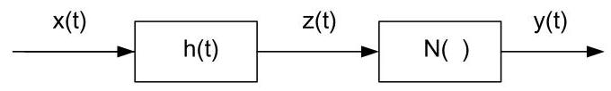

Fig. 1. Block diagram of the Wiener model.

图1. Wiener模型的框图。

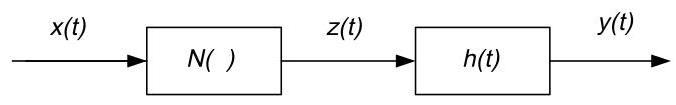

Fig. 2. Block diagram of the Hammerstein model.

图2. Hammerstein模型的框图。

where $b = \left\{  {{b}_{0},{b}_{1},{b}_{2},\ldots ,{b}_{l}}\right\}$ and $a = \left\{  {{a}_{1},{a}_{2},\ldots ,{a}_{m}}\right\}$ are parameters of the linear subsystem, $l$ and $m$ are orders of the subsystem. $N\left( \cdot \right)  = z\left( t\right)  + {r}_{2}{z}^{2}\left( t\right)  + {r}_{3}{z}^{3}\left( t\right)  + \cdots$ is the approximate expression of the nonlinear static subsystem. Therefore the main task of modeling focuses on identifying parameters of the linear dynamic part and nonlinear static part $r = \left\{  {{r}_{1},{r}_{2},\ldots ,{r}_{n}}\right\}$ . Voros utilized the least squares method and the artificial neural network to identify parameters of the Hammerstein model [9]. Hu adopted three-level-pseudorandom-sequences with different amplitudes as inputs, and identified the impact response function of the linear part and the polynomial coefficients of the nonlinear part of the discrete-time Wiener model of nonlinear systems [16]. Kozek used the extended Kalman filter (EKF) for parameter identification of Hammerstein/Wiener nonlinear systems [17]. Katoh proposed a Hammerstein model identification method using genetic programming [18]. Bai discussed discrete Hammerstein model identification using a blind system identification approach [19]. Li applied genetic algorithms to the identification of the Hammerstein model. He used piecewise linear method to approximate the memoryless nonlinear characterization [20].

其中$b = \left\{  {{b}_{0},{b}_{1},{b}_{2},\ldots ,{b}_{l}}\right\}$和$a = \left\{  {{a}_{1},{a}_{2},\ldots ,{a}_{m}}\right\}$是线性子系统的参数，$l$和$m$是子系统的阶数。$N\left( \cdot \right)  = z\left( t\right)  + {r}_{2}{z}^{2}\left( t\right)  + {r}_{3}{z}^{3}\left( t\right)  + \cdots$是非线性静态子系统的近似表达式。因此，建模的主要任务集中在识别线性动态部分和非线性静态部分$r = \left\{  {{r}_{1},{r}_{2},\ldots ,{r}_{n}}\right\}$的参数。沃罗斯利用最小二乘法和人工神经网络来识别哈默斯坦模型的参数[9]。胡采用不同幅度的三级伪随机序列作为输入，识别非线性系统离散时间维纳模型线性部分的冲击响应函数和非线性部分的多项式系数[16]。科泽克使用扩展卡尔曼滤波器(EKF)对哈默斯坦/维纳非线性系统进行参数识别[17]。加藤提出了一种使用遗传编程的哈默斯坦模型识别方法[18]。白讨论了使用盲系统识别方法进行离散哈默斯坦模型识别[19]。李将遗传算法应用于哈默斯坦模型的识别。他使用分段线性方法来近似无记忆非线性特性[20]。

This paper presents a new kind of identification method of block model. We apply the Volterra series to analyzing these models, and find that the higher-order Volterra kernels of block model have parameter separable property. We separate the linear block from the nonlinear block with the multilevel inputs and their corresponding outputs, and then use the linear transfer function in non-parameter form to build the linear dynamic block and a polynomial to approximate the nonlinear static block.

本文提出了一种新的块模型识别方法。我们应用沃尔泰拉级数来分析这些模型，发现块模型的高阶沃尔泰拉核具有参数可分离特性。我们通过多级输入及其相应输出将线性块与非线性块分离，然后使用非参数形式的线性传递函数构建线性动态块，并使用多项式近似非线性静态块。

## 2. Algorithm derivation

## 2. 算法推导

### 2.1. Identification of the Wiener model

### 2.1. 维纳模型的识别

In Fig. 1, the relationship between the input and output of the Wiener model can be written as follows:

在图1中，维纳模型的输入与输出之间的关系可以写成如下形式:

$$
z\left( t\right)  = {\int }_{-\infty }^{+\infty }h\left( \tau \right) x\left( {t - \tau }\right) \mathrm{d}\tau \tag{2}
$$

$$
y\left( t\right)  = N\left\lbrack  {z\left( t\right) }\right\rbrack   = z\left( t\right)  + {r}_{2}{z}^{2}\left( t\right)  + {r}_{3}{z}^{3}\left( t\right)  + \cdots \tag{3}
$$

Substituting Eq. (2) into Eq. (3), we can obtain:

将式(2)代入式(3)，我们可以得到:

$$
y\left( t\right)  = {\int }_{-\infty }^{+\infty }h\left( \tau \right) x\left( {t - \tau }\right) \mathrm{d}\tau  + {r}_{2}{\left\lbrack  {\int }_{-\infty }^{+\infty }h\left( \tau \right) x\left( t - \tau \right) \mathrm{d}\tau \right\rbrack  }^{2}
$$

$$
+ {r}_{3}{\left\lbrack  {\int }_{-\infty }^{+\infty }h\left( \tau \right) x\left( t - \tau \right) \mathrm{d}\tau \right\rbrack  }^{3} + \cdots \tag{4}
$$

This type of the Wiener model can also be described by the Volterra series:

这种类型的维纳模型也可以用沃尔泰拉级数描述:

$$
y\left( t\right)  = {\int }_{-\infty }^{+\infty }{h}_{1}\left( \tau \right) x\left( {t - \tau }\right) \mathrm{d}\tau  + {\int }_{-\infty }^{+\infty }{\int }_{-\infty }^{+\infty }
$$

$$
\times  {h}_{2}\left( {{\tau }_{1},{\tau }_{2}}\right) x\left( {t - {\tau }_{1}}\right) x\left( {t - {\tau }_{2}}\right) \mathrm{d}{\tau }_{1}\mathrm{\;d}{\tau }_{2} + \cdots  = \mathop{\sum }\limits_{{n = 1}}^{{+\infty }}{y}_{n}
$$

(5)

Here, define ${y}_{n}$ as the $n$ th order output of the system, for example, ${y}_{1}$ is the first order output and is the linear output of system too, ${y}_{2}$ is the second order output and is a part of nonlinear output of system.

这里，定义${y}_{n}$为系统的$n$阶输出，例如，${y}_{1}$是一阶输出且也是系统的线性输出，${y}_{2}$是二阶输出且是系统非线性输出的一部分。

$$
{y}_{n} = {\int }_{-\infty }^{+\infty }\cdots {\int }_{-\infty }^{+\infty }{h}_{n}\left( {{\tau }_{1},\ldots ,{\tau }_{n}}\right) x\left( {t - {\tau }_{1}}\right) \cdots x\left( {t - {\tau }_{n}}\right) \mathrm{d}{\tau }_{1}\cdots \mathrm{d}{\tau }_{n}
$$

(5a)

${h}_{1}\left( t\right)$ and ${h}_{2}\left( {{t}_{1},{t}_{2}}\right)$ are the first order and the second order Volterra kernels, respectively, and ${h}_{n}\left( {{t}_{1},\ldots ,{t}_{n}}\right)$ is the $n$ th order Volterra kernel.

${h}_{1}\left( t\right)$和${h}_{2}\left( {{t}_{1},{t}_{2}}\right)$分别是一阶和二阶沃尔泰拉核，${h}_{n}\left( {{t}_{1},\ldots ,{t}_{n}}\right)$是$n$阶沃尔泰拉核。

Eq. (4) becomes

式(4)变为

$$
y\left( t\right)  = {\int }_{-\infty }^{+\infty }h\left( \tau \right) x\left( {t - \tau }\right) \mathrm{d}\tau  + {r}_{2}\left\lbrack  {{\int }_{-\infty }^{+\infty }h\left( {\tau }_{1}\right) x\left( {t - {\tau }_{1}}\right) \mathrm{d}{\tau }_{1}}\right\rbrack
$$

$$
\cdot  \left\lbrack  {{\int }_{-\infty }^{+\infty }h\left( {\tau }_{2}\right) x\left( {t - {\tau }_{2}}\right) \mathrm{d}{\tau }_{2}}\right\rbrack
$$

$$
+ {r}_{3}\left\lbrack  {{\int }_{-\infty }^{+\infty }h\left( {\tau }_{1}\right) x\left( {t - {\tau }_{1}}\right) \mathrm{d}{\tau }_{1}}\right\rbrack
$$

$$
\cdot  \left\lbrack  {{\int }_{-\infty }^{+\infty }h\left( {\tau }_{2}\right) x\left( {t - {\tau }_{2}}\right) \mathrm{d}{\tau }_{2}}\right\rbrack
$$

$$
\cdot  \left\lbrack  {{\int }_{-\infty }^{+\infty }h\left( {\tau }_{3}\right) x\left( {t - {\tau }_{3}}\right) \mathrm{d}{\tau }_{3}}\right\rbrack   + \cdots
$$

$$
= {\int }_{-\infty }^{+\infty }h\left( \tau \right) x\left( {t - \tau }\right) \mathrm{d}\tau  + {\int }_{-\infty }^{-\infty }{\int }_{-\infty }^{+\infty }{r}_{2}h\left( {\tau }_{1}\right) h\left( {\tau }_{2}\right) x
$$

$$
\times  \left( {t - {\tau }_{1}}\right) x\left( {t - {\tau }_{2}}\right) \mathrm{d}{\tau }_{1}\mathrm{\;d}{\tau }_{2}
$$

$$
+ {\int }_{-\infty }^{+\infty }{\int }_{-\infty }^{+\infty }{\int }_{-\infty }^{+\infty }{r}_{3}h\left( {\tau }_{1}\right) h\left( {\tau }_{2}\right) h\left( {\tau }_{3}\right) x\left( {t - {\tau }_{1}}\right) x\left( {t - {\tau }_{2}}\right) x
$$

$$
\times  \left( {t - {\tau }_{3}}\right) \mathrm{d}{\tau }_{1}\mathrm{\;d}{\tau }_{2}\mathrm{\;d}{\tau }_{3} + \cdots \tag{6}
$$

Comparing Eq. (5) with Eq. (6), we can obtain

将式(5)与式(6)进行比较，我们可以得到

$$
{h}_{1}\left( t\right)  = h\left( t\right) \tag{7a}
$$

$$
{h}_{2}\left( {{t}_{1},{t}_{2}}\right)  = {r}_{2}h\left( {t}_{1}\right) h\left( {t}_{2}\right) \tag{7b}
$$

$$
{h}_{n}\left( {{t}_{1},\ldots ,{t}_{n}}\right)  = {r}_{n}h\left( {t}_{1}\right) \cdots h\left( {t}_{n}\right) \tag{7c}
$$

Eqs. (7a)-(7c) indicate that the higher-order Volterra kernels are of parameter separable. Considering Eqs. (4) and (6), we have

式(7a) - (7c)表明高阶沃尔泰拉核具有参数可分离性。考虑式(4)和(6)，我们有

$$
{y}_{n}\left( t\right)  = {\int }_{-\infty }^{+\infty }\cdots {\int }_{-\infty }^{+\infty }{r}_{n}h\left( {\tau }_{1}\right) \cdots h\left( {\tau }_{n}\right) x\left( {t - {\tau }_{1}}\right) \cdots
$$

$$
x\left( {t - {\tau }_{n}}\right) \mathrm{d}{\tau }_{1}\cdots \mathrm{d}{\tau }_{n} = {r}_{n}{\left\lbrack  {y}_{1}\left( t\right) \right\rbrack  }^{n} \tag{6a}
$$

Thus the higher-order outputs of the Wiener model can be computed by the convolution of the higher-order kernel with sensor input, and also be obtained with the first order output ${y}_{1}$ and ${r}_{n}$ . Obviously the calculation of the latter is simpler than that of the former, and higher is the order, more obvious is the advantage.

因此，维纳模型的高阶输出可以通过高阶核与传感器输入的卷积来计算，也可以通过一阶输出${y}_{1}$和${r}_{n}$得到。显然，后者的计算比前者更简单，阶数越高，优势越明显。

Define $\left\{  {{k}_{1}{x}_{0},{k}_{2}{x}_{0},\ldots ,{k}_{n}{x}_{0}}\right\}$ as a set of multilevel signals, and ${x}_{0}$ is its base signal. According to the relationship between the input and output of the Wiener model, when a set of multilevel signals are inputted to the system, we have

定义$\left\{  {{k}_{1}{x}_{0},{k}_{2}{x}_{0},\ldots ,{k}_{n}{x}_{0}}\right\}$为一组多级信号，${x}_{0}$是其基信号。根据维纳模型输入与输出的关系，当一组多级信号输入到系统时，我们有

$$
\text{ When }x\left( t\right)  = {x}_{0}\left( t\right) , y\left( t\right)  = {y}_{1}\left( t\right)  + {y}_{2}\left( t\right)  + \cdots
$$

$$
\text{ When }x\left( t\right)  = {k}_{1}{x}_{0}\left( t\right) ,{\widehat{y}}^{\left( 1\right) }\left( t\right)  = {k}_{1} \cdot  {y}_{1}\left( t\right)  + {k}_{1}^{2} \cdot  {y}_{2}\left( t\right)  + \cdots
$$

$$
\text{ When }x\left( t\right)  = {k}_{2}{x}_{0}\left( t\right) ,{\widehat{y}}^{\left( 2\right) }\left( t\right)  = {k}_{2} \cdot  {y}_{1}\left( t\right)  + {k}_{2}^{2} \cdot  {y}_{2}\left( t\right)  + \cdots
$$

Using $X = \left\{  {{k}_{1}{x}_{0},{k}_{2}{x}_{0},\ldots ,{k}_{n}{x}_{0}}\right\}$ to describe the multilevel input signals, the matrix expressing the relationship between the input and output will be

用$X = \left\{  {{k}_{1}{x}_{0},{k}_{2}{x}_{0},\ldots ,{k}_{n}{x}_{0}}\right\}$描述多级输入信号，输入与输出关系的矩阵将为

$$
\widehat{Y} = {AY} \tag{8}
$$

where $\widehat{Y} = {\left\lbrack  {\widehat{y}}^{\left( 1\right) },\ldots ,{\widehat{y}}^{\left( n\right) }\right\rbrack  }^{\mathrm{T}},{\widehat{y}}^{\left( 1\right) },{\widehat{y}}^{\left( 2\right) },\ldots ,{\widehat{y}}^{\left( n\right) }$ are measured outputs corresponding to inputs ${k}_{1}{x}_{0},{k}_{2}{x}_{0},\ldots ,{k}_{n}{x}_{0}$ ; $Y = {\left\lbrack  {y}_{1},{y}_{2},\ldots ,{y}_{n}\right\rbrack  }^{\mathrm{T}}$ is the vector made up of the $i$ th order output corresponding to the input ${x}_{0}\left( {i = 1,2,\ldots , n}\right)$ ;

$\widehat{Y} = {\left\lbrack  {\widehat{y}}^{\left( 1\right) },\ldots ,{\widehat{y}}^{\left( n\right) }\right\rbrack  }^{\mathrm{T}},{\widehat{y}}^{\left( 1\right) },{\widehat{y}}^{\left( 2\right) },\ldots ,{\widehat{y}}^{\left( n\right) }$ 是与输入 ${k}_{1}{x}_{0},{k}_{2}{x}_{0},\ldots ,{k}_{n}{x}_{0}$ 相对应的测量输出；$Y = {\left\lbrack  {y}_{1},{y}_{2},\ldots ,{y}_{n}\right\rbrack  }^{\mathrm{T}}$ 是由与输入 ${x}_{0}\left( {i = 1,2,\ldots , n}\right)$ 相对应的 $i$ 阶输出组成的向量；

$$
A = \left\lbrack  \begin{matrix} {k}_{1} & {k}_{1}^{2} & \ldots & {k}_{1}^{n} \\  {k}_{2} & {k}_{2}^{2} & \ldots & {k}_{2}^{n} \\  \ldots & \ldots & \ldots & \ldots \\  {k}_{n} & {k}_{n}^{2} & \ldots & {k}_{n}^{n} \end{matrix}\right\rbrack
$$

When ${k}_{i} \neq  \gamma {k}_{j}\left( {i, j = 1,2,\ldots , n;i \neq  j;\gamma  \in  R}\right)$ and is not zero, matrix $A$ will be non-singular, then Eq. (8) has only one solution:

当 ${k}_{i} \neq  \gamma {k}_{j}\left( {i, j = 1,2,\ldots , n;i \neq  j;\gamma  \in  R}\right)$ 且不为零时，矩阵 $A$ 将是非奇异的，那么式 (8) 只有一个解:

$$
Y = {A}^{-1}\widehat{Y} \tag{8a}
$$

Therefore, if the nonlinear system is excited by a set of multilevel signals, the $i$ th order output ${y}_{i}\left( t\right) \left( {i = 1,2,\ldots , n}\right)$ can be extracted. According to ${y}_{n}\left( t\right)$ the linear transfer function $h\left( t\right)$ and coefficients of the nonlinear static part ${r}_{i}\left( {i = 2,3,\ldots }\right)$ can be identified.

因此，如果非线性系统由一组多电平信号激励，则可以提取 $i$ 阶输出 ${y}_{i}\left( t\right) \left( {i = 1,2,\ldots , n}\right)$。根据 ${y}_{n}\left( t\right)$，可以识别线性传递函数 $h\left( t\right)$ 和非线性静态部分的系数 ${r}_{i}\left( {i = 2,3,\ldots }\right)$。

With ${y}_{1}\left( t\right)$ being isolated, we will have

在 ${y}_{1}\left( t\right)$ 被隔离的情况下，我们将得到

$$
H\left( f\right)  = \frac{{Y}_{1}\left( f\right) }{{X}_{0}\left( f\right) } \tag{9}
$$

where ${Y}_{1}\left( f\right) ,{X}_{0}\left( f\right)$ and $H\left( f\right)$ are the Fourier transform of ${y}_{1}\left( t\right)$ , ${x}_{0}\left( t\right)$ and $h\left( t\right)$ , respectively, and $h\left( t\right)$ will be obtained by the inverse Fourier transform. We have

其中 ${Y}_{1}\left( f\right) ,{X}_{0}\left( f\right)$ 和 $H\left( f\right)$ 分别是 ${y}_{1}\left( t\right)$、${x}_{0}\left( t\right)$ 和 $h\left( t\right)$ 的傅里叶变换，并且 $h\left( t\right)$ 将通过傅里叶逆变换获得。我们有

$$
{h}_{is}\left( {{t}_{1},\ldots ,{t}_{i}}\right)  = h\left( {t}_{1}\right) \cdots h\left( {t}_{i}\right) \tag{9a}
$$

$$
{y}_{is}\left( t\right)  = {\int }_{-\infty }^{+\infty }\cdots {\int }_{-\infty }^{+\infty }{h}_{is}\left( {{\tau }_{1},\ldots ,{\tau }_{i}}\right) x\left( {t - {\tau }_{1}}\right) \cdots
$$

$$
x\left( {t - {\tau }_{i}}\right) \mathrm{d}{\tau }_{1}\cdots \mathrm{d}{\tau }_{i} = {\left\lbrack  {y}_{1}\right\rbrack  }^{i} \tag{9b}
$$

where ${h}_{is}\left( {{t}_{1},\ldots ,{t}_{i}}\right)$ and ${y}_{is}$ are reference values of the $i$ th order Volterra kernel ${h}_{i}\left( {{t}_{1},\ldots ,{t}_{i}}\right)$ and the $i$ th order output ${y}_{i}$ , respectively, which are multiple of ${h}_{i}\left( {{t}_{1},\ldots ,{t}_{n}}\right)$ and ${y}_{i}$ . Comparing with (6a) and (7c), there will be:

其中 ${h}_{is}\left( {{t}_{1},\ldots ,{t}_{i}}\right)$ 和 ${y}_{is}$ 分别是 $i$ 阶沃尔泰拉核 ${h}_{i}\left( {{t}_{1},\ldots ,{t}_{i}}\right)$ 和 $i$ 阶输出 ${y}_{i}$ 的参考值，它们是 ${h}_{i}\left( {{t}_{1},\ldots ,{t}_{n}}\right)$ 和 ${y}_{i}$ 的倍数。与 (6a) 和 (7c) 比较，将有:

$$
{h}_{i}\left( {{t}_{1},\ldots ,{t}_{i}}\right)  = {r}_{i}{h}_{is}\left( {{t}_{1},\ldots ,{t}_{i}}\right)
$$

$$
{y}_{i}\left( t\right)  = {r}_{i}{y}_{is}\left( t\right) \tag{10}
$$

$$
{r}_{i} = \frac{{y}_{i}}{{y}_{is}}\;\left( {i = 1,2,\ldots , n}\right)
$$

Therefore the identifying procedure of identifying the Wiener model is presented as follows:

因此，维纳模型的识别过程如下所示:

(1) A set of multilevel signals $X = {\left\lbrack  {k}_{1}{x}_{0},{k}_{2}{x}_{0},\ldots ,{k}_{n}{x}_{0}\right\rbrack  }^{\mathrm{T}}$ are inputted to the system, and outputs $\widehat{Y} = {\left\lbrack  {\widehat{y}}^{\left( 1\right) },\ldots ,{\widehat{y}}^{\left( n\right) }\right\rbrack  }^{\mathrm{T}}\;$ are obtained. Then ${y}_{i} \; \left( {i = 1,2,\ldots , n}\right)$ are extracted by Eq. (8a);

(1) 将一组多电平信号 $X = {\left\lbrack  {k}_{1}{x}_{0},{k}_{2}{x}_{0},\ldots ,{k}_{n}{x}_{0}\right\rbrack  }^{\mathrm{T}}$ 输入到系统中，并获得输出 $\widehat{Y} = {\left\lbrack  {\widehat{y}}^{\left( 1\right) },\ldots ,{\widehat{y}}^{\left( n\right) }\right\rbrack  }^{\mathrm{T}}\;$。然后通过式 (8a) 提取 ${y}_{i} \; \left( {i = 1,2,\ldots , n}\right)$；

(2) With ${y}_{1}\left( t\right)$ and ${x}_{0}\left( t\right)$ , the linear transfer function $h\left( t\right)$ and ${y}_{is}$ are obtained according to Eqs. (9) and (9b);

(2) 利用 ${y}_{1}\left( t\right)$ 和 ${x}_{0}\left( t\right)$，根据式 (9) 和 (9b) 获得线性传递函数 $h\left( t\right)$ 和 ${y}_{is}$；

(3) Eq. (10) is used to calculate ${r}_{i}\left( {i = 1,2,\ldots , n}\right)$ .

(3) 式 (10) 用于计算 ${r}_{i}\left( {i = 1,2,\ldots , n}\right)$ 。

### 2.2. Identification of the Hammerstein model

### 2.2. 哈默斯坦模型的识别

A block diagram of the Hammersein model is shown in Fig. 2. The relationship between the input and output can be described as follows:

哈默斯坦模型的框图如图2所示。输入与输出之间的关系可描述如下:

$$
z\left( t\right)  = x\left( t\right)  + {r}_{2}{x}^{2}\left( t\right)  + {r}_{3}{x}^{3}\left( t\right)  + \cdots
$$

$$
y\left( t\right)  = {\int }_{-\infty }^{+\infty }h\left( \tau \right) z\left( {t - \tau }\right) \mathrm{d}\tau
$$

$$
= {\int }_{-\infty }^{+\infty }h\left( \tau \right) x\left( {t - \tau }\right) \mathrm{d}\tau  + {r}_{2}{\int }_{-\infty }^{+\infty }h\left( \tau \right) {x}^{2}\left( {t - \tau }\right) \mathrm{d}\tau
$$

$$
+ {r}_{3}{\int }_{-\infty }^{+\infty }h\left( \tau \right) {x}^{3}\left( {t - \tau }\right) \mathrm{d}\tau  + \cdots
$$

$$
= \mathop{\sum }\limits_{{i = 1}}^{{+\infty }}{y}_{i}
$$

where ${y}_{i} = {r}_{i}{\int }_{-\infty }^{+\infty }h\left( \tau \right) {x}^{i}\left( {t - \tau }\right) \mathrm{d}\tau \left( {{r}_{1} = 1}\right) ,{y}_{i}$ is the $i$ th order output of the Hammerstein model. Similar to the Wiener model, when the system based on the Hammerstein model is excited by a set of multilevel signals $X = \left\lbrack  {{k}_{1}{x}_{0}}\right.$ , ${\left. {k}_{2}{x}_{0},\ldots ,{k}_{n}{x}_{0}\right\rbrack  }^{\mathrm{T}}$ , the measured output are $\widehat{Y} = \left\lbrack  {\widehat{y}}^{\left( 1\right) }\right.$ , ${\left. {\widehat{y}}^{\left( 2\right) },\ldots ,{\widehat{y}}^{\left( n\right) }\right\rbrack  }^{\mathrm{T}}$ . The output of various orders ${y}_{i}(i = 1,2,\ldots$ , n) can be extracted according to Eq. (8a).

其中 ${y}_{i} = {r}_{i}{\int }_{-\infty }^{+\infty }h\left( \tau \right) {x}^{i}\left( {t - \tau }\right) \mathrm{d}\tau \left( {{r}_{1} = 1}\right) ,{y}_{i}$ 是哈默斯坦模型的 $i$ 阶输出。与维纳模型类似，当基于哈默斯坦模型的系统由一组多级信号 $X = \left\lbrack  {{k}_{1}{x}_{0}}\right.$ 、${\left. {k}_{2}{x}_{0},\ldots ,{k}_{n}{x}_{0}\right\rbrack  }^{\mathrm{T}}$ 激励时，测量输出为 $\widehat{Y} = \left\lbrack  {\widehat{y}}^{\left( 1\right) }\right.$ 、${\left. {\widehat{y}}^{\left( 2\right) },\ldots ,{\widehat{y}}^{\left( n\right) }\right\rbrack  }^{\mathrm{T}}$ 。各阶输出 ${y}_{i}(i = 1,2,\ldots$ ，n) 可根据式 (8a) 提取。

With ${y}_{1}$ and ${x}_{0}, h\left( t\right)$ can be calculated through Eq. (9). Then,

利用 ${y}_{1}$ 和 ${x}_{0}, h\left( t\right)$ 可通过式 (9) 计算得出。然后，

$$
{y}_{is}\left( t\right)  = {\int }_{-\infty }^{+\infty }h\left( \tau \right) {x}_{0}^{i}\left( {t - \tau }\right) \mathrm{d}\tau
$$

where ${y}_{is}$ is the reference value of the $i$ th order output of the Hammerstein model.

其中 ${y}_{is}$ 是哈默斯坦模型的 $i$ 阶输出的参考值。

According to Eq. (10), ${r}_{i}\left( {i = 2,3,\ldots , n}\right)$ can be obtained. The identifying process of the Hammerstein model is the same as that of the Wiener model.

根据式 (10)，可得到 ${r}_{i}\left( {i = 2,3,\ldots , n}\right)$ 。哈默斯坦模型的识别过程与维纳模型相同。

## 3. Algorithm improvement

## 3. 算法改进

In practice there always is noise in the sensor output. If an additive noise is added to the output of the Wiener model and the Hammerstein model, their block diagrams will be described as in Figs. 3 and 4. Different from Figs. 1 and 2, the outputs in Figs. 3 and 4 contain the noise $n\left( t\right)$ besides the sensor output. Since the identifying procedure and the equations of the Hammerstein model are similar to those of the Wiener model, we only discuss the Wiener model in the following part. In the following equation, $\xi \left( t\right)$ is used to describe the noise taking the place of $n\left( t\right)$ :

在实际中，传感器输出总会存在噪声。如果在维纳模型和哈默斯坦模型的输出中加入加性噪声，它们的框图将如图3和图4所示。与图1和图2不同，图3和图4中的输出除了传感器输出外还包含噪声 $n\left( t\right)$ 。由于哈默斯坦模型的识别过程和方程与维纳模型相似，我们在以下部分仅讨论维纳模型。在以下方程中，$\xi \left( t\right)$ 用于描述取代 $n\left( t\right)$ 的噪声:

$$
y\left( t\right)  = \mathop{\sum }\limits_{{i = 1}}^{{+\infty }}{y}_{i} + \xi \left( t\right) \tag{11}
$$

Eq. (8) can also be:

式 (8) 也可以是:

$$
\widehat{Y} = {AY} + \xi \tag{12}
$$

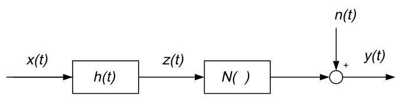

Fig. 3. Block diagram of the Wiener model (noise).

图3. 维纳模型(带噪声)的框图。

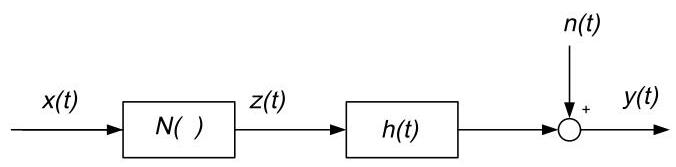

Fig. 4. Block diagram of the Hammerstein model (noise).

图4. 哈默斯坦模型(带噪声)的框图。

The vector $\widehat{Y} = {\left\lbrack  {\widehat{y}}^{\left( 1\right) },\ldots ,{\widehat{y}}^{\left( n\right) }\right\rbrack  }^{\mathrm{T}}$ is the corresponding to the input $X = {\left\lbrack  {k}_{1}{x}_{0},{k}_{2}{x}_{0},\ldots ,{k}_{n}{x}_{0}\right\rbrack  }^{\mathrm{T}}$ , and ${y}_{i}\left( {i = 1,2,\ldots , n}\right)$ of the vector $Y = {\left\lbrack  {y}_{1},{y}_{2},\ldots ,{y}_{n}\right\rbrack  }^{\mathrm{T}}$ is the $i$ th order output of the input ${x}_{0},{\xi }_{i}\left( {i = 1,2,\ldots , n}\right)$ of the vector $\xi  = {\left\lbrack  {\xi }_{1},{\xi }_{2},\ldots ,{\xi }_{n}\right\rbrack  }^{\mathrm{T}}$ is the noise of the ith experiment. Since the noise can affect results of extracting the various degree outputs from nonlinear system outputs, the correlation function and the bispectrum are applied to improve the identification method mentioned above, aiming at reducing the noise influence, only considering random noise and the Gaussian noise.

向量$\widehat{Y} = {\left\lbrack  {\widehat{y}}^{\left( 1\right) },\ldots ,{\widehat{y}}^{\left( n\right) }\right\rbrack  }^{\mathrm{T}}$对应于输入$X = {\left\lbrack  {k}_{1}{x}_{0},{k}_{2}{x}_{0},\ldots ,{k}_{n}{x}_{0}\right\rbrack  }^{\mathrm{T}}$，向量$Y = {\left\lbrack  {y}_{1},{y}_{2},\ldots ,{y}_{n}\right\rbrack  }^{\mathrm{T}}$的${y}_{i}\left( {i = 1,2,\ldots , n}\right)$是输入${x}_{0},{\xi }_{i}\left( {i = 1,2,\ldots , n}\right)$的$i$阶输出，向量$\xi  = {\left\lbrack  {\xi }_{1},{\xi }_{2},\ldots ,{\xi }_{n}\right\rbrack  }^{\mathrm{T}}$的第i次实验噪声。由于噪声会影响从非线性系统输出中提取不同程度输出的结果，因此应用相关函数和双谱来改进上述识别方法，旨在减少噪声影响，仅考虑随机噪声和高斯噪声。

### 3.1. Identification method improved by the correlation technique

### 3.1. 相关技术改进的识别方法

The correlation technique can extract out the useful signal from the mixed signal including noises. Here the improved method performs the correlation of the input with output, and can reduce the noise disturbance because of the independence of signal and noise.

相关技术可以从包含噪声的混合信号中提取有用信号。这里改进后的方法对输入和输出进行相关运算，并且由于信号和噪声的独立性可以减少噪声干扰。

The correlation between the input and output of Eq. (11) is

式(11)输入与输出之间的相关性为

$$
{R}_{xy}\left( m\right)  = \frac{1}{T}{\int }_{t =  - \infty }^{+\infty }x\left( t\right) y\left( {t + m}\right) \mathrm{d}t
$$

$$
= \mathop{\sum }\limits_{{i = 1}}^{{+\infty }}{R}_{x{y}_{i}}\left( m\right)  + {R}_{x\xi }\left( m\right) \tag{13}
$$

The input $x\left( t\right)$ and the noise $\xi \left( t\right)$ are independent, then

输入$x\left( t\right)$和噪声$\xi \left( t\right)$是独立的，那么

$$
{R}_{x\xi }\left( m\right)  = 0
$$

$$
{R}_{xy}\left( m\right)  = \mathop{\sum }\limits_{{i = 1}}^{{+\infty }}{R}_{x{y}_{i}}\left( m\right)
$$

The correlation between the reference input ${x}_{0}\left( t\right)$ and two sides of Eq. (12) is

参考输入${x}_{0}\left( t\right)$与式(12)两边的相关性为

$$
{R}_{{x}_{0}\widehat{y}} = A{R}_{{x}_{0}y} \tag{13a}
$$

where $\;{R}_{{x}_{0}\widehat{y}} = {\left\lbrack  {R}_{{x}_{0}{\widehat{y}}^{\left( 1\right) }},\ldots ,{R}_{{x}_{0}{\widehat{y}}^{\left( n\right) }}\right\rbrack  }^{\mathrm{T}};\;{R}_{{x}_{0}y} = {\left\lbrack  {R}_{{x}_{0}{y}_{1}},\ldots ,{R}_{{x}_{0}{y}_{n}}\right\rbrack  }^{\mathrm{T}}$ ; ${R}_{{x}_{0}{\widehat{y}}^{\left( i\right) }}$ is the correlation of the input ${x}_{0}$ with the $i$ th output ${\widehat{y}}^{\left( i\right) }$ corresponding to the input ${k}_{i}{x}_{0}$ , and ${R}_{{x}_{0}{y}_{i}}$ is the correlation of the input ${x}_{0}$ with its ith order output ${y}_{i}$ .

其中$\;{R}_{{x}_{0}\widehat{y}} = {\left\lbrack  {R}_{{x}_{0}{\widehat{y}}^{\left( 1\right) }},\ldots ,{R}_{{x}_{0}{\widehat{y}}^{\left( n\right) }}\right\rbrack  }^{\mathrm{T}};\;{R}_{{x}_{0}y} = {\left\lbrack  {R}_{{x}_{0}{y}_{1}},\ldots ,{R}_{{x}_{0}{y}_{n}}\right\rbrack  }^{\mathrm{T}}$；${R}_{{x}_{0}{\widehat{y}}^{\left( i\right) }}$是输入${x}_{0}$与对应于输入${k}_{i}{x}_{0}$的$i$阶输出${\widehat{y}}^{\left( i\right) }$的相关性，${R}_{{x}_{0}{y}_{i}}$是输入${x}_{0}$与其i阶输出${y}_{i}$的相关性。

Thus Eqs. (9) and (10) become

因此式(9)和(10)变为

$$
H\left( f\right)  = \frac{{P}_{{x}_{0}{y}_{1}}}{{P}_{{x}_{0}}} \tag{14}
$$

$$
{r}_{i} = \frac{{R}_{{x}_{0}{y}_{i}}}{{R}_{{x}_{0}{y}_{is}}} \tag{15}
$$

where ${P}_{{x}_{0}{y}_{1}}$ is the cross spectrum between the input ${x}_{0}$ and the first order output (linear output) ${y}_{1}$ , and is the Fourier transform of the cross correlation ${R}_{{x}_{0}{y}_{1}}$ too; ${P}_{{x}_{0}}$ is the auto spectrum of the input ${x}_{0};{R}_{{x}_{0}{y}_{is}}$ is the cross correlation of the input ${x}_{0}$ with the $i$ th order reference output ${y}_{is}$ , which can be computed by Eq. (9b).

其中${P}_{{x}_{0}{y}_{1}}$是输入${x}_{0}$与一阶输出(线性输出)${y}_{1}$之间的互谱，也是互相关${R}_{{x}_{0}{y}_{1}}$的傅里叶变换；${P}_{{x}_{0}}$是输入${x}_{0};{R}_{{x}_{0}{y}_{is}}$的自谱，${x}_{0};{R}_{{x}_{0}{y}_{is}}$是输入${x}_{0}$与$i$阶参考输出${y}_{is}$的互相关，可由式(9b)计算得出。

Therefore the general procedure of identifying the Wiener model with the improved method by the autocorrelation technique can be described as follows:

因此，用自相关技术改进方法识别维纳模型的一般步骤可描述如下:

(1) A suitable base input ${x}_{0}\left( t\right)$ is chosen. A set of multilevel signals $X = {\left\lbrack  {k}_{1}{x}_{0},{k}_{2}{x}_{0},\ldots ,{k}_{n}{x}_{0}\right\rbrack  }^{\mathrm{T}}$ are inputted to the nonlinear system, and outputs are $\widehat{Y} = {\left\lbrack  {\widehat{y}}^{\left( 1\right) },{\widehat{y}}^{\left( 2\right) },\ldots ,{\widehat{y}}^{\left( n\right) }\right\rbrack  }^{\mathrm{T}}$ . The input-output data is pretreated, then ${R}_{{x}_{0}\widehat{y}} = {\left\lbrack  {R}_{{x}_{0}{\widehat{y}}^{\left( 1\right) }},{R}_{{x}_{0}{\widehat{y}}^{\left( 2\right) }},\ldots ,{R}_{{x}_{0}{\widehat{y}}^{\left( n\right) }}\right\rbrack  }^{\mathrm{T}}$ is calculated, and ${R}_{{x}_{0}y} = {\left\lbrack  {R}_{{x}_{0}{y}_{1}},{R}_{{x}_{0}{y}_{2}},\ldots ,{R}_{{x}_{0}{y}_{n}}\right\rbrack  }^{\mathrm{T}}$ is computed by Eq. (13a);

(1) 选择合适的基础输入${x}_{0}\left( t\right)$。将一组多级信号$X = {\left\lbrack  {k}_{1}{x}_{0},{k}_{2}{x}_{0},\ldots ,{k}_{n}{x}_{0}\right\rbrack  }^{\mathrm{T}}$输入到非线性系统中，输出为$\widehat{Y} = {\left\lbrack  {\widehat{y}}^{\left( 1\right) },{\widehat{y}}^{\left( 2\right) },\ldots ,{\widehat{y}}^{\left( n\right) }\right\rbrack  }^{\mathrm{T}}$。对输入-输出数据进行预处理，然后计算${R}_{{x}_{0}\widehat{y}} = {\left\lbrack  {R}_{{x}_{0}{\widehat{y}}^{\left( 1\right) }},{R}_{{x}_{0}{\widehat{y}}^{\left( 2\right) }},\ldots ,{R}_{{x}_{0}{\widehat{y}}^{\left( n\right) }}\right\rbrack  }^{\mathrm{T}}$，并通过式(13a)计算${R}_{{x}_{0}y} = {\left\lbrack  {R}_{{x}_{0}{y}_{1}},{R}_{{x}_{0}{y}_{2}},\ldots ,{R}_{{x}_{0}{y}_{n}}\right\rbrack  }^{\mathrm{T}}$；

(2) The transfer function $h\left( t\right)$ of linear part is calculated through Eq. (14), and the ${y}_{is}\left( {i = 2,3,\ldots , n}\right)$ are computed by Eq. (9a);

(2) 通过式(14)计算线性部分的传递函数$h\left( t\right)$，并通过式(9a)计算${y}_{is}\left( {i = 2,3,\ldots , n}\right)$；

(3) The cross correlation ${R}_{{x}_{0}{y}_{is}}$ of ${x}_{0}$ with ${y}_{is}$ is calculated, and ${r}_{i}\left( {i = 2,3,\ldots , n}\right)$ are determined by Eq. (15).

(3) 计算${x}_{0}$与${y}_{is}$的互相关${R}_{{x}_{0}{y}_{is}}$，并通过式(15)确定${r}_{i}\left( {i = 2,3,\ldots , n}\right)$。

### 3.2. Identification method improved by bispectrum

### 3.2. 双谱改进的辨识方法

Since most noises are Gaussian distributed in practical cases, they can be restrained by the higher-order spectrum, the identification method of the block model can be improved by the higher-order spectrum. The bispectrum is the Fourier transform of three-order correlation, simpler to be computed, and applied wider, which can be defined as follows:

由于在实际情况中大多数噪声是高斯分布的，它们可以通过高阶谱来抑制，因此可以通过高阶谱改进块模型的辨识方法。双谱是三阶相关的傅里叶变换，计算更简单，应用更广泛，其定义如下:

$$
{B}_{x}\left( {{f}_{1},{f}_{2}}\right)  = {X}^{ * }\left( {{f}_{1} + {f}_{2}}\right) X\left( {f}_{1}\right) X\left( {f}_{2}\right)
$$

$$
{B}_{xxy}\left( {{f}_{1},{f}_{2}}\right)  = {X}^{ * }\left( {{f}_{1} + {f}_{2}}\right) X\left( {f}_{1}\right) Y\left( {f}_{2}\right)
$$

$$
{B}_{x}\left( {f, f}\right)  = {X}^{ * }\left( {2f}\right) X\left( f\right) X\left( f\right)
$$

$$
{B}_{xxy}\left( {f, f}\right)  = {X}^{ * }\left( {2f}\right) X\left( f\right) Y\left( f\right)
$$

where ${B}_{x}\left( {{f}_{1},{f}_{2}}\right)$ is the auto-bispectrum of $x$ , and ${B}_{x}\left( {f, f}\right)$ is its diagonal slide; ${B}_{xxy}\left( {{f}_{1},{f}_{2}}\right)$ is the cross bispectrum between $x$ and $y$ , and ${B}_{xxy}\left( {f, f}\right)$ is its diagonal slide.

其中${B}_{x}\left( {{f}_{1},{f}_{2}}\right)$是$x$的自双谱，${B}_{x}\left( {f, f}\right)$是其对角切片；${B}_{xxy}\left( {{f}_{1},{f}_{2}}\right)$是$x$与$y$之间的互双谱，${B}_{xxy}\left( {f, f}\right)$是其对角切片。

So the frequency domain form of Eq. (11) becomes

因此式(11)的频域形式变为

$$
Y\left( f\right)  = \mathop{\sum }\limits_{{i = 1}}^{{+\infty }}{Y}_{i}\left( f\right)  + \overline{\xi }\left( f\right) \tag{16}
$$

where $Y\left( f\right) ,{Y}_{i}\left( f\right)$ and $\overline{\xi }\left( f\right)$ are the Fourier transform of $y\left( t\right)$ , ${y}_{i}\left( t\right)$ and $\xi \left( t\right)$ , respectively. The frequency domain form of Eq. (12) becomes

其中$Y\left( f\right) ,{Y}_{i}\left( f\right)$和$\overline{\xi }\left( f\right)$分别是$y\left( t\right)$、${y}_{i}\left( t\right)$和$\xi \left( t\right)$的傅里叶变换。式(12)的频域形式变为

$$
{\widehat{Y}}_{f} = A{Y}_{f} + \overline{\xi } \tag{17}
$$

where ${\widehat{Y}}_{f},{Y}_{f}$ and $\overline{\xi }$ are the Fourier transform of $\widehat{Y}, Y$ and $\xi$ . Taking the cross bispectrum between the input and output for two sides of Eq. (16), we have

其中${\widehat{Y}}_{f},{Y}_{f}$和$\overline{\xi }$分别是$\widehat{Y}, Y$和$\xi$的傅里叶变换。对式(16)两边取输入和输出之间的互双谱，我们有

$$
{B}_{xxy}\left( {f, f}\right)  = \mathop{\sum }\limits_{{i = 1}}^{{-\infty }}{B}_{{xx}{y}_{i}}\left( {f, f}\right)  + {B}_{xx\xi }\left( {f, f}\right) \tag{16a}
$$

If $\xi \left( t\right)$ is a Gaussian noise, and independent to the input $x\left( t\right)$ , so ${B}_{xx\xi }\left( {f, f}\right)  = 0$ ,

如果$\xi \left( t\right)$是高斯噪声，且与输入$x\left( t\right)$独立，那么${B}_{xx\xi }\left( {f, f}\right)  = 0$，

$$
{B}_{xxy}\left( {f, f}\right)  = \mathop{\sum }\limits_{{i = 1}}^{{+\infty }}{B}_{{xx}{y}_{i}}\left( {f, f}\right) \tag{16c}
$$

If the input $x\left( t\right)$ has some Gaussian noises independent to it, Eq. (17) still works.

如果输入$x\left( t\right)$有一些与其独立的高斯噪声，式(17)仍然成立。

Taking the cross bispectrum for Eq. (17), we obtain

对式(17)取互双谱，我们得到

$$
{B}_{{x}_{0}{x}_{0}\widehat{y}}\left( {f, f}\right)  = A{B}_{{x}_{0}{x}_{0}y}\left( {f, f}\right) \tag{17a}
$$

where ${B}_{{x}_{0}{x}_{0}\widehat{y}} = {\left\lbrack  {B}_{{x}_{0}{x}_{0}{\widehat{y}}^{\left( 1\right) }},{B}_{{x}_{0}{x}_{0}{\widehat{y}}^{\left( 2\right) }},\ldots ,{B}_{{x}_{0}{x}_{0}{\widehat{y}}^{\left( n\right) }}\right\rbrack  }^{\mathrm{T}}$ , and ${B}_{{x}_{0}{x}_{0}y} = \; {\left\lbrack  {B}_{{x}_{0}{x}_{0}{y}_{1}},{B}_{{x}_{0}{x}_{0}{y}_{2}},\ldots ,{B}_{{x}_{0}{x}_{0}{y}_{n}}\right\rbrack  }^{\mathrm{T}}.$

其中${B}_{{x}_{0}{x}_{0}\widehat{y}} = {\left\lbrack  {B}_{{x}_{0}{x}_{0}{\widehat{y}}^{\left( 1\right) }},{B}_{{x}_{0}{x}_{0}{\widehat{y}}^{\left( 2\right) }},\ldots ,{B}_{{x}_{0}{x}_{0}{\widehat{y}}^{\left( n\right) }}\right\rbrack  }^{\mathrm{T}}$，以及${B}_{{x}_{0}{x}_{0}y} = \; {\left\lbrack  {B}_{{x}_{0}{x}_{0}{y}_{1}},{B}_{{x}_{0}{x}_{0}{y}_{2}},\ldots ,{B}_{{x}_{0}{x}_{0}{y}_{n}}\right\rbrack  }^{\mathrm{T}}.$

Therefore if the system is excited by a set of multilevel signals $X = {\left\lbrack  {k}_{1}{x}_{0},{k}_{2}{x}_{0},\ldots ,{k}_{n}{x}_{0}\right\rbrack  }^{\mathrm{T}}$ and $\widehat{Y} = {\left\lbrack  {\widehat{y}}^{\left( n\right) },{\widehat{y}}^{\left( 2\right) },\ldots ,{\widehat{y}}^{\left( n\right) }\right\rbrack  }^{\mathrm{T}}$ are their outputs. The cross bispectrum between the input and output is calculated. ${B}_{{x}_{0}{x}_{0}y} = {\left\lbrack  {B}_{{x}_{0}{x}_{0}{y}_{1}},{B}_{{x}_{0}{x}_{0}{y}_{2}},\ldots ,{B}_{{x}_{0}{x}_{0}{y}_{n}}\right\rbrack  }^{\mathrm{T}}$ can be extracted by Eq. (17a), where ${y}_{i}\left( {i = 1,2,\ldots , n}\right)$ is the $i$ th order output corresponding to the input ${x}_{0}$ . So we can have

因此，如果系统由一组多级信号激励，$X = {\left\lbrack  {k}_{1}{x}_{0},{k}_{2}{x}_{0},\ldots ,{k}_{n}{x}_{0}\right\rbrack  }^{\mathrm{T}}$和$\widehat{Y} = {\left\lbrack  {\widehat{y}}^{\left( n\right) },{\widehat{y}}^{\left( 2\right) },\ldots ,{\widehat{y}}^{\left( n\right) }\right\rbrack  }^{\mathrm{T}}$是它们的输出。计算输入和输出之间的交叉双谱。${B}_{{x}_{0}{x}_{0}y} = {\left\lbrack  {B}_{{x}_{0}{x}_{0}{y}_{1}},{B}_{{x}_{0}{x}_{0}{y}_{2}},\ldots ,{B}_{{x}_{0}{x}_{0}{y}_{n}}\right\rbrack  }^{\mathrm{T}}$可以通过式(17a)提取，其中${y}_{i}\left( {i = 1,2,\ldots , n}\right)$是对应于输入${x}_{0}$的第$i$阶输出。所以我们可以得到

$$
H\left( f\right)  = \frac{{B}_{{x}_{0}{x}_{0}{y}_{1}}\left( {f, f}\right) }{{B}_{{x}_{0}}\left( {f, f}\right) } \tag{18}
$$

$$
{r}_{i} = \frac{{B}_{{x}_{0}{x}_{0}{y}_{i}}}{{B}_{{x}_{0}{x}_{0}{y}_{is}}} \tag{19}
$$

The identifying procedure of the Wiener model by the improved method with bispectrum is the similar as those of autocorrelation's in which the only requirement is that the bispectrum takes the place of the autocorrelation.

用改进的双谱方法识别维纳模型的过程与自相关方法类似，唯一的要求是用双谱代替自相关。

## 4. Simulation results

## 4. 仿真结果

The simulations are carried out to verify the effectiveness of the algorithms. A linear part $h\left( t\right)$ and a nonlinear part $N\left( \cdot \right)$ are constructed, and with their combination in different sequence the Wiener model and the Hammerstein model can be gained. Parameters of the linear part are selected as: $b = \left\lbrack  \begin{array}{lll} {0.0010} & {0.1119} & {0.0010} \end{array}\right\rbrack  , a = \lbrack {1.0000} -$ 1.9874 0.9913]; for the nonlinear static part we choose two subsection expressions of the positive direction and the negative direction:

进行仿真以验证算法的有效性。构建一个线性部分$h\left( t\right)$和一个非线性部分$N\left( \cdot \right)$，通过它们以不同顺序组合可以得到维纳模型和哈默斯坦模型。线性部分的参数选择为:$b = \left\lbrack  \begin{array}{lll} {0.0010} & {0.1119} & {0.0010} \end{array}\right\rbrack  , a = \lbrack {1.0000} -$ 1.9874 0.9913]；对于非线性静态部分，我们选择正向和负向的两个分段表达式:

$$
N\left\lbrack  {z\left( t\right) }\right\rbrack   = z\left( t\right)  + {r}_{2}{z}^{2}\left( t\right) ,\;\text{ when }z\left( t\right)  \geq  0,
$$

$$
{r}_{2} = 2,\;\text{ when }z\left( t\right)  < 0,{r}_{2} =  - 2.
$$

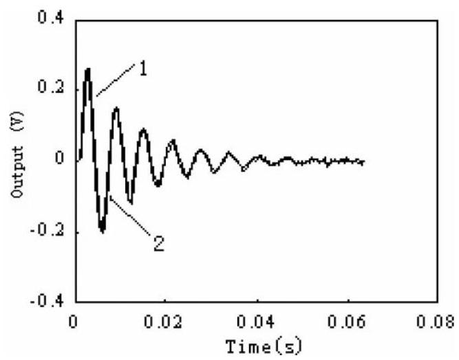

Fig. 5. Impact response of Wiener model 1 the real output, 2 the modeling output (improved by correlation).

图5. 维纳模型的冲击响应 1实际输出，2建模输出(相关改进)

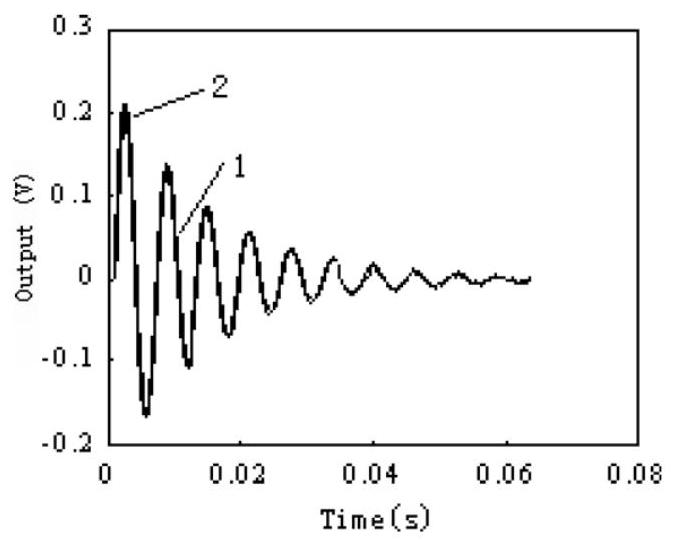

Fig. 6. Impact response of Hammerstein model 1 the real output, 2 the modeling output (improved by correlation).

图6. 哈默斯坦模型 的冲击响应 1实际输出，2建模输出(相关改进)

Fig. 7. Unit impact response of Wiener model 1 the real output, 2 the modeling output (improved by bispectrum).

图7. 维纳模型的单位冲击响应 1实际输出，2建模输出(双谱改进)

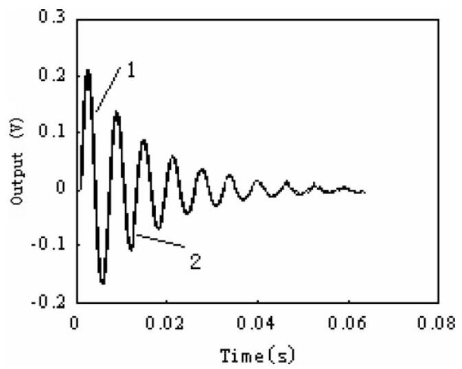

Fig. 8. Unit impact response of Hammerstein model 1 the real output, 2 the modeling output (improved by bispectrum).

图8. 哈默斯坦模型的单位冲击响应 1实际输出，2建模输出(双谱改进)

When the noise is added to the sensor output, results of modeling are shown in Figs. 5-8. In the simulation the unit impact signal is adopted as the fundamental signal of the required multilevel inputs. The noise is generated by functions of MATLAB. From these figures the model output is identical with the real output, and it also can be noticed that there exist fluctuations in the model output, which is because the cross correlation function and bispectrum cannot completely get rid of noise contained in the output, but the results in above figures can meet the requirements.

当在传感器输出中加入噪声时，建模结果如图5 - 8所示。在仿真中，单位冲击信号被用作所需多级输入的基本信号。噪声由MATLAB函数生成。从这些图中可以看出模型输出与实际输出相同，并且还可以注意到模型输出中存在波动，这是因为互相关函数和双谱不能完全消除输出中包含的噪声，但上图中的结果可以满足要求。

## 5. Experimental results

## 5. 实验结果

The hot-film mass air flow (MAF) sensors based on a thermal heat-loss principle are used in the automotive engines to measure the intake mass air flow exactly and control the air-to-fuel ratio precisely. Since the speed of air entering the engines with four or fewer cylinders is very fast, the hot-film MAF sensor should possess good dynamic performance. The results of static calibration show the hot-film/wire MAF sensors are the nonlinear devices [21]. Furthermore the dynamic experiments indicate that there is also the dynamic non-linearity in their responses, which affects their measurement accuracy. Hence it is important to study the dynamic non-linearity of hot-film MAF sensors. First of all, the dynamic calibration experiments were performed, and the step input and output with different amplitudes were collected. And then the nonlinear dynamic models were built by the method proposed by this paper.

基于热损失原理的热膜式质量空气流量(MAF)传感器用于汽车发动机，以精确测量进气质量空气流量并精确控制空燃比。由于进入四缸或更少气缸发动机的空气速度非常快，热膜式MAF传感器应具有良好的动态性能。静态校准结果表明，热膜/热线MAF传感器是非线性器件[21]。此外，动态实验表明，它们的响应中也存在动态非线性，这会影响其测量精度。因此，研究热膜式MAF传感器的动态非线性很重要。首先，进行了动态校准实验，并采集了不同幅度的阶跃输入和输出。然后，采用本文提出的方法建立了非线性动态模型。

### 5.1. Experiments

### 5.1. 实验

#### 5.1.1. Static calibration experiments

#### 5.1.1. 静态校准实验

The experimental facility shown in Fig. 9 was used to examine the MAF sensor static characteristic. The experimental setup consists of an air pump with ${15}\mathrm{{kW}}$ , an air tank with $2{\mathrm{\;m}}^{3}$ , a straight pipe with the diameter ${60}\mathrm{\;{mm}}$ , a regulating valve, a HFM5 type of the hot-film MAF sensor made by Bosch Investment Ltd., a CLC-100 type laminar flowmeter with an YJB-1500 type micro-manometer, and test equipments. The test equipments include: a MS8050 digital voltmeter and a TDS2024 digital scope to measure and log the sensor output; a digital thermometer to test the intake air temperature at the in port of the pipe; a free air thermometer, an atmospheric pressure meter and a hygrometer to record the environmental parameters.

图9所示的实验装置用于检测MAF传感器的静态特性。实验装置包括一个带${15}\mathrm{{kW}}$的气泵、一个带$2{\mathrm{\;m}}^{3}$的气罐、一个直径为${60}\mathrm{\;{mm}}$的直管、一个调节阀、一个由博世投资有限公司生产的HFM5型热膜式MAF传感器、一个带YJB - 1500型微压计的CLC - 100型层流流量计以及测试设备。测试设备包括:一个MS8050数字电压表和一个TDS2024数字示波器，用于测量和记录传感器输出；一个数字温度计，用于测试管道入口处的进气温度；一个自由空气温度计、一个气压计和一个湿度计，用于记录环境参数。

The air stream passed through the laminar flowmeter, MAF sensor and the valve, and then entered into the air tank. Finally, the air stream was drawn out of the air tank by the air pump. The air flow-rate was measured by the laminar flowmeter, and displayed with the micro-manometer in the form of the different pressure whose unit was mm water-column. During the static calibration experiments, 35 testing points were selected within the measuring range from 0 to ${91.5778}\mathrm{\;g}/\mathrm{s}$ . When the readings of micro-manometer were between 0 and ${10}\mathrm{\;{mm}}$ water-column, a point was chosen every other $1\mathrm{\;{mm}}$ water-column. Between 12 and ${20}\mathrm{\;{mm}}$ , a point was chosen every other $2\mathrm{\;{mm}}$ . Between 25 and ${120}\mathrm{\;{mm}}$ , a point was chosen every other $5\mathrm{\;{mm}}$ . When the experiments began, the zero point of the micro-manometer was adjusted, and the zero point of the MAF sensor was recorded. Then the air pump was turned on, the air flow-rate was adjusted by the flow-rate regulating valve so as to reach a series of fixed points of the micro-manometer. At the same time, all parameters were recorded manually, such as the different pressure, atmospheric pressure, environment temperature, atmospheric humidity and intake air stream temperature. The corresponding air flow-rate was calculated according to all these parameters. After the positive travel of static experiment (the flow-rate run from small to large) was completed, the negative travel (the flow-rate was from large to small) was conducted, and the flow-rate points were selected as same as those of the positive travel.

气流通过层流流量计、MAF传感器和阀门，然后进入气罐。最后，气流由气泵从气罐中抽出。空气流速由层流流量计测量，并通过微压计以不同压力的形式显示，其单位为毫米水柱。在静态校准实验中，在0至${91.5778}\mathrm{\;g}/\mathrm{s}$的测量范围内选择了35个测试点。当微压计读数在0至${10}\mathrm{\;{mm}}$水柱之间时，每隔$1\mathrm{\;{mm}}$水柱选择一个点。在12至${20}\mathrm{\;{mm}}$之间，每隔$2\mathrm{\;{mm}}$选择一个点。在25至${120}\mathrm{\;{mm}}$之间，每隔$5\mathrm{\;{mm}}$选择一个点。实验开始时，调整微压计的零点，并记录MAF传感器的零点。然后打开气泵，通过流量调节阀调节空气流速，使其达到微压计的一系列固定点。同时，手动记录所有参数，如不同压力、大气压力、环境温度、大气湿度和进气气流温度。根据所有这些参数计算相应的空气流速。静态实验的正向行程(流速从小到大)完成后，进行反向行程(流速从大到小)，并选择与正向行程相同的流速点。

#### 5.1.2. Dynamic calibration experiments

#### 5.1.2. 动态校准实验

Fig. 10 is a block diagram of the dynamic experimental setup. The fast manual valve was a quick conical triple valve made by ourselves, and could turn off/on the air stream rapidly to generate the step signal. When it was turned off, its one port is opened to the atmosphere, and the other port connecting to the pipe was closed. The air stream did not pass through the MAF sensor. When the fast manual valve was turned on, the air stream passed through the MAF sensor, fast manual valve and flow-rate regulating valve, and then entered in the air tank. An electromagnetic type rotate speed sensor was installed in the fast manual valve, and detected the action of the valve. When the fast manual valve was switch on/off, the rotate speed sensor generated an impulse signal simultaneously to indicate the starting point of dynamic response of the MAF sensor. Two channels of the digital scope collected the signals of both the MAF sensor and rotate speed sensor at the same time.

图10是动态实验装置的框图。快速手动阀是我们自己制作的快速锥形三通阀，能够快速关闭/打开气流以产生阶跃信号。当它关闭时，其一个端口通向大气，连接管道的另一个端口关闭。气流不通过MAF传感器。当快速手动阀打开时，气流通过MAF传感器、快速手动阀和流量调节阀，然后进入气罐。在快速手动阀中安装了一个电磁式转速传感器，用于检测阀门的动作。当快速手动阀打开/关闭时，转速传感器同时产生一个脉冲信号，以指示MAF传感器动态响应的起始点。数字示波器的两个通道同时采集MAF传感器和转速传感器的信号。

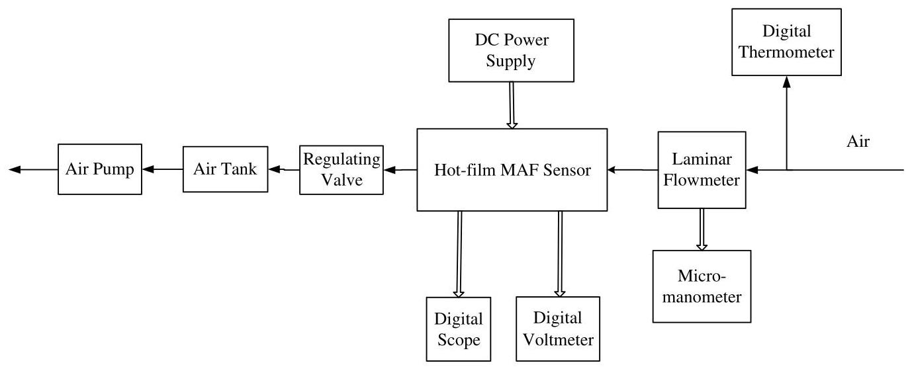

Fig. 9. Block diagram of static calibration experimental facility.

图9. 静态校准实验装置框图。

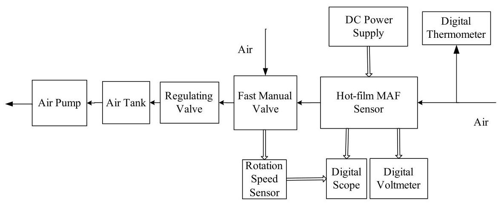

Fig. 10. Block diagram of dynamic experimental setup.

图10. 动态实验装置框图。

Some flow-rate points were chosen to perform dynamic calibration experiments. Since the static calibration experiments of these points were conducted, the corresponding relationship between the input flow-rate and MAF sensor output has been known. We could adjust the input flow-rate according the MAF sensor output without the laminar flowmeter. The experimental procedure was as follows. (1) Adjusting the regulating valve to make the flow-rate reach the setting value. (2) Pressing the button of fast manual valve to close the valve rapidly, which generates a negative step flow-rate signal. (3) Both the MAF sensor response and rotation speed sensor output were collected by the digital scope, and sent into a personal computer. Thus, a negative step experiment was completed. (4) The handle of the fast manual valve was turned to the other direction. The button of the fast manual valve was pressed again, and the valve was open rapidly. A positive step flow-rate signal was formed. (5) The experimental data were logged.

选择了一些流量点进行动态校准实验。由于已经对这些点进行了静态校准实验，所以输入流量与MAF传感器输出之间的对应关系是已知的。我们可以根据MAF传感器的输出调节输入流量，而无需层流流量计。实验步骤如下:(1)调节调节阀，使流量达到设定值。(2)按下快速手动阀按钮，迅速关闭阀门，产生一个负阶跃流量信号。(3)通过数字示波器采集MAF传感器响应和转速传感器输出，并发送到个人计算机中。这样，一个负阶跃实验就完成了。(4)将快速手动阀手柄转向另一个方向。再次按下快速手动阀按钮，阀门迅速打开，形成一个正阶跃流量信号。(5)记录实验数据。

### 5.2. Modeling results

### 5.2. 建模结果

According to the experimental data the nonlinear dynamic model of the MAF sensor was built by means of the method proposed by this paper. The comparison between the model outputs and the actual responses with different amplitudes are shown in Figs. 11-13 in order to verify the validity of the method.

根据实验数据，采用本文提出的方法建立了MAF传感器的非线性动态模型。为了验证该方法的有效性，给出了不同幅值下模型输出与实际响应的比较，如图11 - 13所示。

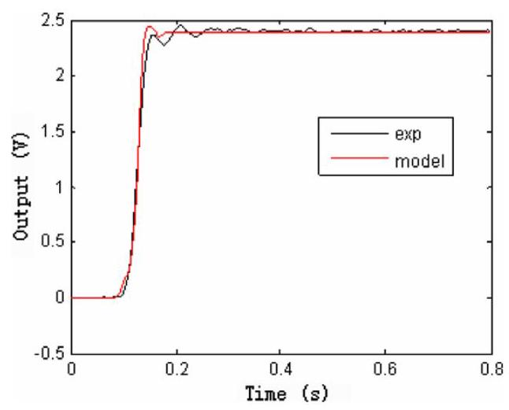

Fig. 11. Comparison between actual response and model output under input ${37.9719}\mathrm{\;g}/\mathrm{s}$ .

图11. 输入${37.9719}\mathrm{\;g}/\mathrm{s}$时实际响应与模型输出的比较。

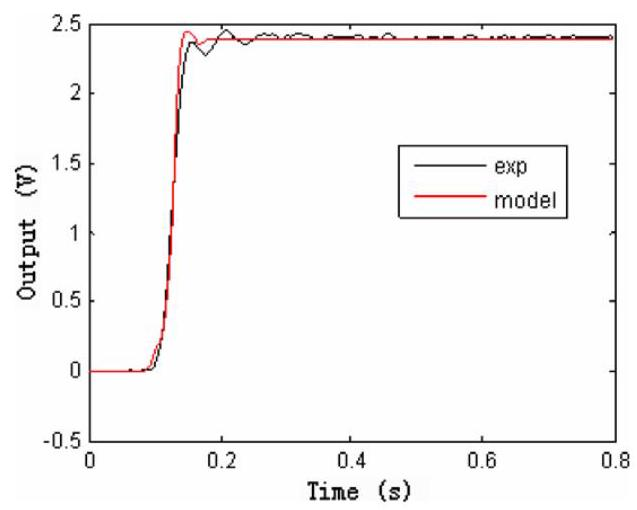

Fig. 12. Comparison between actual response and model output under input ${66.8078}\mathrm{\;g}/\mathrm{s}$ .

图12. 输入${66.8078}\mathrm{\;g}/\mathrm{s}$时实际响应与模型输出的比较。

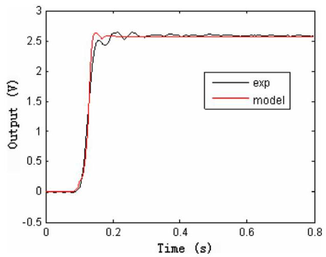

Fig. 13. Comparison between actual response and model output under input ${84.5464}\mathrm{\;g}/\mathrm{s}$ .

图13. 输入${84.5464}\mathrm{\;g}/\mathrm{s}$时实际响应与模型输出的比较。

## 6. Conclusions

## 6. 结论

(1) The order of the nonlinear static part will affect the modeling precision, and theoretically higher the order is, more accurate the model is. Therefore a suitable order should be prefixed under the assumption that error to some extent is permitted. In addition, the most nonlinear systems should be established in two directions: the negative and the positive, which had also been analyzed in [9]. In this paper, the simulation modeling in two directions for nonlinear part is performed.

(1)非线性静态部分的阶数会影响建模精度，理论上阶数越高，模型越精确。因此，在允许一定误差的前提下，应预先确定一个合适的阶数。此外，大多数非线性系统应在正负两个方向上建立模型，文献[9]中也对此进行了分析。本文对非线性部分进行了正负两个方向的仿真建模。

(2) The method requires a set of multilevel signals as inputs to extract various order outputs corresponding to the input ${x}_{0}$ , and the number of multilevel signals should be equal to the order of the nonlinear static part. At the same time matrix $A$ should be ensured to be non-singular, then Eq. (8) has one solution.

(2)该方法需要一组多级信号作为输入，以提取对应于输入${x}_{0}$的各级输出，多级信号的数量应等于非线性静态部分的阶数。同时应确保矩阵$A$非奇异，此时式(8)有唯一解。

(3) The linear transfer function should be identified more accurately because it will also affect the estimation of the nonlinear part parameters. The linear output extracting from total output is

(3)应更精确地辨识线性传递函数，因为它也会影响非线性部分参数的估计。从总输出中提取的线性输出为

$$
{\bar{y}}_{1} = {y}_{1} + {\zeta }_{1}
$$

where ${\bar{y}}_{1}$ is an estimate value of the linear output, ${y}_{1}$ is the real linear output, ${\zeta }_{1}$ is the noise, and the identification of $h\left( t\right)$ will be greatly influenced by noises. The identification formula of nonlinear part parameters is

其中${\bar{y}}_{1}$是线性输出的估计值，${y}_{1}$是实际线性输出，${\zeta }_{1}$是噪声，$h\left( t\right)$的辨识会受到噪声的很大影响。非线性部分参数的辨识公式为

$$
{r}_{i} = \frac{{y}_{i}}{{y}_{is}}
$$

where ${y}_{i}$ and ${y}_{is}$ are the $i$ th order output and $i$ th order reference output, in fact the average formula is adopted in order to reduce the affection of noises and avoid the possibility of zero divisor:

其中${y}_{i}$和${y}_{is}$分别是$i$阶输出和$i$阶参考输出，实际上采用平均值公式是为了减少噪声的影响并避免零除数的可能性:

$$
{r}_{i} = \frac{\operatorname{mean}\left( {y}_{i}\right) }{\operatorname{mean}\left( {y}_{is}\right) }
$$

where mean(·) is an average value of vector. If selecting one part of vector in which the affection of noise is less relatively, the modeling result is better.

其中mean(·)是向量的平均值。如果选择向量中噪声影响相对较小的一部分，建模结果会更好。

(4) When there is noise, the various outputs having been extracted are

(4)存在噪声时，已提取的各级输出为

$$
\bar{Y} = Y + {A}^{-1}\xi
$$

where $\bar{Y} = {\left\lbrack  {\bar{y}}_{1},\ldots ,{\bar{y}}_{n}\right\rbrack  }^{\mathrm{T}}, Y = {\left\lbrack  {y}_{1},\ldots ,{y}_{n}\right\rbrack  }^{\mathrm{T}}$ and $\xi  = \left\lbrack  {{\xi }_{1},\ldots }\right.$ , ${\left. {\xi }_{n}\right\rbrack  }^{\mathrm{T}}$ are the estimation value vector, real value vector and noise vector of various outputs, respectively. To reduce the noise affection, there is one solution that is to depress ${A}^{-1}\xi$ , which can be achieved by two ways: one is that the absolute value of noise is small; the other is to enlarge the value of $\left\{  {{k}_{1},{k}_{2},\ldots ,{k}_{n}}\right\}$ of $A$ , which means enlarging the magnitude of inputs. The latter is useful when the background noise fluctuates not too much.

其中$\bar{Y} = {\left\lbrack  {\bar{y}}_{1},\ldots ,{\bar{y}}_{n}\right\rbrack  }^{\mathrm{T}}, Y = {\left\lbrack  {y}_{1},\ldots ,{y}_{n}\right\rbrack  }^{\mathrm{T}}$以及$\xi  = \left\lbrack  {{\xi }_{1},\ldots }\right.$、${\left. {\xi }_{n}\right\rbrack  }^{\mathrm{T}}$分别为各输出的估计值向量、真实值向量和噪声向量。为降低噪声影响，有一种解决方案是抑制${A}^{-1}\xi$，这可通过两种方式实现:一种是噪声的绝对值较小；另一种是增大$A$的$\left\{  {{k}_{1},{k}_{2},\ldots ,{k}_{n}}\right\}$值，即增大输入的幅度。当背景噪声波动不太剧烈时，后者是有用的。

(5) Since both the linear transfer function estimation and bispectrum estimation are sensitive to the accuracy of FFT, the experimental data should be processed using the segmenting, windowing and averaging technique to improve the modeling precision.

(5) 由于线性传递函数估计和双谱估计都对FFT的精度敏感，因此应使用分段、加窗和平均技术处理实验数据，以提高建模精度。

## Acknowledgements

## 致谢

This work was supported by the National Natural Science Foundation of China (60474057) and the Natural Science Foundation of Anhui Province (01042305).

本工作得到了中国国家自然科学基金(60474057)和安徽省自然科学基金(01042305)的支持。

## References

## 参考文献

[1] M.J. Korenberg, L.D. Paarmann, Orthogonal approaches to time-series analysis and system identification, IEEE SP Magazine (1991) 29-43.

系列分析与系统辨识，《IEEE信号处理杂志》(1991年)第29 - 43页。

[2] R.J. Simpson, H.M. Power, Correlation techniques for theidentification of nonlinear systems, Measurement and Control 5

非线性系统辨识，《测量与控制》第5期(1972) 316-321.

[3] S.A. Billings, Identification of nonlinear systems-a survey, IEE Proceedings 127 (6) (1980) 272-285.

[4] J.Y. Hong, Y.C. Kim, E.J. Powers, On modeling the nonlinearrelationship between fluctuations with nonlinear transfer function,

波动与非线性传递函数之间的关系Proceedings of the IEEE 68 (8) (1980) 1026-1027.

[5] CH.P. Ritz, E.J. Powers, Estimation of nonlinear transfer functions forfully developed turbulence, Physica D 20 (1986) 20-334.

充分发展的湍流，《物理D》20(1986年)第20 - 334页。

[6] Martin Schetzen, Nonlinear system modeling based on the Wiener theory, Proceedings of the IEEE 69 (12) (1981) 1557-1573.

[7] V. John Mathews, Orthogonalization of correlated Gaussian signalsfor Volterra system identification, IEEE Signal Processing Letters 2

用于Volterra系统辨识，《IEEE信号处理快报》第2期(10) (1995) 188-190.

[8] Somnath Mukherjee, Vector measurement of nonlinear transferfunction, IEEE Transactions on Instrumentation and Measurement 44

函数，《IEEE仪器与测量学报》第44卷(4) (1994) 892-897.

[9] Jozef Voros, Iterative algorithm for parameter identification ofHammerstein systems with two-segment nonlinearities, IEEE Transactions on Automatic Control 44 (11) (1999) 2145-2149.

具有两段非线性的Hammerstein系统，《IEEE自动控制汇刊》44(11)(1999年)第2145 - 2149页。

[10] A.M. Zoubir, Identification of quadratic Volterra systems driven byNon-Gaussian process, IEEE Transactions on Signal Processing 43 (5)

非高斯过程，《IEEE信号处理汇刊》43(5)(1995) 1302-1306.

[11] Mysore Raghuveer, Chrysostomos L. Nilias, Bispectrum estimation: aparametric approach, IEEE Transaction on Acoustics, Speech, and Signal Processing ASSP-33 (4) (1985) 1213-1229.

参数方法，《IEEE声学、语音和信号处理汇刊》ASSP - 33(4)(1985年)第1213 - 1229页。

[12] S.W. Nan, E.J. Powers, Application of higher order spectral analysis tocubically nonlinear system identification, IEEE Transactions on Signal Processing 42 (7) (1994) 1746-1765.

三次非线性系统辨识，《IEEE信号处理汇刊》42(7)(1994年)第1746 - 1765页。

[13] Y.S. Cho, E.J. Powers, Quadratic system identification using higherorder spectra of I.I.D. signals, IEEE Transactions on Signal Processing 42 (5) (1994) 1268-1271.

独立同分布信号的高阶谱，《IEEE信号处理汇刊》42(5)(1994年)第1268 - 1271页。

[14] S.B. Kim, E.J. Powers, Orthogonalised frequency domain Volterra model for non-Gaussian Inputs, IEEE Proceedings-F 142 (6) (1993)402-409.

[15] K.J. Xu, L. Jia, One-stage identification algorithm and two-stepcompensation method of Hammerstein model with application to wrist force sensor, Review of Scientific Instruments 73 (4) (2002) 1949-1955.

《哈默斯坦模型的补偿方法及其在腕力传感器中的应用》，《科学仪器评论》73(4)(2002)1949 - 1955。

[16] D.W. Hu, Z.Z. Wang, An identification method for the Wiener modelof nonlinear systems, in: Proceedings of the 30th IEEE Conference on

非线性系统，载于:第30届IEEE会议论文集Decision and Control, vol. 1, 1991, pp. 783-787.

[17] M. Kozek, N. Jovanovic, Identification of Hammerstein/Wienernonlinear systems with extended Kalman filters, in: American

使用扩展卡尔曼滤波器的非线性系统，载于:美国Control Conference, Proceedings of the 2002, vol. 2, pp. 969-974.

[18] T. Katoh, T. Hatanaka, K. Uosaki, Hammerstein model identificationusing genetic programming. in: Systems, Man, and Cybernetics,

使用遗传编程。载于:系统、人与控制论IEEE SMC'99 Conference Proceedings, vol. 1, 1999, pp. 510-514.

[19] Er-Wei Bai, Minyue Fu, A blind approach to Hammerstein modelidentification, in: Proceedings of the 40th IEEE Conference on

辨识，载于:第40届IEEE会议论文集Decision and Control, vol. 5, 2001, pp. 4794-4799.

[20] H.X. Li, Identification of Hammerstein models using geneticalgorithms, IEE Proceedings - Control Theory and Applications 146

算法，《IEE Proceedings - Control Theory and Applications》146(6) (1999) 499-504.

[21] T. Sasayama, Y. Nishimura, S. Sakamoto, T. Hirayama, A solid-stateair flow sensor for automotive use, Sensors and Actuators 4 (1983) 121-128.

汽车用气流传感器，《传感器与执行器》4(1983)121 - 128。