# Enhancing Representation Learning for Periodic Time Series with Floss: A Frequency Domain Regularization Approach

# 使用Floss增强周期性时间序列的表示学习:一种频域正则化方法

Chunwei Yang

杨春伟

Sichuan University

四川大学

Chengdu, China

中国成都

ycwcw123@gmail.com

Xiaoxu Chen

陈晓旭

McGill University

麦吉尔大学

Montreal, Canada

加拿大蒙特利尔

xiaoxu.chen@mail.mcgill.ca

Lijun Sun

孙丽君

McGill University

麦吉尔大学

Montreal, Canada

加拿大蒙特利尔

lijun.sun@mcgill.ca

Hongyu Yang

杨宏宇

Sichuan University

四川大学

Chengdu, China

中国成都

yanghongyu@scu.edu.cn

Yuankai Wu

吴元凯

Sichuan University

四川大学

Chengdu, China

中国成都

wuyk0@scu.edu.cn

## ABSTRACT

## 摘要

Time series analysis is a fundamental task in various application domains, and deep learning approaches have demonstrated remarkable performance in this area. However, many real-world time series data exhibit significant periodic or quasi-periodic dynamics that are often not adequately captured by existing deep learning-based solutions. This results in an incomplete representation of the underlying dynamic behaviors of interest. To address this gap, we propose an unsupervised method called Floss that automatically regularizes learned representations in the frequency domain. The Floss method first automatically detects major periodicities from the time series. It then employs periodic shift and spectral density similarity measures to learn meaningful representations with periodic consistency. In addition, Floss can be easily incorporated into both supervised, semi-supervised, and unsupervised learning frameworks. We conduct extensive experiments on common time series classification, forecasting, and anomaly detection tasks to demonstrate the effectiveness of Floss. We incorporate Floss into several representative deep learning solutions to justify our design choices and demonstrate that it is capable of automatically discovering periodic dynamics and improving state-of-the-art deep learning models.

时间序列分析是各个应用领域中的一项基础任务，深度学习方法在该领域展现出了卓越的性能。然而，许多现实世界中的时间序列数据呈现出显著的周期性或准周期性动态，而现有的基于深度学习的解决方案往往无法充分捕捉这些动态。这导致对感兴趣的潜在动态行为的表示不完整。为了弥补这一差距，我们提出了一种名为Floss的无监督方法，该方法在频域中自动对学习到的表示进行正则化。Floss方法首先从时间序列中自动检测主要周期。然后，它采用周期性移位和谱密度相似性度量来学习具有周期性一致性的有意义表示。此外，Floss可以很容易地融入到监督、半监督和无监督学习框架中。我们对常见的时间序列分类、预测和异常检测任务进行了广泛的实验，以证明Floss的有效性。我们将Floss融入到几个有代表性的深度学习解决方案中，以证明我们的设计选择，并表明它能够自动发现周期性动态并改进当前最先进的深度学习模型。

:

Chunwei Yang, Xiaoxu Chen, Lijun Sun, Hongyu Yang, and Yuankai Wu. Enhancing Representation Learning for Periodic Time Series with Floss: A Frequency Domain Regularization Approach. 14(1): XXX-XXX, 2020. doi:XX.XX/XXX.XX

杨春伟、陈晓旭、孙丽君、杨宏宇、吴远凯。《用Floss增强周期性时间序列的表示学习:一种频域正则化方法》。14(1): XXX - XXX，2020。doi:XX.XX/XXX.XX

The source code, data, and/or other artifacts have been made available at https://github.com/AgustDD/Floss.

源代码、数据和/或其他工件已在https://github.com/AgustDD/Floss上提供。

## 1 INTRODUCTION

## 1 引言

We are witnessing continued developments in sensor technologies, where sensors produce multivariate time series. These advances have paved the way for the critical role of time series analysis in various scientific and engineering fields. In the realm of energy management, time series analysis enables accurate load forecasting, facilitating efficient resource allocation and optimal energy utilization [7, 15]. Within transportation engineering, time series analysis plays a pivotal role in predicting traffic flows and optimizing transportation systems [19, 43, 44]. Moreover, in financial markets, time series analysis is of utmost importance. It allows for the modeling of asset prices, enables volatility forecasting, and assists in developing effective risk management strategies [34]. The application of time series analysis in healthcare proves invaluable as well, aiding in patient monitoring, disease surveillance, and the prediction of health outcomes [20, 29].

我们见证了传感器技术的持续发展，传感器产生多变量时间序列。这些进展为时间序列分析在各个科学和工程领域发挥关键作用铺平了道路。在能源管理领域，时间序列分析能够进行准确的负荷预测，促进高效的资源分配和优化能源利用[7, 15]。在交通工程领域，时间序列分析在预测交通流量和优化交通系统方面发挥着关键作用[19, 43, 44]。此外，在金融市场中，时间序列分析至关重要。它允许对资产价格进行建模，实现波动率预测，并有助于制定有效的风险管理策略[34]。时间序列分析在医疗保健中的应用也被证明具有极高价值，有助于患者监测、疾病监测以及健康结果预测[20, 29]。

The widespread adoption of deep neural networks in time series analysis has brought about significant advancements in recent years [28]. These models have demonstrated their efficacy in capturing complex temporal patterns by leveraging supervised or unsupervised training approaches. Through proper training method, neural networks acquire robust temporal representations that are well-suited for various tasks within time series analysis [47]. One crucial task where neural networks excel is forecasting, where they leverage their learned temporal representations to make accurate predictions about future values [42]. Additionally, neural networks have shown promising results in anomaly detection within time series data [26].

近年来，深度神经网络在时间序列分析中的广泛应用带来了显著进展[28]。这些模型通过利用监督或无监督训练方法，在捕捉复杂时间模式方面展现出了有效性。通过适当的训练方法，神经网络获得了强大的时间表示，非常适合时间序列分析中的各种任务[47]。神经网络擅长的一项关键任务是预测，它们利用学习到的时间表示对未来值进行准确预测[42]。此外，神经网络在时间序列数据的异常检测中也取得了有前景的结果[26]。

The quest for a universal representation of time series data has sparked significant interest in deep representation learning strategies, including contrastive learning [4, 14]. These strategies aim to extract powerful representations from the hidden layers of deep neural networks, capturing the intrinsic features embedded within time series data. The value of such representations extends to various downstream tasks, including time series anomaly detection, forecasting, and classification. Researchers have explored specific invariances within time series data to enhance deep representation learning frameworks. For instance, Franceschi et al. [10] encouraged representations that closely resemble sampled subseries, while Tonekaboni et al. [32] enforced smoothness between adjacent time windows. Eldele et al. [9] proposed a model that learns scale and permutation-invariant representations. Yue et al. [47] introduced TS2Vec, a contrastive learning framework that captures contextual invariances at multiple resolutions within time series. Despite the progress made, existing methods often borrow ideas directly from contrastive learning methods in computer vision and natural language processing domains. However, unlike images that typically possess recognizable features, time series data often exhibit underlying patterns that are not easily explainable. Applying assumptions borrowed from other domains without careful consideration may result in unsuccessful representation learning for time series data.

对时间序列数据通用表示的追求引发了对深度表示学习策略的浓厚兴趣，包括对比学习[4, 14]。这些策略旨在从深度神经网络的隐藏层中提取强大的表示，捕捉时间序列数据中嵌入的内在特征。这种表示的价值延伸到各种下游任务，包括时间序列异常检测、预测和分类。研究人员探索了时间序列数据中的特定不变性，以增强深度表示学习框架。例如，Franceschi等人[10]鼓励与采样子序列非常相似的表示，而Tonekaboni等人[32]强制相邻时间窗口之间的平滑性。Eldele等人[9]提出了一种学习尺度和排列不变表示的模型。Yue等人[47]引入了TS2Vec，这是一种对比学习框架，它在时间序列内的多个分辨率上捕捉上下文不变性。尽管取得了进展，但现有方法通常直接借鉴计算机视觉和自然语言处理领域的对比学习方法的思路。然而，与通常具有可识别特征的图像不同，时间序列数据往往呈现出不易解释的潜在模式。在没有仔细考虑的情况下应用从其他领域借鉴的假设可能会导致时间序列数据的表示学习不成功。

---

Corresponding author (Yuankai Wu, wuyk0@scu.edu.cn)

通讯作者(吴远凯，wuyk0@scu.edu.cn)

---

The temporal dynamics of real-world processes often exhibit recurring cycles and significant periodicity, which are fundamental characteristics of time series data [11]. This inherent property becomes particularly evident in time series associated with human behavior, where prominent daily and weekly patterns emerge. Recognizing the importance of capturing and leveraging periodicity, the exploration of representation learning methods that effectively capture the underlying periodic invariance holds substantial promise in time series analysis. One classical approach to detecting periodicity in traditional time series analysis is the employment of frequency domain methods, which enable the identification of periodic patterns by transforming time series into the frequency domain [21]. The discrete Fourier transform (DFT), for instance, facilitates the conversion of time series from the time domain to the frequency domain, yielding the periodogram that encodes the strength at different frequencies. Similarly, other transformations, such as the discrete cosine transform and wavelet transform, can also identify periodicity and enhance supervised learning in time series analysis [38]. These studies provide compelling evidence that frequency domain information harbors valuable insights for analyzing periodic time series data.

现实世界过程的时间动态通常呈现出循环周期和显著的周期性，这是时间序列数据的基本特征[11]。这种固有属性在与人类行为相关的时间序列中尤为明显，其中会出现明显的每日和每周模式。认识到捕捉和利用周期性的重要性，探索能够有效捕捉潜在周期不变性的表示学习方法在时间序列分析中具有很大的前景。传统时间序列分析中检测周期性的一种经典方法是使用频域方法，通过将时间序列转换到频域来识别周期性模式[21]。例如，离散傅里叶变换(DFT)有助于将时间序列从时域转换到频域，生成编码不同频率强度的周期图。同样，其他变换，如离散余弦变换和小波变换，也可以识别周期性并增强时间序列分析中的监督学习[38]。这些研究提供了有力证据，表明频域信息对于分析周期性时间序列数据具有宝贵的见解。

In fact, frequency-domain information has been widely leveraged in deep learning architectures for modeling time series data. Zhou et al. [53] proposed the use of Transformers operating in the frequency domain, enabling the capture of global properties within time series data. Woo et al. [40] introduced ETSTransformer, which utilizes Fourier bases in the frequency domain to extract dominant seasonal patterns from time series. Liu et al. [22] devised a tree-structured network that iteratively decomposes input signals into various frequency subbands. Zhang et al. [50] decomposed time series into seasonal and trend components, employing Fourier attention for prediction. Wu et al. [41] employed Fourier transformation to disentangle original temporal variations into in-traperiod and interperiod variations, capturing their dependencies using 2D convolutional operations. Notably, recent efforts have focused on regulating frequency-domain representations through unsupervised learning approaches. Zhang et al. [51] directly applied contrastive learning to the frequency transformation of raw signals, embedding the time-based neighborhood of an example close to its frequency-based neighborhood. Similar ideas were explored in CoST [39] and BTSF [46]. However, while these approaches leverage unsupervised learning and contrastive learning, none of them are specifically designed to capture periodic dynamics in time series data.

事实上，频域信息已在深度学习架构中广泛用于对时间序列数据进行建模。周等人[53]提出使用在频域中运行的Transformer，能够捕捉时间序列数据中的全局属性。吴等人[40]引入了ETSTransformer，它在频域中利用傅里叶基从时间序列中提取主要的季节性模式。刘等人[22]设计了一种树状结构网络，将输入信号迭代分解为各种频率子带。张等人[50]将时间序列分解为季节性和趋势成分，采用傅里叶注意力进行预测。吴等人[41]采用傅里叶变换将原始时间变化分解为周期内和周期间变化，使用二维卷积操作捕捉它们的依赖性。值得注意的是，最近的努力集中在通过无监督学习方法调节频域表示。张等人[51]直接将对比学习应用于原始信号的频率变换，将一个示例基于时间的邻域嵌入到其基于频率的邻域附近。在CoST[39]和BTSF[46]中也探索了类似的想法。然而，虽然这些方法利用了无监督学习和对比学习，但它们都不是专门为捕捉时间序列数据中的周期动态而设计的。

In our pursuit of capturing periodic dynamics by time series representations, we propose a novel approach that leverages the principles of contrastive learning [4, 17]. Contrastive learning operates on the basis of two key elements: (i) a contrastive loss that compares features and (ii) a set of transformations that encode the desired invariances. Building upon this framework, we introduce a simple yet effective combination of loss function and transformation named Floss, which can be seamlessly integrated into unsupervised and semi-supervised learning methods specifically designed for periodic time series analysis. Our approach centers on the hypothesis that the spectral density of the learned representation remains invariant under periodic transformations. To realize this, our framework incorporates straightforward and efficient data augmentations that can accommodate various periodic time series with specified periodicities. Initially, we employ frequency domain transformation to automatically detect the dominant periodicity and create a periodic view of the target time series by introducing random periodic shifts in the temporal dimension. Subsequently, a time series encoder is employed to learn a periodic invariant representation. Importantly, this encoder can be seamlessly integrated into any existing deep learning framework, thereby ensuring compatibility and flexibility in its application. Finally, we design a novel task that enforces the similarity of spectral densities between the target time series and its periodic views. To mitigate the influence of high-frequency noise, we employ a hierarchical approach to measure the similarity of spectral densities between the representations. The intuition of our work is illustrated in Figure 1.

在我们通过时间序列表示捕捉周期动态的探索中，我们提出了一种利用对比学习原理的新方法[4, 17]。对比学习基于两个关键要素进行操作:(i)比较特征的对比损失，以及(ii)一组编码所需不变性的变换。基于这个框架，我们引入了一种名为Floss的简单而有效的损失函数和变换组合，它可以无缝集成到专门为周期时间序列分析设计的无监督和半监督学习方法中。我们的方法基于这样的假设:学习到的表示的谱密度在周期变换下保持不变。为了实现这一点，我们的框架纳入了直接且高效的数据增强，能够适应具有指定周期的各种周期时间序列。首先，我们采用频域变换自动检测主导周期，并通过在时间维度引入随机周期偏移来创建目标时间序列的周期视图。随后，使用时间序列编码器学习周期不变表示。重要的是，这个编码器可以无缝集成到任何现有的深度学习框架中，从而确保其应用的兼容性和灵活性。最后，我们设计了一个新任务，强制目标时间序列与其周期视图之间的谱密度相似。为了减轻高频噪声的影响，我们采用分层方法来测量表示之间的谱密度相似性。我们工作的直观展示如图1所示。

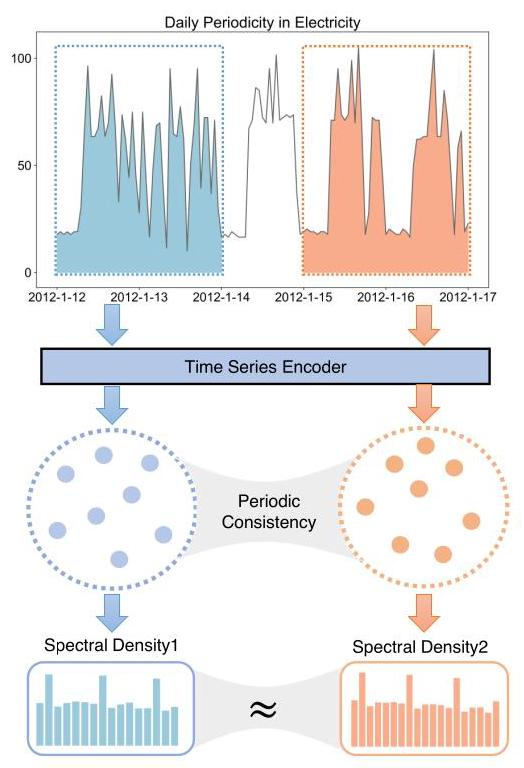

Figure 1: The framework of the paper: The time series shown in the figure exhibits strong daily periodicity. After detecting this periodicity, we aim to make the spectral densities of the representations of two time series segments, which differ by several number of periodicities, as similar as possible.

图1:本文的框架:图中所示的时间序列呈现出强烈的每日周期性。在检测到这种周期性后，我们旨在使两个时间序列段的表示的谱密度尽可能相似，这两个时间序列段相差几个周期。

To the best of our knowledge, this study represents the first systematic investigation into the learning of representations for periodic or quasi-periodic time series by examining the invariance of spectral density. Specifically, our Floss can be seamlessly integrated into current supervised and unsupervised frameworks. The outcomes obtained from tasks such as time series classification, forecasting, and anomaly detection confirm the ability of Floss to capture and encode periodic invariances in time series, resulting in a notable enhancement of task performance.

据我们所知，本研究通过检查谱密度的不变性，首次对周期性或准周期性时间序列的表示学习进行了系统研究。具体而言，我们的Floss可以无缝集成到当前的监督和无监督框架中。从时间序列分类、预测和异常检测等任务中获得的结果证实了Floss在捕捉和编码时间序列中的周期不变性方面的能力，从而显著提高了任务性能。

The paper is organized as follows. Section 2 introduces the necessary concepts for understanding the Floss system. In Section 3, we provide a comprehensive description of our Floss framework. Furthermore, Section 4 showcases the results of our forecasting, classification, and anomaly detection experiments using the Floss-enhanced models on extensive benchmarking datasets. In addtion, in-depth analysis and ablation studies are also provided in Section 4. Finally, Section 5 offers concluding remarks and summarizes our work.

本文结构如下。第2节介绍理解Floss系统所需的概念。在第3节中，我们全面描述了我们的Floss框架。此外，第4节展示了我们使用Floss增强模型在广泛的基准数据集上进行预测、分类和异常检测实验的结果。此外，第4节还提供了深入分析和消融研究。最后，第5节给出了结论并总结了我们的工作。

## 2 PRELIMINARIES

## 2 预备知识

Periodic time series: Given a data set of periodic time series, denoted $\mathcal{X} \in  {\mathbb{R}}^{N \times  T \times  F}$ , where $N$ represents the number of time series and $T$ and $F$ indicate the size of the time window and feature dimension, respectively, we assume that these time series exhibit periodic behavior. Moreover, it is important to note that the pe-riodicities may vary within the sampled time ranges. To further clarify, let’s define $\left\lbrack  {{t}_{1},{t}_{2}}\right\rbrack   = \left\{  {{t}_{1},{t}_{1} + 1,\ldots ,{t}_{2} - 1,{t}_{2}}\right\}$ . We use the notation ${\mathcal{X}}_{\left\lbrack  {t}_{1},{t}_{2}\right\rbrack  } \in  {\mathbb{R}}^{N \times  \left( {{t}_{2} - {t}_{1} + 1}\right)  \times  F}$ to represent the time series sampled from ${t}_{1}$ to ${t}_{2}$ .

周期性时间序列:给定一个周期性时间序列的数据集，记为$\mathcal{X} \in  {\mathbb{R}}^{N \times  T \times  F}$，其中$N$表示时间序列的数量，$T$和$F$分别表示时间窗口的大小和特征维度，我们假设这些时间序列呈现周期性行为。此外，需要注意的是，在采样时间范围内，周期可能会有所不同。为了进一步说明，让我们定义$\left\lbrack  {{t}_{1},{t}_{2}}\right\rbrack   = \left\{  {{t}_{1},{t}_{1} + 1,\ldots ,{t}_{2} - 1,{t}_{2}}\right\}$。我们使用符号${\mathcal{X}}_{\left\lbrack  {t}_{1},{t}_{2}\right\rbrack  } \in  {\mathbb{R}}^{N \times  \left( {{t}_{2} - {t}_{1} + 1}\right)  \times  F}$来表示从${t}_{1}$到${t}_{2}$采样的时间序列。

To illustrate, let’s consider the scenario where $\mathcal{X}$ represents traffic time series collected from $N$ traffic sensors in a road network. If we sample the data over a period corresponding to a single day for ${\mathcal{X}}_{\left\lbrack  {t}_{1},{t}_{2}\right\rbrack  }$ , it becomes apparent that the dominant periodicity is approximately 6 hours, as traffic data typically exhibits morning and evening peaks. Conversely, if we sample the data over several days for ${\mathcal{X}}_{\left\lbrack  {t}_{1},{t}_{2}\right\rbrack  }$ , the prominent period would be one day. Furthermore, it is worth noting that time series can exhibit multiple periodicities. For instance, in the traffic example, there could be periodicities of 6 hours and 1 day. We introduce the notation ${p}_{\left\lbrack  {t}_{1},{t}_{2}\right\rbrack  } \in  \mathbb{R}$ to denote the prominent periodicity of time series ${\mathcal{X}}_{\left\lbrack  {t}_{1},{t}_{2}\right\rbrack  }$ .

为了说明这一点，让我们考虑这样一种情况，即$\mathcal{X}$表示从道路网络中的$N$个交通传感器收集的交通时间序列。如果我们在对应于一天的时间段内对${\mathcal{X}}_{\left\lbrack  {t}_{1},{t}_{2}\right\rbrack  }$的数据进行采样，很明显，主导周期大约是6小时，因为交通数据通常会出现早晚高峰。相反，如果我们在几天内对${\mathcal{X}}_{\left\lbrack  {t}_{1},{t}_{2}\right\rbrack  }$的数据进行采样，突出的周期将是一天。此外，值得注意的是，时间序列可以呈现多个周期。例如，在交通示例中，可能存在6小时和1天的周期。我们引入符号${p}_{\left\lbrack  {t}_{1},{t}_{2}\right\rbrack  } \in  \mathbb{R}$来表示时间序列${\mathcal{X}}_{\left\lbrack  {t}_{1},{t}_{2}\right\rbrack  }$的突出周期。

Time series representation: For a given ${\mathcal{X}}_{\left\lbrack  {t}_{1},{t}_{2}\right\rbrack  }$ , a representation model $\mathcal{G}\left( {\cdot ;\theta }\right)$ parameterized by $\theta$ generates a representation tensor ${\mathcal{Y}}_{\left\lbrack  {t}_{1},{t}_{2}\right\rbrack  } = \mathcal{G}\left( {{\mathcal{X}}_{\left\lbrack  {t}_{1},{t}_{2}\right\rbrack  };\theta }\right)$ . Here, ${\mathcal{Y}}_{\left\lbrack  {t}_{1},{t}_{2}\right\rbrack  } \in  {\mathbb{R}}^{{N}^{\prime } \times  \left( {{t}_{2} - {t}_{1} + 1}\right)  \times  {F}^{\prime }}$ , where ${N}^{\prime }$ and ${F}^{\prime }$ indicate the dimensions of the modified time series count and the representation feature, respectively. It is important to note that the value of ${N}^{\prime }$ varies depending on the choice of $\mathcal{G}$ . If we aim to generate an overall representation encompassing all time series, then ${N}^{\prime } = 1$ . On the other hand, if the goal is to produce a representation for each individual time series, then ${N}^{\prime } = N$ .

时间序列表示:对于给定的${\mathcal{X}}_{\left\lbrack  {t}_{1},{t}_{2}\right\rbrack  }$，由$\theta$参数化的表示模型$\mathcal{G}\left( {\cdot ;\theta }\right)$生成表示张量${\mathcal{Y}}_{\left\lbrack  {t}_{1},{t}_{2}\right\rbrack  } = \mathcal{G}\left( {{\mathcal{X}}_{\left\lbrack  {t}_{1},{t}_{2}\right\rbrack  };\theta }\right)$。这里，${\mathcal{Y}}_{\left\lbrack  {t}_{1},{t}_{2}\right\rbrack  } \in  {\mathbb{R}}^{{N}^{\prime } \times  \left( {{t}_{2} - {t}_{1} + 1}\right)  \times  {F}^{\prime }}$，其中${N}^{\prime }$和${F}^{\prime }$分别表示修改后的时间序列计数和表示特征的维度。需要注意的是，${N}^{\prime }$的值会根据$\mathcal{G}$的选择而变化。如果我们旨在生成涵盖所有时间序列的整体表示，那么${N}^{\prime } = 1$。另一方面，如果目标是为每个单独的时间序列生成表示，那么${N}^{\prime } = N$。

Power Spectral Density: In signal processing, the power spectral density provides information about the expected signal power at different frequencies of the signal. For example, the periodogram is a measure of spectral density in the Fourier domain. Denoting the discrete Fourier transform as $\mathcal{{DFT}}\left( \cdot \right)$ , the periodogram $\Phi \left( \cdot \right)$ is computed as:

功率谱密度:在信号处理中，功率谱密度提供了关于信号在不同频率下预期信号功率的信息。例如，周期图是傅里叶域中谱密度的一种度量。将离散傅里叶变换记为$\mathcal{{DFT}}\left( \cdot \right)$，周期图$\Phi \left( \cdot \right)$的计算方式如下:

$$
\mathcal{D}\mathcal{F}\mathcal{T}\left( {w}_{j}\right)  = \frac{1}{\sqrt{n}}\mathop{\sum }\limits_{{t = 1}}^{n}{x}_{t}{e}^{-{2\pi i}{w}_{j}t}, \tag{1}
$$

$$
\Phi \left( {w}_{j}\right)  = \operatorname{Re}{\left( \mathcal{D}\mathcal{F}\mathcal{T}\left( {w}_{j}\right) \right) }^{2} + \operatorname{Im}{\left( \mathcal{D}\mathcal{F}\mathcal{T}\left( {w}_{j}\right) \right) }^{2},
$$

where ${x}_{t}$ denotes the time series value at time point $t$ , $\operatorname{Re}\left( \cdot \right)$ and Im $\left( \cdot \right)$ denote the real and imaginary parts, respectively. Each element of the periodogram represents the power at frequency ${w}_{j}$ , or equivalently, at period $1/{w}_{j}$ . It is important to note that other transformations, such as discrete cosine transform (DCT) and wavelet transform (DWT), can also be used to calculate the spectral density. If we employ the DCT, the transformation is given by:

其中${x}_{t}$表示时间点$t$处的时间序列值，$\operatorname{Re}\left( \cdot \right)$和Im$\left( \cdot \right)$分别表示实部和虚部。周期图的每个元素表示频率${w}_{j}$或等效地周期$1/{w}_{j}$处的功率。需要注意的是，其他变换，如离散余弦变换(DCT)和小波变换(DWT)，也可用于计算谱密度。如果我们采用DCT，变换由下式给出:

$$
\mathcal{{DCT}}\left( {w}_{j}\right)  = {\left( \frac{n}{2}\right) }^{-1/2}\mathop{\sum }\limits_{{t = 1}}^{n} \land  \left( t\right) {x}_{t}\cos \left( {\frac{\pi {w}_{j}}{2n}\left( {{2t} - 1}\right) }\right) ,
$$

$$
\land  \left( t\right)  = \left\{  \begin{array}{l} \frac{1}{\sqrt{2}}\;\text{ if }\;t = 1 \\  1\;\text{ otherwise } \end{array}\right. \tag{2}
$$

$$
\Phi \left( {w}_{j}\right)  = \left| {\mathcal{D}\mathcal{C}\mathcal{T}\left( {w}_{j}\right) }\right| .
$$

## 3 METHOD

## 3方法

In this section, we present the proposed frequency domain loss (Floss) for periodic time series and provide implementation details. Floss is an novel framework that aims to capture the inherent periodic invariance of time series in its learned representations. To accomplish this, the framework incorporates two key steps: a periodicity detection module for generating periodic views and a novel objective that compares the spectral densities of these representations (Figure 2). By doing so, the learned representations are equipped with an awareness of the underlying periodic nature of time series.

在本节中，我们提出了用于周期性时间序列的频域损失(Floss)并提供实现细节。Floss是一个新颖的框架，旨在在其学习表示中捕捉时间序列固有的周期性不变性。为了实现这一点，该框架包含两个关键步骤:一个用于生成周期性视图的周期性检测模块和一个比较这些表示的谱密度的新颖目标(图2)。通过这样做，学习到的表示具备了对时间序列潜在周期性本质的认识。

### 3.1 Periodic Detection and Augmentation

### 3.1周期性检测与增强

Assuming the existence of multiple periodicities within each temporal sampled time series ${\mathcal{X}}_{\left\lbrack  {t}_{1},{t}_{2}\right\rbrack  } \in  {\mathbb{R}}^{N \times  \left( {{t}_{2} - {t}_{1} + 1}\right)  \times  F}$ , our study focuses on a wide time range $\left\lbrack  {{t}_{1},{t}_{2}}\right\rbrack$ to encompass diverse and significant periodic patterns in the data. In order to create periodic transformation, it is necessary to first identify the underlying periods. This is achieved by calculating the average spectral density using the following procedure:

假设在每个时间采样时间序列${\mathcal{X}}_{\left\lbrack  {t}_{1},{t}_{2}\right\rbrack  } \in  {\mathbb{R}}^{N \times  \left( {{t}_{2} - {t}_{1} + 1}\right)  \times  F}$内存在多个周期性，我们的研究聚焦于较宽的时间范围$\left\lbrack  {{t}_{1},{t}_{2}}\right\rbrack$，以涵盖数据中多样且显著的周期性模式。为了创建周期性变换，首先需要识别潜在周期。这通过使用以下过程计算平均谱密度来实现:

$$
\widehat{\Phi } = \frac{1}{NF}\mathop{\sum }\limits_{{n = 1}}^{N}\mathop{\sum }\limits_{{f = 1}}^{F}{\Phi }_{\mathrm{n},\mathrm{f}}
$$

$$
\widehat{w} = \arg \max \left( \widehat{\Phi }\right) , \tag{3}
$$

$$
{\widehat{p}}_{\left\lbrack  {t}_{1},{t}_{2}\right\rbrack  } = \frac{\left( {t}_{2} - {t}_{1} + 1\right) }{\widehat{w}}.
$$

Here, ${\Phi }_{\mathrm{n},\mathrm{f}}$ represents the estimated periodogram of the $f$ -th feature of the $n$ -th time series. The symbol $\widehat{\Phi } \in  {\mathbb{R}}^{{t}_{2} - {t}_{1} + 1}$ denotes the average periodogram across features. It is important to note that the $j$ -th value $\Phi \left( {w}_{j}\right)$ signifies the intensity of the frequency- $j$ periodic basis function, which is associated with the period length $\frac{\left( {t}_{2} - {t}_{1} + 1\right) }{{w}_{j}}$ . Furthermore, we examine the maximum periodicity ${\widehat{p}}_{\left\lbrack  {t}_{1},{t}_{2}\right\rbrack  }$ discovered through the periodogram, which corresponds to the highest value observed in $\widehat{\Phi }$ .

在此，${\Phi }_{\mathrm{n},\mathrm{f}}$表示第$n$个时间序列的第$f$个特征的估计周期图。符号$\widehat{\Phi } \in  {\mathbb{R}}^{{t}_{2} - {t}_{1} + 1}$表示各特征的平均周期图。需要注意的是，第$j$个值$\Phi \left( {w}_{j}\right)$表示频率为$j$的周期基函数的强度，它与周期长度$\frac{\left( {t}_{2} - {t}_{1} + 1\right) }{{w}_{j}}$相关。此外，我们研究通过周期图发现的最大周期性${\widehat{p}}_{\left\lbrack  {t}_{1},{t}_{2}\right\rbrack  }$，它对应于在$\widehat{\Phi }$中观察到的最高值。

Although the periodogram is extensively employed for spectral analysis and capturing periodic dynamics, its efficacy can be suboptimal under certain circumstances. Notably, high levels of noise can obfuscate the periodic signals, resulting in inaccurate or potentially deceptive outcomes [33]. Additionally, the periodogram may encounter challenges when faced with complex spectral shapes or irregular patterns, impeding its ability to precisely capture and characterize the underlying periodic dynamics [37].

尽管周期图被广泛用于频谱分析和捕捉周期性动态，但在某些情况下其效果可能并不理想。值得注意的是，高水平的噪声会掩盖周期性信号，导致不准确或可能具有欺骗性的结果[33]。此外，当面对复杂的频谱形状或不规则模式时，周期图可能会遇到挑战，从而阻碍其精确捕捉和表征潜在周期性动态的能力[37]。

In our approach, we compute a periodogram for each sampled batch, which essentially involves random sampling over the time domain during the training period. We posit that the potential inaccuracies associated with the periodogram can be mitigated by employing this temporal sampling approach. By performing random sampling over a wide time range, we increase the number of samples, thereby enhancing the statistical consistency of the estimated periodogram. This approach is supported by empirical validation. For instance, in the field of signal processing, random sampling followed by periodogram analysis has proven effective in identifying periodic signals [31]. Similarly, in astronomy, this approach has been successfully utilized for periodogram analysis [35].

在我们的方法中，我们为每个采样批次计算一个周期图，这在本质上涉及在训练期间对时域进行随机采样。我们认为，通过采用这种时间采样方法，可以减轻与周期图相关的潜在不准确性。通过在较宽的时间范围内进行随机采样，我们增加了样本数量，从而提高了估计周期图的统计一致性。这种方法得到了实证验证的支持。例如，在信号处理领域，随机采样后进行周期图分析已被证明在识别周期性信号方面是有效的[31]。同样，在天文学中，这种方法已成功用于周期图分析[35]。

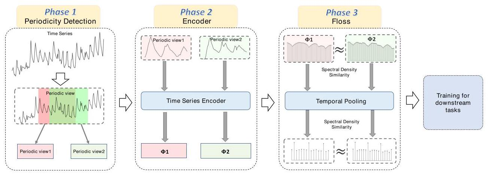

Figure 2: Our framework comprises three critical steps: (1) Periodicity Detection: We automatically detect periodicity patterns from the input time series samples and utilize the detected periodicity to create two views of the input time series. (2) Frequency Domain Similarity Learning: The two periodic views are processed through their respective time series encoders, generating two representations. (3) The Floss algorithm hierarchically calculates the similarities between the spectral densities of the two representations using temporal pooling. The pre-trained encoder can then be directly applied to downstream tasks.

图2:我们的框架包括三个关键步骤:(1) 周期性检测:我们从输入的时间序列样本中自动检测周期性模式，并利用检测到的周期性创建输入时间序列的两个视图。(2) 频域相似性学习:这两个周期性视图通过各自的时间序列编码器进行处理，生成两个表示。(3) Floss算法使用时间池化分层计算这两个表示的谱密度之间的相似性。然后，预训练的编码器可以直接应用于下游任务。

After obtaining the estimated ${\widehat{p}}_{\left\lbrack  {t}_{1},{t}_{2}\right\rbrack  }$ for ${\mathcal{X}}_{\left\lbrack  {t}_{1},{t}_{2}\right\rbrack  }$ , we shift the data along the time axis to exploit the periodic dynamics. We implement this concept through random periodic shifts. In a formal sense, we consider the periodic view of ${\mathcal{X}}_{\left\lbrack  {t}_{1},{t}_{2}\right\rbrack  }$ as ${\mathcal{X}}_{\left\lbrack  {\widehat{t}}_{1},{\widehat{t}}_{2}\right\rbrack  }$ , where ${\widehat{t}}_{1}$ and ${\widehat{t}}_{2}$ are ${t}_{1} + a{\widehat{p}}_{\left\lbrack  {t}_{1},{t}_{2}\right\rbrack  }$ and ${t}_{2} + a{\widehat{p}}_{\left\lbrack  {t}_{1},{t}_{2}\right\rbrack  }, a$ is a random integer,

在获得第${\mathcal{X}}_{\left\lbrack  {t}_{1},{t}_{2}\right\rbrack  }$个的估计${\widehat{p}}_{\left\lbrack  {t}_{1},{t}_{2}\right\rbrack  }$后，我们沿时间轴移动数据以利用周期性动态。我们通过随机周期移位来实现这一概念。从形式上讲，我们将第${\mathcal{X}}_{\left\lbrack  {t}_{1},{t}_{2}\right\rbrack  }$个的周期性视图视为${\mathcal{X}}_{\left\lbrack  {\widehat{t}}_{1},{\widehat{t}}_{2}\right\rbrack  }$，其中${\widehat{t}}_{1}$和${\widehat{t}}_{2}$是${t}_{1} + a{\widehat{p}}_{\left\lbrack  {t}_{1},{t}_{2}\right\rbrack  }$，而${t}_{2} + a{\widehat{p}}_{\left\lbrack  {t}_{1},{t}_{2}\right\rbrack  }, a$是一个随机整数。

### 3.2 Hierarchical Frequency-Domain Loss

### 3.2 分层频域损失

Given an encoder $\mathcal{G}\left( {\cdot ;\theta }\right)$ parameterized by $\theta$ , along with the original view ${\mathcal{X}}_{\left\lbrack  {t}_{1},{t}_{2}\right\rbrack  }$ and its periodic view ${\mathcal{X}}_{\left\lbrack  {\widehat{t}}_{1},{\widehat{t}}_{2}\right\rbrack  }$ , our objective is to minimize the difference in power spectral density between the two representations. Let $\mathcal{Y} = \mathcal{G}\left( {{\mathcal{X}}_{\left\lbrack  {t}_{1},{t}_{2}\right\rbrack  };\theta }\right)$ and $\widehat{\mathcal{Y}} = \mathcal{G}\left( {{\mathcal{X}}_{\left\lbrack  {\widehat{t}}_{1},{\widehat{t}}_{2}\right\rbrack  };\theta }\right)$ . Let ${\Phi }_{\mathcal{Y}}$ and ${\Phi }_{\widehat{\mathcal{Y}}}$ represent the estimated periodograms of $\mathcal{Y}$ and $\widehat{\mathcal{Y}}$ respectively. The loss function for achieving periodic invariance can be defined as follows:

给定一个由$\theta$参数化的编码器$\mathcal{G}\left( {\cdot ;\theta }\right)$，以及原始视图${\mathcal{X}}_{\left\lbrack  {t}_{1},{t}_{2}\right\rbrack  }$及其周期视图${\mathcal{X}}_{\left\lbrack  {\widehat{t}}_{1},{\widehat{t}}_{2}\right\rbrack  }$，我们的目标是最小化这两种表示之间的功率谱密度差异。设$\mathcal{Y} = \mathcal{G}\left( {{\mathcal{X}}_{\left\lbrack  {t}_{1},{t}_{2}\right\rbrack  };\theta }\right)$和$\widehat{\mathcal{Y}} = \mathcal{G}\left( {{\mathcal{X}}_{\left\lbrack  {\widehat{t}}_{1},{\widehat{t}}_{2}\right\rbrack  };\theta }\right)$。设${\Phi }_{\mathcal{Y}}$和${\Phi }_{\widehat{\mathcal{Y}}}$分别表示$\mathcal{Y}$和$\widehat{\mathcal{Y}}$的估计周期图。实现周期不变性的损失函数可定义如下:

$$
{\mathcal{L}}_{f} = \frac{1}{{N}^{\prime }{F}^{\prime }}{\begin{Vmatrix}\Phi y - {\Phi }_{\widehat{y}}\end{Vmatrix}}_{l1} \tag{4}
$$

where ${N}^{\prime }$ and ${F}^{\prime }$ denote the projected time series and the number of features in $\mathcal{Y}$ and $\widehat{\mathcal{Y}}$ respectively.

其中，${N}^{\prime }$和${F}^{\prime }$分别表示投影后的时间序列以及$\mathcal{Y}$和$\widehat{\mathcal{Y}}$中的特征数量。

By minimizing the loss function defined in Equation (4), we can reap two distinct advantages of preserving periodic invariance. Firstly, it ensures that the representations of the original view and its periodic counterpart exhibit similarity within a specific domain. Secondly, it enables the identification of similar periodic patterns from the representations of both the original view and its periodic view.

通过最小化式(4)中定义的损失函数，我们可以获得保持周期不变性的两个不同优势。首先，它确保原始视图及其周期对应视图的表示在特定域内表现出相似性。其次，它能够从原始视图及其周期视图的表示中识别出相似的周期模式。

However, retaining all frequency components, as in Equation (4), may lead to subpar representations, as many high-frequency fluctuations in time series can be attributed to noisy inputs. Conversely, exclusively preserving low-frequency components might not be suitable for time series modeling, as certain shifts in trends within the time series carry significant meaning. To better capture information from all frequency components, we propose a hierarchical frequency loss, which compels the encoder to learn representations at multiple scales. Our approach involves hierarchically applying temporal max pooling to the learned features $\mathcal{Y}$ and $\widehat{\mathcal{Y}}$ , followed by computing their periodic invariance loss. The algorithmic steps for this calculation are outlined in Algorithm 1. Temporal max pooling selects the most prominent element within a given region of the representation, thereby yielding an output that retains the salient features while minimizing noise interference. Furthermore, the temporal pooling operation reduces the temporal dimensionality of the hidden representation. Consequently, the corresponding frequency component of the hidden representation decreases after max pooling, enabling greater emphasis on the low-frequency component. This strategy is reasonable, considering our objective is to encode periodic invariance, which primarily resides within the low-frequency domain.

然而，如式(4)那样保留所有频率成分可能导致表示效果不佳，因为时间序列中的许多高频波动可能归因于噪声输入。相反，仅保留低频成分可能不适用于时间序列建模，因为时间序列中趋势的某些变化具有重要意义。为了更好地从所有频率成分中捕获信息，我们提出了一种分层频率损失，它迫使编码器在多个尺度上学习表示。我们的方法包括对学习到的特征$\mathcal{Y}$和$\widehat{\mathcal{Y}}$分层应用时间最大池化，然后计算它们的周期不变性损失。此计算的算法步骤在算法1中概述。时间最大池化在表示的给定区域内选择最突出的元素，从而产生一个在最小化噪声干扰的同时保留显著特征的输出。此外，时间池化操作降低了隐藏表示的时间维度。因此，隐藏表示的相应频率成分在最大池化后降低，从而能够更加强调低频成分。考虑到我们的目标是编码主要存在于低频域的周期不变性，这种策略是合理的。

In Algorithm 1, the parameter $\tau$ plays a crucial role in controlling the weighting of high-frequency components in the context of max pooling. A larger value of $\tau$ assigns greater importance to the high-frequency parts. For instance, setting $\tau$ to match the temporal length of the feature would effectively equate it to directly comparing the spectral densities of the two features. It is noteworthy that in our experiment, we discovered certain datasets where employing non-hierarchical Floss and directly comparing spectral densities produced superior outcomes. Subsequent analyses will delve deeper into this particular aspect.

在算法1中，参数$\tau$在控制最大池化情况下高频成分的权重方面起着关键作用。$\tau$值越大，对高频部分的重视程度越高。例如，将$\tau$设置为与特征的时间长度匹配将有效地使其等同于直接比较两个特征的谱密度。值得注意的是，在我们的实验中，我们发现某些数据集使用非分层的Floss并直接比较谱密度会产生更好的结果。后续分析将更深入地探讨这一特定方面。

Algorithm 1 Calculating the hierarchical frequency loss

算法1 计算分层频率损失

---

Input: $\mathcal{Y},\widehat{\mathcal{Y}}$ , a spectral density measure $\Phi$

Parameter: Pooling scale $\tau$

Output: Hierarchical Loss ${\mathcal{L}}_{\text{ hier }}$

		${\mathcal{L}}_{\text{ hier }} \leftarrow  {\mathcal{L}}_{f}\left( {\mathcal{Y},\widehat{\mathcal{Y}},\Phi \left( \cdot \right) }\right)$

		$d \leftarrow  1$

		while length $\left( \mathcal{Y}\right)  > 1$ do

			$\mathcal{Y} \leftarrow$ maxpool1d $\left( {\mathcal{Y},\tau }\right)$

			$\widehat{\mathcal{Y}} \leftarrow  \operatorname{maxpool1d}\left( {\widehat{\mathcal{Y}},\tau }\right)$

			${\mathcal{L}}_{\text{ hier }} \leftarrow  {\mathcal{L}}_{\text{ hier }} + {\mathcal{L}}_{f}\left( {\mathcal{Y},\widehat{\mathcal{Y}},\Phi \left( \cdot \right) }\right)$

			$d \leftarrow  d + 1$

		end while

		${\mathcal{L}}_{\text{ hier }} \leftarrow  {\mathcal{L}}_{\text{ hier }}/d$

		return ${\mathcal{L}}_{\text{ hier }}$ .

---

### 3.3 Training Schemes Under Different Settings

### 3.3 不同设置下的训练方案

The Frequency-domain loss (Floss) function, which is proposed in Section 3.2, can be readily employed in both supervised and unsupervised learning settings. This section explores the integration of Floss into unsupervised, semi-supervised, and supervised time series analysis. We summarize the training strategy of different schemes in Figure 3

3.2节中提出的频域损失(Floss)函数可轻松应用于监督和无监督学习设置。本节探讨将Floss集成到无监督、半监督和监督时间序列分析中。我们在图3中总结了不同方案的训练策略

1) Self-supervised training: In the pretraining phase, only the unlabeled time series $\mathcal{X} \in  {\mathbb{R}}^{N \times  T \times  F}$ are available. First, we randomly sample the original view ${\mathcal{X}}_{\left\lbrack  {t}_{1},{t}_{2}\right\rbrack  }$ and its periodic view ${\mathcal{X}}_{\left\lbrack  {\widehat{t}}_{1},{\widehat{t}}_{2}\right\rbrack  }$ from $\mathcal{X}$ , considering periodic shifts. To make Floss compatible with other self-supervised learning schemes, we can apply augmentation techniques such as timestamp masking and random cropping [47] to ${\mathcal{X}}_{\left\lbrack  {t}_{1},{t}_{2}\right\rbrack  }$ and ${\mathcal{X}}_{\left\lbrack  {\widehat{t}}_{1},{\widehat{t}}_{2}\right\rbrack  }$ . Subsequently, we pass the original and transformed inputs through an encoder $G\left( {\cdot ;\theta }\right)$ . The Floss is computed using the representations $G\left( {{X}_{\left\lbrack  {t}_{1},{t}_{2}\right\rbrack  };\theta }\right)$ and $G\left( {{X}_{\left\lbrack  {\widehat{t}}_{1},{\widehat{t}}_{2}\right\rbrack  };\theta }\right)$ . The Floss ${\mathcal{L}}_{f}$ can be combined with other self-supervised loss functions using a weighted combination ${\mathcal{L}}_{f}$ and other contrastive learning loss ${\mathcal{L}}_{cl}$ to train the encoder $G\left( {\cdot ;\theta }\right)$ . During this stage, the downstream tasks are assumed to be unknown. Finally, we follow the same protocol as [10], where a decoder is trained on top of the representations $G\left( {{X}_{\left\lbrack  {\widehat{t}}_{1},{\widehat{t}}_{2}\right\rbrack  };\theta }\right)$ to handle the downstream tasks. It is important to note that the parameters $\theta$ of the encoder remain fixed during the final training phase.

1) 自监督训练:在预训练阶段，仅有无标签时间序列$\mathcal{X} \in  {\mathbb{R}}^{N \times  T \times  F}$可用。首先，我们从$\mathcal{X}$中随机采样原始视图${\mathcal{X}}_{\left\lbrack  {t}_{1},{t}_{2}\right\rbrack  }$及其周期视图${\mathcal{X}}_{\left\lbrack  {\widehat{t}}_{1},{\widehat{t}}_{2}\right\rbrack  }$，同时考虑周期偏移。为使Floss与其他自监督学习方案兼容，我们可对${\mathcal{X}}_{\left\lbrack  {t}_{1},{t}_{2}\right\rbrack  }$和${\mathcal{X}}_{\left\lbrack  {\widehat{t}}_{1},{\widehat{t}}_{2}\right\rbrack  }$应用诸如时间戳掩码和随机裁剪[47]等增强技术。随后，我们将原始输入和变换后的输入通过编码器$G\left( {\cdot ;\theta }\right)$。使用表示$G\left( {{X}_{\left\lbrack  {t}_{1},{t}_{2}\right\rbrack  };\theta }\right)$和$G\left( {{X}_{\left\lbrack  {\widehat{t}}_{1},{\widehat{t}}_{2}\right\rbrack  };\theta }\right)$计算Floss。Floss${\mathcal{L}}_{f}$可使用加权组合${\mathcal{L}}_{f}$与其他对比学习损失${\mathcal{L}}_{cl}$相结合，以训练编码器$G\left( {\cdot ;\theta }\right)$。在此阶段，假设下游任务未知。最后，我们遵循与[10]相同的协议，即在表示$G\left( {{X}_{\left\lbrack  {\widehat{t}}_{1},{\widehat{t}}_{2}\right\rbrack  };\theta }\right)$之上训练解码器以处理下游任务。需要注意的是，编码器的参数$\theta$在最终训练阶段保持固定。

2) Pre-training then Fine-tuning: The procedure for pretraining in the semi-supervised setting is similar to that of the unsupervised setting. However, during the fine-tuning stage, the optimized model parameters $\theta$ of $G\left( {\cdot ;\theta }\right)$ are further fine-tuned to transition from $G\left( {\cdot ;\theta }\right)$ to $G\left( {\cdot ;\phi }\right)$ using the downstream tasks.

2) 预训练然后微调:半监督设置下的预训练过程与无监督设置类似。然而，在微调阶段，$G\left( {\cdot ;\theta }\right)$的优化模型参数$\theta$会使用下游任务进一步微调，以便从$G\left( {\cdot ;\theta }\right)$过渡到$G\left( {\cdot ;\phi }\right)$。

3) Joint training under supervised learning setting: In the joint training approach, both the encoder and decoder are trained simultaneously. In this scenario, the Floss serves as an auxiliary regularization term during training, providing additional self-supervision signals that contribute to enhancing generalization. Specifically, in this setting, both the unlabeled time series $\mathcal{X} \in  {\mathbb{R}}^{N \times  T \times  F}$ and their corresponding labels $\mathcal{D}$ are available during the training phase. The encoder $G\left( {\cdot ;\theta }\right)$ is trained using a weighted combination of the Floss ${\mathcal{L}}_{f}$ and the supervised loss ${\mathcal{L}}_{\text{ task }}$ .

3) 监督学习设置下的联合训练:在联合训练方法中，编码器和解码器同时进行训练。在这种情况下，Floss在训练期间用作辅助正则化项，提供有助于增强泛化能力的额外自监督信号。具体而言，在此设置下，训练阶段既有无标签时间序列$\mathcal{X} \in  {\mathbb{R}}^{N \times  T \times  F}$又有其相应标签$\mathcal{D}$可用。编码器$G\left( {\cdot ;\theta }\right)$使用Floss${\mathcal{L}}_{f}$和监督损失${\mathcal{L}}_{\text{ task }}$的加权组合进行训练。

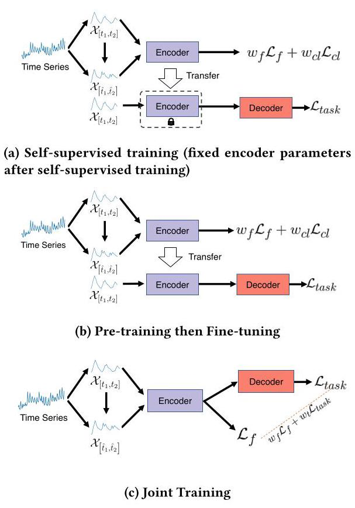

Figure 3: Illustration of different training schemes.

图3:不同训练方案的示意图。

## 4 EXPERIMENTS

## 4实验

In this section, we assess the effectiveness of Floss in periodic time series forecasting, classification, and anomaly detection. Our primary objective in this study is to determine whether incorporating Floss can enhance the performance of current supervised and unsupervised representation learning frameworks.

在本节中，我们评估Floss在周期性时间序列预测、分类和异常检测中的有效性。我们在本研究中的主要目标是确定纳入Floss是否能提高当前监督和无监督表示学习框架的性能。

### 4.1 Multivariate time series forecasting

### 4.1多变量时间序列预测

4.1.1 Existing Algorithms. We consider three representative multivariate time series forecasting models: 1). TS2Vec [47]: This is a purely unsupervised learning model. TS2Vec employs contrastive learning in a hierarchical manner on augmented views. Its encoder is based on a lightweight temporal convolutional network. After training, the encoder remains fixed, and ridge regression is used for the forecasting task. To integrate Floss into TS2Vec, we adapt the augmentation strategy of TS2Vec to incorporate periodic shifts. We randomly sample two segments $\left\lbrack  {{t}_{1} - {j}_{1},{t}_{2} + {k}_{1}}\right\rbrack$ and $\left\lbrack  {{t}_{1} + a\widehat{p}\left\lbrack  {{t}_{1},{t}_{2}}\right\rbrack   - {j}_{2},{t}_{2} + a\widehat{p}\left\lbrack  {{t}_{1},{t}_{2}}\right\rbrack   + {k}_{2}}\right\rbrack$ , where $a,{j}_{1},{j}_{2},{k}_{1}$ , and ${k}_{2}$ are random integers. We also apply TS2Vec’s timestamp mask strategy to the time series segments. Then, we train our model using a weighted sum of the frequency loss and contrastive loss from TS2Vec on the representations of the segments $\left\lbrack  {{t}_{1},{t}_{2}}\right\rbrack$ and $\left\lbrack  {{t}_{1} + a\widehat{p}\left\lbrack  {{t}_{1},{t}_{2}}\right\rbrack  ,{t}_{2} + a\widehat{p}\left\lbrack  {{t}_{1},{t}_{2}}\right\rbrack  }\right\rbrack$ . The estimated periodicity and frequency loss are computed using discrete cosine transformation (DCT). 2) PatchTST [24]: This model employs a vision Transformer-style architecture for multivariate time series forecasting and utilizes pre-training and fine-tuning techniques for training. In the self-learning phase, the model is trained to reconstruct masked time series patches. After self-training, the transformer is fine-tuned for downstream multivariate forecasting tasks. In our approach, Floss collaborates with the reconstruction loss in a weighted sum fashion during the self-training phase. 3) Informer [52]: This transformer model is a milestone in time series forecasting and is trained using a purely supervised learning approach. We incorporate Floss to regularize its hidden representation, specifically the layer before the final layer. The model is trained by combining the forecasting loss and the proposed frequency loss using a weighted sum.

4.1.1现有算法。我们考虑三种具有代表性的多变量时间序列预测模型:1). TS2Vec [47]:这是一个纯无监督学习模型。TS2Vec在增强视图上以分层方式采用对比学习。其编码器基于轻量级时间卷积网络。训练后，编码器保持固定，岭回归用于预测任务。为了将Floss集成到TS2Vec中，我们调整了TS2Vec的增强策略以纳入周期性偏移。我们随机采样两个段$\left\lbrack  {{t}_{1} - {j}_{1},{t}_{2} + {k}_{1}}\right\rbrack$和$\left\lbrack  {{t}_{1} + a\widehat{p}\left\lbrack  {{t}_{1},{t}_{2}}\right\rbrack   - {j}_{2},{t}_{2} + a\widehat{p}\left\lbrack  {{t}_{1},{t}_{2}}\right\rbrack   + {k}_{2}}\right\rbrack$，其中$a,{j}_{1},{j}_{2},{k}_{1}$，并且${k}_{2}$是随机整数。我们还将TS2Vec的时间戳掩码策略应用于时间序列段。然后，我们使用来自TS2Vec的频率损失和对比损失的加权和在段$\left\lbrack  {{t}_{1},{t}_{2}}\right\rbrack$和$\left\lbrack  {{t}_{1} + a\widehat{p}\left\lbrack  {{t}_{1},{t}_{2}}\right\rbrack  ,{t}_{2} + a\widehat{p}\left\lbrack  {{t}_{1},{t}_{2}}\right\rbrack  }\right\rbrack$的表示上训练我们的模型。估计的周期性和频率损失使用离散余弦变换(DCT)计算。2) PatchTST [24]:该模型采用视觉Transformer风格的架构进行多变量时间序列预测，并利用预训练和微调技术进行训练。在自学习阶段，模型被训练以重建掩码时间序列补丁。自训练后，Transformer针对下游多变量预测任务进行微调。在我们的方法中, Floss在自训练阶段以加权和的方式与重建损失协作。3) Informer [52]:这个Transformer模型是时间序列预测中的一个里程碑，并且使用纯监督学习方法进行训练。我们纳入Floss以规范其隐藏表示，特别是最后一层之前的层。该模型通过使用加权和组合预测损失和提出的频率损失进行训练。

Not only do we choose models based on the paradigms of different training schemes, but the sizes of these three models are also representative. TS2Vec has a relatively small structure, Informer is of medium size, while PatchTST is a larger model.

我们不仅根据不同训练方案的范式选择模型，而且这三个模型的规模也具有代表性。TS2Vec结构相对较小，Informer中等规模，而PatchTST是一个较大的模型。

4.1.2 Public Datasets. We assess the effectiveness of our proposed Floss by evaluating its performance on 8 widely-used datasets, namely Weather, Exchange, Electricity, ILI, and 4 ETT datasets (ETTh1, ETTh2, ETTm1, ETTm2). These datasets are commonly employed for benchmarking purposes and are publicly available on [48]. For the TS2Vec model, we allocated 60% of the data for training, 20% for validation, and 20% for testing. For the PatchTST and Informer models, we allocated 70% of the data for training, 10% for validation, and 20% for testing. The statistics of those datasets are summarized in Table 1.

4.1.2公共数据集。我们通过在8个广泛使用的数据集上评估其性能来评估我们提出的Floss的有效性，这些数据集分别是Weather、Exchange、Electricity、ILI和4个ETT数据集(ETTh1、ETTh2、ETTm1、ETTm2)。这些数据集通常用于基准测试目的，并且可在[48]上公开获取。对于TS2Vec模型，我们分配60%的数据用于训练，20%用于验证，20%用于测试。对于PatchTST和Informer模型，我们分配70%的数据用于训练，10%用于验证，20%用于测试。这些数据集的统计信息总结在表1中。

4.1.3 Experimental Settings. Following previous works [48, 52, 53], we use Mean Squared Error (MSE) and Mean Absolute Error (MAE) as the core metrics to compare performance. All of the models follow the same experimental setup with a prediction length of $T \in  \{ {24},{36},{48},{60}\}$ for the ILI dataset and $T \in  \{ {96},{192},{336},{720}\}$ for other datasets, as mentioned in the original papers. For PatchTST and Informer, the lookback window is set to $L = {96}$ . We adhere to the standard protocol and split all datasets into training, validation, and test sets in chronological order using a ratio of 7:1:2. For TS2Vec, the lookback window is set equal to the prediction length $T$ , and all datasets are split into training, validation, and test sets in the ratio of 6:2:2 (same as the original paper [47]).

4.1.3实验设置。遵循先前的研究[48, 52, 53]，我们使用均方误差(MSE)和平均绝对误差(MAE)作为核心指标来比较性能。如原始论文中所述，所有模型都遵循相同的实验设置，ILI数据集的预测长度为$T \in  \{ {24},{36},{48},{60}\}$，其他数据集的预测长度为$T \in  \{ {96},{192},{336},{720}\}$。对于PatchTST和Informer，回溯窗口设置为$L = {96}$。我们遵循标准协议，按照7:1:2的比例将所有数据集按时间顺序划分为训练集、验证集和测试集。对于TS2Vec，回溯窗口设置为等于预测长度$T$，所有数据集按6:2:2的比例(与原始论文[47]相同)划分为训练集、验证集和测试集。

The detailed hyper-parameter configurations of informer-Floss are set as follows: The batch size for all datasets is set to 32. Loss weights for different datasets are as follows: Weather (original forecasting loss weight $= {0.3}$ , Floss weight $= 2$ ), Exchange (original loss weight $= {0.3}$ , Floss weight $= {0.7}$ for 96-step ahead prediction, Floss weight $= {0.8}$ for all other prediction horizons), Electricity (original loss weight $= {0.3}$ , Floss weight $= 2$ ), ILI (original loss weight $= {0.3}$ , Floss weight $= {0.5}$ ), ETTh1 (original loss weight $= {0.3}$ , Floss weight $=$ 1), ETTh2 (original loss weight= 0.5, Floss weight= 8), ETTm1, and ETTm2 (original loss weight= 0.5, Floss weight= 8).

informer-Floss的详细超参数配置设置如下:所有数据集的批量大小设置为32。不同数据集的损失权重如下:天气(原始预测损失权重$= {0.3}$，Floss权重$= 2$)，汇率(原始损失权重$= {0.3}$，提前96步预测的Floss权重$= {0.7}$，其他所有预测范围的Floss权重$= {0.8}$)，电力(原始损失权重$= {0.3}$，Floss权重$= 2$)，ILI(原始损失权重$= {0.3}$，Floss权重$= {0.5}$)，ETTh1(原始损失权重$= {0.3}$，Floss权重$=$ 1)，ETTh2(原始损失权重 = 0.5，Floss权重 = 8)，ETTm1和ETTm2(原始损失权重 = 0.5，Floss权重 = 8)。

The detailed hyper-parameter configurations of TS2Vec-Floss are as follows: The batch size is set to 16 , the Floss weight for the contrastive loss of TS2Vec is set to 1, and the loss for the contrastive loss of TS2Vec is assigned a value of 1. Similarly, the detailed hyper-parameter configurations of PatchTST-Floss are as follows: During pretraining, the reconstruction loss is set to 0.3 , the Floss weight is set to 1, and the mask ratio is set to 0.4. Additionally, the batch size for Weather, Electricity, ETTh1, ETTh2, ETTm1, and ETTm2 datasets is set to 8, while for Exchange and ILI datasets, it is set to 16.

TS2Vec-Floss的详细超参数配置如下:批量大小设置为16，TS2Vec对比损失的Floss权重设置为1，TS2Vec对比损失的值设置为1。同样，PatchTST-Floss的详细超参数配置如下:在预训练期间，重建损失设置为0.3，Floss权重设置为1，掩码比例设置为0.4。此外，天气、电力、ETTh1、ETTh2、ETTm1和ETTm2数据集的批量大小设置为8，而汇率和ILI数据集的批量大小设置为16。

4.1.4 Experimental Results. Table 2 shows the multivariate long-term forecasting results. It should be noted that we reran the experiments for fair comparison; therefore, the performance of Informer, TS2Vec, and PatchTST is slightly better than what was reported in the original literature. We use bold text to highlight the improved performance and red color to indicate the average improvements. The key observations are as follows:

4.1.4实验结果。表2显示了多变量长期预测结果。需要注意的是，为了进行公平比较，我们重新运行了实验；因此，Informer、TS2Vec和PatchTST的性能略优于原始文献中报告的性能。我们使用粗体文本突出显示改进的性能，并用红色表示平均改进。主要观察结果如下:

First, the inclusion of Floss enhances the overall performance of all three representative models. This demonstrates that Floss effectively utilizes informative features within the frequency domain, leading to improved forecasting performance.

首先，包含Floss提高了所有三个代表性模型的整体性能。这表明Floss有效地利用了频域内的信息特征，从而提高了预测性能。

Secondly, Floss performs remarkably well on the Electricity dataset, which includes the largest number (321) of time series in our experiments. Improvements are observed in all cases, indicating that Floss has the ability to encode shared frequency information from a large number of time series, thereby enhancing forecasting performance.

其次，Floss在电力数据集上表现出色，该数据集在我们的实验中包含的时间序列数量最多(321个)。在所有情况下都观察到了改进，这表明Floss有能力对大量时间序列的共享频率信息进行编码，从而提高预测性能。

Thirdly, the inclusion of Floss does not consistently outperform the models without it. This could be attributed to the random factors involved in the training process with Floss, such as the random sampling for periodicity detection and the random shift using the detected periodicity. These factors might prevent the models from consistently leveraging valuable information. Future studies should address this issue to ensure more consistent results.

第三，包含Floss并不总是比不包含它的模型表现更好。这可能归因于使用Floss的训练过程中涉及的随机因素，例如用于周期性检测的随机采样和使用检测到的周期性的随机移位。这些因素可能会阻止模型持续利用有价值的信息。未来的研究应该解决这个问题，以确保更一致的结果。

As depicted in Figure 4, the prediction results of PatchTST and TS2Vec w/o Floss are presented for the ETTh2 and weather datasets. In the long-term forecasting horizon of ETTh2, Floss demonstrates its superiority in handling distribution shifts and trend-seasonality features in comparison to TS2Vec. This advantage can be attributed to the enhanced ability of Floss to effectively leverage trend information by regularizing representations in the frequency domain. Figure 4c further demonstrates the superior performance of PatchTST-Floss in both short-term and long-term forecasting tasks, highlighting the significant benefits introduced by Floss in the context of forecasting.

如图4所示，展示了PatchTST和不带Floss的TS2Vec在ETTh2和天气数据集上的预测结果。在ETTh2的长期预测范围内，与TS2Vec相比，Floss在处理分布变化和趋势季节性特征方面表现出优势。这一优势可归因于Floss通过在频域中规范表示来有效利用趋势信息的增强能力。图4c进一步展示了PatchTST - Floss在短期和长期预测任务中的卓越性能，突出了Floss在预测背景下带来的显著益处。

### 4.2 Unsupervised Time Series Classification with TS2Vec

### 4.2 使用TS2Vec进行无监督时间序列分类

4.2.1 Experimental Setup. In this section, we combine Floss with the state-of-the-art (SOTA) unsupervised framework TS2Vec [47], which has outperformed several supervised learning frameworks. We utilize the same convolutional encoder as described in [47]. Additionally, we modify the sampling strategy of TS2Vec to create periodic shifts, aligning it with the settings used for the aforementioned multivariate time series forecasting. Following the pretraining phase, we train an SVM classifier with an RBF kernel on top of the instance-level representations to perform predictions.

4.2.1 实验设置。在本节中，我们将Floss与最先进的(SOTA)无监督框架TS2Vec [47]相结合，该框架已超越了多个监督学习框架。我们使用与[47]中描述的相同的卷积编码器。此外，我们修改了TS2Vec的采样策略以创建周期性偏移，使其与上述多变量时间序列预测所使用的设置一致。在预训练阶段之后，我们在实例级表示之上训练一个具有RBF核的SVM分类器以进行预测。

4.2.2 Public Datasets. We evaluate the effectiveness of our proposed Floss by assessing its classification performance on two widely-used datasets: the UCR archive [6] and UEA archive [3].

4.2.2 公共数据集。我们通过评估其在两个广泛使用的数据集:UCR存档 [6] 和UEA存档 [3] 上的分类性能，来评估我们提出的Floss的有效性。

Table 1: Statistics of popular datasets for benchmark.

表1:用于基准测试的流行数据集的统计信息。

<table><tr><td>Datasets</td><td>ETTh1&ETTh2</td><td>ETTm1 &ETTm2</td><td>Electricity</td><td>Exchange-Rate</td><td>Weather</td><td>IL</td></tr><tr><td>Variates</td><td>7</td><td>7</td><td>321</td><td>8</td><td>21</td><td>7</td></tr><tr><td>Timesteps</td><td>17,420</td><td>69,680</td><td>26,304</td><td>7,588</td><td>52,696</td><td>966</td></tr><tr><td>Granularity</td><td>1hour</td><td>15min</td><td>1hour</td><td>1day</td><td>10min</td><td>1week</td></tr></table>

Table 2: Errors of Multivariate Time Series Forecasting. The improved results are in bold.

表2:多变量时间序列预测的误差。改进的结果用粗体显示。

<table><tr><td rowspan="2">Dataset Metric</td><td rowspan="2"></td><td colspan="2">Informer</td><td colspan="2">Informer-Floss</td><td colspan="2">TS2vec</td><td colspan="2">TS2vec-Floss</td><td colspan="2">PatchTST</td><td colspan="2">PatchTST-Floss</td></tr><tr><td>MSE</td><td>MAE</td><td>MSE</td><td>MAE</td><td>MSE</td><td>MAE</td><td>MSE</td><td>MAE</td><td>MSE</td><td>MAE</td><td>MSE</td><td>MAE</td></tr><tr><td rowspan="4">Weather</td><td>96</td><td>0.427</td><td>0.460</td><td>0.277</td><td>0.370</td><td>1.719</td><td>0.921</td><td>1.278</td><td>0.840</td><td>0.144</td><td>0.192</td><td>0.125</td><td>0.173</td></tr><tr><td>192</td><td>0.346</td><td>0.414</td><td>0.361</td><td>0.402</td><td>1.650</td><td>0.925</td><td>1.360</td><td>0.882</td><td>0.191</td><td>0.241</td><td>0.183</td><td>0.229</td></tr><tr><td>336</td><td>0.583</td><td>0.543</td><td>0.407</td><td>0.408</td><td>1.949</td><td>1.043</td><td>1.318</td><td>0.876</td><td>0.244</td><td>0.280</td><td>0.232</td><td>0.271</td></tr><tr><td>720</td><td>0.916</td><td>0.705</td><td>0.837</td><td>0.668</td><td>2.718</td><td>1.287</td><td>1.559</td><td>0.972</td><td>0.314</td><td>0.331</td><td>0.301</td><td>0.325</td></tr><tr><td rowspan="4">Exchange</td><td>96</td><td>0.841</td><td>0.746</td><td>0.753</td><td>0.705</td><td>0.498</td><td>0.527</td><td>0.422</td><td>0.484</td><td>0.099</td><td>0.224</td><td>0.099</td><td>0.225</td></tr><tr><td>192</td><td>1.132</td><td>0.847</td><td>1.180</td><td>0.859</td><td>1.112</td><td>0.781</td><td>0.851</td><td>0.687</td><td>0.210</td><td>0.331</td><td>0.210</td><td>0.330</td></tr><tr><td>336</td><td>1.475</td><td>0.956</td><td>1.510</td><td>0.974</td><td>1.561</td><td>0.967</td><td>1.571</td><td>0.944</td><td>0.404</td><td>0.468</td><td>0.424</td><td>0.478</td></tr><tr><td>720</td><td>2.548</td><td>1.328</td><td>2.606</td><td>1.362</td><td>2.688</td><td>1.266</td><td>1.860</td><td>1.052</td><td>1.039</td><td>0.769</td><td>0.902</td><td>0.720</td></tr><tr><td rowspan="4">Electricity</td><td>96</td><td>0.304</td><td>0.393</td><td>0.285</td><td>0.380</td><td>0.452</td><td>0.492</td><td>0.422</td><td>0.463</td><td>0.135</td><td>0.231</td><td>0.129</td><td>0.228</td></tr><tr><td>192</td><td>0.327</td><td>0.417</td><td>0.297</td><td>0.390</td><td>0.461</td><td>0.498</td><td>0.423</td><td>0.465</td><td>0.150</td><td>0.244</td><td>0.149</td><td>0.242</td></tr><tr><td>336</td><td>0.333</td><td>0.422</td><td>0.302</td><td>0.396</td><td>0.472</td><td>0.491</td><td>0.426</td><td>0.468</td><td>0.165</td><td>0.259</td><td>0.159</td><td>0.260</td></tr><tr><td>720</td><td>0.351</td><td>0.427</td><td>0.325</td><td>0.406</td><td>0.544</td><td>0.547</td><td>0.513</td><td>0.516</td><td>0.203</td><td>0.292</td><td>0.201</td><td>0.287</td></tr><tr><td rowspan="4">ILI</td><td>24</td><td>5.940</td><td>1.720</td><td>5.460</td><td>1.580</td><td>3.349</td><td>1.168</td><td>3.686</td><td>1.276</td><td>2.883</td><td>1.189</td><td>2.962</td><td>1.200</td></tr><tr><td>36</td><td>4.999</td><td>1.508</td><td>5.300</td><td>1.541</td><td>3.671</td><td>1.244</td><td>4.131</td><td>1.399</td><td>2.986</td><td>1.195</td><td>2.850</td><td>1.169</td></tr><tr><td>48</td><td>5.004</td><td>1.542</td><td>5.319</td><td>1.570</td><td>4.150</td><td>1.324</td><td>4.153</td><td>1.364</td><td>3.411</td><td>1.287</td><td>2.899</td><td>1.174</td></tr><tr><td>60</td><td>5.403</td><td>1.554</td><td>5.631</td><td>1.589</td><td>4.231</td><td>1.340</td><td>4.185</td><td>1.359</td><td>3.207</td><td>1.233</td><td>3.142</td><td>1.227</td></tr><tr><td rowspan="4">ETTh1</td><td>96</td><td>0.941</td><td>0.769</td><td>0.801</td><td>0.695</td><td>0.699</td><td>0.592</td><td>0.804</td><td>0.666</td><td>0.373</td><td>0.402</td><td>0.368</td><td>0.397</td></tr><tr><td>192</td><td>1.007</td><td>0.786</td><td>0.867</td><td>0.713</td><td>0.789</td><td>0.643</td><td>0.876</td><td>0.704</td><td>0.403</td><td>0.419</td><td>0.403</td><td>0.421</td></tr><tr><td>336</td><td>1.038</td><td>0.784</td><td>1.140</td><td>0.859</td><td>0.907</td><td>0.709</td><td>0.969</td><td>0.750</td><td>0.443</td><td>0.449</td><td>0.432</td><td>0.441</td></tr><tr><td>720</td><td>1.144</td><td>0.857</td><td>1.184</td><td>0.883</td><td>1.084</td><td>0.800</td><td>0.969</td><td>0.750</td><td>0.482</td><td>0.490</td><td>0.451</td><td>0.472</td></tr><tr><td rowspan="4">ETTh2</td><td>96</td><td>3.283</td><td>1.502</td><td>2.763</td><td>1.372</td><td>1.034</td><td>0.806</td><td>1.065</td><td>0.808</td><td>0.287</td><td>0.344</td><td>0.285</td><td>0.342</td></tr><tr><td>192</td><td>4.371</td><td>1.815</td><td>4.110</td><td>1.713</td><td>1.973</td><td>1.118</td><td>2.177</td><td>1.163</td><td>0.363</td><td>0.392</td><td>0.359</td><td>0.386</td></tr><tr><td>336</td><td>4.215</td><td>1.642</td><td>3.910</td><td>1.656</td><td>2.831</td><td>1.319</td><td>2.398</td><td>1.238</td><td>0.375</td><td>0.409</td><td>0.376</td><td>0.405</td></tr><tr><td>720</td><td>3.656</td><td>1.619</td><td>3.222</td><td>1.541</td><td>2.561</td><td>1.353</td><td>2.578</td><td>1.331</td><td>0.411</td><td>0.443</td><td>0.399</td><td>0.428</td></tr><tr><td rowspan="4">ETTm1</td><td>96</td><td>0.657</td><td>0.575</td><td>0.629</td><td>0.582</td><td>0.611</td><td>0.551</td><td>0.565</td><td>0.519</td><td>0.282</td><td>0.339</td><td>0.281</td><td>0.328</td></tr><tr><td>192</td><td>0.725</td><td>0.619</td><td>0.744</td><td>0.647</td><td>0.675</td><td>0.589</td><td>0.616</td><td>0.553</td><td>0.329</td><td>0.369</td><td>0.319</td><td>0.356</td></tr><tr><td>336</td><td>0.725</td><td>0.619</td><td>1.053</td><td>0.819</td><td>0.725</td><td>0.621</td><td>0.681</td><td>0.593</td><td>0.358</td><td>0.387</td><td>0.349</td><td>0.378</td></tr><tr><td>720</td><td>1.133</td><td>0.845</td><td>0.997</td><td>0.778</td><td>0.810</td><td>0.671</td><td>0.763</td><td>0.643</td><td>0.411</td><td>0.415</td><td>0.397</td><td>0.411</td></tr><tr><td rowspan="4">ETTm2</td><td>96</td><td>0.555</td><td>0.462</td><td>0.488</td><td>0.514</td><td>0.443</td><td>0.495</td><td>0.371</td><td>0.447</td><td>0.164</td><td>0.254</td><td>0.158</td><td>0.233</td></tr><tr><td>192</td><td>0.695</td><td>0.686</td><td>0.715</td><td>0.652</td><td>0.615</td><td>0.598</td><td>0.546</td><td>0.561</td><td>0.220</td><td>0.294</td><td>0.197</td><td>0.252</td></tr><tr><td>336</td><td>1.270</td><td>0.871</td><td>1.119</td><td>0.805</td><td>0.975</td><td>0.765</td><td>0.863</td><td>0.721</td><td>0.271</td><td>0.327</td><td>0.248</td><td>0.319</td></tr><tr><td>720</td><td>3.171</td><td>1.367</td><td>3.414</td><td>1.374</td><td>2.024</td><td>1.093</td><td>1.977</td><td>1.104</td><td>0.354</td><td>0.381</td><td>0.339</td><td>0.355</td></tr><tr><td rowspan="2">Avg.   Improvements.</td><td></td><td>1.868</td><td>0.935</td><td>1.812</td><td>0.912</td><td>1.562</td><td>0.860</td><td>1.449</td><td>0.831</td><td>0.666</td><td>0.465</td><td>0.635</td><td>0.452</td></tr><tr><td></td><td></td><td></td><td>↓3.0%</td><td>↓ 2.4%</td><td></td><td></td><td>↓7.2%</td><td>↓3.4%</td><td></td><td></td><td>↓ 4.6%</td><td>↓2.8%</td></tr></table>

The UCR archive consists of 128 univariate datasets, while the UEA archive contains 30 multivariate datasets. For each dataset considered, we utilize its original train/test split. We conduct unsupervised training of an encoder using the train set of each dataset. Subsequently, we train an SVM classifier with a RBF kernel on top of the learned features, utilizing the train labels of the dataset. Finally, we output the corresponding classification score on the test set. For the hyperparameter settings, batch size is 16 , the contrastive loss weight is 1, Floss weight is 1.

UCR存档由128个单变量数据集组成，而UEA存档包含30个多变量数据集。对于每个考虑的数据集，我们使用其原始的训练/测试划分。我们使用每个数据集的训练集对编码器进行无监督训练。随后，我们在学习到的特征之上训练一个具有RBF核的SVM分类器，利用数据集的训练标签。最后，我们在测试集上输出相应的分类分数。对于超参数设置，批量大小为16，对比损失权重为1，Floss权重为1。

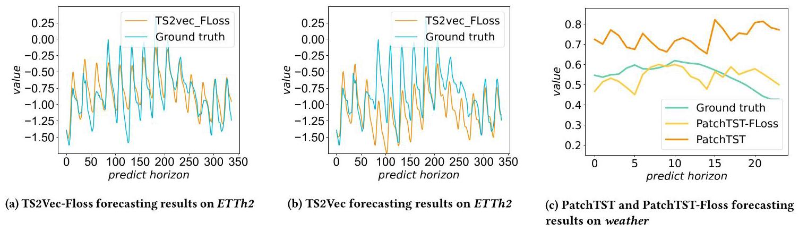

Figure 4: Illustration of the long-term forecasting output of model w/o Floss on ETTm2 and weather datasets (Y-axis: forecasting horizon).

图4:不带Floss的模型在ETTm2和天气数据集上的长期预测输出图示(Y轴:预测范围)。

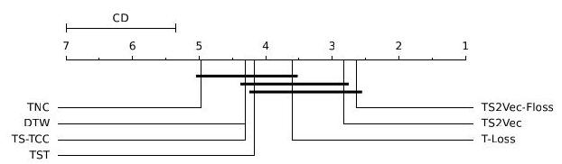

Figure 5: Critical Difference (CD) diagram of representation learning methods on time series classification tasks with a confidence level of 95%.

图5:时间序列分类任务中表示学习方法的临界差异(CD)图，置信水平为95%。

4.2.3 Compared Baselines. We perform comprehensive experiments on time series classification to assess the classification performance of our approach, in comparison to other unsupervised time series representation models, namely T-Loss [10], TS-TCC [9], TST [49], and TNC [32]. Additionally, we include DTW (Dynamic Time Warping) [23] as a baseline, employing a one-nearest-neighbor classifier with DTW as the distance measure.

4.2.3 比较的基线。我们对时间序列分类进行了全面实验，以评估我们方法的分类性能，与其他无监督时间序列表示模型进行比较，即T - Loss [10]、TS - TCC [9]、TST [49] 和TNC [32]。此外，我们将DTW(动态时间规整)[23] 作为基线纳入，采用以DTW为距离度量的单最近邻分类器。

Table 3: Time series classification results compared to other time series representation methods on 125 UCR datasets and 29 UEA datasets.

表3:与其他时间序列表示方法在125个UCR数据集和29个UEA数据集上的时间序列分类结果。

<table><tr><td>Method</td><td>125 UCR datasets</td><td>29 UEA datasets</td></tr><tr><td>DTW</td><td>0.727</td><td>0.650</td></tr><tr><td>TNC</td><td>0.761</td><td>0.677</td></tr><tr><td>TST</td><td>0.641</td><td>0.635</td></tr><tr><td>TS-TCC</td><td>0.757</td><td>0.682</td></tr><tr><td>T-Loss</td><td>0.806</td><td>0.675</td></tr><tr><td>TS2Vec</td><td>0.830</td><td>0.712</td></tr><tr><td>TS2Vec-Floss</td><td>0.849</td><td>0.739</td></tr></table>

4.2.4 Experimental Results. The evaluation results are summarized in Table 3. Floss demonstrates a significant improvement compared to other representation learning methods on both the UCR and UEA datasets. Specifically, Floss achieves an average increase of 2.3% in classification accuracy over TS2Vec across 125 UCR datasets and 3.0% across 29 UEA datasets. It is important to note that the periodicity detection module is applicable to all UCR and UEA datasets, and comprehensive results of TS2Vec-Floss on all datasets can be found in the supplementary materials. Critical Difference diagram [8] for Nemenyi tests on all datasets (including 125 UCR and 29 UEA datasets) is presented in Figure 5, where classifiers that are not connected by a bold line are significantly different in average rank. Unlike existing baselines that neglect periodic information, Floss utilizes hierarchical frequency domain comparison between different periodic views, resulting in enhanced performance.

4.2.4 实验结果。评估结果总结在表3中。与其他表示学习方法相比，Floss在UCR和UEA数据集上都有显著改进。具体而言，在125个UCR数据集上，Floss的分类准确率比TS2Vec平均提高了2.3%，在29个UEA数据集上提高了3.0%。需要注意的是，周期性检测模块适用于所有UCR和UEA数据集，TS2Vec - Floss在所有数据集上的综合结果可在补充材料中找到。图5展示了对所有数据集(包括125个UCR和29个UEA数据集)进行Nemenyi检验的临界差异图，其中未由粗线连接的分类器在平均排名上有显著差异。与忽略周期性信息的现有基线不同，Floss利用不同周期视图之间的分层频域比较，从而提高了性能。

### 4.3 Unsupervised Time Series Classification with TS-TCC

### 4.3 使用TS - TCC进行无监督时间序列分类

4.3.1 Experimental Setup. We combine Floss with another representative model for time series representation called TS-TCC [9]. To evaluate our model, we conduct human activity recognition, sleep stage classification, and epileptic seizure prediction tasks using open-source datasets. Following the approach of TS-TCC, we perform pre-training and downstream task fine-tuning for 40 epochs. During the pre-training phase, we incorporate Floss with the contrastive loss function of TS-TCC. In contrast to the TS2Vec setup, we introduce a separate periodic augmentation alongside the jitter and scale augmentation of TS-TCC. Moreover, Floss is computed based solely on the original and periodic views of the time series data. The encoder is trained using Adam with a weighted sum of Floss and the original loss of TS-TCC. We maintain the same hy-perparameters as those reported in [9]. For the loss weights, the original loss weight is 0.3 and Floss weight is 2.

4.3.1实验设置。我们将Floss与另一个用于时间序列表示的代表性模型TS-TCC[9]相结合。为了评估我们的模型，我们使用开源数据集进行人类活动识别、睡眠阶段分类和癫痫发作预测任务。按照TS-TCC的方法，我们进行40个轮次的预训练和下游任务微调。在预训练阶段，我们将Floss与TS-TCC的对比损失函数相结合。与TS2Vec设置不同，我们在TS-TCC的抖动和尺度增强之外引入了单独的周期性增强。此外，Floss仅基于时间序列数据的原始视图和周期性视图进行计算。编码器使用Adam进行训练，其损失为Floss和TS-TCC原始损失的加权和。我们保持与[9]中报告的相同超参数。对于损失权重，原始损失权重为0.3，Floss权重为2。

4.3.2 Public Datasets. We assess the classification performance of our proposed Floss by evaluating it on three widely-used datasets: 1. UCI HAR dataset [2]: This dataset contains sensor readings for 30 subjects performing 6 activities. The sample rate of the HAR dataset is 60Hz. 2.Sleep-EDF [13]: This dataset includes whole-night PSG sleep recordings, with a sampling rate of 100Hz. 3. The Epileptic Seizure Recognition dataset [1]: This dataset consists of EEG recordings from 500 subjects, where the brain activity was recorded for each subject for 23.6 seconds. We split the data into ${60}\%$ , 20%, and 20% for training, validation, and testing, respectively. For the Sleep-EDF dataset, we perform a subject-wise split to prevent overfitting. We repeat the experiments five times using five different seeds. During the fine-tuning phase, we train a linear classifier (a single MLP layer) on top of a frozen self-supervised pretrained encoder model to perform classification.

4.3.2公共数据集。我们通过在三个广泛使用的数据集上评估我们提出的Floss的分类性能:1. UCI HAR数据集[2]:该数据集包含30名受试者进行6种活动的传感器读数。HAR数据集的采样率为60Hz。2. Sleep-EDF[13]:该数据集包括整夜的PSG睡眠记录，采样率为100Hz。3. 癫痫发作识别数据集[1]:该数据集由500名受试者的脑电图记录组成，其中每个受试者的大脑活动记录了23.6秒。我们将数据分别分为${60}\%$、20%和20%用于训练、验证和测试。对于Sleep-EDF数据集，我们进行按受试者划分以防止过拟合。我们使用五个不同的种子重复实验五次。在微调阶段，我们在冻结的自监督预训练编码器模型之上训练一个线性分类器(单个MLP层)以进行分类。

4.3.3 Experimental Results. We report the accuracy (ACC) and macro F1 score (MF1) of the TS-TCC-Floss, raw TS-TCC [9], CPC [25] and SimCLR [5] in Table 4. Similar to the findings observed in the TS2Vec experiments, the integration of Floss yields significant enhancements in the performance of TS-TCC. Notably, an intriguing aspect emerges when examining the three datasets employed in this study, wherein the sampling periods are comparatively short. Intuitively, discerning the presence of short-term periodic information in these datasets poses a formidable challenge. However, employing Floss still yields notable improvements across these datasets. This phenomenon can be attributed to the inherent capacity of Floss to autonomously detect periodicity, thereby effectively capturing imperceptible quasi-periodic variations within the data. Consequently, Floss exhibits an automatic mechanism for augmenting the representational quality of existing models, thereby advancing their efficacy.

4.3.3实验结果。我们在表4中报告了TS-TCC-Floss、原始TS-TCC[9]、CPC[25]和SimCLR[5]的准确率(ACC)和宏F1分数(MF1)。与TS2Vec实验中观察到的结果类似，Floss的集成显著提高了TS-TCC的性能。值得注意的是，在检查本研究中使用的三个数据集时出现了一个有趣的方面，其中采样周期相对较短。直观地说，在这些数据集中识别短期周期性信息是一项艰巨的挑战。然而，使用Floss在这些数据集上仍然产生了显著的改进。这种现象可以归因于Floss自主检测周期性的内在能力，从而有效地捕获数据中难以察觉的准周期性变化。因此，Floss展示了一种自动机制来提高现有模型的表示质量，从而提高其有效性。

### 4.4 Unsupervised Anomaly Detection

### 4.4无监督异常检测

4.4.1 Experimental Setup. For anomaly detection, we follow the streaming evaluation protocol, where the task is to determine whether the last point $t$ is an anomaly. As same as in [47], we define the anomaly score as the dissimilarity between the representations computed from the original series and the one with a mask at the last time point. We use the same computation strategy as described in [47] to compute anomalies. Two public datasets are used to evaluate our model. Yahoo ${}^{1}$ is a benchmark dataset for anomaly detection, which includes 367 hourly sampled time series with tagged anomaly points. KPI [27] includes multiple minutely sampled real KPI curves from various Internet companies. In the normal setting, each time series sample is split into two halves according to the time order, where the first half is used for unsupervised training and the second half is used for evaluation. We also evaluate the cold-start problem, in which the TS2Vec and Floss encoder are trained on the ItalyPowerDemand dataset from the UCR, as ItalyPowerDemand exhibits daily periodicity. We use precision, recall and F1-score to measure the performance of anomaly detection. For normal settings, batch size is set to 16, Floss weight is 1, contrastive loss weight is 0.6. For Yahoo(Cold-start)and KPI(Cold-start), Batch size is 16, Floss weight is 1, contrastive loss weight is 1.

4.4.1实验设置。对于异常检测，我们遵循流式评估协议，任务是确定最后一个点$t$是否为异常。与[47]中一样，我们将异常分数定义为从原始序列计算的表示与最后一个时间点带有掩码的表示之间的差异。我们使用与[47]中描述的相同计算策略来计算异常。使用两个公共数据集来评估我们的模型。雅虎${}^{1}$是一个用于异常检测的基准数据集，它包括367个每小时采样的时间序列以及标记的异常点。KPI[27]包括来自各种互联网公司的多个每分钟采样的真实KPI曲线。在正常设置中，每个时间序列样本根据时间顺序分为两半，其中前半部分用于无监督训练，后半部分用于评估。我们还评估冷启动问题，其中TS2Vec和Floss编码器在来自UCR的ItalyPowerDemand数据集上进行训练，因为ItalyPowerDemand表现出每日周期性。我们使用精确率、召回率和F1分数来衡量异常检测的性能。对于正常设置，批量大小设置为16，Floss权重为1，对比损失权重为0.6。对于雅虎(冷启动)和KPI(冷启动)，批量大小为16，Floss权重为1，对比损失权重为1。

4.4.2 Experimental Results. The anomaly detection performance of TS2Vec-Floss, TS2Vec, and a strong unsupervised learning baseline SR [27] are presented in Table 5. In the normal setting, Floss improves the F1 score by 1.19% on the Yahoo dataset and 1.08% on the KPI dataset compared to TS2Vec. This indicates that Floss is more sensitive to outliers in time series, as it captures periodic dynamics and expresses fine-grained information through hierarchical pooling. In the cold start setting, the improvement of Floss on both datasets is even more noticeable (about ${10}\%$ on F1 score), demonstrating its ability to capture general periodic invariance with strong transferability.

4.4.2实验结果。表5展示了TS2Vec-Floss、TS2Vec以及强大的无监督学习基线SR [27]的异常检测性能。在正常设置下，与TS2Vec相比，Floss在雅虎数据集上的F1分数提高了1.19%，在KPI数据集上提高了1.08%。这表明Floss对时间序列中的异常值更敏感，因为它捕获周期性动态并通过分层池化表达细粒度信息。在冷启动设置下，Floss在两个数据集上的改进更加显著(F1分数提高约${10}\%$)，证明了其捕获具有强可迁移性的一般周期性不变性的能力。

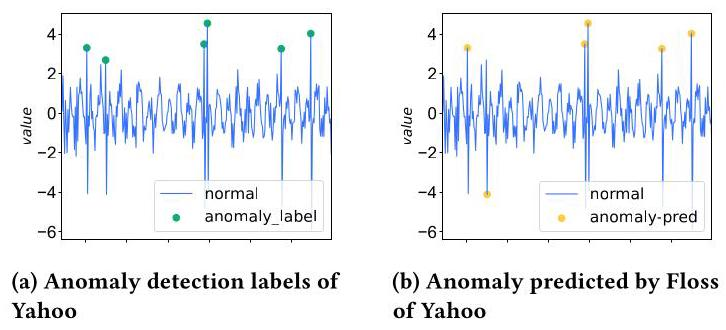

Figure 6: Anomaly detection results

图6:异常检测结果

We also provide visualizations of the anomaly detection performed by Floss in Figure 6. In both examples, we observe that Floss accurately identifies all anomalies. It is worth noting that the only negative result obtained by Floss is still in close proximity to the corresponding ground truth anomaly time point.

我们还在图6中提供了Floss执行的异常检测的可视化。在两个示例中，我们观察到Floss准确地识别了所有异常。值得注意的是，Floss获得的唯一负面结果仍与相应的地面真值异常时间点非常接近。

### 4.5 Unsupervised Anomaly Detection with other Models

### 4.5使用其他模型的无监督异常检测

4.5.1 Experimental Setup. In this study, we perform experiments on two extensively utilized anomaly detection datasets: MSL (Mars Science Laboratory rover) [16] and SMD (Server Machine Dataset) [30]. We selected these two datasets due to their pronounced periodic patterns. Adhering to the pre-processing techniques outlined in Anomaly Transformer [45], we divided the dataset into sequential, non-overlapping segments using a sliding window approach. Subsequently, we employed a deep learning model to reconstruct the input samples, with the resulting reconstruction error serving as the inherent anomaly indicator. To ensure equitable comparisons, we solely modified the base models for reconstruction, employing the conventional reconstruction error as the standardized anomaly criterion across all experiments. Each dataset consists of training and testing subsets, with validation subsets identical to the testing subsets. Anomalies are only labeled within the testing subset. The calculation of Floss is integrated into the 'anomaly_detection' method of each model. Initially, we perform periodicity detection on the input data and extract periodic segments. Subsequently, we extract features from these segments and calculate the Floss. Finally, the Floss is incorporated into the model training process. Throughout these experiments, the Floss weight is set to 1 , and the reconstruction loss weight is set to 0.3 .

4.5.1实验设置。在本研究中，我们在两个广泛使用的异常检测数据集上进行实验:MSL(火星科学实验室漫游者)[16]和SMD(服务器机器数据集)[30]。我们选择这两个数据集是因为它们具有明显的周期性模式。遵循异常Transformer [45]中概述的预处理技术，我们使用滑动窗口方法将数据集划分为连续的、不重叠的段。随后，我们使用深度学习模型重建输入样本，所得的重建误差作为固有的异常指标。为确保公平比较，我们仅修改用于重建的基础模型，在所有实验中使用传统的重建误差作为标准化的异常标准。每个数据集由训练和测试子集组成，验证子集与测试子集相同。仅在测试子集中标记异常。Floss的计算集成到每个模型的“异常检测”方法中。首先，我们对输入数据进行周期性检测并提取周期性段。随后，我们从这些段中提取特征并计算Floss。最后，将Floss纳入模型训练过程。在这些实验中，Floss权重设置为1，重建损失权重设置为0.3。

After training the model, we analyze the training data within a gradient-free context. For each data batch, we employ the trained model to reconstruct it and calculate the reconstruction error scores. To establish the anomaly threshold, we aggregate scores from both the training and test datasets. This combined score assists in determining the threshold, based on a predefined anomaly ratio. Subsequently, we compare the test data scores with the threshold to identify anomalies. Scores exceeding the threshold are classified as anomalies, while those falling below it are categorized as normal.

训练模型后，我们在无梯度的情况下分析训练数据。对于每个数据批次，我们使用训练好的模型对其进行重建并计算重建误差分数。为了建立异常阈值，我们汇总训练和测试数据集的分数。这个综合分数有助于根据预定义的异常比率确定阈值。随后，我们将测试数据分数与阈值进行比较以识别异常。超过阈值的分数被分类为异常，而低于阈值的分数被分类为正常。

---

${}^{1}$ https://yahooresearch.tumblr.com/post/114590420346/a-benchmark-dataset-for-time-series-anomaly

${}^{1}$ https://yahooresearch.tumblr.com/post/114590420346/a-benchmark-dataset-for-time-series-anomaly

---

Table 4: Time series classification results compared to other time series representation methods on HAR, Sleep-EDF and Epilepsy.

表4:与其他时间序列表示方法相比，在HAR、Sleep-EDF和癫痫数据集上的时间序列分类结果。

<table><tr><td>Datasets</td><td colspan="2">HAR</td><td colspan="2">Sleep-EDF</td><td colspan="2">Epilepsy</td></tr><tr><td>Metric</td><td>ACC</td><td>MF1</td><td>ACC</td><td>MF1</td><td>ACC</td><td>MF1</td></tr><tr><td>CPC</td><td>83.85 ± 1.51</td><td>83.27 ± 1.66</td><td>82.82 ± 1.68</td><td>$\mathbf{{73.94} \pm  {1.75}}$</td><td>${96.61} \pm  {0.43}$</td><td>94.44 ± 0.69</td></tr><tr><td>SimCLR</td><td>80.97 ± 2.46</td><td>80.19 ± 2.64</td><td>78.91 ± 3.11</td><td>68.60 ± 2.71</td><td>${96.05} \pm  {0.34}$</td><td>${93.53} \pm  {0.63}$</td></tr><tr><td>TS-TCC</td><td>90.37 ± 0.34</td><td>90.38 ± 0.39</td><td>83.00 ± 0.71</td><td>73.57 ± 0.74</td><td>97.23 ± 0.10</td><td>${95.54} \pm  {0.08}$</td></tr><tr><td>TS-TCC-Floss</td><td>90.86 ± 0.34</td><td>90.56 ± 0.35</td><td>83.70 ± 0.45</td><td>73.53 ± 0.39</td><td>97.41 ± 0.17</td><td>$\mathbf{{97.75} \pm  {0.00}}$</td></tr></table>

Table 5: Univariate time series anomaly detection results.

表5:单变量时间序列异常检测结果。

<table><tr><td>Dataset</td><td colspan="3">Yahoo</td><td colspan="3">KPI</td></tr><tr><td>Metric</td><td>F1</td><td>Prec.</td><td>Rec.</td><td>F1</td><td>Prec.</td><td>Rec.</td></tr><tr><td>SR</td><td>0.563</td><td>0.451</td><td>0.747</td><td>0.622</td><td>0.647</td><td>0.598</td></tr><tr><td>TS2Vec</td><td>0.745</td><td>0.729</td><td>0.762</td><td>0.677</td><td>0.929</td><td>0.533</td></tr><tr><td>TS2Vec-FLoss</td><td>0.754</td><td>0.752</td><td>0.763</td><td>0.799</td><td>0.946</td><td>0.559</td></tr><tr><td colspan="7">Cold-start:</td></tr><tr><td>SR</td><td>0.529</td><td>0.404</td><td>0.765</td><td>0.666</td><td>0.637</td><td>0.697</td></tr><tr><td>TS2Vec</td><td>0.726</td><td>0.692</td><td>0.763</td><td>0.676</td><td>0.907</td><td>0.540</td></tr><tr><td>TS2Vec-FLoss</td><td>0.734</td><td>0.706</td><td>0.769</td><td>0.741</td><td>0.942</td><td>0.594</td></tr></table>

4.5.2 Models Improved by Floss. We consider four notable multivariate time series forecasting models as featured in [41]: 1).FED-former [53]: This model combines a Transformer architecture with the seasonal-trend decomposition method. 2).TimesNet [41]: It employs Fast Fourier Transform (FFT) to convert the time series into a 2D representation, utilizing CNNs as the foundational framework. 3). Reformer [18]: This variant of the Transformer replaces the conventional dot-product attention mechanism with a locality-sensitive hashing approach. 4). A conventional Transformer [36].

4.5.2 由弗洛斯改进的模型。我们考虑了[41]中介绍的四个著名的多变量时间序列预测模型:1). FED-former [53]:该模型将Transformer架构与季节性趋势分解方法相结合。2). TimesNet [41]:它采用快速傅里叶变换(FFT)将时间序列转换为二维表示，以卷积神经网络(CNNs)作为基础框架。3). Reformer [18]:Transformer的这个变体用局部敏感哈希方法取代了传统的点积注意力机制。4). 传统Transformer [36]。

4.5.3 Results. Table 6 illustrates that Floss continues to enhance anomaly detection performance, yielding improvements for the selected model in most instances. We have summarized some intriguing observations as follows: 1). Floss demonstrates a notable improvement in the F1 scores for nearly all models, with the exception being TimesNet on the SMD dataset. This discrepancy could potentially arise from TimesNet's adept utilization of periodic information through its inherent FFT block. 2). Remarkably, the Transformer-Floss combination attains the highest F1 score on the MSL dataset, surpassing even the more intricate TimesNet model. This outcome suggests that Floss can imbue a simpler model with robust time series processing capabilities, offering valuable insights for designing models in the context of anomaly detection tasks.

4.5.3 结果。表6表明，Floss继续提高异常检测性能，在大多数情况下为所选模型带来改进。我们总结了一些有趣的观察结果如下:1)。Floss在几乎所有模型的F1分数上都有显著提高，但SMD数据集上的TimesNet除外。这种差异可能源于TimesNet通过其固有的FFT块对周期性信息的熟练利用。2)。值得注意的是，Transformer-Floss组合在MSL数据集上获得了最高的F1分数，甚至超过了更复杂的TimesNet模型。这一结果表明，Floss可以为一个更简单的模型赋予强大的时间序列处理能力，为异常检测任务中的模型设计提供有价值的见解。

We demonstrate the reconstruction effects after incorporating Floss into the Transformer in Figure 7. It can be observed that when anomalies occur, the Transformer model with Floss exhibits larger reconstruction errors compared to the regular Transformer model. Floss, to some extent, preserves the consistency of periodic observations in the spectrum. Many anomalies often manifest as significant changes in certain parts of the spectrum. Therefore, Floss, by maintaining the consistency of periodic spectral patterns, is advantageous for anomaly detection.

我们在图7中展示了将Floss纳入Transformer后的重建效果。可以观察到，当出现异常时，与常规Transformer模型相比，采用Floss的Transformer模型表现出更大的重建误差。Floss在一定程度上保留了频谱中周期性观测的一致性。许多异常通常表现为频谱某些部分的显著变化。因此，Floss通过保持周期性频谱模式的一致性，有利于异常检测。

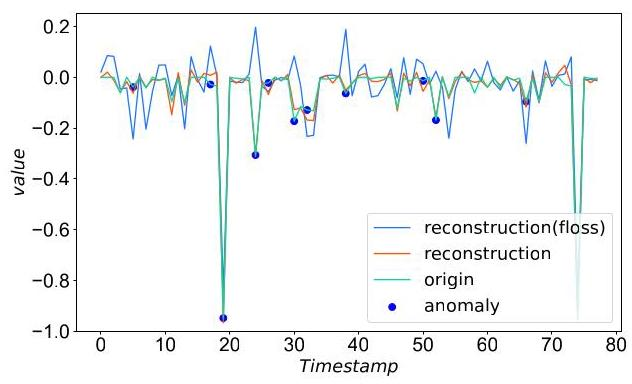

Figure 7: Visualization of the reconstruction, true value and anomaly.

图7:重建、真实值和异常的可视化。

### 4.6 Detailed Study of Floss

### 4.6 牙线的详细研究

As Floss is designed as a plug-in loss function, there can be various instances with different implementation choices for each module. In this section, a comprehensive analysis and comparison of different instances of Floss are conducted. In the following discussions, we consider the simplest TS2Vec as the baseline and compare it with other variants on multivariate time series forecasting for Weather, Exchange, ILI and Ettm1. Furthermore, we employ a fixed set of hyperparameters to ensure a fair comparison. It is worth noting that some results may appear worse than those reported in Table 2 because we only presented the best results in Table 2

由于Floss被设计为一种插件式损失函数，每个模块可能存在具有不同实现选择的各种实例。在本节中，对Floss的不同实例进行了全面的分析和比较。在接下来的讨论中，我们将最简单的TS2Vec作为基线，并将其与用于天气、汇率、流感样病例(ILI)和Ettm1的多变量时间序列预测中的其他变体进行比较。此外，我们采用一组固定的超参数以确保公平比较。值得注意的是，某些结果可能看起来比表2中报告的结果更差，因为我们在表2中只展示了最佳结果

4.6.1 Effects of periodic detection module. We initiated our investigation by examining the influence of the period detection module on the model. A comparative analysis was conducted between Floss and two alternative models, namely random and day shift. In Figure 8a, 'random' signifies the utilization of random augmentation during each comparison with Floss, while 'day shift' denotes the shifting of time series by one day at each step, operating under the implicit assumption that all time series exhibit a daily periodicity. The outcomes unveiled that both models incorporating random shifting and day shifting exhibited inferior performance compared to the TS2Vec model.

4.6.1 周期性检测模块的影响。我们通过研究周期检测模块对模型的影响来展开调查。对Floss与另外两个替代模型进行了对比分析，即随机模型和日移模型。在图8a中，“随机”表示在每次与Floss比较时使用随机增强，而“日移”表示在每一步将时间序列向后移动一天，其隐含假设是所有时间序列都呈现每日周期性。结果表明，与TS2Vec模型相比，包含随机移动和日移的两个模型表现较差。

Since Floss assumes that the representation of periodic shifts is similar in the frequency domain, augmenting time series with random shifts or assuming a daily shift might not effectively capture the underlying patterns and periodic behavior. These findings suggest that considering generic shifts or assuming a specific daily pattern might overlook the nuanced dynamics of the time series. Notably, it was observed that only the model incorporating the period detection module for augmentation outperformed TS2Vec. This highlights the critical role played by the period detection module in enhancing the model's performance.

由于Floss假设周期偏移在频域中的表示是相似的，因此用随机偏移增强时间序列或假设每日偏移可能无法有效地捕捉潜在模式和周期性行为。这些发现表明，考虑一般偏移或假设特定的每日模式可能会忽略时间序列的细微动态。值得注意的是，观察到只有包含周期检测模块进行增强的模型优于TS2Vec。这突出了周期检测模块在提高模型性能方面所起的关键作用。

Table 6: Anomaly detection task. We calculate the accuracy, precision, recall and F1 scores for each dataset.

表6:异常检测任务。我们计算了每个数据集的准确率、精确率、召回率和F1分数。

<table><tr><td>Dataset</td><td colspan="4">MSL</td><td colspan="4">SMD</td></tr><tr><td>Metric</td><td>Acc.</td><td>Prec.</td><td>Rec.</td><td>F1</td><td>Acc.</td><td>Prec.</td><td>Rec.</td><td>F1</td></tr><tr><td>FEDformer</td><td>0.9673</td><td>0.7714</td><td>0.7679</td><td>0.7857</td><td>0.9763</td><td>0.7732</td><td>0.6094</td><td>0.6816</td></tr><tr><td>FEDformer-Floss</td><td>0.9651</td><td>0.9059</td><td>0.7465</td><td>0.8185</td><td>0.9781</td><td>0.7846</td><td>0.6508</td><td>0.7114</td></tr><tr><td>TimesNet</td><td>0.9647</td><td>0.8955</td><td>0.7529</td><td>0.8180</td><td>0.9877</td><td>0.8788</td><td>0.8154</td><td>0.8459</td></tr><tr><td>TimesNet-Floss</td><td>0.9648</td><td>0.8959</td><td>0.7541</td><td>0.8187</td><td>0.9867</td><td>0.8684</td><td>0.8008</td><td>0.8332</td></tr><tr><td>Reformer</td><td>0.9638</td><td>0.9014</td><td>0.7372</td><td>0.8111</td><td>0.9780</td><td>0.7832</td><td>0.6524</td><td>0.7118</td></tr><tr><td>Reformer-Floss</td><td>0.9647</td><td>0.9055</td><td>0.7430</td><td>0.8163</td><td>0.9781</td><td>0.7832</td><td>0.6538</td><td>0.7127</td></tr><tr><td>Transformer</td><td>0.9634</td><td>0.8977</td><td>0.7366</td><td>0.8093</td><td>0.9780</td><td>0.7832</td><td>0.6524</td><td>0.7118</td></tr><tr><td>Transformer-Floss</td><td>0.9652</td><td>0.9062</td><td>0.7470</td><td>0.8189</td><td>0.9781</td><td>0.7828</td><td>0.6537</td><td>0.7125</td></tr></table>

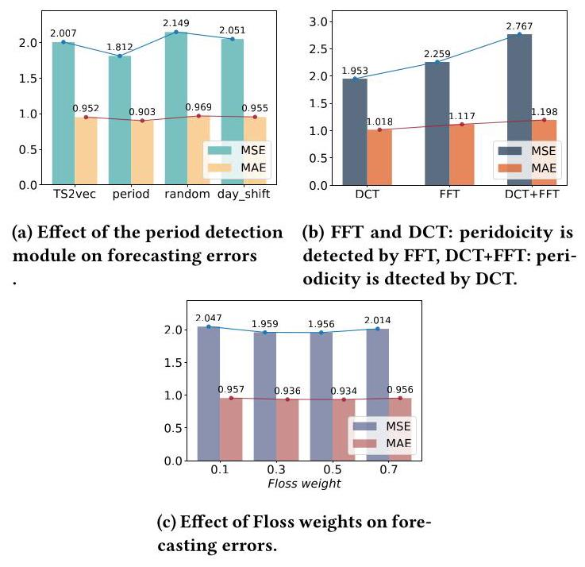

Figure 8: Ablation results.

图8:消融结果。

4.6.2 Combination of DCT and FFT. We also conducted an examination of the combination of Fast Fourier Transform (FFT) and Discrete Cosine Transform (DCT) in relation to period identification and Floss computation. In Figure 8b, 'FFT' and 'DCT' signify the utilization of FFT and DCT for Floss calculation, respectively. Notably, both approaches employ FFT for periodic detection. On the other hand, 'DCT+FFT' indicates the application of DCT for period identification and FFT for Floss computation. Our investigation yielded noteworthy results, unveiling the significance of the combination. It was observed that employing FFT for period identification, while leveraging DCT for spectral density computation, yielded the most optimal outcomes in terms of performance.

4.6.2离散余弦变换(DCT)与快速傅里叶变换(FFT)的组合。我们还研究了快速傅里叶变换(FFT)和离散余弦变换(DCT)在周期识别和弗洛斯计算方面的组合。在图8b中，“FFT”和“DCT”分别表示在弗洛斯计算中使用FFT和DCT。值得注意的是，这两种方法都使用FFT进行周期性检测。另一方面，“DCT+FFT”表示使用DCT进行周期识别，使用FFT进行弗洛斯计算。我们的研究得出了值得注意的结果，揭示了这种组合的重要性。据观察，在性能方面，使用FFT进行周期识别，同时利用DCT进行谱密度计算，产生了最优化的结果。

4.6.3 Effects of Floss weights. Floss operates in conjunction with the loss of other models. Our encoder is trained using a weighted sum of Floss and other loss functions. Assigning a higher weight to Floss indicates a greater reliance on capturing periodic invariances. To investigate the impact of the Floss weight, we set the contrastive loss weight of TS2Vec to 0.5 and evaluate the model's performance with different loss weights on three datasets. The results are presented in Figure 8c. The findings demonstrate the robustness of our proposed method to the choice of weight. The performance of the model remains consistent across various weight settings. However, upon closer analysis, we identify that the weight range between 0.3 and 0.5 yields the best performance.

4.6.3 弗洛丝权重的影响。弗洛丝与其他模型的损失协同作用。我们的编码器使用弗洛丝和其他损失函数的加权和进行训练。给弗洛丝赋予更高的权重表明对捕捉周期性不变性的更大依赖。为了研究弗洛丝权重的影响，我们将TS2Vec的对比损失权重设置为0.5，并在三个数据集上使用不同的损失权重评估模型的性能。结果如图8c所示。研究结果表明我们提出的方法对权重选择具有鲁棒性。模型的性能在各种权重设置下保持一致。然而，经过仔细分析，我们发现权重范围在0.3到0.5之间时性能最佳。

4.6.4 Effects of hierarchical Floss computation. As described in Section 3.2, we employ a hierarchical Floss computation strategy to allocate greater weights to the low-frequency components. However, it is noteworthy that employing hierarchical Floss computation may not be necessary for all datasets. The performance comparison without hierarchical computation is presented in Figure 9. Specifically, our experimentation on the electricity dataset demonstrates a substantial enhancement in model performance when utilizing hierarchical Floss computation. In contrast, for the weather dataset, we observed that refraining from hierarchical Floss computation actually yielded superior outcomes. When employing hierarchical computation, we tend to focus more on capturing the similarities in the low-frequency components. On the other hand, without employing hierarchical computation, we treat all frequency components equally, including the high-frequency components. This observation suggests that in datasets such as weather, after undergoing periodic variations, the abstract representation of the high-frequency components remains relatively unchanged. Preserving all frequencies becomes more effective for such data.

4.6.4 分层弗洛丝计算的影响。如3.2节所述，我们采用分层弗洛丝计算策略，为低频分量分配更大的权重。然而，值得注意的是，并非所有数据集都需要采用分层弗洛丝计算。图9展示了不进行分层计算时的性能比较。具体而言，我们在电力数据集上的实验表明，使用分层弗洛丝计算时模型性能有显著提升。相比之下，对于天气数据集，我们观察到不进行分层弗洛丝计算实际上能产生更好的结果。采用分层计算时，我们倾向于更关注捕捉低频分量中的相似性。另一方面，不采用分层计算时，我们平等对待所有频率分量，包括高频分量。这一观察结果表明，在天气等数据集中，经过周期性变化后，高频分量的抽象表示相对保持不变。保留所有频率对这类数据更有效。

Moreover, we observed a significant improvement in long-term forecasting performance when hierarchical Floss computation was not employed for weather dataset. This finding suggests that for the weather dataset, the long-term variation trend may be concealed within the unchanged high-frequency components under periodic shifts. These phenomena call for further in-depth research to design more robust models capable of capturing these patterns.

此外，我们观察到在天气数据集上不采用分层弗洛丝计算时，长期预测性能有显著提高。这一发现表明，对于天气数据集，长期变化趋势可能隐藏在周期性变化下不变的高频分量中。这些现象需要进一步深入研究，以设计出能够捕捉这些模式的更强大模型。

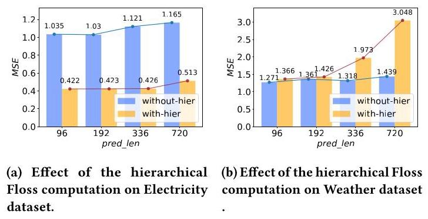

Figure 9: Effect of hierarchical Floss computation.

图9:分层弗洛丝计算的影响。

4.6.5 Representation visualization. Figure 10 displays the t-SNE embedding of TS2Vec-Floss and Floss on nine consecutive days of the Electricity and ETTh1 datasets. These datasets are known to exhibit pronounced daily periodicity. Consequently, the automatic periodic detection module is anticipated to capture this strong periodic pattern. In this visualization, the model with Floss produces a more periodic cloud structure, characterized by a reduced presence of easily distinguishable hour-of-day groupings.

4.6.5 表示可视化。图10展示了TS2Vec - 弗洛丝和弗洛丝在电力和ETTh1数据集连续九天的t - SNE嵌入。这些数据集已知具有明显的每日周期性。因此，自动周期性检测模块有望捕捉到这种强烈的周期性模式。在这种可视化中，带有弗洛丝的模型产生了更具周期性的云状结构，其特点是按天分组的可区分性降低。

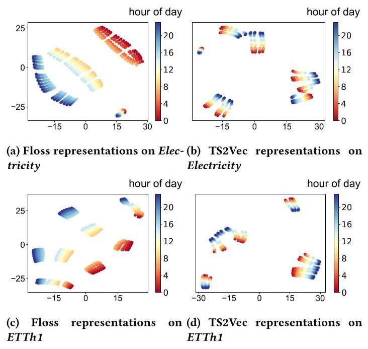

Figure 10: T-SNE visualizations of the learned representations of TS2Vec-Floss and TS2Vec on Electricity and ETTh1. Different colors represent different hours of day.

图10:电力和ETTh1数据集上TS2Vec - 弗洛丝和TS2Vec学习表示的t - SNE可视化。不同颜色代表一天中的不同小时。

4.6.6 Accuracy of Periodicity Detection. We provide a case study (informer-Floss for Electricity) of the periodicity detection module in Figure 11. We can observe that Floss can accurately capture the periodicities. Moreover, most of the detected periodicities are approximately equal to 24 hours (1 day), which supports our motivation in adopting automatic periodicity detection for representation learning.

4.6.6 周期性检测的准确性。我们在图11中提供了一个周期性检测模块的案例研究(电力数据集的informer - 弗洛丝)。我们可以观察到弗洛丝能够准确捕捉周期性。此外，检测到的大多数周期性大约等于24小时(1天)，这支持了我们在表示学习中采用自动周期性检测的动机。

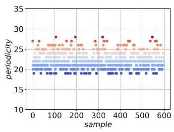

Figure 11: Periodicity Detection Results with informer-Floss for Electricity.

图11:电力数据集使用informer - 弗洛丝的周期性检测结果。

## 5 CONCLUSION

## 5 结论

In this study, we addressed the challenge of effectively capturing periodic or quasi-periodic dynamics present in real-world time series data using deep learning approaches. While deep learning has shown impressive performance in various application domains, it often struggles to adequately represent the underlying periodic behaviors in time series data. To bridge this gap, we introduced an unsupervised method called Floss. Floss is designed to automatically detect major periodicities in time series data and utilizes periodic shift and spectral density similarity measures to learn meaningful representations with periodic consistency in the frequency domain. By seamlessly incorporating Floss into supervised, semi-supervised, and unsupervised learning frameworks, we demonstrated its versatility and ability to enhance time series analysis tasks.

在本研究中，我们使用深度学习方法解决了有效捕捉现实世界时间序列数据中存在的周期性或准周期性动态的挑战。虽然深度学习在各种应用领域都表现出了令人印象深刻的性能，但它在充分表示时间序列数据中的潜在周期性行为方面往往存在困难。为了弥合这一差距，我们引入了一种名为弗洛丝的无监督方法。弗洛丝旨在自动检测时间序列数据中的主要周期性，并利用周期性移位和频谱密度相似性度量在频域中学习具有周期性一致性的有意义表示。通过将弗洛丝无缝集成到监督、半监督和无监督学习框架中，我们展示了它的通用性以及增强时间序列分析任务的能力。

Our extensive experiments on common time series analysis tasks showcased the effectiveness of Floss. It outperformed state-of-the-art deep learning models, validating its capability to automatically discover periodic dynamics. The results underscore the importance of considering domain-specific knowledge about periodic behaviors to enrich the learned representations in deep learning models.

我们在常见时间序列分析任务上进行的广泛实验展示了弗洛丝的有效性。它优于当前最先进的深度学习模型，验证了其自动发现周期性动态的能力。结果强调了考虑关于周期性行为的领域特定知识以丰富深度学习模型中学习到的表示的重要性。

For future work, exploring advanced modeling techniques that can effectively capture the hidden long-term patterns in complex data such as weather data remains a promising direction. In the weather dataset, we observed a significant improvement in long-term forecasting performance when hierarchical Floss computation was not employed. his finding suggests that for some datasets, the long-term variation trend may be concealed within the unchanged high-frequency components under periodic shifts. For future work, exploring advanced modeling techniques that can effectively capture the hidden long-term patterns in weather data remains a promising direction. This may involve the incorporation of domain-specific knowledge, such as external factors, to enhance the modeling process. Furthermore, extending the research to consider more complex and dynamic scenarios, such as time series prediction under extreme weather events, could present new challenges and opportunities for advancing time series analysis. Floss solely addresses the frequency domain similarity of the model concerning temporal periodicity. Integrating state-of-the-art techniques, such as Graph Neural Networks (GNNs) and graph spectral analysis, holds promise for modeling inter time series invariance and optimizing time series analysis performance. By leveraging GNNs and graph spectral analysis, we can gain a deeper understanding of the relationships between multiple time series, capturing intricate temporal dependencies and interdependencies among time series.

对于未来的工作，探索能够有效捕捉复杂数据(如天气数据)中隐藏的长期模式的先进建模技术仍然是一个有前景的方向。在天气数据集中，我们观察到在不采用分层弗洛斯计算时，长期预测性能有显著提升。这一发现表明，对于某些数据集，长期变化趋势可能隐藏在周期性变化下不变的高频成分中。对于未来的工作，探索能够有效捕捉天气数据中隐藏的长期模式的先进建模技术仍然是一个有前景的方向。这可能涉及纳入特定领域的知识，如外部因素，以增强建模过程。此外，将研究扩展到考虑更复杂和动态的场景，如极端天气事件下的时间序列预测，可能会为推进时间序列分析带来新的挑战和机遇。弗洛斯仅解决了模型在时间周期性方面的频域相似性问题。整合诸如图神经网络(GNN)和图谱分析等先进技术，有望对时间序列间的不变性进行建模并优化时间序列分析性能。通过利用GNN和图谱分析，我们可以更深入地理解多个时间序列之间的关系，捕捉时间序列之间复杂的时间依赖性和相互依赖性。

## ACKNOWLEDGMENTS

## 致谢

This work was supported by National Natural Science Foundation of Sichuan Province (Grant No.2023NSFSC1423), the Tianfu Emei Plan of Sichuan Province, and the Fundamental Research Funds for the Central Universities.

本研究得到了四川省自然科学基金(批准号:2023NSFSC1423)、四川省天府峨眉计划以及中央高校基本科研业务费的支持。

## REFERENCES

## 参考文献

[1] Ralph G Andrzejak, Klaus Lehnertz, Florian Mormann, Christoph Rieke, Pe-ter David, and Christian E Elger. 2001. Indications of nonlinear deterministic and finite-dimensional structures in time series of brain electrical activity: De-

ter David和Christian E Elger。2001年。脑电活动时间序列中非线性确定性和有限维结构的迹象:De -pendence on recording region and brain state. Physical Review E 64, 6 (2001),061907.

[2] Davide Anguita, Alessandro Ghio, Luca Oneto, Xavier Parra, Jorge Luis Reyes-Ortiz, et al. 2013. A public domain dataset for human activity recognition usingsmartphones.. In Esann, Vol. 3. 3.

智能手机。。载于Esann，第3卷。3。

[3] Anthony Bagnall, Hoang Anh Dau, Jason Lines, Michael Flynn, James Large, Aaron Bostrom, Paul Southam, and Eamonn Keogh. 2018. The UEA multivariate time series classification archive, 2018. arXiv preprint arXiv:1811.00075 (2018).

[4] Ting Chen, Simon Kornblith, Mohammad Norouzi, and Geoffrey Hinton. 2020.A simple framework for contrastive learning of visual representations. In International conference on machine learning. PMLR, 1597-1607.

一种用于视觉表征对比学习的简单框架。发表于国际机器学习会议。PMLR，1597 - 1607。

[5] Xinlei Chen and Kaiming He. 2021. Exploring simple siamese representationlearning. In Proceedings of the IEEE/CVF conference on computer vision and pattern recognition. 15750-15758.

学习。发表于IEEE/CVF计算机视觉与模式识别会议论文集。15750 - 15758。

[6] Hoang Anh Dau, Anthony Bagnall, Kaveh Kamgar, Chin-Chia Michael Yeh, YanZhu, Shaghayegh Gharghabi, Chotirat Ann Ratanamahatana, and Eamonn Keogh.

朱、沙加耶格·加尔加比、乔蒂拉特·安·拉塔纳马哈塔纳和伊蒙·基奥。2019. The UCR time series archive. IEEE/CAA Journal of Automatica Sinica 6, 6 (2019), 1293-1305.

[7] Jan G De Gooijer and Rob J Hyndman. 2006. 25 years of time series forecasting. International journal of forecasting 22, 3 (2006), 443-473.

[8] Janez Demšar. 2006. Statistical comparisons of classifiers over multiple data sets. The Journal of Machine learning research 7 (2006), 1-30.

[9] Emadeldeen Eldele, Mohamed Ragab, Zhenghua Chen, Min Wu, Chee Keong Kwoh, Xiaoli Li, and Cuntai Guan. 2021. Time-Series Representation Learning viaTemporal and Contextual Contrasting. In Proceedings of the Thirtieth International Joint Conference on Artificial Intelligence, IJCAI-21. 2352-2359.

时间与上下文对比。发表于第三十届国际人工智能联合会议，IJCAI - 21。2352 - 2359。

[10] Jean-Yves Franceschi, Aymeric Dieuleveut, and Martin Jaggi. 2019. Unsupervisedscalable representation learning for multivariate time series. Advances in neural information processing systems 32 (2019).

用于多变量时间序列的可扩展表征学习。神经信息处理系统进展32(2019年)。

[11] Wayne A Fuller. 2009. Introduction to statistical time series. John Wiley & Sons.

[12] Shaghayegh Gharghabi, Chin-Chia Michael Yeh, Yifei Ding, Wei Ding, PaulHibbing, Samuel LaMunion, Andrew Kaplan, Scott E Crouter, and Eamonn Keogh.

希宾、塞缪尔·拉穆尼翁、安德鲁·卡普兰、斯科特·E·克鲁特和伊蒙·基奥。2019. Domain agnostic online semantic segmentation for multi-dimensionaltime series. Data mining and knowledge discovery 33 (2019), 96-130.

时间序列。数据挖掘与知识发现33(2019年)，96 - 130。

[13] Ary L Goldberger, Luis AN Amaral, Leon Glass, Jeffrey M Hausdorff, Plamen ChIvanov, Roger G Mark, Joseph E Mietus, George B Moody, Chung-Kang Peng, and

伊万诺夫、罗杰·G·马克、约瑟夫·E·米厄斯、乔治·B·穆迪、彭忠康和H Eugene Stanley. 2000. PhysioBank, PhysioToolkit, and PhysioNet: componentsof a new research resource for complex physiologic signals. circulation 101, 23

一种用于复杂生理信号的新研究资源。循环101，23(2000), e215-e220.

[14] Michael Gutmann and Aapo Hyvärinen. 2010. Noise-contrastive estimation: Anew estimation principle for unnormalized statistical models. In Proceedings of the thirteenth international conference on artificial intelligence and statistics. JMLR

未归一化统计模型的新估计原理。发表于第十三届人工智能与统计学国际会议论文集。JMLR

[15] Tao Hong, Pierre Pinson, Shu Fan, Hamidreza Zareipour, Alberto Troccoli, andRob J Hyndman. 2016. Probabilistic energy forecasting: Global energy forecasting competition 2014 and beyond. , 896-913 pages.

罗布·J·欣德曼。2016年。概率能源预测:2014年及以后的全球能源预测竞赛。，第896 - 913页。

[16] Kyle Hundman, Valentino Constantinou, Christopher Laporte, Ian Colwell, andTom Soderstrom. 2018. Detecting spacecraft anomalies using lstms and nonparametric dynamic thresholding. In Proceedings of the 24th ACM SIGKDD international conference on knowledge discovery & data mining. 387-395.

汤姆·索德斯特伦。2018年。使用长短期记忆网络和非参数动态阈值检测航天器异常。在第24届ACM SIGKDD国际知识发现与数据挖掘会议论文集。第387 - 395页。

[17] Prannay Khosla, Piotr Teterwak, Chen Wang, Aaron Sarna, Yonglong Tian, Phillip Isola, Aaron Maschinot, Ce Liu, and Dilip Krishnan. 2020. Supervisedcontrastive learning. Advances in Neural Information Processing Systems 33 (2020), 18661-18673.

对比学习。《神经信息处理系统进展》33(2020年)，第18661 - 18673页。

[18] Nikita Kitaev, Lukasz Kaiser, and Anselm Levskaya. 2019. Reformer: The EfficientTransformer. In International Conference on Learning Representations.

Transformer。在国际学习表征会议上。

[19] Yaguang Li, Rose Yu, Cyrus Shahabi, and Yan Liu. 2018. Diffusion Convolu-tional Recurrent Neural Network: Data-Driven Traffic Forecasting. In International Conference on Learning Representations. https://openreview.net/forum? id=SJiHXGWAZ

传统递归神经网络:数据驱动的交通预测。在国际学习表征会议上。https://openreview.net/forum?id=SJiHXGWAZ

[20] Zachary C Lipton, David C Kale, Randall Wetzel, et al. 2016. Modeling missingdata in clinical time series with rnns. Machine Learning for Healthcare 56 (2016), 253-270.

使用循环神经网络处理临床时间序列数据。《医疗保健机器学习》56(2016年)，第253 - 270页。

[21] Laura A McSweeney. 2006. Comparison of periodogram tests. Journal of Statistical Computation and Simulation 76, 4 (2006), 357-369.

[22] LIU Minhao, Ailing Zeng, LAI Qiuxia, Ruiyuan Gao, Min Li, Jing Qin, and QiangXu. 2021. T-WaveNet: A Tree-Structured Wavelet Neural Network for Time Series Signal Analysis. In International Conference on Learning Representations.

徐。2021年。T - WaveNet:一种用于时间序列信号分析的树状结构小波神经网络。在国际学习表征会议上。

[23] Meinard Müller. 2007. Dynamic time warping. Information retrieval for musicand motion (2007), 69-84.

与运动(2007年)，第69 - 84页。

[24] Yuqi Nie, Nam H Nguyen, Phanwadee Sinthong, and Jayant Kalagnanam. 2023.A Time Series is Worth 64 Words: Long-term Forecasting with Transformers. In The Eleventh International Conference on Learning Representations. https: //openreview.net/forum?id=Jbdc0vTOcol

一个时间序列值64个词:使用Transformer进行长期预测。在第十一届国际学习表征会议上。https://openreview.net/forum?id=Jbdc0vTOcol

[25] Aaron van den Oord, Yazhe Li, and Oriol Vinyals. 2018. Representation learning with contrastive predictive coding. arXiv preprint arXiv:1807.03748 (2018).

[26] John Paparrizos, Yuhao Kang, Paul Boniol, Ruey S Tsay, Themis Palpanas, andMichael J Franklin. 2022. TSB-UAD: an end-to-end benchmark suite for univariate

迈克尔·J·富兰克林。2022年。TSB - UAD:一个用于单变量的端到端基准套件time-series anomaly detection. Proceedings of the VLDB Endowment 15, 8 (2022),1697-1711.

[27] Hansheng Ren, Bixiong Xu, Yujing Wang, Chao Yi, Congrui Huang, Xiaoyu Kou, Tony Xing, Mao Yang, Jie Tong, and Qi Zhang. 2019. Time-series anomaly detec-tion service at microsoft. In Proceedings of the 25th ACM SIGKDD international conference on knowledge discovery & data mining. 3009-3017.

微软的[具体内容缺失]服务。在第25届ACM SIGKDD国际知识发现与数据挖掘会议论文集。第3009 - 3017页。

[28] David Salinas, Valentin Flunkert, Jan Gasthaus, and Tim Januschowski. 2020.DeepAR: Probabilistic forecasting with autoregressive recurrent networks. Inter-

深度自回归网络:使用自回归循环网络进行概率预测。national Journal of Forecasting 36, 3 (2020), 1181-1191.

[29] Huan Song, Deepta Rajan, Jayaraman Thiagarajan, and Andreas Spanias. 2018.Attend and diagnose: Clinical time series analysis using attention models. In Proceedings of the AAAI conference on artificial intelligence, Vol. 32.

关注并诊断:使用注意力模型进行临床时间序列分析。在人工智能AAAI会议论文集，第32卷。

[30] Ya Su, Youjian Zhao, Chenhao Niu, Rong Liu, Wei Sun, and Dan Pei. 2019. Robustanomaly detection for multivariate time series through stochastic recurrent neural network. In Proceedings of the 25th ACM SIGKDD international conference on knowledge discovery & data mining. 2828-2837.

通过随机递归神经网络进行多变量时间序列异常检测。在第25届ACM SIGKDD国际知识发现与数据挖掘会议论文集。第2828 - 2837页。

[31] Andrzej Tarczynski and Najib Allay. 2004. Spectral analysis of randomly sampledsignals: suppression of aliasing and sampler jitter. IEEE Transactions on Signal

信号:抑制混叠和采样器抖动。《IEEE信号处理汇刊》Processing 52, 12 (2004), 3324-3334.

[32] Sana Tonekaboni, Danny Eytan, and Anna Goldenberg. 2020. UnsupervisedRepresentation Learning for Time Series with Temporal Neighborhood Coding. In International Conference on Learning Representations.

使用时间邻域编码的时间序列表征学习。在国际学习表征会议上。

[33] Machiko Toyoda, Yasushi Sakurai, and Yoshiharu Ishikawa. 2013. Pattern dis-covery in data streams under the time warping distance. The VLDB Journal 22

时间规整距离下数据流中的发现。《VLDB 杂志》第 22 期(2013), 295-318.

[34] Ruey S Tsay. 2005. Analysis of financial time series. John wiley & sons.

[35] Jacob T VanderPlas and Zeljko Ivezic. 2015. Periodograms for multiband astronomical time series. The Astrophysical Journal 812, 1 (2015), 18.

[36] Ashish Vaswani, Noam Shazeer, Niki Parmar, Jakob Uszkoreit, Llion Jones, Aidan N Gomez, Łukasz Kaiser, and Illia Polosukhin. 2017. Attention is allyou need. Advances in neural information processing systems 30 (2017).

你所需要的。《神经信息处理系统进展》30(2017 年)。

[37] Michail Vlachos, Philip Yu, and Vittorio Castelli. 2005. On periodicity detection and structural periodic similarity. In Proceedings of the 2005 SIAM internationalconference on data mining. SIAM, 449-460.

数据挖掘会议。工业与应用数学学会，449 - 460。

[38] Qingsong Wen, Kai He, Liang Sun, Yingying Zhang, Min Ke, and Huan Xu. 2021. RobustPeriod: Robust time-frequency mining for multiple periodicity detection. In Proceedings of the 2021 International Conference on Management ofData. 2328-2337.

《数据》。2328 - 2337。

[39] Gerald Woo, Chenghao Liu, Doyen Sahoo, Akshat Kumar, and Steven Hoi. 2021.CoST: Contrastive Learning of Disentangled Seasonal-Trend Representations for Time Series Forecasting. In International Conference on Learning Representations.

CoST:用于时间序列预测的解缠季节性 - 趋势表示的对比学习。在国际学习表征会议上。

[40] Gerald Woo, Chenghao Liu, Doyen Sahoo, Akshat Kumar, and Steven Hoi. 2022.ETSformer: Exponential Smoothing Transformers for Time-series Forecasting.

ETSformer:用于时间序列预测的指数平滑变压器。arXiv preprint arXiv:2202.01381 (2022).

[41] Haixu Wu, Tengge Hu, Yong Liu, Hang Zhou, Jianmin Wang, and MingshengLong. 2023. TimesNet: Temporal 2D-Variation Modeling for General Time Series Analysis. In The Eleventh International Conference on Learning Representations. https://openreview.net/forum?id=ju_Uqw384Oq

Long。2023 年。TimesNet:用于一般时间序列分析的时间二维变化建模。在第十一届国际学习表征会议上。https://openreview.net/forum?id=ju_Uqw384Oq

[42] Xinle Wu, Dalin Zhang, Chenjuan Guo, Chaoyang He, Bin Yang, and Christian S Jensen. 2021. AutoCTS: Automated correlated time series forecasting. Proceedings of the VLDB Endowment 15, 4 (2021), 971-983.

[43] Yuankai Wu, Huachun Tan, Lingqiao Qin, Bin Ran, and Zhuxi Jiang. 2018. Ahybrid deep learning based traffic flow prediction method and its understanding. Transportation Research Part C: Emerging Technologies 90 (2018), 166-180.

基于混合深度学习的交通流预测方法及其理解。《交通研究 C 部分:新兴技术》90(2018 年)，166 - 180。

[44] Z Wu, S Pan, G Long, J Jiang, and C Zhang. 2019. Graph WaveNet for DeepSpatial-Temporal Graph Modeling. In The 28th International Joint Conference on Artificial Intelligence (IJCAI). International Joint Conferences on Artificial Intelligence Organization.

时空图建模。在第 28 届国际人工智能联合会议(IJCAI)上。国际人工智能联合会议组织。

[45] Jiehui Xu, Haixu Wu, Jianmin Wang, and Mingsheng Long. 2021. AnomalyTransformer: Time Series Anomaly Detection with Association Discrepancy. In International Conference on Learning Representations.

Transformer:基于关联差异的时间序列异常检测。在国际学习表征会议上。

[46] Ling Yang and Shenda Hong. 2022. Unsupervised time-series representationlearning with iterative bilinear temporal-spectral fusion. In International Conference on Machine Learning. PMLR, 25038-25054.

通过迭代双线性时间 - 频谱融合进行学习。在国际机器学习会议上。PMLR，25038 - 25054。

[47] Zhihan Yue, Yujing Wang, Juanyong Duan, Tianmeng Yang, Congrui Huang,Yunhai Tong, and Bixiong Xu. 2022. Ts2vec: Towards universal representation of time series. In Proceedings of the AAAI Conference on Artificial Intelligence, Vol. 36. 8980-8987.

童云海，和徐必雄。2022 年。Ts2vec:迈向时间序列的通用表示。在人工智能协会会议论文集，第 36 卷。8980 - 8987。

[48] Ailing Zeng, Muxi Chen, Lei Zhang, and Qiang Xu. 2023. Are TransformersEffective for Time Series Forecasting? Proceedings of the AAAI Conference on Artificial Intelligence.

对时间序列预测有效吗？人工智能协会会议论文集。

[49] George Zerveas, Srideepika Jayaraman, Dhaval Patel, Anuradha Bhamidipaty,and Carsten Eickhoff. 2021. A Transformer-Based Framework for Multivariate Time Series Representation Learning (KDD '21). Association for Computing Machinery, New York, NY, USA, 2114-2124. https://doi.org/10.1145/3447548.3467401

和卡斯滕·艾克霍夫。2021 年。基于变压器的多变量时间序列表示学习框架(KDD '21)。美国计算机协会，纽约，NY，美国，2114 - 2124。https://doi.org/10.1145/3447548.3467401

[50] Xiyuan Zhang, Xiaoyong Jin, Karthick Gopalswamy, Gaurav Gupta, Youngsuk Park, Xingjian Shi, Hao Wang, Danielle C Maddix, and Yuyang Wang. 2022. FirstDe-Trend then Attend: Rethinking Attention for Time-Series Forecasting. arXiv

先去趋势再关注:重新思考时间序列预测中的注意力。arXivpreprint arXiv:2212.08151 (2022).

[51] Xiang Zhang, Ziyuan Zhao, Theodoros Tsiligkaridis, and Marinka Zitnik. 2022.Self-supervised contrastive pre-training for time series via time-frequency con-

通过时频卷积对时间序列进行自监督对比预训练sistency. arXiv preprint arXiv:2206.08496 (2022).

[52] Haoyi Zhou, Shanghang Zhang, Jieqi Peng, Shuai Zhang, Jianxin Li, Hui Xiong,and Wancai Zhang. 2021. Informer: Beyond efficient transformer for long sequence time-series forecasting. In Proceedings of the AAAI Conference on Artificial Intelligence, Vol. 35. 11106-11115.

以及张万财。2021年。《Informer:超越高效变压器的长序列时间序列预测》。发表于《AAAI人工智能会议论文集》，第35卷。11106 - 11115页。

[53] Tian Zhou, Ziqing Ma, Qingsong Wen, Xue Wang, Liang Sun, and Rong Jin. 2022.FEDformer: Frequency enhanced decomposed transformer for long-term series

FEDformer:用于长期序列的频率增强分解变压器forecasting. arXiv preprint arXiv:2201.12740 (2022).