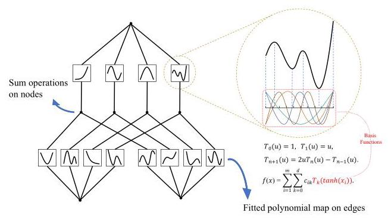
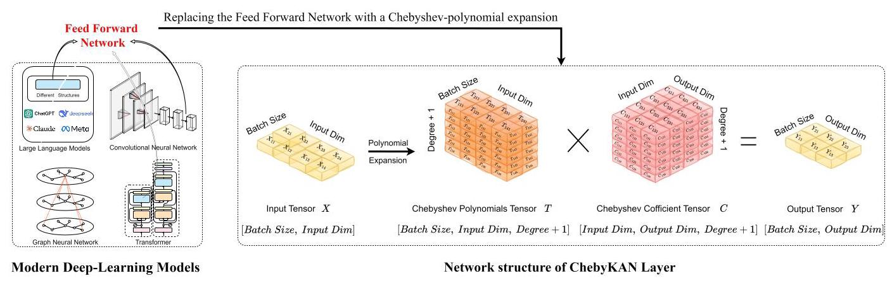
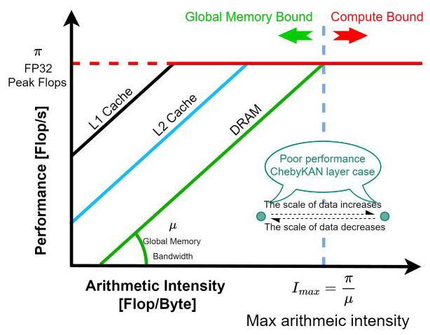
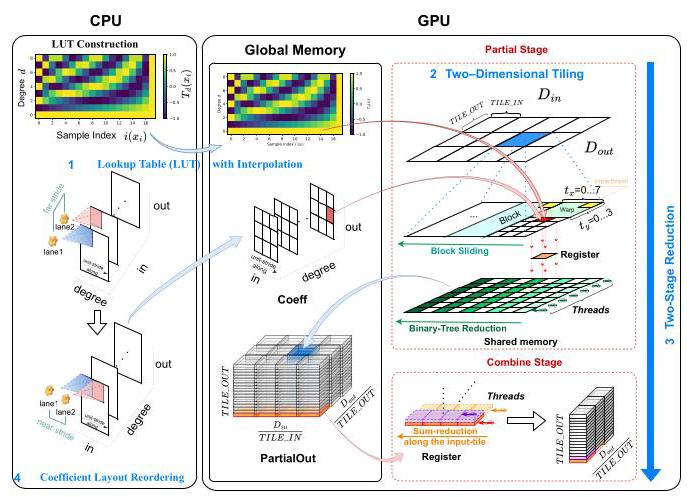
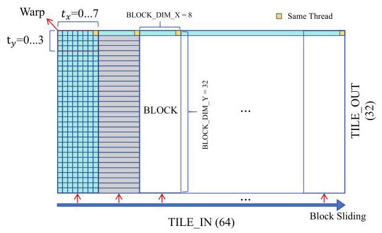
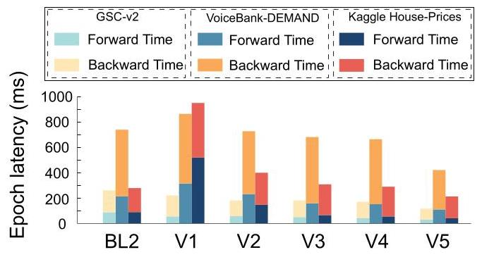
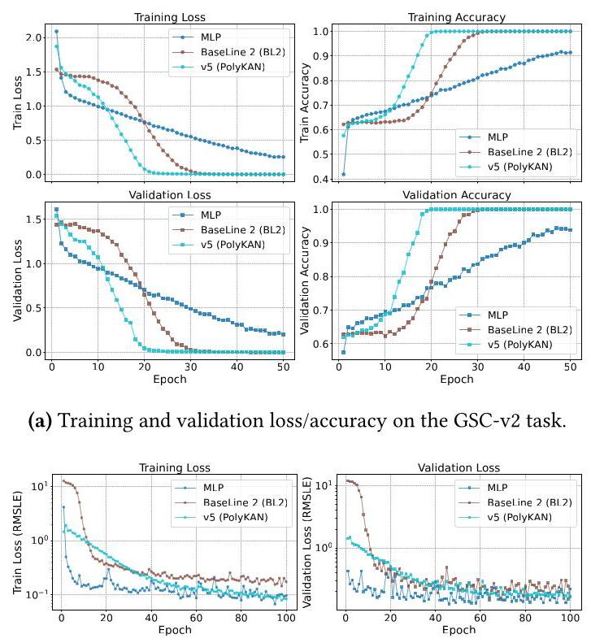
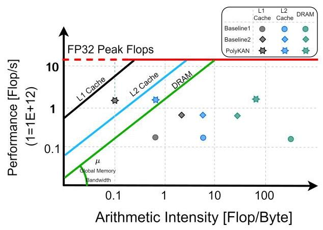

# PolyKAN: Efficient Fused GPU Operators for Polynomial Kolmogorov-Arnold Network Variants

# PolyKAN:用于多项式柯尔莫哥洛夫 - 阿诺德网络变体的高效融合GPU算子

Mingkun Yu

余明坤

Sun Yat-sen University

中山大学

Guangzhou, China

中国广州

Heming Zhong

钟赫明

Sun Yat-sen University

中山大学

Guangzhou, China

中国广州

Dan Huang

黄丹

Sun Yat-sen University

中山大学

Guangzhou, China

中国广州

Yutong Lu

卢宇通

Sun Yat-sen University

中山大学

Guangzhou, China

中国广州

Jiazhi Jiang

蒋家智

Sun Yat-sen University

中山大学

Guangzhou, China

中国广州

## Abstract

## 摘要

Kolmogorov-Arnold Networks (KANs) promise higher expressive capability and stronger interpretability than MultiLayer Perceptron, particularly in the domain of AI for Science. However, practical adoption has been hindered by low GPU utilization of existing parallel implementations. To address this challenge, we present a GPU-accelerated operator library, named PolyKAN which is the first general open-source implementation of KAN and its variants. PolyKAN fuses the forward and backward passes of polynomial KAN layers into a concise set of optimized CUDA kernels. Four orthogonal techniques underpin the design: (i) lookup-table with linear interpolation that replaces runtime expensive math-library functions; (ii) 2D tiling to expose thread-level parallelism with preserving memory locality; (iii) a two-stage reduction scheme converting scattered atomic updates into a single controllable merge step; and (iv) coefficient-layout reordering yielding unit-stride reads under the tiled schedule. Using a KAN variant, Chebyshev KAN, as a case-study, PolyKAN delivers ${1.2} - {10} \times$ faster inference and ${1.4} - {12} \times$ faster training than a Triton + cuBLAS baseline, with identical accuracy on speech, audio-enhancement, and tabular-regression workloads on both highend GPU and consumer-grade GPU.

柯尔莫哥洛夫 - 阿诺德网络(KANs)比多层感知器具有更高的表达能力和更强的可解释性，特别是在科学领域的人工智能中。然而，现有的并行实现对GPU的利用率较低，阻碍了其实际应用。为应对这一挑战，我们提出了一个名为PolyKAN的GPU加速算子库，这是KAN及其变体的首个通用开源实现。PolyKAN将多项式KAN层的前向和反向传播融合到一组简洁的优化CUDA内核中。设计基于四种正交技术:(i)使用线性插值的查找表，取代运行时昂贵的数学库函数；(ii)二维平铺，在保持内存局部性的同时暴露线程级并行性；(iii)两阶段归约方案，将分散的原子更新转换为单个可控的合并步骤；(iv)系数布局重排序，在平铺调度下实现单位步长读取。以KAN变体切比雪夫KAN为例进行研究，与Triton + cuBLAS基线相比，PolyKAN在高端GPU和消费级GPU上的语音、音频增强和表格回归工作负载上，推理速度快${1.2} - {10} \times$，训练速度快${1.4} - {12} \times$，且精度相同。

Keywords: Kolmogorov-Arnold Networks, GPU operator optimization, CUDA fused kernels, deep-learning acceleration

关键词:柯尔莫哥洛夫 - 阿诺德网络，GPU算子优化，CUDA融合内核，深度学习加速

<table><tr><td>Model</td><td>Multi-Layer Perceptron(MLP)</td><td>Kolmogorov-Arnold Network(KAN)</td></tr><tr><td>Theorem</td><td>Universal Approximation Theorem</td><td>Kolmogorov-Arnold Representation Theorem</td></tr><tr><td>Formula</td><td>${MLP}\left( x\right)  \approx  \mathop{\sum }\limits_{{i = 1}}^{{N\left( c\right) }}{a}_{i}\sigma \left( {{w}_{i} \cdot  x + {b}_{i}}\right)$</td><td>${KAN}\left( x\right)  = \mathop{\sum }\limits_{{q = 1}}^{{{2n} + 1}}{\Phi }_{q}\left( {\mathop{\sum }\limits_{{p = 1}}^{n}{\psi }_{q, p}\left( {x}_{p}\right) }\right) \underset{\text{ Basis Function }}{\underline{\text{ Including }}}$</td></tr><tr><td>Structure</td><td></td><td></td></tr></table>

Figure 1. Architectural and theoretical comparison between traditional multi-layer perceptron (MLP) and Kolmogorov-Arnold Network (KAN).

图1. 传统多层感知器(MLP)与柯尔莫哥洛夫 - 阿诺德网络(KAN)的架构和理论比较。

## 1 Introduction

## 1 引言

Deep learning (DL) has achieved remarkable progress across domains such as computer vision, natural language processing, and scientific computing [14]. Multilayer perceptrons (MLPs) [20] are foundational building blocks of deep learning, yet their inherently opaque nature raises concerns about transparency and interpretability [5, 19]. To pursue more accuracy and higher interpretability, researchers are compelled to explore novel model architectures and activation mechanisms of deep learning. As illustrated in Figure 1, traditional MLP employs fixed non-linear activation functions such as ReLU [16], Sigmoid [20] and Tanh [9]. In contrast, Kolmogorov-Arnold Network (KAN) [15] replaces the fixed activation functions with a linear combination of a set of polynomial basis functions, based on Kolmogorov-Arnold representation theorem [13]. The specific pattern of linear combination is determined by a set of learnable coefficients. Therefore, the process of mapping the input to the output through the nonlinear activation function is transparent.

深度学习(DL)在计算机视觉、自然语言处理和科学计算等领域取得了显著进展[14]。多层感知器(MLPs)[20]是深度学习的基础构建模块，但其本质上的不透明性引发了对透明度和可解释性的担忧[5, 19]。为追求更高的准确性和可解释性，研究人员不得不探索深度学习的新型模型架构和激活机制。如图1所示，传统MLP采用固定的非线性激活函数，如ReLU[16]、Sigmoid[20]和Tanh[9]。相比之下，柯尔莫哥洛夫 - 阿诺德网络(KAN)[15]基于柯尔莫哥洛夫 - 阿诺德表示定理[13]，用一组多项式基函数的线性组合取代固定激活函数。线性组合的具体模式由一组可学习系数决定。因此，通过非线性激活函数将输入映射到输出的过程是透明的。

KANs offer improved memory capacity, interpretability, and accuracy compared to traditional MLPs [31]. Therefore, KANs have been successfully extended to reconstruct various neural network modules, including convolutional [3], graph architectures [32], even Transformer [29] and large language models [7]. Especially in the domain of AI for Computational Science and Engineering such as partial differential equation [6], KAN has shown much better performance than MLP due to its characteristics [11, 25, 30]. To adapt to different tasks, KANs can further enhance the capability through adjusting basis functions and parameterization configurations. This prompts a wide spectrum of KAN variants based on Fourier [28], Chebyshev [21], Legendre [2], and other basis functions.

与传统MLP相比，KANs在内存容量、可解释性和准确性方面有所提升[31]。因此KANs已成功扩展用于重构各种神经网络模块，包括卷积网络[3]、图架构[32]，甚至Transformer[29]和大语言模型[7]。特别是在计算科学与工程领域的人工智能中，如偏微分方程[6]，由于其特性，KAN比MLP表现出更好的性能[11, 25, 30]。为适应不同任务，KANs可通过调整基函数和参数化配置进一步增强能力。这催生了基于傅里叶[28]、切比雪夫[21]、勒让德[2]等基函数的多种KAN变体。

Although KAN variants possess these unique advantages, they typically suffer from ${10} \times$ slower runtimes than MLPs with comparable model and parameter sizes [15]. This inefficiency stems from: (i) the use of parameterized univariate functions as activation function substantially increases computational overhead, (ii) KAN basis-expansion primitives use naive loop-based implementation, limited optimization for parallelism strategies, such as kernel fusion, and (iii) irregular memory access limits GPU concurrency. Convolutional and GEMM benefit from deeply optimized libraries (e.g., cuDNN [4], cuBLAS [17]). In contrast, polynomial basis expansion, which uses a linear combination of basis polynomial functions to represent complex functions, still lacks a high-performance kernel library, resulting in a major bottleneck for practical KAN deployment.

尽管KAN变体具有这些独特优势，但与具有可比模型和参数大小的MLP相比，它们的运行时间通常慢${10} \times$[15]。这种低效率源于:(i)使用参数化单变量函数作为激活函数大幅增加了计算开销；(ii)KAN基扩展原语使用基于朴素循环的实现，对并行策略(如内核融合)的优化有限；(iii)不规则内存访问限制了GPU并发。卷积和通用矩阵乘法得益于深度优化的库(如cuDNN[4]、cuBLAS[17])。相比之下，使用基多项式函数的线性组合来表示复杂函数的多项式基扩展，仍然缺乏高性能内核库，这成为KAN实际部署的主要瓶颈。

To address this issue, we propose a systematic approach of GPU parallel optimization for KAN and its variants, exemplified by Chebyshev KAN (ChebyKAN). Our approach combines lookup-table (LUT) interpolation to alleviate the high cost of polynomial basis expansions, 2D tiling over inputs and outputs to improve spatiotemporal locality, two-stage reduction to mitigate atomic contention, and coefficient-layout reordering for coalesced access. This approach offers a reusable operator interface for seamless integration to prevalent deep learning frameworks, such as PyTorch. Our main contributions are summarized as follows:

为解决此问题，我们提出了一种针对KAN及其变体的GPU并行优化系统方法，以切比雪夫KAN(ChebyKAN)为例。我们的方法结合了查找表(LUT)插值以减轻多项式基扩展的高成本，对输入和输出进行二维平铺以改善时空局部性，两阶段归约以减轻原子争用，以及系数布局重排序以实现合并访问。该方法提供了一个可重用的算子接口，以便无缝集成到流行的深度学习框架，如PyTorch。我们的主要贡献总结如下:

1) Systematic analysis of the core bottlenecks in KAN-type networks. We identify the issues of "multi-step dependency" and "complex function calls" for high-order polynomials under GPU parallelism. Furthermore, we analyze how traditional, operator-by-operator concatenation fails to fully exploit GPU potential from both computational and memory-access perspectives.

1) KAN型网络核心瓶颈的系统分析。我们识别了GPU并行下高阶多项式的“多步依赖”和“复杂函数调用”问题。此外，我们从计算和内存访问的角度分析了传统的逐个算子拼接如何无法充分利用GPU潜力。

2) A general, extensible fused-kernel design paradigm. We propose a general fused-kernel paradigm that integrates forward/backward computations with LUT-based evaluation, 2D tiling, two-stage reduction, and coefficient layout reordering, significantly reducing kernel launch overhead and atomic conflicts. This results in 1.3-2.2 $\times$ speedup and ${1.3} - 4 \times$ throughput improvement on end-to-end tasks.

2) 一种通用的、可扩展的融合内核设计范式。我们提出了一种通用的融合内核范式，该范式将前向/反向计算与基于查找表的评估、二维平铺、两阶段归约和系数布局重排序相结合，显著减少内核启动开销和原子冲突。这在端到端任务上实现了1.3 - 2.2倍的$\times$加速和${1.3} - 4 \times$吞吐量提升。

3) Generalization across KAN variants. We analyze the computational characteristics of the KAN variant and demonstrate the generalization of our proposed method. The proposed fused-kernel design is independent of basis function selection, supporting KAN variants based on Chebyshev, Legendre, Fourier, etc. Additionally, the design can function as a plug-in component, enabling its seamless integration into complex model architectures such as Convolutional Networks, Graph Neural Networks, and Transformers.

3) 跨KAN变体的通用性。我们分析了KAN变体的计算特性，并展示了我们提出的方法的通用性。所提出的融合内核设计与基函数选择无关，支持基于切比雪夫、勒让德、傅里叶等的KAN变体。此外，该设计可以作为一个插件组件，使其能够无缝集成到卷积网络、图神经网络和Transformer等复杂模型架构中。

4) A reusable operator optimization library, PolyKAN, for polynomial/kernel approximation networks. We implement and evaluate an open-source library, PolyKAN, delivering substantial training and inference speedups without accuracy loss, and providing Python APIs for better usability in domain of AI for Science. To the best of our knowledge, this is the first open-source, general GPU operator library for the polynomial-based KAN variants.

4) 一个用于多项式/内核逼近网络的可重用算子优化库PolyKAN。我们实现并评估了一个开源库PolyKAN，它在不损失精度的情况下实现了显著的训练和推理加速，并提供了Python API，以便在科学人工智能领域具有更好的可用性。据我们所知，这是第一个用于基于多项式的KAN变体的开源通用GPU算子库。

The rest of the paper overviews KAN and polynomial expansions (§2), analyzes bottlenecks and motivation (§3), details our optimizations (§4), and presents experiments (§5) before concluding (§6).

本文的其余部分概述了KAN和多项式展开(§2)，分析了瓶颈和动机(§3)，详细介绍了我们的优化(§4)，并在结论(§6)之前展示了实验(§5)。

## 2 Background and Related Work

## 2背景和相关工作

### 2.1 Overview of KAN

### 2.1 KAN概述

As an alternative to traditional MLPs, KAN introduces a novel architecture that replaces fixed node-wise activations with learnable edge-wise univariate functions, aiming to improve both expressive efficiency and interpretability. This design is grounded in the idea that complex multivariate continuous functions can be decomposed into compositions of simpler univariate ones. The theoretical underpinning of this decomposition is the Kolmogorov-Arnold Theorem, which we briefly review below.

作为传统多层感知器的替代方案，KAN引入了一种新颖的架构，用可学习的边向单变量函数取代了固定的节点向激活函数，旨在提高表达效率和可解释性。这种设计基于这样一种思想，即复杂的多元连续函数可以分解为更简单的单变量函数的组合。这种分解的理论基础是柯尔莫哥洛夫 - 阿诺德定理，我们将在下面简要回顾。

Theorem 2.1 (Kolmogorov-Arnold Theorem [13]). Let $f$ : ${\left\lbrack  0,1\right\rbrack  }^{n} \rightarrow  \mathbb{R}$ be an arbitrary continuous function. Then there exist continuous single-variable functions

定理2.1(柯尔莫哥洛夫 - 阿诺德定理[13])。设$f$ : ${\left\lbrack  0,1\right\rbrack  }^{n} \rightarrow  \mathbb{R}$为任意连续函数。那么存在连续单变量函数

${\phi }_{0},{\phi }_{1},\ldots ,{\phi }_{2n}$ and ${\psi }_{q,1},{\psi }_{q,2},\ldots ,{\psi }_{q, n}\;\left( {\text{ for }1 \leq  q \leq  {2n} + 1}\right)$ such that, for all $x = \left( {{x}_{1},{x}_{2},\ldots ,{x}_{n}}\right)  \in  {\left\lbrack  0,1\right\rbrack  }^{n}$ ,

${\phi }_{0},{\phi }_{1},\ldots ,{\phi }_{2n}$和${\psi }_{q,1},{\psi }_{q,2},\ldots ,{\psi }_{q, n}\;\left( {\text{ for }1 \leq  q \leq  {2n} + 1}\right)$，使得对于所有$x = \left( {{x}_{1},{x}_{2},\ldots ,{x}_{n}}\right)  \in  {\left\lbrack  0,1\right\rbrack  }^{n}$，

$$
f\left( x\right)  = \mathop{\sum }\limits_{{q = 1}}^{{{2n} + 1}}{\phi }_{q}\left( {\mathop{\sum }\limits_{{p = 1}}^{n}{\psi }_{q, p}\left( {x}_{p}\right) }\right) .
$$

Based on the Kolmogorov-Arnold theorem, KAN adopts a network structure that can be broadly described as follows: for an arbitrary input vector $\mathbf{x} \in  {\mathbb{R}}^{n}$ , each component ${x}_{p}$ is first mapped by a univariate function ${\psi }_{q, p}$ , where $p$ indexes the dimensions of $x$ and $q$ indexes channels. The results of these mappings across all input dimensions are then summed, and the summed value is passed through another univariate function ${\phi }_{q}$ . Finally, the scalar outputs from all $q$ paths are added together to produce the final output. The structure of the Kolmogorov-Arnold network is shown in Figure 2.

基于柯尔莫哥洛夫 - 阿诺德定理，KAN采用了一种可以大致描述如下的网络结构:对于任意输入向量$\mathbf{x} \in  {\mathbb{R}}^{n}$，每个分量${x}_{p}$首先由单变量函数${\psi }_{q, p}$映射，其中$p$索引$x$的维度，$q$索引通道。然后将所有输入维度上这些映射的结果相加，并将相加的值通过另一个单变量函数${\phi }_{q}$。最后，将来自所有$q$路径的标量输出相加，以产生最终输出。柯尔莫哥洛夫 - 阿诺德网络的结构如图2所示。

Figure 2. The structure of the Kolmogorov-Arnold network.

图2. 柯尔莫哥洛夫 - 阿诺德网络的结构。

### 2.2 KAN variant: Chebyshev KAN

### 2.2 KAN变体:切比雪夫KAN

Chebyshev KAN [21] is a variant of KAN. The univariate basis functions are implemented with Chebyshev polynomials, replacing the conventional B-spline basis or other activation functions. The first computation strategy for the Chebyshev polynomial expansion is defined as follows:

切比雪夫KAN[21]是KAN的一种变体。单变量基函数用切比雪夫多项式实现，取代了传统的B样条基或其他激活函数。切比雪夫多项式展开的第一种计算策略定义如下:

$$
{T}_{n}\left( x\right)  = \cos \left( {n\arccos x}\right) ,\;x \in  \left\lbrack  {-1,1}\right\rbrack  , n \in  \mathbb{N}. \tag{1}
$$

where $n$ denotes the order of the Chebyshev polynomial, which governs both its shape and approximation capacity. When a target function exhibits greater complexity, $n$ typically resorts to polynomials of higher order. Since GPUs have high throughput on basic operators such as vector-ized addition, subtraction, multiplication and division, the overhead of calling high-level functions such as $\cos \left( \cdot \right)$ or $\sin \left( \cdot \right)$ multiple times is much higher than addition and multiplication. Therefore, exploiting the trigonometric identity $\cos \left( {\left( {n + 1}\right) \theta }\right)  = 2\cos \theta \cos \left( {n\theta }\right)  - \cos \left( {\left( {n - 1}\right) \theta }\right)$ , investigators establish the second computation strategy of Chebyshev polynomial expansion by the following recurrence formula:

其中$n$表示切比雪夫多项式的阶数，它决定了其形状和逼近能力。当目标函数表现出更高的复杂度时，$n$通常会采用更高阶的多项式。由于GPU在诸如向量化加法、减法、乘法和除法等基本运算符上具有高吞吐量，多次调用诸如$\cos \left( \cdot \right)$或$\sin \left( \cdot \right)$等高阶函数的开销远高于加法和乘法。因此，利用三角恒等式$\cos \left( {\left( {n + 1}\right) \theta }\right)  = 2\cos \theta \cos \left( {n\theta }\right)  - \cos \left( {\left( {n - 1}\right) \theta }\right)$，研究人员通过以下递归公式建立了切比雪夫多项式展开的第二种计算策略:

$$
{T}_{0}\left( x\right)  = 1,\;{T}_{1}\left( x\right)  = x,\;{T}_{n + 1}\left( x\right)  = {2x}{T}_{n}\left( x\right)  - {T}_{n - 1}\left( x\right) . \tag{2}
$$

For every input dimension $p$ , the model evaluates the Chebyshev polynomials from ${T}_{0}$ up to ${T}_{\text{ degree }}$ . Consequently, for each dimension $p$ , we obtain a multi-order feature set $\left\{  {{T}_{0}\left( {x}_{p}\right) ,{T}_{1}\left( {x}_{p}\right) ,\ldots ,{T}_{K}\left( {x}_{p}\right) }\right\}$ , where $K =$ degree.

对于每个输入维度$p$，模型评估从${T}_{0}$到${T}_{\text{ degree }}$的切比雪夫多项式。因此，对于每个维度$p$，我们得到一个多阶特征集$\left\{  {{T}_{0}\left( {x}_{p}\right) ,{T}_{1}\left( {x}_{p}\right) ,\ldots ,{T}_{K}\left( {x}_{p}\right) }\right\}$，其中$K =$为阶数。

These polynomial features are subsequently combined with a set of learnable coefficients to produce the layer's output. In the original ChebyKAN implementation, all features generated by input dimension $p$ and polynomial order $K$ are concatenated to form a large feature vector:

这些多项式特征随后与一组可学习的系数相结合，以产生该层的输出。在原始的ChebyKAN实现中，由输入维度$p$和多项式阶数$K$生成的所有特征被连接起来，形成一个大的特征向量:

$$
h = \left\lbrack  {{T}_{0}\left( {\widetilde{x}}_{1}\right) ,{T}_{1}\left( {\widetilde{x}}_{1}\right) ,\ldots ,{T}_{K}\left( {\widetilde{x}}_{1}\right) ,{T}_{0}\left( {\widetilde{x}}_{2}\right) ,\ldots ,{T}_{K}\left( {\widetilde{x}}_{n}\right) }\right\rbrack  . \tag{3}
$$

Let $\mathbf{W}$ denote the learnable "coefficient matrix", the mapping can be written as: $y = W \cdot  h + b$ , where $y$ denotes the output of the current layer. The network architecture of a ChebyKAN layer is shown in Figure 3.

令$\mathbf{W}$表示可学习的“系数矩阵”，该映射可以写成:$y = W \cdot  h + b$，其中$y$表示当前层的输出。ChebyKAN层的网络架构如图3所示。

### 2.3 The characteristics of the KAN variants

### 2.3 KAN变体的特性

Numerous KAN variants share a common computational skeleton-generating multi-order basis functions for each input dimension and aggregating them with learnable coefficients. Trigonometric-based forms (e.g., Chebyshev, Fourier) leverage recurrences to propagate orders without repeated sin/cos evaluations. For instance, FourierKAN can exploit identities such as $\cos \left( {\left( {k + 1}\right) x}\right)  = \cos \left( {kx}\right) \cos \left( x\right)  - \sin \left( {kx}\right) \; \sin \left( x\right)$ , thereby propagating between successive orders without invoking $\sin \left( {kx}\right)$ or $\cos \left( {kx}\right)$ for every $k$ .

许多KAN变体共享一个通用的计算框架——为每个输入维度生成多阶基函数，并将它们与可学习的系数聚合。基于三角函数的形式(例如，切比雪夫、傅里叶)利用递归在不重复进行sin/cos求值的情况下传播阶数。例如，FourierKAN可以利用诸如$\cos \left( {\left( {k + 1}\right) x}\right)  = \cos \left( {kx}\right) \cos \left( x\right)  - \sin \left( {kx}\right) \; \sin \left( x\right)$这样的恒等式，从而在连续阶数之间进行传播，而无需为每个$k$调用$\sin \left( {kx}\right)$或$\cos \left( {kx}\right)$。

Orthogonal-polynomial and piecewise basis (e.g., Legendre, Hermite, B-splines) exhibit similar recurrence forms. Abstractly, ${\alpha }_{k}\left( x\right) {B}_{k + 1}\left( x\right)  = {\beta }_{k}\left( x\right) {B}_{k}\left( x\right)  - {\gamma }_{k}{B}_{k - 1}\left( x\right)$ , leads to similar dataflows and memory-access patterns during expansion and coefficient aggregation.

正交多项式和分段基(例如，勒让德、埃尔米特、B样条)表现出类似的递归形式。抽象地说，${\alpha }_{k}\left( x\right) {B}_{k + 1}\left( x\right)  = {\beta }_{k}\left( x\right) {B}_{k}\left( x\right)  - {\gamma }_{k}{B}_{k - 1}\left( x\right)$在展开和系数聚合期间会导致类似的数据流和内存访问模式。

It is evident that despite differences in basis form and theoretical origin, most of the KAN variants share the consistent framework of multi-order basis expansion and learnable coefficient aggregation. In the following, we take ChebyKAN as a representative case and conduct a detailed analysis of its performance bottlenecks.

很明显，尽管基形式和理论起源存在差异，但大多数KAN变体共享多阶基展开和可学习系数聚合的一致框架。在下面，我们以ChebyKAN为例，对其性能瓶颈进行详细分析。

## 3 Performance Analysis and Motivation

## 3性能分析与动机

In this section, we use ChebyKAN as a representative to analyze why KAN variant operators underutilize GPUs and motivate our optimizations. Adopting the Roofline perspective [27], we balance compute and bandwidth to identify the dominant bottlenecks. The conclusions are also applicable to other KAN variants.

在本节中，我们以ChebyKAN为例，分析为什么KAN变体算子未充分利用GPU，并提出我们的优化动机。采用Roofline视角[27]，我们平衡计算和带宽以识别主要瓶颈。这些结论也适用于其他KAN变体。

### 3.1 Diagnosis of performance bottlenecks

### 3.1性能瓶颈诊断

Although both the trigonometric Eq. (1) and recurrence Eq. (2) formulations of Chebyshev polynomials mentioned in §2.2 are valid, the recurrence form is preferred for superior GPU efficiency. We analyze its performance bottlenecks on GPU hardware. The parameters and notations in this paper are listed in Table 1.

尽管§2.2中提到的切比雪夫多项式的三角等式(1)和递归等式(2)公式都是有效的，但递归形式因其更高 的GPU效率而更受青睐。我们在GPU硬件上分析其性能瓶颈。本文中的参数和符号列于表1。

Table 1. Configurations of ChebyKAN.

表1. ChebyKAN的配置。

<table><tr><td>Symbol</td><td>Meaning</td></tr><tr><td>$B$</td><td>Batch size of input data</td></tr><tr><td>${D}_{in}$</td><td>Dimension of input data</td></tr><tr><td>${D}_{out}$</td><td>Dimension of output data</td></tr><tr><td>$d$</td><td>Maximum order of a polynomial</td></tr><tr><td>$\lambda$</td><td>Bytes per element</td></tr><tr><td>TILE_IN</td><td>Thread-block tile size along Input</td></tr><tr><td>TILE_OUT</td><td>Thread-block tile size along Output</td></tr><tr><td>g_x</td><td>Number of input tiles, ${g}_{x} = \left\lceil  \frac{{D}_{\text{ in }}}{\text{ TILE IN }}\right\rceil$</td></tr><tr><td>g_y</td><td>Number of output tiles, ${g}_{y} = \left\lceil  \frac{{D}_{\text{ out }}}{\text{ TILE\_OUT }}\right\rceil$</td></tr></table>

As illustrated in Figure 3, the forward propagation process of ChebyKAN can be roughly divided into two steps: calculating the polynomial values of all orders and multiplying-accumulating the polynomial expansion results with the learnable coefficient matrix.

如图3所示，ChebyKAN的前向传播过程大致可分为两个步骤:计算所有阶数的多项式值，并将多项式展开结果与可学习系数矩阵进行乘积累加。

Counting fused multiply-adds conservatively as 2 FLOPs, the layer's total work and main data movement scale as

保守地将融合乘加运算计为2次浮点运算，该层的总工作量和主要数据移动规模为

$$
T = {T}_{\text{ expand }} + {T}_{\text{ combine }} \approx  {2B}{D}_{\text{ in }}\left( {d + \left( {d + 1}\right) {D}_{\text{ out }}}\right) ,
$$

$$
S \approx  \lambda \left\lbrack  {B{D}_{\text{ in }} + B{D}_{\text{ out }} + {2B}{D}_{\text{ in }}\left( {d + 1}\right)  + {D}_{\text{ in }}{D}_{\text{ out }}\left( {d + 1}\right) }\right\rbrack  .
$$

yielding arithmetic intensity:

得出算术强度:

$$
I = \frac{T}{S} \approx  \frac{{2B}{D}_{\text{ in }}\left( {d + \left( {d + 1}\right) {D}_{\text{ out }}}\right) }{\lambda \left\lbrack  {B\left( {{D}_{\text{ in }} + {D}_{\text{ out }}}\right)  + {2B}{D}_{\text{ in }}\left( {d + 1}\right)  + {D}_{\text{ in }}{D}_{\text{ out }}\left( {d + 1}\right) }\right\rbrack  }.
$$

where $I$ scales linearly with the batch size $B$ and the output dimension ${D}_{\text{ out }}$ . Consequently, as shown in Figure 4 ChebyKAN operates in two distinct regimes:

其中$I$与批量大小$B$和输出维度${D}_{\text{ out }}$呈线性比例关系。因此，如图4所示，ChebyKAN在两种不同的模式下运行:

- Memory-bound $\left( {I < {I}_{\max }}\right)$ . Arithmetic intensity becomes too low to saturate the GPU's compute units.

- 内存受限$\left( {I < {I}_{\max }}\right)$。算术强度变得过低，无法使GPU的计算单元饱和。

Figure 3. Replacing a conventional feed-forward layer in deep-learning models with a ChebyKAN layer: the input $X$ is mapped elementwise by the Chebyshev-polynomial basis, producing the basis tensor $T$ with entries ${T}_{b, j, d} = {T}_{d}\left( {\tanh \left( {X}_{b, j}\right) }\right)$ . The tensor $T$ is then linearly contracted with the learnable coefficient tensor $C$ to yield the output $Y$ .

图3. 用ChebyKAN层替换深度学习模型中的传统前馈层:输入$X$由切比雪夫多项式基逐元素映射，生成基张量$T$，其元素为${T}_{b, j, d} = {T}_{d}\left( {\tanh \left( {X}_{b, j}\right) }\right)$。然后，张量$T$与可学习系数张量$C$进行线性收缩，得到输出$Y$。

Figure 4. The roofline model of the Kolmogorov-Arnold network.

图4. 柯尔莫哥洛夫 - 阿诺德网络的屋顶线模型。

Each step of the recurrent formulation must access and update the result from the previous order. Unlike matrix multiplication, the required data cannot be pre-loaded and processed in one highly parallel pass. Additionally, if the computation of small segments is not properly batched within the same block/warp, the kernel incurs frequent global-memory accesses or redundant data loads.

循环公式的每一步都必须访问并更新上一阶的结果。与矩阵乘法不同，所需数据不能在一次高度并行的过程中预先加载和处理。此外，如果小段计算在同一块/线程束内没有正确分块，内核会频繁进行全局内存访问或冗余数据加载。

- Compute-bound $\left( {I \geq  {I}_{\max }}\right)$ . Scaling both $B$ and ${D}_{\text{ out }}$ pushes the arithmetic intensity $I$ past the ridge point. Yet the loop-carried dependencies in the recurrent basis-function generator restrict instruction-level parallelism. Additionally, the enlarged set of polynomials and coefficients inflate the per-thread register footprint, thereby lowering Streaming Multiprocessor(SM) occupancy.

- 计算受限$\left( {I \geq  {I}_{\max }}\right)$。扩大$B$和${D}_{\text{ out }}$会使算术强度$I$超过脊点。然而，循环基函数生成器中的循环携带依赖关系限制了指令级并行性。此外，多项式和系数集的扩大增加了每个线程的寄存器占用空间，从而降低了流多处理器(SM)的占用率。

Therefore, our optimization strategy focuses on cutting global-memory traffic and maximizing in-block data reuse. These measures simultaneously raise arithmetic intensity in memory-bound case and improve compute utilization when the workload crosses into the compute-bound regime.

因此，我们的优化策略侧重于减少全局内存流量并最大化块内数据重用。这些措施在内存受限情况下同时提高算术强度，并在工作负载进入计算受限模式时提高计算利用率。

### 3.2 Related GPU optimization work

### 3.2相关的GPU优化工作

From the viewpoint of classical high-performance computing (HPC) and numerical analysis, both industry and academia have already undertaken extensive optimization of trigonometric function and polynomial recurrence. Libraries such as Intel Vector Math Library (VML) [10], the CUDA math API [18], and other specialized vector-function packages offer hand-tuned vectorization, SIMD/SIMT parallelism, and approximation techniques that greatly reduce the latency of single-point or small-batch function calls. For the aggregation phase, dense GEMM libraries such as cuBLAS and CUTLASS attain near-peak hardware throughput. Some recent work, such as FusedFourierKAN [8], has optimized the performance of the KAN variant based on Fourier polynomial from an overall operator perspective.

从经典高性能计算(HPC)和数值分析的角度来看，工业界和学术界都已经对三角函数和多项式递归进行了广泛的优化。诸如英特尔向量数学库(VML)[10]、CUDA数学API[18]以及其他专门的向量函数包等库提供了经过手工调整的向量化、SIMD/SIMT并行性和近似技术，大大减少了单点或小批量函数调用的延迟。对于聚合阶段，诸如cuBLAS和CUTLASS等密集型通用矩阵乘法库可实现接近峰值的硬件吞吐量。最近的一些工作，如FusedFourierKAN[8]，从整体算子的角度优化了基于傅里叶多项式的KAN变体的性能。

However, these libraries perform well at their respective micro-kernels, with only particular execution stages optimized. Traditional vector math libraries usually only map functions like $\cos \left( x\right)$ and $\exp \left( x\right)$ to vectorized implementations, and do not fully optimize for the large number of intermediate steps that exist in multi-order recurrence. They also lack a design that fuses these basis function computations with the subsequent multiply-accumulate of learnable coefficients. Although FusedFourierKAN attempts to fill this gap, it relies on simple kernel fusion, yielding limited performance gains, and its design is tightly coupled to the Fourier basis, which hinders extension to other polynomial bases. This motivates the general optimization pipeline proposed in the present work. To our knowledge, our proposed solution first provides a unified, variant-agnostic acceleration framework for KAN-style operators.

然而，这些库在各自的微内核上表现良好，仅对特定的执行阶段进行了优化。传统的向量数学库通常只将诸如$\cos \left( x\right)$和$\exp \left( x\right)$等函数映射到向量化实现，而没有针对多阶递归中存在的大量中间步骤进行充分优化。它们也缺乏将这些基函数计算与后续可学习系数的乘积累加融合的设计。尽管FusedFourierKAN试图填补这一空白，但它依赖于简单的内核融合，性能提升有限，并且其设计与傅里叶基紧密耦合，这阻碍了向其他多项式基的扩展。这促使了本工作中提出的通用优化流程。据我们所知，我们提出的解决方案首先为KAN风格的算子提供了一个统一的、与变体无关的加速框架。

## 4 Methodology

## 4方法

### 4.1 Overview

### 4.1概述

To accelerate both forward and backward propagation of KAN operators (e.g., CHEBYKAN, LEGENDREKAN) on modern GPUs, we design a generic optimization pipeline. Its guiding principle is to maximize parallelism while minimizing memory pressure without sacrificing support for different polynomial bases. The overall design is shown in Figure 5. The proposed pipeline consists of four orthogonal methods:

为了在现代GPU上加速KAN算子(如CHEBYKAN、LEGENDREKAN)的前向和反向传播，我们设计了一个通用的优化流程。其指导原则是在不牺牲对不同多项式基的支持的情况下，最大化并行性并最小化内存压力。总体设计如图5所示。所提出的流程由四种正交方法组成:

Figure 5. The overall design of the KAN variant acceleration.

图5. KAN变体加速的整体设计。

1. Lookup Table (LUT) with Interpolation. The basis functions of many polynomials (e.g., Chebyshev, Legendre) can be pre-computed offline and stored in a large LUT [1]. At run time, we obtain approximations by linear (or higher-order) interpolation, eliminating expensive trigonometric evaluations or recurrence formulations. Our implementation allocates the LUT in global memory, so as to meet high-precision requirements while alleviating constant-memory capacity constraints.

1. 带插值的查找表(LUT)。许多多项式(如切比雪夫、勒让德)的基函数可以离线预先计算并存储在一个大的查找表中[1]。在运行时，我们通过线性(或高阶)插值获得近似值，消除了昂贵的三角函数求值或递归公式。我们的实现将查找表分配到全局内存中，以满足高精度要求，同时减轻常量内存容量限制。

2. 2D Tiling. We adopt a 2D tiling strategy by simultaneously partitioning the input and output dimensions into rectangular blocks of configurable size. Each GPU thread block is assigned to process a single tile, performing the corresponding multiply-accumulate operations locally. This design improves data access spatial locality, which enhances cache reuse and enables fine-grained parallelism across both dimensions.

2. 二维平铺。我们采用二维平铺策略，同时将输入和输出维度划分为可配置大小的矩形块。每个GPU线程块被分配来处理一个单独的块，在本地执行相应的乘积累加操作。这种设计提高了数据访问的空间局部性，增强了缓存重用，并在两个维度上实现了细粒度并行。

3. Two-Stage Reduction (Partial + Combine). We adopt a two-stage scheme to avoid large-scale atomicAdd operations on the same output location which cause severe resource contentions. In the Partial stage, each tile accumulates its partial sum in shared memory. The Combine stage then merges partial results from different tiles into the final output, reducing atomic contention and write-conflict overhead.

3. 两阶段归约(部分 + 合并)。我们采用两阶段方案来避免在同一输出位置进行大规模的atomicAdd操作，这会导致严重的资源争用。在部分阶段，每个块在共享内存中累积其部分和。合并阶段然后将来自不同块的部分结果合并到最终输出中，减少原子争用和写冲突开销。

4. Coefficient Layout Reordering. The original coefficient tensor is usually stored as [inputdim, outputdim, degree +1], which leads to large access strides inside the kernel. We reorder it to [degree +1, outputdim, inputdim], enabling contiguous memory accesses and higher bandwidth utilization.

4. 系数布局重排。原始系数张量通常存储为[inputdim, outputdim, degree +1]，这会导致内核内部的访问步长很大。我们将其重排为[degree +1, outputdim, inputdim]，实现连续的内存访问和更高的带宽利用率。

By applying the four key optimization steps described above, the proposed implementation significantly reduces the number of explicit function calls, bandwidth waste, and atomic collisions in both forward and backward propagation.

通过应用上述四个关键优化步骤，所提出的实现显著减少了前向和后向传播中显式函数调用的数量、带宽浪费和原子冲突。

### 4.2 Polynomial Operators Acceleration via LUT

### 4.2 通过查找表加速多项式算子

Many polynomial basis functions employed in the KAN variants, such as Chebyshev, Legendre, and Hermite, share two universal properties:

KAN变体中使用的许多多项式基函数，如切比雪夫、勒让德和埃尔米特，具有两个通用属性:

- Domain normalization to $\left\lbrack  {-1,1}\right\rbrack$ . Each basis is either intrinsically defined on the interval $\left\lbrack  {-1,1}\right\rbrack$ or can be mapped to that interval by a simple normalization step. For example, the input $x$ in ChebyKAN can be transformed by $\tanh \left( \cdot \right)$ so as to ensure that $x \in  \left\lbrack  {-1,1}\right\rbrack$ .

- 到$\left\lbrack  {-1,1}\right\rbrack$的域归一化。每个基函数要么在区间$\left\lbrack  {-1,1}\right\rbrack$上固有定义，要么可以通过一个简单的归一化步骤映射到该区间。例如，ChebyKAN中的输入$x$可以通过$\tanh \left( \cdot \right)$进行变换，以确保$x \in  \left\lbrack  {-1,1}\right\rbrack$。

- Offline discretization and storage. The polynomial function ${p}_{d}\left( x\right)$ of any KAN variant attains a deterministic value for fixed degree and $x$ . Therefore, we can sample ${p}_{d}\left( x\right)$ on the CPU over the interval $\left\lbrack  {-1,1}\right\rbrack$ with an appropriate step size, compute the results iteratively, and store them in a LUT.

- 离线离散化和存储。任何KAN变体的多项式函数${p}_{d}\left( x\right)$对于固定的次数和$x$都有一个确定的值。因此，我们可以在CPU上以适当的步长在区间$\left\lbrack  {-1,1}\right\rbrack$上对${p}_{d}\left( x\right)$进行采样，迭代计算结果，并将它们存储在一个查找表中。

These properties enable the LUT-interpolation strategy and demonstrate its generality: regardless of the particular polynomial basis, once the function can be discretized over $\left\lbrack  {-1,1}\right\rbrack$ and a LUT built for the required degree, the same strategy is always applicable.

这些属性启用了查找表插值策略，并证明了其通用性:无论特定的多项式基函数如何，一旦函数可以在$\left\lbrack  {-1,1}\right\rbrack$上离散化并为所需次数构建查找表，相同的策略总是适用的。

#### 4.2.1 Offline construction of LUT.

#### 4.2.1 查找表的离线构建。

We first construct the LUT on the CPU. For a prescribed maximum degree we choose a table size LUT_SIZE and discretize the interval $\left\lbrack  {-1,1}\right\rbrack$ with the uniform step: $\Delta  = \frac{2}{{LUT}\_ {SIZE} - 1}$ .

我们首先在CPU上构建查找表。对于规定的最大次数，我们选择一个表大小LUT_SIZE，并以均匀步长$\Delta  = \frac{2}{{LUT}\_ {SIZE} - 1}$离散化区间$\left\lbrack  {-1,1}\right\rbrack$。

At each grid point ${x}_{i} =  - 1 + {i\Delta }\left( {i = 0,1,\ldots ,{LUT}\_ {SIZE} - 1}\right)$ we evaluate the sequence ${T}_{0}\left( {x}_{i}\right) ,{T}_{1}\left( {x}_{i}\right) ,\ldots ,{T}_{\text{ degree }}\left( {x}_{i}\right)$ by applying the recurrence in Eq. (2) once, and write the results into a two-dimensional array LUT. ${LUT}\left\lbrack  {d, i}\right\rbrack$ stores the value of the $d$ -th basis function at the $i$ -th sample. For other KAN variants, one merely replaces the Chebyshev recurrence with the corresponding polynomial relation, leaving the subsequent interpolation logic unchanged.

在每个网格点${x}_{i} =  - 1 + {i\Delta }\left( {i = 0,1,\ldots ,{LUT}\_ {SIZE} - 1}\right)$，我们通过应用式(2)中的递归一次来评估序列${T}_{0}\left( {x}_{i}\right) ,{T}_{1}\left( {x}_{i}\right) ,\ldots ,{T}_{\text{ degree }}\left( {x}_{i}\right)$，并将结果写入二维数组LUT。${LUT}\left\lbrack  {d, i}\right\rbrack$存储第$d$个基函数在第$i$个样本处的值。对于其他KAN变体，只需用相应的多项式关系替换切比雪夫递归，后续的插值逻辑不变。

After LUT has been generated on the CPU, it is uploaded to the GPU. While storing the table in read-only on-chip memory could reduce access latency, its size exceeds the available capacity. Consequently, the LUT is stored in global memory, providing every thread in the subsequent kernels with read-only access to the precomputed polynomial values.

在CPU上生成查找表(LUT)后，将其上传到GPU。虽然将表存储在只读片上内存中可以减少访问延迟，但其大小超过了可用容量。因此，LUT存储在全局内存中，为后续内核中的每个线程提供对预计算多项式值的只读访问。

#### 4.2.2 Online interpolation from LUT.

#### 4.2.2 从LUT进行在线插值。

Once a GPU thread receives an input value $x \in  \left\lbrack  {-1,1}\right\rbrack$ , it approximates ${T}_{d}\left( x\right)$ from the lookup table in two steps: (i) calculate its normalized position in the interval $\left\lbrack  {-1,1}\right\rbrack$ based on $x$ : pos $= \frac{x + 1}{2}\left( {{LUT}\_ {SIZE} - 1}\right)$ ; (ii) perform linear interpolation between the two neighbouring samples whose indices are ⌊pos⌋ and ⌊pos⌋ + 1 .

一旦GPU线程接收到输入值$x \in  \left\lbrack  {-1,1}\right\rbrack$，它会分两步从查找表中近似${T}_{d}\left( x\right)$:(i) 根据$x$计算其在区间$\left\lbrack  {-1,1}\right\rbrack$中的归一化位置:pos$= \frac{x + 1}{2}\left( {{LUT}\_ {SIZE} - 1}\right)$；(ii) 在索引为⌊pos⌋和⌊pos⌋ + 1的两个相邻样本之间进行线性插值。

This procedure produces a close approximation to ${T}_{d}\left( x\right)$ without invoking run-time trigonometric functions or the recurrence relation.

此过程无需调用运行时三角函数或递归关系即可生成与${T}_{d}\left( x\right)$非常接近的近似值。

Linear interpolation suffices for most applications: the grid spacing $\Delta  = 2/\left( {{LUT}\_ {SIZE} - 1}\right)$ is small with a large LUT_SIZE, rendering the interpolation error negligible over the interval. Higher-order schemes (quadratic or cubic) could further reduce error but at the cost of additional arithmetic. Therefore, the linear variant strikes a favorable balance between simplicity and efficiency.

线性插值对于大多数应用来说就足够了:在大的LUT_SIZE下，网格间距$\Delta  = 2/\left( {{LUT}\_ {SIZE} - 1}\right)$很小，使得在该区间内插值误差可以忽略不计。高阶方案(二次或三次)可以进一步减少误差，但代价是额外的运算。因此，线性变体在简单性和效率之间取得了良好的平衡。

In both forward and backward propagation, both polynomial values and their derivatives can be obtained directly from the LUT. For the derivative, we can approximate $\frac{d}{dx}{T}_{d}\left( x\right)$ by a finite difference between neighbouring table entries, or store the pre-computed differences as an auxiliary LUT. In this work, using the Chebyshev basis as an example, the backward gradient is computed from either ${T}_{\text{ approx }}$ or the difference of adjacent samples, avoiding explicit evaluations of the analytic derivative. §4.3 revisits this strategy when discussing backward propagation 2.

在正向和反向传播中，多项式值及其导数都可以直接从LUT中获得。对于导数，我们可以通过相邻表项之间的有限差分来近似$\frac{d}{dx}{T}_{d}\left( x\right)$，或者将预计算的差分存储为辅助LUT。在这项工作中，以切比雪夫基为例，反向梯度是根据${T}_{\text{ approx }}$或相邻样本的差来计算的，避免了对解析导数的显式求值。§4.3在讨论反向传播2时会重新审视此策略。

### 4.3 Parallelism of 2D tiling across the input and output dimensions

### 4.3 输入和输出维度上二维平铺的并行性

The computational workload scales with ${D}_{\text{ in }} \cdot  {D}_{\text{ out }}$ . One-dimensional parallelization over the batch axis forces warps to stride long distances in either dimension, leading to non-coalesced memory traffic. We therefore adopt 2D tiling: partition input into TILE_IN and output into TILE_OUT. Each CUDA block is assigned a TILE_IN × TILE_OUT sub-matrix, but it processes it using a specialized "output-aligned" warp strategy. This design (i) improves spatial locality for both coefficient and LUT accesses, (ii) confines atomicAdd operations to localized output regions, reducing contention, and (iii) generates a larger set of load-balanced blocks, enabling the scheduler to saturate all SMs more effectively.

计算工作量随${D}_{\text{ in }} \cdot  {D}_{\text{ out }}$缩放。在批次轴上的一维并行化会迫使线程束在任一维度上跨大步长，导致内存访问不合并。因此，我们采用二维平铺:将输入划分为TILE_IN，将输出划分为TILE_OUT。每个CUDA块被分配一个TILE_IN×TILE_OUT子矩阵，但它使用专门的“输出对齐”线程束策略来处理它。这种设计 (i) 提高了系数和LUT访问的空间局部性，(ii) 将原子加法操作限制在局部输出区域，减少争用，并且 (iii) 生成更大的负载平衡块集，使调度器能够更有效地使所有SM饱和。

Block-grid configuration and thread mapping. Let grid $= \left( {{g}_{x},{g}_{y}, B}\right)$ , where ${g}_{x} = \left\lceil  \frac{{D}_{\text{ in }}}{\text{ TILE\_IN }}\right\rceil$ and ${g}_{y} = \left\lceil  \frac{{D}_{\text{ out }}}{\text{ TILE\_OUT }}\right\rceil$ . Critically, we set the block dimensions to block = (BLOCK_ DIM_X, BLOCK_DIM_Y), where BLOCK_DIM_Y is typically 32 (a full warp) and BLOCK_DIM_X is a smaller value (e.g., 8). A block (tileI, tileO, b) processes the sub-tile $\left( {{\Delta }_{i},{\Delta }_{o}}\right)$ using a different thread mapping:

块网格配置和线程映射。设网格$= \left( {{g}_{x},{g}_{y}, B}\right)$，其中${g}_{x} = \left\lceil  \frac{{D}_{\text{ in }}}{\text{ TILE\_IN }}\right\rceil$和${g}_{y} = \left\lceil  \frac{{D}_{\text{ out }}}{\text{ TILE\_OUT }}\right\rceil$。关键是，我们将块维度设置为block = (BLOCK_DIM_X, BLOCK_DIM_Y)，其中BLOCK_DIM_Y通常为32(一个完整的线程束)，BLOCK_DIM_X为较小的值(例如8)。一个块 (tileI, tileO, b) 使用不同的线程映射处理子块$\left( {{\Delta }_{i},{\Delta }_{o}}\right)$:

- The thread's y index, ${t}_{y}$ , maps directly to the output dimension: $o = {\Delta }_{o}$ start $+ {t}_{y}$ . This aligns a full warp (32 threads) along the output dimension.

- 线程的y索引${t}_{y}$直接映射到输出维度:$o = {\Delta }_{o}$ start$+ {t}_{y}$。这会使一个完整的线程束(32个线程)沿输出维度对齐。

Figure 6. Visualization of the output-aligned 2D tiling strategy. A single BLOCK (8×32 threads) maps its ty index 1:1 to the TILE_OUT dimension. A hardware Warp is an $8 \times  4$ tile. The "Same Thread" (yellow) iterates across the TILE_IN dimension with a stride of BLOCK_DIM_X (8).

图6. 输出对齐二维平铺策略的可视化。单个BLOCK(8×32个线程)将其ty索引1:1映射到TILE_OUT维度。硬件线程束是一个$8 \times  4$块。“相同线程”(黄色)以BLOCK_DIM_X(8)的步长遍历TILE_IN维度。

- The thread’s $\mathrm{x}$ index, ${t}_{x}$ , maps to the offset of the input dimension $j$ .

- 线程的$\mathrm{x}$索引${t}_{x}$映射到输入维度$j$的偏移量。

To cover the entire TILE_IN range (e.g., 64), each thread is assigned multiple $j$ indices to process. This iteration uses the thread’s ${t}_{x}$ index as an initial offset and a stride of BLOCK DIM_X. Figure 6 provides a visual representation of this block configuration and iterative mapping.

为了覆盖整个TILE_IN范围(例如64)，每个线程被分配多个$j$索引进行处理。此迭代使用线程的${t}_{x}$索引作为初始偏移量，并以BLOCK DIM_X为步长。图6提供了此块配置和迭代映射的可视化表示。

This output-aligned configuration is a deliberate choice to resolve a critical performance bottleneck in the LUT access. This bottleneck arises from a fundamental trade-off between the ideal access patterns for the LUT and Coeff tensors:

这种输出对齐配置是为了解决LUT访问中的一个关键性能瓶颈而特意做出的选择。这个瓶颈源于LUT和Coeff张量的理想访问模式之间的一个基本权衡:

- Ideal LUT Access (1-way Broadcast): To minimize LUT memory divergence, a warp requires as few distinct $j$ values as possible. The ideal scenario provides 1 distinct $j$ value and allows for a perfect 1-way broadcast from the LUT.

- 理想的查找表访问(单向广播):为了最小化查找表内存差异，一个线程束需要尽可能少的不同$j$值。理想情况是提供1个不同的$j$值，并允许从查找表进行完美的单向广播。

- Ideal Coeff Access (32-way Coalescing): To maximize Coeff coalescing, a warp requires many consecutive $j$ values. The ideal scenario provides 32 distinct $j$ values for a perfect 32-way coalesced access.

- 理想系数访问(32路合并):为了最大化系数合并，一个线程束需要许多连续的$j$值。理想情况是为完美的32路合并访问提供32个不同的$j$值。

These two ideal scenarios are mutually exclusive. A naive tiling strategy (e.g., a ${64} \times  {16}$ block mapping tx->j) would result in a hardware warp containing 32 distinct $j$ values. Since the LUT index idx is calculated from $j$ , this naive mapping causes a severe 32-way memory scatter.

这两种理想情况是相互排斥的。一种简单的平铺策略(例如，一个${64} \times  {16}$块映射tx->j)会导致一个硬件线程束包含32个不同的$j$值。由于查找表索引idx是根据$j$计算的，这种简单的映射会导致严重的32路内存散射。

Our (8, 32) block design is specifically chosen to be a tradeoff. A warp in this configuration is an $8 \times  4$ tile, containing only 8 distinct $j$ values (one for each ${t}_{x}$ ). This design reduces the LUT memory bottleneck to a much more manageable 8-way scatter when accessing the LUT.

我们的(8, 32)块设计经过专门挑选以实现一种权衡。这种配置下的一个 warp 是一个$8 \times  4$瓦片，仅包含8个不同的$j$值(每个${t}_{x}$对应一个)。这种设计在访问查找表(LUT)时将LUT内存瓶颈减少到更易于管理的8路分散。

Coefficient/LUT memory layout and coalesced accesses. As established in the previous section, our (8,32) block configuration is designed to solve the primary bottleneck of LUT memory by reducing it to an 8-way scatter. This block-level decision, in turn, dictates the optimal memory layout for the Coeff tensor.

系数/LUT内存布局与合并访问。如前所述，我们的(8,32)块配置旨在通过将LUT内存的主要瓶颈减少为8路散射来解决该问题。反过来，这种块级决策决定了Coeff张量的最佳内存布局。

Given this $\left( {8,{32}}\right)$ block, a hardware warp is an $8 \times  4$ tile, and its 8 consecutive threads (e.g., ty=0, tx=0..7) are mapped to 8 different $j$ indices . We must choose a layout that makes these 8 accesses efficient.

给定此$\left( {8,{32}}\right)$块，硬件 warp 是一个$8 \times  4$块，其 8 个连续线程(例如，ty=0，tx=0..7)被映射到 8 个不同的$j$索引。我们必须选择一种能使这 8 次访问高效的布局。

Therefore, we reorder the coefficient tensor to the $\left\lbrack  {d, o, j}\right\rbrack$ layout, where $j$ is the innermost dimension. With this layout, the same 8 consecutive threads now access contiguous memory addresses. Therefore, the hardware executes this as a single, efficient 8-way coalesced read. This same coalescing benefit applies to the atomicAdd operations during the backward pass. This strategy, detailed further in §4.5.

因此，我们将系数张量重新排序为$\left\lbrack  {d, o, j}\right\rbrack$布局，其中$j$是最内层维度。采用这种布局，现在相同的8个连续线程访问相邻的内存地址。因此，硬件将此作为单个高效的8路合并读取来执行。这种相同的合并优势也适用于反向传播期间的atomicAdd操作。此策略将在§4.5中进一步详细说明。

The forward and backward propagation process. In the forward propagation, each sub-block carries out the multiply-accumulate of polynomial values over its designated ${\Delta }_{i}$ and ${\Delta }_{o}$ . The forward propagation can be summarized by Algorithm 1, which reflects the new outer iterative loop over the $j$ dimension. Each thread evaluates Cheby-shev terms via LookupCheby on $\tanh \left( {x}_{b, j}\right) \left( {\$ {4.2}}\right)$ and accumulates over the degree in registers, returning the vector ${T}_{0}\left( {x}_{i}\right) ,{T}_{1}\left( {x}_{i}\right) ,\ldots ,{T}_{\text{ degree }}\left( {x}_{i}\right) .$

前向和反向传播过程。在前向传播中，每个子块在其指定的${\Delta }_{i}$和${\Delta }_{o}$上执行多项式值的乘积累加。前向传播可以用算法1总结，该算法反映了在$j$维度上的新的外层迭代循环。每个线程通过在$\tanh \left( {x}_{b, j}\right) \left( {\$ {4.2}}\right)$上的LookupCheby评估切比雪夫项，并在寄存器中按度数累加，返回向量${T}_{0}\left( {x}_{i}\right) ,{T}_{1}\left( {x}_{i}\right) ,\ldots ,{T}_{\text{ degree }}\left( {x}_{i}\right) .$

During the backward propagation, we apply the same output-aligned 2D tiling strategy to the output gradient $\partial \mathcal{L}/\partial \mathbf{y}$ . Within each $\left( {{\Delta }_{i},{\Delta }_{o}}\right)$ sub-tile, the gradients with respect to both the coefficients and the inputs are computed in batch. The corresponding pseudocode is presented as Algorithm 2.

在反向传播过程中，我们对输出梯度$\partial \mathcal{L}/\partial \mathbf{y}$应用相同的输出对齐二维平铺策略。在每个$\left( {{\Delta }_{i},{\Delta }_{o}}\right)$子块内，批量计算关于系数和输入的梯度。相应的伪代码如算法2所示。

### 4.4 Two-Stage Reduction

### 4.4 两阶段缩减

When either the data dimensions or the batch size are large, each CUDA block must accumulate a portion of the output (or its gradient) within a single kernel launch. Even with 2D tiling along the input and output axes, writing directly to the global output or the gradient array still incurs three major drawbacks:

当数据维度或批量大小很大时，每个CUDA块必须在单个内核启动内累积一部分输出(或其梯度)。即使在输入和输出轴上进行二维平铺，直接写入全局输出或梯度数组仍然存在三个主要缺点:

- Atomic contention. Whenever multiple blocks update the same batch item or the same output element, a large number of atomicAdd operations are inevitable and quickly become a performance bottleneck.

- 原子争用。每当多个块更新同一批项目或同一输出元素时，大量的atomicAdd操作就不可避免，并且很快会成为性能瓶颈。

- Write-after-read latency. Since atomic updates are serialized by the hardware, repeated atomic writes to the same address within one kernel stall the instruction pipeline and introduce extra latency.

- 读后写延迟。由于硬件会对原子更新进行序列化，因此在一个内核中对同一地址重复进行原子写入会使指令流水线停顿并引入额外的延迟。

- Superfluous atomic overhead. Atomic writes are significantly more expensive than ordinary stores. Aggregating partial sums in an intermediate buffer and performing a single consolidated write-back would cut down the total number of atomic operations.

- 多余的原子开销。原子写入比普通存储要昂贵得多。在中间缓冲区聚合部分和并执行一次合并回写将减少原子操作的总数。

To mitigate these issues we introduce a two-stage reduction (Partial + Combine). In the Partial stage, each block stores its results in a private, conflict-free buffer. Subsequently, in the Combine stage, these buffers are merged into the global output, converting many fine-grained atomic updates into a small, well-controlled batch of writes.

为缓解这些问题，我们引入了两阶段归约(部分归约 + 合并归约)。在部分归约阶段，每个块将其结果存储在一个私有的、无冲突的缓冲区中。随后，在合并归约阶段，这些缓冲区被合并到全局输出中，将许多细粒度的原子更新转换为一小批可控的写入操作。

Algorithm 1: Forward propagation (Partial Stage) with output-aligned 2D tiling and $\left\lbrack  {d, o, j}\right\rbrack$ layout.

算法1:具有输出对齐二维平铺和$\left\lbrack  {d, o, j}\right\rbrack$布局的前向传播(部分归约阶段)。

---

Input: $X \in  {\mathbb{R}}^{B \times  {D}_{\text{ in }}}$ , Coeff $\in  {\mathbb{R}}^{\left( {\text{ degree } + 1}\right)  \times  {D}_{\text{ out }} \times  {D}_{\text{ in }}}$ ,

					${LUT} \in  {\mathbb{R}}^{\left( {\text{ degree } + 1}\right)  \times  {LUT}\_ {SIZE}}$ ,

					til ${e}_{\text{ in }}$ , til ${e}_{\text{ out }}$ , BLOCK_DIM_X

Output: partialOut $\in  {\mathbb{R}}^{\left( {g}_{x} \times  {g}_{y} \times  B \times  \text{ tile\_out }\right) }$

for $b \leftarrow  0$ to $B - 1$ in parallel do

		for tile $I \leftarrow  0$ to $\left\lceil  {{D}_{in}/\text{ tile\_in }}\right\rceil   - 1$ in parallel do

				for tile $O \leftarrow  0$ to $\left\lceil  {{D}_{\text{ out }}/\text{ tile\_out }}\right\rceil   - 1$ in

					parallel do

						${\text{ in }}_{\text{ start }} \leftarrow$ tileI $\times$ tile_in

						${\text{ in }}_{\text{ end }} \leftarrow  \min \left( {{\text{ in }}_{\text{ start }} + \text{ tile\_in, }{D}_{\text{ in }}}\right)$

						${\text{ out }}_{\text{ start }} \leftarrow$ tileO $\times$ tile_out

						${\text{ out }}_{\text{ end }} \leftarrow  \min \left( {{\text{ out }}_{\text{ start }} + \text{ tile\_out },{D}_{\text{ out }}}\right)$

						${g}_{x} \leftarrow  \left\lceil  {{D}_{\text{ in }}/\text{ tile\_in }}\right\rceil$

						smem[BLOCK_DIM_Y][BLOCK_DIM_X]

						for $\left( {{t}_{x},{t}_{y}}\right)  \leftarrow  (0..{BLOCK}\_ {DIM}\_ X -$

							1,0..BLOCK_DIM_Y -1) in parallel do

									out $\leftarrow  {\text{ out }}_{\text{ start }} + {t}_{y}$

									sum_total $\leftarrow  0$

									if ${out} < {ou}{t}_{end}$ AND $b < B$ then

											for $j \leftarrow  i{n}_{\text{ start }} + {t}_{x}$ to $i{n}_{\text{ end }} - 1$

											step BLOCK_DIM_X do

													$x \leftarrow  \tanh \left( {X\left\lbrack  {b, j}\right\rbrack  }\right)$

													${T}_{\text{ approx }} \leftarrow$

														LookupCheby (LUT, x, degree)

													sum_total ←

														sum_total + dot(Coeff[:

														, out, j], ${T}_{\text{ approx }}$ )

									smem $\left\lbrack  {{t}_{y},{t}_{x}}\right\rbrack   \leftarrow$ sum_total

									WaitAndReduceOverX $\left( {\operatorname{smem}\left\lbrack  {t}_{y}\right\rbrack  ,{t}_{x}}\right)$

									if ${t}_{x} = 0$ AND out $< {\text{ out }}_{\text{ end }}$ AND

									$b < B$ then

											$\operatorname{gIdx} \leftarrow  \left( {\text{ tile }O \times  {g}_{x} + \text{ tile }I}\right)  \times  B \times$

												tile_out $+ b \times$ tile_out $+ {t}_{y}$

											partialOut $\left\lbrack  \text{ gIdx }\right\rbrack   \leftarrow$ smem $\left\lbrack  {{t}_{y},0}\right\rbrack$

---

#### 4.4.1 Partial and Combine stages.

#### 4.4.1 部分归约和合并归约阶段。

In forward propagation, each thread block writes its partial sum to device-global workspace buffer PartialOut instead of issuing global atomics. Every sub-block created by the 2D tiling scheme owns a dedicated segment (denoted by subBlockID) inside this buffer, preventing write conflicts between blocks.

在前向传播中，每个线程块将其部分和写入设备全局工作区缓冲区PartialOut，而不是发出全局原子操作。二维平铺方案创建的每个子块在该缓冲区中拥有一个专用段(由subBlockID表示)，可防止块之间的写入冲突。

Algorithm 2: Backward propagation with output-aligned 2D tiling and $\left\lbrack  {d, o, j}\right\rbrack$ layout.

算法2:具有输出对齐二维平铺和$\left\lbrack  {d, o, j}\right\rbrack$布局的反向传播。

---

Input: $X \in  {\mathbb{R}}^{B \times  {D}_{\text{ in }}}$ , Coeff $\in  {\mathbb{R}}^{\left( {\text{ degree } + 1}\right)  \times  {D}_{\text{ out }} \times  {D}_{\text{ in }}}$ ,

						${LUT} \in  {\mathbb{R}}^{\left( {\text{ degree } + 1}\right)  \times  {LUT}\_ {SIZE}}$ ,

						til ${e}_{\text{ in }}$ , til ${e}_{\text{ out }}$ , BLOCK_DIM_X

Output: coeff_grad $\in  {\mathbb{R}}^{\left( {\text{ degree } + 1}\right)  \times  {D}_{\text{ out }} \times  {D}_{\text{ in }}}$ ,

						${x}_{ - }\operatorname{grad} \in  {\mathbb{R}}^{B \times  {D}_{\text{ in }}}$

// The following is executed by each block

		(tileI, tile $O, b$ ) in parallel

${\text{ in }}_{\text{ start }} \leftarrow$ tileI $\times$ tile_in

${\text{ in }}_{\text{ end }} \leftarrow  \min \left( {{\text{ in }}_{\text{ start }} + \text{ tile\_in },{D}_{\text{ in }}}\right)$

${\text{ out }}_{\text{ start }} \leftarrow$ tileO $\times$ tile_out

${\text{ out }}_{\text{ end }} \leftarrow  \min \left( {{\text{ out }}_{\text{ start }} + \text{ tile\_out },{D}_{\text{ out }}}\right)$

smemX[BLOCK_DIM_X][BLOCK_DIM_Y]

// Shared mem for x_grad

// Each thread $\left( {{t}_{x},{t}_{y}}\right)$ executes in parallel

if $b < B$ then

		for $j \leftarrow  i{n}_{\text{ start }} + {t}_{x}$ to ${i}_{\text{ end }} - 1$ step

			BLOCK_DIM_X do

					out $\leftarrow  {\text{ out }}_{\text{ start }} + {t}_{y}$

					x_grad_partial $\leftarrow  0$

					if out $< {\text{ out }}_{\text{ end }}$ then

							${g}_{o} \leftarrow  {dY}\left\lbrack  {b,\text{ out }}\right\rbrack$

							$x \leftarrow  \tanh \left( {X\left\lbrack  {b, j}\right\rbrack  }\right)$

							$\left( {{T}_{\text{ approx }},{dTdx}}\right)  \leftarrow$

								LookupChebyAndDiff $\left( {{LUT}, x,\text{ degree }}\right)$

							sum_dx < 0

							for $d \leftarrow  0$ to degree do

									atomicAdd(coeff_grad[d, out, j], ${g}_{o} \times$

										$\left. {{T}_{\text{ approx }}\left\lbrack  d\right\rbrack  }\right)$

							for $d \leftarrow  1$ to degree do

									c_val $\leftarrow$ Coeff $\left\lbrack  {d,\text{ out }, j}\right\rbrack$

									sum_dx <

										sum_dx + ${g}_{o} \times  c\_ {val} \times  {dTdx}\left\lbrack  d\right\rbrack$

							x_grad_partial $\leftarrow$ sum_dx

					$\operatorname{smem}X\left\lbrack  {{t}_{x},{t}_{y}}\right\rbrack   \leftarrow  x$ _____grad_partial

					final_x_sum $\leftarrow$

					BlockReduceOverY(smemX[ ${t}_{x}, : \rbrack )$

				// Syncs & sums smemX[tx][0..31]

				if ${t}_{y} = 0$ then

							atomicAdd(x_grad[b, j], final_x_sum)

				SyncBlock()

					// Wait for all threads before next j

---

After completion of the Partial stage, the partial sums generated by all sub-blocks reside in PartialOut. The subsequent Combine stage merges these values. This process is typically completed within a single kernel launch, obtaining the final output y.

部分归约阶段完成后，所有子块生成的部分和都位于PartialOut中。随后的合并归约阶段将这些值合并。此过程通常在单个内核启动内完成，从而获得最终输出y。

Since the values can be accumulated sequentially while iterating over the subBlockIDs, the amount of write contention is greatly reduced at this stage. If a fully parallel merge is desired, hierarchical or tree-based reduction schemes can be employed to balance efficiency against implementation complexity.

由于在遍历subBlockID时可以顺序累积值，因此在此阶段写入争用的数量会大大减少。如果需要完全并行合并，可以采用分层或基于树的归约方案来平衡效率与实现复杂度。

#### 4.4.2 Performance benefit analysis.

#### 4.4.2 性能优势分析。

Compared to a single-kernel direct write-back, the two-stage reduction maintains a unique-writer invariant for every intermediate and final location, thus eliminating all global atomics in forward. The Combine stage performs ordinary streaming loads and a single store per (b, out). For gradients, we retain a minimal set of atomics: (i)coefficient gradient aggregates across batches on the same $\left( {d, j,\text{ out }}\right)$ ; (ii)input gradient uses per-block reduction along out, followed by a single atomic add per $\left( {b, j}\right)$ to merge contributions across ${g}_{y}$ output tiles. This reduces atomics from $B{D}_{in}{D}_{\text{ out }}$ to $B{D}_{in}{g}_{y}$ .

与单内核直接回写相比，两阶段归约为每个中间和最终位置维护唯一写入器不变性，从而消除了前向传播中的所有全局原子操作。合并归约阶段对每个(b, out)执行普通的流加载和单个存储操作。对于梯度，我们保留了一组最小的原子操作:(i) 跨批次在相同$\left( {d, j,\text{ out }}\right)$上的系数梯度聚合；(ii) 输入梯度沿out使用每个块的归约，然后对每个$\left( {b, j}\right)$执行单个原子加法以合并跨${g}_{y}$输出块的贡献。这将原子操作从$B{D}_{in}{D}_{\text{ out }}$减少到$B{D}_{in}{g}_{y}$。

Atomic update count (forward). A block-reduction + atomic-write baseline performs ${N}_{\text{ atomic, fwd }}^{\text{ base }} = B \cdot  {D}_{\text{ out }} \cdot  {g}_{x}$ atomic updates. Our two-stage reduction eliminates them: ${N}_{\text{ atomic, fwd }}^{\text{ ours }} = 0$ .

原子更新计数(前向)。块归约 + 原子写入基线执行${N}_{\text{ atomic, fwd }}^{\text{ base }} = B \cdot  {D}_{\text{ out }} \cdot  {g}_{x}$次原子更新。我们的两阶段归约消除了这些更新:${N}_{\text{ atomic, fwd }}^{\text{ ours }} = 0$。

Bandwidth and temporary footprint. Two-stage introduces a streaming intermediate ${S}_{\text{ partial }} \approx  {\lambda B}{D}_{\text{ out }}{g}_{x}$ bytes and extra I/O $2 \times  {S}_{\text{ partial }}$ (write + read). Two-stage is beneficial when ${g}_{x}{c}_{a} \gtrsim  {g}_{x}\left( {{c}_{r} + {c}_{w}}\right)  + {c}_{w}$ , i.e., when the per-atomic cost ${c}_{a}$ dominates normal read cost ${c}_{r}$ and write costs ${c}_{w}$ .

带宽和临时占用空间。两阶段归约引入了一个流中间${S}_{\text{ partial }} \approx  {\lambda B}{D}_{\text{ out }}{g}_{x}$字节和额外的I/O$2 \times  {S}_{\text{ partial }}$(写入 + 读取)。当${g}_{x}{c}_{a} \gtrsim  {g}_{x}\left( {{c}_{r} + {c}_{w}}\right)  + {c}_{w}$时，即当每个原子操作的成本${c}_{a}$占主导地位，超过普通读取成本${c}_{r}$和写入成本${c}_{w}$时，两阶段归约是有益的。

Backward $x$ -gradient. A naive design would require $B \cdot  {D}_{\text{ in }} \cdot  {D}_{\text{ out }}$ atomics. With intra-block reduction along out, ours reduces it to ${N}_{\text{ atomic, bwd }}^{\text{ ours }} = B \cdot  {D}_{\text{ in }} \cdot  {g}_{y}$ , avoiding fine-grained atomic contention. A further two-stage process would remove atomics at the cost of an extra buffer of ${\lambda B}{D}_{in}{g}_{y}$ bytes and an additional launch, which is not cost-effective in our methodology.

反向$x$梯度。一个简单的设计需要$B \cdot  {D}_{\text{ in }} \cdot  {D}_{\text{ out }}$次原子操作。通过沿out进行块内归约，我们将其减少到${N}_{\text{ atomic, bwd }}^{\text{ ours }} = B \cdot  {D}_{\text{ in }} \cdot  {g}_{y}$，避免了细粒度的原子争用。进一步的两阶段过程将以额外的${\lambda B}{D}_{in}{g}_{y}$字节缓冲区和额外一次启动为代价消除原子操作，在我们的方法中这并不划算。

### 4.5 Coefficient layout reordering

### 4.5 系数布局重排

In typical implementations of KAN networks, the polynomial coefficients are stored for every input dimension $j$ and output dimension $o$ . When the tensor is kept in its default three-dimensional layout, GPU threads must access elements with excessively large strides, which in turn diminishes both coalesced memory throughput and cache efficiency.

在KAN网络的典型实现中，为每个输入维度$j$和输出维度$o$存储多项式系数。当张量保持其默认的三维布局时，GPU线程必须以过大的步长访问元素，这反过来会降低合并内存吞吐量和缓存效率。

#### 4.5.1 Original layout and memory-access pattern.

#### 4.5.1 原始布局和内存访问模式。

In the baseline implementation, the coefficients are stored in the index order $\left( {j, o, d}\right)$ , i.e. as a three-dimensional array coeff $\left\lbrack  {D}_{\text{ in }}\right\rbrack  \left\lbrack  {D}_{\text{ out }}\right\rbrack  \left\lbrack  \text{ degree +1 }\right\rbrack$ . Although this layout is intuitive for CPU code - one loops over every input index $j$ and output index out before selecting the desired degree $d$ , it leads to sub-optimal access patterns on the GPU. Under a 2D tiling scheme in which a thread block sweeps across ${D}_{\text{ in }} \times  {D}_{\text{ out }}$ and then iterates over $d$ , two contrasting stride behaviours emerge:

在基线实现中，系数按索引顺序$\left( {j, o, d}\right)$存储，即作为一个三维数组coeff$\left\lbrack  {D}_{\text{ in }}\right\rbrack  \left\lbrack  {D}_{\text{ out }}\right\rbrack  \left\lbrack  \text{ degree +1 }\right\rbrack$。虽然这种布局对于CPU代码来说很直观——在选择所需次数$d$之前，先遍历每个输入索引$j$和输出索引out——但它在GPU上会导致次优的访问模式。在二维平铺方案中，线程块扫描${D}_{\text{ in }} \times  {D}_{\text{ out }}$然后遍历$d$，会出现两种截然不同的步长行为:

- When a single thread reads successive polynomial orders coeff $\left\lbrack  {j, o, d}\right\rbrack$ , the stride along the $d$ -dimension is small and cache-friendly.

- 当单个线程读取连续的多项式次数coeff$\left\lbrack  {j, o, d}\right\rbrack$时，沿$d$维度的步长较小且对缓存友好。

- However, if threads in the same warp handle neighbouring $\left( {j, o}\right)$ pairs, their memory accesses are scattered across the first two dimensions of the array, producing non-contiguous addresses and poor coalescing efficiency.

- 然而，如果同一线程束中的线程处理相邻的$\left( {j, o}\right)$对，它们的内存访问会分散在数组的前两个维度上，产生不连续的地址和较差的合并效率。

#### 4.5.2 Reordering the coefficient to the layout $\left\lbrack  {d, o, j}\right\rbrack$ .

#### 4.5.2 将系数重新排序为布局$\left\lbrack  {d, o, j}\right\rbrack$。

To solve the access pattern problem, we reorder the coefficient tensor as coeff_rearr $\left\lbrack  {d, o, j}\right\rbrack$ . This layout is not chosen in isolation; it is specifically designed to work in synergy with the $\left( {8,{32}}\right)$ output-aligned block strategy.

为了解决访问模式问题，我们将系数张量重新排序为coeff_rearr$\left\lbrack  {d, o, j}\right\rbrack$。这种布局不是孤立选择的；它是专门设计用于与$\left( {8,{32}}\right)$输出对齐块策略协同工作的。

As established in §4.3, our (8,32) block is designed to have 8 distinct $j$ values within a warp (from ${t}_{x} = 0.{.7}$ ) to solve the LUT bottleneck. With this block shape, a hardware warp is an $8 \times  4$ tile, and its 8 consecutive hardware threads (e.g., ty=0, tx=0..7) are mapped to 8 different but consecutive $j$ indices. We must choose a layout that makes these 8 simultaneous accesses efficient. Therefore, we reorder the coefficient tensor to the $\left\lbrack  {d, o, j}\right\rbrack$ layout, where $j$ is the innermost dimension. Since these threads access contiguous memory addresses, the hardware executes this as a single, efficient 8-way coalesced read.

如§4.3中所述，我们的(8,32)块设计为在一个线程束内有8个不同的$j$值(从${t}_{x} = 0.{.7}$)以解决查找表瓶颈。对于这种块形状，一个硬件线程束是一个$8 \times  4$块，其8个连续的硬件线程(例如，ty=0, tx=0..7)被映射到8个不同但连续的$j$索引。我们必须选择一种布局，使这8次同时访问高效。因此，我们将系数张量重新排序为$\left\lbrack  {d, o, j}\right\rbrack$布局，其中$j$是最内层维度。由于这些线程访问连续的内存地址，硬件将其作为一次高效的8路合并读取来执行。

Additionally, this layout benefits for both forward and backward propagations. Forward propagation reads coeff $\lbrack d$ , $o, j\rbrack$ with coalesced loads. Backward propagation writes to $\partial \mathcal{L}/\partial \operatorname{coeff}\left\lbrack  {d, o, j}\right\rbrack$ , which benefits equally from coalesced atomicAdd operations, significantly reducing atomic contention on the memory bus.

此外，这种布局对前向和后向传播都有好处。前向传播以合并加载的方式读取coeff$\lbrack d$、$o, j\rbrack$。后向传播写入$\partial \mathcal{L}/\partial \operatorname{coeff}\left\lbrack  {d, o, j}\right\rbrack$，这同样受益于合并的atomicAdd操作，显著减少了内存总线上的原子争用。

When ${D}_{\text{ in }}$ and ${D}_{\text{ out }}$ are large, this new layout, combined with our specific tiling strategy, raises effective bandwidth and hence throughput on identical hardware.

当${D}_{\text{ in }}$和${D}_{\text{ out }}$很大时，这种新布局与我们的特定平铺策略相结合，提高了有效带宽，从而提高了相同硬件上的吞吐量。

Since this method relies only on the enumerability of the degree +1 axis, it is applicable to Legendre, Hermite, and other KAN variants.

由于此方法仅依赖于次数+1轴的可枚举性，因此它适用于勒让德、埃尔米特和其他KAN变体。

## 5 Experiment

## 5实验

This section evaluates the practical effectiveness of the ChebyKAN optimizations. The study adopts a macro-to-micro protocol. Firstly, for three representative end-to-end workloads, we measure epoch-level training and inference latency as well as sample throughput for seven kernel versions, including both baselines, on an NVIDIA A100 GPU. Second, we isolate a single ChebyKAN layer under the same three input-output-degree configurations and record forward and backward latency to analyse operator-level scalability. Finally, we construct a roofline model to quantify how the proposed methodology schemes mitigate micro-architectural bottlenecks.

本节评估ChebyKAN优化的实际效果。该研究采用从宏观到微观的协议。首先，对于三个具有代表性的端到端工作负载，我们在NVIDIA A100 GPU上测量了七个内核版本(包括两个基线版本)的epoch级训练和推理延迟以及样本吞吐量。其次，我们在相同的三种输入-输出次数配置下隔离单个ChebyKAN层，并记录前向和后向延迟以分析算子级的可扩展性。最后，我们构建一个屋顶线模型来量化所提出的方法如何缓解微架构瓶颈。

Importantly, our goal is to evaluate the effectiveness of our proposed KAN operator as an MLP replacement. Thus, we choose ChebyKAN-dominant models to highlight the operator's performance gains. This approach is crucial for isolating the acceleration of our fused kernels, ensuring that the measured speedups are not confounded by other complex operators (e.g., attention mechanisms, graph convolutions or PDE residual calculations) present in larger, state-of-the-art architectures. Our ultimate aim is to validate that our optimized operator can serve as an efficient, plug-in replacement for Linear layers, enabling future work to reconstruct existing deep learning models with KAN variants.

重要的是，我们的目标是评估我们提出的KAN算子作为MLP替代方案的有效性。因此，我们选择ChebyKAN主导的模型来突出该算子的性能提升。这种方法对于隔离我们融合内核的加速至关重要，确保测量的加速不会被更大的、最先进的架构中存在的其他复杂算子(例如注意力机制、图卷积或PDE残差计算)混淆。我们的最终目标是验证我们优化后的算子可以作为线性层的高效插件替代方案，使未来的工作能够用KAN变体重建现有的深度学习模型。

### 5.1 Hardware & Software Environment

### 5.1硬件与软件环境

All experiments are conducted on a single NVIDIA A100- SXM4-40 GB GPU which sustains theoretical peaks of 19.5 TFLOPS FP32.

所有实验均在一块NVIDIA A100-SXM4-40GB GPU上进行，其理论峰值为19.5 TFLOPS FP32。

The software stack comprises Ubuntu 22.04 LTS (kernel 5.15), CUDA 12.6. High-level execution relies on Py-Torch 2.2.0+cu126. Micro-architectural data are gathered with Nsight Compute 2024.1 in kernel performance-replay mode. Timing is obtained with CUDA events placed around each kernel, synchronising the stream before and after measurement; data-loader overheads are excluded.

软件栈包括Ubuntu 22.04 LTS(内核5.15)、CUDA 12.6。高级执行依赖于Py-Torch 2.2.0+cu126。微架构数据通过Nsight Compute 2024.1在内核性能重放模式下收集。通过在每个内核周围放置CUDA事件来获取计时，在测量前后同步流；数据加载器开销被排除。

### 5.2 Workloads and Baselines

### 5.2工作负载与基线

#### 5.2.1 Benchmark Suite.

#### 5.2.1基准套件。

Our benchmark suite comprises three distinct datasets, with key parameters summarized in Table 2. For Google Speech Commands v2 [26], each sample is a one-second utterance intended for single-word classification. The VoiceBank-DEMAND [24] dataset is constructed by mixing clean utterances from the VoiceBank corpus with various environmental noise recordings from the DEMAND database. It is repurposed for an acoustic-scene classification task. For the Kaggle House-Prices [12] regression task, the model predicts the target market price from 79 raw features. The input is either zero-padded or truncated to a uniform dimension.

我们的基准套件包括三个不同的数据集，关键参数总结在表2中。对于Google语音命令v2 [26]，每个样本是一个用于单字分类的一秒语音。VoiceBank-DEMAND [24]数据集是通过将VoiceBank语料库中的干净语音与DEMAND数据库中的各种环境噪声录音混合构建的。它被重新用于声学场景分类任务。对于Kaggle房价[12]回归任务，模型根据79个原始特征预测目标市场价格。输入要么零填充，要么截断为统一维度。

These three tasks jointly cover audio classification, speech enhancement, and structured-data regression, and span operator widths from 40 to 1024, providing a representative test bed for assessing ChebyKAN performance.

这三个任务共同涵盖音频分类、语音增强和结构化数据回归，并跨越从40到1024的算子宽度，为评估ChebyKAN性能提供了一个有代表性的测试平台。

#### 5.2.2 Baseline Implementations.

#### 5.2.2基线实现。

Seven kernels are evaluated. All kernels are functionally identical (FP32 forward, FP32 gradients). The description of each method is given in Table 3.

评估了七个内核。所有内核在功能上都是相同的(FP32前向，FP32梯度)。每种方法的描述见表3。

Baseline-1 evaluates Chebyshev basis via the trigonometric form. Baseline-2 (cuBLAS) [22] constructs Chebyshev basis via the recurrence form and employs the stock PyTorch implementation, which internally dispatches dense GEMM calls to NVIDIA's cuBLAS library. CuBLAS is widely regarded as the industry-standard, vendor-tuned kernel for general-purpose matrix multiplication on GPUs. Specifically, PyTorch 2.2 decomposes the layer into a Triton kernel [23] that materializes Chebyshev basis and a GEMM core executed by cuBLAS [17]. For small tensors Triton fuses both stages into one kernel. Baseline2 represents the most efficient implementation currently used by ChebyKAN. Versions V0 $\rightarrow$ V5 are evaluated cumulatively. Each version inherits all preceding optimizations.

基线-1通过三角形式评估切比雪夫基。基线-2(cuBLAS)[22]通过递归形式构建切比雪夫基，并采用标准的PyTorch实现，其内部将密集GEMM调用调度到NVIDIA的cuBLAS库。CuBLAS被广泛认为是GPU上通用矩阵乘法的行业标准、供应商优化的内核。具体来说，PyTorch 2.2将层分解为一个实现切比雪夫基的Triton内核和一个由cuBLAS [17]执行的GEMM核心。对于小张量，Triton将两个阶段融合为一个内核。基线2代表了ChebyKAN目前使用的最有效实现。版本V0 $\rightarrow$ V5进行累积评估。每个版本继承所有先前的优化。

Table 2. Benchmark Suite Summary

表2.基准套件总结

<table><tr><td>Dataset</td><td>Description</td><td>Layer Widths</td><td>Degree</td><td>Batch Size</td></tr><tr><td>Google Speech Commands v2</td><td>105,872 utterances, 35 labels</td><td>${40} \rightarrow  {256} \rightarrow  {256} \rightarrow  {12}$</td><td>8</td><td>128</td></tr><tr><td>VoiceBank-DEMAND</td><td>28 speakers, 13 noises, 13 categories</td><td>${257} \rightarrow  {512} \rightarrow  {512} \rightarrow  {13}$</td><td>15</td><td>64</td></tr><tr><td>Kaggle House-Prices</td><td>1460 properties, 79 raw features</td><td>${512} \rightarrow  {1024} \rightarrow  {1024} \rightarrow  1$</td><td>24</td><td>32</td></tr></table>

Table 3. Kernel version of baselines and our KAN implementations.

表3.基线和我们的KAN实现的内核版本。

<table><tr><td>Kernel version</td><td>Incremental Optimization Steps</td><td>Primary Bottleneck Solved</td></tr><tr><td>Baseline-1(BL1)</td><td>Direct evaluation of acos/cos.</td><td>(N/A - Slowest baseline)</td></tr><tr><td>Baseline-2(BL2)</td><td>PyTorch + cuBLAS [17].</td><td>(N/A - Strong baseline)</td></tr><tr><td>V1</td><td>Chebyshev recurrence $\left( {{T}_{n} = {2x}{T}_{n - 1} - {T}_{n - 2}}\right)$</td><td>Replaces acos/cos calls.</td></tr><tr><td>V2</td><td>V1 + Opt 1: LUT Interpolation.</td><td>Eliminates recurrence.</td></tr><tr><td>V3</td><td>V2 + Opt 2: Output-Aligned 2D Tiling.</td><td>Mitigates 32-way LUT scatter (reduces to 8-way).</td></tr><tr><td>V4</td><td>V3 + Opt 3: Two-Stage Reduction.</td><td>Solves forward-pass atomic contention</td></tr><tr><td>V5 (PolyKAN)</td><td>V4 + Opt 4: Layout Reordering.</td><td>Solves 8-way Coeff stride (enables coalescing).</td></tr></table>

### 5.3 End-to-End Evaluation

### 5.3端到端评估

To quantify the user-perceived benefit of the proposed optimizations, we measure the end-to-end training and inference cost of all seven kernel versions on three workloads. As the performance of Baseline-1 (BL1) is orders of magnitude worse than the other kernel versions, including it in Figure 7 would severely distort the y-axis and make the results of the other versions difficult to discern. Therefore, we report the results for BL1 separately. The total single-epoch latency for BL1 on the Speech Commands, VoiceBank, and House-Prices tasks are 1798ms, 7193ms, and 3127ms, respectively. Figure 7 consolidates, for each workload, the wall-clock time of a single epoch for the remaining kernel versions into two components: forward propagation and backward propagation on the training split.

为了量化所提出优化的用户感知效益，我们测量了所有七个内核版本在三个工作负载上的端到端训练和推理成本。由于基线-1(BL1)的性能比其他内核版本差几个数量级，将其包含在图7中会严重扭曲y轴，并使其他版本的结果难以辨别。因此，我们单独报告BL1的结果。BL1在语音命令、VoiceBank和房价任务上的单个epoch总延迟分别为1798ms、7193ms和3127ms。图7将每个工作负载下其余内核版本的单个epoch的挂钟时间合并为两个部分:训练分割上的前向传播和反向传播。

From Baseline-1 to Baseline-2, replacing the conventional CUDA kernels with a cuBLAS-based reference already reduces epoch time by $7 - {11} \times$ . Our optimization version V5 shortens the epoch by ${1.3} - {2.2} \times$ compared with Baseline-2.

从基线-1到基线-2，用基于cuBLAS的参考替换传统的CUDA内核已经将epoch时间减少了$7 - {11} \times$ 。我们的优化版本V5与基线-2相比将epoch缩短了${1.3} - {2.2} \times$ 。

As detailed in Table 4, V5 demonstrates significant throughput improvements across all tasks. For the Google Speech Commands v2 workload, V5 achieves an overall speed-up of ${14.8} \times$ relative to Baseline-1 and ${3.9} \times$ over Baseline-2. For the VoiceBank-DEMAND dataset, V5 outperforms Baseline-1 and Baseline-2 by factors of ${15} \times$ and ${2.1} \times$ , respectively. On the House-Prices regression task, V5 yields a 12.6× gain compared to the initial implementation and a ${1.3} \times$ improvement over the cuBLAS-optimized baseline.

如表4所示，V5在所有任务中都展现出显著的吞吐量提升。对于谷歌语音命令v2工作负载，相对于基线1，V5实现了${14.8} \times$的整体加速，相对于基线2实现了${3.9} \times$的加速。对于语音库需求数据集，V5分别比基线1和基线2高出${15} \times$和${2.1} \times$倍。在房价回归任务中，与初始实现相比，V5实现了12.6倍的提升，相对于cuBLAS优化的基线有${1.3} \times$的改进。

Figure 7. Epoch latency of different versions on three benchmarks.

图7. 三个基准测试中不同版本的轮次延迟。

### 5.4 Numerical Fidelity and Convergence Speed Evaluation

### 5.4数值保真度和收敛速度评估

A primary concern with replacing an exact mathematical formulation (i.e., Chebyshev recurrence) with an LUT-based interpolation is the potential loss of numerical fidelity. In our end-to-end evaluation, we therefore explicitly compared the final model accuracy of our optimized V5 (PolyKAN) operator against the Baseline-2 (BL2) implementation and MLP implementation. We conducted this analysis on the Speech Commands and Kaggle House Prices tasks. We omitted the VoiceBank-DEMAND task from this comparison, as its simplicity led all models to achieve 100% accuracy within the first few epochs, offering no meaningful differentiation.

用基于查找表(LUT)的插值取代精确的数学公式(即切比雪夫递归)时，一个主要问题是数值保真度可能会损失。因此，在我们的端到端评估中，我们明确地将优化后的V5(PolyKAN)算子的最终模型精度与基线2(BL2)实现和多层感知器(MLP)实现进行了比较。我们在语音命令和Kaggle房价任务上进行了此分析。我们将语音库需求任务排除在此次比较之外，因为其简单性使得所有模型在前几个轮次内都达到了100%的准确率，无法提供有意义的区分。

The results, presented in Figure 8a and 8b, confirm that our interpolation-based optimizations preserve numerical fidelity. On the House Prices task, PolyKAN achieves a final validation RMSLE comparable to or better than both MLP and BL2. On Speech Commands task, PolyKAN not only matches but ultimately outperforms the BL2 baseline, achieving a higher convergence rate.

图8a和8b所示的结果证实，我们基于插值的优化保留了数值保真度。在房价任务中，PolyKAN实现的最终验证均方根对数误差(RMSLE)与MLP和BL2相当或更好。在语音命令任务中，PolyKAN不仅与BL2基线匹配，最终还超越了它，实现了更高的收敛速度。

We attribute this accelerated convergence to the fundamental difference in gradient computation. Baseline-2 (Recurrence) uses PyTorch's autograd on the exact recurrence formula , which produces a complex and high-frequency "jagged" gradient landscape for high-degree polynomials. Conversely, our V5 (PolyKAN) kernel computes an approximate, piecewise-constant gradient derived from the finite difference between LUT sample points ((tR - tL) / step). This "smoother" gradient acts as an implicit regularizer, allowing the Adam optimizer to find a more stable and rapid descent path. Our fused operator thus provides a dual benefit: not only is each training step significantly faster, but fewer steps are required to reach the optimal model accuracy.

我们将这种加速收敛归因于梯度计算的根本差异。基线2(递归)在精确的递归公式上使用PyTorch的自动求导，这为高阶多项式产生了复杂且高频的“锯齿状”梯度景观。相反，我们的V5(PolyKAN)内核计算从查找表采样点之间的有限差分((tR - tL) / step)得出的近似、分段常数梯度。这种“更平滑”的梯度起到了隐式正则化的作用，使Adam优化器能够找到更稳定、快速的下降路径。因此，我们的融合算子提供了双重好处:不仅每个训练步骤显著更快，而且达到最优模型精度所需的步骤更少。

(b) Training and validation loss (RMSLE) on the Kaggle House Price task.

(b) Kaggle房价任务上的训练和验证损失(RMSLE)。

Figure 8. Comparison of convergence behavior of V5 (PolyKAN) and the recurrence-based BL2 on (a) the GSC-v2 task and (b) the Kaggle House Price task.

图8. V5(PolyKAN)和基于递归的BL2在(a)GSC-v2任务和(b)Kaggle房价任务上的收敛行为比较。

### 5.5 Operator-Level Performance Analysis

### 5.5算子级性能分析

Table 5 contrasts the layer latency of the seven implementations on A100 GPU. We benchmark three precisely defined tensor configurations so that the micro-benchmarks mirror the shapes encountered in the end-to-end experiments:

表5对比了七种实现方式在A100 GPU上的层延迟。我们对三种精确定义的张量配置进行了基准测试，以便微基准测试反映端到端实验中遇到的形状:

Table 4. Throughput (samples/s) across three kernels.

表4. 三个内核的吞吐量(样本/秒)。

<table><tr><td>Workload</td><td>Baseline-1</td><td>Baseline-2</td><td>V5</td></tr><tr><td>Speech Commands</td><td>5538</td><td>21029</td><td>82030</td></tr><tr><td>VoiceBank</td><td>1451</td><td>10281</td><td>21850</td></tr><tr><td>House-Price</td><td>396</td><td>3721</td><td>5000</td></tr></table>

- Config. 1: a mini-batch of 128 samples with 40 features transformed to 256 features, degree 8;

- 配置1:一个包含128个样本的小批次，40个特征转换为256个特征，次数为8；

- Config. 2: a mini-batch of 64 samples with 256 features transformed to 512 features, degree 15;

- 配置2:一个包含64个样本的小批次，256个特征转换为512个特征，次数为15；

- Config. 3: a mini-batch of 32 samples with 512 features transformed to 1024 features, degree 24.

- 配置3:一个包含32个样本的小批次，512个特征转换为1024个特征，次数为24。

These three shapes span the three regimes of our workloads, ensuring that layer-level measurements are directly comparable to the end-to-end results.

这三种形状涵盖了我们工作负载的三种情况，确保层级测量结果可直接与端到端结果进行比较。

V5 (PolyKAN) achieves its most dramatic speedup in the small-scale configuration (Config. 1), delivering a 12.5×reduction in total latency over BL2. As problem size and computational density increase (Config. 2 and 3), V5 maintains a robust 1.4-3.9×speedup over BL2. Figure 9 maps representative kernels onto the roofline model, revealing a coherent migration of the performance bottleneck that validates our strategy. The multi-level roofline plot confirms that PolyKAN attains a superior balance of arithmetic intensity and hardware utilization. By tailoring thread-level parallelism to each stage's resource mix, PolyKAN sustains consistently high GPU activity.

V5(PolyKAN)在小规模配置(配置1)中实现了最显著的加速，相对于BL2，总延迟降低了12.5倍。随着问题规模和计算密度的增加(配置２和配置3)，V5相对于BL2仍保持1.4 - 3.9倍的强劲加速。图9将代表性内核映射到屋顶线模型上，揭示了性能瓶颈的连贯迁移，验证了我们的策略。多层屋顶线图证实，PolyKAN在算术强度和硬件利用率方面实现了更好的平衡。通过根据每个阶段的资源组合调整线程级并行度，PolyKAN持续保持高GPU活动。

Figure 9. Multi-Level Roofline Analysis (L1, L2, DRAM) of Baseline Implementations vs. PolyKAN.

图9. 基线实现与PolyKAN的多级屋顶线分析(L1、L2、DRAM)。

### 5.6 General Applicability Evaluation

### 5.6通用适用性评估

To assess generalization, we apply our acceleration techniques to FourierKAN and benchmark it against the state-of-the-art FusedFourierKAN [8] accelerator. On an A100 GPU, we measured throughput and end-to-end latency on the Speech Commands task, with results presented in Table 6.

为了评估通用性，我们将加速技术应用于FourierKAN，并与最先进的FusedFourierKAN [8]加速器进行基准测试。在A100 GPU上，我们测量了语音命令任务的吞吐量和端到端延迟，结果见表6。

Table 5. Operator-level latency single layer's forward and backward pass, measured on an NVIDIA A100 GPU.

表5. 在NVIDIA A100 GPU上测量的算子级延迟(单层的前向和反向传播)。

<table><tr><td rowspan="2">Kernel Version</td><td colspan="3">Config. 1 (Speech-like)</td><td colspan="3">Config. 2 (VoiceBank-like)</td><td colspan="3">Config. 3 (HousePrice-like)</td></tr><tr><td>Fwd (ms)</td><td>Bwd (ms)</td><td>Sum (ms)</td><td>Fwd (ms)</td><td>Bwd (ms)</td><td>Sum (ms)</td><td>Fwd (ms)</td><td>Bwd (ms)</td><td>Sum (ms)</td></tr><tr><td>Config. (B, Din, Dout, d)</td><td colspan="3">(128, 40, 256, 8)</td><td colspan="3">(64, 256, 512, 15)</td><td colspan="3">(32, 512, 1024, 24)</td></tr><tr><td>Baseline-1 (BL1)</td><td>1.301</td><td>2.577</td><td>3.878</td><td>13.881</td><td>22.359</td><td>36.240</td><td>33.541</td><td>66.806</td><td>100.347</td></tr><tr><td>Baseline-2 (BL2)</td><td>0.526</td><td>1.588</td><td>2.114</td><td>1.180</td><td>4.186</td><td>5.366</td><td>2.032</td><td>6.389</td><td>8.421</td></tr><tr><td>V1</td><td>0.181</td><td>1.026</td><td>1.207</td><td>3.683</td><td>4.378</td><td>8.061</td><td>29.108</td><td>19.031</td><td>48.139</td></tr><tr><td>V2</td><td>0.185</td><td>0.414</td><td>0.599</td><td>1.659</td><td>3.003</td><td>4.662</td><td>4.666</td><td>10.971</td><td>15.637</td></tr><tr><td>V3</td><td>0.064</td><td>0.450</td><td>0.514</td><td>0.791</td><td>3.311</td><td>4.102</td><td>1.985</td><td>9.695</td><td>11.680</td></tr><tr><td>V4</td><td>0.053</td><td>0.450</td><td>0.503</td><td>0.652</td><td>3.179</td><td>3.831</td><td>1.706</td><td>9.699</td><td>11.405</td></tr><tr><td>V5 (PolyKAN)</td><td>0.046</td><td>0.123</td><td>0.169</td><td>0.376</td><td>1.006</td><td>1.382</td><td>1.580</td><td>4.500</td><td>6.080</td></tr></table>

Table 6. Performance Comparison: FusedFourierKAN vs. OurFourierKAN on Speech Commands Dataset.

表6. 性能比较:FusedFourierKAN与OurFourierKAN在语音命令数据集上的比较。

<table><tr><td>Model</td><td>Forward Latency (ms/batch)</td><td>Backward Latency (ms/batch)</td><td>Throughput (samples/s)</td></tr><tr><td>FusedFourierKAN</td><td>2.76</td><td>9.63</td><td>10327</td></tr><tr><td>OurFourierKAN</td><td>0.52</td><td>1.84</td><td>54222</td></tr></table>

Relative to FusedFourierKAN, our general optimization methods achieved a 5×increase in throughput while simultaneously reducing latency by a factor of 5 . In addition to ChebyKAN and FourierKAN, applying the same optimization methodology to other KAN variants, such as LegendreKAN, HermiteKAN, also delivers substantial performance improvements. These results not only substantiate the effect of the proposed optimization paradigm but also demonstrate its portability and general applicability across KAN variants.

相对于FusedFourierKAN，我们的通用优化方法使吞吐量提高了5倍，同时延迟降低了5倍。除了ChebyKAN和FourierKAN之外，将相同的优化方法应用于其他KAN变体，如LegendreKAN、HermiteKAN，也能带来显著的性能提升。这些结果不仅证实了所提出的优化范式的效果，还展示了其在KAN变体中的可移植性和通用适用性。

### 5.7 Discussion

### 5.7讨论

To demonstrate portability across heterogeneous hardware platforms, we evaluate ChebyKAN on a consumer-grade RTX 4060 GPU. The results mirror the trend observed on A100, with our optimized kernel reducing latencies by 1.7- ${2.3} \times$ across all configurations.

为了展示在异构硬件平台上的可移植性，我们在消费级RTX 4060 GPU上评估ChebyKAN。结果反映了在A100上观察到的趋势，我们优化后的内核在所有配置下将延迟降低了1.7 - ${2.3} \times$。

## 6 Conclusion

## 6结论

We propose an operator-level optimization design for accelerating polynomial KAN variants on GPUs. Our fused-kernel approach eliminates computational and memory bottlenecks by integrating four techniques: LUT-based basis evaluation, 2D tiling, a two-stage reduction, and coefficient reordering. Compared to the Python-based implementation and the vendor-optimized baseline version, our method significantly improves speed and throughput across three heterogeneous benchmarks. The design generalizes broadly to architectures like ChebyKAN and other polynomial architectures, serving as a reusable component for basis function layers.

我们提出了一种算子级优化设计，用于在GPU上加速多项式KAN变体。我们的融合内核方法通过整合四种技术消除了计算和内存瓶颈:基于查找表的基评估、二维平铺、两阶段归约和系数重排序。与基于Python的实现和供应商优化的基线版本相比，我们的方法在三个异构基准测试中显著提高了速度和吞吐量。该设计广泛适用于ChebyKAN等架构以及其他多项式架构，可作为基函数层的可重用组件。

## References

## 参考文献

[1] Hans M Aus and Granino A Korn. 2006. Table-lookup/interpolationfunction generation for fixed-point digital computations. IEEE Trans.

定点数字计算的函数生成。IEEE汇刊。Comput. 100, 8 (2006), 745-749.

[2] Subhransu S. Bhattacharjee. 2024. TorchKAN: Simplified KAN Modelwith Variations. GitHub repository. https://github.com/1ssb/torchkan

带变体。GitHub仓库。https://github.com/1ssb/torchkan

[3] Alexander Dylan Bodner, Antonio Santiago Tepsich, Jack Natan Spol-ski, and Santiago Pourteau. 2024. Convolutional kolmogorov-arnold

斯基，以及圣地亚哥·普尔托。2024年。卷积柯尔莫哥洛夫 - 阿诺德networks. arXiv preprint arXiv:2406.13155 (2024).

[4] Sharan Chetlur, Cliff Woolley, Philippe Vandermersch, Jonathan Cohen, John Tran, Bryan Catanzaro, and Evan Shelhamer. 2014. cudnn: Efficient primitives for deep learning. arXiv preprint arXiv:1410.0759 (2014).

[5] George Cybenko. 1989. Approximation by superpositions of a sigmoidal function. Mathematics of control, signals and systems 2, 4 (1989), 303-314. doi:10.1007/BF02551274

[6] Lawrence C. Evans. 2010. Partial Differential Equations (2nd ed.).Graduate Studies in Mathematics, Vol. 19. American Mathematical

数学研究生学习，第19卷。美国数学学会Society. doi:10.1090/gsm/019

[7] Aditya Nalgunda Ganesh. 2024. KAN-GPT: The PyTorch implementa-tion of Generative Pre-trained Transformers (GPTs) using Kolmogorov-Arnold Networks (KANs) for language modeling. GitHub repository. https://github.com/AdityaNG/kan-gpt version 1.0.0 (released 2024-05-

使用柯尔莫哥洛夫 - 阿诺德网络(KANs)进行生成式预训练变换器(GPTs)的语言建模。GitHub仓库。https://github.com/AdityaNG/kan - gpt版本1.0.0(2024年5月发布)09).

[8] GistNoesis. 2024. FusedFourierKAN: C++ & CUDA ops for fusedFourier Kolmogorov-Arnold Networks. GitHub repository. https: //github.com/GistNoesis/FusedFourierKAN

傅里叶·柯尔莫哥洛夫 - 阿诺德网络。GitHub仓库。https: //github.com/GistNoesis/FusedFourierKAN

[9] Xavier Glorot and Yoshua Bengio. 2010. Understanding the difficultyof training deep feedforward neural networks. In Proceedings of the thirteenth international conference on artificial intelligence and statistics. JMLR Workshop and Conference Proceedings, 249-256.

关于训练深度前馈神经网络。在第十三届人工智能与统计国际会议论文集。JMLR研讨会与会议论文集，249 - 256页。

[10] Bruce Greer, John Harrison, Greg Henry, Wei Li, and Peter Tang. 2001.Scientific computing on the Itanium ${}^{\mathrm{{TM}}}$ processor. In Proceedings of the

安腾${}^{\mathrm{{TM}}}$处理器上的科学计算。在……的论文集中2001 ACM/IEEE conference on Supercomputing. 41-41.

[11] Chunyu Guo, Lucheng Sun, Shilong Li, Zelong Yuan, and Chao Wang. 2024. Physics-informed kolmogorov-arnold network with cheby-shev polynomials for fluid mechanics. arXiv preprint arXiv:2411.04516 (2024).

[12] Kaggle. 2016. House Prices: Advanced Regression Techniques. Kag-gle competition page. https://www.kaggle.com/competitions/house-prices-advanced-regression-techniques

竞赛页面。https://www.kaggle.com/competitions/house - prices - advanced - regression - techniques

[13] A. N. Kolmogorov. 1963. On the representation of continuous functionsof many variables by superposition of continuous functions of one

通过单变量连续函数叠加实现多变量……variable and addition. 55-59 pages. doi:10.1090/trans2/028/04

[14] Yann LeCun, Yoshua Bengio, and Geoffrey Hinton. 2015. Deep learning. nature 521, 7553 (2015), 436-444.

[15] Ziming Liu, Yixuan Wang, Sachin Vaidya, Fabian Ruehle, James Halverson, Marin Soljačić, Thomas Y Hou, and Max Tegmark. 2024. Kan: Kolmogorov-arnold networks. arXiv preprint arXiv:2404.19756 (2024).

[16] Vinod Nair and Geoffrey E Hinton. 2010. Rectified linear units improverestricted boltzmann machines. In Proceedings of the 27th international conference on machine learning (ICML-10). 807-814.

受限玻尔兹曼机。在第27届国际机器学习会议(ICML - 10)论文集。807 - 814页。

[17] NVIDIA Corporation 2025. cuBLAS Library User Guide. NVIDIACorporation, Santa Clara, CA. https://docs.nvidia.com/cuda/pdf/ CUBLAS_Library.pdf

英伟达公司，加利福尼亚州圣克拉拉。https://docs.nvidia.com/cuda/pdf/ CUBLAS_Library.pdf

[18] NVIDIA Corporation 2025. CUDA Math API Reference Manual (release12.9 ed.). NVIDIA Corporation, Santa Clara, CA. https://docs.nvidia.com/cuda/pdf/CUDA_Math_API.pdf Online documentation.

第12.9版)。英伟达公司，加利福尼亚州圣克拉拉。https://docs.nvidia.com/cuda/pdf/CUDA_Math_API.pdf在线文档。

[19] Cynthia Rudin. 2019. Stop explaining black box machine learningmodels for high stakes decisions and use interpretable models instead.

用于高风险决策的模型，并改用可解释的模型。Nature machine intelligence 1, 5 (2019), 206-215.

[20] David E. Rumelhart, Geoffrey E. Hinton, and Ronald J. Williams. 1986.Learning representations by back-propagating errors. Nature (Oct

通过反向传播误差学习表示。《自然》(10月)1986), 533-536. doi:10.1038/323533a0

[21] Sidharth SS, Keerthana AR, and Anas KP. 2024. Chebyshev polynomial-based kolmogorov-arnold networks: An efficient architecture for non-

基于切比雪夫多项式的柯尔莫哥洛夫 - 阿诺德网络:一种用于非线性函数逼近的高效架构。arXiv preprint arXiv:2405.07200 (2024).

[22] SynodicMonth. 2024. ChebyKAN: Kolmogorov-Arnold Networks us-ing Chebyshev polynomials. GitHub repository. Retrieved 2025- 08-13 from https://github.com/SynodicMonth/ChebyKAN commit 5f7efdd18e749bcc99481bd87dc90bdeafb920d8.

使用切比雪夫多项式。GitHub仓库。于2025年8月13日从https://github.com/SynodicMonth/ChebyKAN获取，提交哈希为5f7efdd18e749bcc99481bd87dc90bdeafb920d8。

[23] Philippe Tillet, Hsiang-Tsung Kung, and David Cox. 2019. Triton: anintermediate language and compiler for tiled neural network computations. In Proceedings of the 3rd ACM SIGPLAN International Workshop on Machine Learning and Programming Languages. 10-19.

用于平铺神经网络计算的中间语言和编译器。发表于第三届ACM SIGPLAN机器学习与编程语言国际研讨会论文集。第10 - 19页。

[24] Cassia Valentini-Botinhao. 2017. Noisy reverberant speech databasefor training speech enhancement algorithms and TTS models. Dataset.

用于训练语音增强算法和TTS模型。数据集。(2017). https://datashare.ed.ac.uk/handle/10283/2826 Online dataset.

[25] Y Wang, J Sun, J Bai, C Anitescu, MS Eshaghi, X Zhuang, T Rabczuk,and Y Liu. 2025. A physics-informed deep learning framework for solving forward and inverse problems based on Kolmogorov-Arnold Networks. Computer Methods in Applied Mechanics and Engineering 433 (2025), 117518.

王·Y、孙·J、白·J、阿尼特苏克·C、埃沙吉·MS、庄·X、拉布丘克·T和刘·Y。2025年。一种基于柯尔莫哥洛夫 - 阿诺德网络的用于解决正向和反向问题的物理信息深度学习框架。《应用力学与工程中的计算机方法》433(2025)，117518。

[26] Pete Warden. 2018. Speech commands: A dataset for limited-vocabulary speech recognition. arXiv preprint arXiv:1804.03209 (2018).

[27] Samuel Williams, Andrew Waterman, and David Patterson. 2009.Roofline: an insightful visual performance model for multicore ar-

Roofline:一种用于多核架构的有洞察力的可视化性能模型。Commun. ACM 52, 4 (2009), 65-76.

[28] Jinfeng Xu, Zheyu Chen, Jinze Li, Shuo Yang, Wei Wang, Xiping Hu,and Edith C-H Ngai. 2024. FourierKAN-GCF: Fourier Kolmogorov-Arnold Network-An Effective and Efficient Feature Transformation for

徐·金凤、陈·哲宇、李·金泽、杨·硕、王·伟、胡·锡平和伊迪丝·C-H·吴霭仪。2024年。FourierKAN-GCF:傅里叶柯尔莫哥洛夫-阿诺德网络——一种用于图协同过滤的有效且高效的特征变换。arXiv preprint arXiv:2406.01034 (2024).

[29] Xingyi Yang and Xinchao Wang. 2024. Kolmogorov-arnold transformer. arXiv preprint arXiv:2409.10594 (2024).

[30] Yu-Sen Yang, Ling Guo, and Xiaodan Ren. 2025. Multi-ResolutionTraining-Enhanced Kolmogorov-Arnold Networks for Multi-Scale PDE

用于多尺度偏微分方程的训练增强型柯尔莫哥洛夫 - 阿诺德网络Problems. arXiv preprint arXiv:2507.19888 (2025).

[31] Runpeng Yu, Weihao Yu, and Xinchao Wang. 2024. Kan or mlp: A fairer comparison. arXiv preprint arXiv:2407.16674 (2024).

[32] Fan Zhang and Xin Zhang. 2024. Graphkan: Enhancing feature ex-traction with graph kolmogorov arnold networks. arXiv preprint

利用图柯尔莫哥洛夫 - 阿诺德网络增强特征提取。arXiv预印本arXiv:2406.13597 (2024).