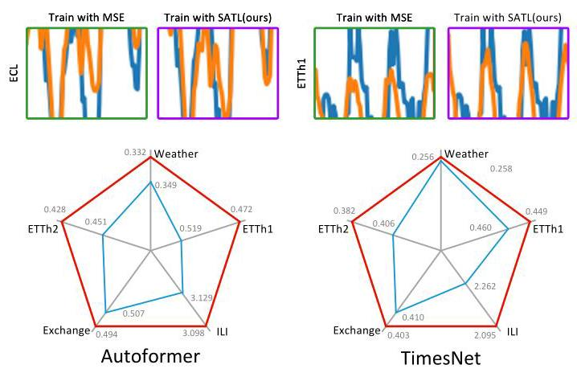
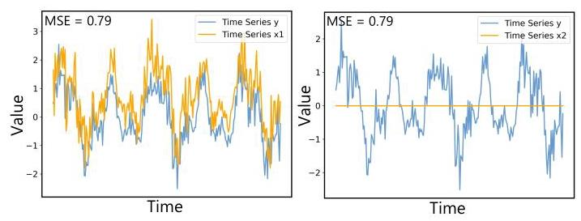
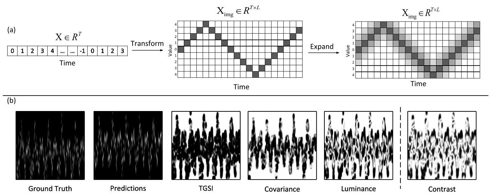
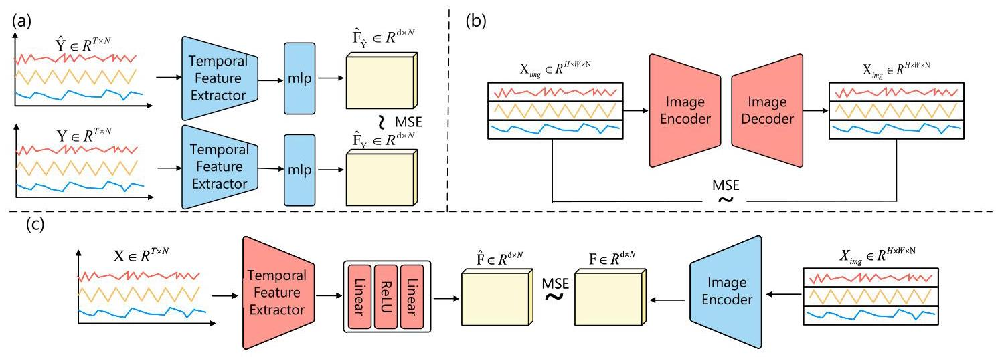
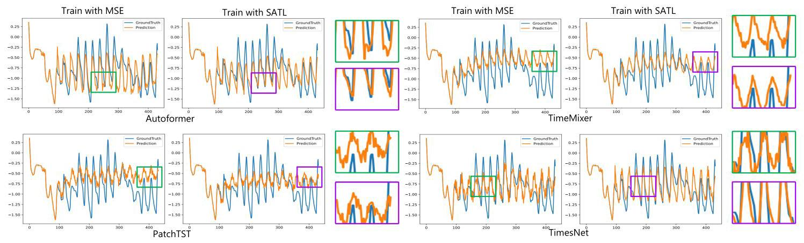
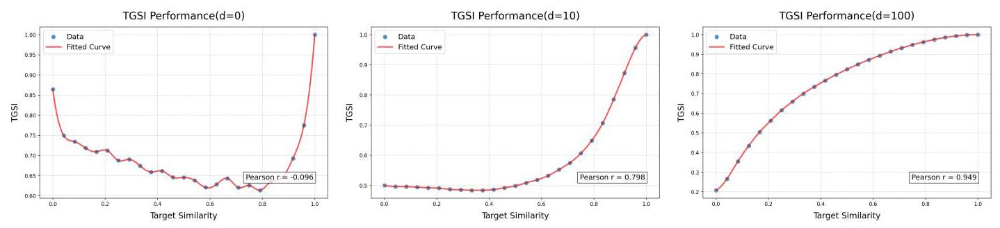
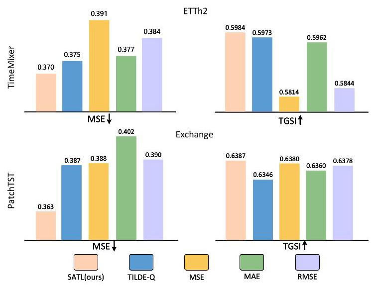

# Towards Measuring and Modeling Geometric Structures in Time Series Forecasting via Image Modality

# 迈向通过图像模态在时间序列预测中测量和建模几何结构

Mingyang ${\mathrm{{Yu}}}^{ * }$

明阳 ${\mathrm{{Yu}}}^{ * }$

East China Normal University

华东师范大学

Shanghai, China

中国上海

yumingyang@stu.ecnu.edu.cn

Xiahui Guo*

郭夏惠*

East China Normal University

华东师范大学

Shanghai, China

中国上海

xhguo@stu.ecnu.edu.cn

Peng Chen

陈鹏

East China Normal University

华东师范大学

Shanghai, China

中国上海

pchen@stu.ecnu.edu.cn

Zhenkai Li

李震凯

East China Normal University

华东师范大学

Shanghai, China

中国上海

10225101541@stu.ecnu.edu.cn

Yang Shu ${}^{ \dagger  }$

舒杨 ${}^{ \dagger  }$

East China Normal University

华东师范大学

Shanghai, China

中国上海

shuyang5656@gmail.com

## Abstract

## 摘要

Time Series forecasting is critical in diverse domains such as weather forecasting, financial investment, and traffic management. While traditional numerical metrics like mean squared error (MSE) can quantify point-wise accuracy, they fail to evaluate the geometric structure of time series data, which is essential to understand temporal dynamics. To address this issue, we propose the time series Geometric Structure Index (TGSI), a novel evaluation metric that transforms time series into images to leverage their inherent two-dimensional geometric representations. However, since the image transformation process is non-differentiable, TGSI cannot be directly integrated as a training loss. We further introduce the Shape-Aware Temporal Loss (SATL), a multi-component loss function operating in the time series modality to bridge this gap and enhance structure modeling during training. SATL combines three components: a first-order difference loss that measures structural consistency through the MSE between first-order differences, a frequency domain loss that captures essential periodic patterns using the Fast Fourier Transform while minimizing noise, and a perceptual feature loss that measures geometric structure difference in time-series by aligning temporal features with geometric structure features through a pre-trained temporal feature extractor and time-series image autoencoder. Experiments across multiple datasets demonstrate that models trained with SATL achieve superior performance in both MSE and the proposed TGSI metrics compared to baseline methods, without additional computational cost during inference.

时间序列预测在天气预报、金融投资和交通管理等多个领域至关重要。虽然像均方误差(MSE)这样的传统数值指标可以量化逐点准确性，但它们无法评估时间序列数据的几何结构，而这对于理解时间动态至关重要。为了解决这个问题，我们提出了时间序列几何结构指数(TGSI)，这是一种新颖的评估指标，它将时间序列转换为图像以利用其固有的二维几何表示。然而，由于图像变换过程不可微，TGSI不能直接作为训练损失进行整合。我们进一步引入了形状感知时间损失(SATL)，这是一种在时间序列模态中运行的多组件损失函数，以弥合这一差距并在训练期间增强结构建模。SATL结合了三个组件:一阶差分损失，通过一阶差分之间的MSE来衡量结构一致性；频域损失，使用快速傅里叶变换捕获基本周期模式同时最小化噪声；感知特征损失，通过预训练的时间特征提取器和时间序列图像自动编码器将时间特征与几何结构特征对齐来衡量时间序列中的几何结构差异。在多个数据集上的实验表明，与基线方法相比，使用SATL训练的模型在MSE和所提出的TGSI指标上均取得了卓越的性能，且在推理过程中没有额外的计算成本。

## CCS Concepts

## CCS概念

- Computing methodologies $\rightarrow$ Temporal reasoning.

- 计算方法 $\rightarrow$ 时间推理。

## Keywords

## 关键词

Time Series Forecasting, Evaluation Metric, Loss Function

时间序列预测、评估指标、损失函数

## ACM Reference Format:

## ACM参考格式:

Mingyang Yu, Xiahui Guo, Peng Chen, Zhenkai Li, and Yang Shu. 2025. Towards Measuring and Modeling Geometric Structures in Time Series Forecasting via Image Modality. In Proceedings of the 33rd ACM International Conference on Multimedia (MM '25), October 27-31, 2025, Dublin, Ireland. ACM, New York, NY, USA, 9 pages. https://doi.org/10.1145/3746027.3754794

于明阳、郭夏辉、陈鹏、李震凯、舒阳。2025年。通过图像模态在时间序列预测中测量和建模几何结构。在第33届ACM国际多媒体会议(MM '25)论文集，2025年10月27 - 31日，爱尔兰都柏林。美国计算机协会，纽约，纽约，美国，9页。https://doi.org/10.1145/3746027.3754794

## 1 Introduction

## 1引言

Figure 1: Time series forecasting comparison of Autoformer and TimesNet. Top row displays prediction visualizations (MSE-trained vs. SATL-trained models) with ground truth (blue) and forecasts (yellow), where closer alignment indicates higher accuracy. Bottom row shows quantitative MSE comparisons. SATL achieves superior performance without additional inference cost.

图1:Autoformer和TimesNet的时间序列预测比较。上图展示了预测可视化(MSE训练与SATL训练的模型)与真实值(蓝色)和预测值(黄色)，其中对齐越紧密表示准确性越高。下图展示了定量的MSE比较。SATL在没有额外推理成本的情况下取得了卓越的性能。

With the rapid development of Multimedia and the Internet of Things, a massive amount of time series data is being generated, driving significant progress in the time series forecasting task. Time series forecasting aims to predict future information based on historical information, thereby supporting decision-making and demonstrating broad application prospects [10, 34, 37]. Due to the dynamic variability of time series, modeling these time series data can be quite challenging. The two key aspects of time series data are its shape and values [9, 14]. Although the numerical aspect has been the main focus for evaluation, the shape of the data is often neglected, even though it is crucial for comprehending how the data changes over time.

随着多媒体和物联网的快速发展，大量的时间序列数据正在生成，推动了时间序列预测任务的显著进展。时间序列预测旨在基于历史信息预测未来信息，从而支持决策并展现出广阔的应用前景[10, 34, 37]。由于时间序列的动态变化性，对这些时间序列数据进行建模可能颇具挑战性。时间序列数据的两个关键方面是其形状和值[9, 14]。尽管数值方面一直是评估的主要焦点，但数据的形状往往被忽视，尽管它对于理解数据随时间的变化至关重要。

---

"Equal contribution.

“同等贡献。

${}^{ \dagger  }$ Corresponding author.

${}^{ \dagger  }$ 通讯作者。

Permission to make digital or hard copies of all or part of this work for personal or classroom use is granted without fee provided that copies are not made or distributed for profit or commercial advantage and that copies bear this notice and the full citation on the first page. Copyrights for components of this work owned by others than the author(s) must be honored. Abstracting with credit is permitted. To copy otherwise, or republish, to post on servers or to redistribute to lists, requires prior specific permission and/or a fee. Request permissions from permissions@acm.org.

允许出于个人或课堂使用目的免费制作本作品全部或部分的数字或硬拷贝，前提是拷贝不是为了盈利或商业优势而制作或分发，并且拷贝上带有此通知以及首页的完整引用。对于本作品中属于他人而非作者的组件的版权必须予以尊重。允许进行带引用的摘要。否则，要进行复制、重新发布、张贴到服务器或重新分发给列表，需要事先获得特定许可和/或支付费用。向permissions@acm.org请求许可。

MM '25, Dublin, Ireland.

MM '25，爱尔兰都柏林。

© 2025 Copyright held by the owner/author(s). Publication rights licensed to ACM. ACM ISBN 979-8-4007-2035-2/2025/10

© 2025版权归所有者/作者所有。出版权许可给美国计算机协会。美国计算机协会ISBN 979 - 8 - 4007 - 2035 - 2/2025/10

https://doi.org/10.1145/3746027.3754794

---

Figure 2: Comparison of time series $y$ with ${x}_{1}$ (left) and ${x}_{2}$ (right). Both have MSE = 0.79, but ${x}_{1}$ shows a closer geometric resemblance to y.

图2:时间序列$y$与${x}_{1}$(左)和${x}_{2}$(右)的比较。两者的均方误差(MSE)均为0.79，但${x}_{1}$与y在几何形状上更为相似。

In current time series forecasting tasks, metrics like Mean Squared Error (MSE) and Mean Absolute Error (MAE) are commonly used [13, 20]. However, these metrics fail to capture the shape of time series data, which reflects its underlying geometric structure. As illustrated in Figure 2, we generate a time series $y$ that exhibits fundamental periodicity along with added noise. Two additional time series are created, where ${x}_{1}$ shares the same period as $y$ but is subject to a vertical shift and different noise levels. In contrast, ${x}_{2}$ is a time series consisting of zeros. When we calculate the MSE between the pairs $\left( {y,{x}_{1}}\right)$ and $\left( {y,{x}_{2}}\right)$ , we find that both pairs yield an MSE of 0.79. However, the geometric structure of ${x}_{1}$ is significantly more similar to that of $y$ than that of ${x}_{2}$ . This observation highlights a critical limitation of MSE as a numerical evaluation metric as it fails to adequately capture the geometric similarity between two time series even if MSE values are identical. Similarly, other loss functions based on the ${L}_{p}$ norm, such as MAE, also suffer from the same weakness as MSE. Some alternative methods, such as Dynamic Time Warping (DTW [25]), have tried to consider the geometric structure of time series data, but they still rely on the temporal dimension, making it difficult to fully capture geometric information $\left\lbrack  {1,8,{21}}\right\rbrack$ .

在当前的时间序列预测任务中，均方误差(MSE)和平均绝对误差(MAE)等指标被广泛使用[13, 20]。然而，这些指标未能捕捉时间序列数据的形状，而形状反映了其潜在的几何结构。如图2所示，我们生成了一个具有基本周期性并添加了噪声的时间序列$y$。另外创建了两个时间序列，其中${x}_{1}$与$y$具有相同的周期，但存在垂直偏移和不同的噪声水平。相比之下，${x}_{2}$是一个由零组成的时间序列。当我们计算$\left( {y,{x}_{1}}\right)$和$\left( {y,{x}_{2}}\right)$之间的MSE时，发现两对的MSE均为0.79。然而，${x}_{1}$的几何结构与$y$的几何结构比${x}_{2}$的几何结构更为相似。这一观察结果突出了MSE作为数值评估指标的一个关键局限性，即即使MSE值相同，它也无法充分捕捉两个时间序列之间的几何相似性。同样，基于${L}_{p}$范数的其他损失函数，如MAE，也与MSE存在相同的弱点。一些替代方法，如动态时间规整(DTW [25])，试图考虑时间序列数据的几何结构，但它们仍然依赖于时间维度，难以完全捕捉几何信息$\left\lbrack  {1,8,{21}}\right\rbrack$。

To solve this problem, we propose evaluating the geometric structure of time series data by transforming it into images. We introduce the Temporal Geometric Structure Index (TGSI), a novel metric specifically designed for visualizing and assessing the geometric structure of time series data. We transform time series into images, where the horizontal axis represents time and the vertical axis represents a range of possible values. The TGSI measures structural similarity between these corresponding images of time series, focusing on luminance and covariance components. This approach allows for a more detailed analysis of temporal patterns, effectively capturing geometric structural information that traditional metrics, such as MSE, may overlook.

为了解决这个问题，我们建议通过将时间序列数据转换为图像来评估其几何结构。我们引入了时间几何结构指数(TGSI)，这是一种专门设计用于可视化和评估时间序列数据几何结构的新指标。我们将时间序列转换为图像，其中横轴代表时间，纵轴代表一系列可能的值。TGSI测量这些时间序列对应图像之间的结构相似性，重点关注亮度和协方差分量。这种方法允许对时间模式进行更详细的分析，有效地捕捉传统指标(如MSE)可能忽略的几何结构信息。

Besides the metrics focusing on geometric structures for performance evaluation, we further explore loss functions to enhance the structure modeling of models during training. In time series forecasting tasks, the commonly used loss function is MSE. As mentioned earlier, this type of loss function fails to capture the geometric structure of time series, leading to predictions that overlook this aspect [18]. However, the TGSI we propose, which operates in the image modality, cannot be directly used as a loss function for training. This is because the process of transforming time series into image modality is non-differentiable and thus cannot be backpropagated [26].

除了关注几何结构进行性能评估的指标外，我们还进一步探索损失函数，以在训练过程中增强模型的结构建模。在时间序列预测任务中，常用的损失函数是MSE。如前所述，这种类型的损失函数无法捕捉时间序列的几何结构，导致预测忽略了这一方面[18]。然而，我们提出的TGSI在图像模态中运行，不能直接用作训练的损失函数。这是因为将时间序列转换为图像模态的过程是不可微的，因此不能进行反向传播[26]。

To address this, we design a set of loss function called Shape-Aware Temporal Loss (SATL), which reflects geometric structure similarity using only the time series modality. SATL consists of three components: (1) first-order difference loss, which measures the MSE between the first-order differences of the predicted and ground truth time series to emphasize structural consistency. (2) Frequency domain loss, which uses the Fast Fourier Transform to capture essential periodic patterns while minimizing noise. (3) Perceptual feature loss, which specifically measures differences in geometric structure. We train an autoencoder for time series images to extract image features. Subsequently, a temporal feature extractor is trained to extract temporal features, which are then aligned with the image features. This alignment enables the temporal feature extractor to also capture image features. After training the temporal feature extractor, we employ it in the forecasting task to extract features from both ground truth and predicted sequences, then compute the perceptual loss based on their feature differences.

为了解决这个问题，我们设计了一组称为形状感知时间损失(SATL)的损失函数，它仅使用时间序列模态来反映几何结构相似性。SATL由三个部分组成:(1)一阶差分损失，测量预测时间序列和真实时间序列的一阶差分之间的MSE，以强调结构一致性。(2)频域损失，使用快速傅里叶变换来捕捉基本的周期性模式，同时最小化噪声。(3)感知特征损失，专门测量几何结构的差异。我们训练一个用于时间序列图像的自动编码器以提取图像特征。随后，训练一个时间特征提取器以提取时间特征，然后将其与图像特征对齐。这种对齐使时间特征提取器也能够捕捉图像特征。在训练时间特征提取器之后，我们在预测任务中使用它从真实序列和预测序列中提取特征，然后根据它们的特征差异计算感知损失。

In conclusion, our work makes the following key contributions:

总之，我们的工作做出了以下关键贡献:

- We design TGSI, a specialized evaluation metric for assessing the geometric structure similarity of time series images. This metric complements and enhances the evaluation framework for time series prediction tasks by addressing previously overlooked aspects.

- 我们设计了TGSI，这是一种用于评估时间序列图像几何结构相似性的专门评估指标。该指标通过解决先前被忽视的方面，补充并增强了时间序列预测任务的评估框架。

- We propose SATL, a loss function that operates in the time series modality but is capable of capturing geometric structure differences of time series. This plug-and-play design enables seamless integration with existing models without architectural modifications.

- 我们提出了SATL，这是一种在时间序列模态中运行但能够捕捉时间序列几何结构差异的损失函数。这种即插即用的设计能够在不修改架构的情况下与现有模型无缝集成。

- Our experiments compare models trained with SATL against conventional MSE training across multiple datasets. As shown in Figure 1, SATL improves prediction quality, achieving better performance on both MSE and TGSI metrics. These improvements come without additional computational cost during inference.

- 我们的实验在多个数据集上比较了使用SATL训练的模型与传统MSE训练的模型。如图1所示，SATL提高了预测质量，在MSE和TGSI指标上均取得了更好的性能。这些改进在推理过程中无需额外的计算成本。

## 2 Related Work

## 2相关工作

### 2.1 Time Series Forecasting

### 2.1 时间序列预测

Time Series Forecasting aims to predict future values by capturing the relationships between past and future data. Statistical models are primitive methods and they are mainly based on exponential smoothing and its variants [12]. Deep learning models became the mainstream and among those recurrent neural networks (RNNs) model the temporal dependency [5, 6, 15, 31]. TimesNet [32] transforms one-dimensional time series into a two-dimensional space and captures multi-period features through convolution.

时间序列预测旨在通过捕捉过去和未来数据之间的关系来预测未来值。统计模型是原始方法，主要基于指数平滑及其变体[12]。深度学习模型成为主流，其中循环神经网络(RNN)对时间依赖性进行建模[5, 6, 15, 31]。TimesNet [32]将一维时间序列转换为二维空间，并通过卷积捕捉多周期特征。

In recent years, there are plenty of works that tried to apply Transformer models to forecast long-term time series and they have demonstrated exceptional capabilities due to capturing the long-term temporal dependencies adaptively with the attention mechanism [4, 28, 29]. Autoformer [33] proposed the ideas of decomposition and auto-correlation. PatchTST [23] employs patching and channel independence, showing that the Transformer architecture has its potential with proper adaptation. Furthermore, models based on multiple-layer projection (MLP) also show effective performance [2, 24, 27, 27].

近年来，有大量工作尝试将Transformer模型应用于预测长期时间序列，并且由于通过注意力机制自适应地捕捉长期时间依赖性，它们已展示出卓越的能力[4, 28, 29]。Autoformer [33]提出了分解和自相关的概念。PatchTST [23]采用分块和通道独立性，表明Transformer架构经过适当调整具有潜力。此外，基于多层投影(MLP)的模型也显示出有效性能[2, 24, 27, 27]。

Recent studies have explored converting time series into image representations and leveraging computer vision techniques to extract visual structural features from time series for enhanced forecasting performance $\left\lbrack  {3,{11},{19},{35},{36}}\right\rbrack$ .

最近的研究探索了将时间序列转换为图像表示，并利用计算机视觉技术从时间序列中提取视觉结构特征以提高预测性能$\left\lbrack  {3,{11},{19},{35},{36}}\right\rbrack$。

### 2.2 Loss Functions and Metrics

### 2.2 损失函数和指标

Currently, Mean Squared Error(MSE), Mean Absolute Error(MAE) are mainstream Loss Functions used to train forecasting models and they are classical Metrics for evaluating. As Loss Functions, they only possess numerical capability, lacking the ability to guide models in learning geometric structural patterns of time series data. As Metrics, they disregard the relationships between different points, failing to capture shape-related information [17].

目前，均方误差(MSE)、平均绝对误差(MAE)是用于训练预测模型的主流损失函数，也是评估的经典指标。作为损失函数，它们仅具有数值能力，缺乏指导模型学习时间序列数据几何结构模式的能力。作为指标，它们忽略了不同点之间的关系，无法捕捉与形状相关的信息[17]。

Recently, a novel Loss Function called TILDE-Q [18] was proposed, which considers not only amplitude and phase changes but also allows models to capture the shape of time series. However, it fails to model geometric structural information which can't be extracted from the time series modality itself from the numerical perspective. The structural similarity index measure (SSIM [30]) is an outstanding method to measure the similarity between two images by assessing luminance, contrast. time series sequence is one-dimensional. The application of metrics from the image domain to the time series domain remains long unexplored, but we fill this gap by applying the idea from SSIM.

最近，一种名为TILDE - Q [18]的新型损失函数被提出，它不仅考虑幅度和相位变化，还允许模型捕捉时间序列的形状。然而，它无法从数值角度对无法从时间序列模态本身提取的几何结构信息进行建模。结构相似性指数度量(SSIM [30])是通过评估亮度、对比度来测量两个图像之间相似性的出色方法。时间序列是一维的。将图像领域的指标应用于时间序列领域长期以来未被探索，但我们通过应用SSIM的思想填补了这一空白。

## 3 Temporal Geometric Structural Index

## 3 时间几何结构指数

The Structural Similarity Index Measure (SSIM [30]) effectively captures structural information in natural images, but its direct application to time series images is limited due to their distinct distribution characteristics. To address this limitation, we propose the Temporal Geometric Structural Index (TGSI) as a novel metric specifically tailored for evaluating the geometric structural similarity of time series data. TGSI is specifically designed for time series data visualization and structure assessment. In the following, we first explain the time-to-image transformation and then formally define the TGSI metric, accompanied by an analysis of its design choices and practical advantages.

结构相似性指数度量(SSIM [30])有效地捕捉了自然图像中的结构信息，但由于时间序列图像具有独特的分布特征，其直接应用于时间序列图像受到限制。为解决此限制，我们提出时间几何结构指数(TGSI)作为一种专门为评估时间序列数据的几何结构相似性而定制的新型指标。TGSI专为时间序列数据可视化和结构评估而设计。接下来，我们首先解释时间到图像的转换，然后正式定义TGSI指标，并分析其设计选择和实际优势。

### 3.1 Transformation of time series to Images

### 3.1 时间序列到图像的转换

As illustrated in Figure 3(a), time series data is transformed into an image where the horizontal axis represents time, and the vertical axis represents a range of possible values of each time step. The transformation process begins with normalization to ensure consistent intensity scaling across sequences. For each time point, the corresponding value determines the vertical position of the activated pixel in the image plane, establishing a direct mapping between temporal amplitude and spatial position. Initially, the temporal sequence corresponds to a single line of activated pixels in the image. To enhance the structural representation, this line is vertically expanded, creating a gradient-like effect where the pixel brightness decreases as the distance from the original line increases. This expansion serves two critical purposes: 1) it improves robustness by allowing tolerance to small temporal misalignments and value variations, and 2) it prevents structural information loss in covariance computation that would occur with sparse single-line representations. The expanded image effectively encodes the temporal data as a probability-like distribution, where brighter pixels indicate a higher likelihood of the temporal value at that point.

如图3(a)所示，时间序列数据被转换为图像，其中水平轴表示时间，垂直轴表示每个时间步的可能值范围。转换过程首先进行归一化，以确保跨序列的强度缩放一致。对于每个时间点，相应的值确定图像平面中激活像素的垂直位置，在时间幅度和空间位置之间建立直接映射。最初，时间序列对应于图像中一行激活的像素。为增强结构表示，这条线垂直扩展，创建一种类似梯度的效果，即像素亮度随着与原始线的距离增加而降低。这种扩展有两个关键目的:1)通过允许对小的时间错位和值变化具有容忍性来提高鲁棒性，2)防止在稀疏单线表示的协方差计算中发生结构信息丢失。扩展后的图像有效地将时间数据编码为类似概率的分布，其中较亮的像素表示该点时间值的更高可能性。

### 3.2 Definition and Analysis of TGSI

### 关于TGSI的定义和分析

The TGSI metric quantifies the structural similarity between two time series images, with values ranging from -1 to 1 , where higher values indicate greater similarity. It is defined as the product of two components: luminance and covariance. Unlike SSIM, the contrast component is not considered for the following reasons: First, the vertical intensity decay during the time-to-image transformation enforces a fixed variance along the y-axis, rendering the contrast component redundant in this dimension. Second, in the temporal dimension, the variance exhibits strong coupling with the luminance component. Furthermore, we visualize the luminance and contrast components in Figure 3(b), revealing consistent patterns that substantiate this relationship. The TGSI metric is formally defined as:

TGSI指标量化两个时间序列图像之间的结构相似性，值范围从 - 1到1，值越高表示相似性越大。它被定义为两个分量的乘积:亮度和协方差。与SSIM不同，不考虑对比度分量，原因如下:首先，时间到图像转换过程中的垂直强度衰减在y轴上强制固定方差，使得对比度分量在这个维度上冗余。其次，在时间维度上，方差与亮度分量表现出强耦合。此外，我们在图3(b)中可视化了亮度和对比度分量，揭示了证实这种关系的一致模式。TGSI指标正式定义为:

$$
\operatorname{TGSI}\left( {x, y}\right)  = l\left( {x, y}\right)  \cdot  s\left( {x, y}\right) , \tag{1}
$$

where $l\left( {x, y}\right)$ represents the luminance component, which reflects the probability of occurrence of the temporal values by capturing the brightness consistency across corresponding regions of the time series images, and $s\left( {x, y}\right)$ represents the covariance component, which assesses the structural relationships by evaluating how variations in the pixel intensities correlate between the two images.

其中$l\left( {x, y}\right)$表示亮度分量，它通过捕获时间序列图像相应区域的亮度一致性来反映时间值出现的概率，$s\left( {x, y}\right)$表示协方差分量，它通过评估两个图像之间像素强度的变化如何相关来评估结构关系。

Luminance Component: The luminance component captures the brightness consistency between two time series images ${x}_{img}$ and ${y}_{img}$ , and is defined as:

亮度分量:亮度分量捕获两个时间序列图像${x}_{img}$和${y}_{img}$之间的亮度一致性，并定义为:

$$
l\left( {x, y}\right)  = \frac{2{\mu }_{x}{\mu }_{y} + {C}_{1}}{{\mu }_{x}^{2} + {\mu }_{y}^{2} + {C}_{1}}, \tag{2}
$$

where ${\mu }_{x}$ and ${\mu }_{y}$ are the mean pixel intensities for ${x}_{img}$ and ${y}_{img}$ , respectively. The constant ${C}_{1}$ is introduced to avoid division by zero, defined as ${C}_{1} = {\left( {K}_{1}L\right) }^{2}$ , with ${K}_{1} = {0.01}$ and $L$ being the dynamic range of pixel values. The luminance component reflects the probability-like distribution of temporal data encoded in the brightness of the transformed image.

其中${\mu }_{x}$和${\mu }_{y}$分别是${x}_{img}$和${y}_{img}$的平均像素强度。引入常数${C}_{1}$以避免除以零，定义为${C}_{1} = {\left( {K}_{1}L\right) }^{2}$，其中${K}_{1} = {0.01}$和$L$是像素值的动态范围。亮度分量反映了编码在变换后图像亮度中的时间数据的概率分布。

Covariance Component: The covariance component assesses the structural similarity between ${x}_{img}$ and ${y}_{img}$ , and is defined as:

协方差分量:协方差分量评估${x}_{img}$和${y}_{img}$之间的结构相似性，并定义为:

$$
s\left( {x, y}\right)  = \frac{{\sigma }_{xy} + {C}_{2}}{{\sigma }_{x}{\sigma }_{y} + {C}_{2}}, \tag{3}
$$

where ${\sigma }_{xy}$ is the covariance between ${x}_{img}$ and ${y}_{img}$ , and ${\sigma }_{x}$ and ${\sigma }_{y}$ are the standard deviations of ${x}_{img}$ and ${y}_{img}$ , respectively. The constant ${C}_{2}$ is defined as ${C}_{2} = \frac{{\left( {K}_{2}L\right) }^{2}}{2}$ , where ${K}_{2} = {0.03}$ .

其中${\sigma }_{xy}$是${x}_{img}$和${y}_{img}$之间的协方差，${\sigma }_{x}$和${\sigma }_{y}$分别是${x}_{img}$和${y}_{img}$的标准差。常数${C}_{2}$定义为${C}_{2} = \frac{{\left( {K}_{2}L\right) }^{2}}{2}$，其中${K}_{2} = {0.03}$。

To ensure that the covariance component accurately captures the structural relationships, the image is downscaled by a factor before calculating ${\sigma }_{xy},{\sigma }_{x}$ , and ${\sigma }_{y}$ . This step compensates for the vertical expansion applied during the time-to-image transformation, enabling the covariance term to focus on the geometric structures rather than the intensity gradient.

为确保协方差分量准确捕获结构关系，在计算${\sigma }_{xy},{\sigma }_{x}$和${\sigma }_{y}$之前，将图像按比例缩小。此步骤补偿了时间到图像变换期间应用的垂直扩展，使协方差项能够专注于几何结构而不是强度梯度。

To illustrate the effectiveness of TGSI, consider the example shown in Figure 2. Calculating the TGSI values yields $\operatorname{TGSI}\left( {y,{x}_{1}}\right)  =$ 0.5212 and $\operatorname{TGSI}\left( {y,{x}_{2}}\right)  = {0.2080}$ . These results demonstrate that ${x}_{1}$ has a stronger structural similarity to $y$ than ${x}_{2}$ , showcasing TGSI’s capability to effectively capture geometric structural differences in temporal sequence images, whereas traditional metrics like MSE fail to distinguish their geometric structural similarities.

为说明TGSI的有效性，考虑图2所示的示例。计算TGSI值得到$\operatorname{TGSI}\left( {y,{x}_{1}}\right)  =$ 0.5212和$\operatorname{TGSI}\left( {y,{x}_{2}}\right)  = {0.2080}$。这些结果表明${x}_{1}$与$y$的结构相似性比${x}_{2}$更强，展示了TGSI有效捕获时间序列图像中几何结构差异的能力，而像MSE这样的传统指标无法区分它们的几何结构相似性。

Figure 3: (a) time series to image transformation. (b) Left of dashed line: Visualization of conversion results with TGSI and its components; Right of dashed line: Visualization of the contrast part for this example.

图3:(a)时间序列到图像的变换。(b)虚线左侧:TGSI及其组件的转换结果可视化；虚线右侧:此示例的对比部分可视化。

## 4 Shape-Aware Temporal Loss

## 4形状感知时间损失

To effectively capture the geometric structural information of time series modalities during training, it is essential to use an appropriate loss function. However, since we assess geometric structural differences using image modalities in TGSI, and the process of transforming time series modalities into image modalities cannot support backpropagation[26], we must rely on the loss function directly applied to time series modalities. Consequently, we design the Shape-Aware Temporal Loss (SATL), which achieves this goal by leveraging three complementary components. These components work together to ensure that the loss function is sensitive to temporal patterns, frequency-domain information, and perceptual features in time series data.

为在训练期间有效捕获时间序列模态的几何结构信息，使用适当的损失函数至关重要。然而，由于我们在TGSI中使用图像模态评估几何结构差异，并且将时间序列模态转换为图像模态的过程不支持反向传播[26]，我们必须依赖直接应用于时间序列模态的损失函数。因此，我们设计了形状感知时间损失(SATL)，它通过利用三个互补组件实现这一目标。这些组件共同作用以确保损失函数对时间序列数据中的时间模式、频域信息和感知特征敏感。

### 4.1 First-Order Temporal Loss

### 4.1一阶时间损失

The first component of the loss measures the MSE between the first-order differences of the predicted and ground truth time series. The first-order difference of a time series captures the changes between consecutive time points, which are critical for understanding the shape and structure of the sequence.

损失的第一个组件测量预测时间序列和真实时间序列的一阶差分之间的均方误差。时间序列的一阶差分捕获连续时间点之间的变化，这对于理解序列的形状和结构至关重要。

This approach is motivated by the observation that time series with identical shapes but shifted along the vertical axis should still be considered geometrically similar. The first-order difference reflects shape consistency by emphasizing local trends and variations in the sequence, making it less sensitive to absolute values. By comparing the first-order differences, the loss function inherently focuses on the structural and geometric features of the time series.

这种方法的动机是观察到形状相同但沿垂直轴移动的时间序列仍应被视为几何相似。一阶差分通过强调序列中的局部趋势和变化来反映形状一致性，使其对绝对值不太敏感。通过比较一阶差分，损失函数本质上关注时间序列的结构和几何特征。

Let $\mathbf{x} \in  {\mathbb{R}}^{T \times  N}$ and $\mathbf{y} \in  {\mathbb{R}}^{T \times  N}$ represent the predicted and ground truth time series, respectively, where $N$ is the number of variables in the time series and $T$ is the length of the sequence. The first-order differences of the sequences are defined as:

令$\mathbf{x} \in  {\mathbb{R}}^{T \times  N}$和$\mathbf{y} \in  {\mathbb{R}}^{T \times  N}$分别表示预测的和真实的时间序列，其中$N$是时间序列中的变量数量，$T$是序列的长度。序列的一阶差分定义为:

$$
{\operatorname{diff}}_{x}\left( t\right)  = \mathbf{x}\left( {t + 1}\right)  - \mathbf{x}\left( t\right) ,\;t = 1,2,\ldots , T - 1. \tag{4}
$$

The first-order temporal difference loss is then expressed as:

一阶时间差分损失则表示为:

$$
{\mathcal{L}}_{\text{ diff }} = \frac{1}{\left( T - 1\right) }\mathop{\sum }\limits_{{t = 1}}^{{T - 1}}{\left( {\operatorname{diff}}_{x}\left( t\right)  - {\operatorname{diff}}_{y}\left( t\right) \right) }^{2}. \tag{5}
$$

This component emphasizes variations in the time series data, allowing the model to prioritize the consistency of shape and structure while effectively capturing temporal dynamics.

该组件强调时间序列数据中的变化，使模型能够在有效捕捉时间动态的同时，优先考虑形状和结构的一致性。

### 4.2 Frequency-Domain Loss

### 4.2频域损失

To effectively model time series data, it is essential to account for periodic patterns. These patterns play a fundamental role in capturing the geometric structure of sequences, particularly for data with repetitive or oscillatory behavior. To address this, we introduce a frequency-domain loss, which operates on the spectral representations of the time series and ensures that the model learns to preserve the desired periodic characteristics.

为了有效地对时间序列数据进行建模，考虑周期性模式至关重要。这些模式在捕捉序列的几何结构方面起着基础性作用，特别是对于具有重复或振荡行为的数据。为了解决这个问题，我们引入了一种频域损失，它作用于时间序列的频谱表示，并确保模型学习保留所需的周期性特征。

The transformation to the frequency domain is performed using the Fast Fourier Transform (FFT) [7]. Let $\mathbf{x}$ and $\mathbf{y}$ denote the predicted sequence and the ground truth, respectively. Their frequency-domain representations are given by FFT(x) and FFT(y). To reduce the influence of noise and focus on the dominant frequency components, we select the top- $k$ frequencies from FFT(y), where $k$ is proportional to the sequence length. Frequency components outside the top- $k$ set are treated as noise and are penalized in the loss function to encourage their magnitudes to approach zero.

使用快速傅里叶变换(FFT)[7]进行到频域的变换。令$\mathbf{x}$和$\mathbf{y}$分别表示预测序列和真实值。它们的频域表示由FFT(x)和FFT(y)给出。为了减少噪声的影响并关注主导频率成分，我们从FFT(y)中选择前$k$个频率，其中$k$与序列长度成比例。前$k$集合之外的频率成分被视为噪声，并在损失函数中受到惩罚，以鼓励它们的幅度接近零。

First, the term responsible for capturing the dominant frequencies is defined as:

首先，负责捕捉主导频率的项定义为:

$$
{\mathcal{L}}_{\text{ dom }} = \mathop{\sum }\limits_{{f \in  {\mathcal{F}}_{\text{ dom }}}}\left| {\operatorname{FFT}{\left( \mathbf{x}\right) }_{f} - \operatorname{FFT}{\left( \mathbf{y}\right) }_{f}}\right| . \tag{6}
$$

Figure 4: Overall process of computing the geometric perception loss function. Yellow indicates features, gray represents model architecture, blue denotes frozen model parameters, and red indicates actively trained models. (a) Calculation of the perception loss function. (b) Training process of the time series image autoencoder. (c) Training process of the temporal feature extractor.

图4:计算几何感知损失函数的整体过程。黄色表示特征，灰色代表模型架构，蓝色表示冻结的模型参数，红色表示主动训练的模型。(a)感知损失函数的计算。(b)时间序列图像自动编码器的训练过程。(c)时间特征提取器的训练过程。

Next, the term for suppressing non-dominant frequency components is:

接下来，用于抑制非主导频率成分的项是:

$$
{\mathcal{L}}_{\text{ noise }} = \mathop{\sum }\limits_{{f \notin  {\mathcal{F}}_{\text{ dom }}}}\left| {\operatorname{FFT}{\left( \mathbf{x}\right) }_{f}}\right| . \tag{7}
$$

Finally, the complete frequency-domain loss is expressed as:

最后，完整的频域损失表示为:

$$
{\mathcal{L}}_{\text{ freq }} = \frac{1}{\sqrt{T}}\left( {{\mathcal{L}}_{\text{ dom }} + {\mathcal{L}}_{\text{ noise }}}\right) , \tag{8}
$$

where ${\mathcal{F}}_{\text{ dom }}$ represents the set of top- $k$ dominant frequencies chosen from the ground truth spectrum. The first term ensures that the model accurately captures the dominant periodic components, while the second term suppresses irrelevant noise by minimizing non-dominant frequency magnitudes.

其中${\mathcal{F}}_{\text{ dom }}$表示从真实频谱中选择的前$k$个主导频率的集合。第一项确保模型准确捕捉主导周期成分，而第二项通过最小化非主导频率幅度来抑制无关噪声。

### 4.3 Perceptual Feature Loss

### 4.3感知特征损失

The third component addresses the challenge that temporal data, consisting of only a single time dimension, lack the rich geometric structure present in image data. This geometric structure is crucial for capturing complex relationships within the data. To overcome this limitation, we design a perceptual loss that allows the model to learn representations consistent with the geometric features of the data. Specifically, we train a feature extractor to extract such structural features and use it to compute the loss as the MSE between the features of the predicted output and the ground truth. The feature extractor is constructed in two stages: Stage One focuses on learning geometric features of time series image data by training an autoencoder. Stage Two aligns the temporal features of the time series with the geometric features learned from the image representations, enabling the computation of structural differences directly on temporal features.

第三个组件解决了仅由单个时间维度组成的时间数据缺乏图像数据中存在的丰富几何结构这一挑战。这种几何结构对于捕捉数据中的复杂关系至关重要。为了克服这一限制，我们设计了一种感知损失，使模型能够学习与数据的几何特征一致的表示。具体来说，我们训练一个特征提取器来提取这种结构特征，并使用它来计算预测输出的特征与真实值之间的均方误差作为损失。特征提取器分两个阶段构建:第一阶段通过训练自动编码器专注于学习时间序列图像数据的几何特征。第二阶段将时间序列的时间特征与从图像表示中学习到的几何特征对齐，从而能够直接在时间特征上计算结构差异。

The application of the perceptual loss function, along with the training process and structure, is illustrated in Figure 4.

感知损失函数的应用以及训练过程和结构如图4所示。

4.3.1 Stage One: Learning Geometric Features from Time Series Images.

4.3.1第一阶段:从时间序列图像中学习几何特征。

In the first stage, we construct a temporal image autoencoder [22] to learn geometric structural features from time series image data. Since there is a significant semantic gap between natural images and time series images, we train the autoencoder specifically on time series images instead of using pre-trained image models. The autoencoder is composed of an encoder that extracts latent features from the input image and a decoder that reconstructs the original image from these features.

在第一阶段，我们构建一个时间图像自动编码器[22]，从时间序列图像数据中学习几何结构特征。由于自然图像和时间序列图像之间存在显著的语义差距，我们专门在时间序列图像上训练自动编码器，而不是使用预训练的图像模型。自动编码器由一个从输入图像中提取潜在特征的编码器和一个从这些特征重建原始图像的解码器组成。

Given a time series $\mathbf{x} \in  {\mathbb{R}}^{T \times  N}$ , where $T$ is the sequence length and $N$ is the number of variables, the temporal sequence is first transformed into a corresponding image representation, denoted $\operatorname{img}\left( \mathbf{x}\right)  \in  {\mathbb{R}}^{H \times  W \times  N}$ , where $H, W$ , and $N$ are the height, width, and number of variables in the generated image. The encoder is a four-layer convolutional neural network that extracts latent features from the input image., maps the input image $\operatorname{img}\left( \mathbf{x}\right)$ into a latent vector $\mathbf{z} \in  {\mathbb{R}}^{{d}_{z}} : \mathbf{z} = {f}_{\text{ enc }}\left( {\operatorname{img}\left( \mathbf{x}\right) }\right)$ , where ${f}_{\text{ enc }}$ represents the encoder. The decoder, consisting of a fully connected layer followed by a transposed CNN, reconstructs the input image from the latent vector: $\operatorname{img}\left( \mathbf{x}\right)  = {f}_{\text{ dec }}\left( \mathbf{z}\right)$ , where ${f}_{\text{ dec }}$ is the decoder network. The autoencoder is trained using the MSE between the input and reconstructed image:

给定一个时间序列$\mathbf{x} \in  {\mathbb{R}}^{T \times  N}$，其中$T$是序列长度，$N$是变量数量，该时间序列首先被转换为相应的图像表示，记为$\operatorname{img}\left( \mathbf{x}\right)  \in  {\mathbb{R}}^{H \times  W \times  N}$，其中$H, W$以及$N$分别是生成图像的高度、宽度和变量数量。编码器是一个四层卷积神经网络，它从输入图像中提取潜在特征，将输入图像$\operatorname{img}\left( \mathbf{x}\right)$映射为一个潜在向量$\mathbf{z} \in  {\mathbb{R}}^{{d}_{z}} : \mathbf{z} = {f}_{\text{ enc }}\left( {\operatorname{img}\left( \mathbf{x}\right) }\right)$，其中${f}_{\text{ enc }}$表示编码器。解码器由一个全连接层和一个转置卷积神经网络组成，它从潜在向量中重建输入图像:$\operatorname{img}\left( \mathbf{x}\right)  = {f}_{\text{ dec }}\left( \mathbf{z}\right)$，其中${f}_{\text{ dec }}$是解码器网络。使用输入图像和重建图像之间的均方误差来训练自动编码器:

$$
{\mathcal{L}}_{\text{ ae }} = \parallel \mathrm{{img}}\left( \mathbf{x}\right)  - \widehat{\mathrm{{img}}}\left( \mathbf{x}\right) {\parallel }_{2}^{2}. \tag{9}
$$

Once the autoencoder is trained, the encoder ${f}_{\text{ enc }}$ is frozen and used in the second stage as a feature extractor for image-like representations.

一旦自动编码器训练完成，编码器${f}_{\text{ enc }}$就会被冻结，并在第二阶段用作类似图像表示的特征提取器。

4.3.2 Stage Two: Aligning Temporal Features with Image Features. In the second stage, we train a temporal feature extractor to align the features of time series data with the geometric features learned from the autoencoder. This alignment ensures that the temporal features capture the same structural information as the image features, enabling the computation of structural differences directly on temporal data.

4.3.2 第二阶段:将时间特征与图像特征对齐。在第二阶段，我们训练一个时间特征提取器，以将时间序列数据的特征与从自动编码器学到的几何特征对齐。这种对齐确保时间特征捕获与图像特征相同的结构信息，从而能够直接在时间数据上计算结构差异。

The temporal feature extractor consists of two components: (1) a Transformer block that captures temporal dependencies in the sequence, and (2) a two-layer MLP that maps the Transformer output into a feature vector ${\mathbf{z}}_{\text{ time }} \in  {\mathbb{R}}^{{d}_{z} \times  N}$ . For a given time series x, the temporal features are extracted as:

时间特征提取器由两个组件组成:(1) 一个捕获序列中时间依赖性的Transformer块，以及(2) 一个将Transformer输出映射为特征向量${\mathbf{z}}_{\text{ time }} \in  {\mathbb{R}}^{{d}_{z} \times  N}$的两层多层感知器。对于给定的时间序列x，时间特征按以下方式提取:

$$
{\mathbf{z}}_{\text{ time }} = {f}_{\text{ time }}\left( \mathbf{x}\right) , \tag{10}
$$

where ${f}_{\text{ time }}$ denotes the temporal feature extractor. The training objective is to minimize the difference between the temporal feature vector ${\mathbf{z}}_{\text{ time }}$ and the image feature vector extracted by the encoder ${f}_{\text{ enc }}$ from the corresponding time series image:

其中${f}_{\text{ time }}$表示时间特征提取器。训练目标是最小化时间特征向量${\mathbf{z}}_{\text{ time }}$与编码器${f}_{\text{ enc }}$从相应时间序列图像中提取的图像特征向量之间的差异:

$$
{\mathcal{L}}_{\text{ time }} = {\begin{Vmatrix}{\mathbf{z}}_{\text{ time }} - {f}_{\text{ enc }}\left( \operatorname{img}\left( \mathbf{x}\right) \right) \end{Vmatrix}}_{2}^{2}. \tag{11}
$$

Once trained, the temporal feature extractor ${f}_{\text{ time }}$ is frozen and used in the perceptual loss computation. After alignment, the temporal features contain the geometric structural information learned from the time series images. This allows us to compute geometric structural differences directly on temporal features without converting the time series back into images.

一旦训练完成，时间特征提取器${f}_{\text{ time }}$就会被冻结，并用于感知损失计算。对齐之后，时间特征包含从时间序列图像中学到的几何结构信息。这使我们能够直接在时间特征上计算几何结构差异，而无需将时间序列转换回图像。

#### 4.3.3 Perceptual Feature Loss.

#### 4.3.3 感知特征损失。

Once the temporal feature extractor is trained and frozen, the perceptual feature loss is defined. During model training, the predicted sequence $\mathbf{x}$ and the ground truth sequence $\mathbf{y}$ are passed through the temporal feature extractor ${f}_{\text{ time }}$ . The extracted features are compared to enforce consistency in their learned geometric representations. Let ${\mathbf{z}}_{x} = {f}_{\text{ time }}\left( \mathbf{x}\right)$ and ${\mathbf{z}}_{y} = {f}_{\text{ time }}\left( \mathbf{y}\right)$ represent the extracted features of the predicted and ground truth sequences, respectively. The perceptual feature loss is then defined as:

一旦时间特征提取器训练完成并被冻结，就定义了感知特征损失。在模型训练期间，预测序列$\mathbf{x}$和真实序列$\mathbf{y}$通过时间特征提取器${f}_{\text{ time }}$。比较提取的特征以确保它们在学到的几何表示上的一致性。设${\mathbf{z}}_{x} = {f}_{\text{ time }}\left( \mathbf{x}\right)$和${\mathbf{z}}_{y} = {f}_{\text{ time }}\left( \mathbf{y}\right)$分别表示预测序列和真实序列的提取特征。然后感知特征损失定义为:

$$
{\mathcal{L}}_{\text{ perceptual }} = \frac{1}{{d}_{z}}{\begin{Vmatrix}{\mathbf{z}}_{x} - {\mathbf{z}}_{y}\end{Vmatrix}}_{2}^{2}. \tag{12}
$$

This loss ensures that the predicted time series captures the same structural information as the ground truth.

这种损失确保预测的时间序列捕获与真实序列相同的结构信息。

### 4.4 Overall Loss Function

### 4.4 总体损失函数

The SATL consists of three geometric components to preserve structural patterns in time series forecasting:

SATL由三个几何组件组成，用于在时间序列预测中保留结构模式:

$$
{\mathcal{L}}_{\text{ SATL }}\left( {x, y}\right)  = \alpha {\mathcal{L}}_{\text{ diff }}\left( {x, y}\right)  + \beta {\mathcal{L}}_{\text{ freq }}\left( {x, y}\right)  + \gamma {\mathcal{L}}_{\text{ perceptual }}\left( {x, y}\right) \tag{13}
$$

where the three terms maintain different geometric structures as previously defined, $x$ represents the predicted sequence, and $y$ denotes the ground truth sequence. To ensure both structural preservation and numerical accuracy, we combine SATL with MSE to form the overall loss function:

其中这三个项如前所述保持不同的几何结构，$x$表示预测序列，$y$表示真实序列。为确保结构保留和数值准确性，我们将SATL与均方误差相结合以形成总体损失函数:

$$
{\mathcal{L}}_{\text{ total }}\left( {x, y}\right)  = {\mathcal{L}}_{\text{ SATL }}\left( {x, y}\right)  + \delta {\mathcal{L}}_{\text{ MSE }}\left( {x, y}\right) \tag{14}
$$

The hyperparameters $\left( {\alpha ,\beta ,\gamma ,\delta }\right)$ balance these competing objectives.

超参数$\left( {\alpha ,\beta ,\gamma ,\delta }\right)$平衡了这些相互竞争的目标。

## 5 Experiments

## 5实验

### 5.1 Experimental Setup

### 5.1实验设置

Baselines. To evaluate the effectiveness of the proposed SATL in time series forecasting, we select 4 baseline models: TimeMixer[27], PatchTST[23], TimesNet[32], and Autoformer[33]. These models represent a range of architectures and performance levels, enabling us to assess the generalizability of SATL across different approaches to time series forecasting.

基线。为了评估所提出的SATL在时间序列预测中的有效性，我们选择了4个基线模型:TimeMixer[27]、PatchTST[23]、TimesNet[32]和Autoformer[33]。这些模型代表了一系列的架构和性能水平，使我们能够评估SATL在不同时间序列预测方法中的通用性。

Datasets. We conduct experiments on eight publicly available time series datasets: ETTh1, ETTh2, ETTm1, ETTm2[38], Weather, Exchange[33], Electricity[16] and ILI. These datasets are widely used benchmarks in time series forecasting, covering diverse application scenarios and temporal patterns. For each dataset, we follow the standard data preprocessing pipeline, including normalization and train-validation-test splits, to ensure consistency.

数据集。我们在八个公开可用的时间序列数据集上进行实验:ETTh1、ETTh2、ETTm1、ETTm2[38]、Weather、Exchange[33]、Electricity[16]和ILI。这些数据集是时间序列预测中广泛使用的基准，涵盖了不同的应用场景和时间模式。对于每个数据集，我们遵循标准的数据预处理流程，包括归一化和训练-验证-测试分割，以确保一致性。

Metrics. We adopt three evaluation metrics: Mean Squared Error (MSE) and Mean Absolute Error (MAE) as traditional numerical metrics, and our proposed TGSI as a geometric structure evaluation metric. This combination ensures a comprehensive assessment of both numerical accuracy and geometric pattern preservation.

指标。我们采用三个评估指标:均方误差(MSE)和平均绝对误差(MAE)作为传统的数值指标，以及我们提出的TGSI作为几何结构评估指标。这种组合确保了对数值准确性和几何模式保留的全面评估。

Settings. To ensure fair comparisons, all experiments are conducted under the same settings, with all hyperparameters fixed between training runs, except for the loss function. We maintain the same initialization, learning rate, batch size, and other training parameters. For the majority of datasets, we fix the hyperparame-ters of the loss functions at $\alpha  = {0.2},\beta  = {0.2},\gamma  = {0.1}$ , and $\delta  = {0.5}$ . For the remaining datasets, these hyperparameters are selected based on their respective validation sets. Additionally, to produce TGSI results for models trained with MSE and fill in missing baseline results on certain datasets, we re-train all baselines ourselves.

设置。为了确保公平比较，所有实验都在相同的设置下进行，除了损失函数外，所有超参数在训练运行之间固定。我们保持相同的初始化、学习率、批量大小和其他训练参数。对于大多数数据集，我们将损失函数的超参数固定为$\alpha  = {0.2},\beta  = {0.2},\gamma  = {0.1}$和$\delta  = {0.5}$。对于其余数据集，这些超参数根据各自的验证集进行选择。此外，为了生成使用MSE训练的模型的TGSI结果并填补某些数据集上缺失的基线结果，我们自己重新训练了所有基线。

For the transformation of time series to image, we set the image width equal to the time series length with a fixed height of 200 pixels, where each time point is vertically extended by $d = {100}$ pixels. In SATL training with Perceptual Feature Loss, we conduct 30 epochs for stage one and 10 epochs for stage two, using Adam optimizer with a learning rate of 0.001 and batch size of 16 throughout both stages. All models are implemented using PyTorch and trained on a machine equipped with an NVIDIA RTX4090 GPU.

对于时间序列到图像的转换，我们将图像宽度设置为等于时间序列长度，固定高度为200像素，其中每个时间点垂直扩展$d = {100}$像素。在使用感知特征损失的SATL训练中，第一阶段进行30个epoch，第二阶段进行10个epoch，在两个阶段都使用Adam优化器，学习率为0.001，批量大小为16。所有模型都使用PyTorch实现，并在配备NVIDIA RTX4090 GPU的机器上训练。

### 5.2 Comparative Performance Results

### 5.2比较性能结果

As shown in Table 1, the quantitative comparison reveals that models trained with SATL consistently achieve superior performance compared to MSE-trianed models across all datasets and metrics. Importantly, this improvement comes without any additional computational cost during inference. The results demonstrate SATL's effectiveness in enhancing both numerical accuracy and geometric structure preservation in time series forecasting. Notably, SATL achieves 5.20% MSE improvement on the ETTh2 dataset and 6.42% performance gain in Autoformer. Importantly, SATL enables models to explore capabilities beyond their original designs - while PatchTST initially underperformed TimeMixer on the Exchange dataset, our approach allowed it to achieve superior results.

如表1所示，定量比较表明，在所有数据集和指标上，使用SATL训练的模型始终比使用MSE训练的模型表现更优。重要的是，这种改进在推理过程中没有任何额外的计算成本。结果证明了SATL在提高时间序列预测中的数值准确性和几何结构保留方面的有效性。值得注意的是，SATL在ETTh2数据集上实现了5.20%的MSE改进，在Autoformer中性能提升了6.42%。重要的是，SATL使模型能够探索超出其原始设计的能力——虽然PatchTST最初在Exchange数据集上表现不如TimeMixer，但我们的方法使其能够取得更好的结果。

We visualized the prediction results for the ETTh2 dataset in Figure 5, focusing on the task of forecasting 336 steps with an input sequence length of 96. The left column displays the results obtained using MSE for training, while the right column presents the results from training with SATL. The enlarged details on the right reveal that the predictions made by the model trained with SATL exhibit a geometric structure that is more closely aligned with the ground truth.

我们在图5中可视化了ETTh2数据集的预测结果，重点是预测336步且输入序列长度为96的任务。左列显示了使用MSE进行训练获得的结果，而右列展示了使用SATL进行训练的结果。右侧放大的细节显示，使用SATL训练的模型做出的预测呈现出与地面真值更紧密对齐的几何结构。

### 5.3 Comparison with Other Loss Functions

### 5.3与其他损失函数的比较

As illustrated in Figure 7, we compare SATL against various baseline loss functions: MSE, MAE, Root Mean Squared Error(RMSE) and TILDE-Q. The controlled experiments employ TimeMixer on ETTh2 and PatchTST on Exchange datasets, maintaining identical configurations except for the loss functions. SATL achieves the lowest MSE values and highest TGSI scores among all compared methods, demonstrating its dual advantage in both numerical accuracy and geometric structure preservation.

如图7所示，我们将SATL与各种基线损失函数进行比较:MSE、MAE、均方根误差(RMSE)和TILDE-Q。对照实验在ETTh2数据集上使用TimeMixer，在Exchange数据集上使用PatchTST，除了损失函数外保持相同的配置。在所有比较的方法中，SATL实现了最低的MSE值和最高的TGSI分数，证明了其在数值准确性和几何结构保留方面的双重优势。

Table 1: Average results for long-term forecasting tasks with prediction lengths 24,36,48,60 for ILI and \{96,192,336,720\} for others. Metrics include MSE, MAE, and TGSI, averaged across prediction lengths. Input sequence lengths are $T = {96}$ except $T = {36}$ for ILI. Avg Improved measures SATL’s average improvements over MSE training. The better metrics are colored in red.

表1:针对ILI预测长度为24、36、48、6(此处原文有误，推测为60)，其他为{96、192、336、720}的长期预测任务的平均结果。指标包括MSE、MAE和TGSI，在预测长度上进行平均。ILI的输入序列长度除$T = {36}$外为$T = {96}$。平均改进表示SATL相对于MSE训练的平均改进。更好的指标用红色表示。

<table><tr><td>Model</td><td colspan="3">TimeMixer([27]) ‖</td><td colspan="3">PatchTST([23])</td><td colspan="2">TimesNet([32])</td><td colspan="4">Autoformer([33])</td><td>-</td></tr><tr><td>Loss</td><td>MSE</td><td>+SATL</td><td></td><td>MSE</td><td></td><td>+SATL</td><td>MSE</td><td>+SATL</td><td>MSE</td><td></td><td>+SATL</td><td></td><td>Avg Improved</td></tr><tr><td>Metric</td><td>MSE MAE TGSI</td><td>MSE MAE</td><td>TGSI</td><td>MSE MAE TGS</td><td>MSE</td><td>MAE TGSI</td><td>MSE MAE TGS</td><td>MSE MAE TGSI</td><td>MSE MAE TGSI</td><td>MSE</td><td>MAE</td><td>TGSI</td><td>MSE MAE TGSI</td></tr><tr><td>ETTh1</td><td>0.448 0.440 0.6125</td><td>0.433</td><td>0.6184</td><td>0.449 0.448 0.6010</td><td>0.436</td><td>0.437 0.6075</td><td>0.460 0.454 0.5816</td><td>0.449 0.447 0.5903</td><td>0.519 0.499 0.5234</td><td>0.472</td><td>0.471</td><td>0.5508</td><td>4.42% 2.91% 2.19%</td></tr><tr><td>ETTh2</td><td>0.391 0.411 0.5814</td><td>0.370</td><td></td><td>0.384 0.411 0.5790</td><td>0.367</td><td>0.395 0.5945</td><td>0.406 0.420 0.5522</td><td>0.382 0.404 0.5923</td><td>0.451 0.462 0.5201</td><td>0.428</td><td>0.445</td><td>0.5372</td><td>5.20% 3.88% 4.02%</td></tr><tr><td>ETTm1</td><td>0.381 0.397 0.5800</td><td>0.380</td><td>0.394 0.5808</td><td>0.389 0.403 0.5895</td><td>0.385</td><td>0.398 0.5918</td><td>0.410 0.418 0.5601</td><td>0.404 0.413 0.5638</td><td>0.615 0.527 0.4552</td><td>0.517</td><td>0.489</td><td>0.4776</td><td>4.67% 2.60% 1.53%</td></tr><tr><td>ETTm2</td><td>0.276 0.322 0.6154</td><td>0.274</td><td>0.321 0.6177</td><td>0.291 0.334 0.6005</td><td>0.284</td><td>0.328 0.6107</td><td>0.299 0.333 0.6064</td><td>0.292 0.328 0.6109</td><td>0.327 0.364 0.5637</td><td>0.317</td><td>0.359</td><td>0.5705</td><td>2.13% 1.25% 1.01%</td></tr><tr><td>Exchange</td><td>0.375 0.410 0.6383</td><td>0.366 366 0.404 0.6389</td><td></td><td>0.388 0.416 0.6380</td><td>0.363</td><td>0.406 0.6387</td><td>0.4100.4420.6224</td><td>0.403 0.434 0.6243</td><td>0.507 0.501 0.6006</td><td>0.494</td><td>0.492</td><td>0.6030</td><td>3.28% 1.87% 0.23%</td></tr><tr><td>Weather</td><td>0.243 0.274 0.5892</td><td>.242 0.272 0.5909</td><td></td><td>0.257 0.278 0.5817</td><td>0.255</td><td>0.277 0.5821</td><td>0.2580.2850.5686</td><td></td><td>0.349 0.383 0.4125</td><td>0.332</td><td>0.370</td><td>0.4334</td><td>1.71% 1.21% 1.46%</td></tr><tr><td>Electricity</td><td>0.185 0.274 0.8118</td><td>0.184</td><td></td><td>0.2020.2930.8021</td><td>0.197</td><td>0.286 0.8061</td><td>0.1920.2940.7970</td><td>0.191 0.292 0.7985</td><td>0.235 0.345 0.7540</td><td>0.212</td><td>0.323</td><td>0.7728</td><td>3.33% 2.45% 0.83%</td></tr><tr><td>ILI</td><td>2.323 0.956 0.7157</td><td>2.294</td><td>0.940 0.7192</td><td>2.1450.8970.7300</td><td>2.127</td><td>0.893 0.7305</td><td>2.2620.9280.7180</td><td>2.095 0.910 0 0.7197</td><td>3.1291.2050.6316</td><td>3.086</td><td>1.198</td><td>0.6386</td><td>2.71% 1.16% 0.48%</td></tr><tr><td>Avg Improved</td><td>- - -</td><td>1.79% 1.43% 0.66%</td><td></td><td>- - -</td><td>2.66% 1.87%</td><td>0.82%</td><td>- - -</td><td>2.81% 3.61% 1.41%</td><td>- - -</td><td></td><td>6.47% 3.75% 2</td><td>2.96%</td><td></td></tr></table>

Figure 5: Visualization of time series forecasting tasks on the ETTh2 dataset for the 96_336 task. Each column is divided into two sections: the left side displays results from models trained with MSE, while the right side shows outcomes from models trained with SATL. The enlarged sections highlight that models trained with SATL exhibit significantly enhanced geometric structure similarity in their predictions.

图5:ETTh2数据集上96_336任务的时间序列预测任务可视化。每列分为两部分:左侧显示使用均方误差(MSE)训练的模型结果，右侧显示使用SATL训练的模型结果。放大的部分突出显示，使用SATL训练的模型在预测中表现出显著增强的几何结构相似性。

### 5.4 Ablation Study

### 5.4 消融研究

To systematically investigate the impact of individual components in SATL and their sensitivity to different forecasting horizons, we conduct comprehensive ablation experiments on the ETTh1 dataset using PatchTST architecture, while keeping all other experimental settings identical. As presented in Table 2, the performance degrades when either component is removed, with particularly significant deterioration observed upon eliminating the MSE term. This substantiates the essential role of maintaining fundamental numerical similarity in the loss function.

为了系统地研究SATL中各个组件的影响及其对不同预测范围的敏感性，我们使用PatchTST架构在ETTh1数据集上进行了全面的消融实验，同时保持所有其他实验设置相同。如表2所示，当移除任何一个组件时，性能都会下降，在消除MSE项时观察到特别显著的性能恶化。这证实了在损失函数中保持基本数值相似性的重要作用。

Furthermore, the experiments reveal distinct behavioral patterns across varying prediction lengths: while differences among variants remain marginal for shorter-term forecasting (96 steps), the performance gap becomes substantially more pronounced for long-term predictions (720 steps). This demonstrates increasing sensitivity to loss function design as the forecasting horizon extends, highlighting SATL's particular advantage in long-range time series forecasting scenarios.

此外，实验揭示了不同预测长度下的不同行为模式:虽然在短期预测(96步)中，变体之间的差异仍然很小，但在长期预测(720步)中，性能差距变得更加明显。这表明随着预测范围的扩大，对损失函数设计的敏感性增加，突出了SATL在长期时间序列预测场景中的特殊优势。

### 5.5 Validation of TGSI Metric

### 5.5 TGSI指标的验证

To systematically validate the effectiveness of TGSI and demonstrate the necessity of vertical expansion in the time-to-image transformation, we designed a controlled experimental framework. As shown in Figure 6, our evaluation begins with generating a base reference sequence $y$ composed of multiple periodic components with strategically injected noise to simulate real-world temporal patterns.

为了系统地验证TGSI的有效性并证明在时间到图像转换中垂直扩展的必要性，我们设计了一个受控实验框架。如图6所示，我们的评估从生成一个由多个周期性组件组成的基础参考序列$y$开始，该序列中策略性地注入了噪声以模拟现实世界的时间模式。

We then generate test sequences $\left\{  {x}_{i}\right\}$ with precisely controlled similarity levels $p \in  \left\lbrack  {0,1}\right\rbrack$ through three distinct deformation operators: amplitude scaling $\left( {{\mathcal{T}}_{1}\left( x\right)  = p \cdot  y}\right)$ , constant offset $\left( {{\mathcal{T}}_{2}\left( x\right)  = }\right. \; y + \left( {1 - p}\right)  \cdot  c)$ , and adaptive noise injection $\left( {{\mathcal{T}}_{3}\left( x\right)  = y + \mathcal{N}\left( {0,1 - p}\right) }\right)$ . For each similarity level $p$ , the final TGSI score is computed as the mean value across all three deformation types: $\operatorname{TGSI}\left( p\right)  = \; \frac{1}{3}\mathop{\sum }\limits_{{i = 1}}^{3}\operatorname{TGSI}\left( {y,{\mathcal{T}}_{i}\left( x\right) }\right)$

然后，我们通过三个不同的变形算子生成具有精确控制的相似性水平$p \in  \left\lbrack  {0,1}\right\rbrack$的测试序列$\left\{  {x}_{i}\right\}$:幅度缩放$\left( {{\mathcal{T}}_{1}\left( x\right)  = p \cdot  y}\right)$、恒定偏移$\left( {{\mathcal{T}}_{2}\left( x\right)  = }\right. \; y + \left( {1 - p}\right)  \cdot  c)$和自适应噪声注入$\left( {{\mathcal{T}}_{3}\left( x\right)  = y + \mathcal{N}\left( {0,1 - p}\right) }\right)$。对于每个相似性水平$p$，最终的TGSI分数计算为所有三种变形类型的平均值:$\operatorname{TGSI}\left( p\right)  = \; \frac{1}{3}\mathop{\sum }\limits_{{i = 1}}^{3}\operatorname{TGSI}\left( {y,{\mathcal{T}}_{i}\left( x\right) }\right)$

Figure 6: Fitted curve of TGSI versus sample similarity for varying vertical extension lengths $d$

图6:不同垂直扩展长度$d$下TGSI与样本相似性的拟合曲线

Table 2: Ablation study of SATL components: Difference (First-Order Temporal Loss), Frequency (Frequency-Domain Loss), Perceptual (Perceptual Feature Loss), and MSE (Mean Squared Error component)

表2:SATL组件的消融研究:差异(一阶时间损失)、频率(频域损失)、感知(感知特征损失)和MSE(均方误差组件)

<table><tr><td>Difference</td><td>Frequency</td><td>Perceptual</td><td>MSE</td><td>96</td><td>192</td><td>336</td><td>720</td><td>Avg.</td></tr><tr><td>✓</td><td>✓</td><td>✓</td><td>✓</td><td>0.379/0.6336</td><td>0.424/0.6042</td><td>0.469/0.5944</td><td>0.472/0.5977</td><td>0.436/0.6075</td></tr><tr><td>✓</td><td>✓</td><td>✓</td><td>✘</td><td>0.383/0.6242</td><td>0.428/0.6144</td><td>0.515/0.5695</td><td>0.578/0.5394</td><td>0.476/0.5859</td></tr><tr><td>✓</td><td>✓</td><td>✘</td><td>✓</td><td>0.380/0.6344</td><td>0.431/0.6013</td><td>0.478/0.5880</td><td>0.497/0.5777</td><td>0.447/0.6003</td></tr><tr><td>✓</td><td>✘</td><td>✓</td><td>✓</td><td>0.388/0.6328</td><td>0.430/0.6036</td><td>0.557/0.5338</td><td>0.566/0.5369</td><td>0.485/0.5768</td></tr><tr><td>✘</td><td>✓</td><td>✓</td><td>✓</td><td>0.381/0.6333</td><td>0.428/0.6029</td><td>0.506/0.5790</td><td>0.590/0.5363</td><td>0.476/0.5879</td></tr><tr><td>✘</td><td>✘</td><td>✘</td><td>✓</td><td>0.379/0.6324</td><td>0.425/0.6025</td><td>0.470/0.5906</td><td>0.521/0.5783</td><td>0.449/0.6010</td></tr></table>

Figure 7: Comparison of different loss functions

图7:不同损失函数的比较

The evaluation tests three vertical expansion configurations $(d = \; 0, d = {10}$ , and $d = {100}$ ) to analyze the structural encoding capability. The results reveal three critical observations: First, without vertical expansion $\left( {d = 0}\right)$ , TGSI fails to establish meaningful structural relationships, exhibiting non-monotonic behavior with a Pearson correlation of only $r =  - {0.1}$ . Second, moderate expansion $\left( {d = {10}}\right)$ shows limited discriminative power, particularly in low-similarity regions $\left( {p < {0.6}}\right)$ , where TGSI scores completely lose their ability to differentiate between sequences. Most significantly, full expansion $\left( {d = {100}}\right)$ achieves near-perfect monotonicity $\left( {r = {0.95}}\right)$ with clear differentiation across all similarity levels, confirming that adequate vertical expansion is essential for capturing temporal geometric structures.

评估测试了三种垂直扩展配置$(d = \; 0, d = {10}$、$d = {100}$)以分析结构编码能力。结果揭示了三个关键观察结果:第一，没有垂直扩展$\left( {d = 0}\right)$，TGSI无法建立有意义的结构关系，表现出非单调行为，皮尔逊相关系数仅为$r =  - {0.1}$。第二，适度扩展$\left( {d = {10}}\right)$显示出有限的判别能力，特别是在低相似性区域$\left( {p < {0.6}}\right)$，其中TGSI分数完全失去了区分序列的能力。最重要的是，完全扩展$\left( {d = {100}}\right)$实现了近乎完美的单调性$\left( {r = {0.95}}\right)$，在所有相似性水平上都有明显的区分，证实了足够的垂直扩展对于捕获时间几何结构至关重要。

These findings highlight the importance of sufficient vertical expansion width $d$ , which provides the spatial context necessary to capture long-range temporal dependencies while preserving structural features. Larger values of $d$ improve the robustness and discriminative power of TGSI, whereas shorter expansions fail to distinguish between structural similarities and random variations.

这些发现突出了足够的垂直扩展宽度$d$的重要性，它提供了捕获长程时间依赖性同时保留结构特征所需的空间上下文。$d$的较大值提高了TGSI的鲁棒性和判别能力，而较短的扩展无法区分结构相似性和随机变化。

## 6 Conclusion

## 6 结论

In this paper, we present TGSI, a novel geometric structure evaluation metric for time series forecasting, along with SATL, a shape-aware training loss function that effectively incorporates structural information into model optimization. Our approach overcomes the limitations of conventional metrics such as MSE by establishing a comprehensive framework that simultaneously considers numerical accuracy and geometric fidelity. Extensive experimental results demonstrate that SATL significantly enhances model performance across both traditional numerical metrics and our proposed geometric evaluations, while maintaining computational efficiency during inference. This work makes contributions by highlighting the role of geometric structure in time series analysis, thereby opening up new research directions in structure-aware time series modeling.

在本文中，我们提出了TGSI，一种用于时间序列预测的新型几何结构评估指标，以及SATL，一种形状感知训练损失函数，它能有效地将结构信息纳入模型优化。我们的方法通过建立一个同时考虑数值准确性和几何保真度的综合框架，克服了传统指标(如MSE)的局限性。大量实验结果表明，SATL在传统数值指标和我们提出的几何评估中都显著提高了模型性能，同时在推理过程中保持了计算效率。这项工作通过突出几何结构在时间序列分析中的作用做出了贡献，从而为结构感知时间序列建模开辟了新的研究方向。

## References

## 参考文献

[1] Abubakar Abid and James Y Zou. 2018. Learning a warping distance from unla-beled time series using sequence autoencoders. Advances in neural information processing systems (2018).

使用序列自动编码器标记时间序列。神经信息处理系统进展(2018年)。

[2] Cristian Challu, Kin G Olivares, Boris N Oreshkin, Federico Garza Ramirez,Max Mergenthaler Canseco, and Artur Dubrawski. 2023. Nhits: Neural hierarchical interpolation for time series forecasting. In Proceedings of the AAAI conference on artificial intelligence.

马克斯·默根塔勒·坎塞科和阿图尔·杜布罗夫斯基。2023年。Nhits:用于时间序列预测的神经分层插值。在人工智能AAAI会议论文集中。

[3] Mouxiang Chen, Lefei Shen, Zhuo Li, Xiaoyun Joy Wang, Jianling Sun, andChenghao Liu. 2024. Visionts: Visual masked autoencoders are free-lunch zero-

刘成浩。2024年。Visionts:视觉掩码自动编码器是用于时间序列预测的具有自适应路径的免费午餐零shot time series forecasters. arXiv preprint arXiv:2408.17253 (2024).

[4] Peng Chen, Yingying Zhang, Yunyao Cheng, Yang Shu, Yihang Wang, Qing-song Wen, Bin Yang, and Chenjuan Guo. 2024. Pathformer: Multi-scale trans-formers with adaptive pathways for time series forecasting. arXiv preprint

前馈变换器。arXiv预印本arXiv:2402.05956 (2024).

[5] Junyoung Chung, Caglar Gulcehre, KyungHyun Cho, and Yoshua Bengio. 2014.Empirical evaluation of gated recurrent neural networks on sequence modeling.

门控循环神经网络在序列建模上的实证评估。arXiv 2014. arXiv preprint arXiv:1412.3555 (2014).

[6] Razvan-Gabriel Cirstea, Bin Yang, and Chenjuan Guo. 2019. Graph attentionrecurrent neural networks for correlated time series forecasting. MileTS19@ KDD

用于相关时间序列预测的循环神经网络。MileTS19@KDD(2019).

[7] James W Cooley and John W Tukey. 1965. An algorithm for the machine calcula-tion of complex Fourier series. Mathematics of computation (1965).

复傅里叶级数的计算。计算数学(1965年)。

[8] Marco Cuturi and Mathieu Blondel. 2017. Soft-dtw: a differentiable loss functionfor time-series. In International conference on machine learning.

用于时间序列。在国际机器学习会议上。

[9] Philippe Esling and Carlos Agon. 2012. Time-series data mining. ACM ComputingSurveys (CSUR) (2012).

调查(CSUR)(2012年)。

[10] Clive William John Granger and Paul Newbold. 2014. Forecasting economic timeseries. Academic press.

时间序列。学术出版社。

[11] Nima Hatami, Yann Gavet, and Johan Debayle. 2018. Classification of time-series images using deep convolutional neural networks. In Tenth international

使用深度卷积神经网络的时间序列图像。在第十届国际会议上conference on machine vision (ICMV 2017).

[12] Rob J Hyndman and Yeasmin Khandakar. 2008. Automatic time series forecasting: the forecast package for R. Journal of statistical software (2008).

[13] Aryan Jadon, Avinash Patil, and Shruti Jadon. 2024. A comprehensive surveyof regression-based loss functions for time series forecasting. In International Conference on Data Management, Analytics & Innovation.

用于时间序列预测的基于回归的损失函数。在数据管理、分析与创新国际会议上。

[14] Eamonn Keogh. 2003. Efficiently finding arbitrarily scaled patterns in massivetime series databases. In European Conference on Principles of Data Mining and Knowledge Discovery.

时间序列数据库。在欧洲数据挖掘与知识发现原理会议上。

[15] Tung Kieu, Bin Yang, Chenjuan Guo, Razvan-Gabriel Cirstea, Yan Zhao, YaleSong, and Christian S Jensen. 2022. Anomaly detection in time series with robust variational quasi-recurrent autoencoders. In 2022 IEEE 38th international conference on data engineering (ICDE).

宋和克里斯蒂安·S·延森。2022年。使用鲁棒变分准循环自动编码器进行时间序列异常检测。在2022年IEEE第38届国际数据工程会议(ICDE)上。

[16] Guokun Lai, Wei-Cheng Chang, Yiming Yang, and Hanxiao Liu. 2018. Modelinglong-and short-term temporal patterns with deep neural networks. In The 41st international ACM SIGIR conference on research & development in information retrieval.

使用深度神经网络的长期和短期时间模式。在第41届国际ACM SIGIR信息检索研究与发展会议上。

[17] Vincent Le Guen and Nicolas Thome. 2019. Shape and time distortion loss fortraining deep time series forecasting models. Advances in neural information processing systems (2019).

训练深度时间序列预测模型。神经信息处理系统进展(2019年)。

[18] Hyunwook Lee, Chunggi Lee, Hongkyu Lim, and Sungahn Ko. 2022. TILDE-Q: atransformation invariant loss function for time-series forecasting. arXiv preprint

用于时间序列预测的变换不变损失函数。arXiv预印本arXiv:2210.15050 (2022).

[19] Xixi Li, Yanfei Kang, and Feng Li. 2020. Forecasting with time series imaging.Expert Systems with Applications (2020).

《专家系统应用》(2020年)。

[20] Bryan Lim and Stefan Zohren. 2021. Time-series forecasting with deep learning:a survey. Philosophical Transactions of the Royal Society A (2021).

一项综述。《皇家学会哲学学报A》(2021年)。

[21] Arthur Mensch and Mathieu Blondel. 2018. Differentiable dynamic programmingfor structured prediction and attention. In International Conference on Machine Learning.

用于结构化预测和注意力。在国际机器学习会议上。

[22] Umberto Michelucci. 2022. An introduction to autoencoders. arXiv preprint arXiv:2201.03898 (2022).

[23] Yuqi Nie, Nam H Nguyen, Phanwadee Sinthong, and Jayant Kalagnanam. 2022.A time series is worth 64 words: Long-term forecasting with transformers. arXiv

一个时间序列值64个词:使用Transformer进行长期预测。arXivpreprint arXiv:2211.14730 (2022).

[24] Boris N Oreshkin, Dmitri Carpov, Nicolas Chapados, and Yoshua Bengio. 2019. N-BEATS: Neural basis expansion analysis for interpretable time series forecasting.

BEATS:用于可解释时间序列预测的神经基扩展分析。arXiv preprint arXiv:1905.10437 (2019).

[25] Thanawin Rakthanmanon, Bilson Campana, Abdullah Mueen, Gustavo Batista, Brandon Westover, Qiang Zhu, Jesin Zakaria, and Eamonn Keogh. 2012. Searchingand mining trillions of time series subsequences under dynamic time warping. In Proceedings of the 18th ACM SIGKDD international conference on Knowledge discovery and data mining.

以及在动态时间规整下挖掘数万亿时间序列子序列。在第18届ACM SIGKDD国际知识发现与数据挖掘会议论文集上。

[26] David E Rumelhart, Geoffrey E Hinton, and Ronald J Williams. 1986. Learningrepresentations by back-propagating errors. nature (1986).

通过反向传播误差进行表示。《自然》(1986年)。

[27] Shiyu Wang, Haixu Wu, Xiaoming Shi, Tengge Hu, Huakun Luo, Lintao Ma,James Y Zhang, and Jun Zhou. 2024. Timemixer: Decomposable multiscale

詹姆斯·Y·张和周军。2024年。Timemixer:可分解多尺度mixing for time series forecasting. arXiv preprint arXiv:2405.14616 (2024).

[28] Yihang Wang, Yuying Qiu, Peng Chen, Yang Shu, Zhongwen Rao, Lujia Pan, BinYang, and Chenjuan Guo. 2025. LightGTS: A Lightweight General Time Series

杨和郭晨娟。2025年。LightGTS:一种具有统一表示和自适应转移的轻量级通用时间序列Forecasting Model. arXiv preprint arXiv:2506.06005 (2025).

[29] Yihang Wang, Yuying Qiu, Peng Chen, Kai Zhao, Yang Shu, Zhongwen Rao, Lujia Pan, Bin Yang, and Chenjuan Guo. 2025. Towards a General Time Series Forecast-ing Model with Unified Representation and Adaptive Transfer. In International Conference on Machine Learning.

在国际机器学习会议上的模型。

[30] Zhou Wang, Alan C Bovik, Hamid R Sheikh, and Eero P Simoncelli. 2004. Imagequality assessment: from error visibility to structural similarity. IEEE transactions on image processing (2004).

质量评估:从误差可见性到结构相似性。《IEEE图像处理汇刊》(2004年)。

[31] Ruofeng Wen, Kari Torkkola, Balakrishnan Narayanaswamy, and DhruvMadeka. 2017. A multi-horizon quantile recurrent forecaster. arXiv preprint

马德卡。2017年。一种多步分位数循环预测器。arXiv预印本arXiv:1711.11053 (2017).

[32] Haixu Wu, Tengge Hu, Yong Liu, Hang Zhou, Jianmin Wang, and MingshengLong. 2022. Timesnet: Temporal 2d-variation modeling for general time series

朗。2022年。Timesnet:用于一般时间序列的时间二维变化建模analysis. arXiv preprint arXiv:2210.02186 (2022).

[33] Haixu Wu, Jiehui Xu, Jianmin Wang, and Mingsheng Long. 2021. Autoformer: De-composition transformers with auto-correlation for long-term series forecasting. Advances in neural information processing systems (2021).

用于长期序列预测的具有自相关的组合变压器。《神经信息处理系统进展》(2021年)。

[34] Haixu Wu, Hang Zhou, Mingsheng Long, and Jianmin Wang. 2023. Interpretableweather forecasting for worldwide stations with a unified deep model. Nature Machine Intelligence (2023).

使用统一深度模型对全球气象站进行天气预报。《自然机器智能》(2023年)。

[35] Xiongxiao Xu, Haoran Wang, Yueqing Liang, Philip S Yu, Yue Zhao, and Kai Shu. 2025. Can Multimodal LLMs Perform Time Series Anomaly Detection? arXiv preprint arXiv:2502.17812 (2025).

[36] Luoxiao Yang, Yun Wang, Xinqi Fan, Israel Cohen, Jingdong Chen, Yue Zhao,and Zijun Zhang. 2024. Vitime: A visual intelligence-based foundation model for

以及 Zijun Zhang。2024年。Vitime:基于视觉智能的基础模型，用于time series forecasting. arXiv preprint arXiv:2407.07311 (2024).

[37] Xueyan Yin, Genze Wu, Jinze Wei, Yanming Shen, Heng Qi, and Baocai Yin. 2021.Deep learning on traffic prediction: Methods, analysis, and future directions. IEEE Transactions on Intelligent Transportation Systems (2021).

交通预测中的深度学习:方法、分析及未来方向。《IEEE智能交通系统汇刊》(2021年)。

[38] Haoyi Zhou, Shanghang Zhang, Jieqi Peng, Shuai Zhang, Jianxin Li, Hui Xiong,and Wancai Zhang. 2021. Informer: Beyond Efficient Transformer for Long Sequence Time-Series Forecasting. In The Thirty-Fifth AAAI Conference on Artificial

以及 Wancai Zhang。2021年。Informer:超越高效变压器的长序列时间序列预测。在第三十五届AAAI人工智能会议上Intelligence, AAAI 2021, Virtual Conference.