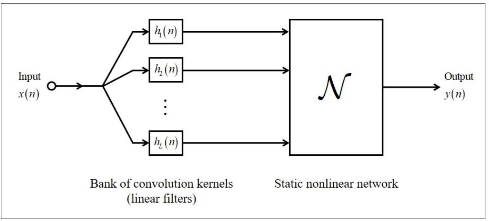
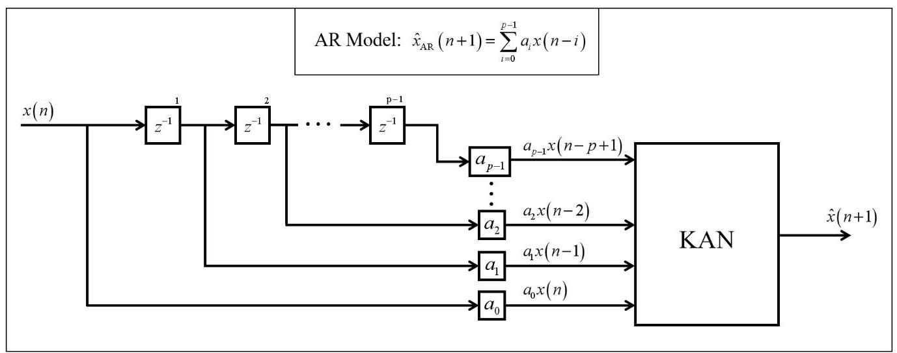
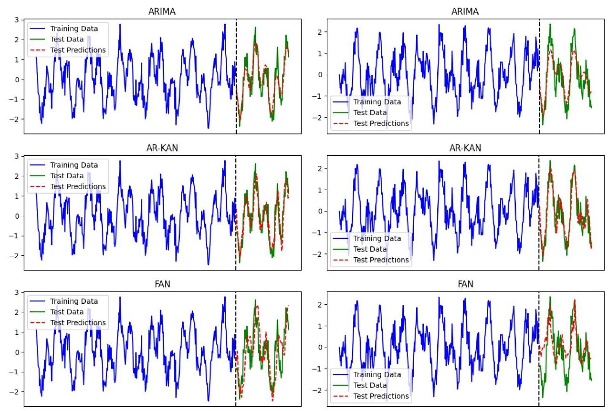
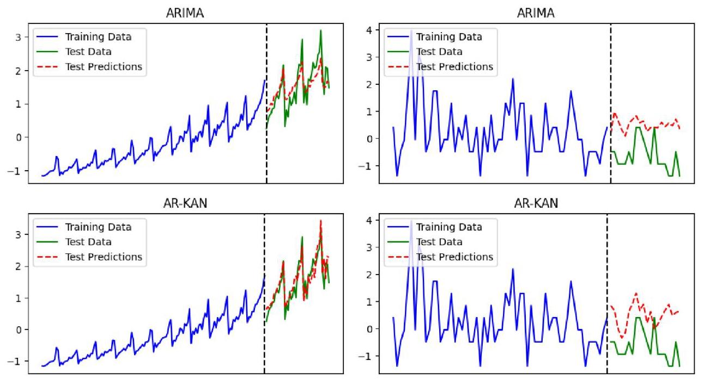

# AR-KAN: Autoregressive-Weight-Enhanced Kolmogorov-Arnold Network for Time Series Forecasting

# AR-KAN:用于时间序列预测的自回归权重增强型柯尔莫哥洛夫-阿诺德网络

Chen Zeng, Tiehang Xu, and Qiao Wang. , Senior Member, IEEE

陈增、徐铁航、王乔，IEEE 高级会员

Abstract-Traditional neural networks struggle to capture the spectral structure of complex signals. Fourier neural networks (FNNs) attempt to address this by embedding Fourier series components, yet many real-world signals are almost-periodic with non-commensurate frequencies, posing additional challenges. Building on prior work ${}^{\left\lbrack  {41}\right\rbrack  }$ showing that ARIMA outperforms large language models (LLMs) for forecasting, we extend the comparison to neural predictors and find ARIMA still superior. We therefore propose the Autoregressive-Weight-Enhanced Kolmogorov-Arnold Network (AR-KAN), which integrates a pre-trained AR module for temporal memory with a KAN for nonlinear representation. The AR module preserves essential temporal features while reducing redundancy. Experiments demonstrate that AR-KAN matches ARIMA on almost-periodic functions and achieves the best results on 72% of Rdatasets series, with a clear advantage on data with periodic structure. These results highlight AR-KAN as a robust and effective framework for time series forecasting. Our code is available at https://github.com/ChenZeng001/AR-KAN.

摘要 - 传统神经网络难以捕捉复杂信号的频谱结构。傅里叶神经网络(FNN)试图通过嵌入傅里叶级数分量来解决这一问题，但许多现实世界中的信号具有频率不可通约的准周期性特征，这带来了额外的挑战。基于先前工作${}^{\left\lbrack  {41}\right\rbrack  }$表明自回归积分滑动平均模型(ARIMA)在预测方面优于大语言模型(LLM)，我们将比较扩展到神经预测器，发现ARIMA仍然更具优势。因此，我们提出了自回归权重增强型柯尔莫哥洛夫 - 阿诺德网络(AR-KAN)，它将用于时间记忆的预训练AR模块与用于非线性表示的KAN相结合。AR模块保留了基本的时间特征，同时减少了冗余。实验表明，AR-KAN在准周期函数上与ARIMA相当，并且在72%的R数据集序列上取得了最佳结果，在具有周期性结构的数据上具有明显优势。这些结果突出了AR-KAN作为时间序列预测的强大而有效框架的地位。我们的代码可在https://github.com/ChenZeng001/AR-KAN获取。

Index Terms-Time series forecasting, ARIMA, Kolmogorov-Arnold Network, KAN, Almost periodic functions

关键词 - 时间序列预测，ARIMA，柯尔莫哥洛夫 - 阿诺德网络，KAN，准周期函数

## I. INTRODUCTION

## 一、引言

Time series forecasting is a fundamental task in signal processing [12], statistics 3 , and numerous applied fields, including economics 4 , meteorology 5 , and healthcare 6 . Among classical approaches, the Autoregressive Integrated Moving Average (ARIMA) model 7 stands out as one of the most influential and widely adopted methods, because it integrates autoregression, differencing, and moving average elements to provide a comprehensible and effective approach for handling practical time series data, even when the time series is non-stationary.

时间序列预测是信号处理[12]、统计学3以及许多应用领域(包括经济学4、气象学5和医疗保健6)中的一项基本任务。在经典方法中，自回归积分滑动平均(ARIMA)模型7是最具影响力和广泛采用的方法之一，因为它整合了自回归、差分和移动平均元素，为处理实际时间序列数据提供了一种可理解且有效的方法，即使时间序列是非平稳的。

Apart from the aforementioned statistics or Fourier analysis-based methods, neural networks have been utilized in time series forecasting for many years 8 , with the goal of enabling the modeling of complex nonlinear dependencies. Architectures such as Multi-Layer Perceptrons (MLPs) I10 and Recurrent Neural Networks (RNNs) II, particularly Long Short-Term Memory (LSTM) networks[12], have been widely studied. In recent years, Transformer-based models 13 14 15 have gained popularity due to their self-attention mechanism and parallel processing capabilities. Meanwhile, state space models like Mamba ${}^{16}$ have emerged as efficient alternatives to attention mechanisms, offering linear-time computation and strong performance on long-range sequences. More recently, Kolmogorov-Arnold Networks (KANs) 17, 18, have been introduced as a novel architecture with high expressivity and flexible modeling of nonlinear mappings. In parallel, the rapid progress of large language models (LLMs) has led to approaches such as LLMTime 42 and Time-LLM19, which adapt pretrained language models to temporal tasks by leveraging their strong generalization and sequence modeling capabilities.

除了上述基于统计或傅里叶分析的方法外，神经网络多年来一直用于时间序列预测8，目的是对复杂的非线性依赖关系进行建模。诸如多层感知器(MLP)I10和递归神经网络(RNN)II，特别是长短期记忆(LSTM)网络[12]等架构，已经得到了广泛研究。近年来，基于Transformer的模型13 14 15因其自注意力机制和并行处理能力而受到欢迎。与此同时，像Mamba${}^{16}$这样的状态空间模型作为注意力机制的有效替代方案出现，提供线性时间计算并在长序列上具有强大性能。最近，柯尔莫哥洛夫 - 阿诺德网络(KAN)17、18作为一种具有高表达能力和灵活非线性映射建模能力的新型架构被引入。与此同时，大语言模型(LLM)的快速发展催生了诸如LLMTime 42和Time-LLM19等方法，这些方法通过利用预训练语言模型的强大泛化和序列建模能力来适应时间任务。

In the context of neural forecasting, a specialized research focuses on spectral analysis through specific networks, such as Fourier Neural Networks (FNNs) 20. These models incorporate Fourier series to enhance spectral modeling 21. Representative examples include the Fourier Neural Operator (FNO) 23 and the Fourier Analysis Network (FAN) ${}^{22}$ ], which have been applied to physics-informed learning, partial differential equation solving, and time series prediction.

在神经预测的背景下，一项专门研究通过特定网络(如傅里叶神经网络(FNN)20)专注于频谱分析。这些模型纳入傅里叶级数以增强频谱建模21。代表性示例包括傅里叶神经算子(FNO)23和傅里叶分析网络(FAN)${}^{22}$，它们已应用于物理信息学习、偏微分方程求解和时间序列预测。

Nevertheless, these neural network models grounded in representation by Fourier series may overlook a key theoretical constraint: the additive combination of periodic elements does not necessarily result in a periodic function 24 25 . Throughout history, this important topic prompted N. Wiener to create the renowned Generalized Harmonic Analysis (GHA) theory, which works alongside the spectral analysis of time series. When the constituent frequencies are incommensurable, the resulting signal is almost-periodic ${}^{26}$ ], meaning that it exhibits recurrence without strict periodicity. Empirical studies show that for such signals, even advanced neural models, including FNNs, are often outperformed by classical ARIMA 27 28 and an evaluation could be referred as to our recent work [41].

然而，这些基于傅里叶级数表示的神经网络模型可能忽略了一个关键的理论约束:周期元素的加法组合不一定会产生周期函数24 25。纵观历史，这个重要话题促使N. Wiener创建了著名的广义调和分析(GHA)理论，该理论与时间序列的频谱分析协同工作。当组成频率不可通约时，产生的信号是准周期的${}^{26}$，这意味着它表现出递归性但没有严格的周期性。实证研究表明对于此类信号，即使是先进的神经模型，包括FNN，也常常被经典的ARIMA 27 28超越，更详细的评估可参考我们最近的工作[41]。

Empirical studies indicate that, for such signals, even advanced neural models such as FNNs are often outperformed by classical ARIMA methods 27 28. A more detailed evaluation can be found in our recent work [41].

实证研究表明，对于此类信号，即使是像FNN这样的先进神经模型，也常常被经典的ARIMA方法27 28超越。更详细的评估可在我们最近的工作[41]中找到。

To address this, we propose AR-KAN, a hybrid model that integrates the strengths of traditional and modern approaches. Based on the Universal Myopic Mapping Theorem 29 30, AR-KAN employs a KAN as the static nonlinear component, while introducing memory through a pre-trained autoregressive (AR) model. This design enables AR-KAN to combine the adaptability and expressiveness of KANs with the strong spectral bias inherent in traditional AR models. Furthermore, the AR memory module itself is a data-driven model whose weights are not fixed but are adaptively determined by the characteristics of the data. Additionally, it can be shown that when handling time series forecasting tasks, this module effectively eliminates redundancy while retaining the maximal amount of useful information. This property allows the model to flexibly adapt to various temporal patterns without manual intervention.

为解决此问题，我们提出了AR-KAN，这是一种混合模型，它整合了传统方法和现代方法的优势。基于通用近视映射定理29 30，AR-KAN采用KAN作为静态非线性组件，同时通过预训练的自回归(AR)模型引入记忆。这种设计使AR-KAN能够将KAN的适应性和表现力与传统AR模型中固有的强大频谱偏差相结合。此外，AR记忆模块本身是一个数据驱动的模型，其权重不是固定的，而是由数据的特征自适应确定。此外，可以证明，在处理时间序列预测任务时，该模块在保留最大量有用信息的同时有效地消除了冗余。此属性使模型能够灵活适应各种时间模式，而无需人工干预。

---

Both C. Zeng and T. Xu was with the School of Information Science and Engineering, Southeast University, Nanjing, China (email: chen-zeng@seu.edu.cn, 220250920@seu.edu.cn).

C. Zeng和T. Xu都曾任职于中国南京东南大学信息科学与工程学院(电子邮件:chen-zeng@seu.edu.cn，220250920@seu.edu.cn)。

Q. Wang was with both the School of Information Science and Engineering and the School of Economics and Management, Southeast University, Nanjing, China (Corresponding Author, email: qiaowang@seu.edu.cn).

Q. Wang曾同时任职于中国南京东南大学信息科学与工程学院和经济管理学院(通讯作者，电子邮件:qiaowang@seu.edu.cn)。

---

Extensive experiments demonstrate AR-KAN's effectiveness. On almost-periodic functions, it matches ARIMA's performance. And on real-world datasets from Rdatasets 40, it outperforms baselines on 72% of tasks. The few cases where AR-KAN does not dominate correspond mostly to datasets with weak or nearly absent periodicity, which are inherently difficult to forecast without additional prior information. When focusing on datasets with stronger periodic components, AR-KAN shows a clear and consistent advantage, highlighting its robustness, adaptability, and potential as a unified framework for time series forecasting.

大量实验证明了AR-KAN的有效性。在几乎周期性函数上，它与ARIMA的性能相当。在来自Rdatasets 40的真实世界数据集上，它在72%的任务中优于基线。AR-KAN不占主导地位的少数情况大多对应于周期性较弱或几乎没有周期性的数据集，在没有额外先验信息的情况下，这些数据集本质上很难预测。当关注具有更强周期性成分的数据集时，AR-KAN显示出明显且一致的优势，突出了其作为时间序列预测统一框架的稳健性、适应性和潜力。

The structure of this paper is organized as follows:

本文的结构如下:

Section II introduces the background, including time series forecasting tasks, ARIMA, MLP, and KAN models. Section III presents the Universal Myopic Mapping Theorem and explains how it inspires the overall architecture of our AR-KAN model. Section IV describes the experiments conducted to demonstrate the effectiveness and generalizability of AR-KAN, including evaluations on two constructed almost-periodic functions and real-world time series. Finally, Section V concludes the paper.

第二节介绍背景，包括时间序列预测任务、ARIMA、MLP和KAN模型。第三节介绍通用近视映射定理，并解释它如何启发我们的AR-KAN模型的整体架构。第四节描述为证明AR-KAN的有效性和通用性而进行的实验，包括对两个构造的几乎周期性函数和真实世界时间序列的评估。最后，第五节总结本文。

## II. BACKGROUND

## 二、背景

## A. Time Series Forecasting and ARIMA

## A. 时间序列预测与ARIMA

Time series forecasting aims to predict a sequence based on its past observations. Formally, given a univariate time series ${\left\{  {x}_{n}\right\}  }_{n = 1}^{T}$ , the forecasting problem involves learning a mapping $\mathcal{F}$ such that:

时间序列预测旨在根据过去的观测值预测一个序列。形式上，给定一个单变量时间序列${\left\{  {x}_{n}\right\}  }_{n = 1}^{T}$，预测问题涉及学习一个映射$\mathcal{F}$，使得:

$$
{\widehat{x}}_{n + h} = \mathcal{F}\left( {{x}_{n},{x}_{n - 1},\ldots ,{x}_{n - p + 1}}\right) , \tag{1}
$$

where ${\widehat{x}}_{n + h}$ denotes the forecast for $h$ -steps ahead ( $h = 1$ in this paper), and $p$ is the order of historical dependence. This formulation can be extended to multivariate or probabilistic settings, but the central challenge remains: capturing the underlying temporal dynamics, dependencies, and possibly noise in the observed data.

其中${\widehat{x}}_{n + h}$表示提前$h$步的预测(本文中为$h = 1$)，$p$是历史依赖的阶数。这种表述可以扩展到多变量或概率设置，但核心挑战仍然存在:捕捉观测数据中潜在的时间动态、依赖性以及可能的噪声。

A classical and widely used model for time series forecasting is ARIMA. ARIMA is particularly effective for stationary or differenced stationary processes. The general form of an $\operatorname{ARIMA}\left( {p, d, q}\right)$ model is given by:

时间序列预测的一个经典且广泛使用的模型是ARIMA。ARIMA对于平稳或差分平稳过程特别有效。$\operatorname{ARIMA}\left( {p, d, q}\right)$模型的一般形式如下:

$$
\Phi \left( B\right) {\left( 1 - B\right) }^{d}{x}_{n} = \Theta \left( B\right) {\epsilon }_{n}, \tag{2}
$$

where:

其中:

- $B$ is the backshift operator, i.e., ${B}^{k}{x}_{n} = {x}_{n - k}$ ,

- $B$是后移算子，即${B}^{k}{x}_{n} = {x}_{n - k}$，

- $\Phi \left( B\right)  = 1 - {a}_{1}B - \cdots  - {a}_{p}{B}^{p}$ is the autoregressive (AR) polynomial of order $p$ ,

- $\Phi \left( B\right)  = 1 - {a}_{1}B - \cdots  - {a}_{p}{B}^{p}$是阶数为$p$的自回归(AR)多项式，

- $\Theta \left( B\right)  = 1 + {b}_{1}B + \cdots  + {b}_{q}{B}^{q}$ is the moving average (MA) polynomial of order $q$ ,

- $\Theta \left( B\right)  = 1 + {b}_{1}B + \cdots  + {b}_{q}{B}^{q}$是阶数为$q$的移动平均(MA)多项式，

- $d$ is the degree of differencing to ensure stationarity,

- $d$是为确保平稳性而进行差分的阶数，

- ${\epsilon }_{n}$ is assumed to be white noise: ${\epsilon }_{t} \sim  \mathcal{N}\left( {0,{\sigma }^{2}}\right)$ .

- 假设${\epsilon }_{n}$为白噪声:${\epsilon }_{t} \sim  \mathcal{N}\left( {0,{\sigma }^{2}}\right)$ 。

The integration component ${\left( 1 - B\right) }^{d}$ transforms nonstationary series into stationary ones by differencing. The ARIMA model captures linear temporal dependencies and is known for its statistical interpretability and relatively low computational cost. Despite its simplicity, ARIMA remains a strong baseline in many practical applications, especially when the underlying signal exhibits regular, stationary behavior.

积分组件${\left( 1 - B\right) }^{d}$通过差分将非平稳序列转换为平稳序列。ARIMA模型捕捉线性时间依赖性，以其统计可解释性和相对较低的计算成本而闻名。尽管简单，但ARIMA在许多实际应用中仍然是一个强大的基线，特别是当基础信号表现出规则的平稳行为时。

### B.MLP and KAN

### B.MLP和KAN

MLP is one of the most fundamental architectures in neural networks. An MLP consists of multiple layers of affine transformations followed by pointwise nonlinear activations. Given an input $x \in  {\mathbb{R}}^{d}$ , an $L$ -layer MLP computes:

MLP是神经网络中最基本的架构之一。MLP由多层仿射变换和逐点非线性激活组成。给定输入$x \in  {\mathbb{R}}^{d}$，一个$L$层的MLP计算:

$$
{f}_{\mathrm{{MLP}}}\left( x\right)  = {W}^{\left( L\right) }{\sigma }_{L - 1}\cdots {\sigma }_{1}\left( {{W}^{\left( 1\right) }x + {b}^{\left( 1\right) }}\right)  + {b}^{\left( L\right) }, \tag{3}
$$

where ${W}^{\left( \ell \right) },{b}^{\left( \ell \right) }$ are learnable parameters, and ${\sigma }_{\ell }$ denotes the nonlinear activation at layer $\ell$ .

其中${W}^{\left( \ell \right) },{b}^{\left( \ell \right) }$是可学习参数，${\sigma }_{\ell }$表示第$\ell$层的非线性激活。

However, MLPs exhibit a well-known spectral bias 31, meaning they tend to learn low-frequency components of the target function earlier and more accurately than high-frequency components. While this inductive bias can be beneficial in some applications, it limits the ability of MLPs to capture fine-grained or oscillatory patterns in data.

然而，MLP存在一个众所周知的频谱偏差31，这意味着它们倾向于比高频分量更早、更准确地学习目标函数的低频分量。虽然这种归纳偏差在某些应用中可能是有益的，但它限制了MLP捕捉数据中细粒度或振荡模式的能力。

To overcome the limited expressiveness of fixed activation functions in traditional MLPs, KANs have been proposed as a more flexible and interpretable alternative. KANs are inspired by the Kolmogorov-Arnold representation theorem 32, which states that any multivariate continuous function $f : {\left\lbrack  0,1\right\rbrack  }^{d} \rightarrow \; \mathbb{R}$ can be expressed as a finite composition of univariate continuous functions:

为了克服传统MLP中固定激活函数的表达能力有限的问题，KAN被提出作为一种更灵活、更具可解释性的替代方案。KAN受到柯尔莫哥洛夫 - 阿诺德表示定理3２的启发，该定理指出任何多元连续函数$f : {\left\lbrack  0,1\right\rbrack  }^{d} \rightarrow \; \mathbb{R}$都可以表示为单变量连续函数的有限组合:

$$
f\left( {{x}_{1},\ldots ,{x}_{d}}\right)  = \mathop{\sum }\limits_{{q = 1}}^{{{2d} + 1}}{\phi }_{q}\left( {\mathop{\sum }\limits_{{i = 1}}^{d}{\psi }_{qi}\left( {x}_{i}\right) }\right) , \tag{4}
$$

where ${\phi }_{q}$ and ${\psi }_{qi}$ are univariate continuous functions. Inspired by this constructive result, KANs replace the fixed nonlinear activations in MLPs with learnable univariate functions, typically represented by splines.

其中${\phi }_{q}$和${\psi }_{qi}$是单变量连续函数。受此构造性结果的启发，KAN用可学习的单变量函数(通常由样条表示)取代了MLP中的固定非线性激活。

Given an input $x \in  {\mathbb{R}}^{d}$ , an $L$ -layer KAN computes:

给定输入$x \in  {\mathbb{R}}^{d}$，一个$L$层的KAN计算:

$$
{f}_{\mathrm{{KAN}}}\left( x\right)  = {\Phi }^{\left( L\right) }{\Psi }^{\left( L - 1\right) }\cdots {\Psi }^{\left( 1\right) }\left( x\right) , \tag{5}
$$

where each layer ${\Psi }^{\left( \ell \right) } : {\mathbb{R}}^{{d}_{\ell }} \rightarrow  {\mathbb{R}}^{{d}_{\ell  + 1}}$ is defined by:

其中每层${\Psi }^{\left( \ell \right) } : {\mathbb{R}}^{{d}_{\ell }} \rightarrow  {\mathbb{R}}^{{d}_{\ell  + 1}}$由下式定义:

$$
{\left\lbrack  {\Psi }^{\left( \ell \right) }\left( x\right) \right\rbrack  }_{j} = \mathop{\sum }\limits_{{i = 1}}^{{d}_{\ell }}{w}_{ij}^{\left( \ell \right) } \cdot  {\psi }_{ij}^{\left( \ell \right) }\left( {x}_{i}\right) , \tag{6}
$$

and ${\Phi }^{\left( L\right) }$ denotes the final output transformation, typically of the same form. Here, each ${\psi }_{ij}^{\left( \ell \right) }$ is a learnable univariate function, often implemented using splines, and ${w}_{ij}^{\left( \ell \right) }$ are learnable scalar weights.

并且${\Phi }^{\left( L\right) }$表示最终输出变换，通常具有相同的形式。这里，每个${\psi }_{ij}^{\left( \ell \right) }$是一个可学习的单变量函数，通常使用样条实现，${w}_{ij}^{\left( \ell \right) }$是可学习的标量权重。

Unlike MLPs, KANs do not exhibit a low-frequency spectral bias 33 . This enables them to capture high-frequency and oscillatory components more effectively, making them well suited for modeling time series with rich spectral structures.

与MLP不同，KAN不存在低频频谱偏差3３。这使它们能够更有效地捕捉高频和振荡分量，非常适合对具有丰富频谱结构的时间序列进行建模。

However, this advantage can also introduce challenges. Without a low-frequency bias, KANs tend to be more sensitive to high-frequency noise ${}^{\left\lbrack  {34}\right\rbrack  }$ and may have difficulty learning functions with limited regularity [35]. In such cases, the model may overfit to spurious variations or become unstable during training.

然而，这一优势也可能带来挑战。由于没有低频偏差，KAN往往对高频噪声${}^{\left\lbrack  {34}\right\rbrack  }$更敏感，并且可能难以学习规律性有限的函数[35]。在这种情况下，模型可能会过度拟合虚假变化或在训练期间变得不稳定。

Fig. 1: Universal Myopic Mapping Theorem.

图1:通用近视映射定理。

Fig. 2: Model Structure of AR-KAN.

图2:AR - KAN的模型结构。

Nevertheless, in most real-world time series, especially those with structured periodicity, seasonal trends, or nonstationary high-frequency patterns, this characteristic is beneficial. The ability of KANs to model a broad spectrum of frequency behaviors often leads to better performance compared to MLPs.

尽管如此，在大多数实际时间序列中，特别是那些具有结构化周期性、季节性趋势或非平稳高频模式的时间序列中，这一特性是有益的。与MLP相比，KAN能够对广泛的频率行为进行建模，这通常会带来更好的性能。

## III. AR-KAN

## III. AR-KAN

AR-KAN is derived from the Universal Myopic Mapping Theorem. Therefore, in this section, we first introduce the Universal Myopic Mapping Theorem, then followed by a detailed explanation of the AR-KAN model architecture.

AR-KAN源自通用近视映射定理。因此，在本节中，我们首先介绍通用近视映射定理，然后详细解释AR-KAN模型架构。

## A. Universal Myopic Mapping Theorem

## A. 通用近视映射定理

The Universal Myopic Mapping Theorem 29 30 provides a powerful theoretical guarantee for modeling dynamic systems using shallow, feedforward structures. Specifically, it states that any shift-invariant and myopic dynamical map can be uniformly approximated arbitrarily well by a two-stage architecture: a bank of linear filters followed by a static nonlinear mapping, as shown in Fig. 1

通用近视映射定理29 30为使用浅层前馈结构对动态系统进行建模提供了有力的理论保证。具体而言，它表明任何平移不变和近视的动态映射都可以通过一个两级架构进行任意好的一致逼近:一组线性滤波器后跟一个静态非线性映射，如图1所示。

Theorem 1 (Universal Myopic Mapping Theorem 29 30). Let $\mathcal{M}$ be a shift-invariant and myopic dynamical system that maps a real-valued time series ${\left\{  {x}_{n}\right\}  }_{n \in  \mathbb{Z}}$ to outputs $\left\{  {y}_{n}\right\}$ via a causal and bounded operator. Then, for any $\varepsilon  > 0$ , there exists a finite collection of linear filters ${\left\{  {h}_{i}\right\}  }_{i = 1}^{N}$ and a continuous static nonlinear function ${f}_{\theta } : {\mathbb{R}}^{N} \rightarrow  \mathbb{R}$ such that the approximation

定理1(通用近视映射定理29 30)。设$\mathcal{M}$是一个平移不变和近视的动态系统，它通过一个因果且有界的算子将实值时间序列${\left\{  {x}_{n}\right\}  }_{n \in  \mathbb{Z}}$映射到输出$\left\{  {y}_{n}\right\}$。那么，对于任何$\varepsilon  > 0$，存在一组有限的线性滤波器${\left\{  {h}_{i}\right\}  }_{i = 1}^{N}$和一个连续的静态非线性函数${f}_{\theta } : {\mathbb{R}}^{N} \rightarrow  \mathbb{R}$，使得逼近

$$
{y}_{n} \approx  {f}_{\theta }\left( {{\left( {h}_{1} * x\right) }_{n},{\left( {h}_{2} * x\right) }_{n},\ldots ,{\left( {h}_{N} * x\right) }_{n}}\right)
$$

satisfies

满足

$$
\mathop{\sup }\limits_{n}\left| {{y}_{n} - {f}_{\theta }\left( {{\left( {h}_{1} * x\right) }_{n},\ldots ,{\left( {h}_{N} * x\right) }_{n}}\right) }\right|  < \varepsilon ,
$$

where $*$ denotes convolution and ${\left( {h}_{i} * x\right) }_{n} = \mathop{\sum }\limits_{\tau }{h}_{i}\left( \tau \right) {x}_{n - \tau }$ .

其中$*$表示卷积且${\left( {h}_{i} * x\right) }_{n} = \mathop{\sum }\limits_{\tau }{h}_{i}\left( \tau \right) {x}_{n - \tau }$。

This theorem establishes that it is theoretically sufficient to model a wide class of dynamical systems using a finite bank of linear filters followed by a nonlinear function, without requiring recurrent or deep sequential architectures. The key property of myopia means that each output depends only on a bounded past history, and shift-invariance ensures time-homogeneity.

该定理表明，从理论上讲，使用一组有限的线性滤波器后跟一个非线性函数来对一类广泛的动态系统进行建模就足够了，而无需递归或深度序列架构。近视的关键特性意味着每个输出仅取决于有界的过去历史，平移不变性确保了时间同质性。

## B. Model Structure of AR-KAN

## B. AR-KAN的模型结构

Inspired by the Universal Myopic Mapping Theorem, we design the AR-KAN as a two-stage architecture composed of a data-driven memory module and a static nonlinear mapping, as illustrated in Fig. 2 The static nonlinear network is implemented using a KAN, which has been discussed in Section III to possess stronger spectral modeling capabilities than traditional MLPs, particularly for high-frequency signals. For the memory module, we adopt a pre-trained AR model to serve as the bank of linear filters, effectively incorporating the strengths of classical linear time series models into our architecture.

受通用近视映射定理的启发，我们将AR-KAN设计为一个由数据驱动的记忆模块和一个静态非线性映射组成的两级架构，如图2所示。静态非线性网络使用KAN实现，在第三节中已经讨论过，KAN比传统的多层感知器具有更强的频谱建模能力，特别是对于高频信号。对于记忆模块，我们采用一个预训练的AR模型作为线性滤波器组，有效地将经典线性时间序列模型的优势融入到我们的架构中。.

The memory module operates in the following manner: we first train an AR model from the input time series $\{ x\left( n\right) \}$ to predict the next step via

记忆模块的工作方式如下:我们首先从输入时间序列$\{ x\left( n\right) \}$训练一个AR模型，通过

$$
\widehat{x}\left( {n + 1}\right)  = \mathop{\sum }\limits_{{i = 0}}^{{p - 1}}{a}_{i}x\left( {n - i}\right) , \tag{7}
$$

where $p$ is the AR order and ${\left\{  {a}_{i}\right\}  }_{i = 0}^{p - 1}$ are the learned AR coefficients. These coefficients are then extracted to define a set of fixed linear filters. At each time step $n$ , a delay buffer forms the historical input vector $\{ x\left( {n - i}\right) {\} }_{i = 0}^{p - 1}$ , which is multiplied elementwise with the corresponding ${\left\{  {a}_{i}\right\}  }_{i = 0}^{p - 1}$ and passed to the subsequent KAN module. This structure is equivalent to setting the impulse response of the $i$ -th filter in Fig. 1 as:

来预测下一步，其中$p$是AR阶数，${\left\{  {a}_{i}\right\}  }_{i = 0}^{p - 1}$是学习到的AR系数。然后提取这些系数来定义一组固定的线性滤波器。在每个时间步$n$，一个延迟缓冲器形成历史输入向量$\{ x\left( {n - i}\right) {\} }_{i = 0}^{p - 1}$，它与相应的${\left\{  {a}_{i}\right\}  }_{i = 0}^{p - 1}$进行逐元素相乘，并传递给后续的KAN模块。这种结构等同于将图1中第$i$个滤波器的脉冲响应设置为:

$$
{h}_{i}\left( n\right)  = {a}_{i}\delta \left( {n - i}\right) ,\;0 \leq  i \leq  p - 1, \tag{8}
$$

where $\delta \left( \cdot \right)$ is the Kronecker delta function.

其中$\delta \left( \cdot \right)$是克罗内克δ函数。

To express the AR coefficients $\left\{  {a}_{i}\right\}$ explicitly in terms of the time series $\{ x\left( n\right) \}$ , we can solve the Yule-Walker equations 36 37. Specifically, let $\mathbf{a} = {\left\lbrack  {a}_{0},{a}_{1},\ldots ,{a}_{p - 1}\right\rbrack  }^{\top }$ be the coefficient vector, $\mathbf{r} = {\left\lbrack  r\left( 1\right) , r\left( 2\right) ,\ldots , r\left( p\right) \right\rbrack  }^{\top }$ the autocorrelation vector, and $\mathbf{R}$ the $p \times  p$ autocorrelation matrix given by

为了根据时间序列$\{ x\left( n\right) \}$明确地表示AR系数$\left\{  {a}_{i}\right\}$，我们可以求解尤尔 - 沃克方程36 37。具体来说，设$\mathbf{a} = {\left\lbrack  {a}_{0},{a}_{1},\ldots ,{a}_{p - 1}\right\rbrack  }^{\top }$为系数向量，$\mathbf{r} = {\left\lbrack  r\left( 1\right) , r\left( 2\right) ,\ldots , r\left( p\right) \right\rbrack  }^{\top }$为自相关向量，$\mathbf{R}$为由下式给出的$p \times  p$自相关矩阵

$$
\mathbf{R} = \left\lbrack  \begin{matrix} r\left( 0\right) & r\left( 1\right) & \cdots & r\left( {p - 1}\right) \\  r\left( 1\right) & r\left( 0\right) & \cdots & r\left( {p - 2}\right) \\  \vdots & \vdots &  \ddots  & \vdots \\  r\left( {p - 1}\right) & r\left( {p - 2}\right) & \cdots & r\left( 0\right)  \end{matrix}\right\rbrack \tag{9}
$$

then the AR coefficients are computed via:

然后通过以下方式计算自回归系数:

$$
\mathbf{a} = {\mathbf{R}}^{-1}\mathbf{r}. \tag{10}
$$

Here, the autocorrelation function $r\left( i\right)$ is defined as

在此，自相关函数$r\left( i\right)$定义为

$$
r\left( i\right)  = \mathbb{E}\left\lbrack  {x\left( n\right) x\left( {n - i}\right) }\right\rbrack  , \tag{11}
$$

or, in practice, estimated from the empirical data as

或者，在实际中，根据经验数据估计为

$$
r\left( i\right)  \approx  \frac{1}{N - i}\mathop{\sum }\limits_{{n = i}}^{{N - 1}}x\left( n\right) x\left( {n - i}\right) , \tag{12}
$$

where $N$ is the total number of available samples.

其中$N$是可用样本的总数。

This formulation reveals a key feature of our memory module: the filter weights $\left\{  {a}_{i}\right\}$ are not fixed parameters, but are derived from the underlying data through statistical estimation. In contrast to static memory schemes such as tapped-delay lines 38 or gamma memory [39], our data-driven design allows the memory module to adapt flexibly to the autocorrelation structure of different time series.

这种公式揭示了我们记忆模块的一个关键特性:滤波器权重$\left\{  {a}_{i}\right\}$不是固定参数，而是通过统计估计从基础数据中推导出来的。与诸如抽头延迟线38或伽马记忆[39]等静态记忆方案不同，我们的数据驱动设计允许记忆模块灵活地适应不同时间序列的自相关结构。

## C. Analysis of the AR Memory Module

## C. AR记忆模块分析

To further elucidate the advantage of the AR memory module, we provide a theoretical analysis demonstrating that it optimally preserves useful information while eliminating redundancy. Consider a general linear memory module with output:

为了进一步阐明AR记忆模块的优势，我们提供了一个理论分析，证明它在消除冗余的同时能最佳地保留有用信息。考虑一个具有输出的一般线性记忆模块:

$$
{y}_{i}\left( n\right)  = {w}_{i}x\left( {n - i}\right) ,\;0 \leq  i \leq  p - 1, \tag{13}
$$

where ${w}_{i}$ are the weights.

其中${w}_{i}$是权重。

We aim to maximize the total correlation between the memory outputs and the target $x\left( {n + 1}\right)$ , which represents the useful information captured:

我们的目标是最大化记忆输出与目标$x\left( {n + 1}\right)$之间的总相关性，这代表了捕获的有用信息:

$$
\max \mathop{\sum }\limits_{{i = 0}}^{{p - 1}}\mathbb{E}\left\lbrack  {{y}_{i}\left( n\right) x\left( {n + 1}\right) }\right\rbrack \tag{14}
$$

However, this objective alone is insufficient, as it can be trivially maximized by arbitrarily increasing the magnitude of ${w}_{i}$ , which would also amplify noise and irrelevant components. To prevent this and encourage the memory to focus on the most informative features, we introduce a constraint on the total output energy of the memory module:

然而，仅这个目标是不够的，因为通过任意增加${w}_{i}$的幅度可以轻易地最大化它，这也会放大噪声和无关成分。为了防止这种情况并鼓励记忆专注于最具信息性的特征，我们对记忆模块的总输出能量引入一个约束:

$$
\min \mathbb{E}\left\lbrack  {\left( \mathop{\sum }\limits_{{i = 0}}^{{p - 1}}{y}_{i}\left( n\right) \right) }^{2}\right\rbrack  . \tag{15}
$$

This constraint penalizes high-energy outputs, effectively forcing the memory to represent the target using a compact set of features and discard redundant information. We combine these two objectives into a single optimization goal:

这个约束会惩罚高能量输出，有效地迫使记忆使用一组紧凑的特征来表示目标并丢弃冗余信息。我们将这两个目标合并为一个单一的优化目标:

$$
L = \mathop{\sum }\limits_{{i = 0}}^{{p - 1}}\mathbb{E}\left\lbrack  {{y}_{i}\left( n\right) x\left( {n + 1}\right) }\right\rbrack   - \frac{1}{2}\mathbb{E}\left\lbrack  {\left( \mathop{\sum }\limits_{{i = 0}}^{{p - 1}}{y}_{i}\left( n\right) \right) }^{2}\right\rbrack  . \tag{16}
$$

To find the optimal weights that maximize $L$ , we solve $\frac{\partial L}{\partial \mathbf{w}} = 0$ for $\mathbf{w} = {\left\lbrack  {w}_{0},{w}_{1},\ldots ,{w}_{p - 1}\right\rbrack  }^{\top }$ gives:

为了找到使$L$最大化的最优权重，我们求解$\frac{\partial L}{\partial \mathbf{w}} = 0$关于$\mathbf{w} = {\left\lbrack  {w}_{0},{w}_{1},\ldots ,{w}_{p - 1}\right\rbrack  }^{\top }$得到:

$$
{\mathbf{w}}^{ * } = {\mathbf{R}}^{-1}\mathbf{r} \tag{17}
$$

TABLE I: Test loss (MSE) of various models on Noisy Almost Periodic Functions

表I:各种模型在有噪声的近似周期函数上的测试损失(均方误差)

<table><tr><td>functions</td><td>$\sigma$</td><td>ARIMA</td><td>AR-KAN</td><td>AR-MLP</td><td>KAN</td><td>MLP</td><td>Transformer</td><td>LSTM</td><td>Mamba</td><td>FAN</td><td>FNO</td></tr><tr><td rowspan="4">${f}_{1}$</td><td>0.1</td><td>0.0142</td><td>0.0203</td><td>0.0270</td><td>0.1507</td><td>0.1216</td><td>0.0584</td><td>0.0743</td><td>0.1194</td><td>0.1173</td><td>0.0767</td></tr><tr><td>0.2</td><td>0.0550</td><td>0.0770</td><td>0.0959</td><td>0.1946</td><td>0.1273</td><td>0.3903</td><td>0.1462</td><td>0.2934</td><td>0.4266</td><td>0.1305</td></tr><tr><td>0.3</td><td>0.1206</td><td>0.1681</td><td>0.1999</td><td>0.2947</td><td>0.2408</td><td>0.4635</td><td>0.5209</td><td>0.3781</td><td>0.7023</td><td>0.1979</td></tr><tr><td>0.4</td><td>0.2155</td><td>0.2892</td><td>0.3543</td><td>0.6241</td><td>1.4625</td><td>1.5572</td><td>0.3932</td><td>0.5932</td><td>0.7965</td><td>0.7865</td></tr><tr><td rowspan="4">${f}_{2}$</td><td>0.1</td><td>0.0194</td><td>0.0193</td><td>0.0214</td><td>0.0515</td><td>0.1525</td><td>0.0947</td><td>0.0813</td><td>0.1149</td><td>0.0384</td><td>0.0322</td></tr><tr><td>0.2</td><td>0.0881</td><td>0.0724</td><td>0.0922</td><td>0.2812</td><td>0.1550</td><td>0.5346</td><td>0.2424</td><td>0.2593</td><td>0.5109</td><td>0.2747</td></tr><tr><td>0.3</td><td>0.1647</td><td>0.1593</td><td>0.1745</td><td>0.2577</td><td>0.6787</td><td>1.2197</td><td>0.4042</td><td>0.5592</td><td>0.3506</td><td>0.4277</td></tr><tr><td>0.4</td><td>0.3108</td><td>0.2769</td><td>0.3341</td><td>0.7100</td><td>1.1827</td><td>3.8209</td><td>0.4932</td><td>0.5914</td><td>0.7702</td><td>1.1133</td></tr></table>

Note: Bold numbers indicate the minimum value in each row; italic numbers indicate the second minimum value.

注意:粗体数字表示每行中的最小值；斜体数字表示第二小的值。

Fig. 3: Performance of ARIMA, AR-KAN and FAN on Noisy Almost Periodic Functions, $\sigma  = {0.4}$ (left: ${f}_{1}$ , right: ${f}_{2}$ ).

图3:ARIMA、AR - KAN和FAN在有噪声近似周期函数上的性能，$\sigma  = {0.4}$(左:${f}_{1}$，右:${f}_{2}$)。

which is exactly the solution for the AR coefficients. This result confirms that the AR memory module optimally balances the dual goals of preserving predictive information and minimizing redundancy, providing a principled foundation for its use in AR-KAN.

这正是自回归系数的解。这个结果证实了AR记忆模块在保留预测信息和最小化冗余这两个双重目标之间实现了最佳平衡，为其在AR - KAN中的应用提供了一个有原则的基础。

This adaptability endows AR-KAN with stronger generalization across diverse temporal patterns. The linear filters capture data-specific short-term dynamics, while the nonlinear KAN component models higher-order, nonlinear interactions. Together, they form a powerful hybrid that balances interpretability, efficiency, and expressiveness in time series forecasting.

这种适应性使AR-KAN在各种时间模式下具有更强的泛化能力。线性滤波器捕捉特定数据的短期动态，而非线性KAN组件则对高阶非线性相互作用进行建模。它们共同构成了一个强大的混合模型，在时间序列预测中平衡了可解释性、效率和表现力。

## IV. EXPERIMENTS

## 四、实验

We conduct experiments in two parts to demonstrate both the effectiveness and generalizability of AR-KAN. First, we perform experiments on noisy almost-periodic functions to show that modern models fall short of traditional ARIMA models in terms of spectral analysis, while our AR-KAN achieves performance comparable to ARIMA. Then, we extend the evaluation to real-world datasets from Rdatasets 40 , and observe that AR-KAN achieves the best performance on 72% of datasets. The few cases where it underperforms mostly involve weak or absent periodicity, which are inherently hard to predict without prior knowledge. For strongly periodic data, AR-KAN shows a clear and consistent advantage.

我们分两部分进行实验，以证明AR-KAN的有效性和泛化能力。首先，我们对有噪声的准周期函数进行实验，结果表明在频谱分析方面，现代模型不如传统的ARIMA模型，而我们的AR-KAN取得了与ARIMA相当的性能。然后，我们将评估扩展到来自Rdatasets 40的真实世界数据集，并观察到AR-KAN在72%的数据集上取得了最佳性能。少数表现不佳的情况大多涉及周期性较弱或不存在周期性的数据，在没有先验知识的情况下，这些数据本质上很难预测。对于强周期性数据，AR-KAN表现出明显且一致的优势。

## A. Noisy Almost Periodic Functions

## A. 有噪声的准周期函数

We construct noisy almost-periodic functions by superimposing 2 trigonometric waves with incommensurate frequencies and adding Gaussian noise:

我们通过叠加两个频率不可通约的三角波并添加高斯噪声来构造有噪声的准周期函数:

$$
{f}_{1}\left( t\right)  = \cos \left( {2t}\right)  + \cos \left( {2\pi t}\right)  + \text{ noise, } \tag{18}
$$

$$
{f}_{2}\left( t\right)  = \sin \left( {3t}\right)  + \sin \left( {2et}\right)  + \text{ noise, } \tag{19}
$$

where the noise is sampled from a zero-mean Gaussian distribution with variance ${\sigma }^{2}$ . Almost-periodic functions like this are of particular significance in the development of harmonic analysis, and they form the basis of generalized harmonic analysis (GHA) as formulated by Wiener ${}^{2}$ .

其中噪声是从方差为${\sigma }^{2}$的零均值高斯分布中采样的。这样的准周期函数在调和分析的发展中具有特别重要的意义，它们构成了维纳${}^{2}$提出的广义调和分析(GHA)的基础。

TABLE II: Test loss (MSE) of various models on Rdatasets with periodicity strength

表二:各种模型在具有周期性强度的Rdatasets上的测试损失(MSE)

<table><tr><td>Datasets</td><td>Periodicity Strength</td><td>ARIMA</td><td>AR-KAN</td><td>AR-MLP</td><td>KAN</td><td>MLP</td><td>LSTM</td><td>FAN</td><td>FNO</td><td>LLMTime</td></tr><tr><td>airpass_ts</td><td>41.28%</td><td>0.3329</td><td>0.0706</td><td>0.0871</td><td>0.3046</td><td>0.3025</td><td>0.4249</td><td>0.5163</td><td>0.6982</td><td>0.1937</td></tr><tr><td>goog200_ts</td><td>34.24%</td><td>4.7135</td><td>0.1228</td><td>0.8096</td><td>3.6632</td><td>3.5888</td><td>3.2584</td><td>3.0580</td><td>7.9012</td><td>1.1351</td></tr><tr><td>euretail_ts</td><td>18.39%</td><td>0.4967</td><td>0.9964</td><td>1.3328</td><td>1.1984</td><td>0.4226</td><td>1.6740</td><td>1.1469</td><td>0.1821</td><td>1.5009</td></tr><tr><td>ausbeer_ts</td><td>14.63%</td><td>0.0418</td><td>0.0357</td><td>0.0741</td><td>0.1031</td><td>0.5102</td><td>0.0692</td><td>0.0802</td><td>0.1114</td><td>0.0436</td></tr><tr><td>h02_ts</td><td>13.31%</td><td>0.2726</td><td>0.1263</td><td>0.1782</td><td>1.3708</td><td>0.5258</td><td>0.2103</td><td>0.6003</td><td>0.8209</td><td>0.1371</td></tr><tr><td>BJsales_ts</td><td>10.08%</td><td>0.3241</td><td>0.0032</td><td>0.0261</td><td>0.0358</td><td>0.7849</td><td>0.0643</td><td>0.2393</td><td>1.0370</td><td>0.0131</td></tr><tr><td>a10_ts</td><td>6.36%</td><td>0.1441</td><td>0.1353</td><td>0.4775</td><td>2.5033</td><td>2.2638</td><td>0.8809</td><td>0.4913</td><td>0.3851</td><td>0.3457</td></tr><tr><td>hsales2_ts</td><td>4.20%</td><td>0.5781</td><td>0.5232</td><td>0.6301</td><td>2.1212</td><td>0.8286</td><td>1.7787</td><td>1.7065</td><td>0.8850</td><td>0.5667</td></tr><tr><td>co2_ts</td><td>3.69%</td><td>0.0218</td><td>0.0014</td><td>0.0064</td><td>0.3079</td><td>0.0460</td><td>0.1640</td><td>0.1584</td><td>0.1963</td><td>0.0109</td></tr><tr><td>hyndsight_ts</td><td>2.61%</td><td>0.8729</td><td>0.2471</td><td>0.3961</td><td>1.5734</td><td>0.4892</td><td>0.5929</td><td>0.6164</td><td>0.6793</td><td>0.4510</td></tr><tr><td>bricksq_ts</td><td>1.33%</td><td>0.2080</td><td>0.0502</td><td>0.0823</td><td>0.2542</td><td>0.2769</td><td>0.2961</td><td>0.9625</td><td>0.2607</td><td>0.2541</td></tr><tr><td>elecequip_ts</td><td>1.25%</td><td>0.3159</td><td>0.1528</td><td>0.1346</td><td>0.5968</td><td>0.5538</td><td>0.8984</td><td>0.7761</td><td>0.4870</td><td>1.4010</td></tr><tr><td>elecdaily_mts</td><td>1.16%</td><td>0.4331</td><td>0.2123</td><td>0.2573</td><td>0.4410</td><td>0.5366</td><td>0.6792</td><td>0.8981</td><td>0.5919</td><td>0.6127</td></tr><tr><td>gtemp_both_ts</td><td>0.50%</td><td>2.2374</td><td>0.2936</td><td>0.5328</td><td>3.2225</td><td>2.2946</td><td>1.6629</td><td>2.8678</td><td>1.6660</td><td>5.0938</td></tr><tr><td>discoveries_ts</td><td>0.22%</td><td>1.6030</td><td>2.1695</td><td>2.3091</td><td>1.7269</td><td>1.6264</td><td>1.7949</td><td>1.0153</td><td>0.8469</td><td>1.2922</td></tr><tr><td>elec_ts</td><td>0.16%</td><td>0.2731</td><td>0.0069</td><td>0.0060</td><td>0.0930</td><td>0.0436</td><td>0.1833</td><td>0.3258</td><td>0.0625</td><td>0.0727</td></tr><tr><td>economics_df_ts</td><td>0.00%</td><td>3.5659</td><td>0.0845</td><td>0.4398</td><td>2.3047</td><td>1.8717</td><td>2.2520</td><td>1.8607</td><td>7.7670</td><td>1.6490</td></tr><tr><td>auscafe_ts</td><td>0.00%</td><td>0.3301</td><td>0.3813</td><td>0.1180</td><td>2.6312</td><td>0.7564</td><td>0.3746</td><td>1.4820</td><td>3.4769</td><td>0.4463</td></tr></table>

Note: Bold numbers indicate the minimum value in each row. Rows are shaded in red when periodicity is present $\left( { \geq  {0.5}\% }\right)$ and in blue when periodicity is weak $\left( { < {0.5}\% }\right)$ .

注意:粗体数字表示每行中的最小值。当存在周期性$\left( { \geq  {0.5}\% }\right)$时，行以红色阴影显示；当周期性较弱$\left( { < {0.5}\% }\right)$时，行以蓝色阴影显示。

Fig. 4: Performance of ARIMA and AR-KAN on two different types of time series in Rdatasets. the left column shows results on a10_t s (a highly periodic series), and the right column shows results on discoveries_ts (a nearly non-periodic series).

图4:ARIMA和AR-KAN在Rdatasets中两种不同类型时间序列上的性能。左列显示了a10_ts(一个高度周期性序列)的结果，右列显示了discoveries_ts(一个几乎非周期性序列)的结果。

We vary the noise level $\sigma$ from 0.1 to 0.4 and compare the performance of ARIMA and 9 neural models. The results are shown in TABLE [1] Typically, the outcomes of certain experiments $\left( {\sigma  = {0.4}}\right)$ produced by ARIMA, AR-KAN, and FAN are shown in Fig. 3

我们将噪声水平$\sigma$从0.1变化到0.4，并比较ARIMA和9种神经模型的性能。结果如表[1]所示。通常，由ARIMA、AR-KAN和FAN产生的某些实验$\left( {\sigma  = {0.4}}\right)$结果如图3所示。

Experimental results show that for almost-periodic functions, all 7 existing neural networks perform worse than ARIMA, including FNO and FAN, both of which are designed specifically for spectral learning. As illustrated in Fig. 3, FAN is only able to capture the rough trend of the signal but fails to reconstruct fine-grained details. In contrast, the AR-KAN achieves excellent performance comparable to ARIMA. It inherits the strong spectral analysis capabilities of autoregressive models while also benefiting from the KAN's near absence of spectral bias, enabling it to handle the intricate details of the time series effectively.

实验结果表明，对于准周期函数，所有7种现有的神经网络的性能都比ARIMA差，包括专门为频谱学习设计的FNO和FAN。如图3所示，FAN只能捕捉信号的大致趋势，但无法重建细粒度的细节。相比之下，AR-KAN取得了与ARIMA相当的优异性能。它继承了自回归模型强大的频谱分析能力，同时也受益于KAN几乎没有频谱偏差的特点，使其能够有效地处理时间序列的复杂细节。

This combination of strengths makes AR-KAN particularly suitable for data with complex frequency structures. The results highlight the effectiveness of our architecture in bridging the gap between traditional statistical methods and modern neural networks.

这种优势的结合使得AR-KAN特别适合具有复杂频率结构的数据。结果突出了我们的架构在弥合传统统计方法和现代神经网络之间差距方面的有效性。

## B. Rdatasets

## B. Rdatasets

We further evaluate AR-KAN on real-world series from Rdatasets 40. For each dataset, we quantify its Periodicity Strength as the ratio of the energy of the seasonal component (obtained by STL decomposition 43 ) to the total energy of the original series:

我们进一步在来自Rdatasets 40的真实世界序列上评估AR-KAN。对于每个数据集，我们将其周期性强度量化为季节性成分的能量(通过STL分解43获得)与原始序列总能量的比值:

$$
\text{ Periodicity Strength } = \frac{{\begin{Vmatrix}{x}_{\text{ seasonal }}\end{Vmatrix}}_{2}^{2}}{\parallel x{\parallel }_{2}^{2}}.
$$

The period used in STL decomposition is determined by the largest nonzero-lag peak in the series' autocorrelation function. Our results in TABLE [1] show that AR-KAN achieves the best performance on 72% of datasets. Moreover, its advantage grows with increasing Periodicity Strength, indicating that AR-KAN excels on series with clear or strong periodic components. In contrast, its few underperforming cases correspond to datasets with weak or nearly absent periodicity, which are inherently hard to forecast without additional prior knowledge and remain challenging for all competing methods. They are illustrated in Fig. 4 By the way, Fourier-based models fail to generalize despite their spectral priors, and other neural baselines show similar limitations.

STL分解中使用的周期由序列自相关函数中最大的非零滞后峰值确定。我们在表[1]中的结果表明，AR-KAN在72%的数据集上取得了最佳性能。此外，其优势随着周期性强度的增加而增长，这表明AR-KAN在具有清晰或强周期性成分的序列上表现出色。相比之下，少数表现不佳的情况对应于周期性较弱或几乎不存在周期性的数据集，在没有额外先验知识的情况下，这些数据本质上很难预测，并且对所有竞争方法来说仍然具有挑战性。它们如图4所示。顺便说一下，基于傅里叶的模型尽管有频谱先验，但未能实现泛化，其他神经基线也表现出类似的局限性。

LLM-based methods such as LLMTime 42 approach ARIMA 41 in performance but still fall short of AR-KAN, indicating that LLMs are not yet mature for time series forecasting. Both LLMs and neural networks struggle to capture frequency structure, whereas AR offers a statistical view for genuine spectral analysis. By combining this frequency-aware modeling with KAN's nonlinear expressivity, AR-KAN achieves robust, domain-general performance.

基于大语言模型(LLM)的方法，如LLMTime 42，在性能上接近ARIMA 41，但仍不及AR-KAN，这表明大语言模型在时间序列预测方面尚未成熟。大语言模型和神经网络都难以捕捉频率结构，而自回归模型提供了一种用于真正频谱分析的统计视角。通过将这种频率感知建模与KAN的非线性表现力相结合，AR-KAN实现了强大的、通用的性能。

## V. CONCLUSION

## 五、结论

In this paper, we reveal that existing neural networks struggle with spectral analysis and often underperform ARIMA on almost-periodic functions. Guided by the Universal Myopic Mapping Theorem, we propose AR-KAN, which combines ARIMA's autoregressive memory with KAN's nonlinear expressivity. Experiments show that AR-KAN matches ARIMA on almost-periodic functions and outperforms baselines on 72% of real-world datasets, with its advantage growing on series with clear periodic patterns. These results highlight AR-KAN as a robust and unified framework for time series forecasting.

在本文中，我们揭示了现有神经网络在频谱分析方面存在困难，并且在几乎周期函数上的表现常常不如ARIMA。在通用近视映射定理的指导下，我们提出了AR-KAN，它将ARIMA的自回归记忆与KAN的非线性表达能力相结合。实验表明，AR-KAN在几乎周期函数上与ARIMA相当，并且在72%的真实世界数据集上优于基线，其优势在具有明显周期模式的序列上更加明显。这些结果突出了AR-KAN作为一个强大且统一的时间序列预测框架。

## APPENDIX A

## 附录A

DATA SAMPLING AND EVALUATION PROTOCOL

数据采样与评估协议

In the Noisy Almost Periodic Functions experiment, the temporal variable $t$ ranges from 0 to ${8\pi }$ , and a total of 500 samples are uniformly collected over this interval. The dataset is split into training and testing sets with an 80/20 ratio: the first ${80}\%$ of the sequence is used for training, while the remaining ${20}\%$ is reserved for testing.

在噪声几乎周期函数实验中，时间变量$t$的范围是从0到${8\pi }$，并且在这个区间内总共均匀收集500个样本。数据集按照80/20的比例划分为训练集和测试集:序列的前${80}\%$用于训练，而其余的${20}\%$留作测试。

For the Rdatasets experiment, all time series are standardized based on their mean and standard deviation. Then also apply the 80/20 split strategy: the training set consists of the first 80% of each sequence, and the testing set consists of the final 20%.

对于Rdatasets实验，所有时间序列都根据其均值和标准差进行标准化。然后也应用80/20分割策略:训练集由每个序列的前80%组成，测试集由最后的20%组成。

APPENDIX B

## 附录B

MODEL ARCHITECTURE AND CONFIGURATION

模型架构与配置

<table><tr><td>models</td><td>architecture and configuration</td></tr><tr><td>ARIMA</td><td>$p = {20}, d = 0$ or $1, q = 1$ or 2</td></tr><tr><td>KAN</td><td>width $= \left\lbrack  {{20},{50},1}\right\rbrack$ , grid=3, k=3</td></tr><tr><td>MLP</td><td>width $= \left\lbrack  {{20},{128},{256},{128},1}\right\rbrack$</td></tr><tr><td>Transformer</td><td>feature_dimension $= {64}$ , nhead=4, encoder_layers = 2, feedforward_dimension = 128</td></tr><tr><td>LSTM</td><td>input_size=1, hidden_size=64, num_layers=2, output_size=1</td></tr><tr><td>Mamba</td><td>input_dim=1, d_model=48, d_state=32, d_conv=20, n_layers=5</td></tr><tr><td>FAN</td><td>input_dim=20, output_dim=1, hidden_dim=2048, num_layers=5, p_ratio=0.25</td></tr><tr><td>FNO</td><td>input_dim=20, output_dim=1, modes=8, channels=32, fourier_layers = 2</td></tr><tr><td>LLMTime</td><td>DeepSeek-V3, experiment_times $= {10}$</td></tr></table>

## REFERENCES

## 参考文献

[1] G. E. P. Box, G. M. Jenkins, G. C. Reinsel, and G. M. Ljung, Time SeriesAnalysis: Forecasting and Control, 5th ed. Hoboken, New Jersey: John Wiley & Sons Inc., 2015.

《分析:预测与控制》，第5版。新泽西州霍博肯:约翰威立国际出版公司，2015年。

[2] N. Wiener, Extrapolation, interpolation, and smoothing of stationary time series: with engineering applications. The MIT Press, 1949.

[3] C. Fernández-Pérez, J. Tejada, and M. Carrasco, "Multivariate timeseries analysis in nosocomial infection surveillance: a case study," International Journal of Epidemiology, vol. 27, no. 2, pp. 282-288, 4

“医院感染监测中的序列分析:一个案例研究”，《国际流行病学杂志》，第27卷，第2期，第282 - 288页，41998. [Online]. Available: https://doi.org/10.1093/ije/27.2.282

[4] T. Wang, R. Beard, J. Hawkins, and R. Chandra, "Recursive deeplearning framework for forecasting the decadal world economic

预测十年世界经济的学习框架outlook," IEEE Access, vol. 12, pp. 152921-152944, 1 2024. [Online].Available: https://doi.org/10.1109/access.2024.3472859

可获取:https://doi.org/10.1109/access.2024.3472859

[5] M. Singh, V. S. B, N. Acharya, A. Grover, S. A. Rao, B. Kumar, Z.-L.Yang, and D. Niyogi, "Short-range forecasts of global precipitation using deep learning-augmented numerical weather prediction," 6 2022. [Online]. Available: https://arxiv.org/abs/2206.11669

杨和D. 尼约吉，“使用深度学习增强数值天气预报进行全球降水的短期预测”，2022年6月。[在线]。可获取:https://arxiv.org/abs/2206.11669

[6] Y. Deng, S. Liu, Z. Wang, Y. Wang, Y. Jiang, and B. Liu, "Explainabletime-series deep learning models for the prediction of mortality, prolonged length of stay and 30-day readmission in intensive care

用于预测重症监护中死亡率、延长住院时间和30天再入院率的时间序列深度学习模型patients," Frontiers in Medicine, vol. 9, 9 2022. [Online]. Available:https://doi.org/10.3389/fmed.2022.933037

[7] G. E. P. Box and G. M. Jenkins, "Some recent advances in forecastingand control," Journal of the Royal Statistical Society. Series C (Applied

与控制”，《皇家统计学会杂志》。C辑(应用Statistics), vol. 17, no. 2, pp. 91-109, 1968.

[8] B. Lim and S. Zohren, "Time-series forecasting with deep learning: asurvey," Philosophical Transactions of the Royal Society A Mathematical Physical and Engineering Sciences, vol. 379, no. 2194, p. 20200209, 2

“调查”，《皇家学会哲学学报A:数学物理与工程科学》，第379卷，第2194期，第20200209页，22021. [Online]. Available: https://doi.org/10.1098/rsta.2020.0209

[9] R. Csordás, C. Potts, C. D. Manning, and A. Geiger, "RecurrentNeural Networks Learn to Store and Generate Sequences using Non-Linear Representations," 8 2024. [Online]. Available: https: //arxiv.org/abs/2408.10920

“神经网络使用非线性表示学习存储和生成序列”，2024年8月。[在线]。可获取:https://arxiv.org/abs/2408.10920

[10] I. A. Gheyas and L. S. Smith, "A neural network approach to time seriesforecasting," 2009. [Online]. Available: https://api.semanticscholar.org/ CorpusID:2266156

“预测”，2009年。[在线]。可获取:https://api.semanticscholar.org/CorpusID:2266156

[11] L. R. Medsker, L. Jain et al., "Recurrent neural networks," Design and applications, vol. 5, no. 64-67, p. 2, 2001.

[12] S. Hochreiter and J. Schmidhuber, "Long Short-Term memory," Neural Computation, vol. 9, no. 8, pp. 1735-1780, 11 1997. [Online].Available: https://doi.org/10.1162/neco.1997.9.8.1735

可获取:https://doi.org/10.1162/neco.1997.9.8.1735

[13] A. Vaswani, N. Shazeer, N. Parmar, J. Uszkoreit, L. Jones, A. N.Gomez, L. Kaiser, and I. Polosukhin, "Attention is All you Need,"

戈麦斯、L. 凯泽和I. 波洛苏欣，“你只需要注意力”arXiv (Cornell University), vol. 30, pp. 5998-6008, 6 2017. [Online].Available: https://arxiv.org/pdf/1706.03762v5

可获取:https://arxiv.org/pdf/1706.03762v5

[14] Q. Wen, T. Zhou, C. Zhang, W. Chen, Z. Ma, J. Yan, and L. Sun,"Transformers in Time Series: A survey," 2 2022. [Online]. Available: https://arxiv.org/abs/2202.07125

“时间序列中的Transformer:一项调查”，2022年2月。[在线]。可获取:https://arxiv.org/abs/2202.07125

[15] H. Zhou, S. Zhang, J. Peng, S. Zhang, J. Li, H. Xiong, andW. Zhang, "Informer: Beyond efficient transformer for long sequence Time-Series forecasting," Proceedings of the AAAI Conference on

W. 张，“Informer:超越高效Transformer用于长序列时间序列预测”，AAAI会议论文集Artificial Intelligence, vol. 35, no. 12, pp. 11106-11115, 5 2021.[Online]. Available: https://doi.org/10.1609/aaai.v35i12.17325

[在线]。可获取:https://doi.org/10.1609/aaai.v35i12.17325

[16] A. Gu and T. Dao, "Mamba: Linear-Time Sequence Modelingwith Selective State Spaces," 12 2023. [Online]. Available: https: //arxiv.org/abs/2312.00752

《具有选择性状态空间》，2023年12月。[在线]。可获取:https: //arxiv.org/abs/2312.00752

[17] Z. Liu, Y. Wang, S. Vaidya, F. Ruehle, J. Halverson, M. Soljačić, T. Y. Hou, and M. Tegmark, "Kan: Kolmogorov-arnold networks," 2024.

[18] Y. Lu and F. Zhan, "Kolmogorov Arnold Networks in Fraud Detection:Bridging the gap between theory and practice," 8 2024. [Online]. Available: https://arxiv.org/abs/2408.10263

《弥合理论与实践之间的差距》，2024年8月。[在线]。可获取:https://arxiv.org/abs/2408.10263

[19] M. Jin, S. Wang, L. Ma, Z. Chu, J. Y. Zhang, X. Shi, P.-Y. Chen,Y. Liang, Y.-F. Li, S. Pan, and Q. Wen, "Time-LLM: Time series Forecasting by reprogramming large language models," 10 2023. [Online]. Available: https://arxiv.org/abs/2310.01728

Y. 梁、Y.-F. 李、S. 潘和Q. 温，《Time-LLM:通过对大语言模型进行重新编程进行时间序列预测》，2023年10月。[在线]。可获取:https://arxiv.org/abs/2310.01728

[20] M. Tancik, P. P. Srinivasan, B. Mildenhall, S. Fridovich-Keil,N. Raghavan, U. Singhal, R. Ramamoorthi, J. T. Barron, and R. Ng, "Fourier features let networks learn high frequency functions in low dimensional domains," Neural Information Processing Systems, vol. 33,

N. 拉贾万、U. 辛哈尔、R. 拉马穆尔蒂、J. T. 巴伦和R. 吴，《傅里叶特征使网络能够在低维域中学习高频函数》，《神经信息处理系统》，第33卷，pp. 7537-7547, 6 2020. [Online]. Available: https://proceedings.neurips.cc/paper/2020/file/55053683268957697aa39fba6f231c68-Paper.pdf

cc/paper/2020/file/55053683268957697aa39fba6f231c68-Paper.pdf

[21] M. Kim, Y. Hioka, and M. Witbrock, "Neural fourier modelling: ahighly compact approach to Time-Series analysis," 10 2024. [Online]. Available: https://arxiv.org/abs/2410.04703

《一种高度紧凑的时间序列分析方法》，2024年10月。[在线]。可获取:https://arxiv.org/abs/2410.04703

[22] Y. Dong, G. Li, Y. Tao, X. Jiang, K. Zhang, J. Li, J. Deng, J. Su, J. Zhang, and J. Xu, "FAN: Fourier Analysis Networks," 10 2024.[Online]. Available: https://arxiv.org/abs/2410.02675

[在线]。可获取:https://arxiv.org/abs/2410.02675

[23] S. Guan, K.-T. Hsu, and P. V. Chitnis, "Fourier Neural Operator networkfor fast photoacoustic wave simulations," Algorithms, vol. 16, no. 2, p. 124, 2 2023. [Online]. Available: https://arxiv.org/abs/2108.09374

《用于快速光声波动模拟》，《算法》，第16卷，第2期，第124页，2023年2月。[在线]。可获取:https://arxiv.org/abs/2108.09374

[24] A. S. Besicovitch, "Almost periodic functions," Nature, vol. 131, no. 3307, p. 384, 3 1933. [Online]. Available: https://doi.org/10.1038/131384b0

[25] G. B. Folland, "Fourier analysis and its applications," Choice Reviews Online, vol. 30, no. 03, pp. 30-1562, 11 1992. [Online]. Available:https://doi.org/10.5860/choice.30-1562

[26] L. Amerio and G. Prouse, Almost-Periodic functions andfunctional equations, 1 1971. [Online]. Available: https: //doi.org/10.1007/978-1-4757-1254-4

《函数方程》，1971年1月。[在线]。可获取:https: //doi.org/10.1007/978-1-4757-1254-4

[27] R. H. Shumway and D. S. Stoffer, Time Series Analysis and itsapplications, 11 2010. [Online]. Available: https://doi.org/10.1007/ 978-1-4419-7865-3

《应用》，2010年11月。[在线]。可获取:https://doi.org/10.1007/ 978-1-4419-7865-3

[28] J. F. Torres, D. Hadjout, A. Sebaa, F. Martínez-Álvarez, andA. Troncoso, "Deep learning for Time Series Forecasting: A survey,"

A. 特龙科索，《用于时间序列预测的深度学习:综述》Big Data, vol. 9, no. 1, pp. 3-21, 12 2020. [Online]. Available:https://doi.org/10.1089/big.2020.0159

[29] I. Sandberg and L. Xu, "Uniform approximation of multidimensionalmyopic maps," IEEE Transactions on Circuits and Systems I Fundamental Theory and Applications, vol. 44, no. 6, pp. 477-500, 6

《近视映射》，《IEEE电路与系统学报I:基础理论与应用》，第44卷，第6期，第477 - 500页，6月1997. [Online]. Available: https://doi.org/10.1109/81.585959

[30] I. W. Sandberg and L. Xu, "Uniform Approximation of Discrete-Space Multidimensional Myopic Maps," Circuits Systems and Signal

《空间多维近视映射》，《电路系统与信号》Processing, vol. 16, no. 3, pp. 387-403, 5 1997. [Online]. Available:https://doi.org/10.1007/bf01246720

[31] Q. Hong, J. W. Siegel, Q. Tan, and J. Xu, "On the ActivationFunction Dependence of the Spectral Bias of Neural Networks," 8

《神经网络谱偏差的函数依赖性》，8月2022. [Online]. Available: https://arxiv.org/abs/2208.04924

[32] A. B. Givental, B. A. Khesin, J. E. Marsden, A. N. Varchenko,O. Y. Viro, and V. M. Zakalyukin, On the representation of functions of several variables as a superposition of functions of a smaller number of variables, 1 2009. [Online]. Available: https://doi.org/10.1007/978-3-642-01742-1_5

O. Y. 维罗和V. M. 扎卡柳金，《关于几个变量的函数表示为较少变量函数的叠加》，2009年1月。[在线]。可获取:https://doi.org/10.1007/978-3-642-01742-1_5

[33] Y. Wang, J. W. Siegel, Z. Liu, and T. Y. Hou, "On theexpressiveness and spectral bias of KANs," 10 2024. [Online]. Available: https://arxiv.org/abs/2410.01803

KANs的表现力和频谱偏差，2024年10月。[在线]。可获取:https://arxiv.org/abs/2410.01803

[34] H. Shen, C. Zeng, J. Wang, and Q. Wang, "Reduced effectiveness ofkolmogorov-arnold networks on functions with noise," in ICASSP 2025

具有噪声的函数上的柯尔莫哥洛夫 - 阿诺德网络，发表于ICASSP 2025- 2025 IEEE International Conference on Acoustics, Speech and Signal Processing (ICASSP), 2025, pp. 1-5.

[35] C. Zeng, J. Wang, H. Shen, and Q. Wang, "KAN versus MLPon Irregular or Noisy Functions," 8 2024. [Online]. Available: https://arxiv.org/abs/2408.07906

关于不规则或有噪声的函数，2024年8月。[在线]。可获取:https://arxiv.org/abs/2408.07906

[36] G. U. Yule, "VII. On a method of investigating periodicitiesdisturbed series, with special reference to Wolfer's sunspot numbers," Philosophical Transactions of the Royal Society of London Series A Containing Papers of a Mathematical or Physical Character,

受干扰的序列，特别提及沃尔夫太阳黑子数，《伦敦皇家学会哲学学报》A辑:包含数学或物理性质的论文vol. 226, no. 636-646, pp. 267-298, 1 1927. [Online]. Available:https://doi.org/10.1098/rsta.1927.0007

[37] G. T. Walker, "On periodicity in series of related terms," Proceedingsof the Royal Society of London Series A Containing Papers of a Mathematical and Physical Character, vol. 131, no. 818, pp. 518-532, 6 1931. [Online]. Available: https://doi.org/10.1098/rspa.1931.0069

《伦敦皇家学会哲学学报》A辑:包含数学和物理性质的论文，第131卷，第818期，第518 - 532页，1931年6月。[在线]。可获取:https://doi.org/10.1098/rspa.1931.0069

[38] J. A. Moorer, "About this reverberation business," Computer Music Journal, vol. 3, no. 2, p. 13, 6 1979. [Online]. Available:https://doi.org/10.2307/3680280

[39] B. De Vries and J. C. Principe, "The gamma model-A new neuralmodel for temporal processing," Neural Networks, vol. 5, no. 4, pp. 565-576, 7 1992. [Online]. Available: https://doi.org/10.1016/ s0893-6080(05)80035-8

时间处理模型，《神经网络》，第5卷，第4期，第565 - 576页，1992年7月。[在线]。可获取:https://doi.org/10.1016/ s0893-6080(05)80035-8

[40] V. Arel-Bundock, "Rdatasets: A collection of datasets originallydistributed in r packages," GitHub. [Online]. Available: https: //github.com/vincentarelbundock/Rdatasets

分布在R包中，GitHub。[在线]。可获取:https: //github.com/vincentarelbundock/Rdatasets

[41] R. Cao and Q. Wang, "An evaluation of standard statistical models and llms on time series forecasting," in 2024 IEEE International Conference on Future Machine Learning and Data Science (FMLDS), 2024, pp.533-538.

[42] N. Gruver, M. Finzi, S. Qiu, and A. G. Wilson, "Large language modelsare Zero-Shot time series forecasters," 10 2023. [Online]. Available: https://arxiv.org/abs/2310.07820

是零样本时间序列预测器，2023年10月。[在线]。可获取:https://arxiv.org/abs/2310.07820

[43] R. B. Cleveland, W. S. Cleveland, J. E. McRae, I. Terpenning et al.,"Stl: A seasonal-trend decomposition," J. off. Stat, vol. 6, no. 1, pp. 3-73, 1990.

"Stl:一种季节性趋势分解"，《官方统计杂志》，第6卷，第1期，第3 - 73页，1990年。