# Time-TK: A Multi-Offset Temporal Interaction Framework Combining Transformer and Kolmogorov-Arnold Networks for Time Series Forecasting

# 时间-TK:一种结合Transformer和柯尔莫哥洛夫-阿诺德网络的多偏移时间交互框架用于时间序列预测

Fan Zhang

张帆

School of Computer Science and

计算机科学学院与

Technology, Shandong Technology

技术，山东技术

and Business University

以及商业大学

Yantai, ShanDong, China

中国山东烟台

zhangfan@sdtbu.edu.cn

Shiming Fan

范世明

School of Computer Science and

计算机科学学院与

Technology, Shandong Technology

技术，山东技术

and Business University

以及商业大学

Yantai, ShanDong, China

中国山东烟台

2024410061@sdtbu.edu.cn

Hua Wang*

王华*

School of Computer and Artificial

计算机与人工智能学院

Intelligence, Ludong University

情报，鲁东大学

Yantai, ShanDong, China

中国山东烟台

hwa229@163.com

## Abstract

## 摘要

Time series forecasting is crucial for the World Wide Web and represents a core technical challenge in ensuring the stable and efficient operation of modern web services, such as intelligent transportation and website throughput. However, we have found that existing methods typically employ a strategy of embedding each time step as an independent token. This paradigm introduces a fundamental information bottleneck when processing long sequences, the root cause of which is that independent token embedding destroys a crucial structure within the sequence-what we term as multi-offset temporal correlation. This refers to the fine-grained dependencies embedded within the sequence that span across different time steps, which is especially prevalent in regular Web data. To fundamentally address this issue, we propose a new perspective on time series embedding. We provide an upper bound on the approximate reconstruction performance of token embedding, which guides our design of a concise yet effective Multi-Offset Time Embedding (MOTE) method to mitigate the performance degradation caused by standard token embedding. Furthermore, our MOTE can be integrated into various existing models and serve as a universal building block. Based on this paradigm, we further design a novel forecasting architecture named Time-TK. This architecture first utilizes a Multi-Offset Interactive KAN (MI-KAN) to learn and represent specific temporal patterns among multiple offset sub-sequences. Subsequently, it employs an efficient Multi-Offset Temporal Interaction mechanism (MOTI) to effectively capture the complex dependencies between these sub-sequences, achieving global information integration. Extensive experiments on 14 real-world benchmark datasets, covering domains such as traffic flow and BTC/USDT throughput, demonstrate that Time-TK significantly outperforms all baseline models, achieving state-of-the-art forecasting accuracy.

时间序列预测对于万维网至关重要，并且是确保现代网络服务(如智能交通和网站吞吐量)稳定高效运行的核心技术挑战。然而，我们发现现有方法通常采用将每个时间步长嵌入为独立令牌的策略。这种范式在处理长序列时引入了一个基本的信息瓶颈，其根本原因是独立令牌嵌入破坏了序列中的关键结构——我们称之为多偏移时间相关性。这指的是序列中跨越不同时间步长的细粒度依赖关系，在常规网络数据中尤为普遍。为了从根本上解决这个问题，我们提出了一种关于时间序列嵌入的新视角。我们给出了令牌嵌入近似重建性能的上限，这指导我们设计了一种简洁而有效的多偏移时间嵌入(MOTE)方法，以减轻标准令牌嵌入导致的性能下降。此外，我们的MOTE可以集成到各种现有模型中，并作为一个通用构建块。基于这种范式，我们进一步设计了一种名为Time-TK的新颖预测架构。该架构首先利用多偏移交互式KAN(MI-KAN)来学习和表示多个偏移子序列之间的特定时间模式。随后，它采用一种高效的多偏移时间交互机制(MOTI)来有效捕获这些子序列之间的复杂依赖关系，实现全局信息整合。在涵盖交通流量和BTC/USDT吞吐量等领域的14个真实世界基准数据集上进行的大量实验表明，Time-TK显著优于所有基线模型，实现了当前最优的预测精度。

## CCS Concepts

## CCS 概念

- Applied computing $\rightarrow$ Forecasting; - Computing methodologies $\rightarrow$ Information extraction; $\bullet$ Information systems $\rightarrow$ Traffic analysis.

- 应用计算$\rightarrow$预测； - 计算方法$\rightarrow$信息提取；$\bullet$信息系统$\rightarrow$流量分析。

## Keywords

## 关键词

Kolmogorov-Arnold Networks, Web time series data, Multi-Offset embedding mechanism

柯尔莫哥洛夫-阿诺德网络、网络时间序列数据、多偏移嵌入机制

## ACM Reference Format:

## ACM 引用格式:

Fan Zhang, Shiming Fan, and Hua Wang. 2026. Time-TK: A Multi-Offset Temporal Interaction Framework Combining Transformer and Kolmogorov-Arnold Networks for Time Series Forecasting. In Proceedings of the ACM Web Conference 2026 (WWW '26), April 13-17, 2026, Dubai, United Arab Emirates. ACM, New York, NY, USA, 12 pages. https://doi.org/10.1145/3774904.3792618

范张、范世明和王华。2026年。时间-TK:一种结合Transformer和柯尔莫哥洛夫-阿诺德网络的多偏移时间交互框架用于时间序列预测。在2026年4月13日至17日于阿拉伯联合酋长国迪拜举行的ACM网络会议2026(WWW '26)会议录中。美国纽约州纽约市ACM，12页。https://doi.org/10.1145/3774904.3792618

## 1 Introduction

## 1 引言

In the vast and dynamic ecosystem of the World Wide Web, Long-Term Time Series Forecasting (LTSF) has emerged as a crucial research frontier [5, 14, 16, 18, 26, 32]. Web platforms themselves are generators of massive time-series data [34, 41], ranging from website traffic and user engagement metrics to the continuous data streams produced by Internet of Things (IoT) devices interacting via APIs. Unlike information-dense data such as images or text, the core value of time-series data lies in its temporal dynamics rather than in isolated, individual time points [9, 31]. This information sparsity at a single time step makes it extremely challenging to extract meaningful patterns from the data [1]. Consequently, the research focus has definitively shifted towards modeling complex temporal dynamics. This shift not only profoundly aligns with the intrinsic characteristics of web-generated data but also serves as the foundation for uncovering key underlying structures, such as the periodicity of daily user activity and long-term platform growth (trends), thereby enabling proactive resource planning and intelligent web services.

在万维网这个广阔而动态的生态系统中，长期时间序列预测(LTSF)已成为一个关键的研究前沿领域[5, 14, 16, 18, 26, 32]。网络平台本身就是大量时间序列数据的产生者[34, 41]，从网站流量和用户参与度指标到通过应用程序编程接口(API)进行交互的物联网(IoT)设备产生的连续数据流。与图像或文本等信息密集型数据不同，时间序列数据的核心价值在于其时间动态性，而非孤立的单个时间点[9, 31]。单个时间步长上的这种信息稀疏性使得从数据中提取有意义的模式极具挑战性[1]。因此，研究重点已明确转向对复杂时间动态进行建模。这种转变不仅与网络生成数据的内在特征深度契合，还为揭示关键的潜在结构奠定了基础，例如每日用户活动的周期性和平台的长期增长(趋势)，从而实现主动的资源规划和智能网络服务。

Recently, Transformer-based models have received increasing attention in the context of long-term time series forecasting. However, some work has shown that Transformer exhibits suboptimal performance in long-term multivariate time series forecasting tasks[46]. This is mainly attributed to the fact that most existing LTSF methods focus on reducing computational costs in univariate settings and lack targeted modeling approaches that address the unique characteristics of long-term multivariate time series. Time series data typically exhibit strong periodic characteristics along with irregular fluctuations, as illustrated in Figure 1. Therefore, the token embedding approach based on a single time step [38, 49, 50] is difficult to capture these key features effectively. Some studies have attempted to perform token embedding in the time dimension [11, 36] to enhance the model's understanding of the periodic structure. However, these methods typically rely on holistic sequence embeddings, which may overlook fine-grained temporal dynamics essential for accurate forecasting [45]. In addition, LTSF is more prone to overfitting than short-term prediction tasks. During training, the model may overfit to noisy patterns in the data and fail to capture the underlying trends and true temporal dependencies.

最近，基于Transformer的模型在长期时间序列预测的背景下受到了越来越多的关注。然而，一些研究表明，Transformer在长期多变量时间序列预测任务中表现欠佳[46]。这主要归因于大多数现有的长期时间序列预测方法侧重于降低单变量设置下的计算成本，并且缺乏针对长期多变量时间序列独特特征的针对性建模方法。时间序列数据通常呈现出强烈的周期性特征以及不规则波动，如图1所示。因此，基于单个时间步的令牌嵌入方法[38, 49, 50]难以有效捕捉这些关键特征。一些研究尝试在时间维度上进行令牌嵌入[11, 36]，以增强模型对周期性结构的理解。然而，这些方法通常依赖于整体序列嵌入，这可能会忽略准确预测所需的细粒度时间动态[45]。此外，与短期预测任务相比，长期时间序列预测更容易出现过拟合。在训练过程中，模型可能会过度拟合数据中的噪声模式，而无法捕捉潜在趋势和真正的时间依赖性。

---

*Corresponding author.

*通讯作者。

---

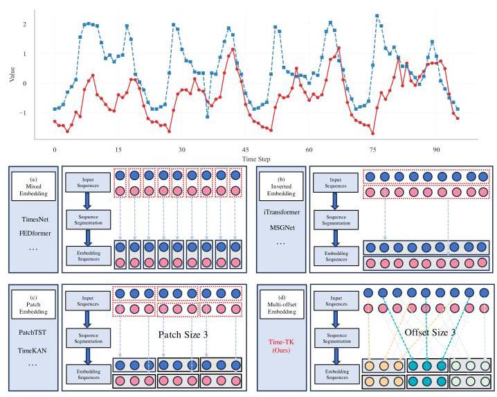

Figure 1: Illustration of four time series embedding strategies. (a) Mixed embedding of variables at the same time step. (b) Inverted embedding along the time axis. (c) Patch embedding based on temporal segmentation. (d) Multi-Offset embedding mechanism used in the proposed Time-TK.

图1:四种时间序列嵌入策略的示意图。(a) 同一时间步长下变量的混合嵌入。(b) 沿时间轴的反向嵌入。(c) 基于时间分割的补丁嵌入。(d) 所提出的Time-TK中使用的多偏移嵌入机制。

To address these issues, we propose Time-TK, a multi-offset temporal interaction framework that integrates Transformer and KAN. It focuses on capturing deep temporal dependencies from historical time series to enhance the model's long-term forecasting capability. Given that long-term time series forecasting relies heavily on modeling extensive historical information, we design our approach around the inherent temporal structure of the data. Specifically, we introduce a multi-offset temporal token embedding mechanism, as shown in Figure 1, which divides the original time series into multiple sub-sequences with different spans at fixed offsets along the temporal dimension and performs independent embedding operations on each sub-sequence. The Multi-Offset Interactive KAN (MI-KAN) module leverages the flexibility of KAN [4, 29] in kernel function modeling to deeply model the temporal structure within each offset sub-sequence and capture its unique dynamic patterns. Based on these offset embedding tokens, the multi-offset temporal interaction module captures cross-step dependencies between time steps and compensates for long-term interleaved dynamics that are often overlooked by traditional continuous embedding methods. To achieve a more comprehensive understanding of the time series, we further design a global interaction mechanism that jointly encodes the original sequence with the offset sub-sequences. This helps recover missing information in cross-offset segments and integrates it into a unified global representation, enhancing the model's ability to capture long-term global structure. As shown in Figure 2, Time-TK achieves state-of-the-art performance on several long-term time series forecasting tasks. It also adopts a lightweight architecture that outperforms more complex TSF models while using fewer computational resources.

为解决这些问题，我们提出了Time-TK，一个集成了Transformer和KAN的多偏移时间交互框架。它专注于从历史时间序列中捕捉深度时间依赖关系，以增强模型的长期预测能力。鉴于长期时间序列预测严重依赖于对广泛历史信息的建模，我们围绕数据固有的时间结构设计了我们的方法。具体来说，我们引入了一种多偏移时间令牌嵌入机制，如图1所示，该机制将原始时间序列沿着时间维度以固定偏移量划分为多个具有不同跨度的子序列，并对每个子序列执行独立的嵌入操作。多偏移交互式KAN(MI-KAN)模块利用KAN [4, 29] 在核函数建模方面的灵活性，对每个偏移子序列内的时间结构进行深度建模，并捕捉其独特的动态模式。基于这些偏移嵌入令牌，多偏移时间交互模块捕捉时间步之间的跨步依赖关系，并补偿传统连续嵌入方法经常忽略的长期交错动态。为了更全面地理解时间序列，我们进一步设计了一种全局交互机制，将原始序列与偏移子序列联合编码。这有助于恢复跨偏移段中丢失的信息，并将其整合到统一的全局表示中，增强模型捕捉长期全局结构的能力。如图2所示，Time-TK在几个长期时间序列预测任务上取得了领先的性能。它还采用了轻量级架构，在使用更少计算资源的同时优于更复杂的TSF模型。

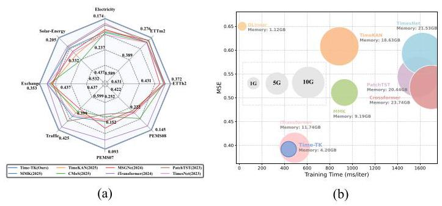

Figure 2: (a) Average performance across all prediction windows, showing improvements over the baseline on various datasets. (b) Comparison of memory usage (GB), training time (ms/iter), and MSE on the Traffic dataset. The prediction length was set to 96.

图2:(a) 所有预测窗口的平均性能，显示在各种数据集上相对于基线的改进。(b) 交通数据集上的内存使用(GB)、训练时间(ms/iter)和均方误差的比较。预测长度设置为96。

Our main contributions are as follows:

我们的主要贡献如下:

- We find that existing embedding methods cannot effectively capture the dependencies between different time steps. To address this problem, this paper proposes a multi-offset temporal token embedding method, which is one of the few ways to explore directly from the original sequence.

- 我们发现现有嵌入方法无法有效捕捉不同时间步之间的依赖关系。为解决这个问题，本文提出了一种多偏移时间令牌嵌入方法，这是少数几种直接从原始序列进行探索的方法之一。

- Time-TK is a lightweight and efficient model that incorporates the MI-KAN module. Leveraging the flexibility of KAN, it effectively models multi-offset sub-sequences. Moreover, Time-TK is among the few time series forecasting models that successfully integrate Transformer and KAN.

- Time-TK是一个轻量级且高效的模型，它集成了MI-KAN模块。利用KAN的灵活性，它有效地对多偏移子序列进行建模。此外，Time-TK是少数成功集成Transformer和KAN的时间序列预测模型之一。

- We conduct extensive experiments on 14 real-world datasets, and the results demonstrate that Time-TK consistently achieves state-of-the-art performance, validating its effectiveness for long-term time series forecasting.

- 我们在14个真实世界数据集上进行了广泛实验，结果表明Time-TK始终取得领先的性能，验证了其在长期时间序列预测中的有效性。

## 2 Related Works

## 2相关工作

With the breakthroughs of deep learning $\left\lbrack  {8,{21},{23},{25},{39},{40},{43},{44}}\right\rbrack$ in natural language processing $\left\lbrack  {7,{22}}\right\rbrack$ and computer vision $\left\lbrack  {{47},{48}}\right\rbrack$ , its application in time series forecasting has also grown rapidly. Traditional methods such as ARIMA [2] are constrained by linear assumptions, making them inadequate for capturing nonlinear dynamics in temporal data. In contrast, deep learning models such as RNNs [13, 19], LSTMs [10], and Transformers [35] have significantly improved forecasting accuracy by learning time dependencies. Embedding strategies play a crucial role in time series modeling, as they transform low-dimensional raw inputs into high-dimensional representations, helping models to capture underlying temporal structures and semantic patterns. In this section, we summarize the mainstream embedding approaches for time series. As shown in Figure 1, these methods can generally be divided into three categories:The first category [37, 38, 49, 51] employs channel-mixing mechanisms, in which each timestep is represented by the integration of cross-channel latent features. However, MLP-based models [46] have raised the question: "Are Transformers effective for time series forecasting?" With their outstanding performance and efficiency, they pose a significant challenge to the effectiveness of such Transformer-based methods. The second category [30] adopts patch-based embeddings by segmenting the sequence into local windows to preserve segment-level semantics, thereby capturing broader temporal patterns that are often missed by pointwise models. The third category [28] introduces an inverted embedding mechanism, where complete sub-sequences along the temporal axis are embedded into single tokens, allowing each token to aggregate global sequence representations. This design aligns well with attention-based architectures and has received considerable attention.

随着深度学习$\left\lbrack  {8,{21},{23},{25},{39},{40},{43},{44}}\right\rbrack$在自然语言处理$\left\lbrack  {7,{22}}\right\rbrack$和计算机视觉$\left\lbrack  {{47},{48}}\right\rbrack$领域的突破，其在时间序列预测中的应用也迅速增长。传统方法如ARIMA [2] 受到线性假设限制，不足以捕捉时间数据中的非线性动态。相比之下，深度学习模型如RNNs [13, 19]、LSTMs [10] 和Transformers [35] 通过学习时间依赖关系显著提高了预测准确性。嵌入策略在时间序列建模中起着关键作用，因为它们将低维原始输入转换为高维表示，帮助模型捕捉潜在的时间结构和语义模式。在本节中，我们总结了时间序列的主流嵌入方法。如图1所示，这些方法通常可分为三类:第一类 [37, 38, 49, 51] 采用通道混合机制，其中每个时间步由跨通道潜在特征的整合表示。然而，基于MLP的模型 [46] 提出了问题:“Transformer对时间序列预测有效吗？” 凭借其出色的性能和效率，它们对这种基于Transformer的方法的有效性构成了重大挑战。第二类 [30] 通过将序列分割成局部窗口采用基于补丁的嵌入，以保留段级语义，从而捕捉逐点模型经常错过的更广泛的时间模式。第三类 [28] 引入了反向嵌入机制，其中沿时间轴的完整子序列被嵌入到单个令牌中，允许每个令牌聚合全局序列表示。这种设计与基于注意力的架构非常契合，并受到了广泛关注。

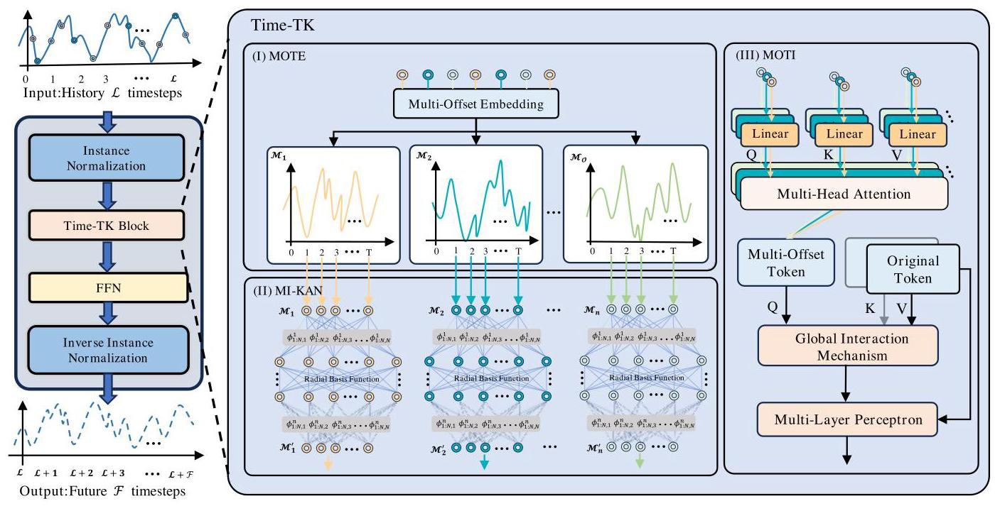

Figure 3: Overall architecture of Time-TK. MOTE performs Multi-Offset token embedding on the sequence, followed by MI-KAN learning representation of the subsequences, and finally interactive prediction through MOTI.

图3:Time-TK的整体架构。MOTE对序列执行多偏移令牌嵌入，随后是子序列的MI-KAN学习表示，最后通过MOTI进行交互式预测。

Unlike the aforementioned strategies, we explore a novel embedding mechanism aimed at enhancing the model's ability to learn specific temporal patterns. Our method demonstrates consistently effective performance across a variety of experimental settings, validating its applicability to time series forecasting tasks.

与上述策略不同，我们探索了一种新颖的嵌入机制，旨在增强模型学习特定时间模式的能力。我们的方法在各种实验设置中都表现出持续有效的性能，验证了其在时间序列预测任务中的适用性。

## 3 Methodology

## 3方法

### 3.1 Overview of Time-TK

### 3.1 Time-TK概述

Given a historical time series $\mathcal{X} = \left\lbrack  {{x}_{1},\ldots ,{x}_{\mathcal{L}}}\right\rbrack   \in  {\mathbb{R}}^{N \times  \mathcal{L}}$ , the objective of time series forecasting is to predict future values ${\widehat{\mathcal{Y}}}_{t} = \; \left\lbrack  {{x}_{\mathcal{L} + 1},\ldots ,{x}_{\mathcal{L} + \mathcal{F}}}\right\rbrack   \in  {\mathbb{R}}^{N \times  \mathcal{F}}$ , where $N$ is the number of variables, $\mathcal{L}$ is the length of the input sequence, and $\mathcal{F}$ is the forecast horizon. As shown in Figure 3, our proposed Time-TK architecture consists of multiple stages. First, Multi-Offset Token Embedding divides the original sequence into multiple sub-sequences with different time spans. MI-KAN (Multi-Offset Interactive KAN) learns and represents specific temporal patterns between offset sub-sequences. The Multi-Offset Temporal Interactive module captures long distance dependencies across time steps based on the representation of these offset sub-sequences. At a higher level, the global interaction mechanism further fuses the contextual information of the original sequence with that of all offset sub-sequences to capture the missing information across offset segments and unify it into the global representation. The final prediction is obtained by mapping the learned representation through a linear projection layer. The core modules of Time-TK are introduced in detail below, while the complete algorithmic workflow is provided in Appendix C. The code is available from the repository ${}^{1}$ .

给定历史时间序列$\mathcal{X} = \left\lbrack  {{x}_{1},\ldots ,{x}_{\mathcal{L}}}\right\rbrack   \in  {\mathbb{R}}^{N \times  \mathcal{L}}$，时间序列预测的目标是预测未来值${\widehat{\mathcal{Y}}}_{t} = \; \left\lbrack  {{x}_{\mathcal{L} + 1},\ldots ,{x}_{\mathcal{L} + \mathcal{F}}}\right\rbrack   \in  {\mathbb{R}}^{N \times  \mathcal{F}}$，其中$N$是变量数量，$\mathcal{L}$是输入序列的长度，$\mathcal{F}$是预测范围。如图3所示，我们提出的Time-TK架构由多个阶段组成。首先，多偏移令牌嵌入将原始序列划分为多个具有不同时间跨度的子序列。MI-KAN(多偏移交互式KAN)学习并表示偏移子序列之间的特定时间模式。多偏移时间交互模块基于这些偏移子序列的表示捕获跨时间步的长距离依赖关系。在更高层次上，全局交互机制进一步将原始序列的上下文信息与所有偏移子序列的上下文信息融合，以捕获跨偏移段的缺失信息并将其统一到全局表示中。最终预测是通过线性投影层映射学习到的表示得到的。Time-TK的核心模块将在下面详细介绍，完整的算法工作流程在附录C中提供。代码可从存储库${}^{1}$获取。

### 3.2 Multi-Offset Token Embedding

### 3.2多偏移令牌嵌入

Three main forms of existing embedding methods exist: (i) uses embedding based on a single time step also called channel mixing (CM), (ii) takes the entire time dimension as the embedding input. (iii) segments the time dimension for embedding. However, these approaches often struggle to adequately capture dependencies across different time scales, especially in periodic and non-stationary time series, leading to limited interaction capabilities. To address this limitation, we propose a Multi-Offset Token Embedding strategy. Specifically, given a predefined offset size $O$ , we divide the historical sequence into multiple sub-sequences $\left\{  {{\mathcal{M}}_{1},\ldots ,{M}_{O}}\right\}$ . As shown in Figure 1, unlike traditional approaches, we use multiple subsequences with different temporal offsets as token inputs to capture information across varying time scales. This design enables the model to capture time-dependent features at different granularities in long sequences-for example, some sub-sequences are more effective at modeling short-term fluctuations, while others are better suited for long-term trends. The introduction of Multi-Offset Token Embedding significantly enhances the model's adaptability to complex temporal patterns, while effectively mitigating overfitting caused by noise in the training data, thereby improving overall generalization.

现有嵌入方法主要有三种形式:(i)使用基于单个时间步的嵌入，也称为通道混合(CM)，(ii)将整个时间维度作为嵌入输入，(iii)分割时间维度进行嵌入。然而，这些方法往往难以充分捕获不同时间尺度上的依赖关系，特别是在周期性和非平稳时间序列中，导致交互能力有限。为了解决这一限制，我们提出了一种多偏移令牌嵌入策略。具体来说，给定预定义的偏移大小$O$，我们将历史序列划分为多个子序列$\left\{  {{\mathcal{M}}_{1},\ldots ,{M}_{O}}\right\}$。如图1所示，与传统方法不同，我们使用具有不同时间偏移的多个子序列作为令牌输入，以捕获不同时间尺度上的信息。这种设计使模型能够在长序列中以不同粒度捕获时间相关特征——例如，一些子序列在建模短期波动方面更有效，而其他子序列更适合长期趋势。多偏移令牌嵌入的引入显著增强了模型对复杂时间模式的适应性，同时有效减轻了训练数据中噪声引起的过拟合，从而提高了整体泛化能力。

---

${}^{1}$ https://github.com/fsmss/Time-TK

${}^{1}$ https://github.com/fsmss/Time-TK

---

### 3.3 Multi-Offset Interactive KAN

### 3.3多偏移交互式KAN

After the Multi-Offset Token Embedding process, we obtain multiple offset sub-sequences $\left\{  {{\mathcal{M}}_{1},\ldots ,{M}_{O}}\right\}$ . To further capture the temporal dependencies both within and across these sub-sequences, we design the Multi-Offset Interactive KAN (MI-KAN) module, which aims to learn dedicated representations for each offset subsequence and model their mutual relationships. Compared with traditional MLPs, KAN (Kolmogorov-Arnold Network)[29] focuses more on approximating complex, high-dimensional mapping relationships through a set of combinable simple functions. Specifically, KAN enhances the network's ability to model nonlinear patterns by replacing traditional linear connections between neurons with learnable univariate functions. The mapping between neurons in adjacent layers can be formulated as:

在多偏移令牌嵌入过程之后，我们获得了多个偏移子序列$\left\{  {{\mathcal{M}}_{1},\ldots ,{M}_{O}}\right\}$。为了进一步捕获这些子序列内部和之间的时间依赖关系，我们设计了多偏移交互式KAN(MI-KAN)模块，其目的是为每个偏移子序列学习专用表示并对它们的相互关系进行建模。与传统的多层感知器相比，KAN(柯尔莫哥洛夫 - 阿诺德网络)[29]更侧重于通过一组可组合的简单函数来逼近复杂的高维映射关系。具体来说，KAN通过用可学习的单变量函数替换神经元之间的传统线性连接来增强网络对非线性模式的建模能力。相邻层神经元之间的映射可以表示为:

$$
{\mathcal{Z}}_{j}^{\left( l + 1\right) } = \mathop{\sum }\limits_{i}{\phi }_{ij}\left( {\mathcal{Z}}_{i}^{\left( l\right) }\right) \tag{1}
$$

Where ${\mathcal{Z}}_{i}^{\left( l\right) }$ represents the $i$ th neuron in the $l$ th layer, ${\mathcal{Z}}_{j}^{\left( l + 1\right) }$ represents the $j$ th neuron in the $\left( {l + 1}\right)$ th layer, and ${\phi }_{ij}$ is the univariate mapping function from the $i$ th to the $l$ th neuron. Early KAN implementations usually used spline functions as basic building blocks, but such methods often require complex rescaling and have poor stability when dealing with variables crossing the boundaries of the domain. To address these limitations, we adopt the more efficient and stable FastKANLayer [24], which constructs univariate mappings using combinations of radially symmetric functions and offers greater flexibility and generalization capability. In our implementation, we employ Gaussian radial basis functions (RBFs) to model the nonlinear relationships in the input. The RBF is defined as follows:

其中${\mathcal{Z}}_{i}^{\left( l\right) }$表示第$l$层中的第$i$个神经元，${\mathcal{Z}}_{j}^{\left( l + 1\right) }$表示第$\left( {l + 1}\right)$层中的第$j$个神经元，并且${\phi }_{ij}$是从第$i$个神经元到第$l$个神经元的单变量映射函数。早期的KAN实现通常使用样条函数作为基本构建块，但这些方法通常需要复杂的重新缩放，并且在处理跨越域边界的变量时稳定性较差。为了解决这些限制，我们采用了更高效、更稳定的FastKANLayer [24]，它使用径向对称函数的组合来构建单变量映射，并具有更大的灵活性和泛化能力。在我们的实现中，我们使用高斯径向基函数(RBF)来对输入中的非线性关系进行建模。RBF的定义如下:

$$
\phi \left( r\right)  = \exp \left( {-\frac{{r}^{2}}{2{h}^{2}}}\right) \tag{2}
$$

Where $r$ represents the distance between the input and the center, and $h$ controls the smoothness of the function. The output of the RBF network is a linear combination of this radial basis function, weighted by an adjustable coefficient. The output of the entire RBF network can be expressed as:

其中$r$表示输入与中心之间的距离，$h$控制函数的平滑度。RBF网络的输出是该径向基函数的线性组合，由一个可调系数加权。整个RBF网络的输出可以表示为:

$$
f\left( x\right)  = \mathop{\sum }\limits_{{i = 1}}^{N}{w}_{i}\phi \left( \begin{Vmatrix}{x - {x}_{i}}\end{Vmatrix}\right) \tag{3}
$$

Where ${w}_{i}$ is the learnable weight and ${x}_{i}$ is the RBF center. It is worth noting that FastKANLayer exhibits strong expressiveness and effectively captures the complex dynamic patterns present in time series data. It generates corresponding deep representations for each input sub-sequence. This design not only simplifies the model structure but also enhances representation consistency across different sub-sequences through a unified modeling approach, thereby facilitating the interaction module in capturing correlations across time offsets. Finally, the learning process of the proposed MI-KAN module can be formulated as:

其中${w}_{i}$是可学习权重，${x}_{i}$是RBF中心。值得注意的是，FastKANLayer具有很强的表现力，能够有效地捕捉时间序列数据中存在的复杂动态模式。它为每个输入子序列生成相应的深度表示。这种设计不仅简化了模型结构，还通过统一的建模方法增强了不同子序列之间的表示一致性，从而便于交互模块捕捉跨时间偏移的相关性。最后，所提出的MI-KAN模块的学习过程可以表述为:

$$
\left\{  {{\mathcal{M}}_{1}^{\prime },\ldots ,{M}_{O}^{\prime }}\right\}   = {MI} - {KAN}\left( {{\mathcal{M}}_{1},\ldots ,{M}_{O}}\right) \tag{4}
$$

The offset sub-sequence representations $\left\{  {{\mathcal{M}}_{1}^{\prime },\ldots ,{M}_{\mathcal{O}}^{\prime }}\right\}   \in  {\mathbb{R}}^{O \times  N \times  T}$ obtained from the MI-KAN module, preserve the temporal dynamics within each individual sub-sequence.

从MI-KAN模块获得的偏移子序列表示$\left\{  {{\mathcal{M}}_{1}^{\prime },\ldots ,{M}_{\mathcal{O}}^{\prime }}\right\}   \in  {\mathbb{R}}^{O \times  N \times  T}$，保留了每个子序列内的时间动态。

### 3.4 Multi-Offset Temporal Interaction Forecasting

### 3.4多偏移时间交互预测

To further capture correlations across different time steps, we introduce the Multi-Offset Temporal Interaction Mechanism. The primary objective of this mechanism is to leverage the previously proposed Multi-Offset Token Embedding to enhance the model's ability to capture implicit temporal structures across multiple related sub-sequences. Specifically, for each sub-sequences ${\mathcal{M}}^{\prime }{}_{u}$ , we apply a multi-head Self-Attention mechanism (MSA) on all its feature dimensions:

为了进一步捕捉不同时间步之间的相关性，我们引入了多偏移时间交互机制。该机制的主要目标是利用先前提出的多偏移令牌嵌入来增强模型捕捉多个相关子序列中隐含时间结构的能力。具体来说，对于每个子序列${\mathcal{M}}^{\prime }{}_{u}$，我们在其所有特征维度上应用多头自注意力机制(MSA):

$$
{\mathcal{A}}_{u} = {\mathcal{M}}^{\prime }{}_{u} + \operatorname{MSA}\left( {{\mathcal{M}}^{\prime }{}_{u},{\mathcal{M}}^{\prime }{}_{u},{\mathcal{M}}^{\prime }{}_{u}}\right) \tag{5}
$$

Where ${\mathcal{M}}^{\prime }{}_{u} \in  {\mathbb{R}}^{N \times  T}$ represents the representation of the $u$ -th offset sub-sequence, and ${MSA}\left( \cdot \right)$ is a multi-head self-attention operation. Due to the use of piecewise offset embeddings, each sub-sequence is significantly shortened, resulting in an attention computation with approximately linear time complexity at this stage [42]. After modeling the internal structure of each sub-sequence, we further introduce a global fusion operation to integrate the interaction results of the original sequence representation $\mathcal{X}$ with all offset sub-sequences $\mathcal{A}$ , in order to capture potential dependencies across different temporal segments. The fusion process is formally defined as:

其中${\mathcal{M}}^{\prime }{}_{u} \in  {\mathbb{R}}^{N \times  T}$表示第$u$个偏移子序列的表示，${MSA}\left( \cdot \right)$是多头自注意力操作。由于使用了分段偏移嵌入，每个子序列显著缩短，导致在此阶段注意力计算具有近似线性的时间复杂度[42]。在对每个子序列的内部结构进行建模之后，我们进一步引入全局融合操作，以将原始序列表示$\mathcal{X}$与所有偏移子序列$\mathcal{A}$的交互结果进行整合，以便捕捉不同时间片段之间的潜在依赖关系。融合过程正式定义为:

$$
\mathcal{H} = \mathcal{X} + \operatorname{MSA}\left( {Q = \mathcal{A},\mathcal{K} = \mathcal{X},\mathcal{V} = \mathcal{X}}\right) \tag{6}
$$

The sequence processed by the Multi-Offset Interaction Mechanism serves as the query, while the original sequence acts as both the key and value, enabling information fusion across different temporal offsets. To generate the final prediction result, we map the time dimension to the prediction length of the target through a linear layer. The transformation can be expressed as:

由多偏移交互机制处理的序列用作查询，而原始序列同时用作键和值，从而实现跨不同时间偏移的信息融合。为了生成最终预测结果，我们通过线性层将时间维度映射到目标的预测长度。该变换可以表示为:

$$
\mathcal{Y} = \operatorname{Linear}\left( \mathcal{H}\right)  \in  {\mathbb{R}}^{N \times  \mathcal{F}} \tag{7}
$$

## 4 Experiments

## 4实验

### 4.1 Experimental Setup

### 4.1实验设置

Datasets. To validate the effectiveness of Time-TK, we conducted extensive experiments on 14 different datasets, as shown in the Table 1, including four subsets of ETT (ETTh1, ETTh2, ETTm1, and ETTm2), Electricity, Exchanges, Solar-Energy, weather [38], and Traffic. For short-term forecasting, we used four subsets of PEMS (PEMS03, PEMS04, PEMS07, and PEMS08). Furthermore, we included 20,000 BTC/USDT data records with a 5-minute throughput. Accurate forecasts can significantly improve the effectiveness of remedial or preventive measures implemented by web applications, such as in intelligent traffic management and website transactions. See Appendix A. 1 for more detailed information.

数据集。为了验证Time-TK的有效性，我们在14个不同的数据集上进行了广泛的实验，如表1所示，包括ETT的四个子集(ETTh1、ETTh2、ETTm1和ETTm2)、电力、交易所、太阳能、天气[38]和交通。对于短期预测，我们使用了PEMS的四个子集(PEMS03、PEMS04、PEMS07和PEMS08)。此外，我们还纳入了20,000条比特币/美元的5分钟吞吐量数据记录。准确的预测可以显著提高网络应用中实施的补救或预防措施的有效性，例如在智能交通管理和网站交易中。更多详细信息见附录A.1。

Table 1: Detailed description of the dataset. Dim indicates the number of variables in each dataset. Dataset Size indicates the total number of time points in (training set, validation set, test set). Prediction Length indicates the future time points that need to be predicted. Each dataset contains four prediction settings. Frequency indicates the sampling interval of the time points. Data statistics are from iTransformer [28].

表1:数据集的详细描述。Dim表示每个数据集中变量的数量。数据集大小表示(训练集、验证集、测试集)中的时间点总数。预测长度表示需要预测的未来时间点。每个数据集包含四个预测设置。频率表示时间点的采样间隔。数据统计来自iTransformer[28]。

<table><tr><td>Dataset</td><td>Dim</td><td>Prediction Length</td><td>Dataset Size</td><td>Frequency</td><td>Information</td></tr><tr><td>ETTh1, ETTh2</td><td>7</td><td>$\{ {96},{192},{336},{720}\}$</td><td>\{8545, 2881, 2881\}</td><td>Hourly</td><td>Electricity</td></tr><tr><td>ETTm1, ETTm2</td><td>7</td><td>$\{ {96},{192},{336},{720}\}$</td><td>\{34465, 11521, 11521\}</td><td>15min</td><td>Electricity</td></tr><tr><td>Exchange</td><td>8</td><td>$\{ {96},{192},{336},{720}\}$</td><td>\{5120, 665, 1422\}</td><td>Daily</td><td>Economy</td></tr><tr><td>Weather</td><td>21</td><td>\{96, 192, 336, 720\}</td><td>\{36792, 5271, 10540\}</td><td>10min</td><td>Weather</td></tr><tr><td>ECL</td><td>321</td><td>\{96, 192, 336, 720\}</td><td>\{18317, 2633, 5261\}</td><td>10min</td><td>Electricity</td></tr><tr><td>Traffic</td><td>862</td><td>\{96, 192, 336, 720\}</td><td>\{12185, 1757, 3509\}</td><td>Hourly</td><td>Transportation</td></tr><tr><td>Solar-Energy</td><td>137</td><td>\{96, 192, 336, 720\}</td><td>\{36601, 5161, 10417\}</td><td>10min</td><td>Energy</td></tr><tr><td>PEMS03</td><td>358</td><td>\{12, 24, 48, 96\}</td><td>\{15671, 5135, 5135\}</td><td>5min</td><td>Transportation</td></tr><tr><td>PEMS04</td><td>307</td><td>\{12, 24, 48, 96\}</td><td>\{10172, 3375, 3375\}</td><td>5min</td><td>Transportation</td></tr><tr><td>PEMS07</td><td>883</td><td>\{12, 24, 48, 96\}</td><td>\{16911, 5622, 5622\}</td><td>5min</td><td>Transportation</td></tr><tr><td>PEMS08</td><td>170</td><td>\{12, 24, 48, 96\}</td><td>\{10690, 3548, 3548\}</td><td>5min</td><td>Transportation</td></tr><tr><td>BTC/USDT</td><td>5</td><td>\{12, 288, 864\}</td><td>\{12989, 2004, 4007\}</td><td>5min</td><td>Economy</td></tr></table>

Table 2: Comparison of multivariate time series forecasting results for 13 real datasets. Average long-term forecast results with a uniform lookback window $\mathcal{L} = {96}$ for all datasets. All results are averaged over 4 different forecast lengths: $\mathcal{F} = \{ {12},{24}$ , 48,96 \} for the PEMS dataset and $\mathcal{F} = \{ {96},{192},{336},{720}\}$ for all other datasets. The best model is shown in bold black, and the second-best is underlined. See Appendix B for complete results.

表2:13个真实数据集的多元时间序列预测结果比较。对所有数据集使用统一回溯窗口$\mathcal{L} = {96}$的平均长期预测结果。所有结果在4个不同的预测长度上进行平均:PEMS数据集为$\mathcal{F} = \{ {12},{24}$、48、96，其他所有数据集为$\mathcal{F} = \{ {96},{192},{336},{720}\}$。最佳模型以粗体黑色显示，第二好的模型以下划线显示。完整结果见附录B。

<table><tr><td>Models</td><td colspan="2">Time-TK (Ours)</td><td colspan="2">MMK (2025)</td><td colspan="2">TimeKAN (2025)</td><td colspan="2">CMoS (2025)</td><td colspan="2">MSGNet (2024)</td><td colspan="2">iTransformer (2024)</td><td colspan="2">TimeMixer (2024)</td><td colspan="2">PatchTST (2023)</td><td colspan="2">TimesNet (2023)</td><td colspan="2">DLinear (2023)</td><td colspan="2">Crossformer (2023)</td></tr><tr><td>Metric</td><td>MSE</td><td>MAE</td><td>MSE</td><td>MAE</td><td>MSE</td><td>MAE</td><td>MSE</td><td>MAE</td><td>MSE</td><td>MAE</td><td>MSE</td><td>MAE</td><td>MSE</td><td>MAE</td><td>MSE</td><td>MAE</td><td>MSE</td><td>MAE</td><td>MSE</td><td>MAE</td><td>MSE</td><td>MAE</td></tr><tr><td>ETTh1</td><td>0.432</td><td>0.430</td><td>0.432</td><td>0.436</td><td>0.425</td><td>0.430</td><td>0.448</td><td>0.442</td><td>0.453</td><td>0.453</td><td>0.463</td><td>0.454</td><td>0.458</td><td>0.445</td><td>0.469</td><td>0.454</td><td>0.458</td><td>0.450</td><td>0.456</td><td>0.452</td><td>0.529</td><td>0.522</td></tr><tr><td>ETTh2</td><td>0.372</td><td>0.397</td><td>0.390</td><td>0.417</td><td>0.390</td><td>0.408</td><td>0.392</td><td>0.410</td><td>0.413</td><td>0.427</td><td>0.383</td><td>0.407</td><td>0.384</td><td>0.407</td><td>0.389</td><td>0.411</td><td>0.414</td><td>0.427</td><td>0.559</td><td>0.515</td><td>0.942</td><td>0.684</td></tr><tr><td>ETTm1</td><td>0.379</td><td>0.393</td><td>0.384</td><td>0.397</td><td>0.379</td><td>0.396</td><td>0.412</td><td>0.410</td><td>0.400</td><td>0.412</td><td>0.405</td><td>0.410</td><td>0.385</td><td>0.399</td><td>0.396</td><td>0.406</td><td>0.400</td><td>0.406</td><td>0.403</td><td>0.407</td><td>0.513</td><td>0.495</td></tr><tr><td>ETTm2</td><td>0.276</td><td>0.321</td><td>0.278</td><td>0.327</td><td>0.279</td><td>0.324</td><td>0.288</td><td>0.330</td><td>0.289</td><td>0.330</td><td>0.290</td><td>0.335</td><td>0.280</td><td>0.325</td><td>0.291</td><td>0.336</td><td>0.291</td><td>0.333</td><td>0.350</td><td>0.401</td><td>0.757</td><td>0.611</td></tr><tr><td>Electricity</td><td>0.174</td><td>0.265</td><td>0.201</td><td>0.286</td><td>0.197</td><td>0.286</td><td>0.204</td><td>0.284</td><td>0.194</td><td>0.301</td><td>0.178</td><td>0.270</td><td>0.182</td><td>0.272</td><td>0.211</td><td>0.301</td><td>0.193</td><td>0.295</td><td>0.212</td><td>0.300</td><td>0.244</td><td>0.334</td></tr><tr><td>Exchange</td><td>0.353</td><td>0.397</td><td>0.375</td><td>0.412</td><td>0.404</td><td>0.423</td><td>0.388</td><td>0.427</td><td>0.399</td><td>0.430</td><td>0.375</td><td>0.412</td><td>0.408</td><td>0.422</td><td>0.378</td><td>0.415</td><td>0.416</td><td>0.443</td><td>0.354</td><td>0.414</td><td>0.471</td><td>0.478</td></tr><tr><td>Solar-Energy</td><td>0.205</td><td>0.257</td><td>0.243</td><td>0.299</td><td>0.287</td><td>0.321</td><td>0.332</td><td>0.322</td><td>0.263</td><td>0.292</td><td>0.233</td><td>0.262</td><td>0.237</td><td>0.290</td><td>0.270</td><td>0.307</td><td>0.301</td><td>0.319</td><td>0.330</td><td>0.401</td><td>0.641</td><td>0.639</td></tr><tr><td>Weather</td><td>0.256</td><td>0.278</td><td>0.246</td><td>0.273</td><td>0.243</td><td>0.272</td><td>0.251</td><td>0.278</td><td>0.249</td><td>0.278</td><td>0.258</td><td>0.278</td><td>0.245</td><td>0.276</td><td>0.259</td><td>0.281</td><td>0.259</td><td>0.287</td><td>0.265</td><td>0.317</td><td>0.259</td><td>0.315</td></tr><tr><td>Traffic</td><td>0.425</td><td>0.278</td><td>0.541</td><td>0.335</td><td>0.590</td><td>0.374</td><td>0.617</td><td>0.366</td><td>0.660</td><td>0.382</td><td>0.428</td><td>0.282</td><td>0.485</td><td>0.298</td><td>0.555</td><td>0.362</td><td>0.620</td><td>0.336</td><td>0.625</td><td>0.383</td><td>0.550</td><td>0.304</td></tr><tr><td>PEMS03</td><td>0.112</td><td>0.219</td><td>0.158</td><td>0.261</td><td>0.171</td><td>0.258</td><td>0.147</td><td>0.253</td><td>0.150</td><td>0.251</td><td>0.113</td><td>0.221</td><td>0.144</td><td>0.258</td><td>0.137</td><td>0.240</td><td>0.147</td><td>0.248</td><td>0.278</td><td>0.375</td><td>0.169</td><td>0.281</td></tr><tr><td>PEMS04</td><td>0.109</td><td>0.218</td><td>0.152</td><td>0.279</td><td>0.148</td><td>0.259</td><td>0.124</td><td>0.249</td><td>0.122</td><td>0.239</td><td>0.111</td><td>0.221</td><td>0.161</td><td>0.272</td><td>0.145</td><td>0.249</td><td>0.129</td><td>0.241</td><td>0.295</td><td>0.388</td><td>0.209</td><td>0.314</td></tr><tr><td>PEMS07</td><td>0.093</td><td>0.195</td><td>0.138</td><td>0.233</td><td>0.139</td><td>0.240</td><td>0.154</td><td>0.247</td><td>0.122</td><td>0.227</td><td>0.101</td><td>0.204</td><td>0.162</td><td>0.253</td><td>0.144</td><td>0.233</td><td>0.124</td><td>0.225</td><td>0.329</td><td>0.395</td><td>0.235</td><td>0.315</td></tr><tr><td>PEMS08</td><td>0.145</td><td>0.224</td><td>0.214</td><td>0.268</td><td>0.213</td><td>0.291</td><td>0.176</td><td>0.255</td><td>0.205</td><td>0.285</td><td>0.150</td><td>0.226</td><td>0.206</td><td>0.296</td><td>0.200</td><td>0.275</td><td>0.193</td><td>0.271</td><td>0.379</td><td>0.416</td><td>0.268</td><td>0.307</td></tr><tr><td>Count 丨</td><td>23</td><td>丨</td><td>0</td><td>丨</td><td>4</td><td></td><td>0</td><td>丨</td><td>0</td><td>丨</td><td>0</td><td>丨</td><td>0</td><td>丨</td><td>0</td><td></td><td>0</td><td></td><td>0</td><td></td><td>0</td><td></td></tr></table>

Setup. All experiments are implemented in PyTorch. We use the mainstream MSE and MAE as our evaluation indicators. See Appendix A. 3 for more detailed information.

设置。所有实验均在PyTorch中实现。我们使用主流的MSE和MAE作为评估指标。更多详细信息见附录A.3。

Baselines. We select 10 latest models, including MMK [12], TimeKAN [15], CMoS [33], MSGNet [6], iTransformer [28], TimeMixer [36], PatchTST [30], TimesNet [37], DLinear [46] and Crossformer [49] as our baselines.

基线。我们选择了10个最新模型，包括MMK[12]、TimeKAN[15]、CMoS[33]、MSGNet[6]、iTransformer[28]、TimeMixer[36]、PatchTST[30]、TimesNet[37]、DLinear[46]和Crossformer[49]作为我们的基线。

### 4.2 Main Results

### 4.2主要结果

The comprehensive prediction results of Time-TK and 13 baseline models are shown in Table 2. The best results are marked in bold and the second best results are marked in black underline. The lower the MSE and MAE, the more accurate the prediction results. Time-TK ranked first in 23 of the 26 experimental cases, demonstrating its excellent performance in both long and short time series prediction tasks. On the Weather dataset, TimeKAN [15] achieved the best results. This may be because Weather data has multiple periodic features such as seasonality and daily periodicity [17], and is accompanied by strong non-stationarity. The frequency decomposition architecture adopted by TimeKAN can effectively model periodic signals of different frequencies, so it performs particularly well on multi-period datasets such as Weather.

Time-TK和13个基线模型的综合预测结果如表2所示。最佳结果以粗体标记，第二好的结果以黑色下划线标记。MSE和MAE越低，预测结果越准确。Time-TK在26个实验案例中的23个中排名第一，证明了其在长短期时间序列预测任务中的优异性能。在天气数据集上，TimeKAN[15]取得了最佳结果。这可能是因为天气数据具有季节性和每日周期性等多种周期性特征[17]，并且伴随着强烈的非平稳性。TimeKAN采用的频率分解架构可以有效地对不同频率的周期性信号进行建模，因此在天气等多周期数据集上表现特别出色。

It is worth noting that we also compare with existing models based on KAN architecture. Compared with MMK [12], our model Time-TK reduces MSE by 6.69% and MAE by 7.90% on average on 13 real-world datasets. Compared with TimeKAN, Time-TK reduces MSE by 7.4% and MAE by 8.57%, indicating that Time-TK is successful in introducing KAN network into time series modeling. In addition, compared with iTransformer [28] based on overall temporal embedding and PatchTST [30] based on temporal patch embedding, Time-TK reduces MSE by 6.41%/10.84% and MAE by 5.47%/10.71%, respectively.

值得注意的是，我们还与基于KAN架构的现有模型进行了比较。与MMK[12]相比，我们的模型Time-TK在13个真实世界数据集上平均将MSE降低了6.69%，将MAE降低了7.90%。与TimeKAN相比，Time-TK将MSE降低了7.4%，将MAE降低了8.57%，这表明Time-TK成功地将KAN网络引入到时间序列建模中。此外，与基于整体时间嵌入/iTransformer[28]和基于时间补丁嵌入/PatchTST[30]相比.Time-TK分别将MSE降低了6.41%/10.84%，将MAE降低了5.47%/10.71%。

Additionally, Table 3 presents the detailed prediction results of Time-TK against seven baseline models on the BTC/USDT dataset. The results clearly demonstrate a significant and consistent performance advantage for Time-TK across all prediction horizons.

此外，表3展示了Time-TK在比特币/美元数据集上与七个基线模型的详细预测结果。结果清楚地表明，Time-TK在所有预测范围内都具有显著且一致的性能优势。

Table 3: Performance comparison on the BTC/USDT dataset. We predict the transaction throughput for the next hour, day, and three days with an input length of $\mathcal{L} = {96}$ .

表3:比特币/美元数据集上的性能比较。我们以$\mathcal{L} = {96}$的输入长度预测未来一小时、一天和三天的交易吞吐量。

<table><tr><td>Setting</td><td>Metric</td><td>Time-TK</td><td>MMK</td><td>TimeKAN</td><td>CMoS</td><td>MSGNet</td><td>iTransformer</td><td>TimeMixer</td></tr><tr><td rowspan="4">BTC/USDT->1 hour</td><td>MAE</td><td>0.103</td><td>0.112</td><td>0.105</td><td>0.112</td><td>0.114</td><td>0.112</td><td>0.109</td></tr><tr><td>RSE</td><td>0.725</td><td>0.742</td><td>0.725</td><td>0.729</td><td>0.732</td><td>0.729</td><td>0.727</td></tr><tr><td>RMSE</td><td>0.402</td><td>0.418</td><td>0.407</td><td>0.411</td><td>0.415</td><td>0.411</td><td>0.409</td></tr><tr><td>MAPE</td><td>1.459</td><td>1.509</td><td>1.358</td><td>1.480</td><td>1.520</td><td>1.480</td><td>1.527</td></tr><tr><td rowspan="4">BTC/USDT->1 day</td><td>MAE</td><td>0.228</td><td>0.237</td><td>0.232</td><td>0.242</td><td>0.242</td><td>0.238</td><td>0.230</td></tr><tr><td>RSE</td><td>0.904</td><td>0.93</td><td>0.913</td><td>0.945</td><td>0.925</td><td>0.922</td><td>0.910</td></tr><tr><td>RMSE</td><td>0.471</td><td>0.493</td><td>0.484</td><td>0.498</td><td>0.483</td><td>0.489</td><td>0.483</td></tr><tr><td>MAPE</td><td>3.606</td><td>3.661</td><td>3.568</td><td>3.726</td><td>3.740</td><td>3.710</td><td>3.560</td></tr><tr><td rowspan="4">BTC/USDT->3 day</td><td>MAE</td><td>0.324</td><td>0.340</td><td>0.332</td><td>0.336</td><td>0.341</td><td>0.330</td><td>0.340</td></tr><tr><td>RSE</td><td>1.020</td><td>1.163</td><td>1.143</td><td>1.159</td><td>1.210</td><td>1.140</td><td>1.169</td></tr><tr><td>RMSE</td><td>0.531</td><td>0.544</td><td>0.534</td><td>0.548</td><td>0.551</td><td>0.533</td><td>0.547</td></tr><tr><td>MAPE</td><td>8.512</td><td>8.886</td><td>8.534</td><td>8.868</td><td>8.893</td><td>8.728</td><td>8.806</td></tr></table>

Out of 12 experimental evaluations (4 metrics across 3 settings), Time-TK secured the top result 8 times and placed within the top two 10 times. This strongly indicates that the Time-TK architecture is highly effective for modeling complex time series data.

在12次实验评估(3种设置下的4个指标)中，Time-TK有8次获得了最高结果，10次位居前两名。这有力地表明，Time-TK架构对于建模复杂时间序列数据非常有效。

For overall performance, we train on 10 representative datasets with 3 random seeds over 4 forecasting horizons, as shown in Table 9. Using TimeKAN as the baseline, a Wilcoxon test on the averaged MSE/MAE yields $p$ -values of ${1.86} \times  {10}^{-2}$ and ${5.86} \times  {10}^{-3}$ , both below 0.02 , indicating that the overall improvement of Time-TK over TimeKAN is statistically significant at the 98% confidence level (99% for MAE).

对于整体性能，我们在10个代表性数据集上进行训练，使用3个随机种子，跨越4个预测期，如表9所示。以TimeKAN作为基线，对平均MSE/MAE进行Wilcoxon检验，得到的$p$值为${1.86} \times  {10}^{-2}$和${5.86} \times  {10}^{-3}$，均低于0.02，这表明Time - TK相对于TimeKAN的整体改进在98%置信水平(MAE为99%)上具有统计学显著性。

Overall, these significant performance improvements are mainly due to the synergy between our proposed Multi-Offset Token Embedding and Multi-Offset Interaction mechanism, which enables the model to effectively capture complex and multi-scale dynamic patterns in the time dimension.

总体而言，这些显著的性能提升主要归功于我们提出的多偏移令牌嵌入和多偏移交互机制之间的协同作用，这使得模型能够有效地捕捉时间维度上复杂的多尺度动态模式。

Table 4: Ablation experiments of multi-offset embedding and multi-offset interaction of Time-TK.

表4:Time - TK的多偏移嵌入和多偏移交互的消融实验。

<table><tr><td rowspan="3" colspan="2">Strategy Metric</td><td colspan="6">Time-TK</td><td rowspan="2" colspan="2">iTransformer</td></tr><tr><td colspan="2">MOTI+MOTE</td><td colspan="2">MOTI</td><td colspan="2">MOTE</td></tr><tr><td>MSE</td><td>MAE</td><td>MSE</td><td>MAE</td><td>MSE</td><td>MAE</td><td>MSE</td><td>MAE</td></tr><tr><td rowspan="4">ETTh1</td><td>96</td><td>0.370</td><td>0.393</td><td>0.378</td><td>0.396</td><td>0.416</td><td>0.427</td><td>0.394</td><td>0.409</td></tr><tr><td>192</td><td>0.423</td><td>0.421</td><td>0.433</td><td>0.424</td><td>0.468</td><td>0.457</td><td>0.448</td><td>0.441</td></tr><tr><td>336</td><td>0.465</td><td>0.444</td><td>0.473</td><td>0.444</td><td>0.510</td><td>0.479</td><td>0.491</td><td>0.464</td></tr><tr><td>720</td><td>0.470</td><td>0.462</td><td>0.493</td><td>0.470</td><td>0.490</td><td>0.489</td><td>0.519</td><td>0.502</td></tr><tr><td rowspan="4">ETTm1</td><td>96</td><td>0.315</td><td>0.354</td><td>0.326</td><td>0.362</td><td>0.347</td><td>0.382</td><td>0.336</td><td>0.370</td></tr><tr><td>192</td><td>0.356</td><td>0.378</td><td>0.367</td><td>0.382</td><td>0.389</td><td>0.400</td><td>0.381</td><td>0.395</td></tr><tr><td>336</td><td>0.393</td><td>0.402</td><td>0.405</td><td>0.403</td><td>0.417</td><td>0.422</td><td>0.417</td><td>0.418</td></tr><tr><td>720</td><td>0.453</td><td>0.439</td><td>0.468</td><td>0.443</td><td>0.470</td><td>0.454</td><td>0.487</td><td>0.456</td></tr><tr><td rowspan="4">Exchange</td><td>96</td><td>0.083</td><td>0.202</td><td>0.084</td><td>0.203</td><td>0.092</td><td>0.214</td><td>0.088</td><td>0.209</td></tr><tr><td>192</td><td>0.168</td><td>0.292</td><td>0.178</td><td>0.299</td><td>0.189</td><td>0.312</td><td>0.183</td><td>0.308</td></tr><tr><td>336</td><td>0.322</td><td>0.411</td><td>0.332</td><td>0.416</td><td>0.356</td><td>0.432</td><td>0.336</td><td>0.418</td></tr><tr><td>720</td><td>0.838</td><td>0.684</td><td>0.890</td><td>0.706</td><td>1.149</td><td>0.784</td><td>0.893</td><td>0.714</td></tr><tr><td rowspan="4">PEMS08</td><td>12</td><td>0.076</td><td>0.175</td><td>0.085</td><td>0.186</td><td>0.091</td><td>0.195</td><td>0.079</td><td>0.182</td></tr><tr><td>24</td><td>0.106</td><td>0.206</td><td>0.122</td><td>0.226</td><td>0.123</td><td>0.224</td><td>0.115</td><td>0.219</td></tr><tr><td>48</td><td>0.183</td><td>0.251</td><td>0.199</td><td>0.276</td><td>0.160</td><td>0.272</td><td>0.186</td><td>0.235</td></tr><tr><td>96</td><td>0.215</td><td>0.262</td><td>0.245</td><td>0.302</td><td>0.242</td><td>0.300</td><td>0.221</td><td>0.267</td></tr></table>

### 4.3 Model Analysis

### 4.3模型分析

4.3.1 Ablation Study on the Design of MOTE. As shown in Table 4, we further evaluated the independent contribution of each component to the model performance. By comparing the prediction results after removing the two key components of Time-TK, Multi-Offset Token Embedding (MOTE) and Multi-Offset Temporal Interaction (MOTI), we found that these two components have a significant positive effect on improving prediction efficiency. 4.3.2 Ablation Study on the Design of MI-KAN. In this section, we design several variants to investigate the effectiveness of MIKAN: ① MLP, where each MI-KAN is replaced with a multilayer perceptron; ② Conv1d, where each MI-KAN is replaced with a 1D convolutional layer; 3) KAN, which uses a B-spline-based KAN structure [12]; ④ RBF, where radial basis functions (RBFs) [4, 24] are used as the activation module in our MI-KAN. As shown in Table 6, MI-KAN achieves the best results. Notably, both MI-KAN and the B-spline-based KAN outperform MLP, indicating that KAN has stronger representational capacity than MLP. Moreover, MIKAN outperforms the B-spline-based KAN, further validating the effectiveness of adopting RBFs.

4.3.1对MOTE设计的消融研究。如表4所示，我们进一步评估了每个组件对模型性能的独立贡献。通过比较去除Time - TK的两个关键组件多偏移令牌嵌入(MOTE)和多偏移时间交互(MOTI)后的预测结果，我们发现这两个组件对提高预测效率有显著的积极影响。4.3.2对MI - KAN设计的消融研究。在本节中，我们设计了几个变体来研究MIKAN的有效性:①MLP，其中每个MI - KAN被替换为多层感知器；②Conv1d，其中每个MI - KAN被替换为一维卷积层；3)KAN，它使用基于B样条的KAN结构[12]；④RBF，其中径向基函数(RBFs)[4, 24]被用作我们MI - KAN中的激活模块。如表6所示，MI - KAN取得了最佳结果。值得注意的是，MI - KAN和基于B样条的KAN都优于MLP，这表明KAN比MLP具有更强的表示能力。此外，MIKAN优于基于B样条的KAN，进一步验证了采用RBFs的有效性。

Table 5: MOTE can effectively improve the forecasting performance of models with different embedding strategies.

表5:MOTE可以有效地提高具有不同嵌入策略的模型的预测性能。

<table><tr><td colspan="2">Model</td><td colspan="4">iTransformer Inverted Embedding</td><td colspan="4">PatchTST Patch Embedding</td><td colspan="4">TimesNet Mixed Embedding</td></tr><tr><td colspan="2">Setup</td><td colspan="2">Original</td><td colspan="2">+MOTE</td><td colspan="2">Original</td><td colspan="2">+MOTE 11</td><td colspan="2">Original</td><td colspan="2">+MOTE</td></tr><tr><td colspan="2">Metric</td><td>MSE</td><td>MAE</td><td>MSE</td><td>MAE</td><td>MSE</td><td>MAE</td><td>MSE</td><td>MAE</td><td>MSE</td><td>MAE</td><td>MSE</td><td>MAE</td></tr><tr><td rowspan="5">ETTh1</td><td>96</td><td>0.394</td><td>0.409</td><td>0.389</td><td>0.405</td><td>0.414</td><td>0.419</td><td>0.403</td><td>0.416</td><td>0.384</td><td>0.402</td><td>0.379</td><td>0.398</td></tr><tr><td>192</td><td>0.448</td><td>0.441</td><td>0.443</td><td>0.440</td><td>0.460</td><td>0.445</td><td>0.449</td><td>0.439</td><td>0.436</td><td>0.429</td><td>0.431</td><td>0.426</td></tr><tr><td>336</td><td>0.491</td><td>0.464</td><td>0.487</td><td>0.461</td><td>0.501</td><td>0.466</td><td>0.488</td><td>0.456</td><td>0.491</td><td>0.469</td><td>0.490</td><td>0.467</td></tr><tr><td>720</td><td>0.519</td><td>0.502</td><td>0.511</td><td>0.492</td><td>0.500</td><td>0.488</td><td>0.487</td><td>0.477</td><td>0.521</td><td>0.500</td><td>0.513</td><td>0.497</td></tr><tr><td>Avg</td><td>0.463</td><td>0.454</td><td>0.458</td><td>0.450</td><td>0.469</td><td>0.454</td><td>0.457</td><td>0.447</td><td>0.458</td><td>0.450</td><td>0.453</td><td>0.447</td></tr><tr><td rowspan="5">ETTh2</td><td>96</td><td>0.297</td><td>0.349</td><td>0.296</td><td>0.345</td><td>0.292</td><td>0.345</td><td>0.292</td><td>0.344</td><td>0.340</td><td>0.374</td><td>0.312</td><td>0.364</td></tr><tr><td>192</td><td>0.380</td><td>0.400</td><td>0.375</td><td>0.397</td><td>0.388</td><td>0.405</td><td>0.376</td><td>0.393</td><td>0.402</td><td>0.414</td><td>0.386</td><td>0.403</td></tr><tr><td>336</td><td>0.428</td><td>0.432</td><td>0.419</td><td>0.429</td><td>0.427</td><td>0.436</td><td>0.382</td><td>0.410</td><td>0.452</td><td>0.452</td><td>0.423</td><td>0.432</td></tr><tr><td>720</td><td>0.427</td><td>0.445</td><td>0.419</td><td>0.438</td><td>0.447</td><td>0.458</td><td>0.411</td><td>0.433</td><td>0.462</td><td>0.468</td><td>0.448</td><td>0.462</td></tr><tr><td>Avg</td><td>0.383</td><td>0.407</td><td>0.377</td><td>0.402</td><td>0.389</td><td>0.411</td><td>0.365</td><td>0.395</td><td>0.414</td><td>0.427</td><td>0.392</td><td>0.415</td></tr><tr><td rowspan="5">Exchange</td><td>96</td><td>0.088</td><td>0.209</td><td>0.088</td><td>0.208</td><td>0.090</td><td>0.211</td><td>0.084</td><td>0.202</td><td>0.107</td><td>0.234</td><td>0.091</td><td>0.211</td></tr><tr><td>192</td><td>0.183</td><td>0.308</td><td>0.179</td><td>0.304</td><td>0.186</td><td>0.307</td><td>0.174</td><td>0.296</td><td>0.226</td><td>0.344</td><td>0.192</td><td>0.321</td></tr><tr><td>336</td><td>0.336</td><td>0.418</td><td>0.321</td><td>0.411</td><td>0.339</td><td>0.424</td><td>0.320</td><td>0.407</td><td>0.367</td><td>0.448</td><td>0.362</td><td>0.403</td></tr><tr><td>720</td><td>0.893</td><td>0.714</td><td>0.864</td><td>0.707</td><td>0.898</td><td>0.718</td><td>0.855</td><td>0.696</td><td>0.964</td><td>0.746</td><td>0.912</td><td>0.721</td></tr><tr><td>Avg</td><td>0.375</td><td>0.412</td><td>0.363</td><td>0.408</td><td>0.378</td><td>0.415</td><td>0.358</td><td>0.400</td><td>0.416</td><td>0.443</td><td>0.389</td><td>0.414</td></tr><tr><td rowspan="5">Solar</td><td>96</td><td>0.203</td><td>0.238</td><td>0.198</td><td>0.235</td><td>0.234</td><td>0.286</td><td>0.231</td><td>0.278</td><td>0.250</td><td>0.292</td><td>0.237</td><td>0.284</td></tr><tr><td>192</td><td>0.233</td><td>0.261</td><td>0.226</td><td>0.269</td><td>0.267</td><td>0.310</td><td>0.257</td><td>0.296</td><td>0.296</td><td>0.318</td><td>0.288</td><td>0.311</td></tr><tr><td>336</td><td>0.248</td><td>0.273</td><td>0.236</td><td>0.273</td><td>0.290</td><td>0.315</td><td>0.283</td><td>0.308</td><td>0.319</td><td>0.330</td><td>0.292</td><td>0.317</td></tr><tr><td>720</td><td>0.249</td><td>0.276</td><td>0.243</td><td>0.283</td><td>0.289</td><td>0.317</td><td>0.286</td><td>0.313</td><td>0.338</td><td>0.337</td><td>0.301</td><td>0.319</td></tr><tr><td>Avg</td><td>0.233</td><td>0.262</td><td>0.226</td><td>0.265</td><td>0.270</td><td>0.307</td><td>0.264</td><td>0.299</td><td>0.301</td><td>0.319</td><td>0.280</td><td>0.308</td></tr></table>

Table 6: Ablation experiments of MI-KAN of Time-TK.

表6:Time - TK的MI - KAN的消融实验。

<table><tr><td rowspan="2">Metric Datasets</td><td colspan="2">ETTh1</td><td colspan="2">ETTh2</td><td colspan="2">ETTm1</td><td colspan="2">ETTm2</td><td colspan="2">Solar-Energy</td><td colspan="2">Electricity</td></tr><tr><td>MSE</td><td>MAE</td><td>MSE</td><td>MAE</td><td>MSE</td><td>MAE</td><td>MSE</td><td>MAE</td><td>MSE</td><td>MAE</td><td>MSE</td><td>MAE</td></tr><tr><td>MLP</td><td>0.379</td><td>0.396</td><td>0.298</td><td>0.345</td><td>0.320</td><td>0.357</td><td>0.176</td><td>0.260</td><td>0.217</td><td>0.289</td><td>0.155</td><td>0.247</td></tr><tr><td>Conv1d</td><td>0.375</td><td>0.394</td><td>0.300</td><td>0.346</td><td>0.318</td><td>0.357</td><td>0.176</td><td>0.257</td><td>0.214</td><td>0.287</td><td>0.161</td><td>0.252</td></tr><tr><td>KAN</td><td>0.376</td><td>0.396</td><td>0.295</td><td>0.343</td><td>0.319</td><td>0.356</td><td>0.175</td><td>0.255</td><td>0.210</td><td>0.281</td><td>0.151</td><td>0.244</td></tr><tr><td>RBF</td><td>0.370</td><td>0.393</td><td>0.293</td><td>0.340</td><td>0.315</td><td>0.354</td><td>0.173</td><td>0.253</td><td>0.187</td><td>0.234</td><td>0.147</td><td>0.240</td></tr></table>

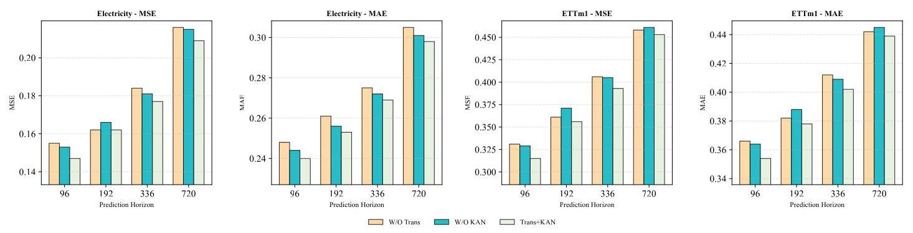

Figure 4: Ablation study comparing Time-TK with its architectural variants on the Electricity and ETTm1 datasets across multiple prediction horizons.

图4:在多个预测期上，将Time - TK与其架构变体在Electricity和ETTm1数据集上进行比较的消融研究。

Table 7: Prediction performance under different input lengths on the ETTm1 dataset. The input length is selected as $\mathcal{L} = \{ {48},{96},{144},{192},{288},{384},{480}\}$ , and the fixed prediction length is $\mathcal{F} = {96}$ . MOTE can effectively enhance the learning of historical information.

表7:在ETTm1数据集上不同输入长度下的预测性能。输入长度选择为$\mathcal{L} = \{ {48},{96},{144},{192},{288},{384},{480}\}$，固定预测长度为$\mathcal{F} = {96}$。MOTE可以有效地增强对历史信息的学习。

<table><tr><td rowspan="2">Model   Metric</td><td colspan="2">PatchTST</td><td colspan="2">+MOTE</td><td colspan="2">iTrans</td><td colspan="2">+MOTE</td></tr><tr><td>MSE</td><td>MAE</td><td>MSE</td><td>MAE</td><td>MSE</td><td>MAE</td><td>MSE</td><td>MAE</td></tr><tr><td>48</td><td>0.502</td><td>0.437</td><td>0.504</td><td>0.440</td><td>0.458</td><td>0.424</td><td>0.450</td><td>0.420</td></tr><tr><td>96</td><td>0.329</td><td>0.365</td><td>0.340</td><td>0.368</td><td>0.336</td><td>0.370</td><td>0.342</td><td>0.375</td></tr><tr><td>144</td><td>0.324</td><td>0.359</td><td>0.316</td><td>0.356</td><td>0.318</td><td>0.363</td><td>0.311</td><td>0.361</td></tr><tr><td>192</td><td>0.307</td><td>0.347</td><td>0.304</td><td>0.348</td><td>0.316</td><td>0.363</td><td>0.306</td><td>0.358</td></tr><tr><td>288</td><td>0.296</td><td>0.344</td><td>0.292</td><td>0.343</td><td>0.303</td><td>0.357</td><td>0.305</td><td>0.358</td></tr><tr><td>384</td><td>0.298</td><td>0.345</td><td>0.291</td><td>0.343</td><td>0.310</td><td>0.364</td><td>0.305</td><td>0.358</td></tr><tr><td>480</td><td>0.297</td><td>0.346</td><td>0.291</td><td>0.342</td><td>0.314</td><td>0.366</td><td>0.304</td><td>0.357</td></tr></table>

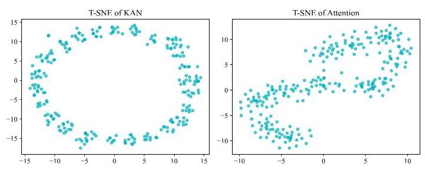

Figure 5: t-SNE visualization after KAN and Transformer.

图5:KAN和Transformer之后的t - SNE可视化。

### 4.4 Effectiveness of combining KAN and Transformer

### 4.4 KAN和Transformer结合的有效性

To validate the synergistic effectiveness of the two core components in Time-TK, Transformer and KAN, we conducted a comprehensive ablation study, with the results shown in Figure 4. In the experiment, we compared the full model (Trans+KAN) with two variants: one with the Transformer attention mechanism removed (W/O Trans), and another with the KAN module removed (W/O KAN). The results clearly indicate that our full model achieved the optimal results across all prediction horizons. This finding strongly demonstrates that removing either key component leads to a significant degradation in model performance, thus confirming the indispensability of both modules. We further investigate this synergy by visualizing intermediate feature representations with t-SNE, as shown in Fig. tkt. As the first module in our architecture, KAN (Figure 5, left) acts as a nonlinear feature extractor that maps the raw input sequence onto a ring-shaped manifold with clear periodic structure, revealing the underlying nonlinear patterns before temporal dependencies are modeled. The subsequent Transformer attention (Figure 5, right) then performs weighted aggregation over multiple time steps on this manifold to capture long-range dependencies, which leads to a more "mixed" cloud in the t-SNE projection rather than strictly separated clusters. Overall, this visualization suggests that MOTE and KAN together organize the raw series into structured continuous representations and support multi-scale temporal integration on top of them.

为了验证Time - TK中两个核心组件Transformer和KAN的协同有效性，我们进行了全面的消融研究，结果如图4所示。在实验中，我们将完整模型(Trans + KAN)与两个变体进行比较:一个去除了Transformer注意力机制(W/O Trans)，另一个去除了KAN模块(W/O KAN)。结果清楚地表明，我们的完整模型在所有预测期都取得了最优结果。这一发现有力地证明了去除任何一个关键组件都会导致模型性能显著下降，从而证实了两个模块的不可或缺性。我们通过用t - SNE可视化中间特征表示进一步研究这种协同作用，如图tkt所示。作为我们架构中的第一个模块，KAN(图5，左)充当非线性特征提取器，将原始输入序列映射到具有清晰周期性结构的环形流形上，在对时间依赖性进行建模之前揭示潜在的非线性模式。随后的Transformer注意力(图5，右)然后在这个流形上对多个时间步进行加权聚合以捕捉长程依赖性，这导致在t - SNE投影中形成更“混合”的云而不是严格分离的簇。总体而言，这种可视化表明MOTE和KAN一起将原始序列组织成结构化的连续表示，并在其之上支持多尺度时间整合。

### 4.5 Performance promotion

### 4.5性能提升

In addition to the ablation study on Multi-Offset Token Embedding (MOTE), we further evaluate its generalizability and transferability across different models. Specifically, we integrate MOTE into three representative models with different embedding strategies to verify whether it can enhance performance:

除了对多偏移令牌嵌入(MOTE)的消融研究之外，我们还进一步评估了它在不同模型之间的通用性和可转移性。具体来说，我们将MOTE集成到三个具有不同嵌入策略的代表性模型中，以验证它是否可以提高性能:

i) For iTransformer [28] with holistic embedding, we apply MOTE for embedding and interaction before the attention module to enhance intra-sequence modeling capability; ii) For PatchTST [30] with patch embedding, we apply multi-offset sequences to its patch attention, enabling finer-grained modeling of the sequence structure; iii) For TimesNet [37] with channel-mixing architecture, we introduce MOTE before the convolution operations, allowing the model to better capture complex periodic patterns.

i) 对于具有整体嵌入的iTransformer [28]，我们在注意力模块之前应用MOTE进行嵌入和交互，以增强序列内建模能力；ii) 对于具有补丁嵌入的PatchTST [30]，我们将多偏移序列应用于其补丁注意力，实现对序列结构的更细粒度建模；iii) 对于具有通道混合架构的TimesNet [37]，我们在卷积操作之前引入MOTE，使模型能够更好地捕捉复杂的周期性模式。

As shown in Table 5, integrating the multi-offset embedding into all three architectures consistently improves forecasting performance, demonstrating that MOTE can be widely applied to various prediction models and that our proposed embedding mechanism exhibits strong scalability.

如表5所示，将多偏移嵌入集成到所有三种架构中始终能提高预测性能，这表明MOTE可以广泛应用于各种预测模型，并且我们提出的嵌入机制具有很强的可扩展性。

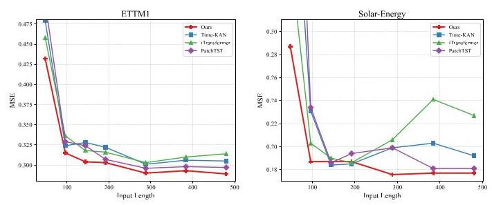

Figure 6: The prediction performance under different input lengths on two datasets. The input lengths are selected as $\mathcal{L} = \{ {48},{96},{144},{192},{288},{384},{480}\}$ , with a fixed prediction length of $\mathcal{F} = {96}$

图6:两个数据集上不同输入长度下的预测性能。输入长度选择为$\mathcal{L} = \{ {48},{96},{144},{192},{288},{384},{480}\}$，预测长度固定为$\mathcal{F} = {96}$

### 4.6 Increasing lookback Window

### 4.6 增加回溯窗口

Theoretically, based on statistical methods [3], rich historical information helps models capture long-term dependencies in time series. A well-designed forecasting model should be able to effectively leverage longer historical sequences to improve predictive performance. As shown in Figure 6, with the increase of input length, the iTransformer [28] using full-sequence token embedding shows a significant drop in prediction accuracy, indicating that directly embedding the entire sequence may overlook finer-grained local information within the sequence, thus limiting modeling capacity for long inputs. In contrast, models using patch token embedding, such as TimeKAN [15], and PatchTST [30], exhibit more stable performance as the input length increases, suggesting that the patching mechanism helps mitigate performance degradation from long inputs. However, the increased number of patches also leads to higher memory costs, which limits scalability in long sequence modeling. Notably, our Time-TK benefits from the MOTE embedding strategy, where we embed multi-offset sub-sequences independently, enabling the model to adapt to longer lookback windows while maintaining low computational cost.

从理论上讲，基于统计方法[3]，丰富的历史信息有助于模型捕捉时间序列中的长期依赖关系。一个设计良好的预测模型应该能够有效地利用更长的历史序列来提高预测性能。如图6所示，随着输入长度的增加，使用全序列令牌嵌入的iTransformer[28]的预测准确率显著下降，这表明直接嵌入整个序列可能会忽略序列中更细粒度的局部信息，从而限制了对长输入的建模能力。相比之下，使用补丁令牌嵌入的模型，如TimeKAN[15]和PatchTST[30]，随着输入长度的增加表现出更稳定的性能，这表明补丁机制有助于减轻长输入带来的性能下降。然而，补丁数量的增加也会导致更高的内存成本，这限制了长序列建模的可扩展性。值得注意的是，我们的Time-TK受益于MOTE嵌入策略，即我们独立嵌入多偏移子序列，使模型能够适应更长的回溯窗口，同时保持较低的计算成本。

Previous studies show that the predictive performance of Transformer models does not necessarily improve with longer lookback lengths [46]. Therefore, we introduce MOTE into two attention-based models, PatchTST and iTransformer. As shown in Table 7, the original models exhibit a general performance drop as input length increases, while after incorporating MOTE, both models surprisingly benefit from the extended historical window more effectively.

先前的研究表明，Transformer模型的预测性能并不一定会随着更长的回溯长度而提高[46]。因此，我们将MOTE引入到两个基于注意力的模型PatchTST和iTransformer中。如表7所示，随着输入长度的增加，原始模型的性能普遍下降，而在纳入MOTE后，两个模型都出人意料地更有效地从扩展的历史窗口中受益。

### 4.7 Computational Cost

### 4.7 计算成本

To evaluate the computational cost of different models, we compare their GPU memory usage under varying input sequence lengths, as shown in Figure 7. iTransformer consistently maintains high GPU memory consumption across all input lengths, with minimal variation, primarily due to its full-sequence embedding strategy, which makes its computational complexity less sensitive to input length. In contrast, the memory usage of PatchTST and TimeKAN increases significantly with longer sequences, owing to their patch-based embedding strategies, where the growing number of patches leads to higher memory overhead. Notably, our proposed Time-TK demonstrates excellent memory efficiency across different input lengths while still achieving superior predictive performance (see Figure 6). This indicates that the designed Multi-Offset Token Embedding (MOTE) strategy can effectively utilize long historical information without introducing substantial computational burden, making Time-TK an efficient forecasting framework well-suited for long-sequence modeling.

为了评估不同模型的计算成本，我们比较了它们在不同输入序列长度下的GPU内存使用情况，如图7所示。iTransformer在所有输入长度下始终保持较高的GPU内存消耗，变化最小，这主要归因于其全序列嵌入策略，该策略使其计算复杂度对输入长度不太敏感。相比之下，PatchTST和TimeKAN的内存使用量随着序列长度的增加而显著增加，这是由于它们基于补丁的嵌入策略，其中补丁数量的增加导致更高的内存开销。值得注意的是，我们提出的Time-TK在不同输入长度下都表现出出色的内存效率，同时仍能实现卓越的预测性能(见图6)。这表明设计的多偏移令牌嵌入(MOTE)策略可以有效地利用长期历史信息，而不会引入大量计算负担，使得Time-TK成为一个适用于长序列建模的高效预测框架。

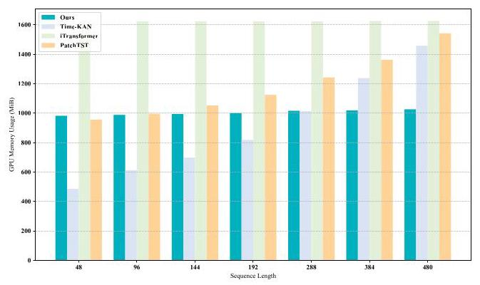

Figure 7: Comparison of GPU memory usage of different models at different input sequence lengths.

图7:不同输入序列长度下不同模型的GPU内存使用情况比较。

## 5 Conclusion

## 5 结论

This paper proposes a novel time series forecasting framework, Time-TK, which combines a Multi-Offset Token Embedding (MOTE) strategy with Multi-Offset Temporal Interaction. Unlike existing mainstream embedding methods, MOTE models the input sequence at multiple offset positions, enabling more efficient capture of both local and global temporal dynamics. It enhances the utilization of long historical information without significantly increasing memory overhead. Specifically, we first apply multi-offset embedding and then perform multi-offset temporal interaction to learn temporal dependencies across different time spans. Extensive experiments on 13 public datasets demonstrate that Time-TK outperforms existing state-of-the-art methods in both prediction accuracy and generalization capability. Notably, the MOTE embedding not only improves our model's performance but also shows consistent gains when integrated into other architectures with different embedding schemes, further validating its generality and effectiveness. Time-TK offers new insights and directions for designing efficient and scalable time series forecasting models.

本文提出了一种新颖的时间序列预测框架Time-TK，它将多偏移令牌嵌入(MOTE)策略与多偏移时间交互相结合。与现有的主流嵌入方法不同，MOTE在多个偏移位置对输入序列进行建模，能够更有效地捕捉局部和全局时间动态。它在不显著增加内存开销的情况下增强了对长历史信息的利用。具体来说，我们首先应用多偏移嵌入，然后进行多偏移时间交互，以学习不同时间跨度之间的时间依赖性。在13个公共数据集上进行的大量实验表明，Time-TK在预测准确性和泛化能力方面均优于现有的最先进方法。值得注意的是，MOTE嵌入不仅提高了我们模型的性能，而且在集成到具有不同嵌入方案的其他架构中时也显示出一致的提升，进一步验证了其通用性和有效性。Time-TK为设计高效且可扩展的时间序列预测模型提供了新的见解和方向。

## Acknowledgements

## 致谢

This work was supported in part by the following: the Joint Fund of the National Natural Science Foundation of China under Grant Nos. U24A20219, U24A20328, U22A2033, the National Natural Science Foundation of China under Grant No. 62272281, the Special Funds for Taishan Scholars Project under Grant No. tsqn202306274, and the Youth Innovation Technology Project of Higher School in Shandong Province under Grant No. 2023KJ212.

本研究得到了以下项目的部分支持:中国国家自然科学基金联合基金，项目编号分别为U24A20219、U24A20328、U22A2033；中国国家自然科学基金，项目编号为62272281；泰山学者项目专项资金，项目编号为tsqn202306274；以及山东省高等学校青年创新科技计划项目，项目编号为2023KJ212。

## References

## 参考文献

[1] Razan Alkhanbouli, Hour Matar Abdulla Almadhaani, Farah Alhosani, and MecitCan Emre Simsekler. 2025. The role of explainable artificial intelligence in disease prediction: a systematic literature review and future research directions. BMC

埃姆雷·西姆塞克勒(Can Emre Simsekler)。2025年。可解释人工智能在疾病预测中的作用:系统文献综述与未来研究方向。BMCmedical informatics and decision making 25, 1 (2025), 110.

[2] Adebiyi A Ariyo, Adewumi O Adewumi, and Charles K Ayo. 2014. Stock priceprediction using the ARIMA model. In 2014 UKSim-AMSS 16th international conference on computer modelling and simulation. IEEE, 106-112.

使用ARIMA模型进行预测。发表于2014年英国仿真与数学与统计学会第16届计算机建模与仿真国际会议。IEEE，第106 - 112页。

[3] George EP Box and Gwilym M Jenkins. 1968. Some recent advances in forecastingand control. Journal of the Royal Statistical Society. Series C (Applied Statistics) 17, 2 (1968), 91-109.

与控制。《皇家统计学会杂志》。C辑(应用统计学)第17卷，第2期(1968年)，第91 - 109页。

[4] Roman Bresson, Giannis Nikolentzos, George Panagopoulos, Michail Chatzianas-tasis, Jun Pang, and Michalis Vazirgiannis. 2024. Kagnns: Kolmogorov-arnold networks meet graph learning. arXiv preprint arXiv:2406.18380 (2024).

[5] Ruichu Cai, Zhifan Jiang, Kaitao Zheng, Zijian Li, Weilin Chen, Xuexin Chen, Yifan Shen, Guangyi Chen, Zhifeng Hao, and Kun Zhang. 2025. Learning disen-tangled representation for multi-modal time-series sensing signals. In Proceedings

多模态时间序列传感信号的纠缠表示。发表于《会议论文集》of the ACM on Web Conference 2025. 3247-3266.

[6] Wanlin Cai, Yuxuan Liang, Xianggen Liu, Jianshuai Feng, and Yuankai Wu. 2024.Msgnet: Learning multi-scale inter-series correlations for multivariate time series forecasting. In Proceedings of the AAAI conference on artificial intelligence, Vol. 38. 11141-11149.

Msgnet:学习多变量时间序列预测的多尺度序列间相关性。发表于人工智能AAAI会议论文集，第38卷。第11141 - 11149页。

[7] Chaochao Chen, Yizhao Zhang, Yuyuan Li, Jun Wang, Lianyong Qi, Xiaolong Xu, Xiaolin Zheng, and Jianwei Yin. 2024. Post-training attribute unlearning in recommender systems. ACM Transactions on Information Systems 43, 1 (2024),1-28.

[8] Xiaohong Chen, Canran Xiao, and Yongmei Liu. 2024. Confusion-resistantfederated learning via diffusion-based data harmonization on non-IID data. In Proceedings of the 38th International Conference on Neural Information Processing Systems. 137495-137520.

基于扩散的数据协调的联邦学习在非独立同分布数据上的应用。发表于第38届国际神经信息处理系统会议论文集。第137495 - 137520页。

[9] Shiming Fan, Hua Wang, and Fan Zhang. 2025. CAWformer: A cross variableattention with discrete wavelet denoising for multivariate time series forecasting. Knowledge-Based Systems (2025), 113846.

用于多变量时间序列预测的离散小波去噪注意力机制。《基于知识的系统》(2025年)，第113846页。

[10] Felix A Gers, Jürgen Schmidhuber, and Fred Cummins. 2000. Learning to forget: Continual prediction with LSTM. Neural computation 12, 10 (2000), 2451-2471.

[11] Lu Han, Xu-Yang Chen, Han-Jia Ye, and De-Chuan Zhan. 2024. Softs: Effi-cient multivariate time series forecasting with series-core fusion. arXiv preprint

基于序列核心融合的高效多变量时间序列预测。arXiv预印本arXiv:2404.14197 (2024).

[12] Xiao Han, Xinfeng Zhang, Yiling Wu, Zhenduo Zhang, and Zhe Wu. 2024.Are KANs Effective for Multivariate Time Series Forecasting? arXiv preprint

KANs对多变量时间序列预测有效吗？arXiv预印本arXiv:2408.11306 (2024).

[13] Sepp Hochreiter and Jürgen Schmidhuber. 1997. Long short-term memory. Neural computation 9, 8 (1997), 1735-1780.

[14] Qihe Huang, Zhengyang Zhou, Kuo Yang, and Yang Wang. 2025. ExploitingLanguage Power for Time Series Forecasting with Exogenous Variables. In Pro-

具有外生变量的时间序列预测的语言能力。发表于《会议论文集》ceedings of the ACM on Web Conference 2025. 4043-4052.

[15] Songtao Huang, Zhen Zhao, Can Li, and Lei Bai. 2025. Timekan: Kan-based fre-quency decomposition learning architecture for long-term time series forecasting.

用于长期时间序列预测的频率分解学习架构。arXiv preprint arXiv:2502.06910 (2025).

[16] Xuanwen Huang, Yang Yang, Yang Wang, Chunping Wang, Zhisheng Zhang, Jiarong Xu, Lei Chen, and Michalis Vazirgiannis. 2022. Dgraph: A large-scalefinancial dataset for graph anomaly detection. Advances in Neural Information Processing Systems 35 (2022), 22765-22777.

用于图异常检测 的金融数据集。《神经信息处理系统进展》第35卷(2022年)，第22765 - 22777页。

[17] Zahra Karevan and Johan AK Suykens. 2020. Transductive LSTM for time-seriesprediction: An application to weather forecasting. Neural Networks 125 (2020), 1-9.

预测:在天气预报中的应用。《神经网络》第125卷(2020年)，第1 - 9页。

[18] Zong Ke, Yuqing Cao, Zhenrui Chen, Yuchen Yin, Shouchao He, and Yu Cheng. 2025. Early warning of cryptocurrency reversal risks via multi-source data.Finance Research Letters (2025), 107890.

《金融研究快报》(2025年)，第107890页。

[19] Zong Ke, Jiaqing Shen, Xuanyi Zhao, Xinghao Fu, Yang Wang, Zichao Li, LingjieLiu, and Huailing Mu. 2025. A stable technical feature with GRU-CNN-GA fusion. Applied Soft Computing (2025), 114302.

刘，以及穆怀玲。2025年。具有GRU - CNN - GA融合的稳定技术特征。《应用软计算》(2025年)，第114302页。

[20] Diederik P Kingma and Jimmy Ba. 2014. Adam: A method for stochastic optimization. arXiv preprint arXiv:1412.6980 (2014).

[21] Yuyuan Li, Chaochao Chen, Yizhao Zhang, Weiming Liu, Lingjuan Lyu, Xiaolin Zheng, Dan Meng, and Jun Wang. 2023. Ultrare: Enhancing receraser for recom-mendation unlearning via error decomposition. Advances in Neural Information Processing Systems 36 (2023), 12611-12625.

通过误差分解的推荐遗忘。《神经信息处理系统进展》第36卷(2023年)，第12611 - 12625页。

[22] Yuyuan Li, Xiaohua Feng, Chaochao Chen, and Qiang Yang. 2025. A Survey onRecommendation Unlearning: Fundamentals, Taxonomy, Evaluation, and Open Questions . IEEE Transactions on Knowledge & Data Engineering 01 (2025), 1-20.

推荐遗忘:基础、分类、评估及开放问题。《IEEE知识与数据工程汇刊》01卷(2025年)，第1 - 20页。doi:10.1109/TKDE.2025.3638174

[23] Yuyuan Li, Yizhao Zhang, Weiming Liu, Xiaohua Feng, Zhongxuan Han,Chaochao Chen, and Chenggang Yan. 2025. Multi-Objective Unlearning in Recommender Systems via Preference Guided Pareto Exploration. IEEE Transactions on Services Computing (2025).

陈超超，严成刚。2025年。通过偏好引导的帕累托探索实现推荐系统中的多目标遗忘。《IEEE服务计算汇刊》(2025年)。

[24] Ziyao Li. 2024. Kolmogorov-arnold networks are radial basis function networks. arXiv preprint arXiv:2405.06721 (2024).

[25] Zhiming Lin, Kai Zhao, Sophie Zhang, Peilai Yu, and Canran Xiao. 2025. CEC-Zero: Zero-Supervision Character Error Correction with Self-Generated Rewards.

零:通过自我生成奖励进行零监督字符错误纠正。arXiv preprint arXiv:2512.23971 (2025).

[26] Dingyuan Liu, Qiannan Shen, and Jiaci Liu. 2026. The Health-Wealth Gradientin Labor Markets: Integrating Health, Insurance, and Social Metrics to Predict

在劳动力市场中:整合健康、保险和社会指标以进行预测Employment Density. (January 2026). doi:10.21203/rs.3.rs-8497932/v1 Preprint,posted January 4, 2026.

发布于2026年1月4日。

[27] Minhao Liu, Ailing Zeng, Muxi Chen, Zhijian Xu, Qiuxia Lai, Lingna Ma, andQiang Xu. 2022. Scinet: Time series modeling and forecasting with sample convolution and interaction. Advances in Neural Information Processing Systems 35 (2022), 5816-5828.

徐强。2022年。Scinet:基于样本卷积和交互的时间序列建模与预测。《神经信息处理系统进展》35(2022年)，5816 - 5828。

[28] Yong Liu, Tengge Hu, Haoran Zhang, Haixu Wu, Shiyu Wang, Lintao Ma, andMingsheng Long. 2024. iTransformer: Inverted Transformers Are Effective for Time Series Forecasting. In The Twelfth International Conference on Learning Representations. https://openreview.net/forum?id=JePfAI8fah

龙明生。2024年。iTransformer:倒置变压器对时间序列预测有效。在第十二届国际学习表征会议上。https://openreview.net/forum?id=JePfAI8fah

[29] Ziming Liu, Yixuan Wang, Sachin Vaidya, Fabian Ruehle, James Halverson, Marin Soljačić, Thomas Y Hou, and Max Tegmark. 2024. Kan: Kolmogorov-arnold networks. arXiv preprint arXiv:2404.19756 (2024).

[30] Yuqi Nie, Nam H Nguyen, Phanwadee Sinthong, and Jayant Kalagnanam. 2023.A time series is worth 64 words: Long-term forecasting with transformers. arXiv

一个时间序列值64个词:使用变压器进行长期预测。arXivpreprint arXiv:2211.14730 (2023).

[31] Xiangfei Qiu, Xingjian Wu, Yan Lin, Chenjuan Guo, Jilin Hu, and Bin Yang. 2024. Duet: Dual clustering enhanced multivariate time series forecasting. arXiv preprint arXiv:2412.10859 (2024).

[32] Qiannan Shen and Jing Zhang. 2025. AI-Enhanced Disaster Risk Predictionwith Explainable SHAP Analysis: A Multi-Class Classification Approach Using

通过可解释的SHAP分析:一种使用多类分类方法XGBoost. doi:10.21203/rs.3.rs-8437180/v1 Preprint, Version 1, posted December31, 2025.

[33] Haotian Si, Changhua Pei, Jianhui Li, Dan Pei, and Gaogang Xie. 2025. CMoS:Rethinking Time Series Prediction Through the Lens of Chunk-wise Spatial

通过逐块空间视角重新思考时间序列预测Correlations. arXiv preprint arXiv:2505.19090 (2025).

[34] Yixiao Teng, Jiamei Lv, Ziping Wang, Yi Gao, and Wei Dong. 2025. TimeChain:A Secure and Decentralized Off-chain Storage System for IoT Time Series Data.

一种用于物联网时间序列数据的安全且去中心化的链下存储系统。In Proceedings of the ACM on Web Conference 2025. 3651-3659.

[35] Ashish Vaswani, Noam Shazeer, Niki Parmar, Jakob Uszkoreit, Llion Jones, Aidan N Gomez, Łukasz Kaiser, and Illia Polosukhin. 2017. Attention is allyou need. Advances in neural information processing systems 30 (2017).

你需要的。《神经信息处理系统进展》30(2017年)。

[36] Shiyu Wang, Haixu Wu, Xiaoming Shi, Tengge Hu, Huakun Luo, Lintao Ma,James Y Zhang, and Jun Zhou. 2024. Timemixer: Decomposable multiscale

张宇，周军。2024年。Timemixer:用于长期序列预测的具有自相关的可分解多尺度mixing for time series forecasting. arXiv preprint arXiv:2405.14616 (2024).

[37] Haixu Wu, Tengge Hu, Yong Liu, Hang Zhou, Jianmin Wang, and MingshengLong. 2023. Timesnet: Temporal 2d-variation modeling for general time series analysis. (2023).

龙。2023年。Timesnet:用于一般时间序列分析的时间二维变化建模。(2023年)。

[38] Haixu Wu, Jiehui Xu, Jianmin Wang, and Mingsheng Long. 2021. Autoformer: De-composition transformers with auto-correlation for long-term series forecasting. Advances in neural information processing systems 34 (2021), 22419-22430.

具有自相关的组合变压器用于长期序列预测。《神经信息处理系统进展》34(2021年)，22419 - 22430。

[39] Canran Xiao, Jiabao Dou, Zhiming Lin, Zong Ke, and Liwei Hou. 2025. FromPoints to Coalitions: Hierarchical Contrastive Shapley Values for Prioritizing

指向联盟:用于优先级排序的分层对比夏普利值Data Samples. arXiv preprint arXiv:2512.19363 (2025).

[40] Canran Xiao, Chuangxin Zhao, Zong Ke, and Fei Shen. 2025. Curiosity meetscooperation: A game-theoretic approach to long-tail multi-label learning. arXiv

合作:一种用于长尾多标签学习的博弈论方法。arXivpreprint arXiv:2510.17520 (2025).

[41] Yongzheng Xie, Hongyu Zhang, and Muhammad Ali Babar. 2025. MultivariateTime Series Anomaly Detection by Capturing Coarse-Grained Intra-and Inter-

通过捕获粗粒度内部和之间的时间序列异常检测Variate Dependencies. In Proceedings of the ACM on Web Conference 2025. 697-705.

[42] Xiongxiao Xu, Canyu Chen, Yueqing Liang, Baixiang Huang, Guangji Bai, LiangZhao, and Kai Shu. 2024. Sst: Multi-scale hybrid mamba-transformer experts for

赵和凯舒。2024年。Sst:用于……的多尺度混合曼巴变压器专家long-short range time series forecasting. arXiv preprint arXiv:2404.14757 (2024).

[43] Jiawei Yao, Chuming Li, and Canran Xiao. 2024. Swift sampler: Efficient learningof sampler by 10 parameters. Advances in Neural Information Processing Systems 37 (2024), 59030-59053.

关于由10个参数构成的采样器。《神经信息处理系统进展》37卷(2024年)，第59030 - 59053页。

[44] Hua Ye, Siyuan Chen, Ziqi Zhong, Canran Xiao, Haoliang Zhang, Yuhan Wu, andFei Shen. 2026. Seeing through the Conflict: Transparent Knowledge Conflict

费申。2026年。看穿冲突:透明知识冲突Handling in Retrieval-Augmented Generation. arXiv preprint arXiv:2601.06842 (2026).

[45] Guoqi Yu, Jing Zou, Xiaowei Hu, Angelica I Aviles-Rivero, Jing Qin, and ShujunWang. 2024. Revitalizing multivariate time series forecasting: Learnable decomposition with inter-series dependencies and intra-series variations modeling.

王。2024年。振兴多元时间序列预测:具有系列间依赖性和系列内变化建模的可学习分解。arXiv preprint arXiv:2402.12694 (2024).

[46] Ailing Zeng, Muxi Chen, Lei Zhang, and Qiang Xu. 2023. Are transformerseffective for time series forecasting?. In Proceedings of the AAAI conference on artificial intelligence, Vol. 37. 11121-11128.

对时间序列预测有效吗？。在人工智能AAAI会议论文集，第37卷。11121 - 11128页。

[47] Fan Zhang, Gongguan Chen, Hua Wang, Jinjiang Li, and Caiming Zhang. 2023.Multi-scale video super-resolution transformer with polynomial approximation.

具有多项式逼近的多尺度视频超分辨率变压器。IEEE Transactions on Circuits and Systems for Video Technology 33, 9 (2023), 4496-4506.

[48] Fan Zhang, Gongguan Chen, Hua Wang, and Caiming Zhang. 2024. CF-DAN:Facial-expression recognition based on cross-fusion dual-attention network. Com-

基于交叉融合双注意力网络的面部表情识别。Com-putational Visual Media 10, 3 (2024), 593-608.

[49] Yunhao Zhang and Junchi Yan. 2023. Crossformer: Transformer utilizing cross-dimension dependency for multivariate time series forecasting. In The eleventh international conference on learning representations.

多元时间序列预测的维度依赖性。在第十一届国际学习表征会议上。

[50] Haoyi Zhou, Shanghang Zhang, Jieqi Peng, Shuai Zhang, Jianxin Li, Hui Xiong,and Wancai Zhang. 2021. Informer: Beyond efficient transformer for long sequence time-series forecasting. In Proceedings of the AAAI conference on artificial intelligence, Vol. 35. 11106-11115.

与张万才。2021年。《Informer:超越高效变压器的长序列时间序列预测》。发表于《人工智能AAAI会议论文集》，第35卷。11106 - 11115页。

[51] Tian Zhou, Ziqing Ma, Qingsong Wen, Xue Wang, Liang Sun, and Rong Jin. 2022.Fedformer: Frequency enhanced decomposed transformer for long-term series forecasting. In International conference on machine learning. PMLR, 27268-27286.

Fedformer:用于长期序列预测的频率增强分解变压器。发表于国际机器学习会议。PMLR，27268 - 27286。

## A Experimental Setting

## A实验设置

### A.1 DATASET DESCRIPTIONS

### A.1 数据集描述

To demonstrate the application effectiveness of Time-TK across various domains, we evaluated it on 14 different datasets. The descriptions of these datasets are as follows:

为了证明Time-TK在各个领域的应用效果，我们在14个不同的数据集上对其进行了评估。这些数据集的描述如下:

- ${\mathbf{{ETT}}}^{2}$ [50]: contains data with two different time granularities: one at the hourly level (ETTh) and the other at the 15-minute level (ETTm). This dataset records the temperature and load characteristics of seven oil transformers from July 2016 to July 2018.The Traffic dataset describes road occupancy, collected by sensors on the Francisco Freeway between 2015 and 2016, with hourly recordings.

- ${\mathbf{{ETT}}}^{2}$ [50]:包含具有两种不同时间粒度的数据:一种是每小时级别(ETTh)，另一种是15分钟级别(ETTm)。该数据集记录了2016年7月至2018年7月七台油变压器的温度和负载特性。交通数据集描述了2015年至2016年期间由弗朗西斯科高速公路上的传感器收集的道路占有率，每小时记录一次。

- Exchange ${}^{3}$ [38]: A panel dataset of daily exchange rates from eight countries, spanning from 1990 to 2016.

- 汇率${}^{3}$ [38]:一个包含八个国家1990年至2016年每日汇率的面板数据集。

- Weather ${}^{4}$ [38]: Records 21 weather indicators, such as air temperature and humidity, with data collected every 10 minutes in 2020, from locations in Germany.

- 天气${}^{4}$ [38]:记录21个天气指标，如气温和湿度，2020年每10分钟从德国各地收集一次数据。

- Electricity ${}^{5}$ [38]: Includes hourly electricity consumption data from 321 customers between 2012 and 2014.

- 电力${}^{5}$ [38]:包括2012年至2014年321个客户的每小时电力消耗数据。

- Solar Energy ${}^{6}$ : Contains solar power generation data from 137 photovoltaic plants in 2006, sampled every 10 minutes.

- 太阳能${}^{6}$ :包含2006年137个光伏电站的太阳能发电数据，每10分钟采样一次。

- PEMS7[27]: Consists of California public transportation network data, collected in 5-minute windows. We use the same four public subsets (PEMS03, PEMS04, PEMS07, PEMS08) as those used in SCINet [27].

- PEMS7[27]:由加利福尼亚公共交通网络数据组成，以5分钟的时间窗口收集。我们使用与SCINet [27]相同的四个公共子集(PEMS03、PEMS04、PEMS07、PEMS08)。

- Traffic ${}^{8}$ [38]: Collects hourly road occupancy data from 862 sensors on the San Francisco Freeway between January 2015 and December 2016.

- 交通${}^{8}$ [38]:收集2015年1月至2016年12月期间旧金山高速公路上862个传感器的每小时道路占有率数据。

- BTC/USDT ${}^{9}$ : The latest 20,000 BTC/USDT data records, including the opening price, highest price, lowest price, closing price, and actual trading volume of each record.

- BTC/USDT${}^{9}$ :最新的20,000条BTC/USDT数据记录，包括每条记录的开盘价、最高价、最低价、收盘价和实际交易量。

The main details are provided in Table 1.

主要细节见表1。

### A.2 Evaluation metrics

### A.2评估指标

Mean square error (MSE) and Mean absolute error (MAE) are commonly used as measures of forecasting performance in time series forecasting tasks. MSE represents the average of the squared differences between the predicted and actual values, giving more weight to larger deviations. MAE reflects the average of the absolute differences, thus providing a more balanced picture of the overall magnitude of the error. Together, these metrics constitute a comprehensive assessment of model accuracy. The mathematical definitions are as follows:

均方误差(MSE)和平均绝对误差(MAE)通常用作时间序列预测任务中预测性能的度量。MSE表示预测值与实际值之间平方差的平均值，对较大偏差给予更大权重。MAE反映绝对差的平均值，从而提供误差总体大小的更平衡图景。这些指标共同构成对模型准确性的全面评估。数学定义如下:

$$
{MSE} = \frac{1}{\mathcal{F}}\mathop{\sum }\limits_{{i = 1}}^{\mathcal{F}}{\left( {\mathcal{Y}}_{i} - {\widehat{\mathcal{Y}}}_{i}\right) }^{2}
$$

$$
{MAE} = \frac{1}{\mathcal{F}}\mathop{\sum }\limits_{{i = 1}}^{\mathcal{F}}\left| {{\mathcal{Y}}_{i} - {\widehat{\mathcal{Y}}}_{i}}\right|
$$

$$
{RMSE} = \sqrt{\frac{1}{\mathcal{F}}\mathop{\sum }\limits_{{i = 1}}^{\mathcal{F}}{\left( {\mathcal{Y}}_{i} - {\widehat{\mathcal{Y}}}_{i}\right) }^{2}} \tag{8}
$$

$$
{RSE} = \frac{\sqrt{\mathop{\sum }\limits_{{i = 1}}^{\mathcal{F}}{\left( {y}_{i} - {\widehat{y}}_{i}\right) }^{2}}}{\sqrt{\mathop{\sum }\limits_{{i = 1}}^{\mathcal{F}}{\left( {y}_{i} - \bar{y}\right) }^{2}}}
$$

$$
{MAPE} = \frac{1}{\mathcal{F}}\mathop{\sum }\limits_{{i = 1}}^{\mathcal{F}}\left| \frac{{y}_{i} - {\widehat{y}}_{i}}{{y}_{i}}\right|
$$

Where $\mathcal{F}$ represents the size of the lookback window, ${\mathcal{Y}}_{i}$ represents the true value, and ${\widehat{\mathcal{Y}}}_{i}$ represents the predicted value of the model.

其中$\mathcal{F}$表示回溯窗口的大小，${\mathcal{Y}}_{i}$表示真实值，${\widehat{\mathcal{Y}}}_{i}$表示模型的预测值。

### A.3 Experimental Details

### A.3实验细节

Specifically, all experiments in this study were implemented using PyTorch and executed on a single NVIDIA A100-SXM GPU with 40 GB of memory. The models were trained using the Adam optimizer [20] and optimized with the L2 loss function. The training-validation-test split follows existing practices in the literature, such as those reported for iTransformer [28] and TimesNet [37]. Specifically, the ETT and PEMS series datasets were split in a 6:2:2 ratio, while the remaining datasets used a 7:1:2 split. Time-TK was trained for 30 epochs with early stopping based on a patience of 3 on the validation set. For most datasets, the learning rate was set to 0.003 , except for smaller datasets such as the ETT series, where it was reduced to 0.002 . The batch size was adjusted based on the dataset size to maximize GPU utilization while avoiding memory overflow. For example, a batch size of 16 was used for the Traffic dataset, while a batch size of 64 was used for the Weather dataset. To ensure reproducibility, all experiments were conducted with a fixed random seed of 2024.

具体而言，本研究中的所有实验均使用PyTorch实现，并在具有40GB内存的单个NVIDIA A100 - SXM GPU上执行。模型使用Adam优化器[20]进行训练，并使用L2损失函数进行优化。训练 - 验证 - 测试划分遵循文献中的现有做法，如iTransformer [28]和TimesNet [37]所报道的那样。具体来说，ETT和PEMS系列数据集按6:2:2的比例划分，而其余数据集使用7:1:2的划分。Time - TK在验证集上基于3的耐心进行早期停止训练3满30个轮次。对于大多数数据集，学习率设置为0.003 ，除了较小的数据集，如ETT系列，其学习率降至0.002 。批量大小根据数据集大小进行调整，以在避免内存溢出的同时最大化GPU利用率。例如，交通数据集使用16的批量大小，而天气数据集使用64的批量大小。为确保可重复性，所有实验均使用固定的随机种子2024进行。

## B Full Results

## B完整结果

In this section, we present the full results of the experiments conducted in this study, as shown in Table 8. The results cover evaluations across different datasets, demonstrating the robustness of the proposed method in various real-world scenarios. Additionally, we provide detailed performance curves, as shown in Figures 1-4, for a comprehensive understanding of the model's behavior. This section aims to provide readers with a complete view of the experimental outcomes, complementing the discussions in the main body of the paper. We provide detailed tables and figures to facilitate a deeper interpretation of the results and to support the conclusions drawn in the preceding sections. Table 9 shows the statistical significance test results.

在本节中，我们展示本研究中进行的实验的完整结果，如表8所示。结果涵盖对不同数据集的评估，展示了所提出方法在各种实际场景中的稳健性。此外，我们提供详细的性能曲线，如图1 - 4所示，以便全面了解模型的行为。本节旨在为读者提供实验结果的完整视图，补充论文主体中的讨论。我们提供详细的表格和图表，以促进对结果的更深入解释，并支持前面各节得出的结论。表9显示了统计显著性检验结果。

---

${}^{2}$ https://github.com/zhouhaoyi/ETDataset

${}^{2}$ https://github.com/zhouhaoyi/ETDataset

${}^{3}$ https://github.com/laiguokun/multivariate-time-series-data

${}^{3}$ https://github.com/laiguokun/multivariate - time - series - data

${}^{4}$ https://www.bgc-jena.mpg.de/wetter/

${}^{4}$ https://www.bgc-jena.mpg.de/wetter/

${}^{5}$ https://archive.ics.uci.edu/ml/datasets/ElectricityLoadDiagrams20112014

${}^{5}$ https://archive.ics.uci.edu/ml/datasets/ElectricityLoadDiagrams20112014

${}^{6}$ https://pwww.nrel.gov/grid/solar-power-data.html

${}^{6}$ https://pwww.nrel.gov/grid/solar-power-data.html

${}^{7}$ https://pems.dot.ca.gov/

${}^{7}$ https://pems.dot.ca.gov/

${}^{8}$ https://pems.dot.ca.gov/

${}^{8}$ https://pems.dot.ca.gov/

${}^{9}$ https://www.kaggle.com/datasets/shivaverse/btcusdt-5-minute-ohlc-volume-data- 2017-2025

${}^{9}$ https://www.kaggle.com/datasets/shivaverse/btcusdt-5-minute-ohlc-volume-data- 2017-2025

---

Table 8: All experiments fix the lookback length $\mathcal{L} = {96}$ . For PEMS, the prediction length is $\mathcal{F} \in  \{ {12},{24},{48},{96}\}$ ; for other datasets, the prediction length is $\mathcal{F} \in  \{ {96},{192},{336},{720}\}$ . The best result is bold, the second best result is underlined.

表8:所有实验都固定回溯长度$\mathcal{L} = {96}$。对于PEMS，预测长度为$\mathcal{F} \in  \{ {12},{24},{48},{96}\}$；对于其他数据集，预测长度为$\mathcal{F} \in  \{ {96},{192},{336},{720}\}$。最佳结果加粗显示，第二好的结果加下划线。

<table><tr><td>Models</td><td></td><td colspan="2">Ours</td><td colspan="2">MMK</td><td colspan="2">TimeKAN</td><td colspan="2">CMoS</td><td colspan="2">MSGNet</td><td colspan="2">iTrans</td><td colspan="2">TimeMixer</td><td colspan="2">PatchTST</td><td colspan="2">TimesNet</td><td colspan="2">DLinear</td><td colspan="2">Crossformer</td></tr><tr><td>Metrics</td><td></td><td>MSE</td><td>MAE</td><td>MSE</td><td>MAE</td><td>MSE</td><td>MAE</td><td>MSE</td><td>MAE</td><td>MSE</td><td>MAE</td><td>MSE</td><td>MAE</td><td>MSE</td><td>MAE</td><td>MSE</td><td>MAE</td><td>MSE</td><td>MAE</td><td>MSE</td><td>MAE</td><td>MSE</td><td>MAE</td></tr><tr><td rowspan="5">ETTh1</td><td>96</td><td>0.370</td><td>0.393</td><td>0.374</td><td>0.397</td><td>0.373</td><td>0.397</td><td>0.396</td><td>0.403</td><td>0.390</td><td>0.411</td><td>0.394</td><td>0.409</td><td>0.381</td><td>0.401</td><td>0.414</td><td>0.419</td><td>0.384</td><td>0.402</td><td>0.386</td><td>0.400</td><td>0.423</td><td>0.448</td></tr><tr><td>192</td><td>0.423</td><td>0.421</td><td>0.419</td><td>0.429</td><td>0.414</td><td>0.421</td><td>0.432</td><td>0.428</td><td>0.443</td><td>0.442</td><td>0.448</td><td>0.441</td><td>0.440</td><td>0.433</td><td>0.460</td><td>0.445</td><td>0.436</td><td>0.429</td><td>0.437</td><td>0.432</td><td>0.471</td><td>0.474</td></tr><tr><td>336</td><td>0.465</td><td>0.444</td><td>0.461</td><td>0.450</td><td>0.451</td><td>0.442</td><td>0.481</td><td>0.454</td><td>0.482</td><td>0.469</td><td>0.491</td><td>0.464</td><td>0.501</td><td>0.462</td><td>0.501</td><td>0.466</td><td>0.491</td><td>0.469</td><td>0.481</td><td>0.459</td><td>0.570</td><td>0.546</td></tr><tr><td>720</td><td>0.470</td><td>0.462</td><td>0.474</td><td>0.467</td><td>0.460</td><td>0.460</td><td>0.482</td><td>0.482</td><td>0.496</td><td>0.488</td><td>0.519</td><td>0.502</td><td>0.501</td><td>0.482</td><td>0.500</td><td>0.488</td><td>0.521</td><td>0.500</td><td>0.519</td><td>0.516</td><td>0.653</td><td>0.621</td></tr><tr><td>avg</td><td>0.432</td><td>0.430</td><td>0.432</td><td>0.436</td><td>0.425</td><td>0.430</td><td>0.448</td><td>0.442</td><td>0.453</td><td>0.453</td><td>0.463</td><td>0.454</td><td>0.458</td><td>0.445</td><td>0.469</td><td>0.454</td><td>0.458</td><td>0.450</td><td>0.456</td><td>0.452</td><td>0.529</td><td>0.522</td></tr><tr><td rowspan="5">ETTh2</td><td>96</td><td>0.293</td><td>0.340</td><td>0.301</td><td>0.353</td><td>0.293</td><td>0.341</td><td>0.309</td><td>0.351</td><td>0.329</td><td>0.371</td><td>0.297</td><td>0.349</td><td>0.292</td><td>0.343</td><td>0.292</td><td>0.345</td><td>0.340</td><td>0.374</td><td>0.333</td><td>0.387</td><td>0.745</td><td>0.584</td></tr><tr><td>192</td><td>0.368</td><td>0.388</td><td>0.379</td><td>0.405</td><td>0.377</td><td>0.391</td><td>0.396</td><td>0.404</td><td>0.402</td><td>0.414</td><td>0.380</td><td>0.400</td><td>0.378</td><td>0.397</td><td>0.388</td><td>0.405</td><td>0.402</td><td>0.414</td><td>0.477</td><td>0.476</td><td>0.877</td><td>0.656</td></tr><tr><td>336</td><td>0.410</td><td>0.423</td><td>0.432</td><td>0.446</td><td>0.423</td><td>0.435</td><td>0.431</td><td>0.437</td><td>0.440</td><td>0.445</td><td>0.428</td><td>0.432</td><td>0.432</td><td>0.434</td><td>0.427</td><td>0.436</td><td>0.452</td><td>0.452</td><td>0.594</td><td>0.541</td><td>1.043</td><td>0.731</td></tr><tr><td>720</td><td>0.418</td><td>0.438</td><td>0.446</td><td>0.463</td><td>0.467</td><td>0.465</td><td>0.431</td><td>0.446</td><td>0.480</td><td>0.477</td><td>0.427</td><td>0.445</td><td>0.454</td><td>0.458</td><td>0.447</td><td>0.458</td><td>0.462</td><td>0.468</td><td>0.831</td><td>0.657</td><td>1.104</td><td>0.763</td></tr><tr><td>avg</td><td>0.372</td><td>0.397</td><td>0.390</td><td>0.417</td><td>0.390</td><td>0.408</td><td>0.392</td><td>0.410</td><td>0.413</td><td>0.427</td><td>0.383</td><td>0.407</td><td>0.384</td><td>0.407</td><td>0.389</td><td>0.411</td><td>0.414</td><td>0.427</td><td>0.559</td><td>0.515</td><td>0.942</td><td>0.684</td></tr><tr><td rowspan="5">ETTm1</td><td>96</td><td>0.315</td><td>0.354</td><td>0.320</td><td>0.358</td><td>0.324</td><td>0.361</td><td>0.354</td><td>0.381</td><td>0.319</td><td>0.366</td><td>0.336</td><td>0.370</td><td>0.328</td><td>0.363</td><td>0.329</td><td>0.365</td><td>0.338</td><td>0.375</td><td>0.345</td><td>0.372</td><td>0.404</td><td>0.426</td></tr><tr><td>192</td><td>0.356</td><td>0.378</td><td>0.364</td><td>0.383</td><td>0.357</td><td>0.383</td><td>0.390</td><td>0.396</td><td>0.377</td><td>0.397</td><td>0.381</td><td>0.395</td><td>0.364</td><td>0.384</td><td>0.380</td><td>0.394</td><td>0.374</td><td>0.387</td><td>0.380</td><td>0.389</td><td>0.450</td><td>0.451</td></tr><tr><td>336</td><td>0.393</td><td>0.402</td><td>0.395</td><td>0.405</td><td>0.386</td><td>0.404</td><td>0.423</td><td>0.418</td><td>0.417</td><td>0.422</td><td>0.417</td><td>0.418</td><td>0.390</td><td>0.404</td><td>0.400</td><td>0.410</td><td>0.410</td><td>0.411</td><td>0.413</td><td>0.413</td><td>0.532</td><td>0.515</td></tr><tr><td>720</td><td>0.453</td><td>0.439</td><td>0.457</td><td>0.440</td><td>0.447</td><td>0.437</td><td>0.481</td><td>0.445</td><td>0.487</td><td>0.463</td><td>0.487</td><td>0.456</td><td>0.458</td><td>0.445</td><td>0.475</td><td>0.453</td><td>0.478</td><td>0.450</td><td>0.474</td><td>0.453</td><td>0.666</td><td>0.589</td></tr><tr><td>avg</td><td>0.379</td><td>0.393</td><td>0.384</td><td>0.397</td><td>0.379</td><td>0.396</td><td>0.412</td><td>0.410</td><td>0.400</td><td>0.412</td><td>0.405</td><td>0.410</td><td>0.385</td><td>0.399</td><td>0.396</td><td>0.406</td><td>0.400</td><td>0.406</td><td>0.403</td><td>0.407</td><td>0.513</td><td>0.495</td></tr><tr><td rowspan="5">ETTm2</td><td>96</td><td>0.173</td><td>0.253</td><td>0.176</td><td>0.261</td><td>0.174</td><td>0.255</td><td>0.186</td><td>0.270</td><td>0.182</td><td>0.266</td><td>0.185</td><td>0.271</td><td>0.178</td><td>0.259</td><td>0.193</td><td>0.280</td><td>0.187</td><td>0.267</td><td>0.193</td><td>0.292</td><td>0.287</td><td>0.366</td></tr><tr><td>192</td><td>0.238</td><td>0.298</td><td>0.240</td><td>0.302</td><td>0.239</td><td>0.299</td><td>0.248</td><td>0.307</td><td>0.248</td><td>0.306</td><td>0.251</td><td>0.312</td><td>0.242</td><td>0.303</td><td>0.246</td><td>0.307</td><td>0.249</td><td>0.309</td><td>0.284</td><td>0.362</td><td>0.414</td><td>0.492</td></tr><tr><td>336</td><td>0.298</td><td>0.339</td><td>0.299</td><td>0.342</td><td>0.305</td><td>0.343</td><td>0.308</td><td>0.344</td><td>0.312</td><td>0.346</td><td>0.314</td><td>0.350</td><td>0.304</td><td>0.342</td><td>0.314</td><td>0.351</td><td>0.321</td><td>0.351</td><td>0.369</td><td>0.427</td><td>0.597</td><td>0.542</td></tr><tr><td>720</td><td>0.395</td><td>0.395</td><td>0.397</td><td>0.401</td><td>0.399</td><td>0.400</td><td>0.409</td><td>0.400</td><td>0.414</td><td>0.404</td><td>0.411</td><td>0.405</td><td>0.395</td><td>0.397</td><td>0.410</td><td>0.405</td><td>0.408</td><td>0.403</td><td>0.554</td><td>0.522</td><td>1.730</td><td>1.042</td></tr><tr><td>avg</td><td>0.276</td><td>0.321</td><td>0.278</td><td>0.327</td><td>0.279</td><td>0.324</td><td>0.288</td><td>0.330</td><td>0.289</td><td>0.330</td><td>0.290</td><td>0.335</td><td>0.280</td><td>0.325</td><td>0.291</td><td>0.336</td><td>0.291</td><td>0.333</td><td>0.350</td><td>0.401</td><td>0.757</td><td>0.611</td></tr><tr><td rowspan="5">Electricity</td><td>96</td><td>0.147</td><td>0.240</td><td>0.166</td><td>0.256</td><td>0.174</td><td>0.266</td><td>0.179</td><td>0.262</td><td>0.165</td><td>0.274</td><td>0.148</td><td>0.240</td><td>0.153</td><td>0.244</td><td>0.188</td><td>0.280</td><td>0.168</td><td>0.272</td><td>0.197</td><td>0.282</td><td>0.219</td><td>0.314</td></tr><tr><td>192</td><td>0.162</td><td>0.253</td><td>0.187</td><td>0.274</td><td>0.182</td><td>0.273</td><td>0.186</td><td>0.269</td><td>0.185</td><td>0.292</td><td>0.162</td><td>0.253</td><td>0.166</td><td>0.256</td><td>0.193</td><td>0.285</td><td>0.184</td><td>0.289</td><td>0.196</td><td>0.285</td><td>0.231</td><td>0.322</td></tr><tr><td>336</td><td>0.177</td><td>0.269</td><td>0.204</td><td>0.290</td><td>0.197</td><td>0.286</td><td>0.202</td><td>0.285</td><td>0.197</td><td>0.304</td><td>0.178</td><td>0.269</td><td>0.184</td><td>0.275</td><td>0.211</td><td>0.302</td><td>0.198</td><td>0.300</td><td>0.209</td><td>0.301</td><td>0.246</td><td>0.337</td></tr><tr><td>720</td><td>0.209</td><td>0.298</td><td>0.247</td><td>0.323</td><td>0.236</td><td>0.320</td><td>0.247</td><td>0.321</td><td>0.231</td><td>0.332</td><td>0.225</td><td>0.317</td><td>0.226</td><td>0.313</td><td>0.253</td><td>0.335</td><td>0.220</td><td>0.320</td><td>0.245</td><td>0.333</td><td>0.280</td><td>0.363</td></tr><tr><td>avg</td><td>0.174</td><td>0.265</td><td>0.201</td><td>0.286</td><td>0.197</td><td>0.286</td><td>0.204</td><td>0.284</td><td>0.194</td><td>0.301</td><td>0.178</td><td>0.270</td><td>0.182</td><td>0.272</td><td>0.211</td><td>0.301</td><td>0.193</td><td>0.295</td><td>0.212</td><td>0.300</td><td>0.244</td><td>0.334</td></tr><tr><td rowspan="5">Exchange</td><td>96</td><td>0.083</td><td>0.202</td><td>0.089</td><td>0.208</td><td>0.084</td><td>0.203</td><td>0.098</td><td>0.232</td><td>0.102</td><td>0.230</td><td>0.088</td><td>0.209</td><td>0.087</td><td>0.206</td><td>0.090</td><td>0.211</td><td>0.107</td><td>0.234</td><td>0.088</td><td>0.218</td><td>0.139</td><td>0.265</td></tr><tr><td>192</td><td>0.168</td><td>0.292</td><td>0.183</td><td>0.302</td><td>0.187</td><td>0.307</td><td>0.202</td><td>0.324</td><td>0.195</td><td>0.317</td><td>0.183</td><td>0.308</td><td>0.193</td><td>0.310</td><td>0.186</td><td>0.307</td><td>0.226</td><td>0.344</td><td>0.176</td><td>0.315</td><td>0.241</td><td>0.375</td></tr><tr><td>336</td><td>0.322</td><td>0.411</td><td>0.349</td><td>0.431</td><td>0.374</td><td>0.441</td><td>0.355</td><td>0.433</td><td>0.359</td><td>0.436</td><td>0.336</td><td>0.418</td><td>0.345</td><td>0.425</td><td>0.339</td><td>0.424</td><td>0.367</td><td>0.448</td><td>0.313</td><td>0.427</td><td>0.392</td><td>0.468</td></tr><tr><td>720</td><td>0.838</td><td>0.684</td><td>0.880</td><td>0.707</td><td>0.972</td><td>0.739</td><td>0.896</td><td>0.718</td><td>0.940</td><td>0.738</td><td>0.893</td><td>0.714</td><td>1.008</td><td>0.747</td><td>0.898</td><td>0.718</td><td>0.964</td><td>0.746</td><td>0.839</td><td>0.695</td><td>1.110</td><td>0.802</td></tr><tr><td>avg</td><td>0.353</td><td>0.397</td><td>0.375</td><td>0.412</td><td>0.404</td><td>0.423</td><td>0.388</td><td>0.427</td><td>0.399</td><td>0.430</td><td>0.375</td><td>0.412</td><td>0.408</td><td>0.422</td><td>0.378</td><td>0.415</td><td>0.416</td><td>0.443</td><td>0.354</td><td>0.414</td><td>0.471</td><td>0.478</td></tr><tr><td rowspan="5">Solar-Energy</td><td>96</td><td>0.187</td><td>0.234</td><td>0.216</td><td>0.298</td><td>0.231</td><td>0.288</td><td>0.286</td><td>0.295</td><td>0.210</td><td>0.246</td><td>0.203</td><td>0.238</td><td>0.215</td><td>0.294</td><td>0.234</td><td>0.286</td><td>0.250</td><td>0.292</td><td>0.290</td><td>0.378</td><td>0.310</td><td>0.331</td></tr><tr><td>192</td><td>0.205</td><td>0.256</td><td>0.241</td><td>0.282</td><td>0.290</td><td>0.323</td><td>0.323</td><td>0.318</td><td>0.265</td><td>0.290</td><td>0.233</td><td>0.261</td><td>0.237</td><td>0.275</td><td>0.267</td><td>0.310</td><td>0.296</td><td>0.318</td><td>0.320</td><td>0.398</td><td>0.734</td><td>0.725</td></tr><tr><td>336</td><td>0.213</td><td>0.271</td><td>0.263</td><td>0.304</td><td>0.326</td><td>0.345</td><td>0.364</td><td>0.339</td><td>0.294</td><td>0.318</td><td>0.248</td><td>0.273</td><td>0.252</td><td>0.298</td><td>0.290</td><td>0.315</td><td>0.319</td><td>0.330</td><td>0.353</td><td>0.415</td><td>0.750</td><td>0.735</td></tr><tr><td>720</td><td>0.214</td><td>0.267</td><td>0.251</td><td>0.313</td><td>0.300</td><td>0.329</td><td>0.355</td><td>0.335</td><td>0.285</td><td>0.315</td><td>0.249</td><td>0.276</td><td>0.244</td><td>0.293</td><td>0.289</td><td>0.317</td><td>0.338</td><td>0.337</td><td>0.356</td><td>0.413</td><td>0.769</td><td>0.765</td></tr><tr><td>avg</td><td>0.205</td><td>0.257</td><td>0.243</td><td>0.299</td><td>0.287</td><td>0.321</td><td>0.332</td><td>0.322</td><td>0.263</td><td>0.292</td><td>0.233</td><td>0.262</td><td>0.237</td><td>0.290</td><td>0.270</td><td>0.307</td><td>0.301</td><td>0.319</td><td>0.330</td><td>0.401</td><td>0.641</td><td>0.639</td></tr><tr><td rowspan="5">Weather</td><td>96</td><td>0.173</td><td>0.213</td><td>0.164</td><td>0.210</td><td>0.161</td><td>0.208</td><td>0.170</td><td>0.217</td><td>0.163</td><td>0.212</td><td>0.174</td><td>0.214</td><td>0.165</td><td>0.212</td><td>0.177</td><td>0.218</td><td>0.172</td><td>0.220</td><td>0.196</td><td>0.255</td><td>0.158</td><td>0.230</td></tr><tr><td>192</td><td>0.222</td><td>0.257</td><td>0.210</td><td>0.251</td><td>0.207</td><td>0.249</td><td>0.216</td><td>0.257</td><td>0.211</td><td>0.254</td><td>0.221</td><td>0.254</td><td>0.209</td><td>0.253</td><td>0.225</td><td>0.259</td><td>0.219</td><td>0.261</td><td>0.237</td><td>0.296</td><td>0.206</td><td>0.277</td></tr><tr><td>336</td><td>0.277</td><td>0.296</td><td>0.265</td><td>0.290</td><td>0.263</td><td>0.290</td><td>0.270</td><td>0.294</td><td>0.273</td><td>0.299</td><td>0.278</td><td>0.296</td><td>0.264</td><td>0.293</td><td>0.278</td><td>0.297</td><td>0.280</td><td>0.306</td><td>0.283</td><td>0.335</td><td>0.272</td><td>0.335</td></tr><tr><td>720</td><td>0.351</td><td>0.346</td><td>0.343</td><td></td><td></td><td>0.341</td><td>0.348</td><td>0.344</td><td>0.351</td><td>0.348</td><td>0.358</td><td>0.347</td><td>0.342</td><td>0.345</td><td>0.354</td><td>0.348</td><td>0.365</td><td>0.359</td><td>0.345</td><td>0.381</td><td>0.398</td><td>0.418</td></tr><tr><td>avg</td><td>0.256</td><td>0.278</td><td>0.246</td><td>0.273</td><td>0.243</td><td>0.272</td><td>0.251</td><td>0.278</td><td>0.249</td><td>0.278</td><td>0.258</td><td>0.278</td><td>0.245</td><td>0.276</td><td>0.259</td><td>0.281</td><td>0.259</td><td>0.287</td><td>0.265</td><td>0.317</td><td>0.259</td><td>0.315</td></tr><tr><td rowspan="5">Traffic</td><td>96</td><td>0.392</td><td>0.263</td><td>0.511</td><td>0.324</td><td>0.608</td><td>0.383</td><td>0.576</td><td>0.342</td><td>0.608</td><td>0.349</td><td>0.395</td><td>0.268</td><td>0.462</td><td>0.285</td><td>0.544</td><td>0.359</td><td>0.593</td><td>0.321</td><td>0.650</td><td>0.396</td><td>0.522</td><td>0.290</td></tr><tr><td>192</td><td>0.415</td><td>0.273</td><td>0.529</td><td>0.330</td><td>0.571</td><td>0.364</td><td>0.596</td><td>0.361</td><td>0.634</td><td>0.371</td><td>0.417</td><td>0.276</td><td>0.473</td><td>0.296</td><td>0.540</td><td>0.354</td><td>0.617</td><td>0.336</td><td>0.598</td><td>0.370</td><td>0.530</td><td>0.293</td></tr><tr><td>336</td><td>0.430</td><td>0.279</td><td>0.545</td><td>0.334</td><td>0.561</td><td>0.364</td><td>0.630</td><td>0.371</td><td>0.669</td><td>0.388</td><td>0.433</td><td>0.283</td><td>0.498</td><td>0.296</td><td>0.551</td><td>0.358</td><td>0.629</td><td>0.336</td><td>0.605</td><td>0.373</td><td>0.558</td><td>0.305</td></tr><tr><td>720</td><td>0.463</td><td>0.297</td><td>0.580</td><td>0.351</td><td>0.619</td><td>0.385</td><td>0.667</td><td>0.390</td><td>0.729</td><td>0.420</td><td>0.467</td><td>0.302</td><td>0.506</td><td>0.313</td><td>0.586</td><td>0.375</td><td>0.640</td><td>0.350</td><td>0.645</td><td>0.394</td><td>0.589</td><td>0.328</td></tr><tr><td>avg</td><td>0.425</td><td>0.278</td><td>0.541</td><td>0.335</td><td>0.590</td><td>0.374</td><td>0.617</td><td>0.366</td><td>0.660</td><td>0.382</td><td>0.428</td><td>0.282</td><td>0.485</td><td>0.298</td><td>0.555</td><td>0.362</td><td>0.620</td><td>0.336</td><td>0.625</td><td>0.383</td><td>0.550</td><td>0.304</td></tr><tr><td rowspan="5">PEMS03</td><td>12</td><td>0.065</td><td>0.168</td><td>0.077</td><td>0.185</td><td>0.095</td><td>0.202</td><td>0.091</td><td>0.204</td><td>0.078</td><td>0.187</td><td>0.071</td><td>0.174</td><td>0.076</td><td>0.185</td><td>0.073</td><td>0.178</td><td>0.085</td><td>0.192</td><td>0.122</td><td>0.243</td><td>0.090</td><td>0.203</td></tr><tr><td>24</td><td>0.086</td><td>0.195</td><td>0.119</td><td>0.231</td><td>0.138</td><td>0.221</td><td>0.113</td><td>0.213</td><td>0.108</td><td>0.218</td><td></td><td>0.201</td><td>0.112</td><td>0.224</td><td>0.105</td><td>0.212</td><td>0.118</td><td>0.223</td><td>0.201</td><td>0.317</td><td>0.121</td><td>0.240</td></tr><tr><td>48</td><td>0.123</td><td>0.235</td><td>0.184</td><td>0.291</td><td>0.180</td><td>0.279</td><td>0.153</td><td>0.269</td><td>0.178</td><td>0.272</td><td>0.125</td><td>0.236</td><td>0.181</td><td>0.281</td><td>0.159</td><td>0.264</td><td>0.155</td><td>0.260</td><td>0.333</td><td>0.425</td><td>0.202</td><td>0.317</td></tr><tr><td>96</td><td>0.172</td><td>0.277</td><td>0.251</td><td>0.336</td><td>0.272</td><td>0.329</td><td>0.232</td><td>0.324</td><td>0.238</td><td>0.328</td><td>0.164</td><td>0.275</td><td>0.205</td><td>0.343</td><td>0.210</td><td>0.305</td><td>0.228</td><td>0.317</td><td>0.457</td><td>0.515</td><td>0.262</td><td>0.367</td></tr><tr><td>avg</td><td>0.112</td><td>0.219</td><td>0.158</td><td>0.261</td><td>0.171</td><td>0.258</td><td>0.147</td><td>0.253</td><td>0.150</td><td>0.251</td><td>0.113</td><td>0.221</td><td>0.144</td><td>0.258</td><td>0.137</td><td>0.240</td><td>0.147</td><td>0.248</td><td>0.278</td><td>0.375</td><td>0.169</td><td>0.281</td></tr><tr><td rowspan="5">PEMS04</td><td>12</td><td>0.076</td><td>0.178</td><td>0.096</td><td>0.205</td><td>0.102</td><td>0.202</td><td>0.092</td><td>0.208</td><td>0.086</td><td>0.199</td><td>0.078</td><td>0.183</td><td>0.091</td><td>0.203</td><td>0.085</td><td>0.189</td><td>0.087</td><td>0.195</td><td>0.148</td><td>0.272</td><td>0.098</td><td>0.218</td></tr><tr><td>24</td><td>0.091</td><td>0.199</td><td>0.128</td><td>0.247</td><td>0.133</td><td>0.241</td><td>0.112</td><td>0.253</td><td>0.101</td><td>0.218</td><td>0.095</td><td>0.205</td><td>0.129</td><td>0.243</td><td>0.115</td><td>0.222</td><td>0.103</td><td>0.215</td><td>0.224</td><td>0.340</td><td>0.131</td><td>0.256</td></tr><tr><td>48</td><td>0.119</td><td>0.231</td><td>0.164</td><td>0.309</td><td>0.142</td><td>0.271</td><td>0.128</td><td>0.247</td><td>0.127</td><td>0.247</td><td>0.120</td><td>0.233</td><td>0.199</td><td>0.303</td><td>0.167</td><td>0.273</td><td>0.136</td><td>0.250</td><td>0.355</td><td>0.437</td><td>0.205</td><td>0.326</td></tr><tr><td>96</td><td>0.150</td><td>0.262</td><td>0.221</td><td>0.355</td><td>0.214</td><td>0.321</td><td>0.163</td><td>0.286</td><td>0.174</td><td>0.292</td><td>0.150</td><td>0.262</td><td>0.223</td><td>0.338</td><td>0.211</td><td>0.310</td><td>0.190</td><td>0.303</td><td>0.452</td><td>0.504</td><td>0.402</td><td>0.457</td></tr><tr><td>avg</td><td>0.109</td><td>0.218</td><td>0.152</td><td>0.279</td><td>0.148</td><td>0.259</td><td>0.124</td><td>0.249</td><td>0.122</td><td>0.239</td><td>0.111</td><td>0.221</td><td>0.161</td><td>0.272</td><td>0.145</td><td>0.249</td><td>0.129</td><td>0.241</td><td>0.295</td><td>0.388</td><td>0.209</td><td>0.314</td></tr><tr><td rowspan="5">PEMS07</td><td>12</td><td>0.058</td><td>0.153</td><td>0.072</td><td>0.174</td><td>0.083</td><td>0.196</td><td>0.073</td><td>0.186</td><td>0.079</td><td>0.182</td><td>0.067</td><td>0.165</td><td>0.069</td><td>0.175</td><td>0.068</td><td>0.163</td><td>0.082</td><td>0.181</td><td>0.115</td><td>0.242</td><td>0.094</td><td>0.200</td></tr><tr><td>24</td><td>0.076</td><td>0.176</td><td>0.117</td><td>0.222</td><td>0.101</td><td>0.211</td><td>0.110</td><td>0.209</td><td>0.099</td><td>0.206</td><td>0.088</td><td>0.190</td><td>0.107</td><td>0.216</td><td>0.102</td><td>0.201</td><td>0.101</td><td>0.204</td><td>0.210</td><td>0.329</td><td>0.139</td><td>0.247</td></tr><tr><td>48</td><td>0.106</td><td>0.211</td><td>0.169</td><td>0.246</td><td>0.172</td><td>0.264</td><td>0.165</td><td>0.264</td><td>0.133</td><td>0.239</td><td>0.110</td><td>0.215</td><td>0.175</td><td>0.272</td><td>0.170</td><td>0.261</td><td>0.134</td><td>0.238</td><td>0.398</td><td>0.458</td><td>0.311</td><td>0.369</td></tr><tr><td>96</td><td>0.132</td><td>0.241</td><td>0.192</td><td>0.291</td><td>0.199</td><td>0.289</td><td>0.268</td><td>0.328</td><td>0.179</td><td>0.279</td><td>0.139</td><td>0.245</td><td>0.295</td><td>0.350</td><td>0.236</td><td>0.308</td><td>0.181</td><td>0.279</td><td>0.594</td><td>0.553</td><td>0.396</td><td>0.442</td></tr><tr><td>avg</td><td>0.093</td><td>0.195</td><td>0.138</td><td>0.233</td><td>0.139</td><td>0.240</td><td>0.154</td><td>0.247</td><td>0.122</td><td>0.227</td><td>0.101</td><td>0.204</td><td>0.162</td><td>0.253</td><td>0.144</td><td>0.233</td><td>0.124</td><td>0.225</td><td>0.329</td><td>0.395</td><td>0.235</td><td>0.315</td></tr><tr><td rowspan="5">PEMS08</td><td>12</td><td>0.076</td><td>0.175</td><td>0.088</td><td>0.191</td><td>0.103</td><td>0.217</td><td>0.095</td><td>0.202</td><td>0.105</td><td>0.211</td><td>0.079</td><td>0.182</td><td>0.093</td><td>0.202</td><td>0.098</td><td>0.205</td><td>0.112</td><td>0.212</td><td>0.154</td><td>0.276</td><td>0.165</td><td>0.214</td></tr><tr><td>24</td><td>0.106</td><td>0.206</td><td>0.139</td><td>0.243</td><td>0.176</td><td>0.287</td><td>0.118</td><td>0.231</td><td>0.141</td><td>0.243</td><td>0.115</td><td>0.219</td><td>0.148</td><td>0.261</td><td>0.162</td><td>0.266</td><td>0.141</td><td>0.238</td><td>0.248</td><td>0.353</td><td>0.215</td><td>0.260</td></tr><tr><td>48</td><td>0.183</td><td>0.251</td><td>0.265</td><td>0.302</td><td>0.241</td><td>0.329</td><td>0.189</td><td>0.285</td><td>0.211</td><td>0.300</td><td>0.186</td><td>0.235</td><td>0.280</td><td>0.357</td><td>0.238</td><td>0.311</td><td>0.198</td><td>0.283</td><td>0.440</td><td>0.470</td><td>0.315</td><td>0.355</td></tr><tr><td>96</td><td>0.215</td><td>0.262</td><td>0.363</td><td>0.336</td><td>0.332</td><td>0.331</td><td>0.302</td><td>0.301</td><td>0.364</td><td>0.387</td><td>0.221</td><td>0.267</td><td>0.301</td><td>0.363</td><td>0.303</td><td>0.318</td><td>0.320</td><td>0.351</td><td>0.674</td><td>0.565</td><td>0.377</td><td>0.397</td></tr><tr><td>avg</td><td>0.145</td><td>0.224</td><td>0.214</td><td>0.268</td><td>0.213</td><td>0.291</td><td>0.176</td><td>0.255</td><td>0.205</td><td>0.285</td><td>0.150</td><td>0.226</td><td>0.206</td><td>0.296</td><td>0.200</td><td>0.275</td><td>0.193</td><td>0.271</td><td>0.379</td><td>0.416</td><td>0.268</td><td>0.307</td></tr></table>

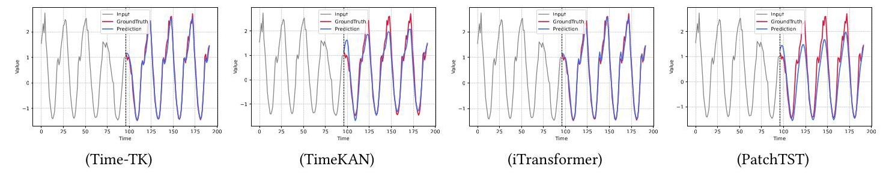

Figure 8: The performance of each model is visualized and compared on the traffic dataset with lookback window $\mathcal{L} = {96}$ , prediction window $\mathcal{F} = {96}$ .

图8:在回溯窗口为$\mathcal{L} = {96}$、预测窗口为$\mathcal{F} = {96}$的交通数据集上，对每个模型的性能进行可视化和比较。

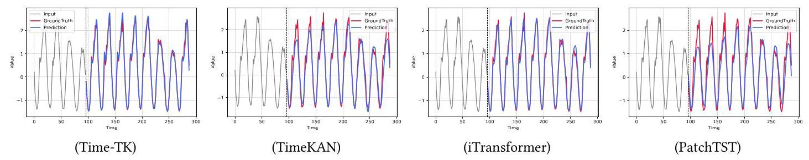

Figure 9: The performance of each model is visualized and compared on the traffic dataset with lookback window $\mathcal{L} = {96}$ , prediction window $\mathcal{F} = {192}$ .

图9:在回溯窗口为$\mathcal{L} = {96}$、预测窗口为$\mathcal{F} = {192}$的交通数据集上，对每个模型的性能进行可视化和比较。

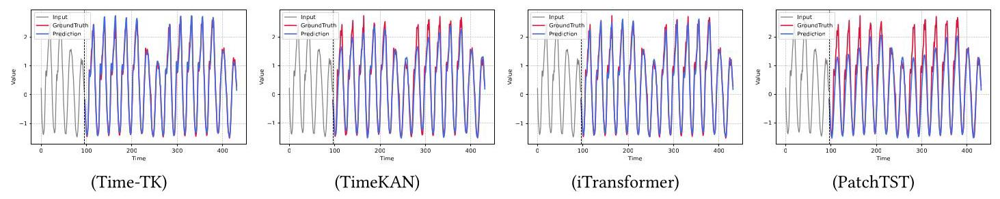

Figure 10: The performance of each model is visualized and compared on the traffic dataset with lookback window $\mathcal{L} = {96}$ , prediction window $\mathcal{F} = {336}$ .

图10:在回溯窗口为$\mathcal{L} = {96}$、预测窗口为$\mathcal{F} = {336}$的交通数据集上，对每个模型的性能进行可视化和比较。

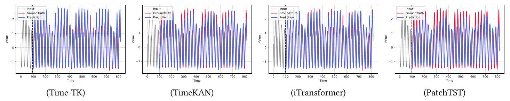

Figure 11: The performance of each model is visualized and compared on the traffic dataset with lookback window $\mathcal{L}$ =96, prediction window $\mathcal{F} = {720}$ .

图11:在回溯窗口$\mathcal{L}$ = 96、预测窗口为$\mathcal{F} = {720}$的交通数据集上，对每个模型的性能进行可视化和比较。

Table 9: Overall forecasting performance of Time-TK and TimeKAN on 10 benchmark datasets. We report mean $\pm$ standard deviation over three runs.

表9:Time-TK和TimeKAN在10个基准数据集上的整体预测性能。我们报告三次运行的均值$\pm$标准偏差。

<table><tr><td rowspan="2">Datasets</td><td colspan="2">Time-TK</td><td colspan="2">TimeKAN</td></tr><tr><td>MSE</td><td>MAE</td><td>MSE</td><td>MAE</td></tr><tr><td>ETTh1</td><td>0.433 ± 0.005</td><td>0.430 ± 0.003</td><td>0.425±0.005</td><td>0.430 ± 0.004</td></tr><tr><td>ETTh2</td><td>0.371 ± 0.004</td><td>0.399 ± 0.005</td><td>0.389±0.002</td><td>0.408 ± 0.003</td></tr><tr><td>ETTm1</td><td>0.380 ± 0.004</td><td>0.395 ± 0.004</td><td>0.381±0.005</td><td>0.397 ± 0.004</td></tr><tr><td>ETTm2</td><td>0.276 ± 0.002</td><td>0.321 ± 0.003</td><td>0.281±0.003</td><td>0.327 ± 0.003</td></tr><tr><td>Electricity</td><td>0.175 ± 0.005</td><td>0.270 ± 0.004</td><td>0.198±0.003</td><td>0.288 ± 0.002</td></tr><tr><td>Solar-Energy</td><td>0.203±0.006</td><td>0.265 ± 0.003</td><td>0.278±0.005</td><td>0.315±0.004</td></tr><tr><td>Weather</td><td>0.255±0.003</td><td>0.278±0.002</td><td>0.244 ± 0.005</td><td>0.273±0.003</td></tr><tr><td>Traffic</td><td>0.425±0.004</td><td>0.278±0.002</td><td>0.593 ± 0.003</td><td>0.378 ± 0.005</td></tr><tr><td>PEMS04</td><td>0.109±0.005</td><td>0.217±0.004</td><td>0.157 ± 0.007</td><td>0.263 ± 0.008</td></tr><tr><td>PEMS08</td><td>0.149±0.005</td><td>0.232±0.006</td><td>0.217 ± 0.004</td><td>0.293 ± 0.006</td></tr></table>

## C More Details of Time-TK

## C Time-TK的更多细节

This algorithm describes the basic process of the Time-TK model. First, the input time series $\mathcal{X} \in  {\mathbb{R}}^{N \times  \mathcal{L}}$ is normalized using RevIN, resulting in ${\mathcal{X}}_{n}$ . Then, the Multi-Offset Temporal Embedding (MOTE) method is applied to divide the normalized data into multiple subsequences with different time offsets, $\left\{  {{\mathcal{M}}_{1},\ldots ,{M}_{O}}\right\}$ . These subsequences are further processed by the Multi-Offset Interactive KAN (MI-KAN) module, yielding $\left\{  {{\mathcal{M}}_{1}^{\prime },\ldots ,{M}_{O}^{\prime }}\right\}$ . For each subsequence, a Multi-Head Self-Attention (MSA) mechanism is applied to capture interactions, resulting in ${\mathcal{A}}_{i}$ . Subsequently, these interaction results are fused with the original sequence $\mathcal{X}$ through a global Multi-Head Self-Attention operation to generate the final representation $\mathcal{H}$ . Finally, the predictor is applied to $\mathcal{H}$ to obtain the prediction $\widehat{\mathcal{Y}}$ , and the result is denormalized via the inverse ReVIN to obtain the final prediction output $\widehat{\mathcal{Y}}$ . The algorithm continues until the stopping criteria are met.

该算法描述了Time-TK模型的基本过程。首先，使用RevIN对输入时间序列$\mathcal{X} \in  {\mathbb{R}}^{N \times  \mathcal{L}}$进行归一化，得到${\mathcal{X}}_{n}$。然后，应用多偏移时间嵌入(MOTE)方法将归一化后的数据划分为具有不同时间偏移的多个子序列，$\left\{  {{\mathcal{M}}_{1},\ldots ,{M}_{O}}\right\}$。这些子序列由多偏移交互式KAN(MI-KAN)模块进一步处理，得到$\left\{  {{\mathcal{M}}_{1}^{\prime },\ldots ,{M}_{O}^{\prime }}\right\}$。对于每个子序列，应用多头自注意力(MSA)机制来捕捉交互，得到${\mathcal{A}}_{i}$。随后，通过全局多头自注意力操作将这些交互结果与原始序列$\mathcal{X}$融合，以生成最终表示$\mathcal{H}$。最后，将预测器应用于$\mathcal{H}$以获得预测值$\widehat{\mathcal{Y}}$，并通过逆RevIN进行反归一化以获得最终预测输出$\widehat{\mathcal{Y}}$。该算法持续运行，直到满足停止标准。