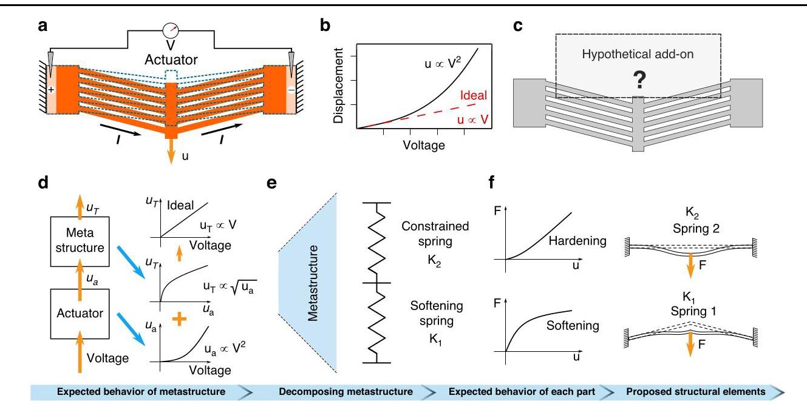
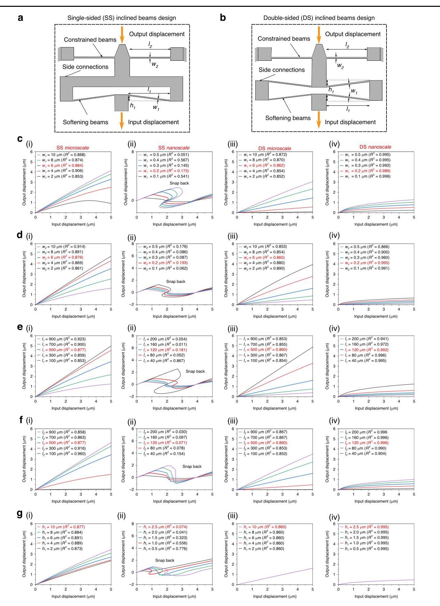
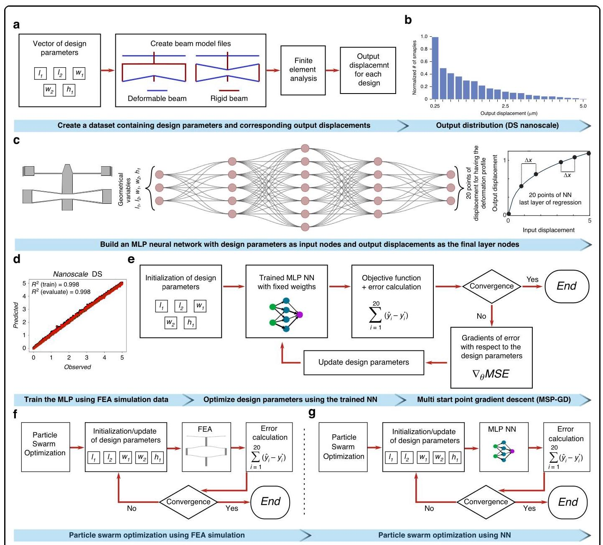
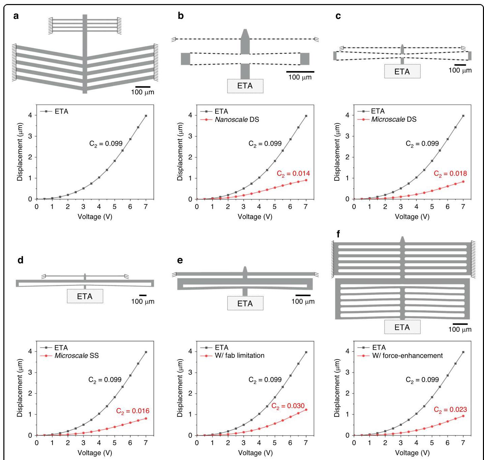
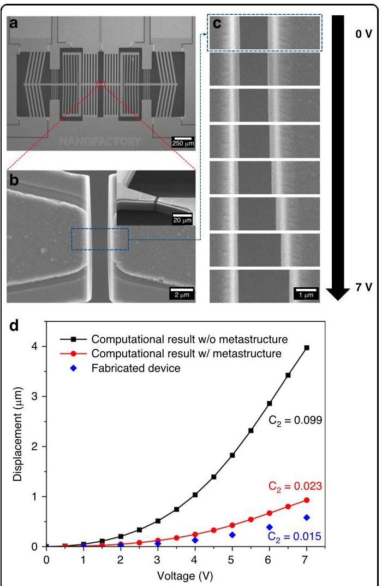

# Machine learning-driven metastructure design for sensor-free linearization of MEMS electrothermal actuators

# 用于MEMS电热致动器无传感器线性化的机器学习驱动的元结构设计

PDF: [[[MN]_Machine_learning_driven_metastructure_design_for_sensor_free_linearization_of_MEMS_electrothermal_actuators.pdf]]

Lingzhi Zhang 1, Hossein Mofatteh 2 , Jonathan Kong 3 , Jane Y. Howe 3,4 , Stas Dogel 5 , Yu Sun 6 ✉ Abdolhamid Akbarzadeh 1,2 and Changhong Cao 1,2

Lingzhi Zhang 1, Hossein Mofatteh [2] , Jonathan Kong [3] , Jane Y. Howe [3,4] , Stas Dogel [5] , Yu Sun [6] Abdolhamid Akbarzadeh [1,2] 和 Changhong Cao [1,2]

## Abstract

## 摘要

This study presents a novel approach for achieving linear motion in thermal micro-actuators by integrating machine learning-assisted optimized mechanical metastructures into the system design. Traditional solutions to actuator nonlinearity rely on complex sensor-based feedback mechanisms, which are often impractical in miniaturized systems. By embedding mechanical elements with tailored stiffness directly into the actuator structure, the proposed method transforms the inherent nonlinear relationship between input voltage and displacement into a near-linear response. A large design dataset was generated through finite element simulation and used to train a neural network model capable of predicting mechanical behavior across a broad design space. This model was then employed to guide inverse design and optimize geometrical parameters for specific performance goals. The optimized metastructures integrated with thermal actuators were fabricated via a Piezo-Multi-User MEMS Process (PiezoMUMP). Experimental characterization, conducted in a scanning electron microscope, confirmed that the fabricated device achieved an approximately 85% improvement in linearity compared to the original actuator. This enhanced performance enables more precise control of displacement in applications such as tensile testing of two-dimensional materials. The approach eliminates the need for sensors or electronic controllers, offering a scalable and computationally efficient solution for improving actuator performance. The demonstrated methodology may be generalized to other actuation systems, opening new pathways for intelligent mechanical design enabled by data-driven optimization.

本研究提出了一种新颖的方法，通过将机器学习辅助优化的机械元结构集成到系统设计中，实现热微致动器的线性运动。传统的解决致动器非线性的方法依赖于基于复杂传感器的反馈机制，这在小型化系统中往往不切实际。通过将具有定制刚度的机械元件直接嵌入致动器结构中，该方法将输入电压和位移之间固有的非线性关系转变为近似线性响应。通过有限元模拟生成了一个大型设计数据集，并用于训练一个能够预测广泛设计空间内机械行为的神经网络模型。然后，该模型被用于指导逆向设计并针对特定性能目标优化几何参数。与热致动器集成的优化元结构通过压电多用户MEMS工艺(PiezoMUMP)制造。在扫描电子显微镜中进行的实验表征证实，与原始致动器相比，制造的器件线性度提高了约85%。这种增强的性能使得在二维材料拉伸测试等应用中能够更精确地控制位移。该方法无需传感器或电子控制器，为提高致动器性能提供了一种可扩展且计算高效的解决方案。所展示的方法可以推广到其他致动系统，为数据驱动优化实现的智能机械设计开辟新途径。

## Introduction

## 引言

Mechanical actuation is widely employed across diverse fields such as aviation, robotics, electronics, and medicine 1,2 . It involves transforming electrical, hydraulic, or thermal energy into mechanical motion 3 , resulting in various actuation mechanisms, including but not limited to electromagnetic actuators 4 , piezoelectric actuators 5 , hydraulic and pneumatic actuators 6 , and thermal actuators7. The practical application of these mechanisms depends on precise control and accurate prediction of their actuation movements. This is particularly critical in small-scale systems such as microelectromechanical systems (MEMS), where small errors or uncertainties in actuation can affect overall performance.

机械致动在航空、机器人、电子和医学等各个领域广泛应用[1,2] 。它涉及将电能、液压能或热能转化为机械运动[3] ，产生各种致动机制，包括但不限于电磁致动器[4] 、压电致动器[5] 、液压和气动致动器[6] 以及热致动器7。这些机制的实际应用取决于对其致动运动的精确控制和准确预测。这在诸如微机电系统(MEMS)等小型系统中尤为关键，其中致动中的小误差或不确定性会影响整体性能。

A key metric for actuation mechanisms is their input-output relationship, which describes how the applied input (e.g., voltage, current, magnetic field, or pressure) translates into the resulting output (e.g., displacement or force). Linearity is crucial for achieving high accuracy in controlling the behavior of these mechanisms. However, due to the complex design of these miniature devices and the coupling of different physical fields (e.g., electromechanical, magneto-mechanical, and hydromechanical), sophisticated control systems and feedback loops are often required to achieve a linear or pseudo-linear response. For instance, feedback loops are typically used to adjust the input signal based on real-time monitoring of discrepancies between the desired and actual outputs 8 . Although effective, incorporating sensing elements and developing the necessary circuits and control systems is costly and complex 9 , particularly in MEMS devices, which also make these systems more prone to fabrication challenges and potential failures 10 .

致动机制的一个关键指标是其输入 - 输出关系，它描述了施加的输入(例如电压、电流、磁场或压力)如何转化为产生的输出(例如位移或力)。线性对于实现这些机制行为的高精度控制至关重要。然而，由于这些微型设备的复杂设计以及不同物理场(例如机电、磁 - 机械和流体机械)的耦合，通常需要复杂的控制系统和反馈回路来实现线性或准线性响应。例如，反馈回路通常用于根据对期望输出和实际输出之间差异的实时监测来调整输入信号[8] 。尽管有效，但纳入传感元件以及开发必要的电路和控制系统成本高昂且复杂[9] ，特别是在MEMS设备中，这也使这些系统更容易面临制造挑战和潜在故障[10] 。

---

Correspondence: Yu Sun (sun@mie.utoronto.ca) or

通信作者:Yu Sun (sun@mie.utoronto.ca) 或

Abdolhamid Akbarzadeh (hamid.akbarzadeh@mcgill.ca) or Changhong Cao (changhong.cao@mcgill.ca)

Abdolhamid Akbarzadeh (hamid.akbarzadeh@mcgill.ca) 或 Changhong Cao (changhong.cao@mcgill.ca)

1 Department of Mechanical Engineering, McGill University, Montreal, QC H3A 0C3, Canada

[1] 加拿大魁北克省蒙特利尔市麦吉尔大学机械工程系，H3A 0C3

2 Department of Bioresource Engineering, McGill University, Montreal, QC H9X 3V9, Canada

[2] 加拿大魁北克省蒙特利尔市麦吉尔大学生物资源工程系，H9X 3V9

Full list of author information is available at the end of the article

作者信息的完整列表可在文章末尾获取

These authors contributed equally: Lingzhi Zhang, Hossein Mofatteh

这些作者贡献相同:Lingzhi Zhang, Hossein Mofatteh

---

Take MEMS ETAs as an example. They have been an essential type of actuator under various contexts, such as achieving precise alignment in micro-optical components [7,11], activating microvalves for microfluidic control [12,13], characterizing nanomaterial properties [14,15], and executing tasks that require submicron-precision motions [16,17]. Electrothermal actuators offer several advantages, including compactness [18,19], low operating voltage [20,21], compatibility with semiconductor fabrication processes [19,22], and a high force or displacement to voltage ratio compared to electromagnetic, electrostatic, and piezoelectric MEMS actuators [23,24]. However, their inherent nonlinear relationship between the input voltage and the output actuation displacement due to a complex electro-thermo-mechanical coupling mechanism restricts their use in applications requiring linear motion 25 . The primary source of this nonlinearity is Joule heating. Because the generated heat is proportional to the square of the applied current or voltage, the relationship between applied voltage and actuation displacement becomes quadratic 26 . The temperature-dependent material properties of silicon, e.g., coefficient of thermal expansion, electrical resistivity, and thermal conductivity, further contribute to their nonlinear behaviors [27,28]. Variations in geometry during actuation, including deflection, buckling effects, and structural instabilities, can introduce additional nonlinearity 29 .

以MEMS电热致动器(MEMS ETAs)为例。在各种情况下，它们都是一种重要的致动器类型，例如在微光学组件中实现精确对准[7,11]、激活用于微流体控制的微阀[12,13]、表征纳米材料特性[14,15]以及执行需要亚微米精度运动的任务[16,17]。电热致动器具有多个优点，包括紧凑性[18,19]、低工作电压[20,21]、与半导体制造工艺的兼容性[19,22]，以及与电磁、静电和压电MEMS致动器相比更高的力或位移与电压比[23,24]。然而，由于复杂的电热机械耦合机制，其输入电压与输出致动位移之间固有的非线性关系限制了它们在需要线性运动的应用中的使用[25]。这种非线性的主要来源是焦耳热。由于产生的热量与施加电流或电压的平方成正比，施加电压与致动位移之间的关系变为二次关系[26]。硅的温度依赖性材料特性，例如热膨胀系数、电阻率和热导率，进一步导致了它们的非线性行为[27,28]。致动过程中几何形状的变化，包括挠曲、屈曲效应和结构不稳定性，会引入额外的非线性[29]。

To linearize the behavior of MEMS ETAs, conventional approaches used in macro-scale devices have been investigated. These approaches often rely on feedback control systems or transducers to achieve linear actuation [27,30]. However, integrating sensors, such as capacitive and piezoresistive types, and control units introduces complexities, including susceptibility to crosstalk and practical challenges in fabrication and implementation [31,32]. Additionally, to achieve high sensitivity, the feature size and spacing of the sensing beams must be reduced to a few microns or smaller, making them vulnerable in applications. An important application of MEMS ETAs is to characterize the mechanical properties of nanomaterials, a process requiring material transfer onto the MEMS platform. Unfortunately, the sensing elements are often too delicate to withstand the harsh conditions of commonly used transfer processes, such as exposure to chemical baths or mechanical pressure 33 .

为了使MEMS ETAs的行为线性化，人们研究了在宏观尺度设备中使用的传统方法。这些方法通常依赖于反馈控制系统或传感器来实现线性致动[27,30]。然而，集成诸如电容式和压阻式类型的传感器以及控制单元会带来复杂性，包括对串扰的敏感性以及制造和实施中的实际挑战[31,32]。此外，为了实现高灵敏度，传感梁的特征尺寸和间距必须减小到几微米或更小，这使得它们在应用中很脆弱。MEMS ETAs的一个重要应用是表征纳米材料的机械性能，这一过程需要将材料转移到MEMS平台上。不幸的是，传感元件往往过于脆弱，无法承受常用转移过程中的恶劣条件，例如暴露于化学浴或机械压力[33]。

While voltage modulation techniques, such as applying a square root profile to the input voltage, can linearize the response of electrothermal actuators through external electronics, our approach provides a sensor-free, circuit-free alternative by embedding the linearization mechanism directly into the mechanical system. This work presents a new method for mitigating the nonlinear behavior of MEMS thermal actuators. Instead of utilizing sensors and feedback control systems, we demonstrated that near-linear responses can be achieved by integrating mechanical metastructures designed with the aid of machine learning models. By eliminating the need for real-time sensing, closed-loop feedback, or complex control electronics, our approach is particularly advantageous for space-constrained, low-power, or fully passive applications, such as implantable biomedical devices and remote MEMS sensors, where electronic solutions may be impractical. Additionally, the metastructure-based design allows for tunable actuation characteristics at the fabrication stage, ensuring repeatable and pre-defined responses without the need for runtime control. To develop an effective metastructure that ensures desired linear output within material limitations, we generated approximately [16,000]simulated models for each design configuration to serve as the training dataset. Using neural network (NN) optimization combined with an inverse design algorithm for geometrical parameter prediction [34,35], we achieved the targeted near-linear output behavior for the overall system. The implemented metastructures serve as an extension of the actuator, offering several advantages: compatibility with mass production processes, customizability for tailored needs, and the absence of any requirement for additional power input or field stimuli. This lean design concept, which minimizes the integration of sensors and control systems in MEMS devices through the implementation of mechanical metastructures and the use of machine-learning models, has the potential to be applied to the development of other MEMS and even macro-scale actuation systems.

虽然电压调制技术，例如对输入电压应用平方根曲线，可以通过外部电子设备使电热致动器的响应线性化，但我们的方法通过将线性化机制直接嵌入机械系统，提供了一种无传感器、无电路的替代方案。这项工作提出了一种减轻MEMS热致动器非线性行为的新方法。我们没有使用传感器和反馈控制系统，而是证明了通过集成借助机器学习模型设计的机械超结构可以实现接近线性的响应。通过消除对实时传感、闭环反馈或复杂控制电子设备的需求，我们的方法对于空间受限、低功耗或完全无源的应用特别有利，例如可植入生物医学设备和远程MEMS传感器，在这些应用中电子解决方案可能不切实际。此外，基于超结构的设计允许在制造阶段调整致动特性，确保可重复和预定义的响应，而无需运行时控制。为了开发一种有效的超结构，以确保在材料限制内实现所需的线性输出，我们为每个设计配置生成了大约16,000个模拟模型作为训练数据集。通过将神经网络(NN)优化与用于几何参数预测的逆设计算法相结合[34,35]，我们实现了整个系统的目标接近线性输出行为。所实现的超结构作为致动器的扩展具有多个优点:与大规模生产工艺的兼容性、可根据特定需求定制以及无需任何额外的功率输入或场刺激。这种精简的设计概念通过实施机械超结构和使用机器学习模型，最大限度地减少了MEMS设备中传感器和控制系统的集成，有可能应用于其他MEMS甚至宏观尺度致动系统的开发。

## Results

## 结果

## Metastructures for displacement modulation

## 用于位移调制的超结构

In MEMS devices, electrothermal actuation works by Joule heating. Applying voltage generates heat, which causes thermal expansion and drives actuation. (Fig. 1a). While a linear correlation between actuated displacement (ua) and applied voltage (V) is ideal, the observed displacement-voltage relationship is quadratic, i.e., ua∝V2 (Fig. 1b)[26,30]. To achieve the linear relationship between applied voltage and displacement, we propose integrating a mechanical metastructure with the actuator (Fig. 1c). This metastructure exhibits a square root relationship between the input displacement (ua) , driven by the electrothermal actuator, and the output displacement (um) . The combined effect of this square root relationship and the quadratic actuation mechanism is predicted to produce a linear relationship between the total displacement (uT) and the input actuation voltage (Fig. 1d).

在MEMS器件中，电热驱动通过焦耳热起作用。施加电压会产生热量，进而引起热膨胀并驱动致动(图1a)。虽然理想情况下，驱动位移$\left( {u}_{a}\right)$与施加电压$\left( V\right)$之间存在线性关系，但观察到的位移 - 电压关系是二次的，即${u}_{a} \propto \; {V}^{2}$(图$1\mathrm{\;b}{)}^{{26},{30}}$)。为了实现施加电压与位移之间的线性关系，我们提出将机械元结构与致动器集成(图1c)。这种元结构在由电热致动器驱动的输入位移$\left( {u}_{a}\right)$与输出位移$\left( {u}_{m}\right)$之间呈现平方根关系。预计这种平方根关系与二次致动机制的综合作用将在总位移$\left( {u}_{T}\right)$与输入致动电压之间产生线性关系(图1d)。

Fig. 1 Concept of metastructure design. a Schematic of the electrothermal actuator before (blue, dashed) and after (orange, solid) voltage application. b Voltage-displacement relationship of a typical electrothermal actuator with a nonlinear response (black, solid) and an ideal linear voltage-displacement relationship (red, dashed). c Integrating an add-on metastructure to achieve a linear input(voltage)/output(displacement) relationship. d Achieving linear voltage-displacement response through the combined quadratic (ETA) and square root (metastructure) actuation mechanisms. e Equivalent spring model of the hypothetical metastructure composed of two springs connected in series to modulate deformation: KT and K2 exhibit softening and hardening behavior, respectively. f Hypothetical force-displacement responses of equivalent K1 and K2 considered in e through designs of a double clamped straight beam and an inclined beam that offer hardening and softening behavior, respectively

图1元结构设计概念。a施加电压之前(蓝色，虚线)和之后(橙色，实线)的电热致动器示意图。b具有非线性响应的典型电热致动器的电压 - 位移关系(黑色，实线)和理想线性电压 - 位移关系(红色，虚线)。c集成附加元结构以实现线性输入(电压)/输出(位移)关系。d通过二次(ETA)和平方根(元结构)致动机制的组合实现线性电压 - 位移响应。e由两个串联连接的弹簧组成的假设元结构的等效弹簧模型，用于调节变形:${K}_{T}$和${K}_{2}$分别表现出软化和硬化行为。$\mathbf{f}$通过分别提供硬化和软化行为的双端夹紧直梁和倾斜梁的设计，在e中考虑的等效${K}_{1}$和${K}_{2}$的假设力 - 位移响应

To design an effective metastructure, it is decomposed into two functional components. By modeling the system as two nonlinear springs connected in series with stiffnesses K1 and K2 , we derive an equivalent formula to determine the stiffness for each component (Fig. 1e; detailed derivation is available in Note S1).

为了设计有效的元结构，将其分解为两个功能组件。通过将系统建模为两个串联的非线性弹簧，其刚度分别为${K}_{1}$和${K}_{2}$，我们推导出一个等效公式来确定每个组件的刚度(图1e；详细推导见注释S1)。

$$
\frac{{K}_{1}\left( {{u}_{a} - \sqrt{{u}_{a}}}\right) }{\left( {K}_{2}\left( \sqrt{{u}_{a}}\right)  + {K}_{1}\left( {u}_{a} - \sqrt{{u}_{a}}\right) \right) } = \frac{1}{2\sqrt{{u}_{a}}} \tag{1}
$$

Although a theoretical solution is difficult to derive and would not directly provide geometrical information, one potential approach involves implementing springs with deformation-dependent stiffness. This can be achieved by having K1 exhibit softening behavior and K2 exhibit hardening behavior. Finite element analysis (FEA) simulations (Fig.S1) revealed that softening behavior is observed in a pair of double-clamped inclined beams when subjected to downward forces, as their in-plane stiffness becomes less aligned with the direction of deformation. In contrast, a pair of double-clamped straight beams exhibits stiffening behavior under deformation due to its in-plane stiffness aligning more effectively with the applied force. This insight suggests that integrating inclined and straight beams can form the basis of the metastructure design (Fig. 1f) 35,36 .

虽然很难得出理论解决方案，而且它也不会直接提供几何信息，但一种潜在的方法涉及实现具有与变形相关刚度的弹簧。这可以通过使${K}_{1}$表现出软化行为而${K}_{2}$表现出硬化行为来实现。有限元分析(FEA)模拟(图S1)表明，一对双端夹紧倾斜梁在受到向下的力时会表现出软化行为，因为它们的面内刚度与变形方向的对齐程度降低。相比之下，一对双端夹紧直梁在变形时会表现出硬化行为，因为其面内刚度与施加的力更有效地对齐。这一见解表明，集成倾斜梁和直梁可以构成元结构设计的基础(图1f)[35,36]。

## Geometric parameters of the metastructure

## 元结构的几何参数

Two metastructure configurations, incorporating flat and inclined beams, were designed: single-sided inclined beams (SS, Fig. 2a) and double-sided inclined beams (DS, Fig. 2b). These designs leverage geometric nonlinearity to address the nonlinear relationship between voltage and displacement in ETAs. The maximum achievable displacement of each metastructure is limited by the ETA output, which is constrained by the applied voltage and the maximum temperature that silicon-based MEMS can withstand. Five geometric parameters (l1, l2, w1, w2,ℎ1) , illustrated in Figs. 2a and 2b, define the stiffness characteristics of each configuration: in-plane lengths (l1 and l2 ), in-plane widths (w1 and w2) , and the rise of the beam (ℎ1) .

设计了两种包含扁平梁和倾斜梁的元结构配置:单侧倾斜梁(SS，图2a)和双侧倾斜梁(DS，图2b)。这些设计利用几何非线性来解决电热致动器中电压与位移之间的非线性关系。每个元结构可实现的最大位移受到电热致动器输出的限制，而电热致动器输出又受到施加电压和硅基MEMS所能承受的最高温度的约束。图2a和2b中所示的五个几何参数$\left( {{l}_{1},{l}_{2},{w}_{1},{w}_{2},{h}_{1}}\right)$定义了每种配置的刚度特性:面内长度$\left( {l}_{1}\right.$和${l}_{2}$)、面内宽度$\left( {w}_{1}\right.$和$\left. {w}_{2}\right)$以及梁的上升高度$\left( {h}_{1}\right)$。

A parametric study assessed the influence of each geometric parameter on the mechanical behavior of the metastructures using beam model FEA (Fig. S2). This analysis considered fabrication limitations, leading to the definition of two design spaces: nanoscale and microscale.

一项参数研究使用梁模型有限元分析评估了每个几何参数对元结构力学行为的影响(图S2)。该分析考虑了制造限制，从而定义了两个设计空间:纳米尺度和微尺度。

Fig. 2 (See legend on next page.)

图2(见下一页的图例)

(see figure on previous page)

(见上一页的图)

Fig. 2 Parametric study of the metastructure designs. a Schematic of the SS metastructure with five geometric parameters defined. The SS configuration consists of a set of softening (inclined) beams and a set of constrained (flat) beams. The side connections are linked by a rigid crossbeam. b Schematic of the DS metastructure with five geometric parameters illustrated. The DS configuration consists of two sets of symmetrical softening (inclined) beams and a set of constrained (flat) beams. The side connections are linked by pairs of symmetrical inclined beams. c Output displacement profiles under tensile loading for i SS microscale, iii SS nanoscale, iii DS microscale, and iv DS nanoscale configurations, showing the influence of wj . Initial wj dimensions are indicated in red ( 6μm for microscale, 0.2μm for nanoscale). d. Output displacement profiles under tensile loading for geometric parameter w2 with the same order as c . Initial w2 dimensions are 6μm for microscale and 0.2μm for nanoscale. e Output displacement profiles under tensile loading for geometric parameter softening spring beam length lj with the same order as c . Initial lj dimensions are 500μm for microscale and 120μm for nanoscale. f Output displacement profiles under tensile loading for geometric parameter l2 with the same order as c . Initial l2 dimensions are 500μm for microscale and 120μm for nanoscale. g Output displacement profiles under tensile loading for geometric parameter ℎ1 with the same order as c . Initial ℎ1 dimensions are 10μm for microscale and 2.5μm for nanoscale

图2亚结构设计的参数研究。a定义了五个几何参数的SS亚结构示意图。SS结构由一组软化(倾斜)梁和一组约束(平坦)梁组成。侧面连接由刚性横梁连接。b说明了五个几何参数的DS亚结构示意图。DS结构由两组对称的软化(倾斜)梁和一组约束(平坦)梁组成。侧面连接由成对的对称倾斜梁连接。c在拉伸载荷下，i SS微尺度、iii SS纳米尺度、iii DS微尺度 和 iv DS纳米尺度配置的输出位移曲线，表示了${w}_{j}$的影响。初始${w}_{j}$尺寸用红色表示(微尺度为${6\mu }\mathrm{m}$，纳米尺度为${0.2\mu }\mathrm{m}$)。d. 与$\mathbf{c}$顺序相同的几何参数${w}_{2}$在拉伸载荷下的输出位移曲线。微尺度的初始{{F}}3尺寸为${6\mu }\mathrm{m}$，纳米尺度为${0.2\mu }\mathrm{m}$。e与$\mathbf{c}$顺序相同的几何参数软化弹簧梁长度${l}_{j}$在拉伸载荷下的输出位移曲线。微尺度的初始${l}_{j}$尺寸为${500\mu }\mathrm{m}$，纳米尺度为${120\mu }\mathrm{m}$。f与$\mathbf{c}$顺序相同的几何参数${l}_{2}$在拉伸载荷下的输出位移曲线。微尺度的初始${l}_{2}$尺寸为${500\mu }\mathrm{m}$，纳米尺度为${120\mu }\mathrm{m}$。$\mathbf{g}$与$\mathbf{c}$顺序相同的几何参数${h}_{1}$在拉伸载荷下的输出位移曲线。微尺度的初始${h}_{1}$尺寸为${10\mu }\mathrm{m}$，纳米尺度为${2.5\mu }\mathrm{m}$。

These classifications are based on the in-plane widths (w1 and w2) and reflect the trade-off between linearization potential and ease of fabrication. On the one hand, nanoscale metastructures, characterized by in-plane widths (w1 and w2) ranging from 0.1 to 1μm , offer the potential for enhanced linearity due to their finer structures but require specialized nanofabrication facilities. On the other hand, microscale metastructures, with in-plane widths (w1 and w2) between 1 and 20μm , can be readily produced using standard micro-fabrication facilities but exhibit a reduced degree of linearization.

这些分类基于平面内宽度$\left( {w}_{1}\right.$和$\left. {w}_{2}\right)$，反映了线性化潜力和制造简易性之间的权衡。一方面，以平面内宽度$\left( {w}_{1}\right.$和$\left. {w}_{2}\right)$在0.1到${1\mu }\mathrm{m}$范围内为特征的纳米尺度亚结构，由于其更精细的结构，具有增强线性化的潜力，但需要专门的纳米制造设备。另一方面，平面内宽度$\left( {w}_{1}\right.$和$\left. {w}_{2}\right)$在1到${20\mu }\mathrm{m}$之间的微尺度亚结构，可以使用标准的微制造设备轻松生产，但线性化程度较低。

The nonlinear behavior of the metastructure is influenced by the slenderness ratio of its component beams (Fig. S3). Higher slenderness ratios lead to increased nonlinearity under the same displacement 37 . Therefore, metastructures were designed with varying lengths and slenderness ratios within each size classification. Microscale metastructures had l1 and l2 from 200 to 1000μm and slenderness ratios from 10 to 1000. Nanoscale metastructures had l1 and l2 from 40 to 200μm and higher slenderness ratios from 40 to 2000.

亚结构的非线性行为受其组成梁的长细比影响(图S3)。在相同位移[37]下，较高的长细比会导致非线性增加。因此，在每个尺寸分类中设计了具有不同长度和长细比的亚结构。微尺度亚结构的${l}_{1}$和${l}_{2}$为200到${1000\mu }\mathrm{m}$，长细比为10到1000。纳米尺度亚结构的${l}_{1}$和${l}_{2}$为40到${200\mu }\mathrm{m}$，长细比更高，为40到2000。

Figure 2c−g illustrate the displacement response of the SS and DS designs for varying geometric parameters. The figure presents results for microscale SS (column 1), nanoscale SS (column 2), microscale DS (column 3), and nanoscale DS (column 4) configurations. To determine the influence of each geometric parameter on achieving a square root relationship between input and output displacement (uT=A√ua , where A is a constant), each parameter was systematically varied while others remained constant. The coefficient of determination (R2) for each fitted curve quantifies the agreement between simulation results and this ideal square root function. For the microscale configurations, beam widths (w1 and w2) ranged from 2 to 10μm , beam lengths (l1 and l2) from 100 to 900μm , and inclined beam rise (ℎ1) from 2 to 10μm . For the nanoscale configurations, the corresponding ranges were 0.1 to 0.5μm for widths (w1 and w2) ,40 to 200μm for length (l1 and l2) , and 0.5 to 2.5μm for rise (ℎ1) .

图$2\mathrm{c} - \mathrm{g}$展示了不同几何参数下SS和DS设计的位移响应。该图呈现了微尺度SS(第1列)、纳米尺度SS(第2列)、微尺度DS(第3列)和纳米尺度DS(第4列)配置的结果。为了确定每个几何参数对实现输入和输出位移之间的平方根关系$\left( {{u}_{T} = A\sqrt{}{u}_{a}}\right.$(其中$A$为常数)的影响，每个参数在其他参数保持不变的情况下进行系统变化。每条拟合曲线的决定系数$\left( {R}^{2}\right)$量化了模拟结果与该理想平方根函数之间的一致性。对于微尺度配置，梁宽度$\left( {w}_{1}\right.$和$\left. {w}_{2}\right)$范围为2至${10\mu }\mathrm{m}$，梁长度$\left( {l}_{1}\right.$和$\left. {l}_{2}\right)$为100至${900\mu }\mathrm{m}$，倾斜梁上升高度$\left( {h}_{1}\right)$为2至${10\mu }\mathrm{m}$。对于纳米尺度配置，宽度$\left( {w}_{1}\right.$和$\left. {w}_{2}\right)$的相应范围为0.1至${0.5\mu }\mathrm{m}$，长度$\left( {l}_{1}\right.$和$\left. {l}_{2}\right)$为40至${200\mu }\mathrm{m}$，上升高度$\left( {h}_{1}\right)$为0.5至${2.5\mu }\mathrm{m}$。

The study of nanoscale metastructures revealed a critical instability in the SS configuration. All parametric studies of this design showed snap-back instability, characterized by abrupt reductions in both input and output displacement with increasing internal stress. This instability can be attributed to the fixed spacing between the side connections in the SS design. This fixed spacing facilitates greater in-plane deformation of the inclined beams, leading to an increase in buckling stress and a corresponding increase in incremental negative stiffness. In contrast, the symmetrical configuration of inclined beams in the DS design allows for lateral movement of the side connections during deformation, mitigating buckling and structural instability. Given the brittle nature of silicon, this snap-back induced energy release poses a risk of fracture in fabricated devices 36,38 . Consequently, the nanoscale SS configuration is unsuitable for practical implementation and is excluded from further investigation.

对纳米尺度超结构的研究揭示了SS配置中的一个关键不稳定性。对该设计的所有参数研究均显示出回跳不稳定性，其特征是随着内部应力增加，输入和输出位移均突然减小。这种不稳定性可归因于SS设计中侧连接之间的固定间距。这种固定间距有利于倾斜梁更大的面内变形，导致屈曲应力增加以及相应的增量负刚度增加。相比之下，DS设计中倾斜梁的对称配置允许侧连接在变形过程中横向移动，减轻了屈曲和结构不稳定性。鉴于硅的脆性，这种回跳引起的能量释放会给制造的器件[36,38]带来断裂风险。因此，纳米尺度SS配置不适合实际应用，并被排除在进一步研究之外。

The nanoscale DS design configuration (Fig. 2c(iv)- 2g(iv)) exhibited the strongest square root relationship between input and output of all tested configurations. This is evidenced by the high average R2 values calculated from each of the R2 listed in the plots: R2wl=0.993 , R2w2=0.942, R2l1=0.979, R2l2=0.976, R2ℎ1=0.995 for each geometric parameter. These results suggest the nanoscale DS configuration is optimal due to its strong adherence to the square root relationship. The relationship is particularly sensitive to variations in w2 . A change in w2 from 0.1μm to 0.5μm resulted in a drop in R2 from 0.991 to 0.866 . In contrast, increasing l1 by the same order of magnitude produced only a marginal change of approximately 0.001 in R2 . This observation indicates that optimizing w2 towards a lower value is crucial for achieving the desired square root relationship.

纳米尺度DS设计配置(图2c(iv) - 2g(iv))在所有测试配置中输入和输出之间呈现出最强的平方根关系。这由从图中列出的每个${R}^{2}$计算出的高平均${R}^{2}$值证明:每个几何参数的${R}_{wl}^{2} = {0.993}$、${R}^{2}{}_{w2} = {0.942},{R}^{2}{}_{l1} = {0.979},{R}^{2}{}_{l2} = {0.976},{R}^{2}{}_{h1} = {0.995}$。这些结果表明纳米尺度DS配置是最优的，因为它强烈遵循平方根关系。该关系对${w}_{2}$的变化特别敏感。${w}_{2}$从${0.1\mu }\mathrm{m}$变为${0.5\mu }\mathrm{m}$导致${R}^{2}$从0.991降至0.866。相比之下，将${l}_{1}$增加相同数量级仅使${R}^{2}$产生约0.001的微小变化。这一观察结果表明，将${w}_{2}$优化到较低值对于实现所需的平方根关系至关重要。

In the microscale category, the differences in square root performance between the SS and DS configurations were less pronounced. This is likely due to the larger beam dimensions, which experience lower strain under the same input displacement compared to nanoscale designs. Although microscale structures exhibit greater absolute deformation, their increased dimensions result in reduced relative deformation (strain) for a given input displacement. This reduced deformation diminishes the square root relationship. While the difference in square root performance was minimal, several other factors distinguish the two designs. First, the SS design exhibits greater overall stiffness than the DS configuration, as it includes one fewer set of beams in series and features clamped side connections. This increased stiffness allows the SS design to generate greater force (Fig. S4-S6), making it more suitable for applications requiring high force output. Second, parametric studies (Fig. 2c(i)-2g(i) and Fig. 2c(iii)-2g(iii)) show that the SS configuration can achieve slightly higher displacement than the DS design, which could be advantageous for applications demanding significant displacement output. Finally, the SS configuration is less prone to fracture than the DS design. Because the SS design incorporates fewer inclined and constrained beams, it results in a more mechanically robust structure and a reduced risk of fracture. These advantages make the SS design a more promising candidate for the microscale category, provided its linearization behavior is comparable to the DS configuration. Nonetheless, this conclusion does not preclude further investigation of the DS design, as it may still perform well in achieving linearization.

在微尺度类别中，SS和DS配置之间的平方根性能差异不太明显。这可能是由于梁尺寸较大，与纳米尺度设计相比，在相同输入位移下经历的应变较低。尽管微尺度结构表现出更大的绝对变形，但它们增加的尺寸导致在给定输入位移下相对变形(应变)减小。这种减小的变形削弱了平方根关系。虽然平方根性能差异最小，但还有其他几个因素区分了这两种设计。首先，SS设计比DS配置表现出更大的整体刚度，因为它串联的梁组少一组，并且具有夹紧的侧连接。这种增加的刚度使SS设计能够产生更大的力(图S4 - S6)，使其更适合需要高力输出的应用。其次，参数研究(图2c(i) - 2g(i)和图2c(iii) - 2g(iii))表明，SS配置比DS设计能够实现略高的位移，这对于要求显著位移输出的应用可能是有利的。最后，SS配置比DS设计更不容易断裂。因为SS设计包含的倾斜和受约束梁较少，所以它形成了一种机械上更坚固的结构，降低了断裂风险。这些优点使SS设计成为微尺度类别中更有前途的候选者，前提是其线性化行为与DS配置相当。尽管如此，这一结论并不排除对DS设计的进一步研究，因为它在实现线性化方面可能仍然表现良好。

Designing a metastructure to linearize the displacement-voltage relationship in MEMS ETAs presented a significant challenge due to the vast design space. The parametric study revealed that no single geometric parameter had a dominant influence; all parameters contributed to the linearization effect, except for the inclined beam rise (ℎ1) in the DS design, which had a negligible impact. Therefore, traditional iterative design and simulation methods, while suitable for simpler structures, were insufficient for this complex task. The inherent nonlinearities and broad range of design variables required the use of an advanced optimization technique capable of systematically exploring and refining design configurations to achieve the desired linearization.

由于设计空间巨大，设计一种元结构来线性化MEMS ETA中的位移 - 电压关系面临重大挑战。参数研究表明，没有单一几何参数具有主导影响；所有参数都对线性化效果有贡献，除了DS设计中的倾斜梁上升$\left( {h}_{1}\right)$，其影响可忽略不计。因此，传统的迭代设计和模拟方法虽然适用于较简单的结构，但对于这项复杂任务是不够的。固有的非线性和广泛的设计变量需要使用一种先进的优化技术，能够系统地探索和优化设计配置以实现所需的线性化。

## Optimization using a neural network

## 使用神经网络进行优化

Machine learning offers a powerful approach for optimizing designs that are challenging to analyze with traditional methods 39,40 . By leveraging large datasets and advanced neural network algorithms, machine learning effectively captures nonlinear relationships and complex patterns in material properties and mechanical systems. In this study, a Multi-Layer Perceptron (MLP) neural network was chosen to predict the nonlinear behavior of metastructure designs. MLPs are well-suited for this task due to their ability to model complex relationships between geometric parameters and mechanical responses. Their layered architecture and nonlinear activation functions enable them to overcome limitations of traditional analytical approaches 41 . Furthermore, MLPs offer a balance between computational efficiency and model complexity, making them suitable for exploring high-dimensional design spaces. The universal approximation property of MLPs ensures they can model any continuous function to a desired level of accuracy 42 , and they are straightforward to implement and train, providing an efficient solution for modeling intricate data patterns 43,44 .

机器学习为优化传统方法难以分析的设计提供了一种强大的方法[39,40]。通过利用大型数据集和先进的神经网络算法，机器学习有效地捕捉了材料特性和机械系统中的非线性关系和复杂模式。在本研究中，选择了多层感知器(MLP)神经网络来预测元结构设计的非线性行为。MLP非常适合这项任务，因为它们能够对几何参数和机械响应之间的复杂关系进行建模。它们的分层架构和非线性激活函数使它们能够克服传统分析方法的局限性[41]。此外，MLP在计算效率和模型复杂性之间提供了平衡，使其适合探索高维设计空间。MLP的通用逼近特性确保它们可以将任何连续函数建模到所需的精度水平[42]，并且它们易于实现和训练，为建模复杂数据模式提供了一种有效的解决方案[43,44]。

The MLP surrogate model assists the optimization task by performing forward matrix multiplications in ∼0.01s per design, in place of a full FEA solve (∼22s per design). This allows rapid evaluation of thousands of candidate designs, whereas FEA is used only to generate the training data and to verify final optimized geometries. After training, the MLP model maintains good alignment with FEA results. Integrating the MLP model into the design workflow enabled rapid prediction of outcomes across the expansive design space. Unlike FEA, which typically requires solving systems of equations via inverse matrix calculations 45 , the MLP performs forward matrix operations during inference. These operations, consisting of simple matrix multiplications and nonlinear activations, eliminate the computational overhead of solving inverse problems. Consequently, the MLP reduces computational time, facilitating efficient optimization and enabling the inverse design of metastructures with desired nonlinear behaviors. This approach highlights the potential of machine learning to accelerate design processes and improve the feasibility of exploring complex, multidimensional design spaces.

MLP代理模型通过在每个设计中执行前向矩阵乘法来辅助优化任务$\sim  {0.01}\mathrm{\;s}$，而不是对每个设计进行完整的有限元分析求解$( \sim  {22}\mathrm{\;s}$。这允许快速评估数千个候选设计，而有限元分析仅用于生成训练数据并验证最终优化的几何形状。训练后，MLP模型与有限元分析结果保持良好的一致性。将MLP模型集成到设计工作流程中能够在广阔的设计空间中快速预测结果。与通常需要通过逆矩阵计算求解方程组的有限元分析不同[45]，MLP在推理过程中执行前向矩阵运算。这些运算由简单的矩阵乘法和非线性激活组成，消除了求解逆问题的计算开销。因此，MLP减少了计算时间，便于高效优化，并能够对具有所需非线性行为的元结构进行逆向设计。这种方法突出了机器学习在加速设计过程和提高探索复杂多维设计空间可行性方面的潜力。

To optimize designs across the categorized size ranges (i.e., nanoscale DS and microscale SS and DS) while considering manufacturing constraints, we employed an MLP-based approach. Approximately 48,000 data points were generated and divided equally into three groups of 16,000 each. This division enabled a comprehensive investigation into size-dependent behaviors. Each design incorporated all geometric parameters into a beam model (Fig. 3a), which was then used in an FEA model to generate simulation outputs. For instance, Fig. 3b shows the output distribution of the beam model for the nanoscale DS design. In these simulations, the five key geometrical parameters (t1, t2, w1, w2 , and ℎ1) were systematically varied over their predefined ranges, while all other factors, including material properties and boundary conditions, were held constant. This ensures that any variation in the output displacement is exclusively due to changes in the design parameters. The resulting distribution in Fig. 3c reflects the intrinsic response of the DS nanoscale metastructure design across the explored design space, with a particularly dense sampling in the 0.1−2μm range. This density is critical for capturing the softening behavior necessary to correct the nonlinear voltage-displacement relationship of the actuator. By exploring an extensive geometric parameter space with evenly spaced parametric sweeps, we generated data points covering the entire range up to this 5μm maximum. Output displacements for each group of 16,000 designs were sampled at 20 intervals, ensuring sufficient representation across the design space for detailed analysis and optimization.

为了在考虑制造约束的情况下优化不同尺寸范围(即纳米级DS和微米级SS及DS)的设计，我们采用了基于多层感知器(MLP)的方法。生成了大约48,000个数据点，并将其平均分为三组，每组16,000个。这种划分使得能够全面研究尺寸相关的行为。每个设计都将所有几何参数纳入一个梁模型(图3a)，然后在有限元分析(FEA)模型中使用该梁模型来生成模拟输出。例如，图3b显示了纳米级DS设计的梁模型的输出分布。在这些模拟中，五个关键几何参数$\left( {{t}_{1},{t}_{2},{w}_{1},{w}_{2}}\right.$、$\left. {h}_{1}\right)$在其预定义范围内系统地变化，而所有其他因素，包括材料属性和边界条件，保持不变。这确保了输出位移的任何变化完全是由于设计参数的变化。图3c中得到的分布反映了DS纳米级元结构设计在探索的设计空间中的固有响应，在${0.1} - {2\mu }\mathrm{m}$范围内有特别密集的采样。这种密度对于捕捉校正致动器非线性电压 - 位移关系所需的软化行为至关重要。通过以均匀间隔的参数扫描探索广泛的几何参数空间，我们生成了涵盖直至此${5\mu }\mathrm{m}$最大值的整个范围的数据点。每组16,000个设计的输出位移在20个间隔处进行采样，确保在设计空间中有足够的代表性以进行详细分析和优化。

Fig. 3 Comprehensive analysis and optimization of metastructure designs using neural networks and particle swarm optimization (PSO). a Procedure for generating training data for the ML model: key geometric parameters (w1, w2, l1, l2,ℎ1) of the metastructure are the inputs of the workflow. FEA simulations are performed across a range of these parameters, generating a comprehensive dataset of output displacements for each design that forms the basis for training the neural network. b The distribution of output displacements presents the diverse range of responses captured within the dataset. c The architecture of the MLP neural network model, designed to predict the deformation behavior of the metastructure based on input variables. d The high accuracy of the MLP neural network in predicting deformation, as evidenced by near-perfect R' values achieved during the training and validation phases across various design configurations. e The algorithm is employed to optimize metastructure designs for specified output characteristics by integrating the MLP model with a defined objective function. f The alternative algorithm employed to optimize metastructure designs for output characteristics by integrating the PSO in conjunction with FEA simulations. g The alternative algorithm employed to optimize metastructure designs for output characteristics by integrating the PSO in conjunction with NN

图3 使用神经网络和粒子群优化(PSO)对元结构设计进行综合分析和优化。a 为ML模型生成训练数据的过程:元结构的关键几何参数$\left( {{w}_{1},{w}_{2},{l}_{1},{l}_{2},{h}_{1}}\right)$是工作流程的输入。在这些参数的一系列范围内进行FEA模拟，为每个设计生成输出位移的综合数据集，该数据集构成训练神经网络的基础。$\mathbf{b}$ 输出位移的分布呈现了数据集中捕获的各种响应范围。c MLP神经网络模型的架构，设计用于根据输入变量预测元结构的变形行为。d MLP神经网络在预测变形方面的高精度，在各种设计配置的训练和验证阶段实现的近乎完美的R'值证明了这一点。e 通过将MLP模型与定义的目标函数集成，该算法用于优化具有指定输出特性的元结构设计。$\mathbf{f}$ 通过将PSO与FEA模拟相结合来优化具有输出特性的元结构设计所采用的替代算法。g 通过将PSO与NN相结合来优化具有输出特性的元结构设计所采用的替代算法

Subsequently, an MLP architecture (Fig. 3c) was developed to use the geometric parameters as input features and predict the tip displacement at 20 evenly spaced intervals in the input displacement domain. To standardize the neural network (NN) training process, all simulations were conducted with a fixed input displacement range of 0 to 5μm , sampled at 0.25μm increments (resulting in 20 evenly spaced input intervals). This approach ensures that the output displacement profiles of all metastructure designs are directly comparable. The NN was trained with geometrical parameters as input and the corresponding output displacement profile as output, eliminating the need for an explicit input displacement value during inference. Separate MLP models were trained for each size range. After training, these models demonstrated high accuracy, with an R2=0.996 achieved for the nanoscale DS configuration as an example (Fig. 3d). For detailed information regarding the MLP architecture, please refer to Table S1 and Fig. S7-S9.

随后，开发了一种MLP架构(图3c)，以使用几何参数作为输入特征，并预测输入位移域中20个均匀间隔处的尖端位移。为了标准化神经网络(NN)训练过程，所有模拟均在0至${5\mu }\mathrm{m}$的固定输入位移范围内进行，以${0.25\mu }\mathrm{m}$的增量进行采样(导致20个均匀间隔的输入区间)。这种方法确保了所有元结构设计的输出位移曲线可以直接比较。NN以几何参数作为输入，相应的输出位移曲线作为输出进行训练，在推理过程中无需明确的输入位移值。针对每个尺寸范围训练单独的MLP模型。训练后，这些模型显示出高精度，以纳米级DS配置为例，实现了${R}^{2} = {0.996}$(图3d)。有关MLP架构的详细信息，请参见表S1和图S7 - S9。

## Optimization for ideal metastructure

## 理想元结构的优化

To optimize the metastructure geometric parameters for achieving a desired deformation behavior, the trained MLP was coupled with an objective function representing the target actuator output displacement profile y*=[y*1, y*2, y*20].

为了优化元结构几何参数以实现所需的变形行为，将训练好的MLP与表示目标致动器输出位移曲线${\mathbf{y}}^{ * } = \left\lbrack  {{y}_{1}^{ * },{y}_{2}^{ * },{y}_{20}^{ * }}\right\rbrack  .$的目标函数相结合

The optimization process aims to minimize the mean squared error (MSE) between the MLP predicted displacements yˆi and the target displacements y*i :

优化过程旨在最小化MLP预测位移${\widehat{y}}_{i}$与目标位移${y}_{i}^{ * }$之间的均方误差(MSE):

$$
{MSE} = \frac{1}{20}\mathop{\sum }\limits_{{i = 1}}^{{20}}{\left( {\widehat{y}}_{i} - {y}_{i}^{ * }\right) }^{2} \tag{2}
$$

where yˆi denotes the MLP predicted displacement at the i -th point, and y*i is the target displacement. The algorithm updates the geometric parameters by calculating the gradients of the MSE and applying a gradient descent method 46 :

其中，${\widehat{y}}_{i}$ 表示多层感知器(MLP)在第 $i$ 个点处预测的位移，${y}_{i}^{ * }$ 是目标位移。该算法通过计算均方误差(MSE)的梯度并应用梯度下降方法 [46] 来更新几何参数:

$$
{\theta }_{\text{ new }} = {\theta }_{\text{ new }} - \alpha {\nabla }_{\theta }{MSE} \tag{3}
$$

where θ represents the vector of geometric parameters, and α is the learning rate. The optimization process iteratively adjusts the geometric parameters until the predicted displacements match the desired specifications. This results in an optimized set of parameters. Figure 3f illustrates the framework for iteratively computing errors and updating the geometric parameters. This optimization strategy streamlines the design process by minimizing manual experimentation and directly guiding the geometric parameters toward optimal solutions. This approach also allows extensive exploration of the design space, ensuring thorough coverage with numerous starting points. Here, the optimization that runs for fabrication is performed with fabrication-based bounds on θ , enforcing a minimum beam width and maximum beam length dictated by the Piezo Multi-User MEMS Process (PiezoMUMP).

其中，$\theta$ 表示几何参数向量，$\alpha$ 是学习率。优化过程会迭代调整几何参数，直到预测位移与所需规格匹配。这会得到一组优化后的参数。图3f展示了迭代计算误差和更新几何参数的框架。这种优化策略通过减少人工实验并直接将几何参数导向最优解，简化了设计过程。此方法还允许对设计空间进行广泛探索，确保从众多起始点进行全面覆盖。在这里，针对制造进行的优化是在 $\theta$ 的基于制造的边界条件下进行的，强制规定了由压电多用户微机电系统工艺(PiezoMUMP)决定的最小梁宽度和最大梁长度。

We additionally employed a Particle Swarm Optimization (PSO) algorithm to optimize the 5-parameter error function describing the discrepancy between the desired and actual metastructure output (Fig. 3f and Fig. 3g). In our implementation, PSO was used in conjunction with both FEA and a NN surrogate model. The PSO algorithm utilized 20 particles and was run for 100 iterations, with an inertia weight of 0.9 and cognitive and social coefficients of 2.0 each 47 . When integrated with FEA, each simulation took approximately 22s ; conversely, using the NN surrogate reduced the evaluation time to about 0.01s per iteration. Although individual FEA runs can be parallelized, our PSO + FEA implementation launched each particle FEA simulation sequentially. In contrast, when generating data for the NN, we organized the simulations into batches and ran each batch on a separate CPU core in parallel. The optimized parameters obtained from PSO were comparable to those from the NN-based gradient descent approach. For details of implementation and results, please see Note S2 and Table S2.

我们还采用了粒子群优化(PSO)算法来优化描述所需与实际超结构输出之间差异的五参数误差函数(图3f和图3g)。在我们的实现中，PSO与有限元分析(FEA)和神经网络(NN)代理模型结合使用。PSO算法使用了20个粒子，运行100次迭代，惯性权重为0.9，认知系数和社会系数均为2.0 [47]。与FEA集成时，每次模拟大约需要 ${22}\mathrm{\;s}$；相反，使用NN代理将每次迭代的评估时间减少到约 ${0.01}\mathrm{\;s}$。虽然单个FEA运行可以并行化，但我们的PSO + FEA实现是按顺序启动每个粒子的FEA模拟。相比之下，在为NN生成数据时，我们将模拟组织成批次，并在单独的CPU核心上并行运行每个批次。从PSO获得的优化参数与基于NN的梯度下降方法获得的参数相当。有关实现细节和结果，请参见注释S2和表S2。

## Computational and experimental results

## 计算结果与实验结果

The optimized geometric parameters for each case (nanoscale/microscale DS and microscale SS), derived from the MLP models, were used to construct metas-tructures for ETA linearization. The effectiveness of the proposed metastructure is inherently dependent on specific displacement and force ranges. In this study, the metastructure was optimized for the electrothermal actuator with a functional displacement range of 1μm . Since a single metastructure design cannot accommodate all actuation scenarios, multiple metastructure designs are required for different displacement and force conditions. To explore broader applicability, we systematically designed and analyzed multiple metastructure variations, each tailored to achieve specific displacement outputs based on a 4μm displacement input from the electrothermal actuator (Table S3). These MLP-predicted results provided an initial baseline for manual refinement of the final geometric parameters, using 3D element modeling. This refinement was crucial for achieving higher fidelity in the final designs. As an application case study, an additional design requirement was imposed to adapt the ETA for tensile testing of 2D materials. We assumed a symmetrical configuration with a pair of ETAs positioned 2μm apart. Each ETA needed to achieve a minimum displacement of 500nm , with a focus on maximizing displacement control resolution. A total displacement of 1μm would correspond to a 100% strain applied to the tested 2D material, sufficient to fracture all identified 2D materials.

从MLP模型得出的每种情况(纳米级/微米级双稳态(DS)和微米级单稳态(SS))的优化几何参数，用于构建用于电热致动器(ETA)线性化的超结构。所提出的超结构的有效性本质上取决于特定的位移和力范围。在本研究中，超结构针对功能位移范围为 ${1\mu }\mathrm{m}$ 的电热致动器进行了优化。由于单一的超结构设计无法适应所有的驱动场景，因此对于不同的位移和力条件需要多种超结构设计。为了探索更广泛的适用性，我们系统地设计并分析了多种超结构变体，每个变体都根据来自电热致动器的 ${4\mu }\mathrm{m}$ 位移输入进行定制，以实现特定的位移输出(表S3)。这些MLP预测结果为使用3D元素建模手动细化最终几何参数提供了初始基线。这种细化对于在最终设计中实现更高的保真度至关重要。作为一个应用案例研究，施加了一项额外的设计要求，以使ETA适用于二维材料的拉伸测试。我们假设了一种对称配置，一对ETA相距 ${2\mu }\mathrm{m}$。每个ETA需要实现最小位移 ${500}\mathrm{\;{nm}}$，重点是最大化位移控制分辨率。${1\mu }\mathrm{m}$ 的总位移将对应于施加到测试二维材料上的100% 应变，足以使所有已识别的二维材料断裂。

Figures 4a to 4f illustrate these designs and their corresponding displacement profiles. As shown in Fig. 4a, the ETA without metastructure integration exhibits a standard nonlinear relationship between input voltage and output displacement. To quantify this nonlinearity, the second-order term (C2) of a fitted quadratic polynomial regression curve uT=C2V2+C1V+C0 was used to represent the relationship between displacement (uT) and applied voltage (V) . Smaller C2 values indicate a less nonlinear profile, as the quadratic relationship approaches linearity when C2 approaches zero. Additionally, a smaller C2 implies slower displacement growth with increasing voltage, enhancing movement resolution in response to small voltage increments.

图4a至4f展示了这些设计及其相应的位移曲线。如图4a所示，未集成元结构的电热致动器(ETA)在输入电压和输出位移之间呈现出标准的非线性关系。为了量化这种非线性，使用拟合二次多项式回归曲线${u}_{T} = {C}_{2}{V}^{2} + {C}_{1}V + {C}_{0}$的二阶项$\left( {C}_{2}\right)$来表示位移$\left( {u}_{T}\right)$与施加电压$\left( V\right)$之间的关系。${C}_{2}$值越小，非线性程度越低，因为当${C}_{2}$趋近于零时，二次关系趋近于线性。此外，较小的${C}_{2}$意味着随着电压增加，位移增长较慢，从而提高了对小电压增量的运动分辨率。

Fig. 4 Evaluation of FEA accuracy. a The configuration of the ETA in the 3D model without metastructures and its corresponding displacement versus voltage profile, derived from FEA simulations. b-d Configurations of ETA integrated with different metastructures and their input-output behaviors from 3D FEA simulation: b nanoscale DS, c microscale DS, and d microscale SS. The corresponding displacement versus voltage profile is based on FEA. The dashed black line is to help with the visualization of the beams, as the original beams are too narrow to be observed. e The configuration of the selected microscale SS metastructure, designed with fabrication constraints imposed by the MUMPs process, along with its displacement versus voltage profile derived from FEA simulations. f The configuration of the selected microscale SS metastructure, adding parallel beams to increase total output actuation force for future applications, together with the corresponding displacement versus voltage profile, derived from FEA simulations

图4有限元分析(FEA)精度评估。a 三维模型中未集成元结构的ETA配置及其通过FEA模拟得出的相应位移与电压曲线。b - d 集成不同元结构且通过三维FEA模拟得到的ETA配置及其输入 - 输出行为:$\mathbf{b}$纳米级双梁结构(DS)，$\mathbf{c}$微米级双梁结构，$\mathbf{d}$微米级单梁结构(SS)。相应的位移与电压曲线基于FEA。黑色虚线有助于观察梁，因为原始梁太窄难以观察。e 所选微米级SS元结构的配置，该结构根据多晶硅微机电系统加工工艺(MUMPs)的制造限制进行设计，以及通过FEA模拟得出的其位移与电压曲线。$\mathbf{f}$ 所选微米级SS元结构的配置，增加了平行梁以增加未来应用的总输出驱动力，以及通过FEA模拟得出的相应位移与电压曲线

Figure 4b-d illustrate the performance of three metas-tructures integrated with the ETA, optimized using the proposed procedure. The results demonstrate a consistent improvement in linearization across all configurations, with slight variations: C2 values of 0.014,0.018, and 0.016 for the nanoscale DS, microscale DS, and microscale SS configurations, respectively. These values are significantly smaller than the C2 value of 0.099 observed in the original thermal actuator, indicating a notable but expected reduction in nonlinearity. While the nanoscale DS design would be ideal for demonstration purposes, the microscale SS design has been selected for actual fabrication due to several considerations: i) the delicate nature of nanostructures would make transferring 2D materials onto the device highly challenging; ii) the microscale SS design exhibits a smaller C2 value compared to the DS design, indicating better linearization performance; iii) the microscale SS design poses the least manufacturing challenges, ensuring greater flexibility during fabrication.

图4b - d展示了使用所提出的程序优化后与ETA集成的三种元结构的性能。结果表明，所有配置的线性化都有一致的改进，略有差异:纳米级DS、微米级DS和微米级SS配置的${C}_{2}$值分别为0.014、0.018和0.016。这些值明显小于原始热致动器中观察到的0.099的${C}_{2}$值，表明非线性有显著但预期的降低。虽然纳米级DS设计用于演示目的很理想，但出于以下几个考虑因素，选择了微米级SS设计进行实际制造:i)纳米结构的精细性质使得将二维材料转移到器件上极具挑战性；ii)与DS设计相比，微米级SS设计的${C}_{2}$值更小，表明线性化性能更好；iii)微米级SS设计带来的制造挑战最小，确保制造过程中有更大的灵活性。

To allow mass production and practical application of the design, additional design considerations need to be incorporated. Figure 4e represents a microscale SS design optimized for MUMPs, specifically PiezoMUMPs, which has a minimum feature size of 14μm for the purpose of this design. This results in a C2 value of 0.030, indicating a reduction in linearity regulation due to increased dimensions. Figure 4f presents the final design used for fabrication. This design, an augmentation of Fig. 4e, multiplies functional beams to enhance force output while minimizing displacement reduction. While the device was initially designed to test monolayer graphene, its design allows for the investigation of multilayer 2D materials, expanding the scope of applicability of the device. This force-enhanced modification should increase the output force without a significant trade-off in the output displacement 48 . The FEA simulation results show a 406.4% increase in force output and a 24.7% decrease in displacement based on FEA simulation (Fig. S10). The C2 value for this configuration is 0.023 , representing a 76.77% improvement compared to the original ETA.

为了使该设计能够大规模生产和实际应用，需要纳入额外的设计考虑因素。图4e表示针对MUMPs(特别是压电MUMPs)优化的微米级SS设计，为此设计其最小特征尺寸为${14\mu }\mathrm{m}$。这导致${C}_{2}$值为0.030，表明由于尺寸增加，线性调节有所降低。图$4\mathrm{f}$展示了用于制造的最终设计。此设计是图4e的改进，增加了功能梁以增强力输出，同时尽量减少位移减少。虽然该器件最初设计用于测试单层石墨烯，但其设计允许研究多层二维材料，扩大了器件的适用范围。这种力增强修改应在不显著牺牲输出位移[48]的情况下增加输出力。基于FEA模拟(图S10)，力输出增加了406.4%，位移减少了24.7%。此配置的${C}_{2}$值为0.023，表示与原始ETA相比有76.77%的改进。

Importantly, all metastructure designs shown in Fig. 4, including those ultimately chosen for fabrication, were obtained through our optimization algorithm in conjunction with the MLP model. To ensure manufactur-ability, realistic fabrication constraints were explicitly incorporated into the optimization process by bounding the design parameter ranges. This enabled the algorithm to search for optimal solutions within the feasible design space. Therefore, the final fabricated design is not a compromise or manual fallback, but a direct result of constrained optimization that balances performance and practicality.

重要的是，图4所示的所有元结构设计，包括最终选定用于制造的设计，都是通过我们的优化算法结合MLP模型获得的。为确保可制造性，通过限定设计参数范围，将实际制造约束明确纳入优化过程。这使算法能够在可行的设计空间内搜索最优解。因此，最终制造的设计不是妥协或手动 fallback，而是平衡性能和实用性的约束优化的直接结果。

## Displacement characterization in situ scanning electron microscope

## 原位扫描电子显微镜下的位移表征

Figure 5a presents an SEM image of the fabricated MEMS device with two symmetrically placed metastructure-empowered ETAs using the PiezoMUMPs process (Note S3). The center shuttles of two ETAs were designed to be connected to avoid out-of-plane imbalance and post-cut using focused ion beam (FIB) with a gap of 2μm . The red boxed region in Fig. 5a highlights a magnified view of the gap (Fig. 5b) for potential suspension of 2D material samples. An isometric view is provided in the inset. This image was captured with no external voltage applied to the actuators. The design parameters of the fabricated device are listed in Table S4.

图5a展示了使用PiezoMUMPs工艺制造的MEMS器件的SEM图像，该器件有两个对称放置的带有元结构的ETA(注意事项S3)。两个ETA的中心梭子设计为相连，以避免平面外不平衡，并使用聚焦离子束(FIB)进行切割后，留下${2\mu }\mathrm{m}$的间隙。图5a中的红色框区域突出显示了间隙的放大视图(图5b)，用于潜在地悬浮二维材料样品。插图提供了等轴测视图。此图像是在未向致动器施加外部电压的情况下拍摄的。制造器件的设计参数列于表S4。

Fig. 5 Calibration of the fabricated MEMS device. a SEM image of the overall layout, showing the thermal actuator, the integrated metastructure, and the electrodes. b Zoomed in view of the specimen loading area at 0 V, boxed by the red region in a. The inset is the isotropic view. The gap is milled by FIB. c SEM images showing the evolution in gap distance change at varied applied voltage from 0 V to 7 V. d The displacement versus voltage profiles for three cases: the FEA of the ETA without a metastructure (black), the FEA of ETA with finalized-metastructure design (red), and the fabricated device (blue). Errors of ±3 pixels were applied when measuring gap distance in the fabricated devices and included in the plot, but they are too small to be observed at this scale

图5制造的MEMS器件的校准。a整体布局的SEM图像，显示了热致动器、集成的元结构和电极。b在0V下样品加载区域的放大视图，由a中的红色区域框出。插图是等轴测视图。间隙由FIB铣削。c SEM图像显示了在从0V到7V的不同施加电压下间隙距离变化的演变。d三种情况的位移与电压曲线:没有元结构的ETA的有限元分析(黑色)、具有最终元结构设计的ETA的有限元分析(红色)和制造的器件(蓝色)。在测量制造器件中的间隙距离时应用了±3像素的误差，并包含在图中，但它们太小，在此比例下无法观察到

Figure 5c shows the changes in gap distance at various voltage levels, ranging from 0V to 7V in 1V increments. The displacement versus voltage profiles for the fabricated device (half-gap measurement), the FEA results for the ETA without a metastructure, and the FEA results for the ETA with the finalized metastructure are shown in Fig. 5d. Repeated calibrations were performed on three different fabricated devices (Fig. S11), all of which demonstrated consistent behavior. The performance of the fabricated device shows excellent agreement with the simulations, achieving a C2=0.015 , which represents an approximately 85% improvement in linearity compared to the ETA without a metastructure (C2=0.099) . The increased discrepancy between FEA predictions and experimental displacement at higher voltages (Fig. 5d) is largely due to the visual of plot scaling; the relative percentage error remains consistent across the range. Additional factors such as parasitic resistances (e.g., wire bond/ contact resistance), non-ideal thermal boundary conditions (e.g., radiative heat loss), and fabrication-induced variations (e.g., beam thickness, residual stress) further contribute to deviations at high input levels. Importantly, the linearity metric (C2=0.015) is derived from experimental data, confirming that the metastructure maintains its linearization performance despite deviations in absolute displacement.

图5c显示了在从$0\mathrm{\;V}$到$7\mathrm{\;V}$以$1\mathrm{\;V}$为增量的各种电压水平下间隙距离的变化。制造器件(半间隙测量)、没有元结构的ETA的有限元分析结果以及具有最终元结构的ETA的有限元分析结果的位移与电压曲线如图5d所示。对三个不同制造的器件进行了重复校准(图S11)；所有这些都表现出一致的行为。制造器件的性能与模拟结果显示出极好的一致性，实现了${C}_{2} = {0.015}$，与没有元结构的ETA相比，这表示线性度提高了约85% $\left( {{C}_{2} = {0.099}}\right)$。在较高电压下有限元分析预测与实验位移之间差异的增加(图5d)主要是由于绘图比例的视觉效果；相对百分比误差在整个范围内保持一致。诸如寄生电阻(例如，引线键合/接触电阻)、非理想热边界条件(例如，辐射热损失)和制造引起的变化(例如，梁厚度、残余应力)等其他因素进一步导致了高输入水平下的偏差。重要的是，线性度指标$\left( {\mathrm{C}2 = {0.015}}\right)$是从实验数据得出的，证实了尽管绝对位移存在偏差，但元结构仍保持其线性化性能。

## Discussion

## 讨论

This study provides a sensor-free and easy-to-implement approach to addressing the inherent nonlinearity in MEMS electrothermal actuators, advancing their applicability in broader contexts. By integrating mechanical metastructures optimized via machine learning, this work marks a significant departure from traditional sensor-based feedback systems. The proposed metastructures, designed to modulate stiffness and geometric nonlinearity, effectively linearized the voltage-displacement response, streamlining the actuation process and reducing system complexity. The results are closely aligned with simulation predictions, and while complete linearity was not achieved in the fabricated devices, they demonstrate significant improvements in linearization (~85%), making it suitable for applications such as characterizing the mechanical properties of 2D materials. The study highlights the potential of leveraging machine learning in inverse design problems, offering a scalable and computationally efficient approach to optimizing complex mechanical systems.

本研究提供了一种无需传感器且易于实现的方法来解决MEMS电热致动器中固有的非线性问题，提高了它们在更广泛背景下的适用性。通过集成通过机器学习优化的机械元结构，这项工作与传统的基于传感器的反馈系统有很大不同。所提出的元结构旨在调节刚度和几何非线性，有效地使电压 - 位移响应线性化，简化了致动过程并降低了系统复杂性。结果与模拟预测密切一致，虽然在制造的器件中未实现完全线性，但它们显示出线性化方面的显著改进(约85%)，使其适用于诸如表征二维材料机械性能等应用。该研究突出了在逆设计问题中利用机器学习的潜力，提供了一种可扩展且计算高效的方法来优化复杂机械系统。

Alternative surrogate modeling techniques, such as Gaussian Process Regression, Polynomial Chaos Expansions, Radial Basis Function surrogates, and Support Vector Regression, are available for creating differentiable approximations of finite element models. In our study, however, the MLP neural network provided a balance of accuracy and computational efficiency for capturing the complex nonlinear behavior of the metastructures 49,50 . The NN surrogate achieved inference times of approximately 0.01 s per evaluation (compared to roughly 22s per full FEA simulation), and it enabled efficient gradient-based optimization across the entire design parameter space.

还有其他替代代理建模技术，如高斯过程回归、多项式混沌展开、径向基函数代理和支持向量回归，可用于创建有限元模型的可微近似。然而，在我们的研究中，MLP神经网络在捕捉元结构[49,50]的复杂非线性行为方面实现了准确性和计算效率的平衡。NN代理每次评估的推理时间约为0.01秒(相比之下，完整的FEA模拟大约需要${22}\mathrm{\;s}$)，并且它能够在整个设计参数空间内进行基于梯度的高效优化。

A reduction in displacement compared to the original electrothermal actuator is expected due to the transformation of the "hockey-stick" voltage-displacement curve into a linear profile. This is not a limitation of the design but rather an inherent trade-off associated with linearization. Importantly, the actuator is not restricted to small-displacement applications. When larger displacements are required, the designer can simply adapt the ETA configuration accordingly to meet the specific displacement needs, ensuring the versatility of this approach. Broader applicability can also be achieved by developing multiple device variants tailored to different material classes.

由于“曲棍球棒”电压-位移曲线转变为线性轮廓，预计与原始电热致动器相比位移会减小。这不是设计的限制，而是与线性化相关的固有权衡。重要的是，该致动器不限于小位移应用。当需要更大位移时，设计者可以简单地相应调整ETA配置以满足特定的位移需求，确保这种方法的通用性。通过开发针对不同材料类别的多种器件变体，也可以实现更广泛的适用性。

Nevertheless, the addition of metastructures introduces greater fabrication complexity and potential structural weaknesses, which may impact the robustness of the system. Addressing these aspects presents opportunities for future works. Optimizing metastructure designs to balance linearity, displacement output, and structural integrity could further enhance performance. Exploring alternative materials or advanced microfabrication techniques may reduce these challenges and improve scalability.

然而，添加元结构会带来更大的制造复杂性和潜在的结构弱点，这可能会影响系统的鲁棒性。解决这些方面为未来的工作提供了机会。优化元结构设计以平衡线性度、位移输出和结构完整性可以进一步提高性能。探索替代材料或先进的微制造技术可能会减少这些挑战并提高可扩展性。

The impact of this work extends beyond MEMS electrothermal actuators. The proposed methodology could be adapted to other nonlinear actuation systems or applied to macro-scale devices where linearity is critical. The integration of machine learning into mechanical design processes paves the way for future intelligent, adaptive systems capable of self-optimization in response to dynamic requirements. These advancements align with the increasing demand for efficient, high-performance components in robotics, biomedical devices, and precision engineering. By combining mechanical metastructures with machine learning optimization, this study establishes a foundation for future innovations in both micro- and macro-scale actuation technologies.

这项工作的影响不仅限于MEMS电热致动器。所提出的方法可以适用于其他非线性致动系统，或应用于线性度至关重要的宏观器件。将机器学习集成到机械设计过程中，为未来能够根据动态需求进行自我优化的智能、自适应系统铺平了道路。这些进展符合机器人技术、生物医学设备和精密工程中对高效、高性能组件不断增长的需求。通过将机械元结构与机器学习优化相结合，本研究为微尺度和宏观尺度致动技术的未来创新奠定了基础。

## Materials and methods

## 材料与方法

## ETA design

## ETA设计

The selected electrothermal actuation mechanism employs a chevron-type (V-shape) configuration, chosen to meet the focus of the study on characterizing in-plane deformation of 2D materials. Figure 4a illustrates the ETA. It consists of five pairs of inclined actuation beams and four pairs of perpendicular heat-sink beams. Each actuation beam measures 450μm in length, 25μm in width, and 10μm in depth, where the 10μm depth corresponds to the thickness of the structural layer. The heat-sink beams are 200μm long, 8μm wide, and 10μm deep.

所选的电热驱动机制采用人字形(V形)配置，旨在满足研究二维材料平面内变形的重点。图4a展示了ETA。它由五对倾斜的驱动梁和四对垂直的散热梁组成。每根驱动梁的长度为${450\mu }\mathrm{m}$，宽度为${25\mu }\mathrm{m}$，深度为${10\mu }\mathrm{m}$，其中${10\mu }\mathrm{m}$深度对应于结构层的厚度。散热梁的长度为${200\mu }\mathrm{m}$，宽度为${8\mu }\mathrm{m}$，深度为${10\mu }\mathrm{m}$。

To prevent out-of-plane misalignment during fabrication, the two actuation shuttles are initially connected across the gap. A focused ion beam (FIB) is then used to cut the gap for release. When a voltage is applied, the actuators move in opposite directions, and their displacements are experimentally calibrated. The SEM imaging (Hitachi S-3400N) is performed in-situ using a Deben vacuum electrical feed-through port connected to a BK Precision 9110 DC power supply. Before SEM loading, the device is bonded to a printed circuit board (PCB) containing the electrical circuitry using a WestBond 747677E wire bonder. A detailed description of the experimental setup is provided in Fig. S12. Gap measurements are obtained using the Fiji image processing tool.

为了防止制造过程中的平面外失准，两个驱动梭最初通过间隙连接。然后使用聚焦离子束(FIB)切割间隙以进行释放。施加电压时，致动器向相反方向移动，并对其位移进行实验校准。使用连接到BK Precision 9110直流电源的Deben真空电馈通端口进行原位SEM成像(日立S-3400N)。在SEM加载之前，使用WestBond 747677E引线键合机将器件键合到包含电路的印刷电路板(PCB)上。图S12提供了实验装置的详细描述。间隙测量使用Fiji图像处理工具获得。

## Simulation conditions

## 模拟条件

Simulations of meta-structures and the generation of data for the neural network are performed using the nonlinear arc-length solver in ANSYS 2023R2 Workbench and Mechanical with 2D beam elements. The results and the boundary conditions in mesh sensitivity and slenderness sensitivity of beam elements, and meta-structure analysis are illustrated in Fig. S2 and Fig. S3. The material properties used in FEA are listed in Table S5. 3D FEAs were conducted with Ansys 2023R2 Workbench and Mechanical (Fig. S13). For ETA, the mesh shows its convergence at 3μm (Fig. S14), which is a balanced size for simulation accuracy and computational cost. The actuation voltages are applied across two electrodes, ranging from 0 to 7V at an increment of 0.5V . Thermal boundary conditions are set at room temperature (22°C) at the anchors of both actuation and heat-sink beams. Mechanical constraints are applied as fixed support at all these anchors.

使用ANSYS 2023R2 Workbench中的非线性弧长求解器和带有二维梁单元的Mechanical对元结构进行模拟，并生成神经网络的数据。梁单元的网格敏感性和细长比敏感性以及元结构分析中的结果和边界条件如图S2和图S3所示。有限元分析中使用的材料属性列于表S5中。使用Ansys 2023R2 Workbench和Mechanical进行了三维有限元分析(图S13)。对于V形电热致动器(ETA)，网格在${3\mu }\mathrm{m}$处显示收敛(图S14)，这是模拟精度和计算成本的平衡尺寸。驱动电压施加在两个电极之间，范围从0到$7\mathrm{\;V}$，增量为${0.5}\mathrm{\;V}$。热边界条件设定为在驱动梁和散热梁的锚点处为室温$\left( {{22}^{ \circ  }\mathrm{C}}\right)$。在所有这些锚点处施加机械约束作为固定支撑。

## Thermal stabilization and displacement measurement protocol

## 热稳定和位移测量协议

To ensure accurate and repeatable displacement characterization, voltage was applied incrementally in 1V steps from 0V to 7V using a precision DC power supply. At each step, the device was held at the target voltage for approximately 60s prior to imaging, allowing the system to reach thermal equilibrium. Displacement measurements were obtained via SEM imaging only after thermal drift became negligible, as confirmed by monitoring consecutive image frames. All measurements were conducted under identical environmental conditions and followed the same timing protocol, minimizing the influence of thermal lag or transient effects on the observed displacement. This controlled procedure ensured the consistency and reliability of the acquired data for linearity evaluation.

为确保准确且可重复的位移表征，使用精密直流电源以$1\mathrm{\;V}$步长从$0\mathrm{\;V}$到$7\mathrm{\;V}$逐步施加电压。在每一步，在成像前将器件保持在目标电压约${60}\mathrm{\;s}$，以使系统达到热平衡。仅在热漂移可忽略不计时通过扫描电子显微镜(SEM)成像获得位移测量值，这通过监测连续图像帧得到证实。所有测量均在相同环境条件下进行，并遵循相同的时间协议，将热滞后或瞬态效应对观察到的位移的影响降至最低。此受控程序确保了用于线性评估的采集数据的一致性和可靠性。

## Displacement measurement and resolution

## 位移测量和分辨率

Displacement-voltage characterization was performed using in-situ SEM (Hitachi S-3400N) combined with image-based analysis in ImageJ. Displacement was extracted by tracking the shuttle gap across applied voltages. At the selected magnification, the imaging resolution was approximately 151 pixels per micron ( 6.6nm/ pixel). Measurement uncertainty, primarily due to manual point selection and image contrast, was estimated at ±3 pixels ( ±19.8nm ). Given the 0−1μm displacement range, this corresponds to a relative uncertainty below 3% , sufficient for assessing linearity. Although SEM lacks real-time tracking capabilities, it offers high spatial resolution and visual confirmation of quasi-static displacement, making it well-suited for the present study.

使用原位扫描电子显微镜(日立S - 3400N)结合ImageJ中的基于图像的分析进行位移 - 电压表征。通过跟踪施加电压下的梭口间隙来提取位移。在选定的放大倍数下，成像分辨率约为每微米151像素(${6.6}\mathrm{\;{nm}}/$像素)。主要由于手动选点和图像对比度导致的测量不确定度估计为±3像素($\pm  {19.8}\mathrm{\;{nm}}$)。鉴于$0 - {1\mu }\mathrm{m}$的位移范围，这对应于低于$3\%$的相对不确定度，足以评估线性度。尽管扫描电子显微镜缺乏实时跟踪能力，但它提供了高空间分辨率和准静态位移的视觉确认，非常适合本研究。

## Acknowledgements

## 致谢

C.C., L.Z., and Y.S. would like to acknowledge the funding support from the Natural Sciences and Engineering Research Council of Canada (NSERC) Idea to Innovation program, McGill Innovation Fund, McGill TechAccelR program, Canadian Foundation for Innovation (CFI) JELF program, and NSERC Discovery Program. A.H.A. acknowledges the financial support by the Canada Research Chairs program in Programmable Multifunctional Metamaterials and Natural Sciences and Engineering Research Council of Canada through NSERC Discovery Grant (RGPIN-2022-04493). H.M. is supported by Quebec Research Fund - Nature and technologies (FRQNT) doctoral awards (B2X). During the preparation of this work, the author(s) used ChatGPT and Gemini to check grammar and spelling errors. After using this tool/service, the author(s) reviewed and edited the content as needed and took full responsibility for the content of the publication.

C.C.、L.Z.和Y.S.感谢加拿大自然科学与工程研究理事会(NSERC)的从创意到创新计划、麦吉尔创新基金、麦吉尔技术加速计划、加拿大创新基金会(CFI)的JELF计划以及NSERC发现计划的资金支持。A.H.A.感谢加拿大研究主席计划在可编程多功能超材料方面的资金支持以及加拿大自然科学与工程研究理事会通过NSERC发现基金(RGPIN - 2022 - 04493)提供的支持。H.M.得到魁北克研究基金 - 自然与技术(FRQNT)博士奖学金(B2X)的支持。在撰写本工作期间，作者使用ChatGPT和Gemini检查语法和拼写错误。在使用此工具/服务后，作者根据需要审查和编辑了内容，并对出版物的内容承担全部责任。

## Author details

## 作者详情

1 Department of Mechanical Engineering, McGill University, Montreal, QC H3A 0C3, Canada. 2 Department of Bioresource Engineering, McGill University, Montreal, QC H9X 3V9, Canada. 3 Department of Materials Science and Engineering, University of Toronto, Toronto, ON M5S 3E4, Canada. 4 Department of Chemical Engineering and Applied Chemistry, University of Toronto, Toronto, ON M5S 3E5, Canada. 5 Hitachi High-Technologies Canada, Toronto, ON M9W 6A4, Canada. 6 Department of Mechanical and Industrial Engineering, University of Toronto, Toronto, ON M5S 3G8, Canada

[1] 加拿大魁北克省蒙特利尔市麦吉尔大学机械工程系，邮编H3A 0C3。[2] 加拿大魁北克省蒙特利尔市麦吉尔大学生物资源工程系，邮编H9X 3V9。[3] 加拿大多伦多市多伦多大学材料科学与工程系，邮编M5S 3E4。[4] 加拿大多伦多市多伦多大学化学工程与应用化学系，邮编M5S 3E5。[5] 加拿大安大略省多伦多市日立高新技术加拿大公司，邮编M9W 6A4。[6] 加拿大多伦多市多伦多大学机械与工业工程系，邮编M5S 3G8

## Author contributions

## 作者贡献

Conceptualization, L.Z. and C.C.; Methodology, L.Z. and H.M.; Software, H.M.; Validation, L.Z. and H.M.; Investigation, L.Z., H.M., and J.K.; Resources, C.C., A.A., J.H., S.D., and Y.S.; Writing - Original Draft, L.Z. and H.M.; Writing - Review & Editing, C.C., A.A., and Y.S.; Visualization, L.Z.; Supervision, C.C., A.A., and Y.S.; Funding Acquisition, C.C.

概念构思:L.Z. 和 C.C.；方法:L.Z. 和 H.M.；软件:H.M.；验证:L.Z. 和 H.M.；调查:L.Z.、H.M. 和 J.K.；资源:C.C.、A.A.、J.H.、S.D. 和 Y.S.；初稿撰写:L.Z. 和 H.M.；审阅与编辑:C.C.、A.A. 和 Y.S.；可视化:L.Z.；监督:C.C.、A.A. 和 Y.S.；资金获取:C.C.

## Data availability

## 数据可用性

Any additional information required to reanalyze the data reported in this paper is available from the lead contact upon request. Codes are available from the corresponding author upon reasonable request.

如需重新分析本文报告的数据所需的任何额外信息，可应主要联系人的要求提供。代码可应通讯作者的合理要求提供。

## Conflict of interest

## 利益冲突

The authors declare no competing interests.

作者声明无利益冲突。

Supplementary information The online version contains supplementary material available at https://doi.org/10.1038/s41378-025-01065-4.

补充信息 在线版本包含可在https://doi.org/10.1038/s41378-025-01065-4获取的补充材料。

Received: 27 May 2025 Revised: 3 September 2025 Accepted: 12 September 2025

收到日期:2025年5月27日；修订日期:2025年9月3日；接受日期:2025年9月12日

Published online: 12 November 2025

在线发表日期:2025年11月12日

## References

## 参考文献

1. Sharma, K. & Srinivas, G. Flying smart: Smart materials used in aviation industry. in Materials Today: Proceedings vol. 27 244-250 (Elsevier Ltd, 2020).

2. Li, D. et al. Miniaturization of mechanical actuators in skin-integrated electronics for haptic interfaces. Microsyst. Nanoeng. 7, 85 (2021).

3. Yu, Y. et al. Fiber-Shaped Soft Actuators: Fabrication, Actuation Mechanism and Application. Adv. Fiber Mater. 5, 868-896 (2023).

4. Minchala, L. I., Astudillo-Salinas, F., Palacio-Baus, K. & Vazquez-Rodas, A. Mechatronic Design of a Lower Limb Exoskeleton. in Design, Control and Applications of Mechatronic Systems in Engineering (2017). https://doi.org/10.5772/67460.

5. Li, J. et al. Development of a Novel Parasitic-Type Piezoelectric Actuator. IEEE/ ASME Trans. Mechatron. 22, 541-550 (2017).

6. Xie, Q., Zhang, Y., Wang, T. & Zhu, S. Dynamic response prediction of hydraulic soft robotic arms based on LSTM neural network. Proc. Inst. Mech. Eng. Part I: J. Syst. Control Eng. 237, 1251-1265 (2023).

7. Kiuchi, M., Okimoto, N., Hirata, Y., Matsuoka, G. & Torayashiki, O. Out-Of-Plane Direction Thermal Actuater for Optical Mems. in 2019 20th International Conference on Solid-State Sensors, Actuators and Microsystems & Eurosensors XXXIII (TRANSDUCERS & EUROSENSORS XXXIII). (2019). https://doi.org/10.1109/ TRANSDUCERS.2019.8808817.

8. Chakraborty, S., Kumar, D. & Thakura, P. R. Modeling of a high-performance three-phase voltage-source boost inverter with the implementation of closed-loop control. in Renewable Energy Systems: Modelling, Optimization and Control (2021). https://doi.org/10.1016/B978-0-12-820004-9.00012-7.

9. Judy, J. Microelectromechanical systems (MEMS): fabrication, design and applications. Smart Mater. Struct. 10, 1115 (2001).

10. Van Spengen, W. M. MEMS reliability from a failure mechanisms perspective. Microelectron. Reliab. 43, 1049-1060 (2003).

11. Qi, Y. et al. Stiffness adjustable optical MEMS accelerometer. in SPIE/COS Photonics Asia 2020: Adv. Sensor Sys. Applications X. (2020). https://doi.org/10.1117/12.2573644.

12. Qaiser, N. et al. A thermal microfluidic actuator based on a novel microheater. J. Micromechanics Microengineering 33, 035001 (2023).

13. Atik, A. C., Özkan, M. D., Özgür, E., Külah, H. & Yildirim, E. Modeling and fabrication of electrostatically actuated diaphragms for on-chip valving of MEMS-compatible microfluidic systems. J. Micromechanics Microengineering 30, (2020).

14. Cao, C., Howe, J. Y., Perovic, D., Filleter, T. & Sun, Y. In situ TEM tensile testing of carbon-linked graphene oxide nanosheets using a MEMS device. Nano-technology 27, 28LT01 (2016).

15. Cao, C. et al. Strengthening in Graphene Oxide Nanosheets: Bridging the Gap between Interplanar and Intraplanar Fracture. Nano Lett. 15, 6528-6534 (2015).

16. Morrison, J., Imboden, M., Little, T. D. C. & Bishop, D. J. Electrothermally actuated tip-tilt-piston micromirror with integrated varifocal capability. Opt. Express 23, 9555 (2015).

17. Hamedi, M., Vismeh, M. & Salimi, P. A New MEMS assembly unit for hybrid self micropositioning and forced microclamping of submilimeter parts. Adv. Mat. Res 154-155, 1705-1712 (2010).

18. Zhao, L. F., Zhou, Z. F., Meng, M. Z., Li, M. J. & Huang, Q. A. An efficient electro-thermo-mechanical model for the analysis of V-shaped thermal actuator connected with driven structures. Int. J. Numer. Model.: Electron. Netw. Devices Fields 34, e2843 (2021).

19. Khan, F., Hussein, H. & Younis, M. I. Spring-Shaped Inductor Tuned with a Microelectromechanical Electrothermal Actuator. IEEE Magn. Lett. 11, 1-5 (2020).

20. Toraya, A. & Gaber, N. Novel thermal actuator employing the mechanical multiplication theory for achieving large stroke. in 2019 31st International Conference on Microelectronics (ICM). vols 2019-December (2019).

21. Shuaibu, A. H., Nabki, F. & Blaquiere, Y. A MEMS Electrothermal Actuator Designed for a DC Switch Aimed at Power Switching Applications and High Voltage Resilience. in 20th IEEE Interregional NEWCAS Conference (NEWCAS). (2022). https://doi.org/10.1109/NEWCAS52662.2022.9842102.

22. Zou, Y., Jun Wang, J., Xu, P., Peng, C. & Lou, K. Miniature adjustable-focus camera module integrated with MEMS-tunable lenses for underwater applications. in Applied Optics and Photonics China 2019: Optical Sensing and Imaging Technology. (2019). https://doi.org/10.1117/12.2544048.

23. Kim, S., Kim, K. S. & Kim, Y. Analytical modeling of Ni-Co based multilayer bimorph actuators involving dual insulation layers. Sens Actuators A Phys. 348, 113984 (2022).

24. Chae, U., Yu, H. Y., Lee, C. & Cho, I. J. A hybrid RF MEMS switch actuated by the combination of bidirectional thermal actuations and electrostatic holding. IEEE Trans. Micro. Theory Tech. 68, 3461-3470 (2020).

25. Khudiyev, T. et al. Electrostrictive microelectromechanical fibres and textiles. Nat. Commun. 8, 1435 (2017).

26. Ni, L., Pocratsky, R. M. & de Boer, M. P. Demonstration of tantalum as a structural material for MEMS thermal actuators. Microsyst. Nanoeng. 7, 6 (2021).

27. Ouyang, J. & Zhu, Y. Z-shaped MEMS thermal actuators: Piezoresistive self-sensing and preliminary results for feedback control. J. Microelectromechanical Syst. 21, 596-604 (2012).

28. Shu, L., Guo, L., Wu, G. C. & Chen, W. Research of thermal protection characteristics for circuit breakers considering nonlinear electro-thermal-structural coupling. Appl. Therm. Eng. 153, 85-94 (2019).

29. Xiang, X. et al. A customized nonlinear micro-flexure for extending the stable travel range of MEMS electrostatic actuator. J. Microelectromechanical Syst. 28, 199-208 (2019).

30. Messenger, R. K., Aten, Q. T., McLain, T. W. & Howell, L. L. Piezoresistive feedback control of a mems thermal actuator. J. Microelectromechanical Syst. 18, 1267-1278 (2009).

31. Thuau, D., Ayela, C., Poulin, P. & Dufour, I. Highly piezoresistive hybrid MEMS sensors. Sens Actuators A Phys. 209, 161-168 (2014).

32. Benmessaoud, M. & Nasreddine, M. M. Optimization of MEMS capacitive accelerometer. Microsyst. Technol. 19, 713-720 (2013)

33. Tsai, T. H., Tsai, H. C. & Wu, T. K. A CMOS micromachined capacitive tactile sensor with integrated readout circuits and compensation of process variations. IEEE Trans. Biomed. Circuits Syst. 8, 608-616 (2014).

34. Khoei, A. R. & Kianezhad, M. A machine learning-based atomistic-continuum multiscale technique for modeling the mechanical behavior of Ni3Al. Int. J. Mech. Sci. 239, 107858 (2023).

35. Shahryari, B. et al. Programmable Shape-Preserving Soft Robotics Arm via Multimodal Multistability. Adv. Funct. Mater. 35, 2407651 (2024).

36. Mofatteh, H. et al. Programming Multistable Metamaterials to Discover Latent Functionalities. Adv. Sci. 9, e2202883 (2022).

37. Mehreganian, N., Fallah, A. S. & Sareh, P. Impact response of negative stiffness curved-beam-architected metastructures. Int. J. Solids Struct. 279, 112389 (2023).

38. Seyedkanani, A. & Akbarzadeh, A. Magnetically assisted rotationally multistable metamaterials for tunable energy trapping-dissipation. Adv. Funct. Mater 32, 2207581 (2022).

39. Herrmann, L. & Kollmannsberger, S. Deep learning in computational mechanics: a review. Comput Mech. 74, 281-331 (2024).

40. Deng, B. et al. Inverse Design of Mechanical Metamaterials with Target Nonlinear Response via a Neural Accelerated Evolution Strategy. Adv. Mater. 34, 2206238 (2022).

41. Haykin, S. Multilayer Perceptrons. in Neural networks: a comprehensive foundation vol. 13 (Pearson Education, 1999).

42. Hornik, K., Stinchcombe, M. & White, H. Multilayer feedforward networks are universal approximators. Neural Networks 2, 359-366 (1989).

43. Badarinath, P. V., Chierichetti, M. & Kakhki, F. D. A machine learning approach as a surrogate for a finite element analysis: Status of research and application to one dimensional systems. Sensors 21, 1-18 (2021).

44. Zhang, C. et al. Mechanical properties prediction of composite laminate with FEA and machine learning coupled method. Compos Struct. 299, 116086 (2022).

45. Bengio, Y. Learning Deep Architectures for AI. (Now Foundations and Trends, Montreal, 2009). https://doi.org/10.1561/2200000006.

46. Andrychowicz, M. et al. Learning to learn by gradient descent by gradient descent. in 30th Conference on Neural Information Processing Systems (NIPS 2016). https://doi.org/10.48550/arXiv.1606.04474.

47. Nayak, J., Swapnarekha, H., Naik, B., Dhiman, G. & Vimal, S. 25 Years of Particle Swarm Optimization: Flourishing Voyage of Two Decades. Arch. Comput.- Methods Eng. 30, 1663-1725 (2023).

48. Espinosa, H. D., Zhu, Y. & Moldovan, N. Design and operation of a MEMS-based material testing system for nanomechanical characterization. J. Microelec-tromechanical Syst. 16, 1219-1231 (2007).

49. Wang, Y., Wang, J., Zhang, H. & Song, J. Bridging prediction and decision: Advances and challenges in data-driven optimization. Nexus 2, 100057 (2025).

50. Samadian, D., Muhit, I. B. & Dawood, N. Application of Data-Driven Surrogate Models in Structural Engineering: A Literature Review. Arch. Comput. Methods Eng. 32, 735-784 (2024).