# Dynamic thermal drift compensation for piezoresistive sensors based on thermal impedance analysis and improved Harris hawks optimization

# 基于热阻抗分析和改进的哈里斯鹰优化算法的压阻式传感器动态热漂移补偿

Chao Yuan, Zhaoyang Wang ©, Dongduan Liu, Chengxu Tang, Qiao Li ${}^{ * }$ O

袁超, 王兆阳 ©, 刘冬端, 唐程旭, 李乔 ${}^{ * }$ O

College of Electrical and Information Engineering, Hunan University, Changsha 410082, China

湖南大学电气与信息工程学院, 长沙 410082, 中国

## A R T I C L E I N F O

## 文章信息

Keywords:

关键词:

Piezoresistive pressure sensor

压阻式压力传感器

Temperature drift

温度漂移

Temperature compensation

温度补偿

Heat transfer analysis

传热分析

Transient thermal impedance network

瞬态热阻抗网络

## A B S T R A C T

##摘要

Piezoresistive pressure sensors are highly susceptible to temperature-induced measurement errors, necessitating effective temperature compensation. While existing software-based compensation methods can achieve accurate static results after reaching thermal equilibrium, their performance often deteriorates during dynamic ambient temperature changes due to the sensor's inherent thermal inertia. To address this limitation, this study proposes a dynamic thermal drift compensation method that integrates thermal impedance analysis and the Improved Harris Hawks Optimization (IHHO) algorithm. By analyzing the sensor's heat transfer process, a thermal impedance network was developed, and a convolution method was employed to calculate the piezoresistive chip temperature. The proposed method leverages IHHO in conjunction with a surface fitting algorithm to enable dynamic temperature compensation based on the predicted chip temperature. The proposed method is validated on an absolute-type piezoresistive pressure sensor with a measurement range of $0 - {0.5}\mathrm{{MPa}}$ , operating across a wide ambient temperature span from $- {10}{}^{ \circ  }\mathrm{C}$ to ${113}{}^{ \circ  }\mathrm{C}$ . Experimental results demonstrate that the method reduces the maximum static full-scale error to ${0.034}\% \mathrm{{FS}}\left( {{0.028}\% \mathrm{{FS}}/{100}^{ \circ  }\mathrm{C}}\right)$ and the maximum dynamic error to 0.576 %FS (0.468 %FS/100 °C). The method exhibits excellent performance in both static and dynamic compensation scenarios, validating its accuracy and real-time applicability.

压阻式压力传感器极易受到温度引起的测量误差影响，因此需要有效的温度补偿。虽然现有的基于软件的补偿方法在达到热平衡后可以获得准确的静态结果，但由于传感器固有的热惯性，在动态环境温度变化期间其性能往往会下降。为了解决这一局限性，本研究提出了一种动态热漂移补偿方法，该方法将热阻抗分析与改进的哈里斯鹰优化(IHHO)算法相结合。通过分析传感器的传热过程，建立了热阻抗网络，并采用卷积方法计算压阻芯片温度。该方法利用IHHO结合表面拟合算法，基于预测的芯片温度实现动态温度补偿。该方法在测量范围为$0 - {0.5}\mathrm{{MPa}}$的绝对型压阻式压力传感器上进行了验证，该传感器在从$- {10}{}^{ \circ  }\mathrm{C}$到${113}{}^{ \circ  }\mathrm{C}$的宽环境温度范围内工作。实验结果表明，该方法将最大静态满量程误差降低到${0.034}\% \mathrm{{FS}}\left( {{0.028}\% \mathrm{{FS}}/{100}^{ \circ  }\mathrm{C}}\right)$，最大动态误差降低到0.576 %FS(0.468 %FS/100 °C)。该方法在静态和动态补偿场景中均表现出优异的性能，验证了其准确性和实时适用性。

## 1. Introduction

## 1. 引言

Accurate pressure monitoring is essential in industrial environments to ensure operational safety and stability [1,2]. Pressure sensors, which convert pressure signals into electrical outputs, are widely applied across various industries [3-5]. Depending on their measurement principles, pressure sensors are categorized into piezoelectric types [6,7], capacitive [8,9], resonant [10,11], and piezoresistive [12,13], each offering distinct advantages for specific applications. Among these, pie-zoresistive pressure sensors are widely adopted in industrial settings due to their superior linearity, accuracy, and fast response [14]. However, their susceptibility to temperature fluctuations, attributed to the inherent properties of semiconductor silicon [15,16], introduces significant measurement errors known as temperature drift [17].

在工业环境中，精确的压力监测对于确保操作安全和稳定性至关重要[1,2]。压力传感器将压力信号转换为电输出，广泛应用于各个行业[3-5]。根据测量原理，压力传感器可分为压电式[6,7]、电容式[8,9]、谐振式[10,11]和压阻式[12,13]，每种类型在特定应用中都具有独特的优势。其中，压阻式压力传感器因其卓越的线性度、精度和快速响应而在工业环境中被广泛采用[14]。然而，由于半导体硅的固有特性，它们对温度波动很敏感，会引入称为温度漂移的显著测量误差[17]。

Liu et al. [18] comprehensively reviewed thermal instability mechanisms in piezoresistive sensors-including temperature drift, hysteresis, and nonlinearity-and emphasized the necessity of compensation techniques across wide temperature ranges. In response, recent efforts have aimed to improve sensor stability through innovations in sensor layout, packaging materials, and integrated circuit design [19]. Basov et al. proposed a PDA-NFL architecture incorporating vertical NPN BJTs to enhance sensor sensitivity and signal amplitude. They reported a maximum zero-point thermal hysteresis of 0.065%FS and a temperature coefficient (TC) of approximately 0.045%FS/°C for the 60 kPa device over -30 to +60 ${}^{ \circ  }\mathrm{C}\left\lbrack  {{20},{21}}\right\rbrack$ . In another study, Basov investigated the long-term stability of ultralow pressure sensors $\left( {\pm {0.5}\mathrm{{kPa}}}\right)$ over extended periods. Through stress-isolated packaging and anodic bonding techniques, they achieved thermal hysteresis below 0.5 %FS in the temperature range from -30 to $+ {60}^{ \circ  }\mathrm{C}$ after 5 years [22]. Chiou and Chen analyzed MEMS sensors under $- {40}^{ \circ  }\mathrm{C}$ to ${125}^{ \circ  }\mathrm{C}$ thermal cycling, where thermal hysteresis reached ${0.313}\mathrm{\;{mV}}$ but was reduced to 0.051 mV after pad redesign [23]. Li et al. developed a high-temperature p-type SiC sensor stable up to ${600}{}^{ \circ  }\mathrm{C}$ , with a sensitivity of ${1.09}\mathrm{{mV}}/\mathrm{V}/\mathrm{{bar}}$ [24].

刘等人[18]全面回顾了压阻式传感器中的热不稳定性机制，包括温度漂移、滞后和非线性，并强调了在宽温度范围内进行补偿技术的必要性。作为回应，最近的努力旨在通过传感器布局、封装材料和集成电路设计的创新来提高传感器稳定性[19]。巴索夫等人提出了一种包含垂直NPN双极结型晶体管的PDA-NFL架构，以提高传感器灵敏度和信号幅度。他们报告称，对于60 kPa的器件，在-30至+60${}^{ \circ  }\mathrm{C}\left\lbrack  {{20},{21}}\right\rbrack$范围内，最大零点热滞后为0.065%FS，温度系数(TC)约为0.045%FS/°C。在另一项研究中，巴索夫研究了超低压传感器$\left( {\pm {0.5}\mathrm{{kPa}}}\right)$在较长时间内的长期稳定性。通过应力隔离封装和阳极键合技术，他们在5年后的-30至$+ {60}^{ \circ  }\mathrm{C}$温度范围内实现了低于0.5%FS的热滞后[22]。邱和陈分析了$- {40}^{ \circ  }\mathrm{C}$至${125}^{ \circ  }\mathrm{C}$热循环下MEMS传感器的情况，其中热滞后达到${0.313}\mathrm{\;{mV}}$，但在重新设计焊盘后降至0.051 mV[23]。李等人开发了一种高温p型碳化硅传感器，在高达${600}{}^{ \circ  }\mathrm{C}$的温度下稳定，灵敏度为${1.09}\mathrm{{mV}}/\mathrm{V}/\mathrm{{bar}}$[24]。

Beyond structural and circuit-level improvements, efforts to mitigate temperature drift in piezoresistive pressure sensors have focused on two primary strategies: hardware compensation [25] and software compensation [26-28].

除了结构和电路层面的改进，减轻压阻式压力传感器温度漂移的努力主要集中在两种主要策略上:硬件补偿[25]和软件补偿[26 - 28]。

---

* Corresponding author at: Lushan Road (S), Yuelu District, Changsha, Hunan Province, China.

*通讯作者地址:中国湖南省长沙市岳麓区麓山南路。

E-mail addresses: yc2300@hnu.edu.cn (C. Yuan), S230900576@hnu.edu.cn (Z. Wang), lddhym@hnu.edu.cn (D. Liu), tcx22@hnu.edu.cn (C. Tang), qiaoli@hnu.edu.cn (Q. Li).

电子邮件地址:yc2300@hnu.edu.cn(袁超)，S230900576@hnu.edu.cn(王泽), lddhym@hnu.edu.cn(刘迪), tcx22@hnu.edu.cn(唐超), qiaoli@hnu.edu.cn(李巧)。

---

Hardware compensation techniques often integrate temperature-sensitive components, such as resistors or diodes, within the Wheatstone bridge circuit. Yao et al. proposed a passive resistor temperature compensation technique that reduced sensitivity temperature drift to 2.159 % FS/100 °C [29]. However, hardware compensation methods face limitations due to difficulties in aligning the thermal characteristics of compensation components with those of piezoresistors, particularly across wide temperature ranges [30].

硬件补偿技术通常在惠斯通电桥电路中集成温度敏感元件，如电阻器或二极管。姚等人提出了一种无源电阻温度补偿技术，将灵敏度温度漂移降低到2.159% FS/100°C[29]。然而，由于难以使补偿元件的热特性与压阻器的热特性匹配，特别是在宽温度范围内，硬件补偿方法面临局限性[30]。

Software compensation methods offer improved accuracy. Analytical approaches, including interpolation-based look-up tables and polynomial surface fitting, provide simplicity and computational efficiency [31]. Guo et al. integrated the least squares method with parabolic interpolation, reducing temperature drift error to ${0.11}\% \mathrm{{FS}}/{100}{}^{ \circ  }\mathrm{C}$ [32]. Nevertheless, these methods may encounter accuracy limitations for sensors with complex nonlinear characteristics. Machine learning algorithms have demonstrated improved compensation accuracy in such cases. Ruan et al. developed a dynamic chaos quantum-behaved particle swarm optimization-based multiple kernel relevance vector machine (DCQPSO-MKRVM) algorithm, achieving an error of 0.19%FS/100°C [33]. Wang et al. introduced a BP neural network optimized by an improved cuckoo search algorithm, reducing errors below 0.02% FS/ ${100}{}^{ \circ  }\mathrm{C}$ [34]. Zhao et al. proposed an improved gray wolf algorithm combined with surface fitting, embedding polynomial regression coefficients directly into the sensor MCU, reducing errors below 0.032% FS/100 ${}^{ \circ  }\mathrm{C}$ [35]. Despite improved static performance, most existing software-based compensation methods rely on instantaneous ambient temperature measurements as a reference. However, they fail to account for thermal hysteresis or the dynamic delay between ambient and chip temperature, which often leads to significant errors under rapidly changing environmental conditions.

软件补偿方法提供了更高的精度。分析方法，包括基于插值的查找表和多项式曲面拟合，具有简单性和计算效率[31]。郭等人将最小二乘法与抛物线插值相结合，将温度漂移误差降低到${0.11}\% \mathrm{{FS}}/{100}{}^{ \circ  }\mathrm{C}$[32]。然而，对于具有复杂非线性特性的传感器，这些方法可能会遇到精度限制。机器学习算法在这种情况下已证明具有更高的补偿精度。阮等人开发了一种基于动态混沌量子行为粒子群优化的多核相关向量机(DCQPSO-MKRVM)算法，实现了0.19%FS/100°C的误差[33]。王等人引入了一种通过改进的布谷鸟搜索算法优化后的BP神经网络，将误差降低到低于0.02% FS/${100}{}^{ \circ  }\mathrm{C}$[34]。赵等人提出了一种结合曲面拟合的改进灰狼算法，将多项式回归系数直接嵌入传感器微控制器中，将误差降低到低于0.032% FS/100${}^{ \circ  }\mathrm{C}$[35]。尽管静态性能有所提高，但大多数现有的基于软件的补偿方法依赖于瞬时环境温度测量作为参考。然而，它们没有考虑热滞后或环境温度与芯片温度之间的动态延迟，这在快速变化的环境条件下往往会导致显著误差。

To address this issue, Su et al. integrated a platinum resistance thermometer (PRT) into the sensor's silicon layer to directly monitor chip temperature [36]. However, this method is incompatible with most commercial sensors. Pereira et al. estimated chip temperature based on the measured bridge supply voltage, avoiding additional sensors [37], yet its accuracy depends heavily on the precision of the backend circuitry and piezoresistive chip. Yuan et al. proposed a dynamic temperature compensation method using heat transfer analysis [38], which reduced the maximum dynamic error from 27.56 %FS to 1.58 %FS over a temperature range of $- {7}^{ \circ  }\mathrm{C}$ to ${125}^{ \circ  }\mathrm{C}$ . Though its complexity limits real-time feasibility in MCU implementations.

为解决此问题，Su等人将铂电阻温度计(PRT)集成到传感器的硅层中，以直接监测芯片温度[36]。然而，这种方法与大多数商业传感器不兼容。Pereira等人基于测量的电桥电源电压估计芯片温度，避免使用额外的传感器[37]，但其精度在很大程度上取决于后端电路和压阻芯片的精度。Yuan等人提出了一种使用热传递分析的动态温度补偿方法[38]，在$- {7}^{ \circ  }\mathrm{C}$至${125}^{ \circ  }\mathrm{C}$的温度范围内，该方法将最大动态误差从27.56 %FS降低到了1.58 %FS。不过，其复杂性限制了在微控制器实现中的实时可行性。

To address this limitation, the paper proposes a dynamic temperature compensation method for piezoresistive pressure sensors based on a transient thermal impedance network. The study specifically targets a diffusion-silicon absolute-type piezoresistive pressure sensor with a measurement range of 0-0.5 MPa, operating under ambient temperatures from $- {10}^{ \circ  }\mathrm{C}$ to ${113}^{ \circ  }\mathrm{C}$ . A convolution-based model is developed to estimate the chip temperature by capturing its dependence on historical ambient temperature, thereby incorporating thermal hysteresis effects. The Improved Harris Hawks Optimization (IHHO) algorithm identifies and optimizes the convolution kernel. This estimated chip temperature is then used in a surface fitting model for real-time compensation. Experimental results demonstrate that the proposed method significantly improves accuracy under rapidly varying ambient conditions.

为解决这一局限性，本文提出了一种基于瞬态热阻抗网络的压阻式压力传感器动态温度补偿方法。该研究具体针对测量范围为0 - 0.5 MPa、在$- {10}^{ \circ  }\mathrm{C}$至${113}^{ \circ  }\mathrm{C}$的环境温度下工作的扩散硅绝对型压阻式压力传感器。通过建立基于卷积的模型，捕捉芯片温度对历史环境温度的依赖性，从而纳入热滞效应来估计芯片温度。改进的哈里斯鹰优化(IHHO)算法用于识别和优化卷积核。然后，将估计的芯片温度用于表面拟合模型进行实时补偿。实验结果表明，该方法在快速变化的环境条件下显著提高了精度。

The paper proceeds as follows: Section 2 analyzes the operating principle of piezoresistive pressure sensors and their temperature drift characteristics. Section 3 introduces the proposed dynamic temperature drift compensation method based on the thermal impedance network and the Improved Harris Hawks Optimization algorithm. Section 4 presents experimental results that validate the effectiveness of the proposed compensation approach under both static and dynamic conditions. Finally, Section 5 concludes the paper.

本文内容如下:第2节分析了压阻式压力传感器的工作原理及其温度漂移特性。第3节介绍了基于热阻抗网络和改进的哈里斯鹰优化算法提出的动态温度漂移补偿方法。第4节给出了实验结果，验证了所提出的补偿方法在静态和动态条件下的有效性。最后，第5节总结了本文。

## 2. Working principle of piezoresistive pressure sensors

## 2. 压阻式压力传感器的工作原理

Piezoresistive pressure sensors function based on the piezoresistive effect, converting an input pressure signal into a corresponding electrical output. The core sensing element of the pressure sensor is a pie-zoresistive chip, whose cross-sectional view and top-view structures are depicted in Fig. 1(a). The chip is fabricated by bonding monocrystalline silicon with borosilicate glass, forming an etched vacuum cavity and a silicon diaphragm. Four piezoresistors $\left( {{R}_{1},{R}_{2},{R}_{3}\text{ and }{R}_{4}}\right)$ are arranged on the diaphragm, constituting a Wheatstone bridge circuit, as illustrated in Fig. 1(b).

压阻式压力传感器基于压阻效应工作，将输入压力信号转换为相应的电输出。压力传感器的核心传感元件是一个压阻芯片，其横截面视图和俯视图结构如图1(a)所示。该芯片通过将单晶硅与硼硅酸盐玻璃键合制成，形成一个蚀刻真空腔和一个硅膜片。四个压阻器$\left( {{R}_{1},{R}_{2},{R}_{3}\text{ and }{R}_{4}}\right)$排列在膜片上，构成一个惠斯通电桥电路，如图1(b)所示。

In a piezoresistive chip, a pressure-to-voltage conversion process occurs in three stages: 1) Pressure induces mechanical stress on the diaphragm. 2) The piezoresistors experience resistance variations in response to the stress. 3) The resistance variations induce an imbalance in the Wheatstone bridge, resulting in an output voltage [39,40].

在压阻芯片中，压力到电压转换过程分三个阶段进行:1)压力在膜片上产生机械应力。2)压阻器响应应力而发生电阻变化。3)电阻变化导致惠斯通电桥失衡，从而产生输出电压[39,40]。

The output voltage of the Wheatstone bridge, ${U}_{\mathrm{o}}$ , theoretically maintains a linear relationship with the applied pressure $P$ . However, in practical applications, temperature variations introduce drift in the sensor output. As previously discussed, the pressure-to-voltage conversion process comprises three stages, as shown in Fig. 2, all of which are influenced by temperature changes. Therefore, the temperature drift of piezoresistive sensors can be examined from the following three aspects:1) Stress induced by thermal expansion mismatch between different materials. 2) Temperature dependence of the piezoresistive coefficient. 3) Temperature dependence of resistance [38].

惠斯通电桥的输出电压${U}_{\mathrm{o}}$理论上与施加的压力$P$保持线性关系。然而，在实际应用中，温度变化会导致传感器输出产生漂移。如前所述，压力到电压转换过程包括三个阶段，如图2所示，所有这些阶段都会受到温度变化的影响。因此，压阻式传感器的温度漂移可以从以下三个方面进行研究:1)不同材料之间热膨胀失配引起的应力。2)压阻系数的温度依赖性。3)电阻的温度依赖性[38]。

Based on the above analysis, temperature drift significantly affects the measurement accuracy of piezoresistive sensors, making temperature compensation essential.

基于上述分析，温度漂移显著影响压阻式传感器的测量精度，因此温度补偿至关重要。

This study employs a commercially available absolute-type silicon piezoresistive pressure sensor core (Model: HP10), manufactured by Nanjing Hangjia Electronic Technology Co., Ltd. The sensor features a diffused piezoresistive Wheatstone bridge on a silicon diaphragm and outputs a differential voltage signal proportional to the applied pressure. The core performance specifications are summarized in Table 1.

本研究采用南京航佳电子科技有限公司生产的商用绝对型硅压阻式压力传感器核心(型号:HP10)。该传感器在硅膜片上具有扩散压阻惠斯通电桥，并输出与施加压力成比例的差分电压信号。核心性能规格总结在表1中。

The complete backend signal conditioning and compensation system consists of four main functional modules: sensing, signal acquisition and processing, compensation, and communication interface.

完整的后端信号调理和补偿系统由四个主要功能模块组成:传感、信号采集与处理、补偿和通信接口。

The sensing module includes the HP10 pressure sensor and a DS18B20 digital temperature sensor. The DS18B20 provides ambient temperature readings directly in digital format, avoiding the need for analog calibration. The signal acquisition and processing module amplifies the millivolt-level output of the pressure sensor, filters high-frequency noise using a low-pass filter, and digitizes the signal via a 12-bit ADC embedded in the MCU. The compensation module is implemented on an STM32F103 microcontroller (MCU), which executes the proposed convolution-based dynamic temperature compensation algorithm. The MCU calculates the chip temperature from ambient measurements using a transient thermal model and applies real-time correction to the pressure signal through a surface fitting algorithm optimized via the Improved Harris Hawks Optimization (IHHO). Compensation parameters and convolution kernel coefficients are stored in EEPROM for persistent use. The communication interface module handles UART-based data transmission to a host computer.

传感模块包括HP10压力传感器和DS18B20数字温度传感器。DS18B20直接以数字格式提供环境温度读数，无需进行模拟校准。信号采集与处理模块放大压力传感器的毫伏级输出，使用低通滤波器过滤高频噪声，并通过微控制器(MCU)中嵌入的12位ADC将信号数字化。补偿模块在STM32F103微控制器(MCU)上实现，该微控制器执行所提出的基于卷积的动态温度补偿算法。MCU使用瞬态热模型根据环境测量值计算芯片温度，并通过经改进的哈里斯鹰优化(IHHO)优化的曲面拟合算法对压力信号进行实时校正。补偿参数和卷积核系数存储在EEPROM中以供持久使用。通信接口模块处理基于UART的数据传输到主机。

## 3. Dynamic thermal drift compensation strategy

## 3. 动态热漂移补偿策略

A dynamic temperature compensation strategy is proposed and discussed in this section, as illustrated in Fig. 3, combines a convolution model and a surface fitting polynomial, with parameters optimized through the IHHO algorithm. First, the convolution model employs the measured ambient temperature ${T}_{\mathrm{A}}\left( t\right)$ to accurately estimate the chip temperature ${T}_{\mathrm{C}}\left( t\right)$ . Subsequently, the surface fitting polynomial utilizes this predicted chip temperature ${T}_{\mathrm{C}}$ along with the sensor output voltage ${U}_{\text{ out }}$ to yield the calibrated pressure measurement.

本节提出并讨论了一种动态温度补偿策略，如图3所示，该策略结合了卷积模型和曲面拟合多项式，其参数通过IHHO算法进行优化。首先，卷积模型利用测量的环境温度${T}_{\mathrm{A}}\left( t\right)$来准确估计芯片温度${T}_{\mathrm{C}}\left( t\right)$。随后，曲面拟合多项式利用这个预测的芯片温度${T}_{\mathrm{C}}$以及传感器输出电压${U}_{\text{ out }}$来得出校准后的压力测量值。

In contrast to conventional software compensation approaches which typically assume the chip temperature ${T}_{\mathrm{C}}$ equals the ambient temperature ${T}_{\mathrm{A}}$ , the proposed convolution-based approach explicitly accounts for thermal inertia effects within the sensor. This assumption

与传统软件补偿方法不同，传统方法通常假设芯片温度${T}_{\mathrm{C}}$等于环境温度${T}_{\mathrm{A}}$，而所提出的基于卷积的方法明确考虑了传感器内部的热惯性效应。这个假设

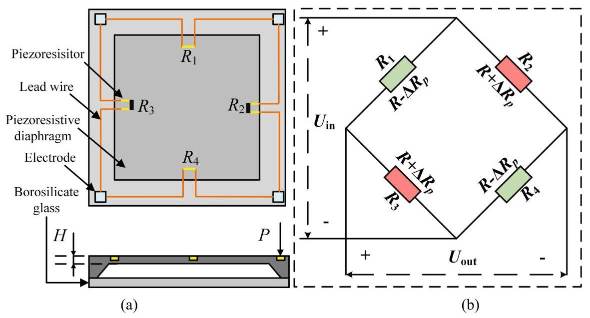

Fig. 1. (a) Piezoresistive chip structure; (b) Wheatstone bridge configuration.

图1. (a)压阻芯片结构；(b)惠斯通电桥配置。

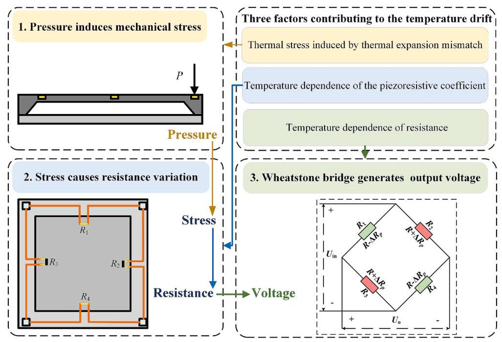

Fig. 2. Temperature drift of piezoresistive sensors.

图2. 压阻式传感器的温度漂移。

Table 1

表1

Performance parameters of the pressure sensing core.

压力传感核心的性能参数。

<table><tr><td>Parameter</td><td>Units</td><td>Performance</td></tr><tr><td>Operating absolute pressure range</td><td>MPa</td><td>0-0.5</td></tr><tr><td>Hysteresis</td><td>%FS</td><td>$\pm  {0.05}$</td></tr><tr><td>Repeatability</td><td>%FS</td><td>$\pm  {0.03}$</td></tr><tr><td>Operating temperature range</td><td>℃</td><td>-40-125</td></tr><tr><td>Input resistance</td><td>KΩ</td><td>1.6-2.5</td></tr><tr><td>Supply voltage</td><td>V</td><td>10</td></tr></table>

$\left( {{T}_{\mathrm{C}} = {T}_{\mathrm{A}}}\right)$ holds only under thermal equilibrium conditions, which severely limits compensation accuracy during dynamic temperature scenarios. By addressing this limitation, the proposed IHHO-optimized convolution and polynomial fitting strategy significantly improves measurement accuracy under varying thermal conditions.

$\left( {{T}_{\mathrm{C}} = {T}_{\mathrm{A}}}\right)$仅在热平衡条件下成立，这在动态温度情况下严重限制了补偿精度。通过解决这个限制，所提出的IHHO优化卷积和多项式拟合策略在变化的热条件下显著提高了测量精度。

### 3.1. Convolution kernel function derivation based on the transient thermal impedance network

### 3.1. 基于瞬态热阻抗网络的卷积核函数推导

In this section, the transient thermal impedance network of the piezoresistive sensor is established by analyzing the heat convection and heat conduction processes. Furthermore, a convolution-based compensation method is proposed, which enables real-time calculation of the piezoresistive chip temperature based on historical ambient temperature data.

在本节中，通过分析热对流和热传导过程，建立了压阻式传感器的瞬态热阻抗网络。此外，提出了一种基于卷积的补偿方法，该方法能够根据历史环境温度数据实时计算压阻芯片温度。

As illustrated in Fig. 4, the heat transfer process in the piezoresistive pressure sensor involves both convective and conductive mechanisms. The blue arrows represent convective heat exchange between the external environment and the sensor housing, where ${T}_{\mathrm{A}}$ is the ambient temperature, ${T}_{\mathrm{H}}$ is the temperature of the housing, and ${T}_{\mathrm{C}}$ is the temperature of the piezoresistive chip. The red arrows represent the internal heat conduction path, which proceeds sequentially from the housing to the piezoresistive core, then through the mounting substrate, and finally to the piezoresistive chip.

如图4所示，压阻式压力传感器中的热传递过程涉及对流和传导机制。蓝色箭头表示外部环境与传感器外壳之间的对流热交换，其中${T}_{\mathrm{A}}$是环境温度，${T}_{\mathrm{H}}$是外壳温度，${T}_{\mathrm{C}}$是压阻芯片温度。红色箭头表示内部热传导路径，该路径依次从外壳到压阻核心，然后通过安装基板，最后到达压阻芯片。

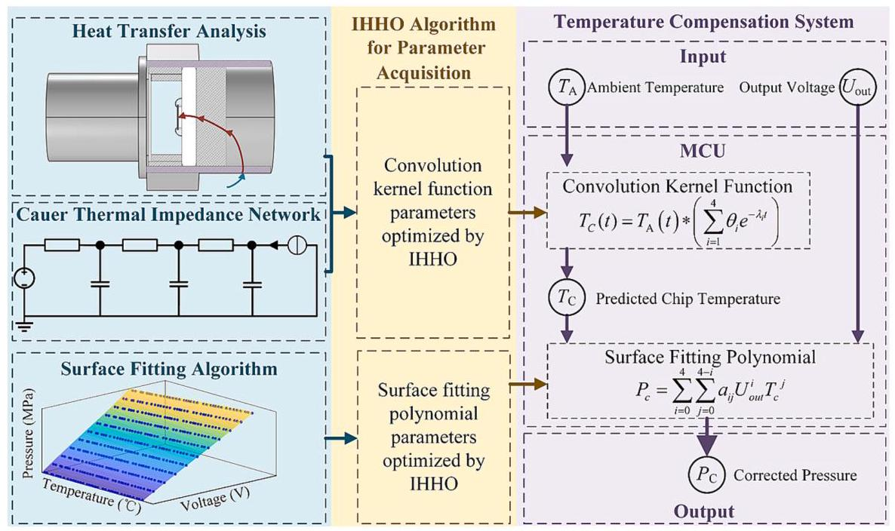

Fig. 3. Dynamic thermal drift compensation strategy.

图3. 动态热漂移补偿策略。

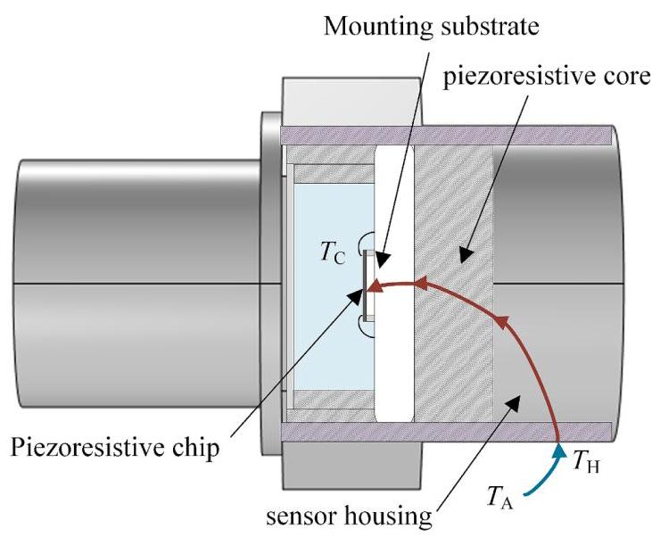

Fig. 4. Heat transfer process of the piezoresistive sensor.

图4. 压阻式传感器的热传递过程。

#### 3.1.1. Convective heat transfer analysis

#### 3.1.1. 对流热传递分析

Assuming that the ambient temperature remains constant at ${T}_{\infty }$ and the initial temperature of the sensor housing is ${T}_{0}$ , the heat flux due to convective heat transfer at the sensor surface is approximately equal to the rate of change in the internal energy of the sensor housing. Thus, the following equation is obtained:

假设环境温度保持在${T}_{\infty }$不变，传感器外壳的初始温度为${T}_{0}$，传感器表面由于对流热传递产生的热通量近似等于传感器外壳内能的变化率。因此，得到以下方程:

$$
{hA}\left( {{T}_{\infty } - {T}_{\mathrm{H}}}\right)  \approx  {\rho V}{c}_{p}\frac{\mathrm{d}{T}_{\mathrm{H}}}{\mathrm{d}t} \tag{1}
$$

where $h$ is the convective heat transfer coefficient between the housing and the external environment, $A$ represents the convective heat transfer area of the sensor housing, $V$ is the volume of the sensor, and $\rho$ denotes the density of the sensor housing, and ${c}_{\mathrm{p}}$ is its specific heat capacity. Since convective heat transfer at the sensor surface can be regarded as a linear time-invariant (LTI) thermal system, when the ambient temperature ${T}_{\mathrm{A}}\left( t\right)$ varies dynamically, the sensor housing temperature can be determined using the convolution operation as follows [41]:

其中$h$为外壳与外部环境之间的对流换热系数，$A$表示传感器外壳的对流换热面积，$V$是传感器的体积，$\rho$表示传感器外壳的密度，${c}_{\mathrm{p}}$是其比热容。由于传感器表面的对流换热可视为线性时不变(LTI)热系统，当环境温度${T}_{\mathrm{A}}\left( t\right)$动态变化时，传感器外壳温度可通过如下卷积运算确定[41]:

$$
{T}_{\mathrm{H}}\left( t\right)  = {T}_{\mathrm{A}}\left( t\right)  * {h}_{1}\left( t\right) \tag{2}
$$

where ${h}_{1}\left( t\right)$ represents the unit thermal impulse response of the housing, which can be obtained by solving Eq. (1).

其中${h}_{1}\left( t\right)$表示外壳的单位热脉冲响应，可通过求解式(1)获得。

$$
{h}_{1}\left( t\right)  = \frac{hA}{{\rho V}{c}_{p}}{e}^{-\frac{hA}{{\rho V}{c}_{p}}t} = \frac{1}{{\tau }_{1}}{e}^{-\frac{t}{{\tau }_{1}}} \tag{3}
$$

where ${R}_{\mathrm{{th}}1} = 1/\left( {hA}\right) ,{C}_{\mathrm{{th}}1} = {\rho V}{c}_{\mathrm{p}},{\tau }_{1} = {R}_{th1}{C}_{th1}$ .

其中${R}_{\mathrm{{th}}1} = 1/\left( {hA}\right) ,{C}_{\mathrm{{th}}1} = {\rho V}{c}_{\mathrm{p}},{\tau }_{1} = {R}_{th1}{C}_{th1}$。

#### 3.1.2. Heat conduction analysis

#### 3.1.2. 热传导分析

The internal heat conduction analysis of the sensor can be simplified by establishing a transient thermal impedance network.

通过建立瞬态热阻抗网络，可简化传感器的内部热传导分析。

The heat conduction path of the sensor follows a sequence: from the housing to the piezoresistive core, then to the mounting substrate, and finally to the piezoresistive chip. Based on this heat conduction pathway, a third-order Cauer thermal impedance network is established [42,43] as shown in Fig. 5. In this network, ${R}_{thi},{C}_{thi}$ and ${\tau }_{i}$ correspond to the thermal resistance, thermal capacitance, and time constant at the $i$ - th stage, respectively, satisfying the relationship: ${\tau }_{i} = {R}_{thi} \bullet  {C}_{thi}$ , for pie-zoresistive sensors, ${R}_{\mathrm{{th}}2} \gg  {R}_{\mathrm{{th}}3} \gg  {R}_{\mathrm{{th}}4},{C}_{\mathrm{{th}}2} \gg  {C}_{\mathrm{{th}}3} \gg  {C}_{\mathrm{{th}}4}$ . Based on the thermal impedance network, the following equation can be derived:

传感器的热传导路径依次为:从外壳到压阻芯，再到安装基板，最后到压阻芯片。基于此热传导路径，建立了如图5所示的三阶考埃尔热阻抗网络[42,43]。在该网络中，${R}_{thi},{C}_{thi}$和${\tau }_{i}$分别对应于第$i$阶段的热阻、热容和时间常数，满足关系:${\tau }_{i} = {R}_{thi} \bullet  {C}_{thi}$，对于压阻式传感器，${R}_{\mathrm{{th}}2} \gg  {R}_{\mathrm{{th}}3} \gg  {R}_{\mathrm{{th}}4},{C}_{\mathrm{{th}}2} \gg  {C}_{\mathrm{{th}}3} \gg  {C}_{\mathrm{{th}}4}$。基于热阻抗网络，可推导如下方程:

$$
\frac{1}{{R}_{\mathrm{{th}}2}}\left( {{T}_{\mathrm{H}} - {T}_{1}}\right)  \approx  {C}_{\mathrm{{th}}2}\frac{\mathrm{d}{T}_{1}}{\mathrm{\;d}t} \tag{4}
$$

$$
{T}_{1}\left( t\right)  = {T}_{\mathrm{H}}\left( t\right)  * \left( {\frac{1}{{\tau }_{2}}{e}^{-\frac{t}{{\tau }_{2}}}}\right) \tag{5}
$$

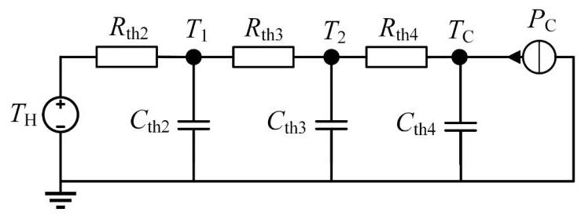

Fig. 5. Cauer thermal impedance network.

图5. 考埃尔热阻抗网络。

Based on the thermal impedance network, the chip temperature ${T}_{\mathrm{C}}\left( t\right)$ can be calculated from the ambient temperature ${T}_{\mathrm{A}}\left( t\right)$ as follows:

基于热阻抗网络，芯片温度${T}_{\mathrm{C}}\left( t\right)$可根据环境温度${T}_{\mathrm{A}}\left( t\right)$按如下方式计算:

$$
{T}_{C}\left( t\right)  = {T}_{\mathrm{A}}\left( t\right)  * {h}_{1}\left( t\right)  * {h}_{2}\left( t\right)  * {h}_{3}\left( t\right)  * {h}_{4}\left( t\right)
$$

$$
{h}_{i}\left( t\right)  = {e}^{-\frac{t}{{\tau }_{i}}}/{\tau }_{i} \tag{6}
$$

$$
{T}_{C}\left( t\right)  = {T}_{\mathrm{A}}\left( t\right)  * \left( {\mathop{\sum }\limits_{{i = 1}}^{4}{\theta }_{i}{e}^{-{\lambda }_{i}t}}\right) \tag{7}
$$

where ${\theta }_{\mathrm{i}}$ and ${\lambda }_{\mathrm{i}}$ are the parameters of the convolution kernel function, which are optimized using the IHHO algorithm.

其中${\theta }_{\mathrm{i}}$和${\lambda }_{\mathrm{i}}$是卷积核函数的参数，使用IHHO算法进行优化。

### 3.2. Surface fitting algorithm for pressure calibration

### 3.2. 压力校准的曲面拟合算法

From the analysis of the piezoresistive sensor principles in section 2, it is evident that the output voltage of the pressure sensor is a function of both pressure and temperature. Consequently, the corrected pressure measurement can be calculated using the surface fitting polynomial, as expressed in Eq. (8):

从第2节中压阻式传感器原理的分析可知，压力传感器的输出电压是压力和温度的函数。因此，可使用曲面拟合多项式计算校正后的压力测量值，如式(8)所示:

$$
{P}_{c} = \mathop{\sum }\limits_{{i = 0}}^{4}\mathop{\sum }\limits_{{j = 0}}^{{4 - i}}{a}_{ij}{U}_{\text{ out }}^{i}{T}_{c}^{j} \tag{8}
$$

where ${P}_{c}$ denotes the corrected pressure measurement, ${U}_{\text{ out }}$ represents the output voltage, and ${T}_{c}$ corresponds to the chip temperature. A higher polynomial order enhances the accuracy of surface fitting but also increases the computational complexity. To evaluate this trade-off, polynomial models of orders 3 to 5 were tested and compared in terms of mean squared error (MSE), root mean squared error (RMSE), mean absolute error (MAE), maximum full-scale error, and optimization time. The results are summarized in Table 2. The fourth-order polynomial was ultimately selected due to its favorable trade-off between fitting performance and execution time.

其中${P}_{c}$表示校正后的压力测量值，${U}_{\text{ out }}$表示输出电压，${T}_{c}$对应芯片温度。多项式阶数越高，曲面拟合的精度越高，但计算复杂度也会增加。为评估这种权衡，对3至5阶的多项式模型进行了测试，并在均方误差(MSE)、均方根误差(RMSE)、平均绝对误差(MAE)、最大满量程误差和优化时间方面进行了比较。结果总结在表2中。最终选择了四阶多项式，因为它在拟合性能和执行时间之间具有良好的权衡。

To optimize the parameters ${a}_{\mathrm{{ij}}}$ in the surface fitting algorithm, IHHO is employed to search for the optimal solution by evaluating the fitness function. To minimize the error as much as possible, root mean squared error (RMSE) is adopted as the fitness function:

为了优化曲面拟合算法中的参数${a}_{\mathrm{{ij}}}$，采用IHHO通过评估适应度函数来搜索最优解。为了尽可能减小误差，采用均方根误差(RMSE)作为适应度函数:

$$
{\text{ fitness }}_{1} = \sqrt{\frac{1}{{N}_{1}}\mathop{\sum }\limits_{{i = 1}}^{{N}_{1}}{\left( {P}_{\text{ pred }, i} - {P}_{i}\right) }^{2}} \tag{9}
$$

where ${N}_{1}$ represents the number of data points in the dataset, ${P}_{i}$ denotes the $i$ -th actual pressure value, and ${P}_{\text{ pred }, i}$ is the corresponding predicted value computed by the polynomial model (8).

其中${N}_{1}$表示数据集中的数据点数，${P}_{i}$表示第$i$个实际压力值，${P}_{\text{ pred }, i}$是由多项式模型(8)计算得到的相应预测值。

### 3.3. IHHO algorithm for parameter acquisition

### 3.3. 参数获取的IHHO算法

Harris Hawks Optimization (HHO) is a swarm intelligence-based optimization algorithm introduced by Ali Asghar Heidari et al. in 2019 [44,45]. It is inspired by the hunting strategies of Harris hawks, which involve searching, besieging, and attacking prey. The optimization process of HHO comprises two primary phases: Exploration phase and exploitation phase. The HHO algorithm employs diverse strategies to accommodate different stages of the optimization process, effectively balancing global search to prevent entrapment in local optima while ensuring rapid convergence. Fig. 6 illustrates the basic structure of the HHO algorithm.

哈里斯鹰优化算法(HHO)是由阿里·阿斯加尔·海达里等人于2019年提出的一种基于群体智能的优化算法[44,45]。它的灵感来源于哈里斯鹰的狩猎策略，包括搜索、围攻和攻击猎物。HHO的优化过程包括两个主要阶段:探索阶段和利用阶段。HHO算法采用多种策略来适应优化过程的不同阶段，有效地平衡全局搜索以防止陷入局部最优，同时确保快速收敛。图6展示了HHO算法的基本结构。

Table 2

表2

Performance of surface fitting polynomials.

曲面拟合多项式的性能。

<table><tr><td>Order</td><td>MSE</td><td>RMSE (MPa)</td><td>MAE (MPa)</td><td>Max FS error (% FS)</td><td>Optimization Time(s)</td></tr><tr><td>3</td><td>4.185 ✘ ${10}^{-9}$</td><td>6.469 ✘ ${10}^{-5}$</td><td>5.156 ✘ ${10}^{-5}$</td><td>0.0456 %</td><td>978.7</td></tr><tr><td>4</td><td>2.277 × ${10}^{-9}$</td><td>4.772 × ${10}^{-5}$</td><td>${3.873} \times \; {10}^{-5}$</td><td>0.0227 %</td><td>2291.6</td></tr><tr><td>5</td><td>${2.267} \times \; {10}^{-9}$</td><td>${4.761} \times \; {10}^{-5}$</td><td>3.971 ${10}^{-5}$</td><td>0.0268 %</td><td>4319.9</td></tr></table>

The convergence strategies of the Harris Hawks Optimization (HHO) algorithm at different stages are as follows:

哈里斯鹰优化算法(HHO)在不同阶段的收敛策略如下:

1) Exploration phase: Harris hawks randomly perch at various locations and adjust their positions based on the movements of prey and other hawks, thereby expanding the search space. The position update mechanism is defined as follows:

1) 探索阶段:哈里斯鹰随机栖息在不同位置，并根据猎物和其他鹰的移动来调整它们的位置，从而扩大搜索空间。位置更新机制定义如下:

$$
X\left( {t + 1}\right)  = \left\{  \begin{matrix} {X}_{\text{ rand }}\left( t\right)  - {r}_{1}\left| {{X}_{\text{ rand }}\left( t\right)  - 2{r}_{2}X\left( t\right) }\right| q \geq  {0.5} \\  \left( {{X}_{\text{ rabbit }}\left( t\right)  - {X}_{\mathrm{m}}\left( t\right) }\right)  - {r}_{3}\left( {{LB} + {r}_{4}\left( {{UB} - {LB}}\right) }\right) q < {0.5} \end{matrix}\right.
$$

(10)

where $X\left( t\right)$ and $X\left( {t + 1}\right)$ denote the positions of the hawk in the current and next iterations, respectively. ${X}_{\text{ rand }}\left( t\right)$ represents the position of a randomly selected hawk within the group, while ${X}_{\mathrm{m}}\left( t\right)$ is the average position of all hawks, and ${X}_{\text{ rabbit }}\left( t\right)$ corresponds to the prey’s position. The parameters ${r}_{1},{r}_{2},{r}_{3},{r}_{4}$ and $q$ are random values uniformly distributed in the range [0,1]. ${UB}$ and ${LB}$ define the upper and lower bounds of the variables, respectively.

其中，$X\left( t\right)$和$X\left( {t + 1}\right)$分别表示鹰在当前和下一次迭代中的位置。${X}_{\text{ rand }}\left( t\right)$表示组内随机选择的一只鹰的位置，而${X}_{\mathrm{m}}\left( t\right)$是所有鹰的平均位置，${X}_{\text{ rabbit }}\left( t\right)$对应猎物的位置。参数${r}_{1},{r}_{2},{r}_{3},{r}_{4}$和$q$是在[0,1]范围内均匀分布的随机值。${UB}$和${LB}$分别定义变量的上下界。

When $q < {0.5}$ , the hawks prioritize the positions of other hawks, engaging in cooperative searching. Conversely, when $q \geq  {0.5}$ , they focus on global exploration and the prey's location, thereby expanding the search space.

当$q < {0.5}$ 时，鹰优先考虑其他鹰的位置，进行合作搜索。相反，当$q \geq  {0.5}$ 时，它们专注于全局探索和猎物的位置，从而扩大搜索空间。

2) Transition from exploration to exploitation: The HHO algorithm determines the hunting strategy based on the escaping energy $E$ of the prey:

2) 从探索到利用的过渡:HHO算法根据猎物的逃逸能量$E$确定狩猎策略:

$$
E = 2{E}_{0}\left( {1 - \frac{t}{T}}\right) \tag{11}
$$

where ${E}_{0}$ denotes the initial escaping energy, which randomly varies within the range $\left\lbrack  {-1,1}\right\rbrack$ at each iteration. t represents the current iteration index, and $T$ denotes the maximum number of iterations. When $\left| E\right| \; \geq  1$ , the hawks remain in the exploration phase; however, if $\left| E\right|  < 1$ , they transition to the exploitation phase.

其中，${E}_{0}$表示初始逃逸能量，每次迭代时在$\left\lbrack  {-1,1}\right\rbrack$范围内随机变化。t表示当前迭代索引，$T$表示最大迭代次数。当$\left| E\right| \; \geq  1$ 时，鹰保持在探索阶段；然而，如果$\left| E\right|  < 1$ ，它们则过渡到利用阶段。

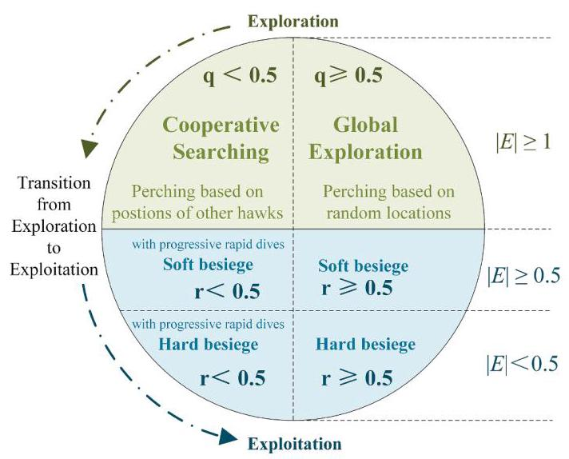

Fig. 6. Structure of the HHO algorithm.

图6. HHO算法的结构。

3) Exploitation phase: At this stage, the hawks determine their attack strategy based on the escaping energy $E$ and the prey’s escape probability $r$ :

3) 利用阶段:在这个阶段，鹰根据逃逸能量$E$和猎物的逃脱概率$r$确定它们的攻击策略:

When $r \geq  {0.5}$ and $\left| \mathrm{E}\right|  \geq  {0.5}$ , the hawks employ the soft besiege strategy:

当$r \geq  {0.5}$ 和$\left| \mathrm{E}\right|  \geq  {0.5}$ 时，鹰采用软围攻策略:

$$
X\left( {t + 1}\right)  = {X}_{\text{ rabbit }}\left( t\right)  - X\left( t\right)  - E\left| {J{X}_{\text{ rabbit }}\left( t\right)  - X\left( t\right) }\right| \tag{12}
$$

where $J = 2\left( {1 - {r}_{5}}\right)$ denotes the prey’s jumping strength, and ${r}_{5}$ is a random number within the range $\left\lbrack  {0,1}\right\rbrack$ .

其中，$J = 2\left( {1 - {r}_{5}}\right)$表示猎物的跳跃强度，${r}_{5}$是在$\left\lbrack  {0,1}\right\rbrack$范围内的一个随机数。

When $r \geq  {0.5}$ and $\left| \mathrm{E}\right|  < {0.5}$ , the hawks employ the hard besiege strategy:

当$r \geq  {0.5}$ 和$\left| \mathrm{E}\right|  < {0.5}$ 时，鹰采用硬围攻策略:

$$
X\left( {t + 1}\right)  = {X}_{\text{ rabbit }}\left( t\right)  - E\left| {{X}_{\text{ rabbit }}\left( t\right)  - X\left( t\right) }\right| \tag{13}
$$

When $r < {0.5}$ and $\left| \mathrm{E}\right|  \geq  {0.5}$ , the hawks adopt the soft besiege with progressive rapid dives strategy:

当$r < {0.5}$ 和$\left| \mathrm{E}\right|  \geq  {0.5}$ 时，鹰采用软围攻并逐步快速俯冲策略:

$$
{X}_{1} = {X}_{\text{ rabbit }}\left( t\right)  - E\left| {J{X}_{\text{ rabbit }}\left( t\right)  - X\left( t\right) }\right| \tag{14}
$$

$$
{X}_{2} = {X}_{1} + \operatorname{rand}\left( {1,\dim }\right)  \times  \operatorname{levy}\left( \dim \right) \tag{15}
$$

$$
X\left( {t + 1}\right)  = \left\{  \begin{array}{ll} {X}_{1} & F\left( {X}_{1}\right)  < F\left( {X}_{2}\right) \\  {X}_{2} & F\left( {X}_{2}\right)  < F\left( {X}_{1}\right)  \end{array}\right. \tag{16}
$$

where rand $\left( {1,\dim }\right)$ is a $1 \times  \dim$ random vector, levy (dim) represents the Levy flight function, and dim denotes the problem dimension.

其中，rand $\left( {1,\dim }\right)$是一个$1 \times  \dim$随机向量，levy (dim)表示莱维飞行函数，dim表示问题维度。

When $r < {0.5}$ and $\left| \mathrm{E}\right|  < {0.5}$ , the hawks adopt the hard besiege with progressive rapid dives:

当$r < {0.5}$和$\left| \mathrm{E}\right|  < {0.5}$时，鹰采用逐步快速俯冲的硬围攻策略:

$$
{X}_{1} = {X}_{\text{ rabbit }}\left( t\right)  - E\left| {J{X}_{\text{ rabbit }}\left( t\right)  - {X}_{m}\left( t\right) }\right| \tag{17}
$$

$$
{X}_{2} = {X}_{1} + \operatorname{rand}\left( {1,\dim }\right)  \times  \operatorname{levy}\left( \dim \right) \tag{18}
$$

$$
X\left( {t + 1}\right)  = \left\{  \begin{array}{ll} {X}_{1} & F\left( {X}_{1}\right)  < F\left( {X}_{2}\right) \\  {X}_{2} & F\left( {X}_{2}\right)  < F\left( {X}_{1}\right)  \end{array}\right. \tag{19}
$$

This paper introduces Improved Harris Hawks Optimization (IHHO), which enhances the original HHO algorithm in four key aspects:

本文介绍了改进的哈里斯鹰优化算法(IHHO)，它在四个关键方面对原始的HHO算法进行了改进:

1) The original HHO algorithm employs a linearly decreasing escaping energy $E$ , which often leads to premature convergence in local optima during the early stages and slows down convergence in later iterations. To mitigate this, IHHO adopts an exponentially decreasing strategy:

1)原始的HHO算法采用线性递减的逃逸能量$E$，这常常导致在早期阶段局部最优过早收敛，而在后期迭代中收敛速度减慢。为了缓解这个问题，IHHO采用指数递减策略:

$$
E = {E}_{0} \times  \left\lbrack  {2 - 2 \times  {\left( \frac{t}{T}\right) }^{\phi }}\right\rbrack \tag{20}
$$

where $\varphi$ is the decay factor (typically set to 1.5), IHHO strengthens global exploration in the early phase and accelerates convergence in the later phase.

其中$\varphi$是衰减因子(通常设置为1.5)，IHHO在早期阶段加强全局探索，在后期阶段加速收敛。

2) In the original HHO, the position of each hawk is updated independently in every iteration. This leads to an unstable iterative process, causing excessive jumps or minimal adjustments, thereby compromising convergence stability. To mitigate this issue, IHHO incorporates a momentum factor $\alpha$ (typically set to 0.7), ensuring that each position update is influenced not only by the current computation but also by the previous position:

2)在原始的HHO中，每只鹰的位置在每次迭代中独立更新。这导致迭代过程不稳定，产生过度跳跃或极小调整，从而损害收敛稳定性。为了缓解这个问题，IHHO引入了一个动量因子$\alpha$(通常设置为0.7)，确保每个位置更新不仅受当前计算影响，还受先前位置影响:

$$
X\left( t\right)  = {X}_{0}\left( t\right)  + \alpha \left\lbrack  {{X}_{0}\left( t\right)  - X\left( {t - 1}\right) }\right\rbrack \tag{21}
$$

Here, $X\left( t\right)$ denotes the final position of the hawk at iteration index $t$ , while ${X}_{0}\left( t\right)$ represents its initial position at the same iteration.

这里，$X\left( t\right)$表示鹰在迭代索引$t$处的最终位置，而${X}_{0}\left( t\right)$表示其在同一迭代中的初始位置。

3) The original HHO employs a fixed step size during the exploration phase, lacking an adaptive mechanism. To overcome this limitation, IHHO incorporates a balancing factor $\gamma$ :

3)原始的HHO在探索阶段采用固定步长，缺乏自适应机制。为了克服这个限制，IHHO引入了一个平衡因子$\gamma$:

$$
\gamma  = {0.1} + {0.4}\left( {1 - \frac{t}{T}}\right) \tag{22}
$$

$$
X\left( {t + 1}\right)  = \left( {{X}_{\text{ rabbit }}\left( t\right)  - {X}_{\mathrm{m}}\left( t\right) }\right)  - \gamma {r}_{3}\left( {{LB} + {r}_{4}\left( {{UB} - {LB}}\right) }\right) \tag{23}
$$

In the early stage of the search, $\gamma  = {0.5}$ , enhancing global exploration capability. As the search progresses, $\gamma$ decreases to 0.1, improving local optimization efficiency.

在搜索的早期阶段，$\gamma  = {0.5}$，增强全局探索能力。随着搜索进行，$\gamma$减小到0.1，提高局部优化效率。

4) In the original HHO, the jumping strength $J$ remains fixed in the escaping strategy, limiting its adaptability to different search stages. To address this issue, IHHO dynamically adjusts the jumping strength using the balancing factor $\gamma$ and proposes an improved Levy flight function LF (dim):

4)在原始的HHO中，逃逸策略中的跳跃强度$J$保持固定，限制了其对不同搜索阶段的适应性。为了解决这个问题，IHHO使用平衡因子$\gamma$动态调整跳跃强度，并提出了改进的莱维飞行函数LF(维度):

$$
J = 2{\left( 1 - {r}_{5}\right) }^{\gamma } \tag{24}
$$

$$
{LF}\left( \dim \right)  = \gamma  \times  \operatorname{levy}\left( \dim \right) \tag{25}
$$

## 4. Experimental validation

## 4. 实验验证

To train the dynamic temperature compensation model, calibration experiment was first conducted. Subsequently, both static temperature compensation experiments and dynamic temperature compensation experiments were performed to validate the effectiveness of the proposed method. The experimental platform used in this study is illustrated in Fig. 7. The experimental setup consists of a pressure sensor, temperature sensor, gas pressure pump, temperature compensation test bench, compensation system board, voltage source, and host computer. The gas pressure pump is equipped with a digital pressure gauge with an accuracy of 0.05% FS. Silicone oil is used as the environmental medium for the pressure sensor, and the temperature compensation test bench is capable of controlling the temperature of the silicone oil, while the temperature sensor is used to monitor the oil temperature. A ${10}\mathrm{\;V}$ voltage source powers the pressure sensor, whose output voltage is monitored and processed by the temperature compensation system board before being transmitted to the host computer for analysis.

为了训练动态温度补偿模型，首先进行了校准实验。随后，进行了静态温度补偿实验和动态温度补偿实验，以验证所提方法的有效性。本研究中使用的实验平台如图7所示。实验装置包括压力传感器、温度传感器、气压泵、温度补偿试验台、补偿系统板、电压源和主机。气压泵配备有精度为0.05%FS的数字压力计。硅油用作压力传感器的环境介质，温度补偿试验台能够控制硅油的温度，而温度传感器用于监测油温。一个${10}\mathrm{\;V}$电压源为压力传感器供电，其输出电压在由温度补偿系统板监测和处理后传输到主机进行分析。

### 4.1. Calibration experiment

### 4.1. 校准实验

To determine the surface fitting polynomial coefficients ${a}_{\mathrm{{ij}}}$ , an output characteristic calibration experiment was conducted. Similarly, a thermal characteristic calibration experiment was performed to identify the convolution kernel parameters ${\theta }_{\mathrm{i}}$ and ${\lambda }_{\mathrm{i}}$ .

为了确定表面拟合多项式系数${a}_{\mathrm{{ij}}}$，进行了输出特性校准实验。同样，进行了热特性校准实验以识别卷积核参数${\theta }_{\mathrm{i}}$和${\lambda }_{\mathrm{i}}$。

#### 4.1.1. Static output characteristic calibration experiment

#### 4.1.1. 静态输出特性校准实验

A total of 39 temperature points were selected within the range of $- {10}^{ \circ  }\mathrm{C}$ to ${113}^{ \circ  }\mathrm{C}$ to conduct the calibration experiment for the sensor. At each temperature point, the sensor was maintained at the target temperature for at least ${30}\mathrm{\;{min}}$ before measurement to ensure that the entire pressure sensor reached equilibrium, meaning that ${T}_{\mathrm{C}} = {T}_{\mathrm{A}}$ .

在$- {10}^{ \circ  }\mathrm{C}$到${113}^{ \circ  }\mathrm{C}$的范围内总共选择了39个温度点来进行传感器的校准实验。在每个温度点，在测量前将传感器保持在目标温度至少${30}\mathrm{\;{min}}$，以确保整个压力传感器达到平衡，即${T}_{\mathrm{C}} = {T}_{\mathrm{A}}$。

The data obtained from the calibration experiment were used to train the surface fitting algorithm, establishing the relationship between chip temperature, output voltage, and input pressure. During the calibration process, the applied pressure was increased from 0 MPa to the full scale of ${0.5}\mathrm{{MPa}}$ , with the output voltage recorded at intervals of ${0.05}\mathrm{{MPa}}$ . This procedure is referred to as the pressure loading process. Conversely, decreasing the pressure from ${0.5}\mathrm{{MPa}}$ back to $0\mathrm{{MPa}}$ is defined as the pressure unloading process.

从校准实验中获得的数据用于训练表面拟合算法，建立芯片温度、输出电压和输入压力之间的关系。在校准过程中，施加的压力从0MPa增加到${0.5}\mathrm{{MPa}}$的满量程，以${0.05}\mathrm{{MPa}}$的间隔记录输出电压。这个过程称为压力加载过程。相反，将压力从${0.5}\mathrm{{MPa}}$降低回$0\mathrm{{MPa}}$定义为压力卸载过程。

After completing three full pressure loading and unloading cycles, the individual output voltage measurements at each pressure level were recorded. The output voltage for the three cycles at ${37}^{ \circ  }\mathrm{C}$ is shown in Fig. 8. Initially, the results from all three cycles were analyzed to assess repeatability and potential hysteresis. Since the maximum voltage deviation between any two cycles at each pressure level was found to be below ${10}\mathrm{{mV}}$ , indicating minimal hysteresis, the mean output voltage at each pressure level was calculated and used as the calibrated output voltage. A subset of the calibration experiment data is shown in Fig. 9.

在完成三个完整的压力加载和卸载循环后，记录了每个压力水平下的单个输出电压测量值。${37}^{ \circ  }\mathrm{C}$ 处三个循环的输出电压如图8所示。最初，对所有三个循环的结果进行了分析，以评估重复性和潜在的滞后现象。由于发现每个压力水平下任意两个循环之间的最大电压偏差低于${10}\mathrm{{mV}}$，表明滞后现象最小，因此计算了每个压力水平下的平均输出电压，并将其用作校准后的输出电压。校准实验数据的一个子集如图9所示。

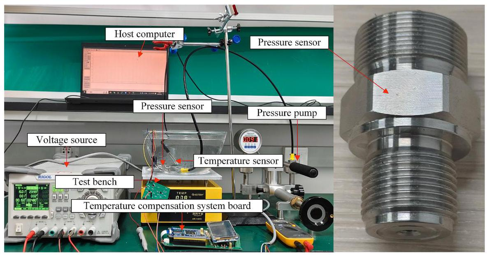

Fig. 7. Temperature compensation testing platform.

图7. 温度补偿测试平台。

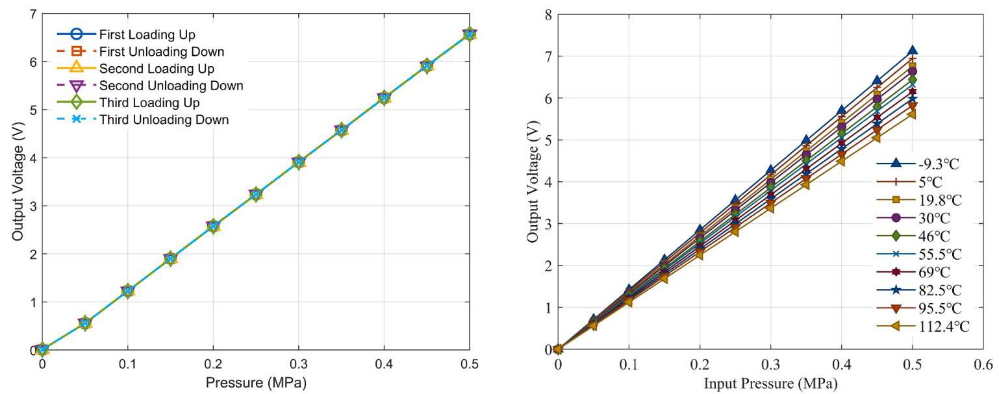

Fig. 8. Output voltage across three loading/unloading cycles.

图8. 三个加载/卸载循环的输出电压。

The calibration results indicate that the output voltage of the sensor is highly sensitive to temperature variations, leading to significant measurement errors. In this study, the measurement accuracy of the pressure sensor is evaluated using the full-scale error (denoted as ${E}_{FS}$ ), which is defined as:

校准结果表明，传感器的输出电压对温度变化高度敏感，导致显著的测量误差。在本研究中，使用满量程误差(记为${E}_{FS}$)评估压力传感器的测量精度，其定义为:

$$
{E}_{FS} = \frac{{P}_{c} - {P}_{a}}{{P}_{FS}} \times  {100}\% \tag{26}
$$

where ${P}_{\mathrm{c}}$ is the pressure measurement result, ${P}_{\mathrm{a}}$ is the ground-truth pressure input, and ${P}_{FS}$ is the full-scale range of the sensor.

其中${P}_{\mathrm{c}}$是压力测量结果，${P}_{\mathrm{a}}$是真实压力输入，${P}_{FS}$是传感器的满量程范围。

When using the sensitivity at ${55.5}^{ \circ  }\mathrm{C}\left( {{12.64}\mathrm{\;V}/\mathrm{{MPa}}}\right)$ as the reference for pressure calculation, the full-scale errors ${E}_{\mathrm{{FS}}}$ under different temperature and pressure conditions are shown in Fig. 10. The maximum full-scale error reaches ${12.7}\% \mathrm{{FS}}$ . The original HHO algorithm and the improved IHHO algorithm were used to optimize the parameters of the surface fitting model, and their compensation performance was compared. To ensure a fair comparison, both algorithms were configured with the same optimization hyperparameters, including the number of search agents, maximum number of iterations, parameter bounds, and dimensionality.

当以${55.5}^{ \circ  }\mathrm{C}\left( {{12.64}\mathrm{\;V}/\mathrm{{MPa}}}\right)$处的灵敏度作为压力计算的参考时，不同温度和压力条件下的满量程误差${E}_{\mathrm{{FS}}}$如图10所示。最大满量程误差达到${12.7}\% \mathrm{{FS}}$。使用原始的HHO算法和改进的IHHO算法对曲面拟合模型的参数进行优化，并比较它们的补偿性能。为确保公平比较，两种算法都配置了相同的优化超参数，包括搜索代理数量、最大迭代次数、参数边界和维度。

Fig. 9. Calibration data of the pressure sensor.

图9.压力传感器的校准数据。

The convergence curve, shown in Fig. 11, demonstrates that the final best fitness (RMSE) of the IHHO algorithm was only 0.094% of that of the HHO algorithm, indicating that IHHO exhibits superior performance.

图11所示的收敛曲线表明，IHHO算法的最终最佳适应度(RMSE)仅为HHO算法的0.094%，表明IHHO表现出卓越的性能。

The IHHO algorithm was finally employed to optimize the surface fitting algorithm parameters, and the final fitted surface is shown in Fig. 12. After applying this surface fitting polynomial to compensate for the calibration data, the full-scale error of the output pressure is presented in Fig. 13, with a maximum full-scale error of 0.02265 % FS.

最终采用IHHO算法优化曲面拟合算法参数，最终拟合曲面如图12所示。将此曲面拟合多项式应用于校准数据补偿后，输出压力的满量程误差如图13所示，最大满量程误差为0.02265%FS。

#### 4.1.2. Thermal characteristic calibration experiment

#### 4.1.2. 热特性校准实验

The IHHO algorithm is used to optimize the parameters of the convolution kernel function based on data obtained from the thermal characteristic calibration experiment. As the convolution kernel models the dynamic thermal relationship between the ambient temperature and the chip temperature, it is crucial to acquire both the ambient temperature ${T}_{\mathrm{A}}\left( t\right)$ and the corresponding predicted chip temperature ${T}_{\mathrm{C}}\left( t\right)$ over time. These paired temperature profiles serve as the training dataset for the optimization process.

基于热特性校准实验获得的数据，使用IHHO算法优化卷积核函数的参数。由于卷积核模拟环境温度与芯片温度之间的动态热关系，随时间获取环境温度${T}_{\mathrm{A}}\left( t\right)$和相应的预测芯片温度${T}_{\mathrm{C}}\left( t\right)$至关重要。这些配对的温度曲线用作优化过程的训练数据集。

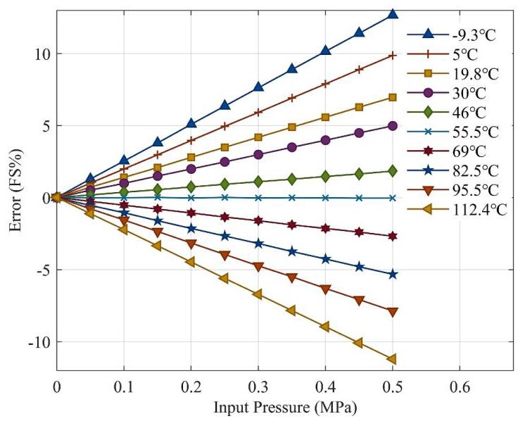

Fig. 10. Full-scale error before compensation.

图10.补偿前的满量程误差。

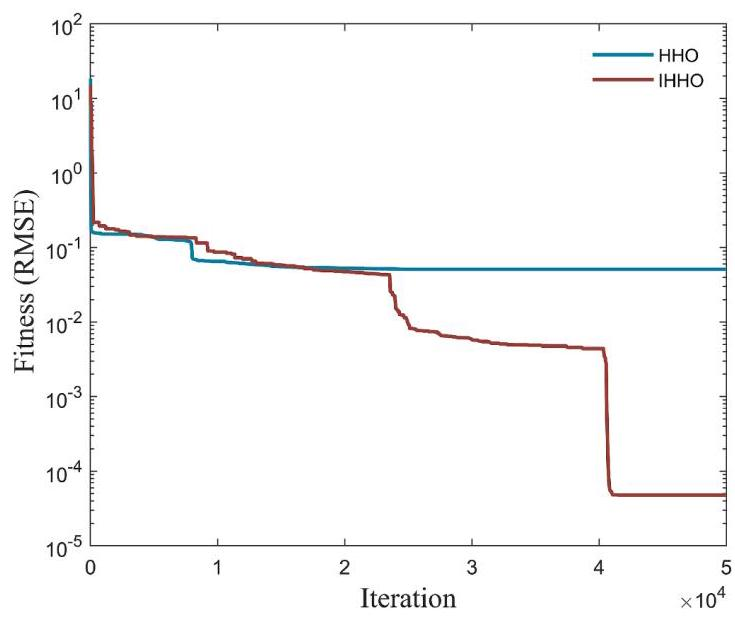

Fig. 11. Training convergence curve.

图11.训练收敛曲线。

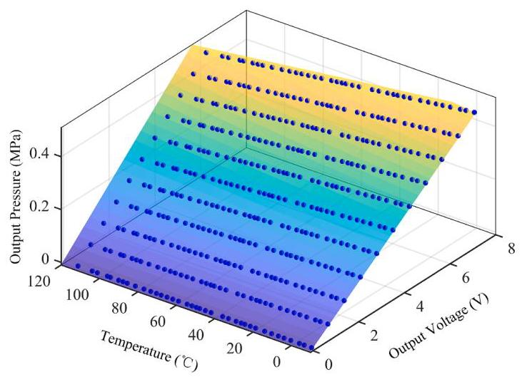

Fig. 12. Surface fitting results of calibration experiment data.

图12.校准实验数据的曲面拟合结果。

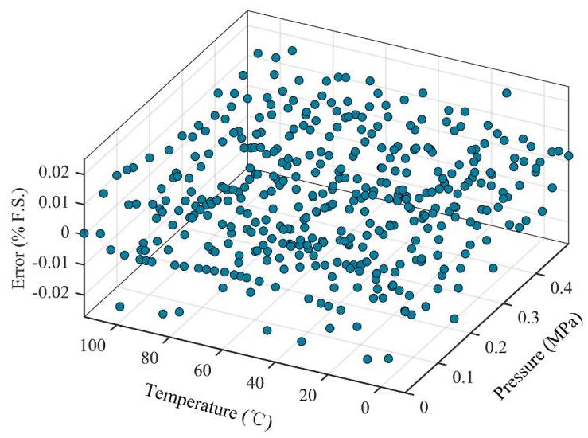

Fig. 13. Full-scale error after compensation. (Calibration experiment).

图13.补偿后的满量程误差。(校准实验)

To ensure that the convolution-based compensation method maintains high accuracy under different environmental conditions, a complex operating scenario was selected for optimizing the convolution kernel, as shown in Fig. 15. In this scenario, the ambient temperature of the sensor undergoes a heating-cooling-heating-cooling cycle, during which the ambient temperature ${T}_{\mathrm{A}}\left( t\right)$ is recorded, as represented by the blue curve. During the dynamic process, the output voltage ${U}_{\text{ out }}\left( t\right)$ was recorded, while the applied pressure $P$ remained constant at ${0.5}\mathrm{{MPa}}$ .

为确保基于卷积的补偿方法在不同环境条件下保持高精度，选择了一个复杂的操作场景来优化卷积核，如图15所示。在该场景中，传感器的环境温度经历加热 - 冷却 - 加热 - 冷却循环，在此期间记录环境温度${T}_{\mathrm{A}}\left( t\right)$，如蓝色曲线所示。在动态过程中，记录输出电压${U}_{\text{ out }}\left( t\right)$，而施加的压力$P$保持恒定在${0.5}\mathrm{{MPa}}$。

Since the pressure remained constant during the experiment, the output voltage ${U}_{\text{ out }}\left( t\right)$ was solely influenced by the chip temperature ${T}_{\mathrm{C}}\left( t\right)$ . Therefore, ${T}_{\mathrm{C}}\left( t\right)$ during the experimental process can be calculated from ${U}_{\text{ out }}\left( t\right)$ using the polynomial described in Eq. (27). The polynomial coefficients ${b}_{i}$ in Eq. (27) were trained using the IHHO algorithm based on the output characteristic calibration data. As shown in Fig. 14, the polynomial prediction agrees well with the calibration data, achieving an ${R}^{2}$ value of 0.9999 . The resulting chip temperature ${T}_{\mathrm{C}}\left( t\right)$ calculated from Eq. (27) is represented by the red solid curve in Fig. 15.

由于实验过程中压力保持恒定，输出电压${U}_{\text{ out }}\left( t\right)$仅受芯片温度${T}_{\mathrm{C}}\left( t\right)$影响。因此，实验过程中的${T}_{\mathrm{C}}\left( t\right)$可使用式(27)中描述的多项式从${U}_{\text{ out }}\left( t\right)$计算得出。式(27)中的多项式系数${b}_{i}$基于输出特性校准数据使用IHHO算法进行训练。如图14所示，多项式预测与校准数据吻合良好，${R}^{2}$值达到0.9999。由式(27)计算得出的所得芯片温度${T}_{\mathrm{C}}\left( t\right)$如图15中的红色实线曲线所示。

$$
{T}_{c} = \mathop{\sum }\limits_{{i = 0}}^{4}{b}_{i}{U}_{\text{ out }}^{i} \tag{27}
$$

To optimize the convolution kernel parameters ${\theta }_{\mathrm{i}}$ and ${\lambda }_{\mathrm{i}}$ in Eq. (7), IHHO is employed to search for the optimal solution by evaluating the fitness function. During the process shown in Fig. 15, the ambient temperature ${T}_{\mathrm{A}}\left( t\right)$ and the predicted chip temperature ${T}_{\mathrm{C}}\left( t\right)$ from Eq. (27) served as the training data for the IHHO algorithm. To minimize the prediction error, root mean squared error (RMSE) is adopted as the fitness function:

为了优化式(7)中的卷积核参数${\theta }_{\mathrm{i}}$和${\lambda }_{\mathrm{i}}$，采用IHHO通过评估适应度函数来寻找最优解。在图15所示的过程中，环境温度${T}_{\mathrm{A}}\left( t\right)$和式(27)中的预测芯片温度${T}_{\mathrm{C}}\left( t\right)$作为IHHO算法的训练数据。为了最小化预测误差，采用均方根误差(RMSE)作为适应度函数:

$$
{\text{ fitness }}_{2} = \sqrt{\frac{1}{{N}_{2}}\mathop{\sum }\limits_{{i = 1}}^{{N}_{2}}{\left( {T}_{\text{ pred }, i} - {T}_{i}\right) }^{2}} \tag{28}
$$

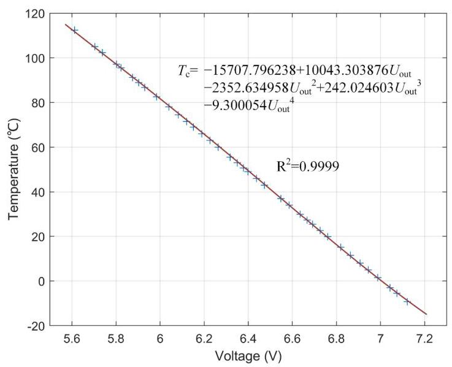

Fig. 14. Polynomial fitting of chip temperature versus output voltage.

图14.芯片温度与输出电压的多项式拟合。

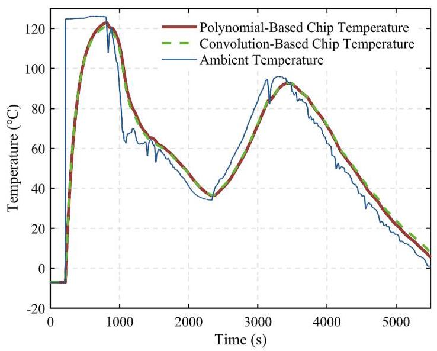

Fig. 15. Chip temperature prediction based on convolution methods.

图15.基于卷积方法的芯片温度预测。

where ${N}_{2}$ is the number of data points in the dataset, ${T}_{i}$ is the chip temperature for the $i$ -th data point in the training set, and ${T}_{\text{ pred }, i}$ is the corresponding chip temperature prediction calculated using the convolution formula in Eq. (7). The optimization process achieved a best fitness value of 1.403. The predicted chip temperature obtained through the convolution operation ${T}_{\mathrm{c}1}\left( t\right)$ is represented by the green dashed line in Fig. 15. The optimized convolution kernel parameters ${\theta }_{\mathrm{i}}$ and ${\lambda }_{\mathrm{i}}$ are listed in Table 3.

其中${N}_{2}$是数据集中的数据点数，${T}_{i}$是训练集中第$i$个数据点的芯片温度，${T}_{\text{ pred }, i}$是使用式(7)中的卷积公式计算出的相应芯片温度预测值。优化过程获得的最佳适应度值为1.403。通过卷积运算${T}_{\mathrm{c}1}\left( t\right)$得到的预测芯片温度由图15中的绿色虚线表示。优化后的卷积核参数${\theta }_{\mathrm{i}}$和${\lambda }_{\mathrm{i}}$列于表3中。

### 4.2. Static temperature compensation experiments

### 4.2.静态温度补偿实验

To further verify the static compensation capability of this temperature compensation method, validation experiment was conducted. Twenty temperature points, different from those in the calibration experiment, were selected within the range of $- {10}^{ \circ  }\mathrm{C}$ to ${113}^{ \circ  }\mathrm{C}$ . At each temperature point, the sensor was maintained at a stable ambient temperature for at least ${30}\mathrm{\;{min}}$ to ensure that the entire sensor system reached equilibrium. The input pressure, output voltage, and temperature of the sensor were recorded. The output pressure, calculated using the surface fitting algorithm, is shown in Fig. 16, while its FS error is presented in Fig. 17. After temperature compensation, the maximum FS error was 0.03412%FS, indicating that the influence of temperature on the output of the pressure sensor was almost entirely eliminated.

为了进一步验证这种温度补偿方法的静态补偿能力，进行了验证实验。在$- {10}^{ \circ  }\mathrm{C}$至${113}^{ \circ  }\mathrm{C}$范围内选择了20个与校准实验中不同的温度点。在每个温度点，将传感器保持在稳定的环境温度下至少${30}\mathrm{\;{min}}$，以确保整个传感器系统达到平衡。记录传感器的输入压力、输出电压和温度。使用表面拟合算法计算得到的输出压力如图16所示，其满量程误差如图17所示。经过温度补偿后，最大满量程误差为0.03412%FS，表明温度对压力传感器输出的影响几乎完全消除。

Table 3

表3

Parameters of the convolution kernel function.

卷积核函数的参数。

<table><tr><td>Exponential Term</td><td>Amplitude (Theta)</td><td>Decay Rate (lambda)</td></tr><tr><td>1st Exponential term</td><td>${\theta }_{1} = {3.9745} \times  {10}^{-4}$</td><td>${\lambda }_{1} = {0.0062}$</td></tr><tr><td>2nd Exponential term</td><td>${\theta }_{2} = {0.0028}$</td><td>${\lambda }_{2} = {0.0079}$</td></tr><tr><td>3rd Exponential term</td><td>${\theta }_{3} = {0.0027}$</td><td>${\lambda }_{3} = {0.0070}$</td></tr><tr><td>4th Exponential term</td><td>${\theta }_{4} = {0.0019}$</td><td>${\lambda }_{4} = {0.0087}$</td></tr></table>

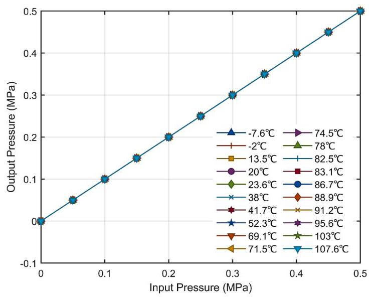

Fig. 16. Sensor output after compensation.

图16.补偿后的传感器输出。

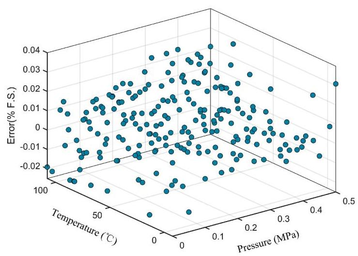

Fig. 17. Full-Scale error after compensation. (Validation experiment).

图17.补偿后的满量程误差。(验证实验)

### 4.3. Dynamic temperature compensation experiments

### 4.3.动态温度补偿实验

In this section, temperature compensation experiments were conducted under two dynamic ambient temperature variations. These scenarios included both heating and cooling processes, as well as temperature step changes and continuous temperature variations, covering a wide range of industrial temperature conditions. Therefore, the proposed convolution-based compensation method was fully validated for dynamic temperature compensation performance.

在本节中，在两种动态环境温度变化下进行了温度补偿实验。这些情况包括加热和冷却过程，以及温度阶跃变化和连续温度变化，涵盖了广泛的工业温度条件。因此，所提出的基于卷积的补偿方法在动态温度补偿性能方面得到了充分验证。

#### 4.3.1. Step change in ambient temperature

#### 4.3.1.环境温度的阶跃变化

To validate the proposed temperature compensation method, an experiment was conducted under a step change in ambient temperature. The sensor was initially maintained at ${23.7}^{ \circ  }\mathrm{C}$ for over ${30}\mathrm{\;{min}}$ to ensure equilibrium. It was then immersed in silicone oil at ${87.3}^{ \circ  }\mathrm{C}$ , and its output voltage was continuously recorded until stabilization, indicating the establishment of equilibrium in the new environment.

为了验证所提出的温度补偿方法，在环境温度阶跃变化的情况下进行了实验。传感器最初在${23.7}^{ \circ  }\mathrm{C}$下保持超过${30}\mathrm{\;{min}}$以确保平衡。然后将其浸入${87.3}^{ \circ  }\mathrm{C}$的硅油中，并连续记录其输出电压直到稳定，表明在新环境中达到平衡。

Throughout the experiment, the input pressure was kept constant at 0.5 MPa. as illustrated in Fig. 18, at 100 s, the ambient temperature underwent a step increase from ${23.7}^{ \circ  }\mathrm{C}$ to ${87.3}^{ \circ  }\mathrm{C}$ . Based on the convolution model in Eq. (7), the chip temperature ${T}_{\mathrm{C}}\left( t\right)$ was computed, represented by the blue curve.

在整个实验过程中，输入压力保持恒定在0.5 MPa。如图18所示，在100 s时，环境温度从${23.7}^{ \circ  }\mathrm{C}$阶跃升高到${87.3}^{ \circ  }\mathrm{C}$。基于式(7)中的卷积模型，计算出芯片温度${T}_{\mathrm{C}}\left( t\right)$，由蓝色曲线表示。

Temperature compensation was performed based on both the ambient temperature ${T}_{\mathrm{A}}\left( t\right)$ and the predicted chip temperature ${T}_{\mathrm{C}}\left( t\right)$ . The compensation results are shown in Fig. 19. If the output pressure is calculated using the polynomial fitting at a fixed temperature of ${27.3}^{ \circ  }\mathrm{C}$ as described in Eq. (8), without applying any temperature compensation, the pressure measurement results are represented by the green curve. As the chip temperature changes, the sensor's thermal drift error increases, with a maximum error of 0.05367 MPa. If temperature compensation is applied based on the ambient temperature ${T}_{\mathrm{A}}\left( t\right)$ , the pressure measurement results are shown by the red curve. After the sensor reaches equilibrium, the drift is largely eliminated. However, during the chip temperature variation process, overcompensation results in a maximum measurement error of 0.06389 MPa.

基于环境温度${T}_{\mathrm{A}}\left( t\right)$和预测芯片温度${T}_{\mathrm{C}}\left( t\right)$进行了温度补偿。补偿结果如图19所示。如果按照式(8)所述，在固定温度${27.3}^{ \circ  }\mathrm{C}$下使用多项式拟合来计算输出压力，而不进行任何温度补偿，压力测量结果由绿色曲线表示。随着芯片温度变化，传感器的热漂移误差增大，最大误差为0.05367MPa。如果基于环境温度${T}_{\mathrm{A}}\left( t\right)$进行温度补偿，压力测量结果由红色曲线表示。传感器达到平衡后，漂移基本消除。然而，在芯片温度变化过程中，过补偿导致最大测量误差为0.06389MPa。

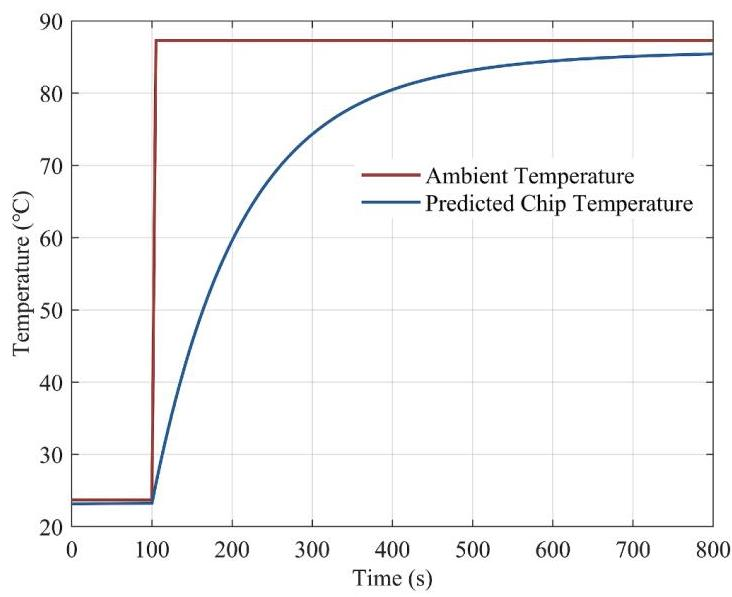

Fig. 18. Temperature variation curve. (Step change in ambient temperature).

图18.温度变化曲线。(环境温度的阶跃变化)。

When compensation is performed based on the predicted chip temperature ${T}_{\mathrm{C}}\left( t\right)$ , the results are represented by the blue curve. The measurement results are largely unaffected by temperature variations, with a maximum error of 0.00288 MPa. Compared to the uncompensated results, the error decreased by 94.63 %, and compared to the compensation based on ambient temperature ${T}_{\mathrm{A}}\left( t\right)$ , the error decreased by 95.49 %. The convolution-based compensation method demonstrates excellent dynamic temperature compensation performance.

当基于预测芯片温度${T}_{\mathrm{C}}\left( t\right)$进行补偿时，结果由蓝色曲线表示。测量结果基本不受温度变化影响，最大误差为0.00288MPa。与未补偿结果相比，误差降低了94.63%；与基于环境温度${T}_{\mathrm{A}}\left( t\right)$的补偿相比，误差降低了95.49%。基于卷积的补偿方法展现出优异的动态温度补偿性能。

#### 4.3.2. Continuous variations in ambient temperature

#### 4.3.2.环境温度的连续变化

An experiment was conducted under a continuous change in ambient temperature. The sensor was initially placed in an environment at ${106.6}{}^{ \circ  }\mathrm{C}$ for more than ${30}\mathrm{\;{min}}$ . Then, the ambient temperature was gradually decreased from ${106.6}{}^{ \circ  }\mathrm{C}$ to $- {10}^{ \circ  }\mathrm{C}$ , with the pressure held constant at 0.3 MPa throughout the process. The ambient temperature ${T}_{\mathrm{A}}\left( t\right)$ was measured using a temperature sensor, as shown by the red curve in Fig. 20. The chip temperature ${T}_{\mathrm{C}}\left( t\right)$ was calculated based on ${T}_{\mathrm{A}}\left( t\right)$ , as shown by the blue curve.

在环境温度连续变化的情况下进行了实验。传感器最初放置在${106.6}{}^{ \circ  }\mathrm{C}$的环境中超过${30}\mathrm{\;{min}}$。然后，环境温度从${106.6}{}^{ \circ  }\mathrm{C}$逐渐降至$- {10}^{ \circ  }\mathrm{C}$，在此过程中压力始终保持在0.3MPa。使用温度传感器测量环境温度${T}_{\mathrm{A}}\left( t\right)$，如图20中的红色曲线所示。根据${T}_{\mathrm{A}}\left( t\right)$计算芯片温度${T}_{\mathrm{C}}\left( t\right)$，如图蓝色曲线所示。

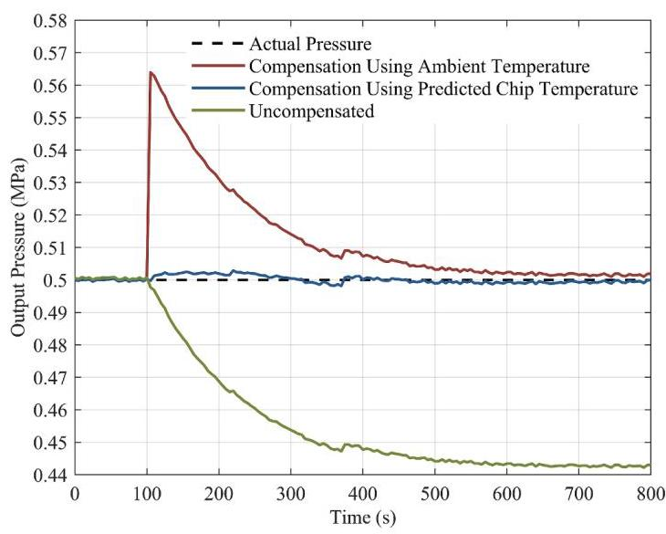

Fig. 19. Compensation results. (Step change in ambient temperature).

图19.补偿结果。(环境温度的阶跃变化)。

The sensor's measurement results are shown in Fig. 21. If the output pressure is calculated using the polynomial fitting at a fixed temperature of ${106.6}^{ \circ  }\mathrm{C}$ as described in Eq. (8), without applying any temperature compensation, the pressure measurement results are represented by the green curve, the measurement error gradually increases with temperature changes, and the maximum error is 0.0768 MPa. If compensation is applied based on the ambient temperature, the thermal drift error is almost completely eliminated once the sensor reaches equilibrium. However, during the entire process, the maximum error is 0.0072 MPa.

传感器的测量结果如图21所示。如果按照式(8)所述，在固定温度${106.6}^{ \circ  }\mathrm{C}$下使用多项式拟合来计算输出压力，而不进行任何温度补偿，压力测量结果由绿色曲线表示，测量误差随温度变化逐渐增大，最大误差为0.0768MPa。如果基于环境温度进行补偿，传感器达到平衡后热漂移误差几乎完全消除。然而，在整个过程中，最大误差为0.0072MPa。

Temperature compensation based on the predicted chip temperature effectively eliminates the drift error throughout the dynamic process, with a maximum error of only 0.0019 MPa. Compared to the uncompensated measurements, the error decreased by 97.53 %. Compared to compensation based on ambient temperature, the error decreased by 73.61 %.

基于预测芯片温度的温度补偿在整个动态过程中有效消除了漂移误差，最大误差仅为0.0019MPa。与未补偿测量相比，误差降低了97.53%。与基于环境温度的补偿相比，误差降低了73.61%。

## 5. Conclusions

## 5.结论

To tackle the significant thermal errors in piezoresistive sensors during dynamic ambient temperature variations, this study presents a dynamic thermal drift compensation method for piezoresistive sensors, based on the thermal impedance network and the Improved Harris Hawks Optimization algorithm. Initially, a thermal impedance network was constructed for the sensor, and a convolution method was proposed to calculate the chip temperature based on the ambient temperature. Furthermore, Improved Harris Hawks Optimization (IHHO) algorithm was integrated with a surface fitting algorithm to enable dynamic temperature compensation of the piezoresistive sensor, relying on the predicted chip temperature. The proposed method was experimentally validated for static temperature compensation. After compensation, the maximum measurement error in the calibration experiment was 0.02265 % FS, while the verification experiment showed a maximum error of 0.03412 % FS. Additionally, the dynamic temperature compensation performance of the proposed method was evaluated through two sets of experiments under different dynamic conditions: ambient temperature step and continuous variation. The sensor's measurement errors in these scenarios were 0.00288 MPa and 0.0019 MPa, corresponding to reductions of 94.63 % and 97.53 %, respectively, compared to the uncompensated results. Furthermore, compared to compensation based on ambient temperature, the errors were further reduced by 95.49 % and 73.61 %, respectively. The results indicate that the proposed method achieves excellent static and dynamic compensation performance, offering promising potential for practical applications in a wide range of industries.

为解决压阻式传感器在动态环境温度变化期间的显著热误差问题，本研究提出了一种基于热阻抗网络和改进型哈里斯鹰优化算法的压阻式传感器动态热漂移补偿方法。首先，为该传感器构建了一个热阻抗网络，并提出了一种卷积方法，用于根据环境温度计算芯片温度。此外，改进型哈里斯鹰优化(IHHO)算法与曲面拟合算法相结合，依靠预测的芯片温度对压阻式传感器进行动态温度补偿。所提出的方法通过静态温度补偿实验得到了验证。补偿后，校准实验中的最大测量误差为0.02265 % FS，而验证实验中的最大误差为0.03412 % FS。此外，通过在不同动态条件下的两组实验，即环境温度阶跃和连续变化，对所提出方法的动态温度补偿性能进行了评估。在这些情况下，传感器的测量误差分别为0.00288 MPa和0.0019 MPa，与未补偿结果相比，分别降低了94.63 %和97.53 %。此外，与基于环境温度的补偿相比，误差分别进一步降低了95.49 %和73.61 %。结果表明，所提出的方法具有优异的静态和动态补偿性能，在广泛的行业实际应用中具有广阔的潜力。

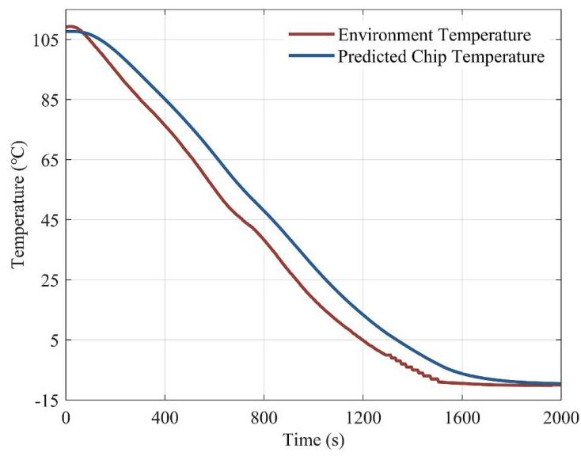

Fig. 20. Temperature variation curve. (Continuous variations in ambient temperature).

图20. 温度变化曲线。(环境温度的连续变化)。

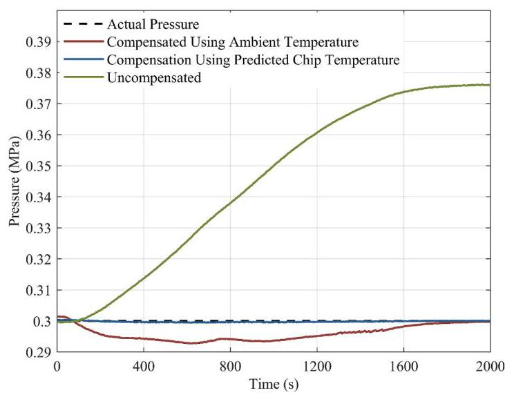

Fig. 21. Compensation results. (Continuous variations in ambient temperature).

图21.补偿结果。(环境温度的连续变化)。

## CRediT authorship contribution statement

## CRediT作者贡献声明

Chao Yuan: Supervision, Resources, Project administration, Funding acquisition, Conceptualization. Zhaoyang Wang: Writing - original draft, Visualization, Validation, Software, Methodology, Investigation, Formal analysis. Dongduan Liu: Visualization. Chengxu Tang: Validation. Qiao Li: Writing - review & editing, Methodology.

袁超:监督、资源、项目管理、资金获取、概念化。王兆阳:撰写原始草案、可视化、验证、软件、方法、调查、形式分析。刘冬端:可视化。汤成旭:验证。李乔:撰写评审与编辑、方法。

## Declaration of competing interest

## 利益冲突声明

The authors declare that they have no known competing financial interests or personal relationships that could have appeared to influence the work reported in this paper.

作者声明，他们不存在已知的可能影响本文所报告工作的竞争性财务利益或个人关系。

## Acknowledgment

## 致谢

This work was supported by the National Natural Science Foundation of China under Grant U24B20102.

本工作得到了中国国家自然科学基金项目U24B20102的支持。

## Data availability

## 数据可用性

Data will be made available on request.

数据将根据要求提供。

## References

## 参考文献

[1] Q. Meng, et al., A piezoresistive pressure sensor with centralized piezoresistors and a diamond-shape composite diaphragm, Sens. Actuators, A 369 (2024) 115134.

[2] J. Li, et al., Batch-producible all-silica fiber-optic Fabry-Perot pressure sensor for high-temperature applications up to ${800}^{ \circ  }\mathrm{C}$ , Sens. Actuators, A 334 (2022) 113363.

[3] Z. Luo, et al., Supermetalphobic surfaces fabricated by femtosecond laser enablereliable and low-hysteresis liquid metal based flexible capacitive pressure sensor, Appl. Mater. Today 42 (2025) 102621.

可靠且低滞后的基于液态金属的柔性电容式压力传感器，《应用材料今日》42 (2025) 102621。

[4] G. Zhou, et al., A smart high accuracy silicon piezoresistive pressure sensortemperature compensation system, Sensors 14 (7) (2014) 12174-12190.

温度补偿系统，《传感器》14 (7) (2014) 12174 - 12190。

[5] M. Basov, Schottky diode temperature sensor for pressure sensor, Sens. Actuators,A 331 (2021) 112930.

[6] H.J. Kim, Y.J. Kim, High performance flexible piezoelectric pressure sensor basedon CNTs doped 0-3 ceramic-epoxy nanocomposites, Mater. Des. 151 (Aug. 2018) 133-140.

关于碳纳米管掺杂的0 - 3陶瓷 - 环氧纳米复合材料，《材料设计》151(2018年8月)133 - 140。

[7] D. Du, et al., Flexible piezoresistive pressure sensor based on wrinkled layers withfast response for wearable applications, Measurement 201 (2022) 111645.

用于可穿戴应用的快速响应，《测量》201 (2022) 111645。

[8] W. Chen, X. Yan, Progress in achieving high-performance piezoresistive andcapacitive flexible pressure sensors: a review, J. Mater. Sci. Technol. 43 (2020) 175-188.

电容式柔性压力传感器综述，《材料科学与技术学报》43 (2020) 175 - 188。

[9] R. Liang, et al., Beam-membrane MEMS capacitive pressure sensor characterizedwith segmented comb and lever amplification mechanism, Measurement 250

采用分段梳齿和杠杆放大机构，测量值250(2025) 117205.

[10] C. Cheng, et al., A MEMS resonant differential pressure sensor with high accuracyby integrated temperature sensor and static pressure sensor, IEEE Electron Device Lett. 43 (12) (2022) 2157-2160.

通过集成温度传感器和静压传感器，《IEEE电子器件快报》43(12)(2022)2157 - 2160。

[11] C. Cheng, et al., Development of a new MEMS resonant differential pressure sensorwith high accuracy and high stability, Measurement 226 (2024) 114080.

具有高精度和高稳定性，Measurement 226 (2024) 114080.

[12] T. Gao, et al., Piezoelectret-based dual-mode flexible pressure sensor for accuratewrist pulse signal acquisition in health monitoring, Measurement 242 (2025) 116283.

健康监测中的腕部脉搏信号采集，《测量》242(2025)116283。

[13] J. Hu, et al., A triangular wavy substrate-integrated wearable and flexiblepiezoelectric sensor for a linear pressure measurement and application in human health monitoring, Measurement 190 (2022) 110724.

用于线性压力测量的压电传感器及其在人体健康监测中的应用，《测量》190 (2022) 110724。

[14] Y. Zhang, et al., High sensitivity pressure sensor using tandem wheatstone bridgefor low pressures, IEEE Sens. J. 24 (7) (2024) 9498-9505.

对于低压，《IEEE传感器杂志》24(7)(2024)9498 - 9505。

[15] T. Ando, Fu. Xiao-An, Materials: silicon and beyond, Sens. Actuators, A 296 (2019)340-351.

[16] M. Zhou, et al., Design, fabrication, and thermal zero drift compensation of a SOI pressure sensor for high temperature applications, Sens. Actuators, A 382 (2025)116151.

[17] F. Liu, et al., A micro SOI pressure sensor with compensation hole for hightemperature applications, IEEE Trans. Compon. Packag. Manuf. Technol. (2024).

温度应用，《IEEE 组件、封装与制造技术汇刊》(2024 年)。

[18] Y. Liu, et al., Thermal-performance instability in piezoresistive sensors:Inducement and improvement, Sensors 16 (12) (2016) 1984.

诱导与改进，《传感器》16 (12) (2016) 1984。

[19] Å. Sandvand, et al., Identification and elimination of hygro-thermo-mechanicalstress-effects in a high-precision MEMS pressure sensor, J. Microelectromech. Syst. 26 (2) (2017) 415-423.

高精度MEMS压力传感器中的应力效应，《微机电系统杂志》26 (2) (2017) 415 - 423。

[20] M. Basov, Pressure sensor with novel electrical circuit utilizing bipolar junctiontransistor, 2021 IEEE Sensors. IEEE (2021).

晶体管，2021年IEEE传感器。IEEE(2021年)。

[21] M. Basov, Research of MEMS pressure sensor stability with PDA-NFL circuit, IEEESens. J. (2024).

参议员J.(2024年)。

[22] M. Basov, Research of long-term stability of high sensitivity piezoresistive pressuresensors for ultra-low differential pressures, IEEE Sens. J. (2024).

用于超低差压的传感器，《IEEE传感器杂志》(2024年)。

[23] J.A. Chiou, S. Chen, Thermal hysteresis analysis of MEMS pressure sensors,J. Microelectromech. Syst. 14 (4) (2005) 782-787.

《微机电系统杂志》14 (4) (2005) 782 - 787。

[24] Y. Li, et al., Study on the stability of the electrical connection of high-temperaturepressure sensor based on the piezoresistive effect of p-type SiC, Micromachines 12

基于p型SiC压阻效应的压力传感器，《微机械》12(2) (2021) 216.

[25] M.O. Kayed, A.A. Balbola, W.A. Moussa, A new temperature transducer for localtemperature compensation for piezoresistive 3-D stress sensors, IEEE/ASME Trans. Mechatron. 24 (2) (2019) 832-840.

压阻式三维应力传感器的温度补偿，《IEEE/ASME 机电一体化汇刊》24 (2) (2019) 832 - 840。

[26] Z. Guo, et al., Design and implementation of a kind of high precision temperaturecompensating system for silicon-on-sapphire pressure sensor, Measurement 226

蓝宝石衬底硅压力传感器的补偿系统，测量226(2024) 114119.

[27] J. Pieniazek, P. Ciecinski, Temperature and nonlinearity compensation of pressuresensor with common sensors response, IEEE Trans. Instrum. Meas. 69 (4) (2019) 1284-1293.

具有通用传感器响应的传感器，《IEEE仪器与测量学报》69 (4) (2019) 1284 - 1293

[28] Y.-L. Yue, Xu. Shi-Jiang, X. Zuo, Nonlinear correction method of pressure sensorbased on data fusion, Measurement 199 (2022) 111303.

基于数据融合，《测量》199 (2022) 111303

[29] Z. Yao, et al., Passive resistor temperature compensation for a high-temperaturepiezoresistive pressure sensor, Sensors 16 (7) (2016) 1142.

压阻式压力传感器，《传感器》16 (7) (2016) 1142

[30] S. Gu, et al., A miniature piezoresistive transducer and a new temperaturecompensation method for new developed SEM-based nanoindentation instrument integrated with AFM function, IEEE Access 8 (2020) 104326-104335.

集成原子力显微镜功能的新型基于扫描电子显微镜的纳米压痕仪的补偿方法，《IEEE接入》8 (2020) 104326 - 104335

[31] H. Soy, I. Toy, Design and implementation of smart pressure sensor for automotiveapplications, Measurement 176 (2021) 109184.

应用，《测量》176 (2021) 109184

[32] Z. Guo, et al., Design and experimental research of a temperature compensationsystem for silicon-on-sapphire pressure sensors, IEEE Sens. J. 17 (3) (2016) 709-715.

蓝宝石衬底硅压力传感器系统，《IEEE传感器杂志》17 (3) (2016) 709 - 715

[33] Y.i. Ruan, et al., Temperature compensation and pressure bias estimation forpiezoresistive pressure sensor based on machine learning approach, IEEE Trans. Instrum. Meas. 70 (2021) 1-10.

基于机器学习方法的压阻式压力传感器，《IEEE仪器与测量学报》70 (2) (2021) 1 - 10

[34] H. Wang, et al., Research on temperature compensation of multi-channel pressurescanner based on an improved cuckoo search optimizing a BP neural network, Micromachines 13 (8) (2022) 1351.

基于改进布谷鸟搜索优化BP神经网络方法的扫描器，《微机器》13 (8) (2022) 1351

[35] X. Zhao, et al., A comprehensive compensation method for piezoresistive pressuresensor based on surface fitting and improved grey wolf algorithm, Measurement 207 (2023) 112387.

基于曲面拟合和改进灰狼算法的传感器，《测量》207 (2023)112387

[36] W. Su, et al., Thermal compensation system for silicon piezoresistive pressuresensors based on surface fitting and wild horse algorithm, IEEE Sens. J. 24 (2024) 10347-10354.

基于曲面拟合和野马算法的传感器，《IEEE传感器杂志》24 (2024) 10347 - 10354

[37] Ricardo dos Santos Pereira, Carlos Alberto Cima, Thermal compensation methodfor piezoresistive pressure transducer, IEEE Trans. Instrum. Meas. 70 (2021) 1-7.

用于压阻式压力传感器，《IEEE仪器与测量学报》70 (2) (2021) 1 - 7

[38] C. Yuan, et al., A dynamic temperature compensation method for piezoresistivepressure sensors using heat transfer analysis, IEEE Trans. Instrum. Meas. 74 (2025) 1-11.

采用传热分析的压力传感器，《IEEE仪器与测量学报》74 (2025) 1 - 11

[39] S.S. Kumar, B.D. Pant, Design principles and considerations for the 'ideal' siliconpiezoresistive pressure sensor: a focused review, Microsyst. Technol. 20 (2014) 1213-1247.

压阻式压力传感器:综述，《微系统技术》20 (2014) 1213 - 1247

[40] Y. Hamid, et al., Relative contributions of packaging elements to the thermalhysteresis of a MEMS pressure sensor, Sensors 20 (6) (2020) 1727.

MEMS压力传感器的滞后现象，《传感器》20 (6) (2020) 1727

[41] L. Wu, et al., A thermal drift compensation method for precision sensorsconsidering historical temperature state, IEEE Trans. Ind. Electron. 68 (12) (2021) 12821-12829.

考虑历史温度状态，《IEEE工业电子学学报》68 (12) (2021) 12821 - 12829

[42] Q. Yan, et al., Two-branch coupling cauer model in IGBT module considering FWDthermal coupling effect, IEEE Trans. Compon. Packag. Manuf. Technol. 14 (2024) 912-920.

热耦合效应，《IEEE 组件、封装与制造技术汇刊》14 (2024) 912 - 920。

[43] Z.e. Wang, W. Qiao, A physics-based improved cauer-type thermal equivalentcircuit for IGBT modules, IEEE Trans. Power Electron. 31 (10) (2016) 6781-6786.

用于IGBT模块的电路，《IEEE 电力电子汇刊》31 (10) (2016) 6781 - 6786。

[44] Ali Asghar Heidari, et al., Harris hawks optimization: Algorithm and applications,Future Gener. Comput. Syst. 97 (2019) 849-872.

《未来计算机系统》97 (2019) 849 - 872。

[45] H.M. Alabool, et al., Harris hawks optimization: a comprehensive review of recentvariants and applications, Neural Comput. Applic. 33 (2021) 8939-8980.

变体与应用，《神经计算与应用》33 (2021) 8939 - 8980。