# Electrochemical vibration sensor for low frequency detection: model, design and manufacture

条目编号“0”:用于低频检测的电化学振动传感器:模型、设计与制造

Wenlang Zhao ${}^{1,2}$ , Guangyang Gou ${}^{1,2}$ , Honghao Zhang ${}^{1,2}$ , Hongmin Jiang ${}^{1,2}$ , Lintao Hu ${}^{1,2}$ , Maoqi Zhu ${}^{1,2}$ , Qinghua Liu ${}^{1,2}$ , Xiuli He ${}^{1,2}$ , Yulan Lu ${}^{1,2}$ , Deyong Chen ${}^{1,2}$ and Junbo Wang ${}^{1,2}$

赵文浪${}^{1,2}$、苟广阳${}^{1,2}$、张宏浩${}^{1,2}$、姜宏敏${}^{1,2}$、胡林涛${}^{1,2}$、朱茂奇${}^{1,2}$、刘清华${}^{1,2}$、何秀丽${}^{1,2}$、卢玉兰${}^{1,2}$、陈德勇${}^{1,2}$和王军波${}^{1,2}$

## Abstract

## 摘要

Vibration sensors play a crucial role in resource exploration, structural health monitoring, and seismic activity detection. Conventional vibration sensors, primarily including electromagnetic, capacitive, piezoelectric, and fiber optic types, have been predominantly utilized in past vibration detection applications. However, with the development of deep-sea resources, vibration detection in such extreme environments demands sensors with low-frequency response, low noise, and high environmental resilience, requirements which are challenging for conventional sensors to meet. Due to their high sensitivity and low noise in the low-frequency domain, electrochemical vibration sensors have garnered increasing attention in recent years. Concurrently, advances in MEMS technology have driven the development of electrochemical vibration sensors towards cost-effectiveness, miniaturization, and low power consumption. This review summarizes the sensing mechanism models and noise models of electrochemical vibration sensors. It highlights the trends in the development of sensing electrodes, including miniaturization and integration facilitated by MEMS technology, while also outlining representative fabrication processes. Furthermore, the review summarizes key application domains encompassing geophones, hydrophones, and angular acceleration sensing. Finally, it concludes with a discussion of current major challenges and an outlook on future research directions.

振动传感器在资源勘探、结构健康监测和地震活动检测中发挥着至关重要的作用。传统的振动传感器主要包括电磁式、电容式、压电式和光纤式，过去在振动检测应用中得到了广泛应用。然而，随着深海资源的开发，在这种极端环境下的振动检测需要具有低频响应、低噪声和高环境适应性的传感器，而传统传感器难以满足这些要求。由于电化学振动传感器在低频领域具有高灵敏度和低噪声，近年来受到了越来越多的关注。同时，微机电系统(MEMS)技术的进步推动了电化学振动传感器向低成本、小型化和低功耗方向发展。本文综述了电化学振动传感器的传感机理模型和噪声模型。重点介绍了传感电极的发展趋势，包括MEMS技术推动的小型化和集成化，同时还概述了代表性的制造工艺。此外，综述总结了包括地震检波器、水听器和角加速度传感在内.key application domains encompassing geophones, hydrophones, and angular acceleration sensing. Finally, it concludes with a discussion of current major challenges and an outlook on future research directions.

## Introduction

## 引言

Vibration sensors, as key components in modern industrial systems and scientific research, have enabled precise detection of mechanical vibrations in a wide range of scenarios, from monitoring seismic activities to assessing mechanical health ${}^{1}$ . Their significance lies in the ability to convert physical vibrations into quantifiable electrical signals, providing indispensable data support for earthquake early warning systems, integrity assessment of civil engineering structures, deep-sea resource exploration, and precision manufacturing processes ${}^{2,3}$ . Particularly in the fields of deep-sea physical exploration and natural disaster monitoring, high-performance vibration detection systems directly influence the accuracy of

振动传感器作为现代工业系统和科学研究中的关键部件，能够在从监测地震活动到评估机械健康状况等广泛场景中精确检测机械振动${}^{1}$。它们的重要性在于能够将物理振动转换为可量化的电信号，为地震预警系统、土木工程结构完整性评估、深海资源勘探和精密制造过程提供不可或缺的数据支持${}^{2,3}$。特别是在深海物理勘探和自然灾害监测领域，高性能振动检测系统直接影响着地下资源勘探的准确性和防灾减灾策略的有效性${}^{1}$。

© The Author(s) 2026

©作者2026年版权所有

Open Access This article is licensed under a Creative Commons Attribution use, sharing, distribution and reproduction in any medium or format, as lor Creative Commons licence, and indicate if you modified the licensed material. You do not hav The images or other third party material in this article are included in the article's Creative Comm in the article's Creative Commons licence and your intended use is not permitted by statutory underground resource exploration and the effectiveness of disaster prevention and control strategies ${}^{1,4,5}$ .

开放获取 本文根据知识共享署名许可协议进行许可，允许在任何媒介或格式下使用、共享、分发和复制，只要您向原始作者和来源提供适当的引用，遵循知识共享许可协议的条款，并表明您是否修改了许可材料。您没有……本文中的图像或其他第三方材料包含在文章的知识共享许可中，前提是您的使用符合文章的知识共享许可协议且法定要求允许。地下资源勘探以及防灾减灾策略的有效性${}^{1,4,5}$。

Conventional vibration sensing technologies-including moving-coil electromagnetic, capacitive, piezoelectric, and MEMS accelerometer-based sensors-exhibit inherent limitations in extreme-environment applications. Electromagnetic sensors, constrained by their spring-mass mechanical structures, are characterized by a restricted bandwidth and inferior low-frequency response characteristics6; While capacitive sensors boast a remarkably wide detection frequency band, with mainstream commercial devices typically achieving a lower limit down to ${360}{\mathrm{\;s}}^{7 - 9}$ , their precision-engineered, complex designs impose stringent requirements on the installation environment and render them susceptible to stiction effects leading to very restrictive installation inclination angle. Although MEMS accelerometers offer a miniaturization advantage, their relatively high noise floor detrimentally impacts the sensitivity required for microseismic detection ${}^{2}$ . These shortcomings are particularly pronounced in challenging operational scenarios such as offshore petroleum exploration and seafloor geophysical monitoring. Such applications necessitate sensors that maintain stable performance under large tilt angles $\left( { > {15}^{ \circ  }}\right)$ , exhibit detection capabilities at ultra-low frequencies (below ${0.1}\mathrm{\;{Hz}}$ ), and withstand severe physical shocks during both deployment and measurement phases.

传统的振动传感技术，包括动圈式电磁传感器、电容式传感器、压电式传感器和基于MEMS加速度计的传感器，在极端环境应用中存在固有的局限性。电磁传感器受其弹簧质量机械结构的限制，带宽有限，低频响应特性较差；虽然电容式传感器拥有非常宽的检测频带，主流商业设备的下限通常可达到${360}{\mathrm{\;s}}^{7 - 9}$，但其精密设计、复杂的结构对安装环境提出了严格要求，并且容易受到静摩擦效应的影响，导致安装倾斜角度非常受限。尽管MEMS加速度计具有小型化优势，但它们相对较高的本底噪声对微地震检测所需的灵敏度产生了不利影响${}^{2}$。这些缺点在海上石油勘探和海底地球物理监测等具有挑战性的操作场景中尤为明显。此类应用需要传感器在大倾斜角度下保持稳定性能$\left( { > {15}^{ \circ  }}\right)$，在超低频(低于${0.1}\mathrm{\;{Hz}}$)下具备检测能力，并在部署和测量阶段承受严重的物理冲击。

---

Correspondence: Guangyang Gou (guangyang@aircas.ac.cn) or Yulan Lu (luyl@aircas.ac.cn) or Junbo Wang (jbwang@mail.ie.ac.cn)

通讯作者:苟广阳(guangyang@aircas.ac.cn)或卢玉兰(luyl@aircas.ac.cn)或王军波(jbwang@mail.ie.ac.cn)

${}^{1}$ The State Key Laboratory of Transducer Technology, Aerospace Information Research Institute, Chinese Academy of Sciences, Beijing, China

${}^{1}$ 中国科学院空天信息创新研究院 传感技术国家重点实验室，北京，中国

${}^{2}$ The School of Electronic, Electrical and Communication Engineering, University of Chinese Academy of Sciences, Beijing, China

${}^{2}$ 中国科学院大学 电子电气与通信工程学院，北京，中国

---

Table 1 Summary of vibration sensor with different principles

表1不同原理振动传感器的总结

<table><tr><td>Types</td><td>Principles</td><td>Superiority</td><td>Limitations</td><td>Applied domains</td><td>Reference</td></tr><tr><td>Electromagnetic</td><td>Electromagnetic induction</td><td>Passive operation; Compact size; High stability; Low cost</td><td>Limited sensitivity: 28 V/(m/s); Limited low frequency bandwidth: ${10}^{-1}\mathrm{{kHz}}$ High noise: $6 \times  {10}^{-{11}}\left( {\mathrm{\;m}/{\mathrm{s}}^{2}}\right) /\mathrm{{Hz}}$</td><td>Shallow-layer geological exploration</td><td>56-59</td></tr><tr><td>Capacitive</td><td>Capacitive mechanical pendulum</td><td>High sensitivity: 1500-2000 V/(m/s); Lowest cutoff frequency: 360 s Large dynamic range: 150 dB</td><td>Restricted operational tilt angle : $\pm  {2}^{ \circ  }$ ; High cost; High transportation requirements; Lock pendulum structure</td><td>Deep-layer geological exploration on land; Earthquake monitoring</td><td>7-9,60</td></tr><tr><td>Piezoelectric</td><td>Piezoelectric effect</td><td>Superior high-frequency response:>5 Hz</td><td>Difficulty in low-frequency detection</td><td>Acoustic wave detection in marine environments</td><td>2,61</td></tr><tr><td>Fiber-optic</td><td>Optical parameter modulation</td><td>Strong interference immunity; Wide band and large sensitivity: $- {134.39}\mathrm{\;{dB}}$ re rad/μPa; $1 - 2\mathrm{{kHz}}$</td><td>High power consumption; Elevated cost; Suboptimal low-frequency performance $> 1\mathrm{\;{Hz}}$</td><td>Subsea seismic observation networks; Harsh field environments; Distributed detection</td><td>54,62,63</td></tr><tr><td>MEMS Accelerometer</td><td>Microbeam-mass structure</td><td>High consistency; Mass-production capability</td><td>Significant mechanical noise: $> {10}^{-5}$ to ${10}^{-7}{\mathrm{{ms}}}^{-2}/\mathrm{{Hz}}$ ;</td><td>Acceleration measurement; Exploration of oil and gas resources</td><td>2</td></tr><tr><td>Electrochemical</td><td>Ionic gradient modulation</td><td>Large tilt angle: $\pm  {15}^{ \circ  }$ Superior low detection bandwidth: 300 s High sensitivity: >2000V/(m/s)</td><td>Immature underlying theory; Non-negligible temperature dependence</td><td>High-performance resource exploration in deep-sea environment</td><td>8,9,60,64</td></tr></table>

The electrochemical transducer solion, initially investigated for military applications by the U.S. Naval Ordnance Laboratory and the Defense Research Laboratory at the University of Texas as early as the ${1960}{\mathrm{\;s}}^{10}$ , experienced a gradual decline due to the rapid advancement of semiconductor technology. Subsequently, with continued progress in sensing technologies and leveraging the inherent advantages of electrochemical transducers-such as superior low-frequency performance, large dynamic range, and low power consumption-researchers have recognized their potential in vibration detection. Russian scientists pioneered the development of Molecular Electronic Transducer (MET) technology based on this principle ${}^{11}$ . Electrochemical vibration sensors, employing a unique transduction mechanism, offer a revolutionary solution to fill the technological void in challenging exploration environments, including deep-sea resource prospecting. This technology utilizes a liquid electrolyte as the inertial mass and achieves ultra-low-frequency detection down to ${300}{\mathrm{\;s}}^{12}$ via a Faradaic current modulation mechanism based on convection-diffusion processes-a critical capability for deep-layer resource exploration. Its fluidic structural design inherently accommodates large operating tilt angles (typically $\pm  {15}^{ \circ  }$ ), overcoming the susceptibility to failure exhibited by conventional tilt-sensitive devices under irregular seabed topography. Furthermore, the absence of fragile mechanical components endows it with exceptional shock resistance, rendering it particularly suitable for deployment in complex underwater terrains. A comparison of different vibration sensor types is summarized in the following: Table 1:

早在${1960}{\mathrm{\;s}}^{10}$，美国海军军械实验室和德克萨斯大学国防研究实验室就开始对电化学换能器溶液进行军事应用研究，但由于半导体技术的快速发展，其应用逐渐减少。随后，随着传感技术的不断进步，并利用电化学换能器的固有优势，如卓越的低频性能、大动态范围和低功耗，研究人员认识到它们在振动检测中的潜力。俄罗斯科学家率先基于这一原理开发了分子电子换能器(MET)技术${}^{11}$。电化学振动传感器采用独特的转换机制，为填补具有挑战性的勘探环境(包括深海资源勘探)中的技术空白提供了革命性的解决方案。该技术利用液体电解质作为惯性质量，并通过基于对流扩散过程的法拉第电流调制机制实现低至${300}{\mathrm{\;s}}^{12}$的超低频检测，这是深层资源勘探的关键能力。其流体结构设计固有地适应大的工作倾斜角度(通常为$\pm  {15}^{ \circ  }$)，克服了传统倾斜敏感设备在不规则海底地形下易失效的问题。此外，由于没有易碎的机械部件，它具有出色的抗冲击性，特别适合部署在复杂的水下地形中。不同类型振动传感器的比较总结如下:表1:

In this review, we aimed to give an overview of the electrochemical vibration sensors in theory, the sensitive electrode structure, manufacturing method, and application. We began the review with the background of the electrochemical vibration sensor. Then, the iteration process of various theory models will be analyzed to design and modify the devices. The manufacturing methods of the sensing core will be introduced based on the MEMS technology. Moreover, the strategies for improving the performance of the sensor will be discussed. Finally, the challenge and prospects will be given. This review is helpful to researchers who want to study the electrochemical vibration sensor.

在本综述中，我们旨在概述电化学振动传感器在理论、敏感电极结构、制造方法和应用方面的情况。我们从电化学振动传感器的背景开始综述。然后，将分析各种理论模型的迭代过程，以设计和修改设备。将基于MEMS技术介绍传感核心的制造方法。此外，还将讨论提高传感器性能的策略。最后，将给出挑战和前景。本综述对想要研究电化学振动传感器的研究人员有帮助。

## Electrochemical vibration sensing model

## 电化学振动传感模型

Figure 1a schematically illustrates the core structure of an electrochemical vibration sensor. The rigid frame is fixed to the upper and lower elastic membranes, ensuring synchronous The model and principle of electrochemical vibration sensorsdeformation under load. In this transducer archetype, the combination of the elastic membranes and springs constitutes the elastic components of the device, while the frame and encapsulated electrolyte collectively function as the inertial mass. Upon exposure to an external vibrational input, the sensor housing, plexiglass tube, and sensing electrodes experience synchronous motion with the grounded reference frame. Conversely, the electrolyte-filled mass assembly (frame and electrolyte) exhibits a relative displacement against the sensing electrodes due to inertial forces. During electrolyte flow, the paired rubber membranes undergo opposing deformations, thereby generating the restorative force acting upon the liquid mass block. This sequence represents the fundamental vibration pickup stage of the sensor operation.

图1a示意性地展示了电化学振动传感器的核心结构。刚性框架固定在上部和下部弹性膜上，确保在负载下同步变形。在这种换能器原型中，弹性膜和弹簧的组合构成了设备的弹性组件，而框架和封装的电解质共同作为惯性质量。当受到外部振动输入时，传感器外壳、有机玻璃管和传感电极与接地参考框架同步运动。相反，由于惯性力，充满电解质的质量组件(框架和电解质)相对于传感电极表现出相对位移。在电解质流动过程中，成对的橡胶膜发生相反的变形，从而产生作用在液体质量块上的恢复力。这个过程代表了传感器操作的基本振动拾取阶段。

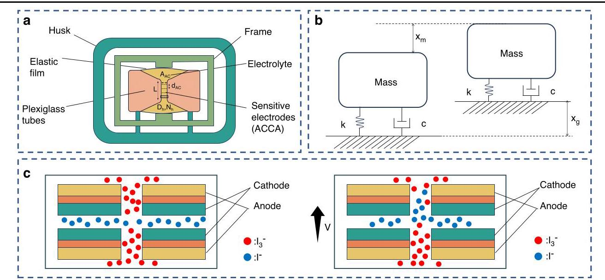

Fig. 1 The model and principle of electrochemical vibration sensorsa. a Schematic diagram of the structure of an electrochemical vibration sensor. b pickup model of sensor. c electrochemical model of sensor

图1 电化学振动传感器的模型和原理a. 电化学振动传感器结构示意图。b. 传感器拾取模型。c. 传感器电化学模型

Vibration sensors fundamentally consist of two functional modules: a vibration pickup module and an electromechanical transduction module. In electrochemical vibration sensors, the transduction module is specifically implemented as an electrochemical cell. The pickup module captures external vibrational signals and induces relative motion of the electrolyte with respect to the sensing electrodes. This mechanical displacement is then converted into measurable electrical output by leveraging the principles of electrochemical redox reactions. The core mechanism underlying this conversion is the modulation of the kinetics of reversible redox reactions at the electrode-electrolyte interface.

振动传感器基本上由两个功能模块组成:振动拾取模块和机电转换模块。在电化学振动传感器中，转换模块具体实现为一个电化学电池。拾取模块捕获外部振动信号，并引起电解质相对于传感电极的相对运动。然后，利用电化学氧化还原反应原理将这种机械位移转换为可测量的电输出。这种转换的核心机制是电极 - 电解质界面处可逆氧化还原反应动力学的调制。

In rapid and reversible electrodes reactions, the electrode potential and the surface concentration of electroactive species consistently adhere to the Nernst relationship. Under this condition, the reaction rate at the electrode surface is entirely governed by the mass transfer rate, expressed as:

在快速且可逆的电极反应中，电极电位和电活性物质的表面浓度始终遵循能斯特关系。在这种情况下，电极表面的反应速率完全由传质速率决定，表示为:

$$
{i}_{\text{ reaction }} = {nFA}{v}_{mt} = {nFAdc}/{dx} \tag{1}
$$

Leveraging the Nernst relationship, electrochemical vibration sensors utilize the large value of Faraday's constant (F) to amplify minute concentration gradients (dc/ dx) within the electrolyte into measurable reaction currents. Concurrently, the vibration-sensing mechanism of the sensor itself converts external micro-vibrations into significant internal dc/dx variations via fluid compression. This integrated process effectively converts weak external vibration signals into highly sensitive output currents. Furthermore, stable operation is achieved at voltages below $1\mathrm{\;V}$ , with operational currents for weak signals maintained below ${100}\mathrm{\;{mA}}$ . This low-power consumption profile, combined with the sensor's compact size, enables sustained long-term operation. Additionally, the absence of complex mechanical structures in electrochemical vibration sensors inherently eliminates mechanical noise. The remaining Brownian motion noise is relatively insignificant; this inherent characteristic contributes to the sensor's wide dynamic range.

利用能斯特关系，电化学振动传感器利用法拉第常数(F)的大数值，将电解质内微小的浓度梯度(dc/dx)放大为可测量的反应电流。同时，传感器本身的振动传感机制通过流体压缩将外部微振动转换为显著的内部dc/dx变化。这一集成过程有效地将微弱的外部振动信号转换为高灵敏度的输出电流。此外，在低于$1\mathrm{\;V}$的电压下实现稳定运行，弱信号的工作电流保持在${100}\mathrm{\;{mA}}$以下。这种低功耗特性与传感器的紧凑尺寸相结合，实现了持续的长期运行。此外，电化学振动传感器中不存在复杂的机械结构，从本质上消除了机械噪声。剩余的布朗运动噪声相对较小；这一固有特性有助于传感器具有较宽的动态范围。

Figure 1b provides a simplified representation of the vibration pickup mechanism. The dynamic characteristics of this pickup system can be equivalently modeled employing the classic spring-mass-damper paradigm. Within this analogy: The electrolyte is analogized to the inertial mass (m), the rubber membranes correspond to the elastic element (spring constant k) while the viscous drag arising from electrolyte flow is modeled as the damping force (damping coefficient c). At static equilibrium, the mass is balanced by gravitational, elastic restorative, and viscous damping forces. Subjected to an external ground acceleration input, the resulting ground displacement ${\mathrm{x}}_{\mathrm{g}}$ dynamically couples the elastic and damping forces, inducing a relative displacement response ${\mathrm{x}}_{\mathrm{m}}$ in the mass. The absolute displacement (x) thus satisfies the equation $x = {x}_{g} - {x}_{m}$ . Based on Newtonian dynamics, the governing equation for this transduction unit is established as:

图1b给出了振动拾取机制的简化示意图。该拾取系统的动态特性可以采用经典的弹簧-质量-阻尼器范式进行等效建模。在这个类比中:电解质类比为惯性质量(m)，橡胶膜对应弹性元件(弹簧常数k)，而电解质流动产生的粘性阻力建模为阻尼力(阻尼系数c)。在静态平衡时，质量由重力、弹性恢复力和粘性阻尼力平衡。受到外部地面加速度输入时，产生的地面位移${\mathrm{x}}_{\mathrm{g}}$动态地耦合弹性力和阻尼力，在质量中引起相对位移响应${\mathrm{x}}_{\mathrm{m}}$。因此，绝对位移(x)满足方程$x = {x}_{g} - {x}_{m}$。基于牛顿动力学，建立该转换单元的控制方程为:

$$
m{\ddot{x}}_{m} =  - k\left( {{x}_{m} - {x}_{g}}\right)  - c\left( {{\dot{x}}_{m} - {\dot{x}}_{g}}\right) \tag{2}
$$

As for the electrochemical vibration system ${}^{13}$ , the damping force of the system can be expressed as: ${RS}\frac{d\left( {{Sx}\left( t\right) }\right) }{dt} = R{S}^{2}\frac{d\left( {x\left( t\right) }\right) }{dt}, R$ stands for the flow resistance of electrolyte, $S$ is the area of the cross-section, $x\left( t\right)$ represents the displacement of electrolyte relative to the reference. The elastic force engendered from the rubber membrane is ${kSx}\left( t\right) , k$ is the volume elastic coefficient of the rubber membrane, therefore the transfer function of pickup segment can be expressed as ${H}_{1}\left( \omega \right)$ :

对于电化学振动系统${}^{13}$，系统的阻尼力可以表示为:${RS}\frac{d\left( {{Sx}\left( t\right) }\right) }{dt} = R{S}^{2}\frac{d\left( {x\left( t\right) }\right) }{dt}, R$表示电解质的流动阻力，$S$是横截面面积，$x\left( t\right)$表示电解质相对于参考的位移。橡胶膜产生的弹力为${kSx}\left( t\right) , k$，${kSx}\left( t\right) , k$是橡胶膜的体积弹性系数，因此拾取段的传递函数可以表示为${H}_{1}\left( \omega \right)$:

$$
\left| {{H}_{1}\left( \omega \right) }\right|  = \left| \frac{X\left( \omega \right) }{{X}_{g}\left( \omega \right) }\right|  = \frac{{\omega }^{2}}{\sqrt{{\left( {\omega }^{2} - {\omega }_{0}{}^{2}\right) }^{2} + {R}_{e}{}^{2}{\omega }^{2}}} \tag{3}
$$

Figure 1c displays the structure of electrochemical segment, the electrochemical vibration constructed by the Anode-Cathode-Cathode-Anode (ACCA), the electrolyte is always composed of ${I}_{2}$ - ${KI}$ compound system, the complexation reaction occur within the solution:

图1c展示了电化学段的结构，由阳极-阴极-阴极-阳极(ACCA)构成的电化学振动，电解质始终由${I}_{2}$ - ${KI}$复合系统组成，溶液中发生络合反应:

$$
{I}_{2} + {I}^{ - } \rightleftharpoons  {I}_{3}^{ - } \tag{4}
$$

Given the significantly lower concentration of ${I}_{2}$ compared to ${KI}$ (e.g., $\left\lbrack  {I}_{2}\right\rbrack   = {0.02}\mathrm{\;{mol}}/\mathrm{L}$ vs. $\left\lbrack  {KI}\right\rbrack   = 2\mathrm{\;{mol}}/\mathrm{L}$ ), ${I}_{2}$ exists primarily as ${I}_{3}^{ - }$ ions in the aqueous phase due to the equilibrium, Consequently, the cathodic reaction governs the rate-limiting step of the electrochemical process. To mitigate common-mode interference, the output signal is differentially derived from dual symmetric cathode currents. Upon applying a bias voltage between the anode and cathode, the following Faradaic reactions occur at the electrode surfaces:

鉴于${I}_{2}$的浓度远低于${KI}$(例如，$\left\lbrack  {I}_{2}\right\rbrack   = {0.02}\mathrm{\;{mol}}/\mathrm{L}$对$\left\lbrack  {KI}\right\rbrack   = 2\mathrm{\;{mol}}/\mathrm{L}$)，由于平衡，${I}_{2}$在水相中主要以${I}_{3}^{ - }$离子形式存在，因此阴极反应控制着电化学过程的限速步骤。为了减轻共模干扰，输出信号从双对称阴极电流中差分导出。在阳极和阴极之间施加偏置电压时，电极表面会发生以下法拉第反应:

$$
\text{ Cathode : }{I}_{3}^{ - } + 2{e}^{ - } \rightarrow  3{I}^{ - } \tag{5}
$$

$$
\text{ Anode } : 3{I}^{ - } - 2{e}^{ - } \rightarrow  {I}_{3}^{ - } \tag{6}
$$

Scheme left depicts the electrolyte configuration under static equilibrium. At steady state, cathodic consumption and anodic generation of ${I}_{3}^{ - }$ establish a concentration gradient across the electrodes, driving spontaneous diffusion of ${I}_{3}^{ - }$ ions from the anode toward the cathode. Ultimately, a dynamic equilibrium is attained between electromigrative flux and faradaic reaction kinetics. Owing to the geometric symmetry of the sensing electrode pair, the ${I}_{3}^{ - }$ concentration profile exhibits bilateral symmetry, resulting in identical cathodic currents and hence a null differential output current.

图左侧的示意图描绘了静态平衡下的电解质配置。在稳态下，${I}_{3}^{ - }$的阴极消耗和阳极生成在电极之间建立了浓度梯度，驱动${I}_{3}^{ - }$离子从阳极向阴极的自发扩散。最终，在电迁移通量和法拉第反应动力学之间达到动态平衡。由于传感电极对的几何对称性，${I}_{3}^{ - }$浓度分布呈现双侧对称，导致阴极电流相同，因此差分输出电流为零。

Upon introduction of external vibration (Scheme right), convective displacement of the electrolyte induces asymmetric redistribution of ${I}_{3}^{ - }$ ions relative to the cathode surfaces. This breaks the symmetric concentration field, generating distinct ${I}_{3}^{ - }$ concentrations at each cathode and consequently producing a measurable differential current signal proportional to the vibrational input.

在引入外部振动时(右图方案)，电解质的对流位移会导致${I}_{3}^{ - }$离子相对于阴极表面的不对称重新分布。这打破了对称的浓度场，在每个阴极产生不同的${I}_{3}^{ - }$浓度，从而产生与振动输入成比例的可测量差分电流信号。

Given that ${I}_{3}^{ - }$ concentration constitutes the rate-limiting factor for the Faradaic reaction kinetics, the magnitude of the reaction current directly scales with the flux of ${I}_{3}^{ - }$ ions to the electrode surfaces.

鉴于${I}_{3}^{ - }$浓度是法拉第反应动力学的限速因素，反应电流的大小直接与${I}_{3}^{ - }$离子流向电极表面的通量成正比。

$$
{i}_{\text{ out }} = q{\oint }_{s}{\Phi }_{{I}_{3}} \cdot  {nds} \tag{7}
$$

According to the Nernst-Plank equation ${}^{14}$ , the flux of ${I}_{3}^{ - }$ within electromechanical conversion segment can be expressed as the follow equation:

根据能斯特 - 普朗克方程${}^{14}$，机电转换段内${I}_{3}^{ - }$的通量可表示为以下方程:

$$
{\Phi }_{{I}_{3}{}^{ - }} =  - D\nabla C - \frac{{q}_{{I}_{3}{}^{ - }}F}{RT}{DC}\nabla \phi  + {Cv} \tag{8}
$$

Where $D$ is the diffusion coefficient of ${I}_{3}^{ - },\nabla C$ stands for the concentration gradient of ${I}_{3}^{ - },{q}_{{{I}_{3}}^{ - }}$ is the electric charge quantity carried by the ${I}_{3}^{ - }, F$ is the Faraday parameter, $R$ is the gas constant, $T$ is temperature, the electric potential gradient is denoted by the $\nabla \phi , C$ is the concentration gradient of ${I}_{3}^{ - }$ adjacent to electrode, $v$ is the flux velocity of electrolyte. Given the primary application focus on weak-signal detection domains, electrolyte flow adjacent to the sensing electrodes can be rigorously approximated as incompressible laminar flow due to the ultralow Reynolds number regime inherent to micro-vibrational stimuli. Consequently, the velocity field distribution within the electrochemical vibration sensor is governed by the coupled Navier-Stokes and continuity equations ${}^{15}$ :

其中$D$是${I}_{3}^{ - },\nabla C$的扩散系数，${I}_{3}^{ - },\nabla C$代表${I}_{3}^{ - },{q}_{{{I}_{3}}^{ - }}$的浓度梯度，${I}_{3}^{ - }, F$是${I}_{3}^{ - }, F$携带的电荷量，$R$是法拉第参数，$T$是气体常数，$T$是温度，电势梯度用$\nabla \phi , C$表示，${I}_{3}^{ - }$是与电极相邻的${I}_{3}^{ - }$的浓度梯度，$v$是电解质的通量速度。鉴于主要应用集中在弱信号检测领域，由于微振动刺激固有的超低雷诺数状态，传感电极附近的电解质流动可以严格近似为不可压缩层流。因此，电化学振动传感器内的速度场分布由耦合的纳维 - 斯托克斯方程和连续性方程${}^{15}$控制:

$$
\frac{\partial v}{\partial t} =  - \left( {v \cdot  \nabla }\right) v - \frac{\nabla p}{\rho } + \frac{\mu }{\rho }{\nabla }^{2}v + g \tag{9}
$$

$$
\nabla  \cdot  v = 0 \tag{10}
$$

Where the $p$ stands for the pressure, $\rho$ is the electrolyte density, and the $\mathrm{g}$ is the gravitational acceleration.

其中$p$代表压力，$\rho$是电解质密度，$\mathrm{g}$是重力加速度。

Table 2 The influence of different factors in sensitive electrodes ${}^{{16},{65},{66}}$

表2敏感电极中不同因素的影响${}^{{16},{65},{66}}$

<table><tr><td>Factor</td><td>Influence</td><td>Formula</td></tr><tr><td>Distance between anode and cathode $\left( {d}_{\mathrm{{AC}}}\right)$</td><td>A decrease of ${d}_{\mathrm{{AC}}}$ increases electrochemical sensitivity</td><td>$\left| {{H}_{2}\left( \omega \right) }\right|  = \frac{C}{\sqrt{1 + {\left( \frac{\omega }{{\omega }_{d}}\right) }^{2}}}$</td></tr><tr><td>The area of cathode $\left( {A}_{c}\right)$</td><td>A decrease of ${A}_{\mathrm{c}}$ decrease electrochemical sensitivity</td><td>${\Phi }_{{J}_{3} - } =  - D\nabla C - \frac{{q}_{{3}_{3}} - F}{RT}{DC}\nabla \phi  + {Cv}$</td></tr><tr><td>The length of channel (L)</td><td>A decrease of $L$ increases natural frequency ${w}_{o}$ of pickup modulus</td><td>$\left| {{H}_{1}\left( \omega \right) }\right|  = \left| \frac{\chi \left( \omega \right) }{{X}_{g}\left( \omega \right) }\right|  = \frac{{\omega }^{2}}{\sqrt{{\left( {\omega }^{2} - {\omega }_{0}^{2}\right) }^{2} + {R}_{e}^{2}{\omega }^{2}}}$</td></tr><tr><td>Flow hole diameter $\left( {d}_{\mathrm{h}}\right)$</td><td>A decrease of ${d}_{\mathrm{h}}$ increases electrochemical sensitivity</td><td>${R}_{e} = \frac{R{S}^{2}}{m}$</td></tr><tr><td>Number of hole $\left( {N}_{\mathrm{h}}\right)$</td><td>A increase of ${N}_{\mathrm{h}}$ increases sensitivity by flow resistance</td><td>${R}_{e} = \frac{R{S}^{2}}{m}$</td></tr><tr><td>Damping ratio $\left( {D}_{\mathrm{r}}\right)$</td><td>A increase of ${D}_{\mathrm{r}}$ increases the distance between the two poles in the transfer function</td><td>$\begin{array}{l} {\omega }_{1} =  - {\omega }_{n}\left( {\zeta  - \sqrt{{\zeta }^{2} - 1}}\right) \\  {\omega }_{2} =  - {\omega }_{n}\left( {\zeta  + \sqrt{{\zeta }^{2} - 1}}\right)  \end{array}$</td></tr></table>

Furthermore, interfacial charge transfer kinetics at the electrodes must satisfy the generalized Butler-Volmer equation ${}^{16}$ :

此外，电极处的界面电荷转移动力学必须满足广义巴特勒 - 伏尔默方程${}^{16}$:

$$
{i}_{1} = {i}_{0} \cdot  \left\lbrack  {\exp \left( \frac{{\alpha }_{a}{qF\eta }}{RT}\right)  - \exp \left( \frac{{\alpha }_{c}{qF\eta }}{RT}\right) }\right\rbrack \tag{11}
$$

Within the Butler-Volmer formalism, ${i}_{0}$ denotes the exchange current density, while ${\alpha }_{a},{\alpha }_{c}$ represent the anodic and cathodic charge transfer coefficients, respectively, and $\eta$ signifies the activation overpotential. Fundamentally, this equation quantifies the dynamic interdependence of interfacial reaction kinetics on both local ion concentrations and electrode polarization states. Crucially, bidirectional faradaic processes coexist at each electrode-electrolyte interface; the net current directionality is governed by the prevailing thermodynamic driving force $\left( {\left| \eta \right|  > 0}\right)$ and mass transport conditions.

在巴特勒 - 伏尔默形式中，${i}_{0}$表示交换电流密度，而${\alpha }_{a},{\alpha }_{c}$分别代表阳极和阴极电荷转移系数，$\eta$表示活化过电位。从根本上说，该方程量化了界面反应动力学对局部离子浓度和电极极化状态的动态相互依存关系。至关重要的是，每个电极 - 电解质界面都存在双向法拉第过程；净电流方向由主要的热力学驱动力$\left( {\left| \eta \right|  > 0}\right)$和传质条件决定。

Equations (8)-(11) constitute a system of coupled, spatiotemporally resolved partial differential equations subject to complex boundary constraints, rendering analytical solutions intractable. To resolve this computational impasse, V. A. Kozlov et al. at the Moscow Institute of Physics and Technology pioneered a variational approach in 2002. By reformulating the unsteady diffusion problem and implementing a reduced-order electrode model, they derived a simplified transfer function representation for the electrochemical interface dynamics ${}^{11}$ . This breakthrough enables tractable analysis of the ${I}_{3}^{ - }/{I}^{ - }$ redox system’s frequency response under perturbation.

方程(8) - (11)构成了一个受复杂边界约束的耦合、时空分辨的偏微分方程组，使得解析解难以求解。为了解决这个计算难题，莫斯科物理技术学院的V. A. Kozlov等人在2002年开创了一种变分方法。通过重新表述非稳态扩散问题并实施降阶电极模型，他们推导出了电化学界面动力学${}^{11}$的简化传递函数表示。这一突破使得能够对${I}_{3}^{ - }/{I}^{ - }$氧化还原系统在扰动下的频率响应进行易于处理的分析。

$$
\left| {{H}_{2}\left( \omega \right) }\right|  = \frac{C}{\sqrt{1 + {\left( \frac{\omega }{{\omega }_{d}}\right) }^{2}}} \tag{12}
$$

The transfer function of sensor can be concluded by the combination of (2) and (11)

传感器的传递函数可以通过(2)和(11)的组合得出

$$
\left| {H\left( \omega \right) }\right|  = \left| {{H}_{1}\left( \omega \right) }\right| \left| {{H}_{2}\left( \omega \right) }\right|  = \frac{{\omega }^{2}}{\sqrt{{\left( {\omega }^{2} - {\omega }_{0}{}^{2}\right) }^{2} + {R}_{e}{}^{2}{\omega }^{2}}} \cdot  \frac{C}{\sqrt{1 + {\left( \frac{\omega }{{\omega }_{d}}\right) }^{2}}}
$$

(13)

Where ${\omega }_{0} = \sqrt{\frac{KS}{m}}$ is the inherent frequency of the system, ${R}_{e} = \frac{R{S}^{2}}{m}$ is the equivalent flow resistance of the system, $C$ is the conversion factor electrochemical vibration sensor, ${\omega }_{d} = \frac{D}{{d}^{2}}$ is the diffusion frequency, $d$ is the distance between anode and cathode.

其中${\omega }_{0} = \sqrt{\frac{KS}{m}}$是系统的固有频率，${R}_{e} = \frac{R{S}^{2}}{m}$是系统的等效流动阻力，$C$是电化学振动传感器的转换因子，${\omega }_{d} = \frac{D}{{d}^{2}}$是扩散频率，$d$是阳极和阴极之间的距离。

Sensing electrodes serve as the core components of electrochemical vibration sensors, responsible for converting external mechanical vibrations into measurable electrical signals. Distinct electrode architectures critically influence key performance parameters including bandwidth, sensitivity linearity, and noise characteristics. Consequently, extensive research efforts have focused on optimizing electrode configurations, with the effects of various structural factors summarized in Table 2. The variables mentioned in the table were denoted in the Fig. 1a.

传感电极是电化学振动传感器的核心部件，负责将外部机械振动转换为可测量的电信号。不同的电极结构对包括带宽、灵敏度线性度和噪声特性在内的关键性能参数有至关重要的影响。因此，大量的研究工作集中在优化电极配置上，表2总结了各种结构因素的影响。表中提到的变量在图1a中表示。

Electrochemical vibration sensors exhibit intrinsically low noise in the low-frequency regime $\left( { < {0.1}\mathrm{\;{Hz}}}\right)$ due to the absence of movable mechanical components. According to the noise sources, the noise of electrochemical sensor can be classified as convective noise, thermodynamics noise, electronic noise, geometry noise, etc. The dominant noise sources within various frequency bandwidth can be categorized as Table 3.

由于不存在可移动的机械部件，电化学振动传感器在低频区域$\left( { < {0.1}\mathrm{\;{Hz}}}\right)$具有固有的低噪声特性。根据噪声源，电化学传感器的噪声可分为对流噪声、热力学噪声、电子噪声、几何噪声等。不同频率带宽内的主要噪声源可分类如表3所示。

Frequency-domain analysis reveals distinct noise regimes: Low-Frequency Band (0.004-0.1 Hz): Dominated by convective fluctuations and thermodynamic hydrodynamic noise, exhibiting strong phase correlation due to coherent fluid motion.

频域分析揭示了不同的噪声区域:低频带(0.004 - 0.1 Hz):以对流波动和热力学流体动力噪声为主，由于流体的连贯运动而表现出强烈的相位相关性。

Low-Frequency Band (0.1-10 Hz): Characterized as a transition zone where geometric recirculation noise coexists with turbulent boundary contributions. High-Frequency Band (>10 Hz): Governed by electronic circuit noise and diffusional thermal effects, with increasing phase randomness.

低频带(0.1 - 10 Hz):其特征是一个过渡区域，几何再循环噪声与湍流边界贡献共存。高频带(>10 Hz):由电子电路噪声和扩散热效应主导，相位随机性增加。

Table 3 Summary of various noise model

表3各种噪声模型总结

<table><tr><td>Noise type</td><td>Physical mechanism</td><td>Dominate frequency</td><td>Models</td><td>Reference</td></tr><tr><td>Convective noise</td><td>Concentration gradient fluctuations induced by natural convection/vortices in electrolyte</td><td>Extremely Low-frequency (0.004-0.1 Hz)</td><td>${R}_{a} = \frac{{g\beta }{c}_{0}{d}^{3}}{\nu D}$ (Rayleigh Number) PSD $\propto$ bias current: $S \propto  \frac{1}{\sqrt{f}}$</td><td>67-71</td></tr><tr><td>Thermodynamics noise</td><td>Macroscopic fluid motion aligned with external excitation signals</td><td>Extremely Low- frequency(<0.1 Hz)</td><td>$\overline{\delta {a}_{f}^{2}} = \frac{2{k}_{B}T{R}_{h}}{{\rho }^{2}{l}^{2}}$ Spectral density:</td><td>72,73</td></tr><tr><td>Electronic noise</td><td>Voltage/current noise in operational amplifiers</td><td>High- frequency (>100 Hz)</td><td>${U}_{el}^{2} = \sum \left( {{U}_{{out}, i}^{2} + {U}_{{out}, i}^{*2}}\right)$ (Multi-stage amp. cascading)</td><td>68,71</td></tr><tr><td>Turbulent noise</td><td>Pressure pulsation in turbulent boundary layers at electrode surfaces</td><td>Low-frequency (0.1-10 Hz)</td><td>RMS pressure: $\sqrt{\delta {p}^{2}} = a\frac{\rho {U}^{2}}{2}\left( {\alpha  \approx  {5.5} \times  {10}^{-3}}\right)$</td><td>72</td></tr><tr><td>Geometry noise</td><td>Micro-flow vortices confined by electrode geometry</td><td>Full-band (depends on the electrode size)</td><td>Experimentally ${\mathrm{S}}_{\text{ noise }} \propto  {d}^{-1}$ ( $d$ : inter-electrode gap)</td><td>67</td></tr><tr><td>Shot noise</td><td>Stochastic electron transfer in single-molecule redox events</td><td>Full-band (Lorentzian)</td><td>$S\left( f\right)  = {4N}{q}^{2}\frac{{\left( {k}_{ox}{k}_{red}\right) }^{3}}{{\left( {k}_{ox} + {k}_{red}\right) }^{3}} \cdot  \frac{1}{{\left( {k}_{ox} + {k}_{red}\right) }^{2} + {\left( 2\pi f\right) }^{2}}$</td><td>69</td></tr><tr><td>Diffusion noise</td><td>Thermal fluctuations in ionic diffusion processes</td><td>Medium- frequency (>10 Hz)</td><td>Experimentally $\mathrm{S}\left( \mathrm{f}\right)  \propto  \mathrm{D} \cdot  \parallel \nabla C{\parallel }^{2}$</td><td>69,70</td></tr><tr><td>Temperature drift noise</td><td>Electrolyte conductivity drift under ambient temperature fluctuations</td><td>Ultra-low frequency (<0.01 Hz)</td><td>Canceled via temperature sensor correlation methods</td><td>/</td></tr></table>

In the high-frequency band above ${100}\mathrm{\;{Hz}}$ , the circuit noise resulting from multi-modal superposition becomes the dominant contributor compared to sensor noise, and it represents the primary source of high-frequency noise.

在高于${100}\mathrm{\;{Hz}}$的高频带中，与传感器噪声相比，多模态叠加产生的电路噪声成为主要贡献者，它代表了高频噪声的主要来源。

Both convective and turbulent noises scale with hydrodynamic parameters, exemplified by the Rayleigh number $\left( {\mathrm{R}}_{\mathrm{a}}\right)$ and flow velocity (U) dependencies. Faradaic shot noise demonstrates unique Lorentzian spectral profiles, distinguishing it from conventional $1/f$ flicker mechanisms. The multi-noise-source superposition model integrates fluid dynamics, electronic circuits, and molecular-scale effects.

对流噪声和湍流噪声都与流体动力学参数相关，例如瑞利数$\left( {\mathrm{R}}_{\mathrm{a}}\right)$和流速(U)的依赖性。法拉第散粒噪声表现出独特的洛伦兹光谱轮廓，这使其与传统的$1/f$闪烁机制不同。多噪声源叠加模型整合了流体动力学、电子电路和分子尺度效应。

## Electrochemically sensitive electrode structure

## 电化学敏感电极结构

## Linger velocity vibration sensor

## linger速度振动传感器

The electrochemical vibration sensor employs a four-electrode configuration system, with cathode/anode arrangements categorized into ACCA-type and CAAC-type. According to the Butler-Volmer electrochemical conditions, the CAAC structure generates higher ${I}_{3}^{ - }$ ion concentration, leading to increased cathodic current density and thereby enhanced sensitivity. However, due to excessive cathode spacing in the CAAC configuration, a stable depletion region cannot form, resulting in inferior device stability compared to the ACCA-type-this fails to meet practical application requirements. Electrode structures are classified based on coplanarity into planar electrodes and bulk electrodes. Planar electrodes feature a simpler fabrication process but are limited by a smaller electrode area, constraining sensitivity improvement potential. In contrast, bulk electrodes, with sidewall electrodes, offer higher sensitivity, yet early multilayer stacked structures suffer from significant alignment challenges. With the adoption of MEMS technology, optimization focuses on two key directions: enhancing low-frequency sensitivity and advancing chip integration. As indicated in Table 2, minimizing cathode/anode spacing is critical for improving low-frequency sensitivity, while integration shifts from multilayer electrodes toward monolithic four-electrode integration (Table 4).

电化学振动传感器采用四电极配置系统，阴极/阳极排列分为ACCA型和CAAC型。根据巴特勒 - 伏默尔电化学条件，CAAC结构产生更高的${I}_{3}^{ - }$离子浓度，导致阴极电流密度增加，从而提高灵敏度。然而，由于CAAC配置中阴极间距过大，无法形成稳定的耗尽区，与ACCA型相比，器件稳定性较差，这无法满足实际应用要求。电极结构根据共面性分为平面电极和体电极。平面电极的制造工艺更简单，但受限于较小的电极面积，限制了灵敏度提升潜力。相比之下，带有侧壁电极的体电极具有更高的灵敏度，但早期的多层堆叠结构存在显著的对准挑战。随着MEMS技术的采用，优化集中在两个关键方向:提高低频灵敏度和推进芯片集成。如表2所示，最小化阴极/阳极间距对于提高低频灵敏度至关重要，而集成从多层电极转向单片四电极集成(表4)。

Conventional electrochemical seismometers employ woven platinum wire mesh as the electrode material and ceramic sheets or polymers as the insulating layers ${}^{17}$ . The sensing electrodes are assembled within flow channel tubes using press-bonding or ceramic sintering methods showing in Fig. 2a. However, the platinum wire diameter (ranging 30-100μm) necessitates complex weaving processes with low yield rates. Additionally, the mismatch caused by the assembly process after ceramic sintering leads to a deterioration in the consistency of the sensors.

传统的电化学地震仪采用编织铂丝网作为电极材料，陶瓷片或聚合物作为绝缘层${}^{17}$。传感电极通过压接或陶瓷烧结方法组装在流道管内，如图2a所示。然而，铂丝直径(范围为30 - 100μm)需要复杂的编织工艺且成品率低。此外，陶瓷烧结后的组装过程导致的不匹配会使传感器的一致性变差。

Table 4 The superiorities and drawbacks of different manufacturing method

表4不同制造方法的优缺点

<table><tr><td>Types of manufacturing</td><td>Superiorities</td><td>Drawbacks</td></tr><tr><td>Platinum mesh weaving</td><td>Lower process capability requirements</td><td>Poor consistency of parts, low yield rate, and unsuitable for mass production</td></tr><tr><td>Planer interdigital electrodes</td><td>Solve the problem of electrode alignment; simple to assemble</td><td>Limited electrodes area</td></tr><tr><td>Planer vertical channel based on FIB</td><td>Monolithic integration; concise process</td><td>Extremely low efficiency; limited electrodes area</td></tr><tr><td>Integration based on dual-chip bonding</td><td>High integration; high sensitivity; high consistency</td><td>Complex process; limited yield rate</td></tr><tr><td>Monolithic integration based on oblique sputtering</td><td>Concise process; high consistency; high integration</td><td>Relatively poor linearity</td></tr><tr><td>Glass-based hourglass-shaped microflow</td><td>Short process time, batch manufacturing, and low process cost</td><td>Limited structure parameter</td></tr><tr><td>Monolithic integration based on SOI</td><td>Concise process without insulation layer design ; reduce the differential output bias</td><td>High cost</td></tr></table>

Consequently, conventional electrochemical seismometers are unsuitable for mass production due to their expensive manufacturing process and inconsistent quality control requirements.

因此，传统的电化学地震仪由于其昂贵的制造工艺和不一致的质量控制要求，不适合大规模生产。

He et al. first innovatively proposed a layered chip structure for vibration sensor fabrication in Fig. 2b, utilizing porous silicon electrode design with ACCA symmetrical arrangement to enhance electrode uniformity. DIRE etching, thermal oxide insulation, and silicon bonding processes were employed to mitigate noise from traditional electrochemical sensors' electrode asymmetry ${}^{18}$ . To prevent wafer fracture during thin silicon processing, SU-8 insulation layers were implemented: A PDMS layer was fabricated on silicon substrates, SU-8 insulation layers were formed atop PDMS, then transferred via detachment shown in Fig. $2{\mathrm{\;b}}^{19}$ . Experimental results demonstrate ${0.01} - 1\mathrm{\;{Hz}}$ sensitivity comparable to commercial MET2003 sensors, <5% transient impact response error, and equivalent-order high-frequency noise reduction Fig. 2b.

He等人首次创新性地提出了一种用于振动传感器制造的分层芯片结构，如图2b所示，采用具有ACCA对称排列的多孔硅电极设计来提高电极均匀性。采用DIRE蚀刻、热氧化绝缘和硅键合工艺来减轻传统电化学传感器电极不对称产生的噪声${}^{18}$。为防止薄硅加工过程中晶圆破裂，采用了SU - 8绝缘层:在硅基板上制造PDMS层，在PDMS顶部形成SU - 8绝缘层，然后通过如图$2{\mathrm{\;b}}^{19}$所示的分离进行转移。实验结果表明${0.01} - 1\mathrm{\;{Hz}}$其灵敏度与商用MET2003传感器相当，瞬态冲击响应误差<5%，等效阶高频噪声降低如图2b所示。

Sun et al. innovatively proposed a MEMS-based tunable frequency characteristic solution to address the issues of complex manufacturing processes, poor consistency ${}^{20}$ . This approach achieves precise control of the insulating layer thickness (Ls) at $1 - {300\mu }\mathrm{m}$ through SU- 8 photoresist spin coating, utilizes silicon etching to regulate electrode micropore diameter, and constructs an ACCA differential sensing unit shown in Fig. 2c. Experiments demonstrate that increasing Ls $\left( {{20\mu }\mathrm{m} \rightarrow  {210\mu }\mathrm{m}}\right)$ reduces low-frequency $\left( {{0.0167}\mathrm{\;{Hz}}}\right)$ attenuation amplitude by up to ${12.4}\mathrm{\;{dB}}$ , while expanding Lp $\left( {{20\mu }\mathrm{m} \rightarrow  {80\mu }\mathrm{m}}\right)$ lowers the center operating frequency by 6-fold, with both parameters exhibiting negligible impact on $3\mathrm{\;{dB}}$ bandwidth.

孙等人创新性地提出了一种基于微机电系统(MEMS)的可调频率特性解决方案，以解决制造工艺复杂、一致性差等问题${}^{20}$。该方法通过旋涂SU-8光刻胶，在$1 - {300\mu }\mathrm{m}$处实现对绝缘层厚度(Ls)的精确控制，利用硅蚀刻来调节电极微孔直径，并构建了如图2c所示的ACCA差分传感单元。实验表明，增加Ls$\left( {{20\mu }\mathrm{m} \rightarrow  {210\mu }\mathrm{m}}\right)$可将低频$\left( {{0.0167}\mathrm{\;{Hz}}}\right)$衰减幅度降低多达${12.4}\mathrm{\;{dB}}$，而增大Lp$\left( {{20\mu }\mathrm{m} \rightarrow  {80\mu }\mathrm{m}}\right)$可使中心工作频率降低6倍，且这两个参数对$3\mathrm{\;{dB}}$带宽的影响可忽略不计。

To address the challenge of reducing insulating layer thickness, Deng et al. innovatively developed a silicon-based insulating structure featuring interleaved anodes and cathodes (each ${100\mu }\mathrm{m}$ thick) as the core sensing unit ${}^{21}$ . This architecture incorporates five precision insulating spacers to form fluidic channels between electrodes. The electrode surfaces implement deep reactive ion etching (DRIE) to create uniform ${40\mu }\mathrm{m}$ diameter micropore arrays, which significantly enhance ion diffusion efficiency compared to traditional woven platinum mesh electrodes. Combined with thermal oxidation and platinum sputtering treatments, this design boosts electrochemical reaction activity. Leveraging custom high-precision fixtures, the structure maintains interlayer assembly errors below ${5\mu }\mathrm{m}$ . This deliver a sensitivity of ${30.2}\mathrm{\;V}/\left( {\mathrm{m}/{\mathrm{s}}^{2}}\right)$ at within ${0.2} - 5\mathrm{\;{Hz}}$ with the noise of -140 dB at $1\mathrm{\;{Hz}}$ . Field validation in grassland environments successfully captured low-frequency seismic signals at ${0.3}\mathrm{\;{Hz}}$ , a critical threshold unreachable by conventional moving-coil sensors limited to $3\mathrm{\;{Hz}}$ .

为应对降低绝缘层厚度的挑战，邓等人创新性地开发了一种以交错阳极和阴极(各${100\mu }\mathrm{m}$厚)为核心传感单元${}^{21}$的硅基绝缘结构。该架构包含五个精密绝缘垫片，以在电极之间形成流体通道。电极表面采用深反应离子蚀刻(DRIE)工艺，以创建均匀的${40\mu }\mathrm{m}$直径微孔阵列，与传统编织铂网电极相比，这显著提高了离子扩散效率。结合热氧化和铂溅射处理，该设计提高了电化学反应活性。利用定制的高精度夹具，该结构将层间组装误差保持在${5\mu }\mathrm{m}$以下。这在${0.2} - 5\mathrm{\;{Hz}}$范围内提供了${30.2}\mathrm{\;V}/\left( {\mathrm{m}/{\mathrm{s}}^{2}}\right)$的灵敏度，在$1\mathrm{\;{Hz}}$处的噪声为-140 dB。在草原环境中的现场验证成功捕获了${0.3}\mathrm{\;{Hz}}$处的低频地震信号，这是传统动圈传感器限于$3\mathrm{\;{Hz}}$无法达到的关键阈值。

To reduce silicon wafer usage and thereby simplify fabrication processes ${}^{22}$ , Deng et al. designed a nested pore structure consisting of smaller outer pores surrounding larger inner pores, as depicted in Fig. 2e. The outer small pores maintain a ${50\mu }\mathrm{m}$ spacing from the sidewalls of the larger pores, preventing coverage of the large pore sidewalls during front-side Pt sputtering. A silicon dioxide layer was thermally grown on the surface, enabling the large backside pores to function as insulating layers between adjacent electrodes. SEM characterization results were shown in Fig. 2e confirm precise pore alignment, while the substantially reduced thickness relative to conventional insulating layers enhances sensitivity to 1978.2 V/(m/s) (@1 Hz), with noise levels as low as 100 $\left( {\mathrm{{nm}}/\mathrm{s}}\right) /\sqrt{}\mathrm{{Hz}}\left( {{0.02}\mathrm{\;{Hz}}}\right)$ .

为减少硅片使用量，从而简化制造工艺${}^{22}$，邓等人设计了一种嵌套孔结构，由围绕较大内孔的较小外孔组成，如图2e所示。外小孔与大孔的侧壁保持${50\mu }\mathrm{m}$间距，防止在正面Pt溅射期间大孔侧壁被覆盖。在表面热生长二氧化硅层，使大的背面孔能够用作相邻电极之间的绝缘层。图2e所示的扫描电子显微镜(SEM)表征结果证实了孔的精确对齐，同时相对于传统绝缘层大幅减小的厚度将灵敏度提高到1978.2 V/(m/s)(@1 Hz)，噪声水平低至100$\left( {\mathrm{{nm}}/\mathrm{s}}\right) /\sqrt{}\mathrm{{Hz}}\left( {{0.02}\mathrm{\;{Hz}}}\right)$。

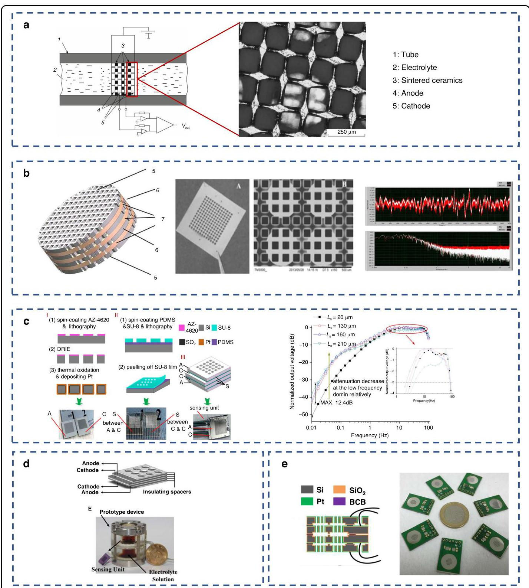

Fig. 2 The initiate progress of insulator layer. a The structure initial platinum mesh electrode laminated structure ${}^{17}$ . b The first laminated electrode structure based on MEMS technology with noise spectrum ${}^{{18},{19}}$ . c The laminated electrode structure with SU-8 as the insulating layer ${}^{20}$ . d The laminated electrode structure with silicon as the insulating layer ${}^{21}$ . e The laminated electrode structure with silicon channels as the insulating layer ${}^{22}$

图2绝缘层的初始进展。a结构初始铂网电极层压结构${}^{17}$。b基于MEMS技术的第一层压电极结构及噪声谱${}^{{18},{19}}$。c以SU-8为绝缘层的层压电极结构${}^{20}$。d以硅为绝缘层的层压电极结构${}^{21}$。e以硅通道为绝缘层的层压电极结构${}^{22}$

Building upon conventional platinum mesh electrodes, Sun et al. ${}^{16}$ pioneered a planar configuration with four electrodes Fig. 3a, achieving significant miniaturization. Computational analysis critically compared two structural layouts: ACCA and CAAC, as evidenced by the comparative simulation analysis in Fig. 3a, the ACCA configuration exhibits a critical pressure gradient of 0.24 Pa, demonstrating reduced current output at low pressures yet superior stability under high-pressure conditions. Conversely, the CAAC layout achieves a lower critical pressure gradient of ${0.14}\mathrm{\;{Pa}}$ , delivering enhanced current sensitivity at low pressures due to higher ${I}_{3}^{ - }$ concentration. The CAAC design is optimal for high-sensitivity applications in low-pressure regimes, while the ACCA configuration supports broader pressure range operation. These findings validate the vibrational sensing capability of planar quadrupole electrodes.

在传统铂网电极的基础上，Sun等人${}^{16}$率先采用了如图3a所示的四电极平面配置，实现了显著的小型化。通过计算分析对两种结构布局ACCA和CAAC进行了严格比较，如图3a中的对比模拟分析所示，ACCA配置的临界压力梯度为0.24 Pa，在低压下电流输出降低，但在高压条件下具有更高的稳定性。相反，CAAC布局的临界压力梯度较低，为${0.14}\mathrm{\;{Pa}}$ ，由于${I}_{3}^{ - }$浓度较高，在低压下具有更高的电流灵敏度。CAAC设计最适合低压环境下的高灵敏度应用，而ACCA配置支持更宽的压力范围运行。这些发现验证了平面四极电极的振动传感能力。

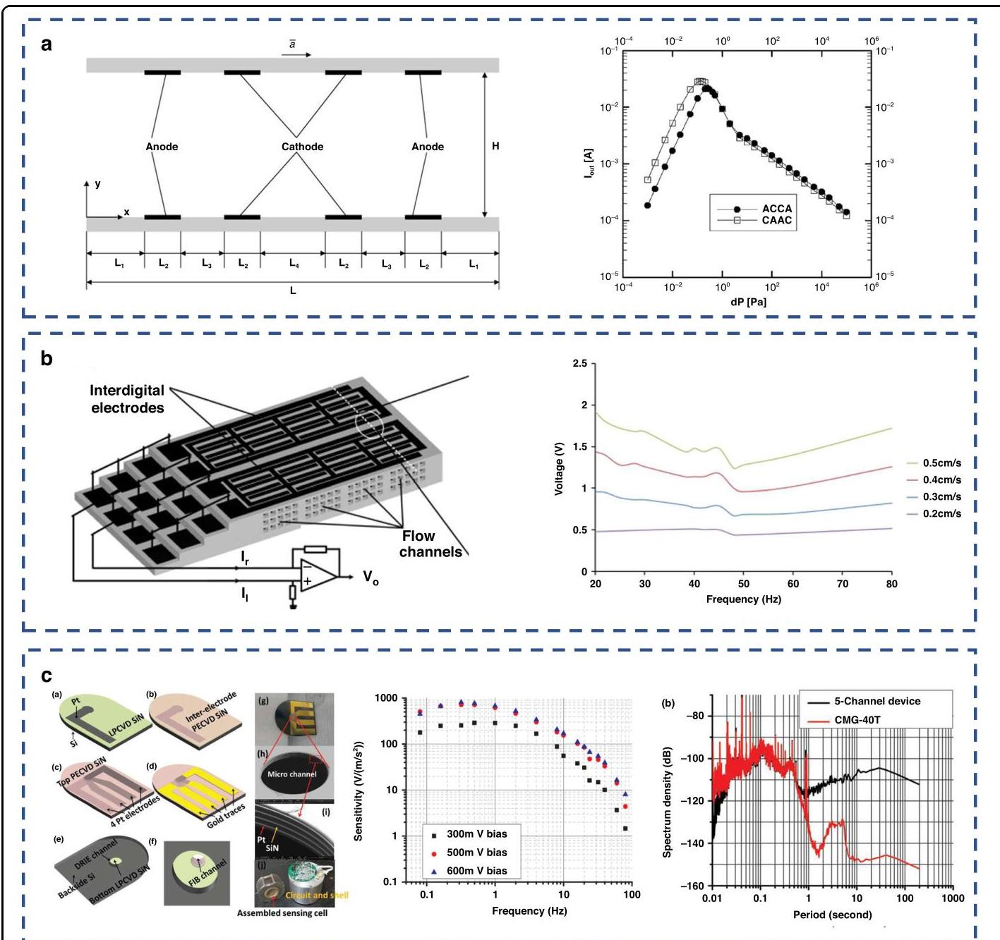

Fig. 3 The progress of planer electrodes. a The theoretical simulation model of planar electrodes ${}^{16}$ . b Planar intercalation electrodes based on MEMS technology ${}^{23}$ . c The planar electrode with a deposited SiN insulating layer ${}^{13}$

图3平面电极的进展。a平面电极${}^{16}$的理论模拟模型。b基于MEMS技术的平面插层电极${}^{23}$。c带有沉积SiN绝缘层的平面电极${}^{13}$

Li et al. ${}^{23}$ was the first to propose manufacturing devices through MEMS technology, implementing an interdigitated quadrupole electrode design as shown in Fig. 3b. The folded topology extends the effective electrical length to enhance spatial utilization efficiency, while multiple parallel substructures maximize the electrode surface area for amplified sensitivity. Within this frequency range, sensitivity exhibits non-monotonic characteristics-peaking at ${274}\mathrm{\;V}/\left( {\mathrm{m}/\mathrm{s}}\right)$ at ${20}\mathrm{\;{Hz}}$ and troughing at ${50}\mathrm{\;{Hz}} -$ with a mean sensitivity of ${274}\mathrm{\;V}/\left( {\mathrm{m}/\mathrm{s}}\right)$ .

Li等人${}^{23}$首次提出通过MEMS技术制造器件，采用如图3b所示的叉指四极电极设计。折叠拓扑结构延长了有效电长度，提高了空间利用效率，而多个平行子结构最大化了电极表面积，以提高灵敏度。在这个频率范围内，灵敏度呈现非单调特性，在${274}\mathrm{\;V}/\left( {\mathrm{m}/\mathrm{s}}\right)$时于${20}\mathrm{\;{Hz}}$达到峰值，在${50}\mathrm{\;{Hz}} -$时达到谷值，平均灵敏度为${274}\mathrm{\;V}/\left( {\mathrm{m}/\mathrm{s}}\right)$。

Huang et al. ${}^{13}$ implemented monolithic integration of Pt electrodes and SiN dielectric isolation layers via multistep thin-film deposition and etching processes on silicon substrates. Pt conductive layers and SiN insulating films were sequentially deposited, followed by focused ion beam (FIB) micromachining to penetrate stacked materials, forming microfluidic channels and defining quadrupole electrode arrays Fig. 3a. This wafer-scale approach eliminates alignment/bonding complexities inherent in hybrid integration. As demonstrated in Fig. 3a, the device achieves a sensitivity peak of ${809}\mathrm{\;V}/\left( {\mathrm{m}/{\mathrm{s}}^{2}}\right)$ at ${0.32}\mathrm{\;{Hz}}$ , with low-frequency extension to ${0.08}\mathrm{\;{Hz}}$ . Five-channel parallel configuration achieved a noise floor of $- {115}\mathrm{\;{dB}}({0.18\mu }\mathrm{g}/$ /Hz), approaching the performance benchmark of commercial CMG-40T seismometers.

Huang等人${}^{13}$通过在硅基板上进行多步薄膜沉积和蚀刻工艺，实现了Pt电极和SiN介质隔离层的单片集成。依次沉积Pt导电层和SiN绝缘膜，然后通过聚焦离子束(FIB)微加工穿透堆叠材料，形成微流体通道并定义四极电极阵列(图3a)。这种晶圆级方法消除了混合集成中固有的对准/键合复杂性。如图3a所示，该器件在${0.32}\mathrm{\;{Hz}}$时达到灵敏度峰值${809}\mathrm{\;V}/\left( {\mathrm{m}/{\mathrm{s}}^{2}}\right)$，低频扩展到${0.08}\mathrm{\;{Hz}}$。五通道并行配置实现了本底噪声为$- {115}\mathrm{\;{dB}}({0.18\mu }\mathrm{g}/$ /Hz)，接近商业CMG - 40T地震仪的性能基准。

Sun et al. proposed a chip structure integrating an ultra-thin platinum electrode (thickness of ${0.2\mu }\mathrm{m}$ ) and a relatively thick insulating substrate (thickness of ${130\mu }\mathrm{m}$ ) on a silicon substrate shown in Fig. 4a. The manufacturing process is significantly simplified, requiring only three standard micro-machining steps: thermal oxidation, platinum sputtering and lift-off, and deep reactive ion etching. Specifically, platinum electrodes are first sputtered on both sides of a silicon wafer, followed by etching micro-flow holes to achieve single-chip, two-electrode fabrication. Experimental results demonstrate that the operational bandwidth of this seismometer extends to ${0.14}\mathrm{\;{Hz}}$ to ${26.81}\mathrm{\;{Hz}}$ (superior to the traditional ${0.47}\mathrm{\;{Hz}}$ to 18.24 $\mathrm{\;{Hz}}$ ), with sensitivity comparable to the commercial device CME 6011 OBS ${}^{24}$ , while exhibiting lower noise levels (resolution of ${1.23}\mathrm{\;{nm}}/\mathrm{s}$ at $1\mathrm{\;{Hz}}$ ), a linear operating range of ${1.84}\mathrm{\;{mm}}/\mathrm{s}$ (total harmonic distortion below 3.5%), and a dynamic range as high as 121.11 dB at 20 Hz.

Sun等人提出了一种芯片结构，在硅基板上集成了超薄铂电极(厚度为${0.2\mu }\mathrm{m}$)和相对较厚的绝缘基板(厚度为${130\mu }\mathrm{m}$)，如图4a所示。制造过程显著简化，仅需三个标准微加工步骤:热氧化、铂溅射和剥离，以及深反应离子蚀刻。具体来说，首先在硅晶片的两侧溅射铂电极，然后蚀刻微流孔以实现单芯片、双电极制造。实验结果表明，该地震仪的工作带宽扩展到${0.14}\mathrm{\;{Hz}}$至${26.81}\mathrm{\;{Hz}}$(优于传统的${0.47}\mathrm{\;{Hz}}$至18.24 $\mathrm{\;{Hz}}$)，灵敏度与商业设备CME 6011 OBS${}^{24}$相当，同时具有更低的噪声水平(在$1\mathrm{\;{Hz}}$时分辨率为${1.23}\mathrm{\;{nm}}/\mathrm{s}$)，线性工作范围为${1.84}\mathrm{\;{mm}}/\mathrm{s}$(总谐波失真低于3.5%)，在20 Hz时动态范围高达121.11 dB。

Based on previous works, to further minimize wafer count, Deng et al. monolithically integrated the cathode, anode, and insulating layer onto a single silicon wafer ${}^{25}$ . The process involves first fabricating a platinum electrode on one side of the silicon substrate, then implementing an innovative Macro-Micro pore structure to sputter another platinum electrode on the opposite side; this design ensures comprehensive electrode coverage extending to the internal surfaces of the flow channel sidewalls. The structure was displayed in Fig. 4b. Adjusting the depth of the large pores allows precise tuning of the cathode-anode spacing. As demonstrated in Fig. 4b, the optimized structure achieves peak sensitivity (5771.7 V/( $\mathrm{m}/{\mathrm{s}}^{2}$ ) @1.4 Hz). These results verify the capability of this architecture to substantially enhance device sensitivity.

基于先前的工作，为了进一步减少晶圆数量，邓等人将阴极、阳极和绝缘层单片集成到单个硅晶圆${}^{25}$上。该工艺首先在硅衬底的一侧制造铂电极，然后采用创新的宏微观孔结构在另一侧溅射另一个铂电极；这种设计确保了电极全面覆盖，延伸到流道侧壁的内表面。该结构如图4b所示。调整大孔的深度可以精确调整阴阳极间距。如图4b所示，优化后的结构在1.4Hz时达到峰值灵敏度(5771.7V/($\mathrm{m}/{\mathrm{s}}^{2}$))。这些结果验证了这种架构大幅提高器件灵敏度的能力。

Liang et al. Proposed an innovation lies in a silicon-on-insulator (SOI)-based fabrication process that creates a sensing element featuring 800 microfluidic channels without requiring platinum etching ${}^{26}$ in Fig. 4c, thereby drastically reducing hydraulic impedance(Rh) - a critical parameter governing both sensitivity and noise. The process involves double-sided deep reactive ion etching (DRIE) of an SOI wafer to form ${200\mu }\mathrm{m}$ diameter channels, followed by rotation during e-beam deposition to ensure conformal Ti/Pt electrode coverage on all channel surfaces, including sidewalls; two such processed wafers are then bonded using Parylene to form the complete four-electrode. Experimental results demonstrate exceptional performance: a sensitivity of ${2500}\mathrm{\;V}/\left( {\mathrm{m}/{\mathrm{s}}^{2}}\right)$ at $1\mathrm{\;{Hz}}$ and a significantly improved noise floor reaching ${1.78} \times  {10}^{-7}(\mathrm{\;m}/ \; {\mathrm{s}}^{2})/\sqrt{}\mathrm{{Hz}}$ at ${1.2}\mathrm{\;{Hz}}$ - representing a ${10}\mathrm{\;{dB}}$ reduction compared to previous 50-channel MEMS MET devices - attributed directly to the increased channel count, lowering Rh by 435 times and enhancing the electrochemical conversion factor.

梁等人提出了一种创新方法，即基于绝缘体上硅(SOI)的制造工艺，该工艺创建了一个具有800个微流体通道的传感元件，无需在图4c中进行铂蚀刻${}^{26}$，从而大幅降低了液压阻抗(Rh)——这是一个控制灵敏度和噪声的关键参数。该工艺包括对SOI晶圆进行双面深反应离子蚀刻(DRIE)以形成${200\mu }\mathrm{m}$直径的通道，然后在电子束沉积过程中旋转，以确保在所有通道表面(包括侧壁)上形成共形的Ti/Pt电极覆盖；然后使用聚对二甲苯将两个这样处理过的晶圆键合在一起，形成完整的四电极。实验结果表明其性能卓越:在$1\mathrm{\;{Hz}}$时灵敏度为${2500}\mathrm{\;V}/\left( {\mathrm{m}/{\mathrm{s}}^{2}}\right)$，在${1.2}\mathrm{\;{Hz}}$时本底噪声显著改善，达到${1.78} \times  {10}^{-7}(\mathrm{\;m}/ \; {\mathrm{s}}^{2})/\sqrt{}\mathrm{{Hz}}$——与之前的50通道MEMS MET器件相比降低了${10}\mathrm{\;{dB}}$——这直接归因于通道数量的增加，Rh降低了435倍，并提高了电化学转换因子。

Li et al. employ parylene as both the flexible substrate and ultra-thin insulating layer $\left( {{6.7\mu }\mathrm{m}}\right)$ for micro-fabricated porous platinum electrodes in Fig. 4d, significantly enhancing sensitivity to ${4128.1}\mathrm{\;V}/\left( {\mathrm{m}/\mathrm{s}}\right)$ at ${10}\mathrm{\;{Hz}}$ compared to conventional silicon-based devices $({110\mu }\mathrm{m}$ insulating layers). Fabrication involves sequential steps: parylene deposition on reusable substrates, double-sided platinum sputtering with lift-off patterning, oxygen plasma etching to form through-holes. Experimental validation confirmed more than 12 times higher transient responses to footsteps while achieving bandwidth (0.7-20 Hz) similar to commercial sensor CME6011.

李等人在图4d中使用聚对二甲苯作为微制造多孔铂电极的柔性基板和超薄绝缘层$\left( {{6.7\mu }\mathrm{m}}\right)$，与传统的基于硅的器件$({110\mu }\mathrm{m}$绝缘层相比，在${10}\mathrm{\;{Hz}}$时对${4128.1}\mathrm{\;V}/\left( {\mathrm{m}/\mathrm{s}}\right)$的灵敏度显著提高。制造过程包括以下步骤:在可重复使用的基板上沉积聚对二甲苯，通过剥离图案化进行双面铂溅射，氧等离子体蚀刻以形成通孔。实验验证表明，对脚步声的瞬态响应提高了12倍以上，同时实现了与商业传感器CME601相似的带宽(0.7 - 20Hz)。

To achieve the integration while augmenting the sensitivity by reducing the thickness of the insulator, Xu et al. proposed an electrode arrangement with the anode and cathode on the same plane based on circular insulating rings and an integration method based on bonding ${}^{27}$ . The insulating ring is constructed by fabricating a mask through photoresist, ensuring that its thickness can be controlled at the micrometer level, which provides an innovative view to construct the insulator. The bonded architecture, shown in Fig. 4e, comprises micromachined silicon layers with grid-patterned electrode arrays on both upper and lower substrates, separated by an intermediate glass layer serving as an electrical isolation medium. The cathode was covered on the entire side wall of the microvia. Experimental results demonstrate a sensitivity of ${5956}\mathrm{\;V}/\left( {\mathrm{m}/\mathrm{s}}\right)$ under $1\mathrm{\;{Hz}}$ vibration excitation, representing a 138% enhancement compared to SOI-based electrodes ${\left( {2500}\mathrm{\;V}/\left( \mathrm{m}/\mathrm{s}\right) \right) }^{26}$ . At ${20}\mathrm{\;{Hz}}$ , the device exhibits a linear correlation coefficient of 0.9945 . The output correlation coefficient between paired devices reaches 0.998, while batch consistency tests under ambient vibration show an inter-device correlation coefficient of 0.9998 (Device 1 vs.Device 2). Cross-validation with the reference CME6011 seismometer achieves a correlation coefficient of 0.9961.

为了在通过减小绝缘体厚度来提高灵敏度的同时实现集成，徐等人基于圆形绝缘环提出了一种阳极和阴极位于同一平面的电极布置方式，以及一种基于键合${}^{27}$的集成方法。绝缘环是通过光刻胶制作掩膜构建而成的，确保其厚度能够控制在微米级别，这为构建绝缘体提供了一种创新思路。键合结构如图4e所示，由上下基板上带有网格图案电极阵列的微加工硅层组成，中间隔着一层用作电绝缘介质的玻璃层。阴极覆盖在微孔的整个侧壁上。实验结果表明，在$1\mathrm{\;{Hz}}$振动激励下灵敏度为${5956}\mathrm{\;V}/\left( {\mathrm{m}/\mathrm{s}}\right)$，与基于绝缘体上硅(SOI)的电极相比提高了138%${\left( {2500}\mathrm{\;V}/\left( \mathrm{m}/\mathrm{s}\right) \right) }^{26}$。在${20}\mathrm{\;{Hz}}$时，该器件表现出的线性相关系数为0.9945。配对器件之间的输出相关系数达到0.998，而在环境振动下的批次一致性测试显示器件间相关系数为0.9998(器件1与器件2)。与参考CME6011地震仪的交叉验证相关系数达到0.9961。

To simplify the technological process, Qi et al.optimized the process to initiate bonding prior to creation. The design incorporates optimized geometric parameters- ${300\mu }\mathrm{m}$ glass layer thickness and 1150 flow holes ( ${80\mu }\mathrm{m}$ diameter)-determined through simulations. These simulations revealed that thinner glass layers reduce stabilization time due to the depletion area effect and highlighted a trade-off between sensitivity and bandwidth in relation to the number of flow holes. Experimental results demonstrated exceptional consistency across four devices, with a peak sensitivity of ${5345.45} \pm  {43.78}\mathrm{\;V}/\left( {\mathrm{m}/\mathrm{s}}\right)$ at $2\mathrm{\;{Hz}}$ and low variance observed at key frequencies (e.g., 4997.92 ± 77.97 V/(m/s) at 1 Hz). Benchmarking against the commercial CME6011 seismometer showed strong correlation (time-domain coefficient: 0.966) and comparable noise performance (-168.76 dB vs. -168.00 dB at 1 Hz). The devices and SEM results are shown in Fig. 4f.

为简化工艺流程，Qi等人在创建之前优化了键合起始工艺。该设计纳入了通过模拟确定的优化几何参数——${300\mu }\mathrm{m}$玻璃层厚度和1150个流孔(${80\mu }\mathrm{m}$直径)。这些模拟表明，由于耗尽区效应，较薄的玻璃层可缩短稳定时间，并突出了流孔数量与灵敏度和带宽之间的权衡。实验结果表明，四个器件的一致性极佳，在$2\mathrm{\;{Hz}}$时峰值灵敏度为${5345.45} \pm  {43.78}\mathrm{\;V}/\left( {\mathrm{m}/\mathrm{s}}\right)$，在关键频率处(例如，1 Hz时为4997.92 ± 77.97 V/(m/s))观察到低方差。与商用CME6011地震仪的对比显示出强相关性(时域系数:0.966)，且噪声性能相当(1 Hz时为 -168.76 dB 对 -168.00 dB)。器件和扫描电子显微镜结果如图4f所示。

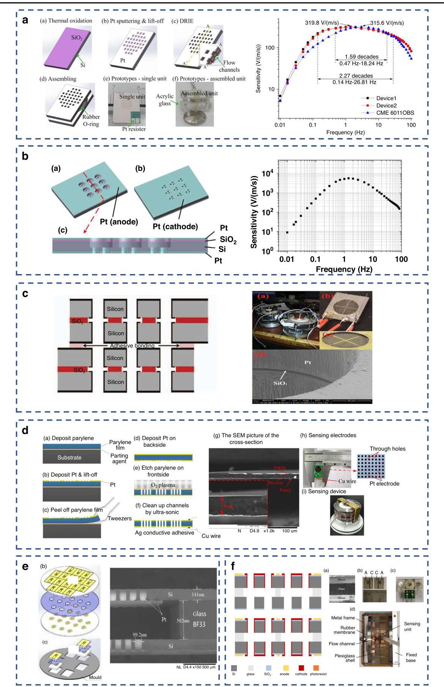

Fig. 4 The integration of a pair of AC electrodes in one chip structure. a Monolithic two-electrode integration based on silicon substrate ${}^{82}$ . b Monolithically Integrated dual-electrode with nested Macro-Micro pore structure ${}^{25}$ . c Monolithic two-electrode integration based on SOI ${}^{26}$ .d Monolithic two-electrode integration based on parylene ${}^{83}$ . e, $\mathbf{f}$ Monolithic two-electrode integration based on anodic bonding with coplanar anode and cathode ${}^{{27},{84}}$

图4 一对交流电极在一个芯片结构中的集成。a基于硅衬底${}^{82}$的单片双电极集成。b具有嵌套宏-微孔结构${}^{25}$的单片集成双电极。c基于绝缘体上硅(SOI)${}^{26}$的单片双电极集成。d基于聚对二甲苯${}^{83}$的单片双电极集成。e、$\mathbf{f}$基于阳极键合且阳极和阴极共面的单片双电极集成${}^{{27},{84}}$

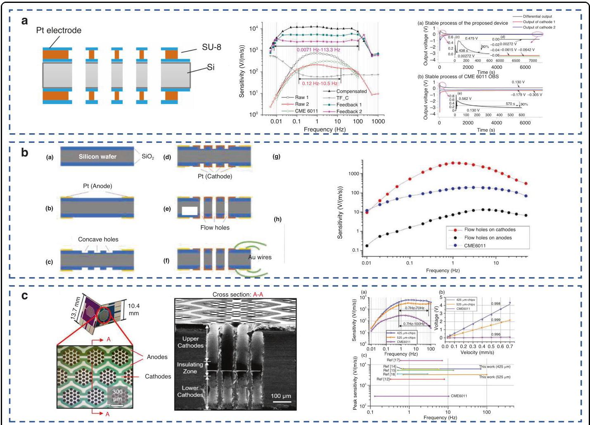

Fig. 5 The integration of electrodes in one chip structure. a Monolithic integrated four-electrode based on the SU-8 insulating layer ${}^{28}$ . b The monolithic integration idea and test results for fabricating electrode pairs on the surface of silicon wafers ${}^{29}$ . c Monolithic integrated four-electrode based on DRIE and oblique sputtering ${}^{30}$

图5 电极在一个芯片结构中的集成。a基于SU-8绝缘层${}^{28}$的单片集成四电极。b在硅片表面制作电极对的单片集成思路及测试结果${}^{29}$。c基于深反应离子刻蚀(DRIE)和倾斜溅射${}^{30}$的单片集成四电极

To enhance the symmetry of dual electrode pairs and improve alignment precision, Sun et al. proposed a monolithic integrated four-electrode architecture utilizing an SU-8 insulating layer ${}^{28}$ , as illustrated in Fig. 5a. The process commenced with an oxidized silicon substrate. Bilateral platinum electrodes were patterned via lift-off technology, while through-flow-channel holes were efficiently fabricated using reactive ion etching. Subsequently, layered deposition of SU-8 insulating structures and platinum electrodes was performed. By designing insulating layer flow channels larger than electrode apertures, the effective reaction area was significantly increased. This approach integrates electrodes and flow channels within a single crystalline silicon wafer, substantially streamlining fabrication. Characterization results shown in Fig. 5a demonstrate a device sensitivity of 215.5 V/(m/s), representing an order-of-magnitude improvement over conventional planar electrodes ${\left( {18.8}\mathrm{\;V}/\left( \mathrm{m}/\mathrm{s}\right) \right) }^{13}$ and highly consistent differential output currents, stabilized at merely $3\mathrm{\;{mA}}$ , with settling times comparable to the reference CME6011 device.

为提高双电极对的对称性并提升对准精度，Sun等人提出了一种利用SU - 8绝缘层${}^{28}$的单片集成四电极架构，如图5a所示。该工艺始于氧化硅衬底。通过剥离技术制作双侧铂电极，同时使用反应离子蚀刻高效制造通流通道孔。随后，进行SU - 8绝缘结构和铂电极的分层沉积。通过设计比电极孔径大的绝缘层流道，有效反应面积显著增加。这种方法在单晶硅晶圆内集成电极和流道，大幅简化了制造过程。图5a所示的表征结果表明，该器件的灵敏度为215.5 V/(m/s)，比传统平面电极${\left( {18.8}\mathrm{\;V}/\left( \mathrm{m}/\mathrm{s}\right) \right) }^{13}$有一个数量级的提升，且差分输出电流高度一致，稳定在仅$3\mathrm{\;{mA}}$ ，建立时间与参考CME6011器件相当。

For the sake of addressing fracture susceptibility in flexible insulating layers, Zheng et al. developed a novel monolithic four-electrode integration strategy ${}^{29}$ . The approach employs in-plane electrode structures fabricated directly on silicon substrates, enabling substantial expansion of electrode area relative to conventional bulk electrodes while permitting flexible adjustment of cathode-anode spacing. Further augmenting the electrode area, nested orifice configurations were implemented for flow channel fabrication. The manufacturing process in Fig. 5b eliminates complex processing steps, thereby achieving high production yield. Characterization results in Fig. 5b demonstrate a sensitivity of ${3555}\mathrm{\;V}/\left( {\mathrm{m}/\mathrm{s}}\right) @1\mathrm{\;{Hz}}$ under cathode-distributed orifice design.

为解决柔性绝缘层中的易碎性问题，Zheng等人开发了一种新型的单片四电极集成策略${}^{29}$。该方法采用直接在硅衬底上制造的平面内电极结构，相对于传统体电极能够大幅扩大电极面积，同时允许灵活调整阴阳极间距。为进一步扩大电极面积，在流道制造中采用了嵌套孔配置。图5b中的制造工艺省去了复杂的处理步骤，从而实现了高产量。图5b中的表征结果表明，在阴极分布式孔设计下灵敏度为${3555}\mathrm{\;V}/\left( {\mathrm{m}/\mathrm{s}}\right) @1\mathrm{\;{Hz}}$。

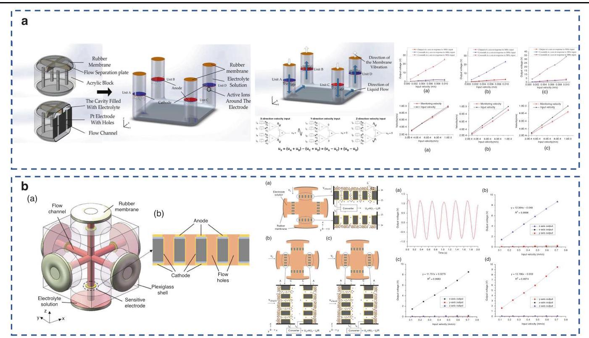

Fig. 6 The design of triaxial vibration sensor. a The triaxial detection with monolithic detection sensor ${}^{31}$ . b The triaxial detection with orthogonal flow channel ${}^{32}$

图6三轴振动传感器的设计。a使用单片检测传感器${}^{31}$的三轴检测。b使用正交流道${}^{32}$的三轴检测

Sun et al. achieved monolithic integration of four electrodes on a single silicon wafer using dual-sided deep reactive ion etching (DRIE) and oblique-angle sputtering techniques ${}^{30}$ . This approach enables high process uniformity and high-aspect-ratio microorifices while maintaining high sensitivity and dramatically simplifying fabrication. As shown in Fig. 5c, SEM characterization confirms precise front-to-back etch alignment. Open-loop testing demonstrates a peak sensitivity of ${6221}\mathrm{\;V}/\left( {\mathrm{m}/\mathrm{s}}\right) \; @3\mathrm{\;{Hz}}$ with a bandwidth of ${0.7} - {100}\mathrm{\;{Hz}}$ , surpassing existing electrochemical seismometers (e.g. CME6011). The device exhibits exceptional linearity (correlation coefficient $> {0.996}$ ).

孙等人使用双面深反应离子刻蚀(DRIE)和斜角溅射技术${}^{30}$在单个硅片上实现了四个电极的单片集成。这种方法能够实现高工艺均匀性和高纵横比的微孔，同时保持高灵敏度并显著简化制造过程。如图5c所示，扫描电子显微镜(SEM)表征证实了前后蚀刻的精确对准。开环测试表明，该传感器的峰值灵敏度为${6221}\mathrm{\;V}/\left( {\mathrm{m}/\mathrm{s}}\right) \; @3\mathrm{\;{Hz}}$，带宽为${0.7} - {100}\mathrm{\;{Hz}}$，超过了现有的电化学地震仪(例如CME6011)。该器件具有出色的线性度(相关系数$> {0.996}$)。

Addressing structural complexity and high costs inherent in traditional triaxial electrochemical seismometers, Chen et al. developed a multi-flow-channel triaxial sensor ${}^{31}$ . The schematic in Fig. 6a shows four sensing units configured such that differences in electrode polarity layout generate distinct ionic flow directions in response to vibrations along different axes. Axial decoupling is achieved computationally by leveraging these polarity-induced flow characteristics to eliminate interaxis interference. Single-axis sensitivity characterization yielded values of ${2473.2} \pm  {184.5}\mathrm{\;V}/\left( {\mathrm{m}/\mathrm{s}}\right) \;$ (X-axis), ${2261.7} \pm  {119.6}\mathrm{\;V}/\left( {\mathrm{m}/\mathrm{s}}\right)$ (Y-axis), and ${3480.7} \pm  {417.2}\mathrm{\;V}/(\mathrm{m}/$ s) (Z-axis). Cross-axis interference ratios (primary signal/ interference signal) consistently exceeded 7:1, validating the decoupling efficacy. The fabrication process and the structure of the sensor were shown in the Fig. 6a. Triaxial vibration tests applying in-phase vibrations along the ${45}^{ \circ  }$ - direction across orthogonal planes demonstrated close agreement between measured and input velocities (linear regression slopes: 0.87-0.97), confirming feasibility for 3D monitoring. However, due to membrane effects, fluid flow beneath the membrane cannot fully convert horizontal velocity into channel-direction velocity.

针对传统三轴电化学地震仪固有的结构复杂性和高成本问题，Chen等人开发了一种多流道三轴传感器${}^{31}$。图6a中的示意图显示了四个传感单元的配置，使得电极极性布局的差异会根据沿不同轴的振动产生不同的离子流动方向。通过利用这些极性诱导的流动特性进行计算，实现轴向解耦，以消除轴间干扰。单轴灵敏度表征得出的值为${2473.2} \pm  {184.5}\mathrm{\;V}/\left( {\mathrm{m}/\mathrm{s}}\right) \;$(X轴)、${2261.7} \pm  {119.6}\mathrm{\;V}/\left( {\mathrm{m}/\mathrm{s}}\right)$(Y轴)和${3480.7} \pm  {417.2}\mathrm{\;V}/(\mathrm{m}/$(Z轴)。交叉轴干扰比(主信号/干扰信号)始终超过7:1，验证了解耦效果。传感器的制造工艺和结构如图6a所示。在正交平面上沿${45}^{ \circ  }$方向施加同相振动的三轴振动测试表明，测量速度与输入速度之间具有密切一致性(线性回归斜率:0.87 - 0.97)，证实了三维监测的可行性。然而，由于膜效应，膜下方的流体流动不能将水平速度完全转换为通道方向的速度。

Qi et al. raised the triaxial vibration sensing by developing an orthogonally decoupled electrochemical sen- ${\operatorname{sor}}^{32}$ , where three pairs of differential electrodes are precisely fixed in mutually perpendicular flow channels in Fig. 6b. This geometrically isolated architecture ensures independent 3D detection by confining electrolyte flow to the vibration-aligned axis (e.g. x-axis excitation minimally perturbs y/z channels), while differential amplification of paired electrode currents enhances target signals and suppresses cross-axis interference. Experimental results demonstrate exceptional performance: 0.01-100 Hz bandwidth, 14,657 V/(m/s) peak sensitivity, 0.9639 correlation with single-axis seismic responses, and <5% crosstalk error during ${45}^{ \circ  }$ oblique vibrations.

齐等人通过开发一种正交解耦的电化学传感器提高了三轴振动传感能力${\operatorname{sor}}^{32}$，其中三对差分电极精确地固定在图6b中相互垂直的流道中。这种几何隔离结构通过将电解液流限制在与振动对齐的轴上(例如，x轴激励对y/z通道的干扰最小)来确保独立的三维检测，而配对电极电流的差分放大增强了目标信号并抑制了交叉轴干扰。实验结果表明其性能卓越:带宽为0.01 - 100 Hz，峰值灵敏度为14,657 V/(m/s)，与单轴地震响应的相关性为0.9639，在${45}^{ \circ  }$倾斜振动期间串扰误差小于5%。

To extend the operational temperature range of seismometers, Agafonov et al. developed a molecular electron transfer (MET) sensor featuring topology-optimized six-electrode configuration ${}^{33}$ . As illustrated in Fig. 7a, the design modifies the standard anion concentration-cell array (ACCA) structure by introducing a gate (G) electrode. Application of gate voltages regulates the redistribution of ${I}_{3}^{ - }$ ions between the gate and anode, thereby enhancing the ionic concentration gradient near the anode to improve sensitivity. Experimental results in Fig. 7a reveal significantly superior thermal stability for the hex-electrode system: While the conversion coefficient of conventional quad-electrode sensors varies by 2400-fold across 233-296 K, the hex-electrode counterpart exhibits only 460-fold variation (5.2 times stability improvement). The gate voltage-tunable sensitivity at ambient temperature additionally reduces compensation circuit complexity (lowering noise by minimizing required compensation orders) through active sensitivity control.

为了扩展地震仪的工作温度范围，阿加福诺夫等人开发了一种具有拓扑优化六电极配置的分子电子转移(MET)传感器${}^{33}$。如图7a所示，该设计通过引入一个栅极(G)电极对标准阴离子浓度电池阵列(ACCA)结构进行了修改。施加栅极电压可调节${I}_{3}^{ - }$离子在栅极和阳极之间的重新分布，从而增强阳极附近的离子浓度梯度以提高灵敏度。图7a中的实验结果表明，六电极系统具有显著优越 的热稳定性:虽然传统四电极传感器的转换系数在233 - 296 K范围内变化了2400倍，但六电极对应物仅变化了460倍(稳定性提高了5.2倍)。在环境温度下，栅极电压可调灵敏度还通过主动灵敏度控制降低了补偿电路复杂性(通过最小化所需补偿阶数来降低噪声)。

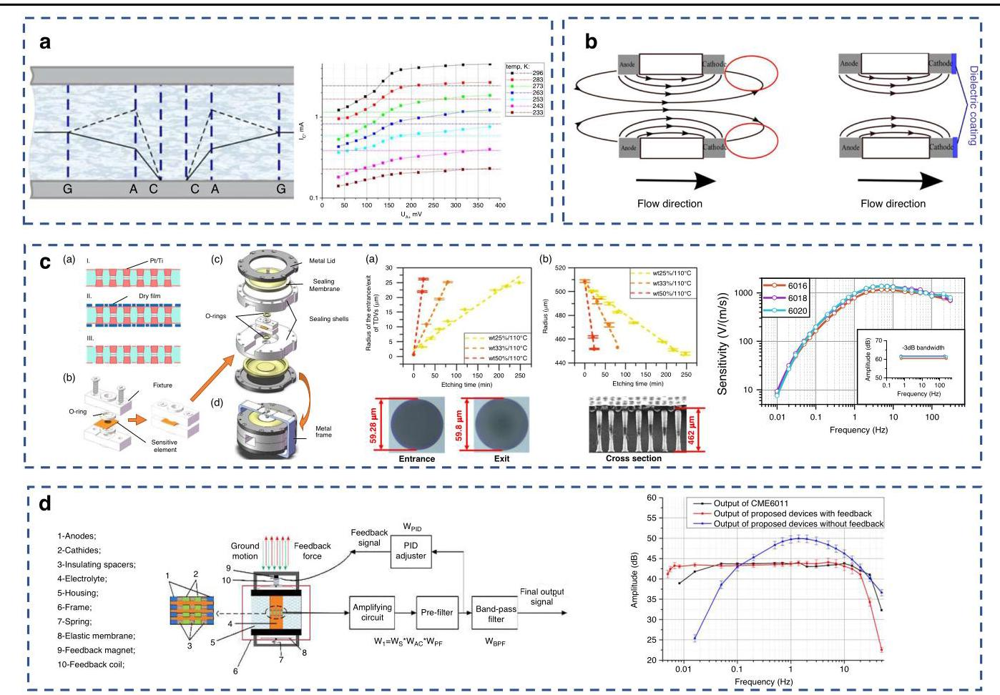

Fig. 7 Various improvement of electrochemical vibration sensor. a The working temperature expansion methods and results ${}^{33}$ . b The influence of dielectric coating on the conversion coefficient ${}^{34}$ . c The design of widening the bandwidth based on the hourglass-shaped glass holes and results ${}^{12}$ . d Negative feedback system of vibration sensor to board the bandwidth ${}^{35}$

图7电化学振动传感器的各种改进。a工作温度扩展方法和结果${}^{33}$。b介电涂层对转换系数的影响${}^{34}$。c基于沙漏形玻璃孔拓宽带宽的设计和结果${}^{12}$。d振动传感器的负反馈系统以拓宽带宽${}^{35}$

During electrochemical vibration sensor modeling, Alexander Bugaev et al. discovered the critical influence of dielectric coatings on cathode exteriors regarding conversion efficiency ${}^{34}$ . Utilizing thick-film technology and laser micromachining, comparative prototypes with/ without dielectric coatings were fabricated across three pore-density variants (1024, 1600, 2500 pores). Controlled experiments at identical background current levels demonstrate that dielectric-coated cathodes double the conversion coefficient. This enhancement schematized in Fig. 7b stems from suppressed reverse ionic fluxes in regions posterior to the cathode, which otherwise partially negate the active signal in uncoated configurations. The coating physically blocks counterproductive ion transport, thereby amplifying net sensitivity.

在电化学振动传感器建模过程中，亚历山大·布加耶夫等人发现阴极外部的介电涂层对转换效率有至关重要的影响${}^{34}$。利用厚膜技术和激光微加工，制造了三种不同孔密度(1024、1600、2500个孔)的有/无介电涂层的对比原型。在相同背景电流水平下的对照实验表明，有介电涂层的阴极使转换系数提高了一倍。图7b中所示的这种增强源于阴极后方区域中反向离子通量的抑制，否则在未涂层配置中会部分抵消有效信号。该涂层从物理上阻止了适得其反的离子传输，从而放大了净灵敏度。

Building on frequency response analysis, which identifies damping ratio and central flow orifice diameter as critical bandwidth determinants, the team developed an electrochemical seismometer (ECS) with hourglass-shaped TGVs as sensing elements ${}^{12}$ . This method integrates quad-electrodes on monolithic glass substrates, overcoming the limitations of through-silicon vias (TSVs) in achieving high-density, high-aspect-ratio structures. Figure 7c presents SEM micrographs of TGV inlet/outlet morphologies and tapered cross-sections, confirming the successful realization of conical microstructures. The non-straight pore structure of hourglass-shaped through glass vias (TGVs) (central/inlet, outlet $= {40\mu }\mathrm{m}/{60\mu }\mathrm{m}$ ) significantly enhances performance through fluid dynamic damping modulation mechanisms. The waist-constriction effect generates high shear forces in the narrow central region, increasing fluid resistance by ${3.2} \times$ compared to conventional cylindrical TSVs. This results in 68% amplitude attenuation in the mechanical subsystem at ${10}\mathrm{\;{Hz}}$ , extending the bandwidth to ${0.60} - {244.59}\mathrm{\;{Hz}}$ by suppressing the high-frequency resonant peak. Key performance metrics include: Sensitivity: ${1365}\mathrm{\;V}/\left( {\mathrm{m}/\mathrm{s}}\right)$ @5 Hz; Power consumption: ${108}\mathrm{\;{mW}}$ ; Noise floor: Below the New High Noise Model (NHNM); Linearity: ${\mathrm{R}}^{2} = {0.999}$ . Field validation was achieved through successful detection of the Hohhot M4.1 earthquake, with waveforms matching professional seismological station data, demonstrating practical potential for complex-environment seismic monitoring.

基于频率响应分析(该分析将阻尼比和中心流孔直径确定为关键带宽决定因素)，该团队开发了一种以沙漏形玻璃通孔(TGV)作为传感元件的电化学地震仪(ECS)${}^{12}$ 。此方法在单片玻璃基板上集成了四电极，克服了硅通孔(TSV)在实现高密度、高纵横比结构方面的局限性。图7c展示了TGV入口/出口形态和锥形横截面的扫描电子显微镜图像，证实了锥形微结构的成功实现。沙漏形玻璃通孔(TGV)(中心/入口、出口 $= {40\mu }\mathrm{m}/{60\mu }\mathrm{m}$ )的非直线孔隙结构通过流体动力阻尼调制机制显著提高了性能。腰部收缩效应在狭窄的中心区域产生高剪切力，与传统圆柱形TSV相比，流体阻力增加了 ${3.2} \times$ 。这导致在 ${10}\mathrm{\;{Hz}}$ 时机械子系统中的振幅衰减68%，通过抑制高频共振峰将带宽扩展到 ${0.60} - {244.59}\mathrm{\;{Hz}}$ 。关键性能指标包括:灵敏度:在5Hz时为 ${1365}\mathrm{\;V}/\left( {\mathrm{m}/\mathrm{s}}\right)$ ；功耗: ${108}\mathrm{\;{mW}}$ ；本底噪声:低于新高噪声模型(NHNM)；线性度: ${\mathrm{R}}^{2} = {0.999}$ 。通过成功检测呼和浩特M4.1地震实现了现场验证，波形与专业地震台站数据匹配，证明了其在复杂环境地震监测中的实际潜力。

To amplify the operational bandwidth of seismometers toward lower frequencies ${}^{35}$ , Li et al. implemented a negative feedback loop within the device. As schematized in Fig. 7d, Lorentz forces generated by the interaction between feedback coils and permanent magnets counteract the inertial motion of the liquid proof mass. System stability was ensured through tailored adjustments of proportional gain and integral time constants. Experimental results in Fig. 7d demonstrate that the feedback system expands the bandwidth to ${0.005} - {20}\mathrm{\;{Hz}}$ while significantly reducing harmonic distortion-from 4.34% to 1.81% at 1 Hz under equivalent excitation conditions.

为了将地震仪的工作带宽向更低频率扩展 ${}^{35}$ ，李等人在设备中实现了一个负反馈回路。如图7d所示，反馈线圈与永久磁铁相互作用产生的洛伦兹力抵消了液封质量块的惯性运动。通过定制比例增益和积分时间常数确保了系统稳定性。图7d中的实验结果表明，反馈系统将带宽扩展到了 ${0.005} - {20}\mathrm{\;{Hz}}$ ，同时在等效激励条件下，显著降低了谐波失真——从1Hz时的4.34%降至1.81%。

## Angular acceleration vibration sensor

## 角加速度振动传感器

In angular acceleration vibration detection, electrode structures can be classified into two types: planar electrodes and bulk electrodes. Planar electrodes-a novel configuration enabled by MEMS technology-eliminate the alignment requirements inherent to traditional platinum-layer electrodes, delivering superior device-to-device uniformity. Their flexible geometric distribution facilitates micron-level design control over parameters like pitch. However, their limited effective electrode area -confined to surface utilization only—results in reduced sensitivity. Conversely, bulk electrodes dramatically enhance sensitivity by incorporating sidewall metallization to increase total electrode surface area. Their volumetric architecture further allows hydraulic resistance modulation for passband control. Early bulk implementations used stacked multilayer electrodes, which suffered from poor consistency. MEMS integration later reduced layer count, improving uniformity, yet introduced packaging challenges as flow channels remain perpendicular to the electrodes-a limitation that urgently requires resolution.

在角加速度振动检测中，电极结构可分为两种类型:平面电极和体电极。平面电极——一种由MEMS技术实现的新型配置——消除了传统铂层电极固有的对准要求，实现了更高的器件间一致性。其灵活的几何分布便于对诸如间距等参数进行微米级设计控制。然而，其有限的有效于效电极面积——仅限于表面利用——导致灵敏度降低。相反，体电极通过采用侧壁金属化来增加总电极表面积，从而显著提高了灵敏度。其立体结构还允许对液压阻力进行调制以控制通带。早期的体电极实现采用了堆叠多层电极，一致性较差。后来的MEMS集成减少了层数，提高了一致性，但由于流道仍与电极垂直，引入了封装挑战——这一限制迫切需要解决。

In 2006, V. A. Kozlov et al. from Russia first proposed an electrochemical angular acceleration sensor ${}^{36}$ . They had initially created a prototype device as shown in Fig. 8a, which successfully performed preliminary measurements of angular acceleration signals within the frequency range of 0.08 to ${800}\mathrm{\;{Hz}}$ . Subsequently, Dmitry L. Zaitsev’s team developed electrochemical angular acceleration sensors featuring annular channels with diameters of $9\mathrm{\;{mm}}$ and ${50}{\mathrm{\;{mm}}}^{37}$ in Fig. 8a, extending the bandwidth to ${0.02} - {50}\mathrm{\;{Hz}}$ and achieving a sensitivity of ${0.5}\mathrm{\;V}/\left( {\mathrm{{rad}}/{\mathrm{s}}^{2}}\right)$ . Further advancing the technology, Egor Egorov's team employed magnetohydrodynamic (MHD) negative feedback techniques to enhance the performance of the electrochemical sensor ${}^{38}$ . The device structure is depicted in Fig. 8a. This approach extended the passband to ${0.02} - {10}\mathrm{\;{Hz}}$ , increased the dynamic range, and reduced temperature dependency and nonlinear distortion, while maintaining low self-noise of ${3.6} \times  {10}^{-5}\mathrm{{rad}}/{\mathrm{s}}^{2} \cdot  {\mathrm{{Hz}}}^{-1}/{}^{2}$ . Their experimental prototype utilized a 50-mm-diameter annular channel design with a dual-channel cross-section $(3\mathrm{\;{mm}} \times  6\mathrm{\;{mm}}$ and $1\mathrm{\;{mm}} \times$ 6 mm), using an aqueous LiI solution as the electrolyte. Measured results demonstrated a sensitivity reaching $8\mathrm{\;V}/$ (rad/s ${}^{2}$ ), highlighting its high precision and stability.

2006年，俄罗斯的V. A. Kozlov等人首次提出了一种电化学角加速度传感器${}^{36}$ 。他们最初制作了一个如图8a所示的原型设备，该设备成功地在0.08至${800}\mathrm{\;{Hz}}$ 的频率范围内对角加速度信号进行了初步测量。随后，Dmitry L. Zaitsev的团队开发了电化学角加速度传感器，其在图8a中具有直径为$9\mathrm{\;{mm}}$ 和${50}{\mathrm{\;{mm}}}^{37}$ 的环形通道，将带宽扩展到${0.02} - {50}\mathrm{\;{Hz}}$ ，并实现了${0.5}\mathrm{\;V}/\left( {\mathrm{{rad}}/{\mathrm{s}}^{2}}\right)$ 的灵敏度。为进一步推进该技术，Egor Egorov的团队采用磁流体动力学(MHD)负反馈技术来提高电化学传感器${}^{38}$ 的性能。该设备结构如图8a所示。这种方法将通带扩展到${0.02} - {10}\mathrm{\;{Hz}}$ ，增加了动态范围，降低了温度依赖性和非线性失真，同时保持了${3.6} \times  {10}^{-5}\mathrm{{rad}}/{\mathrm{s}}^{2} \cdot  {\mathrm{{Hz}}}^{-1}/{}^{2}$ 的低自噪声。他们的实验原型采用了直径为50毫米的环形通道设计，双通道横截面为$(3\mathrm{\;{mm}} \times  6\mathrm{\;{mm}}$ 和$1\mathrm{\;{mm}} \times$ 6毫米)，使用碘化锂水溶液作为电解质。测量结果表明灵敏度达到$8\mathrm{\;V}/$ (弧度/秒${}^{2}$ )，突出了其高精度和稳定性。

Liu et al. proposed a novel electrochemical angular accelerometer based on parallel-arranged micro planar electrodes ${}^{39}$ . This pioneering design addresses the core bottlenecks of traditional sensors concerning low-frequency performance, manufacturing processes, and sealing reliability. The research team developed two electrode configurations: ACCA-ACCA and ACAC-CACA in Fig. 8b. Utilizing microfabrication techniques, miniature electrodes measuring only ${14.5}\mathrm{\;{mm}} \times  {13.0}\mathrm{\;{mm}}$ (representing a 93% size reduction) were fabricated on a glass substrate. Experimental validation demonstrated that the ACCA-ACCA configuration exhibits a sensitivity of ${20.169}\mathrm{\;V}/\left( {\mathrm{{rad}}/{\mathrm{s}}^{2}}\right)$ at the ultra-low frequency of ${0.01}\mathrm{\;{Hz}}$ . This performance is superior to that of the ACAC-CACA configuration, which yielded 5.868 V/(rad/s'). Concurrently, the sensor noise remains as low as ${8.91} \times  {10}^{-7} \; \left( {\mathrm{{rad}}/{\mathrm{s}}^{2}}\right) /{\mathrm{{Hz}}}^{1}/{}^{2}@1\mathrm{{Hz}}$ . Furthermore, the sensitivity within the operational bandwidth is enhanced to ${22}\mathrm{\;V}/\left( {\mathrm{{rad}}/{\mathrm{s}}^{2}}\right)$ over a frequency range of ${0.02}\mathrm{\;{Hz}}$ to ${10}\mathrm{\;{Hz}}$ .

Liu等人提出了一种基于平行排列微平面电极的新型电化学加速度计${}^{39}$ 。这种开创性的设计解决了传统传感器在低频性能、制造工艺和密封可靠性方面的核心瓶颈问题。该研究团队开发了两种电极配置:图8b中的ACCA - ACCA和ACAC - CACA。利用微制造技术，在玻璃基板上制造了尺寸仅为${14.5}\mathrm{\;{mm}} \times  {13.0}\mathrm{\;{mm}}$ (尺寸减小了93%)的微型电极。实验验证表明，ACCA - ACCA配置在${0.01}\mathrm{\;{Hz}}$ 的超低频下具有${20.169}\mathrm{\;V}/\left( {\mathrm{{rad}}/{\mathrm{s}}^{2}}\right)$ 的灵敏度。该性能优于ACAC - CACA配置，后者的灵敏度为5.868 V/(弧度/秒²)。同时，传感器噪声低至${8.91} \times  {10}^{-7} \; \left( {\mathrm{{rad}}/{\mathrm{s}}^{2}}\right) /{\mathrm{{Hz}}}^{1}/{}^{2}@1\mathrm{{Hz}}$ 。此外，在${0.02}\mathrm{\;{Hz}}$ 至${10}\mathrm{\;{Hz}}$ 的频率范围内，工作带宽内的灵敏度提高到${22}\mathrm{\;V}/\left( {\mathrm{{rad}}/{\mathrm{s}}^{2}}\right)$ 。

Chen et al. developed a MEMS electrochemical angular accelerometer based on a silicon triple-electrode structure ${}^{40}$ , which significantly enhanced low-frequency seismic rotational signal detection through an innovative three-dimensional sensing unit design. The device employs a through-silicon-via (TSV) integration process to fabricate an anode-cathode-anode 3D electrode array shown in Fig. 8c, expanding the effective electrode area to over 5 times that of conventional planar configurations. Experimental results demonstrated a sensitivity of 363 V/ (rad/s ${}^{2}$ ) within ${0.01} - 2\mathrm{\;{Hz}}$ bandwidth - representing a 45- fold improvement over commercial molecular electronic sensors - along with a low-frequency noise level of ${1.78} \times \; {10}^{-8}\mathrm{{rad}}/{\mathrm{s}}^{2}/{\mathrm{{Hz}}}^{1}/{}^{2}$ at $1\mathrm{\;{Hz}}$ (85% reduction versus comparable devices). However, intrinsic limitations in the triple-electrode configuration were observed: The inability to establish an effective ${I}_{3}^{ - }$ depletion layer between adjacent cathodes disrupted the electric double layer capacitance equilibrium at cathode-electrolyte interfaces. This structural deficiency resulted in severely degraded current output symmetry and introduced substantial DC offset fluctuations (±150μV amplitude) superimposed on the output signal.

陈等人基于硅三电极结构${}^{40}$开发了一种MEMS电化学角加速度计，通过创新的三维传感单元设计显著增强了低频地震旋转信号检测。该器件采用硅通孔(TSV)集成工艺制造图8c所示的阳极-阴极-阳极3D电极阵列，将有效电极面积扩大到传统平面配置的5倍以上。实验结果表明，在${0.01} - 2\mathrm{\;{Hz}}$带宽内灵敏度为363 V/(rad/s${}^{2}$)，比商用分子电子传感器提高了45倍，在$1\mathrm{\;{Hz}}$时低频噪声水平为${1.78} \times \; {10}^{-8}\mathrm{{rad}}/{\mathrm{s}}^{2}/{\mathrm{{Hz}}}^{1}/{}^{2}$(与同类器件相比降低了85%)。然而，观察到三电极配置存在固有局限性:相邻阴极之间无法建立有效的${I}_{3}^{ - }$耗尽层，破坏了阴极-电解质界面处的双电层电容平衡。这种结构缺陷导致电流输出对称性严重下降，并在输出信号上叠加了大量直流偏移波动(幅度为±150μV)。

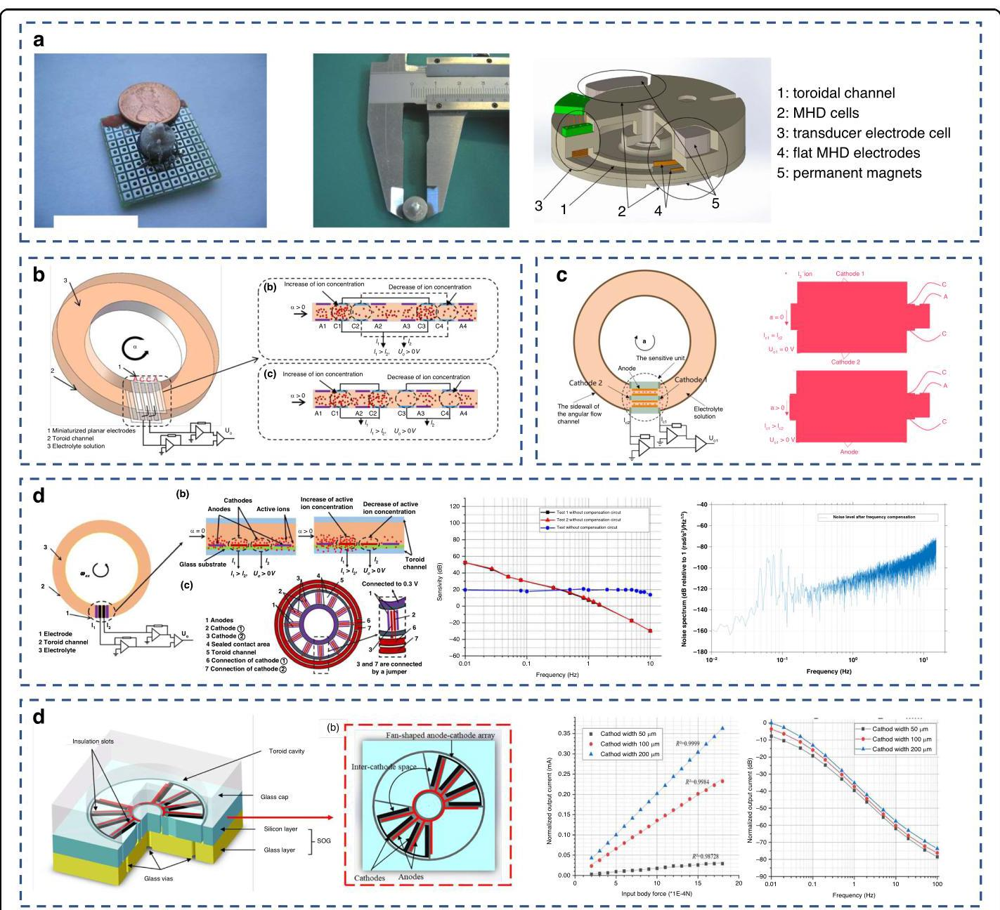

Fig. 8 The angular velocity sensing with planar structure. a The initial design and improvement of the electrochemical angular accelerometer ${}^{{36} - {38}}$ . b MEMS electrochemical angular acceleration sensor based on parallel flow channel chimeric electrodes ${}^{39}$ . c Angular accelerometer based on silicon-based triple-electrode structure ${}^{40}$ . d MEMS electrochemical angular acceleration sensor based on parallel flow channel disc electrode ${}^{41}$ . e Asymmetric sandwich structure based on anodic bonding ${}^{42}$

图8平面结构的角速度传感。a电化学角加速度计${}^{{36} - {38}}$的初始设计和改进。b基于平行流道嵌合电极${}^{39}$的MEMS电化学角加速度传感器。c基于硅基三电极结构${}^{40}$的角加速度计。d基于平行流道盘状电极${}^{41}$的MEMS电化学角加速度传感器。e基于阳极键合的不对称夹层结构${}^{42}$

Liu et al. developed a MEMS-based electrochemical angular accelerometer ${}^{41}$ , marking the first application of MEMS technology in such devices. Their MEMS-based design, incorporating planar electrode structures, significantly enhanced sensitivity for seismic monitoring. Utilizing 12 sets of quad-electrode pairs with an interelectrode spacing reduced to ${10\mu }\mathrm{m}$ - surpassing the ${20\mu }\mathrm{m}$ limit of conventional fabrication techniques. Employing planar electrode arrays as the sensing elements. Four rectangular grooves $\left( {{20\mu }\mathrm{m} \times  {50\mu }\mathrm{m}}\right)$ fabricated adjacent to the electrodes via micro-etching induced a step-change in lateral stiffness within the sensing region. This amplified stress concentration to ${35}\mathrm{{MPa}}$ , as illustrated in Fig. 8d. Experimental results in Fig. 8d demonstrated performance metrics including: A sensitivity of ${10}\mathrm{\;V}/\left( {\mathrm{{rad}}/{\mathrm{s}}^{2}}\right)$ across a ${0.01} - 8\mathrm{\;{Hz}}$ bandwidth. Exceptionally low noise density of ${1.17} \times  {10}^{-6}\mathrm{{rad}}/{\mathrm{s}}^{2}/{\mathrm{{Hz}}}^{1}/{}^{2}$ at $1\mathrm{\;{Hz}}$ , representing a 67% reduction compared to commercial counterparts. A response time shortened to ${0.5}\mathrm{\;s}$ .

刘等人开发了一种基于MEMS的电化学角加速度计${}^{41}$，这是MEMS技术在此类器件中的首次应用。他们基于MEMS的设计采用平面电极结构，显著提高了地震监测的灵敏度。使用12组电极间距减小到${10\mu }\mathrm{m}$的四电极对，超过了传统制造技术的${20\mu }\mathrm{m}$限制。采用平面电极阵列作为传感元件。通过微蚀刻在电极附近制造四个矩形凹槽$\left( {{20\mu }\mathrm{m} \times  {50\mu }\mathrm{m}}\right)$，在传感区域内引起横向刚度的阶跃变化。这将应力集中放大到${35}\mathrm{{MPa}}$，如图8d所示。图8d中的实验结果展示了包括以下的性能指标:在${0.01} - 8\mathrm{\;{Hz}}$带宽内灵敏度为${10}\mathrm{\;V}/\left( {\mathrm{{rad}}/{\mathrm{s}}^{2}}\right)$。在$1\mathrm{\;{Hz}}$时极低的噪声密度为${1.17} \times  {10}^{-6}\mathrm{{rad}}/{\mathrm{s}}^{2}/{\mathrm{{Hz}}}^{1}/{}^{2}$，与商用同类产品相比降低了67%。响应时间缩短到${0.5}\mathrm{\;s}$。

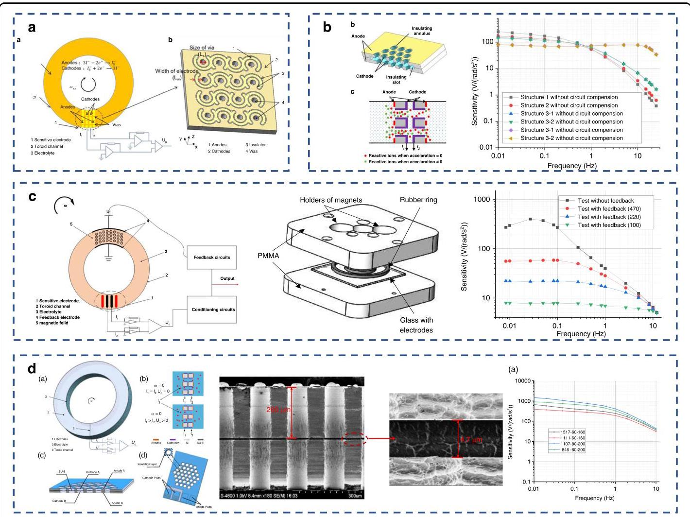

Fig. 9 Example of bulk electrodes improvement in angular velocity meter. a Integrated electrode structure based on vertical flow channels ${}^{44}$ . b Monolithic integration based on bonding and testing results ${}^{45}$ . c Bandwidth expansion technology based on magnetic fluid negative feedback technology ${}^{46}$ . d Silicon-Based Four-Electrode Structure ${}^{47}$

图9角速度计中体电极改进的示例。a基于垂直流道的集成电极结构${}^{44}$。b基于键合和测试结果的单片集成${}^{45}$。c基于磁流体负反馈技术的带宽扩展技术${}^{46}$。d硅基四电极结构${}^{47}$

To meet the demands of high-dynamic scenarios such as aerospace applications and seismic monitoring, Zhu et al. proposed an electrochemical angular accelerometer featuring chip-scale packaging and asymmetric electrode design ${}^{42}$ . As illustrated in Fig. 8e, the device employs anodic bonding to create a glass-silicon-glass sandwich configuration. The silicon layer is etched to form ${200\mu }\mathrm{m}$ -deep insulating trenches, while the glass covers incorporate annular microcavities for precise fluidic damping control. The design achieves a 300% increase in electrode reaction area by expanding the cathode width to ${200\mu }\mathrm{m}$ and configuring electrodes at quarter-circumferential spacing, which was directed by the simulation result shown in Fig. 8e. This enables a sensitivity of ${1.1}\mathrm{\;V}/\left( {\mathrm{{rad}}/{\mathrm{s}}^{2}}\right)$ at $1\mathrm{\;{Hz}}$ with nonlinearity below ${0.25}\%$ full scale. At the packaging level, this work pioneered the monolithic integration of MEMS electrodes and glass microchannels via secondary anodic bonding. Testing demonstrates a dynamic range of $- {130}\mathrm{\;{dB}}@1\mathrm{\;{Hz}}$ maintained even at ${500}^{ \circ  }/{\mathrm{s}}^{2}$ input acceleration - representing a 50-fold improvement over conventional devices with ${6.8}^{ \circ  }/{\mathrm{s}}^{2}$ full-scale ranges ${}^{43}$ .

为满足航空航天应用和地震监测等高动态场景的需求，朱等人提出了一种具有芯片级封装和非对称电极设计的电化学角加速度计${}^{42}$。如图8e所示，该器件采用阳极键合形成玻璃-硅-玻璃三明治结构。硅层被蚀刻以形成${200\mu }\mathrm{m}$深的绝缘沟槽，而玻璃盖包含环形微腔以实现精确的流体阻尼控制。通过将阴极宽度扩大到${200\mu }\mathrm{m}$并以四分之一圆周间距配置电极，该设计使电极反应面积增加了300%，这是由图8e所示的模拟结果指导的。这使得在$1\mathrm{\;{Hz}}$时灵敏度达到${1.1}\mathrm{\;V}/\left( {\mathrm{{rad}}/{\mathrm{s}}^{2}}\right)$，非线性低于满量程的${0.25}\%$。在封装层面，这项工作率先通过二次阳极键合实现了MEMS电极和玻璃微通道的单片集成。测试表明，即使在${500}^{ \circ  }/{\mathrm{s}}^{2}$输入加速度下，动态范围仍保持在$- {130}\mathrm{\;{dB}}@1\mathrm{\;{Hz}}$——比具有${6.8}^{ \circ  }/{\mathrm{s}}^{2}$满量程范围的传统器件提高了50倍${}^{43}$。

To enhance sensitivity, Liu et al. designed an S-shaped monolithic MEMS electrode with vertical flow channels ${}^{44}$ . This architecture increases sensitivity while maintaining a compact substrate footprint. As electrolyte flows through orifices in the vertical channel electrodes, it is compressed within the channels, accelerating local flow velocity. Crucially, anode and cathode pairs are vertically aligned on opposing sides of the silicon substrate at each orifice periphery in Fig. 9a, optimizing utilization of electroactive species and thereby further boosting device sensitivity. The fabricated device achieved a sensitivity of ${338}\mathrm{\;V}/(\mathrm{{rad}}/ \; {\mathrm{s}}^{2}$ ) across a ${0.01} - {10}\mathrm{\;{Hz}}$ bandwidth, with noise density as low as ${4.67} \times  {10}^{-8}\mathrm{{rad}} \cdot  {\mathrm{s}}^{-2}/{\mathrm{{Hz}}}^{1}/{}^{2}$ at $1\mathrm{\;{Hz}}$ . Optimized via fluid-structure interaction modeling, this vertical electrode configuration demonstrates superior comprehensive performance for low-frequency vibration monitoring compared to conventional planar electrode designs.

为提高灵敏度，刘等人设计了一种带有垂直流道${}^{44}$的S形整体式MEMS电极。这种架构在保持紧凑的基板占地面积的同时提高了灵敏度。当电解质流经垂直通道电极中的孔时，它在通道内被压缩，加速了局部流速。至关重要的是，在图9a中每个孔周边的硅基板相对两侧，阳极和阴极对垂直对齐，优化了电活性物质的利用，从而进一步提高了器件灵敏度。制造的器件在${0.01} - {10}\mathrm{\;{Hz}}$带宽上实现了${338}\mathrm{\;V}/(\mathrm{{rad}}/ \; {\mathrm{s}}^{2}$的灵敏度，在$1\mathrm{\;{Hz}}$时噪声密度低至${4.67} \times  {10}^{-8}\mathrm{{rad}} \cdot  {\mathrm{s}}^{-2}/{\mathrm{{Hz}}}^{1}/{}^{2}$。通过流固耦合建模进行优化，这种垂直电极配置与传统平面电极设计相比，在低频振动监测方面表现出卓越的综合性能。

To overcome the sensitivity limitations imposed by the restricted electrode area in planar structures, Liang et al. developed a MEMS-based method for fabricating bulk electrodes ${}^{45}$ . The resulting chip structure shown in Fig. 9b features anodes and cathodes monolithically integrated on a single silicon wafer and bonded to form a four-electrode configuration: anodes distributed on the surface and cathodes embedded within the sidewalls of microfluidic channels, facilitated by insulating rings and grooves enabling non-aligned bonding. This silicon-based honeycomb architecture significantly outperforms planar designs by arranging cathodes along densely-packed, tens-of-micron-sized microchannel sidewalls, achieving over a hundredfold increase in electrode density per unit area and enlarging the directly opposing anode-cathode area. Furthermore, the high-density microchannel array substantially increases the system's damping coefficient, with damping characteristics readily optimized by modulating aperture and pitch. Experimental validation Fig. 9b demonstrates a sensitivity of ${80}\mathrm{\;V}/\left( {\mathrm{{rad}}/{\mathrm{s}}^{2}}\right)$ - an eightfold improvement over prior results of ${10}\mathrm{\;V}/\left( {\mathrm{{rad}}/{\mathrm{s}}^{2}}\right)$ - and a bandwidth spanning 0.01 to ${18}\mathrm{\;{Hz}}$ , effectively covering the critical frequency range for seismic monitoring applications.

为克服平面结构中受限电极面积所带来的灵敏度限制，梁等人开发了一种基于微机电系统(MEMS)的块状电极制造方法${}^{45}$。图9b所示的最终芯片结构具有阳极和阴极，它们单片集成在单个硅片上，并通过键合形成四电极配置:阳极分布在表面，阴极嵌入微流体通道的侧壁内，绝缘环和凹槽有助于实现非对齐键合。这种基于硅的蜂窝状结构通过将阴极沿密集排列的数十微米尺寸的微通道侧壁排列，显著优于平面设计，实现了每单位面积电极密度提高一百多倍，并扩大了直接相对的阳极 - 阴极面积。此外，高密度微通道阵列大幅提高了系统的阻尼系数，通过调节孔径和间距可轻松优化阻尼特性。图9b的实验验证表明灵敏度为${80}\mathrm{\;V}/\left( {\mathrm{{rad}}/{\mathrm{s}}^{2}}\right)$，比之前${10}\mathrm{\;V}/\left( {\mathrm{{rad}}/{\mathrm{s}}^{2}}\right)$的结果提高了八倍，带宽为0.01至${18}\mathrm{\;{Hz}}$，有效覆盖了地震监测应用的关键频率范围。

To extend bandwidth and dynamic range, Liang Tian et al. introduced magnetofluidic negative feedback technology into electrochemical angular accelerometers ${}^{46}$ . Building upon the sensitive electrodes, annular micro-channels, and electrolyte, the design incorporates a pair of feedback electrodes and feedback magnets shown in Fig. 9c. Symmetrically arranged relative to the sensing electrodes, the feedback electrodes are positioned parallel to the inner surface of the annular channel, while the paired magnets are mounted on the upper and lower surfaces to generate orthogonal electromagnetic fields. As illustrated in the device assembly in Fig. 9c, experimental results were displayed in Fig. 9c demonstrate a sensitivity of $8\mathrm{\;V}/\left( {\mathrm{{rad}}/{\mathrm{s}}^{2}}\right)$ , comparable to MEMS devices without feedback yet significantly surpassing conventional platinum mesh electrode sensors $\left( {8\mathrm{\;V}\text{ vs. }{10}\mathrm{\;V}}\right)$ . Crucially, the bandwidth extends from 0.0083 to $8\mathrm{\;{Hz}}$ , achieving nearly an order-of-magnitude improvement in low-frequency performance over non-feedback systems.

为了扩展带宽和动态范围，梁田等人将磁流体负反馈技术引入电化学角加速度计${}^{46}$。该设计基于敏感电极、环形微通道和电解质，包含一对反馈电极和反馈磁体，如图9c所示。反馈电极相对于传感电极对称布置，平行于环形通道的内表面，而成对的磁体安装在上、下表面，以产生正交电磁场。如图9c中的器件组装所示，图9c中的实验结果显示灵敏度为$8\mathrm{\;V}/\left( {\mathrm{{rad}}/{\mathrm{s}}^{2}}\right)$，与无反馈的MEMS器件相当，但显著超过传统铂网电极传感器$\left( {8\mathrm{\;V}\text{ vs. }{10}\mathrm{\;V}}\right)$。至关重要的是，带宽从0.0083扩展到$8\mathrm{\;{Hz}}$，在低频性能方面比无反馈系统提高了近一个数量级。

Zhang et al. proposed an innovative MEMS electrochemical angular accelerometer featuring a silicon-based four-electrode structure to address the challenges in monitoring rotational seismic components ${}^{47}$ . The sensitive element comprises numerous microfabricated channels on a monocrystalline silicon wafer, with surface anodes and cathode walls lining the fluidic pores forming an (A-C-C-A) configuration. An intermediate SU-8 layer provides electrical insulation and enables stable differential signal output. Fabrication utilized wafer-level SU-8 bonding and etching processes, achieving monolithic integration that overcomes the misalignment constraints inherent in conventional platinum mesh electrodes. The characterized device exhibits a sensitivity of ${1458}\mathrm{\;V}/(\mathrm{{rad}}/ \; {\mathrm{s}}^{2}$ ) at ${0.01}\mathrm{\;{Hz}}$ , with low-frequency $\left( {1\mathrm{\;{Hz}}}\right)$ noise as low as -164 dB. It maintains a substantial sensitivity of 42 V/(rad/ ${\mathrm{s}}^{2}$ ) even at ${10}\mathrm{\;{Hz}}$ . During vibration testing, the measured signal amplitude $\left( {{0.86}\mathrm{\;V}}\right)$ demonstrated significant superiority over the commercial METR-03 device $\left( {{0.06}\mathrm{\;V}}\right)$ .

张等人提出了一种创新的MEMS电化学角加速度计，其具有基于硅的四电极结构，以应对监测旋转地震分量方面的挑战${}^{47}$。敏感元件包括单晶硅晶片上的许多微加工通道，表面阳极和阴极壁衬在流体孔隙上，形成(A-C-C-A)配置。中间的SU-8层提供电绝缘并实现稳定的差分信号输出。制造过程采用晶圆级SU-8键合和蚀刻工艺，实现了单片集成，克服了传统铂网电极固有的对准限制。该表征器件在${0.01}\mathrm{\;{Hz}}$时的灵敏度为${1458}\mathrm{\;V}/(\mathrm{{rad}}/ \; {\mathrm{s}}^{2}$，低频$\left( {1\mathrm{\;{Hz}}}\right)$噪声低至-164 dB。即使在${10}\mathrm{\;{Hz}}$时，它仍保持42 V/(rad/${\mathrm{s}}^{2}$)的高灵敏度。在振动测试期间，测得的信号幅度$\left( {{0.86}\mathrm{\;V}}\right)$显示出比商用METR-03器件$\left( {{0.06}\mathrm{\;V}}\right)$有显著优势。

## Manufacturing method

## 制造方法

Building upon the foundational platinum mesh weaving technique, the incorporation of MEMS processes into vibration sensor manufacturing has substantially simplified device fabrication workflows. To enhance device uniformity, structural configurations have evolved from laminated multi-chip stacking for bulk electrodes to dual-wafer integration and ultimately monolithic integration. As depicted in the above revolution review, electrochemical vibration sensors exhibit a pronounced trend toward structural unification and MEMS-based manufacturing methodologies. Subsequent sections will systematically detail the core fabrication sequences for three architectures: conventional platinum mesh structures, MEMS planar configurations, and integrated MEMS bulk electrode systems with different approaches. The superiorities and drawbacks were exhibited in below.

在基础铂网编织技术的基础上，将MEMS工艺引入振动传感器制造，大大简化了器件制造流程。为了提高器件均匀性，结构配置已从用于块状电极的层压多芯片堆叠发展到双晶圆集成，最终实现单片集成。如上述发展综述所示，电化学振动传感器呈现出明显的结构统一和基于MEMS的制造方法的趋势。后续章节将系统地详细介绍三种架构的核心制造序列:传统铂网结构、MEMS平面配置以及采用不同方法的集成MEMS块状电极系统。其优缺点如下所示。

The sensing core of traditional electrochemical geophones consists of compressed-and-sintered platinum mesh electrodes sandwiched with ceramic plates. The Pt mesh electrodes are woven from ${40} - {50\mu }\mathrm{m}$ platinum wires, as depicted in the device configuration ${}^{17}$ shown in Fig. 10a. Employing microelectronic techniques, the electrode fabrication process begins with thermal oxidation to form a dielectric layer on a silicon substrate, followed by microchannel patterning. Subsequently, explosive photolithography and electron-beam deposition are utilized to create planar electrode arrays. Through-holes for microfluidic channels are machined on supporting plates using tunable picosecond/femtosecond pulsed lasers. Final electrode interconnections are completed via ultrasonic welding, precision contact welding, and conductive adhesive bonding. Scanning electron microscopy (SEM) characterization results of the electrode structure are captured in Fig. 10a.

传统电化学地震检波器的传感核心由夹在陶瓷板之间的压缩烧结铂网电极组成。如图10a所示的器件配置${}^{17}$，铂网电极由${40} - {50\mu }\mathrm{m}$铂丝编织而成。采用微电子技术，电极制造过程首先在硅衬底上进行热氧化以形成介电层，然后进行微通道图案化。随后，利用爆炸光刻和电子束沉积来创建平面电极阵列。使用可调谐皮秒/飞秒脉冲激光在支撑板上加工微流体通道的通孔。最终的电极互连通过超声焊接、精密接触焊接和导电胶粘接完成。图10a展示了电极结构的扫描电子显微镜(SEM)表征结果。

The process flow for planar interdigital electrode structures is depicted in Fig. 10b ${}^{23}$ : Starting with a single-crystal silicon substrate, an aluminum mask pattern is first formed on the backside via photolithography and phosphoric acid etching. Deep reactive ion etching is then employed to create ${200\mu }\mathrm{m}$ -deep parallel microchannels serving as fluidic pathways. A0.5-μm-thick ${\mathrm{{SiO}}}_{2}$ insulation layer is thermally grown on the front surface, followed by sputtering and patterning of platinum to form interdigitated electrodes. Finally, multiple processed silicon substrates are vertically stacked to construct a multilayer sensing configuration. To enhance the cathode surface area, the integration of vertical microchannels with planar electrodes was developed. Figure ${10}{\mathrm{c}}^{13}$ illustrates this monolithic fabrication approach: Beginning with a silicon wafer pre-coated with LPCVD SiN, sequential titanium and platinum layers are deposited by electron-beam evaporation to form a four-electrode system patterned via lift-off processing. Inter-electrode isolation is achieved through 1-μm-thick SiN deposited via plasma-enhanced chemical vapor deposition (PECVD) at 350 °C. Backside DRIE etching stops at the SiN layer to yield a ${5.8\mu }\mathrm{m}$ -thick membrane, with focused ion beam (FIB) milling subsequently creating 50-μm-diameter through-channels on the frontside to expose alternating Pt electrodes and SiN sidewalls. This design eliminates the need for layer-to-layer alignment and bonding interfaces, significantly reducing assembly complexity.

平面叉指电极结构的工艺流程如图10b所示${}^{23}$:从单晶硅衬底开始，首先通过光刻和磷酸蚀刻在背面形成铝掩膜图案。然后采用深反应离子蚀刻来创建${200\mu }\mathrm{m}$深度的平行微通道作为流体通道。在正面热生长一层0.5μm厚的${\mathrm{{SiO}}}_{2}$绝缘层，随后溅射并图案化铂以形成叉指电极。最后，将多个经过处理的硅衬底垂直堆叠以构建多层传感配置。为了增加阴极表面积，开发了垂直微通道与平面电极的集成。图${10}{\mathrm{c}}^{13}$展示了这种单片制造方法:从预涂有LPCVD SiN的硅晶片开始，通过电子束蒸发依次沉积钛和铂层，以形成通过剥离工艺图案化的四电极系统。通过在350°C下通过等离子体增强化学气相沉积(PECVD)沉积1μm厚的SiN来实现电极间隔离。背面DRIE蚀刻在SiN层处停止，以产生${5.8\mu }\mathrm{m}$厚的膜，随后通过聚焦离子束(FIB)铣削在正面创建直径为50μm的通孔，以暴露交替的Pt电极和SiN侧壁。这种设计无需层间对准和键合界面，显著降低了组装复杂性。

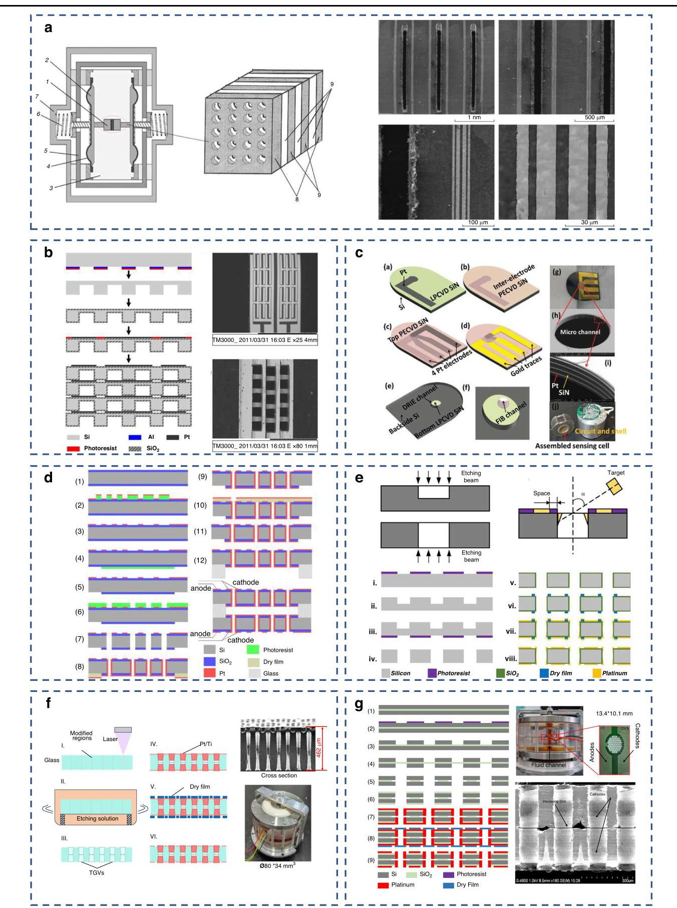

Fig. 10 The manufacturing method of different types sensitive electrodes. a The traditional production process of platinum mesh weaving ${}^{17}$ . b The process of planar interdigital electrode structures ${}^{23}$ . c The integration of vertical microchannels with planar electrodes ${}^{13}$ . d Four-electrode integration based on dual-chip bonding ${}^{27}$ . e Four-electrode monolithic integration based on oblique sputtering ${}^{30}$ . f Glass-based hourglass-shaped TGVs process ${}^{12}$ . g Four-electrode monolithic integration based on SOI ${}^{48}$

图10不同类型敏感电极的制造方法。a铂网编织的传统生产工艺${}^{17}$。b平面叉指电极结构的工艺${}^{23}$。c垂直微通道与平面电极的集成${}^{13}$。d基于双芯片键合的四电极集成${}^{27}$。e基于倾斜溅射的四电极单片集成${}^{30}$。f基于玻璃的沙漏形TGVs工艺${}^{12}$。g基于SOI的四电极单片集成${}^{48}$

MEMS technology enables three-dimensional silicon processing, with two primary methodologies emerging for integration. The first approach constructs anode-cathode pairs on individual chips followed by anodic bonding assembly. In the bonded configuration ${}^{27}$ in Fig. 10d, processing begins with 4-inch silicon and BF33 glass substrates. After thermal oxidation forms a ${\mathrm{{SiO}}}_{2}$ insulation layer, photolithography, electron-beam evaporation of Ti/Pt ( ${60}\mathrm{\;{nm}}/{300}\mathrm{\;{nm}}$ ), and lift-off define anode patterns. HF etching exposes silicon bonding areas, while RIE/DRIE creates ${100\mu }\mathrm{m}$ -diameter grid through-holes with ${40\mu }\mathrm{m}$ pitch (insulating ring width optimized to 10μm). Innovatively replacing liquid photoresist with dry film lithography enables Ti/Pt cathode sputtering on hole sidewalls and backside, with dedicated vias routing cathodes to the anode plane. Final integration employs chip-level sequential bonding: initial alignment and bonding of single electrodes to ${500\mu }\mathrm{m}$ -thick glass within ceramic molds, followed by counter-electrode bonding to complete the quad-electrode structure. Thermal stress simulations optimized the glass/silicon thickness ratio $\left( {{500\mu }\mathrm{m}/{200\mu }\mathrm{m}}\right)$ to mitigate thermal mismatch, achieving adhesive-free full integration. This design minimizes electrode spacing to micrometer scale while increasing effective area via sidewall electrodes, significantly enhancing sensitivity and uniformity.

微机电系统(MEMS)技术实现了三维硅加工，出现了两种主要的集成方法。第一种方法是在单个芯片上构建阳极 - 阴极对，然后进行阳极键合组装。在图10d所示的键合配置${}^{27}$中，加工从4英寸硅和BF33玻璃基板开始。热氧化形成${\mathrm{{SiO}}}_{2}$绝缘层后，通过光刻、Ti/Pt(${60}\mathrm{\;{nm}}/{300}\mathrm{\;{nm}}$)的电子束蒸发以及剥离工艺来定义阳极图案。HF蚀刻暴露硅键合区域，而反应离子刻蚀(RIE)/深反应离子刻蚀(DRIE)创建直径为${100\mu }\mathrm{m}$、间距为${40\mu }\mathrm{m}$的网格通孔(绝缘环宽度优化为10μm)。创新地用干膜光刻代替液体光刻胶，使得能够在孔的侧壁和背面溅射Ti/Pt阴极，并通过专用通孔将阴极连接到阳极平面。最终集成采用芯片级顺序键合:首先将单个电极与陶瓷模具内${500\mu }\mathrm{m}$厚的玻璃进行初始对准和键合，然后进行对电极键合以完成四电极结构。热应力模拟优化了玻璃/硅厚度比$\left( {{500\mu }\mathrm{m}/{200\mu }\mathrm{m}}\right)$以减轻热失配，实现无粘合剂的完全集成。这种设计将电极间距最小化至微米级，同时通过侧壁电极增加有效面积，显著提高了灵敏度和均匀性。

The alternative approach directly integrates both electrode pairs on a single wafer ${}^{30}$ . Developed using DRIE and angled sputtering techniques shown in Fig. 10e, this process initiates with double-sided photolithography defining ${60\mu }\mathrm{m}$ -diameter through-hole patterns. Dual-sided DRIE etching forms high-aspect-ratio micro-vias before thermal oxidation grows an ${800}\mathrm{\;{nm}}{\mathrm{{SiO}}}_{2}$ layer. Photosensitive polymer film (SD230) patterning defines electrode templates, with ${70}^{ \circ  }$ angled sputtering sequentially depositing ${60}\mathrm{\;{nm}}\mathrm{{Ti}}$ adhesion and ${300}\mathrm{\;{nm}}\mathrm{{Pt}}$ layers. Precise control over sidewall metal coverage leverages uncoated ${\mathrm{{SiO}}}_{2}$ regions for inter-electrode isolation. After final lift-off, this monolithic solution integrates 1159 micro-holes with ACCA (Anode-Common-Cathode-Anode) quad-electrodes (40μm anode linewidth/ pitch), eliminating conventional multi-wafer bonding complexities - though with marginally inferior anode-cathode pair consistency compared to the bonding approach.

另一种方法是在单个晶圆${}^{30}$上直接集成两个电极对。如图10e所示，使用DRIE和倾斜溅射技术开发此工艺，该过程首先通过双面光刻定义直径为${60\mu }\mathrm{m}$的通孔图案。双面DRIE蚀刻形成高纵横比微通孔，然后热氧化生长${800}\mathrm{\;{nm}}{\mathrm{{SiO}}}_{2}$层。光敏聚合物膜(SD230)图案化定义电极模板，通过${70}^{ \circ  }$倾斜溅射依次沉积${60}\mathrm{\;{nm}}\mathrm{{Ti}}$粘附层和${300}\mathrm{\;{nm}}\mathrm{{Pt}}$层。对侧壁金属覆盖的精确控制利用未涂覆的${\mathrm{{SiO}}}_{2}$区域进行电极间隔离。最终剥离后，这种单片解决方案集成了1159个带有阳极 - 公共 - 阴极 - 阳极(ACCA)四电极(阳极线宽/间距为40μm)的微孔，消除了传统多晶圆键合的复杂性——尽管与键合方法相比，阳极 - 阴极对的一致性略差。

The glass material was introduced into the manufacturing process due to the mass production and high efficiency ability. This glass-based method provided a novel fabrication for electrochemical seismometers featuring hourglass-shaped through-glass vias (TGVs), initiated by femtosecond laser modification (LPKF Vitrion S 5000 Gen2) of BF33 glass wafers to create $1 - {2\mu }\mathrm{m}$ diameter modified zones within 2 minutes per wafer. Subsequent multi-wafer wet etching in optimized NaOH solutions (25-50 wt%, 110-145°C) using an oil-bath-heated multi-slot vessel enabled parallel processing, yielding hourglass-shaped TGVs with ${60} \pm  {1\mu }\mathrm{m}$ entrance/ exit diameters, ${40\mu }\mathrm{m}$ center diameters,7:1 aspect ratios, and $3 - {4}^{ \circ  }$ sidewall angles. Monolithic four-electrode integration was then achieved via sputtering of Pt/Ti layers $\left( {{300}\mathrm{\;{nm}}/{60}\mathrm{\;{nm}}}\right)$ , photolithographic patterning, and ion beam etching to form 16-20 µm insulating gaps - crucially leveraging the TGV's constricted geometry for intrinsic electrical isolation. Finally, diced sensitive elements containing 2299 TGVs were assembled into compact electrochemical seismometers $\left( {\varnothing {80} \times  {34}{\mathrm{\;{mm}}}^{3}}\right)$ through mechanical press-fitting with O-ring seals and metal frame integration, eliminating traditional insulating layer deposition while enabling high-throughput broadband sensor production. The manufacture process and SEM results were shown in Fig. ${10}{\mathrm{f}}^{12}$ .

由于具有大规模生产能力和高效率，玻璃材料被引入制造过程。这种基于玻璃的方法为电化学地震仪提供了一种新颖的制造方式，其特征在于具有沙漏形的玻璃通孔(TGV)，通过对BF33玻璃晶圆进行飞秒激光改性(LPKF Vitrion S 5000 Gen2)，在每片晶圆2分钟内创建直径为$1 - {2\mu }\mathrm{m}$的改性区域。随后，使用油浴加热的多槽容器在优化的NaOH溶液(25 - 50 wt%，110 - 145°C)中进行多晶圆湿法蚀刻，实现并行处理，得到具有${60} \pm  {1\mu }\mathrm{m}$入口/出口直径、${40\mu }\mathrm{m}$中心直径、7:1纵横比和$3 - {4}^{ \circ  }$侧壁角度的沙漏形TGV。然后通过溅射Pt/Ti层$\left( {{300}\mathrm{\;{nm}}/{60}\mathrm{\;{nm}}}\right)$、光刻图案化和离子束蚀刻实现单片四电极集成，以形成16 - 20 µm的绝缘间隙 - 关键是利用TGV的收缩几何形状实现固有电隔离。最后，将包含2299个TGV的切割敏感元件通过机械压配合O形环密封和金属框架集成组装成紧凑型电化学地震仪$\left( {\varnothing {80} \times  {34}{\mathrm{\;{mm}}}^{3}}\right)$，消除了传统绝缘层沉积，同时实现了高通量宽带传感器生产。制造过程和扫描电子显微镜结果如图${10}{\mathrm{f}}^{12}$所示。

The SOI presents a monolithic fabrication process for electrochemical seismometer chips integrating four micro-electrodes, the process and SEM results were presented in Fig. ${10}{\mathrm{\;g}}^{48}$ . Beginning with a SOI wafer comprising dual ${200} - \mu \mathrm{m}$ silicon layers sandwiching a $2 - \mu \mathrm{m} \; {\mathrm{{SiO}}}_{2}$ buried oxide layer. The method employs dual-side lithography and deep reactive ion etching to pattern micro-vias reaching the oxide layer, followed by hydrogen fluoride wet etching to selectively remove exposed ${\mathrm{{SiO}}}_{2}$ and create insulating slots that electrically isolate electrodes. Chemical vapor deposition then grows ${\mathrm{{SiO}}}_{2}$ insulation layers on both surfaces, after which platinum electrodes are sputtered uniformly. Dry-film photolithography defines the electrode patterns, and IBE removes excess metal to finalize the four-electrode structure. This parametric flexibility enables customized design of electrochemical seismometers for diverse seismic monitoring requirements.

绝缘体上硅(SOI)为集成四个微电极的电化学地震仪芯片提供了一种单片制造工艺，该工艺和扫描电子显微镜结果如图${10}{\mathrm{\;g}}^{48}$所示。从一个由夹着$2 - \mu \mathrm{m} \; {\mathrm{{SiO}}}_{2}$掩埋氧化物层的两个${200} - \mu \mathrm{m}$硅层组成的SOI晶圆开始。该方法采用双面光刻和深反应离子蚀刻来对到达氧化物层的微通孔进行图案化，随后进行氢氟酸湿法蚀刻以选择性地去除暴露的${\mathrm{{SiO}}}_{2}$并创建电隔离电极的绝缘槽。然后通过化学气相沉积在两个表面上生长${\mathrm{{SiO}}}_{2}$绝缘层，之后均匀溅射铂电极。干膜光刻定义电极图案，离子束蚀刻去除多余金属以完成四电极结构。这种参数灵活性使得能够针对各种地震监测要求定制设计电化学地震仪。

Table 5 Comparison of various types of seismic sensor ${}^{7 - 9,{15},{60},{64},{74}}$

表5各种类型地震传感器的比较${}^{7 - 9,{15},{60},{64},{74}}$

<table><tr><td>Principle</td><td>Model</td><td>Bandwidth</td><td>Sensitivity (V/(m/s))</td><td>Tilt Tolerance</td></tr><tr><td>Electromagnetic</td><td>CDJ-ZP10 (Chongqing Geological Instrument)</td><td>10 Hz-1 kHz</td><td>28</td><td>N/A</td></tr><tr><td rowspan="3">Capacitive</td><td>Trillium 360 (Canada)</td><td>360 s-80 Hz (0.0028-80 Hz)</td><td>750</td><td>$\pm  {2.5}^{ \circ  }$</td></tr><tr><td>STS-2.5 (Streckeisen, Switzerland)</td><td>120 s-50 Hz (0.0083-50 Hz)</td><td>1500</td><td>$\pm  {0.48}^{ \circ  }$</td></tr><tr><td>3T-360 (Guralp, UK)</td><td>360 s-50 Hz (0.0028-50 Hz)</td><td>1500</td><td>$\pm  {2.5}^{ \circ  }$</td></tr><tr><td rowspan="3">Electrochemical</td><td>CME6211 (R-sensor, Russia)</td><td>120 s-50 Hz (0.0083-50 Hz)</td><td>2000</td><td>$\pm  {15}^{ \circ  }$</td></tr><tr><td>EP300 (Eentec, USA)</td><td>120 s–50 Hz (0.0083–50 Hz)</td><td>2000</td><td>$\pm  {10}^{ \circ  }$</td></tr><tr><td>BB603 (PMD, USA)</td><td>120 s–50 Hz (0.0083–50 Hz)</td><td>2000</td><td>$\pm  {10}^{ \circ  }$</td></tr></table>

## Application

## 应用

Current application frontiers for electrochemical vibration sensors primarily encompass linear velocity and angular velocity detection, underpinning three major domains: geophones, vector hydrophones, and angular accelerometers.

电化学振动传感器当前的应用前沿主要包括线速度和角速度检测，支撑着三个主要领域:地震检波器、矢量水听器和角加速度计。

Seismic wave detection-renowned for its deep penetration and high resolution-dominates oil and gas exploration, with methodologies categorized as active (artificial sources for shallow layers) or passive (natural sources for deep formations). Both approaches critically depend on high-sensitivity, low-noise geophones to capture faint subsurface signals. In ocean-bottom seismometry (e.g., Ocean Bottom Seismometer, OBS systems), high-performance geophones enable studies of submarine seismic activity and deep structures. However, complex seafloor topography frequently causes instrument tilt during deployment, compromising data integrity. Traditional mechanical leveling solutions increase system complexity and cost, whereas utilizing geophone units tolerant to extreme operational tilt angles offers a superior approach for system simplification and cost reduction. To validate the superiority of electrochemical geophones in deep-sea complex environments, Table 5 compares commercially available geophones based on different operating principles. Results demonstrate that while achieving comparable sensitivity and requisite low-frequency bandwidth for deep-layer detection, electrochemical geophones exhibit significantly broader operational tilt angles $\left( { >  \pm  {10}^{ \circ  }}\right.$ vs. $<  \pm  {5}^{ \circ  }$ for conventional types), providing enhanced compatibility with challenging seafloor conditions.

地震波检测以其深度穿透和高分辨率而闻名，在石油和天然气勘探中占主导地位，其方法分为有源(浅层人工源)或无源(深层天然源)。这两种方法都严重依赖高灵敏度、低噪声的地震检波器来捕获微弱的地下信号。在海底地震测量中(例如，海底地震仪，OBS系统)，高性能地震检波器能够研究海底地震活动和深层结构。然而，复杂的海底地形在部署过程中经常导致仪器倾斜，影响数据完整性。传统的机械调平解决方案会增加系统复杂性和成本，而使用能够耐受极端工作倾斜角度的地震检波器单元则为系统简化和成本降低提供了一种更好的方法。为了验证电化学地震检波器在深海复杂环境中的优越性，表5比较了基于不同工作原理的市售地震检波器。结果表明。虽然在实现可比灵敏度和深层检测所需的低频带宽方面，电化学地震检波器与传统类型相比展现出显著更宽的工作倾斜角度$\left( { >  \pm  {10}^{ \circ  }}\right.$($<  \pm  {5}^{ \circ  }$)，在具有挑战性的海底条件下具有更高的兼容性。

In 2019, the Aerospace Information Research Institute (AIR), Chinese Academy of Sciences, successfully completed sea trial investigations of its deep-sea broadband MEMS electrochemical seismometer ${}^{49}$ . Seven deployment operations were executed during the trials, with six instruments successfully recovered. All tested instruments consistently operated properly at depths reaching 4500 meters. During two consecutive experimental runs, the seismometers functioned effectively for durations exceeding 24 hours, capturing complete and continuous seabed ground motion data. Both the prototype instruments and reference seismometers detected artificial seismic sources, exhibiting cross-correlation coefficients greater than 0.8. Pre-deployment equipment inspection status is illustrated, and post-recovery test results are presented in Fig. 11.

2019年，中国科学院空天信息创新研究院成功完成了其深海宽带MEMS电化学地震仪${}^{49}$的海试调查。试验期间进行了7次布放作业，成功回收了6台仪器。所有测试仪器在深度达4500米处均能持续正常运行。在连续两次实验运行中，地震仪有效运行时间超过24小时，获取了完整且连续的海底地面运动数据。原型仪器和参考地震仪均检测到了人工震源，互相关系数大于0.8。图11展示了布放前设备检查情况以及回收后的测试结果。

Comprehensive oceanographic monitoring requires simultaneous acquisition of both scalar and vector acoustic field information. As critical devices for underwater vector field detection, vector hydrophones have extensive applications. Given that low-frequency noise propagates over greater distances, very low frequency (VLF) detection is essential for long-range underwater target localization. Unlike traditional sonar systems reliant on large scalar hydrophone arrays with complex deployment requirements, a single vector hydrophone enables effective detection-particularly resolving low-frequency challenges related to array size and placement. With modern submarines achieving effective high-frequency noise suppression while exhibiting less attenuable VLF signatures, long-range low-frequency detection has become a pivotal trend for underwater target identification, particularly submarines.

综合海洋学监测需要同时获取标量和矢量声场信息。作为水下矢量场检测的关键设备，矢量水听器有广泛应用。鉴于低频噪声传播距离更远，甚低频(VLF)检测对于远程水下目标定位至关重要。与依赖大型标量水听器阵列且部署要求复杂的传统声纳系统不同，单个矢量水听器就能实现有效检测，尤其能解决与阵列大小和布置相关的低频挑战。随着现代潜艇实现了有效的高频噪声抑制，同时展现出衰减较小的甚低频信号特征，远程低频检测已成为水下目标识别(尤其是潜艇识别)的关键趋势。

Conventional vector hydrophones-classified by operating principle into moving-coil, piezoelectric, piezo-resistive, capacitive, and fiber-optic types-suffer from compromised low-frequency performance due to inherent transduction and detection mechanisms. Critically, these technologies struggle to detect signals below ${10}\mathrm{\;{Hz}}$ , as benchmarked in Table 6. In contrast, electrochemical vector hydrophones demonstrate exceptional low-frequency response capabilities, establishing this technology as a critical development pathway for next-generation underwater surveillance systems ${}^{50}$ .

传统矢量水听器按工作原理分为动圈式、压电式、压阻式、电容式和光纤式等类型，由于其固有的转换和检测机制，低频性能受到影响。关键的是，如表6所示，这些技术难以检测低于${10}\mathrm{\;{Hz}}$的信号。相比之下，电化学矢量水听器展现出卓越的低频响应能力，使该技术成为下一代水下监测系统${}^{50}$的关键发展路径。

Measuring low-frequency angular acceleration, a critical technology in seismology, engineering monitoring, and positioning, derives its significance from the capability to reveal rotational failure mechanisms, assess structural integrity, and enable high-precision localization. Its implementation fundamentally depends on high-performance angular acceleration sensors capable of effectively capturing faint, intrinsically low-frequency signals-such as seismic surface waves, structural responses, and Earth's rotational components-while exhibiting ultra-low noise, high sensitivity, immunity to linear vibration interference, and coverage across ultralow frequency ranges. However, in practical applications like seismic monitoring and on-site structural diagnostics, existing sensors consistently face challenges including inadequate low-frequency performance, excessive noise, and prohibitive costs. Conventional solutions prove limited in practicality, whereas developing novel sensors with superior low-frequency response, portability, and low-cost characteristics represents an effective pathway to overcoming technical bottlenecks and meeting real-world demands. As quantitatively compared in Table 7, electrochemical angular accelerometers demonstrate substantially higher sensitivity and remarkably flat sensitivity curves in low-frequency detection relative to counterparts based on alternative principles.

测量低频角加速度是地震学、工程监测和定位中的一项关键技术，其重要性在于能够揭示旋转失效机制、评估结构完整性并实现高精度定位。其实现从根本上依赖于高性能角加速度传感器，该传感器能够有效捕获微弱的、本质上低频的信号，如地震面波、结构响应和地球自转分量，同时具有超低噪声、高灵敏度、抗线性振动干扰能力以及覆盖超低频范围。然而，在地震监测和现场结构诊断等实际应用中，现有传感器一直面临包括低频性能不足、噪声过大和成本过高在内的挑战。传统解决方案在实际应用中证明有限，而开发具有卓越低频响应、便携性和低成本特性的新型传感器是克服技术瓶颈和满足实际需求的有效途径。如表7所示，与基于其他原理的同类产品相比，电化学角加速度计在低频检测中展现出显著更高的灵敏度和极为平坦的灵敏度曲线。

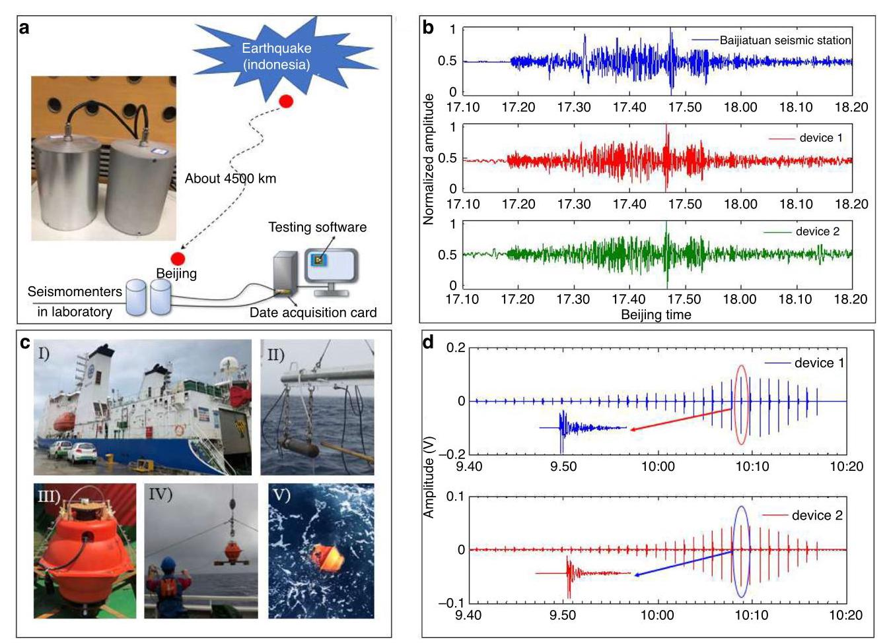

Fig. 11 The result of sea trial investigations. a The earthquakes recorded jointly by the Baijiatuan Seismic Station in Beijing and the electrochemical seismometer. b The electrochemi seismometer shows excellent agreement with the station (correlation: 0.95). c The 1000m dep sea-trial in South-China sea. d The test results of artificial vibration sources by electrochemical seismometers and comparison instruments

图11海试调查结果。a北京白家疃地震台与电化学地震仪联合记录的地震。b电化学地震仪与该台站显示出极佳的一致性(相关性:0.95)。c南海1000米深度海试。d电化学地震仪和对比仪器对人工振动源的测试结果

Table 6 Comparison of various types of hydrophone ${}^{{75} - {78}}$

表6各类水听器的比较${}^{{75} - {78}}$

<table><tr><td>Principle</td><td>Institution/Company</td><td>Bandwidth</td><td>Sensitivity (dB re 1 V/μPa)</td><td>Key Characteristics</td></tr><tr><td>Electromagnetic</td><td>US Naval Ordnance Laboratory</td><td>15-700 Hz</td><td>-218</td><td>- Low power consumption   - Limited sensitivity</td></tr><tr><td>Piezoelectric</td><td>Thomson-CSF (USA) (PVDF-based)</td><td>20 Hz-10 kHz</td><td>-190</td><td>- Low noise   - High sensitivity   -Poor LF response</td></tr><tr><td>Piezoresistive</td><td>North University of China (Cilia-bionic)</td><td>20-500 Hz</td><td>-200 @1 kHz</td><td>- Simple structure   - High power consumption   - Limited LF performance</td></tr><tr><td>Capacitive</td><td>C.S. Draper Lab (USA)</td><td>300 Hz-100 kHz (0.3-100 kHz)</td><td>-223</td><td>- High sensitivity   - Minimal tilt tolerance $\left( { <  \pm  {3}^{ \circ  }}\right)$</td></tr><tr><td>Electrochemical</td><td>Aerospace Info. Res. Inst., CAS</td><td>0.8-100 Hz</td><td>-180</td><td>- Superior LF detection   - Large tilt tolerance $\left( { >  \pm  {10}^{ \circ  }}\right)$   - Anti-vibration stability</td></tr></table>

Table 7 Comparison of various types of angular accelerator ${}^{{38},{79} - {81}}$

表7各类角加速度计的比较${}^{{38},{79} - {81}}$

<table><tr><td>Principle</td><td>Model</td><td>Bandwidth</td><td>Sensitivity</td><td>Dynamic Range</td></tr><tr><td rowspan="2">Pendulum Type (Mechanical)</td><td>China Earthquake Administration Active Servo Type</td><td>0.03~30 Hz</td><td>5-50 V/(rad/s2)</td><td>≥100</td></tr><tr><td>China Earthquake Administration Passive Servo Type</td><td>0.7~30 Hz</td><td>1-10 V/(rad/s ${}^{2}$ )</td><td>≥100</td></tr><tr><td>Optical</td><td>ixBlue (France) BlueSeis-3A</td><td>DC~100 Hz</td><td>5 nrad/s/Hz ${}^{1/2}$</td><td>135</td></tr><tr><td>Molecular Electret (Liquid Ring)</td><td>Siyuan Cheng</td><td>0.5~120 Hz</td><td>0.028 V/(rad/s2)</td><td>/</td></tr><tr><td>MEMS Piezoelectric</td><td>Systron (USA)</td><td>0~6.9 Hz</td><td>0.00105 V/(rad/s2)</td><td>/</td></tr><tr><td>Electrochemical</td><td>Moscow Institute of Physics and Technology</td><td>0.02~10 Hz</td><td>8 V/(rad/s ${}^{2}$ )</td><td>/</td></tr><tr><td></td><td>Aerospace Info. Res. Inst., CAS</td><td>0.0083~30 Hz</td><td>60 V/(rad/s ${}^{2}$ )</td><td>>100</td></tr></table>

## Future expectation

## 未来展望

MEMS technology represents the primary driving force for advancing electrochemical vibration sensors, leveraging its flexible microfabrication capabilities to mass-produce core sensing elements Fig. 13. Nevertheless, critical challenges persist in current electrochemical vibration sensors:

MEMS技术是推动电化学振动传感器发展的主要驱动力，利用其灵活的微加工能力大规模生产核心传感元件(图13)。然而，当前电化学振动传感器仍存在关键挑战:

## Limitations in theoretical simulation modeling

## 理论模拟建模的局限性

Constrained by the complexity of electrochemical reactions, existing simulation studies on MEMS electrochemical geophones predominantly rely on simplified 2D models. These models fail to capture the 3D structural characteristics of practical devices. While providing qualitative guidance for structural design, their predictive accuracy suffers significant limitations. Moreover, simulations of electrochemical modules and vibration transduction components remain disconnected, lacking integrated holistic models and introducing deviations in parameter optimization.

受电化学反应复杂性的限制，现有关于MEMS电化学地震检波器(MEMS electrochemical geophones)的模拟研究主要依赖简化的二维模型。这些模型无法捕捉实际设备的三维结构特征。虽然为结构设计提供了定性指导，但其预测准确性存在显著局限性。此外，电化学模块和振动转换部件的模拟仍相互脱节，缺乏集成的整体模型，在参数优化中引入偏差。

## Inadequate noise mechanism analysis and mitigation

## 噪声机制分析与缓解不足

Research on noise mechanisms in MEMS electrochemical geophones remains in its infancy, lacking systematic theoretical frameworks. The devices exhibit notably higher noise levels than capacitive geophones, fundamentally constraining the enhancement of dynamic range. Hence, urgent demands exist for delving into noise sources and developing targeted noise-reduction strategies to advance these sensors toward ultra-low-noise targets.

对MEMS电化学地震检波器中噪声机制的研究仍处于起步阶段，缺乏系统的理论框架。这些设备的噪声水平明显高于电容式地震检波器，从根本上限制了动态范围的提高。因此，迫切需要深入研究噪声源并制定针对性的降噪策略，以使这些传感器朝着超低噪声目标发展。

## Excessive reliance on manual assembly

## 过度依赖手工装配

Assembly processes for electrochemical vibration sensors still require substantial human intervention - particularly in integrating sensing units with housings and facilitating electrolyte infusion. This necessitates redesigning encapsulation architectures and materials while advocating for automated assembly workflows to minimize anthropic deviations.

电化学振动传感器的组装过程仍需要大量人工干预，尤其是在将传感单元与外壳集成以及促进电解液注入方面。这就需要重新设计封装架构和材料，同时提倡采用自动化组装流程，以尽量减少人为偏差。

During vibration, mass transfer processes in electrochemical reactions are significantly enhanced. Tianhong Cui’s team ${}^{51}$ investigated the impact of vibrating electrodes on mass transfer behavior, specifically examining rate variations across annular electrodes partitioned into edge, intermediate, and center regions. Experimental results in Fig. 12a demonstrate that the center region achieves the highest mass transfer efficiency, indicating optimal reaction participation at the electrode core under vibration. Concurrently, the mass transfer rate curve exhibits a declining trend due to diffusion layer growth. Crucially, the total interfacial mass transfer rate increases with vibration amplitude, attributable to vibration-induced forced convection in the liquid medium.

在振动过程中，电化学反应中的传质过程会显著增强。崔天宏团队${}^{51}$研究了振动电极对传质行为的影响，具体考察了环形电极边缘、中间和中心区域的传质速率变化。图12a中的实验结果表明，中心区域的传质效率最高，表明振动时电极核心处的反应参与度最佳。同时，由于扩散层的生长，传质速率曲线呈现下降趋势。至关重要的是，总界面传质速率随振动幅度增加，这归因于液体介质中振动引起的强制对流。

Gas bubble entrapment during electrolyte infusion is inevitable and critically affects ion transport. Cui's team ${}^{52}$ revealed how bubbles alter mass transfer dynamics: Bubble presence splits the resonant peak into dual peaks (L: low-frequency, H: high-frequency) separated by a deep trough (M peak). Under varying frequencies, bubble surface oscillations generate nonlinear secondary flows (microflows) exceeding pure electrode vibration effects: L-frequency: Generates upward jetting flow fields, forming vortices enveloping the working electrode surface. H-frequency: Produces downward jetting flow fields. M-frequency: Yields negligible flow fields due to minimal bubble oscillation amplitude, the results were shown in Fig. 12b. Microflow intensity scales with bubble volume - larger bubbles create stronger directional vortices that directly impinge the electrode surface, disrupt diffusion layers, and accelerate mass transfer.

电解液注入过程中气泡的截留是不可避免的，并且会严重影响离子传输。崔的团队${}^{52}$揭示了气泡如何改变传质动力学:气泡的存在将共振峰分裂为双峰(L:低频，H:高频)，中间有一个深谷(M峰)隔开。在不同频率下，气泡表面振荡会产生非线性二次流(微流)，其超过了纯电极振动的影响:低频:产生向上的喷射流场，形成环绕工作电极表面的漩涡。高频:产生向下的喷射流场。中频:由于气泡振荡幅度最小，产生的流场可忽略不计，结果如图12b所示。微流强度与气泡体积成正比——较大的气泡会产生更强的定向漩涡，直接冲击电极表面，破坏扩散层并加速传质。

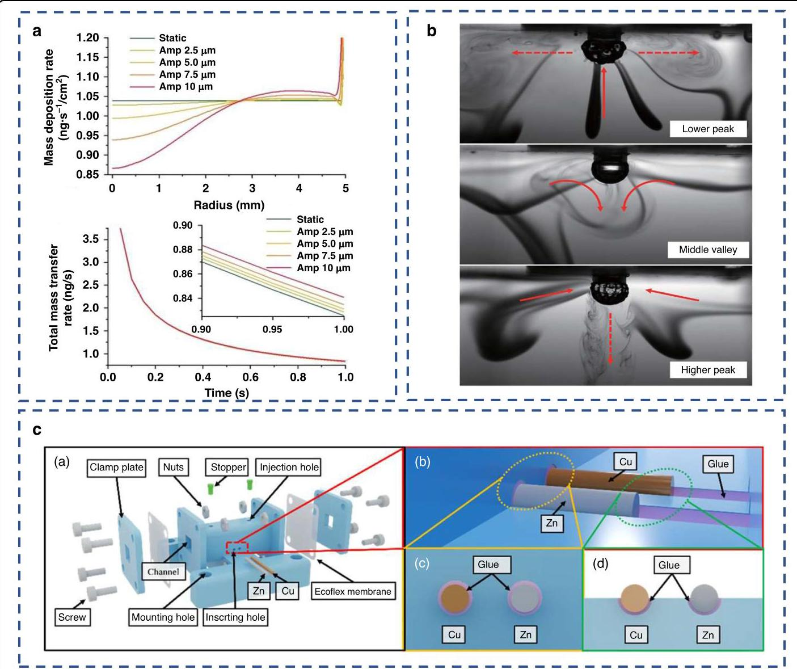

Fig. 12 Example of different improving directions of existence challenges. a The influence of vibration behavior on mass transfer in electrochemical reactions. b The influence of bubbles on electrolyte transport. c A self-powered electrochemical vibration sensor

图12存在挑战的不同改进方向示例。a振动行为对电化学反应中传质的影响；b气泡对电解液传输的影响；c自供电电化学振动传感器

## Influence of temperature variation

##温度变化的影响

Changes in ambient temperature can alter the performance of electrochemical vibration sensors by influencing the kinetics of electrochemical reactions. The operational environments for these sensors typically involve considerable ambient complexity, where temperature fluctuations are unavoidable. Consequently, designing specific temperature compensation solutions is essential to enhance sensor stability.

环境温度的变化会通过影响电化学反应的动力学来改变电化学振动传感器的性能。这些传感器的运行环境通常具有相当大的环境复杂性，温度波动不可避免。因此，设计特定的温度补偿解决方案对于提高传感器稳定性至关重要。

Conventional temperature compensation techniques (e.g., thermistors, open-loop post-processing) fail to address full-bandwidth demands due to the inherent acute temperature sensitivity of electrochemical vibration sensors. To resolve nonlinear frequency-response drift in electrochemical seismometers under thermal fluctuations $\left( {-{20}^{ \circ  }\mathrm{C}\text{ to }{50}^{ \circ  }\mathrm{C}}\right)$ , Yang et al. pioneered an adaptive full-bandwidth compensation method ${}^{53}$ . This breakthrough technique implements real-time field frequency-response self-calibration, dynamically adjusts closed-loop parameters via a force-balanced feedback system, and integrates multi-stage series compensation-achieving unprecedented simultaneous precision compensation for passband sensitivity, low-frequency cutoff (f_L), and high-frequency cutoff (f_H). Experimental validation confirms drastic performance enhancements: sensitivity drift plunges to 1.6%, f_L drift drops from 447% (open-loop) and 51% (thermistor) to 15.1%, and f_H drift decreases from 89% (open-loop) and 85% (thermistor) to 3.2%. This innovation significantly bolsters seismometer reliability in extreme thermal environments.

传统的温度补偿技术(如热敏电阻、开环后处理)由于电化学振动传感器固有的高温度敏感性，无法满足全带宽要求。为了解决热波动下电化学地震仪中的非线性频率响应漂移问题$\left( {-{20}^{ \circ  }\mathrm{C}\text{ to }{50}^{ \circ  }\mathrm{C}}\right)$，杨等人开创了一种自适应全带宽补偿方法${}^{53}$。这项突破性技术实现了实时现场频率响应自校准，通过力平衡反馈系统动态调整闭环参数，并集成多级串联补偿，实现了对通带灵敏度、低频截止(f_L)和高频截止(f_H)前所未有的同时精确补偿。实验验证证实了性能的大幅提升:灵敏度漂移降至1.6%，f_L漂移从447%(开环)和51%(热敏电阻)降至15.1%，f_H漂移从89%(开环)和85%(热敏电阻)降至3.2%。这项创新显著提高了地震仪在极端热环境下的可靠性。

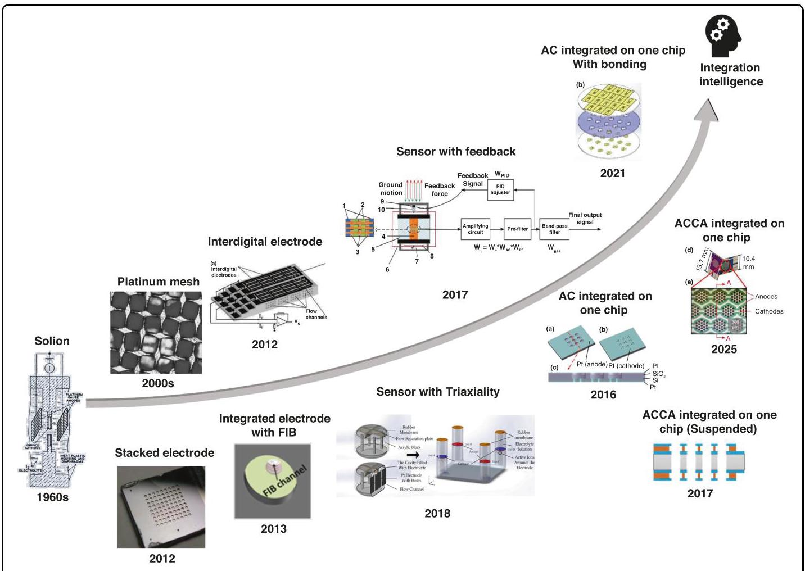

Fig. 13 The evolution process and trend of the sensitive core of electrochemical vibration sensors

图13电化学振动传感器敏感核心的演变过程和趋势

## The consumption of sensor

##传感器的功耗

Electrochemical vibration sensors function as active devices, requiring a continuous and stable voltage supply to sustain electrochemical reactions. Power provision in complex operational environments may pose significant challenges. Consequently, future development should focus on leveraging the reversibility of redox reactions to introduce self-powering capability, thereby ensuring stable device operation.

电化学振动传感器作为有源器件，需要持续稳定的电压供应来维持电化学反应。在复杂的运行环境中供电可能会带来重大挑战。因此，未来的发展应侧重于利用氧化还原反应的可逆性来引入自供电能力，从而确保器件稳定运行。

Yik-Kin Cheung et al. pioneered a self-powered galvanic vibration sensor leveraging spontaneous Zn-Cu reactions in saturated copper-iodide electrolyte within a rectangular channel sealed by elastic membranes, with electrodes at its base shown in Fig. ${12}{\mathrm{c}}^{54}$ . Vibration-induced electrolyte flow disrupts electrode diffusion layers, generating current modulation. Key metrics include: ${68}\mathrm{\;{Hz}}$ resonant frequency,1.152 V/g peak sensitivity, linear range $( \pm  {0.044}\mathrm{\;g}$ to $\pm  {0.378}\mathrm{\;g}$ , scale factor ${0.748}\mathrm{\;V}/\mathrm{g}$ ), and $\pm  {0.485}\mathrm{\;g}$ maximum range. The core limitation-60% sensitivity degradation within 74 minutes due to irreversible ion depletion -is mitigated by electrolyte replenishment (minimal electrode consumption). Future viability enhancement strategies encompass: membrane-based electrolyte partitioning, increased electrolyte volume, and adoption of reversible systems (e.g., lead-acid). This innovation enables battery-free sensing networks for IoT structural health monitoring applications.

张亦谦等人率先开发了一种自供电的原电池振动传感器，该传感器利用饱和碘化铜电解质中自发的锌铜反应，在由弹性膜密封的矩形通道内进行，其底部电极如图${12}{\mathrm{c}}^{54}$所示。振动引起的电解质流动会破坏电极扩散层，从而产生电流调制。关键指标包括:${68}\mathrm{\;{Hz}}$共振频率、1.152 V/g的峰值灵敏度、$( \pm  {0.044}\mathrm{\;g}$至$\pm  {0.378}\mathrm{\;g}$的线性范围、比例因子${0.748}\mathrm{\;V}/\mathrm{g}$以及$\pm  {0.485}\mathrm{\;g}$最大范围。由于不可逆的离子消耗，在74分钟内灵敏度下降60%，这一核心限制可通过补充电解质(最小化电极消耗)来缓解。未来提高可行性的策略包括:基于膜的电解质分区、增加电解质体积以及采用可逆系统(如铅酸电池)。这一创新为物联网结构健康监测应用实现了无需电池的传感网络。

## The intelligence connection with sensor

## 与传感器的智能连接

The rapid advancement of the Internet of Things (IoT), artificial intelligence (AI), and Industry 4.0 has not only broadened the application scope of sensors but also provided technological underpinnings for large-scale deployment and mass monitoring ${}^{55}$ . Vibration sensors intended for complex environmental monitoring and deep resource exploration must ensure precise concatenation of vast data streams and should therefore capitalize on the momentum of technological advancements. However, most current vibration sensors feature hardware and algorithms that are separated rather than integrated, failing to meet the demands of intelligent functionality. This gap presents a significant challenge and opportunity for the future development of sensor systems.

物联网(IoT)、人工智能(AI)和工业4.0的迅速发展，不仅拓宽了传感器的应用范围，也为大规模部署和大规模监测${}^{55}$提供了技术支撑。用于复杂环境监测和深部资源勘探的振动传感器必须确保海量数据流的精确拼接，因此应借助技术进步的势头。然而，目前大多数振动传感器的硬件和算法是分离而非集成的，无法满足智能功能的需求。这一差距为传感器系统的未来发展带来了重大挑战和机遇。

Electrochemical vibration sensors surpass conventional alternatives due to their exceptional low-frequency sensitivity, broad bandwidth, and ultralow noise. These attributes -coupled with large operating tilt tolerance and superior shock resistance-enable unparalleled environmental adaptability in previously insurmountable applications: deep-sea exploration, natural disaster early warning systems, and civil infrastructure monitoring. Concurrently, MEMS technology revolutionizes this domain by enabling critical industrialization milestones: significant cost reduction and miniaturization, thus establishing new paradigms for low-frequency vibration detection. Although unresolved challenges persist (e.g., incomplete noise modeling and obscure fundamental mechanisms), the transformative potential of electrochemical vibration sensors in advanced sensing systems remains undiminished.

电化学振动传感器因其卓越的低频灵敏度、宽带宽和超低噪声，优于传统的振动传感器。这些特性，再加上较大的工作倾斜容忍度和卓越的抗冲击性，使其在以前无法实现的应用中具有无与伦比的环境适应性:深海勘探、自然灾害预警系统和民用基础设施监测。同时，微机电系统(MEMS)技术通过实现关键的工业化里程碑，即大幅降低成本和实现小型化，彻底改变了这一领域，从而为低频振动检测建立了新的范式。尽管仍存在未解决的挑战(如噪声建模不完善和基本机制不明)，但电化学振动传感器在先进传感系统中的变革潜力依然不减。

## Acknowledgements

## 致谢

This work was supported in part by the Strategic Priority Research Program (B) of the Chinese Academy of Sciences under Grant XDB1110201, in part by the National Natural Science Foundation of China under Grants 52335012, 62201549, and U23A20362, in part by the Youth Innovation Promotion Association CAS under Grant 2023134, in part by Beijing Natural Science Foundation under Grant 4242012.

本工作得到了中国科学院战略性先导科技专项(B类)(项目编号:XDB1110201)、国家自然科学基金(项目编号:52335012、62201549和U23A20362)、中国科学院青年创新促进会(项目编号:2023134)以及北京市自然科学基金(项目编号:4242012)的部分资助。

## Author contributions

## 作者贡献

J.W. and D.C. supported and conceived the writing ideas and correspondence to this article; W.Z. performed the conception of the logic and structure of the review, as well as mainly for data collection and article writing; H.Z., H.J., L.H., M.Z., and Q.L. contributed to parts of the analysis and discussion; G.G., Y.L., and X.H. contributed to parts of the analysis and polishing of the article.

J.W.和D.C.为本文提供支持并构思写作思路及通信；W.Z.负责构思综述的逻辑和结构，并主要进行数据收集和文章撰写；H.Z.、H.J.、L.H.、M.Z.和Q.L.参与部分分析和讨论；G.G.、Y.L.和X.H.参与部分文章分析和润色。

## Conflict of interest

## 利益冲突

The authors declare no competing interests.

作者声明无利益冲突。

Received: 27 August 2025 Accepted: 11 October 2025

收到日期:2025年8月27日 接受日期:2025年10月11日

Published online: 08 January 2026

在线发表日期:2026年1月8日

## References

## 参考文献

1. Huang, H., Agafonov, V. & Yu, H. Molecular electric transducers as motionsensors: A review. Sensors 13, 4581-4597 (2013).

传感器:综述。《传感器》13卷，4581 - 4597页(2013年)。

2. D'Alessandro, A., Scudero, S. & Vitale, G. A review of the capacitive MEMS forseismology. Sensors 19, 3093 (2019).

地震学。《传感器》19卷，3093页(2019年)。

3. Stein, S., & M. Wyssession. An introduction to seismology, earthquakes, and earthstructure. John Wiley & Sons, 2009.

结构。约翰·威利父子出版公司，2009年。

4. Van Herwijnen, A. & Schweizer, J. Monitoring avalanche activity using a seismicsensor. Cold Reg Sci Technol 69, 165-176 (2011).

传感器。《低温科学与技术》69卷，第165 - 176页(2011年)。

5. Niu, F. et al. Preseismic velocity changes observed from active source mon-itoring at the Parkfield SAFOD drill site. Nature 454, 204-208 (2008).

帕克菲尔德圣安德烈亚斯断层深部观测站的监测。《自然》454卷，第204 - 208页(2008年)。

6. Zhang, G. H. & Hu, S. Y. Dynamic characteristics of moving-coil geophone withlarge damping. Int J Appl Electromagn Mech 33, 565-571 (2010).

大阻尼。《国际应用电磁学与力学杂志》33卷，第565 - 571页(2010年)。

7. STS-2.5 High-Performance Portable Very Broadband Triaxial Seismometer [DB/OL]. https://kinemetrics.com/wp-content/uploads/2017/04/datasheet-high-performance-portablevery-broadband-triaxial-seismometer-sts2.5-kinemetrics-streckeisen-quanterra.pdf.

[在线文献]。https://kinemetrics.com/wp-content/uploads/2017/04/datasheet-high-performance-portablevery-broadband-triaxial-seismometer-sts2.5-kinemetrics-streckeisen-quanterra.pdf。

8. Trillium compact vault seismometer [DB/OL]. https://www.nanometrics.ca/sites/default/files/2018-04/trillium_compact_data_sheet.pdf.

网站默认文件/2018 - 04/trillium_compact_data_sheet.pdf。

9. 3T-360 the superior performance weak motion broadband seismometer [DB/OL]. http://www.guralp.com/documents/DAS-030-0360.pdf.

[在线文献]。http://www.guralp.com/documents/DAS-030-0360.pdf。

10. Hurd, R. M. & Jordan, W. H. The principles of the solion. Platin Met Rev 4, 42-47 (1960).

11. Kozlov, V. A. & Terent'Ev, D. A. Frequency characteristics of a spatially-confinedelectrochemical cell under conditions of convective diffusion. Russ J Electro-chem 38, 992-999 (2002).

对流扩散条件下的电化学池。《俄罗斯电化学杂志》38卷，第992 - 999页(2002年)。

12. Sun, Z. et al. Electrochemical seismometers based on sensitive elements withhourglass-shaped TGVs fabricated by femtosecond laser modification and wet etching. Sens Actuators A: Phys 387, 116395 (2025).

通过飞秒激光改性和湿法蚀刻制造的沙漏形TGV。《传感器与执行器A:物理》387卷，第116395页(2025年)。

13. Huang, H. et al. A micro seismometer based on molecular electronic trans-ducer technology for planetary exploration. Appl Phys Lett 102, (2013).

用于行星探测的传感器技术。《应用物理快报》102卷，(2013年)。

14. De Rooij, D. M. R. Electrochemical methods: fundamentals and applications.Anti-Corros Methods Mater 50.5 (2003).

《防腐方法与材料》50.5卷(2003年)。

15. CGE Geological Instrument Co., Ltd, ChongQing, China. Vertical geophone:CDJ-Z4 [DB/OL]. http://www.cgif.com.cn/displayproduct.html? prolD=2544838&ptid=196458.

CDJ - Z4 [数据库/在线文献]。http://www.cgif.com.cn/displayproduct.html? prolD=2544838&ptid=196458。

16. Sun, Z. & Agafonov, V. M. Computational study of the pressure-driven flow in afour-electrode rectangular micro-electrochemical accelerometer with an infinite aspect ratio. Electrochim Acta 55, 2036-2043 (2010).

具有无限纵横比的四电极矩形微电化学加速度计。《电化学学报》55卷，第2036 - 2043页(2010年)。

17. Krishtop, V. G., Agafonov, V. M. & Bugaev, A. S. Technological principles ofmotion parameter transducers based on mass and charge transport in electrochemical microsystems. Russ J Electrochem 48, 746-755 (2012).

基于电化学微系统中质量和电荷传输的运动参数传感器。《俄罗斯电化学杂志》48卷，第746 - 755页(2012年)。

18. He, W. T. et al. Low frequency electrochemical accelerometer with low noisebased on MEMS. Key Eng Mater 503, 75-80 (2012).

基于MEMS。《关键工程材料》503卷，第75 - 第80页(2012年)。

19. He, W. T. et al. Extending upper cutoff frequency of electrochemical seismometer by using extremely thin Su8 insulating spacers. SENSORS, 2013 IEEE. IEEE, 2013.

20. Sun, Z. et al. An electrochemical seismometer with frequency features underregulation. 2015 IEEE SENSORS. IEEE, (2015).

调节。2015年IEEE传感器会议。IEEE，(2015年)。

21. Deng, T. et al. A MEMS based electrochemical vibration sensor for seismicmotion monitoring. J Microelectromech Syst 23, 92-99 (2013).

运动监测。《微机电系统杂志》23卷，第92 - 99页(2013年)。

22. Deng, T. et al. Microelectromechanical systems-based electrochemical seismicsensors with insulating spacers integrated electrodes for planetary exploration. IEEE Sens J 16, 650-653 (2015).

用于行星探测的带有绝缘垫片集成电极的传感器。《IEEE传感器杂志》16卷，650 - 653页(2015年)。

23. Li, G. et al. A MEMS based seismic sensor using the electrochemical approach.Procedia Eng 47, 362-365 (2012).

《工程进展》47卷，362 - 365页(2012年)。

24. Kozlov, V. A. & Safonov, M. V. Dynamic characteristic of an electrochemical cellwith gauze electrodes in convective diffusion conditions. Russian J Electrochem 40, 460-462 (2004).

在对流扩散条件下使用纱网电极的情况。《俄罗斯电化学杂志》40卷，460 - 462页(2004年)。

25. Deng, T. et al. Microelectromechanical system-based electrochemical seismicsensors with an anode and a cathode integrated on one chip. J Micromech Microeng 27, 025004 (2016).

阳极和阴极集成在一个芯片上的传感器。《微机械与微工程杂志》27卷，025004(2016年)。

26. Liang, M. et al. Molecular electronic transducer based planetary seismometer with new fabrication process. 2016 IEEE 29th International Conference on MicroElectro Mechanical Systems (MEMS). IEEE, (2016).

《机电系统(MEMS)》。IEEE，(2016年)。

27. Xu, C. et al. The MEMS-based electrochemical seismic sensor with integratedsensitive electrodes by adopting anodic bonding technology. IEEE Sens J 21, 19833-19839 (2021).

通过采用阳极键合技术制备敏感电极。《IEEE传感器杂志》21卷，19833 - 固定19839页(2021年)。

28. Sun, Z. et al. A high-consistency broadband mems-based electrochemicalseismometer with integrated planar microelectrodes. IEEE Trans Electron Devices 64, 3829-3835 (2017).

带有集成平面微电极的地震仪。《IEEE电子器件汇刊》64卷，3829 - 3835页(2017年)。

29. Zheng, X. et al. Microelectromechanical system-based electrochemicalseismometers with two pairs of electrodes integrated on one chip. Sensors 19, 3953 (2019).

在一个芯片上集成两对电极的地震仪。《传感器》19卷，3953(2019年)。

30. Sun, Z. et al. Broadband electrochemical seismometer using a single siliconchip with four microelectrodes. IEEE Trans Instrum Meas 74, 1-12 (2025).

带有四个微电极的芯片。《IEEE仪器与测量汇刊》74卷，1 - 12页(2025年)。

31. Chen, L. et al. A monolithic electrochemical micro seismic sensor capable ofmonitoring three-dimensional vibrations. Sensors 18, 1047 (2018).

监测三维振动。《传感器》18卷，1047(2018年)。

32. Qi, W. et al. Mems-based integrated triaxial electrochemical seismometer.Micromachines 12, 1156 (2021).

《微机器》12卷，1156(2021年)。

33. Agafonov, V., Egorov, I. & Akinina, A. Frequency Response of a Six-Electrode MET Sensor at Extremely Low Temperatures. Sensors 23, 4311

极低温下的电极MET传感器。《传感器》23卷，4311(2023).

34. Bugaev, A. et al. Influence of the dielectric coating of the outer side of thecathode in the anode-cathode pairs of a molecular electronic sensitive element on the conversion coefficient. Micromachines 13, 360 (2022).

分子电子敏感元件阳极 - 阴极对中的阴极对转换系数的影响。《微机器》13卷，360(2022年)。

35. Li, G. et al. An electrochemical, low-frequency seismic micro-sensor based onMEMS with a force-balanced feedback system. Sensors 17, 2103 (2017).

具有力平衡反馈系统的MEMS。《传感器》17卷，2103(2017年)。

36. Kozlov, V. A., Agafonov, V. M. & Bindler, J. Small, low-power, low-cost IMU for personal navigation and stabilization systems. Proceedings of the 2006 NationalTechnical Meeting of The Institute of Navigation, (2006).

导航研究所技术会议，(2006年)。

37. Zaitsev, D. L. et al. Precession Azimuth Sensing with Low-Noise MolecularElectronics Angular Sensors. J Sens 2016, 6148019 (2016).

电子角传感器。《传感器杂志》2016年，6148019(2016年)。

38. Egorov, E. et al. Angular molecular-electronic sensor with negative magne-tohydrodynamic feedback. Sensors 18, 245 (2018).

用于流体动力反馈。传感器18，245(2018年)。

39. Liu, B. et al. An electrochemical angular micro-accelerometer based on min-iaturized planar electrodes positioned in parallel. IEEE Sens J 21, 21305-21313

平行排列的小型化平面电极。IEEE传感器杂志21，21305 - 21313(2021).

40. Chen, M. et al. A MEMS electrochemical angular accelerometer leveragingsilicon-based three-electrode structure. Micromachines 13, 186 (2022).

基于硅的三电极结构。微机电系统13，186(2022年)。

41. Liu, B. et al. A MEMS-based electrochemical angular accelerometer withintegrated plane electrodes for seismic motion monitoring. IEEE Sens J 20, 10469-10475 (2020).

用于地震运动监测的集成平面电极。IEEE传感器杂志20，10469 - 10475(2020年)。

42. Zhu, M. et al. Chip-level Packaged Electrochemical Angular Accelerometerwith a Wide Measurement Range. IEEE Sensors J (2025).

具有宽测量范围。IEEE传感器杂志(2025年)。

43. Liang, T. et al. Microelectrochemical Rotational Vibration Sensor With SOI-Based Microelectrodes Used for Seismic Monitoring. IEEE Trans Instrum Meas 73, 1-8 (2023).

用于地震监测的微电极。IEEE仪器与测量学报73，1 - 8(2023年)。

44. Liu, B. et al. A new electrochemical angular microaccelerometer with inte-grated sensitive electrodes perpendicular to flow channels. Microsyst Nanoeng 8, 80 (2022).

垂直于流道的集成敏感电极。微系统与纳米工程8，80(2022年)。

45. Liang, T. et al. A micromachined electrochemical angular accelerometer withhighly integrated sensitive microelectrodes. Microsyst Nanoeng 8, 100 (2022).

高度集成的敏感微电极。微系统与纳米工程8，100(2022年)。

46. Liang, T. et al. A MEMS-based electrochemical angular accelerometer with aforce-balanced negative feedback. IEEE Sens J 21, 15972-15978 (2021).

力平衡负反馈。IEEE传感器杂志21，15972 - 15978(2021年)。

47. Zhang, M. et al. A MEMS Electrochemical Angular Accelerometer with Silicon-Based Four-Electrode Structure. Micromachines 15, 351 (2024).

基于四电极结构。微机电系统15，351(2024年)。

48. Chen, D. et al. PT4. 234-Electrochemical Seismometers Using a SOI Chip withFour Micro-electrodes. Poster: 315-316 (2024).

四个微电极。海报:315 - 316(2024年)。

49. Xu, C. et al. The electrochemical seismometer based on fine-tune sensingelectrodes for undersea exploration. IEEE Sens J 20, 8194-8202 (2020).

用于海底勘探的电极。IEEE传感器杂志20，8194 - 8202(2020年)。

50. Cranch, G. A. & Kirkendall. C. K. Fiber Optic Cantilever Acoustic Vector Sensor:US, US9116304 B2[P], (2016).

51. Zhang, T. et al. A Circular Vibrating Electrode with Enhanced Mass Transfer forHigh-Performance Electrochemical Sensors. 2021 IEEE 34th International Conference on Micro Electro Mechanical Systems (MEMS). IEEE, (2021).

高性能电化学传感器。2021年IEEE第34届国际微机电系统会议(MEMS)。IEEE，(2021年)。

52. Zhang, T. et al. Vibrating an air bubble to enhance mass transfer for an ultra-sensitive electrochemical sensor. Sens Actuators B: Chem 354, 131218 (2022).

灵敏的电化学传感器。传感器与执行器B:化学354，131218(2022年)。

53. Yang, H. et al. Temperature Adaptation for Electrochemical SeismometersBased on Dynamic Feedback Network. IEEE Trans, Instrum. Meas (2025).

基于动态反馈网络。IEEE汇刊，仪器与测量(2025年)。

54. Cheung, Y.-K., Zhao, Z. & Yu, H. Self-Powered Galvanic Vibration Sensor.Micromachines 13, 530 (2022).

微机电系统13，530(2022年)。

55. Luo et al. Technology roadmap for flexible sensors. ACS Nano 17, 5211-5295 (2023).

56. Lowrie, W. & Fichtner, A. Fundamentals of geophysics. Cambridge University Press, (2020).

57. Havskov, J., Alguacil, G. Instrumentation in Earthquake Seismology [M]. SecondEdition, Dordrecht, Springer, 2016:1-8

版本，多德雷赫特，施普林格出版社，2016年:第1 - 8页

58. Pu, H. et al. An active geophone based on a magnetic spring design for low-frequency vibration measurement. Mech Syst Signal Process 217, 111521

频率振动测量。机械系统信号处理217，111521(2024).

59. Ding, J. et al. An active geophone with an adjustable electromagneticnegative stiffness for low-frequency vibration measurement. Mech Syst Signal Process 178, 109207 (2022).

用于低频振动测量的负刚度。机械系统信号处理178，109207(2022年)。

60. Nanometrics. TRILLIUM-360-GSN[EB/OL]. https://www.nanometrics.ca/products/seismometers/trillium-360-gsn-seismometers.

产品/地震仪/翠鸟360 - gsn地震仪。

61. Hou, T. et al. Piezoelectric geophone: a review from principle to performance.Ferroelectrics 558, 27-35 (2020).

铁电体558，27 - 35(2020年)。

62. Cranch, G. A. & Miller, G. A. Fiber laser sensors: enabling the next generation of miniaturized, wideband marine sensors. J Proc Spie 8028, 1-13 (2011).

63. Yang, Y. et al. High-performance fiber optic interferometric hydrophone basedon push-pull structure. IEEE Trans Instrum Meas 70, 1-13 (2021).

基于推挽结构。IEEE仪器与测量学报70，1 - 13(2021年)。

64. Broadband Seismometer CME-6211 [DB/OL]. http://www.r-sensors.ru/en/products/wseismometers/cme-6211-eng/.

产品/地震仪/cme - 6211 - eng/。

65. Sun, Z. & Agafonov, V. Numerical modeling of a four-electrode electro-chemical accelerometer based on natural convection: The Boussinesq flow model vs. The compressible flow model. Russ J Electrochem 48, 835-842

基于自然对流的化学加速度计:布辛涅斯克流模型与可压缩流模型。俄罗斯电化学杂志48，835 - 842(2012).

66. Sun, Z., Agafonov, V. & Egorov, E. The influence of the boundary condition onanodes for solution of convection-diffusion equation with the application to a four-electrode electrochemical cell. J Electroanal Chem 661, 157-161 (2011).

用于求解对流扩散方程的阳极及其在四电极电化学电池中的应用。电分析化学杂志661，157 - 161(2011年)。

67. Agafonov, V. M. & Zaitsev, D. L. Convective noise in molecular electronictransducers of diffusion type. Tech Phys 55, 130-136 (2010).

扩散型传感器。技术物理55，130 - 136(2010年)。

68. Egorov, I. V., Shabalina, A. S. & Agafonov, V. M. Design and self-noise of METclosed-loop seismic accelerometers. IEEE Sens J 17, 2008-2014 (2017).

闭环地震加速度计。IEEE传感器杂志17，2008 - 2014(2017年)。

69. Grall, S. et al. Electrochemical Shot Noise of a Redox Monolayer. Phys Rev Lett130, 218001 (2023).

70. Bugaev, A. S., V. M. Agafonov & A. S. Shabalina. Mathematical Model of theHydrodynamic Noise in the Electrochemical Microsystems. 2022 International Conference on Information, Control, and Communication Technologies (ICCT). IEEE, (2022).

电化学微系统中的流体动力噪声。2022年信息、控制与通信技术国际会议(ICCT)。IEEE，(2022年)。

71. Agafonov, V. et al. Modeling and experimental study of convective noise inelectrochemical planar sensitive element of MET motion sensor. Sens Actuators A: Phys 293, 259-268 (2019).

MET运动传感器的电化学平面敏感元件。传感器与执行器A:物理293，259 - 268(2019年)。

72. Kozlov, V. A. & Safonov, M. V. Self-noise of molecular electronic transducers.Tech Phys 48, 1579-1582 (2003).

技术物理48，1579 - 1582(2003年)。

73. Zhubanyshkaliyev, A., Shabalina A. S. & Agafonov V. M. Study of the PhaseRelationship between Noise Cathode Currents in Electrochemical Motion Sensors to Determine the Mechanism of Self-Noise. (2023).

电化学运动传感器中噪声阴极电流之间的关系以确定自噪声机制。(2023年)。

74. High performance very broad band seismometers BB603, BB603-OBS [DB/OL].http://www.pmdsci.com/pdfs/BB603.pdf.

75. Leslie, C. B., Kendall, J. M. & Jones, J. L. Hydrophone for measuring particlevelocity. J Acoust Soc Am 28, 711-715 (1956).

速度。美国声学学会杂志28，711 - 715(1956年)。

76. Josserand, M. A. & Maerfeld, C. PVF2 velocity hydrophones. J Acoust Soc Am78, 861-867 (1985).

77. Bernstein, J. J. A silicon micromachined condenser microphone/hydrophone. JAcoust Soc Am 92, 2355-2355 (1992).

《美国声学学会志》92, 2355 - 2355 (1992)。

78. Zhong, A. et al. A MEMS-based co-oscillating electrochemical vector hydro-phone. Micromachines 13, 143 (2022).

电话。《微机电系统》13, 143 (2022)。

79. Cheng, S. et al. The influence of tube wall on fluid flow, permeability andstreaming potential in porous transducer for liquid circular angular accelerometers. Sens Actuators A: Phys 276, 176-185 (2018).

用于液体圆加速度计的多孔换能器中的流动电势。《传感器与执行器A:物理》276, 176 - 185 (2018)。

80. Cheng, S. et al. Dynamic fluid in a porous transducer-based angular accel-erometer. Sensors 17, 416 (2017).

测微计。《传感器》17, 416 (2017)。

81. Zembaty, Z., Kokot, S. & Bobra, P. Application of rotation rate sensors in anexperiment of stiffness 'reconstruction'. Smart Mater Struct 22, 077001 (2013).

刚度“重构”实验。《智能材料与结构》22, 077001 (2013)。

82. Sun, Z. et al. A MEMS based electrochemical seismometer with low cost andwide working bandwidth. Procedia Eng 168, 806-809 (2016).

宽工作带宽。《工程进展》168, 806 - 809 (2016)。

83. Li, G. et al. A flexible sensing unit manufacturing method of electrochemicalseismic sensor. Sensors 18, 1165 (2018).

地震传感器。《传感器》18, 1165 (2018)。

84. Qi, W. et al. MEMS-based electrochemical seismometer with a sensing unitintegrating four electrodes. Micromachines 12, 699 (2021).

集成四个电极。《微机电系统》12, 699 (2021)。