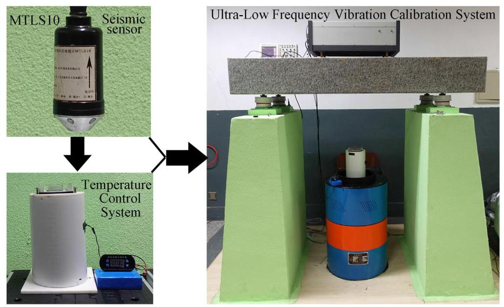
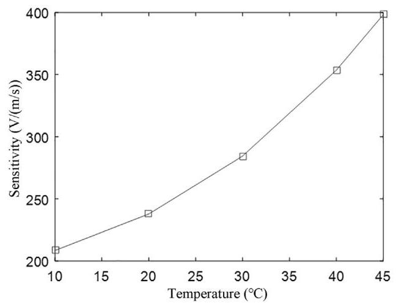
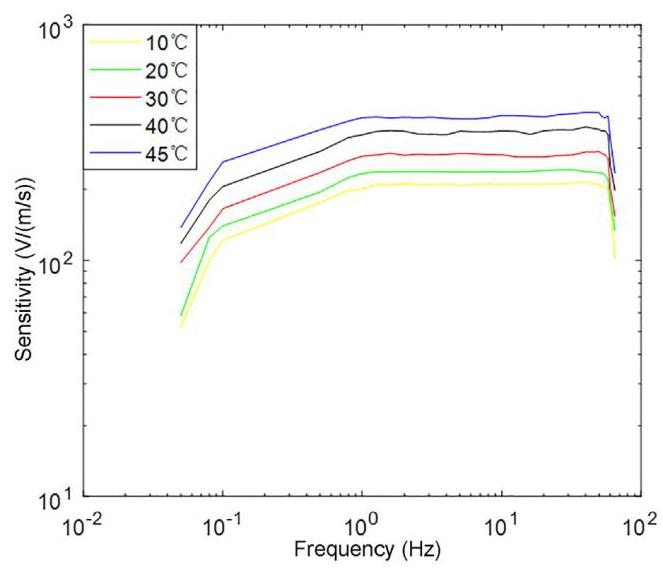
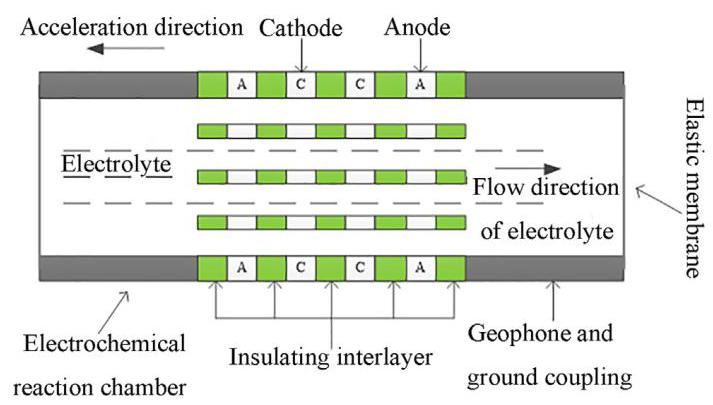
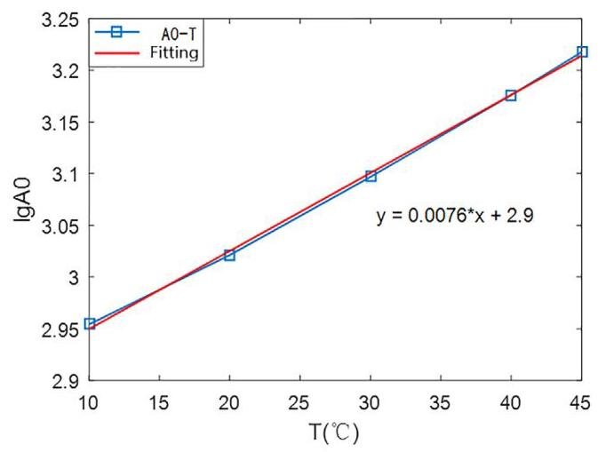
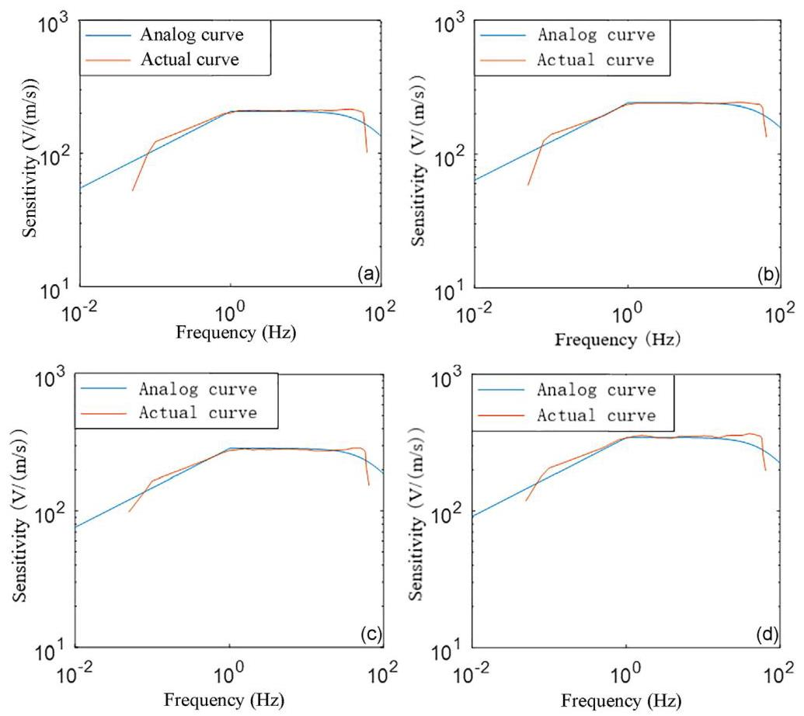
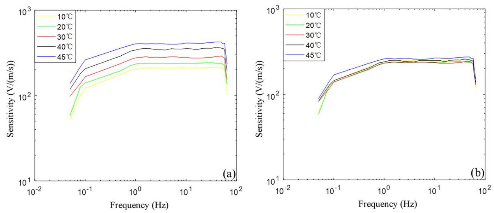
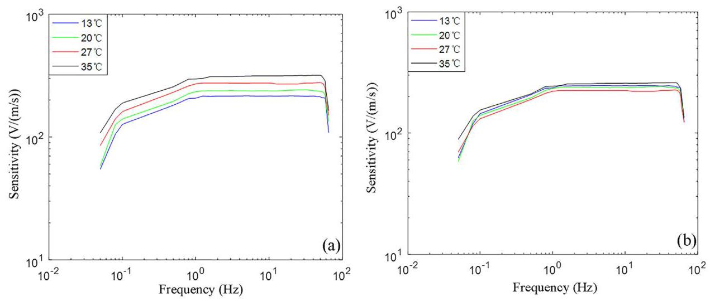

# Effect of temperature on the performance of electrochemical seismic sensor and the compensation method

# 温度对电化学地震传感器性能的影响及补偿方法

Jun Lin ${}^{a, b}$ , Huan Gao ${}^{a}$ , Xiufeng Wang ${}^{a}$ , Chunyan Yang ${}^{c}$ , Yi Xin ${}^{a}$ , Xianfeng Zhou ${}^{a, b, * }$

林俊${}^{a, b}$ ，高欢${}^{a}$ ，王秀峰${}^{a}$ ，杨春艳${}^{c}$ ，辛毅${}^{a}$ ，周先锋${}^{a, b, * }$

${}^{\mathrm{a}}$ College of Instrumentation and Electrical Engineering, Jilin University, Changchun 130061, China

${}^{\mathrm{a}}$ 吉林大学仪器科学与电气工程学院，长春 130061，中国

${}^{\mathrm{b}}$ Key Laboratory of Geo-exploration Instrumentation Ministry of Education, Jilin University, Changchun 130061, China

${}^{\mathrm{b}}$ 吉林大学地球探测仪器教育部重点实验室，长春 130061，中国

c College of Communication Engineering, Jilin University, Changchun 130012, China

c 吉林大学通信工程学院，长春 130012，中国

## A R T I C L E I N F O

## 文章信息

Article history:

文章历史:

Received 10 July 2019

2019年7月10日收到

Received in revised form 5 December 2019

2019年12月5日收到修订稿

Accepted 2 January 2020

2020年1月2日接受

Available online 22 January 2020

2020年1月22日在线发表

Keywords:

关键词:

Electrochemical seismic sensor

电化学地震传感器

Vibration sensor

振动传感器

Temperature drift model

温度漂移模型

Temperature compensation

温度补偿

## A B S T R A C T

## 摘要

In this paper, the influence of temperature on the performance parameters of the electrochemical seismic sensor is studied. The sensitivity and temperature characteristics of the electrochemical seismic sensor at different temperatures are measured, and the effects of temperature on the sensitivity and amplitude-frequency characteristics of the electrochemical seismic sensor are analyzed. Based on the theoretical formula model of transfer function and experimental data, the temperature drift model of electrochemical seismic sensor is established, and the temperature compensation model of sensitivity is given. The sensitivity drift amplitude of the electrochemical seismic sensor measured decreases obviously after data correction with compensation formula, and the sensitivity change rate decreased from 45% to 7% in the frequency band.

本文研究了温度对电化学地震传感器性能参数的影响。测量了电化学地震传感器在不同温度下的灵敏度和温度特性，分析了温度对电化学地震传感器灵敏度和幅频特性的影响。基于传递函数的理论公式模型和实验数据，建立了电化学地震传感器的温度漂移模型，并给出了灵敏度的温度补偿模型。经补偿公式进行数据修正后，所测电化学地震传感器的灵敏度漂移幅度明显减小，在该频段内灵敏度变化率从45%降至7%。

© 2020 Elsevier Ltd. All rights reserved.

© 2020爱思唯尔有限公司。保留所有权利。

## 1. Research background and significance

## 1. 研究背景与意义

Seismic exploration is widely used in the study of the earth's internal structure, monitoring of nuclear explosions, engineering exploration and detection, geological hazard prediction and so on [1-3]. With the increasing depth of seismic exploration, the high-frequency signal in seismic wave attenuates seriously in the transmission process, and the signal received by seismic sensor is mainly composed of low-frequency components [4,5]. Therefore, seismic sensor with low frequency signal detection ability plays an important role in deep seismic exploration, and its performance should be stable in practical application to ensure the reliability of the quality of data acquisition [6-8].

地震勘探广泛应用于地球内部结构研究、核爆炸监测、工程勘探与检测、地质灾害预测等领域[1 - 3]。随着地震勘探深度的增加，地震波中的高频信号在传输过程中严重衰减，地震传感器接收到的信号主要由低频成分组成[4,5]。因此，具有低频信号检测能力的地震传感器在深部地震勘探中起着重要作用，其性能在实际应用中应保持稳定，以确保数据采集质量的可靠性[6 - 8]。

The electrochemical seismic sensor developed on the basis of molecular-electronic induction technology is a new type of seismic sensor, in recent years, it has been gradually valued and applied in the field of low-frequency signal detection [9-11]. Compared with traditional electromechanical seismic sensor, electrochemical seismic sensor has the advantages of small size, high sensitivity and good low-frequency characteristics [12,13]. But in practical application, compared with traditional electromechanical seismograph, the working temperature of electrochemical seismic sensor is limited by the boiling point and solidification point of electrolyte in the electrochemical reaction chamber, and the solution viscosity and ion diffusion coefficient change exponentially with temperature, which results in that the performance parameters of the electrochemical seismic sensor are greatly affected by temperature [14-16]. The experimental environment of field seismic exploration is complex and the temperature difference between day and night is large. When the exploration precision is high, the influence of temperature change on the performance of the electrochemical seismic sensor cannot be ignored. It is of great significance for the practical application of the electrochemical seismic sensor to study the law of the output characteristics changing with temperature.

基于分子 - 电子感应技术开发的电化学地震传感器是一种新型地震传感器，近年来在低频信号检测领域逐渐受到重视并得到应用[9 - 11]。与传统机电式地震传感器相比，电化学地震传感器具有体积小、灵敏度高、低频特性好等优点[12,13]。但在实际应用中，与传统机电式地震仪相比，电化学地震传感器的工作温度受电化学反应腔内电解液的沸点和凝固点限制，且溶液粘度和离子扩散系数随温度呈指数变化，这导致电化学地震传感器的性能参数受温度影响较大[14 - 16]。野外地震勘探的实验环境复杂，昼夜温差大。当勘探精度要求较高时，温度变化对电化学地震传感器性能的影响不容忽视。研究其输出特性随温度变化的规律对电化学地震传感器的实际应用具有重要意义。

## 2. Effect of temperature on electrochemical seismic sensor

## 2. 温度对电化学地震传感器的影响

The working environment temperature of the electrochemical seismic sensor is controlled by the temperature control system, and the output of the electrochemical seismic sensor is tested by the ultra-low frequency vibration calibration system. The single component electrochemical seismic sensor MTLS10 is taken as the test object. Before measurement, put the seismic sensor into the temperature control box of corresponding temperature for more than $5\mathrm{\;h}$ . The temperature of the sensor can be regarded as the set temperature. The experimental environment is shown in Fig. 1. The technical parameters of the ultra-low frequency vibration calibration system are shown in the Table 1.

通过温度控制系统控制电化学地震传感器的工作环境温度，采用超低频振动校准系统测试电化学地震传感器的输出。以单分量电化学地震传感器MTLS10作为测试对象。在测量前，将地震传感器放入相应温度的温控箱中放置超过$5\mathrm{\;h}$ 。此时传感器的温度可视为设定温度。实验环境如图1所示。超低频振动校准系统的技术参数如表1所示。

---

* Corresponding author.

* 通讯作者。

E-mail addresses: yangcy@jlu.edu.cn (C. Yang), xfzhou1968@jlu.edu.cn (X. Zhou).

电子邮箱:yangcy@jlu.edu.cn (C. Yang)，xfzhou1968@jlu.edu.cn (X. Zhou)。

---

Fig. 1. Experimental test environment.

图1. 实验测试环境。

Table 1

表1

Ultra-low frequency vibration calibration system technical parameters.

超低频振动校准系统技术参数。

<table><tr><td>Name</td><td>Characteristic parameters of CDZ-100 vertical vibration table</td></tr><tr><td>Frequency Range</td><td>200 s-160 Hz</td></tr><tr><td>Maximum Displacement</td><td>100 mm(p-p)</td></tr><tr><td>Maximum Velocity (peak)</td><td>0.2 m/s</td></tr><tr><td>Full-load Maximum Acceleration (peak)</td><td>${10}\mathrm{\;m}/{\mathrm{s}}^{2}$</td></tr><tr><td>Distortion</td><td>Displacement Distortion $\leq  1\% \left( {\mathrm{f} < {0.1}\mathrm{\;{Hz}}}\right)$   Acceleration Distortion $\leq  1\% \left( {\mathrm{f} > {0.1}\mathrm{\;{Hz}}}\right)$</td></tr></table>

Because the maximum working temperature recommended by the electrochemical seismic sensor is not more than ${55}^{ \circ  }\mathrm{C}$ , and according to the working environment temperature of the seismic sensor in practical application, five temperature points are selected for experimental testing. Fig. 2 shows the temperature dependence of the sensitivity of the electrochemical seismic sensor at $5\mathrm{\;{Hz}}$ .

由于电化学地震传感器推荐的最高工作温度不超过${55}^{ \circ  }\mathrm{C}$ ，并根据地震传感器在实际应用中的工作环境温度，选取五个温度点进行实验测试。图2显示了电化学地震传感器在$5\mathrm{\;{Hz}}$ 时灵敏度随温度的变化情况。

From the curve of Fig. 2, it can be seen that the output sensitivity of the electrochemical seismic sensor varies greatly with temperature. With the increase of temperature, the output sensitivity of the electrochemical seismic sensor increases, and from ${10}^{ \circ  }\mathrm{C}$ to ${45}^{ \circ  }\mathrm{C}$ , the sensitivity changes by more than ${45}\%$ . From the change of curve slope in the figure, it can be seen that the sensitivity change rate of the electrochemical seismic sensor increases with the increase of temperature, and the influence of temperature change on the sensitivity of the electrochemical seismic sensor is non-linear.

从图2的曲线可以看出，电化学地震传感器的输出灵敏度随温度变化很大。随着温度升高，电化学地震传感器的输出灵敏度增加，从${10}^{ \circ  }\mathrm{C}$ 到${45}^{ \circ  }\mathrm{C}$ ，灵敏度变化超过${45}\%$ 。从图中曲线斜率的变化可以看出，电化学地震传感器的灵敏度变化率随温度升高而增大，温度变化对电化学地震传感器灵敏度的影响是非线性的。

Fig. 2. Temperature-dependent sensitivity curve of electrochemical seismic sensor.

图2. 电化学地震传感器灵敏度随温度变化曲线。

The sensitivity-temperature characteristic curve of the whole frequency band of the electrochemical seismic sensor is shown in Fig. 3. From the curves in the figure, it can be seen that the sensitivity of electrochemical seismic sensor at each test frequency point in the whole frequency band increases with the increase of temperature, and from ${10}^{ \circ  }\mathrm{C}$ to ${45}^{ \circ  }\mathrm{C}$ , the sensitivity changes by more than 45%, which is the same as that of single frequency point. The analysis of the experimental results shows that the flatness, sensitivity and amplitude-frequency characteristics of the frequency band of the electrochemical seismic sensor will be affected when the temperature rises.

电化学地震传感器全频段的灵敏度-温度特性曲线如图3所示。从图中的曲线可以看出，电化学地震传感器在全频段各测试频率点的灵敏度随温度升高而增加，从${10}^{ \circ  }\mathrm{C}$到${45}^{ \circ  }\mathrm{C}$，灵敏度变化超过45%，与单频点情况相同。实验结果分析表明，温度升高时，电化学地震传感器频段的平坦度、灵敏度和幅频特性会受到影响。

Fig. 3. Sensitivity temperature characteristic curve of electrochemical seismic sensor in full frequency band.

图3. 电化学地震传感器全频段灵敏度温度特性曲线。

## 3. Compensation method for the effect of temperature on the sensitivity of electrochemical seismic sensor

## 3. 电化学地震传感器温度对灵敏度影响的补偿方法

The electrochemical seismic sensor uses liquid electrolyte as inertial mass to detect vibration signals. The electrochemical reaction chamber is filled with water solution mixed by liquid potassium iodide and iodine in a certain proportion. The sensitive core is located in the center of the electrochemical reaction chamber, and the electrolyte can flow freely in the micro-channel of the sensitive core. The two sides of the electrochemical reaction chamber are elastic membranes, which seal the electrolyte in the electrochemical reaction chamber and provide feedback force for the movement of the internal electrolyte. As shown in Fig. 4, when the electrochemical seismic sensor is well coupled with the ground and is accelerated in one direction to the left, the internal electrolyte is subjected to a right-facing inertial force. When the inertia force is greater than the flow resistance of the electrolyte in the electrochemical reaction chamber, the internal electrolyte will flow to the right along the channel direction of the electrochemical reaction chamber [10,11].

电化学地震传感器采用液体电解质作为惯性质量来检测振动信号。电化学反应腔中填充有按一定比例混合的碘化钾溶液和碘的水溶液。敏感芯位于电化学反应腔的中心，电解质可在敏感芯的微通道中自由流动。电化学反应腔的两侧是弹性膜，其将电化学反应腔内的电解质密封起来，并为内部电解质的运动提供反馈力。如图4所示，当电化学地震传感器与地面良好耦合并向左加速时，内部电解质受到向右的惯性力。当惯性力大于电化学反应腔内电解质的流动阻力时，内部电解质将沿电化学反应腔的通道方向向右流动[10,11]。

Let $u\left( t\right)$ be the ground displacement along the flow path of the reaction chamber and $x\left( t\right)$ be the ground displacement of the electrolyte in the reaction chamber, both of which move to the right. The force analysis of the liquid inertia mass in the reaction chamber is carried out. Firstly, when the internal electrolyte flows to the right, it will be subject to the feedback force of the right elastic mode, the size of which is $- {kV}\left( t\right) .V\left( t\right)$ is the fluid volume flowing through the micro-channel of the sensitive core in the reaction chamber, $k$ is the volume stiffness coefficient, which only depends on the nature of the elastic film itself. The negative feedback force is because the feedback force prevents the internal electrolyte from flowing to the right. The flow direction is opposite to that of the internal electrolyte. The second force is the damping force, whose magnitude is proportional to the fluid impedance ${R}_{h}$ of the internal electrolyte. The damping force is negative in the opposite direction of the electrolyte flow. The magnitude can be calculated by formula (3.1) [15-21].

设$u\left( t\right)$为沿反应腔流动路径的地面位移，$x\left( t\right)$为反应腔内电解质的地面位移，二者均向右移动。对反应腔内液体惯性质量进行受力分析。首先，当内部电解质向右流动时，它将受到右侧弹性膜的反馈力，其大小为$- {kV}\left( t\right) .V\left( t\right)$为反应腔内流经敏感芯微通道的流体体积，$k$为体积刚度系数，它仅取决于弹性膜本身的性质。负反馈力是因为反馈力阻止内部电解质向右流动。其流动方向与内部电解质的流动方向相反。第二个力是阻尼力，其大小与内部电解质的流体阻抗${R}_{h}$成正比。阻尼力在电解质流动的相反方向上为负。其大小可通过公式(3.1)计算[15 - 21]。

$$
{F}_{d} =  - {R}_{h}{S}_{ch}{dV}\left( t\right) /{dt} \tag{3.1}
$$

Among them, ${S}_{ch}$ is the cross-sectional area of the flow passage of the sensitive core in the reaction chamber.

其中，${S}_{ch}$为反应腔内敏感芯流道的横截面积。

According to Newton's second law of classical mechanics, the equation of motion of the liquid inertia mass in the reaction chamber of the electrochemical seismic sensor is as follows:

根据经典力学的牛顿第二定律，电化学地震传感器反应腔内液体惯性质量的运动方程如下:

$$
- {R}_{h}{S}_{ch}\frac{{dV}\left( t\right) }{dt} - {kV}\left( t\right)  = m\frac{{d}^{2}x\left( t\right) }{d{t}^{2}} + {ma}\left( t\right) \tag{3.2}
$$

The correlation can be calculated by the following formula:

相关性可通过以下公式计算:

$$
V\left( t\right)  = {S}_{ch}x\left( t\right) \tag{3.3}
$$

$$
m = {\rho L}{S}_{ch} \tag{3.4}
$$

$$
a\left( t\right)  = \frac{{d}^{2}u\left( t\right) }{d{t}^{2}} \tag{3.5}
$$

Fig. 4. Schematic diagram of the structure of electrochemical reaction chamber.

图4. 电化学反应腔结构示意图。

In the formula, $m$ is the mass of the internal electrolyte, $\rho$ is the density of the electrolyte, and $L$ is the length of the runner of the sensitive core in the reaction chamber.

式中，$m$为内部电解质的质量，$\rho$为电解质的密度，$L$为反应腔内敏感芯流道的长度。

From the relation $Q\left( t\right)  = {dV}\left( t\right) /{dt}, Q\left( t\right)$ is volume flow, and the equation (3.2) is converted from time domain to frequency domain. The mechanical part of the transfer function of electrochemical seismic sensor is obtained as follows:

由关系$Q\left( t\right)  = {dV}\left( t\right) /{dt}, Q\left( t\right)$为体积流量，将方程(3.2)从时域转换到频域。得到电化学地震传感器传递函数的机械部分如下:

$$
\left| {{H}_{\text{ mech }}\left( w\right) }\right|  = \frac{\left| Q\left( w\right) \right| }{\left| a\left( w\right) \right| } = \frac{\rho L}{\sqrt{{\left( \frac{\rho L}{{S}_{ch}}\right) }^{2}\frac{{\left( {w}^{2} - {w}_{0}{}^{2}\right) }^{2}}{{w}^{2}} + {R}_{h}{}^{2}}} \tag{3.6}
$$

Type ${w}_{0} = \sqrt{k/{\rho L}}$ is the mechanical resonance frequency of electrochemical seismic sensor.

类型${w}_{0} = \sqrt{k/{\rho L}}$为电化学地震传感器的机械共振频率。

When the electrochemical seismic sensor works normally, the effective ions in the reaction chamber will undergo redox reaction at the electrode of the sensitive core. Without the excitation of external vibration signal, the ion concentration in the solution is in equilibrium, and the electrochemical reaction rate at the two cathodes is the same, so the output differential current is zero. When the electrochemical seismic sensor vibrates with the ground, under the excitation of external vibration signals, the internal electrolyte flows, resulting in the breakdown of the ion concentration balance between the electrodes of the sensitive core, and the differential current output at the two cathodes is not zero. The electrochemical part of the transfer function of the electrochemical seismic sensor converts the flow information of the internal electrolyte into the output of the electric signal, which can be approximately expressed by the following formula:

当电化学地震传感器正常工作时，反应室内的有效离子会在敏感芯体的电极处发生氧化还原反应。在没有外部振动信号激励时，溶液中的离子浓度处于平衡状态，两个阴极处的电化学反应速率相同，因此输出的差分电流为零。当电化学地震传感器随地面振动时，在外部振动信号的激励下，内部电解液流动，导致敏感芯体电极之间的离子浓度平衡被打破，两个阴极处输出的差分电流不为零。电化学地震传感器传递函数的电化学部分将内部电解液的流动信息转换为电信号输出，其可近似由以下公式表示:

$$
\left| {{H}_{ec}\left( w\right) }\right|  \sim  \frac{1}{\sqrt{1 + {\left( \frac{w}{{w}_{D}}\right) }^{2}}} \tag{3.7}
$$

In the formula, ${W}_{D} = D/{d}^{2}$ is the diffusion frequency, $D$ is the diffusion coefficient of the effective ions in the electrolyte, and $d$ is the distance between the cathode and the anode.

式中，${W}_{D} = D/{d}^{2}$为扩散频率，$D$为电解液中有效离子的扩散系数，$d$为阴极与阳极之间的距离。

The electrochemical seismic sensor first converts the external vibration information into the flow of electrolyte in the reaction chamber, and then converts the sensitive core into the output of the electric signal. The theoretical form of the transfer function of the electrochemical seismic sensor in frequency domain is obtained by combining (3.6) and (3.7):

电化学地震传感器首先将外部振动信息转换为反应室内电解液的流动，然后将敏感芯体转换为电信号输出。通过结合(3.6)和(3.7)得到电化学地震传感器在频域传递函数的理论形式:

$$
\left| {H\left( w\right) }\right|  \sim  \frac{\rho L}{\sqrt{{\left( \frac{\rho L}{{S}_{ch}}\right) }^{2}\frac{{\left( {w}^{2} - {w}_{0}{}^{2}\right) }^{2}}{{w}^{2}} + {R}_{h}{}^{2}}}\frac{1}{\sqrt{1 + {\left( \frac{w}{{w}_{D}}\right) }^{2}}} \tag{3.8}
$$

Referring to the theoretical formula model of the transfer function of the electrochemical seismic sensor and fitting the sensitivity curve of the electrochemical seismic sensor based on the experimental data, the temperature drift model of the sensitivity of the electrochemical seismic sensor is established as shown in equation (3.9).

参照电化学地震传感器传递函数的理论公式模型，并基于实验数据拟合电化学地震传感器的灵敏度曲线，建立如式(3.9)所示的电化学地震传感器灵敏度的温度漂移模型。

$$
\left| {F\left( w\right) }\right|  = \frac{{A}_{0}w}{{\left( 1 + \frac{{w}^{2}}{{w}_{1}^{2}}\right) }^{0.5}{\left( 1 + \frac{{w}^{2}}{{w}_{2}^{2}}\right) }^{0.5}} \tag{3.9}
$$

${w}_{1},{w}_{2},{A}_{0}$ is a temperature-dependent coefficient. Among them, ${A}_{0}$ is the correlation coefficient of the influence of temperature on the sensitivity amplitude of the electrochemical seismic sensor, and ${w}_{1},{w}_{2}$ is the correlation coefficient of the frequency turning point of the electrochemical seismic sensor.

${w}_{1},{w}_{2},{A}_{0}$是一个与温度有关的系数。其中，${A}_{0}$是温度对电化学地震传感器灵敏度幅值影响的相关系数，${w}_{1},{w}_{2}$是电化学地震传感器频率转折点的相关系数。

The coefficient ${A}_{0}$ , which affects the sensitivity of electrochemical seismic sensor, is taken as the research object. The correlation between coefficient ${A}_{0}$ and temperature $\mathrm{T}$ is found by approximate fitting of the temperature drift model and the actual data. The approximate fitting effect between the temperature drift model and the sensitivity curve of the electrochemical seismic sensor is shown in Fig. 5(a)-(d). The results show that the temperature drift model of the electrochemical seismic sensor fits the measured data well in the pass band range of the electrochemical seismic sensor, and the fitting effect is poor in the high frequency part whose frequency band is higher than ${50}\mathrm{\;{Hz}}$ and the low frequency part whose frequency band is lower than ${0.1}\mathrm{\;{Hz}}$ . This is due to the limitation of the bandpass filter in the external conditioning circuit of the electrochemical seismic sensor, so the frequency is comparable. The sensitivity curve of seismic sensor decreases rapidly at high and low levels, which leads to larger fitting error.

将影响电化学地震传感器灵敏度的系数${A}_{0}$作为研究对象。通过温度漂移模型与实际数据的近似拟合，找出系数${A}_{0}$与温度$\mathrm{T}$之间的相关性。电化学地震传感器温度漂移模型与灵敏度曲线的近似拟合效果如图5(a)-(d)所示。结果表明，电化学地震传感器的温度漂移模型在电化学地震传感器的通带范围内与实测数据拟合良好，在高于${50}\mathrm{\;{Hz}}$的高频部分和低于${0.1}\mathrm{\;{Hz}}$的低频部分拟合效果较差。这是由于电化学地震传感器外部调理电路中的带通滤波器的限制，使得频率具有可比性。地震传感器的灵敏度曲线在高低频段下降迅速，导致拟合误差较大。

Although the direct linear relationship between the amplitude coefficient ${A}_{0}$ and temperature $\mathrm{T}$ is poor, the experimental results show that the linear relationship between the logarithm of coefficient ${A}_{0}$ and temperature T is better. Fig. 6 shows the results of linear fitting of the relationship curve between the amplitude coefficient ${A}_{0}$ and temperature $\mathrm{T}$ by using the least square method. The fitting formulas are as follows:

虽然幅值系数${A}_{0}$与温度$\mathrm{T}$之间的直接线性关系较差，但实验结果表明系数${A}_{0}$的对数与温度T之间的线性关系较好。图6显示了采用最小二乘法对幅值系数${A}_{0}$与温度$\mathrm{T}$关系曲线进行线性拟合的结果。拟合公式如下:

$$
\lg \left( {A}_{0}\right)  = {0.0076T} + {2.9} \tag{3.10}
$$

The sensitivity of seismic sensor is invariable after testing and calibration, and the output sensitivity of the frequency band of seismic sensor communication is usually taken as the temperature T in formula (3.10), the compensation formula of the output sensitivity of the electrochemical seismic sensor measured with the change of temperature can be further established as follows:

经过测试和校准后地震传感器的灵敏度不变，通常将地震传感器通信频段的输出灵敏度作为式(3.10)中的温度T，可进一步建立电化学地震传感器输出灵敏度随温度变化的补偿公式如下:

$$
{S}_{TC} = \frac{{A}_{0}\left( {20}\right)  \cdot  S\left( T\right) }{{A}_{0}\left( T\right) } \tag{3.11}
$$

Fig. 6. Curve of the relationship between ${A}_{0}$ parameters and temperature T.

图6.${A}_{0}$参数与温度T的关系曲线。

In the formula, $S\left( T\right)$ is the output sensitivity of the electrochemical seismic sensor when the ambient temperature is $\mathrm{T},{S}_{TC}$ is the output sensitivity of the electrochemical seismic sensor compensated by data correction, and ${A}_{0}\left( T\right)$ is the value of coefficient ${A}_{0}$ when the temperature is T.

式中，$S\left( T\right)$为环境温度为$\mathrm{T},{S}_{TC}$时电化学地震传感器的输出灵敏度，$\mathrm{T},{S}_{TC}$为经数据校正补偿后的电化学地震传感器的输出灵敏度，${A}_{0}\left( T\right)$为温度为T时系数${A}_{0}$的值。

The output sensitivity curve of the electrochemical seismic sensor measured at different temperatures can be corrected according to equation (3.11). The sensitivity curve of the electrochemical seismic sensor measured after compensation is compared with that before compensation as shown in Fig. 7(a)-(b). From the comparison of the above two graphs, it can be seen that the output sensitivity curves of the electrochemical seismic sensor measured at different temperatures are significantly reduced after the correction of the compensation formula.

电化学地震传感器在不同温度下测量的输出灵敏度曲线可根据公式(3.11)进行校正。补偿后测量的电化学地震传感器的灵敏度曲线与补偿前的灵敏度曲线如图7(a) - (b)所示。从上述两个图表的比较中可以看出，在补偿公式校正后，电化学地震传感器在不同温度下测量的输出灵敏度曲线明显降低。

Fig. 5. (a)-(d) Temperature drift model and fitting curve of actual data at different temperatures, (a): 10°C, (b): 20°C, (c): 30°C, (d): 40°C.

图5.(a) - (d)不同温度下的温度漂移模型和实际数据拟合曲线，(a):10°C，(b):20°C，(c):30°C，(d):40°C。

Fig. 7. (a)-(b) Sensitivity curve of electrochemical seismic sensor measured before compensation and after compensation, (a): before, (b): after.

图7.(a) - (b)补偿前和补偿后测量的电化学地震传感器的灵敏度曲线，(a):补偿前，(b):补偿后。

Fig. 8. (a)-(b) Sensitivity curve of electrochemical seismic sensor before compensation and after compensation, (a): before, (b): after.

图8.(a) - (b)补偿前和补偿后电化学地震传感器的灵敏度曲线，(a):补偿前，(b):补偿后。

In order to further illustrate the validity of the temperature drift model and compensation method established in this paper, the sensitivity curves of electrochemical seismic sensor at different temperatures are tested by the same test method, and the output data of electrochemical seismic sensor are corrected by the temperature drift model and compensation formula established in this paper. Fig. 8(a)-(b) show the sensitivity curves of the electrochemical seismic sensor before and after compensation at different temperatures. It can be seen from the figure that the temperature drift amplitude of the electrochemical seismic sensor is obviously reduced after compensation. Comparing with the sensitivity of the passband at ${20}^{ \circ  }\mathrm{C}$ , the sensitivity of the electrochemical seismic sensor is compensated, and the change rate of the sensitivity of the passband at different temperatures is not more than 7%.

为了进一步说明本文建立的温度漂移模型和补偿方法的有效性，采用相同的测试方法测试了电化学地震传感器在不同温度下的灵敏度曲线，并通过本文建立的温度漂移模型和补偿公式对电化学地震传感器的输出数据进行校正。图8(a) - (b)显示了电化学地震传感器在不同温度下补偿前后的灵敏度曲线。从图中可以看出，补偿后电化学地震传感器的温度漂移幅度明显降低。与${20}^{ \circ  }\mathrm{C}$处通带的灵敏度相比，电化学地震传感器的灵敏度得到了补偿，不同温度下通带灵敏度的变化率不超过7%。

The model is verified by the electrochemical seismic sensor MTSS-1001 (1 Hz-50 Hz), and the sensitivity change after compensation is also obviously reduced. According to the experimental results, the temperature drift model can be used to compensate the output sensitivity of different types of electrochemical seismic sensors.

该模型通过电化学地震传感器MTSS - 1001(1Hz - 50Hz)进行了验证，补偿后的灵敏度变化也明显降低。根据实验结果，温度漂移模型可用于补偿不同类型电化学地震传感器的输出灵敏度。

## 4. Summary

## 4. 总结

This paper proposed and demonstrated the temperature drift model of the electrochemical seismic sensor. The temperature drift amplitude of the electrochemical seismic sensor is obviously reduced after data correction, and the sensitivity change rate decreased from 45% to 7% in the frequency band. It is verified by the electrochemical seismic sensor MTSS-1001, the results show that the model is suitable for other electrochemical seismic sensors.

本文提出并论证了电化学地震传感器的温度漂移模型。数据校正后，电化学地震传感器的温度漂移幅度明显降低，频带内灵敏度变化率从45%降至7%。通过电化学地震传感器MTSS - 1001进行了验证，结果表明该模型适用于其他电化学地震传感器。

## CRediT authorship contribution statement

## CRediT作者贡献声明

Jun Lin: Project administration, Supervision. Huan Gao: Writing - original draft, Writing - review & editing. Xiufeng Wang: Data curation, Formal analysis, Funding acquisition, Writing - original draft. Chunyan Yang: Funding acquisition. Yi Xin: Project administra-istration. Xianfeng Zhou: Funding acquisition, Project administration, Supervision, Writing - review & editing.

林俊:项目管理、监督。高欢:撰写原始草案、撰写 - 审核与编辑。王秀峰:数据管理、形式分析、资金获取、撰写原始草案。杨春艳:资金获取。易欣:项目管理。周先锋:资金获取、项目管理、监督、撰写 - 审核与编辑。

## Declaration of Competing Interest

## 利益冲突声明

The authors declare that they have no known competing financial interests or personal relationships that could have appeared to influence the work reported in this paper.

作者声明他们没有已知的竞争性财务利益或可能影响本文所报告工作的个人关系。

## Acknowledgements

## 致谢

This work was supported by the National Natural Science Foundation of China (No. 41827803), Major Science and Technology

本工作得到了中国国家自然科学基金(No. 41827803)、吉林省重大科技

Planning Project of Jilin Province (No. 20150203018GX), and the Fundamental Research Funds for the Central Universities, JLU (No. 45119031B039), China.

规划项目(No. 20150203018GX)以及吉林大学中央高校基本科研业务费(No. 45119 / 031B039)的支持。

## References

## 参考文献

[1] P.A. Dergach, V.I. Yushin, Absolute calibration of seismic sensors using adisplacement jump: theory and practice, Seismic Instruments 51 (1) (2015) 85-93, https://doi.org/10.3103/S074792391 5010053.

位移跳跃:理论与实践，《地震仪器》51(1)(2015)85 - 93，https://doi.org/10.3103/S074792391 5010053。

[2] Leonard Klaus, Michael Kobusch, Seismometer calibration using a multicomponent acceleration exciter, J. Phys. Conf. Ser. 1065 (222014) (2018) 1-4,https://doi.org/10.1088/1742-6596/1065/22/222014.

[3] Yi Xin, Hongshuai Sun, Chao Guo, et al., A novel cantilever beam for low-frequency high performance piezoelectric geophone, Rev. Sci. Instrum. 88

高频高性能压电地震检波器，《科学仪器评论》88(2017), https://doi.org/10.1063/1.4986810 066105.

[4] Deyong Chen, Guangbei Li, Junbo Wang, et al., A micro electrochemical seismic sensor based on MEMS technologies, Sens. Actuators, A 202 (2013) 85-89,https://doi.org/10.1016/j.sna.2012.12.041.

[5] X.L. Zhang, X.M. Liu, F.X. Zhang, et al., Reliable high sensitivity FBG geophone for low frequency seismic acquisition, Measurement 129 (2018) 62-67,https://doi.org/10.1016/j.measurement.2018.07.009.

[6] D.P. Yang, N.R. Li, C.Y. Liu, J. Lin, Improving the performance of a geophone through suspension system configuration, Rev. Sci. Instrum. 85 (12) (2014),https://doi.org/10.1063/1.4897183 126104.

https://doi.org/10.1063/1.4897183 126104。

[7] Li Guanglei, Wang Junbo, Chen Deyong, et al., An electrochemical, low-frequency seismic micro-sensor based on MEMS with a force-balanced

基于MEMS且带有力平衡的频率地震微传感器feedback system, Sensors 17 (9) (2017) 2103, https://doi.org/10.3390/s17092103.

[8] D.P. Yang, L.Z. Pan, T.T. Mu, et al., The fabrication of electrochemical geophone based on FPCB process technology, J. Meas. Eng. 5 (4) (2017) 235-239, https://doi.org/10.21595/jme.2017.19223.

doi.org/10.21595/jme.2017.19223。

[9] D.G. Levchenko, I.P. Kuzin, M.V. Safonov, et al., Experience in seismic signalrecording using broadband electrochemical seismic sensors, Seismic Instruments 46 (3) (2010) 250-264, https://doi.org/10.3103/ S0747923910030072.

使用宽带电化学地震传感器进行记录，《地震仪器》46(3)(2010)250 - 264，https://doi.org/10.3103/ S0747923910030072。

[10] Wentao He, Deyong Chen, Low frequency electrochemical accelerometer with low noise based on MEMS, Key Eng. Mater. 50 (3) (2012) 75-80, https://doi.org/10.4028/www.scientific.net/KEM.503.75.

org/10.4028/www.scientific.net/KEM.503.75。

[11] V.G. Krishtop, V.M. Agafonov, A.S. Bugaev, Technological principles of motionparameter transducers based on mass and charge transport in electrochemical

基于电化学中质量和电荷传输的参数传感器microsystems, Russ. J. Electrochem. 48 (7) (2012) 746-755, https://doi.org/10.1134/S1023193512070038.

[12] C. Lu, S.J. Wang, Y. Zhang, et al., A new low-cost no-cable digital geophone for microtremor survey, Chin. J. Geophys.-Chin. Ed. 58 (6) (2015) 2148-2159,https://doi.org/10.6038/cjg20150628.

[13] C. Collette, S. Janssens, P. Fernandez-Carmona, et al., Review: Inertial sensorsfor low-frequency seismic vibration measurement, Bull. Seismol. Soc. Am. 102

用于低频地震振动测量，《美国地震学会通报》102(4) (2012) 1289-1300, https://doi.org/10.1785/0120110223.

[14] Jiandong Chen, Tianying Chang, Yue Yang, et al., Ultra-low-frequency tri-component fiber optic interferometric accelerometer, IEEE Sens. J. 18 (20)

组件光纤干涉式加速度计，《IEEE传感器杂志》18(20)(2018) 8367-8374, https://doi.org/10.1109/JSEN.2018.2865894.

[15] T. Deng, D.Y. Chen. Temperature effects on characteristics of MEMS basedelectrochemical seismic sensors for linear motion detecting. Transducers

用于线性运动检测的电化学地震传感器。传感器International Conference on Solid-State Sensors, 2015, 1140-1143.

[16] V.G. Krishtop, Experimental modeling of the temperature dependence of thetransfer function of rotational motion sensors based on electrochemical

基于电化学的旋转运动传感器的传递函数transducers, Russ. J. Electrochem. 50 (4) (2014) 392-397, https://doi.org/10.1134/S1023193514040053.

[17] I.S. Zakharov, V.A. Kozlov, Stationary convective diffusion and nonlinear effects in an electrochemical transducer, Russ. J. Electrochem. 39 (4) (2003) 397-400,https://doi.org/10.1023/A:1023314106999.

[18] Zhanyu Sun, Vadim M. Agafonov, Computational study of the pressure-drivenflow in a four-electrode rectangular micro-electrochemical accelerometer

四电极矩形微电化学加速度计中的流动with an infinite aspect ratio, Electrochim. Acta 55 (6) (2009) 2036-2043,https://doi.org/10.1016/j.electacta.2009.11.030.

[19] Zhanyu Sun, V.M. Agafonov, 3D numerical simulation of the pressure-drivenflow in a four-electrode rectangular micro-electrochemical accelerometer,

四电极矩形微电化学加速度计中的流动，Sens. Actuators, B 146 (1) (2010) 231-238, https://doi.org/10.1016/j.snb.2010.01.051.

snb.2010.01.051。

[20] Zhanyu Sun, V.M. Agafonov, Numerical modeling of a four-electrodeelectrochemical accelerometer based on natural convection: the boussinesq flow model vs. the compressible flow model, Russ. J. Electrochem. 48 (8)

基于自然对流的电化学加速度计:布辛涅斯克流模型与可压缩流模型，《俄罗斯电化学杂志》48(8)(2012) 835-842, https://doi.org/10.1134/S1023193512060109.

[21] V.A. Kozlov, D.A. Terent'ev, Frequency characteristics of a spatially-confinedelectrochemical cell under conditions of convective diffusion, Russ. J. Electrochem. 38 (9) (2002) 992-999, https://doi.org/10.1023/ A:1020293028679.

对流扩散条件下的电化学电池，《俄罗斯电化学杂志》38 (9) (2002) 992 - 999，https://doi.org/10.1023/ A:1020293028679。

Jun Lin is currently a professor in the College of Instrumentation & Electrical Engineering, Jilin University. He received the B.S. degree in geophysics, and the M.S. degree in electronic engineering from the Changchun Geological Institute, Changchun, China, in 1982 and 1987, respectively. His research interests include geophysical instrumentation, real-time signal processing, measurement and control, and electromagnetic and shallow seismic investigations for near-surface applications.

林军现任吉林大学仪器科学与电气工程学院教授。他分别于1982年和1987年在中国长春地质学院获得地球物理学学士学位和电子工程硕士学位。他的研究兴趣包括地球物理仪器、实时信号处理、测量与控制以及近地表应用的电磁和浅层地震勘探。

Huan Gao received his B.S. from the College of Electrical Engineering and Automation, Nanjing University of Science and Technology, China in 2017. His research has been mainly focused on the design and studies of vibration sensors.

高欢于2017年在中国南京理工大学电气工程与自动化学院获得学士学位。他的研究主要集中在振动传感器的设计与研究。

Xiufeng Wang received his master's degree from the College of Instrumentation and Electrical Engineering, Jilin University, China in 2018. His research had been ever mainly focused on the design and studies of vibration sensors.

王秀峰于2018年在中国吉林大学仪器科学与电气工程学院获得硕士学位。他的研究曾主要集中在振动传感器的设计与研究。

Chunyan Yang is currently an engineer in the College of Communication Engineering, Jilin University. She obtained her Ma.Eng (2005) in the field of communication engineering from Jilin University. Her current research interests include processing and research of weak signals.

杨春艳现任吉林大学通信工程学院工程师。她于2005年在吉林大学获得通信工程领域的工程硕士学位。她目前的研究兴趣包括微弱信号的处理与研究。

Yi Xin is currently an associate professor in the College of Instrumentation & Electrical Engineering, Jilin University. She obtained her Ph.D (2009) in the field of micro-/nano-devices from Northeast Normal University. Her current research interests include design and studies of piezoelectric sensors.

易欣现任吉林大学仪器科学与电气工程学院副教授。她于2009年在东北师范大学获得微纳器件领域的博士学位。她目前的研究兴趣包括压电传感器的设计与研究。

Xianfeng Zhou is currently an associate professor in the College of Instrumentation & Electrical Engineering, Jilin University. He obtained his Ph.D (2007) in the field of Physics from Jilin University. His current research interests concern design and studies of vibration sensors.

周先锋现任吉林大学仪器科学与电气工程学院副教授。他于2007年在吉林大学获得物理学领域的博士学位。他目前的研究兴趣涉及振动传感器的设计与研究。