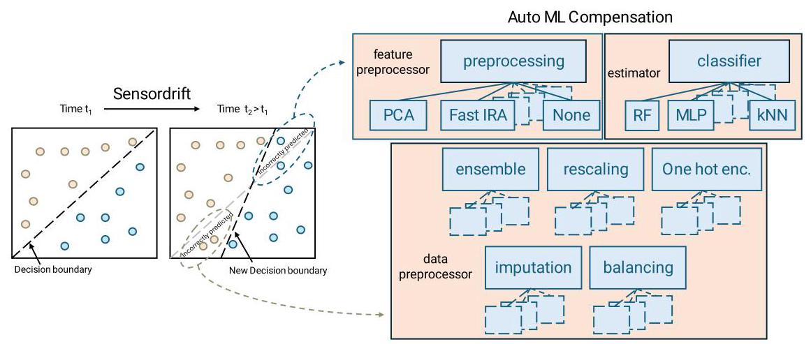
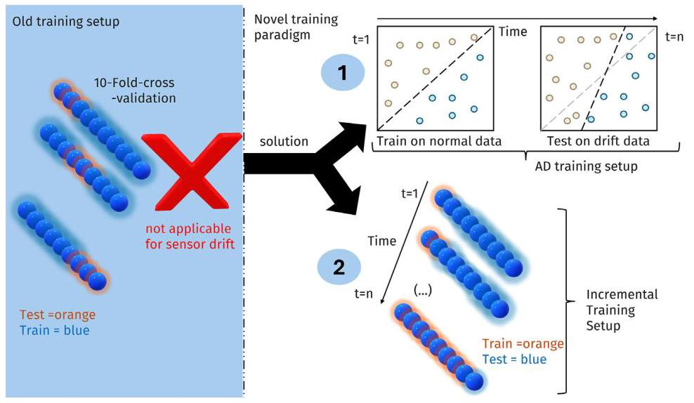
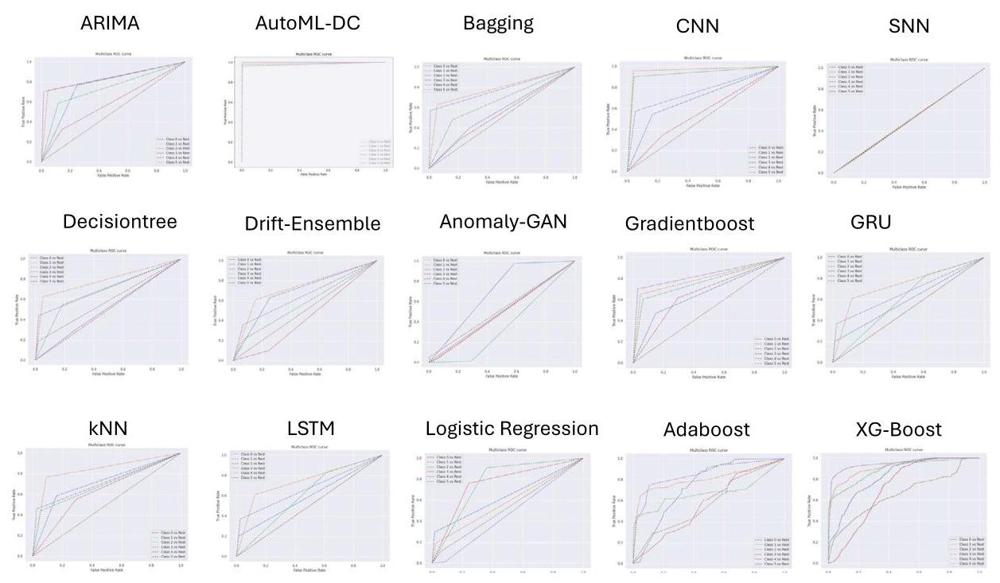
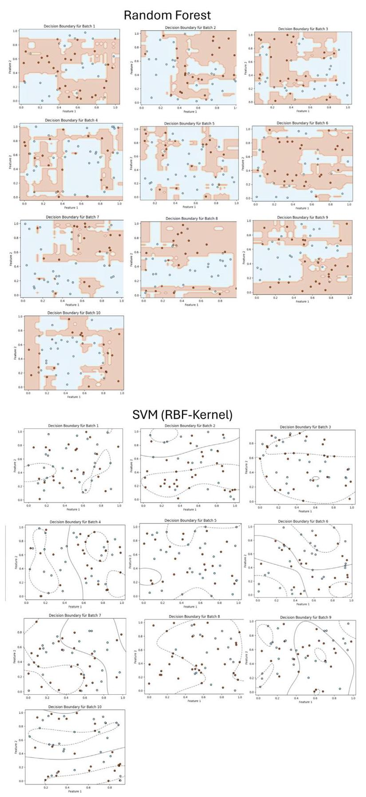
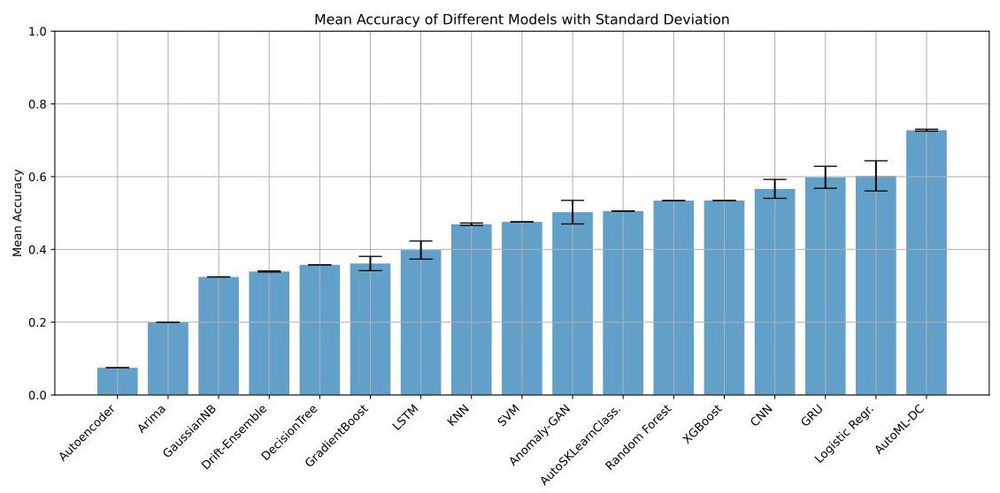
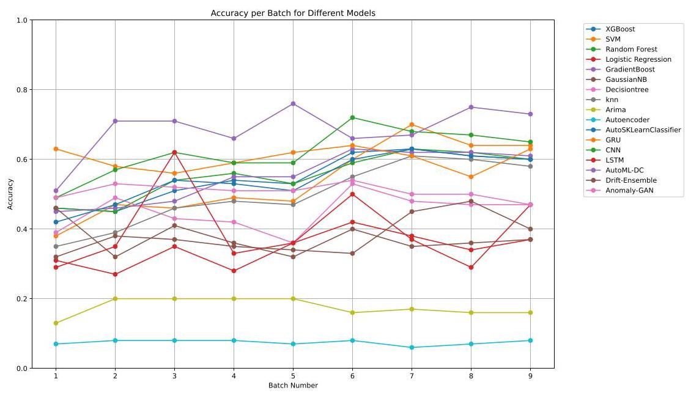
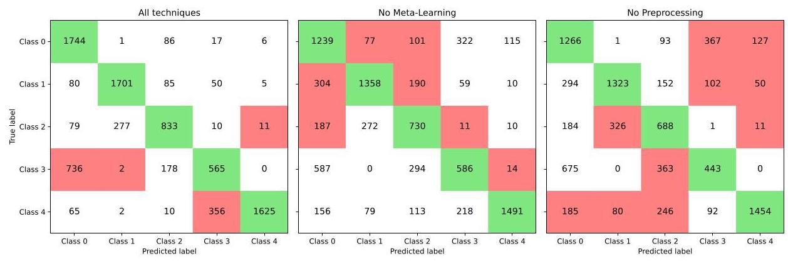
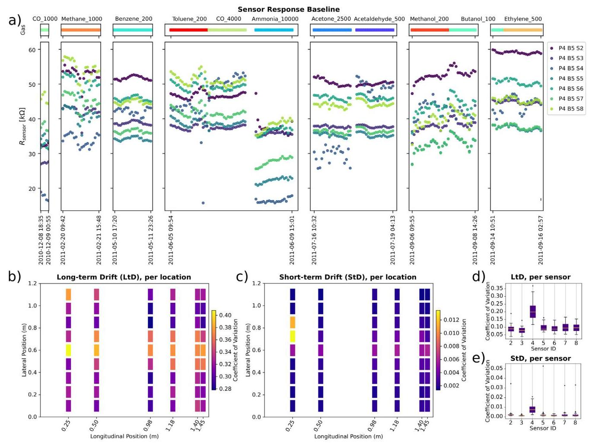

# AutoML for multi-class anomaly compensation of sensor drift

译文:# 用于传感器漂移多类异常补偿的自动机器学习

Melanie Schaller a, d b,*, Mathis Kruse a b, Antonio Ortega ${}^{b}$ , Marius Lindauer c, d, Bodo Rosenhahn a, d D

译文:梅兰妮·沙勒 a, d b,*, 马西斯·克鲁泽 a b, 安东尼奥·奥尔特加 ${}^{b}$ , 马吕斯·林道尔 c, d, 博多·罗森哈恩 a, d D

a Institute for Information Processing (tnt), Leibniz University Hannover, Germany

译文:a 汉诺威莱布尼茨大学信息处理研究所 (tnt)，德国

${}^{\mathrm{b}}$ Department of Electrical and Computer Engineering, University of Southern California, United States of America

译文:${}^{\mathrm{b}}$ 美国南加州大学电气与计算机工程系

c Institute for Artificial Intelligence, Leibniz University Hannover, Germany

译文:c 汉诺威莱布尼茨大学人工智能研究所，德国

${}^{\mathrm{d}}$ L3S Research Center, Germany

译文:${}^{\mathrm{d}}$ 德国 L3S 研究中心

## A R T I C L E I N F O

译文:## 文章信息

Keywords:

译文:关键词:

Sensordrift

译文:传感器漂移

Automated machine learning

译文:自动机器学习

Sensor measurements

译文:传感器测量

## A B S T R A C T

译文:## 摘要

Addressing sensor drift is essential in industrial measurement systems, where precise data output is necessary for maintaining accuracy and reliability in monitoring processes, as it progressively degrades the performance of machine learning models over time. Our findings indicate that the standard cross-validation method used in existing model training overestimates performance by inadequately accounting for drift. This is primarily because typical cross-validation techniques allow data instances to appear in both training and testing sets, thereby distorting the accuracy of the predictive evaluation. As a result, these models are unable to precisely predict future drift effects, compromising their ability to generalize and adapt to evolving data conditions. This paper presents two solutions: (1) a novel sensor drift compensation learning paradigm for validating models, and (2) automated machine learning (AutoML) techniques to enhance classification performance and compensate sensor drift. By employing strategies such as data balancing, meta-learning, automated ensemble learning, hyperparameter optimization, feature selection, and boosting, our AutoML-DC (Drift Compensation) model significantly improves classification performance against sensor drift. AutoML-DC further adapts effectively to varying drift severities.

译文:在工业测量系统中，解决传感器漂移至关重要，因为在监测过程中，精确的数据输出对于维持准确性和可靠性是必要的，随着时间的推移，传感器漂移会逐渐降低机器学习模型的性能。我们的研究结果表明，现有模型训练中使用的标准交叉验证方法由于对漂移的考虑不足而高估了性能。这主要是因为典型的交叉验证技术允许数据实例同时出现在训练集和测试集中，从而扭曲了预测评估的准确性。因此，这些模型无法精确预测未来的漂移影响，损害了它们的泛化能力和适应不断变化的数据条件的能力。本文提出了两种解决方案:(1) 一种用于验证模型的新型传感器漂移补偿学习范式，以及 (2) 用于提高分类性能和补偿传感器漂移的自动机器学习 (AutoML) 技术。通过采用数据平衡、元学习、自动集成学习、超参数优化、特征选择和增强等策略，我们的 AutoML-DC(漂移补偿)模型在应对传感器漂移方面显著提高了分类性能。AutoML-DC 还能有效适应不同的漂移严重程度。

## 1. Introduction

译文:## 1. 引言

Sensor drift is prevalent in industry [1], autonomous driving [2], and intelligent systems with integrated sensors [3]. In these use cases, where decision making is based on the real-time accuracy of measurement systems, sensor drift poses significant practical challenges. This phenomenon occurs due to factors such as poisoning or environmental changes [4], sensor aging [5], and mechanical wear [6], leading to progressively inaccurate sensor readings. These inaccuracies impact machine learning (ML) models by introducing variability in input data, which compromises the accuracy and reliability of the model [7]. While, in general, drift is characterized by observations inconsistent with data used for training, we note that there are scenarios where the patterns of temporal change that produce sensor drift are predictable. For example, sensor aging may lead to decreased sensitivity, that is, the same ambient conditions lead to smaller sensor readings. This paper uses automated machine learning (AutoML) techniques to develop a new training paradigm and a sensor drift compensation [8] solution for this type of scenario, where the patterns of identifiable temporal drift are predictable to some extent. Specifically, we assume that the relationship between time and changing sensor behavior can be learned in major parts as a function. This function is intended to capture the drift dynamics with linear and non-linear parts (see Section 3 and Section 9.4) and extrapolate to future unseen data. This allows our method to learn from the drift observed in the training data and enhance the capability of models to adapt and maintain accuracy despite sensor drift, and it could also be used for drift self-calibration in sensor measurements [9]. Although conventional techniques use random subsets of data for training/validation, we propose two training strategies to evaluate different aspects of sensor drift compensation. The first training strategy involves a novel sensor drift compensation framework and handles drift in an anomaly detection setting. The second strategy utilizes an incremental batch learning approach to validate the integration performance of new drift patterns.

译文:传感器漂移在工业 [1]、自动驾驶 [2] 和带有集成传感器的智能系统 [3] 中普遍存在。在这些基于测量系统实时准确性进行决策的用例中，传感器漂移带来了重大的实际挑战。这种现象是由中毒或环境变化 [4]、传感器老化 [5] 和机械磨损 [6] 等因素引起的，导致传感器读数逐渐不准确。这些不准确会通过在输入数据中引入变异性来影响机器学习 (ML) 模型，从而损害模型的准确性和可靠性 [7]。虽然一般来说，漂移的特征是观测值与用于训练的数据不一致，但我们注意到在某些情况下，产生传感器漂移的时间变化模式是可预测的。例如，传感器老化可能导致灵敏度降低，即相同的环境条件会导致更小的传感器读数。本文使用自动机器学习 (AutoML) 技术为这种在某种程度上可预测可识别的时间漂移模式的场景开发一种新的训练范式和一种传感器漂移补偿 [8] 解决方案。具体来说，我们假设时间与变化的传感器行为之间的关系在很大程度上可以作为一个函数来学习。这个函数旨在捕捉具有线性和非线性部分的漂移动态(见第 3 节和第 9.4 节)并外推到未来未见过的数据。这使我们的方法能够从训练数据中观察到的漂移中学习，并增强模型在存在传感器漂移的情况下适应和保持准确性的能力，它还可用于传感器测量中的漂移自校准 [9]。尽管传统技术使用数据的随机子集进行训练/验证，但我们提出了两种训练策略来评估传感器漂移补偿的不同方面。第一种训练策略涉及一种新型传感器漂移补偿框架，并在异常检测设置中处理漂移。第二种策略利用增量批学习方法来验证新漂移模式的集成性能。

Our research focuses on the following two key aspects:

译文:我们的研究集中在以下两个关键方面:

(1) Novel sensor drift compensation learning paradigm: As the first part of the novel learning paradigm, we introduce a sensor drift compensation learning strategy. For this strategy, our work closely relates to anomaly, or out-of-distribution, detection, where models are typically trained on normal data and evaluated on faulty data [10]. We propose a novel training setting for sensor drift compensation that can replace widely utilized 10-fold cross-validation or random sampling strategies for model training and evaluation [11]. Instead, we assume an increasingly severe temporal drift will occur in the training data. Thus, the training data represents initial drift states, and the trained model is expected to learn to compensate for observed (more severe) drift present at later stages in the test data, which can be seen as a variant of the drift adaptation task [12]. Most importantly, we assume that the sensor drift is separable from the data, making it possible to compensate for and reconstruct the original data from noisy measurements. However, we will show that the complex drift dynamics will make explicit drift modeling difficult, leading us to propose our model, which implicitly compensates for the sensor drift effects.

(1) 新型传感器漂移补偿学习范式:作为新型学习范式的第一部分，我们引入一种传感器漂移补偿学习策略。对于该策略，我们的工作与异常检测或分布外检测密切相关，在异常检测中，模型通常在正常数据上进行训练，并在故障数据上进行评估[10]。我们提出一种用于传感器漂移补偿的新型训练设置，它可以取代广泛使用的10折交叉验证或随机抽样策略进行模型训练和评估[11]。相反，我们假设训练数据中会出现日益严重的时间漂移。因此，训练数据代表初始漂移状态，期望训练后的模型能够学习补偿测试数据后期出现的观测到的(更严重的)漂移，这可以看作是漂移适应任务的一种变体[12]。最重要的是，我们假设传感器漂移与数据是可分离的，从而有可能从噪声测量中补偿和重建原始数据。然而，我们将表明复杂的漂移动态会使显式漂移建模变得困难，这促使我们提出我们的模型，该模型隐式地补偿传感器漂移效应。

---

* Corresponding author at: Institute for Information Processing (tnt), Leibniz University Hannover, Germany.

* 通讯作者地址:德国汉诺威莱布尼茨大学信息处理研究所(tnt)。

E-mail address: schaller@tnt.uni-hannover.de (M. Schaller).

电子邮件地址:schaller@tnt.uni-hannover.de(M. Schaller)。

---

Fig. 1. Visualization of the decision boundary shift due to sensor drift and the associated incorrect prediction (left) and the usage of AutoML techniques for drift compensation (right).

图1. 由于传感器漂移导致的决策边界偏移以及相关的错误预测(左)，以及使用自动机器学习技术进行漂移补偿(右)。

Motivated by Suárez-Cetrulo et al. [13], we introduce an incremental batch learning strategy as the second part of our novel training paradigm. This approach is particularly well-suited for environments where sensor data are received in a streaming fashion, and a continuous adaptation to new information is of interest. In this second learning setup, the model continuously ingests batch data, adjusting its parameters to account for drift and other variables in the environment. This ongoing learning process improves the model's ability to adapt to new patterns and anomalies, resulting in a more robust model performance even as the underlying data distribution evolves.

受苏亚雷斯 - 塞特鲁洛等人[13]的启发，我们引入了一种增量批学习策略，作为我们新颖训练范式的第二部分。这种方法特别适用于以流方式接收传感器数据且需要持续适应新信息的环境。在这第二种学习设置中，模型持续摄取批数据，调整其参数以考虑环境中的漂移和其他变量。这种持续的学习过程提高了模型适应新模式和异常的能力，即使基础数据分布发生变化，也能带来更稳健的模型性能。

Our framework assumes an iterative learning process. The model updates its understanding of the data distribution in batches, ensuring that newly observed drift patterns are promptly integrated into the predictive framework. This method minimizes the need for large-scale retraining episodes, making it suitable for contexts that demand low-latency responses. The combination of anomaly detection and batch learning techniques (see Fig. 2) in one novel learning paradigm ensures the model remains vigilant to out-of-distribution events while continually refining its predictions based on the batch data.

我们的框架假设了一个迭代学习过程。该模型以批次的方式更新其对数据分布的理解，确保新观察到的漂移模式能迅速整合到预测框架中。这种方法将大规模重新训练的需求降至最低，使其适用于需要低延迟响应的场景。在一种新颖的学习范式中结合异常检测和批次学习技术(见图2)，可确保模型在持续根据批次数据优化预测的同时，对分布外事件保持警惕。

Within different experiments, we demonstrate that several existing methods for sensor drift compensation are ineffective in learning the drift and, therefore, fail when the conventional validation setting is slightly modified. We demonstrate that previously published approaches cannot adequately compensate for the drift effect because of their unrealistic training setups. Existing methods typically learn average models that assume a uniform distribution across all data, making them less effective in the presence of drift. In contrast, our approach learns a static model from the initial batches and explicitly captures the drift dynamics by analyzing the differences between consecutive batches. This enables us to extrapolate the drift behavior to unseen data, providing a more accurate solution to sensor drift.

在不同的实验中，我们证明了几种现有的传感器漂移补偿方法在学习漂移方面是无效的，因此，当传统的验证设置稍有修改时就会失败。我们证明，由于之前发表的方法训练设置不切实际，它们无法充分补偿漂移效应。现有方法通常学习平均模型，这些模型假设所有数据都呈均匀分布，这使得它们在存在漂移的情况下效果较差。相比之下，我们的方法从初始批次中学习静态模型，并通过分析连续批次之间的差异来明确捕捉漂移动态。这使我们能够将漂移行为外推到未见数据，为传感器漂移提供更准确的解决方案。

(2) AutoML Drift Compensation: We show that AutoML techniques can improve the results on the drift compensation task in our proposed setting by about 16% compared to all other benchmarking models. In our context, drift compensation means that inherent sensor drift is present in the data, which can be compensated for using AutoML techniques. This ensures that the model's predictions remain accurate to a higher degree despite changes in the data distributions. This is achieved by combining various models and different preprocessing and hyperparameter settings that can learn different aspects of the drift. We showcase experimentally that employing AutoML techniques, such as automated ensemble learning with varying model weights, automated feature preprocessing, optimization of hyperparameters, boosting and imputation strategies, as well as others visualized in Fig. 1, allows for the learning of anomaly patterns within the training data. This enables the model to extrapolate from smaller drift effects to increasingly pronounced anomalous effects, thus compensating for sensor drift.

(2) 自动机器学习漂移补偿:我们表明，与所有其他基准模型相比，在我们提出的设置中，自动机器学习技术可以将漂移补偿任务的结果提高约16%。在我们的背景下，漂移补偿意味着数据中存在固有的传感器漂移，可以使用自动机器学习技术进行补偿。这确保了尽管数据分布发生变化，模型的预测仍能在更高程度上保持准确。这是通过组合各种模型以及不同的预处理和超参数设置来实现的，这些设置可以学习漂移的不同方面。我们通过实验展示，采用自动机器学习技术，如具有不同模型权重的自动集成学习、自动特征预处理、超参数优化、提升和插补策略，以及图1中可视化的其他技术，可以在训练数据中学习异常模式。这使模型能够从小的漂移效应推断到越来越明显的异常效应，从而补偿传感器漂移。

We summarize our contributions as follows:

我们将我们的贡献总结如下:

1. We demonstrate that the commonly used training settings are flawed in learning and compensating for sensor drift

1. 我们证明，常用的训练设置在学习和补偿传感器漂移方面存在缺陷

2. We propose a novel sensor drift compensation learning training paradigm that closely matches real-world scenarios.

2. 我们提出了一种新颖的传感器漂移补偿学习训练范式，该范式与现实世界场景紧密匹配。

3. Our findings indicate that AutoML techniques, ${}^{1}$ along with the proposed training setting, enable effective drift adaptation to evolving levels of drift severity and complex drift dynamics.

3. 我们的研究结果表明，自动机器学习技术，${}^{1}$ 连同所提出的训练设置，能够有效地适应漂移，以应对不断变化的漂移严重程度和复杂的漂移动态。

## 2. Related work

## 2. 相关工作

Automated machine learning (AutoML). Machine Learning has succeeded in countless applications [14-17], raising the demand for automated and streamlined solutions. The field of AutoML, which aims to find well-performing models automatically, has been receiving increased attention [18]. To ensure the flexibility and robustness needed for our sensor drift task, different AutoML techniques are applied, such as dynamic feature selection, model tuning, and adaptation to new drift patterns without extensive manual intervention, addressing the limitations of prior approaches that require fixed models and extensive domain knowledge.

自动化机器学习(AutoML)。机器学习已在无数应用中取得成功[14 - 17]，这使得对自动化和简化解决方案的需求不断增加。旨在自动找到性能良好模型的AutoML领域受到了越来越多的关注[18]。为确保我们的传感器漂移任务所需的灵活性和鲁棒性，应用了不同的AutoML技术，如动态特征选择、模型调优以及在无需大量人工干预的情况下适应新的漂移模式，解决了先前方法需要固定模型和大量领域知识的局限性。

Several frameworks, such as SMAC3 or auto-sklearn implement these techniques and are used in many different use cases [18-20]. Many AutoML frameworks resort to approaches such as Bayesian optimization to guide the non-trivial search for strong hyperparameters given a specific model [18,19]. The problem of algorithm selection (AS) aims to find the most suitable algorithm for a given task. Other fields, such as Neural Architecture Search (NAS) aim to find new neural network architecture and topologies, to solve new tasks [21]. Drift compensation. Prior drift compensation methods can be categorized into five types: component correction, adaptive methods, sensor signal preprocessing, attuning methods, and machine learning approaches.

一些框架，如SMAC3或auto - sklearn实现了这些技术，并在许多不同的用例中使用[18 - 20]。许多AutoML框架采用诸如贝叶斯优化等方法，以在给定特定模型的情况下指导对强大超参数的复杂搜索[18,19]。算法选择(AS)问题旨在为给定任务找到最合适的算法。其他领域，如神经架构搜索(NAS)旨在找到新的神经网络架构和拓扑结构，以解决新任务[21]。漂移补偿。先前的漂移补偿方法可分为五种类型:组件校正、自适应方法、传感器信号预处理、调整方法和机器学习方法。

---

1 https://anonymous.4open.science/r/AutoML_Drift_Compensation- 466F/Readme.md

1 https://anonymous.4open.science/r/AutoML_Drift_Compensation - 466F/Readme.md

---

Fig. 2. Visualization of the two-fold training paradigm on the right side vs. the traditional training paradigm on the left side.

图2.右侧双重训练范式与左侧传统训练范式的可视化。

Component correction methods use methods such as Principal Component Analysis (PCA) or Independent Component Analysis (ICA) to identify and eliminate drift components [22,23]. For dynamically evolving data sets, which regularly change due to drift, these component correction methods would need continual retraining to consider current statistics-making them labor-intensive and inefficient in comparison to systems designed to compensate dynamically without regular retraining. Furthermore methods like PCA, primarily a linear dimensionality reduction method, assumes that the main variability in the data can be captured in a reduced orthogonal space. This works well for stable datasets but can underperform if variability is erratic, time-dependent, or non-linear. ICA finds components that are statistically independent, which might not align with how drift manifests over time. Drift often appears as correlated sequential data changes not fully captured by static independence assumptions. In comparison our AutoML Drift Compensation framework allows a flexible adaptation by learning patterns, updating as the data evolves without the need for constant retraining from scratch, unlike static PCA/ICA frameworks.

组件校正方法使用诸如主成分分析(PCA)或独立成分分析(ICA)等方法来识别和消除漂移成分[22,23]。对于因漂移而定期变化的动态演化数据集，这些组件校正方法需要持续重新训练以考虑当前统计信息，这使得它们与设计用于动态补偿而无需定期重新训练的系统相比，劳动强度大且效率低下。此外，像PCA这样主要是线性降维方法，假设数据中的主要变异性可以在简化的正交空间中捕获。这对于稳定数据集效果良好，但如果变异性不稳定、与时间相关或呈非线性，则可能表现不佳。ICA找到统计上独立的成分，这可能与漂移随时间的表现方式不一致。漂移通常表现为相关的顺序数据变化，而静态独立性假设无法完全捕获这些变化。相比之下，我们的AutoML漂移补偿框架允许通过学习模式进行灵活适应，随着数据的演化而更新，无需从头开始进行持续重新训练，这与静态PCA/ICA框架不同。

Adaptive methods include evolutionary algorithms that optimize a multiplicative correction factor for incoming samples. These algorithms, like the one proposed by Di Carlo et al. [24], continuously adapt the correction factor through linear transformations within a restricted time window. Although Evolutionary algorithms can find optimal solutions within complex, high-dimensional spaces, the multiplicative correction factor assumes drift can be corrected through simple linear scaling, which might not suffice for nonlinear drift patterns. The focus on short-term optimization can also lead to overfitting to noise or transient anomalies in the data hindering adaptation to sustained nonlinear drift dynamics. In comparison our AutoML ensemble methods might capture multi-faceted drift patterns by combining models that individually address different components of the drift. AutoML-DC can also include model evaluation strategies that balance fitting the data while avoiding over-adjustment to noise.

自适应方法包括进化算法，这些算法为输入样本优化乘法校正因子。这些算法，如Di Carlo等人提出的算法[24]，在受限的时间窗口内通过线性变换不断调整校正因子。尽管进化算法可以在复杂的高维空间中找到最优解，但乘法校正因子假设漂移可以通过简单的线性缩放来校正，这对于非线性漂移模式可能并不足够。对短期优化的关注也可能导致对数据中的噪声或瞬态异常过度拟合，从而阻碍对持续非线性漂移动态的适应。相比之下，我们的AutoML集成方法可能通过组合分别处理漂移不同组件的模型来捕获多方面的漂移模式。AutoML - DC还可以包括平衡拟合数据同时避免过度调整噪声的模型评估策略。

Preprocessing methods involve baseline manipulation and filtering strategies. Baseline manipulation transforms sensor signals based on initial values using differential, relative, or fractional transformations. Filtering strategies, such as the Discrete Wavelet Transform (DWT), mitigate drift by discarding low-frequency components associated with drift and reconstructing the signal from the remaining components [25]. Nevertheless, preprocessing techniques generally assume that drift patterns, such as baselines or low-frequency components, remain constant over time. This constancy allows them to calibrate and correct the data based on fixed parameters. Thus it is not useful for dynamically adjusting to new drift patterns or evolving drift like in our usecase, as it is used in a rather static manner. With the Auto-ML DC model, we instead combine and learn different preprocessing parameters dynamically according to the temporal drift patterns, that are learnable. Choosing and combining preprocessing strategies alongside model configurations also allows more immediate responses to evolving drifts.

预处理方法涉及基线操作和滤波策略。基线操作使用微分、相对或分数变换基于初始值变换传感器信号。滤波策略，如离散小波变换(DWT)，通过丢弃与漂移相关的低频成分并从其余成分重建信号来减轻漂移[25]。然而，预处理技术通常假设漂移模式，如基线或低频成分，随时间保持不变。这种恒定性使它们能够基于固定参数校准和校正数据。因此，它对于像我们用例中那样动态适应新的漂移模式或演化漂移并不有用，因为它是以相当静态的方式使用的。使用Auto - ML DC模型，我们改为根据可学习的时间漂移模式动态组合和学习不同的预处理参数。选择和组合预处理策略以及模型配置还允许对演化漂移做出更即时的响应。

Attuning methods aim to correct drift components without relying on calibration samples, instead deducing drift directly from training data. Orthogonal Signal Correction (OSC) is one such method, which removes non-correlated variance in sensor-array data [26].Methods like Orthogonal Signal Correction (OSC) remove components orthogonal to the drift, thus eliminating the non-correlated variance in the data set. Thus, They rely on previously seen drift effects being representative for current and future drift compensation. Attuning methods often rely on the assumption that drift manifests in identifiable components (e.g., orthogonality) that are separated and compensated. Unlike attuning methods that are preset to correct only previously identified drift components, AutoML-DC can learn from broader, potentially evolving drift patterns within and beyond initial training data, which is shown in the extensive experiments with different training strategies. In cases where drift does not appear as (e.g. orthogonal) component, AutoML-DC might also recognize shifts in sensor behavior dynamically across the operational data range.

调谐方法旨在校正漂移分量，而不依赖校准样本，而是直接从训练数据中推断漂移。正交信号校正(OSC)就是这样一种方法，它可以去除传感器阵列数据中的非相关方差[26]。像正交信号校正(OSC)这样的方法会去除与漂移正交的分量，从而消除数据集中的非相关方差。因此，它们依赖于先前观察到的漂移效应能够代表当前和未来的漂移补偿。调谐方法通常依赖于这样的假设，即漂移表现为可识别的分量(例如正交性)，这些分量可以被分离和补偿。与仅预设用于校正先前识别的漂移分量的调谐方法不同，AutoML-DC可以从初始训练数据内外更广泛的、可能不断演变的漂移模式中学习，这在不同训练策略的广泛实验中得到了证明。在漂移未表现为(例如正交)分量的情况下，AutoML-DC也可能在整个操作数据范围内动态识别传感器行为的变化。

Machine learning approaches initially focused on adaptive drift correction using neural networks [27]. These methods, however, demand a substantial number of training samples and are tightly integrated with specific algorithms. To address flexibility, Vergara et al. [11] introduced an ensemble drift compensation method, utilizing features such as steady-state and normalized responses and employing classifiers like SVMs. Various machine learning models have been proposed, often using random train-test splits or cross-validation, and they are thus trained in a setting other than our proposed drift compensation setting. While Machine Learning models typically require large volumes of training data to accurately model the drift, especially when using neural networks or complex models to ensure convergence and generalization, we use meta-learning strategies to start from an informed initial configuration, reducing the need for exhaustive training data. While methods like those in Vergara et al.'s ensemble often rely on pre-selected models and handcrafted feature sets, AutoML-DC offers dynamic adaptability by exploring a broad range of models and hyperparameter settings automatically, selecting combinations that best capture the current drift patterns.

机器学习方法最初专注于使用神经网络进行自适应漂移校正[27]。然而，这些方法需要大量的训练样本，并且与特定算法紧密集成。为了解决灵活性问题，Vergara等人[11]引入了一种集成漂移补偿方法，利用诸如稳态和归一化响应等特征，并使用支持向量机等分类器。已经提出了各种机器学习模型，通常使用随机训练-测试分割或交叉验证，因此它们是在与我们提出的漂移补偿设置不同的环境中进行训练的。虽然机器学习模型通常需要大量的训练数据来准确地对漂移进行建模，特别是在使用神经网络或复杂模型以确保收敛和泛化时，但我们使用元学习策略从明智的初始配置开始，减少对详尽训练数据的需求。虽然Vergara等人的集成方法通常依赖于预先选择的模型和手工制作的特征集，但AutoML-DC通过自动探索广泛的模型和超参数设置，提供动态适应性，选择最能捕捉当前漂移模式的组合。

## 3. Formalization of the drift compensation problem

## 3. 漂移补偿问题的形式化

In real-world applications, sensors often operate over extended periods, leading to aging and degradation. This degradation is commonly referred to as sensor drift, induced by elusive dynamic processes such as poisoning, aging, or environmental variations [28,29] and has to be compensated by machine learning models, that are employed to monitor sensory systems. The drift compensation problem can be formulated as follows. Let ${T}_{1},{T}_{2},\ldots ,{T}_{K}$ denote time-series data across $K$ batches, organized chronologically. Each time series ${T}_{i}$ is defined as ${T}_{i} = {\left\{  {x}_{ij}\right\}  }_{j = 1}^{{N}_{i}}$ , where ${x}_{ij}$ represents the feature vector of the $j$ th sample in Batch $i$ , and ${N}_{i}$ is the number of samples in Batch $i$ . The sensor drift issue arises when the feature distributions of ${T}_{2},\ldots ,{T}_{K}$ deviate from that of ${T}_{1}$ . Consequently, a classifier trained on labeled data from ${T}_{1}$ exhibits degraded performance when tested on ${T}_{2},\ldots ,{T}_{K}$ due to diminished generalization caused by drift, which needs to be compensated. The mismatch in distribution between ${T}_{1}$ and ${T}_{i}$ becomes irregularly more pronounced with increasing batch index $i\left( {i > 1}\right)$ and aging.

在实际应用中，传感器通常长时间运行，导致老化和性能下降。这种性能下降通常被称为传感器漂移，它是由诸如中毒、老化或环境变化等难以捉摸的动态过程引起的[28,29]，必须由用于监测传感系统的机器学习模型进行补偿。漂移补偿问题可以如下形式化。设${T}_{1},{T}_{2},\ldots ,{T}_{K}$表示按时间顺序排列的$K$个批次的时间序列数据。每个时间序列${T}_{i}$定义为${T}_{i} = {\left\{  {x}_{ij}\right\}  }_{j = 1}^{{N}_{i}}$，其中${x}_{ij}$表示批次$i$中第$j$个样本的特征向量，${N}_{i}$是批次$i$中的样本数量。当${T}_{2},\ldots ,{T}_{K}$的特征分布与${T}_{1}$的特征分布偏离时，就会出现传感器漂移问题。因此，在${T}_{1}$的标记数据上训练的分类器在对${T}_{2},\ldots ,{T}_{K}$进行测试时，由于漂移导致的泛化能力下降而表现出性能下降，这需要进行补偿。随着批次索引$i\left( {i > 1}\right)$的增加和老化，${T}_{1}$和${T}_{i}$之间的分布不匹配会变得更加明显且不规则。

## 4. Formalization of the anomaly compensation task within Au- toML

## 4. AutoML中异常补偿任务的形式化

The goal is to train a classifier $f$ using the labeled data from the first ${k}_{\text{ train }} < K$ batches, with ${\mathcal{D}}_{\text{ train }} = \left\{  {1,\ldots ,{k}_{\text{ train }}}\right\}$ , in a supervised manner. The classifier is trained to predict class labels ${C}_{ij}$ based on the feature vectors ${x}_{ij}$ . The classifier has to learn both the normal data as well as initial drift patterns from the first few batches and generalize them to later batches where increased drift severity is observed. We argue that generalizing from the initial drift effects to the more pronounced drifts in later batches is a more realistic and more challenging setting. The trained classifier $f$ is then tested on the last ${k}_{\text{ test }} = K - {k}_{\text{ train }}$ batches, i.e. ${\mathcal{D}}_{\text{ test }} = \left\{  {{k}_{\text{ train }} + 1,\ldots , K}\right\}$ .

目标是使用前${k}_{\text{ train }} < K$批带标签的数据，以监督方式训练分类器$f$，其中${\mathcal{D}}_{\text{ train }} = \left\{  {1,\ldots ,{k}_{\text{ train }}}\right\}$。分类器经过训练，可根据特征向量${x}_{ij}$预测类别标签${C}_{ij}$。分类器必须学习前几批中的正常数据以及初始漂移模式，并将其推广到观察到漂移严重性增加的后续批次。我们认为，从初始漂移效应推广到后续批次中更明显的漂移是一种更现实、更具挑战性的设置。然后，在最后${k}_{\text{ test }} = K - {k}_{\text{ train }}$批上测试训练好的分类器$f$，即${\mathcal{D}}_{\text{ test }} = \left\{  {{k}_{\text{ train }} + 1,\ldots , K}\right\}$。

To gain enough flexibility to compensate for all drift effects, we model our classifier $f$ as an ensemble of known models, such as MLPs or Random Forests, and optimize it as an algorithm selection and hyperparameter optimization problem (CASH) [20]. We determine the set of algorithms for the ensemble out of a pool of algorithms A, with each ${a}_{i} \in  \mathbf{A}$ having its own hyperparameter space ${\mathbf{\Lambda }}_{i} \in  \mathbf{\Lambda }$ . Searching for the best-performing model becomes the optimization problem

为了获得足够的灵活性来补偿所有漂移效应，我们将分类器$f$建模为已知模型的集成，如多层感知器或随机森林，并将其作为算法选择和超参数优化问题(CASH)[20]进行优化。我们从算法池A中确定集成的算法集，每个${a}_{i} \in  \mathbf{A}$都有自己的超参数空间${\mathbf{\Lambda }}_{i} \in  \mathbf{\Lambda }$。寻找性能最佳的模型就成为了优化问题

$$
\left( {{a}^{ * },{\lambda }^{ * }}\right)  \in  \underset{{a}_{i} \in  \mathbf{a},\lambda  \in  {\mathbf{\Lambda }}_{i}}{\arg \max }c\left( {{a}_{i},\lambda }\right) , \tag{1}
$$

where ${a}^{ * }$ denotes the optimal choice of model and ${\lambda }^{ * }$ the respective choice of hyperparameters. The cost function $c\left( {{a}_{i},\lambda }\right)$ quantifies the performance of the current model ${a}_{i}$ with some hyperparameter choice $\lambda$ . In our case, $c$ is modeled using the F1-score, while we also track metrics such as precision and recall. Using the $k$ best-performing models determined by the optimization problem above, an ensemble is built to make predictions more robust against sensor drift.

其中${a}^{ * }$表示模型的最优选择，${\lambda }^{ * }$表示超参数的相应选择。成本函数$c\left( {{a}_{i},\lambda }\right)$用某些超参数选择$\lambda$来量化当前模型${a}_{i}$的性能。在我们的案例中，$c$使用F1分数建模，同时我们也跟踪精度和召回率等指标。使用上述优化问题确定的$k$个性能最佳的模型构建一个集成，以使预测对传感器漂移更具鲁棒性。

In our paper, we optimize this problem using the auto-sklearn framework [19], which also optimizes the choice of feature preprocessing, such as different embeddings, PCA or other encodings. To navigate the search space more efficiently, trading off exploration and exploitation, Bayesian optimization methods are used to guide the search. Utilizing results from meta-learning, the models are instantiated using initial instantiations pre-computed by auto-sklearn, which are determined using carefully selected and empirically found meta-features. The final ensemble is built with ensemble selection techniques and validated on a hold-out set [19,30].

在我们的论文中，我们使用auto-sklearn框架[19]优化这个问题，该框架还优化特征预处理的选择，如不同的嵌入、主成分分析或其他编码。为了更有效地探索搜索空间，平衡探索和利用，使用贝叶斯优化方法来指导搜索。利用元学习的结果，使用auto-sklearn预先计算的初始实例化来实例化模型，这些实例化是使用精心选择和经验发现的元特征确定的。最终的集成使用集成选择技术构建，并在一个留出集上进行验证[19,30]。

## 5. Dataset description

## 5. 数据集描述

To the best of our knowledge, the dataset by Vergara et al. [11] is the only dataset that fully represents the sensor drift problem in a practical setting. This dataset is particularly valuable for our research because it captures the complexities of sensor drift in a real-world industrial environment, where such issues frequently occur. Other sensor drift datasets, such as those from IntelLab [31], Santander [31], and SensorScope [31], primarily involve synthetic drift, which does not fully capture the nuanced challenges presented by natural sensor drift. Specifically, Vergara et al. curated a dataset featuring responses from a sixteen-element array of metal-oxide semiconductor gas sensors in a ${60}\mathrm{{ml}}$ test chamber. Various odorants, including ammonia, acetaldehyde, acetone, ethylene, ethanol, and toluene, that represent the multi-classes, were injected into the chamber and measured at a constant flow rate of ${200}\mathrm{{ml}}/\mathrm{{min}}$ . The sensors operated at ${400}{}^{ \circ  }\mathrm{C}$ , heated by an external DC voltage source. Resistance time series with a ${100}\mathrm{\;{Hz}}$ sampling rate, were collected over 36 months, with a deliberate 5-month gap to induce contamination. The dataset contains a total of 13,910 recordings and is introduced as sensor drift dataset with increasing drift severity over time.

据我们所知，Vergara等人[11]的数据集是唯一在实际环境中完全代表传感器漂移问题的数据集。这个数据集对我们的研究特别有价值，因为它捕捉了现实工业环境中传感器漂移的复杂性，在这种环境中此类问题经常发生。其他传感器漂移数据集，如来自英特尔实验室[31]、桑坦德[31]和传感器范围[31]的数据集，主要涉及合成漂移，不能完全捕捉自然传感器漂移带来的细微挑战。具体来说，Vergara等人策划了一个数据集，该数据集具有在${60}\mathrm{{ml}}$测试室中十六元素金属氧化物半导体气体传感器阵列的数据响应。将代表多类别的各种气味剂，包括氨、乙醛、丙酮、乙烯、乙醇和甲苯，注入测试室，并以${200}\mathrm{{ml}}/\mathrm{{min}}$的恒定流速进行测量。传感器在${400}{}^{ \circ  }\mathrm{C}$下运行，由外部直流电压源加热。以${100}\mathrm{\;{Hz}}$的采样率收集电阻时间序列，持续36个月，故意留出5个月的间隔以引入污染。该数据集总共包含13910条记录，并作为随时间漂移严重性增加的传感器漂移数据集引入。

### 5.1. Batch distributions and dataset structure

### 5.1. 批次分布和数据集结构

According to the setting's definition above, we divide the used data set into $K = {10}$ batches, subdivided into ${k}_{\text{ train }} = 5$ training and ${k}_{\text{ test }} = 5$ test batches. All runs in the code have been repeated ten times to see the robustness and significance of the results and the standard deviation has been calculated. In order to conduct a fair comparison of all models the hyperparameters of all models have been optimized due to their specific conditions. As all implemented benchmarking models have different specifications, we track the full set of tuned hyperparameters in the appendix due to capacity reasons.

根据上述设置的定义，我们将使用的数据集划分为$K = {10}$个批次，再细分为${k}_{\text{ train }} = 5$个训练批次和${k}_{\text{ test }} = 5$个测试批次。代码中的所有运行都重复了十次，以观察结果的稳健性和显著性，并计算了标准差。为了对所有模型进行公平比较，所有模型的超参数都根据其特定条件进行了优化。由于所有实现的基准模型都有不同的规格，出于容量原因，我们在附录中跟踪了完整的调优超参数集。

Since most samples are recorded in later batches, up to the 16th month or Batch 5, we extended the data inclusion up to the fifth batch for training. Thus, the training dataset contains 3633 samples out of 10277. This decision was driven by the already substantial imbalance in the dataset [32]. Further data set descriptions are found in Appendix A. 1 and Appendix A.2.

由于大多数样本是在后面的批次中记录的，直到第16个月或第5批次，我们将数据纳入范围扩展到第五批次进行训练。因此，训练数据集包含10277个样本中的3633个。这一决定是由数据集中已经存在的严重不平衡[32]驱动的。进一步的数据集描述见附录A.1和附录A.2。

## 6. Novel sensor drift training paradigm

## 6. 新型传感器漂移训练范式

As part of our novel learning paradigm, we address the sensor drift compensation challenge using a two-fold strategy that combines anomaly detection principles with an incremental batch learning approach. This paradigm is designed to validate the model's robustness and adaptability in the face of dynamic sensor drift.

作为我们新型学习范式的一部分，我们采用了一种双重策略来应对传感器漂移补偿挑战，该策略将异常检测原理与增量批次学习方法相结合。这种范式旨在验证模型在面对动态传感器漂移时的稳健性和适应性。

First, we utilize a learning approach inspired by anomaly detection, training models on initial, drift-free data. This data serves as a baseline for adapting to intensified drift conditions, allowing the model to implicitly manage the complex, non-linear dynamics of sensor drift without explicit modeling.

首先，我们采用一种受异常检测启发的学习方法，在初始的、无漂移的数据上训练模型。这些数据作为适应强化漂移条件的基线，使模型能够在不进行显式建模的情况下隐式管理传感器漂移的复杂非线性动态。

Second, we implement an incremental batch learning strategy for real-time data environments. This approach enables the model to continuously adjust parameters in response to new data, ensuring robust performance against evolving drift characteristics. This method minimizes the need for comprehensive retraining, allowing the model to integrate new drift patterns and maintain accuracy. The incremental addition of batches simulated a real-world scenario where a model is periodically retrained with new data and was motivated from [33].

其次，我们为实时数据环境实施了一种增量批次学习策略。这种方法使模型能够根据新数据不断调整参数，确保针对不断变化的漂移特征具有稳健的性能。这种方法最大限度地减少了全面重新训练的需求，使模型能够整合新的漂移模式并保持准确性。批次的增量添加模拟了一种现实场景，即模型定期用新数据进行重新训练，其灵感来自[33]。

## 7. Evaluation metrics

## 7. 评估指标

To evaluate the performance of our models in compensating for sensor drift, we employ several key metrics: Precision, Recall, F1-Score, Accuracy, and the Area Under the Receiver Operating Characteristic Curve (AUC-ROC). Precision is defined as the ratio of true positive predictions to the sum of true positive and false positive predictions. It measures the accuracy of the positive predictions made by the model [34]. Recall, also known as sensitivity, measures the ratio of true positive predictions to the sum of true positives and false negatives [34]. The F1-Score is the harmonic mean of Precision and Recall, especially useful for imbalanced datasets [34]. Accuracy is defined as the ratio of correctly predicted instances to the total instances in the dataset [35]. The AUC-ROC metric evaluates the model's ability to distinguish between classes across various thresholds, offering a comprehensive measure of classification performance [36].

为了评估我们的模型在补偿传感器漂移方面的性能，我们采用了几个关键指标:精确率、召回率、F1分数、准确率以及接收器操作特征曲线下的面积(AUC-ROC)。精确率定义为真阳性预测与真阳性和假阳性预测之和的比率。它衡量模型做出的阳性预测的准确性[34]。召回率，也称为敏感度，衡量真阳性预测与真阳性和假阴性之和的比率[34]。F1分数是精确率和召回率 的调和平均值，特别适用于不平衡数据集[34]。准确率定义为正确预测的实例与数据集中总实例的比率[35]。AUC-ROC指标评估模型在不同阈值下区分类别的能力，提供分类性能的综合度量[36]。

The choice of these metrics is motivated by their relevance to the task of sensor drift compensation. Precision and recall provide insights into the correctness and completeness of positive predictions, respectively. The F1-score balances these two metrics, accounting for class imbalances. Accuracy is used for its general assessment capability and is supplemented by AUC-ROC to ensure robust evaluation across various thresholds. These metrics should collectively enable a multifaceted performance evaluation. In our study, machine learning models are specifically designed to recognize and compensate for sensor drift over time, emphasizing accuracy and robustness across drift levels rather than immediate detection and response. Thus, we employ metrics that effectively assess how well the models manage changing data distributions due to drift. Metrics such as drift detection delay and adaptation time are more pertinent to system-level responses, where operational adjustments are critical. However, our approach focuses on optimizing model parameters for predictive accuracy amidst drift within controlled training paradigms. Thus, speed-focused metrics have been excluded.

选择这些指标是因为它们与传感器漂移补偿任务相关。精确率和召回率分别提供了对阳性预测的正确性和完整性的见解。F1分数平衡了这两个指标，考虑了类不平衡。准确率用于其一般评估能力，并由AUC-ROC补充，以确保在各种阈值下进行稳健评估。这些指标应共同实现多方面的性能评估。在我们的研究中，机器学习模型专门设计用于随着时间的推移识别和补偿传感器漂移，强调在不同漂移水平上的准确性和稳健性，而不是即时检测和响应。因此，我们采用能够有效评估模型如何管理由于漂移而变化的数据分布的指标。诸如漂移检测延迟和适应时间等指标与系统级响应更相关，在系统级响应中操作调整至关重要。然而，我们的方法侧重于在受控训练范式中针对漂移优化模型参数以提高预测准确性。因此，排除了以速度为重点的指标。

## 8. Hyperparameters of baseline models

## 8. 基线模型的超参数

In our study, we tuned the hyperparameters across a range of machine learning models to ensure fair benchmarking. For the XGBoost model, we optimized the learningrate, max - depth, and n - estimators hyperparameters. The Support Vector Machine (SVM) model required tuning of $C$ (regularization parameter), gamma (kernel coefficient), and kernel type. For the Random Forest classifier, we adjusted the max - depth, min - samples - split, and n - estimators. For Logistic Regression, the hyperparameters $C$ (inverse regularization strength), solver (optimization algorithm), and max - iter (maximum iterations) were optimized. The Gradient Boosting model required tuning of the learningrate, max - depth, and n - estimators. For Gaussian Naïve Bayes (GaussianNB), we focused on optimizing var - smoothing.

在我们的研究中，我们在一系列机器学习模型中调整了超参数，以确保公平的基准测试。对于XGBoost模型，我们优化了学习率、最大深度和估计器数量超参数。支持向量机(SVM)模型需要调整$C$(正则化参数)、γ(核系数)和核类型。对于随机森林分类器，我们调整了最大深度、最小样本分割数和估计器数量。对于逻辑回归，优化了超参数$C$(逆正则化强度)、求解器(优化算法)和最大迭代次数(最大迭代)。梯度提升模型需要调整学习率、最大深度和估计器数量。对于高斯朴素贝叶斯(GaussianNB)，我们专注于优化方差平滑。

The Decision Tree classifier's hyperparameters criterion (splitting function), max - depth, and min - samples - split were modified. The performance of the k-Nearest Neighbors (kNN) model was enhanced by selecting the optimal num - clusters. For ARIMA, we used the autoarima function. The Autoencoder required adjustments of the input - dim, encoding - dim, num - layers, and learningrate. Hyperparameters for Auto-Sklearn included per - run - time - limit, ensemble - size, and metalearning components.

决策树分类器的超参数准则(分裂函数)、最大深度和最小样本分割进行了修改。通过选择最优的聚类数量，增强了k近邻(kNN)模型的性能。对于ARIMA，我们使用了自动ARIMA函数。自动编码器需要调整输入维度、编码维度、层数和学习率。自动机器学习的超参数包括每次运行时间限制、集成大小和元学习组件。

For GRU (Gated Recurrent Unit) and LSTM (Long Short-Term Memory) networks, we tuned hidden - size, num - layers, and learningrate. The Convolutional Neural Network (CNN) was optimized with filter - size, kernel - size, pool - size, and dense - units. The Drift-Ensemble, using a "hard" voting strategy, was optimized with the Kruskal-Wallis, Shapiro-Wilk, and Mann-Whitney U tests. In order to tune other hyperparameters the "hard" voting strategy would have to be changed to a "soft" voting strategy, which was not the intention of the paper. Therefore, we left the model like it was supposed to be from the authors. For Anomaly-GAN, we fine-tuned hidden - dim and learningrate. These hyperparameter optimizations have been used to ensure a fair comparison. The ranges of the optimized hyperparameters can be looked up in the repository. The libraries are listed in the 'requirements.txt' file of the provided repository. All experiments were conducted on CPUs, specifically Intel Xeon Processor with 128 GB RAM, running Ubuntu 18.04. However, the code is compatible with GPU execution as well, which can be utilized depending on availability.

对于门控循环单元(GRU)和长短期记忆网络(LSTM)，我们调整了隐藏层大小、层数和学习率。卷积神经网络(CNN)通过滤波器大小、内核大小、池化大小和全连接层单元进行了优化。使用“硬”投票策略的漂移集成通过Kruskal-Wallis、Shapiro-Wilk和Mann-Whitney U检验进行了优化。为了调整其他超参数，“硬”投票策略必须改为“软”投票策略，而这并非本文的意图。因此，我们保持了作者设计的模型原样。对于异常生成对抗网络(Anomaly-GAN)，我们微调了隐藏层维度和学习率。这些超参数优化用于确保公平比较。优化后的超参数范围可在代码库中查找。库列表在提供的代码库的“requirements.txt”文件中。所有实验均在CPU上进行，具体为配备128GB内存的英特尔至强处理器，运行Ubuntu 18.04。不过，代码也与GPU执行兼容，可根据可用性使用。

## 9. Experimental results

## 9. 实验结果

As discussed before, we use the well-studied sensor drift dataset proposed by Vergara et al. [11], which contains real-world sensor-drift data. In this dataset, a certain baseline drift can be observed, but also additional short-term as well as long-term drift effects [32]. Therefore, the machine learning models employed for classifying multiple classes must be able to learn the basic patterns of a hybrid form of sensor drift (see Fig. A.1) at early stages and accurately learn and predict the subsequent higher levels. Rather than relying on random sampling or ten-fold cross-validation [11], we aim to train the model on our proposed training paradigm. In the first benchmarking results section, we use the Anomaly detection strategy for training. Subsequently, the model should demonstrate proficiency in predicting the accurate classes for the ensuing five batches, characterized by distinct distributions from the initial batches due to high drift severity. Consequently, the models are tasked with learning the distinctive sensor drift patterns present in the initial batches, enabling them to forecast the correct classes for the subsequent unseen batches. As comparison we also showcase the results on the originally proposed training setup for selected models to prove our claim. To further evaluate the classification performance, we also document the AUC-ROC Scores for all benchmarking models. We also conducted a drift linearity test to distinguish between drift effects. Afterwards we also compare the decision boundaries of Random Forest as most frequently used model in the AutoML-DC ensemble against Support Vector Machine (SVM) boundaries with RBF-Kernel. To further investigate the robustness of the models we also compare the standard deviation and mean accuracy values for all benchmarking models. Afterwards we use the second learning strategy of our learning paradigm to show the capability of the models to adapt to temporal changes of drift effects. Lastly we conduct extensive experiments on the effects of AutoML techniques within the AutoML-DC model to showcase the single effects within an ablation study. To ensure comparable results, the number of epochs and batch sizes were kept constant across all experiments, while all hyperparameters were specifically tuned according to the specific model conditions.

如前所述，我们使用了Vergara等人[11]提出的经过充分研究的传感器漂移数据集，该数据集包含实际的传感器漂移数据。在这个数据集中，可以观察到一定的基线漂移，以及额外的短期和长期漂移效应[32]。因此，用于多类分类的机器学习模型必须能够在早期阶段学习混合形式的传感器漂移的基本模式(见图A.1)，并准确学习和预测后续的更高层次。我们的目标不是依赖随机抽样或十折交叉验证[11]，而是在我们提出的训练范式上训练模型。在第一个基准测试结果部分，我们使用异常检测策略进行训练。随后，模型应展示出在预测接下来五批数据的准确类别方面的能力，由于高漂移严重性，这五批数据的分布与初始批次不同。因此，模型的任务是学习初始批次中存在的独特传感器漂移模式，以便能够预测后续未见批次的正确类别。作为比较，我们还展示了所选模型在最初提出 的训练设置上的结果，以证明我们的观点。为了进一步评估分类性能，我们还记录了所有基准测试模型的AUC-ROC分数。我们还进行了漂移线性测试以区分漂移效应。之后，我们还将自动机器学习数据融合(AutoML-DC)集成中最常用的随机森林模型的决策边界与具有径向基函数(RBF)内核的支持向量机(SVM)边界进行比较。为了进一步研究模型的鲁棒性，我们还比较了所有基准测试模型的标准差和平均准确率值。之后，我们使用学习范式的第二种学习策略来展示模型适应漂移效应时间变化的能力。最后，我们对AutoML-DC模型中的自动机器学习技术的效果进行了广泛实验，以在消融研究中展示单个效果。为确保结果具有可比性，所有实验中的轮数和批次大小保持不变，而所有超参数根据特定模型条件进行了专门调整。

### 9.1. Benchmarking results for sensor drift with the anomaly detection training setup

### 9.1. 异常检测训练设置下的传感器漂移基准测试结果

Based on prior work, as discussed in Section 2, we choose the most frequently used models that have been implemented on the dataset. Since Random Forest [37] showed good results in other studies, we explore other decision tree-based models [38] and Gradient Boosting [39], to assess their impact in comparison. Next, we compare these results against Kernel methods like SVM [40] with RBF Kernel and a Gaussian Naive Bayes Model [41]. The third group of models we choose for comparison are temporal baseline models like LSTM [40], GRU [42] and a temporal CNN [43]. As a fourth group, we also investigate the performance of CatBoost [44] against AdaBoost [45], XGBoost [46] and Bagging [47]. The fifth group of models is the instance-based learning model KNN (k nearest neighbors) [48] with an optimized number of neighbors. As one of the review papers on this dataset [49] stated, that spiking neural networks (SNN) could be useful to solve tasks on drift data, we included these models as the sixth group of models.

基于第2节中讨论的先前工作，我们选择了在该数据集上实现的最常用模型。由于随机森林[37]在其他研究中显示出良好的结果，我们探索了其他基于决策树的模型[38]和梯度提升[39]，以评估它们相比之下的影响。接下来，我们将这些结果与使用RBF核的支持向量机[40]和高斯朴素贝叶斯模型[41]等核方法进行比较。我们选择进行比较的第三组模型是诸如长短期记忆网络(LSTM)[40]、门控循环单元(GRU)[42]和时间卷积神经网络(temporal CNN)[43]等时间基线模型。作为第四组，我们还研究了CatBoost[44]与AdaBoost[45]、XGBoost[46]和装袋法(Bagging)[47]相比的性能。第五组模型是具有优化邻居数量的基于实例学习的KNN(k近邻)模型[48]。正如关于该数据集的一篇综述论文[49]所述，脉冲神经网络(SNN)可能有助于解决漂移数据上的任务，我们将这些模型作为第六组模型纳入。

The ensemble drift compensation, that was introduced by Vergara et al. [11] especially on this dataset is also used as benchmarking model. The last group is formed by a generative adversarial network (GAN) to solve the anomaly classification or anomaly detection [50- 52]. For an overview of GANs used in anomaly detection tasks see [53]. Here, the discriminator score is taken to set the threshold for each class.

Vergara等人[11]特别针对该数据集引入的集成漂移补偿也用作基准模型。最后一组由生成对抗网络(GAN)组成，用于解决异常分类或异常检测问题[50 - 52]。有关异常检测任务中使用的GAN的概述，请参阅[53]。在此，采用判别器分数为每个类别设置阈值。

Table 1 summarizes the performance metrics of the selected machine learning models. Precision, recall, and F1-score [54] are utilized to evaluate the models, providing a comprehensive assessment of their ability to learn patterns of sensor drift.

表1总结了所选机器学习模型的性能指标。利用精确率、召回率和F1分数[54]来评估模型，全面评估它们学习传感器漂移模式的能力。

Table 1

表1

Benchmarking results on the proposed sensor drift compensation setting.

在提出的传感器漂移补偿设置上的基准测试结果。

<table><tr><td>Model</td><td>Precision</td><td>Recall</td><td>F1</td></tr><tr><td>Random Forest</td><td>0.68</td><td>0.57</td><td>0.56</td></tr><tr><td>SVM (RBF Kernel)</td><td>0.52</td><td>0.43</td><td>0.43</td></tr><tr><td>Logistic Regression</td><td>0.57</td><td>0.53</td><td>0.50</td></tr><tr><td>XG Boost</td><td>0.66</td><td>0.53</td><td>0.51</td></tr><tr><td>CatBoost</td><td>0.49</td><td>0.54</td><td>0.50</td></tr><tr><td>KNN</td><td>0.68</td><td>0.57</td><td>0.56</td></tr><tr><td>SNN</td><td>0.16</td><td>0.13</td><td>0.11</td></tr><tr><td>LSTM</td><td>0.58</td><td>0.61</td><td>0.57</td></tr><tr><td>CNN</td><td>0.65</td><td>0.62</td><td>0.60</td></tr><tr><td>Decision Tree</td><td>0.50</td><td>0.38</td><td>0.40</td></tr><tr><td>Gradient Boosting</td><td>0.49</td><td>0.51</td><td>0.49</td></tr><tr><td>Gaussian Naive Bayes</td><td>0.50</td><td>0.32</td><td>0.32</td></tr><tr><td>AdaBoost</td><td>0.42</td><td>0.42</td><td>0.40</td></tr><tr><td>Bagging</td><td>0.48</td><td>0.40</td><td>0.39</td></tr><tr><td>Ensemble Model</td><td>0.29</td><td>0.32</td><td>0.29</td></tr><tr><td>GRU</td><td>0.40</td><td>0.32</td><td>0.28</td></tr><tr><td>Anomaly-GAN</td><td>0.21</td><td>0.35</td><td>0.26</td></tr><tr><td>AutoML-DC (ours)</td><td>0.77</td><td>0.76</td><td>0.76</td></tr></table>

As the table shows, none of the benchmarking models achieved an F1 score exceeding 60% for our proposed drift compensation setting. Conversely, the ensemble drift compensation of Vergara et al. [11] displays lower scores across all metrics, suggesting a diminished ability to accurately detect sensor drift anomalies despite the promising results of the ensemble model for the whole dataset with random sampling. The Spiking Neural Network (SNN) also exhibits relatively low precision, recall, and F1-score, indicating limited effectiveness in this context, although it was shown to work well for the random sampling strategy. The AutoML-DC framework leverages meta-learning strategies, streamlining the hyperparameter tuning process and reducing the computational burden compared to traditional methods. This strategic approach, in combination with the other AutoML techniques, improves model configuration, leading to a consistent outperformance with an F1 score of 76%. We note that integrating a rigorous comparison with state-of-the-art drift compensation methods, such as adaptive and component-correction approaches, into this multi-class classification setting presents significant challenges. These methods are not specifically designed for simpler binary classification or regression tasks, which makes direct comparisons in a multi-class context complex. Specifically, each class in the dataset may experience drift at different rates and in different manners, requiring a model that can simultaneously handle complex interdependencies across multiple classes. While a binary classification approach could isolate these class-specific drift patterns, it might not capture interactions between classes. Thus, methods other than machine learning models have been excluded from the benchmarking results to guarantee a fair comparison, given that a simple adaptation of binary classification methods in terms of One-vs-Rest or One-vs-One might not be sufficient.

如表所示，对于我们提出的漂移补偿设置，没有一个基准模型的F1分数超过60%。相反，Vergara等人[11]的集成漂移补偿在所有指标上的得分都较低，这表明尽管集成模型在整个随机采样数据集上有不错的结果，但在准确检测传感器漂移异常方面的能力有所下降。脉冲神经网络(SNN)的精确率、召回率和F1分数也相对较低，表明在这种情况下效果有限，尽管它在随机采样策略下表现良好。自动机器学习 - 漂移补偿(AutoML - DC)框架利用元学习策略，简化了超参数调整过程，与传统方法相比减轻了计算负担。这种策略方法与其他自动机器学习技术相结合，改善了模型配置，以76%的F1分数持续取得优异成绩。我们注意到，将与诸如自适应和组件校正方法等最新漂移补偿方法进行严格比较集成到这种多类分类设置中存在重大挑战。这些方法并非专门为更简单的二分类或回归任务设计，这使得在多类环境中的直接比较变得复杂。具体而言，数据集中的每个类别可能以不同的速率和方式经历漂移，需要一个能够同时处理多个类别之间复杂相互依赖关系的模型。虽然二分类方法可以隔离这些特定类别的漂移模式，但可能无法捕捉类别之间的相互作用。因此，为了保证公平比较，除机器学习模型之外的方法已被排除在基准测试结果之外，因为简单地将二分类方法调整为一对多(One - vs - Rest)或一对一(One - vs - One)可能并不足够。

### 9.2. Results on original training scenario as comparison

### 9.2. 作为比较的原始训练场景结果

In order to be able to compare the results of the benchmarking study on the proposed drift compensation setting with the original training strategy, we present the results for some major models trained with 10 fold cross validation on the same dataset as follows in Table 2:

为了能够将在提出的漂移补偿设置上的基准测试研究结果与原始训练策略进行比较，我们在表2中展示了在同一数据集上使用10折交叉验证训练的一些主要模型的结果:

As the results show, traditional training methods, such as ten-fold cross-validation, are inadequate for sensor drift compensation because they often cause data leakage, especially in small datasets (see Table 2 F1 comparison). These methods often mix data from different time periods, which obscures the progression of drift and hinders the model's ability to learn temporal dynamics. As a result, models trained this way may perform overoptimistically well during cross-validation (as shown in Table 2) but fail when exposed to data with unseen levels of drift (as shown in Table 1).

结果表明，传统训练方法，如10折交叉验证，对于传感器漂移补偿是不够的，因为它们经常导致数据泄漏，特别是在小数据集中(见表2中的F1比较)。这些方法经常混合来自不同时间段的数据，这会模糊漂移的进展并阻碍模型学习时间动态的能力。因此，以这种方式训练的模型在交叉验证期间可能表现得过于乐观(如表2所示)，但在面对具有未见过的漂移水平的数据时会失败(如表1所示)。

Table 2

表2

Comparison of some models of the benchmarking study on the original proposed setting (10 fold crossvalidation), which does not model the complexity of sensor drift properly in comparison to the F1 Score of our novel proposed training paradigm (=TP F1).

在原始提出的设置(10折交叉验证)上的基准测试研究中一些模型的比较，与我们新提出的训练范式(=TP F1)的F1分数相比，该设置未能正确模拟传感器漂移的复杂性。

<table><tr><td>Model</td><td>Precision</td><td>Recall</td><td>F1-Score</td><td>TP F1</td></tr><tr><td>Random Forest</td><td>0.98</td><td>0.98</td><td>0.98</td><td>0.56</td></tr><tr><td>SVM</td><td>0.99</td><td>0.98</td><td>0.98</td><td>0.43</td></tr><tr><td>Decision Tree</td><td>0.97</td><td>0.97</td><td>0.97</td><td>0.40</td></tr><tr><td>Logistic Regression</td><td>0.95</td><td>0.95</td><td>0.95</td><td>0.50</td></tr><tr><td>Drift-Ensemble</td><td>0.98</td><td>0.98</td><td>0.98</td><td>0.29</td></tr><tr><td>AutoML-CD</td><td>0.99</td><td>0.99</td><td>0.99</td><td>0.76</td></tr></table>

### 9.3. AUC-ROC scores for benchmarking models

### 9.3. 基准模型的AUC - ROC分数

When trained in the proposed sensor drift compensation task, the AUC-ROC scores for the benchmarking models have been calculated for all classes (see Fig. 3). AutoML-DC performs exceptionally well, as indicated by its ROC curve near the top left corner. This positioning suggests that AutoML-DC achieves a high True Positive Rate with a low False Positive Rate, reflecting the best classification performance in comparison to the other models. Gradient Boost, XGBoost, Bagging, and Adaboost demonstrate strong ability to distinguish between classes, with ROC curves that approach the ideal top-left corner, indicating higher accuracy in these in comparison to the other models. Our approach prioritizes methods that align closely with the evaluation of how models adapt and maintain performance in dynamic environments. Using AUC-ROC scores, we provide a statistically robust framework to evaluate and validate the effectiveness of the model at different classification thresholds.

在针对所提出的传感器漂移补偿任务进行训练时，已针对所有类别计算了基准模型的AUC-ROC分数(见图3)。AutoML-DC表现出色，其ROC曲线位于左上角附近即可表明这一点。这种位置表明AutoML-DC在低误报率的情况下实现了高真阳性率，与其他模型相比反映出最佳的分类性能。梯度提升、XGBoost、Bagging和Adaboost表现出很强的区分类别能力，其ROC曲线接近理想的左上角，表明与其他模型相比，这些模型的准确性更高。我们的方法优先考虑与评估模型在动态环境中如何适应和保持性能密切相关的方法。使用AUC-ROC分数，我们提供了一个统计上稳健的框架，以评估和验证模型在不同分类阈值下的有效性。

### 9.4. Drift linearity test

### 9.4. 漂移线性测试

We employed a support vector regression test to analyze the drift effect in the context of linearity. The primary objective of this test is to provide an initial qualitative assessment of the balance between linear and non-linear drift components using kernel function comparisons. We conducted the originally proposed ten-fold cross-validation for training and testing on the whole dataset (that is, on all batches) and compared the results of the support vector machine (SVM) with a linear kernel against the results of the SVM with an RBF kernel.

我们采用支持向量回归测试来分析线性情况下的漂移效应。该测试的主要目的是通过核函数比较，对线性和非线性漂移分量之间的平衡进行初步定性评估。我们对整个数据集(即所有批次)进行了最初提出的十折交叉验证以进行训练和测试，并将具有线性核的支持向量机(SVM)的结果与具有RBF核的SVM的结果进行了比较。

The choice of kernel (linear or RBF) impacts the decision boundary of the SVM [55]. A linear kernel corresponds to a linear decision boundary in the input space. It assumes that the underlying relationship between the features and the target variable is linear. The linear kernel is effective when the data can be adequately separated by a hyperplane. The Radial Basis Function (RBF) kernel, also known as the Gaussian kernel, introduces nonlinearity by transforming the input space into a higher-dimensional space. It allows the SVM to capture more intricate relationships in the data. The RBF kernel is particularly useful when the decision boundary is complex and nonlinear, see Fig. 4. The effectiveness of the linear kernel with an Accuracy of 0.97 implies that a significant portion of the sensor drift can be explained by linear relationships between features and classes. On the other hand, the slightly better performance of the RBF kernel with an Accuracy of 0.98 indicates that there are also additional non-linearities in the data.

核函数(线性或RBF)的选择会影响SVM的决策边界[55]。线性核对应于输入空间中的线性决策边界。它假设特征与目标变量之间的潜在关系是线性的。当数据可以被超平面充分分离时，线性核是有效的。径向基函数(RBF)核，也称为高斯核，通过将输入空间转换为更高维空间来引入非线性。它允许SVM捕捉数据中更复杂的关系。当决策边界复杂且非线性时，RBF核特别有用，见图4。准确率为0.97的线性核的有效性意味着传感器漂移的很大一部分可以通过特征与类别之间的线性关系来解释。另一方面，准确率为0.98的RBF核的稍好性能表明数据中也存在额外的非线性。

### 9.5. Decision boundaries

### 9.5. 决策边界

As Random Forest was investigated to be a good sensor drift compensator in the drift compensation setting, we further compare the decision boundaries learned by a Random Forest to those of a Support Vector Machine with RBF-Kernel.

由于在漂移补偿设置中研究发现随机森林是一种良好的传感器漂移补偿器，我们进一步将随机森林学习到的决策边界与具有RBF核的支持向量机的决策边界进行比较。

For this plot, 50% of the datapoints of each batch have been taken to train the classifiers. While the Random Forest model shows quite complex decision boundaries but with almost all samples being correctly classified for the first two learned features, the SVM model with RBF kernel does not seem to learn decision boundaries, that are capable of distinguishing between the features correctly. It is even worse for the linear SVM.

对于此图，每个批次的50%数据点已用于训练分类器。虽然随机森林模型显示出相当复杂的决策边界，但对于前两个学习到的特征，几乎所有样本都被正确分类，而具有RBF核的SVM模型似乎没有学习到能够正确区分特征的决策边界。对于线性SVM来说情况更糟。

Fig. 3. ROC Curves for all evaluated methods, best viewed in color and zoom in.

图3. 所有评估方法的ROC曲线，建议查看彩色并放大。

### 9.6. Standard deviation and mean accuracy over repeated runs

### 9.6. 重复运行的标准差和平均准确率

## The results of the reliability test are displayed in Fig. 5.

## 可靠性测试的结果显示在图5中。

AutoML-DC achieves the highest mean accuracy with a very small standard deviation of less than 0.3%. Through the incorporation of robust model architectures such as Random Forests with varying regularization strengths, AutoML-DC captures the diverse patterns inherent in sensor drift data. This prevents overfitting and boosts overall model reliability, as demonstrated by consistently high accuracy and low standard deviation across multiple runs. Other top-performing models include Logistic Regression, GRU (Gated Recurrent Unit), CNN (Convolutional Neural Network), and XGBoost, each showing high accuracy but with slightly higher standard deviations than AutoML-DC. In contrast, Adaboost and ARIMA have the lowest mean accuracy values, along with significant variation, which indicates lower and less stable performance. Models such as Gradient Boost, Drift-Ensemble, and Decision Tree fall in the middle range of accuracy, with moderate variation in performance.

AutoML-DC实现了最高的平均准确率，标准差非常小，小于0.3%。通过纳入具有不同正则化强度的强大模型架构，如随机森林，AutoML-DC捕捉了传感器漂移数据中固有的各种模式。这防止了过拟合并提高了整体模型的可靠性，多次运行中始终保持高精度和低标准差就证明了这一点。其他表现出色的模型包括逻辑回归、GRU(门控循环单元)、CNN(卷积神经网络)和XGBoost，每个模型都显示出高准确率，但标准差略高于AutoML-DC。相比之下，Adaboost和ARIMA的平均准确率值最低，且变化显著，这表明其性能较低且不稳定。梯度提升、漂移集成和决策树等模型的准确率处于中等范围，性能变化适中。

### 9.7. Results online learning test

### 9.7. 在线学习测试结果

The following Fig. 6 illustrates model accuracy progression through the incremental batch learning strategy, emphasizing each model's capacity to seamlessly integrate new data batches over time:

以下图6说明了通过增量批学习策略的模型准确率进展，强调了每个模型随着时间无缝集成新数据批次的能力:

The line chart illustrates the performance of different models during the Batch Online Learning Test across varying numbers of batches. The $y$ -axis represents accuracy, while the $x$ -axis represents the batch number. Each line corresponds to a specific model, with the legend on the right identifying the models by color.

折线图说明了不同模型在批在线学习测试中不同批次数量下的性能。$y$轴表示准确率，而$x$轴表示批次号。每条线对应一个特定模型，右侧的图例通过颜色标识模型。

Throughout most of the batches, AutoML-DC consistently outperforms the baseline models, maintaining relatively high accuracy compared to others. Other models, such as XGBoost, Random Forest, Logistic Regression, and Gradient Boost, also perform fairly well, though with more fluctuations in accuracy across batches. Some models, like Adaboost and ARIMA, show lower and more variable performance, remaining at the lower end of the accuracy spectrum. This visualization highlights AutoML-DC's ability to adapt and perform robustly in an online learning setting, as it achieves higher accuracy with minimal variability across the batches, unlike several other models that experience more inconsistency. Furthermore, we observe that for stronger drift dynamics, more of the highly non-linear Random Forests are used in the Ensemble. Additionally, the number of models in the ensemble also rises with increasing drift and difficulty.

在大多数批次中，AutoML-DC始终优于基线模型，与其他模型相比保持相对较高的准确率。其他模型，如XGBoost、随机森林、逻辑回归和梯度提升，也表现得相当不错，不过各批次之间的准确率波动较大。一些模型，如Adaboost和ARIMA，表现较低且变化较大，处于准确率范围的低端。此可视化突出了AutoML-DC在在线学习环境中进行自适应和稳健执行的能力，因为它在各批次中以最小的变异性实现了更高的准确率，这与其他几个表现出更多不一致性的模型不同。此外，我们观察到，对于更强的漂移动态，集成中使用了更多高度非线性的随机森林。此外，集成中的模型数量也随着漂移和难度的增加而增加。

Table 3

表3

AutoML-DC Ensemble Classification for 50% of batches.

50%批次的AutoML-DC集成分类

<table><tr><td>Class</td><td>Precision</td><td>Recall</td><td>F1</td><td>Support</td></tr><tr><td>1</td><td>0.96</td><td>0.94</td><td>0.95</td><td>132</td></tr><tr><td>2</td><td>0.96</td><td>0.99</td><td>0.98</td><td>199</td></tr><tr><td>3</td><td>0.97</td><td>0.94</td><td>0.95</td><td>97</td></tr><tr><td>4</td><td>0.93</td><td>0.93</td><td>0.93</td><td>99</td></tr><tr><td>5</td><td>0.98</td><td>0.98</td><td>0.98</td><td>181</td></tr><tr><td>6</td><td>0.88</td><td>0.79</td><td>0.83</td><td>19</td></tr></table>

### 9.8. AutoML results on the anomaly compensation task

### 9.8. 自动机器学习在异常补偿任务上的结果

The performance metrics of our proposed AutoML-Drift Compensation (AutoML-DC) model for the proposed drift compensation setting in terms of accuracy, precision, recall, and F1-score are referred to in Table 1. Each model contributes a certain weight to the learned ensemble. We use meta-learning techniques, automated feature preprocessing techniques, and early-stopping and automated ensemble-learning methods. To see the impact of the techniques, we conduct the ablation study in the following subsection.

表1列出了我们提出的用于漂移补偿设置的自动机器学习漂移补偿(AutoML-DC)模型在准确率、精确率、召回率和F1分数方面的性能指标。每个模型对学习到的集成贡献一定的权重。我们使用元学习技术、自动特征预处理技术以及早期停止和自动集成学习方法。为了了解这些技术的影响，我们将在以下小节中进行消融研究。

The simultaneous usage of all AutoML techniques in the AutoML-CD model delivers a 76% score, which is a performance improvement of 16% compared to the other benchmarking models.

在AutoML-CD模型中同时使用所有自动机器学习技术可获得高达76%的分数，与其他基准模型相比，性能提高了16%。

The AutoML-DC model for the drift compensation setting consists of eight models composed through automated ensemble learning. These eight models comprise five variations of Random Forest models, constituting 85% of the overall ensemble. Additionally, there are two variants of Multi-Layer Perceptron (MLP) models with early stopping and Tanh activation function, contributing 10% in total, and one Passive Aggressive algorithm accounting for 50% of the entire ensemble. This composition indicates that the ensemble is strongly dominated by Random Forests with different regularization strengths, enabling the model to effectively learn and capture both local and global trends in the data. The possibility of AutoML techniques to combine different regularizations of the Random Forest is the most obvious advantage to capture the sensor drift pattern.

用于漂移补偿设置的AutoML-DC模型由通过自动集成学习组成的八个模型构成。这八个模型包括随机森林模型的五种变体，占整个集成的85%。此外，有两个具有早期停止和Tanh激活函数的多层感知器(MLP)模型变体，总共占10%，还有一个被动攻击算法占整个集成的5%。这种组成表明该集成主要由具有不同正则化强度的随机森林主导，使模型能够有效地学习和捕捉数据中的局部和全局趋势。自动机器学习技术结合随机森林不同正则化的可能性是捕捉传感器漂移模式的最明显优势。

Fig. 4. Decision Boundaries of Random Forest versus Support Vector Machine with RBF-Kernel, best viewed in color and zoom in.

图4. 随机森林与带RBF核的支持向量机的决策边界，建议查看彩色并放大。

Fig. 5. The mean accuracy across different models for $n = {10}$ runs, with their standard deviation included.Our AutoML-DC model consistently outperforms competitors, while keeping a standard deviation of less than 0.3% accuracy.

图5. $n = {10}$次运行中不同模型的平均准确率，包括其标准差。我们的AutoML-DC模型始终优于竞争对手，同时保持标准差小于0.3%的准确率。

Fig. 6. The performance during the Batch online Learning Test, for varying numbers of batches. Our AutoML-DC model outperforms the baseline models for almost all batches.

图6. 批量在线学习测试期间，不同批量的性能。我们的AutoML-DC模型在几乎所有批量中都优于基线模型。

If we increase the training dataset size step by step up to ${50}\%$ of all initial samples, we observe that a further increase of training data would not be relevant to the model, as it does not increase the score significantly. If we train the AutoML ensemble with the first 50% of the data as the training set, the results rise to 96% F1 score, as seen in Table 3.

如果我们将训练数据集大小逐步增加到所有初始样本的${50}\%$，我们观察到进一步增加训练数据对模型没有意义，因为它不会显著提高分数。如果我们使用前50%的数据作为训练集来训练自动机器学习集成，结果F1分数上升到96%，如表3所示。

The AutoML optimization pipeline may result in an ensemble of up to 20 models, with our optimization converging to a total of seven models. This final model, derived through the auto-sklearn optimization, is composed of two MLPs (accounting for 5% of the decisions each), four random forests (85% of decisions) and a Passive Aggressive Algorithm (final 5%). The Random Forests differ in their minimum number of samples per leaf (i.e.1,2,11and 19 respectively), with one also using Feature Agglomeration. Other methods, such as the balancing strategy, classifier selection, data preprocessing techniques, and feature preprocessing methods all contribute to the model's ability to adapt to changing patterns caused by sensor drift. Moreover, it can be observed that feature preprocessing methods like polynomial transformations and feature agglomeration enhance the model's capability to capture complex patterns like sensor drift. Imputation strategies like mean, median, or most frequent value imputation are also beneficial for handling sensor drift. Tuning additional hyperparameters specific to each algorithm, such as tree depth in Random Forest or the number of nodes per layer in MLP, further enhances the ensemble model's ability to adapt to changing data patterns caused by the inherent sensor drift.

自动机器学习优化管道可能会产生多达20个模型的集成，我们的优化收敛到总共七个模型。通过自动sklearn优化得出的这个最终模型由两个MLP(每个占决策的5%)、四个随机森林(85%的决策)和一个被动攻击算法(最后5%)组成。随机森林在每个叶节点的最小样本数上有所不同(即分别为1、2、11和19)，其中一个还使用了特征聚合。其他方法，如平衡策略、分类器选择、数据预处理技术和特征预处理方法，都有助于模型适应由传感器漂移引起的变化模式。此外，可以观察到多项式变换和特征聚合等特征预处理方法增强了模型捕捉传感器漂移等复杂模式的能力。均值、中位数或最频繁值插补等插补策略也有利于处理传感器漂移。调整特定于每种算法的其他超参数，如随机森林中的树深度或MLP中的每层节点数，进一步增强了集成模型适应由固有传感器漂移引起的变化数据模式的能力。

### 9.9. Ablation study

### 9.9. 消融研究

In this ablation study, we investigate the impact of various components and techniques within our AutoML ensemble framework on the model's performance to compensate for sensor drift. This includes meta-learning techniques, automated feature preprocessing, early stopping, and automated ensemble-learning methods. To thoroughly understand the contribution of each component, we perform this ablation study and remove specific parts of the model to observe changes in performance.

在这项消融研究中，我们研究了自动机器学习集成框架内各种组件和技术对模型补偿传感器漂移性能的影响。这包括元学习技术、自动特征预处理、早期停止和自动集成学习方法。为了全面了解每个组件的贡献，我们进行了这项消融研究并移除模型的特定部分以观察性能变化。

Table 4

表4

Comparison of Classification Metrics for Different AutoML Ablation Strategies.

不同自动机器学习消融策略的分类指标比较。

<table><tr><td>Strategy</td><td>Class</td><td>Prec.</td><td>Recall</td><td>F1</td><td>Acc.</td><td>Time/Epoch (s)</td></tr><tr><td rowspan="5">All Optimiz.</td><td>1</td><td>0.65</td><td>0.94</td><td>0.77</td><td></td><td></td></tr><tr><td>2</td><td>0.86</td><td>0.89</td><td>0.87</td><td></td><td></td></tr><tr><td>3</td><td>0.70</td><td>0.69</td><td>0.69</td><td>0.76</td><td>116.42</td></tr><tr><td>4</td><td>0.57</td><td>0.38</td><td>0.46</td><td></td><td></td></tr><tr><td>5</td><td>0.99</td><td>0.79</td><td>0.88</td><td></td><td></td></tr><tr><td rowspan="5">Without Ensemble</td><td>1</td><td>0.56</td><td>0.91</td><td>0.69</td><td></td><td></td></tr><tr><td>2</td><td>0.79</td><td>0.75</td><td>0.77</td><td></td><td></td></tr><tr><td>3</td><td>0.71</td><td>0.62</td><td>0.66</td><td>0.68</td><td>116.25</td></tr><tr><td>4</td><td>0.46</td><td>0.38</td><td>0.42</td><td></td><td></td></tr><tr><td>5</td><td>0.99</td><td>0.65</td><td>0.78</td><td></td><td></td></tr><tr><td rowspan="5">Without Preproc.</td><td>1</td><td>0.49</td><td>0.68</td><td>0.57</td><td></td><td></td></tr><tr><td>2</td><td>0.76</td><td>0.69</td><td>0.72</td><td></td><td></td></tr><tr><td>3</td><td>0.45</td><td>0.57</td><td>0.50</td><td>0.61</td><td>114.07</td></tr><tr><td>4</td><td>0.44</td><td>0.30</td><td>0.36</td><td></td><td></td></tr><tr><td>5</td><td>0.89</td><td>0.71</td><td>0.79</td><td></td><td></td></tr><tr><td rowspan="5">Without Meta-learn.</td><td>1</td><td>0.50</td><td>0.67</td><td>0.57</td><td></td><td></td></tr><tr><td>2</td><td>0.76</td><td>0.71</td><td>0.73</td><td></td><td></td></tr><tr><td>3</td><td>0.51</td><td>0.60</td><td>0.55</td><td>0.63</td><td>115.42</td></tr><tr><td>4</td><td>0.49</td><td>0.40</td><td>0.44</td><td></td><td></td></tr><tr><td>5</td><td>0.91</td><td>0.72</td><td>0.81</td><td></td><td></td></tr></table>

As observable in Table 4, using all optimization strategies, namely ensemble learning, preprocessing, and meta-learning, in our AutoML-CD yields the best overall performance, with the highest accuracy and balanced precision and recall across most classes while the runtime variations per epoch stay comparable. The removal of any of these strategies results in noticeable drops in performance. Notably, preprocessing and meta-learning are important for improving the classification of more challenging classes like Class 4. These findings suggest that an integrated approach leveraging all available techniques is essential for achieving optimal performance in AutoML.

如表4所示，在我们的AutoML-CD中使用所有优化策略，即集成学习、预处理和元学习，可产生最佳的整体性能，在大多数类别中具有最高的准确率以及平衡的精确率和召回率，同时每个epoch的运行时变化保持可比。移除任何这些策略都会导致性能显著下降。值得注意的是，预处理和元学习对于改进像第4类这样更具挑战性类别的分类很重要。这些发现表明，利用所有可用技术的综合方法对于在自动机器学习中实现最佳性能至关重要。

In all optimization scenarios, the Random Forest algorithm holds the largest share. When training with all possible AutoML optimizations, it constitutes 85% of the ensemble, compared to 10% for MLP and 5% for the Passive Aggressive algorithm. The most complex ensemble in the AutoML-CD model comprises eight models, five of which are Random Forests with varying configurations. In all other settings, only the Random Forest algorithm is used, albeit with different configurations. Across almost all Random Forest configurations, the Gini criterion is used for measuring split quality, signifying its superiority to other choices. Only when omitting either the preprocessing or the meta-learning steps, criteria other than Gini are used in roughly 25-30% of all models.

在所有优化场景中，随机森林算法占比最大。当使用所有可能的自动机器学习优化进行训练时，它占集成的85%，而MLP占10%，被动攻击算法占5%。AutoML-CD模型中最复杂的集成包括八个模型，其中五个是具有不同配置的随机森林。在所有其他设置中，仅使用随机森林算法，尽管配置不同。在几乎所有随机森林配置中，使用基尼准则来衡量分裂质量，这表明它优于其他选择。只有在省略预处理或元学习步骤时，在大约25 - 30%的所有模型中才会使用除基尼以外的准则。

#### 9.9.1. Impact of meta-learning

#### 9.9.1. 元学习的影响

When omitting the meta-learning module within auto-sklearn, the F1 score drops significantly from 76% to 63%. Compared to the benchmarking models, our performance advantage diminishes to just 3%. This significant reduction underscores the importance of meta-learning. If we enlengthen the limit of time per run and the time for the task this effect is reduced, but as we compare all models with the same number of epochs per training, this stays an important factor.

在自动机器学习中省略元学习模块时，F1分数从76%显著下降到63%。与基准模型相比，我们的性能优势缩小到仅3%。这种显著下降凸显了元学习的重要性。如果我们延长每次运行的时间限制和任务时间，这种影响会减小，但当我们比较所有模型在每次训练中具有相同轮数时，这仍然是一个重要因素。

Meta-learning involves initializing the hyperparameter optimization algorithm with configurations that have proven effective on previously observed datasets [19]. Its absence would necessitate more computational resources and time to achieve comparable results, making it an important technique for the final AutoML-DC model.

元学习涉及使用在先前观察到的数据集上已证明有效的配置初始化超参数优化算法[19]。没有它，将需要更多的计算资源和时间来获得可比的结果，这使其成为最终的自动机器学习 - DC模型的一项重要技术。

Meta-learning improves the AutoML-DC efficiency by utilizing prior knowledge from similar tasks to inform hyperparameter configurations. It does so by leveraging meta-features that describe dataset characteristics like dimensionality and class imbalance, allowing for optimized and faster initializations [18]. This leads to accelerated optimization, reduced computational time, and improved model adaptation to sensor drift. In the absence of meta-learning, achieving comparable performance would require significantly more computational resources. Consequently, meta-learning is pivotal for efficient hyperparameter tuning, resulting in a robust and diverse ensemble of models that effectively address the drift compensation task.

元学习通过利用来自相似任务的先验知识来为超参数配置提供信息，从而提高自动机器学习 - DC的效率。它通过利用描述数据集特征(如维度和类不平衡)的元特征来实现这一点，从而实现优化和更快的初始化[18]。这导致优化加速、计算时间减少以及模型对传感器漂移的适应性提高。在没有元学习的情况下，要实现可比的性能将需要显著更多的计算资源。因此，元学习对于有效的超参数调整至关重要，从而产生一个强大且多样的模型集合，有效地解决漂移补偿任务。

#### 9.9.2. Impact of ensemble-learning

#### 9.9.2. 集成学习的影响

When we omit automated ensemble learning techniques and instead select the best individual model from the ensemble, in this case Random Forest, the F1 score decreases from 76% to 68%, which still outperforms all other baselines in Table 1.

当我们省略自动集成学习技术，而是从集成中选择最佳的单个模型(在这种情况下是随机森林)时，F1分数从76%降至68%，这仍然优于表1中的所有其他基线。

The found Random Forest utilizes minimal depths of two leaves, with bootstrap always turned off, the criterion remaining as Gini, class balancing being omitted, and the imputation strategy remains at mean.

找到的随机森林使用最小深度为两个叶子节点，始终关闭自助采样，准则保持为基尼系数，省略类平衡，插补策略保持为均值。

#### 9.9.3. Impact of preprocessing

#### 9.9.3. 预处理的影响

When leaving out the optimization of preprocessing strategies, the F1-score drops around 15% from 76% to 61%. This signifies the highest drop in F1 out of all the ablation studies.

当省略预处理策略的优化时，F1分数从76%下降约15%至61%。这表明在所有消融研究中F1分数下降幅度最大。

Without feature preprocessing optimization, the number of models with different configurations diminishes again. Here, only two Random Forests remain, one with a minimal sampling leaf depth of 1 and one with a depth of 7 leaves. Other than that, only the imputation strategy is different, with one using mean and the other using most-frequent. Thus, the number of leaves in the Random Forest and the imputation strategy are the key factors distinguishing the two learned models.

没有特征预处理优化，具有不同配置的模型数量再次减少。这里，只剩下两个随机森林，一个最小采样叶子深度为1，另一个深度为7个叶子。除此之外，只有插补策略不同，一个使用均值，另一个使用最频繁值。因此，随机森林中的叶子数量和插补策略是区分两个学习到的模型的关键因素。

As evidenced by the F1 score, preprocessing is particularly important in the trained AutoML-CD model, as the combination of various preprocessing techniques appears to effectively capture different aspects of drift behavior. Hybrid sensor drift can exhibit a wide range of variances. Preprocessing techniques, such as feature scaling, polynomial feature generation, and feature agglomeration, help normalize and transform the data, making it easier for the models to detect underlying patterns and trends like sensor drift.

正如F1分数所证明的那样，预处理在训练的自动机器学习 - CD模型中尤为重要，因为各种预处理技术的组合似乎有效地捕捉了漂移行为的不同方面。混合传感器漂移可能表现出广泛的差异。预处理技术，如特征缩放、多项式特征生成和特征聚集，有助于对数据进行归一化和变换，使模型更容易检测到潜在的模式和趋势，如传感器漂移。

### 9.10. Comparison of misclassifications

### 9.10. 错误分类的比较

We may compare the failure cases using Fig. 7. Without automatic feature preprocessing, the highest misclassification is made on Class 5 compared to the other strategies. Without meta-learning, the ensemble more frequently incorrectly predicts Class 1. Class 4 is the most frequently misclassified, pulling down the average of all models, despite the training set being relatively balanced. This suggests that Class 4 has peculiarities in the data that make it difficult to predict.

我们可以使用图7比较失败案例。与其他策略相比，没有自动特征预处理时，对第5类的错误分类最高。没有元学习时，集成更频繁地错误预测第1类。第4类是最常被错误分类的，尽管训练集相对平衡，但仍拉低了所有模型的平均值。这表明第4类数据具有独特之处，使其难以预测。

The lack of preprocessing might result in the model not capturing the essential patterns in the data. The highest misclassification occurs in Class 5 when preprocessing is not used. The absence of meta-learning leads to suboptimal model configurations, causing the ensemble to mispredict Class 1 frequently. Despite having fewer samples, Class 3 is easier to classify than Class 4. This anomaly suggests that Class 4's data has unique challenges, such as higher variability or less distinct boundaries between classes. The frequent misclassification of Class 4 indicates underlying complexities within the data. This is stated to be [32] due to a differing sensor drift behavior of this class in the training data. To keep this information, we chose to leave the multi-class task instead of summoning a normal and an anomalous class like it is frequently used in anomaly detection settings.

缺乏预处理可能导致模型无法捕捉数据中的基本模式。不使用预处理时，第5类的错误分类最高。没有元学习会导致次优模型配置，使集成频繁错误预测第1类。尽管样本较少，但第3类比第4类更容易分类。这种异常表明第4类数据存在独特挑战，例如更高的变异性或类之间边界不那么清晰。第4类的频繁错误分类表明数据内部存在潜在复杂性。据[32]所述，这是由于该类在训练数据中的传感器漂移行为不同。为了保留此信息，我们选择保留多类任务，而不是像在异常检测设置中经常那样将其拆分为正常类和异常类。

Fig. 7. Confusion matrices for all ablation studies, including the pipeline with all techniques, without meta-learning, and without preprocessing.

图7. 所有消融研究的混淆矩阵，包括使用所有技术、不使用元学习和不使用预处理的管道。

## 10. Limitations

## 10. 局限性

Our study has several limitations that need to be acknowledged. Firstly, the use of a single dataset restricts the generalizability of our findings, as insights derived may be specific to this dataset, but this is caused by the lack of real-world datasets for sensor drift. We avoided using synthetic datasets as they allow for easy re-engineering of known drifts, offering limited real-world applicability despite being solvable with tailored models for Gaussian noise. Furthermore, the predictability of synthetic data does not translate well to real-world scenarios. While synthetic datasets with controlled drift patterns are useful for preliminary controlled experiments, they lack the intricate and nuanced variations found in real-world drift phenomena, leading to models achieving higher performance due to their uniform and predictable nature. Consequently, relying on these datasets provides an overly optimistic assessment of model capabilities, rendering them inadequate for thorough validation in practical applications like sensor drift studies, which is why they were excluded from our evaluation. On the other hand, real-world sensor drift datasets often lack ground truth labels, providing only pre- and post-calibration points, which complicates effective validation and comparison of models. Additionally, data imbalance highly influences our decision-making, which could affect model interpretability. For further understanding of the dataset, the explanation of the dataset imbalance has been moved to the appendix. Future research should focus on the measurement of novel real-time datasets to enhance the robustness and generalizability of the results. Ongoing efforts to obtain more comprehensive datasets could also address the challenge of missing ground truth labels in real-world data. Another limitation of our approach is the challenge of dealing with the complex nature of drift behavior in the data, which complicates explicit drift modeling. If the drift is heavily influenced by unseen factors that hinder predictability, our approach could get worse. This limitation also highlights the conditions under which our method works best and points to situations where additional considerations may be necessary. However, our approach demonstrated notable success with the given dataset, as evidenced by the superior performance of the AutoML-DC model relative to other evaluated methods. AutoML-DC's performance suggests that it can capture significant temporal patterns, despite the presence of baseline drift, short-term, and long-term drift effects. However, to evaluate this, other real-world datasets would be needed. From the benchmarking results in Section 9, particularly in Section 9.1, it is clear that certain models perform differently based on their ability to adapt to varying drift severities (see the performance discrepancies among models such as Random Forest, SVM, and AutoML-DC). Section 9.9.1 on the impact of meta-learning also highlights how essential prior knowledge is for handling drift effectively. These experimental results collectively suggest that the model's robustness can fluctuate depending on the mode of drift it encounters and should be further investigated.

我们的研究存在几个需要承认的局限性。首先，使用单一数据集限制了我们研究结果的普遍性，因为得出的见解可能特定于该数据集，但这是由于缺乏用于传感器漂移的真实世界数据集所致。我们避免使用合成数据集，因为它们允许轻松重新设计已知漂移，尽管可以使用针对高斯噪声的定制模型解决，但实际适用性有限。此外，合成数据的可预测性在现实世界场景中并不能很好地转化。虽然具有受控漂移模式的合成数据集对于初步控制实验很有用，但它们缺乏现实世界漂移现象中发现的复杂和细微变化，导致模型由于其均匀和可预测的性质而实现更高的性能。因此，依赖这些数据集对模型能力的评估过于乐观，使其不足以在传感器漂移研究等实际应用中进行全面验证，这就是为什么它们被排除在我们的评估之外。另一方面，现实世界的传感器漂移数据集通常缺乏地面真值标签，仅提供校准前和校准后的点，这使得模型的有效验证和比较变得复杂。此外，数据不平衡对我们的决策有很大影响，这可能会影响模型的可解释性。为了进一步了解数据集，数据集不平衡的解释已移至附录。未来的研究应专注于测量新颖的实时数据集，以提高结果的稳健性和普遍性。正在进行的获取更全面数据集的努力也可以解决现实世界数据中缺少地面真值标签的挑战。我们方法的另一个局限性是处理数据中漂移行为的复杂性质的挑战，这使得显式漂移建模变得复杂。如果漂移受到阻碍可预测性的未知因素的严重影响，我们的方法可能会变得更糟。这一局限性还突出了我们的方法最有效的条件，并指出了可能需要额外考虑的情况。然而，我们的方法在给定数据集上取得了显著成功，自动机器学习 - 数据补偿(AutoML - DC)模型相对于其他评估方法的卓越性能证明了这一点。AutoML - DC的性能表明，尽管存在基线漂移、短期和长期漂移效应，它仍能捕捉到显著的时间模式。然而，要评估这一点，还需要其他现实世界数据集。从第9节的基准测试结果，特别是第9.1节中可以清楚地看出，某些模型根据其适应不同漂移严重程度的能力表现不同(见随机森林、支持向量机和AutoML - DC等模型之间的性能差异)。第9.9.1节关于元学习的影响也强调了先验知识对于有效处理漂移的重要性。这些实验结果共同表明，模型的稳健性可能会根据它遇到的漂移模式而波动，应该进一步研究。

## 11. Conclusion

## 11. 结论

Addressing sensor drift compensation, we explored the performance of various machine learning models and demonstrated the effectiveness of Automated Machine Learning (AutoML) techniques in drift compensation. The preprocessing steps, including feature scaling and polynomial feature selection, enhanced the ability of the AutoML-DC model to compensate for drift variance. Ensembles of Random Forests with varying regularization strengths learned local and global trends and adapted to significant distributional changes. The ability of AutoML techniques to combine different Random Forest regularizations effectively adapted the model to the significant distributional changes from the initial state to increased sensor drift states. We showed that a model's capability to compensate for sensor drift also highly depends on the training setting. Thus, we introduced a novel training approach that is more effective than traditional methods. Future research should refine these approaches for unsupervised training to better address real-world sensor drift challenges. Our anomaly detection-inspired training approach allowed us to identify which models are able to successfully generalize from initial drift-free data to datasets with increased drift. Meanwhile, incremental batch learning validated seamless adaptation, allowing models to evolve with new data streams and maintaining performance amidst continual change.

在解决传感器漂移补偿问题时，我们探索了各种机器学习模型的性能，并证明了自动机器学习(AutoML)技术在漂移补偿中的有效性。预处理步骤，包括特征缩放和多项式特征选择，增强了自动机器学习 - 数据补偿(AutoML - DC)模型补偿漂移方差的能力。具有不同正则化强度的随机森林集成学习了局部和全局趋势，并适应了显著的分布变化。AutoML技术有效组合不同随机森林正则化的能力使模型能够从初始状态到传感器漂移增加状态的显著分布变化中进行自适应调整。我们表明，模型补偿传感器漂移的能力也高度依赖于训练设置。因此，我们引入了一种比传统方法更有效的新颖训练方法。未来的研究应该完善这些无监督训练方法，以更好地应对现实世界的传感器漂移挑战。我们受异常检测启发的训练方法使我们能够确定哪些模型能够成功地从初始无漂移数据推广到漂移增加的数据集。同时，增量批学习验证了无缝自适应，使模型能够随着新的数据流发展，并在持续变化中保持性能。

## CRediT authorship contribution statement

## CRediT作者贡献声明

Melanie Schaller: Writing - review & editing, Writing - original draft, Project administration, Methodology, Formal analysis, Conceptualization. Mathis Kruse: Visualization, Validation. Antonio Ortega: Writing - review & editing, Supervision, Conceptualization. Marius Lindauer: Supervision. Bodo Rosenhahn: Supervision.

梅兰妮·沙勒:写作 - 审阅与编辑、写作 - 初稿、项目管理、方法学、形式分析、概念化。马西斯·克鲁泽:可视化、验证。安东尼奥·奥尔特加:写作 - 审阅与编辑、监督、概念化。马吕斯·林道尔:监督。博多·罗森哈恩:监督。

## Declaration of competing interest

## 利益冲突声明

The authors declare the following financial interests/personal relationships which may be considered as potential competing interests: Melanie Schaller was supported by FlowChief GmbH during the KI@FlowChief research project centered at the Center of Artificial Intelligence and Data Science (CAIDAS). Marius Lindauer was supported by the Federal Ministry of Education and Research (BMBF) under the project AI service center KISSKI (grantno.01IS22093C).

作者声明以下可能被视为潜在利益冲突的财务利益/个人关系:梅兰妮·沙勒在以人工智能和数据科学中心(CAIDAS)为中心的KI@FlowChief研究项目期间得到了FlowChief GmbH的支持。马吕斯·林道尔在联邦教育与研究部(BMBF)的AI服务中心KISSKI项目(资助编号01IS22093C)下得到了支持。

## Appendix. Dataset details

## 附录。数据集详细信息

The dataset utilized in this study was curated by Vergara et al. [11]. The sensor drift dataset comprises a collection of sensor responses obtained using a sixteen-screen-printed array of commercially available metal-oxide semiconductor gas sensors. The sensors were incorporated into a ${60}\mathrm{{ml}}$ -volume test chamber.

本研究中使用的数据集由Vergara等人[11]策划。传感器漂移数据集包括使用十六个市售金属氧化物半导体气体传感器的丝网印刷阵列获得的传感器响应集合。这些传感器被集成到一个${60}\mathrm{{ml}}$体积的测试腔中。

Fig. A.1. (a) Baseline for each sensor and trial, with dots indicating mean sensor resistance before gas release (20 s). The top row shows gas identity and concentration (ppm). (b)-(e) Local baseline variation analysis using coefficient of variation for spatial wind tunnel locations (b, c) and sensor boards (d, e). (b) and (d) display long-term baseline variation over the 16-month experiment, while (c) and (e) show averaged within-trial, short-term baseline variation. Data was obtained with 0.21 m s-1 wind flow speed and 6 V hotplate voltage, considering all ten gases and sensors 2-8. For (a), only location 4 and board 5 were considered [32].

图A.1。(a) 每个传感器和试验的基线，点表示气体释放前(20秒)的平均传感器电阻。最上面一行显示气体种类和浓度(ppm)。(b)-(e) 使用空间风洞位置(b、c)和传感器板(d、e)的变异系数进行局部基线变化分析。(b) 和 (d) 显示了16个月实验中的长期基线变化，而 (c) 和 (e) 显示了试验内平均的短期基线变化。数据是在风速为0.21 m s-1和热板电压为6 V的条件下获得的，考虑了所有十种气体和传感器2-8。对于 (a)，仅考虑了位置4和板5 [32]。

The experimental setup involved injecting various odorants of interest, such as ammonia, acetaldehyde, acetone, ethylene, ethanol, and toluene, into the test chamber in gaseous form. A computer-controlled continuous flow system was employed to regulate the conveyance of chemical compounds at desired concentrations to the sensing chamber. The system featured three digital mass flow controllers (MFCs), each with different maximum flow levels (200,100, and ${20}\mathrm{{ml}}/\mathrm{{min}}, \pm$ 1% accuracy). These MFCs were connected to pressurized gas cylinders containing either the carrier gas or the chemical analytes to be measured, diluted in dry air.

实验装置包括将各种感兴趣的气味剂，如氨、乙醛、丙酮、乙烯、乙醇和甲苯，以气态形式注入测试腔室。采用计算机控制的连续流动系统，将所需浓度的化合物输送到传感腔室。该系统有三个数字质量流量控制器(MFC)，每个的最大流量水平不同(200、100和${20}\mathrm{{ml}}/\mathrm{{min}}, \pm$，精度为1%)。这些MFC连接到装有载气或待测量化学分析物的加压气瓶上，化学分析物在干燥空气中稀释。

To maintain a consistent moisture level of ${10}\%$ (measured at ${25} \pm  1{}^{ \circ  }\mathrm{C}$ ) throughout the measurements, synthetic dry air was employed as the background gas for all measurements. The total flow rate across the sensing chamber was set to ${200}\mathrm{{ml}}/\mathrm{{min}}$ and kept constant for the entire measurement process. The gas sensor array's response was recorded at an operating temperature of ${400}{}^{ \circ  }\mathrm{C}$ , achieved through a built-in heater driven by an external DC voltage source set at 5 V. Preceding the experimental procedures, the sensors underwent a pre-heating phase for several days to ensure reproducible response patterns.

为了在整个测量过程中保持${10}\%$(在${25} \pm  1{}^{ \circ  }\mathrm{C}$测量)的一致湿度水平，所有测量均采用合成干燥空气作为背景气体。穿过传感腔的总流速设置为${200}\mathrm{{ml}}/\mathrm{{min}}$，并在整个测量过程中保持恒定。气体传感器阵列的响应在${400}{}^{ \circ  }\mathrm{C}$的工作温度下记录，该温度通过由设置为5V的外部直流电压源驱动的内置加热器实现。在实验程序之前，传感器进行了几天的预热阶段，以确保响应模式的可重复性。

The acquired sensor responses, in the form of the resistance across the active layer of each sensor, constitute a 16-channel time series sequence for each measurement with a ${100}\mathrm{\;{Hz}}$ sampling rate. Each measurement cycle took at least ${300}\mathrm{\;s}$ . The data acquisition board collected the sensor data and controlled the analog voltage signal to each sensor heater.

采集到的传感器响应，以每个传感器有源层两端的电阻形式呈现，在${100}\mathrm{\;{Hz}}$采样率下，每次测量构成一个16通道的时间序列。每个测量周期至少需要${300}\mathrm{\;s}$。数据采集板收集传感器数据并控制给每个传感器加热器的模拟电压信号。

The dataset comprises 13,910 recordings collected over 36 months, with each gas type-concentration pair sampled. There was also an intentional inclusion of a 5-month gap where the sensors were powered off, causing contamination [11].

该数据集包含在36个月内收集的13,910条记录，对每种气体类型-浓度对进行了采样。还特意设置了一个5个月的间隔，在此期间传感器断电，从而造成了污染[11]。

### A.1. Baseline drift

### A.1. 基线漂移

Dennler et al. [32] also examined the sensor baseline, defined as readings before gas release. The following Fig. A.1 displays the trial-wise average baseline values for a fixed sensor board location, operating conditions, and airflow velocity. The dots represent mean sensor resistance before gas release (20 s), showing significant variations over time. Long-term drift is evident as discontinuities between recording sessions, often correlating with gas identity due to batched gas presentations. Additionally, substantial baseline drift occurs within some recording sessions.

登勒等人[32]还研究了传感器基线，其定义为气体释放前的读数。以下图A.1显示了在固定的传感器板位置、操作条件和气流速度下，每次试验的平均基线值。这些点代表气体释放前(20秒)的平均传感器电阻，显示出随时间的显著变化。由于分批呈现气体，记录时段之间的不连续性明显体现出长期漂移，这通常与气体种类相关。此外，在一些记录时段内还发生了显著的基线漂移。

### A.2. Batch distributions and dataset structure

### A.2. 批次分布和数据集结构

It can be stated that the distributions vary widely due to sensor drift effects over time. Table A. 1 provides the gas names corresponding to the six distinct classes Ammonia, Acetaldehyde, Acetone, Ethylene, Ethanol and Toluene, along with the interval of concentration levels for each gas in ppmv as well as the number of samples per class.

可以说，由于传感器随时间的漂移效应，分布差异很大。表A.1提供了与六种不同类别相对应的气体名称:氨、乙醛、丙酮、乙烯、乙醇和甲苯，以及每种气体以百万分比体积(ppmv)表示的浓度水平区间和每个类别的样本数量。

The data has been structured into ten batches for processing purposes, each containing the number of measurements per class and month as indicated in Table A.2.

为便于处理，数据已被整理成十批，每批包含的每个类别和月份的测量次数如表A.2所示。

For the exact distribution of the gases among the samples and batches Table A.2 is inserted. Classes one to six are in the same order as in Table A.1.

插入表A.2以获取气体在样品和批次中的精确分布。一至六类的顺序与表A.1相同。

Table A.1

表A.1

Overview of the six classes of gases, their concentration levels (minimum and maximum), and numbers of samples per class.

六类气体的概述、它们的浓度水平(最小值和最大值)以及每类的样本数量。

<table><tr><td>Gas</td><td>Ammon.</td><td>Acetal.</td><td>Acet.</td><td>Ethyl.</td><td>Etha.</td><td>Tolu.</td></tr><tr><td>concent. (ppmv)</td><td>50,1000</td><td>5,500</td><td>12,1000</td><td>10,300</td><td>10,600</td><td>10,100</td></tr><tr><td>samples</td><td>2565</td><td>2926</td><td>1641</td><td>1936</td><td>3009</td><td>1833</td></tr></table>

Table A. 2

表A. 2

Month IDs and number of samples per class (1-6 denoting the gases) and B-ID symbolizing Batches in tabular overview.

表格概述中每个类别的月份ID和样本数量(1-6表示气体)以及表示批次的B-ID。

<table><tr><td>B-ID</td><td>Month ID</td><td>1</td><td>2</td><td>3</td><td>4</td><td>5</td><td>6</td><td>Total</td></tr><tr><td rowspan="2"></td><td>month1</td><td>76</td><td>0</td><td>0</td><td>88</td><td>84</td><td>0</td><td>248</td></tr><tr><td>month2</td><td>7</td><td>30</td><td>70</td><td>10</td><td>6</td><td>74</td><td>197</td></tr><tr><td rowspan="5">0   2 \{   山</td><td>month3</td><td>0</td><td>0</td><td>7</td><td>140</td><td>70</td><td>0</td><td>217</td></tr><tr><td>month4</td><td>0</td><td>4</td><td>0</td><td>170</td><td>82</td><td>5</td><td>261</td></tr><tr><td>month8</td><td>0</td><td>0</td><td>0</td><td>20</td><td>0</td><td>0</td><td>20</td></tr><tr><td>month9</td><td>0</td><td>0</td><td>0</td><td>4</td><td>11</td><td>0</td><td>15</td></tr><tr><td>month10</td><td>100</td><td>105</td><td>525</td><td>0</td><td>1</td><td>0</td><td>731</td></tr><tr><td rowspan="3">3</td><td>month11</td><td>0</td><td>0</td><td>0</td><td>146</td><td>360</td><td>0</td><td>506</td></tr><tr><td>month12</td><td>0</td><td>192</td><td>0</td><td>334</td><td>0</td><td>0</td><td>526</td></tr><tr><td>month13</td><td>216</td><td>48</td><td>275</td><td>10</td><td>5</td><td>0</td><td>554</td></tr><tr><td rowspan="2">4</td><td>month14</td><td>0</td><td>18</td><td>0</td><td>43</td><td>52</td><td>0</td><td>113</td></tr><tr><td>month15</td><td>12</td><td>12</td><td>12</td><td>0</td><td>12</td><td>0</td><td>48</td></tr><tr><td>5\{</td><td>month16</td><td>20</td><td>46</td><td>63</td><td>40</td><td>28</td><td>0</td><td>197</td></tr><tr><td rowspan="4">6</td><td>month17</td><td>0</td><td>0</td><td>0</td><td>20</td><td>0</td><td>0</td><td>20</td></tr><tr><td>month18</td><td>0</td><td>0</td><td>0</td><td>3</td><td>0</td><td>0</td><td>3</td></tr><tr><td>month19</td><td>110</td><td>29</td><td>140</td><td>100</td><td>264</td><td>9</td><td>652</td></tr><tr><td>month20</td><td>0</td><td>0</td><td>466</td><td>451</td><td>250</td><td>458</td><td>1625</td></tr><tr><td>7\{</td><td>month21</td><td>360</td><td>744</td><td>630</td><td>662</td><td>649</td><td>568</td><td>3613</td></tr><tr><td rowspan="2">8\{</td><td>month22</td><td>25</td><td>15</td><td>123</td><td>0</td><td>0</td><td>0</td><td>163</td></tr><tr><td>month23</td><td>15</td><td>18</td><td>20</td><td>30</td><td>30</td><td>18</td><td>131</td></tr><tr><td rowspan="2"></td><td>month24</td><td>0</td><td>25</td><td>28</td><td>0</td><td>0</td><td>1</td><td>54</td></tr><tr><td>month30</td><td>100</td><td>50</td><td>50</td><td>55</td><td>61</td><td>100</td><td>416</td></tr><tr><td>10 \{</td><td>month36</td><td>600</td><td>600</td><td>600</td><td>600</td><td>600</td><td>600</td><td>3600</td></tr></table>

## Data availability

## 数据可用性

The data that has been used is confidential.

所使用的数据是机密的。

## References

## 参考文献

[1] J.M. Margarit-Taulé, M. Martín-Ezquerra, R. Escudé-Pujol, C. Jiménez-Jorquera,S.-C. Liu, Cross-compensation of FET sensor drift and matrix effects in the industrial continuous monitoring of ion concentrations, Sens. Actuators B: Chem. 353 (2022) 131123.

S.-C. 刘，工业离子浓度连续监测中场效应晶体管传感器漂移和基质效应的交叉补偿，《传感器与执行器 B:化学》353 (2022) 131123。

[2] J. Shen, J.Y. Won, Z. Chen, Q.A. Chen, Drift with devil: Security of\{Multi - Sensor\} fusion based localization in \{High - Level\} autonomous driving under \{GPS\} spoofing, in: 29th USENIX Security Symposium (USENIX Security

{多传感器}融合在{GPS}欺骗下的{高级}自动驾驶中的定位，见:第29届USENIX安全研讨会(USENIX安全20), 2020, pp. 931-948.

[3] M. Wadinger, M. Kvasnica, Adaptable and interpretable framework for anomalydetection in SCADA-based industrial systems, Expert Syst. Appl. 246 (2024) 123200.

基于SCADA的工业系统中的检测，《专家系统应用》246 (2024) 123200。

[4] W. Bourgeois, A.-C. Romain, J. Nicolas, R.M. Stuetz, The use of sensor arrays forenvironmental monitoring: interests and limitations, JEM 5 (6) (2003) 852-860.

环境监测:兴趣与局限性，《环境监测杂志》5 (6) (2003) 852 - 860。

[5] M. Holmberg, F. Winquist, I. Lundström, F. Davide, C. DiNatale, A. D'Amico,Drift counteraction for an electronic nose, Sens. Actuators B: Chem. 36 (1-3)

电子鼻的漂移抵消，《传感器与执行器 B:化学》36 (1 - 3)(1996) 528-535.

[6] C. Yuyan, W. Jian, X. Rong, W. Xinmin, Fault tree analysis of electro-mechanical actuators, in: 2015 34th Chinese Control Conference, CCC, IEEE, 2015, pp.6392-6396.

[7] A. Godwin, M. Agnew, J. Stevenson, Accuracy of inertial motion sensors in static, quasistatic, and complex dynamic motion, J. Biomech. Eng. 131 (2009) 114501,http://dx.doi.org/10.1115/1.4000109.

[8] Q. Wang, J. Li, S. Zhang, H. Tian, S. Jie, C. Qu, Z. Liu, A novel temperature driftcompensation method based on LSTM for NMR sensor, Measurement 240 (2025) 115573, http://dx.doi.org/10.1016/j.measurement.2024.115573, URL https:// www.sciencedirect.com/science/article/pii/S0263224124014581.

基于长短期记忆网络的核磁共振传感器补偿方法，《测量》240 (2025) 115573，http://dx.doi.org/10.1016/j.measurement.2024.115573，网址https:// www.sciencedirect.com/science/article/pii/S0263224124014581。

[9] R. Ahmad, Enhanced drift self-calibration of low-cost sensor networksbased on cluster and advanced statistical tools, Measurement 236 (2024) 115158, http://dx.doi.org/10.1016/j.measurement.2024.115158, URL https:// www.sciencedirect.com/science/article/pii/S0263224124010431.

基于聚类和先进统计工具，《测量》236 (2024) 115158，http://dx.doi.org/10.1016/j.measurement.2024.115158，网址https:// www.sciencedirect.com/science/article/pii/S0263224124010431。

[10] V. Chandola, A. Banerjee, V. Kumar, Anomaly detection: A survey, ACM Comput.Surv. 41 (3) (2009) 1-58.

《安全综述》41 (3) (2009) 1 - 58。

[11] A. Vergara, S. Vembu, T. Ayhan, M.A. Ryan, M.L. Homer, R. Huerta, Chemicalgas sensor drift compensation using classifier ensembles, Sens. Actuators B:

使用分类器集成的气体传感器漂移补偿，《传感器与执行器 B:Chem. 166-167 (2012) 320-329, http://dx.doi.org/10.1016/j.snb.2012.01.074,URL https://www.sciencedirect.com/science/article/pii/S0925400512002018.

网址https://www.sciencedirect.com/science/article/pii/S0925400512002018。

[12] F. Bayram, B.S. Ahmed, A. Kassler, From concept drift to model degradation: Anoverview on performance-aware drift detectors, Knowl.-Based Syst. 245 (2022) 108632, http://dx.doi.org/10.1016/J.KNOSYS.2022.108632.

性能感知漂移检测器综述，《基于知识的系统》245 (2022) 108632，http://dx.doi.org/10.1016/J.KNOSYS.2022.108632。

[13] A.L. Suárez-Cetrulo, D. Quintana, A. Cervantes, A survey on machine learning for recurring concept drifting data streams, Expert Syst. Appl. 213 (2023) 118934,http://dx.doi.org/10.1016/j.eswa.2022.118934, URL https://www.sciencedirect.com/science/article/pii/S0957417422019522.

http://dx.doi.org/10.1016/j.eswa.2022.118934，网址https://www.sciencedirect.com/science/article/pii/S095741742201952X。(注:原文中“pii/S0957417422019522”疑似有误，这里按“pii/S095741742201952X”翻译，你可根据实际情况调整)

[14] Y. Tang, Y. Wang, D. Wu, M. Chen, L. Pang, J. Sun, W. Feng, X. Wang,Exploring temperature-resilient recycled aggregate concrete with waste rubber: An experimental and multi-objective optimization analysis, Rev. Adv. Mater. Sci. 62 (1) (2023) 20230347, http://dx.doi.org/10.1515/rams-2023-0347.

利用废橡胶探索温度适应性强的再生骨料混凝土:实验与多目标优化分析，《先进材料科学评论》62 (1) (2023) 20230347，http://dx.doi.org/10.1515/rams-2023-0347。

[15] Y. Tang, Y. Wang, D. Wu, Z. Liu, H. Zhang, M. Zhu, Z. Chen, J. Sun, X. Wang,An experimental investigation and machine learning-based prediction for seismic performance of steel tubular column filled with recycled aggregate concrete, Rev. Adv. Mater. Sci. 61 (1) (2022) 849-872, http://dx.doi.org/10.1515/rams-2022- 0274.

再生骨料混凝土填充钢管柱抗震性能的试验研究与基于机器学习的预测，《材料科学进展》61 (1) (2022) 849 - 872，http://dx.doi.org/10.1515/rams-2022- 0274。

[16] M. Schaller, M. Steininger, A. Dulny, D. Schlör, A. Hotho, Liquor-HGNN: Aheterogeneous graph neural network for leakage detection in water distribu-

用于供水系统泄漏检测的异构图神经网络tion networks, in: Lernen, Wissen, Daten, Analysen, 2023, URL https://api.semanticscholar.org/CorpusID:262103439.

语义学者.org/CorpusID:262103439。

[17] M. Schaller, D. Schlör, A. Hotho, ModeConv: A novel convolution for distinguishing anomalous and normal structural behavior, 2024, URL https://arxiv.org/abs/ 2407.00140, arXiv:2407.00140.

[18] M. Lindauer, K. Eggensperger, M. Feurer, A. Biedenkapp, D. Deng, C. Benjamins,T. Ruhkopf, R. Sass, F. Hutter, SMAC3: A versatile Bayesian optimization package

T. Ruhkopf、R. Sass、F. Hutter，SMAC3:一个通用的贝叶斯优化包for hyperparameter optimization, J. Mach. Learn. Res. 23 (2022) 54:1-54:9, URLhttp://jmlr.org/papers/v23/21-0888.html.

[19] M. Feurer, A. Klein, K. Eggensperger, J.T. Springenberg, M. Blum, F. Hutter,Efficient and robust automated machine learning, in: Advances in Neural Information Processing Systems 28: Annual Conference on Neural Information

高效且稳健的自动化机器学习，载于《神经信息处理系统进展28:神经信息年度会议》Processing Systems 2015, December 7-12, 2015, Montreal, Quebec, Canada,2015, pp. 2962-2970.

[20] C. Thornton, F. Hutter, H.H. Hoos, K. Leyton-Brown, Auto-WEKA: combinedselection and hyperparameter optimization of classification algorithms, in: I.S. Dhillon, Y. Koren, R. Ghani, T.E. Senator, P. Bradley, R. Parekh, J. He, R.L. Grossman, R. Uthurusamy (Eds.), The 19th ACM SIGKDD International

分类算法的选择与超参数优化，载于I.S. Dhillon、Y. Koren、R. Ghani、T.E. Senator、P. Bradley、R. Parekh、J. He、R.L. Grossman、R. Uthurusamy(编)，第19届ACM SIGKDD国际会议Conference on Knowledge Discovery and Data Mining, KDD 2013, Chicago, IL, USA, August 11-14, 2013, ACM, 2013, pp. 847-855, http://dx.doi.org/10.1145/2487575.2487629.

[21] B. Zoph, Q.V. Le, Neural architecture search with reinforcement learning, in: 5th International Conference on Learning Representations, ICLR 2017, Toulon, France, April 24-26, 2017, Conference Track Proceedings, OpenReview.net, 2017,URL https://openreview.net/forum?id=r1Ue8Hcxg.

网址https://openreview.net/forum?id=r1Ue8Hcxg。

[22] T. Artursson, T. Eklöv, I. Lundström, P. Mårtensson, M. Sjöström, M. Holmberg,Drift correction for gas sensors using multivariate methods, J. Chemom. 14 (5-6)

使用多元方法对气体传感器进行漂移校正，《化学计量学杂志》14 (5 - 6)(2000) 711-723.

[23] C. Di Natale, E. Martinelli, A. D'Amico, Counteraction of environmentaldisturbances of electronic nose data by independent component analysis, Sens. Actuators B: Chem. 82 (2) (2002) 158-165, http://dx.doi.org/10.1016/ S0925-4005(01)01001-2, URL https://www.sciencedirect.com/science/article/ pii/S0925400501010012.

通过独立成分分析消除电子鼻数据中的干扰，《传感器与执行器B:化学》82 (2) (2002) 158 - 165，http://dx.doi.org/10.1016/ S0925-4005(01)01001-2，网址https://www.sciencedirect.com/science/article/ pii/S0925400501010012。

[24] S. Di Carlo, M. Falasconi, E. Sanchez, A. Scionti, G. Squillero, A. Tonda,Increasing pattern recognition accuracy for chemical sensing by evolutionary

通过进化提高化学传感的模式识别准确率based drift compensation, Pattern Recognit. Lett. 32 (13) (2011) 1594-1603,http://dx.doi.org/10.1016/j.patrec.2011.05.019, URL https://www.sciencedirect.com/science/article/pii/S0167865511001760.

http://dx.doi.org/10.1016/j.patrec.2011.05.019，网址https://www.sciencedirect.com/science/article/pii/S0167865511001760。

[25] D. hui, L. Jun-hua, S. Zhong-ru, Drift reduction of gas sensor by wavelet and principal component analysis, Sens. Actuators B: Chem. 96 (1) (2003) 354-363, http://dx.doi.org/10.1016/S0925-4005(03)00569-0, URL https://www.sciencedirect.com/science/article/pii/S0925400503005690.

//dx.doi.org/10.1016/S0925-4005(03)00569-0，网址https://www.sciencedirect.com/science/article/pii/S0925400503005690。

[26] M. Padilla, A. Perera, I. Montoliu, A. Chaudry, K. Persaud, S. Marco, Driftcompensation of gas sensor array data by orthogonal signal correction, Chemometr. Intell. Lab. Syst. 100 (1) (2010) 28-35, http://dx.doi.org/10.1016/j.chemolab.2009.10.002, URL https://www.sciencedirect.com/science/article/pii/ S0169743909001877.

通过正交信号校正对气体传感器阵列数据进行补偿，《化学计量学与智能实验室系统》100 (1) (2010) 28 - 35，http://dx.doi.org/10.1016/j.chemolab.2009.10.002，网址https://www.sciencedirect.com/science/article/pii/ S0169743909001877。

[27] T. Kohonen, The self-organizing map, Proc. IEEE 78 (9) (1990) 1464-1480,http://dx.doi.org/10.1109/5.58325.

[28] S. Di Carlo, M. Falasconi, Drift correction methods for gas chemical sensorsin artificial olfaction systems: Techniques and challenges, in: W. Wang (Ed.),

在人工嗅觉系统中:技术与挑战，载于W. Wang(编)Advances in Chemical Sensors, IntechOpen, Rijeka, 2012, pp. 304-326, http://dx.doi.org/10.5772/33411.

//dx.doi.org/10.5772/33411。

[29] M. Holmberg, F.A. Davide, C. Di Natale, A. D'Amico, F. Winquist, I. Lund-ström, Drift counteraction in odour recognition applications: lifelong calibration

斯特罗姆，气味识别应用中的漂移对抗:终身校准method, Sens. Actuators B: Chem. 42 (3) (1997) 185-194, http://dx.doi.org/10.1016/S0925-4005(97)80335-8, URL https://www.sciencedirect.com/science/ article/pii/S0925400597803358.

10.1016/S0925-4005(97)80335-8, 网址:https://www.sciencedirect.com/science/article/pii/S0925400597803358.

[30] R. Caruana, A. Niculescu-Mizil, G. Crew, A. Ksikes, Ensemble selection fromlibraries of models, in: C.E. Brodley (Ed.), Machine Learning, Proceedings of the

模型库，载于:C.E. Brodley(编辑)，《机器学习》，会议论文集Twenty-First International Conference, ICML 2004, Banff, Alberta, Canada, July 4-8, 2004, in: ACM International Conference Proceeding Series, vol. 69, ACM, 2004, p. 18, http://dx.doi.org/10.1145/1015330.1015432.

[31] B. de Bruijn, T.A. Nguyen, D. Bucur, K. Tei, Benchmark datasets for faultdetection and classification in sensor data, in: A. Ahrens, O. Postolache, C.

传感器数据中的检测与分类，载于:A. Ahrens、O. Postolache、C.Benavente-Peces (Eds.), SENSORNETS 2016 - Proceedings of the 5th International Confererence on Sensor Networks, Rome, Italy, February 19-21, 2016, SciTePress, 2016, pp. 185-195, http://dx.doi.org/10.5220/0005637901850195.

[32] N. Dennler, S. Rastogi, J. Fonollosa, A. van Schaik, M. Schmuker, Drift ina popular metal oxide sensor dataset reveals limitations for gas classification benchmarks, Sens. Actuators B: Chem. (2021) URL https://api.semanticscholar.org/CorpusID:237213501.

一个流行的金属氧化物传感器数据集揭示了气体分类基准的局限性，《传感器与执行器B:化学》(2021年)，网址:https://api.semanticscholar.org/CorpusID:237213501.

[33] J. Lu, A. Liu, F. Dong, F. Gu, J. Gama, G. Zhang, Learning under concept drift:A review, IEEE Trans. Knowl. Data Eng. (2018) http://dx.doi.org/10.1109/tkde.2018.2876857, 1-1.

一篇综述，《IEEE知识与数据工程汇刊》(2018年)，http://dx.doi.org/10.1109/tkde.2018.2876857，第1 - 1页。

[34] D.M.W. Powers, Evaluation: from precision, recall and F-measure to ROC, informedness, markedness and correlation, 2020, URL https://arxiv.org/abs/ 2010.16061, arXiv:2010.16061.

[35] T. Hastie, R. Tibshirani, J. Friedman, J. Franklin, The elements of statistical learning: Data mining, inference, and prediction, Math. Intell. 27 (2004) 83-85,http://dx.doi.org/10.1007/BF02985802.

[36] T. Fawcett, Introduction to ROC analysis, Pattern Recognit. Lett. 27 (2006)861-874, http://dx.doi.org/10.1016/j.patrec.2005.10.010.

第861 - 874页，http://dx.doi.org/10.1016/j.patrec.2005.10.010。

[37] M. Ijaz, A. ur Rehman, M. Hamdi, A. Bermak, Recursive feature elimination withrandom forest classifier for compensation of small scale drift in gas sensors, in:

用于补偿气体传感器小尺度漂移的随机森林分类器，载于:2020 IEEE International Symposium on Circuits and Systems, ISCAS, IEEE, 2020,pp. 1-5.

[38] M.M. Habib, A. Rodan, A. Alazzam, A classification model for gas drift problem, in: 2019 Sixth HCT Information Technology Trends, ITT, IEEE, 2019, pp.172-176.

[39] V. Pareek, R. Prajesh, S. Chaudhury, S. Singh, Smart gas sensing using single MOSgas sensor with adaptive gradient boosting, in: 2021 Joint 10th International

具有自适应梯度提升的气体传感器，载于:2021年第10届联合国际Conference on Informatics, Electronics & Vision (ICIEV) and 2021 5th Inter-national Conference on Imaging, Vision & Pattern Recognition (IcIVPR), IEEE, 2021, pp. 1-7.

国家成像、视觉与模式识别会议(IcIVPR)，IEEE，2021年，第1 - 7页。

[40] X. Zhao, P. Li, K. Xiao, X. Meng, L. Han, C. Yu, Sensor drift compensation basedon the improved LSTM and SVM multi-class ensemble learning models, Sensors 19 (18) (2019) 3844.

关于改进的长短期记忆网络(LSTM)和支持向量机(SVM)多类集成学习模型，《传感器》19(18)(2019年)，3844。

[41] U. Saeed, S.U. Jan, Y.-D. Lee, I. Koo, Machine learning-based real-time sensor drift fault detection using raspberry PI, in: 2020 International Conference on Electronics, Information, and Communication, ICEIC, IEEE, 2020, pp. 1-7.

[42] T. Chaudhuri, M. Wu, Y. Zhang, P. Liu, X. Li, An attention-based deepsequential GRU model for sensor drift compensation, IEEE Sens. J. 21 (6) (2020) 7908-7917.

用于传感器漂移补偿的顺序门控循环单元(GRU)模型，《IEEE传感器杂志》21(6)(2020年)，7908 - 7917。

[43] D. Jana, J. Patil, S. Herkal, S. Nagarajaiah, L. Duenas-Osorio, CNN and convo-lutional autoencoder (CAE) based real-time sensor fault detection, localization, and correction, Mech. Syst. Signal Process. 169 (2022) 108723.

基于卷积自动编码器(CAE)的实时传感器故障检测、定位与校正，《机械系统与信号处理》169(2022年)，108723。

[44] K.K. Zamansky, F. Fedorov, S. Shandakov, M. Chetyrkina, A.G. Nasibulin, Aswcnt-based free-standing gas sensor for selective recognition of toxic and

基于swcnt的独立式气体传感器，用于选择性识别有毒气体和flammable gases under thermal cycling protocols, 2024, Available at SSRN4768947.

[45] C.-C. Lin, D.-J. Deng, C.-H. Kuo, L. Chen, Concept drift detection and adaption inbig imbalance industrial IoT data using an ensemble learning method of offline classifiers, IEEE Access 7 (2019) 56198-56207.

使用离线分类器的集成学习方法处理工业物联网中的大量不平衡数据，《IEEE接入》7 (2019) 56198 - 56207。

[46] C. Fan, C. Li, Y. Peng, Y. Shen, G. Cao, S. Li, Fault diagnosis of vibration sensorsbased on triage loss function-improved xgboost, Electronics 12 (21) (2023) 4442.

基于分诊损失函数改进的xgboost，《电子学》12 (21) (2023) 4442。

[47] M. Sarnovsky, J. Marcinko, Adaptive bagging methods for classification of datastreams with concept drift, Acta Polytech. Hung. 18 (3) (2021) 47-63.

具有概念漂移的流数据，《匈牙利理工学报》18 (3) (2021) 47 - 63。

[48] S. Adhikari, S. Saha, Multiple classifier combination technique for sensordrift compensation using ANN & KNN, in: 2014 IEEE International Advance

使用人工神经网络和K近邻算法进行漂移补偿，收录于:2014年IEEE国际先进Computing Conference, IACC, IEEE, 2014, pp. 1184-1189.

[49] H. Chen, D. Huo, J. Zhang, Gas recognition in E-nose system: A review, IEEETrans. Biomed. Circuits Syst. 16 (2) (2022) 169-184, http://dx.doi.org/10.1109/ TBCAS.2022.3166530.

《生物医学电路与系统汇刊》16 (2) (2022) 169 - 184，http://dx.doi.org/10.1109/TBCAS.2022.3166530。

[50] P.C. Ngo, A.A. Winarto, C.K.L. Kou, S. Park, F. Akram, H.K. Lee, Fence GAN: Towards better anomaly detection, in: 2019 IEEE 31St International Conference on Tools with Artificial Intelligence, ICTAI, IEEE, 2019, pp. 141-148.

[51] Y. Lian, Y. Geng, T. Tian, Anomaly detection method for multivariate time seriesdata of oil and gas stations based on digital twin and MTAD-GAN, Appl. Sci. 13

基于数字孪生和MTAD - GAN的加油站数据，《应用科学》13(3) (2023) 1891.

[52] R. Raturi, A. Kumar, N. Vyas, V. Dutt, A novel approach for anomaly detectionin time-series data using generative adversarial networks, in: 2023 International

在时间序列数据中使用生成对抗网络，收录于:2023年国际Conference on Sustainable Computing and Smart Systems, ICSCSS, IEEE, 2023,pp. 1352-1357.

[53] S. Noor, S.U. Bazai, M.I. Ghafoor, S. Marjan, S. Akram, F. Ali, Generativeadversarial networks for anomaly detection: A systematic literature review, in:

用于异常检测的对抗网络:系统文献综述，收录于:2023 4th International Conference on Computing, Mathematics and Engineering Technologies, ICoMET, IEEE, 2023, pp. 1-6.

[54] C. Goutte, E. Gaussier, A probabilistic interpretation of precision, recall and F-score, with implication for evaluation, in: European Conference on Information

得分，对评估有影响，收录于:欧洲信息会议Retrieval, Springer, 2005, pp. 345-359.

[55] Y. Li, L. Ding, X. Gao, On the decision boundary of deep neural networks, 2018, arXiv preprint arXiv:1808.05385.