# A DE-LOESS and LSTM-Transformer based model for temperature compensation of MEMS accelerometers

# 一种基于去局部加权回归(DE-LOESS)和长短期记忆-变换器(LSTM-Transformer)的MEMS加速度计温度补偿模型

Chunjiang Chen, Jianmin Wang*

陈春江，王建民*

College of Geological and Survrying Engineering, Taiyuan University of Technology, Taiyuan 030024, China

太原理工大学地质与测绘工程学院，山西 太原 030024

## A R T I C L E I N F O

## 文章信息

Keywords:

关键词:

Long Short-Term Memory (LSTM)

长短期记忆网络(LSTM)

Transformer

变换器

Micro-Electro-Mechanical Systems (MEMS)

微机电系统(MEMS)

accelerometer

加速度计

Temperature compensation

温度补偿

## A B S T R A C T

## 摘要

Micro-Electro-Mechanical Systems (MEMS) accelerometers are widely used in engineering applications such as structural health monitoring and safety assessment due to their excellent performance. In this study, the MEMS accelerometers are applied to tilt monitoring of coal conveyor trestles, where a distributed sensor network is deployed on reinforced concrete support towers to capture three-axis angle and temperature data for structural stability evaluation. However, the output signals are affected by various types and levels of noise, with temperature variation being the primary source of noise in MEMS accelerometers. To achieve both local dynamic modeling and global feature extraction, this study employs Differential Evolution (DE) to globally optimize the parameters of Locally Estimated Scatterplot Smoothing (LOESS), implementing noise segment smoothing while preserving characteristic signal segments. Finally, a combined Long Short-Term Memory (LSTM) and Transformer compensation model is constructed to dynamically correct temperature drift errors in MEMS accelerometers. Experimental results show that after DE-LOESS smoothing, the compensated signals achieve approximately 55.3% additional Power spectral density (PSD) reduction in low-frequency bands and 98.8% in high-frequency bands. Through performance comparisons of common models, it is shown that the LSTM-Transformer achieves the best temperature-compensation performance on long-sequence data, as evidenced by the Allan deviation. Applying compensation to one month of field data (ambient: $5 - {40}^{ \circ  }\mathrm{C}$ ) from three tower sensors shows that the standard deviation decreased by 83.6%-95.9% and drift amplitude by 76.9%-89.4%. Simulation tests further confirm the model’s robustness to temperature-induced noise from $- {40}{}^{ \circ  }\mathrm{C}$ to ${120}{}^{ \circ  }\mathrm{C}$ .

微机电系统(MEMS)加速度计因其优异的性能被广泛应用于结构健康监测和安全评估等工程领域。本研究将MEMS加速度计应用于煤矿输送机栈桥的倾斜监测，在钢筋混凝土支撑塔上部署分布式传感器网络，采集三轴角度和温度数据以评估结构稳定性。然而，输出信号受到各种类型和水平噪声的影响，温度变化是MEMS加速度计噪声的主要来源。为实现局部动态建模和全局特征提取，本研究采用差分进化(DE)对局部估计散点图平滑法(LOESS)的参数进行全局优化，在保留特征信号段的同时实现噪声段平滑。最后，构建了长短期记忆网络(LSTM)和变换器的组合补偿模型，以动态校正MEMS加速度计中的温度漂移误差。实验结果表明，经过DE-LOESS平滑后，补偿信号在低频段的功率谱密度(PSD)降低了约55.3%，在高频段降低了98.8%。通过对常用模型的性能比较，结果表明LSTM-Transformer在长序列数据上实现了最佳的温度补偿性能，这一点由阿伦偏差证明。对来自三个塔传感器的一个月现场数据(环境:$5 - {40}^{ \circ  }\mathrm{C}$ )进行补偿后，标准差降低了83.6%-95.9%，漂移幅度降低了76.9%-89.4%。仿真测试进一步证实了该模型对$- {40}{}^{ \circ  }\mathrm{C}$ 到${120}{}^{ \circ  }\mathrm{C}$ 温度引起的噪声的鲁棒性。

## 1. Introduction

## 1. 引言

In recent years, the advancement of MEMS (Micro-Electro-Mechanical Systems) technology has facilitated the growing application of MEMS-based intelligent sensors in equipment monitoring and disaster detection fields [1-4]. Particularly, MEMS-based inclinometers have emerged as a preferred choice for industrial tilt measurement due to their compact size, high performance, and cost-effectiveness [5-7]. Compared to traditional inclinometers, they demonstrate substantial improvements in both production cost and physical size. However, constrained by factors such as the structural characteristics of MEMS devices, packaging processes, and internal stress distribution, the output signal of MEMS accelerometers is highly sensitive to environmental temperature variations [8-11], exhibiting significant temperature drift, which severely affects the accuracy and long-term stability of the measurement system [12-15].

近年来，微机电系统(MEMS)技术的进步推动了基于MEMS的智能传感器在设备监测和灾害检测领域的广泛应用[1-4]。特别是，基于MEMS的倾角仪因其尺寸紧凑、性能高和成本效益好，已成为工业倾斜测量的首选[5-7]。与传统倾角仪相比，它们在生产成本和物理尺寸方面都有显著改进。然而，受MEMS器件的结构特性、封装工艺和内部应力分布等因素的制约，MEMS加速度计的输出信号对环境温度变化高度敏感[8-11]，表现出明显的温度漂移，这严重影响了测量系统的精度和长期稳定性[12-15]。

MEMS sensor temperature compensation technology aims to eliminate the impact of temperature variations on sensor output signals, thereby improving system reliability and data usability. The mainstream approach involves first using data preprocessing methods to eliminate the influence of noisy signal segments and improve data quality, then establishing mathematical models for MEMS temperature compensation. Currently, temperature compensation methods for MEMS accelerometers are primarily divided into hardware compensation [16-21] and algorithmic compensation. The former mainly involves modifying the accelerometer's structure, materials, and installation processes to maintain a stable operating temperature environment. However, this approach is complex, costly, and difficult to maintain. In terms of algorithmic compensation, scholars have proposed various methods, which can be broadly categorized into two types: traditional mathematical modeling methods and deep learning methods.

MEMS传感器温度补偿技术旨在消除温度变化对传感器输出信号的影响，从而提高系统的可靠性和数据的可用性。主流方法是先使用数据预处理方法消除噪声信号段的影响，提高数据质量，然后建立MEMS温度补偿的数学模型。目前，MEMS加速度计的温度补偿方法主要分为硬件补偿[16-21]和算法补偿。前者主要涉及修改加速度计的结构、材料和安装工艺，以维持稳定的工作温度环境。然而，这种方法复杂、成本高且难以维护。在算法补偿方面，学者们提出了各种方法，大致可分为两类:传统数学建模方法和深度学习方法。

The traditional regression methods including linear regression, polynomial regression and eXtreme Gradient Boosting (XGBoost) utilize sensor calibration data to build fixed signal temperature relationships [22-25]. These approaches work efficiently for linear drift cases but prove insufficient when handling the nonlinear time varying drift characteristics of MEMS accelerometers.

包括线性回归、多项式回归和极端梯度提升(XGBoost)在内的传统回归方法利用传感器校准数据建立固定的信号温度关系[22-25]。这些方法在处理线性漂移情况时有效，但在处理MEMS加速度计的非线性时变漂移特性时显得不足。

---

* Corresponding author at: No. 18, Xinkuangyuan Road, Wanbailin District, Taiyuan City, Shanxi Province, China.

* 通讯作者地址:中国山西省太原市万柏林区新矿源路18号。

E-mail address: wangjianmin@tyut.edu.cn (J. Wang).

电子邮箱:wangjianmin@tyut.edu.cn (王健民)。

---

The deep learning approaches such as LSTM [26,27] and GRU [28,29] tackle long sequence modeling challenges via specialized gating mechanisms effectively capturing temporal drift patterns. While LSTM provides strong modeling capability GRU offers higher computational efficiency for embedded implementations. Both methods, however, still encounter difficulties in modeling long range dependencies.

诸如长短期记忆网络(LSTM)[26,27]和门控循环单元(GRU)[28,29]等深度学习方法，通过专门的门控机制有效捕捉时间漂移模式，从而应对长序列建模挑战。虽然LSTM具有强大的建模能力，但GRU在嵌入式实现中提供了更高的计算效率。然而，这两种方法在对长距离依赖关系进行建模时仍面临困难。

Therefore, this paper introduces a Transformer architecture based on LSTM to construct an LSTM-Transformer [30,31] temperature drift compensation model. The Transformer employs a self-attention mechanism to model global dependencies within the input sequence [32,33], overcoming the sequential processing constraints of RNN structures and demonstrating powerful long-range correlation capture capabilities. By integrating it with LSTM, the model can simultaneously achieve local dynamic modeling and global feature extraction, effectively improving the compensation accuracy for temperature drift errors in MEMS accelerometers under complex temperature variations.

因此，本文引入一种基于LSTM的Transformer架构，构建一个LSTM-Transformer [30,31]温度漂移补偿模型。Transformer采用自注意力机制对输入序列中的全局依赖关系进行建模[32,33]，克服了递归神经网络(RNN)结构的顺序处理限制，并展现出强大的长距离相关性捕捉能力。通过将其与LSTM集成，该模型能够同时实现局部动态建模和全局特征提取，有效提高了在复杂温度变化下MEMS加速度计温度漂移误差的补偿精度。

In terms of signal preprocessing, common methods include Empirical Mode Decomposition (EMD) [34,35], Variational Mode Decomposition (VMD) [36,37], and Sample Entropy (SE) [29,38]. These approaches primarily rely on multi-scale signal decomposition and complex noise extraction, making them suitable for high-sampling-rate, strongly nonstationary signals with rich high-frequency components. However, the MEMS accelerometer signals used in this study have a sampling interval of 150s and a relatively low sampling frequency, resulting in insufficient high-frequency effective signals for the effective application of the aforementioned methods. Moreover, excessive decomposition may lead to misclassification of signal feature segments, adversely affecting subsequent temperature compensation modeling.

在信号预处理方面，常用方法包括经验模态分解(EMD)[34,35]、变分模态分解(VMD)[36,37]和样本熵(SE)[29,38]。这些方法主要依赖于多尺度信号分解和复杂噪声提取，适用于具有丰富高频成分的高采样率、强非平稳信号。然而，本研究中使用的MEMS加速度计信号的采样间隔为150秒，采样频率相对较低，导致上述方法有效应用所需的高频有效信号不足。此外，过度分解可能导致信号特征段的误分类，对后续温度补偿建模产生不利影响。

Therefore, this paper employs the LOESS (Locally Estimated Scatterplot Smoothing) local weighted regression smoothing method [39,40], which achieves noise segment smoothing while preserving signal features, offering advantages of simple implementation, fast fitting, and strong adaptability. Recognizing the critical influence of the smoothing window parameter on noise removal and feature preservation during LOESS smoothing, we further integrate the Differential Evolution (DE) algorithm [41,42] to globally optimize LOESS parameters, developing a DE-LOESS signal preprocessing approach. This method effectively eliminates random noise segments while maintaining the dynamic characteristics of feature segments, providing high-quality signal data for subsequent temperature compensation modeling.

因此，本文采用局部加权散点平滑估计(LOESS)局部加权回归平滑方法[39,40]，该方法在保留信号特征的同时实现噪声段平滑，具有实现简单、拟合速度快和适应性强的优点。认识到在LOESS平滑过程中平滑窗口参数对噪声去除和特征保留的关键影响，我们进一步集成差分进化(DE)算法[41,42]对LOESS参数进行全局优化，开发了一种DE-LOESS信号预处理方法。该方法在保持特征段动态特性的同时有效消除随机噪声段，为后续温度补偿建模提供高质量的信号数据。

In summary, this paper proposes a DE-LOESS smoothing plus LSTM-Transformer dynamic temperature drift compensation method, with the model being a data-driven framework focused solely on sensor temperature drift compensation. Considering the nonlinear and complex relationship between temperature and sensor output, a data-driven approach is adopted to directly learn temperature-induced drift from measurements. This strategy is flexible, easy to implement, and enables effective compensation in practical applications. First, the output signal of the MEMS accelerometer undergoes DE-LOESS smoothing preprocessing to filter out high-frequency noise while preserving signal feature segments. Subsequently, the smoothed signal, ambient temperature, temperature change rate, and other parameters are input as features to construct an LSTM-Transformer compensation model, achieving dynamic correction of temperature drift errors in the MEMS accelerometer.

综上所述，本文提出了一种DE-LOESS平滑加LSTM-Transformer动态温度漂移补偿方法，该模型是一个仅专注于传感器温度漂移补偿的数据驱动框架。考虑到温度与传感器输出之间的非线性和复杂关系，采用数据驱动方法直接从测量中学习温度引起的漂移。这种策略灵活、易于实现，并能在实际应用中实现有效补偿。首先，MEMS加速度计的输出信号经过DE-LOESS平滑预处理，以滤除高频噪声，同时保留信号特征段。随后，将平滑后的信号、环境温度、温度变化率等参数作为特征输入，构建LSTM-Transformer补偿模型，实现对MEMS加速度计温度漂移误差的动态校正。

## 2. Method

## 2. 方法

### 2.1. Three-axis accelerometer tilt angle measurement

### 2.1. 三轴加速度计倾斜角测量

In engineering practice, three-axis accelerometers find extensive application due to their capability to measure tilt angles in all directions and across complete motion ranges simultaneously. These devices incorporate three mutually perpendicular sensing axes, with tilt angles derived through inverse trigonometric computations of axis-specific measurements. Fig. 1 demonstrates the operational principle of such an accelerometer detecting object inclination. Upon mounting the sensor onto the target object, a three-dimensional coordinate framework is formed, where the sensor's initial axial orientations are designated as X, Y and Z. During object tilting, the sensor axes reorient correspondingly, creating angular displacements between current and initial axial positions that equate to the object's rotational angles $\alpha ,\beta$ and $\gamma$ within the three-axis coordinate system.

在工程实践中，三轴加速度计因其能够同时在所有方向和完整运动范围内测量倾斜角而得到广泛应用。这些设备包含三个相互垂直的传感轴，通过对特定轴测量值进行反三角函数计算得出倾斜角。图1展示了这种加速度计检测物体倾斜的工作原理。将传感器安装到目标物体上时，会形成一个三维坐标框架，其中传感器的初始轴向被指定为X、Y和Z。在物体倾斜过程中，传感器轴相应地重新定向，在当前和初始轴向位置之间产生角位移，该角位移等同于物体在三轴坐标系中的旋转角度$\alpha ,\beta$和$\gamma$。

$$
a = \arctan \left( \frac{{g}_{x}}{\sqrt{{g}_{y}^{2} + {g}_{z}^{2}}}\right) \tag{1}
$$

$$
\beta  = \arctan \left( \frac{{g}_{y}}{\sqrt{{g}_{x}^{2} + {g}_{z}^{2}}}\right) \tag{2}
$$

$$
\gamma  = \arctan \left( \frac{\sqrt{{g}_{y}^{2} + {g}_{x}^{2}}}{{g}_{z}}\right) \tag{3}
$$

where ${g}_{x},{g}_{y},{g}_{z}$ , represent the gravitational acceleration values along the three axes.

其中，${g}_{x},{g}_{y},{g}_{z}$表示沿三个轴的重力加速度值。

MEMS accelerometers determine tilt angles by analyzing three-axis acceleration components at specific measurement instants. The deformation magnitude of monitored objects can be derived by comparing rotational angles between two distinct time points. However, temperature fluctuations induce inconsistent deviations in acceleration components, substantially impacting angle computation accuracy. Consequently, implementing temperature compensation for angular components becomes essential.

MEMS加速度计通过分析特定测量时刻的三轴加速度分量来确定倾斜角。通过比较两个不同时间点之间的旋转角度，可以得出被监测物体的变形量。然而，温度波动会导致加速度分量产生不一致的偏差，严重影响角度计算精度。因此，对角分量进行温度补偿变得至关重要。

### 2.2. DE-LOESS data reprocessing

### 2.2. DE-LOESS数据再处理

The Local Polynomial Regression (LOESS) method is a nonparametric regression approach based on local polynomial regression. It operates by selecting neighboring sample points around each signal sampling point and fitting a low-order polynomial curve using weighted least squares to achieve smoothed prediction at that point. Compared to global regression, LOESS demonstrates stronger local adaptability, making it suitable for fitting nonlinear trends and complex fluctuating signals. Its core formula is expressed as:

局部多项式回归(LOESS)方法是一种基于局部多项式回归的非参数回归方法。它通过在每个信号采样点周围选择相邻采样点，并使用加权最小二乘法拟合一条低阶多项式曲线，以在该点实现平滑预测。与全局回归相比，LOESS具有更强的局部适应性，适用于拟合非线性趋势和复杂波动信号。其核心公式表示为:

$$
{\widehat{y}}_{i} = {\beta }_{0} + {\beta }_{0}{x}_{i} + {\beta }_{0}{x}_{i}^{2} + \ldots  + {\beta }_{p}{x}_{i}^{p} \tag{4}
$$

where ${\widehat{y}}_{i}$ is the smoothed predicted value; ${x}_{i}$ is the abscissa of the $i$ -th sampling point; ${\beta }_{0},{\beta }_{1},\ldots ,{\beta }_{\mathrm{p}}$ are the regression coefficients.

其中${\widehat{y}}_{i}$是平滑后的预测值；${x}_{i}$是第$i$个采样点的横坐标；${\beta }_{0},{\beta }_{1},\ldots ,{\beta }_{\mathrm{p}}$是回归系数。

To prevent distant samples from exerting excessive influence on the fitting process, LOESS typically incorporates a tricube weight function as a constraint. The tricube weight function $w\left( x\right)$ is defined as:

为防止远处样本对拟合过程产生过大影响，局部加权散点平滑法(LOESS)通常采用三立方权重函数作为约束。三立方权重函数$w\left( x\right)$定义为:

$$
w\left( x\right)  = \left\{  \begin{matrix} {\left( 1 - {\left| u\right| }^{3}\right) }^{3}, & \left| u\right|  < 1 \\  0 & \left| u\right|  \geq  1 \end{matrix}\right. \tag{5}
$$

with

其中

$$
u = \frac{{x}_{i} - {x}_{0}}{{d}_{LOESS}}
$$

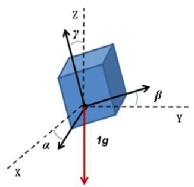

Fig. 1. The principle of tilt measurement using a three-axis accelerometer.

图1. 使用三轴加速度计进行倾斜测量的原理。

where ${x}_{0}$ is the current fitting point; ${d}_{LOESS}$ is the neighborhood bandwidth centered at ${x}_{0}$ .

其中${x}_{0}$是当前拟合点；${d}_{LOESS}$是以${x}_{0}$为中心的邻域带宽。

The smoothing effect of LOESS is primarily controlled by the neighborhood bandwidth parameter. An excessively small bandwidth may lead to overfitting, while an overly large bandwidth risks obscuring valid signal characteristics. To determine the optimal value of the smoothing bandwidth parameter, denoted as ${d}^{\text{ opt }}$ .

局部加权散点平滑法(LOESS)的平滑效果主要由邻域带宽参数控制。带宽过小可能导致过拟合，而带宽过大则可能会掩盖有效信号特征。为确定平滑带宽参数的最优值，记为${d}^{\text{ opt }}$。

This study employs Differential Evolution (DE) algorithm for global optimization. The fundamental principle involves differential mutation operations among population individuals, combined with crossover and selection mechanisms, to iteratively evolve toward the global optimum through generations. This approach ensures that the smoothed signal effectively eliminates noise segments while maximally preserving characteristic fluctuations. The DE algorithm principally consists of the following steps:

本研究采用差分进化(DE)算法进行全局优化。其基本原理是在种群个体之间进行差分变异操作，并结合交叉和选择机制，通过多代迭代朝着全局最优解进化。这种方法确保平滑后的信号能有效消除噪声段，同时最大程度地保留特征波动。差分进化算法主要包括以下步骤:

Within predefined parameter bounds, randomly generate ${N}_{p}$ candidate individuals to form the initial population:

在预定义的参数范围内，随机生成${N}_{p}$个候选个体以形成初始种群:

$$
{P}_{i}^{0} = \left\lbrack  {d}_{i}\right\rbrack  , i = 1,2,\ldots ,{N}_{p} \tag{6}
$$

where ${P}_{i}^{0}$ represents the $i$ -th individual in the initial generation (candidate window width solution); ${d}_{i}$ denotes the corresponding LOESS smoothing bandwidth parameter for that individual.

其中${P}_{i}^{0}$表示初始代中的第$i$个个体(候选窗口宽度解)；${d}_{i}$表示该个体对应的局部加权散点平滑法(LOESS)平滑带宽参数。

For each individual in the $g$ -th generation, randomly select three distinct individuals ${P}_{r1}^{g},{P}_{r2}^{g},{P}_{r3}^{g}$ to generate mutation vector through differential variation:

对于第$g$代中的每个个体，随机选择三个不同的个体${P}_{r1}^{g},{P}_{r2}^{g},{P}_{r3}^{g}$，通过差分变异生成变异向量:

$$
{V}_{i}^{g} = {P}_{r1}^{g} + F \times  \left( {{P}_{r2}^{g} - {P}_{r3}^{g}}\right) \tag{7}
$$

where ${V}_{i}^{g}$ is the mutation vector for the $i$ -th individual in generation $g;F$ is the differential mutation factor controlling step size; ${P}_{r1}^{g},{P}_{r2}^{g},{P}_{r3}^{g}$ are three distinct individuals randomly selected from current population.

其中${V}_{i}^{g}$是第$g;F$代中第$i$个个体的变异向量；${P}_{r1}^{g},{P}_{r2}^{g},{P}_{r3}^{g}$是控制步长的差分变异因子；${P}_{r1}^{g},{P}_{r2}^{g},{P}_{r3}^{g}$是从当前种群中随机选择的三个不同个体。

Performing binomial crossover to combine the mutation vector ${V}_{i}^{g}$ with the current target individual ${P}_{i}^{0}$ , generating a trial individual ${U}_{i}^{g}$ .

进行二项式交叉，将变异向量${V}_{i}^{g}$与当前目标个体${P}_{i}^{0}$组合，生成试验个体${U}_{i}^{g}$。

$$
{U}_{i, j}^{0} = \left\{  \begin{matrix} {V}_{i, j}^{g}, & \text{ if }\operatorname{rand}\left( {0,1}\right)  \leq  {\mathrm{C}}_{r}\text{ or }j = {j}_{\text{ rand }} \\  {P}_{i, j}^{g}, & \text{ otherwise } \end{matrix}\right. \tag{8}
$$

where ${U}_{i, j}^{0}$ represents the $j$ -th dimension value of the trial individual ; rand $\left( {0,1}\right)$ denotes a uniform random number between 0 and $1;{C}_{r}$ is the crossover probability; ${j}_{\text{ rand }}$ ensures the trial individual inherits at least one dimension from the mutation vector.

其中${U}_{i, j}^{0}$表示试验个体的第$j$维值；rand$\left( {0,1}\right)$表示0到$1;{C}_{r}$之间的均匀随机数；${j}_{\text{ rand }}$是交叉概率；${j}_{\text{ rand }}$确保试验个体至少从变异向量继承一维。

The selection operation compares the fitness function values between the trial individual ${U}_{i}^{g}$ and the current target individual ${P}_{i}^{0}$ , with the better-performing individual advancing to the next generation:

选择操作比较试验个体${U}_{i}^{g}$和当前目标个体${P}_{i}^{0}$的适应度函数值，性能更好的个体进入下一代:

$$
{P}_{i}^{g + 1} = \left\{  \begin{matrix} {U}_{i}^{g}, & \text{ if }\operatorname{Fitness}\left( {U}_{i}^{g}\right)  \leq  \operatorname{Fitness}\left( {P}_{i}^{g}\right) \\  {P}_{i}^{g}, & \text{ otherwise } \end{matrix}\right. \tag{9}
$$

with

其中

$$
\operatorname{Fitness}\left( d\right)  = \frac{1}{N}\mathop{\sum }\limits_{{k = 1}}^{N}{\left( {x}_{k} - {\widehat{x}}_{k}\left( d\right) \right) }^{2}
$$

where Fitness $\left( d\right)$ represents the fitness function for individual $d;N$ is the number of sampling points; ${x}_{k}$ is the $k$ -th original signal value; ${\widehat{x}}_{k}\left( d\right)$ is the $k$ -th signal value after LOESS smoothing using trial bandwidth $d$ .

其中Fitness$\left( d\right)$表示个体$d;N$的适应度函数；${x}_{k}$是采样点数；$k$是第$k$个原始信号值；${\widehat{x}}_{k}\left( d\right)$是使用试验带宽$d$进行局部加权散点平滑法(LOESS)平滑后的第$k$个信号值。

After $G$ generations of iteration, the individual with the optimal fitness value is selected as the final optimal smoothing bandwidth ${d}^{\text{ opt }}$ :

经过$G$代迭代后，选择具有最优适应度值的个体作为最终的最优平滑带宽${d}^{\text{ opt }}$:

$$
{d}^{\text{ opt }} = \underset{d}{\arg \min }\text{ Fitness }\left( d\right) \tag{10}
$$

### 2.3. Feature vector construction scheme

### 2.3. 特征向量构建方案

In MEMS accelerometer signal temperature compensation problems, the raw signals exhibit significant drift phenomena under varying environmental temperatures. To enhance model prediction accuracy, this study comprehensively considers the coupling relationship between the signals themselves and temperature factors during feature construction, designing the following feature components:

在MEMS加速度计信号温度补偿问题中，原始信号在不同环境温度下会出现明显的漂移现象。为提高模型预测精度，本研究在特征构建过程中综合考虑了信号本身与温度因素之间的耦合关系，设计了以下特征组件:

To mitigate the interference of high-frequency noise from raw signals during the training of the temperature compensation model and to provide more temperature-characteristic baseline trend information, this study selects the smoothed signal as one of the input features. Let ${\widehat{y}}_{i}\left( {d}^{\text{ opt }}\right)$ denote the signal value of the $i$ -th sample point after DE-LOESS smoothing.

为了减轻温度补偿模型训练过程中原始信号高频噪声的干扰，并提供更多温度特征基线趋势信息，本研究选择平滑后的信号作为输入特征之一。令${\widehat{y}}_{i}\left( {d}^{\text{ opt }}\right)$表示经过DE-LOESS平滑后的第$i$个采样点的信号值。

Environmental temperature variation serves as the primary source of temperature drift in MEMS signals. To effectively capture the real-time environmental influence on signal outputs, ambient temperature is incorporated as an essential feature vector component, along with its change for enhanced temporal characterization. Let ${T}_{i}$ denote the temperature value corresponding to the $i$ -th sampling point.

环境温度变化是MEMS信号中温度漂移的主要来源。为了有效捕捉环境对信号输出的实时影响，将环境温度及其变化作为重要的特征向量分量纳入，以增强时间特征描述。设${T}_{i}$表示与第$i$个采样点对应的温度值。

Considering the hysteresis and dynamic response effects of temperature change rate on MEMS accelerometer output, the temperature change rate is incorporated into the feature vector to capture the dynamic effects of temperature variations on signal drift. The temperature change rate at the $i$ -th sampling point is defined as $\Delta {T}_{i} = {T}_{i} - {T}_{i - 1}$ . This design approach enables the model to focus on learning the error signals induced by temperature drift while preserving the dynamic fluctuation characteristics of the signal, thereby preventing excessive smoothing of the signal's inherent dynamics.

考虑到温度变化率对MEMS加速度计输出的滞后和动态响应效应，将温度变化率纳入特征向量，以捕捉温度变化对信号漂移的动态影响。在第$i$个采样点的温度变化率定义为$\Delta {T}_{i} = {T}_{i} - {T}_{i - 1}$。这种设计方法使模型能够专注于学习由温度漂移引起的误差信号，同时保留信号的动态波动特性，从而防止信号固有动态过度平滑。

Therefore, the input feature vector for each sampling point is defined

因此，定义了每个采样点的输入特征向量

$$
\text{ as }{X}_{i} = \left\lbrack  {{\widehat{y}}_{i}\left( {d}^{\text{ opt }}\right) ,{T}_{i},\Delta {T}_{i}}\right\rbrack  \text{ . }
$$

This paper treats the difference between the raw signal and smoothed signal as the target residual value for the compensation model, considering this difference as the optimal expected value unaffected by temperature. The final model learns the mapping relationship from the feature vector to this residual ${X}_{i} \rightarrow  {r}_{i}$ , thereby achieving temperature compensation prediction:

本文将原始信号与平滑信号之间的差异视为补偿模型的目标残差值，将此差异视为不受温度影响的最优期望值。最终模型学习从特征向量到该残差${X}_{i} \rightarrow  {r}_{i}$的映射关系，从而实现温度补偿预测:

$$
{r}_{i} = {y}_{i} - {\widehat{y}}_{i}\left( {d}^{\text{ opt }}\right) \tag{11}
$$

where ${y}_{i}$ is the raw signal value at the $i$ -th sample point; ${\widehat{y}}_{i}\left( {d}^{\text{ opt }}\right)$ is the smoothed signal value; ${r}_{i}$ is the target residual value.

其中${y}_{i}$是第$i$个采样点处的原始信号值；${\widehat{y}}_{i}\left( {d}^{\text{ opt }}\right)$是平滑后的信号值；${r}_{i}$是目标残差值。

### 2.4. LSTM-transformer model architecture

### 2.4. LSTM-变压器模型架构

Long Short-Term Memory (LSTM) networks are a specialized variant of Recurrent Neural Networks (RNN) designed to address the vanishing gradient and exploding gradient problems commonly encountered in traditional RNNs when modeling long sequential data. LSTMs employ three gating mechanisms including a forget gate, an input gate and an output gate to precisely control information propagation within the network. This gated architecture allows adaptive retention of long term dependencies and selective elimination of irrelevant information when required. This architecture exhibits exceptional capability for temporal feature extraction and modeling. When the feature input sequence $X = \; \left\{  {{X}_{1},{X}_{1},\ldots ,{X}_{N},}\right\}$ is fed into the LSTM layer for temporal dependency extraction, the input at timestept is denoted as ${X}_{t} = \left\lbrack  {{\widehat{y}}_{t}\left( {d}^{opt}\right) ,{T}_{t},\Delta {T}_{i}}\right\rbrack$ , with the LSTM computational formulas as follows:

长短期记忆(LSTM)网络是循环神经网络(RNN)的一种特殊变体，旨在解决传统RNN在对长序列数据建模时常见的梯度消失和梯度爆炸问题。LSTM采用三种门控机制，包括遗忘门、输入门和输出门，以精确控制网络内的信息传播。这种门控架构允许在需要时自适应地保留长期依赖关系，并选择性地消除无关信息。这种架构在时间特征提取和建模方面表现出卓越的能力。当将特征输入序列$X = \; \left\{  {{X}_{1},{X}_{1},\ldots ,{X}_{N},}\right\}$输入到LSTM层进行时间依赖关系提取时，时间步t的输入表示为${X}_{t} = \left\lbrack  {{\widehat{y}}_{t}\left( {d}^{opt}\right) ,{T}_{t},\Delta {T}_{i}}\right\rbrack$，LSTM的计算公式如下:

The forget gate determines which portions of the previous cell state ${c}_{t - 1}$ should be retained and which should be discarded. To enable the LSTM to maintain long-term dependencies while selectively forgetting irrelevant information, the forget gate ${f}_{t}$ is computed as follows:

遗忘门决定了前一个细胞状态${c}_{t - 1}$的哪些部分应该被保留，哪些部分应该被丢弃。为了使LSTM能够在选择性地忘记无关信息的同时保持长期依赖关系，遗忘门${f}_{t}$的计算方式如下:

$$
{f}_{t} = \sigma \left( {{W}_{f}{X}_{t} + {U}_{f}{h}_{t - 1} + {b}_{f}}\right) \tag{12}
$$

with

和

$$
\sigma \left( x\right)  = \frac{1}{1 + {e}^{-x}}
$$

where ${W}_{ * }$ is the weight matrix mapping LSTM output dimension to Transformer embedding space; ${U}_{ * }$ is the weight matrix for the previous hidden state; ${b}_{ * }$ is the bias term; ${h}_{t - 1}$ is the hidden state at previous timestep.

其中${W}_{ * }$是将LSTM输出维度映射到Transformer嵌入空间的权重矩阵；${U}_{ * }$是前一个隐藏状态的权重矩阵；${b}_{ * }$是偏置项；${h}_{t - 1}$是上一个时间步的隐藏状态。

The input gate ${i}_{t}$ controls the update intensity of the current input to the memory cell and determines which portions of the candidate memory value ${\widetilde{c}}_{t}$ should be written to the cell state ${c}_{t}$ . The computations are performed as follows:

输入门${i}_{t}$控制对存储单元当前输入的更新强度，并确定候选存储值${\widetilde{c}}_{t}$的哪些部分应写入单元状态${c}_{t}$。计算过程如下:

$$
{i}_{t} = \sigma \left( {{W}_{i}{X}_{t} + {U}_{i}{h}_{t - 1} + {b}_{i}}\right) \tag{13}
$$

Based on the current input and historical states, new information to be written into the cell state is generated by calculating the candidate memory value ${c}_{t}$ :

根据当前输入和历史状态，通过计算候选记忆值${c}_{t}$生成要写入单元格状态的新信息:

$$
{\widetilde{c}}_{t} = \tanh \left( {{W}_{c}{X}_{t} + {U}_{c}{h}_{t - 1} + {b}_{c}}\right) \tag{14}
$$

with

与

$$
\tanh \left( x\right)  = \frac{{e}^{x} - {e}^{-x}}{{e}^{x} + {e}^{-x}}
$$

The cell state ${c}_{t}$ is LSTM’s long-term memory unit, which retains partial old memories through the forget gate ${f}_{t}$ , and controls the candidate memory value ${\widetilde{c}}_{t}$ via the input gate ${i}_{t}$ to selectively write new memories into the cell state ${c}_{t}$ :

单元状态${c}_{t}$是LSTM的长期记忆单元，它通过遗忘门${f}_{t}$保留部分旧记忆，并通过输入门${i}_{t}$控制候选记忆值${\widetilde{c}}_{t}$，以选择性地将新记忆写入单元状态${c}_{t}$:

$$
{c}_{t} = {f}_{t} \odot  {c}_{t - 1} + {i}_{t} \odot  {\widetilde{c}}_{t} \tag{15}
$$

where $\odot$ denotes the Hadamard product.

其中$\odot$表示哈达玛积。

The output gate ${o}_{t}$ determines which portions of the cell state ${c}_{t}$ should be output as the current hidden state ${h}_{t}$ :

输出门${o}_{t}$确定单元状态${c}_{t}$的哪些部分应作为当前隐藏状态${h}_{t}$输出:

$$
{o}_{t} = \sigma \left( {{W}_{o}{X}_{t} + {U}_{o}{h}_{t - 1} + {b}_{o}}\right) \tag{16}
$$

The updated cell state ${c}_{t}$ , after nonlinear transformation, retains essential information to generate the hidden state ${h}_{t}$ as output. This serves as:

更新后的单元状态${c}_{t}$经过非线性变换后，保留基本信息以生成隐藏状态${h}_{t}$作为输出。这用作:

$$
{h}_{t} = {o}_{t} \odot  \tanh \left( {c}_{t}\right) \tag{17}
$$

The Transformer is a deep learning architecture based on the self-attention mechanism, whose core capability lies in capturing global dependencies within input sequences through multi-head attention, eliminating the need for traditional recurrent or convolutional structures. Following LSTM-based feature extraction, the hidden state sequence $h = \left\{  {{h}_{1},{h}_{2},\ldots ,{h}_{N}}\right\}$ obtained from LSTM processing undergoes linear projection to match Transformer’s input dimensions, yielding $z = \; \left\{  {{z}_{1},{z}_{2},\ldots ,{z}_{N}}\right\}$ , which serves as input to the Transformer for global temporal dependency feature extraction. The Transformer input at timestep $t$ is denoted as ${z}_{t}$ :

Transformer是一种基于自注意力机制的深度学习架构，其核心能力在于通过多头注意力捕获输入序列中的全局依赖关系，无需传统的循环或卷积结构。在基于LSTM的特征提取之后，从LSTM处理中获得的隐藏状态序列$h = \left\{  {{h}_{1},{h}_{2},\ldots ,{h}_{N}}\right\}$经过线性投影以匹配Transformer的输入维度，得到$z = \; \left\{  {{z}_{1},{z}_{2},\ldots ,{z}_{N}}\right\}$，它用作Transformer的输入以进行全局时间依赖特征提取。时间步$t$处的Transformer输入表示为${z}_{t}$:

$$
{z}_{t} = {W}_{p}{h}_{t} + {b}_{p} \tag{18}
$$

Feed $z$ into single-head attention mechanism with $h$ distinct projections to compute single-head self-attention Head:

将$z$输入具有$h$个不同投影的单头注意力机制以计算单头自注意力Head:

$$
\operatorname{Attention}\left( {Q, K, V}\right)  = \operatorname{softmax}\left( \frac{Q{K}^{T}}{\sqrt{{d}_{k}}}\right) V \tag{19}
$$

with

与

$$
\operatorname{softmax}\left( {x}_{i}\right)  = \frac{{e}^{{x}_{i}}}{\mathop{\sum }\limits_{{j = 1}}^{n}{e}^{{x}_{i}}}
$$

Concatenate all Heads and project back to the original dimension to obtain Multi-Head Attention:

连接所有Head并投影回原始维度以获得多头注意力:

$$
\operatorname{MultiHead}\left( {Q, K, V}\right)  = \operatorname{Concat}\left( {{\operatorname{head}}_{1},{\operatorname{head}}_{2},\ldots ,{\operatorname{head}}_{h}}\right) \tag{20}
$$

where $Q, K, V$ are the query, key, and value matrices respectively, which are projected from $z;{d}_{k}$ is the dimension of key vectors ; $h$ represents the number of attention heads.

其中$Q, K, V$分别是查询、键和值矩阵，它们从$z;{d}_{k}$投影而来，$z;{d}_{k}$是键向量的维度；$h$表示注意力头的数量。

The output from the multi-head attention layer undergoes residual connection and LayerNorm standardization to obtain intermediate features $v = \left\{  {{v}_{1},{v}_{2},\ldots ,{v}_{N}}\right\}$ , which are then fed into the feed-forward network FFN $\left( {v}_{t}\right)$ for further feature extraction:

多头注意力层的输出经过残差连接和LayerNorm标准化以获得中间特征$v = \left\{  {{v}_{1},{v}_{2},\ldots ,{v}_{N}}\right\}$，然后将其输入前馈网络FFN$\left( {v}_{t}\right)$进行进一步的特征提取:

$$
\operatorname{FFN}\left( {v}_{t}\right)  = \operatorname{ReLU}\left( {{v}_{t}{W}_{1} + {b}_{1}}\right) {W}_{2} + {b}_{2} \tag{21}
$$

with

与

$$
\operatorname{RELU}\left( x\right)  = \left\{  \begin{matrix} x, & x > 0 \\  0, & x \leq  0 \end{matrix}\right\}
$$

The stacked encoder layers complete the final sequence feature extraction to obtain the output mapping ${z}^{\prime } = \left\{  {{z}_{1}^{\prime },{z}_{2}^{\prime },\ldots ,{z}_{N}^{\prime }}\right\}$ . The Transformer-processed feature vector sequence ${z}^{\prime }$ is then fed into a fully-connected layer for residual value prediction ${\widehat{r}}_{t}$ :

堆叠的编码器层完成最终的序列特征提取以获得输出映射${z}^{\prime } = \left\{  {{z}_{1}^{\prime },{z}_{2}^{\prime },\ldots ,{z}_{N}^{\prime }}\right\}$。然后将经过Transformer处理的特征向量序列${z}^{\prime }$输入全连接层进行残差值预测${\widehat{r}}_{t}$:

$$
{\widehat{r}}_{t} = {W}_{o}{z}_{t}^{\prime } + {b}_{o} \tag{22}
$$

The final compensated signal ${\widetilde{y}}_{t}$ estimate is given by:

最终补偿信号${\widetilde{y}}_{t}$估计由下式给出:

$$
{\widetilde{y}}_{t} = {\widehat{y}}_{t}\left( {d}^{\text{ opt }}\right)  + {\widehat{r}}_{t} \tag{23}
$$

The overall workflow, as shown in Fig. 2, includes data acquisition, DE-LOESS smoothing, feature construction, and LSTM-Transformer-based temperature compensation.

如图2所示，整体工作流程包括数据采集、DE-LOESS平滑、特征构建以及基于LSTM-Transformer的温度补偿。

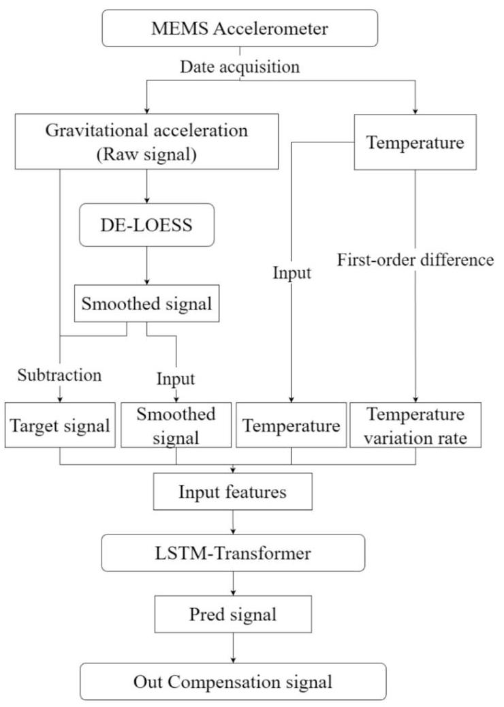

Fig. 2. Workflow diagram.

图2.工作流程图。

## 3. Case study

## 3. 案例研究

### 3.1. MEMS accelerometers sensors networks

### 3.1. 微机电系统(MEMS)加速度计传感器网络

In this study, the MEMS accelerometers used are ADXL355 devices, which feature a digital output and a capacitive sensing principle. The ADXL355 is a low-noise, three-axis accelerometer with selectable measurement ranges of $\pm  2\mathrm{\;g}, \pm  4\mathrm{\;g}$ , and $\pm  8\mathrm{\;g}$ , and an operating temperature range of $- {40}^{ \circ  }\mathrm{C}$ to $+ {125}^{ \circ  }\mathrm{C}$ [43]. Its capacitive sensing structure provides excellent long-term stability. The sensor also integrates a temperature sensor and supports digital SPI and ${\mathrm{I}}^{2}\mathrm{C}$ interfaces, making it suitable for precision monitoring and structural health applications.

在本研究中，所使用的微机电系统(MEMS)加速度计是ADXL355器件，其具有数字输出和电容式传感原理。ADXL355是一种低噪声、三轴加速度计，可选测量范围为$\pm  2\mathrm{\;g}, \pm  4\mathrm{\;g}$、$\pm  8\mathrm{\;g}$，工作温度范围为$- {40}^{ \circ  }\mathrm{C}$至$+ {125}^{ \circ  }\mathrm{C}$ [43]。其电容式传感结构提供了出色的长期稳定性。该传感器还集成了一个温度传感器，并支持数字SPI和${\mathrm{I}}^{2}\mathrm{C}$接口，使其适用于精密监测和结构健康应用。

The coal conveyor trestle serves as vital infrastructure in power plants, coal mines, and similar industrial facilities, comprising belt conveyors and elevated support structures that enable efficient coal transfer. These reinforced concrete support towers optimize space utilization while forming essential components of coal handling systems.

输煤栈桥是发电厂、煤矿及类似工业设施中的重要基础设施，由带式输送机和高架支撑结构组成，可实现高效的煤炭输送。这些钢筋混凝土支撑塔优化了空间利用，同时构成了煤炭处理系统的重要组成部分。

For structural monitoring, a symmetrical wireless sensor network incorporating 70 MEMS accelerometers was deployed along the conveyor's longitudinal axis, with two sensors mounted on each of the 35 support towers in Fig. 3. Each self-powered node collects three-axis angle, temperature, and timestamp data at 150-second intervals, yielding roughly 570 daily measurements per sensor.

为了进行结构监测，沿着输送机的纵轴部署了一个包含70个微机电系统(MEMS)加速度计的对称无线传感器网络，在图3中的35个支撑塔上各安装了两个传感器。每个自供电节点每隔1５０秒采集一次三轴角度、温度和时间戳数据，每个传感器每天大约产生570次测量数据。

This configuration exemplifies a characteristic deployment exhibiting significant thermal variations. Due to the 70 sensors being installed in different environments, the temperature fluctuations vary among sensors.

这种配置体现了一种具有显著热变化的典型部署。由于70个传感器安装在不同环境中，传感器之间的温度波动各不相同。

In this study, experimental data were initially collected from a total of 70 MEMS accelerometers. For analysis, three sensors from different locations were randomly selected and labeled as (a), (b), and (c). During the main experiments aimed at comparing model performance, only data from sensor (a) were used. However, in Section 4.5, in order to demonstrate the direct effectiveness of the temperature compensation and the general applicability of the proposed model, experiments were conducted on all three sensors, (a), (b), and (c).

在本研究中，最初从总共70个微机电系统(MEMS)加速度计收集了实验数据。为了进行分析，随机选择了来自不同位置的三个传感器，并标记为(a)、(b)和(c)。在旨在比较模型性能的主要实验中，仅使用了传感器(a)的数据。然而，在第4.5节中，为了证明温度补偿的直接有效性和所提出模型的普遍适用性，对所有三个传感器(a)、(b)和(c)都进行了实验。

### 3.2. Signal characteristic analysis

### 3.2. 信号特征分析

The MEMS accelerometer acquires time-series data that are substantially affected by environmental factors, specifically temperature fluctuations and belt-induced vibrations. Wavelet decomposition of over 16,000 selected time series yields the time-frequency characteristics shown in Fig. 4.

微机电系统(MEMS)加速度计获取的时间序列数据受到环境因素的显著影响，特别是温度波动和皮带引起的振动。对超过16000个选定时间序列进行小波分解，得到了图4所示的时频特征。

Wavelet decomposition reveals that the primary noise in MEMS output signals concentrates in the low-frequency range and exhibits periodic variations over time, as illustrated in Fig. 4. This study attributes these periodic low-frequency noise patterns to corresponding fluctuations in solar radiation intensity, which induce temperature variations in the MEMS operating environment.

小波分解表明，微机电系统(MEMS)输出信号中的主要噪声集中在低频范围内，并且随时间呈现周期性变化，如图4所示。本研究将这些周期性低频噪声模式归因于太阳辐射强度的相应波动，这会在微机电系统(MEMS)的工作环境中引起温度变化。

Fig. 5 displays the original output signal trends of a MEMS accelerometer. Analysis of the three-axis signal trends reveals that, in addition to temperature-induced noise, the output contains significant high-frequency noise, which is particularly prominent in the Y-axis. Field analysis indicates this high-frequency noise originates from operational vibrations of the monitored structure (coal conveyor trestle).

图5显示了一个微机电系统(MEMS)加速度计的原始输出信号趋势。对三轴信号趋势的分析表明，除了温度引起的噪声外，输出还包含显著的高频噪声，在Y轴上尤为突出。现场分析表明，这种高频噪声源于被监测结构(输煤栈桥)的运行振动。

The output signals of the X and Z axes exhibit a strong correlation with temperature, whereas the Y axis shows only a weak dependence. This difference arises from the distinct effects of bias drift and sensitivity drift in MEMS accelerometers.

X轴和Z轴的输出信号与温度呈现出很强的相关性，而Y轴仅表现出较弱的相关性。这种差异源于微机电系统(MEMS)加速度计中偏置漂移和灵敏度漂移的不同影响。

The temperature-dependent measurement process can be expressed as:

与温度相关的测量过程可以表示为:

$$
{a}_{\text{ measured }} = \left( {1 + {k}_{s}\left( T\right) }\right) {a}_{\text{ true }} + b\left( T\right) \tag{24}
$$

where ${a}_{\text{ measured }}$ represents the measured gravitational acceleration, while ${a}_{\text{ true }}$ denotes the true gravitational acceleration; ${k}_{s}\left( T\right)$ denotes the temperature-induced sensitivity error and $b\left( T\right)$ represents the temperature-dependent bias error.

其中${a}_{\text{ measured }}$表示测量到的重力加速度，而${a}_{\text{ true }}$表示真实的重力加速度；${k}_{s}\left( T\right)$表示温度引起的灵敏度误差，$b\left( T\right)$表示与温度相关的偏置误差。

Bias drift is a temperature-dependent offset independent of the measured acceleration, while sensitivity drift changes the scale factor between the true acceleration and the measured output, thereby amplifying or attenuating the signal proportionally to its magnitude.

偏置漂移是与温度相关的偏移，与测量的加速度无关，而灵敏度漂移会改变真实加速度与测量输出之间的比例因子，从而按信号幅度成比例地放大或衰减信号。

In this study, the monitored belt conveyor induces slight structural deformations in the supporting towers, primarily along the X and Z directions, which are approximately parallel to the conveyor axis. Consequently, the X and Z axis signals are influenced by both bias and sensitivity drifts, leading to pronounced temperature-related variations. In contrast, the Y axis is nearly perpendicular to the conveyor direction and experiences negligible deformation. Its output thus mainly reflects bias drift with minimal contribution from sensitivity drift, resulting in weak temperature correlation, as shown in Fig. 5.

在本研究中，被监测的带式输送机在支撑塔中引起了轻微的结构变形，主要沿X轴和Z轴方向，这两个方向大致与输送机轴线平行。因此，X轴和Z轴信号受到偏置和灵敏度漂移的共同影响，导致明显的与温度相关的变化。相比之下，Y轴几乎垂直于输送机方向，变形可忽略不计。因此，其输出主要反映偏置漂移，灵敏度漂移的贡献最小，导致与温度的相关性较弱，如图5所示。

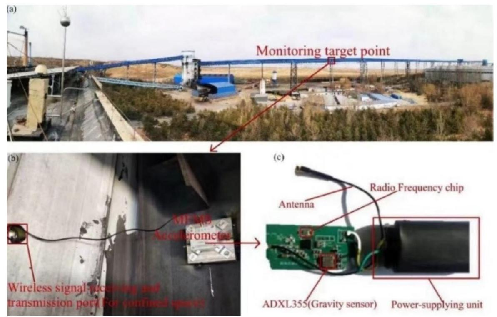

Fig. 3. Field application. (a) an overview of the coal conveyor trestle, (b) installed MEMS monitoring points, and (c) schematics of the integrated sensor modules.

图3. 现场应用。(a) 输煤栈桥概述，(b) 已安装的MEMS监测点，以及 (c) 集成传感器模块示意图。

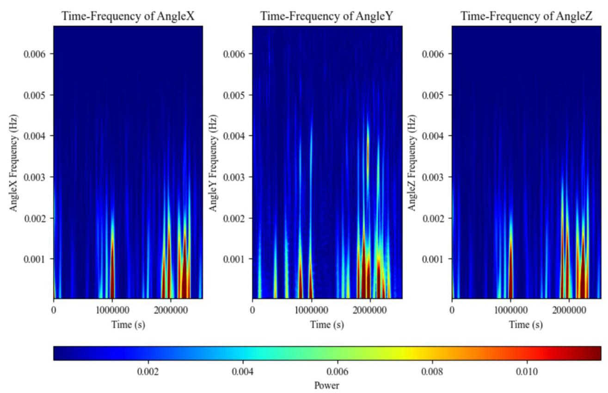

Fig. 4. Time-frequency wavelet transform plot of MEMS sensor data.

图4. MEMS传感器数据的时频小波变换图。

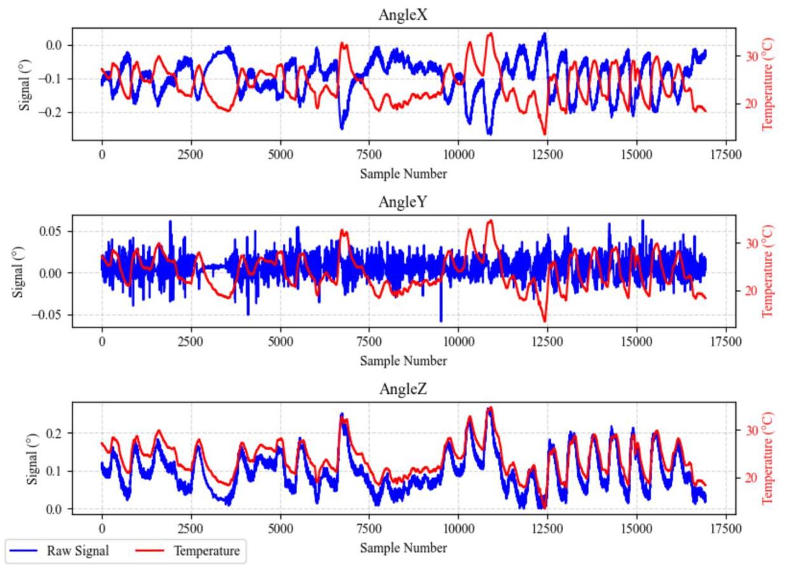

Fig. 5. Three-axis plot of MEMS monitoring Raw Signal.

图5. MEMS监测原始信号的三轴图。

## 4. Results and discussion

## 4. 结果与讨论

### 4.1. Ablation study of DE-LOESS

### 4.1. DE-LOESS的消融研究

To enhance the performance of the temperature compensation model, this study employs the DE-optimized LOESS method to smooth raw signals and eliminate vibration noise. The smoothed signals serve dual purposes: first, they provide temperature-characteristic training data when incorporated into feature vectors; second, their difference from raw signals yields target residuals that preserve dynamic characteristics, rather than using fixed reference values. This approach maintains the deformation-representing capability of compensated signals. Fig. 6 compares the trends of raw signals, smoothed signals, and target residuals.

为提高温度补偿模型的性能，本研究采用差分进化优化的局部加权散点平滑法(DE-optimized LOESS method)对原始信号进行平滑处理并消除振动噪声。平滑后的信号具有双重作用:其一，当纳入特征向量时，它们提供温度特征训练数据；其二，它们与原始信号的差值产生保留动态特性的目标残差，而非使用固定参考值。这种方法保持了补偿信号的变形表示能力。图6比较了原始信号、平滑信号和目标残差的趋势。

The smoothed signals preserve temperature characteristics while eliminating vibration interference from the monitored structure, maintaining similar trends to the raw signals - making them superior features for model training.

平滑后的信号保留了温度特征，同时消除了来自被监测结构的振动干扰，与原始信号保持相似的趋势——使其成为模型训练的优越特征。

Meanwhile, the target signals show negligible correlation with temperature, with minor fluctuations attributed to normal operational vibrations of the structure. These target signals demonstrate minimal variation, consistently remaining near zero, which aligns perfectly with structural monitoring theory (the observed structure should not experience deformation during the monitoring period).

同时，目标信号与温度的相关性可忽略不计，微小波动归因于结构的正常运行振动。这些目标信号变化极小，始终接近零，这与结构监测理论完全相符(在监测期间观察到的结构不应发生变形)。

Power spectral density (PSD) analysis evaluates signal frequency-domain characteristics, particularly suitable for inertial sensors. By quantifying power distribution across frequency bands, it identifies noise components and their intensity. This study employs PSD analysis to compare spectral properties before and after temperature compensation, precisely assessing noise attenuation effects across frequency ranges, thereby evaluating the DE-LOESS smoothed signal's role in the LSTM-Transformer compensation model.

功率谱密度(PSD)分析评估信号的频域特性，特别适用于惯性传感器。通过量化各频段的功率分布，它可以识别噪声成分及其强度。本研究采用PSD分析来比较温度补偿前后的频谱特性，精确评估不同频率范围内的噪声衰减效果，从而评估DE-LOESS平滑信号在LSTM-Transformer补偿模型中的作用。

The analysis compares the PSD distributions of compensated signals generated by the LSTM-Transformer model using different training features, as shown in Fig. 7. When employing Raw Signal as input features, the compensation results demonstrate distinct spectral characteristics compared to those obtained using Smoothed Signal features. This comparison evaluates the model's performance under varying input conditions.

分析比较了使用不同训练特征的LSTM-Transformer模型生成的补偿信号的功率谱密度(PSD)分布，如图7所示。当采用原始信号作为输入特征时，与使用平滑信号特征获得的结果相比，补偿结果表现出明显不同的频谱特征。此比较评估了模型在不同输入条件下的性能。

Low-frequency noise mainly results from temperature effects. After compensation by both the Smoothed LSTM-Transformer(SLT) and Raw LSTM-Transformer(RLT), the power spectral density in low-frequency bands shows significant reduction, effectively removing temperature-induced noise. Comparative analysis indicates SLT achieves superior compensation performance, providing an additional 55.3% power spectral density reduction in low-frequency ranges compared to RLT.

低频噪声主要由温度效应引起。经过平滑长短期记忆网络-变换器(SLT)和原始长短期记忆网络-变换器(RLT)的补偿后，低频段的功率谱密度显著降低，有效去除了温度引起的噪声。对比分析表明，SLT具有卓越的补偿性能，与RLT相比，在低频范围内功率谱密度额外降低了55.3%。

For high-frequency noise, RLT yields only approximately 6.9% power spectral density reduction after compensation. This occurs because vibration noise within feature vectors interferes with model fitting, leading to negligible compensation effects. In comparison, SLT demonstrates outstanding advantages in high-frequency noise suppression through incorporation of smoothed signals, achieving 98.8% additional power spectral density reduction relative to RLT in high-frequency bands. These results indicate that the use of smoothed features enhances the model's robustness against noise and improves the overall compensation stability.4.2 Comparative experiment of LSTM-Transformer.

对于高频噪声，RLT在补偿后仅产生约6.9%的功率谱密度降低。出现这种情况是因为特征向量中的振动噪声干扰了模型拟合，导致补偿效果可忽略不计。相比之下，SLT通过合并平滑信号在高频噪声抑制方面表现出显著优势，在高频频段相对于RLT实现了额外98.8%的功率谱密度降低。这些结果表明，使用平滑特征可增强模型对噪声的鲁棒性并提高整体补偿稳定性。4.2 LSTM-Transformer的对比实验。

### 4.2. Comparative experiment of LSTM-Transformer

### 4.2. LSTM-Transformer的对比实验

Allan deviation (ADEV) serves as a widely adopted method for time-domain noise and stability analysis in inertial sensors. Unlike frequency-domain analysis techniques such as power spectral density (PSD), ADEV identifies noise components including bias instability, random walk, and rate random walk through statistical characterization across varying averaging times, while also evaluating long-term signal stability. This study employs ADEV analysis to compare stability improvements between raw and compensated MEMS accelerometer signals.

阿伦偏差(ADEV)是惯性传感器时域噪声和稳定性分析中广泛采用的方法。与功率谱密度(PSD)等频域分析技术不同，ADEV通过在不同平均时间内的统计表征来识别包括偏置不稳定性、随机游走和速率随机游走在内的噪声成分，同时还评估长期信号稳定性。本研究采用ADEV分析来比较原始和补偿后的MEMS加速度计信号之间的稳定性改进。

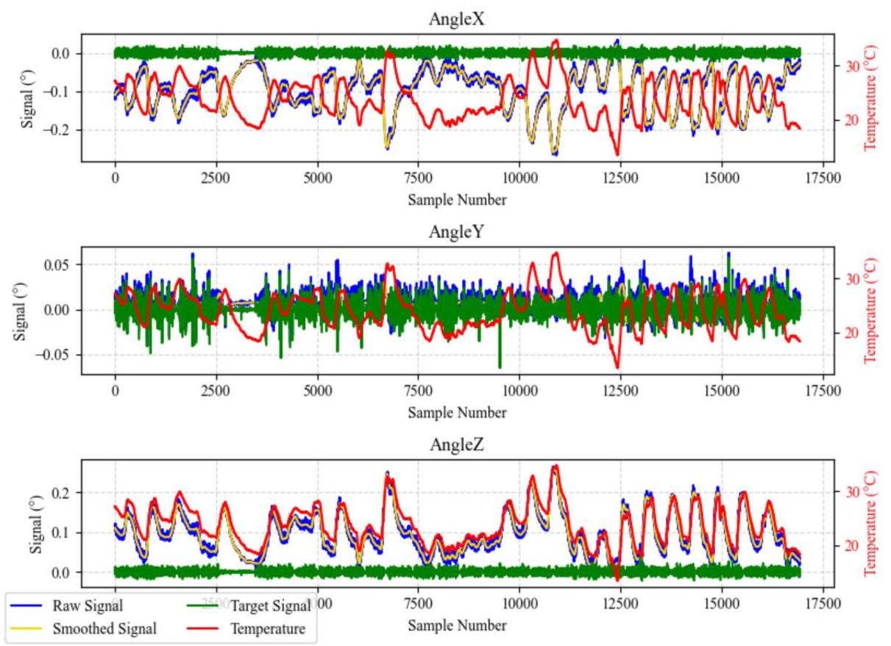

Fig. 6. Comparison of raw, smoothed, and target signals for MEMS accelerometer outputs along X, Y, and Z axes.

图6. 微机电系统(MEMS)加速度计沿X、Y和Z轴输出的原始信号、平滑信号和目标信号的比较。

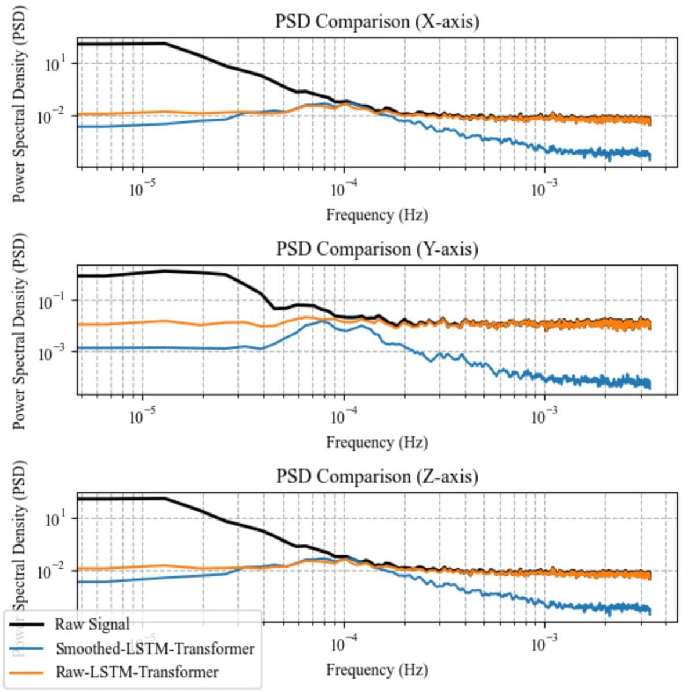

Fig. 7. Comparison of PSD for Raw, Raw-LSTM-Transformer compensated, and Smoothed-LSTM-Transformer compensated MEMS accelerometer signals on X, Y, and Z axes.

图7. 原始、原始-LSTM-Transformer补偿以及平滑-LSTM-Transformer补偿的MEMS加速度计在X、Y和Z轴上的信号的功率谱密度比较。

To validate LSTM-Transformer model performance, comparative ADEV analysis was conducted on signals compensated by LSTM, GRU, RNN, XGBoost, and LR methods, with XGBoost serving as the baseline. All other models also used the DE-LOESS method to construct the same input features. Fig. 8 presents the ADEV curves for different temperature compensation models.

为了验证长短期记忆网络-Transformer模型的性能，对由长短期记忆网络(LSTM)、门控循环单元(GRU)、递归神经网络(RNN)、极端梯度提升(XGBoost)和逻辑回归(LR)方法补偿的信号进行了比较平均偏差(ADEV)分析，以XGBoost作为基线。所有其他模型也使用去局部加权回归(DE-LOESS)方法来构建相同的输入特征。图8展示了不同温度补偿模型的ADEV曲线。

Analysis of the low-frequency components in Fig. 8 reveals that traditional regression algorithms (LR, XGBoost) demonstrate relatively inferior performance in temperature compensation. Time-series neural network algorithms (LSTM, GRU, RNN) exhibit better compensation effects, among which the LSTM algorithm outperforms other similar algorithms. The model with optimal compensation performance is SLT, which shows significant advantages across all three axes (X, Y, Z), with ADEV values consistently maintaining the lowest levels.

对图8中的低频分量进行分析后发现，传统回归算法(LR、XGBoost)在温度补偿方面表现相对较差。时间序列神经网络算法(LSTM、GRU、RNN)表现出更好的补偿效果，其中LSTM算法优于其他类似算法。具有最佳补偿性能的模型是SLT，它在所有三个轴(X、Y、Z)上都显示出显著优势，ADEV值始终保持在最低水平。

To evaluate temperature compensation, standard deviation reduction is used to quantify the decrease in signal variability compared with the raw signal. Higher percentages indicate better stability and more effective compensation. The results are shown in Table. 1.

为评估温度补偿效果，采用标准差降低来量化与原始信号相比信号变异性的降低。百分比越高表明稳定性越好且补偿越有效。结果见表1。

SLT model consistently achieves the highest standard deviation reduction on all axes, with particularly strong performance on the X and Z axes, indicating the most effective suppression of output variability and superior temperature compensation. On the Y-axis, although the reduction is slightly lower, SLT still outperforms all other models by a large margin, demonstrating its overall robustness and stability across different axes.

SLT模型在所有轴上始终实现最高的标准差降低，在X轴和Z轴上表现尤为突出，表明对输出变异性的抑制最为有效且温度补偿效果卓越。在Y轴上，尽管降低幅度略低，但SLT仍大幅优于所有其他模型，证明其在不同轴上的整体稳健性和稳定性。

Notably, RNN, XGBoost, and LR show strong performance in standard deviation reduction, but lag behind other models in Allan deviation, as Allan deviation captures long-term drift, indicating that these three methods are less effective at learning long-sequence dependencies.

值得注意的是，RNN、XGBoost和LR在标准差降低方面表现出色，但在阿伦偏差方面落后于其他模型，因为阿伦偏差捕获长期漂移，表明这三种方法在学习长序列依赖性方面效果较差。

### 4.3. MEMS temperature compensation

### 4.3. MEMS温度补偿

To further validate the general applicability of the proposed SLT model for different types of MEMS sensors, three randomly selected sensors (labeled a, b, and c) were subjected to temperature compensation. The compensation effectiveness was analyzed and evaluated based on changes in signal standard deviation.

为进一步验证所提出的SLT模型对不同类型MEMS传感器的普遍适用性，对三个随机选择的传感器(标记为a、b和c)进行温度补偿。基于信号标准差的变化分析和评估补偿效果。

The drift amplitude (max-min) before and after temperature compensation is presented in Table. 2, demonstrating a significant suppression of output drift by the SLT model across all datasets. Temperature compensation substantially reduces drift, lowering raw drifts from the ${0.1}^{ \circ  }$ level to around ${0.01}^{ \circ  }$ , with reductions ranging from approximately 75.02% to 89.98%, demonstrating the effectiveness of the SLT model in suppressing signal drift.

温度补偿前后的漂移幅度(最大值 - 最小值)见表2，表明SLT模型在所有数据集中对输出漂移有显著抑制。温度补偿大幅降低漂移，将原始漂移从${0.1}^{ \circ  }$水平降低到约${0.01}^{ \circ  }$，降低幅度约为75.02%至89.98%，证明SLT模型在抑制信号漂移方面的有效性。

The comparative analysis of raw and compensated signals from three MEMS sensors (designated a, b, and c) reveals distinct performance characteristics following temperature compensation with the SLT model. As shown in Fig. 9, the compensated output signals exhibit stabilized distributions around consistent reference values, eliminating their original temperature-dependent variations. Quantitative evaluation in Fig. 10 demonstrates standard deviation reductions ranging from 83.6% to 95.9%, with an average improvement of 90.3% across all tested sensors.

对三个MEMS传感器(标记为a、b和c)的原始信号和补偿信号的对比分析揭示了使用SLT模型进行温度补偿后的不同性能特征。如图9所示，补偿后的输出信号在一致的参考值周围呈现稳定分布，消除了其原始的温度相关变化。图10中的定量评估表明标准差降低幅度在83.6%至95.9%之间，所有测试传感器的平均改善率为90.3%。

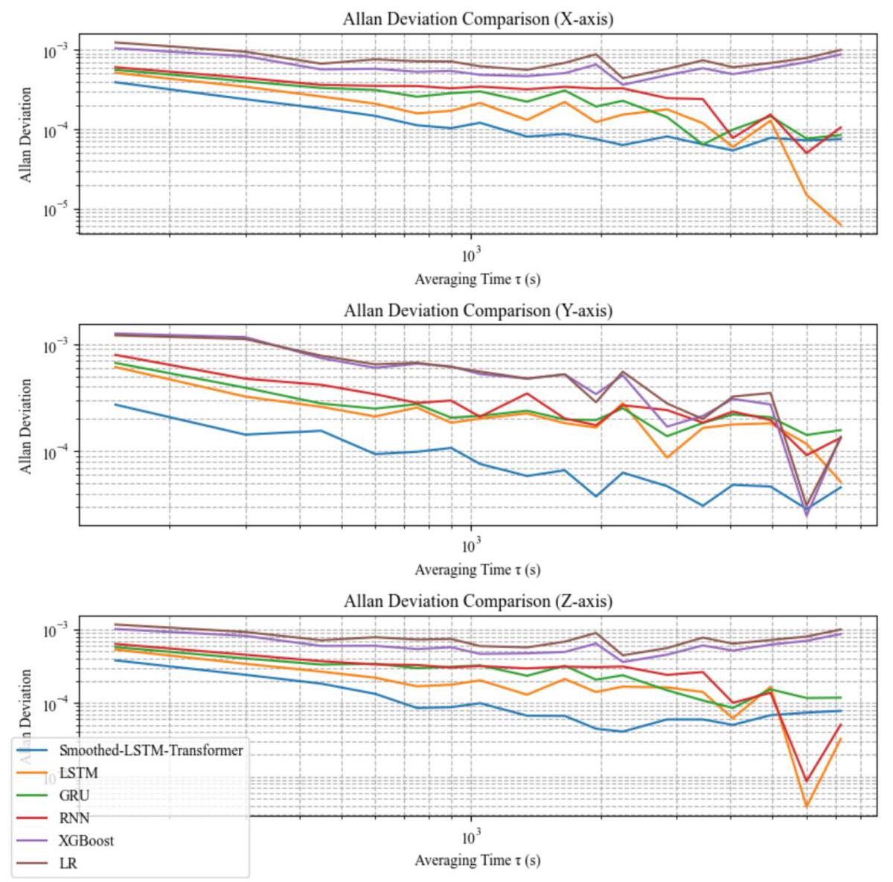

Fig. 8. Comparison of Allan deviation curves of temperature-compensated signals using different models, including SLT, RNN, GRU, LSTM, XGBoost, and Linear Regression.

图8. 使用不同模型(包括SLT、RNN、GRU、LSTM、XGBoost和线性回归)对温度补偿信号的阿伦偏差曲线比较。

Table 1

表1

Standard deviation reduction (%) of different models across X, Y, and Z axes.

不同模型在X、Y和Z轴上的标准差降低率(%)。

<table><tr><td>Axis</td><td>SLT</td><td>LSTM</td><td>GRU</td><td>RNN</td><td>XGBoost</td><td>LR</td></tr><tr><td>X</td><td>95.85</td><td>92.12</td><td>91.74</td><td>94.99</td><td>95.71</td><td>94.95</td></tr><tr><td>Y</td><td>86.17</td><td>28.85</td><td>28.01</td><td>29.52</td><td>32.71</td><td>30.91</td></tr><tr><td>Z</td><td>95.79</td><td>91.82</td><td>91.29</td><td>94.42</td><td>95.14</td><td>94.5</td></tr></table>

Table 2

表2

Drift amplitude reduction before and after temperature compensation.

温度补偿前后的漂移幅度降低。

<table><tr><td>Dataset</td><td>Axis</td><td>Raw drift $\left( {}^{ \circ  }\right)$</td><td>Comp drift (°)</td><td>Reduction (%)</td></tr><tr><td rowspan="3">(a)</td><td>X</td><td>0.301</td><td>0.0401</td><td>86.69</td></tr><tr><td>Y</td><td>0.122</td><td>0.0219</td><td>82.03</td></tr><tr><td>Z</td><td>0.268</td><td>0.0401</td><td>85.05</td></tr><tr><td rowspan="3">(b)</td><td>X</td><td>0.18</td><td>0.0314</td><td>82.58</td></tr><tr><td>Y</td><td>0.078</td><td>0.0195</td><td>75.02</td></tr><tr><td>Z</td><td>0.157</td><td>0.0291</td><td>81.44</td></tr><tr><td rowspan="3">(c)</td><td>X</td><td>0.079</td><td>0.0084</td><td>89.38</td></tr><tr><td>Y</td><td>0.069</td><td>0.0159</td><td>76.89</td></tr><tr><td>Z</td><td>0.068</td><td>0.0140</td><td>79.37</td></tr></table>

Notably, the relatively modest compensation observed on the Y-axis is due to the MEMS accelerometer's inherent directional characteristics at the time of installation, combined with the structural deformation of the monitored object, which results in the Y-axis being less affected by temperature.

值得注意的是，在Y轴上观察到的相对适度的补偿是由于MEMS加速度计在安装时的固有方向特性，结合被监测对象的结构变形，导致Y轴受温度影响较小。

### 4.4. Computational efficiency analysis

### 4.4. 计算效率分析

To evaluate the runtime performance of the LSTM-Transformer model, its architecture and training settings are as follows: an LSTM layer with input dimension 5 and hidden dimension 32, a Transformer layer with embedding dimension 32, 2 attention heads, feedforward dimension 64, dropout 0.1, and an output layer of 3 neurons. The model is trained with Adam (learning rate 0.001) for 1000 epochs, using 5 input features (3 angles, temperature and temperature rate) to predict 3 targets. Training and prediction times for each dataset are summarized in Table. 3, showing its computational efficiency.

为评估LSTM - Transformer模型的运行时性能，其架构和训练设置如下:一个输入维度为5且隐藏维度为32的LSTM层，一个嵌入维度为32、2个注意力头、前馈维度为64、丢弃率为0.1的Transformer层，以及一个3神经元的输出层。该模型使用Adam(学习率0.001)训练1000个epoch，使用5个输入特征(3个角度、温度和温度变化率)预测3个目标。每个数据集的训练和预测时间总结见表3，显示了其计算效率。

The training times of the proposed LSTM-Transformer model for the three datasets range from 182 to ${188}\mathrm{\;s}$ , corresponding to approximately 3 min per dataset. Considering the size of the dataset, this training efficiency can be regarded as moderate to fast.

所提出的LSTM-Transformer模型在三个数据集上的训练时间从182到${188}\mathrm{\;s}$不等，每个数据集大约需要3分钟。考虑到数据集的大小，这种训练效率可以被视为中等至快速。

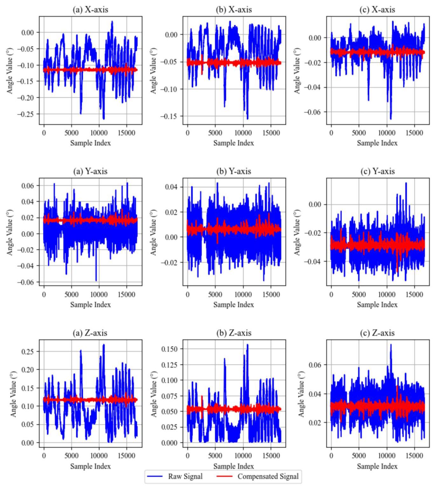

Fig. 9. Comparison of the original and temperature-compensated signals from three MEMS accelerometers labeled as devices a, b, and c.

图9. 来自标记为设备a、b和c的三个MEMS加速度计的原始信号与温度补偿信号的比较。

To further validate the choice of optimization method, a runtime comparison between Differential Evolution (DE) and Grid Search (GS) was conducted under identical experimental settings. For DE, a population size of 10, maximum of 20 generations, mutation factor of 0.8, and crossover probability of 0.9 were used. For GS, the LOESS span was varied from 0.01 to 0.5 with a step size of 0.01 , resulting in 50 candidate values. Both methods produced the same optimal window widths, as shown in Table. 4.

为了进一步验证优化方法的选择，在相同的实验设置下对差分进化(DE)和网格搜索(GS)进行了运行时比较。对于DE，使用的种群大小为10，最大代数为20，变异因子为0.8，交叉概率为0.9。对于GS，LOESS跨度从0.01变化到0.5，步长为0.01，产生50个候选值。两种方法产生了相同的最佳窗口宽度，如表4所示。

DE achieved faster convergence, reducing the optimization time by approximately 50-70% compared with GS, while obtaining the same bandwidth across all sensor axes and datasets. Because GS evaluates all candidates sequentially and cannot skip ineffective regions, it is slower, whereas DE adaptively focuses on promising areas, efficiently converging to the same optimal span with fewer evaluations.

DE实现了更快的收敛，与GS相比优化时间减少了约50 - 70%，同时在所有传感器轴和数据集上获得了相同的带宽。因为GS顺序评估所有候选值且不能跳过无效区域，所以它较慢，而DE自适应地关注有希望的区域，通过较少的评估有效地收敛到相同的最佳跨度。

Additional experiments demonstrate that data sequences with a length of 5000 can be effectively learned and temperature-compensated using the proposed method. The average training time of the LSTM-Transformer model is about 20-25 s, while that of DE-LOESS is about 10-20 s. Since both processes can be completed within the 150-second data acquisition interval of a single sensor, the method enables real-time temperature compensation within the context of individual sensor operation.

额外的实验表明，使用所提出的方法可以有效地学习长度为5000的数据序列并进行温度补偿。LSTM - Transformer模型的平均训练时间约为20 - 25秒，而DE - LOESS的平均训练时间约为10 - 20秒。由于这两个过程都可以在单个传感器150秒的数据采集间隔内完成，该方法能够在单个传感器操作的背景下实现实时温度补偿。

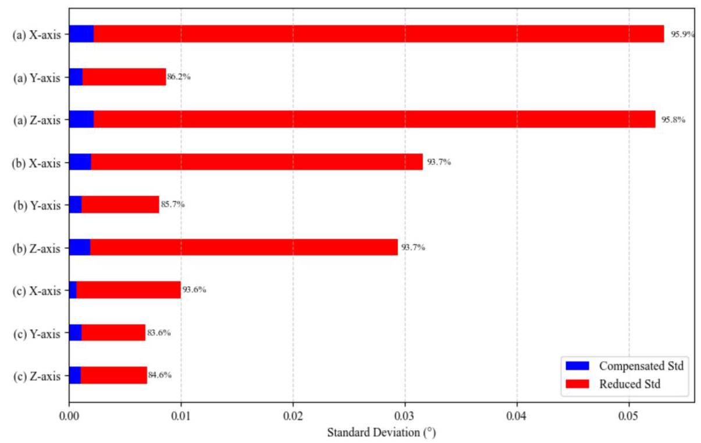

Fig. 10. Comparison of the standard deviation of original and compensated signals for each axis and dataset. The blue bars represent the standard deviation of the compensated signals, while the red segments indicate the reduction relative to the original signals.

图10. 每个轴和数据集的原始信号与补偿信号的标准差比较。蓝色条表示补偿信号的标准差，而红色段表示相对于原始信号的降低。

Table 3

表3

LSTM-transformer runtime and dataset information.

LSTM - 变压器运行时和数据集信息。

<table><tr><td>Dataset</td><td>Samples</td><td>Training Time(s)</td><td>Prediction Time(s)</td></tr><tr><td>(a)</td><td>16,937</td><td>182.16</td><td>0.08</td></tr><tr><td>(b)</td><td>16,765</td><td>188.619</td><td>0.09</td></tr><tr><td>(c)</td><td>16,810</td><td>184.22</td><td>0.08</td></tr></table>

Table 4

表4

Comparison of DE and Grid Search optimization performance with different dataset lengths.

不同数据集长度下DE和网格搜索优化性能的比较。

<table><tr><td>Dataset</td><td>Axis</td><td>Samples</td><td>DE Runtime (s)</td><td>GS Runtime (s)</td><td>LOESS Runtime (s)</td></tr><tr><td rowspan="3">(a)</td><td>X</td><td rowspan="3">16,937</td><td>7.546</td><td>40.455</td><td>0.005</td></tr><tr><td>Y</td><td>16.062</td><td>40.502</td><td>0.005</td></tr><tr><td>Z</td><td>20.618</td><td>40.625</td><td>0.007</td></tr><tr><td rowspan="3">(b)</td><td>X</td><td rowspan="3">16,765</td><td>17.012</td><td>38.804</td><td>0.004</td></tr><tr><td>Y</td><td>17.391</td><td>38.913</td><td>0.005</td></tr><tr><td>Z</td><td>24.255</td><td>38.791</td><td>0.004</td></tr><tr><td rowspan="3">(c)</td><td>X</td><td>16,810</td><td>27.955</td><td>39.154</td><td>0.005</td></tr><tr><td>Y</td><td></td><td>8.474</td><td>39.28</td><td>0.005</td></tr><tr><td>Z</td><td></td><td>24.166</td><td>39.35</td><td>0.005</td></tr></table>

4.5. Performance evaluation under simulated extreme temperature conditions

4.5. 在模拟极端温度条件下的性能评估

To evaluate the robustness of the proposed temperature compensation model under more challenging conditions, a simulated dataset was constructed beyond the measured temperature range. The original $5{}^{ \circ  }\mathrm{C} - {40}{}^{ \circ  }\mathrm{C}$ range was extended to $- {40}{}^{ \circ  }\mathrm{C} - {120}{}^{ \circ  }\mathrm{C}$ , covering both subzero and high-temperature extremes.

为了评估所提出的温度补偿模型在更具挑战性条件下的鲁棒性，构建了一个超出测量温度范围的模拟数据集。原始$5{}^{ \circ  }\mathrm{C} - {40}{}^{ \circ  }\mathrm{C}$范围扩展到$- {40}{}^{ \circ  }\mathrm{C} - {120}{}^{ \circ  }\mathrm{C}$，涵盖了零下和高温极端情况。

The simulated temperature profile was generated using a cosine-based trend with random perturbations uniformly distributed in [-1, 1], producing non-monotonic thermal fluctuations resembling real measurement conditions. To further emulate the sensor's dynamic response, an additional random vibration noise of $\pm  {0.03}^{ \circ  }$ was superimposed on the extrapolated angle signals. In contrast, the measured data typically exhibit vibration fluctuations within $\pm  {0.01}^{ \circ  }$ . The increased noise amplitude was intentionally introduced to simulate the signal characteristics under higher sampling frequencies, where denser and more pronounced random tremors are expected in the output.

模拟温度曲线使用基于余弦的趋势生成，随机扰动均匀分布在[-1, 1]内，产生类似于实际测量条件的非单调热波动。为了进一步模拟传感器的动态响应，在推断角度信号上叠加了额外的$\pm  {0.03}^{ \circ  }$随机振动噪声。相比之下，测量数据通常在$\pm  {0.01}^{ \circ  }$内表现出振动波动。故意引入增加的噪声幅度以模拟更高采样频率下的信号特征，在输出中预期会有更密集和更明显的随机震颤。

Under the extended temperature range, the simulated MEMS accelerometer signals show noticeable drifts, while the compensated results obtained using the proposed LSTM-Transformer model exhibit clear stability. The left-column subplots in Fig. 11 depict the simulated signals under nonlinear temperature fluctuations, and the right-column ones show the corrected outputs. Given the simulated - 40°C-120°C range and deliberately enhanced noise, these deviations remain physically reasonable and suitable for robustness evaluation.

在扩展温度范围内，模拟的MEMS加速度计信号显示出明显的漂移，而使用所提出的LSTM - Transformer模型获得的补偿结果表现出明显的稳定性。图11左列子图描绘了非线性温度波动下的模拟信号，右列子图显示了校正后的输出。考虑到模拟的 - 40°C - 120°C范围和故意增强的噪声，这些偏差在物理上仍然合理且适合进行鲁棒性评估。

After compensation, the signal variations are significantly reduced, with maximum changes of only about ${0.02}^{ \circ  }$ along the X, Y, and Z axes, as shown in Fig. 10. Slight fluctuations can still be observed at points where the temperature changes rapidly, indicating that the compensation performance is more sensitive to high temperature variation rates.

补偿后，信号变化显著减少，沿X、Y和Z轴的最大变化仅约为${0.02}^{ \circ  }$，如图10所示。在温度变化迅速的点仍可观察到轻微波动，表明补偿性能对高温变化率更敏感。

These simulated experiments demonstrate that the proposed LSTM-Transformer model effectively compensates temperature-induced drift even under extreme temperature conditions and intensified vibration noise. This indicates that the proposed approach is robust enough to handle the nonlinear and dynamic characteristics of MEMS accelerometer outputs, making it suitable for temperature compensation in real-world applications involving harsh thermal environments and high-frequency disturbances.

这些模拟实验表明，所提出的LSTM - Transformer模型即使在极端温度条件和强化振动噪声下也能有效地补偿温度引起的漂移。这表明所提出的方法足够鲁棒，能够处理MEMS加速度计输出的非线性和动态特性，使其适用于涉及恶劣热环境和高频干扰的实际应用中的温度补偿。

## 5. Conclusion

## 5. 结论

In this paper, a dynamic temperature drift compensation method for MEMS accelerometers is proposed, which combines LOESS smoothing optimized by Differential Evolution with an LSTM-Transformer model. The DE algorithm adaptively optimizes the window width of the LOESS smoothing process, effectively filtering out high-frequency noise from MEMS signals with relatively low sampling rates and long acquisition cycles, while preserving critical local variations in the signal. The smoothed signal, along with environmental temperature and temperature variation rate, are used as multi-dimensional inputs to the LSTM-Transformer model. This approach fully exploits the sequential modeling capability of LSTM and the global dependency capturing strength of the Transformer to achieve dynamic compensation for MEMS temperature drift errors.

本文提出了一种针对MEMS加速度计的动态温度漂移补偿方法，该方法将通过差分进化优化的局部加权散点平滑法(LOESS)与长短期记忆网络-变换器(LSTM-Transformer)模型相结合。差分进化算法自适应地优化LOESS平滑过程的窗口宽度，有效滤除采样率相对较低且采集周期较长的MEMS信号中的高频噪声，同时保留信号中的关键局部变化。平滑后的信号，连同环境温度和温度变化率，被用作LSTM-Transformer模型的多维输入。这种方法充分利用了LSTM的序列建模能力和Transformer的全局依赖捕捉能力，以实现对MEMS温度漂移误差的动态补偿。

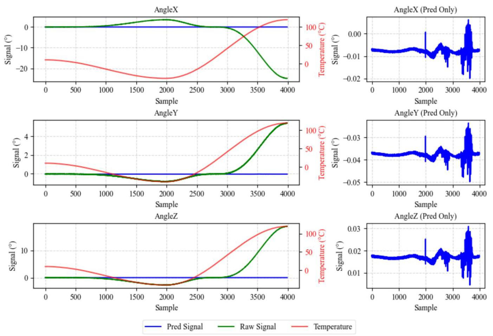

Fig. 11. Comparison of raw and predicted MEMS accelerometer signals under simulated temperature variation along the X, Y, and Z axes.

图11. 沿X、Y和Z轴模拟温度变化下MEMS加速度计原始信号与预测信号的比较。

Experimental results demonstrate that the proposed DE-LOESS preprocessing strategy significantly improves the performance of the compensation model. Compared with traditional regression models and conventional time-series neural network models, the SLT model consistently outperforms others in Allan deviation, with its advantage being particularly evident for long-sequence data. In particular, it achieves superior compensation performance in suppressing high-frequency noise, correcting low-frequency drift, and enhancing signal stability, thereby improving the dynamic measurement stability and reliability of MEMS accelerometers under complex environmental conditions.

实验结果表明，所提出的差分进化-局部加权散点平滑法(DE-LOESS)预处理策略显著提高了补偿模型的性能。与传统回归模型和传统时间序列神经网络模型相比，SLT模型在阿伦偏差方面始终优于其他模型，其优势在长序列数据中尤为明显。特别是，它在抑制高频噪声、校正低频漂移和增强信号稳定性方面实现了卓越的补偿性能，从而提高了MEMS加速度计在复杂环境条件下的动态测量稳定性和可靠性。

Despite these promising results, this study still has certain limitations. The data employed were acquired from MEMS accelerometers in actual engineering applications, where the relatively low sampling rate limits the presence of high-frequency noise components, restricting the model's effectiveness in suppressing such noise. Moreover, the temperature range used for modeling was based on environmental measurements, lacking extreme temperature conditions (with a maximum of approximately ${40}^{ \circ  }\mathrm{C}$ ) in the training dataset. As a result, the compensation model shows reduced fitting performance under higher-temperature scenarios. Future research should address these limitations by conducting controlled experiments in laboratory settings to expand the temperature range and sampling frequency, thereby further validating and enhancing the generalization capability of the proposed method.

尽管取得了这些令人鼓舞的结果，但本研究仍有一定局限性。所使用的数据是从实际工程应用中的MEMS加速度计获取的，相对较低的采样率限制了高频噪声成分的存在，限制了模型抑制此类噪声的有效性。此外，用于建模的温度范围基于环境测量，训练数据集中缺乏极端温度条件(最高约为${40}^{ \circ  }\mathrm{C}$)。因此，补偿模型在较高温度场景下的拟合性能有所下降。未来的研究应通过在实验室环境中进行控制实验来解决这些局限性，以扩大温度范围和采样频率，从而进一步验证和增强所提出方法的泛化能力。

## CRediT authorship contribution statement

## CRediT作者贡献声明

Chunjiang Chen: Writing - original draft, Validation, Methodology, Investigation, Formal analysis, Data curation, Conceptualization. Jian-min Wang: Writing - review & editing, Supervision, Project administration, Funding acquisition.

陈春江:撰写原始草案、验证、方法学、调查、形式分析、数据整理、概念化。王建民:撰写评审与编辑、监督、项目管理、资金获取。

## Declaration of competing interest

## 利益冲突声明

The authors declare that they have no known competing financial interests or personal relationships that could have appeared to influence the work reported in this paper.

作者声明他们没有已知的竞争性财务利益或可能影响本文所报告工作的个人关系。

## Acknowledgements

## 致谢

This work is partially supported by the Fundamental Research Program of Shanxi Province, China under Grant 202203021211172 and the China Huadian Coal Industry 2023 Science & Technology Project under Grant CHDKJ22-02-37. The authors are grateful to thank the Department of Geological Survey and Water Prevention & Control at Inner Mongolia Mengtai Buliangou Coal Industry Co., Ltd. for providing the field data essential to this study. The authors also thank the anonymous reviewers for their constructive comments.

本工作部分得到了中国山西省基础研究计划(项目编号:202203021211172)和中国华电煤炭工业2023年科技项目(项目编号:CHDKJ22-02-37)的支持。作者感谢内蒙古蒙泰不连沟煤业有限责任公司地质测量与防治水部提供本研究所需的现场数据。作者还感谢匿名评审人员提出的建设性意见。

This work is original, unpublished, and free from conflicts of interest. We believe it offers both methodological and practical value to the field.

本工作是原创的，未发表，且不存在利益冲突。我们相信它为该领域提供了方法学和实践价值。

## Appendix A. Supplementary data

## 附录A. 补充数据

Supplementary data to this article can be found online at https://doi.org/10.1016/j.measurement.2026.120823.

本文的补充数据可在网上获取，网址为https://doi.org/10.1016/j.measurement.2026.120823。

## Data availability

## 数据可用性

Data will be made available on request.

数据将根据请求提供。

## References

## 参考文献

[1] E. Barbin, A. Koleda, T. Nesterenko, S. Vtorushin, Three-axis MEMS accelerometer for structural inspection, in J. Phys.: Conf. Series, 2016, vol. 671, no. 1, p. 012003:IOP Publishing.

IOP出版社。

[2] K. Zhang, Sensing and control of mems accelerometers using Kalman filter, 2010.

[3] F. Moschas, S. Stiros, Experimental evaluation of the performance of arrays ofMEMS accelerometers (in English), Mech. Syst. Signal Process. 116 (Feb 2019) 933-942.

MEMS加速度计(英文)，《机械系统与信号处理》116卷(2019年2月)933 - 942页。

[4] A.A. Pasha, L. Sankaralingam, M.M. Rahman, M.I. Alam, K.A.J. E.A.A.I. Juhany,MEMS fault-tolerant machine learning algorithm assisted attitude estimation for

MEMS容错机器学习算法辅助姿态估计用于fixed-wing UAVs, 129, 000, 13, 2024.

[5] K.G. Manikandan, K. Pannirselvam, J.J. Kenned, C.S. Kumar, Investigations onsuitability of MEMS based accelerometer for vibration measurements, in Int. Conf.

基于MEMS的加速度计在振动测量中的适用性，国际会议Mech. Electron. Comp. Eng. (ICMECE) - Mater. Sci. Kancheepuram, INDIA, 2020, 45, 6183-6192, AMSTERDAM: Elsevier, 2021.

[6] R.D. Beemer, G. Biscontin, M. Murali, C.P. Aubeny, Use of a MEMS accelerometerto measure orientation in a geotechnical centrifuge, (in English), Int. J. Phys. Modell. Geotech. 18 (5) (Sep 2018) 253-265.

用于测量土工离心机中的方向，(英文)，《国际物理模拟岩土工程》18卷(5)(2018年9月)253 - 265页。

[7] E. Parisi, et al., Time and Frequency Domain Assessment of Low-Power MEMSAccelerometers for Structural Health Monitoring. Presented at the 2022 IEEE International Workshop on Metrology for Industry 4.0 & IoT (MetroInd4.0&IoT), 2022.

用于结构健康监测的加速度计。发表于2022年IEEE国际工业4.0与物联网计量研讨会(MetroInd4.0&IoT)，2022年。

[8] M. Jankowski, et al., Thermal performance of a capacitive comb-drive MEMSaccelerometer: measurements vs, Simulation 14 (22) (2021) 7462.

加速度计:测量与模拟14卷(22)(2021年)7462页。

[9] S. Wang, et al., Temperature compensation for MEMS resonant accelerometerbased on genetic algorithm optimized backpropagation neural network 316 (2020) 112393.

基于遗传算法优化的反向传播神经网络316卷(2020年)112393页。

[10] G.W. Liu et al., Combined temperature compensation method for closed-loopmicroelectromechanical system capacitive accelerometer, (in English),

微机电系统电容式加速度计，(英文)，Micromachines, 14, 8, 14, Aug 2023, Art. no. 1623.

[11] S. Khankalantary, S. Ranjbaran, S. Ebadollahi, Simplification of calibration of low-cost MEMS accelerometer and its temperature compensation without accurate

低成本MEMS加速度计及其无精确温度补偿laboratory equipment, (in English), Measure. Sci. Technol., 32, 4, 9, Apr 2021, Art.no. 045102.

[12] S. Lu, S. Li, M. Habibi, H.J.M. Safarpour, Improving the thermo-electro-mechanicalresponses of MEMS resonant accelerometers via a novel multi-layer perceptron neural network, 2023.

通过新型多层感知器神经网络对MEMS谐振加速度计的响应，2023年。

[13] D. Liu, et al., Compensation of temperature effects in force-balancedmicroelectromechanical system accelerometers 237 (000) (2024) 9.

微机电系统加速度计237卷(000)(2024年)9页。

[14] D.D. Liu et al., Compensation of temperature effects in force-balancedmicroelectromechanical system accelerometers, (in English), Measurement, 237, 9, Sep 2024, Art. no. 115126.

微机电系统加速度计，(英文)，《测量》，237卷，9期，2024年9月，文章编号115126。

[15] S.W. Lu, S.S. Li, M. Habibi, H. Safarpour, Improving the thermo-electro-mechanicalresponses of MEMS resonant accelerometers via a novel multi-layer perceptron

通过新型多层感知器对MEMS谐振加速度计的响应neural network, (in English), Measurement, 218, 13, Aug 2023, Art. no. 113168.

[16] S. Łuczak, M. Zams, B. Dąbrowski, Z.J.S. Kusznierewicz, Tilt sensor withrecalibration feature based on MEMS accelerometer 22 (4) (2022) 1504.

基于MEMS加速度计的重新校准特征22卷(4)(2022年)1504页。

[17] Y.M. Mo, J. Yang, B. Peng, G.F. Xie, B. Tang, Design and verification of a structurefor isolating stress in sandwich MEMS accelerometer," (in English), Microsyst. Technol.-Micro- Nanosyst.-Info. Storage Process. Syst. 27 (5) (May 2021) 1943-1950.

用于隔离夹层MEMS加速度计中的应力，”(英文)，《微系统技术 - 微纳系统 - 信息存储与处理系统》27卷(5)(2021年5月)1943 - 1950页。

[18] X. Bie, X. Xiong, Z. Wang, W. Yang, Z. Li, X.J.M. Zou, Analysis of the thermallyinduced packaging effects on the frequency drift of micro-electromechanical system resonant accelerometer 14 (8) (2023) 1556.

微机电系统谐振加速度计的频率漂移的诱导封装效应14(8)(2023)1556。

[19] Z.H. Chen, et al., The design of aluminum nitride-based lead-free piezoelectricMEMS accelerometer system, (in English), IEEE Trans. Electron Devices 67 (10) (Oct 2020) 4399-4404.

MEMS加速度计系统，(英文)，《IEEE电子器件汇刊》67(10)(2020年10月)4399 - 4404。

[20] T. Zhang, Z. Ma, Y. Jin, Z. Ye, X. Zheng, Z. Jin, Temperature drift compensation ofa tuned low stiffness MEMS accelerometer based on double-sided parallel plates, in

一种基于双面平行板的调谐低刚度MEMS加速度计，于2022 IEEE 17th International Conference on Nano/Micro Engineered and Molecular Systems (NEMS), 2022, pp. 249-252: IEEE.

[21] M. Chen, R. Zhu, Y. Lin, Z. Zhao, L.J.M.E. Che, Analysis and compensation fornonlinearity of sandwich MEMS capacitive accelerometer induced by fabrication process error 252 (2022) 111672.

制造工艺误差引起的三明治式MEMS电容式加速度计的非线性252(2022)111672。

[22] Y. Günhan, D. Ünsal, Polynomial degree determination for temperature dependent error compensation of inertial sensors, in 2014 IEEE/ION Position, Location and Navigation Symposium-PLANS 2014, 2014, pp. 1209-1212: IEEE.

[23] B. Yuan, Z.F. Tang, P.F. Zhang, F.Z. Lv, Thermal calibration of triaxial accelerometer for tilt measurement, (in English), Sensors, 23, 4, 16, Feb 2023, Art.no. 2105.

[24] L.C. Zhong, J.Z. Wang, J.D. Shi, Research on zero bias characteristic of MEMSaccelerometer in FBW, in 15th Annual Conference of the Chinese-Society-of-Micro-Nano-Technology (CSMNT) / 4th International Conference of the Chinese-Society-

FBW中的加速度计，于第15届中国微纳技术学会年会(CSMNT)/第4届中国学会国际会议of-Micro-Nano-Technology (CSMNT), Tianjin, PEOPLES R CHINA, 2013, vol. 609-610, pp. 1046-1052, STAFA-ZURICH: Trans Tech Publications Ltd, 2014.

[25] K. Kahar et al., Optimization of MEMS-based Energy Scavengers and outputprediction with machine learning and synthetic data approach, (in English), Sens.

基于机器学习和合成数据方法的预测，(英文)，《传感器》Actuat. a-Phys., 358, 14, Aug 2023, Art. no. 114429.

[26] A. Li, K. Cui, D.R. An, X.Y. Wang, H.L. Cao, Multi-frame vibration MEMS Gyroscopetemperature compensation based on combined GWO-VMD-TCN-LSTM algorithm,"

基于GWO - VMD - TCN - LSTM组合算法的温度补偿，”(in English), Micromachines, 15, 11, 15, Nov 2024, Art. no. 1379.

[27] G.Q. Guo, B. Chai, R.C. Cheng, Y.S. Wang, Temperature drift compensation of aMEMS accelerometer based on DLSTM and ISSA, (in English), Sensors, 23, 4, 17, Feb 2023, Art. no. 1809.

基于DLSTM和ISSA的MEMS加速度计，(英文)，《传感器》，23，4，17，2023年2月，文章编号1809。

[28] G.Q. Guo, C. Bo, R.C. Cheng, Y.S. Wang, Real-time temperature drift compensationmethod of a MEMS accelerometer based on deep GRU and optimized monarch

基于深度GRU和优化君主的MEMS加速度计方法butterfly algorithm, (in English), IEEE Access 11 (2023) 10355-10365.

[29] R.B. Cui et al., A temperature compensation approach for micro-electro-mechanicalsystems accelerometer based on gated recurrent unit-attention and robust local mean decomposition-sample entropy-time-frequency peak filtering," (in English),

基于门控循环单元 - 注意力和鲁棒局部均值分解 - 样本熵 - 时频峰值滤波的系统加速度计，(英文)，Micromachines, 15, 4, 23, Apr 2024, Art. no. 483.

[30] Y. Fu, J. Song, J.R. Guo, Y.Z. Fu, Y. Cai, Prediction and analysis of sea surfacetemperature based on LSTM-transformer model, (in English), Reg. Studies Marine

基于LSTM - 变压器模型的温度，(英文)，《海洋区域研究》Sci., 78, 13, Dec 2024, Art. no. 103726.

[31] J.W. Shi, S.Q. Wang, P.F. Qu, J.L. Shao, Time series prediction model using LSTM-Transformer neural network for mine water inflow, (in English), Sci. Rep., 14, 1,

用于矿井涌水量的变压器神经网络，(英文)，《科学报告》，14，1，16, Aug 2024, Art. no. 18284.

[32] H. Ghaemi, Z. Alizadehsani, A. Shahraki, J.M. Corchado, Transformers in sourcecode generation: a comprehensive survey, (in English), J. Syst. Arch., 153, 25, Aug 2024, Art. no. 103193.

代码生成:全面综述，(英文)，《系统架构杂志》，153，25，2024年8月，文章编号103193。

[33] X.T. Li, et al., Transformer-based visual segmentation: a survey, (in English), IEEETrans. Pattern Anal. Machine Intelli. 46 (12) (Dec 2024) 10138-10163.

《IEEE模式分析与机器智能汇刊》46(12)(2024年12月)10138 - 10163。

[34] H.Q. Huang, W. Ye, L. Liu, W.J. Wang, Y. Wang, H.L. Cao, Temperaturecompensation method for MEMS ring gyroscope based on PSO-TVFEMD-SE-TFPF

基于PSO - TVFEMD - SE - TFPF的MEMS环形陀螺仪补偿方法and FTTA-LSTM, (in English), Micromachines, 16, 5, 21, Apr 2025, Art. no. 507.

[35] X. Zeng, S.J. Xian, K. Liu, Z.L. Yu, Z.L. Wu, A method for compensating randomerrors in MEMS gyroscopes based on interval empirical mode decomposition and

基于区间经验模态分解的MEMS陀螺仪误差及ARMA, (in English), Measure. Sci. Technol., 35, 1, 11, Jan 2024, Art. no. 015020.

[36] X.W. Wang, Y. Cui, X. Zhang, H.L. Cao, Temperature compensation model of MEMSmulti-ring disk solid wave gyroscope based on RIME-VMD and PSO-DBN multi

基于RIME-VMD和PSO-DBN的多环盘式固体波陀螺仪fusion algorithm, (in English), Sensors Actuat. A-Phys., 385, 16, Apr 2025, Art. no.116285.

[37] C.Z. Fang, Y.S. Chen, X.L. Deng, X.L. Lin, Y. Han, J.J. Zheng, Denoising method ofmachine tool vibration signal based on variational mode decomposition and

基于变分模态分解的机床振动信号Whale-Tabu optimization algorithm (vol 13, 1505, 2023), (in English), Sci. Rep., Correction, 13, 1, 1, Feb 2023, Art. no. 2100.

[38] M.J. Ouyang, J.L. Gao, A. Li, X.G. Zhang, C. Shen, H.L. Cao, Micromechanicalgyroscope temperature compensation based on combined LSTM-SVM-DBN

基于LSTM-SVM-DBN组合的陀螺仪温度补偿algorithm, (in English), Sensors Actuat, a-Phys., 369, 11, Apr 2024, Art. no.115128.

[39] S.F. Stefenon, L.O. Seman, V.C. Mariani, L.D. Coelho, Aggregating prophet andseasonal trend decomposition for time series forecasting of italian electricity spot

意大利电力现货时间序列预测的季节性趋势分解prices, (in English), Energies, 16, 3, 18, Feb 2023, Art. no. 1371.

[40] Z.F. Wang, J.L. Tao, Y.M. Hu, J.Y. Zhang, L.H. Ma, M. Xu, "A multi-scale fuel celldegradation prediction method based on isometric convolution block and long

基于等距卷积块和长的退化预测方法short-term memory networks," (in English), Int. J. Hydrogen Energy 69 (Jun 2024)675-686.

[41] A.P. Piotrowski, J.J. Napiorkowski, A.E. Piotrowska, Particle swarm optimizationor differential evolution-a comparison, (in English), Eng. Appl. Artif. Intelli., 121,

或差分进化——比较，(英文)，《工程应用人工智能》，12115, May 2023, Art. no. 106008.

[42] Z.H. Chen, J. Cao, F.Q. Zhao, J.L. Zhang, A grouping cooperative differentialevolution algorithm for solving partially separable complex optimization problems, (in English), Cogn. Comput. 15 (3) (May 2023) 956-975.

用于求解部分可分离复杂优化问题的进化算法，(英文)，《认知计算》15 (3)(2023年5月)956 - 975。

[43] A. Devices, ADXL355: Low Noise, Low Drift, 3-Axis MEMS Accelerometer.[Online]. Available: https://www.analog.com/en/products/adxl355.html.[Accessed: Nov. 5, 2025].

[在线]。可获取:https://www.analog.com/en/products/adxl355.html。[访问时间:2025年11月5日]。