# Volterra System Analysis for an Electrochemical Sensor

# 电化学传感器的伏特拉系统分析

by Billal Iqbal

作者:比拉尔·伊克巴尔

B.S. Mechanical Engineering and Electrical Engineering and Computer Science, Massachusetts Institute of Technology, 2024

麻省理工学院机械工程、电气工程与计算机科学学士，2024年

Submitted to the Department of Electrical Engineering and Computer Science in partial fulfillment of the requirements for the degree of

提交给电气工程与计算机科学系，以部分满足获得以下学位的要求

MASTER OF ENGINEERING IN ELECTRICAL ENGINEERING AND COMPUTER SCIENCE

电气工程与计算机科学硕士学位

at the

于

MASSACHUSETTS INSTITUTE OF TECHNOLOGY

麻省理工学院

May 2024

2024年5月

© 2024 Billal Iqbal. This work is licensed under a CC BY-NC-ND 4.0 license.

© 2024比拉尔·伊克巴尔。本作品根据知识共享署名 - 非商业性使用 - 禁止演绎4.0许可协议授权。

The author hereby grants to MIT a nonexclusive, worldwide, irrevocable, royalty-free license to exercise any and all rights under copyright, including to reproduce, preserve, distribute and publicly display copies of the thesis, or release the thesis under an open-access license.

作者特此授予麻省理工学院一项非排他性、全球性、不可撤销、免版税的许可，以行使版权项下的任何及所有权利，包括复制、保存、分发和公开展示论文副本，或以开放获取许可协议发布论文。

Authored by: Billal Iqbal

作者:比拉尔·伊克巴尔

Department of Electrical Engineering and Computer Science May 22, 2024

电气工程与计算机科学系，2024年5月22日

Certified by: Ian W. Hunter

认证人:伊恩·W·亨特

George N. Hatsopoulos Professor in Thermodynamics, Thesis Supervisor

乔治·N·哈托普洛斯热力学教授，论文导师

Accepted by: Katrina LaCurts

接受人:卡特里娜·拉库茨

Chair, Master of Engineering Thesis Committee

工程硕士论文委员会主席

# Volterra System Analysis for an Electrochemical Sensor by

# 电化学传感器的伏尔泰拉系统分析 作者

Billal Iqbal

比拉尔·伊克巴尔

Submitted to the Department of Electrical Engineering and Computer Science on May 22, 2024 in partial fulfillment of the requirements for the degree of

于2024年5月22日提交给电气工程与计算机科学系，以部分满足获得

MASTER OF ENGINEERING IN ELECTRICAL ENGINEERING AND COMPUTER SCIENCE

电气工程与计算机科学硕士学位的要求

## ABSTRACT

## 摘要

Current biological methods for quantifying bacterial and fungal populations are time and labour intensive, whilst remaining expensive to automate. A potential solution to this problem is an electrochemical sensor, which applies a stochastic voltage across a liquid medium and measures the resultant current flow. This data can then be used to model the liquid's electrochemical interactions and monitor it for bacterial growth and spoilage. Linear dynamic impedance models have previously been explored for this. However, the ability to capture the nonlinear effects observed at higher voltages can provide greater insights into the liquid's properties. This is extremely difficult with neural networks which offer accurate predictive capabilities without much insight into the system. A different strategy is to model the liquid using a Volterra series representation. This work will document the integration of Volterra system identification capabilities within the sensor and its performance when modelling different liquid media as well as modifications made to the sensor for the applications tested.

当前用于量化细菌和真菌种群的生物学方法既耗时又费力，而且自动化成本仍然很高。解决这个问题的一个潜在方案是电化学传感器，它在液体介质上施加一个随机电压并测量由此产生的电流。然后，这些数据可用于对液体的电化学相互作用进行建模，并监测其细菌生长和变质情况。此前已经探索过用线性动态阻抗模型来解决这个问题。然而，捕捉在较高电压下观察到的非线性效应的能力，可以更深入地了解液体的特性。对于神经网络来说，这极其困难，因为神经网络虽然提供了准确的预测能力，但对系统的洞察却不多。另一种策略是使用伏尔泰拉级数表示对液体进行建模。这项工作将记录伏尔泰拉系统识别能力在传感器中的集成情况，以及在对不同液体介质进行建模时它的性能，以及针对所测试的应用对传感器所做的修改。

Thesis supervisor: Ian W. Hunter

论文导师:伊恩·W·亨特

Title: George N. Hatsopoulos Professor in Thermodynamics

职位:乔治·N·哈托普洛斯热力学教授

## Acknowledgments

## 致谢

I would like to thank my family for their endless support throughout my studies and research. Their love and support has provided me with the determination to tackle the challenges I have faced head on and constantly strive to improve myself both academically and as a person.

我要感谢我的家人在我整个学习和研究过程中给予的无尽支持。他们的爱和支持让我有决心直面我所面临的挑战，并不断努力在学业和个人方面提升自己。

I would also like to thank Michael Aling for his help and mentorship throughout my research. His patience, knowledge and advice have made my research an amazingly rewarding experience and I would not have progressed as far with my work without him.

我还要感谢迈克尔·阿林在我整个研究过程中给予的帮助和指导。他的耐心、知识和建议让我的研究成为了一次非常有收获的经历，没有他，我的工作不会取得这么大的进展。

Moreover, I want to thank Prof. Ian Hunter, Dr. Cathy Hogan and Winn Gatewood, for their work in maintaining the Bio-instrumentation lab and fostering a collaborative environment, as well as their help conducting and analysing experiment results.

此外，我要感谢伊恩·亨特教授、凯西·霍根博士和温·盖特伍德，感谢他们维护生物仪器实验室并营造了合作的环境，以及在进行和分析实验结果方面给予的帮助。

I would also like to acknowledge ChatGPT for helping proofread my final thesis draft and identifying grammatical errors.

我还要感谢ChatGPT帮助校对我的毕业论文初稿并识别语法错误。

## Contents

## 目录

Title page 1

标题页 1

Abstract 3

摘要 3

Acknowledgments 5

致谢 5

List of Figures 9

图列表 9

1 Introduction 11

1 引言 11

1.0.1 Project Scope 11

1.0.1 项目范围 11

2 Background 13

2 背景 13

2.1 System Identification 13

2.1 系统识别 13

2.1.1 Linear System Identification 14

2.1.1 线性系统识别 14

2.1.2 Nonlinear System Identification 15

2.1.2 非线性系统识别 15

2.2 Electrochemical Sensor 19

2.2 电化学传感器 19

2.2.1 Sensor Applications 20

2.2.1 传感器应用 20

3 Volterra Series for Electrochemical System Analysis 23

3 用于电化学系统分析的沃尔泰拉级数 23

3.0.1 Tensor Approach 23

3.0.1 张量方法 23

3.0.2 Multi-Layer Perceptron Volterra Approach 29

3.0.2 多层感知器沃尔泰拉方法 29

3.0.3 Software Testing - Tungsten Filament Experiment 31

3.0.3 软件测试 - 钨丝实验 31

4 Milk Impedance Analysis 35

4 牛奶阻抗分析 35

4.0.1 Experimental Procedure 35

4.0.1 实验步骤 35

4.0.2 Results 36

4.0.2 结果 36

5 Sugar Solution Impedance Analysis 39

5 糖溶液阻抗分析 39

5.0.1 Well Plate Sensor Design 39

5.0.1 微孔板传感器设计 39

5.0.2 Portable Computation Platform 41

5.0.2 便携式计算平台 41

5.0.3 Experimental Procedure 42

5.0.3 实验步骤 42

5.0.4 Results 44

5.0.4 结果 44

5.0.5 Improvements 47

5.0.5 改进 47

6 Future Work 49

6 未来工作 49

7 Conclusion 51

7 结论 51

Bibliography 53

参考文献 53

## List of Figures

## 图列表

2.1 Block diagram representation of a Wiener system 15

2.1 维纳系统的框图表示 15

2.2 Block diagram representation of a Hammerstein system 16

2.2 哈默斯坦系统的框图表示 16

2.3 Visual example showing the size of the Volterra kernels for a memory length of 4 samples. 17

2.3 可视化示例，展示了 4 个样本记忆长度的沃尔泰拉核的大小。17

2.4 A CAD rendering of the sensor + monitoring station (left) and a rendering of the sample container (right) - Reproduced with permission from [1] (left) and [3] (right). 19

2.4 传感器 + 监测站的 CAD 渲染图(左)和样品容器的渲染图(右) - 经 [1](左)和 [3](右)许可复制。19

3.1 A visualisation of xT2's structure. Here it can be seen that the memory length being used for both time lags is 3 , and that there are 4 windows. This will enable the prediction of four data points. 25

3.1 xT2 结构的可视化。在此可以看到，两个时间滞后使用的记忆长度均为 3，并且有 4 个窗口。这将能够预测四个数据点。25

3.2 Shows the training time vs memory length for the program, both when the GPU is used and when the CPU is being used exclusively. 27

3.2展示了使用GPU和仅使用CPU时程序的训练时间与内存长度的关系。27

3.3 Two Layer Perceptron Model. By convention the input layer is known as layer 0. Image taken from Medium AI [28]. 29

3.3两层感知器模型。按照惯例，输入层称为第0层。图片取自Medium AI [28]。29

3.4 The left figure shows the probability distribution of the generated input signal. The right figure shows the power spectrum of the generated input. 31

3.4左图显示了生成的输入信号的概率分布。右图显示了生成的输入的功率谱。31

3.5 Plot showing the actual output vs the predicted output of the system, when using the model found with the MLP-Volterra code. 31

3.5该图展示了使用通过MLP - Volterra代码找到的模型时系统的实际输出与预测输出。31

3.6 The left plot shows the predicted impulse response of the system. The second plot shows the predicted second order kernel. These are for the MLP-Volterra approach. 32

3.6左图显示了系统的预测脉冲响应。第二张图显示了预测的二阶核。这些是针对MLP - Volterra方法的。32

3.7 Plot showing the actual output vs the predicted output of the system, when using the model found with the Tensor based approach. 32

3.7该图展示了使用基于张量的方法找到的模型时系统的实际输出与预测输出。32

3.8 The left plot shows the predicted impulse response of the system. The second plot shows the predicted second order kernel. These are for the Tensor approach.

3.8左图显示了系统的预测脉冲响应。第二张图显示了预测的二阶核。这些是针对张量方法的。

3.9 Bode plot of the transfer function generated from the impulse response of the tensor approach code's output model. 33

3.9由张量方法代码的输出模型的脉冲响应生成的传递函数的波特图。33

4.1 The difference between a given h2 kernel and the initial $\left( {0}^{\text{ th }}\right.$ dataset kernel $)$ has been computed for a series of kernels spaced apart by 20 datasets (10 minutes). The kernels used for the subtraction were found using the 'Tensor' approach. 36

4.1对于一系列相隔20个数据集(10分钟)的核函数，计算了给定的h2核函数与初始$\left( {0}^{\text{ th }}\right.$数据集核函数$)$之间的差异。用于减法运算的核函数是使用“张量”方法找到的。36

5.1 Image of the well plate used for the experiments. The image is taken from the supplier website [30]. 39

5.1用于实验的微孔板图片。该图片取自供应商网站[30]。39

5.2 Impedance measurement PCB. Connects to a reference resistor and an off-board voltage generator using SMA connectors. 40

5.2阻抗测量印刷电路板。使用SMA连接器连接到参考电阻和板外电压发生器。40

5.3 Isometric view of the portable computation platform (left). Side view of the portable computation platform (right). 41

5.3便携式计算平台的等轴测视图(左)。便携式计算平台的侧视图(右)。41

5.4 Image of the revised experimental set up. This was placed on top of a small table and placed within the incubator. 43

5.4修订后的实验装置图片。它放置在一个小桌子上并置于培养箱内。43

5.5 Image of the final set up. Here the computation platform is simplified due to no longer requiring the Raspberry Pi 5 and the hard drive. The set up is attached to the side of the incubator walls to allow for other samples to fit within the incubator. The devices connect to a desktop situated external to, but beside the incubator (not shown). 43

5.5最终装置图片。由于不再需要树莓派5和硬盘，这里的计算平台进行了简化。该装置附着在培养箱壁的一侧，以便培养箱内可以放置其他样本。这些设备连接到位于培养箱外部但旁边的台式计算机(未显示)。43

5.6 Layout of sugar solutions used in the experiment. 44

5.6实验中使用的糖溶液布局。44

5.7 Well plate showing the sugar-bacteria solutions after the experiment. 45

5.7展示实验后糖 - 细菌溶液的微孔板。45

5.8 Discolouration and accumulation on the electrodes on the PCB after running the experiment. 45

实验运行后，印刷电路板(PCB)上电极出现变色和堆积现象。45

5.9 3D printed piece that clamps and aligns the well plate and PCB together for more reliable impedance data for future experiments. 47

5.9 3D打印部件，用于将孔板和印刷电路板夹在一起并对齐，以便在未来实验中获得更可靠的阻抗数据。47

5.10 Future experiment set up. The PCB is clamped with washers to stay in place. 47

5.10 未来实验设置。印刷电路板用垫圈固定以保持原位。47

## Chapter 1 Introduction

## 第1章 引言

Monitoring bacterial and fungal growth is a necessary task for many industries. From wastewater management, to milk production and biological research, it is crucial to detect the presence of unwanted bacteria, or the purposeful growth of microbes in a controlled environment. This a time-intensive process which requires researchers to repeatedly remove plates containing bacteria from an incubator, sample the plates, and then use some form of automatic counting device to identify the bacteria count. One common approach is to use a spectrophotometer, which provides a measure of the density of the bacteria, which can be converted to a count by utilising a standard curve. This is tedious and there exists cases where the use of a spectrophotometer is not possible.

监测细菌和真菌生长是许多行业的一项必要任务。从废水管理到牛奶生产和生物学研究，检测不需要的细菌的存在或在受控环境中微生物的有目的生长至关重要。这是一个耗时的过程，需要研究人员反复从培养箱中取出含有细菌的平板，对平板进行采样，然后使用某种形式的自动计数设备来确定细菌数量。一种常见的方法是使用分光光度计，它可以测量细菌的密度，并通过利用标准曲线将其转换为数量。这很繁琐，并且存在无法使用分光光度计的情况。

A potential solution to this problem is the use of an electrochemical sensor which can continuously monitor a solution and model its electrochemical behaviour. This sensor can be used to assess bacterial growth and infer properties of the medium. Several versions of such a sensor have been built and used to acquire data for: milk, water, soy milk, salt solutions and an experimental bioreactor, using Wiener system analysis and the Randles equivalent circuit [1] [2]. However, the full dynamic modelling of the media proves to be a complicated challenge, due to the nonlinear nature of the impedance response of the solution when excited with a large stochastic voltage. The use of a black box Volterra series model to represent the liquid shows promise due to its ability to capture the nonlinearities exhibited by the liquid and the ability to infer key information from the Volterra kernels of the model, since they encapsulate the idle state of the liquid, its impulse response and its nonlinear dynamics.

解决这个问题的一个潜在方案是使用电化学传感器，它可以连续监测溶液并对其电化学行为进行建模。这种传感器可用于评估细菌生长并推断培养基的特性。已经构建了几种这样的传感器版本，并使用维纳系统分析和兰德尔等效电路 [1] [2] 来获取牛奶、水、豆浆、盐溶液和实验生物反应器的数据。然而，由于用大随机电压激发时溶液阻抗响应的非线性性质，对培养基进行完整的动态建模被证明是一项复杂的挑战。使用黑箱沃尔泰拉级数模型来表示液体显示出了前景，因为它能够捕捉液体表现出的非线性，并且能够从模型的沃尔泰拉核中推断关键信息，因为它们封装了液体的空闲状态、脉冲响应和非线性动力学。

Once the Volterra series representation of a system and its variation over time is found, the kernels can be used as a template for evaluating the condition of different liquids in industrial or research settings.

一旦找到系统的沃尔泰拉级数表示及其随时间的变化，这些核就可以用作评估工业或研究环境中不同液体状况的模板。

#### 1.0.1 Project Scope

#### 1.0.1项目范围

The goal of this project is to develop a sensor that can model the electrochemical behaviour of a liquid medium using a Volterra series representation. This representation and its changes over time can be verified in a laboratory setting to determine a library of template kernels which can later be used in comparison to real time modelling completed on liquid samples in an industrial or research setting.

本项目的目标是开发一种传感器，该传感器可以使用沃尔泰拉级数表示对液体介质的电化学行为进行建模。这种表示及其随时间的变化可以在实验室环境中进行验证，以确定一个模板核库，该库随后可用于与在工业或研究环境中对液体样品进行的实时建模进行比较。

The devices used in real-time industrial applications will differ from the devices built to extract the initial/baseline set of kernels. This is due to cost, size and other constraints that may be placed on the device, highly dependant on the application for which it is being used [1] [3]. The primary objective of this project is the nonlinear modeling required to extract the template kernels. Additionally, this project includes studying the efficacy of the sensor for monitoring bacterial growth in milk and designing a version of the sensor to monitor the growth rate of bacteria (K. Xylinus) when fed various sugars, using Volterra kernels as well as linear models.

实时工业应用中使用的设备将与为提取初始/基线核集而构建的设备不同。这是由于成本、尺寸和可能施加在设备上的其他限制，这高度依赖于其使用的应用 [1] [3]。本项目的主要目标是提取模板核所需的非线性建模。此外，本项目包括研究传感器监测牛奶中细菌生长的功效，以及设计一种传感器版本，使用沃尔泰拉核以及线性模型来监测喂食各种糖时细菌(木醋杆菌)的生长速率。

## Chapter 2 Background

## 第2章 背景

### 2.1 System Identification

### 2.1系统识别

System identification is the process of modelling a system from a set of data input to the system and the corresponding output data. The use of statistical methods allow the computation of a general representation of the system which allows the simulation of the system's response to arbitrary inputs.

系统识别是从输入到系统的一组数据和相应的输出数据对系统进行建模的过程。使用统计方法可以计算系统的一般表示，从而允许模拟系统对任意输入的响应。

There are many characteristics of a system, which determine the methods used to model them. For example, a static (otherwise known as memoryless) system is one whose output response is entirely determined by the input. An example of such a system is a purely resistive circuit. If the input to the circuit is the current and the observed output is the voltage drop across the circuit, the system will obey Ohm’s law: $V = {IR}$ , where $\mathrm{R}$ is the total equivalent resistance of the system, I is the total current through the circuit, and V is the voltage drop. Assuming negligible parasitic capacitances and changes in resistance due to temperature, the system will always output the same voltage drop for a given input current, with no influence from past or future values on the input current [4].

系统有许多特性，这些特性决定了用于对其进行建模的方法。例如，静态(也称为无记忆)系统是其输出响应完全由输入决定的系统。这样一个系统的例子是纯电阻电路。如果电路的输入是电流，观察到的输出是电路两端的电压降，该系统将遵循欧姆定律:$V = {IR}$ ，其中 $\mathrm{R}$ 是系统的总等效电阻，I 是通过电路的总电流，V 是电压降。假设寄生电容和由于温度引起的电阻变化可忽略不计，对于给定的输入电流，系统将始终输出相同的电压降，不受输入电流过去或未来值的影响 [4]。

Conversely, a dynamic system is the opposite. Here, the output of a system not only depends on the present input into it, but also on past or future inputs into the system. For example, a circuit containing a capacitor exhibits dynamic properties. The displacement current ’through’ a capacitor can be described as $I\left( t\right)  = C\frac{{dV}\left( t\right) }{dt}$ , where $\mathrm{C}$ is the capacitance and $\mathrm{V}$ is the voltage drop across the capacitor. If the current is the input into the system, and the voltage drop across the capacitor is the output, the relationship can be described by: $V\left( t\right)  = \frac{1}{C}{\int }_{-\infty }^{t}I\left( \tau \right) {d\tau }$ . Here it can be seen that the voltage drop is a function of the input current for all time less than or equal to the current moment, t. Dynamic systems can also incorporate a delayed time effect, whereas static models will respond instantaneously to any change in the input.

相反，动态系统则是另一番情况。在此，系统的输出不仅取决于当前输入，还取决于过去或未来的输入。例如，包含电容器的电路具有动态特性。通过电容器的位移电流可描述为$I\left( t\right)  = C\frac{{dV}\left( t\right) }{dt}$，其中$\mathrm{C}$是电容，$\mathrm{V}$是电容器两端的电压降。如果电流是系统的输入，电容器两端的电压降是输出，那么这种关系可描述为:$V\left( t\right)  = \frac{1}{C}{\int }_{-\infty }^{t}I\left( \tau \right) {d\tau }$。由此可见，电压降是所有小于或等于当前时刻t的输入电流的函数。动态系统还可包含延迟时间效应，而静态模型会对输入的任何变化立即做出响应。

Another property of a system to consider is whether or not it is time-invariant. A time-invariant system is one which satisfies the requirement that: $\forall \delta  : f\left( {x\left( {t + \delta }\right) }\right)  = y\left( {t + \delta }\right)$ , where $\mathrm{x}\left( \mathrm{t}\right)$ describes the input to a system at time $\mathrm{t},\mathrm{y}\left( \mathrm{t}\right)$ is the output of the system at time $\mathrm{t}$ and $\mathrm{f}$ is a function mapping the input of the system to the output. This means that there is no explicit time dependence in the system's function f, except the time dependence of x(t). This means that the start time at which the system is excited is not important. Whether the system is perturbed in the morning or at night, there is no change in its behaviour.

系统的另一个需要考虑的特性是它是否是时不变的。时不变系统是满足以下要求的系统:$\forall \delta  : f\left( {x\left( {t + \delta }\right) }\right)  = y\left( {t + \delta }\right)$，其中$\mathrm{x}\left( \mathrm{t}\right)$描述系统在时间$\mathrm{t},\mathrm{y}\left( \mathrm{t}\right)$的输入，$\mathrm{t}$是系统在时间$\mathrm{f}$的输出，$\mathrm{f}$是一个将系统输入映射到输出的函数。这意味着系统函数f中除了x(t)的时间依赖性外没有明确的时间依赖性。这意味着激发系统的起始时间并不重要。无论系统是在早上还是晚上受到扰动，其行为都不会改变。

By extension, a time-varying system is one where the starting time of an input affects the response of the system. An example of these are systems which are strongly affected by environmental conditions. For example, dropping a near mass-less object from high altitude and measuring its horizontal trajectory is likely to be affected by the wind, and other atmospheric conditions not just related to the altitude at which the object is dropped, hence the time at which the drop occurs is important and must be encapsulated into the system model. Note that the use of a near mass-less object is simply to convey that the environment strongly affects the outcome of dropping the mass. In most cases if the conditions provide very little/negligible effect on the output of the system, the system is assumed as time-invariant for simplicity.

进一步来说，时变系统是指输入的起始时间会影响系统响应的系统。这类系统的一个例子是受到环境条件强烈影响的系统。例如，从高空扔下一个近似无质量的物体并测量其水平轨迹，很可能会受到风以及其他不仅与物体下落高度有关的大气条件的影响，因此物体下落的时间很重要，必须纳入系统模型。请注意，使用近似无质量的物体仅仅是为了说明环境对物体下落结果有强烈影响。在大多数情况下，如果条件对系统输出的影响很小/可忽略不计，为了简化起见，该系统被假定为时间不变系统。

It is also important to understand if a system is linear. Linear systems scale in well-defined ways that make the analysis of these systems notably simpler than the modelling of nonlinear systems. Linear systems are common place and the methodology used to identify these are extremely powerful. However, not all systems can be adequately modelled as such and it is therefore required to switch to more nuanced methods of system identification. The following section aims to describe the common approaches for linear and nonlinear system identification and will serve to motivate the use of the Volterra series representation for modelling within this project.

理解系统是否线性也很重要。线性系统以明确的方式进行缩放，这使得对这些系统的分析比非线性系统的建模要简单得多。线性系统很常见，用于识别它们的方法非常强大。然而，并非所有系统都能如此充分地建模，因此需要转向更细致入微的系统识别方法。以下部分旨在描述线性和非线性系统识别的常见方法，并将有助于激发在本项目中使用沃尔泰拉级数表示进行建模。

#### 2.1.1 Linear System Identification

#### 2.1.1 线性系统识别

A system is linear if and only if it satisfies the superposition principle. This means that for a function $\mathrm{H}$ , which maps the input of a system to the output of the system (within the time domain), $H\left( {x\left( t\right) }\right)  = y\left( t\right)$ , scaling the input signal by a constant simply results in the scaling of the system response, by the same constant: $H\left( {{kx}\left( t\right) }\right)  = {ky}\left( t\right)$ . It also means that for a linear combination of input signals into the system, the output of the system is simply the same linear combination of the individual responses for each of the inputs. This is expressed as: $H\left( {a{x}_{1}\left( t\right)  + b{x}_{2}\left( t\right) }\right)  = a{y}_{1}\left( t\right)  + b{y}_{2}\left( t\right)$ where $H\left( {{x}_{1}\left( t\right) }\right)  = {y}_{1}\left( t\right)$ and $H\left( {{x}_{2}\left( t\right) }\right)  = {y}_{2}\left( t\right)$ .

当且仅当一个系统满足叠加原理时，它才是线性的。这意味着对于一个将系统输入映射到系统输出(在时域内)的函数$\mathrm{H}$，$H\left( {x\left( t\right) }\right)  = y\left( t\right)$，将输入信号乘以一个常数只会导致系统响应乘以相同的常数:$H\left( {{kx}\left( t\right) }\right)  = {ky}\left( t\right)$。这也意味着对于输入到系统的信号的线性组合，系统的输出仅仅是每个输入的单独响应的相同线性组合。这表示为:$H\left( {a{x}_{1}\left( t\right)  + b{x}_{2}\left( t\right) }\right)  = a{y}_{1}\left( t\right)  + b{y}_{2}\left( t\right)$，其中$H\left( {{x}_{1}\left( t\right) }\right)  = {y}_{1}\left( t\right)$和$H\left( {{x}_{2}\left( t\right) }\right)  = {y}_{2}\left( t\right)$。

Due to this fact, modelling a linear system is relatively simple. By supplying a Dirac delta function as input to a linear system, the observed output of the system can be found. This output is known as the ’impulse response’ of the system $h\left( t\right)$ . This response is all that is needed to model a system. By performing the convolution of an input signal $\mathrm{x}\left( \mathrm{t}\right)$ with the impulse response, the output of the system y(t) can be found. The continuous convolution operation is defined as follows: $\left( {x * h}\right) \left( t\right)  = {\int }_{-\infty }^{\infty }x\left( \tau \right) h\left( {t - \tau }\right) {d\tau }$ . Whilst this can be generalised for time varying systems, the focus of the next paragraph is to explain how the impulse response for a linear time-invariant (LTI) fully describes the system to build intuition.

由于这个事实，对线性系统进行建模相对简单。通过将狄拉克δ函数作为输入提供给线性系统，可以找到系统的观测输出。这个输出被称为系统的“脉冲响应”$h\left( t\right)$。这个响应是建模系统所需的全部。通过对输入信号$\mathrm{x}\left( \mathrm{t}\right)$与脉冲响应进行卷积，可以找到系统的输出y(t)。连续卷积运算定义如下:$\left( {x * h}\right) \left( t\right)  = {\int }_{-\infty }^{\infty }x\left( \tau \right) h\left( {t - \tau }\right) {d\tau }$。虽然这可以推广到时变系统，但下一段的重点是解释线性时不变(LTI)系统的脉冲响应如何完全描述系统以建立直观理解。

For this, we recognise that each value of the signal $x\left( t\right)$ can simply be treated as a time shifted and scaled version of the Dirac delta function. Every value within the input signal $\mathrm{x}\left( \mathrm{t}\right)$ is now a function, that spans infinite time. For example, ${x}_{1}\left( t\right)$ is the function which represents the contribution of the first sample to the input across all time. From this it can be seen that ${x}_{1}\left( t\right)$ is 0 for all times not equal to ${t}_{1}$ , the time at which the first sample is applied to the system in $\mathrm{x}\left( \mathrm{t}\right)$ . This extends to the rest of the input samples, where the contribution of ${x}_{n}$ can be modelled as a function of value 0 for all time $\mathrm{t}$ , not equal to ${t}_{n}$ . Therefore, ${X}_{n}\left( t\right)  = {x}_{n} * \delta \left( {t - {t}_{n}}\right)$ , where ${X}_{n}$ is the contribution function of the ${n}^{th}$ sample in the input signal $\mathrm{x}\left( \mathrm{t}\right) ,{x}_{n}$ is the value of the ${\mathrm{n}}^{th}$ input sample, and ${t}_{n}$ is the time at which this ${\mathrm{n}}^{th}$ sample occurs. By adding up these functions, the original input signal $\mathrm{x}\left( \mathrm{t}\right)$ is made.

为此，我们认识到信号$x\left( t\right)$的每个值都可以简单地视为狄拉克δ函数的时移和缩放版本。输入信号$\mathrm{x}\left( \mathrm{t}\right)$中的每个值现在都是一个跨越无限时间的函数。例如，${x}_{1}\left( t\right)$是表示第一个样本在所有时间对输入的贡献的函数。由此可见，对于所有不等于${t}_{1}$的时间，${x}_{1}\left( t\right)$都为0，${t}_{1}$是第一个样本在$\mathrm{x}\left( \mathrm{t}\right)$中应用于系统的时间。这扩展到输入样本的其余部分，其中${x}_{n}$的贡献可以建模为在所有不等于${t}_{n}$ 的时间$\mathrm{t}$ 值为0的函数。因此，${X}_{n}\left( t\right)  = {x}_{n} * \delta \left( {t - {t}_{n}}\right)$，其中${X}_{n}$是输入信号$\mathrm{x}\left( \mathrm{t}\right) ,{x}_{n}$中${n}^{th}$样本的贡献函数，${\mathrm{n}}^{th}$是${\mathrm{n}}^{th}$输入样本的值，${t}_{n}$是该${\mathrm{n}}^{th}$样本出现的时间。通过将这些函数相加，得到原始输入信号$\mathrm{x}\left( \mathrm{t}\right)$。

Since superposition states that the output of a sum of inputs is simply the sum of the outputs for each particular input, the output of the model can therefore be described by the sum of the outputs due to each of these shifted and scaled Dirac delta functions, which represent the input sample values. This means that the output of the entire signal x is simply the sums of the impulse response functions for all of the values within x.

由于叠加原理表明输入之和的输出只是每个特定输入的输出之和，因此模型的输出可以通过这些移位和缩放的狄拉克δ函数(代表输入样本值)各自的输出之和来描述。这意味着整个信号x的输出只是x中所有值的脉冲响应函数之和。

By summing these individual outputs, we observe that the system's output is simply th convolution between $\mathrm{x}\left( \mathrm{t}\right)$ and the impulse response.

通过对这些单独的输出求和，我们观察到系统的输出只是$\mathrm{x}\left( \mathrm{t}\right)$与脉冲响应之间的卷积。

Another option is to use a step function as input to the system.The relationship between this and the impulse response is well known and so a step response can also be used to represent systems. However, these signals, whilst intuitive, are difficult to replicate in the real world and other input signals are typically preferred for modelling physical systems. An example of this is the use of a swept sine waves as input into a complicated physical system. For an input such as this, the analysis is also completed in the frequency domain (via Laplace transforms) [5].

另一种选择是使用阶跃函数作为系统的输入。它与脉冲响应之间的关系是众所周知的，因此阶跃响应也可用于表示系统。然而，这些信号虽然直观，但在现实世界中很难复制，对于物理系统建模通常更喜欢其他输入信号。例如，将扫频正弦波用作复杂物理系统的输入。对于这样的输入，分析也在频域(通过拉普拉斯变换)中完成[5]。

From this, it can be seen that the path to identifying a linear system is well defined and is a computationally tractable problem. It is advantageous to model systems as linear time-invariant (LTI) when possible. However, it is not uncommon for real world systems to stray from linear behaviour. In this case, to accurately model the system, nonlinearities must be accounted for.

由此可见，识别线性系统的路径是明确的，并且是一个计算上易于处理的问题。尽可能将系统建模为线性时不变(LTI)是有利的。然而，现实世界中的系统偏离线性行为的情况并不少见。在这种情况下，为了准确地对系统进行建模，必须考虑非线性。

#### 2.1.2 Nonlinear System Identification

#### 2.1.2非线性系统识别

## Wiener Model Analysis

## 维纳模型分析

One approach to modelling nonlinear systems is to split the system into two components: a linear dynamic sub-system which has an impulse response $\mathrm{h}\left( \tau \right)$ and a static nonlinear component n(t) [6].

对非线性系统进行建模的一种方法是将系统分为两个部分:一个具有脉冲响应$\mathrm{h}\left( \tau \right)$的线性动态子系统和一个静态非线性组件n(t)[6]。

A signal x(t) which is inputted into the system is modified by the linear impulse response $\mathrm{h}\left( \tau \right)$ before being ’passed into’ the static nonlinearity as an internal signal u(t). This type of system is also referred to as an LN system, since it is composed of a linear sub-system followed by a nonlinear one.

输入到系统中的信号x(t)在作为内部信号u(t)被“传入”静态非线性之前，先由线性脉冲响应$\mathrm{h}\left( \tau \right)$进行修改。这种类型的系统也称为LN系统，因为它由一个线性子系统后跟一个非线性子系统组成。

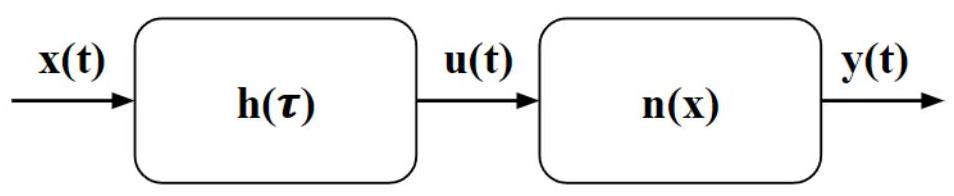

Figure 2.1: Block diagram representation of a Wiener system

图2.1:维纳系统的方框图表示

To identify a system using this representation, $\mathrm{h}\left( \tau \right)$ and $\mathrm{n}\left( \mathrm{u}\right)$ need to be found.

为了使用这种表示来识别系统，需要找到$\mathrm{h}\left( \tau \right)$和$\mathrm{n}\left( \mathrm{u}\right)$。

To do this, Bussgang's Theorem is utilised [7] [8]. This theorem states, that for a zero-mean Gaussian input signal x(t), the output signal of the system y(t) and an arbitrary Gaussian signal z(t), the following is true:

为此，利用了布斯冈定理[7][8]。该定理指出，对于零均值高斯输入信号x(t)、系统的输出信号y(t)和任意高斯信号z(t)，以下情况成立:

$$
{C}_{xz}\left( \tau \right)  = k{C}_{yz}\left( \tau \right) \tag{2.1}
$$

where ${C}_{xz}\left( \tau \right)$ is the cross-correlation function between $x\left( t\right)$ and the arbitrary function $z\left( t\right)$ , ${C}_{yz}\left( \tau \right)$ is the cross-correlation between $y\left( t\right)$ and $z\left( t\right)$ and $k$ is a constant.

其中${C}_{xz}\left( \tau \right)$是$x\left( t\right)$与任意函数$z\left( t\right)$之间的互相关函数，${C}_{yz}\left( \tau \right)$是$y\left( t\right)$与$z\left( t\right)$之间的互相关，且$k$是一个常数。

Note that the system in question must be static and nonlinear. This result will be used to show how $h\left( \tau \right)$ and $n\left( u\right)$ can be computed. As can be seen from Figure 2.1, the input to the nonlinear block is a signal u(t). Therefore $u * n = y$ , where the $*$ operator represents convolution. From Bussgang’s theorem we also know that ${C}_{ux} = \alpha {C}_{yx}$ . Here the ’arbitrary Gaussian signal’ used is the input to the system. We also know that $x * h = u$ and therefore ${C}_{xx} * h = {C}_{ux}$ , which holds true for linear systems. Since ${C}_{xx} * h = {C}_{ux} = \alpha {C}_{yx}$ we now have a relationship between the auto-correlation of the known input to the system and the cross-correlation between the system's input and output, both of which are known. As a result, the impulse response function $\mathrm{h}\left( \tau \right)$ can be found to be $h\left( \tau \right)  = {C}_{xx} \times  \alpha {C}_{yx}$ where the $\times$ operator represents deconvolution. Whilst the value of $\alpha$ is unknown a value can be imposed and the nonlinear block can be modified to account for this constant scaling. Now that $\mathrm{h}\left( \tau \right)$ is known, u can be found by convolving $\mathrm{h}\left( \tau \right)$ with $\mathrm{x}\left( \mathrm{t}\right)$ and this result can then be deconvolved with $\mathrm{y}\left( \mathrm{t}\right)$ to find the static nonlinearity n. An iterative least squares regression algorithm can then be used to parameterise $\mathrm{h}$ and $\mathrm{n}$ . The system has now been identified.

请注意，所讨论的系统必须是静态且非线性的。此结果将用于展示如何计算$h\left( \tau \right)$和$n\left( u\right)$。从图2.1可以看出，非线性模块的输入是信号u(t)。因此$u * n = y$，其中$*$运算符表示卷积。根据布斯冈定理，我们还知道${C}_{ux} = \alpha {C}_{yx}$。这里使用的“任意高斯信号”是系统的输入。我们还知道$x * h = u$，因此${C}_{xx} * h = {C}_{ux}$，这对于线性系统成立。由于${C}_{xx} * h = {C}_{ux} = \alpha {C}_{yx}$，我们现在有了系统已知输入的自相关与系统输入和输出之间的互相关之间的关系，这两者都是已知的。结果，可以发现脉冲响应函数$\mathrm{h}\left( \tau \right)$为$h\left( \tau \right)  = {C}_{xx} \times  \alpha {C}_{yx}$，其中$\times$运算符表示反卷积。虽然$\alpha$的值未知，但可以设定一个值，并修改非线性模块以考虑此常数缩放。现在已知$\mathrm{h}\left( \tau \right)$，通过将$\mathrm{h}\left( \tau \right)$与$\mathrm{x}\left( \mathrm{t}\right)$卷积可以找到u，然后可以用$\mathrm{y}\left( \mathrm{t}\right)$对该结果进行反卷积以找到静态非线性n。然后可以使用迭代最小二乘回归算法对$\mathrm{h}$和$\mathrm{n}$进行参数化。系统现在已被识别。

## Hammerstein Model Analysis

## 哈默斯坦模型分析

Another approach for modelling nonlinear systems is with the Hammerstein representation. This is similar to the Wiener system model since it splits the system into a dynamic linear component and a static nonlinear component. However, in this model, the input of the system first passes through the static nonlinearity before this result is passed into the linear sub-system [9]. This type of system is also referred to as an NL system, since it is composed of a nonlinear sub-system followed by a linear one.

对非线性系统建模的另一种方法是使用哈默斯坦表示。这与维纳系统模型类似，因为它将系统分为一个动态线性组件和一个静态非线性组件。然而，在这个模型中，系统的输入首先通过静态非线性，然后这个结果再进入线性子系统[9]。这种类型的系统也被称为NL系统，因为它由一个非线性子系统后跟一个线性子系统组成。

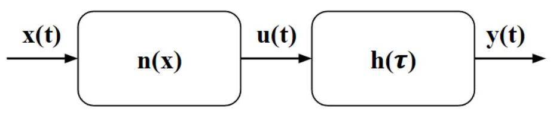

Figure 2.2: Block diagram representation of a Hammerstein system

图2.2:哈默斯坦系统的方框图表示

To identify a system, by solving for $\mathrm{n}\left( \mathrm{x}\right)$ and $\mathrm{h}\left( \mathrm{u}\right)$ , Bussgang’s Theorem can be used again. In this case we can see that ${C}_{xx} = \alpha {C}_{ux}$ , where the arbitrary signal being used is also $\mathrm{x}\left( \mathrm{t}\right)$ . It can also be seen that $Y = h * u$ (* again represents convolution), and since we are describing the linear component: ${C}_{xy} = h * {C}_{xu}$ . Combining this with the previous equation we see that ${C}_{xy} = h * \frac{1}{\alpha }{C}_{xx}$ . By assume a value for alpha, and by performing the deconvolution between the auto-correlation of $\mathrm{x}\left( \mathrm{t}\right)$ and the cross-correlation between $\mathrm{x}\left( \mathrm{t}\right)$ and $\mathrm{y}\left( \mathrm{t}\right) ,\mathrm{h}\left( \tau \right)$ is found. This can be deconvolved with $\mathrm{y}\left( \mathrm{t}\right)$ to find $\mathrm{u}\left( \mathrm{t}\right)$ , and then $\mathrm{u}\left( \mathrm{t}\right)$ can be deconvolved with $\mathrm{x}\left( \mathrm{t}\right)$ to find $\mathrm{n}\left( \mathrm{x}\right)$ . After parameterising $\mathrm{n}\left( \mathrm{x}\right)$ and $\mathrm{h}\left( \tau \right)$ , the system has been identified.

为了识别一个系统，通过求解$\mathrm{n}\left( \mathrm{x}\right)$和$\mathrm{h}\left( \mathrm{u}\right)$，可以再次使用布斯冈定理。在这种情况下，我们可以看到${C}_{xx} = \alpha {C}_{ux}$，其中所使用的任意信号也是$\mathrm{x}\left( \mathrm{t}\right)$。还可以看到$Y = h * u$(*再次表示卷积*)，并且由于我们正在描述线性分量:${C}_{xy} = h * {C}_{xu}$。将其与前面的方程相结合，我们可以看到${C}_{xy} = h * \frac{1}{\alpha }{C}_{xx}$。通过假设一个α值，并通过对$\mathrm{x}\left( \mathrm{t}\right)$的自相关与$\mathrm{x}\left( \mathrm{t}\right)$和$\mathrm{y}\left( \mathrm{t}\right) ,\mathrm{h}\left( \tau \right)$之间的互相关进行反卷积，从而得到结果。这可以与$\mathrm{y}\left( \mathrm{t}\right)$进行反卷积以找到$\mathrm{u}\left( \mathrm{t}\right)$，然后$\mathrm{u}\left( \mathrm{t}\right)$可以与$\mathrm{x}\left( \mathrm{t}\right)$进行反卷积以找到$\mathrm{n}\left( \mathrm{x}\right)$。在对$\mathrm{n}\left( \mathrm{x}\right)$和$\mathrm{h}\left( \tau \right)$进行参数化之后，系统就被识别出来了。

Both the Wiener and Hammerstein models are capable of representing nonlinear systems and are computationally efficient in comparison to other methods. However, these representations and even NLN or LNL models, which are simply combinations of Wiener and Hammerstein models, are unable to model dynamic nonlinearities, which can incorporate non-linear effects at time lags. This makes them poorly suited for the purposes of this project due to the dynamic nonlinear behaviour exhibited by the media used [2] [1].

维纳模型和哈默斯坦模型都能够表示非线性系统，并且与其他方法相比计算效率更高。然而，这些表示方式，甚至是NLN或LNL模型(它们只是维纳模型和哈默斯坦模型的简单组合)，都无法对动态非线性进行建模，动态非线性可以在时间滞后时纳入非线性效应。由于所使用的介质表现出动态非线性行为[2][1]，这使得它们不太适合本项目的目的。

## Volterra Model Analysis

## 沃尔泰拉模型分析

The Volterra series is an expansion that is used to approximate functions, similar to the Taylor series [10] [11]. However, one key difference is that the Volterra series is able to approximate systems with memory, where the output at a given time t, can depend on the system's output at all times less than t [12]. It is a non-parametric model which can model nonlinear systems of arbitrary polynomial order. The formula for the discrete time Volterra Series approximation of a system is:

沃尔泰拉级数是一种用于近似函数的展开式，类似于泰勒级数[10][11]。然而，一个关键的区别是，沃尔泰拉级数能够近似具有记忆的系统，其中在给定时间t的输出可以取决于系统在小于t的所有时间的输出[12]。它是一个非参数模型，可以对任意多项式阶的非线性系统进行建模。系统的离散时间沃尔泰拉级数近似公式为:

$$
y\left\lbrack  n\right\rbrack   = {h}_{0} + \mathop{\sum }\limits_{{{m}_{1} = 0}}^{M}{h}_{1}\left\lbrack  {m}_{1}\right\rbrack  x\left\lbrack  {n - {m}_{1}}\right\rbrack   + \mathop{\sum }\limits_{{{m}_{2} = 0}}^{M}\mathop{\sum }\limits_{{{m}_{1} = 0}}^{M}{h}_{2}\left\lbrack  {{m}_{1},{m}_{2}}\right\rbrack  x\left\lbrack  {n - {m}_{1}}\right\rbrack  x\left\lbrack  {n - {m}_{2}}\right\rbrack   + \ldots .
$$

This shows the expansion up to the second order. The variables ${h}_{0}$ to ${h}_{2}$ are the first three Volterra kernels which represent the system. The zeroth order kernel ${h}_{0}$ , represents the constant bias in the system, ${h}_{1}$ represents the linear impulse response of the system and ${h}_{2}$ represents the quadratic response of the system. For the purposes of the sensor, only these three kernels need to be identified to model the liquid. Here M refers to the memory of the system, which specifies the number of previous input data points used to predict the current output sample. The size of M directly affects the size of the kernels. The figure below illustrates this: Here, ${h}_{0}$ is a single value, ${h}_{1}$ is a column vector of length $\mathrm{M}$ and ${h}_{2}$ is a $M \times  M$ matrix. The grey boxes represent non-zero values, whilst the white boxes represent zeros. When calculating the second order kernel, the sum of ${h}_{ij}$ and ${h}_{ji}$ will approach some constant $\mathrm{k}$ . It is therefore equivalent to set one of these to $\mathrm{k}$ and force the other element to be 0 . This reduces the number of parameters used by the model.

这显示了到二阶的展开式。变量${h}_{0}$到${h}_{2}$是表示系统的前三个沃尔泰拉核。零阶核${h}_{0}$表示系统中的恒定偏差，${h}_{1}$表示系统的线性脉冲响应，${h}_{2}$表示系统的二次响应。对于传感器而言，为了对液体进行建模，只需要识别这三个核。这里M指的是系统的记忆，它指定了用于预测当前输出样本的先前输入数据点的数量。M的大小直接影响核的大小。下图说明了这一点:这里，${h}_{0}$是一个单一值，${h}_{1}$是长度为$\mathrm{M}$的列向量，${h}_{2}$是一个$M \times  M$矩阵。灰色框表示非零值，而白色框表示零值。在计算二阶核时，${h}_{ij}$和${h}_{ji}$的和将趋近于某个常数$\mathrm{k}$。因此，将其中一个设置为$\mathrm{k}$并强制另一个元素为0是等效的。这减少了模型使用的参数数量。

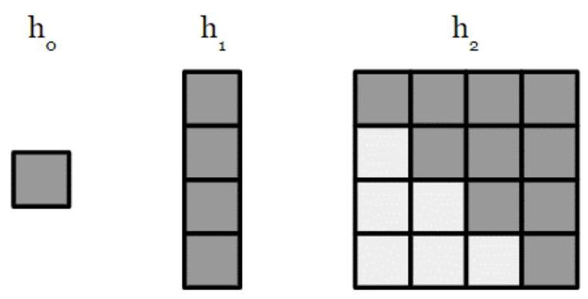

Figure 2.3: Visual example showing the size of the Volterra kernels for a memory length of 4 samples.

图2.3:显示记忆长度为4个样本时沃尔泰拉核大小的可视化示例。

The Volterra series is an extremely powerful tool for modelling nonlinear systems. Not only is it able to model dynamic nonlinearities, it also imposes no restrictions on the probability distribution of the input signal into the system. This is not the case for Hammerstein and Wiener systems, which require Gaussian input signals to leverage Bussgang's theorem, for the initial identification of the system. It is therefore the choice of nonlinear model used in this project.

沃尔泰拉级数是用于对非线性系统进行建模的极其强大的工具。它不仅能够对动态非线性进行建模，而且对进入系统的输入信号的概率分布没有限制。汉默斯坦系统和维纳系统则并非如此，它们需要高斯输入信号才能利用布斯冈定理对系统进行初始识别。因此，它是本项目中使用的非线性模型的选择。

Despite this, the Volterra series model of a system is not without flaws. As the complexity of the system being modelled increases, higher order kernels and longer memory are required to model the system's dynamics. This results in a polynomial growth in the number of parameters used to represent the system, which in turn requires longer input data, to prevent over-fitting. This results in extremely long memory and computationally intensive procedures required to identify the Volterra kernels, usually limiting the series expansion to the first non-trivial nonlinear kernel, which is typically the second or third order kernel, depending on the system. This phenomena is also known as the curse of dimensionality [13].

尽管如此，系统的沃尔泰拉级数模型并非没有缺陷。随着所建模系统的复杂性增加，需要更高阶的核和更长的记忆来对系统动态进行建模。这导致表示系统所用参数的数量呈多项式增长，进而需要更长的输入数据以防止过拟合。这就需要极长的记忆和计算密集型程序来识别沃尔泰拉核，通常将级数展开限制为第一个非平凡的非线性核，根据系统不同，通常是二阶或三阶核。这种现象也被称为维数灾难[13]。

## Evaluating Models

## 评估模型

The Variance Accounted For (VAF) metric is a commonly used measure to evaluate the performance of a dynamic system model by comparing the predicted output of the model to the actual output of the system. It is defined as the percentage of the output variance that is explained by the model. A higher VAF value indicates a better model fit. The VAF is calculated using the following formula:

解释方差(VAF)指标是一种常用的度量，用于通过将模型的预测输出与系统的实际输出进行比较来评估动态系统模型的性能。它被定义为模型所解释的输出方差的百分比。更高的VAF值表示模型拟合更好。VAF使用以下公式计算:

$$
\operatorname{VAF} = \left( {1 - \frac{\operatorname{Var}\left( {y - \widehat{y}}\right) }{\operatorname{Var}\left( y\right) }}\right)  \times  {100}\% ,
$$

where $y$ is the actual output, $\widehat{y}$ is the predicted output, and $\operatorname{Var}\left( \cdot \right)$ denotes the statistical variance. The VAF value ranges up to a maximal ${100}\%$ , which indicates a perfect fit. This metric will be used to evaluate the performance of the Volterra series models.

其中$y$是实际输出，$\widehat{y}$是预测输出，$\operatorname{Var}\left( \cdot \right)$表示统计方差。VAF值最高可达最大${100}\%$，这表示完美拟合。此指标将用于评估沃尔泰拉级数模型的性能。

### 2.2 Electrochemical Sensor

### 2.2 电化学传感器

The Electrochemical sensor of this project works by applying a stochastic voltage between two electrodes, submerged in the medium of study. This results in current flow through the medium, between the electrodes. By observing the current output due to the stochastic voltage signal, the impedance of the medium and how it changes over time can be identified. Conversely, as is done within this project, by treating the current as the input of the system and the voltage across the medium as the output, the admittance of the medium is observed and modelled. Since the impedance and admittance are reciprocals of each other, the information captured by monitoring these is equivalent.

本项目的电化学传感器通过在浸没于研究介质中的两个电极之间施加随机电压来工作。这导致电流在电极之间流过介质。通过观察由于随机电压信号产生的电流输出，可以识别介质的阻抗及其随时间的变化。相反，如本项目中所做的那样，将电流视为系统的输入，将介质两端的电压视为输出，可以观察和建模介质的导纳。由于阻抗和导纳是相互倒数，通过监测它们所捕获的信息是等效的。

An existing electrochemical sensor and monitoring station have been built by my project advisor, Michael Aling.

我的项目导师迈克尔·阿林已经构建了一个现有的电化学传感器和监测站。

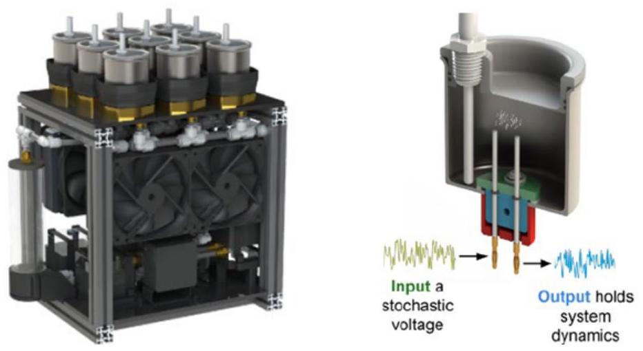

Figure 2.4: A CAD rendering of the sensor + monitoring station (left) and a rendering of the sample container (right) - Reproduced with permission from [1] (left) and [3] (right).

图2.4:传感器+监测站的CAD渲染图(左)和样品容器的渲染图(右) - 经[1](左)和[3](右)许可复制。

The monitoring station refers to the sensor alongside the other components needed to maintain a constant temperature for experiments. This station in Figure 2.4 has nine containers which are filled with the medium(s) being studied. The electrodes protrude from the base of the containers and are connected to the function generator and oscilloscope instruments at their base. Since the impedance of the medium is highly temperature dependent, radiators and a thermoelectric system have been integrated into the monitoring station to regulate the temperature for experiments.

监测站是指传感器以及为实验维持恒定温度所需的其他组件。图2.4中的这个监测站有九个容器，里面装满了正在研究的介质。电极从容器底部伸出，并在其底部连接到函数发生器和示波器仪器。由于介质的阻抗高度依赖于温度，散热器和热电系统已集成到监测站中以调节实验温度。

This sensor configuration has been built and used to collect data on a series of liquids and was used to gather data on milk (described in greater detail in chapter 4) . Whilst the sensor is able to gather data which can be passed into the Volterra Series identification software for this project, the configuration remains large, making it difficult to carry and move. This is because it has incorporated temperature control. However, the end-use sensors are designed to be handheld and will not require this [2]. The form factor of the sensor will depend on the application for its intended use.

这种传感器配置已经构建并用于收集一系列液体的数据，并用于收集牛奶数据(在第4章中更详细描述)。虽然该传感器能够收集可传入本项目的沃尔泰拉级数识别软件的数据，但该配置仍然很大，难以携带和移动。这是因为它包含了温度控制。然而，最终使用的传感器设计为手持式，不需要这个[2]。传感器的外形将取决于其预期用途的应用。

#### 2.2.1 Sensor Applications

#### 2.2.1 传感器应用

## Milk Analysis

## 牛奶分析

One of the wide range of applications for the sensor is modeling and monitoring the electrochemical properties of milk. By understanding the electrochemical behavior of milk, we can form a 'standard' template that reflects the expected behavior of clean, safe milk. The sensor can then be used in a production or packaging environment to monitor milk and compare its properties to the standard results. This allows for the identification of bulk composition changes and biofilm formation, which can indicate spoilage or contamination [14] [15] [16].

该传感器的广泛应用之一是对牛奶的电化学性质进行建模和监测。通过了解牛奶的电化学行为，我们可以形成一个“标准”模板，反映清洁、安全牛奶的预期行为。然后，该传感器可用于生产或包装环境中监测牛奶，并将其性质与标准结果进行比较。这允许识别总体成分变化和生物膜形成，这可能表明牛奶变质或受到污染[14][15][16]。

Additionally, by monitoring the change in impedance of the milk, it is possible to attribute deviations from the expected Volterra kernels to the presence of bacteria within the milk. Milk can contain various bacteria, such as Salmonella, Escherichia coli (E. coli), Staphylococcus aureus, and Listeria [17] [18]. The presence of these bacteria can lead to significant health risks if not detected and subsequently ingested.

此外，通过监测牛奶阻抗的变化，可以将与预期沃尔泰拉核的偏差归因于牛奶中细菌的存在。牛奶可能含有各种细菌，如沙门氏菌、大肠杆菌、金黄色葡萄球菌和李斯特菌[17][18]。如果这些细菌未被检测到并随后被摄入，可能会导致重大健康风险。

One common cause of bacterial contamination in milk is the health of the cows, specifically the presence of subclinical mastitis. Subclinical mastitis is an infection of a cow's udder. Unlike clinical mastitis which shows clear signs such as raw, swollen udders and clots in the milk, there are no visual symptoms for subclinical mastitis. With the lack of visual symptoms and the fact that the infection can be up to twenty times more prevalent than clinical mastitis, it is imperative that effective measures are put in place to identify and cure the infection as fast as possible [19] [20] [21].

<text>牛奶中细菌污染的一个常见原因是奶牛的健康状况，特别是亚临床型乳腺炎的存在。亚临床型乳腺炎是奶牛乳房的一种感染。与临床型乳腺炎不同，临床型乳腺炎有明显症状，如乳房红肿、乳汁中有凝块，而亚临床型乳腺炎没有明显的视觉症状。由于缺乏视觉症状，且这种感染的发生率可能比临床型乳腺炎高二十倍，因此必须采取有效措施尽快识别和治疗这种感染[19][20][21]。</text>

Currently, one method to detect subclinical mastitis is by measuring the somatic cell count (SCC) of the milk. A higher SCC indicates a higher likelihood of infection, but this method is not foolproof and often requires additional culture tests to confirm the presence of bacteria [22] [23]. This process is time-consuming and expensive.

<text>目前，检测亚临床型乳腺炎的一种方法是测量牛奶中的体细胞计数(SCC)。体细胞计数越高，感染的可能性就越大，但这种方法并不万无一失，通常需要额外的培养测试来确认细菌的存在[22][23]。这个过程既耗时又昂贵。</text>

After the full development of the sensor, it should be able to be placed in a container of milk and provide rapid detection of infection due to changes in the biochemical composition of the milk. This rapid detection can be used to prevent cross-contamination of the milk and therefore reduces the amount that has to be discarded. It can also help save money and reduce the risk of supplying contaminated milk, thereby increasing consumer safety. Additionally, it enables the rapid treatment of cows, reducing the duration of their suffering before a diagnosis is made.

<text>传感器完全开发完成后，应能够放置在牛奶容器中，并根据牛奶生化成分的变化快速检测感染情况。这种快速检测可用于防止牛奶交叉污染，并因此减少需要丢弃的牛奶量。它还可以帮助节省资金，降低供应受污染牛奶的风险，从而提高消费者安全性。此外，它能够对奶牛进行快速治疗，缩短诊断前的痛苦时间。</text>

## Well Plate Bacteria Monitoring

<text>## 微孔板细菌监测</text>

Another promising application of the sensor is in studying the doubling rate of bacteria when fed different sugars. Typically, glucose is used in bacterial growth experiments. However, there are more cost-effective sugars available that could result in similar growth curves to that of Glucose based solutions, but at a fraction of the price. This has been an area of research for Dr. Cathy Hogan of the MIT BioInstrumentation Lab, who proposed this application for the electrochemical sensor.

<text>该传感器的另一个有前景的应用是研究喂食不同糖类时细菌的倍增率。通常，葡萄糖用于细菌生长实验。然而，有更具成本效益的糖类可供使用，它们可以产生与基于葡萄糖的溶液相似的生长曲线，但价格仅为其几分之一。这一直是麻省理工学院生物仪器实验室的凯西·霍根博士的研究领域，她提出了这种电化学传感器的应用。</text>

When determining the doubling rate of bacteria (for a given solution), the bacteria is placed in a sugar solution and left to incubate at ${29}^{ \circ  }\mathrm{C}$ . After a set duration of time, a researcher has to remove the plate holding the bacteria from the incubator, take an aliquot of the sample and then use a device such as a spectrophotometer, to determine a metric which can then be used to identify the population of bacteria given some standard curves. The sample can then be returned to the incubator and this process is repeated. By tracking the population repeatedly after set intervals, this can be plotted to ascertain the doubling rate of the bacteria within the used solution. This is inherently laborious and is a method that does not always work.

<text>在确定细菌的倍增率(对于给定溶液)时，将细菌置于糖溶液中，并在${29}^{ \circ  }\mathrm{C}$下孵育。经过设定的时间后，研究人员必须从培养箱中取出装有细菌的平板器，取一份样品等分试样，然后使用分光光度计等设备确定一个指标，然后根据一些标准曲线来确定细菌数量。然后可以将样品放回培养箱，并重复此过程。通过在设定的时间间隔后反复跟踪细菌数量，可以绘制图表以确定所用溶液中细菌的倍增率。这本质上很费力，而且是一种并不总是有效的方法。</text>

For example, with K. Xylinus, a particular strain of bacteria, when it grows in the presence of sugar, a solid pellicle forms on the surface of the solution. This means that a spectrophotometer cannot be used to identify the population of the bacteria. Furthermore, this strain of bacteria is aerobic, meaning that the bacteria require oxygen. For this reason, the bacteria remain on top of the pellicle. By attempting to take a sample of the solution and disturbing the pellicle layer, the sample would be rendered useless and another sample would have to be used. This poses a problem for researchers and is an example of where the electrochemical sensor can be used.

<text>例如对于木醋杆菌(K. Xylinus)，一种特定的细菌菌株，当它在糖存在的情况下生长时，溶液表面会形成一层固体薄膜。这意味着不能使用分光光度计来确定细菌数量。此外，这种细菌菌株是需氧的，这意味着细菌需要氧气。因此，细菌留在薄膜顶部。试图取溶液样品并扰动薄膜层会使样品变得无用，必须使用另一个样品。这给研究人员带来了问题，这就是电化学传感器可以使用的一个例子。</text>

By modifying the sensor to fit into a 6x4 well plate, it can be used to monitor the impedance of the solution and from the changes in this, infer the growth of bacteria. It may therefore be able to estimate the doubling rate of bacteria within the wells. This modification automates the process, eliminating the need for researcher intervention during the incubation period and by passes the need for plate counting methods. The pellicle can grow around the sensor's electrodes, allowing continuous monitoring without discarding samples. With this, it could therefore be possible to monitor the doubling rate of the bacteria, even with the presence of the pellicles and the sensor could then be used to identify alternative sugars to Glucose that lead to rapid bacterial growth. One such potential alternative is 'corn steep liquor'. This is a by-product of the wet-milling of corn, and is extremely cheap. If a sugar such as this, where to provide fruitful results, the cost of running experiments could be significantly decreased, and another use could be found for, what is considered a waste product.

<text>通过将传感器修改为适合6x4微孔板，可以用于监测溶液的阻抗，并根据此变化推断细菌的生长情况。因此，它可能能够估计微孔板内细菌的倍增率。这种修改使过程自动化，消除了培养期间研究人员干预的需要，并且无需平板计数方法。薄膜可以在传感器电极周围生长，允许连续监测而无需丢弃样品。这样，即使存在薄膜，也有可能监测细菌的倍增率，然后该传感器可用于识别除葡萄糖之外能导致细菌快速生长的替代糖类。一种这样的潜在替代品是“玉米浆”。这是玉米湿法研磨的副产品，极其便宜。如果这样的糖类能产生丰硕成果，运行实验的成本可能会大幅降低，并且可以为被视为废品的东西找到另一个用途。</text>

A key aspect of this project has been the initial development of the well-plate sensor's form factor, as well as preliminary experimentation to determine the viability of this concept.

<text>该项目的一个关键方面是微孔板传感器外形的初步开发，以及确定这一概念可行性的初步实验。</text>

## Chapter 3 Volterra Series for Electrochemical System Analysis

<text>## 第3章 用于电化学系统分析的沃尔泰拉级数</text>

There are a variety of ways in which the Volterra kernels of a system can be determined [24] [25]. For this research, two different algorithms were developed for this task. One approach represents the data as a matrix and a tensor for optimised data prediction, whereas the second approach transforms a neural network into the Volterra kernels, leveraging existing optimisations for machine learning libraries.

系统的沃尔泰拉核有多种确定方法[24][25]。针对本研究，为此任务开发了两种不同算法。一种方法将数据表示为矩阵和张量以进行优化的数据预测，而第二种方法则将神经网络转换为沃尔泰拉核，利用机器学习库的现有优化。

#### 3.0.1 Tensor Approach

#### 3.0.1张量方法

The Tensor approach starts with a randomly initialised set of kernels: A single random value for ${h}_{0}$ , a random vector of length $\mathrm{M}$ for ${h}_{1}$ and a random lower triangular $\left( {M \times  M}\right)$ matrix for ${h}_{2}$ . Here and through the rest of the paper, $\mathrm{M}$ will refer to the memory length being utilised. The kernels are then used to predict the output of the system. This predicted output is then compared with the actual system output, using a Mean Square Error (MSE) loss function and the program utilises gradient descent to modify each value within the kernels to minimise this loss function. The Adam optimiser is used to compute adaptive learning rates for each parameter. In addition to this, L2 regularisation is used to encourage the kernel values to spread out more evenly. Other details, such as early exiting, detecting early convergence of the gradient descent etc, can be seen in the code, added to the appendix.

张量方法从一组随机初始化的核开始:${h}_{0}$的单个随机值、${h}_{1}$的长度为$\mathrm{M}$的随机向量以及${h}_{2}$的随机下三角$\left( {M \times  M}\right)$矩阵。在此处及本文其余部分，$\mathrm{M}$将指代所使用的记忆长度。然后使用这些核来预测系统的输出。接着，使用均方误差(MSE)损失函数将此预测输出与实际系统输出进行比较，并且程序利用梯度下降来修改核内的每个值以最小化此损失函数。Adam优化器用于为每个参数计算自适应学习率。除此之外，L2正则化用于促使核值更均匀地分布。其他细节，如提前退出、检测梯度下降的早期收敛等，可在添加到附录的代码中看到。

To predict the output of the system from a set of Volterra Kernels, the following formula can be utilised:

为了从一组沃尔泰拉核预测系统的输出，可以使用以下公式:

$$
y\left\lbrack  n\right\rbrack   = {h}_{0} + \mathop{\sum }\limits_{{{m}_{1} = 0}}^{M}{h}_{1}\left\lbrack  {m}_{1}\right\rbrack  x\left\lbrack  {n - {m}_{1}}\right\rbrack   + \mathop{\sum }\limits_{{{m}_{2} = 0}}^{M}\mathop{\sum }\limits_{{{m}_{1} = 0}}^{M}{h}_{2}\left\lbrack  {{m}_{1},{m}_{2}}\right\rbrack  x\left\lbrack  {n - {m}_{1}}\right\rbrack  x\left\lbrack  {n - {m}_{2}}\right\rbrack   + \ldots .
$$

This predicts the ${n}^{th}$ output data point. This must be computed for each output data point and must be performed during every iteration of the algorithm, to pass into the loss function and optimise. This is a complicated calculation which must be performed millions of times per execution of the program. To speed up the execution of the algorithm, matrix and tensor operations, which have been optimised for rapid computation, can be used. The tensors are therefore structures that have been created to allow the rapid computation of the predicted output during each iteration of the gradient descent.

这预测了${n}^{th}$输出数据点。必须为每个输出数据点计算此值，并且必须在算法的每次迭代期间执行，以传入损失函数并进行优化。这是一个复杂的计算，每次程序执行都必须执行数百万次。为了加快算法的执行速度，可以使用针对快速计算进行了优化的矩阵和张量运算。因此，张量是为了在梯度下降的每次迭代期间允许快速计算预测输出而创建的结构。

For this approach, we consider the predicted output from each kernel individually and sum their contribution at the end to generate the predicted output. Since ${h}_{0}$ is a constant it is simply added to each output data point to shift them. In practice this should be 0 for the systems being dealt with, although due to the numerical computation this may drift from this value slightly. When focusing on the linear response of the system, this can be found by focusing on the predicted output when using ${h}_{1}$ . To do this we can consider a small example.

对于此方法，我们分别考虑每个核的预测输出，并在最后将它们的贡献相加，以生成预测输出。由于${h}_{0}$是一个常数，它只需简单地添加到每个输出数据点以对其进行偏移。实际上，对于所处理的系统，此值应为0，尽管由于数值计算，它可能会略微偏离此值。当关注系统的线性响应时，可以通过关注使用${h}_{1}$时的预测输出找到它。为此，我们可以考虑一个小例子。

Consider an input data tensor xT1, where each row represents a window of the input signal with a specified memory length. Each row holds M points of the input signal, and each row is simply a shifted version of the previous row. The rows also get reversed. This is an implementation choice to keep in line with Hunter and Spanbauer [26]. The first-order kernel h1 is a vector containing the weights associated with each memory sample.

考虑输入数据张量xT1，其中每行表示具有指定记忆长度的输入信号的一个窗口。每行包含输入信号的M个点，并且每行只是前一行的移位版本。行也会反转。这是为了与Hunter和Spanbauer[26]保持一致而做出的实现选择。一阶核h1是一个包含与每个记忆样本相关联的权重的向量。

Let $\mathbf{{xT1}}$ be a tensor of shape $\left\lbrack  {n, M}\right\rbrack$ , where $n$ is the number of windows and $M$ is the memory length. The kernel h1 is a vector of length $M$ . The goal is to compute the contribution of the first-order kernel to the output,

设$\mathbf{{xT1}}$是形状为$\left\lbrack  {n, M}\right\rbrack$的张量，其中$n$是窗口数量，$M$是记忆长度。核h1是长度为$M$的向量。目标是计算一阶核对输出的贡献，

$$
\mathbf{{xT1}} = \left\lbrack  \begin{matrix} {x}_{11} & {x}_{12} & \cdots & {x}_{1M} \\  {x}_{21} & {x}_{22} & \cdots & {x}_{2M} \\  \vdots & \vdots &  \ddots  & \vdots \\  {x}_{N1} & {x}_{N2} & \cdots & {x}_{NM} \end{matrix}\right\rbrack  ,\;\mathbf{{h1}} = \left\lbrack  \begin{matrix} {h}_{1} \\  {h}_{2} \\  \vdots \\  {h}_{M} \end{matrix}\right\rbrack  . \tag{3.1}
$$

First, perform the element-wise multiplication between each row of $\mathbf{{xT1}}$ and the vector $\mathbf{{h1}}$ . This yields another tensor of the same shape as $\mathbf{{xT1}}$ , which is:

首先，对$\mathbf{{xT1}}$的每行与向量$\mathbf{{h1}}$进行逐元素乘法。这会产生一个与$\mathbf{{xT1}}$形状相同的另一个张量，即:

$$
\mathbf{{xT}}\mathbf{1} \odot  \mathbf{h}\mathbf{1} = \left\lbrack  \begin{matrix} {x}_{11}{h}_{1} & {x}_{12}{h}_{2} & \cdots & {x}_{1M}{h}_{M} \\  {x}_{21}{h}_{1} & {x}_{22}{h}_{2} & \cdots & {x}_{2M}{h}_{M} \\  \vdots & \vdots &  \ddots  & \vdots \\  {x}_{N1}{h}_{1} & {x}_{N2}{h}_{2} & \cdots & {x}_{NM}{h}_{M} \end{matrix}\right\rbrack  . \tag{3.2}
$$

Next, by summing each row to obtain a single value per row, the resultant vector y1 of length $n$ , is the sum of the products for the corresponding window,

接下来，通过对每行求和以获得每行的单个值，长度为$n$的结果向量y1是相应窗口的乘积之和，

$$
\mathbf{y}\mathbf{1} = \left\lbrack  \begin{matrix} \mathop{\sum }\limits_{{j = 1}}^{M}{x}_{1j}{h}_{j} \\  \mathop{\sum }\limits_{{j = 1}}^{M}{x}_{2j}{h}_{j} \\  \vdots \\  \mathop{\sum }\limits_{{j = 1}}^{M}{x}_{Nj}{h}_{j} \end{matrix}\right\rbrack \tag{3.3}
$$

In the context of the Volterra model, $\mathbf{{y1}}$ represents the contribution of the first order kernel to the output. From this it can be see that the use of a matrix $\mathbf{x{T1}}$ can allow for the linear prediction for the entire signal at once.

在沃尔泰拉模型的背景下，$\mathbf{{y1}}$表示一阶核对输出的贡献。由此可以看出，使用矩阵$\mathbf{x{T1}}$可以一次对整个信号进行线性预测。

For a given input signal of length $\mathrm{N}$ , the predicted output is of length $n = N - M + 1$ . This is because M previous samples are needed to generate each output data point. This notation will be re-used throughout the paper.

对于长度为$\mathrm{N}$的给定输入信号，预测输出的长度为$n = N - M + 1$。这是因为生成每个输出数据点需要M个先前样本。此符号将在本文中反复使用。

Similar to this, a tensor xT2 can be used to compute the contribution of the second order kernel to the output. The computation of this contribution involves two separate time lags, alongside the ${h}_{2}$ matrix. To represent this in a way that allows the prediction of the entire output signal at once, a tensor can be used. This tensor xT2 has $n$ layers, each of size $M \times  M$ . The elements of the tensor are denoted as ${x}_{ijk}$ where $i$ and $j$ are the row and column indices of each matrix, and $k$ is the layer index.

与此类似，张量xT2可用于计算二阶核函数对输出的贡献。此贡献的计算涉及两个独立的时间滞后，以及${h}_{2}$矩阵。为了以一种能够一次性预测整个输出信号的方式来表示这一点，可以使用一个张量。这个张量xT2有$n$层，每层大小为$M \times  M$。张量的元素表示为${x}_{ijk}$，其中$i$和$j$是每个矩阵的行索引和列索引，$k$是层索引。

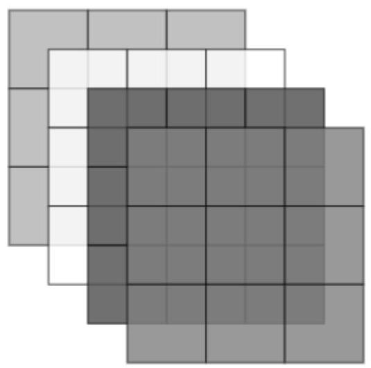

Figure 3.1: A visualisation of xT2's structure. Here it can be seen that the memory length being used for both time lags is 3, and that there are 4 windows. This will enable the prediction of four data points.

图3.1:xT2结构的可视化。在此可以看到，用于两个时间滞后的记忆长度为3，并且有四个窗口。这将能够预测四个数据点。

Each layer of xT2 is a lower triangular matrix. The elements of each layer are formed by the outer products of the lagged input values (the same windows used to generate xT1). Once the the outer product is found, the rows of the matrix and reversed and then the columns of the matrix are reversed (keeping in line with Hunter and Spanbauer's work).

xT2的每一层都是一个下三角矩阵。每一层的元素由滞后输入值的外积形成(与用于生成xT1的窗口相同)。一旦找到外积，矩阵的行被反转，然后矩阵的列被反转(与Hunter和Spanbauer的工作一致)。

The contribution of the second-order kernel to the output is computed by first performing the element-wise multiplication of ${h}_{2}$ with each layer of xT2. Each element of the layer can then be summed to collapse the layer into a scalar value, entirely analogous to the use of xT1. This then results in a column vector of length $\mathrm{n}$ of the form:

二阶核函数对输出的贡献是通过首先将${h}_{2}$与xT2的每一层进行逐元素乘法来计算的。然后可以对层的每个元素求和，将层压缩为一个标量值，这与xT1的使用完全类似。这就产生了一个长度为$\mathrm{n}$的列向量，形式如下:

$$
{y2} = \left\lbrack  \begin{matrix} \mathop{\sum }\limits_{{i = 1}}^{M}\mathop{\sum }\limits_{{j = 1}}^{M}{x}_{1i}{x}_{1j}{h}_{ij} \\  \mathop{\sum }\limits_{{i = 1}}^{M}\mathop{\sum }\limits_{{j = 1}}^{M}{x}_{2i}{x}_{2j}{h}_{ij} \\  \vdots \\  \mathop{\sum }\limits_{{i = 1}}^{M}\mathop{\sum }\limits_{{j = 1}}^{M}{x}_{Ni}{x}_{Nj}{h}_{ij} \end{matrix}\right\rbrack  .
$$

Now that the contributions due to each kernel are known, the vectors can be added to give the predicted output and the algorithm can work as previously described.

现在已知每个核函数的贡献，就可以将这些向量相加得到预测输出，并且算法可以如前所述那样工作。

## Memory Averaging and Stepping

## 记忆平均与步长

As described in 2.1.2, the Volterra series representation of a system suffers from the curse of dimensionality. To represent complicated systems, larger memory lengths must be used.This is because the lowest frequency identifiable by the model is determined by the length of the impulse response which corresponds to the memory length being used. A higher memory length is needed to model a broader frequency spectrum.

如2.1.2中所述，系统的Volterra级数表示存在维度灾难问题。为了表示复杂系统，必须使用更大的记忆长度。这是因为模型能够识别的最低频率由与所使用的记忆长度相对应的脉冲响应长度决定。为了对更宽的频谱进行建模，需要更高的记忆长度。

However, for a system utilising the first 3 kernels, the number of parameters used by the model is $\frac{1}{2}{M}^{2} + \frac{3}{2}M + 1$ . Increasing the memory length can rapidly result in over-parametrisation and can lead to a set of kernels from which realistic electrochemical properties cannot be inferred. To prevent this it is good to ensure that the number of parameters used by the model remains strictly less than ${10}\%$ of the input signal length. For this to be true, the program requires extremely long input signals which does not suit the tensor approach. xT1 and xT2 have dimensions $\left\lbrack  {\left( {N - M + 1}\right)  \times  M}\right\rbrack$ and $\left\lbrack  {M \times  M \times  \left( {N - M + 1}\right) }\right\rbrack$ respectively. A polynomial increase in the number of parameters in the model results in a required polynomial increase in the length of the input signal, with respect to the memory length used. This then results in extremely large xT1 and xT2 structures, making it difficult to run the program on systems with low/moderate memory.

然而，对于一个使用前3个核函数的系统，模型使用的参数数量是$\frac{1}{2}{M}^{2} + \frac{3}{2}M + 1$。增加记忆长度会迅速导致过参数化，并可能导致一组无法从中推断出实际电化学性质的核函数。为了防止这种情况，最好确保模型使用的参数数量严格小于输入信号长度的${10}\%$。要做到这一点，程序需要极长的输入信号，这不适用于张量方法。xT1和xT2的维度分别为$\left\lbrack  {\left( {N - M + 1}\right)  \times  M}\right\rbrack$和$\left\lbrack  {M \times  M \times  \left( {N - M + 1}\right) }\right\rbrack$。模型中参数数量的多项式增加会导致输入信号长度相对于所使用的记忆长度有多项式增加。这就导致了xT1和xT2结构极大，使得在低/中等内存的系统上运行程序变得困难。

The required memory length to identify a specific minimum frequency is:

识别特定最低频率所需的记忆长度为:

$$
M = \frac{\text{ Sampling Frequency }}{\text{ Minimum Identifiable Frequency }}.
$$

However, this implictly assumes that when generating 'windows' of previous data points, these data points are consecutive in the signal. However, by spacing out the points used to represent the system memory, for the same number of points, a larger amount of time can be represented by the system memory. This way lower frequencies can be observed by the model by simply increasing the spacing between memory points as opposed to increasing the length of the memory. The formula for the minimum memory length required would therefore become:

然而，这隐含地假设在生成先前数据点的“窗口”时，这些数据点在信号中是连续的。然而，通过拉开用于表示系统记忆的点之间的间距，对于相同数量的点，系统记忆可以表示更长的时间。这样，模型只需通过简单增加记忆点之间的间距而不是增加记忆长度，就可以观察到更低的频率。因此，所需的最小记忆长度公式将变为:

$$
M = \frac{\text{ Sampling Frequency }}{\text{ Minimum Identifiable Frequency }} \times  \frac{1}{S}.
$$

$\mathrm{S}$ is the spacing factor, which corresponds to the number of data points in between the points used by the memory. If every 5th point is used for the memory, the memory length can decrease by a factor of 5 , or for the same memory length, the minimum identifiable frequency decreases by a factor of 5 .

$\mathrm{S}$是间距因子，它对应于记忆所使用的点之间的数据点数量。如果每5个点用于记忆，则记忆长度可以减少5倍，或者对于相同的记忆长度，最小可识别频率降低5倍。

To allow the skipped input values to still influence the memory window, an averaging effect was incorporated into the program. This means that the data point included in memory is averaged with the ones that get skipped after it. Suppose we have an input signal and decide to use a memory length $M = 5$ with a step size of 2 . This means that each memory window will include 5 data points, but spans the same amount of time as 10 points in the original input signal. The step size of 2 implies that we select every second data point to include in the memory window. For example, with a step size of 1, a regular memory window would be $\left\lbrack  {{x}_{1},{x}_{2},{x}_{3},{x}_{4},{x}_{5}}\right\rbrack$ . However, with a step size of 2, the memory window would be $\left\lbrack  {{x}_{1},{x}_{3},{x}_{5},{x}_{7},{x}_{9}}\right\rbrack$ , where ${x}_{i}$ represents the ${\mathrm{i}}^{th}$ data point in the input signal $\mathrm{x}$ .

为了使跳过的输入值仍能影响内存窗口，程序中引入了平均效应。这意味着内存中包含的数据点会与它之后跳过的数据点进行平均。假设我们有一个输入信号，并决定使用长度为$M = 5$、步长为2的内存。这意味着每个内存窗口将包含5个数据点，但覆盖的时间与原始输入信号中的10个点相同。步长为2意味着我们每隔一个数据点选择一个包含在内存窗口中。例如，步长为1时，常规的内存窗口将是$\left\lbrack  {{x}_{1},{x}_{2},{x}_{3},{x}_{4},{x}_{5}}\right\rbrack$。然而，步长为2时，内存窗口将是$\left\lbrack  {{x}_{1},{x}_{3},{x}_{5},{x}_{7},{x}_{9}}\right\rbrack$，其中${x}_{i}$表示输入信号$\mathrm{x}$中的第${\mathrm{i}}^{th}$个数据点。

To ensure that the data points excluded by the step size still influence the memory window, an averaging effect can be applied. This means that each included data point in the memory window is an average of the skipped data points and the preceding value in the memory window. For instance, with a step size of 2 and averaging, the resulting memory window becomes:

为确保被步长排除的数据点仍能影响内存窗口，可以应用平均效应。这意味着内存窗口中包含的每个数据点都是跳过的数据点与内存窗口中前一个值的平均值。例如，步长为2并采用平均时，得到的内存窗口如下:

$$
\left\lbrack  {\frac{{x}_{1} + {x}_{2}}{2},\frac{{x}_{3} + {x}_{4}}{2},\frac{{x}_{5} + {x}_{6}}{2},\frac{{x}_{7} + {x}_{8}}{2},\frac{{x}_{9} + {x}_{10}}{2}}\right\rbrack  .
$$

This approach allows the use of spacing to avoid having to increase the memory length by drastic amounts, whilst still enabling skipped values to influence the memory window.

这种方法允许利用间距来避免大幅增加内存长度，同时仍能使跳过的值影响内存窗口。

## GPU utilisation

## GPU利用率

To enhance the performance of the program, particularly in terms of execution speed, the incorporation of GPU acceleration was explored. By leveraging the parallel processing capabilities of GPUs, a significant reduction in training time was achieved. This improvement is crucial for handling large input signals, which is a requirement for the complex systems being studied.

为了提高程序的性能，特别是在执行速度方面，研究了引入GPU加速。通过利用GPU的并行处理能力，训练时间大幅减少。这种改进对于处理大型输入信号至关重要，而处理大型输入信号是所研究的复杂系统的一项要求。

To test the difference in speed between the CPU and GPU, the time taken for the program to find a set of kernels was monitored. The program was given a 10,000 sample input signal and was ran for a range of memory lengths varying from 2 to 32 samples. This was repeated and averaged over 5 trials. The CPU based code took a total of 400 minutes to execute. This is an extremely long time, especially considering that when testing the code on real experiment data, the input will be much larger than 10,000 samples. Faster execution is therefore needed. By modifying the code to utilise the GPU, the execution time drastically dropped by a factor of 11 to 35 minutes. The GPU used is an NVIDIA GeForce RTX 4060 and the CPU used is an intel i7-12700H.

为了测试CPU和GPU之间的速度差异，监测了程序找到一组内核所需的时间。程序被给予一个10,000样本的输入信号，并针对从2到32样本的一系列内存长度运行。重复此操作并在5次试验中求平均值。基于CPU的代码总共需要400分钟来执行。这是一个极长的时间，特别是考虑到在对实际实验数据进行代码测试时，输入将远大于10,000样本。因此需要更快的执行速度。通过修改代码以利用GPU，执行时间大幅下降了11倍，降至35分钟。使用的GPU是NVIDIA GeForce RTX 4060，使用的CPU是英特尔i7-12700H。

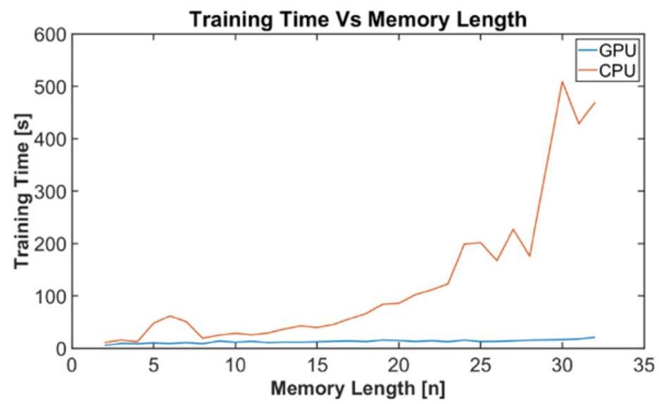

Figure 3.2: Shows the training time vs memory length for the program, both when the GPU is used and when the CPU is being used exclusively.

图3.2:显示了程序在使用GPU和仅使用CPU时的训练时间与内存长度的关系。

From the graph it can be seen that the training time for the code utilising the GPU remains relatively constant as memory length increases, whilst the CPU based code is rapidly increasing, meaning that an even bigger speed increase can be expected for a larger input signal and higher memory length.

从图中可以看出，随着内存长度增加，使用GPU的代码的训练时间保持相对稳定，而基于CPU的代码则迅速增加，这意味着对于更大的输入信号和更高的内存长度，可以预期速度会有更大的提升。

## Batch Processing

## 批处理

Due to the drastic increase in input signal length required for a small change in memory length, the step and averaging feature was introduced into the program. However, there is a noticeable decline in the VAF of the Volterra model as the step size increases. Whilst the step size feature can help reduce the number of parameters required by the program, iteration must be done when modelling a system to establish a trade off between the number of parameters used and the final VAF. It is therefore still important to use a long input signal for the program. Because of this, batch processing capabilities were incorporated into the kernel identification software. As opposed to storing the entirety of xT1 and xT2 on the GPU, the program is able to dynamically check the available GPU memory, and determine the largest possible batch of the tensors that can be stored on the GPU. A generator is then used to return the batches, allowing the program to remove and add these batches to the GPU sequentially. This allows segments of the output to be computed, and these segments can then be combined to form the entire output.

由于内存长度的微小变化会导致输入信号长度急剧增加，因此程序中引入了步长和平均功能。然而，随着步长增加，Volterra模型的VAF会有明显下降。虽然步长功能有助于减少程序所需的参数数量，但在对系统进行建模时必须进行迭代，以在使用的参数数量和最终的VAF之间进行权衡。因此，为程序使用长输入信号仍然很重要。因此，批处理功能被纳入内核识别软件。与将整个xT1和xT2存储在GPU上不同，程序能够动态检查可用的GPU内存，并确定可以存储在GPU上的最大可能张量批次。然后使用生成器返回这些批次，允许程序依次将这些批次从GPU中移除和添加。这允许计算输出的各个部分，然后可以将这些部分组合形成整个输出。

Since GPUs are expensive and are often lower in memory than the CPU on the same computer, this has the benefit of leveraging the memory on the CPU and having that be the limiting factor with regards to the size of the tensors, as opposed to the smaller GPU memory.

由于GPU价格昂贵且同一台计算机上的内存通常比CPU少，这样做的好处是利用CPU上的内存，并使其成为张量大小的限制因素，而不是较小的GPU内存。

Whilst, this works, the repeated transfer of data to and from the GPU as well as the process of combining the segments of the output together results in a significant increase in the execution time of the program. It therefore remains a recommendation to run this program on computers that have GPUs with a minimum memory of 24 GB. This allows the use of input signals approximately 150,000 samples long with a memory length of 200.

虽然这是可行的，但数据在GPU之间的反复传输以及将输出段组合在一起的过程，导致程序的执行时间显著增加。因此，仍然建议在具有至少24GB内存的GPU的计算机上运行此程序。这允许使用长度约为150,000个样本且内存长度为200的输入信号。

#### 3.0.2 Multi-Layer Perceptron Volterra Approach

#### 3.0.2 多层感知器Volterra方法

The Multi-Layer Perceptron Volterra (MLP-Volterra) approach to determining the Volterra kernels leverages the power and flexibility of deep learning techniques. By using pre-existing optimisations and transformations commonly used in neural networks, this method aims to efficiently and accurately identify the Volterra kernels.

用于确定Volterra核的多层感知器Volterra(MLP-Volterra)方法利用了深度学习技术的强大功能和灵活性。通过使用神经网络中常用的现有优化和变换，该方法旨在高效、准确地识别Volterra核。

In 1994 it was found that the use of a two layer Perceptron network was equivalent to the Volterra series [27]. It is therefore possible to utilise this network to map an input signal to an output signal and transform the weights of the neurons within the network into a set of Volterra kernels.

1994年发现，使用两层感知器网络等同于Volterra级数[27]。因此，可以利用该网络将输入信号映射到输出信号，并将网络内神经元的权重转换为一组Volterra核。

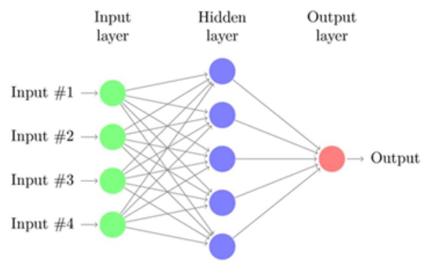

Figure 3.3: Two Layer Perceptron Model. By convention the input layer is known as layer 0. Image taken from Medium AI [28].

图3.3:两层感知器模型。按照惯例，输入层称为第0层。图片取自Medium AI [28]。

To model the Volterra series using an MLP, the input data must be parsed into a suitable format. This involves creating overlapping windows of the input signal, each of length M. Each window is then used to predict the corresponding output. This approach ensures that the network can capture the influence of past inputs on the current output. Given an input signal $\left\{  {{x}_{1},{x}_{2},{x}_{3},\ldots ,{x}_{N}}\right\}$ and a memory length $M$ :

为了使用MLP对Volterra级数进行建模，必须将输入数据解析为合适的格式。这涉及创建输入信号的重叠窗口，每个窗口的长度为M。然后使用每个窗口预测相应的输出。这种方法确保网络能够捕捉过去输入对当前输出的影响。给定输入信号$\left\{  {{x}_{1},{x}_{2},{x}_{3},\ldots ,{x}_{N}}\right\}$和记忆长度$M$:

- The first window is $\left\lbrack  {{x}_{1},{x}_{2},{x}_{3},\ldots ,{x}_{M}}\right\rbrack$ and the network predicts ${y}_{M}$ .

- 第一个窗口是$\left\lbrack  {{x}_{1},{x}_{2},{x}_{3},\ldots ,{x}_{M}}\right\rbrack$，网络预测${y}_{M}$。

- The second window is $\left\lbrack  {{x}_{2},{x}_{3},{x}_{4},\ldots ,{x}_{M + 1}}\right\rbrack$ and the network predicts ${y}_{M + 1}$ .

- 第二个窗口是$\left\lbrack  {{x}_{2},{x}_{3},{x}_{4},\ldots ,{x}_{M + 1}}\right\rbrack$，网络预测${y}_{M + 1}$。

This means that the input layer consists of $\mathrm{M}$ neurons. The activation function for these neurons is the linear function which simply returns the input.

这意味着输入层由$\mathrm{M}$个神经元组成。这些神经元的激活函数是线性函数，它只是简单地返回输入。

The data points are then passed into the hidden layer. Here the hidden layer performs the following operation:

然后，数据点被传入隐藏层。在这里，隐藏层执行以下操作:

$$
o{p}_{i} = {\sigma }_{i}\left( {{b}_{i} + \mathop{\sum }\limits_{{j = 0}}^{N}{w}_{ji}u\left( {t - j}\right) }\right) , \tag{3.4}
$$

where $o{p}_{i}$ is the output of the ${i}^{\text{ th }}$ neuron in the layer, ${\sigma }_{i}$ is the activation function applied to the ${i}^{\text{ th }}$ neuron, ${b}_{i}$ is the bias term for the ${i}^{\text{ th }}$ neuron, $\mathop{\sum }\limits_{{j = 0}}^{N}$ is the summation over the past $N$ time steps, ${w}_{ji}$ is the weight associated with the connection between the ${j}^{th}$ input and the ${i}^{th}$ neuron and $u\left( {t - j}\right)$ is the input signal at time $\left( {t - j}\right)$ .

其中，$o{p}_{i}$ 是该层中第 ${i}^{\text{ th }}$ 个神经元的输出，${\sigma }_{i}$ 是应用于第 ${i}^{\text{ th }}$ 个神经元的激活函数，${b}_{i}$ 是第 ${i}^{\text{ th }}$ 个神经元的偏置项，$\mathop{\sum }\limits_{{j = 0}}^{N}$ 是过去 $N$ 个时间步长的总和，${w}_{ji}$ 是与第 ${j}^{th}$ 个输入和第 ${i}^{th}$ 个神经元之间的连接相关的权重，$u\left( {t - j}\right)$ 是时间 $\left( {t - j}\right)$ 的输入信号。

The activation function used in the program was the tanh function. This is due to this function being used and documented to accurately help identify Volterra kernels [27]. However, other activation functions can be used and may be worth investigating.

程序中使用的激活函数是双曲正切函数。这是因为该函数已被使用并记录在案，能够准确地帮助识别沃尔泰拉核 [27]。然而，也可以使用其他激活函数，可能值得研究。

Once the model is trained, the Multi-Layer Perceptron (MLP) parameters can be transformed into a set of kernels. These are given by:

一旦模型训练完成，多层感知器(MLP)参数可以转换为一组核。它们由以下公式给出:

$$
{h}_{0} = \mathop{\sum }\limits_{{i = 1}}^{L}{c}_{i}{a}_{0i} \tag{3.5}
$$

$$
{h}_{1}\left( j\right)  = \mathop{\sum }\limits_{{i = 1}}^{L}{c}_{i}{a}_{1i}{w}_{ji} \tag{3.6}
$$

$$
{h}_{2}\left( {j, k}\right)  = \mathop{\sum }\limits_{{i = 1}}^{L}{c}_{i}{a}_{2i}{w}_{ji}{w}_{ki}, \tag{3.7}
$$

where ${c}_{i}$ is the weight of the connection between the $i$ -th hidden layer neuron and the single output neuron, ${a}_{0i},{a}_{1i},{a}_{2i}$ are the transform coefficients relating to the activation function used, ${w}_{ji},{w}_{ki}$ are the weights of the connections between the $j$ -th and $k$ -th inputs and the $i$ -th hidden layer neuron and $L$ is the number of neurons in the hidden layer. This can be changed and tested to give a good model.

其中，${c}_{i}$ 是第 $i$ 个隐藏层神经元与单个输出神经元之间连接的权重，${a}_{0i},{a}_{1i},{a}_{2i}$ 是与所使用的激活函数相关的变换系数，${w}_{ji},{w}_{ki}$ 是第 $j$ 个和第 $k$ 个输入与第 $i$ 个隐藏层神经元之间连接的权重，$L$ 是隐藏层中的神经元数量。可以对此进行更改和测试以得到一个良好的模型。

By considering the Taylors series equivalent of the activation function, a polynomial representation of the output function can be found. This means that the output of each hidden neuron is a polynomial in terms of the input time series data. The coefficients of these outputs are the transform coefficients.

通过考虑激活函数的泰勒级数等价形式，可以找到输出函数的多项式表示。这意味着每个隐藏神经元的输出是输入时间序列数据的多项式。这些输出的系数就是变换系数。

To find the transform coefficients, the Taylor series expansion of tanh(x), around the node's bias value can be found. This yields the result:

为了找到变换系数，可以找到双曲正切函数  \tanh(x)  在节点偏置值附近的泰勒级数展开式。这产生了以下结果:

$$
{a}_{ji} = \frac{1}{j}{\tanh }^{\left( j\right) }\left( {b}_{i}\right) , \tag{3.8}
$$

where ${\tanh }^{\left( j\right) }\left( x\right)$ is the ${j}^{th}$ derivative of $\tanh \left( x\right)$ .

其中，${\tanh }^{\left( j\right) }\left( x\right)$ 是 $\tanh \left( x\right)$ 的 ${j}^{th}$ 阶导数。

This is similar in principle to the tensor approach. A windowed representation of the data is needed (xT1), gradient descent is implemented to optimise model parameters alongside an Adam optimiser and an MSE loss function. However, the critical difference is that the parameters are initially in the form of weights for a MLP model and later transformed to the Volterra kernels. This allows faster execution of the program and prevents the need to create an xT2 tensor, which posed a significant memory overhead that was unreasonable for most computers. This version of the program has been shown to run approximately 4 times faster than the Tensor generation approach, across a wide range of tests.

这在原理上与张量方法类似。需要数据的窗口表示( xT1 )，使用梯度下降结合 Adam 优化器和均方误差损失函数来优化模型参数。然而，关键的区别在于，参数最初是 MLP 模型权重的形式，后来转换为沃尔泰拉核。这使得程序执行速度更快，并且无需创建  xT2  张量，而  xT2  张量会带来巨大的内存开销，对大多数计算机来说是不合理的。在广泛的测试中，该版本的程序运行速度比张量生成方法快约 4 倍。

#### 3.0.3 Software Testing - Tungsten Filament Experiment

#### 3.0.3 软件测试 - 钨丝实验

To validate the two programs, they were used to model a system previously analysed with a Volterra model. This system is a tungsten filament lamp, where the Voltage-Luminescence characteristics were analysed [26]. To do this, a stochastic voltage signal is applied to a filament bulb. A photo-diode is placed $5\mathrm{\;{mm}}$ away from the bulb and the voltage across this is measured as the output of the system.

为了验证这两个程序，它们被用于对一个先前用沃尔泰拉模型分析过的系统进行建模。这个系统是一个钨丝灯，对其电压 - 发光特性进行了分析 [26]。为此，将一个随机电压信号施加到灯丝灯泡上。在距离灯泡 $5\mathrm{\;{mm}}$ 处放置一个光电二极管，并测量其两端的电压作为系统的输出。

As is similar to the experiment completed in Span and Hunter's 'Coarse-Grained Nonlinear System Identification', a stochastic signal with a Gaussian distribution is used as input to the system. This signal has a maximum frequency of ${10}\mathrm{\;{Hz}}$ . A sampling frequency of ${750}\mathrm{\;{Hz}}$ is used for recording data. A signal meeting these criteria was generated.

与 Span 和 Hunter 的《粗粒度非线性系统识别》中完成的实验类似，使用具有高斯分布的随机信号作为系统的输入。该信号的最大频率为 ${10}\mathrm{\;{Hz}}$。使用 ${750}\mathrm{\;{Hz}}$ 的采样频率来记录数据。生成了一个符合这些标准的信号。

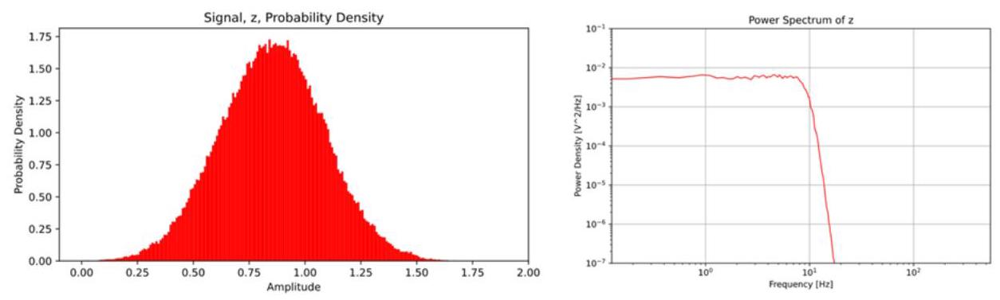

Figure 3.4: The left figure shows the probability distribution of the generated input signal. The right figure shows the power spectrum of the generated input.

图 3.4:左图显示了生成的输入信号的概率分布。右图显示了生成的输入的功率谱。

The signal is designed to have a mean of ${0.85}\mathrm{\;V}$ to remain within the $0\mathrm{\;V} - {1.7}\mathrm{\;V}$ input voltage region which prevents saturation of the filament. The signal was also filtered using a ${5}^{\text{ th }}$ order low-pass Butterworth filter, to remove frequencies beyond ${10}\mathrm{\;{Hz}}$ .

该信号被设计为具有${0.85}\mathrm{\;V}$的均值，以保持在$0\mathrm{\;V} - {1.7}\mathrm{\;V}$输入电压区域内，从而防止灯丝饱和。该信号还使用了一个${5}^{\text{ th }}$阶低通巴特沃斯滤波器进行滤波，以去除高于${10}\mathrm{\;{Hz}}$的频率。

For this experiment, the input signal was 210,000 samples long, covering a span of 280 seconds. When analysing the system with the MLP-Volterra approach, the identified kernels were able to model the system with a VAF of 97.7%. This is with a memory length of 200 samples and 1500 neurons in the hidden node.

对于本实验，输入信号长度为210,000个样本，覆盖280秒的时间跨度。当使用MLP - Volterra方法分析系统时，识别出的核能够以97.7%的VAF对系统进行建模。这是在隐藏节点中使用200个样本的记忆长度和1500个神经元的情况下。

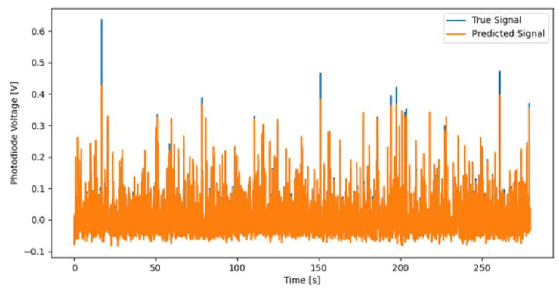

Figure 3.5: Plot showing the actual output vs the predicted output of the system, when using the model found with the MLP-Volterra code.

图3.5:使用MLP - Volterra代码找到的模型时，显示系统实际输出与预测输出的图。

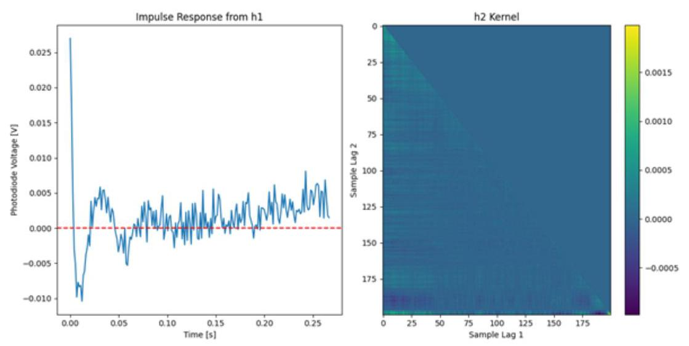

Figure 3.6: The left plot shows the predicted impulse response of the system. The second plot shows the predicted second order kernel. These are for the MLP-Volterra approach.

图3.6:左图显示系统的预测脉冲响应。第二个图显示预测的二阶核。这些是针对MLP - Volterra方法的。

From the figure it can be seen that the second order kernel has a concentration of high values corresponding to low lags in the upper left corner of the figure. There is a decrease in the values of the kernel as the lags increase from zero. This is expected and indicates that the code works as expected.

从图中可以看出，二阶核在图的左上角具有对应于低滞后的高值集中。随着滞后从零增加，核的值会降低。这是预期的，表明代码按预期工作。

For the Tensor code, similar parameters were used. The same 210,000 sample input signal is used and a memory length of 200 samples is also used. However, since this program has the ability to incorporate steps, a step size of 4 is chosen. This allows the lowest identifiable frequency in the generated model to reach $1\mathrm{\;{Hz}}$ , whereas the MLP-Volterra code shown above, only accounted for frequencies at or above 3.75 Hz.

对于张量代码，使用了类似的参数。使用相同的210,000个样本的输入信号，并且也使用200个样本的记忆长度。然而，由于该程序有能力合并步长，选择了步长为4。这使得生成模型中最低可识别频率能够达到$1\mathrm{\;{Hz}}$，而上面显示的MLP - Volterra代码仅考虑了3.75 Hz及以上的频率。

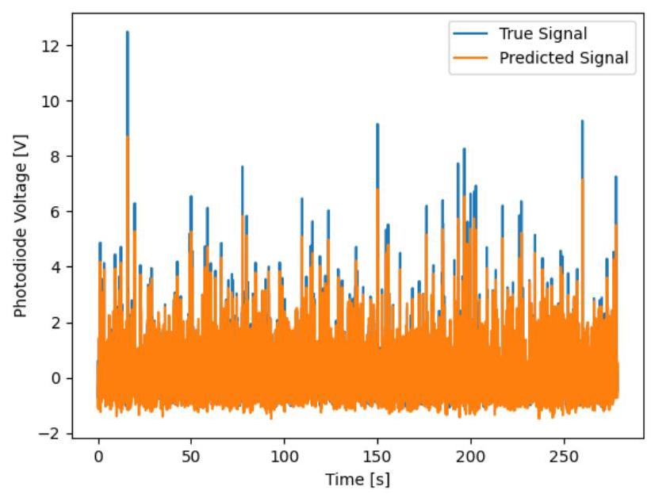

Figure 3.7: Plot showing the actual output vs the predicted output of the system, when using the model found with the Tensor based approach.

图3.7:使用基于张量的方法找到的模型时，显示系统实际输出与预测输出的图。

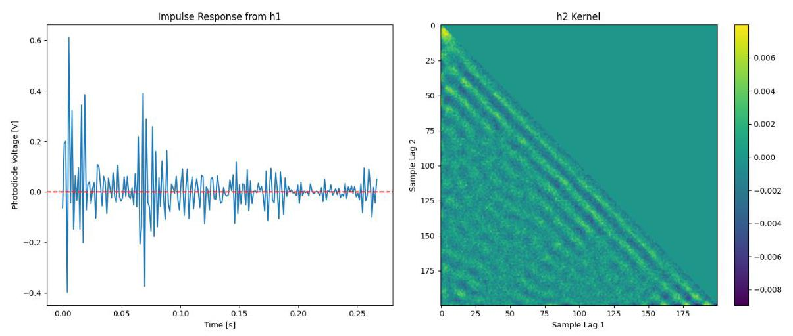

Figure 3.8: The left plot shows the predicted impulse response of the system. The second plot shows the predicted second order kernel. These are for the Tensor approach.

图3.8:左图显示系统的预测脉冲响应。第二个图显示预测的二阶核。这些是针对张量方法的。

The tensor approached achieved a 96.5% VAF. This is slightly lower than the VAF of the MLP-Volterra code's model. However, the second order kernel shows a much stronger response than the MLP-Volterra model. This second order kernel also shows a strong concentration of values at small lags (upper left corner of the kernel). However, this kernel shows a regular striped pattern, which was not as present in the MLP-Volterra second order kernel. This could be because the tensor code was able to account for frequencies as low as $1\mathrm{\;{Hz}}$ , whereas the MLP-Volterra code’s minimum identifiable frequency was 3.75 $\mathrm{{Hz}}$ , which is a significant difference given that the input signal was purposefully filtered to remove frequencies above ${10}\mathrm{\;{Hz}}$ .

张量方法实现了96.5%的VAF。这略低于MLP - Volterra代码模型的VAF。然而，二阶核显示出比MLP - Volterra模型更强的响应。这个二阶核在小滞后(核的左上角)也显示出值的强烈集中。然而，这个核显示出规则的条纹图案，这在MLP - Volterra二阶核中并不存在。这可能是因为张量代码能够考虑低至$1\mathrm{\;{Hz}}$的频率，而MLP - Volterra代码的最低可识别频率是3.75$\mathrm{{Hz}}$，考虑到输入信号被特意滤波以去除高于${10}\mathrm{\;{Hz}}$的频率，这是一个显著的差异。

One potential issue is the appearance of the impulse response. This appears to show irregular behaviour where the amplitude of oscillations will increase, then decrease and so on. This impulse response can be explored further by converting it into a transfer function.

一个潜在问题是脉冲响应的外观。它似乎显示出不规则行为，其中振荡幅度会增加，然后减小等等。可以通过将其转换为传递函数来进一步探索这个脉冲响应。

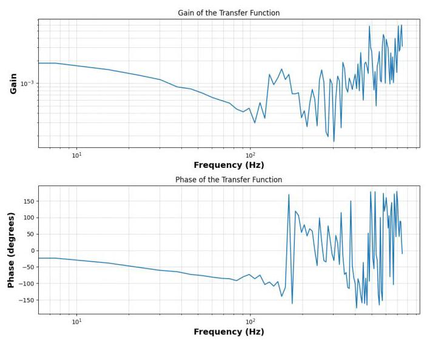

Figure 3.9: Bode plot of the transfer function generated from the impulse response of the tensor approach code's output model.

图3.9:从张量方法代码输出模型的脉冲响应生成的传递函数的波特图。

For the frequency range pertinent to the system (0 to ${10}\mathrm{\;{Hz}}$ ), the bode plot looks as expected. It therefore may not be the case that the impulse response is physically unrealisable. However, it is worth noting the difference in the outputs of both programs.

对于与系统相关的频率范围(0到${10}\mathrm{\;{Hz}}$)，波特图看起来如预期。因此，脉冲响应在物理上可能并非不可实现。然而，值得注意两个程序输出的差异。

Whilst the generated kernels appear to model the system, it is very easy for the program to generate a set of kernels which do not accurately represent the physical system being modelled. Both programs are extremely sensitive to the parameters used and can produce vastly different results with slight changes to their values. It is therefore necessary to trial a series of parameter combinations to find the best model for the system under analysis. If there is prior knowledge about the system, the initial parameters can be estimated and incremental modifications can be made to improve the model. However, for systems with little known prior information, it may be necessary to perform a grid search over the parameter space to identify the best combination of values.

虽然生成的核似乎对系统进行了建模，但程序很容易生成一组不能准确表示所建模物理系统的核。两个程序对所使用的参数都极其敏感，并且对其值的微小变化可能会产生截然不同的结果。因此，有必要试验一系列参数组合以找到适合所分析系统的最佳模型。如果对系统有先验知识，可以估计初始参数并进行增量修改以改进模型。然而，对于几乎没有先验信息的系统，可能有必要在参数空间上进行网格搜索以确定最佳值组合。

## Chapter 4 Milk Impedance Analysis

## 第4章 牛奶阻抗分析

By monitoring the change in electrochemical behaviour of the milk for an extended period of time, it is possible to learn how the impedance of the milk varies as the milk spoils. This will provide a template against which other milk samples can be compared. This not only allows for a more accurate prediction as to when the milk will spoil, but can also be used to infer the existence of hazardous bacteria within the milk. Identifying the change in impedance due to unwanted bacteria within the milk is a future goal of the project. The initial set of experiments set out to benchmark the behaviour of standard store bought milk which is safe for consumption.

通过长时间监测牛奶电化学行为的变化，可以了解牛奶在变质过程中阻抗是如何变化的。这将提供一个模板，用于与其他牛奶样本进行比较。这不仅能更准确地预测牛奶何时会变质，还可用于推断牛奶中有害细菌的存在。识别牛奶中有害细菌导致的阻抗变化是该项目未来的目标。最初的一组实验旨在对标准市售安全可食用牛奶的行为进行基准测试。

#### 4.0.1 Experimental Procedure

#### 4.0.1实验步骤

To perform the experiment, the sensor and monitoring station developed by Michael Aling, shown in Figure 2.4, was used. This setup has an Analog Discovery Digilent 2 used for each container [29]. This is used to generate the stochastic voltage signal across the electrodes. A thermocouple was also placed within each container to monitor the temperature of each container as the experiment was running. The experiment procedure went as follows:

为了进行实验，使用了迈克尔·阿林开发的传感器和监测站，如图2.4所示。该装置为每个容器配备了一个Analog Discovery Digilent 2[29]。它用于在电极之间生成随机电压信号。在每个容器内还放置了一个热电偶，以在实验运行时监测每个容器的温度。实验步骤如下:

1. Sanitise the equipment with soap and water.

1. 用肥皂和水对设备进行消毒。

2. Perform a short leak test by ensuring there are no leaks with the liquid cooling and via the holes in the containers, through which the electrodes protrude.

2. 通过确保液体冷却系统以及电极穿过的容器上的孔没有泄漏，进行一次简短的泄漏测试。

3. Sterlise the equipment further with a ${70}\%$ ethanol solution, taking extra care to clean ridges and the electrodes.

3. 用${70}\%$乙醇溶液进一步对设备进行消毒，特别注意清洁棱边和电极。

4. Fill the containers with ${80}\mathrm{\;g}$ of milk. To do this, a sterilised beaker was filled with ${30}\mathrm{\;g}$ of milk and this was emptied into a container. Each container was first filled to ${30}\mathrm{\;g}$ , then this was repeated to ensure that all containers held ${60}\mathrm{\;g}$ of the plain milk, before finally adding the final ${20}\mathrm{\;g}$ of milk to each container. After every 3 fills of the containers, the milk carton was vigorously shaken to ensure a uniform mixing of the milk, which tends to stratify over time.

4. 向容器中加入${80}\mathrm{\;g}$的牛奶。为此，将一个消毒过的烧杯装满${30}\mathrm{\;g}$的牛奶，然后倒入一个容器中。每个容器先装到${30}\mathrm{\;g}$，然后重复此操作，以确保所有容器都装有${60}\mathrm{\;g}$的纯牛奶，最后再向每个容器中加入最后${20}\mathrm{\;g}$的牛奶。每次向容器中倒入3次牛奶后，将牛奶盒剧烈摇晃，以确保牛奶均匀混合，因为牛奶随着时间推移容易分层。

5. Establish connections between the thermocouples, Digilent Discovery 2 devices and the computer. And verify that the code is running as intended.

5. 在热电偶、Digilent Discovery 2设备和计算机之间建立连接。并验证代码是否按预期运行。

6. Sterilise the thermocouples with alcohol and place in each container, making sure to stay above the milk.

6. 用酒精对热电偶进行消毒，然后放入每个容器中，确保位于牛奶上方。

7. Seal the containers with the designed lids and let the experiment run.

7. 用设计好的盖子密封容器，然后开始实验。

The experiment was designed to run at ${35}^{ \circ  }\mathrm{C}$ , since it is good for rapid bacterial growth. Whilst the experiment can be conducted within the temperature range of $- {5}^{ \circ  }\mathrm{C}$ to ${70}^{ \circ  }\mathrm{C}$ , operating at the extremities of this range would test the propagation of heat or cold tolerant bacteria specifically, which is not the purpose of this experiment. The station's thermoelectric coolers were utilised to maintain the ${35}^{ \circ  }\mathrm{C}$ temperature for all of the containers for the duration of the experiment.

该实验设计在${35}^{ \circ  }\mathrm{C}$温度下运行，因为这有利于细菌快速生长。虽然实验可以在$- {5}^{ \circ  }\mathrm{C}$到${70}^{ \circ  }\mathrm{C}$的温度范围内进行，但在这个范围的极端温度下运行将专门测试耐热或耐寒细菌的繁殖情况，而这不是本实验的目的。在实验期间，利用该站的热电冷却器为所有容器维持${35}^{ \circ  }\mathrm{C}$的温度。

#### 4.0.2 Results

#### 4.0.2结果

After running the experiment, for each of the nine containers in the sensor and monitoring station, there were multiple datasets, each spanning a fixed duration of time. For the results, one container was considered. Here the evolution of the kernels between the ${0}^{th}$ dataset up until the ${100}^{\text{ th }}$ data set was monitored. Each dataset’s results were due to a stochastic signal sampled at ${100}\mathrm{\;{Hz}}$ . The input signal for each dataset spanned 30 seconds, resulting in an input length of 30000 samples. A subset of the results have been shown below:

实验运行后，对于传感器和监测站中的九个容器中的每一个，都有多个数据集，每个数据集跨越固定的时间长度。对于结果，考虑了一个容器。这里监测了从${0}^{th}$数据集到${100}^{\text{ th }}$数据集内核的演变。每个数据集的结果是由于在${100}\mathrm{\;{Hz}}$采样的随机信号。每个数据集的输入信号跨度为30秒，导致输入长度为30000个样本。下面展示了一部分结果:

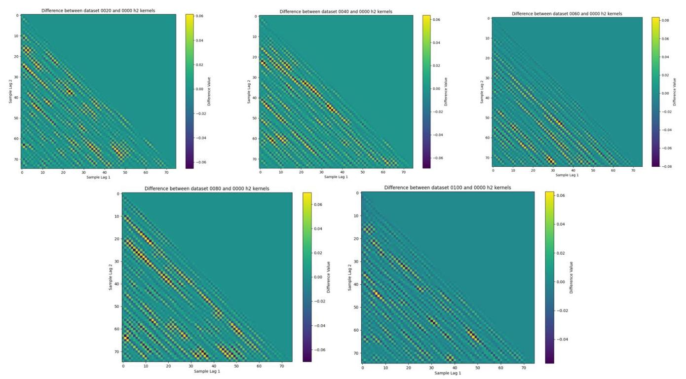

Figure 4.1: The difference between a given h2 kernel and the initial $\left( {0}^{th}\right.$ dataset kernel) has been computed for a series of kernels spaced apart by 20 datasets (10 minutes). The kernels used for the subtraction were found using the 'Tensor' approach.

图4.1:对于一系列相隔20个数据集(10分钟)的内核，计算了给定的h2内核与初始$\left( {0}^{th}\right.$数据集内核之间的差异。用于减法运算的内核是使用“张量”方法找到的。

The impulse response has not been shown since it stays the same throughout the experiment. The only noticeable difference in the models over time is observed in the second order kernel. From this it can be seen that there is a change in the kernels over time. However, these changes are small in scale. There are local regions within the kernels which remain having high values across the samples, and there is a faint pattern of the kernel showing positive values along lines, parallel to the diagonal of the kernel.

由于脉冲响应在整个实验过程中保持不变，所以未显示。随着时间的推移，模型中唯一明显的差异出现在二阶内核中。由此可以看出，内核随时间发生了变化。然而，这些变化规模较小。内核中存在一些局部区域，在整个样本中保持高值，并且内核有一个微弱的模式，沿着与内核对角线平行的线显示正值。

## Interpretation

## 解读

These results appear to provide little information about the milk. This may be due to a few reasons. The first, is due to the high voltages used, to access the nonlinear electrochemical behaviour of the milk. By having a higher voltage across the electrodes, the current density within the milk increases, leading to PH changes in the liquid. This can result in the milk beginning to prematurely spoil.

这些结果似乎并未提供多少有关牛奶的信息。这可能有几个原因。首先，是由于所使用的高电压，以获取牛奶的非线性电化学行为。通过在电极之间施加更高的电压，牛奶中的电流密度会增加，导致液体中的pH值发生变化。这可能导致牛奶过早变质。

The use of high voltages can also result in the milk curdling and the formation of bubbles. These bubbles completely transform the expected impedance behaviour of the system and can lead to results which are not reflective of the milk.

使用高电压还可能导致牛奶凝结并形成气泡。这些气泡完全改变了系统预期的阻抗行为，并可能导致结果无法反映牛奶的真实情况。

It therefore appears that, since curdling was observed, that the voltage signal used to excite the milk had peak values which were too high, resulting in the tainting of the data.

因此，由于观察到了凝结现象，用于激发牛奶的电压信号的峰值似乎过高，导致数据受到污染。

To improve this further experimentation is needed. By determining the optimal signal to supply to the milk that allows the system to exhibit nonlinear behaviour which can be modelled, whilst avoiding the issues experienced at high voltages, more reliable data can be extracted from the system for use with the kernel identification software.

为了进一步改进，需要进行更多实验。通过确定提供给牛奶的最佳信号，使系统能够展现出可建模的非线性行为，同时避免高电压下出现的问题，可以从系统中提取更可靠的数据，供内核识别软件使用。

## Chapter 5 Sugar Solution Impedance Analysis

## 第5章 糖溶液阻抗分析

To monitor the growth of bacteria in the presence of different sugar solutions, a new form factor for the sensor is needed. In this application, the sugar solution is placed in the wells of a standard well plate, used in microbiological research, before the bacteria is introduced and the plate is incubated for approximately 7 days. The new sensor design must therefore be compact and must mate with the well plate, to allow it to be placed within the incubator and continuously capture data.

为了监测在不同糖溶液存在下细菌的生长情况，需要一种新的传感器外形尺寸。在这个应用中，在引入细菌并将培养板孵育约7天之前，将糖溶液放置在微生物研究中使用的标准微孔板的孔中。因此，新的传感器设计必须紧凑，并且必须与微孔板匹配，以便能够放置在培养箱中并持续捕获数据。

#### 5.0.1 Well Plate Sensor Design

#### 5.0.1微孔板传感器设计

The well plates used for experiments featured 24 wells and were arranged to have 4 rows of 6 wells.

用于实验的微孔板有24个孔，排列成4行，每行6个孔。

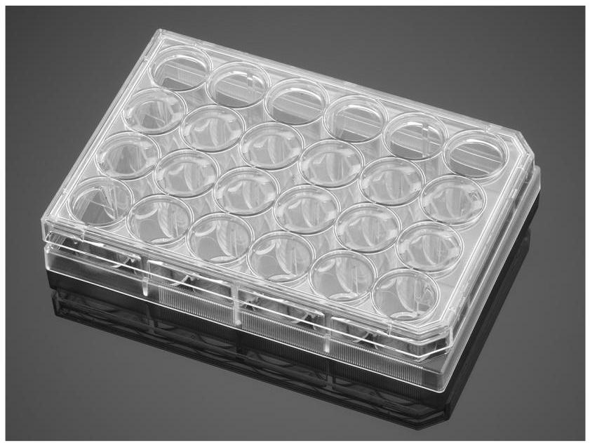

Figure 5.1: Image of the well plate used for the experiments. The image is taken from the supplier website [30].

图5.1:用于实验的微孔板图像。该图像取自供应商网站[30]。

The chosen design for the sensor was in the form factor of a PCB that can be placed on top of the well plate. The PCB would contain electrodes which would align with the centers of the wells. The electrodes would have an applied potential difference across them due to the other components on the PCB. Fortunately, a PCB designed to fit with the well plates had already been created by Professor Ian Hunter and Dr. Serge Lafontaine, of the MIT BioInstrumentation Laboratory. This PCB is shown below:

所选的传感器设计采用了印刷电路板(PCB)的外形尺寸，可以放置在微孔板顶部。PCB将包含与孔中心对齐的电极。由于PCB上的其他组件，电极之间会有施加的电位差。幸运的是，麻省理工学院生物仪器实验室的Ian Hunter教授和Serge Lafontaine博士已经设计了一种适合微孔板的PCB。如下所示:

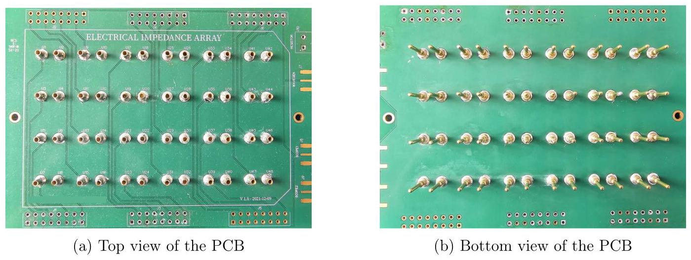

Figure 5.2: Impedance measurement PCB. Connects to a reference resistor and an offboard voltage generator using SMA connectors.

图5.2:阻抗测量PCB。使用SMA连接器连接到参考电阻和板外电压发生器。

Quad relays are used to sequentially apply the voltage across a specific electrode pair. This ensures that the impedance analysis can be performed on one well at a time, before the stochastic voltage is iterated through the rest of the electrode pairs.

使用四路继电器依次在特定的电极对之间施加电压。这确保了每次可以对一个孔进行阻抗分析，然后再对其余电极对重复随机电压。

The left electrode of each pair (from the top view) is connected to the relays, which are connected to the $8 \times  2$ holes along the border of the PCB. The rightmost electrode for each electrode pair is connected to a reference resistor, which is connected to ground. This reference resistor is connected on the top right of the PCB. The three groups of three gold strips on the right of the board are populated with SMA connector heads, to plug to the voltage generation device.

每对电极的左电极(从俯视图看)连接到继电器，继电器连接到PCB边缘的$8 \times  2$孔。每个电极对的最右电极连接到参考电阻，参考电阻接地。该参考电阻连接在PCB的右上角。板右侧三组三条金带填充有SMA连接器头，用于连接到电压生成设备。

#### 5.0.2 Portable Computation Platform

#### 5.0.2便携式计算平台

To perform the experiment, it is necessary to build a portable computation platform that: supplies the PCB with the stochastic voltage, sequences through the electrode pairs and saves the data to some external storage. This platform is shown below:

为了进行实验，有必要构建一个便携式计算平台，该平台:为PCB提供随机电压，依次通过电极对，并将数据保存到一些外部存储设备。如下所示:

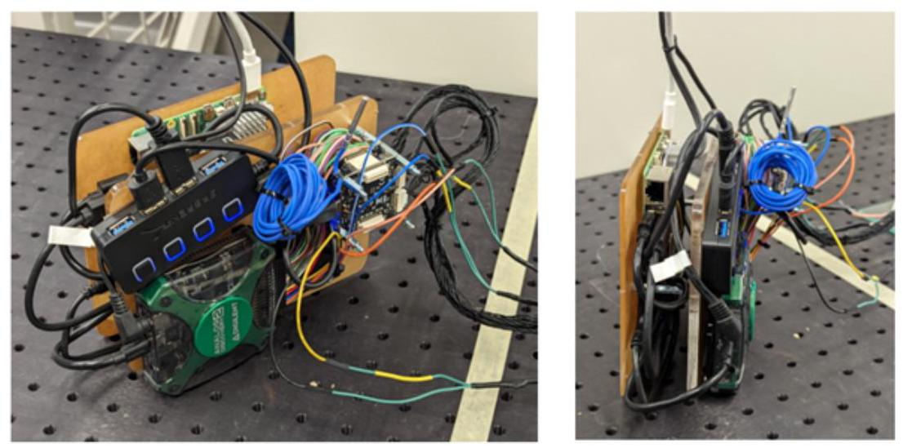

Figure 5.3: Isometric view of the portable computation platform (left). Side view of the portable computation platform (right).

图5.3:便携式计算平台的等轴测视图(左)。便携式计算平台的侧视图(右)。

This platform contains the necessary equipment for the experiment. The components were screwed into acrylic platforms which were then stacked on top of the PCB to minimise the space occupied by the experiment within the incubator, due to the incubator also being used for other experiments.

该平台包含实验所需的设备。这些组件被拧到亚克力平台上，然后堆叠在印刷电路板(PCB)顶部，以尽量减少实验在培养箱中所占的空间，因为该培养箱还用于其他实验。

The platform includes a Raspberry Pi 5 for computation, a Digilent Discovery 2 device for waveform generation and signal acquisition, a Tinkerforge bricklet stack for temperature measurement and relay control, a thermocouple and a powered USB hub. The Raspberry Pi was responsible for interfacing between the components. It ran the code responsible for tracking and saving the impedance data to the hard drive. The Digilent Discovery 2 device is able to generate stochastic voltages. This was used to provide the voltage signal to the electrodes via SMA cables. The Tinkerforge stack is a series of Tinkerforge components. This particular stack features two 'Master Bricks' which connect to quad relays and the thermocouple reader, managing digital communication. These relays are the aforementioned relays responsible for toggling on and off to select the electrode pair to excite with the voltage signal. The Master Bricks interface between the Raspberry Pi and the Relays. The stack also contains a Tinkerforge thermocouple bricklet. This allows for the use of a thermocouple, for the purposes of temperature monitoring. Since the bacteria are incubating, it is imperative that they remain at a constant temperature of ${29}^{ \circ  }\mathrm{C}$ .

该平台包括用于计算的树莓派5、用于波形生成和信号采集的Digilent Discovery 2设备、用于温度测量和继电器控制的Tinkerforge砖式模块堆栈、一个热电偶和一个有源USB集线器。树莓派负责组件之间的接口。它运行负责跟踪阻抗数据并保存到硬盘驱动器的代码。Digilent Discovery 2设备能够生成随机电压。这用于通过SMA电缆向电极提供电压信号。Tinkerforge堆栈是一系列Tinkerforge组件。这个特定的堆栈有两个“主砖”，它们连接到四路继电器和热电偶读取器，管理数字通信。这些继电器就是前面提到的负责切换以选择要用电压信号激励的电极对的继电器。主砖在树莓派和继电器之间起接口作用。该堆栈还包含一个Tinkerforge热电偶砖式模块。这允许使用热电偶进行温度监测。由于细菌正在培养，必须将它们保持在${29}^{ \circ  }\mathrm{C}$的恒定温度。

#### 5.0.3 Experimental Procedure

#### 5.0.3实验步骤

To determine the viability of the sensor for this use case, experiments were performed to trial the sensor and monitor any adverse or previously unknown effects. For this, the K. Xylinus bacteria solutions first had to be prepared. The process of preparing the bacteria samples was performed by senior researcher Dr. Cathy Hogan. The bacteria is purchased as frozen stock. The bacteria is then treated to begin the growth process. After an approximate duration of 10 days, the bacteria will have reached the point where they begin to form a pellicle layer in the solution used to treat them. When this is the case, the bacteria can be transferred to the sugar solutions at which point the experiment can be performed. The experimental procedure is as follows:

为了确定该传感器在此用例中的可行性，进行了实验以测试该传感器并监测任何不利或以前未知的影响。为此，首先必须制备木醋杆菌细菌溶液。制备细菌样本的过程由资深研究员凯西·霍根博士进行。细菌作为冷冻储备购买。然后对细菌进行处理以开始生长过程。大约10天后，细菌将达到在用于处理它们的溶液中开始形成菌膜层的阶段。当出现这种情况时，可以将细菌转移到糖溶液中，此时就可以进行实验了。实验步骤如下:

1. Place the PCB into an Autoclave to sterilise.

1. 将印刷电路板放入高压灭菌器中进行消毒。

2. Take off the pre-populated well plate lid and place the PCB on top of the well plate so that the electrodes are submerged by the media. This is done underneath a biosafety cabinet to reduce contamination of the samples with external bacteria.

2. 取下预先填充的孔板盖子，将印刷电路板放在孔板上，使电极被培养基淹没。这在生物安全柜下进行，以减少样本被外部细菌污染。

3. Screw the portable computation platform onto the PCB and establish all connections between peripherals and the PCB.

3. 将便携式计算平台拧到印刷电路板上，并建立外围设备与印刷电路板之间的所有连接。

4. Run all of the necessary programs to start the experiment. Place the set up into the incubator, taking special care to not perturb the samples within the well plate.

4. 运行所有必要的程序以开始实验。将装置放入培养箱中，特别注意不要扰动孔板内的样本。

5. Remotely monitor the experiment set up to ensure all of the code is running, the thermocouple output shows a consistent temperature etc.

5. 远程监控实验装置，以确保所有代码都在运行，热电偶输出显示一致的温度等。

6. After a period of approximately 7 days, remove the set up from the incubator and observe the samples and the data from the hard drive.

6. 大约7天后，从培养箱中取出装置，观察样本和硬盘上的数据。

During this procedure it was found that the software would throw errors after a random duration of time. It was determined that the Raspberry Pi was likely the issue. Therefore, it was decided to forgo the device and use a laptop instead. For this to fit within the incubator, the portable computation platform now needed to be modified. Instead of stacking on top of the PCB, it was decided to place these platforms alongside the PCB. This is because the experimental set up now had to be raised, since a laptop now had to fit within the incubator and there were other samples to avoid.

在这个过程中发现，软件会在随机的时间段后抛出错误。确定树莓派可能是问题所在。因此，决定放弃该设备，改用笔记本电脑。为了使其能放入培养箱中，现在需要对便携式计算平台进行修改。不再堆叠在印刷电路板顶部，而是决定将这些平台放在印刷电路板旁边。这是因为现在实验装置必须升高，因为笔记本电脑现在必须能放入培养箱中，并且要避开其他样本。

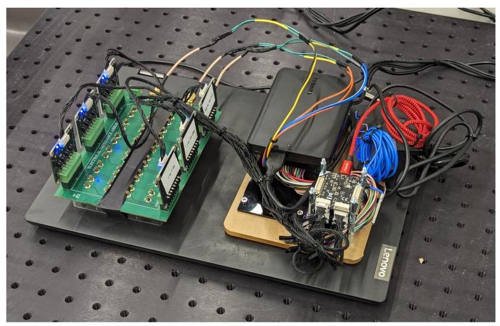

Figure 5.4: Image of the revised experimental set up. This was placed on top of a small table and placed within the incubator.

图5.4:修改后的实验装置图像。它被放在一个小桌子上并放入培养箱中。

However, this set up also led to issues. The heat from the laptop would interfere with the temperature regulation of the incubator, and resulted in the overall incubator temperature reaching as high as ${45}^{ \circ  }\mathrm{C}$ , which is outside of the acceptable temperature range for the bacteria.

然而，这个装置也导致了问题。笔记本电脑产生的热量会干扰培养箱的温度调节，并导致培养箱的整体温度高达${45}^{ \circ  }\mathrm{C}$，这超出了细菌可接受的温度范围。

A third set up was then determined. Here, the platform and PCB remained within the incubator, but connections were made to an external desktop computer as opposed to an internal laptop. This allows the use of arbitrarily powerful computers, since size is no longer an issue, and also removes the need for a hard drive. This also eliminates the need to worry about the heat generation of the system since the computer is out of the incubator. A worry with this set up was the partial opening left in the incubator to allow the external connection to the desktop. However, upon monitoring the temperature of the incubator, it was observed that the internal temperature stayed between ${29}^{ \circ  }\mathrm{C}$ and ${30}^{ \circ  }\mathrm{C}$ , which is acceptable for the experiment.

然后确定了第三种设置。在这里，平台和印刷电路板(PCB)仍留在培养箱内，但连接到外部台式计算机，而不是内部笔记本电脑。这允许使用任意强大的计算机，因为尺寸不再是问题，并且也不再需要硬盘。这也消除了担心系统发热的问题，因为计算机在培养箱外。这种设置的一个担忧是培养箱中留下的部分开口，以允许与台式机进行外部连接。然而，在监测培养箱的温度时，观察到内部温度保持在${29}^{ \circ  }\mathrm{C}$和${30}^{ \circ  }\mathrm{C}$之间，这对于实验来说是可以接受的。

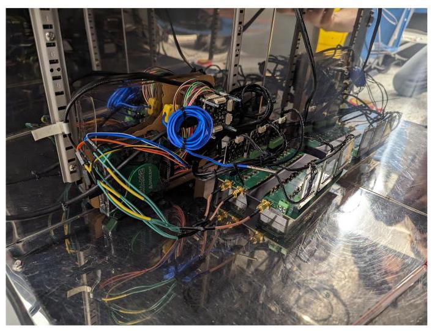

Figure 5.5: Image of the final set up. Here the computation platform is simplified due to no longer requiring the Raspberry Pi 5 and the hard drive. The set up is attached to the side of the incubator walls to allow for other samples to fit within the incubator. The devices connect to a desktop situated external to, but beside the incubator (not shown).

图5.5:最终设置的图像。由于不再需要树莓派5和硬盘，这里的计算平台得到了简化。该设置连接到培养箱壁的侧面，以便其他样品能够放入培养箱中。这些设备连接到位于培养箱外部但旁边的台式机(未显示)。

#### 5.0.4 Results

#### 5.0.4结果

The well plate was configured to hold a series of different sugar solutions so that the growth curves associated with these different solutions could be addressed.

孔板被配置为容纳一系列不同的糖溶液，以便能够研究与这些不同溶液相关的生长曲线。

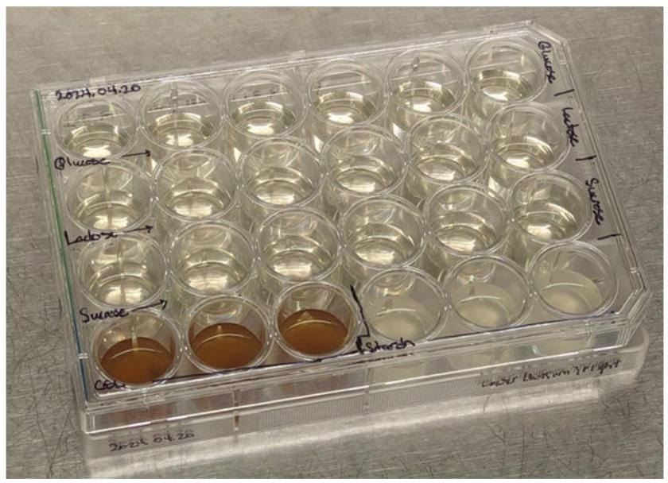

Figure 5.6: Layout of sugar solutions used in the experiment.

图5.6:实验中使用的糖溶液布局。

For this experiment 5 different sugars were used: Glucose, Lactose, Sucrose, Corn Steep Liquor and Starch (not technically a sugar but consists of many sugar molecules joined together). From the figure it can be seen that Glucose, Lactose and Sucrose based solutions were placed on their own row. Corn Steep Liquor and Starch occupied three wells within the same row.

对于这个实验，使用了5种不同的糖:葡萄糖、乳糖、蔗糖、玉米浆和淀粉(严格来说淀粉不是糖，但由许多连接在一起的糖分子组成)。从图中可以看出，基于葡萄糖、乳糖和蔗糖的溶液被放置在各自的行中。玉米浆和淀粉占据了同一行中的三个孔。

After the experiment, it was expected to see a solid pellicle layer form at the top of each of the solutions. However, this was not the case. The well plate after having ran the experiment looked like so:

实验后，预计会在每种溶液的顶部形成一层固体薄膜层。然而，实际情况并非如此。运行实验后的孔板看起来是这样的:

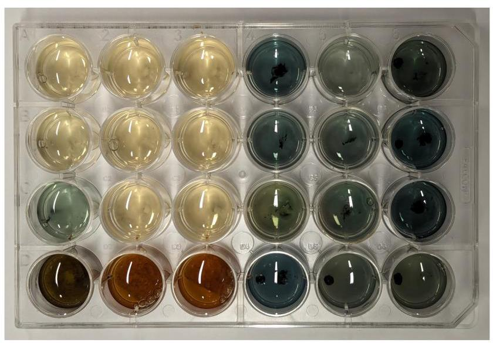

Figure 5.7: Well plate showing the sugar-bacteria solutions after the experiment.

图5.7:实验后显示糖 - 细菌溶液的孔板。

From this it can be seen that the solutions have become discoloured. There were some transparent gel-like pellicles, but these dissolved upon retrieval. This is not expected and suggests that something was wrong with the experiment, and so the data from the experiment will not be helpful in identifying growth curves.

由此可以看出，溶液已经变色。有一些透明的凝胶状薄膜，但在取出时溶解了。这是出乎意料的，表明实验存在问题，因此实验数据对于识别生长曲线没有帮助。

Alongside the changes in the solution, the electrodes were also left with an accumulation on their surface and were left permanently discoloured.

除了溶液的变化外，电极表面也有积累物，并且永久变色。

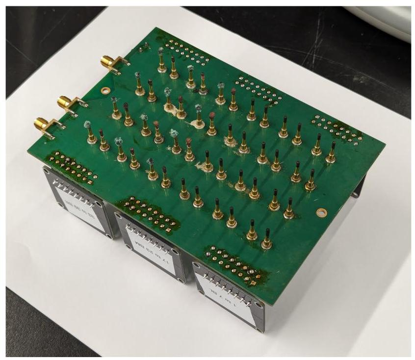

Figure 5.8: Discolouration and accumulation on the electrodes on the PCB after running the experiment.

图5.8:运行实验后印刷电路板上电极的变色和积累物。

## Interpretation

## 解释

One of the issues leading to the asymmetry in the colour of the solutions can be attributed to hardware. Due to the available hardware within the laboratory, TinkerForge 2.0 Quad Relay Bricklets were utilised for the purposes of multiplexing the electrodes. Since six relay boards are required and there were only three relays, and additional three were purchased. However, due to the fact that production has ceased for the 2.0 bricklets, the newer version (TinkerForge 2.1 Quad Relay Bricklets) were purchased. After some investigation, it appears that the newer bricklets were not working as intended during the experiment. It seems as if they are not compatible with the experiment and so the 2.0 version of the relays should be used in the future. However, since these are no longer being produced, sourcing these is difficult and so alternative relays may need to be used. This should lead to a consistency of results between wells containing the same sugar sample.

导致溶液颜色不对称的问题之一可归因于硬件。由于实验室现有的硬件，使用了TinkerForge 2.0四路继电器模块来多路复用电极。由于需要六个继电器板，而只有三个继电器，所以又购买了另外三个。然而，由于2.0模块的生产已经停止，购买了更新版本(TinkerForge 2.1四路继电器模块)。经过一些调查，似乎更新的模块在实验期间没有按预期工作。似乎它们与实验不兼容，因此未来应该使用2.0版本的继电器。然而，由于这些不再生产，采购困难，所以可能需要使用替代继电器。这应该会导致含有相同糖样品孔之间结果的一致性。

For the issue of the solutions being discoloured, the reason for this could be due to the coating of the electrodes. The electrodes used are the pins found in D-sub connectors. These are copper and have a gold coating applied to them. This works for the purposes of the experiment due to gold being nonreactive. However, since the pins were not designed for this application, the gold coating may have imperfections, due to the thickness of the coating, the porosity of gold etc. This means that copper is exposed to the solutions and can interfere with the electrochemical reactions within the solution, as is observed in electrolysis.

对于溶液变色的问题，原因可能是电极的涂层。使用的电极是D型连接器中的引脚。这些是铜质的，并涂有金涂层。由于金不具有反应性，这对于实验目的来说是可行的。然而，由于这些引脚不是为此应用设计的，金涂层可能存在缺陷，这是由于涂层的厚度、金的孔隙率等原因。这意味着铜暴露在溶液中，并且可以干扰溶液中的电化学反应，就像在电解中观察到的那样。

As a voltage is applied across the electrodes, a pH shift is experienced in the solution. This shift can result in the solution experiencing transient periods when it is alkaline vs transient periods when it is more acidic. During acidic transients, the copper at the electrode surfaces releases Cu2+ ions into the solution. During an alkaline transient, Copper (II) Hydroxide $\left( {{Cu}{\left( OH\right) }_{2}}\right)$ forms at the electrode surface. These are both blue in colour and can account for the unexpected discolourisation of the solutions.

当在电极上施加电压时，溶液中会经历pH值的变化。这种变化会导致溶液在碱性瞬态期和酸性瞬态期之间交替。在酸性瞬态期间，电极表面的铜会将Cu2+离子释放到溶液中。在碱性瞬态期间，电极表面会形成氢氧化铜$\left( {{Cu}{\left( OH\right) }_{2}}\right)$。这些都是蓝色的，并且可以解释溶液意外变色的原因。

This, coupled with the wiring scheme of the PCB can also explain the reason why for a given electrode pair, one electrode has an accumulation of blue deposit on its surface, whilst the other has an accumulation of some orange deposit. This is because the right most electrode for an electrode pair is connected through a resistor to ground, whereas the left most electrode is exposed to the input stochastic voltage (directions are referenced from Figure 5.2 a).

这一点，再结合印刷电路板的布线方案，也可以解释为什么对于给定的一对电极，一个电极表面有蓝色沉积物堆积，而另一个电极表面有橙色沉积物堆积。这是因为一对电极中最右边的电极通过一个电阻接地，而最左边的电极则暴露在输入随机电压下(方向参考图5.2 a)。

From this experiment it seems pertinent to source electrodes with thicker coating and to resolve the issue with the quad relays before an assumption can be made as to the viability of the sensor for this application.

从这个实验来看，在对该传感器用于此应用的可行性做出假设之前，似乎有必要使用涂层更厚的源电极，并解决四路继电器的问题。

#### 5.0.5 Improvements

#### 5.0.5 改进

From the initial experiment it was observed that the electrodes were not centered within the wells. Whilst this has no effect on the bacteria and is not attributable to the lack of results from the experiment, it can affect the electric field generated by the electrodes and affect the impedance data. I therefore created a fixture that can be used to both clamp the PCB to the well plate (eliminating any air gaps and preventing slipping) and align the electrodes to fit in the center of each of the wells.

从最初的实验中可以观察到，电极没有位于孔的中心。虽然这对细菌没有影响，也不是实验结果缺乏的原因，但它会影响电极产生的电场并影响阻抗数据。因此，我制作了一个固定装置，可用于将印刷电路板固定到孔板上(消除任何气隙并防止滑动)，并将电极对齐以使其位于每个孔的中心。

Figure 5.9: 3D printed piece that clamps and aligns the well plate and PCB together for more reliable impedance data for future experiments.

图5.9:3D打印部件，用于将孔板和印刷电路板夹在一起并对齐，以便为未来的实验提供更可靠的阻抗数据。

This piece take approximately 3 hours to print and so it can be easily produced and used on the day of an experiment. Since the piece is 3D printed, it cannot be put in an Autoclave and must therefore be sterilised with a 70% alcohol solution before use. The well plate fits into the base and is held in place by the small ledge observable in the figure. The PCB is then placed on top of the well plate and is constrained at the corners by the piece. This forces the electrodes to align with the center of the wells. The corners have been used to minimise material use and allow a clear view of the side profiles of the well plate, so that visual checks on the experiment can be made without disturbing the samples. At the corners, there are holes which have been tapped to fit M4 screws. These are used to clamp the PCB to the well plate.

这个部件打印大约需要3小时，因此可以很容易地制作出来并在实验当天使用。由于该部件是3D打印的，不能放入高压灭菌器中，因此必须在使用前用70%的酒精溶液进行消毒。孔板可安装在底座中，并通过图中可见的小凸缘固定在适当位置。然后将印刷电路板放置在孔板顶部，并由该部件在角落处进行约束。这迫使电极与孔的中心对齐。使用角落是为了尽量减少材料使用，并能清楚地看到孔板的侧面轮廓，以便在不干扰样品的情况下对实验进行目视检查。在角落处，有一些已攻丝以安装M4螺丝的孔。这些孔用于将印刷电路板固定在孔板上。

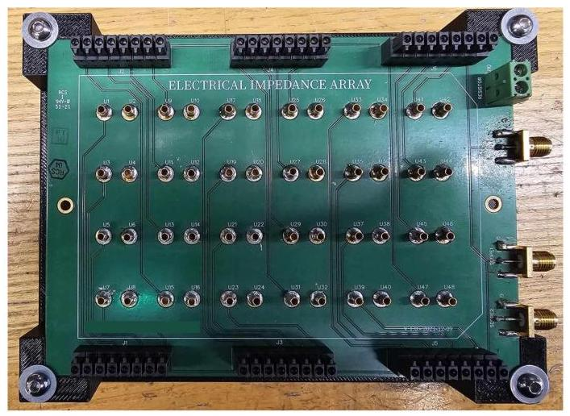

Figure 5.10: Future experiment set up. The PCB is clamped with washers to stay in place.

图5.10:未来的实验设置。印刷电路板用垫圈固定以保持原位。

## Chapter 6 Future Work

## 第6章 未来工作

Throughout this project, several modifications have been made to improve the performance of the two kernel identification programs, in terms of speed, memory usage and accuracy of the calculated model. Both programs show promise, but are very difficult to set up in a way that provides a high VAF model, with a set of kernels which provide insight into the electrochemical interactions occuring within the system.

在整个项目中，为了提高两个内核识别程序在速度、内存使用和计算模型准确性方面的性能，进行了多次修改。这两个程序都显示出了潜力，但要以提供高VAF模型的方式进行设置非常困难，需要一组能够深入了解系统内发生的电化学相互作用的内核。

A part of this issue lies with the lack of knowledge on the systems being studied. For example, the use of high voltages and a low 100 Hz sampling frequency led to curdling of the milk, which severely impacted the quality of the impedance data. Similarly, within the well plate experiment, the use of high voltages (4.5 V) lead to exacerbated pH shifts observed by the solutions and increased the ion transfer from the electrode surfaces, resulting in discoloured samples whose results were of no use. Given the sensitivity of the systems to the conditions of the input signal and given the sensitivity of both programs to the hyper parameters used, the next steps for this project involve repeating the experiments and improving the quality of the impedance data that is used to generate the Volterra kernels.

这个问题的一部分在于对所研究系统的了解不足。例如，使用高电压和低100Hz采样频率导致牛奶凝结，这严重影响了阻抗数据的质量。同样，在微孔板实验中，使用高电压(4.5V)导致溶液中观察到的pH值变化加剧，并增加了电极表面的离子转移，导致样品变色，其结果毫无用处。鉴于系统对输入信号条件的敏感性以及两个程序对所使用超参数的敏感性，该项目的下一步涉及重复实验并提高用于生成Volterra核的阻抗数据的质量。

One way of doing this is to utilise the alignment and clamp piece that was printed, for the next well-plate experiment, and to modify the input signal characteristics.

一种方法是利用打印出来的对齐和夹具部件，用于下一次微孔板实验，并修改输入信号特征。

In addition, a modified well plate sensor can be designed. This can utilise a smaller spacing between the electrodes, and feature removable electrodes at the PCB interface. This would allow corroded electrodes to simply be swapped out without having to create a new PCB for every experiment. This, alongside the aforementioned tasks of finding new compatible relays and having the electrodes re-coated with a thicker coat of Gold, should provide a clear pathway for the development of the well plate sensor.

此外，可以设计一种改进的微孔板传感器。它可以在电极之间使用更小的间距，并在PCB接口处设置可拆卸电极。这将允许简单地更换腐蚀的电极，而不必为每个实验创建新的PCB。这与寻找新的兼容继电器以及给电极重新涂上更厚的金涂层的上述任务一起，应该为微孔板传感器的开发提供一条清晰的途径。

It will also be useful to incorporate the step size and averaging feature from the 'Tensor' kernel identification program, into the MLP-Volterra program. This will enable the use of the MLP-Volterra program as the main software for analysis since it has been shown to run significantly faster than the Tensor approach whilst relying on less memory.

将“Tensor”核识别程序中的步长和平均功能纳入MLP-Volterra程序也将是有用的。这将使MLP-Volterra程序能够用作主要的分析软件，因为已经证明它比Tensor方法运行得明显更快，同时占用的内存更少。

Finally, it may be useful to source a more powerful computer, with higher than 24 Gb of memory on the GPU for extremely long input signals, which will provide the best chance of extracting an accurate set of Volterra kernels, especially given the current knowledge of the systems being studied and how there is not enough information to make simplifying assumptions to the kernels to reduce the number of parameters used by the model.

最后，对于极长的输入信号，采购一台GPU内存高于24Gb的更强大的计算机可能会很有用，这将提供提取准确的Volterra核集的最佳机会，特别是考虑到目前对所研究系统的了解以及没有足够信息对核进行简化假设以减少模型使用的参数数量的情况。

## Chapter 7 Conclusion

## 第7章 结论

Through the course of this research, two separate algorithms have been developed to identify the Volterra kernels representing a system. These have been optimised and bench-marked with promising results with the 'Tungsten Filament' experiment detailed in Section 3.0.3.

在本研究过程中，开发了两种独立的算法来识别表示系统的Volterra核。这些算法已经过优化和基准测试，在3.0.3节详细介绍的“钨丝”实验中取得了有希望的结果。

Alongside this further experimentation has been conducted to model the impedance behaviour of milk and the electrochemical interactions within sugar solutions when incubated and housing $K$ . Xylinus bacteria. Through these experiments, several failure modes and sub-optimal approaches have been discovered, enabling the further improvement of the next iteration of experiments. This should hopefully lead to the point where extremely clean data can be extracted from the systems and can be used to generate a set of realistic Volterra kernels.

与此同时，还进行了进一步的实验，以模拟牛奶的阻抗行为以及在培养和容纳$K$木醋杆菌时糖溶液中的电化学相互作用。通过这些实验，发现了几种故障模式和次优方法，从而能够进一步改进下一次实验迭代。这有望达到可以从系统中提取极其干净的数据并用于生成一组现实的Volterra核的程度。

## Bibliography

## 参考文献

[1] M. Aling, An electrochemical sensor development platform, 2022.

[2] M. Aling, B. Iqbal, K. Cheng, and I. Hunter, Nonlinear electrochemical sensor formonitoring microbial growth in liquids, Provisional application for US patent 63/567.528 (20 Mar. 2024).

监测液体中的微生物生长，美国专利63/567.528的临时申请(2024年3月20日)。

[3] M. Aling, K. Cheng, and I. Hunter. "A fast nonlinear electrochemical sensor:Monitoring microbial growth," MIT Bioinstrumentation Laboratory. (Jan. 2023).

监测微生物生长，麻省理工学院生物仪器实验室。(2023年1月)。

[4] M. K. Saini. "Signals and systems: Static and dynamic system." (Nov. 2021), urL:https://www.tutorialspoint.com/signals-and-systems-static-and-dynamic-system (visited on ${05}/{15}/{2024}$ ).

https://www.tutorialspoint.com/signals-and-systems-static-and-dynamic-system(于${05}/{15}/{2024}$访问)。

[5] A. Farina, "Simultaneous measurement of impulse response and distortion with aswept-sine technique," Nov. 2000.

扫频正弦技术，2000年11月。

[6] G. Mzyk, Wiener System. Springer International Publishing, 2014. URL:https://doi.org/10.1007/978-3-319-03596-3_3.

[7] O. T. Demir and E. Bjornson, "The bussgang decomposition of nonlinear systems:Basic theory and mimo extensions [lecture notes]," IEEE Signal Processing Magazine,

基本理论和多输入多输出扩展 [讲义]，《IEEE信号处理杂志》vol. 38, no. 1, pp. 131-136, 2021. DOI: 10.1109/MSP.2020.3025538.

[8] J. Bussgang, L. Ehrman, and J. Graham, "Analysis of nonlinear systems with multiple inputs," Proceedings of the IEEE, vol. 62, no. 8, pp. 1088-1119, 1974. DOI:10.1109/PROC.1974.9572.

10.1109/PROC.1974.9572。

[9] E. Eskinat, S. Johnson, and W. Luyben, "Use of Hammerstein models in identification of nonlinear systems," AIChE Journal, vol. 37, pp. 255-268, Feb. 1991.DOI: 10.1002/aic.690370211.

DOI: 10.1002/aic.690370211。

[10] V. Volterra, "Sopra le funzioni che dipendono da altre funzioni," vol. III, pp. 97-105,1887.

[11] V. Volterra, Theory of Functionals and of Integrals and Integro-Differential Equations. New York: Dover Publications, 1927, Original work published in Spanish,translated version reprinted in 1959.

1959年重印的翻译版本。

[12] "Volterra series"," (Dec. 2023), URL:

https://en.wikipedia.org/w/index.php?title=Volterra_series&oldid=1191616586 (visited on 02/08/2024).

https://en.wikipedia.org/w/index.php?title=Volterra_series&oldid=1191616586(于2024年8月2日访问)。

[13] E. Keogh and A. Mueen, Curse of Dimensionality. Springer US, 2017. URL:https://doi.org/10.1007/978-1-4899-7687-1_192.

[14] A. Poghossian, H. Geissler, and M. Schöning, "Rapid methods and sensors for milkquality monitoring and spoilage detection," Biosensors Bioelectronics, vol. 140, p. 111272, Apr. 2019. DOI: 10.1016/j.bios.2019.04.040.

“质量监测与变质检测”，《生物传感器与生物电子学》，第140卷，第111272页，2019年4月。DOI: 10.1016/j.bios.2019.04.040。

[15] G. Durante, W. Beccaro, F. Lima, and H. Peres, "Electrical impedance sensor forreal-time detection of bovine milk adulteration," IEEE Sensors Journal, vol. 16, pp. 1-1, Jan. 2015. DOI: 10.1109/JSEN.2015.2494624.

“牛奶掺假的实时检测”，《IEEE传感器杂志》，第16卷，第1 - 1页，2015年1月。DOI: 10.1109/JSEN.2015.2494624。

[16] R. Gómez-Sjöberg, D. Morisette, and R. Bashir, "Impedance microbiology-on-a-chip:Microfluidic bioprocessor for rapid detection of bacterial metabolism," English (US),

用于细菌代谢快速检测的微流控生物处理器，英文(美国)Journal of Microelectromechanical Systems, vol. 14, no. 4, pp. 829-838, Aug. 2005,ISSN: 1057-7157. DOI: 10.1109/JMEMS.2005.845444.

ISSN: 1057 - 7157。DOI: 10.1109/JMEMS.2005.845444。

[17] "The dangers of drinking raw milk." (May 2024), URL:https://www.health.ny.gov/diseases/communicable/raw_milk_related/dangers_of_ drinking_raw_milk.htm#:~:text=What%20kinds%20of%20harmful%20germs, with% 20H5N1%20avian%20influenza%20virus. (visited on 05/19/2024).

https://www.health.ny.gov/diseases/communicable/raw_milk_related/dangers_of_ drinking_raw_milk.htm#:~:text=What%20kinds%20of%20harmful%20germs, with% 20H5N1%20avian%20influenza%20virus.(于2024年5月19日访问)。

[18] A. Bevilacqua, M. R. Corbo, and M. Sinigaglia, "Spoilage of milk and dairy products," in The Microbiological Quality of Food. Elsevier, 2017.

[19] S. Potts. "Subclinical mastitis: The stealthy intruder." (Mar. 2022), URL:https://extension.umd.edu/resource/subclinical-mastitis-stealthy-intruder/ (visited on 05/19/2024).

https://extension.umd.edu/resource/subclinical-mastitis-stealthy-intruder/(于2024年5月19日访问)。

[20] J. Gonçalves, C. Kamphuis, J. Vernooij, J. Araújo, R. Grenfell, L. Juliano,K. Anderson, H. Hogeveen, and M. Santos, "Pathogen effects on milk yield and composition in chronic subclinical mastitis in dairy cows," The Veterinary Journal,

K. 安德森、H. 霍赫维恩和M. 桑托斯，“病原体对奶牛慢性亚临床乳腺炎中牛奶产量和成分的影响”，《兽医杂志》vol. 262, p. 105473, May 2020. DOI: 10.1016/j.tvjl.2020.105473.

[21] C. Viguier, S. Arora, N. Gilmartin, K. Welbeck, and R. O'Kennedy, "Mastitisdetection: Current trends and future perspectives," Trends in Biotechnology, vol. 27, pp. 486-493, Aug. 2009.

检测:当前趋势与未来展望，《生物技术趋势》，第27卷，第486 - 493页，2009年8月。

[22] "Herbal and probiotic supplements for addressing mastitis and improving udderhealth in dairy." (Mar. 2022), URL: https://vinayakingredients.com/herbal-and-probiotic-supplements-for-addressing-mastitis-and-improving-udder-health-in-dairy/ (visited on 05/19/2024).

奶牛健康。(2022年3月)，网址:https://vinayakingredients.com/herbal-and-probiotic-supplements-for-addressing-mastitis-and-improving-udder-health-in-dairy/(于2024年5月19日访问)。

[23] P. Ruegg, "A 100-year review: Mastitis detection, management, and prevention," Journal of Dairy Science, vol. 100, pp. 10381-10397, Dec. 2017. DOI:10.3168/jds.2017-13023.

10.3168/jds.2017 - 13023。

[24] M. Korenberg and I. Hunter, "The identification of nonlinear biological systems: Volterra kernel approaches," Annals of Biomedical Engineering, 1996.

[25] W. J. Rugh, Nonlinear System Theory: The Volterra-Wiener Approach. Baltimore: Johns Hopkins University Press, 1981. URL:

http://rfic.eecs.berkeley.edu/~niknejad/ee242/pdf/volterra_book.pdf.

[26] S. Spanbauer and I. Hunter, "Coarse-grained nonlinear system identification," ArXiv,vol. abs/2010.06830, 2020. URL:

第abs/2010.06830卷，2020年。网址:

https://api.semanticscholar.org/CorpusID:222341628.

[27] "Calculation of the volterra kernels of non-linear dynamic systems using an artificialneural network." (Jul. 1994), URL: https://doi.org/10.1007/BF00202758 (visited on 05/19/2024).

神经网络。(1994年7月)，网址:https://doi.org/10.1007/BF00202758(于2024年5月19日访问)。

[28] "Neural networks from scratch: 2-layers perceptron - part 2." (Jun. 2022), URL:https://pub.towardsai.net/neural-networks-from-scratch-2-layers-perceptron-part-2- d1e14546a7d4 (visited on 05/20/2024).

https://pub.towardsai.net/neural-networks-from-scratch-2-layers-perceptron-part-2- d1e14546a7d4(于2024年5月20日访问)。

[29] Analog discovery 2: 100ms/s usb oscilloscope, logic analyzer, and variable powersupply, Accessed: 2024-05-22. URL: https://digilent.com/shop/analog-discovery-2- 100ms-s-usb-oscilloscope-logic-analyzer-and-variable-power-supply/.

电源供应，访问时间:2024年5月22日。网址:https://digilent.com/shop/analog-discovery-2- 100ms-s-usb-oscilloscope-logic-analyzer-and-variable-power-supply/。

[30] "Falcon 24-well clear flat bottom tc-treated multiwell cell culture plate, with lid,sterile, 50/case." (), URL: https://ecatalog.corning.com/life-sciences/b2c/US/en/Cell-Culture/Cell-Culture-Vessels/Multiwell-Plates/Falcon%C2%AE-Plates/p/353047 (visited on ${05}/{20}/{2024}$ ).

无菌，每盒50个。" (), 网址:https://ecatalog.corning.com/life-sciences/b2c/US/en/Cell-Culture/Cell-Culture-Vessels/Multiwell-Plates/Falcon%C2%AE-Plates/p/353047(于${05}/{20}/{2024}$访问)。