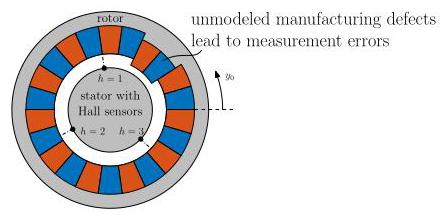
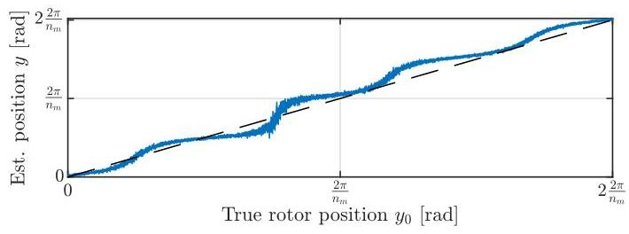
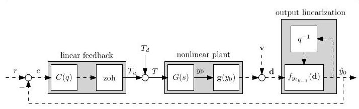
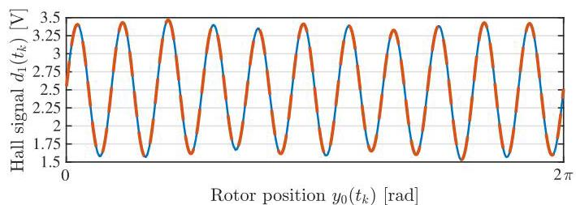
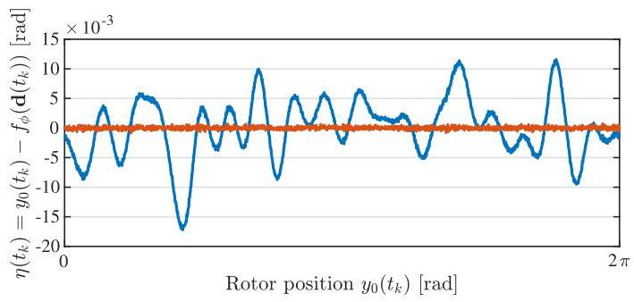
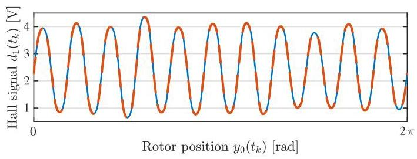
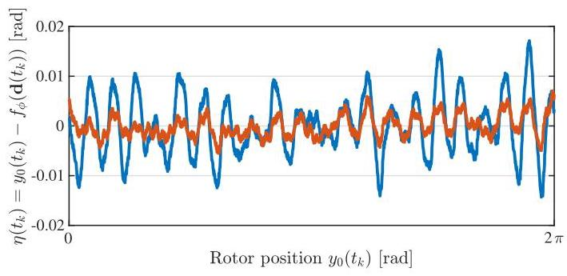
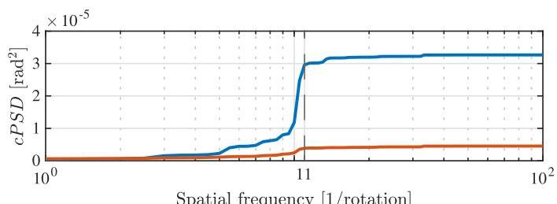

# Self-Calibrating Position Measurements: Applied to Imperfect Hall Sensors ${}^{1}$

 # 自校准位置测量:应用于不完美的霍尔传感器 ${}^{1}$

Max van Meer* Marijn van Noije* Koen Tiels* Enzo Evers* Lennart Blanken ${}^{*, *  * }$ Gert Witvoet ${}^{*, *  *  * }$ Tom Oomen ${}^{*, *  *  *  * }$

 马克斯·范·米尔* 马里恩·范·诺伊耶* 科恩·蒂尔斯* 恩佐·埃弗斯* 伦纳特·布兰肯 ${}^{*, *  * }$ 格特·维特沃特 ${}^{*, *  *  * }$ 汤姆·奥门 ${}^{*, *  *  *  * }$

* Control Systems Technology section, Department of Mechanical Engineering, Eindhoven University of Technology, The Netherlands (e-mail: m.v.meer@tue.nl).

 * 荷兰埃因霍温理工大学机械工程系控制系统技术组(电子邮件:m.v.meer@tue.nl)。

** Mechatronics department, Sioux Technologies B.V., Eindhoven, The Netherlands.

 ** 荷兰埃因霍温Sioux Technologies B.V.公司机电一体化部。

*** Department of Optomechatronics, TNO, Delft, The Netherlands. *** Delft Center for Systems and Control, Delft University of Technology, Delft, The Netherlands.

 *** 荷兰代尔夫特TNO光机电一体化部。 *** 荷兰代尔夫特理工大学代尔夫特系统与控制中心。

Abstract: Linear Hall sensors are a cost-effective alternative to optical encoders for measuring the rotor positions of actuators, with the main challenge being that they exhibit position-dependent inaccuracies resulting from manufacturing tolerances. This paper develops a data-driven calibration procedure for linear analog Hall sensors that enables accurate online estimates of the rotor angle without requiring expensive external encoders. The approach combines closed-loop data collection with nonlinear identification to obtain an accurate model of the sensor inaccuracies, which is subsequently used for online compensation. Simulation results show that when the flux density model structure is known, measurement errors are reduced to the sensor noise floor, and experiments on an industrial setup demonstrate a factor of 2.6 reduction in the root-mean-square measurement error. These results confirm that Hall sensor inaccuracies can be calibrated even when no external encoder is available, improving their practical applicability.

 摘要:线性霍尔传感器是用于测量执行器转子位置的一种经济高效的替代光学编码器的方案，主要挑战在于它们会因制造公差而出现与位置相关的误差。本文针对线性模拟霍尔传感器开发了一种数据驱动的校准程序，无需昂贵的外部编码器就能对转子角度进行准确的在线估计。该方法将闭环数据采集与非线性识别相结合，以获得传感器误差的精确模型，随后用于在线补偿。仿真结果表明，当磁通密度模型结构已知时，测量误差可降低到传感器本底噪声水平，在工业装置上进行的实验表明均方根测量误差降低了2.6倍。这些结果证实，即使没有外部编码器，霍尔传感器的误差也可以校准，从而提高其实际适用性。

Keywords: Mechatronic Systems, Calibration, Hall Sensors, Nonlinear Identification, Position Measurements

 关键词:机电一体化系统、校准、霍尔传感器、非线性识别、位置测量

## 1. INTRODUCTION

 ## 1. 引言

Accurate position measurements are key in high-performance actuators for applications such as semiconductor manufacturing or optical satellite communication (Mack, 2007; Kramer et al., 2020). These actuators must meet strict positioning requirements, often in the micrometer or microradian range, to achieve accurate control performance (Oomen, 2018). Meanwhile, the demand for mass-produced solutions has created a need for more economical sensors that still meet these requirements.

 精确的位置测量是半导体制造或光学卫星通信等应用中高性能执行器的关键(Mack，2007；Kramer等人，2020)。这些执行器必须满足严格的定位要求，通常在微米或微弧度范围内，以实现精确的控制性能(奥门，2018)。与此同时，对大规模生产解决方案的需求催生了对仍能满足这些要求的更经济传感器 的需求。

Figure 1 depicts a set of Linear Hall sensors on a rotor, which offer a promising alternative to costly, high-resolution encoders for electric actuators. A Hall sensor outputs a voltage proportional to the local magnetic flux density, which can be processed to estimate the rotor angle (Ramsden, 2006; Liu et al., 2008). Compared to high-end encoders, linear Hall sensors are cheaper, more compact, and easier to integrate in large volumes. Hall-based sensing nevertheless suffers from position-dependent inaccuracies due to uneven magnetization, manufacturing tolerances, and sensor misalignments. These imperfections introduce periodic measurement errors, which can lead to degraded control performance and parasitic vibrations (Pan et al., 2015; Xiao et al., 2007), see Figure 2. Calibration is thus required to eliminate the resulting ripples in the estimated rotor position.

 图1展示了转子上的一组线性霍尔传感器，它们为电动执行器提供了一种有前景的替代昂贵的高分辨率编码器的方案。霍尔传感器输出与局部磁通密度成比例的电压，该电压可用于处理以估计转子角度(Ramsden，2006；Liu等人，2008)。与高端编码器相比；线性霍尔传感器更便宜、更紧凑，并且更易于大规模集成。然而；基于霍尔的传感由于磁化不均匀、制造公差和传感器未对准而存在与位置相关的误差。这些缺陷会引入周期性测量误差，这可能导致控制性能下降和寄生振动(Pan等人，2015；Xiao等人，2007)，见图2。因此需要进行校准以消除估计转子位置中产生的纹波。

Existing approaches to sensor calibration use external sensors or automated test benches to obtain a ground truth (Dresscher et al., 2019; van Meer et al., 2023), which effectively corrects measurement errors. Alternatively, filter-based methods (Xiao et al., 2007; Jung et al., 2010) successfully suppress Hall-induced vibrations online using feedback. Other methods avoid external sensors by using measurement models (Du et al., 2018; Kim et al., 2016) or extended Kalman filters (Yong Zhao and West-wick, 2004). Still, these methods have their limitations. Reliance on external sensors greatly increases the cost of calibration in a mass-production setting, even with automated test benches. Moreover, filter-based methods limit control bandwidth by introducing phase lag. Existing methods avoiding external position sensors instead rely on rough position estimates, assume ideal sensor placement or are too computationally demanding for low-cost hardware.

 现有的传感器校准方法使用外部传感器或自动测试台来获得真实值(Dresscher等人，2019；van Meer等人，2023)，这有效地校正了测量误差。或者，基于滤波器的方法(Xiao等人，2007；Jung等人，2010)使用反馈在线成功抑制了霍尔引起的振动。其他方法通过使用测量模型(Du等人，2018；Kim等人，2016)或扩展卡尔曼滤波器(Yong Zhao和West-wick，2004)避免使用外部传感器。不过，这些方法都有其局限性。在大规模生产环境中，依赖外部传感器会大大增加校准成本，即使使用自动测试台也是如此。此外，基于滤波器的方法会因引入相位滞后而限制控制带宽。现有的避免使用外部位置传感器的方法反而依赖于粗略的位置估计，假设传感器放置理想，或者对低成本硬件来说计算要求过高。

Although these methods improve measurement accuracy, no procedure relies solely on analog Hall signals and actua-

 尽管这些方法提高了测量精度，但没有一种方法仅依赖模拟霍尔信号和执行器

---

1 This work is part of the research programme VIDI with project number 15698, which is (partly) financed by the Netherlands Organisation for Scientific Research (NWO). In addition, this research has received funding from the ECSEL Joint Undertaking under grant agreement 101007311 (IMOCO4.E). The Joint Undertaking receives support from the European Union's Horizon 2020 research and innovation program.

 1 本工作是编号为15698的VIDI研究计划的一部分，该计划(部分)由荷兰科学研究组织(NWO)资助。此外，本研究还获得了欧盟联合企业在101007311号资助协议(IMOCO4.E)下的资金。联合企业得到了欧盟“地平线2020”研究与创新计划的支持。

---

Fig. 1. Experimental setup: Linear Hall sensors $h$ on the stator measure flux density ${d}_{h}$ from rotor-mounted magnets. Blue and red blocks indicate south and north poles. The flux density depends on the rotor position ${y}_{0}$ , but reconstructing $y \approx  {y}_{0}$ is complicated by unmodeled manufacturing defects. Stator windings are omitted from the scheme for simplicity.

图1. 实验装置:定子上的线性霍尔传感器$h$测量来自安装在转子上的磁体的磁通密度${d}_{h}$。蓝色和红色块表示南极和北极。磁通密度取决于转子位置${y}_{0}$，但由于未建模的制造缺陷，重建$y \approx  {y}_{0}$很复杂。为简单起见，图中省略了定子绕组。

Fig. 2. Illustrative example of a position-dependent measurement inaccuracy, plotted along two out of ${n}_{m}$ pole-pairs. When the position is reconstructed (一) from flux density signals while neglecting higher order harmonics, the estimate of true rotor angle (- -) is not accurate and potentially varies along each pole pair.

图2. 位置相关测量误差的示例，沿${n}_{m}$极对数中的两个绘制。当从磁通密度信号重建位置(一)而忽略高阶谐波时，真实转子角度的估计(- -)不准确，并且可能沿每个极对变化。

tor torque commands while avoiding strict assumptions on sensor placement. Therefore, this paper aims to calibrate analog linear Hall sensors through closed-loop experiments and simulation error minimization. No external angle sensor or expensive test setup is needed, making the method suitable for cost-sensitive, large-scale production.

转矩命令，同时避免对传感器放置的严格假设。因此，本文旨在通过闭环实验和模拟误差最小化来校准模拟线性霍尔传感器。不需要外部角度传感器或昂贵的测试装置，使得该方法适用于对成本敏感的大规模生产。

The main contributions are as follows.

主要贡献如下。

C1 A closed-loop identification and calibration strategy is developed that relies solely on Hall measurements and torque commands while capturing higher-order harmonic distortions in the flux density.

C1 开发了一种闭环识别和校准策略，该策略仅依赖霍尔测量和转矩命令，同时捕获磁通密度中的高阶谐波失真。

C2 Simulation results show that the method accurately estimates the rotor angle without external position information.

C2 仿真结果表明，该方法无需外部位置信息即可准确估计转子角度。

C3 Experiments demonstrate improved measurement accuracy on an industrial setup.

C3 实验证明了在工业装置上测量精度有所提高。

This paper is structured as follows. Section 2 formalizes the problem. Section 3 describes the calibration approach. Sections 4 and 5 demonstrate its effectiveness in simulations and experiments. Finally, Section 6 provides conclusions.

本文结构如下。第2节形式化了问题。第3节描述了校准方法。第4节和第5节在仿真和实验中证明了其有效性。最后，第6节给出了结论。

## 2. PROBLEM DESCRIPTION

## 2. 问题描述

This section describes the challenges associated with reconstructing the rotor position of an electric motor using Hall sensor measurements.

本节描述了使用霍尔传感器测量来重建电动机转子位置所面临的挑战。

2.1 Experimental setup: Hall sensors on an electric motor

2.1 实验装置:电动机上的霍尔传感器

Consider an electric motor with linear time-invariant (LTI) torque dynamics given by

考虑一个具有线性时不变(LTI)转矩动态特性的电动机，其由下式给出

$$
{y}_{0}\left( s\right)  = G\left( s\right) T\left( s\right) , \tag{1}
$$

where ${y}_{0} \in  \mathbb{R}$ represents the true rotor position,

其中${y}_{0} \in  \mathbb{R}$表示真实转子位置，

$$
T\left( s\right)  = {T}_{u}\left( s\right)  + {T}_{d}\left( s\right) \tag{2}
$$

is the applied torque consisting of a control action ${T}_{u}$ and external disturbances ${T}_{d}$ , and $G\left( s\right)$ is a transfer function with Laplace operator $s$ . The rotor contains ${n}_{m}$ pole pairs that generate a position-dependent magnetic field. Three Hall sensors $h \in  \{ 1,2,3\}$ are mounted on the stator, spaced approximately ${120}^{ \circ  }$ apart in electrical angle. Neglecting dependence on temperature, each sensor measures a voltage ${d}_{h}$ assumed proportional to the local magnetic flux density, given by

是由控制作用${T}_{u}$和外部干扰${T}_{d}$组成的施加转矩，并且$G\left( s\right)$是具有拉普拉斯算子$s$的传递函数。转子包含${n}_{m}$极对，它们产生与位置相关的磁场。三个霍尔传感器$h \in  \{ 1,2,3\}$安装在定子上，在电角度上相隔约${120}^{ \circ  }$。忽略对温度的依赖性，每个传感器测量一个电压${d}_{h}$，假设其与局部磁通密度成正比，由下式给出

$$
{d}_{h}\left( {t}_{k}\right)  = {g}_{h}\left( {{y}_{0}\left( {t}_{k}\right) }\right)  + {v}_{h}\left( {t}_{k}\right) , \tag{3}
$$

where ${t}_{k} = {T}_{s}k$ with sample time ${T}_{s}$ and discrete-time sample number $k$ . Here, ${g}_{h}\left( {y}_{0}\right)$ describes the periodic relationship between rotor position ${y}_{0}$ and scaled flux density with ${y}_{0} = 0$ at ${t}_{0}$ , and ${v}_{h}\left( {t}_{k}\right)$ is zero-mean, independent sensor noise with variance ${\sigma }_{h}^{2}$ . The series connection of linear system $G\left( s\right)$ and nonlinear functions ${g}_{h}\left( {y}_{0}\right)$ is recognized as a single-input multi-output Wiener system in literature (Westwick and Verhaegen, 1996).

其中${t}_{k} = {T}_{s}k$具有采样时间${T}_{s}$和离散时间采样数$k$。这里，${g}_{h}\left( {y}_{0}\right)$描述了转子位置${y}_{0}$与在${t}_{0}$处具有${y}_{0} = 0$的缩放磁通密度之间的周期性关系，并且${v}_{h}\left( {t}_{k}\right)$是均值为零、独立的传感器噪声，方差为${\sigma }_{h}^{2}$。线性系统$G\left( s\right)$和非线性函数${g}_{h}\left( {y}_{0}\right)$的串联在文献中被认为是一个单输入多输出维纳系统(Westwick和Verhaegen，1996)。

### 2.2 Computing the rotor position from Hall sensor data

### 2.2 从霍尔传感器数据计算转子位置

Estimates $y \approx  {y}_{0}$ can be reconstructed from the Hall sensor measurements ${d}_{h}$ if the mapping

如果映射具有左逆，则可以从霍尔传感器测量值${d}_{h}$重建估计值$y \approx  {y}_{0}$。

$$
\mathbf{g}\left( {y}_{0}\right)  = {\left\lbrack  \begin{array}{lll} {g}_{1}\left( {y}_{0}\right) & {g}_{2}\left( {y}_{0}\right) & {g}_{3}\left( {y}_{0}\right)  \end{array}\right\rbrack  }^{\top } \tag{4}
$$

has a left inverse. This is the case if and only if $\mathbf{g}\left( {y}_{0}\right)$ is injective, i.e., any unique flux density vector $\mathbf{d} = \mathbf{g}\left( {y}_{0}\right)$ must correspond to exactly one rotor position ${y}_{0}$ . This is not the case on the whole domain ${y}_{0} \in  \mathbb{R}$ : not only is $\mathbf{g}\left( {y}_{0}\right)$ periodic with mechanical period ${2\pi }$ , it is also periodic with period $\frac{2\pi }{{n}_{m}}$ if the pole-pairs are placed axisymmetrically.

当且仅当$\mathbf{g}\left( {y}_{0}\right)$是单射时才是这种情况，即任何唯一的磁通密度矢量$\mathbf{d} = \mathbf{g}\left( {y}_{0}\right)$必须恰好对应于一个转子位置${y}_{0}$。在整个域${y}_{0} \in  \mathbb{R}$上并非如此:$\mathbf{g}\left( {y}_{0}\right)$不仅具有机械周期${2\pi }$的周期性，如果磁极对轴对称放置，它还具有周期$\frac{2\pi }{{n}_{m}}$的周期性。

This issue is overcome by including prior information about the specific period that ${y}_{0}\left( {t}_{k}\right)$ is currently in, e.g., by using the previous position estimate

通过包含关于${y}_{0}\left( {t}_{k}\right)$当前所处特定周期的先验信息来克服这个问题，例如，通过使用先前的位置估计

$$
\phi  \triangleq  y\left( {t}_{k - 1}\right) \tag{5}
$$

and assuming a sufficiently small ${T}_{s}$ . In this case, $\mathbf{g}\left( {y}_{0}\right)$ is not required to be injective on the whole domain ${y}_{0} \in  \mathbb{R}$ , but only in a domain ${\mathcal{Y}}_{\phi }$ smaller than the periodicity of $\mathbf{g}\left( {y}_{0}\right)$ , centered around $\phi$ :

并假设${T}_{s}$足够小。在这种情况下，$\mathbf{g}\left( {y}_{0}\right)$不需要在整个域${y}_{0} \in  \mathbb{R}$上是单射的，而只需要在一个比$\mathbf{g}\left( {y}_{0}\right)$的周期性小的域${\mathcal{Y}}_{\phi }$上是单射的，该域以$\phi$为中心:

$$
{\mathcal{Y}}_{\phi } = \left\{  {{y}_{0}\left| {\;\phi  - \frac{\pi }{{n}_{m}} < {y}_{0} < \phi  + \frac{\pi }{{n}_{m}}}\right. }\right\}  . \tag{6}
$$

Within this domain, the estimate $y$ of the true position ${y}_{0}$ follows from a function ${f}_{\phi }$ satisfying

在这个域内，真实位置${y}_{0}$的估计值$y$由满足以下条件的函数${f}_{\phi }$得出

$$
{f}_{\phi }\left( {\mathbf{g}\left( {y}_{0}\right) }\right)  = {y}_{0},\;\forall {y}_{0} \in  {\mathcal{Y}}_{\phi }. \tag{7}
$$

Thus, $\phi  \triangleq  y\left( {t}_{k - 1}\right)$ in (7) acts as a history-capturing variable that enables reconstruction of the mechanical rotor position ${y}_{0}$ despite periodic flux densities.

因此，(7)中的$\phi  \triangleq  y\left( {t}_{k - 1}\right)$充当一个历史捕获变量，它能够在磁通密度具有周期性的情况下重建机械转子位置${y}_{0}$。

Since $\mathbf{g}\left( {y}_{0}\right)$ is unknown,(7) cannot be used for designing the left inverse ${f}_{\phi }$ . Instead, ${f}_{\phi }$ is designed using a model $\widehat{\mathbf{g}}\left( {y}_{0}\right)  \approx  \mathbf{g}\left( {y}_{0}\right)$ to satisfy the condition

由于$\mathbf{g}\left( {y}_{0}\right)$是未知的，(7)不能用于设计左逆${f}_{\phi }$。相反，使用模型$\widehat{\mathbf{g}}\left( {y}_{0}\right)  \approx  \mathbf{g}\left( {y}_{0}\right)$来设计${f}_{\phi }$以满足条件

$$
{f}_{\phi }\left( {\widehat{\mathbf{g}}\left( {y}_{0}\right) }\right)  = {y}_{0},\;\forall {y}_{0} \in  {\mathcal{Y}}_{\phi }, \tag{8}
$$

where model mismatch would lead to estimation error ${y}_{0} - {f}_{\phi }\left( {\widehat{\mathbf{g}}\left( {y}_{0}\right) }\right)$ . The next section addresses the importance of accurately modeling $\widehat{\mathbf{g}}\left( {y}_{0}\right)  \approx  \mathbf{g}\left( {y}_{0}\right)$ .

其中模型不匹配会导致估计误差${y}_{0} - {f}_{\phi }\left( {\widehat{\mathbf{g}}\left( {y}_{0}\right) }\right)$。下一节讨论准确建模$\widehat{\mathbf{g}}\left( {y}_{0}\right)  \approx  \mathbf{g}\left( {y}_{0}\right)$的重要性。

Algorithm 1 Data-driven calibration of Hall sensors

算法1 霍尔传感器的数据驱动校准

---

Require: Controller $C\left( s\right)$ , BLA ${\widehat{G}}_{\mathrm{{BLA}}}\left( q\right)$ , reference $r\left( {t}_{k}\right)$ .

	Track $r\left( {t}_{k}\right)$ in closed-loop using ${f}_{\phi } = {f}_{\phi }^{\text{ init }}$ in (9), store

	$\mathbf{d}\left( {t}_{k}\right)$ and $y\left( {t}_{k}\right)$ in $\mathcal{D}$ .

	Set ${\widehat{G}}_{\mathrm{{BLA}}}\left( q\right)  \leftarrow  {\widehat{G}}_{\mathrm{{BLA}}}\left( q\right) /\widehat{c}$ with (23). (Section 3.3)

	Solve (14) to obtain ${\widehat{\mathbf{g}}}_{{\theta }^{ \star  }}$ .

	Create ${f}_{\phi }^{ \star  }$ using (20). (Section 3.2)

	return Reconstruction function ${f}_{\phi }^{ \star  }$ .

---

Fig. 3. Closed-loop data collection scheme. Rotor position estimates $y \approx  {y}_{0}$ are reconstructed from flux density signals $\mathbf{d}$ and are used for position feedback control, suppressing external disturbances ${T}_{d}$ . Solid and dashed lines represent continuous-time and discrete-time signals, respectively.

图3. 闭环数据收集方案。从磁通密度信号$\mathbf{d}$重建转子位置估计值$y \approx  {y}_{0}$，并将其用于位置反馈控制，抑制外部干扰${T}_{d}$。实线和虚线分别表示连续时间信号和离散时间信号。

### 2.3 Consequences of incorrect reconstruction

### 2.3 错误重建的后果

Imperfect modeling of $\mathbf{g}\left( {y}_{0}\right)$ leads to periodic errors in the reconstructed rotor position $y$ , resulting in ripples that degrade tracking performance and cause vibrations. Assuming Hall signals are purely sinusoidal is inadequate due to manufacturing tolerances, uneven magnetization, and misaligned sensors. These imperfections introduce higher-order harmonics and cause measurement inaccuracy when left unaddressed; see Figure 2. This shows the need for a model $\widehat{\mathbf{g}}\left( {y}_{0}\right)$ to accurately capture flux density behavior.

$\mathbf{g}\left( {y}_{0}\right)$的建模不完善会导致重建的转子位置$y$出现周期性误差，从而产生纹波，降低跟踪性能并引起振动。由于制造公差、不均匀磁化和传感器未对准，假设霍尔信号是纯正弦的是不够的。这些缺陷会引入高阶谐波，如果不加以解决会导致测量不准确；见图2。这表明需要一个模型$\widehat{\mathbf{g}}\left( {y}_{0}\right)$来准确捕获磁通密度行为。

### 2.4 Problem definition

### 2.4 问题定义

The aim is to obtain accurate rotor position estimates $y \approx  {y}_{0}$ from Hall sensor measurements $\mathbf{d}$ . No external position sensors are available for calibration except for validation purposes, and the solution must be robust to external disturbances and implementable on low-cost embedded hardware. This involves two main tasks:

目标是从霍尔传感器测量值$\mathbf{d}$获得准确的转子位置估计值$y \approx  {y}_{0}$。除了用于验证目的外，没有外部位置传感器可用于校准，并且解决方案必须对外部干扰具有鲁棒性并且能够在低成本嵌入式硬件上实现。这涉及两个主要任务:

(1) Identify an accurate flux density model $\widehat{\mathbf{g}}\left( {y}_{0}\right)$ based on the measurements $\mathbf{d}$ and applied torque $T$ .

(1) 根据测量值$\mathbf{d}$和施加的扭矩$T$识别精确的磁通密度模型$\widehat{\mathbf{g}}\left( {y}_{0}\right)$。

(2) Design an ${f}_{\phi }$ satisfying (8).

(2) 设计一个满足(8)的${f}_{\phi }$。

## 3. SELF-CALIBRATING HALL SENSORS

## 3. 自校准霍尔传感器

This section describes the developed calibration approach for Hall-based rotor position estimation. Section 3.1 presents flux density modeling, experiment design, and identification. Section 3.2 details the reconstruction function, and Section 3.3 covers implementation. Algorithm 1 summarizes the procedure.

本节介绍了用于基于霍尔的转子位置估计的已开发校准方法。3.1节介绍磁通密度建模、实验设计和识别。3.2节详细介绍重构函数，3.3节介绍实现。算法1总结了该过程。

### 3.1 Modeling the flux density function $\mathbf{g}$

### 3.1 对磁通密度函数$\mathbf{g}$进行建模

The first step involves identifying an accurate model $\widehat{\mathbf{g}}\left( {y}_{0}\right)$ of the flux density function $\mathbf{g}\left( {y}_{0}\right)$ from measured data. The modeling process consists of three key steps: experiment design, model structure definition, and identification. These steps are described below.

第一步涉及从测量数据中识别磁通密度函数$\mathbf{g}\left( {y}_{0}\right)$的精确模型$\widehat{\mathbf{g}}\left( {y}_{0}\right)$。建模过程包括三个关键步骤:实验设计、模型结构定义和识别。这些步骤如下所述。

Experiment design Data is collected in closed-loop, using a feedback controller $C\left( s\right)$ for safety and for mitigation of disturbances ${T}_{d}$ . During data collection, an initial reconstruction function ${f}_{\phi }^{\text{ init }}$ estimates the rotor position to facilitate linear position feedback. This function combines a Clarke transformation and the atan2 function to approximate the rotor position based on the Hall sensor measurements $\mathbf{d} = {\left\lbrack  {d}_{1},{\widehat{d}}_{2},{d}_{3}\right\rbrack  }^{\top }$ (Hussain and Toliyat,2016):

实验设计 使用反馈控制器$C\left( s\right)$进行闭环数据采集，以确保安全并减轻干扰${T}_{d}$。在数据采集期间，初始重构函数${f}_{\phi }^{\text{ init }}$估计转子位置以促进线性位置反馈。该函数结合克拉克变换和atan2函数，基于霍尔传感器测量值$\mathbf{d} = {\left\lbrack  {d}_{1},{\widehat{d}}_{2},{d}_{3}\right\rbrack  }^{\top }$(Hussain和Toliyat，2016)近似转子位置:

$$
y\left( {t}_{k}\right)  = {f}_{{y}_{{t}_{k - 1}}}^{\text{ init }}\left( {\mathbf{d}\left( {t}_{k}\right) }\right)
$$

$$
{f}_{{y}_{{t}_{k - 1}}}^{\text{ init }}\left( {\mathbf{d}\left( {t}_{k}\right) }\right)  \mathrel{\text{ := }} \frac{1}{{n}_{m}}\left( {\Gamma \left( {\operatorname{atan}2\left( {{\widetilde{d}}_{2}\left( {t}_{k}\right) ,{\widetilde{d}}_{1}\left( {t}_{k}\right) }\right) ,{y}_{{t}_{k - 1}}}\right) }\right) ,
$$

(9)

with $\Gamma  : \mathbb{R} \times  \mathbb{R} \rightarrow  \mathbb{R}$ an unwrapping function given by

其中$\Gamma  : \mathbb{R} \times  \mathbb{R} \rightarrow  \mathbb{R}$是由以下给出的解缠函数

$$
\Gamma \left( {{y}_{{t}_{k}},{y}_{{t}_{k - 1}}}\right)  \mathrel{\text{ := }} {y}_{{t}_{k - 1}} + {\;\operatorname{mod}\;\left( {{y}_{{t}_{k}} - {y}_{{t}_{k - 1}} + \pi ,{2\pi }}\right) } - \pi ,
$$

(10)

and $\widetilde{\mathbf{d}} = \mathbf{{Cd}}$ with $\mathbf{C}$ the Clarke transformation matrix:

并且$\widetilde{\mathbf{d}} = \mathbf{{Cd}}$与$\mathbf{C}$是克拉克变换矩阵:

$$
\mathbf{C} = \frac{2}{3}\left\lbrack  \begin{matrix} 1 &  - \frac{1}{2} &  - \frac{1}{2} \\  0 & \frac{\sqrt{3}}{2} &  - \frac{\sqrt{3}}{2} \\  \frac{1}{2} & \frac{1}{2} & \frac{1}{2} \end{matrix}\right\rbrack  . \tag{11}
$$

This initial ${f}_{\phi }^{\text{ init }}$ satisfies (7) if $\mathbf{g}\left( {y}_{0}\right)$ consists solely of three pure sinusoids shifted by ${120}^{ \circ  }$ , without higher-order harmonics. In practice, however, sensor misalignments and uneven magnetization give rise to harmonic distortions that make (9) only an approximation $y\left( {t}_{k}\right)  \approx  {y}_{0}\left( {t}_{k}\right)$ .

如果$\mathbf{g}\left( {y}_{0}\right)$仅由三个偏移了${120}^{ \circ  }$的纯正弦波组成，没有高阶谐波，则此初始${f}_{\phi }^{\text{ init }}$满足(7)。然而，在实际中，传感器未对准和不均匀磁化会导致谐波失真，这使得(9)只是一个近似值$y\left( {t}_{k}\right)  \approx  {y}_{0}\left( {t}_{k}\right)$。

Despite these inaccuracies, the approximate reconstruction is sufficient to enable closed-loop control, as shown in Figure 3. The feedback controller $C$ suppresses external disturbances ${T}_{d}$ and ensures that the approximated rotor position tracks a ramp reference. Perfect reference tracking is not achieved because of the higher harmonics in $\mathbf{g}$ , but this is not required for identification; the feedback controller need only suppress ${T}_{d}$ in $T$ . Section 3.3 addresses the reference and controller design. During experiments, the $N$ samples of $\mathbf{d}\left( {t}_{k}\right)$ and $y\left( {t}_{k}\right)$ are stored in the dataset $\mathcal{D}$ for use in identification.

尽管存在这些不精确性，但如图3所示，近似重构足以实现闭环控制。反馈控制器$C$抑制外部干扰${T}_{d}$，并确保近似的转子位置跟踪斜坡参考。由于$\mathbf{g}$中的高阶谐波，无法实现完美的参考跟踪，但这对于识别不是必需的；反馈控制器只需抑制$T$中的${T}_{d}$。3.3节讨论参考和控制器设计。在实验期间，$N$的$\mathbf{d}\left( {t}_{k}\right)$和$y\left( {t}_{k}\right)$样本存储在数据集$\mathcal{D}$中以供识别使用。

Model structure The flux density function $\mathbf{g}\left( {y}_{0}\right)$ is parametrized linear in the parameters for simplicity:

模型结构 为简单起见，磁通密度函数$\mathbf{g}\left( {y}_{0}\right)$在参数上进行线性参数化:

$$
{\widehat{\mathbf{g}}}_{\mathbf{\theta }}^{\top }\left( {y}_{0}\right)  = \mathbf{\psi }\left( {y}_{0}\right) \mathbf{\theta }, \tag{12}
$$

where $\mathbf{\theta } \in  {\mathbb{R}}^{{n}_{\theta }}$ are model parameters, and

其中$\mathbf{\theta } \in  {\mathbb{R}}^{{n}_{\theta }}$是模型参数，并且

$$
\mathbf{\psi }\left( {y}_{0}\right)  = {\mathbf{I}}_{3} \otimes  \mathbf{\beta }\left( {y}_{0}\right) , \tag{13}
$$

with $\otimes$ the Kronecker product and $\mathbf{\beta } : \mathbb{R} \rightarrow  {\mathbb{R}}^{1 \times  m}$ a periodic basis function, such as a Fourier basis or a periodic kernel function (Rasmussen and Williams, 2006). The order $m$ can be chosen by analyzing the harmonic content of data $\mathbf{d}\left( {t}_{k}\right)$ .

其中$\otimes$是克罗内克积，$\mathbf{\beta } : \mathbb{R} \rightarrow  {\mathbb{R}}^{1 \times  m}$是周期基函数，例如傅里叶基或周期核函数(Rasmussen和Williams，2006)。阶数$m$可以通过分析数据$\mathbf{d}\left( {t}_{k}\right)$的谐波含量来选择。

Identification The parameters $\mathbf{\theta }$ are identified by solving a simulation error minimization (SEM) problem. The cost function $J\left( \mathbf{\theta }\right)$ is defined as the squared 2-norm of the difference between the measured flux density $\mathbf{d} \in  \mathcal{D}$ and a simulated flux density ${\mathbf{d}}_{\mathbf{\theta }}^{\text{ sim }}$ :

识别 通过求解模拟误差最小化(SEM)问题来识别参数$\mathbf{\theta }$。代价函数$J\left( \mathbf{\theta }\right)$定义为测量通量密度$\mathbf{d} \in  \mathcal{D}$与模拟通量密度${\mathbf{d}}_{\mathbf{\theta }}^{\text{ sim }}$之差的平方2-范数:

$$
\mathop{\min }\limits_{\mathbf{\theta }}J\left( \mathbf{\theta }\right)
$$

$$
J\left( \mathbf{\theta }\right)  = \mathop{\sum }\limits_{{k = 1}}^{N}{\left( \mathbf{d}\left( {t}_{k}\right)  - {\mathbf{d}}_{\mathbf{\theta }}^{\operatorname{sim}}\left( {t}_{k}\right) \right) }^{\top }\left( {\mathbf{d}\left( {t}_{k}\right)  - {\mathbf{d}}_{\mathbf{\theta }}^{\operatorname{sim}}\left( {t}_{k}\right) }\right) . \tag{14}
$$

Here, ${\mathbf{d}}_{\mathbf{\theta }}^{\operatorname{sim}}\left( {t}_{k}\right)$ is computed using the state and output equations of the closed-loop system, incorporating a Best Linear Approximation (BLA) ${\widehat{G}}_{\mathrm{{BLA}}}\left( q\right)  \approx  G\left( q\right)$ , detailed in Section 3.3, and the model ${\widehat{\mathbf{g}}}_{\mathbf{\theta }}\left( {y}_{0}\right)$ . These equations are:

在此，${\mathbf{d}}_{\mathbf{\theta }}^{\operatorname{sim}}\left( {t}_{k}\right)$使用闭环系统的状态和输出方程进行计算，其中包含第3.3节详细介绍的最佳线性逼近(BLA)${\widehat{G}}_{\mathrm{{BLA}}}\left( q\right)  \approx  G\left( q\right)$和模型${\widehat{\mathbf{g}}}_{\mathbf{\theta }}\left( {y}_{0}\right)$。这些方程为:

$$
{\mathbf{d}}_{\mathbf{\theta }}^{\mathrm{{sim}}}\left( {t}_{k}\right)  = {\widehat{\mathbf{g}}}_{\mathbf{\theta }}\left( {{y}_{0}^{\mathrm{{sim}}}\left( {t}_{k}\right) }\right) ,
$$

$$
{y}_{0,\mathbf{\theta }}^{\operatorname{sim}}\left( {t}_{k}\right)  = {\mathbf{C}}_{{G}_{\mathrm{{BLA}}}}{\mathbf{x}}_{{G}_{\mathrm{{BLA}}},\mathbf{\theta }}\left( {t}_{k}\right)
$$

$$
{\mathbf{x}}_{{G}_{\mathrm{{BLA}}},\mathbf{\theta }}\left( {t}_{k + 1}\right)  = {\mathbf{A}}_{{G}_{\mathrm{{BLA}}}}{\mathbf{x}}_{{G}_{\mathrm{{BLA}}},\mathbf{\theta }}\left( {t}_{k}\right)  + {\mathbf{B}}_{{G}_{\mathrm{{BLA}}},\mathbf{\theta }}{T}_{\mathbf{\theta }}^{\operatorname{sim}}\left( {t}_{k}\right) ,
$$

$$
{T}_{\mathbf{\theta }}^{\operatorname{sim}}\left( {t}_{k}\right)  = {\mathbf{C}}_{C}{\mathbf{x}}_{C,\mathbf{\theta }}\left( {t}_{k}\right)  + {\mathbf{D}}_{C}{e}_{\mathbf{\theta }}^{\operatorname{sim}}\left( {t}_{k}\right) ,
$$

$$
{\mathbf{x}}_{C,\mathbf{\theta }}\left( {t}_{k + 1}\right)  = {\mathbf{A}}_{C}{\mathbf{x}}_{C,\mathbf{\theta }}\left( {t}_{k}\right)  + {\mathbf{B}}_{C}{e}_{\mathbf{\theta }}^{\operatorname{sim}}\left( {t}_{k}\right) , \tag{15}
$$

$$
{e}_{\mathbf{\theta }}^{\operatorname{sim}}\left( {t}_{k}\right)  = r\left( {t}_{k}\right)  - {y}_{\mathbf{\theta }}^{\operatorname{sim}}\left( {t}_{k}\right) ,
$$

$$
{y}_{\mathbf{\theta }}^{\operatorname{sim}}\left( {t}_{k}\right)  = {f}_{{y}_{\mathbf{\theta }}^{\operatorname{sim}}\left( {t}_{k - 1}\right) }^{\text{ init }}\left( {{\mathbf{d}}_{\mathbf{\theta }}^{\operatorname{sim}}\left( {t}_{k}\right) }\right) ,\;\forall k \in  \{ 1,\ldots , N\}
$$

with zero initial conditions. Here, ${\mathbf{A}}_{{G}_{\mathrm{{BLA}}}},{\mathbf{B}}_{{G}_{\mathrm{{BLA}}}}$ , and ${\mathbf{C}}_{{G}_{\mathrm{{BLA}}}}$ represent the state and output matrices of the BLA, while ${\mathbf{A}}_{C},{\mathbf{B}}_{C},{\mathbf{C}}_{C}$ , and ${\mathbf{D}}_{C}$ describe the discrete-time controller. Problem (14) is solved using an interior-point method with approximate gradients, starting at an initial estimate ${\mathbf{\theta }}_{0}$ corresponding to pure sinusoids, i.e., the inverse of ${f}^{\text{ init }}$ . Since the cost is non-convex, ${\mathbf{\theta }}^{ \star  }$ corresponds to a local minimum.

初始条件为零。在此，${\mathbf{A}}_{{G}_{\mathrm{{BLA}}}},{\mathbf{B}}_{{G}_{\mathrm{{BLA}}}}$和${\mathbf{C}}_{{G}_{\mathrm{{BLA}}}}$表示BLA的状态和输出矩阵，而${\mathbf{A}}_{C},{\mathbf{B}}_{C},{\mathbf{C}}_{C}$和${\mathbf{D}}_{C}$描述离散时间控制器。问题(14)使用具有近似梯度的内点法求解，从对应于纯正弦波的初始估计${\mathbf{\theta }}_{0}$开始，即${f}^{\text{ init }}$的逆。由于代价是非凸的，${\mathbf{\theta }}^{ \star  }$对应于局部最小值。

### 3.2 Designing a reconstruction function ${f}_{\phi }^{ \star  }$

### 3.2设计重构函数${f}_{\phi }^{ \star  }$

With the flux density model $\widehat{\mathbf{g}}\left( {y}_{0}\right)$ available, a reconstruction function ${f}_{\phi }^{ \star  }$ is designed to estimate the rotor position while compensating for inaccuracies in the initial reconstruction function ${f}_{\phi }^{\text{ init }}$ . First, a lookup table is defined on a grid of $M$ equidistant points ${y}_{0, i}$ within the interval $\lbrack 0,{2\pi })$ . Using the model $\widehat{\mathbf{g}}\left( {y}_{0}\right)$ , the corresponding outputs of the initial reconstruction function ${f}_{\phi }^{\text{ init }}$ are computed:

有了通量密度模型$\widehat{\mathbf{g}}\left( {y}_{0}\right)$，设计一个重构函数${f}_{\phi }^{ \star  }$来估计转子位置，同时补偿初始重构函数${f}_{\phi }^{\text{ init }}$中的不准确之处。首先，在区间$\lbrack 0,{2\pi })$内的$M$个等距点${y}_{0, i}$的网格上定义一个查找表。使用模型$\widehat{\mathbf{g}}\left( {y}_{0}\right)$，计算初始重构函数${f}_{\phi }^{\text{ init }}$的相应输出:

$$
{\widehat{y}}_{i} = {f}_{{y}_{0, i}}^{\text{ init }}\left( {{\widehat{\mathbf{g}}}_{\mathbf{\theta }}\left( {y}_{0, i}\right) }\right) ,\;i \in  \{ 1,\ldots , M\} . \tag{16}
$$

The additive measurement error caused by ${f}_{\phi }^{\text{ init }}$ on this grid is then estimated as

然后，估计${f}_{\phi }^{\text{ init }}$在此网格上引起的附加测量误差为

$$
{\widehat{\eta }}_{i}^{\mathrm{{LUT}}} \mathrel{\text{ := }} {y}_{0, i} - {\widehat{y}}_{i},\;i \in  \{ 1,\ldots , M\} . \tag{17}
$$

Next, a piecewise-linear correction function ${\widehat{\eta }}^{\mathrm{{LUT}}}\left( \widehat{y}\right)$ is defined to interpolate between the points $\left( {{\widehat{y}}_{i},{\eta }_{i}^{\mathrm{{LUT}}}}\right)$ . For a given $\widehat{y}$ , the index $i$ is determined such that:

接下来，定义一个分段线性校正函数${\widehat{\eta }}^{\mathrm{{LUT}}}\left( \widehat{y}\right)$在点$\left( {{\widehat{y}}_{i},{\eta }_{i}^{\mathrm{{LUT}}}}\right)$之间进行插值。对于给定的$\widehat{y}$，确定索引$i$使得:

$$
i = {\operatorname{argmin}}_{i}\left\{  {\widehat{y} \in  \left\lbrack  {{\widehat{y}}_{i},{\widehat{y}}_{i + 1}}\right) }\right\}  , \tag{18}
$$

where the interpolation wraps around at the boundaries, i.e., ${\widehat{y}}_{M + 1} = {\widehat{y}}_{1}$ and ${\eta }_{M + 1}^{\mathrm{{LUT}}} = {\eta }_{1}^{\mathrm{{LUT}}}$ . The piecewise-linear interpolation is then computed as:

其中插值在边界处环绕，即${\widehat{y}}_{M + 1} = {\widehat{y}}_{1}$和${\eta }_{M + 1}^{\mathrm{{LUT}}} = {\eta }_{1}^{\mathrm{{LUT}}}$。然后计算分段线性插值为:

$$
{\eta }^{\mathrm{{LUT}}}\left( \widehat{y}\right)  = {\widehat{\eta }}_{i}^{\mathrm{{LUT}}} + \frac{\widehat{y} - {\widehat{y}}_{i}}{{\widehat{y}}_{i + 1} - {\widehat{y}}_{i}}\left( {{\widehat{\eta }}_{i + 1}^{\mathrm{{LUT}}} - {\widehat{\eta }}_{i}^{\mathrm{{LUT}}}}\right) . \tag{19}
$$

Finally, the reconstruction function ${f}_{\phi }^{ \star  }$ is defined to compensate for the additive measurement error, yielding:

最后，定义重构函数${f}_{\phi }^{ \star  }$以补偿附加测量误差，得到:

$$
{f}_{\phi }^{ \star  }\left( \mathbf{d}\right)  = {f}_{\phi }^{\text{ init }}\left( \mathbf{d}\right)  + {\eta }^{\mathrm{{LUT}}}\left( {{f}_{\phi }^{\text{ init }}\left( \mathbf{d}\right) }\right) . \tag{20}
$$

This adjustment corrects the periodic inaccuracies in ${f}_{\phi }^{\text{ init }}$ in a computationally lightweight manner, improving the accuracy of rotor position estimation. Note that this simple approach requires (16) to be bijective. If it is not, a different approach to designing ${f}_{\phi }^{ \star  }$ is required that avoids ${f}_{\phi }^{\text{ init }}$ altogether. The next section discusses relevant implementation aspects.

此调整以计算轻量级的方式校正${f}_{\phi }^{\text{ init }}$中的周期性不准确之处，提高转子位置估计的准确性。请注意，这种简单方法要求(16)是双射的。如果不是，则需要一种不同的设计${f}_{\phi }^{ \star  }$的方法，完全避免${f}_{\phi }^{\text{ init }}$。下一节讨论相关的实现方面。

### 3.3 Implementation aspects

### 3.3实现方面

Several practical considerations are important for implementing the developed method, as detailed next.

如需实施所开发的方法，有几个实际考量因素很重要，详情如下。

Control and reference design The closed-loop data collection in Section 3.1.1 uses a feedback controller $C\left( s\right)$ to suppress external disturbances ${T}_{d}$ on total torque $T$ . To mitigate these disturbances, the sensitivity (Franklin et al., 1994) must be low in magnitude. With the nonlinear function $\mathbf{g}$ approximately linearized by ${f}_{\phi }^{\text{ init }}$ in Figure 3, the sensitivity is given by

控制与参考设计 3.1.1节中的闭环数据采集使用反馈控制器$C\left( s\right)$来抑制总扭矩$T$上的外部干扰${T}_{d}$。为减轻这些干扰，灵敏度(Franklin等人，1994年)的幅值必须较低。利用图3中由${f}_{\phi }^{\text{ init }}$近似线性化的非线性函数$\mathbf{g}$，灵敏度由下式给出

$$
S\left( s\right)  = \frac{T\left( s\right) }{{T}_{d}\left( s\right) } \approx  \frac{1}{1 + G\left( s\right) C\left( s\right) }. \tag{21}
$$

Including an integrator in $C\left( s\right)$ ensures that the sensitivity is low in magnitude at low frequencies and effectively suppresses slowly varying disturbances. A slow ramp reference from 0 to ${2\pi n}$ rad with $n \in  {\mathbb{R}}_{ \geq  1}$ places any position-dependent disturbances in this low-frequency range where they are well attenuated.

在$C\left( s\right)$中包含一个积分器可确保在低频时灵敏度幅值较低，并有效抑制缓慢变化的干扰。从0到${2\pi n}$弧度的缓慢斜坡参考信号与$n \in  {\mathbb{R}}_{ \geq  1}$一起，将任何与位置相关的干扰置于该低频范围内，在该范围内它们会得到很好的衰减。

Obtaining a Best Linear Approximation The BLA ${\widehat{G}}_{\mathrm{{BLA}}}\left( q\right)$ required for Step 3 in Algorithm 1 is identified up to an unknown constant in closed-loop using the approach described in Pintelon and Schoukens (2012, Section 3.8), averaging over multiple realizations of random-phase mul-tisine reference signals. This yields

获得最佳线性逼近 使用Pintelon和Schoukens(2012年，3.8节)中描述的方法，对随机相位多正弦参考信号的多个实现进行平均，在闭环中确定算法1步骤3所需的最佳线性逼近${\widehat{G}}_{\mathrm{{BLA}}}\left( q\right)$，其结果为一个未知常数。由此得到

$$
{\widehat{G}}_{\mathrm{{BLA}}}\left( q\right)  = {cG}\left( q\right) , \tag{22}
$$

with $c \in  \mathbb{R}$ . To correct for this mismatch, $\widehat{c} \approx  c$ is estimated from data $\mathcal{D}$ by minimizing

对于$c \in  \mathbb{R}$。为校正这种不匹配，通过最小化从数据$\mathcal{D}$中估计$\widehat{c} \approx  c$

$$
\widehat{c} = \arg \mathop{\min }\limits_{c}{\left( {y}_{{\mathbf{\theta }}_{0}, c}^{\operatorname{sim}}\left( {t}_{{p}_{\text{ sim }}}\right)  - {y}^{\operatorname{dat}}\left( {t}_{{p}_{\text{ dat }}}\right) \right) }^{2}, \tag{23}
$$

where ${y}_{{\mathbf{\theta }}_{0}, c}^{\text{ sim }}\left( {t}_{{p}_{\text{ sim }}}\right)$ follows from (15) using a scaled BLA ${\widetilde{\mathbf{B}}}_{{G}_{\mathrm{{BLA}}}} = c{\mathbf{B}}_{{G}_{\mathrm{{BLA}}}}$ , and ${y}^{\mathrm{{dat}}} \in  \mathcal{D}$ . Moreover, ${t}_{p}$ is the time instance of the last full rotation:

其中${y}_{{\mathbf{\theta }}_{0}, c}^{\text{ sim }}\left( {t}_{{p}_{\text{ sim }}}\right)$由(15)式使用缩放后的最佳线性逼近${\widetilde{\mathbf{B}}}_{{G}_{\mathrm{{BLA}}}} = c{\mathbf{B}}_{{G}_{\mathrm{{BLA}}}}$得出，且${y}^{\mathrm{{dat}}} \in  \mathcal{D}$。此外，${t}_{p}$是最后一次完整旋转的时间实例:

$$
{p}_{\iota } \mathrel{\text{ := }} \arg \mathop{\max }\limits_{{p}_{\iota }}\left\{  {{y}^{\iota }\left( {t}_{{p}_{\iota }}\right)  = {2\pi n} \mid  n \in  \mathbb{N},{t}_{{p}_{\iota }} \leq  {t}_{N}}\right\}  , \tag{24}
$$

for both $\iota  \in  \{ \operatorname{sim},\operatorname{dat}\}$ . The estimate $\widehat{c} \approx  c$ in (23) relies on $\mathbf{g}\left( {y}_{0}\right)$ being periodic with known period ${2\pi }$ . Indeed, the number of full rotations of the rotor is independent of the shape of the measurement errors, so any mismatch between simulation (15) and the data must be attributed to incorrect scaling of the BLA. Once $\widehat{c} \approx  c$ is estimated, it is used to compensate the BLA in Step 2 of Algorithm 1, before the nonlinear identification step.

对于两者$\iota  \in  \{ \operatorname{sim},\operatorname{dat}\}$。(23)式中的估计值$\widehat{c} \approx  c$依赖于$\mathbf{g}\left( {y}_{0}\right)$具有已知周期${2\pi }$的周期性。实际上，转子的完整旋转次数与测量误差的形状无关，因此模拟(15)与数据之间的任何不匹配都必须归因于最佳线性逼近的缩放不正确。一旦估计出$\widehat{c} \approx  c$，就在算法1的步骤2中，在非线性识别步骤之前，用它来补偿最佳线性逼近。

## 4. SIMULATION RESULTS

## 4. 仿真结果

This section demonstrates the performance of the developed calibration approach on a simulation example.

本节通过一个仿真示例展示所开发校准方法的性能。

### 4.1 Simulation setup

### 4.1 仿真设置

Consider an example motor with ${n}_{m} = {11}$ permanent magnets and linear dynamics

考虑一个具有${n}_{m} = {11}$个永磁体和线性动力学的示例电机

$$
G\left( s\right)  \mathrel{\text{ := }} \frac{{y}_{0}\left( s\right) }{T\left( s\right) } = \frac{{1.663} \cdot  {10}^{5}}{{s}^{3} + {632.6}{s}^{2} + {2702s}}\exp \left( {{1.2} \cdot  {10}^{-4}s}\right) .
$$

(25)

Moreover, $\mathbf{g}\left( {y}_{0}\right)$ is parametrized by a Fourier basis $\mathbf{\beta }\left( {y}_{0}\right)  \in \; {\mathbb{R}}^{1 \times  \left( {2{n}_{h} + 1}\right) }$ . The first element is ${\beta }_{1}\left( {y}_{0}\right)  = 1$ , and

此外，$\mathbf{g}\left( {y}_{0}\right)$由傅里叶基$\mathbf{\beta }\left( {y}_{0}\right)  \in \; {\mathbb{R}}^{1 \times  \left( {2{n}_{h} + 1}\right) }$参数化。第一个元素是${\beta }_{1}\left( {y}_{0}\right)  = 1$，并且

$$
{\beta }_{1 + i}\left( {y}_{0}\right)  = \sin \left( {{y}_{0}{h}_{\lceil i/2\rceil }}\right) ,
$$

$$
{\beta }_{2 + i}\left( {y}_{0}\right)  = \cos \left( {{y}_{0}{h}_{\lceil i/2\rceil }}\right) , \tag{26}
$$

$$
\forall i \in  \left\{  {i \in  \mathbb{N} \mid  i\text{ odd, }1 \leq  i \leq  2{n}_{h} - 1}\right\}  ,
$$

with harmonics $\mathbf{h} = {\left\lbrack  1,\ldots ,{11}\right\rbrack  }^{\top }$ . A parameter vector $\mathbf{\theta }$ is chosen so that each permanent magnet has a slightly

具有谐波$\mathbf{h} = {\left\lbrack  1,\ldots ,{11}\right\rbrack  }^{\top }$。选择参数向量$\mathbf{\theta }$，使得每个永磁体都有略微的

Fig. 4. Simulation example. The first Hall signal ${d}_{1}\left( {t}_{k}\right)$ (一) is approximately periodic with the magnet pitch, with slight variations across magnets. The estimates ${\widehat{d}}_{1} = {\widehat{g}}_{1,{\mathbf{\theta }}^{ \star  }}\left( {\mathbf{d}\left( {t}_{k}\right) }\right)$ (--) from the model in Step 3 of Algorithm 1 closely match the true function.

图4. 仿真示例。第一个霍尔信号${d}_{1}\left( {t}_{k}\right)$(—)近似与磁距周期相同，不同磁体间略有变化。算法1步骤3中模型的估计值${\widehat{d}}_{1} = {\widehat{g}}_{1,{\mathbf{\theta }}^{ \star  }}\left( {\mathbf{d}\left( {t}_{k}\right) }\right)$(--)与真实函数紧密匹配。

different flux density profile, as Figure 4 shows it is not quite periodic with period ${2\pi }/{n}_{m}$ . The flux density signals are sampled at ${F}_{s} = {4000}\mathrm{\;{Hz}}$ , each with noise variance ${\sigma }_{h}^{2} = {7.5} \cdot  {10}^{-6}\mathrm{\;V}$ . A stabilizing controller is given by

不同的磁通密度分布，如图4所示，它并非以${2\pi }/{n}_{m}$为周期严格呈周期性。磁通密度信号在${F}_{s} = {4000}\mathrm{\;{Hz}}$处采样，每个采样的噪声方差为${\sigma }_{h}^{2} = {7.5} \cdot  {10}^{-6}\mathrm{\;V}$。一个稳定控制器由下式给出

$$
C\left( q\right)  = \frac{{2.94}{q}^{3} - {3.29}{q}^{2} - {2.10q} + {2.45}}{{q}^{4} - {3.45}{q}^{3} + {4.52}{q}^{2} - {2.68q} + {0.61}} \tag{27}
$$

and is used in the control scheme in Figure 3.

并用于图3的控制方案中。

### 4.2 Approach

### 4.2 方法

First, a BLA ${\widehat{G}}_{\mathrm{{BLA}}}\left( s\right)$ is measured in closed-loop following the procedure in Section 3.3.2. Algorithm 1 is then applied with model structure (26). During data collection, a reference $r\left( {t}_{k}\right)$ increases linearly from 0 to ${13}\mathrm{{rad}}$ in ${26}\mathrm{\;s}$ . Problem (14) is solved in two hours on a standard desktop computer, and (16) is verified to be bijective.

首先，按照3.3.2节中的步骤在闭环中测量一个BLA${\widehat{G}}_{\mathrm{{BLA}}}\left( s\right)$。然后将算法1应用于模型结构(26)。在数据收集期间，一个参考值$r\left( {t}_{k}\right)$在${26}\mathrm{\;s}$内从0线性增加到${13}\mathrm{{rad}}$。问题(14)在一台标准台式计算机上两小时内求解完成，并且验证了(16)是双射的。

### 4.3 Results

### 4.3 结果

Figure 4 illustrates one of the simulated flux density signals ${d}_{1}\left( {t}_{k}\right)$ , together with the estimates ${\widehat{d}}_{1}\left( {t}_{k}\right)  = \; {\widehat{g}}_{1,{\mathbf{\theta }}^{ \star  }}\left( {{y}_{0}^{\operatorname{sim}}\left( {t}_{k}\right) }\right)$ . The model ${\widehat{\mathbf{g}}}_{{\mathbf{\theta }}^{ \star  }}$ accurately captures the slight flux density variations across the magnets. Figure 5 depicts the estimation error in the rotor angle when using the initial reconstruction ${f}_{\phi }^{\text{ init }}$ versus the final reconstruction ${f}_{\phi }^{ \star  }$ . The initial reconstruction exhibits a clear periodic error due to unmodeled higher-order harmonics. The final reconstruction ${f}_{\phi }^{ \star  }$ corrects these structural errors and reduces the error to the sensor noise level. Note that the true rotor position ${y}_{0}$ is only used here for validation; it is not part of the calibration procedure.

图4展示了一个模拟的磁通密度信号${d}_{1}\left( {t}_{k}\right)$以及估计值${\widehat{d}}_{1}\left( {t}_{k}\right)  = \; {\widehat{g}}_{1,{\mathbf{\theta }}^{ \star  }}\left( {{y}_{0}^{\operatorname{sim}}\left( {t}_{k}\right) }\right)$。模型${\widehat{\mathbf{g}}}_{{\mathbf{\theta }}^{ \star  }}$准确地捕捉了整个磁体上磁通密度的微小变化。图5描绘了使用初始重构${f}_{\phi }^{\text{ init }}$与最终重构${f}_{\phi }^{ \star  }$时转子角度的估计误差。由于未建模的高阶谐波，初始重构呈现出明显的周期性误差。最终重构${f}_{\phi }^{ \star  }$校正了这些结构误差并将误差降低到传感器噪声水平。请注意，真实的转子位置${y}_{0}$仅在此处用于验证；它不是校准过程的一部分。

These results show that the developed method accurately calibrates Hall sensors without relying on an external reference encoder. As shown next, measurement accuracy is also improved on an industrial setup.

这些结果表明，所开发的方法无需依赖外部参考编码器就能准确校准霍尔传感器。如下所示，在工业设置中测量精度也得到了提高。

## 5. EXPERIMENTAL RESULTS

## 5. 实验结果

This section validates the approach experimentally.

本节通过实验验证该方法。

### 5.1 Experimental setup

### 5.1 实验设置

A confidential setup from Sioux Technologies B.V. with a Brushless Direct Current (BLDC) motor is used for experimental validation. The setup follows Figure 1, with a rotor of ${n}_{m} = {11}$ pole pairs and an external encoder for

使用来自Sioux Technologies B.V.的一个配备无刷直流(BLDC)电机的保密设置进行实验验证。该设置遵循图1，有一个${n}_{m} = {11}$极对的转子和一个外部编码器用于

Fig. 5. Measurement error in the simulation. Using the initial ${f}_{\phi }^{\text{ init }}\left( \mathbf{d}\right)$ results in a large measurement error (一). Using ${f}_{\phi }^{ \star  }\left( \mathbf{d}\right)$ from Algorithm 1 reduces the measurement error down to the noise floor (-).

图5. 模拟中的测量误差。使用初始${f}_{\phi }^{\text{ init }}\left( \mathbf{d}\right)$会导致较大的测量误差(—)。使用算法1得到的${f}_{\phi }^{ \star  }\left( \mathbf{d}\right)$将测量误差降低到本底噪声水平(—)。

Fig. 6. Experimental data. The measured Hall signal ${d}_{1}\left( {t}_{k}\right)$ (-) repeats roughly with each magnet but shows slight variations. The identified model ${\widehat{d}}_{1}\left( {t}_{k}\right)  = \; {\widehat{g}}_{1,{\mathbf{\theta }}^{ \star  }}\left( {{y}_{0}^{\operatorname{sim}}\left( {t}_{k}\right) }\right) \left( {- - }\right)$ accurately estimates the flux densities without relying on ${y}_{0}\left( {t}_{k}\right)$ .

图6. 实验数据。测量的霍尔信号${d}_{1}\left( {t}_{k}\right)$(—)大致随每个磁体重复出现，但有轻微变化。识别出的模型${\widehat{d}}_{1}\left( {t}_{k}\right)  = \; {\widehat{g}}_{1,{\mathbf{\theta }}^{ \star  }}\left( {{y}_{0}^{\operatorname{sim}}\left( {t}_{k}\right) }\right) \left( {- - }\right)$无需依赖${y}_{0}\left( {t}_{k}\right)$就能准确估计磁通密度。

Fig. 7. Measurement error in the experiments, with the external encoder used for validation only. The initial ${f}_{\phi }^{\text{ init }}\left( \mathbf{d}\right)$ produces a large error (-). After Algorithm 1, ${f}_{\phi }^{ \star  }\left( \mathbf{d}\right)$ achieves a significant reduction (-).

图7. 实验中的测量误差，外部编码器仅用于验证。初始${f}_{\phi }^{\text{ init }}\left( \mathbf{d}\right)$产生较大误差(—)。经过算法1后，${f}_{\phi }^{ \star  }\left( \mathbf{d}\right)$实现了显著降低(—)。

validation only. Three Hall sensors, spaced approximately 120 electrical degrees apart, are sampled at ${F}_{s} = {4000}\mathrm{\;{Hz}}$ . The same feedback controller as in (27) is used.

仅用于验证。三个霍尔传感器，彼此间隔约120电角度，在${F}_{s} = {4000}\mathrm{\;{Hz}}$处进行采样。使用与(27)中相同的反馈控制器。

### 5.2 Approach

### 5.2 方法

As before, a BLA ${\widehat{G}}_{\mathrm{{BLA}}}\left( s\right)$ is identified using the closed-loop approach in Section 3.3.2. The flux density model ${\widehat{\mathbf{g}}}_{\mathbf{\theta }}$ is then expressed through a kernel-based basis function $\mathbf{\beta }\left( {y}_{0}\right)  : \mathbb{R} \rightarrow  {\mathbb{R}}^{1 \times  m}$ , where $m = {400}$ . A grid of $m$ points ${y}_{0, j}$ is defined equidistantly in $\lbrack 0,{2\pi })$ . The kernel is defined by

如前所述，使用3.3.2节中的闭环方法识别一个BLA${\widehat{G}}_{\mathrm{{BLA}}}\left( s\right)$。然后，磁通密度模型${\widehat{\mathbf{g}}}_{\mathbf{\theta }}$通过基于核的基函数$\mathbf{\beta }\left( {y}_{0}\right)  : \mathbb{R} \rightarrow  {\mathbb{R}}^{1 \times  m}$来表示，其中$m = {400}$。在$\lbrack 0,{2\pi })$中定义了一个由$m$个点${y}_{0, j}$组成的等距网格。核由下式定义

$$
{\mathbf{\beta }}_{j}\left( {y}_{0}\right)  = k\left( {{y}_{0},{y}_{0, j}}\right) ,\;k\left( {y,{y}^{\prime }}\right)  = {\sigma }_{f}^{2}\exp \left( {-\frac{1}{2{\ell }^{2}}{\begin{Vmatrix}\mathbf{x} - {\mathbf{x}}^{\prime }\end{Vmatrix}}^{2}}\right) ,
$$

(28)

Fig. 8. Cumulative power spectral density of the measurement error. The initial ${f}_{\phi }^{\text{ init }}\left( \mathbf{d}\right)$ (-) shows clear periodic content with the spatial frequency ${n}_{m} = {11}$ corresponding to the magnet count. The final ${f}_{\phi }^{ \star  }\left( \mathbf{d}\right)$ (一) corrects for these errors.

图8.测量误差的累积功率谱密度。初始${f}_{\phi }^{\text{ init }}\left( \mathbf{d}\right)$(-)显示出明显的周期性内容，其空间频率${n}_{m} = {11}$对应于磁体数量。最终的${f}_{\phi }^{ \star  }\left( \mathbf{d}\right)$(一)校正了这些误差。

where $\mathbf{x} = {\left\lbrack  \sin \left( y\right) ,\cos \left( y\right) \right\rbrack  }^{\top }$ . Hyperparameters ${\sigma }_{f}$ and $\ell$ are selected by including them as design variables in (14). The reference $r\left( {t}_{k}\right)$ is a ramp from 0 to ${20}\mathrm{{rad}}$ over ${40}\mathrm{\;s}$ . Problem (14) is solved in ten hours on a standard desktop computer, and (16) is verified to be bijective.

其中$\mathbf{x} = {\left\lbrack  \sin \left( y\right) ,\cos \left( y\right) \right\rbrack  }^{\top }$。通过将超参数${\sigma }_{f}$和$\ell$作为设计变量包含在(14)中来进行选择。参考$r\left( {t}_{k}\right)$是在${40}\mathrm{\;s}$上从0到${20}\mathrm{{rad}}$的斜坡。问题(14)在标准台式计算机上需要十个小时来求解，并且验证了(16)是双射的。

### 5.3 Results

### 5.3 结果

Figure 6 shows an example of the measured Hall signal ${d}_{1}\left( {t}_{k}\right)$ and its estimate ${\widehat{d}}_{1}\left( {t}_{k}\right)  = {\widehat{g}}_{1,{\mathbf{\theta }}^{ \star  }}\left( {{y}_{0}^{\operatorname{sim}}\left( {t}_{k}\right) }\right)$ , where the identified model captures magnet variations. Figure 7 presents the measurement error using the external encoder for validation. The initial reconstruction ${f}_{\phi }^{\text{ init }}$ results in an RMS error of 5.7 mrad, while the final reconstruction ${f}_{\phi }^{ \star  }$ compensates for higher-order harmonics, reducing it to 2.2 mrad. The peak $\parallel \eta {\parallel }_{\infty }$ is reduced by a factor of 2.5.

图6展示了测量的霍尔信号${d}_{1}\left( {t}_{k}\right)$及其估计值${\widehat{d}}_{1}\left( {t}_{k}\right)  = {\widehat{g}}_{1,{\mathbf{\theta }}^{ \star  }}\left( {{y}_{0}^{\operatorname{sim}}\left( {t}_{k}\right) }\right)$的一个示例，其中识别出的模型捕获了磁体变化。图7给出了使用外部编码器进行验证的测量误差。初始重建${f}_{\phi }^{\text{ init }}$的均方根误差为5.7毫弧度，而最终重建${f}_{\phi }^{ \star  }$补偿了高阶谐波，将其降低到2.2毫弧度。峰值$\parallel \eta {\parallel }_{\infty }$降低了2.5倍。

Figure 8 shows the cumulative power spectral density of the measurement error. Much of the frequency content aligns with the magnet pitch, which the corrected reconstruction significantly suppresses. These results confirm that the calibration method improves rotor position estimation on an industrial setup, achieving a factor of 2.6 improvement in RMS accuracy and a factor of 2.5 in peak error without requiring an external reference encoder.

图8展示了测量误差的累积功率谱密度。大部分频率成分与磁体间距对齐，校正后的重建显著抑制了这些成分。这些结果证实了校准方法在工业设置中改善了转子位置估计，在均方根精度上提高了2.6倍，在峰值误差上提高了2.5倍，且无需外部参考编码器。

### 5.4 Discussion

### 5.4 讨论

The residual errors in Figure 7 are presumably caused by nonlinear dynamics that are periodic in ${y}_{0}$ with period ${2\pi }$ , such as cogging, affecting $\mathbf{d}$ and indistinguishable from the contribution of $\mathbf{g}$ . A potential solution might be to repeat the data collection process for different angular placements of the motor coils, averaging out this effect. This would require a modular design and involves further research.

图7中的残余误差可能是由在${y}_{0}$中具有周期${2\pi }$的非线性动力学引起的，例如齿槽效应，它影响$\mathbf{d}$并且与$\mathbf{g}$的贡献难以区分。一个可能的解决方案可能是针对电机线圈的不同角位置重复数据收集过程，以平均掉这种影响。这将需要模块化设计并且涉及进一步的研究。

Furthermore, the developed two-step approach could potentially be simplified to directly construct ${f}_{\phi }$ from data, avoiding modeling the of $\mathbf{g}$ . The current two-step approach is motivated by the expectation that nonlinear identification through simulation-error minimization is more robust to measurement noise on $\mathbf{d}$ , yet a more thorough analysis for this choice is desirable.

此外，所开发的两步法可能潜在地被简化为直接从数据构建${f}_{\phi }$，避免对$\mathbf{g}$进行建模。当前的两步法的动机是期望通过仿真误差最小化进行非线性识别对$\mathbf{d}$上的测量噪声更具鲁棒性，然而对于这个选择需要更深入的分析。

## 6. CONCLUSION

## 6.结论

The developed method improves measurement accuracy of Hall sensors without using external encoders, improving positioning performance and reducing vibrations cost-effectively for mass production. The simulation error minimization accurately estimates flux density functions, and the resulting compensation function reduces measurement error by a factor of 2.6 on an industrial setup. These findings eliminate the need for expensive test benches and enable low-cost position measurements. Future work will focus on reducing offline computation time through multiple shooting and lower-dimensional model structures, and an extension to Hammerstein systems.

所开发的方法在不使用外部编码器的情况下提高了霍尔传感器的测量精度，有效提高了定位性能并降低了大规模生产中的振动成本。模拟误差最小化准确估计了磁通密度函数，所得补偿函数在工业装置上将测量误差降低了2.6倍。这些发现消除了对昂贵测试台的需求，并实现了低成本的位置测量。未来的工作将集中在通过多步射击和低维模型结构减少离线计算时间，以及扩展到哈默斯坦系统。

## ACKNOWLEDGEMENTS

## 致谢

The authors thank Sioux Technologies B.V. for the developments that led to these results and for their support in carrying out the experiments reported in this paper.

作者感谢Sioux Technologies B.V.促成了这些成果的开发，并感谢其在开展本文所报告的实验方面提供的支持。

## REFERENCES

## 参考文献

Dresscher, M., Human, J.D., Witvoet, G., et al. (2019). KeyChallenges and Results in the Design of Cubesat Laser Terminals, Optical Heads and Coarse Pointing Assemblies. In 2019 IEEE ICSOS, 1-6.

立方星激光终端、光学头和粗指向组件设计中的挑战与成果。见2019年IEEE ICSOS，第1 - 6页。

Du, S., Hu, J., Zhu, Y., and Zhang, M. (2018). A Hall sensor-basedposition measurement with on-line model parameters computation for permanent magnet synchronous linear motor. IEEE Sen. J., 18(13), 5245-5255.

永磁同步直线电机在线模型参数计算的位置测量。IEEE传感器杂志，第18卷第13期，第5245 - 5255页。

Franklin, G., Powell, J.D., and Emami-Naeini, A. (1994). FeedbackControl Of Dynamic Systems.

动态系统控制

Hussain, H.A. and Toliyat, H.A. (2016). Field Oriented Control oftubular PM Linear Motor using linear Hall Effect sensors. In

使用线性霍尔效应传感器的管状永磁直线电机。见SPEEDAM 2016, 1, 1244-1248.

Jung, S., Lee, B., and Nam, K. (2010). PMSM control based on edgefield measurements by Hall sensors. In 2010 APEC, 2002-2006.

霍尔传感器的磁场测量。见2010年APEC，第2002 - 2006页。

Kim, J., Choi, S., Cho, K., and Nam, K. (2016). Position EstimationUsing Linear Hall Sensors for Permanent Magnet Linear Motor Systems. IEEE Trans. Ind. Elec., 63(12), 7644-7652.

将线性霍尔传感器用于永磁直线电机系统。IEEE工业电子学汇刊，第63卷第12期，第7644 - 7652页。

Kramer, L., Peters, J., Voorhoeve, R., et al. (2020). Novel motoriza-tion axis for a Coarse Pointing Assembly in Optical Communica-

光通信中粗指向组件的指向轴tion Systems. In IFAC 2020 World Congr., volume 53, 8426-8431.

Liu, X., Zheng, Z., Ye, Y., and Lu, Q. (2008). Position detecting forthe air-cored TPMLSM with linear Hall-effect sensors. In ICEMS 2008, 1417-1420.

带线性霍尔效应传感器的空心TPMLSM。见ICEMS 2008，第1417 - 1420页。

Mack, C. (2007). Fundamental Principles of Optical Lithography.Wiley.

威利出版社

Oomen, T. (2018). Advanced motion control for precision mecha-tronics: Control, identification, and learning of complex systems. IEEJ J. Ind. Appl., 7(2), 127-140.

电子学:复杂系统的控制、识别和学习。IEEJ工业应用杂志，第7卷第2期，第127 - 140页。

Pan, S., Commins, P.A., and Du, H. (2015). Tubular linear motorposition detection by Hall-effect sensors. In AUPEC 2015, 1-5.

霍尔效应传感器的位置检测。见AUPEC 2015，第1 - 5页。

Pintelon, R. and Schoukens, J. (2012). System Identification: AFrequency Domain Approach. Wiley, 2nd edition.

频域方法。威利出版社，第二版。

Ramsden, E. (2006). Hall-Effect Sensors. Elsevier, Burlington, 2ndedition.

版本。

Rasmussen, C. and Williams, C. (2006). Gaussian processes formachine learning. London, England.

机器学习。英国伦敦。

van Meer, M., Deniz, E., Witvoet, G., and Oomen, T. (2023). Cas-caded Calibration of Mechatronic Systems via Bayesian Inference. In The 22nd World Congress of the International Federation of Automatic Control, 3405-3410. Yokohama, Japan.

通过贝叶斯推理对机电一体化系统进行级联校准。在第22届国际自动控制联合会世界大会上，第3405 - 3410页。日本横滨。

Westwick, D. and Verhaegen, M. (1996). Identifying MIMO Wienersystems using subspace model identification methods. Sig. Proc., 52(2), 235-258.

使用子空间模型识别方法的系统。《信号处理》，第52卷第2期，第235 - 258页。

Xiao, L., Yunyue, Y., and Zhuo, Z. (2007). Study of the Linear Hall-Effect Sensors Mounting Position for PMLSM. In 2007 ICIEA, 1175-1178.

永磁直线同步电机(PMLSM)中传感器安装位置的影响。在2007年国际工业电子与应用会议(ICIEA)上，第1175 - 1178页。

Yong Zhao and Westwick, D. (2004). A direct approach to identify closed loop Wiener systems, whose linear dynamics are open-loop

赵勇和韦斯特威克，D.(2004年)。一种直接识别闭环维纳系统的方法，其线性动力学为开环unstable. In ACC 2004, 1, 4782-4787.