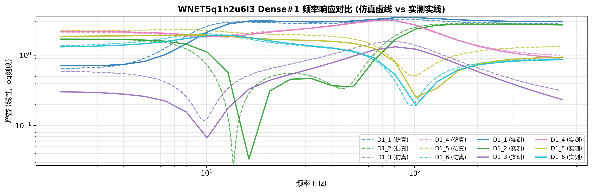
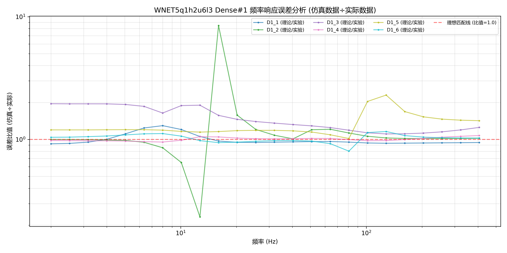
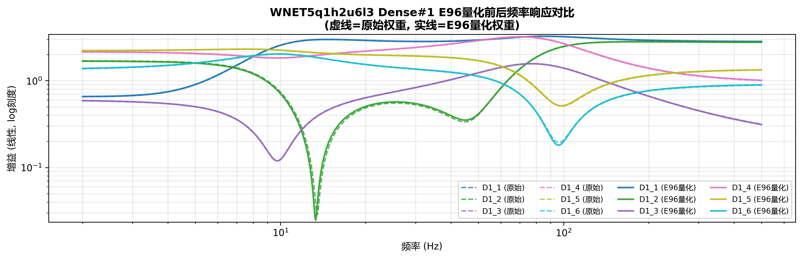
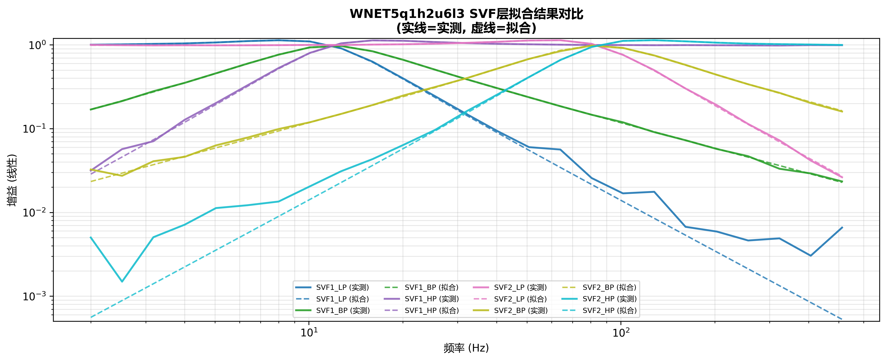
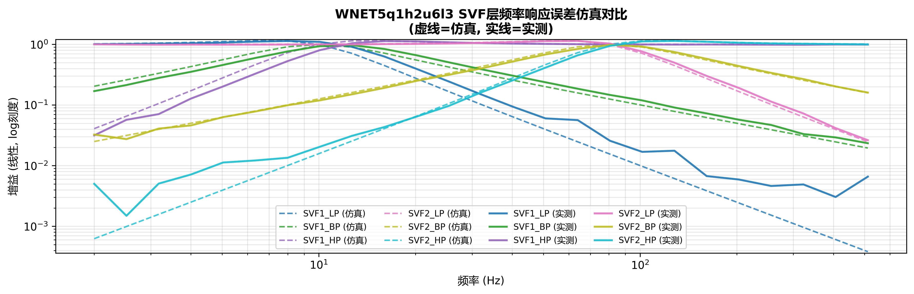
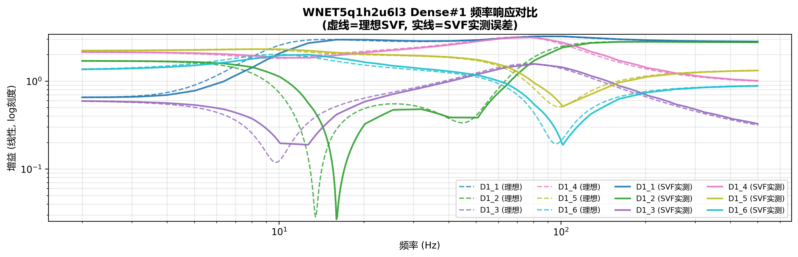

# WNET5 电路验证与误差分析报告

## 1. 概述

本报告展示了 WNET5q1h2u6l3 项目中 Dense 层 1 的电路验证结果，重点分析了仿真理论计算与实际测量之间的差异及其影响因素。

- **项目**: WNET5q1h2u6l3
- **分析层数**: 1
- **频率范围**: 2 - 500 Hz
- **SVF仿真模式**: 拟合传递函数
- **包含Dense层**: 是

---

## 2. 频率响应对比（仿真 vs 实测）

本章节对比了电路的理论仿真结果与实际测量数据，评估整体模型的准确性。

### 2.1 仿真与实测合并对比图

**设计目的**: 将仿真理论值与实验测量值合并在同一张图中进行对比，直观展示两者的一致性。
**横轴**: 频率 (Hz)，对数刻度
**纵轴**: 增益（线性），对数刻度
**数据曲线**: 虚线代表仿真理论值，实线代表实验测量值。
**数据来源**: 理论计算 + 实验测量数据

### 2.2 频率响应误差比值图

**设计目的**: 展示仿真理论值与实验测量值之间的误差比值（仿真/实验），用于精细化误差分析。
**横轴**: 频率 (Hz)，对数刻度
**纵轴**: 误差比值（线性），对数刻度
**数据曲线**: 每条曲线代表一个通道的误差比值，红色虚线为理想匹配线（比值=1.0）。
**数据来源**: 仿真数据 ÷ 实际测量数据

---

## 3. 误差因素分析

本章节深入探讨导致仿真与实测差异的各种因素，包括硬件量化误差和模拟电路参数偏差。

### 3.1 E96 量化影响分析

在实际电路实现中，电阻电容通常采用 E96 系列标准值，这会引入一定的量化误差。

**设计目的**: 对比 Dense 层权重在 E96 量化前后的频率响应差异，评估量化对精度的影响。
**横轴**: 频率 (Hz)，对数刻度
**纵轴**: 增益（线性），对数刻度
**数据曲线**: 虚线代表原始权重，实线代表 E96 量化后的权重。
**数据来源**: 原始权重计算 vs E96 量化权重计算

### 3.2 SVF 层误差对整体的影响

SVF（状态可变滤波器）作为电路的前级，其参数（中心频率、品质因数）的实际偏差会传递到最终输出。

#### 3.2.1 SVF 参数拟合验证

**设计目的**: 验证拟合传递函数是否能够准确描述实测 SVF 层的频率响应特性。
**数据曲线**: 实线为 Measured，虚线为 Fitted。
**拟合结果**: 
- 拟合中心频率: [11.83, 84.11] Hz
- 拟合品质因数: [0.9937, 0.9997]

#### 3.2.2 SVF 层原始误差分布

**设计目的**: 对比理想 SVF 层理论计算与实际测量之间的频率响应差异。
**纵轴**: 增益比值（理论/实测），单位 dB。

#### 3.2.3 SVF 误差对整体电路（SVF+Dense）的影响

**设计目的**: 展示当前级 SVF 存在实测误差时，对整体电路频率响应的最终影响。
**数据曲线**: 实线为 Ideal SVF + Dense，虚线为 Measured SVF + Dense。

---

## 4. 结论

本仿真通过对 SVF 层参数的拟合与 Dense 层权重的量化分析，得出以下结论：

1. **拟合质量**: 

   - 整体 RMSE: 0.004530
   - 整体 R²: 0.999846
   - 结论: 拟合良好 (R² > 0.99)

2. **误差来源**: 
   - 观察 3.1 节可知 E96 量化带来的偏差。
   - 观察 3.2.3 节可知 SVF 层参数偏差对最终输出的影响。

---

## 5. 其他生成图表

### Dense层理论频率响应图

**设计目的**: 展示Dense层输出的理论频率响应曲线（线性增益）。

**横轴**: 频率 (Hz)，对数刻度

**纵轴**: 增益（线性），对数刻度

**数据曲线**: 每个通道一条曲线，代表该通道在不同频率下的理论增益。

**数据来源**: 基于模型权重的理论计算

---

*报告生成时间: 2026-01-01 22:34:44*
