# 逐层偏置补偿工作流程

本文档描述了WaveNet5模型在SPICE电路实现中的逐层偏置补偿方法和流程。

## 补偿原理

通过逐层测量和补偿的方式，从第2层开始依次对前一层进行偏置补偿，最终实现对第1-3层的补偿。

## 详细流程图

```mermaid
graph TD
    Start([开始]) --> Step0[测试基准配置]
    
    Step0 --> Measure0[测量所有5层的偏置误差<br/>Layer 1 SVF: Error₁₀<br/>Layer 2: Error₂₀<br/>Layer 3: Error₃₀<br/>Layer 4: Error₄₀<br/>Layer 5: Error₅₀]
    
    Measure0 --> Step1[第1步: 补偿Layer 1]
    Step1 --> Comp1[使用Layer 2的输出误差Error₂₀<br/>计算Layer 1的补偿值<br/>Compensation₁ = -Error₂₀]
    Comp1 --> Apply1[应用补偿到Layer 1<br/>Layer 1 = Layer 1 + Compensation₁]
    Apply1 --> Test1[重新测试所有层误差]
    Test1 --> Measure1[Layer 1 SVF: Error₁₁ ≈ 0<br/>Layer 2: Error₂₁ ≈ Error₂₀<br/>Layer 3: Error₃₁<br/>Layer 4: Error₄₁<br/>Layer 5: Error₅₁]
    
    Measure1 --> Step2[第2步: 补偿Layer 2]
    Step2 --> Comp2[使用Layer 3的输出误差Error₃₁<br/>计算Layer 2的补偿值<br/>Compensation₂ = -Error₃₁]
    Comp2 --> Apply2[应用补偿到Layer 2<br/>Layer 2 = Layer 2 + Compensation₂]
    Apply2 --> Test2[重新测试所有层误差]
    Test2 --> Measure2[Layer 1 SVF: Error₁₂<br/>Layer 2: Error₂₂ ≈ 0<br/>Layer 3: Error₃₂ ≈ Error₃₁<br/>Layer 4: Error₄₂<br/>Layer 5: Error₅₂]
    
    Measure2 --> Step3[第3步: 补偿Layer 3]
    Step3 --> Comp3[使用Layer 4的输出误差Error₄₂<br/>计算Layer 3的补偿值<br/>Compensation₃ = -Error₄₂]
    Comp3 --> Apply3[应用补偿到Layer 3<br/>Layer 3 = Layer 3 + Compensation₃]
    Apply3 --> Test3[重新测试所有层误差]
    Test3 --> Measure3[Layer 1 SVF: Error₁₃<br/>Layer 2: Error₂₃<br/>Layer 3: Error₃₃ ≈ 0<br/>Layer 4: Error₄₃ ≈ Error₄₂<br/>Layer 5: Error₅₃ 显著降低]
    
    Measure3 --> End([完成补偿])
    
    style Start fill:#90EE90
    style End fill:#90EE90
    style Step0 fill:#FFE4B5
    style Step1 fill:#87CEEB
    style Step2 fill:#87CEEB
    style Step3 fill:#87CEEB
    style Comp1 fill:#DDA0DD
    style Comp2 fill:#DDA0DD
    style Comp3 fill:#DDA0DD
```



## 补偿步骤详解

### 步骤0: 基准测试
- 测试未做任何偏置补偿的原始配置
- 记录所有5层的偏置误差值
- **注意**: Layer 1 (SVF层)不进行直接补偿

### 步骤1: 补偿第1层
- **补偿源**: 使用第2层的输出误差
- **补偿方法**: 将第2层的偏置误差反向应用到第1层
- **效果**: 第1层输出的偏置误差被第2层的输入补偿抵消

### 步骤2: 补偿第2层  
- **补偿源**: 使用第3层的输出误差（已包含第1层补偿的影响）
- **补偿方法**: 将第3层的偏置误差反向应用到第2层
- **效果**: 第2层输出的偏置误差被第3层的输入补偿抵消

### 步骤3: 补偿第3层
- **补偿源**: 使用第4层的输出误差（已包含前两层补偿的影响）
- **补偿方法**: 将第4层的偏置误差反向应用到第3层
- **效果**: 第3层输出的偏置误差被第4层的输入补偿抵消

## 补偿效果

### 逐层改进示意

```
基准配置 (未补偿):
Layer 1 → Error₁₀ → Layer 2 → Error₂₀ → Layer 3 → Error₃₀ → Layer 4 → Error₄₀ → Layer 5 → Error₅₀

第1步后 (补偿Layer 1):
Layer 1 → ≈0 → Layer 2 → Error₂₁ → Layer 3 → Error₃₁ → Layer 4 → Error₄₁ → Layer 5 → Error₅₁

第2步后 (补偿Layer 1,2):  
Layer 1 → Error₁₂ → Layer 2 → ≈0 → Layer 3 → Error₃₂ → Layer 4 → Error₄₂ → Layer 5 → Error₅₂

第3步后 (补偿Layer 1,2,3):
Layer 1 → Error₁₃ → Layer 2 → Error₂₃ → Layer 3 → ≈0 → Layer 4 → Error₄₃ → Layer 5 → Error₅₃↓
```

### 关键观察

1. **级联效应**: 每层的补偿会影响后续所有层的误差
2. **误差传播**: 前层的补偿效果会累积传播到最终输出层
3. **整体改善**: 虽然只补偿了前3层，但第5层（输出层）的误差显著降低

## 实验结果

根据实际测试数据：

| 层 | 基准误差 | 补偿后误差 | 改进率 |
|---|---------|-----------|--------|
| Layer 1 (SVF) | <0.0001 | <0.0001 | 0.0% |
| Layer 2 | 0.006 | 0.001 | 80.0% |
| Layer 3 | 0.002 | 0.001 | 40.1% |
| Layer 4 | 0.002 | 0.0007 | 62.3% |
| Layer 5 | 0.068 | 0.009 | 86.8% |

## 技术要点

1. **SVF层特性**: 第1层作为SVF（State Variable Filter）层，其结构特殊，不直接进行偏置补偿
2. **补偿顺序**: 必须按照从低层到高层的顺序进行补偿
3. **误差测量**: 每次补偿后需要重新测量所有层的误差
4. **补偿值计算**: 补偿值通常是下一层输出误差的负值

## 实施建议

1. **自动化流程**: 建议开发自动化工具来执行逐层补偿流程
2. **实时监控**: 在每步补偿后监控所有层的误差变化
3. **验证机制**: 通过NN-SPICE-NumPy三重验证确保补偿准确性
4. **扩展性**: 考虑将补偿扩展到第4层以进一步改善输出

---

生成时间: 2025-07-13