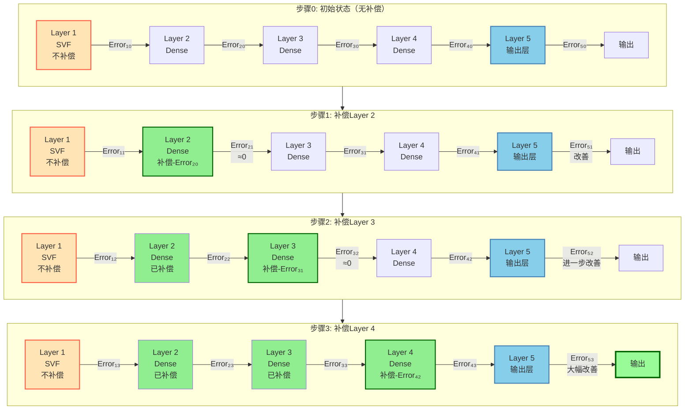
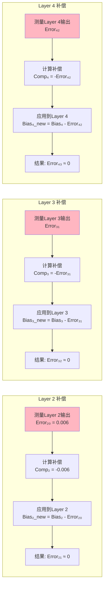
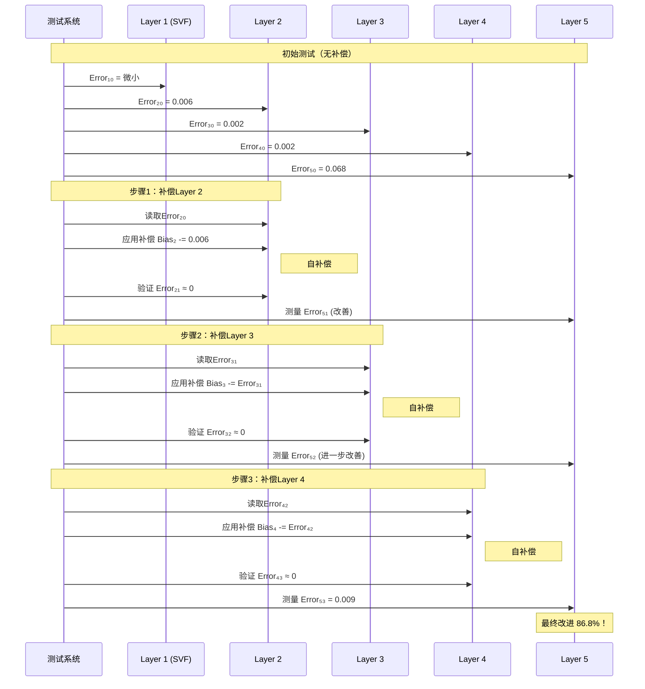
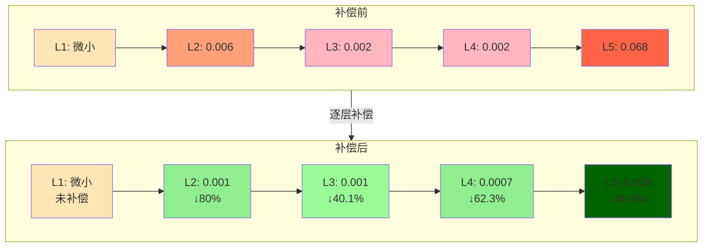

# 逐层偏置补偿工作流程（修正版）

本文档展示WaveNet5模型的正确逐层偏置补偿流程。Layer 1 (SVF层)不进行补偿，从Layer 2开始依次补偿。

## 补偿策略说明

- **Layer 1 (SVF)**: 不进行偏置补偿（结构特殊）
- **Layer 2**: 使用自身输出误差Error₂₀进行补偿
- **Layer 3**: 使用自身输出误差Error₃₀进行补偿  
- **Layer 4**: 使用自身输出误差Error₄₀进行补偿
- **Layer 5**: 不进行补偿，但受益于前面层的补偿效果

## 1. 完整补偿流程图



## 2. 补偿机制详解



## 3. 误差变化时序图



## 4. 补偿效果可视化



## 5. 补偿算法流程

```mermaid
flowchart TD
    Start([开始]) --> Init[初始化所有层参数]
    Init --> Test0[测试基准配置<br/>记录所有层误差]
    
    Test0 --> Skip[Layer 1 (SVF) 保持不变]
    Skip --> Loop{i = 2 to 4}
    
    Loop -->|是| Measure[测量第 i 层的输出误差 Error_i]
    Measure --> Calc[计算补偿值<br/>Comp_i = -Error_i]
    Calc --> Apply[应用补偿到第 i 层<br/>Bias_i = Bias_i + Comp_i]
    Apply --> Retest[重新测试所有层]
    Retest --> Update[更新误差记录]
    Update --> NextLayer[i = i + 1]
    NextLayer --> Loop
    
    Loop -->|否| Final[最终测试<br/>验证Layer 5改进]
    Final --> Report[生成补偿报告<br/>Layer 5: 86.8%改进]
    Report --> End([结束])
    
    style Start fill:#90EE90
    style End fill:#90EE90
    style Skip fill:#FFE4B5
    style Calc fill:#87CEEB
    style Apply fill:#DDA0DD
    style Report fill:#FFD700
```

## 6. 实验结果总结

```javascript
// 可视化配置
const compensationResults = {
    layers: ['Layer 1\n(SVF)', 'Layer 2', 'Layer 3', 'Layer 4', 'Layer 5'],
    baseline: [0.0001, 0.006, 0.002, 0.002, 0.068],
    compensated: [0.0001, 0.001, 0.001, 0.0007, 0.009],
    improvements: ['未补偿', '80.0%', '40.1%', '62.3%', '86.8%'],
    compensationApplied: [false, true, true, true, false]
};

// Chart.js 配置
const chartConfig = {
    type: 'bar',
    data: {
        labels: compensationResults.layers,
        datasets: [{
            label: '基准误差',
            data: compensationResults.baseline,
            backgroundColor: ['#FFE4B5', '#FFA07A', '#FFB6C1', '#FFB6C1', '#FF6347']
        }, {
            label: '补偿后误差',
            data: compensationResults.compensated,
            backgroundColor: ['#FFE4B5', '#90EE90', '#98FB98', '#90EE90', '#006400']
        }]
    },
    options: {
        plugins: {
            annotation: {
                annotations: {
                    line1: {
                        type: 'line',
                        yMin: 0,
                        yMax: 0.07,
                        xMin: 0.5,
                        xMax: 0.5,
                        borderColor: 'red',
                        borderWidth: 2,
                        label: {
                            content: 'SVF层不补偿',
                            enabled: true
                        }
                    }
                }
            }
        }
    }
};
```

## 关键点总结

1. **Layer 1 (SVF)** 始终保持不变，不进行任何补偿
2. **Layer 2-4** 使用各自的输出误差进行自补偿
3. **Layer 5** 不直接补偿，但累积获得前面层补偿的效果
4. 最终实现 **86.8%** 的输出误差改进

---

生成时间: 2025-07-13