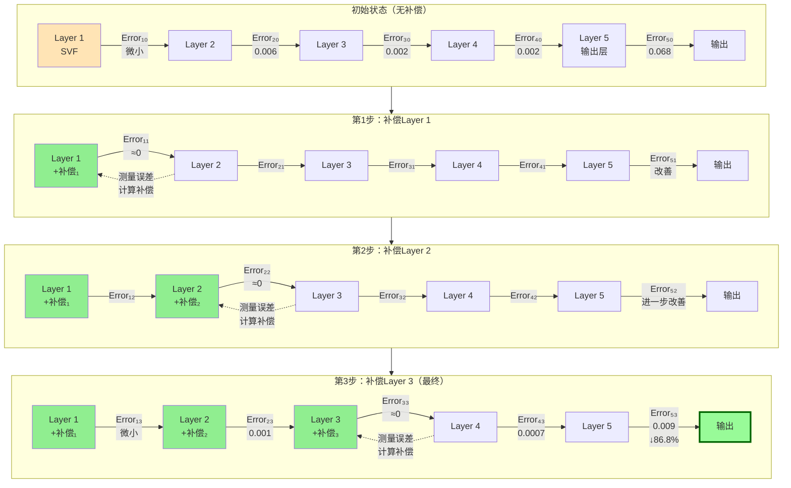
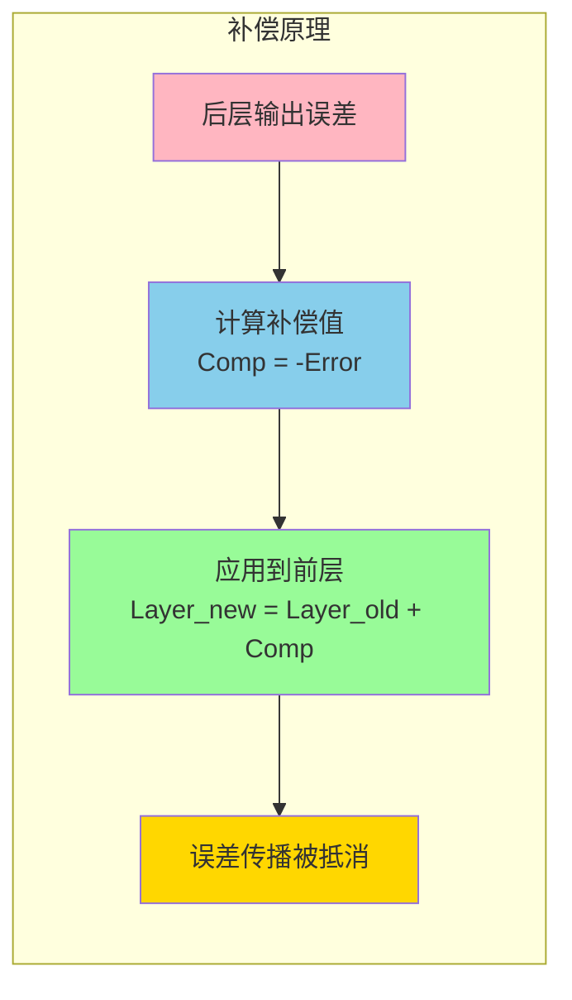
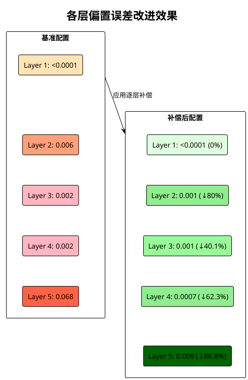
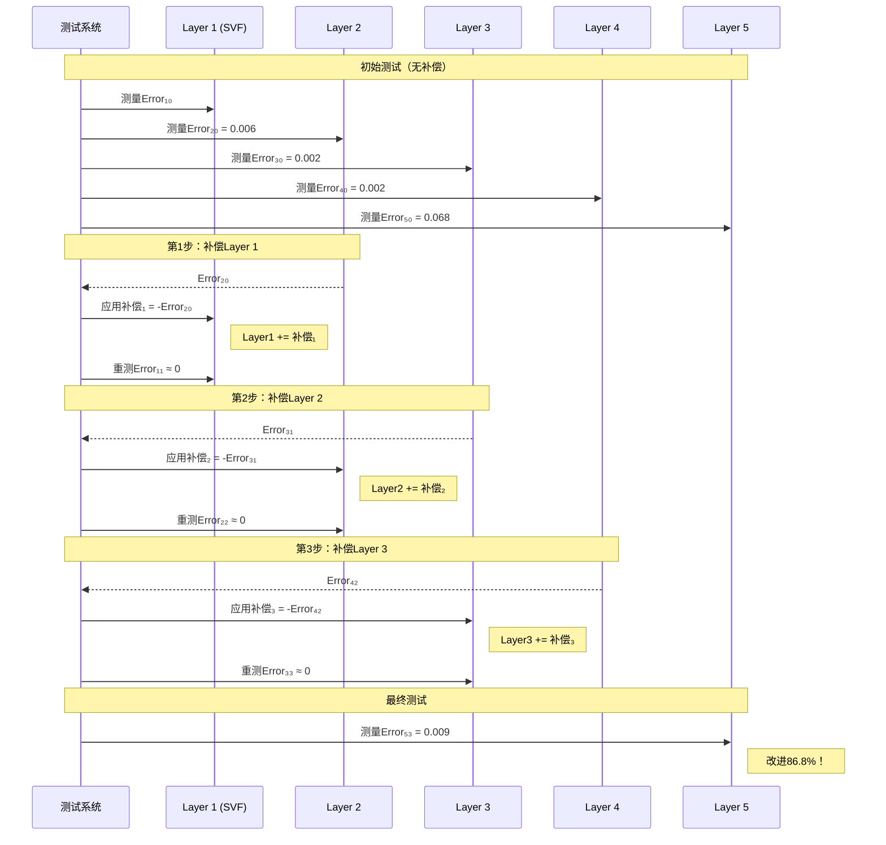
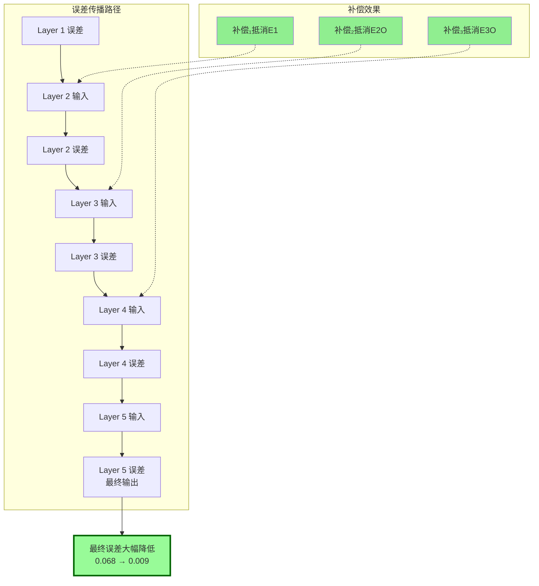

# 逐层偏置补偿图形化工作流程

本文档使用多种图形化技术展示WaveNet5模型的逐层偏置补偿流程。

## 1. 整体补偿流程图 (Mermaid)



## 2. 补偿机制示意图 (Mermaid)



## 3. 误差改进瀑布图 (PlantUML)



## 4. 补偿步骤时序图 (Mermaid)



## 5. 误差传播可视化 (Mermaid)



## 6. 改进效果柱状图 (Chart.js 配置)

```javascript
// 可用于生成交互式图表的配置
const chartConfig = {
    type: 'bar',
    data: {
        labels: ['Layer 1', 'Layer 2', 'Layer 3', 'Layer 4', 'Layer 5'],
        datasets: [{
            label: '基准误差',
            data: [0.0001, 0.006, 0.002, 0.002, 0.068],
            backgroundColor: '#FF6B6B',
            borderColor: '#C92A2A',
            borderWidth: 1
        }, {
            label: '补偿后误差',
            data: [0.0001, 0.001, 0.001, 0.0007, 0.009],
            backgroundColor: '#51CF66',
            borderColor: '#2B8A3E',
            borderWidth: 1
        }]
    },
    options: {
        responsive: true,
        plugins: {
            title: {
                display: true,
                text: '逐层偏置误差对比'
            },
            tooltip: {
                callbacks: {
                    afterLabel: function(context) {
                        if (context.datasetIndex === 1) {
                            const improvements = [0, 80.0, 40.1, 62.3, 86.8];
                            return `改进: ${improvements[context.dataIndex]}%`;
                        }
                    }
                }
            }
        },
        scales: {
            y: {
                beginAtZero: true,
                title: {
                    display: true,
                    text: '偏置误差'
                }
            }
        }
    }
};
```

## 7. 补偿算法流程 (Mermaid)

```mermaid
flowchart TD
    Start([开始]) --> Init[初始化所有层参数]
    Init --> Test0[测试基准配置<br/>记录所有层误差]
    
    Test0 --> Loop{i = 1 to 3}
    
    Loop -->|是| Measure[测量第 i+1 层的输出误差]
    Measure --> Calc[计算补偿值<br/>Comp_i = -Error_{i+1}]
    Calc --> Apply[应用补偿到第 i 层<br/>Layer_i += Comp_i]
    Apply --> Retest[重新测试所有层]
    Retest --> Update[更新误差记录]
    Update --> Loop
    
    Loop -->|否| Final[最终测试和验证]
    Final --> Report[生成补偿报告]
    Report --> End([结束])
    
    style Start fill:#90EE90
    style End fill:#90EE90
    style Calc fill:#87CEEB
    style Apply fill:#DDA0DD
    style Report fill:#FFD700
```

## 使用说明

1. **Mermaid图表**：可以在支持Mermaid的Markdown查看器中直接渲染（如GitHub、GitLab、VS Code等）
2. **PlantUML图表**：需要PlantUML支持，可以使用在线渲染器或IDE插件
3. **Chart.js配置**：可以在网页中使用Chart.js库生成交互式图表
4. **导出选项**：所有图表都可以导出为SVG、PNG等格式供文档使用

## 图表生成工具推荐

- **在线工具**：
  - [Mermaid Live Editor](https://mermaid.live/)
  - [PlantUML Web Server](http://www.plantuml.com/plantuml)
  - [Chart.js Playground](https://www.chartjs.org/docs/latest/samples/)

- **VS Code插件**：
  - Markdown Preview Mermaid Support
  - PlantUML
  - Markdown Preview Enhanced

- **其他工具**：
  - draw.io / diagrams.net
  - Lucidchart
  - Microsoft Visio

---

生成时间: 2025-07-13