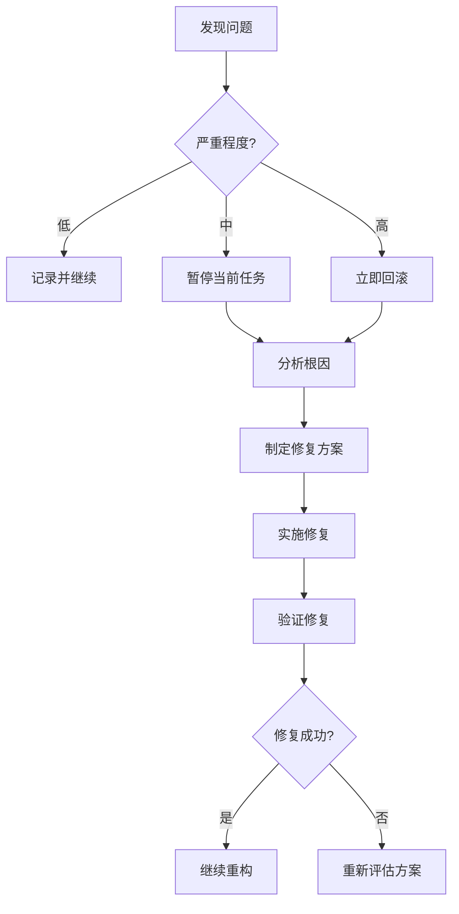

# Inference 模块重构风险分析报告

## 1. 执行摘要

本文档详细分析了 Inference 模块重构过程中的潜在风险，并提供了相应的监控和缓解措施。重构涉及1085行核心推理代码，影响6个超过300行的文件，风险等级评估为**中高**。

## 2. 风险矩阵

| 风险类别 | 发生概率 | 影响程度 | 风险等级 | 优先级 |
|---------|---------|---------|---------|--------|
| 功能回归 | 高 | 高 | 严重 | P0 |
| 接口不兼容 | 中 | 中 | 中 | P1 |
| 依赖冲突 | 低 | 高 | 中 | P2 |
| 数据精度损失 | 低 | 高 | 中 | P2 |
| 并发问题 | 低 | 中 | 低 | P3 |

## 3. 详细风险分析

### 3.1 功能回归风险

#### 3.1.1 相位修正逻辑破坏
**风险描述**：
- 当前相位修正在层级推理中即时应用
- 重构可能改变修正时机，导致错误传播

**潜在影响**：
```python
# 风险示例：修正时机错误
# 原始代码
layer_output = self._spice_simulate(layer_index, layer_input)
corrected_output = self._apply_immediate_phase_correction(layer_output, layer_index)
layer_results.append(corrected_output)  # 正确：修正后保存

# 错误的重构
layer_output = self._spice_simulate(layer_index, layer_input)
layer_results.append(layer_output)  # 错误：保存了未修正的数据
corrected_output = self._apply_immediate_phase_correction(layer_output, layer_index)
```

**监控措施**：
1. 在每层推理后验证数据符号
2. 记录相位修正的调用序列
3. 对比修正前后的数据范围

**缓解策略**：
```python
# 添加断言确保正确性
class SPICEBackend:
    def _infer_layer(self, layer_index, layer_input):
        output = self._spice_simulate(layer_index, layer_input)
        
        # 断言：Dense层输出应该被修正
        if layer_index in [2, 3, 4] and self._is_wavenet5_model():
            assert hasattr(self, '_phase_correction_applied'), \
                   f"Layer {layer_index} must apply phase correction"
        
        corrected = self._apply_immediate_phase_correction(output, layer_index)
        
        # 标记已应用修正
        self._phase_correction_applied = True
        
        return corrected
```

#### 3.1.2 数据范围检查遗漏
**风险描述**：
- 原代码中分散的print语句可能被遗漏
- 统一的工具类可能不完全覆盖所有场景

**检测方法**：
```python
# 自动检测print语句
import ast
import inspect

def find_print_statements(module):
    """查找模块中所有的print语句"""
    source = inspect.getsource(module)
    tree = ast.parse(source)
    
    print_calls = []
    for node in ast.walk(tree):
        if isinstance(node, ast.Call):
            if hasattr(node.func, 'id') and node.func.id == 'print':
                print_calls.append({
                    'line': node.lineno,
                    'content': ast.get_source_segment(source, node)
                })
    
    return print_calls
```

### 3.2 接口兼容性风险

#### 3.2.1 API 签名变化
**风险场景**：
```python
# 原始API
def process_inference(model, data, backend='nn'):
    pass

# 重构后可能变成
def process_inference(model, data, backend='nn', config=None):
    pass  # 添加了新参数
```

**兼容性保证**：
```python
# 使用装饰器保持兼容性
def backward_compatible(old_func):
    def wrapper(*args, **kwargs):
        # 检查是否使用旧API
        if len(args) == 3 and 'config' not in kwargs:
            # 旧API调用，添加默认config
            kwargs['config'] = None
            warnings.warn(
                "Using deprecated API, please pass config parameter",
                DeprecationWarning
            )
        return old_func(*args, **kwargs)
    return wrapper
```

### 3.3 依赖关系风险

#### 3.3.1 循环依赖
**风险描述**：
- 模块拆分可能引入循环依赖
- 特别是processor和data_processing之间

**检测工具**：
```python
# scripts/check_circular_deps.py
import importlib
import sys
from collections import defaultdict

def check_circular_dependencies(module_name):
    """检查模块的循环依赖"""
    imported = defaultdict(set)
    
    def trace_imports(name, chain=[]):
        if name in chain:
            print(f"循环依赖检测: {' -> '.join(chain)} -> {name}")
            return True
        
        try:
            module = importlib.import_module(name)
            for attr in dir(module):
                obj = getattr(module, attr)
                if hasattr(obj, '__module__'):
                    imported[name].add(obj.__module__)
            
            for imp in imported[name]:
                if imp.startswith('inference.'):
                    if trace_imports(imp, chain + [name]):
                        return True
        except:
            pass
        
        return False
    
    return trace_imports(module_name)
```

### 3.4 数据精度风险

#### 3.4.1 浮点运算顺序改变
**风险描述**：
- 重构可能改变运算顺序
- 导致微小的数值差异累积

**验证方法**：
```python
class TestNumericalStability:
    def test_operation_order_sensitivity(self):
        """测试运算顺序敏感性"""
        # 大数和小数的加法顺序
        large = 1e10
        small = 1e-10
        
        # 不同顺序可能产生不同结果
        result1 = (large + small) - large
        result2 = large - large + small
        
        # 记录差异以供分析
        if result1 != result2:
            logging.warning(
                f"运算顺序敏感: {result1} vs {result2}"
            )
```

## 4. 代码备份策略

### 4.1 备份方案

```bash
#!/bin/bash
# scripts/backup_inference.sh

echo "备份 inference 模块..."

# 1. 创建备份目录
mkdir -p inference/backup

# 2. 复制所有Python文件
cp inference/*.py inference/backup/

# 3. 记录备份信息
echo "备份时间: $(date)" > inference/backup/README.md
echo "备份原因: 重构前备份" >> inference/backup/README.md
echo "Git commit: $(git rev-parse HEAD)" >> inference/backup/README.md

echo "备份完成，文件保存在 inference/backup/"
```

### 4.2 备份使用原则

1. **仅作参考**：备份文件仅用于对比参考，不参与实际运行
2. **不混放代码**：新旧代码严格分离，避免混淆
3. **及时清理**：重构完成验证后，删除备份目录

## 5. 应急响应计划

### 5.1 问题升级流程



### 5.2 问题处理步骤

1. **立即停止**：发现严重问题立即停止当前重构
2. **分析原因**：定位问题根源
3. **修复方案**：制定针对性的修复方案
4. **验证修复**：确保问题已解决
5. **继续重构**：问题解决后继续进行

## 6. 风险缓解时间表

| 阶段 | 时间 | 主要风险 | 缓解措施 |
|------|------|---------|---------|
| 准备期 | 第1周 | 理解不充分 | 深入代码审查，创建文档 |
| 实施期 | 第2-3周 | 功能破坏 | 增量修改，充分测试 |
| 验证期 | 第4周 | 遗漏问题 | 全面回归测试 |
| 部署期 | 第5周 | 生产问题 | 灰度发布，监控 |

## 7. 成功标准与验收

### 7.1 技术指标
- [ ] 所有单元测试通过
- [ ] 集成测试覆盖率 > 80%
- [ ] 功能测试全部通过
- [ ] 无新增严重bug

### 7.2 功能指标
- [ ] 推理结果精度保持（误差 < 1e-6）
- [ ] API向后兼容
- [ ] 文档更新完整
- [ ] 代码审查通过

## 8. 经验教训库

### 8.1 常见陷阱
1. **过早优化**：先保证正确性，再优化性能
2. **大步重构**：增量修改更安全
3. **测试不足**：每个修改都要有对应测试
4. **忽视边界情况**：特别注意空数据、异常值

### 8.2 最佳实践
1. **保持可追溯性**：每次修改都要有清晰的提交信息
2. **及时沟通**：发现风险立即上报
3. **文档先行**：先更新文档，再修改代码
4. **持续验证**：每完成一小步就验证一次