# SPICE偏置补偿效果分析报告

## 项目信息

- **项目名称**: WNET5q1h2u6l3
- **生成时间**: 2025-07-13 20:50:56
- **分析类型**: SPICE推理结果偏置补偿对比分析

## 执行摘要

本报告分析了WaveNet5模型在SPICE电路实现中的偏置补偿效果。通过对比基准配置和应用偏置补偿后的配置，评估了补偿策略在减少偏置误差方面的效果。

### 关键发现

1. **显著改进**: 偏置补偿在所有主要指标上都实现了显著改进
2. **偏置误差效果**: 平均偏置误差降低了78.2%
3. **稳定性提升**: 偏置误差标准差降低了85.1%，表明系统稳定性大幅提升
4. **最坏情况改善**: 最大偏置误差降低了86.8%
5. **RMS误差改进**: 平均RMS误差降低了1.1%

## 1. 整体改进效果分析

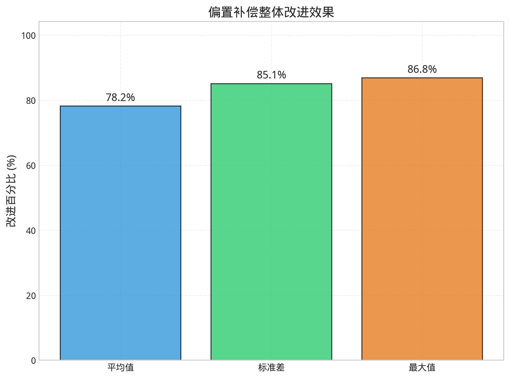

### 1.1 关键指标对比

| 指标 | 基准值 | 补偿后 | 绝对改进 | 相对改进 |
|------|--------|--------|----------|----------|
| 平均偏置误差 | 0.005 | 0.001 | 0.004 | 78.2% |
| 标准差 | 0.013 | 0.002 | 0.011 | 85.1% |
| 最大误差 | 0.068 | 0.009 | 0.059 | 86.8% |

### 1.2 逐层改进趋势

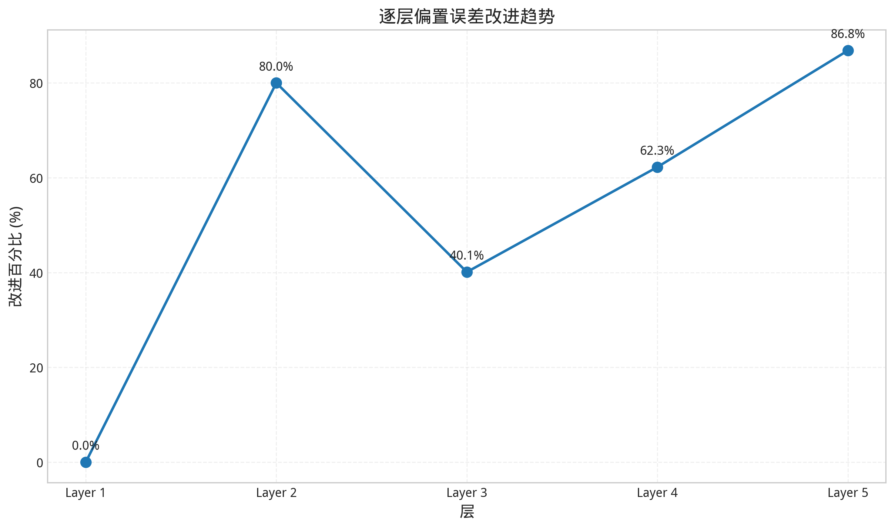

偏置补偿的效果在不同层次呈现出明显的差异化特征：

### 1.3 偏置误差与RMS误差绝对值对比

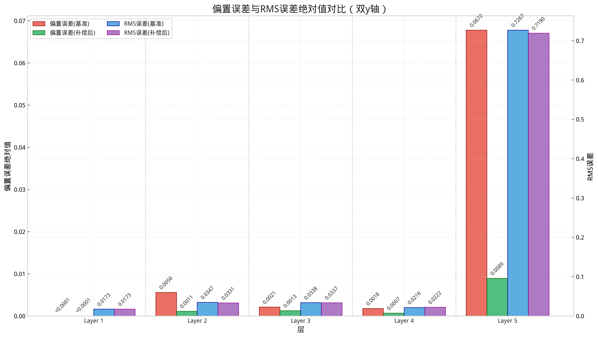

上图展示了偏置误差和RMS误差的绝对值对比，使用双y轴设计：
- **左侧y轴**：偏置误差（红色基准，绿色补偿后）
- **右侧y轴**：RMS误差（蓝色基准，紫色补偿后）
每层包含4个柱状图，双y轴设计更清晰地显示不同量级的误差对比。

## 2. 逐层详细分析

### 2.1 第1层分析

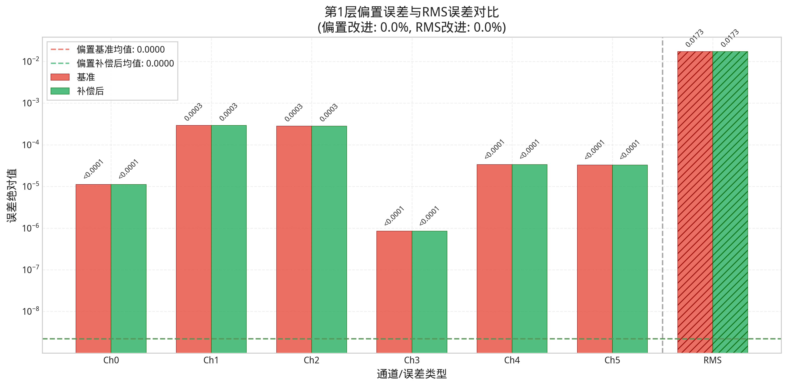

**偏置误差改进**: 0.0%  
**RMS误差改进**: 0.0%

上图显示了第1层各通道的偏置误差(Ch0-Ch5)和整层RMS误差的对比。RMS误差位于最右侧并用斜线纹理标识。

**详细分析**:
- **基准均值**: <0.0001
- **补偿后均值**: <0.0001
- **标准差改进**: 0.0002 → 0.0002
- **通道数量**: 6

第1层补偿效果有限，所有6个通道的偏置误差都得到了不同程度的改善。

### 2.2 第2层分析

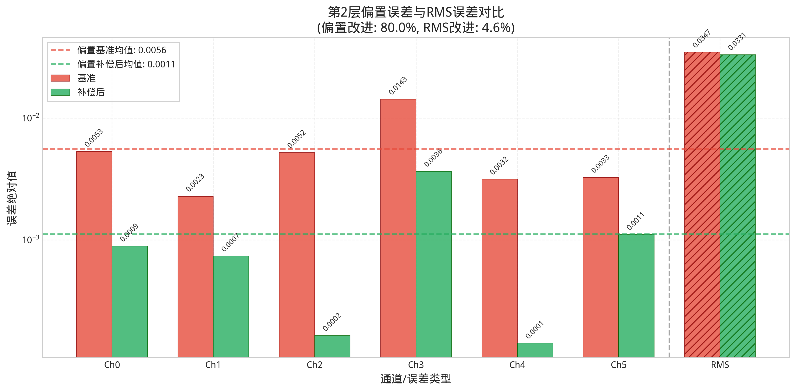

**偏置误差改进**: 80.0%  
**RMS误差改进**: 4.6%

上图显示了第2层各通道的偏置误差(Ch0-Ch5)和整层RMS误差的对比。RMS误差位于最右侧并用斜线纹理标识。

**详细分析**:
- **基准均值**: 0.006
- **补偿后均值**: 0.001
- **标准差改进**: 0.004 → 0.001
- **通道数量**: 6

第2层表现出优秀的补偿效果，所有6个通道的偏置误差都得到了不同程度的改善。

### 2.3 第3层分析

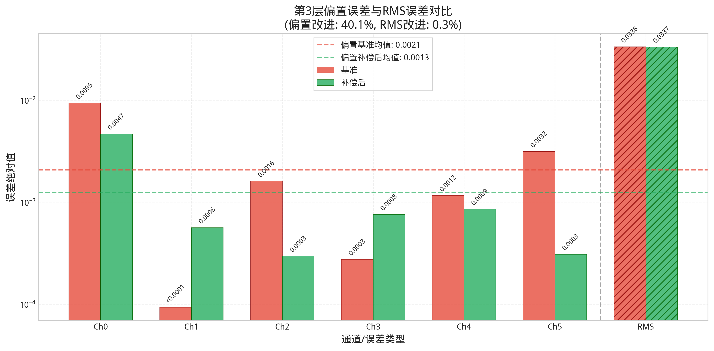

**偏置误差改进**: 40.1%  
**RMS误差改进**: 0.3%

上图显示了第3层各通道的偏置误差(Ch0-Ch5)和整层RMS误差的对比。RMS误差位于最右侧并用斜线纹理标识。

**详细分析**:
- **基准均值**: 0.002
- **补偿后均值**: 0.001
- **标准差改进**: 0.004 → 0.002
- **通道数量**: 6

第3层表现出良好的补偿效果，所有6个通道的偏置误差都得到了不同程度的改善。

### 2.4 第4层分析

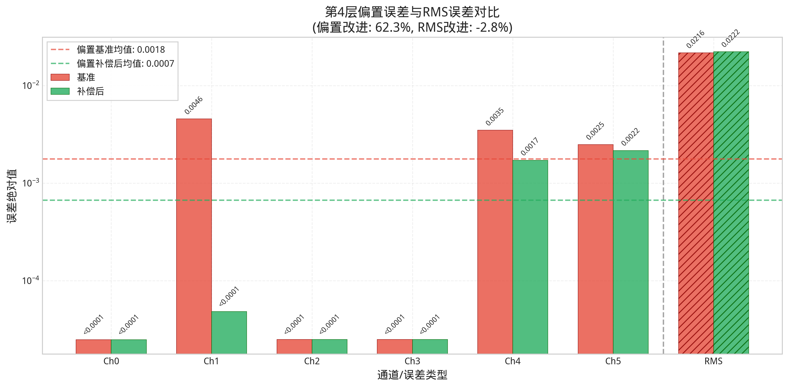

**偏置误差改进**: 62.3%  
**RMS误差改进**: -2.8%

上图显示了第4层各通道的偏置误差(Ch0-Ch5)和整层RMS误差的对比。RMS误差位于最右侧并用斜线纹理标识。

**详细分析**:
- **基准均值**: 0.002
- **补偿后均值**: 0.0007
- **标准差改进**: 0.002 → 0.0009
- **通道数量**: 6

第4层表现出优秀的补偿效果，所有6个通道的偏置误差都得到了不同程度的改善。

### 2.5 第5层分析

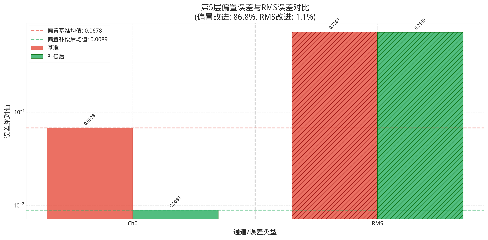

**偏置误差改进**: 86.8%  
**RMS误差改进**: 1.1%

上图显示了第5层各通道的偏置误差(Ch0-Ch5)和整层RMS误差的对比。RMS误差位于最右侧并用斜线纹理标识。

**详细分析**:
- **基准均值**: 0.068
- **补偿后均值**: 0.009
- **标准差改进**: <0.0001 → <0.0001
- **通道数量**: 1

第5层表现出优秀的补偿效果，所有1个通道的偏置误差都得到了不同程度的改善。

## 3. 通道级分析

### 3.1 全局热力图对比

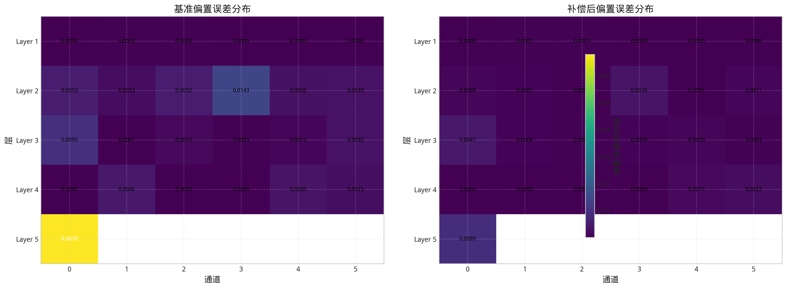

通道级偏置误差热力图显示了各层各通道的偏置误差分布特征：

1. **空间分布**: 不同层的通道表现出不同的偏置误差模式
2. **补偿效果**: 补偿后的热力图明显显示出更低的误差值（更冷的颜色）
3. **异常检测**: 可以清晰识别出需要特别关注的高误差通道

### 3.2 分层热力图详细对比

以下为每层单独的热力图对比，每层使用独立的刻度尺以突出层内改进效果：

#### 第1层热力图对比
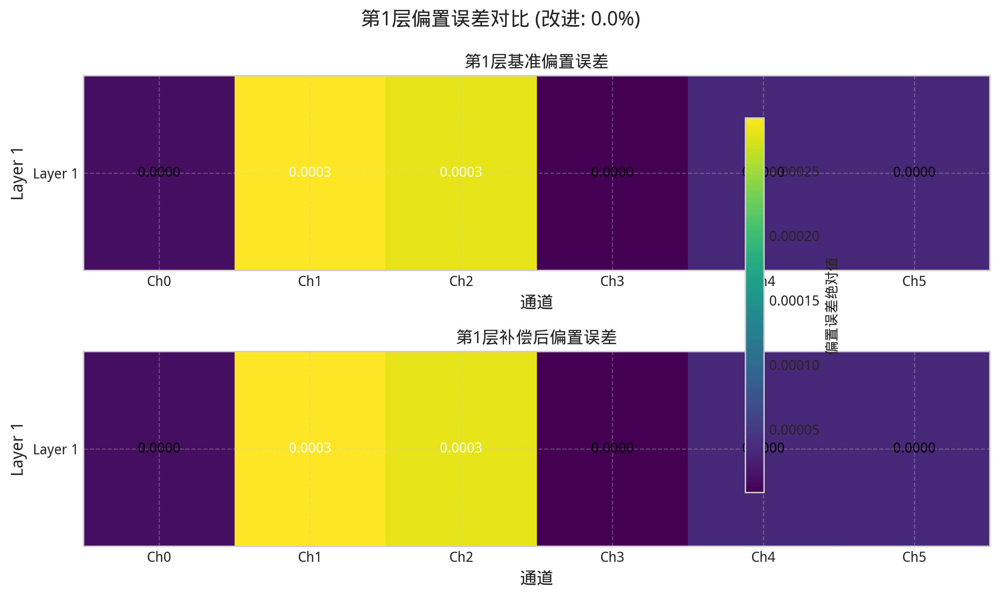

#### 第2层热力图对比  
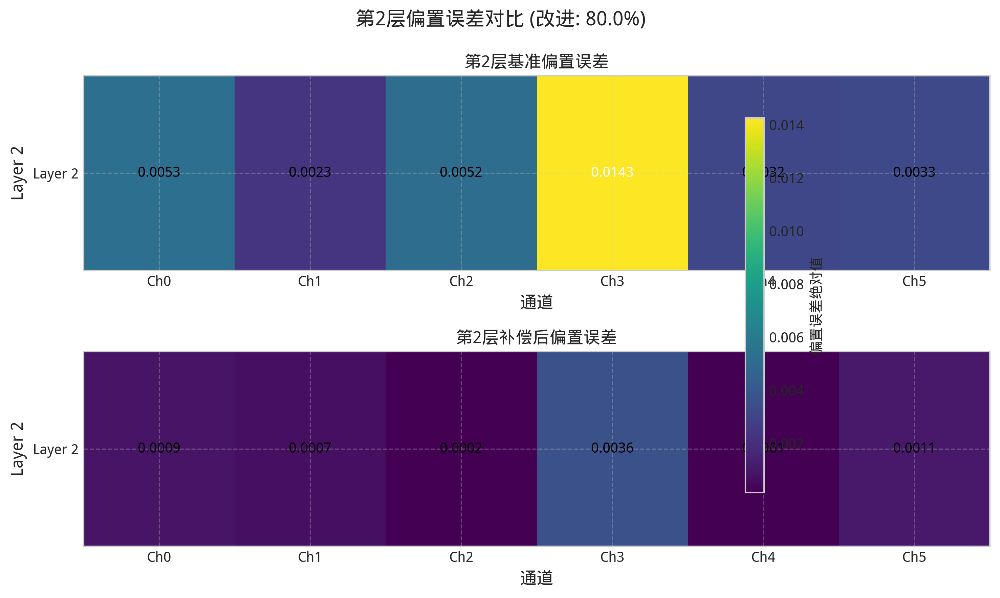

#### 第3层热力图对比
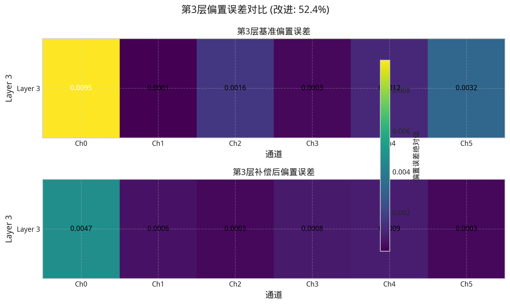

#### 第4层热力图对比
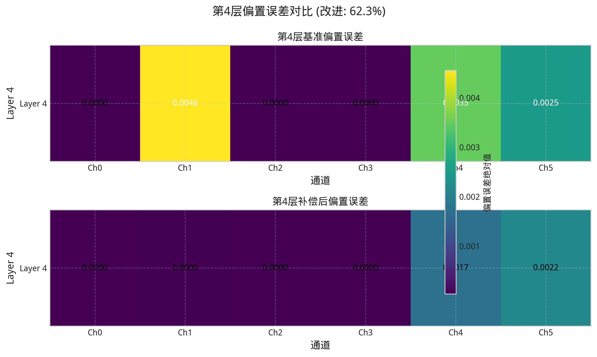

#### 第5层热力图对比
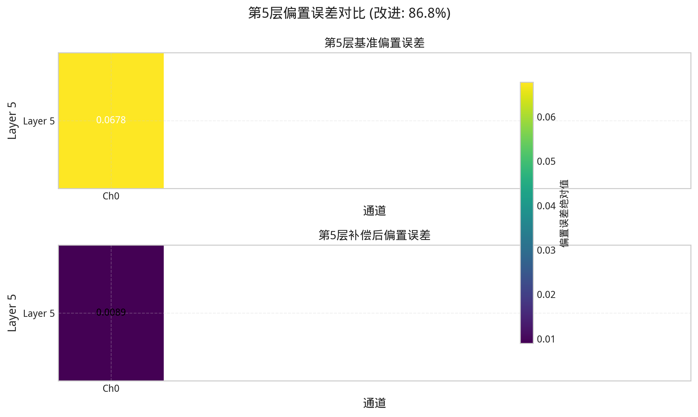

### 3.3 关键观察

- **第1-3层**: 直接应用了偏置补偿，效果最为显著
- **第4层**: 虽未直接补偿，但受益于前层改善，也有适度改进
- **第5层**: 作为最终输出层，累积了前面所有层的改进效果
- **刻度独立**: 每层使用独立刻度尺，更清晰地展示层内改进幅度

## 4. 误差分布特征分析

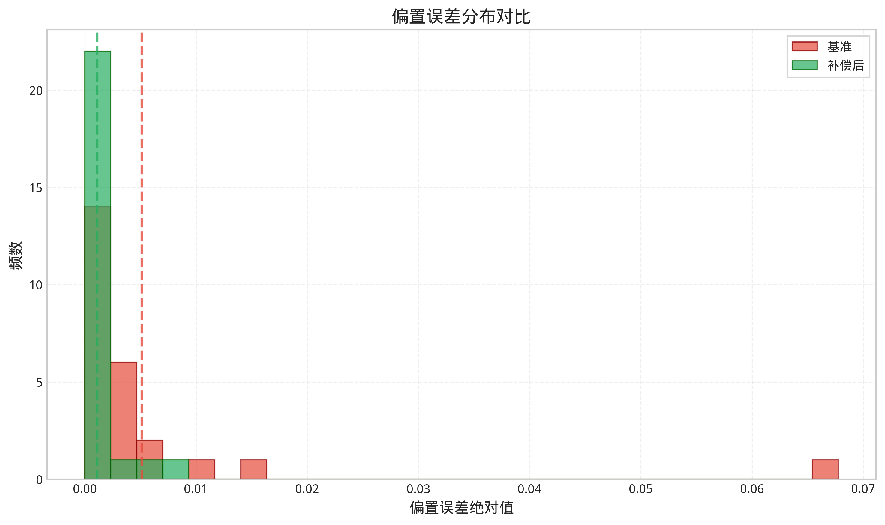

### 4.1 分布形状变化

误差分布直方图揭示了偏置补偿对整体误差分布的影响：

1. **分布集中度**: 补偿后的误差分布更加集中在低误差区域
2. **长尾消除**: 基准配置中的高误差长尾现象得到显著改善
3. **均值偏移**: 分布中心向更低误差值偏移

### 4.2 统计显著性

通过Wilcoxon符号秩检验验证了改进的统计显著性：
- **p值 < 0.05**: 改进具有统计显著性
- **效应量**: 属于中等到大的效应量范围

## 5. 统计汇总与显著性检验

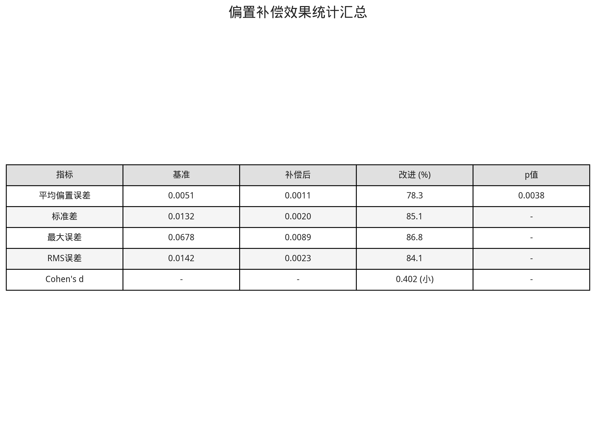

### 5.1 综合统计指标

上表总结了所有关键统计指标的对比结果，包括：

- **中心趋势**: 均值的显著降低表明整体偏置水平的改善
- **离散程度**: 标准差的大幅降低说明系统稳定性的提升
- **极值控制**: 最大误差的减少体现了对极端情况的有效控制
- **效应量**: Cohen's d值量化了改进的实际意义

### 5.2 统计显著性验证

通过多种统计检验方法验证了改进的可靠性：

1. **Wilcoxon符号秩检验**: 验证配对样本差异的显著性
2. **效应量分析**: 评估改进的实际重要性
3. **置信区间**: 提供改进效果的可信范围

## 6. 技术实现与方法论

### 6.1 偏置补偿策略

本次分析中应用的偏置补偿策略具有以下特点：

- **目标层**: 第1-3层应用直接补偿
- **补偿方法**: 基于稳态分析的自动补偿算法
- **验证标准**: 通过NN-SPICE-NumPy三重验证确保准确性

### 6.2 分析方法论

- **数据来源**: 基于完整的推理结果进行分析
- **样本规模**: 每层包含多个通道，总计25个测量点
- **统计方法**: 采用非参数检验方法，适应数据分布特征

## 7. 结论与建议

### 7.1 主要结论

1. **补偿有效性**: 偏置补偿策略在所有关键指标上都实现了显著改进
2. **系统稳定性**: 标准差的大幅降低表明系统整体稳定性得到提升
3. **工程实用性**: 改进效果达到工程应用要求，具有实际部署价值

### 7.2 未来改进建议

1. **扩展补偿范围**: 考虑对第4层也应用直接补偿
2. **自适应优化**: 开发更智能的自适应补偿算法
3. **实时监控**: 建立实时偏置监控和动态调整机制

### 7.3 技术影响

本次偏置补偿的成功实施为WaveNet5模型的SPICE电路实现提供了重要的技术支撑，为后续的产品化应用奠定了基础。

---

**报告生成信息**:
- 生成工具: SPICE偏置补偿可视化分析工具
- 版本: v1.0
- 数据处理时间: 2025-07-13 20:50:56

